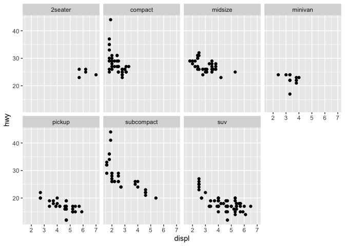
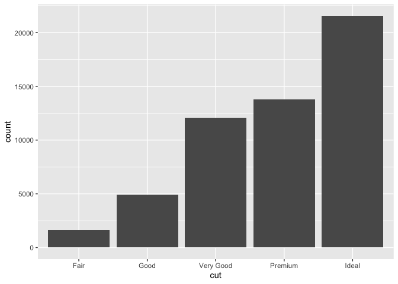
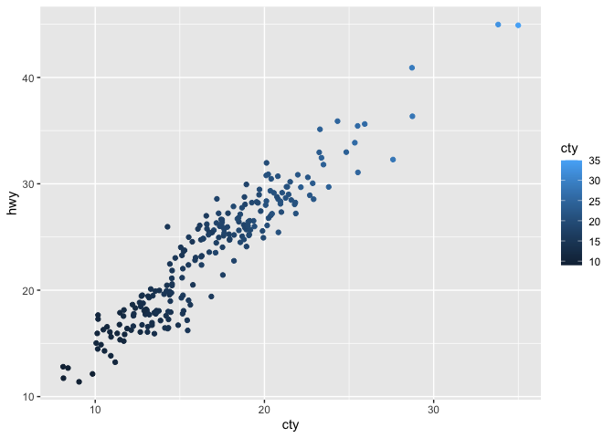
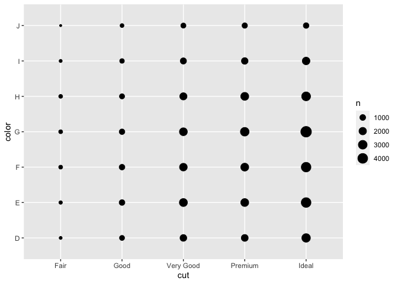

R-For-Data-Science-§1:10
================
Evan-Woods
2023-11-10

## Libraries

``` r
if (!require(dplyr)) install.packages("dplyr")
```

    ## Loading required package: dplyr

    ## 
    ## Attaching package: 'dplyr'

    ## The following objects are masked from 'package:stats':
    ## 
    ##     filter, lag

    ## The following objects are masked from 'package:base':
    ## 
    ##     intersect, setdiff, setequal, union

``` r
# if (!require(stargazer)) install.packages("stargazer")
if (!require(tidyverse)) install.packages("tidyverse")
```

    ## Loading required package: tidyverse

    ## ── Attaching core tidyverse packages ──────────────────────── tidyverse 2.0.0 ──
    ## ✔ forcats   1.0.0     ✔ readr     2.1.4
    ## ✔ ggplot2   3.4.4     ✔ stringr   1.5.1
    ## ✔ lubridate 1.9.3     ✔ tibble    3.2.1
    ## ✔ purrr     1.0.2     ✔ tidyr     1.3.0
    ## ── Conflicts ────────────────────────────────────────── tidyverse_conflicts() ──
    ## ✖ dplyr::filter() masks stats::filter()
    ## ✖ dplyr::lag()    masks stats::lag()
    ## ℹ Use the conflicted package (<http://conflicted.r-lib.org/>) to force all conflicts to become errors

``` r
if(!require(nycflights13)) install.packages("nycflights13")
```

    ## Loading required package: nycflights13

``` r
# if (!require(shiny)) install.packages("shiny")
# if(!require(Lahman)) install.packages("Lahman")
if(!require(ggplot2)) install.packages("ggplot2")
# if(!require(EnvStats)) install.packages("EnvStats")
# library(EnvStats)
library(tidyverse)
```

## R Markdown

This is an R Markdown document. Markdown is a simple formatting syntax
for authoring HTML, PDF, and MS Word documents. For more details on
using R Markdown see <http://rmarkdown.rstudio.com>.

When you click the **Knit** button a document will be generated that
includes both content as well as the output of any embedded R code
chunks within the document. You can embed an R code chunk like this:

``` r
summary(cars)
```

    ##      speed           dist       
    ##  Min.   : 4.0   Min.   :  2.00  
    ##  1st Qu.:12.0   1st Qu.: 26.00  
    ##  Median :15.0   Median : 36.00  
    ##  Mean   :15.4   Mean   : 42.98  
    ##  3rd Qu.:19.0   3rd Qu.: 56.00  
    ##  Max.   :25.0   Max.   :120.00

``` r
# knitr::knit_exit()
```

## Including Plots

You can also embed plots, for example:

<!-- -->

Note that the `echo = FALSE` parameter was added to the code chunk to
prevent printing of the R code that generated the plot.

## 3.1 Data Visualization

### 3.1.1 Prerequisites

``` r
mpg <- mpg
```

``` r
?mpg
```

``` r
ggplot(data = mpg) +
  geom_point(aes(displ, hwy))
```

<!-- -->

``` r
#ggplot(data = <DATA>) + 
#  <GEOM_FUNCTION>(mapping = aes(<MAPPINGS>))
```

``` r
ggplot(data = mpg)
```

<!-- -->

``` r
mpg
```

    ## # A tibble: 234 × 11
    ##    manufacturer model      displ  year   cyl trans drv     cty   hwy fl    class
    ##    <chr>        <chr>      <dbl> <int> <int> <chr> <chr> <int> <int> <chr> <chr>
    ##  1 audi         a4           1.8  1999     4 auto… f        18    29 p     comp…
    ##  2 audi         a4           1.8  1999     4 manu… f        21    29 p     comp…
    ##  3 audi         a4           2    2008     4 manu… f        20    31 p     comp…
    ##  4 audi         a4           2    2008     4 auto… f        21    30 p     comp…
    ##  5 audi         a4           2.8  1999     6 auto… f        16    26 p     comp…
    ##  6 audi         a4           2.8  1999     6 manu… f        18    26 p     comp…
    ##  7 audi         a4           3.1  2008     6 auto… f        18    27 p     comp…
    ##  8 audi         a4 quattro   1.8  1999     4 manu… 4        18    26 p     comp…
    ##  9 audi         a4 quattro   1.8  1999     4 auto… 4        16    25 p     comp…
    ## 10 audi         a4 quattro   2    2008     4 manu… 4        20    28 p     comp…
    ## # ℹ 224 more rows

``` r
# Scatterplot of hwy vs cyl
ggplot(mpg) +
  geom_point(aes(class, drv))
```

<!-- -->

``` r
ggplot(mpg) +
  geom_point(aes(hwy, displ, color = class))
```

<!-- -->

``` r
ggplot(mpg) + 
  geom_point(aes(hwy, displ, size = class))
```

    ## Warning: Using size for a discrete variable is not advised.

<!-- -->

``` r
ggplot(mpg) +
  geom_point(aes(hwy, displ, alpha = class))
```

    ## Warning: Using alpha for a discrete variable is not advised.

<!-- -->

``` r
ggplot(data = mpg) + 
  geom_point(aes(x = displ, y = hwy), color = "blue")
```

<!-- -->

``` r
# [Shapes](https://d33wubrfki0l68.cloudfront.net/cc94c11128cb951a9fd833667d7c8e726cde8448/b3728/visualize_files/figure-html/shapes-1.png)
ggplot(mpg) + 
  geom_point(aes(displ, hwy), shape = 1)
```

<!-- -->

``` r
str(mpg)
```

    ## tibble [234 × 11] (S3: tbl_df/tbl/data.frame)
    ##  $ manufacturer: chr [1:234] "audi" "audi" "audi" "audi" ...
    ##  $ model       : chr [1:234] "a4" "a4" "a4" "a4" ...
    ##  $ displ       : num [1:234] 1.8 1.8 2 2 2.8 2.8 3.1 1.8 1.8 2 ...
    ##  $ year        : int [1:234] 1999 1999 2008 2008 1999 1999 2008 1999 1999 2008 ...
    ##  $ cyl         : int [1:234] 4 4 4 4 6 6 6 4 4 4 ...
    ##  $ trans       : chr [1:234] "auto(l5)" "manual(m5)" "manual(m6)" "auto(av)" ...
    ##  $ drv         : chr [1:234] "f" "f" "f" "f" ...
    ##  $ cty         : int [1:234] 18 21 20 21 16 18 18 18 16 20 ...
    ##  $ hwy         : int [1:234] 29 29 31 30 26 26 27 26 25 28 ...
    ##  $ fl          : chr [1:234] "p" "p" "p" "p" ...
    ##  $ class       : chr [1:234] "compact" "compact" "compact" "compact" ...

``` r
ggplot(mpg) +
  geom_point(aes(displ, hwy,  color = trans))
```

<!-- -->

``` r
ggplot(mpg) + 
  geom_point(aes(displ, hwy, color = year, alpha = year))
```

<!-- -->

``` r
  labs(color = mpg$year)
```

    ## $colour
    ##   [1] 1999 1999 2008 2008 1999 1999 2008 1999 1999 2008 2008 1999 1999 2008 2008
    ##  [16] 1999 2008 2008 2008 2008 2008 1999 2008 1999 1999 2008 2008 2008 2008 2008
    ##  [31] 1999 1999 1999 2008 1999 2008 2008 1999 1999 1999 1999 2008 2008 2008 1999
    ##  [46] 1999 2008 2008 2008 2008 1999 1999 2008 2008 2008 1999 1999 1999 2008 2008
    ##  [61] 2008 1999 2008 1999 2008 2008 2008 2008 2008 2008 1999 1999 2008 1999 1999
    ##  [76] 1999 2008 1999 1999 1999 2008 2008 1999 1999 1999 1999 1999 2008 1999 2008
    ##  [91] 1999 1999 2008 2008 1999 1999 2008 2008 2008 1999 1999 1999 1999 1999 2008
    ## [106] 2008 2008 2008 1999 1999 2008 2008 1999 1999 2008 1999 1999 2008 2008 2008
    ## [121] 2008 2008 2008 2008 1999 1999 2008 2008 2008 2008 1999 2008 2008 1999 1999
    ## [136] 1999 2008 1999 2008 2008 1999 1999 1999 2008 2008 2008 2008 1999 1999 2008
    ## [151] 1999 1999 2008 2008 1999 1999 1999 2008 2008 1999 1999 2008 2008 2008 2008
    ## [166] 1999 1999 1999 1999 2008 2008 2008 2008 1999 1999 1999 1999 2008 2008 1999
    ## [181] 1999 2008 2008 1999 1999 2008 1999 1999 2008 2008 1999 1999 2008 1999 1999
    ## [196] 1999 2008 2008 1999 2008 1999 1999 2008 1999 1999 2008 2008 1999 1999 2008
    ## [211] 2008 1999 1999 1999 1999 2008 2008 2008 2008 1999 1999 1999 1999 1999 1999
    ## [226] 2008 2008 1999 1999 2008 2008 1999 1999 2008
    ## 
    ## attr(,"class")
    ## [1] "labels"

``` r
ggplot(mpg) + 
  geom_point(aes(displ, hwy, stroke = 5))
```

<!-- -->

``` r
?aes
```

``` r
?geom_point
```

## Section 3.5: Facets

``` r
ggplot(data = mpg) + 
  geom_point(aes(displ, hwy)) + 
  facet_wrap(~ model)
```

<!-- -->

``` r
str(mpg)
```

    ## tibble [234 × 11] (S3: tbl_df/tbl/data.frame)
    ##  $ manufacturer: chr [1:234] "audi" "audi" "audi" "audi" ...
    ##  $ model       : chr [1:234] "a4" "a4" "a4" "a4" ...
    ##  $ displ       : num [1:234] 1.8 1.8 2 2 2.8 2.8 3.1 1.8 1.8 2 ...
    ##  $ year        : int [1:234] 1999 1999 2008 2008 1999 1999 2008 1999 1999 2008 ...
    ##  $ cyl         : int [1:234] 4 4 4 4 6 6 6 4 4 4 ...
    ##  $ trans       : chr [1:234] "auto(l5)" "manual(m5)" "manual(m6)" "auto(av)" ...
    ##  $ drv         : chr [1:234] "f" "f" "f" "f" ...
    ##  $ cty         : int [1:234] 18 21 20 21 16 18 18 18 16 20 ...
    ##  $ hwy         : int [1:234] 29 29 31 30 26 26 27 26 25 28 ...
    ##  $ fl          : chr [1:234] "p" "p" "p" "p" ...
    ##  $ class       : chr [1:234] "compact" "compact" "compact" "compact" ...

``` r
ggplot(mpg) + 
  geom_point(aes(displ, hwy)) + 
  facet_wrap(drv ~ cyl)
```

<!-- -->

``` r
?mpg
```

``` r
mpg$cyl
```

    ##   [1] 4 4 4 4 6 6 6 4 4 4 4 6 6 6 6 6 6 8 8 8 8 8 8 8 8 8 8 8 8 8 8 8 4 4 6 6 6
    ##  [38] 4 6 6 6 6 6 6 6 6 6 6 6 6 6 6 8 8 8 8 8 6 8 8 8 8 8 8 8 8 8 8 8 8 8 8 8 8
    ##  [75] 8 8 8 6 6 6 6 8 8 6 6 8 8 8 8 8 6 6 6 6 8 8 8 8 8 4 4 4 4 4 4 4 4 4 4 4 4
    ## [112] 4 6 6 6 4 4 4 4 6 6 6 6 6 6 8 8 8 8 8 8 8 8 8 8 8 8 6 6 8 8 4 4 4 4 6 6 6
    ## [149] 6 6 6 6 6 8 6 6 6 6 8 4 4 4 4 4 4 4 4 4 4 4 4 4 4 4 4 6 6 6 8 4 4 4 4 6 6
    ## [186] 6 4 4 4 4 6 6 6 4 4 4 4 4 8 8 4 4 4 6 6 6 6 4 4 4 4 6 4 4 4 4 4 5 5 6 6 4
    ## [223] 4 4 4 5 5 4 4 4 4 6 6 6

``` r
ggplot(mpg) + 
  geom_point(aes(displ, hwy)) + 
  facet_grid(. ~ cyl)
```

<!-- -->

``` r
ggplot(mpg) +
  geom_point(aes(displ, hwy)) + 
  facet_wrap(~cty)
```

<!-- -->

``` r
ggplot(mpg) + 
  geom_point(aes(drv, cyl)) +
  facet_grid(drv ~ cyl)
```

<!-- -->

``` r
ggplot(mpg) +
  geom_point(aes(displ, hwy)) +
  facet_grid(drv ~ .)
```

<!-- -->

``` r
ggplot(mpg) + 
  geom_point(aes(displ, hwy)) +
  facet_grid(. ~ cyl)
```

<!-- -->

``` r
ggplot(data = mpg) +
  geom_point(aes(displ, hwy)) +
  facet_wrap(~class, nrow = 2)
```

<!-- -->

``` r
ggplot(data = mpg) +
  geom_point(aes(displ, hwy, color = class)) +
  facet_wrap(~ class)
```

<!-- -->

``` r
?facet_wrap
```

``` r
ggplot(data = mpg) +
  geom_point(aes(displ, hwy))
```

<!-- -->

``` r
?geom_smooth
```

``` r
ggplot(mpg) +
  geom_smooth(aes(displ, hwy))
```

    ## `geom_smooth()` using method = 'loess' and formula = 'y ~ x'

<!-- -->

``` r
ggplot(mpg) +
  geom_smooth(aes(displ, hwy, linetype = drv, color =drv)) + 
  geom_point(aes(displ, hwy, color = drv))
```

    ## `geom_smooth()` using method = 'loess' and formula = 'y ~ x'

<!-- -->

``` r
ggplot(mpg, aes(displ, hwy)) + 
  geom_point() +
  geom_smooth()
```

    ## `geom_smooth()` using method = 'loess' and formula = 'y ~ x'

<!-- -->

``` r
ggplot(mpg, aes(displ, hwy)) +
  geom_point(aes(color = class)) + 
  geom_smooth()
```

    ## `geom_smooth()` using method = 'loess' and formula = 'y ~ x'

<!-- -->

``` r
ggplot(mpg, aes(displ, hwy)) +
  geom_point(aes(color = class))+
  geom_smooth(data = filter(mpg, class == "subcompact"), se = FALSE)
```

    ## `geom_smooth()` using method = 'loess' and formula = 'y ~ x'

<!-- -->

``` r
?geom_boxplot
```

``` r
# Boxplot
ggplot(mpg, aes(displ)) +
  geom_boxplot() 
```

<!-- -->

``` r
# Histogram
ggplot(mpg, aes(displ)) + 
  geom_histogram()
```

    ## `stat_bin()` using `bins = 30`. Pick better value with `binwidth`.

<!-- -->

``` r
# Line Graph
ggplot(mpg, aes(displ, hwy)) + 
  geom_smooth(se = FALSE)
```

    ## `geom_smooth()` using method = 'loess' and formula = 'y ~ x'

<!-- -->

``` r
# Area Graph
ggplot(mpg, aes(displ, hwy)) + 
  geom_area()
```

<!-- -->

``` r
ggplot(mpg, aes(displ, hwy, color = drv )) + 
  geom_point() +
  geom_smooth(se = FALSE)
```

    ## `geom_smooth()` using method = 'loess' and formula = 'y ~ x'

<!-- -->

``` r
#geom_point(show.legend = FALSE) +
 # geom_smooth(se = FALSE, show.legend = FALSE)
```

``` r
?geom_point
```

``` r
ggplot(mpg, aes(displ, hwy)) +
  geom_point(size = 5) +
  geom_smooth(size = 3, se = FALSE)
```

    ## Warning: Using `size` aesthetic for lines was deprecated in ggplot2 3.4.0.
    ## ℹ Please use `linewidth` instead.
    ## This warning is displayed once every 8 hours.
    ## Call `lifecycle::last_lifecycle_warnings()` to see where this warning was
    ## generated.

    ## `geom_smooth()` using method = 'loess' and formula = 'y ~ x'

<!-- -->

``` r
ggplot(mpg, aes(displ, hwy)) +
  geom_smooth(size = 3, aes(displ, hwy, group =drv), se = FALSE) +
  geom_point(size = 5)  
```

    ## `geom_smooth()` using method = 'loess' and formula = 'y ~ x'

<!-- -->

``` r
ggplot(mpg, aes(displ, hwy, color = drv)) +
  geom_smooth(size = 3, se = FALSE) + 
  geom_point(size = 5)
```

    ## `geom_smooth()` using method = 'loess' and formula = 'y ~ x'

<!-- -->

``` r
ggplot(mpg) + 
  geom_point(size = 5, aes(displ, hwy, color = drv)) +
  geom_smooth(size = 3, aes(displ, hwy), se = FALSE)
```

    ## `geom_smooth()` using method = 'loess' and formula = 'y ~ x'

<!-- -->

``` r
ggplot(mpg) + 
  geom_point(size = 3, aes(displ, hwy, color = drv)) +
  geom_smooth(aes(displ, hwy, linetype = drv), se = FALSE, size = 2) 
```

    ## `geom_smooth()` using method = 'loess' and formula = 'y ~ x'

<!-- -->

``` r
ggplot(mpg, aes(displ, hwy)) + 
  geom_point(stroke = 7, color = "white") +
  geom_point(size = 5, aes(displ, hwy, color = drv))
```

<!-- -->
\## Section 3.7: Statistical Transformations

``` r
ggplot(data = diamonds) + 
  geom_bar(aes(cut))
```

<!-- -->

``` r
ggplot(diamonds) + 
  stat_count(aes(cut))
```

<!-- -->

``` r
demo <- tribble(
  ~cut, ~freq, 
  "Fair", 1610, 
  "Good", 4906,
  "Very Good", 12082,
  "Premium", 13791,
  "Ideal", 21551
)

ggplot(data = demo) + 
  geom_bar(aes(cut, freq), stat = "identity")
```

<!-- -->

``` r
# Using a prop stat rather than count on the bar geom
ggplot(diamonds) + 
  geom_bar(aes(cut, y = stat(prop), group = 1))
```

    ## Warning: `stat(prop)` was deprecated in ggplot2 3.4.0.
    ## ℹ Please use `after_stat(prop)` instead.
    ## This warning is displayed once every 8 hours.
    ## Call `lifecycle::last_lifecycle_warnings()` to see where this warning was
    ## generated.

<!-- -->

### Section 3.7.1: Exercises

``` r
# Plotting with a summary statistic
ggplot(diamonds) + 
  stat_summary(
    aes(cut, depth), 
      fun.min = min, 
      fun.max = max, 
      fun = median
  )
```

<!-- -->

``` r
# Plotting with a geom_pointrange
ggplot(diamonds) +
  geom_pointrange(
    mapping = aes(cut, depth), 
    stat = "summary",
    fun.min = min,
    fun.max = max,
    fun = median
  )
```

<!-- -->

``` r
# Bar
ggplot(diamonds) +
  geom_bar(aes(cut))
```

<!-- -->

``` r
# Example of geometric column
df <- data.frame(trt = c("a", "b", "c"), outcome = c(2.3, 1.9, 3.2))
ggplot(df, aes(trt, outcome)) + 
  geom_col()
```

<!-- -->
\### The difference between geom_bar & geom_col

``` r
# The difference between a geom_bar & a geom_col is a geom_bar uses a stat_count whereas geom_col uses values of of a variable. This is useful when you desire to plot categorical data against numerical data. 
```

### geom pairs

``` r
# stat_bin : geom_bar
# stat_count : geom_bar
# stat_density : geom_area
# stat_bin_2d : geom_tile
# stat_bin_hex : geom_hex
# stat_density_2d : geom_density_2d
# stat_ellipse : geom_path
# stat_contour : geom_contour
# stat_summary_hex : geom_hex
# stat_summary_2d : geom_tile
# stat_boxplot : geom_boxplot
# stat_ydensity : geom_violin
# stat_ecdf : geom_step
# stat_quantile : geom_quantile
# stat_smooth : geom_smooth
# stat_function : geom_function
# stat_qq : geom_point
# stat_sum : geom_point
# stat_summary : geom_pointrange
# stat_summary_bin : geom_pointrange
# stat_identity : geom_point
# stat_unique : geom_point
```

### stat_smooth

``` r
# [statsmooth docs](https://ggplot2.tidyverse.org/reference/geom_smooth.html#computed-variables)
# Stat smooth computes: 
#   y or x as the predicted value
#   ymin or xmin: lower pointwise confidence interval around the mean
#   ymax or xmax: upper pointwise confidence interval around the mean
#   se as standard error

# Parameters:
# mapping
# data
# position
# method
# formula
# se
# na.rm
# orientation
# show.legend
# inherit.aes
# geom, stat
# n: number of points at which to evaluate smoother
# span : controls the amount of smoothing
# fullrange 
# level: confidence interval to use
# method.args
```

``` r
# I need to add groups because each column will not automatically sort the data proportionally into groups. Bar by default does not use a variable as a value in the y column. Therefore proportionally all data is being read into every column until the data is sorted into groups by declaring group = 1.

ggplot(data = diamonds) + 
  geom_bar(aes(color, after_stat(prop), group = 1))
```

<!-- -->

``` r
ggplot(diamonds) + 
  geom_bar(aes(x = cut, fill = color, y = after_stat(prop), group = 1))
```

    ## Warning: The following aesthetics were dropped during statistical transformation: fill
    ## ℹ This can happen when ggplot fails to infer the correct grouping structure in
    ##   the data.
    ## ℹ Did you forget to specify a `group` aesthetic or to convert a numerical
    ##   variable into a factor?

<!-- -->

## 3.8 Position adjustments

``` r
# Bar plots are quantities stacked on top of each other by default
ggplot(diamonds) +
  geom_bar(aes(cut, color = cut))
```

<!-- -->

``` r
ggplot(diamonds) +
  geom_bar(aes(cut, fill = cut))
```

<!-- -->

``` r
ggplot(diamonds) + 
  geom_bar(aes(x = cut, fill = clarity))
```

<!-- -->

``` r
# bars
# Identity will overlay the bars on each other
ggplot(diamonds, aes(cut, fill = clarity)) +
  geom_bar(alpha = 1/5, position = "identity")
```

<!-- -->

``` r
ggplot(diamonds, aes(cut, color = clarity)) + 
  geom_bar(fill = NA, position = "identity")
```

<!-- -->

``` r
# Dodge will show the bars side by side
ggplot(diamonds, aes(cut, fill = clarity)) + 
  geom_bar(position = "dodge")
```

<!-- -->

``` r
# Fill stacks the bars as in default but the bars are each the same height
ggplot(diamonds, aes(cut, fill = clarity)) + 
  geom_bar(position = "fill")
```

<!-- -->
\#### Jitter

``` r
# This will add small amounts of random noise to make all points visible.
ggplot(mpg) +
  geom_point(aes(displ, hwy), position = "jitter")
```

<!-- -->

``` r
ggplot(mpg) +
  geom_jitter(aes(displ, hwy))
```

<!-- -->

### 3.8.1 Exercises

``` r
# This plot needed color and jitter to show all the points
ggplot(mpg, aes(cty, hwy, color = cty)) +
  geom_jitter(width = 1, height = 1)
```

<!-- -->

``` r
ggplot(mpg, aes(cty, hwy, color = cty)) +
  geom_count()
```

<!-- -->

``` r
# The width param will control the amount of jitter
# geom_count will map the point position to area whereas geom_jitter maps the point to a slightly different point
```

``` r
ggplot(mpg) +
  geom_boxplot(aes(cty, hwy, position = "jitter")) +
  coord_flip()
```

    ## Warning in geom_boxplot(aes(cty, hwy, position = "jitter")): Ignoring unknown
    ## aesthetics: position

<!-- -->

### 3.9 Coordinate Systems

``` r
# coord_flip() to flip axis
# coord_quickmap to set aspect ratio for maps
# coord_polar() uses polar coordinates
bar <- ggplot(diamonds) + 
  geom_bar(
    aes(cut, fill = cut), 
    show.legend = FALSE,
    width = 1
  ) + 
  theme(aspect.ratio = 1) +
  labs(x = NULL, y = NULL)

bar + coord_flip()
```

<!-- -->

``` r
bar + coord_polar()
```

<!-- -->

``` r
world <- map_data("world")

ggplot(world, aes(long, lat, group = group)) +
  geom_polygon(fill = "white", color = "black")
```

<!-- -->

``` r
ggplot(world, aes(long, lat, group = group)) +
  geom_polygon(fill = "white", color = "black") +
  coord_quickmap()
```

<!-- -->
\### 3.9.1 Exercises

``` r
# Creating a pie chart from a stacked bar chart
ggplot(diamonds) +
  geom_bar(aes(x = factor(1), fill = factor(cut)), position = "fill") +
  coord_polar(theta = "y") +
  xlab("") +
  ylab("") +
  labs(fill = "Cut")
```

<!-- -->

``` r
# coord_fixed fixes the aspect ratio such that x and y are 1
ggplot(mpg, aes(cty, hwy))+
  geom_point() + 
  geom_abline() +
  coord_fixed()
```

<!-- -->

``` r
ggplot(mpg, aes(cty, hwy))+
  geom_point() + 
  geom_abline()
```

<!-- -->

## 3.10 Code Template

``` r
#ggplot(data = <DATA>) +
#  <GEOM_FUNCTION>(
#    mapping = aes(<MAPPINGS>), 
#    stat = <STAT>,
#    position = <POSITION>
#  ) +
#  <COORDINATE_FUNCTION> + 
#  <FACET_FUNCTION>
```

# 4 Workflow

``` r
ggplot(dota = mpg) +
  geom_point(mpg, mapping = aes(x = displ, y = hwy))
```

<!-- -->

``` r
filter(mpg, cyl == 8)
```

    ## # A tibble: 70 × 11
    ##    manufacturer model      displ  year   cyl trans drv     cty   hwy fl    class
    ##    <chr>        <chr>      <dbl> <int> <int> <chr> <chr> <int> <int> <chr> <chr>
    ##  1 audi         a6 quattro   4.2  2008     8 auto… 4        16    23 p     mids…
    ##  2 chevrolet    c1500 sub…   5.3  2008     8 auto… r        14    20 r     suv  
    ##  3 chevrolet    c1500 sub…   5.3  2008     8 auto… r        11    15 e     suv  
    ##  4 chevrolet    c1500 sub…   5.3  2008     8 auto… r        14    20 r     suv  
    ##  5 chevrolet    c1500 sub…   5.7  1999     8 auto… r        13    17 r     suv  
    ##  6 chevrolet    c1500 sub…   6    2008     8 auto… r        12    17 r     suv  
    ##  7 chevrolet    corvette     5.7  1999     8 manu… r        16    26 p     2sea…
    ##  8 chevrolet    corvette     5.7  1999     8 auto… r        15    23 p     2sea…
    ##  9 chevrolet    corvette     6.2  2008     8 manu… r        16    26 p     2sea…
    ## 10 chevrolet    corvette     6.2  2008     8 auto… r        15    25 p     2sea…
    ## # ℹ 60 more rows

``` r
filter(diamonds, carat > 3)
```

    ## # A tibble: 32 × 10
    ##    carat cut     color clarity depth table price     x     y     z
    ##    <dbl> <ord>   <ord> <ord>   <dbl> <dbl> <int> <dbl> <dbl> <dbl>
    ##  1  3.01 Premium I     I1       62.7    58  8040  9.1   8.97  5.67
    ##  2  3.11 Fair    J     I1       65.9    57  9823  9.15  9.02  5.98
    ##  3  3.01 Premium F     I1       62.2    56  9925  9.24  9.13  5.73
    ##  4  3.05 Premium E     I1       60.9    58 10453  9.26  9.25  5.66
    ##  5  3.02 Fair    I     I1       65.2    56 10577  9.11  9.02  5.91
    ##  6  3.01 Fair    H     I1       56.1    62 10761  9.54  9.38  5.31
    ##  7  3.65 Fair    H     I1       67.1    53 11668  9.53  9.48  6.38
    ##  8  3.24 Premium H     I1       62.1    58 12300  9.44  9.4   5.85
    ##  9  3.22 Ideal   I     I1       62.6    55 12545  9.49  9.42  5.92
    ## 10  3.5  Ideal   H     I1       62.8    57 12587  9.65  9.59  6.03
    ## # ℹ 22 more rows

## 5 Data Transformation

``` r
if(!require("nycflights13")) install.packages("nycflights13")
library(nycflights13)
library(tidyverse)
```

### 5.2 Filter

``` r
filter(flights, month == 1, day == 1)
```

    ## # A tibble: 842 × 19
    ##     year month   day dep_time sched_dep_time dep_delay arr_time sched_arr_time
    ##    <int> <int> <int>    <int>          <int>     <dbl>    <int>          <int>
    ##  1  2013     1     1      517            515         2      830            819
    ##  2  2013     1     1      533            529         4      850            830
    ##  3  2013     1     1      542            540         2      923            850
    ##  4  2013     1     1      544            545        -1     1004           1022
    ##  5  2013     1     1      554            600        -6      812            837
    ##  6  2013     1     1      554            558        -4      740            728
    ##  7  2013     1     1      555            600        -5      913            854
    ##  8  2013     1     1      557            600        -3      709            723
    ##  9  2013     1     1      557            600        -3      838            846
    ## 10  2013     1     1      558            600        -2      753            745
    ## # ℹ 832 more rows
    ## # ℹ 11 more variables: arr_delay <dbl>, carrier <chr>, flight <int>,
    ## #   tailnum <chr>, origin <chr>, dest <chr>, air_time <dbl>, distance <dbl>,
    ## #   hour <dbl>, minute <dbl>, time_hour <dttm>

#### Floating point numbers

``` r
near(sqrt(2) ^ 2, 2)
```

    ## [1] TRUE

``` r
sqrt(2) ^ 2 == 2 # floating point precision is causing a flase
```

    ## [1] FALSE

#### logical boolean operations

``` r
TRUE & TRUE
```

    ## [1] TRUE

``` r
FALSE | FALSE
```

    ## [1] FALSE

``` r
xor(FALSE, TRUE)
```

    ## [1] TRUE

``` r
filter(flights, month == 11 | month == 12)
```

    ## # A tibble: 55,403 × 19
    ##     year month   day dep_time sched_dep_time dep_delay arr_time sched_arr_time
    ##    <int> <int> <int>    <int>          <int>     <dbl>    <int>          <int>
    ##  1  2013    11     1        5           2359         6      352            345
    ##  2  2013    11     1       35           2250       105      123           2356
    ##  3  2013    11     1      455            500        -5      641            651
    ##  4  2013    11     1      539            545        -6      856            827
    ##  5  2013    11     1      542            545        -3      831            855
    ##  6  2013    11     1      549            600       -11      912            923
    ##  7  2013    11     1      550            600       -10      705            659
    ##  8  2013    11     1      554            600        -6      659            701
    ##  9  2013    11     1      554            600        -6      826            827
    ## 10  2013    11     1      554            600        -6      749            751
    ## # ℹ 55,393 more rows
    ## # ℹ 11 more variables: arr_delay <dbl>, carrier <chr>, flight <int>,
    ## #   tailnum <chr>, origin <chr>, dest <chr>, air_time <dbl>, distance <dbl>,
    ## #   hour <dbl>, minute <dbl>, time_hour <dttm>

``` r
# Finding months equal to november or december
nov_dec <- filter(flights, month %in% c(11, 12))
nov_dec
```

    ## # A tibble: 55,403 × 19
    ##     year month   day dep_time sched_dep_time dep_delay arr_time sched_arr_time
    ##    <int> <int> <int>    <int>          <int>     <dbl>    <int>          <int>
    ##  1  2013    11     1        5           2359         6      352            345
    ##  2  2013    11     1       35           2250       105      123           2356
    ##  3  2013    11     1      455            500        -5      641            651
    ##  4  2013    11     1      539            545        -6      856            827
    ##  5  2013    11     1      542            545        -3      831            855
    ##  6  2013    11     1      549            600       -11      912            923
    ##  7  2013    11     1      550            600       -10      705            659
    ##  8  2013    11     1      554            600        -6      659            701
    ##  9  2013    11     1      554            600        -6      826            827
    ## 10  2013    11     1      554            600        -6      749            751
    ## # ℹ 55,393 more rows
    ## # ℹ 11 more variables: arr_delay <dbl>, carrier <chr>, flight <int>,
    ## #   tailnum <chr>, origin <chr>, dest <chr>, air_time <dbl>, distance <dbl>,
    ## #   hour <dbl>, minute <dbl>, time_hour <dttm>

#### 5.2.4 Exercises

``` r
(arr_delay_2_or_more_hours <- filter(flights, arr_delay >= 120))
```

    ## # A tibble: 10,200 × 19
    ##     year month   day dep_time sched_dep_time dep_delay arr_time sched_arr_time
    ##    <int> <int> <int>    <int>          <int>     <dbl>    <int>          <int>
    ##  1  2013     1     1      811            630       101     1047            830
    ##  2  2013     1     1      848           1835       853     1001           1950
    ##  3  2013     1     1      957            733       144     1056            853
    ##  4  2013     1     1     1114            900       134     1447           1222
    ##  5  2013     1     1     1505           1310       115     1638           1431
    ##  6  2013     1     1     1525           1340       105     1831           1626
    ##  7  2013     1     1     1549           1445        64     1912           1656
    ##  8  2013     1     1     1558           1359       119     1718           1515
    ##  9  2013     1     1     1732           1630        62     2028           1825
    ## 10  2013     1     1     1803           1620       103     2008           1750
    ## # ℹ 10,190 more rows
    ## # ℹ 11 more variables: arr_delay <dbl>, carrier <chr>, flight <int>,
    ## #   tailnum <chr>, origin <chr>, dest <chr>, air_time <dbl>, distance <dbl>,
    ## #   hour <dbl>, minute <dbl>, time_hour <dttm>

``` r
(filter(flights, dest %in% c("IAH", "HOU")))
```

    ## # A tibble: 9,313 × 19
    ##     year month   day dep_time sched_dep_time dep_delay arr_time sched_arr_time
    ##    <int> <int> <int>    <int>          <int>     <dbl>    <int>          <int>
    ##  1  2013     1     1      517            515         2      830            819
    ##  2  2013     1     1      533            529         4      850            830
    ##  3  2013     1     1      623            627        -4      933            932
    ##  4  2013     1     1      728            732        -4     1041           1038
    ##  5  2013     1     1      739            739         0     1104           1038
    ##  6  2013     1     1      908            908         0     1228           1219
    ##  7  2013     1     1     1028           1026         2     1350           1339
    ##  8  2013     1     1     1044           1045        -1     1352           1351
    ##  9  2013     1     1     1114            900       134     1447           1222
    ## 10  2013     1     1     1205           1200         5     1503           1505
    ## # ℹ 9,303 more rows
    ## # ℹ 11 more variables: arr_delay <dbl>, carrier <chr>, flight <int>,
    ## #   tailnum <chr>, origin <chr>, dest <chr>, air_time <dbl>, distance <dbl>,
    ## #   hour <dbl>, minute <dbl>, time_hour <dttm>

``` r
(filter(flights, carrier %in% c("UA", "AA", "Delta")))
```

    ## # A tibble: 91,394 × 19
    ##     year month   day dep_time sched_dep_time dep_delay arr_time sched_arr_time
    ##    <int> <int> <int>    <int>          <int>     <dbl>    <int>          <int>
    ##  1  2013     1     1      517            515         2      830            819
    ##  2  2013     1     1      533            529         4      850            830
    ##  3  2013     1     1      542            540         2      923            850
    ##  4  2013     1     1      554            558        -4      740            728
    ##  5  2013     1     1      558            600        -2      753            745
    ##  6  2013     1     1      558            600        -2      924            917
    ##  7  2013     1     1      558            600        -2      923            937
    ##  8  2013     1     1      559            600        -1      941            910
    ##  9  2013     1     1      559            600        -1      854            902
    ## 10  2013     1     1      606            610        -4      858            910
    ## # ℹ 91,384 more rows
    ## # ℹ 11 more variables: arr_delay <dbl>, carrier <chr>, flight <int>,
    ## #   tailnum <chr>, origin <chr>, dest <chr>, air_time <dbl>, distance <dbl>,
    ## #   hour <dbl>, minute <dbl>, time_hour <dttm>

``` r
(filter(flights, month %in% c(7, 8, 9)))
```

    ## # A tibble: 86,326 × 19
    ##     year month   day dep_time sched_dep_time dep_delay arr_time sched_arr_time
    ##    <int> <int> <int>    <int>          <int>     <dbl>    <int>          <int>
    ##  1  2013     7     1        1           2029       212      236           2359
    ##  2  2013     7     1        2           2359         3      344            344
    ##  3  2013     7     1       29           2245       104      151              1
    ##  4  2013     7     1       43           2130       193      322             14
    ##  5  2013     7     1       44           2150       174      300            100
    ##  6  2013     7     1       46           2051       235      304           2358
    ##  7  2013     7     1       48           2001       287      308           2305
    ##  8  2013     7     1       58           2155       183      335             43
    ##  9  2013     7     1      100           2146       194      327             30
    ## 10  2013     7     1      100           2245       135      337            135
    ## # ℹ 86,316 more rows
    ## # ℹ 11 more variables: arr_delay <dbl>, carrier <chr>, flight <int>,
    ## #   tailnum <chr>, origin <chr>, dest <chr>, air_time <dbl>, distance <dbl>,
    ## #   hour <dbl>, minute <dbl>, time_hour <dttm>

``` r
(filter(flights, arr_delay == 0, arr_time > 120))
```

    ## # A tibble: 5,346 × 19
    ##     year month   day dep_time sched_dep_time dep_delay arr_time sched_arr_time
    ##    <int> <int> <int>    <int>          <int>     <dbl>    <int>          <int>
    ##  1  2013     1     1      627            630        -3     1018           1018
    ##  2  2013     1     1      807            810        -3     1043           1043
    ##  3  2013     1     1      956           1000        -4     1241           1241
    ##  4  2013     1     1     1124           1125        -1     1445           1445
    ##  5  2013     1     1     1219           1220        -1     1415           1415
    ##  6  2013     1     1     1240           1235         5     1415           1415
    ##  7  2013     1     1     1248           1250        -2     1607           1607
    ##  8  2013     1     1     1333           1335        -2     1608           1608
    ##  9  2013     1     1     1459           1501        -2     1651           1651
    ## 10  2013     1     1     1510           1517        -7     1811           1811
    ## # ℹ 5,336 more rows
    ## # ℹ 11 more variables: arr_delay <dbl>, carrier <chr>, flight <int>,
    ## #   tailnum <chr>, origin <chr>, dest <chr>, air_time <dbl>, distance <dbl>,
    ## #   hour <dbl>, minute <dbl>, time_hour <dttm>

``` r
(filter(flights, arr_delay >= 60, arr_time < 30))
```

    ## # A tibble: 1,410 × 19
    ##     year month   day dep_time sched_dep_time dep_delay arr_time sched_arr_time
    ##    <int> <int> <int>    <int>          <int>     <dbl>    <int>          <int>
    ##  1  2013     1     1     2312           2000       192       21           2110
    ##  2  2013     1     1     2323           2200        83       22           2313
    ##  3  2013     1     2     2313           2125       108       20           2240
    ##  4  2013     1     4     2058           1730       208        2           2110
    ##  5  2013     1     4     2208           1946       142        7           2154
    ##  6  2013     1     7     2124           1940       104       19           2249
    ##  7  2013     1     9     2158           1930       148       18           2213
    ##  8  2013     1    10     2137           1630       307       17           1925
    ##  9  2013     1    11     2125           1935       110       12           2240
    ## 10  2013     1    11     2141           1800       221       20           2015
    ## # ℹ 1,400 more rows
    ## # ℹ 11 more variables: arr_delay <dbl>, carrier <chr>, flight <int>,
    ## #   tailnum <chr>, origin <chr>, dest <chr>, air_time <dbl>, distance <dbl>,
    ## #   hour <dbl>, minute <dbl>, time_hour <dttm>

``` r
(filter(flights, sched_dep_time > 0, sched_dep_time < 600))
```

    ## # A tibble: 1,954 × 19
    ##     year month   day dep_time sched_dep_time dep_delay arr_time sched_arr_time
    ##    <int> <int> <int>    <int>          <int>     <dbl>    <int>          <int>
    ##  1  2013     1     1      517            515         2      830            819
    ##  2  2013     1     1      533            529         4      850            830
    ##  3  2013     1     1      542            540         2      923            850
    ##  4  2013     1     1      544            545        -1     1004           1022
    ##  5  2013     1     1      554            558        -4      740            728
    ##  6  2013     1     1      559            559         0      702            706
    ##  7  2013     1     2      458            500        -2      703            650
    ##  8  2013     1     2      512            515        -3      809            819
    ##  9  2013     1     2      535            540        -5      831            850
    ## 10  2013     1     2      536            529         7      840            828
    ## # ℹ 1,944 more rows
    ## # ℹ 11 more variables: arr_delay <dbl>, carrier <chr>, flight <int>,
    ## #   tailnum <chr>, origin <chr>, dest <chr>, air_time <dbl>, distance <dbl>,
    ## #   hour <dbl>, minute <dbl>, time_hour <dttm>

``` r
(filter(flights, between(sched_dep_time, 0, 600))) # between is inclusive of the left and right ends
```

    ## # A tibble: 8,970 × 19
    ##     year month   day dep_time sched_dep_time dep_delay arr_time sched_arr_time
    ##    <int> <int> <int>    <int>          <int>     <dbl>    <int>          <int>
    ##  1  2013     1     1      517            515         2      830            819
    ##  2  2013     1     1      533            529         4      850            830
    ##  3  2013     1     1      542            540         2      923            850
    ##  4  2013     1     1      544            545        -1     1004           1022
    ##  5  2013     1     1      554            600        -6      812            837
    ##  6  2013     1     1      554            558        -4      740            728
    ##  7  2013     1     1      555            600        -5      913            854
    ##  8  2013     1     1      557            600        -3      709            723
    ##  9  2013     1     1      557            600        -3      838            846
    ## 10  2013     1     1      558            600        -2      753            745
    ## # ℹ 8,960 more rows
    ## # ℹ 11 more variables: arr_delay <dbl>, carrier <chr>, flight <int>,
    ## #   tailnum <chr>, origin <chr>, dest <chr>, air_time <dbl>, distance <dbl>,
    ## #   hour <dbl>, minute <dbl>, time_hour <dttm>

``` r
summarise(flights)
```

    ## # A tibble: 1 × 0

### 5.3 Arrange Rows

``` r
# reoder columns
arrange(flights,  day, year, month)
```

    ## # A tibble: 336,776 × 19
    ##     year month   day dep_time sched_dep_time dep_delay arr_time sched_arr_time
    ##    <int> <int> <int>    <int>          <int>     <dbl>    <int>          <int>
    ##  1  2013     1     1      517            515         2      830            819
    ##  2  2013     1     1      533            529         4      850            830
    ##  3  2013     1     1      542            540         2      923            850
    ##  4  2013     1     1      544            545        -1     1004           1022
    ##  5  2013     1     1      554            600        -6      812            837
    ##  6  2013     1     1      554            558        -4      740            728
    ##  7  2013     1     1      555            600        -5      913            854
    ##  8  2013     1     1      557            600        -3      709            723
    ##  9  2013     1     1      557            600        -3      838            846
    ## 10  2013     1     1      558            600        -2      753            745
    ## # ℹ 336,766 more rows
    ## # ℹ 11 more variables: arr_delay <dbl>, carrier <chr>, flight <int>,
    ## #   tailnum <chr>, origin <chr>, dest <chr>, air_time <dbl>, distance <dbl>,
    ## #   hour <dbl>, minute <dbl>, time_hour <dttm>

``` r
# reorder columns in descending order
arrange(flights, desc(dep_delay))
```

    ## # A tibble: 336,776 × 19
    ##     year month   day dep_time sched_dep_time dep_delay arr_time sched_arr_time
    ##    <int> <int> <int>    <int>          <int>     <dbl>    <int>          <int>
    ##  1  2013     1     9      641            900      1301     1242           1530
    ##  2  2013     6    15     1432           1935      1137     1607           2120
    ##  3  2013     1    10     1121           1635      1126     1239           1810
    ##  4  2013     9    20     1139           1845      1014     1457           2210
    ##  5  2013     7    22      845           1600      1005     1044           1815
    ##  6  2013     4    10     1100           1900       960     1342           2211
    ##  7  2013     3    17     2321            810       911      135           1020
    ##  8  2013     6    27      959           1900       899     1236           2226
    ##  9  2013     7    22     2257            759       898      121           1026
    ## 10  2013    12     5      756           1700       896     1058           2020
    ## # ℹ 336,766 more rows
    ## # ℹ 11 more variables: arr_delay <dbl>, carrier <chr>, flight <int>,
    ## #   tailnum <chr>, origin <chr>, dest <chr>, air_time <dbl>, distance <dbl>,
    ## #   hour <dbl>, minute <dbl>, time_hour <dttm>

``` r
arrange(flights, is.na(carrier))
```

    ## # A tibble: 336,776 × 19
    ##     year month   day dep_time sched_dep_time dep_delay arr_time sched_arr_time
    ##    <int> <int> <int>    <int>          <int>     <dbl>    <int>          <int>
    ##  1  2013     1     1      517            515         2      830            819
    ##  2  2013     1     1      533            529         4      850            830
    ##  3  2013     1     1      542            540         2      923            850
    ##  4  2013     1     1      544            545        -1     1004           1022
    ##  5  2013     1     1      554            600        -6      812            837
    ##  6  2013     1     1      554            558        -4      740            728
    ##  7  2013     1     1      555            600        -5      913            854
    ##  8  2013     1     1      557            600        -3      709            723
    ##  9  2013     1     1      557            600        -3      838            846
    ## 10  2013     1     1      558            600        -2      753            745
    ## # ℹ 336,766 more rows
    ## # ℹ 11 more variables: arr_delay <dbl>, carrier <chr>, flight <int>,
    ## #   tailnum <chr>, origin <chr>, dest <chr>, air_time <dbl>, distance <dbl>,
    ## #   hour <dbl>, minute <dbl>, time_hour <dttm>

``` r
summarise(flights)
```

    ## # A tibble: 1 × 0

##### 5.3.1 Exercises

``` r
# Sorting all missing values at the start
df <- tibble(x = c(1, NA, 3))
filter(df, x > 1)
```

    ## # A tibble: 1 × 1
    ##       x
    ##   <dbl>
    ## 1     3

``` r
arrange(df, desc(is.na(x)))
```

    ## # A tibble: 3 × 1
    ##       x
    ##   <dbl>
    ## 1    NA
    ## 2     1
    ## 3     3

``` r
# sort flights to find the most delayed flights
arrange(flights, dep_delay)
```

    ## # A tibble: 336,776 × 19
    ##     year month   day dep_time sched_dep_time dep_delay arr_time sched_arr_time
    ##    <int> <int> <int>    <int>          <int>     <dbl>    <int>          <int>
    ##  1  2013    12     7     2040           2123       -43       40           2352
    ##  2  2013     2     3     2022           2055       -33     2240           2338
    ##  3  2013    11    10     1408           1440       -32     1549           1559
    ##  4  2013     1    11     1900           1930       -30     2233           2243
    ##  5  2013     1    29     1703           1730       -27     1947           1957
    ##  6  2013     8     9      729            755       -26     1002            955
    ##  7  2013    10    23     1907           1932       -25     2143           2143
    ##  8  2013     3    30     2030           2055       -25     2213           2250
    ##  9  2013     3     2     1431           1455       -24     1601           1631
    ## 10  2013     5     5      934            958       -24     1225           1309
    ## # ℹ 336,766 more rows
    ## # ℹ 11 more variables: arr_delay <dbl>, carrier <chr>, flight <int>,
    ## #   tailnum <chr>, origin <chr>, dest <chr>, air_time <dbl>, distance <dbl>,
    ## #   hour <dbl>, minute <dbl>, time_hour <dttm>

``` r
speed <- flights$distance/flights$air_time
(flights$speed <- speed)
```

    ##     [1] 6.167401 6.237885 6.806250 8.612022 6.568966 4.793333 6.740506 4.320755
    ##     [9] 6.742857 5.311594 6.899329 6.360759 7.173913 7.105263 5.404669 4.250000
    ##    [17] 6.608309 7.078947 5.686567 6.959184 6.000000 4.780952 7.138158 5.937500
    ##    [25] 6.910828 5.172662 7.065574 6.137143 8.780220 6.216667 6.236842 7.163399
    ##    [33] 6.183406 5.305263 6.144578 6.524242 8.322917 6.704918 5.235714 4.625000
    ##    [41] 5.813187 4.076923 5.600806 6.597222 4.560976 7.006849 5.813187 7.052980
    ##    [49] 4.777778 6.666667 6.405263 6.959752 6.188482 6.946309 6.768707 7.143646
    ##    [57] 6.807453 5.125874 6.647887 4.922747 6.391026 6.560976 6.047619 6.855956
    ##    [65] 6.893082 6.852564 4.780952 6.512195 8.553191 6.496063 5.429630 8.410526
    ##    [73] 6.723270 4.608974 5.507463 6.421769 6.686275 5.468504 7.106509 5.764706
    ##    [81] 6.318898 5.949580 7.264045 4.125000 6.467066 6.462069 3.870370 7.388571
    ##    [89] 5.350365 5.622490 6.392405 6.913408 6.347561 6.939828 6.841270 6.876676
    ##    [97] 4.858108 6.785714 6.506024 5.666667 6.980892 6.047619 5.806452 6.598592
    ##   [105] 6.892405 5.964912 5.337500 5.263158 4.921053 7.008130 6.421769 5.520408
    ##   [113] 6.478788 4.742574 6.031746 6.212121 5.444444 6.946309 6.217822 4.610169
    ##   [121] 5.510417 5.255556 6.067416 5.772727 3.953488 8.410526 5.194444 8.780220
    ##   [129] 6.909605 4.096154 4.604396 5.635417 5.488000 5.254438 6.369231 6.806250
    ##   [137] 7.184874 4.625000 6.835655 6.875000 6.462069 5.350365 6.195122 5.978261
    ##   [145] 5.597403 6.303502 5.578313 4.761364 8.500000 4.712963 6.802548 4.487805
    ##   [153] 6.814545 5.546667 4.603774 6.607629 4.869863 6.320755 5.906977 6.913408
    ##   [161] 6.936709 6.820000 7.561457 4.563636 5.968000 7.002915 4.873786 6.785714
    ##   [169] 6.894150 6.614907 4.958621 5.380282 6.867089 5.783270 6.524390 5.115385
    ##   [177] 3.000000 6.008584 8.820652 6.560241 6.823899 8.645503 5.764706 4.752941
    ##   [185] 5.383721 6.510345 5.337500 4.384615 5.913043 7.432432 4.921053 8.418848
    ##   [193] 6.807947 6.013937 6.506024 4.627907 6.079545 6.691275 6.683230 4.759740
    ##   [201] 6.938272 4.560606 6.288235 5.000000 6.352201 6.195266 6.720779 5.160839
    ##   [209] 5.511278 5.906977 7.031250 5.552381 5.808511 5.129412 5.305556 7.092486
    ##   [217] 6.583333 5.906977 5.405405 7.125828 6.044444 7.006579 6.295322 6.318898
    ##   [225] 5.488550 6.375000 5.877778 5.577320 3.881356 7.025000 5.906977 4.779661
    ##   [233] 5.525641 5.623482 6.839416 6.952247 5.974684 6.647815 6.280000 7.123967
    ##   [241] 6.783439 4.777778 4.761905 5.511278 4.825503 6.647887 4.801325 6.113537
    ##   [249] 6.802548 6.039130 6.745763 4.482143 6.521212 5.906977 5.568627 6.392405
    ##   [257] 4.280000 4.302326 4.260000 6.852308 7.055172 7.070968 7.205056 5.042105
    ##   [265] 6.980892 5.115385 7.104396 4.826923 5.709677 6.051282 5.045455 6.328125
    ##   [273] 7.409742 6.390533 5.787234 5.698630 6.932773 6.557692 6.391026 5.771654
    ##   [281] 6.144578 4.707865 6.392857 7.132565 6.955128 6.764706 6.560647 5.920635
    ##   [289] 4.841463 4.239130 4.873684 6.401198 7.500000 5.000000 5.404255 7.011331
    ##   [297] 6.725000 5.729323 3.736842 4.920000 5.387500 6.205298 5.600806 4.447368
    ##   [305] 5.161972 5.303922 5.215686 8.598930 5.253521 7.325779 6.741007 6.334842
    ##   [313] 4.779661 5.644269 5.186275 5.027972 7.434783 5.515528 6.066667 5.007042
    ##   [321] 6.259542 6.281250 6.292035 4.518519 4.648148 6.826923 4.675000 5.386861
    ##   [329] 4.280702 7.025641 5.405063 4.422222 6.677852 8.500000 4.300000 5.949580
    ##   [337] 6.179191 5.716049 6.369048 5.772727 6.136364 5.496403 5.440000 4.842105
    ##   [345] 7.124277 4.938144 5.953125 4.986395 5.444444 6.000000 5.646091 4.675000
    ##   [353] 6.867089 4.981308 4.061538 4.921569 6.680982 5.903766 6.853333 5.568421
    ##   [361] 4.333333 4.447368 5.387500 4.640000 6.785714 7.347305 6.674576 5.801527
    ##   [369] 7.031250 6.783439 4.328859 6.179104 4.623188 7.031250 6.807453 6.158824
    ##   [377] 6.837017 4.494845 5.910638 7.565549 6.386228 4.947368 5.571429 5.648649
    ##   [385] 5.256579 6.156863 5.054054 5.174419 6.555556 5.141844 5.551020 5.325926
    ##   [393] 5.020548 6.422018 6.707547 5.410112 5.861538 5.169399 5.729323 6.915584
    ##   [401] 5.286765 6.902299 5.286765 4.921053 6.939828 6.750000 4.505376 7.143646
    ##   [409] 4.320755 4.410853 5.651515 6.644205 6.865772 6.237885 6.854305 4.439560
    ##   [417] 6.257669 6.896000 3.803571 5.340426 6.695035 4.156863 4.986395 5.906977
    ##   [425] 6.763975 5.666667 5.474359 4.000000 4.426471 6.598765 4.292929 4.196078
    ##   [433] 6.042553 3.666667 7.279412 6.156250 3.908046 6.809211 5.235714 5.968254
    ##   [441] 6.433735 5.453608 5.095745 4.822917 6.559211 6.443114 6.826923 4.396825
    ##   [449] 5.256098 5.600806 6.835443 4.000000 5.115385 6.417808 6.391026 5.644444
    ##   [457] 4.866667 6.647887 5.186275 4.303797 6.087719 7.370690 5.813559 3.736842
    ##   [465] 6.164474 6.551724 4.928571 6.952247 7.281899 6.589744 6.164474       NA
    ##   [473] 5.042553 6.558282 4.560606 6.392857 6.666667       NA 5.550000 5.210145
    ##   [481] 5.281553 4.600000 4.422222 5.603774 6.497976 5.041667 5.548872 7.097744
    ##   [489] 7.183333 7.051282 6.511696 8.279793 7.152047 6.218750 4.761364 5.068493
    ##   [497] 5.782946 6.107784 4.666667 6.955128 4.784173 4.163636 5.772727 5.100000
    ##   [505] 5.476378 4.560976 5.816794 4.991525 4.855072 6.280702 5.125874 4.452381
    ##   [513] 4.301887 6.415663 7.275081 2.685714 5.099291 5.857143 4.862069 4.933333
    ##   [521] 6.318898 5.455696 6.574074 5.132075 5.020548 3.603448 5.714286 5.578313
    ##   [529] 6.409357 6.890511 6.896774 6.071429 6.893617 6.503049 4.369863 5.602941
    ##   [537] 5.785124 5.846154 6.791798 8.500000 6.689189 4.712963 6.320755 7.305085
    ##   [545] 4.000000 6.556452 4.702479 6.993197 4.145833 6.902913 7.008671 4.906077
    ##   [553] 5.172662 6.497976 4.809524 4.761905 5.947977 5.178571 4.735849 4.560976
    ##   [561] 6.633540 5.000000 5.366906 6.234568 7.008596 5.511905 6.810127 5.500000
    ##   [569] 6.059761 3.972222 6.239286 7.243697 6.837017 6.981366 4.817680 6.331081
    ##   [577] 5.576923 6.157895 5.090278 6.051282 5.466135 4.945455 6.165289 7.347305
    ##   [585] 5.759184 5.541667 4.830357 6.946309 6.721992 6.483471 6.852564 5.068493
    ##   [593] 6.694215 8.732240 5.027972 5.198582 8.455026 5.387500 6.818182 5.086538
    ##   [601] 5.957447 6.936306 7.452450 6.851541 4.755556 7.125000 5.953125 6.665635
    ##   [609] 6.982558 4.478992 6.102273 6.959184 5.397849 7.196481 6.562874       NA
    ##   [617] 6.551724 5.930556 6.839416 6.281250 6.312500 5.291971 3.507692 7.173913
    ##   [625] 6.695035 4.804054 6.597222 6.692857 4.422222 6.096000 5.194444 7.032895
    ##   [633] 5.325926 4.873684 5.474359 4.867470 4.786885 7.217647 4.692308 4.961039
    ##   [641] 5.410000 7.244048 5.026316       NA 7.148810 7.314540 6.017544 4.926554
    ##   [649] 7.691617 5.323944 4.021739 5.150538 7.254072 5.311594 6.704918 6.512658
    ##   [657] 6.959770 4.757009 4.990566 7.163399 7.251497 6.524390 5.237500 6.730263
    ##   [665] 5.916667 6.000000 7.116959 5.248175 5.959350 4.626016 4.300000 4.625000
    ##   [673] 7.243697 5.782609 7.147651 5.254438 5.500000 8.322917 6.228700 8.410526
    ##   [681] 7.163435 5.686567 4.145455 5.710145 7.104396 3.962963 4.816092 5.644444
    ##   [689] 6.129870 7.366071 7.097744 5.757576 5.633588 5.036364 7.260000 7.806061
    ##   [697] 7.097744 6.646667 7.163435 6.320755 6.838488 6.959752 4.704403 5.248227
    ##   [705] 5.084112 5.320988 6.690141 6.902913 7.081851 7.307692 5.389706 5.038095
    ##   [713] 6.856688 5.215517 7.570571 4.403846 7.454819 5.532258 5.693333 8.255208
    ##   [721] 7.345345 4.967532 5.425837 7.454819 4.073529       NA 6.360759 5.555556
    ##   [729] 7.078947 3.550000 6.418605 5.924528 7.275081       NA 7.091691 7.023392
    ##   [737] 4.473684 4.487805 7.673591 5.888412 6.322709 6.034483 4.572464 3.133333
    ##   [745] 6.893082 7.045455 5.851240 5.817460 6.257669 5.263736 4.907692 5.246753
    ##   [753] 5.342857 4.854839       NA 4.878788 4.670330 7.174497 6.802548 5.438356
    ##   [761] 5.964706 4.991525 7.515244 6.808917 6.064516 5.576923 6.853333 5.305970
    ##   [769] 6.333333 5.817460 5.828571 6.061538 6.278027 5.714286 7.369369 5.333333
    ##   [777] 6.320611 4.953488 6.889706 5.144578 7.413897 6.588957 4.921569 7.204225
    ##   [785] 4.612903 4.156863 6.785714 5.597403 5.406015 4.720588 5.410448 6.270440
    ##   [793] 5.386139 5.500000 8.080402 7.275081 7.662539 7.245763 6.789855 6.000000
    ##   [801] 4.261538 5.121739 5.714286 5.085000 6.725000 6.552448 4.993464 7.322485
    ##   [809] 3.944444 7.291480 7.006579 6.915584 8.455026 6.742857 4.694444 7.431507
    ##   [817] 7.188811 4.965116 4.703125 8.366492 6.165644 5.035714 6.042553 6.986928
    ##   [825] 6.204545 5.054054 4.833333 4.474576 4.508475 5.280702 4.522727 6.045455
    ##   [833] 7.751724 4.644444 4.918919 8.292308 8.637838 8.473118       NA       NA
    ##   [841]       NA       NA 8.455026 4.265306 4.898148 6.542056 6.980769 6.129870
    ##   [849] 8.565217 6.852564 7.041096 6.767296 5.447059 6.360759 5.770115 4.240741
    ##   [857] 5.953125 5.000000 5.906977 7.583578 7.705882 6.910828 4.724490 6.503226
    ##   [865] 4.741667 6.742857 6.196581 6.121951 5.864000 3.428571 6.211864 7.196481
    ##   [873] 7.796353 5.891473 6.107784 7.185430 6.740506 5.598837 6.016129 5.115108
    ##   [881] 7.006849 8.366492 6.991525 5.103774 7.070968 6.415094 5.521739 5.132075
    ##   [889] 6.156522 5.510040 5.135922 6.352201 4.023810 4.156863 4.822034 6.925325
    ##   [897] 6.067797 6.481928 4.404762 5.073171 7.550769 5.959350 6.064516 7.133779
    ##   [905] 5.420290 6.900641 5.113924 5.500000 7.055172 5.405797 5.578313 5.016667
    ##   [913] 6.690141 4.990826 7.431193 5.882353 5.186275 7.262774 6.645390 8.006192
    ##   [921] 6.339286 6.555556 7.569024 7.807571 6.388889 6.807453 6.598765 4.922747
    ##   [929] 4.652174 7.500000 5.186275 6.008197 6.723926 6.129534 6.079268 6.156250
    ##   [937] 5.577778 8.288660 8.111675 6.252174 6.806250 7.568807 6.096000 5.771654
    ##   [945] 6.639752 6.555556 7.583578 6.357143 6.419643 7.649682 6.307018 7.517442
    ##   [953] 7.201183 6.394422 6.530973 6.428571 7.838188 8.545455 7.051282 4.180000
    ##   [961] 6.156522 4.631579 7.719403 6.004255 5.882353 6.234568 6.057851 7.325779
    ##   [969] 6.506944 6.159696 4.734043 7.363636 3.133333 5.828125 5.692623 7.328571
    ##   [977] 6.233533 6.774834 5.000000 5.449541 5.428571 6.511628 4.326087 6.643357
    ##   [985] 6.417808 6.896774 6.195122 7.025806 5.132075 6.850000 5.263158 6.601399
    ##   [993] 5.692946 4.965116 7.851613 8.409326 6.288235 6.129032 4.943925 4.788732
    ##  [1001] 7.183099 6.403162 6.281250 5.832061 6.764706 5.322222 4.953488 4.886364
    ##  [1009] 5.174825 5.054054 5.009259 7.412121 6.690476 6.088235 8.545455 5.297297
    ##  [1017] 7.154519 6.000000 6.211864 6.390533 6.082192 6.184049 5.727273 6.778243
    ##  [1025] 8.500000 6.145161 4.655738 5.071429 5.362319 5.234043 6.065502 7.279412
    ##  [1033] 5.573643 5.028302 6.444109 5.600000 4.908046 7.990000 5.192771 7.409742
    ##  [1041] 4.875000 5.101695 5.901408 5.473118 6.281250 6.632231 5.814815 6.725490
    ##  [1049] 6.245614 7.008671 5.314607 7.698718 7.366071 5.642857 5.545455 7.983871
    ##  [1057] 6.275000 6.680982 5.968000 5.953125 6.765432 7.328571 4.694915 7.436364
    ##  [1065] 5.113924 6.156522 6.418919 7.263566 6.719626 7.322485 5.215686       NA
    ##  [1073] 6.681250 7.810345 5.440000 5.456522 4.560000 6.167401 5.787234 8.379487
    ##  [1081] 4.794872 5.550459 5.860759 5.646091 5.229508 7.693780 4.852273 6.641975
    ##  [1089] 7.298701 5.985401 6.059761 6.270440 5.252427 6.384146 6.613027 6.642857
    ##  [1097] 6.604938 6.474359 6.614907 4.934426 6.000000 5.795918 6.589744 6.677419
    ##  [1105] 5.097561 4.422222 6.159664 6.297521 5.073171 5.808511 4.474576 4.673469
    ##  [1113] 5.991736 7.143646 5.011494 6.374150 6.767296 6.085714 7.304795 5.404580
    ##  [1121] 4.717949 7.592025 6.604938 5.281553 4.873874 6.419643 5.086538 7.251613
    ##  [1129] 6.245902 7.105611 6.047619 6.173333 5.367521 5.342857 6.496815 4.788889
    ##  [1137] 6.465753 5.920635 7.243697 5.529412 5.000000 5.830000 6.465753 5.883978
    ##  [1145] 5.039062 7.194767 4.873786 6.912162 5.732143 6.477477 6.810127 5.701493
    ##  [1153] 7.236364 8.274194 6.209302 6.092105 6.643357 5.411765 6.555556 6.096000
    ##  [1161] 3.944444 7.092357 4.553191 5.470588 7.836364 6.194690 7.605882 5.285714
    ##  [1169] 6.523810 5.018868 5.456522 5.382022 6.318966 6.562874 5.583333 6.555556
    ##  [1177] 6.000000 5.511278 5.230769 5.674419       NA 7.454819 6.390533 5.481481
    ##  [1185] 6.392857 6.516340 8.288660 7.258065 6.108571 6.993243 7.045455 5.828125
    ##  [1193] 7.287425 6.455696 6.496815 6.015152 6.601307 3.872727 5.716049 6.692857
    ##  [1201] 5.925311 7.112069 6.096000 5.555556 5.714286 6.035714 5.135802 6.683230
    ##  [1209] 4.918182 4.954545 6.034483 7.650888 5.586667 7.258065 5.680000 5.011628
    ##  [1217] 5.755102 6.331081 5.567164 6.524390 5.162791 7.344214 6.093220 6.242236
    ##  [1225] 8.117089 5.541667 5.534351 5.028302 6.259542 5.422222 5.023529 4.777778
    ##  [1233] 6.665625 4.970297 5.811024 5.496403 4.873684 4.694444 6.936709 5.888412
    ##  [1241] 7.537879 4.518519 5.851064 8.500000 6.146018 7.402402 5.194444 6.293333
    ##  [1249] 5.126126 6.047619 5.230769 6.439759 5.318182 6.236842 4.326087 5.920635
    ##  [1257] 5.939394 6.279070 5.702381 6.823899 5.286765 6.547771 4.675000 5.429630
    ##  [1265] 6.245902 4.853211 5.056818 6.597222 7.217647 5.879167 4.842697 6.493902
    ##  [1273] 5.846154 6.855956 5.222222 7.271386 5.125000 8.279793 5.379310 4.333333
    ##  [1281] 4.258065 4.833333 6.331081 5.670000 6.225564 6.269461 6.191860 5.038095
    ##  [1289] 5.011494 7.194767 6.047619 6.936709 6.333333 7.828076 6.849057 5.281553
    ##  [1297] 7.133779 5.894309 4.540984 7.498452 5.791411 6.730769 4.000000 6.066667
    ##  [1305] 6.048193 5.657658 5.194444 6.145161 6.850000 6.477477 6.246667 7.583578
    ##  [1313] 6.181818 4.567568 5.510345 5.325926 6.820000 6.245902 6.987013 4.403846
    ##  [1321] 7.452450 6.463636 5.974684 4.643678 6.233533 5.284916 6.993243 6.067416
    ##  [1329] 6.415094 3.550000 5.787234 4.934426 5.101695 5.246914 5.817204 6.547771
    ##  [1337] 5.516484 6.740506 6.030612 6.404762 6.231250 5.535000 4.926554 6.807453
    ##  [1345] 5.194444 6.677419 4.037736 4.788732 6.552448 5.087719 5.911290 6.047619
    ##  [1353] 5.813187 6.047619 5.841463 7.258065 7.413580 4.487805 6.152466 4.545455
    ##  [1361] 6.680982 6.281250 5.732759 4.071429 6.192547 6.292887 5.215686 5.449541
    ##  [1369] 5.573643 6.000000 6.000000 6.039130 5.985714 7.092486 6.829268 6.604938
    ##  [1377] 4.487805 6.864407 5.034483 3.610169 7.258065 6.293333 5.787234 4.265306
    ##  [1385] 5.978022 5.023529 4.702479 6.723270 4.788732 7.448161 7.305085 6.288235
    ##  [1393] 6.474359 5.310185 5.387500 6.246667 4.888889 5.138298 6.293333 8.194872
    ##  [1401] 6.250000 4.933333 6.065502 5.782946 6.161677 5.303797 6.433735 5.063492
    ##  [1409] 6.355030 4.900662 7.389728 7.184116 6.386555 5.404255 8.045902 7.070968
    ##  [1417] 5.175355 6.764706 6.172414 6.339286 6.047826 6.264706 6.739130 5.861538
    ##  [1425] 4.991525 5.864000 5.032609 5.503597 5.263158 4.065217 5.550459 7.025000
    ##  [1433] 5.732143 4.707792 5.671053 4.354167 6.478788 6.047619 6.273529 3.241379
    ##  [1441] 7.473988 4.853659 8.410526 6.251656 4.089286 5.144578 6.433121 5.617647
    ##  [1449] 5.732759 6.524390 5.682171 7.702703 6.363636 5.807229 5.175258 6.433735
    ##  [1457] 3.719298 7.498452 7.710280 5.302083 5.386667 6.538462 7.473988 6.719008
    ##  [1465] 7.601881 5.842105 7.039604 5.305785 6.244186 6.936306 5.787500 4.896552
    ##  [1473] 6.252174 6.598592 6.577869 4.155556 5.945055 6.034615 5.263158 7.539359
    ##  [1481] 5.416667 7.500000 6.259259 5.306306 5.484277 6.791541 6.899329 5.704545
    ##  [1489] 7.323353 5.311594 5.803279 6.719231 5.440000 5.888412 5.949580 5.054054
    ##  [1497] 6.952790 7.391566 5.968000 5.598425 6.483871 5.272727 6.035714 7.388060
    ##  [1505] 5.920000 5.708955 5.861538 6.767296 5.906977 7.108303 6.496063 6.980769
    ##  [1513] 6.934473 5.813187 5.102564 4.416667 6.806723 5.532258 5.953125 6.194690
    ##  [1521] 7.884146 5.115385 6.000000 7.110465 7.111437 5.035398 5.771654 7.621118
    ##  [1529] 7.667712 4.784314 5.310185 6.552448 5.669388 6.169935 6.435897 6.050955
    ##  [1537] 4.612903 7.615385 5.070588 5.365672 5.428571 4.348837 4.384615 5.733871
    ##  [1545] 5.991736 6.335570 6.723270 5.361446 5.529412 7.431034 6.739130 6.681250
    ##  [1553] 5.358974 5.271605 6.000000 5.312500 6.900641 7.083333 6.029851 5.445255
    ##  [1561] 5.701493 5.913580 5.333333 7.196481 6.820000 5.682171 5.226415 6.682927
    ##  [1569] 7.200669 5.806584 4.625000 7.776025 7.225352 7.234940 4.522727 5.662162
    ##  [1577] 6.115385 7.452308 5.248175 5.343434 6.814570 5.357895 6.954286 4.828571
    ##  [1585] 7.574830 6.114754 7.953560 6.743697 5.111111 6.012658 5.877193 6.614907
    ##  [1593] 5.694737 7.679128 8.322917 7.186944 4.694444 7.853659 4.921053 7.459627
    ##  [1601] 6.257669 7.628319 4.343511 4.954545       NA 7.031519       NA 5.729032
    ##  [1609] 7.325779 5.845528 5.906977 8.366492 6.096000 4.458333 4.301887 5.984252
    ##  [1617] 6.671159 5.676923 6.129870 8.366492 5.849462 5.189655 5.840000 6.251656
    ##  [1625] 6.774834 5.965217 6.690476 5.230769 7.432432 5.959350 6.806723 7.456395
    ##  [1633] 5.225490 6.401274 7.685976 7.316176 6.156522 5.174825 6.858521 6.005076
    ##  [1641] 6.900641 5.387500 5.650000 5.481481 6.209150 6.892405 4.872340 6.285068
    ##  [1649] 6.516129 6.899329       NA 7.773438 6.720779 6.246667 6.037500 6.067416
    ##  [1657] 5.453608 7.583578 5.128205 6.281250 5.451923 5.129630 4.670330 7.482866
    ##  [1665] 6.310127 5.916667 5.077586 6.468750 5.817204 6.521212 6.698565 7.493333
    ##  [1673] 5.347107 5.638462 5.207317 6.096000 7.388060 6.197531 4.860000 8.081250
    ##  [1681] 5.350365 3.133333 7.070968 6.615854 4.346939 7.078947 4.145833 5.827869
    ##  [1689] 6.145161 5.459459 4.452381 5.753623 7.550769 5.969697 5.771084 6.208145
    ##  [1697] 4.857143 6.681250 5.984252 5.534351 6.765823 5.872587 5.968254 5.852459
    ##  [1705] 5.851485 5.023529 6.205298 5.071429 7.113043 5.500000 8.342105 5.320755
    ##  [1713] 5.817460 5.956835       NA 4.495146 6.055944 5.439655 7.832278 5.905882
    ##  [1721] 5.617188 5.333333 5.980952 8.117089 6.417808 6.418919 5.534351 6.865772
    ##  [1729] 6.743869 5.913043 5.455696 6.278027 6.826923 6.154321 4.510638 4.878049
    ##  [1737] 7.394737 4.863636 5.353982 6.417808 5.659259 4.777778 6.775000 5.540000
    ##  [1745] 8.463158 5.517241 6.203704 6.810127 7.322476 7.105263 7.279412 8.237113
    ##  [1753] 4.777778 6.807947 6.960784 6.893082       NA 4.766667 4.717949 5.144578
    ##  [1761] 6.723270 5.847826 4.632867 8.366492 6.066667 4.981132 6.042553 4.640000
    ##  [1769] 6.145161 5.101695 4.567568 4.260000 5.659574 6.742857 4.836364 8.292308
    ##  [1777] 8.755556       NA       NA       NA       NA       NA       NA       NA
    ##  [1785]       NA 8.279793 5.189655 8.473118 5.627660 5.882353 5.875519 6.892405
    ##  [1793] 8.251309 6.210526 5.070707 4.000000 6.518293 5.953125 5.617188 3.785714
    ##  [1801] 6.686275 6.601227 5.953125 5.020000 3.096774 5.846774 6.899329 5.843023
    ##  [1809] 4.929293 4.403846 5.644444 5.553030 6.312500 5.620155 4.333333 7.981481
    ##  [1817] 6.823899 6.562874 5.712766 7.000000 5.525926 5.629630 5.192771 5.520408
    ##  [1825] 6.845638 7.388060 8.410526 7.910891 6.314815 5.739669 6.656250 5.742718
    ##  [1833] 5.343434 7.304795 7.373288 5.397959 6.235632 5.281553 4.894118 5.714286
    ##  [1841] 5.551020 4.691176 6.405405 4.302326 5.696970 5.600806 7.749245 5.000000
    ##  [1849] 6.183406 4.857143 5.054054 5.214286 4.652174 5.016667 5.453608 6.168831
    ##  [1857] 7.465438 7.316176 7.628319 6.012658 7.841549 5.906977 6.523810 4.652174
    ##  [1865] 7.758621 5.504717 5.974684 6.478788 7.646259 6.560976 7.832278 5.706349
    ##  [1873] 5.136842 7.907348 7.466258 7.328767 5.384977 5.794118 6.377246 5.735772
    ##  [1881] 7.993485 5.930380 8.410526 5.470149 6.443787 6.251462 6.000000 4.663934
    ##  [1889] 6.433735 5.456522 7.696429 6.051282 5.365672 6.959184 7.390769 5.869565
    ##  [1897] 6.070796 7.765766 4.474576 5.651515 7.907348 6.086957 4.265306 7.295181
    ##  [1905] 5.756098 5.609023 6.310127 7.696429 7.908257 5.838150 5.573643 3.578947
    ##  [1913] 5.035398 6.845638 6.000000 6.339623 5.930380 8.288660 6.680982 6.952790
    ##  [1921] 7.673591 6.152466 6.274390 6.478788 6.215116 6.542945 5.281553 5.906250
    ##  [1929] 5.405063 7.397260 5.815642 5.686567 5.555556 5.500000 7.691943 6.012739
    ##  [1937] 5.742857 4.415584 5.519126 5.671642 7.672355 4.989583 5.343434 6.016260
    ##  [1945] 7.297297 5.648649 5.127517 3.736842 5.303922 5.058824 4.692308 4.890110
    ##  [1953] 7.710280 5.563910 6.160714 5.634921 8.153061 5.930380 5.430464 5.215517
    ##  [1961] 5.500000 5.906977 5.012048 7.397260 6.025424 4.540984 4.953488 5.666667
    ##  [1969] 5.914286 7.740506 7.916667 5.128205 6.357143 5.172840 8.194872 7.924837
    ##  [1977] 6.090909 5.770408 4.560748 5.119048 5.680000 6.562874 5.191489 5.247423
    ##  [1985] 5.816794 5.494949 5.511278 5.747368 7.662539 7.568807 5.268519 5.028302
    ##  [1993] 5.738462 6.050955 4.780952 7.686335 7.328767 4.487805 6.806250 5.882353
    ##  [2001] 6.474026 6.363095 4.384615 5.617188 8.217712 5.682171 5.122449 6.079096
    ##  [2009] 5.718045 5.311594 6.169935 7.707547 5.911111 5.913295 5.803279 5.623482
    ##  [2017] 6.448276 5.534247 8.089286 6.152466 5.520408 4.908046 5.782946 6.443114
    ##  [2025] 7.070485 8.040000 7.594595 5.608247 5.484277 4.975000 5.101695 5.894309
    ##  [2033] 7.795122 8.019608 6.642424 8.333333 6.155689 5.726562 6.310976 6.417391
    ##  [2041] 6.870968 4.071429 5.942308 3.481481 5.130952 4.673469 5.787879 5.729323
    ##  [2049] 5.911290 7.348123 7.452450 7.073770 7.086379 6.331081 5.686567 5.983146
    ##  [2057] 7.805556 5.281553 7.577287 6.166667 6.066667 6.093220 5.635417 5.875519
    ##  [2065] 5.864000 5.959350 6.158824 5.750000 4.400000 7.025641 5.602941 5.674419
    ##  [2073] 7.686335 5.256098       NA 7.932515 7.719403 5.694656 6.891892 6.012739
    ##  [2081] 6.250000 5.871951 5.577778 6.292398 4.862069 5.135802 6.086957 6.472727
    ##  [2089] 7.841549 6.515924 5.906977 5.575758 7.397770 4.176471 7.868098 7.561404
    ##  [2097] 4.280000 7.908257 4.625000 5.095745 6.447059 6.146018 6.865772 5.808511
    ##  [2105] 7.200000 8.455026 7.734375 6.169935 5.748466 7.328767 5.180952 8.114754
    ##  [2113] 5.743316 5.905882 5.303797 6.000000 6.754967 6.409357 6.615854 6.634615
    ##  [2121] 5.428571 6.273292 6.754967 5.342857 5.920635 6.079268 5.438356 7.615385
    ##  [2129] 5.555556 5.899281 7.765766 3.380952 5.729323 5.982906 5.968153 5.758065
    ##  [2137] 5.832061 6.148571 5.625806 4.954023 6.251462 5.635417 5.402597 6.039130
    ##  [2145] 5.916667 8.035714 5.798387 6.047619 7.279863 6.182609 8.418848 5.911111
    ##  [2153] 4.426471 5.453608 7.653846 4.852273 7.638889 4.828571 6.640244 5.740586
    ##  [2161] 6.473684 5.342857 5.577778 6.209150 6.723926 6.407240 5.362637 3.481481
    ##  [2169] 4.838384 5.126126 6.159664 6.097778 4.775862 5.342857 5.782946 6.345679
    ##  [2177] 4.539216 4.258065 7.074236 5.783951 5.906977 5.928571 6.198276 5.340426
    ##  [2185] 5.714286 5.849462 4.738095 6.382353 5.677966 6.047619 5.943820 5.277228
    ##  [2193] 6.291391 7.926045 5.694656 4.640000 5.320988 5.450000 5.075758 5.375000
    ##  [2201] 7.734375 7.941748 7.157718 5.910638 5.987069 6.454545 7.951613 5.893082
    ##  [2209] 4.510638 7.477341 5.849162 7.016447       NA 6.965174 6.144068 6.066667
    ##  [2217] 5.066667 6.523810 7.990000 5.913043 5.900000 4.694444 6.047619 7.498452
    ##  [2225] 5.816794 5.035714 6.415663 5.968000 6.291339 5.942149 6.198276 6.276074
    ##  [2233] 5.924528 5.054054 7.902866 5.303797 4.947826 7.932515 6.350318 6.891892
    ##  [2241] 4.872340 5.913793 6.550633 6.709091 5.719780 6.938776 6.428571 5.774834
    ##  [2249] 6.044444 5.790210 6.536145 6.169492 5.225000 5.861538 4.941860 7.570755
    ##  [2257] 7.098592 4.560976 4.908046 4.651163 5.257143 4.422222 4.553191 6.722222
    ##  [2265] 5.905882 4.722222 7.884146 6.433735 6.159664 7.710280 4.790000 5.949721
    ##  [2273] 5.290000 6.481928 6.237885 5.916667 4.630769 5.343434 5.000000 4.510638
    ##  [2281] 6.000000 7.868098 4.492537 6.404762 4.954023 6.143678 8.015625 7.788462
    ##  [2289] 6.064516 5.857143 4.657534 6.373913 6.345679 6.169935 5.683761 6.198276
    ##  [2297] 4.346939 6.055249 5.811715 5.608247 5.193548 5.540741 5.809249 6.473684
    ##  [2305] 6.124183 6.196581 5.970060 5.803922 8.099010 6.101064 6.368421 5.608247
    ##  [2313] 5.483146 6.215116 6.236842 6.574074 6.210526 6.642424 4.949153 6.172414
    ##  [2321] 6.451613 4.982456 5.920000 5.920635 4.714286 7.758621 5.781250 4.717949
    ##  [2329] 7.662539 7.990000 5.400000 5.513158 4.470588 6.061538 6.273585 4.872340
    ##  [2337] 5.034188 6.493902 6.021645 5.950820 5.593407 4.878049 5.177419 6.906040
    ##  [2345] 5.192771 6.047619 6.042017 7.424658 7.847896 8.157509 5.863354 5.891473
    ##  [2353] 5.255172 7.971631 6.280702 7.197309 4.822034 6.108333 6.090323 3.943396
    ##  [2361] 6.322727 6.129032 5.611111 4.260000 7.772563 5.630952 5.428571 6.047619
    ##  [2369] 5.056818 2.540541 8.222591 7.481203 6.121951 6.011494 6.252174 5.706215
    ##  [2377] 6.205298 8.110266 5.618421 7.034483 6.297872 5.610526 5.545455 5.035398
    ##  [2385] 6.029851 6.067797 6.012987 6.228700 4.675000 6.015748 7.765766 5.265823
    ##  [2393] 5.782946 6.182927 8.157509 7.864952 5.576923 6.094937 5.574803 6.558282
    ##  [2401] 5.874016 6.318841 4.560976 7.696429 5.770115 7.686335 6.108333 7.569024
    ##  [2409] 8.410526 6.000000 5.913793 6.055794 5.726316 8.194872 5.988189 4.733333
    ##  [2417] 4.333333 6.089744 5.128205 7.902439 6.447059 6.632258 6.013793 6.321429
    ##  [2425] 7.915858 4.612903 6.090909 6.011173 5.602941 7.758621 6.781250 7.710280
    ##  [2433] 5.877778 6.936306 7.789157 5.153846 4.347826 5.145161 8.221154 5.011628
    ##  [2441] 7.915858 6.698565 6.042424 6.477477 4.738095 7.607774 8.136364 6.429825
    ##  [2449] 5.481481 6.337017 6.124183 6.197531 5.911111 6.686275 5.172727 4.326087
    ##  [2457] 5.974790 7.734375 6.050955 8.099010 6.200893 7.550769 6.486726 6.245902
    ##  [2465] 6.454545 5.129630 8.279793 6.363095 5.618421 5.987500 6.461538 5.694737
    ##  [2473] 5.609195 6.523810 6.304348 6.029851 7.436533 8.412969 4.404762 6.686275
    ##  [2481] 5.370370 7.925267 4.348837 7.132867 5.817204 8.003115 7.606250 6.857143
    ##  [2489] 6.847619 7.345566 7.916129 4.651163 5.879518 6.114754 6.072464 7.884146
    ##  [2497] 7.873377 5.943820 6.769737 8.451389 7.753623 4.121951 8.029316 7.840256
    ##  [2505] 7.123529 6.536364 6.631579 5.850575 7.309623 6.481752 5.974684 5.733333
    ##  [2513] 6.722222 6.288591 7.234043 5.162162 8.455026 5.891473 4.664634 5.795918
    ##  [2521] 6.264840 6.013889 8.235669 5.982143 6.000000 5.491803 4.652174 5.849462
    ##  [2529] 5.302326 8.054313 6.000000 6.473684 7.860182 7.620339 7.112069 5.813187
    ##  [2537] 5.129630       NA 5.070588 6.471698 8.083333 7.269231 8.447099 4.384615
    ##  [2545] 6.750751 7.932515 7.765766 6.373913 5.582090 6.681250 6.307018 7.886447
    ##  [2553] 7.960000 6.209150 4.927536 6.192090 5.538462 8.247588 6.196319 6.360215
    ##  [2561]       NA 7.339394 6.603604 7.788462 6.320856 4.653061 6.511628 7.013793
    ##  [2569] 5.618421 5.257143 5.419048 7.784672 8.162437 6.279621 6.521212 6.293333
    ##  [2577] 6.510345 8.075235 5.207317 6.203704 6.527027 6.133333 7.025641 6.897436
    ##  [2585] 8.209524 6.350000 6.231250 6.312500 5.945055 5.821918 4.921053 4.600000
    ##  [2593] 6.544643 6.716981 6.473214 6.854305 5.620253 7.425373 6.765823 5.127273
    ##  [2601] 6.854305 4.738095 6.394737 6.727273 4.794872 5.771084 8.009709 6.161905
    ##  [2609] 6.107692 6.121951 8.009709 5.788991 7.436364 6.403361 3.357143 3.864865
    ##  [2617] 5.047619 5.990099 6.642857 4.545455 6.285068 6.221053 6.639752 7.000000
    ##  [2625] 5.711538 6.574074 6.407240 7.000000 6.373913 5.054054 6.369231 6.603774
    ##  [2633] 6.993197 6.405405 5.976190 6.506944 6.783019 6.120000 6.331081 5.964706
    ##  [2641] 6.651376 6.013514 6.072464 5.358974 8.222591 5.534483 5.326923 6.564593
    ##  [2649] 5.824324 6.252874 6.431138 5.101695 6.551724 6.235808 4.934426 7.132565
    ##  [2657] 5.452381 3.944444 2.666667 8.342105 6.598592 8.204380 4.651163 4.848485
    ##  [2665] 6.941935 8.277592 6.442308 6.783439 8.153061 7.669811 6.378378 5.541667
    ##  [2673] 6.808917 5.680000 4.828571 6.063492 4.953488 7.041096 8.322917 5.977778
    ##  [2681] 5.782609 5.337500 6.544444 5.808511 4.976190 4.631579 5.574074 4.921053
    ##  [2689] 8.125628       NA       NA       NA       NA       NA       NA       NA
    ##  [2697]       NA       NA       NA 8.237113 6.204545 6.870130 6.451613 6.321429
    ##  [2705] 6.849057 7.204225 6.121951 7.089655 6.568966 6.611842 5.483146 7.052980
    ##  [2713] 4.470588 6.941558 6.457627 3.096774 6.473214 6.695035 7.742515 4.970588
    ##  [2721] 5.640449 6.403361 5.991667 6.359649 4.673469 6.490654 4.761905 5.855072
    ##  [2729] 6.545455 7.091503 6.317647 6.211864 6.580645 8.061889 6.936709 8.565217
    ##  [2737] 6.506944 4.608696 6.338235 8.237113 6.322034 7.147651 6.078652 6.440678
    ##  [2745] 6.297619 6.710900 5.524272 5.666667 7.672662 6.710526 6.252874 7.910891
    ##  [2753] 7.661922 6.262136 6.028986 6.223529 5.000000 5.798450 5.696429 6.656442
    ##  [2761] 7.672662 6.567686 6.730263 6.683230 8.091483 6.429825 5.534483 7.050761
    ##  [2769] 6.464481 6.451220 4.675000 6.597222 5.101695 7.431193 4.522727 6.692683
    ##  [2777] 7.509434 6.255814 6.663636 6.389189 6.568966 6.051282 7.971631 6.980892
    ##  [2785] 4.863636 7.783019 6.413636 6.101064 7.570755 7.869258 6.307018 6.342391
    ##  [2793] 6.893082 6.374150 7.443425 6.173333 7.561404 6.477477 6.675000 6.980769
    ##  [2801] 6.558282 6.121951 6.600000 7.686335 6.143678 6.589286 6.989189 8.195364
    ##  [2809] 6.335570 8.279793 6.400922 6.792079 6.962319 7.941748 7.884146 7.568807
    ##  [2817] 6.486957 4.446809 4.551724 6.506849 8.106583 7.251497 6.391026 6.318966
    ##  [2825] 6.428571 6.547170 6.362832 5.806122 6.392405 7.539359 4.927536 6.496815
    ##  [2833] 8.375000 6.108333 5.680000 7.025641 6.512821 7.431193 6.603774 7.164474
    ##  [2841] 6.471698 6.461538 4.761905 6.639752 7.473988 5.648649 6.552448 5.741176
    ##  [2849] 6.044444 7.255102 6.512658 5.770270 7.570093 5.912500 6.598765 7.322476
    ##  [2857] 6.510345 6.090909 6.141026 6.626087 6.378378 6.223529 5.967742 4.452381
    ##  [2865] 7.132075 7.513889 6.011111 5.016667 6.558442 6.474576 6.056818 7.570093
    ##  [2873] 7.839744 8.111675 6.321839 6.900000 4.176471 6.050000 6.218391 4.600000
    ##  [2881] 6.630705 6.574074 7.868098 5.545455 4.415584 5.904110 6.551724 6.179104
    ##  [2889] 6.292035 7.363636 7.710280 6.259542 6.403361 4.878049 4.560976 6.373913
    ##  [2897] 5.782609 6.357143 7.990000 5.513158 7.924837 5.873016 5.770833 5.916667
    ##  [2905] 5.284211 5.951220 6.181818 6.937500 6.418919 6.145299 7.090909 6.775610
    ##  [2913] 6.216667 6.403361 7.958199 6.095506 6.559211 7.568807 6.600000 7.366071
    ##  [2921] 5.770115 6.572770 7.798122 6.521212 7.953571 6.647887 6.732143 7.396313
    ##  [2929] 5.181818 5.855072 6.264957 6.442308 6.808917 6.557692 6.169935 8.129353
    ##  [2937] 6.596154 7.916129 6.186047 6.112360 6.941935 6.417722 3.718310 7.646259
    ##  [2945] 5.236842 4.560976 7.070968 8.246154 6.854305 5.865979 4.492537 6.945946
    ##  [2953] 6.531532 6.180000 5.545455 6.307692 2.611111 5.621622 6.318966 7.328767
    ##  [2961] 6.374150 6.826923 6.159664 4.750000 6.366667 7.325779 5.405063 6.626087
    ##  [2969] 6.740506 7.841912 7.915441 7.620339 5.849462 7.127596 6.849206 7.983871
    ##  [2977] 6.718750 6.459259 6.321429 6.754967 6.477477 6.065041 6.147727 5.750000
    ##  [2985] 6.423313 5.808511 5.809524 6.285068 5.986111 6.512821 7.981481 6.322034
    ##  [2993] 7.410180 4.510638 7.561404 6.462069 6.156863 6.865772 4.700000 6.250000
    ##  [3001] 6.420000 4.770833 6.421769 6.641975 5.621622 6.635071 7.814035 6.850000
    ##  [3009] 7.673591 6.512195 7.210145 4.531915 4.717949 7.742515 4.652174 6.614286
    ##  [3017] 6.000000 7.941176 6.568966 6.730263 5.770115 6.850000 6.090909 4.868421
    ##  [3025] 5.913580 5.770115 5.532609 5.428571 7.136564 8.009709 8.545455 6.072464
    ##  [3033] 6.210526 6.516340 6.325581 5.777778 6.623377 7.165179 6.852564 7.783019
    ##  [3041] 7.233333 6.506944 8.288660 6.429825 6.897436 7.040816 6.234568 6.165289
    ##  [3049] 6.577778 5.541667 6.556391 6.415094 4.651163 4.260000 6.449275 6.598592
    ##  [3057] 7.477341 5.945055 6.015152 6.635071 7.568807 6.297521 6.742718 6.070423
    ##  [3065] 6.263158 7.719403 6.114754 6.172414 6.419643 6.209790 8.194888 7.932692
    ##  [3073] 7.380623 5.916667 6.242236 5.696429 7.397770 6.463636 6.955128 5.121212
    ##  [3081] 6.212121 4.675000 6.362069 2.666667 6.980892 6.643357 6.048193 6.141026
    ##  [3089] 6.529915 6.586047 5.337500 6.322034 6.853333 7.232143 6.741007 6.211864
    ##  [3097] 6.145299 4.794872 6.350000 4.651163 6.125000 6.112360 6.403361 7.926045
    ##  [3105] 6.270588 5.741176 6.211864 4.694915 5.729323 6.377049 4.326087 6.011364
    ##  [3113] 5.516484 6.960784 4.794872 4.327869 7.815287 4.492537 6.355856 5.746667
    ##  [3121] 4.338462 6.503106 6.333333 5.912500 7.727273 7.432432 7.062914 6.506849
    ##  [3129] 7.615385 6.598592 4.694444 6.582938 5.877778 7.966292 6.451613 7.537102
    ##  [3137] 5.918519 6.252874 3.241379 6.217822 6.767296 6.304348 6.763975 6.980892
    ##  [3145] 6.512821 6.474684 6.225564 4.240000 5.739726 6.245902 6.421769 8.111675
    ##  [3153] 7.006579 6.979827 5.633663 6.145299 6.503226 6.307018 7.473988 6.683616
    ##  [3161] 6.415094 6.066667 6.388889 6.432258 6.596154 4.163636 6.962264 5.102564
    ##  [3169] 7.243697 6.633540 6.482759 4.878049 6.044444 6.601770 6.403361 5.940000
    ##  [3177] 4.675000 6.507463 5.471698 6.378378 6.465839 5.640449 5.312500 6.618182
    ##  [3185] 5.337500 6.265487 6.723270 4.657534 6.867089 6.108333 4.863636 4.452381
    ##  [3193] 4.842105 6.763158 6.403361 5.648649 4.630435 7.344214 6.053191 5.943820
    ##  [3201] 5.795918 6.677885 5.189655 6.144578 6.281250 6.809211 4.990566 4.854839
    ##  [3209] 6.717172 6.264957 7.431193 6.198276 6.893082 5.859155 6.849057 4.927536
    ##  [3217] 5.904110 5.771084 6.391026 4.461538 7.025641 5.122807 4.750000 6.552448
    ##  [3225] 6.200000 6.829268 6.355263 7.668750 4.176471 5.440000 7.725904 6.181818
    ##  [3233] 6.765823 6.182609 5.633663 6.307692 6.042553 6.808824 6.853503 7.570755
    ##  [3241] 6.146341 6.392857 4.600000 6.378378 6.551724 6.115702 7.052980 6.431034
    ##  [3249] 6.598765 6.386555 7.397770 7.638889 5.901408 6.362069 4.761905 6.433121
    ##  [3257] 5.890000 5.913043 6.519608 6.252174 4.190476 5.784091 5.873786 7.910891
    ##  [3265] 6.510345 6.740506 6.740506 6.297521 6.157143 4.446809 6.137143 6.512821
    ##  [3273] 6.375000 5.181818 6.849057 5.889908 5.877193 6.980892 7.133333 7.473154
    ##  [3281] 7.778547 6.809211 6.666667 6.580247 7.390909 4.333333 6.701754 5.826772
    ##  [3289] 5.704545 6.198795 6.096000 7.298305 7.628319 6.692857 6.057851 7.722930
    ##  [3297] 6.719807 7.832278 4.560976 7.537102 5.516484 6.042017 6.542056 7.583578
    ##  [3305] 6.483471 6.118280 6.558442 6.335526 5.422222 6.677885 6.687500 6.100000
    ##  [3313] 7.592025 6.121212 4.560976 7.765079 3.357143 6.840580 4.444444 6.603352
    ##  [3321] 7.652921 6.259259 6.529412 6.457627 8.322917 6.041667       NA 7.518395
    ##  [3329] 7.410180 5.991736 7.932515 6.525346 6.271111 4.840909 6.720721 6.198276
    ##  [3337] 7.545732 6.825871 5.608247 6.820628 6.675325 6.606061 6.244186 7.890675
    ##  [3345] 7.526154 6.333333 5.933333 7.431193 8.194872 7.592025 5.671053 5.781250
    ##  [3353] 4.651163 6.639752 8.153061 6.375000 5.865979 7.860182 6.350000 7.515267
    ##  [3361] 6.374150 5.659574 5.750000 6.028986 6.556391 6.165289 4.978261 4.970588
    ##  [3369] 4.627907 6.568627 7.117647 6.709220 5.976190 6.829268 7.503067 6.011111
    ##  [3377] 6.329412 6.876238 7.045455 6.643357 7.133721 6.182609 6.270440 4.560000
    ##  [3385] 4.560976 6.215116 7.085546 7.158824 7.807571 6.359649 6.742857 6.864865
    ##  [3393] 5.945055 7.006849 6.529915 6.412698 6.264957 6.375000 6.502370 6.304348
    ##  [3401] 7.106509 6.552448 7.875399 5.142857 3.854167 6.461538 6.447059 6.614907
    ##  [3409] 6.057851 7.544118 7.899023 4.234043 6.108333 7.600592 5.422222 5.532609
    ##  [3417] 7.815287 6.057851 7.349835 5.326923 6.161765 6.151163 6.188406 6.578313
    ##  [3425] 4.717949 7.726984 2.857143 6.939828 7.583578 8.045902 7.605634 7.061224
    ##  [3433] 6.601770 4.970588 7.255319 6.342857 6.561644 5.128205 6.676692 6.093220
    ##  [3441] 6.892405 6.695035 7.606635 5.916667 5.837209 6.611842 8.070707 7.727273
    ##  [3449] 5.696429 6.716049 6.765625 6.710526 4.956522 6.626087 7.443709 7.392962
    ##  [3457] 5.943820 7.545732 6.203704 6.775120 6.471698 7.566372 6.201681 5.746667
    ##  [3465] 6.419643 7.062500 6.715909 7.742515 4.652174 6.145299 5.931373 7.151515
    ##  [3473] 7.298305 6.864865 6.008197 8.080402 7.309623 6.765432 7.089041 7.653846
    ##  [3481] 6.016260 6.218391 4.560000 6.462585 6.448276 7.079470 6.161765 6.558442
    ##  [3489] 6.610526 6.638710 6.810127 6.542056 6.877907 6.712707 6.829897 5.151515
    ##  [3497] 7.673591 7.646259 6.742718 6.527027 5.653061 7.765766 7.102804 4.487805
    ##  [3505] 7.932692 7.163399 7.138889 6.611842 4.630769 4.777778 5.592105 6.677419
    ##  [3513] 6.076923 6.373134 6.544643 4.794872 6.927273 6.544444 6.602041 7.339031
    ##  [3521] 7.078947 6.559211 6.831325 6.386667 6.692857 4.711111 7.908257 6.641791
    ##  [3529] 4.978261 7.432432 7.932692 6.417722 6.184049 5.035714 6.508197 6.215385
    ##  [3537] 6.603352 7.204225 7.244898 4.612903 6.980392 5.236842 6.264957 5.195122
    ##  [3545] 7.079470 6.692857 6.432432 4.878049 7.380952 6.456522 7.011429 7.734375
    ##  [3553] 6.754717 6.786885 7.481203 6.198276 7.121495 6.554217 6.734375 6.533333
    ##  [3561] 6.934307 7.554386 7.783019 6.469697 5.054054 6.304348 6.310000 3.615385
    ##  [3569] 6.940741 6.586207 5.000000 5.770833 7.125828 4.878049 6.495413 5.905882
    ##  [3577] 3.803571 7.194690 2.500000 6.930693 7.857143 5.889908 8.279793 5.977778
    ##  [3585] 5.576923 7.052980 6.744966 8.212435 6.188406 4.567568 6.890511 7.321918
    ##  [3593] 5.680000 5.428571 5.225000 5.865979 4.560976 7.646259 7.645161 8.237113
    ##  [3601] 4.703125 4.446809 4.777778 5.541667 4.452381 4.631579 8.338624 8.125628
    ##  [3609]       NA       NA       NA       NA       NA       NA 8.044776 6.558282
    ##  [3617] 6.223529 6.194690 6.525346 7.117647 7.045455 5.809524 6.568966 6.626087
    ##  [3625] 6.256757 6.945946 7.432432 6.960784 7.104167 6.742857 6.442308 7.104167
    ##  [3633] 3.310345 8.382979 7.473988 5.690141 6.057851 7.100000 6.280702 7.281879
    ##  [3641] 7.173333 5.121212 4.818182 7.258278 6.785714 6.720721 4.580000 6.512195
    ##  [3649] 4.794872 6.092437 6.518072 8.322917 5.810811 6.209790 6.044444 8.194872
    ##  [3657] 6.986928 7.039604 6.373494 7.413295 6.990260 4.522727 6.108333 4.921053
    ##  [3665] 7.016447 4.934426 6.297619 6.335570 7.070968 6.923077 7.184116 5.394958
    ##  [3673] 6.443114 6.371560 6.751958 6.834532 6.046632 6.429825 6.057851 7.025641
    ##  [3681] 7.153179 7.070485 6.188596 6.494505 6.643357 5.991667 7.117647 7.207120
    ##  [3689] 7.303571 5.976190 6.852564 8.366492 8.049261 6.362069 6.889706 5.281250
    ##  [3697] 7.278788 7.084932 5.852349 6.486957 6.682171 6.039130 4.631579 6.840580
    ##  [3705] 7.081871 6.516129 6.970350 6.808917 6.967742 8.162437 4.180000 6.841270
    ##  [3713] 6.736486 6.086957 5.976190 6.465839 5.035714 4.594595 7.070968 7.117647
    ##  [3721] 6.545455 6.940741 6.598765 6.400000 4.651163 7.074236 6.025532 6.297521
    ##  [3729] 4.115385 6.596154 4.348837 6.647887 5.930556 5.234043 6.350000 8.323077
    ##  [3737] 6.551724 6.290698 4.927536 5.635294 6.252174 6.525974 7.136508 6.970588
    ##  [3745] 6.151163 6.893617 6.547619 4.703125 6.677419 4.868421 6.826923 5.225000
    ##  [3753] 6.100000 4.531915 6.147727 6.428571 8.366492 6.318966 7.111111 5.111111
    ##  [3761] 6.256757 6.303030 5.827869 6.403361 5.904110 4.761905 6.835443 5.304348
    ##  [3769] 7.153179 6.612903 5.739726 7.105263 5.071429 8.322917 6.360759 6.633540
    ##  [3777] 5.018868 7.260479 4.880000 6.789855 7.349835 7.238462 7.215743 6.060606
    ##  [3785] 5.516484 4.990196 5.920635 6.134831 6.245902 7.194767 7.132565 7.847244
    ##  [3793] 7.308725 6.011858 5.284211 6.216667 6.773585 6.978261 6.181818 6.292398
    ##  [3801] 4.925926 6.293333 8.252525 6.848101 6.252874 5.849315 6.042017 4.560976
    ##  [3809] 5.860759 4.888889 6.853503 7.025000 5.102564 6.899329 6.800847 5.864000
    ##  [3817] 7.882353 5.991736 5.855072 7.405405 6.070796 7.391566 5.864000 7.215743
    ##  [3825] 5.375000 6.592357 6.690141 6.845638 5.686170 6.457627 5.788043 7.432056
    ##  [3833] 6.015748 4.673469 7.045455 7.161826 5.540741 4.384615 7.013029 7.210526
    ##  [3841] 6.218391 7.795122 6.292553 6.307229 6.297619 5.851240 6.245902 5.054054
    ##  [3849] 4.416667 3.615385 5.961373 6.338235 6.560241 5.687500 7.112069 6.600000
    ##  [3857] 6.695035 6.558442 5.222222 6.167401 6.113636 6.780899 6.208955 6.339286
    ##  [3865] 4.630435 7.367521 7.339506 5.115385 6.864865 6.633540 7.163399 5.682171
    ##  [3873] 7.143646 6.465753 7.345566 6.112360 4.868421 7.132565 6.715481 6.363095
    ##  [3881] 5.891892 6.800000 6.255814 7.091503 6.072464 6.765432 4.522523 6.634615
    ##  [3889] 7.034483 5.018868 7.588757 6.506944 7.112069 6.806723 6.192547 5.925373
    ##  [3897] 6.259542 7.194767 5.876923 8.162437 6.011111 2.758621 6.552448 4.447368
    ##  [3905] 4.755556 4.346939 6.157143 5.907173 5.950000 6.146018 4.348837 6.082192
    ##  [3913] 4.878049 7.163435 6.033708 7.258065 5.991667 4.934426 5.827869 6.268908
    ##  [3921] 5.849315 6.684211 5.525926 5.563910 6.952790 5.577778 4.675000 6.017544
    ##  [3929] 6.936709 6.099174 6.785714 5.320755 5.795918 6.112360 7.057348 6.986928
    ##  [3937] 6.457627 8.030151 6.125749 4.145833 5.893443 5.326923 6.350000 5.443182
    ##  [3945] 5.577778 7.153179 7.325373 6.632258 4.631579 6.157143 6.108225 6.011364
    ##  [3953] 7.103746 5.043478 8.153061 6.737589 5.961373 4.333333 6.783439 5.911111
    ##  [3961] 5.000000 6.697531 6.552448 8.271667 6.280992 6.384146 7.031250 6.947883
    ##  [3969] 6.936709 6.392405 7.086379 7.071429 6.325581 6.246667 6.326203 6.113636
    ##  [3977] 7.314540 7.184874 7.230508 6.403361 5.648649 6.980769 7.229851 6.195122
    ##  [3985] 6.334842 6.601399 6.486957 7.705882 6.025532 7.083333 5.893443 6.320611
    ##  [3993] 4.921053 5.924528 6.986301 7.264045 6.271084 6.764706 6.354037 5.849462
    ##  [4001] 4.627907 5.016667 4.608696 5.030928 4.881356 5.819444 5.944444 4.794872
    ##  [4009] 7.561404 5.711538 6.695035 5.284211 4.722222 5.178571 5.930556 5.846774
    ##  [4017] 6.092784 6.403361 4.594595 5.382022 6.765432 4.934426 6.598765 6.512821
    ##  [4025] 6.892405 6.551724 6.807947 6.150000 5.883978 5.750000 6.810127 6.070423
    ##  [4033] 5.910638 6.242236 5.071429 5.573643 6.165414 6.506944 4.956522 5.668016
    ##  [4041] 4.346939 5.381295 5.494949 6.310127 5.080357 6.073864 5.978022 5.541667
    ##  [4049] 6.510345 5.942623 6.697531 6.559211 7.091691 5.259259 5.151515 4.380952
    ##  [4057] 5.750000 7.163435 7.279412 6.386555 6.357143 2.823529 5.938889 7.388060
    ##  [4065] 5.827869 4.800000 5.441176 4.446809 8.279793 6.132530 5.212389 6.764706
    ##  [4073] 5.656051 5.277778 7.038961 5.441176 6.807453 6.182222 6.601399 6.338235
    ##  [4081] 6.102273 7.105263 6.000000 6.807453 5.625000 8.322917 6.156069 6.273292
    ##  [4089] 6.916923 6.936306 3.481481 5.911290 6.601399 5.000000 5.770270 7.262774
    ##  [4097] 6.503226 5.944444 4.921053 5.706349 6.158537 6.687500 7.133721 4.920000
    ##  [4105] 4.766667 7.176667 6.492958 6.769634 6.638710 5.284211 5.787879 6.992537
    ##  [4113] 6.218391 7.388060 5.553030 5.916667 6.156522 5.493827 6.451613 5.674419
    ##  [4121] 5.611111 5.859155 7.388060 6.039130 7.062914 6.000000 5.959732 7.110465
    ##  [4129] 5.852349 6.133065 4.921053 7.391566 7.047022 6.719231 6.067797 2.909091
    ##  [4137] 7.188811 8.500000 7.143646 6.512821 4.953488 5.913043 5.872587 7.112069
    ##  [4145] 6.723270 6.165289 5.383838 6.854305 6.264840 5.326923 8.279793 7.194118
    ##  [4153] 6.643357 5.986111 6.536145 5.522388 6.366864 7.236842 5.312500 6.047619
    ##  [4161] 7.091483 5.471698 6.864407 7.367470 6.080460 7.345566 4.970588 6.246667
    ##  [4169] 7.478134 6.730263 7.176667 7.183333 6.128049 6.680982 5.263158 6.574074
    ##  [4177] 6.418919 5.427481 6.506944 6.647887 6.666667 6.045455 6.800000 5.934783
    ##  [4185] 6.598765 5.916667 6.912162 7.133721 5.268966 5.840000 6.158537 7.002915
    ##  [4193] 5.694737 5.576923 5.620155 7.115016 7.217647 7.504587 6.080460 6.725000
    ##  [4201] 5.819444 5.690141 4.833333 5.632911 4.750000 7.116343 6.297619 5.714286
    ##  [4209] 5.893443 6.936709 7.102639 5.930556 7.287425 5.616279 7.292899 4.854839
    ##  [4217] 5.111111 7.250000 7.144543 5.532609 6.892405 5.913043 6.512658 6.941176
    ##  [4225] 7.182109 5.000000 5.984252 7.104396 7.194767 6.533742 6.695035 6.270440
    ##  [4233] 7.163435 5.397959 7.051282 7.071429 5.910000 5.920000 5.913793 7.081851
    ##  [4241] 6.042017 6.986928 6.100000 8.463158 5.708661 5.529412 6.611842 5.088889
    ##  [4249] 7.184874 5.906977 7.295455 4.981132 6.982456 7.251613 5.945055 6.468750
    ##  [4257] 7.265130 7.013029 4.842105 5.890244 5.738462 6.203704 4.384615 5.609524
    ##  [4265] 6.297521 4.612903 6.032258 5.771429 7.339031 7.089655 6.084416 6.807453
    ##  [4273] 7.678233 5.618421 7.011331 5.843750 6.697531 8.366492 6.852564 6.810127
    ##  [4281] 3.760000 7.326284 6.472727 5.500000 5.925373 5.964706 6.092784 6.912162
    ##  [4289] 6.231250 6.000000 7.175439 4.840909 4.829545 7.300885 6.033708 6.369231
    ##  [4297] 5.397849 4.979592 8.521505 6.551724 5.991667 7.104396 6.552448 7.125828
    ##  [4305] 6.374150 3.736842 4.975000 6.060606 7.251613 6.978541 8.366492 5.347826
    ##  [4313] 4.934426 6.740506 6.045455 7.153179 4.567568 4.934426 5.474359 6.165644
    ##  [4321] 6.807947 6.500000 5.342857 8.237113 4.644444 4.934426 5.541667 6.421769
    ##  [4329] 4.551724 8.279793 8.082051       NA       NA       NA 8.111675 6.011364
    ##  [4337] 6.334842 6.405882 7.346591 6.096000 6.718954 6.342466 6.865772 6.439759
    ##  [4345] 6.335570 6.128049 6.148571 6.765432 5.047619 5.686567 6.955128 7.369369
    ##  [4353] 5.874016 6.031746 5.186275 8.153061 6.800000 5.694737 5.943820 6.345029
    ##  [4361] 6.000000 5.911290 8.111675 7.133779 5.267606 6.097938 7.544118 7.181818
    ##  [4369] 7.801980 5.787234 6.465753 6.460465 5.943820 6.333333 5.189655 6.722973
    ##  [4377] 6.335570 6.574074 5.765854 6.375839 7.325779 7.008734 7.344214 7.322485
    ##  [4385] 6.558282 6.042017 6.008197 7.160772 7.113924 6.698113 7.074236 6.640244
    ##  [4393] 6.209302 6.447059 6.331081 6.325444 5.704545 8.070707 6.378378 6.093220
    ##  [4401] 7.043988 2.133333 5.961373 6.183406 6.730263 6.991525 7.388571 4.631579
    ##  [4409] 6.034483 6.861190 6.154321 5.726562 7.027174 4.594595 8.162437 7.105611
    ##  [4417] 6.409357 7.223464 4.750000 6.938776 5.564706 5.787234 7.203343 6.006410
    ##  [4425] 6.000000 5.966851 6.520958 6.363095 6.047904 6.439759 5.474359 6.952790
    ##  [4433] 6.947883 6.554140 8.155779 4.452381 6.474684 5.410000 5.000000 6.080000
    ##  [4441] 6.335570 7.228296 5.621622 6.923077 5.873016 7.633929 6.000000 5.510417
    ##  [4449] 4.761905 7.258160 6.417808 7.012987 4.487805 6.281250 6.311111 6.196429
    ##  [4457] 4.018868 6.186047 6.057851 5.893443 7.990000 5.464646 7.990000 6.493902
    ##  [4465] 6.179104 6.430556 6.864407 5.337500 5.920000 6.145161 4.348837 5.904110
    ##  [4473] 7.454819 6.348214 6.908832 4.346939 6.500000 6.497006 5.063492 5.109756
    ##  [4481] 5.674419 5.640449 6.025532 5.483146 7.757282 6.054217 6.462585 7.277778
    ##  [4489] 7.662539 7.112069 7.229730 5.516484 6.145161 5.357895 6.600000 7.194767
    ##  [4497] 5.784946 5.214634 5.609023 5.541667 7.564815 6.145299 6.012739 6.013793
    ##  [4505] 6.313636 5.534247 6.264840 4.452381 5.912088 5.849462 4.714286 6.234940
    ##  [4513] 7.133333 6.425000 4.722222 4.522727 6.716981 5.978261 6.723926 6.959752
    ##  [4521] 6.364017 5.016667 6.306306 5.835000 6.112000 3.357143 6.008197 7.215743
    ##  [4529] 5.953125 7.157718 5.634921 5.906977 5.978022 7.132231 7.251613 5.664894
    ##  [4537] 6.642424 7.452450 7.323129 5.808511 4.490196 4.851064 7.064706 6.145299
    ##  [4545] 5.657895 5.688172 6.800000 6.293333 5.915254 5.753846 5.809524 8.155483
    ##  [4553] 6.068182 7.495652 5.864000 5.828125 5.597403 7.194767 6.582938 4.777778
    ##  [4561] 7.284507 5.914286 5.271605 6.378378 6.173077 7.325658 4.930233 6.044944
    ##  [4569] 5.473684 6.451613 6.354037 6.359649 7.452450 6.200000 6.096000 8.040000
    ##  [4577] 6.434783 4.176471 7.521994 5.577778 6.372093 6.112000 5.770115 5.443182
    ##  [4585] 5.562500 4.652174 5.153846 7.084932 6.838488 6.312139 5.608247 8.237113
    ##  [4593] 6.057851 6.210526 5.546667 5.662162 7.153179 7.165179 7.236842 6.459259
    ##  [4601] 6.317647 6.938776 6.325444 5.541667 5.428571 6.308140 6.006410 4.962500
    ##  [4609] 5.864706 5.784946 5.694444 7.034483 6.158537 7.344214 6.161290 8.000000
    ##  [4617] 5.795918 6.288591 6.076596 3.672414 7.194767 6.400922 6.047619 7.225352
    ##  [4625] 7.325779 6.363636 5.103774 4.761905 4.023810 7.215743 6.145299 7.062914
    ##  [4633] 6.129310 5.383721 4.560976 5.367521 5.207317 5.521739 5.366906 6.342857
    ##  [4641] 6.349776 6.201681 5.343434 5.284211 6.536145 4.921053 6.596154 6.642424
    ##  [4649] 7.574074 5.136842 6.640244 6.291391 6.152466 5.731183 6.614286 7.105263
    ##  [4657] 4.142857 3.481481 6.506329 5.080357 6.073864 5.111111 5.782946 6.108333
    ##  [4665] 4.631579 5.635294 4.921053 6.188596 5.861538 5.551020 5.035714 5.441558
    ##  [4673] 6.904762 4.522523 5.750000 6.164474 5.128205 4.510638 4.326087 5.455696
    ##  [4681] 7.165698 6.031746 6.551887 7.132565 6.374150 7.436364 5.129630 7.181818
    ##  [4689] 4.630769 4.447368 6.485207 6.341270 8.111675 7.236842 7.181818 6.052023
    ##  [4697] 6.226316 6.462585 5.913043 6.198276 6.335570 5.808511 5.847826 5.788043
    ##  [4705] 5.557522 8.136066 6.422018 6.304348 6.195122 5.671053 6.200000 5.830986
    ##  [4713] 5.874016 5.819672 7.132867 5.729323 6.142857 5.942149 6.391026 7.431034
    ##  [4721] 6.388889 4.956522 6.758621 6.754967 5.982759 6.511765 6.349693 6.145299
    ##  [4729] 4.585106 6.675497 5.787234 4.580000 7.539359 5.054054 6.385965 6.047619
    ##  [4737] 6.321429 6.400000 5.136842 6.555556 5.035398 4.794872 5.059524 5.087719
    ##  [4745] 7.229730 6.472727 4.703125 4.145631 5.449541 6.763975 4.303797 5.837209
    ##  [4753] 5.000000 6.228571 6.096000 4.280000 4.446809 5.505747 5.586667 5.680000
    ##  [4761] 5.688172 6.900285 6.723926 6.230303 6.307692 7.173913 5.192771 4.840909
    ##  [4769] 5.990991 6.165644 5.849462 6.113636 5.916667 7.330317 6.521127 4.560606
    ##  [4777] 5.546667 6.598592 6.198276 5.397959 7.325373 4.657534 6.575758 6.211864
    ##  [4785] 5.655172 5.910000 6.192090 6.040816 4.522727 5.970060 4.786885 6.302083
    ##  [4793] 4.750000 4.176471 5.551020 6.179191 6.775610 4.644231 7.545732 5.371795
    ##  [4801] 6.317647 6.510345 4.551724 6.862745 6.039548 5.920635 5.624060 6.179191
    ##  [4809] 6.045455 6.129032 6.885813 7.454819 5.467626 5.405405 6.228070 5.163636
    ##  [4817] 7.950249 6.769737 8.111675 4.842105 5.354545 6.096000 5.054054 6.011905
    ##  [4825] 5.532609 5.525641 5.602941 6.510345 6.831933 6.562874 4.978261 6.428571
    ##  [4833] 6.503226 6.065574 7.003115 6.222857 5.966667 6.145299 6.008197 5.153846
    ##  [4841] 6.655502 5.305785 3.241379 6.592417 5.922222 6.115702 5.974684 7.388571
    ##  [4849] 7.521994 6.986301 5.693333 5.876923 6.522936 7.424138 4.853659 5.704545
    ##  [4857] 5.405405 7.305085 7.454819 6.307018 6.542056 7.255102 7.277778 6.215385
    ##  [4865] 7.039474 5.674419 4.180000 5.456522 7.348485 6.299107 6.577778 6.339286
    ##  [4873] 6.331081 7.322485 5.126126 5.912500 6.705128 6.252174 6.730088 5.666667
    ##  [4881] 6.133758 6.742718 5.575758 7.300885 6.348000 6.145161 5.576923 8.153061
    ##  [4889] 6.373913 6.005618 7.091691 6.381395 7.431034 7.091483 6.216667 4.853659
    ##  [4897] 7.503067 4.333333 7.041667 3.672414 7.345345 5.555556 5.608247 7.301639
    ##  [4905] 5.011628 6.823899 5.361446 6.850980 6.547771 6.090909 5.795455 5.771429
    ##  [4913] 6.113636 7.325779 5.546667 6.707692 5.366906 6.893617 5.145161 7.347015
    ##  [4921] 6.270492 5.782609 5.861538 5.568421 6.603774 5.442857 7.500000 6.495413
    ##  [4929] 6.429825 8.194872 7.152824 6.246667 5.809524 6.112000 6.435897 6.115702
    ##  [4937] 7.232143 6.808824 5.743316 7.410180 6.228571 7.305085 6.291391 7.260479
    ##  [4945] 5.574803 5.036364 6.991453 4.470588 6.405405 5.934524 4.766667 6.039548
    ##  [4953] 6.145161 7.572755 5.900000 5.337500 4.333333 5.987500 5.520408 6.531532
    ##  [4961] 6.335260 5.496403 7.072165 6.405882 5.410000 6.250000 5.172727 6.331081
    ##  [4969] 5.142857 5.087719 7.527607 7.314540 6.322034 7.206081 6.862857 6.686275
    ##  [4977] 7.504587 6.951724 5.655556 6.209150 5.690141 7.468023 6.986301 5.901408
    ##  [4985] 7.436364 5.545455 6.841808 6.407821 6.783019 7.696429 7.023392 5.813187
    ##  [4993] 4.487805 6.596330 4.934426 6.841808 7.137830 7.229730 6.500000 5.550000
    ##  [5001] 5.234783 4.921053 6.520958 7.554252 5.837209 6.754967 6.529412 6.510345
    ##  [5009] 5.710227 5.333333 7.388571 4.878049 7.871921 5.686567       NA 7.734375
    ##  [5017] 5.317460 6.454545 6.321168 7.454819 6.495413 4.750000 6.210526 6.195122
    ##  [5025] 7.605882 6.709091 6.690789 4.857143 6.368421 7.072165 5.256098 7.570571
    ##  [5033] 4.652174 4.946429 6.957055 6.271186 6.544643 6.229508 7.298305 4.470588
    ##  [5041] 7.136508 6.765823 4.853211 5.828221 5.545455 6.433962 6.157303 5.804598
    ##  [5049] 7.443709 6.113636 6.161677 5.520408 6.097938 7.325658 6.415663 7.620853
    ##  [5057] 7.380240 5.911765 6.463636 6.425000 4.673469 6.272727 5.761468 7.628319
    ##  [5065] 6.477477 5.798450 4.972973 6.037500 6.973684 6.723926 5.662162 5.471154
    ##  [5073] 7.031802 3.901961 5.675439 6.512821 7.965839 6.473214 5.609524 5.016667
    ##  [5081] 5.941176 6.320611 4.348837 5.684685 4.612903 5.127273 6.615854 5.000000
    ##  [5089] 6.641975 7.366071 5.987500 6.497326 6.350000 6.666667 6.401198 6.760000
    ##  [5097] 3.615385 7.031802 6.692683 8.114754 6.270440 4.452381 6.454545 6.203125
    ##  [5105] 6.611111 6.320856 4.976190 6.486726 7.454819 6.912676 5.766990 5.671233
    ##  [5113] 5.071429 6.417808 4.166667 6.197531 6.603604 6.112360 7.388060 7.547619
    ##  [5121] 4.155556 6.590909 6.606061 6.012658 6.276074 5.023529 6.783019 4.878049
    ##  [5129] 5.036364 6.529915 3.636364 4.018868 5.534483 5.671053 6.767296 5.379747
    ##  [5137] 6.545455 4.416667 7.910891 7.518395 6.165644 4.853659 7.215743 4.545455
    ##  [5145] 5.680000 5.333333 6.895184 5.189655 6.897436 6.558282 4.694444       NA
    ##  [5153] 6.506944 6.191860 7.990000 5.734266 4.750000 5.189655 4.714286 7.008621
    ##  [5161] 6.066667 4.560976 5.659574 7.811594 7.919598       NA 8.004950 6.151163
    ##  [5169] 7.179487 7.071429 7.880000 7.413613 5.000000 7.078947 5.066667 5.674419
    ##  [5177] 7.121495 6.915584 7.674033 7.055556 6.275000 7.398058 6.477477 7.583578
    ##  [5185] 5.257143 4.770833 5.704545 5.095238 6.548780 5.047619 6.250000 7.233333
    ##  [5193] 4.878049 6.631579 6.710526 7.210526 6.292035 6.029851 8.030151 3.481481
    ##  [5201] 6.844037 7.183333 7.600000 5.320755 6.712963 6.440476 6.118280 6.555556
    ##  [5209] 7.758621 6.742857 7.347826 5.451613 6.803571 6.800000 6.870130 6.554217
    ##  [5217] 6.710526 6.865772 5.967742 6.867089 6.718750 7.074236 6.134615 7.871921
    ##  [5225] 6.681250 6.824324 6.836735 7.566372 6.800000 7.716667 6.356436 6.318966
    ##  [5233] 7.484211 7.265700 6.297619 5.280702 7.183246 4.326087 6.740506 5.989071
    ##  [5241] 7.710280 7.207317 7.330317 4.972973 6.862069 7.055556 6.987013 7.036810
    ##  [5249] 6.318966 6.934307 7.958199 6.819672 6.893082 5.263158 6.946429 7.719403
    ##  [5257] 5.631579 6.985294 7.815287 7.594595 7.907348 6.783654 6.093220 6.852564
    ##  [5265] 6.093220 7.133333 7.871921 6.057851 7.628319 7.523649 6.763975 7.353474
    ##  [5273] 7.349206 6.417391 6.681250 5.704545 6.552147 6.647887 6.362832 6.820000
    ##  [5281] 7.795455 6.545455 7.932692 7.508108 4.653061 6.598901 6.848684 7.884146
    ##  [5289] 6.979827 6.839416 7.151515 5.817460 7.742515 6.707692 5.312500 7.768116
    ##  [5297] 7.561404 7.163399 7.000000 4.717949 6.666667 5.097561 6.782313 5.095238
    ##  [5305] 4.431818 6.681250 7.326923 7.136564 7.497268 6.945946 7.025806 6.741007
    ##  [5313] 7.650888 6.790419 7.655660 6.379747 6.840580 6.236364 6.469697 6.597561
    ##  [5321] 7.238095 6.473214 6.808917 4.644444 6.451220 4.927536 6.733333 6.990826
    ##  [5329] 4.921053 5.263158 6.836735 7.279863 6.864407 6.302632 5.826772 4.842105
    ##  [5337] 7.074074 6.345238 7.275081 6.111111 6.875000 6.592357 4.630435 6.905109
    ##  [5345] 7.643750 6.696203 7.104000 6.159664 6.731707 6.864865 6.042553 6.469697
    ##  [5353] 6.252874 6.923077 8.153061 5.428571 6.789855 6.583333 7.272251 5.054054
    ##  [5361] 6.246377 7.456395 6.301775 7.578125 6.472727 5.714286 6.078652 5.540000
    ##  [5369] 5.325000 5.422222 7.795122 6.836735 6.161765 5.674419 4.863636 7.291667
    ##  [5377] 5.111111 5.905882 6.825000 7.140845 6.971963 6.980769 7.638889 6.875862
    ##  [5385] 6.938650 7.568807 6.252174 5.837209 7.089552 7.313725 5.473118 6.481928
    ##  [5393] 6.215385 4.551724 6.057851 6.557692 7.832278 5.927083 6.890756 6.907317
    ##  [5401] 6.978261 6.252874 7.818182 7.549153 6.329412 6.606061 6.208955 6.252747
    ##  [5409] 5.342857 5.428571 5.609195 7.993485 4.888889 7.257143 5.101695 6.251462
    ##  [5417] 6.543860 6.993243 6.791367 7.419142 7.259259 7.258278 6.586207 4.853659
    ##  [5425] 5.808511 6.306122 6.373913 6.959677 6.417391 3.357143 5.257143 6.574074
    ##  [5433] 7.121495 7.449827 5.095238 7.719403 4.956522 6.415663 7.443709 6.554217
    ##  [5441] 7.518395 6.978261 7.910891 6.450000 7.427807 6.955128 6.338983 6.307018
    ##  [5449] 6.789855 7.620853 6.902299 7.672662 6.798701 4.510638 6.440476 4.872340
    ##  [5457] 6.975369 6.864865 7.908257 6.279412 6.451220 6.024691 6.246377 6.610526
    ##  [5465] 7.628319 7.173077 7.326923 6.538462 7.561404 6.211864 7.388298 6.840580
    ##  [5473] 6.928058 8.142157 5.411765 6.196581 6.979899 6.512195 6.941935 7.397770
    ##  [5481] 7.374172 6.117647 7.452450 6.357143 7.179487 5.350000 6.250000 4.531915
    ##  [5489] 6.435897 4.878049 5.320000 7.140187 6.727273 6.686275 7.306667 6.121951
    ##  [5497] 7.121495 6.220779 6.982759 5.982143 7.306667 6.429825 5.739726 6.252874
    ##  [5505] 6.159664 6.741007 7.932692 7.734375 6.580645 6.645390 6.400000 6.469880
    ##  [5513] 8.111675 6.618182 6.606061 6.800847 7.185430 7.758621 6.203125 7.843902
    ##  [5521] 6.691275 6.917808 6.560976 5.320000 7.187500 6.781818 5.500000 7.175879
    ##  [5529] 5.263158 6.882883 6.455696 5.411765 8.088235 4.630435 6.572770 7.388060
    ##  [5537] 7.188679 6.990826 7.522796 6.218391 7.431034 6.405405 5.219512 4.354167
    ##  [5545] 4.333333 6.042553 6.307018 6.173913 6.432836 7.655280 4.934426 7.656716
    ##  [5553] 5.770270 7.184116 6.417391 6.575758 5.500000 6.421687 7.025806 7.086735
    ##  [5561] 6.850000 7.173077 6.785714 5.362637 7.159794 7.702703 5.194444 7.009901
    ##  [5569] 6.354430 6.417808 6.184783 6.952790 6.302632 5.575758 4.863636 6.112360
    ##  [5577] 3.760000 5.326923 5.529412 6.864865 6.992593 6.816425 5.555556 6.718954
    ##  [5585] 4.714286 7.432056 7.174497 4.234043 6.803571 5.043478 6.322034 6.297619
    ##  [5593] 5.864000 5.837209 6.692683 6.606061 6.432836 7.644860 6.506944 5.222222
    ##  [5601] 8.070707 7.958199 6.843137 6.198276 6.569444 4.567568 7.052980 7.310526
    ##  [5609] 6.785714 7.592025 6.850000 7.089041 5.934783 6.709141 8.004839 7.344214
    ##  [5617] 6.742857 7.728261 4.993750 6.400000 7.181818 6.198276 6.826087 6.531532
    ##  [5625] 6.433962 7.407407 5.411765 6.927273 5.095238 6.612903 4.653061 6.744966
    ##  [5633] 6.161765 6.907407 5.194444 6.538462 4.608696 7.257669 6.198276 6.516340
    ##  [5641] 6.710526 7.673591 7.650888 4.673469 5.527778 7.376344 6.716129 7.006329
    ##  [5649] 6.053191 6.273381 6.297619 6.631579 6.684211 6.807947 6.575758 5.882353
    ##  [5657] 7.064935 6.527473 5.194444 6.695035 6.647887 6.743363 6.121212 7.137931
    ##  [5665] 6.731707 6.699387 5.648649 5.666667 6.443114 6.100000 6.041667 6.197531
    ##  [5673] 5.016667 4.976744 7.117647 7.163399 5.575758 6.743363 7.545732 6.775120
    ##  [5681] 6.530864 6.108333 4.543478 5.101695 6.759494 6.978261 6.057851 6.785714
    ##  [5689] 6.302632 6.173913 4.733333 7.050761 7.765823 6.208955 6.476190 6.333333
    ##  [5697] 6.783439 7.478134 6.451220 6.839416 6.307018 7.161905 6.254237 6.862745
    ##  [5705] 5.034483 4.956522 6.827381 7.116883 6.173469 6.727273 4.437500 6.440000
    ##  [5713] 6.304348 6.828767 6.042553 6.723270 6.264706 6.800000 6.945000 6.952790
    ##  [5721] 7.452450 6.619469 6.720721 6.446154 6.109091 4.714286 6.530303 6.870968
    ##  [5729] 5.989474 7.751412 7.120482 7.625786 7.686335 7.316176 6.348214 7.545732
    ##  [5737] 6.909091 5.967742 4.358974 5.944444 5.405405 6.596154 4.857143 5.575758
    ##  [5745] 6.743363 3.751592 5.414894 4.976744 8.111675 6.850000 6.733333 6.684211
    ##  [5753] 5.204545 6.717172 6.432836 6.431138 6.742857 6.992593 7.096939 6.985294
    ##  [5761] 6.145299 6.090909 7.096939 5.873016 5.483146 6.612903 7.162996 5.342857
    ##  [5769] 7.159236 6.580247 5.111111 6.496815 6.941558 5.553030 6.769912 7.260000
    ##  [5777] 6.918103 7.009174 4.975000 6.803571 4.931034 6.469697 7.734375 3.357143
    ##  [5785] 6.469880 7.475694 5.837209 6.622951 6.378378 6.431034 5.405405 7.000000
    ##  [5793] 6.419643 8.111675 6.947883 7.196891 7.062937 6.577778 6.208955 7.325779
    ##  [5801] 5.191489 6.184783 7.133333 6.719048 6.789855 6.042017 7.423333 7.686335
    ##  [5809] 7.419512 4.280000 7.443709 5.750000 7.254072 6.479452 6.864865 6.844037
    ##  [5817] 6.057851 7.667712 5.933333 7.545732 7.719807 4.975000 6.991189 6.826923
    ##  [5825] 7.452450 6.556391 5.666667 7.072874 5.076923 7.538226 7.145833 6.507463
    ##  [5833] 6.945205 5.555556 4.694444 7.239437 6.785714 6.762500 5.959350 6.911894
    ##  [5841] 6.555556 7.814696 4.437500 6.716049 5.824324 7.012987 7.328571 6.683230
    ##  [5849] 5.431373 7.000000 5.989474 5.692308 5.686275 6.594828 6.778243 6.478788
    ##  [5857] 6.960526 6.512821 6.462069 7.503067 7.160000 7.500000 7.367521 6.603774
    ##  [5865] 5.609195 7.424138 7.308725 6.045455 6.632153 6.292035 6.586207 6.018868
    ##  [5873] 7.234375 6.747059 6.100000 7.104167 6.048193 6.723288 6.728291 6.923611
    ##  [5881] 7.500000 7.517442 4.447368 5.783784 5.575758 6.643357 6.765823 6.864865
    ##  [5889] 6.561644 6.992593 7.304217 7.183246 6.850000 7.446377 6.373913 6.761062
    ##  [5897] 6.720000 6.359649 6.762500 7.631579 7.652921 7.104167 4.851064 5.500000
    ##  [5905] 6.127660 6.580645 5.893443 6.543860 5.704545 6.215385 5.686275 6.274390
    ##  [5913] 5.784091 6.008197 2.086957 6.546875 5.545455 7.504587 7.582555 4.878049
    ##  [5921] 7.594595 7.148810 7.367521 6.826923 7.815287 5.837209 7.039474 6.889706
    ##  [5929] 6.803371 7.481707 6.252174 4.972973 4.452381 6.342857 6.980769 6.952941
    ##  [5937] 6.577778 6.746518 5.101695 6.800000 6.979167 4.717949 4.750000 4.458333
    ##  [5945] 6.090909 7.157025 6.561404 6.864865 7.466667 5.770833 6.909091 7.305085
    ##  [5953] 6.198276 6.740741 7.983871 5.230769 7.325779 6.519231 6.473684 6.157143
    ##  [5961] 6.929293 7.184116 8.070707 7.044776 6.406780 6.211864 6.016260 7.349854
    ##  [5969] 6.050000 6.145161 6.986928 6.469697 7.116883 7.689286 6.985294 7.454819
    ##  [5977] 7.275081 6.778523 6.987013 4.653061 6.941176 6.280000 6.679012 6.775610
    ##  [5985] 6.993243 7.210145 6.918129 4.673469 5.985915 6.865285 6.903409 6.744966
    ##  [5993] 6.440000 6.454545 6.900000 6.292035 4.717949 6.965174 5.236842 5.989474
    ##  [6001] 7.025641 7.089041 6.211864 4.711111 4.842105 6.864865 7.605882 6.956989
    ##  [6009] 5.095238 6.622951 7.174497 5.342857 5.930556 6.010204 5.472727 6.839416
    ##  [6017] 7.662539 6.196581 6.781250 6.646667 6.807692 6.403226 5.054054 6.927273
    ##  [6025] 6.080460 7.032680 8.009709 7.006849 3.615385 6.302632 6.260870 6.836735
    ##  [6033] 6.252632 6.882353 5.971429 4.444444 6.264957 6.095890 7.846535 7.328571
    ##  [6041] 7.710280 5.071429 6.835655 6.912281 6.459259 6.647887 5.107143 7.756364
    ##  [6049] 6.307018 6.253731 6.785714 6.800000 6.157143 4.652174 5.423077 5.837209
    ##  [6057] 6.415929 4.972973 5.653061 7.907348 6.666667 6.692857 6.505155 6.865385
    ##  [6065] 7.207547 4.761905 4.733333 3.200000 7.173333 4.848485 7.990000 5.102564
    ##  [6073] 7.069565 7.222973 7.662539 4.250000 7.006579 6.454545 5.189655 6.725000
    ##  [6081] 6.791367 5.121212 7.569024 7.221477 6.233010 8.030151 4.878049 4.860465
    ##  [6089] 6.348837 4.888889 5.679245 7.072165 5.782609 6.333333 4.675000 8.040816
    ##  [6097]       NA       NA       NA 6.870130 6.194690 7.025806 7.959596 6.436364
    ##  [6105] 6.490654 6.245902 4.717949 6.297521 7.272109 5.095238 5.304348 6.197531
    ##  [6113] 7.221477 3.133333 6.144068 6.195122 5.893443 5.302326 6.317647 6.304348
    ##  [6121] 7.638889 7.100000 6.697531 5.704545 6.121212 4.818182 6.108333 4.545455
    ##  [6129] 6.011111 7.210526 7.757282 7.188811 6.236842 6.666667 6.129032 7.203343
    ##  [6137] 6.114754 6.011364 6.941176 6.129870 5.000000 6.721591 7.104167 5.913043
    ##  [6145] 4.828571 6.400000 6.375000 6.824324 5.806122 5.529412 5.696429 5.777778
    ##  [6153] 6.262136 6.371560 4.675000 6.373494 7.990000 6.697531 7.157718 5.873016
    ##  [6161] 6.960784 6.080460 7.349570 5.375000 4.853659 6.625551 6.982759 6.893617
    ##  [6169] 6.533333 6.640449 7.163399 6.655518 5.864000 6.195122 6.888412 5.095238
    ##  [6177] 6.554286 6.198276 6.601399 7.583578 6.980892 5.000000 7.279412 7.597523
    ##  [6185] 5.732143 6.552448 7.398671 4.600000 6.159664 7.592025 6.251462 7.468439
    ##  [6193] 6.342391 7.630094 6.161572 6.042017 6.681250 6.264957 6.338983 7.410180
    ##  [6201] 6.716981 7.211921 7.305085 5.837209 6.362069 6.985294 6.959184 5.247312
    ##  [6209] 6.922190 5.949580 6.585366 6.596154 6.582938 4.956522 7.500000 6.630573
    ##  [6217] 6.165289 7.431034 6.920000 6.140845 4.927536 8.237113 5.935897 5.911290
    ##  [6225] 6.093220 7.367521 6.782313 8.121212 6.415094 6.642424 4.265306 6.603774
    ##  [6233] 4.181818 4.702479 5.358974 6.325581 4.976744 6.245902 6.681250 6.144068
    ##  [6241] 6.152466 6.896774 7.284507 6.789855 6.100000 5.911111 6.264901 6.088757
    ##  [6249] 6.457627 6.893617 6.840580 5.569767 7.955882 4.921053 4.857143 7.394737
    ##  [6257] 6.644737 5.809249 7.025806 6.806723 6.451220 6.643478 4.777778 6.230769
    ##  [6265] 8.237113 6.993443 6.056818 5.131579 4.717949 4.761905 5.071429 6.072289
    ##  [6273] 5.920000 6.211864 6.031746 6.440476 6.095890 6.707317 6.731707 5.795918
    ##  [6281] 6.279412 6.854305 6.350000 6.050000 6.645933 6.839416 6.740506 6.558704
    ##  [6289] 6.348214 8.153061 5.824324 7.734375 4.452381 5.978022 6.759494 7.413295
    ##  [6297] 6.560000 5.859155 5.195122 4.651163 7.757282 5.422222 6.100000 6.389831
    ##  [6305] 5.901408 7.044776 6.575758 7.674051 5.631579 7.258065 6.285124 6.461538
    ##  [6313] 6.440476 6.790541 6.572770 4.800000 6.245902 5.991667 5.414894 4.600000
    ##  [6321] 6.431034 5.516484 6.725000 5.456522 6.691275 5.941176 6.211864 7.215743
    ##  [6329] 7.725581 5.659574 7.039474 7.388060       NA 7.398671 7.780952 6.014085
    ##  [6337] 4.859649 6.490654 6.852564 5.669421 5.931973 4.981132 6.865772 4.853659
    ##  [6345] 7.960396 6.987013 5.375000 4.675000 6.918103 7.205128 6.647887 6.677419
    ##  [6353] 6.634146 6.437500 6.474576 6.613027 6.159664 7.740506 7.597523 6.307692
    ##  [6361] 6.529915 4.717949 6.096000 6.462069 6.245902 7.323129 7.006579 6.698113
    ##  [6369] 6.902299 7.346405 4.976744 5.920635 7.275081 5.808511 6.252874 6.145299
    ##  [6377] 6.201923 6.710526 6.440476 7.458042 6.612500 6.245902 6.210526 6.884058
    ##  [6385] 6.543750 6.200893 4.711111 6.024691 6.285714 5.824324 7.495652 6.343434
    ##  [6393] 7.264045 6.016129 7.346591 6.647887 5.320755 5.181818 6.680982 6.335526
    ##  [6401] 6.197531 6.041667 6.313636 6.395210 7.236364 5.095238 4.437500 5.000000
    ##  [6409] 6.306306 6.725000 6.297521 7.223464 7.210526 6.342857 7.160772 5.913580
    ##  [6417] 4.842105 6.196581 6.045455 7.025641 6.864407 5.982143 5.942857 6.354430
    ##  [6425]       NA 6.252874 7.588757 5.959350 6.865772 6.280702 6.601399 5.819444
    ##  [6433] 7.477341 6.228571 6.645390 6.666667 7.258065 8.279793 7.091503 6.560976
    ##  [6441] 6.733333 6.839416 5.942857 6.809211 6.348837 6.045455 6.107692 7.500000
    ##  [6449] 6.165289 2.937500 7.258065 6.875862 6.257669 6.245902 6.529915 5.795918
    ##  [6457] 4.717949 4.755556 4.794872 7.410180 4.761905 4.018868 5.525641 6.440476
    ##  [6465] 6.560000 6.195122 7.432432 5.555556 6.461538 6.348214 4.970588 6.307018
    ##  [6473] 7.304795 7.611276 6.151163 4.934426 5.618421 6.471698 6.615854 6.417391
    ##  [6481] 4.921053 5.738462 6.048193 4.859649 6.490654 6.980892 5.545455 6.103448
    ##  [6489] 6.737589 6.789855 6.993197 4.088889 5.813559 5.987500 3.357143 4.250000
    ##  [6497] 6.108333 6.195122 5.102564 6.252174 6.252874 5.471154 5.219512 6.952790
    ##  [6505] 6.256757 5.128205 5.325581 6.245902 5.837209 4.640000 4.818182 5.916667
    ##  [6513] 6.223529 6.626582 6.197674 5.529412 5.671053 6.306667 7.215743 7.113043
    ##  [6521] 7.380240 6.031746 6.740506 7.137931 6.936709 6.681250 7.132565 6.731707
    ##  [6529] 6.140845 5.982906 6.601399 7.694574 6.861190 5.666667 7.181818 7.117647
    ##  [6537] 6.325581 7.590747 4.842105 6.915584 5.219512 6.217822 6.145161 7.104167
    ##  [6545] 6.481928 6.543367 6.611842 6.250000 5.985714 6.403361 6.065041 6.228700
    ##  [6553] 5.054054 6.145299 5.747475 6.109091 5.893443 5.358974 6.511765 6.923611
    ##  [6561] 4.694444 5.543478 6.322581 7.143646 7.203343 6.259259 6.550633 4.770833
    ##  [6569] 5.102564 7.233333 6.000000 4.452381 6.103448 5.771429 6.204545 6.476190
    ##  [6577] 6.941176 6.297521 6.211864 5.182927 6.555556 5.016667 5.128205 6.656250
    ##  [6585] 4.487805 6.675000 6.849057 6.603352 8.030151 5.178571 5.483146 6.457627
    ##  [6593] 5.618421 7.070968 5.472727 6.223529 4.644444 6.951220 7.236842 3.343750
    ##  [6601] 6.039130 6.645390 5.817460 5.916667 6.480000 6.212121 5.904110 6.252874
    ##  [6609] 5.621622 5.683761 7.032680 6.737589 6.993197 7.025641 6.307692 6.048193
    ##  [6617] 7.217647 4.851064 6.392694 6.253521 5.763819 6.386667 4.949153 6.118943
    ##  [6625] 3.944444 6.192308 6.656250 5.071429 6.325581 4.927536 5.524272 7.046322
    ##  [6633] 6.011364 6.808917 6.772152 6.785714 5.985714 6.065574 4.717949 6.041667
    ##  [6641] 6.394231 5.920635 5.894737 7.258065 6.909722 6.348214 4.761905 7.477341
    ##  [6649] 5.534483 6.495726 6.088757 6.496815 6.016260 4.842105 5.280000 8.153061
    ##  [6657] 6.806250 7.325658 6.111111 6.081301 8.279793 5.986111 6.719008 6.742857
    ##  [6665] 6.778523 5.325581 5.219512 4.560976 6.457627 6.108571 6.042017 5.453704
    ##  [6673] 6.016000 5.953125 6.647887 6.169355 6.893082 6.355030 5.403226 6.211864
    ##  [6681] 7.217262 3.357143 6.000000 6.895706       NA 6.100000 6.741007 6.420168
    ##  [6689] 6.741007 4.333333 4.422222 5.906977 5.097561 5.875776 4.780952 7.366071
    ##  [6697] 5.181818 5.933333 5.090000 7.065574 4.780952 6.312500 6.430328 5.987069
    ##  [6705] 6.299107 6.210526 6.208092 5.782946 4.477064 5.633663 6.042017 6.290698
    ##  [6713] 6.809211 6.056818 6.166667 5.621622 6.730769 5.000000 6.335526 4.675000
    ##  [6721] 6.198276 6.644737 6.715481 5.774834 5.471698 6.114754 4.842105 7.100000
    ##  [6729] 7.144928 7.163435 4.953488 6.159664 4.458333 6.981366 7.322485 8.410526
    ##  [6737] 7.230519 7.504587 6.236364 5.972603 7.089655 6.129870 6.325581 6.667939
    ##  [6745] 6.551724 5.121212 5.850000 5.816794 7.168142 6.264957 6.767296 5.525641
    ##  [6753] 6.410138 6.782313 4.761905 7.236842 5.524272 5.692308 5.176471 7.233333
    ##  [6761] 7.223464 7.245763 6.933099 5.795455 7.236686 6.839416 6.639344 6.167401
    ##  [6769] 6.761111 4.840909 5.696429 6.015748 6.516340 6.373494 5.906977 7.173913
    ##  [6777] 5.822335 7.071429 6.580822 6.348214 6.865772 7.113043 6.048193 5.674419
    ##  [6785] 7.163435 3.901961 6.968391 7.091691 4.458333 7.194118 6.096000 6.737589
    ##  [6793] 5.870968 6.941558 6.318966 6.681250 6.791367 4.487805 4.675000 6.141026
    ##  [6801] 5.942149 6.290698 4.946429 7.062914 5.181818 7.292899 6.980892 5.474359
    ##  [6809] 6.586207 7.230519 5.877551 5.800000 6.666667 5.795918 6.268908 6.865772
    ##  [6817] 5.855072 6.159664 6.473214 2.181818 6.236364 7.175439 7.287425 7.045113
    ##  [6825] 7.113924 6.017544 4.970588 6.072464 7.264045 6.948052 5.593407 6.746518
    ##  [6833] 7.550769 4.761905 6.493902 5.837209 6.599455 5.845528 6.000000 6.494505
    ##  [6841] 6.045455 6.302083 5.895954 5.101695 6.031746 4.279070 6.942197 6.722222
    ##  [6849] 7.151515 4.600000 6.275362 8.366492 6.350000 4.956522 6.932976 4.863636
    ##  [6857] 5.074627 5.842105 6.096000 6.744966 7.173913 5.709924 7.344214 5.877193
    ##  [6865] 6.932976 6.321429 5.713483 6.201681 5.824324 6.151163 6.722973 6.710448
    ##  [6873] 5.826772 7.082237 6.785714 6.896774 6.159664 6.145299 6.815068 6.440476
    ##  [6881] 7.044776 7.137931 7.105263 6.917808 5.066667 6.474227 5.770270 5.400000
    ##  [6889] 5.985714 5.837004 6.146018 7.032680 7.323129 5.641791 4.738095 6.281250
    ##  [6897] 5.733871 6.037500 5.379747 4.930233 6.763285 4.972973 7.355705 5.452381
    ##  [6905] 4.842105 7.008130 5.095238 5.755102 5.633663 6.010204 6.744966 5.194444
    ##  [6913] 6.008197 5.280702 6.403361 5.897196 6.360215 6.000000 7.174497 5.405063
    ##  [6921] 5.690141 6.615854 5.431373 6.691275 6.246667 6.281553 7.116883 5.771084
    ##  [6929] 4.766667 6.842975 6.837017 6.044053 4.794872 6.203125 7.078947 6.350000
    ##  [6937] 7.255319 7.051282 6.614286 6.095890 6.184049 5.648649 6.008197 6.472340
    ##  [6945] 4.878049 6.208145 4.878049 8.255208 6.041667 7.236842 5.253012 6.672897
    ##  [6953] 6.287234 3.133333 4.953488 6.307692 6.506849 5.837209 4.755556 6.093220
    ##  [6961] 6.554217 4.600000 5.753968 5.631579 4.794872 6.338235 6.952247 6.211382
    ##  [6969] 4.848485 4.018868 4.975000 8.410526 2.666667 6.582447 6.803347 5.770833
    ##  [6977] 6.992593 5.128205 7.113924 7.079470 6.725000 5.659574 4.694444 6.311111
    ##  [6985] 8.455026 5.782609 5.934783 5.280000 5.666667 7.319728 4.860465 6.020000
    ##  [6993] 8.518919 8.510526       NA       NA       NA       NA 8.378238 8.382979
    ##  [7001] 6.080460 6.616822 6.511628 7.358108 8.338624 5.953125 4.842105 5.906977
    ##  [7009] 5.030928 5.235714 7.032895 3.241379 6.460465 6.751958 6.350000 5.456522
    ##  [7017] 5.534351 5.350000 6.219512 5.451128 5.066667 4.770833 5.175258 5.128205
    ##  [7025] 6.431138 5.419048 7.125828 7.185430 4.878049 6.980892 6.991525 5.305970
    ##  [7033] 8.500000 5.315789 4.930233 7.244898 6.078652 6.114754 6.109091       NA
    ##  [7041] 5.222222 6.156522 6.151163 4.828571 6.326203 5.500000 6.297619 8.279793
    ##  [7049] 5.090278 5.211268 6.433121 7.097744 6.181818 7.045455 5.978022 6.325581
    ##  [7057] 5.054054 5.935897 5.942857 6.113208 6.228700 7.138889 6.912162 6.624224
    ##  [7065] 5.512821 6.915584 6.080460 5.965217 6.214876 5.375000 6.645078 4.422222
    ##  [7073] 7.785938 6.428571 6.149425 6.423913 5.936508 5.111111 4.367347 6.722973
    ##  [7081] 7.258278 5.273381 6.664948 7.069182 5.631579 7.163399 6.742857 5.822335
    ##  [7089] 6.245902 7.236842 5.350365 6.971591 6.308108 7.215743 6.490667 5.446970
    ##  [7097] 6.873457 6.934307 6.765823 6.442922 7.025806 6.952247 5.099291 5.676923
    ##  [7105] 6.959184 6.512195 6.613811 5.247312 6.765823 8.410526 5.128205 6.585366
    ##  [7113] 6.285068 6.940741 6.129870 5.694656 6.743869 6.664948 4.851064 6.673077
    ##  [7121] 6.900285 6.602649 6.709497 5.161972 4.533333 6.293578 8.418848 5.911111
    ##  [7129] 5.661417 6.572770 6.181818 6.850000 5.000000 4.644444 5.913043 4.652174
    ##  [7137] 7.079470 5.816794 5.410448 4.972973 5.894737 6.254826 6.980769 6.064171
    ##  [7145] 6.047619 5.813559 6.877660 6.483283 6.147727 6.639752 5.982558 5.597633
    ##  [7153] 6.769634 6.014085 4.560976 4.545455 6.129032 6.433121 5.382022 4.473684
    ##  [7161] 7.069182 5.450000 7.917073 6.223529 5.552083 4.380952 6.183206 4.630769
    ##  [7169] 5.568627 5.323741 6.063492 6.095890 6.188406 7.279762 6.525974 6.626506
    ##  [7177] 6.889706 6.946309 8.410526 6.039130 6.624000 8.410526 6.789855 5.386364
    ##  [7185] 6.610825 5.090278 7.244898 7.051282 6.096000 4.531915 5.256098 6.633540
    ##  [7193] 5.546667 4.328125 4.921053 4.733333 5.513158 4.878049 6.476190 7.990000
    ##  [7201] 6.113514 6.992593 4.560748 5.304348 6.612903 5.450450 5.747368 4.648148
    ##  [7209] 4.487805 4.757009 5.175258 5.429630 7.215743 6.183406 5.882353 6.268908
    ##  [7217] 6.318898 4.280000 4.981132 5.446970 5.534247 6.512821 4.780952 6.980769
    ##  [7225] 7.173913 6.045455 5.367925 6.991525 6.852308 6.646667 6.987013 7.132353
    ##  [7233] 6.883562 7.932039 6.600000 5.978022 5.693333 7.079470 6.430556 6.639344
    ##  [7241] 6.533333 5.662338 6.884058 4.975000 4.675000 5.375000 6.613043 7.340426
    ##  [7249] 7.238938 6.147727 4.888889 8.418848 6.294118 6.601227 5.525926 7.044776
    ##  [7257] 5.282051 5.161972 5.617647 6.066667 6.690476 5.590909 6.245902 6.186380
    ##  [7265] 5.876923 4.755556 5.198582 6.575758 6.195122 7.398625 5.913043 7.147651
    ##  [7273] 6.573099 7.052980 4.842105 6.938272 6.506944 6.562842 5.286885 4.560000
    ##  [7281] 5.446970 4.403846 6.257669 7.355172 6.011364 5.624060 4.608696 6.384146
    ##  [7289] 6.285068 5.953125 6.147727 5.247312 4.921053 5.924528 5.525641 6.065041
    ##  [7297] 5.531250 6.896000 6.823219 5.981366 5.640449 5.971429 6.422018 2.611111
    ##  [7305] 7.032680 5.698630 6.319527 5.529412 6.941176 5.111111 4.196078 7.008130
    ##  [7313] 6.145161 4.096154 7.163399 7.025237 5.692308 6.338235 6.768707 6.045455
    ##  [7321] 5.451128 5.150538 5.234375 5.577778 7.006849 5.839572 5.492424 6.136364
    ##  [7329] 7.045113 7.279412 6.380597 8.194872 6.044444 6.462069 7.615385 5.859155
    ##  [7337] 6.219512 6.671159 6.890511 5.303797 6.941935 5.364865 5.484277 6.516129
    ##  [7345] 7.045455 7.116883 6.079545 4.878049 6.691275 5.968000 7.187500 5.235714
    ##  [7353] 6.548780 4.560976 6.035503 3.610169 6.211382 6.245902 6.560000 6.617647
    ##  [7361] 4.600000 4.367347 4.878049 6.145161 5.795918 5.911111 5.986111 5.945055
    ##  [7369] 6.140351 6.346667 6.400922 4.225000 7.110000 5.427481 6.042553 7.592025
    ##  [7377] 5.330000 5.845528 6.080460 4.854839 5.920635 5.590909 6.823899 5.849315
    ##  [7385] 5.020000 4.921053 7.025641 4.946429 5.304348 7.142857 6.180180 4.560976
    ##  [7393] 6.303502 6.293578 5.429630 6.462069 4.627907 3.760000 6.044444 4.717949
    ##  [7401] 6.632258 6.047619 5.569767 5.419048 4.037736 6.806250 5.446970 5.344697
    ##  [7409] 5.284211 5.128205 6.285068 6.245902 4.640000 5.127273 6.011364 4.567568
    ##  [7417] 5.625806 5.986111 4.510638 6.543750 6.932203 6.374150 7.079470 6.142857
    ##  [7425] 6.551887 6.880645 6.333333 6.894150 8.366492 7.163399 7.440780 7.011331
    ##  [7433] 7.052980 6.646067 5.384615 6.840580 6.252874 6.786885 7.230508 6.038462
    ##  [7441] 5.971429 6.810127 4.301887 6.686275 4.553191 6.684211 5.179487 4.972973
    ##  [7449] 5.248175 7.089041 5.620155 5.109756 6.744966 7.165698 6.297521 6.543860
    ##  [7457] 7.052980 6.219512 4.794872 5.446970 5.793103 6.407407 6.782313 6.296296
    ##  [7465] 6.381395 6.896000 6.322738 5.172727 5.056962 4.738095 5.919786 6.550633
    ##  [7473] 4.770833 6.282353 6.739130 7.173333 7.041096 5.953125 4.347826 6.554217
    ##  [7481] 5.699346 6.061224 6.791367 5.175258 5.515152 5.198582 5.693333 5.732794
    ##  [7489] 4.784314 4.703125 4.250000 7.006579 6.695035 4.829545 4.543478 5.272727
    ##  [7497] 6.096000 7.025641 4.279070 6.980769 6.011364 6.793103 5.206522 6.149425
    ##  [7505] 6.762295 5.750000 6.028986 6.042553 6.317734 4.096154 7.072046 5.406015
    ##  [7513] 5.824324 5.450820 4.239437 6.044444 5.590909 6.806723 6.356589 4.553191
    ##  [7521] 5.178571 4.303797 6.562874 6.972028 4.786885 5.729032 5.263158 5.795918
    ##  [7529] 6.647815 4.018868 6.068783 7.100000 5.913043 6.765823 6.934307 5.080357
    ##  [7537] 6.118943 5.366667 5.843750 5.127119 4.800000 6.992537 4.487805 6.941558
    ##  [7545] 5.172840 7.051282 6.268908 5.642857 5.833333 5.138889 5.305263 5.440678
    ##  [7553] 5.732759 8.279793 8.237113 6.386555 6.145161 4.560000 6.644737 6.644737
    ##  [7561] 7.025641 6.791367 4.320755 5.429630 3.895833 6.457627 6.246377 4.972973
    ##  [7569] 4.941748 5.562162 7.662539 7.131579 6.380734 6.992593 5.354545 5.325926
    ##  [7577] 5.174825 6.172414 5.795455 6.722222 6.567657 7.008671 5.429630 4.926471
    ##  [7585] 6.294118 6.985294 6.100000 2.937500 6.245136 6.063492 6.853659 5.438776
    ##  [7593] 5.906977 4.333333 3.901961 6.552448 7.298305 5.833333 5.705128 7.173913
    ##  [7601] 6.011494 5.805556 6.647815 6.400000 6.993243 7.329897 4.761905 5.020000
    ##  [7609] 6.436364 5.488550 6.342466 6.011111 4.780952 5.050000 5.987342 5.555118
    ##  [7617] 4.652174 5.859155 6.244186 6.018750 5.694656 5.959732 6.071429 4.250000
    ##  [7625] 6.981191 5.172662 6.641921 6.938272 6.268908 4.422222 6.904762 5.470149
    ##  [7633] 4.717949 6.000000 7.194767 6.877660 4.761905 4.567568       NA 5.172727
    ##  [7641] 5.918367 4.196078 8.500000 7.410180 6.894150 4.551724 6.322581 7.113043
    ##  [7649] 5.803279 6.697128 6.675325 6.639752 6.613043 6.955128 6.834532 7.100000
    ##  [7657] 5.852349 7.131195 5.470149 6.120000 5.268519 6.375912 5.746667 5.323741
    ##  [7665] 6.476974 5.063492 6.159696 6.079096 5.699346 7.211921 5.861538 4.733333
    ##  [7673] 6.297619 7.423333 7.258160 6.222222 6.325581 4.831683 6.769634 6.337017
    ##  [7681] 5.930556 6.430556 5.175258 6.806723 6.561497 6.682171 4.694915 6.782313
    ##  [7689] 6.186047 4.560000 5.688000 5.922481 6.578378 7.410180 4.458333 6.852564
    ##  [7697] 6.908832 5.350365 7.204225 7.044776 6.643357 5.953125 4.225000 5.111111
    ##  [7705] 4.794872 5.443182 5.446970 5.534351 5.741176 5.246753 7.380623 6.692857
    ##  [7713] 6.218391 6.912162 5.562162 5.968750 5.918367 5.795455 7.154519 5.553030
    ##  [7721] 6.152466 5.808511 6.765432 7.034682 5.304348 7.159236 6.431034 5.000000
    ##  [7729] 7.430556 6.311111 6.690808 6.989189 5.943820 6.290909 5.513158 5.845528
    ##  [7737] 6.390501 5.333333 4.380952 5.397849 7.100000 5.550000 7.072046 5.000000
    ##  [7745] 4.426471       NA 5.766234 7.098485 7.408163 7.097744 6.566667 6.230216
    ##  [7753] 6.568966 6.112360 3.737705 5.851240 4.717949 6.790541 6.457627 6.913408
    ##  [7761] 6.144578 4.990196 5.234375 5.326923 6.989189 6.333333 7.298305 5.325926
    ##  [7769] 6.011364 5.986111 4.553191 4.657534 5.548872 6.564593 7.454819 6.527174
    ##  [7777] 6.730539 5.641791 7.206107 6.803714 7.079470 6.569231 6.791809 6.218750
    ##  [7785] 7.037037 6.850000 6.527094 7.187500 6.733333 7.449827 5.936508 6.147727
    ##  [7793] 5.059524 5.273381 6.677885 4.403846 6.611842 5.682353 7.078947 5.882353
    ##  [7801] 5.781250 6.418605 4.076923 5.367925 4.384615 7.319728 5.586667 7.388235
    ##  [7809] 7.070968 6.859416 4.600000 4.492537 6.009524 4.779661 3.972222 7.031250
    ##  [7817] 5.194444 6.700000 6.057851 4.863636 6.297521 5.693333 6.867089 4.717949
    ##  [7825] 6.046729 7.372414 6.782313 3.754717 5.618785 5.635294 4.794872 5.386667
    ##  [7833] 5.554688 6.626087 8.237113 6.913408 5.671429 6.758621 6.613043 3.241379
    ##  [7841] 6.789855 6.010204 5.985222 6.267606 5.662921 4.878049 4.437500 5.178571
    ##  [7849] 5.959350 6.092784 6.507463       NA 6.432836 5.456522 7.413043 6.672897
    ##  [7857] 5.576923 4.651163 3.962963 7.196970 4.842105 5.487179 6.800000 5.770833
    ##  [7865] 6.913408 6.061224 4.675000 5.648649 6.474576 4.975000 3.944444 8.342105
    ##  [7873] 5.517241 2.962963 6.612903 7.321918 6.916923 8.410526 6.875000 6.560976
    ##  [7881] 4.761905 5.163636 5.541667 6.608939 6.042017 5.121212 7.631206 6.768997
    ##  [7889] 6.890511 8.410526 6.204545 5.115385 4.061538 4.180556 3.870370       NA
    ##  [7897]       NA       NA       NA       NA 8.612022 8.465969 6.782051 6.511628
    ##  [7905] 6.742857 7.308725 8.251309 5.128205 4.770833 5.111111 4.470588 6.910448
    ##  [7913] 7.395833 5.905882 5.817460 5.340426 5.095238 7.319728 6.041667 6.297521
    ##  [7921] 6.350000 6.712500 6.970350 5.410448 4.929293 7.423611 4.326531 6.568966
    ##  [7929] 3.481481 5.690141 5.964497 6.580645 5.876033 5.128205 7.482759 7.455782
    ##  [7937] 6.630769 6.932773 5.747475 7.449275 8.780220 6.078652 6.229508 6.268908
    ##  [7945] 5.320755 5.913043 6.760000 4.828571 6.297619 7.077465 6.181818 5.851240
    ##  [7953] 5.758929 6.870748 6.057851 6.112360 5.316667 6.506024 5.510417 6.947883
    ##  [7961] 4.921053 6.912162 6.561404 5.787500 6.603175 6.454936 6.858289 8.279793
    ##  [7969] 7.151515 7.195946 5.783784 7.043478 4.061224 5.101695 5.877778 7.031802
    ##  [7977] 6.245902 4.972973 6.742857 7.355705 5.893443 6.443820 3.890909 7.364341
    ##  [7985] 7.284507 6.725000 6.829787 5.714286 7.558621 7.388060 5.726562 6.161572
    ##  [7993] 5.959350 7.153179 6.596206 7.236842 5.942149 7.115016 6.946429 7.091503
    ##  [8001] 8.545455 7.011429 6.254237 7.164474 7.098485 7.183333 6.852564 5.905882
    ##  [8009] 5.304348 7.204225 7.191617 4.750000 7.783019 6.986928 6.742857 6.945000
    ##  [8017] 6.825871 6.890323 6.940000 6.543860 7.084932 7.364341 7.361702 6.559211
    ##  [8025] 7.106599 6.211864 6.013793 7.046322 8.507937 6.042017 5.781250 4.927536
    ##  [8033] 6.666667 4.265306 5.927083 5.538462 5.131579 7.025641 6.568966 7.223464
    ##  [8041] 6.252874 5.257143 4.863636 5.942623 6.806723 6.593023 6.564593 5.659574
    ##  [8049] 4.265306 7.320312 7.272109 6.364706 6.512821 5.000000 7.174497 7.071429
    ##  [8057] 6.836538 6.823219 6.188406 6.183007 6.052941 7.275081 7.317829 5.793478
    ##  [8065] 5.702381 7.049419 8.365979 4.788732 4.921053 6.151163 5.826772 6.846847
    ##  [8073] 6.965517 7.136508 7.027972 6.790123 4.717949 7.074236 4.934426 8.455026
    ##  [8081] 6.314050 4.176471 6.057851 6.786885 5.707547 6.209790 5.817204 6.180556
    ##  [8089] 6.279412 7.173021 7.340426 7.615385 5.780488 6.864407 6.626087 6.876676
    ##  [8097] 8.684783 7.195946 7.427807 5.461538 5.194444 6.992537 5.263158 6.612903
    ##  [8105] 5.859155 5.326923 4.840909 7.365517 6.252874 8.366492 4.784314 6.537572
    ##  [8113] 5.809524 6.312139 6.500000 4.972973 4.863636 7.523649 6.991525 5.640449
    ##  [8121] 7.431507 6.679245 5.845528 7.545732 6.268908 5.904110 6.800847 6.979167
    ##  [8129] 6.626087 7.021127 7.872038 7.196970 4.873786 5.386667 7.211921 6.853503
    ##  [8137] 6.053191 6.730263 5.770270 6.572770 8.336735 4.631579 5.115385 6.476190
    ##  [8145] 6.808917 6.742718 6.792079 4.738095 7.413897 4.921053 6.287234 8.288660
    ##  [8153] 6.114754 4.714286 6.938272 6.184397 4.934426 5.655556 6.923077 7.078947
    ##  [8161] 7.558621 5.460000 6.211864 7.091691 5.775701 6.529915 6.161765 6.464419
    ##  [8169] 6.800000 7.433071 5.811024 5.959350 5.411765 7.294521 6.474576 3.241379
    ##  [8177] 5.657895 6.687500 6.350000 7.234940 7.047022 5.861538 6.112360 6.916923
    ##  [8185] 4.976744 6.454545 7.323129 6.992537 6.145299 7.264045 6.742857 7.329897
    ##  [8193] 4.326531 6.335404 5.410000 6.910448 6.245902 6.754839 6.376068 5.809524
    ##  [8201] 4.851064 7.236842 7.223464 6.951613 6.070423 6.373494 7.317829 5.846774
    ##  [8209] 6.687500 7.142857 6.970350 5.777778 6.789634 6.675000 7.272251 5.320755
    ##  [8217] 5.194444 7.306667 6.626087 4.972973 5.000000 7.561404 5.631579 4.437500
    ##  [8225] 6.092437 5.215686 7.340426 7.506849 5.516484 6.209790 6.932432 5.877193
    ##  [8233] 6.519481 6.063291 7.359712 6.864407 4.403846 6.211864 6.343434 6.477477
    ##  [8241] 8.500000 6.992537 5.666667 6.548780 7.151515 6.097902 7.091691 5.739726
    ##  [8249] 6.455696 6.940741 6.933798 5.215686 6.800847 6.941935 7.062937 7.051282
    ##  [8257] 6.782313 7.862319 6.660714 6.900000 5.795918 5.838235 6.538922 6.641860
    ##  [8265] 6.000000 4.560976 6.297521 5.755319 5.263158 6.894150 6.245902 5.986111
    ##  [8273] 4.260000 6.930693 4.553191 5.257143 7.215743 5.698630 7.050761 6.833333
    ##  [8281] 4.446809 4.694444 5.876033 5.568627 5.877778 6.307018 7.022792 5.016667
    ##  [8289] 5.922222 7.456395 5.765625 6.188406 5.874016 5.577778 6.970588 7.431507
    ##  [8297] 6.791809 7.123077 6.792079 4.794872 6.431034 7.405405 5.342857 5.653061
    ##  [8305] 6.907317 4.717949 7.421875 6.940741 6.758621 3.615385 7.308725 7.188811
    ##  [8313] 5.771084 4.976744 6.264957 6.400000 4.714286 6.355856 5.989474 6.364964
    ##  [8321] 7.276190 5.320755 6.864407 4.522727 4.833333 7.174497 6.024691 5.905882
    ##  [8329] 6.568966 6.246377 6.451220 6.952247 6.419643 7.196481 6.980000 6.709220
    ##  [8337] 5.428571 7.294521 6.551724 6.979899 5.555556 4.875000 6.826923 6.912162
    ##  [8345] 4.333333 7.840909 7.236842 8.500000 6.457627 6.902913 7.953526 7.142857
    ##  [8353] 6.193798 5.978022 6.677419 6.918129 7.230508 7.545171 7.455782 4.510638
    ##  [8361] 6.474227 5.219512 7.044776 6.767296 4.717949 4.470588 6.864865 7.077465
    ##  [8369] 6.350000 5.586667 7.472222 6.092437 4.452381 6.596330 6.660714 5.225000
    ##  [8377] 5.927083 6.071429 5.760000 5.752000 6.972028 7.035897 7.141935 6.848684
    ##  [8385] 6.914439 4.673469 7.040816 4.627907 6.181818 5.855072 6.512195 5.852349
    ##  [8393] 4.761905 6.586047 6.886076 6.169492 6.743363 4.560976 5.448718 6.810127
    ##  [8401] 6.674157 6.014085 7.260000 6.354430 5.375000 7.138158 6.085714 4.976744
    ##  [8409] 5.686275 5.574074 4.487805 7.207692 4.446809 6.141026 6.159664 7.225352
    ##  [8417] 7.097744 7.405405 6.743363 6.560000 7.142857 7.071429 6.870130 5.942857
    ##  [8425] 6.714286 6.338235 6.145299 6.297619 4.346939 6.634146 6.645933 7.290780
    ##  [8433] 7.570093 7.113043 7.152672 5.951613 5.884956 7.172662 4.857143 4.851064
    ##  [8441] 6.603352 5.846774 5.483146 7.405405 6.173469 5.916667 4.096154 6.422018
    ##  [8449] 5.725490 6.529412 6.448276 6.716049 6.042553 6.053191 6.896774 6.786982
    ##  [8457] 7.264045 5.959350 6.859416 6.037500 6.945000 4.380952 6.065574 4.981132
    ##  [8465] 6.363095 6.161765 7.089552 6.826923 7.051282 7.388060 6.551724 6.982456
    ##  [8473] 6.376068 8.591398 6.351852 6.917808 5.988235 4.788732 4.878049 7.044776
    ##  [8481] 6.348214 5.219512 6.710526 6.203704 7.044776 8.500000 7.164474 6.512821
    ##  [8489] 6.457627 4.279070 6.773743 7.390909 5.746667 5.991667 4.794872 7.096939
    ##  [8497] 6.917808 7.207692 7.044776 6.886139 6.768997 6.324786 7.116883 7.205128
    ##  [8505] 7.197309 5.959350 6.071429 6.643478 6.829787 6.887097 6.588957 6.145161
    ##  [8513] 4.978261 5.760000 6.056818 5.770115 7.475694 7.215743 5.225000 6.348993
    ##  [8521] 6.436364 7.203343 6.072165 7.392857 4.648148 7.004464 7.304795 6.593458
    ##  [8529] 6.679012 6.670807 5.578431 6.876238 6.506757 6.117647 5.609195 5.534247
    ##  [8537] 7.279412 6.065041 6.481752 7.180995 4.545455 6.981191 3.615385 6.882353
    ##  [8545] 6.042017 6.913408 6.170213 6.981366 4.976744 7.344828 8.637838 4.380952
    ##  [8553] 7.072874 6.431034 6.013514 7.194767 7.027174 5.461538 7.072165 4.975000
    ##  [8561] 5.236842 6.924157 6.459259 6.896774 5.280000 6.626087 7.105263 6.716049
    ##  [8569] 6.157407 7.089855 6.114286 6.985294 4.970588 5.959350 6.364964 7.431507
    ##  [8577] 5.904110 5.873016 7.221477 6.483051 6.378378 7.200000 7.452450 7.069364
    ##  [8585] 5.578431 6.839416 5.316667 7.007117 6.643478 6.512821 6.612500 5.782609
    ##  [8593] 6.982759 4.651163 6.948864 7.253886 7.751592 6.182609 7.601266 7.260000
    ##  [8601] 5.976190 6.951515 6.264957 5.741176 7.440299 6.945000 7.284507 7.391566
    ##  [8609] 7.215743 6.889205 7.009217 7.802920 4.717949 7.467153 6.873950 6.373134
    ##  [8617] 5.500000 7.433071 4.652174 6.568966 4.828571 6.529915 5.540000 6.220779
    ##  [8625] 6.441315 4.468750 6.252174 7.089655 6.667665 7.042857 7.116343 7.231788
    ##  [8633] 6.580645 7.258278 6.993443 5.982558 6.041667 5.760000 7.113043 7.674121
    ##  [8641] 6.376068 5.793103 7.069182 6.848101 6.373913 5.358491 5.483146 5.655556
    ##  [8649] 6.856338 6.211864 6.473214 5.901408 6.870130 7.473988 6.764045 4.065217
    ##  [8657] 7.142857 5.575758 7.262443 7.661871 6.932203 6.516129 4.878049 7.406728
    ##  [8665] 6.536364 5.574074 4.470588 5.704545 7.204225 6.715909 6.166667 7.492063
    ##  [8673] 7.669014 6.181818 7.127660 7.151515 6.634146 7.143646 6.778626 6.457627
    ##  [8681] 6.785714 6.090909 4.652174 6.818898 5.540000 7.392962 5.151515 7.045113
    ##  [8689] 4.717949 7.366071 7.152824 7.344214 7.183333 7.161972 5.181818 6.099174
    ##  [8697] 6.403361 6.596330 7.349570 7.145833 6.324786 5.990099 7.612903 7.081851
    ##  [8705] 6.957055 7.475524 7.132616 6.663636 6.469697 7.137931 7.129139 7.037037
    ##  [8713] 6.980892 7.275081 6.679012 4.653061 7.013889 6.958824 6.072464 6.610526
    ##  [8721] 4.240741 7.420690 6.678571 7.297450 6.842365 6.901042 6.696203 6.292035
    ##  [8729] 6.930693 4.717949 6.070423 6.836735 4.738095 4.711111 7.369863 6.900000
    ##  [8737] 8.637838 7.409742 5.545455 7.138158 6.438776 4.755556 6.927273 7.025237
    ##  [8745] 6.322222 6.267606 7.506849 7.127660 5.194444 6.971831 5.959350 4.717949
    ##  [8753] 6.929412 5.280702 7.098485 5.529412 7.070922 6.825843 6.312500 6.250000
    ##  [8761] 5.821918 7.498452 5.987500 6.297521 6.628019 7.690647 7.388060 6.588235
    ##  [8769] 7.074419 6.403226 6.527473 7.413043 8.386243 5.128205 6.800000 7.621118
    ##  [8777] 5.195122 5.000000 6.355263 7.215743 6.776860 6.882979 6.108333 5.358974
    ##  [8785] 7.307692 5.340426 6.145299 5.411765 5.095238 6.338235 6.196581 6.800000
    ##  [8793] 5.194444 6.715909 7.215743 5.836364 7.377953 3.760000 4.018868 5.161290
    ##  [8801] 5.102564 7.009174 7.357466 5.107143 8.591398 7.797101 7.317829 2.666667
    ##  [8809] 7.423611 5.679245 7.106599 6.411765 7.830882 7.258065 7.003115 5.194444
    ##  [8817] 5.911111 6.113636 5.121212 5.555556 5.461538 8.591398 5.687500 5.659574
    ##  [8825] 5.225000 5.617021 5.893617 5.679245 5.342857       NA       NA       NA
    ##  [8833] 8.510526 8.755556 5.688172 7.734807 7.115578 7.615385 8.707182 5.714286
    ##  [8841] 5.704545 5.411765 4.863636 6.245902 3.133333 7.395833 5.047619 5.422222
    ##  [8849] 6.645933 7.369863 6.626087 5.704545 7.321918 5.178571 5.911290 6.913408
    ##  [8857] 6.096000 6.196581 7.331081 7.046322 7.355705 5.882353 6.312500 6.548780
    ##  [8865] 5.824324 4.872340 6.800000 4.956522 5.578431 6.025424 7.342857 5.410000
    ##  [8873] 6.114754 5.755102 8.545455 7.187817 7.206107 5.230769 4.567568 5.627660
    ##  [8881] 5.397959 6.931034 5.777778 8.194872 7.126506 6.614286 6.580645 5.771654
    ##  [8889] 5.342857 6.688742 6.694215 5.967742 6.483283 5.978022 6.084906 6.495726
    ##  [8897] 7.195946 6.739130 5.716049 6.836364 5.696429 5.631579 7.225352 6.725490
    ##  [8905] 6.765101 7.255319 5.453608 6.694215 4.738095 7.035714 7.355705 6.885813
    ##  [8913] 5.411765 6.407821 6.448276 4.652174 7.306667 6.211864 5.198582 7.367521
    ##  [8921] 7.364341 7.011331 5.815217 7.078947 6.742857 6.350000 6.060606 7.072727
    ##  [8929] 7.031250 6.991453 5.617188 6.895706 6.686813 6.916667 7.045113 6.810398
    ##  [8937] 5.901961 6.855956 7.307692 7.222973 7.260000 6.941558 8.194872 7.743802
    ##  [8945] 5.590909 6.935065 5.397849 7.055172 7.901316 4.750000 6.792453 7.143646
    ##  [8953] 6.758621 6.165289 6.875000 7.151515 6.677885 7.243697 6.848684 7.713376
    ##  [8961] 6.252174 7.070922 6.097902 6.544643 7.183333 8.288660 7.027174 5.633663
    ##  [8969] 6.845638 7.306667 5.257143 4.280000 6.297521 6.328125 7.216495 6.503226
    ##  [8977] 5.674419 7.098485 7.358108 5.571429 5.074627 6.480000 5.358974 6.531532
    ##  [8985] 6.350000 5.541667 7.272109 6.564593 5.608247 5.702381 6.479452 6.554140
    ##  [8993] 4.722222 6.707547 7.423611 6.230769 6.992593 5.843750 5.410000 5.405063
    ##  [9001] 6.495726 5.000000 5.877778 6.650888 6.836735 8.587302 5.472727 6.701754
    ##  [9009] 5.097561 8.455026 5.779221 5.195122 6.756906 6.917808 6.592357 4.830357
    ##  [9017] 6.470588 6.159664 6.124138 6.368421 6.348214 5.693333 7.016949 4.600000
    ##  [9025] 6.940741 7.205056 6.710145 6.379310 5.942857 6.846154 6.890756 5.986111
    ##  [9033] 5.342857 8.322917 6.403361 5.129630 5.263158 5.358491 7.195946 6.662088
    ##  [9041] 5.195122 6.875000 6.328125 5.440000 5.739726 6.426136 7.140845 5.422222
    ##  [9049] 6.568966 5.809524 5.411765 4.553191 6.215385 8.279793 7.253886 6.875862
    ##  [9057] 5.782609 6.931034 5.456522 6.975369 8.128874 7.279412 5.976190 6.663636
    ##  [9065] 6.985294 6.445783 6.376068 6.481928 5.578431 8.089109 6.536364 6.875000
    ##  [9073] 6.981191 5.176471 7.071429 5.666667 5.618421 6.852564 4.585586 6.860000
    ##  [9081] 5.554140 6.774834 5.342857 7.331081 7.051724 5.387755 6.725000 6.632231
    ##  [9089] 5.472727 5.922222 8.375000 6.959752 7.408163 7.237762 4.522727 6.348837
    ##  [9097] 7.163399 7.097744 6.065041 6.486726 6.420168 2.937500 6.645161 6.066667
    ##  [9105] 6.589286 4.553191 6.081301 6.297521 6.474576 6.826923 5.575758 6.812121
    ##  [9113] 6.297521 7.459627 6.992537 6.870968 7.325779 6.544073 6.832827 5.726316
    ##  [9121] 5.863636 4.851064 7.298969 4.510638 6.795276 6.728707 6.754839 6.195122
    ##  [9129] 6.093220 5.410000 6.800000 4.872340 6.256410 6.677885 6.910448 6.752688
    ##  [9137] 5.877778 7.258065 5.843750 7.264045 7.346591 6.322034 5.904110 6.000000
    ##  [9145] 6.486726 6.992593 7.163435 6.415929 6.506757 7.078947 6.197531 7.216495
    ##  [9153] 6.028986 6.677885 7.673591 6.759494 5.714286 5.750000 7.258278 7.085635
    ##  [9161] 4.458333 7.107143 6.297872 7.284507 6.092437 6.768997 4.855072 7.355705
    ##  [9169] 5.569767 6.045455 6.743363 6.275000 7.055172 6.328125 6.385965 7.152672
    ##  [9177] 6.211864 7.112069 7.011331 8.410526 6.992593 5.913043 6.471774 6.629630
    ##  [9185] 6.072464 6.496815 6.556391 7.534722 6.940741 7.040816 6.683230 5.155844
    ##  [9193] 5.942857 6.186047 6.923611 6.431034 7.013889 6.710526 5.882353 5.163636
    ##  [9201] 5.750000 5.755319 7.140000 7.258065 6.338235 6.882883 4.755556 6.512821
    ##  [9209] 7.179487 7.068966 6.775610 4.018868 6.512821 5.666667 4.354167 6.348214
    ##  [9217] 4.447368 6.311111 7.225352 6.728707 6.601770 5.988764 6.847222 6.093220
    ##  [9225] 5.849315 6.473684 6.378205 6.823899 4.943925 6.792079 5.837209 6.936709
    ##  [9233] 5.666667 6.892405 6.689189 6.521127 6.486957 5.304348 6.807692 7.152672
    ##  [9241] 5.771084 5.934066 4.976744 2.937500 5.280702 5.440000 5.806122 5.575758
    ##  [9249] 6.093220 5.036364 5.666667 7.089655 4.975000 6.403361 6.916667 6.692683
    ##  [9257] 6.512821 7.174497 5.516484 5.555556 5.640000 6.198276 5.813187 4.833333
    ##  [9265] 6.933775 6.707317 4.608696 7.133721 6.709220 7.098485 3.550000 4.567568
    ##  [9273] 7.052980 8.455026 6.495726 6.910448 7.251908 6.583333 5.959350 7.258278
    ##  [9281] 7.071429 6.204545 5.824324 7.097744       NA 7.041667 5.281553 7.035176
    ##  [9289] 6.686520 6.752688 7.339394 5.750000 7.147651 4.367347 7.340426 6.853503
    ##  [9297] 6.568966 4.653061 7.392857 6.041667 6.730263 5.805556 6.140845 7.178571
    ##  [9305] 5.666667 6.568966 4.714286 6.800000 6.536364 5.991667 5.727273 6.971963
    ##  [9313] 8.122750 7.078947 7.121429 5.524272 5.762712 6.803922       NA 6.362069
    ##  [9321] 7.183333 4.000000 7.151515 6.500000 5.882353 7.072848 7.061033 6.121212
    ##  [9329] 7.044776 6.975369 5.516484 6.350000 7.239437 5.693333 5.247312 7.553191
    ##  [9337] 7.431507 7.163636 3.508197 6.123711 6.932976 5.679245 4.750000 6.211864
    ##  [9345] 7.211921 5.551020 7.210526 5.411765 5.702381 6.864865 5.200000 6.876238
    ##  [9353] 6.429825 6.011364 3.227273 7.364341 6.932773 5.574074 6.045455 5.688172
    ##  [9361] 6.273381 6.150000 5.988806 5.000000 5.387500 6.803714 6.042553 7.224638
    ##  [9369] 5.230769 7.253886 6.000000 6.307018 5.894309 4.222222 6.619469 6.630058
    ##  [9377] 6.253521 7.288732 6.111111 4.393939 5.739726 5.034483 4.176471 7.223464
    ##  [9385] 5.747475 7.147651 5.843750 6.742718 6.558282 6.818182 5.890244 6.941558
    ##  [9393] 7.163399 5.739726 6.000000 6.115702 4.181818 4.714286 6.971963 7.196970
    ##  [9401] 6.837017 5.783784 6.909091 5.263158 5.978022 6.736111 5.850575 6.687688
    ##  [9409] 5.813559 6.214953 5.967742 4.657534 6.182609 6.932203 6.990826 5.831683
    ##  [9417] 7.112676 4.196078 7.112676 6.198276 7.151515 4.487805 4.872340 5.583333
    ##  [9425] 6.955000 6.684211 7.258278 7.317829 6.890756 6.538462 6.067164 4.794872
    ##  [9433] 8.828729 6.725490 8.237113 6.529915 3.972222 7.096939 5.379747 6.743363
    ##  [9441] 5.864000 6.730539 7.458904 6.199377 4.522727 6.035503 6.728125 6.188406
    ##  [9449] 5.704545 5.648649 2.473684 6.875000 6.419643 4.761905 6.821739 6.932976
    ##  [9457] 5.125000 5.855072 6.095890 6.686520 7.253886 6.849515 6.876238 5.397849
    ##  [9465] 6.720721 6.754717 6.117647 7.743802 5.951220 6.342857 5.806122 6.734266
    ##  [9473] 6.615385 4.560976 7.174528 7.091691 7.500000 6.198276 6.762295 6.866295
    ##  [9481] 6.728097 6.486726 3.962963 8.637838 5.686275 6.873786 6.294118 6.840580
    ##  [9489] 6.261649 7.395833 7.243697 6.991189 7.121495 7.011331 7.104762 5.000000
    ##  [9497] 6.534884 4.437500 7.113043 7.671642 6.273381 6.945205 5.494949 4.176471
    ##  [9505] 4.234043 6.951220 7.037037 3.250000 4.981132 6.968661 6.008197 7.380952
    ##  [9513] 6.377953 7.319728 5.920000 6.538462 7.183333 5.577320 5.865979 6.626087
    ##  [9521] 6.775623 6.067416 6.884615 6.236842 4.859649 5.627660 7.669014 7.263566
    ##  [9529] 7.075581 6.923611 5.809524 6.556391 7.000000 7.390769 5.406780 7.691729
    ##  [9537] 7.325373 5.905882 6.742718 7.084932 7.174497 3.520833 6.108333 6.896774
    ##  [9545] 7.492063 7.251908 4.560976 4.115385 6.864865 6.889205 6.063291 4.600000
    ##  [9553] 6.518072 6.045455 6.929293 6.041667 6.701754 7.173077 7.153179 6.312500
    ##  [9561] 7.359712 6.300000 5.942149 7.163399 6.144578 7.038356 6.915584 6.791541
    ##  [9569] 6.894737 5.784091 7.116959 7.002841 7.110000 7.300912 6.177215 5.901408
    ##  [9577] 4.560000 6.373494 7.163435 7.377953 5.794224 4.279070 7.186944 5.682171
    ##  [9585] 5.538462 6.252174 5.976190 7.452308 5.692308 6.050000 7.556452 7.028736
    ##  [9593] 4.934426 4.878049 5.795918 7.552000 7.723404 4.653061 6.312883 7.277311
    ##  [9601] 7.027174 7.009901 6.990826 4.280000 6.927273 4.600000 6.375000 6.686335
    ##  [9609] 7.178571 6.145299 7.120482 7.104396 7.173913 5.913043 5.650000 7.141643
    ##  [9617] 7.238095 5.491803 5.770270 7.266187 6.779006 6.797468 6.929293 6.768707
    ##  [9625] 7.674797 6.300000 7.112069 7.205056 6.008197 5.692308 7.635714 7.037037
    ##  [9633] 7.059016 7.455782 6.631268 7.187500 5.573770 7.126506 4.653061 6.909722
    ##  [9641] 7.076923 7.056180 7.577465 6.463415 4.978261 7.179487 7.077465 7.741007
    ##  [9649] 5.945055 4.711111 7.137931 6.678571 5.943820 4.380952 6.343137 7.104396
    ##  [9657] 5.423077 4.458333 7.306667 4.348837 6.215385 3.972222 7.635714 6.894150
    ##  [9665] 4.279070 7.257143 5.666667 7.335766 6.497326 6.236842 7.320312 7.610687
    ##  [9673] 4.422222 6.386667 6.188406 6.333333 5.686275 4.250000 6.107692 5.419048
    ##  [9681] 7.074419 7.188679 7.132565 5.129630 7.691729 2.410256 4.444444 6.150000
    ##  [9689] 5.708661 5.964497 6.211864 4.750000 7.325373 4.630435 4.347826 7.140000
    ##  [9697] 6.708333 6.108333 7.031250 7.120482 7.281879 8.521505 5.516484 7.480315
    ##  [9705] 4.280000 5.189655 6.449275 5.893443 6.716049 6.304348 7.192982 5.226415
    ##  [9713] 7.091691 4.560976 7.145833 6.252632 8.500000 6.882883 7.617886 4.380952
    ##  [9721] 4.444444 4.096154 5.428571 8.637838 6.775610 7.472222 6.932773 7.581560
    ##  [9729] 7.375000 4.975000 2.666667 6.643478 6.461538 6.228571 4.828571 6.113636
    ##  [9737] 5.375000 6.609756 6.114286 6.712766 7.607143 6.895706 6.311111 8.828729
    ##  [9745] 5.659574 5.687500 4.981132 4.452381 5.280702 4.446809 4.444444       NA
    ##  [9753]       NA       NA       NA       NA       NA       NA       NA       NA
    ##  [9761]       NA       NA 8.421875 6.530864 7.368421 7.044776 7.615385 8.903955
    ##  [9769] 2.685714 7.607143 7.188679 7.264045 5.911290 5.325581 6.842365 7.635714
    ##  [9777] 4.651163 7.524476 6.048193 7.522059 5.300000 7.065789 6.529412 7.395833
    ##  [9785] 7.640845 6.215385 7.506849 6.182609 6.496815 7.300885 7.671642 8.732240
    ##  [9793] 6.400000 6.256410 7.055556 7.173077 6.725664 4.567568 7.552000 6.166667
    ##  [9801] 6.450000 6.373494 6.989101 7.500000 6.147727 6.118943 4.348837 7.587413
    ##  [9809] 8.684783 7.372263 6.858521 5.913043 6.108333 4.975000 6.297619 6.585366
    ##  [9817] 5.574074 6.551020 6.233010 7.296296 6.745763 7.388571 7.455782 7.661290
    ##  [9825] 6.211864 6.008197 7.405405 6.196581 6.941176 7.661290 6.988024 7.215743
    ##  [9833] 6.849515 6.362832 7.154519 8.828729 7.047468 7.211921 7.528169 5.976190
    ##  [9841] 6.362069 8.691489 7.365517 7.369863 7.440299 7.115578 6.710145 7.367521
    ##  [9849] 7.305085 6.986928 7.037736 7.251497 6.656489 7.058824 7.431034 7.183333
    ##  [9857] 8.739130 7.210526 6.634146 7.179487 5.755102 7.482866 6.072289 3.603448
    ##  [9865] 7.617886 7.562500 4.927536 7.326923 4.750000 6.721992 7.222973 6.161677
    ##  [9873] 6.750000 7.051282 7.481481 6.016260 4.444444 7.188679 7.229167 6.455696
    ##  [9881] 7.674797 5.020408 8.679144 6.147727 7.307692 6.612500 7.335766 4.250000
    ##  [9889] 7.136508 6.806723 5.016667 8.927374 5.782609 6.761062 6.960784 5.945055
    ##  [9897] 4.833333 6.141026 7.048689 8.927374 5.302326 6.671815 5.416667 6.612245
    ##  [9905] 5.959350 4.560976 6.645933 5.809524 4.600000 7.307692 7.340426 7.188679
    ##  [9913] 7.436508 5.859155 7.459459 6.980392 7.577778 7.069971 6.072464 7.194767
    ##  [9921] 5.325000 6.181818 8.500000 7.008547 4.437500 5.951220 5.850575 4.367347
    ##  [9929] 6.348214 5.577778 7.047468 6.781818 6.658537 4.651163 7.194767 7.257143
    ##  [9937] 7.104762 7.253886 7.562500 6.772152 7.032680 5.905882 5.428571 7.568807
    ##  [9945] 6.145299 6.957364 5.930556 8.102439 7.389706 7.112069 5.076923 8.966851
    ##  [9953] 8.170000 6.070796 7.233333       NA 4.788732 5.176471 7.581560 7.072046
    ##  [9961] 6.772152 8.375000 5.788462 7.472222 4.738095 6.029851 5.864000 7.206107
    ##  [9969] 7.069182 7.558621 6.318966 6.945205 4.348837 7.157895 7.392857 7.723577
    ##  [9977] 2.611111 5.808511 6.795276 6.882883 7.661871 6.716049 6.738739 7.035948
    ##  [9985] 7.398058 7.661871 5.204545 4.956522 7.405405 6.469697 6.993443 7.159236
    ##  [9993] 4.818182 7.257669 6.612500 7.171233 5.860759 7.298969 7.778571 4.675000
    ## [10001] 7.325779 7.215743 7.433071 7.266187 6.796117 7.797101 7.035503 7.323171
    ## [10009] 7.286932 7.265306 6.927273 7.264045 4.651163 4.733333 6.630769 4.863636
    ## [10017] 6.275000 7.320312 6.008197 6.639344 6.670807 7.375000 7.300885 7.152672
    ## [10025] 7.410180 6.715481 6.400000 6.411765 6.800000 6.710526 7.210526 6.348485
    ## [10033] 7.330882 6.301587 5.541667 7.355705 6.144068 5.461538 7.288732 5.659574
    ## [10041] 6.776860 4.444444 7.221477 6.666667 4.348837 6.761062 7.279412 6.679012
    ## [10049] 7.121495 4.487805 7.091691 7.207120 6.965174 6.254237 6.734375       NA
    ## [10057] 5.016667 4.970588 5.358491 7.103746 7.307692 7.045455 6.781818 6.596154
    ## [10065] 6.048193 6.569231 7.506849 7.408163 7.862319 3.895833 6.767773 7.480315
    ## [10073] 6.721992 5.991667 5.129630 5.913580 7.057348 5.640000 6.476190 4.863636
    ## [10081] 7.055556 7.239437 6.687204 5.942149 7.016447 4.761905 4.853659 5.076923
    ## [10089] 7.055172 7.121495 4.176471 8.637838 5.127273 7.581560 5.837209 7.171233
    ## [10097] 7.196481 6.612500 7.112069 6.841270 5.043478 4.567568 7.830882 7.098485
    ## [10105] 6.785714 8.877778 6.582938 7.080000 7.666667 7.773050 8.083062 7.317221
    ## [10113] 7.039604 6.958824 6.800000 7.051282 6.712963 3.800000 6.734266 7.221477
    ## [10121] 7.200000 7.188679 4.452381 6.927273 6.902913 7.216495 7.375000 7.136364
    ## [10129] 4.675000 7.313725 6.623377 7.313725 7.444444 6.198276 6.044053 7.367521
    ## [10137] 7.385185 6.455696 7.517442 6.312500 4.384615 6.750000 7.185430 6.634146
    ## [10145] 7.739130 4.675000 5.236842 5.047619 5.985714 7.375000 7.257143 7.503650
    ## [10153] 7.081633 5.236364 7.562500 4.487805 5.087719 5.837209 5.741176 7.405405
    ## [10161] 7.661290 7.600000 6.696203 5.280702 7.410180 4.750000 5.692623 5.472727
    ## [10169] 5.798387 6.188406 4.953488 7.068966 7.433071 6.990826 6.626866 7.577465
    ## [10177]       NA 7.650273 6.529412 7.522059 6.359649 5.181818 7.680328 6.201681
    ## [10185] 6.678571 7.222973 6.634146 4.260000 4.813559 6.192308 5.312500 7.367521
    ## [10193] 7.447552 7.184874 4.972973 4.800000 5.927083 6.141026 7.341615 6.405405
    ## [10201] 7.322485 7.153179 5.911290 6.800847 7.423611 7.102804 6.841270 3.571429
    ## [10209] 7.147651 6.312883 5.074627 6.927273 8.780220 5.666667 6.260870 7.266187
    ## [10217] 7.266187 7.562500 6.719008 6.743697 3.816327 7.070968 6.717172 9.857143
    ## [10225] 6.338235 8.545455 7.612903 7.112583 5.991667 7.018349 6.008197 7.370492
    ## [10233] 2.611111 5.918605 5.350000 2.222222 7.132616 6.671875 7.737705 5.654472
    ## [10241] 5.873016 3.972222 7.344214 6.984848 6.813291 5.720930 6.544118 7.305085
    ## [10249] 7.080000 4.722222 7.500000 7.263566 6.762500 6.013793 6.303030 5.905882
    ## [10257] 6.312500 7.160000 6.157407 5.669388 6.223529 5.422222 7.106599 4.065217
    ## [10265] 7.132565 7.165698 7.196481 7.132565 6.233607 3.200000 5.121212 7.091483
    ## [10273] 7.431034 5.967742 7.607143 8.877778 5.272727 6.056818 6.864865 5.605263
    ## [10281] 7.635714 7.301639 6.666667 7.847328 6.968661 7.773050 7.364341 6.530303
    ## [10289] 5.226415 7.534722 7.279762 5.000000 6.760000 7.009174 6.990826 6.483051
    ## [10297] 7.131195 5.128205 7.344214 6.763285 6.016260 7.069182 7.263566 7.696429
    ## [10305] 7.669014 5.600000 7.830882 7.213213 5.782609 7.064935 7.522059 6.900000
    ## [10313] 7.307692 6.188406 7.277372 7.173077 7.154519 6.405405 6.335404 7.307692
    ## [10321] 7.802920 5.725490 7.388060 6.680441 7.172662 8.055118 6.420168 7.368098
    ## [10329] 6.366667 6.554140 7.492063 6.848101 7.631206 5.686275 7.496000 6.311111
    ## [10337] 7.644860 7.298701 7.455782 6.412698 7.384146 6.404762 7.654088 6.650794
    ## [10345] 5.043478 5.257143 5.918605 7.654088 6.612500 7.146067 6.275862 6.477477
    ## [10353] 6.419643 7.680328 5.574074 7.208333 6.476190 7.169811 7.281899 7.552000
    ## [10361] 8.500000 7.121495 6.864865 7.152824 7.778571 6.797665 7.346591 7.230216
    ## [10369] 6.451220 5.396825 7.783019 7.419142 7.236364 7.344214 7.612903 7.746377
    ## [10377] 4.978261 6.671875 5.181818 6.065574 7.059016 5.755102 6.597561 7.420690
    ## [10385] 6.971963 7.178571 7.343173 7.327434 6.527027 7.344828 5.500000 7.664336
    ## [10393] 7.605882 7.055556 4.600000 6.279412 7.163636 6.449275 5.679245 6.032258
    ## [10401] 7.431507 4.766667 7.802920 6.200000 6.415929 6.312500 5.500000 5.902778
    ## [10409] 6.381395 5.097561 6.403226 3.916667 6.760000 7.034483 7.120482 8.298429
    ## [10417] 5.195122 5.905882 7.617886 7.454819 5.674419 7.159509 7.661290 3.872727
    ## [10425] 7.797101 7.003115 5.720930 7.051282 5.517241 7.860294 7.888889 6.250000
    ## [10433] 8.545455 5.901961 4.975000 5.782609 4.828571 7.552000 6.348837 6.045455
    ## [10441] 5.617021 5.097561 6.020000 6.032258 8.455026 8.518919       NA       NA
    ## [10449]       NA       NA       NA       NA 5.097561 8.208122 6.259259 7.423611
    ## [10457] 8.707182 5.472727 5.679245 5.782609 7.475524 6.965174 8.473118 7.661871
    ## [10465] 5.910638 7.369369 6.670807 6.626087 6.568966 7.528169 7.718310 7.750000
    ## [10473] 7.729323 6.754967 6.543860 6.597561 6.440678 7.420690 5.803279 7.317829
    ## [10481] 6.430556 6.044444 6.824324 6.318966 6.646067 6.131148 5.967742 7.717391
    ## [10489] 6.931034 6.880645 8.366492 6.373494 7.656716 6.373494 6.640449 7.506849
    ## [10497] 7.480315 6.451220 7.583578 7.031802 6.429825 7.522059 7.261538 6.477477
    ## [10505] 7.321918 7.344214 7.045455 6.447514 7.251908 5.845528 6.981191 7.098485
    ## [10513] 7.120000 7.205128 7.358108 7.101770 7.625397 8.500000 5.704545 7.475524
    ## [10521] 7.628319 6.129870 7.562500 4.750000 7.344214 8.455026 6.803922 2.000000
    ## [10529] 6.972028 7.583578 7.498452 6.108333 6.173333 7.452450 6.451613 7.200000
    ## [10537] 7.473988 6.198276 6.296296 5.000000 8.418848 6.070796 7.506849 7.496000
    ## [10545] 5.097561 6.743363 6.684211 7.475524 6.025478 6.400000 5.541667 5.574074
    ## [10553] 7.528169 7.408163 6.728707 6.778243 6.893617 6.512658 7.151515 4.348837
    ## [10561] 6.707317 4.761905 6.100000 6.364706 6.451220 4.857143 4.842105 7.394737
    ## [10569] 7.628319 6.115702 6.604651 6.893617 6.028986 6.883562 7.656716 8.455026
    ## [10577] 5.375000 6.357143 6.147727 6.211864 7.089855 5.930556 6.806723 6.957983
    ## [10585] 6.348214 6.692857 6.743363 6.870968 7.638889 6.039130 4.018868 6.246377
    ## [10593] 4.651163 4.065217 6.204545 7.167785 7.028986 5.800000 4.953488 6.210526
    ## [10601] 8.366492 5.662162 7.027972 6.048128 5.414894 6.959184 5.545455 7.194767
    ## [10609] 6.121951 7.480315 4.367347 5.741176 7.640845 7.701700 5.837209 6.140351
    ## [10617] 7.510345 6.311203 6.897436 7.011331 5.893443 6.888412 6.684211 4.981132
    ## [10625] 7.236842 8.252525 6.216667 5.541667 6.215385 6.188406 6.228571 6.173333
    ## [10633] 6.351852 7.321918 5.978022 7.260355 4.627907 6.978261 5.176471 7.251613
    ## [10641] 7.768116 5.472727 7.237762 7.472222 7.317829 7.306667 5.864000 4.452381
    ## [10649] 6.112000 6.348837 7.607143 7.723473 7.161826 5.666667 7.473988 6.403361
    ## [10657] 6.945161 7.251613 6.743363 5.876923 7.506849 5.863636 7.195946 4.145455
    ## [10665] 6.181818 6.042017 6.415094 4.711111 6.373494 7.016447 4.240741 6.024691
    ## [10673] 6.313636 6.711538 6.321429 7.236842 7.243697 5.755102 6.431034 6.157143
    ## [10681] 7.561404 7.473988 7.047022 7.307143 6.028986 7.500000 5.837209 6.306306
    ## [10689] 7.369863 6.959375 6.253247 4.115385 3.736842 7.305085 6.209790 6.512195
    ## [10697] 7.158273 6.568966 6.304348 4.347826 7.307692 5.659574 5.771084 7.492063
    ## [10705] 5.808511 5.770115 7.306667 5.877193 6.978166 7.263566 6.161765 8.591398
    ## [10713] 7.097744 5.777778 6.364964 7.173913 6.923611 6.008197 7.008734 6.186047
    ## [10721] 7.215743 7.173333 6.824324 7.185430 6.112360 6.580645 6.107692 6.474576
    ## [10729] 6.754967 6.679012 4.250000 7.410180 6.752688 4.280000 7.225352 6.890756
    ## [10737] 7.071429 6.568966 5.795918 4.166667 6.173333 6.245902 6.070423 6.236842
    ## [10745] 6.093220 4.750000 6.173333 5.189655 6.511628 6.792994 7.144928 3.313725
    ## [10753] 6.201681 6.014085 7.091503 6.373494 3.610169 6.210526 6.550459 7.498316
    ## [10761] 6.322581 7.562500 6.056818 6.200893 4.065217 4.088889 6.114754 5.991266
    ## [10769] 7.196970 7.306667 5.578431 6.835443 4.467742 4.196078 5.272727 6.486957
    ## [10777] 6.384615 6.476190 6.941558 6.141026 6.839416 5.136842 5.640000 7.503650
    ## [10785] 5.280000 5.905882 3.816327 6.451220 7.175439 5.513158 6.711538 5.986111
    ## [10793] 7.661871 6.971831       NA 5.959350 6.228700 7.045113 3.448980 6.846847
    ## [10801] 5.770115 8.591398 5.942149 4.789474 7.071429 6.960784 8.189769 6.181818
    ## [10809] 4.166667 7.151515 6.500000 6.507463 6.624000 4.976190 7.137931 6.752688
    ## [10817] 6.403361 7.306667 7.616352 6.601227 6.686520 4.608696 4.553191 6.196581
    ## [10825] 7.577778 6.250000 6.883562 7.112583 5.819444 6.542945 6.692857 6.720721
    ## [10833] 6.684211 4.452381 5.325926 6.568966 6.666667 6.875862 7.367521 7.319728
    ## [10841] 7.452450 6.675497 6.150000 6.580645 4.490196 7.500000 5.530769 6.146154
    ## [10849] 6.252874 6.743363 6.322581 6.400000 3.978723 6.918103 7.211921 7.365517
    ## [10857] 5.519481 5.702381 5.472727 5.640449 4.956522 7.306667 6.673077 4.347826
    ## [10865] 5.576923 7.147651 4.367347 7.097744 7.142857 6.457627 6.432836 5.893443
    ## [10873] 7.261538 5.419048 6.893617 7.153179 6.456693 4.176471 5.472727 6.013793
    ## [10881] 6.252874 5.937500 5.771429 7.431507 7.152672 5.881188 5.910638 7.210526
    ## [10889] 4.851064 4.279070 2.186047 5.864000 7.566372 6.082192 5.930556 5.936508
    ## [10897] 6.113924 7.071429 5.034483 6.117647 7.367521 6.228700 6.457627 7.239437
    ## [10905] 5.568627 5.387755 7.366071 4.927536 6.828767 6.598765 6.112360 6.572770
    ## [10913] 5.951613 4.750000 4.444444 6.638710 6.100917 7.668750 6.660714 3.754717
    ## [10921] 7.174497 5.850575 8.153061 6.030612 6.778523 5.732143 5.633663 5.875519
    ## [10929] 4.279070 6.894737 5.831683 6.033149 6.451220 5.425532 4.857143 7.261538
    ## [10937] 6.070423 6.145299 6.712500 6.154867 4.367347 5.795833 5.877193 7.258278
    ## [10945] 6.420382 5.692308 7.408163 7.344828 4.346939 6.504000 7.047022 6.546875
    ## [10953] 6.725664 6.350000 7.237762 7.320312 4.369231 6.222222 5.817308 8.366492
    ## [10961] 7.480315 6.457627 6.152941 6.436364 6.623377 6.412698 7.173913 6.081897
    ## [10969] 5.563910 4.717949 7.223464 5.659259 7.612903 5.397849 4.605505 7.279412
    ## [10977] 6.457627 3.921569 6.852308 5.682171 6.039130 3.666667 5.801205 6.959752
    ## [10985] 7.124277 7.367521 8.322917 6.913408 5.959732 6.306859 4.553191 6.343874
    ## [10993] 5.846774 7.194767 4.692308 6.208145 6.403361 5.076923 6.624615 7.286932
    ## [11001] 4.979592 7.196481 6.044444 4.326087 4.155556 6.968661 7.251908 5.986111
    ## [11009] 7.110465 6.858521 6.987013 6.469880 7.031802 7.431034 3.177778 6.889205
    ## [11017] 6.042017 7.698718 5.750000 6.968661 7.347015 3.736842 5.925000 6.730769
    ## [11025] 6.403361 5.563910 7.098485 6.733333 5.925000 6.321429 6.151163 6.015748
    ## [11033] 6.480000 6.694215 6.208163 6.285068 6.133690 7.065574 7.562500 7.692790
    ## [11041] 5.682171 6.290698 6.934307 5.275862 4.956522 7.112069 7.503650 5.000000
    ## [11049] 7.069971 6.279412 6.048193 6.204545 7.222973 5.752000 5.471698 6.248031
    ## [11057] 6.554140 6.044053 6.095890 5.922481 6.364706 7.446377 6.165289 6.551724
    ## [11065] 5.236364 6.710526 6.350000 4.652174 6.215385 5.000000 6.832827 5.591912
    ## [11073] 5.846774 5.406780 4.842105 6.828255 5.638462 6.959184 5.813333 7.495652
    ## [11081] 4.627907 6.446154 7.321918 6.220779 5.813333 6.297619 7.851613 7.406728
    ## [11089] 7.545171 5.837209 5.991667 4.560976 7.072046 6.186047 6.971963 7.482759
    ## [11097] 5.692308 6.345238 7.773463 6.510345 7.211921 6.000000 5.189655 6.883562
    ## [11105] 6.551724 7.539359 6.551020 6.666667 7.597523 6.568966 5.877193 7.325779
    ## [11113] 6.044444 4.447368 7.037736 6.684211 6.932773 6.042017 4.553191 6.157143
    ## [11121] 7.413043 7.328488 6.624615 5.849315 5.784091 7.611111 6.049180 6.970588
    ## [11129]       NA 7.317829 6.981366 5.396825 7.031802 7.423611 6.707165 6.025532
    ## [11137] 5.419048 6.934307 4.770833 6.870748 5.798387 6.656250 6.360215 5.345679
    ## [11145] 7.395833 5.864000 7.244048 7.319728 5.431373 6.334842 5.674419 5.674419
    ## [11153] 5.777778 6.675497 7.544118 6.474227 7.097744 4.717949 7.210526 6.512821
    ## [11161] 4.652174 4.560976 5.739726 6.142857 7.392857 6.516129 6.311111 7.184116
    ## [11169] 5.771084 5.898058 6.803571 7.230519 7.173333 5.800000 6.691275 5.888412
    ## [11177] 5.181818 5.036364 4.851064 5.627660 6.124352 7.452450 6.374150 5.591549
    ## [11185] 5.967742 4.205882 5.263158 6.180180 5.989474       NA 7.016949 6.646667
    ## [11193] 6.064171 6.436170 5.984000 5.930556 7.445087 5.755102 4.711111 4.553191
    ## [11201] 4.717949 7.006849 7.611111 5.800000 6.252874 6.211864 6.129310 5.375000
    ## [11209] 4.333333 6.011111 5.701493 5.890000 4.878049 7.196970 6.070423 6.550459
    ## [11217] 5.405405 4.921053 7.815287 7.153179 7.069182 6.560000 7.132565 6.061224
    ## [11225] 6.836735 4.145833 7.173333 5.000000 5.905882 6.971831       NA 7.482759
    ## [11233] 5.699346 8.410526 6.897436 7.410180 7.152672 6.663934 7.300885 6.992537
    ## [11241] 5.358974 6.252174 5.631579 6.992593 7.071429       NA 7.244898 5.753968
    ## [11249] 8.545455 2.580645 5.431373 6.525974 5.054054 6.186275 6.239264 8.342105
    ## [11257] 6.161905 6.588235 5.659574 6.173913 5.387755 6.500000 6.320856 8.455026
    ## [11265]       NA       NA       NA       NA       NA       NA       NA       NA
    ## [11273]       NA       NA       NA       NA       NA       NA       NA       NA
    ## [11281] 5.750000 6.060606 6.378378 8.565217 7.510345 7.319728 7.294521 6.195122
    ## [11289] 5.692623 5.516484 3.241379 6.096000 4.651163 4.600000 4.863636 6.787402
    ## [11297] 6.317647 6.245902 5.595420 7.174497 5.284211 7.153179 4.930233 5.576923
    ## [11305] 4.403846 7.331081 6.415094 5.215827 7.116883 5.534247 5.554688 4.761905
    ## [11313] 8.500000 6.545455 6.165289 5.746667 7.342857 5.627660 7.044776 6.611842
    ## [11321] 6.326203 5.397959 5.640000 6.824324 5.674419 6.297521 5.316667 6.103448
    ## [11329] 5.471154 5.763485 7.153846 5.608696 8.455026 5.666667 5.977860 5.429630
    ## [11337] 5.362319 4.694444 5.447059 5.921260 7.185430 6.503049 5.698630 6.623377
    ## [11345] 6.826923 6.206897 5.943820 5.863248 4.627907 6.992593 6.188482 5.913043
    ## [11353] 5.801527 7.306667 6.768707 6.125954 5.682171 6.297521 7.037037 5.991667
    ## [11361] 6.366864 7.258278 6.986928 6.952247 5.420290 7.089552 3.890909 5.706468
    ## [11369] 6.959752 6.823219 6.078125 7.112069 6.839416 5.879167 4.761905 6.831288
    ## [11377] 7.066116 4.492537 6.686813 4.938462 5.798387 7.117647 4.380952 7.031519
    ## [11385] 5.864000 6.852564 8.366492 5.951613 6.759494 6.841270 6.959184 7.601266
    ## [11393] 5.030928 4.794872 5.456522 5.740586 4.145455 5.811715 6.932773 6.547170
    ## [11401] 5.920635 7.046322 6.013793 5.900000 7.521739 4.594595 6.716883 8.162437
    ## [11409] 6.666667 7.163435 6.391026 5.706349 6.296296 5.771654 6.113537 5.524272
    ## [11417] 7.258278 5.576923 4.875000 3.101449 6.045455 6.806250 6.025424 6.808917
    ## [11425] 7.264045 4.600000 5.601852 5.358974 8.453125 5.880435 6.555556 6.297521
    ## [11433] 6.011364 5.641791 6.195122 5.939394 6.644737 4.545455 6.611842 5.441176
    ## [11441] 5.322222 4.354167 7.091483 6.403162 5.929412 6.852564 6.612245 6.889706
    ## [11449] 5.438776 4.657534 5.949686 6.854305 5.880435 4.487805 6.395349 6.900000
    ## [11457] 5.680000 5.189655 6.166667 8.545455 5.930556 7.410180 5.771654 8.545455
    ## [11465] 6.645390 4.675000 5.427481 6.161290 5.632911 5.787500 6.333333 6.230769
    ## [11473] 7.046703 7.048991 7.051282 4.946429 5.342857 5.128205 8.366492 6.935065
    ## [11481] 6.456693 5.693333 5.904110 5.551020 5.741176 5.942857 6.208163 4.929293
    ## [11489] 5.360190 6.870968 4.176471 6.268908 5.352941 5.175258 7.277778 7.071429
    ## [11497] 7.410180 5.906977 5.855072 5.406015 6.691275 8.011254 6.884058 6.941935
    ## [11505] 4.280000 5.428571 6.700000 4.842105 8.379487 6.971831 6.515924 6.497976
    ## [11513] 5.080357 4.921569 5.302083 5.913043 5.076923 5.429630 5.849462 5.888412
    ## [11521] 5.693333 6.575758 5.662162 5.922509 7.072046 5.349693 5.782946 4.061224
    ## [11529] 5.803279 8.246154 4.921053 7.446043 6.771084 6.167401 5.069930 7.272109
    ## [11537] 5.101695 4.800000 7.097744 5.870748 5.864000 5.420290 6.391304 6.145161
    ## [11545] 5.507463 5.968750 7.369863 4.842105 4.919463 7.243697 3.481481 7.195946
    ## [11553] 6.066667 5.536232 7.306667 6.574074 6.506944 7.506250 6.524242 3.864407
    ## [11561] 6.959752 5.726316 5.488550 6.670623 3.890909 6.242424 5.520408 6.563077
    ## [11569] 7.260000 4.326531 5.811715 6.245902 6.350000 5.568421 5.545455 6.195122
    ## [11577] 7.243697 6.025532 6.610526 4.384615 6.268908 6.841270 6.725543 6.850282
    ## [11585] 5.907975 6.422018 5.836134 6.144578 7.044776 6.117647 5.986111 5.330882
    ## [11593] 4.872340 5.128205 4.018868 7.243697 5.111111 6.584906 6.297521 6.815068
    ## [11601] 5.481481 6.552147 7.210526 7.008197 6.873457 5.340426 6.767296 5.576923
    ## [11609] 6.186047 5.456522 7.070968 5.320755 5.491803 5.382022 7.153846 8.684783
    ## [11617] 6.279070 6.431138 5.771654 5.284848 7.031250 6.742857 4.176471 6.741007
    ## [11625] 5.441558 5.859155 6.181818 7.388571 5.608247 7.045113       NA 6.991525
    ## [11633] 7.045455 4.652174 6.011236 5.838235 6.433121 6.987013 6.720779 5.968000
    ## [11641] 6.333333 6.602649 5.000000 5.795455 4.675000 4.655738 5.257143 6.145161
    ## [11649] 5.982906 6.507937 5.816794 4.458333 5.578313 5.427481 5.577320 6.235808
    ## [11657] 6.855956 4.019231 7.153179 4.121951 5.286765 5.568421 6.111748 7.022792
    ## [11665] 5.201613 5.277228 5.832061 4.703125 5.920635 5.548872 4.531915 6.722973
    ## [11673] 7.391931 5.789030 5.229167 7.306667 7.281879 5.836134 6.311111 6.376068
    ## [11681] 6.000000 5.194444 5.054054 6.785714 5.317757 6.206897 3.962963 6.462069
    ## [11689] 4.234043 4.717949 5.505747 5.125874 6.297521 5.849462 5.838298 3.615385
    ## [11697] 4.888889 5.806584 7.126667 5.617188 4.878049 4.694915 5.362637 5.272727
    ## [11705] 7.089655 4.826923 5.813187 5.423077 5.906977 6.971591 6.345455 5.484277
    ## [11713] 6.913408 4.510638 7.308725 6.789855 5.986111 8.591398 6.200893 6.424699
    ## [11721] 6.178862 7.244898 7.116883 6.066667 5.986111 7.071429 6.086957 6.992593
    ## [11729] 8.030744 6.161458 7.137931 6.112360 4.384615 6.665625 5.291391 6.731707
    ## [11737] 7.123529 6.610526 7.100000 5.597633 4.367347 5.664062 5.257143 6.195122
    ## [11745] 5.805556 7.173333 5.617188 6.655629 6.820000 5.586667 5.816794 4.794872
    ## [11753] 5.220183 6.219512 4.694444 4.858108 6.432258 6.810127 7.223464 6.125000
    ## [11761] 6.035503 6.634615 5.795812 6.465839 5.771429 5.585366 6.096000 7.091503
    ## [11769] 5.693333 5.974684 6.112360 6.935065 6.165289 5.474359 5.340426 5.326829
    ## [11777] 6.840580 6.240664 5.699346 6.000000 6.301775 4.627907 5.674419 5.311594
    ## [11785] 6.389189 5.411765 4.354167 5.206522 7.116883 5.178571 6.980769 4.703125
    ## [11793] 7.236842 6.457627 5.235714 6.311111 5.280702 5.405405 6.039130 5.750000
    ## [11801] 6.934307 4.531915 6.941176 7.456395 5.473684 5.466667 5.320000 4.196078
    ## [11809] 5.824324 7.391566 5.172662 5.913043 6.692857 5.750000 7.188811 5.982906
    ## [11817] 3.677419 6.559211 6.723926 3.491803 5.381295 6.808917 6.532258 4.709677
    ## [11825] 7.147651 5.787500 6.044444 5.656051 4.788732 4.896552 5.410448 7.027174
    ## [11833] 5.182927 5.250000 4.860169 6.356589 5.172727 6.941558 6.222222 5.362319
    ## [11841] 7.051282 6.785714 5.586667 5.307018 7.132565 4.600000 6.129032 5.874016
    ## [11849] 6.862069 5.386364 5.263158 5.495868 6.516129 7.132353 7.452450 5.350000
    ## [11857] 5.285714 4.972973 4.657534 6.431138 5.771784 8.732240 6.000000 7.044776
    ## [11865] 6.601307 7.097744 6.326848 6.071429 5.504673 5.387500 5.027972 5.662921
    ## [11873] 4.675000 5.273381 6.981191 5.403226 6.893082 4.367347 6.573099 2.611111
    ## [11881] 6.100000 6.196911 5.869198 5.701493 4.468750 6.000000 6.096000 6.343874
    ## [11889] 4.422222 5.415789 5.751880 5.020000 6.306306 8.591398 6.839416 5.500000
    ## [11897] 5.562500 7.091691 5.248175 4.588710 5.882353 5.876404 6.147727 7.264045
    ## [11905] 5.280000 5.811715 6.146974 5.386667 5.039604 5.874016 5.375000 5.174757
    ## [11913] 5.349398 5.136842 5.871951 7.260000 7.091691 6.156522 4.452381 5.859155
    ## [11921] 6.818182 5.446970 6.915584 4.320755 7.002841 6.854305 6.096000 4.487805
    ## [11929] 4.675000 7.388571 4.367347 5.176471 5.389706 5.965217 7.047468 3.901961
    ## [11937]       NA 8.545455 5.968000 5.686747 5.263158 4.754098 6.875000 7.239437
    ## [11945] 5.518987 4.096154 4.694444 5.978814 5.988189 6.044444 7.113043 6.808917
    ## [11953] 6.690141 7.152047 5.671053 5.471154 6.853503 5.416149 5.198582 6.352941
    ## [11961] 6.889706 5.882353 7.048991 5.285714 5.406780 7.266289 7.539359 6.652027
    ## [11969] 4.929293 5.906977 5.943820 7.008596 5.386364 6.391026 7.034682 7.213213
    ## [11977] 7.211921 6.186047 6.102273 6.254826 7.045455 7.204225 5.129630 5.693333
    ## [11985] 5.340426 7.084932 5.650246 5.175258 6.832827 5.885593 5.496403 4.071429
    ## [11993] 6.643357 6.852564 7.303571 7.044776 4.567568 5.795455 6.830986 5.257143
    ## [12001] 6.129825 3.890909 5.273381 7.173913 6.047619 5.692946 4.921053 6.011111
    ## [12009] 6.063291 5.178571 7.306667 6.484940 5.457143 5.611111 7.144928 6.542945
    ## [12017] 5.813559 5.161972 5.860465 5.920635 6.916149 6.257669 6.959184 6.741758
    ## [12025] 6.960784 5.178571 5.433962 5.128205 5.658031 2.400000 7.346591 6.798883
    ## [12033] 7.424855 5.422222 7.213213 7.273273 4.600000 7.003115 6.632231 5.586667
    ## [12041] 6.889706 5.122449 5.706349 5.450450 4.854839 6.992593 7.458904 5.325926
    ## [12049] 6.051282 6.230216 7.081871 5.481481 6.047619 6.124352 6.483871 5.257143
    ## [12057] 6.144578 5.248175 4.145455 6.129032 3.962963 7.258065 5.491803 6.195122
    ## [12065] 5.459854 7.258065 4.927536 7.264045 5.129630 8.545455 5.160839 5.750000
    ## [12073] 5.162791 6.311111 6.484940 5.671053 7.144847 6.874618 5.906250 6.909722
    ## [12081] 5.211268 5.939394 6.912676 6.992593 5.350365 7.321918 7.081461 6.909722
    ## [12089] 6.749216 7.221477 6.602410 5.473118 6.259259 4.000000 6.352201 5.586667
    ## [12097] 6.474227 4.017544 6.506849 6.167401 5.885593 6.993243 5.522727 6.078652
    ## [12105]       NA 7.488372 7.270270 5.876033 5.367925 4.487805 6.272727 6.624000
    ## [12113] 7.183333 7.306667 3.689655 5.350365 4.061224 5.529915 7.272109 6.000000
    ## [12121] 5.111111 5.500000 5.189655 5.486957 5.235294 5.127273 7.138158 6.611842
    ## [12129] 6.818182 6.559211 6.029851 5.718447 5.569767 5.766990 5.545455 5.194444
    ## [12137] 5.753623 6.457627 6.097778 4.766667 6.084000 5.451128 6.741007 5.793103
    ## [12145] 7.006849 5.805556 5.235714 6.102564 8.342105 5.128205 5.263158 7.260355
    ## [12153] 4.240000 4.346939 6.320856 6.690141 5.229167 5.618785 5.411765 5.991667
    ## [12161] 4.652174 6.940741 6.070423 7.300885 6.307692 7.344214 6.252874 5.500000
    ## [12169] 4.616667 7.300885 5.253623 5.770270 3.032258 5.484277 6.483871 4.346939
    ## [12177] 6.452381 7.270270 6.015748 4.686131 3.200000 7.322485 7.222973 6.981366
    ## [12185] 6.555556 4.145833 8.637838 5.517241 5.405405 4.560606 7.195946 6.897436
    ## [12193] 6.487805 4.225000 6.761905 6.259259 7.184211 6.487805 5.097561 5.843750
    ## [12201] 5.076923 5.189655 5.379747 7.367521 8.518919 8.378238       NA       NA
    ## [12209] 5.510417 6.113537 6.265487 7.164474 8.427807 3.931034 6.060606 5.692623
    ## [12217] 2.473684 6.915584 5.729323 7.078947 5.686567 5.284211 5.935484 5.726562
    ## [12225] 7.079470 7.203343 6.208092 4.156863 4.458333 5.020000 4.240741 5.576923
    ## [12233] 5.686567 5.105634 5.030928 5.964497 7.210526 5.050000 7.089655 8.591398
    ## [12241] 6.060606 7.091691 6.955128 5.266667 6.000000 5.201923 5.671642 5.525926
    ## [12249] 4.023810 4.990566 6.695035 5.180952 5.860759 5.795455 5.080357 8.455026
    ## [12257] 4.868421 6.774834 5.320755 5.843750 5.160000 5.273381 6.392405 4.873684
    ## [12265] 5.229508 5.180952 6.097938 6.420118 6.183206 5.086538 5.546667 5.974684
    ## [12273] 6.728707 5.280702 5.343434 4.145833 6.254826 6.698113 6.188482 6.113821
    ## [12281] 6.980892 7.007042 5.429630 5.305785 7.153179 6.742857 5.935484 4.458333
    ## [12289] 6.011236 5.420290 5.602941 5.406015 6.936709 5.541063 7.113924 6.015464
    ## [12297] 6.896774 5.020548 7.473988 6.060606 7.366071 5.953586 5.446970 6.785714
    ## [12305] 6.741007 8.366492 7.301639 7.154519 7.517442 6.837079 5.271429 7.117647
    ## [12313] 6.558282 5.340426 5.362637 6.902299 6.395210 6.912162 6.279070 7.346591
    ## [12321] 6.103448 4.145455 7.258065 5.738462 6.271084 7.208333 5.069767 7.243697
    ## [12329] 6.559211 8.463158 4.927536 5.198582 5.210145 5.930233 5.551020 4.543478
    ## [12337] 5.911111 6.850000 6.047619 3.508197 5.935484 6.639344 6.113537 5.131579
    ## [12345] 5.492424 6.692857 6.542945 5.268519 6.125000 7.673591 7.840580 6.483871
    ## [12353] 5.555556 5.618421 5.500000 4.722222 4.989583 6.890511 6.000000 5.201923
    ## [12361] 7.069182 5.186275 5.538462 6.516129 5.502674 6.941558 6.303502 6.808917
    ## [12369] 5.500000 4.868421 5.666667 4.279070 5.496403 5.016667 3.672414 8.637838
    ## [12377] 4.716814 5.056075 5.880795 6.677419 7.137931 6.042553 7.215339 6.080000
    ## [12385] 7.153179 5.345865 6.179775 6.742616 5.235294 6.303502 5.761905 5.772727
    ## [12393] 5.693333 5.125874 6.826923 6.124183 5.145161 5.135802 7.125000 6.889205
    ## [12401] 6.165414 5.843750 5.230769 4.346939 6.846154 5.192771 8.545455 5.882353
    ## [12409] 5.172840 5.136842 5.090000 5.049107 5.191489 6.108434 7.045455 4.780952
    ## [12417] 6.690141 4.550000 6.392694 6.646667 6.294118 6.045455 5.750000 4.115385
    ## [12425] 4.761589 5.861538 8.063107 5.397849 5.968000 5.090278 5.172727 7.051282
    ## [12433] 4.800000 6.483871 7.410180 7.236842 6.011173 8.336735 7.092357 4.867470
    ## [12441] 6.642857 6.025532 5.618421 5.666667 5.843750 6.102662 7.458967 5.518987
    ## [12449] 4.327869 6.366864 8.331606 4.777778 6.639752 6.812121 7.588757 3.754717
    ## [12457] 6.764706 7.164474 6.695035 5.400000 4.694915 6.722222 5.342657 6.142349
    ## [12465] 5.618182 5.738462 5.055172 6.204545 5.816794 5.271429 3.241379 4.426036
    ## [12473] 4.990826 4.886364 5.575758 7.159236 3.890909 5.787879 5.602941 3.881356
    ## [12481] 6.834921 7.182109 6.339286 6.288591 7.052980 6.862857 5.248175 5.666667
    ## [12489] 4.830357 3.719298 5.803279 4.943925 7.230508 5.686567 5.130952 6.012987
    ## [12497] 6.217822 7.410180 5.694656 7.367521 6.751958 5.320755 5.609195 4.000000
    ## [12505] 7.163435 6.840580 5.698225 5.069930 5.397849 5.012048 5.907173 6.810127
    ## [12513] 6.490654 6.133333 6.250000 5.953125 6.209302 7.539359 4.037736 5.515528
    ## [12521] 3.872727 6.913747 6.980892 5.782609 5.410448 5.583333 5.175258 7.007042
    ## [12529] 4.790000 7.070968 6.778243 6.912162 5.460000 6.471774 8.322917 6.647887
    ## [12537] 7.194767 5.273381 7.300885 6.889706 5.180952 5.795455 6.955128 5.484277
    ## [12545] 6.172414 5.048193 5.438356 6.417808 6.993243 6.333333 6.366864 6.352201
    ## [12553] 5.333333 5.312500 5.828125 6.423313 5.714286 6.074074 6.155172 6.691275
    ## [12561] 6.032258 7.173913 4.580645 6.133333 6.096000 4.196078 4.736264 5.922481
    ## [12569] 5.469231 5.152381 5.729323 7.236842 3.313725 5.795918 4.981308 6.750000
    ## [12577] 4.924658 6.866295 3.550000 7.225352 4.703125 5.445255 5.234043 5.207317
    ## [12585] 7.045455 5.577778 5.716667 7.325658 7.025641 6.032258 5.596838 6.690141
    ## [12593] 5.367925 6.892405 6.039130 5.206522 6.288591 5.843750 6.303502 5.861538
    ## [12601] 5.575758 4.037736 5.953586 5.273381 5.281553 3.481481 5.397959 5.686567
    ## [12609] 5.965217 6.945946 5.286765 4.145833 5.175258 6.306306 5.320755 4.765766
    ## [12617] 4.946429 6.345455 6.894150 5.320988 4.000000 6.013793 5.304348 5.556000
    ## [12625] 6.986928 5.714286 8.410526 5.272727 6.060606 4.225000 6.645390 6.686520
    ## [12633] 6.991525 6.791367 6.035714 6.902913 6.519685 6.343434 6.060606 4.689655
    ## [12641] 6.826923 6.560976 6.133333 5.451128 3.566667 6.360759 5.906977 6.900285
    ## [12649] 5.109756 5.805556 5.562044 8.096248 5.326667 7.281899 5.317757 4.924658
    ## [12657] 4.924658 5.500000 5.782946 5.635359 7.561404 5.862069 6.388889 4.017544
    ## [12665] 7.325779 7.187500 4.522727 6.044053 5.050000 7.000000 6.893082 6.840580
    ## [12673] 6.250000 6.802548 5.766990 5.180952 3.864407 4.829545 7.224638 6.763158
    ## [12681] 5.816794 5.666667 5.658031 6.089069 5.450000 6.042553 4.492537 7.070968
    ## [12689] 6.915584 4.777778 6.253968 5.337500 5.795812 5.340426 5.935484 3.821429
    ## [12697] 4.929293 6.377246 5.470149 7.072046 5.206522 7.085635 5.186275 4.754098
    ## [12705] 6.763975 6.096000 7.615385 4.990566 6.643357 5.073171 4.920000 5.178571
    ## [12713] 4.630435 5.132075 5.195312 6.462069 6.601399 7.012987 6.307692 4.265306
    ## [12721] 6.118943 6.725000 6.687500 3.820225 5.198582 6.447059 5.353982 4.145455
    ## [12729] 3.276923 4.634921 5.890244 5.071429 6.439759 5.692308 6.392694 5.310185
    ## [12737] 6.574074 7.243697 5.317757 6.723270 7.112069 5.738462 5.508197 4.279070
    ## [12745] 7.370821 5.048193 7.322485 5.034014 5.511628 6.722973 6.558442 6.072289
    ## [12753] 7.160772 6.451613 8.410526 5.230769 5.635593 4.888889 5.534483 5.034014
    ## [12761] 4.163636 5.935484 5.772727 6.682927 6.555556 5.772727 4.367347 6.032258
    ## [12769] 5.354545 6.806250 6.555556 6.326848 5.130952 6.509091 6.516129 5.631579
    ## [12777] 5.653846 5.851240 5.425532 2.848485 5.311594 6.439815 7.322476 5.153846
    ## [12785] 6.471774 5.730337 5.624060 4.981308 4.333333 5.011628 5.474359 6.552448
    ## [12793] 6.506849 5.832061 6.333333 4.941748 5.714286 7.410180 6.177165 5.729323
    ## [12801] 5.114943 5.253521 6.900000 6.265487 4.970297 5.286765 5.577320 5.957447
    ## [12809] 7.325779 5.122449 5.860759 6.588957 5.179487 5.578431 5.481481 5.806584
    ## [12817] 5.757576 5.038095 3.826923 7.258065 5.698225 7.254072 8.322917 7.113924
    ## [12825] 7.539359 3.890909 7.300885 5.484277 8.500000 5.257143 7.347305 5.714286
    ## [12833] 5.087719 6.960784 5.644444 7.344214 4.474576 6.432258 5.738462 6.378378
    ## [12841] 5.838298 5.484277 3.803571 7.225352 7.138889 5.198582 3.930233 7.207602
    ## [12849] 4.061224 6.941558 6.982759 6.418919 6.910828 4.775862 5.406015 4.954023
    ## [12857] 7.667712 6.481928 5.034014 5.220183 6.813149 7.325779 5.976562 5.362637
    ## [12865] 6.532258 4.600000 6.645390 5.183673 5.595420 5.541667 5.440000 5.386364
    ## [12873] 7.765079 6.646667 5.843750 6.843305 7.034682 5.380282 5.735000 7.006849
    ## [12881] 4.965116 4.907692 4.378947 5.340426 5.577689 7.203343 7.113043 6.200893
    ## [12889] 7.344214 4.145455 5.600000 6.462585 5.198582 6.765823 4.115385 5.303922
    ## [12897] 4.023810 7.174556 6.980892 6.941176 5.906977 5.575758 5.099291 5.496403
    ## [12905] 5.843750 5.702381 5.246753 6.980769 5.236364 5.473118 6.219512 7.183871
    ## [12913] 7.432056 5.863248 5.846591 6.783439 6.865772 7.133721 7.043988 5.694656
    ## [12921] 5.087719 6.454545 6.687500 2.526316 7.605882 5.513158 6.250000 6.690608
    ## [12929] 5.640449 7.582555 4.088889 7.133721 6.692857 5.771654 6.784314 5.576923
    ## [12937] 5.365672 5.406015 5.803922 4.560606 6.640244 5.620253 5.851485 5.861538
    ## [12945] 6.055944 6.156522 6.941176 5.891473 6.875000 8.322917 5.411765 5.893443
    ## [12953] 7.325779 5.247312 5.381295 4.301887 6.442308 4.657534 5.186275 7.346591
    ## [12961] 7.615385 3.754386 4.855072 4.946429 5.844828 6.285124 7.176667 5.906977
    ## [12969] 7.245763 5.386861 6.044053 7.370492 7.454819 5.875648 6.589404 6.695035
    ## [12977] 7.443709 6.852564 5.211268 5.638462 6.418919 7.554386 6.428571 6.893082
    ## [12985] 6.885813 6.623377 6.217822 3.352941 6.273292 6.897436 5.513158 5.755319
    ## [12993] 6.092105 5.944724 6.392694 5.511628 6.090909 7.078947 5.120482 3.593220
    ## [13001] 6.786885 3.693548 5.455696 7.163399 6.592453 5.616279 7.388571 3.754386
    ## [13009] 4.931034 5.575758 5.534247 4.088889 4.777778 5.553030 5.935780 7.222973
    ## [13017] 6.401274 5.400000 6.955128 4.665493 6.195122 6.032258 7.662539 5.684685
    ## [13025] 5.126126 5.023529 5.451128 5.453704 6.506944 5.322222 3.754717 5.337500
    ## [13033] 5.500000 6.096000 5.671429 6.285124 2.937500 5.939394 6.146341 7.592025
    ## [13041] 7.153846 5.000000 6.250000 5.959350 6.060606 6.102564 5.500000 6.221053
    ## [13049] 6.259542 3.672414 6.785714 3.627119 8.342105 5.798387 5.411765 5.284211
    ## [13057] 5.136000 5.843750 7.366071 5.664062 4.859649 5.525641 5.484277 5.787234
    ## [13065] 5.648649 6.646667 5.832061 5.714286 3.076923 4.145833 7.126667 6.695035
    ## [13073] 5.882353 4.096154 6.604651 4.447368 7.194767 7.194767 6.560976 5.911111
    ## [13081] 6.658537 5.500000 5.189655 6.987013 4.800000 4.644444 6.186047 8.208333
    ## [13089] 8.004950       NA       NA       NA       NA       NA       NA       NA
    ## [13097]       NA       NA       NA       NA       NA       NA 6.314050 5.126126
    ## [13105] 5.510417 8.165803 7.117647 6.767296 7.065574 5.953125 6.960784 5.482014
    ## [13113] 6.808917 2.292683 4.553191 4.560748 2.597403 5.739669 6.067797 6.952247
    ## [13121] 4.403846 3.118644 6.807453 8.237113 7.089655 5.456522 5.801527 4.470588
    ## [13129] 5.874016 5.009259 6.615854 6.503226 5.290000 4.326531 5.105634 5.281553
    ## [13137] 5.305970 5.281553 5.174825 6.158537 2.597222 4.822034 3.840909 8.153061
    ## [13145] 2.469136 4.648148 6.451613 6.647887 5.987069 5.930233 5.273381 4.934426
    ## [13153] 5.186275 6.287234 7.255319 5.246753 6.589404 6.265487 6.266667 5.069930
    ## [13161] 4.548387 6.642424 6.938272 7.322485 6.345029 5.553030 6.890511 5.816794
    ## [13169] 5.213636 7.215743 3.451613 7.245763 6.740506 5.669421 5.161972 6.462585
    ## [13177] 5.073171 6.991525 5.286765 6.743697 5.903766 5.161972 7.143646 8.237113
    ## [13185] 6.858521 5.575758 6.506944 6.807453 5.875519 5.055118 6.849057 6.598765
    ## [13193] 5.122449 6.730263 7.008130 5.676923 6.653740 6.279070 4.301887 5.583732
    ## [13201] 5.920635 6.723270 5.573643 7.236842 6.233533 7.003145 7.065574 6.951841
    ## [13209] 6.727778 7.014409 5.863248 6.209302 4.415584 6.750000 6.474026 7.104396
    ## [13217] 5.325926 4.991228 5.389706 6.071429 6.222222 3.057143 8.162437 6.279070
    ## [13225] 4.571429 7.325779 6.765432 6.405882 5.422925 6.088757 6.681250 5.686567
    ## [13233] 4.965116 6.378378 5.152381 6.158537 5.763485 4.250000 4.446809 6.017964
    ## [13241] 5.843750 5.536232 5.016667 6.558704 8.238579 4.972973 6.603715 4.534884
    ## [13249] 4.000000 6.852564 5.042105 4.830357 5.861538 6.173913 4.943925 5.447853
    ## [13257] 7.194118 7.454819 5.307018 5.069930 6.146341 6.506024 8.194872 6.512195
    ## [13265] 5.882353 3.491803 6.339286 6.989101       NA 4.000000 4.990826 6.495413
    ## [13273] 7.682692 5.109756 3.872727 6.988473 5.612245 6.119403 5.988189 5.782946
    ## [13281] 6.375839 4.458333 6.677419 5.070707 5.247312 5.285047 7.522796 7.785938
    ## [13289] 5.411765 6.739130 4.822034 4.714286 5.273381 5.782609 7.025000 5.159763
    ## [13297] 6.936306 6.991525 6.506944 5.935897 4.990196 6.778243 6.089286 6.272727
    ## [13305] 5.028302 5.007042 5.602941 4.908046 5.666667 5.789030 5.500000 6.559211
    ## [13313] 6.518293 5.386667 6.060606 6.577869 5.174419 4.714286 5.101695 6.683230
    ## [13321] 7.238938 6.349776 7.153179 6.306306 6.294118 6.329412 4.261538 6.730539
    ## [13329] 8.170000 5.543147 5.727273 5.500000 6.510345 5.817460 6.550633 5.911111
    ## [13337] 4.061224 5.553030 5.162162 6.060606 5.816794 7.183871 8.030151 6.360759
    ## [13345] 4.037736 5.466667 4.857143 6.870968 6.488722 5.496403 6.832827 5.273381
    ## [13353] 5.405714 6.856688 5.935484 7.047022 5.406015 5.365672 4.929293 7.921182
    ## [13361] 4.000000 4.963303 5.328571 6.232143 5.935897 7.039604 6.129870 6.219512
    ## [13369] 5.343434 5.891473 5.816794 5.194444 5.772727 7.112069 5.159763 6.859416
    ## [13377] 5.814815 6.914439 5.874016 6.734375 6.695035 3.854545 5.180952 5.836364
    ## [13385] 5.020000 4.837209 6.641975 6.173333 5.320755 7.008130 6.205298 4.842697
    ## [13393] 6.825000 3.803571 6.611296 5.782609 5.330882 5.447853 5.456522 4.785714
    ## [13401] 5.949721 5.816794 5.628866 6.523810 4.923664 6.642424 5.623482 6.331081
    ## [13409] 6.810398 5.253623 7.300885 8.153061 6.173410 5.726562 6.600000 6.465753
    ## [13417] 4.945455 5.221557 6.288591 6.781250 3.754386 6.803714 6.577869 6.084337
    ## [13425] 5.782946 6.404762 5.172840 5.150538 5.843750 5.900826 6.328125 6.580822
    ## [13433] 4.787611 6.194690 6.165414 6.991525 2.685714 4.937500 6.065502 7.173913
    ## [13441] 6.186047 3.520833 3.610169 5.964912 6.809211 5.680000 5.906977 4.303030
    ## [13449] 5.488550 4.673469 4.426471 6.181818 6.231250 5.076190 5.200000 7.002841
    ## [13457] 5.882353 6.932432 5.364865 3.890909 5.953125 6.970588 5.863248 5.020000
    ## [13465] 6.250000 3.794521 6.806250 5.466667 7.153179 6.317647 5.617647 5.885593
    ## [13473] 5.900000 5.816794 5.991266 6.418919 4.822034 5.083333 6.279070 5.023529
    ## [13481] 5.210145 5.136842 5.714286 5.666667 6.589744 3.890909 4.571429 5.879167
    ## [13489] 5.575758 6.250000 5.397849 6.006410 6.639752 2.136364 4.862069 5.161972
    ## [13497] 4.765766 3.754717 6.377246 7.154519 5.891473 8.030151 5.226519 5.836134
    ## [13505] 5.320988 4.023810 6.875000 5.150538 5.644444 4.240000 6.642424 7.173913
    ## [13513] 6.727778 4.945455 6.925325 6.272727 6.583333 6.574074 5.609023 5.885572
    ## [13521] 5.948864 5.386667 4.037736 5.325926 5.800000 6.378378 5.861538 6.497006
    ## [13529] 5.358974 6.560976 7.658951 5.257143 4.872093 4.301887 5.342857 6.320755
    ## [13537] 5.814815 6.354037 6.723926 6.462069 5.446970 4.943925 6.219512 5.863248
    ## [13545] 6.391026 6.720779 7.473988 5.894737 5.765625 7.027174 6.278027 6.592357
    ## [13553] 3.693548 6.035503 5.084112 5.484277 6.633540 5.968254 6.096000 5.349693
    ## [13561] 5.782946 6.551020 5.207317 6.547771 4.670330 4.880000 6.601399 6.575758
    ## [13569] 6.562874 3.566667 6.294798 4.921053 5.916667 6.221053 5.659574 5.400000
    ## [13577] 4.681416 3.431034 6.195122 5.161972 4.921569 4.771930 7.133721 6.803714
    ## [13585] 5.595420 6.077253 5.256098 5.121795 6.510345 5.620155 4.905172 6.562874
    ## [13593] 5.414634 4.717949 6.140351 6.331081 3.610169 5.271429 5.259259 6.478788
    ## [13601] 6.060606 6.914439 4.979381 4.878049 6.173913 5.206522 5.180952 6.377953
    ## [13609] 6.521212 5.942029 5.069930 7.051282 6.737589 5.687500 5.600000 6.339286
    ## [13617] 4.777778 4.941748 6.039130 7.833333 6.478788 6.465753 5.602941 6.317460
    ## [13625] 6.889205 5.738462 6.172414 4.146341 6.852308 7.091691 5.488550 4.966443
    ## [13633] 6.478088 8.030151 5.265823 6.465753 6.084337 5.038095 5.115108 6.818182
    ## [13641] 4.986667 6.916923 5.801527 5.488038 5.155039 5.525641 6.042424 5.862069
    ## [13649] 5.816794 4.196078 6.945161 5.127119 6.157303 6.000000 6.506944 3.943396
    ## [13657] 6.205298 6.331395 5.229167 7.132565 5.015625 6.250996 6.273292 5.111111
    ## [13665] 4.826923 6.858521 5.534247 6.118943 6.823219 6.392694 4.320755 5.268966
    ## [13673] 6.067797 5.836364 4.949580 6.530792 5.365672 5.055172 6.233607 7.173913
    ## [13681] 6.422857 5.076190 6.656250 6.563452 5.928571 4.603175 5.555556 6.799451
    ## [13689] 4.926471 6.108571 5.441558 6.217082 6.932773 4.400000 4.176471 4.689655
    ## [13697] 5.201923 6.785714 5.906977 7.076923 6.495413 8.070707 6.154867 6.454183
    ## [13705] 5.311594 5.317365 5.174825 5.843750 5.349650 7.279762 6.173077 6.159696
    ## [13713] 6.613811 4.061224 6.506329 6.129032 3.508197 6.542056 6.051282 5.729323
    ## [13721] 5.128205 6.371728 5.192771 6.892405 5.911111 6.125000 7.124277 6.677419
    ## [13729] 6.079096 4.943925 5.227941 4.634921 6.405333 6.650407 6.787402 7.051724
    ## [13737] 5.125874 4.944444 4.384615 5.545455 6.541528 5.342857 6.765823 5.247312
    ## [13745] 6.647887 7.071429 6.118943 6.597222 6.417808 6.417867 5.729323 4.873786
    ## [13753] 5.305556 6.880645 4.926829 6.614555 5.862069 4.919463 4.225000 5.450000
    ## [13761] 6.938272 5.532164 4.037736 5.356436 7.045455 6.250000 5.305556 4.600000
    ## [13769] 7.104396 7.069971 5.370370 5.272727 4.958621 6.709497 6.923611 4.600000
    ## [13777] 5.922509 4.426471 6.820000 6.242268 6.820000 5.159763 5.761905 5.020000
    ## [13785] 6.482143 5.584906 5.968000 6.971591 5.953125 6.742857 4.333333 4.470588
    ## [13793] 6.951613 6.523810 5.801527 4.785714 6.320755 6.582447 5.906977 4.326087
    ## [13801] 7.258160 4.553191 6.841270 6.574074 7.035948 6.502370 7.091691 6.567657
    ## [13809] 5.661417 6.250000 5.084112 6.510345 5.135922 6.650888 5.076923 4.442424
    ## [13817] 5.099291 5.362903 6.398714 7.014409 5.750000 4.766667 6.723270 6.234940
    ## [13825] 4.859649 6.333333 6.378378 6.121212 5.382022 7.013029 5.441558 5.916667
    ## [13833] 6.065502 4.928571 5.345865 6.335404 6.281250 6.528302 7.757282 6.765432
    ## [13841] 5.798387 6.481928 5.748603 5.763819 6.044053 6.363636 6.831325 6.932976
    ## [13849] 4.965116 5.387500 3.754386 6.047619 5.609195 4.612903 6.894150 6.852564
    ## [13857] 6.233333 5.309353 6.876676 5.045455 5.534247       NA 4.692308 6.038462
    ## [13865] 6.645390 6.165289 5.726562 6.242236 5.575758 4.176471 6.198980 5.591549
    ## [13873] 6.530343 4.905172 6.096000 6.364017 6.683616 7.071429 7.846535 6.474684
    ## [13881] 6.236364 4.255319 6.253968 6.263158 6.575758 5.817460 4.775281 5.302521
    ## [13889] 6.432258 5.387324 6.645390 5.333333 4.155556 6.364017 6.671159 4.694915
    ## [13897] 4.415584 3.962963 5.798387 6.287234 5.947977 5.290000 6.162791 5.562500
    ## [13905] 4.240000 6.682927 3.803571 5.000000 4.622951 5.902703 2.580645 5.441558
    ## [13913] 5.770270 5.726562 6.742857 4.260000 6.406250 7.322485 5.095238 6.723270
    ## [13921] 6.767296 4.972973 4.279070 4.225000 5.449541 5.095745 4.872340 4.651163
    ## [13929] 6.897436 5.597403 5.152381 6.597222 5.805556 5.600000 4.560976 4.492537
    ## [13937] 4.145833 5.410448 5.330882 3.615385 5.725664 5.381295 4.705882 5.934783
    ## [13945] 4.859649 5.522388 5.484277 4.873786 5.016667 6.186047 5.911111 4.354167
    ## [13953] 4.474576 6.604651 7.078947 7.486111 7.330233       NA       NA       NA
    ## [13961]       NA       NA       NA       NA       NA       NA       NA       NA
    ## [13969]       NA       NA       NA       NA       NA       NA       NA       NA
    ## [13977]       NA       NA       NA       NA       NA       NA       NA       NA
    ## [13985]       NA       NA       NA       NA       NA       NA       NA       NA
    ## [13993]       NA       NA       NA       NA       NA       NA       NA       NA
    ## [14001]       NA       NA       NA 6.011364 6.511628 6.616822 7.650485 6.936306
    ## [14009] 5.534351 5.263158 4.863636 6.000000 6.392857 6.853503 4.842105 5.516484
    ## [14017] 4.301887 6.047619 6.000000 4.921569 6.826923 4.822368 5.708661 6.805263
    ## [14025] 3.133333 6.894150 6.893082 5.128205 5.534247 7.645933 5.730337 5.305970
    ## [14033] 5.126126 6.896774 6.216667 5.130952 6.718954 5.891473 4.873874 4.240000
    ## [14041] 5.035714 4.567568 6.326203 4.933333 4.945455 5.483871 5.863636 4.794872
    ## [14049] 6.742857 5.180952 5.389706 6.442308 6.495413 6.880645 7.432558 5.582090
    ## [14057] 7.027397 6.515924 6.430556 6.392405 6.532258 6.697531 6.596491 6.574074
    ## [14065] 4.907692 5.447059 4.560606 5.394958 6.745763 6.850000 6.459016 5.161972
    ## [14073] 7.322485 6.666667 4.380952 6.837017 7.069182 4.553191 5.682171 6.096000
    ## [14081] 6.378378 7.325779 5.290000 6.765432 7.173913 6.785714 4.761905 5.248175
    ## [14089] 6.725000 5.290000 6.299107 6.854749 7.069841 5.984615 4.924658 6.798883
    ## [14097] 6.418919 5.882051 4.408333 6.659751 7.467290 6.741007 5.857143 6.896774
    ## [14105] 6.808917 6.846154 5.397849 6.859416 6.734375 6.686275 5.860465 3.800000
    ## [14113] 6.628019 6.747191 6.114754 6.932773 6.585366 6.233533 6.490654 5.470149
    ## [14121] 6.154321 5.972603 5.488550 7.921182 6.796117 5.268519 6.699482 7.325779
    ## [14129] 5.895954 6.129730 4.929293 4.180000 6.044053 3.627119 7.008130 4.642857
    ## [14137] 4.972973 5.451128 6.852564 5.906977 4.894118 6.880645 5.698795 5.191489
    ## [14145] 6.682927 4.358974 6.598592 5.653846 5.252427 6.807692 7.012987 3.980000
    ## [14153] 7.513889 5.037037 6.601399 5.662921 5.023529 6.680982 5.729323 4.989583
    ## [14161] 5.984252 6.165644 5.782609 5.038095 6.861190 5.285714 4.415584 7.398148
    ## [14169] 5.832061 6.986928 6.806723 4.703125 5.330000 4.600000 5.056075 5.568627
    ## [14177] 3.872727 5.729167 6.808824 5.648649 6.468750 7.215339 5.638462 5.842105
    ## [14185] 7.322476 5.654206 6.480000 5.083333 7.502347 6.783439 6.677419 6.121212
    ## [14193] 5.511628 5.906977 4.890110 6.374150 5.054054 6.754875 7.344214 7.645933
    ## [14201] 4.954023 5.281553 5.136842 6.759494 5.371795 6.426136 6.461538 6.671053
    ## [14209] 4.952381 6.047619 4.380952 4.545455 3.890909 6.586047 7.153179 4.560976
    ## [14217] 5.220183 5.920635 4.648148 7.000000 5.365672 5.638462 7.478134 6.242236
    ## [14225] 4.761905 6.462585 7.689815 7.173913 6.154321 6.894737 4.941748 7.300885
    ## [14233] 7.006849 5.386667 4.551724 6.853503 6.659751 4.260000 5.020000 7.393665
    ## [14241] 6.763285 7.032895 5.144578 7.117647 6.502370 5.891892 5.551020 6.012987
    ## [14249] 7.175439 3.980000 4.452381 5.016667 4.551724 7.243243 5.659574 6.687500
    ## [14257] 5.405797 6.720779 6.356589 6.683230 7.025000 6.723926 5.055172 6.601399
    ## [14265] 5.832061 3.481481 5.469027 6.066667 4.831683 6.783439 5.633588 5.273381
    ## [14273] 6.715953 5.709924 4.842105 3.890909 4.616667 7.136508 5.562044 7.452450
    ## [14281] 5.876923 5.953125 7.468439 4.089286 4.900901 6.967638 6.264706 6.045161
    ## [14289] 6.465753 3.864407 6.527174 6.071429 6.842365 7.138158 5.135922 6.993443
    ## [14297] 5.982857 3.925926 4.240741 6.000000 5.192771 7.431034 5.920635 7.454819
    ## [14305] 7.284507 6.038462 7.203343 5.406015 6.378378 5.356436 6.294118 4.727273
    ## [14313] 6.853503 5.620155 6.357143 6.710145 4.347826 4.842105 6.682927 4.280000
    ## [14321] 6.959375 6.763285 7.056738 5.906977 6.082192 7.008130 3.944444 5.620155
    ## [14329] 7.184874 5.577778 6.045455 5.234375 6.936709 5.286885 5.397849 5.382022
    ## [14337] 6.600000 6.741007 7.366071 6.275862 5.161972 6.614286 6.317647 7.045455
    ## [14345] 6.374150 6.140845 6.421769 6.403162 7.071429 4.814159 5.371795 6.855956
    ## [14353] 6.071429 7.502347 5.753623 6.255814 7.040816 6.632231 6.121212 4.507937
    ## [14361] 5.828125 5.698324 4.560976 6.391026 5.000000 6.186047 6.550459 4.862069
    ## [14369] 5.968750 6.775610 3.754386 4.842697 4.279070 5.009259 5.642857 7.329843
    ## [14377] 5.729323 3.380952 5.953125 7.522796 3.666667 6.165414 7.522796 4.567568
    ## [14385] 4.362319 4.765766 7.370690 5.530769 7.124277 6.173913 5.466667 7.157718
    ## [14393] 7.000000 6.982456 6.533333 5.020000 6.873786 4.797753 6.506849 6.460465
    ## [14401] 5.411765 4.737864 5.500000 3.962963 3.826923 5.263736 5.405405 5.893443
    ## [14409] 5.268519 6.765432 5.953125 5.037037 4.540984 6.763158 6.293578 3.241379
    ## [14417] 6.986928 5.470149 6.750000 6.355856 5.861538 5.284211 5.930380 4.853211
    ## [14425] 5.972603 4.400000 7.364055 5.849162 6.656250 6.835655 6.246667 5.070588
    ## [14433] 6.314815 5.984252 6.582938 4.333333 4.862069 7.194767 7.025806 6.925325
    ## [14441] 6.103226 5.828125 6.533742 5.225490 5.666667 7.236842 6.348837 6.464481
    ## [14449] 4.952381 6.765432 6.784314 5.666667 6.179104 6.900000 6.293333 5.366906
    ## [14457] 5.411765 3.890909 6.219653 4.222222 7.694574 5.800000 5.982143 5.906977
    ## [14465] 4.445312 5.874016 7.157718 5.237500 5.248175 5.706349 6.601227 6.156863
    ## [14473] 5.729323 6.071429 4.921053 6.146341 5.037037 6.079268 3.925926 6.071429
    ## [14481] 5.914773 7.104396 6.219101 6.124260 7.517442 6.628019 3.655172 4.461538
    ## [14489] 7.070707 4.522727 6.465409 5.662338 5.180952 5.182927 6.539130 6.497006
    ## [14497] 5.054054 6.829787 6.510345 4.965116 5.128205 5.397849 6.586047 6.375839
    ## [14505] 6.169492 5.083333 4.362319 4.461538 6.494505 4.934426 4.098039 6.051136
    ## [14513] 6.378378 5.111111 3.689655 6.980892 6.096000 4.560345 5.644444 7.225352
    ## [14521] 5.470149 5.635294 5.429630 6.033898 5.648649 4.727273 5.315789 6.721992
    ## [14529] 5.633588 5.210526 4.853211 5.446970 5.990991 4.473684 6.006024 7.410180
    ## [14537] 6.807453 5.011628 4.470588 6.400922 5.899281 5.750000 7.070707 4.634921
    ## [14545] 5.936508 6.253521 4.900901 6.267760 6.325444 7.123967 6.560241 4.888889
    ## [14553] 6.677885 4.857143 5.586667 3.803571 6.143678 6.291391 5.929412 7.215743
    ## [14561] 7.195846 5.440678 5.780488 5.481481 5.263158 7.047468 5.916667 5.357895
    ## [14569] 5.941176 6.785366 5.941176 6.129870 6.129870 7.537736 6.145161 4.196078
    ## [14577] 6.178862 4.972973 6.680982 5.609524 5.054054 4.163636 4.736264 5.268519
    ## [14585] 7.545732 5.550459 6.831933 6.145161 5.450820 7.668750 7.493333 7.795122
    ## [14593] 6.886139 5.446970 4.369231 5.511278 6.335404 4.744444 5.234375 6.562874
    ## [14601] 6.440129 7.273649 7.545732 6.124183 6.006410 6.047619 6.000000 6.648305
    ## [14609] 5.020000 6.124260 4.970297 5.619048 6.454545 6.219512 7.605882 7.329897
    ## [14617] 5.611111 6.297872 3.241379 4.722222 6.635071 6.463087 6.743697 5.617188
    ## [14625] 7.388060 4.794872 7.137821 5.325926 7.322485 6.532407 7.412121 4.833333
    ## [14633] 6.820628 5.056075 5.874016 7.336310 4.115385 5.056818 7.757282 5.263158
    ## [14641] 6.339286 5.111111 6.000000 6.547771 7.473988 7.568807 5.553030 6.551887
    ## [14649] 7.228296 4.781609 6.807692 4.717949 6.381395 5.263158 3.276923 5.500000
    ## [14657] 6.760000 4.981132 7.504587 6.089744 7.173021 4.788889 5.483146 5.692308
    ## [14665] 7.213636 5.912088       NA 6.721992 5.470149 5.839695 4.205882 6.877953
    ## [14673] 7.160000 5.038095 5.968153 5.953125 7.349570 6.639344 6.849057 6.055556
    ## [14681] 6.930693 5.970060 6.333333 6.401198 5.922481       NA 5.606061 7.346591
    ## [14689] 6.168831 6.630058 5.577778 5.925000 6.912676 6.536145 3.826923 6.742718
    ## [14697] 4.301887 4.857143 7.279412 7.028986 3.755556 6.431250 6.366667 7.434650
    ## [14705] 5.664062 5.900000 4.908046 5.931973 4.921053 6.251462 6.245902 6.798883
    ## [14713] 4.972973 5.635294 5.726562 5.922481 7.336310 3.627119 6.055249 6.208092
    ## [14721] 7.255102 4.264706 6.533742 5.555556 6.296296 6.276074 5.473118 5.800000
    ## [14729] 7.301639 5.172662 7.051724 7.277620 7.419142 5.389706 5.552083 3.754717
    ## [14737] 6.274390 6.276074 4.898148 5.586667 5.220183 5.611111 7.039474 7.325779
    ## [14745] 6.635359 4.717949 6.268908 5.030928 6.599455 7.347305 4.023810 7.331325
    ## [14753] 4.984375 6.503226 4.240741 6.084416 5.456522 5.103774 4.777778 4.933333
    ## [14761] 6.411215 6.722222 6.423913 6.253521 6.042017 6.581522 5.982143 6.679245
    ## [14769] 6.195122 4.533333 4.972973 5.075758 7.328488 6.560606 4.384615 3.627119
    ## [14777] 7.495652 7.432432 6.568966 7.522796 6.090323 4.945455 6.000000 7.328571
    ## [14785] 7.573460 6.495726 7.367521 4.979592 7.224832 7.081851 7.228296 6.348837
    ## [14793] 4.842697 6.129870 7.176667 5.781250 6.598765 5.747475 4.797753 5.900621
    ## [14801] 6.088889 6.273292 6.326203 5.977778 6.692683 6.234940 6.768707 5.586667
    ## [14809] 5.120482 6.335404 5.020548 3.578125 6.896552 7.445087 5.890244 6.042017
    ## [14817] 4.717949 6.404762 6.265193 5.982143 7.517442 6.562874 4.972973 6.203704
    ## [14825] 5.788991 6.000000 5.994475 6.211864 5.718447 5.101695 7.279412 5.317757
    ## [14833] 6.401198 5.054054 5.881818 6.512821 5.315789 5.189655 5.856250 6.270440
    ## [14841] 4.270000 5.771084 5.925000 5.843750 7.100000 6.463415 6.603261 5.925373
    ## [14849] 6.628019 6.393750 6.790179 7.237443 4.222222 6.053571 5.342857       NA
    ## [14857] 6.109091 4.261538 4.096154 7.344214 6.614286 4.652174 4.145833 5.273381
    ## [14865] 5.237624 6.754286 5.882353 3.925926 5.284211 5.386139 2.937500 5.194444
    ## [14873] 5.864198 4.755556 5.991736 4.954023 7.592025 6.198276 4.775862 5.753968
    ## [14881] 5.508772 6.457627 4.766667 6.723288 5.575758 5.968153 5.654206 4.018868
    ## [14889] 5.263158 5.405405 6.701754 6.443114 6.401198 4.684211 6.890756 6.831933
    ## [14897] 5.551402 7.388060 4.492537 5.974684 5.714286 5.631579 6.865385 4.145833
    ## [14905] 6.454545 6.725000 8.061889 5.805556 6.574074 5.127273 7.000000 4.121951
    ## [14913] 6.045455 4.239437 4.631579 5.500000 4.446809 6.825000 2.857143 7.364486
    ## [14921] 7.451613       NA       NA       NA       NA       NA       NA       NA
    ## [14929]       NA       NA 6.297619 6.862745 6.941176 7.801980 6.980769 5.555556
    ## [14937] 6.927273 6.681250 6.864865 4.755556 4.608696 5.959350 5.750000 5.483146
    ## [14945] 7.006579 3.241379 5.456522 5.846774 4.653061 7.305085 5.456522 6.092437
    ## [14953] 5.894737 6.991525 5.459459 5.780488 4.580000 6.936709 5.317757 7.045455
    ## [14961] 7.757282 6.971963 6.000000 6.157143 5.222222 6.582938 6.993197 6.941935
    ## [14969] 6.510345 6.431138 4.567568 4.833333 6.807692 5.627660 5.758929 6.335404
    ## [14977] 6.516129 5.608247 6.626087 6.760000 5.054054 5.441176 5.864000 6.806723
    ## [14985] 6.865772 6.970588 6.011364 7.573460 5.666667 5.942857 6.614286 7.307692
    ## [14993] 7.045455 6.533742 5.394958 6.655629 5.056075 4.854839 6.758621 6.080460
    ## [15001] 6.923077 5.555556 6.867580 6.793103 5.595420 5.411765 7.089552 5.937500
    ## [15009] 6.677852 7.432432 6.684211 6.560976 6.012739 7.522796 7.431034 6.181818
    ## [15017] 7.025641 5.095238 5.595420 7.194767 7.070968 6.668571 6.443820 5.714286
    ## [15025] 5.286765 6.687204 7.075581 6.743697 6.681250 5.860759 7.298701 6.551724
    ## [15033] 5.325926 7.413897 7.871921 5.577778 7.025806 7.243697 5.951613 6.215116
    ## [15041] 6.598901 6.865772 4.326087 6.282353 6.467066 6.502370 6.660714 7.243697
    ## [15049] 5.422222 7.009901 4.560000 7.098485 6.645933 6.759740 7.254072 7.366071
    ## [15057] 5.638462 5.893443 6.736486 4.358974 6.803371 7.495652 6.071429 7.882353
    ## [15065] 7.346591 6.041667 6.411215 5.972603 5.575758 4.458333 7.409742 6.603774
    ## [15073] 6.864865 6.923077 6.072289 4.265306 6.850000 6.896774 5.913043 7.358108
    ## [15081] 6.692857 7.016447 5.913793 6.941558 5.428571 4.722222 6.791367 6.864865
    ## [15089] 5.817204 5.750000 4.333333 5.882353 6.806723 6.320755 5.635294 6.306667
    ## [15097] 4.703125 5.342857 6.733333 7.990000 7.136508 6.725664 5.441176 6.100000
    ## [15105] 5.793478 4.842105 6.163043 6.166667 7.089041 6.173913 5.925000 6.826923
    ## [15113] 5.618421 6.470588 6.694215 5.638462 6.808824 6.586207 7.388060 7.102222
    ## [15121] 6.858289 5.654206 5.471154 4.260000 6.571429 6.598592 5.455696 6.433735
    ## [15129] 6.927273 7.153392 4.018868 4.921053 5.714286 7.833333 4.540984 5.473684
    ## [15137] 5.030928 5.864000 6.790179 6.516340 6.849057 6.720721 5.257143 4.458333
    ## [15145] 5.225000 5.362637 5.704545 6.790541 6.763285 6.927273 7.662539 6.978261
    ## [15153] 4.990196 7.092357 6.183406 5.215686 7.279412 7.366071 6.240000 6.515924
    ## [15161] 5.315789 6.462857 7.671362 6.079096 6.723270 5.901408 5.661417 5.405063
    ## [15169] 6.252874 6.521127 6.758621 7.413897 5.194444 7.000000 6.772152 5.913043
    ## [15177] 4.853659 5.397849 6.443114 7.768116 4.934426 4.714286 6.097902 7.025641
    ## [15185] 7.159236 6.510345 7.301493 6.165289 6.366667 6.074074 4.190476 5.808511
    ## [15193] 5.951613 5.864000 6.457627 6.415663 6.768627 8.115000 4.863636 5.553030
    ## [15201] 4.972973 3.481481 7.136508 6.529915 4.490196 5.726316 5.788043 6.506944
    ## [15209] 6.568966 6.233333 7.473988 5.942149 4.470588 7.082237 6.985294       NA
    ## [15217] 7.110000 6.666667 6.679245 6.668790 5.362637 6.195122 6.582938 6.854305
    ## [15225] 4.510638 5.824324 7.477341 6.216667 7.203343 5.508772 6.510345 7.367521
    ## [15233] 7.123967 5.694737 6.603774 5.708661 5.577778 6.506757 6.767296 6.319527
    ## [15241] 6.151163 4.842105 7.210526 3.689655 6.614286 5.405405 6.568966 5.810811
    ## [15249] 6.166667 6.677852 7.184874 5.215686 8.155483 5.894309 5.127273 5.443182
    ## [15257] 5.640449 6.959375 7.025641 6.515924 6.506944 5.859155 5.350365 6.044444
    ## [15265] 7.432432 6.741007 6.469880 5.972603 5.819444 6.695035 7.477341 7.950249
    ## [15273] 6.982759 6.415094 6.656442 7.032680 6.423529 5.583333 6.107692 6.743697
    ## [15281] 6.646667 6.720779 4.096154 6.431034 6.558442 6.455696 5.054054 6.735849
    ## [15289] 7.522796 5.575758 4.458333 5.461538 5.659574 6.245902 6.612903 5.555556
    ## [15297] 7.477341 5.817204 5.942857 6.157143 6.350000 6.236842 4.437500 6.761062
    ## [15305] 6.677885 3.870370 4.333333 4.703125 7.016447 5.893443 7.314540 7.205128
    ## [15313] 6.730769 6.099174 5.693333 7.085635 6.564593 7.138158 5.577778 6.486957
    ## [15321] 5.795918 5.194444 5.618182 6.722222 6.690141 5.054054 7.105263 6.907317
    ## [15329] 6.114754 6.758621 6.807453 5.350000 5.235714 5.524272 3.615385 4.694915
    ## [15337] 6.403361 5.132075 4.842105 5.771084 6.331081 3.685185 6.355856 5.530769
    ## [15345] 4.474576 5.456522 5.320755 6.765823 6.626087 4.640000 6.228571 7.281899
    ## [15353] 6.584906 4.711111 6.675325 6.080460 6.915584 6.095890 6.331081 7.258065
    ## [15361] 7.871921 6.070423 6.982456 6.842365 6.677419 6.742718 6.925325 5.571429
    ## [15369] 7.568807 6.807453 7.915470 6.709141 6.112360 5.962687 6.925325 6.219653
    ## [15377] 6.343434 6.571429 6.510345 4.717949 4.976744 5.982456 5.991736 6.350000
    ## [15385] 4.222222 6.614907 6.721591 4.878049 5.809524 4.675000 6.310127 6.486957
    ## [15393] 6.415094 5.706349 6.457627 6.525974 5.441558 6.660194 6.415094 7.409742
    ## [15401] 6.391892 6.473684 4.490196 5.690141 6.673077 6.641975 4.333333 6.403361
    ## [15409] 5.849462 6.234940 6.260870 6.465753 6.547771 6.888412 4.675000 7.265700
    ## [15417] 6.807692 5.120482 6.697531 5.128205 7.789157 5.702381 6.378378 5.576923
    ## [15425] 6.849057 6.640449 6.612500 5.577778 5.693333 5.136842 4.446809 4.842105
    ## [15433] 6.209302 4.703125 4.367347 6.743363 6.008197 6.551724 7.043478 7.266289
    ## [15441] 6.896552 7.366071 3.944444 6.049180 6.140845 5.978022       NA 6.808824
    ## [15449] 5.864000 5.937500 6.723926 6.474026 6.456693 5.698630 7.325373 6.348837
    ## [15457] 6.339286 6.765432 5.750000 7.291667 4.470588 4.594595 6.630058 5.122807
    ## [15465] 5.750000 5.753968 5.419048 6.363095 6.264706 5.192771 5.967742 6.910448
    ## [15473] 7.322485 6.251462 4.777778 6.643357 6.325581 6.233333 6.322034 7.153392
    ## [15481] 5.172840 6.791809 4.842105 6.161677 6.157407 7.366071 4.631579 5.606061
    ## [15489] 4.437500 5.593407 5.582609 7.950249 4.487805 6.319149 5.707547 5.949495
    ## [15497] 7.260000 5.000000 6.510345 5.095238 6.457627 4.452381 6.076923 6.070423
    ## [15505] 6.719807 6.551724 7.757282 5.893443 6.558442 7.230519 5.578431 6.428571
    ## [15513] 6.431138 6.785714 5.500000 4.872340 6.311111 3.241379 5.775862 6.647887
    ## [15521] 6.741007 6.145161 5.864000 6.919149 6.529915 6.666667 6.014085 6.955000
    ## [15529] 5.731183 6.245902 7.477341 6.705128 6.428571 7.298305 5.284211 5.500000
    ## [15537] 6.317647 6.742718 6.597561 7.255102 6.645390 6.930693 5.578431 4.657534
    ## [15545] 6.253521 7.346591 6.687204 7.783019 7.025237 6.918103 4.560976 7.250000
    ## [15553] 6.790179 5.770115 7.434650 5.128205 6.641379 5.611111 4.717949 4.863636
    ## [15561] 6.322034 7.182109 6.165289 5.893443 6.000000 6.103448 4.692308 6.180556
    ## [15569] 7.522796 7.990000 6.811159 5.576923 6.852564 7.346405 5.195122 7.041096
    ## [15577] 7.452450 7.477341 7.621118 6.028986 4.800000 6.929293 6.778523 5.752000
    ## [15585] 6.493902 6.554217 4.761905 7.305085 6.851351 7.286932 7.503067 6.873786
    ## [15593] 6.521212 5.671053 6.905138 6.000000 6.322314 7.346591 5.729323 6.569444
    ## [15601]       NA 5.827869 6.862745 6.806723 6.849057 6.686813 5.659574 6.462069
    ## [15609] 6.462585 6.559211 6.474576 6.048193 5.633663 6.696203 5.693333 4.627907
    ## [15617] 5.736434 6.507463 4.384615 7.431034 6.910448 6.108333 6.982270 6.723270
    ## [15625]       NA 7.174556 6.465753 4.842105 6.597222 4.863636 5.247312 4.975000
    ## [15633] 6.220779 7.432432 4.560976 6.440476 6.366667 6.403361 5.855072 6.860000
    ## [15641] 6.364964 6.431250 6.932203 5.326923 7.446377 5.991736 5.236364 5.959350
    ## [15649] 4.970588 7.424699 4.970588 6.109091 6.623377 6.642424 6.672222 6.686275
    ## [15657] 7.550769 7.419142 6.065041 7.420732 6.765363 3.763158 6.782051 4.600000
    ## [15665] 6.170213 5.795918 6.850000 4.651163 6.940741 6.307018 5.819444 6.841808
    ## [15673] 4.975000 6.093220 5.920000 7.206081 6.781250 4.777778 7.264045 6.677966
    ## [15681] 7.430556 7.347305 7.100000 6.820000 6.840580 6.763975 6.568627 5.837209
    ## [15689] 4.842105 6.440678 6.626087 5.741176 6.108333 6.512821 7.950249 7.371345
    ## [15697] 7.452450 4.553191 5.181818 6.476190 6.807692 7.258065 7.388571 6.254237
    ## [15705] 6.415094 7.273649 6.676692 5.746667 5.230769 7.468439 7.734375 6.840580
    ## [15713] 7.031802 5.798387 5.826772 7.032895 6.108333 7.007042 6.517241 5.181818
    ## [15721] 7.301639 6.506849 7.328571 6.993243 6.642424 6.474359 6.958824 5.819444
    ## [15729] 6.979899 6.364706 5.707547 6.603261 4.872340 7.398625 7.264574 5.677966
    ## [15737] 7.085561 6.678571 7.554252 6.343434 5.930556 5.593407 6.360759 5.290000
    ## [15745] 6.356250 6.965174 7.078947 5.379747 5.111111 5.047619 5.690141 7.025641
    ## [15753] 7.322485 7.561404 6.014085 6.247525 7.078947 4.842105 6.025424 5.472727
    ## [15761] 5.095238 6.072165 6.470000 7.000000 4.205882 6.808917 6.483871 6.417808
    ## [15769] 4.560976 6.373913 5.987500 5.540000 6.272727 5.500000 7.686335 5.838235
    ## [15777] 7.041667 6.626087 3.133333 7.006849 7.108808 7.846535 6.596774 4.878049
    ## [15785] 6.267606 4.953488 6.767773 6.319149 4.878049 7.615385 5.726562 6.793103
    ## [15793] 5.971429 6.666667 5.320755 5.837209 4.794872 6.273381 6.304348 4.921053
    ## [15801] 6.643357 4.600000 6.184783 5.991667 6.716049 4.553191 6.684211 6.184049
    ## [15809] 6.070423 6.929293 7.454819 5.534483 6.992537 4.848485 7.140187 5.942623
    ## [15817] 6.941935 4.176471 6.978541 7.432432 5.659574 6.647887 4.854839 5.653061
    ## [15825] 6.782313 4.347826 5.680000 6.786885 4.738095 4.567568 6.870968 6.113636
    ## [15833] 2.580645 7.032895 4.800000 5.782609 4.675000 4.644444 5.687500 5.280702
    ## [15841] 6.538922 6.983871 8.085000 7.959596       NA       NA       NA       NA
    ## [15849]       NA       NA       NA       NA       NA       NA 6.612500 6.807692
    ## [15857] 8.165803 6.936306 6.350000 6.403361 6.582938 5.640449 5.545455 6.987013
    ## [15865] 3.032258 6.548780 6.959184 5.864000 6.941558 7.346591 4.770833 6.342857
    ## [15873] 6.740506 7.344214 6.076923 4.711111 4.545455 6.415094 6.682927 5.386667
    ## [15881] 6.697531 6.899329 7.990000 6.400000 6.486957 5.984252 6.218391 6.783439
    ## [15889] 4.567568 7.142857 6.840580 6.554217 6.223529 5.826772 7.296804 6.739130
    ## [15897] 5.726562 6.883562 4.794872 7.328571 7.157718 6.677885 6.733333 6.223529
    ## [15905] 5.101695 6.145299 6.395210 4.422222 5.732143 6.785714 6.092437 7.346591
    ## [15913] 6.723926 6.768707 6.872093 6.421769 6.159664 6.936709 6.668571 6.159664
    ## [15921] 7.254072 6.690141 7.410180 6.751196 5.893443 8.070707 6.941558 7.260355
    ## [15929] 6.518293 6.789855 6.829787 6.778243 6.849057 6.853503 5.917431 6.254237
    ## [15937] 7.780952 7.325779 6.543860 6.910448 6.616822 7.325779 7.033784 6.559211
    ## [15945] 6.861190 7.473988 4.927536 8.288660 4.860465 6.364964 6.980892 7.388571
    ## [15953] 7.035176 6.992537 5.648649 6.823864 6.252874 7.025806 6.993443 5.131579
    ## [15961] 6.391304 4.761905 6.684211 6.597561 6.750000 6.608696 6.808917 6.555556
    ## [15969] 4.675000 6.181818 5.849315 8.196970 5.702381 7.346405 6.644737 6.707317
    ## [15977] 5.781250 6.360759 6.750000 4.777778 8.070707 6.373494 5.659574 5.466667
    ## [15985] 6.160714 6.028986 6.457627 6.100000 6.721429 6.474576 6.108333 6.467066
    ## [15993] 8.237113 6.721992 6.741007 7.477341 6.698113 4.560976 6.297521 6.945000
    ## [16001] 4.857143 5.904110 6.677419 7.245763 4.096154 6.068182 4.953488 6.078652
    ## [16009] 4.842105 6.252874 6.865772       NA 6.646154 7.415902 5.513158 6.025424
    ## [16017] 5.674419 6.641921 6.781250 5.357895 6.721311 7.909524 6.655629 5.976190
    ## [16025] 6.431034 6.699387 7.207120 7.322485 5.991667 6.322034 4.863636 6.980769
    ## [16033] 5.428571 6.542056 7.258065 7.236842 4.851064 6.457627 5.284211 7.267206
    ## [16041] 7.101770 4.888889 6.641975 7.635514 8.196970 6.808917 6.100000 6.808824
    ## [16049] 4.675000 6.554217 6.825871 6.687500 4.981132 5.472727 7.113924 6.184049
    ## [16057] 7.768116 6.742857 6.029851 7.116883 6.677419 6.008197 7.527607 6.737589
    ## [16065] 2.685714 5.817460 5.934783 5.102564 4.779661 6.826923 6.821429 6.587786
    ## [16073] 6.181818 7.419142 4.872340 6.767296 6.626087 5.181818 6.893082 7.398625
    ## [16081] 6.915584 6.760000 7.304795 4.326531 6.616822 6.711538 6.640244 6.842365
    ## [16089] 4.675000 7.477341 7.431034 6.451220 6.504348 5.545455 6.791367 6.824324
    ## [16097] 6.246377 7.000000 7.294479 6.766197 4.347826 6.853503 6.512821 4.096154
    ## [16105] 7.431034 6.512195 5.541667 5.837209 7.116883 5.911290 6.598592 6.800847
    ## [16113] 6.117647 7.522796 6.806723 6.364964 6.555556 6.415094 4.553191 7.522796
    ## [16121] 6.692857 6.252874 6.987013 6.972028 7.025641 5.782609 6.041667 5.739726
    ## [16129] 7.089041 5.680000 6.355030 6.257669 6.015152 4.452381 6.218391 6.507937
    ## [16137] 7.410180 6.530303 7.236842 4.651163 7.301639 7.233333 6.000000 4.018868
    ## [16145] 6.350000 5.795918 4.694444 6.252174 7.447130 6.236842 7.500000 6.739130
    ## [16153] 7.307692 6.322034 6.322034 5.516484 7.110000 5.016667 4.675000 6.690141
    ## [16161] 7.070968 4.675000 6.585366 6.502370 6.460465 6.865385 4.946429 5.798387
    ## [16169] 5.771084 5.640000 6.936306 6.697279 6.634146 6.624413 5.102564 6.718954
    ## [16177] 6.568966 7.253886 5.176471 8.194872 6.557692 4.367347 5.577778 6.350000
    ## [16185] 5.755102 7.217647 6.373494 6.157143 7.432432 6.626582 6.725664 4.023810
    ## [16193] 8.070707 6.807692 6.692857 6.941558 6.551887 6.783439 8.257903 7.040816
    ## [16201] 6.506944 5.043478 6.647887 6.760000 6.936709 6.112360 6.701754 6.320611
    ## [16209] 7.406250 7.157718 7.454819 6.041667 6.568966 6.474227 7.035176 6.700000
    ## [16217] 5.805556 6.743363 4.794872 6.093220 7.264045 5.604396 6.502370 5.930233
    ## [16225] 7.452450 6.121212 6.822535 5.577778 6.716129 5.066667 5.303797 5.849462
    ## [16233] 7.032680 5.422222 5.054054 6.014085 6.512195 6.319149 6.626087 5.930556
    ## [16241] 5.189655 6.763158 6.695035 6.516340 5.519481 6.555556 6.063291 7.431507
    ## [16249] 7.037037 4.721311 5.471698 6.715909 4.738095 6.454545 7.281899 6.582938
    ## [16257] 5.280702 6.737589 6.893082 6.990826 7.029197 6.297619 6.049180 7.410180
    ## [16265] 6.912162 6.577778 6.070423 7.032680 5.942149 4.953488 6.763285 6.388489
    ## [16273] 6.112360 4.543478 4.018868 6.196581 6.131148 6.173913 4.761905 6.507937
    ## [16281] 5.387755 7.021127 6.037500 6.363095 6.057851 5.884956 7.344214 6.558282
    ## [16289] 4.818182 5.606061 5.925000 5.578431 7.300885 5.990991 4.842105 7.205056
    ## [16297] 6.512821 6.772152 5.719101 6.260870 6.980769 6.715481 6.010204 5.746667
    ## [16305] 6.936709 6.644737 6.733333 6.601399 6.719807 6.900000 5.893443 6.941176
    ## [16313] 6.608696 6.509091 6.169355 6.980892 3.241379 5.817460 8.030151 7.163435
    ## [16321] 6.687500 8.070707 5.194444 6.161677 4.468750 5.930556 5.781250 5.000000
    ## [16329] 2.352941 7.348123 6.849057 6.839416 5.000000 6.015748 7.477341 7.346405
    ## [16337] 5.466667 6.048193 6.357143 6.900000 6.796117 6.740506 6.280702 6.839416
    ## [16345] 6.412698 6.321429 5.698630 6.273381 7.500000 6.490654 7.143646 5.304348
    ## [16353] 5.396825 7.325373 3.000000 5.181818 4.560976 7.292899 7.412121 6.790179
    ## [16361] 6.811159 6.803347 4.447368 5.922222 6.824219 5.471698 7.147651 7.615385
    ## [16369] 6.585366 4.878049 7.136508 5.000000 7.301639 6.601770 6.441315 6.112360
    ## [16377] 6.760000 6.147727 7.457317 6.781818 8.153061 6.765823 6.157143 6.643357
    ## [16385] 6.457627 3.944444 6.899329 6.955128 7.432432 6.989189 6.071429 6.552448
    ## [16393] 6.568966 6.188406 6.862745 6.885813 6.736486 6.915584 7.125000 6.728291
    ## [16401] 5.653061 7.468439 7.236686 5.659574 6.797784 6.076923 6.623377 6.834532
    ## [16409] 7.438650 5.959184 6.366667 5.787879 6.555556 7.366071 7.025641 7.260355
    ## [16417] 6.808917 6.161677 5.941176 6.290698 7.055172 5.800000 7.196481 7.043988
    ## [16425] 6.560976 6.042553 6.500000 7.346405 6.161765 6.746518 6.223529 5.655556
    ## [16433] 6.746518 6.940741 7.309309 7.409742 6.093220 6.793103 5.692308 5.016667
    ## [16441] 6.892405 6.941176 6.554217 6.568627 6.666667 7.419142 7.027174 7.344214
    ## [16449] 6.011364 4.857143 7.475694 6.415663 5.798387 4.972973 6.596154 4.872340
    ## [16457] 6.745763 6.695035 6.865772 7.373288 7.079470 5.640000 7.662539 6.457627
    ## [16465] 5.693333 8.194872 6.980769 6.065041 6.655629 5.551724 7.125828 6.936709
    ## [16473] 4.851064 6.369231 6.512821 5.779221 7.203343 6.041667 6.982456 5.280702
    ## [16481]       NA 4.766667 6.852564 5.770270 5.718447 7.091503 5.611111 5.342857
    ## [16489] 4.675000 5.606061 5.925373 5.519481 4.380952 5.805556 3.133333 7.454819
    ## [16497] 7.885572 6.147727 6.832536 4.953488 6.320856 5.704545 5.545455 6.737589
    ## [16505] 6.789855 3.944444 4.975000 5.161290 6.941935 5.466667 5.101695 4.651163
    ## [16513] 6.941558 6.791367 7.322485 6.045455 7.147651 4.694444 6.045455 5.176471
    ## [16521] 5.934783 4.888889 4.934426 5.225000 5.500000 7.919598 7.965517       NA
    ## [16529] 6.140351 6.763975 5.916667 4.711111 6.932976 6.457627 6.244186 6.350000
    ## [16537] 6.219653 6.807453 6.251462 7.757282 6.899329 7.281879 7.051724 7.959596
    ## [16545] 6.386555 6.490654       NA 6.080460 6.465753 6.218391 6.011364 6.697531
    ## [16553] 6.880645 5.726316 6.181818 6.392405 7.833333 6.442308 6.342466 5.323741
    ## [16561] 6.876676 6.698113 5.817460 6.223529 5.101695 6.445783 6.530387 6.255618
    ## [16569] 7.123967 6.337580 6.850000 7.153179 6.174603 6.378378 6.959752 6.506849
    ## [16577] 5.573643 5.638462 5.752000 6.639752 6.551724 6.902299 6.209302 8.070707
    ## [16585] 6.401198 6.892405 6.820000 6.506944 6.586047 6.645933 7.132565 6.242775
    ## [16593] 6.896000 6.159763 2.086957 4.560000 7.186944 6.763285 5.959350 6.350318
    ## [16601] 7.882353 6.823219 5.893443 7.008130 6.723926 4.446809 6.692683 6.415094
    ## [16609] 6.223684 6.246667 6.506024 6.568966 6.279070 6.792994 6.951613 6.639752
    ## [16617] 5.000000 6.520958 4.360656 7.343891 6.218391 6.512821 6.210526 5.693333
    ## [16625] 6.495726 5.982558 4.452381 4.594595 6.028986 7.047022 5.692308 6.454183
    ## [16633] 6.360759 6.173913 6.151163 5.913043 4.123288 7.990000 6.078652 6.896774
    ## [16641] 5.933333 7.173021 6.468750 5.726562 6.113208 4.018868 7.258065 5.925000
    ## [16649] 6.403361 7.871921 6.551887 4.794872 4.984375 6.537572 6.137931 6.157143
    ## [16657] 6.000000 4.761905 6.129870 6.288591 7.871921 6.970109 6.043956 5.513158
    ## [16665] 5.362637 6.740506 6.556034 4.831683 7.153392 4.801887 4.970297 6.666667
    ## [16673] 5.070707 7.194767 5.706349 6.433962 6.405882 6.457627 6.483871 6.255814
    ## [16681] 6.577869 7.922099 6.932773 5.813333 5.428571 6.697531 7.780952 5.618421
    ## [16689] 6.112360 5.386667 6.478788 4.348837 6.521127 4.975000 6.692683 6.420000
    ## [16697] 7.805825 6.789634 4.981132 5.280702 6.895706 6.720779 6.723926 6.421769
    ## [16705] 6.897436 5.682171 6.506849 6.211382 6.066667 2.540541 7.065574 6.656250
    ## [16713] 5.889764 5.181818 6.254237 6.350000 6.181818 6.512821 6.723926 4.888889
    ## [16721] 5.160000 6.895706 6.945161 6.085714 6.853659 4.403846 6.276364 4.510638
    ## [16729] 6.080460 6.555556 5.991667 6.608939 4.692308 6.882521 6.246377 6.307229
    ## [16737] 7.410180 6.490654 6.314050 7.203343 6.376068 6.065041 5.320755 6.914439
    ## [16745] 7.027174 6.515924 6.720779 5.777778 6.896552 6.873457 6.421769 4.260000
    ## [16753] 6.092437 7.084932 6.601227 7.072046 6.512821 4.761905 6.567657 6.000000
    ## [16761] 6.662338 6.045455 6.114754 6.433735 5.577778 6.765432 5.841463 7.662539
    ## [16769] 5.934783 5.905882 7.682692 5.911290 6.875000 5.859155 7.031250 5.891892
    ## [16777] 5.303797 6.465753 6.044444 6.496815 6.552448 6.497976 6.602649 6.417808
    ## [16785] 6.355030 6.392405 5.753623 5.782609 6.823899 6.767296 4.794872 5.814815
    ## [16793] 6.550459 6.818182 6.259542 4.458333 6.262295 6.763285 6.195122 4.972973
    ## [16801] 4.018868 6.296296 5.945055 6.460465 6.932432 6.454545 7.279412 5.876033
    ## [16809] 3.755556 5.824324 6.403361 5.000000 4.354167 5.706349 5.383721 6.924157
    ## [16817] 4.703125 5.610526 5.943820 6.016129 6.867089 6.555556 6.980769 6.564593
    ## [16825] 6.728707 6.551887 4.921053 5.405063 6.737589 6.642424 4.461538 6.502370
    ## [16833] 5.226415 6.000000 6.377953 5.136842 5.849462 5.841463 5.553030 6.384615
    ## [16841] 6.632258 6.434641 6.486957 6.681250 4.234043 6.374150 5.048193 6.457627
    ## [16849] 5.054054 5.222222 5.397849 6.223529 6.140845 4.714286 6.345455 4.416667
    ## [16857] 6.894150 5.746667 6.912676 5.000000 7.757282 6.551724 5.752000 6.400922
    ## [16865] 6.783439 6.374150 6.728707 6.854305 7.071429 5.551020 5.808511 6.807453
    ## [16873] 6.646067 6.841808 6.369231 4.842105 6.408163 5.971429 6.366864 5.991736
    ## [16881] 6.403361 5.095238 6.792994 6.730263 5.587413 6.572770 5.268519 4.828571
    ## [16889] 5.237500 6.360759 6.486957 5.530769 6.035503 6.195122 3.737705 6.144578
    ## [16897] 7.223464 7.531108 5.534247 6.322581 6.767296 7.104396 4.794872 6.646667
    ## [16905] 5.365672 4.163636 5.726316 6.245902 6.823899 6.567686 6.574074 5.555556
    ## [16913] 6.357143 5.471698 6.293333 6.465839 5.120482 5.229167 5.194444 4.300000
    ## [16921] 5.474359 6.465753 5.350365 6.293333 6.269531 5.247312 5.016667 6.913408
    ## [16929] 5.687500 6.462585 4.738095 5.627660 5.569767 6.568966 6.506849 6.806250
    ## [16937] 4.367347 6.313636 6.765432 6.530387 6.028986 4.265306 6.816667 5.978022
    ## [16945] 6.740506 5.661417 4.733333 5.683761 6.899329 4.473684 6.070423 6.454183
    ## [16953] 6.862745 4.145455 5.568627 6.989101 4.260000 5.666667 5.823529 6.639752
    ## [16961] 6.490654 5.951613 6.518293 5.620155 6.850000 6.691275 6.742857 4.888889
    ## [16969] 5.589744 5.736434 5.551724 5.833333 6.173913 6.431034 5.080357 4.972973
    ## [16977] 6.386555 6.692857 5.714286 8.153061 5.257143 6.644737 5.766234 5.357895
    ## [16985] 7.112069 5.586667 6.524590 6.312883 6.627976 6.915584 6.457627 6.392405
    ## [16993] 5.401460 4.755556 5.350000 6.680982 7.910891 6.742857 4.047619 6.980892
    ## [17001] 6.854305 6.530516 5.597403 6.736111 5.666667 5.642857 6.302326 5.325926
    ## [17009] 6.067797 6.730539 5.929412 6.457627 6.510345 4.089286 5.693333 2.685714
    ## [17017] 7.300885 5.403670 6.318898 5.500000 6.945161 6.245902 6.763285 3.325581
    ## [17025] 6.877660 6.952247 5.397849 6.071429 6.719807 6.352227 6.592357 5.552083
    ## [17033] 5.617188 6.858521 5.690141 6.687204 6.205298 5.237624 5.803681 6.212903
    ## [17041] 6.400922 5.229167 7.258065 5.464646 6.280702 6.743869 3.972603 6.728097
    ## [17049] 5.714286 6.584416 5.500000 5.661417 6.219653 7.051282 5.030928 6.399194
    ## [17057] 6.626087 7.084932 6.478386 6.828255 3.944444 6.783439 6.909605 8.070707
    ## [17065] 6.913636 6.989101 4.061224 6.555556 5.440000 6.912676 6.494424 6.363095
    ## [17073] 6.381395 6.945946 6.506849 5.803922 5.864000 7.069364 6.951613 6.456693
    ## [17081] 6.867089 5.275862 6.730769 6.948864 5.568421 5.813333 5.692308 6.922190
    ## [17089] 6.839416 6.403361 5.553030 5.659574 5.598425 6.431034 6.877660 5.922481
    ## [17097] 5.968000 5.553030 5.271605 5.942857 7.084932 6.912676 6.313636 6.991525
    ## [17105] 4.000000 4.714286 5.943005 6.690141 6.439759 6.680441 5.194444 6.297521
    ## [17113] 6.555556 5.817204 5.145161 4.115385 5.263158 6.905914 5.708661 5.576642
    ## [17121] 5.662338 6.351852 6.828255 4.333333 5.247423 4.571429 6.614555 5.246753
    ## [17129] 6.835443 6.322581 5.367925 5.226415 6.257669 5.555556 6.710448 6.725000
    ## [17137] 5.750000 5.747368 7.258278 5.030928 5.819444 6.686520 6.970350 6.803371
    ## [17145] 7.051724 6.524390 7.000000 5.864000 4.487805 5.904110 6.428571 7.211921
    ## [17153] 5.397849 6.715909 4.560606 6.465753 5.481481 6.818182 6.970350 6.415094
    ## [17161] 6.379747 5.481481 5.661417 6.666667 6.442308 6.403361 7.990000 6.645390
    ## [17169] 7.061625 7.264045 6.336842 4.384615 5.551020 7.055172 6.564024 6.311111
    ## [17177] 6.099174 6.642857 5.986111 7.153179 6.567657 6.516340 5.798387 6.807453
    ## [17185] 5.800000 4.657534 5.401460 6.710448 6.411215 6.524590 6.564024 6.808917
    ## [17193] 5.930556 6.510345 6.974212 5.991667 6.392405 5.500000 5.817460 4.384615
    ## [17201] 6.974212 6.869333 5.771084 5.694737 6.586047 6.481481 7.025237 5.933333
    ## [17209] 4.487805 4.829545 6.401274 5.616279 4.196078 6.624000 6.877660 6.810127
    ## [17217] 4.320755 6.986928 5.770270 6.360759 6.837017 6.615854 5.194444 5.527174
    ## [17225] 5.556604 5.179487 6.714660 5.736364 6.310127 5.237500 5.443182 7.258278
    ## [17233] 6.656250 6.502370 5.943820 6.417808 5.127273 5.129630 6.684211 7.545732
    ## [17241] 5.220183 5.875648 6.280000 3.241379 5.342857 6.500000 5.438356 6.432432
    ## [17249] 4.422222 5.553030 7.011429 5.554688 7.694175 4.346939 6.952247 7.211921
    ## [17257] 5.971429 6.451613 6.000000 5.340426 5.705128 5.800000 4.326087 6.112360
    ## [17265] 6.070423 7.071429 5.054054 6.597222 5.893443 6.354839 5.457143 4.096154
    ## [17273] 5.451128 5.333333 6.686275 7.031250 6.426877 4.300000 5.995475 6.465753
    ## [17281] 6.647887 5.714286 4.205882 5.405405 7.125828 6.184049 4.326531 6.454545
    ## [17289] 5.540741 7.256798 7.079470 5.589744 2.666667 5.326923 6.598592 6.204545
    ## [17297] 5.541667 5.016667 4.631579 6.032258 5.219512 4.567568 5.911111 4.522727
    ## [17305] 8.000000 5.841346 8.004950 4.446809 7.052980 6.307692       NA       NA
    ## [17313]       NA       NA 5.688172 6.930693 6.349776 7.071429 5.247312 6.060606
    ## [17321] 6.826923 8.294737 6.047619 5.284211 5.771654 7.091691 6.313636 3.615385
    ## [17329] 6.096000 6.725000 4.553191 3.925926 6.245902 7.223464 4.071429 4.163636
    ## [17337] 5.492424 5.070707 5.315789 6.642424 6.250000 4.991228 6.496815 7.045455
    ## [17345] 5.455696 5.817204 5.780488 8.237113 6.333333 5.664062 6.065041 4.947368
    ## [17353] 6.137143 6.193717 4.567568 5.494949 5.688172 5.726316 6.555556 6.378378
    ## [17361] 6.158537 6.415094 6.439759 4.833333 5.511278 5.657895 5.698630 5.500000
    ## [17369] 8.030151 6.128049 5.211268 6.313636 6.558704 6.474684 6.945946 6.656442
    ## [17377] 6.858521 6.016000 4.777778 5.510417 7.391931 6.698113 5.015625 6.428571
    ## [17385] 4.326087 5.965217 5.397959 5.910000 6.677852 6.936709 6.853659 6.318898
    ## [17393] 7.203343 6.292398 5.553030 6.647887 5.750000 6.145161 6.375839 7.153179
    ## [17401] 5.555556 6.418919 7.173913 5.666667 5.638462 5.541063 6.934473 5.879167
    ## [17409] 5.573643 6.331081 7.281899 6.981191 5.573643 6.068182 8.279793 6.439759
    ## [17417] 7.132565 7.084932 6.765823 6.806250 6.962319 5.271429 6.820000 5.968000
    ## [17425] 4.384615 5.965217 7.322485 6.932976 6.067416 5.030928 6.025532 6.123529
    ## [17433] 7.123529 7.143646 5.595420 6.012987 6.270440 5.427907 8.204082 5.172727
    ## [17441] 7.264045 5.617188 4.415584 6.145161 6.807453 6.451613 5.846774 4.446809
    ## [17449] 7.243697 5.939394 6.331081 5.849462 4.115385 6.936306 6.563077 6.808917
    ## [17457] 6.538462 8.196970 5.714286 6.260870 6.765823 6.210526 5.755319 6.011364
    ## [17465] 6.129032 5.500000 5.545455 5.946746 6.351852 4.358974 7.025000 5.937173
    ## [17473] 6.666667 6.145161 5.042105 5.522388 5.500000 8.279793 4.777778 5.436782
    ## [17481] 4.018868 5.401786 6.166667 5.595420 6.272727 5.755319 7.215743 6.574074
    ## [17489] 6.088235 5.770270 6.042553 4.756098 6.532258 5.733871 8.366492 6.111111
    ## [17497] 5.644444 6.012987 6.234568 6.045161 7.089855 5.387500 6.592593 7.260479
    ## [17505] 4.346939 5.265823 5.500000 5.913043 5.714286 7.184874 5.441558 8.366492
    ## [17513] 6.186047 5.771654 5.935484 6.363636 5.658031 5.362637 7.666154 4.978495
    ## [17521] 5.741117 5.229167 6.781250 6.129870 5.039604 6.165289 5.752000 5.229167
    ## [17529] 6.145161 7.388060 5.985401 4.800000 6.270440 6.333333 5.784946 6.936306
    ## [17537] 7.153179 4.809524 6.948052 5.941406 6.165644 6.162651 6.837017 5.541667
    ## [17545] 8.211055 4.741667 5.770270 5.669388 7.137821 6.518293 6.097778 7.303571
    ## [17553] 8.463158 5.342857 5.968750 6.604938 5.552083 5.525926 4.551724 6.560976
    ## [17561] 5.280702 7.025000 4.627907 6.169935 5.230769 6.562874 6.764706 5.553030
    ## [17569] 5.576642 5.669725 5.951613 5.450000 5.911290 7.223464 5.226415 6.826923
    ## [17577] 6.440299 5.750000 4.888889 5.906977 6.990260 5.678788 7.205128 4.458333
    ## [17585] 6.000000 4.750000 6.698113 5.333333 5.876923 7.091483 5.893443 5.119048
    ## [17593] 4.326531 6.465753 7.255102 6.496815 6.521127 6.823864 5.784530 5.343434
    ## [17601] 5.861538 7.344214 5.525641 3.241379 7.183333 5.030928 7.346591 7.409742
    ## [17609] 5.869159 5.738462 5.620155 6.113537 5.664706 6.601227 6.210526 6.209302
    ## [17617] 5.200000 5.934783 6.490654 4.842105 4.652174 7.047468 7.367521 7.056738
    ## [17625] 6.047619 5.774834 6.447059 5.692308 4.630435 4.970297 5.753968 5.933333
    ## [17633] 6.045455 6.807453 5.284211 5.075758 6.612245 6.354037 7.205056 4.887755
    ## [17641] 5.694737 6.417808 7.153179 8.545455 4.988095 7.300885 6.051282 5.551020
    ## [17649] 6.045161 6.538462 6.008197 6.800847 6.000000 6.404762 5.035714 7.091503
    ## [17657] 6.079268 6.186047 6.011905 6.016129 5.518987 6.666667 5.342857 5.128205
    ## [17665] 5.600000 6.572770 5.744361 5.163636 4.346939 5.816794 4.553191 7.366071
    ## [17673] 6.012987 5.577320 7.432432 5.473684 5.525641 6.970588 5.780488 7.165698
    ## [17681] 5.293333 7.478134 5.991667 4.560606 4.265306 6.201681 5.337500 6.982456
    ## [17689] 4.673469 7.043478 5.277228 6.497006 5.397849 5.622951 5.054054 4.880000
    ## [17697] 5.811715 6.562874 5.453608 5.194444 6.129032 6.585366 4.938144 6.097778
    ## [17705] 3.754717 6.892405 5.257143 5.036364 2.764706 5.864000 4.280000 6.164474
    ## [17713] 5.953125 6.192771 5.132075 4.714286 5.942149 5.689516 6.052632 5.861538
    ## [17721] 5.020000 5.290780 6.042553 5.263158 5.816667 4.898148 4.510638 6.493902
    ## [17729] 7.194767 7.281899 5.699346 6.598765 5.729323 5.597403 5.961373 6.902913
    ## [17737] 5.757576 4.833333 5.644578 6.012739 7.730530 7.300885 5.750000 7.086379
    ## [17745] 4.991228 5.386139 5.799020 5.920635 6.041667 5.754011 5.875519 5.777778
    ## [17753] 5.530769 5.729323 6.686275 8.366492 3.890909 5.734266 5.809249 7.040698
    ## [17761] 6.052632 5.648649 6.085714 5.782946 6.227273 5.557522 5.617188 5.342857
    ## [17769] 6.006024 5.772727 6.461538 4.023810 4.017544 4.988095 4.145455 6.236364
    ## [17777] 5.914286 7.223464 6.666667 5.596774 6.068182 5.459459 5.405405 5.342857
    ## [17785] 5.449541 5.333333 6.138776 6.082418 4.542553 5.791411 6.369048 4.829545
    ## [17793] 5.222222 4.703125 5.111111 3.821429 5.595420 6.268293 5.577778 6.368421
    ## [17801] 6.192090 4.777778 5.523364 5.521739 6.099237 4.354167 5.828221 6.415663
    ## [17809] 7.566372 6.455696 4.234043 4.809091 4.989583 6.666667 5.911290 5.619048
    ## [17817] 4.096154 5.910638 7.432432 5.808511 5.200000 5.600000 6.042553 5.038095
    ## [17825] 6.150000 5.699346 5.864706 6.041667 6.392694 5.982906 7.436364 6.372093
    ## [17833] 5.729323 4.949153 4.960894 4.346939 6.454545 5.123288 4.900901 4.962687
    ## [17841] 5.836134 5.172840 6.439759 4.782178 7.495652 4.415584 6.179191 6.971831
    ## [17849] 5.874016 5.792683 5.281553 5.648855 5.635593 6.124183 5.263158 8.322917
    ## [17857] 6.982456 6.420382 5.674157 5.405714 3.864407 8.279793 5.784091 5.087719
    ## [17865] 4.712000 6.047904 5.550459 4.163636 7.137821 5.827160 5.464286 6.331395
    ## [17873] 6.172414 4.280000 5.791411 6.042017 4.921053 6.409357 5.729323 6.100877
    ## [17881] 6.860759 5.906977 4.822034 5.642857 5.801527 5.817460 6.959752 6.623377
    ## [17889] 6.551020 5.457143 4.981308 4.085714 5.455696 6.198276 6.922830 7.438650
    ## [17897] 6.420118 4.422222 5.271605 5.521739 5.704545 6.165414 5.235294 4.197531
    ## [17905] 4.225000 6.542945 6.451613 5.000000 7.305085 6.042017 4.474576 5.690141
    ## [17913] 6.596154 5.782787 5.259259 5.303922 6.000000 6.006410 6.292398 7.500000
    ## [17921] 5.803922 7.409742 4.863248 5.213636 5.340426 6.152941 5.531250 5.545455
    ## [17929] 5.255556 5.328571 5.320988 5.801205 6.364017 7.477341 5.473684 4.921053
    ## [17937] 6.042017 6.614907 5.646341 7.258160 5.257143 3.890909 5.828125 7.203343
    ## [17945] 8.410526 5.087719 7.374172 6.465409 5.442857       NA 7.173913 6.285124
    ## [17953] 6.044053 5.920000 5.176471 3.944444 7.481707 7.031250 5.792683 5.891892
    ## [17961] 5.924686 4.761905 3.930233 6.478788 5.864000 7.307692 7.271386 7.412121
    ## [17969] 5.595420 6.895706 6.615854 5.192771 7.043478 5.693122 5.230769 5.500000
    ## [17977] 5.969957 5.503597 5.801527 6.462069 6.694215 7.258160 5.873016 6.250000
    ## [17985] 5.510417 7.431034 7.057348 6.922190 5.644444 6.231250 3.133333 5.304348
    ## [17993] 4.145833 4.623188 5.974790 5.456522 3.914894 6.333333 6.433962 5.678218
    ## [18001] 5.362637 6.971591 3.800000 6.439759 5.397727 7.388060 7.366071 4.380952
    ## [18009] 3.962963 4.250000 5.464646 7.195846 5.721212 3.930233 6.322581 6.051282
    ## [18017] 5.959350 5.035398 5.800000 6.602410 5.127517 7.292899 7.277778 5.816794
    ## [18025] 6.200893 5.968000 6.666667 6.431250 4.000000 6.301775 7.257062 5.178571
    ## [18033] 5.817460 7.136508 7.092486 7.559006 4.761905 6.198276 6.528302 6.675497
    ## [18041] 7.367521 4.040000 4.380952 5.819876 7.133333 6.862857 6.841808 5.456522
    ## [18049] 6.042017 6.934473 5.496403 6.560241 6.959184 2.000000 6.165644 6.600000
    ## [18057] 5.569767 5.109756 7.196481 5.732794 4.470588 6.850980 8.194872 2.421053
    ## [18065] 4.350649 5.817308 6.666667 4.594595 3.890909 5.020134 7.035948 5.474359
    ## [18073] 5.893443 5.991266 7.215743 7.243697 5.827160 5.902703 5.680000 5.382716
    ## [18081] 6.053571 4.777778 6.254237 4.988764 7.406250 7.307692 7.161932 7.522796
    ## [18089] 5.864000 5.791411 5.686567 7.069182 5.648855 7.305085 6.089744 6.088235
    ## [18097] 6.598765 4.859649 5.686567 7.056738 6.047904 6.192090 7.105611 4.163636
    ## [18105] 5.898058 5.742718 5.930556 7.155556 4.859649 6.173333 6.768707 5.693122
    ## [18113] 5.627660 5.193548 5.640000 5.974790 5.809129 5.809249 5.070588 5.737864
    ## [18121] 4.234043 5.257143 5.207317 7.325779 5.493827 5.130081 4.987654 5.449541
    ## [18129] 5.414894 5.646067 5.644444 6.309524 5.529915 4.854839 6.656442 5.095745
    ## [18137] 5.991736 6.432258 7.279412 5.077586 5.761468 6.017544 6.035714 6.401198
    ## [18145]       NA 8.005051 5.951220 6.980892 3.666667 5.438356 7.153179 5.128205
    ## [18153] 4.652174 5.441558 5.625806 6.181818 5.655172 5.861538 6.774834 5.812081
    ## [18161] 7.495652 7.072046 6.335196 5.516484 6.419643 5.080357 6.264957 7.215743
    ## [18169] 4.000000 4.115385 3.065574 5.575758 7.215743 6.088235 5.597403 5.894309
    ## [18177] 5.551020 5.682692 6.545455 4.694915 4.176471 5.819876 6.468750 5.648649
    ## [18185] 6.810127 3.872727 4.848485 2.500000 6.215116 6.746888 5.656051 5.652695
    ## [18193] 5.968750 7.078947 3.125000 6.339286 4.630769 5.893082 6.318966 7.300885
    ## [18201] 3.030303 6.089744 4.567568 4.900763 5.782609 3.241379 4.766667 6.173913
    ## [18209] 6.366864 4.422222 5.101695 5.782609 5.342857 4.265306 4.714286 6.825000
    ## [18217] 8.123711 7.965517       NA       NA       NA       NA       NA       NA
    ## [18225]       NA       NA 7.887805 5.397959 6.635071 6.321429 7.211921 8.040816
    ## [18233] 5.000000 5.575758 6.400922 6.179191 4.976744 7.388571 5.704545 6.108333
    ## [18241] 5.712766 4.076923 4.384615 3.357143 5.991736 5.772727 5.861538 6.339286
    ## [18249] 6.631579 7.173913 6.292398 5.397849 6.230303 5.690141 6.800000 4.761905
    ## [18257] 7.950249 6.893082 5.201923 5.920635 5.757576 5.925000 6.041667 5.953125
    ## [18265] 4.490196 4.333333 6.360215 5.237624 6.200000 5.132075 6.710526 6.697531
    ## [18273] 5.838150 6.156522 5.692308 6.750000 5.911290 7.833333 6.614286 5.657895
    ## [18281] 5.127273 5.132075 4.905172 5.265823 4.691176 4.794872 4.978495 4.640351
    ## [18289] 7.086379 7.328571 6.497006 5.280702 6.301775 6.778243 4.522727 5.186275
    ## [18297] 6.502370 6.000000 5.911290 6.633333 7.173913 5.666667 6.169935 4.717949
    ## [18305] 4.651163 5.953125 6.774775 6.485207 4.553191 5.541063 7.325373 7.091483
    ## [18313] 7.388060 5.402778 7.194767 7.473988 6.994253 6.042017 6.215859 5.900621
    ## [18321] 6.551020 7.065574 6.145299 6.447059 5.972067 7.137821 7.910891 6.005618
    ## [18329] 6.187500 5.837209 6.159664 5.744681 6.045161 6.276074 6.173333 6.411215
    ## [18337] 5.305785 6.000000 7.215743 7.346591 6.525346 6.635359 5.782946 4.145455
    ## [18345] 5.650794 6.861190 5.830409 5.625806 5.817460 5.942149 7.264045 7.730769
    ## [18353] 6.455696 6.392694 6.682927 5.317757 4.265306 3.962963 7.673591 6.331395
    ## [18361] 5.333333 5.800000 5.482014 4.534884 6.431250 4.279070 6.441315 5.215686
    ## [18369] 4.594595 6.880645 6.363095 5.783951 4.908046 5.815385 6.923077 5.827160
    ## [18377] 4.473684 5.906977 5.809249 5.597633 6.864407 5.322222 5.097561 5.237624
    ## [18385] 5.706215 5.362637 5.201923 7.091483 6.108571 7.609524 4.600000 4.096154
    ## [18393] 5.876923 4.703125 5.000000 5.846154 7.871921 5.948276 5.710345 5.152381
    ## [18401] 6.000000 5.817308 4.744444 6.371560 6.493902 4.794872 6.087719 6.778243
    ## [18409] 5.648855 5.959350 5.893082 5.876033 5.192771 6.047619 5.054054 7.205056
    ## [18417] 4.761905 5.073171 7.279762 7.111437 5.680000 7.645933 5.230769 7.500000
    ## [18425] 5.680851 6.222222 6.000000 5.371795 6.472340 5.483146 5.952632 5.577778
    ## [18433] 5.747368 7.884494 6.849057 5.111111 4.115385 5.616438 5.752000 6.308140
    ## [18441] 5.946746 6.293333 6.698565 6.231250 5.175258 4.694915 6.165289 6.012658
    ## [18449] 5.215686 7.366071 6.978261 4.905172 6.521212 5.959350 7.500000 4.714286
    ## [18457] 7.300885 7.707547 5.297619 5.913295 4.929293 6.256757 5.608247 5.494845
    ## [18465] 7.436364 6.251462 6.533333 4.990196 5.500000 5.194444 7.584112 7.325658
    ## [18473] 4.908046 4.422222 4.800000 4.854839 6.160714 4.630435 7.025000 7.657143
    ## [18481] 5.937107 6.687500 6.219653 5.832061 5.934783 6.613027 3.357143 5.861538
    ## [18489] 6.254237 4.196078 4.972973 6.228070 5.132075 6.015748 5.893082 6.156069
    ## [18497] 6.000000 7.159236 7.035948 7.182109 4.673469 5.666667 5.466102 4.873874
    ## [18505] 4.240000 4.943925 6.210526 6.677885 6.345455 5.320988 7.243697 5.828125
    ## [18513] 7.454819 7.305085 5.756098 4.862069 6.041667 7.277778 7.000000 6.253247
    ## [18521] 6.474394 5.265823 5.953125 5.837209 7.409742 5.809524 5.868132 5.555556
    ## [18529] 6.614286 6.838488 4.018868 6.082192 5.575758 6.481928 7.328571 6.562874
    ## [18537] 5.541667 5.991736 5.905882 7.409742 5.662338 6.159664 5.738462 5.761468
    ## [18545] 7.910891 6.237805 6.772152 6.750000 5.978022 7.300885 6.090323 5.774194
    ## [18553] 6.164474 5.371795 6.159664 4.989583 6.045161 4.407895 7.304795 7.344214
    ## [18561] 5.723404 5.870968 5.473684 6.823899 6.116564 5.738462 6.121212 6.800000
    ## [18569] 5.500000 5.931973 6.318584 7.035176 6.307692 7.279412 6.460465 5.410000
    ## [18577] 4.842697 5.411765 3.872727 6.350000 5.513889 6.710526 7.258065 4.196078
    ## [18585] 6.195122 4.301887 4.733333 4.694444 6.129310 7.157718 4.630769 5.397959
    ## [18593] 5.128205 7.245763 5.552083 4.652174 6.485207 7.165698 6.307692 6.093220
    ## [18601] 4.797753 6.502370 6.720779 5.994475 5.770115 5.304348 6.742718 6.145299
    ## [18609] 5.328571 6.523810 6.806723 6.195122 5.864198 4.467742 5.968153 3.357143
    ## [18617] 6.152542 5.411765 4.863636 6.015748 6.321429 6.660194 5.942197 5.569767
    ## [18625] 5.772727 5.220183 6.145161 5.568627 4.853659 6.243363 5.942149 5.817460
    ## [18633] 5.551020 6.598765 5.577778 5.813187 5.127273 5.428571 5.054054 4.461538
    ## [18641] 5.714286 7.173913 7.175439 6.808824 6.280992 7.133779 4.510638 4.225000
    ## [18649] 5.455696 6.017241 5.750000 7.132565 5.510345 5.819876 7.458042 6.441489
    ## [18657] 6.326203 6.896552 5.863354 4.675000 5.411765 6.191860 7.833333 4.280000
    ## [18665] 5.225000 6.245902 6.354037 6.054217 5.513158 6.372093 6.140845 6.310976
    ## [18673] 5.726316 6.183908 6.025478 4.145455 6.042017 5.268519 5.942149 6.145161
    ## [18681] 7.203343 6.454545 6.533333 6.503226 4.422222 8.004839 6.052632 6.322034
    ## [18689] 4.403846 6.473684 6.144068 6.580645 5.933333 7.084932 5.891892 5.726316
    ## [18697] 6.775120 6.192771 4.794872 7.028037 6.458333 5.128205 4.560976 6.566667
    ## [18705] 5.023529 4.829545 5.837209 5.551402 5.370370 5.817460 5.851648 6.350318
    ## [18713] 5.959350 6.858974 4.934426 4.842105 5.534247 5.991736 6.485207 7.260355
    ## [18721] 7.500000 4.853211 5.869159 3.732143 5.086538 5.030928 5.974843 4.346939
    ## [18729] 6.775610 5.863354 5.671053 5.406504 6.778243 6.405882 6.124183 5.899281
    ## [18737] 6.129870 4.000000 4.533333 7.125000 6.292398 4.630769 5.608247 6.166667
    ## [18745] 5.682353 6.047619 3.803571 6.005618 6.710145 5.584906 6.574074 5.126126
    ## [18753] 6.254237 5.970060 5.200000 4.400000 5.568627 4.367347 7.477341 5.692308
    ## [18761] 7.046322 4.842105 5.606061 6.850282 8.030151 6.376068 4.827068 6.280992
    ## [18769] 6.325444 6.100917 5.000000 5.978022 6.335404 6.589404 7.092357 5.709924
    ## [18777] 5.597403 6.335570 6.066667 6.920398 4.380952 5.933702 5.918478 6.351852
    ## [18785] 7.795122 6.011905 6.752427 6.071429 5.974843 6.582996 6.184049 5.864000
    ## [18793] 6.129310 6.122905 5.237500 5.601852 2.937500 5.317460 5.083333 6.012739
    ## [18801] 6.350000 6.496815 6.392405 6.195122 7.275081 6.245902 5.644578 7.300885
    ## [18809] 5.473118 7.253886 4.652174 7.027174 6.648305 5.443182 5.054054 5.534247
    ## [18817] 5.893443 4.605505 5.201923 5.798387 5.627660 5.793478 4.766667 7.454819
    ## [18825] 6.677885 5.836957 6.586207 4.482143 5.030928 6.042017 7.069841 4.675000
    ## [18833] 6.715481 7.132565 5.403670 8.030151 7.113924 6.239286 5.576923 7.163435
    ## [18841] 6.057851 5.263158 5.983146 7.144928 7.258065 5.000000 6.388889 4.018868
    ## [18849] 7.329843 5.972067 4.600000 7.184874 6.165289 6.639344 7.526154 5.736434
    ## [18857] 4.981132 6.253521 4.976190 5.671053 6.403361 7.345345 6.112360 7.041667
    ## [18865] 6.725490 5.976562 5.172727 5.813187 6.246667 5.471154 7.243697 6.116564
    ## [18873] 6.957597 6.372093 7.436364 6.593458 5.911111 6.273381 6.585366 7.432432
    ## [18881] 5.855263 6.306748 6.941176 6.083799 6.407821 5.876033 4.240741 6.930693
    ## [18889] 5.937500 6.876238 6.253247 6.219653 7.326284 5.931973 7.143646 7.258065
    ## [18897] 6.422460 6.760331 5.770115 4.145455 6.209150 6.108571 5.023529 5.755319
    ## [18905] 4.367347 4.975000 5.937107 4.196078 5.795918 4.794872 6.894472 6.216667
    ## [18913] 4.279070 6.262295 7.448161 4.145833 5.686275 6.228070 5.855072 6.127551
    ## [18921] 7.728261 4.828571 4.800000 7.325373 7.275081 5.864000 4.859649 6.918103
    ## [18929] 7.014409 6.614130 7.008130 7.116883 6.626087 4.878049 6.568966 6.290909
    ## [18937] 5.942149 3.680000 5.982558 6.433962 5.483146 5.473684 4.426471 4.866667
    ## [18945] 7.084932 5.893443 7.260355 6.222857 6.462069 6.253521 5.229508 6.183007
    ## [18953] 6.211864 6.415094 6.281250 4.851064 6.280992 7.537736 6.486957 4.600000
    ## [18961] 6.684211 6.169935 6.211864 7.500000 6.144068 7.409742 6.276074 6.163636
    ## [18969] 2.594595 5.937107 6.042017 6.297521 6.745763 6.251462 5.736434 5.787879
    ## [18977] 6.373684 7.323129 6.108333 5.405063 6.129730 5.900000 5.905882 6.745763
    ## [18985] 4.470588 6.078652 7.368421 7.373288 6.360759 7.419142 6.168831 5.985714
    ## [18993] 5.962963 6.179104 4.279070 7.266289 6.292398 6.688742 4.553191 5.583333
    ## [19001] 5.680000 5.692308 7.264045 6.660194 5.405063 5.718447 6.626087 4.972973
    ## [19009] 6.345029 6.958824 6.363095 6.655629 7.322485 5.611111 5.431373 4.657534
    ## [19017] 5.473118 6.432258 6.388889 6.123711 5.505747 4.794872 6.455696 3.840909
    ## [19025] 6.247525 6.097087 6.602410 6.658291 5.219512 4.921053 5.750000 7.832278
    ## [19033] 6.602410 3.357143 5.120482 7.140845 6.512821 6.860000 5.358974 7.034483
    ## [19041] 7.583732 4.862069 4.761905 6.354037 6.331081 6.108333 4.531915 5.455696
    ## [19049] 6.808824 6.928000 6.912281 6.240000 6.108333 7.341615 4.794872 4.510638
    ## [19057] 6.236842 5.984000 6.093220 7.432432 4.545455 7.366071 5.904000 5.111111
    ## [19065] 5.597403 4.403846 5.894309 6.013514 6.345029 4.096154 6.626087 5.128205
    ## [19073] 6.470000 5.972067 6.097902 4.612903 5.586667 5.129630 7.322485 5.333333
    ## [19081] 5.419048 5.419355 5.095238 4.853659 5.487179 6.212121 6.015152 4.703125
    ## [19089] 2.580645 6.092437 5.782609 5.704545 4.326087 5.500000 6.603261 6.683230
    ## [19097] 5.659574 7.132565 5.189655 4.474576 4.180000 5.342857 6.643478 4.225000
    ## [19105] 5.934783 6.311111 6.597222 6.767296 6.404762 7.801980 6.325581       NA
    ## [19113]       NA       NA       NA       NA 4.447368 6.223529 7.142857 6.975369
    ## [19121] 7.725490 6.722222 6.769634 6.512821 6.512821 5.750000 5.263158 6.853503
    ## [19129] 3.760000 5.800000 4.510638 4.301887 5.470149 6.915584 5.577778 7.071429
    ## [19137] 5.640449 4.976744 6.682927 6.181818 6.993197 5.128205 5.664062 6.457627
    ## [19145] 6.781250 5.642857 7.950249 5.126126 6.495726 6.322034 4.970588 6.918129
    ## [19153] 5.817204 5.978022 7.795122 6.080460 5.862069 5.222222 6.775610 6.778523
    ## [19161] 5.429630 6.363095 6.112360 7.105263 6.656442 5.315789 6.814696 6.774834
    ## [19169] 6.783439 5.321839 6.930876 7.035897 5.054054 6.080460 6.428571 5.280702
    ## [19177] 6.497976 6.011364 5.311594 6.350000 6.068783 5.257143 5.488550 6.952247
    ## [19185] 6.723926 6.602410 4.580000 4.907692 6.169935 7.003115 7.133721 5.511278
    ## [19193] 7.027174 5.405405 6.567657 5.473684 7.236842 5.095238 6.506944 6.784884
    ## [19201] 6.751196 6.401198 6.352941 6.597222 7.112069 5.210145 5.560345 6.677885
    ## [19209] 6.401198 6.896000 6.282353 6.798883 6.774834 6.482143 5.640449 5.765625
    ## [19217] 6.279070 7.160772 6.896000 6.543860 6.991525 6.582938 6.758621 4.560000
    ## [19225] 6.407407 6.392857 7.990000 6.617080 6.736486 5.286765 6.181818 5.518987
    ## [19233] 5.273381 6.970350 5.367925 6.547170 7.115578 4.234043 6.850000 4.533333
    ## [19241] 5.422222 8.080402 4.098039 4.842105 4.115385 5.664062 7.035176 6.825871
    ## [19249] 6.684211 6.692857 6.136364 6.932976 6.728707 5.727273 6.044444 5.000000
    ## [19257] 4.860465 5.982558 6.518293 6.203704 6.223684 6.626087 4.239130 5.271605
    ## [19265] 7.444954 4.921053 4.533333 6.392405 6.262295 5.877778 5.815385 5.323741
    ## [19273] 3.803571 5.016667 5.635417 5.277228 3.538462 6.179775 5.206522 6.303502
    ## [19281] 5.358491 5.401460 5.638462 6.124260 7.344214 6.571429 5.642857 7.080000
    ## [19289] 5.601852 6.000000 6.377246 6.013514 6.428571 6.913747 6.350000 4.897727
    ## [19297] 5.333333 6.952941 3.703704 6.775610 7.111437 6.495726 4.560976 7.795122
    ## [19305] 7.990000 5.320000 7.025806 6.873786 6.716981 6.598592 5.191489 5.945055
    ## [19313] 7.142857 5.175258 4.367347 6.350000 4.380952 6.955128 5.406015 7.011331
    ## [19321] 5.039604 5.048193 6.376068 6.736486 7.366071 5.018868 4.551724 6.655629
    ## [19329] 6.506849 5.386667 7.132565 5.864000 4.563636 6.292398 5.474359 6.420000
    ## [19337] 6.507937 7.635514 6.645933 6.660194 6.851351 5.342857 5.770270 5.978022
    ## [19345] 7.347305 6.283333 6.439759 6.294118 4.859649 5.487179 6.404762 6.916923
    ## [19353] 7.768116 4.800000 5.101695 6.690476 6.349693 6.600000 6.325581 6.393750
    ## [19361] 5.172727 7.025237 6.601399 5.350365 5.107438 6.063492 5.102564 6.510345
    ## [19369] 5.460000 5.811024 6.350000 6.740506 3.357143 5.638462 6.874618 5.978022
    ## [19377] 5.411765 4.863636 6.211382 6.186380 6.626087 6.216667 6.839416 4.145455
    ## [19385] 7.003115 5.661417 6.574074 6.742718 5.930233 7.304795 6.151163 7.151515
    ## [19393] 5.945055 6.032258 6.754839 4.921053 5.130952 5.609195 6.245902 6.970350
    ## [19401] 6.914439 6.156863 7.410180 6.859416 7.152047 5.191489 8.070707 6.377483
    ## [19409] 6.431034 7.630934 5.704545 7.253886 6.555556 6.723270 6.853503 6.910448
    ## [19417] 5.128205 6.433735 6.877660 5.411765 7.025641 4.018868 6.684211 5.959732
    ## [19425] 4.553191 6.398714 5.127273 6.852308 5.576923 5.215686 5.505747 4.733333
    ## [19433] 6.820000 7.008197 5.704545 7.833333 5.942857 5.771654 5.870968 5.403226
    ## [19441] 5.083333 6.789855 6.765432 7.215743 6.588957 6.000000 6.343874 5.237500
    ## [19449] 5.402597 6.044444 5.589744 6.932773 6.000000 5.487437 7.587413 6.733333
    ## [19457] 4.000000 6.486957 5.813333 6.782313 6.889706 5.513889 5.405405 6.296296
    ## [19465] 5.342857 6.388889 4.553191 6.941935 5.800000 5.575758 7.298305 7.300885
    ## [19473] 3.736842 6.297521 6.647887 7.051282 6.512821 7.291667 5.824324 5.945055
    ## [19481] 6.993443 4.333333 7.140000 5.782609 5.661417 5.461538 5.383838 6.932432
    ## [19489] 5.474359 6.441315 5.811024 5.642857 6.823899 5.229167 4.794872 6.080460
    ## [19497] 6.682927 4.703125 6.165289 6.614286 6.737589 5.247312 7.042857 6.596154
    ## [19505] 3.241379 5.322222 7.080000 6.304462 6.789855 4.947826 4.652174 5.111111
    ## [19513] 5.530769 6.632258 6.560000 6.512821 5.787234 5.470149 6.279070 5.263158
    ## [19521] 6.568966 4.947368 6.852564 6.754839 6.223529 7.281899 6.551887 6.586207
    ## [19529] 6.913408 4.326531 4.738095 5.671053 6.645390 7.090452 7.052980 5.397849
    ## [19537] 7.910891 6.728707 6.440678 6.808824 7.766823 7.279412 6.765432 7.329843
    ## [19545] 6.519685 6.970588 6.443114 6.407407 7.041667 6.252874 6.510345 5.054054
    ## [19553] 6.809211 5.225000 6.743363 5.617188 5.246753 6.142857 6.217822 6.836735
    ## [19561] 3.864407 6.486957 6.350000 6.071429 5.172840 6.783439 5.620155 5.054054
    ## [19569] 6.691275 5.000000 5.795455 5.694915 6.592593 6.049180 4.738095 5.902703
    ## [19577] 6.720779 5.736842 6.699482 6.836364 5.342857 4.163636 5.070707 4.461538
    ## [19585] 6.457627 5.978022 5.405063 5.000000 4.737864 6.123711 5.087719 6.936306
    ## [19593] 6.523810 6.791367 4.019231 4.447368 6.457627 5.511278 6.533742 6.912281
    ## [19601] 5.575758 5.750000 4.703125 5.095745 6.551020 6.656442 6.405882 4.941860
    ## [19609] 4.733333 6.645933 6.510345 5.845528 6.912676 6.697128 5.666667 5.720930
    ## [19617] 5.126126 5.553030 6.252874 5.680000 5.450820 4.415584 6.741007 6.694215
    ## [19625] 7.011331 5.708661 5.777778 4.145455 6.456693 6.682927 6.875862 7.106599
    ## [19633] 5.358491 6.521212 5.550000 5.943005 4.346939 5.889764 4.634921 6.401198
    ## [19641] 6.763158 5.450450 6.044444 5.795918 5.662338 6.934307 6.960784 4.255319
    ## [19649] 5.929412 4.239437 6.401198 6.820000 6.011364 5.303797 6.834532 6.178862
    ## [19657] 6.486957 8.030151 7.432432 5.780488 6.017544 5.597403 5.323741 6.257862
    ## [19665] 5.307692 4.631579 7.236842 5.036364 6.870748 6.144578 5.732759 6.769634
    ## [19673] 7.990000 5.394958 5.593407 6.647887 6.791367 6.722222 4.250000 5.530769
    ## [19681] 5.077586 6.873457 6.195122 6.655502 7.025641 6.245902 7.096939 5.648855
    ## [19689] 4.279070 7.183333 5.111111 5.986111 6.253846 4.755556 6.279412 3.481481
    ## [19697] 5.511278 6.981366 6.257669 6.015748 5.174757 6.741007 7.059016 6.195122
    ## [19705] 6.664948 5.284211 6.991525 5.855263 7.137931 5.459459 6.219512 6.011111
    ## [19713] 6.469880 6.016129 6.950739 6.902913 5.020000 5.126126 6.294118 7.298969
    ## [19721] 7.238806 5.698630 5.880795 5.191489 7.300885 6.852308 7.140845 6.778523
    ## [19729] 6.734375 6.431034 7.415888 4.921053 6.885475 5.918367 7.990000 6.403361
    ## [19737] 5.411765 6.196911 6.913408 6.515942 5.638462 5.263158 7.100000 4.553191
    ## [19745] 7.044776 5.403226 4.733333 7.279412 6.894472 7.079470 6.775610 5.176471
    ## [19753] 6.977064 7.325373 4.738095 6.614286 6.721992 6.643357 6.375912 5.617188
    ## [19761] 5.555556 4.468750 7.188811 7.215339 6.750000 5.682171 6.329412 6.378378
    ## [19769] 5.972603 6.254826 5.525641 6.023622 6.741007 6.297619 7.179487 4.991228
    ## [19777] 7.131195 7.407407 5.248227 5.911111 6.455738 6.161290 6.289406 6.923611
    ## [19785] 6.252874 4.976190 5.642857 6.096447 6.645933 5.516484 6.509091 6.407311
    ## [19793] 7.307143 6.692683 5.530769 6.889205 5.450000 6.751958 6.506849 7.027174
    ## [19801] 6.971831 4.652174 6.626087 6.896774 5.411765 5.717277 6.992593 4.775862
    ## [19809] 6.306667 4.694444 6.335404 6.218391 5.451128 5.855072 6.170213 6.596154
    ## [19817] 4.145833 4.881356 7.206081 6.568966 6.236364 6.850000 6.112000 6.873457
    ## [19825] 5.661417 7.116959 6.544959 6.486957 6.816667 4.348837 5.593407 5.505747
    ## [19833] 7.100000 6.709141 6.151163 6.751958 4.301887 5.441558 6.916923 4.842105
    ## [19841] 5.516484 5.692308 5.620253 6.226221 6.872093 6.806250 5.864000 4.426471
    ## [19849] 7.044776 7.331081 7.006849 4.857143 4.694444 5.257143 6.883562 3.619048
    ## [19857] 6.495726 5.075758 6.512821 7.719807 6.415094 7.092486 6.952247 6.568966
    ## [19865] 6.252874 6.805263 6.699482 5.706349 5.027972 6.791798 7.258065 5.618421
    ## [19873] 5.548872 5.455696 7.098485 6.697128 6.725490 7.336788 6.992593 6.650888
    ## [19881] 5.785714 6.633333 5.128205 5.936508 7.025641 6.482085 7.032895 5.864000
    ## [19889] 6.551724 5.692308 4.384615 6.198980 4.833333 7.187500 5.461538 6.677885
    ## [19897] 6.057851 4.320755 5.778409 6.917808 7.169697 4.859649 5.500000 5.849315
    ## [19905] 5.397959 6.744966 6.097087 7.125828 7.291667 6.624000 6.990260 7.197248
    ## [19913] 5.488636 6.734375 6.166667 7.070968 5.575758 7.031250 7.321918 5.611111
    ## [19921] 6.568966 5.776786 6.252632 6.979167 5.843750 7.431507 5.101695 6.889706
    ## [19929] 6.897436 5.959350 5.505747 6.972028 6.800847 6.713178 6.009524 4.416667
    ## [19937] 5.337500 6.400966 5.591549 6.991525 5.194444 6.568966 6.011111 5.320755
    ## [19945] 7.242857 5.120482 6.929293 3.615385 5.576923 4.522727 5.263158 7.846535
    ## [19953] 7.211921 7.034483 7.112069 4.953488 5.225000 7.359712 6.884058 6.872093
    ## [19961] 5.257143 5.456522 6.145299 4.166667 4.348837 6.400000 5.664062 7.011331
    ## [19969] 4.115385 5.671053 4.694915 4.333333 6.833333 5.487179 5.774834 4.717949
    ## [19977] 5.951220 5.929412 6.643478 4.975000 4.096154 5.771654 7.319728 3.478261
    ## [19985] 5.586667 7.222973 6.875000 5.705128 5.350000 5.723404 5.831683 5.405405
    ## [19993] 5.541667 5.126126 4.543478 5.571429 4.551724 5.280702 5.541667 6.025424
    ## [20001] 7.663507 5.333333 7.840796 5.916667       NA       NA       NA       NA
    ## [20009]       NA       NA       NA       NA       NA 6.173077 5.795918 6.451220
    ## [20017] 7.253886 7.224490 7.615385 8.000000 5.263158 6.808824 6.743363 6.974026
    ## [20025] 2.848485 6.513158 4.000000 4.976744 7.272109 7.472222 5.704545 6.403361
    ## [20033] 5.516484 7.163435 7.661871 5.991736 6.927273 5.714286 3.948276 7.640845
    ## [20041] 7.614815 6.257669 3.719298 5.671053 7.990000 5.974790 6.495726 7.405405
    ## [20049] 5.315789 6.660714 7.187817 6.078652 7.151515 7.282609 5.750000 5.608247
    ## [20057] 5.342857 6.876238 5.817460 6.080460 6.252874 4.447368 5.707965 5.471154
    ## [20065] 5.781250 6.352941 6.679688 7.910891 6.496815 7.204225 6.836538 7.214286
    ## [20073] 7.331081 5.596491 7.500000 5.864000 6.929293 5.101695 6.558704       NA
    ## [20081] 6.011364 6.952941 5.646341 6.805263 6.927273 5.911290 4.037736 6.471774
    ## [20089] 7.355705 6.780822 7.307692 6.068783 6.108333 6.635389 7.611111 6.832827
    ## [20097] 4.878049 7.319728 7.044776 7.272109 6.985149 6.705234 5.942149 5.942149
    ## [20105] 6.748485 6.011364 7.045113 8.194872 6.582447 7.092486 5.200000 6.491892
    ## [20113] 5.577778 7.308725 7.143646 6.802548 6.150000 7.222973 7.080000 7.255319
    ## [20121] 5.942623 6.580153 6.894472 7.037736 5.936508 6.614286 4.222222 7.012987
    ## [20129] 4.422222 5.893443 6.690608 5.813333 7.121429 7.253886 7.127962 5.396825
    ## [20137] 6.734375 6.787402 6.219512 6.818182 7.116883 5.959350 5.578431 6.041667
    ## [20145] 5.257143 7.152672 7.367521 7.669014 5.978022 7.475524 6.223684 7.136564
    ## [20153] 6.660194 5.982558 6.603715 5.845361 5.263158 7.690647 6.990826 7.044776
    ## [20161] 6.883562 5.342857 4.717949 6.934307 7.802885 5.920000 6.972477 6.938272
    ## [20169] 7.112676 6.990826 6.080460 4.543478 4.630769 6.100000 5.860465 8.030151
    ## [20177] 3.508197 6.159664 5.702381 3.550000 6.082192 7.028736 4.982456 7.055556
    ## [20185] 6.736111 6.721992 6.303502       NA 7.198198 6.988024 5.618421 5.598425
    ## [20193] 6.799451 4.875000 5.880435 6.510152 7.327434 5.194444 7.137931 7.179310
    ## [20201] 7.098485 7.120000 6.112360 6.500000 4.545455 4.437500 6.876238 6.095890
    ## [20209] 5.741176 7.795122 5.967213 5.422222 7.567568 5.428571 4.467742 5.191489
    ## [20217] 6.977064 4.972973 6.111111 6.833333 7.584475 7.160772 7.037037 6.008197
    ## [20225] 5.516484 6.496063 6.781818 6.818182 7.440299 7.282609 4.474576 5.113924
    ## [20233] 5.172840 7.921182 6.470588 6.366667 6.912162 4.652174 6.941935 7.393665
    ## [20241] 5.621622 6.715481 6.808824 4.794872 5.893443 5.207317 5.746667 4.279070
    ## [20249] 7.153179 6.660194 6.634146 4.422222 7.391566 5.428571 6.269531 4.888889
    ## [20257] 5.312500 7.472222 7.882353 7.695035 4.934426 5.731183 7.475524 6.771084
    ## [20265] 7.258278 7.151515 5.747475 6.118812 6.057851 6.474576 4.875000 3.357143
    ## [20273] 5.951613 7.452632 6.142349 7.900763 5.864000 6.805263 7.052980 6.543860
    ## [20281] 6.959752 7.257143 6.730539 7.035948 7.052980 7.121495 6.255208 4.976190
    ## [20289] 7.263566 6.145299 6.219512 6.048193 6.910448 6.701754 4.367347 7.122449
    ## [20297] 5.917431 6.011111 6.297619 6.864865 6.024691 6.971963 6.826087 6.000000
    ## [20305] 7.044776 6.233333 5.850575 7.408163 6.751958 5.904110 6.896000 6.580153
    ## [20313] 7.157718 4.673469 7.097744 6.837017 7.070707 7.086735 6.890323 7.718310
    ## [20321] 5.263158 6.420000 6.380597 5.664062 6.989189 7.125828       NA 6.388489
    ## [20329] 5.775862 5.841463 5.215686 6.354430 7.121495 7.210526 6.436416 6.480000
    ## [20337] 5.708661 6.400000 7.098485 7.634328 4.818182 6.066667 8.153061 6.971831
    ## [20345] 5.911290 6.992593 6.228571 5.662162 7.112069 6.144578 6.273381 4.487805
    ## [20353] 7.104762 4.531915 6.772152 7.263566 7.013889 6.993243 6.015152 6.035503
    ## [20361] 4.560976 5.128205 6.913408 7.212121 6.684211 6.932773 7.188679 4.717949
    ## [20369] 7.446809 5.671053 7.577465 6.290698 5.974790 5.350000 4.354167 4.567568
    ## [20377] 4.976744 6.266667 6.885475 6.419643 6.858289 7.805755 5.621622 6.645933
    ## [20385] 6.476190 7.669231 5.428571 3.944444 6.844037 5.693333 6.945455 4.560976
    ## [20393] 5.904000 7.640845 5.837209 7.071429 7.375000 7.539683 5.163636 7.664336
    ## [20401] 6.141026 4.694915 6.725490 5.181818 6.964467 6.183206 5.172727 6.048193
    ## [20409] 6.864865 6.844037 4.487805 7.207692 4.755556 5.609195 5.263158 6.011364
    ## [20417] 5.706349 7.019900 5.771654 5.076923 7.016447 3.754717 6.927273 6.297619
    ## [20425] 7.079470 4.461538 6.181818 7.208054 6.650407 5.016667 6.743869 7.270833
    ## [20433] 6.121951 5.746667 7.342857 7.238095 7.008547 7.050761 4.675000 6.542945
    ## [20441] 7.100000 7.706522 6.530343 5.358491 8.030151 4.711111 6.941176 5.320755
    ## [20449] 6.820000 4.972973 5.350000 7.558621 7.076923 7.173333 5.586667 6.902913
    ## [20457] 7.567568 7.661871 7.335766 3.760000 5.753968 4.348837 7.055556 6.362832
    ## [20465] 5.845528 6.990826 5.828571 4.970588 5.666667 4.976190 6.222222 7.000000
    ## [20473] 6.682171 4.653061 6.971963 7.187500 5.855072 7.472222 5.690000 7.669231
    ## [20481] 7.315068 5.964912 5.545455 5.320000 6.476190 4.166667 7.862319 5.577778
    ## [20489] 7.188811 7.121495 6.387097 6.941176 6.510753 5.101695 4.963636 4.250000
    ## [20497] 6.918103 5.576923 7.341615 7.257143 6.306667 5.771084 7.008197 6.894150
    ## [20505] 6.080460 5.191489 5.682171 5.246914 6.057851 7.147651 6.134831 6.864407
    ## [20513] 4.096154 5.937500 6.951841 6.901099 7.229167 5.813187 7.347826 7.669014
    ## [20521] 5.951613 6.400000 7.407407 6.285068 7.595960 5.309091 4.458333 6.302198
    ## [20529] 6.131148 7.718310 7.065574 4.750000 7.496241 6.787402 5.795918 6.645933
    ## [20537] 6.325581 7.447552 4.631579 7.031250 5.692308 7.828571 7.364341 5.750000
    ## [20545] 6.907407 6.941558 6.799451 6.184397 6.909091 4.255319 5.586667 5.732143
    ## [20553] 4.000000 5.204545 6.297468 4.717949 6.643836 7.528169 6.990826 6.519608
    ## [20561] 6.270492 5.876033 6.253846 4.234043 4.348837 6.184358 7.552000 7.261538
    ## [20569] 5.890000 5.357895 7.518919 5.280702 5.268519 5.929412 5.857143 5.151515
    ## [20577] 6.432836 7.263566 6.554217 7.257143 3.615385 6.785366 8.410526 7.661290
    ## [20585] 6.090909 4.872340 4.630435 7.317829 7.318841 7.306667 6.643478 6.144578
    ## [20593] 7.372263 6.730539 8.237113 5.864000 7.011331 7.436508 7.531915 6.208955
    ## [20601] 5.563910 7.013029 4.600000 7.039604 7.407407 7.162437 6.613811 5.577778
    ## [20609] 7.099548 6.775610 5.315789 7.112583 5.378378 4.545455 6.196911 6.048193
    ## [20617] 8.023256 3.978723 6.432836 6.188406 5.661417 6.894737 6.613811 6.734266
    ## [20625] 6.913408 6.855956 7.593301 6.894150 5.893443 8.194872 6.734973 7.121495
    ## [20633] 4.981132 5.918367 6.553936 4.487805 4.096154 5.708661 7.823204 4.255319
    ## [20641] 4.976744 5.530769 5.532258 7.500000 7.140845 7.196481 5.074627 6.988571
    ## [20649] 6.750000 6.057851 7.236686 6.446494 6.923077 7.256637 7.671642 7.000000
    ## [20657] 7.312500 6.769912 5.481481 7.423611 5.911290 7.369863 5.358491 7.368421
    ## [20665] 7.562500 6.082192 6.290698 7.207692 6.716883 7.194118 6.159696 7.496241
    ## [20673] 6.297619 5.806122 7.065789 4.019231 6.647761 5.215686 6.630769 7.251908
    ## [20681] 4.205882 5.849315 6.100000 7.055556 5.516484 6.341085 5.925000 7.173077
    ## [20689] 6.615385 7.919708 6.734375 7.258065 4.956522 7.421875 6.761062 7.009901
    ## [20697] 4.860465 6.140845 7.475524 4.000000 6.786982 7.055556 6.808824 6.078652
    ## [20705] 4.755556 5.800000 5.532258 7.121495 7.992188 6.983003 7.615385 5.142857
    ## [20713] 6.208955 5.933333 5.747475 6.653740 5.859155 7.052980 6.415929 5.655556
    ## [20721] 5.595420 5.113924 6.835655 7.375000 7.992188 4.444444 6.771084 5.793103
    ## [20729] 6.860000 6.390501 6.634146 5.666667 6.451220 6.932976 5.653061 4.348837
    ## [20737] 6.225064 4.842105 5.545455 5.702381 5.911290 6.835655 4.447368 6.166667
    ## [20745] 5.905882 5.893443 6.072464 6.754875 7.834532 6.536896 5.422222 7.942029
    ## [20753] 4.703125 7.096210 7.251534 7.062914 6.000000 5.893443 4.061224 7.127660
    ## [20761] 4.567568 6.647815 7.743802 4.851064 8.030151 7.238095 5.230769 6.734375
    ## [20769] 6.720721 6.971831 7.173913 6.412500 7.470588 6.246377 6.716049 7.173077
    ## [20777] 4.976744 6.894472 7.121495 5.285714 5.930556 6.042017 6.710448 7.452632
    ## [20785] 7.737705 7.746377 6.378205 4.380952 4.750000 7.277311 6.624615 6.493298
    ## [20793] 6.378205 6.990260 6.364706 5.699346 5.379747 7.808333 4.770833 5.967213
    ## [20801] 7.718310 7.282609 7.480315 5.922222 7.535032 7.426471 7.137931 7.433071
    ## [20809] 6.429825 5.257143 6.780822 5.677966 8.149606 5.890000 4.181818 6.449275
    ## [20817] 7.446043 5.189655 5.690141 4.675000 5.662162 6.842365 6.639175 6.455696
    ## [20825] 5.353982 5.596491 6.613811 5.913580 7.911765 7.664336 7.115016 7.620000
    ## [20833] 6.509485 6.014085 3.032258 6.297619 6.048632 7.112069 6.919540 6.739583
    ## [20841] 7.865169 4.675000 7.174528 7.690647 5.765625 6.272727 7.930233 4.545455
    ## [20849] 4.733333 6.457895 6.548052 7.277372 5.389706 6.191589 8.128205 6.438776
    ## [20857] 5.747475 4.976744 5.530769 5.461538 5.654206 6.800000 6.707317 7.230216
    ## [20865] 3.978723 6.799451 7.600000 6.474227 4.279070 5.127273 7.257143 5.598425
    ## [20873] 7.675325 5.569061 5.410448 5.778409 5.746667 5.653061 8.157895 4.176471
    ## [20881] 5.492424 5.504854 6.376471 7.398964 4.545455 7.690647 7.011331 4.627907
    ## [20889] 7.970370 5.095238 5.976190 5.753623 6.860627 5.000000 4.854839 6.918103
    ## [20897] 5.215686 6.792079 5.723404 7.743802 6.833333 5.813333 4.612903 7.873950
    ## [20905] 4.711111 6.906977 4.975000 4.848485 2.580645 5.018868 4.706897 4.551724
    ## [20913] 4.446809 5.101695 5.500000 7.888889 6.108333 4.794872 7.797101 5.653061
    ## [20921] 5.121212 8.565217 8.378238 6.136364       NA       NA       NA       NA
    ## [20929]       NA       NA       NA       NA       NA       NA       NA       NA
    ## [20937]       NA       NA 5.142857 4.644444 6.634146 4.766667 3.481481 6.696203
    ## [20945] 7.035176 6.807692 7.562500 8.518919 4.560000 4.770833 5.128205 6.118943
    ## [20953] 5.235714 5.411765 5.576923 6.195122 5.704545 7.321918 6.670807 5.483146
    ## [20961] 6.297521 7.524476 5.516484 5.105634 7.084932 6.195122 3.133333 5.095238
    ## [20969] 7.717391 7.455782 5.305970 6.375000 6.411917 8.591398 6.016129 6.178862
    ## [20977] 6.070423 6.941176 4.240000 4.970588 7.729323 6.400000 7.862319 5.464646
    ## [20985] 7.044776 6.538462 5.511278 6.530864 6.181818 6.721591 5.323741 5.222222
    ## [20993] 8.455026 7.027972 6.876676 7.691729 5.961373 5.263158 7.661871 5.032609
    ## [21001] 6.451220 6.778243 7.120482 6.596491 5.305785 7.142857 6.047619 5.095238
    ## [21009] 7.008130 6.582447 6.635389 4.972973 7.506849 5.235714 7.664336 5.128205
    ## [21017] 6.097778 7.221477 5.690141 5.236842 6.670623 6.723288 6.890511 6.377953
    ## [21025] 6.564987 6.750000 6.388451 7.423611 6.472477 5.514423 6.608309 6.769634
    ## [21033] 6.934307 5.666667 7.117647 6.829787 8.410526 5.340426 5.951613 6.896774
    ## [21041] 4.858108 5.198582 6.785311 6.592593 6.775120 7.467153 6.097778 5.375000
    ## [21049] 6.513158 4.071429 6.803922 5.573643 6.792453 6.889706 5.774834 7.065574
    ## [21057] 6.861190 5.828125 6.769634 5.553030 6.914439 6.782313 5.419048 8.162437
    ## [21065] 6.763285 6.373494 5.906977 6.455696 6.260870 4.756098 4.543478 4.755556
    ## [21073] 5.225000 7.079470 5.172727 6.400000 6.076923 5.965217 5.253623 7.263566
    ## [21081] 6.849057 5.000000 6.532258 5.483146 6.431250 7.372414 5.375000 7.070968
    ## [21089] 5.128205 5.755319 6.941176 6.862069 6.145161 6.883562 5.063492 8.453125
    ## [21097] 5.849315 5.782609 6.178862 5.150538 5.342857 6.585366 6.824324 6.297619
    ## [21105] 4.842105 6.112000 8.545455 5.406015 6.547619 4.840909 6.677419 5.638462
    ## [21113] 6.626866 5.698795 6.981366 6.900000 5.152174 6.932432 8.366492 5.257143
    ## [21121] 5.849315 6.532258 6.092105 7.294521 5.601852 4.934426 6.935065 6.789855
    ## [21129] 5.910638 6.536388 5.371795 5.455696 5.800000 5.000000 5.621622 7.011331
    ## [21137] 5.386139 8.111675 5.129630 5.071429 5.358491 5.247423 5.816794 7.431507
    ## [21145] 6.628726 5.257143 4.979592 6.875862 5.808511 5.054054 6.349776 5.874016
    ## [21153] 5.826772 6.444915 4.863636 4.800000 6.603774 7.173913 6.653226 5.456522
    ## [21161] 5.782609 6.655629 6.195122 6.366864 6.096774 6.600000 7.163435 7.970732
    ## [21169] 5.459459 6.643357 5.175258 6.774834 5.317757 5.911290 5.125000 5.337500
    ## [21177] 5.635417 6.789634 5.551020 7.408163 6.293578 6.941558 5.416149 7.630934
    ## [21185]       NA 5.342857 6.579088 5.076923 6.824324 5.101695 4.533333 8.288660
    ## [21193] 4.975000 6.690476 6.471774 7.163399 7.137931 5.828125 5.832061 5.808511
    ## [21201] 6.833333 3.133333 4.972973 6.208633 7.052980 7.133333 7.183333 5.953125
    ## [21209] 5.553030 5.682171 5.095238 5.709924 6.049180 6.804533 5.978022 6.000000
    ## [21217] 6.415663 6.874618 5.758929 4.956522 5.779221 6.524242 6.889706 4.872340
    ## [21225] 6.650888 6.112000 6.455696 4.510638 6.710900 6.601399 5.694737 5.906977
    ## [21233] 5.739669 6.080460 5.304348 6.989189 6.114754 7.325779 6.070423 6.626582
    ## [21241] 6.991525 6.519553 6.814696 7.084932 6.451613 6.041667 5.529412 6.510345
    ## [21249] 6.873457 6.056604 6.342466 5.942149 6.060606 5.859155 5.111111 6.633540
    ## [21257] 4.458333 7.306667 6.145161 6.840000 4.176471 6.885813 6.124138 7.183333
    ## [21265] 5.659574 5.153846 5.263736 5.991736 7.025641 6.987013 5.640449 6.639344
    ## [21273] 6.033149 6.343434 6.789855 6.743869 8.500000 6.465753 5.837209 5.586667
    ## [21281] 6.743869 5.699346 6.431138 5.913043 6.645390 7.204225 5.591549 5.659574
    ## [21289] 6.057851 6.632231 5.920635 5.128205 6.736486 6.455696 6.688742 7.091503
    ## [21297] 5.575758 5.194444 6.420168 5.609195 6.366864 5.568627 6.145161 7.031250
    ## [21305] 6.511628 6.145161 5.880435 6.582447 3.872727 7.040816 4.863636 6.256757
    ## [21313] 6.891892 6.236842 5.904110 4.543478       NA 6.522936 6.809392 5.225490
    ## [21321] 4.828571 6.307692 6.567657 6.725000 5.474359 5.500000 6.097778 5.837209
    ## [21329] 6.910828 6.228700 6.980892 5.342857 6.465753 6.070796 6.532258 6.198276
    ## [21337] 6.785714 5.816794 4.755556 5.920635 4.863248 5.942149 3.551282 5.257143
    ## [21345] 7.071429 6.675325 6.692857 6.065041 6.413636 5.688172 6.941558 6.047619
    ## [21353] 5.640449 3.901961 5.680000 6.547619 5.859155 5.206522 7.105263 6.129032
    ## [21361] 5.746667 8.237113 6.873950 4.681416 7.006579 6.462963 4.640000 6.645390
    ## [21369] 6.200893 4.814159 5.808511 6.193798 6.799451 6.822535 4.225000 6.572222
    ## [21377] 5.911290 6.767296 6.980892 6.742857 5.411765 4.755556 6.809211 5.949686
    ## [21385] 6.700000 6.350000 6.348214 4.945455 6.603774 4.145455 6.217822 6.580645
    ## [21393] 5.846774 6.557692 6.754967 5.752000 4.545455 5.942149 7.121429 6.675497
    ## [21401] 6.017544 6.547170 7.008130 5.126126 4.934426 6.870968 6.496815 6.297521
    ## [21409] 6.987013 6.388889 5.320755 4.761905 6.121212 6.376068 4.675000 6.935065
    ## [21417] 6.714286 4.921053 7.104396       NA 5.101695 6.899329 5.405063 6.520958
    ## [21425] 6.555556       NA 6.867089 6.048193 6.436047 5.280702 6.566667 5.000000
    ## [21433] 5.206522 4.543478 4.600000       NA 7.115578 6.493902 6.245902 5.500000
    ## [21441] 6.430556 6.818182 7.011429 5.621622 6.778243 6.589286 6.195122 5.541667
    ## [21449] 6.008197 7.025641 5.525641 6.645390 6.828767 7.070707 4.738095 6.913747
    ## [21457] 6.196581 6.980892 6.253521 6.211864 5.990099 5.901408 4.470588 6.870968
    ## [21465] 5.097778 6.765823 5.736434 5.809524 4.927536 5.366667 6.896774 5.035398
    ## [21473] 6.430556 4.888889 7.027174 5.819444 6.785714 6.322034 6.471698 6.855956
    ## [21481] 6.958042 6.151163 6.495726 6.456693 5.978022 5.850575 6.465753 6.076923
    ## [21489] 6.698895 4.842105 6.778523 6.380734 5.077586 5.845528 4.761905 6.722222
    ## [21497] 4.722222 8.111675 4.755556 4.675000 6.601399 4.711111 6.568966 6.728097
    ## [21505] 6.797468 6.297521 6.870748 5.648855 6.394231 4.240741 5.845528 6.555556
    ## [21513] 7.116883 5.911290 5.852349 6.719008 6.800000 5.262295 5.132075 8.153061
    ## [21521] 6.967638 4.766667 5.403226 7.003115 6.015748 6.403361 6.671159 4.522727
    ## [21529] 5.610526 6.970350 4.545455 6.839416 6.471774 6.687204 6.545455 6.840764
    ## [21537] 6.676596 6.114754 6.342466 5.741176 6.294118 6.166667 6.121951 5.317757
    ## [21545] 6.730088 6.042017 7.291667 6.852308 6.064103 4.714286 6.617647 6.159664
    ## [21553] 5.795918 6.680217 4.972973 7.163435 6.719231 7.195946 6.794444 6.710448
    ## [21561] 6.596154 6.913408 6.504098 5.471698 6.376068 8.279793 6.684211 4.761905
    ## [21569] 5.280000 6.689189 7.188811 5.459459 6.653226 4.560976 6.742857 3.962963
    ## [21577] 6.364964 6.835655 4.369231 6.988571 7.027397 6.750000 6.108333 6.597222
    ## [21585] 6.993243 5.770115 6.601227 7.000000 6.677419 5.545455 7.032143       NA
    ## [21593] 6.686813       NA 6.045455 6.025424 3.431034 4.112676 7.000000 6.922190
    ## [21601] 4.694915 6.806723 6.419948 6.023622 6.223529 7.260000 7.204225 6.350000
    ## [21609] 7.084932 6.940741 6.854749 6.800847 6.400922 6.307018 4.840909 6.011111
    ## [21617] 6.986928 4.225000 6.818182 6.169355 7.658951 6.512821 4.675000 6.063291
    ## [21625] 6.866295 6.145299 6.785714 6.992593 7.077135 7.086379 6.312500 6.875862
    ## [21633] 6.304348 6.717452 5.593407 6.672222 6.692683 5.576923 7.126667 6.789634
    ## [21641] 5.916667 5.781250 7.100000 6.844037 6.431250 7.025000 6.318966 5.609195
    ## [21649] 6.650407 7.204225 5.422222 6.253731 5.555556 4.088889 6.373913 6.920000
    ## [21657] 6.161290 6.362832 6.700441 6.934473 6.181818 6.166667 6.849057 4.333333
    ## [21665] 7.284507 6.807453 6.011111 6.951613 5.066667 4.857143 7.041899 5.219512
    ## [21673] 6.643357 5.257143 6.050000 5.770270 6.417391 6.856688 5.842105 6.981366
    ## [21681] 6.791367 6.958042 6.907317 6.913408 5.500000 6.684211 6.264957 6.709141
    ## [21689] 6.342466 5.181818 6.927273 7.335766 5.234375 7.057534 4.984375 7.183333
    ## [21697] 8.153061 7.065574 7.056738 5.824324 6.076923 6.161290 6.763285 5.774834
    ## [21705] 7.524476 5.813187 8.000000 6.653226 7.277372 4.703125 6.856688 6.932773
    ## [21713] 6.429825 7.455782 7.032895 7.225352       NA 5.611111 4.560000 5.702381
    ## [21721] 6.042017 7.072046 4.842105 6.931034 7.431507 7.222973 6.927273 6.032258
    ## [21729] 5.815385 7.037037 6.883562 4.560000 6.660194 6.932773 7.210526 5.936508
    ## [21737] 3.481481 4.545455 5.739726 6.836538 5.194444 5.263158 7.263566 5.845528
    ## [21745] 7.307143 6.596154 6.800000 6.723288 7.261538 6.743869 4.991228 5.500000
    ## [21753] 6.713178 5.194444 6.275000 5.838235 6.304348 7.196970 4.452381 5.811429
    ## [21761] 7.152672 7.964824 5.666667 6.641921 4.630435 6.151163 6.218487 6.325581
    ## [21769] 6.990826 3.872727 7.070485 6.280000 6.798851 7.340426 4.651163 6.842975
    ## [21777] 5.325581 5.933333 5.864000 7.125828 5.770833 6.000000 6.952941 6.701754
    ## [21785] 4.975000 7.244898 6.666667 5.831683 5.281250 6.845638 6.616822 5.578431
    ## [21793] 6.710526 6.044776 6.663934 5.770270 7.272109 6.126214 5.036364 5.875000
    ## [21801] 7.214286 6.339713 6.952247 4.586207 5.305785 4.705882 4.560976 5.472727
    ## [21809] 5.574074 5.115385 6.454545 6.743869 6.560976 3.076923 7.472222 7.377953
    ## [21817] 5.101695 6.121951 5.047619 6.825000 5.350000 5.111111 5.280000 8.000000
    ## [21825] 7.965517       NA       NA       NA       NA       NA       NA       NA
    ## [21833]       NA       NA       NA       NA       NA       NA       NA       NA
    ## [21841]       NA       NA       NA       NA       NA       NA       NA       NA
    ## [21849]       NA       NA       NA       NA       NA       NA       NA       NA
    ## [21857]       NA       NA       NA       NA 4.400000 5.568421 7.000000 7.044776
    ## [21865] 8.208333 6.371560 6.121951 6.159664 7.423611 7.215743 6.512821 7.100000
    ## [21873] 7.173333 4.089286 6.457627 6.670807 6.296296 6.529412 8.410526 3.357143
    ## [21881] 5.611111 7.052980 4.326531 6.431034 6.970350 5.551020 7.359712 5.688172
    ## [21889] 5.863636 4.828571 6.790541 7.138158 5.551020 6.876676 6.778523 5.991667
    ## [21897] 7.405405 4.422222 6.264957 6.980769 5.375000 5.736434 5.500000 6.778243
    ## [21905] 7.097744 5.959350 6.551887 7.281879 6.793103 6.337580 5.582609 7.027174
    ## [21913] 7.196970 5.405405 6.742857 5.959350 6.552147 6.728707 7.210526 5.397959
    ## [21921] 7.364341 7.032680 6.362832 6.875000 7.222973 8.279793 6.873457 6.896774
    ## [21929] 7.163399 6.687204 6.630682 5.456522 7.045113 6.962319 6.201681 7.780952
    ## [21937] 7.163435 6.431034 6.743697 7.021127 7.164474 4.222222 6.803922 6.625767
    ## [21945] 6.218391 6.742857 7.238938 7.070968 7.098485 7.070707 4.860465 7.040698
    ## [21953] 6.932976 5.270270 7.164474 6.932976 6.803571 6.181818 6.986928 6.666667
    ## [21961] 5.894309 5.964497 5.529412 6.198795 5.666667 8.553191 6.551724 5.911111
    ## [21969] 6.733333 7.044776 6.864865 5.692308 6.993443 6.744966 5.230769 5.714286
    ## [21977] 5.635417 6.981366 4.927536 7.503650 5.568421 6.558704 6.645933 5.347826
    ## [21985] 6.574074 6.469697 5.189655 8.074627 6.008197 6.211382 7.187500 7.076923
    ## [21993] 5.464646 7.279412 8.366492 6.932976 6.558704 6.520755 6.568966 6.889706
    ## [22001] 6.912162 5.609195 6.650177 5.972603 6.551887 6.833333 4.788732 5.172840
    ## [22009] 6.821809 4.840909 8.455026 5.859155 8.153061 8.030151 6.129310 5.322222
    ## [22017] 6.829268 5.655556 5.837209 6.047619 5.263158 4.972973 6.671053 4.367347
    ## [22025] 7.011331 6.810127 7.164474 7.000000 6.831288 5.809524 7.550000 7.008671
    ## [22033] 6.216667 7.071429 6.348837 6.552147 7.066929 5.500000 7.780952 7.011331
    ## [22041] 5.726316 6.188406 6.772152 6.533333 6.043956 8.238579 4.260000 5.913043
    ## [22049] 6.808824 6.198276 6.598765 6.687500 5.500000 5.229167 6.897436 5.050000
    ## [22057] 6.912676 6.874618 7.392857 5.225000 5.911111 6.980892 5.679245 6.791367
    ## [22065] 6.660714 4.422222 6.785714 6.108333 5.864000 3.357143 6.586207 6.938272
    ## [22073] 6.032258 7.006579 5.726316 6.743363 7.210526 4.872340 6.960784 4.800000
    ## [22081] 4.560000 7.039604 6.798851 6.668790 6.775120 5.290000 6.945161 4.675000
    ## [22089] 4.156863 7.279412 5.352941 6.644737 6.829268 6.774929 6.822134 6.791367
    ## [22097] 6.836735 4.652174 7.183333 6.592593 7.065574 6.858289 6.684211 6.653740
    ## [22105] 8.204082 5.976190 7.210526 6.722222 6.750000 5.541667 6.839416 5.176471
    ## [22113] 5.942857 6.008197 6.181818 5.931973 7.091691 6.741007 6.840580 6.375000
    ## [22121] 5.671429 7.000000 6.897436 6.782313 5.662162 7.258065 7.040816 7.116883
    ## [22129] 6.415094 5.659574 6.833333 4.921053 5.942623 5.680000 6.684211 5.411765
    ## [22137] 6.529915 7.194767 5.555556 7.071429 7.025237 6.898551 7.106599 5.671053
    ## [22145] 6.677885 7.221477 6.218391 5.916667 4.970588 6.093220 7.022792 6.840000
    ## [22153] 6.129310 7.091503 6.376068 5.704545 6.844037 5.342857 7.062914 7.070968
    ## [22161] 6.639344 7.164474 4.260000 4.348837 4.863636 6.568966 6.145299 4.779661
    ## [22169] 6.519868 4.738095 4.854839 6.252874 6.774834 6.626087 6.816425 5.577778
    ## [22177] 8.279793 5.540000 6.011364 7.079470 6.626582 4.437500 6.991525 5.913580
    ## [22185] 5.746667 4.833333 6.785714 6.960784 6.789855 8.237113 6.907317 4.970588
    ## [22193] 6.992537 6.645933 7.132565 6.728707 7.815748 6.548780 6.727778 6.476190
    ## [22201] 6.791367 6.814696 6.196581 6.958824 7.040816 6.737589 6.687500 6.896552
    ## [22209] 6.927273 5.555556 7.078947 6.280000 6.900000 6.568966 4.800000 4.972973
    ## [22217] 6.720721 5.194444 5.893443 5.529412 3.402985 7.025641 6.296296 7.163435
    ## [22225] 6.894472 6.181818 6.914439 6.736486 5.237500 6.759740 5.386667 4.976190
    ## [22233] 6.941935 5.483146 4.500000 6.695035 6.990826 3.785714 6.456522 5.194444
    ## [22241] 6.554217 6.791367 6.552147 7.138889 6.687500 5.640449 4.854839 7.035714
    ## [22249] 5.246914 4.446809 5.575758 7.233333 6.834532 6.826923 6.980769 6.834532
    ## [22257] 7.055556 6.254237 6.959184 7.132565 4.853659 6.645933 7.089655 6.612500
    ## [22265] 5.841463 6.932203 6.893082 6.304348 5.071429 6.481752 5.986111 4.934426
    ## [22273] 6.655629 5.635593 6.507937 7.133721 6.972028 4.384615 6.342857 6.131148
    ## [22281] 6.974359 5.488636 6.042553 4.857143 6.951220 7.132565 6.839416 6.808917
    ## [22289] 7.008130 6.292035 6.008197 4.842105 7.102804 7.032895 5.991736 6.715481
    ## [22297] 5.942149 5.719101 6.870748 7.013889 6.035928 5.913793 6.769912 8.111675
    ## [22305] 5.692308 4.722222 7.210526 5.285714 6.687500 6.992593 7.089041 5.845528
    ## [22313] 6.684211 5.770270 5.949495 6.941176 7.071429 6.712500 8.237113 4.452381
    ## [22321] 5.595420 6.636735 7.163399 7.096939 6.070423 4.927536 6.818627 5.545455
    ## [22329] 4.205882 7.069182 5.076923 6.722973 6.604294 6.877660 2.962963 5.640449
    ## [22337] 4.878049 6.315068 6.945455 5.125000 6.679245 6.507463 7.153179 6.029851
    ## [22345] 5.942857 6.940741 7.237762 7.388060 7.216495 6.912676 3.096774 7.107477
    ## [22353] 6.909605 6.971831 4.828571 7.415888 6.677885 7.025000 5.633663 7.195946
    ## [22361] 7.910891 7.065574 7.160772 7.239437 6.929293 6.719231 6.743363 5.741176
    ## [22369] 4.675000 6.694215 6.601770 6.440476 5.686275 7.006579 5.405405 6.834532
    ## [22377] 7.258065 6.400000 5.653061 4.260000 6.483051 7.069364 5.933333 6.904762
    ## [22385] 6.955128 6.790179 6.629630 7.071429 7.369863 7.048991 6.862857 6.981366
    ## [22393] 6.626087 3.357143 5.428571 7.446809 5.793478 6.923611 3.872727 6.839416
    ## [22401] 5.648855 7.225352 6.157143 7.650273 7.255319 6.704918 7.260000 5.545455
    ## [22409] 7.089552 6.292035 6.968391 6.971831 7.079470 5.122807 7.222973 6.529915
    ## [22417] 6.257669 6.385965 6.762500 6.890511 5.922481 6.862857 5.880000 5.611111
    ## [22425] 6.255814 7.113043 6.807453 7.243697 5.901408 7.113043 6.959752 6.696203
    ## [22433] 4.833333 6.273585 7.055072 6.709141 7.207692 6.803371 6.556701 5.686275
    ## [22441] 6.042017 7.147651 5.795918 5.752000 4.972973 6.994083 7.117647 6.400000
    ## [22449] 4.362319 6.992593 4.788732 7.307143 6.945161 7.182109 8.070707 7.121495
    ## [22457] 7.037037 7.178571 6.451220 6.864865 7.052980 7.104396 7.388060 7.173913
    ## [22465] 5.593407 6.655518 6.929293 7.044776 7.273649 7.321918 4.071429 5.930556
    ## [22473] 5.481481 4.400000 6.679012 4.941860 6.885813 6.971963 4.972973 6.192308
    ## [22481] 7.263158 7.455782 7.257143 4.854839 6.875706 6.805263 7.321918 4.612903
    ## [22489] 6.357143 5.194444 7.185430 7.127660 6.041667 5.054054 7.472222 6.265957
    ## [22497] 5.500000 5.671429 3.481481 5.693333 7.034483 6.894150 8.045685 7.251534
    ## [22505] 5.516484 4.733333 4.978261 4.396396 5.035714 7.098485 7.251908 5.161290
    ## [22513] 4.260000 7.300885 4.422222 4.703125 5.555556 7.369863 7.321918 5.020408
    ## [22521] 5.018868 7.344828 5.571429 4.828571 4.921053 4.934426 4.222222 4.180000
    ## [22529] 6.029851 7.965517 8.165803       NA       NA       NA       NA       NA
    ## [22537]       NA       NA       NA       NA 7.368421 7.778571 7.840796 7.607143
    ## [22545] 6.974026 7.685714 6.684211 6.677885 6.927273 7.084932 6.219512 7.664336
    ## [22553] 8.322917 6.848101 7.011429 6.660714 7.847328 6.530864 6.909091 7.266187
    ## [22561] 6.696203 6.800000 6.840580 6.814696 7.091503 6.448276 5.911290 7.805755
    ## [22569] 7.027972 7.910891 5.563910 6.858289 6.614286 7.773723 6.612500 4.703125
    ## [22577] 7.433071 7.163636 6.633333 7.539683 6.932976 7.375000 6.832827 6.991525
    ## [22585] 5.911290 6.667665 6.519553 7.718310 7.364341 4.711111 6.042017 6.890323
    ## [22593] 7.064706 7.562500 7.126667 7.377953 6.877907 7.992188 5.770115 6.551887
    ## [22601] 7.423611 7.071429 3.428571 7.130137 6.859416 6.840580 6.585366 8.410526
    ## [22609] 5.771654 7.277372 7.065574 7.070707 6.751958 8.553191 6.939828 6.042017
    ## [22617] 6.035503 7.690647 6.758621 7.718310 7.152672 4.543478 6.800000 7.948905
    ## [22625] 7.183333 6.684211 6.835443 6.902913 4.878049 6.875000 5.982558 7.635714
    ## [22633] 5.859155 5.692308 6.666667 6.694215 7.178571 7.321918 5.194444 6.151163
    ## [22641] 5.428571 6.874618 8.238579 4.788732 5.016667 6.927273 4.982456 7.069364
    ## [22649] 6.147727 5.682171 6.188406 5.770270 7.263158 5.263158 6.639344 6.626087
    ## [22657] 5.974790 5.325000 6.666667 8.637838 6.743697 7.098485 8.366492 5.596491
    ## [22665] 6.842365 5.904110 7.344828 6.952247 6.907317 6.989101 4.303797 6.698895
    ## [22673] 6.267606 4.921053 5.325000 5.303797 6.980392 6.283333 5.741176 6.667665
    ## [22681] 6.896552 6.790179 4.863636 5.090000 7.173913 7.091691 5.456522 7.089552
    ## [22689] 6.707317 7.534722 6.987013 7.713622 7.778571 5.771429 6.435374 7.178571
    ## [22697] 8.252525 6.601770 4.873786 6.551020 4.258065 5.541667 8.279793 5.931973
    ## [22705] 6.476190 7.359712 5.411765 4.422222 6.596154 6.772152 6.240000 4.750000
    ## [22713] 7.730769 7.126667 7.044776 6.812121 6.990826 7.828571 5.693333 4.794872
    ## [22721] 7.270270 7.666667 7.621118 4.875000 5.595420 6.529915 3.357143 5.136842
    ## [22729] 6.800000 6.626087 7.104396 6.785311 6.504348 6.730539 6.821429 6.613027
    ## [22737] 6.743363 7.294521 4.851064 7.558621 4.403846 6.967638 4.239437 5.758929
    ## [22745] 4.240000 6.874618 7.016447 6.907317 6.782051 6.740506 7.122449 6.742718
    ## [22753] 5.422222 5.035714 6.432836 7.097744 7.284507 6.660714 7.204225 6.932976
    ## [22761] 7.237762 6.734266 6.751958 6.862745 6.303030 6.762500 7.151515 7.685714
    ## [22769] 5.456522 6.687688 4.863636 6.440129 6.253521 7.084932 6.808824 6.803571
    ## [22777] 5.991736 4.733333 6.876676 5.128205 7.366071 5.640449 5.569767 7.506849
    ## [22785] 8.977528 6.228571 7.031250 5.677966 5.428571 6.992537 5.859155 7.091691
    ## [22793] 6.886076 7.151515 6.497976 7.121429 7.078947 7.320312 5.586667 4.925926
    ## [22801] 7.013889 5.312500 5.591549 6.312139 7.074074 6.721311 4.675000 4.717949
    ## [22809] 5.350000 4.176471 7.431507 6.743363 7.031250 6.808824 6.927273 6.932432
    ## [22817] 4.761905 7.011331 6.898551 6.440476 5.904110 6.076923 5.454545 6.929032
    ## [22825] 4.437500 6.862745 6.093220 5.121212 6.947883 6.924157 5.261364 4.551724
    ## [22833] 7.185430 6.322034 6.696203 5.793478 6.901099 4.703125 6.941176 5.765625
    ## [22841] 5.456522 6.614286 4.348837 5.618421 7.506849 4.155556 4.180000 7.661290
    ## [22849] 6.860000 6.721992 6.720721 7.395683 5.690000 5.513158 6.716049 3.760000
    ## [22857] 5.913580 5.127273 7.891304 6.596154 6.687204 5.229167 7.045113 6.870130
    ## [22865] 6.951841 4.853659 5.904110 7.171233 7.395833 7.079470 5.000000 6.808824
    ## [22873] 6.902913 6.875000 7.102804 4.962733 4.567568 5.845528 4.714286 7.091691
    ## [22881] 7.207692 7.405405 7.052980 5.225000 8.545455 5.095238 6.476190 7.420690
    ## [22889] 7.263158 4.976744 7.151515 4.972973 7.723881 6.990826 7.577778 6.021739
    ## [22897] 5.586667 7.027972 6.901099 6.660714 6.935065 5.674419 6.803571 7.126506
    ## [22905] 5.708661 6.923611       NA 5.635359 5.250000 5.302326 5.014925 5.325926
    ## [22913] 7.183333 6.796117 5.049505 4.978261 6.668675 7.046322 5.102564 6.647887
    ## [22921] 5.047619 6.134831 6.962963 6.927273 4.924658 7.061224 6.800000 5.930556
    ## [22929] 6.846154 7.472222 7.151515 7.239437 7.138158 6.577869 5.577778 4.934426
    ## [22937] 7.317829 5.379747 7.408163 6.319149 5.000000 7.392857 4.777778 5.913580
    ## [22945] 5.136842 7.455782 7.294521 6.890756 6.875000 4.953488 7.207317 4.958621
    ## [22953] 5.095238 5.309353 7.142857 5.990991 6.677885 6.716049 6.684211 5.358491
    ## [22961] 6.778243 7.045113 6.297619 7.255102 6.696203 6.698565 7.070968 5.690000
    ## [22969] 4.644444 4.722222 7.070922 7.081633 3.872727 5.307018 6.512821 6.253521
    ## [22977] 7.803459 6.042553 5.819277 7.027174 4.866667 6.582938 6.894150 7.222973
    ## [22985] 5.806122 7.032895 6.181818 6.970109 4.631579 6.348485 7.132565 6.934307
    ## [22993] 5.748603 4.471698 6.482085 7.102804 6.333333 5.732143 6.716049 7.266187
    ## [23001] 5.949495 4.303797 5.210145 6.670807 7.294521 7.492063 4.348837 4.717949
    ## [23009] 6.894737 6.852217 7.214286 6.864865 7.669014 5.095238 7.175439 6.803347
    ## [23017] 5.473118 7.261538 6.698895 4.926471 4.320755 8.455026 5.746667 8.545455
    ## [23025] 6.752427 5.257143 6.743697 5.708661 6.594828 6.267606 6.170213 7.059016
    ## [23033] 6.743363 6.028986 6.818182 7.392857 5.988764 6.564593 5.175258 6.873786
    ## [23041] 6.851528 6.679012 4.142857 6.951613 6.064103 5.419355 6.624413 6.889706
    ## [23049] 6.907407 6.335404 7.016447 6.215385 7.000000 6.750751 6.512821 5.311594
    ## [23057] 6.209790 5.340426 5.931973 6.677885 7.253886 6.551020 4.452381 5.986111
    ## [23065] 4.468750 4.444444 5.066667 6.821429 7.194767 6.809392 4.979592 6.945205
    ## [23073] 6.937695 6.870787 4.651163 6.818182 6.781818 8.828729 6.932203 7.027174
    ## [23081] 4.800000 6.170213 6.626087 6.894150 4.447368 3.978723 6.564593 6.840517
    ## [23089] 6.745174 5.195122 7.553191 7.455782 6.712500 6.376068 6.771084 6.977064
    ## [23097] 4.000000 7.787879 5.671053 4.975000 2.764706 5.220183 5.884615 5.893617
    ## [23105] 7.482759 6.835443 7.163435 7.080000 4.755556 7.300912 7.142857 6.541528
    ## [23113] 6.750000 6.716049 6.228571 7.562500 6.782051 5.554688 7.110465 6.909605
    ## [23121] 6.743363 5.659574 6.097902 6.133690 7.305085 6.979899 7.072046 6.932432
    ## [23129] 7.635714 4.984375 5.181818 7.634328 6.279412 7.011331 4.487805 6.934307
    ## [23137] 4.863636 5.640449 6.743363 7.475524 6.063291 5.674419 5.771654 4.694444
    ## [23145] 6.660194 7.173333 6.790634 7.256798 6.211382 6.545455 6.444444 6.848101
    ## [23153] 7.385185 5.534247 6.792994 7.558621 6.035503 6.980978 6.303030 6.720721
    ## [23161] 4.880000 6.893258 5.648855 7.577778 5.901408 6.560647 7.183333 4.972973
    ## [23169] 7.137830 7.061224 6.696203 6.474576 6.889205 4.651163 6.764045 5.826590
    ## [23177] 7.072046 4.826923 5.163636 6.800847 5.084034 7.120482 5.016667 6.342857
    ## [23185] 6.551724 7.436508 5.880795 7.433071 6.975369 8.500000 6.626087 6.979827
    ## [23193] 6.716049 5.583333 7.223464 6.626087 7.002778 6.877660 7.282609 6.983871
    ## [23201] 4.657534 4.976744 7.031250 5.428571 6.338983 6.373494 6.049180 6.992593
    ## [23209] 4.560976 6.791798 6.940741 7.388060 6.070423 6.564593 6.611296 7.447552
    ## [23217] 7.325658 6.981366 6.967638 7.635714 6.014085 5.522388 6.633333 5.664062
    ## [23225] 7.308725 7.610294 7.481481 6.985294 5.066667 6.887701 5.325581 7.041667
    ## [23233] 6.361257 7.319728 7.317829 4.975000 5.959350 6.037500 7.000000 6.977778
    ## [23241] 5.257143 7.664336 6.592040 6.277778 4.608696 6.204545 7.077465 7.369863
    ## [23249] 5.937173 6.951613 5.890000 7.125000 6.642105 7.611111 4.854839 4.717949
    ## [23257] 6.855956 6.267606 7.321918 6.864865 4.675000 7.000000 6.810526 7.016949
    ## [23265] 7.152672 5.578431 4.976744 7.230216 4.612903 6.121212 6.895706 6.679012
    ## [23273] 6.527473 5.326923 5.379747 6.990826 7.592025 5.600000 6.188406 6.107692
    ## [23281] 5.911290 5.635294 5.617188 3.357143 6.913636 5.530769 7.480315 4.761905
    ## [23289] 5.225000 8.430851 7.154519 5.682171 4.953488 6.776860 4.675000 4.761905
    ## [23297] 6.754286 7.539683 6.734375 6.832536 5.284211 5.414894 6.886076 6.952247
    ## [23305] 7.207692 4.560976 5.753968 4.627907 5.783784 6.021739 6.072464 6.780822
    ## [23313] 7.413043 6.198795 7.577465 4.842105 7.121429 6.112000 5.333333 4.346939
    ## [23321] 5.000000 5.692308 5.222222 2.758621 7.222973 7.153179 5.733871 6.746888
    ## [23329] 4.854839 5.931973 5.659574 5.836364 6.042553 6.725490 5.121212 7.553191
    ## [23337] 6.255814 5.620155 5.176471 4.265306 5.215686 4.675000 5.280702 4.975000
    ## [23345] 5.808511 8.378238 8.612022       NA       NA       NA       NA       NA
    ## [23353]       NA       NA       NA       NA       NA       NA       NA       NA
    ## [23361]       NA       NA       NA 8.427807 6.451220 7.106599 6.840580 8.659341
    ## [23369] 7.071429 6.245902 5.000000 6.297521 6.509091 7.147651 7.319728 4.956522
    ## [23377] 6.145161 7.011331 4.976744 5.422222 6.582938 3.760000 5.516484 5.170732
    ## [23385] 4.717949 6.092437 5.771654 6.107784 8.637838 7.188811 5.690141 7.431507
    ## [23393] 6.147727 6.292035 6.338235 7.163399 4.580000 6.031746 6.268908 5.991736
    ## [23401] 4.651163 6.941176 6.112360 8.279793 6.252874 6.877907 6.373494 5.145161
    ## [23409] 4.560976 6.733333 6.373494 6.335404 5.817460 6.614286 7.153846 6.612245
    ## [23417] 4.567568 6.047619 5.522388 7.195946 7.085635 5.860759 6.665625 6.714286
    ## [23425] 5.681416 6.679245 5.280702 5.877778 6.564593 7.163435 6.461039 6.832370
    ## [23433] 4.842105 7.037037 7.112069 7.070968 7.221477 6.047619 4.761905 4.652174
    ## [23441] 7.025641 6.853659 7.051282 6.934307 5.973958 7.223464 5.771654 7.174497
    ## [23449] 7.097744 6.837017 7.263566 5.573643 6.781250 6.650273 5.553030 8.366492
    ## [23457] 7.090452 6.142857 6.852564 5.617188 6.936306 7.163435 7.148810 7.255319
    ## [23465] 5.951613 6.319527 6.772152 6.784884 7.133721 6.916149 6.467066 7.080000
    ## [23473] 7.011331 6.131148 6.630573 6.216667 7.084932 5.471154 6.894472 6.521127
    ## [23481] 7.273273 4.851064 4.737864 6.055556 6.823219 8.691892 5.638462 6.989189
    ## [23489] 5.020000 6.864407 6.219512 5.578431 6.828767 4.648148 7.116883 6.979167
    ## [23497] 4.976190 4.487805 6.789855 6.692683 6.665625 7.346591 6.297521 6.125000
    ## [23505] 6.252874 7.079470 7.308725 5.659574 6.440476 5.707547 7.079470 6.791367
    ## [23513] 8.074627 4.675000 6.333333 6.870748 6.297619 5.991667 4.234043 5.648855
    ## [23521] 4.533333 6.730539 6.554913 6.306667 6.836735 6.639344 6.457627 8.637838
    ## [23529] 4.096154 5.648649 6.586207 5.793478 6.518072 6.988571 4.788732 6.957983
    ## [23537] 5.942857 6.790123 6.180556 5.942623 6.558704 6.014085 6.993243 6.783439
    ## [23545] 6.025424 5.702381 6.352941 6.008197 7.066116 4.675000 6.070423 4.862069
    ## [23553] 8.279793 6.992537 4.018868 7.079470 4.878049 8.591398 6.376068 6.666667
    ## [23561] 6.044444 6.462857 4.603774 6.808824 5.039604 6.931034 6.873786 6.908832
    ## [23569] 7.142857 4.037736 7.215743 4.842105 7.031250 6.047619 4.066667 6.823899
    ## [23577] 5.798387 7.689815 4.487805 6.972028 5.229167 6.659751 6.737589 5.541667
    ## [23585] 7.194767 6.760000 6.195122 6.730263 6.184049 8.336735 6.971831 4.605505
    ## [23593] 7.260000 7.473154 6.008197 5.459459 6.303030 5.303797 7.253886 6.554217
    ## [23601] 6.188406 6.740741 6.469697 6.490654 6.394422 7.011429       NA 4.714286
    ## [23609] 6.964467 8.288660 6.725000 5.738462 6.853659 6.992593 4.190476 7.089041
    ## [23617] 5.194444 7.500000 7.506849 5.111111 6.411765 5.129630 5.864000 5.972318
    ## [23625] 6.118812 2.743590 6.664948 5.101695 6.400000 5.367925 4.403846 6.959752
    ## [23633] 6.096000 6.992537 5.000000 6.900641 7.244898 6.245902 6.701754 6.791541
    ## [23641] 6.201681 7.085546 6.518072 5.845528 6.814696 6.852564 6.420168 4.934426
    ## [23649] 6.742718 5.817460 6.759494 6.431034 6.195122 7.243697 5.609195 7.215743
    ## [23657] 6.612500 6.432836 6.584906 2.685714 7.203343 6.975369 6.415094 7.151515
    ## [23665] 6.250000 7.368421 4.608696 5.340426 6.633540 5.066667 7.369863 6.852308
    ## [23673] 5.411765 5.128205 6.350000 6.768707 7.027397 2.931507 5.687500 7.163435
    ## [23681] 5.428571 7.123967 6.297872 7.210526 7.359712 8.591398 6.400000 6.840580
    ## [23689] 6.008197 7.098485 7.355705 6.754717 7.071429 5.905882 6.839416 6.842365
    ## [23697] 7.482759 6.403162 6.420000 7.288732 7.258065 6.304348 5.428571 5.925373
    ## [23705] 6.810127 6.828767 5.513158 5.352941 5.964912 4.560976 7.091691 7.142857
    ## [23713] 6.776860 4.487805 6.742718 3.672414 6.245902 7.000000 6.350000 4.458333
    ## [23721] 7.236842 5.974790 6.253521 4.333333 3.800000 7.105263 5.942149 6.338235
    ## [23729] 5.569767 6.586207 6.963277 6.624224 6.028037 6.965517 6.745763 6.307692
    ## [23737] 4.675000 5.577778 4.560606 7.142857 6.850000 4.675000 5.680000 6.112360
    ## [23745] 5.578431 3.914894 6.454183 5.943820 4.367347 6.364964 6.403361 6.430556
    ## [23753] 6.910828 5.911290 5.000000 4.474576 6.889706 6.218391 6.042017 6.975369
    ## [23761] 5.083333 4.545455 6.929293 6.403361 6.151163 6.980769 5.036364 4.862069
    ## [23769] 3.866667 7.239437 6.852564 6.495726 8.194872 6.816425 6.971591 7.011331
    ## [23777] 5.340426 6.486957 5.693333 1.740741 6.391892 7.100000 7.215743 6.571429
    ## [23785] 6.918129 4.510638 7.006579 7.187500 6.808824 7.125828 6.840580 5.111111
    ## [23793] 7.070968 6.626087 4.176471 7.040698 5.845528 4.250000 6.359649 7.221477
    ## [23801] 6.992537 5.893443 6.035503 7.021127 4.333333 7.253886 4.458333 6.728707
    ## [23809] 5.508197 6.684211 7.104396 7.203343 5.789855 6.814696 6.362069 4.490196
    ## [23817] 6.890323 7.091503 6.993243 4.651163 5.855072 7.080000 6.758621 7.074324
    ## [23825] 7.188811 6.476190 6.743363 7.044776 4.675000 6.941176 5.312500 7.100000
    ## [23833] 5.456522 7.260000 4.777778 7.306667 5.770270 5.864000 4.854839 6.803571
    ## [23841] 4.181818 6.582938 5.771084 5.817460 7.742590 6.198276 6.403162 6.630769
    ## [23849] 6.140845 6.049180 6.986577 5.461538 4.265306 6.045455 7.051724 5.250000
    ## [23857] 5.578431 7.163636 7.216495 4.560000 6.044444 7.306667 6.530864 6.517045
    ## [23865] 6.524390 6.208955 7.144847 7.104396 4.470588 6.041667 5.214286 7.127660
    ## [23873] 7.344828 6.601770 6.598765 6.476190 6.677885 6.338983 5.967742 7.031250
    ## [23881] 7.272109 7.142857 7.258065 7.037037 6.214953 5.819444 4.750000 5.947977
    ## [23889] 7.173913 7.062937 5.191489 7.090643 5.745583 6.601770 6.748485 4.444444
    ## [23897] 4.863636 6.338235 6.252174 5.473118 8.591398 5.718447 6.995349 6.655502
    ## [23905] 6.940741 7.025806 4.840909 7.261538 6.684211 7.013889 6.700337 4.279070
    ## [23913] 7.097744 7.163399 5.378378 6.057851 5.677966 7.098485 6.113924 6.000000
    ## [23921] 6.403361 6.851528 5.516484 7.330882 5.988764 6.216667 7.143646 6.807692
    ## [23929] 7.253886 6.403361 4.473684 5.771429 3.763158 6.297872 5.070707 3.914894
    ## [23937] 8.500000 6.687500 6.641791 6.721311 5.967742 6.667665 6.977064 3.755102
    ## [23945] 3.666667 6.743363 7.344828 7.011331 7.203343 7.153179 8.684783 6.916923
    ## [23953] 4.594595 6.840580 7.031250 4.652174 7.281899 7.164804 6.159664 6.974026
    ## [23961] 7.048991 5.450000 7.196970 6.671875 7.366071 5.076923 3.773585 6.182609
    ## [23969] 7.173021 7.395683 6.797468 7.228739 6.521212 6.503049 6.486957 6.219512
    ## [23977] 7.329843 6.044444 5.920000 6.147727 6.792079 7.263566 6.352941 5.362637
    ## [23985] 5.428571 7.025253 6.994253 7.224638 7.071429 7.305085 7.149533 5.746667
    ## [23993] 7.200669 6.057851 6.652174 6.273381 7.007117 6.443820 4.567568 7.079470
    ## [24001] 7.500000 6.113208 7.092486 7.251908 5.918367 7.008596 7.116592 7.284507
    ## [24009] 7.322485 6.474576 6.521127 4.956522 6.852564 4.279070 7.069182 6.403361
    ## [24017] 6.297521 5.976190 5.350000 7.375000 6.008197 4.155556 6.758621 6.028986
    ## [24025] 7.467153 6.423529 6.302632 7.186589 7.175978 5.315789 7.191617 6.771429
    ## [24033] 4.573298 6.811798 5.942623 6.783654 7.037736 6.296296 5.333333 5.325000
    ## [24041] 4.545455 6.362832 7.208531 7.003115 6.017544 7.553191 6.803371 5.414894
    ## [24049] 6.108333 6.661972 6.011236 5.111111 6.093220 5.819444 6.686813 7.040698
    ## [24057] 7.051724 7.325779 6.474576 7.506849 5.905882 6.145299 5.362637 6.000000
    ## [24065] 5.974790 5.325000 6.166667 6.989189 7.260000 7.465517 6.922190 7.132565
    ## [24073] 7.102804 6.864865 5.800000 7.467153 4.600000 7.467153 7.264045 6.927273
    ## [24081] 8.500000 7.121469 6.296296 5.317460 7.444444 7.534722 7.552000 7.173913
    ## [24089] 6.269531 5.181818 7.263566 6.791798 6.678571 6.469697 5.736434 5.817460
    ## [24097] 6.201681 7.083832 1.280000 7.423611 7.612903 6.041667 6.933798 7.078947
    ## [24105] 6.936709 4.065217 5.904110 6.932203 7.013889 6.938272 6.870130 7.256338
    ## [24113] 7.009901 6.896552 6.567568 7.035714 7.328571 5.990099 6.900641 4.770833
    ## [24121] 7.178571 6.373134 6.645933 4.777778 6.862069 6.900000 6.535354 7.011331
    ## [24129] 4.863636 6.864865 7.581560 5.661417 5.519481 4.250000 5.690000 6.642105
    ## [24137] 6.641791 7.306667 4.777778 5.987500 5.901408 6.758621 7.046322 5.855072
    ## [24145] 6.100000 4.888889 6.803571 5.036364 5.916667 7.750000 5.257143 7.282609
    ## [24153] 7.610687 6.860000 6.411765 4.384615 4.651163 6.035503 8.255208 7.911765
    ## [24161] 5.817460 5.170732 6.159664 4.828571 4.612903 7.132565 4.155556 5.798387
    ## [24169] 4.600000 7.092486 5.095238 7.236842 5.364865 7.596330 4.452381 7.064935
    ## [24177] 5.226415 6.872093 5.890000 7.522796 6.432836 7.009217 6.072289 4.380952
    ## [24185] 4.255319 6.250000 5.714286 6.401575 7.556452 7.661290 4.761905 4.975000
    ## [24193] 6.991525 7.009174       NA 7.475524 5.101695 6.404762 7.034483 2.350000
    ## [24201] 8.029851 5.461538 7.661871 7.380952 4.346939 2.222222 5.175258 6.440000
    ## [24209] 5.074627 5.215686 7.661290 6.789634 5.782609 5.783784 5.189655 4.543478
    ## [24217] 7.118421 5.500000 7.680328 6.066667 4.714286 8.378238       NA       NA
    ## [24225]       NA       NA       NA       NA       NA       NA       NA       NA
    ## [24233]       NA       NA       NA       NA       NA       NA       NA       NA
    ## [24241]       NA       NA       NA       NA       NA       NA       NA       NA
    ## [24249]       NA       NA       NA       NA       NA       NA       NA       NA
    ## [24257]       NA       NA       NA       NA       NA       NA       NA       NA
    ## [24265]       NA       NA       NA       NA       NA       NA       NA       NA
    ## [24273]       NA       NA       NA       NA       NA       NA       NA       NA
    ## [24281]       NA       NA       NA       NA       NA       NA 6.011364 7.035176
    ## [24289] 6.840580 8.659341 7.778571 7.741007 6.512821 7.581560 5.088889 6.582938
    ## [24297] 6.512821 5.428571 5.411765 5.487179 5.175258 6.568966 5.311594 4.930233
    ## [24305] 7.661871 6.797468 3.241379 5.664062 7.011331 5.020000 4.865772 7.123967
    ## [24313] 7.258278 6.000000 7.587413 5.855072 7.671642 8.780220 4.869863 6.144578
    ## [24321] 6.376068 5.263158 6.666667 6.297619 5.342857 4.447368 7.577778 5.285714
    ## [24329] 7.112676 6.218391 6.476190 6.710900 6.858521 8.732240 6.044444 6.328125
    ## [24337] 6.958824 5.161972 6.219512 7.185430 5.529412 6.173333 6.744395 6.173333
    ## [24345] 6.151163 7.553191 7.027397 6.870130 5.102564 6.159696 5.280702 6.441315
    ## [24353] 6.709677 7.206107 6.994083 7.215743 6.838488 7.203343 6.200000 6.125954
    ## [24361] 7.664336 5.263158 7.132565 6.568966 7.558621 5.411765 5.095238 5.063380
    ## [24369] 5.726562 5.405405 5.806122 4.430556 6.837017 6.678571 7.372414 5.020548
    ## [24377] 7.480315 6.932203 6.299107 6.905325 7.556452 6.896774 6.422164 7.615385
    ## [24385] 6.922190 6.728097 5.752000 7.026316 5.070707 4.784314 6.049180 8.545455
    ## [24393] 7.577778 6.837017 6.792453 6.907317 6.313636 7.027174 6.692683 6.543860
    ## [24401] 7.183333 5.852349 7.033784 7.224638 5.706349 5.682171 7.046322 5.066667
    ## [24409] 8.288660 7.229851 6.000000 6.415094 5.865979 4.446809 6.554217 7.258278
    ## [24417] 6.896552 6.684211 6.095890 5.111111 7.475524 7.891304 5.000000 7.617886
    ## [24425] 5.487179 6.351852 5.889908 5.716667 6.626087 7.027174 6.792994 6.671875
    ## [24433] 8.772973 6.864407 4.452381 6.832827 7.552000 6.348993 5.753968 6.931034
    ## [24441] 6.916923 6.870130 5.841463 6.965517 4.761905 6.725664 5.692308 4.717949
    ## [24449] 4.788732 8.828729 6.377953 5.600000 6.420168 5.215686 7.528169 5.863636
    ## [24457] 7.076923 4.096154 8.927374 7.215339 7.717391 6.626866 6.679012 7.500000
    ## [24465] 6.400922 6.512821 7.236842 6.532258 5.511628 7.008197 7.377953 6.709677
    ## [24473] 6.157143 7.026316 5.194444 5.000000 5.610526 6.928571 6.252874 8.153061
    ## [24481] 4.976190 5.326923 4.531915 7.051282 7.068966 6.318436 6.440476 5.030928
    ## [24489] 5.483146 6.556034 5.411765 7.142857 4.757009 7.279412 6.775120 6.894737
    ## [24497] 7.233333 6.042553 5.219512 5.229167 6.864865 5.798387 7.666154 5.456522
    ## [24505] 5.470149 6.431034 7.277372 6.725000 4.714286 7.153179 6.394422 7.204225
    ## [24513] 5.215686 7.364341 7.778571 5.819444 7.279412 5.864000 6.974359 8.737968
    ## [24521] 5.076923 6.497976 7.196481 6.725490 4.675000 6.204545 6.013793 8.786885
    ## [24529] 5.189655 7.746377 7.282609 6.874618 6.569231 7.446043 5.747475 7.369863
    ## [24537] 7.612903 6.029851 5.470149 5.250000 6.586207 7.116667 6.504348 6.990826
    ## [24545] 6.643478 5.204545 5.765625 6.299270 5.411765 4.976744 7.377953 6.376068
    ## [24553] 7.500000 6.568966 6.592375 6.634146 7.035948 6.422857 5.972222 7.100000
    ## [24561] 5.617188 6.766197 6.071429 6.647887 5.047619 6.400922 7.110000 6.803571
    ## [24569] 7.122449 7.025974 5.609195 7.388060 6.612500 6.432836 7.084932 7.223464
    ## [24577] 6.977778 6.907407 5.753968 6.965174 7.375000 6.463087 7.325779 5.035714
    ## [24585] 6.603175 7.137821 5.640449 6.890323 5.263158 5.111111 4.652174 7.085635
    ## [24593] 6.350000 7.081851 6.335196 5.920000 7.264045 7.797101 5.620155 5.302326
    ## [24601] 5.102564 5.320000 5.913580 5.020000 2.540541 7.828571 6.835443 5.403226
    ## [24609] 7.664336 9.079545 5.432836 6.577869 7.322485 7.151515 5.864000 7.496000
    ## [24617] 7.051282 5.942857 6.161765 6.588957 7.691729 7.152672 7.369863 7.318841
    ## [24625] 7.446043 7.977941 5.659574 5.513889 6.322034 5.405405 6.496815 7.330882
    ## [24633] 4.346939 5.342857 6.476190 4.553191 6.991525 7.592025 6.698565 5.259259
    ## [24641] 5.411765 4.096154 6.457627       NA 6.181818 6.684211 6.290698 6.951613
    ## [24649] 4.023810 5.568627 6.373494 6.665625 5.642857 6.983003 5.845528 5.720930
    ## [24657] 6.279412 6.543860 5.340426       NA 5.342857 7.034483 4.946429 5.362637
    ## [24665]       NA 7.321429 7.115578 7.588757 7.480315 7.308725 4.717949       NA
    ## [24673] 7.405405 6.480000 6.684211 3.978723 7.152672 2.685714 4.755556 5.841463
    ## [24681] 5.378378 5.747475 5.911290 6.634146 7.581560 6.366667 7.805755 6.502304
    ## [24689] 5.189655 6.451220 6.512821 5.397849 5.263158 5.170732 7.072046 6.140845
    ## [24697] 6.980000 4.833333 7.173913 7.661871 7.098485 7.558824 5.320755 4.890845
    ## [24705] 8.828729 6.386555 6.707547 6.698565 6.479452 7.322485 7.991948 7.083832
    ## [24713] 7.016949 4.825503 7.506849 7.375000 6.634146 6.979827 7.056180 7.157718
    ## [24721] 7.125828 6.826923 4.851064 5.487179 5.575758 6.297521 5.576923 7.307143
    ## [24729] 4.860465 7.230216 6.403361 7.840909 5.789855 5.441558 5.500000 6.268908
    ## [24737] 5.248175 5.989474 7.270270 7.367521 6.222222 6.415094       NA 6.254237
    ## [24745] 6.751958 6.219512 6.720779 7.172662 6.312139 6.647887 5.555556 6.886076
    ## [24753] 7.120000 6.962963 5.054054 7.380952 5.362637 6.343874 6.195122 6.014085
    ## [24761] 5.456522 7.375000 4.755556 5.918367 7.206107 5.706349 5.312500 6.574074
    ## [24769] 5.941176       NA 4.644444 7.410180 5.800000 5.016667 7.405405 5.189655
    ## [24777] 4.978261 7.092486 6.696203 6.063291 4.181818 6.297521 7.408163 6.913747
    ## [24785] 6.297619 6.952941 3.520833 5.071429 6.303030 6.884058 6.325581 5.160839
    ## [24793] 6.338235 6.833333 7.671642 6.992537 6.639344 5.450820 7.121429 6.829268
    ## [24801]       NA 6.173913 5.615385 5.066667 7.828571 4.061224 4.594595 6.338983
    ## [24809] 6.040816 6.311111 5.500000 7.372414 6.674157 6.252874 6.037500 7.344828
    ## [24817] 5.836134 7.173913 5.690000 7.174497 4.888889 6.268908 4.972973 6.260870
    ## [24825] 6.554140 5.554688 4.260000 7.153179 7.090643 5.739726 4.545455 5.990991
    ## [24833] 6.791809 6.965517 5.774510 7.308725 6.824324 4.487805 6.609756 6.245902
    ## [24841] 7.433071 5.973958 7.207120 4.039326 7.718310 5.088889 5.732143 6.428571
    ## [24849] 5.151852 4.976744 6.785714 6.840764 6.440678 6.297521       NA 7.317829
    ## [24857] 5.877193 2.410256 8.927374 6.874618 6.777778 6.228571 6.632231 4.085714
    ## [24865] 6.580645 6.126437 5.968750 6.432836 6.152941 4.172131 7.666667 6.195122
    ## [24873] 6.635071 4.970297 4.545455 5.534247 6.264901 5.102564 7.322485 6.562791
    ## [24881] 7.152672 5.968000 5.621622 6.180556 5.020000 6.588957 6.124138 3.978723
    ## [24889] 6.294118 5.927083 6.612500 7.236842 6.943662 7.003145 9.028249 7.395833
    ## [24897] 7.071429 6.617424 4.976744 7.194767 7.217647 6.895706 7.346591 4.380952
    ## [24905] 6.322034 5.918367 4.545455 5.236842 6.512821 5.280000 6.679245 7.388571
    ## [24913] 9.079545 7.239437 6.679012 6.480000 7.222973 4.096154 7.566372 4.567568
    ## [24921] 6.364017 5.991667 6.055556 7.258160 7.065574 6.400000 5.931973 6.698565
    ## [24929] 5.959350 6.694215 7.482759 6.432836 7.048991 7.143646 4.206897 6.889706
    ## [24937] 7.430189 6.728291 6.375000 7.070922 5.907407 6.530864 6.129310 5.644444
    ## [24945] 7.421875 6.211382 5.097561 5.782609 6.954286 6.373134 7.458904 5.122449
    ## [24953] 6.481928 7.072046 5.690000 7.084932 7.577778 6.985294 5.678218 7.258065
    ## [24961] 5.066667 6.968391 7.261538 4.842105 4.348837 6.096000 4.652174 6.597561
    ## [24969] 6.141026 4.970588 5.771429 6.112000 7.137821 6.880645 5.947977 5.492424
    ## [24977] 5.918367 6.623377 4.965517 6.690808 7.522059 6.165289 5.129630 6.971591
    ## [24985] 6.042553 6.853659 5.873016 6.687500 7.607143 7.506849 7.020290 7.305085
    ## [24993] 3.895833 7.098485 5.532609 7.165680 5.577778 4.487805 7.635714 6.082192
    ## [25001] 6.093220 6.459016 5.595420 5.656051 4.934426 7.669014 6.161765 7.353474
    ## [25009] 7.151515 6.496815 7.217647 7.027972 8.877778 7.284507 6.229508 4.851064
    ## [25017] 5.947368 3.407407 7.452450 6.047619 5.074627 6.616822 6.457627 6.504348
    ## [25025] 6.983871 3.448276 6.612500 5.590909 7.322485 6.070423 5.771654 6.406780
    ## [25033] 7.107143 2.742857 5.752000 7.307692 5.817460 5.490119 6.992593 6.070796
    ## [25041] 6.938272 5.775862 7.397770 7.200669 7.009901 7.664336 6.014085 7.089552
    ## [25049] 6.072464 5.511278 7.031250 7.013029 6.440476 6.646067 6.767296 4.872340
    ## [25057] 5.066667 5.967213 5.606061 6.572770 5.111111 5.688000 6.790541 7.446043
    ## [25065] 7.016949 6.616438 5.378378 5.888412 7.472222 6.965517 7.203343 7.372414
    ## [25073] 5.448718 5.692308 7.322485 6.279412 6.264840 5.949495 6.438776 7.272109
    ## [25081] 4.380952 4.553191 6.108333 6.626087 6.456522 6.979167 6.839416 4.934426
    ## [25089] 6.220779 5.423077 4.155556 6.357143 5.942623 6.752688 5.590717 6.302083
    ## [25097] 5.036364 6.739583 5.690000 6.215385 7.431507 6.684211 3.133333 6.686275
    ## [25105] 6.008197 7.322485 6.527897 6.107692 6.146018 7.611111 5.047619 6.339623
    ## [25113] 4.899194 7.051282 6.677966 6.208145 5.325000 5.951220 5.225000 4.452381
    ## [25121] 4.347826 6.198276 4.545455 7.251908 7.008547 8.614130 4.367347 6.108333
    ## [25129] 4.155556 6.157143 7.173913 6.634146 4.181818 5.894309 5.905882 3.864865
    ## [25137] 5.431373 5.440678 5.813333 6.314050 5.333333 7.270270 4.437500 4.853659
    ## [25145] 7.321918 3.200000 4.651163 7.300885 5.659574 4.970588 6.404762 5.916667
    ## [25153] 6.403587 6.419643 7.121429 5.659574 6.204545 4.644444 5.176471 4.560976
    ## [25161] 5.788462 8.707182 8.647059       NA       NA       NA       NA       NA
    ## [25169]       NA       NA       NA       NA       NA       NA       NA       NA
    ## [25177] 6.761905 5.943820 6.194690 6.156522 7.308725 8.612022 6.960784 4.403846
    ## [25185] 6.012987 6.355030 6.350000 5.577778 7.126667 7.173333 5.095238 5.577778
    ## [25193] 7.173913 5.511278 6.144068 5.545455 4.851064 2.292683 4.761905 7.104396
    ## [25201] 5.370370 4.842105 4.416667 6.245902 7.405405 6.145161 5.690141 6.455696
    ## [25209] 7.380952 8.591398 6.076923 7.290780 5.945055 5.172727 6.268908 6.666667
    ## [25217] 5.686747 5.687500 5.211268 5.453608 4.225000 5.551020 5.910638 5.494949
    ## [25225] 6.959184 7.012987 5.800000 5.470149 8.500000 6.666667 6.781250 6.870968
    ## [25233] 4.065217 7.039604 5.777778 7.349570 3.921569 5.087912 6.138776 5.510417
    ## [25241] 6.952790 6.978261 6.125000 3.901961 5.101695 7.262774 7.561404 6.378378
    ## [25249] 4.553191 7.215743 5.861538 7.210526 7.070968 7.410180 3.914894 6.940741
    ## [25257] 4.976744 5.752000 7.215743 7.301639 6.808917 6.934307 5.912371 5.903766
    ## [25265] 5.273381 4.166667 8.877778 7.244048 5.365672 7.369369 5.601896 5.610577
    ## [25273] 6.598765 7.183333 7.275081 5.879518 7.071429 7.436533 5.951613 7.452450
    ## [25281] 6.820000 5.939394 5.088435 6.467066 5.803279 6.092105 5.290780 4.470588
    ## [25289] 6.425926 6.890323 7.410180 7.545171 6.350318 6.011364 7.388571 8.598930
    ## [25297] 5.982906 6.845638 5.470149 4.860465 7.105263 5.482014 6.936709 4.487805
    ## [25305] 4.553191 6.889706 5.978022 5.894309 6.680982 6.896774 5.939394 6.902913
    ## [25313] 6.941558 8.725806 4.878049 5.945055 5.729323 4.857143 5.937500 6.890511
    ## [25321] 6.090909 6.725490 4.927536 5.841463 5.453608 7.043478 7.443709 4.452381
    ## [25329] 7.539359 6.158537 4.380952 6.211382 5.976190 5.101695 8.684783 5.617188
    ## [25337] 6.011111 6.764706 5.664671 7.258065 5.855263 5.930556 6.082192 5.774834
    ## [25345] 6.677419 8.684783 7.105263 5.323741 6.182609 7.412121 6.245902 6.533742
    ## [25353] 6.068182 6.157143 6.331081 4.651163 7.461538 5.913043 8.545455 5.511278
    ## [25361] 7.286932 5.358974 5.761364 6.024691 4.279070 6.025532 4.458333 5.456522
    ## [25369] 6.934307 5.990099 7.410180 5.686567 5.423077 8.128874 5.446970 5.567164
    ## [25377] 6.575758 7.032680 5.357895 7.236842 6.113537 6.270440 6.360759 6.029851
    ## [25385] 5.553030 7.473154 5.387755 7.454819 5.317757 6.043956 6.314815 8.336735
    ## [25393] 7.039474 6.430556 5.693333 5.782609 6.200893 7.126667 6.044053 4.155556
    ## [25401] 7.032680 7.413897 6.858974 8.288660 6.791367 5.472727 7.288732 7.113924
    ## [25409] 5.387755 5.771654 5.934783 5.879518 4.452381 5.953125 5.758929 6.849206
    ## [25417] 5.885714 5.088435 7.577287 5.562044 4.279070 6.870968 7.394737 6.246667
    ## [25425] 6.212121 6.016949 7.228296 5.546667 5.627660 5.755319 6.063492 6.129870
    ## [25433] 6.845638 7.249158 7.206081 4.240000 6.087209 5.210145 6.256757 4.452381
    ## [25441] 5.809524 7.236842 7.346591       NA 6.217822 4.553191 5.366906 5.849462
    ## [25449] 7.325779 3.826923 7.346591 5.967213 6.763975 6.941176 5.911111 1.593220
    ## [25457] 5.871951 5.824324 5.832061 6.306306 7.397770 7.277778 4.444444 5.423077
    ## [25465] 7.328571 6.980892 5.698630 7.243697 3.610169 4.875000 5.782609 5.905882
    ## [25473] 4.851064 5.880795 6.313636 5.456522 6.395210 6.588235 7.366071 4.096154
    ## [25481] 7.420690 6.173913 7.229730 6.712500 8.500000 7.173913 6.865772 5.931973
    ## [25489] 6.506944 6.741007 7.045455 4.673469 6.015152 5.753968 6.555556 5.978022
    ## [25497] 6.670588 5.901408 4.487805 6.474026 6.800000 7.153179 5.429658 7.432432
    ## [25505] 5.521739 6.147727 3.872727 6.158537 5.785124 6.946309 4.616667 5.460000
    ## [25513] 4.023810 6.560000 4.166667 4.367347 5.595420 7.230508 7.116883 7.336310
    ## [25521] 5.234375 5.471154 5.016667 7.656716 6.754967 5.553030 5.474359 5.253521
    ## [25529] 3.680000       NA 6.443114 5.621622 5.793478 3.816327 6.867089 3.962963
    ## [25537] 6.208145 4.155556       NA 6.097778 7.070968 5.471154 6.039130 6.993197
    ## [25545] 7.168142 5.800000 6.808917 5.530769 7.117647 5.706349 4.646341 5.972222
    ## [25553] 4.622951 5.577778       NA 6.164474 4.134328 5.813187 3.773585 6.151163
    ## [25561] 6.024691 3.407407 7.281899 6.055556 6.164474 5.974684 7.300885 5.824324
    ## [25569] 5.720930 6.826923 6.375839 5.666667 5.861538 4.037736 7.173913 6.086957
    ## [25577] 2.350000 7.429448 6.571429 6.614907 8.109477 8.410526 6.312500 6.474684
    ## [25585] 4.560976 6.525974 5.569767 4.380952 4.627907 5.942149 6.310127 6.252174
    ## [25593] 7.062914 6.112360 6.129534 6.623377 7.032680 7.123967 6.511765 7.329897
    ## [25601] 5.595420 6.592593 4.608696 4.222222 4.560976 6.555556 6.193798 6.186047
    ## [25609] 6.214876 7.696429 4.255319 5.448718 5.972603 6.923077 5.545455 5.178571
    ## [25617] 6.421769 6.156069 7.388060 6.765432 5.472727 6.806250 7.303571 6.810811
    ## [25625] 6.351852 5.841463 7.008734 3.872727 5.771654 7.232143 6.092105 3.680000
    ## [25633] 6.212121 5.671053 4.023810 6.156863 7.349570 6.615854 6.900000 6.011364
    ## [25641] 4.594595 6.288591 5.959732 5.894309 4.543478 7.203343 6.228700 6.791367
    ## [25649] 5.822335 6.478788 3.276923 5.473684 5.220183 6.385965 5.787234 6.807947
    ## [25657] 5.900000 7.132565 3.741935 7.432432 5.782609 5.787234 5.080000 6.121951
    ## [25665] 8.455026 4.403846 6.378378 6.500000 6.893082 5.207048 6.986301 7.398671
    ## [25673] 7.131579 7.282282 5.453704 5.163636 5.397959 3.914894 5.488550 6.829268
    ## [25681] 4.868852 7.251613 6.076923 7.236364 5.193878 6.350318 5.597403 6.401198
    ## [25689] 6.642424 6.418919 5.849462 3.972222 4.145833 5.968153 5.241379 6.767296
    ## [25697] 5.640449 7.380623 6.011494 7.346591 7.089041 5.709924 5.410000 4.940397
    ## [25705] 5.771429 6.285068 5.397849 5.232877 5.991736 4.853503 5.366197 5.597633
    ## [25713] 8.684783 7.008734 7.432432 5.806584 5.375000 5.991667 6.698565 7.398671
    ## [25721] 7.113924 7.144928 7.409742 7.410180 5.757576 8.545455 5.602941 5.595420
    ## [25729] 6.000000 6.899329 4.250000 7.391931 6.210526 7.434650 5.494949 7.236842
    ## [25737] 6.826923 7.105263 5.597403 5.367925 6.065502 6.877953 5.644444 7.305085
    ## [25745] 6.374150 4.709677 6.334842 5.036364 5.911290 4.279070 6.462585 6.763975
    ## [25753] 4.037736 7.375758 7.183333 6.200000 3.901961 6.381395 7.413897 7.195846
    ## [25761] 7.457317 4.071429 6.169492 7.529781 6.253731 5.686567 7.741325 6.378378
    ## [25769] 7.258065 5.648855 6.598765 6.723270 6.033708 6.820000 6.173333 6.196319
    ## [25777] 6.133758 5.991667 5.093333 5.076923 6.208163 5.699346 5.500000 7.301639
    ## [25785] 7.630094 6.723926 7.206081 5.366906 4.600000 4.081633 5.949580 5.516484
    ## [25793] 7.370492 6.196319 5.851240 7.361702 5.445255 4.652174 5.578431 7.133721
    ## [25801] 6.108434 7.544061 5.153846 7.605882 4.651163 7.664557 5.291667 4.398374
    ## [25809] 3.680000 5.880597 3.978723 5.640449 3.803571 7.396313 6.764706 3.846154
    ## [25817] 6.210526 4.121951 7.234043 5.521739 4.589041 6.952703 6.381395 5.801527
    ## [25825] 7.410180 7.217647 7.409742 6.103448 5.692308 7.059016 2.351648       NA
    ## [25833] 5.876033 6.641975 6.161765 7.449827 2.864407 5.824324 7.328571 5.457143
    ## [25841] 6.145299 6.008197 3.508772 7.646259 7.424138 7.615385 6.615854 5.841463
    ## [25849] 6.057851 7.081851 5.795918 6.614907 6.011905 7.183099 5.342857 8.366492
    ## [25857] 6.806250 6.333333 7.370370 5.967742 5.083333 6.635071 7.000000 7.500000
    ## [25865] 6.029851 6.993243 6.209150 6.144068 6.682927 5.962963 6.936709 6.083799
    ## [25873] 5.982143       NA 7.561404 6.698113 6.481928 6.042424 6.005076 6.852564
    ## [25881] 5.405063 6.592040 5.814815 6.690789 4.842105 6.419643 5.550000 6.144068
    ## [25889] 6.363095 7.649682 6.006410 6.333333 5.959350 6.739130 4.851064 4.794872
    ## [25897] 5.779221 4.775862 7.592025 5.816794 6.146018 7.477341 6.474684 7.431034
    ## [25905] 4.545455 5.648649 8.045685 4.500000 7.322485 6.310127 5.493827 6.515924
    ## [25913] 6.182609 6.017544 6.765101 5.038095 4.088889 7.258065 5.710227 4.250000
    ## [25921] 6.237113 3.978723 5.037037 6.486726 4.859649 5.404255 5.679245 4.943925
    ## [25929] 4.250000 6.089744 5.540541 6.099174 2.891892 5.873016 5.737864 4.255319
    ## [25937] 4.521368 5.657143 5.525641 6.373913 5.841463 4.711111 5.988235 7.500000
    ## [25945] 7.136564 5.976190 6.725000 3.188679 6.831325 6.419643 5.393162 6.129870
    ## [25953] 6.250000 6.233607 3.470270 6.810127 6.361257 4.612903 5.602941 2.958333
    ## [25961] 5.771429 6.186047 2.162162 6.487805 6.439759 6.211382 4.444444 5.753623
    ## [25969] 6.140845 6.076596 6.066667 4.860465 4.227723 5.504673 5.176471 5.189655
    ## [25977] 8.082051 8.125628       NA       NA       NA       NA       NA       NA
    ## [25985]       NA       NA       NA       NA       NA       NA       NA       NA
    ## [25993]       NA       NA       NA       NA       NA       NA       NA       NA
    ## [26001]       NA       NA       NA       NA       NA       NA       NA       NA
    ## [26009]       NA       NA       NA       NA       NA       NA       NA       NA
    ## [26017]       NA       NA       NA       NA       NA       NA       NA       NA
    ## [26025]       NA       NA       NA       NA       NA       NA       NA       NA
    ## [26033]       NA       NA       NA       NA       NA       NA       NA       NA
    ## [26041]       NA       NA       NA       NA       NA       NA       NA       NA
    ## [26049]       NA       NA       NA       NA       NA       NA       NA       NA
    ## [26057]       NA       NA       NA       NA       NA       NA       NA       NA
    ## [26065]       NA       NA       NA       NA       NA       NA       NA       NA
    ## [26073]       NA       NA       NA       NA 5.708661 7.849515 8.000000 4.400000
    ## [26081] 6.614907 6.186047 4.860465 6.658537 5.453608 6.250000 6.183406 8.040816
    ## [26089] 6.600000 5.128205 5.686567 6.285068 6.057851 6.121951 5.482014 6.401198
    ## [26097] 6.443114 5.328671 6.250000 7.091691 4.240000 3.890909 6.301775 2.136364
    ## [26105] 7.431034 6.536145 6.250000 5.836957 5.577778 5.172727 7.132867 5.534247
    ## [26113] 6.335260 7.990000 4.954023 6.345679 6.236842 5.000000 5.567164 6.031746
    ## [26121] 5.038095 5.827160 4.225000 4.771930 6.318966 5.967742 6.017964 5.633333
    ## [26129] 4.894118 6.256757 7.034483 7.043478 4.560976 6.011905 7.795122 6.189300
    ## [26137] 5.219512 7.370690 4.777778 6.228070 5.453608 3.901961 5.798450 6.152466
    ## [26145] 6.463636 7.343173 5.817460 5.928962 5.682692 7.300885 7.583578 6.262857
    ## [26153] 6.159664 6.604938 5.517949 7.388060 5.953125 6.055249 7.228296 7.300885
    ## [26161] 5.937500 6.354037 5.127273 6.051282 7.232143 5.900621 7.265672 5.978814
    ## [26169] 5.856250 7.391566 7.160772 5.942149 5.128205 5.716049 6.897196 7.452450
    ## [26177] 6.048193 6.005618 7.506250 5.590164 6.228700 6.596154 5.886486 6.101064
    ## [26185] 6.065041 4.000000 5.650794 5.901639 7.561404 5.608696 8.111675 5.756098
    ## [26193] 7.688889 6.052326 7.279412 6.006024 6.057851 6.250000 7.223464 5.774834
    ## [26201] 8.288660 7.083333 6.192090 4.644444 5.893082 5.873626 6.196581 6.047619
    ## [26209] 6.042017 5.180952 7.539359 6.050000 6.593023 3.943396 6.906040 5.721212
    ## [26217] 6.810811 5.186275 5.861538 7.955882 4.560976 7.330317 6.792994 7.228296
    ## [26225] 5.984252 5.038095 5.920000 4.722222 7.074236 5.982143 5.702381 5.000000
    ## [26233] 5.252427 5.609195 5.610577 4.854839 5.938889 5.229508 5.550459 5.670103
    ## [26241] 4.380952 6.262295 7.300885 6.097778 6.650000 5.656051 7.284507 6.182609
    ## [26249] 8.366492 7.074236 6.008197 5.710345 4.641304 8.410526 4.651163 6.051136
    ## [26257] 4.250000 5.772973 5.856250 7.217262 5.440000 7.328571 6.490654 7.795122
    ## [26265] 4.837209 4.733333 5.356436 6.035714 5.953125 5.422222 5.302083 6.405882
    ## [26273] 5.911765 6.697531 6.307018 5.864198 7.477341 7.258160 5.230769 6.237885
    ## [26281] 5.397849 5.968000 8.076175 7.132565 6.373913 5.611111 7.498316 7.133333
    ## [26289] 5.317757 6.086957 5.020000 5.934524 5.441558 6.389831 5.914286 4.722222
    ## [26297] 6.089286 4.744444 7.893720 5.774648 6.198276 6.236364 6.443114 6.200893
    ## [26305] 6.273381 6.045455 5.472727 7.008734 5.277228 6.183908 5.609023 2.750000
    ## [26313] 4.744444 6.197605 7.921182 7.113924 6.682927 5.733333 4.888889 5.726562
    ## [26321] 4.853659 5.808511 7.436364 5.937107 6.530973 6.118812 6.120690 6.039548
    ## [26329] 5.772727 5.861538 4.653061 7.069182 6.112000 7.264045 6.108333 7.016260
    ## [26337] 6.000000 7.413580 7.298701 6.856688 5.968153 5.455696 7.322485 5.810811
    ## [26345] 5.464646 6.925325 6.614286 5.924686 6.013514 7.500000 7.223464 6.216667
    ## [26353] 5.460870 7.388571 6.586207 7.325779 5.756757 4.976744 6.018750 6.121951
    ## [26361] 6.047619 6.250000 5.510417 6.145299 5.937107 6.060606 7.069841 6.754967
    ## [26369] 5.900552 5.889764 5.969697 5.861538 6.122807 7.473988 7.289377 5.111111
    ## [26377] 7.307692 4.096154 6.329412 4.755556 6.473214 6.186047 5.726316 5.770115
    ## [26385] 6.807453 4.416667 5.930380 8.237113 5.721212 6.264957 7.236842 6.055556
    ## [26393] 7.132867 5.012048 5.774194 7.366071 6.697531 5.011628 7.362385 6.331081
    ## [26401] 5.925373 2.410256 6.255814 6.209790 5.970060 6.196319 6.359649 5.505747
    ## [26409] 5.950000 6.334842 5.194444 5.577320 3.736842 5.555556 6.292035 4.976190
    ## [26417] 3.962963 4.333333 6.388889 5.403226 5.819444 6.474576 7.165698 7.545732
    ## [26425] 5.257143 5.455696 7.181818 7.391931 6.723926 6.487805 5.837209 7.316176
    ## [26433] 6.233333 6.938776 6.420118 7.388060 6.893617 6.129032 6.351852 7.074236
    ## [26441] 3.032258 5.903766 6.006410 5.726316 5.879518 5.220183 6.331395 5.968000
    ## [26449] 4.976744 6.709091 6.311111 4.717949 5.640000 4.888889 4.142857 6.245902
    ## [26457] 6.363095 7.051282 5.923858 6.252174 6.371560 5.054054 5.627660 6.031746
    ## [26465] 6.195266 8.030151 6.547771 5.774648 5.819876 4.333333 6.100559 7.153179
    ## [26473] 7.361702 6.307018 5.931973 8.244186 6.077253 6.601227 4.467742 6.222222
    ## [26481] 4.470588 5.791411 5.849462 6.730263 6.000000 6.128049 5.714976 5.546667
    ## [26489] 5.023529 5.747191 6.047619 5.968000 6.145299 6.204545 7.034483 5.991667
    ## [26497] 5.320755 6.602410 4.630769 7.284507 4.863636 7.325779 6.154321 6.236364
    ## [26505] 7.436364 6.511765 6.017442 5.257143 5.933333 5.855072 5.405405 6.458333
    ## [26513] 6.047619 6.301775 6.400000 6.155689 5.666667 5.144578 5.246914 5.863354
    ## [26521] 5.054054 4.888889       NA 6.228070 6.313636 6.159664 6.368421 5.900000
    ## [26529] 6.000000 6.051136 5.206522 4.196078 5.375000 6.486726 5.976190 4.531915
    ## [26537] 5.729323 7.264574 6.228700 5.839506 5.732759 7.344214 6.686520 6.246667
    ## [26545] 6.196581 4.878049 6.093220 7.165179 4.470588 5.906077 5.803922 7.388571
    ## [26553] 7.307692 7.413897 6.602410 4.594595 6.430556 5.076923 5.525641 5.290000
    ## [26561] 5.719780 5.782609 6.451613 6.050955 4.644444 7.300885 5.822660 5.263158
    ## [26569] 8.194872 4.949153 5.386139 7.173913 6.059524 6.388889 5.258929 4.115385
    ## [26577] 5.984252 5.819277 6.154321 5.906977 7.183871 5.771784 5.873016 6.208092
    ## [26585] 5.367925 8.070707 6.228070 6.012739 6.023622 7.086379 7.100437 6.154867
    ## [26593] 5.671053 6.253731 2.410256 6.723926 5.721212 6.363095 7.326284 5.912371
    ## [26601] 7.275081 6.982456 5.953125 5.419048 6.769737 6.294798 6.159664 5.777778
    ## [26609] 4.842105 3.944444 5.521739 6.951724 5.930380 7.215743 3.826923 6.967638
    ## [26617] 4.600000 6.198276 5.207317 5.464646 5.907173 5.868852 6.121212 5.405797
    ## [26625] 5.281553 5.220183 4.403846 7.083333 4.794872 7.258065 6.018750 6.447059
    ## [26633] 6.472340 4.703125 5.782946 5.873016 5.838150 6.011364 5.178571 6.285068
    ## [26641] 6.855956 7.300885 6.943662 5.000000 7.431034 6.916923 5.900621 4.096154
    ## [26649]       NA 7.207120 6.108333 4.981132 8.322917 6.385093 5.815603 6.877953
    ## [26657] 7.266289 5.861538 4.755556 7.391566 6.574074 6.337500 5.937500 5.680000
    ## [26665] 7.236686 6.373913 5.781250 5.893443 7.232143 6.084337 4.694915 4.657534
    ## [26673] 7.338129 7.069364 5.708955 5.128205 5.783951 6.333333 7.368098 5.440678
    ## [26681] 5.934524 7.346591 6.600000 7.075581 6.481928 6.859416 6.121951 5.905882
    ## [26689] 7.458967 7.203343 6.481481 7.344214 5.861538 5.827160 6.182609 4.553191
    ## [26697] 6.288235 6.550633 7.165698 7.116343 5.333333 4.842105 5.207317 5.771429
    ## [26705] 6.105058 7.132867 6.313636 5.746667 6.586047 4.380952 5.358491 7.086379
    ## [26713] 4.651163 5.972603 6.858521 6.557692 7.159236 5.805970 5.087719 7.304217
    ## [26721] 7.361702 5.602941 5.688172 5.635294 7.133333 5.990099 5.828221 3.538462
    ## [26729] 5.483146 5.770115 6.275000 5.283582 7.186944 4.500000 5.520000 5.879167
    ## [26737] 6.112000 6.307018 5.694737 5.822335 6.318966 7.409742 5.349398 5.827160
    ## [26745] 5.317460 7.369369 5.891473 4.487805 7.409742 7.265683 8.111675 6.185714
    ## [26753] 5.906977 5.850575 7.322485 7.158273 7.065574 6.024691 5.070588 6.967638
    ## [26761] 6.447059 4.755556 7.069182 6.945161 4.657534 6.439759 7.466258 7.262774
    ## [26769] 5.817204 5.619048 6.948052 6.634615 5.937500 6.181818 6.297872 6.084337
    ## [26777] 7.116022 7.410180 4.348837 6.533333 7.184874 6.288235 5.946746 6.253521
    ## [26785] 6.896552 5.775862 4.522727 4.567568 6.326203 4.934426 5.944751 4.866242
    ## [26793] 7.183871 6.740506 5.500000 5.126126 6.781250 4.280000 6.198276 7.132867
    ## [26801] 7.286127 7.154519 7.183333 6.381395 5.877778 6.187500 6.536145 6.474684
    ## [26809] 6.485207 6.179191 4.560976 5.911765 4.600000 5.000000 7.153179 7.200000
    ## [26817] 6.481928 6.079268 6.000000 4.616667 6.991525 6.351852 6.240000 7.553459
    ## [26825] 6.236842 7.964824 5.500000 5.617647 6.857143 4.560000 6.429825 6.246667
    ## [26833] 7.347305 6.373913 7.168142 5.508772 6.221053 6.046632 5.128205 6.860000
    ## [26841] 6.092784 6.285124 6.477477 3.454545 6.359649 5.746667 6.544643 6.480000
    ## [26849] 6.318841 6.096000 4.222222 6.050955 5.941176 6.053254 7.344214 4.931034
    ## [26857] 5.350000 5.890244 6.072464 4.921053 6.596330 4.560606 4.240741 7.215743
    ## [26865] 6.000000 5.263158 6.133333 4.675000 6.208145 6.051282 6.521127 6.279621
    ## [26873] 6.324786 5.263158 2.857143 3.133333 5.411765 4.326087 4.970588 4.346939
    ## [26881] 5.271605 7.173913 6.045161 5.920635 6.602410 6.346667 7.038961 5.271605
    ## [26889] 4.458333 5.529915 5.627660 6.415929 6.724771 3.803571 5.161290 5.753623
    ## [26897] 4.703125 5.832061 5.035714 5.303797 4.076923 5.569767 5.913043 6.328125
    ## [26905] 5.609524 6.331081 5.736842 7.078947 5.843750 6.363095 5.375000 5.633929
    ## [26913] 6.366864 5.659574 5.036364 4.447368 6.770642 6.042553 6.121951       NA
    ## [26921]       NA       NA       NA       NA       NA       NA       NA       NA
    ## [26929]       NA       NA       NA       NA       NA       NA       NA       NA
    ## [26937]       NA       NA       NA       NA       NA       NA       NA       NA
    ## [26945]       NA       NA       NA       NA       NA       NA       NA       NA
    ## [26953]       NA       NA       NA       NA       NA       NA       NA       NA
    ## [26961]       NA       NA       NA       NA       NA       NA       NA       NA
    ## [26969]       NA       NA       NA       NA       NA       NA       NA       NA
    ## [26977]       NA       NA       NA       NA       NA       NA       NA       NA
    ## [26985]       NA       NA       NA       NA       NA       NA       NA       NA
    ## [26993]       NA       NA       NA       NA       NA       NA       NA       NA
    ## [27001]       NA       NA       NA       NA 7.666667 8.045977 8.250000 8.232558
    ## [27009] 8.591398 8.251309 4.956522 2.526316 5.487179 6.145299 6.429825 5.000000
    ## [27017] 7.828571 7.918519 7.257143 8.284024 7.741007 8.008547 7.313725 6.100000
    ## [27025] 7.812689 6.477477 5.575758 7.775510 6.354430 7.789062 6.373913 4.770833
    ## [27033] 7.278689 6.986301 5.529412 7.728571 4.608696 7.467742 7.895522 7.053333
    ## [27041] 7.544554 6.951724 6.970588 4.975000 7.250000 6.540230 7.183333 7.298969
    ## [27049] 8.097015 7.971631 5.263158 8.062857 6.521127 7.723577 7.941176 7.172414
    ## [27057] 6.649485 7.347222 6.544643 7.832278 6.271186 8.095890 6.974359 6.545455
    ## [27065] 5.472727 7.617886 6.380000 7.386139 6.320755 7.730769 7.974074 7.405941
    ## [27073] 7.524752 6.252174 7.982079 5.342857 7.750000 6.938776 6.770642 7.983871
    ## [27081] 7.534884 7.941748 6.920635 6.903226 8.144928 5.111111 6.694118 7.544554
    ## [27089] 8.068182 7.628571 7.937143 7.524476 7.783019 6.373913 8.209524 8.081250
    ## [27097] 7.333333 6.648352 7.158273 5.350000 6.318966 8.279793 7.723577 7.206612
    ## [27105] 7.778571 7.612903 8.000000 7.714286 7.932692 6.823864 8.279793 8.070588
    ## [27113] 7.666667 5.128205 6.435897 8.187135 7.612903 8.162437 7.611111 7.885135
    ## [27121] 7.546053 6.880682 7.946565 7.933333 7.063492 7.218391 6.536364 5.704545
    ## [27129] 7.789157 7.981481 7.841549 7.756098 7.661972 5.741176 8.015873 7.802920
    ## [27137] 7.690722 7.805825 6.373913 7.851562 8.023392 7.788462 4.840909 5.097561
    ## [27145] 7.555556 7.892045 8.021053 7.500000 5.411765 4.976744 7.702703 6.970588
    ## [27153] 8.040816 6.544643 6.132530 5.573770 8.277592 7.628571 6.777778 7.531034
    ## [27161] 6.814570 7.557377 5.541667 7.558621 7.829457 7.040816 6.887097 7.855670
    ## [27169] 7.918519 7.993243 7.297297 5.472727 7.201183 6.446154 8.042105 8.126246
    ## [27177] 7.790698 7.400000 7.932773 7.737705 8.144928 7.811321 7.933333 7.850394
    ## [27185] 7.563380 7.940678 8.279793 8.111675 7.347222 7.908257 7.118421 5.725490
    ## [27193] 7.410959 7.558621 4.921053 7.098592 8.007353 8.019672 7.507937 5.204545
    ## [27201] 8.085106 5.070707 6.215385 6.548673 7.203822 5.128205 8.127660 7.841912
    ## [27209] 5.195122 6.938776 8.009709 8.066038 4.970588 7.572727 6.531532 7.351351
    ## [27217] 7.157895 6.419643 5.326923 7.805755 3.916667 7.851613 7.873377 7.089431
    ## [27225] 5.500000 7.775510 5.865979 5.725490 6.887097 7.606635 8.090426 6.615385
    ## [27233] 8.106583 7.044118 5.095238 6.195122 7.717391 6.429825 6.536364 6.690608
    ## [27241] 5.411765 7.865385 7.855670 8.366492 7.807571 7.690722 8.081250 7.002915
    ## [27249] 5.837209 7.695652 5.755102 7.884615 7.982759 7.983871 6.544643 5.250000
    ## [27257] 7.941748 7.630952 7.891304 7.734807 7.763441 7.851240 6.936842 5.541667
    ## [27265] 7.868098 7.766129 7.930636 7.685714 7.351351 7.166667 8.042781 6.765101
    ## [27273] 8.119048 4.750000 7.038835 7.882166 7.916667 5.555556 7.882166 6.709091
    ## [27281] 6.264957 6.870130 5.545455 6.951613 6.198276 7.751724 5.088889 7.829268
    ## [27289] 6.486726 7.452055 5.219512 5.111111 6.844828 6.992126 8.021053 5.263158
    ## [27297] 7.566265 7.096774 4.888889 7.692790 6.862500 8.193548 7.943463 7.034483
    ## [27305] 5.407407 7.025974 8.129771 7.480000 7.990654 4.851064 7.976190 7.937143
    ## [27313] 7.907692 6.362832 7.692308 6.544643 7.633929 7.212766 8.086331 7.866667
    ## [27321] 5.342857 7.148649 6.256410 8.042105 7.908257 7.700361 7.363636 7.115578
    ## [27329] 4.608696 7.886447 7.907348 7.956923 7.674797 7.770833 7.388571 8.213740
    ## [27337] 7.221477 5.472727 7.690647 7.465438 6.693333 7.566540 6.275000 7.044118
    ## [27345] 7.897163 6.709677 6.759690 7.855670 6.419643 5.257143 7.795918 7.558621
    ## [27353] 5.916667 5.219512 8.208696 7.709924 7.038835 7.813433 7.961165 7.558621
    ## [27361] 5.066667 7.534884 7.916129 8.141447 6.486726 7.452055 6.631579 5.405405
    ## [27369] 7.832753 6.861702 8.170588 8.147826 8.021505 8.008547 7.723881 6.845638
    ## [27377] 6.173913 5.102564 7.855670 6.429825 7.090909 5.487179 7.841912 7.728682
    ## [27385] 6.970588 7.500000 7.983871 8.141447 7.179487 6.841270 7.718310 7.723577
    ## [27393] 6.935897 5.342857 4.842105 6.568627 8.006192 7.465116 8.042105 8.075581
    ## [27401] 7.937500 8.061889 4.630435 7.183099 7.826367 5.428571 6.887097 5.882353
    ## [27409] 6.662500 6.264957 5.659574 5.016667 7.953571 6.696203 7.313725 6.710145
    ## [27417] 8.037594 6.841270 7.795580 5.054054 7.278689 6.048193 5.431373 5.342857
    ## [27425] 7.713178 8.104167 8.094488 6.880597 5.411765 5.487179 7.891304 6.770642
    ## [27433] 7.855670 7.741325 4.818182 5.674419 5.982143 7.253333 7.770833 7.157895
    ## [27441] 7.783019 7.982759 8.031056 6.307018 7.642857 7.572193 6.746479 6.177215
    ## [27449] 7.916667 7.053333 6.159664 7.363636 7.617886 7.478571 7.773723 7.919708
    ## [27457] 7.775510 7.605634 5.976190 7.809160 7.480000 6.318966 8.072368 6.861702
    ## [27465] 7.755102 6.724138 5.679245 7.741007 6.419643 6.631579 7.183333 8.030744
    ## [27473] 7.828571 5.574074 6.832536 7.942029 6.842857 7.060870 5.714286 7.333333
    ## [27481] 6.400000 8.070588 7.010870 5.411765 6.773810 5.500000 6.983333 5.944444
    ## [27489] 7.772727 7.700361 7.066667 7.958955 6.420382 7.710280 8.028902 7.937500
    ## [27497] 7.737705 5.714286 7.775510 3.737705 6.992126 7.612245 7.696970 6.550459
    ## [27505] 7.291667 6.443548 7.850318 6.971154 6.429825 7.811321 7.941748 4.644444
    ## [27513] 7.772727 5.387755 7.911111 6.622951 6.904110 4.978261 7.723881 7.786713
    ## [27521] 8.279793 6.121951 4.416667 6.986301 7.690647 5.461538 7.092308 7.242718
    ## [27529] 8.276923 7.783019 4.600000 7.950820 8.104839 7.351351 6.777778 6.580645
    ## [27537] 5.573770 7.873950 7.773723 7.336788 7.977941 7.613636 7.769231 6.915094
    ## [27545] 8.118519 7.351351 7.317829 5.782609 5.411765 4.863636 6.742424 6.603175
    ## [27553] 6.170213 7.976000 6.719626 7.207317 7.470588 6.561644 6.920635 5.902778
    ## [27561] 7.148649 7.500000 5.000000 8.057348 5.472727 6.959770 8.050847 7.892045
    ## [27569] 8.113924 5.843750 7.753086 7.950249 7.150538 6.855670 5.605263 7.605634
    ## [27577] 7.884615 7.243902 7.957672 7.137255 7.948905 7.750000 6.663636 7.751412
    ## [27585] 7.789062 6.930693 7.884892 8.035714 6.733333 7.555556 7.936170 7.110000
    ## [27593] 7.836364 7.932692 8.066667 7.790476 6.868852 7.642857 7.492063 3.000000
    ## [27601] 6.861702 7.447552 8.366492 6.841270 7.796353 7.563380 6.434783 7.755102
    ## [27609] 7.530612 7.157895 6.250000 7.746377 7.118421 7.490196 7.262774 5.111111
    ## [27617] 5.342857 6.362832 6.716049 6.617978 7.769231 7.377953 7.932773 6.486726
    ## [27625] 5.350000 7.795918 8.055118 8.006192 7.544554 6.198276 6.486726 7.803371
    ## [27633] 6.379310 6.440000 4.930233 6.540230 5.472727 5.714286 6.960526 6.710526
    ## [27641] 6.942197 7.773050 7.620000 7.570755 6.596154 7.948571 8.157895 6.887097
    ## [27649] 7.886667 5.843750 7.801653 6.166667 8.066667 6.197531 7.574257 4.403846
    ## [27657] 7.640000 8.000000 7.253333 7.025974 7.882166 7.053333 7.285714 7.860294
    ## [27665] 7.474359 7.765766 8.023256 7.884146 7.465438 7.772727 6.170213 7.612245
    ## [27673] 7.375000 7.907348 5.951220 7.347305 6.530303 6.742424 6.829787 6.746835
    ## [27681] 7.161290 8.056075 5.487179 6.904762 7.786885 6.709677 7.915858 7.963351
    ## [27689] 7.386139 7.679310 6.198276 6.616279 4.487805 6.065574 8.000000 7.882166
    ## [27697] 6.621495 7.620000 7.983871 7.650888 5.540000 8.075581 5.195122 7.795455
    ## [27705] 6.318966 6.716049 6.679012 5.687500 7.899023 4.000000 7.926154 7.465608
    ## [27713] 7.448819 7.492063 4.255319 7.976744 3.978723 6.264957 8.047619 7.402256
    ## [27721] 7.734807 7.262136 4.354167 7.309309 7.436508 6.465909 5.076923 6.696203
    ## [27729] 7.691176 7.566372 6.442308 7.873950 6.887097 6.974359 7.783217 6.420382
    ## [27737] 6.354430 7.751196 7.503268 6.770115 6.059524 7.892308 7.900000 7.775510
    ## [27745] 8.376923 7.147541 7.789809 8.075581 6.429825 6.432836 6.614286 7.851240
    ## [27753] 7.641509 7.000000 5.111111 7.165680 4.956522 7.696970 7.825397 8.086331
    ## [27761] 7.116883 7.546053 5.219512 6.707547 6.442308 7.460000 6.544643 8.035714
    ## [27769] 7.815287 7.570755 6.833333 7.983871 7.947761 7.443425 7.250000 7.756098
    ## [27777] 6.938776 7.948905 6.605263 7.032258 7.888889 7.564356 4.972973 6.516129
    ## [27785] 7.884892 5.918605 7.832753 7.524476 6.617486 7.253333 7.002915 7.956923
    ## [27793] 8.158730 7.257576 7.976190 6.657407 7.161290 8.042105 5.189655 7.941558
    ## [27801] 6.769737 7.742515 7.676768 7.677632 5.574074 7.880368 7.644860 7.869231
    ## [27809] 7.650888 6.724771 8.047619 6.530303 7.737705 6.198276 4.600000 5.312500
    ## [27817] 6.198276 5.644444 7.405941 7.544554 6.218487 7.696970 7.617886 7.621118
    ## [27825] 7.061644 8.208696 7.812689 7.817308 5.431373 8.061889 6.544643 8.075581
    ## [27833] 7.704000 8.000000 6.782051 8.028571 6.709091 5.809524 8.129730 8.015152
    ## [27841] 6.212766 8.093985 7.624521 7.827815 7.769231 7.539683 7.602410 7.723881
    ## [27849] 5.088889 7.295181 6.429825 8.023392 7.132867 6.770115 7.237288 6.983333
    ## [27857] 7.658537 7.093023 7.234940 7.732639 6.671875 7.092308 8.108696 8.194888
    ## [27865] 7.911765 6.652778 5.219512 7.671756 7.713178 8.351562 7.611111 7.530435
    ## [27873] 3.615385 4.653061 5.219512 6.605263 8.021053 6.603604 7.553030 7.064935
    ## [27881] 7.748538 7.939130 7.865169 7.758621 4.653061 8.329341 7.428571 7.013793
    ## [27889] 6.847619 5.111111 4.761905 7.738854 4.600000 7.063492 6.802817 8.088235
    ## [27897] 4.794872 4.362319 7.890675 7.316129 8.098485 7.214286 4.560976 6.588235
    ## [27905] 6.728814 7.620000 7.817073 7.908257 6.379310 6.590909 8.042781 6.773810
    ## [27913] 6.771429 5.540000 7.436782 8.157895 8.007519 5.605263 5.236842 4.761905
    ## [27921] 7.710280 7.829091 4.921053 7.351351 5.076190 4.717949 8.047619 7.575758
    ## [27929] 5.840000 7.458967 5.783784 7.431034 7.529032 7.266667 7.882166 7.734807
    ## [27937] 7.436508 4.651163 8.021053 6.590909 6.519481 6.757895 6.960526 7.844037
    ## [27945] 7.633803 5.795918 4.461538 7.911765 5.852941 5.756757 8.114754 7.910891
    ## [27953] 7.717172 5.500000 5.428571 5.823529 5.541667 5.375000 4.750000 4.452381
    ## [27961] 5.176471 5.934783 7.269231 7.926471       NA       NA       NA       NA
    ## [27969]       NA 7.246575 7.777778 8.410526 7.823204 8.126866 8.208333 5.875000
    ## [27977] 4.761905 3.000000 4.600000 4.851064 7.743802 6.264957 5.350000 7.257143
    ## [27985] 7.277372 6.707547 6.008197 7.685714 5.809524 7.257143 7.173077 4.770833
    ## [27993] 6.446154 7.355705 6.435897 7.696429 7.132867 6.612500 4.510638 6.935897
    ## [28001] 7.590164 7.161290 6.373494 6.042017 6.857143 6.121951 5.527778 6.734375
    ## [28009] 6.531532 6.322222 7.426316 6.935484 7.662539 7.698630 7.776316 4.761905
    ## [28017] 7.737705 7.661290 7.298246 6.612500 5.913043 6.430556 6.318966 8.091483
    ## [28025] 5.101695 7.173077 7.695035 7.389706 7.152672 7.405941 5.967742 7.037037
    ## [28033] 6.906977 5.982143 5.596491 7.000000 7.398058 7.605634 6.356436 6.252174
    ## [28041] 7.285714 4.717949 4.452381 6.554217 7.607143 6.530973 6.264957 6.184783
    ## [28049] 7.317829 8.322917 6.866142 7.319728 7.333333 8.322917 7.809160 7.620339
    ## [28057] 7.257143 7.650888 7.468531 7.650888 5.944444 7.686335 7.783019 7.631868
    ## [28065] 7.661290 6.505376 7.433071 7.765823 6.057851 7.653846 7.206612 7.654054
    ## [28073] 7.834532 7.607774 7.305732 7.615385 7.650273 7.961538 7.497268 7.213213
    ## [28081] 6.519481 7.258278 7.248447 8.246154 4.761905 7.177419 7.279720 6.252174
    ## [28089] 7.718310 7.339394 7.515789 7.066667 7.692790 6.610526 6.024691 7.612245
    ## [28097] 7.652921 8.418848 7.431034 7.918519 7.426471 6.318966 7.628319 6.671875
    ## [28105] 7.444444 6.886076 7.187500 3.610169 6.707547 5.648649 7.371681 7.958199
    ## [28113] 7.427807 6.671875 7.431193 7.497268 7.416667 4.600000 7.317829 6.042017
    ## [28121] 7.570755 6.373913 7.544554 5.782609 5.151515 7.378378 6.880597 7.620000
    ## [28129] 7.778571 6.059524 6.860000 7.475524 7.782895 6.348485 5.472727 4.280000
    ## [28137] 7.389706 7.346939 7.537313 7.528662 7.158824 5.016667 7.569024 7.890323
    ## [28145] 7.346154 7.363636 7.261538 7.065789 6.580247 7.515789 7.330882 7.682692
    ## [28153] 7.495652 8.111675 7.738318 7.556452 7.276923 6.569231 7.306667 7.758621
    ## [28161] 5.840000 6.519481 7.592593 5.204545 6.271186 4.675000 6.440476 7.619938
    ## [28169] 7.700361 7.490196 5.325000 6.891892 7.755102 4.567568 7.089431 7.000000
    ## [28177] 4.255319 7.566372 6.250000 7.250000 6.364706 6.118280 7.759582 6.886076
    ## [28185] 3.615385 7.431507 6.841270 7.531056 4.761905 7.398058 5.653061 5.529412
    ## [28193] 5.959184 4.452381 6.292683 7.535211 7.696429 7.044118 7.607143 4.279070
    ## [28201] 7.559006 8.237113 7.790476 7.257143 5.219512 7.654054 6.145299 6.057851
    ## [28209] 7.860182 7.386139 7.800000 7.234940 7.040698 7.432432 7.608696 6.696203
    ## [28217] 6.159664 5.460000 7.427807 7.064935 7.710280 5.521739 7.117647 7.541176
    ## [28225] 7.597523 6.337662 5.659574 6.793814 6.716049 7.707865 7.592025 6.631579
    ## [28233] 5.333333 7.195946 7.750000 6.861702 6.839623 4.446809 7.577465 7.539683
    ## [28241] 7.407692 7.364341 6.429825 6.709091 7.758621 7.595960 6.519481 7.367347
    ## [28249] 7.672355 7.535211 6.530864 6.458824 4.800000 5.219512 7.219512 6.800000
    ## [28257] 6.486726 4.842105 6.508197 7.998395 4.163636 6.947368 6.198276 7.302326
    ## [28265] 7.544118 7.751724 4.651163 4.956522 7.034483 5.959184 7.009174 7.696970
    ## [28273] 7.025974 6.782051 7.123810 4.348837 6.596330 7.282609 6.763285 7.431034
    ## [28281] 7.423358 7.467742 7.887719 6.264957 7.671642 6.177215 7.269231 7.956923
    ## [28289] 7.611276 7.770833 7.433071 6.742857 7.583578 7.857664 7.854015 7.452632
    ## [28297] 7.783019 6.987013 7.869258 6.783784 5.170732 6.920635 7.624521 4.600000
    ## [28305] 5.631579 7.009174 6.709677 6.561644 7.527607 7.918519 6.256410 7.552000
    ## [28313] 7.620000 4.840909 6.605263       NA 6.839623 7.122449 7.318841 5.280702
    ## [28321] 6.298851 6.841270 7.728261 7.592593 5.181818 7.882166 7.349206 7.556452
    ## [28329] 6.362832 6.554217 6.486726 7.725086 4.444444 6.861702 7.092308 6.545455
    ## [28337] 6.710526 7.775510 7.269231 6.307018 7.690722 7.224638 7.377953 7.446043
    ## [28345] 6.568627 7.820122 5.568627 7.397260 6.723926 6.951613 7.908257 4.717949
    ## [28353] 6.868852 7.907348 4.627907 6.698565 7.645161 6.486726 7.470588 4.976744
    ## [28361] 4.794872 7.832278 4.096154 7.592025 6.679012 6.902913 7.421875 7.428571
    ## [28369] 7.606635 7.132867 7.000000 6.777778 7.470588 4.761905 7.630094 5.115385
    ## [28377] 5.016667 6.318966 7.475524 7.523649 7.640000 6.342466 7.272251 6.640244
    ## [28385] 7.161290 7.679641 7.055000 6.373494 5.431373 7.497268 5.362637 4.560976
    ## [28393] 6.121951 7.072727 4.675000 7.847328 7.465438 7.037736 4.380952 7.467742
    ## [28401] 6.927273 6.716049 6.724771 6.634146 5.487179 6.442308 4.818182 6.472973
    ## [28409] 7.504587 7.185430 6.580247 7.104762 6.042017 7.405941 6.992537 7.615385
    ## [28417] 7.336788 6.322222 6.647727 5.191489 6.927273 7.152318 6.544118 6.472973
    ## [28425] 6.373494 6.897196 7.500000 6.197531 7.582677 6.057851 7.504587 7.037037
    ## [28433] 8.299331 7.607143 6.581633 5.989474 6.093220 7.809160 7.472222 7.789157
    ## [28441] 7.220690 7.803279 6.951613 7.185841 6.597561 7.025641 7.500000 7.416216
    ## [28449] 7.070968 6.913043 7.206107 6.546875 7.349206 6.935484 5.189655 7.544118
    ## [28457] 6.855072 7.537102 5.487179 7.038835 4.347826 7.121495 6.476190 4.761905
    ## [28465] 4.380952 7.700361 4.348837 6.675497 7.278689 7.104762 7.650273 4.470588
    ## [28473] 7.055556 7.398964 6.373913 7.121495 7.436364 6.658333 7.392857 7.456395
    ## [28481] 7.703125 7.498316 7.578125 6.904110 5.771429 4.770833 4.600000 4.981132
    ## [28489] 7.092308 6.435897 8.366492 6.845638 5.325000 7.137931 4.416667 7.272109
    ## [28497] 7.807571 5.679245 6.866142 6.844037 6.845638 7.436508 7.447552 7.577465
    ## [28505] 5.648649 7.296296 6.974359 7.167785 7.151515 7.224490 6.569231 5.219512
    ## [28513] 5.743243 6.554217 5.782609 7.541176 7.335766 7.121495 7.672355 5.230769
    ## [28521] 6.386667 4.600000 7.272251 6.936709 6.530864 7.192982 6.362832 7.380952
    ## [28529] 7.121429 6.979167 7.214286 7.136364 7.150538 7.361702 4.794872 6.906977
    ## [28537] 8.322917 7.172662 4.444444 6.405882 4.630435 6.530864 7.297872 7.307692
    ## [28545] 7.305732 6.429825 6.819672 7.328767 6.936709 6.584158 7.634518 6.108333
    ## [28553] 7.710280 7.112583 7.407407 6.990654 6.648352 7.328859 7.638889 7.313725
    ## [28561] 7.561404 6.253731 7.719403 6.029851 6.771429 7.521994 7.347305 7.317829
    ## [28569] 8.455026 7.574257 4.560976 7.362385 6.434783 7.380000 7.607143 2.341463
    ## [28577] 6.531532 6.886076 7.272109 7.773438 7.065574 6.870748 6.716049 6.252174
    ## [28585] 6.265957 7.015152 7.238095 6.802817 7.487342 4.487805 6.861702 7.691729
    ## [28593] 7.074074 7.696429 7.552000 7.413580 6.927273 5.350000 7.377953 6.603604
    ## [28601] 6.271186 6.787037 6.166667 7.257143 7.170103 4.608696 7.346154 4.703125
    ## [28609] 6.252747 6.580645 7.396313 6.893082 6.554140 6.442308 6.671875 4.761905
    ## [28617] 6.519481 4.872340 7.138158 4.452381 7.207547 6.356436 7.291667 7.900763
    ## [28625] 7.211921 7.634752 7.517442 7.621118 6.742424 7.018349 7.317829 7.635714
    ## [28633] 5.532609 7.388060 5.576923 6.940476 5.247312 7.592025 6.873786 6.693182
    ## [28641] 6.971963 7.534884 6.432836 6.634146 6.992126 7.495652 7.870849 6.746835
    ## [28649] 7.549383 6.657407 6.465909 6.500000 5.487179 7.380208 7.349570 4.279070
    ## [28657] 7.388060 6.166667 6.979899 7.539683 7.539359 6.651376 7.504587 6.844037
    ## [28665] 7.592025 7.493333 7.681818 6.990826 5.250000 6.935897 4.630435 5.431373
    ## [28673] 6.373913 6.400000 7.416216 4.761905 7.679310 4.675000 6.211864 7.621302
    ## [28681] 4.651163 7.375758 7.383495 7.650273 7.126263 6.992537 7.570093 5.076923
    ## [28689] 6.419643 6.252747 7.552632 7.151515 7.537102 6.955882 7.430189 4.543478
    ## [28697] 6.451220 6.044444 7.456395 5.984000 6.777778 7.561404 7.331776 7.320312
    ## [28705] 7.363636 6.256757 7.461538 6.980769 7.431193 6.656489 7.370861 7.480122
    ## [28713] 5.879518 7.080247 7.456395 7.723577 7.493333 5.487179 7.384146 6.864865
    ## [28721] 6.442308 6.893082 4.842105 7.304348 7.615385 6.093220 6.429825 7.347305
    ## [28729] 6.803571 7.255319 7.492401 6.184049 7.089431 6.942029 6.417391 6.354430
    ## [28737] 6.580645 7.210526 6.971963 7.500000 4.851064 7.158824 7.562500 7.388060
    ## [28745] 6.769737 7.395833 6.940171 7.310345 5.111111 6.516129 7.577465 7.417476
    ## [28753] 6.530864 6.583333 7.607143 6.059524 6.597561 7.594595 6.024691 6.554217
    ## [28761] 7.545171 6.536364 7.388571 7.413580 7.583578 7.903409 7.729323 7.500000
    ## [28769] 6.295455 7.388298 6.435897 5.375000 5.280702 7.517442 7.382184 6.937500
    ## [28777] 7.458967 7.538462 7.389706 6.446154 6.318966 6.972477 5.631579 7.431034
    ## [28785] 7.011494 6.544643 4.487805 7.159509 7.061644 7.667712 7.121495 7.347305
    ## [28793] 6.596330 7.664804 6.951613 7.932773 7.915441 7.650888 7.261538 6.833333
    ## [28801] 7.347305 7.424658 6.800000 7.056604 6.839416 5.483871 7.240602 6.297619
    ## [28809] 7.734375 7.751724 7.347826 7.370690 6.373913 5.615385 7.313725 4.978261
    ## [28817] 6.927273 7.097744 5.930233 7.343173 7.251534 7.372263 7.548913 7.295181
    ## [28825] 6.723926 6.218487 7.170455 7.500000 6.544444 7.593301 7.127660 7.127596
    ## [28833] 7.056180 4.851064 6.544643 7.631206 7.600000 7.385185 7.276190 6.373134
    ## [28841] 6.876712 7.392962 7.683398 5.772727 6.880597 6.561644 7.401709 7.528169
    ## [28849] 5.487179 7.055556 6.603604 4.750000 7.692308 7.257143 6.719626 6.951613
    ## [28857] 4.717949 7.111888 6.041667 7.280000 7.102941 6.953125 3.615385 4.794872
    ## [28865] 5.016667 8.114754 5.378378 7.672269 4.651163 6.348485 7.662539 6.671875
    ## [28873] 6.324786 7.443820 7.607774 4.380952 6.622951 7.177215 7.528169 6.962963
    ## [28881] 7.553191 6.250000 6.508197 7.380952 5.325000 4.560976 6.904110 4.878049
    ## [28889] 6.465909 6.956989 7.541176 4.675000 6.902913 7.539683 7.628319 6.212766
    ## [28897] 7.064935 5.783784 7.568807 6.940741 6.904762 6.922078 7.339623 6.338235
    ## [28905] 4.878049 7.266667 7.347305 8.237113 8.047619 7.121495 6.155556 7.865169
    ## [28913] 5.257143 7.321429 8.009709 6.354430 7.656716 7.546584 5.568627 7.524476
    ## [28921] 6.100000 5.685714 7.562791 6.696203 7.692308 7.450980 7.857143 8.153061
    ## [28929] 7.564356 5.605263 6.484848 7.269231 5.358974 5.500000 5.782609 6.066667
    ## [28937] 5.659574 4.644444 5.189655 5.342857 5.280000 7.574830 8.085000       NA
    ## [28945] 6.530864 7.526882 7.669014 8.237113 7.298969 8.338624 5.882353 7.369863
    ## [28953] 4.863636 6.130435 4.560000 6.373913 6.121951 2.133333 7.377953 6.864865
    ## [28961] 6.429825 7.325779 6.875862 6.720721 4.320755 5.809524 6.970588 7.258278
    ## [28969] 6.419643 6.927273 7.047619 4.608696 7.034483 5.102564 7.427807 6.612500
    ## [28977] 6.870130 6.048193 5.927083 6.630769 7.421875 6.256757 6.543860 6.379747
    ## [28985] 6.864865 7.481013 7.273196 6.072289 7.370690 5.882353 6.434783 5.265823
    ## [28993] 5.375000 7.468439 7.185430 6.373494 6.544643 7.258065 6.762500 7.558824
    ## [29001] 6.925926 6.254902 6.320755 7.307692 6.325581 4.972973 7.249158 6.750000
    ## [29009] 7.077465 7.448161 6.581633 6.754967 6.307018 5.054054 5.111111 6.114286
    ## [29017] 6.839416 6.775701 8.279793 6.886076 6.429825 7.123810 7.217647 6.118280
    ## [29025] 7.072848 7.297297 6.941935 7.284507 8.322917 6.864865 6.362069 7.104167
    ## [29033] 5.219512 6.941176 7.432432 6.960784 7.272251 7.325779 7.500000 7.364341
    ## [29041] 7.518395 6.992593 7.458904 6.373913 7.355705 7.425373 7.089431 7.625397
    ## [29049] 7.300885 7.456522 7.452632 6.786982 7.207120 7.115854 8.288660 5.714286
    ## [29057] 7.446043 7.413295 6.197531 6.920635 6.936709 6.449275 7.521739 6.648352
    ## [29065] 6.847619 6.826087 7.066667 6.940000 7.163435 7.037736 7.046322 7.127660
    ## [29073] 6.778523 7.538462 7.423611 7.328571 5.411765 8.121212 6.373134 7.865169
    ## [29081] 6.724771 6.188406 4.652174 7.387500 6.600000 7.168142 6.800000 6.771429
    ## [29089] 7.734375 6.486726 7.388298 6.992593 7.121495 6.984848 5.988235 7.101770
    ## [29097] 6.477477 6.814570 7.120000 5.782609 5.151515 7.238938 6.337662       NA
    ## [29105] 6.428571 6.884298 5.189655 6.870748 7.187500 7.487342 6.253731 6.923611
    ## [29113] 7.466258 5.280702 7.480122 7.097744 7.363636 7.370492 6.864865 6.662500
    ## [29121] 6.957983 7.323077 6.279412 8.070707 6.696203 7.207692 7.166667 8.153061
    ## [29129] 6.519481 6.762500 4.675000 6.848101 7.907348 6.980892 7.417476 4.567568
    ## [29137] 5.509434 5.000000 7.285714 5.648649 7.113208 7.034483 7.174497 7.380623
    ## [29145] 6.840764 4.921053 6.857143 7.169811 6.491228 6.866142 5.036364 3.481481
    ## [29153] 6.473214 7.184874 6.634146 6.400000 6.252747 7.149254 6.083333 6.864865
    ## [29161] 7.331081 4.761905 6.000000 5.489362 7.507740 5.772727 5.461538 5.054054
    ## [29169] 6.507937 7.325779 7.353474 7.550769 7.008734 7.336788 4.972973 5.095238
    ## [29177] 7.295181 7.264045 6.980952 8.500000 4.630435 6.657407 7.006579 7.104762
    ## [29185] 6.927273 7.553459 6.724771 7.681818 7.592025 7.650273 7.276190 6.121951
    ## [29193] 7.427807 7.638889 7.009709 6.642424 6.177215 7.413897 5.460000 7.358108
    ## [29201] 6.985294 7.122222 5.428571 6.974359 6.336538 7.349570 7.300885 7.413043
    ## [29209] 4.673469 7.221053 4.750000 7.673469 7.240602 6.987013 7.142857 6.740506
    ## [29217] 7.477341 7.203343 6.718750 6.904110 6.359649 6.787037 7.306667 7.028571
    ## [29225] 6.070423 6.530864 6.614458 6.596330 7.465116 7.047022 4.653061 6.947368
    ## [29233] 6.252874 5.128205 7.161290 4.652174 6.728814 6.743363 5.111111 7.347305
    ## [29241] 7.183099 6.541667 6.663636 6.743363 6.895161 5.509434 7.207547 5.176471
    ## [29249] 6.518072 6.931034 7.234375 7.159236 6.719626 6.870130 7.558824 7.264045
    ## [29257] 7.638889 7.368421 6.544643 4.675000 7.062914 6.971963 7.780220 6.992593
    ## [29265] 7.243697 7.373288 7.434650 7.370690 7.298701 7.264045 7.577465 7.230519
    ## [29273] 5.375000 6.931034 6.941935 6.048193 6.561644 4.863636 4.717949 7.425373
    ## [29281] 5.809524 7.355705 6.121951 6.419643 7.055556 6.932203 7.074074 5.605263
    ## [29289] 7.097744 6.980000 7.163121 6.338235 6.651376 7.222973 7.163399 7.012987
    ## [29297] 4.761905 7.098485 7.279412 6.554217 7.336788 7.048951 7.467742 7.183099
    ## [29305] 7.113924 6.923611 5.066667 6.940741 6.993243 7.431507 7.104762 7.355705
    ## [29313] 7.588757 5.935484 7.200000 7.686335 6.364706 7.477341 7.366071 6.927273
    ## [29321] 6.630769 7.388571 7.110000 6.941667 6.985294 7.230508 6.758065 7.417476
    ## [29329] 5.843750 6.724771 7.427807 5.527778 6.864865 6.429825 6.934473 6.203704
    ## [29337] 6.279412 5.679245 4.863636 7.328767 7.000000 5.541667 6.807692 5.541667
    ## [29345] 5.916667 7.130435 7.446809 6.990654 6.754967 5.263158 6.649485 7.174497
    ## [29353] 7.111888 5.435897 5.195122 7.000000 6.556391 6.337662 6.024691 6.400000
    ## [29361] 5.452381 7.310881 7.035897 5.976190 7.277778 7.047619 7.562500 7.907692
    ## [29369] 5.666667 6.561644 6.951220 6.975369 4.860465 6.864865 6.886076 4.553191
    ## [29377] 6.211864 7.030120 7.539359 5.935484 7.104762 7.395833 5.666667 7.158273
    ## [29385] 7.233333 7.388298 7.322485 6.373494 7.281899 5.431373 6.833333 6.940741
    ## [29393]       NA 7.405941 6.927273 6.184783 6.145299 6.783439 6.870130 6.980000
    ## [29401] 6.971963 7.205128 6.357143 5.687500 7.102804 5.638462 7.207692 7.307143
    ## [29409] 7.291667 7.330317 7.260355 7.221477 5.280702 6.750000 7.437500 7.710280
    ## [29417] 7.163399 8.257903 6.951613 6.746479 7.405405 6.597561 7.151515 6.161765
    ## [29425] 5.219512 6.651376 5.714286 5.666667 6.765957 6.634146 5.575758 5.882353
    ## [29433] 7.121495 6.275000 7.508108 6.358696 7.186589 6.024691 7.161290 6.984848
    ## [29441] 7.104762 7.206081 7.212121 5.302326 7.230519 7.484211 4.805556 6.927273
    ## [29449] 7.133721 6.789474 6.720000 6.734375 7.348485 5.280000 6.842975 6.322222
    ## [29457] 6.623377 7.777778 7.137931 7.144847 7.185841 8.322917 6.663636 6.412698
    ## [29465] 4.717949 5.976190 6.476190 6.020000 7.328571 7.320312 7.244898 6.429825
    ## [29473] 7.221477 7.622222 7.279412 5.195122 7.080882 4.788732 7.026316 5.312500
    ## [29481] 6.188406 5.686275 7.214286 4.452381 4.600000 7.070485 4.652174 6.318841
    ## [29489] 6.979167 7.372414 7.127660 6.477477 7.380952 6.782051 7.172662 6.743363
    ## [29497] 7.261538 7.341615 6.252874 6.063291 6.554217 7.043956 7.000000 7.355705
    ## [29505] 5.161290 7.234375 5.782609 7.358108 7.475309 6.844037 7.196970 6.750000
    ## [29513] 7.520000 6.173333 8.237113 7.044776 6.855072 7.036810 6.829060 4.818182
    ## [29521] 6.864865 6.867925 6.884615 5.195122 7.258278 7.496241 7.446809 7.638889
    ## [29529] 6.530864 6.724771 6.348485 6.733333 7.173077 7.346591 6.836538 7.561404
    ## [29537] 7.497268 6.393162 7.304348 6.716049 6.500000 7.458967 7.338129 6.264957
    ## [29545] 7.151515 2.133333 6.594828 7.244898 7.039474 7.322485 6.650000 7.228296
    ## [29553] 7.169811 8.322917 6.630769 5.225000 6.886076 7.482866 5.170732 7.112676
    ## [29561] 7.325779 4.976744 7.009174 7.245763 6.833333 4.560976 6.797753 7.522059
    ## [29569] 6.684211 6.701754 7.210145 6.657407 5.088889 7.006329 6.860000 6.719626
    ## [29577] 7.012987 7.632258 7.375000 6.320755 6.181818 7.121495 5.280702 7.321053
    ## [29585] 7.261538 6.373134 7.210526 4.560976 7.045455 6.657407 7.510345 5.770115
    ## [29593] 4.842105 7.490196 6.948052 5.088889 7.392857 7.264045 7.528169 7.260355
    ## [29601] 4.000000 6.333333 7.263566 7.344214 7.000000 7.608696 7.410180 6.724771
    ## [29609] 7.174497 7.323129 5.877193 5.741176 6.923077 6.555556 5.719101 6.977778
    ## [29617] 6.070423 7.230508 7.412121 7.183333 4.755556 6.184783 6.992126 6.787037
    ## [29625] 7.277778 4.487805 6.716049 7.236842 5.687500 7.529703 7.413897 7.349206
    ## [29633] 6.864865 6.252747 6.848101 7.187817 7.380208 5.170732 7.003115 6.303030
    ## [29641] 7.344214 6.170213 7.205056 7.443425 6.492958 7.339031 7.538462 7.136564
    ## [29649] 7.505319 7.631868 5.000000 6.531532 6.476190 4.000000 6.663636 7.416216
    ## [29657] 4.675000 6.354430 4.166667 7.083333 7.455882 6.971963 6.373134 5.387755
    ## [29665] 7.329843 6.696203 4.644444 7.152672 7.478134 6.491228 7.653659 7.388571
    ## [29673] 6.886076 7.263566 6.866142 7.349570 6.465909 7.007117 7.089172 6.601770
    ## [29681] 7.723404 6.294118 6.724771 7.457317 6.955882 6.028986 6.835443 6.617978
    ## [29689] 4.531915 7.326284 7.510563 6.477778 6.727273 6.864407 7.142857 6.157143
    ## [29697] 6.743363 4.367347 4.956522 5.841463 7.469697 7.521739 7.413043 7.326923
    ## [29705] 7.558621 7.173077 7.367521 4.718310 6.789474 6.850467 6.918103 6.850467
    ## [29713] 6.519481 7.510345 7.228296 7.522796 7.112069 6.719626 4.717949 5.951220
    ## [29721] 6.765957 6.710526 7.251908 7.679128 6.934473 7.413580 7.032680 5.974790
    ## [29729] 6.222222 5.111111 7.009174 6.783019 7.436364 6.935897 6.870130 7.447552
    ## [29737] 7.315315 7.355705 7.729323 5.784091 6.812121 6.024691 7.616352 6.733333
    ## [29745] 7.346591 6.830769 7.028571 6.814570 5.189655 5.472727 7.257062 6.634146
    ## [29753] 5.933333 6.662500 7.223464 7.504587 6.868263 7.395833 6.764045 7.169811
    ## [29761] 6.546875 4.976744 7.391566 6.614286 4.927536 7.492063 7.159722 4.842105
    ## [29769] 7.072727 7.121495 7.000000 6.559140 6.864865 7.413897 6.379310 6.663636
    ## [29777] 5.986111 7.049020 7.183333 7.123810 7.305085 7.580110 6.919149 7.263566
    ## [29785] 7.407692 7.410180 6.648649 7.310526 7.346405 6.958042 7.674797 6.857143
    ## [29793] 7.548913 7.391931 7.386139 7.214286 4.978261 7.666667 7.654054 6.915094
    ## [29801] 6.531532 7.392857 7.234043 7.685083 6.671875 7.343173 7.725490 7.556391
    ## [29809] 7.307692 6.212766 6.934066 6.544444 7.003145 6.671875 7.221477 5.036364
    ## [29817] 5.181818 7.306667 7.607774 7.077465 7.549383 6.925926 3.481481 7.055556
    ## [29825] 6.901099 7.475309 6.302632 7.222973 6.782051 7.121469 7.274900 4.196078
    ## [29833] 5.111111 7.121495 7.328571 7.045161 7.240437 7.692308 6.724771 7.344214
    ## [29841] 7.801653 7.000000 6.228571 5.257143 5.066667 6.435897 4.878049 5.472727
    ## [29849] 4.921053 7.000000 6.040816 7.087719 5.873016 4.675000 6.508197 7.143646
    ## [29857] 7.528169 6.307018 5.253623 7.504587 7.500000 7.344828 5.906977 4.531915
    ## [29865] 7.323129 7.673469 7.431507 7.032609 7.440299 5.511628 4.921053 7.529703
    ## [29873] 5.128205 6.530303 4.976744 6.264957 7.621118 6.803571 4.972973 7.432432
    ## [29881] 6.849315 6.974359 7.436508 7.421875 7.545732 7.486631 6.913462 4.761905
    ## [29889] 6.396226 7.528662 8.500000 6.693333 7.386076 7.192982 6.484848 6.446154
    ## [29897] 7.263158 6.974359 6.889831 6.548673 7.472222 5.685714 4.953488 6.173913
    ## [29905] 7.450980 6.612500 7.434783 7.147541 7.147059 7.500000 4.545455 5.236842
    ## [29913] 8.545455 5.971429 6.540230 6.724771 5.959184 6.953125 7.453488 7.401709
    ## [29921] 7.411765 7.346154 5.659574 7.417476 5.097561 6.066667 6.662500 5.574074
    ## [29929] 5.617021 4.921053 5.911111 6.021739 5.657143 7.875410 6.857143 8.208122
    ## [29937]       NA       NA       NA 8.085000 7.053333 8.279793 7.834532 7.780220
    ## [29945] 4.851064 8.294737 2.526316 7.473988 5.350000 4.842105 7.524476 7.121495
    ## [29953] 5.837209 7.669231 5.674419 7.808333 7.635714 6.145299 6.844037 7.718310
    ## [29961] 4.651163 6.836538 6.318966 6.318966 4.240741 7.015152 4.156863 6.883721
    ## [29969] 7.053333 6.000000 6.451220 6.530303 6.197531 6.679012 6.144578 5.929412
    ## [29977] 6.465909 7.640845 6.864865 7.539683 6.044444 6.710145 7.465608 6.718750
    ## [29985] 4.651163 7.592025 6.666667 6.819672 7.104762 7.725490 7.650273 5.574074
    ## [29993] 7.695652 6.297619 7.298701 6.486726 6.254902 7.037037 7.391931 6.988235
    ## [30001] 7.680328 7.398671 7.613636 7.123810 7.671642 6.845638 4.921053 6.400000
    ## [30009] 7.954545 7.043478 7.517442 8.366492 8.194872 7.369369 6.709091 6.484848
    ## [30017] 7.634328 6.477477 4.600000 7.221477 7.188679 7.375000 7.431034 6.486726
    ## [30025] 6.252747 7.167785 5.487179 7.443709 7.500000 7.786885 7.192308 6.866142
    ## [30033] 6.982456 7.607143 6.486726 7.272251 7.773050 7.413295 6.505376 6.866142
    ## [30041] 7.492063 7.615385 7.432432 7.698718 7.737705 6.951515 7.370690 5.882353
    ## [30049] 7.416216 7.728477 6.203704 7.664336 7.777778 8.204082 7.961538 6.197531
    ## [30057] 6.826087 7.640379 7.435714 6.657407 7.431034 7.709924 7.173077 7.718919
    ## [30065] 7.528169 6.838710 7.556391 6.373134 8.204082 5.879518 7.257143 7.497268
    ## [30073] 4.260000 6.663636 6.806723 6.772152 5.575758 7.517442 7.349206 4.280000
    ## [30081] 5.097561 6.603604 6.707547 6.469697 7.801653 6.716049 6.132530 7.581560
    ## [30089] 7.119658 7.120000 4.522727 7.675325 7.666667 6.348485 5.280702 7.829457
    ## [30097] 7.939597 6.186047 7.535604 7.553030 7.049020 7.346939 7.454819 6.391304
    ## [30105] 7.671756 7.592025 7.643750 7.493333 7.433071 6.721992 7.263158 7.636364
    ## [30113] 7.208054 6.833333 6.782051 6.955414 6.324786 6.290698 7.007407 6.951724
    ## [30121] 6.742424 5.500000 6.938776 6.354430 7.436508 7.055556 7.409742 5.309091
    ## [30129] 4.770833 7.990000 7.454819 7.478134 6.569231 8.237113 7.600000 7.718310
    ## [30137] 5.195122 7.526154 5.128205 7.346154 7.406250 6.432836 7.640000 4.694444
    ## [30145] 5.770833 6.013793 7.158228 7.534722 6.616279 3.133333 5.263158 6.092437
    ## [30153] 6.476190 4.853659 7.510345 7.398058 5.725490 5.529412 5.312500 6.800847
    ## [30161] 7.217262 6.880597 5.666667 6.561644 5.644444 7.780220 4.755556 7.317221
    ## [30169] 7.347305 6.679012 8.194872 6.934473 6.971154 5.257143 7.710280 7.607143
    ## [30177] 7.539359 7.188679 7.535354 7.643216 6.373913 8.092486 6.000000 7.256798
    ## [30185] 6.477477 7.615385 6.121951 5.571429 7.773050 7.238938 6.544643 7.220000
    ## [30193] 7.539683 6.716049 7.577465 7.723404 7.388060 6.276190 7.388571 5.541667
    ## [30201] 6.765101 7.453488 7.580110 7.661871 7.336585 6.789474 7.427807 7.851240
    ## [30209] 7.164804 7.809160 4.543478 7.091483 6.590909 6.603604 7.388060 6.696203
    ## [30217] 6.886076 6.535714 7.558621 6.150000 4.981132 5.219512 7.104000 7.407692
    ## [30225] 7.039474 6.318966 6.508197 6.657407 7.522936 8.063107 5.882353 5.574074
    ## [30233] 7.021277 4.403846 6.874618 5.575758 5.309091 6.845638 7.225352 7.772563
    ## [30241] 6.977778 7.346154 7.470588 7.303571 7.257143 6.696203 6.762500 6.990654
    ## [30249] 7.730769 7.737705 7.787879 6.419643 5.666667 7.304795 7.473988 6.690789
    ## [30257] 7.535354 7.686335 7.266289 7.272251 7.821229 7.080000 7.398625 4.510638
    ## [30265] 7.325779 6.544643 6.177215 7.552000 7.346591 7.136508 6.400000 7.685714
    ## [30273] 7.741007 6.354430 5.280702 6.709677 7.453184 6.937695 6.606061 4.976744
    ## [30281] 7.281899 7.074074 4.717949 6.693333 7.355705 7.581560 7.737705 5.325000
    ## [30289] 6.750000 7.132075 7.884892 7.709924 6.530303 7.532374 7.592593 4.956522
    ## [30297] 6.590909 6.159664 7.662539 7.092308 7.873950 7.272251 5.555556 6.800000
    ## [30305] 7.228296 6.718750 6.506024 6.219512 7.257143 6.177215 7.553030 7.436508
    ## [30313] 7.392857 8.219697 7.242718 7.125000 7.432056 6.042553 5.236842 7.388060
    ## [30321] 6.203704 5.631579 7.638889 7.055556 7.786885 5.746667 5.071429 6.546875
    ## [30329] 5.111111 7.561404 6.750000 7.718310 7.388060 7.346154 6.463636 6.440476
    ## [30337] 4.851064 5.911111 7.572727 7.388298 6.429825 7.407407 6.772152 6.375000
    ## [30345] 5.541667 7.096210 4.878049 6.500000 6.188406 6.451220 5.101695 6.373913
    ## [30353] 7.104762 4.560976 6.256757 5.674419 7.580110 7.746377 7.188679 6.778626
    ## [30361] 7.710383 4.250000 7.386076 4.348837 7.787879 5.609195 6.048193 7.891304
    ## [30369] 4.863636 6.307692 7.349206 7.046703 7.862319 6.716049 7.175439 7.279412
    ## [30377] 4.644444 6.561644 5.411765 7.316176 6.442308 7.386139 7.188679 6.503226
    ## [30385] 7.395833 6.544643 7.823204 7.183333 5.047619 7.617886 5.431373 6.419643
    ## [30393] 7.192308 6.742424 6.290323 6.800000 6.652778 7.523438 6.472973 7.000000
    ## [30401] 7.200000 6.870130 5.865979 5.460000 7.809160 7.717391 6.121951 7.273649
    ## [30409] 7.470588 7.532374 7.369369 7.873950 7.450980 6.486726 7.821229 6.252747
    ## [30417] 5.189655 7.911765 7.305085 8.271667 7.432432 6.581633 4.219512 7.558621
    ## [30425] 7.884892 7.803279 6.762500 6.473214 6.554217 5.128205 7.737705 7.166667
    ## [30433] 6.710744 4.452381 6.546875 7.795455 7.125000 7.206081 4.600000 4.976744
    ## [30441] 7.467742 7.016447 6.765101 7.310345 4.651163 7.470588 6.952790 7.650273
    ## [30449] 7.612245 6.992126 7.186589 7.183871 7.544554 6.658333 6.211864 6.783019
    ## [30457] 7.051724 4.860465 6.927273 4.800000 4.403846 6.951613 7.217262 7.555556
    ## [30465] 6.519481 7.950249 7.085635 7.811321 7.970370 7.554745 7.092308 7.746377
    ## [30473] 7.568807 5.325000 6.623377 6.866142 6.373134 7.344828 5.686275 6.455696
    ## [30481] 6.325581 5.666667 7.743802 7.318841 4.487805 7.552000 4.794872 5.396825
    ## [30489] 7.828571 7.553030 5.782609 7.188679 6.544643 4.553191 7.496241 6.948052
    ## [30497] 6.696203 6.938272 6.657407 6.302632 5.161290 7.071429 4.088889 8.037037
    ## [30505] 7.168142 7.335766 7.389706 7.406728 5.195122 7.522936 7.541176 6.847458
    ## [30513] 7.723404 7.539683 6.717172 7.950249 6.696203 6.100917 7.986486 7.482587
    ## [30521] 7.446809 6.884615 7.072046 6.368421 7.416216 7.261538 6.503226 6.161765
    ## [30529] 7.789157 5.991736 7.638889 7.056604 7.473988 7.173077 7.460000 2.666667
    ## [30537] 7.258065 7.286932 7.553191 6.965517 6.554217 6.405405 7.558621 6.434783
    ## [30545] 6.789474 6.544643 7.645933 6.858974 6.945455 7.096154 7.566540 4.818182
    ## [30553] 6.208955 7.593985 7.375000 4.452381 7.378641 7.157895 7.121495 7.427184
    ## [30561] 4.717949 7.581560 7.625397 7.583333 6.734375 5.066667 7.992188 7.612903
    ## [30569] 5.095238 6.536364 7.496000 7.257143 7.742515 5.472727 7.218391 5.962963
    ## [30577] 4.930233 7.140187 7.398936 5.101695 6.603604 4.348837 6.375000 7.862319
    ## [30585] 7.388298 6.197531 7.640000 7.070485 6.719626 7.718310 6.634146 8.149606
    ## [30593] 6.322222 5.532609 5.444444 7.510345 6.072165 4.673469 7.552000 6.955414
    ## [30601] 6.671875 7.802920 6.544643 7.236842 7.452450 6.420000 5.741176 4.166667
    ## [30609] 6.041667 7.734807 7.197531 7.151515 6.778626 7.329897 6.953125 7.018349
    ## [30617] 7.346591 6.819672 4.181818 6.746835 6.166667 6.810398 6.465909 6.477477
    ## [30625] 7.196891 7.055556 7.301493 7.800000 4.976744 7.156566 7.851240 7.258065
    ## [30633] 5.460000 6.762500 7.605882 7.133721 6.218487 7.322485 7.866667 7.105263
    ## [30641] 6.770115 6.324786 7.112069 7.173077 6.486726 4.166667 7.622222 7.330317
    ## [30649] 4.347826 4.953488 7.413295 7.112782 7.801282 7.249158 7.259259 7.388298
    ## [30657] 6.021739 5.577778 6.554217 6.320755 7.436364 7.492611 7.446809 7.436508
    ## [30665] 6.716049 6.603604 4.560976 4.714286 7.326284 7.148649 6.252747 7.181818
    ## [30673] 7.266289 4.446809 6.671875 7.108303 7.387435 7.370690 8.007353 6.530303
    ## [30681] 6.957576 7.318182 7.080247 7.742515 7.089431 5.860759 6.990826 6.100000
    ## [30689] 7.105263 6.630769 7.508108 7.165698 4.653061 4.487805 7.786885 7.718310
    ## [30697] 7.344214 7.616505 6.090909 4.854305 7.809160 6.707692 7.470588 7.339394
    ## [30705] 6.415929 6.222222 7.157895 6.472973 6.959752 7.612245 5.365672 6.545455
    ## [30713] 7.039474       NA 7.367470 8.058824 7.215743 6.197531 8.192308 6.415094
    ## [30721] 7.003115 5.350000 6.254237 8.126866 6.405405 7.571429 7.265672 6.870130
    ## [30729] 7.012987 7.685714 5.575758 7.888889 7.616352 5.470149 8.094488 6.886076
    ## [30737] 6.847458 5.362637 7.346154 6.198795 7.025974 5.414894 7.051724 7.613636
    ## [30745] 6.252174 7.452450 7.413580 7.165698 5.189655 7.524752 4.630769 7.274510
    ## [30753] 7.518919 6.446154 5.770833 7.325373 7.140187 7.367521 7.446377 6.841270
    ## [30761] 6.145299 7.873950 5.219512 6.181818 4.717949 7.113043 7.544554 6.008197
    ## [30769] 7.367521 7.176471 7.939597 7.029197 5.959350 7.552000 8.147826 7.284507
    ## [30777] 7.452632 8.015625 6.948718 7.580110 7.398625 6.830769 6.870130 7.257143
    ## [30785] 7.123810 7.568807 7.234375 4.379310 5.720930 7.480769 6.838488 7.303571
    ## [30793] 7.492063 7.389728 7.069182 7.262136 7.776316 6.974359 4.786885 6.071429
    ## [30801] 7.481481 6.693182 7.558621 7.840909 6.196581 7.790698 7.509434 6.469697
    ## [30809] 5.034014 7.851240 7.476190 7.854015 4.320755 7.273273 7.817734 7.061644
    ## [30817] 4.086957 7.089888 7.470588 6.707831 4.470588 7.685976 7.824104 4.755556
    ## [30825] 7.860294 4.717949 7.596491 6.569231 7.521994 7.092308 4.750000 7.121495
    ## [30833] 6.042017 7.112069 6.275000 7.610687 6.691919 7.535354 5.000000 5.189655
    ## [30841] 7.865169 8.035714 4.921053 5.111111 5.378378 6.733333 5.682171 6.708333
    ## [30849] 7.105058 7.303571 6.348485 5.563910 4.452381 6.420382 5.263736 8.037594
    ## [30857] 8.282443 7.552000 7.132075 8.430851 5.325000 4.761905 6.393258 6.275862
    ## [30865] 7.545171 6.301587 7.851240 6.583333 6.083333 4.250000 6.415929 7.183333
    ## [30873] 5.631579 4.842105 7.159236 6.361257 7.583578 7.109890 7.840256 4.347826
    ## [30881] 7.200669 7.257143 7.830882 6.647059 7.322485 8.500000 5.959350 7.462687
    ## [30889] 7.954545 7.372549 7.433962 6.746835 6.656489 7.300885 7.177419 5.226415
    ## [30897] 5.378378 7.459459 7.588757 6.042553 6.870130 6.302326 8.090226 6.757895
    ## [30905] 4.840909 7.074074 7.386076 6.605263 7.808333 7.568807 5.128205 6.634146
    ## [30913] 8.322917 5.911111 7.524752 5.225000 4.829268 6.045455 4.644444 6.517241
    ## [30921] 5.687500 7.921875 5.280000 5.101695 6.724771 7.735849 5.342857 7.913580
    ## [30929]       NA       NA       NA       NA       NA       NA 6.870130 7.692308
    ## [30937] 7.834532 7.375000 8.294737 7.911765 6.419643 7.828571 8.322917 4.851064
    ## [30945] 6.927273 7.496241 2.526316 7.037736 7.802920 7.873950 7.628319 6.159664
    ## [30953] 6.048193 6.870130 4.608696 6.173333 7.055556 6.580645 6.147727 6.011364
    ## [30961] 6.262136 6.429825 7.625806 6.325581 7.862319 7.758621 6.412698 6.324786
    ## [30969] 7.173077 7.377953 6.530864 7.983193 4.934426 7.322476 7.398964 7.169811
    ## [30977] 6.971154 8.031250 7.790698 8.279793 7.941176 7.698630 6.556391 7.218391
    ## [30985] 7.468531 7.638889 7.055556 8.322917 7.433121 6.173077 7.801653 7.742515
    ## [30993] 7.832278 6.429825 6.544643 7.884892 7.566540 7.723577 6.941176 6.771429
    ## [31001] 7.424138 7.669014 7.465608 7.522796 8.007519 7.482866 7.298969 7.961538
    ## [31009] 5.666667 5.837209 7.773050 8.288660 7.868098 6.882883 5.043478 7.640379
    ## [31017] 7.032258 7.330986 7.981481 7.574830 5.877193 7.651515 7.386139 5.879518
    ## [31025] 7.860294 7.608696 7.730769 7.146067 6.400000 7.932515 6.264957 7.613636
    ## [31033] 6.252174 7.466258 6.990654 7.751196 7.620000 7.778571 6.544643 5.195122
    ## [31041] 6.186047 6.059524 4.927536 6.671875 6.890323 5.805556 7.430556 7.807571
    ## [31049] 7.196891 7.674797 7.741325 7.576923 7.635714 5.472727 8.280612 6.777778
    ## [31057] 6.500000 6.841270 7.072727 7.674797 7.594595 7.797101 7.671756 6.777778
    ## [31065] 7.440299 6.883721 7.065789 7.527273 6.519481 7.677419 6.297619 6.762500
    ## [31073] 8.194872 7.983871 6.935897 5.325000 7.942029 6.666667 8.081250 8.366492
    ## [31081] 6.675497 7.307692 7.398058 7.919708 7.207692 6.386667 5.755102 5.882353
    ## [31089] 7.698413 5.653061 7.844037 4.828571 3.615385 6.476190 5.574074 6.434783
    ## [31097] 6.032258 7.526154 6.616667 6.486726 5.095238 6.588235 8.366492 7.696429
    ## [31105] 7.121495 6.419643 7.104762 8.114754 7.262443 7.947761 7.492611 6.605263
    ## [31113] 7.860182 7.713376 7.459627 7.272251 6.886076 6.066667 6.544643 6.177215
    ## [31121] 8.035714 7.834532 7.692790 5.843750 7.992188 5.911111 8.029851 7.857143
    ## [31129] 6.894472 4.644444 7.000000 8.072368 7.723881 7.820122 7.786885 6.657407
    ## [31137] 7.718310 7.264574 7.246377 7.564815 7.723577 6.486726 7.276190 6.681159
    ## [31145] 7.593985 6.970588 7.346154 7.594595 7.047619 5.575758 7.773050 4.981132
    ## [31153] 4.851064 7.854015 6.554217 7.939597 7.465116 8.403035 7.751724 7.820122
    ## [31161] 6.597561 7.316547 8.031250 6.862385 7.444444 7.672355 6.977778 7.050761
    ## [31169] 8.031056 6.750000 5.204545 6.032258 7.654054 7.080000 7.249158 6.318966
    ## [31177] 7.590747 6.622951 7.965839 4.930233 7.857143 8.045977 7.650888 7.087500
    ## [31185] 7.534884 7.765766 6.500000 6.250000 7.612903 7.970370 6.870130 5.280702
    ## [31193] 6.318966 7.977612 7.713178 7.305085 6.605263 7.326923 5.325000 7.297297
    ## [31201] 7.612903 7.890675 7.506849 6.100000 5.615385 7.884892 7.373239 5.877193
    ## [31209] 7.481481 4.750000 7.743802 6.839623 7.543624 4.863636 7.454545 7.276190
    ## [31217] 6.765101 6.841270 6.974359 5.555556 7.710280 7.000000 5.916667 7.034483
    ## [31225] 7.610294 7.242718 7.919708 6.623377 7.152672 5.750000 6.868852 7.608696
    ## [31233] 5.071429 7.458042 5.666667 6.864865 7.796353 7.734375 4.925926 7.574830
    ## [31241] 6.709091 7.710280 5.527778 7.025974 6.990826 7.807571 7.828571 6.544643
    ## [31249] 5.911111 7.272251 6.777778 6.886076 7.183246 5.333333 6.870130 7.229730
    ## [31257] 5.101695 8.126866 7.336788 5.609195 6.472973 6.516129 7.064935 5.905882
    ## [31265] 7.947761 5.095238 6.911392 5.583333 5.648649 6.536364 7.815287 5.500000
    ## [31273] 7.802920 7.257143 6.663636 7.886667 7.173077 7.638889 8.031250 7.140187
    ## [31281] 7.916667 5.976190 6.095890 7.183333 7.398058 6.870130 5.916667 7.207692
    ## [31289] 6.204545 7.772727 7.425532 7.127962 6.967742 7.257143 7.556452 8.327181
    ## [31297] 7.200669 7.177215 7.169811 7.773723 7.977941 6.712963 7.750000 6.941935
    ## [31305] 7.406250 7.828571 6.935897 6.554217 7.310345 7.515789 6.910448 7.776025
    ## [31313] 7.326923 7.552000 5.843750 5.405405 6.986301 7.047619 5.555556 7.734375
    ## [31321] 7.728261 7.047619 4.794872 6.850467 7.188679 5.452381 7.890675 7.692790
    ## [31329] 5.428571 6.649485 6.580645 8.031056 7.865169 8.237113 6.312500 5.605263
    ## [31337] 7.229730 5.927083 7.635714 6.974359 7.369863 6.549180 6.379747 5.576923
    ## [31345] 7.830882 7.664336 5.448718 5.500000 5.575758 5.911111 7.610687 5.396825
    ## [31353] 7.612903 7.500000 7.556391 7.617886 5.236364 7.163636 6.561644 6.469697
    ## [31361] 7.725904 7.218391 5.312500 7.778547 6.785714 7.596330 7.188679 7.148649
    ## [31369] 7.492063 7.600000 6.519608 7.728682       NA 5.666667 5.756757 7.045161
    ## [31377] 7.037736 8.068841 8.237113 6.303030 6.029851 7.065574 5.573770 7.662539
    ## [31385] 7.347305 6.990654 7.000000 7.692308 7.719403 7.612903 6.159696 7.882166
    ## [31393] 4.469512 7.310881 7.983871 5.843750 8.322917 7.216981 7.123077 7.635714
    ## [31401] 6.860000 8.000000 7.253333 6.355263 6.135417 7.617886 7.869231 5.725490
    ## [31409] 7.593985 6.166667 7.433071 7.307692 7.545171 7.127596 6.902913 7.313725
    ## [31417] 7.416667 7.346154 7.781955 6.203704 7.611111 7.398964 5.101695 7.163121
    ## [31425] 5.312500 7.900763 7.458904 7.661922 6.519481 5.054054 5.555556 6.097902
    ## [31433] 6.132530 7.807571 7.550769 7.084932 6.173469 4.567568 6.074236 7.395833
    ## [31441] 6.953125 6.940476 7.857143 7.821229 6.596154 7.802920 6.024691 4.993056
    ## [31449] 7.674797 6.954545 7.184874 7.741007 6.686520 6.472527 7.224490 7.534722
    ## [31457] 7.470588 7.160000 6.354430 6.252174 7.203343 7.529703 7.543624 7.993485
    ## [31465] 6.339713 7.229592 5.555556 6.271186 7.786885 5.800000 5.311594 6.935897
    ## [31473] 7.869258 7.758621 8.132075 7.360000 5.342857 5.263158 7.305085 5.461538
    ## [31481] 6.126437 6.904762 7.242857 7.409742 6.955882 7.630094 6.469697 4.750000
    ## [31489] 7.453184 7.650273 5.176471 6.099174 6.271186 7.436508 7.380623 6.177215
    ## [31497] 7.948905 6.252809 7.246575 7.064935 7.601881 7.050761 6.870130 6.446154
    ## [31505] 7.750000 7.851240 7.229730 7.545732 7.538226 7.121495 7.873950 6.666667
    ## [31513] 5.906977 7.257143 7.942029 7.000000 7.132867 6.847458 7.066667 7.522796
    ## [31521] 7.118421 6.721992 6.860000 7.417476 6.348214 3.916667 7.251613 5.257143
    ## [31529] 7.716088 7.847328 7.535354 5.280702 7.148810 7.613636 6.283951 7.207254
    ## [31537] 7.888889 6.021739 7.948905 5.679245 7.196078 8.187970 7.260355 7.475309
    ## [31545] 6.530303 7.434783 6.429825 6.218487 7.317829 7.121495 7.373288 6.847619
    ## [31553] 7.450980 7.638889 7.044776 5.733333 7.518395 6.636735 7.409742 7.458967
    ## [31561] 7.593301 7.750000 5.585366 7.789809 6.271186 7.158273 7.295181 7.343173
    ## [31569] 5.181818 7.521994 7.685714 7.500000 7.388235 6.373134 7.912698 7.918519
    ## [31577] 6.596330 6.971963 7.851613 7.545455 6.415929 5.714286 7.368421 6.616438
    ## [31585] 5.575758 6.491228 5.194444 7.634518 7.802920 5.500000 7.398625 7.056604
    ## [31593] 7.932886 5.605263 6.402174 6.252747 7.644860 5.101695 7.383495 7.433121
    ## [31601] 8.279793 7.628319 7.662539 7.207692 4.560976 7.522936 7.970370 6.870130
    ## [31609] 5.325000 7.458716 8.322917 7.734375 5.911111 4.545455 4.543478 5.659574
    ## [31617] 5.934783 5.375000 4.675000 8.039711 8.292308 7.567568 8.153061 8.126866
    ## [31625] 6.657407 7.808333 7.664336 7.908257 2.909091 5.066667 7.055556 6.121951
    ## [31633] 4.978261 6.945000 4.930233 7.854015 6.870130 6.733333 6.663636 6.839623
    ## [31641] 7.750000 7.341615 6.548673 6.297521 7.702703 6.554217 7.862319 7.851240
    ## [31649] 6.600000 6.440476 7.389706 7.787879 7.860140 6.612500 6.725664 7.207692
    ## [31657] 7.944649 5.342857 6.787037 7.672355 7.865385 8.141447 8.322917 6.233010
    ## [31665] 7.433071 7.524476 6.490654 8.030151 7.628319 7.857143 6.536364 6.738739
    ## [31673] 7.206107 7.481203 7.834532 7.037037 6.976000 7.055556 7.531915 6.544643
    ## [31681] 5.555556 7.907348 7.849673 5.333333 6.758621 7.577922 2.181818 6.977778
    ## [31689] 8.006192 8.246154 7.216216 7.498452 7.455782 7.758621 7.820122 6.155172
    ## [31697] 7.407407 7.037736 8.121212 6.421053 7.214286 7.977612 6.929293 7.836364
    ## [31705] 7.554745 7.945545 7.395349 7.730769 7.826087 6.500000 5.916667 5.659574
    ## [31713] 7.941748 6.318966 6.886076 7.265306 4.641304 7.341615 5.474359 6.970588
    ## [31721] 6.663636 6.710145 5.230769 6.779412 8.280612 5.685714 7.372263 7.635714
    ## [31729] 8.114754 6.536364 7.737705 6.990826 7.778571 7.869258 7.058824 7.059322
    ## [31737] 8.427807 7.446043 7.678233 6.362500 6.348485 7.440299 5.280702 7.302469
    ## [31745] 7.350000 7.932773 7.282609 7.967427 7.943463 7.019608 5.214286 8.070707
    ## [31753] 5.375000 7.500000 8.132075 7.327434 6.696203 7.558621 5.907407 7.476440
    ## [31761] 6.597561 7.008547 6.364706 7.868098 5.666667 6.354430 5.849315 8.070707
    ## [31769] 7.578947 7.000000 5.195122 7.169811 7.555556 7.320312 4.828571 6.607143
    ## [31777] 5.405405 7.847896 6.273381 7.750000 7.841912 6.614286 4.651163 7.224490
    ## [31785] 5.342857 6.864865 2.848485 6.432836 7.642857 8.046053 8.194872 7.956923
    ## [31793] 7.447552 4.976744 6.990826 5.865979 6.787037 7.037736 7.277512 6.596330
    ## [31801] 6.728814 7.605882 6.663636 7.967532 6.048193 7.748387 6.971154 5.030928
    ## [31809] 8.305369 6.500000 7.306667 7.291667 7.480315 7.834532 7.015152 6.861702
    ## [31817] 6.967391 7.983871 5.541667 7.725904 7.970370 4.976190 6.974359 7.421875
    ## [31825] 7.664557 6.886076 5.088889 7.577778 7.553191 6.899083 7.882166 6.712963
    ## [31833] 6.544643 6.833333 5.985714 6.612500 7.783019 7.664336 7.570755 4.627907
    ## [31841] 7.620339 4.978261 6.947368 5.714286 6.778626 7.941176 6.720721 6.477477
    ## [31849] 6.403361 4.470588 8.291181 5.500000 6.476190 7.890675 7.074074 6.684211
    ## [31857] 7.727273 5.615385 7.316547 6.870130 7.282609 7.671642 8.172414 6.979899
    ## [31865] 8.144928 6.679245 5.342857 6.619469 7.812689 7.375000 7.884146 6.605263
    ## [31873] 6.781818 6.603604 7.932515 7.689286 7.363636 6.560976 8.061889 6.541667
    ## [31881] 7.524476 7.796353 6.511628 7.552000 7.869258 5.679245 6.400000 6.656489
    ## [31889] 7.751724 6.783784 4.976744 7.509434 6.596330 7.435714 6.743363 7.458967
    ## [31897] 6.519481 6.337662 7.475524 7.492063 6.529915 7.455782 5.325000 6.775701
    ## [31905] 7.026846 8.000000 7.882166 7.065574 7.372263 7.570093 7.192982 7.000000
    ## [31913] 6.719626 7.369863 7.251799 6.663636 5.302326 7.234043 6.402778 7.385185
    ## [31921] 6.554217 7.436508 5.263158 6.515152 7.152672 7.242718 7.781955 4.652174
    ## [31929] 8.157729 5.685714 7.820122 5.750000 7.605634 7.773050 7.857143 5.985714
    ## [31937] 7.805556 7.784672 6.516129 8.141447 5.054054 7.070707 5.215686 7.090909
    ## [31945] 6.529915 7.582555 6.597561 6.836538 7.437500 7.421875 6.432836 7.640845
    ## [31953] 6.990826 6.775610 4.953488 6.311111 5.541667 7.846154 7.500000 6.203704
    ## [31961] 5.618421 6.486726 7.832278 7.572193 6.684211 5.555556 6.451220 7.705882
    ## [31969] 6.100000 5.375000 6.220779 4.976190 6.521127 7.834532 6.894472 7.916667
    ## [31977] 7.750000 5.640449 7.339623 6.897196 6.916667 6.634146 7.653846 6.945000
    ## [31985] 7.830882 5.170732 5.877193 6.724771 6.421687 5.095238 7.729323 7.765823
    ## [31993] 6.925926 6.719626 5.901408 3.978723 6.684211 7.783019 7.661871 5.770833
    ## [32001] 7.186567 7.528169 6.778626 6.746479 6.782051 5.969388 6.544118 7.207692
    ## [32009] 5.419048 5.809524 6.927273 6.716049 6.204545 7.714286 7.789157 3.000000
    ## [32017] 7.967532 7.026846 6.220779 5.500000 7.809160 7.940678 7.431193 6.048193
    ## [32025] 8.017771 7.778547 7.611111 6.841270 6.657407 6.078652 7.357664 7.958199
    ## [32033] 7.104478 7.472222 6.905109 6.184783 4.805556 4.878049 6.909091 6.758065
    ## [32041] 7.700361 7.433071 7.000000 4.600000 6.386139 6.839623 7.776025 5.101695
    ## [32049] 4.553191 5.066667 6.429825 5.555556 7.716846 6.964467 7.066667 6.945000
    ## [32057] 7.122807 6.887931 6.684211 6.743363 6.634146 6.930693 7.728261 7.104762
    ## [32065] 6.481752 7.773050 7.796353 6.787037 7.865385 7.222973 6.297521 6.898551
    ## [32073] 6.530303 5.500000 5.648649 6.957983 7.148936 6.486957 7.666667 5.941176
    ## [32081] 7.679310 7.924837 6.845638 8.070707 5.280702 6.048193 7.472222 6.634146
    ## [32089] 5.325000 5.111111 7.163121 8.088235 7.556452 7.132867 6.429825 5.800000
    ## [32097] 5.396825 6.495413 5.517241 5.843750 6.032258 7.717391 7.389706 6.870130
    ## [32105] 5.821918 7.805556 7.163636 6.684211 4.367347 6.476190 6.141026 7.683453
    ## [32113] 7.077465 7.568750 6.402778 7.868098 6.362832 7.277372 7.570093 6.775610
    ## [32121] 6.650000 6.606061 7.000000 6.927083 7.950249 7.558621 7.606635 4.630435
    ## [32129] 6.674157 7.375000 6.400000 7.306667 5.204545 7.993485 6.949153 6.544643
    ## [32137] 7.202247 7.669014 6.612500 6.100000 6.504348 5.300000 6.907407 6.576087
    ## [32145] 5.659574 7.907348 7.696429 7.956923 7.749245 6.977778 6.161765 6.712963
    ## [32153] 7.907348 7.277372 6.716049 2.526316 6.841270 7.096154 3.280702 7.535211
    ## [32161] 7.947761 6.323529 7.433071 6.847458 6.554217 7.126667 6.474576 6.536364
    ## [32169] 7.179487 7.112676 6.663636 6.474576 7.625397 7.411765 6.527027 6.548673
    ## [32177] 7.750000 7.421875 6.769912 7.263566 3.538462 4.458333 6.657407 7.683398
    ## [32185] 7.552000 4.535714 6.645933 7.112583 7.285714 6.663636 5.679245 6.671875
    ## [32193] 6.229508 7.805755 7.789157 6.118280 8.111675 5.918605 6.643478 5.381818
    ## [32201] 6.911392 6.114286 6.955000 7.744604 7.716346 4.770833 7.558621 7.932692
    ## [32209] 6.275000 7.486631 6.594828 7.840909 7.635714 6.449275 7.535032 6.491228
    ## [32217] 5.686275 7.932692 7.884146 5.674419 3.895833 7.641509 7.047945 6.676692
    ## [32225] 6.338235 7.563830 6.270588 7.765766 5.074830 7.765079 6.742857 7.612903
    ## [32233] 4.652174 5.080357 6.333333 7.383495 7.805755 6.800000 6.203704 7.805556
    ## [32241] 7.882166 7.080000 5.404255 7.421875 6.434783 7.908257 6.657407 6.712963
    ## [32249] 7.677725 6.679012 6.500000 6.066667 7.759036 4.166667 7.815287 7.710280
    ## [32257] 6.242291 6.554217 4.531915 7.778571 7.790476 6.486726 5.976190 7.072165
    ## [32265] 7.702532 7.813187 5.540000 6.860000 5.602941 6.530864 7.070707 7.950820
    ## [32273] 6.285714 5.354545 7.751196 3.846154 7.721569 7.656716 5.280000 7.696429
    ## [32281] 7.377953 6.373134 6.634146 7.230415 6.812500 7.074419 4.644444 7.024096
    ## [32289] 6.273381 6.876238 5.951220 6.012987 7.552632 7.723404 7.496000 4.166667
    ## [32297] 6.663636 7.965839 7.465438 7.251799 4.717949 5.219178 6.591954 6.945000
    ## [32305] 6.530303 6.090909 6.849515 7.664557 7.882166 7.841549 7.865385 4.976744
    ## [32313] 7.608025 7.196970 6.561644 6.429825 7.039604 6.603604 6.626087 6.268908
    ## [32321] 7.943463 7.500000 5.666667 7.315315 8.000000 7.826367 7.636364 6.556701
    ## [32329] 7.778571 7.089172 7.751572 6.197531 7.710280 7.500000 6.727273 7.558621
    ## [32337] 7.607143 6.836538 7.165049 5.386667 6.696203 5.111111 6.679012 6.400000
    ## [32345] 6.314050 5.989474 7.787879 5.951220 7.875410 7.664557 6.657407 7.207254
    ## [32353] 7.765766 5.226415 7.839744 7.832753 5.302326 5.375000 7.830882 5.988235
    ## [32361] 7.892308 5.901961 7.765079 6.824561 6.821429 7.941748 7.246479 7.832317
    ## [32369] 6.476190 6.157143 7.312057 6.544643 7.696429 4.367347 6.429825 7.741007
    ## [32377] 7.492063 7.080000 7.213415 5.230769 7.539359 6.434783 7.598131 7.840256
    ## [32385] 5.772727 7.800725 6.512821 7.152672 7.183246 7.696429 6.725664 6.419643
    ## [32393] 5.441558 7.335766 6.833333 6.083333 7.807571 7.453184 8.099010 7.163121
    ## [32401] 6.878571 6.684211 7.446043 7.433071 7.750000 6.904762 7.664336 7.553459
    ## [32409] 7.509434 6.572917 6.223529 5.066667 6.603604 4.978261 7.756923 7.339394
    ## [32417] 6.681159 2.937500 6.901099 7.282609 5.913580 6.100000 6.617978 6.743363
    ## [32425] 7.690647 7.841549 4.972973 7.797101 6.783784 6.279412 6.743363 6.781818
    ## [32433] 6.566667 7.492063 4.553191 7.666667 7.608333 6.787037 7.725904 6.536364
    ## [32441] 6.161765 7.765823 5.714286 7.661290 4.738095 7.264286 7.000000 6.489362
    ## [32449] 6.393162 5.574074 5.194444 7.162162 7.800725 6.449275 6.548673 7.496241
    ## [32457] 7.862319 8.035714 8.086735 7.216667 7.284091 4.956522 6.312500 6.403226
    ## [32465] 5.195122 7.098592 7.291667 7.812689 6.915094 7.786260 6.836538 6.900000
    ## [32473] 6.304348 7.860140 7.445545 5.893617 7.208531 5.840000 5.631579 3.895833
    ## [32481] 7.807571 7.179487 7.421875 3.680000 6.759690 7.087500 6.662500 6.470000
    ## [32489] 5.714286 4.842105 6.832370 7.958199 7.152672 3.846154 7.947761 8.410526
    ## [32497] 7.802920 6.787709 7.762821 7.668750 6.927273 4.155556 6.833333 6.543478
    ## [32505] 6.435897 6.451220 6.042553 6.849315 7.854015 6.530303 7.633803 8.088235
    ## [32513] 5.195122 7.070707 5.351351 6.821429 8.070707 4.761905 7.000000 5.358974
    ## [32521] 6.716049 7.592025 6.706897 6.618557 6.971963 5.102564 4.860465 7.137931
    ## [32529] 5.911111 5.679245 5.934783 5.911111 4.452381 4.800000 7.887805       NA
    ## [32537]       NA       NA 6.531250 6.904762 6.810127 5.770833 6.311111 5.225000
    ## [32545] 6.223529 7.291667 7.834532 8.070707 7.492063 8.165803 6.108333 2.823529
    ## [32553] 7.070922 5.875000 4.580000 7.611111 6.121951 7.125828 5.575758 4.652174
    ## [32561] 6.024691 6.060606 7.581560 7.098485 7.539359 6.568966 6.568966 6.771429
    ## [32569] 6.057851 7.285714 4.156863 5.943820 7.694656 6.078652 6.992126 6.157143
    ## [32577] 6.612500 7.123077 6.519481 5.102564 5.747475 7.431507 6.677966 5.726316
    ## [32585] 6.743363 7.662539 6.816425 6.590909 6.065574 5.935897 6.268908 6.515152
    ## [32593] 6.971963 5.574074 7.037037 5.568421 5.546667 7.749245 4.651163 7.098592
    ## [32601] 6.057851 6.846847 5.823529 6.134615 5.843750 7.569024 7.077465 4.732323
    ## [32609] 7.689286 5.877193 7.558824 6.864865 7.732639 7.187817 5.500000 7.465438
    ## [32617] 5.944444 7.887719 7.445255 6.042017 8.045902 4.280000 6.307692 7.413043
    ## [32625] 5.471154 7.990000 6.568966 7.673591 7.216216 5.575758 6.707692 7.522796
    ## [32633] 7.369863 7.807571 7.686335 6.429825 7.097744 7.100000 6.338983 7.037037
    ## [32641] 7.628319 7.611111 6.840580 7.370370 6.722222 7.123077 7.458904 6.318966
    ## [32649] 6.630058 5.555556 6.593220 4.653061 6.686192 7.553459 7.224490 7.772727
    ## [32657] 7.221053 7.544118 6.866142 7.882353 6.435897 7.498452 7.187500 4.635417
    ## [32665] 7.719403 6.343434 7.116883 6.848684 6.913462 6.865385 7.941748 7.486631
    ## [32673] 6.024691 7.742515 6.474359 6.601770 6.694737 6.979167 7.145833 6.913462
    ## [32681] 7.423611 6.544643 7.882353 4.037736 7.788462 6.663636 7.430556 5.225000
    ## [32689] 2.917808 6.207317 6.188406 7.562500 7.041667 5.935484 6.626087 6.536364
    ## [32697] 7.350000 4.522727 7.206107 6.993243 7.000000 7.000000 7.265306 5.180952
    ## [32705] 7.174497 6.707547 7.783019 5.679245 6.525974 7.123077 5.472727 7.420732
    ## [32713] 6.803571 7.667712 6.273292 6.559211 7.346405 5.625000 7.151515 6.842975
    ## [32721] 6.974026 5.074627 7.789157 8.070707 6.524138 7.500000 6.612903 7.069307
    ## [32729] 4.560976 7.398148 5.849315 7.686335 7.163399 7.357664 6.605263 5.192771
    ## [32737] 7.588757 5.922222 5.407407 6.014085 7.338129 3.944444 5.911111 6.725664
    ## [32745] 5.128205 7.281879 4.447368 3.921569 6.531532 6.507463 7.465116 5.840000
    ## [32753] 7.606250 5.875000 6.450000 6.821429 2.937500 7.772436 5.747475 5.036364
    ## [32761] 3.596154 6.746479 7.740506 5.762500 7.871921 7.336788 6.548673 5.906977
    ## [32769] 7.045113 4.380952 5.901408 6.318966 4.652174 6.793103 7.347826 7.147651
    ## [32777] 6.512821 6.783019 7.481707 7.857143 7.605882 6.601770 7.452308 5.520408
    ## [32785] 4.521368 7.407407 6.440678 7.710280 6.204545 7.258278 6.275000 6.256410
    ## [32793] 6.318966 7.050761 7.260000 6.684211 6.101852 7.089552 7.692790 6.811321
    ## [32801] 6.945455 7.662539 7.673591 6.487805 4.976190 7.369863 6.892473 7.370690
    ## [32809] 7.244898 6.450000 7.500000 4.771930 4.571429 7.098592 7.024845 6.928058
    ## [32817] 7.127962 6.934307 7.221053 6.712963 4.584746 7.048077 5.453608 7.664336
    ## [32825] 7.419142 6.614458 7.307143 7.535211 4.580000 5.500000 4.750000 6.626866
    ## [32833] 7.723473 4.458333 6.600000 6.787037 3.680000 4.730435 6.280000 6.568966
    ## [32841] 6.719626 7.597523 7.761682 7.749245 7.391304 4.255319 6.833333 6.568966
    ## [32849] 7.468439 6.586207 5.840000 6.338983 6.700000 6.403226 7.628319 6.945946
    ## [32857] 7.262626 5.879518 4.560976 7.672355 7.161972 7.086735 7.742515 7.638889
    ## [32865] 7.590747 7.742515 6.787037 7.368421 7.612903 4.818182 4.610169 6.907407
    ## [32873] 4.918182 7.607774 6.495413 7.032680 7.566372 5.375000 7.574830 6.435897
    ## [32881] 6.335570 7.270270 7.481203 6.141026 7.043478 7.222973 6.847619 6.556391
    ## [32889] 2.431818 6.420168 4.717949 7.369369 6.743363 2.218750 6.100000 6.275000
    ## [32897] 7.097744 6.936709 6.601307 6.530303 7.397260 7.210526 5.775862 6.415929
    ## [32905] 3.123288 6.515152 6.585714 4.347826 7.050761 7.346405 7.338129 4.765766
    ## [32913] 7.045113 7.251799 6.486726 4.490196 5.777778 6.660714 6.079268 7.734375
    ## [32921] 6.993243 7.380952 5.783951 5.281553 5.985714 7.291667 7.297297 7.700361
    ## [32929] 4.842105 7.500000 7.544118 4.560976 7.710280 7.789157 6.583333 6.403361
    ## [32937] 5.320988 7.355705 7.545732 5.236842 6.934307 6.314050 6.666667 6.941667
    ## [32945] 7.183099 6.724771 4.545455 7.606250 5.922222 7.458042 7.574830 5.472727
    ## [32953] 6.699387 7.535211 6.373913 6.333333 5.968000 5.688172 6.568966 5.342857
    ## [32961] 6.640244 6.807947 7.085635 4.794872 6.742718 7.090452 6.503106 4.972973
    ## [32969] 5.978022 7.369369 7.477341 6.078652 6.770642 6.626087 7.236364 6.420118
    ## [32977] 7.009901 6.876238 4.652778 5.545455 4.540984 6.745665 4.976190 7.696429
    ## [32985] 6.477477 5.284211 7.411765 6.568966 6.131148 6.792079 6.486957 5.524272
    ## [32993] 6.331081 6.013514 5.447059 6.658537 7.122449 6.692857 6.506024 7.424138
    ## [33001] 5.674419 6.551724 7.877778 6.687500 7.074236 7.568807 7.140000 4.552632
    ## [33009] 5.813187 6.447059 6.103226 6.940171 6.372093 7.006579 6.556701 4.794872
    ## [33017] 7.245763 6.364706 7.538226 7.234375 7.173333 5.906977 4.878049 6.421769
    ## [33025] 5.281553 6.531532 6.486726 6.860000 6.676692 6.512821 5.037037 6.650794
    ## [33033] 6.912162 6.719626 7.645161 6.386139 6.179104 6.251462 7.329843 5.358974
    ## [33041] 6.900000 7.566372 6.844037 6.724771 6.519481 7.871921 7.413897 7.601881
    ## [33049] 6.364964 5.953125 4.202899 4.327869 7.662539 5.230769 7.251799 4.452381
    ## [33057] 7.398671 6.992593 5.545455 5.666667 5.743243 6.533742 2.617284 6.743363
    ## [33065] 7.492063 6.090909 7.083333 5.525926 6.187500 7.672355 6.536364 6.967391
    ## [33073] 6.045161 6.222857 5.018868 5.472727 6.044444 5.989071 7.871921 6.146667
    ## [33081] 3.352941 7.034483 5.855072 6.646667 7.520000 5.732759 6.350318 6.401274
    ## [33089] 6.850467 6.723926 7.431193 4.280000 7.504587 5.280702 7.510563 6.650000
    ## [33097] 6.161765 7.495652 7.410180 4.037736 7.500000 6.884615 5.771084 5.941176
    ## [33105] 7.158273 6.707547 5.482051 7.368421 3.944444 6.695035 7.910891 6.793103
    ## [33113] 6.608696 6.375000 6.271186 4.794872 6.382353 6.850467 6.941176 6.737589
    ## [33121] 7.673591 6.600000 5.494949 6.246377 6.218487 3.016393 7.086735 4.367347
    ## [33129] 5.690000 6.720000 7.362385 6.989950 3.566667 6.743363 6.603604 6.474359
    ## [33137] 7.432432 6.366667 6.220779 7.679426 7.486631 6.392405 7.369369 4.240741
    ## [33145] 6.030928 7.522796 7.409742 7.554386 6.085714 5.989071 7.526154 6.366864
    ## [33153] 6.938776 4.452381 5.890000 7.545732 7.539359 4.444444 6.598765 7.391566
    ## [33161] 7.413295 7.643216 5.824324 6.294798 7.126506 7.605882 7.507177 6.331081
    ## [33169] 7.027397 7.679310 6.497006 6.208955 6.548673 7.568807 7.298701 6.113924
    ## [33177] 5.320988 7.544118 6.663636 6.681818 7.360000 7.391931 5.849315 4.840909
    ## [33185] 7.561404 6.267606 6.362500 6.486957 5.750000 7.349206 5.890000 7.035897
    ## [33193] 6.712963 7.292593 7.452308 7.526882 2.594595 5.370370 7.531915 7.465438
    ## [33201] 6.839416 5.386139 6.093220 7.229851 7.620339 7.380208 7.619938 6.066667
    ## [33209] 7.363636 7.416216 7.397260 6.698113 6.215385 6.555556 7.237762 6.011111
    ## [33217] 7.734375 7.300912 6.151163 7.667712 6.826923 7.361702 7.608025 6.834532
    ## [33225] 7.328767 5.584906 6.529915 7.674051 5.877193 6.435897 6.119403 7.597523
    ## [33233] 6.405405 6.699387 7.188811 7.424855 6.519481 6.803571 6.936709 4.717949
    ## [33241] 6.473214 6.765432 6.246377 4.711111 7.661922 7.305085 6.830769 7.597523
    ## [33249] 6.368421 6.495726 6.307018 6.483051 6.603604 7.260000 4.705882 7.050761
    ## [33257] 4.800000 7.765766 6.420168 7.559006 6.181818 7.563830 6.443548 6.100000
    ## [33265] 5.988764 6.883721 7.527778 7.605882 6.781818 6.435897 6.663636 6.596330
    ## [33273] 7.492611 7.394737 7.570755 4.694915 7.316176 7.345566 5.747475 7.685083
    ## [33281] 6.722222 5.101695 6.927273 6.231250 6.850467 7.574830 6.730263 6.173077
    ## [33289] 4.946429 4.860465 7.590747 6.409357 5.694737 6.927273 7.371345 5.016667
    ## [33297] 7.273273 6.781818 7.454545 4.301887 7.000000 5.568421 6.884058 7.259259
    ## [33305] 5.016667 6.840580 6.829787 5.440000 5.473684 6.785714 7.032680 4.487805
    ## [33313] 6.024691 4.380952 7.422764 7.941748 5.440000 7.644860 7.668750 4.545455
    ## [33321] 7.710280 4.842105 7.032258 6.709091 4.000000 4.422222 6.986301 5.054054
    ## [33329] 7.169697 6.611842 6.988024 5.879518 7.779412 7.185430 7.363636 7.473988
    ## [33337] 6.747059 6.783019 6.733333 7.116959 6.781818 7.696429 5.054054 6.639752
    ## [33345] 4.921053 6.391304 6.651376 6.625000 6.386667 5.615385 7.521739 4.250000
    ## [33353] 7.751724 7.882166 7.567164 7.531915 6.946309 7.126263 4.545455 6.519481
    ## [33361] 5.806122 6.486726 7.758621 4.081633 7.163636 6.362832 6.626087 5.472727
    ## [33369] 6.655629 7.045113 7.772727 7.662539 6.283951 3.921569 7.388298 7.148936
    ## [33377] 6.941176 5.935897 4.553191 7.790476 4.976744 7.055556 6.603604 6.112360
    ## [33385] 7.944649 6.864865 6.603604 6.506944 6.986928 7.147059 7.538462 7.260355
    ## [33393] 7.595960 7.038961 7.121495 6.992593 6.095890 5.930556 6.212121 6.348485
    ## [33401] 7.727273 7.343173 7.121495 6.870968 6.850467 6.883721 5.775862 2.611111
    ## [33409] 6.825503 5.405405 6.594595 8.045977 5.325000 5.693333 5.714286 4.470588
    ## [33417] 7.592025 7.807571 6.408163 5.257143 7.368098 4.630435 7.391931 4.738095
    ## [33425] 7.502347 6.220779 6.897196 6.967391 6.992537 7.090909 5.934783 6.607143
    ## [33433] 6.544444 6.403226 7.277311 7.074074 8.070707 6.858696 7.702703 5.681818
    ## [33441] 7.280220 7.177215 7.159509 5.541667 7.276190 5.054054 6.047619 7.486631
    ## [33449] 5.189655 6.440000 5.882353 6.468750 7.173333 5.944444 7.958199 5.575758
    ## [33457] 7.433962 6.215385 7.714286 6.463636 5.865979 6.884058 5.500000 7.556075
    ## [33465] 5.782609       NA       NA       NA       NA       NA       NA       NA
    ## [33473]       NA       NA       NA       NA       NA       NA       NA       NA
    ## [33481]       NA       NA       NA       NA       NA       NA       NA       NA
    ## [33489]       NA       NA       NA       NA       NA       NA       NA       NA
    ## [33497]       NA       NA       NA       NA       NA       NA       NA       NA
    ## [33505]       NA       NA       NA       NA       NA       NA       NA       NA
    ## [33513]       NA       NA       NA       NA       NA       NA       NA       NA
    ## [33521]       NA       NA       NA       NA       NA       NA       NA       NA
    ## [33529]       NA       NA       NA       NA 7.582609 6.223529 7.821229 8.153061
    ## [33537] 8.294737 7.261538 5.000000 5.257143 6.852564 6.559211 5.095238 6.016129
    ## [33545] 6.421053 4.872340 6.403361 4.851064 6.429825 6.810127 6.354430 7.932515
    ## [33553] 6.603604 6.789855 6.419643 6.560241 6.980892 6.145161 7.219512 5.986111
    ## [33561] 4.510638 6.364706 7.196891 5.943820 6.800000 6.322222 5.102564 6.519481
    ## [33569] 5.906977 6.902913 6.775701 6.915094 6.575758 5.529412 7.251534 7.126263
    ## [33577] 6.303030 5.405405 6.548673 6.631579 6.789474 5.189655 6.250000 5.688172
    ## [33585] 6.112360 6.430556 6.486957 6.288591 6.862385 7.716846 7.612903 7.749245
    ## [33593] 6.151163 5.696429 6.442308 6.972477 7.725086 6.320755 7.549153 6.601399
    ## [33601] 7.083333 7.967532 6.404762 6.833333 7.569024 5.054054 6.474684 8.194872
    ## [33609] 6.554217 7.465438 6.603604 7.932692 7.452450 6.826923 6.322222 7.662539
    ## [33617] 6.552147 6.684211 7.710280 6.356436 6.505376 8.153061 6.985294 5.411765
    ## [33625] 5.350000 6.800000 7.548913 7.537879 6.680982 7.832278 6.169935 6.724771
    ## [33633] 7.531915 7.345566 6.719626 6.976000 7.080247 7.622222 6.605263 7.567568
    ## [33641] 6.372093 7.749245 8.080402 6.809211 7.860182 6.642424 5.933333 7.568750
    ## [33649] 5.869159 6.630573 7.248731 6.907407 6.719626 7.605882 7.534884 6.836735
    ## [33657] 5.951220 6.174757 6.644737 7.960396 7.549153 5.618421 6.518293 5.257143
    ## [33665] 6.836538 5.396825 6.850467 6.864865 6.724771 6.482143 7.590164 6.421769
    ## [33673] 7.932692 7.538462 4.280000 5.911111 7.500000 6.900000 5.849315 6.779412
    ## [33681] 6.433735 7.049020 7.915858 6.601307 7.048951 6.639752 6.253731 6.525641
    ## [33689] 6.611111 5.375000 6.927273 6.350318 6.252874 6.467066 7.257669 6.525974
    ## [33697] 5.189655 7.200000 5.263158 7.805556 6.941176 7.203704 7.696429 6.580247
    ## [33705] 6.133333 5.930556 7.280000 6.741007 6.151163 8.111675 4.872340 6.519481
    ## [33713] 6.290698 6.807453 7.628319 6.855072 7.515789 5.194444 7.609524 7.037037
    ## [33721] 6.548780 6.857143 5.309091 5.555556 7.564356 6.986301 6.607143 7.440789
    ## [33729] 5.945055 6.322222 5.787234 7.700361 6.458333 6.904762 5.226415 4.840909
    ## [33737] 5.824324 7.882166 7.679641 6.400000 5.805556 4.878049 6.952703 7.430556
    ## [33745] 6.507937 5.959184 3.760000 7.674051 7.606250 5.755102 6.976000 5.342857
    ## [33753] 7.864952 5.121212 8.237113 7.413613 5.411765 5.487179 7.251497 7.765766
    ## [33761] 6.403361 6.783019 7.840256 7.803371 7.455882 6.450000 7.529781 7.789157
    ## [33769] 7.454819 7.407407 6.915094 6.264706 6.504505 8.222591 6.787037 5.461538
    ## [33777] 5.687500 6.435897 6.331395 6.660714 7.668750 7.686335 6.864865 7.044118
    ## [33785] 7.074074 6.104762 6.656566 6.045455 6.319149 6.462585 6.443114 6.759690
    ## [33793] 7.010870 7.664804 6.800000 7.443425 6.642857 7.482587 8.035714 6.934307
    ## [33801] 6.533742 7.611276 6.904762 7.028571 7.407692 6.850467 6.256410 6.675497
    ## [33809] 6.949367 5.510417 7.387500 4.976190 7.606635 7.569024 5.411765 6.787037
    ## [33817] 5.487179 4.653061 6.913462 6.044444 6.616667 5.176471 5.263158 5.413793
    ## [33825] 4.403846 7.333333 7.778547 7.121495 7.132867 7.890675 7.656716 7.640000
    ## [33833] 5.725490 6.218391 6.195122 6.965753 6.568627 6.850467 6.306748 7.190000
    ## [33841] 6.256410 6.925926 7.860140 7.509934 6.011364 7.702703 7.650888 4.711111
    ## [33849] 7.756364 7.909605 7.886447 7.650888 7.037736 7.807571 7.696429 7.452632
    ## [33857] 6.853503 6.103448 6.350000 5.472727 6.210526 7.032680 6.783784 7.278689
    ## [33865] 7.600683 7.206612 5.111111 7.683398 6.652778 5.859155 6.421053 7.049020
    ## [33873] 6.821429 6.435897 7.306667 6.478788 6.465753 6.512821 7.692790 5.487179
    ## [33881] 6.872727 6.778523 7.500000 6.523810 4.653061 7.250000 6.212121 6.246377
    ## [33889] 6.724771 4.444444 6.044444 6.626582 7.758621 7.349206 5.987013 7.000000
    ## [33897] 7.467742 7.087912 6.938776 7.672355 6.598592 6.692857 6.432258 6.900000
    ## [33905] 5.795918 6.322034 5.783784 5.671053 6.915094 5.111111 6.983333 7.110000
    ## [33913] 7.832278 7.882166 7.628319 7.958199 6.506849 6.512821 4.921053 7.446809
    ## [33921] 5.755319 7.700361 6.409357 5.054054 7.564356 7.183099 6.203704 7.535211
    ## [33929] 7.467742 4.733333 4.733333 4.761905 7.328859 5.930556 7.654088 5.782609
    ## [33937] 7.600000 6.512821 7.570093 6.724771 7.759582 6.342466 6.288235 6.268908
    ## [33945] 7.538462 6.451220 5.378378 6.256410 7.273196 6.718954 6.519481 6.962264
    ## [33953] 6.849057 7.115854 7.611276 4.794872 6.652778 6.980952 7.316176 6.864865
    ## [33961] 5.935484 7.621118 5.487179 5.913043 3.854545 7.298969 5.978022 5.679245
    ## [33969] 6.256410 5.775862 5.129630 6.910828 7.590164 7.812689 6.907407 6.862385
    ## [33977] 7.161290 6.913462 6.942029 6.417808 6.011364 7.351145 7.662539 6.449275
    ## [33985] 6.833333 6.435897 6.935484 6.297521 6.626582 6.787037 4.560976 7.397260
    ## [33993] 7.102804 6.053254 7.829091 8.257903 6.184783 7.221477 6.980892 7.660377
    ## [34001] 7.710280 6.432836 6.882353 6.298851 7.049020 6.839623 6.826923 7.760870
    ## [34009] 6.750000 6.147727 6.112360 5.472727 6.446154 6.955882 7.664804 4.972973
    ## [34017] 5.219512 6.360000 6.791367 7.716981 7.010870 5.714286 7.875399 7.900000
    ## [34025] 4.675000 7.611276 7.537102 7.326923 5.000000 7.548913 6.765101 7.400000
    ## [34033] 7.037736 7.323077 6.915094 6.350000 7.692308 6.927273 7.597523 7.070796
    ## [34041] 6.842975 6.357143 6.904110 6.598765 7.288732 5.257143 4.956522 4.510638
    ## [34049] 7.910891 7.732639 5.500000 6.641975 6.710526 6.681159 7.633929 6.435897
    ## [34057] 6.415094 5.788462 7.500000 6.601770 4.953488 7.147541 6.181818 6.525974
    ## [34065] 6.523810 7.298969 5.151515 6.493902 5.821918 7.074468 7.163636 6.457627
    ## [34073] 5.666667 6.506944 6.915094 5.257143 4.863636 6.028986 7.163121 7.049020
    ## [34081] 6.612500 5.787234 7.832753 5.849315 7.097744 7.679426 6.691275 7.339394
    ## [34089] 5.823529 5.911111 6.551724 7.698413 7.714286 6.474026 5.702381 6.307692
    ## [34097] 7.467742 6.611842 7.376344 6.536145 7.156627 7.352564 6.312500 7.673469
    ## [34105] 7.378378 8.070707 6.469880 5.750000 6.980892 6.915094 7.777778 6.648352
    ## [34113] 6.029851 6.983333 7.686335 5.686275 6.907407 6.738739 6.836538 5.097561
    ## [34121] 6.465753 7.611276 7.628319 2.742857 7.000000 7.692790 6.181818 5.803922
    ## [34129] 7.673591 6.698113 6.935484 7.465116 8.070707 7.653846 6.554217 5.986111
    ## [34137] 7.530612 5.666667 7.783019 5.000000 5.756757 7.732026 7.152672 5.219512
    ## [34145] 6.203704 6.688742 6.980583 6.882883 6.333333 7.174497 7.459627 5.257143
    ## [34153] 6.787037 6.847619 6.616438 6.568966 6.992593 6.727273 6.663636 7.508108
    ## [34161] 6.912162 7.495652 6.217822 6.819149 6.607143 6.457627 6.785714 5.574074
    ## [34169] 6.465909 6.807453 6.666667 6.519481 5.342857 4.076923 6.100000 7.791262
    ## [34177] 7.642857 6.615854 5.263158 4.872340 6.849057 6.551020 6.809211 7.944649
    ## [34185] 7.605882 7.832278 7.758621 7.446809 6.267606 7.790476 7.074074 6.506667
    ## [34193] 6.954545 7.788462 6.723270 7.844037 6.712963 6.617978 6.971963 7.756364
    ## [34201] 6.701149 6.791367 7.836364 6.345238 6.616279 6.321429 5.904110 7.589744
    ## [34209] 6.590909 5.257143 7.457895 6.727273 4.863636 6.601770 7.427807 7.188679
    ## [34217] 6.913462 7.814696 6.690141 7.048077 7.686335 7.594595 5.571429 7.807571
    ## [34225] 7.880829 7.707865 5.129630 4.437500 5.859155 6.915094 5.880435 7.606250
    ## [34233] 7.583578 5.000000 7.452632 7.953571 7.806061 7.497268 5.194444 6.693333
    ## [34241] 7.899023 6.716049 5.128205 5.686275 7.567164 6.283951 6.181818 4.860465
    ## [34249] 7.089431 5.813187 7.521994 6.252747 7.602649 6.645390 6.769737 7.573077
    ## [34257] 7.074074 5.387755 6.634146 7.370861 5.452381 7.702703 6.925926 6.896552
    ## [34265] 6.342466 6.976000 6.743363 7.543269 7.276923 6.810811 6.482143 7.700361
    ## [34273] 6.337662 6.598592 7.534884 7.643750 7.259494 6.418919 5.181818 7.468439
    ## [34281] 6.850467 7.426316 5.411765 7.326923 6.723926 8.055556 6.660714 5.095238
    ## [34289] 7.116505 7.568750 7.200000 7.791262 7.044118 7.204225 7.574074 6.583333
    ## [34297] 7.631868 7.864078 7.096154 7.164474 7.751592 7.588785 6.847619 6.682927
    ## [34305] 7.083333 7.710280 6.292398 6.989011 7.798701 6.870968 6.960526 4.972973
    ## [34313] 6.312500 6.218391 6.915584 6.980583 6.525641 7.778547 7.346154 6.119048
    ## [34321] 6.442308 7.000000 7.787781 5.525641 5.679245 7.941558 7.758621 5.326923
    ## [34329] 6.945455 7.770950 7.628319 5.280702 6.972477 7.458967 6.724771 7.761329
    ## [34337] 7.339623 7.812689 6.743363 5.746667 7.458967 4.842105 7.048077 6.868852
    ## [34345] 5.350000 6.800000 6.788991 7.257143 6.350000 5.396825 7.364286 6.783019
    ## [34353] 7.093023 7.127660 7.716667 7.716846 7.908257 7.702703 7.628319 7.885057
    ## [34361] 7.351145 7.686335 6.777778 7.206107 8.000000 7.219512 7.931707 6.693333
    ## [34369] 7.028571 6.011364 7.653846 6.083333 8.102740 6.325581 7.815287 7.695652
    ## [34377] 6.858696 7.625806 7.611940 7.250000 7.037736 7.097744 6.693182 7.475309
    ## [34385] 7.743191 6.550633 6.787037 7.817734 7.869258 7.070968 6.917808 6.897436
    ## [34393] 6.790541 6.671875 6.803571 6.681159 6.681250 6.992537 6.876712 6.541667
    ## [34401] 5.750000 7.530435 4.851064 4.196078 3.760000 6.980952 5.771084 6.828767
    ## [34409] 7.832278 7.485876 7.836910 7.674121 7.257143 7.208955 5.679245 6.783019
    ## [34417] 8.061889 4.600000 5.500000 8.092486 6.844828 5.500000 6.065574 5.129630
    ## [34425] 7.829091 6.941558 4.326087 7.792746 7.690141 7.836364 7.039604 7.107843
    ## [34433] 6.867089 7.214286 7.269663 7.000000 5.555556 6.616279 6.886076 5.195122
    ## [34441] 5.405405 5.666667 7.122222 6.560000 7.760204 7.589552 5.066667 6.246377
    ## [34449] 7.815287 7.301370 5.882353 5.840000 7.326923 6.834532 5.111111 5.631579
    ## [34457] 7.958199 7.529032 6.886076 6.992537 7.783019 6.972222 6.493506 8.066038
    ## [34465] 7.567568 6.449275 7.950249 4.975000 6.223529 7.662162 6.551020 6.173913
    ## [34473] 7.633803 4.833333 7.876289 5.756757 7.795122 5.358974 7.710280 6.045455
    ## [34481] 7.788462 7.147651 6.188406 5.225000 7.078947 5.911111 6.750000 5.571429
    ## [34489] 5.194444 5.901961 5.500000 7.591549       NA       NA       NA       NA
    ## [34497] 5.943820 7.734807 7.654054 8.194872 7.025806 8.165803 5.875000 4.750000
    ## [34505] 5.714286 6.889706 5.257143 5.219512 6.990826 6.980952 7.048077 5.837209
    ## [34513] 6.256410 6.446154 6.972028 6.893082 7.908257 6.431034 2.909091 6.927273
    ## [34521] 7.548913 7.221477 4.608696 6.938776 6.530303 6.612500 6.583333 6.011364
    ## [34529] 5.685714 7.338843 7.098592 5.817204 6.616279 6.519481 7.196970 7.273196
    ## [34537] 7.121495 6.935484 7.331081 6.904110 5.882353 5.978022 6.092105 6.907407
    ## [34545] 6.590909 7.048077 6.788991 7.710280 5.943820 5.621622 7.566372 6.789855
    ## [34553] 7.192308 5.881188 6.134615 6.090909 7.698630 7.127660 6.270833 7.449827
    ## [34561] 7.238095 7.296296 7.398671 7.865385 7.543624 5.342857 7.534884 7.234043
    ## [34569] 7.454545 6.252874 6.484848 6.915094 6.802548 7.662539 8.030151 5.257143
    ## [34577] 7.592025 7.327731 6.773810 6.684211 5.944444 6.737589 6.477477 7.034884
    ## [34585] 8.111675 6.742857 7.592025 6.990654 7.539359 7.481203 6.850467 7.467742
    ## [34593] 6.936306 6.742857 7.104167 7.650888 7.327731 7.492063 7.294521 7.125828
    ## [34601] 7.115854 5.555556 7.456522 7.824104 7.777778 7.588757 7.352564 6.519481
    ## [34609] 7.605882 7.960396 6.095890 7.070968 7.863636 6.807453 7.636364 7.237762
    ## [34617] 6.610526 6.894040 7.336735 6.694737 6.971963 7.668750 7.657143 6.778523
    ## [34625] 7.673591 6.279412 7.372414 7.751196 7.549153 4.280000 4.953488 6.400000
    ## [34633] 5.230769 5.257143 7.606635 6.644860 6.890323 6.743363 5.225000 5.987013
    ## [34641] 7.272251 7.009174 7.402878 7.190000 7.048077 7.734375 5.679245 7.151515
    ## [34649] 6.917808 7.211921 5.693333 7.048077 5.428571 6.772358 6.927273 6.782313
    ## [34657] 7.716088 7.372414 7.027972 7.801282 7.302469 7.570093 7.576923 7.860140
    ## [34665] 7.097744 6.854305 6.500000 7.112583 6.786667 6.650794 7.719807 7.230216
    ## [34673] 5.088889 7.175879 7.522388 7.137931 8.031056 6.839416 6.011364 7.221374
    ## [34681] 6.290698 8.030151 6.783784 4.953488 6.290698 7.645161 7.210526 7.307692
    ## [34689] 7.391304 6.612903 7.417476 6.616279 5.509434 6.981132 4.828571 7.540000
    ## [34697] 5.320988 7.725904 6.188406 5.326923 7.266667 6.910828 5.000000 6.044444
    ## [34705] 6.488889 6.864865 6.923077 7.326284 6.421053 5.054054 6.195122 6.000000
    ## [34713] 5.325581 6.842857 7.606635 7.561404 6.000000 7.480122 7.436364 2.764706
    ## [34721] 5.487179 6.907407 6.716049 7.863636 8.279793 7.849673 7.257426 7.734375
    ## [34729] 7.765766 7.190000 7.055556 7.486631 7.395833 7.492611 7.674033 7.477341
    ## [34737] 7.257426 5.257143 7.583333 7.474227 6.605263 5.250000 6.934307 7.550769
    ## [34745] 6.506667 7.453488 6.811321 7.211921 5.142857 7.538462 7.535604 5.782609
    ## [34753] 7.089552 7.758621 6.861702 7.029197 6.554217 7.251799 4.976190 6.276074
    ## [34761] 7.520000 7.221477 5.128205 7.545732 6.971154 7.758621 7.244898 7.479592
    ## [34769] 7.235294 6.336538 6.782051 7.569024 7.753623 6.862500 5.978022 4.755556
    ## [34777] 4.851064 6.964912 8.168852 5.111111 7.928571 5.500000 7.725904 7.489583
    ## [34785] 7.021277 7.698630 6.990826 6.142857 5.882353 7.338129 7.492063 6.680851
    ## [34793] 7.140187 5.959184 7.556701 7.121495 6.696203 6.440476 7.342857 7.027972
    ## [34801] 7.672355 7.333333 5.054054 7.929368 6.684932 7.427807 7.765766 4.673469
    ## [34809] 7.186275 7.714286 6.971963 7.679641 7.489583 7.650273 6.941176 5.047619
    ## [34817] 7.807571 7.836364 7.719403 7.572193 7.772563 7.763359 7.679310 6.020000
    ## [34825] 7.125828 6.941176 6.693333 7.266667 7.370370 7.262626 7.174497 6.220779
    ## [34833] 6.117647 7.121495 4.972973 4.755556 7.355705 6.605263 6.992593 7.074074
    ## [34841] 5.951220 7.258278 7.013889 7.347305 6.517241 6.442308 7.026846 6.070423
    ## [34849] 4.956522 7.534884 6.949153 7.048077 7.638889 7.594595 6.492958 7.251799
    ## [34857] 6.789474 7.590164 4.452381 6.325581 7.207692 7.323232 7.338129 5.128205
    ## [34865] 6.940741 7.173077 6.736486 7.288732 4.522727 8.132075 7.796353 7.954545
    ## [34873] 5.257143 7.734375 6.990826 4.733333 6.758065 7.257426 4.367347 7.431193
    ## [34881] 5.666667 7.406250 7.686335 6.186047 7.783019 5.461538 7.583333 6.530303
    ## [34889] 7.876289 7.458042 6.440476 7.251908 6.100000 6.864865 7.548913 6.186047
    ## [34897] 7.244048 5.555556 7.186275 7.306667 7.202703 6.986928 7.574830 6.660714
    ## [34905] 7.500000 6.808824 7.707865 7.570755 7.465608 5.951220 4.794872 4.921053
    ## [34913] 6.435897 6.988024 7.965839 5.095238 5.901961 7.412371 7.308725 5.257143
    ## [34921] 6.203704 7.188679 4.818182 6.867089 7.481707 7.173077 7.064935 7.572193
    ## [34929] 7.104000 7.719403 7.186275 5.674419 6.993197 7.500000 7.028571 7.427807
    ## [34937] 6.641791 6.882353 5.226415 7.056604 6.974359 6.746479 6.782051 6.605263
    ## [34945] 5.943820 7.116505 6.746479 6.915584 6.940741 8.285476 6.686275 7.398058
    ## [34953] 6.855422 6.980000 6.773810 7.012987 7.685714 7.668750 7.960784 7.522796
    ## [34961] 7.360825 7.689286 6.157143 7.087912 7.238095 6.762500 7.728261 7.166667
    ## [34969] 7.497268 7.829268 5.405405 5.405405 5.257143 7.411765 5.788462 5.628319
    ## [34977] 5.342857 7.725904 6.890511 7.355705 5.487179 7.326923 7.178218 7.306667
    ## [34985] 7.751196 7.400000 7.166667 7.190000 6.983333 7.380623 6.974359 7.037736
    ## [34993] 7.631868 7.055556 7.479592 7.567568 4.976190 7.458967 7.055556 7.263158
    ## [35001] 7.674051 7.251799 6.000000 7.652921 7.372414 6.519481 7.820122 6.312500
    ## [35009] 7.476440 7.950249 5.788462 4.600000 7.288732 7.638889 4.510638 7.083333
    ## [35017] 7.207692 6.971963 5.195122 7.052980 7.270270 6.554217 6.028986 7.074468
    ## [35025] 7.214286 5.161290 7.234043 6.014085 8.028571 5.573770 5.111111 6.159420
    ## [35033] 7.703125 6.782051 7.044776 7.572193 6.045455 7.257143 6.652778 7.385185
    ## [35041] 7.257426 6.893082 7.121429 6.776860 6.634146 7.993399 7.074468 7.605634
    ## [35049] 6.752688 7.496732 6.980769 7.388298 7.196970 6.931034 7.910891 5.178571
    ## [35057] 5.666667 7.642857 7.230216 7.625806 7.026316 7.048077 7.636364 7.622222
    ## [35065] 6.223529 6.797468 7.634518 7.034884 6.868852 7.954545 7.330275 7.242718
    ## [35073] 7.412371 7.550769 7.110000 7.765766 7.882166 6.965517 6.971154 8.056075
    ## [35081] 7.089431 4.750000 7.151515 7.686335 7.820122 7.233333 7.258278 6.827586
    ## [35089] 5.342857 8.153061 6.767296 7.450980 6.770115 5.381818 7.727273 6.779412
    ## [35097] 7.634483 7.681818 6.574074 4.978261 7.272109 7.276190 6.716049 7.096552
    ## [35105] 6.697368 7.262774 5.257143 6.940741 7.122222 7.674033 7.188679 6.851852
    ## [35113] 7.104167 7.901316 7.262626 6.938776 5.788462 6.802817 4.863636 7.500000
    ## [35121] 7.489583 6.980952 6.955128 7.340426 7.398058 7.405941 7.346154 7.261538
    ## [35129] 5.474359 6.727273 5.666667 6.519481 7.985075 7.116883 6.157143 7.795918
    ## [35137] 6.861702 5.405405 2.181818 7.662539 6.484848 7.554386 6.544118 6.858824
    ## [35145] 7.475524 7.814607 7.954545 7.789157 6.716049 7.615385 8.132075 7.788462
    ## [35153] 7.104762 6.684932 6.929412 7.044776 7.133779 7.716667 6.807692 7.503067
    ## [35161] 8.006192 7.118812 7.250000 6.781818 7.705882 6.616279 7.702703 6.800000
    ## [35169] 7.304124 6.540230 5.942857 7.518395 7.410180 6.700000 4.487805 6.364706
    ## [35177] 7.500000 5.487179 5.687500 8.005263 7.055556 4.733333 7.307692 4.264706
    ## [35185] 5.461538 7.956923 4.540984 7.806122 7.975232 7.260000 5.263158 7.707865
    ## [35193] 5.263158 7.089431 7.597523 7.333333 5.500000 7.780220 8.167785 6.693333
    ## [35201] 6.607143 6.400000 6.980952 5.387755 7.720812 4.326531 5.849315 6.530864
    ## [35209] 7.326284 7.845000 6.992537 7.266667 7.677725 7.677725 4.860465 7.405941
    ## [35217] 7.967532 7.868098 7.330000 7.436508 7.116505 7.198980 7.661479 6.980769
    ## [35225] 7.821229 6.430556 6.506667 7.932515 7.772727 6.864865 7.546053 7.590747
    ## [35233] 7.048951 6.694118 4.380952 4.458333 7.887719 7.655280 7.242718 6.320755
    ## [35241] 5.181818 7.838188 7.578947 7.306667 7.570093 7.307143 7.840000 7.692790
    ## [35249] 7.753623 7.412371 7.257426 7.686335 7.222552 7.338129 6.783784 7.260000
    ## [35257] 5.986111 7.257143 7.307692 7.710280 6.694737 7.338843 7.530612 4.978261
    ## [35265] 7.526154 7.195804 7.729167 7.246575 7.674033 4.972973 6.902913 7.402778
    ## [35273] 7.294521 6.777778 7.889251 7.186275 6.597561 7.860140 7.188811 5.525641
    ## [35281] 6.886076 7.147651 6.697368 7.948571 7.389706 7.412371 7.306667 8.087542
    ## [35289] 5.226415 5.574074 7.908257 7.588785 7.481707 7.808511 7.044118 7.716981
    ## [35297] 5.575758 7.186275 6.142857 7.474747 7.503067 7.206107 7.524752 7.529032
    ## [35305] 6.992537 6.634146 7.405941 7.165049 7.759777 7.834437 7.369863 7.800725
    ## [35313] 7.916667 7.751412 7.644860 7.011494 7.582677 7.860182 8.215054 8.106583
    ## [35321] 5.483871 7.882166 7.400000 7.317829 6.212766 8.200000 7.971631 7.425373
    ## [35329] 7.257143 7.250000 6.246377 6.642105 8.040816 7.666667 7.121429 7.773463
    ## [35337] 6.554217 7.991968 7.814035 7.640379 7.460000 6.684211 7.116505 6.752688
    ## [35345] 7.266187 8.031056 7.258278 7.196970 6.983333 7.853583 6.516129 5.350000
    ## [35353] 7.490196 4.403846 7.525547 6.770115 7.272109 7.089041 6.373494 5.257143
    ## [35361] 7.326923 7.823204 7.275362 7.470588 7.282609 6.014085 7.737288 7.658960
    ## [35369] 7.338129 8.187135 7.163121 7.589552 7.049020 4.851064 3.357143 6.188406
    ## [35377] 4.675000 6.142857 5.405405 6.742424 8.534483 4.061224 7.738854 4.851064
    ## [35385] 7.714286 6.719626 7.689286 7.636364 6.851852 7.662539 7.304348 7.233333
    ## [35393] 7.475524 7.742515 7.544554 7.634518 7.092308 5.111111 7.472222 5.500000
    ## [35401] 6.855422 7.430769 6.942029 7.344828 5.054054 8.019608 6.716049 7.329897
    ## [35409] 6.668571 7.257426 7.389831 5.405405 7.710280 5.036364 5.111111 7.397959
    ## [35417] 4.863636 7.801802 7.783019 7.055556 8.111675 7.098485 7.089286 7.909605
    ## [35425] 7.186275 8.066038 7.068966 8.049505 7.106667 6.757895 7.921875 5.236842
    ## [35433] 5.122807 4.531915 7.450980 6.338235 7.990000 7.087719 7.783019 7.541176
    ## [35441] 6.114286 7.364341 5.500000 6.594595 6.186047 6.451220 5.714286 7.275362
    ## [35449] 5.795918 5.648649 7.876289 7.779904 5.934783 6.024096 5.866667 5.541667
    ## [35457] 7.797101 6.270833 4.452381 7.000000 5.500000 6.983333 7.251121       NA
    ## [35465]       NA       NA       NA       NA       NA       NA 6.373494 7.865169
    ## [35473] 7.871921 7.117647 7.725490 7.612903 4.976744 4.301887 5.405405 7.355705
    ## [35481] 2.341463 7.257143 7.789157 5.575758 5.875000 7.186275 4.673469 7.270270
    ## [35489] 7.263566 6.605263 6.980952 6.660714 6.970588 7.121495 7.278689 5.597403
    ## [35497] 7.336735 4.156863 6.451220 6.011364 7.427807 7.183099 6.078652 6.616279
    ## [35505] 4.627907 6.605263 6.551724 7.553030 7.107843 7.055556 7.832278 6.710145
    ## [35513] 7.233333 7.776316 5.551020 5.942857 7.413793 7.047619 5.901961 5.568421
    ## [35521] 7.426316 6.980952 6.971963 7.612903 7.820122 5.714286 5.907407 7.200000
    ## [35529] 6.827586 7.373288 7.620339 7.378641 6.090909 7.282609 6.992537 7.072464
    ## [35537] 7.503650 7.600683 7.049020 7.742515 5.666667 7.518395 6.252747 7.500000
    ## [35545] 7.096154 7.795122 7.389831 7.570093 7.097744 7.668750 4.652174 7.577778
    ## [35553] 7.833333 7.121495 6.252874 4.972973 6.687500 7.100000 7.262136 7.427807
    ## [35561] 7.686335 7.650888 7.710280 7.404040 6.846154 7.236364 7.615385 7.034884
    ## [35569] 7.142857 7.408163 7.151515 7.163399 7.270270 6.915094 7.206612 7.305732
    ## [35577] 5.405405 7.578947 7.865169 7.622222 7.868098 7.473154 7.500000 6.876712
    ## [35585] 7.262136 7.875410 7.633929 7.620853 7.163399 7.719403 7.382979 7.336735
    ## [35593] 7.889251 7.737705 7.529032 7.476440 7.104762 7.537313 6.765957 7.272109
    ## [35601] 6.752688 6.684932 7.805825 7.580110 7.282609 7.692790 6.315068 7.116505
    ## [35609] 7.363636 3.821429 7.349206 7.398058 6.014085 3.944444 7.679426 5.257143
    ## [35617] 7.758621 6.759494 7.583333 5.930556 7.151515 7.336735 5.500000 6.892405
    ## [35625] 7.329897 5.573770 7.257426 6.333333 6.878378 7.632258 6.446154 7.630094
    ## [35633] 6.990826 7.040816 5.788462 7.062937 7.297872 6.896774 7.389706 7.751724
    ## [35641] 7.564356 7.725490 7.643750 7.277372 6.833333 7.742515 6.929032 7.232143
    ## [35649] 7.181034 6.270833 6.941176 7.360825 7.392857 6.876712 5.615385 5.755319
    ## [35657] 7.871921 6.151163 5.474359 7.795122 6.835443 6.981132 7.320312 6.147727
    ## [35665] 4.490196 5.849462 6.850000 7.357664 7.445255 7.640000 4.616667 5.500000
    ## [35673] 7.238095 5.555556 7.432056 4.096154 5.986111 3.072727 7.178218 7.206612
    ## [35681] 7.725904 6.112360 7.296774 6.393258 6.181818 7.007407 6.636364 7.726984
    ## [35689] 6.949153 6.409091 6.746479 7.185430 4.794872 5.555556 6.000000 7.716981
    ## [35697] 7.716088 7.695652 4.458333 7.473988 4.972973 7.910891 7.907348 7.430556
    ## [35705] 6.350000 2.937500 7.731183 7.773463 7.344828 7.568807 7.460000 7.257143
    ## [35713] 7.257426 7.777778 7.836364 7.188679 5.150943 6.972222 8.106583 7.427807
    ## [35721] 7.529703 5.933333 7.163399 6.684932 7.186275 7.863636 7.202247 7.358108
    ## [35729] 7.009709 7.421875 7.550769 7.500000 7.807571 5.659574 7.089552 7.247191
    ## [35737] 6.765101 7.582677 7.010638 7.416216 4.976190 7.344828 7.270270 7.307143
    ## [35745] 7.578125 7.445545 7.592025 7.820122 7.165049 7.186275 6.971154 7.394737
    ## [35753] 5.739130 2.350515 7.535211 7.186275 5.750000 4.842105 7.400000 6.060606
    ## [35761] 6.474227 6.927273 7.196481 4.553191 6.980583 6.044444 7.611940 6.252874
    ## [35769] 7.275081 7.772727 4.089286 7.620000 7.640000 7.674419 7.558824 5.943820
    ## [35777] 7.351852 6.421053 7.282609 7.832753 7.510563 5.500000 7.836364 7.480000
    ## [35785] 7.475694 4.076923 7.539359 7.412371 7.679641 7.509934 7.272251 7.500000
    ## [35793] 7.690722 7.650888 7.129870 7.151515 7.612903 7.734807 7.116505 7.044776
    ## [35801] 7.631206 6.290698 7.705882 5.788462 7.125828 6.693333 5.942857 5.214286
    ## [35809] 7.176471 7.262626 7.272109 6.561644 7.664336 5.411765 7.089431 7.773438
    ## [35817] 7.716981 4.652174 7.506849 6.972222 7.000000 7.470588 7.207547 7.321678
    ## [35825] 7.107843 4.071429 7.261538 5.071429 6.530303 7.210526 7.545732 5.555556
    ## [35833] 7.098485 7.048077 5.982143 7.493333 5.978022 7.467742 6.585714 7.098592
    ## [35841] 7.481481 7.587413 7.152672 7.387387 7.692308 6.446154 6.506024 7.495652
    ## [35849] 7.832278 5.527778 7.533333 7.568807 5.843750 6.915094 6.835443 7.279863
    ## [35857] 7.734375 7.385185 7.406250 4.437500 6.993243 7.247191 7.326923 7.572727
    ## [35865] 7.555556 7.427807 7.749245 6.011111 7.265672 6.045455 7.564356 7.480315
    ## [35873] 5.788462 7.405405 4.878049 7.814035 7.257426 7.391304 7.430556 7.272109
    ## [35881] 4.652174 6.186047 7.100000 7.580110 7.398058 7.749245 7.426316 4.982456
    ## [35889] 7.242718 5.342857 7.342857 7.308725 4.280000 5.411765 7.316176 6.451220
    ## [35897] 6.972222 7.529032 6.181818 7.527607 6.400000 7.234375 4.860465 5.342857
    ## [35905] 7.789157 7.522796 7.400000 6.910828 7.192308 6.345238 6.180556 6.694118
    ## [35913] 7.121495 6.724138 6.451220 7.224490 7.460000 7.582677 6.070423 7.048077
    ## [35921] 6.594595 7.307692 7.496000 7.136564 5.250000 7.217647 8.313233 7.543624
    ## [35929] 7.306931 7.058824 7.620000 7.186275 7.321678 7.398625 4.675676 7.190000
    ## [35937] 7.006849 7.456522 7.515789 6.386667 5.500000 6.147727 6.253731 7.427807
    ## [35945] 6.256757 6.044444 6.625000 5.575758 7.584615 7.470588 6.157143 5.901961
    ## [35953] 6.742857 7.522796 7.210526 7.258278 6.773810 6.777778 7.612245 7.166667
    ## [35961] 7.278689 7.731183 7.142857 4.222222 7.186275 7.472222 5.036364 6.783784
    ## [35969] 6.971154 4.326531 7.544554 5.387500 7.392857 7.391566 7.126667 7.498316
    ## [35977] 7.679641 5.617021 7.326923 7.682692 7.844037 7.500000 5.788462 7.568807
    ## [35985] 4.717949 7.744681 3.944444 7.386139 4.675000 6.886076 5.985915 5.474359
    ## [35993] 6.622951 5.882353 7.510563 7.360825 7.263566 6.876712 4.915254 7.471910
    ## [36001] 7.426471 5.111111 7.097744 7.389706 6.386667 7.326923 6.045455 7.751724
    ## [36009] 7.475309 7.440299 5.405405 7.449541 7.725490 7.349206 7.722930 7.431193
    ## [36017] 7.251908 7.127660 7.329897 7.871921 4.840909 6.011364 7.150538 7.408867
    ## [36025] 7.492063 7.331081 7.330000 6.151163 7.251799 6.884615 5.396825 7.465116
    ## [36033] 7.163399 7.211921 7.163399 6.846154 7.200000 7.344828 7.597523 6.915094
    ## [36041] 7.710280 7.166667 7.633929 7.087719 4.196078 7.605882 7.860182 7.319728
    ## [36049] 3.719298 7.692308 7.168750 7.612245 2.133333 6.356589 6.492958 7.758621
    ## [36057] 7.195946 8.070707 6.400000 7.034884 4.348837 7.610687 7.122222 7.445255
    ## [36065] 7.450980 7.079470 7.089431 7.789157 7.433071 7.070796 5.985714 7.500000
    ## [36073] 7.349206 7.398058 6.783019 6.600000 6.716049 7.416216 7.263566 4.163636
    ## [36081] 7.743191 6.915888 7.000000 7.649682 6.610390 7.151515 7.732026 7.338129
    ## [36089] 4.652174 5.500000 6.020000 5.194444 6.716049 6.666667 5.546667 7.537313
    ## [36097] 7.123810 7.258278 6.659751 7.554386 7.052980 7.116505 7.522796 7.074074
    ## [36105] 7.359712 7.423611 5.128205 6.915094 7.836364 5.192982 7.795775 7.261538
    ## [36113] 7.039604 6.616438 7.500000 7.716981 7.083333 7.291667 7.380623 5.982143
    ## [36121] 6.605263 7.276190 4.367347 7.389728 7.260000 7.539359 7.398058 7.522796
    ## [36129] 5.859155 7.266667 7.544554 7.419142 7.310526 6.980583 6.472527 7.281879
    ## [36137] 7.681818 7.480315 6.400000 5.571429 6.544444 7.535354 6.715481 6.971154
    ## [36145] 7.479452 6.981132 6.594595 6.982759 5.087719 6.530303 5.714286 6.861702
    ## [36153] 6.981132 3.944444 6.112360 7.417476 4.240000 7.048077 6.147727 7.735736
    ## [36161] 5.849315 7.288732 5.866667 5.225000 6.605263 7.719403 7.582555 7.348485
    ## [36169] 5.111111 7.152672 7.765766 7.633929 7.633929 6.913462 4.921053 6.342466
    ## [36177] 5.930556 7.383495 6.980583 7.168750 7.695652 7.751196 7.329897 7.300885
    ## [36185] 7.751969 7.705882 7.420000 6.325581 6.338235 5.111111 4.115385 6.465909
    ## [36193] 6.070423 7.132565 7.503067 6.980952 7.640379 7.601093 7.159236 7.320312
    ## [36201] 6.915094 7.561350 4.956522 7.669014 7.580110 7.306667 7.696970 7.579710
    ## [36209] 7.505319 7.308725 7.710280 7.338129 4.017544 7.070423 7.179941 7.358209
    ## [36217] 6.506667 7.522388 4.600000 7.704698 6.989011 7.133721 7.762821 7.405405
    ## [36225] 6.684932 7.413043 6.679012 7.572755 6.634146 7.178218 7.395683 7.613636
    ## [36233] 6.687500 7.702703 7.465438 6.786667 6.142857 7.789157 7.524476 7.458967
    ## [36241] 7.116343 7.732026 7.535354 6.696203 7.676768 7.742515 7.214286 5.111111
    ## [36249] 7.121495 7.278689 5.901961 8.006192 5.904110 7.719403 7.390625 7.235294
    ## [36257] 7.159236 7.330000 7.523438 7.696970 7.783019 7.275081 7.475694 7.416216
    ## [36265] 7.527778 7.449541 7.173077 6.151163 6.181818 7.425373 7.467742 7.433071
    ## [36273] 7.421875 6.842857 5.036364 4.553191 4.878049 6.347826 7.537313 7.738019
    ## [36281] 7.617886 7.666667 4.470588 7.611276 7.574074 7.669231 6.915094 7.500000
    ## [36289] 7.570571 7.258278 7.849673 7.338843 6.350000 8.151724 6.915888 7.556452
    ## [36297] 6.694118 7.178218 7.151515 5.583333 6.853933 7.577922 6.840909 7.460000
    ## [36305] 7.570755 7.272251 7.297872 5.702381 7.607143 4.320755 7.222973 7.653846
    ## [36313] 7.477341 7.640000 7.257426 7.574830 7.674797 7.539683 7.741463 7.391566
    ## [36321] 7.620000 7.751880 7.338129 7.380000 7.481707 7.855670 7.453061 6.983333
    ## [36329] 7.266667 7.858757 6.544118 6.980583 7.954545 6.929412 7.882166 7.780220
    ## [36337] 5.964912 7.373288 4.976744 7.070423 7.801802 7.397260 7.553191 7.640000
    ## [36345] 7.431507 7.222973 7.752577 7.458967 7.428571 7.533333 7.048077 6.880597
    ## [36353] 7.605882 7.849673 5.194444 6.980952 7.118812 5.500000 2.473684 6.738739
    ## [36361] 4.755556 7.110000 6.844828 7.741325       NA 5.194444 7.246479 7.039604
    ## [36369] 5.226415 6.297619 4.301887 8.070707 7.772727 7.720812 5.257143 6.548673
    ## [36377] 7.855670 7.855670 7.686335 6.901099 7.089888 4.487805 7.330000 7.109890
    ## [36385] 7.706161 7.607143 7.617886 7.509934 7.049020 5.930556 7.397959 7.703488
    ## [36393] 5.102564 6.688889 6.965517 8.117089 5.128205 4.972973 7.631206 7.910891
    ## [36401] 7.734807 6.716049 5.226415 5.405405 4.738095 7.524752 7.641509 6.677083
    ## [36409] 7.327434 7.675325 7.318182 6.876712 5.555556 4.630435 6.983333 6.157143
    ## [36417] 5.309091 7.433121 7.200000 5.714286 6.188406 8.139535 7.480315 4.976190
    ## [36425] 6.849315 6.186047 6.045455 5.934783 7.321429 6.773810 5.866667 7.717172
    ## [36433] 7.301370 6.618557 7.638889 4.840909 6.696203 6.173913 5.901961 7.452991
    ## [36441] 7.000000 5.666667 5.648649 7.797101 6.187500 7.627358       NA       NA
    ## [36449]       NA       NA       NA       NA       NA       NA       NA       NA
    ## [36457]       NA       NA       NA       NA       NA       NA       NA       NA
    ## [36465] 7.089286 5.358974 6.782051 7.821229 7.777778 7.164474 7.612903 7.719807
    ## [36473] 7.725490 4.458333 2.000000 7.558621 7.190000 6.266667 4.301887 6.915094
    ## [36481] 5.405405 7.617886 7.329897 6.256410 7.398058 7.789157 7.048077 7.475524
    ## [36489] 6.693333 4.872340 7.797101 7.610687 6.781818 7.631868 7.445255 7.544554
    ## [36497] 4.510638 6.070423 6.696203 7.278689 6.870130 6.783784 7.257143 6.147727
    ## [36505] 5.102564 6.465909 7.465608 6.850467 7.364341 6.325581 7.038835 7.725490
    ## [36513] 5.621622 7.695035 7.531915 7.263566 6.521127 7.115385 7.166667 7.460000
    ## [36521] 6.545455 5.555556 7.633929 6.451220 6.750000 5.316667 7.370492 6.619469
    ## [36529] 7.129139 6.904110 5.677966 7.423333 7.671642 7.835052 6.913462 7.500000
    ## [36537] 7.234043 7.524476 7.772727 7.215743 7.433071 3.890909 6.364964 6.551020
    ## [36545] 6.616279 5.901961 7.682692 6.978166 7.534884 7.186275 7.447552 7.521127
    ## [36553] 7.790476 7.310526 7.569024 7.742515 7.836364 5.666667 6.925926 7.638889
    ## [36561] 7.638889 6.684211 7.480315 7.750000 7.710280 7.235294 6.954023 7.266667
    ## [36569] 7.186275 6.992593 7.210526 7.458904 7.529032 7.124224 7.612903 8.060403
    ## [36577] 7.692308 5.194444 5.405405 7.392857 7.549296 7.622222 7.892308 6.972222
    ## [36585] 7.765766 6.449275 8.046512 7.049020 7.258278 6.826087 7.382979 7.062937
    ## [36593] 7.212121 6.337662 7.812689 7.690647 6.844037 6.913043 7.335766 7.693780
    ## [36601] 7.416216 5.257143 7.986486 7.570755 5.726316 5.358974 5.396825 7.116505
    ## [36609] 5.930556 6.980952 3.086957 7.072848 7.612903 7.669014 3.101449 6.707547
    ## [36617] 7.583333 7.710280 7.310526 6.697368 6.803571 6.402778 5.378378 7.262626
    ## [36625] 7.717172 6.803571 7.681818 6.835443 7.537313 7.389706 7.423611 7.437500
    ## [36633] 7.683398 7.500000 5.679245 7.902597 7.277372 6.333333 6.546875 7.594595
    ## [36641] 7.596273 7.570093 7.206107 7.160000 7.527273 6.605263 5.849315 5.627660
    ## [36649] 8.006192 5.303922 7.506849 5.356436 7.221374 5.342857 7.714286 5.309091
    ## [36657] 7.833333 7.083333 7.467290 7.411765 3.136986 6.280992 7.355172 7.184466
    ## [36665] 7.679641 5.986111 8.088235 7.445545 5.849315 7.582609 2.238095 5.128205
    ## [36673] 6.939024 7.013158 5.666667       NA 7.437500 7.380952 7.044118 6.409091
    ## [36681] 6.083333 4.560976 6.512821 4.545455 7.362385 7.717172 7.484568 7.387387
    ## [36689] 7.619938 7.719807 7.826367 7.967532 7.500000 5.257143 7.737705 7.116505
    ## [36697] 6.195122 7.500000 7.178218 6.543860 7.489583 7.157895 7.257143 7.495652
    ## [36705] 7.517442 7.467742 7.838188 7.506849 7.048077 6.783784 7.953642 4.946429
    ## [36713] 5.352941 7.662539 7.621118 7.446809 7.263566 7.681818 7.421875 7.615385
    ## [36721] 7.367816 7.078431 7.590604 6.506667 7.010638 6.951724 6.045455 7.147651
    ## [36729] 7.010870 5.097561 7.662539 7.580110 7.204225 7.741007 7.480315 7.710280
    ## [36737] 7.330000 6.634146 6.142857 6.696203 7.482587 7.718310 7.262443 7.418919
    ## [36745] 7.569024 4.976744 7.330000 6.400000 8.115635 5.387755 7.107843 7.790476
    ## [36753] 5.257143 7.470588 7.465116 7.965839 7.096154 3.693548 7.717172 7.333333
    ## [36761] 7.190000 4.694444 6.616667 7.656716 5.725490 7.789157 7.467742 7.394737
    ## [36769] 7.780220 7.556391 5.555556 6.960526 7.646617 6.762500 7.405941 7.424138
    ## [36777] 4.510638 7.460000 7.473988 7.725904 6.752688 6.684932 6.980952 7.662539
    ## [36785] 5.666667 7.009901 7.865169 3.211268 7.732639 5.788462 7.560000 7.433071
    ## [36793] 7.725086 7.624521 6.980583 4.487805 5.859155 7.206612 7.420690 6.506667
    ## [36801] 7.375000 7.070423 7.342857 7.621118 7.544554 5.461538 7.611111 7.506849
    ## [36809] 7.741007 7.068966 6.847619 4.976744 3.931034 7.467742 7.116505 6.750000
    ## [36817] 7.263566 7.686335 7.570093 6.800000 7.651515 7.517442 7.543624 7.617857
    ## [36825] 6.584906 7.098592 7.250000 7.695035 7.680328 7.330882 7.690722 7.346154
    ## [36833] 4.380952 7.702703 5.378378 7.539359 5.000000 7.662539 7.958199 6.762500
    ## [36841] 7.531034 7.297297 7.807571 7.865169 5.541667 7.355172 7.455782 7.181818
    ## [36849] 7.349206 7.445255 4.794872 5.982143 7.555556 5.618421 4.260000 7.544554
    ## [36857] 7.475524 7.340426 7.466258 7.661290 5.405405 7.132867 7.247191 5.525641
    ## [36865] 5.574074 7.696970 7.696970 7.475524 7.885057 7.186275 6.229730 5.911111
    ## [36873] 5.342857 7.749245 5.342857 6.432836 7.669014 6.783784 7.537879 6.634146
    ## [36881] 5.111111 4.037736 6.873239 7.522796 7.508108 4.750000 7.262626 7.339623
    ## [36889] 7.642857 7.789474 7.395833 7.053333 6.472973 7.263566 6.694118 7.574074
    ## [36897] 5.163636 7.933333 7.640000 7.524752 7.398058 6.204545 8.230514 7.195946
    ## [36905] 7.398625 5.036364 7.597523 7.397260 7.482759 7.909605 6.151163 7.013158
    ## [36913] 7.662539 7.572193 6.290698 7.257426 4.435897 7.958678 7.535354 7.426316
    ## [36921] 7.707865 7.480000 6.626866 7.250000 5.877193 7.558621 7.825397 5.257143
    ## [36929] 7.548913 5.500000 7.535354 6.842857 7.620000 7.425532 7.620000 6.020000
    ## [36937] 6.594595 7.048193 7.064935 7.854015 7.611276 6.338235 7.338843 7.617857
    ## [36945] 7.375000 7.595745 7.932515 6.974359 7.526882 4.037736 7.884892 7.668750
    ## [36953] 7.596330 6.855422 7.609524 7.892308 7.558824 6.897196 7.152318 4.181818
    ## [36961] 7.049020 5.555556 6.430556 6.803571 7.432056 8.141447 7.528169 5.396825
    ## [36969] 7.064935 5.866667 7.556452 6.519481 5.411765 6.159420 3.925926 3.610169
    ## [36977] 7.730769 7.307692 5.500000 7.476440 7.838188 5.000000 7.554745 7.427807
    ## [36985] 7.306667 7.282609 7.537313 5.930556 3.491803 7.408163 7.118812 7.690722
    ## [36993] 7.101695 5.788462 6.612500 7.132867 7.569024 7.336585 3.925926 7.449541
    ## [37001] 5.320000 7.048077 7.044776 6.972222 7.642857 7.932886 7.621118 7.500000
    ## [37009] 7.775510 6.449275 7.783019 7.638889 7.388889 7.502347 7.458333 7.808333
    ## [37017] 5.824324 6.472973 7.732639 7.775510 7.836364 7.641509 2.526316 7.696429
    ## [37025] 8.040323 3.821429 7.835052 7.640845 4.301887 7.294521 7.574468 5.342857
    ## [37033] 7.355705 7.553030 7.333333 6.622951 7.757282 7.725904 7.612903 7.372414
    ## [37041] 7.612245 7.257426 7.583578 7.822581 7.486631 7.433071 7.834437 7.617886
    ## [37049] 6.913043 7.168750 7.830882 7.612903 6.839623 7.186275 7.214286 6.967391
    ## [37057] 7.661290 7.685083 7.620000 5.411765 3.821429 7.229730 7.653846 5.263158
    ## [37065] 6.616438 6.929412 7.048077 5.263158 3.180556 7.615385 6.512658 7.634752
    ## [37073] 7.783019 7.855670 7.865169 7.650888 6.915888 7.611111 7.173333 6.980952
    ## [37081] 7.475524 7.336735 6.986301 6.974359 5.918605 7.742515 7.875410 7.784672
    ## [37089] 6.090909 7.710280 7.765823 6.188406 6.519481 7.120603 7.864952 6.684932
    ## [37097] 6.727273 6.847619 7.650000 7.760204 4.972973 7.110000 7.620339 7.064935
    ## [37105] 6.666667 6.935897 7.712575 3.890909 7.954248 8.042105 6.503226 7.544554
    ## [37113] 5.500000 6.960526 7.307143 7.932515 6.800000 7.783019 6.348485 7.563830
    ## [37121] 7.467742 6.476190 7.515267 7.617886 7.500000 7.863014 7.096386 7.211921
    ## [37129] 7.860182 7.492611 7.698413 6.960526 4.860465 6.500000 5.934783 5.918367
    ## [37137] 4.054795 7.893617 7.633929 7.426471 7.492063 6.070423 7.490196 7.400000
    ## [37145] 7.117647 7.570093 6.980952 5.739130 7.622222 7.116505 7.958199 7.653659
    ## [37153] 7.480315 7.467153 5.111111 6.694118 7.814696 7.310526 7.587413 7.117647
    ## [37161] 7.860140 2.789474 7.402878 5.500000 7.446043 7.500000 4.301887 7.690722
    ## [37169] 6.100000 7.776025 7.875399 7.710280 5.574074 7.832753 7.213333 7.500000
    ## [37177] 7.631206 4.972973 3.627119 7.355705 7.619938 6.652778 4.134328 7.310345
    ## [37185] 7.786713 7.118812 7.391304 7.835052 7.840256 7.690141 6.693333 7.812903
    ## [37193] 7.654088 5.714286 7.615385 6.857143 7.480000 8.021053 7.294521 7.719403
    ## [37201] 7.008772 7.860182 6.544643 7.690722 7.024691 7.867647 4.240741 7.612903
    ## [37209] 6.610390 8.040000 5.111111 6.630769 7.717172 6.616279 7.742857 7.048077
    ## [37217] 7.497268 7.559783 6.404255 7.772563 7.836364 7.116505 4.437500 7.186275
    ## [37225] 7.345455 7.805556 7.452308 7.725904 3.890909 7.136364 6.650794 7.838188
    ## [37233] 5.904110 7.552083 7.773438 6.962264 7.691729 7.118812 6.903226 7.765823
    ## [37241] 7.549153 6.873239 7.200000 7.502976 8.019608 7.620000 7.475524 7.773050
    ## [37249] 7.048077 7.605882 5.901961 7.453184 7.892308 7.503650 7.186275 7.301370
    ## [37257] 5.431373 7.829268 6.836735 7.612903 7.445255 6.181818 7.790698 7.855670
    ## [37265] 4.458333 7.821229 6.561644 7.795918 7.680328 6.800000 7.412371 6.666667
    ## [37273] 7.460526 7.786885 6.782051 7.431193 8.250000 7.918519 7.658960 5.500000
    ## [37281] 6.851852 8.021053 7.812689 7.681818 8.288889 7.737705 7.087719 4.770833
    ## [37289] 7.611111 6.142857 7.723577 7.856436 5.555556 5.693333 7.827815 7.612903
    ## [37297] 7.465608 7.517241 7.400000 8.019608 6.894472 7.657005 5.036364 7.993399
    ## [37305] 7.916129 2.540541 4.956522 7.704641 7.275362 7.452055 7.555556 7.107843
    ## [37313] 8.009709 7.508108 7.784848 7.709924 7.781955 7.186275 7.953642 7.530612
    ## [37321] 5.843750 7.038835 7.096386 4.018868 4.976744 6.836538 7.937500 8.052632
    ## [37329] 7.632653 7.203125 7.941176 7.661871 7.833333 7.890675 5.194444 7.955056
    ## [37337] 6.042553 7.627451 7.932886 4.851064 6.868852 7.854015 4.717949 4.627907
    ## [37345] 7.912698 7.907348 6.373134 6.663636 7.855670 7.661871 7.854015 7.475694
    ## [37353] 7.477341 6.536364 7.366071 8.106383 7.351351 7.673469 7.325373 7.615385
    ## [37361] 7.965839 7.402778 7.382353 5.263158 8.087542 6.870130 7.645933 7.630952
    ## [37369] 7.760204 8.147826 7.958333 7.738318 7.000000 7.636364 7.692308 8.000000
    ## [37377] 7.893204 5.555556 6.517241 7.692308 5.555556 8.097015 5.739130 5.808511
    ## [37385] 6.186047 5.615385 5.342857 7.734807 7.780000 7.786885 5.461538 5.679245
    ## [37393] 7.743802 5.263158 7.728261 7.304348 7.186667 5.521739 6.734375 7.522936
    ## [37401]       NA       NA       NA       NA       NA       NA       NA       NA
    ## [37409]       NA       NA       NA       NA       NA       NA       NA       NA
    ## [37417]       NA       NA       NA       NA       NA       NA       NA       NA
    ## [37425]       NA       NA       NA       NA       NA       NA       NA       NA
    ## [37433]       NA       NA       NA       NA       NA       NA       NA       NA
    ## [37441]       NA       NA       NA       NA       NA       NA       NA       NA
    ## [37449]       NA       NA       NA       NA       NA       NA       NA 7.148649
    ## [37457] 7.734807 7.669014 7.336788 7.609524 3.096774 8.029851 7.718310 7.690647
    ## [37465] 7.242718 7.775510 7.470588 7.171429 4.956522 7.050761 7.190000 7.669231
    ## [37473] 7.669173 7.118421 7.399061 7.452450 6.960526 6.970588 7.940678 6.373494
    ## [37481] 7.048077 6.634146 7.323077 7.805755 7.690722 7.710280 7.776316 7.047619
    ## [37489] 7.247191 5.679245 7.162437 7.661290 7.556452 7.594595 7.716846 7.558621
    ## [37497] 7.676768 7.790698 7.847328 7.178218 7.500000 7.529032 7.468531 7.543624
    ## [37505] 7.433071 7.116505 7.661871 7.719807 7.983193 7.783019 7.620000 7.218391
    ## [37513] 7.686335 6.920635 7.495652 7.453184 7.327731 7.592025 6.915094 7.942029
    ## [37521] 7.723404 7.849673 7.206107 7.246575 7.695652 7.056604 7.633929 7.693780
    ## [37529] 6.519481 7.942029 7.608696 7.367521 7.186275 6.056604 4.929293 8.182432
    ## [37537] 7.574830 7.346154 7.654412 6.980952 8.023256 7.936170 7.730769 7.677632
    ## [37545] 7.731183 7.146067 7.157895 8.037594 5.043478 5.605263 8.006579 5.097561
    ## [37553] 7.159794 7.295455 7.048077 6.117647 7.758621 7.593985 7.500000       NA
    ## [37561] 7.977612 7.891304 7.855670 7.468531 6.188406 5.901961 7.730769 7.674797
    ## [37569] 7.246479 7.553030 7.550769 5.904110 7.910891 7.577465 4.416667 7.458333
    ## [37577] 7.737705 7.161290 7.885714 7.719807 7.053333 6.048193 7.548837 8.037037
    ## [37585] 5.862069 7.118421 7.285714 7.633929 5.342857 7.719807 7.431034 7.310811
    ## [37593] 7.646259 7.696970 7.305085 8.085106 6.569231 7.615385 7.578947 7.531056
    ## [37601] 6.215385 5.325000 6.746479 7.727273 5.405405 7.940678 6.634146 4.567568
    ## [37609] 5.129630 7.490566 7.262443 6.980952 7.795122 7.000000 7.038835 7.048077
    ## [37617] 4.976744 7.915033 8.068182 5.911111 7.049020 7.690722 7.775510 6.519481
    ## [37625] 7.477341 7.583578 7.668750 7.159794 7.455882 6.886076 5.500000 7.824104
    ## [37633] 7.477341 8.126866 6.716883 6.024691 5.934783 6.020000 7.568807 2.764706
    ## [37641] 7.035897 7.504587 8.090226 5.782609 5.097561 7.930233 7.667712 6.373134
    ## [37649] 6.719626 7.142857 7.666667 7.916667 7.346154 7.048077 7.297297 7.786885
    ## [37657] 6.558140 7.635514 6.585714 7.646259 7.490196 7.329897 5.111111 5.280000
    ## [37665] 8.058824 7.709924 7.396313 4.222222 8.037097 7.942029 7.732026 7.307692
    ## [37673] 6.901099 7.462185 7.468439 7.566372 6.044444 5.194444 7.911765 6.518072
    ## [37681] 6.451220 7.531915 7.123810 7.071429 7.758621 7.509934 6.910448 7.419142
    ## [37689] 7.500000 7.397260 7.186275 3.925926 7.388571 7.531915 7.607774 7.650888
    ## [37697] 7.954545 7.325779 7.369565 7.330000 7.970370 6.142857 7.528169 6.400000
    ## [37705] 7.433071 7.343173 5.325000 7.737705 7.481707 6.873239 7.855670 6.630769
    ## [37713] 6.442308 7.431193 5.509434 7.828571 7.478134 7.784672 7.250000 4.750000
    ## [37721] 7.735849 8.058824 4.863636 7.940678 6.783784 7.698529 4.878049 7.236842
    ## [37729] 6.047619 7.064935 6.631579 7.694656 7.569024 7.958333 5.568627 7.890625
    ## [37737] 7.729323 7.936170 8.282443 7.245763 7.556452 7.391304 4.953488 7.329843
    ## [37745] 7.937500 4.560976 7.477341 6.518072 7.615385 7.500000 7.727273 7.470588
    ## [37753] 7.224138 7.328859 7.301639 7.775510 7.617857 7.942029 5.782609 7.590164
    ## [37761] 7.028571 4.738095 5.225000 6.787037 6.188406 7.983193 5.901961 5.161290
    ## [37769] 8.085938 6.870130 7.376344 6.215385 7.197309 6.693333 8.007353 7.907692
    ## [37777] 6.472973 7.261538 5.342857 7.286932 5.095238 6.657407 6.203704 7.918519
    ## [37785] 6.974359 7.644860 7.620000 8.097015 7.207547 7.888889 5.500000 7.681818
    ## [37793] 6.519481 7.592025 7.048077 7.436508 4.872340 6.782051 6.630769 7.620000
    ## [37801] 7.250000 6.544118 7.072464 7.692790 5.934783 7.411765 7.755102 7.947761
    ## [37809] 7.698529 7.809160 7.397260 7.770833 7.336585 6.773810 7.522796 8.151515
    ## [37817] 7.413793 4.608696 7.025974 7.718310 7.590747 8.271667 7.253333 7.146067
    ## [37825] 5.054054 7.634752 5.128205 7.620000 7.458042 7.808333 7.349570 7.159794
    ## [37833] 7.433071 6.045455 7.500000 7.219512 7.219512 7.492401 7.070796 6.663636
    ## [37841] 4.851064 7.937500 7.313725 7.413897 4.770833 5.500000 7.821229 7.719807
    ## [37849] 6.516129 7.346591 6.666667 7.136364 7.388889 7.262443 5.985915 7.970370
    ## [37857] 6.800000 6.014085 7.613636 7.375000 5.666667 7.148936 7.500000 5.911111
    ## [37865] 7.912698 5.500000 7.620000 6.870130 5.052632 6.652778 5.000000 7.666667
    ## [37873] 7.808333 8.378698 7.297297 7.983193 7.738019 7.510345 7.325658 4.630435
    ## [37881] 7.718310 7.661871 7.728682 7.000000 7.625806 7.620339 6.915094 7.096154
    ## [37889] 7.034884 7.432432 6.530303 7.527607 5.762712 7.348958 7.363636 6.159420
    ## [37897] 7.452450 6.622951 7.770833 7.932773 8.223077 6.486726 7.476440 7.692308
    ## [37905] 7.090909 6.554217 4.447368 7.676768 7.500000 5.194444 7.236364 7.089431
    ## [37913] 5.333333 8.098485 8.061889 7.102941 7.709924 7.039604 6.666667 7.664336
    ## [37921] 7.911111 8.000000 6.783019 5.214286 7.436508 7.470588 6.617978 7.757282
    ## [37929] 6.274390 6.548673 7.869231 8.070707 7.123810 7.723881 5.862069 5.574074
    ## [37937] 7.805755 5.803922 7.640000 6.876238 7.942029 6.983333 7.069444 4.250000
    ## [37945] 8.023256 6.628019 7.673591 6.605263 5.405405 5.775862 7.891304 6.267606
    ## [37953] 7.083333 7.500000 7.287500 7.500000 7.692790 6.894472 7.888889 7.000000
    ## [37961] 8.037594 7.544118 6.594595 6.833333 7.346591 6.770115 7.374532 7.801653
    ## [37969] 6.785366 7.388571 7.238938 7.662539 7.577465 6.693333 7.539683 6.400000
    ## [37977] 6.434783 4.347826 6.912195 6.486726 5.370370 6.597561 7.877023 4.840909
    ## [37985] 7.510204 7.477341 7.473154 3.978723 4.081633 7.224490 7.007407 6.712963
    ## [37993] 7.312500 7.179487 6.630769 7.950000 7.200000 5.617021 6.014085 7.436508
    ## [38001] 7.510563 7.554517 6.841270 7.430556 6.684932 7.286932 7.620000 7.446809
    ## [38009] 7.556452 6.870130 7.643750 7.242857 7.053333 7.620000 6.000000 7.359712
    ## [38017] 7.118421 7.159794 5.714286 6.684211 7.661290 8.126866 4.976190 7.489583
    ## [38025] 6.716049 7.493333 7.611940 7.087719 7.773050 7.882166 7.146067 7.698718
    ## [38033] 6.836538 6.142857 6.786667 4.972973 7.564356 7.222552 7.240437 6.983333
    ## [38041] 7.518395 7.662539 7.847328 2.186047 7.631579 7.116505 7.592476 8.129771
    ## [38049] 5.036364 7.361032 7.621118 7.398936 6.157143 7.814696 6.980583 7.323171
    ## [38057] 8.126866 7.056604 7.855670 7.716846 7.583578 6.312883 6.142857 7.755102
    ## [38065] 7.737705 7.913386 7.598131 7.038835 7.698630 7.734375 7.107143 7.347222
    ## [38073] 6.980583 7.977941 7.621118 7.986486 7.664557 7.316176 4.978261 7.313725
    ## [38081] 7.854015 7.523649 7.136364 7.728682 6.929412 7.500000 7.333333 7.730769
    ## [38089] 8.037594 5.555556 5.194444 7.801653 7.821229 4.750000 7.666667 6.788991
    ## [38097] 5.901961 4.346939 7.452450 7.482587 6.694118 4.250000 4.600000 7.977612
    ## [38105] 6.607143 7.433121 7.692790 7.455882 7.638889 7.871921 7.320312 7.475694
    ## [38113] 6.188406 7.130435 5.666667 6.960526 7.911765 7.493088 5.325000 7.545732
    ## [38121] 6.186047 5.882353 7.682692 5.648649 5.782609 5.808511 5.666667 6.404255
    ## [38129] 7.283784       NA       NA 5.541667 7.736842 7.734807 8.007353 7.573460
    ## [38137] 7.797101 6.980583 2.341463 4.470588 6.972222 7.452450 7.687805 7.743802
    ## [38145] 7.326923 4.673469 6.960526 8.000000 6.440476 7.050761 6.965517 7.723577
    ## [38153] 6.724771 7.188679 7.370690 7.038835 5.849462 6.981132 7.919708 7.634328
    ## [38161] 7.528662 7.098485 7.444444 7.419142 7.729323 6.223529 4.608696 6.909091
    ## [38169] 6.847619 7.325373 6.724771 5.194444 7.741007 7.333333 7.493333 7.757282
    ## [38177] 7.409742 7.552000 7.132565 7.257143 7.662539 8.030151 7.484211 7.123810
    ## [38185] 7.851240 7.315068 6.582938 7.194767 6.915094 7.948905 7.649123 6.815068
    ## [38193] 7.261538 6.484848 5.405405 7.452632 6.435897 7.773463 7.248447 7.500000
    ## [38201] 6.541667 2.285714 8.023256 7.527972 6.825871 7.432432 7.558621 7.768116
    ## [38209] 7.526882 7.628319 7.787781 7.285714 6.421053 7.489209 7.770833 7.066667
    ## [38217] 5.161290 6.208955 4.982456 7.921182 7.537313 7.500000 7.349835 8.098485
    ## [38225] 7.165179 7.048077 7.497268 7.409742 7.175439 6.800000 7.255102 7.257143
    ## [38233] 7.186275 6.014085 6.186047 6.279412 7.737705 7.891304 7.096552 7.783019
    ## [38241] 7.272251 4.975000 6.913462 5.483871 7.917073 7.694656 7.635714 7.365517
    ## [38249] 7.834437 6.546875 6.362500 7.105263 7.385185 5.071429 5.788462 7.543624
    ## [38257] 7.526154 7.737705 7.168142 5.679245 7.356164 7.885714 7.573460 6.870130
    ## [38265] 6.972222 7.305085 5.907407 5.666667 6.671875 6.364706 7.695035 5.615385
    ## [38273]       NA 5.325000 6.851852 7.391304 7.828571 7.751592 7.360825 5.555556
    ## [38281] 7.757282 7.600000 7.349570 6.616279 7.038835 7.206612 5.263158 5.986111
    ## [38289] 7.304795 7.295455 6.521127 7.436508 7.326284 7.695652 7.675325 7.740506
    ## [38297] 5.342857 7.089286 7.203343 7.592593 6.980583 7.116505 7.284507 5.095238
    ## [38305] 7.378378 6.990826 7.460000 7.347826 7.388060 7.640379 7.717391 7.506250
    ## [38313] 6.915094 6.693333 5.102564 7.615385 7.661290 7.608696 7.234375 6.892473
    ## [38321] 7.723404 6.718750 7.436364 6.045455 7.633929 6.256410 7.631206 7.592025
    ## [38329] 6.800000 7.916667 5.500000 4.770833 6.204545 3.615385 7.833333 7.300971
    ## [38337] 7.221053 7.809160 7.178218 7.366071 7.235294 7.116505 6.650794 6.974359
    ## [38345] 7.328767 8.115635 7.228296 7.656716 7.525424 6.320755 7.443709 7.398058
    ## [38353] 6.716049 6.408163 4.163636 7.326923 4.470588 5.555556 7.555556 4.694444
    ## [38361] 4.981132 7.140187 7.257143 7.133721 7.773723 7.500000 7.118812 6.297619
    ## [38369] 7.080000 7.118812 7.907692 7.517442 7.264286 6.862385 7.234375 7.594595
    ## [38377] 7.617857 7.500000 7.116505 5.054054 7.452450 7.610738 7.313725 7.216495
    ## [38385] 5.397959 7.328571 7.577465 7.183871 7.037736 7.433071 7.008130 6.197531
    ## [38393] 7.797101 7.452632 5.777778 6.302632 7.773050 6.256410 7.425373 6.275000
    ## [38401] 7.398058 7.276190 6.406780 8.118519 6.980583 7.860294 7.737705 5.095238
    ## [38409] 7.281899 7.872180 7.426471 7.558621 5.195122 6.530303 7.758621 7.178218
    ## [38417] 7.105263 6.724771 4.470588 7.357664 6.492958 7.617886 5.128205 6.874618
    ## [38425] 7.496241 7.389831 7.391304 7.010870 7.534722 7.436508 7.723881 7.386139
    ## [38433] 7.611111 4.840909 5.461538 5.788462 5.666667 7.521994 6.930693 7.074236
    ## [38441] 7.432432 7.181818 4.975000 7.786885 6.246377 5.690141 7.432432 6.546875
    ## [38449] 6.218391 7.712963 7.276190 7.055072 4.037736 7.470588 7.611940 5.911111
    ## [38457] 7.159794 6.787037 6.100000 5.541667 7.326923 7.329897 5.405405 5.225000
    ## [38465] 7.918519 7.349835 7.050761 6.223529 7.410180 7.522936 7.375000 7.376344
    ## [38473] 5.788462 6.203704 5.879518 7.562500 7.198980 5.407407 5.054054 6.710145
    ## [38481] 7.086735 8.031250 6.435897 7.397770 6.746479 6.181818 7.413295 6.580247
    ## [38489] 7.165049 7.101770 7.278689 5.741176 7.257143 4.458333 5.666667 6.719626
    ## [38497] 6.915094 7.008130 7.153179 7.377953 6.072464 7.262136 6.647727 7.523438
    ## [38505] 4.326531 6.181818 6.465909 7.092486 6.696203 6.302632 4.859649 7.717391
    ## [38513] 7.136564 7.919708 2.400000 6.066667 7.529032 7.303571 6.048193 6.663636
    ## [38521] 7.450980 7.424138 7.152318 8.230514 6.832827 7.373239 7.631206 7.634328
    ## [38529] 7.410180 6.095890 4.552632 6.718750 7.437500 6.440476 6.465909 7.733333
    ## [38537] 7.556452 6.432836 7.696970 5.860465 6.546875 6.325581 5.111111 6.989011
    ## [38545] 5.342857 5.128205 7.298305 5.788462 7.261538 7.297872 7.198198 7.942029
    ## [38553] 7.038835 6.847619 7.292899 7.326923 7.206081 7.144847 7.828571 4.560000
    ## [38561] 7.047619 6.858521 7.276923 7.159794 6.787037 7.257143 7.179487 7.175439
    ## [38569] 7.802920 7.470588 6.157143 7.478134 7.323077 7.983193 7.174556 6.844037
    ## [38577] 7.047468 7.990000 6.312500 6.275000 7.200000 6.891892 6.779412 7.378378
    ## [38585] 7.032258 4.842105 7.034483 7.710280 6.252874 5.000000 6.020000 7.840909
    ## [38593] 4.416667 7.537313 6.188406 7.320312 6.303030 7.685714 7.150538 5.396825
    ## [38601] 6.959752 7.216216 5.666667 7.389706 7.101770 7.611111 5.648649 5.943820
    ## [38609] 6.911392 5.843750 6.787037 5.176471 6.386667 7.553030 7.200000 6.181818
    ## [38617] 7.195946 6.717172 7.562500 7.086735 6.783019 7.833333 7.317829 7.265700
    ## [38625] 5.071429 7.385185 7.675325 7.762821 7.130435 6.787037 7.444444 7.259259
    ## [38633] 7.460000 5.714286 7.611111 6.800000 7.307692 7.031519 7.289157 7.477341
    ## [38641] 7.368421 6.412698 7.466667 7.612245 7.356164 7.388060 6.904762 7.409742
    ## [38649] 6.546875 2.823529 7.110000 7.206107 6.988235 4.367347 7.605882 7.148936
    ## [38657] 5.692308 6.252874 7.990000 7.528169 5.659574 6.400000 7.188312 7.509434
    ## [38665] 5.257143 6.090909 7.118812 7.583333 7.196891 7.318841 7.409742 7.049020
    ## [38673] 6.978261 3.032258 6.283951 7.750000 7.188679 7.048077 7.673591 6.900000
    ## [38681] 6.718750 6.070423 6.297619 7.737705 6.727273 7.553459 5.342857 6.860000
    ## [38689] 6.548673 7.320312 6.773810 7.056180 6.787037 6.634146 6.829787 7.359788
    ## [38697] 7.398058 7.149533 7.140187 7.482759 7.276190 7.396313 7.367521 7.568807
    ## [38705] 7.718310 7.545732 7.554386 7.550769 7.544554 6.830357 5.788462 7.778571
    ## [38713] 5.405405 6.449275 7.690647 7.253886 6.100000 5.272727 7.830882 7.492063
    ## [38721] 6.941176 7.325779 5.342857 7.011905 6.070423 7.406250 7.338843 6.188406
    ## [38729] 5.770115 7.313725 5.777778 7.232143 7.285714 7.192893 7.786885 6.719626
    ## [38737] 7.153179 7.568807 6.839623 6.616279 7.257143 7.380952 7.196891 5.687500
    ## [38745] 6.915094 6.580247 7.287500 7.456395 7.003115 6.548673 3.821429 5.226415
    ## [38753] 4.531915 4.770833 6.290698 7.391566 7.381089 7.336898 7.726984 5.405405
    ## [38761] 7.517442 6.724771 7.259259 4.921053 6.354430 7.426316 7.676768 7.413613
    ## [38769] 7.258160 7.383495 7.329843 7.225352 7.206612 5.097561 5.714286 7.012987
    ## [38777] 7.331776 6.373494 7.452450 7.016447 7.327731 7.454545 6.322222 7.333333
    ## [38785] 5.176471 6.100000 7.074236 7.961538 7.276923 7.186131 7.257143 6.573034
    ## [38793] 6.904110 7.680328 7.572755 6.005236 4.490196 7.123077 7.916667 7.398058
    ## [38801] 4.280000 6.790698 7.357664 7.468439 6.090909 4.851064 7.423333 6.400000
    ## [38809] 7.386139 6.435897 7.521739 7.531056 6.850467 7.430556 6.024691 7.963351
    ## [38817] 6.544444 7.159794 7.773050 7.615385 6.902913 7.556452 6.913043 7.369369
    ## [38825] 6.338235 6.942029 7.778571 6.914773 6.982759 7.104000 7.215743 4.181818
    ## [38833] 7.355705 7.607143 7.391304 7.369863 6.516129 6.724771 7.028571 7.195804
    ## [38841] 7.948905 6.847619 6.971963 7.047022 7.717391 7.611276 6.597561 7.042857
    ## [38849] 7.847328 6.283951 6.530864 7.431034 7.577287 5.226415 6.256410 7.616352
    ## [38857] 7.315315 5.574074 7.409742 7.367521 7.380240 7.347305 7.677632 6.764045
    ## [38865] 6.787037 4.863636 7.349398 6.112360 7.674797 7.369369 5.762712 7.456522
    ## [38873] 7.681818 7.367521 6.157143 7.520270 7.471014 7.200669 6.850467 7.470588
    ## [38881] 7.704000 7.263566 7.194690 6.948864 7.858757 7.654054 7.490196 7.184466
    ## [38889] 7.298295 7.527607 7.378641 6.758065 6.181818 7.492063 7.258065 7.709924
    ## [38897] 7.776316 6.783019 7.338129 7.869231 6.100000 7.568750 7.386139 7.289377
    ## [38905] 6.775701 7.089888 7.900763 7.346154 7.137821 7.661290 7.556391 7.343173
    ## [38913] 7.390769 6.980952 7.141643 6.047619 7.398058 7.977612 7.884892 7.096154
    ## [38921] 6.561644 7.610687 5.615385 7.398058 6.929412 6.605263 4.280000 7.258065
    ## [38929] 8.029851 7.620000 4.490196 7.261538 2.848485 6.969466 7.049020 7.136364
    ## [38937] 7.349570 7.443709 7.347305 5.181818 7.734807 5.054054 5.555556 7.629808
    ## [38945] 7.116505 7.013793 6.788991 6.733333 7.013029 6.681159 7.746377 5.378378
    ## [38953] 6.904110 7.431034 5.770270 7.731707 7.520000 5.843750 6.348485 7.750000
    ## [38961] 7.038835 4.630435 6.902913 4.956522 5.788462 6.716049 7.546875 7.000000
    ## [38969] 6.107692 4.972973 5.574074 7.596491 7.091691 4.652174 5.843750 7.777778
    ## [38977] 7.567164 5.555556 6.540230 7.812903 7.011331 7.773723 6.716049 5.411765
    ## [38985] 6.980952 7.786885 7.398058 7.545732 7.743802 7.130435 7.692790 6.357143
    ## [38993] 7.827815 6.246377 7.106667 7.284091 7.537736 7.123656 7.811321 5.226415
    ## [39001] 6.373494 6.173913 7.162996 6.373494 5.756757 7.266667 6.172840 7.236842
    ## [39009] 6.593220 5.527778 7.871921 7.276190 5.000000 5.659574 8.090226 6.519481
    ## [39017] 5.805556 5.309091 7.133333 5.823529 4.976190 4.651163 7.000000 7.189349
    ## [39025] 7.328859 5.280000 6.142857 4.675000 6.204545 8.104839       NA       NA
    ## [39033]       NA 6.870130 7.526882 8.126866 7.573460 7.298969 6.544643 5.095238
    ## [39041] 3.096774 6.568966 7.581560 6.777778 7.553030 6.660714 6.519481 4.320755
    ## [39049] 7.808333 7.577465 7.305085 4.470588 5.714286 6.707547 6.927273 7.504762
    ## [39057] 6.850467 7.049020 7.272251 6.762500 6.830769 6.373494 6.246377 6.130435
    ## [39065] 4.510638 7.884892 6.800000 4.975000 6.197531 6.540230 6.651376 7.750000
    ## [39073] 6.420382 6.850467 6.927273 6.208955 6.181818 7.465608 7.521994 5.813187
    ## [39081] 6.803571 5.555556 7.258065 6.808824 6.515152 8.050847 6.851852 7.576923
    ## [39089] 5.679245 6.749216 6.503226 6.720721 5.750000 5.406780 6.988235 7.496000
    ## [39097] 6.990654 7.113924 7.037037 5.775862 7.907692 7.556391 7.423333 7.346405
    ## [39105] 4.794872 7.281899 7.300885 7.187817 6.913462 6.927273 6.986301 6.112360
    ## [39113]       NA 4.553191 6.364964 6.687500 7.473988 7.911765 7.607143 7.750000
    ## [39121] 6.540230 7.757282 6.850467 7.194767 6.362069 7.300885 7.015152 7.552000
    ## [39129] 7.167785 6.990654 7.723404 7.682692 6.722222 6.866142 6.724771 7.433071
    ## [39137] 7.884892 7.600000 7.798701 6.707602 7.391931 7.495652 7.479070 7.718310
    ## [39145] 7.627451 7.640379 7.781955 7.325779 6.048193 7.456395 6.267606 6.826087
    ## [39153] 7.190000 7.946565 7.285714 7.372263 5.714286 7.072046 6.781818 6.100000
    ## [39161] 7.802920 6.933798 7.671756 6.800000 6.970350 6.913043 4.840909 6.014085
    ## [39169] 7.829457 7.055556 6.536585 4.857143 6.980952 7.375000 4.196078 6.787037
    ## [39177] 7.015152 6.964467 6.377953 6.011236 4.972973 6.860000 7.416667 6.014085
    ## [39185] 5.378378 7.866667 6.522936 7.184211 7.632258 7.669014 7.662539 7.635714
    ## [39193] 6.585714 7.243478 6.803571 7.105263 6.253731 5.911111 7.110465 7.443425
    ## [39201] 7.276190 6.132530 6.142857 7.728682 7.730769 7.880000 7.674797 7.327434
    ## [39209] 6.126437 6.806723 7.182109 7.356164 6.855072 7.682692 6.080460 7.071429
    ## [39217] 5.666667 7.230769 6.147727 7.183246 6.011111 7.617886 7.068966 5.770270
    ## [39225] 7.718310 5.263158 6.938776 7.307692 5.325000 7.417476 5.407407 5.679245
    ## [39233] 6.951724       NA 6.465909 4.859649 7.326284 6.876676 3.755556 6.473214
    ## [39241] 7.431507 6.112360 7.610294 6.070423 7.181818 6.657407 6.938650 6.252874
    ## [39249] 6.920635 5.405405 3.241379 6.927273 5.500000 5.875000 4.949153 6.386667
    ## [39257] 7.215339 7.609524 7.325779 7.287425 6.429825 7.734807 6.772152 7.492063
    ## [39265] 5.489362 6.047619 6.932203 6.719626 7.388571 7.567164 8.068182 4.580000
    ## [39273] 6.927273 7.592025 7.664557 6.121951 6.429825 7.253886 7.545732 6.945000
    ## [39281] 5.097561 7.828571 7.148515 7.778571 7.072046 5.609195 7.410180 7.786885
    ## [39289] 7.798701 4.644444 7.202247 7.577778 6.675497 6.581633 7.328571 7.035897
    ## [39297] 7.553191 7.258065 7.851240 6.400000 7.420690 6.663636 6.589286 7.407692
    ## [39305] 5.571429 6.614458 5.659574 6.904762 7.094340 7.398964 7.113924 6.530864
    ## [39313] 7.495652 8.000000 7.104000 7.295455 6.915094 5.176471 4.976744 7.896989
    ## [39321] 6.719626 5.111111 4.240741 6.826087 7.434783 7.276190 6.181818 6.600000
    ## [39329] 6.803571 5.405405 5.214286 6.616667 7.285714 6.854749 6.512821 7.025000
    ## [39337] 7.056604 7.729323 6.151163 4.222222 6.724490 6.536364 7.790698 7.113924
    ## [39345] 7.264286 5.054054 6.858521 6.603604 6.808824 7.932515 6.790419 7.031250
    ## [39353] 7.517442 6.256410 7.692308 7.561404 6.781818 4.326531 6.932432 7.224490
    ## [39361] 7.373288 7.741007 7.577465 7.230519 5.679245 7.433071 6.727273 6.141026
    ## [39369] 7.269231 6.117647 7.581560 6.719626 5.809524 7.773050 7.210145 5.640449
    ## [39377] 5.195122 5.219512 7.074074 6.779006 5.577778 7.425532 5.491803 6.480000
    ## [39385] 6.070423 7.674797 7.664336 7.398058 7.192982 4.750000 7.410180 7.151515
    ## [39393] 5.128205 6.325581 6.951724 7.394737 6.866142 6.473214 7.873950 6.845638
    ## [39401] 6.551887 7.440299 6.861702 7.743802 8.037037 5.461538 6.373913 6.925325
    ## [39409] 7.567568 6.778243 7.432432 7.709924 5.325000 6.161765 7.696429 7.566372
    ## [39417] 7.961538 5.378378 5.054054 7.723577 7.055556 7.153179 7.479452 7.410180
    ## [39425] 5.904110 7.048077 5.095238 6.147727 7.104762 7.490196 6.979899 5.659574
    ## [39433] 6.954286 5.849315 4.651163 7.884892 6.585714 5.679245 6.970588 6.373913
    ## [39441] 7.034483 6.937695 5.877778 6.990826 7.336898 7.242718 7.847328 7.387435
    ## [39449] 6.092105 7.433121 5.659574 7.891304 5.545455 5.704545 4.921053 5.483146
    ## [39457] 6.746835 4.750000 6.589286 7.343173 6.252874 7.862319 7.413613 7.785047
    ## [39465] 7.015152 5.443182 4.842105 7.121495 4.652174 7.154519 6.181818 7.431034
    ## [39473] 6.829787 5.877193 7.011331 6.544643 4.510638 7.386139 6.778626 7.056604
    ## [39481] 8.068182 6.477477 6.465909 7.808333 6.151163 4.348837 5.036364 6.561644
    ## [39489] 6.095890 5.687500 7.080882 6.864407 7.257143 6.121951 7.527972 6.486726
    ## [39497] 7.642336 8.030744 7.500000 7.037037 7.526882 7.617886 7.577778 6.991453
    ## [39505] 6.531532 6.322222 7.577465 6.307018 7.258065 7.656716 5.242424 6.348485
    ## [39513] 7.250000 6.157143 6.581633 6.218391 7.059701 4.487805 6.775610 7.737705
    ## [39521] 6.692683 5.350000 7.664336 7.830882 7.329897 6.857143 5.679245 4.348837
    ## [39529] 7.227273 7.884892 6.880645 7.398058 4.347826 4.761905 7.228739 6.937500
    ## [39537] 7.257143 7.386139 7.500000 4.470588 8.000000 7.254072 6.429825 7.415902
    ## [39545] 6.549180 6.070423 5.648649 6.882353 7.635714 5.387755 6.029851 7.011429
    ## [39553] 7.781955 7.055556 4.711111 7.609524 6.476190 7.413295 7.459459 6.275000
    ## [39561] 7.344214 6.710526 5.111111 7.037736 6.554217 7.884892 6.028986 6.580645
    ## [39569] 5.161290 7.797101 7.851562 6.855670 5.770270 7.743802 7.661871 7.750000
    ## [39577] 7.468531 5.666667 5.483871 7.056180 4.260000 7.375000 7.709924 4.794872
    ## [39585] 7.336788 4.403846 7.576923 6.302632 6.011364 5.911111 7.322476 6.402778
    ## [39593] 7.326923 6.603604 7.008734 7.851562 7.851240 6.827586 7.940984 5.471698
    ## [39601] 7.728682 7.445545 5.195122 7.669231 7.323077 8.007353 7.168142 7.541176
    ## [39609] 7.398964 6.951724 7.364055 7.183246 6.657407 7.000000 6.979899 6.486726
    ## [39617] 5.688172 6.456311 7.068966 6.759690 5.788462 6.909639 7.638889 7.369369
    ## [39625] 4.976744 5.931373 6.412698 6.531532 6.252874 6.161765 7.828571 6.771429
    ## [39633] 7.406897 7.765766 7.588757 7.322485 6.181818 6.862385 7.737705 7.526882
    ## [39641] 2.823529 5.584906 7.238095 7.950249 6.246377 6.954545 6.789474 7.593985
    ## [39649] 6.709091 7.690722 7.681818 5.317460 6.477477 7.947761 6.554217 7.901316
    ## [39657] 4.088889 6.761062 6.657407 6.544643 6.554140 6.115702 7.680328 6.948052
    ## [39665] 7.257143 6.271186 7.581560 7.612903 5.989474 4.452381 6.958042 8.119048
    ## [39673] 6.945455 6.603604 5.472727 7.188679 6.135417 4.930233 7.431034 7.015152
    ## [39681] 5.095238 7.628319 5.693333 6.605263 3.895833 4.081633 6.113924 7.346154
    ## [39689] 7.229730 7.669014 7.506849 7.348123 7.815287 7.608696 4.770833 7.977612
    ## [39697] 6.357143 6.701149 7.431034 7.298969 5.951220 6.375000 6.954545 7.977941
    ## [39705] 6.687500 6.959375 5.576923 7.932773 7.086379 7.043478 5.850575 8.085938
    ## [39713] 7.258160 7.096939 7.104000 7.300885 6.322222 7.473988 6.657407 7.104762
    ## [39721] 5.671053 7.112069 6.117647 5.219512 7.251613 6.518072 7.539359 7.031519
    ## [39729] 7.418848 7.086735 5.808511 6.544643 5.873016 6.112360 7.423631 6.057851
    ## [39737] 7.643216 6.757143 6.354430 5.653061 4.651163 4.675000 7.497268 4.166667
    ## [39745] 7.902597 7.089431 7.650273 6.775701 7.386139 6.771429 7.680328 4.953488
    ## [39753] 7.434783       NA 7.123810 4.981132 6.373134 7.374532 6.184783 4.354167
    ## [39761] 7.277512 7.600000 6.400000 6.151163 7.307692 7.164384 7.416216 6.044444
    ## [39769] 6.614286 6.759690 6.402174 4.717949 6.990826 7.235897 7.940678 7.612903
    ## [39777] 7.851240 6.707602 7.215743 8.007353 7.500000 4.717949 6.864407 7.086735
    ## [39785] 7.048991 5.631579 5.986111 4.750000 6.927273 7.144928 7.809160 7.051282
    ## [39793] 6.948424 6.429825 7.889251 7.313725 7.000000 7.664336 6.854749 7.315315
    ## [39801] 6.765957 6.723757 7.948905 6.203704 6.938776 6.693333 7.758621 7.266289
    ## [39809] 6.952703 8.068182 6.664671 7.322476 6.362500 6.644860 6.696203 6.177215
    ## [39817] 6.965517 7.889251 6.419643 8.058824 7.538226 8.290323 4.972973 7.028571
    ## [39825] 7.345566 7.173913 7.386076 6.746479 7.165179 5.770833 6.833333 7.490196
    ## [39833] 7.517442 5.574074 6.848101 6.093220 6.882883 7.194118 8.129771 5.741176
    ## [39841] 6.554217 6.339623 6.318966 7.489796 7.217647 5.824324 7.673591 6.883721
    ## [39849] 4.842105 7.473988 6.854749 7.473988 6.546875 6.878594 7.196481 6.362832
    ## [39857] 7.011494 7.047022 7.911765 7.524752 6.603604 7.622222 7.224490 7.496000
    ## [39865] 7.782895 7.351145 7.844037 7.188679 7.188679 5.679245 6.032258 7.471014
    ## [39873] 7.289377 6.379310 5.312500 7.686335 7.159794 6.934066 6.977778 6.810398
    ## [39881] 6.473214 7.866667 7.610294 7.976190 7.313725 7.709924 6.373913 3.816667
    ## [39889] 7.096386 7.738019 8.351562 4.863636 7.976000 6.569231 7.322476 7.773050
    ## [39897] 6.634146 7.824104 5.943820 8.040000 7.616314 6.530973 8.068376 6.561644
    ## [39905] 6.938776 5.066667 7.544554 6.887097 6.603604 6.195122 7.620000 4.653061
    ## [39913] 7.280220 6.719626 7.702703 7.091691 7.217391 5.219512 6.972222 8.090226
    ## [39921] 8.068376 5.959184 7.779412 4.717949 6.267606 7.100437 7.481203 7.062500
    ## [39929] 6.253731 7.102941 5.257143 5.280702 4.675000 7.264574 7.454819 5.527778
    ## [39937] 7.851240 6.790419 3.481481 6.699387 7.363636 6.324786 7.776316 6.810811
    ## [39945] 7.214286 8.097015 8.351562 7.445545 4.878049 7.650273 4.452381 7.561404
    ## [39953] 7.082237 5.605263 6.773810 7.277311 7.601093 4.651163 7.391566 6.544643
    ## [39961] 6.651376 6.508197 6.402778 7.612245 8.385827 7.728477 8.046512 5.257143
    ## [39969] 7.808333 7.206612 7.269663 7.967532 6.662500 5.770833 6.970588 7.719807
    ## [39977] 7.322485 6.841270 5.095238 6.762295 7.786885 7.326923 6.716049 6.693333
    ## [39985] 7.777778 7.142857 7.454545 4.675000 5.840000 7.367816 7.327434 6.903226
    ## [39993] 7.341615 7.679641 5.378378 6.782051 6.948718 5.795918 7.720812 5.325000
    ## [40001] 4.878049 8.151515 6.837017 7.276190 5.358974 6.045455 7.573460 5.210526
    ## [40009] 5.405405 7.269231 5.358974 7.188679 6.066667 5.215686 6.020000 5.739130
    ## [40017] 5.500000 7.316742       NA       NA 6.297619 7.692308 7.330275 8.312977
    ## [40025] 7.330233 7.492063 5.350000 5.411765 7.680328 6.435897 6.850467 7.728682
    ## [40033] 2.666667 6.663636 8.098485 8.341085 6.743363 7.650888 6.130435 5.714286
    ## [40041] 5.088889 4.071429 8.058824 6.463636 6.660714 6.800000 6.246377 6.421053
    ## [40049] 6.677885 6.727273 4.510638 6.679012 6.297521 6.151163 6.435897 5.747475
    ## [40057] 7.048951 5.236842 7.366071 6.112360 6.531532 6.544643 7.723577 6.256757
    ## [40065] 5.859155 8.410853 5.679245 6.434783 6.907407 6.649485 7.749245 7.235897
    ## [40073] 6.260870 7.625806 7.375000 5.714286 6.373494 7.082237 6.990654 6.674157
    ## [40081] 7.228296       NA       NA 7.851562 6.495726 7.496000 6.623377 6.783019
    ## [40089] 6.923077 7.301639 5.943820 6.743363 6.991453 6.709091 7.502347 6.400000
    ## [40097] 7.047022 5.500000 7.322485 7.836364 6.787037 7.717391 6.356436 7.612903
    ## [40105] 5.487179 6.053191 7.296804 7.577465       NA 7.031250 6.990654 6.656489
    ## [40113] 6.722222 7.723577 7.500000 7.158273 8.126866 7.737705 7.492063 6.707692
    ## [40121] 6.724771 7.869231 8.087542 7.683453 5.405405 7.506849 6.786982 7.657143
    ## [40129] 7.486631 7.478134 6.197531 7.221053 7.339623 6.544118 7.696429 7.664336
    ## [40137] 7.762821 6.657407 6.979899 7.827068 8.483607 7.769231 7.212121 6.543860
    ## [40145] 6.894737 7.765766 7.410138 6.800000 8.037594 6.893617       NA 7.790698
    ## [40153] 6.964467 6.663636 6.429825 6.177215 5.930556 7.070485 5.350000 6.236842
    ## [40161] 7.056180 6.808824 7.562500 5.605263 5.541667 7.858491 7.690647 6.525641
    ## [40169] 7.195804 7.500000 7.055556 6.783019 7.416667 7.184211 6.279412 7.709924
    ## [40177] 7.397260 5.679245 7.801653 7.632258 8.085938 5.662162 7.669231 6.142857
    ## [40185] 7.564356 7.323353 7.730769 7.121495 7.458333 7.322476 7.433071 5.500000
    ## [40193] 6.893617 5.575758 8.033003 7.459459 6.014085 7.165919 5.111111 6.373494
    ## [40201] 6.693333 7.263566 5.342857 6.218391 6.845638 7.956923 5.615385 7.583578
    ## [40209] 7.321429 4.580000 6.666667 7.398964 7.398148 7.000000 7.600000 6.364706
    ## [40217] 8.000000 7.522796 7.521994 6.681159 6.580247 4.840909 5.555556 5.904110
    ## [40225] 6.925325 6.772455 6.812500 6.476190 6.590909 5.129630 6.616279 7.919708
    ## [40233] 4.828571 6.181818 3.133333 6.000000 5.608696 6.838710 7.118812 7.132353
    ## [40241] 7.070485 6.350000 7.258160 5.843750 7.502347 6.302632 7.436364 7.417476
    ## [40249] 5.487179 6.743363 7.388571 7.413613 8.019868 7.492611 7.495652 5.263158
    ## [40257] 7.388060 7.512346 6.915094 7.865169 7.188679 6.955882 6.435897 7.953642
    ## [40265] 6.603604 6.876238 8.068182 6.066667 6.177215 7.500000 7.281899 8.066667
    ## [40273] 6.657407 7.786885 7.173913 3.208791 6.936842 5.320000 6.720000 6.825871
    ## [40281] 7.521994 7.809160 7.295455 7.443299 7.322485 6.974359 6.625551 7.607143
    ## [40289] 6.787037 6.651376 6.530973 5.358974 7.364341 6.612500 7.113924 7.165179
    ## [40297] 6.649485 6.168539 6.778626 7.722892 8.276923 5.617021 6.544643 7.064935
    ## [40305] 5.411765 4.976744 7.021277 7.468439 4.872340 6.990826 6.657407 7.702703
    ## [40313] 4.851064 5.714286 6.977778 6.508197 6.938776 7.417476 5.959184 6.743363
    ## [40321] 7.031519 7.812689 7.913386 6.913462 6.915094 8.094488 7.205128 6.518072
    ## [40329] 7.176667 7.742515 6.781818 4.921053 7.279863 6.421053 6.710059 7.583578
    ## [40337] 7.009901 4.818182 7.758621 7.492063 6.451220 7.062500 6.678571 6.521127
    ## [40345] 7.737705 7.446809 5.788462 7.633929 7.207120 6.519481 6.933333 6.177215
    ## [40353] 7.828571 6.907407 7.746377 7.854015 6.419643 7.262774 6.631579 6.626087
    ## [40361] 6.693333 7.011429 5.756757 7.911765 7.612903 7.718310 6.203704 7.183333
    ## [40369] 7.829457 5.350000 7.387387 4.653061 6.882883 6.318966 6.531532 6.720000
    ## [40377] 6.880597 5.405405 7.344214 6.935484 7.518395 6.974359 6.876238 7.556452
    ## [40385] 7.074236 6.666667 6.273381 7.808333 7.728682 5.461538 7.900763 7.473988
    ## [40393] 6.446154 5.111111 6.246377 4.733333 7.650273 6.880645 6.612245 6.684211
    ## [40401] 7.698529 7.344214 7.522796 5.666667 8.118519 5.659574 6.486726 7.640000
    ## [40409] 5.095238 7.000000 7.723577 7.034483 6.743363 6.518072 6.742718 5.541667
    ## [40417] 5.714286 7.201183 6.318966 6.100000 6.833333 7.477341 7.918519 6.076923
    ## [40425] 6.696203 6.808824 7.230519 6.376068 5.666667 6.929293 5.976190 7.566372
    ## [40433] 7.465608 5.843750 6.720721 5.129630 8.158730 7.293750 6.362069 5.788462
    ## [40441] 6.876238 5.575758 7.531915 5.350000 7.173913 4.930233 7.388571 8.219697
    ## [40449] 6.716049 6.982456 6.778626 6.362832 7.325373 5.362637 6.925926 6.568966
    ## [40457] 7.458904 5.483146 6.787037 7.263566 6.846154 6.612500 6.561644 6.978261
    ## [40465] 6.781818 6.893617 6.577869 6.568627 6.861702 7.092486 6.942029 8.257903
    ## [40473] 6.972477 6.354430 7.500000 7.249158 8.192308 6.540230 7.930233 7.532374
    ## [40481] 7.055556 7.773050 7.854015 6.841270 6.092437 7.522796 6.940171 7.942029
    ## [40489] 7.612903 6.716049 5.194444 6.758065 6.145299 5.631579 6.290698 6.581633
    ## [40497] 4.972973 7.395349 5.128205 6.860000 5.901961 7.413295 7.144928 7.015152
    ## [40505] 6.927273 6.665625 6.883721 6.008197 6.803571 6.290323 6.855072 6.971963
    ## [40513] 6.108333 7.055556 7.329843 6.603306 5.263158 7.523649 5.387755 6.970588
    ## [40521] 7.527273 4.240741 6.215385 7.140000 7.031519 4.470588 7.588757 4.240000
    ## [40529] 5.679245 6.666667 6.984848 6.675497 6.631579 7.554745 8.098485 6.781818
    ## [40537] 6.107784 7.304217 6.693333 7.467290 6.554217 5.942857 5.500000 6.055556
    ## [40545] 5.350000 6.071429 6.188406 8.303030 5.686275 6.855670 8.037037 7.675325
    ## [40553] 7.817073 7.685714 7.372263 5.257143 6.181818 6.826087 7.613636 7.612903
    ## [40561] 6.743363 6.325581 6.472973 7.553030 6.045455 6.159664 7.279412 5.342857
    ## [40569] 7.713376 6.657407 6.612500 7.496241 7.264574 7.161905 4.531915 7.500000
    ## [40577] 7.786885 7.562500 7.454545 6.827586 7.000000 7.500000 5.257143 6.451220
    ## [40585] 7.036810 6.858974 7.102222 6.710145 8.118519 7.695652 7.231788 7.300885
    ## [40593] 7.306122 7.325373 6.368421 7.242718 7.123810 5.396825 7.821229 5.000000
    ## [40601] 5.195122 6.292035 7.051282 7.495652 6.531532 6.758065 7.388571 7.801653
    ## [40609] 7.328571 6.861702 5.584906 8.007519 6.476190 6.320755 7.378641 5.342857
    ## [40617] 7.573460 7.087719 6.338235 7.977612 6.821429 6.918750 6.307018 5.257143
    ## [40625] 6.800000 6.419643 6.802817 7.487342 5.944444 6.108333 6.803571 2.666667
    ## [40633] 7.481481 7.742515 7.927393 6.906040 6.677885 8.119048 6.891892 6.333333
    ## [40641] 6.540230 5.375000 6.864865 4.711111 6.059524 7.210145 7.328767 7.852941
    ## [40649] 7.380952 6.373134 7.417476 8.179104 4.403846 6.294118 6.623810 8.007353
    ## [40657] 6.197531 7.829091 6.325581 7.101770 7.136508 7.873950 7.539359 7.344214
    ## [40665] 7.216981 8.037594 6.641791 6.100000 5.194444 7.840256 7.611276 6.923077
    ## [40673] 7.452632 7.900763 6.925325 6.333333 7.628319 5.777778 6.157143 6.580247
    ## [40681] 7.236842 7.037736 6.710145 7.866667 7.851240 5.111111 6.108333 7.275081
    ## [40689] 7.110465 6.990826 6.429825 4.553191 5.894309 6.543860 5.967742 7.455882
    ## [40697] 7.526882 6.118280 7.014851 6.883721 6.112360 7.545732 4.915254 7.410180
    ## [40705] 5.934783 7.132353 7.884146 6.707831 5.500000 6.894472 7.437500 7.612903
    ## [40713] 6.860000 5.263158 5.226415 4.761905 6.597561 7.666667 6.615385 5.920000
    ## [40721] 6.940476 7.452632 6.507463 7.208531 7.407407 8.147826 7.265683 7.980328
    ## [40729] 6.065574 6.053191 6.982759 7.235897 6.297619 7.056604 7.556452 6.585799
    ## [40737] 7.725904 4.860465 5.739130 7.042945 7.941176 6.476190 5.798387 6.857143
    ## [40745] 6.159664 6.759690 6.521127 7.236686 6.100000 7.873950 8.187970 7.366197
    ## [40753] 6.506024 7.110000 6.717172 7.123077 6.631579 7.251613 7.786885 4.755556
    ## [40761] 4.000000 4.851064 6.630769 5.775862 6.864865 7.279412 5.911290 7.380240
    ## [40769] 7.993399 6.435897 6.864865 8.058824 6.486726 6.844037 6.842857 5.263158
    ## [40777] 7.000000 6.519481 6.182609 8.066667 6.455696 7.869231 6.709091 6.419643
    ## [40785] 6.894150 7.222552 6.372222 6.100000 7.558621 7.741007 7.310345 6.283951
    ## [40793] 6.974359 7.147651 7.053333 8.158730 7.346154 7.394737 7.838188 6.888412
    ## [40801] 6.679012 6.727273 8.007519 7.339623 6.318966 8.060403 7.444444 5.679245
    ## [40809] 4.842105 6.142857 6.972477 7.087719 7.628319 5.226415 7.473988 6.348485
    ## [40817] 7.517442 7.391566 7.489796 6.630435 6.338235 6.476190 5.411765 4.755556
    ## [40825] 7.436364 7.393750 6.362832 7.801653 7.121495 7.194118 7.436508 7.696429
    ## [40833] 6.742718 6.792079 6.878571 6.544643 6.862385 7.454819 6.752427 7.725904
    ## [40841] 7.298969 7.398058 7.537879 6.212766 7.481707 6.451220 7.504587 6.839623
    ## [40849] 7.214286 6.198276 4.580000 8.214286 7.170455 6.455696 6.901099 6.827815
    ## [40857] 6.937695 7.738019 7.468439 6.907407 8.118519 7.500000 6.617978 7.649682
    ## [40865] 6.100000 6.141026 7.433962 3.133333 5.692308 5.837209 7.432432 6.927273
    ## [40873] 6.983871 7.553030 5.575758 7.398058 6.486726 4.851064 4.956522 7.854015
    ## [40881] 7.417476 6.277778 6.275862 6.195122 4.863636 6.267606 6.639344 5.762712
    ## [40889] 5.666667 6.948718 5.102564 6.681818 5.679245 6.770440 5.575758 7.615385
    ## [40897] 7.453184 7.087719 7.000000 5.431373 5.194444 6.503226 8.223077 7.517442
    ## [40905] 5.405405 6.995349 7.431507 6.531532 6.403226 8.068182 6.405405 4.531915
    ## [40913] 7.188889 6.878594 6.694118 6.544643 5.555556 8.552000 6.463415 6.271186
    ## [40921] 6.429825 5.615385 6.100000 7.326923 6.634146 5.219512 7.556452 5.411765
    ## [40929] 6.802817 6.419643 7.344214 7.621118 6.530303 5.461538 7.256637 6.746835
    ## [40937] 5.500000 7.983193 7.666667 5.263158 7.242857 7.833333 6.605263 7.407407
    ## [40945] 6.529915 7.115854 7.091691 6.294118 8.068376 8.151515 6.612500 4.142857
    ## [40953] 6.507463 6.948718 7.346154 5.378378 5.916667 7.608696 7.388060 6.681159
    ## [40961] 6.592058 4.976190 5.500000 8.070707 6.666667 7.000000 7.796353 6.186047
    ## [40969] 7.817073 5.097561 6.186047 5.934783 5.679245 5.739130 4.675000 6.962264
    ## [40977] 8.208122       NA       NA       NA       NA       NA       NA 6.782051
    ## [40985] 7.291667 8.030151 7.948905 7.224490 7.911765 4.553191 4.490196 2.461538
    ## [40993] 5.771654 8.294737 6.864865 5.066667 5.875000 6.568966 5.284211 6.419643
    ## [41001] 5.575758 6.348485 5.362637 6.060606 7.743802 7.431034 6.008197 8.118519
    ## [41009] 7.496241 5.974790 6.216667 6.157143 6.580645 6.209790 5.880435 6.490654
    ## [41017] 6.530864 4.738095 5.704545 5.877778 6.118280 6.096000 5.800000 5.386139
    ## [41025] 6.985149 6.142857 4.930233 8.037037 5.771654 6.271186 6.011364 5.621622
    ## [41033] 7.349570 7.638889 5.882353 6.256757 6.260870 7.251534 6.601770 7.377953
    ## [41041] 5.472727 7.600000 6.018868 7.275081 6.770440 5.775862 6.972477 6.448276
    ## [41049] 7.389706 7.523649 5.893443 6.319149 7.346405 7.217647 6.201681 7.125828
    ## [41057] 8.545455 6.623377 5.843750 6.890323 6.952790 5.575758 5.625806 5.806122
    ## [41065] 6.990826 7.930233 5.487179 7.495652 5.631579 7.492063 7.300885 7.432432
    ## [41073] 5.771654 7.147651 6.430556 7.102222 7.673591 7.421875 6.233333 6.055556
    ## [41081] 7.615385 7.552000 7.803922 5.911290 6.060606 5.931373 7.948905 6.628019
    ## [41089] 7.674121 7.526882 7.434783 7.080000 6.745665 7.650888 8.375000 5.704545
    ## [41097] 8.058824 7.884892 7.688889 6.013514 6.752688 7.179310 6.325581 5.991667
    ## [41105] 6.166667 6.322034 7.426471 7.716981 7.495652 6.800000 5.609195 7.444444
    ## [41113] 6.660194 8.288660 7.860294 7.146067 5.770270 4.630435 5.787234 6.348214
    ## [41121] 5.864000 7.151515 7.398671 7.105263 4.280000 5.225000 5.750000 5.770270
    ## [41129] 6.684211 6.858974 7.446043 7.723404 6.342466 7.213415 5.074627 7.077844
    ## [41137] 7.410180 7.167785 6.072464 6.333333 6.066667 6.821429 7.690647 7.385185
    ## [41145] 5.472727 7.500000 5.991667 6.743363 7.266187 5.987013 7.526154 7.375000
    ## [41153] 7.256757 7.493333 6.708075 6.694215 6.056818 7.678233 7.596330 8.279793
    ## [41161] 5.088889 7.432558 7.320312 5.054054 6.318584 5.880435 5.694737 7.454545
    ## [41169] 7.605882 5.473118 5.688172 6.183007 5.615385 8.000000 5.128205 5.931973
    ## [41177] 5.920000 6.529915 8.061889 6.113514 6.845638 4.346939 6.857143 6.846847
    ## [41185] 5.524272 4.828571 7.371681 7.266289 5.913043 6.092437 4.396825 5.840000
    ## [41193] 5.263158 6.743363 7.695035 7.326284 6.044444 6.142857 5.817460 7.510563
    ## [41201] 5.194444 5.640000 6.888412 5.291667 7.183333 6.354430 7.044776 6.638710
    ## [41209] 5.411765 2.540541 6.864865 7.702532 4.652174 8.545455 5.387500 5.752000
    ## [41217] 7.592476 7.041667 5.682171 6.907407 7.830882 7.388060 7.183333 6.302632
    ## [41225] 7.413580 7.758621 6.551887 5.771654 7.329843 7.692790 7.480315 5.837209
    ## [41233] 6.204545 5.879518 8.085938 7.367347 7.891304 7.347305 7.710280 7.202247
    ## [41241] 6.687500 6.716049 5.632479 6.596154 5.782609 6.631579 4.800000 7.916667
    ## [41249] 4.644444 6.774775 7.992188 8.029851 5.810811 6.150000 7.592025 6.373913
    ## [41257] 7.345345 7.661871 6.530864 6.144068 7.322476 6.883721 6.107692 5.176471
    ## [41265] 4.851064 5.575758 4.863636 7.430556 6.634146 6.407767 5.991667 6.752688
    ## [41273] 6.743363 5.555556 6.108333 6.168539 7.478134 8.011254 6.366667 6.990826
    ## [41281] 6.938776 5.407407 7.322476 6.530864 7.847328 6.285714 7.468439 5.342857
    ## [41289] 7.389706 6.252174 7.884146 5.879518 6.710145 6.440476 6.970588 6.316770
    ## [41297] 5.170732 6.008197 7.446809 7.638889 7.521994 7.860182 7.298969 7.009901
    ## [41305] 7.082237 7.561404 6.121951 7.448161 7.375000 5.280702 8.029851 7.270270
    ## [41313] 6.907407 5.693333 6.220779 6.121951 5.621622 7.690647 5.706349 5.545455
    ## [41321] 4.458333 6.013793 7.942029 5.935484 7.595420 6.864865 6.262295 4.953488
    ## [41329] 7.411765 7.552000 5.991736 7.270833 7.593985 8.179104 6.338235 6.668478
    ## [41337] 7.068966 6.203704 4.956522 6.008197 7.568807 5.128205 6.806723 6.675497
    ## [41345] 6.582938 7.394737 6.938776 6.476190 6.229730 6.370787 7.617886 5.863636
    ## [41353] 7.446043 6.789855 7.037736 7.496241 4.733333 5.795918 5.959350 7.662539
    ## [41361] 5.750000 5.843750 7.370690 6.157143 7.517442 6.778243 7.686335 7.454819
    ## [41369] 6.771429 5.967213 7.039604 7.942029 6.186047 6.348485 6.803571 7.070707
    ## [41377] 7.307692 6.518072 4.280000 7.074074 6.990826 5.930556 5.405405 5.280702
    ## [41385] 5.959350 7.523649 6.056818 6.715481 6.451220 7.581560 7.331325 6.543860
    ## [41393] 4.979592 6.400000 6.876238 6.256757 7.521994 5.782609 6.946429 6.816425
    ## [41401] 6.040816 5.342857 6.150000 5.905882 7.729323 7.260355 6.842365 5.750000
    ## [41409] 5.047619 6.803571 4.553191 7.750000 7.037736 5.036364 5.342857 7.561404
    ## [41417] 6.042017 7.388060 6.619469 6.252874 5.422222 7.083333 6.335526 5.775862
    ## [41425] 6.628019 7.723404 5.204545 6.696203 6.063291 5.865979 6.141026 7.500000
    ## [41433] 6.864865 5.297619 7.369369 7.717391 7.012987 6.211864 5.909091 6.544073
    ## [41441] 6.476190 5.959350 7.074324 8.327181 6.262136 6.053191 7.238095 7.685714
    ## [41449] 7.691729 5.991736 7.322485 6.898551 6.601626 7.455782 7.884892 5.901408
    ## [41457] 7.328571 6.502370 5.972222 6.720000 7.151515 6.836538 6.582938 6.625000
    ## [41465] 7.133779 6.048193 6.716049 5.714286 4.553191 5.280702 7.469697 5.411765
    ## [41473] 6.743363 5.000000 4.921053 5.839506 6.246377 5.803279 7.230519 6.477477
    ## [41481] 6.864865 5.817460 6.166667 7.098485 7.106599 7.213333 6.099237 6.990826
    ## [41489] 7.458967 7.263158 5.500000 5.648649 7.611276 7.098592 6.672897 7.034483
    ## [41497] 7.174556 8.322917 5.704545 7.581560 5.574074 6.402778 7.300885 5.690141
    ## [41505] 7.034483 4.717949 5.978022 6.781818 5.546667 7.077844 7.205128 6.647887
    ## [41513] 7.717391 7.426471 7.098485 7.611111 5.370370 5.693333 7.534722 7.416667
    ## [41521] 5.333333 7.389706 5.817460 7.288732 5.575758 5.942149 6.373494 6.319149
    ## [41529] 6.819149 7.317829 7.631206 7.282609 4.367347 6.610526 5.448718 6.864865
    ## [41537] 6.092105 6.273585 5.230769 7.232143 5.813333 7.008547 7.615385 7.539683
    ## [41545] 4.818182 5.666667 6.714286 6.628019 8.194872 6.273585 7.070485 6.033149
    ## [41553] 5.813187 7.568750 3.872727 5.817460 7.258278 7.142857 5.325581 6.884615
    ## [41561] 6.443820 6.302083 5.841463 6.338983 7.413295 6.400000 7.258065 4.953488
    ## [41569] 7.046322 6.072464 6.025424 7.215743 7.037736 7.281899 7.719403 2.461538
    ## [41577] 7.261538 6.312500 5.692308 6.325581 7.169811 6.322314 5.428571 6.958042
    ## [41585] 6.092437 6.877907 7.607143 6.632231 5.911111 7.112676 8.637838 6.145299
    ## [41593] 7.321918 5.972222 6.474576 5.864000 5.877193 5.575758 5.918605 6.008197
    ## [41601] 7.506250 5.342857 6.093220 5.781250 6.521127 6.803571 6.082418 7.045113
    ## [41609] 7.691729 6.113924 6.634146 5.578431 6.161290 5.736434 7.055556 4.608696
    ## [41617] 4.863636 5.718447 5.472727 6.845638 6.246377 5.666667 6.814570 7.375000
    ## [41625] 7.611111 7.919708 7.553030 7.070485 6.476190 6.366667 5.732143 7.522796
    ## [41633] 7.778571 5.770270 5.640449 7.037736 6.796117 6.428571 7.132565 7.527607
    ## [41641] 6.945161 7.528169 7.561404 6.095890 6.893617 5.809524 6.202128 7.554745
    ## [41649] 6.655502 7.495652 7.245763 6.676692 5.263158 6.844037 6.941176 5.831683
    ## [41657] 5.524272 5.746667 7.452450 5.473684 7.367470 6.684211 7.539683 7.628319
    ## [41665] 7.086379 7.553030 4.458333 6.878641 7.612903 6.543860 5.942149 5.111111
    ## [41673] 6.041667 6.913636 7.527607 6.252874 5.922222 5.648855 7.448161 5.272727
    ## [41681] 5.771654 7.500000 7.322485 6.628019 5.195122 7.419142 6.582938 5.911290
    ## [41689] 6.778243 6.564593 7.445087 6.916667 5.852349 6.941176 5.054054 6.290698
    ## [41697] 5.263158 7.678233 5.226415 7.106599 6.048193 5.714286 6.066667 7.043478
    ## [41705] 7.544061 6.678571 6.612500 7.370690 5.578431 6.635838 7.004464 6.055556
    ## [41713] 6.893617 6.100000 7.539359 7.263566 6.325581 4.860465 7.039604 7.808333
    ## [41721] 7.562500 7.217262 5.674419 6.720000 7.389728 6.302198 7.500000 6.400922
    ## [41729] 5.595420 7.091483 6.626087 7.251908 5.257143 4.367347 7.314540 4.978495
    ## [41737] 6.601770 7.101770 6.348993 6.820628 6.042017 7.568807 7.762821 7.577778
    ## [41745] 7.031519 5.876033 6.803571 7.034483 6.121951 6.765101 6.393701 7.388060
    ## [41753] 7.664336 7.615385 7.611111 7.222552 7.661871 6.589286 6.183333 7.577465
    ## [41761] 5.302326 6.782051 6.906040 5.784091 6.159664 5.855072 6.440476 7.244898
    ## [41769] 6.800000 5.545455 6.307018 7.493333 6.469767 7.698718 7.738019 6.366667
    ## [41777] 6.082192 5.326923 6.784884 7.539359 5.574074 6.348485 7.069364 5.101695
    ## [41785] 5.771654 7.403458 5.857955 7.527607 7.907692 6.877907 7.183333 6.090909
    ## [41793] 6.366667 6.354167 5.781250 6.008197 5.411765 4.458333 5.746667 6.792079
    ## [41801] 5.798387 7.628319 6.909091 6.975369 6.181818 7.154519 7.055556 6.335526
    ## [41809] 7.765823 6.063291 7.500000 5.000000 7.583578 5.644444 6.081301 6.900641
    ## [41817] 7.194690 7.807571 7.346405 7.389706 6.297619 7.098485 6.989011 6.490654
    ## [41825] 5.959184 7.031802 7.492063 6.927273 6.157143 6.912281 7.612903 7.084821
    ## [41833] 5.991736 7.592476 6.971963 6.845638 7.330882 6.438776 5.076923 4.580000
    ## [41841] 6.279412 7.397770 6.733333 7.288732 6.610526 5.181818 7.698718 7.458580
    ## [41849] 7.160772 7.558621 6.150000 6.315068 7.524476 7.918519 5.702381 5.302326
    ## [41857] 5.976190 5.411765 7.035176 6.873016 6.738007 4.755556 7.477341 4.972973
    ## [41865] 6.211864 6.277778 6.373134 6.927273 6.864865 6.596330 6.100559 6.544118
    ## [41873] 4.600000 4.975000 6.198980 8.333333 5.342857 5.128205 6.211864 5.985714
    ## [41881] 3.357143 5.280702 5.941176 6.265193 7.230216 5.500000 6.503226 5.826772
    ## [41889] 5.925000 7.746377 5.195122 7.105611 6.041667 6.135417 5.865979       NA
    ## [41897] 6.535354 7.553191 7.495652 7.805755 7.307692 5.838235 3.978723 5.128205
    ## [41905] 7.322485 6.197674 7.741325 5.122807 6.905325 7.122222 8.637838 4.972973
    ## [41913] 6.864865 5.893617 7.153179 6.530303 7.130435 7.179487 6.197531 6.849315
    ## [41921] 6.055556 6.476190 7.844037 6.056604 7.098485 4.444444 7.196970 7.041667
    ## [41929] 6.530864 5.795918 5.527778 7.028037 6.314050 7.226667 7.169811 6.272727
    ## [41937] 5.605263 7.500000 8.410526 5.541667 5.971429 5.095238 7.269231 5.657143
    ## [41945] 4.976190 5.191489 6.045455 5.808511 5.176471 4.675000 5.574074 7.741007
    ## [41953] 8.421875       NA       NA       NA       NA 6.530864 7.562500 8.780220
    ## [41961] 7.009901 8.659341 3.864407 6.165289 7.263566 6.568966 4.842105 5.095238
    ## [41969] 2.086957 4.878049 5.905882 5.483146 4.673469       NA 7.452450 5.726562
    ## [41977] 6.182609 6.285068 7.524476 6.972028 5.959350 5.047619 5.752000 5.529412
    ## [41985] 6.166667 6.457627 6.432836 6.011364 6.845638 6.612500 7.000000 6.078652
    ## [41993] 5.927083 5.837209 4.738095 7.615385 7.640845 6.754286 6.457627 6.144068
    ## [42001] 5.849462 6.660714 7.044776 6.655660 6.303030 5.959350 7.142857 5.781250
    ## [42009] 4.651163 6.142857 6.720000 5.101695 5.750000 7.500000 5.907407 6.839416
    ## [42017] 7.251613 6.551724 5.860759 5.583333 7.729323 6.456522 7.178571 7.448161
    ## [42025] 5.843750 6.938776 5.471154 7.074236 6.112360 7.481707 3.914894 6.417391
    ## [42033] 6.582938 7.413043 5.959350 7.052980 5.350000 8.410526 3.528302 7.410180
    ## [42041] 6.890511 6.810127 7.026316 8.591398 5.416149 7.421875 7.106599 7.628319
    ## [42049] 7.696429 6.803571 7.153179 5.707547 7.518395 6.990260 5.798450 7.262774
    ## [42057] 7.375000 6.055556 5.959350 7.545732 7.306667 7.458904 6.042017 5.944444
    ## [42065] 5.567961 6.975369 7.698718 4.444444 6.471698 7.277778 8.598930 6.706897
    ## [42073] 5.397849 7.916667 7.610294 7.495652 7.478134 6.095890 7.713376 7.558621
    ## [42081] 7.130137 6.641860 6.093220 6.541667 6.486957 6.601307 5.809524 7.605882
    ## [42089] 6.424242 7.423611 8.553191 6.792079 6.252874 7.027972 6.057851 6.146018
    ## [42097] 5.959350 6.870748 6.893617 5.074627 6.948052 7.358108 6.906040 6.373134
    ## [42105] 7.206107 6.803571 6.402778 5.988235 6.935065 5.280702 4.458333 5.974790
    ## [42113] 7.222973 7.574074 7.237762 6.161765 6.100000 6.838150 6.112000 7.070922
    ## [42121] 7.457317 6.252174 7.522796 7.559006 7.077465 5.788462 6.712500 6.626087
    ## [42129] 7.698630 6.890511 7.043478 8.322917 6.423913 6.011111 6.126437 6.373494
    ## [42137] 6.890756 4.675000 7.696429 6.011111 6.100000 6.672897 6.352941 5.204545
    ## [42145] 7.405405 6.048193 8.637838 7.686335 5.690000 4.096154 6.754967 5.309091
    ## [42153] 4.651163 7.048951 6.666667 5.736434 7.588757 6.500000 5.852349 5.036364
    ## [42161] 6.338235 4.651163 6.064103 6.827869 4.750000 6.250000 6.083333 7.133779
    ## [42169] 6.389831 5.913043 7.217262 6.512821 6.615385 6.211382 6.840580 7.320312
    ## [42177] 7.281879 6.220779 7.262443 5.875000 7.559006 5.772727 7.301493 4.250000
    ## [42185] 7.561404 4.976744 7.621118 4.000000 6.487805 7.650888 5.959350 7.477341
    ## [42193] 8.545455 7.738019 6.601770 7.824104 6.790179 6.512821 7.294521 6.197531
    ## [42201] 7.000000 7.016949 5.991667 5.959350 7.611111 7.481707 3.133333 7.410180
    ## [42209] 5.571429 7.043956 7.148515 6.400000 6.808824 7.358108 7.196970 5.632479
    ## [42217] 7.322485 6.028037 4.828571 6.959184 6.319328 7.196970 6.212903 6.533333
    ## [42225] 4.446809 7.500000 6.826923 5.913043 6.417391 6.951724 7.577465 4.842105
    ## [42233] 5.911111 6.092437 5.903226 5.574074 6.159664 6.080460 7.611111 4.953488
    ## [42241] 7.205128 5.176471 6.112360 6.057851 6.055046 6.778626 5.095238 5.128205
    ## [42249] 6.948052 7.035176 6.198276 7.298701 5.591549 5.922481 7.281899 5.066667
    ## [42257] 7.132867 6.512821 5.615385 5.204545 6.457627 7.544118 6.011111 5.889764
    ## [42265] 6.931034 7.290780 4.921053 7.419142 6.300000 6.536364 6.825503 5.170732
    ## [42273] 6.941176 6.910448 7.583578 7.686335 7.346591 7.434783 6.965174 7.110000
    ## [42281] 6.660714 7.249158 6.151163 6.318966 7.679641 7.431034 7.254072 5.101695
    ## [42289] 5.809524 7.524476 6.616822 7.126667 5.968750 6.117647 6.055556 7.319728
    ## [42297] 7.316176 7.413897 5.191489 4.972973 7.773050 6.220779 5.837209 6.626087
    ## [42305] 6.198276 7.206107 5.879518 7.097744 5.219512 5.605263 7.411765 7.062937
    ## [42313] 6.250000 7.074324 7.506849 7.068966 6.157143 6.835443 4.851064 5.775862
    ## [42321] 7.615385 7.098485 7.322476 6.857143 4.166667 6.910448 6.229730 5.682171
    ## [42329] 6.262136 6.181818 6.986301 6.972028 5.978022 6.839416 6.121951 6.660714
    ## [42337] 7.040816 6.042553 7.862319 6.829268 7.074236 7.355705 4.863636 4.794872
    ## [42345] 7.884146 7.656716 7.638889 5.945055 7.477341 6.463636 7.062914 7.181034
    ## [42353] 7.615385 7.364341 6.312139 6.568966 5.959350 5.901408 7.309309 6.541667
    ## [42361] 5.911111 6.948052 6.432836 6.262295 5.128205 7.183871 5.101695 6.057851
    ## [42369] 6.964467 6.350000 6.355856 7.338129 7.372414 4.842105 7.544118 7.449275
    ## [42377] 6.014085 6.614286 4.794872 7.260000 4.560976 6.412088 7.316176 4.717949
    ## [42385] 5.350000 5.841463 6.436364 6.209790 7.431507 7.504587 5.716049 6.582938
    ## [42393] 7.605882 6.486957 5.889764 6.198276 4.733333 6.112360 6.350000 5.491803
    ## [42401] 6.045455 5.422222 7.322485 5.679612 6.530973 5.747475 6.889706 5.440000
    ## [42409] 5.610526 5.750000 5.959350 6.133758 5.808511 4.860465 5.568421 5.704545
    ## [42417] 7.644860 6.333333 7.255319 6.065041 7.322476 6.893617 6.264957 8.122750
    ## [42425] 7.059016 7.346939 5.047619 7.147651 6.839416 5.690000 6.246377 6.890511
    ## [42433] 6.112360 4.444444 4.560976 6.694737 4.458333 7.434783 6.842365 5.375000
    ## [42441] 4.761905 4.487805 7.455782 5.861538 7.447552 7.472222 5.114943 6.350000
    ## [42449] 7.402402 6.166667 6.754839 6.208696 7.210526 6.093220 6.304348 5.586667
    ## [42457] 6.543860 7.060870 6.096000 4.694915 7.301639 7.070707 6.392000 4.384615
    ## [42465] 6.677419 7.072165 6.218391 7.458042 6.686520 5.904110 5.176471 7.458967
    ## [42473] 8.237113 5.733333 4.600000 6.900000 7.388060 7.633929 5.837209 5.443182
    ## [42481] 3.872727 7.083333 7.152672 5.472727 5.448718 7.132867 7.344828 5.978022
    ## [42489] 6.214953 7.044776 6.965517 7.265306 7.230216 7.260479 6.045455 5.342857
    ## [42497] 4.250000 5.930556 4.972973 7.025641 5.686275 6.195122 6.457627 6.978261
    ## [42505] 6.477477 5.635294 7.812903 6.645933 7.493333 6.210526 4.196078 7.482759
    ## [42513] 6.229730 4.240741 6.108333 5.943820 7.545732 6.744966 5.884956 7.321918
    ## [42521] 5.657895 8.279793 5.805556 6.923611 6.065041 7.211921 6.469880 4.076923
    ## [42529] 6.159664 7.168142 7.251908 7.357664 5.541063 6.214876 6.459016 7.481707
    ## [42537] 6.029851 6.967391 4.630435 7.812689 7.025641 7.673591 7.221477 7.097744
    ## [42545] 6.376068 5.951220 5.913043 7.500000 6.862745 1.959184 6.408163 6.033149
    ## [42553] 5.739726 6.290749 6.463636 7.007042 5.913043 7.910891 6.023622 6.386555
    ## [42561] 7.702703 6.318966 7.172662 6.833333 7.246479 5.504673 4.652174 5.774834
    ## [42569] 6.264957 6.888412 6.877907 6.359649 6.941558 7.824104 5.850575 6.115702
    ## [42577] 5.248227 6.688742 7.812689 6.246377 5.819277 5.817460 6.789855 6.964467
    ## [42585] 7.307143 4.487805 5.471154 5.280702 6.307018 6.112360 7.034483 4.452381
    ## [42593] 5.968750 6.371560 6.145161 4.794872 6.719807 5.849315 7.522796 6.457627
    ## [42601] 5.905882 6.967638 7.260000 7.621118 5.803922 7.432432 7.473988 7.222973
    ## [42609] 6.398844 5.631579 6.992593 5.876923 6.505376 7.258278 5.876923 5.741176
    ## [42617] 5.491803 5.471698 7.097744 7.517442 5.718447 7.110000 7.395833 6.388489
    ## [42625] 7.043478 5.633663 7.323353 6.376068 5.257143 7.522796 6.245902 5.263158
    ## [42633] 6.440909 7.392857 5.917431 7.587413 6.700441 4.770833 7.522796 6.065574
    ## [42641] 3.689655 6.904110 4.000000 7.251613 7.734375 6.572770 6.013514 5.460000
    ## [42649] 5.715686 5.945055 4.630435 6.614286 6.742857 7.434783 6.029851 5.726316
    ## [42657] 4.250000 6.436364 5.688172 6.117647 7.369369 6.373913 6.934307 5.610526
    ## [42665] 6.042017 6.982759 7.523649 5.978022 6.472477 7.292593 6.014085 6.862745
    ## [42673] 5.877778 7.544118 5.795455 4.644444 4.651163 6.700441 5.280000 4.694915
    ## [42681] 7.423631 6.211864 5.913043 7.043478 6.217877 5.987342 7.432056 7.434650
    ## [42689] 7.260000 7.605882 4.930233 6.889706 5.942623 7.772727 5.753846 7.650888
    ## [42697] 6.159664 7.282282 5.822335 4.851064 7.454819 7.228739 3.821429 7.258278
    ## [42705] 5.843750 7.035874 6.096000 6.273381 6.350000 7.762821 5.891892 6.884058
    ## [42713] 6.957576 6.677885 7.826367 6.080808 5.940000 5.633663 7.047945 6.648649
    ## [42721] 7.251613 7.308725 6.431034 7.201183 7.153846 7.251799 5.677966 4.651163
    ## [42729] 6.596154 7.413897 7.133333 7.447130 6.151163 4.925532 6.025424 6.792079
    ## [42737] 6.904110 6.078652 7.012987 6.489796 7.592476 6.941935 6.362832 7.298701
    ## [42745] 5.986111 7.545732 5.809524 6.215385 7.503650 4.842697 5.987500 5.189655
    ## [42753] 7.500000 6.992537 6.308108 5.719101 8.114865 7.503067 5.894068 6.197531
    ## [42761] 5.375000 6.016129 6.980892 7.673591 7.550769 5.837209 5.978022 6.318966
    ## [42769] 7.395833 6.814324 7.605882 5.729032 5.865385 4.842105 4.976744 6.280992
    ## [42777] 5.151515 7.605882 6.350000 7.347305 6.966216 7.261538 5.500000 6.860000
    ## [42785] 5.976190 6.056604 7.419142 5.746667 7.391304 7.097744 6.724771 7.758621
    ## [42793] 6.572222 5.832061 6.596330 7.082237 7.210145 6.688742 7.762821 6.100000
    ## [42801] 6.677419 6.320856 6.611842 6.691275 7.207120 5.774510 7.397770 7.025641
    ## [42809] 5.584071 6.940171 6.744966 5.913043 5.840000 6.616822 6.692857 6.218487
    ## [42817] 6.477477 7.550769 6.834532 4.017544 6.660714 6.486726 6.753191 5.942857
    ## [42825] 6.530973 6.536364 6.014085 6.945000 6.072464 7.423611 7.432432 6.211382
    ## [42833] 3.241379 6.350000 5.183673 6.373913 7.662614 4.842105 4.653061 6.987013
    ## [42841] 6.403361 6.888412 6.022727 6.457627 5.302326 6.435897 5.431373 4.181818
    ## [42849] 7.544118 7.151515 7.544118 6.486726 5.375000 4.367347 4.600000 5.635294
    ## [42857] 6.889831 4.921053 6.272727 6.864662 6.215385 5.263158 6.218487 6.229730
    ## [42865] 6.473214 5.054054 7.174497 7.281879 6.014851 6.408163 5.128205 5.441558
    ## [42873] 6.095890 6.539130 6.277778 7.147651 7.431034 6.134831 4.346939 6.161905
    ## [42881] 6.011364 6.373913 7.574074 6.348214 6.719626 7.132867 5.671429 7.035948
    ## [42889] 6.457627 4.755556 6.144068 5.633663 5.257143 6.444915 7.432432 5.978022
    ## [42897] 5.000000 6.930693 6.747368 7.366071 6.992537 5.597403 6.142105 6.965174
    ## [42905] 5.326923 6.389189 8.322917 7.741325 7.758621 7.820122 6.480000 5.054054
    ## [42913] 5.725490 6.418605 4.522727 7.142857 5.774834 6.719008 4.840909 6.578947
    ## [42921] 6.713178 6.725664 6.121951 7.615385 6.063492 6.761905 5.731183 5.631579
    ## [42929] 6.675497 7.369863 6.941176 6.406250 8.322917 7.698718 4.853659 5.943820
    ## [42937] 4.347826       NA 4.976190 5.351351 5.500000 4.934426 4.675000 6.204545
    ## [42945] 5.911111 5.659574 5.971429 8.292308       NA       NA       NA       NA
    ## [42953] 8.208122 5.627660 6.730769 6.321429 8.545455 7.025806 8.518919 4.842105
    ## [42961] 4.553191 5.423077 7.812689 2.823529 6.114754 4.651163 6.839416 7.174497
    ## [42969] 5.770115 7.125828 6.047619 4.017544 3.931034 7.258278 5.609195 5.959350
    ## [42977] 6.159664 5.925000 5.798387 6.257669 6.096000 5.750000 6.209790 4.416667
    ## [42985] 5.880435 5.904110 4.422222 7.121429 5.397959 5.704545 5.268519 6.420382
    ## [42993] 6.195122 5.787234 6.271111 7.000000 6.459016 5.383721 5.707965 5.375000
    ## [43001] 6.555556 6.934307 5.942857 6.057851 5.000000 7.454819 6.250000 5.750000
    ## [43009] 6.268908 5.826772 6.461538 6.692857 5.940000 5.063492       NA 7.113924
    ## [43017] 7.434783 6.967638 5.491803 6.700000 7.277778 7.558824 6.400922 6.031746
    ## [43025] 5.798387 6.938776 6.982759 4.794872 4.717949 5.787234 8.545455 4.863636
    ## [43033] 8.279793 7.204225 7.388571 5.836364 6.767296 5.268519 7.493333 7.366071
    ## [43041] 6.568966 7.044776 6.108333 7.452450 7.236842 7.236842 6.716981 7.262774
    ## [43049] 7.355705 7.369369 6.200893 7.308725 6.228571 5.959350 6.254237 6.601399
    ## [43057] 6.985294 7.824104 6.378378 5.943005 5.555556 7.521994 6.511628 7.772727
    ## [43065] 7.409742 4.348837 5.837209 8.418848 7.100000 7.688889 7.163399 7.187500
    ## [43073] 6.217822 5.752000 6.520548 6.273381 6.596154 6.588608 6.114754 6.235294
    ## [43081] 6.733333 8.331606 7.409742 5.705128 7.126667 6.070796 6.360759 5.911290
    ## [43089] 6.952703 7.043478 6.614286 5.474359 5.666667 6.182609 3.086957 6.632231
    ## [43097] 5.750000 3.689655 6.433735 7.164474 5.864000 6.457627 6.890511 7.615385
    ## [43105] 5.207317 5.500000 5.845528 5.358974 6.896774 6.100559 5.679245 5.586667
    ## [43113] 6.572222 6.828767 6.790541 5.609195 6.677419 6.778523 5.987013 6.941667
    ## [43121] 6.467066 7.582555 7.345345 5.850575 6.941176 7.346405 6.145161 6.842975
    ## [43129] 6.423913 5.252427 7.742515 6.889706 5.568421 5.610526 6.639344 4.490196
    ## [43137] 5.781250 8.455026 8.410526 7.286932 7.000000 6.612903 6.490909 7.522796
    ## [43145] 5.309091 5.905882 5.520408 5.337500 5.500000 7.306667 5.617647 6.196581
    ## [43153] 5.714286 6.800000 5.736842 5.597403 6.880645 6.280992 5.386139 7.000000
    ## [43161] 5.405405 4.828571 6.146739 4.946429 6.195122 5.317757 7.348485 4.176471
    ## [43169] 5.509434 6.063291 4.945455 4.086957 5.375000 6.142857 5.843750 7.215339
    ## [43177] 4.788732 7.801282 5.423077 7.431034 8.410526 5.644444 7.692790 6.403361
    ## [43185] 5.564706 7.009901 4.972973 7.006579 6.322034 5.911290 7.498452 6.444915
    ## [43193] 4.280000 7.638889 5.982906 7.650888 6.808824 6.447514 7.323171 5.706349
    ## [43201] 5.682171 7.522796 5.808511 5.674419 7.217647 5.730435 6.978261 7.260000
    ## [43209] 6.355030 6.379747 5.911111 6.884058 7.477341 6.602410 6.596154 5.707965
    ## [43217] 4.446809 7.100000 6.214876 6.563636 6.173077 6.897436 7.391931 7.410180
    ## [43225] 7.037037 6.362069 6.250000 5.913043 6.159664 6.608247 5.976190 7.251613
    ## [43233] 5.510417 7.258278 5.911111 4.800000 5.750000 5.551020 5.882353 6.159664
    ## [43241] 6.481752 6.800000 6.457627 5.845528 4.755556 4.770833 7.847244 5.945946
    ## [43249] 7.456395 6.156863 7.251613 4.653061 6.203125 5.787879 7.325373 5.816794
    ## [43257] 6.829787 5.627660 5.201923 6.993197 5.638462 6.093220 5.666667 7.742515
    ## [43265] 6.400922 7.443709 6.277778 6.902913 7.106599 6.807692 4.416667 6.922830
    ## [43273] 5.741176 6.378378 5.798450 6.431034 7.434783 7.432432 7.431034 4.934426
    ## [43281] 7.495652 6.655629 7.078947 6.370787 7.254072 5.976190 6.992593 6.897436
    ## [43289] 5.913580 5.698630 5.935484 5.741176 4.652174 7.405405 5.903226 7.006849
    ## [43297] 7.370370 5.972603 6.145299 7.281899 6.457627 6.631579 5.787879 4.096154
    ## [43305] 6.791367 5.770115 6.092437 5.775862 6.688742 7.454819 4.384615 6.631579
    ## [43313] 5.682171 5.555556 6.146667 6.750000 6.285068 6.181818 5.525641 6.839416
    ## [43321] 6.580645 7.205128 5.726316 6.268908 6.506944 6.474026 6.634615 6.462963
    ## [43329] 7.281879 7.306667 4.176471 6.778243 7.456395 5.901408 7.070707 6.129310
    ## [43337] 5.214286 5.750000 7.388060 6.852564 7.223464 5.671053 5.864000 7.522796
    ## [43345] 7.070968 7.454819 7.133779 5.666667 6.195122 6.918103 5.102564 6.262295
    ## [43353] 6.884058 5.659259 6.775610 5.545455 6.560000 6.626087 7.309309 5.911111
    ## [43361] 6.440476 4.976744 5.163636 5.263158 6.986928 5.864000 6.664000 6.825871
    ## [43369] 6.845638 6.166667 4.777778 6.327354 5.610526 7.158273 5.397849 5.304348
    ## [43377] 6.941176 5.342857 6.899329 7.370690 5.054054 7.006579 6.980769 6.240642
    ## [43385] 6.417391 4.972973 7.347305 7.305085 4.240000 5.443182 5.913043 6.955128
    ## [43393] 3.627119 5.817460 5.978022 5.911111 7.132565 6.313636 5.578313 5.845528
    ## [43401] 5.863636 6.169492 6.595890 5.491803 4.946429 6.552448 6.403361 4.543478
    ## [43409] 6.743363 5.936508 6.063291 6.373494 5.000000 6.666667 5.694656 5.268519
    ## [43417] 5.808511 7.045113 5.779221 5.577778 5.817460 7.915470 6.666667 7.395833
    ## [43425] 7.200669 6.384146 6.359649 7.125828 5.747475 7.307143 6.078652 6.263158
    ## [43433] 7.210526 6.791367 6.161765 5.405405 7.413897 5.630952 7.344214 7.110000
    ## [43441] 6.601626 7.370690 6.112360 5.750000 5.101695 6.677885 5.095238 6.750000
    ## [43449] 6.725490 7.116883 5.500000 6.235294 6.245902 5.617188 5.758929 7.538226
    ## [43457] 7.349835 4.560000 5.714286 6.880645 6.376068 5.483146 5.726562 6.490909
    ## [43465] 6.086957 6.124138 6.350000 6.677419 6.431034 6.350000 6.300000 4.888889
    ## [43473] 5.500000 6.986928 6.550633 7.328571 6.048193 4.163636 6.296296 5.597403
    ## [43481] 8.545455 6.675497 4.934426 5.597403 7.258065 4.088889 6.181818 5.315789
    ## [43489] 6.580645 6.915584 7.574074 5.272727 5.059524 5.910256 6.611842 4.733333
    ## [43497] 6.601307 6.853503 4.788732 5.884956 5.405063 6.955128 4.717949 7.116883
    ## [43505] 6.695035 5.864000 6.483871 6.782313 6.598592 6.321429 6.373494 6.186047
    ## [43513] 7.275081 5.943820 6.319527 7.295181 5.505747 6.007519 8.545455 5.942149
    ## [43521] 4.794872 5.732759 6.743697 6.345992 6.690141 6.602649 5.678218 5.813187
    ## [43529] 6.629630 6.982759 6.313636 7.393293 5.638462 6.628019 5.625806 5.739726
    ## [43537] 7.413897 5.611111 5.942623 4.156863 5.934783 7.388571 6.603774 5.968000
    ## [43545] 6.640449 4.018868 4.848485 7.031250 7.588757 6.165414 7.568807 6.343434
    ## [43553] 6.893082 5.192982 8.684783 5.881188 5.751880 5.978022 6.165289 7.100000
    ## [43561] 5.978022 4.560976 5.978022 7.388571 5.323741 6.391304 6.840580 7.459627
    ## [43569] 6.008197 2.461538 6.015748 5.473684 5.775862 5.663462 6.808917 6.093220
    ## [43577] 6.692857 5.753846 5.726562 6.572222 5.707547 6.677083 5.890244 6.049180
    ## [43585] 6.490654 5.247423 6.457627 5.648855 7.107143 6.297521 6.666667 7.153846
    ## [43593] 6.292035 4.703125 6.415094 6.474359 5.144578 6.980769 5.661417 4.921053
    ## [43601] 4.761905 6.063492 5.487179 6.380734 5.397849 6.978261 4.600000 5.832061
    ## [43609] 5.913043 7.306667 4.673469 7.288732 7.194767 7.284507 7.574074 5.625000
    ## [43617] 6.900641 7.025806 7.079470 7.452450 4.976744 5.686275 6.363636 5.136842
    ## [43625] 7.432432 7.223464 6.840580 6.970588 5.387500 7.301639 5.556604 7.071429
    ## [43633] 4.279070 6.556034 7.012987 6.431034 6.457627 5.524272 5.978903 7.789157
    ## [43641] 4.458333 5.606061 6.012987 6.092437 6.834532 7.233333 7.568807 5.657895
    ## [43649] 6.647887 6.166667 6.948052 7.228296 5.055556 5.473684 7.318182 7.391566
    ## [43657] 5.638462 7.044776 7.074236 7.152047 5.670213 5.577320 5.845528 4.560976
    ## [43665] 5.726316 4.000000 4.651163 6.128906 4.543478 6.222222 7.478134 5.948980
    ## [43673] 7.012987 4.176471 6.223529 7.452450 6.552448 6.720137 7.512346 4.631579
    ## [43681] 5.693333 7.282282 6.048913 5.849462 5.129630 6.758621 7.025806 6.893617
    ## [43689] 6.471698 6.355856 6.752941 7.039604 5.394958 4.711111 7.345345 6.737589
    ## [43697] 6.430556 4.717949 7.394737 4.037736 7.545732 6.350000 6.197531 6.431034
    ## [43705] 6.065041 4.560000 6.095890 5.774834 7.124277 5.864000 7.025641 6.265487
    ## [43713] 7.633929 5.843750 6.757143 6.245902 6.548387 6.833333 6.790179 6.556701
    ## [43721] 7.481707 7.260000 6.850000 5.976190 7.456395 7.137830 6.891892 5.864000
    ## [43729] 7.522796 7.147651 5.414894 5.989474 7.336310 6.888412 6.259615 5.387500
    ## [43737] 6.870130 6.529412 4.717949 6.274390 6.312500 7.325779 6.364706 6.461538
    ## [43745] 6.683230 6.182222 7.152672 7.188811 5.247312 7.459627 6.112360 7.339394
    ## [43753] 6.790541 6.184049 6.240642 6.333333 5.101695 5.101695 5.646341 6.015748
    ## [43761] 5.985714 5.578431 7.183333 6.774834 4.784314 7.436364 7.133721 7.305085
    ## [43769] 4.717949 6.112360 5.798387 6.403361 6.212903 6.314050 6.566879 5.893443
    ## [43777] 6.646067 5.256098 5.692308 6.161616 7.277620 6.097902 7.273649 4.657534
    ## [43785] 6.564593 7.588757 7.323353 7.159236 6.692857 7.545171 6.141026 6.211864
    ## [43793] 7.344828 7.550769 7.203343 6.297521 6.371560 7.228296 6.992593 6.948718
    ## [43801] 5.183673 6.362069 5.677966 5.653061 6.862069 6.733333 7.615385 6.647887
    ## [43809] 6.530387 7.384146 4.403846 6.057851 6.100000 6.504098 5.663462 6.182609
    ## [43817] 7.089041 5.798450 5.771654 5.849315 7.210526 7.021127 6.408163 7.448161
    ## [43825] 3.357143 7.375000 6.092437 5.095238 5.505747 6.623377 6.402778 6.853503
    ## [43833] 6.197531 6.403361 7.397770 6.198276 7.234940 7.300885 6.684211 6.046358
    ## [43841] 6.431034 7.097744 7.500000 5.111111 6.239264 6.198276 6.192308 6.737589
    ## [43849] 6.080460 4.761905 5.101695 6.318966 4.750000 4.560976 8.088235 5.788991
    ## [43857] 7.101408 4.755556 4.842105 6.044776 7.272109 5.686695 5.920000 7.281899
    ## [43865] 5.911290 5.941176 6.405405 6.379747 4.921053 6.700000 6.144068 6.610687
    ## [43873] 8.430851 5.662162 5.615385 7.321918 7.129139 4.437500 6.211864 6.343137
    ## [43881] 7.091503 5.405405 7.305085 4.367347 7.481707 5.342857 6.444915 8.637838
    ## [43889] 4.750000 5.257143 4.627907 5.838235 6.070423 7.147651 6.834532 6.635071
    ## [43897] 6.423913 7.279412 7.545171 5.933333 6.275000 5.633663 6.204545 6.024096
    ## [43905] 6.803571 6.677419 6.480000 6.819149 5.988764 6.262295 7.500000 5.959184
    ## [43913] 6.392694 7.173333 4.545455 5.931973 6.403361 5.984615 6.608696 4.840909
    ## [43921] 7.500000 6.311111 7.038961 5.394958 6.080460 5.968254 6.889706 5.210526
    ## [43929] 7.560000 6.333333 4.761905 5.653061 5.971429 7.173913 8.500000 6.325581
    ## [43937] 6.721311 4.543478 4.800000 5.016667 5.808511 5.911111 5.054054 5.527778
    ## [43945]       NA 5.813187 6.363636 7.260000 8.366492 6.321429 8.427807 4.653061
    ## [43953] 6.782313 5.959350 6.145161 6.986928 3.310345 5.704545 5.609023 6.145299
    ## [43961] 6.992537 6.129310 7.116883 6.400922 6.897436 6.538462 5.813187 4.326531
    ## [43969] 5.694737 6.000000 5.959350 5.237624 7.495652 6.785714 6.188482       NA
    ## [43977] 6.055794 5.968000 7.091503 5.510417 5.230769 6.506944 5.758929 5.873016
    ## [43985] 5.189655 6.900641 7.322476 7.089655 6.785714 7.588757 6.041667 6.611842
    ## [43993] 4.675000 6.008197 5.966480 8.455026 6.156863 7.300885 5.953125 6.890511
    ## [44001] 7.279412 7.279412 8.410526 7.605882 7.244898 6.142105 5.015625 7.646259
    ## [44009] 7.370370 6.985294 7.070968 6.029851 6.251656 6.273381 5.864000 7.025806
    ## [44017] 6.155172 7.390769 5.813333 6.210526 5.936508 7.561404 8.331606 7.500000
    ## [44025] 5.976190 7.070968 6.946309 6.451613 6.297030 5.744361 4.833333 5.545455
    ## [44033] 7.592476 6.465839 7.254072 6.322034 6.644737 7.539359 6.042017 6.044444
    ## [44041] 8.080402 6.046632 5.491803 7.126667 6.568627 5.805556 6.100000 3.803571
    ## [44049] 5.726562 6.045455 7.074236 6.159664 7.044776 5.655556 7.071429 5.151515
    ## [44057] 8.238579 6.173410 7.375758 6.145161 7.454819 6.888412 5.930556 6.200893
    ## [44065] 6.941558 5.859155 6.596154 5.597403 7.621118 6.483871 6.366864 5.880597
    ## [44073] 6.602649 5.574074 6.244186 6.082192 7.251613 6.791367 5.770115 5.290000
    ## [44081] 6.677419 8.322917 6.955128 5.930556 5.054054 6.940741 8.410526 6.208696
    ## [44089] 5.056075 4.546218 7.432432 5.920000 7.789157 6.810811 7.916667 5.635294
    ## [44097] 6.710526 6.602410 5.000000 6.512821 5.875000 5.846774 7.438650 5.326923
    ## [44105] 5.494949 4.828571 3.760000 4.921053 7.279762 6.211864 7.262443 7.452450
    ## [44113] 8.455026 4.458333 7.696429 5.976190 6.362832 6.216667 6.720000 7.006579
    ## [44121] 7.384146 6.211864 7.522796 4.814159 7.432432 5.808511 5.838235 6.012987
    ## [44129] 7.553459 7.790476 6.157895 7.436364 5.809524 6.495726 7.071429 6.045455
    ## [44137] 6.730263 7.215743 6.441315 4.750000 6.934307 6.042017 6.121212 6.720779
    ## [44145] 7.521994 5.771654 6.172840 5.576642 5.621951 8.252525 7.025641 6.923077
    ## [44153] 6.182609 6.124138 5.111111 7.159236 7.025641 4.981132 5.268966 4.163636
    ## [44161] 7.070485 6.145161 4.301887 6.690141 7.909524 7.032680 6.005076 7.298701
    ## [44169] 6.641975 5.814815 3.803571 4.921053 6.516129 6.807947 6.647059 5.540741
    ## [44177] 5.627660 6.363636 6.320755 7.419142 6.156522 7.307692 7.628319 7.086379
    ## [44185] 7.734375 5.935897 5.766990 6.321429 5.551020 4.240000 7.367521 7.456395
    ## [44193] 7.431034 6.108333 6.480000 5.777778 7.074236 6.897436 5.635417 5.101695
    ## [44201] 7.224832 6.742857 6.211864 7.210145 5.609195 7.074236 6.986928 5.905882
    ## [44209] 5.746667 5.953125 4.840909 7.369369 6.196581 6.992593 6.850000 7.388060
    ## [44217] 7.251613 6.269461 6.063492 5.525641 7.875000 5.386139 4.651163 7.025641
    ## [44225] 4.231884 6.720000 6.392405 5.259259 7.034483 4.750000 6.216667 5.583333
    ## [44233] 7.482759 6.666667 6.854305 5.901408 6.645390 7.132867 5.906977 4.794872
    ## [44241] 3.944444 7.206081 7.568807 6.047619 7.734375 6.839416 5.694737 6.648649
    ## [44249] 5.855072 6.936709 7.374172 6.650000 7.566372 5.953125 6.462585 6.240000
    ## [44257] 7.615385 6.057851 7.070485 6.256757 5.911111 5.971429 6.017544 5.618421
    ## [44265] 5.000000 5.453608 5.422222 5.257143 5.397849 4.934426 7.025806 6.993197
    ## [44273] 5.322222 6.265487 5.342857 7.126667 5.576642 6.066667 5.666667 4.280000
    ## [44281] 5.953125 5.920635 6.198276 6.867089 5.234375 6.159664 7.481707 6.214876
    ## [44289] 5.453608 5.387500 5.516484 6.288591 6.792453 5.934783 6.554913 7.568807
    ## [44297] 6.229508 7.504587 6.543750 6.839416 7.006579 6.922830 5.758929 6.959184
    ## [44305] 6.683230 5.220183 4.608696 6.145161 8.230514 5.635417 7.568807 6.807453
    ## [44313] 6.025316 5.894309 7.062914 7.478134 7.039604 6.065502 5.551020 5.263158
    ## [44321] 6.791367 7.844037 6.000000 5.834862 7.515244 5.054054 6.166667 6.891892
    ## [44329] 4.384615 5.705128 6.008197 6.341270 7.413897 6.951724 6.441315 5.953125
    ## [44337] 6.511628 6.124138 3.469697 4.888889 6.468750 6.800000 7.812689 6.826923
    ## [44345] 8.237113 5.828125 4.651163 6.948052 6.029851 6.723270 7.032680 5.386139
    ## [44353] 5.761468 7.052980 6.601399 4.972973 3.491803 4.114286 5.000000 6.270440
    ## [44361] 6.025532 4.921053 6.242236 4.829545 5.990991 5.206522 6.741007 6.186047
    ## [44369] 4.788732 6.893082 6.242236 6.864407 5.816794 7.521739 6.690141 6.000000
    ## [44377] 4.915254 5.343434 7.473154 6.057851 7.025806 5.588235 3.803571 5.333333
    ## [44385] 7.518395 8.366492 5.271605 6.542056 7.638889 6.530973 6.221053 7.297297
    ## [44393] 6.350318 7.522796 5.824324 6.237113 7.522796 5.874016 5.267606 6.081897
    ## [44401] 7.583578 6.057851 6.647887 5.891892 4.333333 5.054054 5.608247 5.984252
    ## [44409] 6.000000 6.808917 7.234940 7.644860 5.258929 6.460465 5.551724 6.158537
    ## [44417] 6.042017 6.288591 6.182609 6.602410 6.820000 6.047619 6.742857 8.500000
    ## [44425] 6.065502 6.802548 5.285714 5.736434 5.884615 5.655556 6.758621 7.158273
    ## [44433] 5.214286 6.016260 6.764706 6.194690 6.955128 4.794872 6.154867 6.312500
    ## [44441] 5.317460 4.657534 6.048193 5.016667 7.477341 5.617647 5.855072 7.522796
    ## [44449] 6.936709 7.517442 5.361446 6.946309 7.200669 6.574074 6.730769 7.597523
    ## [44457] 5.398148 7.079470 6.640244 5.425532 6.077982 5.438776 6.560976 7.292593
    ## [44465] 7.432056 6.695035 7.325658 5.809524 7.391566 5.991667 7.412121 5.504673
    ## [44473] 7.452450 7.521994 6.103448 7.236842 6.182927 6.643357 7.346405 7.539359
    ## [44481] 5.608247 5.826772 6.242291 5.905882 6.906040 5.000000 5.464646 4.921053
    ## [44489] 4.437500 7.654088 4.878049 5.664671 5.000000 5.991736 7.043478 6.790179
    ## [44497] 7.466667 6.334842 5.750000 5.644444 4.714286 7.380623 6.462069 4.446809
    ## [44505] 5.911290 4.927536 5.271605 7.229730 6.252809 7.117647 7.679641 6.598592
    ## [44513] 7.503067 5.422222 6.785714 6.614286 5.688172 5.694737 5.986111 6.292683
    ## [44521] 6.515924 7.832278 5.513158 6.307018 6.065041 7.314540 5.906977 5.263158
    ## [44529] 7.578125 7.875000 6.850000 6.845638 5.530435 7.500000 7.071429 5.655556
    ## [44537] 7.698718 4.934426 5.787879 6.182609 4.279070 5.855072 2.848485 7.275081
    ## [44545] 6.899329 7.738019 7.619938 6.740506 6.242236 6.252174 4.540984 7.574074
    ## [44553] 5.101695 6.322727 5.746667 5.816794 6.108333 7.696429 7.424855 5.967742
    ## [44561] 7.162996 6.229508 7.592025 6.169935 5.540741 7.096552 7.908257 7.702532
    ## [44569] 5.991736 6.030612 7.527607 7.493333 6.451220 4.320755 4.000000 6.990260
    ## [44577] 5.980952 6.231250 7.229851 7.000000 5.366906 6.853503 7.370370 6.165644
    ## [44585] 5.405063 6.941558 5.609524 7.236364 6.969466 5.263158 7.679641 5.962963
    ## [44593] 4.921053 5.472727 4.487805 7.224832 6.115702 6.986928 5.194444 7.517442
    ## [44601] 6.334842 6.805430 4.096154 5.268519 7.473154 5.984615 7.550769 7.410180
    ## [44609] 5.054054 6.285124 8.279793 5.694444 6.462069 6.767296 5.568421 5.195122
    ## [44617] 7.477341 7.131579 8.111675 5.128205 5.911111 4.976190 5.782609 6.066667
    ## [44625] 5.194444 5.375000 8.085000       NA       NA 7.000000 8.194872 6.892405
    ## [44633] 4.384615 8.251309 6.145299 6.810127 6.552448 2.909091 6.145161 5.976190
    ## [44641] 6.723926 7.605882 4.076923 7.196891 5.755319 5.290000 6.196581 6.245902
    ## [44649] 5.771429 6.221053 5.817460 7.045455 6.016260 7.478134 7.055172 5.726316
    ## [44657] 6.011364 6.645390 5.881188 7.152824 7.047022 6.360759 6.440678 6.551724
    ## [44665] 6.345679 6.641975 4.403846 8.279793 6.457627 6.093220 6.108333 7.069182
    ## [44673] 6.592593 7.495652 4.794872 5.487179 7.132565 8.194872 6.285714 6.293333
    ## [44681] 7.344214 6.506849 7.132565 7.132616 6.551887 6.411765 6.264957 6.421769
    ## [44689] 7.458967 7.009901 6.722222 5.128205 5.905882 7.577287 5.714286 2.526316
    ## [44697] 6.792079 7.588757 7.346591 6.046632 7.132565 8.204082 5.924528 6.730769
    ## [44705] 7.429448 7.187500 6.765432 6.346667 6.431034 6.017544 6.235294 6.518293
    ## [44713] 6.165644 7.550769 7.325658 5.674419 6.347561 5.358491 7.517442 5.271605
    ## [44721] 6.978261 6.842365 5.405063 3.944444 6.264957 6.510345 5.942149 7.432432
    ## [44729] 7.398176 6.982759 6.403361 5.988235 4.722222 6.188482 5.739726 6.318966
    ## [44737] 6.352201 5.907801 7.878641 4.854839 6.076923 6.720779 6.431250 6.675000
    ## [44745] 6.763975 6.279070 8.331606 7.323353 6.483871 6.229730 6.646667 6.226316
    ## [44753] 6.598765 5.016667 5.787234 6.421769 8.153061 7.159236 6.952790 6.045455
    ## [44761] 5.568421 6.317647 5.770270 6.503226 6.225564 6.462069 7.561404 6.435897
    ## [44769] 6.682927 5.252427 6.115702 4.794872 5.520408 6.128755 6.785714 6.623377
    ## [44777] 5.000000 7.174556 4.437500 8.153061 6.575758 6.074074 4.786885 4.567568
    ## [44785] 6.461538 7.187817 4.651163 5.130952 5.406780 5.317757 5.012048 6.250000
    ## [44793] 6.140845 7.066116 5.447059 3.481481 6.978261 7.230508 4.794872 6.245902
    ## [44801] 7.215339 4.652174 7.346591 8.111675 6.740506 7.527607 6.245902 5.925373
    ## [44809] 6.264957 7.500000 7.459627 7.568807 7.284507 6.114754 6.584416 6.234568
    ## [44817] 5.976190 6.008197 4.326087 6.980892 6.979899 5.687500 6.477477 6.418919
    ## [44825] 5.483146 7.432432 6.722222 6.223301 5.972222 6.690141 4.403846 5.849462
    ## [44833] 6.065041 6.865772 6.186047 6.783439 6.345992 7.215743 6.415929 6.810127
    ## [44841] 5.913043 6.628019 5.739726 7.475309 4.354167 7.000000 6.709091 6.318966
    ## [44849] 5.237624 6.743697 7.258065 7.070968 4.631579 4.403846 4.470588 7.113924
    ## [44857] 5.726316 7.113924 6.626087 7.972800 6.481752 6.198276 5.924528 6.055046
    ## [44865] 7.325373 5.263158 7.611276 6.623377 6.821429 6.403361 6.396226 5.309091
    ## [44873] 6.211864 6.506329 5.397959 6.285068 6.554913 6.360759 6.000000 6.145299
    ## [44881] 7.298701 7.206081 4.452381 6.679245 6.698565 7.615385 7.398625 5.054054
    ## [44889] 7.325779 6.431034 6.897436 4.934426 7.092357 6.560976 7.696429 6.275000
    ## [44897] 7.452450 6.421769 5.402597 7.456395 5.913580 7.236364 6.228571 4.976744
    ## [44905] 6.723926 6.252174 6.211382 6.195122 7.714286 7.413897 6.293333 5.741176
    ## [44913] 5.461538 6.415929 5.976190 6.232143 6.234568 5.583333 5.746667 6.850000
    ## [44921] 6.982759 6.456693 4.384615 7.410180 5.787234 6.675497 6.552448 5.263158
    ## [44929] 6.084906 6.981366 6.808917 6.538462 6.404762 6.602649 6.288591 5.987013
    ## [44937] 5.071429 6.764706 6.955128 6.850000 5.111111 5.819444 7.638889 7.367521
    ## [44945] 5.771429 4.437500 7.478134 4.280000 7.279863 6.806723 5.387500 5.880435
    ## [44953] 6.333333 6.542056 6.145161 6.310606 4.975000 7.410180 7.410180 6.182609
    ## [44961] 5.054054 6.578313 6.318966 6.376068 7.375758 6.161290 6.710526 6.551887
    ## [44969] 6.512821 6.772152 5.207317 5.911111 6.211864 7.160772 5.922222 4.545455
    ## [44977] 4.446809 5.688172 6.156522 4.777778 5.716049 7.183246 6.960784 5.704545
    ## [44985] 6.161572 6.473684 6.765823 6.763158 7.081851 7.544118 6.934307 5.775862
    ## [44993] 4.115385 5.136842 6.556180 4.608696 6.457627 6.806250 6.656442 5.787234
    ## [45001] 6.481752 7.495652 5.771084 7.236842 5.304348 7.159794 6.252174 6.698113
    ## [45009] 6.448276 5.666667 7.347305 6.403361 5.739726 5.431373 5.779221 5.850000
    ## [45017] 5.849462 6.462069 6.641379 5.987500 5.943820 6.787037 5.905882 2.526316
    ## [45025] 6.066667 7.228296 6.912162 6.778243 7.298305 6.692857 6.384146 6.909091
    ## [45033] 7.504587 6.057851 5.578431 8.162829 6.810127 5.755319 6.611111 6.835443
    ## [45041] 6.596330 6.142857 7.500000 6.682927 6.602410 5.781818 4.972973 6.264901
    ## [45049] 6.253731 6.359649 6.588235 7.110000 6.601626 6.910448 4.934426 7.588757
    ## [45057] 6.825871 6.465753 5.849462 6.880645 4.921053 6.341270 5.882353 5.095238
    ## [45065] 6.684211 5.904110 4.470588 7.336310 6.830769 6.263158 6.322034 5.555556
    ## [45073] 6.350000 4.560976 7.070707 6.008197 4.888889 5.455696 7.527607 7.348485
    ## [45081] 6.016129 6.133333 7.115016 6.420382 4.240741 6.754967 6.312500 6.634615
    ## [45089] 5.762500 6.048193 5.596859 8.237113 6.273381 6.754967 4.972973 6.045455
    ## [45097] 5.016667 5.551020 5.489691 7.568807 4.000000 6.829787 6.061538 5.246914
    ## [45105] 6.349776 6.417808 5.161290 4.280000 4.857143 6.935065 6.601307 6.807453
    ## [45113] 6.385965 5.097561 6.559211 4.560976 5.023529 5.750000 7.322476 3.736842
    ## [45121] 6.108333 6.273585 7.475309 6.195122 5.869159 5.440000 5.546667 5.690000
    ## [45129] 5.841463 6.775610 6.029412 6.923077 7.408867 5.688172 6.307018 6.401274
    ## [45137] 6.525974 4.833333 8.279793 6.057851 6.792079 6.555556 6.391026 6.936306
    ## [45145] 6.403361 7.025641 6.165289 6.690141 7.070707 6.629630 7.568807 5.194444
    ## [45153] 7.436364 6.072464 6.250000 6.121212 6.173469 7.517442 7.521994 6.236842
    ## [45161] 6.378378 6.181818 7.322485 5.978022 6.201923 4.921053 5.803922 5.904110
    ## [45169] 1.882353 6.511765 7.812689 5.978022 5.663462 7.236364 7.577287 5.257143
    ## [45177] 5.788043 4.553191 6.846847 6.720000 6.594828 6.065574 6.211382 6.529915
    ## [45185] 6.582938 6.195122 6.552448 8.500000 5.766990 6.159664 6.865772 6.536364
    ## [45193] 6.039548 6.100917 6.601399 5.967742 6.743697 5.491803 5.633663 5.962963
    ## [45201] 6.538462 5.016667 5.918605 5.991667 6.918129 7.096939 6.697531 6.245902
    ## [45209] 7.673591 6.682927 5.394958 6.284314 5.930556 6.351852 4.794872 6.366667
    ## [45217] 5.849462 6.918103 3.523077 6.148571 6.722222 6.764706 7.388060 6.023622
    ## [45225] 7.539359 6.197531 7.638889 7.741325 6.478788 6.896552 6.072917 5.405405
    ## [45233] 5.741176 5.705128 5.900000 6.268908 6.056818 7.181818 7.043478 6.434783
    ## [45241] 5.192771 5.890000 7.457317 6.145299 6.304348 6.403361 7.611276 7.187817
    ## [45249] 5.473684 6.382883 7.194767 5.978022 6.842365 4.553191 6.114754 5.648855
    ## [45257] 7.561404 7.208531 6.011111 7.522796 6.008197 5.460000 7.656716 7.298701
    ## [45265] 4.531915 7.582555 7.105263 4.859649 6.502370 6.103226 7.554252 6.791367
    ## [45273] 5.771654 7.072165 7.458967 5.263158 5.857741 5.905882 7.628319 7.140845
    ## [45281] 6.228571 7.233333 7.133779 7.168142 6.276000 4.543478 5.367925 6.131148
    ## [45289] 7.698413 6.223529 7.725904 6.645390 7.402256 5.280000 4.155556 5.693333
    ## [45297] 7.719403 6.635838 5.918367 5.128205 6.459259 5.927083 6.271111 3.672414
    ## [45305] 6.745455 7.071429 5.935897 7.480122 5.741176 6.839416 6.375839 7.196891
    ## [45313] 6.350000 7.493333 7.228739 6.982759 4.717949 4.560000 5.219512 6.512821
    ## [45321] 6.545455 5.597403 6.057851 5.775862 6.904110 7.498452 7.458967 6.108333
    ## [45329] 7.758621 6.660714 6.936709 6.893082 6.655738 6.918103 6.529412 7.260000
    ## [45337] 6.121951 7.454819 6.891892 7.420732 6.648649 6.767296 7.100000 5.987500
    ## [45345] 5.784091 7.294521 7.089655 5.913043 5.855072 7.492401 5.943820 7.544118
    ## [45353] 6.025424 6.769737 7.529781 7.370492 7.650888 5.326923 7.713376 5.741176
    ## [45361] 6.687500 6.078652 5.189655       NA 6.447514 7.503067 7.539359 6.655629
    ## [45369] 5.101695 6.761062 5.726316 6.348485 6.057851 7.504587 5.980392 5.726316
    ## [45377] 6.873786 5.387500 7.561404 6.535912 5.772727 6.941176 6.525316 7.742515
    ## [45385] 6.860000 6.200000 6.211864 7.716981 6.595890 6.297521 6.016260 6.462585
    ## [45393] 6.245902 5.750000 7.249158 7.008621 7.765823 6.959184 5.312500 6.093220
    ## [45401] 7.511696 7.958199 7.184116 6.785714 5.615385 6.404255 4.403846 6.688742
    ## [45409] 7.289377 6.530387 6.431034 6.645390 6.592357 6.742857 6.081301 7.452308
    ## [45417] 6.845638 7.543624 6.333333 7.070968 7.374172 5.788991 6.156863 7.390769
    ## [45425] 6.318966 5.930556 6.483871 7.593373 4.384615 6.201681 6.135417 6.188406
    ## [45433] 6.315068 7.053333 6.568966 4.842105 7.079470 6.063291 6.362832 6.424242
    ## [45441] 6.367647 3.481481 6.373913 6.275000 7.000000 6.578313 6.403361 6.362832
    ## [45449] 4.842105 4.863636 7.105058 6.742857 6.253731 5.189655 7.820122 6.356250
    ## [45457] 5.342857 6.392405 4.878049 7.615385 6.616438 5.219512 7.668750 6.432258
    ## [45465] 6.516129 5.111111 5.779221 4.794872 6.461538 6.182609 6.495098 6.163462
    ## [45473] 6.415929 6.654867 6.343137 4.975000 5.873016 5.461538 6.057851 7.857143
    ## [45481] 8.212435 6.497326 6.203125 6.593023 7.281879 4.755556 6.763285 5.747475
    ## [45489] 7.447552 7.454819 7.640379 4.842105 6.338235 5.431373 5.777228 5.128205
    ## [45497] 6.181818 5.342857 7.079470 5.128205 6.785714 6.512821 8.455026 6.275000
    ## [45505] 6.851351 6.507463 4.750000 7.224832 7.765823 6.056818 7.420690 6.598592
    ## [45513] 7.841549 5.959184 7.200669 6.423913 7.783019 5.795918 5.750000 5.195122
    ## [45521] 6.369231 7.517442 5.378378 6.948718 7.783019 6.262295 5.836364 5.128205
    ## [45529] 5.428571 4.860465 7.269231 5.351351 8.410526 6.415929 4.976190 6.406250
    ## [45537] 7.270270 5.659574 5.016667 5.280000 5.460000 5.342857 6.024096 8.085000
    ## [45545] 6.223529 7.142857 7.260000 8.279793 8.612022 7.187817 4.750000 6.691275
    ## [45553] 6.195122 6.986928 3.000000 4.972973 6.941935 5.770115 6.839416 7.765766
    ## [45561] 7.163399 5.942149 5.864000 5.423077 5.350000 6.268908 5.638462 6.000000
    ## [45569] 6.025424 4.878049 6.666667 4.711111 6.147727 6.253521 6.645933 6.157143
    ## [45577] 5.943820 5.578431 5.483146 5.236842 5.976190 6.297521 6.975369 6.643357
    ## [45585] 6.011364 6.400000 5.664062 6.765101 7.215743 6.423913 6.161572 5.321839
    ## [45593] 5.638462 5.826772 5.787234 5.810811 6.568966 7.185430 5.000000 6.486957
    ## [45601] 5.189655 6.631579 5.452381 5.877778 7.200669 6.506944 5.406780 7.298701
    ## [45609] 6.442308 6.178862 6.131148 6.000000 7.656716 5.403226 6.853333 4.348837
    ## [45617] 7.672355 5.530769 7.136564 6.254237 5.913043 4.842105 8.366492 6.695035
    ## [45625] 7.307143 4.976744 5.931973 6.810127 8.366492 6.047619 5.578431 7.452450
    ## [45633] 6.371560 7.522796 5.682171 7.561404 6.785714 6.592593 7.477341 7.344214
    ## [45641] 5.440678 5.638462 6.273381 7.262774 6.892405 6.742857 6.850000 7.448161
    ## [45649] 6.050000 7.413897 6.338983 6.915584 6.679245 7.482866 6.133690 6.623377
    ## [45657] 6.706897 4.878049 5.704545 6.964467 7.478134 7.566372 7.384146 7.388571
    ## [45665] 7.070968 6.038462 6.465839 6.900000 8.288660 6.763285 7.388571 6.273292
    ## [45673] 5.991667 5.361446 7.481707 6.155172 6.376068 6.017964 5.422222 6.235294
    ## [45681] 7.032895 4.953488 6.894472 5.849462 6.469697 4.972973 6.403361 6.978261
    ## [45689] 5.358974 4.857143 5.817460 6.552147 7.136564 7.025806 3.754386 5.864000
    ## [45697] 7.032895 6.791367 8.040000 5.893443 6.371560 6.014085 6.391026 6.474359
    ## [45705] 6.240000 6.586207 5.414894 6.080292 6.402778 6.045455 6.354839 7.734375
    ## [45713] 7.244048 5.586667 6.464481 6.160714 6.525974 7.367470 6.548780 7.370492
    ## [45721] 6.076923 5.280702 7.074236 6.840580 6.320611 8.194872 5.945055 5.670213
    ## [45729] 6.431250 4.794872 6.142857 6.155172 5.101695 5.943820 8.153061 6.889706
    ## [45737] 5.071429 6.469697 6.720000 5.817204 5.976190 6.115702 6.807453 7.473988
    ## [45745] 5.088889 7.169811 6.474576 7.255102 6.710526 4.761905 7.434783 5.806122
    ## [45753] 5.129630 5.281250 5.824324 5.846774 7.000000 5.787234 6.047619 4.444444
    ## [45761] 6.212121 6.353933 5.978022 7.932692 6.585366 3.481481 6.228571 7.747604
    ## [45769] 5.529412 5.840000 6.457627 6.561644 7.152047 7.101770 4.348837 6.960784
    ## [45777] 6.616822 8.322917 7.489231 5.863636 5.095238 7.452450 6.057851 4.842105
    ## [45785] 7.765766 6.781818 5.521739 6.145161 7.384146 7.597523 7.568807 7.390769
    ## [45793] 5.942149 6.700441 6.222222 7.638889 6.371560 5.808511 5.397849 5.545455
    ## [45801] 6.409357 5.782609 7.668750 6.223301 5.595420 7.413043 7.500000 7.702703
    ## [45809] 6.482759 6.278261 6.502370 6.506849 6.045872 4.644444 6.834532 6.551020
    ## [45817] 6.960784 6.420382 7.454819 5.863636 5.894309 6.980769 5.682171 6.641975
    ## [45825] 6.307692 6.080460 5.494949 6.100000 6.980892 5.787234 6.209790 7.346405
    ## [45833] 7.884494 5.076923 5.893443 3.407407 5.869159 4.553191 4.580000 6.626087
    ## [45841] 6.000000 6.420168 7.325373 6.710526 6.245902 7.725904 7.262443 6.264957
    ## [45849] 6.373494 6.945946 3.773585 6.081301 7.322476 6.218391 5.553030 5.893443
    ## [45857] 3.666667 6.301587 6.829268 7.181818 7.650888 7.443709 5.362637 6.543860
    ## [45865] 6.710059 7.452450 7.398625 5.170732 7.080000 7.391931 5.309091 7.568807
    ## [45873] 5.949580 6.477707 6.853503 7.561404 6.366864 6.655629 7.374172 4.934426
    ## [45881] 5.976190 6.421769 5.309091 5.771084 6.681250 4.972973 6.208955 7.236364
    ## [45889] 6.626087 5.770115 6.112000 7.741325 6.682927 5.942149 6.555556 7.000000
    ## [45897] 5.483146 4.976744 5.302326 5.972603 5.071429 6.092437 6.893082 5.982143
    ## [45905] 6.923077 6.356589 6.742718 6.338235 4.956522 5.917431 6.645933 5.000000
    ## [45913] 6.645390 7.958199 6.146667 5.771654 7.443709 6.554217 6.675497 6.644737
    ## [45921] 6.350318 7.091503 5.386139 6.800000 6.720779 6.543860 6.741007 7.673591
    ## [45929] 7.206081 5.985714 7.500000 4.842105 7.043478 5.461538 6.796117 5.577320
    ## [45937] 7.545732 7.410180 6.684211 6.348837 5.986111 6.264957 7.545732 6.129310
    ## [45945] 6.269461 6.551724 6.643478 6.170370 5.911111 4.813559 6.551887 6.512821
    ## [45953] 5.849315 7.179941 5.487179 5.782609 5.128205 5.988764 4.794872 5.189655
    ## [45961] 6.159664 7.301639 6.080460 7.070485 5.716049 7.034483 5.191489 6.725490
    ## [45969] 4.250000 6.345679 7.071429 6.209790 5.340426 6.207447 6.915584 6.108225
    ## [45977] 4.979592 4.675000 4.860465 6.112360 6.044444 6.417391 6.958042 7.070968
    ## [45985] 7.009901 4.380952 4.818182 4.755556 6.626087 7.281879 7.656716 7.527607
    ## [45993] 6.081301 5.036364 6.374150 6.660714 6.057851 5.792079 5.705128 6.212903
    ## [46001] 5.471154 6.451220 7.605882 6.302632 5.991667 6.645390 6.626087 6.467066
    ## [46009] 6.842365 5.808511 5.397849 7.527607 7.398625 6.345455 6.557692 6.960784
    ## [46017] 6.250000 6.923077 6.941935 5.864000 6.495726 5.824324 5.471154 7.568807
    ## [46025] 6.147727 6.252174 7.163399 6.128755 5.912500 5.128205 5.810811 7.388060
    ## [46033] 6.614286 6.555556 6.253731 5.828125 4.842105 5.375000 4.553191 5.943925
    ## [46041] 8.498288 7.679641 7.510563 7.424699 4.651163 6.568966 5.194444 6.545455
    ## [46049] 6.351852 6.710744 7.329897 4.851064 6.660714 7.277778 6.008197 6.743363
    ## [46057] 6.388489 6.222222 6.050847 6.112360 6.157143 6.291339 6.088235 7.369369
    ## [46065] 6.245902 7.521994 5.387755 7.000000 6.754967 5.771429 5.648649 8.279793
    ## [46073] 6.941558 6.993243 5.047619 6.065041 6.090909 5.516484 4.972973 4.733333
    ## [46081] 6.807453 6.400000 5.161290 6.472727 6.028986 5.545455 5.448718 6.229730
    ## [46089] 6.891892 4.367347 5.782609 6.733333 6.483871 6.791367 6.679245 4.600000
    ## [46097] 4.794872 6.560976 6.253968 6.203704 7.710280 6.684211 6.097087 5.087719
    ## [46105] 5.732759 6.310127 6.151163 6.211864 6.559211 7.419142 6.047170 5.845528
    ## [46113] 6.888412 6.061224 7.601881 5.541667 6.806250 6.533742 6.551887 5.774648
    ## [46121] 7.297297 6.643357 6.308140 6.539130 5.852349 6.070796 8.070707 4.630435
    ## [46129] 5.280702 6.552448 5.841463 5.852041 6.461538 5.959350 6.980892 5.726316
    ## [46137] 6.050000 6.666667 6.469880 7.561404 7.527607 5.991736 6.182609 6.660714
    ## [46145] 6.546875 6.312500 7.495652 7.545732 6.251656 5.709924 7.370690 4.794872
    ## [46153] 5.692308 4.978261 5.707965 6.495726 6.850000 6.252874 8.237113 6.750000
    ## [46161] 6.915584 1.920000 6.070423 7.289377 5.230769 6.063492 6.535912 7.583578
    ## [46169] 7.758621 5.982143 6.211382 5.978022 6.808917 5.403670 6.057851 5.752000
    ## [46177] 4.972973 5.890244 6.945000 7.577287 6.626087 6.686275 5.991667 6.555556
    ## [46185] 5.873016 6.057851 5.688172 5.648855 7.039474 6.158537 7.317221 6.246667
    ## [46193] 6.297521 4.930233 6.710526 5.473118 5.280702 6.500000 4.863636 6.512658
    ## [46201] 5.693333 6.211382 6.849057 7.465116 7.233333 5.000000 4.978261 5.577778
    ## [46209] 7.454819 7.298305 5.849462 4.560976 7.500000 7.409742 6.936709 7.325373
    ## [46217] 5.715686 5.839695 6.808917 6.306306 6.013514 6.900000 6.720721 5.272727
    ## [46225] 5.191489 6.051282 4.863248 7.566372 7.398671 5.824324 7.345345 6.465753
    ## [46233] 7.255102 6.529412 7.200000 5.473684 6.304348 5.651515 4.842105 7.432432
    ## [46241] 6.145161 5.893443 4.652174 5.675373 7.159236 5.934783 6.690141 5.367925
    ## [46249] 5.174825 7.481707 7.568807 5.959350 7.473988 6.313636 6.555556 6.181818
    ## [46257] 5.880435 7.431034 4.346939 6.725490 6.120000 5.911290 7.554252 7.582555
    ## [46265] 5.577778 5.670213 5.129630 7.264574 5.733333 5.852349 6.687204 6.584416
    ## [46273] 7.136564 4.452381 7.255102 6.080460 5.753846 5.035398 6.752941 5.618421
    ## [46281] 7.099548 7.319703 4.976190 5.176471 7.370690 7.656716 7.461538 4.444444
    ## [46289] 6.331081 6.982759 5.487179 7.035176 5.578313 7.412121 6.293578 6.720000
    ## [46297] 6.462069 6.055556 6.047619 4.600000 6.008197 6.133690 6.184397 6.614286
    ## [46305] 6.338235 4.458333 6.506849 4.956522 7.251613 6.927273 7.025806 7.292899
    ## [46313] 6.857143 7.640379 6.220779 7.262443 7.070968 5.362637 6.433526 6.722222
    ## [46321] 5.925000 6.655738 7.132867 7.638889 5.976190 7.545732 6.589286 7.025641
    ## [46329] 6.042017 5.982143 6.115385 4.651163 7.201183 6.420168 6.443114 5.719101
    ## [46337] 6.112360 5.386667 6.011364 5.326923 5.191489 7.394737 4.181818 6.218391
    ## [46345] 6.547771 6.826923 7.314540 7.787781 7.605882 7.457317 5.574074 6.294118
    ## [46353] 7.668750 6.040816 7.539359 6.907407 7.006849 6.042017 5.306306 6.072464
    ## [46361] 7.100000 6.161290 4.487805 6.318966 6.814570 5.911290 7.533724 6.157143
    ## [46369] 7.481707 7.504587 7.409742 6.386555 5.648148 6.044444 6.692683 6.008197
    ## [46377] 6.109948 6.133758 7.696429 7.169697 6.042017 6.626087 6.510345 7.249158
    ## [46385] 5.666667 7.588757 7.807571 6.860759 6.047619 6.782895 6.910448 6.205298
    ## [46393] 5.568421 6.495413 6.510345 6.986301 5.991736 6.417391 6.343434 6.431034
    ## [46401] 4.872340 6.558442 6.677419 4.851064 6.505155 7.002915 7.453184 6.462585
    ## [46409] 5.911290 6.504098 6.221053 5.693333 5.693333 7.349835 6.646667 5.725490
    ## [46417] 6.442308 3.241379 5.635294 6.414815 6.195122 6.145161 5.181818 7.079470
    ## [46425] 6.159664 7.429448 7.414706 6.684211 6.980892 7.032680 7.132812 6.396226
    ## [46433] 6.146667 7.454819 6.307018 7.553459 7.566372 5.111111 6.204545 6.691919
    ## [46441] 7.741325 7.668750 6.440000 4.761905 6.197531 5.819444 5.967742 5.472727
    ## [46449] 7.210145 5.855263 5.054054 7.500000 6.763285 5.487179 6.320755 5.941176
    ## [46457] 5.873016 5.342857 6.196721 7.449827 4.717949 6.196581 6.955128 6.539130
    ## [46465] 6.545455 6.474747 6.986928 6.826923 4.444444 6.025424 4.663934 6.221154
    ## [46473] 6.015152 4.422222 4.717949 7.812903 6.695035 6.056818 5.893939 5.214286
    ## [46481] 6.008197 6.390756 6.737589 6.428571 3.944444 6.432836 5.219512 5.054054
    ## [46489] 7.539359 7.621118 7.477341 4.946429 5.000000 7.344214 6.410256 6.205298
    ## [46497] 6.568966 6.228571 5.978022 5.837209 6.222222 8.153061 5.942029 5.212389
    ## [46505] 5.679245 6.188482 7.679641 4.827068 7.419142 6.133333 5.750000 4.853659
    ## [46513] 6.604651 4.733333 6.948718 6.941935 6.366667 8.030151 5.882353 7.714286
    ## [46521] 5.659574 4.857143 6.187500 5.358974 5.571429 5.911111 5.472727 6.032258
    ## [46529] 4.981132 5.971429       NA 8.004950       NA       NA       NA 6.080460
    ## [46537] 6.829268 6.980769 8.070707 7.959596 6.210526 4.490196 7.104396 5.035714
    ## [46545] 4.976744 5.694656 4.470588 6.042017 5.247312 2.594595 5.411765 6.741007
    ## [46553] 6.047619 5.770115 5.405405 6.980892 6.987013 6.765823 6.245902 6.159664
    ## [46561] 6.292035 6.577778 6.080460 6.910448 5.904110 4.608696 6.011111 6.800000
    ## [46569] 5.510417 4.853659 6.631579 5.633663 6.275000 6.250000 5.849462 7.638889
    ## [46577] 6.418919 6.057851 6.195122 6.004255 6.216667 5.716049 5.813187 6.084906
    ## [46585] 6.739130 6.115702 5.859155 5.189655 5.405405 6.211864 6.459016 6.588235
    ## [46593] 7.500000 7.228296 6.331081 5.316667 7.176667 5.709924 7.523649 6.178862
    ## [46601] 6.483871 5.991667 6.683230 6.530973 5.403226 5.849462 6.421769 7.615385
    ## [46609] 6.845638 5.095238 4.794872 7.493333 6.574074 7.495652 7.454819 6.690141
    ## [46617] 6.057851 7.500000 7.583578 6.000000 5.681416 8.111675 6.586047 6.237113
    ## [46625] 6.935065 7.184116 7.574074 7.025806 6.606061 5.471154 6.264957 6.131148
    ## [46633] 6.555556 8.153061 6.474026 7.025641 5.943005 6.596154 6.603774 5.263158
    ## [46641] 7.500000 6.121951 5.881188 6.485207 6.174603 7.529781 7.545171 6.946309
    ## [46649] 7.452450 5.111111 6.184397 5.991667 5.855263 5.869159 6.196429 6.558442
    ## [46657] 6.376068 6.203704 7.374172 6.025316 6.775610 5.888889 7.126667 8.040000
    ## [46665] 7.673591 5.609195 4.346939 7.843902 5.978022 5.474359 6.978261 4.280000
    ## [46673] 4.857143 6.808824 6.792079 6.318966 6.716981 6.348214 6.510345 6.428571
    ## [46681] 5.111111 5.805556 6.725490 5.474359 6.457627 5.593407 6.030612 6.042017
    ## [46689] 5.835443 6.360215 6.057851 6.273292 6.598765 5.375000 6.186047 6.195122
    ## [46697] 6.385965 5.662162 6.516340 6.401274 7.287425 6.197605 7.232143 7.480122
    ## [46705] 6.469880 6.865772 6.169935 7.468439 7.297297 5.793478 6.272727 7.757282
    ## [46713] 6.288591 6.080460 5.880435 5.088889 5.635417 6.641860 6.275000 6.763975
    ## [46721] 6.016260 6.642424 6.951724 4.921053 5.788462 6.025478 8.030151 7.686335
    ## [46729] 6.140845 6.333333 5.968750 7.355172 5.849315 6.500000 5.690000 5.913043
    ## [46737] 5.387500 7.370690 4.567568 6.063492 6.739130 5.849462 4.859649 6.250000
    ## [46745] 4.166667 7.452450 3.615385 4.733333 5.309091 5.913580 4.250000 5.529412
    ## [46753] 7.512346 7.215339 6.615385 6.525346 7.284507 7.396313 4.863636 7.234043
    ## [46761] 6.008197 7.990000 4.181818 7.429448 6.820628 5.953125 6.198276 5.644444
    ## [46769] 7.432432 7.346591 6.216667 4.166667 6.121951 6.614907 7.578125 5.808511
    ## [46777] 7.710280 6.677885 6.896552 7.363636 6.297521 6.680982 7.527607 6.047170
    ## [46785] 7.772727 6.118644 5.879518 6.418919 7.500000 5.883929 7.368098 5.972222
    ## [46793] 6.725000 5.787234 6.596154 6.109091 6.641379 6.375839 6.836364 7.710280
    ## [46801] 6.740506 6.415929 6.029412 6.417391 6.373913 5.135922 7.275081 6.186047
    ## [46809] 4.474576 7.890675 7.197309 5.778947 5.509434 6.388489 3.962963 4.860465
    ## [46817] 6.362832 6.226415 6.429825 4.717949 5.591549 7.702703 5.861538 5.428571
    ## [46825] 7.159236 4.651163 6.044444 4.403846 5.814815 7.436364 6.063492 6.938776
    ## [46833] 4.709677 6.245902 6.276074 5.510417 5.817204 5.753846 6.561290 6.360759
    ## [46841] 6.896552 7.304795 6.763158 4.348837 7.443709 6.285068 6.322034 6.057851
    ## [46849] 5.741176 4.240000 7.583578 7.456395 7.152824 7.615385 5.900000 7.495652
    ## [46857] 6.873786 6.710059 7.301639 5.016667 6.987013 6.443114 6.307018 6.510345
    ## [46865] 7.370370 6.723270 5.942857 5.841463 6.145299 4.553191 6.013793 5.879518
    ## [46873] 5.640449 6.262295 5.905882 6.980892 6.245902 7.347305 4.600000 7.411765
    ## [46881] 6.210526 6.980892 6.423313 6.250000 6.157143 7.363636 5.491803 5.985401
    ## [46889] 4.222222 6.273292 6.159664 6.598592 7.275081 6.582938 7.592025 5.987013
    ## [46897] 7.710280 4.166667 6.084906 6.765101 5.666667 6.845638 6.231250 6.165289
    ## [46905] 5.568627 6.288591 4.096154 6.603774 5.985714 7.168142 3.754386 6.350000
    ## [46913] 7.545732 5.904110 6.182609 7.410180 4.675000 4.096154 6.318966 4.842105
    ## [46921] 6.186047 6.850000 5.694737 6.461538 7.568807 6.420168 7.719403 6.677885
    ## [46929] 6.946309 7.070485 6.195122 5.474359 5.000000 5.911111 7.034483 7.549153
    ## [46937] 7.309309 6.291391 6.008197 5.016667 5.453608 5.545455 6.692683 6.681250
    ## [46945] 6.134783 5.567164 7.544118 5.866197 6.807947 6.015464 6.589286 5.905882
    ## [46953] 4.775862 5.194444 5.787234 4.675000 5.787234 5.987500 4.367347 5.861538
    ## [46961] 7.132616 7.719403 6.615854 4.842105 6.165289 6.321429 6.342857 6.131148
    ## [46969] 4.326531 6.842365 7.644860 7.344214 5.304348 7.452450 5.646341 5.491803
    ## [46977] 6.198276 5.562500 5.906977 6.331081 5.793478 5.467290 6.420000 6.011364
    ## [46985] 5.959350 6.315789 7.481707 7.082237 5.911290 5.863636 7.168142 5.704545
    ## [46993] 7.672662 5.841463 6.301775 6.280992 6.232143 6.820000 6.490909 5.578431
    ## [47001] 5.597403 5.694737 6.250000 8.083062 6.766667 6.335260 5.739726 4.755556
    ## [47009] 5.666667 7.279863 6.264901 4.761905 6.602410 6.628019 4.717949 5.917431
    ## [47017] 5.194444 6.490654 5.729730 7.434783 7.181818 7.380240 6.047619 6.631579
    ## [47025] 6.293333 5.000000 5.906977 7.207120 6.481752 6.065041 6.481928 4.222222
    ## [47033] 6.155172 6.057851 6.698565 5.861538 6.495935 6.722222 6.857143 5.805556
    ## [47041] 5.076923 7.303571 4.580000 7.566372 6.197605 5.855072 6.065789 8.153061
    ## [47049] 6.552147 4.260000 7.545732 5.189655 6.251462 6.986301 5.366906 5.271605
    ## [47057] 7.300885 5.576923 6.043796 7.282282 6.845638 4.380952 6.710900 6.288591
    ## [47065] 4.722222 6.011905 5.946746 6.765432 5.111111 5.000000 6.214953 6.255814
    ## [47073] 4.037736 5.161290 5.939698 6.047619 5.782609 6.335570 5.186275 6.145299
    ## [47081] 5.440000 7.419142 6.460465 5.702381 6.008197 6.948052 4.560976 6.013793
    ## [47089] 5.333333 6.154321 5.946746 5.616438 6.381395 6.192547 6.129032 5.546667
    ## [47097] 7.682692 4.953488 7.105263 5.884956 5.186275 6.280702 6.744395 7.429448
    ## [47105] 5.881188 6.008197 5.624060 5.935185 7.673591 7.436364 6.165289 4.326531
    ## [47113] 5.941176 6.405405 4.934426 7.719403 7.478134 5.513158 6.348837 6.298851
    ## [47121] 5.285714 6.698113 6.572770 5.054054 6.301775 5.787234 6.293333 5.455696
    ## [47129] 5.930233 6.398844 7.070485 7.184116 5.972222 5.937500 6.723270 6.360215
    ## [47137] 6.084337 2.909091 6.166667 5.306306 6.400922 4.976744 7.522796 6.362832
    ## [47145] 6.486726 6.288591 5.257143 6.161290 5.819277 5.873016 6.596154 5.816794
    ## [47153] 5.744361 6.057851 5.473118 7.368098 6.575758 6.557692 7.346591 5.781250
    ## [47161] 6.465753 5.953125 4.416667 5.471154 7.833333 6.785366 5.016667 5.128205
    ## [47169] 7.101770 5.083333 6.845638 4.675000 5.440000 6.656442 5.440678 4.770833
    ## [47177] 6.050000 5.607143 6.600000 5.893443 6.262295 5.577778 6.807453 7.504587
    ## [47185] 5.625000 6.509434 7.322485 6.572770 5.500000 6.558282 5.422222 6.065041
    ## [47193] 7.611276 6.293333 7.495652 7.200000 7.181818 5.087719 5.609524 5.446154
    ## [47201] 5.035398 6.342857 5.491803 5.920000 7.389728 4.863636 5.666667 5.893443
    ## [47209] 5.651515 7.215743 5.777778 6.529954 6.108333 5.333333 4.972973 7.344214
    ## [47217] 5.934783 5.686567 6.584416 5.256098 5.493827 7.561404 6.375839 7.086735
    ## [47225] 5.263158 7.522796 6.359649 6.596154 5.464646 4.176471 7.279412 4.946429
    ## [47233] 5.263158 7.466667 7.466258 6.472477 6.411215 4.560976 7.423333 6.436364
    ## [47241] 7.260479 6.108333 6.121951 6.331081 6.126437 6.730769 6.957576 4.644444
    ## [47249] 5.750000 5.843750 7.370690 5.972603 6.671053 6.396552 5.551020 5.419048
    ## [47257] 6.092437 4.888889 7.059016 7.265683 7.230508 7.074236 5.770270 7.131818
    ## [47265] 5.716049 6.183007 6.520958 6.084416 6.857143 7.232143 6.068783 7.394737
    ## [47273] 6.096000 6.159664 5.597403 7.452450 6.430556 6.268908 7.434650 6.122905
    ## [47281] 6.951724 7.271386 5.775862 4.553191 7.317221 4.717949 6.129310 6.168831
    ## [47289] 6.302632 6.307018 6.159664 7.615385 7.197309 6.197531 6.145161 7.436364
    ## [47297] 5.879518 6.388489 6.823529 6.474684 6.485207 5.726316 6.121951 6.891892
    ## [47305] 7.244048 5.729730 6.211382 7.410180 6.029851 4.717949 5.755319 5.453608
    ## [47313] 6.042017 5.655556 6.681818 6.675325 7.545171 5.494949 7.583578 7.275081
    ## [47321] 6.614907 7.367470 5.982143 6.142105 5.280702 7.300912 4.777778 6.648649
    ## [47329] 6.161290 7.650888 7.597523 6.072464 6.079096 7.555882 6.616822 6.057851
    ## [47337] 5.494949 6.506757 5.326923 7.495652 4.652174 7.110345 6.763975 5.411765
    ## [47345] 6.326203 5.754717 7.303571 6.758621 5.816794 6.016260 6.090323 5.387500
    ## [47353] 6.477477 5.906977 5.644444 6.205298 6.787037 6.589286 5.843750 5.000000
    ## [47361] 7.569024 7.008621 6.842365 4.100775 6.482143 7.592025 6.229508 7.348123
    ## [47369] 6.958042 7.574074 5.959184 7.605882 7.443709 6.930131 5.172131 6.065041
    ## [47377] 6.421769 6.273292 7.083333 4.770833 6.000000 6.017442 7.545171 7.577287
    ## [47385] 5.924528 4.653061 6.090909 6.562874 5.693333 6.698113 5.663462 7.549153
    ## [47393] 6.129032 6.318966 6.183908 3.615385 6.592417 4.222222 7.868098 6.439759
    ## [47401] 5.841463 6.096000 5.693333 6.429825 5.487179 6.197531 6.359649 6.367647
    ## [47409] 5.411765 4.222222 6.000000 6.363636 6.391026 5.621951 6.362832 7.941176
    ## [47417] 7.477341 6.969466 7.210145 5.000000 6.089820 6.113924 4.487805 5.054054
    ## [47425] 6.592040 5.016667 6.823899 4.627907 7.615385 5.941176 6.115702 7.583578
    ## [47433] 7.152824 6.639344 6.836364 5.326923 4.794872 5.150943 6.857143 6.097902
    ## [47441] 6.651376 6.405405 6.698113 6.284314 3.944444 5.438356 5.577586 4.761905
    ## [47449] 6.598765 7.432432 6.157143 4.560976 6.097902 5.857143 5.615385 5.000000
    ## [47457] 6.851351 5.257143 6.750000 5.734266 5.906977 7.550769 5.608247 6.205298
    ## [47465] 8.030151 6.829268 7.454819 5.952381 7.679641 6.048193 5.102564 6.000000
    ## [47473] 4.833333 5.916667 4.943925 5.855263 5.944751 7.131579 5.806122 6.420168
    ## [47481] 7.344214 4.531915 8.111675 7.875000 5.805556 4.755556 5.500000 5.911111
    ## [47489] 6.207447 4.976190 5.387755 5.843750 6.186047 5.460000 5.679245 7.887805
    ## [47497]       NA       NA       NA 6.151163 7.035176 6.742857 7.795122 7.801980
    ## [47505] 6.331395 4.071429 6.366864 3.881356 6.197531 5.935484 5.874016 6.161765
    ## [47513] 6.429825 6.205298 4.553191 6.145161 5.714286 6.477477 6.231250 6.024691
    ## [47521] 6.055249 7.561404 6.522936 6.626866 6.211864 5.152381 5.529412 5.290000
    ## [47529] 6.808824 7.083333 2.666667 5.633663 7.251799 3.925926 5.976190 4.990826
    ## [47537] 4.234043 5.525641 6.195122 6.647887 6.590909 6.544643 6.115702 6.413636
    ## [47545] 6.216667 6.640449 7.783019 5.511905 6.781250 4.898148 7.225352 5.758929
    ## [47553] 4.781609 5.101695 6.089744 5.596491 6.904110 6.084416 6.000000 6.203704
    ## [47561] 5.940000 5.491803 7.228296 7.786713 7.105611 6.032258 6.477477 7.083333
    ## [47569] 6.319527 6.097902 5.230769 6.250000 6.032258 6.486726 6.250000 5.681416
    ## [47577] 5.578431 7.795122 5.935484 5.095238 6.386555 7.871921 7.517442 6.255814
    ## [47585] 6.677885 7.569024 7.644860 6.090323 6.181818 5.343434 7.522796 6.096000
    ## [47593] 6.436170 6.544643 5.827160 6.187500 7.397260 6.709091 6.556391 7.431034
    ## [47601] 7.316176 7.477341 6.774834 6.454545 6.941176 6.660194 6.337017 6.377049
    ## [47609] 7.370690 5.882353 6.720779 7.495652 6.298851 7.549296 7.251497 7.459627
    ## [47617] 6.347561 6.596330 7.550769 6.611111 7.479070 7.325658 6.431034 6.088889
    ## [47625] 5.781818 6.165644 7.452450 6.084337 5.405063 4.096154 6.723270 6.725490
    ## [47633] 5.951220 6.715909 6.775610 5.750000 7.008734 5.440000 5.992806 6.209302
    ## [47641] 6.724771 7.232143 5.074627 6.596330 7.592025 4.037736 6.512821 6.428571
    ## [47649] 6.352201 7.000000 6.318966 5.987013 6.608939 6.650000 5.966851 6.522936
    ## [47657] 6.059524 5.016667 6.598765 6.512821 6.161765 6.391026 6.639344 6.360759
    ## [47665] 5.280702 7.678233 7.367470 6.680982 5.934783 7.070707 6.474576 6.378378
    ## [47673] 6.133333 7.419142 5.627660 7.871921 5.520408 6.417808 5.520408 5.714286
    ## [47681] 6.126437 6.672897 4.260000 5.618421 6.055249 4.490196 7.812689 6.440678
    ## [47689] 5.493827 6.851852 7.304348 5.971429 5.843750 7.757282 7.568807 6.121951
    ## [47697] 6.317647 5.900000 7.234043 4.585106 7.521994 6.074074 7.484211 5.608247
    ## [47705] 5.494949 4.396825 6.196581 6.350000 6.083333 4.023810 2.937500 7.039474
    ## [47713] 5.843750 6.386667 7.454819 5.865979 5.423077 7.166667 7.345345 6.306667
    ## [47721] 5.405063 7.443425 7.217262 7.495652 7.741325 5.657658 6.941176 5.575758
    ## [47729] 6.431034 6.458333 7.871921 5.714286 6.350000 6.882353 7.568750 4.652174
    ## [47737] 6.493902 6.228571 6.314050 6.596330 7.300912 7.173913 7.539359 6.930693
    ## [47745] 6.724771 6.275000 4.171429 7.500000 6.204545 6.680982 6.910448 7.391566
    ## [47753] 5.774775 5.911111 6.129032 5.674419 5.966942 5.730435 7.258065 6.596154
    ## [47761] 6.774834 6.294118 6.089744 5.787234 6.826923 4.750000 6.995349 6.426136
    ## [47769] 6.683230 7.454819 6.651376 6.833333 7.000000 6.663636 6.458824 4.363636
    ## [47777] 5.453608 7.362385 7.394737 4.470588 6.937500 6.544643 6.536364 5.280000
    ## [47785] 5.787234 4.652174 8.050081 5.882353 5.750000 7.338129 6.297521 4.403846
    ## [47793] 6.386139 6.301587 6.734694 5.814815 7.370492 6.350000 7.500000 5.968750
    ## [47801] 4.562500 5.688172 6.825503 6.547771 5.889764 6.945000 6.281250 7.493333
    ## [47809] 6.790419 5.577320 5.666667 7.686335 6.429825 6.710900 7.284507 7.406250
    ## [47817] 4.240000 7.205056 6.486957 7.035948 6.896552 5.851240 6.307018 7.223464
    ## [47825] 5.016667 7.574830 6.810127 6.810127 6.129870 5.402597 5.841463 6.598765
    ## [47833] 5.575758 5.741176 4.115385 5.879518 6.485207 7.436364 6.090323 7.714286
    ## [47841] 6.112000 7.453184 6.350000 5.325000 5.894309 5.491803 5.746667 6.601307
    ## [47849] 6.778243 4.301887 6.197531 5.882353 7.615385 6.429825 6.288591 7.569024
    ## [47857] 5.440000 6.543750 6.602410 6.140845 5.910256 7.000000 6.657407 7.234043
    ## [47865] 6.677885 6.602649 6.268908 6.288591 6.212121 6.603604 5.666667 5.772727
    ## [47873] 6.796117 6.509434 4.346939 7.043478 7.110000 5.342857 7.583578 7.566372
    ## [47881] 7.592025 6.161765 5.755319 6.512821 5.257143 6.142857 6.850000 6.312139
    ## [47889] 6.650000 7.454819 6.070423 6.522936 7.545732 6.314050 7.295455 7.234043
    ## [47897] 6.979899 5.337500 7.654088 6.045455 6.500000 6.486726 5.472727 5.714286
    ## [47905] 7.498316 4.896552 6.598765 6.462585 4.037736 5.935897 5.422222 6.297521
    ## [47913] 5.782946 7.108808 5.813187 3.816327 6.980769 6.624413 5.837209 5.494949
    ## [47921] 5.770115 5.666667 6.589744 6.668571 7.868098 6.057851 6.770642 6.626866
    ## [47929] 5.551020 6.941176 5.247312 6.601770 4.652174 7.153179 6.297521 6.842365
    ## [47937] 6.697531 7.812689 6.598592 7.347305 6.181818 4.088889 6.657407 4.775862
    ## [47945] 5.633663 6.047619 5.705128 6.740506 7.692790 4.809091 6.384146 6.544643
    ## [47953] 7.297297 6.171429 7.176667 6.084906 8.122750 5.877193 6.333333 6.774834
    ## [47961] 6.725000 6.531532 5.633663 6.262857 6.197531 5.679612 6.807453 6.490909
    ## [47969] 7.250000 7.686335 5.904110 5.841463 6.197531 5.739726 5.949686 6.169935
    ## [47977] 5.666667 7.035897 5.714286 7.544118 4.553191 7.110000 5.375000 5.714286
    ## [47985] 5.500000 5.578947 6.675497 6.011111 7.380623 6.775610 7.561350 6.297521
    ## [47993] 6.515152 6.195122 6.660714 6.883721 6.611111 6.719626 6.930693 6.318966
    ## [48001] 4.145455 7.523649 5.575758 4.416667 7.347305 6.147059 7.357664 6.039548
    ## [48009] 7.588757 7.370821 6.272727 7.132867 5.771429 6.225564 6.121951 6.329412
    ## [48017] 6.318841 3.719298 5.111111 5.375000 7.183099 6.297521 7.364055 7.686335
    ## [48025] 5.771084 5.083333 6.264706 5.440000 6.394231 6.516129 5.519481 6.459016
    ## [48033] 6.045455 5.151515 6.616822 6.642424 6.319527 4.367347 5.714286 5.835443
    ## [48041] 5.982143 6.374150 6.615854 7.346405 4.603175 6.948052 6.000000 6.847619
    ## [48049] 6.223301 5.343434 5.508772 5.387755 6.432258 6.602649 5.900621 7.406728
    ## [48057] 6.165414 6.335570 5.635593 5.194444 5.551020 6.549180 5.473684 6.500000
    ## [48065] 7.200000 7.161905 4.770833 6.561644 4.733333 6.978166 6.775610 6.318966
    ## [48073] 6.611842 6.268908 5.186275 6.533333 6.337017 7.527607 6.137143 6.253731
    ## [48081] 7.291667 6.603604 5.798450 6.368421 7.836364 6.157303 6.376068 6.368421
    ## [48089] 7.588757 6.644860 7.638889 3.435484 7.545732 5.711538 6.312500 6.420000
    ## [48097] 2.285714 7.101770 4.921053 6.415929 7.609524 6.090909 6.875776 7.481203
    ## [48105] 5.504673 6.039548 5.666667 6.719626 6.614907 6.683616 6.491228 6.322314
    ## [48113] 6.113924 6.211382 6.378378 6.318966 5.575758 6.876238 5.986111 7.368098
    ## [48121] 6.512821 6.906040 6.392405 6.462069 6.218487 6.865772 7.836364 6.028037
    ## [48129] 7.765766 6.657407 5.633663 6.063492 4.416667 5.849462 7.229730 4.755556
    ## [48137] 7.285714 6.920398 6.373913 6.608696 5.666667 5.474359 6.497006 6.121951
    ## [48145] 5.882353 5.088889 6.896552 7.249158 5.582609 6.468750 6.682927 7.890675
    ## [48153] 6.283951 6.251656 5.884615 6.512821 6.366667 6.518293 5.375000 5.879518
    ## [48161] 6.520958 7.495652 6.431034 7.772727 4.833333 6.335570 5.481481 5.890000
    ## [48169] 7.322485 6.676692 7.200000 7.650888 6.836538 7.480122 6.126437 5.671053
    ## [48177] 6.556034 5.562500 5.471154 6.245902 7.160772 7.836364 6.362832 6.779904
    ## [48185] 6.643357 7.550769 6.710145 6.486726       NA 7.173913 6.324786 5.551020
    ## [48193] 6.144068 4.946429 4.018868 7.232143 5.577320 4.367347 5.257143 6.055556
    ## [48201] 5.808511 6.860000 5.900000 6.792079 7.621302 5.920635 6.486726 5.405405
    ## [48209] 6.807692 6.693333 6.064103 6.417808 6.977064 6.719048 7.329843 7.430189
    ## [48217] 7.071429 7.099548 6.364964 5.806122 7.329897 5.798450 4.750000 5.474359
    ## [48225] 7.844037 5.076923 7.559006 7.044304 5.627660 5.342857 7.484568 7.105263
    ## [48233] 6.084416 5.646341 5.265823 7.719403 7.965839 7.098592 7.434650 5.879518
    ## [48241] 5.555556 6.640244 5.943005 7.264574 6.775610 6.418919 5.888889 6.245902
    ## [48249] 7.113924 7.265823 6.486726 3.755102 4.037736 7.251799 5.583333 6.562874
    ## [48257] 5.904110 6.322034 6.433962 7.424699 6.544643 6.419643 7.091691 6.350000
    ## [48265] 7.568750 4.851064 5.849462 6.709091 7.465116 6.583333 6.519481 6.600000
    ## [48273] 7.500000 5.888889 6.481752 7.436364 6.602410 4.972973 7.466258 5.666667
    ## [48281] 5.750000 6.100000 5.577320 6.601227 6.477477 6.493902 6.516129 6.283951
    ## [48289] 6.959752 6.547771 7.787781 6.401274 6.745665 7.110465 4.946429 6.655502
    ## [48297] 6.141026 7.901316 7.431034 7.432432 6.366667 6.161765 7.574074 6.474576
    ## [48305] 5.574074 7.346591 5.472727 6.603604 6.608696 5.648148 6.975369 5.494949
    ## [48313] 7.369369 4.037736 6.657407 4.717949 6.782895 6.724771 7.205056 6.195122
    ## [48321] 5.230769 6.607143 6.251656 5.192771 6.246667 6.760000 7.550769 5.936508
    ## [48329] 6.245902 6.411215 7.431034 7.517442 6.740506 7.258929 5.510417 5.684685
    ## [48337] 6.962264 7.348123 6.853659 5.906977 4.320755 6.910448 6.212766 7.662539
    ## [48345] 6.376068 7.236364 7.022124 6.677419 6.712963 5.869159 6.663636 7.338129
    ## [48353] 6.335570 6.250000 7.295181 6.566667 5.337500 4.470588 7.798701 7.448161
    ## [48361] 7.691617 6.736486 5.569767 7.184116 7.733129 6.558282 3.615385 5.770270
    ## [48369] 5.835443 6.185714 6.203704 6.297521 7.000000 4.717949 6.987013 6.862745
    ## [48377] 6.506757 6.403361 6.495098 4.851064 7.011331 6.723926 7.050193 6.072165
    ## [48385] 7.182109 5.933333 5.901408 6.423529 5.016667 6.361257 5.000000 4.794872
    ## [48393] 4.738095 6.491228 6.850467 6.093220 6.790419 5.111111 6.904110 6.403226
    ## [48401] 7.650888 6.412698 6.639752 6.744395 6.590909 3.339286 6.739130 6.163462
    ## [48409] 6.583333 4.553191 7.323129 5.690000 6.352201 5.881818 7.545732 3.278689
    ## [48417] 4.630435 3.596154 6.945205 6.698113 6.056818 6.342391 5.226415 7.477341
    ## [48425] 7.692790 5.122807 6.228571 6.333333 5.978022 7.407407 7.910891 7.258065
    ## [48433] 5.952381 4.717949 6.952703 6.825503 6.552448 6.297521 6.165414 5.263158
    ## [48441] 5.236842 5.534483 5.568421 6.173913 6.693333 7.100437 6.846847 6.070423
    ## [48449] 5.095238 7.215743 5.195122 6.474576 7.682692 8.066038 6.333333 7.714286
    ## [48457] 6.810127 5.648649 4.714286 6.024691 6.693333 6.616438 4.860465 6.186047
    ## [48465] 6.066667 5.500000 5.574074 5.054054 7.383562 7.645933       NA       NA
    ## [48473]       NA       NA 5.943820 6.829268 6.742857 7.198198 6.849057 7.196347
    ## [48481] 6.601227 6.462069 5.263158 5.575758 6.000000 6.544643 2.909091 6.474026
    ## [48489] 6.544643 4.863636 6.463636 4.750000 6.936709 6.121951 7.539359 5.828125
    ## [48497] 5.879518 5.423077 6.388489 4.510638 7.132867 6.313636 5.755319 6.307018
    ## [48505] 5.597403 5.568421 4.809091 5.035398 4.853659 6.904110 6.590909 6.048193
    ## [48513] 6.047619 6.593458 6.904110 6.615854 7.454819 6.873786 6.271186 6.142857
    ## [48521] 6.431034 6.318966 5.128205 5.646341 5.777778 4.771930 6.168831 5.568421
    ## [48529] 6.287234 5.280702 7.394737 7.298305 6.331081 6.718954 5.766990 6.846847
    ## [48537] 5.406780 5.666667 5.317460 6.203704 7.588757 7.574830 7.338129 7.413897
    ## [48545] 6.558704 5.608247 5.268519 4.863636 7.136508 7.198198 6.055556 6.145161
    ## [48553] 5.411765 5.177419 4.921053 6.912162 6.131148 7.742515 6.724771 6.740506
    ## [48561] 7.173913 6.897196 7.500000 7.595420 5.953125 7.990000 6.228571 6.079096
    ## [48569] 7.473988 6.552147 6.418919 6.460465 6.436170 7.522796 6.695035 6.486726
    ## [48577] 6.807453 6.093220 6.873786 7.698718 5.973958 7.566372 5.405405 7.000000
    ## [48585] 7.349835 6.129870 6.564593 6.274194 6.634615 7.521994 7.276018 6.562874
    ## [48593] 7.431034 6.435897 5.705128 7.545171 6.641860 6.719626 5.607143 7.436364
    ## [48601] 6.352201 7.628319 6.598765 5.741176 6.376068 6.000000 6.725490 6.463636
    ## [48609] 7.730769 5.608247 4.972973 4.367347 5.770270 4.260000 6.506024 6.371560
    ## [48617] 6.457627 5.000000 6.858974 6.719626 5.337500 7.195804 6.544643 6.663636
    ## [48625] 6.763975 5.648649 6.782313 6.439759 5.819444 6.310976 6.169492 6.394595
    ## [48633] 6.045455 6.125000 6.425926 6.474359 6.443038 6.068182 5.835443 5.472727
    ## [48641] 6.360759 7.412121 6.172414 6.063492 6.044776 7.370492 6.378378 5.857143
    ## [48649] 5.356436 5.912500 6.206897 7.645933 6.225564 6.288591 5.813187 7.391304
    ## [48657] 5.770270 7.795122 5.500000 7.495652 6.253968 7.251799 5.103774 6.611111
    ## [48665] 4.358209 4.346939 4.770833 6.047619 6.218487 6.562874 7.545732 5.263158
    ## [48673] 5.192771 6.262295 7.702532 6.839623 4.946429 7.633929 6.318436 7.380623
    ## [48681] 5.035398 5.281553 5.128205 6.980769 2.685714 6.525974 6.519481 7.578125
    ## [48689] 5.127273 7.686335 6.142857 5.230769 6.245902 7.008734 7.443425 7.301493
    ## [48697] 5.054054 6.013793 6.333333 4.828571 7.765823 7.151515 4.652174 7.673591
    ## [48705] 6.212766 6.867089 6.000000 5.575758 6.454545 7.664557 7.049020 7.529781
    ## [48713] 7.795122 6.544643 6.730769 5.189655 6.500000 5.644444 5.352941 7.500000
    ## [48721] 6.322034 6.275000 6.544643 6.307692 6.409357 6.256410 7.500000 6.614286
    ## [48729] 7.836364 6.510345 5.990654 6.892405 7.391566 6.278261 7.522796 6.506849
    ## [48737] 7.500000 6.101852 5.428571 6.774775 6.142857 6.209150 7.148936 5.978022
    ## [48745] 6.774834 6.473214 4.543478 5.836364 6.381395 7.006579 6.962264 6.560976
    ## [48753] 6.980952 6.562874 6.458824 4.470588 7.262443 4.976744 7.443709 6.000000
    ## [48761] 6.529412 5.405405 7.522796 5.411765 7.391304 6.596330 5.386139 5.814815
    ## [48769] 5.987500 7.228296 6.403361 7.588757 6.297521 5.034483 7.458967 4.521368
    ## [48777] 6.603604 5.576642 5.464646 6.165644 5.510417 6.425000 6.307018 5.582090
    ## [48785] 4.490196 5.176471 6.735099 6.024691 6.787037 6.431034 7.484211 7.698630
    ## [48793] 7.696429 6.614286 7.035948 7.517442 6.790419 4.416667 7.568807 6.763285
    ## [48801] 6.710900 7.500000 6.107692 5.342857 6.443114 5.016667 6.169935 6.443114
    ## [48809] 6.275000 7.349835 7.425373 4.976744 6.013793 6.122905 5.913580 5.968750
    ## [48817] 5.809524 7.458967 6.419643 5.704545 7.269231 6.403361 4.953488 6.647887
    ## [48825] 6.531532 5.677966 6.021978 7.043478 5.256098 4.470588 6.288591 6.212121
    ## [48833] 5.698630 7.394737 5.263158 5.987013 6.544643 6.084906 5.411765 7.048951
    ## [48841] 7.832278 6.073864 5.494949 7.628319 6.938776 6.273292 6.875862 6.268908
    ## [48849] 6.867089 6.197605 5.461538 7.796353 6.486726 4.842105 7.074236 6.503106
    ## [48857] 5.694737 7.615385 6.447059 6.417808 5.071429 6.161765 7.884146 4.921053
    ## [48865] 5.455696 6.796117 7.410180 7.454819 4.755556 6.463636 6.209150 6.045455
    ## [48873] 6.263158 6.350000 6.262295 6.876238 6.245902 7.500000 6.808824 5.659574
    ## [48881] 5.271605 7.039474 7.116959 5.988764 5.405405 7.349835 5.280702 5.627660
    ## [48889] 6.486726 5.716049 6.478788 5.738462 6.502304 6.825871 6.100000 6.425000
    ## [48897] 6.434783 7.458042 4.675000 6.275000 7.611276 6.377049 5.194444 6.962264
    ## [48905] 5.841463 5.951220 4.553191 7.370370 4.818182 5.491803 4.860465 7.719403
    ## [48913] 6.544643 5.608247 4.842105 6.044444 6.032258 6.870968 6.719626 6.656442
    ## [48921] 6.586047 6.165289 6.200893 7.504587 7.366071 6.047619 4.540984 5.953125
    ## [48929] 6.741007 5.688172 6.722222 6.094937 5.220183 6.312139 5.571429 5.467290
    ## [48937] 7.346405 6.121951 6.603604 7.465438 8.411864 5.978022 6.178862 6.246667
    ## [48945] 6.820000 7.082237 5.966851 6.536364 6.415929 6.543750 6.641860 5.172727
    ## [48953] 5.880435 6.481928 6.028037 7.325373 7.592025 6.723926 6.335260 7.000000
    ## [48961] 5.985714 7.566372 7.458042 6.057143 6.775610 5.726316 6.628019 4.972973
    ## [48969] 5.803681 4.863636 5.128205 5.101695 5.000000 6.145161 6.614907 7.157718
    ## [48977] 4.560976 6.550459 6.529412 6.268908 4.653061 6.544643 7.325658 7.561350
    ## [48985] 6.245902 6.730769 7.481707 7.411765 6.000000 7.008772 6.245902 5.746667
    ## [48993] 5.671053 7.304217 5.176471 6.090323 5.488095 6.986301 7.749245 6.783784
    ## [49001] 6.029851 7.910891 3.854545 4.600000 4.531915 5.189655 7.500000 7.234043
    ## [49009] 6.550633 5.726316 6.443114 5.225000 6.447059 6.363095 5.519481 6.085714
    ## [49017] 6.246667 6.423913 5.297619 5.968000 6.242236 5.144578 6.458333 4.705882
    ## [49025] 5.900000 6.378378 6.432258 6.047904 5.546667 5.074627 6.362832 4.794872
    ## [49033] 6.333333 3.821429 6.775610 4.717949 5.215686 6.096000 7.048951 7.430556
    ## [49041] 6.302632 7.568750 7.518395 5.841463 6.104762 4.915254 6.551724 6.214953
    ## [49049] 7.136564 5.657658 6.029412 6.231250 5.603774 5.071429 5.290000 6.184397
    ## [49057] 6.533333 6.486726 6.165644 6.233696 5.849462 6.172414 6.930693 6.409357
    ## [49065] 6.836364 6.648352 7.644860 5.843750 6.312500 6.707547 7.117647 6.376068
    ## [49073] 7.561404 6.161765 7.916667 6.423529 7.650888 7.758621 5.974684 5.086538
    ## [49081] 6.473684 6.333333 4.065217 7.165179 6.651376 7.757282 2.594595 5.455696
    ## [49089] 5.453704 6.161290 6.608939 6.681250 5.491803 7.561404 4.279070 7.343173
    ## [49097] 7.833333 6.979899 6.096000 6.037500 6.906040 6.719626 6.433962 6.293333
    ## [49105] 7.190000 5.576642 6.283951 6.044444 6.614907 6.205298 7.662539 6.434783
    ## [49113] 4.553191 7.183099 6.724771 6.626087 6.603604 6.486726 5.189655 6.697531
    ## [49121] 6.379310 7.328767 4.675000 5.268519 6.785366 5.337500 6.562874 4.872340
    ## [49129] 5.803922 7.568807 7.152824 6.331395 5.839695 7.500000 7.070707 5.978022
    ## [49137] 4.673469 6.044444       NA 5.487179 6.310976 7.765823 6.605263 6.201923
    ## [49145] 6.112000 4.545455 5.192771 7.544118 6.293333 6.723270 5.504673 5.715686
    ## [49153] 6.486957 6.166667 7.406250 5.900000 5.471698 3.680000 6.209150 7.696429
    ## [49161] 6.096000 5.782946 5.562500 7.370492 6.166667 7.347305 6.719626 4.755556
    ## [49169] 5.698630 7.503067 7.330317 5.268519 5.352941 6.024691 6.325893 6.603604
    ## [49177] 5.635417 4.510638 6.894472 5.071429 4.255319 6.840580 6.564593 7.500000
    ## [49185] 6.693333 7.454819 3.703704 7.035176 7.582555 6.056818 6.544643 6.882353
    ## [49193] 7.035874 7.279863 5.978022 5.936508 7.330317 6.462069 5.627660 5.770270
    ## [49201] 6.742718 3.666667 6.507463 7.168142 7.844037 6.704819 7.438650 4.981132
    ## [49209] 7.430189 7.148936 6.892405 5.317757 6.288591 6.245902 6.644737 7.345345
    ## [49217] 7.806061 6.302198 6.979899 4.543478 7.361702 7.136508 5.455696 4.088889
    ## [49225] 4.653061 7.500000 4.553191 6.624413 7.696429 5.491803 6.297521 6.663636
    ## [49233] 6.386667 5.949686 6.686275 6.759690 6.651376 7.570093 7.292899 7.504587
    ## [49241] 7.165049 7.165179 7.391304 6.605263 6.913408 6.489796 6.602410 7.201183
    ## [49249] 4.540984 6.544643 7.380240 6.372093 5.860759 6.283951 6.913636 7.381818
    ## [49257] 6.506329 7.275081 6.080460 6.420168 5.945055 4.279070 6.577778 6.395210
    ## [49265] 6.583333 7.411765 6.852217 6.401274 6.029851 5.626168 7.454545 6.614907
    ## [49273] 5.375000 6.292398 6.421053 7.649682 6.322034 7.640379 6.536364 6.477477
    ## [49281] 8.006192 6.161290 7.789157 6.454545 6.593220 6.337662 6.650794 7.527607
    ## [49289] 6.679245 5.913043 6.919463 7.527607 6.293333 6.724771 7.596273 4.600000
    ## [49297] 6.724771 6.641379 6.918129 5.129630 6.386555 8.091483 5.809524 6.044444
    ## [49305] 5.320988 7.692790 6.350000 7.129139 6.512821 6.379310 5.644444 6.042017
    ## [49313] 7.784848 7.884146 7.686335 6.979899 6.374150 4.863636 7.521994 7.493088
    ## [49321] 7.308725 7.182109 7.884146 6.212766 5.813187 7.289377 6.352201       NA
    ## [49329] 4.580000 7.053333 5.483871 6.860000 7.555556 7.370370 6.962264 6.775701
    ## [49337] 6.442308 5.843750 6.428571 5.663462 7.297872 5.693333 7.506250 5.474359
    ## [49345] 7.756923 4.653061 5.788462 5.910256 6.335260 6.597222 5.709091 7.398671
    ## [49353] 3.357143 6.915094 5.913580 6.832370 6.350000 6.695035 6.808917 6.516340
    ## [49361] 6.230216 6.915094 4.717949 6.121951 7.953571 4.956522 7.765823 6.403361
    ## [49369] 7.789157 6.322034 6.740741 7.633929 6.825503 4.976744 4.842105 6.440000
    ## [49377] 4.250000 6.348485 5.101695 6.255814 5.705128 6.913462 4.545455 6.215385
    ## [49385] 6.825843 7.388060 6.379310 7.274900 6.301587 5.788991 7.048951 4.348837
    ## [49393] 6.651376 7.710280 6.378378 6.497006 6.995349 6.598765 7.348123 7.789157
    ## [49401] 6.644860 5.990654 4.545455 4.853659 7.048077 7.539359 5.913043 4.458333
    ## [49409] 7.568807 4.487805 4.348837 6.914634 5.824324 6.089744 4.630435 7.174528
    ## [49417] 6.333333 6.743363 8.030151 6.506944 4.255319 6.912281 6.412088 7.179487
    ## [49425] 5.034483 6.329114 7.545732 7.644860 4.946429 6.829897 6.556391 7.216495
    ## [49433] 5.378378 7.844037 5.795918 5.582609 7.226667 6.495726 5.747475 5.071429
    ## [49441] 6.369231 6.314050 6.972222 6.767296 5.688172 4.651163 7.132075 4.976190
    ## [49449] 6.056818 5.985401 6.046729 5.659574 6.783439 4.860465 5.687500 5.541667
    ## [49457] 7.882166 5.679245 4.921053 5.500000 5.351351 7.451613       NA       NA
    ## [49465]       NA       NA 7.887805 5.290000 7.142857 7.795122 7.375000 6.806250
    ## [49473] 7.840796 4.761905 6.544643 6.691275 6.803571 6.100000 6.519481 6.486957
    ## [49481] 6.603604 6.598765 5.755102 6.741007 2.909091 4.580000 6.601227 7.539359
    ## [49489] 6.743363 4.652174 7.132867 6.883721 7.086735 6.783019 5.943820 6.246377
    ## [49497] 4.416667 5.945055 5.111111 5.510417 6.807453 6.275000 6.904110 5.690000
    ## [49505] 5.236842 6.864865 7.758621 5.608247 6.544643 6.450000 6.807692 4.651163
    ## [49513] 6.473214 6.607143 6.771429 6.208955 6.720721 7.207317 6.781250 6.551724
    ## [49521] 6.342466 6.810811 7.298701 5.800000 6.285714 7.037037 7.373288 5.877778
    ## [49529] 6.252632 6.700000 6.853333 7.652921 6.552448 7.264574 7.391304 7.702703
    ## [49537] 6.536364 5.219512 4.452381 6.411765 7.609524 7.028571 6.000000 7.055172
    ## [49545] 6.803571 5.989474 5.913043 6.738739 5.280702 7.644860 4.717949 6.783439
    ## [49553] 7.592025 6.641975 7.805556 7.615385 6.433735 6.603604 6.378378 7.628319
    ## [49561] 7.300885 7.056738 7.757282 6.603604 7.123077 7.702703 6.520958 6.737589
    ## [49569] 6.090323 6.642424 6.722222 6.907317 7.459627 6.407821 7.789157 7.108808
    ## [49577] 6.866142 7.179487 7.730769 7.566372 7.561404 6.354430 7.040816 6.706897
    ## [49585] 6.893082 7.545171 6.095890 5.924528 5.000000 7.037736 6.778523 6.735849
    ## [49593] 5.834862 7.620853 6.765823 6.611842 4.115385 7.183246 6.279412 4.096154
    ## [49601] 7.000000 5.358974 7.086735 6.890323 5.396825 7.048077 6.544643 6.980769
    ## [49609] 5.988235 7.710280 5.111111 6.100000 7.055556 7.163636 7.297297 6.791367
    ## [49617] 6.492958 5.320000 6.358779 6.657407 7.789157 6.911392 6.625767 5.679245
    ## [49625] 7.265672 6.463636 7.062937 6.161765 7.021127 7.295455 7.434650 6.673077
    ## [49633] 6.701754 6.592357 6.931034 5.472727 7.055556 7.047945 7.322476 5.787234
    ## [49641] 6.742857 6.986928 4.786885 7.363636 6.431138 6.435374 7.467290 6.624000
    ## [49649] 6.151163 6.078652 7.069307 6.177215 6.507937 7.757282 6.552448 4.490196
    ## [49657] 5.500000 5.474359 6.519481 7.633929 7.561404 6.078652 7.148936 7.238095
    ## [49665] 7.009174 6.485207 6.845638 6.203704 7.882166 5.000000 4.630435 5.494949
    ## [49673] 6.548673 6.813253 4.447368 6.531532 6.507463 4.761905 7.484211 5.011628
    ## [49681] 6.345238 6.347826 6.803571 6.472973 3.615385 6.112360 4.775862 5.423077
    ## [49689] 6.781250 7.328767 7.751592 5.772727 7.572755 7.295181 5.111111 4.863636
    ## [49697] 4.921053 6.000000 7.544118 7.605882 6.720721 6.544643 6.477477 6.743363
    ## [49705] 7.147651 7.413580 7.662539 7.230769 7.347826 7.261538 6.477477 6.787037
    ## [49713] 7.568807 6.896552 6.223301 6.623853 5.571429 6.551724 7.310526 6.024691
    ## [49721] 7.031519 7.091691 7.836364 5.989474 7.071429 7.716981 5.320000 4.446809
    ## [49729] 7.006849 6.252874 7.674051 6.354430 6.276190 7.161905 6.783439 6.734266
    ## [49737] 6.987013 6.737589 6.712963 7.221053 7.522796 6.850467 6.648649 7.322476
    ## [49745] 7.038462 7.262443 6.850000 4.673469 5.111111 4.652174 6.536364 4.800000
    ## [49753] 6.403226 6.485207 6.515152 6.875000 6.429825 6.400000 7.338843 8.209226
    ## [49761] 4.761905 5.877778 7.481707 7.055556 6.097087 6.821429 7.679641 6.927273
    ## [49769] 7.468439 6.938776 5.407407 6.588235 6.364706 6.931034 6.547771 5.943820
    ## [49777] 6.393162 6.979899 7.611276 6.603604 7.179487 7.638889 7.646259 7.013793
    ## [49785] 7.475694 6.971963 7.431034 4.851064 4.608696 4.921053 7.078947 7.523649
    ## [49793] 7.617857 5.280702 6.847619 6.941935 5.698630 6.647887 6.693333 7.425373
    ## [49801] 6.896774 6.507463 6.536364 6.519481 6.850000 4.653061 6.386667 7.458967
    ## [49809] 4.976744 6.529915 6.990826 5.257143 6.510345 6.421053 5.461538 6.090909
    ## [49817] 6.750000 6.917808 7.116883 6.957055 6.070423 6.560000 6.436364 7.136564
    ## [49825] 4.956522 7.686335 6.889706 6.429825 5.978022 6.386139 7.543624 7.159794
    ## [49833] 5.000000 6.910828 6.782313 5.978022 6.146667 6.789855 6.907407 6.775701
    ## [49841] 4.733333 7.355172 4.842105 7.264574 7.656716 7.638889 6.758065 5.671053
    ## [49849] 4.458333 4.921053 7.432432 5.817204 7.638889 6.720000 6.825000 6.850467
    ## [49857] 6.644860 6.934307 5.782609 7.812689 7.040816 6.945455 4.738095 7.179487
    ## [49865] 7.055556 6.827869 7.121495 6.938776 5.541667 6.850000 5.405063 7.197309
    ## [49873] 7.272251 7.261538 7.696429 7.309309 4.651163 7.074324 6.986928 6.223529
    ## [49881] 6.318966 5.375000 6.500000 7.117647 7.456522 6.430556 6.950739 6.354430
    ## [49889] 4.675000 5.568627 7.203704 6.853333 4.794872 5.951220 7.370370 7.196891
    ## [49897] 6.603604 7.028571 4.543478 6.536364 7.583578 6.203704 5.257143 4.976744
    ## [49905] 7.366071 6.252874 6.472973 6.739130 7.413897 6.992126 5.809524 6.781818
    ## [49913] 4.818182 6.800000 6.645390 7.244898 6.975369 5.879518 6.322222 6.451220
    ## [49921] 6.990826 6.708075 6.601770 5.571429 6.428571 7.055556 7.147651 7.582677
    ## [49929] 7.607774 7.012987 6.933775 6.121951 7.574074 8.571675 6.544643 4.946429
    ## [49937] 7.055172 6.147727 6.980892 6.252874 7.163399 7.366071 7.069307 6.450000
    ## [49945] 7.078947 6.053191 5.189655 6.013514 6.157143 6.839416 6.555556 7.259259
    ## [49953] 6.307018 5.631579 4.250000 6.424242 6.940171 6.446154 4.380952 7.537102
    ## [49961] 6.712963 7.349206 4.761905 7.521994 7.188679 5.263158 4.653061 7.378641
    ## [49969] 7.047619 7.257143 7.329897 7.034483 6.264957 7.106599 7.469697 6.810811
    ## [49977] 7.611276 7.550769 6.786885 7.554517 7.795122 6.634146 7.089041 7.173077
    ## [49985] 6.435897 4.972973 7.473154 6.710526 4.872340 6.157143 6.987013 6.392000
    ## [49993] 5.859155 4.733333 6.855670 7.638889 6.580645 6.880597 6.808917 7.006579
    ## [50001] 5.978022 5.312500 5.771429 5.101695 5.770270 6.936709 5.095238 7.188679
    ## [50009] 6.840580 4.181818 4.675000 6.790541 6.297619 7.620339 6.373913 6.112360
    ## [50017] 4.000000 5.428571 6.362832 6.846154 7.521739 7.202247 6.889706 7.035714
    ## [50025] 5.333333 7.234375 7.297297 4.888889 6.806250 6.545455 7.573460 7.408867
    ## [50033] 4.976190 7.077465 7.262443 6.211864 6.974026 6.459259 6.786982 6.867089
    ## [50041] 6.972028 7.089552 6.472973 4.840909 7.765823 6.368421 7.070707 7.410180
    ## [50049] 6.456311 7.568807 6.412698 7.070968 5.813187 7.183246 6.072464 7.121495
    ## [50057] 6.647887 6.720721 7.628319 7.765766 5.913043 7.916667 6.338235 6.661972
    ## [50065] 6.196581 6.867925 6.833333 6.644860 6.723270 7.173077 5.821918 7.234940
    ## [50073] 6.917808 4.181818 6.456522 6.657407 7.378641 7.070485 6.264957 7.159794
    ## [50081] 6.701754 7.013889 6.493902 7.605882 6.017544 6.959184 6.166667 6.657407
    ## [50089] 6.839416 3.096774 7.370370 7.950249 6.059524 7.257143 6.203704 6.355263
    ## [50097] 7.185430 6.769912 7.006329 7.229730 7.257143 6.297872 4.761905 6.761062
    ## [50105] 7.213415 6.323529 6.338983 4.065217 6.710526 7.163399 7.410180 7.074074
    ## [50113] 7.070707 7.137931 6.197531 7.527607 6.769912 7.282723 7.385185 6.476190
    ## [50121] 6.024691 5.693333 6.992593 5.370370 5.189655 6.680851 7.656716 7.232143
    ## [50129] 6.890511 7.230508 6.016260 6.992126 5.219512 6.477477 7.188679 7.313725
    ## [50137] 4.487805 7.159794 7.495652 3.816327 7.569024 6.264957 7.174497 6.980296
    ## [50145] 6.716049 6.379310 6.679012 7.383495 7.605882 7.580986 5.800000 7.432432
    ## [50153] 6.211864 7.510204 7.605634 7.224490 6.118280 5.219512 6.519481 4.953488
    ## [50161] 7.454819 7.679310 7.719403 7.477341 6.849057 6.530303 6.889706 5.944444
    ## [50169] 7.043478 7.221053 6.118280 6.200000 4.875000 7.216495 7.633929 4.608696
    ## [50177] 7.416216 4.981132 6.800000 5.545455 6.265957 7.563830 7.402256 7.366197
    ## [50185] 7.481707 7.868098 7.264574 3.740000 6.866142 7.789157 4.872340 7.572755
    ## [50193] 7.489231 7.089172 7.554517 6.950739 7.358974 7.526154 6.550562 6.303030
    ## [50201] 7.455882 7.257143 6.211864 7.307692 6.554217 6.630769 5.927083 6.666667
    ## [50209] 7.272251 4.255319 7.620000 7.273273 4.717949 6.959184 6.742857 6.759690
    ## [50217] 7.515244 7.306667 4.081633 7.594595 7.229730 6.057851 6.473684 7.089552
    ## [50225] 4.652174 6.415929 6.354430 6.623377 6.345238 7.455782 7.477341 6.625000
    ## [50233] 7.538226 6.987013 7.489231 7.473988 6.431250 7.100000 7.339394 5.850575
    ## [50241] 3.833333 7.276190 7.211921 7.568807 7.468439 6.597561 6.644860 6.733333
    ## [50249] 7.574074 6.177215       NA 6.905109 7.436533 6.696203 6.778626 7.239437
    ## [50257] 6.011364 7.178571 6.971963 6.839416 6.886076 6.619469 6.161765 7.452450
    ## [50265] 5.101695 7.596273 7.115854 7.517442 5.741176 6.339623 4.279070 7.527607
    ## [50273] 6.777778 7.097744 6.842857 7.307692 7.213415 7.559783 4.652174 6.159664
    ## [50281] 7.391566 6.092105 6.554217 7.188679 7.261538 5.644444 6.419643 7.133333
    ## [50289] 7.772727 5.873016 7.607143 6.882883 7.159794 7.045113 7.162996 7.468023
    ## [50297] 7.550769 7.522796 6.419643 7.607774 4.320755 7.164474 4.750000 6.503226
    ## [50305] 7.544554 7.214286 6.198276 4.934426 7.262774 7.518395 6.959770 7.473154
    ## [50313] 6.417391 7.392857 6.472527 5.964912 7.343173 6.580645 7.251534 7.413580
    ## [50321] 6.569231 7.178571 6.014085 6.840580 6.603604 7.347222 6.302632 6.603604
    ## [50329] 7.436578 4.653061 6.373913 7.530435 4.842105 7.664804 7.470588 6.275000
    ## [50337] 4.851064 7.317460 7.690647 7.121429 6.655738 6.919463 5.226415 5.840000
    ## [50345] 7.453061 3.760000 7.470588 7.725904 6.252174 7.638889 6.934066 7.421875
    ## [50353] 5.189655 7.460000 5.901408 6.218487 8.222591 7.407407 7.460000 5.882353
    ## [50361] 6.622951 6.403226 6.791367 5.342857 7.742515 6.184049 6.448276 4.842105
    ## [50369] 6.144068 7.032609 7.195946 7.885572 4.651163 6.432836 7.668750 6.159664
    ## [50377] 6.373913 6.826087 7.501742 6.359649 7.638889 7.812689 4.972973 7.458967
    ## [50385] 6.957055 6.812500 6.974359 5.102564 7.421875 7.320442 7.045113 6.871622
    ## [50393] 7.138158 8.153061 7.492611 6.630769 7.568807 7.125828 6.463636 7.246377
    ## [50401] 7.188679 7.453488 5.944444 4.921053 7.581560 7.248447 6.451220 5.976190
    ## [50409] 7.486631 5.487179 7.916667 7.296296 6.347826 6.825000 7.063953 7.324324
    ## [50417] 4.348837 5.405405 7.009174 6.233010 7.783019 6.708333 6.742424 7.173333
    ## [50425] 6.957983 6.721311 5.428571 5.405405 8.322917 6.641791 5.076923 5.431373
    ## [50433] 7.230769 5.461538 4.975000 6.270588 5.916667 7.405405 6.530864 5.325000
    ## [50441] 4.860465 6.700000 5.648649 5.176471 4.675000 5.540000 5.679245 5.687500
    ## [50449] 5.806122 7.000000 4.925926       NA       NA       NA       NA 6.373494
    ## [50457] 7.486631 7.502347 7.408163 7.375000 7.540670 5.959350 7.174497 6.660714
    ## [50465] 7.015152 7.517442 5.845528 6.182609 7.319728 7.116883 6.803571 6.451220
    ## [50473] 7.436508 6.440476 6.080460 4.930233 6.783654 7.331081 6.889706 6.011364
    ## [50481] 6.660714 5.050000 6.884058 7.035714 6.898551 5.864000 6.262136 5.781250
    ## [50489] 5.016667 7.398625 7.228296 7.266289 7.027972 6.250000 7.239437 7.159509
    ## [50497] 5.864000 7.833333 3.096774 7.500000 6.890511 7.662539 7.367521 8.194872
    ## [50505] 7.832278 7.289377 6.556391 7.100000 6.257669 6.752688 6.459259 7.832278
    ## [50513] 6.554217 5.771654 7.408163 7.317829 7.002915 6.743363 6.356436 7.298969
    ## [50521] 7.163399 7.473988 6.678571 7.887719 5.905882 6.990826 7.421875 5.483146
    ## [50529] 7.210526 4.640000 7.544118 6.529915 7.407407 7.277372 7.229167 5.770115
    ## [50537] 7.386139 6.965517 7.605882 7.174497 6.634146 6.108333 7.475309 7.159509
    ## [50545] 7.843902 5.930556 4.953488 6.765957 5.859155 5.782609 5.911290 7.840580
    ## [50553] 7.448161 5.982143 7.251534 6.979899 6.980392 7.363636 7.353474 7.055556
    ## [50561] 5.532609 4.927536 7.662539 5.930556 7.070485 7.117647 7.261538 5.805556
    ## [50569] 7.597523 7.126667 6.391304 7.725086 5.904110 5.101695 8.080402 7.319728
    ## [50577] 7.127660 7.288732 6.941176 7.021127 5.016667 6.670807 5.976190 6.624000
    ## [50585] 6.151163 6.147727 7.027972 6.529412 7.069307 7.950249 6.623377 5.781250
    ## [50593] 6.014085 7.796353 7.045455 7.238095 7.102804 7.120000 4.096154 6.765101
    ## [50601] 5.423077 7.163399 5.913580 6.743363 7.578125 5.326923 4.444444 7.871921
    ## [50609] 6.364706 3.241379 4.447368 5.978022 7.691824 7.152672 6.015152 7.742515
    ## [50617] 7.454819 6.300000 5.959350 5.911290 7.317221 8.153061 7.277512 4.755556
    ## [50625] 6.145299 5.456522 7.719403 6.803571 7.195946 7.050761 5.460000 7.323171
    ## [50633] 4.675000 7.592025 7.211921 7.574074 5.483146 5.428571 7.840256 6.564593
    ## [50641] 7.592025 6.854305 7.221477 7.037037 4.644444 6.476190 7.043478 7.306667
    ## [50649] 5.845528 7.780952 7.413043 6.761062 5.682171 7.037037 6.400000 7.013889
    ## [50657] 5.991736 6.585714 7.443709 6.182609 7.074074 5.088889 4.474576 6.252874
    ## [50665] 4.717949 7.319728 6.948052 7.257669 6.936709 6.727273 7.588757 7.197309
    ## [50673] 6.610526 7.832753 5.706349 5.066667 8.195724 4.675000 7.104762 6.561290
    ## [50681] 6.678571 6.742857 6.440476 7.620339 6.645933 7.537102 7.249158 6.129730
    ## [50689] 7.232143 6.883562 6.586047 6.303030 6.456522 5.864000 7.832278 7.673591
    ## [50697] 7.239437 6.451220 7.539359 4.818182 7.673591 7.456395 5.101695 7.253886
    ## [50705] 7.032680 6.630769 7.397770 5.911290 7.436364 7.405405 7.222973 7.044776
    ## [50713] 5.609195 6.743363 4.367347 5.770115 7.264574 6.890511 7.210526 7.163121
    ## [50721] 6.754839 5.877193 6.144068 4.470588 6.083333 4.651163 6.833333 7.207692
    ## [50729] 6.400000 6.720000 6.246377 7.569024 7.042254 6.761062 7.482759 6.538462
    ## [50737] 7.857143 6.710526 6.692857 5.901408 7.237762 6.971963 7.411765 7.188679
    ## [50745] 4.487805 7.662539 7.329897 7.500000 7.568807 7.121495 7.116883 6.099174
    ## [50753] 5.782609 6.029851 5.325000 7.615385 7.349835 7.142857 7.165179 5.648649
    ## [50761] 4.675000 5.682171 5.428571 4.934426 5.849315 6.596154 6.597561 5.795918
    ## [50769] 6.297619 7.179487 5.000000 7.071429 4.794872 6.990826 7.478134 4.921053
    ## [50777] 7.244898 5.771084 6.710145 6.975369 5.640449 7.174497 5.483146 5.583333
    ## [50785] 6.476190 5.893443 6.684211 7.045455 4.733333 7.550769 4.458333 6.474576
    ## [50793] 7.083832 6.461538 5.284211 6.741007 6.267606 6.451220 7.028037 6.781818
    ## [50801] 6.927273 7.173913 6.443182 7.290780 6.841270 6.666667 5.687500 7.294521
    ## [50809] 6.909091 6.843137 7.217647 7.424138 5.800000 7.359712 6.839416 6.201923
    ## [50817] 8.299331 4.930233 7.329897 5.471154 7.078947 6.865385 7.500000 7.163399
    ## [50825] 6.440476 7.537102 5.194444 7.456395 6.476190 6.625000 6.313636 7.300885
    ## [50833] 4.761905 6.890511 6.684211 4.878049 7.447130 6.830769 6.481752 6.291339
    ## [50841] 4.770833 4.800000 6.588235 6.725490 6.754967 7.495652 6.415094 7.436364
    ## [50849] 6.803571 5.941176 7.910891 6.008197 6.519685 6.720721 7.133333 4.437500
    ## [50857] 5.666667 7.173333 5.471698 6.264957 5.849315 4.600000 4.794872 4.721311
    ## [50865] 4.927536 7.025641 7.261538 6.931034 6.927273 6.700000 5.182927 6.333333
    ## [50873] 5.702381 7.006579 6.297619 6.840580 7.089552 7.168142 7.640379 7.468439
    ## [50881] 6.940741 7.025806 6.578313 6.008197 5.833333 6.028986 6.872093 6.280000
    ## [50889] 7.222973 6.670807 7.592025 6.362069 7.179487 6.875862 7.200000 6.719048
    ## [50897] 7.410180 5.990099 7.682692 7.367521 5.519481 6.555556 7.436364 5.066667
    ## [50905] 6.211864 6.830357 8.111675 7.102804 6.029851 6.554217 6.338983 6.228571
    ## [50913] 4.675000 7.224638 7.566540 6.824324 6.865385 6.940741 6.720721 7.405405
    ## [50921] 7.529781 7.151515 7.255319 7.032895 6.568966 5.840000 6.814570 6.432836
    ## [50929] 6.198276 6.405405 6.645933 5.826772 7.732639 4.669725 5.826772 6.208145
    ## [50937] 6.192308 4.333333 5.677966 7.392857 5.151515 6.846154 7.013889 4.675000
    ## [50945] 7.000000 7.306667       NA 6.761062 7.545732 6.449275 7.340426 5.128205
    ## [50953] 7.689286 5.020000 7.477341 6.826923 7.561404 7.621118 7.291667 5.071429
    ## [50961]       NA 7.765766 7.079470 4.436364 7.265683 6.710526 5.686275 6.297872
    ## [50969] 5.915179 6.336957 6.010204 7.628319 7.510563 7.206107 5.890000 4.854839
    ## [50977] 7.369369 7.572755 7.078947 6.197674 4.921569 6.536364 7.679310 6.115702
    ## [50985] 6.851351 7.037037 7.518395 6.683962 6.400000 6.108333 7.388060 7.666667
    ## [50993] 7.749245 7.606250 4.794872 7.358108 5.405405 6.524138 6.304348 6.664671
    ## [51001] 7.812689 7.262443 6.451220 6.616822 7.297297 5.097561 4.953488 7.000000
    ## [51009] 6.889706 6.512821 4.888889 7.507740 7.537102 6.440476 6.432836 6.100000
    ## [51017] 7.615385 7.566372 7.071429 7.434650 7.098485 6.782051 6.292683 6.307018
    ## [51025] 7.538226 6.161765 6.626087 6.844037       NA 6.679012 7.037037 7.269231
    ## [51033] 6.891892 5.291667 6.980892 7.477341 7.117647 5.574074 6.360000 5.128205
    ## [51041] 4.717949 6.362832 5.719101 7.493333 2.848485 6.405405 7.147651 7.649682
    ## [51049] 7.244898 7.726984 7.596273 5.036364 7.089655 6.211864 7.691617 6.215385
    ## [51057] 6.214953 6.157143 7.458967 7.027972 7.545171 6.568966       NA 7.449827
    ## [51065] 6.701754 6.890511 7.037037 6.393162 7.291480 7.778547 7.783019 6.473214
    ## [51073] 7.574074 6.865772 6.647887 7.116592 7.537879 6.931034 7.045455 4.978261
    ## [51081] 7.626712 6.474227 5.809524 6.543860 7.289377 6.952703 7.041096 7.483607
    ## [51089] 6.607143 7.916667 7.812689 5.128205 5.016667 7.475309 5.101695 7.662539
    ## [51097] 5.066667 6.972028 7.449827 7.296296 7.222973 4.921053 7.420690 6.100000
    ## [51105] 7.265700 5.054054 7.291667 5.989474 6.706897 7.734375 5.071429 8.194872
    ## [51113] 6.507937 6.355263 4.794872 6.842975 7.078947 6.839416 7.174528 7.504587
    ## [51121] 5.943820 7.258929 4.953488 5.111111 7.758621 5.774510 7.009217 6.333333
    ## [51129] 4.878049 7.871921 4.976190 6.186047 4.854839 4.794872 6.066667 7.591549
    ## [51137] 7.645933       NA       NA       NA 8.040816 7.253886 6.936306 7.270270
    ## [51145] 6.307018 5.325581 6.840580 7.163399 4.071429 3.000000 5.905882 7.502347
    ## [51153] 6.990826 5.300000 7.272109 6.960526 7.050761 4.444444 6.029851 7.544118
    ## [51161] 6.440476 7.142857 7.153846 7.138158 6.166667 6.612500 6.318966 6.800000
    ## [51169] 6.531532 6.629630 7.055556 6.992537 7.077465 6.827586 7.163636 7.037037
    ## [51177] 6.198276 8.237113 4.560976 6.486726 7.597523 6.675000 7.032680 7.493333
    ## [51185] 7.454819 6.927273 5.280702 7.686335 6.678571 7.142857 7.719403 6.000000
    ## [51193] 7.537736 7.638889 7.194767 6.211864 7.196891 7.164474 7.236364 6.976000
    ## [51201] 7.044776 7.449827 7.433071 4.705882 6.957983 4.761905 5.905882 7.323171
    ## [51209] 7.434783 6.977778 6.988024 2.526316 7.473988 6.929293 6.279412 7.288732
    ## [51217] 7.805825 7.210526 7.498452 7.062937 7.175879 6.848684 7.216495 6.907407
    ## [51225] 5.741176 6.979167 7.815287 6.400000 7.035897 5.782609 8.162437 4.096154
    ## [51233] 6.311111 6.100000 7.549153 6.522936 7.430556 6.800000 7.432432 7.257143
    ## [51241] 5.074627 7.517442 6.373913 6.846154 5.739726 7.151515 4.750000 7.363636
    ## [51249] 7.358108 6.477477 7.187500 6.965517 7.000000 7.119658 6.952703 8.196970
    ## [51257] 7.234375 6.556701 6.544643 5.784091 6.506024 6.790541 7.331325 7.457317
    ## [51265] 7.174497 7.330317 7.021127 7.044776 5.472727 6.965854 7.698630 8.070707
    ## [51273] 5.800000 4.794872 6.992537 6.364706 6.420382 5.214286 7.742515 4.630435
    ## [51281] 6.679012 6.893082 6.960526 6.949153 6.016260 4.444444 6.435897 6.781250
    ## [51289] 6.496815 7.000000 7.195846 7.378641 6.556391 6.157143 7.615385 5.991736
    ## [51297] 4.347826 7.341615 7.355172 5.989474 6.931034 4.970588 6.092105 7.312500
    ## [51305] 7.470588 7.413295 7.298969 7.328767 7.561404 4.348837 8.070707 5.687500
    ## [51313] 7.481707 4.553191 7.196891 6.373913 6.803571 7.279762 6.940741 7.104762
    ## [51321] 7.475524 5.280000 7.583578 5.838235 6.419643 7.213213 7.413295 5.770115
    ## [51329] 6.159664 5.428571 5.236842 7.410180 7.290780 7.196970 7.258278 7.164474
    ## [51337] 7.179487 5.674419 6.892473 7.307692 7.522796 7.173333 6.386139 7.545732
    ## [51345] 4.673469 7.255319 6.476190 2.341463 6.886076 6.907407 6.531532 7.408867
    ## [51353] 6.100000 7.467290 5.048193 2.764706 7.108808 4.860465 6.362069 6.612500
    ## [51361] 5.959350 7.465116 6.890511 7.210526 4.878049 7.346405       NA 7.344828
    ## [51369] 6.830769 6.554217 4.490196 7.947368 6.927273 4.384615 6.252174 6.680851
    ## [51377] 6.144578 6.804124 7.369369 7.055556 7.370492 7.207547 7.434783 7.537102
    ## [51385] 5.309091 6.918367 6.198276 6.696203 6.876238 7.174497 7.646259 7.710280
    ## [51393] 6.108333 7.179487 7.224490 6.678571 7.173077 7.413613 6.872727 7.673591
    ## [51401] 7.398625 5.016667 7.473988 7.633929 7.583578 6.683230 6.987013 7.301639
    ## [51409] 6.275000 5.987500 7.397770 7.398058 7.163399 7.282609 6.761062 5.674419
    ## [51417] 6.252747 6.145299 6.048193 5.195122 7.151515 7.269231 6.415929 7.062937
    ## [51425] 7.568807 6.866142 6.734375 4.755556 7.270833 5.775862 6.255814 6.833333
    ## [51433] 6.886076 6.211864 6.581633 6.303030 6.420382 7.330882 6.940741 7.313725
    ## [51441] 6.173913 7.281879 7.237762 7.500000 4.953488 6.072464 5.111111 5.911111
    ## [51449] 7.195946 7.484211 7.286932 4.921053 4.878049 7.329843 4.446809 6.797468
    ## [51457] 6.070423 7.200000 6.292035 7.455782 4.553191 6.710526 7.432432 7.331325
    ## [51465] 7.025974 7.142857 7.055556 7.545732 5.611111 7.000000 7.181034 7.207547
    ## [51473] 7.257143 7.197309 7.159794 5.930556 6.710526 7.391566 6.984848 5.000000
    ## [51481] 6.451220 7.377953 7.465438 6.345238 7.277778 6.211864 7.116883 7.187817
    ## [51489] 5.483146 6.092105 4.675000 6.890511 4.794872 7.198980 4.950000 7.260000
    ## [51497] 4.416667 5.640449 7.159509 7.500000 6.362069 6.883721 7.138158 4.800000
    ## [51505] 6.063291 7.349206 4.553191 7.650888 7.397770 6.042017 6.990654 6.318966
    ## [51513] 7.175439 5.191489 6.992537 7.055556 6.544118 7.447552 7.215743 8.542169
    ## [51521] 6.358696 2.666667 7.121495 7.501742 6.923077 6.870130 5.640449 5.808511
    ## [51529] 7.270833 6.264957 6.634146 7.260355 7.344828 7.126667 7.238095 6.800000
    ## [51537] 7.204225 6.762500 6.362832 6.941935 5.989474 4.777778 6.473214 7.454819
    ## [51545] 6.548387 7.029197 6.450000 7.070968 7.376344 6.222222 6.253731 6.886076
    ## [51553] 6.530303 7.007407 7.307692 7.458042 7.257143 4.560976 7.152672 5.819444
    ## [51561] 7.388298 7.292899 4.470588 7.116883 4.755556 7.707865 4.878049 5.129630
    ## [51569] 7.219512 7.055556 7.037736 7.500000 6.990826 7.133721 7.368421 4.770833
    ## [51577] 6.907407 6.379747 7.047468 7.237762 7.346405 6.986928 6.157143 7.245763
    ## [51585] 6.710526 7.524476 7.016949 7.104478 7.251534 5.905882 7.477341 4.777778
    ## [51593] 6.257669 7.282609 7.152672 6.870748 4.717949 7.380623 4.981132 6.634146
    ## [51601] 6.007519 6.585714 7.000000 5.379747 5.000000 7.244898 4.794872 6.980392
    ## [51609] 5.333333 3.925926 6.650000 7.306667 6.990826 5.686275 7.429448 7.389706
    ## [51617] 6.108333 6.960526 5.358974 7.349206 7.097744 6.220779 7.168142 6.476190
    ## [51625] 4.863636 6.812500 4.842105 7.394737 7.197309 7.453488 7.248731 6.752688
    ## [51633] 7.071429 6.008197 8.194872 6.584158 7.421875 4.733333 7.393293 5.855072
    ## [51641] 6.750000 6.057851 7.175439 7.336585 7.567568 6.877660 7.456522 7.206107
    ## [51649] 7.500000 7.172662 6.041667 7.085635 6.208955 6.161765 7.008547 7.385185
    ## [51657] 6.405405 6.925926 7.454819 6.121212 6.166667 6.042017 6.734375 6.800000
    ## [51665] 8.070707 7.141935 7.690722 6.886076 7.184116 5.860465 7.100000 7.112676
    ## [51673] 5.931373 6.515152 7.127596 5.111111 7.347826 6.882883 6.927273 6.135417
    ## [51681] 7.152672 7.102804 7.146067 4.863636 7.244898 6.272727 7.285714 4.452381
    ## [51689] 7.467742 5.692308 7.264045 6.108333 5.991667 5.967742 5.532609 7.317829
    ## [51697] 6.986928 7.833333 6.211864 7.055556 6.375000 6.618557 4.794872 6.279412
    ## [51705] 6.941176 5.982143 7.140187 7.355705 7.170103 6.821429 7.210526 7.673591
    ## [51713] 7.666667 7.203343 3.736842 7.211921 6.188406 4.403846 7.590747 6.797468
    ## [51721] 7.104396 5.905882 7.597523 5.000000 6.530864 7.608696 6.512658 7.527972
    ## [51729] 5.509434 7.477341 7.039474 6.118280 7.465116 4.929293 7.331081 6.041667
    ## [51737] 7.018349 7.232143 6.830769 7.323353 5.666667 7.037037 6.400000 5.826772
    ## [51745] 7.208531 6.042017 4.280000 7.055556 6.252747 5.782609 7.342857 6.010204
    ## [51753] 7.388298 7.298701 7.304124 7.689552 7.232143 7.497268 7.460000 7.349570
    ## [51761] 4.346939 6.486726 6.159664 6.597561 7.258065 6.550562 7.221053 7.481707
    ## [51769] 6.042017 7.298969 6.580247 6.907407 5.905882 6.357143 7.383495 6.742857
    ## [51777] 5.405405 7.065574 7.123810 4.854839 7.406250 6.870130 6.400000 7.164384
    ## [51785] 7.098485 7.500000 7.235897 7.292593 7.032258 7.228739 4.444444 7.370861
    ## [51793] 6.716049 7.408163 7.303571 5.653061 7.346591 5.809524 7.323129 7.257143
    ## [51801] 6.070423 7.352564 7.388060 7.640845 4.750000 7.508108 6.895161 6.590909
    ## [51809] 7.200000 5.877193 5.690000 7.370492 6.246377 4.755556 4.487805 5.982143
    ## [51817] 6.905109 7.074236 6.812500 6.008197 7.388060 6.544643 7.398058 6.561644
    ## [51825] 7.362385 7.336310 6.800000 7.258065 5.976190 6.146341 7.423333 6.307692
    ## [51833] 6.489796 7.320312 7.279762 6.854749 7.306667 7.562500 7.313725 6.512658
    ## [51841] 5.257143 6.256757 6.875706 6.810811 7.246575 6.405405 6.848101 6.987013
    ## [51849] 5.532609 7.321918 7.375000 6.198276 5.941176 5.016667 7.368098 7.025641
    ## [51857] 6.883721 7.248447 7.545171 5.280702 7.127660 7.130435 7.478495 7.074074
    ## [51865] 6.161765 7.457317 5.036364 7.340000 6.264957 7.339394 7.413897 5.986111
    ## [51873] 4.863636 6.876676 6.318966 7.238095 6.919540 5.312500 7.572193 6.931818
    ## [51881] 6.115702 7.113924 7.203343 7.209790 7.440252 6.671875 7.346154 6.927273
    ## [51889] 6.940741 6.886076 7.554386 7.527778 7.351145 6.093220 6.925926 7.497268
    ## [51897] 5.644444 7.552000 7.121495 7.454819 7.264045 7.821229 7.056738 6.917808
    ## [51905] 7.341615 7.394737 7.522059 7.521327 7.634328 6.279412 6.934066 6.212766
    ## [51913] 7.251497 7.237762 6.541667 7.436578 7.364341 7.307692 7.203343 6.159664
    ## [51921] 5.066667 7.644860 7.121429 7.306667 3.615385 6.141026 6.623377 7.370370
    ## [51929] 7.460000 6.196581 7.398058 6.928000 6.779412 4.717949 6.275000 7.221477
    ## [51937] 4.863636 6.603604 6.612500 4.240741 6.417391 7.583578 7.246032 7.257143
    ## [51945] 7.115016 7.112069 7.174497 7.678233 7.127660 6.708333 3.826923 7.368098
    ## [51953] 7.294521 4.842105 6.252174 5.901408 6.992593 6.121212 6.544118 7.614815
    ## [51961] 5.054054 4.878049 7.423611 7.281879 7.650888 7.541176 8.170103 4.733333
    ## [51969] 7.436364 7.090909 7.595960 6.486726 7.322485 6.780000 7.182927 6.569231
    ## [51977] 3.978723 7.363636 7.388060 7.008197 7.455882 5.959184 7.142857 6.644860
    ## [51985] 6.252747 4.653061 5.487179 7.188889 6.974359 6.573034 7.087500 6.473214
    ## [51993] 4.255319 8.030151 7.174556 4.255319 6.301587 7.203343 6.655738 7.076923
    ## [52001] 6.530303 6.275000 6.944444 4.675000 7.522796 6.889706 5.770833 7.650273
    ## [52009] 7.201087 6.890756 8.030151 7.281899 7.821229 7.207317 6.297619 6.707692
    ## [52017] 5.461538 7.270270 7.263566 7.357466 6.945455 6.100000 5.195122 7.447552
    ## [52025] 7.366071 5.189655 6.260870 6.941176 6.500000 5.500000 6.484848 7.248447
    ## [52033] 5.000000 4.975000 4.860465 5.115385 5.782609 5.808511 7.269231 4.551724
    ## [52041] 4.976190 5.189655 7.157895 7.257143 5.194444 8.030151 7.811594       NA
    ## [52049]       NA       NA 7.053333 7.526882 7.117647 5.631579 7.294521 6.875862
    ## [52057] 6.864865 6.941176 7.125828 3.000000 6.660714 7.682692 5.111111 4.403846
    ## [52065] 6.927273 5.423077 5.771654 5.752000 7.409742 6.048193 4.956522 6.850000
    ## [52073] 5.362637 4.608696 6.522936 6.080460 6.296296 7.086735 6.830769 7.222973
    ## [52081] 6.530303 6.147727 5.976190 6.451220 6.588235 5.102564 7.307692 6.053191
    ## [52089] 6.603175 6.196581 6.173333 6.252874 6.927273 7.366071 6.916667 6.530864
    ## [52097] 4.761905 6.581633 5.481481 7.152824 6.864865 7.281879 5.000000 6.720721
    ## [52105] 5.429630 7.065789 7.572193 7.230216 6.839416 6.951220 6.300000 6.134615
    ## [52113] 7.296296 6.972477 6.674157 5.877193 6.619469 4.794872 8.111675 6.181818
    ## [52121] 6.473684 6.496815 4.842105 6.656489 6.465909 6.832827 5.661417 6.057851
    ## [52129] 7.137821 6.641975 5.472727 7.950249 7.294521 4.976744 6.991453 6.818182
    ## [52137] 7.452450 7.367521 7.112069 7.071429 6.846154 6.927273 7.142857 5.726562
    ## [52145] 5.726562 6.925926 6.920635 7.050761 7.780220 6.173077 7.081851 6.807453
    ## [52153] 6.835443 7.104167 6.980769 7.261538 6.237113 7.577287 7.159509 7.654054
    ## [52161] 6.731707 7.205056 7.184874 7.650273 7.446043 7.116883 4.878049 7.221053
    ## [52169] 6.769634 6.469697 7.730769 7.361702 6.343434 7.140000 5.991667 5.770115
    ## [52177] 7.130137 7.104762 6.554217 6.723288 5.609195 8.000000 4.560000 5.071429
    ## [52185] 7.183333 6.373134 5.805556 7.433962 6.182609 4.842105 5.095238 5.230769
    ## [52193] 6.638710 6.772152 5.911290 6.008197 6.716981 7.326923 6.782609 6.979899
    ## [52201] 6.992593 7.308725 5.473118 7.366071 5.661417 6.161765 7.174497 6.984848
    ## [52209] 6.809211 6.045455 7.512346 6.931034 6.827869 7.070922 7.168142 7.072165
    ## [52217] 7.074074 7.066667 7.163121 7.393750 6.625767 7.069364 5.472727 7.285714
    ## [52225] 7.206107 6.917808 6.180556 6.630058 6.853659 7.795122 6.806723 5.943820
    ## [52233] 4.675000 6.839416 6.979167 7.568807 5.837209 7.388571 5.945055 6.100000
    ## [52241] 7.210526 7.008547 4.840909 6.011111 5.873016 5.034483 6.662500 7.085635
    ## [52249] 6.857143 6.666667 6.580645 4.567568 5.991736 6.855072 4.978261 4.651163
    ## [52257] 6.883562 7.281879 5.129630 3.481481 6.968391 5.849462 6.606061 5.000000
    ## [52265] 7.181818 6.246377 6.053191 7.140845 7.257143 7.950249 5.054054 6.450000
    ## [52273] 7.264045 6.978261 4.487805 5.959350 4.755556 7.068750 7.207692 7.336788
    ## [52281] 7.051282 7.196891 5.250000 7.323171 5.404255 7.008596 6.798883 7.264045
    ## [52289] 7.313725 5.942149 7.188811 7.106599 5.959184 6.936709 5.864000 5.659574
    ## [52297] 5.755102 7.366071 6.990826 7.078431 5.837209 6.400000 7.260000 4.981132
    ## [52305] 6.951841 5.362637 7.307692 7.085635 6.743869 7.089552 6.216981 7.719807
    ## [52313] 7.006849 7.272109 6.252874 7.080882 6.461538 6.725543 7.125828 7.244898
    ## [52321] 7.196172 6.515152 7.183246 6.916923 6.373494 6.008197 4.265306 6.890511
    ## [52329] 6.254237 7.258278 7.101770 6.862500 5.350000 6.875000 6.842857 4.600000
    ## [52337] 6.304348 5.959350 7.257143 6.895706 4.301887 7.104000 6.990826 6.541667
    ## [52345] 7.113043 8.195724 7.085635 7.188679 5.913043 6.710526 5.893443 6.852564
    ## [52353] 7.417476 6.862385 5.880435 5.752000 6.981366 7.605882 6.952247 7.050761
    ## [52361] 4.608696 6.690789 4.560976 7.105263 6.872727 7.077465 7.446809 6.436364
    ## [52369] 7.084932 7.151515 7.173077 6.508197 5.101695 4.347826 7.035948 5.422222
    ## [52377] 6.853503 6.704918 7.173333 5.905882 6.993443 7.008130 6.400000 6.608247
    ## [52385] 5.088889 6.959375 6.220779 4.717949 6.656489 6.042017 7.316176 5.674419
    ## [52393] 7.398058 5.577778 6.992593 7.163399 5.461538 6.701754 7.112676 7.132075
    ## [52401] 5.407407 6.531532 6.696203 5.219512 7.070968 6.320755 6.612245 6.307692
    ## [52409] 6.246377 7.294521 7.270833 7.432432 6.515152 7.050761 5.864000 6.666667
    ## [52417] 6.400000 6.900000 7.386139 7.045113 7.185430 6.923611 6.707317 6.252874
    ## [52425] 6.161765 4.088889 4.976744 6.874618 6.666667 6.008197 4.348837 7.070968
    ## [52433] 4.750000 6.884615 6.991453 7.016447 6.911392 7.173913 4.761905 5.325000
    ## [52441] 7.112069 7.326923 7.216495 5.782609 6.432836 7.276190 6.941667 6.829787
    ## [52449] 6.236842 7.257143 6.525469 6.938776 7.015152 7.284507 5.916667 4.545455
    ## [52457] 6.679012 6.008197 6.959375 6.904110 4.888889 6.500000 7.045113 6.779412
    ## [52465] 7.108808 7.196970 6.890511 6.844037 4.560748 4.921053 7.085635 7.126263
    ## [52473] 4.518519 4.826923 6.173333 6.778626 6.469697 7.105263 7.203704 6.982456
    ## [52481] 4.972973 7.183333 6.648649 5.350000 7.242718 6.386667 5.877193 7.050761
    ## [52489] 7.000000 5.959350 7.121495 5.942149 7.115578 6.554217 6.760331 6.689189
    ## [52497] 6.357143 7.056604 6.400000 5.226415 8.369309 6.252747 6.564024 7.055556
    ## [52505] 4.930233 7.058824 6.746479 5.808511 7.294521 7.220690 5.397849 5.864000
    ## [52513] 7.458904 7.037037 7.186567 7.255319 6.151163 7.244898 7.154519 7.496000
    ## [52521] 7.125828 6.118280 6.597561 6.855956 6.630769 6.084906 7.210526 6.304348
    ## [52529] 6.766667 6.546875 5.991667 4.972973 7.207692 5.944444 7.184874 6.524138
    ## [52537] 4.675000 6.902913 7.145833 6.300000 4.545455 6.728707 6.960526 7.015152
    ## [52545] 6.476190 6.694737 6.971963 7.047619 7.069307 7.237762 7.188679 7.216495
    ## [52553] 7.257143 6.603306 6.698370 4.800000 6.734375 4.872340 7.455782 6.900000
    ## [52561] 7.125000 6.029851 7.222973 6.932203 4.301887 7.034483 6.666667 6.810398
    ## [52569] 7.137931 5.397849 4.240000 6.057851 7.207317 7.203125 6.990826 5.189655
    ## [52577] 4.346939 4.972973 7.127660 6.724138 7.266187 6.303030 6.400000 4.927536
    ## [52585] 5.693333 6.991525 6.845638 4.842105 4.571429 6.907407 5.280702 5.448718
    ## [52593] 7.990000 5.864000 7.210526 5.500000 6.785714 6.220779 7.195946 6.935065
    ## [52601] 4.675000 7.121495 7.028986 4.367347 7.047022 7.282609 6.304348 6.941176
    ## [52609] 6.805430 6.297619 7.015152 7.385185 7.475309 6.992537 7.008734 6.674157
    ## [52617] 7.185430 6.982759 7.307692 7.043956 6.721311 6.857143 7.080000 6.042017
    ## [52625] 6.699387 7.358108 6.977778 5.750000 6.628019 7.078947 5.682171 7.000000
    ## [52633] 6.912676 6.707602 7.070968 6.041667 6.228571 7.313725 6.800000 6.992593
    ## [52641] 7.208054 7.031250 7.385185 7.364055 6.121212 6.072464 6.456311 6.302083
    ## [52649] 4.794872 7.305085 7.367521 6.181818 7.216981 7.307692 6.970109 6.909722
    ## [52657] 3.169492 6.709091 7.440252 6.400000 5.982143 6.630769 6.945455 7.050761
    ## [52665] 7.553459 6.715481 7.174497 5.864000 5.095238 7.388571 7.151515 7.395833
    ## [52673] 5.692308 7.207692 4.487805 6.990826 6.040816 5.090000 7.318841 2.742857
    ## [52681] 6.400000 7.795122 5.989474 6.440000 7.188679 6.386139 6.623377 4.608696
    ## [52689] 5.845528 5.748603 7.395683 5.864000 7.380952 6.569231 6.992593 5.194444
    ## [52697] 7.306667 7.207547 5.692308 5.175258 7.025253 7.446809 6.813291 6.635389
    ## [52705] 6.484848 7.391566 4.630769 6.858974 7.500000 4.673469 7.308725 6.265957
    ## [52713] 6.671159 6.219512 4.255319 6.406593 6.653226 6.864407 6.041667 6.807692
    ## [52721] 5.718447 7.313725 6.989101 4.155556 7.065574 7.104000 6.303030 7.383495
    ## [52729] 5.325000 6.728097 6.145299 4.000000 7.173913 6.650888 4.630435 5.661417
    ## [52737] 7.121495 6.118280 7.085000 6.522936 6.449275 6.743869 6.473214 7.037736
    ## [52745] 7.086735 4.347826 6.854749 7.409742 6.008197 7.364341 7.115578 5.428571
    ## [52753] 4.976744 6.070423 6.864407 7.019074 6.252874 6.364706 4.347826 6.964467
    ## [52761] 7.009174 5.781250 7.353474 6.228571 5.229167 6.947883 5.817460 7.208531
    ## [52769] 5.226415 6.569444 5.247312 6.325581 7.163435 7.253886 7.105263 6.373494
    ## [52777] 6.662088 6.704918 6.678571 7.131818 7.039604 6.957597 7.447552 7.358108
    ## [52785] 6.573333 7.456395 6.564024 7.126263 7.121495 6.256757 5.483146 6.631579
    ## [52793] 6.812500 6.808824 6.668605 6.440476 6.442308 6.246377 5.750000 6.916923
    ## [52801] 6.810811 6.851541 7.196970 5.911290 6.875000 7.326923 7.522059 5.219512
    ## [52809] 5.959350 6.721992 6.750000 6.659751 7.242718 7.558621 5.690000 7.210526
    ## [52817] 6.816667 5.976190 6.897196 7.250000 6.662162 5.798387 7.395833 6.800000
    ## [52825] 6.490667 7.510345 6.991525 6.292035 7.140187 6.681818 6.412698 7.046322
    ## [52833] 6.886139 7.496000 5.674419 7.165680 7.581560 7.261538 6.628726 6.956250
    ## [52841] 7.019126 7.203704 7.506250 5.752000 5.016667 6.727273 6.813370 7.310345
    ## [52849] 2.133333 7.617886 5.326923 6.942029 6.650794 6.579088 7.406728 5.280702
    ## [52857] 5.935484 5.817460 5.631579 7.009901 5.771654 6.710448 5.893443 6.707165
    ## [52865] 6.738562 7.123967 6.931818 7.207692 7.203343 7.535032 6.972477 7.055556
    ## [52873] 7.389706 5.967742 7.634328 6.803347 5.532609 6.971591 7.391931 6.775610
    ## [52881] 6.978261 5.670213 5.230769 7.035897 5.181818 6.223529 6.589286 7.612903
    ## [52889] 7.258065 7.136508 7.207547 6.862069 6.554217 7.173333 7.180995 7.577465
    ## [52897] 4.580000 7.273273 7.506849 7.398148 7.651515 7.313725 6.250000 6.610526
    ## [52905] 7.034483 6.402174 7.340426 6.211864 6.925926 6.887097 6.981191 6.671875
    ## [52913] 7.196970 7.398058 7.000000 6.779412 7.444444 6.652778 4.653061 7.544554
    ## [52921] 7.610687 3.615385 7.157025 6.429825 5.411765 6.989101 5.906977 6.640000
    ## [52929] 7.291667 4.863636 7.188679 7.372414 6.841270 7.625397 6.197531 6.495098
    ## [52937] 4.750000 5.725490 7.375000 7.031519 6.544118 6.561290 5.843750 7.031802
    ## [52945] 7.163435 6.307018 4.422222 4.717949 5.882353 6.708333 7.449275 6.603261
    ## [52953] 6.725543 6.517241 7.528662 6.359649 7.635714 6.339623 5.500000 7.061033
    ## [52961] 7.223464 4.346939 7.661871 6.689189 7.534722 6.215385 6.618182 5.927083
    ## [52969] 7.000000 6.318966 6.292035 7.550769 6.762295 7.107477 5.194444 7.109890
    ## [52977] 7.307692 5.575758 6.056818 5.350000 7.115854 5.129630 6.400000 7.377953
    ## [52985] 7.326923 6.841270 6.707317 6.994083 7.526882 5.714286 7.537736 5.662162
    ## [52993] 6.606061 7.284091 5.770115 7.042254 7.392857 7.436508 7.130435 7.854015
    ## [53001] 5.959184 6.508197 4.975000 5.795918 7.207547 6.080460 4.840909 6.420000
    ## [53009] 6.719008 7.071429 6.060606 7.612903 5.882353 5.210526 5.782609 5.358974
    ## [53017] 7.269231 5.375000 7.370690 5.687500 6.642105 6.186047 5.280000 5.358974
    ## [53025] 5.189655 5.843750 7.123348 7.070796 7.576923       NA       NA       NA
    ## [53033]       NA 6.782051 7.734807 7.572193 8.066667 7.717391 2.285714 6.990826
    ## [53041] 7.911765 7.143646 5.750000 6.720721 7.558621 5.088889 5.726562 7.206107
    ## [53049] 5.304348 4.470588 7.224638 5.340426 6.687500 5.798387 5.320755 6.182609
    ## [53057] 7.757282 6.614286 5.911290 6.496815 6.927273 6.630769 6.451220 6.218391
    ## [53065] 6.388489 4.608696 7.635714 6.118280 5.577778 5.929412 6.196581 5.750000
    ## [53073] 4.326087 5.128205 6.751196 6.710900 6.451220 7.037736 6.990826 6.028037
    ## [53081] 7.640845 5.726562 6.932773 5.648855 6.044444 6.400000 6.260870 7.661290
    ## [53089] 7.112583 5.555556 7.169811 4.250000 7.152672 6.827586 6.092105 5.596491
    ## [53097] 6.686335 7.035714 6.810398 5.234375 6.558704 7.125000 7.719807 6.771084
    ## [53105] 6.455696 5.661417 6.099174 6.184783 5.666667 6.579088 6.716049 7.420690
    ## [53113] 5.575758 4.652174 6.990826 5.472727 6.743869 7.325779 7.661290 7.366071
    ## [53121] 5.771654 7.869231 6.635389 5.836364 7.719807 7.500000 6.862069 6.677885
    ## [53129] 7.367521 6.285714 7.167785 7.778571 5.638462 7.433071 5.817308 6.097902
    ## [53137] 7.009901 6.876676 7.159509 7.723473 7.016949 7.106599 6.060606 6.302198
    ## [53145] 7.104396 7.558621 5.456522 6.964467 7.723881 6.373134 7.773050 7.713376
    ## [53153] 7.768116 7.391931 6.449275 7.136364 6.660714 5.752000 7.069307 7.489209
    ## [53161] 6.852308 5.545455 6.293578 7.444444 7.426471 4.840909 6.554217 6.045455
    ## [53169] 6.469697 6.008197 6.025424 7.669014 5.719101 7.346591 5.411765 4.755556
    ## [53177] 7.317829 7.066667 4.470588 6.279070 7.279412 6.775610 7.188679 6.169492
    ## [53185] 5.197279 5.483871 7.693780 6.779412 7.181034 6.161677 7.216216 6.294118
    ## [53193] 5.911290 7.528169 7.169697 7.035714 7.489231 7.277372 5.752000 7.288732
    ## [53201] 7.444444 7.593985 7.058824 7.069307 7.612903 6.522667 7.188679 6.161765
    ## [53209] 6.750751 6.206897 5.679245 7.833333 5.805556 7.377953 5.194444 6.440476
    ## [53217] 6.121951 5.857143 4.770833 6.479452 7.223464 6.949153 5.725490 7.238095
    ## [53225] 6.612245 5.876923 6.107784 6.146341 6.569231 7.236842 7.942029 7.307692
    ## [53233] 4.176471 7.066116 6.440476 5.927083 4.946429 6.432836 5.000000 6.707547
    ## [53241] 7.000000 7.556391 5.840000 6.353933 6.554217 6.634146 7.121495 6.220930
    ## [53249] 6.671053 5.054054 7.151515 5.350000 6.607629 6.561644 7.175439 5.972603
    ## [53257]       NA 5.460000 7.046322 7.950249 5.257143 5.906977 7.977612 6.875000
    ## [53265] 6.842365 7.436508 5.387755 6.093220 6.864865 6.540107 7.000000 7.037736
    ## [53273] 5.122449 7.413580 5.864000 5.753968 6.954286 6.544000 7.132565 7.907692
    ## [53281] 5.263158 4.694444 5.320000 7.421875 6.989189 7.541176 7.600000 6.142857
    ## [53289] 6.671159 7.144847 6.617647 6.097902 6.045872 7.854015 7.539683 7.669014
    ## [53297] 7.830882 6.800000 7.359712 6.596154 6.687500 5.929412 4.543478 5.811024
    ## [53305] 5.942623 6.108333 6.782051 5.972222 5.136842 6.478386 6.373494 7.645933
    ## [53313] 7.375000 6.168539 4.653061 5.555556 5.257143 6.990826 7.773723 5.423077
    ## [53321] 4.872340 6.534653 6.093220 4.976744 6.509284 6.219512 6.508197 6.553936
    ## [53329] 6.676692 6.400000 6.826087 2.410256 7.055556 5.509434 6.211864 6.586207
    ## [53337] 6.880645 6.364706 5.609195 7.027397 5.745763 7.802920 7.349206 6.373494
    ## [53345] 5.911290 5.342857 6.604938 7.223464 7.105611 6.196721 6.941176 5.047619
    ## [53353] 7.091691 6.832827 5.706349 7.008197 6.907407 7.613636 6.862745 6.647887
    ## [53361] 7.123967 7.420690 7.284507 5.280702 6.647761 5.704545 6.603175 5.111111
    ## [53369] 8.029851 6.561497 5.987500 5.891892 5.483146 6.042017 7.132075 7.433071
    ## [53377] 5.095238 5.516484 7.942029 6.761062 7.055556 5.195122 7.163121 5.942623
    ## [53385] 5.775862 7.532374 6.206897 7.256637 6.611296 6.841270 5.863636 5.273381
    ## [53393] 6.492958 6.285714 6.000000 6.645933 6.875000 6.044444 5.762712 7.330882
    ## [53401] 8.058824 6.322034 7.496000 6.325581 7.446043 5.680000 6.671159 4.260000
    ## [53409] 6.090226 6.350000 4.972973 4.553191 7.786885 7.258065 6.611765 5.817460
    ## [53417] 5.843750 7.071429 6.814696 6.147727 5.974790 6.134831 5.714286 6.630769
    ## [53425] 7.431034 7.942029 6.761062 7.112583 6.710145 6.196911 6.927273 6.219512
    ## [53433] 6.373134 6.473404 5.857143 6.045455 6.011364 5.280000 7.496000 5.726562
    ## [53441] 6.660714 6.173333 7.259259 6.000000 7.674797 5.500000 5.342857 6.849515
    ## [53449] 5.122449 7.105263 6.049180 5.226415 7.723404 7.030120 6.472973 5.136842
    ## [53457] 6.634146 6.873457 7.115578 6.677852 4.717949 5.991667 7.264045 6.512821
    ## [53465] 6.842365 7.862319 4.863636 6.325581 6.723288 6.496063 6.338983 7.377953
    ## [53473] 5.909091 8.383446 4.651163 6.846154 5.422222 6.612500 6.506757 6.927273
    ## [53481] 6.652778 6.116477 6.601770 7.200000 6.980000 6.090909       NA 4.644444
    ## [53489] 4.608696 5.250000 7.773723 6.779006 5.516484 6.846847 5.560345 5.280702
    ## [53497] 5.708661 8.007519 7.741007 5.989474 7.690647 6.011111 7.942029 7.992188
    ## [53505] 6.952247 6.338235 7.106599 6.393701 7.000000 5.991667 7.718310 6.400000
    ## [53513] 6.615385 6.858521 7.436508 5.819444 5.000000 4.380952 6.951220 6.084906
    ## [53521] 7.086735 6.035928 6.990826 4.065217 6.329377 6.943662 6.626087 4.956522
    ## [53529] 7.037736 6.550459 6.290960 6.008197 6.989011 7.000000 7.900763 6.007519
    ## [53537] 7.459459 7.746377 5.358974 5.941176 7.266289 5.826590 5.573770 5.770115
    ## [53545] 7.365517 7.288732 6.672897 4.888889 6.040816 7.207317 4.510638 6.465753
    ## [53553] 5.016667 4.717949 6.869688 7.854015 6.457895 6.000000 5.625806 7.335766
    ## [53561] 7.773723 6.781818 7.207692 5.000000 7.389706 5.817460 7.266187 5.666667
    ## [53569] 4.788732 6.279412 7.805755 6.476190 5.666667 6.515942 5.991667 5.553030
    ## [53577] 6.551020 5.575758 7.884892 6.157407 4.898148 6.684211 7.630952 5.918367
    ## [53585] 7.795122 7.224638 4.976744 6.456522 6.750000 4.437500 7.539683 6.220779
    ## [53593] 7.521739 6.273585 6.864865 6.721311 6.233696 5.461538 6.792079 6.774775
    ## [53601] 6.181818 6.371560 5.870968 7.506849 6.011364 5.638462 7.216495 5.931373
    ## [53609] 7.151515 6.844037 7.031519 6.500000 6.181818 7.367521 6.585714 7.492063
    ## [53617] 5.753968 7.215743 5.611111 7.011331 5.925000 7.277372 7.046703 2.285714
    ## [53625] 5.662162 5.692308 7.307692 7.778571 7.773723 7.910891 6.375000 6.829787
    ## [53633] 5.342857 6.611296 5.707965 6.951613 6.913408 5.677966 7.257669 6.476190
    ## [53641] 5.949495 6.314050 6.616438 5.575758 4.976744 7.773723 5.481481 6.314050
    ## [53649] 7.123967 5.991667 7.746377 6.551887 7.112676 7.723473 5.592391 5.817460
    ## [53657] 7.552000 5.553030 6.716049 5.193878 6.743363 5.633663 6.568966 7.056180
    ## [53665] 5.714286 6.530516 7.558824 5.635359 7.828571 5.342857 7.552000 6.671875
    ## [53673] 6.687500 6.529915 6.554217 8.070707 4.608696 6.813291 5.516484 5.534483
    ## [53681] 7.834532 6.771429 7.840909 6.896552 8.045902 6.270492 6.267606 7.071429
    ## [53689] 6.041667 8.157895 6.653226 6.625000 6.082418 6.974026 6.145299 7.434783
    ## [53697] 4.784314 6.230769 6.660714 5.679245 5.880795 5.500000 6.070423 7.243697
    ## [53705] 6.551887 5.633663 6.208955 7.003145 6.738292 5.617188 7.377953 5.411765
    ## [53713] 4.553191 7.364341 6.790179 6.660714 6.497110 6.621495 6.743869 6.684211
    ## [53721] 6.742857 5.648855 5.771654 6.991525 5.882353 6.792079 6.440476 6.060606
    ## [53729] 5.978022 5.670213 5.949495 5.864000 6.758621 7.284507 6.816425 5.040462
    ## [53737] 6.586047 7.189189 6.988473 7.186131 6.913636 5.516484 5.431373 7.070707
    ## [53745] 7.203343 8.335616 7.263566 6.650407 5.633663 6.405405 6.273224 6.911894
    ## [53753] 6.585366 6.671875 6.373494 5.891892 6.790634 5.860465 6.081967 7.633929
    ## [53761] 7.436508 6.813370 5.483146 6.230769 6.092105 6.183007 6.743363 4.437500
    ## [53769] 4.673469 6.584098 4.851064 6.573099 7.008130 6.157143 7.015152 5.912371
    ## [53777] 6.626087 5.411765 5.827869 5.403226 6.108333 5.350000 6.588235 6.985294
    ## [53785] 6.991525 7.664336 6.108333 6.577869 6.448276 6.873950 6.561644 7.577778
    ## [53793] 7.558621 5.976190 6.099174 6.181818 6.913408 7.146067 7.888889 6.719626
    ## [53801] 8.007353 6.586207 6.761111 6.451220 7.270270 6.596330 4.717949 7.940984
    ## [53809] 6.198795 7.612903 6.476190 5.357895 8.226027 7.077135 5.611111 6.762500
    ## [53817] 8.037594 5.959732 7.389706 4.934426 6.610811 8.187970 5.431373 6.905325
    ## [53825] 5.016667 6.474576 7.325779 6.723288 5.819444 5.959350 7.284507 6.057851
    ## [53833] 6.400000 5.257143 7.713376 7.691729 6.719008 6.544073 6.286585 5.230769
    ## [53841] 4.976744 6.525346 7.213415 6.909091 6.489362 6.070423 7.000000 6.771084
    ## [53849] 6.042017 7.065574 5.781250 7.377953 6.198473 6.684211 6.592417 7.772727
    ## [53857] 5.521739 6.803571 6.463087 6.677885 7.801653 6.373494 7.182109 5.214286
    ## [53865] 7.426471 6.875000 6.873950 7.242718 7.173077 7.296296 5.942623 7.500000
    ## [53873] 7.246575 7.854015 6.035503 7.132616 5.774510 7.000000 7.625397 6.901099
    ## [53881] 6.937695 7.421875 8.237113 6.572917 7.335766 7.545171 6.008197 4.673469
    ## [53889] 6.144068 5.843750 7.558621 3.241379 6.681159 7.583578 6.279412 6.745763
    ## [53897] 6.220779 6.803571 7.737705 4.600000 6.197531 7.977612 7.121429 5.095238
    ## [53905] 7.055556 4.560000 6.942966 6.198276 7.175439 6.671159 6.486726 6.204545
    ## [53913] 6.220657 7.446809 5.912791 4.794872 6.708333 5.411765 8.094488 7.300885
    ## [53921] 4.878049 5.925373 7.802920 6.300000 5.534247 4.921053 5.631285 6.774775
    ## [53929] 7.750000 8.007519 7.284091 5.326923 5.576923 5.181818 5.974790 4.437500
    ## [53937] 6.328125 6.713178 6.956989 4.522727 6.977064 6.725543 5.927083 6.544118
    ## [53945] 4.560976 4.651163 5.487179 6.889706 6.338235 7.480315 4.842105 6.990826
    ## [53953] 8.237113 6.862745 6.905325 5.731183 5.931973 7.071429 7.137931 7.256637
    ## [53961] 7.772727 6.121951 5.405405 5.043478 5.236842 6.373494 7.617886 6.311111
    ## [53969] 7.911765 6.945455 5.631579 5.840000 5.195122 7.391931 7.173913 7.246377
    ## [53977] 6.045455 7.132075 5.076923 6.974359 5.808511 7.790476 5.782609 5.176471
    ## [53985] 4.750000 5.676923 5.280702 5.342857 5.971429 8.378238 8.366492 8.427807
    ## [53993]       NA       NA       NA       NA       NA       NA 6.612500 6.647887
    ## [54001] 7.562500 7.055556 4.380952 4.301887 4.755556 6.076923 6.431034 5.901408
    ## [54009] 6.057851 6.972028 2.823529 5.905882 5.809524 4.872340 7.631206 8.591398
    ## [54017] 7.261538 5.423077 5.942149 7.717391 6.684211 6.057851 6.256757 7.664336
    ## [54025] 7.325779 7.581560 6.375000 4.818182 6.290698 6.000000 6.432836 7.368421
    ## [54033] 6.530864 4.975000 6.223529 6.048193 5.578431 6.151163 5.128205 6.327354
    ## [54041] 6.929032 7.539683 5.920000 6.728125 7.173077 5.894737 7.640845 6.684211
    ## [54049] 6.325581 5.959350 5.178571 5.935897 5.473684 5.758929 7.125000 4.878049
    ## [54057] 7.045113 7.137821 5.406780 6.619469 7.037037 6.527473 6.952941 4.675000
    ## [54065] 8.828729 5.403226 4.842105 6.159664 5.633663 6.415094 7.473988 5.942149
    ## [54073] 5.681416 6.634146 6.971591 6.932773 6.495413 8.684783 7.153179 4.976744
    ## [54081] 7.410180 5.625806 7.298701 7.006579 7.413043 7.473988 7.631206 6.328125
    ## [54089] 7.421875 7.216216 6.561404 6.055556 6.521127 5.375000 6.150000 7.262774
    ## [54097] 5.817460 6.601399 7.562500 6.265487 7.674121 6.666667 5.000000 6.166667
    ## [54105] 6.842975 6.706897 7.225352 5.516484 7.558621 6.322581 7.264045 7.781955
    ## [54113] 6.173469 7.506849 8.553191 7.664557 6.449275 6.516129 6.752688 6.100000
    ## [54121] 6.596330 6.611111 6.971963 7.279720 7.133721 7.264045 7.389706 8.507937
    ## [54129] 4.956522 7.115016 5.879518 6.145299 6.645933 6.625000 5.195122 6.564593
    ## [54137] 6.634146 4.860465 4.842105 6.294118 6.025424 6.125000 6.057851 6.315068
    ## [54145] 6.279412 6.108333 7.265306 7.562500 4.801887 7.477341 7.318841 6.835443
    ## [54153] 7.055556 7.612903 6.585366 3.821429 6.275862 6.161765 7.581560 6.952941
    ## [54161] 5.230769 7.000000 7.277372 7.230216 7.041667 7.110465 7.375000 7.009174
    ## [54169] 7.606250 7.723881 7.228296 5.320000 6.373494 5.793478 4.978261 6.704225
    ## [54177] 5.189655 6.377953 6.440476 6.569444 4.346939 6.222222 5.214286 6.115702
    ## [54185] 4.675000 6.952247 6.518072 6.603715 6.909091 6.949153 6.612245 7.611111
    ## [54193] 6.279412 4.651163 7.264045 7.258065 6.035503 7.307692 5.989474 7.263566
    ## [54201] 6.364964 6.048193 6.196581 6.252874 6.641921 5.615385 3.032258 7.178571
    ## [54209] 5.904110 5.978022 7.121495 5.000000 4.333333 7.009174 7.750000 5.226415
    ## [54217] 6.908832 5.640000 5.489362 6.472973 6.420000 4.675000 5.644444 4.863636
    ## [54225] 8.684783 5.176471 7.364055 6.907317 7.084932 7.075581 6.710145 7.065574
    ## [54233] 6.575581 7.436508 6.844037 3.914894 7.222973 5.845528 6.264957 5.837209
    ## [54241] 7.300885 7.008596 7.260355 7.723473 5.250000 7.847328 6.572770 6.159664
    ## [54249] 7.173913 5.320000 5.809524 7.453488 6.991453 7.055556 7.669014 6.952247
    ## [54257] 7.196970 7.105263 7.031250 6.028037 6.158879 5.333333 7.307692 7.133333
    ## [54265] 6.692683 6.634146 4.446809 7.717391 7.691729 6.307692 8.366492 7.854015
    ## [54273] 6.539130 6.041667 7.443299 6.264957 6.853659 6.696203 7.261538 6.173077
    ## [54281] 7.947761 8.089286 6.778626 6.264957 4.652174 5.066667 6.107692 5.840708
    ## [54289] 4.444444 4.600000 4.673469 6.219512 7.055556 7.056180 6.400000 4.949153
    ## [54297] 7.046703 6.690476 7.055556 6.882883 7.113043 6.503049 6.990826 6.126506
    ## [54305] 6.619469 3.895833 6.145299 4.711111 7.528169 6.975369 6.371560 7.136508
    ## [54313] 7.085635 7.335766 7.243697 6.965174 6.770440 6.151163 7.065574 7.522796
    ## [54321] 7.104762 6.265193 6.307018 5.375000 6.873786 7.270270 7.911765 7.069841
    ## [54329] 5.903226 6.100000 6.709677 6.121951 6.529915 6.862069 6.063291 5.976190
    ## [54337] 7.051724 5.095238 5.931973 5.809524 5.991667 4.600000 7.104396 8.000000
    ## [54345] 7.121495 6.872727 5.071429 7.317829 5.894309 8.118519 7.163121 6.136364
    ## [54353] 6.841270 7.387387 7.388060 6.159664 6.490654 6.028037 6.585714 5.793103
    ## [54361] 6.554217 6.144578 5.631285 6.057851 6.907407 7.425532 7.021127 7.377953
    ## [54369] 7.392857 5.916667 6.108333 6.400000 7.025000 6.113537 4.096154 7.121495
    ## [54377] 7.173913 4.600000 6.067416 7.105263 6.762500 7.132565 4.543478 7.160000
    ## [54385] 4.761905 6.312139 4.863636 7.454819 7.718310 7.421875 7.473988 6.728707
    ## [54393] 6.182609 6.775610 7.188679 7.009174 5.659574 6.079545 6.188406 6.375000
    ## [54401] 6.456233 6.530303 4.714286 5.793478 6.264957 6.894472 6.442308 6.696203
    ## [54409] 7.617886 6.012987 6.546875 6.781818 6.209790 5.741176 4.444444 5.704545
    ## [54417] 7.310811 7.433071 7.046703 6.532407 4.452381 6.099174 7.398671 5.487179
    ## [54425] 4.250000 6.582938 5.924686 6.974359 6.634146 5.959350 7.587413 7.055556
    ## [54433] 5.300000 6.472973 6.504348 7.159509 6.203704 4.775862 7.051282 7.723404
    ## [54441] 6.951841 4.279070 6.971963 5.422222 7.207692 6.145299 6.584098 6.561644
    ## [54449] 6.612500 6.544118 7.243697 6.358696 6.118280 8.285476 6.928058 5.687500
    ## [54457] 7.325373 5.976190 5.863636 6.264957 7.947761 5.189655 7.947761 7.860294
    ## [54465] 7.238095 7.321678 7.200000 7.911765 5.893443 5.806122 8.000000 6.730263
    ## [54473] 7.279412 6.951613 6.935897 7.506849 5.991736 6.524138 6.151515 6.446154
    ## [54481] 6.424699 6.596154 6.686520 5.707965 3.607843 7.496000 5.350000 6.945000
    ## [54489] 6.800000 3.773585 7.002841 7.066116 7.470588 5.302326 5.860465 3.280702
    ## [54497] 7.535354 6.486726 6.676692 6.838710 6.572770 6.520548 3.116667 7.188679
    ## [54505] 7.132353 6.873950 7.327434 5.500000 7.500000 7.188679 5.837209 5.962687
    ## [54513] 4.888889 7.666667 6.121212 7.272109 6.461538 6.912281 4.872340 5.047619
    ## [54521] 6.880597 6.844037 4.972973 5.016667 7.444444 6.097902 6.181818 7.961538
    ## [54529] 3.736842 7.320312 7.173913 7.064935 5.666667 4.788732 7.026316 7.270270
    ## [54537] 7.244898 6.495413 6.028986 4.560976 6.373134 8.037037 7.372263 5.000000
    ## [54545] 6.220779 6.056604 7.718310 5.230769 4.600000 4.976744 7.188679 6.826087
    ## [54553] 6.634146 7.335766 5.732759 8.237113 7.144543 6.352941 6.057851 7.206107
    ## [54561] 5.991667 6.906977 6.100917 7.330882 7.408163 4.733333 6.981366 7.723577
    ## [54569] 7.008547 6.267760 6.696203 6.725490 6.612500 7.541176 6.454936 5.717277
    ## [54577] 6.873950 6.763285 5.000000 8.237113 6.490654 7.942029 7.385185 7.242718
    ## [54585] 6.111111 6.312500 5.974790 7.112583 7.561404 6.971831 7.326923 7.612903
    ## [54593] 5.846774 6.738739 6.373913 5.815217 6.830357 4.560976 6.734375 8.500000
    ## [54601] 6.419355 7.307692 7.661871 6.701754 6.886076 6.546875 7.143646 5.810811
    ## [54609] 6.701754 5.563910 5.095238 7.015152 6.093220 6.808917 5.692308 7.535032
    ## [54617] 5.719101 6.740506 5.959350 4.181818 6.886076 6.362069 7.263566 6.090909
    ## [54625] 4.853774 7.264045 7.323171 7.737705 5.795455 5.831683 7.398058 7.326923
    ## [54633] 5.035398 7.737705 7.907692 5.942149 7.085635 6.551020 3.462963 3.448276
    ## [54641] 5.889908 7.157895 6.752427 8.066667 5.704545 7.074074 7.003145 5.189655
    ## [54649] 6.707547 6.894150 7.426471 6.791798 6.542056 5.435897 6.538462 8.000000
    ## [54657] 7.900763 6.671875 7.458967 7.027174 6.701149 5.204545 5.686275 6.577778
    ## [54665] 5.545455 6.932432 6.200000 6.230769 6.719780 7.375000 6.157143 5.865979
    ## [54673] 7.242718 5.552083 6.971831 4.794872 5.215686 4.863636 5.991667 7.344214
    ## [54681] 7.137821 4.380952 6.144068 7.539683 7.015152 6.991525 6.590698 5.248227
    ## [54689] 7.203343 7.458967 6.990826 6.095890 6.040816 4.081633 6.780822 6.716049
    ## [54697] 4.260000 5.959350 6.690476 4.166667 6.524138 6.328125 6.792079 6.518072
    ## [54705] 6.564593 5.284211 7.242857 6.647887 7.535604 6.907407 7.074419 6.057851
    ## [54713] 6.624224 7.027397 5.129630 5.806122 7.263566 7.243697 6.506024 7.264045
    ## [54721] 6.789655 6.881579 6.816425 7.086420 6.960526 6.228571 7.103746 5.911290
    ## [54729] 6.671875 6.081967 6.666667 8.219697 7.611276 7.743802 7.008671 8.007353
    ## [54737] 6.775623 6.426866 5.860465 5.560976 6.230769 6.233696 6.990826 6.912676
    ## [54745] 5.775862 7.828571 7.050761 6.432836 6.678571 6.990826 6.500000 7.522059
    ## [54753] 4.755556 6.339623 6.145299 7.322485 6.429825 5.836364 6.730539 6.097902
    ## [54761] 6.275000 6.561644 6.105263 6.686649 5.974790 7.395349 7.558621 2.920635
    ## [54769] 6.071429 5.483146 6.913408 7.631206 6.173333 5.562162 8.066667 7.786885
    ## [54777] 6.779944 7.557143 5.741176 4.380952 6.800000 5.473118 7.104762 7.207547
    ## [54785] 7.717391 6.121212 8.137931 6.988024 7.361032 6.042017 6.935897 5.540000
    ## [54793] 6.373913 5.101695 8.223077 7.406728 4.934426 7.719403 7.436533 7.144543
    ## [54801] 5.662162 5.811024 6.643478 7.169811 8.184000 7.011494 7.143646 5.682171
    ## [54809] 7.281899 4.976744 6.716049 7.051724 6.338235 6.377483 5.548872 7.083832
    ## [54817] 5.906977 5.991667 4.842105 6.624615 7.188679 6.925926 6.655502 7.367521
    ## [54825] 5.824859 7.434783 6.812121 6.756906 5.312500 7.410180 6.089888 6.782051
    ## [54833] 5.967742 7.257143 7.556391 6.551887 6.209790 6.916923 6.775120 6.791809
    ## [54841] 7.495652 6.934066 6.889706 7.528662 6.840517 6.860000 5.509434 5.771654
    ## [54849] 7.372263 7.116667 8.455026 5.930233 6.959770 7.444444 7.723881 6.135417
    ## [54857] 7.364341 7.116667 7.234940 7.612245 6.108333 6.959375 7.210145 2.764706
    ## [54865] 4.770833 6.880597 7.884892 6.302632 7.172662 6.588235 8.151515 6.197531
    ## [54873] 5.066667 7.216667 5.967320 6.373913 5.411765 4.976744 6.875000 7.179487
    ## [54881] 7.977612 7.544554 6.134831 6.309524 7.303571 6.900000 6.042017 6.544118
    ## [54889] 5.985714 4.842105 5.500000 4.627907 5.555556 8.357724 7.344214 7.189349
    ## [54897] 5.793103 5.500000 5.968421 7.802920 7.218391 6.121212 7.722892 6.899083
    ## [54905] 8.219697 8.129771 4.018868 6.322222 6.913408 7.072046 4.898649 6.977064
    ## [54913] 7.257143 6.301587 6.841270 6.017751 6.956989 6.800000 5.411765 5.770833
    ## [54921] 4.863636 8.591398 7.539683 6.992537 6.212766 7.674797 7.470588 7.031250
    ## [54929] 7.575758 7.481013 7.446809 5.405405 5.302326 5.905882 5.152174 7.076923
    ## [54937] 5.555556 5.545455 6.228571 5.552083 7.203704 3.901961 6.776860 6.042553
    ## [54945] 5.071429 7.366071 7.633929 4.675000 5.076923 7.269231 8.151515 8.008547
    ## [54953] 5.659574 5.836364 5.800000 7.207547 5.428571 4.981132 5.808511 5.016667
    ## [54961] 4.446809 4.452381 7.246575 4.180000 8.510526 8.637838 8.659341       NA
    ## [54969]       NA       NA       NA 6.696203 6.278027 8.007353 6.436364 8.068182
    ## [54977] 3.890909 4.600000 8.500000 5.222222 7.854015 5.640449 4.978261 5.302326
    ## [54985] 5.771654 5.817460 7.388571 7.330882 2.181818 5.422222 5.469231 7.055556
    ## [54993] 7.455782 6.245902 6.496815 6.246377 6.775610 5.803922 6.782051 6.782051
    ## [55001] 6.518072 6.379747 4.738095 5.456522 5.991736 4.510638 5.865979 4.878049
    ## [55009] 6.198276 7.661290 7.037736 6.543860 7.112583 6.400000 6.451220       NA
    ## [55017] 6.159664 5.692308 7.444444 5.000000 5.760000 7.391931 6.990260 6.181818
    ## [55025] 7.977612 6.803571 7.734375 8.097015 7.377953 6.393162 5.775862 7.071429
    ## [55033] 7.387500 6.608696 7.398671 4.560976 6.558704 6.173333 6.107784 6.325581
    ## [55041] 7.325373 7.615385 6.134615 5.016667 4.972973 7.477341 5.864000 6.415663
    ## [55049] 4.755556 7.319728 5.806122 5.811024 6.403361 8.410526 7.365517 7.452450
    ## [55057] 7.930233 7.686335 5.617188 7.719403 6.285714 6.285068 7.056738 7.916667
    ## [55065] 6.008197 7.322476 8.500000 5.891892 8.179104 6.695035 7.834532 6.941176
    ## [55073] 6.097902 7.566372 7.456395 6.905325 7.000000 7.840909 6.742857 4.545455
    ## [55081] 6.564593 6.569231 6.302198 7.374172 7.345566 8.418848 5.516484 7.696429
    ## [55089] 8.240602 6.173469 7.361702 5.944444 6.735849 6.449275 6.093220 7.372263
    ## [55097] 7.196481 6.907407 7.229167 7.556391 8.162437 3.736842 6.188406 6.476190
    ## [55105] 6.264840 7.673591 5.545455 6.829787 4.037736 5.320000 6.430556 7.263158
    ## [55113] 7.387500 4.717949 5.974790 5.473118 5.817460 4.956522 5.864000 7.674797
    ## [55121] 6.864865 6.000000 7.432432 7.482353 8.007353 4.927536 6.093220 7.690647
    ## [55129] 6.880597 6.351852 7.468531 7.446043 7.426471 6.798851 6.529915 6.072464
    ## [55137] 7.201183 7.224638 7.048991 6.898551 7.737705 7.335766 5.225000 7.136564
    ## [55145] 6.923077 6.792453 7.646259 7.371681 6.612500 8.322917 7.631579 7.556452
    ## [55153] 6.222222 6.977778 6.188406 6.048193 6.864865 7.828571 5.543478 4.065217
    ## [55161] 5.122807 7.592025 4.978261 6.420168 5.988764 7.592593 7.329897 5.690000
    ## [55169] 6.391892 6.864407 7.328571 5.326923 7.650888 3.840909 6.432836 5.931973
    ## [55177] 7.331081 4.081633 5.666667 6.015957 4.444444 5.800000 5.132075 6.364706
    ## [55185] 7.121495 5.863636 6.527897 5.509434 5.529412 6.652778 7.348485 7.335766
    ## [55193] 4.921053 7.517442 7.398176 6.888412 8.637838 7.412121 5.571429 6.907317
    ## [55201] 3.914894 4.863636 7.517442 7.104762 7.278788 6.057851 6.000000 6.677885
    ## [55209] 4.888889 6.990826 7.808333 7.568807 4.260000 7.918519 6.307018 6.572770
    ## [55217] 7.787879 7.558621 4.605505 2.473684 5.959350 5.911111 5.404255 7.539683
    ## [55225] 8.007353 7.621118 6.876190 7.545732 7.286932 7.716981 7.600000 7.284091
    ## [55233] 5.831858 7.467153 7.638889 6.974359 6.502370 7.911765 6.762500 6.000000
    ## [55241] 6.687500 7.195946 5.863636 3.800000 6.292887 5.692308 5.857143 7.500000
    ## [55249] 6.008197 5.991736 7.394737 8.179104 8.500000 6.238636 7.229730 6.108333
    ## [55257] 5.066667 7.888889 4.490196 4.755556 6.252174 4.380952 6.055046 5.925373
    ## [55265] 6.297872 4.545455 6.512821 7.097744 7.281899 5.609195 7.251613 5.849462
    ## [55273] 5.725490 6.803571 6.761062 6.364706 7.230508 5.545455 6.252174 6.181818
    ## [55281] 7.205128 5.189655 6.551887 7.860294 7.413295 6.297619 5.911290 7.434783
    ## [55289] 6.316770 4.711111 7.163435 7.173077 6.265193 7.080000 7.249158 4.348837
    ## [55297] 6.977778 7.807571 7.284507 5.375000 7.282609 6.465753 5.770115 7.032680
    ## [55305] 6.141026 5.487179 6.927273 5.609195 5.931973 5.991667 7.611111 7.031802
    ## [55313] 4.380952 5.456522 7.504587 6.366667 4.260000 7.317829 6.303030 5.982906
    ## [55321] 6.951613 7.426471 7.171233 6.320755 7.130435 5.959350 7.012987 7.710280
    ## [55329] 6.582938 6.028037 6.779412 5.666667 5.894737 6.325581 7.037736 7.263566
    ## [55337] 5.370370 6.778243 5.916667 6.253731 7.392857 7.544118 7.172662 4.553191
    ## [55345] 7.380623 5.225000 7.228296 5.714286 7.686335 7.638889 6.530303 6.290698
    ## [55353] 4.487805 6.348837 4.166667 4.452381 8.219697 6.159664 7.828571 7.710280
    ## [55361] 7.884146 6.990826 6.701754 7.119658 7.539683 7.473154 5.733871 5.541667
    ## [55369] 7.773050 7.019608 6.626087 5.803922 6.415094 6.775610 6.279412 7.535604
    ## [55377] 4.630435 7.617886 6.687500 6.008197 4.714286 6.173333 6.297619 4.563636
    ## [55385] 6.442922 7.145833 4.921053 6.302632 6.862069 7.085635 5.904000 6.297872
    ## [55393] 4.921053 6.716049 5.083333 7.317829 6.400000 4.976744 5.982143 6.551887
    ## [55401] 7.834532 6.668571 4.380952 7.789157 5.857143 7.458967 6.245902 6.543860
    ## [55409] 7.207692 5.661417 5.959350 5.625000 6.393162 6.386667 6.118280 6.285714
    ## [55417] 5.913043 6.245902 7.176667 8.096248 5.750000 7.395833 4.818182 5.397849
    ## [55425] 6.941176 7.549153 5.916667 6.449275 5.189655 7.200000 7.500000 5.959350
    ## [55433] 6.495726 5.934783 7.862319 7.074324 5.578431 7.686335 7.369863 5.758929
    ## [55441] 6.515924 5.617188 6.011111 6.059701 6.072464 6.643478 6.734375 7.783019
    ## [55449] 4.553191 7.492401 7.377953 7.181818 6.864865 4.380952 5.000000 6.645933
    ## [55457] 6.041667 7.828571 7.521994 7.884892 6.913043 7.617857 6.778626 6.927273
    ## [55465] 8.019608 7.498316 6.641860 6.971963 7.079470 5.832117 7.106599 4.580000
    ## [55473] 6.626087 7.772436 6.146341 7.458967 5.176471 6.900000 5.855072 4.580000
    ## [55481] 7.666667 6.476190 5.054054 6.767773 7.749245 5.375000 7.341615 5.516484
    ## [55489] 4.600000 7.222973 5.964912 5.494949 5.635359 7.178571 3.925926 3.241379
    ## [55497] 7.369863 4.560000 4.675000 5.000000 5.545455 6.228571 7.773050 4.571429
    ## [55505] 5.448718 7.335766 7.261538 6.752688 4.487805 4.037736 6.325581 6.698113
    ## [55513] 5.959350 7.165179 7.543624 7.120000 6.864865 6.394231 7.144543 5.987500
    ## [55521] 6.972028 7.695035 6.612500 3.872727 5.370370 8.410526 7.330317 7.910891
    ## [55529] 7.510345 5.805556 6.774775 6.293578 6.302198 5.884956 6.423529 5.771654
    ## [55537] 6.319149 6.198276 6.313636 6.208955 7.583578 5.990099 7.121429 7.046322
    ## [55545] 7.115578 7.597523 7.686335 7.173077 5.941176 1.882353 7.179487 5.817460
    ## [55553] 7.317829 4.250000 6.833333 6.072464 6.044444 7.158273 8.410526 6.972477
    ## [55561] 7.447552 5.115108 6.262295 6.826923 7.789157 6.391304 5.473118 6.432836
    ## [55569] 7.083832 5.718447 7.163121 6.400000 6.538462 5.982143 7.321918 5.661417
    ## [55577] 7.611276 6.803571 7.317829 7.098485 7.148810 6.037500 6.645933 5.972222
    ## [55585] 6.080460 5.920000 5.407407 7.065789 6.803571 7.503650 4.675000 7.611111
    ## [55593] 5.976190 5.826772 7.034483 5.732143 4.487805 7.106599 4.878049 7.458967
    ## [55601] 6.072917 6.047619 6.322314 7.669014 5.016667 7.640845 7.410180 6.267606
    ## [55609] 7.200000 6.014085 7.583578 7.723881 7.503067 7.317829 4.196078 4.437500
    ## [55617] 7.478134 6.124138 7.686335 6.529954 3.528302 5.370370 6.679245 6.551887
    ## [55625] 5.541667 6.913636 6.159664 6.092437 6.743363 7.307692 7.346405 6.679245
    ## [55633] 5.817460 6.338235 3.962963 6.623810 7.532164 4.580000 7.605882 6.042017
    ## [55641] 7.732639 4.733333 5.798387 7.686335 6.108333 4.347826 5.978022 6.596154
    ## [55649] 5.991736 6.200000 6.907407 6.440476 5.988764 7.696429 7.347015 5.633663
    ## [55657] 5.837209 7.200000 7.045113 6.790179 6.223529 6.014085 6.226190 3.607843
    ## [55665] 6.081301 7.741325 6.792899 7.458904 7.633929 7.492401 5.674419 4.956522
    ## [55673] 6.978261 5.781250 8.061889 7.844037 7.136564 7.249158 6.068783 6.582938
    ## [55681] 5.986111 4.487805 7.251908 7.907348 4.037736 6.743363 5.987342 6.140845
    ## [55689] 7.558621 7.484211 7.643750 7.967532 7.558621 6.386667 7.655280 6.635071
    ## [55697] 3.921569 6.048193 7.295455 6.625000 6.348214 4.925532 5.931973 7.702532
    ## [55705] 7.458904 6.322581 6.057851 6.906040 7.320312 6.472477 6.047826 7.710280
    ## [55713] 5.674419 6.417391 7.607143 7.623145 4.487805 6.215385 7.429448 7.078947
    ## [55721] 6.803571 7.812689 6.896552 6.451220 5.918605 6.518072 7.492063 7.127660
    ## [55729] 5.280702 6.183333 7.359712 7.323171 6.852564 6.145299 6.781818 5.901961
    ## [55737] 6.093220 6.766667 7.527607 7.273273 7.539359 5.189655 6.907317 4.380952
    ## [55745] 6.666667 6.877907 7.643750 7.527972 6.860000 6.124138 5.129630 6.157143
    ## [55753] 7.941176 4.280000 6.519553 6.626087 7.790476 7.650888 6.325581 7.162996
    ## [55761] 7.673591 6.318966 6.212903 5.230769 7.543624 6.112360 5.747475 6.342466
    ## [55769] 7.316176 6.668067 5.813187 6.348485 6.917808 6.675497 4.580000 6.640449
    ## [55777] 7.691729 7.433071 6.566879 7.317221 7.639394 6.366667 7.340426 7.178571
    ## [55785] 7.034483 6.114754 6.684211 7.611111 7.277372 7.524476 6.610526 6.362069
    ## [55793] 4.750000 6.402778 8.279793 7.364341 5.718447 6.743363 6.161616 7.236364
    ## [55801] 7.493333 3.357143 4.653061 3.627119 7.160784 7.222973 6.735099 7.035176
    ## [55809] 7.882166 3.978723 4.717949 7.317829 5.849315 6.159664 5.569767 4.651163
    ## [55817] 7.673591 5.855072 7.395683 4.250000 6.373737 6.081301 6.107692 7.626712
    ## [55825] 6.930876 6.818898 7.331081 7.662539 6.671053 7.475524 4.921053 7.043956
    ## [55833] 4.652174 5.991736 7.307692 6.112360 7.294521 3.491228 6.821429 6.057851
    ## [55841] 6.272727 6.630769 8.322917 7.638889 6.793103 6.370192 3.672414 6.103774
    ## [55849] 5.129630 6.166667 6.144068 4.842105 6.731707 6.462766 7.391566 7.142857
    ## [55857] 4.675000 4.953488 5.943820 7.734375 4.854839 5.309091 7.377953 7.631206
    ## [55865] 7.258929 4.545455 7.317829 6.474576 6.776860 4.545455 5.648649 5.657143
    ## [55873] 7.269231 5.394958 6.121951 4.205882 4.981132 8.061889 5.687500 5.541667
    ## [55881] 5.679245 6.129310 5.225000 4.921053 5.129630 8.279793 8.000000 7.965517
    ## [55889]       NA       NA       NA       NA       NA 7.887805 5.805556 6.011364
    ## [55897] 6.183406 7.408163 7.203343 3.754386 4.600000 6.047619 5.397849 7.147651
    ## [55905] 6.941176 8.153061 7.021127 6.093220 2.526316 7.070968 6.076923 6.159664
    ## [55913] 4.653061 6.057851 7.173333 6.666667 5.816794 5.320755 6.775610 5.824324
    ## [55921] 5.817204 6.253521 7.174497 5.397959 5.943820 5.516484 7.098592 4.545455
    ## [55929] 4.145833 5.035398 6.196581 5.657895 5.698630 5.674419 7.304795 7.638889
    ## [55937] 6.955128 5.906977 5.874016 6.108333 6.884058 5.578313 5.230769 6.025532
    ## [55945] 6.218487 6.355030 6.483871 7.273649 4.545455 5.798450 6.417808 5.655502
    ## [55953] 5.984252 7.434783 6.904110 6.187500 5.453608 5.234375 5.845528 6.845638
    ## [55961] 4.794872 7.652921 5.063492 4.673469 7.391566 5.891892 5.037037 7.696429
    ## [55969] 7.232143 4.842105 4.280000 4.854839 6.987013 6.211864       NA 4.827068
    ## [55977] 5.035398 8.237113 8.322917 7.104167 7.539359 6.985294 6.530973 6.826923
    ## [55985] 6.047619 7.366071 6.459259 7.236364 6.108333 7.346405 6.551887 5.931373
    ## [55993] 6.552147 6.602410 7.778571 7.151515 6.005236 7.256798 5.284211 7.478134
    ## [56001] 6.293333 7.432432 7.611276 6.418605 6.293578 5.984615 6.603774 7.251497
    ## [56009] 7.431034 4.444444 6.993243 8.000000 7.070968 5.493827 5.761468       NA
    ## [56017] 5.694656 6.362832 5.920635 6.208696 6.733333 8.080402 6.790541 5.483146
    ## [56025] 3.736842 6.596154 4.857143 6.123529 7.495652 6.108333 6.000000 6.030612
    ## [56033] 6.236842 5.913043 4.279070 6.742857 7.397260 5.655556 6.677885 6.538922
    ## [56041] 6.145161 6.186047 7.522796 6.716981 6.318966 7.071429 3.627119 6.129534
    ## [56049] 3.593220 6.888412 6.457364 6.952703 6.688742 6.896774 5.371795 6.145299
    ## [56057] 6.242236 6.782313 6.101695 6.047619 5.016667 6.263158 6.890511 7.572755
    ## [56065] 7.346405 7.012987 5.474359 6.500000 5.453608 5.009259 6.982759 4.560976
    ## [56073] 7.990000 5.152381 5.905882 7.517442 5.407407 6.645390 7.025641 6.951724
    ## [56081] 5.889764 5.405063 7.521994 6.666667 6.551724 6.754967 7.137830 7.500000
    ## [56089] 4.673469 5.920000 5.968750 2.958333 6.456693 6.281250 6.700441 6.509434
    ## [56097] 5.972603 5.128205 5.386139 4.540984 5.671053 6.781250 7.649842 7.432056
    ## [56105] 7.431034 4.794872 5.320755 4.470588 7.070485 4.347826 6.473214 5.906977
    ## [56113] 6.436364 4.265306 5.771084 8.322917 7.630094 7.716981 5.934783 6.645390
    ## [56121] 6.145161 5.839506 6.808824 4.474576 5.738462 6.211864 4.600000 7.367521
    ## [56129]       NA       NA 6.462857 4.755556 7.148810 7.434650 6.093220 6.518293
    ## [56137] 6.675325 5.284211 3.673913 6.615385 1.958333 6.485207 5.835443 6.008197
    ## [56145] 6.333333 6.474576 7.611276 6.224138       NA 6.849057       NA 6.690141
    ## [56153] 6.346535 6.276074 5.681034 6.643357 5.917431       NA 6.564593 5.317757
    ## [56161] 6.683230 5.551020 6.836364 8.111675 6.503226 6.603774 5.666667 6.264957
    ## [56169] 5.237624 6.378378 6.980892 7.275081 6.420000 4.458333 6.826923 7.947368
    ## [56177] 3.833333 6.783439 6.778626 6.318966 7.228296 5.761468 6.042017 7.183099
    ## [56185] 5.686567 4.545455 7.633929 7.574074 4.653061 7.133333 4.872340 5.903226
    ## [56193] 6.262295 6.477477 5.880435 6.041667 3.816327 6.478788 7.543624 5.772727
    ## [56201] 7.500000 5.753623 4.326531 5.849462 6.742718 6.780000 7.517442 6.603774
    ## [56209]       NA 6.000000 7.517442 6.016129 6.156522 6.555556 6.163043 7.473988
    ## [56217] 5.813187 7.249158 6.320755 7.301639 5.575130 4.976190 6.264957 6.555556
    ## [56225] 5.777778 7.316176 5.879518 6.297521 6.523810 6.161290 4.630435 6.198276
    ## [56233] 7.413897 6.510345 5.905882 3.833333 6.212121 7.074236 6.312500 6.140845
    ## [56241] 7.477341 5.726316 6.951724 4.280000 5.810811 7.183099 6.435897 6.310127
    ## [56249] 6.560976 7.875000 6.288591 7.000000 6.268908 6.509434 4.634921 6.742718
    ## [56257] 5.904110       NA 4.840909 5.303922 6.096000 6.423529 7.673591 7.702703
    ## [56265] 7.545732 7.346405 5.798450 6.264957 4.921053 6.643357 6.862745 6.765432
    ## [56273] 7.432432 6.318966 5.635294 6.948052 4.444444 6.317647 5.726316 7.255102
    ## [56281] 6.820513 6.304348 6.262295 6.682927 6.403361 6.195266 6.463636 5.513158
    ## [56289] 7.034483 4.081633 6.598592 6.057851 6.982759 5.474359 5.716049 5.671053
    ## [56297] 6.510345 6.628019 7.158824 7.025806 7.015152 4.250000 4.155556 7.349570
    ## [56305] 6.308108 4.543478 6.358779 6.648649 5.953125 4.279070 7.289377 7.517442
    ## [56313] 6.016129 5.443182 6.823899 5.284211 7.216292 6.233333 4.492537 6.677885
    ## [56321] 6.586047 6.506944 5.361446 5.419048 7.344214 6.083333 6.318966 5.813187
    ## [56329] 7.475694 5.170732 5.913043 5.471154 6.698113 7.504587 6.229508 5.770115
    ## [56337] 4.280000 6.159664 8.069919 6.865772 6.521212 5.755319 6.626866 5.731183
    ## [56345] 6.765432 5.036364 6.965174 5.455696 6.362832 5.741176 6.775610 6.723926
    ## [56353] 5.101695 6.103226 5.230769 6.598592 4.863636 4.125000 5.917431 6.072464
    ## [56361] 7.492401 6.692683 6.350000 7.544118 5.608247 4.878049 6.551020       NA
    ## [56369] 5.906977 6.307018 6.288591 6.342857 6.300000 7.329897 6.401198 6.767773
    ## [56377] 6.211864 5.934783 6.216667 6.359649 5.066667 6.000000 6.666667 7.034483
    ## [56385] 7.436364 5.076923 6.946309 5.987500 6.585366 6.518293 4.510638 3.755102
    ## [56393] 6.389189 6.179104 6.197531 6.242236 6.767773 7.758621 5.375000 3.672414
    ## [56401] 6.017241 5.787234 7.521994 6.697531 5.545455 6.679245 4.921053 6.493902
    ## [56409] 6.273292 6.047619 6.350000 6.395210 5.333333 5.312500 4.788732 4.717949
    ## [56417] 7.165179 4.833333 6.378378 6.850000 7.990000 7.620339 6.536364 5.333333
    ## [56425] 6.474026 7.081871 6.582938 6.145161 4.733333 6.462585 7.094340 5.237624
    ## [56433] 5.946746 7.297297 5.855072 6.394231 6.302198 6.854305 6.938776 6.264957
    ## [56441] 6.443548 6.502370 5.702381 4.196078 7.281899 7.409742 7.380623 7.484568
    ## [56449] 6.121212 7.517442 6.555556 6.431034 6.405405 6.374150 7.266289 6.237113
    ## [56457] 5.586667 5.774648 6.335260 6.065789 4.794872 1.882353 4.921053 6.031746
    ## [56465] 6.428571 6.862745 7.262774 7.101770 5.597403 6.849057 8.030151 6.808824
    ## [56473] 6.500000 4.863636 5.403226 6.421769 5.849462 5.918605 7.473988 6.318966
    ## [56481] 6.000000 6.373913 6.477477 6.246667 8.111675 6.531532 6.100917 6.656250
    ## [56489] 6.860000 6.000000 5.494949 6.454545 7.034483 5.890000 6.404762 4.608696
    ## [56497] 6.589744 6.363095 6.982558 5.194444 6.833333 5.220183 4.878049 6.115702
    ## [56505] 6.687500 6.781250 5.904110 7.396313 7.260355 6.197531 5.984000 7.473154
    ## [56513] 6.366667 5.271605 6.849057 5.890244 6.112000 7.243697 7.142857 4.978261
    ## [56521] 4.915254 7.580986 7.500000 6.431034 5.711538 6.223301 5.494949 4.777778
    ## [56529] 7.345345 7.330317 5.949495 6.481752 6.419643 6.140845 7.539359 7.402299
    ## [56537] 7.009217 6.065574 4.972973 7.458967 5.828125 7.734375 6.474576 6.812500
    ## [56545] 5.481481 4.328125 6.355030 5.252427 6.120000 5.781250 5.000000 7.570093
    ## [56553] 7.346405 6.474026 5.510417 4.176471 6.929293 5.920635 6.159664 4.652174
    ## [56561] 6.318966 5.386139 6.159664 7.807571 7.409742 5.666667 7.686335 6.645390
    ## [56569] 5.609195 6.704819 7.510563 7.238971 7.561404 5.715686 5.471154 5.936508
    ## [56577] 7.820122 7.507740 6.792079 5.524272 7.374172 7.009901 6.910448 6.433121
    ## [56585] 6.600000 5.705128 6.333333 7.336310 6.506849 7.394737 7.537102 6.764706
    ## [56593] 4.487805 4.553191 5.709677       NA 7.449827 6.157303 5.405063 6.429825
    ## [56601] 6.874251 6.707692 7.568807 7.291667 7.608025 6.850000 6.457627 6.642424
    ## [56609] 6.354037 4.155556 6.197531 5.453608 5.716049 7.262443 7.034483 6.197531
    ## [56617] 4.560000 7.194767 4.651163 6.096000 7.582555 6.722222 6.057143 7.009217
    ## [56625] 7.136564 7.596273 4.380952 6.403361 5.941176 7.353474 6.589286 6.291391
    ## [56633] 6.626866 6.655502 6.639752 5.784091 5.577320 6.465753 7.643750 5.741176
    ## [56641] 5.836364 7.277620 6.183908 6.814570 6.483871 7.067568 6.826923 6.660714
    ## [56649] 6.765101 4.777778 7.716981 7.719403 6.264957 5.819444 5.951220       NA
    ## [56657] 6.159664 6.551724 6.065574 6.838150 7.539359 5.281553 6.595890 4.854839
    ## [56665] 5.036364 7.298969 6.741007 7.424138 7.131579 6.643478 6.181818 4.367347
    ## [56673] 5.922330 6.159664 6.198276 6.251656 6.590909 4.600000 7.223464 7.493333
    ## [56681] 7.644860 5.877778 6.959770 6.350000 7.200000 7.264574 6.910448 7.185841
    ## [56689] 6.938776 6.433121 7.056738 6.160714 7.286932 5.597403 7.279817 8.237113
    ## [56697] 6.875862 5.709091 7.202857 6.919463 5.343434 6.741007 7.081851 7.644860
    ## [56705] 6.419643 6.980892 6.690141 4.403846 5.144578 5.982143 6.557692 6.611842
    ## [56713] 6.126214 5.074627 6.472973 7.301639 6.429825 6.709091 5.824324 6.994083
    ## [56721] 5.987013 5.949495 6.512821 3.615385 6.486726 6.354430 6.941935 7.734375
    ## [56729] 6.092437 7.217391 4.196078 6.512821 7.234940 6.894472 7.566372 5.066667
    ## [56737] 7.566372 6.307018 5.111111 7.020290 6.145161 4.921053 4.627907 6.712707
    ## [56745] 6.639752 6.161765 5.493827 6.642857 6.272727 6.988024 7.213213 5.111111
    ## [56753] 6.312500 6.601399 6.760204 7.628319 4.560976 8.128205 7.638889 7.370492
    ## [56761] 6.723270 6.707547 5.263158 7.291667 6.211382 7.229851 6.204545 6.536364
    ## [56769] 7.790476 6.698113 3.736842 5.633663 6.971591 6.545455 6.871622 6.818898
    ## [56777] 6.107692 4.921053 6.867089 6.583333 4.717949 7.050761 4.878049       NA
    ## [56785] 6.462069 6.793103 8.153061 7.477341 4.761905 5.615385 6.044444 6.097561
    ## [56793] 6.046729 6.421687 6.354430 6.519553 4.301887 6.318966 5.350000 6.512821
    ## [56801] 7.719403 6.872727 7.106599 6.173913 6.133333 7.194690 5.226415 7.566372
    ## [56809] 6.598592 5.189655 6.656489 5.813187 5.195122 6.853333 7.107477 5.407407
    ## [56817] 6.346535 5.971429 6.643478 6.000000 6.987013 6.157143 6.465753 6.551724
    ## [56825] 5.271605 8.042553 6.486957 5.440678 5.985401 5.911111 6.066667 5.911111
    ## [56833] 5.076923 7.734375 7.061033 5.189655 6.112360 4.348837 4.651163 6.590909
    ## [56841] 8.082051 8.030151       NA       NA       NA       NA       NA       NA
    ## [56849]       NA       NA       NA       NA       NA       NA       NA       NA
    ## [56857]       NA       NA       NA       NA       NA       NA       NA       NA
    ## [56865]       NA       NA       NA       NA       NA       NA       NA       NA
    ## [56873]       NA       NA       NA       NA       NA       NA       NA 5.453608
    ## [56881] 6.965174 6.482143 6.975369 6.354430 4.222222 3.096774 6.486726 7.367521
    ## [56889] 6.698113 6.016129 6.465753 7.132867 6.736486 6.485207 6.403361 6.583333
    ## [56897] 4.076923 6.876238 5.627660 8.194872 5.694737       NA 6.910828 5.128205
    ## [56905] 6.506849 7.162437 6.323529 6.967638 7.500000 6.681250 6.719626 4.898148
    ## [56913] 6.429825 6.486957 4.352000 6.218487 6.509091 7.238095 6.725000 6.090909
    ## [56921] 6.205298 6.865385 5.941176 6.608696 6.304348 7.521994 6.715909 6.457627
    ## [56929] 7.517442 7.569024 4.921053 6.228571 6.706897 6.297521 8.322917 6.633540
    ## [56937]       NA 8.153061 6.228070 5.814815 5.472727 6.114286 6.429825 6.933798
    ## [56945] 7.258065 6.333333 6.866142 5.863354 6.602410 6.373913 7.170149 6.640244
    ## [56953] 6.840580 6.225564 6.354430 6.561404 5.023529 8.000000 6.720779 6.447059
    ## [56961]       NA 6.211382 6.347561 4.640000 5.234375 7.253886 6.486957 6.047904
    ## [56969] 6.536364 7.297297 4.630435 5.500000 6.668571 5.337500 7.673591 6.724771
    ## [56977] 7.917073 5.943925 5.402597 6.566667 6.373913 6.716981 5.551020 7.807571
    ## [56985] 6.803571 8.040000 6.979899 4.384615 7.527607 7.254072 7.133333 7.116959
    ## [56993] 6.722222 7.000000 6.401198 5.074627 5.472727 5.256098 6.350318 6.335570
    ## [57001] 6.683230 6.676692 6.281250 7.251613 6.965854 6.615854 4.675000 5.943820
    ## [57009] 7.034483 5.464646 6.121951 5.144578 6.186047 7.325779 6.506944 4.531915
    ## [57017] 7.796353 7.366071 5.263158 7.200000 6.324786 5.784091 6.485207 5.694737
    ## [57025] 5.913580 4.859649 6.403361 7.370821 5.423077 6.251656 5.281553 7.795122
    ## [57033] 4.694444 6.442308 6.882353 3.481481 6.304348 5.194444 7.349570 7.165179
    ## [57041] 6.348837 7.123077 7.431034 6.787037 7.432432 5.500000 8.153061 5.925373
    ## [57049] 4.367347 6.401198 7.223464 6.288591 6.318966 6.245902 6.477477 6.486957
    ## [57057] 5.837209 6.718954       NA 7.662539 6.487805 7.765823 5.545455 6.763975
    ## [57065] 6.168831 5.726316 7.098592 5.551020 5.747126 6.550633 6.660194 7.043478
    ## [57073] 7.818182 6.657407 6.162651 5.225000 7.194767 6.523810 5.554217 6.429825
    ## [57081] 5.792683 6.314050 6.378378 5.741176 7.394737 6.211382 6.047904 6.877907
    ## [57089] 6.522936 7.884494 6.870968 6.778626 6.183908 6.601227 4.653061 5.257143
    ## [57097] 7.262443 6.893082 5.761468 3.578125 7.370690 5.333333 7.346405 5.577320
    ## [57105] 5.568421 6.735099 5.900000 7.279863 6.081301 6.442308 5.194444 7.410180
    ## [57113] 7.388571 6.910448 6.288235 7.043478 7.370492 8.070707 5.766990 7.431034
    ## [57121] 7.009901 7.132075 7.391931 7.298305 7.367521 7.106599 5.473684 7.007042
    ## [57129] 4.510638 6.486726 6.560976 5.130952 4.280000 6.195122 5.397849 6.372093
    ## [57137] 5.741176 7.297297 6.051282 4.231884 5.071429 6.312500 6.409357 6.415929
    ## [57145] 6.259542 7.545732 4.950000 5.608247 7.411765 5.968750 6.163462 4.733333
    ## [57153] 7.034483 7.714286 6.544643 5.491803 6.297521 6.598592 6.867089 6.468750
    ## [57161] 5.111111 7.083333 5.194444 5.635417 6.523810 6.253731       NA 6.029851
    ## [57169] 4.630435 7.253886 7.432432 5.000000 7.230508 7.615385 6.208092 6.333333
    ## [57177] 4.860465 6.457627 6.385965 7.275081 6.648649 5.375000 6.462585 4.965116
    ## [57185] 7.398671 7.070485 6.318966 5.971429 7.159794 6.964467 4.981132 5.161290
    ## [57193] 5.038095 5.545455 6.195122 6.293333 4.921053 6.052023 5.284211 7.266289
    ## [57201] 6.520958 4.921053 6.216667 5.505747 7.151515 5.440000 3.821429 5.317460
    ## [57209] 6.373913 6.114754 7.286932 6.211382 5.953125 6.608939 7.265700 5.493827
    ## [57217] 6.362832 6.096000 6.374150 7.424138 5.320988 5.456522 7.153179 8.069919
    ## [57225] 5.290000 6.783439 6.712963 7.012987 6.276074 6.495726 6.204545 6.384146
    ## [57233] 6.957055 3.854545 6.867089 7.016447 5.578431 6.558282 6.201923 5.694737
    ## [57241] 6.521212 6.447059 7.638889 5.494949 7.286932 7.916129 5.128205 6.945000
    ## [57249] 7.230508 5.054054 6.145161 6.352941 7.207602 6.331081 5.678571 4.560000
    ## [57257] 6.830769 6.388889 6.829060 6.663636 7.179487 6.065041 7.347305 6.288235
    ## [57265] 7.098592 7.388571 7.234043 6.145161 4.888889 6.179104 6.029851 7.234043
    ## [57273] 4.089286 6.124183 7.077844 6.683230 5.551020 6.203704 3.944444 6.758621
    ## [57281] 6.656250 5.460870 6.978261 5.935484 5.182927 6.647887 7.950249 6.233333
    ## [57289] 5.182927 5.144578 5.841463 5.000000 6.485207 6.512821 6.835443 6.006410
    ## [57297] 5.178571 6.555556 7.228296 6.782609 4.898148 7.165680 6.273585 6.533742
    ## [57305] 7.325658 6.129032 6.936306 6.100917 7.910891 6.318966 5.135802 4.260000
    ## [57313] 4.235294 7.325373 6.350318 6.914729 6.350318 7.216495 5.597403 6.833333
    ## [57321] 5.941176 2.742857 6.169935 6.486957 7.522796 7.012987 7.346591 7.126263
    ## [57329] 6.233333 7.410180 6.392857 6.264957 5.726316 3.840909 6.273381 6.032258
    ## [57337] 5.937500 7.158273 8.030151 6.965854 6.270492 5.890000 6.574074 6.474359
    ## [57345] 6.401198 5.930380 5.918605 5.750000 6.783019 6.379310 6.145161 6.836538
    ## [57353] 7.050761 6.607143 6.682927 6.643478 6.894472 6.319527 4.358209 5.843023
    ## [57361] 6.989950 6.809211 6.335570 5.103448 6.372093 6.293333 6.675325 6.368421
    ## [57369] 7.537102 6.722222 6.032258 6.781250 6.516129 5.714286 7.592025 5.074627
    ## [57377] 5.704545 5.101695 7.113043 7.249158 6.120000 5.320988 7.065574 7.134058
    ## [57385] 5.632911 7.526882 5.948980 5.000000 6.614907 6.677419 6.906040 7.194118
    ## [57393] 7.236842 6.794872 7.566372 6.197674 5.666667 5.949495 5.555556 6.725000
    ## [57401] 6.808824 6.719626 5.664000 5.397849 6.597222 7.264045 5.281553 7.003115
    ## [57409] 6.491228 6.045455 7.266667 6.724771 7.458967 5.303922 7.008130 7.107477
    ## [57417] 7.127596 7.254072 4.630435 7.222552 5.597403 5.263158 7.174528 6.348993
    ## [57425] 7.264045 5.083333 6.686275 7.329843 5.343434 7.144928 6.350000 6.337662
    ## [57433] 6.913043 6.712963 7.133333 7.025806 7.282282 7.105611 7.478134 7.258160
    ## [57441] 7.484211 5.741176 6.462585 6.839416 7.015152 6.457627 7.432432 6.072464
    ## [57449] 6.047619 7.560000 6.557692 6.847619 7.096154 6.781818 7.338129 6.980892
    ## [57457] 5.482759 7.363636 6.522936 5.534247 7.000000 6.643478 4.600000 7.175978
    ## [57465] 5.943820 6.251656 6.783019 6.765823 7.317221 5.880435 7.323353 7.096210
    ## [57473] 7.234940 7.096939 6.059524 5.189655 6.836735 5.472727 6.783439 4.616667
    ## [57481] 6.331081 7.186944 5.666667 7.347305 6.663636 7.388571 5.320988 7.273649
    ## [57489] 7.113924 6.851852 6.129870 6.338983 7.568807 7.131579 7.251613 6.560241
    ## [57497] 6.803571 7.120482 7.148649 7.184116 4.872340 7.000000 7.102639 7.132616
    ## [57505] 6.216667 7.078947 5.144578 7.160772 6.691275 7.910891 5.814815 4.470588
    ## [57513] 7.051724 7.307692 7.077519 6.883562 6.808917 6.472527 7.253886 5.054054
    ## [57521] 4.878049 7.041096 6.355263 6.742857 4.487805 7.265700 7.222973 5.054054
    ## [57529] 7.203343 7.133721 7.169811 4.096154 5.524272 7.258065 7.074419 6.946429
    ## [57537] 5.342857 6.884058 6.406250 6.789855 5.843750 7.369863 5.750000 5.280702
    ## [57545] 7.038961 4.531915 7.366071 6.992537 6.601399 5.714286 6.333333 7.300885
    ## [57553] 6.500000 5.387755 5.097561 6.333333 5.574074 5.843750 7.092105 7.687805
    ## [57561] 7.757282       NA       NA       NA       NA       NA       NA       NA
    ## [57569] 7.446809 7.562500 7.223464 7.990000 6.477477 7.524476 6.992593 5.204545
    ## [57577] 5.066667 2.909091 7.398058 7.405405 7.121495 7.372414 6.844037 7.234375
    ## [57585] 4.711111 6.679012 6.451220 6.846847 5.978022 7.695035 5.714286 5.855072
    ## [57593] 6.486726 7.089552 7.224832 7.077465 7.188679 6.929032 7.359712 6.870130
    ## [57601] 6.992537 6.115702 7.434783 7.163636 6.456522 6.657407 5.342857 6.932773
    ## [57609] 6.486726 6.890323 7.260355 7.346405 8.030151 7.990000 6.991525 5.189655
    ## [57617] 7.142857 6.909722 7.078947 7.188679 7.132565 7.086735 7.562500 6.373913
    ## [57625] 6.791367 7.531915 5.714286 6.356436 6.678571 5.333333 7.328571 7.345566
    ## [57633] 6.610526 5.905882 7.030120 7.035897 2.823529 7.123967 7.611111 7.882166
    ## [57641] 8.000000 7.500000 7.323077 7.330986 6.373134 5.784091 7.273273 7.016949
    ## [57649] 8.121212 7.325779 7.062937 7.173077 7.301639 6.400000 7.196481 6.929293
    ## [57657] 6.838710 7.335766 5.849315 6.558704 6.634146 5.230769 6.544643 4.560000
    ## [57665] 6.522936 4.030303 6.663636 7.159794 6.935065 4.176471 8.155779 6.948052
    ## [57673] 7.121495 5.951220 6.847619 7.261538 7.562500 7.341615 7.420732 6.979167
    ## [57681] 5.662162 7.169697 5.472727 6.750000 6.351852 7.385185 6.992593 7.008596
    ## [57689] 7.486631 6.835443 7.595745 7.275081 7.214286 5.800000 5.666667 6.078652
    ## [57697] 6.580645 5.837209 7.284507 6.825000 6.890756 6.548673 7.174497 7.446043
    ## [57705] 5.054054 4.630435 6.402174 7.558621 6.675497 7.238806 6.440476 5.263158
    ## [57713] 7.349570 7.307692 6.092105 7.719807 5.882353 7.380952 4.970588 5.865979
    ## [57721] 6.415929 6.228571 6.806723 5.568627 7.027972 7.098485 7.277512 6.083333
    ## [57729] 7.188679 7.008734 7.187817 6.914439 6.204545 6.338235 8.030151 7.645161
    ## [57737] 6.057851 7.123077 7.069364 7.320312 5.500000 7.321918 7.313725 7.011331
    ## [57745] 4.863636 5.362637 7.055556 7.326923 7.256798 5.516484 6.725000 6.989101
    ## [57753] 7.369369 5.782609 6.318966 7.106599 7.477341 7.449275 5.102564 7.510345
    ## [57761] 7.037037 7.070968 6.941935 6.450000 7.478571 7.194767 6.995349 4.978261
    ## [57769] 7.052980 6.716049 5.441558 2.526316 7.539683 6.431034 6.477477 8.111675
    ## [57777] 4.750000 6.860000 7.413043 6.359649 6.402778 6.373913 5.943820 7.047022
    ## [57785] 6.952247 6.888412 6.648649 6.203125 7.195946 4.851064 6.778626 4.673469
    ## [57793] 7.151515 7.909524 6.864865 7.258278 5.555556 6.541667 6.634146 7.069182
    ## [57801] 6.325581 6.800000 7.084932 6.362832 6.971591 6.945455 6.990826 7.184874
    ## [57809] 6.690789 6.419643 7.206081 7.126667 5.342857 6.151163 7.044776 7.123077
    ## [57817] 6.724771 6.393162 6.831325 7.409742 7.389706 7.224832 6.907407 7.025000
    ## [57825] 7.284507 6.931818 7.236842 7.106599 6.616822 7.092357 7.027397 6.028986
    ## [57833] 6.631579 5.987500 5.772727 6.121951 4.976744 7.046322 7.472222 6.810127
    ## [57841] 5.951220 7.261538 6.252174 6.951841 7.236364 6.121951 6.765101 7.055556
    ## [57849] 6.864407 6.612500 7.405405 4.953488 7.355705 6.470000 6.432836 7.008547
    ## [57857] 7.388060 6.721992 7.366071 6.402778 6.325581 6.108333 6.375000 6.515152
    ## [57865] 7.013889 6.972028 7.122222 6.907407 5.680000 6.889706 7.071429 6.473214
    ## [57873] 7.482759 7.304795 7.116883 5.411765 7.500000 6.938272 4.953488 6.253731
    ## [57881] 5.882353 7.368421 4.750000 6.803571 6.864865 7.473988 6.884615 6.597561
    ## [57889] 7.164804 7.153179 6.338235 5.771429 6.240000 7.500000 6.934473 6.941667
    ## [57897] 6.236842 5.911111 7.207547 7.089552 6.457627 7.508108 5.770270 6.623377
    ## [57905] 5.793478 6.940741 5.714286 5.280000 6.318966 6.080460 7.183871 6.643478
    ## [57913] 6.577778 6.840580 7.035897 6.173333 5.194444 6.459259 5.194444 7.162437
    ## [57921] 5.666667 6.589286 5.609195 6.770642 7.072727 5.905882 6.941176 6.768707
    ## [57929] 7.380952 7.408163 5.609195 6.220779 7.125000 6.743363 6.945000 7.037037
    ## [57937] 4.367347 7.104396 4.608696 5.226415 6.839416 6.960784 6.792453 6.357143
    ## [57945] 7.051282 5.586667 6.053191 6.738739 3.200000 8.271667 7.072046 6.151163
    ## [57953] 6.325581 6.145299 6.826923 6.476190 5.571429 6.561644 6.320755 5.280702
    ## [57961] 5.959350 6.986928 7.029197 7.359712 7.026846 7.113043 6.118280 6.432836
    ## [57969] 6.853503 6.386139 6.530303 6.290698 6.477477 7.344214 7.210526 6.723926
    ## [57977] 6.554217 7.000000 6.814696 6.339623 6.072464 7.086379 6.979899 5.411765
    ## [57985] 7.055556 5.714286 6.415929 5.219512 6.940741 7.105263 6.341270 7.144928
    ## [57993] 6.778626 6.264957 4.851064 7.329843 6.907407 7.723881 6.765957 7.055556
    ## [58001] 6.603604 6.864865 6.757143 7.047468 6.072289 6.538462 7.237762 6.601770
    ## [58009] 6.823529 7.174497 6.029851 5.076923 4.673469 5.054054 7.069307 6.731707
    ## [58017] 5.225000 7.105611 7.120482 7.366071 6.197531 6.519608 7.178571 6.318841
    ## [58025] 5.016667 6.931034 7.481707 7.369863 5.000000 6.873786 6.754967 6.888412
    ## [58033] 8.194872 5.930556 7.344828 6.974359 4.380952 6.319149 6.544643 6.612500
    ## [58041] 7.025641 4.260000 6.303030 6.044444 6.890323 4.553191 6.791367 6.870748
    ## [58049] 7.217262 5.342857 6.141026 6.536364 7.025000 5.120482 7.098485 7.330317
    ## [58057] 7.159794 7.452308 6.541667 7.196970 7.025806 6.218391 6.929293 8.279793
    ## [58065] 6.867580 5.230769 8.279793 6.297619 6.273585 7.163399 6.721311 6.211864
    ## [58073] 7.172662 7.173913 7.223464 5.817308 6.840580 6.578313 6.782313 7.104762
    ## [58081] 6.250000 7.264045 7.486631 6.840764 6.971831 5.076923 5.901408 6.769912
    ## [58089] 6.338983 7.008197 5.756757 7.257669 6.965854 6.121212 6.800847 6.634146
    ## [58097] 6.325581 5.575758 6.339623 6.203704 7.205056 6.274390 6.979899 5.095238
    ## [58105] 6.522936 6.761062 6.491228 5.342857 6.373913 6.574074 6.750000 7.266187
    ## [58113] 7.158273 7.278788 6.271186 6.990826 6.450000 5.784091 7.195946 3.854545
    ## [58121] 7.206107 7.163435 6.440000 6.530303 6.941558 6.839416 6.429825 7.239437
    ## [58129] 6.121951 5.806122 6.093220 6.551724 7.369369 7.258278 5.949495 6.864865
    ## [58137] 6.296296 7.281879 6.634146 6.761062 6.173077 6.955000 5.666667 6.569231
    ## [58145] 5.405405 6.880645 7.206107 7.279412 4.854839 6.594828 7.262443 7.194767
    ## [58153] 7.369369 7.046322 5.584906 7.089041 6.449275 6.625000 6.948864 7.253886
    ## [58161] 6.893617 6.952247 4.580000 6.345238 6.072165 7.723404 6.893617 7.009901
    ## [58169] 5.194444 6.727273 4.470588 7.019900 6.053191 5.904110 7.035897 6.910448
    ## [58177] 7.336788 6.166667 6.304348 7.183333 6.946078 7.251908 6.971831 7.419512
    ## [58185] 6.701754 7.055556 6.895706 7.019074 6.440476 6.601770 4.733333 6.252174
    ## [58193] 6.181818 6.211864 7.434783 6.318966 4.976744 6.758621 7.398176 7.183333
    ## [58201] 8.055556 7.098485 6.197531 6.228571 7.035176 7.041667 5.882353 6.569231
    ## [58209] 6.738739 7.370821 6.814696 7.105263 6.885475 7.212454 7.046703 6.053191
    ## [58217] 6.606061 6.991453 6.223529 6.664671 7.152672 6.256410 7.308725 7.188679
    ## [58225] 4.956522 6.990260 7.031519 6.967638 6.929178 6.517045 6.893617 7.471429
    ## [58233] 5.405405 6.342466 4.972973 6.775610 7.185430 6.803571 5.597403 5.540000
    ## [58241] 6.373913 7.089041 5.350000 6.320755 7.207120 6.486726 7.142857 6.676692
    ## [58249] 6.942029 7.113924 7.116883 7.173077 7.070485 7.144928 6.895184 6.538462
    ## [58257] 7.159509 7.220126 7.051282 6.785366 7.475309 6.048193 6.992593 6.236842
    ## [58265] 5.674419 7.601266 7.009174 6.779006 7.528169 7.395349 7.238095 6.805755
    ## [58273] 5.918605 6.412698 7.038356 5.879518 7.562500 6.990826 6.638710 7.264045
    ## [58281] 7.500000 6.679012 5.016667 6.945455 5.893617 4.934426 5.428571 7.339394
    ## [58289] 6.716049 7.613636 5.986111 6.696203 6.893258 7.319728 5.942857 6.990826
    ## [58297] 7.522059 7.844037 6.400000 6.318966 7.347826 7.046322 6.931818 6.373913
    ## [58305] 6.198276 6.218487 4.037736 7.186567 6.834921 6.650794 6.916923 6.889706
    ## [58313] 7.405405 6.948864 5.772727 6.042017 7.009901 6.608974 6.970350 7.065574
    ## [58321] 7.035897 7.492063 6.709091 6.854749 4.384615 7.710280 6.379747 6.862069
    ## [58329] 7.082353 7.460000 6.800000 7.221477 6.982456 7.204225 5.151515 7.339394
    ## [58337] 4.673469 7.161932 6.530864 7.347222 8.500000 7.104396 6.881356 6.400000
    ## [58345] 7.426471 7.127660 6.810811 6.642105 6.265957 7.251908 7.194767 4.384615
    ## [58353] 5.913580 7.116883 6.671875 6.789634 6.264957 3.481481 6.923077 7.553030
    ## [58361] 6.901099 5.257143 7.257143 5.257143 6.230216 7.387500 8.410526 6.354430
    ## [58369] 5.257143 7.345566 7.674797 6.709091 4.458333 6.578313 7.860294 6.544643
    ## [58377] 6.738007 6.991525 7.092486 4.522727 6.775000 7.105263 5.666667 5.819444
    ## [58385] 7.136508 7.470588 5.405405 6.095890 7.123967 6.971831 6.272727 7.544554
    ## [58393] 6.738739 7.503650 6.932773 6.603261 5.194444 7.608696 6.516129 6.477477
    ## [58401] 7.695035 7.372414 6.343137 6.995349 8.342105 4.733333 6.159664 6.463636
    ## [58409] 6.203125 6.432039 6.590909 7.453488 6.710059 7.071429 6.396226 7.391566
    ## [58417] 7.419512 6.800000 5.194444 4.842105 6.985294 5.944444 7.293750 5.555556
    ## [58425] 6.184783 7.341615 6.734375 6.270588 7.152672 7.326923 6.250000 5.653061
    ## [58433] 7.016949 6.347826 6.605263 6.944444 7.526882 7.192982 4.761905 6.411765
    ## [58441] 7.888889 6.545455 7.270270 5.680000 6.223529 6.663934 7.320312 5.325000
    ## [58449] 5.472727 6.233010 6.872727 4.853659 7.261538 5.097561 7.140187 5.076923
    ## [58457] 7.366071 5.128205 5.687500 5.176471 5.472727 5.215686 4.446809 4.675000
    ## [58465] 5.659574 8.208122 8.294737 8.545455       NA       NA 5.097561 6.696203
    ## [58473] 7.070707 7.834532 6.975369 5.750000 7.685714 5.487179 7.433071 6.008197
    ## [58481] 2.823529 8.455026 7.440299 6.435897 4.673469 7.163435 7.405405 5.640000
    ## [58489] 7.447552 6.159664 6.927273 5.879518 6.626087 6.543860 4.301887 5.991667
    ## [58497] 6.373494 6.630769 6.623377 4.326531 5.688000 6.742718 6.364706 4.853659
    ## [58505] 5.976190 5.927083 6.181818 6.300000 7.862319 7.251908 7.162437 6.201923
    ## [58513] 7.161905 5.920000 6.041667 6.195122 6.927273 6.303030 7.256757 5.578313
    ## [58521] 6.791798 6.223529 6.264957 6.913747 7.127660 6.109091 5.555556 6.018868
    ## [58529] 7.009901 7.152672 6.678571 6.417391 5.263158 6.090909 5.989474 6.907407
    ## [58537] 6.810398 7.035714 5.500000 6.198276 6.725543 5.111111 6.827586 7.043478
    ## [58545] 8.545455 6.056604 5.095238 7.869231 7.420690 6.938272 6.991453 5.472727
    ## [58553] 6.913408 6.896000 7.661290 6.745763 6.013793 7.365517 8.237113 7.055556
    ## [58561] 6.108333 6.932773 7.264045 7.123077 6.050000 7.607143 6.875000 7.612903
    ## [58569] 6.800000 7.778571 7.942029 6.580645 6.696203 7.802920 6.626866 6.057851
    ## [58577] 6.097902 7.723473 6.975369 7.656716 5.714286 7.072727 7.105263 6.197531
    ## [58585] 6.738739 7.263158 7.106599 6.989189 6.792079 6.188406 7.000000 7.828571
    ## [58593] 7.388235 7.781955 5.655556 6.517045 6.252174 7.062937 6.449275 7.230216
    ## [58601] 8.553191 7.330986 7.545171 6.660714 5.782609 7.066667 7.409742 5.609195
    ## [58609] 5.000000 5.849315 5.325000 6.721992 6.886076 5.411765 6.725490 6.684211
    ## [58617] 5.500000 7.388060 6.057851 4.115385 7.050761 6.252174 6.211864 7.163636
    ## [58625] 8.066667 6.880597 7.133333 7.365517 7.178571 8.288660 7.375000 6.161765
    ## [58633] 7.900763 7.152047 7.009174 7.224638 7.317829 7.372414 6.348214 7.222552
    ## [58641] 6.625767 5.375000 7.302469 7.266187 6.579088 8.500000 6.538922 7.232143
    ## [58649] 7.025000 6.451220 6.100000 4.437500 4.978261 5.342857 6.992537 7.163435
    ## [58657] 6.218391 6.271186 6.518072 6.197531 6.615385 7.130435 6.197674 7.037037
    ## [58665] 6.538462 6.882883 5.500000 7.611111 6.252747 7.085635 4.694444 6.461538
    ## [58673] 6.970588 7.640845 6.639344 7.300885 6.803571 5.128205 7.230216 6.462857
    ## [58681] 6.554217 6.140845 4.859649 7.041667 7.532374 5.263158 6.928571 5.875000
    ## [58689] 6.041667 6.772152 7.104396 6.386667 7.238938 5.219512 4.279070 6.297872
    ## [58697] 7.096210 6.677885 6.775623 8.279793 6.844037 6.864865 5.066667 5.280000
    ## [58705] 7.436508 6.042017 6.971831 6.373913 6.024691 7.368098 6.763285 6.275000
    ## [58713] 7.449275 7.455782 7.031519 6.554217 6.941935 5.906977 6.008197 7.615385
    ## [58721] 7.248731 7.222973 7.307692 6.855956 6.725490 7.031250 6.864865 6.158879
    ## [58729] 6.400000 6.201923 7.294521 7.359712 8.500000 7.911765 7.600000 6.805430
    ## [58737] 6.250000 7.112069 6.264957 6.502370 6.451220 6.417391 7.718310 7.553191
    ## [58745] 6.812121 6.458824 7.229730 5.219512 5.257143 6.970109 6.339623 4.673469
    ## [58753] 5.714286 6.373913 4.851064 5.991667 7.492063 6.325581 7.264045 7.105263
    ## [58761] 6.754967 7.056180 5.725490 7.834906 7.051724 6.403226 6.821429 6.990826
    ## [58769] 6.407767 6.690476 7.304795 5.741176 6.518072 6.448276 6.978261 6.297619
    ## [58777] 6.937500 4.711111 6.551887 5.911111 6.053571 6.796117 7.123967 7.178571
    ## [58785] 7.047022 7.151515 7.223464 7.242718 6.486726 6.791798 6.932773 6.927273
    ## [58793] 6.989101 6.093220 7.635714 4.860465 5.934783 7.027174 6.627976 6.519481
    ## [58801] 5.841463 6.117647 5.111111 7.221477 6.047619 6.872727 7.173333 6.990826
    ## [58809] 6.816667 6.198276 6.121951 6.097902 5.195122 6.700337 5.350000 5.583333
    ## [58817] 6.100000 6.742857 7.375000 6.630769 6.377953 6.403162 6.991525 6.142857
    ## [58825] 5.913043 6.666667 7.000000 6.229730 6.631579 7.318841 8.179104 7.207692
    ## [58833] 7.440299 5.864000 7.534722 6.325581 6.818182 5.568627 5.411765 6.196581
    ## [58841] 5.985714 4.860465 6.611765 7.453488 4.953488 6.913408 6.864865 6.971963
    ## [58849] 6.240000 5.128205 6.643478 7.325779 7.325373 6.218391 7.611111 6.894150
    ## [58857] 7.600000 5.911111 6.530973 6.930693 7.900763 7.437500 7.130435 6.236842
    ## [58865] 5.911290 5.666667 5.487179 6.808824 6.246377 6.970109 6.902913 6.803571
    ## [58873] 6.882883 6.100000 5.988764 5.387755 5.405405 6.884615 6.650273 7.320312
    ## [58881] 7.828571 6.381395 6.211864 5.500000 6.720721 6.800847 6.496815 5.809524
    ## [58889] 6.121951 6.946429 6.748485 7.211921 6.985149 6.933798 5.342857 7.206107
    ## [58897] 4.842105 6.253521 6.760331 5.702381 6.873786 7.163435 6.803571 4.863636
    ## [58905] 6.844037 6.909091 6.677885 5.540000 7.152672 4.510638 5.849462 6.417391
    ## [58913] 6.357143 5.633663 6.100000 6.818182 6.223529 6.927273 5.991667 7.482759
    ## [58921] 6.785714 5.075758 6.159664 6.223529 7.129139 7.607143 6.561404 7.928115
    ## [58929] 5.702381 5.788462 7.297297 5.640449 6.108333 7.577778 5.690000 6.112360
    ## [58937] 7.447552 6.829787 5.935897 5.571429 7.321678 5.972222 7.524476 7.611111
    ## [58945] 7.322485 6.011111 5.488550 5.574074 6.841270 6.112360 6.808824 7.098485
    ## [58953] 7.718310 6.771429 6.196581 5.411765 6.483283 5.555556 6.660194 5.350000
    ## [58961] 7.055556 6.765101 6.821809 5.500000 5.662162 6.662162 6.991453 6.253521
    ## [58969] 7.037736 5.500000 6.810398 4.560000 6.318966 6.989011 6.965174 7.840909
    ## [58977] 6.803571 6.053030 6.754967 7.666667 7.125000 5.500000 6.900000 5.690141
    ## [58985] 5.617021 6.735849 6.932203 6.548387 4.240741 7.207317 7.272109 6.435374
    ## [58993] 5.905882 4.711111 6.743363 4.717949 7.282609 6.844037 5.788462 6.273585
    ## [59001] 6.754967 6.181818 4.653061 5.891892 5.849315 5.821918 7.152672 7.322485
    ## [59009] 6.710900 6.597561 5.000000 5.575758 7.027972 5.702381 7.344828 7.026316
    ## [59017] 6.870130 5.342857 6.603175 8.591398 7.355705 7.695035 7.112676 6.600000
    ## [59025] 6.264957 7.172662 4.437500 7.307692 5.333333 6.632231 6.719626 8.194872
    ## [59033] 7.367816 4.553191 8.322917 7.458904 6.639344 6.949153 5.071429 7.173333
    ## [59041] 6.874618 6.066667 6.645933 7.384146 7.161905 7.433071 6.267760 7.664336
    ## [59049] 6.660194 6.864865 5.990991 6.080460 6.971591 5.707547 6.763285 7.151515
    ## [59057] 6.312500 7.011331 6.041667 7.553030 6.504348 7.431034 6.844037 2.400000
    ## [59065] 6.971831 6.008197 6.752688 5.210526 7.143646 6.072464 6.538462 6.858289
    ## [59073] 6.589286 7.347826 5.500000 7.372414 6.394422 7.344828 5.736434 6.025424
    ## [59081] 6.865385 7.112676 5.583333 5.411765 6.070423 6.474576 6.684211 6.400000
    ## [59089] 5.286885 6.037500 5.959350 6.362832 5.784091 7.433071 7.244898 6.112360
    ## [59097] 6.312883 7.256798 6.743363 7.207692 6.429825 7.729323 4.652174 7.046322
    ## [59105] 4.818182 5.690000 6.974026 6.608696 6.876238 7.482759 5.736434 7.558621
    ## [59113] 7.090643 5.555556 5.837209 6.325581 5.890000 6.700337 5.666667 6.710526
    ## [59121] 6.100000 6.947883 4.872340 6.730769 7.133721 6.951613 5.584906 7.344214
    ## [59129] 5.472727 6.483051 7.344214 6.477778 7.500000 6.967638 6.719048 4.202899
    ## [59137] 7.125000 7.433071 6.180556 6.971831 5.991736 6.772152 5.054054 6.165289
    ## [59145] 7.297297 5.986111 7.028736 6.616822 5.942857 6.752427 6.333333 6.778626
    ## [59153] 6.981191 7.308725 7.480315 5.555556 4.553191 7.057534 5.405405 7.208531
    ## [59161] 5.690000 6.534884 6.490654 6.743363 5.545455 7.264045 5.991667 5.836364
    ## [59169] 6.554217 6.431034 6.057851 7.113043 7.215743 5.129630 6.056818 6.529954
    ## [59177] 6.882883 6.474576 6.264957 6.721992 6.147727 6.264901 6.502370 6.596154
    ## [59185] 6.896552 7.107477 4.905172 6.877660 5.905882 7.222552 5.891892 6.933099
    ## [59193] 7.098485 6.771429 6.779006 6.973333 7.144928 6.228571 6.373494 6.554054
    ## [59201] 6.373134 7.320312 7.328571 6.626087 6.508772 5.782609 6.413408 6.558704
    ## [59209] 4.750000 6.184049 6.990260 6.303502 6.522667 6.857143 6.267760 7.115578
    ## [59217] 7.615385 7.723881 6.246377 7.364341 5.257143 6.775610 7.344214 4.482353
    ## [59225] 6.203704 6.419643 6.812121 5.787500 5.817460 4.553191 6.816667 6.448276
    ## [59233] 6.141026 6.800000 6.343874 6.660714 7.245763 7.869231 7.144928 7.558621
    ## [59241] 6.025424 6.971831 7.500000 6.864706 6.108333 6.733333 6.209821 6.325581
    ## [59249] 5.411765 6.989011 6.614286 7.413580 7.096685 6.972477 7.117647 5.845528
    ## [59257] 6.132530 7.581560 6.024691 6.761062 7.674797 7.452308 6.124138 5.136842
    ## [59265] 2.341463 6.197531 5.679245 4.777778 6.945455 5.431373 7.230216 6.734375
    ## [59273] 6.638710 7.942029 6.741758 7.123529 6.072464 5.648855 7.685714 5.411765
    ## [59281] 7.123967 7.517442 6.108333 6.777778 5.648855 7.440252 6.762500 6.286585
    ## [59289] 4.755556 7.869231 6.631268 5.986111 7.194118 5.893443 6.684211 5.772727
    ## [59297] 7.144847 6.400922 6.463087 6.692683 7.045113 7.907348 6.989189 6.297619
    ## [59305] 7.801282 6.233333 6.779006 7.737705 5.428571 7.044776 7.152824 6.994083
    ## [59313] 5.000000 6.791809 5.991736 5.325581 6.000000 6.496000 6.496815 7.335766
    ## [59321] 7.104762 7.661290 7.053333 6.977778 7.102639 8.732240 7.262774 6.373737
    ## [59329] 7.436533 7.854015 6.959375 7.773050 6.127660 6.812121 6.200000 7.537313
    ## [59337] 5.913580 7.188679 6.429825 7.448276 8.780220 6.803571 6.648649 7.330882
    ## [59345] 6.435897 7.040650 7.253886 6.663636 6.582996 7.055556 5.411765 6.452297
    ## [59353] 7.690647 5.968468 6.951220 6.971831 6.719626 7.674797 7.581560 7.154519
    ## [59361] 5.714286 6.192308 5.194444 6.275862 6.167513 7.143646 7.847328 7.031250
    ## [59369] 6.253731 6.215385 7.132565 4.976744 4.717949 6.236842 5.666667 6.930876
    ## [59377] 7.862319 6.443182 6.015152 4.346939 5.102564 8.385827 6.470000 6.486726
    ## [59385] 7.133721 6.486726 7.153179 6.449275 7.041667 5.725490 5.350000 5.843750
    ## [59393] 7.077844 6.886076 6.684211 6.092437 5.806122 5.555556 5.653061 7.152672
    ## [59401] 7.851240 7.246377 7.263158 7.008547 6.763285 5.428571 6.946429 5.889908
    ## [59409] 6.056818 5.257143 5.300000 7.349570 6.157143 6.184397 7.911765 5.770115
    ## [59417] 6.121212 6.223529 5.555556 3.032258 5.378378 6.919149 5.574074 5.071429
    ## [59425] 6.042553 6.396226       NA 5.714286 7.873950 6.882883 7.674797 5.648649
    ## [59433] 7.132075 5.076923 6.045455 6.066667 5.387755 5.666667 5.280702 4.925926
    ## [59441] 8.510526 8.612022 8.684783       NA       NA       NA       NA       NA
    ## [59449] 8.927374 6.011364 6.896552 8.007353 6.710900 7.741007 5.575758 5.944444
    ## [59457] 5.747475 2.742857 5.959350 7.500000 4.770833 6.042017 8.732240 5.911290
    ## [59465] 6.048193 7.611111 6.803571 5.304348 7.206107 6.751958 6.858289 6.376068
    ## [59473] 6.455696 5.974790 6.195122 4.851064 5.578313 7.690647 5.410000 5.917431
    ## [59481] 7.244898 6.582938 6.011364 6.530303 6.072289 5.755102 5.976190 7.600000
    ## [59489] 7.919708 5.911290 6.974026 5.555556 6.304348 5.944444 6.303030 6.081301
    ## [59497] 6.749216 6.280992 6.873786 6.551724 4.326087 6.990826 4.723214 7.178571
    ## [59505] 5.692308 6.322034 7.172662 5.787234 5.555556 6.420382 7.092357 7.090452
    ## [59513] 7.152672 7.091691 7.691729 5.316667 5.774834 5.583333 5.951613 6.854749
    ## [59521] 6.687500 6.639344 5.747475 7.077844 6.296296 4.972973 6.965174 5.342857
    ## [59529] 6.387097 5.913043 6.832827 6.633333 5.487179 6.855956 6.837017 6.742718
    ## [59537] 8.732240 7.661290 5.679245 8.684783 5.911290 7.008130 6.512821 6.042017
    ## [59545] 7.562500 5.774834 7.319728 6.791367 5.931373 5.959350 7.002915 5.880795
    ## [59553] 6.101064 7.431507 6.889706 7.365517 6.957983 7.115854 6.854749 7.456395
    ## [59561] 6.873786 6.803714 6.233333 6.502370 8.507937 7.300885 5.837209 5.849315
    ## [59569] 6.865385 5.714286 7.046322 7.781955 6.095890 6.093220 7.455782 6.045455
    ## [59577] 6.080460 7.144543 6.543860 8.553191 7.142857 7.282609 5.466667 6.778523
    ## [59585] 6.986577 6.974212 5.181818 6.252174 6.112360 5.930556 5.000000 6.614286
    ## [59593] 7.265306 6.694737 6.596154 5.257143 3.962963 6.471698 5.864000 5.959350
    ## [59601] 7.375000 6.568966 6.169492 6.864407 5.691358 5.876033 4.346939 6.912281
    ## [59609] 7.143646 6.883562 7.510345 7.112676 5.819444 6.951220 7.012987 7.322485
    ## [59617] 7.222973 6.096774 5.788462 7.169697 7.172662 7.552000 6.454183 6.805263
    ## [59625] 8.591398 6.890141 6.771084 6.752688 5.688172 5.857143 5.873016 6.686520
    ## [59633] 5.204545 6.988473 5.054054 5.129630 5.635417 6.121951 5.263158 5.342857
    ## [59641] 5.195122 6.109091 7.083333 6.264901 6.694215 6.821429 5.880435 7.828571
    ## [59649] 6.440678 6.100000 7.175879 5.690000 5.416667 6.952247 6.555556 5.387500
    ## [59657] 5.984127 6.666667 6.379747 7.027972 5.699346 6.803571 5.913043 6.902299
    ## [59665] 7.171233 7.041667 5.906977 5.771084 6.796117 6.934473 4.717949 8.927374
    ## [59673] 7.184874 5.500000 6.823219 4.863636 6.614286 7.395833 6.970350 5.920000
    ## [59681] 6.684211 6.829787 7.809160 6.851541 7.496000 7.091691 5.687500 6.660714
    ## [59689] 5.798387 5.863636 6.486726 7.690647 5.320000 6.325581 6.024691 7.413897
    ## [59697] 6.108333 7.366071 6.990826 7.173333 7.847328 5.704545 7.421875 7.366071
    ## [59705] 7.891304 6.873950 6.045872 7.919708 5.555556 7.600000 6.554217 6.471698
    ## [59713] 7.966292 6.400000 7.279412 7.631206 5.555556 6.386364 5.708661 6.108333
    ## [59721] 6.829787 7.552000 8.828729 7.553191 5.811024 6.008197 6.912676 5.411765
    ## [59729] 5.778947 6.297872 6.684211 7.084932 4.956522 6.015152 5.095238 6.680851
    ## [59737] 6.873457 6.916923 6.907317 5.666667 7.132867 7.120000 6.927273 6.543860
    ## [59745] 6.804124 6.529915 7.391931 5.991736 7.610294 5.577320 4.872340 5.661417
    ## [59753] 5.615385 5.991667 7.611111 6.750000 5.877778 7.080000 6.742718 7.690647
    ## [59761] 7.517442 6.907407 7.084932 6.008197 7.105263 6.650888 6.834921 6.285714
    ## [59769] 7.388571 6.965174 5.815385 4.976190 5.788462 6.643478 5.577778 7.068966
    ## [59777] 6.303030 5.843750 8.029851 5.771084 5.545455 7.000000 5.644444 5.798387
    ## [59785] 4.972973 5.483146 7.125828 5.976190 6.684211 7.317829 7.664336 6.971591
    ## [59793] 5.461538 7.455782 5.972222 6.734375 6.694215 7.496241 6.206897 7.432432
    ## [59801] 7.577778 5.511278 5.036364 5.775862 5.590909 6.910448 5.849462 7.214286
    ## [59809] 5.849462 6.300000 6.800000 7.207692 5.916667 6.844037 5.000000 5.492424
    ## [59817] 5.219512 6.066667 5.071429 6.457627 6.072464 7.421875 5.774834 5.771654
    ## [59825] 5.666667 6.529915 6.892473 6.149425 5.358974 7.300885 7.367521 7.159236
    ## [59833] 6.952247 7.153179 5.219512 5.945055 5.111111 6.803571 6.157143 7.718310
    ## [59841] 5.511628 6.668571 6.761062 6.457627 6.856338 5.545455 7.900763 6.808824
    ## [59849] 6.079545 7.300885 4.548387 6.538462 6.056818 6.796117 6.463636 5.811024
    ## [59857] 5.688172 5.280000 5.235714 4.651163 6.712500 7.035897 5.911111 4.950000
    ## [59865] 5.905882 7.085635 5.194444 6.018868 5.843750 6.950739 5.720930 7.286932
    ## [59873] 7.669014 7.261538 5.553030 5.609195 4.972973 6.220779 6.393162 7.305085
    ## [59881] 5.920000 7.080000 4.367347 6.325581 6.971963 6.666667 6.403361 6.842365
    ## [59889] 7.072046 7.092357 6.596154 5.365672 6.044444 7.045113 7.587413 6.448276
    ## [59897] 5.225000 5.677966 7.207692 7.661871 6.856688 6.451220 5.770115 5.472727
    ## [59905] 6.595890 6.302632 6.300000 5.571429 5.855263 7.092486 7.026846 7.058824
    ## [59913] 5.726562 7.475524 6.913408 5.863636 7.455782 7.270270 5.746667 5.633663
    ## [59921] 6.348485 6.424699 7.253886 7.506849 5.714286 7.008197 6.880645 6.264901
    ## [59929] 5.849462 6.146154 5.257143 5.219512 5.342857 6.490654 7.750000 7.011331
    ## [59937] 5.253623 6.684211 5.530769 5.880435 6.556701 6.948424 7.103746 6.781818
    ## [59945] 7.436508 6.763285 6.166667 6.008197 6.743697 7.500000 6.512821 6.512821
    ## [59953] 6.379747 6.296296 7.016949 7.174497 5.102564 5.611111 7.089041 4.978261
    ## [59961] 6.915584 7.133721 6.912281 5.770115 4.956522 6.932039 5.902703 6.555556
    ## [59969] 6.417867 7.230216 6.336957 6.870968 5.574074 6.157407 6.938776 7.032680
    ## [59977] 4.717949 5.076923 5.693333 7.178571 6.044444 5.755102 7.173913 7.482759
    ## [59985] 6.730539 5.519481 6.991453 5.666667 7.168142 9.079545 6.626087 6.660714
    ## [59993] 5.151515 7.265700 6.011364 7.279863 5.880435 7.070968 8.927374 6.819149
    ## [60001] 3.803571 7.151515 6.917808 7.102639 5.841463 6.645933 5.682171 7.251908
    ## [60009] 5.937500 6.393162 4.260000 6.791809 7.510345 8.780220 6.411215 5.959350
    ## [60017] 6.166667 7.172662 5.699346 6.600000 6.105263 5.750000 5.882353 7.045113
    ## [60025] 6.610526 6.252174 7.125000 7.106599 6.720721 5.991736 5.210526 6.253731
    ## [60033] 6.965174 7.153179 7.284507 7.021127 7.346591 7.317829 6.629630 2.133333
    ## [60041] 6.029851 5.983784 6.420382 7.169697 6.050000 5.986111 5.500000 6.173077
    ## [60049] 6.800000 7.266289 5.726316 6.375000 6.707547 6.802548 7.447552 7.321918
    ## [60057] 6.589404 5.317460 5.962963 5.831683 6.882883 4.863636 7.317829 6.245902
    ## [60065] 3.755102 5.798387 5.826772 7.163121 6.833333 6.551887 5.806122 6.252874
    ## [60073] 6.048193 5.582609 6.008197 6.016260 4.755556 6.057851 5.532609 5.758929
    ## [60081] 6.655502 7.284507 7.008734 7.395833 7.043988 5.913043 7.503650 7.695035
    ## [60089] 5.545455 6.701754 5.770270 6.623377 5.500000 7.455782 5.467626 6.807692
    ## [60097] 5.584906 5.375000 7.510345 6.095890 7.070707 7.344214 7.097744 6.893258
    ## [60105] 7.019900 6.219512 7.085635 6.791798 6.274390 7.610294 7.163435 5.874016
    ## [60113] 6.056818 6.889706 7.051282 5.918367 5.466667 4.770833 6.601770 6.352941
    ## [60121] 6.626087 6.837017 6.854749 7.545732 5.774510 5.666667 5.894309 6.000000
    ## [60129] 7.069364 6.303502 6.145299 5.911111 7.210526 5.809524 6.873786 4.553191
    ## [60137] 7.325779 5.257143 7.140845 6.991525 6.070423 5.927083 5.606061 6.683962
    ## [60145] 6.211382 6.808824 5.170732 6.874618 7.251908 5.608247 4.545455 6.512821
    ## [60153] 6.471698 5.931973 7.134058 5.905882 4.347826 6.008197 4.775862 7.104396
    ## [60161] 6.932203 5.817204 7.245763 6.882353 5.865979 7.349570 5.545455 6.829268
    ## [60169] 6.885475 5.972603 6.585366 7.308725 6.857143 6.074074 5.066667 7.086379
    ## [60177] 6.568966 6.596154 6.813291 7.115016 5.071429 7.496000 6.929178 6.940741
    ## [60185] 6.645933 6.432836 5.920213 6.101064 7.340426 5.302326 4.234043 6.905325
    ## [60193] 5.483146 7.153392 5.810811 6.971831 6.057851 7.539683 6.938272 7.750000
    ## [60201] 6.781818 4.487805 4.755556 5.991667 5.911290 6.512821 5.642857 5.635294
    ## [60209] 7.179941 6.972028 6.772152 6.000000 5.431373 6.011364 6.666667 7.217647
    ## [60217] 6.792994 7.083333 6.991525 7.558621 6.519553 6.285714 6.090909 6.048193
    ## [60225] 4.842105 6.838710 6.223529 7.552000 5.978022 5.850575 7.535604 6.011111
    ## [60233] 7.361032 5.375000 6.623810 6.348993 7.325779 7.148810 6.643478 7.102639
    ## [60241] 6.215385 7.164804 5.276923 6.846847 7.562500 7.506849 6.701754 5.574074
    ## [60249] 6.049180 7.475524 7.178571 7.008130 6.861190 7.011429 6.489362 7.173333
    ## [60257] 5.873016 5.991667 6.916923 7.577778 5.771654 6.873786 6.211864 7.393750
    ## [60265] 5.906977 5.913043 6.684211 5.792135 6.246377 6.628019 7.027174 7.215339
    ## [60273] 7.084932 6.808824 6.829787 7.395833 7.261538 6.785311 7.300885 6.856688
    ## [60281] 6.446154 5.942149 7.107143 4.978261 7.307692 4.851064 6.907407 5.688172
    ## [60289] 7.131818 6.771084 6.373737 7.296296 7.000000 7.027972 7.180995 5.271429
    ## [60297] 5.745763 5.433962 7.448161 7.319728 6.541667 6.548387 7.072046 7.013889
    ## [60305] 6.393162 4.750000 8.780220 5.770270 5.817460 7.691729 5.890000 4.657534
    ## [60313] 4.367347 7.455782 6.933798 3.980000 6.403361 6.873016 5.702381 6.457627
    ## [60321] 6.429577 5.577778 6.789855 6.864865 6.345238 4.652174 6.582996 5.576923
    ## [60329] 6.307018 6.275862 6.057851 4.761905 7.581560 6.952247 7.375000 7.635714
    ## [60337] 6.650407 6.167513 5.890244 7.200000 6.109091 5.315789 7.000000 6.991525
    ## [60345] 5.933333 5.838235 7.534722 4.452381 7.847328 9.079545 6.932773 4.096154
    ## [60353] 5.972222 5.876033 6.779006 5.942623 5.906250 6.991525 4.794872 6.077982
    ## [60361] 7.009217 6.946429 7.172662 4.452381 5.840000 7.142857 6.684211 6.554217
    ## [60369] 4.976744 6.944444 6.157143 5.817460 4.600000 6.053191 6.666667 6.895161
    ## [60377] 6.731707 4.347826 6.121951 4.166667 7.553191 2.540541 5.326923 6.297619
    ## [60385] 6.862745 6.061224 6.535354 7.472222 4.444444 6.643478 4.733333 7.662539
    ## [60393] 7.263566 5.111111 6.055556 7.132075 5.720930 5.351351 5.358491 5.102564
    ## [60401] 5.387755 6.045455 6.066667 4.560976 5.189655 4.766667 4.543478 8.788043
    ## [60409] 8.903955       NA       NA       NA       NA       NA       NA 6.223529
    ## [60417] 7.106599 7.298969 7.615385 5.088889 7.184874 4.842105 5.640449 4.851064
    ## [60425] 3.310345 5.095238 8.828729 5.273381 7.611111 7.097744 6.350000 7.577465
    ## [60433] 7.500000 5.989474 5.920635 6.223529 4.818182 7.325779 5.311594 6.047619
    ## [60441] 5.266667 6.415094 6.775610 5.422222 7.690647 6.262136 7.006579 6.338235
    ## [60449] 6.440476 6.373494 5.964497 6.816425 5.340426 5.365672 6.712500 4.761905
    ## [60457] 6.081301 5.511278 5.534351 5.875000 6.245902 7.534722 5.441176 6.112360
    ## [60465] 7.172662 7.129139 6.080000 5.944444 6.789855 7.307692 4.522727 6.873786
    ## [60473] 6.837017 6.208955 6.916149 6.376068 6.173333 6.687500 6.035928 4.651163
    ## [60481] 6.151163 5.633588 5.696429 6.951841 7.207317 6.118280 6.750000 6.013793
    ## [60489] 4.675000 6.071429 5.677966 6.690476 5.375000 4.842105 6.252874 5.530769
    ## [60497] 5.389706 6.933798 7.196970 8.977528 7.125828 6.971831 5.487179 7.366071
    ## [60505] 7.072848 5.761905 6.614286 6.512821 8.684783 6.527473 6.890511 6.932773
    ## [60513] 5.891892 7.408163 5.235714 7.478134 7.293750 5.880795 6.285714 7.223464
    ## [60521] 6.337017 6.840580 7.046703 8.739130 5.640449 5.000000 6.900000 6.792079
    ## [60529] 7.000000 7.723881 7.331081 6.014085 7.388571 7.692790 6.688742 6.544118
    ## [60537] 5.210145 5.090000 7.130137 8.507937 6.216667 6.230769 7.208333 6.940741
    ## [60545] 5.286765 6.195122 5.590909 4.755556 6.000000 7.127660 5.000000 6.817927
    ## [60553] 5.978022 6.460465 5.181818 7.227273 6.802548 7.253886 5.235714 6.946309
    ## [60561] 6.146667       NA 7.012987 4.279070 5.386364 5.782609 7.097744 5.429630
    ## [60569] 7.638889 6.725490 7.723404 7.517442 7.296296 5.662162 7.325779 7.027397
    ## [60577] 7.121429 6.979167 6.721992 6.088757 7.151515 6.474576 5.101695 6.506024
    ## [60585] 7.301493 7.222973 7.126506 6.680851 6.917808 4.733333 7.159236 7.212121
    ## [60593] 7.558621 6.970588 6.151163 8.828729 6.078652 5.326923 5.284211 7.069971
    ## [60601] 5.071429 4.978261 4.794872 5.929412 6.480000 5.781250 6.373134 7.405405
    ## [60609] 6.113514 6.348993 5.578431 4.651163 7.112069 4.255319 6.882883 6.666667
    ## [60617] 6.608696 4.155556 6.364706 5.597403 6.721311 5.988764 5.978022 6.979167
    ## [60625] 7.171233 6.882353 6.013793 6.862857 6.195122 6.907317 6.742382 8.780220
    ## [60633] 6.951613 5.906977 6.141026 6.577869 4.976744 7.207692 7.142857 7.423611
    ## [60641] 5.692308 6.614286 5.687500 7.284507 5.595420 7.260355 7.413043 4.279070
    ## [60649] 6.431034 5.972222 7.048991 7.195946 6.626087 6.991525 6.932203 7.729323
    ## [60657] 4.979592 7.205056 5.122449 5.236842 5.771654 6.186047 6.554217 7.091691
    ## [60665] 6.897436 7.260000 7.091691 7.173913 5.406015 5.401639 6.454936 7.037037
    ## [60673] 6.322581 6.800000 4.543478 7.472222 5.361702 6.568966 7.463158 5.817460
    ## [60681] 7.640845 4.444444 5.753968 6.687500 8.732240 5.967391 6.015152 5.451128
    ## [60689] 7.281899 6.752688 4.279070 6.376068 7.561457 6.730539 7.607143 6.388489
    ## [60697] 4.863636 5.470149 7.206107 7.167785 6.981191 7.125000 6.455696 6.112360
    ## [60705] 5.386861 5.573643 6.168224 4.673469 6.679012 5.509434 6.474576 6.684211
    ## [60713] 7.116883 7.025000 7.110000 4.510638 6.941176 7.423611 7.325779 7.046703
    ## [60721] 6.297619 7.113924 5.389706 6.342466 7.568807 6.742857 6.486957 6.338983
    ## [60729] 6.979167 6.922830 4.921053 7.216495 7.243697 4.854839 6.196721 6.833333
    ## [60737] 6.303030 5.422222 5.516484 6.512821 6.013793 7.132075 5.644444 5.841463
    ## [60745] 6.896000 7.577465 4.458333 5.674419 6.803571 6.768707 5.229167 7.097744
    ## [60753] 4.487805 7.524476 5.195122 6.403162 7.388571 7.121429 7.558621 4.714286
    ## [60761] 7.258278 6.246377 6.142857 5.877193 7.413043 5.661417 7.236842 6.806723
    ## [60769] 5.726562 5.226415 5.428571 5.590909 6.521127 5.987013 7.196481 6.375000
    ## [60777] 6.252874 7.062937 5.795918 7.037037 6.970109 6.660714 5.661417 5.620155
    ## [60785] 6.044444 5.934783 6.222222 6.314050 7.011331 6.195122 6.888412 4.088889
    ## [60793] 4.953488 5.901408 3.895833 7.367521 4.444444 7.196970 7.153179 4.367347
    ## [60801] 7.405405 7.045113 7.043956 6.147727 6.884615 7.025000 5.824324 7.388060
    ## [60809] 5.429630 5.811024 6.643478 5.755102 7.666667 6.457627 5.876033 6.710145
    ## [60817] 4.750000 7.203704 6.796117 6.779944 6.623377 5.693333 6.568966 6.421687
    ## [60825] 6.750000 4.878049 5.280000 7.207692 5.470149 6.758621 5.397849 4.950000
    ## [60833] 5.054054 6.471774 7.055000 6.487805 6.018868 7.097744 5.194444 7.615385
    ## [60841] 7.154519 5.676923 5.877193 7.391931 4.279070 4.976744 6.400000 5.771084
    ## [60849] 6.775120 7.183333 6.476190 6.561404 6.937695 6.876238 6.785714 6.725490
    ## [60857] 6.781818 6.512821 7.031250 6.040816 5.511278 7.431507 5.047619 6.839416
    ## [60865] 5.172727 6.696203 7.012987 6.878594 4.934426 5.352941 6.506757 6.393162
    ## [60873] 7.344828 5.225000 6.222222 7.217647 6.357143 6.028037 7.026846 6.941558
    ## [60881] 7.078947 6.644860 6.070423 5.126126 6.763285 6.302632 7.405405 7.558621
    ## [60889] 6.306667 6.161765 6.325581 7.195946 7.359712 5.350365 5.832117 6.858521
    ## [60897] 4.842105 4.652174 5.365672 6.677885 6.790634 5.000000 7.144847 6.803571
    ## [60905] 7.098485 5.054054 7.049419 6.040816 7.446809 6.989011 5.753968 6.117647
    ## [60913] 6.844037 6.918103 7.410180 6.971591 5.340426 6.198473 6.568966 6.538462
    ## [60921] 7.137931 7.321918 4.653061 6.743363 6.900000 7.610294 7.391931 4.563636
    ## [60929] 6.520548 6.169492 7.341615 5.864000 7.027972 6.406593 6.045455 7.524476
    ## [60937] 7.025237 5.280000 6.296296 5.101695 7.115578 6.858521 4.972973 4.921053
    ## [60945] 7.062937 7.294521 7.355705 5.770270 6.789855 7.159236 8.780220 4.863636
    ## [60953] 6.011111 4.673469 5.312500 5.111111 4.851064 7.142857 7.335766 7.366071
    ## [60961] 8.828729 6.181818 6.601399 5.074627 6.750000 6.451220 4.260000 6.626087
    ## [60969] 5.640000 7.186944 5.443182 7.615385 7.028037 7.331081 6.844037 5.937500
    ## [60977] 4.346939 6.596154 5.191489 5.813333 6.338983 5.771429 8.732240 6.680851
    ## [60985] 6.850000 5.739726 6.456522 7.008197 5.273381 6.691275 6.660714 5.959350
    ## [60993] 7.322485 6.011364 5.500000 5.617188 2.042553 7.367521 4.522727 5.753968
    ## [61001] 7.261538 4.545455 6.991525 7.216495 6.645933 6.483051 6.029851 6.078652
    ## [61009] 6.659751 4.921053 6.219101 6.548780 5.904110 7.487342 6.767773 7.272109
    ## [61017] 6.554217 5.893443 6.824324 5.583333 6.802548 7.238938 5.890244 6.933798
    ## [61025] 5.386364 6.612903 6.800000 5.323741 4.755556 6.052941 6.474576 7.294521
    ## [61033] 5.810811 5.532609 7.206107 4.717949 7.284507 5.401460 6.512821 5.609524
    ## [61041] 6.614286 5.516484 5.601852 6.982558 5.511278 5.747475 7.344828 6.666667
    ## [61049] 6.554217 6.233696 6.512821 6.000000 6.701754 6.918103 4.675000 6.296296
    ## [61057] 5.849315 7.395683 7.089041 5.247312 6.752427 7.233333 7.210526 7.224638
    ## [61065] 7.308725 6.679245 7.279412 6.992593 7.035948 6.951841 6.219512 6.013514
    ## [61073] 4.228571 7.008130 5.472727 7.215743 6.655660 6.789855 7.194767 5.178571
    ## [61081] 6.907407 6.270588 5.720930 7.567568 5.088889 6.585366 6.431034 7.092486
    ## [61089] 7.008596 6.532258 5.774510 5.842105 7.388571 5.633663 6.980296 7.112069
    ## [61097] 5.752000 6.677885 4.196078 7.107477 5.911111 6.403361 5.047619 4.000000
    ## [61105] 7.164804 5.441176 5.362637 5.595420 4.630435 6.218391 5.875776 7.364341
    ## [61113] 5.942623 6.293578 6.184397 5.631579 5.787879 4.255319 5.429630 5.913043
    ## [61121] 6.778243 5.036364 6.564593 6.892473 5.577778 6.454183 6.832827 7.160000
    ## [61129] 5.693333 5.317757 6.741007 7.002841 5.972222 6.151163 6.937695 6.342541
    ## [61137] 6.360000 7.046703 7.184874 7.163435 7.113043 7.224490 6.184397 7.117647
    ## [61145] 4.444444 7.207692 6.545455 4.851064 6.945205 6.233333 6.728125 5.904110
    ## [61153] 6.302198 7.090643 6.756906 6.490654 7.065574 5.677966 6.743697 7.113924
    ## [61161] 4.842105 4.280000 6.626087 6.988024 6.025424 6.512821 7.322485 5.893443
    ## [61169] 5.959350 7.446043 6.781818 6.063291 6.761111 7.089552 6.963277 5.771654
    ## [61177] 6.496815 6.989189 7.070922 7.238938 6.623810 5.036364 6.121212 7.215743
    ## [61185] 6.124138 7.718310 5.704545 6.882521 6.529915 6.824561 5.845528 6.838710
    ## [61193] 5.247312 5.943820 7.151515 7.358108 5.414894 6.666667 6.476190 4.000000
    ## [61201] 7.038356 6.218391 6.959770 6.431250 6.785714 5.016667 7.372414 7.558621
    ## [61209] 7.286932 6.150000 6.880682 7.065574 6.744966 6.072464 7.151515 7.092486
    ## [61217] 5.083333 6.252874 4.333333 7.027174 7.634328 6.684211 6.448276       NA
    ## [61225] 6.825871 5.404255 6.354167 7.257669 7.143646 7.069182 6.882521 5.638462
    ## [61233] 4.842105 4.367347 5.817460 5.016667 6.377483 5.845528 5.606061 7.069364
    ## [61241] 4.851064 6.791798 6.582938 7.097744 7.300885 5.000000 7.607143 6.586207
    ## [61249] 4.794872 6.223529 7.726984 6.897436 6.201681 6.791809 6.883562 6.572917
    ## [61257] 7.040698 7.213636 6.985294 6.666667 8.732240 6.844037 6.277778 6.010204
    ## [61265] 7.091483 4.673469 6.982456 7.131818 7.306667 6.408163 7.420690 5.930556
    ## [61273] 5.817460 6.444444 6.870748 6.568966 7.069841 7.413897 7.577778 5.913580
    ## [61281] 4.627907 6.940741 3.133333 4.487805 4.851064 5.770115 4.196078 6.544803
    ## [61289] 6.803347 5.845528 6.743363 4.972973 6.864865 5.620155 5.731183 7.040650
    ## [61297] 5.771654 7.581560 7.194767 6.066667 5.342857 7.475524 6.300000 6.832370
    ## [61305] 8.780220 6.355263 7.366071 6.136364 7.255319 7.503650 7.179487 7.084932
    ## [61313] 6.971591 5.760000 6.015152 4.794872 5.263158 6.449275 5.972222 5.739726
    ## [61321] 4.096154 6.129310 7.266289 7.215743 6.161905 5.894309 6.932203 7.011331
    ## [61329] 6.134259 6.913636 6.406780 6.925325 6.782313 4.921053 6.630682 4.487805
    ## [61337] 6.560000 4.755556 6.793103 7.142857 6.476190 5.653061 6.215385 6.842975
    ## [61345] 4.651163 5.806122 6.329114 6.789855 5.837209 8.661202 7.066116 7.344828
    ## [61353] 6.387097 6.223529 7.270270 7.253886 6.626087 7.258065 6.112000 6.992537
    ## [61361] 5.102564 5.347826 6.055556 7.411765 4.950000 6.246377 4.651163 6.212766
    ## [61369] 4.888889 6.333333 4.761905 5.934783 5.097561 4.560976 5.016667 7.587413
    ## [61377] 6.173913 4.931034 8.565217 8.591398 8.555556       NA       NA       NA
    ## [61385]       NA       NA       NA       NA 6.223529 7.035176 6.975369 7.510345
    ## [61393] 5.111111 4.510638 6.108333 1.714286 7.319728 5.247312 5.750000 5.568421
    ## [61401] 4.750000 4.280000 6.108333 7.163399 7.147651 8.410526 5.837209 5.874016
    ## [61409] 5.367925 4.580000 7.066116 6.245902 6.195122 6.093220 5.860759 6.285068
    ## [61417] 6.538462 6.129310       NA 5.810811 6.740506 7.174497 6.472477 5.568421
    ## [61425] 5.976190 5.263158 5.760000 5.520408 6.159664 5.666667 5.333333 5.991736
    ## [61433] 5.873016 5.305785 5.644444 6.736486 5.419355 6.790541 5.640000 5.290000
    ## [61441] 5.128205 5.874016 7.307143 3.316667 6.856688 6.509091 6.834532 7.281879
    ## [61449] 6.840580 5.135802 7.132565 6.741007 7.113043 5.491803 5.145161 5.367925
    ## [61457] 6.778243 6.459016 7.160772 4.794872 5.930233 5.817308 6.055556 4.717949
    ## [61465] 8.591398 7.243697 6.978261 6.264957 7.182109 5.375000 6.991525 6.785714
    ## [61473] 5.991667 3.292308 6.195122 6.675000 7.081851 7.173913 5.849462 7.194767
    ## [61481] 5.823529 6.767296 8.366492 6.490654 5.972603 5.911290 6.893082 6.791367
    ## [61489] 7.091503 7.358108 7.349570 6.121951 7.264045 6.506944 5.843750 6.082192
    ## [61497] 6.873786 6.593220 7.164804 6.842975 7.137931 4.761905 6.351852 7.210526
    ## [61505] 7.260355 6.101064 7.183333 6.432432 5.562500 5.474359 8.162437 6.198276
    ## [61513] 5.655556 6.688742 6.698565 4.533333 5.347826 6.216667 6.848684 7.295181
    ## [61521] 6.307018 6.931034 6.318966 7.201183 6.424242 4.750000 5.835443 4.717949
    ## [61529] 4.458333 6.313636 6.935065 7.211921 7.097744 6.245902 6.318966 6.666667
    ## [61537] 6.076923 7.454819 6.681818 8.331606 3.872727 7.413295 6.030612 6.312139
    ## [61545] 6.854305 6.293578 6.951613 6.870748 7.091483 5.974747 6.211382 5.189655
    ## [61553] 6.721992 6.666667 7.069364 6.186047 6.742857 6.375000 5.793478 6.516340
    ## [61561] 6.038462 5.186275 6.790541 5.662162 7.183333 5.875776 6.814696 5.873016
    ## [61569] 4.540984 6.184049 6.807453 6.386555 5.009259 7.008671 5.770270 8.111675
    ## [61577] 5.356436 7.032895 6.893617 5.128205 3.610169 4.921053 6.710526 7.279412
    ## [61585] 6.211382 4.675000 4.761905 6.554913 5.333333 6.525974 6.798883 6.055556
    ## [61593] 6.406250 6.465753 6.390756 6.109091 6.245902 7.163435 7.191617 5.419048
    ## [61601] 5.906977 4.000000 8.322917 6.322034 6.889706 6.422018 4.422222 6.808917
    ## [61609] 7.152047 7.550769 6.888412 6.429825 6.614286 7.133721 4.280000 5.911111
    ## [61617] 4.981132 6.675325 7.194767 7.052980 5.758929 6.245902 6.121951 6.093220
    ## [61625] 6.211864 5.741176 7.432432 7.046703 6.765432 6.725000 5.666667 6.991525
    ## [61633] 5.913580 5.272000 8.129353 7.025806 6.248619 5.618421 6.737589 7.112069
    ## [61641] 7.091503 6.658537 7.718507 6.017544 5.494949 6.427350 6.297521 6.626582
    ## [61649] 6.373913 7.032680 6.912162 6.635071 6.173077 6.601399 6.835655 7.264045
    ## [61657] 6.362069 7.069182 6.092437 7.100000 4.651163 6.217822 4.972973 4.071429
    ## [61665] 6.196581 6.124138 6.981191 7.223464 6.807453 6.486726 3.816667 6.209302
    ## [61673] 6.981366 6.096000 4.945455 8.279793 7.183099 6.807692 6.112000 4.367347
    ## [61681] 6.297521 5.520408 5.513889 6.307018 6.307018 3.655172 7.062914 7.266289
    ## [61689] 6.941558 4.709677 5.194444 6.486726 5.186275 6.442308 7.205128 6.285714
    ## [61697] 6.265487 6.092105 7.344214 6.796117 7.105263 4.934426 5.920635 7.046322
    ## [61705] 6.769634 7.143646 7.129139 4.644444 5.782946 5.546667 6.809211 6.362832
    ## [61713] 6.695035 6.195122 6.666667 6.275000 6.354430 6.767296 4.487805 6.958042
    ## [61721] 6.810127 5.891892 7.347305 5.707965 6.765432 6.923077 6.551724 4.037736
    ## [61729] 5.317460 5.644444 7.258065 6.432258 6.765432 5.824324 6.033708 4.196970
    ## [61737] 6.159664 6.694215 5.281553 6.545455 6.601307 6.551887 6.820000 7.349570
    ## [61745] 6.024691 5.590909 7.269231 6.955128 6.205298 5.874016 6.991525 5.132075
    ## [61753] 5.747368 5.987013 4.444444 4.098039 7.215743 6.888412 6.874618 5.256098
    ## [61761] 5.152381 4.065217 7.215743 7.210526 7.264045 6.836538 6.092437 6.254237
    ## [61769] 6.989189 6.809211 5.876923 6.032967 6.223301 6.614286 6.796117 5.985714
    ## [61777] 6.895184 6.257669 6.129310 6.417808 4.652174 6.245902 4.981132       NA
    ## [61785] 6.047619 4.347826 6.318966 5.976190 6.335570 5.876923 4.921053 7.071429
    ## [61793] 5.063492 4.675000 6.700337 4.836364 5.709924 6.643357 6.611111 6.145161
    ## [61801] 6.473684 5.551020 6.371560 4.600000 7.349570 5.551020 3.508197 5.991667
    ## [61809] 6.264840 7.243697 7.113043 6.297521 6.211864 6.178862 4.156863 3.435484
    ## [61817] 6.331081 6.293333 6.165289 6.161572 5.510417 5.317757 7.092357 5.358974
    ## [61825] 6.791798 5.382022 5.936508 6.056604 5.405063 5.687500 7.051724 5.674419
    ## [61833] 6.852564 6.826923 6.342857 6.588235 6.955128 5.775862 5.016667 6.429825
    ## [61841] 5.841463 6.683230 6.656250 6.725490 5.220183 5.356436 6.625767 5.817460
    ## [61849] 5.917431 7.116883 6.392000 5.494949 5.361446 6.582938 4.181818 6.288591
    ## [61857] 7.022792 6.297521 6.902913 6.858974 4.348837 7.066116 7.432432 6.462963
    ## [61865] 6.912162 6.092437 5.837209 7.090643 6.542056 6.124138 7.011331 6.666667
    ## [61873] 6.115385 6.252174 7.051724 4.367347 6.918103 6.677419 6.322034 6.710526
    ## [61881] 6.571429 6.686520 3.754717 6.290749 6.221053 6.442308 6.725000 6.623377
    ## [61889] 4.972973 4.800000 5.552381 6.614907 3.800000 6.275000 7.164804 6.442308
    ## [61897] 6.161765 4.788732 6.941558 8.153061 5.423077 5.849462 5.194444 6.814696
    ## [61905] 7.069841 5.474359 6.096000 3.380952 6.558442 7.215743 4.972973 7.025641
    ## [61913] 8.279793 5.086538 6.465753 6.597222 6.867089 6.045161 7.154519 5.577320
    ## [61921] 4.941860 6.654867 6.520958 6.430556 5.777778 5.741176 3.872727 4.071429
    ## [61929] 6.166667 5.884956 6.411215 6.523810 6.245902 8.070707 6.108333 6.723926
    ## [61937] 6.900000 6.982759 4.934426 5.322222 7.066116 6.807692 6.172414 7.183333
    ## [61945] 7.322485 6.096000 6.542056 3.627119 6.742857 5.351351 6.971831 7.317221
    ## [61953] 5.290000 4.403846 5.782946 7.163435 6.683616 4.444444 4.166667 6.108333
    ## [61961] 6.823529 6.472727 5.839695 6.715481 6.165414 5.387500 6.614907 6.318966
    ## [61969] 6.114754 6.047619 5.813333 6.952703 6.710145 6.128755 5.172727 7.143646
    ## [61977] 4.794872 6.065574 5.560345 6.198276 5.690141 2.133333 5.666667 5.394958
    ## [61985] 5.406504 6.723270 6.465753 6.198276 6.048193 6.981366 5.076923 5.666667
    ## [61993] 6.000000 6.391026 6.228070 6.178862 5.655556 5.551020 7.060914 5.855072
    ## [62001] 5.121739 7.070485 5.873786 6.264957 6.065574 5.494949 4.797753 6.156522
    ## [62009] 7.051724 5.901408 7.191617 5.016667 6.718954 6.359649 7.173913 6.885813
    ## [62017] 6.076923 6.164474 5.488636 6.008197 7.184874 6.925325 6.922830 6.896552
    ## [62025] 5.876923 6.520958 7.123967 4.452381 6.112000 7.116883 4.677419 5.793478
    ## [62033] 6.923077 6.196319 6.601399 7.183099 7.051282 6.082192 6.929178 7.113043
    ## [62041] 5.831683 7.112069 5.583333 6.643357 5.111111 7.000000 4.510638 6.016260
    ## [62049] 5.923858 6.710448 6.242291 6.521127 5.320000 6.096000 6.556034 7.000000
    ## [62057] 5.972603 7.153179 6.264840 7.243697 5.733333 6.359649 6.318966 5.464646
    ## [62065] 4.115385 5.991667 6.121951 6.474747 6.350318 5.968153 6.864407 6.695035
    ## [62073] 6.145161 5.455696 6.775120 6.572770 6.923077 5.795455 7.143646 5.913043
    ## [62081] 4.580000 7.063037 6.932976 6.945161 7.105263 6.904110 5.510417 6.860000
    ## [62089] 7.137931 6.068783 6.184358 7.049419 5.317757 6.957597 5.174419 6.597222
    ## [62097] 6.946309 4.694915 5.525641 5.876923 6.315789 6.264957 4.842105 6.750751
    ## [62105] 7.125000 7.232143 6.602649 6.198276 7.031250 6.264957 7.096210 6.806250
    ## [62113] 7.002841 4.840909 6.410138 6.938776 7.092486 5.913580 7.306667 7.016447
    ## [62121] 6.245902 7.015152 5.758929 4.115385 5.690141 6.664671 5.567164 6.833333
    ## [62129] 5.976190 6.271111 7.230519 6.063492 4.487805 5.317757 6.178862 5.263158
    ## [62137] 7.305085 5.951220 6.421769 7.153846 5.784091 7.113043 6.954286 6.852564
    ## [62145] 6.228571 5.410000 5.888889 7.236620 6.165289 6.342857 7.070485 6.765432
    ## [62153] 7.295181 5.679245 7.284507 6.936306 7.091691 6.318966 6.096000 6.683230
    ## [62161] 6.108333 7.325373 6.500000 5.590909 7.125000 7.143646 4.972973 6.938272
    ## [62169] 5.128205 4.085714 6.133758 6.536364 5.403226 6.970350 5.525641 5.586667
    ## [62177] 6.350000 6.960784 6.614286 6.378378 7.477341 7.081871 7.069364 4.458333
    ## [62185] 6.242236 6.692857 7.506250 7.098592 7.055172 4.794872 5.290000 5.207317
    ## [62193] 6.207447 4.653061 4.859649 6.936709 6.500000 5.700935 7.144543 6.853659
    ## [62201] 6.958042 6.320755 5.879518 6.986301 7.008596 6.474359 6.603604 6.096000
    ## [62209] 6.987013 5.342857 7.104167 7.025237 6.544643 4.933333 6.815068 6.589286
    ## [62217] 6.737589 6.741007 6.512821 6.024691 6.860759 6.275000 6.350000 3.890909
    ## [62225] 4.181818 5.016667 6.983380 5.383838 7.011331 6.873950 5.555556 6.405405
    ## [62233] 8.366492 6.601399 6.840580 5.644444 5.111111 5.101695 6.166667 6.521429
    ## [62241] 5.237624 6.216667 5.787234 4.750000 6.675497 5.382022 4.872340 6.419643
    ## [62249] 6.564854 7.368098 6.262887 7.013605 5.788991 6.037500 7.133721 7.123967
    ## [62257] 6.769737 7.164804 4.326087 6.808917 5.236364 5.855072 7.011331 6.356250
    ## [62265] 5.739726 6.991525 6.862745 5.814815 5.967213 6.991453 6.373913 4.851064
    ## [62273] 6.221053 6.900641 7.011331 6.208163 6.881356 6.310127 7.233333 6.803571
    ## [62281] 5.333333 6.415929 5.597403 4.755556 5.795918 4.972973 6.709091 5.337500
    ## [62289] 5.493827 6.230216 6.292035 6.692683 5.657895 6.462069 4.540984 6.640167
    ## [62297] 3.133333 6.373913 6.376068 5.500000 5.985401 5.838235 6.870968 6.415929
    ## [62305] 7.008197 5.054054 6.406780 6.803347 5.663462 6.551724 6.400966 4.840909
    ## [62313] 6.188482 6.552448 3.736842 7.500000 6.142105 5.342857 6.211382 6.723270
    ## [62321] 5.905882 6.807947 6.647887 5.823529 5.263158 5.813333 5.035398 5.881818
    ## [62329] 6.320611 5.054054 5.237624 6.161290 5.076923 5.720930 5.107143 4.853659
    ## [62337] 4.981132 5.541667 6.930693 5.555556 7.125828 5.189655 5.189655 4.446809
    ## [62345] 5.500000       NA 5.813953 5.714286 7.269231 8.279793 6.066667 5.407407
    ## [62353] 6.880851 7.795122 7.801980       NA       NA       NA       NA       NA
    ## [62361]       NA       NA       NA       NA       NA       NA       NA       NA
    ## [62369]       NA       NA       NA       NA       NA       NA       NA       NA
    ## [62377]       NA       NA       NA 5.568421 6.862745 6.710900 6.722222 2.461538
    ## [62385] 5.750000 5.471154 6.803571 4.240000 8.237113 4.580000 7.032680 6.791367
    ## [62393] 6.165289 6.093220 6.787402 6.108333 6.870968 5.905882 7.008197 7.306667
    ## [62401] 6.057851 5.809524 5.350000 6.403361 5.186275 6.182609 5.787500 5.671053
    ## [62409] 7.272251 6.754967 6.681250 5.877778 6.142857 6.870968 6.562791 6.354430
    ## [62417] 5.128205 5.694915 6.403361 5.127273 6.211864 5.681416 6.597222 6.355030
    ## [62425] 6.250000 5.936508 6.829787 6.495413 6.660714 5.520408 5.386139 4.627907
    ## [62433] 7.138158 6.065574 5.453608 6.700000 6.551724 6.386555 6.691275 7.013029
    ## [62441] 6.339623 5.596491 6.763285 6.937695 6.875000 6.893258 6.473684 6.940741
    ## [62449] 5.268519 6.097902 6.538462 5.263158 6.694215 4.560976 7.990000 5.608247
    ## [62457] 5.257143 5.473684 7.366071 5.350000 6.429825 6.472727 5.016667 6.551724
    ## [62465] 6.695035 7.055556 7.173913 6.862069 6.302083 6.842365 6.198276 7.990000
    ## [62473] 7.194767 7.002915 6.184397 6.897436 6.108333 6.600000 6.434783 7.000000
    ## [62481] 7.243697 6.692857 6.807453 6.745665 6.338983 6.418605 6.807692 6.754286
    ## [62489] 7.370690 6.825871 6.123711 6.642424 5.784091 5.083333 7.137931 6.520548
    ## [62497] 8.040000 7.163435 6.419643 6.716129 7.179487 6.733333 7.208333 7.921182
    ## [62505] 6.790541 6.543860 7.264045 6.480000 6.443820 6.307018 4.927536 6.512821
    ## [62513] 7.116959 5.347826 7.072046 4.560000 6.980392 6.174757 5.111111 6.181818
    ## [62521] 3.821429 6.421769 3.550000 6.125000 6.264957 6.550633 6.725490 5.911111
    ## [62529] 6.494505 7.251613 7.346591 6.532258 6.429825 6.463636 7.047022 7.310526
    ## [62537] 6.763975 6.229730 6.568627 6.666667 6.824324 6.518293 5.901408 6.314050
    ## [62545] 6.750000 6.605263 7.322485 6.432432 6.134831 6.968661 6.097087 6.647887
    ## [62553] 5.016667 5.545455 5.510417 7.266289 6.877907 6.691275 4.775862 5.988764
    ## [62561] 4.675000 5.410000 4.018868 7.217262 4.872340 7.210526 7.037037 4.560976
    ## [62569] 5.337500 4.878049 6.612245 6.913408 5.912500 6.184049 7.432558 6.623377
    ## [62577] 6.586207 5.597403 4.651163 6.222222 6.686275 6.837079 5.755319 6.512821
    ## [62585] 6.655629 5.230769 6.843137 6.941176 6.862857 6.275000       NA 7.084932
    ## [62593] 6.666667 6.790179 7.196481 6.543860 5.906977 5.367925 6.166667 6.889706
    ## [62601] 8.237113 5.095238 7.132565 4.279070 6.373913 4.714286 7.027174 5.972222
    ## [62609] 6.783439 7.152047 6.803571 7.015152 6.121951 7.196481 6.307018 6.808917
    ## [62617] 4.853659 5.250000 6.220779 6.767296 6.899329 6.264957 7.300885 7.025641
    ## [62625] 6.936306 5.809524 5.936937 7.132565 7.194767 6.097902 5.428571 6.810127
    ## [62633] 6.690141 7.045455 6.626087 6.252874 6.065574 4.545455 6.884058 7.766823
    ## [62641] 4.180000 6.359649 6.654867 6.211864 6.253247 6.456693 7.051724 7.163399
    ## [62649] 8.111675 6.895706 6.181818 6.555556 7.859621 4.652174 6.660194 5.840426
    ## [62657] 6.297872 6.318966 6.734375 7.349570 6.065041 6.196581 7.006579 5.849462
    ## [62665] 6.981366 7.069841 6.403361 6.496815 4.560000 6.648649 6.395210 4.580000
    ## [62673] 6.015152 6.145299 6.285714 5.214286 7.181818 4.510638 6.586207 6.457627
    ## [62681] 6.679245 7.046322 6.147727 6.652941 6.223529 7.032895 5.054054 6.876238
    ## [62689] 7.069182 6.321429 7.366071 5.889764 6.967638 7.084932 7.085635 6.809211
    ## [62697] 6.965174 6.931034 6.362832 5.101695 5.924528 6.318966 6.970350 6.300000
    ## [62705] 5.859155 5.841463 5.976190 6.055556 5.879518 6.683230 6.941176 4.972973
    ## [62713] 6.403361 6.198276 6.611296 6.872727 5.976190 5.609195 4.531915 4.863636
    ## [62721] 7.070968 5.234375 6.338235 6.828767 6.835443 7.163399 7.173913 6.721992
    ## [62729] 6.601770 6.219512 6.252874 6.373913 6.585714 6.688742 7.066116 4.859649
    ## [62737] 6.959184 6.339623 6.979899 7.458967 6.304348 7.233333 6.552448 7.307692
    ## [62745] 6.044444 6.322034 5.772727 7.153179 6.350000 4.458333 6.772152 4.600000
    ## [62753] 5.128205 4.761905 6.253731 6.586207 6.834532 6.211864 7.123967 7.011331
    ## [62761] 3.736842 7.258065 6.457627 6.874618 5.520408 6.936709 6.892473 4.265306
    ## [62769] 6.677419 6.406250 5.597403 6.509091 6.827869 6.701754 6.292035 6.862745
    ## [62777] 5.793478 7.349206 7.034682 6.684211 6.042553 6.312139 6.810127 6.715481
    ## [62785] 4.551724 5.125000 4.878049 5.959350 6.710526 6.645390 6.947883 5.972222
    ## [62793] 7.221053 6.048193 5.500000 4.675000 6.768707 7.025806 6.655660 6.338983
    ## [62801] 5.877193 5.987500 5.405063 7.164804 5.911111 7.050761 4.367347 7.123967
    ## [62809] 6.181818 4.181818 7.072046 6.209790 6.325581 6.211864 6.743363 6.710900
    ## [62817] 5.194444 7.091691 6.486957 5.927083 5.741176 6.791798 6.890511 6.338983
    ## [62825] 6.080460 6.708075 6.462069 5.358974 6.785714 6.589286 5.905882 5.016667
    ## [62833] 7.154519 6.159664 6.589286 6.072289 6.829787 5.150943 7.220690 5.160000
    ## [62841] 6.180556 5.320755 6.668571 6.960784 4.326531 6.502370 6.765432 6.870968
    ## [62849] 7.032680 6.765432 5.690000 5.986111 5.698630 6.814696 7.300885 5.819444
    ## [62857] 7.104167 6.645390 5.783784 5.991667 6.007519 6.415929 4.452381 6.963277
    ## [62865] 6.512821 6.707547 6.796117 6.951220 6.325581 6.945000 5.991667 6.223684
    ## [62873] 6.666667 5.128205 6.679012 7.132353 6.481752 6.297030 6.601770 6.835655
    ## [62881] 6.297521 6.888412 5.864000 7.089041 6.623377 6.350000 6.624000 6.809211
    ## [62889] 5.690141 4.522727 7.032895 7.307692 4.240741 6.354430 6.275862 6.715909
    ## [62897] 6.141026 6.214953 6.789634 4.631579 6.601227 6.744966 6.555556 7.000000
    ## [62905] 6.550459 6.400000 4.947368 6.496000 4.717949 6.493902 6.290698 4.560000
    ## [62913] 6.107784 5.618421 6.932773 7.163399 8.500000 6.568966 4.652174 6.806723
    ## [62921] 6.836364 4.794872 6.991453 6.965517 5.000000 4.857143 8.153061 4.717949
    ## [62929] 5.987500 3.803571 7.044776 6.451220 5.016667 6.936306 7.043956 6.934307
    ## [62937] 6.660194 6.108333 5.545455 6.842365 5.990991 5.195122 6.839416 5.554140
    ## [62945] 5.852041 6.841808 6.744966 5.959350 7.110000 6.682927 6.972028 7.205128
    ## [62953] 7.051282 6.011364 6.187500 6.989101 6.032258 6.541667 6.875862 7.410180
    ## [62961] 5.662162 5.894309 4.545455 6.971963 6.666667 7.008130 6.941176 4.714286
    ## [62969] 6.629630 5.991667 5.534247 6.322034 6.877660 6.406593 6.710526 6.254237
    ## [62977] 5.707547 6.325581 6.478788 6.236842 4.348837 6.146341 5.583333 6.246377
    ## [62985] 2.909091 6.400000 7.062937 8.591398 4.863636 6.677852 7.206107 6.675000
    ## [62993] 5.826772 7.027174 6.113924 6.743363 4.717949 6.666667 6.145299 6.262295
    ## [63001] 6.979899 5.837209 5.532609 5.959350 6.108333 5.631579 6.838150 6.829787
    ## [63009] 6.611111 4.470588 6.551724 6.457627 5.716667 5.692308 6.634146 7.458904
    ## [63017] 6.586207 7.405405 7.085546 5.747475 6.679245 5.762712 5.556604 7.176667
    ## [63025] 6.014085 6.166667 4.934426 7.123967 7.563830 4.155556 7.236842 7.106599
    ## [63033] 6.789855 7.194767 7.138889 6.720721 6.120000 6.890511 7.153179 5.917431
    ## [63041] 7.205056 6.585366 4.770833 5.988764 5.918367 5.234043 6.304348 7.133721
    ## [63049] 6.157143 7.096939 6.093220 6.655660 5.690000 4.452381 6.960784 5.890000
    ## [63057] 7.194118 6.676692 6.630682 6.704918 7.142857 6.500000 5.115385 6.790179
    ## [63065] 6.721992 6.916923 7.076923 6.159664 4.181818 6.684211 6.366667 4.458333
    ## [63073] 7.183333 6.687500 6.725490 4.545455 7.587413 6.645933 5.755319 6.268908
    ## [63081] 7.147651 5.736434 6.306667 5.978022 5.972603 6.495413 6.564593 6.957576
    ## [63089] 6.532258 7.242857 6.813149 4.630435 7.163435 6.952790 6.097902 5.911290
    ## [63097] 7.154519 7.115016 6.223529 7.271386 6.684211 5.770270 7.125000 7.203343
    ## [63105] 4.878049 4.616667 6.970109 6.470930 7.496000 7.000000 6.889706 7.071429
    ## [63113] 4.851064 6.379747 5.951220 7.152824 6.743363 3.785714 6.157143 7.477341
    ## [63121] 6.878981 6.945000 6.543860 7.089855 5.257143 7.255319 7.468439 6.837079
    ## [63129] 6.743363 7.288732 7.142857 5.982143 6.108333 4.976744 6.121951 6.129310
    ## [63137] 5.422222 7.282282 7.258278 6.257669 7.021127 6.042017 7.314540 7.477341
    ## [63145] 5.431373 7.175439 5.635294 6.469767 7.173913 6.215385 6.285714 6.121951
    ## [63153] 6.785311 6.586207 6.694737 6.223529 7.000000 6.201923 7.151515 4.600000
    ## [63161] 6.218391 7.446043 7.308725 6.253521 7.196078 5.741176 6.829787 7.331325
    ## [63169] 7.126667 5.991667 5.532609 7.070968 7.144847 6.551724 7.284507 4.492537
    ## [63177] 4.612903 6.325581 5.985714 5.466667 7.065574 6.727778 7.472222 7.413897
    ## [63185] 6.668571 6.246377 6.975369 6.008197 7.255319 6.112360 5.692308 7.041667
    ## [63193] 6.701754 7.394737 5.095238 6.525316 6.288660 7.200669 6.743363 7.123967
    ## [63201] 7.473988 6.825871 5.864000 6.042017 7.500000 5.865979 7.807571 5.568627
    ## [63209] 5.066667 3.914894 6.431250 6.678571 6.994083 5.765625 7.008596 6.861190
    ## [63217] 6.267606 4.490196 6.316770 7.006849 6.438776 7.558621 4.653061 5.521739
    ## [63225] 7.322476 6.942197 7.251908 6.655738 6.666667 6.930131 6.601770 7.214286
    ## [63233] 4.934426 6.815068 6.620253 7.133721 7.221477 8.455026 7.377953 4.738095
    ## [63241] 6.568966 8.591398 6.506757 5.771084 3.760000 6.838488 6.626087 7.301639
    ## [63249] 4.380952 6.048193 6.775000 6.645933 6.762963 6.765625 6.829268 5.151515
    ## [63257] 7.215743 6.328125 5.538462 6.072165 4.842105 5.800000 6.211864 4.560976
    ## [63265] 6.056818 6.355263 6.803571 5.000000 7.300885 6.979167 7.206107 7.503650
    ## [63273] 4.863636 5.972222 7.431507 7.882166 6.893258 5.911290 6.222222 4.560976
    ## [63281] 6.449275 6.983380 6.042017 5.618421 4.018868 7.264045 6.015152 7.222973
    ## [63289] 6.406780 6.541667 6.602041 6.816667 6.412698 7.079470 7.230216 6.159664
    ## [63297] 7.072727 6.828767 7.434783 6.275862 4.717949 5.219512 5.725490 7.142857
    ## [63305] 4.905172 6.325581 5.959350 7.206081 5.985714 6.990826 7.008547 6.715909
    ## [63313] 8.567568 7.322485 4.878049 4.794872 6.944444 7.041667 7.052980 6.794872
    ## [63321] 5.263158 6.598592 7.144847 5.194444 6.236842 6.530303 6.889831 6.896552
    ## [63329] 7.783019 7.016949 4.777778 5.236842 5.347826 6.318841 5.071429 4.714286
    ## [63337] 6.872727 5.976190 5.653061 7.263566 6.252632 6.151163 7.319728 4.931034
    ## [63345] 7.097744 5.215686 4.631579 7.097744 6.304348 6.701754 4.644444 4.777778
    ## [63353] 5.055556 5.500000 6.080460 5.128205 8.004950 8.518919 8.111675       NA
    ## [63361]       NA       NA       NA       NA       NA 8.545455 6.223529 7.142857
    ## [63369] 7.151515 7.358108 4.510638 7.286932 6.457627 3.310345 7.163435 4.872340
    ## [63377] 7.420690 7.377953 7.405405 7.344828 8.591398 6.048193 6.297521 6.614286
    ## [63385] 7.423611 5.459459 6.223529 4.653061 6.364706 5.000000 6.520548 7.089552
    ## [63393] 7.238938 6.236842 6.223529 7.607143 6.588957 6.666667 5.666667 6.486957
    ## [63401] 6.624413 6.743697 5.771654 5.035714 7.331081 5.836364 4.853659 6.935065
    ## [63409] 7.475694 5.736434 7.410180 5.991736 6.530387 6.268908 6.790541 7.725086
    ## [63417] 5.342857 7.173913 5.280702 7.196970 6.568966 8.591398 6.641975 7.044776
    ## [63425] 7.163435 5.959350 7.258065 6.885813 7.454819 6.962319 8.828729 5.553030
    ## [63433] 7.455782 6.941176 7.358108 6.875862 6.097902 6.668571 5.859155 5.976190
    ## [63441] 6.731707 6.131148 7.113043 6.362069 7.144847 7.723881 6.028037 8.331606
    ## [63449] 6.279412 7.203343 6.357143 5.357895 7.355705 6.965517 6.211382 6.730769
    ## [63457] 6.889706 8.288660 6.894040 7.561404 6.660714 5.422222 6.694737 7.027972
    ## [63465] 4.851064 6.325581 3.944444 6.108333 6.972028 6.743363 7.409742 6.274390
    ## [63473] 5.726562 7.072848 6.593220 8.453125 7.366071 6.666667 7.027972 7.097744
    ## [63481] 6.842365 7.255102 7.408163 6.852564 7.456395 6.632153 6.100000 6.530303
    ## [63489] 6.680851 4.828571 5.911111 4.722222 6.550459 7.518395 6.080460 6.715909
    ## [63497] 8.322917 6.290698 5.522388 5.054054 5.880435 5.905882 6.709141 6.496815
    ## [63505] 6.100000 6.941176 5.524272 6.743363 5.326923 6.220779 4.260000 7.163399
    ## [63513] 4.250000 6.909091 7.322485 6.379747 5.000000 5.423077 5.466667 6.480000
    ## [63521] 7.304217 6.965517 7.195946 6.820628 6.836735 6.146341 5.494949 5.000000
    ## [63529] 6.942197 6.743697 7.198198 4.863636 5.911290 6.808824 4.000000 5.687500
    ## [63537] 6.767296 5.770115 6.896552 6.959184 5.817460 6.941558 6.907407 6.568966
    ## [63545] 6.803571 5.076923 6.992537 7.031519 7.325779 7.568807 5.674419 5.236842
    ## [63553] 7.662539 6.045455 6.993197 6.400000 7.349570 7.132565 7.458967 6.406250
    ## [63561] 7.270270 8.089109 4.842105 7.037037 7.026846 6.660194 6.076923 7.045113
    ## [63569] 6.157143 6.476190 6.042017 7.260000 6.151163 7.042254 7.635385 7.097744
    ## [63577] 4.543478 5.638462 6.981366 6.993243 7.506849 6.760000 6.934307 6.529915
    ## [63585] 7.244898 5.752000 5.959732 6.415094 7.258278 6.408163 5.411765 7.230519
    ## [63593] 6.181818 5.679612 6.694215 5.066667 7.182109 5.911290 7.654378 7.203343
    ## [63601] 7.521994 4.872340 6.802548 8.500000 6.647887 4.608696 5.611111 7.304795
    ## [63609] 6.011364 6.156522 6.910448 7.174497 7.046322 5.342857 6.791367 7.495652
    ## [63617] 7.105263 5.771654 6.931034 7.662539 7.634752 6.829268 6.896000 6.290698
    ## [63625] 4.934426 7.518395 6.678571 7.032680 6.092437 6.208955 5.304348 5.891892
    ## [63633] 7.032680 5.597403 5.704545 7.217647 7.008547 6.933798 7.044776 5.545455
    ## [63641] 5.605263 7.070968 5.863636 7.043478 6.626087 4.652174 7.070922 7.454819
    ## [63649] 7.204225 6.461538 6.850000 7.000000 6.538462 6.870748 6.750000 6.643478
    ## [63657] 6.476190 6.173913 6.684211 6.000000 5.906977 6.720721 7.388060 7.431507
    ## [63665] 6.253731 6.940741 6.218391 5.575758 4.953488 6.632231 5.909091 8.000000
    ## [63673] 7.251613 6.033149 5.194444 7.258065 5.263158 6.568966 4.976190 6.946309
    ## [63681] 5.529412 6.892473 7.089552 6.588957 6.457627 6.611111 6.377049 6.014085
    ## [63689] 5.864000 6.929293 6.632231 6.373494 6.889706 4.800000 7.179487 5.911111
    ## [63697] 5.666667 7.211921 5.841463 5.500000 7.205056 6.910448 5.577778 4.608696
    ## [63705] 6.476190 6.660714 4.652174 7.072046 6.297521 5.798387 6.666667 5.340426
    ## [63713] 7.534722 7.273649 6.612500 7.279412 6.666667 6.645390 5.500000 7.147651
    ## [63721] 6.841270 5.687500 6.449275 7.147651 6.211864 5.863636 7.032895 7.092486
    ## [63729] 6.209790 6.843137 6.791367 6.853503 6.625551 7.110000 5.747475 7.405405
    ## [63737] 5.036364 6.403162 5.671429 7.070707 5.962687 7.710280 6.992537 5.761905
    ## [63745] 6.842365 6.252874 7.672662 6.457627 7.164804 5.194444 6.741007 6.676692
    ## [63753] 6.297030 7.204225 6.580645 5.817460 7.325373 6.440476 7.554745 7.355172
    ## [63761] 6.796117 6.683616 6.929293 6.350000 6.624000 6.375000 4.653061 5.874016
    ## [63769] 6.186047 4.872340 6.423913 6.655629 4.714286 7.515244 6.461538 7.369863
    ## [63777] 6.647887 6.061453 6.400000 7.294521 4.854839 4.885057 4.788732 7.184874
    ## [63785] 5.575758 4.842105 6.447059 5.771084 5.849315 6.254237 6.057851 5.833333
    ## [63793] 8.637838 7.366071 3.610169 5.342857 6.709141 5.945055 4.851064 4.510638
    ## [63801] 6.223529 6.789855 7.217647 7.228296 6.721992 6.884058 5.941176 6.560241
    ## [63809] 6.512821 5.732759 6.840580 5.304348 4.840909 7.260479 5.670213 6.202128
    ## [63817] 8.684783 6.387097 6.752688 6.233333 7.454819 6.972028 6.875862 8.545455
    ## [63825] 6.543860 5.406780 5.706349 7.366071 5.554688 7.452450 7.325779 6.734375
    ## [63833] 6.992593 6.624413 6.800847 2.000000 6.698565 5.771429 6.325581 6.322314
    ## [63841] 6.431138 6.297521 4.452381 7.349570       NA 5.522388 7.086735 6.980392
    ## [63849] 5.215827 5.609524 5.606061 6.778523 7.243697 6.479452 5.819277 6.163043
    ## [63857] 7.147651 6.088757 6.992593 6.523810 7.031802 6.758621 6.041667 5.633663
    ## [63865] 5.302083 5.707965 6.080460 5.640449 6.574074 6.886139 5.959350 6.701754
    ## [63873] 6.257669 6.469697 6.440678 7.138889 7.258278 5.617188 6.917808 4.794872
    ## [63881] 7.045455 4.703125 6.932203 6.616822 7.000000 7.458042 7.449827 7.662539
    ## [63889] 6.839416 6.877660 6.357143 7.260000 6.840580 7.550769 7.322485 6.979167
    ## [63897] 7.144847 5.178571 6.658291 5.125000 6.268908 6.743869 7.032680 6.135417
    ## [63905] 6.483051 7.307692 4.560976 7.340426 5.959184 5.837209 7.174497 5.648855
    ## [63913] 4.761905 5.659574 7.009217 6.593220 7.673591 6.959752 5.931973 4.346939
    ## [63921] 6.400000 6.747619 4.651163 7.345345 5.661417 5.959350 6.820628 7.137931
    ## [63929] 6.500000 6.157143 6.403361 6.558704 7.264045 5.809524 5.047619 6.451220
    ## [63937] 6.508772 5.930556 7.398671 7.045113 6.440476 7.144928 7.370690 7.045113
    ## [63945] 6.890511 5.680000 6.980769 5.810811 7.089855 7.200669 6.448276 6.829268
    ## [63953] 6.297521 6.041667 5.819444 7.089552 7.344214 4.980392 6.297521 6.601770
    ## [63961] 7.461538 7.006849 6.775610 5.438776 4.651163 7.206081 6.296296 7.070922
    ## [63969] 6.161677 6.955000 6.980892 6.821429 6.297619 5.752000 5.540000 4.279070
    ## [63977] 7.151515 5.035714 7.277620 7.126667 6.861190 6.802548 7.434650 6.608696
    ## [63985] 7.260000 7.410180 4.630769 5.532609 7.331325 5.800000 6.489796 6.218391
    ## [63993] 4.854839 7.458967 6.525974 6.995349 6.888412 5.522388 5.682171 6.371353
    ## [64001] 6.493298 5.780488 6.400000 7.275081 6.246377 7.164804 7.100000 7.359712
    ## [64009] 7.281879 7.284507 7.298305 7.206107 7.349835 7.153179 4.860465 7.031802
    ## [64017] 6.310000 6.861190 8.637838 7.298701 6.790541 7.084821 6.862069 6.680851
    ## [64025] 4.770833 7.098485 5.333333 6.089820 8.410526 5.663462 7.270270 7.154519
    ## [64033] 7.423611 4.956522 6.793103 7.023077 6.609756 7.321918 4.842105 5.194444
    ## [64041] 6.113924 4.878049 7.215743 6.965174 7.261538 6.518072 7.346591 4.560976
    ## [64049] 7.614815 3.872727 6.668478 7.051282 6.913636 7.070922 7.307692 8.614130
    ## [64057] 4.348837 6.560000 5.534247 6.677419 5.877778 7.098485 7.038961 7.369863
    ## [64065] 4.854839 4.840909 7.522796 6.890511 5.000000 4.468750 4.714286 5.659574
    ## [64073] 5.687500 4.854839 4.446809 5.849315 5.194444 8.565217 7.849515       NA
    ## [64081] 8.082051 7.142857 7.408163 7.306667 7.420690 5.459459 2.909091 4.750000
    ## [64089] 5.422222 8.591398 7.055556 7.046703 6.568966 4.930233 7.206107 6.945000
    ## [64097] 7.126667 6.698113 6.223529 5.000000 6.290698 7.089552 6.684211 7.233333
    ## [64105] 5.943820 5.553030 7.224832 6.509091 6.715481 6.736486 5.522388 6.883562
    ## [64113] 7.153846 5.787234 6.440678 6.293333 6.839416 7.069841 6.423913 5.406780
    ## [64121] 7.072046 7.620339 4.560976 8.591398 5.864000 6.527473 6.802548 6.897436
    ## [64129] 7.173913 7.258065 4.934426 6.934307 7.568807 5.726562 8.455026 6.909722
    ## [64137] 6.864865 6.109948 6.555556 7.015152 7.308725 6.393162 7.217647 6.495413
    ## [64145] 6.418605 5.770115 6.914439 2.666667 6.860000 3.864865 5.795918 7.431507
    ## [64153] 7.258278 6.403587 7.288732 7.320312 8.375000 5.473118 5.849315 6.660714
    ## [64161] 6.733333 7.325779 8.553191 6.599455 6.705234 4.533333 5.304348 4.750000
    ## [64169] 5.974790 6.252874 6.759494 6.360759 5.942149 3.803571 6.828767 6.188406
    ## [64177] 6.979899 6.941176 6.872093 5.771654 6.465839 7.260000 6.743363 6.236364
    ## [64185] 6.883562 6.750000 7.545732 7.040816 7.125000 7.336898 6.467066 5.662162
    ## [64193] 8.409326 6.385965 7.345345 7.305085 6.941176 5.101695 7.091483 6.877907
    ## [64201] 6.778243 7.279863 6.550459 6.733333 7.222973 8.410526 6.147727 7.455782
    ## [64209] 7.132353 4.794872 6.264901 4.155556 4.176471 5.694737 6.694215 5.725490
    ## [64217] 5.770115 6.625000 5.578431 7.215743 6.785714 6.181818 6.940741 5.648855
    ## [64225] 4.761905 6.246377 6.700000 5.321839 6.507937 6.097902 7.026846 7.140845
    ## [64233] 6.509485 6.011364 7.104396 6.684211 4.458333 6.000000 6.844037 8.545455
    ## [64241] 7.436364 5.280000 6.742857 5.911290 5.707965 6.763285 7.050761 7.174497
    ## [64249] 6.457627 5.808511 6.992537 7.344214 7.255319 5.770115 6.927273 6.659751
    ## [64257] 7.144847 6.941935 5.638462 5.018868 7.163399 7.236686 7.662539 7.071429
    ## [64265] 6.690141 5.127273 7.089655 7.300885 7.380952 5.987013 7.300885 5.991667
    ## [64273] 4.978261 7.173333 6.985294 6.684444 8.600000 6.725490 6.325581 5.405405
    ## [64281] 7.706522 7.100000 5.638462 4.180000 5.894309 7.182109 8.237113 6.254237
    ## [64289] 6.325581 7.147651 7.355705 5.959350 5.800000 6.743363 4.653061 5.913043
    ## [64297] 6.342857 7.136508 6.322034 2.666667 7.470765 6.675000 6.343434 7.388571
    ## [64305] 7.370690 6.257669 4.872340 6.346154 6.761062 5.661417 6.803571 6.992593
    ## [64313] 6.937695 7.016447 4.416667 6.807692 6.223529 6.742718 6.363636 4.794872
    ## [64321] 5.682171 7.322485 7.183333 7.046322 6.601770 7.222973 6.655629 6.900000
    ## [64329] 7.298305 7.183333 7.251613 6.303030 6.233333 4.426471 7.008197 6.456693
    ## [64337] 5.972603 6.631579 5.976190 6.521212 5.422222 6.941935 7.044776 5.704545
    ## [64345] 5.505747 6.982456 6.743363 5.894737 6.694215 4.840909 7.210526 5.080000
    ## [64353] 6.750000 5.657895 4.553191 6.157143 6.923611 7.000000 6.893082 7.522796
    ## [64361] 7.153846 7.223464 5.595420 6.230769 6.252874 5.573643 5.347826 6.268908
    ## [64369] 6.741007 4.775862 5.795918 6.824324 7.138158 6.907407 6.819149 5.034483
    ## [64377] 7.322485 6.211382 6.092437 6.423529 5.739726 4.972973 6.803571 6.684211
    ## [64385] 4.840909 7.184874 6.715481 7.355705 4.543478 6.219512 6.597561 7.366071
    ## [64393] 7.366071 6.701754 3.962963 4.452381 7.182109 6.355030 5.455696 6.730769
    ## [64401] 7.860182 5.000000 5.904000 6.717742 6.626087 7.288732 6.739583 6.483333
    ## [64409] 5.925000 6.775610 6.538462 6.895184 5.770270 6.970588 5.670213 4.545455
    ## [64417] 5.726562 4.631579 5.943820 7.089552 7.045113 6.388489 6.825871 7.117647
    ## [64425] 4.737864 5.070707 5.054054 4.984375 7.266289 6.562791 4.348837 5.782609
    ## [64433] 6.742857 7.056738 6.555556 3.890909 5.153846 7.086735 6.201681 6.252874
    ## [64441] 7.207120 6.725664 7.325779 7.133721 6.032258 6.684211 6.325581 5.864000
    ## [64449] 6.545455 5.661417 7.258065 7.380952 6.297619 2.666667 6.147059 6.181818
    ## [64457] 5.690000 7.249158 5.229167 7.052980 5.571429 6.000000 5.702381 6.741007
    ## [64465] 7.052980 4.300000 5.569767 5.608696 6.013514 5.389706 6.986928 6.754839
    ## [64473] 6.860000 6.338235 6.338235 6.987013 5.524272 7.025641 6.147727 7.454819
    ## [64481] 5.128205 6.993443 7.142857 6.028986 6.325581 5.513158 4.972973 6.889706
    ## [64489] 6.041667 7.055172 6.910448 7.228739 6.306667 4.553191 6.864865 6.989101
    ## [64497] 5.752000 7.436364 5.666667 6.481752 6.360000 4.403846 7.174556 5.315789
    ## [64505] 6.730769 5.194444 6.978261 5.638462 6.457627 6.677419 7.288732 6.415094
    ## [64513] 6.568966 6.900000 6.852564 6.604938 6.059701 4.326087 6.715909 7.328571
    ## [64521] 4.474576 6.385965 7.185430 6.781818 6.072917 5.113924 6.704225 4.470588
    ## [64529] 6.683230 5.694915 7.207120 4.775281 4.470588 7.025641 6.611842 6.870968
    ## [64537] 6.044444 5.755319 4.279070 5.913043 3.672414 6.644737 4.473684 5.635294
    ## [64545] 6.100000 5.750000 6.493298 7.152672 4.560606 8.455026 6.803571 7.228296
    ## [64553] 7.230769 7.432432 5.771654 6.219512 7.097744 6.806723 5.990991 7.211921
    ## [64561] 6.884058 5.236220 7.281899 5.640449 7.181818 8.410526 5.191489 4.260000
    ## [64569] 6.894472 6.131148 6.483871 6.097902 5.726562 6.979899 5.813187 6.474227
    ## [64577] 6.456522 6.923611 5.076923 4.367347 5.706349 5.364865 7.615385 7.455782
    ## [64585] 5.492424 7.539359 7.391931 5.662162 7.454819 4.947368 4.761905 7.388571
    ## [64593] 6.791367 6.844037 6.930693 6.516340 7.163399 4.921053 6.652174 4.560976
    ## [64601] 6.550296 5.215517 5.894737 5.441176 7.079470 6.325581 5.609524 5.246753
    ## [64609] 6.935065 6.509091 5.876033 7.132616 6.314050 6.626087 5.488636 5.682171
    ## [64617] 5.608696 5.441176 7.452450 6.826923 5.661417 6.842365 6.632231 5.234375
    ## [64625] 6.052941 6.941176 6.666667 6.392405 5.039604 5.553030 5.122449 5.633663
    ## [64633] 6.641860 6.972477 5.836364 5.505747 4.487805 7.207254 4.560976 7.281879
    ## [64641] 7.358108 6.616822 6.586207 6.684211 6.630769 7.138889 4.854839 6.798851
    ## [64649] 7.031519 6.428571 7.322485 6.449275 5.849315 6.742857 7.355172 8.322917
    ## [64657] 5.964912 6.965174 7.454819 7.370690 3.689655 7.176667 7.355705 6.889706
    ## [64665] 5.686275 7.605882 5.857143 4.730769 6.844037 7.432432 6.751196 4.065217
    ## [64673] 7.147651 5.304348 5.774510 6.338235 6.118280 6.253521 6.556180 6.391892
    ## [64681] 6.743697 5.401460 7.224490 7.107477 7.136508 5.215686 6.750000 6.709497
    ## [64689] 4.096154 7.510204 7.388060 6.747619 5.972603 5.576923 5.129630 4.545455
    ## [64697] 7.012987 6.078652 7.142857 5.284211 7.412121 6.860000 6.044444 5.553030
    ## [64705] 6.314050 5.917431 7.160000 6.929293 7.605882 6.990826 6.835443 6.692857
    ## [64713] 5.930556 5.690000 7.031519 6.694215 6.508772 6.977064 6.945000 6.743363
    ## [64721] 7.184874 5.943820 7.358209 7.328571 6.252874 6.930693 4.222222 7.358108
    ## [64729] 7.277778 6.434783 6.411765 7.412121 5.403226 7.304217 7.346591 7.298701
    ## [64737] 5.304348 6.910448 7.273649 4.872340 6.372222 7.089552 6.865772 6.927273
    ## [64745] 6.660714 5.638462 6.432836 6.355091 5.661417 7.424699 4.458333 5.431373
    ## [64753] 5.964912 7.574074 7.110000 4.600000 6.878981 7.070922 7.500000 7.045113
    ## [64761] 7.615385 6.668571 6.852217 7.237762 5.905882 5.925000 6.255208 7.574074
    ## [64769] 6.765957 7.358108 6.803371 3.914894 7.606250 5.609195 6.297619 6.909091
    ## [64777] 5.414894 7.355705 7.403458 5.755319 5.661417 5.771429 4.468750 6.302632
    ## [64785] 7.174497 5.880000 7.039474 7.266289 6.927273 6.543478 5.984000 7.561404
    ## [64793] 6.000000 5.016667 4.630769 6.181818       NA 6.458667 7.163399 7.473988
    ## [64801] 5.553030 6.790541 7.195946 7.359712 7.398625 7.572755 5.911290 7.041667
    ## [64809] 6.072464 6.082192 6.792079 7.305085 6.338235 7.044776 7.298701 5.219512
    ## [64817] 6.474576 7.210145 4.788732 6.840580 6.941176 7.029197 7.319728 7.561404
    ## [64825] 7.137821 8.500000 7.394737 6.400000 7.436578 6.126506 6.733906 6.690608
    ## [64833] 7.262774 7.473988 6.438776 5.236364 6.907407 4.145455 5.553030 6.112360
    ## [64841] 6.072165 6.042553 6.990826 6.598592 6.790541 6.843305 5.563910 7.550769
    ## [64849] 7.413043 4.553191 7.077844 7.405405 7.251908 6.680851 5.682171 7.050193
    ## [64857] 7.194690 5.857143 6.882883 6.348837 5.752000 5.066667 4.770833 7.137931
    ## [64865] 7.568807 8.410526 7.180995 5.620155 6.431034 7.044776 4.794872 7.222973
    ## [64873] 6.421053 5.760000 6.807947 6.567568 7.473988 6.965517 7.070707 7.257143
    ## [64881] 6.335404 7.482759 5.770115 5.917431 7.125828 7.369369 4.155556 7.522796
    ## [64889] 6.151515 6.049180 6.635838 6.076923 6.829897 5.690141 5.095238 2.937500
    ## [64897] 6.797784 6.449275 4.444444 6.864865 5.911290 5.682171 6.782313 4.380952
    ## [64905] 6.651613 7.242857 7.098361 7.349570 7.592025 6.223529 6.949153 4.347826
    ## [64913] 7.710280 8.430851 5.431373 4.260000 7.423611 6.252874 6.668571 7.500000
    ## [64921] 4.166667 6.990826 6.230769 6.037500 6.552448 7.662539 6.832370 6.151163
    ## [64929] 5.753623 4.842105 4.980392 7.188679 6.992537 4.702479 5.325000 6.456522
    ## [64937] 4.560976 5.662162 6.985294 5.837209 4.279070 5.487179 6.900000 3.763158
    ## [64945] 4.730769 7.608696 6.411765 5.000000 6.739583 7.291480 5.882353 7.202247
    ## [64953] 6.951613 4.327869 6.144068 5.215686 7.044776 7.366071 4.362319 7.142857
    ## [64961] 5.150943 6.212766 6.750000 4.452381 7.074074 3.943396 7.270270 7.921053
    ## [64969] 7.633929 5.076923 8.378238 8.410526       NA       NA       NA 6.530864
    ## [64977] 6.930693 7.164474 7.244898 5.578431 5.304348 5.877778 6.807692 5.864000
    ## [64985] 4.580000 3.555556 6.743363 7.370690 5.511278 7.210526 7.472222 8.366492
    ## [64993] 5.920635 3.785714 5.257143 5.573643 5.837209 6.350000 4.071429 7.100000
    ## [65001] 4.863636 7.097744 5.780488 6.071429 6.323529 7.126667 6.808824 7.264045
    ## [65009] 6.092105 6.364706 6.530303 6.297619 6.000000 6.393162 4.878049 5.456522
    ## [65017] 6.472477 6.350000 5.401460 6.114286 5.760000 6.400000 6.629630 6.092437
    ## [65025] 6.736486 5.943820 4.522727 5.222222 6.844037 5.553030 6.979167 5.849462
    ## [65033] 5.229508 7.039474 7.638889 6.992537 7.055172 4.651163 5.720930 5.865979
    ## [65041] 6.840580 6.494505 7.523649 6.318841 6.923077 7.569024 4.921053 7.580986
    ## [65049] 6.000000 8.591398 7.454819 7.369369 4.842105 7.857143 4.863636 7.319728
    ## [65057] 5.016667 6.737589 6.716981 6.512821 7.196970 6.008197 5.845528 7.388571
    ## [65065] 7.454819 6.910448 5.682171 8.455026 6.507463 6.421769 7.045455 6.843305
    ## [65073] 7.245763 7.482759 7.308725 7.007042 7.558621 5.450450 5.877193 6.387097
    ## [65081] 6.577778 6.630058 6.504348 6.864706 6.325581 6.731707 7.237762 4.878049
    ## [65089] 5.837209 7.716981 6.860000 6.580645 7.205056 7.355705 7.473988 6.188406
    ## [65097] 6.741007 5.320000 6.641791 5.573643 6.644737 6.979827 6.543860 6.894040
    ## [65105] 8.288660 5.125000 7.243697 5.151515 8.375000 5.893443 5.414894 6.556701
    ## [65113] 6.300000 4.470588 6.890511 6.842365 6.846154 6.112360 6.758621 6.750000
    ## [65121] 5.257143 6.952941 6.611842 6.686813 6.108333 6.457627 7.783019 7.358108
    ## [65129] 7.137931 6.188406 5.780899 6.025424 5.864000 5.219512 7.431034 6.492958
    ## [65137] 6.790541 5.819444 6.896774 6.680851 7.044776 6.835443 4.437500 6.778523
    ## [65145] 6.958824 5.877778 7.034483 7.725086 6.691275 8.366492 6.578313 5.481481
    ## [65153] 5.837209 4.096154 7.323353 6.264901 7.306667 7.410180 7.484568 5.653061
    ## [65161] 6.761062 4.878049 6.035928 4.673469 5.555556 6.652941 5.945055 7.044776
    ## [65169] 6.625767 6.011111 5.500000 6.551724 5.806122 6.432836 4.921053 6.666667
    ## [65177] 6.181818 6.126437 6.568966 6.882353 6.112360 6.273381 5.760000 7.244048
    ## [65185] 6.883562 7.329897 6.721311 6.386667 6.709497 7.115578 6.014085 4.980392
    ## [65193] 6.761062 8.237113 6.604938 5.219512 7.035176 5.617021 7.504587 7.716088
    ## [65201] 4.717949 7.588757 6.979899 5.571429 7.174497 7.758621 7.325373 5.864000
    ## [65209] 5.845528 5.422222 7.153846 7.758621 7.052980 5.682171 6.376068 5.236842
    ## [65217] 7.456395 5.541667 5.397849 6.512821 7.041096 6.028037 7.264045 6.112360
    ## [65225] 7.025806 7.615385 6.990826 6.481928 6.867089 5.584746 7.477341 7.070968
    ## [65233] 7.421875 7.098485 6.714286 6.400000 7.251908 6.660194 7.221477 5.128205
    ## [65241] 5.817460 4.543478 7.080882 6.144068 7.966292 8.500000 7.113043 7.306667
    ## [65249] 7.298701 7.100000 5.817460 7.443709 5.811024 7.047619 5.920000 7.097744
    ## [65257] 5.411765 4.976744 6.168539 6.376068 7.521994 6.840580 7.207120 5.978022
    ## [65265] 7.448430 7.367521 6.015152 6.529915 6.626087 6.512821 6.470588 5.708661
    ## [65273] 6.552147 5.617188 6.980000 4.978261 5.706349 7.329897 5.464646 7.089041
    ## [65281] 4.510638 7.032895 6.297619 5.840000 5.500000 6.156863 7.243697 5.959350
    ## [65289] 7.592025 7.620339 6.393162 7.348123 7.225352 6.907407 6.763285 7.123077
    ## [65297] 7.452450 4.703125 6.370787 6.836735 6.890756 4.979592 5.456522 5.101695
    ## [65305] 6.941176 5.404255 5.750000 6.220779 7.716981 5.456522 6.803571 6.897436
    ## [65313] 6.364964 7.223464 5.247312 5.325000 6.500000 7.210526 5.752000 7.184116
    ## [65321] 6.835443 6.585366 7.000000 6.035503 6.142857 7.070922 7.070968 7.032680
    ## [65329] 6.734375 7.734375 4.863636 5.864000 5.978022 5.860465 7.050761 7.006849
    ## [65337] 6.071429 5.540000 7.245763 7.253886 4.920000 6.692857 6.112360 5.680000
    ## [65345] 6.844037 7.233333 6.824324 6.041667 6.684211 6.538922 7.568807 5.263158
    ## [65353] 6.262295 6.585714 5.071429 7.832278 7.306667 6.659751 5.257143 6.626087
    ## [65361] 7.202247 6.072464 7.517442 7.346405 6.518072 6.555556 6.338235 4.458333
    ## [65369] 7.300885 4.354167 6.993243 6.670807 6.834532 6.611111 6.784884 6.420168
    ## [65377] 5.857143 6.862745 6.684211 4.921053 7.123077 5.922222 5.864000 7.355172
    ## [65385] 7.075581 5.035714 4.631579 7.045113 6.076923 5.350365 6.445783 5.405405
    ## [65393] 5.849315 6.964467 5.406780 7.611276 7.107143 5.428571 4.647619 4.675000
    ## [65401] 7.117647 4.675000 6.791367 6.388489 6.543860 6.561404 6.941176 6.112360
    ## [65409] 5.095238 6.945000 6.972477 7.452450 6.626087 5.706349 6.476190 7.481707
    ## [65417] 7.344214 5.987500 7.207120 5.047619 5.877193 5.775862 6.580645 6.955128
    ## [65425] 5.765625 5.989474 4.380952 7.772563 6.708075 6.223529 6.687204 5.358974
    ## [65433] 6.552448 6.393162 7.294521 6.357143 5.929412 7.281899 5.577778 5.837209
    ## [65441] 5.972222 6.141026 5.682171 4.560606 6.792079 6.740506 5.571429 7.220690
    ## [65449] 7.032680 4.947826 7.807571 6.338235 7.025641 5.945055 4.761905 7.486631
    ## [65457] 6.072464 6.850000 7.700361 5.548611 5.682171 6.979899 6.391892 4.842105
    ## [65465] 5.219512 6.781690 6.940741 6.684211 6.252874 5.286765 7.424699 4.452381
    ## [65473] 5.330882 6.208955 7.153846 7.086379 7.578125 7.245763 6.864865 7.391566
    ## [65481] 6.481752 7.000000 6.486957 6.687500 6.677419 7.237762 7.187500 5.125874
    ## [65489] 7.032895 5.690141 6.568966 6.603352 6.100917 5.020000 4.631579 4.853659
    ## [65497] 5.970588 6.489796 6.296296 6.744966 6.240000 6.897436 6.336957 5.088889
    ## [65505] 6.907317 6.100000 4.717949 6.219512 6.325581 8.591398 4.533333 4.560606
    ## [65513] 6.995349 6.741007 8.500000 6.824324 4.717949 6.457627 4.560976 5.246914
    ## [65521] 6.790541 7.164804 5.627660 7.454819 6.011111 7.163399 7.443709 7.325373
    ## [65529] 3.803571 4.653061 7.086735 7.040698 5.987500 7.069841 7.431507 6.268908
    ## [65537] 6.982759 4.280000 6.967391 7.071429 6.285714 4.346939 6.934307 6.045455
    ## [65545] 8.366492 6.742857 6.630058 7.224638 6.660194 6.829268 6.980892 7.006579
    ## [65553] 6.097902 5.688172 6.752688 7.329897 7.545732 6.550459 5.513158 7.325779
    ## [65561] 6.972028 5.894309 7.473988 6.428571 6.555556 6.601770 5.128205 2.086957
    ## [65569] 4.779661 7.164804 7.410180 5.429630 6.548780 6.072289 5.771429 5.030928
    ## [65577] 4.560976 6.362069 5.353982 6.918129 5.248227 5.429630 7.222973 5.560345
    ## [65585] 7.195946 5.111111 7.158273 6.612903 5.962963 5.831683 7.261538 4.652174
    ## [65593] 6.846154 7.284507 6.743363 5.172662 6.400000 6.870748 5.039604 7.123077
    ## [65601] 6.056604 6.343874 5.389706 6.400000 5.798387 5.598425 5.456522 6.529915
    ## [65609] 5.806122 6.989950 7.188811 7.006579 6.457627 6.687500 7.258278 5.982143
    ## [65617] 7.185430 5.947977 6.188406 6.432432 6.643478 7.256798 4.675000 6.551724
    ## [65625] 6.181818 7.592025 6.495413 7.187500 4.630769 7.458904 6.889706 7.217647
    ## [65633] 7.510563 6.530303 6.322314 6.796117 7.662539 7.495652 5.918367 7.328571
    ## [65641] 6.056818 6.072165 6.322034 6.108333 6.660714 7.432432 5.620155 6.342857
    ## [65649] 4.560976 6.338235 7.044776 7.503067 6.630682 5.782609 4.784314 7.251908
    ## [65657] 4.600000 6.977064 7.424138 7.008130 4.755556 7.047022 7.300885 6.279070
    ## [65665] 5.573643 5.927083 6.585366 4.608696 6.825871 7.086735 7.175487 5.325581
    ## [65673] 6.529954 4.953488 6.679245 6.413636 3.921569 6.011111 6.743363 6.628019
    ## [65681] 6.040816 5.129630 6.527473 7.369369 6.325581 4.873786 6.063492 7.223464
    ## [65689] 7.292899 5.375000 6.013793 6.558704 5.578431 4.750000 6.851351 6.014085
    ## [65697] 6.743363 6.884615 6.252874 6.449275 6.532258 7.216495 7.207120 7.027397
    ## [65705] 6.252809 7.085635 6.223684 6.889706 5.563910 6.512821 6.741007 5.066667
    ## [65713] 4.878049 6.300000 7.373288 6.338983       NA 6.480226 6.630769 7.531056
    ## [65721] 6.876238 6.273381 7.307692 6.708075 7.069182 4.458333 4.717949 6.440476
    ## [65729] 6.449438 5.775862 7.116959 7.572755 6.684211 7.187500 6.870130 6.141026
    ## [65737] 6.782313 7.402402 6.720721 5.125000 5.246753 7.133779 5.642857 7.025641
    ## [65745] 6.415094 7.025253 7.211921 4.737864 7.322485 6.706897 7.582555 7.347305
    ## [65753] 5.481481 7.454819 6.342857 5.617188 5.726562 4.921569 7.529781 4.842105
    ## [65761] 6.420168 7.307143 6.992593 6.666667 6.360000 7.174497 7.388571 7.077135
    ## [65769] 4.737864 7.211921 4.894231 6.125000 3.864865 7.384146 4.777778 7.144847
    ## [65777] 7.070968 6.551020 5.586667 5.817460 6.836735 5.811024 7.264045 6.932976
    ## [65785] 6.989189 7.032680 6.432836 7.255319 6.559140 5.864000 6.476190 6.646067
    ## [65793] 6.181818 7.006579 4.842105 7.002915 4.863636 7.339394 7.251613 5.595420
    ## [65801] 7.434650 6.803571 6.595890 5.521739 6.742857 6.604651 6.742718 7.323129
    ## [65809] 5.323741 7.104396 6.443750 2.042553 6.929293 7.151515 6.459016 5.352632
    ## [65817] 4.978261 5.325926 6.623377 7.159236 7.384146 6.982456 6.543860 7.084821
    ## [65825] 6.690141 7.301639 5.553030 6.408163 5.000000 4.750000 6.851528 5.236364
    ## [65833] 7.031802 6.049180 6.188406 6.979167 7.369863 6.067308 5.949495 6.011364
    ## [65841] 5.488550 3.032258 8.591398 6.626087 7.045113 6.568966 7.210526 5.771084
    ## [65849] 7.260355 4.972973 4.842105 6.609756 6.204545 4.196078 7.062937 4.878049
    ## [65857] 6.890566 6.941176 7.204225 7.032895 4.934426 6.750000 5.054054 7.321918
    ## [65865] 6.512821 7.638889 7.070707 7.303571 7.173913 6.343750 6.230303 7.410180
    ## [65873] 3.209677 6.192308 7.175439 5.054054 5.911290 5.330000 5.109756 6.260870
    ## [65881] 7.331081 5.420168 6.008197 7.366071 4.733333 6.370192 5.534247 6.535354
    ## [65889] 7.347305 5.577778 6.031915 7.388060 8.684783 6.076923 6.610687 6.782313
    ## [65897] 6.945205 7.264045 4.348837 4.976744 5.725490 5.431373 6.743363 6.530387
    ## [65905] 7.037037 6.706897 6.476190 5.370370 4.444444 6.530303 5.633663 5.837209
    ## [65913] 7.349570 5.326923 6.307692 6.418605 6.666667 4.545455 4.380952 6.741007
    ## [65921] 5.752000 7.294521 7.085635 6.862745 6.609756 6.821429 6.725000 6.940741
    ## [65929] 4.777778 5.771654 4.630435 6.357143 7.258065 6.890511 6.223529 4.627907
    ## [65937] 5.972603 5.940000 5.925373 5.351351 5.128205 4.920000 7.714286 5.659574
    ## [65945] 4.956522 5.991736 4.931034 4.854839 5.076923 4.644444 4.560976 6.348837
    ## [65953] 8.250000 8.208333 8.366492       NA       NA       NA 6.297619 6.829268
    ## [65961] 6.975369 7.260000 6.211864 6.870968 5.750000 6.897436 6.211864 3.925926
    ## [65969] 6.647887 6.350000 5.247312 5.704545 4.976744 8.322917 5.126126 5.453608
    ## [65977] 4.222222 3.096774 7.070968 7.388571 5.782946 7.702703 5.986111 6.252174
    ## [65985] 6.430556 6.852564 6.245902 6.129310 5.261364 5.755319 6.845638 6.454545
    ## [65993] 5.627660 5.375000 5.577778 6.188596 6.551724 6.907317 5.035714 6.060606
    ## [66001] 5.494949 6.304348 6.386555 6.195122 6.280702 6.165289 5.397959 7.091503
    ## [66009] 6.774834 6.483871 3.754717 7.102804 5.555556 6.904110 5.582090 5.534483
    ## [66017] 7.432432 6.810811 7.465116 6.008197 7.679310 6.516340 5.967742 6.889706
    ## [66025] 5.316667 7.580986 5.852349 7.597523 6.188482 5.419048 6.473684 7.570093
    ## [66033] 6.357143 5.500000 5.942857 7.493333 8.545455 5.575758 6.443114 7.234043
    ## [66041] 7.882166 5.317460 5.189655 7.289377 4.280000 6.457627 6.737589 6.181818
    ## [66049] 6.252174 7.495652 6.000000 7.832278 7.601266 5.761905 6.371560 8.322917
    ## [66057] 6.697531 6.057851 6.335570 7.025806 7.568807 6.228571 6.544643 6.417808
    ## [66065] 7.916667 6.308108 5.516484 5.500000 5.882051 6.320611 5.714286 7.741325
    ## [66073] 6.854305 6.293578 8.246154 6.011905 5.930556 6.013514 6.042017 7.742515
    ## [66081] 6.487805 6.698565 5.532609 7.500000 6.235808 7.025641 6.465839 6.807692
    ## [66089] 7.295181 6.434783 6.114754 7.388571 5.020408 6.655629 6.750000 6.403361
    ## [66097] 4.594595 3.944444 7.353474 4.470588 6.472727 6.849057 6.405405 5.770270
    ## [66105] 6.388889 7.673591 5.440000 6.521127 6.235294 6.335570 5.575758 6.320856
    ## [66113] 7.454819 6.681250 6.264957 6.360759 6.429825 6.906040 6.293578 7.882353
    ## [66121] 7.367470 6.097087 6.226316 5.922481 5.237500 6.467066 6.657407 6.555556
    ## [66129] 7.641509 6.500000 6.433121 4.630769 5.750000 7.772436 5.945055 8.030151
    ## [66137] 7.686335 7.500000 4.240741 6.270440 7.025641 6.386555 5.694737 7.183099
    ## [66145] 4.755556 5.666667 4.921053 3.847222 6.115702 5.220183 7.534884 6.318584
    ## [66153] 5.666667 5.910256 5.555556 6.242236 5.500000 7.570755 5.986111 7.413580
    ## [66161] 5.125000 7.719403 6.420382 5.899281 7.678233 4.115385 6.331081 4.800000
    ## [66169] 6.557692 5.411765 7.500000 6.723270 6.376068 7.751196 6.297521 6.182927
    ## [66177] 5.758929 5.381818 6.415663 6.645933 7.615385 7.742515 5.541667 6.013793
    ## [66185] 4.234043 7.756364 7.543624 5.704545 6.047619 6.222222 6.373913 7.574074
    ## [66193] 6.536364 7.710280 6.255814 6.675325 7.890675 5.808511 6.892405 5.555556
    ## [66201] 6.407240 7.765079 5.978022 5.263736 8.035714 5.780702 6.250000 5.922481
    ## [66209] 8.455026 6.372881 6.351852 6.767296 5.521739 5.555556 6.668790 5.837209
    ## [66217] 6.373913 6.486726 7.341716 6.765432 6.813253 6.018750 8.322917 6.210526
    ## [66225] 6.304348 5.608247 8.066038 7.597523 6.698113 7.515837 6.462585 6.867089
    ## [66233] 7.908257 7.925267 7.778547 5.494949 6.770642 6.047619 6.097087 4.755556
    ## [66241] 5.513889 6.552147 6.419643 3.803571 6.529412 5.892857 3.737705 5.817204
    ## [66249] 7.728261 6.457627 5.922481 6.477477 5.967391 6.765823 4.580000 5.342857
    ## [66257] 7.391304 6.376068 6.373913 5.545455 7.646259 5.582090 5.397959 6.645933
    ## [66265] 7.561404 6.481481 7.449827 7.000000 7.696429 5.567164 4.630769 6.265487
    ## [66273] 7.758621 6.468750 5.483146 7.605882 7.588757 6.531532 6.373913 6.228571
    ## [66281] 6.000000 6.074074 5.698630 5.770115 6.169935 7.686335 6.719626 7.714286
    ## [66289] 5.809524 4.949153 7.537879 5.291667 7.765823 6.297521 6.725000 6.474026
    ## [66297] 7.615385 6.820000 7.397260 6.642424 5.621951 7.183099 6.121951 6.603604
    ## [66305] 4.098039 5.824324 6.113636 6.951724 4.367347 5.863636 7.478134 5.257143
    ## [66313] 6.765432 5.234043 5.608247 4.733333 6.216667 6.196319 6.288591 4.694915
    ## [66321] 6.957055 7.932692 6.765432 7.698630 7.465116 5.608247 6.418919 5.942623
    ## [66329] 6.033708 6.410000 4.630435 5.662162 6.060606 7.568807 6.373913 7.545732
    ## [66337] 7.650888 4.265306 4.926471 6.015748 6.310976 6.463636 4.842105 7.641509
    ## [66345] 7.015152 4.416667 4.794872 5.954082 6.965174 7.590747 5.095238 4.981132
    ## [66353] 6.288591 6.047619 7.535211 5.337500 4.878049 6.867925 6.314050 5.277228
    ## [66361] 6.614286 6.429825 7.338129 6.000000 7.000000 5.076923 5.054054 6.000000
    ## [66369] 5.837209 7.633929 5.903766 6.051282 6.047619 7.569024 6.806250 4.367347
    ## [66377] 6.477477 6.065041 7.650888 5.145161 5.635294 5.782609 4.600000 5.422222
    ## [66385] 5.194444 5.180952 7.705882 6.321429 6.502370 6.000000 6.697531 6.331081
    ## [66393] 6.724771 7.550769 5.510417 5.583333 5.798450 6.493902 5.936508 5.423077
    ## [66401] 5.500000 6.018750 6.778626 5.771084 6.129032 6.377246       NA 4.854839
    ## [66409] 5.460000 5.758929 6.195266 6.663636 5.103774 5.297619 5.869565 6.709091
    ## [66417] 6.560976 7.783019 7.580986 7.148936 5.303922 6.980892 5.419048 5.849462
    ## [66425] 6.246667 6.677885 7.406250 5.912500 4.972973 5.861538 4.553191 5.608247
    ## [66433] 7.025641 7.877023 7.679128 5.901408 6.657407 4.240000 7.566372 7.722930
    ## [66441] 7.900000 5.879518 5.128205 6.730769 5.781818 5.473684 6.515924 6.937500
    ## [66449] 6.775610 6.373913 6.144068 6.272727 4.145455 7.527607 4.522727 5.525641
    ## [66457] 7.183099 5.750000 7.465116 6.478788 5.861538 5.905882 5.611111 5.920635
    ## [66465] 6.169492 4.017544 4.888889 7.611276 6.428571 5.990991 6.242236 7.142857
    ## [66473] 5.300000 5.746667 6.265487 5.101695 4.560000 4.794872 7.391304 4.380952
    ## [66481] 5.059524 7.710280 5.037037 5.271605 7.751724 7.381818 6.301775 6.602410
    ## [66489] 4.921053 7.600683 6.401274 7.990000 4.857143 3.491803 5.816794 7.668750
    ## [66497] 4.553191 5.343434 6.312500 6.210526 6.774775 7.841912 6.403587 6.787037
    ## [66505] 6.615854 7.000000 6.084416 6.168831 3.872727 6.677885 5.990991 5.771084
    ## [66513] 7.500000 6.346535 6.133690 6.481928 5.798450 6.363095 6.042424 4.972973
    ## [66521] 6.663636 5.924528 5.009259 7.521994 8.153061 6.657407 7.521739 6.771186
    ## [66529] 5.485294 7.882166 5.000000 5.901099 7.583578 6.129870 5.602941 7.650888
    ## [66537] 6.451613 2.526316 4.943925 6.006024 5.855072 6.483051 6.294798 6.372093
    ## [66545] 7.958199 6.572222 7.251799 4.794872 4.714286 5.386139 7.035897 6.363095
    ## [66553] 6.324786 6.068182 6.522936 5.529412 5.500000 6.065574 6.072464 6.945000
    ## [66561] 4.487805 4.196078 6.129870 6.536364 6.814570 5.816794 5.863636 6.576087
    ## [66569] 6.915094 7.346591 6.377246 5.281553 6.724771 7.459627 5.471154 6.234568
    ## [66577] 6.606061 6.415663 6.275000 5.234375 5.828125 6.529915 7.535211 7.244792
    ## [66585] 6.602410 5.937500 7.453184 4.649573 4.908046 7.034483 6.432432 5.556604
    ## [66593] 6.119048 7.700361 7.328767 6.164474 7.325373 5.056818 6.896552 5.189655
    ## [66601] 6.000000 5.481481 6.359649 4.872340 5.803279 4.393939 6.251656 7.235294
    ## [66609] 7.592025 6.536145 6.272727 6.600000 5.651515 6.092784 5.988235 5.857143
    ## [66617] 5.922481 7.807571 7.772563 6.724771 5.890000 6.937500 7.941558 6.250000
    ## [66625] 7.692790 5.111111 4.675000 5.320988 5.524272 6.812500 5.906977 6.183007
    ## [66633] 5.816794 6.979899 5.541667 7.041667 5.962963 6.656489 3.890909 7.742515
    ## [66641] 7.452450 6.719626 5.234043 4.878049 5.540541 4.346939 4.689655 6.548673
    ## [66649] 7.570093 7.807571 4.623932 7.374532 6.701754 5.405405 5.054054 6.904762
    ## [66657] 7.615385 7.704698 7.725904 6.024691 6.197531 7.572193 8.455026 6.862745
    ## [66665] 6.065041 6.894472 6.894472 6.598592 6.169355 6.603604 7.561350 7.679641
    ## [66673] 4.908046 7.312500 7.786713 6.384615 4.851064 6.045161 6.640244 7.829091
    ## [66681] 7.465438 7.628319 4.616667 7.134615 4.818182 5.256098 6.386139 7.716981
    ## [66689] 7.674051 7.500000 4.898148 7.050761 5.690000 6.142105 5.877193 4.972973
    ## [66697] 7.740506 7.672355 6.245902 6.677419 6.865772 6.419643 8.250000 6.850467
    ## [66705] 6.168831 4.196078 6.747059 7.083333 7.411765 7.865385 4.396825 6.603604
    ## [66713] 6.412698 7.751572 6.393162 7.032258 7.500000 7.397260 7.328767 7.484211
    ## [66721] 6.192547 6.752427 6.807453 6.114754 6.354430 5.809524 4.814159 6.315789
    ## [66729] 5.483146 7.594595 6.294798 4.487805 7.765766 7.578171 5.256098 7.361702
    ## [66737] 5.530435 6.902913 7.877023 7.000000 7.844037 7.751592 5.410000 5.655556
    ## [66745] 5.189655 7.338843 5.375000 7.306931 6.372093 6.203704 7.884146 6.325444
    ## [66753] 7.815287 6.783019 5.180952 4.842105 6.788991 6.039604 6.877907 4.897727
    ## [66761] 6.481928 4.612903 7.723473 6.980952 7.650888 6.493902 7.055556 7.993464
    ## [66769] 5.772727 6.913462 7.506250 7.336898 6.129870 7.800725 7.123077 5.916667
    ## [66777] 7.029197 7.592476 4.956522 6.515924 6.626087 4.723214 6.472973 7.539359
    ## [66785] 6.918367 7.595420 6.320856 5.573770 6.556180 6.650794 6.911894 7.703883
    ## [66793] 6.089744 5.607143 7.668750 7.620339 6.135417 7.521739 3.634921 6.186275
    ## [66801] 7.452632 6.485207 6.200000 6.568966 4.908046 4.721311 6.366864 6.688742
    ## [66809] 8.194872 7.074074 6.787037 7.122807 4.000000 7.471014 6.626087 7.672355
    ## [66817] 6.725664 7.391304 3.916667 6.374150 6.743363 6.302632 6.983871 6.519481
    ## [66825] 7.669811 7.207547 8.127737 5.111111 7.640167 6.962264 6.518293 6.169935
    ## [66833] 4.755556 4.651163 7.055556 7.200000 6.844037 7.408537 4.560976 6.440000
    ## [66841] 4.600000 6.525974 7.106599 7.796353 6.547771 6.913462 7.537879 7.186275
    ## [66849] 4.794872 6.497006 6.915094 5.925373 6.561404 8.500000 6.902913 3.610169
    ## [66857] 7.574074 7.716981 6.029851 6.474026 7.162162 7.758621 7.222930 7.041667
    ## [66865] 5.000000 6.439759 4.921053 6.421687 4.522727 7.662539 7.958199 5.779221
    ## [66873] 4.842105 5.214286 6.375839 4.863636 6.133333 6.410256 5.128205 5.806122
    ## [66881] 6.011364 6.740506 6.506944 6.670103 6.904762 5.899281 8.061889 6.129870
    ## [66889] 7.679641 6.252632 6.400000 4.761905 5.256098 5.071429 7.346154 6.386139
    ## [66897] 6.775701 7.035176 8.009709 6.740741 6.767296 5.076923 6.872727 4.931034
    ## [66905] 7.206612 5.036364 7.958199 5.782609 5.076923 6.447514 7.055556 4.920000
    ## [66913] 6.783784 4.853659 4.860465 6.288591 4.675000 5.460000 5.472727 8.040816
    ## [66921] 7.849515 8.070707       NA       NA       NA       NA       NA       NA
    ## [66929]       NA       NA       NA 8.237113 6.960526 7.572193 7.179487 7.344828
    ## [66937] 3.096774 6.605263 6.850467 7.121495 7.460000 5.631579 6.540230 7.117647
    ## [66945] 7.319728 6.337662 4.978261 7.025641 7.272109 4.560000 6.847619 7.910891
    ## [66953] 6.742857 6.864865 6.787037 6.836538 6.223529 7.234043 6.338235 6.614286
    ## [66961] 7.590164 6.782051 7.213333 7.010870 8.132075 8.117089 7.195946 6.121951
    ## [66969] 6.783654 5.000000 4.711111 6.857143 6.151163 6.775701 5.755102 6.941176
    ## [66977] 6.934307 6.990826 6.325581 6.974026 7.172662 8.003717 7.138158 6.608696
    ## [66985] 6.819672 6.787037 6.294118 5.102564 6.631579 5.263158 5.111111 6.134615
    ## [66993] 7.958199 6.781818 6.434783 8.127737 6.320755 6.773810 7.192308 7.867647
    ## [67001] 6.832370 7.941748 6.897196 7.327731 8.100000 4.794872 8.028571 7.188679
    ## [67009] 8.030151 5.350000 5.280702 8.222591 7.932515 7.669173 6.724771 4.972973
    ## [67017] 7.032680 7.773438 7.500000 6.802548 7.932692 7.091503 6.783019 7.089552
    ## [67025] 5.230769 7.388298 7.795122 7.147541 6.750000 6.791367 6.915094 7.260000
    ## [67033] 6.797753 7.965839 7.400000 6.677419 7.910345 7.416216 6.789855 6.925926
    ## [67041] 6.435897 8.040752 8.152824 7.446043 7.843902 6.800000 7.163399 4.878049
    ## [67049] 7.062937 6.742424 6.188406 7.118812 6.283951 7.179310 4.750000 7.662162
    ## [67057] 7.932515 7.568750 7.106599 7.768116 5.347826 5.666667 7.037736 7.077465
    ## [67065] 6.373134 6.847619 8.140704 7.535604 7.976744 6.800000 7.326923 6.946309
    ## [67073] 4.842105 6.625000 7.039604 6.724771 6.890511 7.435484 7.211921       NA
    ## [67081] 7.590164 5.181818 6.850467 4.367347 8.195364 8.056075 7.230216 7.916667
    ## [67089] 6.758065 6.975369 8.153333 6.917808 7.321918 7.800000 7.207547 4.630435
    ## [67097] 6.750000 6.791367 7.213415 6.691275 7.725086 7.387500 5.574074 8.019802
    ## [67105] 7.398964 7.230769 6.373494 8.333333 5.930556 6.826087 5.204545 4.560976
    ## [67113] 6.846154 7.958955 4.176471 7.506849 6.011111 5.263158 7.600000 6.393258
    ## [67121] 7.390625 8.100000 7.148936 5.817204 6.761062 5.326923 7.909091 7.132867
    ## [67129] 7.877023 4.878049 6.607143 7.492611 6.931034 7.261538 7.147541 8.361486
    ## [67137] 7.000000 7.300912 7.529032 7.791262 7.122449 5.183673 6.112360 4.250000
    ## [67145] 7.956923 4.981132 6.666667 7.910891 4.789474 6.980952 4.088889 5.487179
    ## [67153] 6.577778 4.975000 7.149254 7.759777 6.941935 8.035714 7.611276 8.106583
    ## [67161] 6.789855 7.321918 6.506667 6.493902 7.460000 8.019608 7.467153 7.188811
    ## [67169] 8.447099 6.724771 5.115385 7.326923 6.974359 7.306667 7.308725 7.251908
    ## [67177] 6.847619 7.470588 8.291525 8.277592 7.544554 7.247191 6.435897 8.305369
    ## [67185] 6.934307 7.265700 7.795455 7.078947 6.936842 6.458333 4.444444 4.446809
    ## [67193] 8.432990 6.839623 8.092437 6.915094 7.871921 5.849462 7.100000 8.086331
    ## [67201] 6.695035 7.884146 6.844828 8.019608 7.320000 4.842105 7.525424 6.338235
    ## [67209] 6.486726 4.560000 5.631579 7.173077 7.261538 7.981481 6.962264 5.726316
    ## [67217] 7.500000 7.083333 6.783784 7.106667 7.982079 7.611276 8.144928 8.011254
    ## [67225] 6.633540 5.840000 7.188679 7.544554 6.518072 6.610526 6.980583 6.468750
    ## [67233] 8.235521 7.564356 4.675000 7.321918 7.908257 6.451220 7.048077 7.915493
    ## [67241] 7.954545 7.526882 8.168317 8.056075 7.548913 7.127660 7.460000 7.555556
    ## [67249] 8.093985 5.016667 7.820122 6.904762 7.009901 7.256637 7.517241 5.183673
    ## [67257] 6.100000 6.406780 6.641975 6.693333 7.125828 7.149254 6.876712 8.327181
    ## [67265] 4.717949 7.316176 7.620000 5.631579 7.789157 7.826087 6.890511 5.047619
    ## [67273] 6.477477 7.025641 6.506667 6.400000 7.840256 8.019802 6.765432 7.166667
    ## [67281] 6.700000 6.841270 7.070922 7.034483 7.006849 6.847619 5.226415 7.467742
    ## [67289] 7.157895 6.850467 7.251799 7.820690 7.372263 5.088889 7.725904 6.042553
    ## [67297] 7.045113 7.535354 4.348837 7.250000 7.351351 8.361486 8.418367 7.346154
    ## [67305] 7.800000 4.761905 7.958199 7.470588 6.868852 5.347826 5.325000 8.065327
    ## [67313] 6.432836 6.787037 8.361486 8.057348 4.265306 6.934307 4.600000 7.855670
    ## [67321] 7.722892 7.237762 5.605263 7.019608 8.209524 5.095238 6.902913 4.779661
    ## [67329] 7.841912 8.187135 8.106383 7.776358 7.674033 7.013158 6.469697 7.716346
    ## [67337] 4.714286 7.025974 8.042105 7.391304 4.545455 6.992537 6.787037 7.773050
    ## [67345] 4.714286 6.048193 4.452381 5.428571 5.951220 6.890511 7.408163 4.560976
    ## [67353] 8.315152 6.985149 7.159509 7.632653 4.863636 4.279070 6.787037 7.115578
    ## [67361] 8.197802 7.775510 7.452055 6.568627 7.674033 8.085106 8.098182 7.908257
    ## [67369] 7.456522 8.180000 7.462185 8.035714 6.716049 6.923077 6.897196 6.940741
    ## [67377] 6.910828 6.939024 7.195946 7.915441 7.053333 4.750000 5.016667 7.063492
    ## [67385] 8.447368 6.275000 6.951724 7.865385 4.789474 7.333333 6.657407 7.532374
    ## [67393] 7.257576 6.986928 6.663636 7.032680 7.247191 8.250000 6.254902 6.841270
    ## [67401] 4.510638 7.142857 4.545455 7.163399 7.224138 7.253333 7.691057 8.332031
    ## [67409] 7.025974 7.149254 7.100000 7.045113 7.258278 6.719626 7.679641 8.021053
    ## [67417] 5.783784 6.392000 7.024691 6.904762 7.813187 8.162252 7.937143 7.153846
    ## [67425] 8.300971 7.161290 7.567568 7.840256 7.976974 6.787037 7.936170 7.500000
    ## [67433] 7.829268 7.066667 3.978723 3.833333 6.603175 7.065574 6.622951 5.102564
    ## [67441] 7.250000 8.106383 7.034483 7.200000 7.392857 7.820122 7.776316 4.872340
    ## [67449] 7.319728 7.079470 7.515789 6.605263 7.228261 7.282609 7.583333 7.261538
    ## [67457] 4.653061 7.571429 6.536145 4.888889 6.800000 7.900000 8.193548 4.717949
    ## [67465] 7.871921 6.469697 8.250000 5.101695 7.860140 7.833333 5.529412 6.071429
    ## [67473] 7.351351 7.770833 5.151515 4.155556 7.127660 7.537313 4.279070 7.395833
    ## [67481] 7.044776 7.713376 7.817073 8.039711 7.347222 4.458333 4.531915 6.722222
    ## [67489] 7.210526 7.263566 6.787037 6.842857 7.364341 7.937500 8.129730 7.548913
    ## [67497] 5.325000 8.070707 5.879518 7.864078 6.782313 7.632653 8.070588 7.243902
    ## [67505] 7.802721 6.936709 6.657407 8.099010 6.446154 7.328571 6.890511 5.351351
    ## [67513] 8.114754 6.797468 7.936170 7.496241       NA 6.696203 2.742857 6.516129
    ## [67521] 7.291667 7.566265 6.648352 7.452055 4.065217 8.102740 7.479730 7.958199
    ## [67529] 7.570755 6.904110 6.203704 6.675000 7.427184 6.734375 7.112676 7.032895
    ## [67537] 6.419643 7.110000 7.958333 6.848837 6.527027 7.253333 6.870968 7.884146
    ## [67545] 5.219512 7.427807 7.433071 7.266667 6.787037 3.914894 6.275000 6.324786
    ## [67553] 6.618557 6.544643 7.323077 7.517442 4.545455 5.784091 7.896825 6.607143
    ## [67561] 7.932515 7.244898 7.867647 7.916667 6.663636 7.087912 8.106383 6.739130
    ## [67569] 6.725490 7.642857 7.937500 7.083333 7.258278 4.348837 5.016667 8.042105
    ## [67577] 7.151515 6.742424 7.263566 8.003717 6.040816 8.018797 6.886076 7.500000
    ## [67585] 7.696429 7.968992 7.608696 8.250000 7.668750 6.465909 6.671875 6.985149
    ## [67593] 7.758621 7.228261 7.656716 8.222591 7.071429 7.941176 6.833333 7.242718
    ## [67601] 7.433071 4.823529 7.852632 7.840256 7.400000 6.770115 8.072607 5.800000
    ## [67609] 6.946429 6.432836 7.943463 7.467742 7.500000 7.534884 6.719626 4.458333
    ## [67617] 7.307692 4.000000 7.572193 7.800000 7.568000 6.855422 7.276190 7.932515
    ## [67625] 7.229592 6.100000 5.195122 7.130435 6.848101 7.118421 5.452381 7.529781
    ## [67633] 7.707865 7.147541 7.297872 4.675000 6.304348 7.758621 6.603604 6.850467
    ## [67641] 4.878049 5.541667 8.282609 4.653061 7.608696 7.751969 7.809524 4.000000
    ## [67649] 7.605000 7.765766 7.555556 7.741325 7.166667 6.540230 7.800633 6.777778
    ## [67657] 7.884146 7.749245 7.937500 7.206612 7.615385 7.320312 7.434783 4.956522
    ## [67665] 7.623288 7.534884 7.148649 5.431373 7.480315 7.500000 7.697987 7.641509
    ## [67673] 7.262136 6.320755 6.530303 5.631579 6.787037 7.543624 7.307143 7.554745
    ## [67681] 7.716346 7.667712 8.108696 7.044118 7.847896 7.508108 7.251799 7.330882
    ## [67689] 6.724771 4.818182 7.265672 8.003247 8.141447 7.916129 6.623377 5.653061
    ## [67697] 7.590747 5.905882 4.000000 7.897163 7.775510 6.312500 7.072727 8.329341
    ## [67705] 5.905882 6.434783 7.496000 7.568750 8.021053 7.148649 7.206107 6.684932
    ## [67713] 7.400000 6.783019 7.070968 7.758621 7.950000 6.634146 7.723404 7.737952
    ## [67721] 4.842105 7.328571 7.628319 8.000000 7.528169 6.836538 6.725490 6.207317
    ## [67729] 7.886447 4.468750 5.280702 7.345566 7.828571 7.310811 6.783019 6.897196
    ## [67737] 7.644860 7.270270 5.674419 7.388571 6.758065 7.384146 7.876289 6.544643
    ## [67745] 7.244898 6.530303 7.832753 8.106383 7.864952 6.465000 7.555556 7.048077
    ## [67753] 5.280702 7.467153 7.368098 4.380952 7.958678 7.944649 7.993243 8.059603
    ## [67761] 4.580645 5.428571 7.612903 5.080000 8.333333 7.305085 6.607143 7.224490
    ## [67769] 6.373494 4.863636 5.483871 7.530864 7.982079 7.312057 7.976744 7.236364
    ## [67777] 8.237113 7.391304 4.770833 5.433962 6.929412 7.339394 8.021505 8.138462
    ## [67785] 7.444444 7.805556 7.170455 7.477941 7.577465 7.122807 7.307143 6.915094
    ## [67793] 7.993485 6.962264 7.253333 7.664336 6.657407 6.842857 7.377953 8.194872
    ## [67801] 4.560000 7.218391 7.674033 7.297674 5.102564 6.279412 7.876289 7.769231
    ## [67809] 4.717949 4.755556 3.481481 7.836910 7.742857 6.531532 6.922078 8.106383
    ## [67817] 7.528169 4.761905 4.717949 7.625806 6.787037 7.860294 6.765101 4.155556
    ## [67825] 7.857143 7.567568 7.790476 7.428571 8.247619 7.482759 4.560976 6.641791
    ## [67833] 6.847619 6.847458 7.958199 8.035714 7.503650 4.260000 6.435897 7.281899
    ## [67841] 7.460526 6.546875 7.748538 7.772727 7.567164 7.385185 7.795181 8.021053
    ## [67849] 7.142857 8.260870 3.773585 5.095238 7.253333 3.755102 7.481013 7.178218
    ## [67857] 7.068966 7.743191 7.738854 6.530303 7.553191 7.936508 7.459459 7.433121
    ## [67865] 6.960526 6.354430 3.921569 7.377953 6.021739 7.039604 6.790698 4.560976
    ## [67873] 7.524476 4.452381 7.518987 6.728814 7.679641 8.114754 6.789474 5.325000
    ## [67881] 8.386243 7.500000 5.527778 7.556452 7.552000 5.590909 7.882166 7.206612
    ## [67889] 7.958333 4.255319 8.193548 4.604651 4.333333 6.616279 7.855670 7.000000
    ## [67897] 4.551724 5.320000 6.406780 5.250000 4.750000 5.375000 4.452381 7.446809
    ## [67905] 7.627358 8.165803       NA 7.347222 7.253886 7.261538 7.117647 6.486726
    ## [67913] 6.048193 8.366492 4.600000 5.585366 7.305085 6.870130 5.560976 5.783784
    ## [67921] 6.057851 5.951220 5.047619 6.543860 7.420690 7.607143 6.644860 6.864865
    ## [67929] 6.307018 7.121495 3.000000 6.581633 7.272251 6.891892 7.225352 6.322222
    ## [67937] 7.174497 6.782051 6.951613 7.025974 6.588235 6.698113 4.651163 7.055000
    ## [67945] 5.976190 6.925926 5.423077 7.661922 6.870130 6.252874 7.258278 7.151515
    ## [67953] 7.196970 6.588235 6.819672 6.159664 6.844037 7.204225 6.797468 4.422222
    ## [67961] 6.651376 4.878049 7.473154 7.165179 6.540230 5.920000 7.454819 7.098485
    ## [67969] 6.793103 6.473684 6.707692 7.121495 5.677966 7.105263 6.614286 7.436364
    ## [67977] 4.675000 6.211864 6.891892 7.569024 7.638889 6.974359 7.224638 4.717949
    ## [67985] 5.016667 8.366492 5.219512 6.941935 6.356436 7.132565 7.545732 7.159794
    ## [67993] 6.985294 7.184116 6.252174 6.990826 6.237113 7.757282 6.592593 7.243697
    ## [68001] 6.920635 6.750000 7.071429 6.656442 6.318966 6.893082 7.349570 6.601399
    ## [68009] 6.992126 6.836735 6.993902 6.889706 7.298969 7.200000 7.248447 6.435897
    ## [68017] 6.990654 7.527607 7.245763 7.108808 7.730769 7.183333 4.651163 6.134615
    ## [68025] 7.340426 5.918605 7.163399 7.034483 7.112676 7.452450 6.419643 7.081633
    ## [68033] 7.291667 6.777778 6.971963 7.185430 5.347826 7.406728 8.204082 5.066667
    ## [68041] 6.373134 6.093220 7.230216 7.158824 6.264957 5.230769 7.326923 6.716049
    ## [68049] 4.279070 7.433962 6.989011 6.707547 7.261538 4.840909 4.196078 6.318966
    ## [68057] 7.346591 7.145833 7.086735 7.510345 5.659574 7.105263 6.769737 7.328571
    ## [68065] 7.089041 7.710280 6.680851 7.490196 6.708075 7.667712 6.492958 7.112676
    ## [68073] 7.174497 7.097744 7.178571 6.253731 4.426471 7.083832 7.200000 7.543624
    ## [68081] 6.530864 6.957055 7.355172 7.554517 8.237113 6.500000 4.560976 7.440299
    ## [68089] 6.275000 6.218391 5.452381 6.911392 6.184783 5.326923 6.065574 4.651163
    ## [68097] 6.469697 5.945055 6.641791 4.733333 7.072848 6.845638 6.348993 4.452381
    ## [68105] 6.588235 7.025641 4.651163 6.890756 7.009174 6.432836 7.298969 6.716049
    ## [68113] 7.331325 7.104478 7.037037 6.707692 7.043478 7.230216 7.242857 7.023392
    ## [68121] 6.503226 7.346591 7.101770 7.070707 4.842105 8.455026 5.906977 5.350000
    ## [68129] 6.986928 7.696429 5.280000 7.568807 7.098485 6.252174 5.378378 7.527607
    ## [68137] 7.188679 7.113208 7.596273 7.121495 6.318966 7.615385 7.347305 6.166667
    ## [68145] 6.554217 7.052980 7.044118 7.027397 5.817460 7.257143 7.359712 5.674419
    ## [68153] 7.615385 7.239437 6.907407 7.142857 7.032680 5.320000 7.210526 7.358108
    ## [68161] 7.364341 6.398058 7.615385 7.615385 6.197531 7.094340 6.400000 6.066667
    ## [68169] 7.220690 8.009804 6.894472 7.123077 6.473214 6.429825 8.030744 8.194872
    ## [68177] 6.581633 6.890511 7.370492 6.403226 6.589286 7.258278 7.147651 7.369863
    ## [68185] 5.302326 7.217647 4.717949 7.243697 6.535714 7.047619 7.298701 6.684211
    ## [68193] 6.592593 4.863636 6.544643 7.398671 6.543860 4.761905 6.927273 6.800000
    ## [68201] 6.666667 7.224490 6.986301 7.080882 4.978261 7.417476 6.362832 6.826087
    ## [68209] 5.309091 4.930233 7.484211 7.089041 4.750000 6.612500 6.970109 7.009901
    ## [68217] 7.272109 7.325779 6.057851 4.560976 7.620339 6.678571 7.758621 7.077465
    ## [68225] 6.907407 6.362832 7.196891 7.348123 7.070707 7.203343 6.603175 7.205056
    ## [68233] 5.101695 6.472973 5.674419 6.518072 7.000000 6.275000 6.987013 7.097744
    ## [68241] 4.487805 5.905882 7.256637 7.158273 6.606061 7.188679 7.132075 7.078947
    ## [68249] 6.362832 7.258278 5.916667 5.095238 6.359649 6.203704 7.550769 7.043478
    ## [68257] 7.116883 6.972028 7.307143 7.477341 6.159664 7.159794 6.779412 7.144847
    ## [68265] 7.325779 5.772727 5.590909 6.716049 5.129630 6.545455 6.870748 6.734375
    ## [68273] 6.754967 6.781818 6.400000 6.952790 7.207692 7.281879 6.590909 6.684211
    ## [68281] 5.000000 7.322476 5.350000 7.196970 6.042553 6.486726 5.325000 6.546875
    ## [68289] 7.101770 4.717949 6.825000 7.473988 7.406250 6.712500 6.104762 7.258278
    ## [68297] 6.648649 6.530303 4.560976 7.477341 6.720779 7.173913 6.644860 7.000000
    ## [68305] 6.586207 4.860465 6.684211 7.000000 6.891892 5.387755 7.039474 6.279412
    ## [68313] 6.824561 7.158824 6.761062 6.108333 6.864865 7.050761 7.098485 5.405405
    ## [68321] 6.000000 6.762500 7.477341 6.121951 6.746835 6.929293 5.541667 6.515152
    ## [68329] 4.675000 6.933798 6.985149 5.095238 6.024691 7.260000 4.560976 6.648649
    ## [68337] 6.577778 6.018868 4.842105 7.328571 7.015152 7.196481 7.344214 6.362832
    ## [68345] 6.803571 6.800000 6.318966 7.325658 7.169811 7.346591 5.300000 6.320755
    ## [68353] 6.781818 6.540230 6.775120 6.890511 7.380952 6.990654 7.263566 6.750000
    ## [68361] 6.220779 6.325581 6.782051 7.195946 7.200669 6.641791 6.461538 5.375000
    ## [68369] 6.048193 6.429825 7.052980 7.196481 6.581633 6.894472 7.026846 5.352941
    ## [68377] 7.079470 6.063291 7.186567 4.644444 6.987013 6.053191 6.290698 6.024691
    ## [68385] 7.110000 7.070707 7.500000 6.303030 6.800000 6.530303 6.893082 7.233333
    ## [68393] 6.325581 7.458042 6.850000 5.303797 7.015152 6.392000 4.487805 5.219512
    ## [68401] 4.452381 6.307018 7.263566 7.066116 7.358209 4.761905 7.326284 6.684211
    ## [68409] 6.651376 6.905109 6.778626 6.930693 6.318966 7.104762 6.694737 6.743363
    ## [68417] 7.295455 7.113043 5.302326 6.927273 5.941176 6.957983 7.340426 6.800000
    ## [68425] 7.272109 6.940171 7.144847 5.325581 7.089041 6.121951 7.104167 6.865385
    ## [68433] 7.207120 6.740741 5.076923 6.931034 5.016667 6.754967 6.584158 7.221477
    ## [68441] 7.100000 6.477778 6.697531 5.151515 6.373134 6.616822 6.440476 5.529412
    ## [68449] 3.899083 4.851064 4.452381 6.840580 8.111675 7.638889 6.940741 6.554217
    ## [68457] 6.912281 7.182109 6.611842 6.141026 6.612500 5.111111 7.210526 7.264574
    ## [68465] 4.600000 6.870748 4.096154 6.543860 7.347305 6.684211 7.025806 8.111675
    ## [68473] 6.842365 6.738739 6.929293 6.819149 6.519608 7.307692 8.237113 6.318966
    ## [68481] 4.627907 4.831683 6.459259 7.361702 6.936709 4.976744 6.373913 6.977778
    ## [68489] 6.989101 6.372222 7.172662 6.600000 4.950000 7.344214 5.263158 5.048193
    ## [68497] 7.097744 6.862745 7.388060 7.027174 6.376068 7.163435 6.530864 2.133333
    ## [68505] 6.954545 7.070922 6.631579 6.436170 7.537102 6.400000 7.039474 6.092437
    ## [68513] 4.452381 6.629630 6.760000 7.213415 5.967742 6.875776 6.400000 6.010204
    ## [68521] 6.723270 6.759494 6.463636 6.580645 6.515152 4.487805 6.016260 6.965517
    ## [68529] 6.701754 6.373913 6.681818 7.203343 4.755556 6.192308 5.988235 6.377246
    ## [68537] 7.123077 7.459627 6.159664 6.743363 7.133333 6.048193 6.000000 6.053191
    ## [68545] 6.684211 6.333333 6.259542 6.307018 7.492063 7.229730 6.656250 6.716049
    ## [68553] 7.009174 4.921053 7.695035 6.279412 6.684444 7.348123 7.510563 7.025641
    ## [68561] 7.151515 7.046322 6.754967 6.751196 6.830357 7.045113 6.930693 5.189655
    ## [68569] 7.025806 7.458967 5.381818 5.234043 7.137931 7.432432 7.043478 6.473214
    ## [68577] 5.088889 5.800000 6.432836 6.197674 7.085635 7.104000 4.250000 7.238938
    ## [68585] 6.971963 6.544118 6.333333 6.246377 6.873786 5.633663 4.711111 5.782609
    ## [68593] 6.252874 7.410180 6.943396 7.182109 5.967742 6.784884 6.318966 4.600000
    ## [68601] 6.643478 7.043478 4.367347 6.354260 7.123077 7.425373 7.344214 7.477341
    ## [68609] 6.760000 5.422222       NA 7.395683 6.536364 4.346939 4.255319 7.037037
    ## [68617] 6.436364 6.758621 5.941176 6.429825 6.524138 7.232143 6.053191 7.160000
    ## [68625] 7.154519 6.530864 4.878049 7.163435 6.386139 7.174528 6.569231 7.263566
    ## [68633] 6.932976 7.286932 6.518072 7.207602 6.803571 6.952790 6.704819 7.008197
    ## [68641] 6.896552 6.197531 5.066667 6.707692 7.358108       NA 6.556391 7.298305
    ## [68649] 6.904110 6.320755 6.198276 6.684211 6.834532 5.982143 6.372222 7.349835
    ## [68657] 6.743363 7.137931 6.835443 6.945000 7.366071 7.045113 4.487805 6.803571
    ## [68665] 7.025000 6.781818 6.373913 6.544643 7.312102 7.172662 7.402402 7.375758
    ## [68673] 6.710526 7.255102 4.863636 6.543860       NA 7.236842 6.236842 6.121212
    ## [68681] 6.270833 6.472973 7.203343 7.369369 5.704545 7.390769 7.210526 6.529412
    ## [68689] 6.252174 7.074074 6.612500 6.742782 7.037037 6.112360 6.838710 5.674419
    ## [68697] 7.204225 6.021739 5.257143 5.784091 7.367521 7.375758 7.372414 7.151515
    ## [68705] 7.429448 6.419643 7.144847 6.561321 6.681818 6.905325 7.295455 4.854839
    ## [68713] 7.183333 5.545455 6.364706 6.589286 6.979167 6.701754 4.468750 7.458904
    ## [68721] 7.436364 6.936709 6.554217 7.163435 7.273273 7.436533 6.211864 6.484277
    ## [68729] 5.631579 7.307143 6.065574 6.159664 7.195946 7.000000 7.008130 6.928058
    ## [68737] 7.424138 6.907317 4.972973 6.561404 6.783019 5.540000 7.108808 5.985714
    ## [68745] 7.206107 5.428571 6.808824 6.725000 5.772727 6.173913 7.132565 6.559140
    ## [68753] 5.151515 7.275081 5.325581 6.864865 6.642105 6.754967 6.885813 7.186944
    ## [68761] 8.500000 6.362069 6.680851 7.141643 7.104762 6.603896 7.077465 7.158273
    ## [68769] 7.246575 7.062937 6.676596 6.297619 5.280702 7.116883 7.055556 6.200000
    ## [68777] 7.131195 7.153846 7.217647 7.221477 6.940171 6.279412 7.394737 7.207692
    ## [68785] 6.544643 7.364341 6.220779 8.279793 6.864865 5.302326 6.275000 6.765625
    ## [68793] 7.120482 5.111111 6.270588 6.699387 7.069565 4.717949 5.647059 7.050193
    ## [68801] 6.803571 7.301639 6.144068 4.921053 7.321918 4.761905 5.219512 7.173913
    ## [68809] 6.503226 6.567568 7.072165 6.802817 6.419643 7.342857 7.366071 7.225352
    ## [68817] 7.008130 7.475524 6.386139 7.281879 4.675000 7.151515 6.338235 6.312500
    ## [68825] 6.739583 6.846154 7.303571 6.072464 7.236842 7.413897 7.279412 6.631579
    ## [68833] 4.096154 6.725888 6.292035 6.486726 7.021127 4.627907 6.359649 6.945205
    ## [68841] 7.142857 5.194444 6.886076 4.863636 5.000000 6.640449 6.508197 6.849315
    ## [68849] 5.615385 6.734375 7.137931 6.053191 7.244898 7.068966 6.598592 5.893617
    ## [68857] 5.905882 4.560976 6.451220 4.444444 7.085635 6.763285 6.803571 7.070707
    ## [68865] 5.325000 5.679245 7.420690 7.038961 6.600000 7.410180 4.975000 4.487805
    ## [68873] 7.151515 5.076923 5.000000 5.347826 6.486726 3.481481 7.411765 6.882883
    ## [68881] 6.228571 4.931034 6.593220 4.981132 5.934783 4.934426 5.225000 5.342857
    ## [68889] 5.541667 7.263566 8.465969 8.427807 8.410526       NA       NA 8.335052
    ## [68897] 6.451220 6.635071 7.408163 6.647887 6.008197 5.095238 6.393258 2.909091
    ## [68905] 5.991667 5.959350 6.373494 7.405405 6.555556 4.717949 7.243697 6.121951
    ## [68913] 5.609023 5.204545 5.181818 8.877778 5.809524 6.403361 6.521127 7.147651
    ## [68921] 7.270270 6.292035 7.205056 5.861538 6.845638 6.430556 6.201923 6.364706
    ## [68929] 6.246377 7.032895 6.151163 6.004255 5.976190 6.698113 6.338983 5.000000
    ## [68937] 5.755102 5.644444 6.602649 6.934307 6.144068 6.588235 6.379747 6.115702
    ## [68945] 6.355030 5.390071 4.522727 5.877778 5.614525 5.783784 6.679245 7.281879
    ## [68953] 5.978022 5.609023 5.000000 6.008197 5.984252 7.059016 6.789855 7.173913
    ## [68961] 5.865979 7.115016 5.596491 6.530973 6.273381 7.136564 5.982143 6.124352
    ## [68969] 6.303030 4.560976 7.083333 4.842105 7.025000 8.732240 6.521212 6.181818
    ## [68977] 6.252174 5.940000 7.153179 5.644444 6.643357 6.512195 7.459627 7.112069
    ## [68985] 6.237113 5.047619 6.211864 6.982456 7.051282 7.164804 6.710145 5.472727
    ## [68993] 5.219512 8.684783 6.555556 6.273381 7.328767 7.045455 7.071429 6.642424
    ## [69001] 6.462069 6.159664 6.434783 6.679245 6.308108 7.245763 6.032258 6.441315
    ## [69009] 7.325779 6.624000 6.121951 6.200000 4.878049 7.281899 7.284507 5.655556
    ## [69017] 7.163399 6.181818 8.835165 6.993243 6.188406 5.911111 6.267606 6.386503
    ## [69025] 6.312500 7.475309 6.252174 5.590909 8.691892 6.042017 7.223464 6.831325
    ## [69033] 6.592593 6.188406 6.252874 6.401274 5.071429 5.000000 5.181818 4.280000
    ## [69041] 6.182609 4.972973 6.554140 5.939698 6.400922 7.164474 7.673591 7.012987
    ## [69049] 6.492958 7.391931 7.432432 6.008197 6.556701 6.483871 6.057851 5.513158
    ## [69057] 7.443425 6.628019 6.156863 6.196319 7.168142 6.900000 6.909605 6.366667
    ## [69065] 6.391026 6.840580 6.550459 6.681250 6.500000 6.165289 6.796117 7.113924
    ## [69073] 5.877778 8.828729 6.360215 6.889205 6.218391 5.472727 6.183007 6.126437
    ## [69081] 4.675000 6.952790 4.176471 6.014085 4.872340 4.921053 6.109091 4.859649
    ## [69089] 5.976190 6.166667 7.163399 5.690000 7.236842 6.675497 6.643478 6.938776
    ## [69097] 4.761905 6.080000 7.104167 6.779944 5.608247 6.442308 6.273381 6.356589
    ## [69105] 6.613043 5.694737 6.652941 4.081633 5.816794 6.668790 6.293333 6.992593
    ## [69113] 7.127596 7.163435 7.217647 4.652174 6.159664 5.076923 6.978261 4.181818
    ## [69121] 6.645390 6.145161 5.404255 6.400922 9.131429 7.473988 6.511628 5.861538
    ## [69129] 6.252174 7.153179 5.659574 6.870787 4.975000 5.874016 6.084906 6.639752
    ## [69137] 6.302632 5.951220 6.991453 6.960784 6.211864 7.366071 6.993197 5.571429
    ## [69145] 6.297872 6.602410 6.443114 7.025806 6.737589 6.834532 7.173913 7.000000
    ## [69153] 7.051282 6.145161 7.815748 6.322581 6.112360 6.625551 4.878049 6.354430
    ## [69161] 5.225000 6.318966 6.011173 6.112360 6.687500 6.250000 6.158879 7.436364
    ## [69169] 8.927374 6.510345 6.826923 4.367347 6.434783 6.530973 6.318966 7.872038
    ## [69177] 6.850000 6.473214 5.828125 4.972973 6.168539 5.980952 6.321429 6.938272
    ## [69185] 7.047468 7.473988 7.370690 6.512195 4.990826 7.009174 5.861538 6.285714
    ## [69193] 6.015152 4.770833 6.477477 6.800000 5.410000 5.214286 6.338235 6.000000
    ## [69201] 6.814696 4.930233 6.388889 6.390533 7.388571 6.264957 5.038095 6.000000
    ## [69209] 4.921053 7.266289 6.677885 7.258065 6.796117 6.233333 7.284507 5.472727
    ## [69217] 7.025000 7.143646 6.360759 6.916923 6.119403 6.945161 6.631579 6.681250
    ## [69225] 6.028986 6.055556 5.809524 6.216667 5.905882 6.510345 6.307018 6.148571
    ## [69233] 7.000000 5.674419 4.972973 6.481928 7.303571 6.275000 5.772727 6.042017
    ## [69241] 6.909722 5.816794 4.367347 5.325000 6.864407 6.432258 7.025641 5.824324
    ## [69249] 6.373913 6.835443 5.877193 7.388060 6.774834 5.129630 6.623377 6.252874
    ## [69257] 6.645933 6.503226 6.602410 5.720930 7.434783 6.047904 6.867089 6.063291
    ## [69265] 6.506944 5.787234 5.795918 6.250000 6.658537 6.165289 6.893082 6.096000
    ## [69273] 7.112069 6.978261 4.761905 4.600000 4.755556 4.452381 6.432836 4.630435
    ## [69281] 7.517442 7.344214 6.834532 5.968750 6.446154 6.108333 6.000000 5.755319
    ## [69289] 4.860465 7.173913 6.648649 6.262136 6.216418 6.388889 6.420168 5.984615
    ## [69297] 6.348214 5.906977 7.000000 6.954286 6.910448 6.743697 5.755102 6.188406
    ## [69305] 6.666667 6.832827 6.137143 6.056818 6.792994 6.462069 6.159664 6.315068
    ## [69313] 5.905882 5.911111 4.560976 4.675000 6.815068 5.741176 6.560241 6.297872
    ## [69321] 5.800000 5.913580 6.271111 5.095238 6.285714 5.775862 4.380952 6.720721
    ## [69329] 5.913043 6.800000 6.333333 6.910448 7.431034 6.465753 6.264957 6.457627
    ## [69337] 7.011429 6.042017 4.545455 6.952247 6.000000 5.170732 6.462069 5.747475
    ## [69345] 6.067416 6.131148 5.805556 6.284314 6.960526 6.180556 6.834921 7.154519
    ## [69353] 6.545455 6.057851 6.122807 6.294118 5.934783 6.740506 6.510345 5.917431
    ## [69361] 5.770115 6.614907 5.189655 6.964467 6.807453 6.521212 5.698630 5.671053
    ## [69369] 6.518293 6.161765 5.405405 7.300885 5.633663 6.698565 6.959184 6.064103
    ## [69377] 7.266289 4.863636 6.551887 6.563077 4.769737 6.099237 6.044444 4.600000
    ## [69385] 7.478134 6.624224 5.387755 6.885475 7.008671 6.626087 6.462069 5.888889
    ## [69393] 6.676692 6.807453 6.542056 6.854305 6.211864 6.376068 5.772727 6.951841
    ## [69401] 6.918103 6.597561 5.816794 7.000000 6.369231 6.121212 6.197605 6.538462
    ## [69409] 4.770833 6.403587 4.738095 6.354839 6.048193 4.750000 6.017964 5.387755
    ## [69417] 6.157407 6.500000 6.419643 6.656250 6.554217 6.754967 4.921053 6.025532
    ## [69425] 7.456395 4.972973 5.529412 6.867089 5.375000 4.851064 5.930556 5.074627
    ## [69433] 7.051282 6.940171 6.242236 6.443114 5.194444 6.523810 7.047022 6.814696
    ## [69441] 4.976744 3.944444 6.350000 5.592105 6.625551 4.972973 5.755319 8.322917
    ## [69449] 6.331081 7.238938 6.047904 5.040541 5.990654 6.375839 6.136842 6.063291
    ## [69457] 6.451220 6.551887 6.601399 5.609195 5.505747 6.211864 7.105263 5.884956
    ## [69465] 6.564593 8.780220 7.208333 4.437500 8.591398 6.640244 6.273381 6.166667
    ## [69473] 6.516340 5.627660 5.024000 5.911290 5.940000 6.477477 6.231250 6.971831
    ## [69481] 6.161765 6.379747 7.144847 7.132565 7.367521 6.510345 6.065041 6.602410
    ## [69489] 7.409742 6.120000 2.526316 6.590909 7.092357 6.121212 5.978022 4.675000
    ## [69497] 6.800847 5.843750 5.967742 5.873786 6.282353 5.901099 6.583333 6.808917
    ## [69505] 5.583333 4.652174 5.942029 4.717949 6.196319 6.323529 6.415663 6.362832
    ## [69513] 6.391304 6.710145 5.606061 7.107143 6.208696 6.112000 6.259259 5.440678
    ## [69521] 6.070423 6.057851 6.510345 5.772727 6.192308 5.718447 6.264957 5.524272
    ## [69529] 5.976190 5.816794 7.284507 5.913043 6.818627 6.945946 5.846154 5.333333
    ## [69537] 6.955128 6.257669 6.796117 7.008734 6.063492 7.256798 4.452381 6.188406
    ## [69545] 6.180556 6.723926 6.374150 7.217647 6.814696 6.103448 5.280702 7.183333
    ## [69553] 6.071429 6.770440 6.913408 6.327354 6.598765 6.892405 7.070707 6.764706
    ## [69561] 5.381818 7.349570 6.952790 5.720930 5.918367 6.216667 6.500000 6.991525
    ## [69569] 7.175439 4.065217 6.010204 6.529412 5.657143 5.904110 6.890141 5.694656
    ## [69577] 6.742857 6.415929 7.153179 6.837017 5.690000 6.710145 6.314050 6.419643
    ## [69585] 4.842105 7.003115 6.529954 6.057851 6.245902 6.306667 6.186047 7.318182
    ## [69593] 4.872340 6.750000 4.196078 7.367521 5.608247 5.741176 6.441315 6.147727
    ## [69601] 6.436364 6.325714 6.318841 6.628019 4.930233 5.431373 6.121951 6.159664
    ## [69609] 6.597222 6.447514 6.750000 7.325779 5.367925 4.255319 6.584416 7.113043
    ## [69617] 6.552448 6.716621 7.008130 6.656489 7.325658 6.692857 5.906977 6.323529
    ## [69625] 5.988235 7.265683 7.184874 6.014085 5.181818 6.730769 6.890141 6.686335
    ## [69633] 5.861538 6.080460 4.761905 6.461538 6.700441 6.928571 5.986111 4.842105
    ## [69641] 6.065574 6.521127 4.260000 6.108333 5.879518 6.242775 7.000000 6.551724
    ## [69649] 6.893617 6.971831 6.350000 7.265672 6.211864 6.145299 6.294798 6.634615
    ## [69657] 6.322034 6.710526 6.972028 6.583333 6.574074 5.000000 6.959752 7.051724
    ## [69665] 6.302632 6.563077 5.540000 7.042857 6.785366 6.233333 7.071429 6.936709
    ## [69673] 6.308108 7.466258 6.197531 6.821429 7.256798 6.386555 6.360000 5.809524
    ## [69681] 6.639752 7.298295 5.982143 6.742857 6.980769 5.107143 4.717949 6.151163
    ## [69689] 6.078652 5.719101 7.266289 6.431250 6.918103 6.577778 4.976744 6.523810
    ## [69697] 6.596330 7.561404 5.472727 6.833333 7.284507 6.320755 7.521739 6.643478
    ## [69705] 6.641975 7.092486 7.431034 6.446154 6.465753 5.787234 6.211864 6.686275
    ## [69713] 5.574074 5.824324 6.782895 5.095238 6.725490 6.803571 6.912162 6.890141
    ## [69721] 6.419643 6.373913 7.008130       NA 6.285714 6.271186 6.335526 4.842105
    ## [69729] 6.813291 6.808824 6.656250 5.865385 6.042553 6.890511 6.412698 7.366071
    ## [69737] 7.183871 6.982456 6.459016 7.047022 6.709091 4.872340 5.181818 5.814815
    ## [69745] 7.208333 8.828729 5.788991 5.688172 6.834532 5.066667 6.845638 6.765432
    ## [69753] 6.781818 7.217647 7.205128 5.949495 7.184116 5.483871 7.286127 6.647059
    ## [69761] 8.684783 6.644737 6.544643 6.870130 6.510373 6.959184 7.436533 6.047619
    ## [69769] 4.721311 6.810127 6.100000 3.357143 6.112360 6.741007 6.743363 5.771084
    ## [69777] 7.349570 6.883562 6.197531 4.842105 6.704819 6.498221 6.719626 6.919149
    ## [69785] 6.462687 6.270588 6.511628 6.743363 5.111111 7.295181 4.652174 6.558282
    ## [69793] 6.913408 6.457627 6.598765 6.601399 6.473214 4.975000 6.787037 6.532258
    ## [69801] 6.440000 5.000000 6.588235 4.921053 7.284507 7.153179 7.092486 4.452381
    ## [69809] 6.423529 7.322485 6.323529 6.095890 5.901408 5.862832 3.944444 6.644860
    ## [69817] 6.103774 6.718954 7.303571 6.590909 7.071429 6.593220 6.516129 6.766667
    ## [69825] 6.015152 6.736486 6.663636 6.613043 6.955128 4.921053 4.972973 4.863636
    ## [69833] 5.128205 6.612903 6.157143 5.725490 6.112360 8.756906 6.884058 6.684211
    ## [69841] 6.870968 6.118280 6.197531 6.789855 5.653061 6.329114 7.434783 6.677419
    ## [69849] 6.370787 5.627660 5.881188 6.754286 6.897436 7.266289 6.860759 6.481481
    ## [69857] 4.953488 6.643478 7.031250 5.720930 7.269231 6.647887 5.518987 6.992537
    ## [69865] 5.107143 5.210526 5.128205 4.975000 5.901961 6.487805 6.500000 5.387755
    ## [69873] 5.574074 5.500000 4.560976 4.761905 8.500000 8.427807       NA       NA
    ## [69881] 6.223529 6.679245 7.458904 6.951613 2.909091 5.704545 7.420690 4.930233
    ## [69889] 6.008197 7.496000 4.978261 4.470588 7.317829 7.500000 8.637838 7.184874
    ## [69897] 6.096000 5.906977 6.829268 6.121212 6.313636 5.943820 7.321918 5.648855
    ## [69905] 7.447552 5.817204 6.403587 5.876033 6.065041 6.041667 5.555556 6.840764
    ## [69913] 5.875000 5.551020 5.638462 6.413636 7.695035 6.790541 4.326087 6.031746
    ## [69921] 6.935065 6.665635 5.534483 7.112069 6.918103 7.070922 7.405405 5.843750
    ## [69929] 6.912281 6.775120 7.136508 8.927374 7.194767 6.909722 7.539683 7.611111
    ## [69937] 6.047619 7.163435 7.173913 5.726562 6.991525 7.213213 6.767296 5.574074
    ## [69945] 5.863636 8.591398 7.097744 5.595420 7.405405 7.510345 6.097902 5.976190
    ## [69953] 7.225352 6.706897 7.539683 6.624000 6.285714 6.400000 8.375000 7.666667
    ## [69961] 6.201681 5.714286 7.355705 6.449275 7.260355 5.719101 5.782946 6.420168
    ## [69969] 5.674419 6.268908 6.824324 6.045455 7.207692 6.373134 7.229851 7.027972
    ## [69977] 3.491803 8.786885 7.179487 6.252874 5.312500 6.694737 6.980392 6.100000
    ## [69985] 7.070922 6.677966 5.066667 7.466258 5.771654 7.615385 6.108333 7.206107
    ## [69993] 6.412088 7.027972 7.264045 6.000000 6.925325 6.512658 8.679144 7.222973
    ## [70001] 6.639344 6.582938 7.125000 6.989189 6.992593 7.033784 6.981366 6.530303
    ## [70009] 8.545455 6.121951 5.877778 5.666667 5.520408 4.828571 6.948424 6.580645
    ## [70017] 5.755319 6.694215 5.194444 5.873016 6.333333 6.652778 6.245902 6.260870
    ## [70025] 6.455696 6.000000 6.373134 7.091691 5.578431 7.300885 4.096154 5.466667
    ## [70033] 5.128205 7.395833 6.826087 6.833333 6.870748 6.883562 5.494949 6.700441
    ## [70041] 6.829787 7.084932 7.278788 6.245902 6.645933 5.555556 5.959350 8.977528
    ## [70049] 4.976744 6.275000 7.104396 5.911290 7.194767 6.810127 7.207692 5.617021
    ## [70057] 6.297521 7.174497 7.325373 6.991453 5.460000 6.268908 5.102564 5.226415
    ## [70065] 5.913043 6.042017 7.449275 5.879518 7.366071 5.428571 7.051282 7.045113
    ## [70073] 7.510345 7.303571 8.880435 7.196970 7.125828 5.688000 4.972973 5.904110
    ## [70081] 6.502370 7.317829 6.870130 7.122449 7.778997 6.493506 5.991667 6.900000
    ## [70089] 4.750000 5.638462 6.850000 6.874618 6.643478 7.037037 7.169697 7.344828
    ## [70097] 4.653061 6.297872 6.222222 6.610526 7.203343 6.057851 5.913043 6.215385
    ## [70105] 7.003145 6.647887 6.335404 6.532258 7.210526 6.916923 8.877778 6.935065
    ## [70113] 7.307692 4.580000 7.039604 7.204225 5.666667 7.143646 6.223529 6.011111
    ## [70121] 6.710145 6.081301 7.372414 6.700000 7.008197 6.930693 6.990260 7.051282
    ## [70129] 7.896989 6.895706 5.991736 7.084932 5.726562 6.679245 6.932976 5.518868
    ## [70137] 5.280702 6.400000 5.578947 5.674419 5.891892 6.634146 7.035176 7.369863
    ## [70145] 7.044776 6.157143 5.905882 5.741176 6.958042 6.457627 4.367347 5.325000
    ## [70153] 5.917431 7.051724 7.718310 6.666667 6.807453 6.972028 5.521739 7.130435
    ## [70161] 6.872727 7.467153 6.476190 6.516129 7.043956 6.314050 7.194767 7.666667
    ## [70169] 6.109091 6.071429 7.045113 5.259259 7.046703 6.216667 6.257669 7.031250
    ## [70177] 5.985714 7.750000 6.297521 6.659751 4.842105 7.037037 4.860465 5.195122
    ## [70185] 7.322485 5.909091 6.096000 5.555556 5.342857 7.611111 6.096000 5.595420
    ## [70193] 6.745665 6.632231 6.134831 6.520548 6.000000 6.373134 6.677885 6.530864
    ## [70201] 6.670807 6.792079 7.263566 7.035176 5.770115 5.809524 5.911111 7.834532
    ## [70209] 7.206107 5.500000 5.841463 6.938272 6.245902 5.194444 5.771654 6.400000
    ## [70217] 7.031519 6.894150 5.798387 6.333333 5.170732 7.225352 6.940741 5.905882
    ## [70225] 6.835443 4.976190 6.856688 6.373494 4.348837 7.661871 6.630769 6.290698
    ## [70233] 7.553191 5.352941 6.095890 6.941935 6.665625 7.051724 4.863636 7.272109
    ## [70241] 6.000000 5.972222 6.403226 5.419048 6.941935 6.290698 7.455782 5.036364
    ## [70249] 7.388060 6.694215 7.467153 7.486631 7.026846 6.992537 6.902913 6.551887
    ## [70257] 6.400000 6.734973 6.245902 6.053030 6.050000 7.164804 4.921053 6.838710
    ## [70265] 7.608696 6.596491 6.666667 6.971591 6.434783 5.090278 6.728707 6.839416
    ## [70273] 6.502370 6.842975 6.683616 5.302326 6.096000 5.659574 7.666667 7.581560
    ## [70281] 5.920635 5.483871 7.077844 5.280000 6.348837 5.990991 5.941176 6.700000
    ## [70289] 6.840580 6.486957 7.046703 7.472222 6.072917 6.400000 4.279070 4.842105
    ## [70297] 7.127660 6.011111 5.987500 5.618421 5.472727 9.079545 7.661871 4.921053
    ## [70305] 4.416667 5.396825 6.938272 7.640845 6.297521 6.057851 6.373494 5.066667
    ## [70313] 8.877778 6.049180 4.673469 7.091691 7.718310 7.384146 7.044776 7.251908
    ## [70321] 7.615385 5.741176 5.884956 5.922222 5.195122 7.092486 5.726562 6.778243
    ## [70329] 4.096154 5.540741 7.152672 7.021127 6.187500 7.172662 6.554054 9.028249
    ## [70337] 7.245763 6.134615 7.322485 7.091691 6.532407 5.893443 5.780488 6.246377
    ## [70345] 7.223464 6.543860 6.325581 6.169355 7.206107 6.195122 6.121212 4.560976
    ## [70353] 6.151163 7.607143 2.042553 7.295455 6.977778 5.733333 6.582938 6.870748
    ## [70361] 6.958042 7.072848 6.195122 6.965174 7.433071 5.633663 5.258929 5.736434
    ## [70369] 7.070968 5.893443 7.243697 6.113924 6.144578 6.441315 5.972222 6.643478
    ## [70377] 5.664062 6.274390 5.991736 5.784091 7.455782 5.666667 7.729323 6.275000
    ## [70385] 7.607143 6.870748 6.014085 6.754717 6.993443 7.862319 6.544118 6.749216
    ## [70393] 4.560976 6.989189 6.495413 7.215743 7.163435 7.281899 6.554913 7.433071
    ## [70401] 7.154519 7.070707 7.750000 7.112069 6.219512 5.574074 7.635714 7.045113
    ## [70409] 7.669014 7.184874 5.122807 6.050228 6.886139 4.794872 6.114754 5.857143
    ## [70417] 6.985294 7.125828 5.471698 5.504673 6.593220 4.711111 7.264045 4.545455
    ## [70425] 6.500000 7.011331 6.874618 5.911111 5.837209 5.781250 6.252874 6.500000
    ## [70433] 7.256338 6.042017 7.089855 6.078652 4.840909 4.878049 5.699346 5.859155
    ## [70441] 7.610294 6.820628 5.911290 6.970350 6.070423 6.889706 6.666667 6.373494
    ## [70449] 5.916667 5.930556 6.963277 6.666667 6.115385 6.770440 6.142857 7.183871
    ## [70457] 7.723404 7.131195 6.032258 6.126437 7.266289 6.645933 5.736434 6.096000
    ## [70465] 5.644444 6.253731 7.215743 6.403361 6.329377 6.968391 4.651163 7.364341
    ## [70473] 6.580645 7.506849 7.021127 6.601770 6.962319 6.684932 5.991736 5.226415
    ## [70481] 5.876033 6.211382 3.914894 7.146067 7.723404 5.640000 6.802548 6.451220
    ## [70489] 7.155989 7.433071 7.528169 5.784091 6.364706 5.280702 6.856338 6.294118
    ## [70497] 6.440678 6.386555 6.567686 7.028736 7.251497 6.159664 5.991667 7.186944
    ## [70505] 6.979167 6.112360 5.746667 6.632231 5.967742 6.912676 7.112069 7.750000
    ## [70513] 5.280702 7.695035 6.686335 7.183333 7.047022 6.952703 7.556452 7.236842
    ## [70521] 7.205056 7.492063 4.750000 4.978261 6.768707 6.474227 6.436709 7.115016
    ## [70529] 5.880435 7.186944 6.640167 6.677966 9.079545 6.982456 7.446043 5.831683
    ## [70537] 5.930556 7.773723 5.333333 7.154519 6.789855 7.389706 5.066667 5.111111
    ## [70545] 6.441261 6.889831 7.635714 7.635714 4.761905 6.796117 7.375000 9.236994
    ## [70553] 6.521429 4.452381 7.104396 6.192308 7.503650 5.708661 6.799451 4.675000
    ## [70561] 3.672414 7.071429 7.072046 6.556034 6.923611 6.356589 7.251908 9.161850
    ## [70569] 6.451220 6.215385 7.472222 6.803347 7.016949 5.574074 7.436508 7.472222
    ## [70577] 6.247525 4.444444 4.840909 4.612903 6.333333 5.387755 7.236842 4.921053
    ## [70585] 5.280702 6.066667 5.054054 4.750000 9.236994 8.378238 9.109827       NA
    ## [70593]       NA       NA 4.750000 9.033520 6.250000 6.496000 5.934783 5.020408
    ## [70601] 6.698565 7.615385 7.125828 2.594595 6.029851 7.306667 9.183908 4.750000
    ## [70609] 5.906977 6.100000 7.097744 6.350000 4.608696 7.184874 7.372414 6.313636
    ## [70617] 6.011364 7.195946 5.945055 6.250000 7.364341 5.186275 6.469880 5.772727
    ## [70625] 6.782313 5.198582 7.185430 6.624615 5.333333 6.790541 6.858974 7.413043
    ## [70633] 6.972477 6.741007 6.937695 5.362319 6.436364 6.793103 4.907692 6.032258
    ## [70641] 9.400000 6.895706 6.837017 6.780822 7.307692 6.725000 7.056738 5.595420
    ## [70649] 9.079545 6.200893 5.574074 6.245902 7.194767 6.890511 5.429630 7.380952
    ## [70657] 6.308108 6.971591 6.061224 7.446043 6.081301 6.525346 7.026316 6.519685
    ## [70665] 5.070707 3.972222 7.355705 6.596154 9.084746 2.594595 6.951613 6.403587
    ## [70673] 7.562500 6.100000 7.045113 5.414894 6.644737 8.933333 5.483146 6.848684
    ## [70681] 6.268908 6.883562 6.965174 7.273273 6.173333 5.978022 5.470149 7.510345
    ## [70689] 5.930556 7.137830 6.556701 7.206107 5.345865 6.568966 6.236364 6.736486
    ## [70697] 6.935065 5.071429 6.989101 6.124352 5.662162 6.639344 5.902703 7.040816
    ## [70705] 9.274286 6.242775 6.688742 7.104396 6.883562 7.581560 7.065574 7.097744
    ## [70713] 5.617188 6.991525 5.066667 6.639344 6.874618 6.608939 7.434650 6.290749
    ## [70721] 5.627660 9.079545 5.630952 6.889205 7.098592 6.032258 4.096154 5.172727
    ## [70729] 5.770115 5.323741 7.558621 6.639344 5.714286 5.635417 6.940741 6.496815
    ## [70737] 6.032258 5.635417 6.858521 5.875000 5.230769 6.495726 6.092105 6.980000
    ## [70745] 5.694444 6.790541 6.613043 5.221557 6.195122 7.051282 6.184049 6.596939
    ## [70753] 6.666667 7.008734 7.152672 5.657895 7.148810 9.236994 7.255319 6.586047
    ## [70761] 7.071429 6.096000 5.387755 6.322034 6.430556 5.595420 4.458333 6.893258
    ## [70769] 5.284211 6.596154 6.204545 6.968661 7.270270 5.511278 7.104396 7.503650
    ## [70777] 6.971831 5.541667 7.372414 7.142857 7.506849 6.297521 7.031250 6.246377
    ## [70785] 5.661417 7.510345 5.910256 7.421875 7.071429 6.266667 2.400000 6.044444
    ## [70793] 9.179775 7.928115 6.533333 6.250000 7.577465 7.046703 5.664062 7.395833
    ## [70801] 4.750000 5.553030 7.482759 6.710448 4.490196 7.294521 6.044444 8.927374
    ## [70809] 4.341176 7.798122 6.015152 5.694656 6.529412 7.306667 7.243697 6.759494
    ## [70817]       NA 5.375000 4.470588 7.144847 6.789634 6.400000 6.610526 4.240741
    ## [70825] 6.568966 6.580645 6.015748 5.953125 5.789474 6.634615 5.365672 6.665625
    ## [70833] 6.619469 5.935897 6.812121 6.895706 6.530864 5.843750 6.542056 7.126667
    ## [70841] 7.151515 6.114754 6.951613 7.031250 5.101695 6.878594 5.840000 7.046703
    ## [70849] 6.776860 6.616822 6.883562 5.473684 5.516484 5.284848 5.644444 7.206107
    ## [70857] 5.545455 6.063291 6.631579       NA 6.838488       NA 6.877660 4.953488
    ## [70865] 7.319728 6.666667 5.175258 7.070922 7.306667 5.863636 6.530303 6.823219
    ## [70873]       NA 7.091691 6.161905 6.987013 7.153846 5.978022 6.980892 5.738462
    ## [70881] 5.720930 6.688742 6.864407 5.170732 5.568627 6.845638 6.872727 5.129630
    ## [70889] 5.644444 6.967391 6.066667 6.839416       NA 6.543367 6.216667 6.630769
    ## [70897] 6.072464 4.644444 6.015748 6.837017 6.679012 5.750000 7.281879 7.084932
    ## [70905] 5.195122 7.355705 6.195122 6.895706 4.115385 6.096000 6.875000 5.555556
    ## [70913] 7.322485 6.294118 4.652174 7.119658 6.173333 5.744361 7.253886 6.993243
    ## [70921] 6.046632 6.000000 6.644860 7.307692 6.929032 6.279412 6.596206 5.988764
    ## [70929] 5.617021 4.878049 6.151163 7.152672 6.253521 6.083333 5.054054 6.533333
    ## [70937] 4.873786 5.541667 7.358108 5.609195 7.206107 7.083333 5.696429 5.666667
    ## [70945] 6.472477 4.794872 6.862069 6.913747 7.025237 4.652174 6.049180 7.284507
    ## [70953] 6.195122 6.044444 6.321429 6.490654 6.440678 7.011429 6.081301 6.932773
    ## [70961] 6.400000 7.431507 6.940741 6.922830 2.823529 7.053333 7.248322 5.358974
    ## [70969] 6.338983 5.770115 7.195946 5.317757 6.734266 6.348837 6.723270 6.461538
    ## [70977] 7.447552 6.630769 6.013514 6.503106 5.810811 6.792079 7.558621 7.078947
    ## [70985] 5.419048 7.217647 6.850000 6.400000 6.530303 7.236842 6.728707 6.364706
    ## [70993] 5.913580 5.714286 7.106599 6.348993 5.575758 5.350000 7.359712 6.161765
    ## [71001] 6.181818 7.320312 6.195122 7.016447 5.789855 6.228700 7.124277 6.040816
    ## [71009] 7.090643 5.690141 6.829268 5.500000 6.149425 6.631579 6.993243 6.571429
    ## [71017] 6.000000 6.767810 6.710526 6.625000 7.321918 6.715909 6.611111 6.931034
    ## [71025] 4.738095 7.500000 6.010309 5.930556 5.280000 6.240000 5.236220 6.325581
    ## [71033] 7.294521 6.364706 5.189655 6.785714 5.640449 7.431507 8.877778 6.938272
    ## [71041] 5.379747 6.845638 7.025237 5.574074 6.386667 4.972973 7.110000 5.666667
    ## [71049] 7.071429 4.657534 6.733333 5.423077 6.206186 3.754098 9.183908 3.550000
    ## [71057] 5.666667 7.044776 7.221477 6.302632 6.612500 6.215385 7.306667 4.384615
    ## [71065] 7.308725 6.376068 7.251908 6.145161 5.320000 7.031519 8.977528 7.040698
    ## [71073] 7.282609 6.995349 6.322581 6.680851 6.319149 7.025641 7.121429 7.105263
    ## [71081] 4.668790 6.256757 5.931973 6.294574 5.985714 7.121429 7.568807 4.630435
    ## [71089] 5.128205 4.384615 5.617021 7.104396 7.132565 4.829268 6.216667 6.699482
    ## [71097] 5.884615 5.913043 5.991736 6.215385 4.579618 6.675497 4.652174 7.265306
    ## [71105] 6.184358 7.000000 6.151163 6.145161 6.111111 4.579618 7.052980 6.090909
    ## [71113] 7.206107 5.922481 5.126126 6.464481 5.136000 4.305389 5.411765 7.013889
    ## [71121] 7.183333 6.840764 5.978022 5.342857 6.457627 7.041096 5.987500 6.666667
    ## [71129] 6.915584 6.909722 6.297521 7.025253 5.890244 6.551020 4.986395 7.023392
    ## [71137] 7.558621 6.432836 7.482759 6.013514 4.180233 6.789855 6.313636 3.681250
    ## [71145] 6.992593 7.016447 6.112000 3.400000 7.279412 5.189655 7.071429 4.286550
    ## [71153] 4.863636 7.079470 5.803922 7.097744 5.917431 6.666667 6.986301 5.590909
    ## [71161] 5.782946 6.445783 6.480000 7.236842 6.991453 3.897260 4.164773 6.114754
    ## [71169] 7.184874 5.659574 6.145161 6.715640 6.555556 7.009217 7.183333 6.900641
    ## [71177] 6.611111 5.972603 6.440678 6.784884 6.573099 4.889908 3.225806 7.113043
    ## [71185] 4.827869 5.431373 6.352941 6.635838 6.887701 7.051282 7.364341 5.694737
    ## [71193] 6.285068 7.203343 5.972222 3.972067 7.032143 4.905172 6.532258 6.364964
    ## [71201] 6.096000 5.787234 4.919463 6.223529 6.940741 7.436508 6.000000 4.804054
    ## [71209] 5.889764 3.940217 6.991453 6.965174 6.714660 6.951724 6.161290 7.027174
    ## [71217] 7.164804 6.900641 6.432836 6.521127 4.367347 6.974212 7.236842 7.251908
    ## [71225] 7.047022 7.069971 6.297521 7.152672 4.858108 7.028736 5.686275 5.483146
    ## [71233] 7.467153 5.095238 6.971591 6.904762       NA 6.486957 5.362319 6.245902
    ## [71241] 6.207447 7.258278 7.153179 6.904762 6.233696 6.979827 5.534247 4.953488
    ## [71249] 6.063291 6.335404 6.323864 7.085546 7.458904 3.755102 7.044776 4.477064
    ## [71257] 6.080460 6.364706 5.304348       NA 7.287425 7.423611 7.340426 7.284507
    ## [71265] 7.243697 6.125000 6.851541 7.105263 4.603774 6.982759 6.991525 6.209790
    ## [71273] 6.303502 6.497976 5.606061 4.673469 4.759740 7.127660 6.589286 6.681818
    ## [71281] 6.987013       NA 6.655660 5.819444 5.007042 7.051724 6.882353 6.008197
    ## [71289] 7.165680 6.853659 7.041667 7.306667 5.175258 7.052980 7.183333 7.084932
    ## [71297] 6.018750 5.340426 6.714660 7.008596 7.592025 6.655502 6.025478 7.375000
    ## [71305] 7.413043 6.660194 7.891304 6.937695 7.082237 6.436416 6.982456 6.743363
    ## [71313] 6.771084 6.841808 9.236994 6.934307 6.938776 7.065574 5.189655 6.873786
    ## [71321] 7.062937 6.216667 6.851528 6.421053 7.045113 7.113043 7.258278 7.221477
    ## [71329] 7.553030 5.864000 6.608974 7.216292 7.184116 6.181818 7.104762 6.864865
    ## [71337] 4.490196 6.135417 6.011364 5.677966 6.640000 7.041899 6.252874 7.153179
    ## [71345] 6.694737 8.877778 7.204225 5.020000 6.465753 4.852273 7.091691 4.115385
    ## [71353] 5.670213 6.159664 6.971591 7.423611 5.843750 7.065574 6.701754 6.679688
    ## [71361] 7.031250 6.541667 5.593407 6.008197 7.342857 4.487805 7.482759 4.037736
    ## [71369] 7.224638 6.157143 5.635294 6.134259 4.956522 5.772727 4.653061 6.990826
    ## [71377] 8.854749 6.473118 6.246377 5.750000 6.181818 4.333333 6.635071 7.040650
    ## [71385] 6.912676 6.927273 5.431373 5.882353 6.370787 6.042553 6.912281 5.386667
    ## [71393] 5.843750 6.785714 6.223529 6.609756 5.714286 6.630682 7.347826 6.758621
    ## [71401] 7.098485 7.553191 5.770115 7.377953 5.690000 5.714286 6.250000 3.803571
    ## [71409] 6.307692 7.188679 6.522936 7.392857 6.960526 5.364865 6.196581 6.756757
    ## [71417] 6.396226 7.278788 7.777778 6.967391 6.872093 7.051282 4.600000 5.843750
    ## [71425] 5.967742 4.938931 7.261538 7.000000 4.333333 5.714286 7.364341 4.976744
    ## [71433] 7.411765 4.851064 5.194444 6.361257 6.272727 7.178571 6.312139 6.108333
    ## [71441] 3.914894 7.475524 5.375000 6.530973 2.848485 6.097902 6.701754 6.186275
    ## [71449] 6.095890 6.250000 5.189655 6.799451 5.122807 6.758621 6.634146 7.261538
    ## [71457] 6.609756 5.375000 6.675497 6.665625 5.036364 5.500000 4.888889 7.270270
    ## [71465] 5.115385 8.977528 6.786885 5.076923 4.722222 8.853933       NA       NA
    ## [71473]       NA       NA       NA       NA       NA       NA       NA       NA
    ## [71481]       NA       NA       NA       NA       NA       NA       NA       NA
    ## [71489]       NA       NA 8.545455 6.297619 7.142857 7.408163 7.151515 7.577465
    ## [71497] 5.304348 4.145455 6.913747 4.600000       NA 3.785714 8.927374 7.375000
    ## [71505] 2.742857 5.516484 7.008130 5.219512 6.457627 6.348214 5.959350 5.771654
    ## [71513] 5.367925 6.165289 5.573643 6.512821 7.306667 4.240741 7.581560 5.447059
    ## [71521] 7.344828 6.296296 5.945055 5.671053 6.551887 6.442922 5.512821 5.877778
    ## [71529] 6.300000 5.770115 6.945161 5.692308 4.761905 5.568421 6.626087 5.127273
    ## [71537] 6.754717 7.577778 7.331081 7.142857 5.627660 4.422222 6.044444 6.720721
    ## [71545] 5.681416 7.070922 5.000000 6.222222 7.077465 6.465753 6.894737 7.263566
    ## [71553] 6.092437 7.112069 6.566667 5.524272 6.473684 5.891892 6.666667 6.233333
    ## [71561] 4.675000 5.911290 4.000000 7.194767 7.133721 7.196970 8.732240 7.032680
    ## [71569] 6.970350 4.180556 8.322917 4.976744 6.568966 7.482759 7.410180 6.695035
    ## [71577] 7.258278 6.303030 5.511278 6.747191 6.952247 6.684444 5.852349 5.401786
    ## [71585] 7.251613 6.885813 7.358108 7.105263 6.910448 6.745665 6.253521 5.817460
    ## [71593] 6.200000 7.137931 6.448276 5.704545 6.846154 6.692683 7.781955 6.895161
    ## [71601] 4.651163 5.845528 7.355705 6.965517 8.507937 5.655556 7.008130 6.672897
    ## [71609] 5.991667 6.992537 6.100000 6.186047 6.965174 6.848684 6.907407 6.727778
    ## [71617]       NA 6.095890 8.645161 6.841270 4.301887 5.849315 4.473684 6.935065
    ## [71625] 6.174757 6.798883 4.600000 6.758621 6.604938 6.025424 6.612245 4.458333
    ## [71633] 7.132565 3.672414 7.615385 7.238938 6.512821 5.771654 7.184874 6.603352
    ## [71641] 7.097744 6.198795 5.959350 7.027972 6.808824 6.993243 6.812121 5.662162
    ## [71649] 6.529915 6.958824 7.475524 6.066667 6.941176 7.048991 6.824324 5.552083
    ## [71657] 6.666667 6.800000 5.280702 6.972028 8.637838 5.943820 6.217822 7.355705
    ## [71665] 5.693333 6.461538 4.921053 6.725664 6.835443 4.452381 5.978022 5.522388
    ## [71673] 5.945055 6.415094 4.859649 6.932773 4.878049 7.143646 5.000000 6.252632
    ## [71681] 5.633663 6.183007 6.761111 6.776860 5.774834 6.883562       NA 6.851351
    ## [71689] 7.008671 6.647887 6.218391 7.077465 6.325581 3.944444 6.554913 5.913580
    ## [71697] 6.551020 6.947883 5.644444 6.785311 7.255319 5.406780 7.347305 6.930693
    ## [71705] 4.652174 6.582938 6.543860 4.088889 7.528169 4.981132 5.991667 6.992537
    ## [71713] 4.627907 7.143646 7.011331 6.121951 7.058824 6.529915 6.987013 7.344828
    ## [71721] 7.028736 7.011429 7.286932 5.837209 5.863636 6.348837 6.186047 6.970350
    ## [71729] 7.258065 7.342857 6.008197 6.626087 5.986111 6.971831 6.568966 7.723404
    ## [71737] 6.980892 6.248619 6.626087 6.991525 6.710900 5.584746 6.108333 6.441315
    ## [71745] 6.372881 5.483146 6.252874 7.803459 7.233333 6.785714 8.977528 7.173333
    ## [71753] 6.461538 6.211864 6.196581 6.734266 4.644444 6.704918 6.832827 7.405405
    ## [71761] 7.097744 4.071429 4.755556 7.395833 5.555556 6.530973 6.322034 5.111111
    ## [71769] 7.065574 6.250000 6.211864 7.713622 7.205056 7.026316 7.025000 7.069841
    ## [71777] 6.512821 8.780220 6.252874 5.753623 5.620253 6.415094 6.643478 3.754098
    ## [71785] 6.568966 6.419643 6.900000 7.016447 6.145299 6.223529 4.949153 7.123967
    ## [71793] 6.081301 6.460465 5.342857 6.408163 7.143646 7.159236 6.781818 7.258065
    ## [71801] 6.989101 7.035176 7.059016 6.934307 6.873786 6.108333 5.101695 7.475524
    ## [71809] 6.776860 6.290698 6.883562 5.702381 4.367347 7.319728 6.941176 6.941176
    ## [71817] 6.885813 6.932976 6.197531 6.684211 5.976190 4.437500 7.506849 7.420690
    ## [71825] 4.972973 6.872727 6.972028 6.585366 6.936709 5.583333 6.145299 6.432836
    ## [71833] 5.608696 7.236842 6.600000 6.112360 5.911290 6.551887 4.775862 5.590909
    ## [71841] 6.229730 6.970109 4.510638 6.496815 5.978022 6.741007 6.543860 7.587413
    ## [71849] 7.153179 6.512821 7.123967 4.630435 5.219512 5.985714 4.452381 4.446809
    ## [71857] 5.263158 6.985294 6.874618 6.078652 6.715481 7.405405 6.201681 6.512821
    ## [71865] 5.817460 5.411765 6.161290 7.258065 6.946309 6.824324 6.112000 6.490654
    ## [71873] 5.951220 6.761111 6.829268 6.144068 6.626087 5.545455 6.013793 6.134831
    ## [71881] 5.423077 5.930556 5.176471 6.745665 6.157143 7.045113 7.388060 6.687500
    ## [71889] 7.016447 5.925000 6.008197 5.128205 5.516484 6.533333 6.455696 5.145161
    ## [71897] 7.358108 6.840580 6.974026 6.655660 6.958042 5.609195 5.500000 6.297872
    ## [71905] 7.436364 6.333333 7.478134 4.652174 6.044444 5.984000 5.111111 6.932976
    ## [71913] 6.460465 6.112360 6.894737 5.505747 7.071429 6.785714 5.568627 6.660714
    ## [71921] 6.555556 7.045455 6.403361 6.420382 6.971591 5.317757 6.835443 6.506944
    ## [71929]       NA 7.122222 6.159664 5.984000 6.878571 5.500000 7.147651 6.754839
    ## [71937] 6.971591 6.159664 6.420382 7.249158 6.180556 6.307692 6.564593 5.016667
    ## [71945] 6.066667 5.917431 4.076923 7.125828 6.338235 5.500000 7.592025 6.862745
    ## [71953] 5.633663 6.936709 5.698630 7.355705 7.206081 6.552448 5.575758 5.901408
    ## [71961] 6.112360 6.836538 6.460465 6.099237 4.794872 4.976744 6.943662 7.144847
    ## [71969] 5.987342 6.196581 6.093220 7.008671 6.671053 6.434783 6.971591 6.403361
    ## [71977] 6.844037 4.470588 6.774834 6.743697 5.959350 7.237762 5.942857 6.592357
    ## [71985] 6.457627 6.335404 5.611111 6.786885 6.767773 7.032895 5.640449 6.937695
    ## [71993] 6.121951 4.522727 4.000000 4.000000 4.981132 6.614907 7.631206 6.744966
    ## [72001] 6.424242 5.849462 5.930556 7.281879 7.857143 5.127273 6.496815 5.182927
    ## [72009] 8.545455 4.921053 5.817204 6.011111 4.722222 7.072046 6.530387 6.202128
    ## [72017] 6.442308 7.062914 7.258278 6.462069 5.635294 4.972973 3.944444 7.136508
    ## [72025] 6.376068 8.500000 6.490654 6.555556 7.037037 4.755556 6.733333 6.982759
    ## [72033] 5.397959 8.111675 6.684444 6.045455 6.081301 6.803371 7.562500 5.545455
    ## [72041] 6.823529 5.280702 6.660194 6.936709 6.923611 6.145299 6.101064 5.405405
    ## [72049] 5.793478 6.525346 5.864000 6.161765 6.602649 5.500000 6.451613 6.876676
    ## [72057] 6.108333 7.258065 7.325779 6.204545 6.982759 6.626087 7.264045 6.971831
    ## [72065] 6.055556 5.128205 6.512821 5.937500 1.959184 5.611111 5.877778 5.881188
    ## [72073] 5.913043 5.817308 5.753968 6.270492 4.921053 7.126667 6.608939 4.403846
    ## [72081] 6.246377 5.920000 5.494949 6.572770 6.884615 6.824324 6.129310 5.257143
    ## [72089] 7.065574 5.917431 6.614286 6.960784 6.933798 6.350000 4.367347 6.093220
    ## [72097] 6.715481 6.611111 6.259542 6.436047 6.161290 5.826772 5.317460 6.840580
    ## [72105] 5.783784 6.601399 6.297521 6.037500 7.147651 6.608696 5.268519 6.675000
    ## [72113] 7.239437 6.260870 5.663462 6.159664 6.431250 5.247423 6.655502 7.355705
    ## [72121] 6.623377 6.436364 5.976190 7.750000 6.420168 5.770270 6.772152 5.054054
    ## [72129] 7.408163 6.270492 5.235294 6.789855 6.970588 7.129139 4.854839 6.526596
    ## [72137] 7.322485 7.225352 7.137931 6.892473 6.742857 6.542056 6.913747 7.027174
    ## [72145] 6.952790 6.216667 6.562791 5.347826 7.173021 6.196581 6.720721 7.236842
    ## [72153] 6.823864 4.675000 5.831683 6.481752 6.532258 6.934307 6.873950 6.875000
    ## [72161] 4.156863 5.690000 6.582938 6.991525 6.045455 7.447552 6.457627 4.976744
    ## [72169] 7.019074 4.279070 5.826772 6.145299 6.771084 6.161290 4.255319 5.824324
    ## [72177] 6.964467 5.891892 7.046322 5.635417 6.108333 5.666667 6.913636 6.056818
    ## [72185] 6.041667 6.008197 5.674419 6.660194 4.545455 6.668571 5.911290 6.590698
    ## [72193] 6.700441 5.704545 7.046322 6.778243 7.007117 6.694215 6.971591 6.932432
    ## [72201] 6.364964 6.645390 5.930556 6.963277 6.457627 6.396552 7.045113 7.027397
    ## [72209] 5.453608 4.775862 6.343434 7.082237 5.972222 6.857143 7.254072 4.653061
    ## [72217] 6.684211 6.181818 6.907317 7.323353 6.233696 7.040816 6.490654 6.985294
    ## [72225] 5.746667 3.944444 7.047022 6.159664 6.626087 4.842105 5.945055 7.055172
    ## [72233] 6.057851 7.258065 5.692308 6.302632 5.942149 6.742382 6.529412 6.486957
    ## [72241] 7.016447 4.280000 7.562500 6.554217 7.021127 6.666667 7.002841 5.611111
    ## [72249] 7.011429 6.292035 4.859649 6.936709 6.630682 5.247312 7.194767 6.785366
    ## [72257] 7.331325 6.519481 6.580822 6.608696 5.951220 4.487805 7.308725 6.913043
    ## [72265] 7.057692 6.400000 6.874251 4.703125 7.370690 5.371795 7.321918 2.042553
    ## [72273] 6.596154 6.979167 6.145299 6.099174 6.441489 5.655556 7.243697 6.920000
    ## [72281] 6.918129 7.281899 6.404762 4.854839 5.959350 7.244898 5.967742 6.989189
    ## [72289] 7.065574 7.058824 6.042017 7.258278 5.234375 7.090643 6.566879 4.972973
    ## [72297] 6.533333 6.938272 6.559140 6.223684 6.264957 7.298305 7.097744 4.458333
    ## [72305] 5.671053 6.941176 6.562842 6.454545 7.159794 6.474576 7.367470 6.978261
    ## [72313] 4.384615 7.322485 6.684211 6.959375 6.701754 4.722222 6.417391 6.862069
    ## [72321] 8.545455 6.982456 6.930131 6.586047 8.591398 7.034483 7.153846 6.785714
    ## [72329] 4.333333 7.113924 6.601770 6.438776 6.537500 7.133333 7.210526 6.709141
    ## [72337] 7.550769 5.609524 7.062937 5.930556 4.240741 4.851064 7.120482 7.045113
    ## [72345] 6.864865 6.684211 7.413043 3.481481 4.326087 5.841463 6.859416 7.420690
    ## [72353] 5.633663 6.277778 6.919149 7.272109 4.367347 6.942966 6.992593 6.307018
    ## [72361] 4.181818 6.011364 5.521739 4.972973 7.344214 6.743363 6.610526 6.048193
    ## [72369] 6.196581 4.166667 6.796117 4.794872 6.675824 6.072464 6.993197 6.720721
    ## [72377] 6.379747 7.279412 6.056818 7.027972 7.113043 7.084932 5.052632 6.989101
    ## [72385] 4.675000 7.431507 5.690141 6.076923 5.925373 6.304348 6.741758 6.658291
    ## [72393] 6.593220 7.031250 6.159664 6.766667 6.828767 7.372414 6.820628 4.346939
    ## [72401] 5.000000 6.252874 7.089552 4.717949 4.367347 6.603352 6.568966 5.633663
    ## [72409] 6.223529 7.447552 6.470000 5.555556 6.435897 5.054054 6.267606 6.692857
    ## [72417] 7.153179 6.252632 6.776860 6.860759 7.369863 5.036364 6.786885 7.046703
    ## [72425] 7.368421 7.263566 6.578313 4.934426 6.701754 7.638889 4.733333 4.920000
    ## [72433] 6.486726 6.530303 5.714286 4.738095 5.500000 7.261538 6.666667 7.368421
    ## [72441] 3.864865 6.081301 4.888889 6.710059 5.810811 4.934426 5.808511 7.875000
    ## [72449] 6.364964 4.543478 5.659574 5.054054 8.465969 8.804469       NA       NA
    ## [72457]       NA       NA       NA       NA       NA       NA       NA       NA
    ## [72465]       NA       NA       NA       NA       NA       NA       NA       NA
    ## [72473]       NA       NA       NA 8.292308 6.151163 6.965174 6.907317 7.308725
    ## [72481] 7.369863 4.872340 5.575758 6.970350 5.545455 4.145455 6.008197 7.447552
    ## [72489] 6.684211 2.594595 6.145299 5.640449 5.943820 5.095238 7.044776 6.211864
    ## [72497] 6.990826 5.806122 6.486957 7.558621 7.990000 6.989101 6.246377 6.292035
    ## [72505] 5.716049 5.730337 7.196891 5.750000 6.078652 7.174497 5.284211 5.826590
    ## [72513] 7.196970 4.947368 6.188596 5.882353 6.465753 6.691275 5.959350 6.011364
    ## [72521] 6.785714 7.695035 6.056604 6.990826 6.797468 6.233333 5.692308 7.039474
    ## [72529] 6.725664 5.964497 7.207120 7.298305 5.666667 6.196581 7.313725 7.359712
    ## [72537] 6.836735 5.714286 4.422222 5.859155 5.063492 6.493902 7.051724 7.279412
    ## [72545] 7.207692 6.603352 5.234375 6.118280 6.201681 6.273381 6.952790 6.846154
    ## [72553] 8.545455 7.142857 7.078947 6.527473 6.219512 7.183333 7.215743 6.803571
    ## [72561] 6.909722 6.862857 4.854839 6.108333 5.411765 7.620339 7.950249 7.031250
    ## [72569] 7.258065 6.252874 4.553191 6.979899 5.500000 6.108333 5.873786 6.890511
    ## [72577] 6.228571 6.042017 7.260000 6.895161 6.495413 6.342857 7.185430 6.789855
    ## [72585] 6.970109 6.619469 7.340426 7.159509 6.842975 6.591954 7.084932 5.397849
    ## [72593] 7.000000 6.392405 5.000000 6.550459 7.405405 5.849315 7.133721 5.247423
    ## [72601] 6.449275 6.848684 4.510638 6.720721 5.942149 7.106599 7.960396 6.750000
    ## [72609] 5.428571 6.746518 6.626087 6.754286 6.836735 4.730769 4.470588 5.798387
    ## [72617] 6.765957 6.142857 4.840909 6.890323 6.875706 5.982558 6.945000 6.014085
    ## [72625] 7.074236 7.164474 5.864000 4.927536 4.458333 6.348214 6.979167 6.941176
    ## [72633] 6.895161 6.264957 7.137931 6.835443 7.638889 6.181818 7.126667 5.739726
    ## [72641] 7.409742 6.586207 6.825871 7.152047 6.683616 7.062937 7.317829 6.541667
    ## [72649] 6.736486 5.016667 6.767773 7.346405 7.200000 7.960396 8.237113 5.750000
    ## [72657] 6.699387 5.793478 7.230508 4.176471 5.088889 6.988473 6.109091 5.194444
    ## [72665] 6.296296 7.037037 5.577778 6.078652 7.043478 5.474359 7.558621 6.078652
    ## [72673] 5.000000 6.391892 5.036364 4.675000 5.826772 7.305085 5.714286 7.153179
    ## [72681] 5.524272 6.666667 6.761062 6.779412 6.246377 6.555556 7.158824 6.883562
    ## [72689] 7.027174 7.220690 8.684783 6.882353 6.766197 6.273381 6.927273 6.888412
    ## [72697] 6.698565 7.098485 6.108333 7.467153 4.800000 7.389728 6.220779 4.458333
    ## [72705] 5.111111 6.785714 6.886076 7.346591 5.291667 5.879518 7.260355 7.717391
    ## [72713] 6.386139 7.321918 6.720721 7.300885 6.864865 7.086735 7.051724 5.704545
    ## [72721] 6.457627 5.320000 4.627907 5.959350 7.614815 6.716049 5.460000 7.258065
    ## [72729] 6.985294 7.524476 7.260000 6.276190 7.091691 7.132565 6.774775 6.628019
    ## [72737] 7.587413 6.554217 7.840442 5.555556 7.037037 7.472222 6.041667 6.687500
    ## [72745] 7.210526 6.159664 5.838235 7.047022 5.903226 7.719807 4.750000 4.098039
    ## [72753] 7.395833 6.307692 6.614035 7.011429 7.230519 4.652174 7.328571 5.257143
    ## [72761] 5.894737 6.807692 7.284507 5.846774 6.159664 6.431034 7.072848 6.375000
    ## [72769] 5.913043 6.743363 6.826087 6.883721 6.226415 6.882883 6.941176 5.509434
    ## [72777] 5.991667 6.145299 7.279863 5.204545 4.416667 5.880435 7.137931 5.911290
    ## [72785] 5.194444 6.979899 5.750000 7.322476 7.475524 6.679245 6.393162 6.660714
    ## [72793] 7.449827 5.942149 7.298701 6.698565 4.934426 6.117647 7.477341 6.040816
    ## [72801] 6.593023 6.890756 5.340426 6.872727 7.577465 5.456522 5.505747 5.483146
    ## [72809] 5.772727 6.890511 5.257143 4.652174 7.007042 6.897436 6.803571 6.093220
    ## [72817] 7.558621       NA 7.051724 6.411765 7.025641 7.522059 7.012987 7.279412
    ## [72825] 6.835443 5.877193 5.959350 6.782313 6.455696 7.183333 7.086735 6.044444
    ## [72833] 5.657895 6.681159 7.223464 5.986111 7.062937 5.929412 5.125000 4.775862
    ## [72841] 6.895161 7.366071 6.211864 6.684211 6.044444 6.196581 6.538922 6.974026
    ## [72849] 5.461538 7.388060 7.541176 4.098039 4.972973 7.355705 5.000000 6.985294
    ## [72857] 7.446043 6.253731 7.194767 5.422222 4.652174 6.157143 6.864865 7.298701
    ## [72865] 6.292035 6.970350 6.745665 6.763285 6.366667 7.234375 4.888889 6.875706
    ## [72873] 6.889706 6.279412 6.989101 6.366667 6.888412 6.720721 7.110000 5.959350
    ## [72881] 5.320755 6.992537 4.452381 4.878049 7.297872 6.710526 4.714286 5.659574
    ## [72889] 4.250000 7.203343 4.794872 5.500000 6.941176 6.502304 6.626087 7.133333
    ## [72897] 6.481752 6.063291 6.362069 7.203343 5.877193 4.755556 6.971591 6.725664
    ## [72905] 6.710900 7.159794 7.112069 6.684211 6.057851 5.726316 7.183871 6.181818
    ## [72913] 6.325581 6.093220 6.543860 4.510638 5.922222 5.951220 6.758621 6.892405
    ## [72921] 6.940741 7.482759 5.750000 7.224832 6.504348 7.344828 5.225000 5.016667
    ## [72929] 5.945055 7.105263 6.084906 7.344828 6.146341 6.449275 5.770115 7.092486
    ## [72937] 6.057851 6.558282 5.460000 6.141026 7.221477 6.933775 7.105263 5.806122
    ## [72945] 6.432836 5.945055 6.893082 7.410180 7.086379 6.262857 6.072464 7.380240
    ## [72953] 7.537102 6.325581 7.159794 4.976744 4.651163 4.972973 6.198276 5.342857
    ## [72961] 7.413043 6.743363 6.992537 7.238806 6.930693 6.896552 6.992126 6.556701
    ## [72969] 6.144068 6.242188 6.720721 7.217647 6.264957 5.942857 6.157143 7.079470
    ## [72977] 7.125000 6.864865 6.000000 6.900000 6.415094 5.894737 7.089041 4.975000
    ## [72985] 6.735849 4.301887 6.264901 7.046703 6.979167 6.121951 6.832370 7.221477
    ## [72993] 8.637838 6.000000 7.392857 7.101770 7.080882 6.157407 4.981132 6.378378
    ## [73001] 6.960784 6.779070 6.218391 6.219512 4.717949 5.640000 7.157718 5.472727
    ## [73009] 5.151515 4.653061 5.230769 5.618421 6.981191 7.215743 6.870748 5.740741
    ## [73017] 6.645390 5.246914 7.113924 6.322034 5.568421 7.127962 6.626087 7.043956
    ## [73025] 6.836735 6.298851 6.601626 7.154519 6.945000 4.380952 3.803571 7.074236
    ## [73033] 6.063291 7.251908 6.840580 6.880682 4.367347 6.504348 6.100917 6.560241
    ## [73041] 8.455026 5.422222 6.786982 6.972028 6.723926 5.510417 6.252632 4.490196
    ## [73049] 6.008197 6.680851 6.635071 5.991667 4.304348 7.325779 6.691275 7.522796
    ## [73057] 7.097744 7.183333 5.128205 4.348837 6.092437 7.719807 5.819444 6.431034
    ## [73065] 6.538462 6.588957 6.044444 5.860465 6.603604 2.909091 6.888412 6.791411
    ## [73073] 5.550459 6.592593 4.250000 7.321918 6.129310 6.318841 5.826772 7.006579
    ## [73081] 6.778523 4.863636 5.890000 6.876238 6.890511 6.113924 5.655556 5.781250
    ## [73089] 6.704225 7.264045 5.972222 6.093220 7.454819 4.380952 6.474576 6.112360
    ## [73097] 5.387435 6.264957 6.894472 6.626087 7.066116 7.000000 6.486726 6.432836
    ## [73105] 6.029851 6.942197 5.927083 6.512821 6.121951 7.207254 7.197309 6.608696
    ## [73113] 7.449275 7.331081 7.258278 4.452381 5.862069 6.188406 6.616822 6.252874
    ## [73121] 6.586207 6.029851 7.031519 6.789855 7.025806 4.854839 7.288732 6.320755
    ## [73129] 7.510563 7.215743 7.153179 6.532407 7.236364 6.267606 6.071429 7.446809
    ## [73137] 6.040816 7.553191 7.046703 5.178571 4.673469 7.136564 5.988764 7.154519
    ## [73145] 7.236842 7.373288 6.781818 4.560976 6.402174 6.524138 7.375000 7.318182
    ## [73153] 5.219512 6.359649 7.151515 6.338235 6.945000 7.041667 6.529954 4.600000
    ## [73161] 6.701754 7.307692 5.234043 7.110465 7.279412 6.952790 6.056604 7.047022
    ## [73169] 5.541667 6.373913 6.743363 6.519553 6.431034 5.989474 5.873016 6.476190
    ## [73177] 6.894472 7.284507 4.096154 6.362832 7.108303 6.833333 6.290698 4.761905
    ## [73185] 5.951220 6.894472 6.556391 7.074419 4.878049 6.201923 6.572770 7.217647
    ## [73193] 7.358974 6.789855 6.588235 7.186589 6.684211 7.207120 6.870370 5.930556
    ## [73201] 6.151163 6.556391 4.018868 6.940741 6.806250 4.470588 6.338983 7.323353
    ## [73209] 7.249158 6.275000 7.168142 7.046322 4.946429 4.818182 7.008671 7.370690
    ## [73217] 6.923077 6.868263 7.037037 6.157143 7.086735 6.486726 6.393258 6.203704
    ## [73225] 7.359712 4.279070 7.201183 6.042017 6.684211 4.863636 7.500000 7.262443
    ## [73233] 6.129310 5.483146 7.279863 6.676692 6.778626 6.181818 7.298701 7.163399
    ## [73241] 7.207602 6.486957 5.129630 7.413897 6.457627 6.121212 6.593220 7.173913
    ## [73249] 6.474026 7.025253 6.275000 7.127596 6.151163 6.814324 5.719101 6.419643
    ## [73257] 5.575758 7.074074 7.372414 6.992593 7.243697 6.785714 7.071429 6.440476
    ## [73265] 7.398176 5.016667 7.305085 7.040698 7.008197 4.333333 6.790541 7.143646
    ## [73273] 7.116883 7.205056 6.701754 5.189655 6.362069 6.546875 7.078947 6.939828
    ## [73281] 7.436364 6.157143 7.467153 6.853933 6.400000 6.312883 6.166667 6.929293
    ## [73289] 6.373913 7.136508 6.181818 6.619469 6.918129 4.717949 7.243697 7.477341
    ## [73297] 5.772727 6.264957 7.373288 6.829787 5.680000 6.373913 6.941176 6.941176
    ## [73305]       NA 7.123077 4.857143 6.373494 6.566879 7.615385 7.081851 6.297030
    ## [73313] 6.821739 6.900285 4.240741 4.301887 6.912281 7.000000 5.944444 7.316176
    ## [73321] 7.213213 7.485849 7.307143 7.419142 6.680851 6.735099 6.623377 6.790541
    ## [73329] 6.847619 7.037037 6.927273 6.505155 7.303571 8.366492 4.470588 6.568966
    ## [73337] 6.603604 7.258278 6.603604 6.307692 6.200000 3.615385 7.420690 6.992537
    ## [73345] 4.627907 5.257143 6.927273 6.713178 5.913580 6.121951 7.038961 6.220779
    ## [73353] 7.104396 7.174497 4.976744 7.173913 6.601770 6.144068 5.433962 7.217391
    ## [73361] 7.000000 6.743363 5.263158 6.477477 6.896774 6.373134 7.395683 7.398671
    ## [73369] 7.023121 5.194444 5.682171 6.930693 7.175439 6.991525 6.440000 6.013514
    ## [73377] 5.054054 7.344214 8.410526 4.096154 6.129310 6.867089 6.250000 6.201923
    ## [73385] 6.670103 7.174528 7.113043 6.710059 6.300000 6.782313 7.457317 6.203125
    ## [73393] 6.121212 6.965517 6.865285 6.734375 6.934307 6.065574 5.487179 7.279412
    ## [73401] 6.721311 6.053191 5.725490 6.554217 5.257143 5.129630 6.927273 6.080460
    ## [73409] 7.370690 6.519685 5.555556 6.645390 4.717949 5.128205 7.042254 6.674157
    ## [73417] 5.923858 7.407407 7.207692 6.354430 7.357466       NA 5.194444 4.853659
    ## [73425] 6.314050 7.395833 7.500000 5.466667 6.421687 6.631579 4.950000 5.107143
    ## [73433] 6.759690 7.369863 5.428571 5.076923 5.460000 4.854839 4.860465 5.714286
    ## [73441] 4.794872 8.455026 8.382979       NA       NA       NA       NA       NA
    ## [73449] 6.451220 7.608696 7.336788 7.071429 6.641975 4.560000 6.211864 4.279070
    ## [73457] 5.219512 5.609195 6.297619 5.837209 6.941176 6.322222 6.431034 4.580000
    ## [73465] 4.711111 6.743363 7.431034 6.264957 7.205056 7.294521 8.322917 6.568966
    ## [73473] 6.342466 7.258278 6.800000 6.477477 3.692308 7.321918 6.463636 6.157143
    ## [73481] 7.159794 6.679012 6.649485 7.100000 6.916667 6.354430 6.545455 7.089552
    ## [73489] 6.297619 5.405405 6.929032 7.009901 6.862385 6.211864 6.696203 6.252874
    ## [73497] 6.725664 5.236842 6.972028 6.000000 6.651376 6.743363 7.258065 7.185430
    ## [73505] 6.486957 6.114286 6.503226 5.405405 7.008734 7.325373 7.207120 6.648649
    ## [73513] 5.596491 5.982143 7.120482 6.707692 6.118280 5.054054 8.279793 6.429825
    ## [73521] 7.194767 6.684211 5.679245 6.891892 6.592593 5.111111 6.884058 6.853503
    ## [73529] 7.344214 6.716049 7.188811 5.487179 6.906977 7.620339 6.218487 7.273649
    ## [73537] 7.132565 7.297297 6.307018 7.289377 6.505376 8.322917 6.211864 6.910448
    ## [73545] 7.409742 6.759690 7.434783 7.233333 6.890511 7.458904 6.839416 6.830769
    ## [73553] 7.480769 7.349570 7.080000 5.122449 7.080247 6.964467 6.320611 6.561404
    ## [73561] 4.761905 7.436364 7.137931 7.284507 6.965854 8.121212 6.641791 5.849315
    ## [73569] 7.210526 6.965517 6.940000 7.186944 5.720930 6.601770 8.162437 5.784091
    ## [73577] 7.368421 6.694737 6.596330 6.613811 7.132075 6.675000 4.840909 6.744966
    ## [73585] 6.100000 6.952703 7.086735 6.707547 5.074627 5.095238 6.400000 6.603604
    ## [73593] 5.257143 6.803571 7.458904 7.432432 6.318966 7.363636 7.398176 6.931034
    ## [73601] 7.321918 7.000000 6.720779 7.184874 5.679245 7.258160 6.752688 6.681159
    ## [73609] 6.348485 6.506024 7.062937 6.952941 6.890511 7.243697 4.560000 7.417476
    ## [73617] 6.828767 6.536364 6.941176 7.347826 6.965854 7.500000 6.197674 8.194872
    ## [73625] 6.451220 7.049419 6.290698 4.859649 7.181818 5.500000 6.605263 5.405405
    ## [73633] 6.845638 6.322222 5.659574 4.978261 7.070968 5.000000 7.215743 6.279412
    ## [73641] 7.169811 5.342857 6.324786 7.074074 5.455696 6.440476 7.394737 7.232143
    ## [73649] 6.981481 6.112360 6.883562 5.416667 6.656489 6.955882 6.307692 6.888158
    ## [73657] 7.034682 7.115578 7.127596 5.906977 7.009217 6.864865 6.386667 6.857143
    ## [73665] 7.163435 7.465116 7.123077 7.008130 7.217647 7.142857 8.500000 7.251799
    ## [73673] 6.741007 4.714286 7.504587 6.912162 5.150943 4.972973 6.040816 5.219512
    ## [73681] 6.354430 6.971963 7.194118 6.544643 7.321918 6.864865 7.279412 6.581633
    ## [73689] 6.177215 6.782609 7.046703 6.362832 6.554217 5.659574 7.188811 6.737589
    ## [73697] 7.258065 6.211864 6.723926 6.927273 7.300885 7.153179 7.173333 6.524752
    ## [73705] 7.647149 6.325581 7.000000 7.211921 6.929293 6.962963 6.690141 5.263158
    ## [73713] 6.915584 6.264957 5.097561 6.728814 6.712963 7.582677 7.003115 7.104000
    ## [73721] 7.244898 6.695035 7.238938       NA 4.301887 8.237113 6.304348 6.541667
    ## [73729] 5.111111 7.277778 6.543860 6.544643 5.095238 6.458824 4.673469 7.080000
    ## [73737] 7.105263 7.205128 6.938776 6.990826 6.804124 7.490196 6.709091 5.214286
    ## [73745] 6.716981 6.400000 7.382222 6.419643 6.362832 6.677419 6.684211 6.518072
    ## [73753] 7.157718 4.510638       NA 7.203343 7.196891 6.603604 6.800000 6.265487
    ## [73761] 5.500000 7.136508 7.322485 7.105611 7.104762 7.452450 5.679245 5.200000
    ## [73769] 6.297619 6.404762 6.435897 6.872727 6.337662 6.847619 5.987500 6.506667
    ## [73777] 6.047619 7.044776 6.606061 7.043478 7.142857 4.863636 6.601227 7.210145
    ## [73785] 6.121951 6.990826 5.071429 7.113043 4.972973 7.200000 6.790541 6.630769
    ## [73793] 7.070968 6.893082 6.090909 7.264574 6.450000 7.344214 5.857143 7.153846
    ## [73801] 6.938776 4.775862 6.159664 6.585714 6.554217 6.876238 7.163121 6.675497
    ## [73809] 5.787234 6.304348 6.259542 6.720721 5.568627 6.889706 6.821429 7.517442
    ## [73817] 6.161765 6.318966 4.921053 5.263158 5.257143 7.051282 6.677083 7.133333
    ## [73825] 4.976190 6.884058 5.195122 6.157143 7.163399 6.588957 7.205128 6.955414
    ## [73833] 6.803571 7.236842 6.946309 7.009174 5.219512 6.348214 6.130435 7.055072
    ## [73841] 7.159509 7.329843 6.345238 6.803571 5.739130 5.849315 7.133779 7.413295
    ## [73849] 6.297619 6.992537 7.203343 7.101770 5.555556 7.183099 7.496241 7.215743
    ## [73857] 6.354430 7.000000 7.346591 4.950000 5.696429 7.055556 5.879518 4.921053
    ## [73865] 4.921053 6.783654 7.391931 6.890511 6.481752 7.144847 7.196891 6.589286
    ## [73873] 5.982143 6.608696 5.411765 6.186047 6.063291 6.325581 6.803571 6.634146
    ## [73881] 6.525346 7.398671 6.429825 7.091691 6.862385 6.842365 5.219512 6.601770
    ## [73889] 7.000000 7.000000 6.393258 6.741007 6.967742 7.013029 6.536364 6.800000
    ## [73897] 5.358974 7.133721 5.942857 6.612500 7.481707 5.150943 6.857143 6.449275
    ## [73905] 6.980000 5.375000 6.275000 6.718750 6.561644 7.294521 7.351145 7.125828
    ## [73913] 6.318966 6.117647 6.252747 6.965174 6.157143 7.388060 6.598592 7.147651
    ## [73921] 7.210526 5.263158 6.855072 6.758065 6.252874 7.006849 6.373913 7.086379
    ## [73929] 5.054054 6.549180 6.307018 5.257143 4.863636 6.983003 7.286932 6.864865
    ## [73937] 7.106599 6.945000 7.153392 7.039604 6.250000 7.355705 7.079470 6.290698
    ## [73945] 6.676692 6.625000 6.907407 7.369369 7.288732 6.990826 6.603604 5.895954
    ## [73953] 7.396313 6.624000 6.764706 7.174497 6.029851 7.225352 6.679012 6.994083
    ## [73961] 6.864865 6.070423 5.302326 6.435897 6.855670 4.981132 6.740741 4.738095
    ## [73969] 6.960784 6.406593 7.319728 6.364706 5.472727 7.027972 6.044444 5.230769
    ## [73977] 7.039604 6.144578 5.428571 5.111111 5.545455 5.194444 6.525346 8.111675
    ## [73985] 6.611842 6.839416 6.917808 6.601770 5.257143 7.322476 7.295181 5.743243
    ## [73993] 7.044776 5.452381 7.168142 7.175879 7.037037 6.000000 7.115016 7.260355
    ## [74001] 7.202247 7.196172 8.153061 5.987500 5.325000 5.877778 8.070707 7.308725
    ## [74009] 7.086735 7.210526 6.568966 6.256410 6.855670 4.096154 7.211921 6.862385
    ## [74017] 6.823529 6.747059 6.972028 7.279412 6.674157 6.544643 7.025641 6.252174
    ## [74025] 6.228571 6.080460 6.264957 7.070922 6.603774 6.601770 6.876676 7.322485
    ## [74033] 6.651376 4.950000 6.161765 5.263158 6.840580 7.344214 6.805263 6.954545
    ## [74041] 6.412698 6.670807 6.894472 6.368421 6.675497 7.347826 6.218487 6.668675
    ## [74049] 5.342857 7.070485 4.863636 6.886076 6.463636 6.986928 6.252174 6.935065
    ## [74057] 7.008130 6.917808 6.898551 5.257143 6.840580 7.050761 6.787402 6.666667
    ## [74065] 7.100000 6.132530 6.761062 6.634146 6.350000 6.474227 6.192308 6.057851
    ## [74073] 6.471698 6.386139 6.000000 6.197531 6.402174 7.148810 7.321053 7.132616
    ## [74081] 6.070423 6.184783 7.039474 5.877193 6.403361 6.870968 6.333333 7.041096
    ## [74089] 3.096774 5.312500 6.279412 7.025641 7.185430 5.219512 7.281879 5.788462
    ## [74097] 6.974359 6.555556 7.276190 6.373913 7.070707 7.458967 6.980769 5.625000
    ## [74105] 7.279863 7.044776 7.129139 6.940741 7.031250 6.449275 6.307692 7.173913
    ## [74113] 5.686275 6.342857 7.173913 6.500000 7.137931 6.816667 5.194444 7.110465
    ## [74121] 7.264574 6.045455 5.170732 7.074236 7.072727 6.431034 6.042017 5.342857
    ## [74129] 6.616822 6.118280 6.271186 7.256338 6.655660 6.945455 6.047619 6.876238
    ## [74137] 6.941558 4.972973 7.184874 7.011331 6.364964 6.929293 6.472527 5.128205
    ## [74145] 7.228296 6.878641 6.860000 7.264045 5.584906 5.036364 6.709220 5.555556
    ## [74153] 4.346939 6.008197 6.100000 6.693333 6.597561 7.330317 6.476190 7.208531
    ## [74161] 6.415929 7.134058 6.188406 6.581633 6.322222 6.297521 7.179487 6.904762
    ## [74169] 6.606061 7.200000 7.207692 6.530864 7.107477 7.000000 7.265823 7.374172
    ## [74177] 5.066667 6.264957 6.929178 7.059016 7.238938 7.225352 7.308725 6.810811
    ## [74185] 6.940741 4.978261 6.862385 7.137931 6.910448 6.338235 5.350000 6.878981
    ## [74193] 7.346405 7.287425 7.153392 6.100000 6.934307 6.297521 6.245902 7.413043
    ## [74201] 5.677966 7.101770 6.108333 5.959350 5.798387 6.455696 6.376068 6.386667
    ## [74209] 7.238938 6.963277 6.880645 7.021127 5.986111 6.905325 6.622951 6.463636
    ## [74217] 6.920398 7.173913 7.611111 5.111111 6.121951 7.089552 7.521739 7.347222
    ## [74225] 6.132530 7.321918 6.100000 7.196078 5.738462 7.260000 7.256798 7.097744
    ## [74233] 4.972973 6.386555 7.305085 7.222552 6.161677 5.788462 5.350000 6.980892
    ## [74241] 7.027174 7.066667 6.970350 7.046703 7.346154 5.107143 7.132565 6.679012
    ## [74249] 7.077465 7.153846 5.431373 7.238938 6.833333 6.989189 7.165680 6.767296
    ## [74257] 6.166667 5.429630 7.145833 7.347826 7.089855 6.561404 5.671053 6.915584
    ## [74265] 6.938272 6.882883 5.911290 7.200669 6.093220 6.703297 6.928058 7.148810
    ## [74273] 6.803571 6.634146 6.476190 7.258065 7.151515 7.207120 6.807692 6.842365
    ## [74281] 5.151515 5.257143 6.145299 6.020000 6.223529 6.989189 4.458333 7.207317
    ## [74289] 6.680851 6.909722 6.844037 7.213636 6.985294 7.468439 6.350000 7.158273
    ## [74297] 6.825503 5.568627 5.433962 5.428571 7.264045 7.467153 5.428571 7.004464
    ## [74305] 6.693182 7.990000 6.529412 6.100000 6.936709 6.473684 7.266187 3.032258
    ## [74313] 6.712766 6.889706 6.895161 5.204545 7.230216 7.078947 4.738095 7.060870
    ## [74321] 6.546875 7.110345 6.519481 7.050193 6.580247 6.472973 7.423611 7.069565
    ## [74329] 6.699387 7.173913 6.651376 7.260355 4.717949 5.219512 5.555556 6.307018
    ## [74337] 7.372414 6.712707 6.864865 5.843750 6.803571 6.857143 7.102941 7.040698
    ## [74345] 6.318966 6.159664 7.279412 6.986301 7.035176 5.257143 6.544118 7.325373
    ## [74353] 7.239437 6.927273 7.091503 6.847458 7.066116 5.843750 6.515152 7.432432
    ## [74361] 8.322917 6.644860 6.691919 7.153179 7.369369 7.072727 4.018868 7.242857
    ## [74369] 7.157025 7.346591 6.616667 6.957055 5.500000 6.560000 6.338235 6.886076
    ## [74377] 7.109890 5.405405 7.077844 6.803571 6.322222 4.842105 6.065574 8.128205
    ## [74385] 7.172662 5.405405 6.605263 7.244898 6.571429 6.546875 7.098485 6.756757
    ## [74393] 6.696203 5.540000 7.364341 5.219512 7.184874 5.725490 6.473214 7.070707
    ## [74401] 7.027174 7.215743 5.071429 6.459259 7.319728 6.123711 5.405405 4.853659
    ## [74409] 5.076923 7.496000 5.296296 5.866667 5.428571 6.307692 6.948718 6.631579
    ## [74417] 5.934783 5.788462 5.097561 5.500000 7.074074 7.811594 8.070707 8.338624
    ## [74425]       NA 8.927374 8.612022 5.666667 6.612500 6.796117 6.873786 7.615385
    ## [74433] 8.427807 6.057851 5.181818 5.750000 5.088889 6.927273 5.674419 6.805263
    ## [74441] 6.677885 7.125828 5.989474 4.818182 6.159664 2.666667 5.350000 6.016129
    ## [74449] 7.188811 7.433071 5.837209 5.942149 8.455026 7.500000 6.297521 6.236842
    ## [74457] 6.477477 7.027397 6.386139 6.151163 7.506849 6.218391 6.257669 6.960784
    ## [74465] 6.012987 6.783654 6.000000 5.894737 7.045455 6.448276 5.882353 6.359649
    ## [74473] 5.813187 7.251908 6.647887 6.974026 5.849462 6.219512 5.621622 7.172662
    ## [74481] 4.326087 7.153846 6.686335 6.130435 6.604938 6.268908 6.057851 5.877778
    ## [74489] 5.836364 7.152672 6.300000 7.025237 6.932773 7.027972 5.145161 5.714286
    ## [74497] 5.677966 6.760331 6.723270 6.473684 5.927083 6.275000 7.120482 6.140845
    ## [74505] 6.806723 5.500000 6.941176 6.603604 7.047022 6.745763 6.626087 7.071429
    ## [74513] 8.237113 5.826772 5.411765 6.743869 5.095238 6.818182 7.364341 6.108333
    ## [74521] 7.355705 5.574074 6.187500 6.810127 6.050000 5.991667 7.216216 7.243697
    ## [74529] 6.097902 7.455782 7.266289 7.091503 8.322917 6.434783 6.372222 7.248447
    ## [74537] 7.016949 6.561404 6.970109 6.758621 7.123967 7.051724 6.940741 8.246154
    ## [74545] 6.704225 6.913408 7.089041 5.933333 5.784091 5.693333 6.045455 7.130137
    ## [74553] 7.178571 5.405405 7.112676 5.466667 6.129730 7.061224 6.862745 6.376068
    ## [74561] 6.252174 6.645933 6.405405 6.400000 6.350000 7.960396 4.956522 5.411765
    ## [74569] 6.159664 8.323077 6.765957 4.196078 6.471698 6.616822 7.264045 6.846154
    ## [74577] 6.229730 6.792453 7.615385 6.388489 5.904110 6.666667 7.317829 6.872093
    ## [74585] 5.666667 6.790541 7.184874 6.778523 7.137931 8.153061 7.375000 6.870787
    ## [74593] 6.723270 6.523810 7.083832 5.901961 7.040816 6.474227 7.116959 6.385965
    ## [74601] 6.932039 6.981366 7.008130 6.835443 6.126437 5.877778 5.195122 5.151515
    ## [74609] 4.872340 6.435374 5.985714 6.836538 5.714286 6.928571 5.694737 6.335404
    ## [74617] 6.694215 6.923611 5.129630 6.060606 6.147727 6.972477 6.063291 6.761062
    ## [74625] 5.500000 6.279412 6.279412 6.016260 7.200000 6.457627 5.891892 6.015957
    ## [74633] 6.044444 6.779944 5.270270 7.277512 7.321678 7.011331 7.151515 7.148810
    ## [74641] 6.264957 5.577778 6.970350 8.637838 5.285714 5.644444 4.953488 7.071429
    ## [74649] 7.207692 5.111111 6.614286 6.614555 6.373913 7.210526 6.775623 6.875000
    ## [74657] 6.252174 7.000000 6.840764 6.558282 6.601770 7.144847 7.203343 5.808511
    ## [74665] 6.297521 6.457627 7.195946 7.154519 4.755556 6.100000 5.659574 7.562500
    ## [74673] 6.201923 6.949153 6.481928 7.449275 6.799451 6.821429 7.405405 6.554217
    ## [74681] 7.562500 5.076923 8.089109 6.867580 7.142857 5.936937 7.307692 5.555556
    ## [74689] 7.125828 6.503226 6.979167 4.860465 6.818182 6.774834 5.849462 7.431507
    ## [74697] 6.318966 6.687500 6.354430 7.611963 6.860000 6.775701 7.718310 8.591398
    ## [74705] 6.960784 6.874618 6.203125 6.626087 6.473684 5.181818 7.596037 6.854749
    ## [74713] 5.927083 6.404558 5.783784 4.240741 6.314050 6.168539 6.350000 6.680851
    ## [74721] 6.144068 7.072848 6.873786 6.318966 5.913043 5.750000 6.417867 7.105263
    ## [74729] 6.322034 6.800000 6.072464 5.976190 6.346154 7.151515 6.070423 3.785714
    ## [74737] 6.858521 6.108333 5.880435 6.582938 7.174497 5.943820 6.946309 6.145299
    ## [74745] 7.027174 6.970109 6.807692 6.477477       NA 6.543860 5.615385 7.046322
    ## [74753] 5.843750 6.561404 7.051282 6.979167 7.082237 7.084932 6.480000 7.884892
    ## [74761] 6.965174 5.375000 5.879518 7.221477 6.055556 5.640449 7.132075 6.307018
    ## [74769] 5.521739 4.487805 7.107143 7.044776 6.568966 4.755556 5.704545 6.797784
    ## [74777] 4.840909 7.153846 6.765432 6.582938 7.078947 7.204225 7.121429 6.932976
    ## [74785] 7.031250 6.454183 6.082192 6.612245 6.776860 6.201923 5.608247 5.226415
    ## [74793] 7.112676 6.666667 5.741176 5.720930 7.066116 6.065789 6.588235 7.380952
    ## [74801] 7.611111 5.551020 6.992537 6.216667 5.568627 6.577869 5.959350 6.196581
    ## [74809] 6.653226 6.145161 7.284507 6.108333 5.128205 7.284091 6.743697 4.487805
    ## [74817] 4.652174 6.580645 7.258065 4.750000 7.142857 6.643478 6.932773 4.840909
    ## [74825] 6.141026 6.246377 4.560976 6.827869 6.665625 6.099174 6.592357 6.297521
    ## [74833] 6.710145 6.090909 6.840764 6.930693 6.420168 6.096000 6.188406 6.456233
    ## [74841] 6.471774 5.876033 5.813187 6.078652 6.940741 5.128205 6.169492 6.936306
    ## [74849] 6.270588 7.072727 5.194444 5.406780 6.000000 6.186047 5.609195 6.297872
    ## [74857] 6.791809 4.794872 7.046322 6.417391 7.206107 6.645933 4.755556 6.653226
    ## [74865] 6.145299 6.893082 6.186047 6.376068 4.600000 6.181818 6.264957 6.981191
    ## [74873] 6.476190 5.635294 6.551724 5.677966 6.849515 6.561404 7.266289 6.742857
    ## [74881] 6.350000 6.650407 6.992537 7.587413 5.865979 5.225000 6.561404 5.978022
    ## [74889] 6.223529 6.878594 7.344828 6.028986 6.641379 6.951841 6.141026 5.705128
    ## [74897] 5.280702 6.420382 5.460000 7.220690 5.976190 7.244898 6.878981 7.072165
    ## [74905] 6.053191 6.142857 5.942857 6.894472 6.677885 6.799451 7.179487 5.000000
    ## [74913] 6.936709 6.197531 7.210526 6.306667 6.440476 6.603715 7.467153 7.290780
    ## [74921] 5.893443 4.972973 4.794872 7.263566 6.144068 6.965174 7.270270 6.457627
    ## [74929] 7.164804 5.824324 7.222973 6.858521 6.838710 6.717452 6.543860 6.741758
    ## [74937] 6.577869 5.181818 6.644205 5.964912 7.120482 6.957983 6.193798 6.457627
    ## [74945] 5.236842 4.872340 6.121212 6.550633 6.873457 6.072464 7.085635 6.264957
    ## [74953] 6.294574 6.134831 6.035503 6.647887 5.704545 4.842105 6.672897 7.187500
    ## [74961] 6.698113 6.521212 4.222222 5.505747 5.679245 6.929293 6.993443 6.800000
    ## [74969]       NA 8.545455 5.519481 6.338235 4.260000 6.941176 4.675000 7.127660
    ## [74977] 5.930556 6.836735 7.051282 7.380952 6.962963 6.214953 4.840909 6.677885
    ## [74985] 6.322034 6.710900 4.600000 6.626087 7.165680 6.797784 6.151163 6.824324
    ## [74993] 4.976744 6.373913 5.529412 6.406593 7.480315 6.980892 5.809524 7.202247
    ## [75001] 6.892405 6.782313 8.500000 6.037500 5.750000 6.133690 6.977778 6.938272
    ## [75009] 6.008197 6.350000 5.931973 6.387097 7.137931 7.027397 4.888889 6.192090
    ## [75017] 7.183333 6.582447 6.393162 6.124138 6.072464 4.878049 6.875862 6.601770
    ## [75025] 6.698565 6.670807 5.708661 6.157407 5.000000 6.592417 7.305085 5.913043
    ## [75033] 6.538462 6.918129 6.436170 5.076923 7.098485 5.855072 6.290698 7.433071
    ## [75041] 6.524390 3.000000 6.742718 6.072165 6.325714 6.251462 6.807453 6.129310
    ## [75049] 6.824324 6.325581 6.558704 6.740506 7.026316 4.755556 6.639752 4.600000
    ## [75057] 6.821429 7.123967 6.611296 7.151515 6.471698 6.626087 6.612903 6.420168
    ## [75065] 6.198276 5.889908 5.719101 6.184049 7.395683 6.656250 7.085546 6.683962
    ## [75073] 6.121951 5.865979 5.986111 5.817460 6.832536 6.772152 6.743869 5.692308
    ## [75081] 6.279412 6.742857 5.991667 6.608696 6.710526 6.722222 6.450000 6.095890
    ## [75089] 7.375000 8.545455 5.189655 6.993443 7.196481 7.070707 6.145161 6.992537
    ## [75097] 6.743869 5.584906 7.137931 6.922830 6.112360 5.918367 5.857143 6.114754
    ## [75105] 6.932976 6.882927 5.942149 6.543860 5.204545 6.585366 7.046703 6.725543
    ## [75113] 5.991667 6.779006 6.988024 6.808824 6.518293 6.909605 4.675000 5.428571
    ## [75121] 5.865979 4.531915 6.981030 4.711111 6.671159 6.345238 4.380952 7.009217
    ## [75129] 6.008197 6.211864 7.196970 4.972973 4.255319 6.335260 4.863636 6.474576
    ## [75137] 6.368272 6.308140 5.397849 5.677966 6.775120 7.367521 4.929293 5.852349
    ## [75145] 4.651163 6.306667 5.431373 6.270492 6.181818 6.218391 7.041667 5.736434
    ## [75153] 6.415929 6.766323       NA 6.635838 6.297521 6.188406 6.480000 6.142857
    ## [75161] 5.989474 4.675000 7.144847 6.141026 6.929178       NA 7.045113 6.741758
    ## [75169] 6.932432 6.696203 6.698370 7.183333 6.721992 6.508772 6.751958 6.211864
    ## [75177] 3.895833 6.050000 6.689189 6.403361 7.000000 6.720000 5.181818 7.436508
    ## [75185] 6.791798 6.840909 6.195122 6.366667 6.932976 6.573099 5.583333 7.075581
    ## [75193] 6.889205 5.219512 4.842105 6.097902 6.376068 5.609195 6.429825 7.255319
    ## [75201] 6.145161 6.855956 7.142857 5.387500 6.583333 6.704918 7.070922 6.710526
    ## [75209] 6.748485 6.447059 7.002841 6.215385 7.500000 5.036364 6.093220 6.676692
    ## [75217] 6.200000 6.797784 6.762295 5.414894 6.112360 5.809524 6.763975 7.106509
    ## [75225] 6.989011 7.174497 4.085714 6.524390 6.932976 5.913793 5.817460 6.762500
    ## [75233] 6.386555 6.989101 7.186944 7.072727 6.166667 7.552000 7.258278 5.824324
    ## [75241] 7.178571 6.923077 6.701754 6.161765 7.577778 6.868984 7.096210 6.696203
    ## [75249] 7.420690 6.252874 6.939828 5.994186 4.717949 6.929178 7.000000 6.686335
    ## [75257] 6.970350 6.448276 5.521739 7.115578 5.920000 7.091691 4.976744 6.224490
    ## [75265] 6.093220 5.302326 6.932976 8.591398 6.750751 5.163636 7.395833 6.558704
    ## [75273] 6.595890 5.811715 6.959770 4.722222 6.568966 6.891892 5.771084 7.234940
    ## [75281] 6.524590 4.320755 6.211864 7.506849 6.405405 6.272727 6.670623 6.844037
    ## [75289] 6.826087 8.780220 7.197248 7.307692 7.307143 6.482085 5.016667 6.530792
    ## [75297] 6.793103 5.760000 7.680328 7.213636 7.319728 4.851064 6.011364 5.704545
    ## [75305] 3.615385 6.927273 5.765625 4.560538 6.469697 6.873950 5.904000 6.200000
    ## [75313] 5.976190 6.713178 7.061625 6.691358 4.458333 6.393701 7.230216 5.857143
    ## [75321] 4.234043 7.674797 4.348837 4.279070 5.534351 6.057851 6.991525 5.788462
    ## [75329] 4.842105 7.492063 7.062937 4.444444 6.835655 6.875000 6.813433 7.581560
    ## [75337] 6.461538 7.331081 7.035176 6.477477 5.959350 6.072464 5.902703 5.864000
    ## [75345] 6.013514 7.236842 6.028037 6.129310 7.475524 7.342857 6.512821 6.312500
    ## [75353] 6.602041 6.932432 5.760870 6.896000 6.338235 6.855956 7.224638 7.238938
    ## [75361] 8.780220 6.196721 6.107692 6.568966 4.675000 6.438776 5.219512 7.074419
    ## [75369] 4.250000 4.630435 6.294118 4.761905 6.882883 5.920000 6.872093 6.223529
    ## [75377] 4.380952 6.092437 5.806122 6.889706 5.431373 6.250000 6.295337 6.634146
    ## [75385] 7.395833 4.651163 6.957983 6.803571 6.666667 6.946429 7.407407 6.252632
    ## [75393] 7.066116 5.071429 6.971831 6.534884 5.189655 7.524476 5.347826 5.837209
    ## [75401] 6.184397 7.421875 7.000000 5.210526 7.151515 6.974026 5.102564 6.628019
    ## [75409] 5.615385 4.761905 7.244898 4.468750 6.426877 5.782609 5.076923 7.320312
    ## [75417] 7.389706 4.777778 4.265306 6.660194 5.687500 8.601064       NA       NA
    ## [75425]       NA 5.882353 6.530864 6.896552 7.308725 6.807692 7.261538 4.717949
    ## [75433] 5.633663 5.066667 4.673469 5.595420 5.739669 8.612022 6.502304 4.863636
    ## [75441] 5.456522 5.661417 8.637838 6.297619 5.247312 1.745455 5.511278 6.913747
    ## [75449] 7.449275 7.553191 6.403361 4.930233 6.245902 6.016129 5.787500 7.420690
    ## [75457] 5.733871 6.035503 6.028037 7.380952 6.612500 7.272109 7.100000 5.410000
    ## [75465] 6.195122 6.580153 7.355705 6.072289 5.664062 4.166667 6.285714 7.480315
    ## [75473] 6.035503 6.555556 6.754717 6.495726 6.604294 6.486957 5.529412 6.056604
    ## [75481] 6.181818 6.440678 7.027972 5.631579 6.797784 5.793103 6.511696 6.400000
    ## [75489] 5.596491 7.436508 6.991525 5.595420 7.120482 5.813333 6.113208 5.367925
    ## [75497] 4.155556 5.234375 7.151515 4.444444 5.426471 5.763485 5.470149 8.637838
    ## [75505] 5.389706 7.132565 6.630769 7.251908 6.314607 4.380952 7.091691 4.976744
    ## [75513] 6.728291 5.472727 5.699346 6.419355 6.297521 6.853503 6.991525 8.684783
    ## [75521] 5.488550 7.380952 7.167785 7.210526 7.355705 5.711538 6.732283 7.290780
    ## [75529] 6.373494 6.101064 5.931373 7.098485 7.203704 5.692308 5.397849 6.775120
    ## [75537] 7.071429 6.785714 6.285714 6.564593 7.340426 7.071429 7.016949 7.392857
    ## [75545] 8.553191 6.181818 4.545455 6.821739 5.357895 5.389706 6.877660 6.912676
    ## [75553] 6.188406 6.095890 6.759740 6.268908 6.870748 7.077465 8.288660 7.000000
    ## [75561] 5.362319 7.407407 5.659574 8.772973 4.975000 4.927536 5.488550 6.875706
    ## [75569] 5.726562 7.167785 4.279070 6.970350 5.716667 4.452381 6.489796 4.755556
    ## [75577] 7.225352 5.803922 7.341615 6.065789 4.250000 6.720779 7.163399 6.931034
    ## [75585] 7.528169 6.381395 7.214286 8.591398 5.125000 6.529915 7.866667 6.070423
    ## [75593] 6.254826 6.625767 6.428571 7.257669 6.752688 6.704225 6.813370 5.642857
    ## [75601] 7.948905 7.121429 4.750000 6.895706 5.472727 5.836134 5.662162 5.726316
    ## [75609] 4.437500 6.546835 6.373134 6.671875 6.612500 6.011111 6.717452 5.323741
    ## [75617] 4.775862 6.785714 5.913580 6.112000 5.760000 6.300000 5.419048 4.452381
    ## [75625] 6.254826 5.984127 5.817204 6.991525 6.883562 4.545455 5.699346 6.296296
    ## [75633] 6.820628 6.888158 6.805263 6.840580 5.429630 5.608247 6.457627 5.944444
    ## [75641] 5.988764 6.727273 4.980392 7.035176 5.325000 5.631285 7.263566 7.238938
    ## [75649] 6.991525 7.433071 4.367347 6.959184 4.873786 5.752000 7.089855 4.875000
    ## [75657] 4.000000 7.031250 5.560345 5.911290 5.935897 6.734375 6.723926 7.717391
    ## [75665] 7.051724 6.712500 5.483146 6.400000 6.660714 6.181818 6.626087 7.528169
    ## [75673] 7.615385 5.911111 7.421875 7.070968 7.577465 5.808511 6.894150 8.732240
    ## [75681] 4.714286 6.457627 6.400000 7.503650 7.742590 7.380952 5.584746 6.705234
    ## [75689] 6.560000 7.319728 5.088889 5.640449 7.480315 4.446809 6.236364 6.991525
    ## [75697] 7.163399 5.553030 8.732240 7.607143 6.350282 5.949686 5.753968 7.261538
    ## [75705] 4.750000 7.689815 4.444444 6.107692 6.297521 5.682171 6.741758 5.095238
    ## [75713] 6.161290 4.279070 6.534884 6.183406 5.967391 7.125000 6.252874 6.787402
    ## [75721] 5.586667 6.473837 5.309091 4.978261 6.980392 5.633588 5.682171 5.573643
    ## [75729] 6.377483 6.900000 6.568966 6.826087 4.930233 6.246377 7.023392 5.877778
    ## [75737] 6.814696 5.689655 6.460465 6.769634 4.155556 5.488550 6.268908 7.475524
    ## [75745] 7.236842 7.046322 6.914439 6.714660 6.941176 6.931034 6.895706 5.937173
    ## [75753] 6.791798 4.560606 6.290698 5.932203 6.457627 6.033149 6.065041 4.647619
    ## [75761] 5.699346 6.208955 7.472222 7.269231 7.317829 4.976744 6.403361 7.125828
    ## [75769] 4.921569 5.752000 4.380952 4.737864 5.291667 5.070707 6.745763 7.809160
    ## [75777] 7.718310 6.694215 7.577778 5.420168 7.121429 6.932773 6.460465 7.482759
    ## [75785] 6.124138 4.823529 4.946429 5.793103 6.181818 5.491803 5.806452 5.964912
    ## [75793] 6.870748 7.718310       NA 5.620155 7.664336 6.144578 6.252874 5.984000
    ## [75801] 5.968750 7.207692 6.949153 5.817460 5.795918 7.453488 7.011331 5.902703
    ## [75809] 4.458333 6.065041 5.730337 5.682171 6.497976 4.181818 7.173913 4.166667
    ## [75817] 4.953488 7.031250 6.681159 6.630769 7.196970 3.528302 5.590909 5.880435
    ## [75825] 5.733871 4.446809 6.302632 6.521127 7.123967 6.297521 6.705234 5.876923
    ## [75833] 6.350000 6.096000 6.011236 5.620155 5.930556 6.941667 6.864706 6.930693
    ## [75841] 4.081633 5.670213 6.840764 7.436508 6.151163 7.669014 5.880795 5.428571
    ## [75849] 3.462963 5.316667 4.692308 5.222222 7.261538 6.677852 3.596154 7.184874
    ## [75857] 5.635294 5.798387 6.655660 6.256757 4.755556 6.771429 3.833333 6.816667
    ## [75865] 6.495726 6.216667 6.896000 6.411215 5.320000 6.252874 7.091691 5.590909
    ## [75873] 6.325581 5.500000 5.726562 5.775862 6.512821 5.175258 6.940741 5.367925
    ## [75881] 6.373494 7.558824 7.558824 4.750000 5.913043 5.662921 6.749216 6.095890
    ## [75889] 7.500000 6.708075 6.900000 7.664336 5.726562 5.352941 7.447552 5.000000
    ## [75897] 6.141026 4.854839 6.377483 6.798701 6.907317 7.113043 7.270270 5.690000
    ## [75905] 6.855956 5.340426 7.055172 6.936709 4.250000 4.600000 5.631579 6.463636
    ## [75913] 7.377953 5.984000 6.790634 6.064103 6.457627 5.435374 5.942857 6.246377
    ## [75921] 6.968391 6.371560 6.645078 6.564593 7.179487 6.424242 5.800000 6.932203
    ## [75929] 6.218391 6.144578 6.644860 6.596774 6.912281 7.258278 6.781818 6.593830
    ## [75937] 5.236842 6.219512 6.786885 6.993243 7.392857 6.604938 5.386667 7.272109
    ## [75945] 5.970588 7.486631 4.714286 5.839572 5.070707 5.948980 6.626087 7.097744
    ## [75953] 6.533742 5.541667 4.560000 6.325581 6.147727 4.630769 4.842105 5.913793
    ## [75961] 5.035714 4.301887 7.045455 8.111675 7.112069 5.182927 5.930556 7.221477
    ## [75969] 6.832536 6.839416 8.322917 4.840909 6.451220 5.366906 4.348837 6.626087
    ## [75977] 6.714286 6.775610 5.824324 7.446043 6.733333 6.744966 6.912676 5.635593
    ## [75985] 5.595420 6.279070 6.457627 7.025806 4.487805 5.739726 4.096154 6.934307
    ## [75993] 5.206522 6.993443 6.861190 4.788732 6.875862 4.976744 7.306667 6.819149
    ## [76001] 6.901099 6.790541 5.877778 5.553030 6.932773 6.529412 6.569322 6.930693
    ## [76009] 7.025641 5.942149 7.104396 6.876676 7.044776 7.346591 5.488636 5.976562
    ## [76017] 6.670807 5.855072 2.232558 7.132565 6.782313 6.325581 5.736842 7.455782
    ## [76025] 5.362319 5.889764 4.978261 5.504673 4.545455 7.393750 6.681250 7.072848
    ## [76033] 5.403226 7.344828 3.773585 6.527473 6.317460 6.245902 6.515942 4.604651
    ## [76041] 5.685083 6.486957 7.372414 6.805263 6.586207 5.446970 4.990196 7.163121
    ## [76049] 5.456522 7.147651 5.191489 6.554217 6.890756 6.173077 6.551887 6.608696
    ## [76057] 6.063492 5.732143 6.100000 6.686649 5.739726 5.888298 5.780488 7.260000
    ## [76065] 5.828571 6.750000 7.317829 7.142857 8.684783 5.508197 5.492424 5.573643
    ## [76073] 5.553030 7.091691 6.751958 4.000000 5.707547 6.679688 6.550459 4.652174
    ## [76081] 6.728125 6.971831 5.857143 6.013514 6.377953 7.112069 4.794872 6.664850
    ## [76089] 7.025253 4.380952 6.789855 4.426471 6.530303 5.918367 5.942149 6.293333
    ## [76097] 6.818182 5.381818 6.457627 5.889908 5.511278 5.524272 6.500000 6.893258
    ## [76105] 7.187500 7.611111 4.733333 6.441315 6.851064 5.115385 6.945205 7.307692
    ## [76113] 4.818182 6.145161 7.183333 6.852564 6.873786 7.503650 6.165289 6.655660
    ## [76121] 6.929178 6.147727 4.403846 4.641509 7.317829 6.113208 6.679245 6.322034
    ## [76129] 5.323741 5.111111 6.730088 6.460465 6.697128 5.431373 5.419048 5.657895
    ## [76137] 6.698370 6.970350 4.794872 6.245902 6.400922 6.498350 6.789855 6.014085
    ## [76145] 5.286885 6.071429 5.534351 5.983871 6.553936 7.458904 4.458333 5.304348
    ## [76153] 4.384615 7.336788 4.761905 6.584098 7.043988 6.823219 5.936508 7.862319
    ## [76161] 5.511278 5.968750 4.784314 6.596154 7.500000 6.634146 7.216495 6.403361
    ## [76169] 6.064103 6.246377 7.031250 6.835443 6.896000 5.524272 5.895954 5.770833
    ## [76177] 6.307692 6.704918 7.617886 6.530864 6.145161 6.380734 6.216667 5.229167
    ## [76185] 7.251908 5.625000 6.742382 6.760331 5.397849 7.277372 6.732283 5.949495
    ## [76193] 4.972973 7.154519 5.342857 7.506849 6.476190 5.554688 5.855072 5.736842
    ## [76201] 6.556701 5.736842 4.990196 6.495726 6.862857 7.458904 4.777778 6.147727
    ## [76209] 6.451220 5.694915 5.083333 6.954286 6.970350 6.653846 4.931034 5.702381
    ## [76217] 5.864000 7.258278 5.583333 7.802920 6.015748 7.027972 6.060606 6.599455
    ## [76225] 5.513158 6.769634 5.864000 6.166667 7.369863 7.000000 5.798387 6.856688
    ## [76233] 6.664850 7.126506 7.607143 8.780220 6.924157 6.743363 7.322485 6.000000
    ## [76241] 5.532258 6.311111 6.970350 6.252874 7.577778 4.863636 6.490654 6.690104
    ## [76249] 6.032258 6.890511 5.811024 5.151515 6.400000 6.750000 4.470588 6.432836
    ## [76257] 6.912281 6.593220 7.718310 6.310000 6.908832 5.890000 7.053333 6.529915
    ## [76265] 6.192308 6.093220 7.080000 5.513369 6.840580 6.573099 5.575758 6.611296
    ## [76273] 6.912676 5.285714 6.813514 6.836735 6.814696 4.738095 4.470588 3.357143
    ## [76281] 7.307692 6.322581 5.095238 5.930556 8.410526 6.720721 6.377483 4.580000
    ## [76289] 6.862857 5.813187 5.638462 7.750000 6.668571 6.008197 6.888412 5.397849
    ## [76297] 6.582996 4.842105 6.457627 6.991525 7.528169 4.777778 6.862745 5.934783
    ## [76305] 7.204225 6.107784 6.421053 6.733906 6.840580 7.263566 4.863636 5.918182
    ## [76313] 5.682171 5.411765       NA 5.985222 6.965517 6.805263 5.631285 5.286885
    ## [76321] 7.420690 7.449275 7.534722 5.386667 8.684783 6.779006 6.826087 6.664234
    ## [76329] 5.843750 5.714286 5.780488 5.811024 4.563636 5.500000 6.743363 5.702381
    ## [76337] 6.952247 6.765625 5.758865 6.893258 6.497110 5.250000 6.837017 7.021127
    ## [76345] 6.357143 7.372414 6.913636 6.776860 6.803571 6.832370 5.555556 5.054054
    ## [76353] 5.034014 8.614130 5.471154 7.016949 6.573099 5.429630 6.183206 6.789855
    ## [76361] 6.668571 6.645078 7.395833 6.134259 7.480315 5.303797 5.753623 6.281553
    ## [76369] 6.223529 5.069930 6.338235 4.840909 5.433962 6.159091 6.974026 4.630769
    ## [76377] 4.367347 6.894150 7.377953 5.911290 6.218750 4.422222 7.329843 5.581454
    ## [76385] 5.497297 4.920000 5.330000 6.578947 6.986928 6.631268 4.085714 6.112000
    ## [76393] 6.979167 6.767810 6.864865 5.662338 6.060606 7.433071 4.551724 5.541667
    ## [76401] 7.631206 6.181818 5.881188 6.204545 5.708661 4.860465 4.777778 7.607143
    ## [76409] 7.132075 5.500000 4.346939 5.770833 6.893617 4.950000 6.118132 7.849515
    ## [76417] 8.427807 8.500000       NA       NA       NA       NA       NA       NA
    ## [76425] 5.877778 7.211921 7.009901 8.473118 5.429630 2.823529 6.403361 4.076923
    ## [76433] 7.447552 4.089286 5.397849 6.829268 6.840580 8.366492 4.384615 7.290780
    ## [76441] 6.245902 7.524476 5.470149 7.321918 6.951613 7.258278 6.011364 4.963303
    ## [76449] 6.256757 7.482759 5.000000 5.598425 7.089552 5.035714 5.281553 5.511278
    ## [76457] 6.520548 6.413636 5.253623 6.431034 4.975000 6.588957 4.853211 6.351032
    ## [76465] 6.617647 6.744966 6.785714 5.487179 5.459459 6.173333 5.968000 6.350282
    ## [76473] 5.194444 6.555556 6.677966 8.455026 6.810127 4.934426 5.311594 5.034014
    ## [76481] 7.037037 7.184874 8.322917 6.700337 6.403361 6.787402 7.256798 5.608696
    ## [76489] 6.839416 6.561497 6.971831 6.972028 7.115578 7.405405 5.284848 7.258278
    ## [76497] 7.211921 6.698113 6.497976 6.677419 6.802548 6.803714 5.175258 5.882353
    ## [76505] 7.187500 5.698630 5.811024 7.137931 6.751958 5.618421 8.331606 4.990196
    ## [76513] 5.459854 7.342857 6.824324 5.030928 6.045455 6.322034 5.617647 6.979827
    ## [76521] 6.342466 6.894040 6.883562 4.384615 6.602649 4.358974 6.980392 7.458904
    ## [76529] 5.888889 5.054054 6.677966 7.008130 6.883562 6.350000 5.671053 5.771654
    ## [76537] 7.097744 8.365979 6.986928 6.097087 7.163399 7.065574 6.490909 6.483333
    ## [76545] 6.840580 5.666667 6.771084 7.164804 7.030120 4.988095 4.733333 7.496000
    ## [76553] 6.088757 6.965174 5.317757 6.415094 5.356436 6.686649 5.500000 4.775862
    ## [76561] 5.771084 5.474359 6.014085 5.694915 6.495726 7.051282 6.558704 4.794872
    ## [76569] 5.252427 5.248227 5.429630 3.872727 6.824324 6.328125 5.429630 4.640000
    ## [76577] 6.883562 5.035714 6.060606 6.145161 6.773743 5.826590 5.230769 5.405405
    ## [76585] 6.700441 7.309309 5.234043 8.246154 4.522523 6.644860 8.455026 5.229167
    ## [76593] 7.395833 5.632911 4.196078 7.123967 6.602649 7.204225 6.986928 7.410180
    ## [76601] 6.403361 5.638462 6.400922 7.070968 5.687500 6.547619 6.403361 6.601770
    ## [76609] 6.707317 7.170149 7.173333 6.355030 6.854749 7.138889 5.320000 6.666667
    ## [76617] 7.046703 6.894150 5.470149 4.487805 7.263566 5.849462 4.800000 5.510417
    ## [76625] 7.032680 5.152174 6.839416 6.849057 7.142857 7.074324 4.784314 6.993243
    ## [76633] 7.051724 5.813953 6.715481 6.158904 6.965174 4.567568 6.915584 7.089552
    ## [76641] 6.721591 5.551020 7.405405 8.194872 4.580000 5.320988 5.750000 7.922099
    ## [76649] 5.446970 6.893082 3.737705 6.217822 5.429630 5.223214 5.109756 5.787879
    ## [76657] 6.859416 6.532258 5.246753 8.203306 5.230769 7.144847 6.873786 5.577320
    ## [76665] 5.455696 6.444109 3.719298 6.035503 6.791367 6.321429 8.049261 5.500000
    ## [76673] 6.362857 6.675000 7.046322 6.785714 6.617647 4.098039 6.700000 7.174497
    ## [76681] 5.582090 5.038095 6.728125 6.631268 6.372093 7.123967 7.032680 7.125828
    ## [76689] 6.698565 6.989189 5.546667 4.436364 5.159763 6.980769 4.880000 6.941176
    ## [76697] 6.722973 4.553191 5.119048 7.153846 6.090226 5.034722 6.894150 8.410526
    ## [76705] 7.070968 6.646667 6.833333 6.760331 6.368272 7.153846 5.692308 6.371560
    ## [76713] 7.269231 5.183673 6.300000 6.375000 5.978022 5.229167 5.429630 6.840000
    ## [76721] 7.506849 4.840909 6.216667 6.598592 4.300000 6.644737 5.575758 5.163636
    ## [76729] 6.457627 7.089041 6.350000 6.538462 6.524390 5.467290 6.547619 6.530343
    ## [76737] 5.500000 5.714286 5.464646 4.096154 6.934307 5.824324 6.469880 6.371560
    ## [76745] 4.862069 5.773381 6.240642 5.744361 6.346667 5.200000 4.180000       NA
    ## [76753] 7.260000 5.568421 5.337500 6.940741 6.245902 6.542056 5.782609 5.666667
    ## [76761] 4.563636 7.027397 5.206522 4.692308 4.367347 5.342857 6.145161 8.000000
    ## [76769] 6.890511 5.787234 4.240000 5.845528 6.431034 6.280992 6.264840 6.564987
    ## [76777] 5.350365 6.704918 6.506944 7.041096 5.510417 5.782609 7.147651 6.446108
    ## [76785] 6.666667 5.805556 7.331081 5.493827 5.494949 6.584906 5.808511 6.245902
    ## [76793] 4.813433 6.596774 5.513889 5.515528 5.892265 7.032680 6.875000 5.860759
    ## [76801] 5.303922 5.172727 6.478788 5.968254 6.067416 4.775862 5.229167 5.843750
    ## [76809] 7.258278 5.875000 7.291667 7.066116 6.297521 7.204225 6.792994 7.147651
    ## [76817] 6.174757 7.340426 6.741758 6.763285 7.342857 6.571429 6.219512 5.450450
    ## [76825] 6.683616 6.423913 4.000000 6.847222 6.107784 6.016129 3.754098 6.889706
    ## [76833] 6.318584 4.551724 5.224880 6.576923 5.236220 6.208145 6.897436 3.926230
    ## [76841] 5.787234 5.179487 4.088889 6.783439 7.233333 6.525346 5.410000 4.492537
    ## [76849] 5.111111 5.715686 3.864407 6.992593 5.342857 4.463087 6.941176 4.775281
    ## [76857] 6.428571 6.442308 3.925926 5.320988 5.071429 6.645390 8.322917 6.054217
    ## [76865] 5.271605 5.726562 6.342466 5.857143 7.210526 6.497110 6.350000 5.568421
    ## [76873] 6.297521 6.985294 7.113043 7.208333 6.900000 6.255132 3.944444 6.839416
    ## [76881] 4.303797 4.979592 7.308725 6.067416 6.650000 4.782178 5.980952 4.981308
    ## [76889] 6.875862 4.833333 7.066116 5.803922 6.681250 5.158621 6.601770 7.046322
    ## [76897] 7.561404 6.646667 2.823529 7.322485 5.845528 6.364829 6.137143 5.464286
    ## [76905] 5.237624 6.965174 6.439815 5.345865 5.494949 5.113924 6.818182 6.852564
    ## [76913] 6.102662 6.890323 6.808917 6.516129 7.258278 6.645390 7.100000 6.601399
    ## [76921] 5.753968 6.958042 4.640288 6.850000 4.462121 7.104396 6.047619 5.664062
    ## [76929] 6.941176 5.670000 5.141414 6.145161 5.752000 5.849462 5.617647 7.041096
    ## [76937] 5.516484 7.100000 6.413636 6.325893 5.522388 6.296296 6.333333 4.155556
    ## [76945] 6.156522 5.113514 5.144578 5.603774 6.516129 7.051724 4.492537 6.504532
    ## [76953] 5.632911 8.500000 6.806250 5.595420 6.503049 4.487805 7.347305 7.203343
    ## [76961] 4.915254 6.506944 5.234043 7.185430 6.647887 6.932773 5.034188 6.707317
    ## [76969] 6.965174 6.161677 5.782946 7.089552 6.490654 6.813370 6.725000 5.256098
    ## [76977] 7.187500 5.237154 7.066116 7.025641 6.725543 4.560976 5.509434 5.659574
    ## [76985] 5.247312 6.109948 4.156863 6.297521 7.284507 5.494949 4.437500 7.185430
    ## [76993] 7.126667 7.339031 6.472340 5.456522 6.404558 6.683060 5.845528 5.000000
    ## [77001] 5.129412 5.410000 5.349650 5.939394 7.040816 5.568627 5.606061 5.402597
    ## [77009] 4.878049 7.370690 6.259259 6.789855 7.183333 5.342857 6.809392 5.592965
    ## [77017] 7.025806 6.666667 6.831288 5.083333 6.454183 7.125000 4.470588 6.099150
    ## [77025] 8.237113 5.688172 6.145161 5.162162 5.708661 5.160000 5.304965 6.934307
    ## [77033] 5.076190 6.889706 4.792453 4.604651 5.874016 6.096000 6.773743 6.200581
    ## [77041] 7.091691 6.538462 5.263158 6.602649 7.116883 6.021645 7.323171 6.554140
    ## [77049] 6.952247 6.178862 5.192771 5.876033 6.941558 5.127273 6.540107 6.057143
    ## [77057] 7.155989 5.152381 5.343434 6.552147 6.742857 7.104167 7.117647 6.727778
    ## [77065] 4.630769 6.611842 6.971591 7.208333 7.317221 6.596491 7.006849 7.163435
    ## [77073] 5.333333 5.708661 7.000000 6.403361 4.560606 5.302083 8.279793 6.710448
    ## [77081] 6.426866 6.016260 7.284507 7.225352 7.173913 6.791367 7.008734 4.781513
    ## [77089] 4.396825 5.152381 7.070968 5.393162 8.237113 5.814815 5.551724 4.089286
    ## [77097] 6.320755 7.480712 6.853659 5.878613 6.941935 6.645390 6.000000 7.757282
    ## [77105] 6.530864 7.195946 3.481481 7.137830 7.154519 5.144578 6.933798 6.582996
    ## [77113] 6.743869 6.896774 6.107023 7.003145 4.717949 6.941176 6.986928 5.054054
    ## [77121] 5.714286 6.952247 6.945946 6.698565 5.166667 3.872727 6.909722 7.153179
    ## [77129] 6.244186 7.504587 6.391026 6.500000 4.653061 8.298429 6.188482 6.259542
    ## [77137] 5.315789 5.873016 4.794872 5.038095 7.142857 7.032680 6.874618 6.932773
    ## [77145] 6.582996 4.733333 5.101695 6.054217 6.852564 6.940741 7.388571 6.624000
    ## [77153] 6.695035 6.960784 5.882353 4.931034 5.320000 4.551724 5.571429 4.354167
    ## [77161] 4.703125 5.194444 7.451613 7.910891 8.123711       NA       NA       NA
    ## [77169] 5.107143 7.812689 7.142857 7.025806 8.208333 3.096774 7.078947 5.386667
    ## [77177] 6.024691 6.960784 7.041096 6.568966 4.301887 6.601399 8.111675 4.510638
    ## [77185] 7.434783 6.626087 6.808917 7.380952 6.765432 5.750000 5.817204 6.509091
    ## [77193] 6.044444 6.934307 5.877778 6.659751 6.783439 6.229508 6.840580 6.525974
    ## [77201] 6.945161 7.255319 7.349835 6.430556 5.406780 6.793103 7.347305 6.012739
    ## [77209] 5.194444 6.187500 6.211864 6.767296 6.812121 6.108333 5.101695 7.522796
    ## [77217] 7.234940 6.447514 6.016260 6.990826 6.759494 7.258065 8.194872 7.025641
    ## [77225] 6.936306 6.807692 6.048193 6.181818 7.137931 7.137931 7.605882 7.056738
    ## [77233] 4.205882 7.391566 2.526316 7.482759 7.456395 7.258065 6.369231 5.461538
    ## [77241] 6.611111 6.318966 5.474359 6.655629 6.778523 6.506250 8.375000 6.720721
    ## [77249] 6.342466 5.850575 6.536364 5.609195 4.301887 8.155779 6.235294 6.603352
    ## [77257] 6.292035 7.239437 6.666667 6.044444 6.862745 4.857143 6.647887 5.525641
    ## [77265] 8.288660 6.940741 4.794872 7.884146 6.743363 6.658537 6.645390 6.802548
    ## [77273] 4.921053 7.772727 7.367521 6.688742 7.751592 6.896774 6.052941 7.317221
    ## [77281] 6.647887 7.159236 6.970588 6.655629 6.596154 7.021127 5.513158 4.630435
    ## [77289] 5.750000 6.806723 5.671053 6.375000 5.524272 7.091691 5.320755 5.464646
    ## [77297] 5.694737 7.105263 7.163399 4.878049 5.716049 6.166667 8.194872 6.109091
    ## [77305] 6.684211 6.655629 4.965116 4.908046 5.054054 6.212121 7.173021 6.641921
    ## [77313] 6.264957 7.367521 5.770115 5.219512 5.551020 6.666667 6.992537 6.844037
    ## [77321] 7.215743 6.647887 7.194118 6.568966 5.810811 7.517442 7.304217 6.430556
    ## [77329] 6.469880 7.270270 5.976190 7.174497 5.352941 6.798701 6.684211 7.260355
    ## [77337] 7.215743 5.115385 8.153061 7.278788 6.785714 6.899329 6.097902 6.838150
    ## [77345] 6.515924 6.580645 7.544118 7.432432 7.025641 6.419643 7.173913 6.934307
    ## [77353] 7.270270 7.071429 3.000000 6.596491 6.940741 5.000000 6.552147 6.250000
    ## [77361] 7.185430 7.165179 6.959752 7.100000 6.980892 6.183007 7.025641 6.870968
    ## [77369] 6.211864 8.194872 6.417391 7.671362 8.063107 6.474576 6.742857 4.956522
    ## [77377] 5.753623 8.069919 6.196581 5.521739 6.057851 6.403361 6.457364 6.660714
    ## [77385] 6.000000 8.194872 6.538462 4.180000 7.137821 7.789157 7.159236 7.211921
    ## [77393] 7.749245 6.044444 5.441558 6.728707 6.318966 7.719403 6.677419 6.080460
    ## [77401] 5.671053 6.896774 6.796117 6.720721 6.343434 6.742857 4.631579 4.794872
    ## [77409] 7.477341 6.922830 7.633929 7.394737 7.163399 6.285714 6.846847 4.608696
    ## [77417] 6.028986 6.744966 7.583578 7.685714 6.443182 6.666667 6.196721 6.982456
    ## [77425] 6.840580 5.521739 5.545455 5.905882 4.978261 6.743363 6.055556 6.145299
    ## [77433] 6.853503 4.976744 6.806723 6.048193 6.112360 6.923077 5.325000 7.070968
    ## [77441] 7.006849 7.153846 7.322485 6.044444 6.676692 7.121429 6.955128 6.415094
    ## [77449] 7.696429 7.566372 6.824324 6.302632 6.889706 7.210526 7.692790 6.967391
    ## [77457] 6.720721 7.638889 6.918103 6.797468 7.368421 4.755556 6.684211 4.972973
    ## [77465] 6.529915 5.071429 4.560976 7.742515 4.878049 6.304348 4.180000 7.288732
    ## [77473] 5.461538 6.927273 7.638889 7.388060 6.496815 6.070423 6.290698 6.568966
    ## [77481] 6.994253 6.677885 6.182609 6.197674 5.234043 6.970588 6.529915 7.041096
    ## [77489] 5.904000 7.364341 5.263158 5.618421 4.777778 7.045113 6.481752 6.423529
    ## [77497] 6.065041 5.877778 7.159509 5.500000 5.226415 4.452381 6.687204 4.921053
    ## [77505] 6.318966 6.400000 7.349835 5.951220 5.541667 6.198276 6.972477 6.476190
    ## [77513] 5.583333 7.121495 6.807692 6.894472 4.755556 6.473684 7.836364 5.635294
    ## [77521] 6.941176 7.300885 6.428571 6.779412 7.369369 6.992537 3.000000 7.233333
    ## [77529] 6.960526 6.053191 6.425000 7.656716 6.338983 6.325581 4.934426 6.032258
    ## [77537] 6.923077 6.146341 7.395833 6.843137 5.904110 6.825871 7.455782 4.963636
    ## [77545] 7.195946 7.323129 5.659574 5.707965 7.472222 7.106599 7.454819 6.028986
    ## [77553] 7.086379 6.687500 5.986111 6.364706 7.258278 5.263158 7.222973 7.304795
    ## [77561] 7.306667 6.992537 4.553191 6.193798 6.275000 7.358209 6.264901 6.198276
    ## [77569] 4.250000 6.864865 5.927083 7.295455 6.084906 4.380952 6.144068 5.611111
    ## [77577] 6.048193 6.459016 6.580645 6.743363 7.438650 7.321918 6.548387 7.566372
    ## [77585] 6.461538 7.000000 7.749245 6.424242 6.781818 7.340426 6.066667 6.965174
    ## [77593] 6.786885 4.631579 6.048193 5.102564 5.690141 7.151515 5.990991 6.078652
    ## [77601] 6.979167 6.144578 6.357143 7.277778 6.181818 5.322222 6.634146 7.359712
    ## [77609] 6.336957 5.120482 7.281879 4.872340 6.840580 7.062937 3.400000 8.279793
    ## [77617] 6.614286 7.298701 5.035714 7.554745 4.770833 4.840909 7.500000 3.872727
    ## [77625] 6.990826 6.883562 5.833333 4.717949 7.458967 7.121495 7.163399 6.979827
    ## [77633] 7.110000 6.530864 5.930556 7.089552 6.849057 4.863636 5.422222 7.045113
    ## [77641] 6.993243 6.070423 7.173333 4.551724 5.798450 8.194872 4.722222 7.056180
    ## [77649] 5.750000 7.006579 5.662162 6.923611 6.930876 4.976190 5.080000 6.057851
    ## [77657] 6.011364 7.566372 7.097744 5.800000 4.750000 5.441558 7.074236 7.956923
    ## [77665] 3.921569 6.829268 7.104762 6.035928 7.568807 6.093220 7.197309 6.594828
    ## [77673] 6.937500 6.754717 6.486726 6.561321 5.890000 7.322485 5.771429 6.480226
    ## [77681] 7.031519 6.800000 6.890323 6.025424 7.372414 5.583333 4.950000 6.145299
    ## [77689] 6.550296 7.081851 7.126667 3.471698 6.927273 5.917431 6.415663 6.373913
    ## [77697] 7.611111 5.095238 6.484848 7.517442 5.593407 5.837209 6.159664 7.172662
    ## [77705] 7.070485 6.960784 6.612903 6.779904 6.053191 7.290780 5.770270 7.213213
    ## [77713] 6.846847 6.945455 6.035503 6.520548 4.630769 5.893443 7.059016 5.913793
    ## [77721] 7.013889 6.992593 7.605882 6.376068 6.730769 6.735849 6.674157 5.686275
    ## [77729] 7.990000 7.255102 7.101770 7.388060 6.304348 7.340426 7.366071 7.612903
    ## [77737] 6.318841 5.959350 7.486692 4.065217 6.873786 7.749245 7.477341 7.669014
    ## [77745] 7.159236 4.733333 4.842105 5.927083 7.587413 7.598820 6.615385 7.561404
    ## [77753] 5.792079 5.215686 7.321918 6.474576 7.325373 7.661290 7.044776 7.389728
    ## [77761] 7.487342 6.197674 7.055556 6.483051 5.483146 6.530303 6.990826 6.016260
    ## [77769] 6.687204 4.770833 5.654206 5.577778 7.323353 7.568807 5.911290 7.041667
    ## [77777] 3.481481 7.841549 6.100000 6.135417 7.481707 6.907407 7.105263 6.824561
    ## [77785] 7.257143 4.250000 6.835443 7.469697 6.696203 6.992537 6.913043 6.760000
    ## [77793] 7.673591 7.796353 4.545455 6.325581 6.980769 7.521994 5.020408 7.072165
    ## [77801] 7.098485 4.250000 6.297872 7.249158 5.431373 5.771654 5.927083 7.765823
    ## [77809] 7.718310 4.755556 7.370821 5.775862 4.181818 7.055072 4.222222 6.894472
    ## [77817] 7.634328 7.932692 6.728707 6.990826 6.357143 7.650888 7.329843 6.035503
    ## [77825] 7.232143 7.297297 6.824561 7.610294 7.322476 5.653061 6.893082 7.454819
    ## [77833] 5.893443 5.362637 7.188679 6.652778 7.504587 7.172662 5.692308 7.515244
    ## [77841] 5.976190 7.196970 6.939828 7.263566 6.800000 6.157143 7.458967 6.982558
    ## [77849] 6.612500 5.350000 7.222973 7.826367 6.129310 7.308725 6.218391 6.209790
    ## [77857] 7.544118 7.102804 7.691617 6.830769 6.366667 6.072464 7.206107 6.821429
    ## [77865] 4.362319 7.173077 5.473118 5.904110 7.568807 7.081871 7.549383 6.262136
    ## [77873] 4.333333 7.335766 7.650888 6.159664 5.692308 6.880682 7.041667 7.176667
    ## [77881] 6.285714 7.395833 4.470588 7.165179 6.530516 6.338983 4.761905 7.493333
    ## [77889] 6.538462 7.765766 6.853933 4.652174 6.555556 7.558621 6.651613 7.506849
    ## [77897] 6.063291 6.108333 7.055556 4.653061 7.639394 6.716049 5.259259 7.472222
    ## [77905] 6.752941 7.307692 7.148810 6.108333 7.691729 6.764045 6.781690 6.252874
    ## [77913] 7.121495 8.410526 6.440000 4.580000 6.345238 5.250000 6.301205 7.556452
    ## [77921] 6.440476 7.053333 5.101695 7.581560 7.468439 5.194444 8.322917 6.942966
    ## [77929] 7.125828 6.201681 6.927273 6.572917 7.568807 7.423611 4.863636 7.266187
    ## [77937] 4.878049 3.481481 7.391566 7.671642 6.766667 5.284211 6.223529 6.125000
    ## [77945] 4.279070 5.959350 6.402174 7.749245 6.711111 6.182609 5.931973 6.379747
    ## [77953] 7.137931 6.765625 7.652921 6.318966 7.833333 6.042017 7.621118 6.029851
    ## [77961] 7.031802 7.686335 6.971963 7.583578 7.608696 4.842105 7.261538 7.932692
    ## [77969] 7.007042 6.912676 5.739726 6.884615 7.615385 5.849315 6.883562 5.941176
    ## [77977] 6.196581 7.041667 6.952941 6.518072 7.359712 7.131579 6.477707 5.648855
    ## [77985] 5.591549 8.342105 6.267606 6.559406 6.343137 6.872093 6.144068 4.794872
    ## [77993] 5.770833 7.607143 6.992537 6.517241 6.923077 7.188679 6.529915 6.721311
    ## [78001] 5.000000 4.921053 7.375000 6.201923 6.167513 7.605882 6.527473 7.284091
    ## [78009] 7.421875 5.783784 5.161290 7.377953 7.486631 5.806122 7.388060 6.957983
    ## [78017] 6.634146 5.263158 7.257143 7.077465 6.011364 7.892308 7.805755 7.322476
    ## [78025] 7.581560 7.261538 5.128205 5.020408 6.745665 6.636735 4.733333 7.224638
    ## [78033] 6.752688 4.953488 6.530303 4.703125 6.083333 4.474576 6.228571 5.076923
    ## [78041] 6.140845 7.447552 4.446809 4.777778 4.875000 4.921053 5.018868 7.615385
    ## [78049] 7.246377 6.196721 8.153061 8.421875 8.427807 7.524476       NA       NA
    ## [78057]       NA       NA       NA       NA       NA       NA       NA       NA
    ## [78065] 8.378238 6.451220 6.603774 7.308725 6.436364 7.221477 5.219512 8.473118
    ## [78073] 5.452381 6.992593 6.211864 7.239437 2.823529 6.568966 5.126126 6.252174
    ## [78081] 5.575758 7.696429 7.344828 8.545455 7.478134 6.165289 6.011364 5.170732
    ## [78089] 6.108333 6.076923 6.297521 5.905882 5.860759 6.623377 6.350000 7.163399
    ## [78097] 7.174497 6.223529 5.674419 7.006579 6.201923 6.290698 5.263158 6.081897
    ## [78105] 6.785714 6.338983 6.080460 5.534483 6.875862 7.431507 6.285068 5.771654
    ## [78113] 5.333333 6.250000 5.127273 7.307143 6.322034 6.146341 6.048193 4.738095
    ## [78121] 6.629630 6.744966 7.273649 6.845638 7.045113 7.398671 6.743697 5.951613
    ## [78129] 5.583333 5.696429 6.566667 5.054054 5.546667 6.759494 6.742857 6.666667
    ## [78137] 7.182109 6.767296 8.455026 6.598901 6.512821 5.781250 4.972973 5.911290
    ## [78145] 5.873786 7.089655 7.500000 5.350000 7.031250 4.854839 7.388060 6.768707
    ## [78153] 5.959350 7.355705 7.258278 7.380952 5.813333 6.934307 5.942149 8.545455
    ## [78161] 6.036842 7.500000 6.209790 6.447514 7.456395 7.458967 7.211921 6.338983
    ## [78169] 5.770115 7.264045 6.677419 8.463158 7.388571 7.392857 5.000000 7.522796
    ## [78177] 7.288732 6.490909 7.916129 5.930556 5.719101 6.008197 6.870748 6.400922
    ## [78185] 6.543860 6.710900 7.208333 5.659574 6.320755 6.965174 6.759740 4.920000
    ## [78193] 5.483146 6.692857 8.121212 7.158824 5.066667 6.471698 6.252874 6.989011
    ## [78201] 6.633540 8.409326 6.159664 6.568966 5.219512 6.076923 7.116883 7.174497
    ## [78209] 7.044776 4.600000 4.921053 7.027397 6.836735 6.297872 5.054054 6.694215
    ## [78217] 8.410526 5.991667 6.541667 6.403587 6.585714 7.097744       NA 6.683616
    ## [78225] 7.518395 6.875862 6.585366 6.824324 6.100559 6.701754 4.630435 5.452381
    ## [78233] 6.373494 5.922222 4.562500 5.739726 7.380623 6.290698 6.449275 6.262295
    ## [78241] 6.625000 5.913580 6.188406 6.198795 6.300000 7.284507 6.364706 6.333333
    ## [78249] 7.322485 5.952632 6.580645 5.226415 4.651163 5.000000 7.348485 6.803571
    ## [78257] 5.891892 6.883562 5.525641 7.582555 5.913043 5.644444 6.586047 6.057851
    ## [78265] 6.472340 5.456522 6.481481 5.873016 7.452450 6.659751 6.146341 5.131579
    ## [78273] 7.106509 5.350000 8.500000 4.600000 6.373913 7.431034 7.522059 7.500000
    ## [78281] 5.578431 6.307018 6.765432 6.889706 5.546667 7.321918 5.609195 7.321678
    ## [78289] 6.325581 6.313636 7.480122 6.684211 6.048193 7.621118 5.250000 6.325581
    ## [78297] 7.184874 6.884058 6.142857 5.115385 7.741325 7.395683 4.714286 5.990909
    ## [78305] 6.797468 7.592025 7.125828 6.764706 7.300885 7.319728 6.985294 6.240664
    ## [78313] 6.084906 7.928115 7.294521 5.555556 7.045455 6.304348 4.446809 6.057851
    ## [78321] 6.734266 7.210526 7.260000 6.015152 7.012987 7.322476 6.457627 6.411215
    ## [78329] 7.859621 7.369369 4.842105 5.219512 6.420168 7.498316 5.659794 7.588757
    ## [78337] 8.279793 5.708661 6.742857 5.181818 6.802548 6.870968 6.297521 6.072464
    ## [78345] 6.181818 6.754967 7.431034 6.293333 6.408163 5.893443 7.275081 6.245902
    ## [78353] 7.458042 6.008197 6.099174 5.986111 6.364706 4.921053 6.460465 7.205056
    ## [78361] 6.555556 6.198276 7.205128 7.305085 7.477341 6.268908 6.700000 6.181818
    ## [78369] 4.854839 6.390533 7.222973 7.689286 7.223464 6.530864 5.407407 7.025641
    ## [78377] 7.125828 6.335196 6.406250 5.845528 6.334842 5.976190 6.631579 6.641975
    ## [78385] 4.487805 5.931973 4.976744 7.031802 6.626087 6.048193 7.413897 5.609195
    ## [78393] 5.605263 6.602649 7.255319 7.006849 7.025641 7.322485 7.163435 6.386667
    ## [78401] 6.209790 5.129630 7.012987 7.695035 6.923077 6.325581 6.733333 6.889706
    ## [78409] 7.286932 6.430556 6.455696 5.840000 5.991736 5.680000 6.108333 6.681159
    ## [78417] 6.807453 6.400000 5.263158 6.840764 6.165289 5.839572 6.496815 4.972973
    ## [78425] 6.829787 7.322485 5.726562 7.300885 4.531915 7.258065 4.750000 5.350000
    ## [78433] 5.342857 7.142857 5.320755 6.440476 6.297521 6.993243 6.012987 7.346591
    ## [78441] 6.747368 5.857143 5.986111 6.772358 6.297521 7.449275 6.490654 6.245902
    ## [78449] 6.076923 6.377049 5.906977 6.112000 6.572770 6.420168 5.943820 7.279863
    ## [78457] 6.978261 5.555556 5.234043 7.152672 5.657143 5.483146 5.342857 6.941176
    ## [78465] 6.980769 5.907407 5.704545 5.618421 6.200893 5.500000 5.659574 4.976744
    ## [78473] 6.440678 6.096000 5.635294 7.633929 5.257143 6.355856 6.716049 7.238938
    ## [78481] 5.782609 6.436364 6.642424 6.254237 5.204545 5.936508 7.230519 6.125000
    ## [78489] 7.194767 5.942149 6.065041 6.889706 6.497006 5.633663 6.763158 6.545455
    ## [78497] 5.766234 6.476190 7.974074 6.032258 5.358974 6.544118 6.302632 5.016667
    ## [78505] 6.322581 5.352941 7.303571 6.754839 7.244898 6.614907 5.864000 7.319728
    ## [78513] 6.173333 6.290698 7.454819 5.011628 6.117647 5.893443 5.578431 7.070968
    ## [78521] 6.730769 6.893082 5.905882 4.166667 7.250000 4.600000 5.768293 5.487179
    ## [78529] 7.510563 6.512821 6.774834 7.045113 7.225352 6.800000 4.921053 6.092437
    ## [78537] 7.062914 7.260479 6.612500 6.115385 6.008197 7.347305 7.040816 6.403361
    ## [78545] 5.962687 6.986301 6.677419 6.272727 6.415094 6.858974 7.370690 4.975000
    ## [78553] 5.066667 4.761905 6.030612 5.771429 6.151515 6.290749 5.739726 4.770833
    ## [78561] 5.076923 6.639752 6.157407 5.837209 6.699387 6.826923 6.791367 4.560000
    ## [78569] 6.097778 6.010309 6.400000 6.730769 6.656442 5.101695 5.841463 7.137821
    ## [78577] 3.357143 5.978022 5.423077 6.510345 4.921053 4.652174 6.688742 8.153061
    ## [78585] 6.626087 6.407240 4.487805 6.512821 5.770270 4.437500 7.329897 7.298701
    ## [78593] 6.431034 5.782609 6.157143 7.037037 5.920635 6.790541 6.462069 6.562874
    ## [78601] 5.771654 8.070707 6.032258 5.819277 6.092105 7.011429 6.482143 6.806723
    ## [78609] 5.609195 7.061224 5.948276 4.927536 5.763819 6.011364 6.654867 6.474227
    ## [78617] 6.253521 7.205056 6.568627 5.182927 5.176471 6.941176 7.215743 5.492424
    ## [78625] 5.901408 6.601770 6.782313 7.431034 2.086957 7.243697 6.469880 6.602649
    ## [78633] 6.127753 6.290698 5.534247 5.774510 7.410180 6.285068 6.562874 6.292553
    ## [78641] 5.798387 5.864000 6.853503 5.982143 5.248227 6.181818 6.558442 5.560345
    ## [78649] 6.457627 5.095238 4.600000 6.614907 5.931373 6.666667 5.500000 6.395210
    ## [78657] 6.555556 6.681250 6.772152 6.529915 6.596154 7.346591 5.177419 5.837209
    ## [78665] 6.050847 6.533742 6.257669 6.791809 5.855372 5.302083 6.785714 5.192771
    ## [78673] 6.554217 6.120000 6.962319 4.250000 5.481481 7.501742 6.849057 6.639752
    ## [78681] 6.100000 6.180556 5.752000 6.230303 6.991453 5.633663 6.350000 7.434783
    ## [78689] 8.237113 6.481481 7.151515 6.506944 4.777778 7.500000 4.487805 5.800000
    ## [78697] 5.959350 7.143646 4.866667 6.778243 7.236842 4.730769 6.349693 4.155556
    ## [78705] 6.016129 4.978261 7.071429 5.731183 5.798387 5.663462 6.582938 7.526154
    ## [78713] 4.207101 6.321429 6.342391 4.545455 5.524272 4.367347 6.216667 4.181818
    ## [78721] 6.337500 6.293578 7.091483 4.437500 6.682927 6.403361 5.553030 7.195531
    ## [78729] 4.979592 5.875776 4.326531 7.051282 5.699346 7.264045 6.112000 4.437500
    ## [78737] 7.672662 6.161572 6.011111 6.063291 6.723270 4.878049 6.233607 4.531250
    ## [78745] 5.540000 7.217647 6.334842 6.045455 4.675000 6.080460 6.839416 5.943820
    ## [78753] 5.420168 6.145161 7.374172 7.349570 7.083333 6.321429 7.144847 4.851064
    ## [78761] 7.263566 5.906977 7.037037 5.577778 6.892405 7.039474 7.195846 6.013793
    ## [78769] 7.224832 6.375000 6.112360 5.682171 7.431034 6.737589 6.310976 6.545455
    ## [78777] 7.012987 4.853659 5.775862 5.787879 4.487805 6.497006 5.401460 4.367347
    ## [78785] 6.515924 5.488550 5.861538 5.455696 5.690141 7.686335 5.738462 7.016447
    ## [78793] 6.420382 6.455696 6.828767 6.264840 7.380240 6.109948 7.367470 6.290698
    ## [78801] 5.431373 6.275000 6.166667 7.512346 5.864000 6.127753 6.763975 5.918605
    ## [78809] 4.761905 7.344214 6.779944 7.260355 7.097744 6.518293 7.061224 6.166667
    ## [78817] 7.245763 7.361032 6.312883 6.694215 5.846154 4.205882 5.016667 6.666667
    ## [78825] 6.765432 6.979167 6.447059 5.857143 2.181818 7.346591 5.624060 5.311594
    ## [78833] 5.986111 5.101695 6.822535 6.765363 6.039130 6.865772 6.529915 7.481707
    ## [78841] 6.897436 6.443750 4.000000 5.545455 5.095238 7.243697 6.512821 7.008130
    ## [78849] 5.706349 7.251613 6.877907 6.493902 8.455026 6.077253 5.606061 6.325581
    ## [78857] 6.076923 7.261538 5.795918 5.066667 7.106509 7.643750 7.207120 6.133758
    ## [78865] 7.023392 6.834532 7.554386 8.455026 5.869159 4.978261 5.076923 6.200893
    ## [78873] 6.307692 6.125000 6.037500 6.116022 6.743363 6.277778 6.612500 8.366492
    ## [78881] 6.710744 7.281899 6.792208 7.359712 6.373494 5.000000 6.723926 7.251613
    ## [78889] 5.556604 6.126214 6.725000 7.184116 6.048193 3.481481 7.061625 6.124352
    ## [78897] 5.066667 7.320312 5.271605 4.717949 4.487805 6.831933 6.297521 4.560976
    ## [78905] 6.941176 4.652174 4.878049 5.777778 6.965517 5.664062 6.109091 7.174497
    ## [78913] 5.817460 5.985222 6.167401 4.921053 6.942966 6.611842 7.000000 7.391931
    ## [78921] 7.126667 7.203343 5.864000 5.513158 6.029851 5.893443 5.512821 5.746667
    ## [78929] 6.095890 7.325373 6.076923 4.018868 6.046729 6.722973 7.236842 7.173913
    ## [78937] 6.899329 6.646667 5.984615 6.022727 6.208092 5.052632 7.344214 4.976744
    ## [78945] 6.350000 5.095745 6.951841 5.959184 6.472340 7.366071 6.031915 6.354839
    ## [78953] 5.500000 5.367925 6.985294 4.842105 5.838235 5.362319 5.263158 6.011364
    ## [78961] 6.410256 6.507937 7.447552 6.462069 6.933099 7.521994 6.786885 6.403361
    ## [78969] 6.072464 5.800000 6.000000 5.431373 4.840909 6.556452 7.032680 7.047022
    ## [78977] 6.931034 5.554140 6.791367 6.554217 5.016667 5.466667 7.322485 7.560000
    ## [78985] 6.852564 4.878049 5.351351 3.763158 4.551724 6.789855 4.761905 5.687500
    ## [78993] 5.016667 4.921053 4.976190 5.968750 6.960784 7.366071 6.045455 8.518919
    ## [79001] 8.545455       NA       NA       NA       NA       NA 5.568421 6.635071
    ## [79009] 7.071429 6.586047 8.659341 5.136842 8.591398 4.490196 6.810127 6.378378
    ## [79017] 6.915584 4.842105 5.389706 4.510638 7.346591 5.397959 5.389706 5.987069
    ## [79025] 6.853333 6.047619 5.577778 5.609023 6.913747 2.666667 4.755556 5.317757
    ## [79033] 5.521739 6.107784 6.723270 5.688000 6.867089 6.108225 6.765432 5.846774
    ## [79041] 5.568421 5.707965 5.694737 6.503226 5.562044 6.506849 6.415663 5.577778
    ## [79049] 5.000000 5.651515 5.459854 5.638462 5.671642 6.335404 6.244186 5.350000
    ## [79057] 7.003145 6.642857 4.061224 5.473684 7.176667 5.237624 6.203704 6.516340
    ## [79065] 5.494949 5.596491 5.128205 6.552448 6.293333 6.918103 6.991525 5.491803
    ## [79073] 5.317757 5.682692 7.051724 5.885593 5.054054 5.699346 6.293333 8.927374
    ## [79081] 5.984252 6.806723 7.545732 6.000000 6.899329 5.966480 7.346591 5.682171
    ## [79089] 4.972973 6.219653 5.772727 5.450450 7.228296 6.982456 5.845528 4.777778
    ## [79097] 6.643357 5.606061 4.280000 5.351351 5.470149 5.699346 7.215743 7.085546
    ## [79105] 6.823899 6.298851 6.723926 8.153061 7.225352 5.656051 5.882051 6.417808
    ## [79113] 6.680982 7.410180 7.009901 6.133333 6.970109 5.020000 6.441315 6.946309
    ## [79121] 8.553191 4.545455 6.634615 5.562500 7.366071 7.203343 6.155172 5.545455
    ## [79129] 5.889764 5.311594 6.412088 6.312500 7.251497 6.163043 5.247312 6.271084
    ## [79137] 6.763285 6.016129 6.054217 6.313636 5.573643 5.000000 8.587302 4.487805
    ## [79145] 5.642857 6.274390 6.282353 6.000000 5.729730 6.423913 4.367347 4.921053
    ## [79153] 7.025806 6.682927 6.465753 6.000000 5.387500 7.105263 4.794872 8.162437
    ## [79161] 7.284507 6.525974 5.125000 7.325779 5.864000 5.494949 6.310976 5.554217
    ## [79169] 4.750000 6.136364 8.591398 6.102564 6.840580 7.549383 6.639344 6.644737
    ## [79177] 5.980952 7.096210 5.659574 6.326203 7.298701 4.176471 7.413295 6.432258
    ## [79185] 6.902913 6.598765 5.237624 4.949153 5.739726 6.852564 7.195846 6.564593
    ## [79193] 6.721992 4.978261 6.035928 5.532164 5.693333 6.063492 4.560976 5.606061
    ## [79201] 5.303922 6.496815 5.405405 5.693333 5.303922 5.126126 7.132565 6.141026
    ## [79209] 5.876923 5.128205 5.953125 6.109091 5.189655 6.934473 5.736842 4.756098
    ## [79217] 6.401274 5.281553 6.790179 8.927374 6.772152 6.307229 5.774648 7.164804
    ## [79225] 7.436533 5.726562 6.495413 4.600000 5.726316 6.417808 5.070707 7.347305
    ## [79233] 6.474684 6.000000 5.798387 7.236842 6.200893 6.936709 4.553191 7.305085
    ## [79241] 7.279762 6.478788 6.165289 7.258065 5.864000 5.247312 5.456522 7.031519
    ## [79249] 5.687500 7.041096 6.481928 5.810811 7.284507 5.911111 6.763975 6.506849
    ## [79257] 4.738095 5.772727 6.666667 4.714286 7.194767 7.194767 6.560976 6.482759
    ## [79265] 6.551724 6.458333 5.849462 5.285714 4.761905 5.357724 6.080000 8.004839
    ## [79273] 6.096000 6.294118 6.740506 5.638462 5.753968 4.644444 5.857143 7.909524
    ## [79281] 6.656250 6.564593 6.251656 7.136508 8.153061 5.861538 6.431138 4.750000
    ## [79289] 5.840426 5.111111 6.072464 5.576642 5.567164 5.534351 7.588757 6.512195
    ## [79297] 6.938272 5.132075 7.284507 5.980952 5.753623 6.616822 7.069841 5.789474
    ## [79305] 5.407407 6.896774 5.953125 5.617188 4.608696 5.553030 7.255102 4.673469
    ## [79313] 5.201923 5.590909 6.509434 5.904110 6.623377 5.920635 5.991667 6.551887
    ## [79321] 7.373288 7.091483 5.949580 7.300885 6.422018 7.144847 6.426136 4.794872
    ## [79329] 7.306667 4.934426 6.163043 6.810127 5.265823 5.483146 6.456693 7.560000
    ## [79337] 5.729323 5.577778 4.380952 6.421769 5.183673 5.752000 5.510417 7.184116
    ## [79345] 5.682171 5.577778 7.539359 6.481928 6.989189 5.741176 4.437500 7.260355
    ## [79353] 4.616667 6.721992 6.736486 6.765432 5.852349 6.551887 6.557692 6.474684
    ## [79361] 5.624060 7.592025 6.040816 4.367347 5.360465 6.575758 6.141026 6.375000
    ## [79369] 6.588235 5.347826 6.666667 6.516129 4.328125 5.386139 5.608696 7.349570
    ## [79377] 7.070968 5.389706 6.374150 5.913043 4.176471 6.858974 6.623377 5.111111
    ## [79385] 4.115385 6.509091 4.651163 7.367521 4.860465 5.846774 5.470149 5.765625
    ## [79393] 4.921053 5.686567 5.525926 6.664000 6.468750 6.643357 5.525641 7.201183
    ## [79401] 6.899329 7.258065 5.857143 5.259259 5.816794 6.313636 5.787879 5.876033
    ## [79409] 6.142105 5.337500 7.016447 6.635071 5.813187 5.496403 6.858974 6.403361
    ## [79417] 6.936306 5.263158 6.692857 6.100559 5.945055 7.258065 6.647887 7.344214
    ## [79425] 7.031802 5.500000 4.921053 4.786885 4.794872 6.490654 5.320755 7.112069
    ## [79433] 6.660194 5.633588 5.635294 7.500000 5.428571 5.893443 4.380952 4.115385
    ## [79441] 5.880795 5.403226 7.175439 5.906977 7.388571 5.428571 7.301639 5.792079
    ## [79449] 6.436364 7.025641 5.968000 6.417808 6.615854 5.726316 5.666667 5.638462
    ## [79457] 5.397849 5.367925 7.656716 7.035948 6.080000 5.304348 5.538462 5.787234
    ## [79465] 5.971429 6.493902 5.813187 5.913580 7.303571 6.506024 6.533742 5.936508
    ## [79473] 6.413636 6.462963 6.173077 6.660194 6.560976 5.571429 5.578431 6.945946
    ## [79481] 5.817204 7.258065 5.333333 6.598765 6.896552 6.686275 6.642424 6.285068
    ## [79489] 6.765432 5.070588 5.405405 5.905882 5.707965 6.506944 5.257143 5.991736
    ## [79497] 7.110000 5.768293 5.789855 7.282282 5.845528 6.000000 5.628319 7.181818
    ## [79505] 6.763285 7.527607 5.651515 4.921053 4.934426 6.800847 5.426829 7.286932
    ## [79513] 6.710526 6.369231 6.503226 6.900000 7.370690 6.666667 6.550633 6.555556
    ## [79521] 7.358209 7.325658 4.800000 6.639752 5.513158 6.290749 4.384615 5.386139
    ## [79529] 3.607843 6.725000 6.568627 6.823899 5.410000 6.533333 6.647887 6.456311
    ## [79537] 6.312139 6.151515 5.016667 8.545455 4.990826 5.640449 6.145161 6.574074
    ## [79545] 6.465753 6.045161 5.568421 4.560976 6.100917 5.271605 5.772727 7.432432
    ## [79553] 6.688742 4.622951 6.360759 6.490654 7.205128 5.382022 7.527607 7.086379
    ## [79561] 5.521739 7.043478 5.252252 4.842105 5.864000 4.346939 7.229851 3.491803
    ## [79569] 6.849057 4.280000 5.609023 5.962963 5.589744 6.723926 5.690141 6.690141
    ## [79577] 6.068783 4.422222 4.445378 4.653061 5.864000 6.097087 6.166667 5.500000
    ## [79585] 5.845528 8.366492 6.047170 7.456395 6.428571 7.142857 7.583578 5.708661
    ## [79593] 1.777778 5.874016 7.366071 5.666667 6.378378 7.473988 5.246914 5.662162
    ## [79601] 6.720000 5.855072 6.351598 4.545455 6.691275 5.873786 7.410180 6.802548
    ## [79609] 6.709091 6.092784 5.317460 6.972028 6.642424 5.972222 5.441176 4.600000
    ## [79617] 6.025424 6.723270 6.783439 4.115385 6.234568 6.008197 6.372093 5.845528
    ## [79625] 5.532609 6.918103 7.517442 4.580000 6.507937 6.714286 6.596154 5.744361
    ## [79633] 6.742857 6.681250 6.400922 4.857143 7.289377 7.106509 7.212454 6.155689
    ## [79641] 5.487179 5.968750 5.192771 6.193717 5.342857 6.102564 5.942149 7.224832
    ## [79649]       NA 5.976562 7.062914 6.629630 6.600000 5.174419 4.774194 5.083333
    ## [79657] 7.303571 7.391931 3.285714 6.470320 6.090323 5.686567 7.295455 8.153061
    ## [79665] 5.911290 7.477341 7.216495 5.466667 5.383838 5.367925 6.042017 7.500000
    ## [79673] 7.473988 5.609023 7.264574 6.342466 7.434650 6.084416 5.666667 7.388060
    ## [79681] 5.471154 5.984615 6.016129 5.817460 5.609524 6.677419 3.672414 6.656250
    ## [79689] 7.445087 6.671053 5.518868 6.523810 6.103448 7.205128 7.561404 5.609195
    ## [79697] 5.405405 5.472727 5.084112 7.258065 7.367470 6.679245 4.857143 5.911111
    ## [79705] 5.839506 5.795455 5.890000 6.471698 4.818182 6.760000 6.598765 5.972603
    ## [79713] 4.945455 5.575758 6.413636 4.872340 5.103774 6.233333 6.823899 6.737589
    ## [79721] 6.833333 5.913580 6.506944 7.456395 7.105263 6.730769 3.508197 7.473988
    ## [79729] 7.388571 5.397959 6.144068 7.574830 5.545455 5.522388 7.074236 7.668750
    ## [79737] 4.694915 7.224832 5.953125 7.495652 6.462069 6.084906 6.470930 6.820000
    ## [79745] 5.726562 7.584615 6.521127 6.597222 6.764706 5.744361 4.000000 7.456395
    ## [79753] 5.272727 7.415902 6.857143 5.798387 7.137830 7.336310 3.755102 5.179487
    ## [79761] 6.065041 6.559211 6.318841 5.013158 4.694915 3.194030 7.388060 7.504587
    ## [79769] 5.704545 6.561321 7.458967 6.335260 7.419142 5.046358 6.335570 5.984000
    ## [79777] 5.817460 5.877778 6.253521 7.568807 7.323171 7.606250 6.725490 5.937500
    ## [79785] 5.678571 6.011111 6.722222 5.655556 7.181818 5.467626 6.076923 6.015464
    ## [79793] 6.754967 6.808917 5.746667 6.765432 5.175258 4.222222 5.016667 7.406728
    ## [79801] 5.674419 6.049180 5.679245 6.700000 6.845638 7.533724 7.317221 6.166667
    ## [79809] 5.787879 4.842105 5.856436 5.333333 7.643750 5.624060 7.251613 6.173653
    ## [79817] 7.501742 7.388571 7.339394 7.907348 6.430556 7.517442 6.094937 5.991667
    ## [79825] 6.108333 6.656250 6.986301 3.396825 5.644444 6.616822 6.601227 6.311111
    ## [79833] 5.787879 7.085546 7.362385 8.410526 4.205882 6.695035 5.074627 4.653061
    ## [79841] 6.227273 6.506849 4.384615 7.583578 6.161765 7.588757 7.621118 6.067308
    ## [79849] 7.346405 4.320755 4.173913 6.281250 6.171429 8.366492 6.705128 7.349854
    ## [79857] 6.601399 6.548387 5.949495 5.906977 7.081851 5.545455 6.366864 6.322034
    ## [79865] 5.951220 7.084821 5.746667 7.600683 6.474359 6.506944 5.747475 6.820000
    ## [79873] 8.410526 2.088889 5.491803 5.186275 7.390909 6.461538 4.367347 5.980952
    ## [79881] 6.008197 5.350877 4.675000 7.077519 6.355263 5.569767 7.522796 3.431034
    ## [79889] 6.478788 6.436709 5.857143 6.156250 3.285714 6.254237 5.976190 6.462766
    ## [79897] 7.388571 7.615385 5.863636 6.195122 4.380952 6.615854 6.379310 7.597523
    ## [79905] 5.776786 4.794872 6.159664 3.672414 5.638462 7.210145 6.312500 7.344214
    ## [79913] 6.601399 4.444444 6.509091 4.155556 6.671053 6.354037 5.361446 6.794872
    ## [79921] 6.274194 6.016260 7.238938 7.783019 6.029412 5.591549 6.675325 4.972973
    ## [79929] 6.506849 5.263158 6.006024 6.502370 6.121951 6.533742 6.245902 6.723270
    ## [79937] 6.287234 5.128205 5.471154 6.831325 6.121951 5.237624 5.132075 6.698565
    ## [79945] 4.328125 6.000000 6.320611 4.346939 4.115385 5.922481 6.252174 4.990566
    ## [79953] 7.478134 7.346405 5.434783 5.281553 6.348214 5.252427 7.226667 5.546875
    ## [79961] 6.145161 5.125000 5.723404 6.054217 7.702703 7.072165 7.477341 4.714286
    ## [79969] 4.945455 6.465753 6.144068 6.862745 5.574074 5.931973 6.250000 4.468750
    ## [79977] 5.911111 4.981132 5.210526 6.050000 4.934426 4.860465 6.032258 5.824324
    ## [79985] 6.518293 6.348837 6.359649 6.692857 6.750000 8.194872 8.166667 7.919598
    ## [79993]       NA       NA       NA 5.585366 5.397959 7.253886 5.918478 7.224490
    ## [80001] 5.788043 5.679558 3.948276 4.384615 5.900000 6.775610 5.704545 5.545455
    ## [80009] 7.456395 1.600000 4.990566 5.816794 6.047619 4.156863 6.787037 6.724771
    ## [80017] 5.471154 5.828125 6.262136 6.719048 6.382353 6.902913       NA 4.600000
    ## [80025] 7.285714 5.406091 7.801980 5.778378 5.847826 5.829787 6.657407 7.304348
    ## [80033] 8.070707 6.304348 4.761905 6.081301 5.864198 5.536082 7.338129 5.601124
    ## [80041] 5.461957 4.771930 5.681416 6.603604 5.968000 6.807692 5.715084 4.266129
    ## [80049] 7.373288 6.725664 6.197531 7.349835 7.148936 7.570755 4.234043 7.500000
    ## [80057] 5.783951 5.775862 7.504587 6.096000 6.715909 6.775610 5.406780 4.675000
    ## [80065] 4.873874 6.012987 5.827160 6.648649 7.431193 6.548673 8.500000 5.906977
    ## [80073] 4.367347 5.754011 7.432432 7.262774 4.380952 7.734375 5.268519 6.787037
    ## [80081] 7.493333 7.673591 7.615385 5.757576 6.657407 4.854839 7.048077 7.990000
    ## [80089] 6.192090 6.722222 7.725904 5.908046 5.210526 5.651042 6.372222 6.507463
    ## [80097] 7.234940 6.830769 6.245614 6.668571 7.500000 6.894472 5.640000 5.718232
    ## [80105] 5.850575 6.048193 7.187817 4.651163 7.366071 8.000000 5.936508 6.157303
    ## [80113] 7.583578 5.200000 6.152542 2.526316 6.898551 5.544379 4.347826 5.343915
    ## [80121] 5.174419 6.787037 7.106599 5.877193 5.450262 6.216667 7.568750 5.428571
    ## [80129] 7.621118 7.802885 6.979899 5.790210 8.040000 4.384615 6.000000 7.132075
    ## [80137] 6.657407 5.074627 6.188482 5.721212 5.578947 6.583333 7.375758 6.787037
    ## [80145] 4.560976 5.677966 5.591837 7.104000 5.709091 3.508197 5.459459 6.251462
    ## [80153] 6.033520 6.230303 6.272727 7.495652 7.045161 6.429348 5.652695 7.572755
    ## [80161] 7.605882 5.970060 7.679641 7.795122 7.646259 4.452381 4.842697 7.432056
    ## [80169] 4.723214 7.397260 5.793478 3.736842 4.908046 7.578125 7.500000 4.694915
    ## [80177] 4.830357 6.072464 4.240741 6.297521 6.386667 5.317757 3.276923 7.304348
    ## [80185] 6.701754 6.348993 7.232143 6.000000 5.710227 4.081633 4.797753 5.948864
    ## [80193] 4.918182 6.898551 5.466667 6.727273 7.024845 7.287425 7.108808 7.140845
    ## [80201] 6.097902 6.941176 8.153061 7.396313 7.561404 4.560976 6.322034 3.607843
    ## [80209] 5.812500 7.719403       NA 7.070707 3.566667 6.073864 5.554217 7.621118
    ## [80217] 5.594595 7.596273 4.900901 7.788462 7.710280 5.682540 5.809524 7.504587
    ## [80225] 5.976190 6.857143 7.521994 6.088889 5.333333 5.591837 7.049020 5.440000
    ## [80233] 5.837209 5.761905 5.555556 4.475410 4.888889 5.555556 7.432432 7.522796
    ## [80241] 5.917431 5.353234 5.610778 5.710526 6.930876 6.980952 5.617486 4.446809
    ## [80249] 5.633508 6.096000 5.128205 8.203306 5.320000 6.878571 5.725806 6.850467
    ## [80257] 7.035897 7.322476 5.791411 5.433673 8.024155 3.962963 6.712963 6.000000
    ## [80265] 7.517442 5.836066 5.701493 7.015152 6.457627 4.222222 6.941176 5.105691
    ## [80273] 6.386555 7.679310 6.980952 7.322476 4.814159 6.938776 5.694656 7.702703
    ## [80281] 4.492308 7.432056 6.897196 6.847619 6.915094 7.910891 5.686813 5.596859
    ## [80289] 7.347305 4.794872 5.602941 7.569024 7.123077 7.673591 6.477477 4.681416
    ## [80297] 7.521994 6.590909 7.106599 5.742857 5.925373 7.734375 7.409742 5.517949
    ## [80305] 6.165289 5.363636 5.798450 5.540541 7.087500 5.708333 7.424138 4.837209
    ## [80313] 6.435897 7.397770 5.075472 5.483146 6.606061 6.024691 6.275000 6.783019
    ## [80321] 5.559783 5.520408 5.644444 3.754386 5.651934 5.000000 6.090323 5.317460
    ## [80329] 5.830409 6.084906 5.860963 7.015152 5.788462 4.000000 7.545732 4.348837
    ## [80337] 4.814159 7.865385 5.347826 5.976331 7.588757 5.771277 7.232143 6.891892
    ## [80345] 7.522796 4.134328 7.363636 5.416185 7.477341 6.192771 7.295455 6.724771
    ## [80353] 6.063291 4.444444 7.000000 6.583333 6.992126 4.250000 7.592025 6.145161
    ## [80361] 6.810811 6.047619 7.638889 5.523256 7.235294 5.390625 7.495652 6.876238
    ## [80369] 4.897727 7.116959 5.679245 5.983516 6.047619 5.731183 4.963303 6.240642
    ## [80377] 4.560345 3.550000 5.933702 5.968750 6.211382 7.133779 5.479532 5.444444
    ## [80385] 5.000000 4.000000 5.297521 5.953125 7.328767 6.117978 7.285714 3.550000
    ## [80393] 6.603774 5.500000 5.577778 7.679641 5.721212 7.262774 6.915094 4.446809
    ## [80401] 3.194030 4.452381 4.945455 5.987500 6.897196 7.344214 7.300885 6.181818
    ## [80409] 6.178862 7.183871 7.696429 4.000000 6.350000 7.504587 6.719626 5.281553
    ## [80417] 4.250000 5.679558 5.246305 5.084112 4.965116 5.893082 6.192090 5.419048
    ## [80425] 7.086735 6.486957 7.108808 6.830769 7.323129 7.106599 5.500000 7.009901
    ## [80433] 5.135922 6.951724 5.951220 6.980952 6.532407 5.297619 6.318966 5.690217
    ## [80441] 6.157303 4.814159 6.333333 6.376068 5.687500 6.393162 6.262136 5.454082
    ## [80449] 5.934066 7.072165 5.690000 4.545455 7.432432 4.963303 7.522796 5.101695
    ## [80457] 7.355172 6.829787 5.544379 6.306667 5.947674 7.106599 4.065217 4.842697
    ## [80465] 5.604167 7.550769 7.447130 6.047619 6.979899 6.714286 7.370821 6.372093
    ## [80473] 5.317460 6.712963 5.489691 6.435897 6.536364 4.968750 7.481707 3.627119
    ## [80481] 5.510309 5.594595 5.847458 5.782123 5.956522 6.215385 6.832370 7.183099
    ## [80489] 6.276190 7.633929 6.220779 6.710526 5.802139 7.611276 5.686747 5.674419
    ## [80497] 7.185841 5.387755 5.961538 7.526882 7.362385 6.275000 3.491228 7.448161
    ## [80505] 6.203704 3.833333 5.608247 5.987500 6.807692 6.785714 7.230508 5.440000
    ## [80513] 7.110000 4.279070 7.757282 6.090323 6.568966 5.519481 5.120192 6.158537
    ## [80521] 6.456311 6.242236 6.350000 6.072464 7.300971 5.280702 3.962963 5.828221
    ## [80529] 5.375000 4.250000 7.232143 5.823529 6.457627 5.968153 7.104478 5.741176
    ## [80537] 7.454819 3.491803 5.230769 6.850467 6.262857 5.190083 7.664557 7.443709
    ## [80545] 5.888889 4.908046 5.564516 6.847619 6.910448 5.012048 7.521994 6.486957
    ## [80553] 6.192547 6.915094 6.113924 7.539359 5.686747 5.076923 5.070588 7.035897
    ## [80561] 7.410180 5.128205 7.203343 5.568421 7.278689 7.719807 6.712963 7.060914
    ## [80569] 6.918129 7.692790 7.500000 6.480226 6.797753 6.666667 6.867925 7.096154
    ## [80577] 6.431034 5.538860 5.454082 5.677966 3.881356 5.688172 6.433735 4.458333
    ## [80585] 7.628319 5.974684 5.883978 7.397770 6.626087 6.192090 6.366667 6.596154
    ## [80593] 7.015152 6.440678 5.575916 5.718447 6.980583 5.551020 7.413580 5.254098
    ## [80601] 5.847826 5.843750 5.889908 7.328767 5.829787 6.354167 6.821429 6.652174
    ## [80609] 7.795122 6.391026 4.145455 7.059016 7.230508 6.246667 6.767773 7.486631
    ## [80617] 5.806122 4.487805 5.189655 5.823529 7.436364 3.550000 7.049020 6.196319
    ## [80625] 5.694444 5.423077 5.551020 7.120603 6.787037 7.434783 6.392857 7.034483
    ## [80633] 5.493827 6.720000 7.197309 5.721212 7.615385 5.782946 6.980583 6.132530
    ## [80641] 6.135417 6.348485 7.434650 4.487805 6.122905 6.011696 7.432432 7.383495
    ## [80649] 6.089744 7.522796 5.911111 5.948276 4.652174 7.221053 6.630682 7.048077
    ## [80657] 5.192771 3.978723 6.904762 6.580247 6.945000 3.803571 7.397260 6.197531
    ## [80665] 6.707547 6.568966 6.483051 7.174528 6.605263 5.083333 6.803571 7.182109
    ## [80673] 5.906077 7.621302 4.155556 6.252874 6.403361 6.312500 4.155556 4.467742
    ## [80681] 4.754098 6.302632 6.256410 5.471154 4.908046 7.409742 7.457317 7.015152
    ## [80689] 5.397959 7.696429 5.930380 6.331081 6.849515 7.790476 6.515152 6.603604
    ## [80697] 4.545455 7.249158 7.561404 7.344214 4.416667 7.517442 7.304217 7.517442
    ## [80705] 7.264574 6.368421 4.852459 4.673469 6.122905 6.607143 6.197605 7.434783
    ## [80713] 4.115385 7.292899 6.543860 6.161290 5.880435 7.434783 7.098592 5.877193
    ## [80721] 7.133779 7.518395 6.864865 7.512346 7.363636 7.677725 7.072165 7.432432
    ## [80729] 6.420118 7.498316 6.845638 7.430189 7.407407 6.412698 7.336310 5.122807
    ## [80737] 5.234043 7.358974 7.638889 6.519481 6.118280 6.561404 5.719101 6.143678
    ## [80745] 6.643478 5.729730 7.521739 7.702703 7.253886 6.055249 5.974684 6.725664
    ## [80753] 7.224490 7.382184 7.391566 6.100000 5.788462 7.630094 6.769737 6.920635
    ## [80761] 5.726316 7.165049 6.724771 4.470588 5.945055 6.152542 6.606061 6.847619
    ## [80769] 6.771429 2.742857 6.301775 7.650888 7.339394 6.162651 7.459627 7.346405
    ## [80777] 5.011628 4.380952 4.755556 5.982456 7.429448 6.568966 6.646067 6.923611
    ## [80785] 7.495652 7.083333 7.389728 7.219512 7.500000 7.029197 6.803571 7.050761
    ## [80793] 6.847619 6.745665 6.523810 6.090323 7.504587 7.757282 6.129032 4.750000
    ## [80801] 5.679245 6.761062 5.913043 6.255814 7.815287 4.946429 6.602649 7.082237
    ## [80809] 5.680000 7.473154 6.063291 6.844037 5.627660 5.772727 6.660714 7.347222
    ## [80817] 7.067568 6.663636 6.644737 7.209790 6.428571 7.443709 4.721311 7.414706
    ## [80825] 6.676692 6.129032 7.550769 6.392000 6.486957 7.096154 7.328767 6.781818
    ## [80833] 5.688172 4.750000 6.377246 7.170103 6.100000 7.698718 5.817460 6.870370
    ## [80841] 6.787037 5.256098 6.546875 6.618182 7.207317 7.132812 6.864865 6.401198
    ## [80849] 6.197674 4.750000 4.761905 7.145833 7.346591 6.847619 6.548673 4.458333
    ## [80857] 6.642857 7.502347 6.605263 5.814815 6.871622 5.312500 5.263158 7.063953
    ## [80865] 4.675000 7.539359 6.121951 7.325373 6.883562 7.500000 6.789855 7.592025
    ## [80873] 6.983871 6.622951 6.850467 5.455696 6.775701 6.335570 6.787037 7.007042
    ## [80881] 6.980583 6.914634 6.509091 7.044776 4.612903 7.242857 7.279412 5.779221
    ## [80889] 7.121495 7.000000 5.257143 6.373737 7.188679 7.185841 7.237443 2.937500
    ## [80897] 6.923611 6.201923 7.031519 4.976744 6.135417 6.385093 7.289377 7.162996
    ## [80905] 6.956989 7.039604 7.236842 6.790541 6.614907 4.717949 5.271605 6.251462
    ## [80913] 4.326087 7.477341 4.675000 6.973684 4.260000 6.682927 6.440000 6.692857
    ## [80921] 5.263158 6.297521 6.739130 5.194444 6.560976 6.253731 6.775701 3.872727
    ## [80929] 6.119403 5.688172 5.787234 7.291667 5.927083 6.574074 7.074074 4.730769
    ## [80937] 4.627907 6.462585 6.374150 6.518293 7.615385 5.405405 7.875000 7.251613
    ## [80945] 7.035714 6.519685 6.657407 5.925373 5.407407 7.324324 4.761905 6.606061
    ## [80953] 6.410256 4.396825 6.319149 6.836735 3.384615 6.787037 6.491228 6.169935
    ## [80961] 6.393162 5.101695 6.641975 5.375000 5.054054 4.950000 4.878049 7.725904
    ## [80969] 6.186047 4.446809 6.066667 7.131222 7.102222 7.030435       NA       NA
    ## [80977]       NA       NA       NA       NA       NA       NA       NA       NA
    ## [80985]       NA       NA       NA       NA       NA       NA       NA       NA
    ## [80993]       NA       NA       NA       NA       NA       NA       NA       NA
    ## [81001]       NA       NA       NA       NA       NA       NA       NA       NA
    ## [81009]       NA 7.106599 6.373494 6.936306 7.080000 7.469194 6.910448 7.100000
    ## [81017] 6.890511 4.770833 4.416667 6.121951 6.264957 2.526316 6.899329 6.990826
    ## [81025] 5.690000 6.268908 4.750000 6.211864 6.987013 7.165919 6.011364 7.325779
    ## [81033] 7.370690 6.025424 6.800000 6.201923 6.896774 6.807453 6.198276 6.950739
    ## [81041] 6.626087 7.244898 6.218391 5.735294 5.555556 5.582609 5.102564 6.884058
    ## [81049] 6.131148 5.320755 6.121951 7.034483 6.318966 5.943820 6.250000 6.790541
    ## [81057] 6.712500 7.176667 6.631579 6.028986 6.923611 6.181818 7.263566 6.888412
    ## [81065] 7.196481 6.865772 6.803571 6.912281 7.432432 7.224490 6.808824 5.342857
    ## [81073] 7.609524 6.971963 6.952790 6.742857 6.108333 6.145299 5.781250 4.934426
    ## [81081] 7.221477 6.803571 6.846154 6.818182 7.251908 5.095238 7.473988 6.982456
    ## [81089] 7.041096 6.264957 7.173913 6.184397 6.672222 6.187500 7.163399 6.850000
    ## [81097] 6.012987 6.741007 7.045455 6.591954 6.530864 7.071429 6.678571 6.050000
    ## [81105] 7.210762 5.640449 7.009901 7.016949 6.273381 6.809211 7.159236 6.914439
    ## [81113] 6.946309 7.456395 7.011429 7.300885 7.225352 2.042553 5.247423 6.824324
    ## [81121] 5.428571 6.836735 6.318966 6.894472 6.986577 7.339394 5.474359 6.932039
    ## [81129] 7.840580 7.055072 7.482759 6.198276 6.544118 6.174757 4.384615 5.849462
    ## [81137] 7.050761 7.200000 6.633540 6.292035 7.539359 5.986111 6.992593 6.318966
    ## [81145] 6.577778 7.657143 5.145161 6.554140 6.765432 6.864865 7.117647 5.980952
    ## [81153] 7.537736 4.280000 7.137931 7.434783 7.083832 5.407407 6.828767 6.800000
    ## [81161] 7.163121 6.840580 6.211382 7.074236 6.275862 5.101695 5.662162 7.255102
    ## [81169] 6.373494 4.630435 7.484568 5.987500 6.593023 5.545455 7.454819 5.817204
    ## [81177] 6.157143 5.431373 5.694737 6.545455 7.238095 4.875000 5.618421 7.370492
    ## [81185] 4.675000 5.781250 5.555556 6.938776 6.784884 6.952790 4.878049 6.684211
    ## [81193] 7.075581 6.700000 6.721311 7.127596 4.657534 7.009217 5.857143 7.253886
    ## [81201] 7.008734 7.325779 5.817460 7.719807 4.905172 7.104167 6.055556 6.181818
    ## [81209] 7.303571 7.410180 7.112069 6.723270 5.911290 7.071429 6.940741 5.456522
    ## [81217] 4.553191 7.015152 5.976190 5.347826 7.152047 6.781818 6.306667 6.990826
    ## [81225] 5.809524 7.055556 5.942149 6.670807 7.092486 4.975000 6.044444 6.420382
    ## [81233] 6.993197 5.659574 6.112360 6.892405 5.280000 6.201923 7.089552 5.247312
    ## [81241] 7.307692 7.529954 6.962963 6.366864 7.091691 6.907407 8.244186 6.737589
    ## [81249] 6.941935 5.772727 8.000000 4.019231 6.980892 7.112069 6.343750 7.116883
    ## [81257] 6.656442 6.318966 7.147651 6.692683 6.742857 6.742616 4.755556 6.315068
    ## [81265] 7.187817 6.530973 4.560000 7.092486 7.167785 7.091483 6.927273 5.922481
    ## [81273] 6.975369 6.486957 6.343434 6.845638 7.160772 6.044444 6.803571 7.349570
    ## [81281] 4.403846 4.770833 5.671429 6.252174 6.946309 6.692857 6.008197 5.460000
    ## [81289] 7.255102 5.597403 6.783439 7.266289 6.341270 7.159794 7.322476 6.181818
    ## [81297] 5.798387 7.545732 6.495413 5.194444 6.979167 7.561404 6.687500 6.218391
    ## [81305] 6.720721 7.070707 4.854839 7.452450 5.859155 6.987013 6.986928 7.183333
    ## [81313] 4.326531 6.554913 5.674419 7.133929 6.121951 6.761062 6.872727 5.350000
    ## [81321] 6.151163 5.704545 6.791367 7.081851 5.991667 6.803571 7.136508 4.880000
    ## [81329] 7.323129 6.864407 7.032895 6.721311 7.153846 6.601227 6.865772 6.778626
    ## [81337] 5.714286 6.623377 6.631579 5.347826 7.000000 5.423077 6.850000 7.025641
    ## [81345] 7.035176 6.940741 6.720721 5.911290 7.112676 5.521739 5.568627 6.220779
    ## [81353] 7.019608 6.800000 6.888412 6.865385 6.772358 6.529915 6.568966 4.180000
    ## [81361] 6.690141 5.195122 6.129310 6.432836 6.803571 7.279412 7.224638 5.326923
    ## [81369] 6.900000 6.864706 6.930693 6.910448 4.970588 6.684211 7.008734 6.789855
    ## [81377] 4.833333 6.161290 6.151163 5.911111 6.763158 6.250000 5.770115 6.608247
    ## [81385] 4.691176 4.560976 5.500000 7.015152 6.531532 6.093220 5.320000 7.051282
    ## [81393] 6.429825 6.964467 6.400000 6.601770 6.626087 6.500000 7.163399 6.991453
    ## [81401] 7.194767 5.941176 4.000000 5.693333 6.909091 4.840909 7.044776 6.839416
    ## [81409] 6.783439 6.473684 7.012987 5.609195 6.373494 5.771654 7.171233 6.632258
    ## [81417] 6.400000 5.648649 6.678571 6.095890 5.863636 4.777778 5.934783 6.558282
    ## [81425] 6.118812 6.290698 6.970588 6.929293 7.173333 5.904110 5.635294 7.113043
    ## [81433] 6.839416 6.060606 6.041667 7.486631 6.870968 6.803571 7.566372 7.165698
    ## [81441] 7.069841 7.000000 6.858521 6.844037 6.160714 6.994083 7.126667 5.843750
    ## [81449] 7.477341 6.743363 6.941176 6.624000 6.708075 6.237805 5.837209 6.333333
    ## [81457] 6.941935 6.840580 7.069841 4.580000 5.819444 4.301887 6.931034 7.052980
    ## [81465] 4.981132 7.000000 7.055556 5.059524 7.207692 5.666667 6.791367 7.833333
    ## [81473] 7.251613 5.824324 6.124260 7.682692 7.273273 7.035176 7.154519 7.178571
    ## [81481] 5.407407 6.037500 6.980769 6.233333 5.770270 5.771654 6.184397 4.722222
    ## [81489] 5.609195 6.875862 4.653061 7.452450 6.948052 6.710526 7.044776 6.503226
    ## [81497] 5.882353 7.344214 7.025253 6.658537 6.923611 7.126506 6.202128 6.228571
    ## [81505] 5.127119 6.675000 6.516129 6.215385 6.512821 7.070968 6.325581 7.545732
    ## [81513] 6.808917 7.097744 7.196172 6.666667 4.240000 6.761062 6.784884 6.529412
    ## [81521] 6.041667 6.845411 6.972477 6.941176 6.211864 7.196481 4.717949 6.400000
    ## [81529] 7.495652 6.941558 7.757282 7.291667 6.391304 5.000000 6.362832 5.020408
    ## [81537] 6.135417 7.322485 6.864407 4.630435 7.107477 7.031250 7.175487 3.760000
    ## [81545] 7.091503 6.736486 6.988571 5.640449 6.250000 6.322314 6.045455 7.205128
    ## [81553] 6.115702 7.074236 5.949495 7.041667 7.070485 5.500000 6.626087 7.588757
    ## [81561] 5.972222 6.789634 6.624615 6.585799 7.388571 5.540000 7.388571 7.164474
    ## [81569] 7.037037 6.789855 6.865772 6.312500 6.252174 6.701754 7.051724 7.278788
    ## [81577] 6.955000 6.893082 6.481752 7.159509 7.258065 7.051724 7.216292 5.532609
    ## [81585] 6.250000 6.814570 5.618421 6.963277 6.763975 7.037037 5.986111 7.165680
    ## [81593] 7.056738 7.127660 7.040698 5.812500 6.297030 6.115702 4.265306 6.965174
    ## [81601] 7.176667 7.473988 7.502347 6.698113 6.297619 6.941176 6.218391 6.912281
    ## [81609] 6.126214 5.396825 7.950249 7.070922 6.192308 7.069364 7.136508 5.843750
    ## [81617] 6.108333 7.279817 4.571429 7.833333 6.741007 5.545455 5.770270 6.838951
    ## [81625] 6.948718 5.666667 6.763158 3.803571 7.051724 7.056738 6.324786 6.527473
    ## [81633] 4.733333 4.470588 6.803347 7.132565 4.888889 5.782609 4.777778 5.500000
    ## [81641] 4.750000 7.795122 7.774038 7.216495 7.211921 7.840796 7.221477 7.573460
    ## [81649] 6.864865 6.198276 6.518072 6.373494 7.355705 7.281879 6.044444 6.660714
    ## [81657] 6.159664 6.080460 6.551724 6.931034 7.035714 7.044776 7.795122 6.945946
    ## [81665] 7.069182 7.258065 6.990826 6.057851 7.132616 5.016667 5.873016 6.145299
    ## [81673] 7.127596 6.656489 7.833333 7.025641 6.785714 7.071429 7.080000 7.225352
    ## [81681] 6.842975 6.619469 7.237762 6.946309 5.809524 6.803571 5.128205 6.971591
    ## [81689] 7.730769 7.123967 5.593407 6.159664 6.688742 6.889706 6.940000 7.077465
    ## [81697] 6.945000 7.444444 6.675000 6.684211 7.284507 6.236364 5.746667 7.070968
    ## [81705] 7.125000 7.084932 6.806723 6.625000 7.467290 5.405063 6.932039 6.270440
    ## [81713] 7.446809 6.742857 5.849315 5.813187 5.441558 5.520408 5.882353 7.037037
    ## [81721] 7.173913 6.415094 6.684211 5.781250 6.318841 5.500000 6.895184 6.931034
    ## [81729] 5.771654 6.945205 6.912162 6.035928 6.858974 7.795122 7.691943 7.043478
    ## [81737] 4.652174 5.640449 7.098485 5.787234 6.907407 5.991667 7.258065 6.876238
    ## [81745] 7.089552 5.905882 6.201923 6.548780 5.352941 7.143646 6.252874 6.990826
    ## [81753] 7.495652 7.025641 6.890141 6.211864 7.194767 6.853333 5.659574 6.985294
    ## [81761] 7.164474 4.400000 6.971831 7.091503 7.061033 6.853503 6.698113 3.943396
    ## [81769] 8.355219 7.009174 6.834532 7.031250 6.264957 7.163399 6.895706 7.719807
    ## [81777] 6.826923 6.894472 6.941176 6.912676 7.080000 6.916923 4.750000 6.864865
    ## [81785] 7.960064 6.512195 6.415094 7.174497 6.364706 3.948276 6.181818 5.838235
    ## [81793] 7.225352 5.962687 6.108333 6.854305 7.016447 6.343434 5.500000 7.222973
    ## [81801] 6.775610 3.925926 6.223529 7.203343 7.215743 7.500000 7.043478 6.233333
    ## [81809] 7.025000 7.298305 6.790541 7.142857 4.492537 6.833333 5.942857 7.173333
    ## [81817] 6.228571 7.065574 6.300000 5.407407 5.640449 6.093220 6.767296 6.941176
    ## [81825] 7.236364 5.071429 7.307143 5.487179 6.951841 6.780822 6.912162 5.917431
    ## [81833] 7.050761 6.626866 5.222222 6.144578 6.300000 6.141026 7.331081 6.870748
    ## [81841] 4.472727 5.226415 6.159664 7.163399 6.598592 5.849462 6.843137 6.044444
    ## [81849] 6.601770 6.060606 6.359649 6.496815 7.232143 6.204545 6.474576 6.829787
    ## [81857] 7.346591 6.684211 5.680000 6.011111 6.985294 6.338235 6.875000 6.108333
    ## [81865] 7.266289 6.292035 4.953488 6.864865 7.050761 7.239437 7.000000 7.115854
    ## [81873] 6.211382 6.742382 5.670213 6.990826 6.686520 5.474359 7.358108 6.992537
    ## [81881] 4.098039 5.371795 5.943820 4.400000 5.659574 5.545455 6.946309 5.316667
    ## [81889] 6.791367 5.843750 5.837209 5.500000 6.393162 5.987500 6.916667 6.626866
    ## [81897] 6.252874 5.491803 6.975369 6.876238 6.964467 7.051724 6.473684 6.725664
    ## [81905] 5.428571 6.810398 6.198276 6.837017 5.792079 6.008197 6.967638 6.741007
    ## [81913] 5.943820 7.344828 6.393162 4.703125 7.696429 6.432836 5.779221 5.358974
    ## [81921] 7.186567 5.460000 6.854749 4.403846 6.250000 7.041096 6.888158 6.159664
    ## [81929] 5.859155 5.989474 6.836538 6.952247 6.440476 7.567568 5.976190 5.843750
    ## [81937] 5.405405 7.153846 6.435374 6.070423 7.152672 6.990826 6.924157 7.163399
    ## [81945] 6.585366 6.625000 6.803571 6.948424 6.971963 7.392857 6.929293 6.888412
    ## [81953] 4.851064 7.086379 6.957983 6.538462 6.144578 6.852564 7.266289 6.965854
    ## [81961] 5.237500 6.725000 4.975000 4.800000 5.340426 6.406593 6.890511 7.032680
    ## [81969] 6.955128 6.423529 7.027972 6.519608 6.792079 6.644860 6.044444 4.653061
    ## [81977] 4.622951 7.795122 6.451220 5.059524 4.560606 6.789855 6.743363 5.474359
    ## [81985] 6.842365 8.030151 6.941176 6.952247 6.778523 6.781818 6.157143 5.325000
    ## [81993] 6.982759 6.700000 7.182109 7.307692 5.666667 5.990991 7.147651 7.127962
    ## [82001] 6.198276 6.791367 6.927273 7.137931 7.273273 6.893082 5.936508 7.211921
    ## [82009] 5.230769 7.116883 5.959350 5.962963 7.121429 5.813187 4.490196 6.319149
    ## [82017] 7.210526 7.656716 4.828571 2.742857 6.727273 6.325581 7.325779 7.172662
    ## [82025] 6.752688 7.860182 5.714286 6.932773 6.092437 5.771429 7.025253 5.840000
    ## [82033] 6.594828 2.685714 7.159794 6.184049 6.965854 6.518293 6.971831 5.831683
    ## [82041] 6.236842 6.858974 6.802548 6.917808 7.044776 7.302469 6.052941 6.400000
    ## [82049] 6.568966 7.132616 6.915584 5.944444 6.776860 6.712500 6.586207 7.206107
    ## [82057] 7.431034 6.181818 7.126667 5.690000 7.188811 6.870968 7.049751 6.981191
    ## [82065] 6.530303 6.785714 7.588757 5.655556 6.048193       NA 4.600000 6.992537
    ## [82073] 7.260000 7.409742 6.307018 7.008734 8.030151 7.481707 4.777778 6.362832
    ## [82081] 6.647887 5.920000 5.471698 6.932773 7.486631 5.234043 6.590909 4.944444
    ## [82089] 6.010204 6.780822 6.991525 6.907407 7.203704 7.154519 6.835443 5.342857
    ## [82097] 6.093220 6.991525 5.741176 7.277512 7.126667 5.325000 6.345238 5.782609
    ## [82105] 6.870787 6.981366 7.108808 6.761062 7.336788 6.459259 5.263158 7.284507
    ## [82113] 7.510204 7.041667 6.290698 7.233333 6.483051 6.016260 6.252874 5.431373
    ## [82121] 6.909605 5.714286 6.290323 7.000000 5.989474 7.288732 7.012987 5.342857
    ## [82129] 6.927273 7.106599 7.243697 6.159664 7.086735 6.451220 7.434783 6.492958
    ## [82137] 5.930556 7.656716 6.790634 6.743363 7.071429 6.606061 5.320755 4.653061
    ## [82145] 6.992537 6.856688 5.984000 4.711111 6.379747 7.495652 6.854305 6.643478
    ## [82153] 7.480315 6.157143 6.952247 7.006849 6.971963 7.158824 6.927273 6.597561
    ## [82161] 7.019900 5.540000 6.215385 7.113043 7.277372 7.060914 6.855956 6.391304
    ## [82169] 6.676692 6.883721 7.070968 6.951841 7.174497 7.066667 7.155989 7.317221
    ## [82177] 7.169811 7.044776 5.719101 7.368098 4.934426 5.849315 7.027972 7.257143
    ## [82185] 6.348214 5.901408 4.934426 7.006849 7.144543 6.845638 7.408163 7.346591
    ## [82193] 7.632258 7.258065 7.081871 6.252174 6.990826 6.853659 5.680000 5.521739
    ## [82201] 6.988571 7.367521 8.030151 7.086735 6.990260 7.331776 7.044776 6.151163
    ## [82209] 7.397770 6.979899 6.379310 4.750000 6.220779 7.077844 6.934307 7.163399
    ## [82217] 7.795122 6.610526 7.257143 7.182336 5.342857 6.981366 6.417391 6.373737
    ## [82225] 7.524476 6.548387 6.527027 7.153846 7.027972 7.214286 7.910891 6.647059
    ## [82233] 7.043956 4.965517 5.976190 6.878981 7.246575 7.098485 5.236842 5.849315
    ## [82241] 7.222973 6.197531 7.069565 6.601399 5.555556 6.896774 4.675000 7.449275
    ## [82249] 6.675824 6.429825 7.138158 6.536364 6.338235 6.813433 4.630435 6.405405
    ## [82257] 6.403226 3.065574 7.303571 6.415929 6.631579 7.031802 6.875862 6.840764
    ## [82265] 7.159509 6.882883 7.163636 6.065574 7.200000 5.263158 5.263158 6.493506
    ## [82273] 7.100000 6.400000 7.807882 7.319728 7.312500 5.325000 7.069565 7.091691
    ## [82281] 6.932773 7.196970 4.703125 7.230216 6.674157 7.195946 7.136508 7.261538
    ## [82289] 7.423611 6.889706 7.000000 6.691919 5.517241 4.931034 4.714286 5.428571
    ## [82297] 7.293750 4.446809 5.500000 5.687500 5.575758 7.990000 7.801980 7.663507
    ## [82305] 7.887805 6.530864 7.179487 7.562500 7.840796 7.080000 6.803571 6.877660
    ## [82313] 6.197531 7.614815 2.526316 6.256410 7.524476 6.080460 7.396313 7.772727
    ## [82321] 7.244898 7.910891 4.560000 7.317829 6.544643 6.029851 6.614286 6.512821
    ## [82329] 6.450000 7.395833 7.746377 6.916667 7.306667 7.750000 6.583333 6.011111
    ## [82337] 6.651376 5.714286 7.172662 6.486726 5.423077 7.391566 7.251908 6.696203
    ## [82345] 6.907407 5.631579 6.884615 6.229508 5.913043 7.230216 5.555556 7.207692
    ## [82353] 7.164804 6.900641 6.775610 6.890511 7.197309 7.397260 5.500000 7.729323
    ## [82361] 7.035714 6.684211 7.236364 7.468439 6.434783 4.652174 6.429825 7.051282
    ## [82369] 6.451220 7.084932 6.897436 6.985294 5.679245 6.606061 7.795122 6.429825
    ## [82377] 7.611111 7.300885 7.153179 7.368098 6.319149 8.030151 6.411765 7.358108
    ## [82385] 4.872340 7.297297 6.197531 7.281879 6.842975 7.224490 7.349570 7.340426
    ## [82393] 5.414894 7.446043 5.297619 7.346591 6.865385 7.303571 7.805825 5.849315
    ## [82401] 7.207692 7.112676 5.163636 5.782609 6.486726 6.775610 6.601770 7.279720
    ## [82409] 7.339394 7.282609 5.857143 7.843902 7.269231 4.857143 7.917073 6.864865
    ## [82417] 7.375758 7.291667 4.851064 6.980392 7.558621 5.500000 5.809524 6.769737
    ## [82425] 6.181818 7.028986 7.539359 6.787037 7.077465 7.492063 7.778571 7.072848
    ## [82433] 6.993243 7.346591 6.644860 6.782609 5.843750 7.635714 5.904110 7.261538
    ## [82441] 7.163121 6.672897 7.146067 6.750000 6.561404 5.472727 7.757282 6.215385
    ## [82449] 6.080460 6.072464 7.181818 7.363636 6.218391 6.217822 6.938776 6.857143
    ## [82457] 5.540000 6.324786 6.479452 6.692308 5.930556 6.011111 6.746479 6.603604
    ## [82465] 6.666667 4.921053 4.630435 6.279412 6.505376 6.684211 7.545732 6.429825
    ## [82473] 5.978022 7.586957 6.545455 7.107477 7.178571 7.234940 7.458967 6.193798
    ## [82481] 5.270270 7.990000 5.787234 7.430556 6.512821 5.837209 7.115578 5.714286
    ## [82489] 7.179487 7.679641 6.677885 7.207692 4.652174 6.612903 6.450000 6.028986
    ## [82497] 7.746377 6.024691 7.306667 5.880734 6.719626 7.238938 6.121951 5.911111
    ## [82505] 7.019608 6.844037 7.395683 7.258065 6.893082 7.319728 6.252874 7.669014
    ## [82513] 6.955128 7.089552 7.836364 7.142857 5.176471 7.173333 6.626087 7.780952
    ## [82521] 7.153179 6.930876 6.040816 6.451220 5.460000 7.195946 6.590909 8.571675
    ## [82529] 6.692683 6.015152 7.871921 6.959752 7.044776 7.395833 6.643478 8.037097
    ## [82537] 6.684211 7.588757 7.409742 6.826087 7.611111 6.633540 6.904762 4.580000
    ## [82545] 6.476190 7.034483 5.615385 6.907317 7.133779 7.179487 6.495413 6.338235
    ## [82553] 6.364706 6.589286 7.137931 7.423611 4.240000 6.677885 4.675000 5.943820
    ## [82561] 7.432432 7.544118 7.789157 6.376068 6.678571 6.922830 7.431034 7.698630
    ## [82569] 7.561404 7.077465 4.653061 6.312500 7.455782 5.402597 5.183673 6.949153
    ## [82577] 7.132075 7.221477 6.411765 6.521127 7.308725 7.500000 4.755556 6.197531
    ## [82585] 6.941935 7.097744 5.189655 7.425373 7.277372 6.684211 6.750000 5.195122
    ## [82593] 7.363636 7.258278 6.982759 7.413043 7.055172 7.281879 6.883721 6.938776
    ## [82601] 7.692790 5.720930 5.511905 7.214286 7.434783 7.611111 6.325581 6.544643
    ## [82609] 7.045113 6.712963 6.761062 5.358491 7.545732 5.263158 6.740741 7.132565
    ## [82617] 6.297521 4.976190 6.297521 6.884298 6.648649 6.246377 5.195122 6.032258
    ## [82625] 7.065789 7.142857 7.295455 6.875706 7.187500 6.663636 6.742718 7.230519
    ## [82633] 6.644860 5.510417 7.197309 7.322485 5.474359 6.211382 4.976190 6.806250
    ## [82641] 5.540000 6.147727 6.720721 7.207692 5.422222 7.070707 6.925325 6.938776
    ## [82649] 7.679641 6.577778 5.755102 5.659574 5.191489 7.443709 5.666667 7.097744
    ## [82657] 7.289377 6.512821 6.725490 4.970297 4.367347 6.405941 6.181818 6.710900
    ## [82665] 6.568966 5.317460 6.950739 6.720721 7.369369 6.785714 6.181818 6.719626
    ## [82673] 6.055249 7.194767 6.220779 6.373913 5.782609 6.709091 7.194767 6.229730
    ## [82681] 5.666667 7.122222 6.666667 6.738739 7.098485 6.223529 5.927083 6.181818
    ## [82689] 5.225000 7.030120 6.687500 6.834921 5.806122 7.195946 6.826923 7.413897
    ## [82697] 6.267606 6.066667 6.738739 7.074324 6.581633 6.011111 7.032680 7.112069
    ## [82705] 7.787879 6.710145 6.836538 6.642424 6.561644 6.970588 6.048193 6.477477
    ## [82713] 6.626087 7.358209 7.521994 6.435374 5.500000 7.207692 7.567568 6.714286
    ## [82721] 6.556701 4.326087 6.712963 6.907407 4.653061 7.405405 7.446043 7.500000
    ## [82729] 6.624000 5.782609 6.952941 6.684211 7.083333 7.008671 7.089041 7.183099
    ## [82737] 6.932039 5.387755 6.717172 7.106599 7.423611 6.354430 6.941176 6.957055
    ## [82745] 5.902778 5.066667 6.044444 5.788462 7.372414 5.640000 4.842105 7.380952
    ## [82753] 6.725490 6.677885 7.077465 6.302632 7.355705 7.990000 7.592025 6.456311
    ## [82761] 6.941176 6.373494 5.843750 7.950249 6.350000 6.065041 5.930556 6.783439
    ## [82769] 7.614815 7.214286 6.626087 7.281899 7.043956 5.849462 6.992537 4.018868
    ## [82777] 5.219512 7.397260 7.524476 7.282609 7.229851 6.211864 7.364341 5.674419
    ## [82785] 5.312500 6.625000 7.358108 6.854305 7.304795 4.953488 4.800000 5.943820
    ## [82793] 6.561404 7.258278 6.440000 6.387097 7.206107 6.883721 6.157143 6.797468
    ## [82801] 7.224638 7.031250 5.405405 6.691275 6.826087 6.386139 6.601770 5.985714
    ## [82809] 2.341463 7.142857 7.452450 7.473988 6.252174 7.083832 6.112360 6.592417
    ## [82817] 7.173913 5.263158 6.200000 7.126667 6.940171 6.720000 6.733333 6.115702
    ## [82825] 6.436170 6.318841 7.026316 6.710526 7.197309 6.463636 7.611276 6.626087
    ## [82833] 4.978261 7.395833 7.151515 6.643478 6.515152 4.652174 6.898551 7.081851
    ## [82841] 6.596330 7.325779 6.638710 6.721311 7.138889 6.197531 7.174497 6.283951
    ## [82849] 7.455782 6.909091 7.447552 6.754967 7.791262 5.770270 7.120603 6.044444
    ## [82857] 6.555556 7.062937 7.082237 7.325373 7.216495 6.603604 7.990000 7.392857
    ## [82865] 7.539359 6.118280 4.972973 7.151515 7.071429 6.095890 5.103448 7.098485
    ## [82873] 7.431193 6.543860 5.576923 6.421687 5.720930 7.152047 5.256098 4.675000
    ## [82881] 6.842365 5.679245 7.031250 7.358108 4.580000 5.809524 7.264574 6.531532
    ## [82889] 6.985294 6.184783 4.458333 4.630435 7.445087 6.512821 5.583333 7.561404
    ## [82897] 7.009217 4.065217 7.153179 7.236686 5.782609 7.175439 5.905882 4.444444
    ## [82905] 5.551020 6.486726 7.640845 7.228296 5.755319 6.252874 6.849515 6.594828
    ## [82913] 5.000000 6.656489 7.746377 6.988024 6.324786 5.129630 7.245763 6.626087
    ## [82921] 7.136564 6.945205 4.794872 7.210526 6.894472 6.930693 6.975369 7.297297
    ## [82929] 6.626087 6.014085 6.011364 7.243697 7.196481 7.510345 7.144928 7.573077
    ## [82937] 7.098485 7.284507 5.865979 7.456395 5.066667 6.262295 7.059016 7.207692
    ## [82945] 6.474576 6.759690 7.044304 6.256757 7.196970 7.148936 6.800000 7.734375
    ## [82953] 7.322476 6.993243 5.600000 7.256798 7.844037 6.544643 4.651163 6.733333
    ## [82961] 6.512821 6.536364 7.157718 7.385185 6.583333 6.891892 4.522727 7.366071
    ## [82969] 7.210526 6.275000 6.920398 7.281899 4.134328 6.974212 7.124277 5.455696
    ## [82977] 6.252874 7.692790 6.451220 6.781818 6.972477 6.830769 7.215339 6.838710
    ## [82985] 7.361032 5.988235 5.879518 7.030120 7.615385 5.982143 7.261538 7.273273
    ## [82993] 5.101695 7.475524 6.290698 6.945455 5.574074 7.178571 7.170149 7.009901
    ## [83001] 7.061224 7.522059 6.626087 6.750000 4.458333 6.252874 7.583578 6.800000
    ## [83009] 7.133333 6.803571 7.251613 6.333333 7.388571 6.703297 7.287425 7.577465
    ## [83017] 7.609524 7.169697 6.100000 7.081871 6.994083 7.907348 5.521739 7.035948
    ## [83025] 6.687500 5.877778 7.725904 7.348485 7.661871 7.254072 7.206107 4.872340
    ## [83033] 5.302326 6.833333 7.013793 7.116592 6.737589 7.414706 6.971963 6.474227
    ## [83041] 6.743363 6.616438 6.402174 7.524476 7.325373 7.506849 4.750000 7.522059
    ## [83049] 5.074627 7.698630 6.572917 6.188406 7.013889 7.481203 6.601770 7.058824
    ## [83057] 2.666667 4.560976 6.197531 3.357143 7.527778 6.864662 7.184211 7.000000
    ## [83065] 6.940171 6.626087 6.962963 6.271186 7.335766 7.207692 7.108808 7.581560
    ## [83073] 5.552083 6.928000 8.070707 7.216216 6.127660 7.433071 6.590909 7.860294
    ## [83081] 6.810811 7.366071 4.975000 7.305085 6.836538 7.410180 6.450000 5.543933
    ## [83089] 7.000000 7.158273 4.018868 7.260355 6.957055 7.331081 7.131818 8.194872
    ## [83097] 6.531532 5.257143 7.545732 6.548780 7.112069 4.976744 7.089552 6.977064
    ## [83105] 6.988024 7.224638 7.096552 7.179487 7.154519 4.794872 7.544118 5.309091
    ## [83113] 6.612903 6.994083 6.684211 6.571429 6.324786 6.252747 4.651163 5.431373
    ## [83121] 6.015152 6.223529 7.553191 7.307143 7.656716 7.787879 5.195122 7.741007
    ## [83129] 6.944444 7.045113 7.275081 7.051282 6.215385 7.106599 7.389706 8.212435
    ## [83137] 7.717391 6.674157 6.603261 5.590909 7.528169 6.866142 7.493088 7.560000
    ## [83145] 7.097744 5.210526 5.280702 5.659574 7.320312 7.256798 6.066667 5.189655
    ## [83153] 5.387755 4.878049 5.097561 4.794872 8.165803 8.070707       NA       NA
    ## [83161]       NA 8.292308 8.473118 6.151163 7.253886 7.562500 8.338624 5.989474
    ## [83169] 6.941176 5.095238 7.607143 7.614815 6.151163 5.204545 2.666667 6.803571
    ## [83177] 7.044776 5.609195 6.354430 6.165289 7.631206 5.181818 6.522936 6.516129
    ## [83185] 5.170732 7.990000 6.429825 6.252174 6.839623 5.657895 7.423333 7.423611
    ## [83193] 6.986301 7.413295 7.455782 7.534722 7.553191 6.849515 6.364706 6.451220
    ## [83201] 6.810811 5.755102 6.350000 7.320312 6.216667 6.856688 6.112360 6.297619
    ## [83209] 7.251908 7.021127 6.448276 7.196481 7.359712 6.846847 7.044776 7.027972
    ## [83217] 6.056604 7.091691 6.400000 4.166667 7.019608 6.322222 7.035714 5.491803
    ## [83225] 6.910448 6.556391 6.173333 6.530973 7.105263 6.603306 6.264957 6.510345
    ## [83233] 7.517442 7.026316 7.136508 7.051282 7.081851 8.030151 6.403361 7.517442
    ## [83241] 6.318966 7.322485 7.521327 7.290780 6.218487 7.196970 5.084034 7.106509
    ## [83249] 4.250000 6.987013 7.611111 7.537736 6.600000 6.254902 7.506849 7.112069
    ## [83257] 5.375000 6.626866 7.458904 7.340426 6.731707 6.925926 5.905882 7.478134
    ## [83265] 3.200000 7.288732 7.388571 4.545455 7.388060 7.083832 6.873786 5.850575
    ## [83273] 6.100000 5.648649 6.373913 7.282609 6.677885 7.186944 6.992537 7.043478
    ## [83281] 8.000000 7.112676 6.431034 7.142857 5.302326 5.230769 6.477477 6.694737
    ## [83289] 5.911111 6.735849 7.120000 6.400000 4.675000 6.743363 7.891304 6.906040
    ## [83297] 7.995074 7.340426 7.043478 7.506849 7.583578 6.544643 7.097744 6.070423
    ## [83305] 7.121429 7.032895 7.230216 6.544118 6.880597 6.952941 6.343434 7.151515
    ## [83313] 7.032895 6.965517 6.792453 7.074074 7.537736 7.301493 7.012987 6.867925
    ## [83321] 7.628319 8.000000 6.932039 6.707547 6.925325 7.620339 5.985714 4.733333
    ## [83329] 6.373494 6.290698 5.431373 7.615385 5.680000 6.864407 6.887097 7.132867
    ## [83337] 4.673469 6.218391 4.347826 4.250000 4.630435 6.434783 7.169811 7.325373
    ## [83345] 4.081633 4.155556 6.759690 5.989474 6.979167 6.666667 7.248447 7.080000
    ## [83353] 7.171233 6.569231 6.743363 6.914773 5.913043 7.096210 7.539359 6.857143
    ## [83361] 6.981481 5.720930 6.962319 7.153392 6.896552 5.571429 5.644444 7.236686
    ## [83369] 7.611276 6.421687 7.008734 7.098485 7.037736 6.373913 6.710145 8.237113
    ## [83377] 5.692308 7.215743 6.197531 7.734375 6.927273 6.400000 7.566372 6.486726
    ## [83385] 7.258278 5.905882 4.652174 6.719626 6.100000 6.045455 6.392857 6.810127
    ## [83393] 7.458967 6.476190 6.439759 6.834532 7.449275 7.405405 5.387755 6.282353
    ## [83401] 6.987013 6.568966 7.236842 7.707547 7.410180 7.037037 6.101852 7.358108
    ## [83409] 4.860465 6.373913 7.972800 6.615385 7.281879 7.011429 2.823529 8.017771
    ## [83417] 6.473214 7.455782 8.111675 6.373913 6.825871 7.033784 4.255319 6.812500
    ## [83425] 7.140845 7.205128 6.586207 7.195946 6.072464 6.383721 4.181818 4.851064
    ## [83433] 6.626087 7.544118 6.181818 6.474227 6.531532 6.626087 6.301587 6.373913
    ## [83441] 7.275081 7.388571 6.941176 7.016447 7.029197 5.972222 4.978261 6.362832
    ## [83449] 6.925926 6.318966 7.089041 6.011111 7.006579 6.742718 7.061033 6.555556
    ## [83457] 6.938776 4.818182 6.473684 6.297619 7.517442 7.650888 7.335766 7.346405
    ## [83465] 6.338235 7.059016 6.645933 6.720721 7.500000 5.840000 7.291667 5.101695
    ## [83473] 7.452450 7.322485 7.174497 7.151515 6.683230 4.348837 7.068966 7.087500
    ## [83481] 5.879518 7.405405 6.812500 5.577778 6.927273 5.772727 5.483146 6.992593
    ## [83489] 7.391931 6.897436 6.198276 7.574074 5.461538 5.837209 7.587413 7.105263
    ## [83497] 5.859155 7.210526 5.491803 7.158273 7.104167 6.992126 4.367347 5.982456
    ## [83505] 6.476190 7.640845 7.266187 6.065789 6.561644 6.982759 6.264957 6.608247
    ## [83513] 7.277372 7.207692 7.506849 5.016667 6.765101 6.978261 6.720721 7.410180
    ## [83521] 6.782609 4.652174 4.279070 4.166667 7.183099 6.512821 4.840909 6.850467
    ## [83529] 6.304348 7.696429 6.440476 5.347826 6.432836 6.827869 7.374172 6.586207
    ## [83537] 6.720779 6.649485 7.279412 6.614286 6.626087 5.036364 7.331325 6.348214
    ## [83545] 6.586207 4.860465 7.070485 6.970588 6.188406 6.807947 6.512821 7.308725
    ## [83553] 7.207692 5.911111 5.795918 6.048193 4.155556 6.824561 6.776596 5.809524
    ## [83561] 7.106599 4.065217 6.121212 7.279412 6.676692 5.775862 7.081851 6.645933
    ## [83569] 4.196078 6.318966 7.279412 7.083333 6.063291 5.911111 6.476190 7.504587
    ## [83577] 6.716049 6.725490 6.477477 6.846847 7.300885 6.532407 6.684211 7.495652
    ## [83585] 6.907317 7.037736 5.170732 6.619469 6.589744 6.417391 6.709091 6.789855
    ## [83593] 2.742857 6.782051 6.108333 6.400000 7.521994 7.592025 7.249158 6.925926
    ## [83601] 6.373494 7.306667 5.375000 5.934783 6.834532 6.454545 7.256757 6.823899
    ## [83609] 7.100000 7.074324 6.302632 6.767296 6.765823 6.660194 6.440476 7.638889
    ## [83617] 6.941176 6.515152 6.904110 6.846154 7.455782 7.756364 6.709220 6.714286
    ## [83625] 6.345238 6.614286 6.246377 7.611111 7.402402 4.652174 5.575758 6.927273
    ## [83633] 6.928058 7.413295 6.694737 6.940741 6.536364 5.423077 6.415929 5.843750
    ## [83641] 6.519481 6.865772 4.543478 8.000000 6.731707 7.101770 6.494505 6.052632
    ## [83649] 6.634615 7.016447 6.938776 5.659574 7.132867 6.143678 6.971963 7.391931
    ## [83657] 6.520548 7.446809 4.580000 5.901408 6.184783 4.851064 5.704545 6.303030
    ## [83665] 7.230216 6.634146 7.044776 5.743243 6.072917 6.927083 6.014085 7.301639
    ## [83673] 6.325581 4.600000 6.964467 5.574074 5.747475 6.338235 6.377246 7.484211
    ## [83681] 8.070707 8.125828 7.207692 8.366492 6.917808 6.451220 4.018868 3.944444
    ## [83689] 6.333333 7.493333 7.178571 6.497006 7.300885 7.504587 6.979827 7.089552
    ## [83697] 6.990826 7.317829 6.540816 7.315315 6.290698 6.893082 5.609195 5.640000
    ## [83705] 6.900000 6.631579 6.544643 6.016575 4.037736 6.521127 6.990654 7.330882
    ## [83713] 6.264957 6.864865 5.784946 4.888889 5.237624 6.272727 6.600000 6.200000
    ## [83721] 7.306667 6.927273 3.553571 7.367521 6.312500 6.169935 6.727273 7.065574
    ## [83729] 7.507740 7.385185 7.037736 5.901408 4.761905 6.995349 7.300885 6.929032
    ## [83737] 6.907317 6.782609 6.719626 6.592417 5.551020 6.652174 7.041667 5.074627
    ## [83745] 7.432432 5.949495 6.379310 7.116883 6.574074 5.775862 6.725490 6.967742
    ## [83753] 4.279070 5.596859 3.689655 6.776860 6.864865 6.586207 7.260000 7.409742
    ## [83761] 6.303030 6.645933 6.450000 6.013793 6.373913 7.163121 6.971963 5.655556
    ## [83769] 6.348214 6.056604 6.962264 6.938776 6.808917 5.865979 7.102804 5.657658
    ## [83777] 6.432432 7.184116 6.144068 6.432836 3.211268 7.049751 6.197531 7.430556
    ## [83785] 5.666667 6.145299 7.239437 6.505376 6.941176 6.544118 8.194872 7.151515
    ## [83793] 3.833333 6.965174 7.484211 7.051724 7.070485 6.141026 6.864865 7.098485
    ## [83801] 6.495413 6.601770 7.203343 6.419643 6.188406 6.710145 5.189655 7.232143
    ## [83809] 5.843750 6.660714 6.698113 5.405405 5.370370 7.297297 7.265306 7.306667
    ## [83817] 6.325444 7.360000 7.958199 6.402174 3.821429 6.184783 5.659574 7.196970
    ## [83825] 6.864865 6.318966 7.251613 2.921875 6.730088 7.245763 6.024631 2.759036
    ## [83833] 6.040816 7.388571 6.524138 6.218391 6.253731 2.864865 3.872727 7.434650
    ## [83841] 7.009901 6.594828 6.584416 6.325581 7.734375 6.271186 6.441315 4.979592
    ## [83849] 6.952790 6.675497 7.232143 7.331081 6.657407 7.265823 6.451220 6.854305
    ## [83857] 5.930556 6.775610 7.129139 7.057348 6.473214 7.522796 7.398671 6.486726
    ## [83865] 7.308725 6.141026 7.588757 6.544643 7.074236 5.577778 3.081081 6.927273
    ## [83873] 6.992537 5.806122 7.388571 6.660194 6.738739 7.284507 6.761062 6.816425
    ## [83881] 5.128205 7.527972 7.538226 7.495652 7.180645 6.580247 6.586207 3.566667
    ## [83889] 6.129032 7.765823 4.717949 7.446043 7.456395 7.031250 6.288591 7.322476
    ## [83897] 7.173913 6.824561 6.157143 7.577778 6.986301 6.866142 6.803571 6.830769
    ## [83905] 7.411765 6.507463 6.121212 7.558621 6.623810 6.778626 7.655280 6.596330
    ## [83913] 6.706897 5.234043 7.527607 6.583333 5.837209 6.962264 7.308725 7.638889
    ## [83921] 5.540000 7.916129 6.515152 6.800000 7.346591 6.612500 7.037037 5.879518
    ## [83929] 6.694737 5.719101 4.921053 6.429825 7.390769 7.236620 6.927273 5.893617
    ## [83937] 7.034483 6.451613 6.762500 7.104762 5.574074 7.295455 7.405405 5.609195
    ## [83945] 6.992593 7.145833 6.642857 7.137830 6.679245 6.554217 7.081871 6.543478
    ## [83953] 7.950249 6.945455 6.432836 6.777778 6.738739 7.170149 6.896774 7.243697
    ## [83961] 7.678233 6.271186 7.983871 7.258160 7.323129 7.169697 3.821429 6.486726
    ## [83969] 7.661871 6.781690 6.348485 7.304795 7.298701 7.282609 7.495652 7.173333
    ## [83977] 7.207120 7.151515 6.994083 5.230769 5.189655 7.121429 6.929293 7.506849
    ## [83985] 5.521739 7.452308 6.063291 7.871921 7.298701 6.610526 6.965753 7.002778
    ## [83993] 6.477477 6.833333 4.978261 6.919463 6.941176 7.214286 7.304217 5.760000
    ## [84001] 5.302326 7.191617 5.076923 7.055556 7.055556 6.486726 7.588757 7.692790
    ## [84009] 3.357143 6.311111 6.572917 6.967742 6.360759 6.265957 6.373494 6.850467
    ## [84017] 6.708333 6.279412 6.942478 6.660714 7.000000 7.304000 7.581560 3.451613
    ## [84025] 7.263566 7.037037 4.972973 7.423611 8.153061 5.302326 7.210145 7.173077
    ## [84033] 6.032258 7.061224 4.766667 7.226667 6.847458 5.714286 6.850467 7.574074
    ## [84041] 7.055556 7.820122 5.342857 6.473214 7.615385 6.810127 6.580247 6.197531
    ## [84049] 6.323529 6.913462 7.138158 5.325000 7.264045 6.161765 7.236842 7.035176
    ## [84057] 4.794872       NA 6.338235 5.411765 6.956989 7.322485 6.641791 6.855956
    ## [84065] 6.707547 6.913636 7.188679 7.112583 7.060870 6.821429 5.111111 6.720000
    ## [84073] 5.128205 7.251908 5.102564 4.652174 5.407407 7.467153 6.491228 6.754286
    ## [84081] 6.184783 6.900000 7.395683 5.882353 6.909722 6.612500 6.833333 6.421769
    ## [84089] 6.839623 6.181818 4.250000 6.403226 7.113043 7.055556 5.195122 4.651163
    ## [84097] 6.121951 7.349835 6.919149 6.147727 5.472727 6.631579 6.951841 7.444444
    ## [84105] 6.992537 7.052980 7.272109 7.172662 6.400000 6.906977 5.590909 6.021739
    ## [84113] 7.253886 8.430851 7.500000 7.071429 6.709677 6.707692 6.750000 7.544118
    ## [84121] 7.205128 7.262443 5.875000 6.530864 7.151515 5.714286 5.210526 5.387755
    ## [84129] 7.098485       NA 5.808511 7.472222 5.280702 4.931034 4.794872 6.706897
    ## [84137] 7.264574 4.860465 5.000000 7.098361 6.847619 8.237113       NA       NA
    ## [84145]       NA       NA       NA       NA 5.971429 7.053333 7.253886 7.071429
    ## [84153] 8.565217 3.096774 5.350000 4.560000 7.224490 6.993197 7.173333 6.927273
    ## [84161] 7.065574 7.100000 5.170732 6.660714 7.163399 8.410526 4.872340 7.272251
    ## [84169] 5.640449 5.750000 6.118280 7.055000 6.318966 6.264957 7.032895 6.252174
    ## [84177] 6.743363 6.463636 6.297521 7.045455 6.845638 6.515152 6.840000 6.782051
    ## [84185] 6.783439 6.679012 6.601399 6.531532 5.640449 6.548780 6.521127 5.714286
    ## [84193] 6.530864 6.146341 7.307143 5.978022 6.800000 6.257669 6.173077 6.840580
    ## [84201] 7.224832 6.744966 6.250000 4.975000 7.104762 6.429825 7.137821 6.028986
    ## [84209] 6.789855 5.555556 5.826590 6.828767 7.281899 7.638889 7.039474 6.090323
    ## [84217] 7.296296 5.927083 6.507463 6.090909 7.086735 6.134615 7.025000 5.054054
    ## [84225] 7.043478 5.575758 6.945946 6.834532 6.530973 7.236842 6.941935 6.512195
    ## [84233] 5.101695 6.684211 5.095238 8.410526 7.173913 6.663636 7.008130 6.429825
    ## [84241] 7.649682 7.153179 6.674157 6.707692 5.741176 6.536364 8.545455 7.056738
    ## [84249] 6.823899 6.765432 6.913747       NA 7.070968 7.339623 6.849057 6.369231
    ## [84257] 6.645390 6.727273 5.340426 7.183246 6.592357 6.925926 5.714286 8.204082
    ## [84265] 7.369369 6.941176 6.506024 6.769634 7.205056 6.991525 6.279412 6.663636
    ## [84273] 6.720779 6.932039 5.918605 6.742424 6.870748 5.640000 6.940000 6.957055
    ## [84281] 6.979167 7.050761 7.251497 8.375000 8.497382 5.720930 5.396825 6.489796
    ## [84289] 6.536364 7.096210 7.296296 6.554217 5.257143 5.066667 6.348214 6.626087
    ## [84297] 4.921053 5.320000 6.970350 5.843750 6.592593 6.577778 7.143646 6.840580
    ## [84305] 6.860000 7.164474 6.982759 6.663636 4.553191 5.904110 7.077465 7.183246
    ## [84313] 6.634615 6.932432 6.402778 6.893617 6.421769 7.549383 6.824324 6.923611
    ## [84321] 7.257669 6.576087 7.000000 7.446809       NA 8.322917 7.285714 7.136508
    ## [84329] 7.009174 6.373494 5.739726 4.018868 4.872340 6.980892 7.056180 6.762500
    ## [84337] 7.238806 7.783019 6.364706 6.800000 3.816327 4.260000 7.032895 6.864407
    ## [84345] 7.074074 5.263158 5.472727 7.037037 6.757143 6.386667 6.548673 5.405405
    ## [84353]       NA 5.268519 6.403361 6.612903 7.000000 5.131579 6.325581 6.469697
    ## [84361] 6.914773 6.790541 6.151163 6.318841 7.151515 6.603604 7.208531 7.170149
    ## [84369] 6.948052 6.932976 7.291667 5.772727 4.181818 6.607143 6.554217 7.281899
    ## [84377] 7.153179 6.409357 6.741007 8.237113 6.600000 6.558282 6.850467 6.765101
    ## [84385] 6.979899 7.526154 7.173077 5.460000 7.236842 6.803571 6.493902 6.100000
    ## [84393] 5.803922 5.577778 4.755556 5.659574 6.275000 6.690141 6.683230 7.113043
    ## [84401] 6.892405 6.945946 6.785714 5.739130 6.765432 7.366071 7.270833 6.276190
    ## [84409] 7.785938 6.867089 6.568966 7.105263 7.477341 5.714286 6.292398 7.145833
    ## [84417] 7.991948 6.723926 6.159664 6.895706 7.300971 7.049020 6.698113 4.860465
    ## [84425] 6.791367 5.428571 6.100000 6.927273 6.720721 5.750000 6.761062 4.863636
    ## [84433] 6.304348 6.159664 7.025237 7.051724 6.990826 6.015152 5.666667 7.066116
    ## [84441] 7.104396 5.214286 6.400000 6.675000 7.091483 7.034483 6.188406 6.386139
    ## [84449] 6.473214 6.734694 5.441558 6.432836 7.224490 7.181818 6.854305 6.518072
    ## [84457] 6.108333 7.112583 6.648649 6.612500 6.808917 5.326923 7.050761 7.273649
    ## [84465] 7.279412 6.931034 7.486631 7.104762 6.862385 7.228296 6.252174 6.042017
    ## [84473] 6.951613 6.989189 6.765432 6.785714 5.189655 6.500000 6.554217 6.890756
    ## [84481] 5.785714 6.896000 7.358108 8.070707 6.556391 6.978261 6.406780 5.300000
    ## [84489] 5.575758 6.791367 5.195122 5.837209 6.743363 5.577778 4.863636 5.674419
    ## [84497] 6.958042 5.666667 6.366864 6.408163 7.011429 5.644444 6.477477 6.850000
    ## [84505] 6.865772 5.317460 7.153179 7.043478 7.050761 7.224638 6.433962 7.338843
    ## [84513] 6.476190 6.810811 7.062937 5.129630 6.951220 7.012987 6.666667 6.561644
    ## [84521] 6.789855 6.781818 6.936709 6.907407 6.761062 7.000000 6.325581 5.575758
    ## [84529] 7.366071 5.071429 6.845638 6.762500 5.095238 5.405405 5.342857 6.560976
    ## [84537] 7.016447 7.300885 6.747368 6.590909 6.544643 6.807947 6.764706 7.203343
    ## [84545] 6.142857 6.867925 6.648649 4.750000 7.344214 6.663636 6.803571 5.824324
    ## [84553] 6.583333 6.884058 6.941667 7.159509 6.978261 6.701754 6.934473 6.126437
    ## [84561] 6.000000 6.864865 7.216495 6.100000 5.679245 6.970588 7.065789 6.741007
    ## [84569] 6.684211 7.117647 6.373494 5.755102 6.585714 7.196891 5.770115 5.194444
    ## [84577] 7.349570 5.500000 5.483146 6.791367 6.378378 6.958042 6.678571 6.476190
    ## [84585] 6.220779 4.181818 7.037037 7.050761 7.173913 5.877193 4.081633 6.991525
    ## [84593] 6.743363 7.183871 6.186047 7.046322 6.477477 4.976744 6.325581 7.072165
    ## [84601] 6.912676 6.429825 7.045455 7.313725 7.080000 7.025641 6.612500 6.118280
    ## [84609] 7.019900 6.632258 6.181818 6.948052 6.429825 6.307692 7.200669 7.006579
    ## [84617] 5.461538 6.544118 6.561644 6.964467 7.195946 5.352941 6.878571 5.472727
    ## [84625] 6.323529 7.297297 6.837017 7.196481 6.727273 5.817204 7.015152 6.208955
    ## [84633] 6.798701 6.990654 5.659574 5.824324 6.765432 6.839416 6.765432 5.095238
    ## [84641] 5.750000 7.355172 5.080357 6.983003 6.927273 6.415929 6.947883 6.959184
    ## [84649] 6.941935 6.968391 6.018868 6.419643 6.461538 6.927273 6.697128 7.526882
    ## [84657] 6.991453 6.986301 7.039474 6.896774 6.489796 6.946309 7.163636 5.714286
    ## [84665] 6.891892 7.173077 6.435897 7.104478 5.387755 7.127660 6.742857 6.701149
    ## [84673] 6.876676 6.394231 4.653061 6.400000 4.842105 7.187500 6.910828 6.964467
    ## [84681] 5.978022 6.880645 6.852308 6.597561 7.115578 7.132565 6.897436 6.014085
    ## [84689] 6.910448 6.601770 5.500000 4.181818 4.531915 6.803571 5.679245 7.112676
    ## [84697] 6.960784 4.176471 6.850000 8.030151 4.627907 5.875000 6.840580 6.157143
    ## [84705] 7.061033 6.571429 7.027972 6.519481 7.452308 6.895706 4.580000 6.141026
    ## [84713] 7.074236 4.553191 6.214953 6.892405 7.121495 5.379747 6.373913 5.879518
    ## [84721] 7.196970 7.031519 7.207692 6.388889 6.121212 5.151515 5.819444 6.786982
    ## [84729] 7.871921 7.172662 6.411765 6.198276 6.159664 6.937500 6.708333 6.840000
    ## [84737] 6.682171 6.569444 4.878049 6.972028 7.208054 6.941176 6.855956 7.486631
    ## [84745] 6.699482 7.037736 5.076923 5.662162 6.029851 2.666667 7.060914 5.648649
    ## [84753] 6.368421 7.070968 7.071429 6.531532 6.833333 7.257669 6.400000 6.740741
    ## [84761] 7.365517 6.142857 5.575758 5.677966 6.836538 6.882883 7.174497 6.546053
    ## [84769] 6.431250 6.743363 7.206107 6.218487 6.260870 6.643478 6.307018 7.372414
    ## [84777] 6.771186 4.976744 7.577287 6.980892 5.889908 5.387500 6.435897 6.540816
    ## [84785] 7.239437 6.010204 7.147651 5.578431 7.014851 6.972477 5.959350 7.069307
    ## [84793] 7.133333 7.015152 6.657407 6.829787 6.495413 6.554217 5.016667 6.610526
    ## [84801] 6.927273 6.513854 6.449275 7.059016 7.244898 5.918605 7.217647 7.279863
    ## [84809] 7.537736 4.921053 6.296296 7.366071 5.686275 6.889706 7.446809 6.887097
    ## [84817] 6.596939 6.697128 7.300885 3.794872 5.234043 7.458904 6.451220 7.263566
    ## [84825] 7.237762 6.932773 6.775623 5.750000 6.827586 6.603604 6.850000 7.097744
    ## [84833] 7.062937 6.053191 6.812121 5.782609 5.257143 3.615385 7.086735 4.863636
    ## [84841] 6.560000 6.513854 6.544643 7.149533 7.281879 6.785714 6.986928 7.107477
    ## [84849] 5.949495 5.257143 6.590909 6.952790 5.520408 5.726316 6.507463 6.923077
    ## [84857] 5.905882 7.221053 7.048991 5.653061 7.481707 6.652174 6.166667 6.781818
    ## [84865] 6.803571 7.000000 5.342857 6.720721 6.952247 6.476974 6.725849 7.312500
    ## [84873] 5.342857 6.198276 7.235897 7.216495 7.012987 6.469697 4.580000 6.753425
    ## [84881] 6.699482 6.011364 6.697128 6.894737 5.798450 6.896000 6.714660 7.129139
    ## [84889] 4.653061 5.263158 7.298969 6.914439 7.358108 6.594595 6.285714 6.746479
    ## [84897] 7.196481 5.405405 6.920635 6.203704 7.307143 6.420168 6.757143 6.839416
    ## [84905] 6.857143 5.257143 7.089172 6.803571 6.916923 6.070423 7.568807 4.976744
    ## [84913] 6.992537 7.105263 6.858521 7.375758 6.512821 6.934307 5.047619 6.821429
    ## [84921] 5.666667 6.891892 7.348485 5.459459 7.288732 6.252174 7.194767 5.793478
    ## [84929] 5.770833 7.103746 6.644860 7.224638 7.227273 6.693333 6.723288 6.262136
    ## [84937] 6.835655 6.506667 7.115854 6.151163 6.907407 7.122807 7.526882 6.770642
    ## [84945] 7.649682 5.988235 6.440476 7.151515 4.766667 6.979899 7.510345 6.989950
    ## [84953] 7.102804 6.830769 6.821809 6.751958 7.406728 6.211864 5.280702 6.778626
    ## [84961] 7.039474 7.115854 6.198795 6.800000 4.851064 7.077465 7.375758 5.280702
    ## [84969] 6.554217 6.070423 7.361702 6.893082 7.307143 7.295181 6.400990 5.411765
    ## [84977] 6.893082 7.417266 6.264957 6.325581 7.467290 6.800000 7.115578 5.219512
    ## [84985] 7.008596 7.577287 7.042945 7.152824 7.055556 5.967742 6.990826 5.989474
    ## [84993] 6.814324 7.433071 6.601227 5.304348 6.198276 6.945000 6.173913 7.029197
    ## [85001] 6.612500 6.057851 6.981191 6.785714 7.006579 6.489362 7.795122 7.120482
    ## [85009] 6.938272 4.770833 5.819277 6.768707 5.985915 5.433962 6.894472 7.104762
    ## [85017] 6.871622 6.264957 7.214286 6.859416 6.990826 7.099548 6.831978 6.784946
    ## [85025] 6.318966 5.236842 6.893082 7.319728 7.423611 6.777778 7.105263 7.263566
    ## [85033] 7.413897 5.111111 7.025000 4.717949 6.873016 6.589286 6.955414 5.635294
    ## [85041] 6.359649 7.282609 6.826087 7.581560 4.921053 6.864662 7.492063 6.864865
    ## [85049] 7.011331 6.121951 4.553191 7.467290 6.605263 6.446154 6.982759 6.860759
    ## [85057] 7.486631 5.071429 7.215743 5.662162 4.878049 7.104167 6.664948 6.741758
    ## [85065] 6.419643 7.321918 6.412698 7.112069 6.955128 5.500000 6.707547 6.588235
    ## [85073] 7.091691 4.346939 6.714660 6.991453 6.865285 7.279817 6.047619 7.041667
    ## [85081] 6.432836 6.739583 7.356164 6.743363 5.350000 4.794872 5.257143 6.824561
    ## [85089] 6.721311 7.077844 6.803571 5.753623 6.118280 6.834532 5.263158 6.882883
    ## [85097] 6.875000 6.957983 4.545455 7.610687 7.290780 6.870968 6.181818 6.958042
    ## [85105] 5.653061 6.333333 5.666667 6.373494 7.152672 6.166667 6.827586 6.262136
    ## [85113] 6.914634 6.767810 5.325000 5.725490 6.889831 6.496063 4.750000 7.329843
    ## [85121] 5.280702 7.127660 5.466667 5.378378 7.344828 6.429825 6.791541 6.846154
    ## [85129] 6.556391 7.261538 7.377953 5.405405 5.988764 7.472222 7.132075 7.250000
    ## [85137] 5.500000 7.169697 6.333333 5.176471 5.808511 5.679245 5.296296 4.794872
    ## [85145] 6.839623 7.154867 7.364055 7.364486 6.944444       NA       NA       NA
    ## [85153] 6.373494 7.035176 7.308725 7.880000 5.560976 5.817460 5.806122 7.080000
    ## [85161] 5.976190 5.350000 7.163399 6.993197 5.257143 5.951220 5.726562 7.270270
    ## [85169] 6.457627 6.823219 7.100000 5.170732 4.770833 6.840000 3.096774 6.876238
    ## [85177] 6.080460 6.296296 6.297521 5.798387 7.174497 6.292035 6.323529 6.551724
    ## [85185] 5.646341 6.065041 7.281879 7.950249 6.145161 6.078652 6.080460 6.333333
    ## [85193] 6.420382 5.555556 7.006579 5.792079 6.907317 7.037037 6.754717 6.121951
    ## [85201] 6.882927 6.107784 5.343434 5.787234 5.726562 6.268908 7.577778 7.230216
    ## [85209] 6.173077 5.800000 5.236842 5.405405 6.233333 6.789634 6.743697 7.224638
    ## [85217] 6.677885 6.922830 5.471154 5.696429 6.913408 5.875000 6.530973 7.077844
    ## [85225] 6.400000 7.045113 6.716981 6.072289 7.044776 5.194444 4.972973 6.670623
    ## [85233] 6.364964 6.061224 6.941935 6.008197 8.194872 6.893617 6.741758 5.095238
    ## [85241] 6.047619 7.011331 5.606061 6.896000 7.682692 6.707317 6.837017 5.817460
    ## [85249] 6.546053 5.931373 5.661417 5.189655 6.910828 6.538462 6.459259 6.480226
    ## [85257] 7.210526 7.674121 6.529412 5.516484 6.988024 7.009901 6.786885 6.393162
    ## [85265] 6.792079 5.128205 6.593830 7.175439 7.960396 7.358108 6.898551 6.993243
    ## [85273] 6.100000 6.859416 6.057851 6.875000 6.993243 6.216667 6.544118 5.483871
    ## [85281] 7.330986 5.857143 7.282609 6.710145 6.854305 5.911111 8.080402 7.655660
    ## [85289] 7.163121 6.877907 7.475309 4.956522 7.258278 6.716049 6.626866 5.111111
    ## [85297] 6.350000 7.375758 6.236842 6.057851 7.152672 6.912281 6.042017 5.784091
    ## [85305] 6.913043       NA 7.027174 4.458333 7.358108 7.389706 6.569231 6.630769
    ## [85313] 7.433071 5.342857 6.717742 7.210526 7.214286 8.322917 6.701754 7.253886
    ## [85321] 5.904110 7.375000 6.874618 6.618182 6.732283 6.680851 7.330882 6.785714
    ## [85329] 6.800000 6.512658 4.709677 4.630435 6.750000 6.893617 5.071429 6.698895
    ## [85337] 5.670213 6.188406 6.373494 6.440476 6.496815 5.987500 5.342857 7.066667
    ## [85345] 6.643478 6.725664 6.290698 6.806723 6.264901 5.882353 6.692308 7.263566
    ## [85353] 6.181818 6.457627 7.230216 6.675497 5.226415 6.325581 5.736434 5.518987
    ## [85361] 6.578378 6.837017 6.339623 6.880645 5.633663 5.911290 6.465000 5.270270
    ## [85369] 6.890756 6.428571 7.039474 6.941176 5.906977 4.600000 7.300912 6.894150
    ## [85377] 6.181818 6.512821 6.159664 5.219512 7.163399 6.775610 6.692683 6.851541
    ## [85385] 7.372414 4.761905 8.153061 6.268908 7.650273 6.617647 5.460000 6.252174
    ## [85393] 5.704545 6.614907 5.863636 6.779006 6.865772 7.449275 5.659574 6.350000
    ## [85401] 7.347305 5.574074 5.990909 7.071429 5.739130 5.739726 7.142857 7.206107
    ## [85409] 6.823899 7.037037 5.555556 6.689189 4.860465 6.774775 8.043760 6.196581
    ## [85417] 6.560102 6.692683 6.762295 6.897436 7.125828 6.057851 5.770115 6.710448
    ## [85425] 7.097744 6.568966 7.174528 4.653061 7.147651 6.008197 5.411765 5.545455
    ## [85433] 5.219512 6.343434 5.534351 5.615385 6.852308 6.710526 6.858289       NA
    ## [85441] 6.650888 6.970350 6.530973 5.662162 6.457627 6.935065 6.015152 6.216667
    ## [85449] 5.798387 6.181818 6.333333 7.682692 5.325581 6.816667 6.798701 4.711111
    ## [85457] 5.864000 7.298969 6.597561 6.246377 7.086735 6.859416 5.500000 7.187500
    ## [85465] 6.011364 6.913408 6.216667 5.617188 6.686335 6.873786 6.393162 6.714660
    ## [85473] 6.730539 6.896552 6.914439 6.850000 5.472727 7.188811 7.372414 6.474576
    ## [85481] 5.545455 6.624224 6.354430 6.140845 6.949153       NA 6.633333 7.078947
    ## [85489] 5.487179 5.905882 6.208955 6.463087 5.362637 5.491803 5.942149 6.568966
    ## [85497] 6.897436 5.809524 5.575758 5.644444 4.733333 6.816667 6.645933 7.405405
    ## [85505] 6.532258       NA 6.671159 7.222973 6.253521 6.402778 5.036364 6.300000
    ## [85513] 6.554217 6.181818 5.913580 7.006849 6.322034 5.466667 6.697128 7.025641
    ## [85521] 7.185430 5.259259 6.400000 5.682171 6.632231 7.207692 6.867925 6.455696
    ## [85529] 5.959350 4.755556 5.097561 6.710059 5.405405 6.203704 6.971831 6.643478
    ## [85537] 5.257143 7.251908 5.863636 4.437500 7.202247 5.189655 6.000000 5.894309
    ## [85545] 7.187500 6.297521 6.582447 7.065789 6.945000 7.065574 6.743869 6.245902
    ## [85553] 5.500000 5.640000 6.880645 6.211382 6.508021 6.556180 6.635071 5.731183
    ## [85561] 6.297619 5.876033 5.930556 7.041096 6.147727 7.263566 6.892405 5.405405
    ## [85569] 6.872727 7.562500 6.121951 5.800000 5.500000 5.911290 5.666667 6.858289
    ## [85577] 5.411765 5.219512 6.758621 6.229508 6.805263 6.294118 6.667665 6.716049
    ## [85585] 6.742718 6.400000 6.393162 6.980892 7.188811 6.628019 7.152318 6.268908
    ## [85593] 6.743869 6.080460 7.091503 6.807692 5.845528 6.723288 6.338235 5.648649
    ## [85601] 6.834921 6.751196 5.911111 6.400000 6.577778 5.811024 6.641791 6.141026
    ## [85609] 7.344828 5.864000 5.571429 6.028037 6.260870 6.980000 5.690000 6.854749
    ## [85617] 7.174497 5.472727 6.504348 7.263566 7.050761 6.960784 6.048193 5.405405
    ## [85625] 6.078652 6.242188 7.206107 5.750000 6.457627 6.524138 6.980892 7.318841
    ## [85633] 5.487179 6.734973 6.367164 6.457627 5.942623 6.662338 7.263566 5.541667
    ## [85641] 6.589674 5.617188 6.642857 7.369863 7.179487 6.503049 6.117647 6.486957
    ## [85649] 6.432836 6.468750 6.375000 5.076923 5.771429 6.480000 6.338235 6.652778
    ## [85657] 6.550000 6.245902 6.952941 6.800000 3.816667 6.980892 6.000000 5.770115
    ## [85665] 6.989011 6.610825 6.717172 6.300000 6.561497 7.044776 5.378378 6.202128
    ## [85673] 7.284091 6.716049 6.252874 6.660194 7.431507 7.127660 6.766667 6.890511
    ## [85681] 5.379747 6.063291 6.014085 7.179487 7.159794 6.677419 6.941176 4.840909
    ## [85689] 6.471774 5.111111 7.950249 6.157407 5.111111 6.612245 4.096154 7.577465
    ## [85697] 6.993443 6.016129 7.077465 6.530864 7.196970 6.512821 6.870968 8.153061
    ## [85705] 6.962963 7.091691 6.807453 4.028571 6.854749 5.054054 4.863636 6.350000
    ## [85713] 6.497110 4.800000 6.552448 6.234940 6.639752 6.849057 5.076923 6.500000
    ## [85721] 7.011331 7.361702 5.985714 7.070922 6.909639 6.752688 6.602410 6.318841
    ## [85729] 5.817460 6.355263 4.794872 5.586667 5.845528 6.626866 6.080460 5.472727
    ## [85737] 6.787402 6.322034 5.991736 5.128205 6.763285 6.527473 2.181818 5.941176
    ## [85745] 6.627907 6.400000 6.808824 6.992593 7.021127 6.285714 6.592417 6.769912
    ## [85753] 6.300000 6.689189 6.958824 7.062937 4.840000 5.230769 5.491803 7.167785
    ## [85761] 6.893082 6.765823 6.199377 6.992593 7.140187 4.652174 5.111111 5.913793
    ## [85769] 7.013889 6.681250 5.959350 6.173077 6.769634 6.767773 6.350000 7.170149
    ## [85777] 5.655556 5.758929 5.806122 6.354037 6.554217 6.734375 5.831683 5.828571
    ## [85785] 6.894150 4.956522 6.775623 6.849057 6.373134 6.761062 6.813291 7.238938
    ## [85793] 5.905882 5.606061 6.524390 6.624224 5.617188 7.120603 7.098485 6.388889
    ## [85801] 6.632231 6.617647 4.934426 5.483146 5.798387 6.333333 7.368421 7.008130
    ## [85809] 6.876676 6.376068 6.873786 5.817460 6.787402 6.762295 4.730769 5.686275
    ## [85817] 7.344828 5.817460 6.532258 5.968000 6.403361 7.050761 5.483146 6.653226
    ## [85825] 5.845528 6.507937 8.111675 5.500000 6.434783 5.989474 6.650407 6.946429
    ## [85833] 4.346939 3.481481 5.325581 5.428571 5.575758 6.765432 6.832891 6.145161
    ## [85841] 4.652174 6.478386 6.977064       NA 7.019608 6.325581 6.589744 5.194444
    ## [85849] 5.229167 6.057851 6.742857 6.391892 6.877660 6.646739 6.250794 5.036364
    ## [85857] 7.055000 6.206897 6.820628 5.974790 6.643478 6.792079 5.405405 6.350000
    ## [85865] 6.084906 6.544118 6.063291 5.342857 6.775610 7.281879 5.555556 6.652174
    ## [85873] 6.473837 7.151515 6.373494 6.008197 6.100000 6.561497 6.840000 6.722222
    ## [85881] 7.035176 7.207692 7.142857 5.984000 5.664062 6.732283 6.758621 5.781250
    ## [85889] 6.728125 5.302326 6.680217 6.951613 7.344828 6.914439 6.934307 6.230769
    ## [85897] 6.545455 6.184397 5.309091 6.656489 5.661417 6.515924 7.297297 7.489231
    ## [85905] 4.863636 6.993243 5.411765 6.350000 5.911290 6.455696 7.224638 6.522936
    ## [85913] 6.417391 5.226415 7.031250 6.886139 6.680217 6.577869 6.471698 5.828125
    ## [85921] 7.030120 6.474576 6.835655 6.686649 6.617647 7.028986 6.338235 6.893082
    ## [85929] 5.850575 6.577778 7.204225 6.570332 6.252747 6.577778 2.594595 6.994253
    ## [85937] 4.468750 7.213213 7.151515 7.306667 5.837209 6.436842 5.189655 6.951220
    ## [85945] 7.475309 6.403361 7.027972 7.186944 5.170732 7.420690 6.072464 7.165680
    ## [85953] 5.333333 7.151515 7.279412 5.472727 6.823529 5.411765 5.095238 5.000000
    ## [85961] 6.602041 6.626087 6.682171 6.991189 5.706349 5.864000 5.568627 6.877660
    ## [85969] 8.153061 7.213213 5.800000 6.808824 6.666667 5.726562 6.634146 7.321918
    ## [85977] 7.207692 7.097744 7.009174 6.451220 6.768997 6.710448 5.088889 4.644444
    ## [85985] 6.770440 7.000000 7.070968 6.692683 7.910891 4.750000 6.477707 6.781818
    ## [85993] 6.432836 6.527027 6.408163 5.876033 6.912281 5.592105 6.482085 5.111111
    ## [86001] 6.302632 6.906849 6.911894 7.230216 7.089552 7.006849 6.632432 6.978261
    ## [86009] 7.000000 5.877193 5.817460 4.853659 7.270270 5.826772 7.098485 6.800000
    ## [86017] 6.440476 5.905882 6.108333 6.014085 5.837209 4.755556 6.126437 6.592375
    ## [86025] 6.100000 6.743363 6.932976 5.111111 6.689189 5.342857 6.312500 7.151515
    ## [86033] 7.174497 6.312139 5.342857 7.253886 5.000000 5.758294 6.855956 6.859416
    ## [86041] 6.835655 6.407018 6.649485 6.398714 7.138158 6.742424 7.426471 6.093220
    ## [86049] 6.370787 6.421053 6.432836 7.196481 6.725543 6.426877 7.395833 6.913747
    ## [86057] 5.370370 6.008197 6.842975 6.402174 6.905325 6.882883 6.508197 6.927273
    ## [86065] 6.971831 5.219512 4.176471 6.144068 4.972973 7.037037 5.781250 4.878049
    ## [86073] 5.770833 5.959184 6.743363 6.849315 6.554217 6.370192 7.277372 5.263158
    ## [86081] 6.977064 8.366492 6.319149 6.560000 7.263566 7.070707 6.364198 5.102564
    ## [86089] 7.207692 6.184049 5.461538 6.894150 6.572917 6.417391 5.016667 6.750000
    ## [86097] 7.335766 5.405405 7.420690 5.666667 7.206107 6.290323 6.292035 5.590909
    ## [86105] 4.931034 6.631579 6.000000 7.802920 6.140845 5.541667 5.280000 7.395833
    ## [86113] 7.344828 5.097561 5.189655 5.690000 5.194444 6.684211 5.687500 8.082051
    ## [86121] 8.237113 7.926471       NA       NA       NA 5.877778 6.930693 6.907317
    ## [86129] 7.615385 7.801980 5.311594 5.219512 6.385185 4.717949 5.470149 6.350000
    ## [86137] 3.000000 7.787879 7.911765 5.340314 5.047619 5.573643 6.551887 5.340426
    ## [86145] 6.403361 4.673469 5.483146 7.664336 6.492063 5.423077 7.433071 5.642857
    ## [86153] 6.767810 8.070707 6.195122 7.805755 4.898148 5.935897 6.551724 7.294521
    ## [86161] 5.694737 6.562791 7.423611 5.169231 7.539683 4.878049 5.800000 5.326923
    ## [86169] 6.000000 5.837209 7.496241 5.440000 5.389706 7.458333 5.428571 5.367925
    ## [86177] 5.049505 5.277487 5.696429 6.216667 4.408333 4.761905 4.445378 5.942857
    ## [86185] 6.837017 7.628571 6.975369 6.551887 5.857143 5.403226 5.578431 7.035714
    ## [86193] 5.365672 6.114754 6.853659 6.876676 4.452381 6.428571 6.195122 5.922509
    ## [86201] 4.380952 5.511278 8.322917 6.479058 5.972603 5.323741 8.111675 4.652174
    ## [86209] 7.221477 6.653226 6.630769 6.617647 6.546053 5.375000 5.852349 7.455782
    ## [86217] 7.431507 5.837209 4.761905 6.668605 6.201923 6.040816 6.975369 7.458904
    ## [86225] 6.619469 7.030120 6.786885 5.659574 6.628019 7.921182 7.723881 6.895161
    ## [86233] 6.832536 6.457895 7.216495 7.723881 5.470149 6.100000 6.630769 6.596154
    ## [86241] 5.000000 6.617647 6.645933 7.372263 7.040698 7.340426 7.330986 7.671756
    ## [86249] 5.845528 7.655660 6.322034 4.684211 7.158824 8.080402 6.014085 7.116883
    ## [86257] 7.743802 6.325581 7.610687 5.733871 4.750000 7.552000 7.083832 7.739130
    ## [86265] 6.245902 5.682171 6.769634 4.842105 6.208955 6.000000 5.095238 6.952941
    ## [86273] 8.070707 6.751958 7.395349 8.066667 6.275862 4.452381 7.389706 7.426471
    ## [86281] 5.719101 6.901099 6.714660 6.827869 6.821429 5.622951 5.500000 7.317829
    ## [86289] 5.904110 6.252632 6.865385 7.611111 4.346939 5.688172 4.176471 6.315104
    ## [86297] 5.545455 6.469697 5.880435 6.092105 6.072464 6.583333 6.791541 4.155556
    ## [86305] 5.785714 5.448649 6.761062 5.817204 7.436508 7.051282 6.551724 6.951220
    ## [86313] 7.310345 4.562500 5.795455 5.913043 6.448276 5.702381 5.590909 4.255319
    ## [86321] 5.606061 4.694915 6.568966 5.787234 5.316667 6.614130 7.282609 5.389706
    ## [86329] 6.730088 6.513854 7.035176 5.577778 4.255319 6.707317 6.056818 6.840580
    ## [86337] 4.000000 5.521739 4.976744 6.762295 7.506849 5.608247 5.817460 6.684211
    ## [86345] 8.500000 6.376068 6.615385 7.809160 7.125828 6.582938 5.176471 6.628726
    ## [86353] 5.770115       NA 6.230769 5.659574 7.860294 5.250000 5.578431 7.085546
    ## [86361] 6.390625 5.422222 5.780702 7.773723 5.101695 7.847328 5.381818 6.684211
    ## [86369] 6.303502 6.617647 7.600000 6.564987 7.805755 7.797101 4.255319 7.480315
    ## [86377] 5.410448 4.446809 7.375000 6.084906 6.011364 7.934713 8.122750 7.723404
    ## [86385] 5.661417 5.633588 5.350365 8.322917 6.816667 6.686649 7.375000 6.592375
    ## [86393] 6.168539 5.811024 4.380952 4.367347 7.717391 5.708661 4.786885 5.181818
    ## [86401] 6.980392 6.457627 5.682171 6.684211 6.667665 6.664948 4.403846 5.662162
    ## [86409] 6.876676 6.144578 5.925373 5.666667 6.515942 7.321678 5.470149 6.366667
    ## [86417] 6.011111 6.826087 6.551887 6.750000 6.393162 7.243697 6.844037 7.746377
    ## [86425] 6.690476 7.080000 7.224490 6.584098 6.799451 5.573643 7.106599 4.777778
    ## [86433] 5.530769 6.823219 5.750000 6.300000 6.273381 6.858289 6.769634 7.554745
    ## [86441] 7.828571 5.704545 5.741176 6.611296 7.577465 5.111111 5.905882 6.303030
    ## [86449] 7.321918 6.864865 6.463087 5.219512 7.000000 7.405405 5.659574 6.065502
    ## [86457] 5.775862 5.890909 5.810811 7.256637 6.035928 6.692683 6.585366 6.626866
    ## [86465] 5.071429 6.492958 6.400000 6.335404 7.977941 6.063291 7.577778 7.496241
    ## [86473] 5.906977 5.978022 5.511278 7.318841 6.907407 6.474576 7.051282 6.617647
    ## [86481] 7.266289 7.436508 5.708661 5.071429 6.659751 5.714286 7.600000 5.575758
    ## [86489] 6.725543 6.457627 7.367816 6.689189 6.896000 7.664336 6.841270 6.551887
    ## [86497] 8.023256 5.583333 6.779006 5.342857 6.180328 4.863636 6.420168 6.373134
    ## [86505] 6.965174 4.644444 6.578378 7.406897 5.793478 6.864865 6.679012 5.596491
    ## [86513] 5.876033 5.280000 6.927273 5.422222 7.891304 5.284211 6.482759 5.935897
    ## [86521] 6.797784 5.342857 6.720721 4.675000 6.614286 5.676923 6.803714 4.842105
    ## [86529] 6.972477 6.273239 6.725490 7.320312 6.568966 6.716049 6.325581 7.187817
    ## [86537] 5.248175 5.860465 6.841270 6.601770 6.395349 6.707547 5.198582 6.946429
    ## [86545] 4.553191 7.320312 4.946429 6.624615 5.273381 5.471154 6.708075 7.664336
    ## [86553] 5.483146 6.457895 6.950739 8.157895 3.487805 6.297872 5.943820 7.552000
    ## [86561] 6.393162 5.747475 5.574074 5.097561 6.112360 7.447552 6.084906 5.913580
    ## [86569] 6.381395 6.619469 6.668478 6.267606 6.677885 7.122449 7.125828 6.894150
    ## [86577] 6.701149 6.306667 6.896552 5.976190 5.405405 5.055556 7.306667 5.576923
    ## [86585] 4.972973 7.614815 6.679012 6.246377 6.665625 7.664336 7.680328 7.369863
    ## [86593] 5.054054 6.743363 7.809160 4.458333 6.960784 7.126667       NA 6.765957
    ## [86601] 6.386228 6.867925 5.128205 6.930693 4.901840 6.449468 7.104762 6.913747
    ## [86609] 6.512821 5.666667 6.059701 4.750000 6.530303 6.918103 6.858289 5.088889
    ## [86617] 7.446043 5.770115 6.632432 7.222973 6.952941 7.202247 5.855072 5.517241
    ## [86625] 6.844037 6.394231 5.280000 6.228571 6.423529 6.710900 7.500000 6.660194
    ## [86633] 7.320312 6.634146 6.157407 6.100000 6.325581 5.505747 7.472222 7.263158
    ## [86641] 6.155172 6.157143 6.743363 7.492063 4.630435 3.550000 6.650888 7.431507
    ## [86649] 2.611111 5.111111 4.863636 6.677885 5.592105 6.057851 6.530864 5.500000
    ## [86657] 6.600000 7.389706 7.440299 4.600000 7.506849 6.743869 7.389706 6.826087
    ## [86665] 5.343434 6.995349 8.637838 7.600000 7.008547 8.877778 6.927273 5.074627
    ## [86673] 5.890244 7.510345 7.187500 6.403162 5.664062 6.591954 5.429630 7.123529
    ## [86681] 7.025641 6.676692 6.667665 5.574074 6.596774 5.901408 7.496241 5.263158
    ## [86689] 6.547619 6.818627 2.285714 6.516129 6.710526 5.210526 7.266289 7.070707
    ## [86697] 6.342466 6.010204 7.143646 5.978022 7.426471 6.840764 7.051282 6.455696
    ## [86705] 7.041667 4.949153 6.971963 5.873786 5.631579 5.642857 6.586207 5.739726
    ## [86713] 7.746377 7.214286 6.567657 7.492063 5.593407 5.446970 4.458333 4.926471
    ## [86721] 6.033835 5.257143 6.989189 6.743363 7.581560 7.992188 7.258278 4.326087
    ## [86729] 5.864000 5.986111 7.323171 6.476190 5.441176 6.912195 5.989474 5.406015
    ## [86737] 6.846847 6.375000 7.436508 6.297872 5.574074 7.303571 6.927273 5.976190
    ## [86745] 6.805263 7.009901 5.446970 7.089041 6.624224 7.674797 5.562500 5.111111
    ## [86753] 6.564024 6.348485       NA 6.444444 6.256757 5.659574 6.612245 6.800847
    ## [86761] 6.907407 6.689189 5.342857 6.431034 6.270588 7.120000 5.927083 6.925926
    ## [86769] 7.123967       NA 7.562500 6.617647 5.198582 7.447552 6.882353 5.511278
    ## [86777] 4.477064 5.411765 8.037037 7.070968 5.500000 6.520548 4.531915 6.196970
    ## [86785] 6.586207 4.873786 6.873786 6.435374 4.673469 6.353247 6.684211 6.498350
    ## [86793] 6.244444 6.502370 4.280000 6.483051 6.597561 6.593458 7.143646 6.228571
    ## [86801] 6.887097 6.671053 6.161677 7.261538 7.421875 2.611111 4.612903 6.533333
    ## [86809] 6.823219 6.532258 6.149425 6.093220 7.138889 5.263158 5.666667 6.304348
    ## [86817] 5.841463 6.373494 6.610825 5.263158 6.714660 6.324742 7.006579 6.951613
    ## [86825] 7.152672 7.723404 5.929412 5.978022 4.750000 6.803571 5.989474 6.201923
    ## [86833] 5.942857 7.027174 5.817460 6.411765 6.465465 6.569231 5.481481 6.761062
    ## [86841] 7.253886 6.564987 7.421875 6.157143 6.304348 7.297297 7.055172 6.684211
    ## [86849] 7.446043 5.741176 5.575758 4.115385 5.826590 6.619469 6.399425 6.328125
    ## [86857] 6.625683 6.412698 6.803714 7.330882 6.402597 6.844037 6.420168 6.704918
    ## [86865] 6.201681 6.582447 6.784884 6.008197 7.375758 6.846847 7.395349 2.770000
    ## [86873] 6.723288 6.568966 7.930233 7.405405 5.951220 6.677885 6.686813 6.955000
    ## [86881] 6.440476 5.532609 7.127596 6.554217 6.218391 6.672727 6.676692 7.891304
    ## [86889] 5.280702 6.785714 7.208333 7.027174 7.918519 5.770115 6.335404 5.043478
    ## [86897] 6.626866 7.335766 6.253731 6.715481 5.129630 6.352941 5.574074 7.361702
    ## [86905] 6.841270 5.877193 6.945455 6.612500 5.877551 6.766667 5.411765 5.911290
    ## [86913] 4.976744 7.078947 7.210526 5.798387 6.297710 6.534884 6.265957 5.000000
    ## [86921] 7.180995 6.800000 7.680328 6.927273 6.970350 5.671053 5.787234 6.405941
    ## [86929] 6.304348 6.775623 7.661871 7.492063 7.552000 6.645933 5.913580 7.009901
    ## [86937] 6.569322 6.798851 6.042017 7.123529 6.008197 6.655518 8.927374 6.712766
    ## [86945] 8.780220 6.604294 6.509284 6.827815 6.441315 6.901099 5.904000 5.750000
    ## [86953] 4.750000 5.821918 5.088889 6.815068 6.687500 7.104762 7.296296 6.686520
    ## [86961] 7.318841 7.086420 6.777778 5.577778 5.066667 6.115702 7.472222 6.182609
    ## [86969] 7.671756 7.253886 5.595420 6.391304 4.627907 5.750000 7.884892 6.395349
    ## [86977] 5.555556 5.843750 6.197674 7.421875 4.367347 7.528169 6.864865 6.368272
    ## [86985] 7.556452 8.977528 8.927374 7.737705 6.277778 7.035176 6.635389 6.328125
    ## [86993] 7.968992 6.684211 6.163043 6.196581 6.008197 6.474934 6.636735 6.198276
    ## [87001] 5.959350 7.869231 6.475177 7.413295 6.297619 7.431507 7.197248 6.121212
    ## [87009] 6.875000 6.338235 6.196581 6.853933 7.196481 4.176471 6.496063 6.905325
    ## [87017] 6.790179 6.544118 5.837209 6.432039 6.322222 6.290323 6.957983 5.843750
    ## [87025] 5.925373 5.972222 4.553191 5.781250 6.803571 5.575758 5.405405 7.553030
    ## [87033] 7.661290 6.494505 6.083333 6.990826 6.821429 8.805556 4.348837 7.773723
    ## [87041] 4.651163 6.476190 6.459259 4.953488 6.896552 6.173913 4.975000 5.574074
    ## [87049] 7.496000 7.741007 6.385965 6.750000 4.878049 4.241379 7.773723       NA
    ## [87057] 5.351351 6.971963 6.762295 6.173913 7.269231 5.270270 5.076923 5.875000
    ## [87065] 4.694915 6.782051 5.541667 6.204545 4.976190 6.129310 5.472727 5.666667
    ## [87073] 8.732240 8.693548 8.853933       NA       NA       NA       NA       NA
    ## [87081]       NA       NA       NA 5.210526 4.176471 4.400000 6.680851 8.693548
    ## [87089] 5.562500 8.853933 7.270270 6.530864 6.862745 5.661417 7.510345 7.009901
    ## [87097] 8.954545 5.704545 5.578431 6.173333 5.935484 5.235714 8.029851 6.195122
    ## [87105] 4.976744 6.877660 2.594595 4.301887 5.422222 5.423077 6.610825 7.455782
    ## [87113] 4.416667 5.895954 5.325581 6.195122 6.451220 5.688000 8.877778 5.935897
    ## [87121] 6.011364 7.695035 7.746377 5.538462 6.403361 6.870968 6.472477 5.714286
    ## [87129] 5.863636 5.635417 7.661290 5.429630 6.065041 5.263158 6.515942 5.976190
    ## [87137] 5.708661 6.080460 6.181818 5.828571 5.760000 7.208054 5.836364 7.178571
    ## [87145] 6.028986 7.468531 5.596491 6.329923 7.809160 5.403226 6.797784 7.224638
    ## [87153] 5.811024 6.436364 6.165289 7.152672 5.747475 6.342466 6.793103 6.679688
    ## [87161] 6.631268 7.375000 6.245136 6.564987 5.990099 6.044776 7.600000 5.935484
    ## [87169] 4.863636 6.635389 6.145161 5.235714 5.511278 6.787402 6.818182 5.931973
    ## [87177] 5.248227 6.357827 7.270270 6.181818 8.877778 5.375000 8.780220 6.013793
    ## [87185] 7.534722 7.558621 5.500000 5.456522 6.166667 5.920000 6.975369 6.181818
    ## [87193] 6.957983 6.767810 6.946429 6.750000 6.805263 5.714286 7.562500 6.322581
    ## [87201] 6.403587 7.610294 6.743869 6.816667 7.610294 8.691892 6.188406 6.533333
    ## [87209] 5.362637 5.151515 5.595420 7.112676 5.798387 6.940000 7.137931 7.075581
    ## [87217] 6.228700 5.661417 5.541667 6.400000 7.335766 7.040698 5.780488 8.835165
    ## [87225] 6.267606 7.152672 7.355705 4.900901 7.506849 5.352941 7.070922 4.956522
    ## [87233] 6.512821 6.760000 2.779221 6.593830 5.682171 6.935065 7.281879 7.669014
    ## [87241] 5.935484 6.694737 7.372263 6.701754 6.859416 5.666667 7.206107 6.377953
    ## [87249] 6.951613 6.197674 7.181034 7.127660 5.201835       NA 5.986111 5.880795
    ## [87257] 7.475524 6.670623 6.580645 4.949153 8.927374 7.433071 5.813559 6.474227
    ## [87265] 6.298701 6.015957 6.792994 5.343434 6.078652 6.989011 5.252427 5.694915
    ## [87273] 5.747475 6.821429 6.063291 7.207692 6.725664 5.406780 6.762295 5.803681
    ## [87281] 6.254826 6.206897 5.828571 6.376068 5.125000 4.694915 5.586667 4.761905
    ## [87289] 5.930556 7.077465 6.556034 6.297521 5.560345 5.638462 6.055556 6.578378
    ## [87297] 6.497487 6.555556 6.369048 5.043478 6.732283 7.179487 7.085546 6.044444
    ## [87305] 9.028249 7.055172 4.444444 3.962963 5.934783 6.818182 6.818182 5.176471
    ## [87313] 6.093220 6.660714 5.111111 7.455782 6.896774 6.350000 6.741758 5.771654
    ## [87321] 6.228700 5.428571 6.374026 7.290780 7.510345 8.632979 7.631206 7.006579
    ## [87329] 6.689189 7.561457 6.582447 4.545455 5.829457 7.539683 5.397849 7.233333
    ## [87337] 7.588685 6.611765 5.939394 6.632432 5.959350 8.591398 7.395833 7.046322
    ## [87345] 7.179487 7.046703 6.534884 6.748485 5.726562 6.802548 6.603715 7.008130
    ## [87353] 6.840000 7.132565 7.475524 6.734375 6.665635 7.313725 7.104396 5.189655
    ## [87361] 6.078652 6.965174 7.127660 5.809524 6.551887 6.832827 6.014085 6.854749
    ## [87369] 6.503268 7.423611 6.756906 4.065217 4.560976 5.873016 7.031250 6.864865
    ## [87377] 7.691729 6.626087 7.207692 7.104396 6.894150 6.364706 6.840764 7.862319
    ## [87385] 6.855956 7.562500 6.875000 7.211921 5.076923 7.320312 5.659574 5.974790
    ## [87393] 5.302083 4.065217 6.593458 3.816327 7.375000 6.530792 4.065217 6.818182
    ## [87401] 6.560647 6.614555 4.354167 6.785714 6.543367 5.609195 5.806122 4.543478
    ## [87409] 6.245136 7.506849 7.263566 6.604294 6.949153 5.342857 6.533333 5.800000
    ## [87417] 7.395683 6.285068 6.907407 7.447552 6.151163 6.932203 5.857664 6.373494
    ## [87425] 5.758929 6.841270 6.013514 4.367347 6.680851 6.405405 6.990826 4.545455
    ## [87433] 6.008197 6.526718 7.317829 6.645078 6.348837 6.844037 7.805755 6.665625
    ## [87441] 3.895833 6.144578 5.894309 4.255319 7.355705 6.847222 6.796117 6.913043
    ## [87449] 7.553030 5.016667 6.236842 7.436508 7.163399 6.803571 4.000000 6.555556
    ## [87457] 6.364706 7.809160 6.941558 7.106599 5.905882 7.163399 7.244898 5.500000
    ## [87465] 5.676923 6.607629 7.718310 6.460957 7.051282 6.375000 5.422222 6.070423
    ## [87473] 4.981132 3.972222 5.862069 6.173077 7.031250 7.187500 5.806452 7.222973
    ## [87481] 6.853503 7.395833 6.285068 6.720721 6.015152 6.632432 7.122222 5.706349
    ## [87489] 5.787500 6.144578 4.553191 6.430556 7.364341 7.261538 7.127660 7.137931
    ## [87497] 3.389831 8.927374 6.568966 3.224138 6.631268 7.178571 4.840909 5.718750
    ## [87505] 5.870968 6.181818 6.809211 7.121429 5.095238 7.251908 6.151163 6.117647
    ## [87513] 7.098485 6.750000 7.405405 6.480000 7.224638 6.228700 7.008130 6.342466
    ## [87521] 7.331081 6.252874 6.650407 6.862745 7.144543 5.884615 6.707831 2.816901
    ## [87529] 5.706349 6.265766 7.203343 6.876676 9.028249 5.181818 6.679245 6.780822
    ## [87537] 6.419355 6.622951 6.991525 6.351852 5.991736 3.803571 5.913043 6.166667
    ## [87545] 5.879121 6.684211 6.181818 4.908046 5.219512 7.097744 6.859416 5.876033
    ## [87553] 7.151515 5.753846 7.528169 6.967742 4.946429 2.746269 7.475524 6.297521
    ## [87561] 5.942149 6.121951 5.516484 6.862745 5.316667 6.560185 6.846847 5.569767
    ## [87569] 6.252874 7.723404 6.350000 6.343874 6.912676 5.016667 6.011364 9.131429
    ## [87577] 6.230769 2.787879 6.613811 5.706349 2.710145 6.096774 6.763285 7.669014
    ## [87585] 7.195946 6.689189 6.378866 7.191617 5.988764 4.717949 5.864000 2.292683
    ## [87593] 5.893443 5.034483 3.172414 6.588235 6.530387 6.611765 6.059701 6.617647
    ## [87601] 5.920000 4.733333 6.614555 7.098485 6.932976 6.958824 6.700441 6.929032
    ## [87609] 6.419948 6.794444 6.613811 5.464286 6.417722 6.434641 6.071429 5.736434
    ## [87617] 2.540541 6.614555 6.432432 5.836364 4.155556 6.067416 5.803681 6.364706
    ## [87625] 4.976744 6.253731 3.462963 5.911111 6.714660 6.859416 7.237762 6.753425
    ## [87633] 6.373134 7.405405 6.585366 5.365672 7.723404 6.789855 6.707165 6.378378
    ## [87641] 5.746667 6.544073 5.937500 6.805263 4.651163 6.510823 5.640449 6.576923
    ## [87649] 6.457627 5.511278 7.062937 4.416667 5.986111 6.858289 6.513158 6.486957
    ## [87657] 5.234043 6.375000 5.941176 7.044776 5.685083 7.288732 6.647887 3.000000
    ## [87665] 6.092437 6.000000 6.866295 7.366071 5.692308 6.257669 4.088889 6.486957
    ## [87673] 5.990099 7.355705 6.913408 4.818182 6.308483 4.851064 6.000000 5.945055
    ## [87681] 6.386228 5.719101 6.145161 5.597403 6.188596 6.873950 7.237762 7.251908
    ## [87689] 5.976190 7.070922 6.838710 6.457627 6.690104 7.614815 6.664850 5.576923
    ## [87697] 7.552000 6.742382 5.951220 6.798701 6.643836 6.902299 6.483871 5.726562
    ## [87705] 5.375000 6.512821 6.319149 6.350000 7.070968 7.070707 5.414894 6.725664
    ## [87713] 5.913043 6.803371 5.701493 6.960526 5.976190 6.720721       NA 5.846591
    ## [87721] 6.386364 6.970350 4.553191 9.236994 7.781955 6.743363 6.518072 6.675000
    ## [87729] 7.884892 6.610526 5.690000 5.841463 6.569231 7.151515 5.595420 5.813187
    ## [87737] 6.312500 5.803922 7.467153 6.388724 5.610526 6.991525 6.440129 4.761905
    ## [87745] 6.750000 9.079545 5.913580 6.112360 7.423611 6.493671 7.158824 6.705128
    ## [87753] 5.911290 6.985294 6.159696 6.655518 7.273273 4.673469 5.351351 6.350000
    ## [87761] 5.472727 6.832370 5.450000 5.491803 6.944904 6.931034 5.633663 6.028986
    ## [87769] 6.181818 5.781250 5.739726 6.616822 7.061224 7.455782 4.755556 6.097902
    ## [87777] 5.774510 6.544000 6.193798 5.922481 6.042017 7.506849 7.206107 6.632231
    ## [87785] 5.666667 6.907407 6.151163 5.770115 5.845528 7.294521 6.008197 6.127517
    ## [87793] 6.875000 6.734375 6.355263 5.714286 5.864000 7.098485 5.101695 6.650888
    ## [87801] 6.057851 6.477273 7.359712 7.581560 5.771654 6.044610 6.774834 5.800000
    ## [87809] 5.666667 6.579088 5.358974 6.981191 6.312500 6.824324 6.070423 5.752000
    ## [87817] 6.032258 6.218593 6.873950 6.556180 5.456522 5.302326 7.326923 5.074627
    ## [87825] 4.250000 6.613043 7.614815 6.236842 6.556180 7.413043 6.462141 4.652174
    ## [87833] 4.181818 5.522388 6.640449 6.512821 5.884058 6.762295 6.900000 5.036364
    ## [87841] 7.263566 9.028249 5.326923 6.057851 5.459854 6.359649 7.420690 4.380952
    ## [87849] 6.182510 5.930556 4.651163 5.195122 6.486957 7.224638 4.279070 5.509434
    ## [87857] 7.553191 6.666667 6.824324 5.925000 6.112360 7.750000 7.294521 6.683616
    ## [87865] 4.444444 6.730769 6.716883 5.507463 5.460000 5.016667 7.263566 4.444444
    ## [87873] 5.720000 5.633663 7.221477 7.560000 5.808511 5.911111 4.675000 5.832061
    ## [87881] 6.479058 6.080460 6.603715 6.493506 5.375000 5.591549 7.196970 5.586667
    ## [87889] 5.410448 4.750000 6.094937 5.852349 5.638462 8.780220       NA       NA
    ## [87897]       NA       NA       NA       NA       NA       NA       NA       NA
    ## [87905]       NA       NA       NA       NA       NA       NA       NA       NA
    ## [87913]       NA       NA       NA       NA       NA       NA       NA       NA
    ## [87921]       NA       NA       NA       NA       NA       NA       NA       NA
    ## [87929]       NA       NA       NA       NA       NA       NA       NA       NA
    ## [87937]       NA       NA       NA       NA       NA       NA       NA       NA
    ## [87945]       NA       NA       NA       NA       NA       NA       NA       NA
    ## [87953]       NA       NA       NA       NA       NA       NA       NA       NA
    ## [87961]       NA       NA       NA       NA       NA       NA       NA       NA
    ## [87969]       NA       NA       NA       NA       NA       NA       NA       NA
    ## [87977]       NA       NA       NA       NA       NA       NA       NA       NA
    ## [87985]       NA       NA       NA       NA       NA       NA       NA       NA
    ## [87993]       NA       NA       NA       NA       NA       NA       NA       NA
    ## [88001]       NA       NA       NA       NA       NA       NA       NA       NA
    ## [88009]       NA       NA       NA       NA       NA       NA       NA       NA
    ## [88017]       NA       NA       NA       NA       NA       NA       NA       NA
    ## [88025]       NA       NA       NA       NA       NA       NA       NA       NA
    ## [88033]       NA       NA       NA       NA       NA       NA       NA       NA
    ## [88041]       NA       NA       NA       NA       NA       NA       NA       NA
    ## [88049]       NA       NA       NA       NA 8.410526 6.373494 6.698565 6.679245
    ## [88057] 8.659341 4.380952 5.222222 2.232558 5.311594 7.510345 5.126126 5.488550
    ## [88065] 6.144578 5.397849 6.647815 6.302211 4.367347 7.369863 3.816667 7.151515
    ## [88073] 7.553191 4.000000 8.927374 5.560345 5.827869 6.080460 6.698113 6.134783
    ## [88081] 6.145161 6.280992 5.846154 5.627660 4.878049 5.704545 5.750000 6.478386
    ## [88089] 6.096000 6.629630 4.145455 5.631579 5.787234 7.307692 5.646341 5.930233
    ## [88097] 5.864000 5.406780 6.807692 7.306667 7.372414 5.569061 6.836735 6.923611
    ## [88105] 4.651163 6.165289 5.720930 5.942623 6.617647 5.583333 5.471154 5.817204
    ## [88113] 6.992537 6.872093 4.155556 6.890511 6.617647 6.812121 7.307143 4.088889
    ## [88121] 5.511278 5.617188 3.689655 5.481481 6.725543 6.497976 6.671159 8.684783
    ## [88129] 7.037037 6.682171 6.697128 6.337580 5.891892 6.897436 5.016667 8.877778
    ## [88137] 5.817308 6.350000 7.213213 5.852349 6.823899 7.070968 5.340426 6.036842
    ## [88145] 5.766234 6.403361 6.117647 4.761905 5.235714 7.025806 6.556180 5.940000
    ## [88153] 6.787402 5.624060 6.624000 6.714660 7.137931 6.461538 8.418848 6.704918
    ## [88161] 7.089041 5.545455 5.693333 6.862745 4.927536 5.429630 6.186047 6.668493
    ## [88169] 5.888412 6.588608 7.020290 6.543860 6.979167 8.679144 7.089041 5.779221
    ## [88177] 8.645161 6.039130 4.145455 5.286765 6.762295 7.306667 6.559211 6.506944
    ## [88185] 6.627907 6.760000 4.600000 3.451613 6.778523 5.460000 5.642857 6.297872
    ## [88193] 5.666667 5.930556 6.465000 7.355705 4.794872 6.611842 6.733333 6.941176
    ## [88201] 6.802548 7.260000 5.911290 5.906250 6.715909 6.156863 6.710900 5.746667
    ## [88209] 6.666667 5.076190 6.647887 7.126667 6.611765 5.463768 6.432432 4.675000
    ## [88217] 5.510417 5.593407 5.982558 6.011111 6.765957 3.328125 5.698795 5.586667
    ## [88225] 5.832061 6.266150 5.964912 5.849315 3.872727 6.556701 6.992537 6.913408
    ## [88233] 6.146341 6.044776 6.386555 5.880435 6.790541 5.347826 6.013793 4.694915
    ## [88241] 6.405263 6.112000 6.182609 4.866667 5.978022 5.367925 6.580153 6.632231
    ## [88249] 5.864000 5.920635 5.608247 5.516484 7.002915 6.378378 4.115385 3.846154
    ## [88257] 7.522059 4.088889 6.403141 6.743869 6.285124 5.387755 6.941667 3.571429
    ## [88265] 6.897436 5.183673 5.911290 6.186047 6.864865 8.877778 7.079470 6.932976
    ## [88273] 6.496063 5.934783 6.543367 5.752000 7.405405 6.579088 6.797784 3.666667
    ## [88281] 5.584746 6.626087 7.260000 6.653226 6.689189 6.245902 6.451613 4.255319
    ## [88289] 7.052980 5.523810 6.690141 6.163934 7.550000 5.481481 6.985294 6.044444
    ## [88297] 7.395683 4.543478 7.508321 5.800000 6.867089 5.638462 6.422857 7.210526
    ## [88305] 5.813187 6.853503 6.890511 5.591549 8.780220 6.264840 5.370370 6.047619
    ## [88313] 6.350000 6.664948 5.942857 4.115385 6.512821 5.750000 6.492711 6.650888
    ## [88321] 6.144578 4.709677 6.057851 7.344828 6.275000 6.357143 5.608247 5.330097
    ## [88329] 6.632432 5.248175 6.465753 5.633588 6.078652 6.720779 5.232877 6.483283
    ## [88337] 6.841270 5.671053 5.739726 6.843137 6.057851 6.680851 6.378378 5.845528
    ## [88345] 5.910638 5.688172 5.500000 6.836735 6.679688 6.584098 5.323741 6.553936
    ## [88353] 5.785714 7.222973 6.647815 6.698565 5.518987 6.099174 7.070968 6.725543
    ## [88361] 5.016667 6.805263 6.165289 4.017544 6.503268 5.411765 6.328125 6.048193
    ## [88369] 5.545455 6.941558 3.962963 5.459854 5.546667 5.101695 7.078947 6.403361
    ## [88377] 5.229508 6.853503 6.650000 6.596774 5.906977 6.000000 7.055172 6.952247
    ## [88385] 6.480000 5.842105 7.560000 6.141026 5.590909 6.736486 5.978022 5.836364
    ## [88393] 6.456693 5.491803 6.824324 6.415094 6.376068 5.595420 6.807453 6.493671
    ## [88401] 6.044444 5.677966 6.362468 5.397849 4.470588 5.620155 6.552448 5.411765
    ## [88409] 6.600000 4.354167 6.967391 5.405405 6.011111 4.367347 6.785714 6.530303
    ## [88417] 5.894737 7.137931 5.455696 6.181818 6.670807 6.572770 6.941667 5.305556
    ## [88425] 5.598425 5.536232 7.070968 6.297521 5.610526 7.308725 6.992537 5.714286
    ## [88433] 6.245902 6.508021 6.102662 5.054054 4.176471 4.604651 5.030928 5.618421
    ## [88441] 6.109948 7.308725 6.016129 8.684783 5.316667 6.245902 5.905882 4.452381
    ## [88449] 4.794872 6.560102 6.600000 6.513158 6.583333 6.173077 6.781250 6.495726
    ## [88457] 3.566667 6.647815 5.530769 5.913043 6.407311 6.029915 6.399425 5.548872
    ## [88465] 5.771084 6.555556 6.376068 6.044444 4.714286 5.429630 5.202247 5.420290
    ## [88473] 3.925926 3.736842 5.453608 6.789855 5.911290 7.138889 6.666667 7.052980
    ## [88481] 4.775862 4.703125 5.692308 5.687500 6.626582 6.465465 5.381295 5.726316
    ## [88489] 5.658031 7.380952 6.440945 6.855956 6.014815 7.078947 5.635417 5.976190
    ## [88497] 7.052980 6.850000 5.904110 5.054054 6.666667 5.708661 3.890909 5.530769
    ## [88505] 5.304348 6.820000 6.521164 6.560102 4.972973 6.297521 6.486957 5.648649
    ## [88513] 5.578431 5.220183 6.501340 6.665625 6.457627 4.607143 5.405405 7.098485
    ## [88521] 6.577869 6.489796 3.864407 7.174497 6.208145 6.840000 6.530387 5.782609
    ## [88529] 7.187500 6.318584 7.070968 6.071429 6.579088 4.981132 5.459459 6.169492
    ## [88537] 5.554140 6.047619 6.623377 5.587413 7.091691 6.809211 6.112360 6.268908
    ## [88545] 6.892473 6.048193 5.182927 6.700000 5.750000 5.257143 7.025641 6.850000
    ## [88553] 6.616822 5.194444 4.279070 6.559211 3.523077 5.495868 6.194690 6.515942
    ## [88561] 6.842975 4.260000 7.138158 6.684211 5.913043 7.040816 6.692857 7.078947
    ## [88569] 6.695035 5.904110 7.196970 6.343434 7.164474 6.720721 5.904110 6.266667
    ## [88577] 3.533333 5.682353 5.661417 7.208333 5.397959 6.352941 5.443182 8.684783
    ## [88585] 4.037736 8.828729 5.771654 6.723926 5.931373 6.403361 6.509284 6.876676
    ## [88593] 5.555556 6.799451 6.664948 6.481481 5.771654 5.766234 6.992593 5.315789
    ## [88601] 5.016667 5.620155 6.255132 4.857143 5.836134 6.589404 5.303797 6.479058
    ## [88609] 5.237500 7.174497 6.646067 6.596939 6.824324 5.606061 7.019608 7.097744
    ## [88617] 5.530769 6.980392 6.808917 5.940000 7.255319 6.195122 7.258278 4.234043
    ## [88625] 6.181818 5.543478 6.687688 6.325893 7.170149 6.543860 4.280000 6.453826
    ## [88633] 6.112360 3.872727 7.211921 5.530769 2.341463 5.491803 6.601307 6.991453
    ## [88641] 6.220930 6.677419 6.424699 6.240580 4.794872 7.100000 6.538462 6.580153
    ## [88649] 5.976190 5.357895 5.380282 6.516340 6.250000 6.208696       NA 6.645390
    ## [88657] 6.883562 6.159664 8.684783 6.564987 5.803922 5.922481 6.352941 6.635389
    ## [88665] 6.378866 5.573643 6.941176 6.186047 5.194444 6.513158 5.942857 6.052941
    ## [88673] 6.605128 4.560606 5.257143 3.627119 6.296919 3.833333 5.418440 7.290780
    ## [88681] 3.672414 6.632432 6.584416 6.721311 5.577778 5.370370 7.070968 5.553030
    ## [88689] 5.646091 5.945055 6.353247       NA 5.128205 6.369458 7.037037 6.245902
    ## [88697] 5.978814 3.881356 4.921053 5.986111 6.440678 6.775120 5.726562 6.454183
    ## [88705] 6.102662 6.422018 6.503958 5.510417 5.904110 6.067416 6.220779 5.693333
    ## [88713] 6.195122 5.248227 3.737705 5.474359 6.113208 6.627907 5.464286 5.809524
    ## [88721] 6.112360 6.240580 7.164474 5.817460 6.720000 6.096000 5.708661 7.142857
    ## [88729] 6.070423 7.331325 6.750000 4.037736 6.762295 5.411765 6.350000 7.185430
    ## [88737] 7.392857 6.013514 6.195122 5.930556 5.911290 6.407311 6.623377 6.492711
    ## [88745] 6.486842 5.554688 5.315789 7.025641 6.411917 6.322034 6.444109 6.315104
    ## [88753] 7.447552 5.491803 6.766323 5.532609 6.828767 5.877778 6.391304 6.436842
    ## [88761] 5.080357 6.487374 5.617647 6.011111 6.424242 7.361702 6.412500 5.034483
    ## [88769] 6.057851 6.048193 5.545455 7.104167 5.752000 4.854839 4.854839 6.178862
    ## [88777] 5.420290 7.079470 6.761111 5.857143 3.743243 7.081871 6.836735 6.524390
    ## [88785] 6.890511 6.861190 7.258278 5.876033 5.729032 5.257143 6.668478 4.881356
    ## [88793] 6.400990 5.746667 5.522388 6.799451 6.530864 6.321429 6.563452 5.686567
    ## [88801] 5.536232 6.890511 6.506944 7.006579 6.326613 4.017544 5.758865 6.503268
    ## [88809] 5.031250 5.529915 6.579088 8.732240 6.112360 6.704918 6.985294 5.662338
    ## [88817] 6.850543 6.633333 5.739726 5.370370 6.422857 4.981308 5.393162 5.732143
    ## [88825] 5.752000 7.255319 6.015464 6.008197 6.360215 6.853503 6.047619 6.493671
    ## [88833] 6.188482 7.649682 7.173333 6.992537 5.609524 3.754386 6.611842 4.972973
    ## [88841] 5.194444 5.638462 2.473684 6.145161 4.790000 5.905882 7.255319 5.128205
    ## [88849] 4.196078 4.722222 6.564987 6.496815 6.941176 5.809524 4.941860 6.006579
    ## [88857] 6.617647 5.904000 5.256098 8.591398 5.864000 6.136905 5.803922 5.726562
    ## [88865] 4.675000 6.441261 6.511628 5.459854 5.688000 5.947368 6.821809 4.859649
    ## [88873] 4.809524 6.217822 5.800000 7.174497 6.509284 5.865385 6.733333 7.092486
    ## [88881]       NA 5.905882 5.978022 6.351562 6.240580 6.145299 5.225490 5.991736
    ## [88889] 6.329923 6.691275 5.618421 6.543860 8.410526 4.196078 4.675000 5.034483
    ## [88897] 6.582447 4.600000 5.220183 5.513889 6.423913 6.403361 5.839572 6.596939
    ## [88905] 6.853333 8.430851 6.035714 6.850000 6.329114 6.884058 6.915584 6.896000
    ## [88913] 4.096154 5.849462 5.779221 4.878049 5.103448 6.992537 6.468750 6.135849
    ## [88921] 7.045455 5.263158 5.000000 5.568421 6.725543 6.322034 4.854839 5.874016
    ## [88929] 5.513158 6.096000 6.113537 6.390756 5.617647 7.125828 7.560000 5.286885
    ## [88937] 5.500000 4.234043 5.893939 5.520833 4.714286 5.782609 5.497738 5.263158
    ## [88945] 5.020408 6.992537 6.239130 4.630769 4.976190 5.086957 4.145455 5.843750
    ## [88953] 5.210526 4.303030 6.326705 6.825000 7.100000 8.518919 7.926471       NA
    ## [88961]       NA       NA       NA       NA       NA       NA       NA       NA
    ## [88969]       NA       NA       NA       NA       NA       NA       NA       NA
    ## [88977]       NA       NA       NA       NA       NA       NA       NA       NA
    ## [88985]       NA       NA       NA       NA       NA       NA       NA       NA
    ## [88993]       NA       NA       NA       NA       NA       NA       NA       NA
    ## [89001]       NA       NA       NA       NA       NA       NA       NA       NA
    ## [89009]       NA       NA       NA       NA       NA       NA       NA       NA
    ## [89017]       NA       NA       NA       NA       NA       NA 8.410526 8.251309
    ## [89025] 5.690141 6.392694 7.260000 6.586047 8.518919 6.291971 7.078947 5.770115
    ## [89033] 5.771654 7.116883 6.350000 5.906977 5.534247 7.045113 4.163636 5.343434
    ## [89041] 6.493671 8.545455 6.723270 7.006579 6.890511 5.520408 5.547445 6.250000
    ## [89049] 7.052980 5.780488 5.974895 5.854772 5.086538 5.753968 6.834532 5.127273
    ## [89057] 5.429630 6.279330 5.132075 7.233333 6.431138 5.920635 6.357143 6.079545
    ## [89065] 6.655629 6.378866 6.354839 6.559211 6.840580 5.666667 6.257862 6.368272
    ## [89073] 5.119048 8.545455 5.595420 7.037037 6.445312 5.953125 5.563910 6.613811
    ## [89081] 6.810127 6.411917 5.638462 6.762295 4.934426 7.163399 5.625806 7.323171
    ## [89089] 4.000000 7.025806 6.571429 8.322917 6.627907 5.420290 5.882353 5.265823
    ## [89097] 7.089041 6.893082 5.857143 3.555556 6.682171 5.457143 5.595420 5.271605
    ## [89105] 4.880000 6.946309 6.900285 5.828125 6.265487 4.722222 6.425926       NA
    ## [89113] 6.817927 6.516129 6.789855 8.453125 5.567164 6.209302 8.331606 5.035714
    ## [89121] 5.281553 6.840580 5.666667 5.777228 6.000000 6.235294 6.790541 6.550633
    ## [89129] 6.230769 6.096000 7.211921 8.366492 6.341085 5.405063 7.025641 5.366972
    ## [89137] 6.522936 5.414894 6.890511 4.954023 8.375000 6.805263 6.076596 6.573099
    ## [89145] 3.872727 5.237624 5.964912 5.760000 5.371795 5.056075 6.547619 6.489796
    ## [89153] 5.500000 6.233933 6.736486 5.760000 5.000000 4.447368 5.337500 5.152381
    ## [89161] 6.229508 6.483871 5.505747 5.638462 5.035398 6.741007 6.826923 5.606061
    ## [89169] 4.775862 6.047619 6.525974 6.212121 7.459627 5.055118 6.017544 4.470588
    ## [89177] 3.615385 5.976190 6.285124 4.555556 4.367347 6.220930 5.714286 4.631579
    ## [89185] 6.195122 7.079470 8.732240 6.366864 6.057851 6.850000 6.306306 6.428571
    ## [89193] 5.787234 5.577778 6.741007 6.204545 6.818182 6.374026 4.630435 6.732283
    ## [89201] 6.279070 6.774834 6.341085 5.661417 6.265823 5.513158 5.642857 7.893720
    ## [89209] 6.183206 6.985294 5.237624 7.561457 5.726562 6.352941 4.630769 6.993197
    ## [89217] 7.163399 7.865293 5.968000 7.163399 6.291391 7.395833 6.563636 6.664000
    ## [89225] 6.297521 6.186047 5.864000 6.601399 5.411765 5.285714 5.978723 5.147541
    ## [89233] 4.145455 5.701493 5.281553 5.237500 6.664948 6.627907 6.290960 6.495413
    ## [89241] 5.246753 5.084112 5.964912 4.490196 6.472727 6.310976 5.011628 6.043011
    ## [89249] 8.410526 6.200581 3.925926 6.493671 6.682171 7.032895 6.593830 5.123288
    ## [89257] 6.321429 4.921053 6.671159 6.568627 5.961373 5.135922 6.682171 6.240580
    ## [89265] 4.854839 6.481481 5.073171 6.733333 7.078947 5.846774 5.136842 3.890909
    ## [89273] 7.071429 7.025806 6.853503 5.253012 6.765823 5.483146 6.096000 4.018868
    ## [89281] 6.368272       NA 7.078947 5.577778 6.403162 5.000000 6.089330 6.342857
    ## [89289] 6.934307 7.055172 6.146341 6.259542 6.107784 6.516340 6.129534 6.725543
    ## [89297] 5.772727 5.512821 5.864000 6.642424 5.230769 6.265823 6.714660 6.164474
    ## [89305] 6.257669 5.861538 7.163399 6.318898 6.376068 5.356436 4.982456 5.411765
    ## [89313] 5.882353 5.320988 5.150943 5.666667 6.496063 7.560000 6.196911 4.630435
    ## [89321] 6.145161 4.180000 6.355030 5.490119 5.083333 5.232877 6.980769 5.290000
    ## [89329] 6.789855 4.551724 5.361446 5.771654 5.222222 5.083333 6.487805 6.155172
    ## [89337] 5.382022 5.194444 3.821429 7.025806 5.494949 7.025641 6.065041 4.240000
    ## [89345] 6.357513       NA 6.536145 6.096000 6.281726 7.089655 6.567657 6.603774
    ## [89353] 5.318182 5.752000 5.038095 5.132075 6.206897 4.901235 7.006579 5.805556
    ## [89361] 6.504532 6.163934 6.543750 6.960784 5.687500 5.349398 6.742857 6.598765
    ## [89369] 7.032680 4.775862 5.080357 6.789855 5.843750 5.468504 5.252427 5.286885
    ## [89377] 5.761905 6.059659 5.976190 6.936709 7.035176 6.635389 5.548611 6.405405
    ## [89385] 6.145161 5.194444 5.640449 5.214286 6.666667 6.583333 7.340426 7.255319
    ## [89393] 5.806452 6.107784 6.889706 6.714660 6.692857 5.628319 7.032895 6.834532
    ## [89401] 5.717277 4.240741 5.930233 6.045455 6.333333 7.137931 5.362903       NA
    ## [89409] 4.327869 6.128755 5.651515 7.032680 5.608247 6.493902 6.689189 6.677419
    ## [89417] 6.477273 5.320988 5.935484       NA 2.937500 6.465753 6.893082 6.611842
    ## [89425] 5.000000 5.600806 5.337500 8.637838 5.206522 6.573099 6.744966 6.516340
    ## [89433] 6.096000 6.245902 5.342857 5.161972 5.683761 5.568421 6.720779 5.711538
    ## [89441] 5.913793 6.377953 7.117647 4.600000 4.888889 8.684783 5.750000 5.573643
    ## [89449] 5.195122 5.924528 6.782313 7.081871 6.253521 4.981308 2.742857 5.381295
    ## [89457] 7.233333 4.965517 6.462069 6.607629 6.308483 4.357143 6.823219 6.376068
    ## [89465] 5.507463 6.564987 6.506944 6.604938 5.345865 6.000000 5.063492 6.930693
    ## [89473] 6.630769 7.116883 5.726316 6.479058 5.103448 5.290000 5.309091 5.884615
    ## [89481] 6.457364 5.375000 4.594595 5.947977 5.564706 6.403361 6.734375 5.534351
    ## [89489] 6.245614 5.534351 6.333333 7.079470 5.690141 5.090000 6.172414 5.250000
    ## [89497] 6.243363 5.306306 5.726316 5.617188 4.260000 6.474359 5.220183 6.840580
    ## [89505] 5.795455 6.807453 7.137931 8.545455 7.164474 7.072046 4.703125 6.000000
    ## [89513] 5.175258 5.843750 5.726562 5.207317 5.452675 6.915584 6.839416 5.087719
    ## [89521] 5.651515 6.369458 6.762295 5.361446 6.234257 5.304348 5.922518 5.782609
    ## [89529] 6.765823 6.451613 4.842105 5.836134 6.500000 6.126238 6.108696 5.746667
    ## [89537] 7.185430 6.601307 5.640449 5.752000 6.150376 6.601227 5.453608 6.054455
    ## [89545] 6.494505 5.551020 4.733333 6.742857 7.041096 5.500000 5.464646 6.934307
    ## [89553] 6.627907 6.769634 5.204082 5.988189 6.060606 5.402597 5.069767 5.323741
    ## [89561] 6.022305 6.269912 6.807692 5.054054 5.207317 6.116625 7.307143 6.542056
    ## [89569] 7.025806 5.305556 5.893939 5.534351 6.195122 6.564024 7.037037 6.707317
    ## [89577] 5.540741 4.750000 4.777778 5.160000 6.894737 6.245902 6.543860 5.330000
    ## [89585] 6.444724 6.107784 6.563452       NA 6.760331 7.025641 6.150376       NA
    ## [89593] 6.602649 4.261538 6.440678 6.762295 6.960784 5.263158 5.357895 6.009877
    ## [89601] 5.750000 5.345865 7.321918 6.941176 5.222222 6.174757 6.846154 7.020290
    ## [89609] 5.453704 4.560606 7.116883 6.628726 6.173077 5.410448 5.817204 6.320755
    ## [89617] 6.138776 6.900285 6.709141 6.386364 5.947977 7.138158 4.703125 6.530864
    ## [89625] 6.875000 6.195122 7.098485 6.568966 6.044444 6.951613 8.279793 4.721311
    ## [89633] 7.085546 5.272727 6.493671 7.195946 6.890511 6.201581 6.850000 4.750000
    ## [89641] 8.828729 4.560000 5.824324 6.277603 6.038462 6.741007 5.182927 4.089286
    ## [89649] 6.603352 5.584071 6.440129 7.420690 6.351032 6.037500 6.569322 5.618421
    ## [89657] 8.366492 6.568627 5.054054 5.714286 5.947883 6.941558 6.742857 6.045455
    ## [89665] 6.796117 7.138889 4.675000 6.664948 6.112782 4.096154 6.218593 7.011331
    ## [89673] 6.779006 6.135849 6.233607 5.342857 5.467290 6.602649 5.285714 6.934307
    ## [89681] 5.290000 8.567568 7.125828 5.071429 7.045113 4.362319 6.571429 7.052980
    ## [89689] 5.555556 5.659574 4.800000 6.204545 4.543478 4.560606 7.700000       NA
    ## [89697]       NA       NA       NA       NA       NA       NA       NA       NA
    ## [89705]       NA       NA       NA       NA       NA       NA       NA       NA
    ## [89713]       NA 5.510417 6.671159 8.208333 4.777778 4.422222 7.591549 6.348837
    ## [89721] 6.363636 7.117647 7.032680 5.602941 5.729323 7.052980 8.040816 4.416667
    ## [89729] 6.791367 6.543367 7.163399 5.690141 8.322917 6.852564 5.356436 6.493902
    ## [89737] 5.688172 4.301887 5.984252 5.933702 6.404558 7.045455 5.406015 6.934307
    ## [89745] 6.281250 6.465753 5.237624 5.229508 6.789855 6.061538 6.137931 5.843750
    ## [89753] 8.366492 6.118943 6.897436 5.530769 6.785714 5.103448 6.896000 6.707317
    ## [89761] 6.047619 7.112069 6.555556 8.194872 5.511278 6.503268 6.600000 5.472727
    ## [89769] 6.765432 7.045455 5.976190 5.165217 6.142105 6.465753 6.854305 5.624060
    ## [89777] 6.524390 5.882353 6.980769 6.812121 6.179104 6.076596 6.896000 6.614555
    ## [89785] 6.513158 6.854305 8.040000 5.271605 4.692308 6.125000 6.309091 7.406728
    ## [89793] 6.342466 6.474359 7.222552 4.657534 5.350365 6.655629 6.334842 8.000000
    ## [89801] 8.196970 4.301887 6.946309 4.952381 7.071429 6.374150 5.442857 6.226316
    ## [89809] 4.842697 6.432258 5.666667 6.102857 5.326829 5.141414 6.859416 6.030612
    ## [89817] 5.474359 6.235294 5.511628 6.807453 5.230769 6.310606 8.237113 6.742857
    ## [89825] 6.655629 5.869565 6.459770 6.647887 6.025316 4.492308 6.808917 4.925532
    ## [89833] 4.260000 4.898148 5.371795 5.207317 5.410000 5.653846 6.894150 5.666667
    ## [89841] 6.000000 6.111748 5.125874 5.063492 6.136364 5.934066 5.284916 5.356436
    ## [89849] 6.071429 6.398417 6.031746 5.589744 5.440000 5.286885 6.360759 5.562044
    ## [89857] 5.350365 5.899281 4.733333 6.259259 5.511278 6.237885 6.769634 6.632432
    ## [89865] 6.682927 5.043478 5.229167 6.044944 5.281553 6.223301 6.725543 6.436842
    ## [89873] 6.557692 6.039130 5.772727 7.079470 8.237113 5.172727 5.911111 5.405405
    ## [89881] 6.582447 5.694656 5.027972 5.284211 6.807947 6.149425 6.750000 5.808511
    ## [89889] 5.347826 6.951220 6.849057 5.861538 7.191617 5.375000 6.643357 6.834532
    ## [89897] 5.944664 2.341463 6.445312 4.966443 6.810127 5.920635 6.671159 4.644444
    ## [89905] 6.536145 7.934713 5.253623 6.057143 4.809091 5.055172 6.459770 6.807453
    ## [89913] 5.370370 6.823219 6.656250 6.742857 5.438356 3.948276 5.521739 7.991948
    ## [89921] 5.342657 5.347826 5.714286 5.729323 8.129353 5.371795 6.787402 6.314607
    ## [89929] 5.273381 7.266289 5.230769 4.017544 6.257669 6.273239 6.740506 8.111675
    ## [89937] 6.195266 6.854305 5.135714 6.076923 5.038095 5.256098 6.051282 7.223464
    ## [89945] 5.609023 5.761468 3.719298 6.481481 6.525974 6.611765 3.864407 6.099150
    ## [89953] 6.033898 6.662338 6.324742 6.765823 6.682927 7.264045 6.780822 6.941935
    ## [89961] 6.716883 5.516484 5.944444 6.440129 5.670000 5.135802 6.681250 3.890909
    ## [89969] 5.644444 4.926471 5.020000 6.119403 4.929293 4.346939 6.000000 7.032680
    ## [89977] 6.045455 6.682927 5.644444 4.934426 7.560000 6.352941 5.333333 6.774834
    ## [89985] 6.392405 4.814159 5.836134 6.513158 5.862069 6.867089 6.032258 5.322222
    ## [89993] 5.020548 6.980892 6.646667 5.492424 6.582447 5.536232 6.269531 5.730337
    ## [90001] 6.331081 6.780822 5.692308 5.750000 4.446809 6.306306 5.562044 5.356436
    ## [90009] 5.882353 5.671053 3.014085 6.677419 5.360465 6.653226 6.737589 6.751958
    ## [90017]       NA 6.310606 5.913043 5.469231 5.843750 5.135922 5.536232 6.177665
    ## [90025] 6.033708 6.046632 6.284314 7.205056 4.714286 5.656051 6.839416 5.882353
    ## [90033] 4.950000 5.978814 3.666667 5.666667 4.873786 5.144578 4.784314 5.234043
    ## [90041] 6.032258 5.816794 6.059659 4.134328 5.198582 6.077253 5.816794 5.772727
    ## [90049] 6.697531 4.280000 5.328571 6.440945 5.144444 6.180180 4.436364 5.109756
    ## [90057] 6.763158 5.467626 6.742857 6.428571 7.184874 5.813187 6.462069 6.326705
    ## [90065] 5.386139 6.206897 5.889764 5.161972 6.384146 4.777778 4.931034 5.628866
    ## [90073] 6.146018 5.322222 5.997214       NA 6.500000 5.805556 5.624060 7.100000
    ## [90081] 5.078740 5.132075 5.419048 5.268519 6.941558 6.293578 6.324742 6.200893
    ## [90089] 5.426829 6.799451 7.070968 5.056075 5.398148 5.523810 5.410448 4.838384
    ## [90097] 5.284211 4.992424 6.129310 7.025641 5.210145       NA 5.455696 7.006849
    ## [90105] 6.783439 6.839416 6.000000 6.250000 5.750000 5.440000 6.895161 3.057143
    ## [90113] 5.920635 7.040816 5.435374 5.816794 6.862745 5.930233 5.387500 6.129310
    ## [90121] 6.389189 5.538462 7.137931 5.714286 6.432361 6.233333 6.970109 5.964912
    ## [90129]       NA 6.155172 5.349693 6.228700 6.987013 6.743869 6.394422 5.180952
    ## [90137] 4.800000 5.179487 5.543147 5.320988 5.833333 5.333333 6.601399 6.088235
    ## [90145] 4.887755 6.598592 6.740506 5.510417 6.697531 6.808917 8.111675 6.611765
    ## [90153] 5.366197 6.602649 6.723926 6.568627 6.690141 5.562044 5.980952 6.032258
    ## [90161] 6.625551 6.481481 5.400000 5.405063 5.686567       NA 6.550633 5.135922
    ## [90169]       NA 5.172840 4.919463 4.950000 6.377953 6.146018 5.317365 5.303797
    ## [90177] 5.340426 6.892405 6.914439 7.286932 4.924658 5.101695 3.755102 8.153061
    ## [90185] 5.028302 5.330882 4.986395 6.695035 6.765432 5.738462 4.993056 6.723926
    ## [90193] 6.391026 6.875000 7.027174 5.381295 6.102273 7.339394 6.133690 6.789634
    ## [90201] 6.951613 6.558442 5.405797 5.180952 5.839695 5.654206 5.985401 5.390374
    ## [90209] 6.671159 6.666667 6.765432 6.079545 6.250000 6.890511 7.025806 6.525974
    ## [90217] 4.761589 4.528662 5.411765 6.395210 5.855072 6.734375 6.896774 5.968750
    ## [90225] 5.937500 6.611296 4.786885 6.312500 7.170149 5.876543 5.235714 6.959184
    ## [90233] 5.729323 5.419048 5.494949 4.492958 6.288591 6.419948 7.089041 6.572222
    ## [90241] 5.285714 4.966443 7.113043 6.173077 5.874016 4.894231 4.826923 3.680000
    ## [90249] 6.796117 6.076923 6.411765 5.235294 6.915584 7.071429 6.564024 5.782946
    ## [90257] 6.716883 6.118943 6.941935 6.689189 6.513158 5.911111 5.772727 6.980892
    ## [90265] 6.781250 6.887701 6.496063 6.390625 6.112000 6.613043 5.333333 6.596939
    ## [90273] 6.993197 5.076190 7.123967 5.394958 6.496063 6.419948 5.592391 8.070707
    ## [90281] 5.410448 6.032258 5.247312 4.718310 6.369509 5.442857 5.443182 7.331325
    ## [90289] 5.453608 6.913747 6.279070 7.123967 6.957597 6.579088 6.264840 6.039130
    ## [90297] 5.577320 6.884058 6.932432 6.022305 6.116477 6.989189 6.254826 6.245136
    ## [90305] 6.055794 6.763975 6.690141 6.250000 6.960784 4.605505 5.787879 6.707317
    ## [90313] 5.772727 5.075758 5.333333 5.330579 5.750000 4.854839 6.032258 5.207317
    ## [90321] 6.741758 4.754098 7.040816 4.540984 5.716667 5.525641 6.374150 3.864407
    ## [90329] 6.181818 6.980892 5.947977 5.954082 6.840580 4.740000 6.873950 4.801887
    ## [90337] 6.183206 6.521164 6.814324 5.343434 6.896774 5.386139 4.639241 6.016129
    ## [90345] 5.920000 5.056075 5.152381 7.065574 6.451613 6.765823 5.834862 6.744966
    ## [90353] 5.447853 5.567164 5.597633 7.000000 6.585366 5.929412 5.525641 6.840580
    ## [90361] 6.116564 6.515924 6.785714 4.703125 7.102639 4.929293 5.608247 6.914439
    ## [90369] 6.511696 5.246753 5.063380 5.016667 7.051282 6.298701 6.849057 7.125828
    ## [90377] 5.030928 5.325926 6.000000 6.240580 6.292308 7.153846 6.647887 6.164740
    ## [90385] 6.464481 5.484277 5.521739 6.546053 8.194872 3.566667 5.258929 5.020000
    ## [90393] 6.129032 5.551724 5.042105 5.922481 4.886667 6.568627 6.417808 5.543478
    ## [90401] 7.096210 6.369792 5.553030 6.930131 5.109756 6.688742 6.970109 7.023392
    ## [90409] 6.893082 5.869159 5.271605 5.747253 6.647761 6.269531 5.638889 6.553936
    ## [90417] 6.145161 7.100000 6.589404 6.000000 6.376068 6.251656 3.821429 5.614407
    ## [90425] 7.006849 6.555556 5.876923 7.116883 5.455696 6.156250       NA 6.250000
    ## [90433] 5.215827 7.319728 4.873786 7.061625 4.694915 5.575758 7.871921 5.633929
    ## [90441] 6.635071 5.633880 6.382353 6.390625 4.829545 6.876676 6.559211 5.397959
    ## [90449] 5.890323 5.315789 5.507463 5.871951 5.575758 5.507463 6.596939 7.037037
    ## [90457] 4.754098 6.951613 6.718954 6.870968 6.478088 6.952247 5.618785 4.616667
    ## [90465] 6.513158       NA 5.882353 7.051724 5.161972 5.843750 5.293333 6.047619
    ## [90473] 6.626087 4.522523 6.479058 6.179104 6.161290 6.834532 5.035398 5.161972
    ## [90481] 5.567164 6.506944 8.255208 5.386667 6.426877 6.496063 6.635389 6.789855
    ## [90489] 6.233333 4.400000 5.382716 5.389706 5.726562 5.386364 5.726316 4.235294
    ## [90497]       NA 6.334842 5.979167 5.291971 4.709677       NA 5.861538 6.941558
    ## [90505] 5.125000 5.398230 4.714286 4.896552 7.714286 6.390756 5.969697 7.100000
    ## [90513] 4.800000 5.237069 7.100000 5.882353 6.060606 5.911111 4.354167 4.426471
    ## [90521] 5.256098 4.260000 6.374026 5.843750 5.114943 7.032680 5.222222 7.990000
    ## [90529]       NA       NA       NA       NA       NA       NA       NA       NA
    ## [90537]       NA       NA       NA       NA       NA       NA       NA       NA
    ## [90545]       NA       NA       NA       NA       NA       NA       NA       NA
    ## [90553]       NA       NA       NA       NA       NA       NA       NA       NA
    ## [90561]       NA       NA       NA       NA       NA       NA       NA       NA
    ## [90569]       NA       NA       NA       NA       NA       NA       NA       NA
    ## [90577]       NA       NA       NA       NA       NA       NA       NA       NA
    ## [90585]       NA       NA       NA       NA 5.270270 5.222222 5.782946 8.208122
    ## [90593] 6.080460 6.334842 7.025806 8.208333 6.873786 2.400000 6.897436 5.935484
    ## [90601] 6.870968 5.340426 5.521739 7.305085 4.280000 6.936709 6.742857 5.125874
    ## [90609] 5.191489 8.153061 5.343434 6.941558 5.598425 6.955128 5.686567 5.627660
    ## [90617] 5.953586 5.172662 5.694737 5.882353 6.072289 6.454545 7.144847 5.849462
    ## [90625] 5.350365 6.515942 6.000000 6.737589 5.136000 6.401274 6.000000 5.657895
    ## [90633] 5.397849 5.620155 5.738462 5.826590       NA 5.507692 6.173410 5.633588
    ## [90641] 6.231250 5.969697 6.060606 5.035398 6.774834 5.144444 6.118943 6.293333
    ## [90649] 5.861538 6.233333 6.369048 7.203343 8.322917 5.750000 6.366864 5.864198
    ## [90657] 5.273381 6.780822 5.317073 4.367347 6.378205 5.729323 5.174825 6.932773
    ## [90665] 7.043988 8.194872 5.389706 6.723926 6.837017 6.970109 5.035714 5.416149
    ## [90673] 6.506944 4.777778 5.852041 6.854749 6.823899 5.070707 5.054054 4.430556
    ## [90681] 5.515528 6.088235 5.546667 4.444444 6.720779 7.089041 5.500000 6.936306
    ## [90689] 7.768116 5.400000 5.651515 6.785714 6.451613 7.071429 6.441315 6.932976
    ## [90697] 6.993243 5.876543 4.880000 6.704918 5.445255 6.392405 5.235714 6.123529
    ## [90705] 7.081871 7.034682 5.618421 5.782609 4.750000 6.102857       NA 4.788732
    ## [90713] 8.074627 7.164474 5.193878 5.787234 6.679245 5.888889 6.352201 8.000000
    ## [90721] 5.446970 6.161458 5.911765 6.154321 6.895161 4.458333 5.692308 5.982143
    ## [90729] 5.511278 6.970350 6.723926 7.027174 4.452381 5.980952 8.030151 5.816794
    ## [90737] 5.876923 6.506944 5.337500 5.453608 5.795455 6.279070 6.375000 6.730539
    ## [90745] 4.326531 5.688000 6.377049 6.850000 6.827869 5.076190 5.671053 4.176471
    ## [90753] 5.290000 6.466667 5.382022 6.645390 6.146341 5.411483 6.837017 6.292035
    ## [90761] 6.303502 5.876923 4.918182 5.686567 6.303502 5.930233 5.969697 6.601399
    ## [90769] 5.671642 4.348837 6.320755 4.990826 4.709677 6.723270 4.096154 6.543011
    ## [90777] 6.841270 6.269531 5.466102 4.837209 5.035398 5.207317 6.686275 6.443114
    ## [90785] 5.906977 6.603774 7.990000 5.389706 6.701370 6.837017 5.183673 4.088889
    ## [90793] 6.259259 4.458333 7.011331 5.076923 5.968000 4.545455 6.704918 6.723270
    ## [90801] 4.984375 6.118943 5.070707 5.653846 5.248175 4.761905 6.895161 5.541667
    ## [90809] 5.180952 5.602941 6.040816 6.804533 6.573099 7.070968 6.807947 5.230159
    ## [90817] 4.836601 6.932773 6.551724 5.055172 4.166667 5.048193 6.533742 3.846154
    ## [90825] 6.617647 5.122449 4.777778 8.011254 6.497006 6.725000 6.723288 6.421769
    ## [90833] 7.828076 5.720930 6.296919 5.968254 5.520408 5.492424 6.723926 5.235714
    ## [90841] 6.934307 5.838298 5.416149 5.382353 6.237885 8.194872 6.698113 7.065574
    ## [90849] 4.380952 6.497110 4.115385 6.033898 6.144578 5.036364 5.198582 4.354167
    ## [90857] 6.511696 5.172662 4.424242 5.690141 5.591549 6.428571 5.440000 5.426471
    ## [90865] 5.772727       NA 5.608247 5.305556 7.203343 5.215827 5.869159 5.235294
    ## [90873] 6.465753 5.397959 5.464646 6.564024 6.320755 6.803714 6.791541 7.051724
    ## [90881] 7.011331 5.904110 6.183406 6.970350 6.401198 5.782946 5.638462 5.194444
    ## [90889] 5.851240 5.172727 4.750000 5.304965 7.266289 6.970350 7.070968 6.572770
    ## [90897] 6.655518 6.288235 5.175258 6.481928 4.863636 5.333333 5.304348 6.000000
    ## [90905]       NA 5.183673 4.630435 5.403226 6.113208 4.089286 6.873950 5.860759
    ## [90913] 6.936709 5.159763 6.820000 5.381818 6.739130 6.000000 6.500000 5.365672
    ## [90921] 6.601307 5.816794 5.577778 4.777778 5.760000 6.350318 7.269231 5.386139
    ## [90929] 4.717949 5.910256 7.163399 5.726316 5.782946 5.206522 5.429630 5.907975
    ## [90937] 6.331081 5.397959 4.458333 6.725543 6.785714 5.977860 6.346535 6.818182
    ## [90945] 6.067797 6.932773 7.089041 5.303922 6.897436 5.272727 6.420000 4.644444
    ## [90953] 6.542056 6.876676 7.183333 6.779944 5.305970 5.930233 5.466667 5.305556
    ## [90961] 4.878049 6.424699 6.936306 6.205298 5.729323 6.722222 5.882353 6.269461
    ## [90969] 6.952247 6.356589 6.407692 5.843750 5.521739 5.191489 5.370370 5.337500
    ## [90977] 6.228700 6.273529 6.536145 5.935484 6.653226 6.510345 5.573643 5.521739
    ## [90985] 7.123967 6.077253 5.428571 6.850000 6.455072 4.458333 5.879167 4.800000
    ## [90993] 6.803714 5.536232 6.352941 5.482014 5.459854 5.311594 5.323944 5.943820
    ## [91001] 6.240580 5.367925 6.853333 4.784314 6.870968 5.551020 6.980769 5.020000
    ## [91009] 5.824324 4.703125 4.108280 6.033835 6.932203 6.853503 5.494949 5.200000
    ## [91017] 3.803571 5.356436 4.212766 6.915584 6.762295 6.913747 6.980892 6.765432
    ## [91025] 5.420290 5.230769 5.342857 5.285714 6.462069 4.553191 6.865772 5.782946
    ## [91033] 5.229167 5.347826 6.246667 5.772727 5.234375 6.146974 6.392694 6.181818
    ## [91041] 6.666667 5.880597 6.500000 5.150538 5.525641 6.349693 6.369048 6.723270
    ## [91049] 5.220183 4.205882 5.930233 6.579088 6.662162 7.066116 5.150943 5.874016
    ## [91057] 7.051282 6.345455 5.229167 5.843750 6.360759 4.551724 5.377483 6.723926
    ## [91065] 5.235714 5.455696 8.366492 5.578313 6.208145 6.592375 5.602941 5.602941
    ## [91073] 5.246753 5.874016 6.032258 6.421769 5.135714 4.037736 6.235294 6.677419
    ## [91081] 5.787234 4.941860 4.797753 6.558704 6.246667 5.495868 6.646667 7.871921
    ## [91089] 6.506849 6.369231 6.959770 3.803571 4.616667 5.492424 6.896552 5.888412
    ## [91097] 6.677083 7.091503 4.279070 4.533333 6.360759 5.500000 5.290000 6.367164
    ## [91105] 7.046322 5.500000 5.650246 6.823219 6.849057 6.818182 5.632911 6.250000
    ## [91113] 6.307692 6.555556 6.826923 5.575758 5.198582 5.198582 1.627119 6.601307
    ## [91121] 4.750000 5.441558 6.616822 6.481481 6.536388 5.771429 5.551724 5.551020
    ## [91129] 6.980892 6.932203 6.089069 5.387324 4.755556 6.993243 6.723270 7.027174
    ## [91137] 5.505747 6.601399 6.810127 4.510638 4.437500 6.598765 3.785714 6.513158
    ## [91145] 4.958621 6.572222 5.766990 5.846154 4.403846 5.729323 6.557692 6.552147
    ## [91153] 4.854839 6.745763 5.795455 6.331081 6.779006 6.173077 6.076596 5.070707
    ## [91161] 6.656250 5.729323 5.257143 6.067797 5.215827 5.075758 6.892405 4.894231
    ## [91169] 6.970350 6.352941 3.228070 6.913747 6.603774 5.371795 6.764706 6.173333
    ## [91177] 6.310127 5.880000 5.034188 5.974895 6.810398 4.241379 5.161972 6.723926
    ## [91185] 6.690909 6.142105 6.617647 5.401786 6.704918 6.311203 7.370690 5.849462
    ## [91193] 5.874016 6.497110 4.600000 5.656051 4.250000 4.180556 5.115108 4.489583
    ## [91201] 6.045455 6.500000 6.392405 6.818182 6.807947 7.065574 4.933333 6.646739
    ## [91209] 6.780822 6.035714 5.541667 4.492308 6.480000 6.575269 6.608579 5.099291
    ## [91217] 6.349776 6.647887 5.618421 4.467742 5.553030 5.816794 5.922481 5.154839
    ## [91225] 5.219512 6.895184 5.174825 4.675000 5.635417 5.160000 6.246667 5.627660
    ## [91233] 5.750000 5.390374 5.578431 6.896000 5.787234 4.196078 6.877660       NA
    ## [91241] 4.422222 4.531915 7.388060 5.446970 6.813149 4.000000 7.025237 7.380952
    ## [91249] 5.906977 3.816327 6.173077 5.248175 6.932203 6.662162 6.704918 7.308725
    ## [91257] 6.835443 5.964912 6.717452 6.496063 5.635294 4.784314 6.765432 4.470588
    ## [91265] 5.328571 5.861538 5.285714 6.572770 4.652174 8.410526 5.474359 4.444444
    ## [91273] 3.856061 5.880000 7.014409 6.832447 6.695035 6.900000 6.895161 5.869198
    ## [91281] 6.690141 6.447059 5.576923 5.451128 5.682171 6.463636 4.947826 5.496403
    ## [91289] 4.703125 5.076923 6.970350 5.470149 6.765363 6.151429 6.044776 4.691589
    ## [91297] 5.782946 6.807453 6.360759 5.202247 6.915584 5.229167 5.846154 6.982558
    ## [91305] 6.932773 5.991266 6.939828 5.350365 5.849462 6.319328 6.805263 4.863248
    ## [91313] 6.861190 6.932976 5.525641 6.894150 6.612500 6.146018 6.553936 5.459459
    ## [91321] 6.664850 5.597403 4.115385 2.594595 6.741758 6.741758 5.929412 5.564706
    ## [91329] 6.601399 5.381818 6.276000 6.044053 6.646667 6.000000 6.375839 6.697128
    ## [91337] 5.286765 4.279070 5.443182 5.429630 5.365672 6.474359 6.722973 5.586667
    ## [91345] 6.912162 6.677852 7.079470 5.429630 5.964912 6.375839 5.420290 4.722222
    ## [91353] 6.349776 5.285714 6.853503 5.832061 5.471698 5.626087 5.403670 7.191617
    ## [91361] 6.483871 5.020000 4.976744 4.880000 5.307692 5.197279 5.194444 8.194872
    ## [91369] 5.221557 5.466667 6.671159 6.645390 5.111111 4.885057 6.730539 5.880795
    ## [91377] 4.354167 4.986667 5.317460 5.405941 6.993197 5.115108 4.986395 6.762295
    ## [91385] 8.279793 6.807453 6.647887 6.254826 4.878049 6.734375 5.482014 6.426877
    ## [91393] 6.808917 6.046358 5.513158 6.951220 5.709091 4.571429 6.287234 6.820000
    ## [91401] 4.854839 5.854772 5.429630 5.386667 6.789855 6.551020 6.513158 6.429348
    ## [91409] 6.820000 6.797784 6.627907 6.780822 4.600000 3.736842 5.655502 5.816794
    ## [91417] 5.362637 5.020000 5.772727 6.497006 5.666667 5.054054 6.740506 5.125000
    ## [91425] 6.047619 5.162162 6.278027 6.853503 5.686567 6.006024 5.575758 5.968000
    ## [91433] 5.638462 4.531915 6.159091 5.387500 6.065041 5.172662 6.320611 6.855956
    ## [91441] 5.190476 5.882353 6.645390 5.510417 5.258621 5.895349 5.353211 7.100000
    ## [91449] 5.572973 5.215827 6.704918 4.630769 6.060606 5.461538 5.474359 6.417867
    ## [91457] 5.380952 5.893939 6.278027 6.024096 6.737589 6.614907 5.884058 6.044444
    ## [91465] 4.327869 5.948187 4.424242 4.966443 5.832061 5.361446 6.446108 5.753623
    ## [91473] 5.714286 5.849462 5.221557 5.345865 6.066667 5.000000 4.617834 5.952830
    ## [91481] 4.492537 6.032258 5.400000 4.616667 7.875000 5.664706 6.941935 5.698492
    ## [91489] 5.441558 4.920000 6.333333       NA 8.194872 5.097561       NA       NA
    ## [91497]       NA       NA       NA       NA       NA       NA       NA       NA
    ## [91505]       NA       NA       NA       NA       NA       NA       NA       NA
    ## [91513]       NA       NA       NA       NA       NA       NA       NA       NA
    ## [91521]       NA       NA       NA       NA       NA       NA       NA       NA
    ## [91529]       NA       NA       NA       NA       NA       NA       NA       NA
    ## [91537]       NA       NA       NA       NA       NA       NA       NA       NA
    ## [91545]       NA       NA       NA       NA       NA       NA 8.292308 8.040816
    ## [91553] 6.204545 8.070707 5.290000 6.250000 6.103448 8.123711 6.763975 6.255814
    ## [91561] 6.210526 5.365672 4.458333 5.389706 4.741667 3.925926 5.328671 2.823529
    ## [91569] 6.893082 5.340426 6.096000 6.533742 6.530303 5.030928 6.181818 6.951220
    ## [91577] 5.366906 5.078571 4.765766 6.518293 8.194872 5.365019 5.894737 4.849624
    ## [91585] 4.898148 6.301775 5.152381 7.045455 6.129032 5.671642 6.060606 5.516484
    ## [91593] 5.868132 6.033708 5.782946 5.291971 6.600000 4.791045 5.900000 6.080000
    ## [91601] 4.984375 6.144578 6.079268 4.444444 6.090909 5.553030 5.037037 6.374150
    ## [91609] 5.765625 6.000000 6.707317 5.012048 6.951841 5.860759 5.075758 6.012739
    ## [91617] 5.442857 6.631268 8.322917 6.635389 6.885813 6.932976 5.411765 5.500000
    ## [91625] 4.196078 6.707317 7.008197 7.950249 6.113636 5.235714 6.902299 5.323741
    ## [91633] 6.558704 5.198582 7.258065 6.602410 5.054054 5.521739 5.054054 5.640449
    ## [91641] 4.934426 5.541063 5.365672 5.381818 6.823219 7.185430 6.043796 5.555556
    ## [91649] 6.763975 6.551020 4.953642 5.720588 6.809211 6.388889 6.186047 6.895161
    ## [91657] 8.080402 6.779006 5.534884 6.780822 4.852273 4.473684 6.197605 5.913793
    ## [91665] 7.102639 6.123529 6.016129 5.941176 6.017964 7.955882 5.968153 5.933333
    ## [91673] 5.389706 6.196319 6.602410 6.682927 5.885572 5.411765 6.090909 8.288660
    ## [91681] 4.494737 5.511628 5.578947 5.602941 6.221053 5.349398 6.006024 4.990826
    ## [91689] 6.222857 6.169935 6.970350 5.141414 6.080292 5.798387 7.104396 7.096210
    ## [91697] 5.937173 6.293333 6.052941 5.689243 4.000000 6.113537 6.750751 5.172840
    ## [91705] 4.591398 5.135922 8.030151 4.918182 5.428571 5.418440 3.598639 6.415094
    ## [91713] 4.900901 5.595420 6.374150 6.090909 4.907692 5.442857 5.236111 5.481481
    ## [91721] 6.875000 4.771930 6.515924 5.918288 5.206522 5.429630 6.841270 6.705234
    ## [91729] 4.761905 6.816667 6.721992 4.474576 5.692623 6.420382 4.886364 5.229167
    ## [91737] 6.607629 6.639344 6.562874 6.628726 5.687500 6.016129 6.596774 7.213213
    ## [91745] 6.855956 4.134328 5.911111 6.363095 5.644444 5.661417 6.547771 6.616822
    ## [91753] 4.873684 6.377953 6.366864 6.689189 6.349776 5.016667 6.725543 6.291391
    ## [91761] 6.951220 5.611940 5.127517 4.698413 5.729323 4.446809 5.456522 4.640351
    ## [91769] 4.873874 5.422925 6.293333 5.708661 3.407407 5.802139 6.783439 6.404762
    ## [91777] 6.859416 8.030151 6.415663 5.037037 6.515942 4.017544 6.518293 5.659459
    ## [91785] 6.538462 7.600306 4.741007 5.342857 6.375839 7.084932 4.560345 6.876676
    ## [91793] 6.483283 6.560241 6.039130 5.828125 5.470149 5.152381 5.291667 6.771084
    ## [91801] 6.631268 4.868217 5.845361 5.293333 6.133903 4.222222 4.991228 5.342857
    ## [91809] 5.330882 6.970109 5.342857 6.970350 5.263158 6.073864 6.522936 8.070707
    ## [91817] 4.571429 6.481928 5.157233 5.350000 6.647761 5.404255 6.292398 6.451613
    ## [91825] 4.560606 5.976190 6.173410 6.677852 6.160714 6.523810 6.011905 6.012987
    ## [91833] 6.780822 7.112069 5.011494 6.089286 6.816667 6.910828 6.762295 6.205298
    ## [91841] 6.951613 6.799451 4.037736 6.913408 5.584906 5.201923 6.951613 4.180000
    ## [91849] 6.671159 6.154321 5.933702 5.127517 6.146018 6.913747 6.761111 4.402062
    ## [91857] 5.429630 5.073913 4.474576 7.875000 4.018868 6.560241 5.951613 5.770115
    ## [91865] 6.160714 6.318898 5.602941 6.787402 6.443787 6.704918 5.739669 6.564987
    ## [91873] 6.895161 4.037736 6.051282 5.488550 5.588235 6.614907 4.076923 6.328125
    ## [91881] 6.642424 5.874016 6.255132 4.560976 5.869565 6.276968 6.296296 5.442857
    ## [91889] 6.265487 5.893082 6.306748 5.482014 6.473837 4.487805 5.686567 6.835655
    ## [91897] 4.929293 5.787500 4.231884 5.451128 6.328125 6.250000 6.773743 6.725000
    ## [91905] 6.803714 4.717949 4.560606 6.582447 6.454545 5.410448 6.382353 6.192090
    ## [91913] 5.828125 6.393750 5.789855 5.366197 6.590909 6.227273 6.876676 5.246753
    ## [91921] 6.363095 5.764706 5.816667 5.682171 5.406504 4.631579 5.020000 5.602941
    ## [91929] 5.253521 5.843023 6.454545 8.030151 6.334842 5.682692 5.447674 6.671159
    ## [91937] 5.885593 4.887755 5.358974 6.611765 4.675000 7.990000 5.771654 5.138298
    ## [91945] 4.452381 4.415584 4.794872 6.405882 5.170732 5.655172 6.730769 6.575758
    ## [91953] 5.875519 6.852308 5.359375 7.000000 3.953704 6.741758 5.253521 4.181818
    ## [91961] 7.143646 6.205298 5.352941 5.267606 6.122905 6.797784 5.687500 5.180952
    ## [91969] 5.900000 4.279070 5.050000 6.227273 5.482014 6.524590 6.214876 6.991525
    ## [91977] 4.652174 6.334842 6.805263 5.933333 6.051282 5.238636 3.179104 6.000000
    ## [91985] 5.210526 6.970109 6.409357 4.381443 5.976331 5.441558 5.644444 5.752000
    ## [91993] 6.478788 6.515924 5.622047 5.534351 6.146018 6.084416 5.714286 6.873950
    ## [92001] 5.573913 5.990654 5.838150 6.368421 5.734940 6.173077 6.882521 4.279070
    ## [92009] 4.241379 4.181818 2.823529 6.513158 6.222222 6.877660 6.740506 5.947977
    ## [92017] 7.719807 5.682171 6.071429 6.914439 5.536232 6.478788 6.220930 3.858974
    ## [92025] 6.363095 6.653226 6.206897 5.820084 3.881356 5.642857 5.323741 6.129032
    ## [92033] 6.837017 5.828125 6.186047 6.218659 5.795455 5.863354 5.686567 6.311203
    ## [92041] 5.080357 6.159696 4.972973 4.979592 6.668478 5.482014 5.237500 5.349650
    ## [92049] 6.055249 6.540107 5.573643 6.250000 5.511278 6.951613 6.716883 5.868852
    ## [92057] 4.367347 5.380392 6.913747 6.000000 6.496063 6.321429 6.856338 5.284211
    ## [92065] 5.090000 5.987069 4.918699 5.562044 6.644205 4.328125 5.763006 5.263736
    ## [92073] 5.577236 5.970060 6.855956 6.186782 4.346939 4.081633 6.781250 4.965116
    ## [92081] 6.339286 6.841270 5.586957 5.617188 5.413793 6.764706 6.124183 5.602941
    ## [92089] 4.461538 5.644444 4.991525 5.845528 5.427481 5.059603 3.680000 6.741758
    ## [92097] 6.260870 4.560976 5.947977 6.590909 5.930233 6.707317 6.680441 5.803922
    ## [92105] 4.987654 6.209150 3.703704 5.103774 6.165289 5.349650 5.320988 5.638462
    ## [92113] 4.280000 2.968254 6.405882 6.042424 5.141414 6.664850 6.200581 5.109756
    ## [92121] 5.817460 6.779944 4.645161 5.809249 5.617647 5.919149 5.036364 6.524390
    ## [92129] 5.638462 6.913747 2.232558 4.222222 6.555556 6.642424 6.835655 6.767810
    ## [92137] 6.229508 5.496403 6.920000 4.123288 6.399194 6.932976 6.900285 5.729323
    ## [92145] 5.771654 6.296296 6.228070 4.703125 5.180952 6.473837 5.974684 6.204611
    ## [92153] 5.805970 6.310976 6.952247 5.362319 5.034188 6.335260 6.148571 5.920755
    ## [92161] 4.954023 4.367347 6.363095 4.098039 4.560000 4.415584 6.298851 6.378205
    ## [92169] 5.738462 4.362319 5.000000 5.806452 5.778409 5.974843 5.704545 6.173333
    ## [92177] 6.090323 6.392405 4.490196 5.981366 6.478386 4.600000 6.054217 6.200000
    ## [92185] 4.970297 2.791045 6.959770 6.611296 5.953125 6.462069 6.991525 4.908046
    ## [92193] 6.230769 5.397849 6.951613 6.768997 5.692308 6.557692 5.111111 5.553030
    ## [92201] 5.953125 6.699482 5.446970 6.760331 4.280000 5.856436 5.028302 6.478386
    ## [92209] 6.799451 5.638462 6.385093 5.511278 5.682353 6.683230 5.937173 5.575472
    ## [92217] 5.937107 6.932432 6.797784 6.229885 6.982558 6.674576 4.921053 3.380952
    ## [92225] 6.723270 5.661417 6.496063 5.665049 5.293333 6.873950 5.576923 5.742138
    ## [92233] 5.459459 4.670330 8.070707 4.842105 3.962963 5.387500 5.729323 5.342857
    ## [92241] 6.208145 5.333333 5.733871 6.725543 6.116564 6.403361 6.560976 6.205405
    ## [92249] 5.338521 4.560976 6.479058 5.811024 6.151515 6.511628 5.830986 5.309091
    ## [92257] 6.415663 6.533742 4.733333 6.932773 6.089744 5.263158 4.641509 5.932203
    ## [92265] 5.827586 4.492537 6.042553 5.131579 5.128205 5.000000 5.263158 4.461538
    ## [92273] 7.132075 5.541667 6.506944 8.111675 4.863248 6.329114 4.061538 6.074074
    ## [92281] 6.820000 6.331081 5.666667 4.622951 4.446809 5.924528 5.326923 4.300000
    ## [92289] 5.248227       NA       NA       NA       NA       NA       NA       NA
    ## [92297]       NA       NA       NA       NA       NA       NA       NA       NA
    ## [92305]       NA       NA       NA       NA       NA       NA       NA       NA
    ## [92313]       NA       NA       NA       NA       NA       NA       NA       NA
    ## [92321]       NA       NA       NA       NA       NA       NA       NA       NA
    ## [92329]       NA       NA       NA       NA       NA       NA       NA       NA
    ## [92337]       NA       NA       NA       NA       NA       NA       NA       NA
    ## [92345]       NA       NA       NA       NA       NA       NA       NA       NA
    ## [92353]       NA       NA       NA       NA       NA       NA       NA       NA
    ## [92361]       NA       NA       NA       NA       NA       NA       NA       NA
    ## [92369]       NA       NA       NA       NA       NA       NA       NA       NA
    ## [92377]       NA       NA       NA       NA       NA       NA       NA       NA
    ## [92385]       NA       NA       NA       NA       NA       NA       NA       NA
    ## [92393]       NA       NA       NA       NA       NA       NA       NA       NA
    ## [92401]       NA       NA       NA       NA       NA       NA       NA       NA
    ## [92409]       NA       NA       NA       NA       NA       NA       NA       NA
    ## [92417]       NA       NA       NA       NA       NA       NA       NA       NA
    ## [92425]       NA       NA       NA       NA       NA       NA       NA       NA
    ## [92433]       NA       NA       NA       NA       NA       NA       NA       NA
    ## [92441]       NA       NA       NA       NA       NA       NA       NA       NA
    ## [92449]       NA       NA       NA       NA       NA       NA       NA       NA
    ## [92457]       NA       NA       NA       NA       NA       NA       NA       NA
    ## [92465]       NA       NA       NA       NA       NA       NA       NA       NA
    ## [92473]       NA       NA       NA       NA       NA       NA       NA       NA
    ## [92481]       NA       NA       NA       NA       NA       NA       NA       NA
    ## [92489]       NA       NA       NA       NA       NA 5.510417 6.140351 6.495413
    ## [92497] 7.164474 8.000000 5.511905 4.301887 4.972973 5.070707 4.458333 6.980892
    ## [92505] 6.219653 5.602941 5.686567 6.000000 2.823529 5.350365 6.335570 7.084932
    ## [92513] 7.245763 4.622951 4.156863 4.017544 5.920635 5.099291 6.765823 7.871921
    ## [92521] 4.978495 5.816794 5.038095 5.735772 6.493902 5.086538 5.464646 6.280992
    ## [92529] 4.878049 5.386364 6.375839 6.000000 5.410448 5.389706 6.156522 5.119048
    ## [92537] 4.720588 5.510417 6.165644 6.016129 5.175258 6.350318 5.966480 7.175439
    ## [92545] 6.000000 7.138158 5.765625 5.000000 5.234375 6.092105 6.061538 4.991228
    ## [92553] 7.046703 5.099291 6.220930 5.161972 6.377953 6.952247 4.794872 5.138889
    ## [92561] 7.153179 4.972973 6.916923 8.030151 5.159763 4.006623 7.645933 6.791809
    ## [92569] 5.861538 5.350365 7.477341 6.296296 7.367521 6.329412 4.652174 4.557143
    ## [92577] 4.703125 6.642424 6.465753 5.382716 6.739130 7.008197 5.550000 5.284211
    ## [92585] 6.378378 5.911111 4.878049 6.600000 6.556180 6.509434 5.540741 7.163435
    ## [92593] 5.194444 5.914286 5.603774 6.509434 6.875000 6.451613 5.781377 5.813559
    ## [92601] 7.921182 5.991266 4.831683 5.706468 4.594595 5.207317 6.312500 6.268908
    ## [92609] 5.273381 6.272727 6.087719 7.020290 6.401274 5.787500 6.653226 7.878641
    ## [92617] 6.837079 6.068182 6.807453 5.406015 5.429630 6.951841 6.045161 5.247423
    ## [92625] 5.880597 5.620253 6.310127 4.842105 5.856436 5.469231 5.084112 6.562874
    ## [92633] 6.849057 7.085635 6.281250 5.772727 5.432836 6.196319 5.135802 8.288660
    ## [92641] 4.196078 6.251656 5.200000 5.781818 7.243697 5.744361 6.377953 7.719807
    ## [92649] 6.129870 5.192771 5.698492 6.832827 4.634921 7.305085 5.828571 5.361446
    ## [92657] 6.052941 6.280000 4.346939 4.675000 6.908832 5.169399 5.135922 3.550000
    ## [92665] 6.159696 5.382022 4.761364 6.273529 4.222222 5.303922 4.965116 5.520408
    ## [92673] 6.205298 4.978495 7.051282 6.280992 6.335404 6.614130 5.132075 5.323741
    ## [92681] 4.328125 6.242236 5.132075 7.008130 3.895833 5.000000 5.284848 6.300000
    ## [92689] 6.363636 7.072046 6.495413 5.389706 6.108434 5.122449 6.687500 6.454183
    ## [92697] 6.922190 4.717949 4.125000 8.030151 5.180952 7.085635 5.906977 5.429630
    ## [92705] 4.458333 6.602410 6.948864 6.065041 4.792453 5.716049 5.573643 7.011429
    ## [92713] 6.818182 5.808511 6.558282 5.744361 6.683230 5.070707 6.000000 5.541667
    ## [92721] 5.803922 6.306748 6.515924 6.640244 5.334906 4.880000 5.144578 5.230159
    ## [92729] 4.981308 7.071429 6.415663 6.971831 6.481928 4.833333 6.250000 5.126126
    ## [92737] 5.000000 5.160000 4.555556 7.822606 8.244186 6.506849 3.943396 5.898039
    ## [92745] 5.534351 6.575758 7.194767 5.602941 5.350365 5.939394 4.239437 5.135922
    ## [92753] 6.853659 5.179245 7.950249 6.129870 5.602941 5.034483 5.857143 5.026316
    ## [92761] 4.842105 4.458333 4.750000 5.223684 7.286932 6.574074 5.534351 7.473988
    ## [92769] 6.874618 5.161972 7.092486 6.525346 5.933333 5.440000 4.403846 6.375000
    ## [92777] 6.937695 6.000000 5.135714 5.915254 5.389706 5.904000 6.624224       NA
    ## [92785] 5.520408 5.787500 5.607143 7.143646 6.854305 5.371795 5.738462 4.853211
    ## [92793] 6.598765 7.025000 7.434783 5.833333 5.727273 6.351032 5.381295 7.065574
    ## [92801] 6.682927 4.123288 7.046322 6.560976 5.253012 6.156522 4.842105 5.229167
    ## [92809] 5.365672 6.601227 5.265823 7.236842 6.982456 6.119403 5.284211 5.030928
    ## [92817] 4.840909 7.411765 5.782609 4.884615 6.850000 5.243902 6.352941 5.836134
    ## [92825] 5.075758 4.037736 5.861538 5.692308 6.196319 6.035928 6.642857 7.173913
    ## [92833] 5.333333 6.181818 6.781250 5.598837 5.505747 5.554217 6.523810 5.230769
    ## [92841] 7.215743 5.753968 6.352941 6.284314 6.552448 7.410180 5.602941 4.842105
    ## [92849] 7.367521 3.943396 4.855072 4.096154 5.907801 5.968000 6.363636 4.553191
    ## [92857] 5.350365 5.000000 6.418919 5.906977 6.071429 5.836134 5.464646 4.560976
    ## [92865] 7.236842 5.966667 5.482014 6.288235 5.026316 5.671053 6.632231 6.742382
    ## [92873] 6.045161 6.936306 5.028302 5.128205 4.190476 4.692308 5.405063 5.598425
    ## [92881] 4.833333 7.611276 4.396825 5.418440 5.290780 7.307692 6.169935 6.792994
    ## [92889] 4.458333 4.560976 5.935897 4.842105 4.560976 4.887755 5.924686 6.394422
    ## [92897] 5.235714 5.787234 6.474026 5.300971 6.411215 6.031746 5.281553 5.229167
    ## [92905] 5.365672 7.051282 6.981191 5.651515 5.906977 7.051724 4.979592 6.504532
    ## [92913] 6.306748 6.084416 4.991228 5.540741 5.311594 4.326531 6.122807 5.386139
    ## [92921] 4.925532 7.325373 5.150538 6.991453 5.806584 5.811024 4.886364 4.990566
    ## [92929] 5.934783 7.561404 6.125000 6.739130 5.648649 5.515528 6.349693 6.065502
    ## [92937] 6.639752 5.945055 7.011331 5.377483 5.949721 7.184874 5.671053 6.481481
    ## [92945] 6.288591 6.521212 6.522936 6.642424 5.456522 6.367164 5.837838 4.717949
    ## [92953] 4.652174 5.752000 6.245902 6.109948 7.028986 5.000000 5.562500 4.300000
    ## [92961] 4.560976 6.686275 7.124277 5.628319 5.968000 6.363636 6.298851 4.470588
    ## [92969] 5.510345 5.576923 6.219512 6.677419 4.490196 5.824324 6.971591 5.054054
    ## [92977] 7.205056 5.031915 5.000000 6.144578 5.880597 5.113924 5.521739 6.163462
    ## [92985] 5.600000 5.445255 4.061538 6.740506 5.253012 6.439759 6.407240 5.789030
    ## [92993] 5.946746 7.366071 5.950000 4.397959 4.921569 4.619565 4.838384 6.409357
    ## [93001] 5.144578 6.378378 7.136508 3.491803 8.153061 6.642424 8.030151 6.521212
    ## [93009] 5.830000 4.279070 5.729323 5.816794 4.487805 5.739669 5.230769 6.432258
    ## [93017] 6.345992 5.688172 6.203704 6.739130 4.990566 6.829787 5.671233 6.250000
    ## [93025] 5.076336 6.349693 4.037736 5.817460 6.864407 5.798387 5.307692 4.816092
    ## [93033] 5.678218 6.680982 6.088889 4.146341 5.406504 5.782946 7.611276 5.273381
    ## [93041] 5.449541 4.663934 5.726316 7.115016 6.803371 4.239437 7.215743 4.953642
    ## [93049] 5.900000 5.508772 5.172840 5.041667 5.128205 3.032258 7.473988 6.363636
    ## [93057] 5.805405 4.346939 6.205298 6.469767 5.987069 5.899408 7.432432 6.551020
    ## [93065] 4.926829 6.273292 4.333333 6.885813 5.656051 4.991525 5.285714 4.718310
    ## [93073] 5.758065 6.518293 7.388571 6.251656 5.846774 5.772727 5.457143 5.827586
    ## [93081] 4.842105 7.452450 4.863636 6.017544 4.585586 6.672222 5.440000 6.298851
    ## [93089] 6.039548 5.365672 5.801527 2.086957 4.422222 5.386139 6.686275 5.855372
    ## [93097] 5.770270 6.219512 4.900763 5.941176 3.909091 5.642857 5.933333 6.763975
    ## [93105] 4.663934 4.921569 4.698413 5.644444 6.912676 6.119403 3.914894 6.339286
    ## [93113] 6.205298 6.858521 5.235714 4.794872 5.168919 8.030151 6.856688 5.087719
    ## [93121] 5.793103 6.612245 4.580000 5.063380 6.659751 7.300885 7.173913 5.735772
    ## [93129] 4.452381 7.105263 5.320000 5.320988 7.366071 5.488550 5.874016 2.540541
    ## [93137] 6.829268 4.947826 5.490119 6.991525 6.011858 5.708661 6.602410 5.445255
    ## [93145] 4.845455 5.861538 5.418440 4.096154 4.380952 6.823899 6.388889 4.647619
    ## [93153] 7.091483 7.217647 6.465409 4.560976 6.933099 4.970297 7.110465 5.553030
    ## [93161] 5.716667 4.553191 5.204082 5.553030 6.444915 6.694215 7.696429 7.409742
    ## [93169] 5.401460 6.129032 6.392694 6.893617 4.250000 4.358209 5.577320 5.662338
    ## [93177] 6.525346 7.124277 5.405063 5.521739 5.453608 5.709677 6.118943 7.367521
    ## [93185] 6.778243 7.434783 5.237500 7.478134 5.284848 5.197802 6.260870 3.921569
    ## [93193] 4.651163 6.912676 5.443182 6.834921 4.612903 5.174419 7.301639 5.210526
    ## [93201] 6.895184 4.467742 7.388571 7.325779 4.993464 5.849462 4.718310 3.821429
    ## [93209] 6.012658 5.968000 5.729323 5.406015 7.662539 4.842105 5.268966 5.638462
    ## [93217] 5.947674 6.467066 5.817460 5.130952 6.415094 4.923664 5.598425 7.228739
    ## [93225] 6.391026 6.372093 7.011331 4.552000 5.953125 5.893939 5.179487 7.281899
    ## [93233] 4.301887 6.527174 5.433594 6.574074 6.310976 5.692308 4.990196 6.600000
    ## [93241] 5.457143 6.723270 6.236364 5.290000 7.361032 6.099174 5.356436 5.801527
    ## [93249] 6.055249 6.653846 5.284211 4.630769 7.478134 7.561404 4.362319 7.434650
    ## [93257] 6.474684 7.512346 7.196481 6.722222 6.510345 4.546218 5.766234 6.545946
    ## [93265] 5.034188 5.256098 5.546667 6.077253 6.415663 6.443114 4.988095 4.196078
    ## [93273] 7.157718 6.415094 7.950249 4.296296 4.800000 6.288591 5.111111 6.105263
    ## [93281] 5.826772 6.504098 5.968153 4.096386 7.104396 5.686275 7.568807 6.371560
    ## [93289] 6.584098 6.709141 4.990566 7.431034 5.811024 7.369369 5.180952 7.281899
    ## [93297] 6.562874 6.090909 4.580000 6.136905 5.422222 5.864000 5.864000 6.326613
    ## [93305] 5.628571 5.982143 5.885572 7.207120 3.832000 4.670330 8.070707 6.165289
    ## [93313] 6.089744 7.007042 5.247312 5.624060 4.888889 6.611296 6.392405 5.172131
    ## [93321] 4.750000 6.774834 8.279793 5.229167 5.911290 6.255814 5.693333 7.322476
    ## [93329] 5.516484 6.293333 6.462069 5.557522 5.911290 6.195122 5.948187 5.426966
    ## [93337] 4.652174 5.798387 4.972973 5.686567 6.555556 4.651163 5.731132 5.054054
    ## [93345] 7.159236 6.542056 7.215743 6.425000 7.322485 6.452297 5.717277 7.196481
    ## [93353] 5.864000 7.070485 5.953125 6.636735 4.260000 5.780488 5.050000 4.326087
    ## [93361] 5.387500 7.045455 5.753968 7.258065 5.708661 5.478873 6.031915 5.942149
    ## [93369] 4.794872 6.401198 5.838298 5.805344 4.663934 7.611276 7.366071 4.367347
    ## [93377] 5.211268 5.912791 5.906977 5.036364 5.787234 5.034483 5.729323 5.028302
    ## [93385] 4.972973 5.880597 5.155844 5.350000 5.496403 8.212435 6.079268 7.531056
    ## [93393] 6.826923 4.600000 5.617978 5.333333 4.813433 4.875000 4.651163 5.725664
    ## [93401] 5.754717 6.779006 4.346939 5.907173 6.288591 6.220657 7.258065 6.209150
    ## [93409] 5.056818 5.000000 4.823529 5.180556 4.921053 4.492537 7.006579 4.946429
    ## [93417] 5.671233 5.500000 7.411765 4.878049 5.662338 6.042553 5.461538 4.239130
    ## [93425] 4.640000 4.522727 4.714286 5.659574 5.571429 4.714286 4.794872 4.354167
    ## [93433] 5.016667 5.035714 8.153061 7.613527 7.965517       NA       NA       NA
    ## [93441]       NA       NA       NA       NA       NA       NA       NA 8.208333
    ## [93449] 8.366492 8.208122 4.000000 5.510417 6.796117 7.009901 6.849057 8.040816
    ## [93457]       NA 4.755556 6.910448 5.035714 6.245902 6.255814 6.512821 5.367925
    ## [93465] 2.909091 5.974684 5.577778 5.362637 5.086538 4.240000 6.065041 5.925000
    ## [93473] 5.817460 6.485207 6.970350 6.181818 5.446970 7.950249 6.439759 6.615854
    ## [93481] 5.568421 5.882353 4.145455 6.096000 6.120690 6.271111 6.533333 5.635417
    ## [93489] 6.072289 6.586047 5.333333 6.028037 5.770115 5.959350 6.050955 7.182109
    ## [93497] 6.774834 4.723214 5.555556 5.894309 6.137143 6.146341 5.219512 6.496815
    ## [93505] 4.422222 6.442308 6.268908 5.578313 5.621622 6.033898 7.369369 6.832370
    ## [93513] 6.150000 5.220183 5.000000 7.194767 4.017544 6.288591 6.335570 5.991667
    ## [93521] 7.478134 6.687500 5.864000 7.113924 5.194444 7.051282 5.563910 5.974843
    ## [93529] 7.264045 5.411765 4.037736 7.194767 8.153061 7.279412 6.512821 6.694215
    ## [93537] 6.292398 5.931373 6.722973 6.867089 5.864000 7.910891 5.016667 5.316667
    ## [93545] 6.391026 6.184397 6.335260 5.984000 5.837209 7.086735 6.297872 6.036842
    ## [93553] 5.000000 6.285714 6.824561 6.152542 6.742857 5.956835 5.911111 6.234940
    ## [93561] 6.677419 7.328571 6.792079 7.344214 6.490909 5.766990 7.843902 6.008197
    ## [93569] 5.304348 6.758621 4.722222 6.273292 6.910448 6.465839 6.349693 6.431034
    ## [93577] 6.861190 6.054217 4.222222 7.802885 5.752000 6.129310 6.342857 6.231250
    ## [93585] 3.890909 6.298851 5.333333 6.552448 5.863354 6.715909 6.320755 5.256098
    ## [93593] 7.657143 7.388571 6.560241 6.047904 5.784091 6.209302 6.684211 6.837079
    ## [93601] 5.989071 7.539359 6.385965 6.835443 6.474576 7.833333 5.552083 6.406780
    ## [93609] 5.257143 6.143678 7.517442 7.328571 6.865385 6.293333 4.294118 7.275081
    ## [93617] 5.877778 5.586667 6.407692 5.023529 5.410000 3.736842 4.260000 6.420382
    ## [93625] 6.426136 5.145161 5.524272 6.988473 5.194444 6.858521 5.083333 5.520408
    ## [93633] 6.683616 6.835443 5.913580 5.779221 6.725664 6.666667 6.623377 6.462069
    ## [93641] 6.348993 6.474576 7.500000 5.551020 6.312883 5.263158 7.106599 5.967742
    ## [93649] 6.097087 7.116959 4.694915 5.666667 6.803571 7.260355 6.568627 6.028037
    ## [93657] 6.273381 6.913636 5.849462 6.635071 4.640000 7.561404 5.347826 5.128205
    ## [93665] 5.770115 6.743697 4.250000 6.115385 6.325581 6.474394 4.400000 5.575130
    ## [93673] 4.458333 7.236842 6.108333 8.153061 6.743363 4.279070 7.279762 5.404255
    ## [93681] 6.614286 5.726562 7.344214 6.586047 5.798387 5.938889 6.720721 5.460000
    ## [93689] 6.122905 7.303571 6.314815 4.698413 7.303571 5.537815 6.600000 7.236842
    ## [93697] 5.541667 5.837209 6.156069 4.630769 7.194767 6.168831 5.405405 6.219653
    ## [93705] 6.744395 6.781250 6.737589 4.180000 6.864865 6.041667 8.203306 5.453608
    ## [93713] 6.150000 6.860000 5.959350 6.718954 7.443709 6.293333 7.757282 5.671429
    ## [93721] 6.912676 6.310345 6.191860 6.041667 6.262295 5.111111 4.755556 7.473988
    ## [93729] 7.258278 6.568966 7.025237 7.228296 6.864865 5.739726 6.319527 6.580645
    ## [93737] 6.093220 5.864000 4.653061 6.634615 4.673469 6.150000 6.728707 5.746667
    ## [93745] 6.478788 6.156863 7.325779 5.694737 5.194444 7.125000 7.656716 6.032258
    ## [93753] 6.265487 5.752000 7.410180 6.376068 6.744966 5.627660 7.419142 7.305085
    ## [93761] 7.000000 6.196721 7.367521 7.059016 7.163399 4.703125 6.184397 5.837209
    ## [93769] 7.015152 6.507937 6.909722 5.942857 5.411765 5.741176 6.443114 6.683230
    ## [93777] 6.639752 7.025641 6.781690 6.721992 7.458967 7.015152 4.437500 5.911111
    ## [93785] 5.403226 5.978022 6.388489 5.516484 6.959184 6.666667 6.109091 6.063291
    ## [93793] 6.181818 7.233333 6.875862 4.367347 4.920000 5.978022 7.300885 6.917808
    ## [93801] 5.618421 5.122807 6.765432 7.344214 5.771654 6.872727 5.894309 5.551020
    ## [93809] 6.720721 7.171233 6.864865 7.521994 5.555556 6.785714 5.464646 7.545732
    ## [93817] 6.927273 6.314050 7.121495 7.628319 7.279412 6.551020 5.411765 5.986111
    ## [93825] 4.840909 7.288732 5.598425 6.670807 6.348837 6.415094 6.772358 6.842365
    ## [93833] 7.329843 6.104762 6.015748 5.545455 6.994253 6.684211 4.553191 6.839416
    ## [93841] 6.980769 6.946429 5.922222 6.577869 6.889706 5.191489 7.164474 5.714286
    ## [93849] 5.054054 6.601770 5.191489 5.316667 6.695035 5.583333 5.054054 4.921053
    ## [93857] 5.578313 7.039604 7.307692 7.133721 6.166667 4.631579 6.687204 4.553191
    ## [93865] 7.473988 4.416667 5.111111 6.181818 4.829268 6.476190 6.907317 4.098039
    ## [93873] 6.971831 5.942149 7.773050 6.180556 5.864000 7.092357 6.785714 6.803571
    ## [93881] 7.045455 5.226415 4.766667 6.660194 6.775610 6.338983 7.009901 7.089655
    ## [93889] 5.367925 6.049180 5.943820 6.741007 5.976190 6.159664 5.913580 5.913580
    ## [93897] 5.419048 5.460000 6.533333 7.026846 4.560606 5.080000 6.081301 7.154519
    ## [93905] 5.810811 5.358974 6.078652 6.842365 6.585366 7.477341 6.783439 6.936709
    ## [93913] 7.105263 6.400000 5.904110 6.771429 5.837209 7.650273 4.717949 4.755556
    ## [93921] 6.990826 7.116883 7.032680 5.800000 7.079470 6.391892 7.049419 7.055172
    ## [93929] 6.174757 7.336310 5.128205 4.921053 7.340426 6.010309 7.242718 6.492958
    ## [93937] 6.994083 4.320755 5.746667 5.930233 7.144847 5.833333 7.032895 6.992537
    ## [93945] 7.344828 6.684211 7.106599 6.900000 5.333333 6.704225 5.837209 6.257669
    ## [93953] 5.931973 6.892473 6.781818 6.632231 4.258065 7.035948 6.692683 5.362416
    ## [93961] 3.925926 7.196481 5.455696 5.913043 7.230216 6.686520 6.181818 3.133333
    ## [93969] 6.063291 5.474359 7.116883 8.030151 6.598592 5.325000 7.031250 5.884956
    ## [93977] 5.771429 4.279070 4.487805 7.044776 7.331081 7.612903 7.127660 7.070922
    ## [93985] 7.037037 4.155556 7.833333 5.877778 5.750000 7.061033 7.188679 4.553191
    ## [93993] 6.680851 6.204545 6.418605 7.182109 7.395833 6.742718 7.040816 5.553030
    ## [94001] 5.845528 6.941935 6.980769 6.951515 7.012987 6.507937 4.533333 4.492537
    ## [94009] 4.304348 7.163399 7.154519 7.046322 7.097744 6.844037 5.303797 7.539359
    ## [94017] 6.032258 4.444444 6.120000 6.527473 7.021127 6.629630 5.750000 4.775281
    ## [94025] 6.991525 6.581522 7.307692 4.384615 7.047468 6.554217 5.817460 6.655502
    ## [94033] 6.166667 5.534247 5.534351 7.062937 7.393750 2.823529 6.735849 6.151515
    ## [94041] 5.860465 5.371795 5.563910 7.291667 5.876033 4.717949 4.786885 5.718447
    ## [94049] 6.474576 7.126667 7.255319 4.755556 6.992593 5.487179 5.780899 5.771654
    ## [94057] 6.716981 6.927273 7.032895 6.846847 5.317460 4.853659 5.706349 7.116883
    ## [94065] 6.838488 7.539359 4.176471 6.014085 7.188679 7.163121 6.980296 5.524272
    ## [94073] 6.842365 6.889706 6.723288 6.181818 6.366667 5.532609 7.408163 6.698113
    ## [94081] 7.059016 4.794872 8.153061 7.243697 7.055556 7.301493 6.495413 7.091691
    ## [94089] 7.000000 5.800000 4.842105 5.397849 7.434783 6.970588 4.403846 5.682171
    ## [94097] 6.554217 6.660714 4.492537 7.031250 6.357143 5.285714 5.753968 5.761905
    ## [94105] 6.945000 5.320000 4.733333 4.675000 6.783654 5.922222 5.573643 4.487805
    ## [94113] 4.367347 6.750000 2.937500 6.803571 6.772152 7.047022 7.140845 7.173913
    ## [94121] 5.682171 5.586667 7.640845 6.364706 5.070707 7.133721 7.215339 7.007117
    ## [94129] 6.181818 5.247312 6.112000 7.070968 7.261538 6.660194 7.142857 7.517442
    ## [94137] 5.367925 6.971963 5.666667 4.444444 6.820628 5.859155 5.746667 7.322485
    ## [94145] 7.318182 6.750000 6.844037 6.063291 5.441176 6.632153       NA 7.322485
    ## [94153] 7.787879 6.506024 6.659751 6.530864 7.206107 7.388571 6.628019 6.876238
    ## [94161] 6.992537 7.358108 6.188406 5.891892 5.682171 7.340426 4.560976 7.447552
    ## [94169] 5.129630 7.286932 6.666667 7.277778 6.569444 7.243697 5.657895 6.055556
    ## [94177] 6.109091 7.055556 7.207602 7.012987 7.175439 4.487805 6.884058 4.761905
    ## [94185] 6.854305 5.726562 5.904000 6.035503 7.070922 4.652174 6.366667 6.743363
    ## [94193] 7.461538 5.806122 6.785714 6.743363 6.905325 4.085714 7.070968 5.362637
    ## [94201] 7.071429 5.913793 7.402402 6.615385 5.246753 7.217647 6.672222 6.342857
    ## [94209] 5.877778 6.290698 6.907407 5.798387 6.529915 6.774834 5.357895 6.209790
    ## [94217] 7.512346 5.597403 7.039604 6.218391 5.682171 7.366071 7.286932 5.583333
    ## [94225] 7.319088 4.384615 5.511628 5.901408 6.144578 7.077465 5.326923 5.831683
    ## [94233] 5.597403 7.266289 7.039474 4.777778 7.206107 5.837209 7.367521 7.345345
    ## [94241] 7.151515 7.153846 7.059016 7.210526 5.787234 6.307292 5.304965 4.717949
    ## [94249] 7.116592 5.487179 5.877551 8.194872 5.692308 6.304348 6.151515 7.188679
    ## [94257] 4.142857 6.818627 7.325779 6.686335 6.742718 7.317829 7.197248 6.011364
    ## [94265] 5.595420 6.424403 7.136508 7.436364 8.366492 7.169697 5.150538 6.893258
    ## [94273] 5.890244 5.066667 6.443750 7.183333 6.994083 6.046729 7.506849 7.263566
    ## [94281] 6.680851 4.446809 4.362319 5.912791 7.561404 7.344214 5.741176 5.088889
    ## [94289] 7.163121 7.142857 7.027972 6.475936 6.853503 6.112360 4.594595 6.527174
    ## [94297] 5.864000 6.958042 6.067308 6.928058 7.147651 6.560000 5.942149 7.236364
    ## [94305] 4.627907 6.000000 6.279412 5.817460 5.640449 5.350000 4.560976 7.104762
    ## [94313] 4.842105 6.788104 6.660194 7.078947 7.228296 7.183871 8.322917 7.121495
    ## [94321] 5.513158 7.133721 7.349854 7.322485 7.055556 5.670213 7.125000 5.771654
    ## [94329] 6.775000 4.794872 6.532258 5.855072 6.204545 4.096154 5.397849 5.312500
    ## [94337] 6.703297 5.991736 6.432039 7.305085 6.157143 7.261538 5.492424 7.098485
    ## [94345] 6.824561 7.366071 7.279412 7.172662 5.933333 7.746377 5.838235 7.614815
    ## [94353] 7.272109 5.827869       NA 5.578431 5.560345 5.725490 7.522059 4.717949
    ## [94361] 7.196970 7.534722 5.518868 7.077844 5.219512 7.352941 7.366071 4.794872
    ## [94369] 6.990826 7.070707 6.400000 7.607143 5.522388 5.815385 4.878049 5.931973
    ## [94377] 4.878049 7.074419 5.195122 7.577465 6.643478 4.347826 7.216495 7.300885
    ## [94385]       NA 6.011364 4.853659 7.500000 7.269231 4.878049 6.660714 5.568627
    ## [94393] 4.714286 6.900000 5.129630 4.641509 5.711538 6.746888 6.173913 7.377953
    ## [94401] 4.779661 4.474576 7.055556 4.362319 4.921053 4.354167 4.750000 4.560606
    ## [94409] 4.756098 5.055556       NA       NA       NA       NA       NA 8.125628
    ## [94417] 5.351351 6.782051 7.142857 7.510345 8.251309 7.261538 5.020000 5.219512
    ## [94425] 6.626087 4.872340 5.638462 7.163399 7.369863 6.992593 4.711111 7.147651
    ## [94433] 6.000000 6.512821 4.717949 4.784314 6.256757 7.104396 5.325926 4.851064
    ## [94441] 7.027397 6.223529 6.543860 5.827869 7.372414 6.403361 6.297619 7.233333
    ## [94449] 6.290698 8.111675 5.588235 6.028037 6.783439 6.593458 5.222798 4.761905
    ## [94457] 6.666667 5.284211 5.049505 6.297619 5.942623 7.182109 7.142857 5.716049
    ## [94465] 6.807692 6.543860 7.359712 5.305263 6.797468 6.117647 5.000000 6.931034
    ## [94473] 6.923611 5.406780 5.631579 6.252874 7.112069 5.633588 7.303571 6.952941
    ## [94481] 5.633663 3.000000 5.317460 6.400922 6.695035 7.205056 4.675000 5.573643
    ## [94489] 6.918103 7.043478 8.279793 7.275081 7.098485 4.380952 6.008197 4.458333
    ## [94497] 5.553030 7.366071 7.196970 7.322485 6.626087 7.158273 6.184397 6.233333
    ## [94505] 5.362319 7.615385 6.656442 6.941935 7.950249 5.229167 6.707602 6.980892
    ## [94513]       NA 6.709497 5.260870 4.651163 4.854839 6.975369 6.786885 7.159509
    ## [94521] 6.253521 7.260000 7.237762 7.196481 7.473988 6.013793 5.320000 6.550459
    ## [94529] 7.388060 8.246154 7.340426 7.205056 6.692683 7.486631 6.781818 5.470149
    ## [94537] 7.089041 7.033784 6.979827 6.551887 7.282609 6.527473 6.303030 4.722222
    ## [94545] 6.471698 8.080402 7.137830 8.155779 5.365672 6.267606 6.741007 6.385965
    ## [94553] 7.126506 5.511278 6.850000 4.717949 4.863636 6.675000 7.071429 7.434783
    ## [94561] 6.626866 6.923611 6.832370 6.733333 4.737864 6.927273 6.504348 7.008130
    ## [94569] 6.252874 5.357895 6.664000 6.279412 4.851064 7.317829 5.690000 5.925000
    ## [94577] 7.367521 8.153061 6.765957 6.979167 7.136564 6.680851 5.857143 7.070968
    ## [94585] 7.097744 6.490909 6.593023 5.054054 4.786885 5.054054 7.251613 5.904110
    ## [94593] 5.441558 6.451220 4.560976 5.562162 6.401198 4.018868 4.260000 6.373134
    ## [94601] 6.586207 6.928571 6.218391 5.860465 6.701754 6.302632 6.947883 6.318436
    ## [94609] 7.045113 6.893617 7.258065 6.666667 6.000000 6.306667 6.666667 5.406780
    ## [94617] 6.411765 4.946429 6.716049 4.545455 6.931034 6.252874 6.710900 7.096210
    ## [94625] 5.972222 5.806122 6.930693 5.595420 7.305085 4.255319 4.296296 6.457627
    ## [94633] 4.730769 7.066116 6.772152 7.055172 6.512821 4.703704 4.873786 4.553191
    ## [94641] 6.765957 7.325373 6.980892 6.543860 4.600000 7.258065 6.760000 6.742718
    ## [94649] 7.194118 4.888889 7.258065 5.864000 5.362319 6.723270 6.634146 6.785311
    ## [94657] 7.062937 8.111675 7.051724 5.460000 6.568966 5.893443 5.215686 7.025806
    ## [94665] 4.862069 6.014085 6.454545 7.395683 7.344214 6.443114 5.584746 7.153179
    ## [94673] 6.400000 5.229167 4.651163 4.426471 7.307692 7.089552 7.985577 3.943396
    ## [94681] 5.894309 6.151163 6.297872 8.109477 5.511278 7.069182 7.233333 7.355705
    ## [94689] 5.507463 8.237113 4.956522 6.411215 6.211382 7.154519 6.783439 7.517442
    ## [94697] 5.817460 7.173333 5.407407 5.753623 4.842105 7.188679 6.846154 5.778947
    ## [94705] 7.307692 5.828571 6.941176 5.590909 6.684211 5.513158 5.488550 6.650888
    ## [94713] 6.181818 7.092357 6.975369 5.726562 7.062914 6.980000 6.290698 7.346591
    ## [94721] 6.610526 6.495413 4.553191 6.521127 6.431034 7.174497 6.011364 6.233333
    ## [94729] 7.152824 5.325926 4.794872 5.597403 6.078652 7.452450 7.300885 7.275081
    ## [94737] 7.307692 7.340426 6.335196 7.258278 6.836735 7.388571 5.397849 7.000000
    ## [94745] 4.380952 7.081851 4.437500 6.117647 4.553191 6.852564 6.803571 6.666667
    ## [94753] 5.541667 6.893082 7.217647 6.313636 7.270270 5.136842 6.434783 6.952790
    ## [94761] 7.153846 5.577778 6.595890 5.573770 6.585714 4.978261 5.538462 7.021127
    ## [94769] 7.500000 7.560000 7.281879 6.554217 6.897436 7.210526 4.823529 6.666667
    ## [94777] 7.413295 6.252874 5.682171 6.645390 3.342105 6.376068 5.894309 5.317460
    ## [94785] 4.878049 6.245902 5.795455 7.223464 6.218391 4.842105 7.122222 6.220779
    ## [94793] 7.279412 6.858974 7.686335 7.366071 6.285068 6.629630 4.675000 6.457627
    ## [94801] 5.972603 6.407692 6.626087 5.827869 6.211382 7.214286 3.870370 5.988764
    ## [94809] 6.279412 7.458904 6.204545 4.976744 6.992537 4.327869 7.288732 7.117647
    ## [94817] 6.934473 6.432836 4.878049 4.604651 6.829787 5.410448 4.784314 4.452381
    ## [94825] 5.175258 7.044776 4.921053 6.000000 7.089552 6.902913 5.635294 6.668571
    ## [94833] 4.930233 4.600000 5.466667 7.482759 6.355856 6.555556 7.307692 5.210145
    ## [94841] 6.568966 7.517442 6.666667 4.085714 7.115016 6.660194 7.133721 5.553030
    ## [94849] 6.095890 4.396825 7.132565 6.554217 6.660714 6.200893 6.431034 5.690000
    ## [94857] 6.112000 4.531915 5.817460 6.400000 6.789855 7.249158 4.553191 6.338983
    ## [94865] 6.223529 5.578313 5.633663 6.063291 7.355705 6.233333 5.657895 7.260355
    ## [94873] 6.502370 4.362319 4.875000 6.933775 6.585366 5.145161 6.183007 7.188811
    ## [94881] 6.338235 6.147727 7.215743 6.198473 7.025641 6.897436 6.336957 6.476190
    ## [94889] 5.704545 7.035176 4.842105 7.286932 6.993443 6.836538 5.530769 6.960784
    ## [94897] 7.255319 7.314540 6.789855 7.174556 5.403226 6.864865 6.723926 5.097561
    ## [94905] 5.763485 6.625000 4.452381 5.095238 7.666667 5.894309 6.660714 5.698324
    ## [94913] 7.216495 6.568966 6.603352 6.214953 7.126667 7.205056 5.839572 5.304348
    ## [94921] 6.349776 6.918103 6.375000 7.202247 5.000000 5.397849 5.972603 6.268908
    ## [94929] 5.396825 4.258065 7.077465 7.347305 4.580000 6.400000 6.252874 7.279412
    ## [94937] 6.092105 6.070423 6.889706 4.651163 8.070707 5.182927 6.044053 7.163399
    ## [94945] 5.748201 5.534247 6.011364 7.113924 6.451220 6.624000 6.993243 5.833333
    ## [94953] 5.405063 4.717949 5.702381 5.638462 4.842105 4.346939 5.940000 4.851064
    ## [94961] 6.883562 7.021127 6.319328 6.900000 6.952790 5.047619 4.533333 5.824324
    ## [94969] 5.942029 5.890244 5.248175 4.652174 6.742857 6.803571 5.215827 7.045455
    ## [94977] 5.350365 6.690141 5.586667 5.054054 7.160772 6.861190 6.447059 6.082192
    ## [94985] 6.972028 6.504348 4.096154 7.243697 7.151515 6.588957 7.388060 7.456395
    ## [94993] 5.550459 6.512821 5.128205 2.086957 7.238938 6.610526 6.428571 4.426471
    ## [95001] 6.127753 6.720721 6.035928 5.513158 7.071429 6.325581 8.070707 5.831683
    ## [95009] 7.325779 6.285068 6.849057 5.876033 5.690141 7.266187 6.523810 5.677966
    ## [95017] 6.128755 6.745763 6.529915 6.392694 7.062937 6.987013 5.211268 6.992593
    ## [95025] 5.836364 4.553191 5.389706 5.406015 6.759494 6.245902 5.302083 4.709677
    ## [95033] 7.079470 4.627907 4.487805 7.359712 4.604651 6.659751 6.088757 5.986111
    ## [95041] 7.409742 6.134199 6.440678 5.524272 6.014085 6.375000 6.741007 5.488550
    ## [95049] 6.568966 7.117647 5.192982 6.400000 5.397849 7.082237 7.388060 6.816667
    ## [95057] 4.921053 8.237113 7.517442 4.560606 6.870968 7.043988 4.717949 6.495413
    ## [95065] 5.350365 6.877907 5.576923 7.016447 5.991736 6.250000 6.715481 4.880000
    ## [95073] 7.173913 6.342466 7.307692 6.063492 4.452381 5.365672 7.215339 5.235714
    ## [95081] 6.890511 5.610526 4.842105 4.553191 6.337500 6.028986 7.236842 7.297450
    ## [95089] 4.953488 7.288732 6.457627 7.217647 6.936709 6.981366 6.180556 4.925926
    ## [95097] 5.340426 5.912500 7.188811 6.181818 6.271111 6.639344 7.215339 7.305085
    ## [95105] 6.180180 7.431034 6.071429 6.349776 4.333333 5.362319 6.700441 7.057348
    ## [95113] 7.196970 6.097778 7.228739 6.806723 7.233333 6.220779 7.074236 7.100000
    ## [95121] 6.457627 7.264045 6.974212 4.921053 6.530864 6.118943 7.286932 5.972603
    ## [95129] 7.072046 5.736842 7.328571 4.651163 5.806122 6.218391 5.419048 6.512821
    ## [95137] 7.174497 5.431373 7.258065 5.311594 7.152824 4.653061 7.052980 5.000000
    ## [95145] 6.306306 6.420382 7.305085 7.137821 6.014085 6.268908 6.262295 6.778243
    ## [95153] 5.810811 7.089552 4.972973 7.322485 6.666667 5.511278 5.491803 5.422222
    ## [95161] 5.488550 6.543860 6.455696 6.246377 7.025806 6.457627 6.032258 7.500000
    ## [95169] 6.082192 4.863636 5.780488 5.787879 7.070922 7.116883 5.720930 5.982558
    ## [95177] 6.377049 5.920000 7.258065 7.413897 6.495726 6.747191 7.447130 4.872340
    ## [95185] 6.252874 5.771429 6.586207 6.174757 7.281899 7.389728 6.940741 7.204225
    ## [95193] 5.473118 7.304217 6.290698 6.373494 4.703125 7.257062 7.544118 7.489231
    ## [95201] 5.890000 7.181818 5.511278 6.840580 6.979167 5.540000 5.662162 6.918103
    ## [95209] 6.265487       NA 6.400000 6.941558 6.568966 5.111111 6.343750 4.721311
    ## [95217] 7.098485 7.305085 5.248227 6.161905 5.516484 5.219512 7.123967 5.753846
    ## [95225] 4.492537 7.040698 6.373494 5.470149 8.410526 7.447552 5.686275 6.430556
    ## [95233] 7.558621 4.533333 6.011364 7.032680 4.640000 7.249158 6.840580 5.488550
    ## [95241] 7.561404 6.710526 6.820000 6.822535 6.404082 3.481481 7.522796 6.784314
    ## [95249] 7.275081 8.591398 5.204545 5.720930 5.443182 4.653061 6.715909 4.885057
    ## [95257] 7.347305 7.107143 7.405405 6.572222 6.610526 6.381395 6.272727 5.350365
    ## [95265] 7.472222 7.130435 5.284211 7.081851 5.930556 6.247525 6.743363 7.089552
    ## [95273] 5.609195 7.027972 5.397849 6.432836 5.487179 6.403727 7.205128 7.413043
    ## [95281] 7.207692 4.972973 4.921053 7.051282 6.762963 6.626087 7.223496 6.695035
    ## [95289] 6.169492 8.279793 7.574830 6.965517 6.133758 6.666667 4.921053 6.136364
    ## [95297] 7.477341 7.395683 5.543933 5.128205 5.553030 5.838235 6.480000 4.554348
    ## [95305] 5.610526 6.121212 7.456395 5.845528 5.102564 6.239264 7.528169 6.919149
    ## [95313] 5.642857 7.380952 7.325779 5.986111 6.342391 6.828767 5.420168 4.346939
    ## [95321] 6.268908 6.660714 5.330882 4.972973 4.921053 8.521505 5.219512 6.403361
    ## [95329] 5.909091 7.142857 6.417722 5.214286 5.481481 6.320856 6.571429 5.128205
    ## [95337] 5.989474 6.357143 6.873950 6.666667 6.400000 6.927273 7.244898 5.653061
    ## [95345] 7.215743 5.968000 7.069565 6.080460 5.894309 6.314050 5.195122 6.392694
    ## [95353] 7.173913 5.554140 7.173333 4.703125 5.125000 5.555556 6.932773 4.627907
    ## [95361] 7.000000 5.555556 5.795918 6.042553 6.100000 6.123711 7.098485 4.534884
    ## [95369] 7.527607 7.294521 5.320755 4.551724 5.428571 5.934783 3.800000 5.043478
    ## [95377] 4.630769 5.500000 8.165803 8.322917       NA       NA       NA       NA
    ## [95385]       NA 8.040816 8.194872 4.644444 7.627358 7.184116 4.560606 5.710345
    ## [95393] 6.278027 7.117647 5.456522 4.326531 5.020548 7.032680 8.208333 5.974684
    ## [95401] 7.025641 7.147651 6.118943 5.686567 5.113924 6.506944 7.409742 6.465753
    ## [95409] 5.906977 8.070707 6.765823 7.000000 5.801527 5.755319 5.974895 5.714286
    ## [95417] 5.750000 6.004255 5.350365 6.785714 5.529412 5.608247 7.370492 7.749245
    ## [95425] 6.357143 5.874016 6.320755 6.137143 6.025424 6.516340 7.322485 6.656250
    ## [95433] 6.118943 6.124352 6.251656 5.972222 5.500000 8.455026 5.772727 5.198582
    ## [95441] 6.948052 7.159236 7.454819 7.132616 5.595420 7.628319 7.388060 6.183908
    ## [95449] 7.300885 6.055556 8.366492 6.597222 4.703125 6.936709 6.980769 5.441176
    ## [95457] 7.370690 5.877778 6.902299 6.483333 5.811024 2.461538 6.854305 8.121212
    ## [95465] 6.485207 5.709924 5.777778 7.673591 7.716981 6.418605 5.846774 5.389706
    ## [95473] 4.831683 6.900000 6.016129 6.525974 4.788732 6.433121 5.680000 6.200893
    ## [95481] 5.832061 7.014409 7.020290 6.645390 6.547170 6.495413 6.552147 7.025806
    ## [95489] 6.109948 5.666667 5.814607 4.145455 5.320755 5.602941 8.162437 5.219512
    ## [95497] 5.671053 6.516340 5.511278 6.424242 6.442308 7.380623 5.247423 7.473988
    ## [95505] 8.365979 5.416667 7.605882 7.200000 5.666667 6.555556 8.322917 7.275081
    ## [95513] 6.312883 7.679641 6.000000 5.268519 6.807453 5.337500 5.237500 4.840909
    ## [95521] 6.257669 4.018868 5.510417 6.339623 5.569767 7.592025 5.755319 6.555556
    ## [95529] 5.638462 5.950000 5.809249 6.506944 7.674051 4.756098 5.781818 2.848485
    ## [95537] 6.442308 5.816794 6.080000 6.766197 6.533742 5.755319 5.516484 6.108434
    ## [95545] 6.060606 6.292398 7.043478 5.036364 4.037736 6.146018 5.849462 6.568966
    ## [95553] 8.684783 7.101770 7.500000 5.525926 6.850000 6.589744 7.527607 5.076923
    ## [95561] 6.723270 5.284211 7.454819 7.644860 7.592025 6.186047 5.906977 5.618421
    ## [95569] 6.763975 5.563910 5.752000 5.574074 5.864000 6.551724 6.683230 6.500000
    ## [95577] 5.303797 6.785714 6.417808 8.063107 5.688000 6.339623 7.388060 8.049261
    ## [95585] 5.237624 6.237805 6.485207 4.644444 7.136564 6.826923 6.293578 8.279793
    ## [95593] 7.569024 6.555556 5.386139 5.584906 6.211382 5.371795 5.257143 7.539359
    ## [95601] 7.370492 7.600683 5.440000 4.089286 6.060606 6.423313 6.310606 6.677419
    ## [95609] 5.726562 6.224138 6.666667 6.217822 7.367521 5.843750 5.070588 6.156522
    ## [95617] 7.537102 5.803279 7.566372 5.688172 6.681250 7.611276 4.956522 6.401274
    ## [95625] 7.554386 7.468439 5.189655 5.624060 7.517442 6.256757 6.222222 7.410180
    ## [95633] 5.611111 6.980892 6.558282 5.304348 6.601227 5.083333 5.846774 7.452450
    ## [95641] 5.729323 6.680982 5.704545 6.481928 6.312500 5.942029 7.840256 6.727273
    ## [95649] 5.333333 6.485207 4.930233 6.754967 7.006849 4.785714 7.615385 6.951724
    ## [95657] 6.721992 4.115385 6.893082 5.915000 6.165289 7.269231 5.772727 6.823899
    ## [95665] 7.679641 5.575758 6.710526 6.205298 7.638889 4.630435 4.963303 6.291391
    ## [95673] 5.405405       NA 4.346939 7.662539 5.824324 6.280702 7.070968 6.342466
    ## [95681] 5.500000 7.262443 5.953125 5.744361 5.911290 4.765766 6.205298 5.423077
    ## [95689] 4.852273 6.763975 6.306306 5.176471 6.806250 5.911290 6.555556 5.991266
    ## [95697] 4.644444 7.343173 5.132075 5.416667 6.382353 5.843750 7.668750 5.422222
    ## [95705] 5.095745 7.522796 4.367347 4.681416 6.763158 6.233333 5.798387 7.200669
    ## [95713] 6.960784 7.815287 5.456522 6.342857 6.598765 7.255102 6.171429 6.533742
    ## [95721] 7.133333 5.080357 6.066667 5.982857 6.853503 5.861538 7.932692 5.828571
    ## [95729] 7.725904 6.246667 4.775862 5.651515 7.617857 6.214876 5.464646 6.686275
    ## [95737] 6.677419 5.761317 7.633929 6.065502 5.122807 5.666667 7.561350 8.411864
    ## [95745] 6.485207 6.291391 5.500000 5.861538 5.678571 6.349693 6.598765 7.043478
    ## [95753] 6.938776 7.500000 7.656716 5.084112 6.381395 6.054217 6.417808 6.200893
    ## [95761] 7.741325 5.237624 5.801527 4.965116 6.710526 5.911765 5.575758 6.550633
    ## [95769] 5.772727 8.500000 8.030151 6.292398 5.914286 4.000000 7.543624 6.093220
    ## [95777] 7.081871 6.209790 7.144847 6.079268 5.689516 4.657534 5.256098 6.407240
    ## [95785] 2.042553 6.730769 7.561404 6.254237 6.562874 6.140351 6.154867 6.090323
    ## [95793] 6.096000 5.941176 6.575758 6.292035 5.644444 6.401198 5.713415 4.346939
    ## [95801] 6.557692 6.769737 5.893443 6.080292 7.460000 5.884615 6.298851 6.090323
    ## [95809] 5.513889 5.176471 6.666667 6.143678 6.294798 6.122905 7.165179 6.140351
    ## [95817] 5.714286 5.084112 7.366071 6.004237 7.638889 7.413295 5.782609 6.527897
    ## [95825] 5.562044 7.628319 6.560241 6.329412 6.307018 5.192771 6.697531 4.990826
    ## [95833] 5.771429 7.473988 3.833333 4.990566 6.092437 6.460465 6.090323 5.521739
    ## [95841] 7.783019 6.991453 4.346939 6.152466 6.493902 6.334842 5.674419 4.829545
    ## [95849] 7.402402 5.950000 7.323129 4.918182 6.310976 7.710280 5.704545 6.011905
    ## [95857] 2.186047 6.425000 7.656716 6.375839 6.891892 7.621118 6.354037 5.343434
    ## [95865] 7.527607 5.303922 5.357895 5.682540 6.236842 5.340426 5.655556 8.591398
    ## [95873] 6.264957 5.271605 5.386139 5.176471 6.375839 5.375000 4.235294 6.169935
    ## [95881] 5.930380       NA 6.372093 7.832278 7.262443 5.659574 6.638710 6.959770
    ## [95889] 6.000000 3.866667 7.596273 5.440000 5.991736 7.765766 3.550000 6.144068
    ## [95897]       NA       NA 8.366492 6.520958 7.297297 7.317221 5.686567 7.662539
    ## [95905] 7.205128 5.507246 6.045161       NA 7.501742 7.132616 5.374332 6.215116
    ## [95913] 6.521212 5.128205 6.335260 6.250000 7.643750 5.632768 5.850000 5.750000
    ## [95921] 6.920000 7.106509 8.342105 6.991453 6.268293 6.978541 7.388060 5.893082
    ## [95929] 4.777778 5.578947 8.279793 6.148571 3.448276 6.051136 6.012739 7.388060
    ## [95937] 7.038961 7.050193 7.344214 5.949495 5.937107 5.877778 5.937500       NA
    ## [95945] 7.367521 5.054054 4.543478 6.215116 4.934426 6.065574 3.872727 4.125000
    ## [95953]       NA       NA       NA       NA       NA       NA       NA       NA
    ## [95961]       NA       NA       NA       NA       NA       NA       NA       NA
    ## [95969]       NA       NA       NA       NA       NA       NA       NA       NA
    ## [95977]       NA       NA       NA       NA       NA       NA       NA       NA
    ## [95985]       NA       NA       NA       NA       NA       NA       NA       NA
    ## [95993]       NA       NA       NA       NA       NA       NA       NA       NA
    ## [96001]       NA       NA       NA       NA       NA       NA       NA       NA
    ## [96009]       NA       NA       NA       NA       NA       NA       NA       NA
    ## [96017]       NA       NA       NA       NA       NA       NA       NA       NA
    ## [96025]       NA       NA       NA       NA       NA       NA       NA       NA
    ## [96033]       NA       NA       NA       NA       NA       NA       NA       NA
    ## [96041]       NA       NA       NA       NA       NA       NA       NA       NA
    ## [96049]       NA       NA       NA       NA       NA       NA       NA       NA
    ## [96057]       NA       NA       NA       NA       NA       NA       NA       NA
    ## [96065]       NA       NA       NA       NA       NA       NA       NA       NA
    ## [96073]       NA       NA       NA       NA       NA 7.251121 6.348837 6.511628
    ## [96081] 6.294798 5.442857 5.047619 5.937107 6.145299 7.349570 4.853211 5.056075
    ## [96089] 6.551724 7.725490 5.941176 6.420118 4.900901 6.642424 5.774194 5.086538
    ## [96097] 6.102857 7.262443 5.678788 6.188482 6.251462 5.303371 5.756757 6.318966
    ## [96105] 7.275081 5.491329 5.604167 7.143646 7.031250 7.990000 5.809249 6.096000
    ## [96113] 6.958042 6.373913 6.372093 7.910891 7.573460 6.032258 5.063492 5.472727
    ## [96121] 7.236842 6.519481 6.095506 5.671233 7.388060 7.882353 6.600000 6.211864
    ## [96129] 7.000000 5.881356 7.597523 6.016129 6.979899 6.407407 5.771429 6.165644
    ## [96137] 6.033898 7.362385 6.197605 6.079268 6.335260 5.230769 6.350000 7.434783
    ## [96145] 5.982143 5.814607 5.405063 5.256098 7.409742 6.405882 5.666667 7.168142
    ## [96153] 7.693780 4.112676 5.181818 6.522449 5.170732 6.030612 5.652695 6.129534
    ## [96161] 7.443709 5.186275 5.739726 7.232143 4.542553 7.415902 6.288591 6.638710
    ## [96169] 5.406780 7.168142 6.178862 6.623377 7.344214 7.243697 6.641860 5.616438
    ## [96177] 7.550769 6.647887 5.967742 6.264957 6.195122 5.704545 4.878049 7.101770
    ## [96185] 6.409357 4.553191 6.145161 5.726316 6.511628 4.852273 7.592025 6.601770
    ## [96193] 6.910448 5.879781 5.076923 6.275000 5.478632 5.635417 7.123967 8.155779
    ## [96201] 6.785311 5.694737 7.522796 6.520958 5.500000 5.946746 4.738095 6.145299
    ## [96209] 6.145161 7.707547 6.228070 2.594595 5.342857 5.074627 7.410180 5.688623
    ## [96217] 5.686747 7.434650 6.011173 6.005618 5.864198 5.097561 5.710526 7.960064
    ## [96225] 4.531915 5.956522 6.041667 7.145833 8.153061 5.541667 6.495413 5.482759
    ## [96233] 6.015152 7.205128 6.120690 5.088889 5.608247 5.066667 5.686747 6.211864
    ## [96241] 7.275081 7.084932 6.096000       NA 6.102857 7.328571 5.101695 6.938776
    ## [96249] 4.326531 6.017647 6.544643 5.564516 6.017241 7.537102 5.455696 7.539359
    ## [96257] 6.913636 5.953125 6.108333 7.322485 7.795122 5.877778 3.224138 7.409742
    ## [96265] 7.251613 6.720721 7.410180 6.670588 4.673469 7.175439 6.335260 6.108571
    ## [96273] 7.716846 6.148571 6.506757 5.922481 7.000000 5.906077 7.143646 6.121951
    ## [96281] 5.942149 6.364964 4.367347 5.371795 8.313233 7.184116 6.121951 5.938889
    ## [96289] 6.350000 5.616438 5.944751 5.777778 6.165644 6.262857 5.404255 5.677966
    ## [96297] 7.012987 6.577778 5.849462 6.158537 6.235632 7.123077 6.503226 6.231250
    ## [96305] 7.568807 6.335260 6.415094 7.478134 6.297521 6.268908 7.074236 5.741176
    ## [96313] 5.841463 4.777778 6.402778 6.433962 6.112000 6.938776 4.953488 4.280000
    ## [96321] 5.937500 6.385965 7.183333 6.197605 6.542056 5.411765 7.388060 7.279412
    ## [96329] 5.500000 6.159664 6.195122 5.525862 6.512821 6.750000 7.050761 5.474359
    ## [96337] 7.008734 7.265672 6.000000 5.145161 5.713415 5.628378 5.210526 6.092437
    ## [96345] 5.136842 6.045161 5.945055 5.828125 4.560976 7.563830 6.157143 7.205056
    ## [96353] 6.044444 6.442922 6.945000 4.979592 5.552083 7.322485 6.274194 6.333333
    ## [96361] 5.787879 6.318966 6.616822 7.230519 5.989071 4.652174 5.771084 5.787234
    ## [96369] 5.864000 6.533333 5.129630 5.905882 6.473684 5.991667 5.524272 6.245902
    ## [96377] 6.032258 5.933333 7.398625 6.339286 7.223464 5.688172 4.510638 6.131148
    ## [96385] 6.063291 5.982857 3.972222 6.894472 5.333333 5.656085 5.863636 6.294798
    ## [96393] 6.082840 6.366864 4.446809 5.524272 7.692790 7.545732 5.772277 6.677885
    ## [96401] 5.817204 4.761905 4.800000 5.748466 6.823529 6.157303 6.409357 6.195122
    ## [96409] 5.942149 7.432056 7.402402 6.420118 6.200000 4.976744 4.854839 6.473214
    ## [96417] 5.905882 6.930693 5.577381 7.225352 2.461538 5.986111 5.819444 5.916667
    ## [96425] 7.255102 7.484568 6.796117 6.000000 5.555556 6.088235 5.953125 6.114754
    ## [96433] 5.453608 6.420382 7.034483 5.986111 6.349693 5.721212 6.623377 4.301887
    ## [96441] 6.394231 5.656085 7.164804 5.575758 6.146154 4.705882 6.929293 4.240741
    ## [96449] 7.322485 6.945000 5.386139 3.032258 5.635294 5.805556 5.695187 6.538922
    ## [96457] 5.577778 6.089744 6.195122 6.157303 5.483444 8.111675 5.290000 7.043478
    ## [96465] 4.553191 6.011364 7.094340 5.843023 6.431034 7.228296 5.076336 6.297521
    ## [96473] 5.657143 5.597403 5.864706 7.328767 5.300000 4.829268 5.893082 5.847458
    ## [96481] 6.164773 5.342857 5.503356 6.523810 5.000000 6.827381 6.211864 5.780702
    ## [96489] 4.531915 6.852308 7.950249 4.675000 6.252174 5.827160 6.423913 5.111111
    ## [96497] 5.690141 6.204545 5.729885 5.709924 5.819444 7.175439 7.322485 6.092437
    ## [96505] 7.243697 6.000000 2.133333 5.016667 7.456395 7.163435 4.631579 6.114754
    ## [96513] 5.849462 4.545455 3.736842 6.852217 6.474359 6.033708 5.817308 5.826772
    ## [96521] 6.535912 6.930693 6.157303 4.600000 6.184397 5.611111 5.911765 7.008130
    ## [96529] 6.420168 6.264957 6.145161 5.893443 5.976331 5.686747 6.182609 6.211864
    ## [96537] 4.553191 6.503226 5.873626 6.978261 6.704225 6.814570 4.738095 5.504673
    ## [96545] 5.583333 6.157143 6.411765 5.394958 6.276074 5.748466 6.490909 5.845528
    ## [96553] 6.331395 5.513158 4.250000 5.837209 7.475694 5.827160 6.472727 6.000000
    ## [96561] 7.458042 5.247423 6.314050 5.246914 5.616279 7.065574 6.666667 4.770833
    ## [96569] 6.979899 6.159664 5.551020       NA 5.404580 4.348837 7.477341 7.133333
    ## [96577] 5.933333 5.229508 6.270492 5.618421 5.220183 6.333333 6.268908 6.666667
    ## [96585] 7.136564 6.677885 6.959770 5.803922 4.630435 5.972067 7.279412 5.828125
    ## [96593] 5.674419 6.913636 7.155556 6.502304 3.754386 6.027778 6.298851 6.211864
    ## [96601] 5.309091 7.410180 6.359649 7.159236 7.258065 7.412121 5.756098 7.549383
    ## [96609] 5.178571 6.457627 6.306667 6.493902 7.500000 5.849462 5.464646 6.045455
    ## [96617] 6.071429 6.840580 5.874286 6.318841 4.487805 7.203343 7.638889 6.725490
    ## [96625]       NA 5.942857 7.136564 6.913636 5.670213 6.929293 6.923077 5.229167
    ## [96633] 6.686813 6.183908 7.369369 5.688172 6.115702 7.346591 7.043478 7.163435
    ## [96641] 6.006410 7.159794 6.366667 6.965174 6.141026 6.168831 7.325373 7.271386
    ## [96649] 7.245763 6.028037 7.373288 7.066116 6.171429 4.777778 6.184397 6.245902
    ## [96657] 3.833333 4.863636 6.843305 6.403361 6.233333 6.292035 5.986111 6.268908
    ## [96665] 7.112069 5.934524 5.075758 7.833333 5.483146 4.468750 6.886139 6.474684
    ## [96673] 6.800000 6.554140 6.807453 5.690000 6.951724 7.617857 7.197309 7.260355
    ## [96681] 6.483333 5.233333 7.304217 5.941176 7.454819 5.577320 6.151163 6.982558
    ## [96689] 6.234940 5.578947 6.405882 5.655556 5.787234 4.775862 6.078652 3.978723
    ## [96697] 5.901961 6.727273 6.530973 6.388889 7.155989 7.504587 6.318966 7.292899
    ## [96705] 6.529915 6.211382 7.305085 5.913043 6.280992 5.893443 4.630769 6.275000
    ## [96713] 6.596774 4.301887 6.986301 5.904110 6.822535 5.982143 6.161765 7.535604
    ## [96721] 4.761905 4.640000 6.329412 7.307692 6.264957 6.297872 6.840580 6.112360
    ## [96729] 6.103774 5.967742 4.367347 6.743363 6.782051 5.750000 7.115016 7.833333
    ## [96737] 7.388060 6.188406 6.562874 6.482143 6.653846 7.424138 5.504673 6.338983
    ## [96745] 4.571429 6.090323 5.317757 6.429348 5.747312 5.569767 6.009524 4.675000
    ## [96753] 7.480122 5.855072 5.912791 6.459016 5.151515 6.894472 6.280000 5.686275
    ## [96761] 7.325373 6.008197 6.089744 6.473684 6.084337 6.595890 7.609524 5.741176
    ## [96769] 6.291391 7.325779 7.165179 6.376068 7.265823 6.698113 6.457627 7.143646
    ## [96777] 5.770115 6.958042 7.137821 7.297674 5.905882 4.972973 3.508197 6.169935
    ## [96785] 4.490196 5.893082 7.159236 6.443750 6.108333 6.557692 6.461538 5.189655
    ## [96793] 6.288591 6.443114 6.512821 5.194444 7.000000 6.766667 6.400966 6.373913
    ## [96801] 5.431373 5.819444 6.989101 6.633333 6.362832 7.173913 6.710059 7.281899
    ## [96809] 6.520958 7.322485 4.853659 6.712707 6.354167 6.230303 6.405405 6.939828
    ## [96817] 6.536145 5.904110 7.388060 5.708661 6.192308 6.429825 5.219512 5.591549
    ## [96825] 4.018868 6.354839 6.614555 6.050955 6.970350 6.415929 4.842105 6.743363
    ## [96833] 6.172840 5.128205 5.633663 6.270440 7.731707 6.454545 6.046632 6.326848
    ## [96841] 5.917431 5.849462 5.770270 6.184397 5.129630 7.081461 6.927273 6.486957
    ## [96849] 6.663934 5.545455 4.348837 6.586207 7.194767 4.840909 5.974684 7.132812
    ## [96857] 5.343434 4.878049 6.013514 4.422222 6.730263 5.795918 7.714286 6.311111
    ## [96865] 6.290323 7.041667 6.862745 5.940000 6.084416 6.521212 4.934426 5.263158
    ## [96873] 5.771429 5.500000 5.270270 4.888889 6.016260 4.461538 4.641509 5.222222
    ## [96881] 4.777778 7.215743 4.644444 7.296804 7.104396 5.725490 4.878049 6.415663
    ## [96889] 4.956522 6.401198 5.659574 6.743363 5.956835 5.194444 7.296296 5.500000
    ## [96897]       NA       NA       NA       NA       NA       NA       NA       NA
    ## [96905]       NA       NA       NA       NA       NA       NA       NA       NA
    ## [96913]       NA       NA       NA       NA       NA       NA       NA       NA
    ## [96921]       NA       NA       NA       NA       NA       NA       NA       NA
    ## [96929]       NA       NA       NA       NA       NA       NA       NA       NA
    ## [96937]       NA       NA       NA       NA       NA       NA       NA       NA
    ## [96945]       NA       NA       NA       NA       NA       NA       NA       NA
    ## [96953]       NA       NA       NA       NA       NA 7.801980 4.644444 7.795122
    ## [96961] 5.054054 7.700000 6.080460 7.035176       NA 7.151515 7.330233 6.318966
    ## [96969] 5.575758 5.367925 2.823529 4.240000 6.842365 4.652174 4.947368 6.121951
    ## [96977] 6.403361 6.216667 6.951613 6.536364 6.255814 6.251656 6.457627 5.674419
    ## [96985] 6.580645 6.936709 5.420168 5.877778 6.403361 6.011364 6.363095 6.588235
    ## [96993] 5.447059 6.339286 6.078652 7.757282 6.970109 6.129032 6.159664 6.076923
    ## [97001] 6.853659 6.531532 6.121951 6.319527 6.080460 6.455696 6.823899 6.322034
    ## [97009] 5.316667 5.487179 5.405405 6.044444 5.714286 6.270440 6.775120 6.117647
    ## [97017] 6.417808 6.320755 7.071429 6.191860 6.775610 5.234375 6.307692 6.715909
    ## [97025] 5.172727 6.012739 7.281899 6.719048 6.172414 6.600000 6.981366 7.833333
    ## [97033] 4.794872 6.211864 5.111111 4.863636 6.297521 6.065574 6.978261 6.057851
    ## [97041] 6.079096 7.163435 6.942197 6.677852 6.209150 6.140845 6.923077 6.198276
    ## [97049] 7.031250 7.477341 6.000000 5.016667 6.032258 6.382353 5.873786 6.602410
    ## [97057] 7.757282 6.630058 7.225352 6.806250 4.978261 5.405405 6.272727 7.215743
    ## [97065] 5.976190 6.045455 6.596154 6.628019 5.256637 7.011429 6.898551 6.428571
    ## [97073] 6.914439 6.970109 7.000000 7.173913 5.618421 7.693780 6.159664 6.459259
    ## [97081] 6.854305 6.941176 5.422222 6.764706 6.087719 6.781818 6.558442 6.742382
    ## [97089] 7.123077 7.123529 6.864706 6.676692 6.552448 6.432258 6.145299 4.717949
    ## [97097] 4.857143 5.859155 6.112360 7.882353 4.301887 6.544643 4.115385 7.143646
    ## [97105] 6.760000 5.855263 6.577778 6.525974 6.626087 6.352201 6.033898 5.532609
    ## [97113] 4.675000 6.320755 7.143646 6.640449 6.602410 7.027397 6.169935 6.385965
    ## [97121] 6.504348 5.904110 7.795122 6.952790 5.607143 7.003115 6.865385 4.018868
    ## [97129] 6.443182 6.420168 6.080460 6.471698 7.655660 6.297030 6.251656 5.513158
    ## [97137] 6.850000 6.889205 4.222222 5.054054 6.457364 4.709677 7.086379 5.880435
    ## [97145] 3.550000 5.330000 5.693333 6.503226 6.551724 6.011111 6.537572 6.750000
    ## [97153] 6.835443 4.938144 7.410180 6.538462 6.288591 5.693333 6.348993 6.182609
    ## [97161] 6.640244 4.907692 5.787234 5.263158 5.578431 6.626087 5.707965 6.429825
    ## [97169] 7.034682 7.072046 5.913043 7.107477 5.976190 6.965174 6.829787 6.401198
    ## [97177] 6.459259 4.461538 7.044776 5.020408 4.980392 6.643478 7.023392 6.350000
    ## [97185] 4.196078 6.730263 7.027397 6.318966 6.660714 6.054217 7.015152 5.879781
    ## [97193] 6.252174 7.279412 7.871921 5.714286 6.197531 5.263158 7.072046 6.204545
    ## [97201] 6.547771 7.279412 6.186047 6.187500 4.694915 6.512821 5.967742 7.236686
    ## [97209] 6.216981 4.800000 6.325581 7.051282 6.264706 2.866667 6.129032 6.897436
    ## [97217] 7.028037 6.597222 5.257143 7.909524 6.615854 6.359649 6.211864 6.758621
    ## [97225] 7.366071 5.750000 6.051136 5.718750 6.916923 6.262295 7.238938 6.530973
    ## [97233] 6.403361 8.017771 5.882353 6.409357 4.145455 5.991736 7.104396 5.838235
    ## [97241] 6.959375 6.496815 5.611111 6.040816 5.586667 7.047022 5.034483 6.989189
    ## [97249] 6.873786 5.726316 6.530973 7.164804 6.068182 4.755556 4.580000 6.264957
    ## [97257] 6.421769 5.942149 6.070423 6.307229 6.373913 7.243697 5.411765 6.809211
    ## [97265] 4.446809 6.156863 5.943820 7.216495 6.543860 6.439759 7.833333 6.419643
    ## [97273] 7.003115 7.008197 7.123077 7.105611 6.554913 6.103448 6.896000 6.765432
    ## [97281] 7.203343 6.364706 6.360759 4.934426 6.725000 7.366071 4.652174 5.750000
    ## [97289] 5.859155 5.976190 6.325444 6.079096 6.307692 5.080000 5.403226 6.350000
    ## [97297] 6.633333 6.372093 6.945000 7.051724 6.684211 6.318841 6.288235 6.641379
    ## [97305] 7.411765 6.730263 7.173913 5.342857 6.864407 5.569767 5.913043 6.461538
    ## [97313] 6.910828 6.559211 6.893617 5.020408 5.987013 6.376068 7.070968 6.211864
    ## [97321] 7.112069 6.516129 6.496815 6.044444 6.642424 6.577778 5.750000 6.692857
    ## [97329] 5.000000 6.608247 7.194767 4.354167 6.168831 6.900000 4.630435 4.196078
    ## [97337] 7.015152 7.223464 6.157143 7.322485 6.348837 6.743363 7.144847 6.350000
    ## [97345] 6.948052 6.063492 4.921053 6.895184 6.364706 6.457627 5.770270 6.420168
    ## [97353] 6.236842 6.978261 5.494845 5.320000 6.849057 7.142857 5.555556 6.331395
    ## [97361] 6.374150 6.355030 5.555556 4.829268 6.507812 5.704545 5.920635 6.412088
    ## [97369] 6.496815 5.342857 5.316667 5.202247 7.105263 4.326531 4.474576 5.342857
    ## [97377] 6.209790 6.551724 6.530973 7.084932 5.411765 5.752000 5.545455 6.893082
    ## [97385] 6.823899 6.792079 4.946429 6.647887 6.112360 6.096000 6.971831 6.008197
    ## [97393] 6.131148 5.920635 6.044444 6.937695 3.890909 6.751196 6.013514 7.031519
    ## [97401] 6.331081 4.096154 4.205882 6.151163 6.108333 7.035948 6.385093 6.131148
    ## [97409] 4.854839 5.571429 5.419048 6.925325 4.750000 5.633663 5.863636 5.809524
    ## [97417] 5.945055 6.171429 6.945000 6.384146 6.223684 6.562874 6.810127 6.936709
    ## [97425] 5.824324 7.000000 6.014815 5.770115 6.842365 5.750000 6.783439 7.008671
    ## [97433] 6.462069 4.651163 6.970588 6.474684 6.181818 7.413897 5.893443 7.103746
    ## [97441] 6.555556 6.803571 4.863636 7.446809 6.965174 7.286932 6.072917 4.490196
    ## [97449] 6.121212 6.403361 4.301887 6.196581 6.720779 6.385965 6.677083       NA
    ## [97457] 5.746667 6.891892 7.347305 5.937500 6.767773 7.165179 6.640449 5.943925
    ## [97465] 7.184874 6.814696 5.726316 7.300885 6.044444 5.824324       NA 6.349693
    ## [97473] 6.431034 6.808824 6.431034 5.342857 5.246914 4.279070 5.545455 6.807453
    ## [97481] 5.541667 5.263736 6.151163 6.626087 6.417808 5.257143 5.618421 6.474026
    ## [97489] 5.054054 6.203704 7.265700 7.833333 5.924528 6.415663 6.512821 6.292398
    ## [97497] 6.468750 5.864000 4.196078 6.873786 6.923077 5.976190 7.025000 5.441558
    ## [97505] 6.262857 5.635294 6.596154 6.184397 6.301775 4.705882 6.119403 4.829268
    ## [97513] 6.462585 6.868263 6.418605 4.722222 6.376068 6.981191 7.123529 4.777778
    ## [97521] 6.680982 6.144068 7.795122 6.297872 5.551724 4.714286 6.012739 7.183333
    ## [97529] 7.154519 7.432432 7.264045 6.051282 5.555556 5.662162 7.138158 6.352201
    ## [97537] 6.394595 6.842365 7.307692 6.415094 5.771429 5.978022 6.231250 6.081301
    ## [97545] 7.279412 6.379747 6.409357 6.561404 6.529915 6.403361 5.135922 4.096154
    ## [97553] 4.972973 2.400000 6.065574 5.911290 6.700337 5.931373 6.252174 6.965174
    ## [97561] 6.293333 5.959350 4.280000 6.686275 5.047619 6.137931 6.495726 5.918605
    ## [97569] 6.288235 5.940000 6.288235 6.112360 6.888412 7.223464 6.878641 6.352201
    ## [97577] 6.172414 6.145299 5.172727 6.236842 6.538462 6.600000 5.845528 6.417808
    ## [97585] 5.342857 7.131195 6.955000 6.932203 5.534483 5.504673 6.250000 6.512821
    ## [97593] 7.091691 5.959350 6.095890 4.279070 6.103448 6.942197 6.723270 5.686275
    ## [97601] 4.709677 7.388060 6.659751 5.770115 4.362319 6.720721 5.633663 5.317460
    ## [97609] 7.104396 6.531532 7.795122 6.677885 5.670213 5.405405 5.411765 6.555556
    ## [97617] 6.080460 6.447059 6.245902 7.174528 7.096419 6.783654 5.428571 4.872340
    ## [97625] 6.415663 7.046322 6.474576 5.704545 4.953488 6.465409 7.163435 6.840580
    ## [97633] 3.689655 7.047022 6.415663 5.551020 6.968661 5.817204 6.270492 6.441315
    ## [97641] 6.474576 3.803571 5.706349 7.238938 4.348837 6.014085 4.205882 7.051282
    ## [97649] 6.989101 7.142857 5.285714 5.817460 6.462585 6.952790 6.847222 6.835443
    ## [97657] 5.702381 6.742718 5.226415 6.832536 6.814570 6.615854 5.849315 6.264901
    ## [97665] 6.533333 6.028037 6.652174 5.524272 6.350000 7.046703 6.837079 7.059016
    ## [97673] 4.750000 5.901408 7.254072 5.555556 6.431034 7.142857 7.136564 7.477341
    ## [97681] 6.503226 7.092486 6.680982 6.512821 6.117647 6.459259 7.225352 5.111111
    ## [97689] 5.677966 6.970350 6.322034 6.671053 7.236842 5.809524 4.553191 6.209150
    ## [97697] 6.264957 6.315789 6.285714 6.952790 5.455696 6.509434 5.873016 6.391304
    ## [97705] 6.734973 6.297521 6.784884 6.577778 5.991667 6.807453 7.236842 5.534247
    ## [97713] 5.809524 7.111437 5.857143 6.598592 6.433962 6.710526 5.784091 7.002915
    ## [97721] 6.980978 6.993443 2.133333 7.535604 4.560976 6.440678 6.108333 7.000000
    ## [97729] 6.970350 6.465753 6.442308 6.602649 5.189655 6.626866 6.772152 6.886139
    ## [97737] 6.800000 5.663462 6.939828 6.348214 7.080000 6.841808 6.478788 7.347305
    ## [97745] 7.367470 5.525641 4.842105 4.640000 4.627907 6.970350 6.710744 7.719807
    ## [97753] 6.870130 7.223464 6.462069 4.652174 6.981366 7.046703 5.686275 6.842365
    ## [97761] 6.894150 4.722222 6.465753 7.176667 6.233333 7.432558 6.301775 6.958824
    ## [97769] 5.443182 5.901408 4.770833 6.485207 6.160714 6.648649 6.404762 6.543860
    ## [97777] 6.745763 4.560000 6.477707 4.265306 6.307018 6.211864 6.982270 6.186275
    ## [97785] 5.120482 6.725490 7.121469 6.872093 7.047468 6.557692 5.236364 6.354430
    ## [97793] 6.644737 6.568966 6.281553 7.260355 6.833333 6.211864 5.226415 6.982456
    ## [97801] 5.101695 6.443114 5.837209 6.912162 7.228296 5.924528 7.281899 6.100000
    ## [97809] 7.795122 6.016260 6.100000 7.164384 5.111111 6.538922 6.687500 5.877778
    ## [97817] 6.996169 6.544643 4.367347 6.108571 6.442308 5.342857 6.807453 6.760204
    ## [97825] 6.684211 5.405405 5.054054 6.712707 5.793478 5.917431 6.345679 4.422222
    ## [97833] 6.252874 6.896552 6.057851 6.645390 6.318841 7.105263 5.771429 3.872727
    ## [97841] 6.586207 6.775000 7.325373 6.275000 5.986111 6.489362 7.173913 7.071429
    ## [97849] 6.684211 6.510345 5.513158 5.838235 7.194767 6.593220 5.500000 7.153179
    ## [97857] 6.095890 6.955128 5.747475 6.602649 6.252174 6.144068 5.959184 5.257143
    ## [97865] 6.832370 6.088235 6.512821 6.474576 4.976744 6.016260 6.643357 5.000000
    ## [97873] 4.859649 5.735294 4.761905 6.864865 7.305085 6.656250 5.943820 6.400000
    ## [97881] 6.273381 5.890244 6.525316 6.945205 6.405405 5.071429 7.106599 6.551724
    ## [97889] 6.462069 6.473214 5.461538 6.767296 6.631579 6.951841 4.934426 4.522727
    ## [97897] 6.301775 7.132565 6.376068 5.714286 6.889831 5.466667 6.756757 7.269231
    ## [97905] 5.680000 4.148936 4.981132 4.461538 4.548387 5.210526 6.456522 5.101695
    ## [97913] 5.215686 7.410180 6.348837       NA       NA       NA       NA       NA
    ## [97921]       NA 7.725490 6.872727 6.931034 4.222222 7.078947 4.446809 6.731707
    ## [97929] 5.347826 5.280702 6.904762 7.609524 7.700000 5.416667 5.181818 6.151163
    ## [97937] 7.000000 7.080000 7.025806 7.763547 6.870968 6.264957 2.594595 6.876238
    ## [97945] 6.252174 6.853503 5.126126 5.575758 4.652174 5.770115 4.580000 5.674419
    ## [97953] 6.245902 4.750000 6.850000 6.216667 6.292035 6.723270 6.845638 7.286932
    ## [97961] 5.688172 6.386555 7.645933 7.037037 6.457627 6.350000 6.656250 6.593458
    ## [97969] 7.048951 6.597222 5.882353 7.083333 5.219512 5.913043 5.316667 6.060606
    ## [97977] 6.376068 6.317647 6.304348 7.104167 7.281879 6.357143 6.744966 6.875862
    ## [97985] 6.011364 5.317757 7.410180 6.945000 6.494505 5.777778 6.589286 5.234375
    ## [97993] 6.506944 5.911290 6.378378 7.550769 6.011111 5.843750 4.416667 6.097902
    ## [98001] 7.046322 7.251613 5.575758 7.950249 6.050000 7.561404 7.410180 6.366864
    ## [98009] 6.166667 7.210145 6.201923 7.645933 6.008197 4.934426 7.482759 6.228571
    ## [98017] 6.198276 5.837209 6.275000 6.630058 6.345029 6.181818       NA 6.936306
    ## [98025] 7.388060 6.519553 6.388489 6.159664 7.002915 6.502370 6.850000 7.300885
    ## [98033] 6.634615 7.153179 7.478134 4.037736 7.217647 4.927536 7.183333 6.432432
    ## [98041] 7.165179 6.586047 6.057851 6.448276 6.601307 6.592357 7.328571 6.895184
    ## [98049] 6.860000 6.465839 7.410138 6.080460 6.536364 6.388489 6.939828 5.575758
    ## [98057] 6.468750 6.360215 6.936709 7.479070 5.440000 4.470588 6.045455 6.530387
    ## [98065] 7.346591 5.618421 7.500000 6.647887 6.600000 5.904110 5.474359 6.900000
    ## [98073] 6.936709 6.102857 6.611111 6.611842 6.559211 6.842365 6.182609 6.692857
    ## [98081] 7.264574 6.489796 7.298701 6.831325 7.609524 6.684211 6.373913 6.832536
    ## [98089] 5.877778 5.618421 7.561404 5.755319 7.251799 7.090643 6.386555 7.329897
    ## [98097] 7.388060 5.817204 7.479263 7.105263 6.733333 4.921053 6.115385 7.375758
    ## [98105] 7.132867 4.553191 6.906040 6.952790 6.655629 7.142857 3.944444 6.142857
    ## [98113] 7.413897 5.959350 6.510345 5.920000 6.112360 6.744966 7.284507 5.194444
    ## [98121] 5.640449 4.800000 6.145161 6.403361 7.184874 5.575758 6.820628 6.322034
    ## [98129] 7.719807 6.767296 6.686275 5.263158 7.366071 6.366667 6.902299 7.344214
    ## [98137] 6.252874 6.930693 6.840580       NA 7.323353 5.632479 7.281899 6.596330
    ## [98145] 6.439759 6.275000 6.763975 5.016667 7.300885 6.454545 4.755556 6.643357
    ## [98153] 7.344214 5.687500 6.995349 5.882353 6.853503 7.000000 7.105263 5.586667
    ## [98161] 6.980892 6.934307 8.024155 5.719101 5.510417 5.838235 6.359649 6.695035
    ## [98169] 4.346939 5.575758 7.228296 5.407407 4.750000 7.468439 6.245902 4.367347
    ## [98177] 6.775610 7.285714 6.656250 6.096000 7.478134 7.452450 7.301639 6.211864
    ## [98185] 6.057851 7.833333 6.506944 6.552147 6.195122 7.281899 6.112000 7.000000
    ## [98193] 6.042017 5.920000 7.304795 6.798701 6.108333 5.814815 7.539359 6.840580
    ## [98201] 7.196891 6.431034 5.817204 4.490196 5.787234 6.233333 7.410180 6.965174
    ## [98209] 6.011364 7.136508 7.013029 7.346591 6.093220 7.184874 6.893082 5.987500
    ## [98217] 7.325779 4.703125 6.197531 6.765823 6.197531 4.531915 6.363095 6.350000
    ## [98225] 5.621622 6.443114 6.725000 6.709091 5.741176 6.377483 7.269231 6.293333
    ## [98233] 6.854305 7.158273 5.428571 6.530973 6.893617 7.344214 6.697531 5.935484
    ## [98241] 6.893082 6.938776 7.347305 6.982759 6.557692 6.601307 6.602649 6.268908
    ## [98249] 6.016129 6.159664 6.710145 4.265306 7.262443 5.978022 5.978022 5.817204
    ## [98257] 7.203343 6.374150 7.500000 6.104762 6.418919 5.906977 7.807571 6.850000
    ## [98265] 7.279412 6.211382 7.413295 6.473214 6.348214 4.458333 6.954286 3.962963
    ## [98273] 7.015152 6.297521 6.930693 6.727273 4.750000 5.762500 6.374150 6.280702
    ## [98281] 4.908046 6.936306 6.483333 3.016129 2.739726 5.832061 4.981132 6.482143
    ## [98289] 4.396825 6.575758 7.349570 7.194767 7.305085 6.978261 6.512821 7.040816
    ## [98297] 8.440476 7.281899 6.280992 5.688172 6.121951 4.255319 6.816425 7.035948
    ## [98305] 6.268908 4.608696 7.325658 6.047619 5.986111 6.839416 7.183246 6.873786
    ## [98313] 6.486726 6.589744 6.536364 6.692683 5.841463 5.771084 7.062914 6.493902
    ## [98321] 7.258065 6.876238 6.025478 5.426829 6.348837 5.694737 6.339286 6.807453
    ## [98329] 7.458967 6.253521 6.730263 5.787234 7.230508 6.710145 6.374150 7.184874
    ## [98337] 6.210526 6.297521 7.554517 5.111111 6.850000 4.437500 6.373913 7.216495
    ## [98345] 4.470588 5.054054 5.671053 7.070707 6.683230 6.478788 5.608247 6.833333
    ## [98353] 4.934426 7.165698 6.462963 6.767773 6.032258 6.136364 6.140845 7.349570
    ## [98361] 7.194767 6.333333 7.197309 4.458333 6.461538 6.723926 5.379747 7.303571
    ## [98369] 4.000000 5.688172 3.491803 5.990991 6.925325 7.061033 5.980952 7.719807
    ## [98377] 6.533742 6.658333 6.298851 6.350000 6.725490 6.242236 6.179104 2.791045
    ## [98385] 6.057143 6.403361 5.525641 6.165289 2.857143 6.331081 6.697531 5.551020
    ## [98393] 6.783019 6.029851 6.480226 6.081301 7.132867 6.359649 5.881188 7.495652
    ## [98401] 6.431034 6.032258 5.819277 6.264957 6.074074 6.923077 6.121951 5.978022
    ## [98409] 4.400000 6.959375 6.559211 3.571429 7.223464 6.368421 4.722222 7.347305
    ## [98417] 6.474359 6.523810 7.187817 6.862745 6.880682 6.918129 6.583333 6.491228
    ## [98425] 5.677966 6.808824 6.373913 6.677419 5.906977 6.845638 6.421769 6.401274
    ## [98433] 7.456395 7.431034 5.459459 6.357143 7.122807 6.592357 7.500000 4.580000
    ## [98441] 6.640244 5.985714 6.555556 6.443114 4.840909 6.516340 6.208092 6.483051
    ## [98449] 6.820000 6.163462 7.008734 6.849057 6.478788 6.477477 7.086735 6.994083
    ## [98457] 6.723926 5.837209 6.603604 6.598592 6.948052 7.258160 6.816667 7.236842
    ## [98465] 5.666667 5.655556 6.333333 5.101695 6.378378 7.136508 6.779904 7.258065
    ## [98473] 6.823864 6.558704 6.596330 7.060914 7.910891 6.740506 4.392857 3.228070
    ## [98481] 4.231884 5.265823 6.638710 7.031250 7.085635 7.277512 6.112360 5.474359
    ## [98489] 6.551724 7.436364 6.547771 6.923077       NA 4.854839 6.375000 5.772727
    ## [98497] 5.453704 5.076923 6.676692 5.837209 5.419048 7.329843 5.911111 3.736842
    ## [98505] 7.305085 3.566667 6.915094 6.695035 7.159236 7.041667 7.112069 6.491228
    ## [98513] 7.110465 6.147727 7.158273 5.370370 7.164804 7.300885 3.096774 7.008130
    ## [98521] 7.183246 7.238938 6.986301 7.160000 6.692857 7.124277 5.426829 7.223464
    ## [98529] 6.723270 6.529915 6.954286 7.105263 7.410180 6.936306 7.200669 5.130952
    ## [98537] 6.348993 6.824561 6.601770 7.271386 7.458967 7.196481 7.388060 6.769737
    ## [98545] 4.280000 6.375839 6.782313 6.761062 7.123077 6.663636 7.163435 6.765432
    ## [98553] 6.100000 6.121212 7.207120 6.415663 5.337500 6.743363 6.252874 7.155989
    ## [98561] 6.515924 7.133779 6.568966 7.457317 6.000000 7.452450 6.544643 7.106599
    ## [98569] 6.072165 6.151163 6.712963 6.761062 6.512821 6.626087 7.559006 6.041667
    ## [98577] 5.944444 6.982759 2.742857 6.634615 6.059524 6.656250 6.324786 6.824324
    ## [98585] 6.376068 4.897727 7.184874 6.543860 6.477477 7.140000 5.411765 7.367521
    ## [98593] 5.800000 6.800000 7.153392 6.910448 4.766667 6.880682 6.931034 6.302632
    ## [98601] 6.510345 7.084932 6.608696 6.348485 7.200669 7.002915 5.371795 6.126437
    ## [98609] 5.052632 6.201923 4.675000 7.522796 7.084821 6.063291 6.975369 7.004464
    ## [98617] 6.742857 7.031802 6.181818 6.648649 6.936709 4.467742 5.471154 6.860000
    ## [98625] 5.043478 5.690000 5.271605 6.750000 7.205128 6.861190 7.133333 6.815068
    ## [98633] 6.808917 6.803571 6.641975 4.422222 7.120482 4.976190 6.605263 7.257669
    ## [98641] 6.787037 6.778626 7.719807 7.136508 7.196891 7.000000 6.440000 7.025641
    ## [98649] 5.403226 6.936709 5.189655 6.870748 7.352273       NA 5.951220 6.233333
    ## [98657] 6.882883 6.812500 6.774834 7.645933 6.750000 7.303571 5.192771 7.104167
    ## [98665] 7.413897 5.481481 5.761468 6.916667 6.310000 7.070922 6.760331 4.467742
    ## [98673] 5.472727 6.180556 3.158730 6.684211 6.971963 5.555556 4.367347 6.925824
    ## [98681] 6.692857 5.750000 6.690789 6.597222 6.719626 6.837017 3.872727 6.785714
    ## [98689] 7.229730 6.463636 6.719626 6.304348 7.083333 7.719807 6.821429 7.115016
    ## [98697] 6.890511 7.329843 4.651163 4.196078 7.184874 6.823899 6.435897 6.598592
    ## [98705] 6.593220 4.770833 6.126437 4.630435 6.927273 6.411765 7.194767 7.006579
    ## [98713] 6.781690 6.881356 7.074419 6.986928 4.196078 4.675000 7.130435 5.976190
    ## [98721] 5.750000 5.128205 6.864865 6.262136 6.181818 7.070707 6.787037 6.919149
    ## [98729] 6.993197 6.937173 2.791045 5.927083 7.132812 7.100437 6.406250 4.627907
    ## [98737] 6.487805 7.194767 4.813559 6.724771 6.417391 6.252632 6.915584 4.461538
    ## [98745] 5.808511 4.859649 7.236842 6.990826 6.486957 5.461538 7.173913 6.538922
    ## [98753] 4.714286 6.737589 5.640000 6.203125 7.048077 4.348837 6.493506 6.607143
    ## [98761]       NA       NA       NA       NA       NA       NA       NA       NA
    ## [98769]       NA       NA       NA       NA       NA       NA       NA       NA
    ## [98777]       NA       NA       NA       NA       NA       NA       NA       NA
    ## [98785]       NA       NA       NA       NA       NA       NA       NA       NA
    ## [98793]       NA       NA       NA       NA       NA       NA       NA       NA
    ## [98801]       NA       NA       NA       NA       NA       NA       NA       NA
    ## [98809]       NA       NA       NA       NA       NA       NA       NA       NA
    ## [98817]       NA       NA       NA       NA       NA       NA       NA       NA
    ## [98825]       NA       NA       NA       NA       NA       NA       NA       NA
    ## [98833]       NA       NA       NA       NA       NA       NA       NA       NA
    ## [98841]       NA       NA       NA       NA       NA       NA       NA       NA
    ## [98849]       NA       NA       NA       NA       NA       NA       NA       NA
    ## [98857]       NA       NA       NA       NA       NA       NA       NA       NA
    ## [98865]       NA       NA       NA       NA       NA       NA 6.530864 7.179487
    ## [98873] 7.211921 8.000000 4.240000 7.355705 6.145299 7.319728 6.970109       NA
    ## [98881] 6.159664 5.976190 7.121495 6.742857 7.336788 5.350000 3.555556 6.257669
    ## [98889] 5.320755 4.490196 6.236842 6.451220 6.386139 8.030151 5.860759 6.177215
    ## [98897] 6.803571 7.234375 6.990826 7.395833 6.297619 4.545455 7.380952 6.934307
    ## [98905] 6.080000 7.046322 6.011111 6.884615 5.128205 5.944444 6.197531 6.580645
    ## [98913] 7.230216 6.530864 5.406780 6.400000 6.184049 6.250000 6.716981 6.500000
    ## [98921] 7.126263 6.264957 7.432432 7.481707 5.775862 6.530973 7.224490 6.118280
    ## [98929] 7.121429 4.065217 6.159664 7.050761 4.000000 7.182109 6.803571 6.829787
    ## [98937] 6.941935 6.459259 6.042017 5.095238 6.486726 7.069182 7.719807 7.258065
    ## [98945] 6.893617 7.183333 7.132565 5.920000 6.971963 6.364964 7.210526 6.791367
    ## [98953] 7.153179 6.858289 7.341615 6.800000 7.475524 7.168750 6.745763 4.255319
    ## [98961] 7.408867 5.747475 7.248447 6.862385 7.138158 6.319149 6.900000 7.340426
    ## [98969] 7.035897 7.066116 7.123967 6.676692 7.392857 5.976190 7.211921 7.608696
    ## [98977] 6.929293 7.011331 5.375000 5.215686 7.062937 7.011429 7.173077 7.610294
    ## [98985] 7.027972 5.230769 6.100000 7.795122 6.599455 6.252174 6.844037 7.843902
    ## [98993] 8.115000 6.400000 4.560000 6.489796 7.413613 6.279412 6.423529 7.175879
    ## [99001] 7.355705 3.962963 5.849462 6.759494 7.169697 7.121429 7.044776 7.306667
    ## [99009] 6.990826 7.027174 7.152672 5.342857 7.009174 7.159794 7.510345 6.641791
    ## [99017] 5.257143 7.059322 6.348214 6.989101 7.214286 6.443182 6.806723 6.951613
    ## [99025] 6.577778 5.122807 7.127660 7.645933 7.229167 6.211864 7.921182 3.803571
    ## [99033] 6.965854 6.947883 5.750000 7.228296 5.819444 7.500000 5.784091 6.198795
    ## [99041] 6.732143 6.290698 7.152672 3.944444 6.435374 6.821429 6.694215 6.415094
    ## [99049] 6.218391 6.864407 6.141026 6.252874 5.865979 6.338235 6.012987 5.129630
    ## [99057] 6.197674 7.174556 4.545455 6.909091 6.411765 6.990826 2.876923 5.234043
    ## [99065] 5.674419 7.116959 6.325581 6.159664 7.127660 6.829787 7.576923 4.976744
    ## [99073] 7.631206 7.196481 4.081633 4.551724 6.823864 7.950249 5.976190 7.329843
    ## [99081] 5.215686 7.194767 7.037736 7.452632 7.153179 7.044776 5.055556 7.092486
    ## [99089] 7.467153 6.211864 7.290780 6.262136 7.121495 7.121495 6.895161 7.174528
    ## [99097] 4.934426 7.308725 6.960784 6.473404 7.159794 7.089855 4.980392 7.558621
    ## [99105] 5.770115 6.634146 6.045872 7.534722 6.093220 4.651163 6.985294 7.319728
    ## [99113] 7.773791 6.985294 5.285714 6.473214 7.126667 6.473684 6.159664 6.929293
    ## [99121] 5.879518 7.046322 6.146341 6.373494 6.981366 7.161905 4.098039 6.196581
    ## [99129] 7.147651 7.279412 6.383721 4.976744 4.750000 6.014085 5.257143 7.091483
    ## [99137] 6.992593 6.455696 6.675000 6.970109 5.901408 7.104396 5.316667 6.530973
    ## [99145] 6.864865 6.977778 7.055556 6.419643 7.298969 6.959375 7.112069 6.147727
    ## [99153] 4.770833 6.752688 6.338235 7.220690 7.610294 7.369369 7.110000 5.864000
    ## [99161] 6.159664 6.529915 6.080460 7.084932 7.388060 4.921053 6.738739 5.257143
    ## [99169] 7.223464 6.720721 6.145299 6.932432 6.808824 7.047022 7.151515 6.480000
    ## [99177] 7.179487 7.176667 7.258278 7.319728 6.140845 6.791809 4.717949 7.130435
    ## [99185] 5.772727 7.121495 6.117647 5.461538 4.863636 6.683230 5.976190 8.366492
    ## [99193] 7.272109 6.262136 6.850000 5.018868 7.050761 6.666667 5.640449 7.051724
    ## [99201] 7.222973 5.967742 6.257669 7.163121 6.220779 6.325581 6.914439 7.691729
    ## [99209] 5.929412 7.359712 5.016667 6.481752 7.021127 7.173913 6.181818 5.809524
    ## [99217] 5.726562 7.281879 7.008197 6.743697 6.296296 5.991736 7.173913 7.313725
    ## [99225] 4.953488 6.864407 5.403226 7.196970 6.147727 7.264045 7.306122 7.132565
    ## [99233] 6.990826 4.354167 6.990826 7.098485 6.945000 4.675000 5.111111 6.974212
    ## [99241] 6.292035 5.406780 6.990826 7.664336 7.045113 6.750000 7.122222 6.659751
    ## [99249] 6.841270 6.821429 6.734266 6.779412 6.701754 5.775862 5.129630 5.405405
    ## [99257] 4.863636 4.888889 7.159509 7.781955 6.279412 7.408163 5.640449 6.800000
    ## [99265] 4.155556 6.500000 5.083333 4.863636 5.214286 5.000000 4.675000 7.169811
    ## [99273] 4.608696 5.798387 6.211864 5.083333 7.221053 6.894737 5.988764 6.173333
    ## [99281] 6.181818 7.055556 7.037736 4.468750 7.194767 7.104396 6.932203 7.055000
    ## [99289] 7.413613 7.258278 8.176277 6.945000 6.990260 5.911290 7.062914 6.544118
    ## [99297] 6.481752 7.328571 6.844037 6.118280 7.449275 6.011364 6.252874 7.695035
    ## [99305] 6.307692 7.098485 6.142857 6.894472 5.257143 6.504348 5.633663 6.561404
    ## [99313] 6.554217 6.220779 6.923077 6.479452 6.876238 7.051282 7.272109 6.147727
    ## [99321] 5.150943 4.976190 6.294574 6.550562 7.472222 7.447552 4.703125 7.171233
    ## [99329] 7.238938 7.611111 7.258065 6.121951 4.863636 7.045113 7.110000 7.395833
    ## [99337] 6.927273 5.942149 7.070968 6.992593 7.144928 6.728707 5.987500 7.446809
    ## [99345] 4.921053 6.971963 6.092437 7.090643 6.785714 7.070707 4.972973 6.625000
    ## [99353] 5.555556 4.560000 7.077844 6.144578 7.133333 6.734375 4.490196 6.990826
    ## [99361] 5.707143 5.690141 7.340426 6.832536 5.704545 6.432836 7.222973 4.474576
    ## [99369] 6.538922 6.912676 6.907407 6.157407 6.335404 6.097902 7.031250 6.964467
    ## [99377] 6.634146 6.432836 6.610526 6.992537 7.634328 4.380952 7.306667 7.053333
    ## [99385] 6.742857 6.874618 7.121495 7.151515 6.750000 5.937500 4.452381 7.372549
    ## [99393] 7.027972 6.883562 7.121495 5.095238 7.125828 5.312500 7.121429 7.066116
    ## [99401] 7.015152 7.367816 5.071429 7.147651 8.279793 7.251908 7.008547 8.279793
    ## [99409] 7.431507 5.798387 6.279412 7.392857 5.595420 7.664336 5.901408 6.151163
    ## [99417] 5.890244 6.827381 5.000000 6.561404 7.008197 6.297872 7.003145 4.260000
    ## [99425] 5.819444 6.912676 4.630769 6.781818 4.571429 7.080000 5.913580 7.173913
    ## [99433] 7.008130 7.137931 6.765363 5.576923 2.666667 4.761905 6.965174 6.754717
    ## [99441] 7.612903 7.091691 5.707547 5.890000 7.440252 5.611111 7.258278 7.266187
    ## [99449] 6.497976 5.333333 4.279070 7.172662 7.123077 6.990826 5.944444 7.261538
    ## [99457] 5.234375 6.920398 6.882883 7.112676 6.057851 5.522388 5.991667 5.726562
    ## [99465] 7.577778 4.853659 6.830357 6.734375 4.634921 5.860465 6.422460 6.025424
    ## [99473] 7.408163 6.972477 6.335404 7.581560 6.946078 7.458904 6.436364 6.865385
    ## [99481] 6.246377 5.325926 6.643478 5.631579 6.579088 4.842105 7.200669 7.133779
    ## [99489] 7.091691 6.877660 5.229167 7.326923 7.910891 4.403846 7.106599 6.304348
    ## [99497] 6.935065 5.419048 6.449275 6.965174 6.715481 7.152047 5.911290 7.007042
    ## [99505] 6.781818 5.247423 6.694215 7.377953 5.215686 7.173077 4.348837 6.400000
    ## [99513] 7.011331 5.083333 5.988764 6.144068 7.174528 3.241379 6.927273 6.603175
    ## [99521] 5.210526 5.661417 7.011331 4.934426 5.553030 5.927083 6.252874 6.832827
    ## [99529] 5.671429 6.835443 7.787879 6.483051 6.964467 7.044776 7.131195 6.518072
    ## [99537] 7.116883 6.896000 6.761062 7.695035 4.733333 3.978723 6.428571 4.600000
    ## [99545] 6.582938 6.302632 7.217647 5.487179 6.894472 7.208531 7.035176 6.932976
    ## [99553] 6.806723 6.554217 6.569231 7.142857 4.545455 6.694215 6.297619 6.951220
    ## [99561] 6.943662 6.097902 6.951841 7.126263 6.373134 4.545455 6.585284 7.447552
    ## [99569] 6.274390 6.859416 6.757143 7.050761 6.877660 4.384615 5.920000 7.052980
    ## [99577] 3.895833 6.869333 6.803571 6.260870 5.633663 6.422164 7.013029 5.817460
    ## [99585] 7.206107 6.647815 5.577778 6.697128 6.835443 5.972222 6.894150 7.581560
    ## [99593] 5.817460 7.510345 6.510152 6.448276 5.431373 7.446043 7.055556 5.583333
    ## [99601] 7.051282 7.377953 6.262295 4.600000 7.385185 7.104762 6.951841 5.904000
    ## [99609] 7.022792 6.253731 6.325581 5.795455 5.986111 5.941176 7.577778 4.652174
    ## [99617] 6.318841 7.288732 6.161677 7.188679 7.030120 5.798387 7.051282 6.577778
    ## [99625] 6.434783 6.373494 7.217262 5.030928 7.244792 6.980892 7.074074 5.357895
    ## [99633] 7.992188 6.218391 3.763158 7.562500 6.804533 4.934426 7.307692 5.640449
    ## [99641] 5.959350 6.010204 6.493298 7.039474 7.127660 5.036364 6.970588 6.493298
    ## [99649] 6.803714 4.703125 6.181818 7.238095 6.325581 7.121495 6.070423 5.771654
    ## [99657] 6.493298 4.487805 7.375000 7.163435 5.648855 7.246575 6.742782 5.985714
    ## [99665] 6.182609 4.594595 7.154519 6.841270 6.956989 5.487179 6.476190 7.353474
    ## [99673] 5.877551 5.648855 6.742718 6.393701 7.607143 7.496000 7.213415 5.798387
    ## [99681] 7.091483 6.951613 6.589404 7.355705 4.320755 7.217647 7.372414 6.355263
    ## [99689] 7.524476 6.338983 6.277778 6.201681 7.266187 4.142857 7.313725 5.635294
    ## [99697] 8.194872 7.750000 6.745763 7.236686 6.484277 6.937695 5.911290 4.470588
    ## [99705] 7.251908 6.957576 4.975000 5.448718 7.261538 7.854015 7.152824 7.297674
    ## [99713] 5.837209 4.487805 6.279412 7.002778 7.205128 6.423529 7.035714 4.651163
    ## [99721] 7.556452 7.188679 7.375000 6.691919 5.340426 5.487179 4.348837 5.753968
    ## [99729] 3.816327 6.603261 4.711111 6.889831 6.952247 7.163399 6.042017 6.942966
    ## [99737] 5.941176 6.000000 6.913747 7.650273 6.250000 5.911290 7.115854 8.030151
    ## [99745] 7.492063 7.230216 6.964467 7.153179 6.703297 6.641379 7.312500 4.794872
    ## [99753] 7.257143 4.437500 7.257143 6.030928 5.095238 7.035714 7.977612 6.945455
    ## [99761] 6.530303 5.293333 4.651163 5.563910 5.927083 6.212766 8.637838 7.027174
    ## [99769] 6.024691 4.878049 7.142857 7.194767 4.717949 7.307692 6.129310 7.671642
    ## [99777] 5.770833 7.805755 6.634146 7.330882 8.086735 6.932773 6.844037 4.848485
    ## [99785] 5.325000 7.459459 6.173913 7.051282 7.446809 6.011364 6.912676 7.617886
    ## [99793] 6.055556 6.527473 6.028037 4.560606 7.661871 7.326923 5.191489 7.192982
    ## [99801] 7.294521 6.784946 6.650407 4.950000 7.000000 4.452381 7.375000 4.631579
    ## [99809] 5.541667 7.797101 4.777778 4.265306 7.503650 4.452381 4.875000 5.000000
    ## [99817] 5.687500 7.031250 6.746888 8.288660 8.322917 8.125628 7.919598       NA
    ## [99825]       NA       NA 8.780220 8.740541 6.696203 7.106599 7.510345 8.338624
    ## [99833] 7.187817 6.971591 7.440299 5.935484 5.609195 5.976190 7.151515 2.823529
    ## [99841] 5.865979 6.457627 6.742718 7.306667 7.577465 4.738095 6.803571 6.630769
    ## [99849] 5.863636 6.803714 5.771654 6.486957 5.780488 7.321918 8.455026 6.364706
    ## [99857] 4.750000 6.403361 4.711111 7.640845 6.117647 6.061224 6.151163 6.035928
    ## [99865] 5.555556 7.294521 7.413043 6.849515 5.035714 6.797468 5.846774 5.991667
    ## [99873] 5.837209 5.771654 7.230216 6.035503 5.000000 7.364341 6.971963 6.400000
    ## [99881] 7.224490 6.932773 5.972603 5.857143 6.890323 6.530864 7.130435 6.624224
    ## [99889] 6.582938 6.832370 5.964497 6.993443 6.945161 6.890511 5.575758 7.105263
    ## [99897] 5.739726 5.500000 5.865979 5.707547 5.481481 7.143646 4.863636 7.503650
    ## [99905] 7.251908 6.784884       NA 5.817460 7.640845 6.970350 7.069182 6.951841
    ## [99913] 7.355705 6.694215 7.045113 5.864000 7.210526 6.927273 8.684783 6.786982
    ## [99921] 5.189655 6.013793 6.932773 5.640449 7.194767 6.209790 7.458904 7.388060
    ## [99929] 6.448276 4.333333 7.076923 6.725490 7.080000 8.500000 6.952247 7.554745
    ## [99937] 6.832536 5.325581 6.789655 7.066116 6.923611 5.247423 6.100000 6.017544
    ## [99945] 6.993243 7.046322 7.165179 5.870968 7.055172 7.335766 5.726562 6.601770
    ## [99953] 6.965517 6.357143 8.280612 6.645933 4.657534 6.848684 7.163636 6.900285
    ## [99961] 6.082192 6.634146 5.845528 5.974790 7.258278 5.500000 5.181818 6.890323
    ## [99969] 6.877907 7.062937 6.370787 5.795918 8.080402 5.405405 4.367347 6.803571
    ## [99977] 7.948905 7.317829 7.032895 7.377953 7.027972 5.487179 7.123967 7.008130
    ## [99985] 8.111675 6.532258 7.043478 7.433071 5.824324 7.174497 7.340426 6.279412
    ## [99993] 7.047022 6.451220 7.105611 4.225000 6.436047 6.611111 7.195846
    ##  [ reached getOption("max.print") -- omitted 236777 entries ]

``` r
arrange(flights, desc(speed))
```

    ## # A tibble: 336,776 × 20
    ##     year month   day dep_time sched_dep_time dep_delay arr_time sched_arr_time
    ##    <int> <int> <int>    <int>          <int>     <dbl>    <int>          <int>
    ##  1  2013     5    25     1709           1700         9     1923           1937
    ##  2  2013     7     2     1558           1513        45     1745           1719
    ##  3  2013     5    13     2040           2025        15     2225           2226
    ##  4  2013     3    23     1914           1910         4     2045           2043
    ##  5  2013     1    12     1559           1600        -1     1849           1917
    ##  6  2013    11    17      650            655        -5     1059           1150
    ##  7  2013     2    21     2355           2358        -3      412            438
    ##  8  2013    11    17      759            800        -1     1212           1255
    ##  9  2013    11    16     2003           1925        38       17             36
    ## 10  2013    11    16     2349           2359       -10      402            440
    ## # ℹ 336,766 more rows
    ## # ℹ 12 more variables: arr_delay <dbl>, carrier <chr>, flight <int>,
    ## #   tailnum <chr>, origin <chr>, dest <chr>, air_time <dbl>, distance <dbl>,
    ## #   hour <dbl>, minute <dbl>, time_hour <dttm>, speed <dbl>

``` r
# flights that traveled the farthest
arrange(flights, desc(distance))
```

    ## # A tibble: 336,776 × 20
    ##     year month   day dep_time sched_dep_time dep_delay arr_time sched_arr_time
    ##    <int> <int> <int>    <int>          <int>     <dbl>    <int>          <int>
    ##  1  2013     1     1      857            900        -3     1516           1530
    ##  2  2013     1     2      909            900         9     1525           1530
    ##  3  2013     1     3      914            900        14     1504           1530
    ##  4  2013     1     4      900            900         0     1516           1530
    ##  5  2013     1     5      858            900        -2     1519           1530
    ##  6  2013     1     6     1019            900        79     1558           1530
    ##  7  2013     1     7     1042            900       102     1620           1530
    ##  8  2013     1     8      901            900         1     1504           1530
    ##  9  2013     1     9      641            900      1301     1242           1530
    ## 10  2013     1    10      859            900        -1     1449           1530
    ## # ℹ 336,766 more rows
    ## # ℹ 12 more variables: arr_delay <dbl>, carrier <chr>, flight <int>,
    ## #   tailnum <chr>, origin <chr>, dest <chr>, air_time <dbl>, distance <dbl>,
    ## #   hour <dbl>, minute <dbl>, time_hour <dttm>, speed <dbl>

``` r
# flights that traveled the shortest
arrange(flights, distance)
```

    ## # A tibble: 336,776 × 20
    ##     year month   day dep_time sched_dep_time dep_delay arr_time sched_arr_time
    ##    <int> <int> <int>    <int>          <int>     <dbl>    <int>          <int>
    ##  1  2013     7    27       NA            106        NA       NA            245
    ##  2  2013     1     3     2127           2129        -2     2222           2224
    ##  3  2013     1     4     1240           1200        40     1333           1306
    ##  4  2013     1     4     1829           1615       134     1937           1721
    ##  5  2013     1     4     2128           2129        -1     2218           2224
    ##  6  2013     1     5     1155           1200        -5     1241           1306
    ##  7  2013     1     6     2125           2129        -4     2224           2224
    ##  8  2013     1     7     2124           2129        -5     2212           2224
    ##  9  2013     1     8     2127           2130        -3     2304           2225
    ## 10  2013     1     9     2126           2129        -3     2217           2224
    ## # ℹ 336,766 more rows
    ## # ℹ 12 more variables: arr_delay <dbl>, carrier <chr>, flight <int>,
    ## #   tailnum <chr>, origin <chr>, dest <chr>, air_time <dbl>, distance <dbl>,
    ## #   hour <dbl>, minute <dbl>, time_hour <dttm>, speed <dbl>

``` r
# 
```

### 5.4 Select

``` r
select(flights, year, month, day)
```

    ## # A tibble: 336,776 × 3
    ##     year month   day
    ##    <int> <int> <int>
    ##  1  2013     1     1
    ##  2  2013     1     1
    ##  3  2013     1     1
    ##  4  2013     1     1
    ##  5  2013     1     1
    ##  6  2013     1     1
    ##  7  2013     1     1
    ##  8  2013     1     1
    ##  9  2013     1     1
    ## 10  2013     1     1
    ## # ℹ 336,766 more rows

``` r
select(flights, year:day)
```

    ## # A tibble: 336,776 × 3
    ##     year month   day
    ##    <int> <int> <int>
    ##  1  2013     1     1
    ##  2  2013     1     1
    ##  3  2013     1     1
    ##  4  2013     1     1
    ##  5  2013     1     1
    ##  6  2013     1     1
    ##  7  2013     1     1
    ##  8  2013     1     1
    ##  9  2013     1     1
    ## 10  2013     1     1
    ## # ℹ 336,766 more rows

``` r
select(flights, -(year:day))
```

    ## # A tibble: 336,776 × 17
    ##    dep_time sched_dep_time dep_delay arr_time sched_arr_time arr_delay carrier
    ##       <int>          <int>     <dbl>    <int>          <int>     <dbl> <chr>  
    ##  1      517            515         2      830            819        11 UA     
    ##  2      533            529         4      850            830        20 UA     
    ##  3      542            540         2      923            850        33 AA     
    ##  4      544            545        -1     1004           1022       -18 B6     
    ##  5      554            600        -6      812            837       -25 DL     
    ##  6      554            558        -4      740            728        12 UA     
    ##  7      555            600        -5      913            854        19 B6     
    ##  8      557            600        -3      709            723       -14 EV     
    ##  9      557            600        -3      838            846        -8 B6     
    ## 10      558            600        -2      753            745         8 AA     
    ## # ℹ 336,766 more rows
    ## # ℹ 10 more variables: flight <int>, tailnum <chr>, origin <chr>, dest <chr>,
    ## #   air_time <dbl>, distance <dbl>, hour <dbl>, minute <dbl>, time_hour <dttm>,
    ## #   speed <dbl>

``` r
# starts_with("abc")
# ends_with("abc")
# contains("jks")
# matches("(.)\\1") # matches a regular expression
```

``` r
flights_sml <- select(flights, 
                      year:day,
                      ends_with("delay"),
                      distance,
                      air_time
                      )
```

``` r
# rename will rename all the variables that aren't mentioned when using a select
rename(flights_sml, arrival_delay = arr_delay)
```

    ## # A tibble: 336,776 × 7
    ##     year month   day dep_delay arrival_delay distance air_time
    ##    <int> <int> <int>     <dbl>         <dbl>    <dbl>    <dbl>
    ##  1  2013     1     1         2            11     1400      227
    ##  2  2013     1     1         4            20     1416      227
    ##  3  2013     1     1         2            33     1089      160
    ##  4  2013     1     1        -1           -18     1576      183
    ##  5  2013     1     1        -6           -25      762      116
    ##  6  2013     1     1        -4            12      719      150
    ##  7  2013     1     1        -5            19     1065      158
    ##  8  2013     1     1        -3           -14      229       53
    ##  9  2013     1     1        -3            -8      944      140
    ## 10  2013     1     1        -2             8      733      138
    ## # ℹ 336,766 more rows

``` r
flights_sml
```

    ## # A tibble: 336,776 × 7
    ##     year month   day dep_delay arr_delay distance air_time
    ##    <int> <int> <int>     <dbl>     <dbl>    <dbl>    <dbl>
    ##  1  2013     1     1         2        11     1400      227
    ##  2  2013     1     1         4        20     1416      227
    ##  3  2013     1     1         2        33     1089      160
    ##  4  2013     1     1        -1       -18     1576      183
    ##  5  2013     1     1        -6       -25      762      116
    ##  6  2013     1     1        -4        12      719      150
    ##  7  2013     1     1        -5        19     1065      158
    ##  8  2013     1     1        -3       -14      229       53
    ##  9  2013     1     1        -3        -8      944      140
    ## 10  2013     1     1        -2         8      733      138
    ## # ℹ 336,766 more rows

#### 5.4.1 Excercises

``` r
select(flights, dep_time, dep_delay, arr_time, arr_delay)
```

    ## # A tibble: 336,776 × 4
    ##    dep_time dep_delay arr_time arr_delay
    ##       <int>     <dbl>    <int>     <dbl>
    ##  1      517         2      830        11
    ##  2      533         4      850        20
    ##  3      542         2      923        33
    ##  4      544        -1     1004       -18
    ##  5      554        -6      812       -25
    ##  6      554        -4      740        12
    ##  7      555        -5      913        19
    ##  8      557        -3      709       -14
    ##  9      557        -3      838        -8
    ## 10      558        -2      753         8
    ## # ℹ 336,766 more rows

``` r
select(flights, dep_delay, arr_time, arr_delay, dep_time)
```

    ## # A tibble: 336,776 × 4
    ##    dep_delay arr_time arr_delay dep_time
    ##        <dbl>    <int>     <dbl>    <int>
    ##  1         2      830        11      517
    ##  2         4      850        20      533
    ##  3         2      923        33      542
    ##  4        -1     1004       -18      544
    ##  5        -6      812       -25      554
    ##  6        -4      740        12      554
    ##  7        -5      913        19      555
    ##  8        -3      709       -14      557
    ##  9        -3      838        -8      557
    ## 10        -2      753         8      558
    ## # ℹ 336,766 more rows

``` r
# ... this will extend to include all orderings of dep_delay, arr_time, arr_delay, & dep_time
select(flights, dep_delay, dep_delay) # duplicates are listed only once
```

    ## # A tibble: 336,776 × 1
    ##    dep_delay
    ##        <dbl>
    ##  1         2
    ##  2         4
    ##  3         2
    ##  4        -1
    ##  5        -6
    ##  6        -4
    ##  7        -5
    ##  8        -3
    ##  9        -3
    ## 10        -2
    ## # ℹ 336,766 more rows

``` r
# selecting all_of(vars) will select all of the variables listed in var from a dataset. If the variables are not in a dataset, this will cause an error.
# selecting any_of(vars) will not throw an error when any one variable is not in the dataset. 
# i.e. 
vars <- c("Sepal.Length", "Sepal.Width")
#starwars %>% select(all_of(vars))
starwars %>% select(any_of(vars))
```

    ## # A tibble: 87 × 0

``` r
# any_of is useful for removing any of the variables in a list
iris %>% select(-any_of(vars))
```

    ##     Petal.Length Petal.Width    Species
    ## 1            1.4         0.2     setosa
    ## 2            1.4         0.2     setosa
    ## 3            1.3         0.2     setosa
    ## 4            1.5         0.2     setosa
    ## 5            1.4         0.2     setosa
    ## 6            1.7         0.4     setosa
    ## 7            1.4         0.3     setosa
    ## 8            1.5         0.2     setosa
    ## 9            1.4         0.2     setosa
    ## 10           1.5         0.1     setosa
    ## 11           1.5         0.2     setosa
    ## 12           1.6         0.2     setosa
    ## 13           1.4         0.1     setosa
    ## 14           1.1         0.1     setosa
    ## 15           1.2         0.2     setosa
    ## 16           1.5         0.4     setosa
    ## 17           1.3         0.4     setosa
    ## 18           1.4         0.3     setosa
    ## 19           1.7         0.3     setosa
    ## 20           1.5         0.3     setosa
    ## 21           1.7         0.2     setosa
    ## 22           1.5         0.4     setosa
    ## 23           1.0         0.2     setosa
    ## 24           1.7         0.5     setosa
    ## 25           1.9         0.2     setosa
    ## 26           1.6         0.2     setosa
    ## 27           1.6         0.4     setosa
    ## 28           1.5         0.2     setosa
    ## 29           1.4         0.2     setosa
    ## 30           1.6         0.2     setosa
    ## 31           1.6         0.2     setosa
    ## 32           1.5         0.4     setosa
    ## 33           1.5         0.1     setosa
    ## 34           1.4         0.2     setosa
    ## 35           1.5         0.2     setosa
    ## 36           1.2         0.2     setosa
    ## 37           1.3         0.2     setosa
    ## 38           1.4         0.1     setosa
    ## 39           1.3         0.2     setosa
    ## 40           1.5         0.2     setosa
    ## 41           1.3         0.3     setosa
    ## 42           1.3         0.3     setosa
    ## 43           1.3         0.2     setosa
    ## 44           1.6         0.6     setosa
    ## 45           1.9         0.4     setosa
    ## 46           1.4         0.3     setosa
    ## 47           1.6         0.2     setosa
    ## 48           1.4         0.2     setosa
    ## 49           1.5         0.2     setosa
    ## 50           1.4         0.2     setosa
    ## 51           4.7         1.4 versicolor
    ## 52           4.5         1.5 versicolor
    ## 53           4.9         1.5 versicolor
    ## 54           4.0         1.3 versicolor
    ## 55           4.6         1.5 versicolor
    ## 56           4.5         1.3 versicolor
    ## 57           4.7         1.6 versicolor
    ## 58           3.3         1.0 versicolor
    ## 59           4.6         1.3 versicolor
    ## 60           3.9         1.4 versicolor
    ## 61           3.5         1.0 versicolor
    ## 62           4.2         1.5 versicolor
    ## 63           4.0         1.0 versicolor
    ## 64           4.7         1.4 versicolor
    ## 65           3.6         1.3 versicolor
    ## 66           4.4         1.4 versicolor
    ## 67           4.5         1.5 versicolor
    ## 68           4.1         1.0 versicolor
    ## 69           4.5         1.5 versicolor
    ## 70           3.9         1.1 versicolor
    ## 71           4.8         1.8 versicolor
    ## 72           4.0         1.3 versicolor
    ## 73           4.9         1.5 versicolor
    ## 74           4.7         1.2 versicolor
    ## 75           4.3         1.3 versicolor
    ## 76           4.4         1.4 versicolor
    ## 77           4.8         1.4 versicolor
    ## 78           5.0         1.7 versicolor
    ## 79           4.5         1.5 versicolor
    ## 80           3.5         1.0 versicolor
    ## 81           3.8         1.1 versicolor
    ## 82           3.7         1.0 versicolor
    ## 83           3.9         1.2 versicolor
    ## 84           5.1         1.6 versicolor
    ## 85           4.5         1.5 versicolor
    ## 86           4.5         1.6 versicolor
    ## 87           4.7         1.5 versicolor
    ## 88           4.4         1.3 versicolor
    ## 89           4.1         1.3 versicolor
    ## 90           4.0         1.3 versicolor
    ## 91           4.4         1.2 versicolor
    ## 92           4.6         1.4 versicolor
    ## 93           4.0         1.2 versicolor
    ## 94           3.3         1.0 versicolor
    ## 95           4.2         1.3 versicolor
    ## 96           4.2         1.2 versicolor
    ## 97           4.2         1.3 versicolor
    ## 98           4.3         1.3 versicolor
    ## 99           3.0         1.1 versicolor
    ## 100          4.1         1.3 versicolor
    ## 101          6.0         2.5  virginica
    ## 102          5.1         1.9  virginica
    ## 103          5.9         2.1  virginica
    ## 104          5.6         1.8  virginica
    ## 105          5.8         2.2  virginica
    ## 106          6.6         2.1  virginica
    ## 107          4.5         1.7  virginica
    ## 108          6.3         1.8  virginica
    ## 109          5.8         1.8  virginica
    ## 110          6.1         2.5  virginica
    ## 111          5.1         2.0  virginica
    ## 112          5.3         1.9  virginica
    ## 113          5.5         2.1  virginica
    ## 114          5.0         2.0  virginica
    ## 115          5.1         2.4  virginica
    ## 116          5.3         2.3  virginica
    ## 117          5.5         1.8  virginica
    ## 118          6.7         2.2  virginica
    ## 119          6.9         2.3  virginica
    ## 120          5.0         1.5  virginica
    ## 121          5.7         2.3  virginica
    ## 122          4.9         2.0  virginica
    ## 123          6.7         2.0  virginica
    ## 124          4.9         1.8  virginica
    ## 125          5.7         2.1  virginica
    ## 126          6.0         1.8  virginica
    ## 127          4.8         1.8  virginica
    ## 128          4.9         1.8  virginica
    ## 129          5.6         2.1  virginica
    ## 130          5.8         1.6  virginica
    ## 131          6.1         1.9  virginica
    ## 132          6.4         2.0  virginica
    ## 133          5.6         2.2  virginica
    ## 134          5.1         1.5  virginica
    ## 135          5.6         1.4  virginica
    ## 136          6.1         2.3  virginica
    ## 137          5.6         2.4  virginica
    ## 138          5.5         1.8  virginica
    ## 139          4.8         1.8  virginica
    ## 140          5.4         2.1  virginica
    ## 141          5.6         2.4  virginica
    ## 142          5.1         2.3  virginica
    ## 143          5.1         1.9  virginica
    ## 144          5.9         2.3  virginica
    ## 145          5.7         2.5  virginica
    ## 146          5.2         2.3  virginica
    ## 147          5.0         1.9  virginica
    ## 148          5.2         2.0  virginica
    ## 149          5.4         2.3  virginica
    ## 150          5.1         1.8  virginica

### 5.5 Mutate

``` r
# Mutate will add new rows to a dataset

flights_sml <- select(flights, 
                      year:day,
                      ends_with("delay"),
                      distance,
                      air_time
                      )

mutate(flights_sml, gain = dep_delay - arr_delay, speed = (distance / air_time) * 60)
```

    ## # A tibble: 336,776 × 9
    ##     year month   day dep_delay arr_delay distance air_time  gain speed
    ##    <int> <int> <int>     <dbl>     <dbl>    <dbl>    <dbl> <dbl> <dbl>
    ##  1  2013     1     1         2        11     1400      227    -9  370.
    ##  2  2013     1     1         4        20     1416      227   -16  374.
    ##  3  2013     1     1         2        33     1089      160   -31  408.
    ##  4  2013     1     1        -1       -18     1576      183    17  517.
    ##  5  2013     1     1        -6       -25      762      116    19  394.
    ##  6  2013     1     1        -4        12      719      150   -16  288.
    ##  7  2013     1     1        -5        19     1065      158   -24  404.
    ##  8  2013     1     1        -3       -14      229       53    11  259.
    ##  9  2013     1     1        -3        -8      944      140     5  405.
    ## 10  2013     1     1        -2         8      733      138   -10  319.
    ## # ℹ 336,766 more rows

``` r
# transmute will only refer to columns that were just created:
transmute(flights, gain = dep_delay - arr_delay, hours = air_time * 60, gain_per_hour = gain / hours)
```

    ## # A tibble: 336,776 × 3
    ##     gain hours gain_per_hour
    ##    <dbl> <dbl>         <dbl>
    ##  1    -9 13620     -0.000661
    ##  2   -16 13620     -0.00117 
    ##  3   -31  9600     -0.00323 
    ##  4    17 10980      0.00155 
    ##  5    19  6960      0.00273 
    ##  6   -16  9000     -0.00178 
    ##  7   -24  9480     -0.00253 
    ##  8    11  3180      0.00346 
    ##  9     5  8400      0.000595
    ## 10   -10  8280     -0.00121 
    ## # ℹ 336,766 more rows

``` r
(x <- 1:10)
```

    ##  [1]  1  2  3  4  5  6  7  8  9 10

``` r
lead(x)
```

    ##  [1]  2  3  4  5  6  7  8  9 10 NA

``` r
lag(x)
```

    ##  [1] NA  1  2  3  4  5  6  7  8  9

``` r
# lead()
# compute running differences x - lag(x)
# compute when values change x != lag(x)
```

``` r
(x)
```

    ##  [1]  1  2  3  4  5  6  7  8  9 10

``` r
cumsum(x)
```

    ##  [1]  1  3  6 10 15 21 28 36 45 55

``` r
cummean(x)
```

    ##  [1] 1.0 1.5 2.0 2.5 3.0 3.5 4.0 4.5 5.0 5.5

``` r
# cumprod

# cummin
# cummax
```

``` r
y <- c(1,2,2,NA, 3, 4)
min_rank(y)
```

    ## [1]  1  2  2 NA  4  5

``` r
min_rank(desc(y))
```

    ## [1]  5  3  3 NA  2  1

``` r
# row_number()
# dense_rank()
# percent_rank()
# cume_dist()
```

#### 5.5 Modular arithmetic

``` r
transmute(flights, hour = dep_time %/% 100, minutes = dep_time %/% 100)
```

    ## # A tibble: 336,776 × 2
    ##     hour minutes
    ##    <dbl>   <dbl>
    ##  1     5       5
    ##  2     5       5
    ##  3     5       5
    ##  4     5       5
    ##  5     5       5
    ##  6     5       5
    ##  7     5       5
    ##  8     5       5
    ##  9     5       5
    ## 10     5       5
    ## # ℹ 336,766 more rows

``` r
  summarise(flights, delay = mean(dep_delay, na.rm = TRUE))
```

    ## # A tibble: 1 × 1
    ##   delay
    ##   <dbl>
    ## 1  12.6

``` r
  by_dest <- group_by(flights, dest)
```

``` r
  delay <- summarise(by_dest, count = n(), dist = mean(distance, na.rm = TRUE), delay = mean(arr_delay, na.rm = TRUE))
  (delay <- filter(delay, count > 20, dest != "HNL"))
```

    ## # A tibble: 96 × 4
    ##    dest  count  dist delay
    ##    <chr> <int> <dbl> <dbl>
    ##  1 ABQ     254 1826   4.38
    ##  2 ACK     265  199   4.85
    ##  3 ALB     439  143  14.4 
    ##  4 ATL   17215  757. 11.3 
    ##  5 AUS    2439 1514.  6.02
    ##  6 AVL     275  584.  8.00
    ##  7 BDL     443  116   7.05
    ##  8 BGR     375  378   8.03
    ##  9 BHM     297  866. 16.9 
    ## 10 BNA    6333  758. 11.8 
    ## # ℹ 86 more rows

``` r
#  (delay <- filter(delay, count > 10, delay < 6))

# group_by(flights, dest) %>% summarise(flights, count = n(), dist = mean(distance, na.rm = TRUE), delay = mean(arr_delay, na.rm = TRUE))


ggplot(data = delay, mapping = aes(x = dist, y = delay)) + 
  geom_point(aes(size = count, alpha = 1/3)) + 
  geom_smooth(se = FALSE)
```

    ## `geom_smooth()` using method = 'loess' and formula = 'y ~ x'

<!-- -->

``` r
delays <- flights %>% group_by(dest) %>% summarise(count = n(), dist = mean(distance, na.rm = TRUE), delay = mean(arr_delay, na.rm =TRUE))
```

``` r
dep_time <- group_by(flights, dep_time)
dep_time %>% summarise(count = n(), delay = mean(arr_delay, na.rm = TRUE))
```

    ## # A tibble: 1,319 × 3
    ##    dep_time count delay
    ##       <int> <int> <dbl>
    ##  1        1    25  76.0
    ##  2        2    35  90  
    ##  3        3    26  65.5
    ##  4        4    26  60.5
    ##  5        5    21  74.5
    ##  6        6    22  91.9
    ##  7        7    22  54.5
    ##  8        8    23  98.2
    ##  9        9    28  93.5
    ## 10       10    22 113. 
    ## # ℹ 1,309 more rows

``` r
summarise(group_by(flights, dep_delay))
```

    ## # A tibble: 528 × 1
    ##    dep_delay
    ##        <dbl>
    ##  1       -43
    ##  2       -33
    ##  3       -32
    ##  4       -30
    ##  5       -27
    ##  6       -26
    ##  7       -25
    ##  8       -24
    ##  9       -23
    ## 10       -22
    ## # ℹ 518 more rows

``` r
x <- c(5,1,3,2,2, NA)
min_rank(x)
```

    ## [1]  5  1  4  2  2 NA

#### 5.5.2 Exercises

``` r
# Converting flights scheduled depart time from hours since midnight to minutes
flights_sched_dep_time_hours <- flights$sched_dep_time %/% 100
flights_sched_dep_time_minutes <- flights$sched_dep_time %% 100
flights_sched_dep_time_total_minutes <- flights_sched_dep_time_hours * 60 + flights_sched_dep_time_minutes
flights$sched_dep_time <- flights_sched_dep_time_total_minutes
```

``` r
# Converting flights arrival time from hours since midnight to minutes
flights_arr_time_hours <- flights$arr_time %/% 100
flights_arr_time_minutes <- flights$arr_time %% 100
flights_arr_time_total_minutes <- flights_arr_time_hours * 60 + flights_arr_time_minutes
flights$arr_time <- flights_arr_time_total_minutes
```

``` r
# Converting flights depart time from hours since midnight to minutes
flights_dep_time_hours <- flights$dep_time %/% 100
flights_dep_time_minutes <- flights$dep_time %% 100
flights_dep_time_total_minutes <- flights_dep_time_hours * 60 + flights_dep_time_minutes
flights$dep_time <- flights_dep_time_total_minutes
(flights)
```

    ## # A tibble: 336,776 × 20
    ##     year month   day dep_time sched_dep_time dep_delay arr_time sched_arr_time
    ##    <int> <int> <int>    <dbl>          <dbl>     <dbl>    <dbl>          <int>
    ##  1  2013     1     1      317            315         2      510            819
    ##  2  2013     1     1      333            329         4      530            830
    ##  3  2013     1     1      342            340         2      563            850
    ##  4  2013     1     1      344            345        -1      604           1022
    ##  5  2013     1     1      354            360        -6      492            837
    ##  6  2013     1     1      354            358        -4      460            728
    ##  7  2013     1     1      355            360        -5      553            854
    ##  8  2013     1     1      357            360        -3      429            723
    ##  9  2013     1     1      357            360        -3      518            846
    ## 10  2013     1     1      358            360        -2      473            745
    ## # ℹ 336,766 more rows
    ## # ℹ 12 more variables: arr_delay <dbl>, carrier <chr>, flight <int>,
    ## #   tailnum <chr>, origin <chr>, dest <chr>, air_time <dbl>, distance <dbl>,
    ## #   hour <dbl>, minute <dbl>, time_hour <dttm>, speed <dbl>

``` r
air_time <- flights$air_time
arr_dep <- flights$arr_time - flights$dep_time
```

``` r
# Find the 10 most delayed flights using a ranking function. 

####
delays <- flights$arr_delay + flights$dep_delay
flights <- mutate(flights, delays)
flight_delays <- (select(flights, delays, everything()))
group_by(flight_delays, delays)
```

    ## # A tibble: 336,776 × 21
    ## # Groups:   delays [968]
    ##    delays  year month   day dep_time sched_dep_time dep_delay arr_time
    ##     <dbl> <int> <int> <int>    <dbl>          <dbl>     <dbl>    <dbl>
    ##  1     13  2013     1     1      317            315         2      510
    ##  2     24  2013     1     1      333            329         4      530
    ##  3     35  2013     1     1      342            340         2      563
    ##  4    -19  2013     1     1      344            345        -1      604
    ##  5    -31  2013     1     1      354            360        -6      492
    ##  6      8  2013     1     1      354            358        -4      460
    ##  7     14  2013     1     1      355            360        -5      553
    ##  8    -17  2013     1     1      357            360        -3      429
    ##  9    -11  2013     1     1      357            360        -3      518
    ## 10      6  2013     1     1      358            360        -2      473
    ## # ℹ 336,766 more rows
    ## # ℹ 13 more variables: sched_arr_time <int>, arr_delay <dbl>, carrier <chr>,
    ## #   flight <int>, tailnum <chr>, origin <chr>, dest <chr>, air_time <dbl>,
    ## #   distance <dbl>, hour <dbl>, minute <dbl>, time_hour <dttm>, speed <dbl>

``` r
delays_groups <- group_by(flight_delays,delays)
delays_groups
```

    ## # A tibble: 336,776 × 21
    ## # Groups:   delays [968]
    ##    delays  year month   day dep_time sched_dep_time dep_delay arr_time
    ##     <dbl> <int> <int> <int>    <dbl>          <dbl>     <dbl>    <dbl>
    ##  1     13  2013     1     1      317            315         2      510
    ##  2     24  2013     1     1      333            329         4      530
    ##  3     35  2013     1     1      342            340         2      563
    ##  4    -19  2013     1     1      344            345        -1      604
    ##  5    -31  2013     1     1      354            360        -6      492
    ##  6      8  2013     1     1      354            358        -4      460
    ##  7     14  2013     1     1      355            360        -5      553
    ##  8    -17  2013     1     1      357            360        -3      429
    ##  9    -11  2013     1     1      357            360        -3      518
    ## 10      6  2013     1     1      358            360        -2      473
    ## # ℹ 336,766 more rows
    ## # ℹ 13 more variables: sched_arr_time <int>, arr_delay <dbl>, carrier <chr>,
    ## #   flight <int>, tailnum <chr>, origin <chr>, dest <chr>, air_time <dbl>,
    ## #   distance <dbl>, hour <dbl>, minute <dbl>, time_hour <dttm>, speed <dbl>

``` r
delays <- flights$arr_delay + flights$dep_delay

# flights %>% group_by(delays) %>% summarise(count = n())

delays_ranked <- min_rank(delays)
flights <- mutate(flights, delays = flights$arr_delay + flights$dep_delay) %>% select(delays, everything())

flights
```

    ## # A tibble: 336,776 × 21
    ##    delays  year month   day dep_time sched_dep_time dep_delay arr_time
    ##     <dbl> <int> <int> <int>    <dbl>          <dbl>     <dbl>    <dbl>
    ##  1     13  2013     1     1      317            315         2      510
    ##  2     24  2013     1     1      333            329         4      530
    ##  3     35  2013     1     1      342            340         2      563
    ##  4    -19  2013     1     1      344            345        -1      604
    ##  5    -31  2013     1     1      354            360        -6      492
    ##  6      8  2013     1     1      354            358        -4      460
    ##  7     14  2013     1     1      355            360        -5      553
    ##  8    -17  2013     1     1      357            360        -3      429
    ##  9    -11  2013     1     1      357            360        -3      518
    ## 10      6  2013     1     1      358            360        -2      473
    ## # ℹ 336,766 more rows
    ## # ℹ 13 more variables: sched_arr_time <int>, arr_delay <dbl>, carrier <chr>,
    ## #   flight <int>, tailnum <chr>, origin <chr>, dest <chr>, air_time <dbl>,
    ## #   distance <dbl>, hour <dbl>, minute <dbl>, time_hour <dttm>, speed <dbl>

``` r
flights <- mutate(flights, delay_rank = min_rank(desc(delays))) %>% select(delay_rank, everything())

(ten_most_delayed_flights <- subset(flights, delay_rank <= 10) %>% arrange(delay_rank))
```

    ## # A tibble: 10 × 22
    ##    delay_rank delays  year month   day dep_time sched_dep_time dep_delay
    ##         <int>  <dbl> <int> <int> <int>    <dbl>          <dbl>     <dbl>
    ##  1          1   2573  2013     1     9      401            540      1301
    ##  2          2   2264  2013     6    15      872           1175      1137
    ##  3          3   2235  2013     1    10      681            995      1126
    ##  4          4   2021  2013     9    20      699           1125      1014
    ##  5          5   1994  2013     7    22      525            960      1005
    ##  6          6   1891  2013     4    10      660           1140       960
    ##  7          7   1826  2013     3    17     1401            490       911
    ##  8          8   1793  2013     7    22     1377            479       898
    ##  9          9   1774  2013    12     5      476           1020       896
    ## 10         10   1753  2013     5     3      693           1255       878
    ## # ℹ 14 more variables: arr_time <dbl>, sched_arr_time <int>, arr_delay <dbl>,
    ## #   carrier <chr>, flight <int>, tailnum <chr>, origin <chr>, dest <chr>,
    ## #   air_time <dbl>, distance <dbl>, hour <dbl>, minute <dbl>, time_hour <dttm>,
    ## #   speed <dbl>

``` r
(ten_most_delayed_flights)
```

    ## # A tibble: 10 × 22
    ##    delay_rank delays  year month   day dep_time sched_dep_time dep_delay
    ##         <int>  <dbl> <int> <int> <int>    <dbl>          <dbl>     <dbl>
    ##  1          1   2573  2013     1     9      401            540      1301
    ##  2          2   2264  2013     6    15      872           1175      1137
    ##  3          3   2235  2013     1    10      681            995      1126
    ##  4          4   2021  2013     9    20      699           1125      1014
    ##  5          5   1994  2013     7    22      525            960      1005
    ##  6          6   1891  2013     4    10      660           1140       960
    ##  7          7   1826  2013     3    17     1401            490       911
    ##  8          8   1793  2013     7    22     1377            479       898
    ##  9          9   1774  2013    12     5      476           1020       896
    ## 10         10   1753  2013     5     3      693           1255       878
    ## # ℹ 14 more variables: arr_time <dbl>, sched_arr_time <int>, arr_delay <dbl>,
    ## #   carrier <chr>, flight <int>, tailnum <chr>, origin <chr>, dest <chr>,
    ## #   air_time <dbl>, distance <dbl>, hour <dbl>, minute <dbl>, time_hour <dttm>,
    ## #   speed <dbl>

``` r
# Quesion 5
# 1:3 + 1:10 returns the sum of 1 - 3 and 1 - 3 followed by the sum of 1 - 3 and  4 - 6 until the limit is of 10 is reached in the longer sequence. The shorter sequence is cycled until the longer sequence completes within the sum. 
1:3 + 1:10
```

    ## Warning in 1:3 + 1:10: longer object length is not a multiple of shorter object
    ## length

    ##  [1]  2  4  6  5  7  9  8 10 12 11

``` r
# Quesion 6
# sin
# cos
# tan

# acos
# asin
# atan
# atan2

# cospi
# sinpi
# tanpi
```

``` r
summarise(flights, delay = mean(dep_delay, na.rm = TRUE))
```

    ## # A tibble: 1 × 1
    ##   delay
    ##   <dbl>
    ## 1  12.6

``` r
by_day <- group_by(flights, year, month, day)
```

``` r
summarise(by_day, delay = mean(dep_delay, na.rm = TRUE))
```

    ## `summarise()` has grouped output by 'year', 'month'. You can override using the
    ## `.groups` argument.

    ## # A tibble: 365 × 4
    ## # Groups:   year, month [12]
    ##     year month   day delay
    ##    <int> <int> <int> <dbl>
    ##  1  2013     1     1 11.5 
    ##  2  2013     1     2 13.9 
    ##  3  2013     1     3 11.0 
    ##  4  2013     1     4  8.95
    ##  5  2013     1     5  5.73
    ##  6  2013     1     6  7.15
    ##  7  2013     1     7  5.42
    ##  8  2013     1     8  2.55
    ##  9  2013     1     9  2.28
    ## 10  2013     1    10  2.84
    ## # ℹ 355 more rows

``` r
by_dest <- group_by(flights, dest)
delay <- summarise(by_dest, count = n(), dist = mean(distance, na.rm = TRUE), delay = mean(arr_delay, na.rm = TRUE))
delay <- filter(delay, count > 20, dest != "NHL")

ggplot(data = delay, mapping = aes(x = dist, y = delay)) + 
  geom_point(aes(size = count), alpha = 1/3) +
  geom_smooth(se = FALSE)
```

    ## `geom_smooth()` using method = 'loess' and formula = 'y ~ x'

<!-- -->

``` r
delays <- flights %>% 
  group_by(dest) %>%
  summarise(
    count = n(), 
    dist = mean(distance, na.rm = TRUE),
    delay = mean(arr_delay, na.rm = TRUE)
  ) %>%
  filter(count > 20, dest != "HNL")
```

## 5.6.2 Missing Values

``` r
flights %>%
  group_by(year, month, day) %>%
  summarise(mean = mean(dep_delay))
```

    ## `summarise()` has grouped output by 'year', 'month'. You can override using the
    ## `.groups` argument.

    ## # A tibble: 365 × 4
    ## # Groups:   year, month [12]
    ##     year month   day  mean
    ##    <int> <int> <int> <dbl>
    ##  1  2013     1     1    NA
    ##  2  2013     1     2    NA
    ##  3  2013     1     3    NA
    ##  4  2013     1     4    NA
    ##  5  2013     1     5    NA
    ##  6  2013     1     6    NA
    ##  7  2013     1     7    NA
    ##  8  2013     1     8    NA
    ##  9  2013     1     9    NA
    ## 10  2013     1    10    NA
    ## # ℹ 355 more rows

``` r
not_cancelled <- flights %>%
  filter(!is.na(dep_delay), !is.na(arr_delay))

not_cancelled %>%
  group_by(year, month, day) %>%
  summarise(mean = mean(dep_delay))
```

    ## `summarise()` has grouped output by 'year', 'month'. You can override using the
    ## `.groups` argument.

    ## # A tibble: 365 × 4
    ## # Groups:   year, month [12]
    ##     year month   day  mean
    ##    <int> <int> <int> <dbl>
    ##  1  2013     1     1 11.4 
    ##  2  2013     1     2 13.7 
    ##  3  2013     1     3 10.9 
    ##  4  2013     1     4  8.97
    ##  5  2013     1     5  5.73
    ##  6  2013     1     6  7.15
    ##  7  2013     1     7  5.42
    ##  8  2013     1     8  2.56
    ##  9  2013     1     9  2.30
    ## 10  2013     1    10  2.84
    ## # ℹ 355 more rows

## Section 5.6.3: Counts

``` r
# count(n()) count values
# count non-missing values (sum(!is.na(x)))
delays <- not_cancelled %>%
  group_by(tailnum) %>%
  summarise(delay = mean(arr_delay))

ggplot(data = delays, mapping = aes(x = delay)) +
  geom_freqpoly(binwidth = 10)
```

<!-- -->

``` r
delays <- not_cancelled %>%
  group_by(tailnum) %>%
  summarise(
    delay = mean(arr_delay, na.rm = TRUE), 
    n = n()
  )

ggplot(data = delays, mapping = aes(x = n, y = delay)) + 
  geom_point(alpha = 1/10)
```

<!-- -->

### 5.6.3 Counts

``` r
not_cancelled <- flights %>% filter(!is.na(dep_delay), !is.na(arr_delay))

not_cancelled %>% group_by(year, month, day) %>% summarise(mean = mean(dep_delay))
```

    ## `summarise()` has grouped output by 'year', 'month'. You can override using the
    ## `.groups` argument.

    ## # A tibble: 365 × 4
    ## # Groups:   year, month [12]
    ##     year month   day  mean
    ##    <int> <int> <int> <dbl>
    ##  1  2013     1     1 11.4 
    ##  2  2013     1     2 13.7 
    ##  3  2013     1     3 10.9 
    ##  4  2013     1     4  8.97
    ##  5  2013     1     5  5.73
    ##  6  2013     1     6  7.15
    ##  7  2013     1     7  5.42
    ##  8  2013     1     8  2.56
    ##  9  2013     1     9  2.30
    ## 10  2013     1    10  2.84
    ## # ℹ 355 more rows

``` r
delays <- not_cancelled %>% group_by(tailnum) %>% summarise(delay = mean(arr_delay))

ggplot(delays, mapping = aes(delay)) + 
  geom_freqpoly(binwidth = 10)
```

<!-- -->

``` r
delays <- not_cancelled %>% group_by(tailnum) %>% summarise(delay = mean(arr_delay, na.rm = TRUE), n = n())

ggplot(data = delays, mapping = aes(x = n, y = delay))+
  geom_point(alpha = 1/10)
```

<!-- -->

``` r
batting <- as_tibble(Lahman::Batting)
```

``` r
batting
```

    ## # A tibble: 112,184 × 22
    ##    playerID  yearID stint teamID lgID      G    AB     R     H   X2B   X3B    HR
    ##    <chr>      <int> <int> <fct>  <fct> <int> <int> <int> <int> <int> <int> <int>
    ##  1 abercda01   1871     1 TRO    NA        1     4     0     0     0     0     0
    ##  2 addybo01    1871     1 RC1    NA       25   118    30    32     6     0     0
    ##  3 allisar01   1871     1 CL1    NA       29   137    28    40     4     5     0
    ##  4 allisdo01   1871     1 WS3    NA       27   133    28    44    10     2     2
    ##  5 ansonca01   1871     1 RC1    NA       25   120    29    39    11     3     0
    ##  6 armstbo01   1871     1 FW1    NA       12    49     9    11     2     1     0
    ##  7 barkeal01   1871     1 RC1    NA        1     4     0     1     0     0     0
    ##  8 barnero01   1871     1 BS1    NA       31   157    66    63    10     9     0
    ##  9 barrebi01   1871     1 FW1    NA        1     5     1     1     1     0     0
    ## 10 barrofr01   1871     1 BS1    NA       18    86    13    13     2     1     0
    ## # ℹ 112,174 more rows
    ## # ℹ 10 more variables: RBI <int>, SB <int>, CS <int>, BB <int>, SO <int>,
    ## #   IBB <int>, HBP <int>, SH <int>, SF <int>, GIDP <int>

``` r
batters <- batting %>% group_by(playerID) %>% summarise(ba = sum(H, na.rm = TRUE) / sum(AB, na.rm = TRUE), ab = sum(AB, na.rm = TRUE))
```

``` r
batters %>% filter(ab > 100) %>% ggplot(mapping = aes(x = ab, y = ba)) + 
  geom_point() + 
  geom_smooth(se = FALSE)
```

    ## `geom_smooth()` using method = 'gam' and formula = 'y ~ s(x, bs = "cs")'

<!-- -->

``` r
batters %>%
  arrange(desc(ba))
```

    ## # A tibble: 20,469 × 3
    ##    playerID     ba    ab
    ##    <chr>     <dbl> <int>
    ##  1 abramge01     1     1
    ##  2 alberan01     1     1
    ##  3 banisje01     1     1
    ##  4 bartocl01     1     1
    ##  5 bassdo01      1     1
    ##  6 birasst01     1     2
    ##  7 bruneju01     1     1
    ##  8 burnscb01     1     1
    ##  9 cammaer01     1     1
    ## 10 campsh01      1     1
    ## # ℹ 20,459 more rows

#### 5.6.4 Useful Summary Functions

``` r
not_cancelled %>%
  group_by(year, month, day) %>%
  summarise(
    avg_delay1 = mean(arr_delay),
    avg_delay2 = mean(arr_delay[arr_delay>0])
  )
```

    ## `summarise()` has grouped output by 'year', 'month'. You can override using the
    ## `.groups` argument.

    ## # A tibble: 365 × 5
    ## # Groups:   year, month [12]
    ##     year month   day avg_delay1 avg_delay2
    ##    <int> <int> <int>      <dbl>      <dbl>
    ##  1  2013     1     1     12.7         32.5
    ##  2  2013     1     2     12.7         32.0
    ##  3  2013     1     3      5.73        27.7
    ##  4  2013     1     4     -1.93        28.3
    ##  5  2013     1     5     -1.53        22.6
    ##  6  2013     1     6      4.24        24.4
    ##  7  2013     1     7     -4.95        27.8
    ##  8  2013     1     8     -3.23        20.8
    ##  9  2013     1     9     -0.264       25.6
    ## 10  2013     1    10     -5.90        27.3
    ## # ℹ 355 more rows

``` r
not_cancelled %>% 
  group_by(dest) %>% 
  summarise(distance_sd = sd(distance)) %>%
  arrange(desc(distance_sd))
```

    ## # A tibble: 104 × 2
    ##    dest  distance_sd
    ##    <chr>       <dbl>
    ##  1 EGE         10.5 
    ##  2 SAN         10.4 
    ##  3 SFO         10.2 
    ##  4 HNL         10.0 
    ##  5 SEA          9.98
    ##  6 LAS          9.91
    ##  7 PDX          9.87
    ##  8 PHX          9.86
    ##  9 LAX          9.66
    ## 10 IND          9.46
    ## # ℹ 94 more rows

``` r
# When do the first and last flights leave each day?
not_cancelled %>%
  group_by(year, month, day) %>%
  summarise(
    first = min(dep_time),
    last = max(dep_time)
  )
```

    ## `summarise()` has grouped output by 'year', 'month'. You can override using the
    ## `.groups` argument.

    ## # A tibble: 365 × 5
    ## # Groups:   year, month [12]
    ##     year month   day first  last
    ##    <int> <int> <int> <dbl> <dbl>
    ##  1  2013     1     1   317  1436
    ##  2  2013     1     2    42  1434
    ##  3  2013     1     3    32  1429
    ##  4  2013     1     4    25  1438
    ##  5  2013     1     5    14  1437
    ##  6  2013     1     6    16  1435
    ##  7  2013     1     7    49  1439
    ##  8  2013     1     8   294  1431
    ##  9  2013     1     9     2  1372
    ## 10  2013     1    10     3  1400
    ## # ℹ 355 more rows

``` r
# Select the first element
first(not_cancelled$arr_delay)
```

    ## [1] 11

``` r
# Select the last element
last(not_cancelled$arr_delay)
```

    ## [1] -25

``` r
# Select the nth element
nth(not_cancelled$arr_delay, 3)
```

    ## [1] 33

``` r
# Selecting the 3rd element of the arr_delay array
not_cancelled$arr_delay[4]
```

    ## [1] -18

``` r
# Selecting the 1st column of the not_cancelled dataframe
not_cancelled[1]
```

    ## # A tibble: 327,346 × 1
    ##    delay_rank
    ##         <int>
    ##  1      97233
    ##  2      78850
    ##  3      66139
    ##  4     233459
    ##  5     292276
    ##  6     109172
    ##  7      95227
    ##  8     221686
    ##  9     186949
    ## 10     114758
    ## # ℹ 327,336 more rows

``` r
not_cancelled %>%
  group_by(year, month, day) %>%
  mutate(r = min_rank(desc(dep_time))) %>%
  filter(r %in% range(r))
```

    ## # A tibble: 770 × 23
    ## # Groups:   year, month, day [365]
    ##    delay_rank delays  year month   day dep_time sched_dep_time dep_delay
    ##         <int>  <dbl> <int> <int> <int>    <dbl>          <dbl>     <dbl>
    ##  1      97233     13  2013     1     1      317            315         2
    ##  2     209996    -15  2013     1     1     1436           1439        -3
    ##  3      39123     79  2013     1     2       42           1439        43
    ##  4     284663    -29  2013     1     2     1434           1439        -5
    ##  5      50944     55  2013     1     3       32           1439        33
    ##  6     245038    -21  2013     1     3     1429           1439       -10
    ##  7      54792     49  2013     1     4       25           1439        26
    ##  8     175968     -9  2013     1     4     1438           1439        -1
    ##  9     181490    -10  2013     1     4     1438           1439        -1
    ## 10      68040     33  2013     1     5       14           1439        15
    ## # ℹ 760 more rows
    ## # ℹ 15 more variables: arr_time <dbl>, sched_arr_time <int>, arr_delay <dbl>,
    ## #   carrier <chr>, flight <int>, tailnum <chr>, origin <chr>, dest <chr>,
    ## #   air_time <dbl>, distance <dbl>, hour <dbl>, minute <dbl>, time_hour <dttm>,
    ## #   speed <dbl>, r <int>

``` r
not_cancelled %>%
  group_by(year, month, day) %>%
  mutate(r = min_rank(desc(dep_time))) %>%
  filter(r %in% range(r))
```

    ## # A tibble: 770 × 23
    ## # Groups:   year, month, day [365]
    ##    delay_rank delays  year month   day dep_time sched_dep_time dep_delay
    ##         <int>  <dbl> <int> <int> <int>    <dbl>          <dbl>     <dbl>
    ##  1      97233     13  2013     1     1      317            315         2
    ##  2     209996    -15  2013     1     1     1436           1439        -3
    ##  3      39123     79  2013     1     2       42           1439        43
    ##  4     284663    -29  2013     1     2     1434           1439        -5
    ##  5      50944     55  2013     1     3       32           1439        33
    ##  6     245038    -21  2013     1     3     1429           1439       -10
    ##  7      54792     49  2013     1     4       25           1439        26
    ##  8     175968     -9  2013     1     4     1438           1439        -1
    ##  9     181490    -10  2013     1     4     1438           1439        -1
    ## 10      68040     33  2013     1     5       14           1439        15
    ## # ℹ 760 more rows
    ## # ℹ 15 more variables: arr_time <dbl>, sched_arr_time <int>, arr_delay <dbl>,
    ## #   carrier <chr>, flight <int>, tailnum <chr>, origin <chr>, dest <chr>,
    ## #   air_time <dbl>, distance <dbl>, hour <dbl>, minute <dbl>, time_hour <dttm>,
    ## #   speed <dbl>, r <int>

``` r
not_cancelled %>%
  group_by(year, month, day) %>%
  mutate(r = min_rank(desc(dep_time))) %>%
  filter(r %in% range(r))
```

    ## # A tibble: 770 × 23
    ## # Groups:   year, month, day [365]
    ##    delay_rank delays  year month   day dep_time sched_dep_time dep_delay
    ##         <int>  <dbl> <int> <int> <int>    <dbl>          <dbl>     <dbl>
    ##  1      97233     13  2013     1     1      317            315         2
    ##  2     209996    -15  2013     1     1     1436           1439        -3
    ##  3      39123     79  2013     1     2       42           1439        43
    ##  4     284663    -29  2013     1     2     1434           1439        -5
    ##  5      50944     55  2013     1     3       32           1439        33
    ##  6     245038    -21  2013     1     3     1429           1439       -10
    ##  7      54792     49  2013     1     4       25           1439        26
    ##  8     175968     -9  2013     1     4     1438           1439        -1
    ##  9     181490    -10  2013     1     4     1438           1439        -1
    ## 10      68040     33  2013     1     5       14           1439        15
    ## # ℹ 760 more rows
    ## # ℹ 15 more variables: arr_time <dbl>, sched_arr_time <int>, arr_delay <dbl>,
    ## #   carrier <chr>, flight <int>, tailnum <chr>, origin <chr>, dest <chr>,
    ## #   air_time <dbl>, distance <dbl>, hour <dbl>, minute <dbl>, time_hour <dttm>,
    ## #   speed <dbl>, r <int>

``` r
not_cancelled %>%
  group_by(year, month, day) %>%
  mutate(r = min_rank(desc(dep_time))) %>%
  filter(r %in% range(r))
```

    ## # A tibble: 770 × 23
    ## # Groups:   year, month, day [365]
    ##    delay_rank delays  year month   day dep_time sched_dep_time dep_delay
    ##         <int>  <dbl> <int> <int> <int>    <dbl>          <dbl>     <dbl>
    ##  1      97233     13  2013     1     1      317            315         2
    ##  2     209996    -15  2013     1     1     1436           1439        -3
    ##  3      39123     79  2013     1     2       42           1439        43
    ##  4     284663    -29  2013     1     2     1434           1439        -5
    ##  5      50944     55  2013     1     3       32           1439        33
    ##  6     245038    -21  2013     1     3     1429           1439       -10
    ##  7      54792     49  2013     1     4       25           1439        26
    ##  8     175968     -9  2013     1     4     1438           1439        -1
    ##  9     181490    -10  2013     1     4     1438           1439        -1
    ## 10      68040     33  2013     1     5       14           1439        15
    ## # ℹ 760 more rows
    ## # ℹ 15 more variables: arr_time <dbl>, sched_arr_time <int>, arr_delay <dbl>,
    ## #   carrier <chr>, flight <int>, tailnum <chr>, origin <chr>, dest <chr>,
    ## #   air_time <dbl>, distance <dbl>, hour <dbl>, minute <dbl>, time_hour <dttm>,
    ## #   speed <dbl>, r <int>

``` r
 not_cancelled %>%
  group_by(year, month, day) %>%
  mutate(r = min_rank(desc(dep_time))) %>%
  filter(r %in% range(r))
```

    ## # A tibble: 770 × 23
    ## # Groups:   year, month, day [365]
    ##    delay_rank delays  year month   day dep_time sched_dep_time dep_delay
    ##         <int>  <dbl> <int> <int> <int>    <dbl>          <dbl>     <dbl>
    ##  1      97233     13  2013     1     1      317            315         2
    ##  2     209996    -15  2013     1     1     1436           1439        -3
    ##  3      39123     79  2013     1     2       42           1439        43
    ##  4     284663    -29  2013     1     2     1434           1439        -5
    ##  5      50944     55  2013     1     3       32           1439        33
    ##  6     245038    -21  2013     1     3     1429           1439       -10
    ##  7      54792     49  2013     1     4       25           1439        26
    ##  8     175968     -9  2013     1     4     1438           1439        -1
    ##  9     181490    -10  2013     1     4     1438           1439        -1
    ## 10      68040     33  2013     1     5       14           1439        15
    ## # ℹ 760 more rows
    ## # ℹ 15 more variables: arr_time <dbl>, sched_arr_time <int>, arr_delay <dbl>,
    ## #   carrier <chr>, flight <int>, tailnum <chr>, origin <chr>, dest <chr>,
    ## #   air_time <dbl>, distance <dbl>, hour <dbl>, minute <dbl>, time_hour <dttm>,
    ## #   speed <dbl>, r <int>

``` r
not_cancelled %>%
  group_by(year, month, day) %>%
  mutate(r = min_rank(desc(dep_time))) %>%
  filter(r %in% range(r))
```

    ## # A tibble: 770 × 23
    ## # Groups:   year, month, day [365]
    ##    delay_rank delays  year month   day dep_time sched_dep_time dep_delay
    ##         <int>  <dbl> <int> <int> <int>    <dbl>          <dbl>     <dbl>
    ##  1      97233     13  2013     1     1      317            315         2
    ##  2     209996    -15  2013     1     1     1436           1439        -3
    ##  3      39123     79  2013     1     2       42           1439        43
    ##  4     284663    -29  2013     1     2     1434           1439        -5
    ##  5      50944     55  2013     1     3       32           1439        33
    ##  6     245038    -21  2013     1     3     1429           1439       -10
    ##  7      54792     49  2013     1     4       25           1439        26
    ##  8     175968     -9  2013     1     4     1438           1439        -1
    ##  9     181490    -10  2013     1     4     1438           1439        -1
    ## 10      68040     33  2013     1     5       14           1439        15
    ## # ℹ 760 more rows
    ## # ℹ 15 more variables: arr_time <dbl>, sched_arr_time <int>, arr_delay <dbl>,
    ## #   carrier <chr>, flight <int>, tailnum <chr>, origin <chr>, dest <chr>,
    ## #   air_time <dbl>, distance <dbl>, hour <dbl>, minute <dbl>, time_hour <dttm>,
    ## #   speed <dbl>, r <int>

``` r
 not_cancelled %>%
  group_by(year, month, day) %>%
  mutate(r = min_rank(desc(dep_time))) %>%
  filter(r %in% range(r))
```

    ## # A tibble: 770 × 23
    ## # Groups:   year, month, day [365]
    ##    delay_rank delays  year month   day dep_time sched_dep_time dep_delay
    ##         <int>  <dbl> <int> <int> <int>    <dbl>          <dbl>     <dbl>
    ##  1      97233     13  2013     1     1      317            315         2
    ##  2     209996    -15  2013     1     1     1436           1439        -3
    ##  3      39123     79  2013     1     2       42           1439        43
    ##  4     284663    -29  2013     1     2     1434           1439        -5
    ##  5      50944     55  2013     1     3       32           1439        33
    ##  6     245038    -21  2013     1     3     1429           1439       -10
    ##  7      54792     49  2013     1     4       25           1439        26
    ##  8     175968     -9  2013     1     4     1438           1439        -1
    ##  9     181490    -10  2013     1     4     1438           1439        -1
    ## 10      68040     33  2013     1     5       14           1439        15
    ## # ℹ 760 more rows
    ## # ℹ 15 more variables: arr_time <dbl>, sched_arr_time <int>, arr_delay <dbl>,
    ## #   carrier <chr>, flight <int>, tailnum <chr>, origin <chr>, dest <chr>,
    ## #   air_time <dbl>, distance <dbl>, hour <dbl>, minute <dbl>, time_hour <dttm>,
    ## #   speed <dbl>, r <int>

``` r
# sum(!is.na(x)) # number of non-missing values

not_cancelled_greatest_dep_time <- not_cancelled %>%
  group_by(year, month, day) %>%
  mutate(r = min_rank(desc(dep_time))) %>%
  filter(r %in% range(r))

(not_cancelled_greatest_dep_time)
```

    ## # A tibble: 770 × 23
    ## # Groups:   year, month, day [365]
    ##    delay_rank delays  year month   day dep_time sched_dep_time dep_delay
    ##         <int>  <dbl> <int> <int> <int>    <dbl>          <dbl>     <dbl>
    ##  1      97233     13  2013     1     1      317            315         2
    ##  2     209996    -15  2013     1     1     1436           1439        -3
    ##  3      39123     79  2013     1     2       42           1439        43
    ##  4     284663    -29  2013     1     2     1434           1439        -5
    ##  5      50944     55  2013     1     3       32           1439        33
    ##  6     245038    -21  2013     1     3     1429           1439       -10
    ##  7      54792     49  2013     1     4       25           1439        26
    ##  8     175968     -9  2013     1     4     1438           1439        -1
    ##  9     181490    -10  2013     1     4     1438           1439        -1
    ## 10      68040     33  2013     1     5       14           1439        15
    ## # ℹ 760 more rows
    ## # ℹ 15 more variables: arr_time <dbl>, sched_arr_time <int>, arr_delay <dbl>,
    ## #   carrier <chr>, flight <int>, tailnum <chr>, origin <chr>, dest <chr>,
    ## #   air_time <dbl>, distance <dbl>, hour <dbl>, minute <dbl>, time_hour <dttm>,
    ## #   speed <dbl>, r <int>

``` r
sum(!is.na(not_cancelled_greatest_dep_time)) # number of non-missing values
```

    ## [1] 17710

``` r
sum(!is.na(not_cancelled_greatest_dep_time)) # number of non-missing values
```

    ## [1] 17710

``` r
sum(!is.na(not_cancelled_greatest_dep_time)) # number of non-missing values 
```

    ## [1] 17710

``` r
sum(!is.na(not_cancelled_greatest_dep_time)) # number of non-missing values 
```

    ## [1] 17710

``` r
sum(!is.na(not_cancelled_greatest_dep_time)) # number of non-missing values 
```

    ## [1] 17710

``` r
n_distinct(not_cancelled_greatest_dep_time) # count the number of distinct values
```

    ## [1] 770

``` r
n_distinct(not_cancelled_greatest_dep_time) # count the number of distinct values
```

    ## [1] 770

``` r
n_distinct(not_cancelled_greatest_dep_time) # count the number of distinct values
```

    ## [1] 770

``` r
n_distinct(not_cancelled_greatest_dep_time) # count the number of distinct values
```

    ## [1] 770

``` r
n_distinct(not_cancelled_greatest_dep_time) # count the number of distinct values
```

    ## [1] 770

``` r
n_distinct(not_cancelled_greatest_dep_time) # count the number of distinct values
```

    ## [1] 770

``` r
n_distinct(not_cancelled_greatest_dep_time) # count the number of distinct values
```

    ## [1] 770

``` r
# Count
not_cancelled %>%
  count(dest)
```

    ## # A tibble: 104 × 2
    ##    dest      n
    ##    <chr> <int>
    ##  1 ABQ     254
    ##  2 ACK     264
    ##  3 ALB     418
    ##  4 ANC       8
    ##  5 ATL   16837
    ##  6 AUS    2411
    ##  7 AVL     261
    ##  8 BDL     412
    ##  9 BGR     358
    ## 10 BHM     269
    ## # ℹ 94 more rows

``` r
 not_cancelled %>% 
  count(dep_time)
```

    ## # A tibble: 1,317 × 2
    ##    dep_time     n
    ##       <dbl> <int>
    ##  1        1    25
    ##  2        2    35
    ##  3        3    26
    ##  4        4    26
    ##  5        5    20
    ##  6        6    22
    ##  7        7    22
    ##  8        8    23
    ##  9        9    28
    ## 10       10    22
    ## # ℹ 1,307 more rows

``` r
# counting the total number of miles a plane flew
not_cancelled %>%
  count(tailnum, wt = distance)
```

    ## # A tibble: 4,037 × 2
    ##    tailnum      n
    ##    <chr>    <dbl>
    ##  1 D942DN    3418
    ##  2 N0EGMQ  239143
    ##  3 N10156  109664
    ##  4 N102UW   25722
    ##  5 N103US   24619
    ##  6 N104UW   24616
    ##  7 N10575  139903
    ##  8 N105UW   23618
    ##  9 N107US   21677
    ## 10 N108UW   32070
    ## # ℹ 4,027 more rows

``` r
not_cancelled
```

    ## # A tibble: 327,346 × 22
    ##    delay_rank delays  year month   day dep_time sched_dep_time dep_delay
    ##         <int>  <dbl> <int> <int> <int>    <dbl>          <dbl>     <dbl>
    ##  1      97233     13  2013     1     1      317            315         2
    ##  2      78850     24  2013     1     1      333            329         4
    ##  3      66139     35  2013     1     1      342            340         2
    ##  4     233459    -19  2013     1     1      344            345        -1
    ##  5     292276    -31  2013     1     1      354            360        -6
    ##  6     109172      8  2013     1     1      354            358        -4
    ##  7      95227     14  2013     1     1      355            360        -5
    ##  8     221686    -17  2013     1     1      357            360        -3
    ##  9     186949    -11  2013     1     1      357            360        -3
    ## 10     114758      6  2013     1     1      358            360        -2
    ## # ℹ 327,336 more rows
    ## # ℹ 14 more variables: arr_time <dbl>, sched_arr_time <int>, arr_delay <dbl>,
    ## #   carrier <chr>, flight <int>, tailnum <chr>, origin <chr>, dest <chr>,
    ## #   air_time <dbl>, distance <dbl>, hour <dbl>, minute <dbl>, time_hour <dttm>,
    ## #   speed <dbl>

``` r
 not_cancelled %>%
  count(tailnum, wt = day)
```

    ## # A tibble: 4,037 × 2
    ##    tailnum     n
    ##    <chr>   <int>
    ##  1 D942DN     63
    ##  2 N0EGMQ   5557
    ##  3 N10156   2189
    ##  4 N102UW    807
    ##  5 N103US    734
    ##  6 N104UW    734
    ##  7 N10575   4146
    ##  8 N105UW    746
    ##  9 N107US    568
    ## 10 N108UW    881
    ## # ℹ 4,027 more rows

``` r
not_cancelled %>% 
  group_by(year, month, day) %>%
  summarise(n_early = sum(dep_time > 500))
```

    ## `summarise()` has grouped output by 'year', 'month'. You can override using the
    ## `.groups` argument.

    ## # A tibble: 365 × 4
    ## # Groups:   year, month [12]
    ##     year month   day n_early
    ##    <int> <int> <int>   <int>
    ##  1  2013     1     1     703
    ##  2  2013     1     2     755
    ##  3  2013     1     3     737
    ##  4  2013     1     4     730
    ##  5  2013     1     5     581
    ##  6  2013     1     6     705
    ##  7  2013     1     7     754
    ##  8  2013     1     8     718
    ##  9  2013     1     9     721
    ## 10  2013     1    10     747
    ## # ℹ 355 more rows

``` r
# Summary will peel off one layer of grouping for each call

daily <- group_by(flights, year, month, day)

(per_day <- summarise(daily, flights = n())) # counting the number of flights each day
```

    ## `summarise()` has grouped output by 'year', 'month'. You can override using the
    ## `.groups` argument.

    ## # A tibble: 365 × 4
    ## # Groups:   year, month [12]
    ##     year month   day flights
    ##    <int> <int> <int>   <int>
    ##  1  2013     1     1     842
    ##  2  2013     1     2     943
    ##  3  2013     1     3     914
    ##  4  2013     1     4     915
    ##  5  2013     1     5     720
    ##  6  2013     1     6     832
    ##  7  2013     1     7     933
    ##  8  2013     1     8     899
    ##  9  2013     1     9     902
    ## 10  2013     1    10     932
    ## # ℹ 355 more rows

``` r
(per_month <- summarise(per_day, flights = sum(flights))) # summing the number of flights in the day column for each group month
```

    ## `summarise()` has grouped output by 'year'. You can override using the
    ## `.groups` argument.

    ## # A tibble: 12 × 3
    ## # Groups:   year [1]
    ##     year month flights
    ##    <int> <int>   <int>
    ##  1  2013     1   27004
    ##  2  2013     2   24951
    ##  3  2013     3   28834
    ##  4  2013     4   28330
    ##  5  2013     5   28796
    ##  6  2013     6   28243
    ##  7  2013     7   29425
    ##  8  2013     8   29327
    ##  9  2013     9   27574
    ## 10  2013    10   28889
    ## 11  2013    11   27268
    ## 12  2013    12   28135

``` r
(number_of_months_in_a_year <- summarise(per_month, flights = n())) # The count of the number of months in a year
```

    ## # A tibble: 1 × 2
    ##    year flights
    ##   <int>   <int>
    ## 1  2013      12

``` r
(per_year <- summarise(per_month, flights = sum(flights))) # The sum of the flights for all the months for all the days in a given year. 
```

    ## # A tibble: 1 × 2
    ##    year flights
    ##   <int>   <int>
    ## 1  2013  336776

``` r
# This takes the sum of all the flights. 
daily %>%
  ungroup() %>%            # no longer grouped by date
  summarise(flights = n()) # all flights
```

    ## # A tibble: 1 × 1
    ##   flights
    ##     <int>
    ## 1  336776

#### 5.6.7 Exercises

``` r
# arrival delay & departure delay are equally as important; You cannot distinguish the reason for a delay based on the fact that the plane is late or early.

not_cancelled %>% group_by(dest) %>% summarise(n())
```

    ## # A tibble: 104 × 2
    ##    dest  `n()`
    ##    <chr> <int>
    ##  1 ABQ     254
    ##  2 ACK     264
    ##  3 ALB     418
    ##  4 ANC       8
    ##  5 ATL   16837
    ##  6 AUS    2411
    ##  7 AVL     261
    ##  8 BDL     412
    ##  9 BGR     358
    ## 10 BHM     269
    ## # ℹ 94 more rows

``` r
not_cancelled %>% group_by(tailnum, distance) %>% summarise(distance = n())
```

    ## `summarise()` has grouped output by 'tailnum'. You can override using the
    ## `.groups` argument.

    ## # A tibble: 51,970 × 2
    ## # Groups:   tailnum [4,037]
    ##    tailnum distance
    ##    <chr>      <int>
    ##  1 D942DN         2
    ##  2 D942DN         1
    ##  3 D942DN         1
    ##  4 N0EGMQ        12
    ##  5 N0EGMQ        13
    ##  6 N0EGMQ        24
    ##  7 N0EGMQ        10
    ##  8 N0EGMQ         7
    ##  9 N0EGMQ        23
    ## 10 N0EGMQ        50
    ## # ℹ 51,960 more rows

``` r
# dep_delay could still exist even if the flight is canceled. Because there is a delay does not mean the entire flight is cancelled. The columns are equally important.

cancelled_flights_per_day <- filter(flights, is.na(dep_delay)) %>% group_by(day) %>% count()

average_delay <- flights %>% group_by(day) %>% summarise(avg_delay = mean(arr_delay, na.rm = TRUE))

cancelled_flights_per_day_average_delay<- mutate(average_delay, cancelled_flights_per_day) %>% rename(cancelled_flights_per_day = n)

# cancelled_flights_per_day_average_delay <- rename(temp, cancelled_flights_per_day = n)

cancelled_flights_per_day_average_delay <- mutate(cancelled_flights_per_day_average_delay, proportion = cancelled_flights_per_day / avg_delay)

#count(flights, is.na(dep_delay)) 
```

``` r
ggplot(cancelled_flights_per_day_average_delay) + 
  geom_point(aes(x = day, y = avg_delay)) +
  geom_smooth(aes(x = day, y = proportion), se = FALSE) +
  ylab("Average Delay") +
  labs(title = "Proportion of cancelled flights with respect to average delay")
```

    ## `geom_smooth()` using method = 'loess' and formula = 'y ~ x'

<!-- -->

``` r
# Which carrier has the worst delays?
carrier_delays_ranked <- nycflights13::flights

(carrier_delays_ranked <- carrier_delays_ranked %>% mutate(ranked_delay = min_rank(desc(arr_delay))) %>% select (ranked_delay, carrier, everything()) %>% arrange(ranked_delay))
```

    ## # A tibble: 336,776 × 20
    ##    ranked_delay carrier  year month   day dep_time sched_dep_time dep_delay
    ##           <int> <chr>   <int> <int> <int>    <int>          <int>     <dbl>
    ##  1            1 HA       2013     1     9      641            900      1301
    ##  2            2 MQ       2013     6    15     1432           1935      1137
    ##  3            3 MQ       2013     1    10     1121           1635      1126
    ##  4            4 AA       2013     9    20     1139           1845      1014
    ##  5            5 MQ       2013     7    22      845           1600      1005
    ##  6            6 DL       2013     4    10     1100           1900       960
    ##  7            7 DL       2013     3    17     2321            810       911
    ##  8            8 DL       2013     7    22     2257            759       898
    ##  9            9 AA       2013    12     5      756           1700       896
    ## 10           10 MQ       2013     5     3     1133           2055       878
    ## # ℹ 336,766 more rows
    ## # ℹ 12 more variables: arr_time <int>, sched_arr_time <int>, arr_delay <dbl>,
    ## #   flight <int>, tailnum <chr>, origin <chr>, dest <chr>, air_time <dbl>,
    ## #   distance <dbl>, hour <dbl>, minute <dbl>, time_hour <dttm>

``` r
filter(carrier_delays_ranked, ranked_delay < 6)
```

    ## # A tibble: 5 × 20
    ##   ranked_delay carrier  year month   day dep_time sched_dep_time dep_delay
    ##          <int> <chr>   <int> <int> <int>    <int>          <int>     <dbl>
    ## 1            1 HA       2013     1     9      641            900      1301
    ## 2            2 MQ       2013     6    15     1432           1935      1137
    ## 3            3 MQ       2013     1    10     1121           1635      1126
    ## 4            4 AA       2013     9    20     1139           1845      1014
    ## 5            5 MQ       2013     7    22      845           1600      1005
    ## # ℹ 12 more variables: arr_time <int>, sched_arr_time <int>, arr_delay <dbl>,
    ## #   flight <int>, tailnum <chr>, origin <chr>, dest <chr>, air_time <dbl>,
    ## #   distance <dbl>, hour <dbl>, minute <dbl>, time_hour <dttm>

``` r
carrier_delays_ranked
```

    ## # A tibble: 336,776 × 20
    ##    ranked_delay carrier  year month   day dep_time sched_dep_time dep_delay
    ##           <int> <chr>   <int> <int> <int>    <int>          <int>     <dbl>
    ##  1            1 HA       2013     1     9      641            900      1301
    ##  2            2 MQ       2013     6    15     1432           1935      1137
    ##  3            3 MQ       2013     1    10     1121           1635      1126
    ##  4            4 AA       2013     9    20     1139           1845      1014
    ##  5            5 MQ       2013     7    22      845           1600      1005
    ##  6            6 DL       2013     4    10     1100           1900       960
    ##  7            7 DL       2013     3    17     2321            810       911
    ##  8            8 DL       2013     7    22     2257            759       898
    ##  9            9 AA       2013    12     5      756           1700       896
    ## 10           10 MQ       2013     5     3     1133           2055       878
    ## # ℹ 336,766 more rows
    ## # ℹ 12 more variables: arr_time <int>, sched_arr_time <int>, arr_delay <dbl>,
    ## #   flight <int>, tailnum <chr>, origin <chr>, dest <chr>, air_time <dbl>,
    ## #   distance <dbl>, hour <dbl>, minute <dbl>, time_hour <dttm>

``` r
# 5.6.7.5 disentangle the effects of bad airports vs. bad carriers
# Which carrier has the worst delays? Challenge: can you disentangle the effects of bad airports vs. bad carriers? Why/why not? (Hint: think about flights %>% group_by(carrier, dest) %>% summarise(n()))

# compare the average of arrival delays to a destination vs the average of delays by carrier

# temp <- carrier_delays_ranked %>% group_by(carrier, dest) %>% summarise(n())

average_carrier_delays <- carrier_delays_ranked %>% group_by(carrier) %>% summarise(average_carrier_delay = mean(arr_delay, na.rm = TRUE))

average_dest_delays <- carrier_delays_ranked %>% group_by(dest) %>% summarise(average_destination_delay = mean(arr_delay, na.rm = TRUE))

(top_ten_greatest_delays <- carrier_delays_ranked %>% select(ranked_delay, carrier, dest) %>% filter(ranked_delay < 10))
```

    ## # A tibble: 9 × 3
    ##   ranked_delay carrier dest 
    ##          <int> <chr>   <chr>
    ## 1            1 HA      HNL  
    ## 2            2 MQ      CMH  
    ## 3            3 MQ      ORD  
    ## 4            4 AA      SFO  
    ## 5            5 MQ      CVG  
    ## 6            6 DL      TPA  
    ## 7            7 DL      MSP  
    ## 8            8 DL      ATL  
    ## 9            9 AA      MIA

``` r
(average_carrier_delays)
```

    ## # A tibble: 16 × 2
    ##    carrier average_carrier_delay
    ##    <chr>                   <dbl>
    ##  1 9E                      7.38 
    ##  2 AA                      0.364
    ##  3 AS                     -9.93 
    ##  4 B6                      9.46 
    ##  5 DL                      1.64 
    ##  6 EV                     15.8  
    ##  7 F9                     21.9  
    ##  8 FL                     20.1  
    ##  9 HA                     -6.92 
    ## 10 MQ                     10.8  
    ## 11 OO                     11.9  
    ## 12 UA                      3.56 
    ## 13 US                      2.13 
    ## 14 VX                      1.76 
    ## 15 WN                      9.65 
    ## 16 YV                     15.6

``` r
(average_dest_delays)
```

    ## # A tibble: 105 × 2
    ##    dest  average_destination_delay
    ##    <chr>                     <dbl>
    ##  1 ABQ                        4.38
    ##  2 ACK                        4.85
    ##  3 ALB                       14.4 
    ##  4 ANC                       -2.5 
    ##  5 ATL                       11.3 
    ##  6 AUS                        6.02
    ##  7 AVL                        8.00
    ##  8 BDL                        7.05
    ##  9 BGR                        8.03
    ## 10 BHM                       16.9 
    ## # ℹ 95 more rows

``` r
(first_obs <- filter(first(top_ten_greatest_delays)))
```

    ## # A tibble: 1 × 3
    ##   ranked_delay carrier dest 
    ##          <int> <chr>   <chr>
    ## 1            1 HA      HNL

``` r
filter(average_carrier_delays, carrier == "HA")
```

    ## # A tibble: 1 × 2
    ##   carrier average_carrier_delay
    ##   <chr>                   <dbl>
    ## 1 HA                      -6.92

``` r
filter(average_dest_delays, dest == "HNL")
```

    ## # A tibble: 1 × 2
    ##   dest  average_destination_delay
    ##   <chr>                     <dbl>
    ## 1 HNL                       -1.37

``` r
# carrier_str <- str(first_obs["carrier"])
# filter(average_carrier_delays, carrier == carrier_str)
```

``` r
# 5.6.7.5 disentangle the effects of bad airports vs. bad carriers
# The number of late arrivals / total flights by carrier


(arrival_delays_greater_than_zero_grouped_by_carrier <- carrier_delays_ranked %>% group_by(carrier) %>% count(late_arrival = arr_delay > 0) %>% filter(late_arrival == TRUE) %>% select(carrier, n) %>% rename(late_arrival = n))
```

    ## # A tibble: 16 × 2
    ## # Groups:   carrier [16]
    ##    carrier late_arrival
    ##    <chr>          <int>
    ##  1 9E              6637
    ##  2 AA             10706
    ##  3 AS               189
    ##  4 B6             23609
    ##  5 DL             16413
    ##  6 EV             24484
    ##  7 F9               392
    ##  8 FL              1895
    ##  9 HA                97
    ## 10 MQ             11693
    ## 11 OO                10
    ## 12 UA             22222
    ## 13 US              7349
    ## 14 VX              1746
    ## 15 WN              5304
    ## 16 YV               258

``` r
(total_number_of_flights_by_carrier <- carrier_delays_ranked %>% group_by(carrier) %>% summarise(n()) %>% rename(total_flight = `n()`))
```

    ## # A tibble: 16 × 2
    ##    carrier total_flight
    ##    <chr>          <int>
    ##  1 9E             18460
    ##  2 AA             32729
    ##  3 AS               714
    ##  4 B6             54635
    ##  5 DL             48110
    ##  6 EV             54173
    ##  7 F9               685
    ##  8 FL              3260
    ##  9 HA               342
    ## 10 MQ             26397
    ## 11 OO                32
    ## 12 UA             58665
    ## 13 US             20536
    ## 14 VX              5162
    ## 15 WN             12275
    ## 16 YV               601

``` r
# master_df <- data.frame(arrival_delays_greater_than_zero_grouped_by_carrier, total_number_of_flights_by_carrier)

(arrival_delays_greater_than_zero_grouped_by_carrier$late_arrival /total_number_of_flights_by_carrier$total_flight)
```

    ##  [1] 0.3595341 0.3271105 0.2647059 0.4321223 0.3411557 0.4519595 0.5722628
    ##  [8] 0.5812883 0.2836257 0.4429670 0.3125000 0.3787949 0.3578594 0.3382410
    ## [15] 0.4320978 0.4292845

``` r
(arrival_delays_greater_than_zero_grouped_by_carrier$carrier)
```

    ##  [1] "9E" "AA" "AS" "B6" "DL" "EV" "F9" "FL" "HA" "MQ" "OO" "UA" "US" "VX" "WN"
    ## [16] "YV"

``` r
proportion_late_arrivals_total_flights_by_carrier <- data.frame(arrival_delays_greater_than_zero_grouped_by_carrier$carrier, 
           arrival_delays_greater_than_zero_grouped_by_carrier$late_arrival,
           total_number_of_flights_by_carrier$total_flight, 
           arrival_delays_greater_than_zero_grouped_by_carrier$late_arrival /total_number_of_flights_by_carrier$total_flight)

proportion_late_arrivals_total_flights_by_carrier <- proportion_late_arrivals_total_flights_by_carrier %>% rename(carrier = arrival_delays_greater_than_zero_grouped_by_carrier.carrier, late_arrival = arrival_delays_greater_than_zero_grouped_by_carrier.late_arrival, total_flight = total_number_of_flights_by_carrier.total_flight, proportion_late_arrivals = arrival_delays_greater_than_zero_grouped_by_carrier.late_arrival.total_number_of_flights_by_carrier.total_flight)
```

``` r
proportion_late_arrivals_total_flights_by_carrier
```

    ##    carrier late_arrival total_flight proportion_late_arrivals
    ## 1       9E         6637        18460                0.3595341
    ## 2       AA        10706        32729                0.3271105
    ## 3       AS          189          714                0.2647059
    ## 4       B6        23609        54635                0.4321223
    ## 5       DL        16413        48110                0.3411557
    ## 6       EV        24484        54173                0.4519595
    ## 7       F9          392          685                0.5722628
    ## 8       FL         1895         3260                0.5812883
    ## 9       HA           97          342                0.2836257
    ## 10      MQ        11693        26397                0.4429670
    ## 11      OO           10           32                0.3125000
    ## 12      UA        22222        58665                0.3787949
    ## 13      US         7349        20536                0.3578594
    ## 14      VX         1746         5162                0.3382410
    ## 15      WN         5304        12275                0.4320978
    ## 16      YV          258          601                0.4292845

``` r
# 5.6.7.5 disentangle the effects of bad airports vs. bad carriers
# The number of late arrivals / total flights to destination

(arrival_delays_greater_than_zero_dest <- carrier_delays_ranked %>% group_by(dest) %>% count(late_arrival = arr_delay > 0) %>% filter(late_arrival == TRUE) %>% select(dest, n) %>% rename(late_arrival = n))
```

    ## # A tibble: 103 × 2
    ## # Groups:   dest [103]
    ##    dest  late_arrival
    ##    <chr>        <int>
    ##  1 ABQ            107
    ##  2 ACK            104
    ##  3 ALB            184
    ##  4 ANC              5
    ##  5 ATL           7946
    ##  6 AUS            983
    ##  7 AVL            119
    ##  8 BDL            144
    ##  9 BGR            137
    ## 10 BHM            121
    ## # ℹ 93 more rows

``` r
(total_number_of_flights_by_dest <- carrier_delays_ranked %>% group_by(dest) %>% summarise(n()) %>% rename(total_flight = `n()`) %>% filter(dest != 'LEX' & dest != 'LGA'))
```

    ## # A tibble: 103 × 2
    ##    dest  total_flight
    ##    <chr>        <int>
    ##  1 ABQ            254
    ##  2 ACK            265
    ##  3 ALB            439
    ##  4 ANC              8
    ##  5 ATL          17215
    ##  6 AUS           2439
    ##  7 AVL            275
    ##  8 BDL            443
    ##  9 BGR            375
    ## 10 BHM            297
    ## # ℹ 93 more rows

``` r
(proportion_late_arrivals_total_flights_by_dest <- data.frame(total_number_of_flights_by_dest$dest, arrival_delays_greater_than_zero_dest$late_arrival, total_number_of_flights_by_dest$total_flight, arrival_delays_greater_than_zero_dest$late_arrival / total_number_of_flights_by_dest$total_flight))
```

    ##     total_number_of_flights_by_dest.dest
    ## 1                                    ABQ
    ## 2                                    ACK
    ## 3                                    ALB
    ## 4                                    ANC
    ## 5                                    ATL
    ## 6                                    AUS
    ## 7                                    AVL
    ## 8                                    BDL
    ## 9                                    BGR
    ## 10                                   BHM
    ## 11                                   BNA
    ## 12                                   BOS
    ## 13                                   BQN
    ## 14                                   BTV
    ## 15                                   BUF
    ## 16                                   BUR
    ## 17                                   BWI
    ## 18                                   BZN
    ## 19                                   CAE
    ## 20                                   CAK
    ## 21                                   CHO
    ## 22                                   CHS
    ## 23                                   CLE
    ## 24                                   CLT
    ## 25                                   CMH
    ## 26                                   CRW
    ## 27                                   CVG
    ## 28                                   DAY
    ## 29                                   DCA
    ## 30                                   DEN
    ## 31                                   DFW
    ## 32                                   DSM
    ## 33                                   DTW
    ## 34                                   EGE
    ## 35                                   EYW
    ## 36                                   FLL
    ## 37                                   GRR
    ## 38                                   GSO
    ## 39                                   GSP
    ## 40                                   HDN
    ## 41                                   HNL
    ## 42                                   HOU
    ## 43                                   IAD
    ## 44                                   IAH
    ## 45                                   ILM
    ## 46                                   IND
    ## 47                                   JAC
    ## 48                                   JAX
    ## 49                                   LAS
    ## 50                                   LAX
    ## 51                                   LGB
    ## 52                                   MCI
    ## 53                                   MCO
    ## 54                                   MDW
    ## 55                                   MEM
    ## 56                                   MHT
    ## 57                                   MIA
    ## 58                                   MKE
    ## 59                                   MSN
    ## 60                                   MSP
    ## 61                                   MSY
    ## 62                                   MTJ
    ## 63                                   MVY
    ## 64                                   MYR
    ## 65                                   OAK
    ## 66                                   OKC
    ## 67                                   OMA
    ## 68                                   ORD
    ## 69                                   ORF
    ## 70                                   PBI
    ## 71                                   PDX
    ## 72                                   PHL
    ## 73                                   PHX
    ## 74                                   PIT
    ## 75                                   PSE
    ## 76                                   PSP
    ## 77                                   PVD
    ## 78                                   PWM
    ## 79                                   RDU
    ## 80                                   RIC
    ## 81                                   ROC
    ## 82                                   RSW
    ## 83                                   SAN
    ## 84                                   SAT
    ## 85                                   SAV
    ## 86                                   SBN
    ## 87                                   SDF
    ## 88                                   SEA
    ## 89                                   SFO
    ## 90                                   SJC
    ## 91                                   SJU
    ## 92                                   SLC
    ## 93                                   SMF
    ## 94                                   SNA
    ## 95                                   SRQ
    ## 96                                   STL
    ## 97                                   STT
    ## 98                                   SYR
    ## 99                                   TPA
    ## 100                                  TUL
    ## 101                                  TVC
    ## 102                                  TYS
    ## 103                                  XNA
    ##     arrival_delays_greater_than_zero_dest.late_arrival
    ## 1                                                  107
    ## 2                                                  104
    ## 3                                                  184
    ## 4                                                    5
    ## 5                                                 7946
    ## 6                                                  983
    ## 7                                                  119
    ## 8                                                  144
    ## 9                                                  137
    ## 10                                                 121
    ## 11                                                2736
    ## 12                                                4743
    ## 13                                                 415
    ## 14                                                1018
    ## 15                                                1783
    ## 16                                                 166
    ## 17                                                 666
    ## 18                                                  16
    ## 19                                                  87
    ## 20                                                 452
    ## 21                                                  19
    ## 22                                                1193
    ## 23                                                1774
    ## 24                                                5838
    ## 25                                                1431
    ## 26                                                  64
    ## 27                                                1680
    ## 28                                                 632
    ## 29                                                4003
    ## 30                                                3222
    ## 31                                                2876
    ## 32                                                 260
    ## 33                                                3257
    ## 34                                                  89
    ## 35                                                  10
    ## 36                                                5212
    ## 37                                                 378
    ## 38                                                 668
    ## 39                                                 381
    ## 40                                                   8
    ## 41                                                 239
    ## 42                                                 901
    ## 43                                                2375
    ## 44                                                2883
    ## 45                                                  41
    ## 46                                                 833
    ## 47                                                  17
    ## 48                                                1233
    ## 49                                                2108
    ## 50                                                5967
    ## 51                                                 239
    ## 52                                                 914
    ## 53                                                5545
    ## 54                                                1874
    ## 55                                                 751
    ## 56                                                 413
    ## 57                                                3855
    ## 58                                                1319
    ## 59                                                 285
    ## 60                                                2770
    ## 61                                                1497
    ## 62                                                   5
    ## 63                                                  58
    ## 64                                                  21
    ## 65                                                 116
    ## 66                                                 201
    ## 67                                                 387
    ## 68                                                6198
    ## 69                                                 613
    ## 70                                                2870
    ## 71                                                 555
    ## 72                                                 671
    ## 73                                                1830
    ## 74                                                1080
    ## 75                                                 178
    ## 76                                                   6
    ## 77                                                 181
    ## 78                                                 987
    ## 79                                                3394
    ## 80                                                1196
    ## 81                                                 945
    ## 82                                                1402
    ## 83                                                1099
    ## 84                                                 257
    ## 85                                                 356
    ## 86                                                   4
    ## 87                                                 499
    ## 88                                                1269
    ## 89                                                4941
    ## 90                                                 124
    ## 91                                                2185
    ## 92                                                 833
    ## 93                                                 150
    ## 94                                                 239
    ## 95                                                 470
    ## 96                                                1819
    ## 97                                                 170
    ## 98                                                 675
    ## 99                                                3043
    ## 100                                                193
    ## 101                                                 35
    ## 102                                                307
    ## 103                                                456
    ##     total_number_of_flights_by_dest.total_flight
    ## 1                                            254
    ## 2                                            265
    ## 3                                            439
    ## 4                                              8
    ## 5                                          17215
    ## 6                                           2439
    ## 7                                            275
    ## 8                                            443
    ## 9                                            375
    ## 10                                           297
    ## 11                                          6333
    ## 12                                         15508
    ## 13                                           896
    ## 14                                          2589
    ## 15                                          4681
    ## 16                                           371
    ## 17                                          1781
    ## 18                                            36
    ## 19                                           116
    ## 20                                           864
    ## 21                                            52
    ## 22                                          2884
    ## 23                                          4573
    ## 24                                         14064
    ## 25                                          3524
    ## 26                                           138
    ## 27                                          3941
    ## 28                                          1525
    ## 29                                          9705
    ## 30                                          7266
    ## 31                                          8738
    ## 32                                           569
    ## 33                                          9384
    ## 34                                           213
    ## 35                                            17
    ## 36                                         12055
    ## 37                                           765
    ## 38                                          1606
    ## 39                                           849
    ## 40                                            15
    ## 41                                           707
    ## 42                                          2115
    ## 43                                          5700
    ## 44                                          7198
    ## 45                                           110
    ## 46                                          2077
    ## 47                                            25
    ## 48                                          2720
    ## 49                                          5997
    ## 50                                         16174
    ## 51                                           668
    ## 52                                          2008
    ## 53                                         14082
    ## 54                                          4113
    ## 55                                          1789
    ## 56                                          1009
    ## 57                                         11728
    ## 58                                          2802
    ## 59                                           572
    ## 60                                          7185
    ## 61                                          3799
    ## 62                                            15
    ## 63                                           221
    ## 64                                            59
    ## 65                                           312
    ## 66                                           346
    ## 67                                           849
    ## 68                                         17283
    ## 69                                          1536
    ## 70                                          6554
    ## 71                                          1354
    ## 72                                          1632
    ## 73                                          4656
    ## 74                                          2875
    ## 75                                           365
    ## 76                                            19
    ## 77                                           376
    ## 78                                          2352
    ## 79                                          8163
    ## 80                                          2454
    ## 81                                          2416
    ## 82                                          3537
    ## 83                                          2737
    ## 84                                           686
    ## 85                                           804
    ## 86                                            10
    ## 87                                          1157
    ## 88                                          3923
    ## 89                                         13331
    ## 90                                           329
    ## 91                                          5819
    ## 92                                          2467
    ## 93                                           284
    ## 94                                           825
    ## 95                                          1211
    ## 96                                          4339
    ## 97                                           522
    ## 98                                          1761
    ## 99                                          7466
    ## 100                                          315
    ## 101                                          101
    ## 102                                          631
    ## 103                                         1036
    ##     arrival_delays_greater_than_zero_dest.late_arrival.total_number_of_flights_by_dest.total_flight
    ## 1                                                                                         0.4212598
    ## 2                                                                                         0.3924528
    ## 3                                                                                         0.4191344
    ## 4                                                                                         0.6250000
    ## 5                                                                                         0.4615742
    ## 6                                                                                         0.4030340
    ## 7                                                                                         0.4327273
    ## 8                                                                                         0.3250564
    ## 9                                                                                         0.3653333
    ## 10                                                                                        0.4074074
    ## 11                                                                                        0.4320227
    ## 12                                                                                        0.3058421
    ## 13                                                                                        0.4631696
    ## 14                                                                                        0.3932020
    ## 15                                                                                        0.3809015
    ## 16                                                                                        0.4474394
    ## 17                                                                                        0.3739472
    ## 18                                                                                        0.4444444
    ## 19                                                                                        0.7500000
    ## 20                                                                                        0.5231481
    ## 21                                                                                        0.3653846
    ## 22                                                                                        0.4136616
    ## 23                                                                                        0.3879291
    ## 24                                                                                        0.4151024
    ## 25                                                                                        0.4060726
    ## 26                                                                                        0.4637681
    ## 27                                                                                        0.4262877
    ## 28                                                                                        0.4144262
    ## 29                                                                                        0.4124678
    ## 30                                                                                        0.4434352
    ## 31                                                                                        0.3291371
    ## 32                                                                                        0.4569420
    ## 33                                                                                        0.3470801
    ## 34                                                                                        0.4178404
    ## 35                                                                                        0.5882353
    ## 36                                                                                        0.4323517
    ## 37                                                                                        0.4941176
    ## 38                                                                                        0.4159402
    ## 39                                                                                        0.4487633
    ## 40                                                                                        0.5333333
    ## 41                                                                                        0.3380481
    ## 42                                                                                        0.4260047
    ## 43                                                                                        0.4166667
    ## 44                                                                                        0.4005279
    ## 45                                                                                        0.3727273
    ## 46                                                                                        0.4010592
    ## 47                                                                                        0.6800000
    ## 48                                                                                        0.4533088
    ## 49                                                                                        0.3515091
    ## 50                                                                                        0.3689254
    ## 51                                                                                        0.3577844
    ## 52                                                                                        0.4551793
    ## 53                                                                                        0.3937651
    ## 54                                                                                        0.4556285
    ## 55                                                                                        0.4197876
    ## 56                                                                                        0.4093162
    ## 57                                                                                        0.3287005
    ## 58                                                                                        0.4707352
    ## 59                                                                                        0.4982517
    ## 60                                                                                        0.3855254
    ## 61                                                                                        0.3940511
    ## 62                                                                                        0.3333333
    ## 63                                                                                        0.2624434
    ## 64                                                                                        0.3559322
    ## 65                                                                                        0.3717949
    ## 66                                                                                        0.5809249
    ## 67                                                                                        0.4558304
    ## 68                                                                                        0.3586183
    ## 69                                                                                        0.3990885
    ## 70                                                                                        0.4379005
    ## 71                                                                                        0.4098966
    ## 72                                                                                        0.4111520
    ## 73                                                                                        0.3930412
    ## 74                                                                                        0.3756522
    ## 75                                                                                        0.4876712
    ## 76                                                                                        0.3157895
    ## 77                                                                                        0.4813830
    ## 78                                                                                        0.4196429
    ## 79                                                                                        0.4157785
    ## 80                                                                                        0.4873676
    ## 81                                                                                        0.3911424
    ## 82                                                                                        0.3963811
    ## 83                                                                                        0.4015345
    ## 84                                                                                        0.3746356
    ## 85                                                                                        0.4427861
    ## 86                                                                                        0.4000000
    ## 87                                                                                        0.4312878
    ## 88                                                                                        0.3234769
    ## 89                                                                                        0.3706399
    ## 90                                                                                        0.3768997
    ## 91                                                                                        0.3754941
    ## 92                                                                                        0.3376571
    ## 93                                                                                        0.5281690
    ## 94                                                                                        0.2896970
    ## 95                                                                                        0.3881090
    ## 96                                                                                        0.4192210
    ## 97                                                                                        0.3256705
    ## 98                                                                                        0.3833049
    ## 99                                                                                        0.4075810
    ## 100                                                                                       0.6126984
    ## 101                                                                                       0.3465347
    ## 102                                                                                       0.4865293
    ## 103                                                                                       0.4401544

``` r
proportion_late_arrivals_total_flights_by_dest
```

    ##     total_number_of_flights_by_dest.dest
    ## 1                                    ABQ
    ## 2                                    ACK
    ## 3                                    ALB
    ## 4                                    ANC
    ## 5                                    ATL
    ## 6                                    AUS
    ## 7                                    AVL
    ## 8                                    BDL
    ## 9                                    BGR
    ## 10                                   BHM
    ## 11                                   BNA
    ## 12                                   BOS
    ## 13                                   BQN
    ## 14                                   BTV
    ## 15                                   BUF
    ## 16                                   BUR
    ## 17                                   BWI
    ## 18                                   BZN
    ## 19                                   CAE
    ## 20                                   CAK
    ## 21                                   CHO
    ## 22                                   CHS
    ## 23                                   CLE
    ## 24                                   CLT
    ## 25                                   CMH
    ## 26                                   CRW
    ## 27                                   CVG
    ## 28                                   DAY
    ## 29                                   DCA
    ## 30                                   DEN
    ## 31                                   DFW
    ## 32                                   DSM
    ## 33                                   DTW
    ## 34                                   EGE
    ## 35                                   EYW
    ## 36                                   FLL
    ## 37                                   GRR
    ## 38                                   GSO
    ## 39                                   GSP
    ## 40                                   HDN
    ## 41                                   HNL
    ## 42                                   HOU
    ## 43                                   IAD
    ## 44                                   IAH
    ## 45                                   ILM
    ## 46                                   IND
    ## 47                                   JAC
    ## 48                                   JAX
    ## 49                                   LAS
    ## 50                                   LAX
    ## 51                                   LGB
    ## 52                                   MCI
    ## 53                                   MCO
    ## 54                                   MDW
    ## 55                                   MEM
    ## 56                                   MHT
    ## 57                                   MIA
    ## 58                                   MKE
    ## 59                                   MSN
    ## 60                                   MSP
    ## 61                                   MSY
    ## 62                                   MTJ
    ## 63                                   MVY
    ## 64                                   MYR
    ## 65                                   OAK
    ## 66                                   OKC
    ## 67                                   OMA
    ## 68                                   ORD
    ## 69                                   ORF
    ## 70                                   PBI
    ## 71                                   PDX
    ## 72                                   PHL
    ## 73                                   PHX
    ## 74                                   PIT
    ## 75                                   PSE
    ## 76                                   PSP
    ## 77                                   PVD
    ## 78                                   PWM
    ## 79                                   RDU
    ## 80                                   RIC
    ## 81                                   ROC
    ## 82                                   RSW
    ## 83                                   SAN
    ## 84                                   SAT
    ## 85                                   SAV
    ## 86                                   SBN
    ## 87                                   SDF
    ## 88                                   SEA
    ## 89                                   SFO
    ## 90                                   SJC
    ## 91                                   SJU
    ## 92                                   SLC
    ## 93                                   SMF
    ## 94                                   SNA
    ## 95                                   SRQ
    ## 96                                   STL
    ## 97                                   STT
    ## 98                                   SYR
    ## 99                                   TPA
    ## 100                                  TUL
    ## 101                                  TVC
    ## 102                                  TYS
    ## 103                                  XNA
    ##     arrival_delays_greater_than_zero_dest.late_arrival
    ## 1                                                  107
    ## 2                                                  104
    ## 3                                                  184
    ## 4                                                    5
    ## 5                                                 7946
    ## 6                                                  983
    ## 7                                                  119
    ## 8                                                  144
    ## 9                                                  137
    ## 10                                                 121
    ## 11                                                2736
    ## 12                                                4743
    ## 13                                                 415
    ## 14                                                1018
    ## 15                                                1783
    ## 16                                                 166
    ## 17                                                 666
    ## 18                                                  16
    ## 19                                                  87
    ## 20                                                 452
    ## 21                                                  19
    ## 22                                                1193
    ## 23                                                1774
    ## 24                                                5838
    ## 25                                                1431
    ## 26                                                  64
    ## 27                                                1680
    ## 28                                                 632
    ## 29                                                4003
    ## 30                                                3222
    ## 31                                                2876
    ## 32                                                 260
    ## 33                                                3257
    ## 34                                                  89
    ## 35                                                  10
    ## 36                                                5212
    ## 37                                                 378
    ## 38                                                 668
    ## 39                                                 381
    ## 40                                                   8
    ## 41                                                 239
    ## 42                                                 901
    ## 43                                                2375
    ## 44                                                2883
    ## 45                                                  41
    ## 46                                                 833
    ## 47                                                  17
    ## 48                                                1233
    ## 49                                                2108
    ## 50                                                5967
    ## 51                                                 239
    ## 52                                                 914
    ## 53                                                5545
    ## 54                                                1874
    ## 55                                                 751
    ## 56                                                 413
    ## 57                                                3855
    ## 58                                                1319
    ## 59                                                 285
    ## 60                                                2770
    ## 61                                                1497
    ## 62                                                   5
    ## 63                                                  58
    ## 64                                                  21
    ## 65                                                 116
    ## 66                                                 201
    ## 67                                                 387
    ## 68                                                6198
    ## 69                                                 613
    ## 70                                                2870
    ## 71                                                 555
    ## 72                                                 671
    ## 73                                                1830
    ## 74                                                1080
    ## 75                                                 178
    ## 76                                                   6
    ## 77                                                 181
    ## 78                                                 987
    ## 79                                                3394
    ## 80                                                1196
    ## 81                                                 945
    ## 82                                                1402
    ## 83                                                1099
    ## 84                                                 257
    ## 85                                                 356
    ## 86                                                   4
    ## 87                                                 499
    ## 88                                                1269
    ## 89                                                4941
    ## 90                                                 124
    ## 91                                                2185
    ## 92                                                 833
    ## 93                                                 150
    ## 94                                                 239
    ## 95                                                 470
    ## 96                                                1819
    ## 97                                                 170
    ## 98                                                 675
    ## 99                                                3043
    ## 100                                                193
    ## 101                                                 35
    ## 102                                                307
    ## 103                                                456
    ##     total_number_of_flights_by_dest.total_flight
    ## 1                                            254
    ## 2                                            265
    ## 3                                            439
    ## 4                                              8
    ## 5                                          17215
    ## 6                                           2439
    ## 7                                            275
    ## 8                                            443
    ## 9                                            375
    ## 10                                           297
    ## 11                                          6333
    ## 12                                         15508
    ## 13                                           896
    ## 14                                          2589
    ## 15                                          4681
    ## 16                                           371
    ## 17                                          1781
    ## 18                                            36
    ## 19                                           116
    ## 20                                           864
    ## 21                                            52
    ## 22                                          2884
    ## 23                                          4573
    ## 24                                         14064
    ## 25                                          3524
    ## 26                                           138
    ## 27                                          3941
    ## 28                                          1525
    ## 29                                          9705
    ## 30                                          7266
    ## 31                                          8738
    ## 32                                           569
    ## 33                                          9384
    ## 34                                           213
    ## 35                                            17
    ## 36                                         12055
    ## 37                                           765
    ## 38                                          1606
    ## 39                                           849
    ## 40                                            15
    ## 41                                           707
    ## 42                                          2115
    ## 43                                          5700
    ## 44                                          7198
    ## 45                                           110
    ## 46                                          2077
    ## 47                                            25
    ## 48                                          2720
    ## 49                                          5997
    ## 50                                         16174
    ## 51                                           668
    ## 52                                          2008
    ## 53                                         14082
    ## 54                                          4113
    ## 55                                          1789
    ## 56                                          1009
    ## 57                                         11728
    ## 58                                          2802
    ## 59                                           572
    ## 60                                          7185
    ## 61                                          3799
    ## 62                                            15
    ## 63                                           221
    ## 64                                            59
    ## 65                                           312
    ## 66                                           346
    ## 67                                           849
    ## 68                                         17283
    ## 69                                          1536
    ## 70                                          6554
    ## 71                                          1354
    ## 72                                          1632
    ## 73                                          4656
    ## 74                                          2875
    ## 75                                           365
    ## 76                                            19
    ## 77                                           376
    ## 78                                          2352
    ## 79                                          8163
    ## 80                                          2454
    ## 81                                          2416
    ## 82                                          3537
    ## 83                                          2737
    ## 84                                           686
    ## 85                                           804
    ## 86                                            10
    ## 87                                          1157
    ## 88                                          3923
    ## 89                                         13331
    ## 90                                           329
    ## 91                                          5819
    ## 92                                          2467
    ## 93                                           284
    ## 94                                           825
    ## 95                                          1211
    ## 96                                          4339
    ## 97                                           522
    ## 98                                          1761
    ## 99                                          7466
    ## 100                                          315
    ## 101                                          101
    ## 102                                          631
    ## 103                                         1036
    ##     arrival_delays_greater_than_zero_dest.late_arrival.total_number_of_flights_by_dest.total_flight
    ## 1                                                                                         0.4212598
    ## 2                                                                                         0.3924528
    ## 3                                                                                         0.4191344
    ## 4                                                                                         0.6250000
    ## 5                                                                                         0.4615742
    ## 6                                                                                         0.4030340
    ## 7                                                                                         0.4327273
    ## 8                                                                                         0.3250564
    ## 9                                                                                         0.3653333
    ## 10                                                                                        0.4074074
    ## 11                                                                                        0.4320227
    ## 12                                                                                        0.3058421
    ## 13                                                                                        0.4631696
    ## 14                                                                                        0.3932020
    ## 15                                                                                        0.3809015
    ## 16                                                                                        0.4474394
    ## 17                                                                                        0.3739472
    ## 18                                                                                        0.4444444
    ## 19                                                                                        0.7500000
    ## 20                                                                                        0.5231481
    ## 21                                                                                        0.3653846
    ## 22                                                                                        0.4136616
    ## 23                                                                                        0.3879291
    ## 24                                                                                        0.4151024
    ## 25                                                                                        0.4060726
    ## 26                                                                                        0.4637681
    ## 27                                                                                        0.4262877
    ## 28                                                                                        0.4144262
    ## 29                                                                                        0.4124678
    ## 30                                                                                        0.4434352
    ## 31                                                                                        0.3291371
    ## 32                                                                                        0.4569420
    ## 33                                                                                        0.3470801
    ## 34                                                                                        0.4178404
    ## 35                                                                                        0.5882353
    ## 36                                                                                        0.4323517
    ## 37                                                                                        0.4941176
    ## 38                                                                                        0.4159402
    ## 39                                                                                        0.4487633
    ## 40                                                                                        0.5333333
    ## 41                                                                                        0.3380481
    ## 42                                                                                        0.4260047
    ## 43                                                                                        0.4166667
    ## 44                                                                                        0.4005279
    ## 45                                                                                        0.3727273
    ## 46                                                                                        0.4010592
    ## 47                                                                                        0.6800000
    ## 48                                                                                        0.4533088
    ## 49                                                                                        0.3515091
    ## 50                                                                                        0.3689254
    ## 51                                                                                        0.3577844
    ## 52                                                                                        0.4551793
    ## 53                                                                                        0.3937651
    ## 54                                                                                        0.4556285
    ## 55                                                                                        0.4197876
    ## 56                                                                                        0.4093162
    ## 57                                                                                        0.3287005
    ## 58                                                                                        0.4707352
    ## 59                                                                                        0.4982517
    ## 60                                                                                        0.3855254
    ## 61                                                                                        0.3940511
    ## 62                                                                                        0.3333333
    ## 63                                                                                        0.2624434
    ## 64                                                                                        0.3559322
    ## 65                                                                                        0.3717949
    ## 66                                                                                        0.5809249
    ## 67                                                                                        0.4558304
    ## 68                                                                                        0.3586183
    ## 69                                                                                        0.3990885
    ## 70                                                                                        0.4379005
    ## 71                                                                                        0.4098966
    ## 72                                                                                        0.4111520
    ## 73                                                                                        0.3930412
    ## 74                                                                                        0.3756522
    ## 75                                                                                        0.4876712
    ## 76                                                                                        0.3157895
    ## 77                                                                                        0.4813830
    ## 78                                                                                        0.4196429
    ## 79                                                                                        0.4157785
    ## 80                                                                                        0.4873676
    ## 81                                                                                        0.3911424
    ## 82                                                                                        0.3963811
    ## 83                                                                                        0.4015345
    ## 84                                                                                        0.3746356
    ## 85                                                                                        0.4427861
    ## 86                                                                                        0.4000000
    ## 87                                                                                        0.4312878
    ## 88                                                                                        0.3234769
    ## 89                                                                                        0.3706399
    ## 90                                                                                        0.3768997
    ## 91                                                                                        0.3754941
    ## 92                                                                                        0.3376571
    ## 93                                                                                        0.5281690
    ## 94                                                                                        0.2896970
    ## 95                                                                                        0.3881090
    ## 96                                                                                        0.4192210
    ## 97                                                                                        0.3256705
    ## 98                                                                                        0.3833049
    ## 99                                                                                        0.4075810
    ## 100                                                                                       0.6126984
    ## 101                                                                                       0.3465347
    ## 102                                                                                       0.4865293
    ## 103                                                                                       0.4401544

``` r
proportion_late_arrivals_total_flights_by_dest <- proportion_late_arrivals_total_flights_by_dest %>% 
  rename(dest = total_number_of_flights_by_dest.dest,
         late_arrival = arrival_delays_greater_than_zero_dest.late_arrival,
         total_flight = total_number_of_flights_by_dest.total_flight,
         proportion_late_arrivals = arrival_delays_greater_than_zero_dest.late_arrival.total_number_of_flights_by_dest.total_flight
         )
```

``` r
proportion_late_arrivals_total_flights_by_dest
```

    ##     dest late_arrival total_flight proportion_late_arrivals
    ## 1    ABQ          107          254                0.4212598
    ## 2    ACK          104          265                0.3924528
    ## 3    ALB          184          439                0.4191344
    ## 4    ANC            5            8                0.6250000
    ## 5    ATL         7946        17215                0.4615742
    ## 6    AUS          983         2439                0.4030340
    ## 7    AVL          119          275                0.4327273
    ## 8    BDL          144          443                0.3250564
    ## 9    BGR          137          375                0.3653333
    ## 10   BHM          121          297                0.4074074
    ## 11   BNA         2736         6333                0.4320227
    ## 12   BOS         4743        15508                0.3058421
    ## 13   BQN          415          896                0.4631696
    ## 14   BTV         1018         2589                0.3932020
    ## 15   BUF         1783         4681                0.3809015
    ## 16   BUR          166          371                0.4474394
    ## 17   BWI          666         1781                0.3739472
    ## 18   BZN           16           36                0.4444444
    ## 19   CAE           87          116                0.7500000
    ## 20   CAK          452          864                0.5231481
    ## 21   CHO           19           52                0.3653846
    ## 22   CHS         1193         2884                0.4136616
    ## 23   CLE         1774         4573                0.3879291
    ## 24   CLT         5838        14064                0.4151024
    ## 25   CMH         1431         3524                0.4060726
    ## 26   CRW           64          138                0.4637681
    ## 27   CVG         1680         3941                0.4262877
    ## 28   DAY          632         1525                0.4144262
    ## 29   DCA         4003         9705                0.4124678
    ## 30   DEN         3222         7266                0.4434352
    ## 31   DFW         2876         8738                0.3291371
    ## 32   DSM          260          569                0.4569420
    ## 33   DTW         3257         9384                0.3470801
    ## 34   EGE           89          213                0.4178404
    ## 35   EYW           10           17                0.5882353
    ## 36   FLL         5212        12055                0.4323517
    ## 37   GRR          378          765                0.4941176
    ## 38   GSO          668         1606                0.4159402
    ## 39   GSP          381          849                0.4487633
    ## 40   HDN            8           15                0.5333333
    ## 41   HNL          239          707                0.3380481
    ## 42   HOU          901         2115                0.4260047
    ## 43   IAD         2375         5700                0.4166667
    ## 44   IAH         2883         7198                0.4005279
    ## 45   ILM           41          110                0.3727273
    ## 46   IND          833         2077                0.4010592
    ## 47   JAC           17           25                0.6800000
    ## 48   JAX         1233         2720                0.4533088
    ## 49   LAS         2108         5997                0.3515091
    ## 50   LAX         5967        16174                0.3689254
    ## 51   LGB          239          668                0.3577844
    ## 52   MCI          914         2008                0.4551793
    ## 53   MCO         5545        14082                0.3937651
    ## 54   MDW         1874         4113                0.4556285
    ## 55   MEM          751         1789                0.4197876
    ## 56   MHT          413         1009                0.4093162
    ## 57   MIA         3855        11728                0.3287005
    ## 58   MKE         1319         2802                0.4707352
    ## 59   MSN          285          572                0.4982517
    ## 60   MSP         2770         7185                0.3855254
    ## 61   MSY         1497         3799                0.3940511
    ## 62   MTJ            5           15                0.3333333
    ## 63   MVY           58          221                0.2624434
    ## 64   MYR           21           59                0.3559322
    ## 65   OAK          116          312                0.3717949
    ## 66   OKC          201          346                0.5809249
    ## 67   OMA          387          849                0.4558304
    ## 68   ORD         6198        17283                0.3586183
    ## 69   ORF          613         1536                0.3990885
    ## 70   PBI         2870         6554                0.4379005
    ## 71   PDX          555         1354                0.4098966
    ## 72   PHL          671         1632                0.4111520
    ## 73   PHX         1830         4656                0.3930412
    ## 74   PIT         1080         2875                0.3756522
    ## 75   PSE          178          365                0.4876712
    ## 76   PSP            6           19                0.3157895
    ## 77   PVD          181          376                0.4813830
    ## 78   PWM          987         2352                0.4196429
    ## 79   RDU         3394         8163                0.4157785
    ## 80   RIC         1196         2454                0.4873676
    ## 81   ROC          945         2416                0.3911424
    ## 82   RSW         1402         3537                0.3963811
    ## 83   SAN         1099         2737                0.4015345
    ## 84   SAT          257          686                0.3746356
    ## 85   SAV          356          804                0.4427861
    ## 86   SBN            4           10                0.4000000
    ## 87   SDF          499         1157                0.4312878
    ## 88   SEA         1269         3923                0.3234769
    ## 89   SFO         4941        13331                0.3706399
    ## 90   SJC          124          329                0.3768997
    ## 91   SJU         2185         5819                0.3754941
    ## 92   SLC          833         2467                0.3376571
    ## 93   SMF          150          284                0.5281690
    ## 94   SNA          239          825                0.2896970
    ## 95   SRQ          470         1211                0.3881090
    ## 96   STL         1819         4339                0.4192210
    ## 97   STT          170          522                0.3256705
    ## 98   SYR          675         1761                0.3833049
    ## 99   TPA         3043         7466                0.4075810
    ## 100  TUL          193          315                0.6126984
    ## 101  TVC           35          101                0.3465347
    ## 102  TYS          307          631                0.4865293
    ## 103  XNA          456         1036                0.4401544

``` r
# 5.6.7.5 disentangle the effects of bad airports vs. bad carriers

(first_obs <- filter(first(top_ten_greatest_delays)))
```

    ## # A tibble: 1 × 3
    ##   ranked_delay carrier dest 
    ##          <int> <chr>   <chr>
    ## 1            1 HA      HNL

``` r
filter(average_carrier_delays, carrier == "HA")
```

    ## # A tibble: 1 × 2
    ##   carrier average_carrier_delay
    ##   <chr>                   <dbl>
    ## 1 HA                      -6.92

``` r
filter(average_dest_delays, dest == "HNL")
```

    ## # A tibble: 1 × 2
    ##   dest  average_destination_delay
    ##   <chr>                     <dbl>
    ## 1 HNL                       -1.37

``` r
filter(proportion_late_arrivals_total_flights_by_dest, dest == "HNL")
```

    ##   dest late_arrival total_flight proportion_late_arrivals
    ## 1  HNL          239          707                0.3380481

``` r
filter(proportion_late_arrivals_total_flights_by_carrier, carrier == "HA")
```

    ##   carrier late_arrival total_flight proportion_late_arrivals
    ## 1      HA           97          342                0.2836257

``` r
# The proportion of late arrivals for the HNL dest is greater than the proportion of late arrivals for the HA carrier. Furthermore, the average carrier delay for the HA carrier is much less than the HNL destination. Therefore, the reason the reason the majority of late arrivals is from the HA carrier to the HNL destination is most likely because of the HNL destination, not because of the HA Carrier. This analysis could be done with a function for each pair in the ranked list of late arrivals. 
```

``` r
# 6
# if sort is true, then count(sort= True) will show the largest groups at the top; only works for atomic and list types
starwars %>% count(sex, gender, species, sort = TRUE)
```

    ## # A tibble: 42 × 4
    ##    sex    gender    species      n
    ##    <chr>  <chr>     <chr>    <int>
    ##  1 male   masculine Human       26
    ##  2 female feminine  Human        9
    ##  3 none   masculine Droid        5
    ##  4 <NA>   <NA>      <NA>         4
    ##  5 male   masculine Gungan       3
    ##  6 female feminine  Mirialan     2
    ##  7 male   masculine Wookiee      2
    ##  8 male   masculine Zabrak       2
    ##  9 female feminine  Clawdite     1
    ## 10 female feminine  Kaminoan     1
    ## # ℹ 32 more rows

### 5.7 Grouped mutates and filters

``` r
# Quesion 1
# Grouped mutates vs a normal mutate:
# Grouped mutates will aggregate all values together in a group for all columns
# normal mutates will alter the values by individual observations, leaving each column as a representation of a single observation 
flights_sml <- select(flights, 
                      year:day, 
                      ends_with("delay"),
                      distance, 
                      air_time
                      )
```

``` r
mutate(flights_sml, 
       gain = dep_delay - arr_delay, 
       speed = distance / air_time * 60
       )
```

    ## # A tibble: 336,776 × 9
    ##     year month   day dep_delay arr_delay distance air_time  gain speed
    ##    <int> <int> <int>     <dbl>     <dbl>    <dbl>    <dbl> <dbl> <dbl>
    ##  1  2013     1     1         2        11     1400      227    -9  370.
    ##  2  2013     1     1         4        20     1416      227   -16  374.
    ##  3  2013     1     1         2        33     1089      160   -31  408.
    ##  4  2013     1     1        -1       -18     1576      183    17  517.
    ##  5  2013     1     1        -6       -25      762      116    19  394.
    ##  6  2013     1     1        -4        12      719      150   -16  288.
    ##  7  2013     1     1        -5        19     1065      158   -24  404.
    ##  8  2013     1     1        -3       -14      229       53    11  259.
    ##  9  2013     1     1        -3        -8      944      140     5  405.
    ## 10  2013     1     1        -2         8      733      138   -10  319.
    ## # ℹ 336,766 more rows

``` r
flights_sml %>%
  group_by(year, month, day) %>%
  filter(rank(desc(arr_delay)) < 10)
```

    ## # A tibble: 3,306 × 7
    ## # Groups:   year, month, day [365]
    ##     year month   day dep_delay arr_delay distance air_time
    ##    <int> <int> <int>     <dbl>     <dbl>    <dbl>    <dbl>
    ##  1  2013     1     1       853       851      184       41
    ##  2  2013     1     1       290       338     1134      213
    ##  3  2013     1     1       260       263      266       46
    ##  4  2013     1     1       157       174      213       60
    ##  5  2013     1     1       216       222      708      121
    ##  6  2013     1     1       255       250      589      115
    ##  7  2013     1     1       285       246     1085      146
    ##  8  2013     1     1       192       191      199       44
    ##  9  2013     1     1       379       456     1092      222
    ## 10  2013     1     2       224       207      550       94
    ## # ℹ 3,296 more rows

``` r
# tailnum N384HA has the worst on-time record
worst_on_time_record <- nycflights13::flights
  names(flights)
```

    ##  [1] "delay_rank"     "delays"         "year"           "month"         
    ##  [5] "day"            "dep_time"       "sched_dep_time" "dep_delay"     
    ##  [9] "arr_time"       "sched_arr_time" "arr_delay"      "carrier"       
    ## [13] "flight"         "tailnum"        "origin"         "dest"          
    ## [17] "air_time"       "distance"       "hour"           "minute"        
    ## [21] "time_hour"      "speed"

``` r
worst_on_time_record <- flights %>% select(-delay_rank, everything())
worst_on_time_record %>% select(delays, tailnum, everything()) %>% arrange(desc(delays))
```

    ## # A tibble: 336,776 × 22
    ##    delays tailnum  year month   day dep_time sched_dep_time dep_delay arr_time
    ##     <dbl> <chr>   <int> <int> <int>    <dbl>          <dbl>     <dbl>    <dbl>
    ##  1   2573 N384HA   2013     1     9      401            540      1301      762
    ##  2   2264 N504MQ   2013     6    15      872           1175      1137      967
    ##  3   2235 N517MQ   2013     1    10      681            995      1126      759
    ##  4   2021 N338AA   2013     9    20      699           1125      1014      897
    ##  5   1994 N665MQ   2013     7    22      525            960      1005      644
    ##  6   1891 N959DL   2013     4    10      660           1140       960      822
    ##  7   1826 N927DA   2013     3    17     1401            490       911       95
    ##  8   1793 N6716C   2013     7    22     1377            479       898       81
    ##  9   1774 N5DMAA   2013    12     5      476           1020       896      658
    ## 10   1753 N523MQ   2013     5     3      693           1255       878      770
    ## # ℹ 336,766 more rows
    ## # ℹ 13 more variables: sched_arr_time <int>, arr_delay <dbl>, carrier <chr>,
    ## #   flight <int>, origin <chr>, dest <chr>, air_time <dbl>, distance <dbl>,
    ## #   hour <dbl>, minute <dbl>, time_hour <dttm>, speed <dbl>, delay_rank <int>

``` r
n_no_delay <- flights %>% group_by(sched_dep_time) %>% filter(delays <= 0) %>% summarise(delays) %>% count(sched_dep_time)
```

    ## Warning: Returning more (or less) than 1 row per `summarise()` group was deprecated in
    ## dplyr 1.1.0.
    ## ℹ Please use `reframe()` instead.
    ## ℹ When switching from `summarise()` to `reframe()`, remember that `reframe()`
    ##   always returns an ungrouped data frame and adjust accordingly.
    ## Call `lifecycle::last_lifecycle_warnings()` to see where this warning was
    ## generated.

    ## `summarise()` has grouped output by 'sched_dep_time'. You can override using
    ## the `.groups` argument.

``` r
sched_dep_time_no_delay_list <- unique(n_no_delay$sched_dep_time)

n_delay_min <- flights %>% group_by(sched_dep_time) %>% filter(delays > 0) %>% summarise(delays) %>% count(sched_dep_time) %>% arrange(n)
```

    ## Warning: Returning more (or less) than 1 row per `summarise()` group was deprecated in
    ## dplyr 1.1.0.
    ## ℹ Please use `reframe()` instead.
    ## ℹ When switching from `summarise()` to `reframe()`, remember that `reframe()`
    ##   always returns an ungrouped data frame and adjust accordingly.
    ## Call `lifecycle::last_lifecycle_warnings()` to see where this warning was
    ## generated.

    ## `summarise()` has grouped output by 'sched_dep_time'. You can override using
    ## the `.groups` argument.

``` r
sched_dep_time_delay_list <- unique(n_delay_min$sched_dep_time)

length(sched_dep_time_no_delay_list)
```

    ## [1] 1012

``` r
length(sched_dep_time_delay_list)
```

    ## [1] 1003

``` r
flights_to_find <- sched_dep_time_no_delay_list %in% sched_dep_time_delay_list

scheduled_flights_with_no_delays <- sched_dep_time_delay_list[flights_to_find == FALSE]

# n_no_delay %>% filter(sched_dep_time == 232)
# n_no_delay %>% filter(sched_dep_time == 225)
```

``` r
flights %>% select(dest, everything())
```

    ## # A tibble: 336,776 × 22
    ##    dest  delay_rank delays  year month   day dep_time sched_dep_time dep_delay
    ##    <chr>      <int>  <dbl> <int> <int> <int>    <dbl>          <dbl>     <dbl>
    ##  1 IAH        97233     13  2013     1     1      317            315         2
    ##  2 IAH        78850     24  2013     1     1      333            329         4
    ##  3 MIA        66139     35  2013     1     1      342            340         2
    ##  4 BQN       233459    -19  2013     1     1      344            345        -1
    ##  5 ATL       292276    -31  2013     1     1      354            360        -6
    ##  6 ORD       109172      8  2013     1     1      354            358        -4
    ##  7 FLL        95227     14  2013     1     1      355            360        -5
    ##  8 IAD       221686    -17  2013     1     1      357            360        -3
    ##  9 MCO       186949    -11  2013     1     1      357            360        -3
    ## 10 ORD       114758      6  2013     1     1      358            360        -2
    ## # ℹ 336,766 more rows
    ## # ℹ 13 more variables: arr_time <dbl>, sched_arr_time <int>, arr_delay <dbl>,
    ## #   carrier <chr>, flight <int>, tailnum <chr>, origin <chr>, air_time <dbl>,
    ## #   distance <dbl>, hour <dbl>, minute <dbl>, time_hour <dttm>, speed <dbl>

``` r
flights
```

    ## # A tibble: 336,776 × 22
    ##    delay_rank delays  year month   day dep_time sched_dep_time dep_delay
    ##         <int>  <dbl> <int> <int> <int>    <dbl>          <dbl>     <dbl>
    ##  1      97233     13  2013     1     1      317            315         2
    ##  2      78850     24  2013     1     1      333            329         4
    ##  3      66139     35  2013     1     1      342            340         2
    ##  4     233459    -19  2013     1     1      344            345        -1
    ##  5     292276    -31  2013     1     1      354            360        -6
    ##  6     109172      8  2013     1     1      354            358        -4
    ##  7      95227     14  2013     1     1      355            360        -5
    ##  8     221686    -17  2013     1     1      357            360        -3
    ##  9     186949    -11  2013     1     1      357            360        -3
    ## 10     114758      6  2013     1     1      358            360        -2
    ## # ℹ 336,766 more rows
    ## # ℹ 14 more variables: arr_time <dbl>, sched_arr_time <int>, arr_delay <dbl>,
    ## #   carrier <chr>, flight <int>, tailnum <chr>, origin <chr>, dest <chr>,
    ## #   air_time <dbl>, distance <dbl>, hour <dbl>, minute <dbl>, time_hour <dttm>,
    ## #   speed <dbl>

``` r
not_cancelled <- flights %>% filter(!is.na(dep_delay) | !is.na(arr_delay))
```

``` r
total_minutes_of_delay <- not_cancelled %>% filter(!is.na(delays))
(delays_greater_than_zero <- total_minutes_of_delay %>% filter(delays > 0) %>% filter(!is.na(delays)))
```

    ## # A tibble: 135,059 × 22
    ##    delay_rank delays  year month   day dep_time sched_dep_time dep_delay
    ##         <int>  <dbl> <int> <int> <int>    <dbl>          <dbl>     <dbl>
    ##  1      97233     13  2013     1     1      317            315         2
    ##  2      78850     24  2013     1     1      333            329         4
    ##  3      66139     35  2013     1     1      342            340         2
    ##  4     109172      8  2013     1     1      354            358        -4
    ##  5      95227     14  2013     1     1      355            360        -5
    ##  6     114758      6  2013     1     1      358            360        -2
    ##  7     117860      5  2013     1     1      358            360        -2
    ##  8      71219     30  2013     1     1      359            360        -1
    ##  9      99421     12  2013     1     1      360            360         0
    ## 10      97233     13  2013     1     1      362            365        -3
    ## # ℹ 135,049 more rows
    ## # ℹ 14 more variables: arr_time <dbl>, sched_arr_time <int>, arr_delay <dbl>,
    ## #   carrier <chr>, flight <int>, tailnum <chr>, origin <chr>, dest <chr>,
    ## #   air_time <dbl>, distance <dbl>, hour <dbl>, minute <dbl>, time_hour <dttm>,
    ## #   speed <dbl>

``` r
(total_minutes_of_delay_per_destination <- delays_greater_than_zero %>% group_by(dest) %>% filter(!is.na(delays)) %>% summarise(sum_delays = sum(delays)) %>% arrange(desc(dest)))
```

    ## # A tibble: 103 × 2
    ##    dest  sum_delays
    ##    <chr>      <dbl>
    ##  1 XNA        24800
    ##  2 TYS        36385
    ##  3 TVC         4682
    ##  4 TUL        22359
    ##  5 TPA       221824
    ##  6 SYR        57096
    ##  7 STT         7660
    ##  8 STL       152835
    ##  9 SRQ        27513
    ## 10 SNA        12377
    ## # ℹ 93 more rows

``` r
total_minutes_of_delay_per_destination 
```

    ## # A tibble: 103 × 2
    ##    dest  sum_delays
    ##    <chr>      <dbl>
    ##  1 XNA        24800
    ##  2 TYS        36385
    ##  3 TVC         4682
    ##  4 TUL        22359
    ##  5 TPA       221824
    ##  6 SYR        57096
    ##  7 STT         7660
    ##  8 STL       152835
    ##  9 SRQ        27513
    ## 10 SNA        12377
    ## # ℹ 93 more rows

``` r
delays_greater_than_zero_group_by_flights_dest <- delays_greater_than_zero %>% group_by(flight, dest) %>% select(flight, dest, delays, everything())

left_join(delays_greater_than_zero_group_by_flights_dest, total_minutes_of_delay_per_destination, by=c('dest')) %>% mutate(proportion_delay_per_dest = delays/sum_delays) %>% select(flight, dest, delays, sum_delays, proportion_delay_per_dest, everything()) 
```

    ## # A tibble: 135,059 × 24
    ## # Groups:   flight, dest [8,756]
    ##    flight dest  delays sum_delays proportion_delay_per_…¹ delay_rank  year month
    ##     <int> <chr>  <dbl>      <dbl>                   <dbl>      <int> <int> <int>
    ##  1   1545 IAH       13     182997               0.0000710      97233  2013     1
    ##  2   1714 IAH       24     182997               0.000131       78850  2013     1
    ##  3   1141 MIA       35     264497               0.000132       66139  2013     1
    ##  4   1696 ORD        8     541148               0.0000148     109172  2013     1
    ##  5    507 FLL       14     373270               0.0000375      95227  2013     1
    ##  6    301 ORD        6     541148               0.0000111     114758  2013     1
    ##  7    194 LAX        5     367848               0.0000136     117860  2013     1
    ##  8    707 DFW       30     202520               0.000148       71219  2013     1
    ##  9   4650 ATL       12     538637               0.0000223      99421  2013     1
    ## 10   4401 DTW       13     267743               0.0000486      97233  2013     1
    ## # ℹ 135,049 more rows
    ## # ℹ abbreviated name: ¹​proportion_delay_per_dest
    ## # ℹ 16 more variables: day <int>, dep_time <dbl>, sched_dep_time <dbl>,
    ## #   dep_delay <dbl>, arr_time <dbl>, sched_arr_time <int>, arr_delay <dbl>,
    ## #   carrier <chr>, tailnum <chr>, origin <chr>, air_time <dbl>, distance <dbl>,
    ## #   hour <dbl>, minute <dbl>, time_hour <dttm>, speed <dbl>

``` r
# Explore how the delay of a flight is related to the delay of an immediately preceding flight
# how lag works
# (x <- seq(1, 10))
# (x_lag <- lag(x))
# x - x_lag

###
comparison_of_flight_delay <- nycflights13::flights

dep_time_hours <- comparison_of_flight_delay$dep_time %/% 100
dep_time_minutes <- comparison_of_flight_delay$dep_time %% 100
dep_time_min_since_midnight <- (dep_time_hours * 60) + (dep_time_minutes)
comparison_of_flight_delay$dep_time_min_since_midnight <- dep_time_min_since_midnight

comparison_of_flight_delay$total_delay <- comparison_of_flight_delay$dep_delay + comparison_of_flight_delay$arr_delay

names(comparison_of_flight_delay)
```

    ##  [1] "year"                        "month"                      
    ##  [3] "day"                         "dep_time"                   
    ##  [5] "sched_dep_time"              "dep_delay"                  
    ##  [7] "arr_time"                    "sched_arr_time"             
    ##  [9] "arr_delay"                   "carrier"                    
    ## [11] "flight"                      "tailnum"                    
    ## [13] "origin"                      "dest"                       
    ## [15] "air_time"                    "distance"                   
    ## [17] "hour"                        "minute"                     
    ## [19] "time_hour"                   "dep_time_min_since_midnight"
    ## [21] "total_delay"

``` r
head(comparison_of_flight_delay)
```

    ## # A tibble: 6 × 21
    ##    year month   day dep_time sched_dep_time dep_delay arr_time sched_arr_time
    ##   <int> <int> <int>    <int>          <int>     <dbl>    <int>          <int>
    ## 1  2013     1     1      517            515         2      830            819
    ## 2  2013     1     1      533            529         4      850            830
    ## 3  2013     1     1      542            540         2      923            850
    ## 4  2013     1     1      544            545        -1     1004           1022
    ## 5  2013     1     1      554            600        -6      812            837
    ## 6  2013     1     1      554            558        -4      740            728
    ## # ℹ 13 more variables: arr_delay <dbl>, carrier <chr>, flight <int>,
    ## #   tailnum <chr>, origin <chr>, dest <chr>, air_time <dbl>, distance <dbl>,
    ## #   hour <dbl>, minute <dbl>, time_hour <dttm>,
    ## #   dep_time_min_since_midnight <dbl>, total_delay <dbl>

``` r
# Explore how the delay of a flight is related to the delay of an immediately preceding flight
comparison_of_flight_delay<- comparison_of_flight_delay %>%
  select(year, month, day, flight, sched_dep_time, dep_time, total_delay, dep_time_min_since_midnight, sched_arr_time, everything()) %>% arrange(year, month, day, sched_dep_time)


# comparison_of_flight_delay %>% select(dep_delay, flight, everything())
# (comparison_of_flight_delay)
```

``` r
# Explore how the delay of a flight is related to the delay of an immediately preceding flight
(comparison_of_flight_delay_no_na <- comparison_of_flight_delay %>% filter(!is.na(dep_delay)))
```

    ## # A tibble: 328,521 × 21
    ##     year month   day flight sched_dep_time dep_time total_delay
    ##    <int> <int> <int>  <int>          <int>    <int>       <dbl>
    ##  1  2013     1     1   1545            515      517          13
    ##  2  2013     1     1   1714            529      533          24
    ##  3  2013     1     1   1141            540      542          35
    ##  4  2013     1     1    725            545      544         -19
    ##  5  2013     1     1   1696            558      554           8
    ##  6  2013     1     1   1806            559      559          -4
    ##  7  2013     1     1    461            600      554         -31
    ##  8  2013     1     1    507            600      555          14
    ##  9  2013     1     1   5708            600      557         -17
    ## 10  2013     1     1     79            600      557         -11
    ## # ℹ 328,511 more rows
    ## # ℹ 14 more variables: dep_time_min_since_midnight <dbl>, sched_arr_time <int>,
    ## #   dep_delay <dbl>, arr_time <int>, arr_delay <dbl>, carrier <chr>,
    ## #   tailnum <chr>, origin <chr>, dest <chr>, air_time <dbl>, distance <dbl>,
    ## #   hour <dbl>, minute <dbl>, time_hour <dttm>

``` r
# Explore how the delay of a flight is related to the delay of an immediately preceding flight
# After increase in the difference of delays between prior flights, there is a decrease in  of nearly the same magnitude from zero. It appears as if the planes are making up time lost from the previous delays by leaving early. 

# (comparison_of_flight_delay_no_na)
n_points = 100

print("delay_first")
```

    ## [1] "delay_first"

``` r
(delay_first <- comparison_of_flight_delay$dep_delay[1:n_points])
```

    ##   [1]   2   4   2  -1  -4   0  -6  -5  -3  -3  -2  -2  -2  -2  -2  -1  -1   0
    ##  [19]   0   1   8  11  NA  -3   0  24  -8  -4  -4   3  13   0   0  -4  -8  -6
    ##  [37]  -6  -3  -2  -2  -1  -1  -1 101   0   8  -1  -8  -2   1   1  47  -3  -2
    ##  [55]  -4  -3   0  -3  -7  -5  -5  -4  -4  -3  -2  -2  -1  -1  -1   1   2   9
    ##  [73]  -9  -6  39   2  -4  -3  71  -3  -2  -2  -1   3  -6  -5  -3  -1  13  13
    ##  [91]  -4 144  -3  -3  -3   0  -6  -4   0   0

``` r
print("lag_delay_first")
```

    ## [1] "lag_delay_first"

``` r
(lag_delay <- lag(comparison_of_flight_delay$dep_delay[1:n_points]))
```

    ##   [1]  NA   2   4   2  -1  -4   0  -6  -5  -3  -3  -2  -2  -2  -2  -2  -1  -1
    ##  [19]   0   0   1   8  11  NA  -3   0  24  -8  -4  -4   3  13   0   0  -4  -8
    ##  [37]  -6  -6  -3  -2  -2  -1  -1  -1 101   0   8  -1  -8  -2   1   1  47  -3
    ##  [55]  -2  -4  -3   0  -3  -7  -5  -5  -4  -4  -3  -2  -2  -1  -1  -1   1   2
    ##  [73]   9  -9  -6  39   2  -4  -3  71  -3  -2  -2  -1   3  -6  -5  -3  -1  13
    ##  [91]  13  -4 144  -3  -3  -3   0  -6  -4   0

``` r
# (lag_delay_sum <- (delay_first + lag_delay))

print("lag_delay_difference")
```

    ## [1] "lag_delay_difference"

``` r
(lag_delay_difference <- ( delay_first- lag_delay))
```

    ##   [1]   NA    2   -2   -3   -3    4   -6    1    2    0    1    0    0    0    0
    ##  [16]    1    0    1    0    1    7    3   NA   NA    3   24  -32    4    0    7
    ##  [31]   10  -13    0   -4   -4    2    0    3    1    0    1    0    0  102 -101
    ##  [46]    8   -9   -7    6    3    0   46  -50    1   -2    1    3   -3   -4    2
    ##  [61]    0    1    0    1    1    0    1    0    0    2    1    7  -18    3   45
    ##  [76]  -37   -6    1   74  -74    1    0    1    4   -9    1    2    2   14    0
    ##  [91]  -17  148 -147    0    0    3   -6    2    4    0

``` r
# Explore how the delay of a flight is related to the delay of an immediately preceding flight
ggplot()+
  geom_jitter(aes(x = seq(1:length(lag_delay_difference)), y = lag_delay_difference))
```

    ## Warning: Removed 3 rows containing missing values (`geom_point()`).

<!-- -->

``` r
  geom_smooth(aes(x = length(lag_delay_difference), y = lag_delay_difference))
```

    ## mapping: x = ~length(lag_delay_difference), y = ~lag_delay_difference 
    ## geom_smooth: na.rm = FALSE, orientation = NA, se = TRUE
    ## stat_smooth: na.rm = FALSE, orientation = NA, se = TRUE
    ## position_identity

``` r
# (lag_delay_difference)

# lag_delay_difference_no_NA <- lag_delay_difference[2:15]

# typeof(lag_delay_difference_no_NA)

# cumsum(lag(lag_delay_difference_no_NA))
# cumsum(1:15)

# comparison_of_flight_delay_no_na$flight
```

``` r
fast_flights <- comparison_of_flight_delay_no_na
head(fast_flights)
```

    ## # A tibble: 6 × 21
    ##    year month   day flight sched_dep_time dep_time total_delay
    ##   <int> <int> <int>  <int>          <int>    <int>       <dbl>
    ## 1  2013     1     1   1545            515      517          13
    ## 2  2013     1     1   1714            529      533          24
    ## 3  2013     1     1   1141            540      542          35
    ## 4  2013     1     1    725            545      544         -19
    ## 5  2013     1     1   1696            558      554           8
    ## 6  2013     1     1   1806            559      559          -4
    ## # ℹ 14 more variables: dep_time_min_since_midnight <dbl>, sched_arr_time <int>,
    ## #   dep_delay <dbl>, arr_time <int>, arr_delay <dbl>, carrier <chr>,
    ## #   tailnum <chr>, origin <chr>, dest <chr>, air_time <dbl>, distance <dbl>,
    ## #   hour <dbl>, minute <dbl>, time_hour <dttm>

``` r
fast_flights <- fast_flights %>% mutate(air_time_hour = (air_time / 60), mph = distance / air_time_hour)
(fast_flights_arranged <- fast_flights %>% select(distance, air_time_hour, mph, flight, everything()) %>% arrange(desc(mph)))
```

    ## # A tibble: 328,521 × 23
    ##    distance air_time_hour   mph flight  year month   day sched_dep_time dep_time
    ##       <dbl>         <dbl> <dbl>  <int> <int> <int> <int>          <int>    <int>
    ##  1      762         1.08   703.   1499  2013     5    25           1700     1709
    ##  2     1008         1.55   650.   4667  2013     7     2           1513     1558
    ##  3      594         0.917  648    4292  2013     5    13           2025     2040
    ##  4      748         1.17   641.   3805  2013     3    23           1910     1914
    ##  5     1035         1.75   591.   1902  2013     1    12           1600     1559
    ##  6     1598         2.83   564     315  2013    11    17            655      650
    ##  7     1598         2.87   557.    707  2013     2    21           2358     2355
    ##  8     1623         2.92   556.    936  2013    11    17            800      759
    ##  9     1598         2.88   554.    329  2013     2    10           1700     1658
    ## 10     1598         2.88   554.   1613  2013     2    10           1855     1958
    ## # ℹ 328,511 more rows
    ## # ℹ 14 more variables: total_delay <dbl>, dep_time_min_since_midnight <dbl>,
    ## #   sched_arr_time <int>, dep_delay <dbl>, arr_time <int>, arr_delay <dbl>,
    ## #   carrier <chr>, tailnum <chr>, origin <chr>, dest <chr>, air_time <dbl>,
    ## #   hour <dbl>, minute <dbl>, time_hour <dttm>

``` r
boxplot(fast_flights_arranged$mph, horizontal = TRUE, main = "mph")
```

<!-- -->

``` r
IQR(fast_flights_arranged$mph, na.rm = TRUE)
```

    ## [1] 80.73436

``` r
quantile(fast_flights_arranged$mph, na.rm = TRUE)
```

    ##       0%      25%      50%      75%     100% 
    ##  76.8000 358.0892 404.1509 438.8235 703.3846

``` r
outlier_range = 1.5 * (iqr <- 438.1509 - 358.0892)

median = 404.1509 

q3 <- 438.8235

outlier_bound <- outlier_range + q3
```

``` r
(proportional_air_time <- fast_flights_arranged 
 %>% filter(!is.na(air_time_hour)) 
 %>% group_by(flight, dest)
 %>% summarise(air_time_hour_min = min(air_time_hour), air_time_hour_max = max(air_time_hour, rm.na = TRUE), air_time_hour_mean = mean(air_time_hour)) 
 %>% mutate(air_time_max_per_min = air_time_hour_max / air_time_hour_min, air_time_hour_range = air_time_hour_max - air_time_hour_min) %>% select(dest, air_time_max_per_min, air_time_hour_max, air_time_hour_min, air_time_hour_range, air_time_hour_mean) %>% arrange(desc(air_time_max_per_min)))
```

    ## `summarise()` has grouped output by 'flight'. You can override using the
    ## `.groups` argument.
    ## Adding missing grouping variables: `flight`

    ## # A tibble: 11,421 × 7
    ## # Groups:   flight [3,835]
    ##    flight dest  air_time_max_per_min air_time_hour_max air_time_hour_min
    ##     <int> <chr>                <dbl>             <dbl>             <dbl>
    ##  1   2136 BOS                   4.12              1.78             0.433
    ##  2   1491 ACK                   4.03              2.35             0.583
    ##  3   2132 BOS                   3.67              1.28             0.35 
    ##  4   2175 DCA                   3.64              2.18             0.6  
    ##  5   1703 BOS                   3.5               1.87             0.533
    ##  6   2177 DCA                   3.19              1.92             0.6  
    ##  7   2167 DCA                   3.12              1.67             0.533
    ##  8   1006 BOS                   3.03              1.52             0.5  
    ##  9   1750 BOS                   3                 1.6              0.533
    ## 10   4368 BDL                   3                 1                0.333
    ## # ℹ 11,411 more rows
    ## # ℹ 2 more variables: air_time_hour_range <dbl>, air_time_hour_mean <dbl>

``` r
# These are the flights in order to greatest to least proportional air time. 
proportional_air_time %>% arrange(desc(air_time_max_per_min)) %>% select(air_time_max_per_min, flight, dest, everything()) 
```

    ## # A tibble: 11,421 × 7
    ## # Groups:   flight [3,835]
    ##    air_time_max_per_min flight dest  air_time_hour_max air_time_hour_min
    ##                   <dbl>  <int> <chr>             <dbl>             <dbl>
    ##  1                 4.12   2136 BOS                1.78             0.433
    ##  2                 4.03   1491 ACK                2.35             0.583
    ##  3                 3.67   2132 BOS                1.28             0.35 
    ##  4                 3.64   2175 DCA                2.18             0.6  
    ##  5                 3.5    1703 BOS                1.87             0.533
    ##  6                 3.19   2177 DCA                1.92             0.6  
    ##  7                 3.12   2167 DCA                1.67             0.533
    ##  8                 3.03   1006 BOS                1.52             0.5  
    ##  9                 3      1750 BOS                1.6              0.533
    ## 10                 3      4368 BDL                1                0.333
    ## # ℹ 11,411 more rows
    ## # ℹ 2 more variables: air_time_hour_range <dbl>, air_time_hour_mean <dbl>

``` r
boxplot(proportional_air_time$air_time_max_per_min, horizontal = TRUE, na.rm = TRUE, main = "Proportional Time in Air Relative to Shortest Flight")
```

<!-- -->

``` r
quantile(proportional_air_time$air_time_max_per_min)
```

    ##       0%      25%      50%      75%     100% 
    ## 1.000000 1.033333 1.179104 1.352941 4.115385

``` r
median <- 1.179104
q1 <- 1.033333
q3 <- 1.352941
iqr <- q3 - q1
upper_outlier_range <- 1.5 * iqr

### Flights that are proportional outliers (Answer)
proportional_air_time %>%
  filter(air_time_max_per_min > (q3 + upper_outlier_range)) %>%
  group_by(flight) %>%
  arrange(desc(air_time_max_per_min)) %>%
  select(flight, dest, air_time_max_per_min, air_time_hour_max, air_time_max_per_min, everything())
```

    ## # A tibble: 476 × 7
    ## # Groups:   flight [455]
    ##    flight dest  air_time_max_per_min air_time_hour_max air_time_hour_min
    ##     <int> <chr>                <dbl>             <dbl>             <dbl>
    ##  1   2136 BOS                   4.12              1.78             0.433
    ##  2   1491 ACK                   4.03              2.35             0.583
    ##  3   2132 BOS                   3.67              1.28             0.35 
    ##  4   2175 DCA                   3.64              2.18             0.6  
    ##  5   1703 BOS                   3.5               1.87             0.533
    ##  6   2177 DCA                   3.19              1.92             0.6  
    ##  7   2167 DCA                   3.12              1.67             0.533
    ##  8   1006 BOS                   3.03              1.52             0.5  
    ##  9   1750 BOS                   3                 1.6              0.533
    ## 10   4368 BDL                   3                 1                0.333
    ## # ℹ 466 more rows
    ## # ℹ 2 more variables: air_time_hour_range <dbl>, air_time_hour_mean <dbl>

``` r
# Extra
outlier_list <- fast_flights_arranged %>% filter(mph > outlier_bound) %>% arrange(desc(mph))
proportional_air_time %>% filter(flight %in% outlier_list$flight) %>% arrange(desc(air_time_hour_range), flight)
```

    ## # A tibble: 27 × 7
    ## # Groups:   flight [6]
    ##    flight dest  air_time_max_per_min air_time_hour_max air_time_hour_min
    ##     <int> <chr>                <dbl>             <dbl>             <dbl>
    ##  1    315 SJU                   1.57              4.45             2.83 
    ##  2   4667 MSP                   2.04              3.17             1.55 
    ##  3   1902 PBI                   1.75              3.07             1.75 
    ##  4   1499 ATL                   2.22              2.4              1.08 
    ##  5   4292 MSY                   1.41              3.83             2.72 
    ##  6   3805 BNA                   1.93              2.25             1.17 
    ##  7    315 SAN                   1.18              5.6              4.73 
    ##  8   4292 GSP                   1.93              1.77             0.917
    ##  9   1499 MIA                   1.31              2.87             2.18 
    ## 10    315 FLL                   1.32              2.8              2.12 
    ## # ℹ 17 more rows
    ## # ℹ 2 more variables: air_time_hour_range <dbl>, air_time_hour_mean <dbl>

``` r
flights_two_carriers <- nycflights13::flights
head(flights_two_carriers)
```

    ## # A tibble: 6 × 19
    ##    year month   day dep_time sched_dep_time dep_delay arr_time sched_arr_time
    ##   <int> <int> <int>    <int>          <int>     <dbl>    <int>          <int>
    ## 1  2013     1     1      517            515         2      830            819
    ## 2  2013     1     1      533            529         4      850            830
    ## 3  2013     1     1      542            540         2      923            850
    ## 4  2013     1     1      544            545        -1     1004           1022
    ## 5  2013     1     1      554            600        -6      812            837
    ## 6  2013     1     1      554            558        -4      740            728
    ## # ℹ 11 more variables: arr_delay <dbl>, carrier <chr>, flight <int>,
    ## #   tailnum <chr>, origin <chr>, dest <chr>, air_time <dbl>, distance <dbl>,
    ## #   hour <dbl>, minute <dbl>, time_hour <dttm>

``` r
# Answer
dest_two_carriers <- nycflights13::flights
dest_two_carriers_by_carrier <- dest_two_carriers %>% group_by(dest, carrier) %>% select(dest, carrier, everything()) %>% summarise()
```

    ## `summarise()` has grouped output by 'dest'. You can override using the
    ## `.groups` argument.

``` r
dest_two_carriers_by_carrier %>% mutate(dest_count = as.numeric(as.factor(dest))) %>% summarise(n_carriers_per_dest = sum(dest_count)) %>% select(dest, n_carriers_per_dest) %>% filter(n_carriers_per_dest > 2) %>% mutate(rank_carriers_per_dest = min_rank(n_carriers_per_dest)) %>% arrange(rank_carriers_per_dest)
```

    ## # A tibble: 52 × 3
    ##    dest  n_carriers_per_dest rank_carriers_per_dest
    ##    <chr>               <dbl>                  <int>
    ##  1 BTV                     3                      1
    ##  2 CMH                     3                      1
    ##  3 MCI                     3                      1
    ##  4 MEM                     3                      1
    ##  5 MIA                     3                      1
    ##  6 OMA                     3                      1
    ##  7 ORF                     3                      1
    ##  8 PDX                     3                      1
    ##  9 PWM                     3                      1
    ## 10 ROC                     3                      1
    ## # ℹ 42 more rows

``` r
# carriers_by_flight <- flights_two_carriers %>% group_by(flight, carrier) %>% select(flight, carrier, everything()) %>% summarise()
# carriers_by_flight %>% group_by(flight) %>% summarise(number_of_carriers = sum(flight)) %>% filter(number_of_carriers > 2) %>% mutate(rank = min_rank(desc(number_of_carriers))) %>% arrange(rank) %>% select(rank, flight, number_of_carriers, everything())
# 
# 
# carriers_by_dest <- dest_two_carriers %>% group_by(flight, carrier) %>% select(flight, carrier, everything()) %>% summarise()
# 
# carriers_by_flight %>% group_by(flight) %>% summarise(number_of_carriers = sum(flight)) %>% filter(number_of_carriers > 2) %>% mutate(rank = min_rank(desc(number_of_carriers))) %>% arrange(rank) %>% select(rank, flight, number_of_carriers, everything())
```

``` r
# For each plane, count the number of flights before the first delay of greater than 1 hour
  n_flights_before_first_delay_greater_than_1_hour <- comparison_of_flight_delay
```

``` r
# For each plane, count the number of flights before the first delay of greater than 1 hour
  n_flights_before_first_delay_greater_than_1_hour
```

    ## # A tibble: 336,776 × 21
    ##     year month   day flight sched_dep_time dep_time total_delay
    ##    <int> <int> <int>  <int>          <int>    <int>       <dbl>
    ##  1  2013     1     1   1545            515      517          13
    ##  2  2013     1     1   1714            529      533          24
    ##  3  2013     1     1   1141            540      542          35
    ##  4  2013     1     1    725            545      544         -19
    ##  5  2013     1     1   1696            558      554           8
    ##  6  2013     1     1   1806            559      559          -4
    ##  7  2013     1     1    461            600      554         -31
    ##  8  2013     1     1    507            600      555          14
    ##  9  2013     1     1   5708            600      557         -17
    ## 10  2013     1     1     79            600      557         -11
    ## # ℹ 336,766 more rows
    ## # ℹ 14 more variables: dep_time_min_since_midnight <dbl>, sched_arr_time <int>,
    ## #   dep_delay <dbl>, arr_time <int>, arr_delay <dbl>, carrier <chr>,
    ## #   tailnum <chr>, origin <chr>, dest <chr>, air_time <dbl>, distance <dbl>,
    ## #   hour <dbl>, minute <dbl>, time_hour <dttm>

``` r
# For each plane, count the number of flights before the first delay of greater than 1 hour
first_time_dep_delay_is_greater_than_one_hour <- first(n_flights_before_first_delay_greater_than_1_hour %>% group_by(year, month, day, sched_dep_time) %>% filter(dep_delay > 60) %>% arrange(year, month, day, sched_dep_time))

(first_time_dep_delay_is_greater_than_one_hour)
```

    ## # A tibble: 1 × 21
    ## # Groups:   year, month, day, sched_dep_time [1]
    ##    year month   day flight sched_dep_time dep_time total_delay
    ##   <int> <int> <int>  <int>          <int>    <int>       <dbl>
    ## 1  2013     1     1   4576            630      811         238
    ## # ℹ 14 more variables: dep_time_min_since_midnight <dbl>, sched_arr_time <int>,
    ## #   dep_delay <dbl>, arr_time <int>, arr_delay <dbl>, carrier <chr>,
    ## #   tailnum <chr>, origin <chr>, dest <chr>, air_time <dbl>, distance <dbl>,
    ## #   hour <dbl>, minute <dbl>, time_hour <dttm>

``` r
# (first_time_dep_delay_is_greater_than_one_hour$sched_dep_time)
```

``` r
# For each plane, count the number of flights before the first delay of greater than 1 hour
### Answer
n_flights_before_first_delay_greater_than_1_hour %>% group_by(year, month, day, sched_dep_time) %>% filter(
  sched_dep_time < first_time_dep_delay_is_greater_than_one_hour$sched_dep_time & 
    year <= first_time_dep_delay_is_greater_than_one_hour$year & 
    month <= first_time_dep_delay_is_greater_than_one_hour$month & 
    day <= first_time_dep_delay_is_greater_than_one_hour$day
  ) %>% arrange(sched_dep_time)
```

    ## # A tibble: 34 × 21
    ## # Groups:   year, month, day, sched_dep_time [13]
    ##     year month   day flight sched_dep_time dep_time total_delay
    ##    <int> <int> <int>  <int>          <int>    <int>       <dbl>
    ##  1  2013     1     1   1545            515      517          13
    ##  2  2013     1     1   1714            529      533          24
    ##  3  2013     1     1   1141            540      542          35
    ##  4  2013     1     1    725            545      544         -19
    ##  5  2013     1     1   1696            558      554           8
    ##  6  2013     1     1   1806            559      559          -4
    ##  7  2013     1     1    461            600      554         -31
    ##  8  2013     1     1    507            600      555          14
    ##  9  2013     1     1   5708            600      557         -17
    ## 10  2013     1     1     79            600      557         -11
    ## # ℹ 24 more rows
    ## # ℹ 14 more variables: dep_time_min_since_midnight <dbl>, sched_arr_time <int>,
    ## #   dep_delay <dbl>, arr_time <int>, arr_delay <dbl>, carrier <chr>,
    ## #   tailnum <chr>, origin <chr>, dest <chr>, air_time <dbl>, distance <dbl>,
    ## #   hour <dbl>, minute <dbl>, time_hour <dttm>

``` r
# nth(n_flights_before_first_delay_greater_than_1_hour <- n_flights_before_first_delay_greater_than_1_hour %>% group_by(year, month, day, sched_dep_time), 2)
```

## Section 7.3 Variation

#### Section 7.3.4 Exercise:

``` r
head(diamonds)
```

    ## # A tibble: 6 × 10
    ##   carat cut       color clarity depth table price     x     y     z
    ##   <dbl> <ord>     <ord> <ord>   <dbl> <dbl> <int> <dbl> <dbl> <dbl>
    ## 1  0.23 Ideal     E     SI2      61.5    55   326  3.95  3.98  2.43
    ## 2  0.21 Premium   E     SI1      59.8    61   326  3.89  3.84  2.31
    ## 3  0.23 Good      E     VS1      56.9    65   327  4.05  4.07  2.31
    ## 4  0.29 Premium   I     VS2      62.4    58   334  4.2   4.23  2.63
    ## 5  0.31 Good      J     SI2      63.3    58   335  4.34  4.35  2.75
    ## 6  0.24 Very Good J     VVS2     62.8    57   336  3.94  3.96  2.48

``` r
# The z axis is depth, the x & y axis are length and width.
ggplot(diamonds) + 
  geom_freqpoly(aes(x), color = "red", bins = 50) +
  geom_freqpoly(aes(y), color = "green", bins = 50, linetype = "dashed") + 
  geom_freqpoly(aes(z), color = "blue", bins = 50)
```

<!-- -->

``` r
# There are no diamonds worth 1500. There are fewer diamonds worth 3000 - 4000 that 2000 - 3000 or 4000 - 5000.
ggplot(diamonds, aes(price)) + 
  geom_freqpoly(color = "darkgreen", binwidth = 20) +
  coord_cartesian(x = c(0, 6000))
```

<!-- -->

``` r
# There are 1500 diamonds that are 0.99 carat & 1500 diamonds that are 1.0 carat 
# ggplot(diamonds, aes(carat)) + 
#   geom_freqpoly(color = "darkgreen", binwidth = .01) +
#   xlim(x = c(0, 1.1)) + 
#   ylim(y = c(0, 3000))

# ggplot(diamonds, aes(carat)) + 
#   geom_freqpoly(color = "darkgreen", binwidth = .01) +
#   xlim(x = c(0, 1.5)) + 
#   ylim(y = c(0, 3000))

ggplot(diamonds, aes(carat)) + 
  geom_freqpoly(color = "darkgreen") 
```

    ## `stat_bin()` using `bins = 30`. Pick better value with `binwidth`.

<!-- -->

``` r
  # xlim(x = c(0, 1.5)) + 
  # ylim(y = c(0, 3000))
```

``` r
# If you leave binwidth unset then the default binwidth of 30 will be used. If you try and zoom so only half a bar shows, then your bin width is too large for your current resolution & you need to scale it down so that you can view more points. 
```

## Section 7.4 Missing values

``` r
diamonds %>% mutate(y_m = ifelse(y < 3 | y > 20, NA, y)) %>% select(y, y_m, everything()) %>% arrange(y)
```

    ## # A tibble: 53,940 × 11
    ##        y   y_m carat cut       color clarity depth table price     x     z
    ##    <dbl> <dbl> <dbl> <ord>     <ord> <ord>   <dbl> <dbl> <int> <dbl> <dbl>
    ##  1  0    NA     1    Very Good H     VS2      63.3    53  5139  0     0   
    ##  2  0    NA     1.14 Fair      G     VS1      57.5    67  6381  0     0   
    ##  3  0    NA     1.56 Ideal     G     VS2      62.2    54 12800  0     0   
    ##  4  0    NA     1.2  Premium   D     VVS1     62.1    59 15686  0     0   
    ##  5  0    NA     2.25 Premium   H     SI2      62.8    59 18034  0     0   
    ##  6  0    NA     0.71 Good      F     SI2      64.1    60  2130  0     0   
    ##  7  0    NA     0.71 Good      F     SI2      64.1    60  2130  0     0   
    ##  8  3.68  3.68  0.2  Premium   D     VS2      62.3    60   367  3.73  2.31
    ##  9  3.71  3.71  0.2  Premium   F     VS2      62.6    59   367  3.73  2.33
    ## 10  3.71  3.71  0.2  Very Good E     VS2      63.4    59   367  3.74  2.36
    ## # ℹ 53,930 more rows

``` r
# Drop values 
diamonds %>% filter(between(y, 3, 20))
```

    ## # A tibble: 53,931 × 10
    ##    carat cut       color clarity depth table price     x     y     z
    ##    <dbl> <ord>     <ord> <ord>   <dbl> <dbl> <int> <dbl> <dbl> <dbl>
    ##  1  0.23 Ideal     E     SI2      61.5    55   326  3.95  3.98  2.43
    ##  2  0.21 Premium   E     SI1      59.8    61   326  3.89  3.84  2.31
    ##  3  0.23 Good      E     VS1      56.9    65   327  4.05  4.07  2.31
    ##  4  0.29 Premium   I     VS2      62.4    58   334  4.2   4.23  2.63
    ##  5  0.31 Good      J     SI2      63.3    58   335  4.34  4.35  2.75
    ##  6  0.24 Very Good J     VVS2     62.8    57   336  3.94  3.96  2.48
    ##  7  0.24 Very Good I     VVS1     62.3    57   336  3.95  3.98  2.47
    ##  8  0.26 Very Good H     SI1      61.9    55   337  4.07  4.11  2.53
    ##  9  0.22 Fair      E     VS2      65.1    61   337  3.87  3.78  2.49
    ## 10  0.23 Very Good H     VS1      59.4    61   338  4     4.05  2.39
    ## # ℹ 53,921 more rows

``` r
# diamonds2 %>% select(y, everything()) %>% arrange(desc(y))
```

``` r
# replace missing values
diamonds3 <- diamonds %>% mutate(y = ifelse(y < 3 | y > 20, NA, y))
(diamonds3 %>% select(y, everything()) %>% arrange(y))
```

    ## # A tibble: 53,940 × 10
    ##        y carat cut       color clarity depth table price     x     z
    ##    <dbl> <dbl> <ord>     <ord> <ord>   <dbl> <dbl> <int> <dbl> <dbl>
    ##  1  3.68  0.2  Premium   D     VS2      62.3    60   367  3.73  2.31
    ##  2  3.71  0.2  Premium   F     VS2      62.6    59   367  3.73  2.33
    ##  3  3.71  0.2  Very Good E     VS2      63.4    59   367  3.74  2.36
    ##  4  3.72  0.2  Premium   D     VS2      61.7    60   367  3.77  2.31
    ##  5  3.73  0.2  Ideal     E     VS2      62.2    57   367  3.76  2.33
    ##  6  3.75  0.2  Premium   E     SI2      60.2    62   345  3.79  2.27
    ##  7  3.77  0.2  Premium   E     VS2      59.8    62   367  3.79  2.26
    ##  8  3.77  0.2  Ideal     D     VS2      61.5    57   367  3.81  2.33
    ##  9  3.78  0.22 Fair      E     VS2      65.1    61   337  3.87  2.49
    ## 10  3.78  0.2  Premium   E     VS2      59      60   367  3.81  2.24
    ## # ℹ 53,930 more rows

## Section 7.4.1 Exercises

``` r
diamonds2 <- diamonds %>% select(y, everything()) %>% arrange(desc(y))
```

``` r
# Quesion 1
# The default missing values are removed with a warning win geom_hist. This is the same as with geom_bar. There is no difference.

ggplot(diamonds2) +
  geom_histogram(aes(y), na.rm = TRUE)
```

    ## `stat_bin()` using `bins = 30`. Pick better value with `binwidth`.

<!-- -->

``` r
# Quesion 2
# It removes values that are NA.
```

## Section 7.5 Covariation

## Section 7.5.1.1 Exercises

``` r
# Quesion 1
nycflights13::flights %>% 
  mutate(
    cancelled = is.na(dep_time),
    sched_hour = sched_dep_time %/% 100,
    sched_min = sched_dep_time %% 100,
    sched_dep_time = sched_hour + sched_min / 60
  ) %>% 
  ggplot(mapping = aes(sched_dep_time, y = after_stat(density))) + 
    geom_freqpoly(mapping = aes(colour = cancelled), binwidth = 1/4)
```

<!-- -->

``` r
# Quesion 2
diamonds
```

    ## # A tibble: 53,940 × 10
    ##    carat cut       color clarity depth table price     x     y     z
    ##    <dbl> <ord>     <ord> <ord>   <dbl> <dbl> <int> <dbl> <dbl> <dbl>
    ##  1  0.23 Ideal     E     SI2      61.5    55   326  3.95  3.98  2.43
    ##  2  0.21 Premium   E     SI1      59.8    61   326  3.89  3.84  2.31
    ##  3  0.23 Good      E     VS1      56.9    65   327  4.05  4.07  2.31
    ##  4  0.29 Premium   I     VS2      62.4    58   334  4.2   4.23  2.63
    ##  5  0.31 Good      J     SI2      63.3    58   335  4.34  4.35  2.75
    ##  6  0.24 Very Good J     VVS2     62.8    57   336  3.94  3.96  2.48
    ##  7  0.24 Very Good I     VVS1     62.3    57   336  3.95  3.98  2.47
    ##  8  0.26 Very Good H     SI1      61.9    55   337  4.07  4.11  2.53
    ##  9  0.22 Fair      E     VS2      65.1    61   337  3.87  3.78  2.49
    ## 10  0.23 Very Good H     VS1      59.4    61   338  4     4.05  2.39
    ## # ℹ 53,930 more rows

``` r
# Quesion 2.1

ggplot(data = diamonds, mapping = aes(x = price, y = after_stat(density))) + 
  geom_freqpoly(mapping = aes(colour = cut), binwidth = 500) 
```

<!-- -->

``` r
    # geom_freqpoly(mapping = aes(colour = color), binwidth = 500) 

# ggplot(data = diamonds, mapping = aes(x = price, y = after_stat(density))) + 
#   geom_freqpoly(mapping = aes(colour = color), binwidth = 500)
```

``` r
# Quesion 3
if(!require("ggstance")) install.packages("ggstance")
```

    ## Loading required package: ggstance

    ## 
    ## Attaching package: 'ggstance'

    ## The following objects are masked from 'package:ggplot2':
    ## 
    ##     geom_errorbarh, GeomErrorbarh

``` r
library(ggstance)
```

``` r
# Load ggplot2 package
library(ggplot2)

# Create a sample data frame
set.seed(123)
df <- data.frame(value = rnorm(100))

# Create a frequency polygon with a specified color
ggplot(df, aes(x = value)) +
  geom_freqpoly(color = "green") +
  ggtitle("Frequency Polygon with Custom Color")
```

    ## `stat_bin()` using `bins = 30`. Pick better value with `binwidth`.

<!-- -->

## Section 7.5.2 Two Categorical Variables

``` r
diamonds %>%
  count(color, cut) %>% mutate( n = n*.5)
```

    ## # A tibble: 35 × 3
    ##    color cut            n
    ##    <ord> <ord>      <dbl>
    ##  1 D     Fair        81.5
    ##  2 D     Good       331  
    ##  3 D     Very Good  756. 
    ##  4 D     Premium    802. 
    ##  5 D     Ideal     1417  
    ##  6 E     Fair       112  
    ##  7 E     Good       466. 
    ##  8 E     Very Good 1200  
    ##  9 E     Premium   1168. 
    ## 10 E     Ideal     1952. 
    ## # ℹ 25 more rows

``` r
ggplot(data = diamonds) +
  geom_count(aes(cut, color))
```

<!-- -->

### Section 7.5.2 Exercises

``` r
# I don't understand this question.
diamonds_half_scale <- diamonds %>%
  count(color, cut) %>% mutate( n = n*.5)
```

``` r
#  1.1
ggplot(data = diamonds_half_scale) +
  geom_count(aes(cut, color))
```

<!-- -->

``` r
# Explore how average flight delays vary by destination and month of year
(dest_month_avg_delay <- flights %>% group_by(month, dest) %>% select(dest, month, everything()) %>% summarise(avg_delay = mean(delays, na.rm = TRUE)))
```

    ## `summarise()` has grouped output by 'month'. You can override using the
    ## `.groups` argument.

    ## # A tibble: 1,113 × 3
    ## # Groups:   month [12]
    ##    month dest  avg_delay
    ##    <int> <chr>     <dbl>
    ##  1     1 ALB       76.6 
    ##  2     1 ATL        8.57
    ##  3     1 AUS       19.0 
    ##  4     1 AVL       49   
    ##  5     1 BDL       32.1 
    ##  6     1 BHM       47.0 
    ##  7     1 BNA       25.9 
    ##  8     1 BOS        2.70
    ##  9     1 BQN        8.52
    ## 10     1 BTV       18.4 
    ## # ℹ 1,103 more rows

``` r
# Explore how average flight delays vary by destination and month of year
# There are too many destinations related to individual months. It could be improved by limiting the number of destinations on a given graph. 
ggplot(dest_month_avg_delay) + 
  geom_tile(aes(month, dest, fill = avg_delay))
```

<!-- -->

``` r
# 3 Why is it slightly better to use aes(x = color, y = cut) rather than aes(x = cut, y = color) in the example above
# There are increasing levels of quality from left to right. 
```

## Section 7.5.3 Two Continuous Variables

``` r
# To use geom_hex
if(!require("hexbin")) install.packages("hexbin")
```

    ## Loading required package: hexbin

``` r
library(hexbin)
```

``` r
smaller <- diamonds %>%
  filter(carat < 3)
```

``` r
ggplot(data = smaller) +
  geom_bin2d(mapping = aes(x = carat, y = price))
```

<!-- -->

``` r
ggplot(data = smaller) + 
  geom_hex(aes(carat, price))
```

<!-- -->

``` r
# Display the number of points contained within a boxplot with varwidth = True; 
# Display the same number of points in each bin with cut_number()

ggplot(data = smaller, mapping = aes(x = carat, y = price)) +
  geom_boxplot(aes(group = cut_number(carat, 20)))
```

<!-- -->

### Section 7.5.3.1 Exercises

``` r
 # Cut width divides a variable into bins of a specified width. This will change the statistics of each boxplot-bin while keeping the width of the bin constant.
  # Cut number defines the number of points that are allocated to a bin. The width of each bin in this case will vary, but the number of points in each bin will remain constant.

# When using a frequency polygon, it is important to consider that cut width will divide the bins into a specified width. This means that a frequency polygon would have a specified density and a variable number of points for that density. This would increase the count of points per density for each point on the graph which would be visible by the height of the line on the frequency polygon.  With cut number, the width of each bin will vary, but the number of points in each bin will be the same. This would result in a line that has periods of wide girth followed by sharp spikes in count.
```

``` r
ggplot(data = smaller, mapping = aes(x = carat)) +
  geom_freqpoly(aes(group = cut_number(price, 20))) +
  labs(title = "Cut Number Freqpoly: Constant Number of Price Points Per Polygon")
```

    ## `stat_bin()` using `bins = 30`. Pick better value with `binwidth`.

<!-- -->

``` r
ggplot(data = smaller, mapping = aes(x = carat)) + 
  geom_freqpoly(aes(group = cut_width(price, 20))) +
  labs(title = "Cut Width Freqpoly: Constant Width of Price Points Per Polygon")
```

    ## `stat_bin()` using `bins = 30`. Pick better value with `binwidth`.

<!-- -->

``` r
ggplot(data = smaller, aes(carat)) +
  geom_freqpoly() +
  labs(title = "Standard Freqpoly")
```

    ## `stat_bin()` using `bins = 30`. Pick better value with `binwidth`.

<!-- -->

``` r
# ggplot(data = smaller, mapping = aes(x = price)) +
#   geom_freqpoly(aes(group = cut_number(price, 20))) +
#   labs(title = "Price: Cut Number Freqpoly (Number of Points is Constant)")
# 
# ggplot(data = smaller, mapping = aes(x = price)) +
#   geom_freqpoly(aes(group = cut_width(price, 20))) +
#   labs(title = "Price: Cut Width Freqpoly (Width is Constant)")
# 
# ggplot(data = smaller, aes(price)) +
#   geom_freqpoly() +
#   labs(title = "Price: Standard Freqpoly")
```

``` r
# The price distribution is greater for large diamonds as compared to small diamonds. This does not surprise me.
```

``` r
# Quesion 4
ggplot(data = smaller) + 
  geom_hex(aes(carat, price))
```

<!-- -->

``` r
# Quesion 5
# It is clear to see that there are outliers in a scatter plot as they are single points that are differentiated from the group. In a binned plot this would be indicated by a bin that was abnormally stretched. Without a reference group, normalcy of a binned plot's bin shape is speculative, whereas in a scatterplot, the majority of point grouping may be clearly defined.
```

## Section 10: Tibbles

``` r
as_tibble(iris)
```

    ## # A tibble: 150 × 5
    ##    Sepal.Length Sepal.Width Petal.Length Petal.Width Species
    ##           <dbl>       <dbl>        <dbl>       <dbl> <fct>  
    ##  1          5.1         3.5          1.4         0.2 setosa 
    ##  2          4.9         3            1.4         0.2 setosa 
    ##  3          4.7         3.2          1.3         0.2 setosa 
    ##  4          4.6         3.1          1.5         0.2 setosa 
    ##  5          5           3.6          1.4         0.2 setosa 
    ##  6          5.4         3.9          1.7         0.4 setosa 
    ##  7          4.6         3.4          1.4         0.3 setosa 
    ##  8          5           3.4          1.5         0.2 setosa 
    ##  9          4.4         2.9          1.4         0.2 setosa 
    ## 10          4.9         3.1          1.5         0.1 setosa 
    ## # ℹ 140 more rows

``` r
tibble(
  x = 1:5,
  y = 1, 
  z = x ^ 2 + y
)
```

    ## # A tibble: 5 × 3
    ##       x     y     z
    ##   <int> <dbl> <dbl>
    ## 1     1     1     2
    ## 2     2     1     5
    ## 3     3     1    10
    ## 4     4     1    17
    ## 5     5     1    26

``` r
tb <- tibble(
  `:)` = "smile",
  ` ` = "space",
  `2000` = "number"
)
tb[["newcol"]] = "value"
```

``` r
tribble(
  ~x, ~y, ~z,
  #--|--|----
  "a", 2, 3.6,
  "b", 1, 8.5
)
```

    ## # A tibble: 2 × 3
    ##   x         y     z
    ##   <chr> <dbl> <dbl>
    ## 1 a         2   3.6
    ## 2 b         1   8.5

``` r
nycflights13::flights %>% View()
```

``` r
# Width = Inf will display all the columns
# print( n = number) will determine The number of of rows of the display
nycflights13::flights %>% print(n = 10, width = Inf)
```

    ## # A tibble: 336,776 × 19
    ##     year month   day dep_time sched_dep_time dep_delay arr_time sched_arr_time
    ##    <int> <int> <int>    <int>          <int>     <dbl>    <int>          <int>
    ##  1  2013     1     1      517            515         2      830            819
    ##  2  2013     1     1      533            529         4      850            830
    ##  3  2013     1     1      542            540         2      923            850
    ##  4  2013     1     1      544            545        -1     1004           1022
    ##  5  2013     1     1      554            600        -6      812            837
    ##  6  2013     1     1      554            558        -4      740            728
    ##  7  2013     1     1      555            600        -5      913            854
    ##  8  2013     1     1      557            600        -3      709            723
    ##  9  2013     1     1      557            600        -3      838            846
    ## 10  2013     1     1      558            600        -2      753            745
    ##    arr_delay carrier flight tailnum origin dest  air_time distance  hour minute
    ##        <dbl> <chr>    <int> <chr>   <chr>  <chr>    <dbl>    <dbl> <dbl>  <dbl>
    ##  1        11 UA        1545 N14228  EWR    IAH        227     1400     5     15
    ##  2        20 UA        1714 N24211  LGA    IAH        227     1416     5     29
    ##  3        33 AA        1141 N619AA  JFK    MIA        160     1089     5     40
    ##  4       -18 B6         725 N804JB  JFK    BQN        183     1576     5     45
    ##  5       -25 DL         461 N668DN  LGA    ATL        116      762     6      0
    ##  6        12 UA        1696 N39463  EWR    ORD        150      719     5     58
    ##  7        19 B6         507 N516JB  EWR    FLL        158     1065     6      0
    ##  8       -14 EV        5708 N829AS  LGA    IAD         53      229     6      0
    ##  9        -8 B6          79 N593JB  JFK    MCO        140      944     6      0
    ## 10         8 AA         301 N3ALAA  LGA    ORD        138      733     6      0
    ##    time_hour          
    ##    <dttm>             
    ##  1 2013-01-01 05:00:00
    ##  2 2013-01-01 05:00:00
    ##  3 2013-01-01 05:00:00
    ##  4 2013-01-01 05:00:00
    ##  5 2013-01-01 06:00:00
    ##  6 2013-01-01 05:00:00
    ##  7 2013-01-01 06:00:00
    ##  8 2013-01-01 06:00:00
    ##  9 2013-01-01 06:00:00
    ## 10 2013-01-01 06:00:00
    ## # ℹ 336,766 more rows

## Section 10.3.2 Subsetting

``` r
df <- tibble(
  x = runif(5),
  y = rnorm(5)
)
```

``` r
# Extract by Name
df$x
```

    ## [1] 0.2387260 0.9623589 0.6013657 0.5150297 0.4025733

``` r
# Extract by Name
df[["x"]]
```

    ## [1] 0.2387260 0.9623589 0.6013657 0.5150297 0.4025733

``` r
# Extract by position
df[[1]]
```

    ## [1] 0.2387260 0.9623589 0.6013657 0.5150297 0.4025733

``` r
# Similar to selecting x with a pipe
df["x"]
```

    ## # A tibble: 5 × 1
    ##       x
    ##   <dbl>
    ## 1 0.239
    ## 2 0.962
    ## 3 0.601
    ## 4 0.515
    ## 5 0.403

``` r
# Extracting data with a pipe
df %>% .$x
```

    ## [1] 0.2387260 0.9623589 0.6013657 0.5150297 0.4025733

``` r
df %>% .[["x"]]
```

    ## [1] 0.2387260 0.9623589 0.6013657 0.5150297 0.4025733

# 10.5 exercises

``` r
# The description will be of "df" or "tibble" on a print of the data
# using class will allow you to view the type of the data whether it be a dataframe of a tibble
class(mtcars)
```

    ## [1] "data.frame"

``` r
class(tb)
```

    ## [1] "tbl_df"     "tbl"        "data.frame"

``` r
# print(mtcars)
```

``` r
# Quesion 2
# The default data frame behaviors assign the value of "a" to x, y, and z rather than "xyz"
df <- data.frame(abc = 1, xyz = "a")
```

``` r
df
```

    ##   abc xyz
    ## 1   1   a

``` r
# Quesion 2.1
df$x
```

    ## [1] "a"

``` r
#  2.2
df[, "xyz"]
```

    ## [1] "a"

``` r
#  2.3
df[, c("abc", "xyz")]
```

    ##   abc xyz
    ## 1   1   a

``` r
var <- "mpg"

tb1<- tibble(
  mpg = "123",
  abc = c("alphabet", "alphabet2")
)

tb1["abc"] # select the column (returned data is a tibble)
```

    ## # A tibble: 2 × 1
    ##   abc      
    ##   <chr>    
    ## 1 alphabet 
    ## 2 alphabet2

``` r
tb1[["abc"]] # select the values of column "abc" (returned data is the type of the returned data)
```

    ## [1] "alphabet"  "alphabet2"

``` r
# Quesion 4
annoying <- tibble(
  `1` = 1:10,
  `2` = `1` * 2 + rnorm(length(`1`))
)

annoying[["1"]]
```

    ##  [1]  1  2  3  4  5  6  7  8  9 10

``` r
annoying[["2"]]
```

    ##  [1]  2.526856  3.769738  7.397427  9.763653 10.485601 11.734261 14.151611
    ##  [8] 17.376610 17.819606 18.432325

``` r
ggplot(annoying) + 
  geom_point(aes(`1`, `2`))
```

<!-- -->

``` r
annoying[["3"]] = annoying[["2"]] / annoying[["1"]]

(annoying)
```

    ## # A tibble: 10 × 3
    ##      `1`   `2`   `3`
    ##    <int> <dbl> <dbl>
    ##  1     1  2.53  2.53
    ##  2     2  3.77  1.88
    ##  3     3  7.40  2.47
    ##  4     4  9.76  2.44
    ##  5     5 10.5   2.10
    ##  6     6 11.7   1.96
    ##  7     7 14.2   2.02
    ##  8     8 17.4   2.17
    ##  9     9 17.8   1.98
    ## 10    10 18.4   1.84

``` r
annoying <- annoying %>% rename("one" = `1`, "two" = `2`, "three" = `3`)
annoying
```

    ## # A tibble: 10 × 3
    ##      one   two three
    ##    <int> <dbl> <dbl>
    ##  1     1  2.53  2.53
    ##  2     2  3.77  1.88
    ##  3     3  7.40  2.47
    ##  4     4  9.76  2.44
    ##  5     5 10.5   2.10
    ##  6     6 11.7   1.96
    ##  7     7 14.2   2.02
    ##  8     8 17.4   2.17
    ##  9     9 17.8   1.98
    ## 10    10 18.4   1.84

``` r
# Quesion 5
# tibble::enframe will frame data in tibble format. i.e.
# enframe(1:3) produces a tibble
# deframe will extract the data from the tibble, using the class of the data itself as the type of data: i.e.
val <- deframe(enframe(1:3))
class(val)
```

    ## [1] "integer"

``` r
val
```

    ## 1 2 3 
    ## 1 2 3

``` r
val[1]
```

    ## 1 
    ## 1

``` r
# Quesion 6
# max footer lines controls how many extra lines are printed at the footer of a tibble
```
