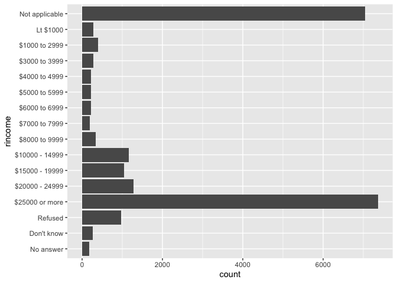
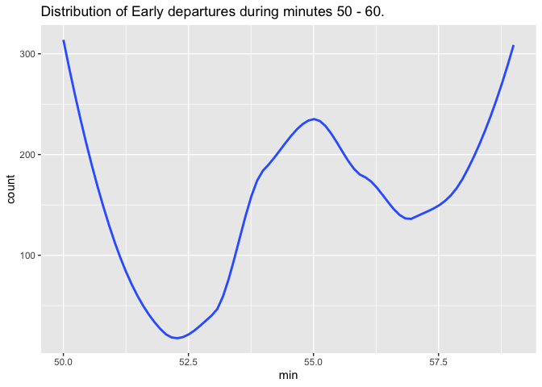

R-For-Data-Science-§11:§20
================
Evan-Woods
2023-11-10

## Libraries

``` r
if (!require(dplyr)) install.packages("dplyr")
```

    ## Loading required package: dplyr

    ## 
    ## Attaching package: 'dplyr'

    ## The following objects are masked from 'package:stats':
    ## 
    ##     filter, lag

    ## The following objects are masked from 'package:base':
    ## 
    ##     intersect, setdiff, setequal, union

``` r
# if (!require(stargazer)) install.packages("stargazer")
if (!require(tidyverse)) install.packages("tidyverse")
```

    ## Loading required package: tidyverse

    ## ── Attaching core tidyverse packages ──────────────────────── tidyverse 2.0.0 ──
    ## ✔ forcats   1.0.0     ✔ readr     2.1.4
    ## ✔ ggplot2   3.4.4     ✔ stringr   1.5.1
    ## ✔ lubridate 1.9.3     ✔ tibble    3.2.1
    ## ✔ purrr     1.0.2     ✔ tidyr     1.3.0
    ## ── Conflicts ────────────────────────────────────────── tidyverse_conflicts() ──
    ## ✖ dplyr::filter() masks stats::filter()
    ## ✖ dplyr::lag()    masks stats::lag()
    ## ℹ Use the conflicted package (<http://conflicted.r-lib.org/>) to force all conflicts to become errors

``` r
if(!require(nycflights13)) install.packages("nycflights13")
```

    ## Loading required package: nycflights13

``` r
# if (!require(shiny)) install.packages("shiny")
# if(!require(Lahman)) install.packages("Lahman")
if(!require(ggplot2)) install.packages("ggplot2")
# if(!require(EnvStats)) install.packages("EnvStats")
# library(EnvStats)
library(tidyverse)
```

## Section 11: Data Import

``` r
# e_woods_matrix <- read_csv("trait_matrix.xlsx - Sheet 1.csv")
# deepa_matrix <- read_csv("Candidate Rankings.xlsx - Sheet1.csv")
# health <- read_csv("HealthAutoExport-2023-10-29-2023-11-05.json")
# eye_classification <- read_csv("EEG_Eye_State_Classification.csv")

# Define the character as na
read_csv("a,b,c\n1,2,.", na=".")
```

    ## Rows: 1 Columns: 3
    ## ── Column specification ────────────────────────────────────────────────────────
    ## Delimiter: ","
    ## dbl (2): a, b
    ## lgl (1): c
    ## 
    ## ℹ Use `spec()` to retrieve the full column specification for this data.
    ## ℹ Specify the column types or set `show_col_types = FALSE` to quiet this message.

    ## # A tibble: 1 × 3
    ##       a     b c    
    ##   <dbl> <dbl> <lgl>
    ## 1     1     2 NA

``` r
# Drop lines that start with a comment
read_csv("# this is a comment\na,b,c\n1,2,.", comment = "#", na = ".")
```

    ## Rows: 1 Columns: 3
    ## ── Column specification ────────────────────────────────────────────────────────
    ## Delimiter: ","
    ## dbl (2): a, b
    ## lgl (1): c
    ## 
    ## ℹ Use `spec()` to retrieve the full column specification for this data.
    ## ℹ Specify the column types or set `show_col_types = FALSE` to quiet this message.

    ## # A tibble: 1 × 3
    ##       a     b c    
    ##   <dbl> <dbl> <lgl>
    ## 1     1     2 NA

``` r
read_csv("# this is a comment
         This is the second line of data
         \na,b,c\n1,2,.", comment = "#", na = ".")
```

    ## Warning: One or more parsing issues, call `problems()` on your data frame for details,
    ## e.g.:
    ##   dat <- vroom(...)
    ##   problems(dat)

    ## Rows: 2 Columns: 1
    ## ── Column specification ────────────────────────────────────────────────────────
    ## Delimiter: ","
    ## chr (1): This is the second line of data
    ## 
    ## ℹ Use `spec()` to retrieve the full column specification for this data.
    ## ℹ Specify the column types or set `show_col_types = FALSE` to quiet this message.

    ## # A tibble: 2 × 1
    ##   `This is the second line of data`
    ##   <chr>                            
    ## 1 a,b,c                            
    ## 2 1,2,.

``` r
# Passing column names as a character vector
read_csv("1,2,3\n4,5,6,", col_names = c("x", "y", "z"))
```

    ## Warning: One or more parsing issues, call `problems()` on your data frame for details,
    ## e.g.:
    ##   dat <- vroom(...)
    ##   problems(dat)

    ## Rows: 2 Columns: 3
    ## ── Column specification ────────────────────────────────────────────────────────
    ## Delimiter: ","
    ## dbl (2): x, y
    ## num (1): z
    ## 
    ## ℹ Use `spec()` to retrieve the full column specification for this data.
    ## ℹ Specify the column types or set `show_col_types = FALSE` to quiet this message.

    ## # A tibble: 2 × 3
    ##       x     y     z
    ##   <dbl> <dbl> <dbl>
    ## 1     1     2     3
    ## 2     4     5     6

#### 11.2.2 Exercises

``` r
# read_delim will be used for "|" delimited files
# read_csv and read_tsv have all arguments in common.
# The most important arguments to read_fwf() are the file, col_positions, and col_types
# pass in quote to read_csv to specify quotes

# 5 there are only two columns
read_csv("a,b\n1,2,3\n4,5,6") # reads this as a:1 , b:23
```

    ## Warning: One or more parsing issues, call `problems()` on your data frame for details,
    ## e.g.:
    ##   dat <- vroom(...)
    ##   problems(dat)

    ## Rows: 2 Columns: 2
    ## ── Column specification ────────────────────────────────────────────────────────
    ## Delimiter: ","
    ## dbl (1): a
    ## num (1): b
    ## 
    ## ℹ Use `spec()` to retrieve the full column specification for this data.
    ## ℹ Specify the column types or set `show_col_types = FALSE` to quiet this message.

    ## # A tibble: 2 × 2
    ##       a     b
    ##   <dbl> <dbl>
    ## 1     1    23
    ## 2     4    56

``` r
# the column rows are not the same
read_csv("a,b,c\n1,2\n1,2,3,4") # column c on row 1 is NA and 34 on row 2
```

    ## Warning: One or more parsing issues, call `problems()` on your data frame for details,
    ## e.g.:
    ##   dat <- vroom(...)
    ##   problems(dat)

    ## Rows: 2 Columns: 3
    ## ── Column specification ────────────────────────────────────────────────────────
    ## Delimiter: ","
    ## dbl (2): a, b
    ## num (1): c
    ## 
    ## ℹ Use `spec()` to retrieve the full column specification for this data.
    ## ℹ Specify the column types or set `show_col_types = FALSE` to quiet this message.

    ## # A tibble: 2 × 3
    ##       a     b     c
    ##   <dbl> <dbl> <dbl>
    ## 1     1     2    NA
    ## 2     1     2    34

``` r
#
```

### 11.3 Parsing

``` r
 # All data can be parsed. The types of parsing includes:
# parse_number
# parse_character
# parse_factor
# parse_datetime
# parse_logical
# parse_double

# Parsing will handle character encodings, and locale so as to represent clean data. 

# use guess_encoding() to guess the encoding of a character string
```

#### 11.3.5 Exercises

``` r
# The most important arguments to locale are date_names, date_format, decimal_mark, & tz

# There is an error that decimal_mark & grouping mark must be different if both are the same. 
#parse_double("1,23", locale = locale(decimal_mark = ",", grouping_mark = (",")))

# 
parse_date("01/02/15", "%m/%d/%y")
```

    ## [1] "2015-01-02"

### Section 12: Tidy Data

### Section 12.2.1 Exercises:

``` r
table1
```

    ## # A tibble: 6 × 4
    ##   country      year  cases population
    ##   <chr>       <dbl>  <dbl>      <dbl>
    ## 1 Afghanistan  1999    745   19987071
    ## 2 Afghanistan  2000   2666   20595360
    ## 3 Brazil       1999  37737  172006362
    ## 4 Brazil       2000  80488  174504898
    ## 5 China        1999 212258 1272915272
    ## 6 China        2000 213766 1280428583

``` r
#> # A tibble: 6 × 4
#>   country      year  cases population
#>   <chr>       <dbl>  <dbl>      <dbl>
#> 1 Afghanistan  1999    745   19987071
#> 2 Afghanistan  2000   2666   20595360
#> 3 Brazil       1999  37737  172006362
#> 4 Brazil       2000  80488  174504898
#> 5 China        1999 212258 1272915272
#> 6 China        2000 213766 1280428583
table2
```

    ## # A tibble: 12 × 4
    ##    country      year type            count
    ##    <chr>       <dbl> <chr>           <dbl>
    ##  1 Afghanistan  1999 cases             745
    ##  2 Afghanistan  1999 population   19987071
    ##  3 Afghanistan  2000 cases            2666
    ##  4 Afghanistan  2000 population   20595360
    ##  5 Brazil       1999 cases           37737
    ##  6 Brazil       1999 population  172006362
    ##  7 Brazil       2000 cases           80488
    ##  8 Brazil       2000 population  174504898
    ##  9 China        1999 cases          212258
    ## 10 China        1999 population 1272915272
    ## 11 China        2000 cases          213766
    ## 12 China        2000 population 1280428583

``` r
#> # A tibble: 12 × 4
#>   country      year type           count
#>   <chr>       <dbl> <chr>          <dbl>
#> 1 Afghanistan  1999 cases            745
#> 2 Afghanistan  1999 population  19987071
#> 3 Afghanistan  2000 cases           2666
#> 4 Afghanistan  2000 population  20595360
#> 5 Brazil       1999 cases          37737
#> 6 Brazil       1999 population 172006362
#> # ℹ 6 more rows
table3
```

    ## # A tibble: 6 × 3
    ##   country      year rate             
    ##   <chr>       <dbl> <chr>            
    ## 1 Afghanistan  1999 745/19987071     
    ## 2 Afghanistan  2000 2666/20595360    
    ## 3 Brazil       1999 37737/172006362  
    ## 4 Brazil       2000 80488/174504898  
    ## 5 China        1999 212258/1272915272
    ## 6 China        2000 213766/1280428583

``` r
#> # A tibble: 6 × 3
#>   country      year rate             
#>   <chr>       <dbl> <chr>            
#> 1 Afghanistan  1999 745/19987071     
#> 2 Afghanistan  2000 2666/20595360    
#> 3 Brazil       1999 37737/172006362  
#> 4 Brazil       2000 80488/174504898  
#> 5 China        1999 212258/1272915272
#> 6 China        2000 213766/1280428583

# Spread across two tibbles
table4a  # cases
```

    ## # A tibble: 3 × 3
    ##   country     `1999` `2000`
    ##   <chr>        <dbl>  <dbl>
    ## 1 Afghanistan    745   2666
    ## 2 Brazil       37737  80488
    ## 3 China       212258 213766

``` r
#> # A tibble: 3 × 3
#>   country     `1999` `2000`
#>   <chr>        <dbl>  <dbl>
#> 1 Afghanistan    745   2666
#> 2 Brazil       37737  80488
#> 3 China       212258 213766
table4b  # population
```

    ## # A tibble: 3 × 3
    ##   country         `1999`     `2000`
    ##   <chr>            <dbl>      <dbl>
    ## 1 Afghanistan   19987071   20595360
    ## 2 Brazil       172006362  174504898
    ## 3 China       1272915272 1280428583

``` r
#> # A tibble: 3 × 3
#>   country         `1999`     `2000`
#>   <chr>            <dbl>      <dbl>
#> 1 Afghanistan   19987071   20595360
#> 2 Brazil       172006362  174504898
#> 3 China       1272915272 1280428583
```

``` r
# Quesion 1
# Table 1 organizes its columns by country, year, cases, and population. It organizes its rows numerically where each row represents data that is associated with a country. The data within the table are individual values. 
table1
```

    ## # A tibble: 6 × 4
    ##   country      year  cases population
    ##   <chr>       <dbl>  <dbl>      <dbl>
    ## 1 Afghanistan  1999    745   19987071
    ## 2 Afghanistan  2000   2666   20595360
    ## 3 Brazil       1999  37737  172006362
    ## 4 Brazil       2000  80488  174504898
    ## 5 China        1999 212258 1272915272
    ## 6 China        2000 213766 1280428583

``` r
#> # A tibble: 6 × 4
#>   country      year  cases population
#>   <chr>       <dbl>  <dbl>      <dbl>
#> 1 Afghanistan  1999    745   19987071
#> 2 Afghanistan  2000   2666   20595360
#> 3 Brazil       1999  37737  172006362
#> 4 Brazil       2000  80488  174504898
#> 5 China        1999 212258 1272915272
#> 6 China        2000 213766 1280428583
#> 

# Table 2 organizes its columns by country, year, type, & count. The rows are organized with cases and population variables in the type column. Each cell contains only one item which is either a variable or a name of a variable. This data is not tidy. 

table2
```

    ## # A tibble: 12 × 4
    ##    country      year type            count
    ##    <chr>       <dbl> <chr>           <dbl>
    ##  1 Afghanistan  1999 cases             745
    ##  2 Afghanistan  1999 population   19987071
    ##  3 Afghanistan  2000 cases            2666
    ##  4 Afghanistan  2000 population   20595360
    ##  5 Brazil       1999 cases           37737
    ##  6 Brazil       1999 population  172006362
    ##  7 Brazil       2000 cases           80488
    ##  8 Brazil       2000 population  174504898
    ##  9 China        1999 cases          212258
    ## 10 China        1999 population 1272915272
    ## 11 China        2000 cases          213766
    ## 12 China        2000 population 1280428583

``` r
#> # A tibble: 12 × 4
#>   country      year type           count
#>   <chr>       <dbl> <chr>          <dbl>
#> 1 Afghanistan  1999 cases            745
#> 2 Afghanistan  1999 population  19987071
#> 3 Afghanistan  2000 cases           2666
#> 4 Afghanistan  2000 population  20595360
#> 5 Brazil       1999 cases          37737
#> 6 Brazil       1999 population 172006362
#> # ℹ 6 more rows

# Table 3 organizes its columns by country, year, & rate. The rows are organized by country. The rate column variables for each country contains values that are comprised of the count of cases divided by the population count. This data is not tidy. To tidy this data, I suggest adding the count of cases and population as columns and using the distinct values in these columns for rate. 

table3
```

    ## # A tibble: 6 × 3
    ##   country      year rate             
    ##   <chr>       <dbl> <chr>            
    ## 1 Afghanistan  1999 745/19987071     
    ## 2 Afghanistan  2000 2666/20595360    
    ## 3 Brazil       1999 37737/172006362  
    ## 4 Brazil       2000 80488/174504898  
    ## 5 China        1999 212258/1272915272
    ## 6 China        2000 213766/1280428583

``` r
#> # A tibble: 6 × 3
#>   country      year rate             
#>   <chr>       <dbl> <chr>            
#> 1 Afghanistan  1999 745/19987071     
#> 2 Afghanistan  2000 2666/20595360    
#> 3 Brazil       1999 37737/172006362  
#> 4 Brazil       2000 80488/174504898  
#> 5 China        1999 212258/1272915272
#> 6 China        2000 213766/1280428583
#> 
#> 


# Table 4a & 4b contain tibbles such that the column names are country, `1999`, & `2000`. The rows are individual countries in both tibbles. The values in the tibbles are individual values. This data is not tidy because the column names are variables themselves: 1999 & 2000 are "year" variables. Furthermore, the data is split between two tibbles.  

# Spread across two tibbles
table4a  # cases
```

    ## # A tibble: 3 × 3
    ##   country     `1999` `2000`
    ##   <chr>        <dbl>  <dbl>
    ## 1 Afghanistan    745   2666
    ## 2 Brazil       37737  80488
    ## 3 China       212258 213766

``` r
#> # A tibble: 3 × 3
#>   country     `1999` `2000`
#>   <chr>        <dbl>  <dbl>
#> 1 Afghanistan    745   2666
#> 2 Brazil       37737  80488
#> 3 China       212258 213766
table4b  # population
```

    ## # A tibble: 3 × 3
    ##   country         `1999`     `2000`
    ##   <chr>            <dbl>      <dbl>
    ## 1 Afghanistan   19987071   20595360
    ## 2 Brazil       172006362  174504898
    ## 3 China       1272915272 1280428583

``` r
#> # A tibble: 3 × 3
#>   country         `1999`     `2000`
#>   <chr>            <dbl>      <dbl>
#> 1 Afghanistan   19987071   20595360
#> 2 Brazil       172006362  174504898
#> 3 China       1272915272 1280428583
```

``` r
# Compute rate for table2 and table4a and table4b
# Extract the number of TB cases per country per year From table2.
n_cases_per_country <- table2 %>% group_by(type_cases = type == "cases") %>% filter(type_cases == TRUE) %>% group_by(country) %>% summarise(n_cases = sum(count))
```

``` r
# Compute rate for table2 and table4a and table4b
n_years_per_country <- table2 %>% group_by(type_cases = type == "cases") %>% filter(type_cases == TRUE) %>% group_by(country, year) %>% summarise() %>% summarise(n_years = n())
```

    ## `summarise()` has grouped output by 'country'. You can override using the
    ## `.groups` argument.

``` r
countries <- table2 %>% group_by(type_cases = type == "cases") %>% filter(type_cases == TRUE) %>% group_by(country) %>% summarise() 

n_cases_per_year_per_country <- (n_cases_per_country$n_cases / n_years_per_country$n_years)

(n_cases_per_year_per_country_tb <- tibble(countries, n_cases_per_year_per_country))
```

    ## # A tibble: 3 × 2
    ##   country     n_cases_per_year_per_country
    ##   <chr>                              <dbl>
    ## 1 Afghanistan                        1706.
    ## 2 Brazil                            59112.
    ## 3 China                            213012

``` r
# Extract the number of TB cases per country per year from tables 4a & 4b.
countries <- table4a[["country"]]
(counts_1999 <- table4a[["1999"]])
```

    ## [1]    745  37737 212258

``` r
(counts_2000 <- table4a[["2000"]])
```

    ## [1]   2666  80488 213766

``` r
(counts_per_year <- (counts_1999 + counts_2000) / 2)
```

    ## [1]   1705.5  59112.5 213012.0

``` r
(n_counts_per_country_per_year_4a <- tibble(countries, counts_per_year))
```

    ## # A tibble: 3 × 2
    ##   countries   counts_per_year
    ##   <chr>                 <dbl>
    ## 1 Afghanistan           1706.
    ## 2 Brazil               59112.
    ## 3 China               213012

``` r
# table 2
n_population_per_country <- table2 %>% group_by(type_cases = type == "population") %>% filter(type_cases == TRUE) %>% group_by(country) %>% summarise(n_population = sum(count))

n_years_per_country <- table2 %>% group_by(type_cases = type == "cases") %>% filter(type_cases == TRUE) %>% group_by(country, year) %>% summarise() %>% summarise(n_years = n())
```

    ## `summarise()` has grouped output by 'country'. You can override using the
    ## `.groups` argument.

``` r
countries <- table2 %>% group_by(type_cases = type == "cases") %>% filter(type_cases == TRUE) %>% group_by(country) %>% summarise() 

n_population_per_year_per_country <- (n_population_per_country$n_population / n_years_per_country$n_years)

n_population_per_year_per_country_tb <- tibble(countries, n_population_per_year_per_country)

# Table4b

# population
(countries_4b <- table4b[["country"]])
```

    ## [1] "Afghanistan" "Brazil"      "China"

``` r
(population_1999_4b <- table4b[["1999"]])
```

    ## [1]   19987071  172006362 1272915272

``` r
(population_2000_4b <- table4b[["2000"]])
```

    ## [1]   20595360  174504898 1280428583

``` r
population_per_year_4b <- (population_1999_4b + population_2000_4b) / 2

n_population_per_year_per_country_4b <- tibble(countries_4b, population_per_year_4b)
(n_population_per_year_per_country_4b)
```

    ## # A tibble: 3 × 2
    ##   countries_4b population_per_year_4b
    ##   <chr>                         <dbl>
    ## 1 Afghanistan               20291216.
    ## 2 Brazil                   173255630 
    ## 3 China                   1276671928.

``` r
# Table 2
(n_cases_per_year_per_country_tb)
```

    ## # A tibble: 3 × 2
    ##   country     n_cases_per_year_per_country
    ##   <chr>                              <dbl>
    ## 1 Afghanistan                        1706.
    ## 2 Brazil                            59112.
    ## 3 China                            213012

``` r
(n_population_per_year_per_country_tb)
```

    ## # A tibble: 3 × 2
    ##   country     n_population_per_year_per_country
    ##   <chr>                                   <dbl>
    ## 1 Afghanistan                         20291216.
    ## 2 Brazil                             173255630 
    ## 3 China                             1276671928.

``` r
(rate_table2 <- (n_cases_per_year_per_country_tb$n_cases_per_year_per_country / n_population_per_year_per_country_tb$n_population_per_year_per_country) * 10000)
```

    ## [1] 0.8405115 3.4118660 1.6684944

``` r
(rate_table4a4b <- (n_counts_per_country_per_year_4a$counts_per_year / n_population_per_year_per_country_4b$population_per_year_4b) * 10000)
```

    ## [1] 0.8405115 3.4118660 1.6684944

``` r
table2
```

    ## # A tibble: 12 × 4
    ##    country      year type            count
    ##    <chr>       <dbl> <chr>           <dbl>
    ##  1 Afghanistan  1999 cases             745
    ##  2 Afghanistan  1999 population   19987071
    ##  3 Afghanistan  2000 cases            2666
    ##  4 Afghanistan  2000 population   20595360
    ##  5 Brazil       1999 cases           37737
    ##  6 Brazil       1999 population  172006362
    ##  7 Brazil       2000 cases           80488
    ##  8 Brazil       2000 population  174504898
    ##  9 China        1999 cases          212258
    ## 10 China        1999 population 1272915272
    ## 11 China        2000 cases          213766
    ## 12 China        2000 population 1280428583

``` r
rate_table2
```

    ## [1] 0.8405115 3.4118660 1.6684944

``` r
rate_table2_formatted <- c(rate_table2[[1]], rate_table2[[1]], rate_table2[[1]], rate_table2[[1]],rate_table2[[2]], rate_table2[[2]], rate_table2[[2]], rate_table2[[2]],rate_table2[[3]], rate_table2[[3]], rate_table2[[3]], rate_table2[[3]])

table2[["rate"]] = rate_table2_formatted
# table2

###

rate_table4a4b
```

    ## [1] 0.8405115 3.4118660 1.6684944

``` r
table4a[["rate"]] = rate_table4a4b
table4a
```

    ## # A tibble: 3 × 4
    ##   country     `1999` `2000`  rate
    ##   <chr>        <dbl>  <dbl> <dbl>
    ## 1 Afghanistan    745   2666 0.841
    ## 2 Brazil       37737  80488 3.41 
    ## 3 China       212258 213766 1.67

``` r
table4b[["rate"]] = rate_table4a4b
table4b
```

    ## # A tibble: 3 × 4
    ##   country         `1999`     `2000`  rate
    ##   <chr>            <dbl>      <dbl> <dbl>
    ## 1 Afghanistan   19987071   20595360 0.841
    ## 2 Brazil       172006362  174504898 3.41 
    ## 3 China       1272915272 1280428583 1.67

``` r
# It was easier to address table4a & 4b; However working with table2 was more efficient. Containing variables in the cells of table2 proved challenging, and the split tibbles proved inefficient.
```

``` r
# Compute rate per 10,000
table1 %>% 
  mutate(rate = cases / population * 10000)
```

    ## # A tibble: 6 × 5
    ##   country      year  cases population  rate
    ##   <chr>       <dbl>  <dbl>      <dbl> <dbl>
    ## 1 Afghanistan  1999    745   19987071 0.373
    ## 2 Afghanistan  2000   2666   20595360 1.29 
    ## 3 Brazil       1999  37737  172006362 2.19 
    ## 4 Brazil       2000  80488  174504898 4.61 
    ## 5 China        1999 212258 1272915272 1.67 
    ## 6 China        2000 213766 1280428583 1.67

``` r
#> # A tibble: 6 × 5
#>   country      year  cases population  rate
#>   <chr>       <dbl>  <dbl>      <dbl> <dbl>
#> 1 Afghanistan  1999    745   19987071 0.373
#> 2 Afghanistan  2000   2666   20595360 1.29 
#> 3 Brazil       1999  37737  172006362 2.19 
#> 4 Brazil       2000  80488  174504898 4.61 
#> 5 China        1999 212258 1272915272 1.67 
#> 6 China        2000 213766 1280428583 1.67

# Compute cases per year
table1 %>% 
  count(year, wt = cases)
```

    ## # A tibble: 2 × 2
    ##    year      n
    ##   <dbl>  <dbl>
    ## 1  1999 250740
    ## 2  2000 296920

``` r
#> # A tibble: 2 × 2
#>    year      n
#>   <dbl>  <dbl>
#> 1  1999 250740
#> 2  2000 296920

# Visualise changes over time
library(ggplot2)
ggplot(table1, aes(year, cases)) + 
  geom_line(aes(group = country), colour = "grey50") + 
  geom_point(aes(colour = country))
```

<!-- -->

``` r
# table2 %>% group_by(cases_logical = type == "cases") %>% filter(cases_logical) %>% group_by(year, country) %>% summarise() 

(table2_n_cases_per_country_per_year <- table2 %>% group_by(type_cases = type == "cases") %>% filter(type_cases == TRUE) %>% group_by(country))
```

    ## # A tibble: 6 × 6
    ## # Groups:   country [3]
    ##   country      year type   count  rate type_cases
    ##   <chr>       <dbl> <chr>  <dbl> <dbl> <lgl>     
    ## 1 Afghanistan  1999 cases    745 0.841 TRUE      
    ## 2 Afghanistan  2000 cases   2666 0.841 TRUE      
    ## 3 Brazil       1999 cases  37737 3.41  TRUE      
    ## 4 Brazil       2000 cases  80488 3.41  TRUE      
    ## 5 China        1999 cases 212258 1.67  TRUE      
    ## 6 China        2000 cases 213766 1.67  TRUE

``` r
ggplot(table2_n_cases_per_country_per_year, aes(year, count)) + 
  geom_line(aes(group = country), color = "grey50") +
  geom_point(aes(color = country))
```

<!-- -->

``` r
table4a %>% pivot_longer(c(`1999`, `2000`), names_to = "year", values_to = "counts")
```

    ## # A tibble: 6 × 4
    ##   country      rate year  counts
    ##   <chr>       <dbl> <chr>  <dbl>
    ## 1 Afghanistan 0.841 1999     745
    ## 2 Afghanistan 0.841 2000    2666
    ## 3 Brazil      3.41  1999   37737
    ## 4 Brazil      3.41  2000   80488
    ## 5 China       1.67  1999  212258
    ## 6 China       1.67  2000  213766

``` r
table2
```

    ## # A tibble: 12 × 5
    ##    country      year type            count  rate
    ##    <chr>       <dbl> <chr>           <dbl> <dbl>
    ##  1 Afghanistan  1999 cases             745 0.841
    ##  2 Afghanistan  1999 population   19987071 0.841
    ##  3 Afghanistan  2000 cases            2666 0.841
    ##  4 Afghanistan  2000 population   20595360 0.841
    ##  5 Brazil       1999 cases           37737 3.41 
    ##  6 Brazil       1999 population  172006362 3.41 
    ##  7 Brazil       2000 cases           80488 3.41 
    ##  8 Brazil       2000 population  174504898 3.41 
    ##  9 China        1999 cases          212258 1.67 
    ## 10 China        1999 population 1272915272 1.67 
    ## 11 China        2000 cases          213766 1.67 
    ## 12 China        2000 population 1280428583 1.67

``` r
tidy_table2 <- table2 %>% pivot_wider(names_from = "year", values_from = "count") %>% pivot_longer(c(`1999`, `2000`), names_to = "year", values_to= "count") %>% pivot_wider(names_from = "type", values_from = "count")
tidy_table2
```

    ## # A tibble: 6 × 5
    ##   country      rate year   cases population
    ##   <chr>       <dbl> <chr>  <dbl>      <dbl>
    ## 1 Afghanistan 0.841 1999     745   19987071
    ## 2 Afghanistan 0.841 2000    2666   20595360
    ## 3 Brazil      3.41  1999   37737  172006362
    ## 4 Brazil      3.41  2000   80488  174504898
    ## 5 China       1.67  1999  212258 1272915272
    ## 6 China       1.67  2000  213766 1280428583

### Section 12.3.3 Exercises:

``` r
# The values in a column become column names after a pivot wider. The outermost column is used as column names for pivot_wider(). pivot_longer() will then place the column names into rows, but will maintain the initial column ordering of the first row. pivot_longer() will not re-order rows.

stocks <- tibble(
  year = c(2015, 2015, 2016, 2016),
  half = c(1,2,1,2),
  return = c(1.88,0.59,0.92, 0.17)
)
```

``` r
stocks
```

    ## # A tibble: 4 × 3
    ##    year  half return
    ##   <dbl> <dbl>  <dbl>
    ## 1  2015     1   1.88
    ## 2  2015     2   0.59
    ## 3  2016     1   0.92
    ## 4  2016     2   0.17

``` r
stocks %>%
  pivot_wider(names_from = year, values_from = return ) %>%
   pivot_longer(`2015`:`2016`, names_to = "year", values_to = "return")
```

    ## # A tibble: 4 × 3
    ##    half year  return
    ##   <dbl> <chr>  <dbl>
    ## 1     1 2015    1.88
    ## 2     1 2016    0.92
    ## 3     2 2015    0.59
    ## 4     2 2016    0.17

``` r
table4a
```

    ## # A tibble: 3 × 4
    ##   country     `1999` `2000`  rate
    ##   <chr>        <dbl>  <dbl> <dbl>
    ## 1 Afghanistan    745   2666 0.841
    ## 2 Brazil       37737  80488 3.41 
    ## 3 China       212258 213766 1.67

``` r
table4a
```

    ## # A tibble: 3 × 4
    ##   country     `1999` `2000`  rate
    ##   <chr>        <dbl>  <dbl> <dbl>
    ## 1 Afghanistan    745   2666 0.841
    ## 2 Brazil       37737  80488 3.41 
    ## 3 China       212258 213766 1.67

``` r
table4a
```

    ## # A tibble: 3 × 4
    ##   country     `1999` `2000`  rate
    ##   <chr>        <dbl>  <dbl> <dbl>
    ## 1 Afghanistan    745   2666 0.841
    ## 2 Brazil       37737  80488 3.41 
    ## 3 China       212258 213766 1.67

``` r
# table4a %>% pivot_longer(c(1999, 2000), names_to = "year", values_to = "cases")
# The names need to be in backticks because they are numbers. i.e.
#table4a %>% 
  # pivot_longer(c(1999, 2000), names_to = "year", values_to = "cases")
```

``` r
# Quesion 3
# Calling wider on this tribble will allow the values to be placed in a double, a column for personid would allow this data to be transformed appropriately.
people <- tribble(
  ~name,             ~names,  ~values, ~pid,
  #-----------------|--------|---------|----
  "Phillip Woods",   "age",       45, 1,
  "Phillip Woods",   "height",   186, 1,
  "Phillip Woods",   "age",       50, 2,
  "Jessica Cordero", "age",       37, 3,
  "Jessica Cordero", "height",   156, 3,
)

people %>% group_by(name, names,) %>% summarise(values) 
```

    ## Warning: Returning more (or less) than 1 row per `summarise()` group was deprecated in
    ## dplyr 1.1.0.
    ## ℹ Please use `reframe()` instead.
    ## ℹ When switching from `summarise()` to `reframe()`, remember that `reframe()`
    ##   always returns an ungrouped data frame and adjust accordingly.
    ## Call `lifecycle::last_lifecycle_warnings()` to see where this warning was
    ## generated.

    ## `summarise()` has grouped output by 'name', 'names'. You can override using the
    ## `.groups` argument.

    ## # A tibble: 5 × 3
    ## # Groups:   name, names [4]
    ##   name            names  values
    ##   <chr>           <chr>   <dbl>
    ## 1 Jessica Cordero age        37
    ## 2 Jessica Cordero height    156
    ## 3 Phillip Woods   age        45
    ## 4 Phillip Woods   age        50
    ## 5 Phillip Woods   height    186

``` r
# %>% summarise
# %>% summarise() %>% select(everything())

# Answer:
(people_wider <- people %>% pivot_wider( names_from = names, values_from = values))
```

    ## # A tibble: 3 × 4
    ##   name              pid   age height
    ##   <chr>           <dbl> <dbl>  <dbl>
    ## 1 Phillip Woods       1    45    186
    ## 2 Phillip Woods       2    50     NA
    ## 3 Jessica Cordero     3    37    156

``` r
# val[["age"]]
# %>% pivot_wider(names_from = name, values_from = values)
```

``` r
# Quesion 4
preg <- tribble(
  ~pregnant, ~male, ~female,
  "yes", NA, 10,
  "no", 20, 12
)


preg %>% pivot_longer(c("male", "female"), names_to = "gender", values_to = "count") %>% select(count, pregnant, gender)
```

    ## # A tibble: 4 × 3
    ##   count pregnant gender
    ##   <dbl> <chr>    <chr> 
    ## 1    NA yes      male  
    ## 2    10 yes      female
    ## 3    20 no       male  
    ## 4    12 no       female

## Section 12.4 Separating and Uniting

#### Section 12.4.1 Separate

``` r
# table3
table3 %>% separate(rate, into = c("count", "population")) %>% separate(year, into = c("century", "year"), sep=2)
```

    ## # A tibble: 6 × 5
    ##   country     century year  count  population
    ##   <chr>       <chr>   <chr> <chr>  <chr>     
    ## 1 Afghanistan 19      99    745    19987071  
    ## 2 Afghanistan 20      00    2666   20595360  
    ## 3 Brazil      19      99    37737  172006362 
    ## 4 Brazil      20      00    80488  174504898 
    ## 5 China       19      99    212258 1272915272
    ## 6 China       20      00    213766 1280428583

#### Section 12.4.2 Unite

``` r
table5 %>%
  unite(new, century, year, sep = "")
```

    ## # A tibble: 6 × 3
    ##   country     new   rate             
    ##   <chr>       <chr> <chr>            
    ## 1 Afghanistan 1999  745/19987071     
    ## 2 Afghanistan 2000  2666/20595360    
    ## 3 Brazil      1999  37737/172006362  
    ## 4 Brazil      2000  80488/174504898  
    ## 5 China       1999  212258/1272915272
    ## 6 China       2000  213766/1280428583

#### Section 12.4.3 Exercises

``` r
tibble(x = c("a,b,c", "d,e,f,g", "h,i,j")) %>%
  separate(x, c("one", "two", "three"), extra = "merge")
```

    ## # A tibble: 3 × 3
    ##   one   two   three
    ##   <chr> <chr> <chr>
    ## 1 a     b     c    
    ## 2 d     e     f,g  
    ## 3 h     i     j

``` r
tibble(x = c("a,b,c", "d, e", "f, g, i")) %>%
  separate(x, c("one", "two", "three"), fill = "left")
```

    ## # A tibble: 3 × 3
    ##   one   two   three
    ##   <chr> <chr> <chr>
    ## 1 a     b     c    
    ## 2 <NA>  d     e    
    ## 3 f     g     i

``` r
# Quesion 2
# Removes input columns from the output dataframe
```

``` r
# Quesion 3
# Extract will turn a group into columns. Extract will separate groups into columns as well. Extract has been superceded. 
```

## Section 12.5 Missing Values:

``` r
stocks <- tibble(
  year   = c(2015, 2015, 2015, 2015, 2016, 2016, 2016),
  qtr    = c(   1,    2,    3,    4,    2,    3,    4),
  return = c(1.88, 0.59, 0.35,   NA, 0.92, 0.17, 2.66)
)
```

``` r
stocks %>% pivot_wider(names_from = year, values_from = return)
```

    ## # A tibble: 4 × 3
    ##     qtr `2015` `2016`
    ##   <dbl>  <dbl>  <dbl>
    ## 1     1   1.88  NA   
    ## 2     2   0.59   0.92
    ## 3     3   0.35   0.17
    ## 4     4  NA      2.66

``` r
treatment <- tribble(
  ~ person,           ~ treatment, ~response,
  "Derrick Whitmore", 1,           7,
  NA,                 2,           10,
  NA,                 3,           9,
  "Katherine Burke",  1,           4
)
```

``` r
treatment %>% fill(person)
```

    ## # A tibble: 4 × 3
    ##   person           treatment response
    ##   <chr>                <dbl>    <dbl>
    ## 1 Derrick Whitmore         1        7
    ## 2 Derrick Whitmore         2       10
    ## 3 Derrick Whitmore         3        9
    ## 4 Katherine Burke          1        4

``` r
# Complete 
df <- tibble(
  group = c(1:2, 1, 2),
  item_id = c(1:2, 2, 3),
  item_name = c("a", "a", "b", "b"),
  value1 = c(1, NA, 3, 4),
  value2 = 4:7
)
df
```

    ## # A tibble: 4 × 5
    ##   group item_id item_name value1 value2
    ##   <dbl>   <dbl> <chr>      <dbl>  <int>
    ## 1     1       1 a              1      4
    ## 2     2       2 a             NA      5
    ## 3     1       2 b              3      6
    ## 4     2       3 b              4      7

``` r
df %>% complete(group, item_id, item_name)
```

    ## # A tibble: 12 × 5
    ##    group item_id item_name value1 value2
    ##    <dbl>   <dbl> <chr>      <dbl>  <int>
    ##  1     1       1 a              1      4
    ##  2     1       1 b             NA     NA
    ##  3     1       2 a             NA     NA
    ##  4     1       2 b              3      6
    ##  5     1       3 a             NA     NA
    ##  6     1       3 b             NA     NA
    ##  7     2       1 a             NA     NA
    ##  8     2       1 b             NA     NA
    ##  9     2       2 a             NA      5
    ## 10     2       2 b             NA     NA
    ## 11     2       3 a             NA     NA
    ## 12     2       3 b              4      7

#### Section 12.5.1 Exercises

``` r
df %>% complete(group, nesting(item_id, item_name)) 
```

    ## # A tibble: 8 × 5
    ##   group item_id item_name value1 value2
    ##   <dbl>   <dbl> <chr>      <dbl>  <int>
    ## 1     1       1 a              1      4
    ## 2     1       2 a             NA     NA
    ## 3     1       2 b              3      6
    ## 4     1       3 b             NA     NA
    ## 5     2       1 a             NA     NA
    ## 6     2       2 a             NA      5
    ## 7     2       2 b             NA     NA
    ## 8     2       3 b              4      7

``` r
# Complete will find all the combinations of elements n a list. 
# Fill will fill in missing value with the last observation carried forward.
# 
```

``` r
# Quesion 1
# What does the direction argument to fill do?
treatment %>% fill(person, .direction = "up")
```

    ## # A tibble: 4 × 3
    ##   person           treatment response
    ##   <chr>                <dbl>    <dbl>
    ## 1 Derrick Whitmore         1        7
    ## 2 Katherine Burke          2       10
    ## 3 Katherine Burke          3        9
    ## 4 Katherine Burke          1        4

``` r
# Direction in fill will fill NA from a particular direction
```

``` r
who
```

    ## # A tibble: 7,240 × 60
    ##    country  iso2  iso3   year new_sp_m014 new_sp_m1524 new_sp_m2534 new_sp_m3544
    ##    <chr>    <chr> <chr> <dbl>       <dbl>        <dbl>        <dbl>        <dbl>
    ##  1 Afghani… AF    AFG    1980          NA           NA           NA           NA
    ##  2 Afghani… AF    AFG    1981          NA           NA           NA           NA
    ##  3 Afghani… AF    AFG    1982          NA           NA           NA           NA
    ##  4 Afghani… AF    AFG    1983          NA           NA           NA           NA
    ##  5 Afghani… AF    AFG    1984          NA           NA           NA           NA
    ##  6 Afghani… AF    AFG    1985          NA           NA           NA           NA
    ##  7 Afghani… AF    AFG    1986          NA           NA           NA           NA
    ##  8 Afghani… AF    AFG    1987          NA           NA           NA           NA
    ##  9 Afghani… AF    AFG    1988          NA           NA           NA           NA
    ## 10 Afghani… AF    AFG    1989          NA           NA           NA           NA
    ## # ℹ 7,230 more rows
    ## # ℹ 52 more variables: new_sp_m4554 <dbl>, new_sp_m5564 <dbl>,
    ## #   new_sp_m65 <dbl>, new_sp_f014 <dbl>, new_sp_f1524 <dbl>,
    ## #   new_sp_f2534 <dbl>, new_sp_f3544 <dbl>, new_sp_f4554 <dbl>,
    ## #   new_sp_f5564 <dbl>, new_sp_f65 <dbl>, new_sn_m014 <dbl>,
    ## #   new_sn_m1524 <dbl>, new_sn_m2534 <dbl>, new_sn_m3544 <dbl>,
    ## #   new_sn_m4554 <dbl>, new_sn_m5564 <dbl>, new_sn_m65 <dbl>, …

``` r
who1 <- who %>% pivot_longer(
  cols = new_sp_m014:newrel_f65, 
  names_to = "key",
  values_to = "cases",
  values_drop_na = TRUE
)
who1
```

    ## # A tibble: 76,046 × 6
    ##    country     iso2  iso3   year key          cases
    ##    <chr>       <chr> <chr> <dbl> <chr>        <dbl>
    ##  1 Afghanistan AF    AFG    1997 new_sp_m014      0
    ##  2 Afghanistan AF    AFG    1997 new_sp_m1524    10
    ##  3 Afghanistan AF    AFG    1997 new_sp_m2534     6
    ##  4 Afghanistan AF    AFG    1997 new_sp_m3544     3
    ##  5 Afghanistan AF    AFG    1997 new_sp_m4554     5
    ##  6 Afghanistan AF    AFG    1997 new_sp_m5564     2
    ##  7 Afghanistan AF    AFG    1997 new_sp_m65       0
    ##  8 Afghanistan AF    AFG    1997 new_sp_f014      5
    ##  9 Afghanistan AF    AFG    1997 new_sp_f1524    38
    ## 10 Afghanistan AF    AFG    1997 new_sp_f2534    36
    ## # ℹ 76,036 more rows

``` r
who1 %>% count(key)
```

    ## # A tibble: 56 × 2
    ##    key              n
    ##    <chr>        <int>
    ##  1 new_ep_f014   1032
    ##  2 new_ep_f1524  1021
    ##  3 new_ep_f2534  1021
    ##  4 new_ep_f3544  1021
    ##  5 new_ep_f4554  1017
    ##  6 new_ep_f5564  1017
    ##  7 new_ep_f65    1014
    ##  8 new_ep_m014   1038
    ##  9 new_ep_m1524  1026
    ## 10 new_ep_m2534  1020
    ## # ℹ 46 more rows

``` r
who2 <- who1 %>%
  mutate(key = stringr::str_replace(key, "newrel", "new_rel"))
who2
```

    ## # A tibble: 76,046 × 6
    ##    country     iso2  iso3   year key          cases
    ##    <chr>       <chr> <chr> <dbl> <chr>        <dbl>
    ##  1 Afghanistan AF    AFG    1997 new_sp_m014      0
    ##  2 Afghanistan AF    AFG    1997 new_sp_m1524    10
    ##  3 Afghanistan AF    AFG    1997 new_sp_m2534     6
    ##  4 Afghanistan AF    AFG    1997 new_sp_m3544     3
    ##  5 Afghanistan AF    AFG    1997 new_sp_m4554     5
    ##  6 Afghanistan AF    AFG    1997 new_sp_m5564     2
    ##  7 Afghanistan AF    AFG    1997 new_sp_m65       0
    ##  8 Afghanistan AF    AFG    1997 new_sp_f014      5
    ##  9 Afghanistan AF    AFG    1997 new_sp_f1524    38
    ## 10 Afghanistan AF    AFG    1997 new_sp_f2534    36
    ## # ℹ 76,036 more rows

``` r
who3 <- who2 %>%
  separate(key, c("new", "type", "sexage"))
who3
```

    ## # A tibble: 76,046 × 8
    ##    country     iso2  iso3   year new   type  sexage cases
    ##    <chr>       <chr> <chr> <dbl> <chr> <chr> <chr>  <dbl>
    ##  1 Afghanistan AF    AFG    1997 new   sp    m014       0
    ##  2 Afghanistan AF    AFG    1997 new   sp    m1524     10
    ##  3 Afghanistan AF    AFG    1997 new   sp    m2534      6
    ##  4 Afghanistan AF    AFG    1997 new   sp    m3544      3
    ##  5 Afghanistan AF    AFG    1997 new   sp    m4554      5
    ##  6 Afghanistan AF    AFG    1997 new   sp    m5564      2
    ##  7 Afghanistan AF    AFG    1997 new   sp    m65        0
    ##  8 Afghanistan AF    AFG    1997 new   sp    f014       5
    ##  9 Afghanistan AF    AFG    1997 new   sp    f1524     38
    ## 10 Afghanistan AF    AFG    1997 new   sp    f2534     36
    ## # ℹ 76,036 more rows

``` r
who3 %>% 
  count(new)
```

    ## # A tibble: 1 × 2
    ##   new       n
    ##   <chr> <int>
    ## 1 new   76046

``` r
who4 <- who3 %>%
  select(-new, -iso2, -iso3)
```

``` r
who5 <- who4 %>%
  separate(sexage, c("sex", "age"), sep = 1)
who5
```

    ## # A tibble: 76,046 × 6
    ##    country      year type  sex   age   cases
    ##    <chr>       <dbl> <chr> <chr> <chr> <dbl>
    ##  1 Afghanistan  1997 sp    m     014       0
    ##  2 Afghanistan  1997 sp    m     1524     10
    ##  3 Afghanistan  1997 sp    m     2534      6
    ##  4 Afghanistan  1997 sp    m     3544      3
    ##  5 Afghanistan  1997 sp    m     4554      5
    ##  6 Afghanistan  1997 sp    m     5564      2
    ##  7 Afghanistan  1997 sp    m     65        0
    ##  8 Afghanistan  1997 sp    f     014       5
    ##  9 Afghanistan  1997 sp    f     1524     38
    ## 10 Afghanistan  1997 sp    f     2534     36
    ## # ℹ 76,036 more rows

``` r
who5 <- who4 %>%
  separate(sexage, c("sex", "age"), sep = 1)
who5
```

    ## # A tibble: 76,046 × 6
    ##    country      year type  sex   age   cases
    ##    <chr>       <dbl> <chr> <chr> <chr> <dbl>
    ##  1 Afghanistan  1997 sp    m     014       0
    ##  2 Afghanistan  1997 sp    m     1524     10
    ##  3 Afghanistan  1997 sp    m     2534      6
    ##  4 Afghanistan  1997 sp    m     3544      3
    ##  5 Afghanistan  1997 sp    m     4554      5
    ##  6 Afghanistan  1997 sp    m     5564      2
    ##  7 Afghanistan  1997 sp    m     65        0
    ##  8 Afghanistan  1997 sp    f     014       5
    ##  9 Afghanistan  1997 sp    f     1524     38
    ## 10 Afghanistan  1997 sp    f     2534     36
    ## # ℹ 76,036 more rows

``` r
# Checking for implicit missing values
# names()
n_who5 <- who5 %>% pivot_wider(names_from = year, values_from = cases) 
n_who5
```

    ## # A tibble: 10,980 × 38
    ##    country    type  sex   age   `1997` `1998` `1999` `2000` `2001` `2002` `2003`
    ##    <chr>      <chr> <chr> <chr>  <dbl>  <dbl>  <dbl>  <dbl>  <dbl>  <dbl>  <dbl>
    ##  1 Afghanist… sp    m     014        0     30      8     52    129     90    127
    ##  2 Afghanist… sp    m     1524      10    129     55    228    379    476    511
    ##  3 Afghanist… sp    m     2534       6    128     55    183    349    481    436
    ##  4 Afghanist… sp    m     3544       3     90     47    149    274    368    284
    ##  5 Afghanist… sp    m     4554       5     89     34    129    204    246    256
    ##  6 Afghanist… sp    m     5564       2     64     21     94    139    241    288
    ##  7 Afghanist… sp    m     65         0     41      8     80    103    189    203
    ##  8 Afghanist… sp    f     014        5     45     25     93    146    192    245
    ##  9 Afghanist… sp    f     1524      38    350    139    414    799   1119   1152
    ## 10 Afghanist… sp    f     2534      36    419    160    565    888   1251   1287
    ## # ℹ 10,970 more rows
    ## # ℹ 27 more variables: `2004` <dbl>, `2005` <dbl>, `2006` <dbl>, `2007` <dbl>,
    ## #   `2008` <dbl>, `2009` <dbl>, `2010` <dbl>, `2011` <dbl>, `2012` <dbl>,
    ## #   `2013` <dbl>, `1995` <dbl>, `1996` <dbl>, `1980` <dbl>, `1981` <dbl>,
    ## #   `1982` <dbl>, `1983` <dbl>, `1984` <dbl>, `1985` <dbl>, `1986` <dbl>,
    ## #   `1987` <dbl>, `1988` <dbl>, `1989` <dbl>, `1990` <dbl>, `1991` <dbl>,
    ## #   `1992` <dbl>, `1993` <dbl>, `1994` <dbl>

``` r
n_who5 %>% filter(is.na(`1997`))
```

    ## # A tibble: 8,866 × 38
    ##    country    type  sex   age   `1997` `1998` `1999` `2000` `2001` `2002` `2003`
    ##    <chr>      <chr> <chr> <chr>  <dbl>  <dbl>  <dbl>  <dbl>  <dbl>  <dbl>  <dbl>
    ##  1 Afghanist… sn    m     014       NA     NA     NA     NA     NA     NA     NA
    ##  2 Afghanist… sn    m     1524      NA     NA     NA     NA     NA     NA     NA
    ##  3 Afghanist… sn    m     2534      NA     NA     NA     NA     NA     NA     NA
    ##  4 Afghanist… sn    m     3544      NA     NA     NA     NA     NA     NA     NA
    ##  5 Afghanist… sn    m     4554      NA     NA     NA     NA     NA     NA     NA
    ##  6 Afghanist… sn    m     5564      NA     NA     NA     NA     NA     NA     NA
    ##  7 Afghanist… sn    m     65        NA     NA     NA     NA     NA     NA     NA
    ##  8 Afghanist… ep    m     014       NA     NA     NA     NA     NA     NA     NA
    ##  9 Afghanist… ep    m     1524      NA     NA     NA     NA     NA     NA     NA
    ## 10 Afghanist… ep    m     2534      NA     NA     NA     NA     NA     NA     NA
    ## # ℹ 8,856 more rows
    ## # ℹ 27 more variables: `2004` <dbl>, `2005` <dbl>, `2006` <dbl>, `2007` <dbl>,
    ## #   `2008` <dbl>, `2009` <dbl>, `2010` <dbl>, `2011` <dbl>, `2012` <dbl>,
    ## #   `2013` <dbl>, `1995` <dbl>, `1996` <dbl>, `1980` <dbl>, `1981` <dbl>,
    ## #   `1982` <dbl>, `1983` <dbl>, `1984` <dbl>, `1985` <dbl>, `1986` <dbl>,
    ## #   `1987` <dbl>, `1988` <dbl>, `1989` <dbl>, `1990` <dbl>, `1991` <dbl>,
    ## #   `1992` <dbl>, `1993` <dbl>, `1994` <dbl>

``` r
# Checking for implicit missing values
# who5 %>% complete(type, sex) %>% filter(is.na(case))
```

``` r
# Afghanistan   sn  m   014

# who5 %>% group_by(country, type, sex, age) %>% filter(country == "Afghanistan", type == "sn", sex == "m", age == "014")


# %>% group_by(type) %>% summarise()
# %>% group_by(country) %>% summarise()
# %>%
#   complete(country, var, sex, age, cases)
```

``` r
who %>%
  pivot_longer(
    cols = new_sp_m014:newrel_f65,
    names_to = "key",
    values_to = "cases",
    values_drop_na = TRUE
  ) %>%
    mutate(
    key = stringr::str_replace(key, "newrel", "new_rel")
  ) %>%

  separate(key, c("new", "var", "sexage")) %>%
  # select(-new, -iso2, -iso3) %>%
  separate(sexage, c("sex", "age"), sep = 1)
```

    ## # A tibble: 76,046 × 9
    ##    country     iso2  iso3   year new   var   sex   age   cases
    ##    <chr>       <chr> <chr> <dbl> <chr> <chr> <chr> <chr> <dbl>
    ##  1 Afghanistan AF    AFG    1997 new   sp    m     014       0
    ##  2 Afghanistan AF    AFG    1997 new   sp    m     1524     10
    ##  3 Afghanistan AF    AFG    1997 new   sp    m     2534      6
    ##  4 Afghanistan AF    AFG    1997 new   sp    m     3544      3
    ##  5 Afghanistan AF    AFG    1997 new   sp    m     4554      5
    ##  6 Afghanistan AF    AFG    1997 new   sp    m     5564      2
    ##  7 Afghanistan AF    AFG    1997 new   sp    m     65        0
    ##  8 Afghanistan AF    AFG    1997 new   sp    f     014       5
    ##  9 Afghanistan AF    AFG    1997 new   sp    f     1524     38
    ## 10 Afghanistan AF    AFG    1997 new   sp    f     2534     36
    ## # ℹ 76,036 more rows

``` r
# Quesion 1
# Dropping NA values is necessary in order to create a tidy tibble. Otherwise, the values of cases are "NA". Yes, it is reasonable to drop NA values to ensure that the values that are present in the tibble are valid. On the contrary, dropping NA values could be filled rather than dropped. It is possible to show implicit missing values through the presence of NA values. If these values are dropped, then the implicit missing values in the data may be more challenging to detect as explicit missing values are turned implicit. The difference between NA and zero is that NA represents a value that is missing from the dataset and zero defines a numeric value that is present and recorded as having a value of literally zero. Yes, there are years missing between 1997 and 2000. There are many implicit missing values in the dataset. This can be shown by pivoting the dataset wider to bring the years into a column and then listing the values from cases. The year 1997 has many missing values for cases in Afghanistan for example. See the code snippet below:

# n_who5 <- who5 %>% pivot_wider(names_from = year, values_from = cases) 
# n_who5
# n_who5 %>% filter(is.na(`1997`))
```

``` r
# Quesion 2
# If you neglect the mutate step, data will be missing from the tibble. It will not separate on "new" because there is only the presence of "newrel" and the separator is "_".
who %>%
  pivot_longer(
    cols = new_sp_m014:newrel_f65,
    names_to = "key",
    values_to = "cases",
    values_drop_na = TRUE
  ) %>%
  #   mutate(
  #   key = stringr::str_replace(key, "newrel", "new_rel")
  # ) %>%

  separate(key, c("new", "var", "sexage")) %>%
  # select(-new, -iso2, -iso3) %>%
  separate(sexage, c("sex", "age"), sep = 1)
```

    ## Warning: Expected 3 pieces. Missing pieces filled with `NA` in 2580 rows [243, 244, 679,
    ## 680, 681, 682, 683, 684, 685, 686, 687, 688, 689, 690, 691, 692, 903, 904, 905,
    ## 906, ...].

    ## # A tibble: 76,046 × 9
    ##    country     iso2  iso3   year new   var   sex   age   cases
    ##    <chr>       <chr> <chr> <dbl> <chr> <chr> <chr> <chr> <dbl>
    ##  1 Afghanistan AF    AFG    1997 new   sp    m     014       0
    ##  2 Afghanistan AF    AFG    1997 new   sp    m     1524     10
    ##  3 Afghanistan AF    AFG    1997 new   sp    m     2534      6
    ##  4 Afghanistan AF    AFG    1997 new   sp    m     3544      3
    ##  5 Afghanistan AF    AFG    1997 new   sp    m     4554      5
    ##  6 Afghanistan AF    AFG    1997 new   sp    m     5564      2
    ##  7 Afghanistan AF    AFG    1997 new   sp    m     65        0
    ##  8 Afghanistan AF    AFG    1997 new   sp    f     014       5
    ##  9 Afghanistan AF    AFG    1997 new   sp    f     1524     38
    ## 10 Afghanistan AF    AFG    1997 new   sp    f     2534     36
    ## # ℹ 76,036 more rows

``` r
# 3 iso2 and iso3
redundant <- who %>%
  pivot_longer(
    cols = new_sp_m014:newrel_f65,
    names_to = "key",
    values_to = "cases",
    values_drop_na = TRUE
  ) %>%
    mutate(
    key = stringr::str_replace(key, "newrel", "new_rel")
  ) %>%

  separate(key, c("new", "var", "sexage")) %>%
  # select(-new, -iso2, -iso3) %>%
  separate(sexage, c("sex", "age"), sep = 1)

(redundant) # this tibble has 76,046 observations
```

    ## # A tibble: 76,046 × 9
    ##    country     iso2  iso3   year new   var   sex   age   cases
    ##    <chr>       <chr> <chr> <dbl> <chr> <chr> <chr> <chr> <dbl>
    ##  1 Afghanistan AF    AFG    1997 new   sp    m     014       0
    ##  2 Afghanistan AF    AFG    1997 new   sp    m     1524     10
    ##  3 Afghanistan AF    AFG    1997 new   sp    m     2534      6
    ##  4 Afghanistan AF    AFG    1997 new   sp    m     3544      3
    ##  5 Afghanistan AF    AFG    1997 new   sp    m     4554      5
    ##  6 Afghanistan AF    AFG    1997 new   sp    m     5564      2
    ##  7 Afghanistan AF    AFG    1997 new   sp    m     65        0
    ##  8 Afghanistan AF    AFG    1997 new   sp    f     014       5
    ##  9 Afghanistan AF    AFG    1997 new   sp    f     1524     38
    ## 10 Afghanistan AF    AFG    1997 new   sp    f     2534     36
    ## # ℹ 76,036 more rows

``` r
redundant_dropped <- who %>%
  pivot_longer(
    cols = new_sp_m014:newrel_f65,
    names_to = "key",
    values_to = "cases",
    values_drop_na = TRUE
  ) %>%
    mutate(
    key = stringr::str_replace(key, "newrel", "new_rel")
  ) %>%

  separate(key, c("new", "var", "sexage")) %>%
  select(-new, -iso2, -iso3) %>%
  separate(sexage, c("sex", "age"), sep = 1)

(redundant_dropped) # This contains the same number of observations: 76,046
```

    ## # A tibble: 76,046 × 6
    ##    country      year var   sex   age   cases
    ##    <chr>       <dbl> <chr> <chr> <chr> <dbl>
    ##  1 Afghanistan  1997 sp    m     014       0
    ##  2 Afghanistan  1997 sp    m     1524     10
    ##  3 Afghanistan  1997 sp    m     2534      6
    ##  4 Afghanistan  1997 sp    m     3544      3
    ##  5 Afghanistan  1997 sp    m     4554      5
    ##  6 Afghanistan  1997 sp    m     5564      2
    ##  7 Afghanistan  1997 sp    m     65        0
    ##  8 Afghanistan  1997 sp    f     014       5
    ##  9 Afghanistan  1997 sp    f     1524     38
    ## 10 Afghanistan  1997 sp    f     2534     36
    ## # ℹ 76,036 more rows

``` r
# %>% pivot_wider(names_from = country, values_from = iso2)
```

``` r
# 3 iso2 and iso3
# redundant %>% select(iso3)
(redundant)
```

    ## # A tibble: 76,046 × 9
    ##    country     iso2  iso3   year new   var   sex   age   cases
    ##    <chr>       <chr> <chr> <dbl> <chr> <chr> <chr> <chr> <dbl>
    ##  1 Afghanistan AF    AFG    1997 new   sp    m     014       0
    ##  2 Afghanistan AF    AFG    1997 new   sp    m     1524     10
    ##  3 Afghanistan AF    AFG    1997 new   sp    m     2534      6
    ##  4 Afghanistan AF    AFG    1997 new   sp    m     3544      3
    ##  5 Afghanistan AF    AFG    1997 new   sp    m     4554      5
    ##  6 Afghanistan AF    AFG    1997 new   sp    m     5564      2
    ##  7 Afghanistan AF    AFG    1997 new   sp    m     65        0
    ##  8 Afghanistan AF    AFG    1997 new   sp    f     014       5
    ##  9 Afghanistan AF    AFG    1997 new   sp    f     1524     38
    ## 10 Afghanistan AF    AFG    1997 new   sp    f     2534     36
    ## # ℹ 76,036 more rows

``` r
# redundant %>% group_by(country, new) %>% summarise() %>% count()
```

``` r
# There each country contains only one iso2

# There are no countries with more than one iso2 or contain a missing value of iso2
(redundant %>% group_by(country, iso2) %>% summarise() %>% count() %>% filter(n != 1 | is.na(n)))
```

    ## `summarise()` has grouped output by 'country'. You can override using the
    ## `.groups` argument.

    ## # A tibble: 0 × 2
    ## # Groups:   country [0]
    ## # ℹ 2 variables: country <chr>, n <int>

``` r
country_iso2 <- redundant %>% group_by(country, iso2) %>% summarise()
```

    ## `summarise()` has grouped output by 'country'. You can override using the
    ## `.groups` argument.

``` r
n_unique_iso2_per_country <- length(unique(country_iso2$iso2))

# The number of countries are equal to the number of unique iso2
if (length(country_iso2$country) == n_unique_iso2_per_country){
  print("The number of countries are equal to the number of unique iso2")
}
```

    ## [1] "The number of countries are equal to the number of unique iso2"

``` r
# If the number of unique were less, there would be repeated values or missing values.
# Because the number of unique iso is equal to the number of countries and each country only has one value, then these values are redundant.
```

``` r
# There each country contains only one iso3

# There are no countries with more than one iso3 or contain a missing value of iso3
(redundant %>% group_by(country, iso3) %>% summarise() %>% count() %>% filter(n != 1 | is.na(n)))
```

    ## `summarise()` has grouped output by 'country'. You can override using the
    ## `.groups` argument.

    ## # A tibble: 0 × 2
    ## # Groups:   country [0]
    ## # ℹ 2 variables: country <chr>, n <int>

``` r
country_iso3 <- redundant %>% group_by(country, iso3) %>% summarise()
```

    ## `summarise()` has grouped output by 'country'. You can override using the
    ## `.groups` argument.

``` r
n_unique_iso3_per_country <- length(unique(country_iso3$iso3))

# The number of countries are equal to the number of unique iso3
if (length(country_iso3$country) == n_unique_iso3_per_country){
  print("The number of countries are equal to the number of unique iso3")
}
```

    ## [1] "The number of countries are equal to the number of unique iso3"

``` r
# If the number of unique were less, there would be repeated values or missing values.
# Because the number of unique iso is equal to the number of countries and each country only has one value, then these values are redundant.
```

``` r
# There each country contains only one iso3

# There are no countries with more than one iso3 or contain a missing value of iso3
(redundant %>% group_by(country, new) %>% summarise() %>% count() %>% filter(n != 1 | is.na(n)))
```

    ## `summarise()` has grouped output by 'country'. You can override using the
    ## `.groups` argument.

    ## # A tibble: 0 × 2
    ## # Groups:   country [0]
    ## # ℹ 2 variables: country <chr>, n <int>

``` r
country_new <- redundant %>% group_by(country, new) %>% summarise()
```

    ## `summarise()` has grouped output by 'country'. You can override using the
    ## `.groups` argument.

``` r
n_unique_new_per_country <- length(unique(country_new$new))

# The number of countries are equal to the number of unique iso3
if (length(country_new$country) == n_unique_new_per_country){
  print("The number of countries are equal to the number of unique new")
} else if(n_unique_new_per_country == 1) {
  print("There is only 1 unique entry for every country. This variable is redundant because it holds no unique value.")
} else {
  print("unique values found")
  print(length(country_new$country))
  print(n_unique_new_per_country)
}
```

    ## [1] "There is only 1 unique entry for every country. This variable is redundant because it holds no unique value."

``` r
# If the number of unique were less, there would be repeated values or missing values.
# There is only 1 unique entry for every country. This variable is redundant because it holds no value.
```

``` r
# There each country contains only one iso3

# There are no countries with more than one iso3 or contain a missing value of iso3
(redundant %>% group_by(country, year) %>% summarise() %>% count() %>% filter(n != 1 | is.na(n)))
```

    ## `summarise()` has grouped output by 'country'. You can override using the
    ## `.groups` argument.

    ## # A tibble: 219 × 2
    ## # Groups:   country [219]
    ##    country                 n
    ##    <chr>               <int>
    ##  1 Afghanistan            17
    ##  2 Albania                18
    ##  3 Algeria                16
    ##  4 American Samoa         13
    ##  5 Andorra                18
    ##  6 Angola                 19
    ##  7 Anguilla                6
    ##  8 Antigua and Barbuda    14
    ##  9 Argentina              18
    ## 10 Armenia                19
    ## # ℹ 209 more rows

``` r
country_year <- redundant %>% group_by(country, year) %>% summarise()
```

    ## `summarise()` has grouped output by 'country'. You can override using the
    ## `.groups` argument.

``` r
n_unique_year_per_country <- length(unique(country_year$year))

# The number of countries are equal to the number of unique iso3
if (length(country_year$country) == n_unique_year_per_country){
  print("The number of countries are equal to the number of unique new")
} else if(n_unique_year_per_country == 1) {
  print("There is only 1 unique entry for every country. This variable is redundant because it holds no unique value.")
} else {
  print("unique values found")
  print(length(country_year$country))
  print(n_unique_year_per_country)
}
```

    ## [1] "unique values found"
    ## [1] 3484
    ## [1] 34

``` r
# If the number of unique were less, there would be repeated values or missing values.
```

``` r
# Quesion 4
base_who_q4 <- who %>%
  pivot_longer(
    cols = new_sp_m014:newrel_f65,
    names_to = "key",
    values_to = "cases",
    values_drop_na = TRUE
  ) %>%
    mutate(
    key = stringr::str_replace(key, "newrel", "new_rel")
  ) %>%
  separate(key, c("new", "var", "sexage")) %>%
  select(-new, -iso2, -iso3) %>%
  separate(sexage, c("sex", "age"), sep = 1)
```

``` r
head(base_who_q4) 
```

    ## # A tibble: 6 × 6
    ##   country      year var   sex   age   cases
    ##   <chr>       <dbl> <chr> <chr> <chr> <dbl>
    ## 1 Afghanistan  1997 sp    m     014       0
    ## 2 Afghanistan  1997 sp    m     1524     10
    ## 3 Afghanistan  1997 sp    m     2534      6
    ## 4 Afghanistan  1997 sp    m     3544      3
    ## 5 Afghanistan  1997 sp    m     4554      5
    ## 6 Afghanistan  1997 sp    m     5564      2

``` r
(number_of_cases_per_country <- base_who_q4 %>% group_by(country, cases) %>% summarise()  %>% summarise(cases_per_country = sum(cases)))
```

    ## `summarise()` has grouped output by 'country'. You can override using the
    ## `.groups` argument.

    ## # A tibble: 219 × 2
    ##    country             cases_per_country
    ##    <chr>                           <dbl>
    ##  1 Afghanistan                    133196
    ##  2 Albania                           997
    ##  3 Algeria                        119854
    ##  4 American Samoa                      3
    ##  5 Andorra                            16
    ##  6 Angola                         298662
    ##  7 Anguilla                            1
    ##  8 Antigua and Barbuda                 6
    ##  9 Argentina                       88679
    ## 10 Armenia                          7656
    ## # ℹ 209 more rows

``` r
(number_of_cases_per_year <- base_who_q4 %>% group_by(year, cases) %>% summarise() %>% summarise(cases_per_year = sum(cases)))
```

    ## `summarise()` has grouped output by 'year'. You can override using the
    ## `.groups` argument.

    ## # A tibble: 34 × 2
    ##     year cases_per_year
    ##    <dbl>          <dbl>
    ##  1  1980            957
    ##  2  1981            804
    ##  3  1982            818
    ##  4  1983            731
    ##  5  1984            784
    ##  6  1985            794
    ##  7  1986            647
    ##  8  1987            669
    ##  9  1988            682
    ## 10  1989            653
    ## # ℹ 24 more rows

``` r
(number_of_cases_per_sex <- base_who_q4 %>% group_by(sex, cases) %>% summarise() %>% summarise(cases_per_sex = sum(cases)))
```

    ## `summarise()` has grouped output by 'sex'. You can override using the `.groups`
    ## argument.

    ## # A tibble: 2 × 2
    ##   sex   cases_per_sex
    ##   <chr>         <dbl>
    ## 1 f          11820960
    ## 2 m          22158676

``` r
(number_of_cases_per_sex <- base_who_q4 %>% group_by(sex, cases) %>% summarise() %>% summarise(cases_per_sex = sum(cases)))
```

    ## `summarise()` has grouped output by 'sex'. You can override using the `.groups`
    ## argument.

    ## # A tibble: 2 × 2
    ##   sex   cases_per_sex
    ##   <chr>         <dbl>
    ## 1 f          11820960
    ## 2 m          22158676

``` r
# Quesion 1
# I would need to combine tables airports, flights, and planes. I would need to gather the longitude and lattitude of the origin and destination from airports in order to calculate the trajectory of the plane on a world map. I would need the distance calculated by the distance from the origin to the destination to identify the lenght of the line. I would need to group origin and destination by tailnum in flights to identify which flight tailnum went to which origin and destination.
```

``` r
# Quesion 2
# The relationship between weather and airports is origin
```

``` r
# Quesion 3
# Weather would need to include a relation to destination from flights.
```

``` r
# Quesion 4
# I would want the following values in the table: holiday, month, day, year, number_of_people. The primary key would be the year, month, day and the foreign key would be the year, month, day in flights.
```

#### Section 13.3 Keys

#### Section 13.3.1 Exercises

``` r
surogate_key <- nycflights13::flights
surogate_key %>% mutate(surogate_key = row_number()) %>% select(surogate_key, everything())
```

    ## # A tibble: 336,776 × 20
    ##    surogate_key  year month   day dep_time sched_dep_time dep_delay arr_time
    ##           <int> <int> <int> <int>    <int>          <int>     <dbl>    <int>
    ##  1            1  2013     1     1      517            515         2      830
    ##  2            2  2013     1     1      533            529         4      850
    ##  3            3  2013     1     1      542            540         2      923
    ##  4            4  2013     1     1      544            545        -1     1004
    ##  5            5  2013     1     1      554            600        -6      812
    ##  6            6  2013     1     1      554            558        -4      740
    ##  7            7  2013     1     1      555            600        -5      913
    ##  8            8  2013     1     1      557            600        -3      709
    ##  9            9  2013     1     1      557            600        -3      838
    ## 10           10  2013     1     1      558            600        -2      753
    ## # ℹ 336,766 more rows
    ## # ℹ 12 more variables: sched_arr_time <int>, arr_delay <dbl>, carrier <chr>,
    ## #   flight <int>, tailnum <chr>, origin <chr>, dest <chr>, air_time <dbl>,
    ## #   distance <dbl>, hour <dbl>, minute <dbl>, time_hour <dttm>

``` r
if(!require("Lahman")) install.packages("Lahman")
```

    ## Loading required package: Lahman

``` r
if(!require("babynames")) install.packages("babynames")
```

    ## Loading required package: babynames

``` r
if(!require("nasaweather")) install.packages("nasaweather")
```

    ## Loading required package: nasaweather

    ## 
    ## Attaching package: 'nasaweather'

    ## The following object is masked from 'package:dplyr':
    ## 
    ##     storms

``` r
if(!require("fueleconomy")) install.packages("fueleconomy")
```

    ## Loading required package: fueleconomy

``` r
if(!require("ggplot2")) install.packages("ggplot2")
```

``` r
length(unique(Lahman::Batting$teamID))
```

    ## [1] 149

``` r
length(Lahman::Batting$teamID)
```

    ## [1] 112184

``` r
Lahman::Batting
```

    ##       playerID yearID stint teamID lgID   G  AB   R   H X2B X3B HR RBI  SB CS
    ## 1    abercda01   1871     1    TRO   NA   1   4   0   0   0   0  0   0   0  0
    ## 2     addybo01   1871     1    RC1   NA  25 118  30  32   6   0  0  13   8  1
    ## 3    allisar01   1871     1    CL1   NA  29 137  28  40   4   5  0  19   3  1
    ## 4    allisdo01   1871     1    WS3   NA  27 133  28  44  10   2  2  27   1  1
    ## 5    ansonca01   1871     1    RC1   NA  25 120  29  39  11   3  0  16   6  2
    ## 6    armstbo01   1871     1    FW1   NA  12  49   9  11   2   1  0   5   0  1
    ## 7    barkeal01   1871     1    RC1   NA   1   4   0   1   0   0  0   2   0  0
    ## 8    barnero01   1871     1    BS1   NA  31 157  66  63  10   9  0  34  11  6
    ## 9    barrebi01   1871     1    FW1   NA   1   5   1   1   1   0  0   1   0  0
    ## 10   barrofr01   1871     1    BS1   NA  18  86  13  13   2   1  0  11   1  0
    ## 11    bassjo01   1871     1    CL1   NA  22  89  18  27   1  10  3  18   0  1
    ## 12   battijo01   1871     1    CL1   NA   1   3   0   0   0   0  0   0   0  0
    ## 13   bealsto01   1871     1    WS3   NA  10  36   6   7   0   0  0   1   2  0
    ## 14   beaveed01   1871     1    TRO   NA   3  15   7   6   0   0  0   5   2  0
    ## 15   bechtge01   1871     1    PH1   NA  20  94  24  33   9   1  1  21   4  0
    ## 16   bellast01   1871     1    TRO   NA  29 128  26  32   3   3  0  23   4  4
    ## 17   berkena01   1871     1    PH1   NA   1   4   0   0   0   0  0   0   0  0
    ## 18   berryto01   1871     1    PH1   NA   1   4   0   1   0   0  0   0   0  0
    ## 19   berthha01   1871     1    WS3   NA  17  73  17  17   1   1  0   8   3  1
    ## 20   biermch01   1871     1    FW1   NA   1   2   0   0   0   0  0   0   0  0
    ## 21    birdge01   1871     1    RC1   NA  25 106  19  28   2   5  0  13   1  0
    ## 22   birdsda01   1871     1    BS1   NA  29 152  51  46   3   3  0  24   6  0
    ## 23   brainas01   1871     1    WS3   NA  30 134  24  30   4   0  0  21   4  0
    ## 24   brannmi01   1871     1    CH1   NA   3  14   2   1   0   0  0   0   0  0
    ## 25   burrohe01   1871     1    WS3   NA  12  63  11  15   2   3  1  14   0  0
    ## 26   careyto01   1871     1    FW1   NA  19  87  16  20   2   0  0  10   5  0
    ## 27   carleji01   1871     1    CL1   NA  29 127  31  32   8   1  0  18   2  1
    ## 28    conefr01   1871     1    BS1   NA  19  77  17  20   3   1  0  16  12  1
    ## 29   connone01   1871     1    TRO   NA   7  33   6   7   0   0  0   2   0  0
    ## 30   cravebi01   1871     1    TRO   NA  27 118  26  38   8   1  0  26   6  3
    ## 31   cuthbne01   1871     1    PH1   NA  28 150  47  37   7   5  3  30  16  2
    ## 32   deaneha01   1871     1    FW1   NA   6  22   3   4   0   1  0   2   0  0
    ## 33   donnepe01   1871     1    FW1   NA   9  34   7   7   1   1  0   3   0  0
    ## 34   duffyed01   1871     1    CH1   NA  26 121  30  28   5   0  0  15  11  4
    ## 35   eggleda01   1871     1    NY2   NA  33 147  37  47   7   3  0  18  14  3
    ## 36   ewellge01   1871     1    CL1   NA   1   3   0   0   0   0  0   0   0  0
    ## 37   fergubo01   1871     1    NY2   NA  33 158  30  38   6   1  0  25   4  4
    ## 38   fishech01   1871     1    RC1   NA  25 123  24  28   3   3  1  22   1  2
    ## 39   fislewe01   1871     1    PH1   NA  28 147  43  41   8   2  0  16   6  3
    ## 40   fleetfr01   1871     1    NY2   NA   1   6   1   2   0   0  0   1   0  0
    ## 41   flowedi01   1871     1    TRO   NA  21 105  39  33   5   4  0  18   8  2
    ## 42   flynncl01   1871     1    TRO   NA  29 142  43  48   6   1  0  27   3  3
    ## 43   foleyto01   1871     1    CH1   NA  18  84  18  22   3   1  0  13   1  4
    ## 44   foranji01   1871     1    FW1   NA  19  89  21  31   1   3  1  18   1  0
    ## 45   forceda01   1871     1    WS3   NA  32 162  45  45   9   4  0  29   8  0
    ## 46   fulmech01   1871     1    RC1   NA  16  63  11  17   1   3  0   3   0  0
    ## 47   glennjo01   1871     1    WS3   NA  26 120  25  37   3   2  0  21   1  1
    ## 48   goldswa01   1871     1    FW1   NA  19  88   8  18   1   0  0  12   0  0
    ## 49   gouldch01   1871     1    BS1   NA  31 151  38  43   9   2  2  32   6  2
    ## 50    hallge01   1871     1    WS3   NA  32 136  31  40   3   3  2  17   2  1
    ## 51   halliji01   1871     1    FW1   NA   5  25   7   5   0   0  0   2   1  1
    ## 52     hamra01   1871     1    RC1   NA  25 113  25  28   4   0  0  12   6  2
    ## 53   hastisc01   1871     1    RC1   NA  25 118  27  30   6   4  0  20  11  2
    ## 54   hatfijo01   1871     1    NY2   NA  33 168  41  43   3   2  0  22  10  3
    ## 55   heubege01   1871     1    PH1   NA  17  75  18  23   4   2  0  13   1  0
    ## 56   highadi01   1871     1    NY2   NA  21  94  21  34   3   1  0   9   3  2
    ## 57   hodesch01   1871     1    CH1   NA  28 130  32  36   4   1  2  25   3  0
    ## 58   jackssa01   1871     1    BS1   NA  16  76  17  17   5   3  0  11   0  1
    ## 59   johnsca01   1871     1    CL1   NA  16  67  10  15   1   0  0   7   1  0
    ## 60   kellybi01   1871     1    FW1   NA  18  67  16  15   1   1  0   7   0  0
    ## 61   kimbage01   1871     1    CL1   NA  29 131  18  25   1   0  0   9   5  1
    ## 62    kingma01   1871     1    CH1   NA  20 101  23  21   1   0  2  16   5  0
    ## 63    kingst01   1871     1    TRO   NA  29 144  45  57  10   6  0  34   3  3
    ## 64   kohlehe01   1871     1    FW1   NA   3  12   0   2   1   0  0   1   0  0
    ## 65   lennobi01   1871     1    FW1   NA  12  48   5  11   3   0  0   5   1  0
    ## 66   leonaan01   1871     1    WS3   NA  31 148  33  43   8   3  0  30  14  3
    ## 67    mackde01   1871     1    RC1   NA  25 122  34  30   7   1  0  17  12  0
    ## 68   malonfe01   1871     1    PH1   NA  27 134  33  46   7   1  1  33   9  3
    ## 69   mathebo01   1871     1    FW1   NA  19  89  15  24   3   1  0  10   2  1
    ## 70   mcatebu01   1871     1    CH1   NA  26 135  34  37   8   2  0  10   5  3
    ## 71   mcbridi01   1871     1    PH1   NA  25 132  36  31   3   0  0  17   4  0
    ## 72   mcderjo01   1871     1    FW1   NA   2   8   3   2   0   0  0   1   1  0
    ## 73   mcgeami01   1871     1    TRO   NA  29 148  42  39   4   0  0  12  20  4
    ## 74   mcmuljo01   1871     1    TRO   NA  29 136  38  38   0   5  0  32  11  1
    ## 75   mcveyca01   1871     1    BS1   NA  29 153  43  66   9   5  0  43   6  0
    ## 76   meyerle01   1871     1    PH1   NA  26 130  45  64   9   3  4  40   4  0
    ## 77   millsch01   1871     1    NY2   NA  32 146  27  36   4   3  0  22   2  0
    ## 78   millsev01   1871     1    WS3   NA  32 157  38  43   6   4  1  24   2  3
    ## 79   minched01   1871     1    FW1   NA   9  36   4   8   0   0  0   5   1  0
    ## 80   nortofr01   1871     1    WS3   NA   1   1   0   0   0   0  0   0   0  0
    ## 81   paborch01   1871     1    CL1   NA  29 142  24  42   2   4  0  18   1  0
    ## 82   patteda01   1871     1    NY2   NA  32 151  31  31   2   0  0  13   2  1
    ## 83   pearcdi01   1871     1    NY2   NA  33 163  31  44   5   0  0  20   0  0
    ## 84   phelpne01   1871     1    FW1   NA   1   3   0   0   0   0  0   0   0  0
    ## 85    pikeli01   1871     1    TRO   NA  28 130  43  49  10   7  4  39   3  2
    ## 86   pinkhed01   1871     1    CH1   NA  24  95  27  25   5   5  1  17   5  2
    ## 87   prattal01   1871     1    CL1   NA  29 130  31  34   6   8  0  20   1  0
    ## 88   prattto01   1871     1    PH1   NA   1   6   2   2   0   0  0   1   0  0
    ## 89   questjo01   1871     1    CL1   NA   3  13   1   3   1   0  0   2   0  0
    ## 90   quinnpa02   1871     1    FW1   NA   5  17   8   4   0   0  0   2   3  1
    ## 91   radcljo01   1871     1    PH1   NA  28 145  47  44   7   5  0  22   5  1
    ## 92   reachal01   1871     1    PH1   NA  26 133  43  47   7   6  0  34   2  0
    ## 93   sagerpo01   1871     1    RC1   NA   8  39   9  11   0   0  0   5   5  1
    ## 94   schafha01   1871     1    BS1   NA  31 149  38  42   7   5  0  28  13  4
    ## 95   selmafr01   1871     1    FW1   NA  14  65  14  15   3   0  1  10   1  0
    ## 96   senseco01   1871     1    PH1   NA  25 127  38  41   5   2  0  23   5  3
    ## 97   simmojo01   1871     1    CH1   NA  27 129  29  28   6   1  0  17   4  1
    ## 98   smithch01   1871     1    NY2   NA  14  72  15  19   2   1  0   5   6  0
    ## 99   spaldal01   1871     1    BS1   NA  31 144  43  39  10   1  1  31   2  0
    ## 100  startjo01   1871     1    NY2   NA  33 161  35  58   5   1  1  34   4  2
    ## 101  stearbi01   1871     1    WS3   NA   2   9   1   0   0   0  0   1   0  0
    ## 102  stirega01   1871     1    RC1   NA  25 110  23  30   4   6  2  24   3  0
    ## 103  suttoez01   1871     1    CL1   NA  29 128  35  45   3   7  3  23   3  1
    ## 104  sweasch01   1871     1    WS3   NA   5  19   5   4   1   0  0   4   0  0
    ## 105  treacfr01   1871     1    CH1   NA  25 124  39  42   7   5  4  33  13  5
    ## 106  waterfr01   1871     1    WS3   NA  32 158  46  50   7   4  0  17  11  3
    ## 107  whitede01   1871     1    CL1   NA  29 146  40  47   6   5  1  21   2  2
    ## 108  whiteel01   1871     1    CL1   NA  15  70  13  18   2   0  0   9   0  1
    ## 109  whitewa01   1871     1    WS3   NA   1   4   0   0   0   0  0   0   0  0
    ## 110  woltery01   1871     1    NY2   NA  32 138  33  51   6   9  0  44   1  0
    ## 111   woodji01   1871     1    CH1   NA  28 135  45  51  10   6  1  29  18  2
    ## 112  wrighge01   1871     1    BS1   NA  16  80  33  33   7   5  0  11   9  1
    ## 113  wrighha01   1871     1    BS1   NA  31 147  42  44   5   2  0  26   7  1
    ## 114   yorkto01   1871     1    TRO   NA  29 145  36  37   5   7  2  23   2  2
    ## 115  zettlge01   1871     1    CH1   NA  28 128  23  32   3   0  0  18   4  0
    ## 116  allenha01   1872     1    MID   NA  17  70   9  19   3   0  0  11   0  0
    ## 117  allisan01   1872     1    BR1   NA  22  92   9  15   2   0  0  10   0  0
    ## 118  allisar01   1872     1    CL1   NA  19  87  13  23   4   0  0   8   0  0
    ## 119  allisbi01   1872     1    BR1   NA   6  21   5   3   0   0  0   1   0  0
    ## 120  allisdo01   1872     1    TRO   NA  23 114  23  35   4   2  0  20   1  1
    ## 121  allisdo01   1872     2    BR1   NA  18  83  18  28   2   1  0   4   0  0
    ## 122  ansonca01   1872     1    PH1   NA  46 217  60  90  10   7  0  48   6  6
    ## 123  arnolbi01   1872     1    MID   NA   2   7   2   1   0   0  0   0   1  0
    ## 124  barloto01   1872     1    BR2   NA  37 171  34  54   1   0  0   8   7  5
    ## 125  barnero01   1872     1    BS1   NA  45 230  81  99  28   2  1  44  12  2
    ## 126    barre01   1872     1    BR2   NA   8  34   6   7   1   0  0   2   1  0
    ## 127  barrebi01   1872     1    WS3   NA   1   4   0   0   0   0  0   0   0  0
    ## 128   bassjo01   1872     1    BR2   NA   2   7   0   1   1   0  0   1   0  0
    ## 129  bealsto01   1872     1    WS3   NA   9  36   6  11   1   1  0   5   0  0
    ## 130  beaveed01   1872     1    BR2   NA  10  43   6   9   2   0  0   2   0  0
    ## 131  bechtge01   1872     1    NY2   NA  51 247  61  74  11   3  0  42   9  1
    ## 132  bellast01   1872     1    TRO   NA  23 115  22  30   4   0  0  17   1  0
    ## 133  bentlcy01   1872     1    MID   NA  23 114  23  25   3   4  1  11   1  2
    ## 134    besti01   1872     1    BR1   NA   4  14   0   4   0   0  0   0   0  0
    ## 135  bielaos01   1872     1    WS4   NA  10  46  13   8   0   0  0   3   0  0
    ## 136  birdsda01   1872     1    BS1   NA  16  76  11  16   3   0  0  15   0  2
    ## 137  boothed01   1872     1    MID   NA  24 116  25  37   5   2  0  15   0  2
    ## 138  boothed01   1872     2    BR2   NA  15  62  10  19   4   0  0   7   0  2
    ## 139   boydbi01   1872     1    NY2   NA  36 170  27  44   6   1  1  32   4  2
    ## 140  brainas01   1872     1    WS3   NA   9  43   8  16   3   0  0   6   0  0
    ## 141  brainas01   1872     2    MID   NA   6  25   2   5   0   0  0   1   0  0
    ## 142  brittji01   1872     1    BR2   NA  37 155  26  41   7   0  0  11   0  1
    ## 143  brownol01   1872     1    BR2   NA   4  15   0   2   0   0  0   0   0  0
    ## 144  burdoja01   1872     1    BR2   NA  37 174  27  47   3   0  0  14   0  1
    ## 145  burrohe01   1872     1    WS3   NA   2   7   1   1   0   0  0   0   0  0
    ## 146  buttefr01   1872     1    MID   NA  18  93  16  20   0   0  0   7   0  0
    ## 147  careyto01   1872     1    BL1   NA  42 196  42  57   7   0  2  27   4  1
    ## 148  carleji01   1872     1    CL1   NA   7  38   8  12   1   0  0   4   1  0
    ## 149  clappjo01   1872     1    MID   NA  19  97  30  27   7   1  1  16   2  1
    ## 150  clarede01   1872     1    BR2   NA   2   7   1   1   0   0  0   0   0  0
    ## 151  clintji01   1872     1    BR1   NA  25  98  11  24   4   1  0   6   0  1
    ## 152  coughde01   1872     1    WS4   NA   8  37   5  11   1   0  0   7   0  0
    ## 153  cravebi01   1872     1    BL1   NA  35 178  55  50   3   3  0  24   9  1
    ## 154  cummica01   1872     1    NY2   NA  55 249  37  52   9   3  0  26   0  1
    ## 155  cuthbne01   1872     1    PH1   NA  47 260  83  88  10   0  1  47  14  4
    ## 156  dehlmhe01   1872     1    BR2   NA  37 164  30  37   4   1  0  15   4  2
    ## 157  doschhe01   1872     1    BR2   NA   6  24   4   9   0   0  0   5   0  1
    ## 158  doylejo01   1872     1    WS4   NA   9  41   6  11   1   0  0   9   0  0
    ## 159  eggleda01   1872     1    NY2   NA  56 290  94  97  20   0  0  19  18  6
    ## 160  fergubo01   1872     1    BR2   NA  37 164  33  46   3   0  0  19   4  2
    ## 161  fieldge01   1872     1    MID   NA  18  86  17  19   3   1  0  14   0  0
    ## 162  fishech01   1872     1    BL1   NA  46 225  39  52  10   3  1  36   1  1
    ## 163  fislewe01   1872     1    PH1   NA  47 244  49  85  13   3  0  48   3  0
    ## 164  fleetfr01   1872     1    BR1   NA  13  53   9  12   1   0  0   6   1  0
    ## 165  fletcge01   1872     1    BR1   NA   2   8   1   2   0   0  0   1   0  0
    ## 166  flowedi01   1872     1    PH1   NA   3  15   1   4   0   0  0   4   0  0
    ## 167  flynncl01   1872     1    WS3   NA   9  40   4   9   1   0  0   2   0  0
    ## 168  forceda01   1872     1    TRO   NA  25 130  40  53  11   0  0  19   2  2
    ## 169  forceda01   1872     2    BL1   NA  19  95  29  41   2   2  0  14   5  0
    ## 170  fulmech01   1872     1    NY2   NA  36 165  29  50   1   1  1  15   1  1
    ## 171  galvijo01   1872     1    BR2   NA   1   4   0   0   0   0  0   0   0  0
    ## 172  gedneco01   1872     1    TRO   NA   9  47  14  20   3   0  3  18   1  0
    ## 173  gedneco01   1872     2    BR1   NA  18  71   5  13   1   0  0   6   2  2
    ## 174  glennjo01   1872     1    WS3   NA   9  39   6   6   0   0  0   3   0  1
    ## 175  glennjo01   1872     2    WS4   NA   1   4   0   2   0   0  0   0   0  0
    ## 176  goldswa01   1872     1    WS3   NA   9  41   4  10   2   0  0   5   0  0
    ## 177  gouldch01   1872     1    BS1   NA  45 212  40  54   9   8  0  32   0  0
    ## 178   hallge01   1872     1    BL1   NA  53 250  69  84  17   6  1  37   8  1
    ## 179   hallji01   1872     1    BR2   NA  13  57   9  18   0   1  0   6   0  0
    ## 180  hastisc01   1872     1    CL1   NA  22 115  34  45   4   0  0  16   5  1
    ## 181  hastisc01   1872     2    BL1   NA  13  62  16  19   3   1  0   4   0  1
    ## 182  hatfijo01   1872     1    NY2   NA  56 288  76  93  15   2  1  47  12  5
    ## 183  heubege01   1872     1    WS3   NA   5  23   2   3   0   0  0   1   0  0
    ## 184  hicksna01   1872     1    NY2   NA  56 267  54  82  12   2  0  32   3  0
    ## 185    higby01   1872     1    BR2   NA   1   4   0   0   0   0  0   0   0  0
    ## 186  highadi01   1872     1    BL1   NA  50 245  72  84  10   1  2  37   4  5
    ## 187  hinespa01   1872     1    WS4   NA  11  49   9  11   1   0  0   5   0  0
    ## 188  hodesch01   1872     1    TRO   NA  13  62  17  15   3   0  0  10   0  0
    ## 189  holdsji01   1872     1    CL1   NA  22 110  19  33   5   0  0  11   3  2
    ## 190  holdsji01   1872     2    BR1   NA   3  11   1   3   1   0  0   0   0  0
    ## 191  holliho01   1872     1    WS4   NA   9  44  12  14   1   1  0   6   0  0
    ## 192   huntdi01   1872     1    BR1   NA  11  46  10  15   1   1  0   4   0  1
    ## 193  hurledi01   1872     1    WS3   NA   2   7   0   0   0   0  0   0   0  0
    ## 194  jackssa01   1872     1    BR2   NA   4  12   0   2   0   0  0   0   0  0
    ## 195  jewetna01   1872     1    BR1   NA   2   8   1   1   0   0  0   0   0  0
    ## 196    kavan01   1872     1    BR1   NA   5  23   3   6   1   0  0   4   0  0
    ## 197  kennejo01   1872     1    BR2   NA   5  19   0   0   0   0  0   1   0  0
    ## 198   kingma01   1872     1    TRO   NA   3  11   0   0   0   0  0   1   0  0
    ## 199   kingst01   1872     1    TRO   NA  25 128  33  39   8   0  0  20   1  1
    ## 200  lennobi01   1872     1    WS4   NA  11  54  11  11   1   0  0   6   0  0
    ## 201  leonaan01   1872     1    BS1   NA  46 241  57  84   7   1  2  42   8  5
    ## 202    leutz01   1872     1    BR1   NA   4  12   2   1   0   0  0   0   0  0
    ## 203   lowech01   1872     1    BR2   NA   7  31   2   5   0   0  0   3   0  0
    ## 204   mackde01   1872     1    PH1   NA  47 205  68  59   9   1  0  34   9  5
    ## 205  malonfe01   1872     1    PH1   NA  41 213  46  60   5   3  0  39   3  0
    ## 206  malonma01   1872     1    BR1   NA   5  16   2   6   0   0  0   3   0  1
    ## 207  martial01   1872     1    BR1   NA   4  18   2   5   0   0  0   1   0  0
    ## 208  martiph01   1872     1    TRO   NA  25 119  27  36   2   1  0  14   0  0
    ## 209  martiph01   1872     2    BR1   NA  18  78  13  15   1   1  0   9   3  2
    ## 210  mathebo01   1872     1    BL1   NA  50 222  36  50   2   0  0  22   3  1
    ## 211  mcatebu01   1872     1    TRO   NA  25 126  30  28   3   1  0  15   0  2
    ## 212  mcbridi01   1872     1    PH1   NA  47 258  57  74   6   1  0  37   2  1
    ## 213  mccarfr01   1872     1    MID   NA  19  82  19  25   5   0  0  12   0  0
    ## 214  mcderjo01   1872     1    BR1   NA   7  32   3   9   3   0  0   3   0  0
    ## 215  mcdonja01   1872     1    BR2   NA   4  14   2   2   0   0  0   0   0  0
    ## 216  mcdonja01   1872     2    BR1   NA   1   4   0   0   0   0  0   0   0  0
    ## 217  mcdonja01   1872     3    BR2   NA  11  48   7  14   3   1  0   4   0  0
    ## 218  mcgeami01   1872     1    PH1   NA  47 225  68  81   9   2  0  35  13  8
    ## 219  mcmuljo01   1872     1    NY2   NA  54 236  47  60   6   1  0  24   8  2
    ## 220  mcveyca01   1872     1    BS1   NA  46 237  56  76  10   2  0  41   6  1
    ## 221  meyerle01   1872     1    PH1   NA  27 146  31  48  10   5  1  31   0  0
    ## 222  millejo01   1872     1    WS4   NA   1   4   0   1   0   0  0   0   0  0
    ## 223  millsch01   1872     1    NY2   NA   6  31   6   4   0   0  0   2   0  0
    ## 224  millsev01   1872     1    BL1   NA  55 266  55  79  14   2  0  34   0  2
    ## 225  minched01   1872     1    WS4   NA  11  53   5   5   0   0  0   4   0  0
    ## 226    mulle01   1872     1    CL1   NA   1   4   1   0   0   0  0   0   0  0
    ## 227  murnati01   1872     1    MID   NA  23 114  28  41   1   1  0  16   1  2
    ## 228  nelsoca01   1872     1    TRO   NA   4  20   2   7   0   0  0   4   0  0
    ## 229  nelsoca01   1872     2    BR1   NA  18  76  12  19   5   1  0   9   1  0
    ## 230    orour01   1872     1    BR1   NA   1   4   0   0   0   0  0   0   0  0
    ## 231  orourji01   1872     1    MID   NA  23  99  25  27   5   0  0  16   1  0
    ## 232  paborch01   1872     1    CL1   NA  21  92  12  19   0   0  0   7   0  0
    ## 233  patteda01   1872     1    BR1   NA  12  47   6  10   1   0  0   3   0  3
    ## 234  pearcdi01   1872     1    NY2   NA  44 206  32  39   2   1  1  22   1  1
    ## 235   pikeli01   1872     1    BL1   NA  56 285  68  85  15   5  7  60  10  1
    ## 236  prattal01   1872     1    CL1   NA  16  65  10  18   0   1  0  12   0  0
    ## 237  radcljo01   1872     1    BL1   NA  56 297  70  86  13   4  1  44   3  3
    ## 238  reachal01   1872     1    PH1   NA  24 118  21  23   0   0  0  10   1  1
    ## 239  reachbo01   1872     1    WS3   NA   2   8   1   2   0   0  0   0   0  0
    ## 240  remseja01   1872     1    BR2   NA  37 165  25  39   3   5  1  14   1  2
    ## 241  robinva01   1872     1    WS3   NA   7  30   6   6   0   0  0   4   0  0
    ## 242  rogerfr01   1872     1    BS1   NA  45 204  39  56   7   1  1  28   2  0
    ## 243  schafha01   1872     1    BS1   NA  48 226  51  65  10   4  1  35   3  0
    ## 244  selmafr01   1872     1    WS3   NA   9  42   3  10   2   0  0   1   0  2
    ## 245  senseco01   1872     1    PH1   NA   1   5   2   2   0   0  0   1   0  1
    ## 246  simmojo01   1872     1    CL1   NA  18  90  11  23   5   1  0   9   1  0
    ## 247  snydeji01   1872     1    BR1   NA  25 103  16  30   2   3  0  11   0  2
    ## 248  snydejo01   1872     1    BR1   NA   9  37   4   6   2   0  0   1   0  0
    ## 249  spaldal01   1872     1    BS1   NA  48 237  60  84  12   5  0  47   3  0
    ## 250    spenc01   1872     1    WS4   NA   1   4   1   0   0   0  0   0   0  0
    ## 251  startjo01   1872     1    NY2   NA  54 277  60  75   5   0  0  48   3  3
    ## 252  stearbi01   1872     1    WS4   NA  11  45   8  11   1   0  0   4   0  0
    ## 253  studlse01   1872     1    WS4   NA   5  21   3   2   0   0  0   2   0  0
    ## 254  suttoez01   1872     1    CL1   NA  22 107  30  30   6   1  0  10   1  0
    ## 255  swandma01   1872     1    BR1   NA  14  52   8  12   1   0  0   4   0  1
    ## 256  sweasch01   1872     1    CL1   NA  12  57   8  16   0   0  0   6   1  0
    ## 257  thakeal01   1872     1    BR2   NA  18  78  14  23   2   2  0  15   2  0
    ## 258  tippeji01   1872     1    MID   NA  24 110  24  29   4   0  0  18   0  0
    ## 259  treacfr01   1872     1    PH1   NA  47 236  53  65   7   3  2  31   7  5
    ## 260  waterfr01   1872     1    WS3   NA   9  45  13  17   1   2  0   6   0  0
    ## 261  whitede01   1872     1    CL1   NA  22 109  21  37   2   2  0  22   0  0
    ## 262  whitewa01   1872     1    WS4   NA  10  45   7  12   0   0  0   4   0  0
    ## 263  woltery01   1872     1    CL1   NA  16  69   7  16   1   0  0  11   0  0
    ## 264   woodji01   1872     1    TRO   NA  25 113  40  38  11   4  2  26   0  0
    ## 265   woodji01   1872     2    BR1   NA   7  31  10   6   1   1  0   0   1  0
    ## 266  worthhe01   1872     1    BR2   NA   1   5   1   1   1   0  0   1   0  0
    ## 267  wrighge01   1872     1    BS1   NA  48 255  87  86  16   6  2  35  14  4
    ## 268  wrighha01   1872     1    BS1   NA  48 208  39  53   5   1  0  24   0  0
    ## 269  yeatmbi01   1872     1    WS4   NA   1   4   0   0   0   0  0   0   0  0
    ## 270   yorkto01   1872     1    BL1   NA  51 250  66  66  10   4  0  40   6  1
    ## 271  zettlge01   1872     1    TRO   NA  25 114  25  29   9   0  0  21   0  1
    ## 272  zettlge01   1872     2    BR1   NA   9  34   1   3   0   0  0   1   0  0
    ## 273   addybo01   1873     1    PH2   NA  10  51  12  16   1   0  0  10   1  1
    ## 274   addybo01   1873     2    BS1   NA  31 152  37  54   6   3  1  32   6  5
    ## 275  allisar01   1873     1    ELI   NA  23 100  12  32   2   0  0  11   0  0
    ## 276  allisdo01   1873     1    ELI   NA  19  80  11  24   6   0  0   8   0  0
    ## 277  allisdo01   1873     2    NY2   NA  11  48   6  10   0   0  0   3   0  0
    ## 278  ansonca01   1873     1    PH1   NA  52 254  53 101   9   2  0  36   1  2
    ## 279  atkined01   1873     1    WS5   NA   2   8   2   0   0   0  0   0   0  0
    ## 280  austihe01   1873     1    ELI   NA  23 101  10  25   3   3  0  11   1  1
    ## 281  barloto01   1873     1    BR2   NA  55 269  48  74   0   2  1  12   3  4
    ## 282  barnero01   1873     1    BS1   NA  60 320 125 138  31  11  2  60  43  6
    ## 283  barrebi01   1873     1    BL1   NA   1   4   0   1   0   0  0   0   0  1
    ## 284  battijo01   1873     1    PH1   NA   1   5   4   3   0   0  0   2   0  0
    ## 285  bealsto01   1873     1    WS5   NA  37 169  35  46   9   5  0  22   3  0
    ## 286  bechtge01   1873     1    PH2   NA  53 258  53  63  12   1  1  39   2  1
    ## 287  bellast01   1873     1    NY2   NA   8  32   4   7   2   0  0   3   0  0
    ## 288  bielaos01   1873     1    WS5   NA  38 173  35  49   3   2  0  20   1  3
    ## 289  birdsda01   1873     1    BS1   NA   3  11   4   1   0   0  0   0   1  0
    ## 290  boothed01   1873     1    ELI   NA  18  74  11  21   5   2  0   6   0  0
    ## 291  boothed01   1873     2    BR2   NA  16  70   8  14   3   1  0   7   0  1
    ## 292   boydbi01   1873     1    BR2   NA  48 228  31  63   5   4  1  30   1  1
    ## 293  brainas01   1873     1    BL1   NA  16  69  18  18   1   0  0   9   0  0
    ## 294  brittji01   1873     1    BR2   NA  54 240  29  47   3   0  0  13   1  1
    ## 295  burdoja01   1873     1    BR2   NA  55 245  56  62   7   1  2  36   3  2
    ## 296  campbhu01   1873     1    ELI   NA  20  86   9  13   0   1  0   7   1  1
    ## 297  campbmi02   1873     1    ELI   NA  21  84   9  12   2   0  0   2   1  0
    ## 298  careyto01   1873     1    BL1   NA  56 291  76  98  18   3  1  55   2  3
    ## 299  clappjo01   1873     1    PH1   NA  45 204  36  62  10   2  1  27   4  5
    ## 300  clintji01   1873     1    ELI   NA   9  39   5   9   2   0  0   4   0  0
    ## 301  cranefr01   1873     1    ELI   NA   1   4   0   1   0   0  0   1   0  0
    ## 302  cravebi01   1873     1    BL1   NA  41 197  45  57   9   3  0  26   5  4
    ## 303  cummica01   1873     1    BL1   NA  42 192  30  48   5   0  0  36   1  0
    ## 304  cuthbne01   1873     1    PH2   NA  51 279  78  77   5   3  2  34  14  2
    ## 305  dehlmhe01   1873     1    BR2   NA  54 219  50  52   5   1  0  18   5  0
    ## 306  devliji01   1873     1    PH2   NA  23  99  18  24   4   4  0  10   0  0
    ## 307  donnejo01   1873     1    WS5   NA  30 137  15  35   2   0  0  19   0  0
    ## 308  doschhe01   1873     1    BR2   NA   1   6   1   1   0   0  0   1   0  0
    ## 309  eggleda01   1873     1    NY2   NA  53 266  82  90  13   4  0  35   3  2
    ## 310    eland01   1873     1    BL4   NA   1   3   0   0   0   0  0   0   0  0
    ## 311  farrojo01   1873     1    ELI   NA  12  48   2   8   1   0  0   3   0  0
    ## 312  fergubo01   1873     1    BR2   NA  51 228  36  59   3   5  0  25   1  2
    ## 313  fishech01   1873     1    PH1   NA  51 253  50  66   4   3  1  37   2  2
    ## 314  fislewe01   1873     1    PH1   NA  44 218  44  75  11   4  1  41   3  1
    ## 315  fleetfr01   1873     1    ELI   NA  22  89  11  23   3   0  0  10   0  2
    ## 316  forceda01   1873     1    BL1   NA  49 233  77  85  10   1  0  30   1  0
    ## 317  frencbi01   1873     1    BL4   NA   5  18   3   4   0   0  0   1   0  0
    ## 318  fulmech01   1873     1    PH2   NA  49 236  42  66  11   3  1  38   3  1
    ## 319  gedneco01   1873     1    NY2   NA  53 225  41  60   5   5  1  24   1  0
    ## 320  gerhajo01   1873     1    WS5   NA  13  57   6  12   3   0  0   9   0  1
    ## 321  glennjo01   1873     1    WS5   NA  39 186  39  49   9   2  1  22   3  1
    ## 322  goldswa01   1873     1    BL4   NA   1   4   0   0   0   0  0   0   0  0
    ## 323  greasjo01   1873     1    WS5   NA   7  27   4   4   0   0  0   1   1  0
    ## 324   hallge01   1873     1    BL1   NA  35 168  44  58   6   4  0  31   0  0
    ## 325  hastisc01   1873     1    BL1   NA  30 145  41  41   4   0  0  15   4  2
    ## 326  hatfijo01   1873     1    NY2   NA  52 255  54  78   5   6  2  46   2  0
    ## 327  hicksna01   1873     1    NY2   NA  28 120  12  29   1   2  1  14   2  1
    ## 328  highadi01   1873     1    NY2   NA  49 244  57  77   5   4  0  34   2  2
    ## 329  hinespa01   1873     1    WS5   NA  39 181  33  60   6   3  1  29   0  1
    ## 330  holdsji01   1873     1    NY2   NA  53 232  46  75   4   8  0  28   1  0
    ## 331  holliho01   1873     1    WS5   NA  30 136  25  35   2   2  0  22   0  0
    ## 332  hoopemi01   1873     1    BL4   NA   3  14   3   3   1   0  0   2   0  0
    ## 333  johnsto01   1873     1    BL4   NA   1   4   0   0   0   0  0   0   0  0
    ## 334    jones01   1873     1    BL4   NA   1   4   0   3   0   0  0   1   0  0
    ## 335  kernajo01   1873     1    BL4   NA   2   8   1   3   0   0  0   1   0  0
    ## 336  kesslhe01   1873     1    BR2   NA   1   5   0   1   0   0  0   1   0  0
    ## 337  kohlehe01   1873     1    BL4   NA   6  25   2   3   0   0  0   1   0  0
    ## 338  laughbe01   1873     1    ELI   NA  12  51   3  12   0   0  0   5   0  0
    ## 339  lennobi01   1873     1    BL4   NA   5  19   2   4   0   0  0   2   0  0
    ## 340  leonaan01   1873     1    BS1   NA  58 300  81  96  13   6  0  60  27  9
    ## 341  lovetle01   1873     1    ELI   NA   1   5   1   2   0   0  0   1   0  0
    ## 342   mackde01   1873     1    PH2   NA  48 205  55  60   5   0  0  19   6  2
    ## 343  malonfe01   1873     1    PH2   NA  53 259  59  75  11   2  0  41   6  1
    ## 344  mannija01   1873     1    BS1   NA  31 154  28  41   4   1  0  21   5  2
    ## 345  martiph01   1873     1    NY2   NA  31 140  12  31   1   0  0  14   1  1
    ## 346  mathebo01   1873     1    NY2   NA  52 223  40  43   3   3  0  14   1  1
    ## 347  mcbridi01   1873     1    PH1   NA  49 253  41  71   7   0  0  40   1  0
    ## 348    mcdoo01   1873     1    BL4   NA   1   4   1   0   0   0  0   0   0  0
    ## 349  mcgeami01   1873     1    PH1   NA  52 275  63  83   8   1  0  31   4  6
    ## 350  mcmuljo01   1873     1    PH1   NA  52 227  54  62   7   1  0  28   9  1
    ## 351  mcveyca01   1873     1    BL1   NA  38 192  49  73   5   5  2  35   2  1
    ## 352  meyerle01   1873     1    PH2   NA  48 238  53  83  14   4  3  59   5  0
    ## 353  millsev01   1873     1    BL1   NA  54 262  64  87  20   9  0  56   1  0
    ## 354  murnati01   1873     1    PH1   NA  41 176  53  39   2   1  1  10   8  2
    ## 355  nelsoca01   1873     1    NY2   NA  36 168  28  55   4   1  0  22   2  0
    ## 356  nevinal01   1873     1    ELI   NA  13  55   7  11   1   2  0   1   0  0
    ## 357  orourji01   1873     1    BS1   NA  57 280  79  98  21   2  1  49   9  5
    ## 358  paborch01   1873     1    BR2   NA  55 228  36  82   9   3  0  41   2  0
    ## 359  pearcdi01   1873     1    BR2   NA  55 262  42  72   6   0  1  23   3  0
    ## 360  phelpne01   1873     1    NY2   NA   1   6   0   0   0   0  0   0   0  0
    ## 361   pikeli01   1873     1    BL1   NA  56 285  71  90  15   8  4  51   8  1
    ## 362  popplge01   1873     1    BL4   NA   1   4   0   0   0   0  0   0   0  0
    ## 363  radcljo01   1873     1    BL1   NA  45 244  59  70   5   0  0  33   0  0
    ## 364  reachal01   1873     1    PH1   NA  16  73  13  16   5   1  0   9   2  0
    ## 365  reachbo01   1873     1    WS5   NA   1   5   1   1   0   0  0   0   0  0
    ## 366  remseja01   1873     1    BR2   NA  50 207  29  61   5   6  1  29   1  2
    ## 367  rogerfr01   1873     1    BS1   NA   2  11   2   4   1   0  0   3   0  0
    ## 368   ryanjo01   1873     1    PH2   NA   2   8   1   2   0   0  0   1   0  0
    ## 369    saylo01   1873     1    BL4   NA   3  12   1   2   0   0  0   2   0  0
    ## 370  schafha01   1873     1    BS1   NA  60 296  65  79  12   2  2  42  14  7
    ## 371  selmafr01   1873     1    BL4   NA   1   3   1   1   0   0  0   0   0  0
    ## 372  senseco01   1873     1    PH1   NA  20  86  12  24   1   0  0   8   0  2
    ## 373  sheppjo01   1873     1    BL4   NA   3  11   1   0   0   0  0   0   0  0
    ## 374  simpsma01   1873     1    BL4   NA   4  15   4   2   0   0  0   2   0  0
    ## 375  smithbi01   1873     1    BL4   NA   6  23   2   4   0   0  0   1   0  0
    ## 376  smithjo01   1873     1    BL4   NA   5  19   2   2   0   0  0   1   0  0
    ## 377  snydepo01   1873     1    WS5   NA  28 107  16  21   2   0  0   3   0  1
    ## 378  spaldal01   1873     1    BS1   NA  60 323  83 106  15   1  1  71   9  0
    ## 379  startjo01   1873     1    NY2   NA  53 252  42  67   8   3  1  29   1  0
    ## 380  stearbi01   1873     1    WS5   NA  32 133  22  24   0   0  0   8   1  0
    ## 381  strated01   1873     1    BL4   NA   4  16   2   2   0   0  0   0   0  0
    ## 382  suttoez01   1873     1    PH1   NA  51 243  51  81   7   6  0  34   2  3
    ## 383  swandma01   1873     1    ELI   NA   2   9   1   1   0   0  0   1   0  0
    ## 384  sweasch01   1873     1    BS1   NA   1   4   0   1   0   0  0   0   0  0
    ## 385  treacfr01   1873     1    PH2   NA  51 243  49  62   7   2  1  31   4  3
    ## 386   wallho01   1873     1    WS5   NA   1   3   1   1   0   0  0   0   0  0
    ## 387  waterfr01   1873     1    WS5   NA  15  80  20  28   1   1  0  12   0  0
    ## 388  whitede01   1873     1    BS1   NA  60 311  79 122  17   8  1  77  19  3
    ## 389  whitewa01   1873     1    WS5   NA  39 158  29  43   3   4  0  20   2  1
    ## 390  woltery01   1873     1    ELI   NA   1   4   1   0   0   0  0   0   0  0
    ## 391  woodhre01   1873     1    BL4   NA   1   5   1   0   0   0  0   0   0  0
    ## 392   woodji01   1873     1    PH2   NA  42 209  67  67  11   1  0  27   9  3
    ## 393  wordsfa01   1873     1    ELI   NA  12  40   5  10   0   0  0   3   1  0
    ## 394  wrighge01   1873     1    BS1   NA  59 323  99 125  17   7  3  43   9  9
    ## 395  wrighha01   1873     1    BS1   NA  58 263  57  68   7   3  2  36   3  2
    ## 396   yorkto01   1873     1    BL1   NA  57 278  70  84  11   7  2  50   4  1
    ## 397  zettlge01   1873     1    PH2   NA  51 241  39  50   2   0  0  21   4  0
    ## 398   addybo01   1874     1    HR1   NA  50 213  25  51   9   2  0  22   4  2
    ## 399  allisdo01   1874     1    NY2   NA  65 318  68  90   7   5  0  28   1  0
    ## 400  ansonca01   1874     1    PH1   NA  55 260  51  87   8   3  0  37   6  0
    ## 401  barloto01   1874     1    HR1   NA  32 155  37  46   5   1  0  12  17  4
    ## 402  barnero01   1874     1    BS1   NA  51 259  72  88  12   4  0  39   8  7
    ## 403  barnibi01   1874     1    HR1   NA  45 190  21  35   4   2  0  20   2  2
    ## 404  battijo01   1874     1    PH1   NA  51 226  40  52  11   1  0  27   3  2
    ## 405  bealsto01   1874     1    BS1   NA  19  97  20  19   3   4  0  17   0  1
    ## 406  bechtge01   1874     1    PH2   NA  32 151  29  42   4   5  1  34   0  0
    ## 407  bielaos01   1874     1    BL1   NA  43 187  24  45   0   0  0   8   3  1
    ## 408  boardfr01   1874     1    BL1   NA   1   4   0   1   0   0  0   0   0  0
    ## 409   bondto01   1874     1    BR2   NA  55 245  25  54  10   1  0  20   0  0
    ## 410  boothed01   1874     1    BR2   NA  44 185  24  47   4   3  1  16   0  0
    ## 411   boydbi01   1874     1    HR1   NA  26 117  22  41   8   4  0  19   1  0
    ## 412  bradyst01   1874     1    HR1   NA  27 118  19  37   5   1  0  14   1  2
    ## 413  brainas01   1874     1    BL1   NA  47 196  19  47   3   0  0   8   0  3
    ## 414    brown01   1874     1    BL1   NA   2   9   0   0   0   0  0   0   0  0
    ## 415  burdoja01   1874     1    NY2   NA  61 273  45  75  11   4  1  26   4  1
    ## 416  careyto01   1874     1    NY2   NA  64 287  56  82  10   3  1  38   3  0
    ## 417   carlle01   1874     1    BL1   NA   1   3   0   0   0   0  0   0   0  0
    ## 418  chapmja01   1874     1    BR2   NA  53 242  32  64  10   2  0  24   2  1
    ## 419  clackbo01   1874     1    BR2   NA  33 135  22  23   1   0  0  13   0  0
    ## 420  clappjo01   1874     1    PH1   NA  39 165  46  48   7   4  3  19   2  0
    ## 421  clintji01   1874     1    BR2   NA   2  11   3   2   1   0  0   2   0  0
    ## 422  collida01   1874     1    CH2   NA   3  12   1   1   1   0  0   0   1  0
    ## 423  connete01   1874     1    CH2   NA   1   4   0   0   0   0  0   0   0  0
    ## 424  cravebi01   1874     1    PH2   NA  55 265  68  91  19  11  0  56  11  3
    ## 425  cummica01   1874     1    PH2   NA  54 231  32  52   4   2  0  19   1  1
    ## 426  cuthbne01   1874     1    CH2   NA  58 295  65  79   6   1  2  24   8  0
    ## 427  deaneha01   1874     1    BL1   NA  47 203  29  50   8   1  0  13   2  1
    ## 428  dehlmhe01   1874     1    BR2   NA  53 218  40  49   3   1  0  18   2  0
    ## 429  devliji01   1874     1    CH2   NA  45 203  26  58   5   0  0  26   2  1
    ## 430  donnejo01   1874     1    PH2   NA   6  22   2   5   0   0  0   2   0  0
    ## 431  eggleda01   1874     1    PH2   NA  58 299  70  95  13   8  0  31   5  6
    ## 432  farreja01   1874     1    HR1   NA   3  13   3   5   0   0  0   0   0  0
    ## 433  farrojo01   1874     1    BR2   NA  27 122  16  26   3   0  0  10   0  0
    ## 434  fergubo01   1874     1    BR2   NA  56 245  34  64   4   0  0  19   5  3
    ## 435  fishech01   1874     1    HR1   NA  52 241  28  54   7   0  0  31   2  3
    ## 436  fislewe01   1874     1    PH1   NA  37 180  26  59  12   1  0  22   2  0
    ## 437  fleetfr01   1874     1    BR2   NA  22  97  18  22   0   0  0  10   1  0
    ## 438  forceda01   1874     1    CH2   NA  59 294  61  92   9   0  0  26   4  0
    ## 439  fulmech01   1874     1    PH2   NA  57 258  49  72   3   2  0  37   0  2
    ## 440    gaver01   1874     1    BR2   NA   1   4   1   0   0   0  0   0   0  0
    ## 441  gedneco01   1874     1    PH1   NA  54 222  49  61   4   1  1  34   2  2
    ## 442   geerbi01   1874     1    NY2   NA   2   8   0   2   0   0  0   1   0  0
    ## 443  gerhajo01   1874     1    BL1   NA  14  61  10  19   0   1  0   6   0  0
    ## 444    gilro01   1874     1    CH2   NA   8  38   4   8   1   0  0   7   0  0
    ## 445  glennjo01   1874     1    CH2   NA  55 237  33  67   9   0  0  32   2  2
    ## 446  gouldch01   1874     1    BL1   NA  33 143  19  32   6   0  0  14   1  0
    ## 447   hallge01   1874     1    BS1   NA  47 222  58  64  10   8  1  34   2  0
    ## 448   hallji01   1874     1    BR2   NA   2   9   0   1   0   0  0   0   0  0
    ## 449  hastisc01   1874     1    HR1   NA  52 247  60  80  11   2  0  30  10  5
    ## 450  hatfijo01   1874     1    NY2   NA  63 292  47  66  12   1  0  29   4  0
    ## 451  hicksna01   1874     1    PH2   NA  58 266  51  73   8   1  0  30   3  2
    ## 452  highadi01   1874     1    NY2   NA  65 333  58  87  14   3  1  38   5  3
    ## 453  hinespa01   1874     1    CH2   NA  59 271  47  80  10   2  0  34   4  1
    ## 454  hodesch01   1874     1    BR2   NA  21  81   8  12   3   0  0   7   0  0
    ## 455  holdsji01   1874     1    PH2   NA  57 285  60  97   8   9  0  37   1  2
    ## 456    jones01   1874     1    BL1   NA   2   7   0   1   0   0  0   1   0  0
    ## 457  kesslhe01   1874     1    BR2   NA  14  56   8  17   1   0  0   4   0  0
    ## 458  knowdja01   1874     1    BR2   NA  24  86   8  12   1   1  0   3   1  0
    ## 459  kohlehe01   1874     1    BL1   NA   2   4   0   0   0   0  0   0   0  0
    ## 460  ledwimi01   1874     1    BR2   NA   1   4   1   1   0   0  0   1   0  0
    ## 461  leonaan01   1874     1    BS1   NA  71 339  68 106  18   4  0  50  11  3
    ## 462   mackde01   1874     1    PH2   NA  56 246  48  51   8   4  0  22   4  0
    ## 463  malonfe01   1874     1    CH2   NA  47 223  33  56   5   0  0  28   2  1
    ## 464  mannija01   1874     1    BL1   NA  42 174  32  61   8   2  0  18   0  0
    ## 465  mannija01   1874     2    HR1   NA   1   5   1   1   0   0  0   0   0  0
    ## 466  martial01   1874     1    BR2   NA   7  29   1   4   0   0  0   1   0  0
    ## 467  mathebo01   1874     1    NY2   NA  65 298  46  72   6   1  0  30   2  0
    ## 468  mcbridi01   1874     1    PH1   NA  55 263  30  57   7   1  0  34   1  0
    ## 469  mcgeami01   1874     1    PH1   NA  54 271  61  87  10   2  0  22  10  2
    ## 470  mcgeepa01   1874     1    BR2   NA  16  65   4  11   1   0  0   6   0  0
    ## 471  mckenfr01   1874     1    PH2   NA   1   4   0   0   0   0  0   0   0  0
    ## 472  mcmuljo01   1874     1    PH1   NA  55 260  61  90  10   2  2  32   4  3
    ## 473  mcveyca01   1874     1    BS1   NA  70 343  91 123  21   6  3  71   5  0
    ## 474  meyerle01   1874     1    CH2   NA  53 254  65 100  19   1  1  45   3  1
    ## 475  milleto01   1874     1    PH1   NA   4  16   1   8   0   0  0   5   0  0
    ## 476  millsev01   1874     1    HR1   NA  53 244  39  69   6   1  0  19   1  1
    ## 477  murnati01   1874     1    PH1   NA  21  82  11  17   2   0  0  11   0  1
    ## 478  nelsoca01   1874     1    NY2   NA  65 297  55  73   7   5  0  31   6  0
    ## 479    oneal01   1874     1    HR1   NA   1   3   0   0   0   0  0   0   0  0
    ## 480  orourji01   1874     1    BS1   NA  70 331  82 104  15   8  5  61  11  2
    ## 481  paborch01   1874     1    PH2   NA  17  77  11  17   0   1  0   1   0  1
    ## 482  patteda01   1874     1    NY2   NA   1   5   1   2   0   0  0   2   0  0
    ## 483  pearcdi01   1874     1    BR2   NA  56 255  48  75   1   0  0  26   1  0
    ## 484  peterjo01   1874     1    CH2   NA  55 239  39  69  10   0  1  25   2  2
    ## 485  phelpne01   1874     1    NY2   NA   6  24   5   3   0   0  0   2   0  0
    ## 486   pikeli01   1874     1    HR1   NA  52 234  58  83  22   5  1  50   4  1
    ## 487    quinl01   1874     1    PH2   NA   1   4   0   1   0   0  0   1   0  0
    ## 488  radcljo01   1874     1    PH2   NA  23 103  20  25   7   0  1  14   1  1
    ## 489  reachal01   1874     1    PH1   NA  14  55   8   7   2   0  0   2   0  0
    ## 490   reedhu01   1874     1    BL1   NA   1   4   0   0   0   0  0   0   0  0
    ## 491  remseja01   1874     1    NY2   NA  64 284  52  65   9   3  2  38   6  0
    ## 492  revilhe01   1874     1    BL1   NA   1   4   0   0   0   0  0   0   0  0
    ## 493   ryanjo01   1874     1    BL1   NA  47 181  29  35   8   1  0  19   3  0
    ## 494    saylo01   1874     1    BL1   NA  18  66   4  14   3   0  0   5   0  0
    ## 495  schafha01   1874     1    BS1   NA  71 327  69  87  10   2  1  45   2  4
    ## 496  selmafr01   1874     1    BL1   NA  12  54   9  16   3   2  0   7   2  0
    ## 497  senseco01   1874     1    PH1   NA   5  16   3   3   0   0  0   2   0  0
    ## 498  shaffor01   1874     1    HR1   NA   9  35   6   8   0   0  1   3   0  0
    ## 499  shaffor01   1874     2    NY2   NA   1   5   1   1   0   0  0   0   0  0
    ## 500  smilebi01   1874     1    BL1   NA   2   7   0   0   0   0  0   0   0  0
    ## 501  smithjo01   1874     1    BL1   NA   6  21   2   4   1   0  0   1   0  0
    ## 502   snowch01   1874     1    BR2   NA   1   1   0   1   0   0  0   0   0  0
    ## 503  snydepo01   1874     1    BL1   NA  39 151  24  33   4   0  1  17   0  0
    ## 504  spaldal01   1874     1    BS1   NA  71 362  80 119  13   1  0  54   2  1
    ## 505  startjo01   1874     1    NY2   NA  63 306  67  96  13   3  2  46   5  0
    ## 506  stearbi01   1874     1    HR1   NA  33 132  16  21   1   0  0  11   0  0
    ## 507  suttoez01   1874     1    PH1   NA  55 243  54  71  10   3  0  28   6  4
    ## 508  sweasch01   1874     1    BL1   NA   8  33   2   8   0   0  0   4   0  0
    ## 509  sweasch01   1874     2    BR2   NA  10  44   4   5   1   0  0   3   0  0
    ## 510  tayloza01   1874     1    BL1   NA  13  48   3  12   0   0  0   3   0  0
    ## 511  tippeji01   1874     1    HR1   NA  45 197  36  60   8   0  0  19   0  1
    ## 512  treacfr01   1874     1    CH2   NA  35 148  18  28   5   0  0  12   4  4
    ## 513   westbi01   1874     1    BR2   NA   9  35   4   8   1   0  0   2   0  0
    ## 514  whitede01   1874     1    BS1   NA  70 352  75 106   5   7  3  52   1  1
    ## 515  whitewa01   1874     1    BL1   NA  45 211  21  57   1   0  0  17   1  0
    ## 516     wood01   1874     1    BL1   NA   1   5   0   0   0   0  0   0   0  0
    ## 517  wrighge01   1874     1    BS1   NA  60 313  76 103  10  15  2  44   2  0
    ## 518  wrighha01   1874     1    BS1   NA  40 184  44  58   4   2  2  27   1  0
    ## 519   yorkto01   1874     1    PH2   NA  50 224  36  56   4   7  0  37   1  0
    ## 520  zettlge01   1874     1    CH2   NA  57 244  26  47   7   0  0  18   0  0
    ## 521  abadijo01   1875     1    PH3   NA  11  45   3  10   0   0  0   4   1  0
    ## 522  abadijo01   1875     2    BR2   NA   1   4   1   1   0   0  0   1   0  0
    ## 523   addybo01   1875     1    PH2   NA  69 310  60  80   8   4  0  43  16  8
    ## 524  allisar01   1875     1    WS6   NA  26 112  18  24   3   1  0   3   6  0
    ## 525  allisar01   1875     2    HR1   NA  40 175  26  42   4   1  1  19   1  2
    ## 526  allisdo01   1875     1    HR1   NA  61 269  38  67   7   0  0  21   2  0
    ## 527  ansonca01   1875     1    PH1   NA  69 326  84 106  15   3  0  58  11  6
    ## 528  arundha01   1875     1    BR2   NA   1   4   0   0   0   0  0   0   0  0
    ## 529  banckst01   1875     1    NH1   NA  19  72   3  11   0   0  0   2   1  0
    ## 530  barloto01   1875     1    NH1   NA   1   5   1   1   0   0  0   0   0  0
    ## 531  barloto01   1875     2    BR2   NA   1   4   0   0   0   0  0   0   0  0
    ## 532  barnero01   1875     1    BS1   NA  78 393 115 143  20   4  1  58  29  6
    ## 533  barnibi01   1875     1    KEO   NA  10  36   3   4   1   0  0   2   0  0
    ## 534  barnibi01   1875     2    NY2   NA   9  34   1   5   0   0  0   1   0  0
    ## 535  battijo01   1875     1    SL2   NA  67 284  31  71   6   3  0  33  15  3
    ## 536  bealsto01   1875     1    BS1   NA  35 155  38  41   2   6  0  16   1  0
    ## 537  bechtge01   1875     1    PH3   NA  14  61  12  17   5   0  0   7   0  0
    ## 538  bechtge01   1875     2    PH1   NA  35 164  33  46   6   2  0  20   2  0
    ## 539  bielaos01   1875     1    CH2   NA  51 201  21  48   1   0  0  11   5  5
    ## 540  blongjo01   1875     1    SL1   NA  16  68   3  10   2   0  0   5   1  0
    ## 541    bolan01   1875     1    BR2   NA   1   4   0   0   0   0  0   0   0  0
    ## 542   bondto01   1875     1    HR1   NA  72 289  32  77  11   3  0  33   5  1
    ## 543    booth01   1875     1    NH1   NA   1   2   0   0   0   0  0   0   0  0
    ## 544  boothed01   1875     1    NY2   NA  68 281  33  56   3   4  0  18   4  3
    ## 545  bordejo01   1875     1    PH2   NA   7  28   3   3   0   0  0   1   0  0
    ## 546   boydbi01   1875     1    BR2   NA  36 151  14  44  11   0  1  10   0  0
    ## 547  bradlge01   1875     1    SL2   NA  60 254  28  62   7   3  0  24   3  3
    ## 548    brady01   1875     1    CH2   NA   1   4   1   1   0   1  0   0   0  0
    ## 549  bradyst01   1875     1    WS6   NA  21  91   7  13   0   0  0   3   5  0
    ## 550  bradyst01   1875     2    HR1   NA   1   4   0   0   0   0  0   0   0  0
    ## 551  brannmi01   1875     1    CH2   NA   2   9   2   1   0   0  0   0   2  0
    ## 552  brownol01   1875     1    BR2   NA   3  10   0   0   0   0  0   0   0  0
    ## 553  burdoja01   1875     1    HR1   NA  74 350  72 103  12   5  0  35  20 11
    ## 554  bushodo01   1875     1    BR2   NA   1   5   0   3   0   1  0   0   0  0
    ## 555  carbijo01   1875     1    KEO   NA  10  36   0   3   0   0  0   2   0  0
    ## 556  careyto01   1875     1    HR1   NA  86 382  63 101   6   2  0  38  13  3
    ## 557  cassijo01   1875     1    BR2   NA  41 166  14  29   3   2  1   6   0  0
    ## 558  cassijo01   1875     2    NH1   NA   6  22   3   3   1   0  0   1   0  1
    ## 559  chapmja01   1875     1    SL2   NA  43 195  28  44   5   3  0  30   4  1
    ## 560  clackbo01   1875     1    BR2   NA  17  59   1   6   0   0  0   1   0  0
    ## 561  clappjo01   1875     1    PH1   NA  60 292  65  77   8   7  0  39   9  5
    ## 562  clintji01   1875     1    BR2   NA  22  81   3  10   0   0  0   0   0  0
    ## 563   coonwi01   1875     1    PH1   NA   4  12   1   2   0   0  0   1   1  0
    ## 564  cranefr01   1875     1    BR2   NA  21  81   7  17   1   0  0   4   0  0
    ## 565  cravebi01   1875     1    PH3   NA  14  65   8  18   4   2  0   5   1  0
    ## 566  cravebi01   1875     2    PH1   NA  54 260  71  83  11  11  2  40   8  4
    ## 567  croftar01   1875     1    SL1   NA  19  75   5  15   3   0  0   2   5  1
    ## 568  crowlbi01   1875     1    PH2   NA   9  37   4   3   0   0  0   3   0  0
    ## 569  cummica01   1875     1    HR1   NA  53 221  30  44   7   2  0  15   1  0
    ## 570  cuthbne01   1875     1    SL2   NA  68 319  68  78   9   2  0  17  18  1
    ## 571  dailejo01   1875     1    WS6   NA  27 110  16  20   5   4  0  13   3  2
    ## 572  dailejo01   1875     2    BR2   NA   2   8   3   1   0   0  0   0   0  0
    ## 573  dehlmhe01   1875     1    SL2   NA  67 254  42  57  12   2  0  14  23  9
    ## 574  devliji01   1875     1    CH2   NA  69 318  60  92  17   6  0  40   6  1
    ## 575  dillojo01   1875     1    SL1   NA   1   1   0   0   0   0  0   0   0  0
    ## 576  dillopa01   1875     1    SL1   NA   3  13   1   3   1   0  0   1   0  0
    ## 577   dolele01   1875     1    NH1   NA   1   4   1   2   0   0  0   0   0  0
    ## 578  doschhe01   1875     1    WS6   NA  22  81   5  15   4   0  0   5   1  0
    ## 579    edwar01   1875     1    BR2   NA   1   5   1   1   0   0  0   0   0  0
    ## 580  eggleda01   1875     1    PH1   NA  66 295  66  89  13   7  0  33   6  5
    ## 581  ellicjo01   1875     1    SL1   NA   7  27   1   6   1   0  0   1   1  0
    ## 582    evans01   1875     1    NH1   NA   1   4   1   2   0   0  0   1   0  0
    ## 583  fergubo01   1875     1    HR1   NA  85 366  65  88  10   4  0  43   2  1
    ## 584  fieldsa01   1875     1    PH3   NA   3  11   2   1   0   0  0   0   0  0
    ## 585  fieldsa01   1875     2    WS6   NA   5  16   0   5   0   0  0   1   1  0
    ## 586  fishech01   1875     1    PH2   NA  41 177  26  41   3   1  0  11   4  3
    ## 587  fislewe01   1875     1    PH1   NA  58 268  54  74  13   3  0  31   1  4
    ## 588  fleetfr01   1875     1    SL2   NA   4  16   1   1   0   0  0   1   0  0
    ## 589  fleetfr01   1875     2    BR2   NA  26 111  13  25   2   0  0   9   0  0
    ## 590  flintsi01   1875     1    SL1   NA  17  61   4   5   0   0  0   1   2  0
    ## 591  foleywi01   1875     1    CH2   NA   3  12   0   3   1   0  0   1   0  0
    ## 592  forceda01   1875     1    PH1   NA  77 386  78 120  22   5  0  49   6  3
    ## 593  fulmech01   1875     1    PH2   NA  69 295  50  65   6   1  0  24  10  4
    ## 594  fulmewa01   1875     1    BR2   NA   1   4   1   2   0   0  0   1   0  0
    ## 595  galvipu01   1875     1    SL2   NA  13  46   8   6   2   1  0   2   3  0
    ## 596  gedneco01   1875     1    NY2   NA  68 267  30  55  12   2  0  17   2  3
    ## 597   geerbi01   1875     1    NH1   NA  37 164  20  40   4   1  0   9   2  2
    ## 598  gerhajo01   1875     1    NY2   NA  58 252  29  54   7   3  0  20   0  5
    ## 599  gilgahu01   1875     1    BR2   NA   2   8   2   2   0   0  0   0   0  0
    ## 600  gilmoji01   1875     1    WS6   NA   3  12   2   3   0   0  0   0   0  0
    ## 601    gilro01   1875     1    PH1   NA   2   6   0   1   0   0  0   0   0  0
    ## 602  glennjo01   1875     1    CH2   NA  69 308  46  75   8   0  0  27  10  2
    ## 603  goldemi01   1875     1    KEO   NA  13  46   6   6   0   0  0   1   0  0
    ## 604  goldemi01   1875     2    CH2   NA  39 155  16  40   3   0  0  14   3  2
    ## 605  goldsfr01   1875     1    NH1   NA   1   4   0   2   0   0  0   1   0  0
    ## 606  goldswa01   1875     1    KEO   NA  13  51   3   6   0   0  0   1   0  0
    ## 607  gouldch01   1875     1    NH1   NA  27 109   9  29   4   1  0   8   0  1
    ## 608  haguebi01   1875     1    SL2   NA  62 260  24  57   2   0  0  22   3  4
    ## 609   hallge01   1875     1    PH1   NA  77 358  71 107  10  12  4  62   8  5
    ## 610  halliji01   1875     1    KEO   NA  13  51  12  14   2   1  0   3   2  2
    ## 611  halliji01   1875     2    NY2   NA  44 203  29  58   6   3  3  21   2  2
    ## 612  harbibi01   1875     1    HR1   NA  53 208  32  50   3   3  0  26   2  4
    ## 613  harriri01   1875     1    NH1   NA   1   4   0   2   1   0  0   1   0  1
    ## 614  hastisc01   1875     1    CH2   NA  65 287  43  73   9   0  0  30  13 11
    ## 615  hatfijo01   1875     1    NY2   NA   1   4   1   2   1   0  0   1   0  0
    ## 616  hautzch01   1875     1    SL1   NA  19  83   5  25   3   0  0   4   5  1
    ## 617  heifefr01   1875     1    BS1   NA  11  50  11  14   0   3  0   5   0  0
    ## 618    helli01   1875     1    BR2   NA   1   4   0   1   0   0  0   0   0  0
    ## 619  hicksna01   1875     1    NY2   NA  62 269  32  67  10   0  0  22   1  0
    ## 620  highadi01   1875     1    CH2   NA  42 208  44  49   5   3  0  12   6  2
    ## 621  highadi01   1875     2    NY2   NA  15  64  12  25   5   0  0  10   0  0
    ## 622  hinespa01   1875     1    CH2   NA  68 308  45 101  14   4  0  36   6  9
    ## 623  holdsji01   1875     1    NY2   NA  71 324  45  92  12   1  0  23   3  3
    ## 624  holliho01   1875     1    WS6   NA  19  81   8  20   1   1  0   5   2  1
    ## 625  jonesch01   1875     1    KEO   NA  13  50   4  14   2   5  0  11   1  1
    ## 626  jonesch01   1875     2    HR1   NA   1   4   1   0   0   0  0   0   0  0
    ## 627  keenaji01   1875     1    NH1   NA   5  13   1   1   0   0  0   0   0  0
    ## 628  keerlge01   1875     1    CH2   NA   6  23   2   3   0   0  0   3   0  0
    ## 629  kesslhe01   1875     1    BR2   NA  25 105  17  26   2   0  0   7   0  2
    ## 630  knighge01   1875     1    NH1   NA   1   4   0   0   0   0  0   0   0  0
    ## 631  knighlo01   1875     1    PH1   NA  13  47   5   6   2   0  0   2   2  0
    ## 632  knowdja01   1875     1    BR2   NA  43 163  17  32   2   0  0   9   0  1
    ## 633  lathaju01   1875     1    BS1   NA  16  78  23  21   4   0  0  13   0  0
    ## 634  lathaju01   1875     2    NH1   NA  20  76   6  15   1   0  0   5   6  0
    ## 635  leonaan01   1875     1    BS1   NA  80 396  87 127  14   6  1  74  14  8
    ## 636  lovetle01   1875     1    PH3   NA   6  21   2   5   1   0  0   2   0  0
    ## 637  lowryjo01   1875     1    WS6   NA   6  22   2   3   0   0  0   0   0  1
    ## 638   luffhe01   1875     1    NH1   NA  38 166  15  45  10   3  2  18   3  3
    ## 639  malonfe01   1875     1    PH2   NA  29 123  15  28   2   1  0  10   1  0
    ## 640  mannija01   1875     1    BS1   NA  77 348  71  94  11   3  1  46   5  5
    ## 641  martial01   1875     1    BR2   NA   6  26   1   3   0   0  0   1   0  0
    ## 642  masonch01   1875     1    PH3   NA  12  47   5  11   0   0  0   3   0  0
    ## 643  masonch01   1875     2    WS6   NA   8  33   2   3   0   0  0   1   0  0
    ## 644  mathebo01   1875     1    NY2   NA  70 264  23  48   6   2  0  15   1  2
    ## 645  mcbridi01   1875     1    PH1   NA  60 270  42  73   9   0  0  45   2  1
    ## 646  mcclobi01   1875     1    WS6   NA  11  40   1   7   0   0  0   4   0  1
    ## 647  mcgeami01   1875     1    PH2   NA  68 310  71  90   6   2  0  37  19  4
    ## 648  mcgeepa01   1875     1    NY2   NA  25  95   4  17   2   0  0   9   0  0
    ## 649  mcgeepa01   1875     2    BR2   NA  18  65   3  10   3   1  0   5   0  0
    ## 650  mcginti01   1875     1    PH3   NA  13  52   5  12   0   1  0   5   0  0
    ## 651  mcginti01   1875     2    NH1   NA  32 131  13  36   3   1  0  10   1  1
    ## 652  mckeljo01   1875     1    NH1   NA  43 188  26  43   3   1  0  10   3  1
    ## 653  mcmuljo01   1875     1    PH2   NA  54 222  33  57   9   4  2  19   6 10
    ## 654  mcsortr01   1875     1    SL1   NA  15  52   4  11   0   0  0   2   3  0
    ## 655  mcveyca01   1875     1    BS1   NA  82 389  89 138  36   9  3  87   7  0
    ## 656  metcaal01   1875     1    NY2   NA   8  32   2   7   0   0  0   1   2  0
    ## 657  meyerle01   1875     1    PH2   NA  68 301  55  95  14   8  1  54   7  2
    ## 658  millejo01   1875     1    KEO   NA  13  50   4   6   1   0  0   0   0  0
    ## 659  millejo01   1875     2    CH2   NA  15  54   1   8   0   0  0   1   0  0
    ## 660  milleto01   1875     1    SL2   NA  56 214  18  35   2   0  0  12   2  0
    ## 661  millsev01   1875     1    HR1   NA  80 342  59  89   8   4  1  48   6  4
    ## 662  mooremo01   1875     1    BR2   NA  21  86   5  19   4   0  0   5   0  1
    ## 663  morgapi01   1875     1    SL1   NA  19  69  11  18   4   0  0   1   2  1
    ## 664   munnho01   1875     1    BR2   NA   1   4   0   0   0   0  0   0   0  0
    ## 665  murnati01   1875     1    PH2   NA  69 313  71  85   5   0  1  30  30  9
    ## 666  nelsoca01   1875     1    NY2   NA  70 276  28  55   7   1  0  23   4  2
    ## 667  nichoal01   1875     1    BR2   NA  32 131   4  20   2   0  0   9   0  0
    ## 668  nichotr01   1875     1    NH1   NA  34 119  12  23   0   2  0   5   5  0
    ## 669   oneilj01   1875     1    BR2   NA   7  26   3   2   0   0  0   1   0  1
    ## 670   oranto01   1875     1    SL1   NA  19  81   7  15   3   1  0  10   3  2
    ## 671  orourji01   1875     1    BS1   NA  75 358  97 106  13   7  6  72  17  5
    ## 672  paborch01   1875     1    BR2   NA  42 153  14  36   2   2  0  11   0  0
    ## 673  paborch01   1875     2    NH1   NA   6  23   4   8   0   2  0   2   0  0
    ## 674  parksbi01   1875     1    WS6   NA  27 111  13  20   0   0  0   6   1  1
    ## 675  parksbi01   1875     2    PH2   NA   2   6   0   1   0   0  0   0   0  0
    ## 676  patteda01   1875     1    BR2   NA  12  45   4   9   0   0  0   4   1  0
    ## 677  pearcdi01   1875     1    SL2   NA  70 311  51  77   6   3  0  29   8  3
    ## 678  peterjo01   1875     1    CH2   NA  69 297  40  85  16   2  0  34  12  6
    ## 679  phelpne01   1875     1    NY2   NA   2   6   1   2   1   0  0   0   0  0
    ## 680   pikeli01   1875     1    SL2   NA  70 312  61 108  22  12  0  44  25 10
    ## 681  quinnpa01   1875     1    BR2   NA   2   8   2   1   0   0  0   0   0  0
    ## 682  quinnpa02   1875     1    KEO   NA  11  43   4  14   1   0  0   5   0  1
    ## 683  quinnpa02   1875     2    HR1   NA   5  13   1   3   0   0  0   1   0  1
    ## 684  quinnpa02   1875     3    CH2   NA  17  61  12  14   0   0  0   1   1  1
    ## 685  radcljo01   1875     1    PH3   NA   5  23   2   4   0   0  0   0   0  0
    ## 686  reachal01   1875     1    PH1   NA   3  14   4   4   1   0  0   1   2  1
    ## 687  redmobi01   1875     1    SL1   NA  19  82  12  16   2   0  0   1   3  0
    ## 688  remseja01   1875     1    HR1   NA  86 358  70  96  10   4  0  34   6  3
    ## 689  resslla01   1875     1    WS6   NA  27 108  17  21   1   0  0   5   4  0
    ## 690  rextewi01   1875     1    BR2   NA   1   4   0   0   0   0  0   0   0  0
    ## 691  richmjo01   1875     1    PH1   NA  29 125  29  25   2   0  0  12   1  0
    ## 692  rileybi01   1875     1    KEO   NA   8  33   4   5   1   0  0   1   0  0
    ## 693  rocapad01   1875     1    PH1   NA  16  69  13  12   1   0  0   4   3  2
    ## 694   ryanjo01   1875     1    NH1   NA  37 146  17  23   2   2  0   8  10  4
    ## 695    saylo01   1875     1    WS6   NA  11  38   4  10   0   0  0   2   0  0
    ## 696  schafha01   1875     1    BS1   NA  52 222  49  64   9   0  0  17   3  2
    ## 697  selmafr01   1875     1    WS6   NA   1   3   0   1   0   0  0   0   0  0
    ## 698  sewarge01   1875     1    SL2   NA  25  96  12  24   2   0  0   8   1  0
    ## 699    shaff01   1875     1    BR2   NA   1   4   0   0   0   0  0   0   0  0
    ## 700  shaffor01   1875     1    PH2   NA  19  70  10  17   2   1  0   6   2  0
    ## 701    sheri01   1875     1    BR2   NA   1   4   0   0   0   0  0   0   0  0
    ## 702  simmojo01   1875     1    KEO   NA  13  53   5   9   1   0  0   4   1  2
    ## 703  smithjo01   1875     1    NH1   NA   1   3   0   0   0   0  0   0   0  0
    ## 704  smithto01   1875     1    BR2   NA   3  13   0   1   0   0  0   1   0  0
    ## 705  snydepo01   1875     1    PH2   NA  66 263  38  64   8   2  1  25   3  8
    ## 706  somered01   1875     1    PH3   NA  14  57   6  13   3   0  0   6   1  0
    ## 707  somered01   1875     2    NH1   NA  33 136  14  29   5   0  0   7   1  2
    ## 708  spaldal01   1875     1    BS1   NA  74 343  68 107  15   3  0  56   2  2
    ## 709  startjo01   1875     1    NY2   NA  69 314  58  90  10   5  4  30   1  4
    ## 710  stearbi01   1875     1    WS6   NA  21  78   9  20   0   0  0   7   0  1
    ## 711  stevero01   1875     1    WS6   NA   1   4   0   1   0   0  0   0   0  0
    ## 712    stodd01   1875     1    BR2   NA   2   9   1   1   1   0  0   0   0  0
    ## 713    sulli01   1875     1    NH1   NA   2   8   3   3   0   0  0   2   1  0
    ## 714  suttoez01   1875     1    PH1   NA  75 358  83 116  11   7  1  59  13 10
    ## 715  sweasch01   1875     1    SL1   NA  19  76   7  13   1   0  0   4   2  4
    ## 716    terry01   1875     1    WS6   NA   6  22   0   4   0   1  0   2   0  0
    ## 717  thompfr01   1875     1    BR2   NA   1   5   1   2   0   0  0   1   0  0
    ## 718  thompfr01   1875     2    WS6   NA  11  41   3   4   0   1  0   3   0  0
    ## 719  tippeji01   1875     1    NH1   NA  41 159  10  25   1   0  0   4   1  0
    ## 720  treacfr01   1875     1    PH3   NA  11  46   9  12   3   0  0   2   1  0
    ## 721  treacfr01   1875     2    PH2   NA  43 179  23  38   3   3  0  15   6  3
    ## 722  trenwge01   1875     1    PH3   NA  10  45   5   8   2   0  0   4   0  0
    ## 723  trenwge01   1875     2    NH1   NA   6  25   1   6   2   0  0   3   0  0
    ## 724  waittch01   1875     1    SL2   NA  30 113  14  23  10   0  0  12   3  2
    ## 725  walkeos01   1875     1    BR2   NA   1   2   0   0   0   0  0   0   0  0
    ## 726  warnefr01   1875     1    PH3   NA  14  57  11  14   4   0  0   2   0  0
    ## 727  waterfr01   1875     1    CH2   NA   5  20   2   6   0   0  0   3   0  1
    ## 728  weavesa01   1875     1    PH2   NA   1   4   1   1   1   0  0   1   0  0
    ## 729  whitede01   1875     1    BS1   NA  80 371  76 136  23   3  1  60   2  3
    ## 730  whitewa01   1875     1    CH2   NA  69 287  37  71   9   0  0  23   5 10
    ## 731  withech01   1875     1    WS6   NA   1   1   0   0   0   0  0   0   0  0
    ## 732  wrighge01   1875     1    BS1   NA  79 408 106 136  20   7  2  61  13  6
    ## 733  wrighha01   1875     1    BS1   NA   1   4   1   1   0   0  0   0   0  0
    ## 734  wrighsa01   1875     1    NH1   NA  33 127  10  24   4   0  0   5   1  0
    ## 735   yorkto01   1875     1    HR1   NA  86 375  68 111  14   7  0  37   7  3
    ## 736  zettlge01   1875     1    CH2   NA  32 133   7  29   0   0  0   9   0  0
    ## 737  zettlge01   1875     2    PH2   NA  21  83  10  15   0   0  0   6   1  0
    ## 738   addybo01   1876     1    CHN   NL  32 142  36  40   4   1  0  16  NA NA
    ## 739  allisar01   1876     1    LS1   NL  31 130   9  27   2   1  0  10  NA NA
    ## 740  allisdo01   1876     1    HAR   NL  44 163  19  43   4   0  0  15  NA NA
    ## 741  andrufr01   1876     1    CHN   NL   8  36   6  11   3   0  0   2  NA NA
    ## 742  ansonca01   1876     1    CHN   NL  66 309  63 110   9   7  2  59  NA NA
    ## 743  barnero01   1876     1    CHN   NL  66 322 126 138  21  14  1  59  NA NA
    ## 744  battijo01   1876     1    SL3   NL  64 283  34  85  11   4  0  46  NA NA
    ## 745  bechtge01   1876     1    LS1   NL  14  55   2  10   1   0  0   2  NA NA
    ## 746  bechtge01   1876     2    NY3   NL   2  10   2   3   0   0  0   0  NA NA
    ## 747  berghjo01   1876     1    PHN   NL   1   4   0   0   0   0  0   0  NA NA
    ## 748  bielaos01   1876     1    CHN   NL  32 139  24  29   3   0  0  10  NA NA
    ## 749  blongjo01   1876     1    SL3   NL  62 264  30  62   7   4  0  30  NA NA
    ## 750   bondto01   1876     1    HAR   NL  45 182  18  50   8   0  0  21  NA NA
    ## 751  bootham01   1876     1    CN1   NL  63 272  31  71   3   0  0  14  NA NA
    ## 752  boothed01   1876     1    NY3   NL  57 228  17  49   2   1  0   7  NA NA
    ## 753  bordejo01   1876     1    BSN   NL  32 121  19  25   3   0  0   7  NA NA
    ## 754  bradlfo01   1876     1    BSN   NL  22  82  12  19   2   1  0   8  NA NA
    ## 755  bradlge01   1876     1    SL3   NL  64 265  29  66   7   6  0  28  NA NA
    ## 756  brownle01   1876     1    BSN   NL  45 195  23  41   6   6  2  21  NA NA
    ## 757  burdoja01   1876     1    HAR   NL  69 309  66  80   9   1  0  23  NA NA
    ## 758  bushodo01   1876     1    PHN   NL   5  21   4   1   0   0  0   1  NA NA
    ## 759  carbijo01   1876     1    LS1   NL   7  25   3   4   0   0  0   1  NA NA
    ## 760  careyto01   1876     1    HAR   NL  68 289  51  78   7   0  0  26  NA NA
    ## 761  cassijo01   1876     1    HAR   NL  12  47   6  13   2   0  0   8  NA NA
    ## 762  chapmja01   1876     1    LS1   NL  17  67   4  16   1   0  0   5  NA NA
    ## 763  clackbo01   1876     1    CN1   NL  32 118  10  19   0   1  0   5  NA NA
    ## 764  clappjo01   1876     1    SL3   NL  64 298  60  91   4   2  0  29  NA NA
    ## 765  clintji01   1876     1    LS1   NL  16  65   8  22   2   0  0   0  NA NA
    ## 766  collida01   1876     1    LS1   NL   7  28   3   4   1   0  0   9  NA NA
    ## 767   coonwi01   1876     1    PHN   NL  54 220  30  50   5   1  0  22  NA NA
    ## 768  cravebi01   1876     1    NY3   NL  56 246  24  55   4   0  0  22  NA NA
    ## 769  cummica01   1876     1    HAR   NL  24 105  14  17   3   0  0   7  NA NA
    ## 770  currepe01   1876     1    PHN   NL   3  12   5   4   1   0  0   2  NA NA
    ## 771  cuthbne01   1876     1    SL3   NL  63 283  46  70  10   1  0  25  NA NA
    ## 772   deando01   1876     1    CN1   NL  34 138   9  36   3   1  0   4  NA NA
    ## 773  dehlmhe01   1876     1    SL3   NL  64 245  40  45   6   0  0   9  NA NA
    ## 774  devliji01   1876     1    LS1   NL  68 298  38  94  14   1  0  28  NA NA
    ## 775  eggleda01   1876     1    PHN   NL  39 174  28  52   4   0  0  19  NA NA
    ## 776   fairge01   1876     1    NY3   NL   1   4   0   0   0   0  0   0  NA NA
    ## 777  fergubo01   1876     1    HAR   NL  69 310  48  82   8   5  0  32  NA NA
    ## 778  fieldsa01   1876     1    CN1   NL   4  14   2   0   0   0  0   0  NA NA
    ## 779  fishech01   1876     1    CN1   NL  35 129  12  32   1   0  0   4  NA NA
    ## 780  fislewe01   1876     1    PHN   NL  59 278  42  80  15   1  1  30  NA NA
    ## 781  foleywi01   1876     1    CN1   NL  58 221  19  50   3   2  0   9  NA NA
    ## 782  forceda01   1876     1    PHN   NL  60 284  48  66   6   0  0  17  NA NA
    ## 783  forceda01   1876     2    NY3   NL   1   3   0   0   0   0  0   0  NA NA
    ## 784  fousebi01   1876     1    PHN   NL  21  89  11  12   0   1  0   2  NA NA
    ## 785  fulmech01   1876     1    LS1   NL  66 267  28  73   9   5  1  29  NA NA
    ## 786  gerhajo01   1876     1    LS1   NL  65 292  33  76  10   3  2  18  NA NA
    ## 787  glennjo01   1876     1    CHN   NL  66 276  55  84   9   2  0  32  NA NA
    ## 788  gouldch01   1876     1    CN1   NL  61 258  27  65   7   0  0  11  NA NA
    ## 789  haguebi01   1876     1    LS1   NL  67 294  31  78   8   0  1  22  NA NA
    ## 790   hallge01   1876     1    PHN   NL  60 268  51  98   7  13  5  45  NA NA
    ## 791  halliji01   1876     1    NY3   NL  54 240  45  67   7   6  2  36  NA NA
    ## 792  harbibi01   1876     1    HAR   NL  30 106  11  23   2   1  0   6  NA NA
    ## 793  hastisc01   1876     1    LS1   NL  67 283  36  73   6   1  0  21  NA NA
    ## 794  hatfijo01   1876     1    NY3   NL   1   4   0   1   0   0  0   1  NA NA
    ## 795  hayesmi01   1876     1    NY3   NL   5  21   1   3   0   2  0   2  NA NA
    ## 796  heubege01   1876     1    NY3   NL   1   4   0   0   0   0  0   0  NA NA
    ## 797  hicksna01   1876     1    NY3   NL  45 188  20  44   4   1  0  15  NA NA
    ## 798  highadi01   1876     1    HAR   NL  67 312  59 102  21   2  0  35  NA NA
    ## 799  hinespa01   1876     1    CHN   NL  64 305  62 101  21   3  2  59  NA NA
    ## 800  holbebi01   1876     1    LS1   NL  12  43   3  11   0   0  0   5  NA NA
    ## 801  holdsji01   1876     1    NY3   NL  52 241  23  64   3   2  0  19  NA NA
    ## 802  jonesch01   1876     1    CN1   NL  64 276  40  79  17   4  4  38  NA NA
    ## 803  kesslhe01   1876     1    CN1   NL  59 248  26  64   5   0  0  11  NA NA
    ## 804  knighlo01   1876     1    PHN   NL  55 240  32  60   9   3  0  24  NA NA
    ## 805  laffefl01   1876     1    PHN   NL   1   3   0   0   0   0  0   0  NA NA
    ## 806  larkite01   1876     1    NY3   NL   1   4   0   0   0   0  0   0  NA NA
    ## 807  leonaan01   1876     1    BSN   NL  64 303  53  85  10   2  0  27  NA NA
    ## 808   mackde01   1876     1    SL3   NL  48 180  32  39   5   0  1   7  NA NA
    ## 809  malonfe01   1876     1    PHN   NL  22  96  14  22   2   0  0   6  NA NA
    ## 810  malonjo01   1876     1    NY3   NL   2   7   1   2   0   1  0   2  NA NA
    ## 811  mannija01   1876     1    BSN   NL  70 288  52  76  13   0  2  25  NA NA
    ## 812  mathebo01   1876     1    NY3   NL  56 218  19  40   4   1  0   9  NA NA
    ## 813  mcbridi01   1876     1    BSN   NL   4  16   2   3   0   0  0   4  NA NA
    ## 814  mcgeami01   1876     1    SL3   NL  61 276  48  72   3   0  0  30  NA NA
    ## 815  mcginti01   1876     1    BSN   NL   9  40   5   6   0   0  0   2  NA NA
    ## 816  mcguijo01   1876     1    NY3   NL   1   4   0   0   0   0  0   0  NA NA
    ## 817  mcveyca01   1876     1    CHN   NL  63 308  62 107  15   0  1  53  NA NA
    ## 818  meyerle01   1876     1    PHN   NL  55 256  46  87  12   8  0  34  NA NA
    ## 819  millsev01   1876     1    HAR   NL  63 254  28  66   8   1  0  23  NA NA
    ## 820  morrijo01   1876     1    BSN   NL  66 278  38  73   5   2  0  26  NA NA
    ## 821  mullejo01   1876     1    PHN   NL   1   3   0   0   0   0  0   0  NA NA
    ## 822  murnati01   1876     1    BSN   NL  69 308  60  87   4   3  2  34  NA NA
    ## 823  nichoal01   1876     1    NY3   NL  57 212  20  38   4   0  0   9  NA NA
    ## 824  nichotr01   1876     1    BSN   NL   1   4   0   0   0   0  0   0  NA NA
    ## 825  orourji01   1876     1    BSN   NL  70 312  61 102  17   3  2  43  NA NA
    ## 826  parksbi01   1876     1    BSN   NL   1   4   0   0   0   0  0   0  NA NA
    ## 827   paullo01   1876     1    PHN   NL   3  12   2   2   1   0  0   0  NA NA
    ## 828  pearcdi01   1876     1    SL3   NL  25 102  12  21   1   0  0  10  NA NA
    ## 829  pearcfr01   1876     1    LS1   NL   1   2   0   0   0   0  0   0  NA NA
    ## 830  peterjo01   1876     1    CHN   NL  66 316  70 111  14   2  1  47  NA NA
    ## 831  phelpne01   1876     1    NY3   NL   1   3   0   0   0   0  0   0  NA NA
    ## 832  phelpne01   1876     2    PHN   NL   1   4   0   0   0   0  0   0  NA NA
    ## 833  piersda01   1876     1    CN1   NL  57 233  33  55   4   1  0  13  NA NA
    ## 834   pikeli01   1876     1    SL3   NL  63 282  55  91  19  10  1  50  NA NA
    ## 835  remseja01   1876     1    HAR   NL  69 324  62  89  12   5  1  30  NA NA
    ## 836  rittewh01   1876     1    PHN   NL  16  52   8  13   3   0  0   4  NA NA
    ## 837   ryanjo01   1876     1    LS1   NL  64 241  32  61   5   1  1  18  NA NA
    ## 838  schafha01   1876     1    BSN   NL  70 286  47  72  11   0  0  35  NA NA
    ## 839  sewarge01   1876     1    NY3   NL   1   3   0   0   0   0  0   0  NA NA
    ## 840  shandji01   1876     1    NY3   NL   2   8   0   1   0   0  0   0  NA NA
    ## 841  snydepo01   1876     1    LS1   NL  56 224  21  44   4   1  1   9  NA NA
    ## 842  snydere01   1876     1    CN1   NL  55 205  10  31   3   1  0  12  NA NA
    ## 843  somered01   1876     1    LS1   NL  64 256  29  48   5   1  0  14  NA NA
    ## 844  spaldal01   1876     1    CHN   NL  66 292  54  91  14   2  0  44  NA NA
    ## 845  startjo01   1876     1    NY3   NL  56 264  40  73   6   0  0  21  NA NA
    ## 846  suttoez01   1876     1    PHN   NL  54 236  45  70  12   7  1  31  NA NA
    ## 847  sweasch01   1876     1    CN1   NL  56 225  18  46   5   2  0  10  NA NA
    ## 848  treacfr01   1876     1    NY3   NL  57 256  47  54   5   1  0  18  NA NA
    ## 849  treacpe01   1876     1    NY3   NL   2   5   1   0   0   0  0   0  NA NA
    ## 850  valenbo01   1876     1    NY3   NL   1   3   0   0   0   0  0   0  NA NA
    ## 851   wardji01   1876     1    PHN   NL   1   4   1   2   0   0  0   1  NA NA
    ## 852  warnefr01   1876     1    PHN   NL   1   3   0   0   0   0  0   0  NA NA
    ## 853   westbi01   1876     1    NY3   NL   1   4   0   0   0   0  0   0  NA NA
    ## 854  whitede01   1876     1    CHN   NL  66 303  66 104  18   1  1  60  NA NA
    ## 855  whitnfr01   1876     1    BSN   NL  34 139  27  33   7   1  0  15  NA NA
    ## 856  willida01   1876     1    CN1   NL   9  35   1   7   0   0  0   1  NA NA
    ## 857  wrighge01   1876     1    BSN   NL  70 335  72 100  18   6  1  34  NA NA
    ## 858  wrighha01   1876     1    BSN   NL   1   3   0   0   0   0  0   0  NA NA
    ## 859  wrighsa01   1876     1    BSN   NL   2   8   0   1   0   0  0   0  NA NA
    ## 860   yorkto01   1876     1    HAR   NL  67 263  47  68  12   7  1  39  NA NA
    ## 861  zettlge01   1876     1    PHN   NL  32 128  11  27   2   1  0  11  NA NA
    ## 862   addybo01   1877     1    CN1   NL  57 245  27  68   2   3  0  31  NA NA
    ## 863  allisdo01   1877     1    HAR   NL  29 115  14  17   2   0  0   6  NA NA
    ## 864  ansonca01   1877     1    CHN   NL  59 255  52  86  19   1  0  32  NA NA
    ## 865  barnero01   1877     1    CHN   NL  22  92  16  25   1   0  0   5  NA NA
    ## 866   bassjo01   1877     1    HAR   NL   1   4   1   1   0   0  0   0  NA NA
    ## 867  battijo01   1877     1    SL3   NL  57 226  28  45   3   7  1  22  NA NA
    ## 868  blongjo01   1877     1    SL3   NL  58 218  17  47   8   3  0  13  NA NA
    ## 869   bondto01   1877     1    BSN   NL  61 259  32  59   4   3  0  30  NA NA
    ## 870  bootham01   1877     1    CN1   NL  44 157  16  27   2   1  0  13  NA NA
    ## 871  bradlge01   1877     1    CHN   NL  55 214  31  52   7   3  0  12  NA NA
    ## 872  brownle01   1877     1    BSN   NL  58 221  27  56  12   8  1  31  NA NA
    ## 873  buncejo01   1877     1    HAR   NL   1   4   0   0   0   0  0   0  NA NA
    ## 874  burdoja01   1877     1    HAR   NL  58 277  35  72   6   0  0   9  NA NA
    ## 875  careyto01   1877     1    HAR   NL  60 274  38  70   3   2  1  20  NA NA
    ## 876  cassijo01   1877     1    HAR   NL  60 251  43  95  10   5  0  27  NA NA
    ## 877  clappjo01   1877     1    SL3   NL  60 255  47  81   6   6  0  34  NA NA
    ## 878  cravebi01   1877     1    LS1   NL  57 238  33  63   5   2  0  29  NA NA
    ## 879  croftar01   1877     1    SL3   NL  54 220  23  51   5   2  0  27  NA NA
    ## 880  crowlbi01   1877     1    LS1   NL  61 238  30  67   9   3  1  23  NA NA
    ## 881  cummica01   1877     1    CN1   NL  19  70   6  14   1   2  0   4  NA NA
    ## 882  cuthbne01   1877     1    CN1   NL  12  56   6  10   5   0  0   2  NA NA
    ## 883  dehlmhe01   1877     1    SL3   NL  32 119  24  22   4   0  0  11  NA NA
    ## 884  devliji01   1877     1    LS1   NL  61 268  38  72   6   3  1  27  NA NA
    ## 885  dorgami01   1877     1    SL3   NL  60 266  45  82   9   7  0  23  NA NA
    ## 886   edench01   1877     1    CHN   NL  15  55   9  12   0   1  0   5  NA NA
    ## 887  eggleda01   1877     1    CHN   NL  33 136  20  36   3   0  0  20  NA NA
    ## 888  fergubo01   1877     1    HAR   NL  58 254  40  65   7   2  0  35  NA NA
    ## 889  fishech01   1877     1    CHN   NL   1   4   0   0   0   0  0   0  NA NA
    ## 890  foleywi01   1877     1    CN1   NL  56 216  23  41   5   1  0  18  NA NA
    ## 891  forceda01   1877     1    SL3   NL  58 225  24  59   5   3  0  22  NA NA
    ## 892  gerhajo01   1877     1    LS1   NL  59 250  41  76   6   5  1  35  NA NA
    ## 893  gleasja01   1877     1    SL3   NL   1   4   0   1   0   0  0   0  NA NA
    ## 894  glennjo01   1877     1    CHN   NL  50 202  31  46   6   1  0  20  NA NA
    ## 895  gouldch01   1877     1    CN1   NL  24  91   5  25   2   1  0  13  NA NA
    ## 896  haguebi01   1877     1    LS1   NL  59 263  38  70   7   1  1  24  NA NA
    ## 897  haldejo01   1877     1    LS1   NL   1   4   0   0   0   0  0   0  NA NA
    ## 898   hallge01   1877     1    LS1   NL  61 269  53  87  15   8  0  26  NA NA
    ## 899  halliji01   1877     1    CN1   NL  16  73  18  27   1   1  0   7  NA NA
    ## 900  halliji01   1877     2    CHN   NL  19  89  17  25   4   1  0  11  NA NA
    ## 901  harbibi01   1877     1    HAR   NL  41 167  18  37   5   2  0   8  NA NA
    ## 902  hastisc01   1877     1    CN1   NL  20  71   7  10   1   0  0   3  NA NA
    ## 903  hicksna01   1877     1    CN1   NL   8  32   3   6   0   0  0   3  NA NA
    ## 904  hinespa01   1877     1    CHN   NL  60 261  44  73  11   7  0  23  NA NA
    ## 905  holdsji01   1877     1    HAR   NL  55 260  26  66   5   2  0  20  NA NA
    ## 906  jonesch01   1877     1    CN1   NL  17  69  16  21   3   3  1  10  NA NA
    ## 907  jonesch01   1877     2    CHN   NL   2   8   1   3   1   0  0   2  NA NA
    ## 908  jonesch01   1877     3    CN1   NL  38 163  36  51   8   7  1  26  NA NA
    ## 909  kesslhe01   1877     1    CN1   NL   6  20   0   2   0   0  0   0  NA NA
    ## 910  laffefl01   1877     1    LS1   NL   4  17   2   1   1   0  0   0  NA NA
    ## 911  larkite01   1877     1    HAR   NL  58 228  28  52   6   5  1  18  NA NA
    ## 912  lathaju01   1877     1    LS1   NL  59 278  42  81  10   6  0  22  NA NA
    ## 913    leele01   1877     1    SL3   NL   4  18   0   5   1   0  0   0  NA NA
    ## 914  leonaan01   1877     1    BSN   NL  58 272  46  78   5   0  0  27  NA NA
    ## 915  littlha01   1877     1    SL3   NL   1   5   0   1   0   0  0   0  NA NA
    ## 916  littlha01   1877     2    LS1   NL   1   3   0   0   0   0  0   0  NA NA
    ## 917  littlha01   1877     3    SL3   NL   2   7   2   1   0   0  0   0  NA NA
    ## 918  loftuto01   1877     1    SL3   NL   3  11   2   2   0   0  0   0  NA NA
    ## 919  malonjo01   1877     1    HAR   NL   1   4   0   1   0   0  0   0  NA NA
    ## 920  mannija01   1877     1    CN1   NL  57 252  47  80  16   7  0  36  NA NA
    ## 921  mathebo01   1877     1    CN1   NL  15  59   5  10   0   0  0   0  NA NA
    ## 922  mcgeami01   1877     1    SL3   NL  57 258  35  65   3   2  0  20  NA NA
    ## 923  mckenpa01   1877     1    SL3   NL   1   5   0   1   0   0  0   0  NA NA
    ## 924  mcveyca01   1877     1    CHN   NL  60 266  58  98   9   7  0  36  NA NA
    ## 925  meyerle01   1877     1    CN1   NL  27 107  11  35   7   2  0  15  NA NA
    ## 926  millege01   1877     1    CN1   NL  11  37   4   6   1   0  0   3  NA NA
    ## 927  mitchbo01   1877     1    CN1   NL  13  49   5  10   3   0  0   5  NA NA
    ## 928  morrijo01   1877     1    BSN   NL  61 242  47  73   5   1  0  28  NA NA
    ## 929  murnati01   1877     1    BSN   NL  35 140  23  39   7   1  1  15  NA NA
    ## 930  newelte01   1877     1    SL3   NL   1   3   0   0   0   0  0   0  NA NA
    ## 931  nichoal01   1877     1    LS1   NL   6  19   1   4   0   1  0   0  NA NA
    ## 932  nichotr01   1877     1    SL3   NL  51 186  22  31   4   2  0   9  NA NA
    ## 933  orourji01   1877     1    BSN   NL  61 265  68  96  14   4  0  23  NA NA
    ## 934  pearcdi01   1877     1    SL3   NL   8  29   1   5   0   0  0   4  NA NA
    ## 935  peterjo01   1877     1    CHN   NL  60 265  45  84  10   3  0  41  NA NA
    ## 936   pikeja01   1877     1    HAR   NL   1   4   0   1   0   0  0   0  NA NA
    ## 937   pikeli01   1877     1    CN1   NL  58 262  45  78  12   4  4  23  NA NA
    ## 938  quinnpa02   1877     1    CHN   NL   4  14   1   1   0   0  0   0  NA NA
    ## 939  redmobi01   1877     1    CN1   NL   3  12   1   3   1   0  0   3  NA NA
    ## 940   reisla01   1877     1    CHN   NL   4  16   3   2   0   0  0   1  NA NA
    ## 941  remseja01   1877     1    SL3   NL  33 123  14  32   3   4  0  13  NA NA
    ## 942   roweda01   1877     1    CHN   NL   2   7   0   2   0   0  0   0  NA NA
    ## 943   ryanjo01   1877     1    CN1   NL   6  26   2   4   0   1  0   2  NA NA
    ## 944  schafha01   1877     1    BSN   NL  33 141  20  39   5   2  0  13  NA NA
    ## 945  shaffor01   1877     1    LS1   NL  61 260  38  74   9   5  3  34  NA NA
    ## 946  smithha01   1877     1    CHN   NL  24  94   7  19   1   0  0   3  NA NA
    ## 947  smithha01   1877     2    CN1   NL  10  36   4   9   2   1  0   3  NA NA
    ## 948  snydepo01   1877     1    LS1   NL  61 248  23  64   7   2  2  28  NA NA
    ## 949  spaldal01   1877     1    CHN   NL  60 254  29  65   7   6  0  35  NA NA
    ## 950  startjo01   1877     1    HAR   NL  60 271  55  90   3   6  1  21  NA NA
    ## 951  sullich01   1877     1    CN1   NL   8  32   4   8   0   0  0   4  NA NA
    ## 952  suttoez01   1877     1    BSN   NL  58 253  43  74  10   6  0  39  NA NA
    ## 953  tayloli01   1877     1    HAR   NL   2   8   0   3   0   0  0   0  NA NA
    ## 954  waittch01   1877     1    CHN   NL  10  41   2   4   0   0  0   2  NA NA
    ## 955  whitede01   1877     1    BSN   NL  59 266  51 103  14  11  2  49  NA NA
    ## 956  whitewi01   1877     1    BSN   NL   3  15   4   3   0   0  0   1  NA NA
    ## 957  wrighge01   1877     1    BSN   NL  61 290  58  80  15   1  0  35  NA NA
    ## 958  wrighha01   1877     1    BSN   NL   1   4   0   0   0   0  0   0  NA NA
    ## 959   yorkto01   1877     1    HAR   NL  56 237  43  67  16   7  1  37  NA NA
    ## 960  allisdo01   1878     1    PRO   NL  19  76   9  22   2   0  0   7  NA NA
    ## 961  ansonca01   1878     1    CHN   NL  60 261  55  89  12   2  0  40  NA NA
    ## 962  bennech01   1878     1    ML2   NL  49 184  16  45   9   0  1  12  NA NA
    ## 963  blissfr01   1878     1    ML2   NL   2   8   1   1   0   0  0   0  NA NA
    ## 964   bondto01   1878     1    BSN   NL  59 236  22  50   4   1  0  23  NA NA
    ## 965  brownle01   1878     1    PRO   NL  58 243  44  74  21   6  1  43  NA NA
    ## 966  burdoja01   1878     1    BSN   NL  60 246  37  64  12   6  0  25  NA NA
    ## 967  careyto01   1878     1    PRO   NL  61 253  33  60  10   3  0  24  NA NA
    ## 968  cassijo01   1878     1    CHN   NL  60 256  33  68   7   1  0  29  NA NA
    ## 969  clappjo01   1878     1    IN1   NL  63 263  42  80  10   2  0  29  NA NA
    ## 970  coreyfr01   1878     1    PRO   NL   7  21   3   3   0   0  0   1  NA NA
    ## 971  creamge01   1878     1    ML2   NL  50 193  30  41   7   3  0  15  NA NA
    ## 972  croftar01   1878     1    IN1   NL  60 222  22  35   6   0  0  16  NA NA
    ## 973  dalryab01   1878     1    ML2   NL  61 271  52  96  10   4  0  15  NA NA
    ## 974  dickebu01   1878     1    CN1   NL  29 123  17  38   5   1  0   9  NA NA
    ## 975  ellicjo01   1878     1    ML2   NL   3  13   2   2   0   0  0   1  NA NA
    ## 976  fergubo01   1878     1    CHN   NL  61 259  44  91  10   2  0  39  NA NA
    ## 977  fishech01   1878     1    PRO   NL   1   3   0   0   0   0  0   0  NA NA
    ## 978  flintsi01   1878     1    IN1   NL  63 254  23  57   7   0  0  18  NA NA
    ## 979  foleywi01   1878     1    ML2   NL  56 229  33  62   8   5  0  22  NA NA
    ## 980   geerbi01   1878     1    CN1   NL  61 237  31  52  13   2  0  20  NA NA
    ## 981  gerhajo01   1878     1    CN1   NL  60 259  46  77   7   2  0  28  NA NA
    ## 982  goldemi01   1878     1    ML2   NL  55 214  16  44   6   3  0  20  NA NA
    ## 983  goodmja01   1878     1    ML2   NL  60 252  28  62   4   3  1  27  NA NA
    ## 984  haguebi01   1878     1    PRO   NL  62 250  21  51   3   0  0  25  NA NA
    ## 985  halliji01   1878     1    CHN   NL  16  67  14  19   3   0  0   2  NA NA
    ## 986  halliji01   1878     2    IN1   NL   3  12   0   3   2   0  0   1  NA NA
    ## 987  hankifr01   1878     1    CHN   NL  58 240  38  64   8   3  1  27  NA NA
    ## 988  harbibi01   1878     1    CHN   NL  54 240  32  71  12   0  0  37  NA NA
    ## 989  healeto01   1878     1    PRO   NL   3   9   0   2   1   0  0   2  NA NA
    ## 990  healeto01   1878     2    IN1   NL  12  45   2   8   1   0  0   4  NA NA
    ## 991  highadi01   1878     1    PRO   NL  62 281  60  90  22   1  1  29  NA NA
    ## 992  hinespa01   1878     1    PRO   NL  62 257  42  92  13   4  4  50  NA NA
    ## 993  holbebi01   1878     1    ML2   NL  45 173  10  32   2   0  0  12  NA NA
    ## 994  jennial01   1878     1    ML2   NL   1   2   0   0   0   0  0   0  NA NA
    ## 995  jonesch01   1878     1    CN1   NL  61 261  50  81  11   7  3  39  NA NA
    ## 996  kellyki01   1878     1    CN1   NL  60 237  29  67   7   1  0  27  NA NA
    ## 997  knowdja01   1878     1    ML2   NL   4  14   2   3   1   0  0   2  NA NA
    ## 998  larkite01   1878     1    CHN   NL  58 226  33  65   9   4  0  32  NA NA
    ## 999  leonaan01   1878     1    BSN   NL  60 262  41  68   8   5  0  16  NA NA
    ## 1000 mannija01   1878     1    BSN   NL  60 248  41  63  10   1  0  23  NA NA
    ## 1001 mcclebi01   1878     1    CHN   NL  48 205  26  46   6   1  0  29  NA NA
    ## 1002 mccorji01   1878     1    IN1   NL  15  56   5   8   1   0  0   0  NA NA
    ## 1003 mckelru01   1878     1    IN1   NL  63 253  33  57   4   3  2  36  NA NA
    ## 1004 mcveyca01   1878     1    CN1   NL  61 271  43  83  10   4  2  28  NA NA
    ## 1005 mitchbo01   1878     1    CN1   NL  13  49   4  12   0   0  0   8  NA NA
    ## 1006 morgapi01   1878     1    ML2   NL  14  56   2  11   0   0  0   5  NA NA
    ## 1007 morrijo01   1878     1    BSN   NL  60 233  26  56   5   1  0  23  NA NA
    ## 1008 murnati01   1878     1    PRO   NL  49 188  35  45   6   1  0  14  NA NA
    ## 1009 nelsoca01   1878     1    IN1   NL  19  84  12  11   1   0  0   5  NA NA
    ## 1010 nichotr01   1878     1    PRO   NL  11  49   2   9   2   0  0   2  NA NA
    ## 1011 nolanth01   1878     1    IN1   NL  38 152  11  37   8   0  0  16  NA NA
    ## 1012 orourji01   1878     1    BSN   NL  60 255  44  71  17   7  1  29  NA NA
    ## 1013 peterjo01   1878     1    ML2   NL  55 246  33  76   6   1  0  22  NA NA
    ## 1014  pikeli01   1878     1    CN1   NL  31 145  28  47   5   1  0  11  NA NA
    ## 1015  pikeli01   1878     2    PRO   NL   5  22   4   5   0   1  0   4  NA NA
    ## 1016 powerph01   1878     1    CHN   NL   8  31   2   5   1   1  0   2  NA NA
    ## 1017 questjo01   1878     1    IN1   NL  62 278  45  57   3   2  0  13  NA NA
    ## 1018 redmobi01   1878     1    ML2   NL  48 187  16  43   8   0  0  21  NA NA
    ## 1019  reisla01   1878     1    CHN   NL   5  20   2   3   0   0  0   0  NA NA
    ## 1020 remseja01   1878     1    CHN   NL  56 224  32  52  11   1  1  19  NA NA
    ## 1021 schafha01   1878     1    BSN   NL   2   8   0   1   0   0  0   0  NA NA
    ## 1022 shaffor01   1878     1    IN1   NL  63 266  48  90  19   6  0  30  NA NA
    ## 1023 snydepo01   1878     1    BSN   NL  60 226  21  48   5   0  0  14  NA NA
    ## 1024 spaldal01   1878     1    CHN   NL   1   4   0   2   0   0  0   0  NA NA
    ## 1025 startjo01   1878     1    CHN   NL  61 285  58 100  12   5  1  27  NA NA
    ## 1026 sullibi01   1878     1    CHN   NL   2   6   1   1   0   0  0   0  NA NA
    ## 1027 sullich01   1878     1    CN1   NL  61 244  29  63   4   2  0  20  NA NA
    ## 1028 suttoez01   1878     1    BSN   NL  60 239  31  54   9   3  1  29  NA NA
    ## 1029 sweasch01   1878     1    PRO   NL  55 212  23  37   3   0  0   8  NA NA
    ## 1030 traffbi01   1878     1    CHN   NL   2   9   1   1   0   0  0   1  NA NA
    ## 1031  wardjo01   1878     1    PRO   NL  37 138  14  27   5   4  1  15  NA NA
    ## 1032 warnefr01   1878     1    IN1   NL  43 165  19  41   4   0  0  10  NA NA
    ## 1033 weavesa01   1878     1    ML2   NL  48 170  15  34   4   1  0   3  NA NA
    ## 1034 wheelha01   1878     1    PRO   NL   7  27   7   4   0   0  0   1  NA NA
    ## 1035 whitede01   1878     1    CN1   NL  61 258  41  81   4   1  0  29  NA NA
    ## 1036 whitewi01   1878     1    CN1   NL  52 197  15  28   1   1  0   9  NA NA
    ## 1037 willine01   1878     1    IN1   NL  63 250  31  58  10   2  1  19  NA NA
    ## 1038 wrighge01   1878     1    BSN   NL  59 267  35  60   5   1  0  12  NA NA
    ## 1039  yorkto01   1878     1    PRO   NL  62 269  56  83  19  10  1  26  NA NA
    ## 1040 adamsge01   1879     1    SR1   NL   4  13   0   3   0   0  0   0  NA NA
    ## 1041 allenja01   1879     1    SR1   NL  11  48   7   9   2   1  0   3  NA NA
    ## 1042 allenja01   1879     2    CL2   NL  16  60   7   7   1   1  0   4  NA NA
    ## 1043 allisdo01   1879     1    PRO   NL   1   5   0   0   0   0  0   0  NA NA
    ## 1044 ansonca01   1879     1    CHN   NL  51 227  40  72  20   1  0  34  NA NA
    ## 1045 barnero01   1879     1    CN1   NL  77 323  55  86   9   2  1  30  NA NA
    ## 1046  bondto01   1879     1    BSN   NL  65 257  35  62   3   1  0  21  NA NA
    ## 1047 bradlge01   1879     1    TRN   NL  63 251  36  62   9   5  0  23  NA NA
    ## 1048 broutda01   1879     1    TRN   NL  39 168  17  46  12   1  4  17  NA NA
    ## 1049 brownle01   1879     1    PRO   NL  53 229  23  59  13   4  2  38  NA NA
    ## 1050 brownle01   1879     2    CHN   NL   6  21   2   6   1   0  0   3  NA NA
    ## 1051 burdoja01   1879     1    BSN   NL  84 359  64  86  10   3  0  36  NA NA
    ## 1052 burkemi01   1879     1    CN1   NL  28 117  13  26   3   0  0   8  NA NA
    ## 1053 careyto01   1879     1    CL2   NL  80 335  30  80  14   1  0  32  NA NA
    ## 1054 carpehi01   1879     1    SR1   NL  65 261  30  53   6   0  0  20  NA NA
    ## 1055 caskied01   1879     1    TRN   NL  70 304  32  78  13   2  0  21  NA NA
    ## 1056 cassijo01   1879     1    TRN   NL   9  37   4   7   1   0  0   1  NA NA
    ## 1057 clappaa01   1879     1    TRN   NL  36 146  24  39   9   3  0  18  NA NA
    ## 1058 clappjo01   1879     1    BFN   NL  70 292  47  77  12   5  1  36  NA NA
    ## 1059 cogswed01   1879     1    BSN   NL  49 236  51  76   8   1  1  18  NA NA
    ## 1060 creamge01   1879     1    SR1   NL  15  60   3  13   2   0  0   3  NA NA
    ## 1061 crowlbi01   1879     1    BFN   NL  60 261  41  75   9   5  0  30  NA NA
    ## 1062 dalryab01   1879     1    CHN   NL  71 333  47  97  25   1  0  23  NA NA
    ## 1063 deckefr01   1879     1    SR1   NL   3  10   0   1   0   0  0   0  NA NA
    ## 1064 dickebu01   1879     1    CN1   NL  81 350  73 102  18  14  2  57  NA NA
    ## 1065 dolanto01   1879     1    CHN   NL   1   4   0   0   0   0  0   0  NA NA
    ## 1066 dorgami01   1879     1    SR1   NL  59 270  38  72  11   5  1  17  NA NA
    ## 1067 doschhe01   1879     1    TRN   NL  47 191  16  42   8   0  0  18  NA NA
    ## 1068 doschhe01   1879     2    CHN   NL   3  11   1   2   0   0  0   1  NA NA
    ## 1069  edench01   1879     1    CL2   NL  81 353  40  96  31   7  3  34  NA NA
    ## 1070 eggleda01   1879     1    BFN   NL  78 317  41  66   5   7  0  27  NA NA
    ## 1071 evansja01   1879     1    TRN   NL  72 280  30  65   9   5  0  17  NA NA
    ## 1072 farreja02   1879     1    SR1   NL  54 241  40  73   6   2  1  21  NA NA
    ## 1073 farreja02   1879     2    PRO   NL  12  51   5  13   2   0  0   5  NA NA
    ## 1074 fergubo01   1879     1    TRN   NL  30 123  18  31   5   2  0   4  NA NA
    ## 1075 flintsi01   1879     1    CHN   NL  79 324  46  92  22   6  1  41  NA NA
    ## 1076 foleycu01   1879     1    BSN   NL  35 146  16  46   3   1  0  17  NA NA
    ## 1077 foleywi01   1879     1    CN1   NL  56 218  22  46   5   1  0  25  NA NA
    ## 1078 forceda01   1879     1    BFN   NL  79 316  36  66   5   2  0   8  NA NA
    ## 1079 fulmech01   1879     1    BFN   NL  76 306  30  82  11   5  0  28  NA NA
    ## 1080 galvipu01   1879     1    BFN   NL  67 265  34  66  11   6  0  27  NA NA
    ## 1081 gardngi01   1879     1    TRN   NL   2   6   1   1   0   0  0   0  NA NA
    ## 1082 gerhajo01   1879     1    CN1   NL  79 313  22  62  12   3  1  39  NA NA
    ## 1083 gilliba01   1879     1    CL2   NL  52 205  20  35   6   2  0  11  NA NA
    ## 1084 glassja01   1879     1    CL2   NL  80 325  31  68   9   3  0  29  NA NA
    ## 1085 goldsfr01   1879     1    TRN   NL   9  38   6   9   1   0  0   2  NA NA
    ## 1086  gorege01   1879     1    CHN   NL  63 266  43  70  17   4  0  32  NA NA
    ## 1087 grossem01   1879     1    PRO   NL  30 132  31  46   9   5  0  24  NA NA
    ## 1088 gunklfr01   1879     1    CL2   NL   1   3   1   0   0   0  0   0  NA NA
    ## 1089 haguebi01   1879     1    PRO   NL  51 209  20  47   3   1  0  21  NA NA
    ## 1090  hallal01   1879     1    TRN   NL  67 306  30  79   7   3  0  14  NA NA
    ## 1091 hankifr01   1879     1    CHN   NL  44 171  14  31   4   0  0   8  NA NA
    ## 1092 harbibi01   1879     1    CHN   NL   4  18   2   2   0   0  0   1  NA NA
    ## 1093 hawesbi01   1879     1    BSN   NL  38 155  19  31   3   3  0   9  NA NA
    ## 1094 hawketh01   1879     1    TRN   NL  64 250  24  52   6   1  0  20  NA NA
    ## 1095 hinespa01   1879     1    PRO   NL  85 409  81 146  25  10  2  52  NA NA
    ## 1096 hoffmhi01   1879     1    CL2   NL   2   6   0   0   0   0  0   0  NA NA
    ## 1097 holbebi01   1879     1    SR1   NL  59 229  11  46   0   0  0  21  NA NA
    ## 1098 holbebi01   1879     2    TRN   NL   4  15   1   4   0   0  0   2  NA NA
    ## 1099 hornujo01   1879     1    BFN   NL  78 319  46  85  18   7  0  38  NA NA
    ## 1100 hotalpe01   1879     1    CN1   NL  81 369  64 103  20   9  1  27  NA NA
    ## 1101 houcksa01   1879     1    BSN   NL  80 356  69  95  24   9  2  49  NA NA
    ## 1102 jonesch01   1879     1    BSN   NL  83 355  85 112  22  10  9  62  NA NA
    ## 1103 kellyjo01   1879     1    CL2   NL   1   4   0   1   0   0  0   0  NA NA
    ## 1104 kellyki01   1879     1    CN1   NL  77 345  78 120  20  12  2  47  NA NA
    ## 1105 kellyki02   1879     1    SR1   NL  10  36   4   4   1   0  0   2  NA NA
    ## 1106 kellyki02   1879     2    TRN   NL   6  22   1   5   0   0  0   0  NA NA
    ## 1107 kemmlru01   1879     1    PRO   NL   2   7   0   1   0   0  0   0  NA NA
    ## 1108 kennedo01   1879     1    CL2   NL  49 193  19  56   8   2  1  18  NA NA
    ## 1109 larkite01   1879     1    CHN   NL  60 228  26  50  12   2  0  18  NA NA
    ## 1110 libbyst01   1879     1    BFN   NL   1   2   0   0   0   0  0   0  NA NA
    ## 1111 maculji01   1879     1    SR1   NL  64 246  24  52   9   0  0  13  NA NA
    ## 1112 magnejo01   1879     1    CN1   NL   1   4   0   0   0   0  0   1  NA NA
    ## 1113 mansemi01   1879     1    SR1   NL  67 242  24  52   4   2  1  13  NA NA
    ## 1114 manseto01   1879     1    TRN   NL  40 177  29  43   6   0  0  11  NA NA
    ## 1115 manseto01   1879     2    SR1   NL   1   4   0   1   0   0  0   0  NA NA
    ## 1116 mathebo01   1879     1    PRO   NL  43 173  25  35   2   0  1  10  NA NA
    ## 1117 mccorha01   1879     1    SR1   NL  57 230  21  51   4   1  1  21  NA NA
    ## 1118 mccorji01   1879     1    CL2   NL  75 282  35  62  10   2  0  20  NA NA
    ## 1119 mcgeami01   1879     1    PRO   NL  85 374  62 103   7   2  0  35  NA NA
    ## 1120 mcguijo01   1879     1    SR1   NL  12  51   7  15   1   1  0   4  NA NA
    ## 1121 mcgunbi01   1879     1    BFN   NL  47 171  22  30   0   1  0   5  NA NA
    ## 1122 mcmanpa01   1879     1    TRN   NL   2   8   0   1   0   0  0   0  NA NA
    ## 1123 mcveyca01   1879     1    CN1   NL  81 354  64 105  18   6  0  55  NA NA
    ## 1124 mitchbo01   1879     1    CL2   NL  30 109  11  16   2   2  0   6  NA NA
    ## 1125 morrijo01   1879     1    BSN   NL  84 348  56  98  18   5  0  49  NA NA
    ## 1126 neaglja01   1879     1    CN1   NL   3  12   1   2   0   0  0   2  NA NA
    ## 1127 nelsoca01   1879     1    TRN   NL  28 106  17  28   7   1  0  10  NA NA
    ## 1128 olearda01   1879     1    PRO   NL   2   7   1   3   0   0  0   2  NA NA
    ## 1129 orourji01   1879     1    PRO   NL  81 362  69 126  19   9  1  46  NA NA
    ## 1130 orourjo01   1879     1    BSN   NL  72 317  69 108  17  11  6  62  NA NA
    ## 1131 osterch01   1879     1    SR1   NL   2   8   0   0   0   0  0   0  NA NA
    ## 1132 peterjo01   1879     1    CHN   NL  83 379  45  93  13   2  1  31  NA NA
    ## 1133 phillbi01   1879     1    CL2   NL  81 365  58  99  15   4  0  29  NA NA
    ## 1134 purcebl01   1879     1    SR1   NL  63 277  32  72   6   3  0  25  NA NA
    ## 1135 purcebl01   1879     2    CN1   NL  12  50  10  11   0   0  0   4  NA NA
    ## 1136 questjo01   1879     1    CHN   NL  83 334  38  69  16   1  0  22  NA NA
    ## 1137 reillch01   1879     1    TRN   NL  62 236  17  54   5   1  0  19  NA NA
    ## 1138 remseja01   1879     1    CHN   NL  42 152  14  33   4   2  0   8  NA NA
    ## 1139 richaha01   1879     1    BFN   NL  79 336  54  95  18  10  0  37  NA NA
    ## 1140 richmjo01   1879     1    SR1   NL  62 254  31  54   8   4  1  23  NA NA
    ## 1141 richmle01   1879     1    BSN   NL   1   6   0   2   0   0  0   1  NA NA
    ## 1142 rileybi01   1879     1    CL2   NL  43 161  14  23   2   0  0   9  NA NA
    ## 1143  roweja01   1879     1    BFN   NL   8  34   8  12   1   0  0   8  NA NA
    ## 1144 salisha01   1879     1    TRN   NL  10  36   3   2   0   0  0   0  NA NA
    ## 1145 shaffor01   1879     1    CHN   NL  73 316  53  96  13   0  0  35  NA NA
    ## 1146 shoupjo01   1879     1    TRN   NL  11  44   5   4   0   0  0   1  NA NA
    ## 1147 snydepo01   1879     1    BSN   NL  81 329  42  78  16   3  2  35  NA NA
    ## 1148 startjo01   1879     1    PRO   NL  66 317  70 101  11   5  2  37  NA NA
    ## 1149 stedrjo01   1879     1    CHN   NL   4  12   0   1   0   0  0   0  NA NA
    ## 1150 stockle01   1879     1    CL2   NL   2   6   0   0   0   0  0   0  NA NA
    ## 1151 striege01   1879     1    CL2   NL  71 264  24  46   7   1  0  15  NA NA
    ## 1152 sullide01   1879     1    PRO   NL   5  19   5   5   2   0  0   2  NA NA
    ## 1153 suttoez01   1879     1    BSN   NL  84 339  54  84  13   4  0  34  NA NA
    ## 1154 tayloli01   1879     1    TRN   NL  24  97  10  21   4   0  0   8  NA NA
    ## 1155  tyngji01   1879     1    BSN   NL   3  14   2   5   1   0  0   0  NA NA
    ## 1156 walkeos01   1879     1    BFN   NL  72 287  35  79  15   6  1  35  NA NA
    ## 1157  wardjo01   1879     1    PRO   NL  83 364  71 104   9   4  2  41  NA NA
    ## 1158 warnefr01   1879     1    CL2   NL  76 316  32  77  11   4  0  22  NA NA
    ## 1159 wheelha01   1879     1    CN1   NL   1   3   0   0   0   0  0   0  NA NA
    ## 1160 whitebi01   1879     1    PRO   NL   1   4   1   1   0   0  0   0  NA NA
    ## 1161 whitede01   1879     1    CN1   NL  78 333  55 110  16   6  1  52  NA NA
    ## 1162 whitewi01   1879     1    CN1   NL  76 294  28  40   6   0  0  17  NA NA
    ## 1163 willine01   1879     1    CHN   NL  80 320  66  94  20  13  1  36  NA NA
    ## 1164 woodhre01   1879     1    SR1   NL  34 131   4  21   1   0  0   2  NA NA
    ## 1165 wrighge01   1879     1    PRO   NL  85 388  79 107  15  10  1  42  NA NA
    ## 1166  yorkto01   1879     1    PRO   NL  81 342  69 106  25   5  1  50  NA NA
    ## 1167 ahearch01   1880     1    TRN   NL   1   4   1   1   0   0  0   0  NA NA
    ## 1168 ansonca01   1880     1    CHN   NL  86 356  54 120  24   1  1  74  NA NA
    ## 1169 bealsto01   1880     1    CHN   NL  13  46   4   7   0   0  0   3  NA NA
    ## 1170 bennech01   1880     1    WOR   NL  51 193  20  44   9   3  0  18  NA NA
    ## 1171 berghjo01   1880     1    BSN   NL  11  40   2   8   3   0  0   0  NA NA
    ## 1172  bondto01   1880     1    BSN   NL  76 282  27  62   4   1  0  24  NA NA
    ## 1173 bootham01   1880     1    CN1   NL   1   2   0   0   0   0  0   0  NA NA
    ## 1174 bradlge01   1880     1    PRO   NL  82 309  32  70   7   6  0  23  NA NA
    ## 1175 briodfa01   1880     1    TRN   NL   1   4   0   0   0   0  0   0  NA NA
    ## 1176 broutda01   1880     1    TRN   NL   3  12   0   2   0   0  0   1  NA NA
    ## 1177 burdoja01   1880     1    BSN   NL  86 356  58  90  17   4  2  35  NA NA
    ## 1178 burnsto01   1880     1    CHN   NL  85 333  47 103  17   3  0  43  NA NA
    ## 1179 bushodo01   1880     1    WOR   NL  41 146  13  25   3   0  0  19  NA NA
    ## 1180 carpehi01   1880     1    CN1   NL  77 300  32  72   6   4  0  23  NA NA
    ## 1181 caskied01   1880     1    TRN   NL  82 333  36  75   5   4  0  28  NA NA
    ## 1182 cassijo01   1880     1    TRN   NL  83 352  40  89  14   8  0  29  NA NA
    ## 1183 clappjo01   1880     1    CN1   NL  80 323  33  91  16   4  1  20  NA NA
    ## 1184 cogswed01   1880     1    TRN   NL  47 209  41  63   7   3  0  13  NA NA
    ## 1185 connoro01   1880     1    TRN   NL  83 340  53 113  18   8  3  47  NA NA
    ## 1186 corcola01   1880     1    CHN   NL  72 286  41  66  11   1  0  25  NA NA
    ## 1187 coreyfr01   1880     1    WOR   NL  41 138  11  24   8   1  0   6  NA NA
    ## 1188 cranesa01   1880     1    BFN   NL  10  31   4   4   0   0  0   2  NA NA
    ## 1189 creamge01   1880     1    WOR   NL  85 306  40  61   6   3  0  27  NA NA
    ## 1190 crowlbi01   1880     1    BFN   NL  85 354  57  95  16   4  0  20  NA NA
    ## 1191 dalryab01   1880     1    CHN   NL  86 382  91 126  25  12  0  36  NA NA
    ## 1192 dickebu01   1880     1    TRN   NL  30 119  15  23   2   2  0  10  NA NA
    ## 1193 dickebu01   1880     2    WOR   NL  31 133  22  39   8   6  0  20  NA NA
    ## 1194 dignast01   1880     1    BSN   NL   8  34   4  11   1   0  0   4  NA NA
    ## 1195 dignast01   1880     2    WOR   NL   3  10   1   3   0   1  0   2  NA NA
    ## 1196 dorgaje01   1880     1    WOR   NL  10  35   2   7   1   0  0   1  NA NA
    ## 1197 dorgami01   1880     1    PRO   NL  79 321  45  79  10   1  0  31  NA NA
    ## 1198 driscde01   1880     1    BFN   NL  18  65   1  10   1   0  0   4  NA NA
    ## 1199 dunlafr01   1880     1    CL2   NL  85 373  61 103  27   9  4  30  NA NA
    ## 1200 ellicjo01   1880     1    WOR   NL   5  18   1   1   0   0  0   0  NA NA
    ## 1201 esterdu01   1880     1    BFN   NL  64 253  20  61  12   1  0  35  NA NA
    ## 1202 evansja01   1880     1    TRN   NL  47 180  31  46   8   1  0  22  NA NA
    ## 1203 ewingbu01   1880     1    TRN   NL  13  45   1   8   1   0  0   5  NA NA
    ## 1204 farreja02   1880     1    PRO   NL  80 339  46  92  12   5  3  36  NA NA
    ## 1205 fergubo01   1880     1    TRN   NL  82 332  55  87   9   0  0  22  NA NA
    ## 1206 flintsi01   1880     1    CHN   NL  74 284  30  46  10   4  0  17  NA NA
    ## 1207 foleycu01   1880     1    BSN   NL  80 332  44  97  13   2  2  31  NA NA
    ## 1208 forceda01   1880     1    BFN   NL  81 290  22  49  10   0  0  17  NA NA
    ## 1209 fulmech01   1880     1    BFN   NL  11  44   3   7   0   0  0   1  NA NA
    ## 1210 galvipu01   1880     1    BFN   NL  66 241  25  51   9   2  0  12  NA NA
    ## 1211 gardngi01   1880     1    CL2   NL  10  32   0   6   1   1  0   4  NA NA
    ## 1212  geerbi01   1880     1    WOR   NL   2   6   0   0   0   0  0   0  NA NA
    ## 1213 gillepe01   1880     1    TRN   NL  82 346  50  84  20   5  2  24  NA NA
    ## 1214 gilliba01   1880     1    CL2   NL  30  99   9  17   4   3  1  13  NA NA
    ## 1215 glassja01   1880     1    CL2   NL  77 296  37  72  13   3  0  27  NA NA
    ## 1216 goldsfr01   1880     1    CHN   NL  35 142  24  37   4   2  0  15  NA NA
    ## 1217  gorege01   1880     1    CHN   NL  77 322  70 116  23   2  2  47  NA NA
    ## 1218 grossem01   1880     1    PRO   NL  87 347  43  90  18   3  1  34  NA NA
    ## 1219  guthch01   1880     1    CHN   NL   1   4   0   1   0   0  0   0  NA NA
    ## 1220 haleyfr01   1880     1    TRN   NL   2   7   0   0   0   0  0   0  NA NA
    ## 1221  hallal01   1880     1    CL2   NL   3   8   1   1   0   0  0   0  NA NA
    ## 1222 hankifr01   1880     1    CL2   NL  69 263  32  55   7   4  1  19  NA NA
    ## 1223 hanlone01   1880     1    CL2   NL  73 280  30  69  10   3  0  32  NA NA
    ## 1224 harbibi01   1880     1    TRN   NL   9  27   3  10   0   1  0   2  NA NA
    ## 1225 highadi01   1880     1    TRN   NL   1   5   1   1   0   0  0   0  NA NA
    ## 1226 hinespa01   1880     1    PRO   NL  85 374  64 115  20   2  3  35  NA NA
    ## 1227 holbebi01   1880     1    TRN   NL  60 212  18  40   5   1  0   8  NA NA
    ## 1228 hornujo01   1880     1    BFN   NL  85 342  47  91   8  11  1  42  NA NA
    ## 1229 hotalpe01   1880     1    CL2   NL  78 325  40  78  17   8  0  41  NA NA
    ## 1230 houcksa01   1880     1    BSN   NL  12  47   2   7   0   0  0   2  NA NA
    ## 1231 houcksa01   1880     2    PRO   NL  49 184  27  37   7   7  1  22  NA NA
    ## 1232 irwinar01   1880     1    WOR   NL  85 352  53  91  19   4  1  35  NA NA
    ## 1233 jonesch01   1880     1    BSN   NL  66 280  44  84  15   3  5  37  NA NA
    ## 1234 kearnto01   1880     1    BFN   NL   2   7   0   0   0   0  0   0  NA NA
    ## 1235 keefeti01   1880     1    TRN   NL  12  43   4  10   3   0  0   3  NA NA
    ## 1236 keenaji01   1880     1    BFN   NL   2   7   1   1   0   0  0   0  NA NA
    ## 1237 kellyki01   1880     1    CHN   NL  84 344  72 100  17   9  1  60  NA NA
    ## 1238 kennedo01   1880     1    CL2   NL  66 250  26  50  10   1  0  18  NA NA
    ## 1239 knighlo01   1880     1    WOR   NL  49 201  31  48  11   3  0  21  NA NA
    ## 1240 larkite01   1880     1    TRN   NL   6  20   1   3   1   0  0   1  NA NA
    ## 1241 lathaar01   1880     1    BFN   NL  22  79   9  10   3   1  0   3  NA NA
    ## 1242 lawlomi01   1880     1    TRN   NL   4   9   1   1   0   0  0   0  NA NA
    ## 1243 learyja01   1880     1    BSN   NL   1   3   1   0   0   0  0   0  NA NA
    ## 1244 leonaan01   1880     1    CN1   NL  33 133  15  28   3   0  1  17  NA NA
    ## 1245  mackde01   1880     1    BFN   NL  17  59   5  12   0   0  0   3  NA NA
    ## 1246 mannija01   1880     1    CN1   NL  48 190  20  41   6   3  2  17  NA NA
    ## 1247 mansemi01   1880     1    CN1   NL  53 187  22  36   6   2  2  12  NA NA
    ## 1248 mccorji01   1880     1    CL2   NL  78 289  34  71  11   0  0  26  NA NA
    ## 1249 mcgeami01   1880     1    PRO   NL  18  59   5   8   0   0  0   1  NA NA
    ## 1250 mcgeami01   1880     2    CL2   NL  31 111  14  28   2   1  0   6  NA NA
    ## 1251 mcgunbi01   1880     1    BFN   NL   7  22   0   4   0   0  0   1  NA NA
    ## 1252 mcgunbi01   1880     2    WOR   NL   1   4   0   0   0   0  0   0  NA NA
    ## 1253 morrijo01   1880     1    BSN   NL  86 342  51  81  16   8  2  44  NA NA
    ## 1254 mountfr01   1880     1    TRN   NL   2   9   1   2   0   0  0   0  NA NA
    ## 1255 moynami01   1880     1    BFN   NL  27 100  12  33   5   1  0  14  NA NA
    ## 1256 nichotr01   1880     1    WOR   NL   2   7   0   0   0   0  0   0  NA NA
    ## 1257 olearda01   1880     1    BSN   NL   3  12   1   3   2   0  0   1  NA NA
    ## 1258 orourji01   1880     1    BSN   NL  86 363  71 100  20  11  6  45  NA NA
    ## 1259 orourjo01   1880     1    BSN   NL  81 313  30  86  22   8  3  36  NA NA
    ## 1260 peterjo01   1880     1    PRO   NL  86 359  30  82   5   0  0  24  NA NA
    ## 1261 phillbi01   1880     1    CL2   NL  85 334  41  85  14  10  1  36  NA NA
    ## 1262 poormto01   1880     1    BFN   NL  19  70   5  11   1   0  0   1  NA NA
    ## 1263 poormto01   1880     2    CHN   NL   7  25   3   5   1   2  0   0  NA NA
    ## 1264 powerph01   1880     1    BSN   NL  37 126  11  18   5   0  0  10  NA NA
    ## 1265 purcebl01   1880     1    CN1   NL  77 325  48  95  13   6  1  24  NA NA
    ## 1266 questjo01   1880     1    CHN   NL  82 300  37  71  12   1  0  27  NA NA
    ## 1267 radboch01   1880     1    BFN   NL   6  21   1   3   0   0  0   1  NA NA
    ## 1268 reillch01   1880     1    CN1   NL  30 103   8  21   1   0  0   9  NA NA
    ## 1269 reilljo01   1880     1    CN1   NL  73 272  21  56   8   4  0  16  NA NA
    ## 1270 richaha01   1880     1    BFN   NL  83 343  48  89  18   8  0  17  NA NA
    ## 1271 richmjo01   1880     1    BSN   NL  32 129  12  32   3   1  0   9  NA NA
    ## 1272 richmle01   1880     1    WOR   NL  77 309  44  70   8   4  0  34  NA NA
    ## 1273  roweja01   1880     1    BFN   NL  79 326  43  82  10   6  1  36  NA NA
    ## 1274   saylo01   1880     1    CN1   NL  48 191  14  38   8   1  0  15  NA NA
    ## 1275 shaffor01   1880     1    CL2   NL  83 338  62  90  14   9  0  21  NA NA
    ## 1276 smithpo01   1880     1    CN1   NL  83 334  35  69  10   9  0  27  NA NA
    ## 1277 sommejo01   1880     1    CN1   NL  24  88  10  16   1   0  0   6  NA NA
    ## 1278 startjo01   1880     1    PRO   NL  82 345  53  96  14   6  0  27  NA NA
    ## 1279 stearec01   1880     1    BFN   NL  28 104   8  19   6   1  0  13  NA NA
    ## 1280 stoveha01   1880     1    WOR   NL  83 355  76  94  21  14  6  28  NA NA
    ## 1281 straujo01   1880     1    TRN   NL   3  12   1   3   0   0  0   3  NA NA
    ## 1282 sullich01   1880     1    WOR   NL  43 166  22  43   6   3  0   0  NA NA
    ## 1283 sullide01   1880     1    BSN   NL   1   4   1   1   0   0  0   2  NA NA
    ## 1284 suttoez01   1880     1    BSN   NL  76 288  41  72   9   2  0  25  NA NA
    ## 1285 tobinbi01   1880     1    WOR   NL   5  16   1   2   0   0  0   3  NA NA
    ## 1286 tobinbi01   1880     2    TRN   NL  33 136  14  22   1   1  0   8  NA NA
    ## 1287 trottsa01   1880     1    BSN   NL  39 125  14  26   4   1  0   9  NA NA
    ## 1288 walkeos01   1880     1    BFN   NL  34 126  12  29   4   2  1  15  NA NA
    ## 1289  wardjo01   1880     1    PRO   NL  86 356  53  81  12   2  0  27  NA NA
    ## 1290 welchmi01   1880     1    TRN   NL  66 251  25  72  20   3  0  27  NA NA
    ## 1291 wheelha01   1880     1    CL2   NL   1   4   0   1   0   0  0   0  NA NA
    ## 1292 wheelha01   1880     2    CN1   NL  17  65   1   6   2   0  0   2  NA NA
    ## 1293 whitede01   1880     1    CN1   NL  35 141  21  42   4   2  0   7  NA NA
    ## 1294 whitewi01   1880     1    CN1   NL  62 207  16  35   7   1  0  14  NA NA
    ## 1295 whitnar01   1880     1    WOR   NL  76 302  38  67  13   5  1  36  NA NA
    ## 1296 wiedmst01   1880     1    BFN   NL  23  78   8   8   1   0  0   3  NA NA
    ## 1297 willine01   1880     1    CHN   NL  75 311  65  78  20   2  0  31  NA NA
    ## 1298  woodge01   1880     1    WOR   NL  81 327  37  80  16   5  0  28  NA NA
    ## 1299 wrighge01   1880     1    BSN   NL   1   4   2   1   0   0  0   0  NA NA
    ## 1300 wrighsa01   1880     1    CN1   NL   9  34   0   3   0   0  0   0  NA NA
    ## 1301  yorkto01   1880     1    PRO   NL  53 203  21  43   9   2  0  18  NA NA
    ## 1302 ansonca01   1881     1    CHN   NL  84 343  67 137  21   7  1  82  NA NA
    ## 1303 barnero01   1881     1    BSN   NL  69 295  42  80  14   1  0  17  NA NA
    ## 1304 bennech01   1881     1    DTN   NL  76 299  44  90  18   7  7  64  NA NA
    ## 1305  bondto01   1881     1    BSN   NL   3  10   0   2   0   0  0   0  NA NA
    ## 1306 bradlge01   1881     1    DTN   NL   1   4   0   0   0   0  0   0  NA NA
    ## 1307 bradlge01   1881     2    CL2   NL  60 241  21  60  10   1  2  18  NA NA
    ## 1308 broutda01   1881     1    BFN   NL  65 270  60  86  18   9  8  45  NA NA
    ## 1309 brownle01   1881     1    DTN   NL  27 108  16  26   3   1  3  14  NA NA
    ## 1310 brownle01   1881     2    PRO   NL  18  75   9  18   3   1  0  10  NA NA
    ## 1311 burdoja01   1881     1    BSN   NL  73 282  36  67  12   4  1  24  NA NA
    ## 1312 burnsto01   1881     1    CHN   NL  84 342  41  95  20   3  4  42  NA NA
    ## 1313 bushodo01   1881     1    WOR   NL  76 275  35  64   7   4  0  21  NA NA
    ## 1314 carpehi01   1881     1    WOR   NL  83 347  40  75  12   2  2  31  NA NA
    ## 1315 caskied01   1881     1    TRN   NL  63 234  33  53   7   1  0  21  NA NA
    ## 1316 cassijo01   1881     1    TRN   NL  85 370  57  82  13   3  1  11  NA NA
    ## 1317 clappjo01   1881     1    CL2   NL  68 261  47  66  12   2  0  25  NA NA
    ## 1318 connoro01   1881     1    TRN   NL  85 367  55 107  17   6  2  31  NA NA
    ## 1319 corcola01   1881     1    CHN   NL  47 189  25  42   8   0  0   9  NA NA
    ## 1320 coreyfr01   1881     1    WOR   NL  51 203  22  45   8   4  0  10  NA NA
    ## 1321 creamge01   1881     1    WOR   NL  80 309  42  64   9   2  0  25  NA NA
    ## 1322 crowlbi01   1881     1    BSN   NL  72 279  33  71  12   0  0  31  NA NA
    ## 1323 dalryab01   1881     1    CHN   NL  82 362  72 117  22   4  1  37  NA NA
    ## 1324 deaslpa01   1881     1    BSN   NL  43 147  13  35   5   2  0   8  NA NA
    ## 1325 dennyje01   1881     1    PRO   NL  85 320  38  77  16   2  1  24  NA NA
    ## 1326 derbyge01   1881     1    DTN   NL  59 236  17  44   3   1  0  12  NA NA
    ## 1327 dickebu01   1881     1    WOR   NL  80 367  48 116  18   6  1  31  NA NA
    ## 1328 dorgami01   1881     1    WOR   NL  51 220  36  61   5   0  0  18  NA NA
    ## 1329 dorgami01   1881     2    DTN   NL   8  34   5   8   1   0  0   5  NA NA
    ## 1330 doschhe01   1881     1    CL2   NL   5  19   2   4   0   0  0   0  NA NA
    ## 1331 dunlafr01   1881     1    CL2   NL  80 351  60 114  25   4  3  24  NA NA
    ## 1332 evansja01   1881     1    TRN   NL  83 315  35  76  11   5  0  28  NA NA
    ## 1333 ewingbu01   1881     1    TRN   NL  67 272  40  68  14   7  0  25  NA NA
    ## 1334 farreja02   1881     1    PRO   NL  84 345  69  82  16   5  5  36  NA NA
    ## 1335 fergubo01   1881     1    TRN   NL  85 339  56  96  13   5  1  35  NA NA
    ## 1336 flahema01   1881     1    WOR   NL   1   2   0   0   0   0  0   0  NA NA
    ## 1337 flintsi01   1881     1    CHN   NL  80 306  46  95  18   0  1  34  NA NA
    ## 1338 foleycu01   1881     1    BFN   NL  83 375  58  96  20   2  1  25  NA NA
    ## 1339 foleywi01   1881     1    DTN   NL   5  15   0   2   0   0  0   1  NA NA
    ## 1340 forceda01   1881     1    BFN   NL  75 278  21  50   9   1  0  15  NA NA
    ## 1341   foxjo01   1881     1    BSN   NL  30 118   8  21   0   0  0   4  NA NA
    ## 1342 galvipu01   1881     1    BFN   NL  62 236  19  50  12   4  0  21  NA NA
    ## 1343 gerhajo01   1881     1    DTN   NL  80 297  35  72  13   6  0  36  NA NA
    ## 1344 gillepe01   1881     1    TRN   NL  84 348  43  96  14   3  0  41  NA NA
    ## 1345 gilliba01   1881     1    PRO   NL  46 183  19  40   7   2  0  20  NA NA
    ## 1346 glassja01   1881     1    CL2   NL  85 335  49  86   9   5  0  33  NA NA
    ## 1347 goldsfr01   1881     1    CHN   NL  42 158  24  38   3   4  0  16  NA NA
    ## 1348  gorege01   1881     1    CHN   NL  73 309  86  92  18   9  1  44  NA NA
    ## 1349 grossem01   1881     1    PRO   NL  51 182  15  50   9   4  1  24  NA NA
    ## 1350 hankifr01   1881     1    TRN   NL  85 321  34  62  15   0  1  19  NA NA
    ## 1351 hanlone01   1881     1    DTN   NL  76 305  63  85  14   8  2  28  NA NA
    ## 1352 hinespa01   1881     1    PRO   NL  80 361  65 103  27   5  2  31  NA NA
    ## 1353 holbebi01   1881     1    TRN   NL  46 180  16  49   3   0  0  14  NA NA
    ## 1354 hornujo01   1881     1    BSN   NL  83 324  39  78  12   8  2  25  NA NA
    ## 1355 hotalpe01   1881     1    WOR   NL  77 317  51  98  15   3  1  35  NA NA
    ## 1356 houcksa01   1881     1    DTN   NL  75 308  43  86  16   6  1  36  NA NA
    ## 1357 irwinar01   1881     1    WOR   NL  50 206  27  55   8   2  0  24  NA NA
    ## 1358 keefeti01   1881     1    TRN   NL  46 152  18  35   7   1  0  19  NA NA
    ## 1359 kellyki01   1881     1    CHN   NL  82 353  84 114  27   3  2  55  NA NA
    ## 1360 kemmlru01   1881     1    CL2   NL   1   3   0   0   0   0  0   0  NA NA
    ## 1361 kennedo01   1881     1    CL2   NL  39 150  19  47   7   1  0  15  NA NA
    ## 1362 knighlo01   1881     1    DTN   NL  83 340  67  92  16   3  1  52  NA NA
    ## 1363 learyja01   1881     1    DTN   NL   3  11   2   3   1   1  0   4  NA NA
    ## 1364 lewisfr01   1881     1    BSN   NL  27 114  17  25   6   0  0   9  NA NA
    ## 1365 lynchja01   1881     1    BFN   NL  23  78   6  13   3   0  0   3  NA NA
    ## 1366 mannija01   1881     1    BFN   NL   1   1   0   0   0   0  0   0  NA NA
    ## 1367 mathebo01   1881     1    PRO   NL  16  57   6  11   1   0  0   4  NA NA
    ## 1368 mathebo01   1881     2    BSN   NL  19  71   2  12   2   0  0   4  NA NA
    ## 1369 mcclebi01   1881     1    PRO   NL  68 259  30  43   3   1  0  16  NA NA
    ## 1370 mccorha01   1881     1    WOR   NL  12  45   1   6   0   0  0   3  NA NA
    ## 1371 mccorji01   1881     1    CL2   NL  70 309  45  79   9   4  0  26  NA NA
    ## 1372 mcgeami01   1881     1    CL2   NL  11  41   1   9   0   0  0   5  NA NA
    ## 1373 morrijo01   1881     1    BSN   NL  81 311  47  90  19   3  1  39  NA NA
    ## 1374 morrijo02   1881     1    BFN   NL  12  47   3  10   2   0  0   3  NA NA
    ## 1375 mountfr01   1881     1    DTN   NL   7  25   0   4   1   1  0   4  NA NA
    ## 1376 moynami01   1881     1    CL2   NL  33 135  12  31   5   1  0   8  NA NA
    ## 1377 moynami01   1881     2    DTN   NL   1   4   1   1   0   0  0   0  NA NA
    ## 1378 mullato01   1881     1    DTN   NL   5  19   0   5   0   0  0   1  NA NA
    ## 1379 myershe01   1881     1    PRO   NL   1   4   0   0   0   0  0   0  NA NA
    ## 1380 nelsoca01   1881     1    WOR   NL  24 103  13  29   1   0  1  15  NA NA
    ## 1381 nicolhu01   1881     1    CHN   NL  26 108  13  22   2   0  0   7  NA NA
    ## 1382 nolanth01   1881     1    CL2   NL  41 168  12  41   5   1  0  18  NA NA
    ## 1383 olearda01   1881     1    DTN   NL   2   8   0   0   0   0  0   0  NA NA
    ## 1384 orourji01   1881     1    BFN   NL  83 348  71 105  21   7  0  30  NA NA
    ## 1385 peterjo01   1881     1    BFN   NL  54 229  21  49   8   1  0  25  NA NA
    ## 1386 phillbi01   1881     1    CL2   NL  85 357  51  97  18  10  1  44  NA NA
    ## 1387 piercan01   1881     1    CHN   NL   2   8   1   2   0   0  0   0  NA NA
    ## 1388  pikeli01   1881     1    WOR   NL   5  18   1   2   0   0  0   0  NA NA
    ## 1389 powelma01   1881     1    DTN   NL  55 219  47  74   9   4  1  38  NA NA
    ## 1390 powerph01   1881     1    CL2   NL   5  15   1   1   0   0  0   0  NA NA
    ## 1391 purcebl01   1881     1    CL2   NL  20  80   3  14   2   1  0   4  NA NA
    ## 1392 purcebl01   1881     2    BFN   NL  30 113  15  33   7   2  0  17  NA NA
    ## 1393 questjo01   1881     1    CHN   NL  78 293  35  72   6   0  1  26  NA NA
    ## 1394 quinnjo01   1881     1    BSN   NL   1   4   0   0   0   0  0   0  NA NA
    ## 1395 quinnjo01   1881     2    WOR   NL   2   7   0   1   0   0  0   1  NA NA
    ## 1396 radboch01   1881     1    PRO   NL  72 270  27  59   9   0  0  28  NA NA
    ## 1397 reillch01   1881     1    DTN   NL  19  70   8  12   2   0  0   3  NA NA
    ## 1398 reillch01   1881     2    WOR   NL   2   8   2   3   0   0  0   1  NA NA
    ## 1399 remseja01   1881     1    CL2   NL  48 172  14  30   4   3  0  13  NA NA
    ## 1400 richaha01   1881     1    BFN   NL  83 344  62 100  18   9  2  53  NA NA
    ## 1401 richmjo01   1881     1    BSN   NL  27  98  13  27   2   2  1  12  NA NA
    ## 1402 richmle01   1881     1    WOR   NL  61 252  31  63   5   1  0  28  NA NA
    ## 1403  roweja01   1881     1    BFN   NL  64 246  30  82  11  11  1  43  NA NA
    ## 1404 shaffor01   1881     1    CL2   NL  85 343  48  88  13   6  1  34  NA NA
    ## 1405 smithpo01   1881     1    CL2   NL  10  34   1   4   0   0  0   3  NA NA
    ## 1406 smithpo01   1881     2    BFN   NL   3  11   3   0   0   0  0   1  NA NA
    ## 1407 smithpo01   1881     3    WOR   NL  11  41   1   3   0   0  0   2  NA NA
    ## 1408 snydepo01   1881     1    BSN   NL  62 219  14  50   8   0  0  16  NA NA
    ## 1409 startjo01   1881     1    PRO   NL  79 348  56 114  12   6  0  29  NA NA
    ## 1410 stearec01   1881     1    DTN   NL   3  11   1   1   1   0  0   0  NA NA
    ## 1411 stoveha01   1881     1    WOR   NL  75 341  57  92  25   7  2  30  NA NA
    ## 1412 stratas01   1881     1    WOR   NL   1   4   0   1   0   0  0   0  NA NA
    ## 1413 sullisl01   1881     1    BFN   NL  35 121  13  23   4   0  0  15  NA NA
    ## 1414 suttoez01   1881     1    BSN   NL  83 333  42  97  12   4  0  31  NA NA
    ## 1415 swarted01   1881     1    BFN   NL   1   3   0   1   0   0  0   0  NA NA
    ## 1416 taylobi01   1881     1    WOR   NL   6  28   3   3   1   0  0   2  NA NA
    ## 1417 taylobi01   1881     2    DTN   NL   1   4   0   2   2   0  0   1  NA NA
    ## 1418 taylobi01   1881     3    CL2   NL  24 103   6  25   1   0  0  12  NA NA
    ## 1419 trottsa01   1881     1    DTN   NL   6  25   3   5   2   1  0   2  NA NA
    ## 1420  troyda01   1881     1    DTN   NL  11  44   2  15   3   0  0   4  NA NA
    ## 1421  wardjo01   1881     1    PRO   NL  85 357  56  87  18   6  0  53  NA NA
    ## 1422 welchmi01   1881     1    TRN   NL  40 148  12  30  10   0  0  11  NA NA
    ## 1423 whitede01   1881     1    BFN   NL  78 319  58  99  24   4  0  53  NA NA
    ## 1424 whitewi01   1881     1    DTN   NL   2   7   0   0   0   0  0   0  NA NA
    ## 1425 whitnar01   1881     1    DTN   NL  58 214  23  39   7   5  0   9  NA NA
    ## 1426 whitnji01   1881     1    BSN   NL  75 282  37  72  17   3  0  32  NA NA
    ## 1427 wiedmst01   1881     1    DTN   NL  13  47   9  12   1   0  0   5  NA NA
    ## 1428 willine01   1881     1    CHN   NL  82 343  56  92  12   6  1  48  NA NA
    ## 1429  wisesa01   1881     1    DTN   NL   1   4   0   2   0   0  0   0  NA NA
    ## 1430  woodge01   1881     1    DTN   NL  80 337  54 100  18   9  2  32  NA NA
    ## 1431 wrighge01   1881     1    BSN   NL   7  25   4   5   0   0  0   0  NA NA
    ## 1432 wrighsa01   1881     1    BSN   NL   1   4   0   1   0   0  0   0  NA NA
    ## 1433  yorkto01   1881     1    PRO   NL  85 316  57  96  23   5  2  47  NA NA
    ## 1434 ansonca01   1882     1    CHN   NL  82 348  69 126  29   8  1  83  NA NA
    ## 1435 arundha01   1882     1    PT1   AA  14  52   6  10   0   0  0  NA  NA NA
    ## 1436 arundtu01   1882     1    PH4   AA   1   5   0   0   0   0  0  NA  NA NA
    ## 1437 battijo01   1882     1    PT1   AA  34 133  13  28   5   1  1  NA  NA NA
    ## 1438 bennech01   1882     1    DTN   NL  84 342  43 103  16  10  5  51  NA NA
    ## 1439 birchju01   1882     1    PH4   AA  75 338  65  89  12   1  0  27  NA NA
    ## 1440 blakibo01   1882     1    PH4   AA  72 281  40  64   4   1  0  20  NA NA
    ## 1441  bohnch01   1882     1    LS2   AA   4  13   0   2   0   0  0  NA  NA NA
    ## 1442  bondto01   1882     1    WOR   NL   8  30   1   4   0   0  0   2  NA NA
    ## 1443 bootham01   1882     1    BL2   AA   1   3   0   0   0   0  0  NA  NA NA
    ## 1444 bootham01   1882     2    LS2   AA   1   4   0   0   0   0  0  NA  NA NA
    ## 1445 bradlge01   1882     1    CL2   NL  30 115  16  21   5   0  0   6  NA NA
    ## 1446 briodfa01   1882     1    CL2   NL  53 194  30  50  13   0  0  13  NA NA
    ## 1447 broutda01   1882     1    BFN   NL  84 351  71 129  23  11  6  63  NA NA
    ## 1448 browned01   1882     1    SL4   AA  17  60   4  11   0   0  0  NA  NA NA
    ## 1449 brownpe01   1882     1    LS2   AA  69 288  67 109  17   3  5  NA  NA NA
    ## 1450 brownto01   1882     1    BL2   AA  45 180  28  52   4   2  1  23  NA NA
    ## 1451 buffich01   1882     1    BSN   NL  15  50   5  13   1   0  0   4  NA NA
    ## 1452 burdoja01   1882     1    BSN   NL  83 319  36  76   6   7  0  27  NA NA
    ## 1453 burkeja01   1882     1    BFN   NL   1   4   0   0   0   0  0   0  NA NA
    ## 1454 burnsto01   1882     1    CHN   NL  84 355  55  88  23   6  0  48  NA NA
    ## 1455  burtfr01   1882     1    BL2   AA  10  36   2   4   2   1  0  NA  NA NA
    ## 1456 bushodo01   1882     1    WOR   NL  69 253  20  40   4   1  1  15  NA NA
    ## 1457 carpehi01   1882     1    CN2   AA  80 351  78 120  15   5  1  67  NA NA
    ## 1458 carrocl01   1882     1    PRO   NL  10  41   4   5   0   0  0   2  NA NA
    ## 1459 caseybo01   1882     1    DTN   NL   9  39   5   9   2   1  1   7  NA NA
    ## 1460 cassijo01   1882     1    TRN   NL  29 121  14  21   3   1  0   9  NA NA
    ## 1461 clarkjo01   1882     1    WOR   NL   3  11   0   4   2   0  0   2  NA NA
    ## 1462 clinemo01   1882     1    BL2   AA  44 172  18  38   6   2  0  NA  NA NA
    ## 1463 clintji01   1882     1    WOR   NL  26  98   9  16   2   0  0   3  NA NA
    ## 1464 cogswed01   1882     1    WOR   NL  13  51  10   7   1   0  0   1  NA NA
    ## 1465 comisch01   1882     1    SL4   AA  78 329  58  80   9   5  1  45  NA NA
    ## 1466 connoro01   1882     1    TRN   NL  81 349  65 115  22  18  4  42  NA NA
    ## 1467 corcola01   1882     1    CHN   NL  40 169  23  35  10   2  1  24  NA NA
    ## 1468 coreyfr01   1882     1    WOR   NL  64 255  33  63   7  12  0  29  NA NA
    ## 1469 creamge01   1882     1    WOR   NL  81 286  27  65  16   6  1  29  NA NA
    ## 1470 critcmo01   1882     1    PT1   AA   1   5   0   0   0   0  0  NA  NA NA
    ## 1471 critcmo01   1882     2    SL4   AA   4  14   0   3   0   0  0  NA  NA NA
    ## 1472 crottjo01   1882     1    LS2   AA   5  20   1   2   0   0  0  NA  NA NA
    ## 1473 crottjo01   1882     2    SL4   AA   8  28   2   4   1   0  0  NA  NA NA
    ## 1474 cuthbne01   1882     1    SL4   AA  60 233  28  52  16   5  0  NA  NA NA
    ## 1475 dailyhu01   1882     1    BFN   NL  29 110  10  18   6   1  0   9  NA NA
    ## 1476 dalryab01   1882     1    CHN   NL  84 397  96 117  25  11  1  36  NA NA
    ## 1477 deaslpa01   1882     1    BSN   NL  67 264  36  70   8   0  0  29  NA NA
    ## 1478 deckefr01   1882     1    SL4   AA   2   8   0   2   0   0  0   1  NA NA
    ## 1479 dennyje01   1882     1    PRO   NL  84 329  54  81  10   9  2  42  NA NA
    ## 1480 derbyge01   1882     1    DTN   NL  40 149  13  29   2   1  0   8  NA NA
    ## 1481 dolanto01   1882     1    BFN   NL  22  89  12  14   0   1  0   8  NA NA
    ## 1482 dorgaje01   1882     1    PH4   AA  44 181  25  51   9   1  0  24  NA NA
    ## 1483  dorrbe01   1882     1    SL4   AA   8  26   2   4   0   0  0  NA  NA NA
    ## 1484 doschhe01   1882     1    CL2   NL  25 104   7  25   2   0  0  10  NA NA
    ## 1485 doylejo02   1882     1    SL4   AA   3  11   0   2   0   0  0  NA  NA NA
    ## 1486 driscde01   1882     1    PT1   AA  23  80  12  11   2   0  1  NA  NA NA
    ## 1487 dunlafr01   1882     1    CL2   NL  84 364  68 102  19   4  0  28  NA NA
    ## 1488 dwyerjo01   1882     1    CL2   NL   1   3   0   0   0   0  0   1  NA NA
    ## 1489 dylerjo01   1882     1    LS2   AA   1   4   0   0   0   0  0  NA  NA NA
    ## 1490  eastha01   1882     1    BL2   AA   1   4   0   0   0   0  0  NA  NA NA
    ## 1491  eganji01   1882     1    TRN   NL  30 115  15  23   3   2  0  10  NA NA
    ## 1492 esterdu01   1882     1    CL2   NL  45 179  13  44   4   3  0  19  NA NA
    ## 1493 evansja01   1882     1    WOR   NL  80 334  33  71  10   4  0  25  NA NA
    ## 1494 eversto01   1882     1    BL2   AA   1   4   0   0   0   0  0  NA  NA NA
    ## 1495 ewingbu01   1882     1    TRN   NL  74 328  67  89  16  11  2  29  NA NA
    ## 1496 farrebi01   1882     1    PH4   AA   2   7   2   2   1   0  0   1  NA NA
    ## 1497 farreja02   1882     1    PRO   NL  84 366  67  93  21   6  2  31  NA NA
    ## 1498 farrejo01   1882     1    DTN   NL  69 283  34  70  12   2  1  24  NA NA
    ## 1499 fergubo01   1882     1    TRN   NL  81 319  44  82  15   2  0  32  NA NA
    ## 1500 flintsi01   1882     1    CHN   NL  81 331  48  83  18   8  4  44  NA NA
    ## 1501 foleycu01   1882     1    BFN   NL  84 341  51 104  16   4  3  49  NA NA
    ## 1502 forceda01   1882     1    BFN   NL  73 278  39  67  10   1  1  28  NA NA
    ## 1503 forstto01   1882     1    DTN   NL  21  76   5   7   0   0  0   2  NA NA
    ## 1504 fulmech01   1882     1    CN2   AA  79 324  54  91  13   4  0  27  NA NA
    ## 1505 fusseed01   1882     1    SL4   AA  35 136  13  31   2   0  0  NA  NA NA
    ## 1506 galvipu01   1882     1    BFN   NL  54 206  21  44   7   4  0  17  NA NA
    ## 1507  geisbi01   1882     1    BL2   AA  13  41   2   6   0   1  0   2  NA NA
    ## 1508 gillepe01   1882     1    TRN   NL  74 298  46  82   5   4  2  33  NA NA
    ## 1509 gilliba01   1882     1    PRO   NL  56 201  32  45   7   6  0  26  NA NA
    ## 1510 glassja01   1882     1    CL2   NL  84 358  66 104  27   9  4  46  NA NA
    ## 1511 gleasbi01   1882     1    SL4   AA  79 347  63 100  11   6  1  NA  NA NA
    ## 1512 gleasja01   1882     1    SL4   AA  78 331  53  84  10   1  2  NA  NA NA
    ## 1513 goldsfr01   1882     1    CHN   NL  46 183  23  42  11   1  0  19  NA NA
    ## 1514 goodmja01   1882     1    PT1   AA  10  41   5  13   2   2  0  NA  NA NA
    ## 1515  gorege01   1882     1    CHN   NL  84 367  99 117  15   7  3  51  NA NA
    ## 1516 greenbi01   1882     1    PH4   AA   7  30   8   9   1   0  0   1  NA NA
    ## 1517 halbred01   1882     1    PH4   AA   1   4   0   0   0   0  0  NA  NA NA
    ## 1518 halpiji01   1882     1    WOR   NL   2   8   0   0   0   0  0   0  NA NA
    ## 1519 hanlone01   1882     1    DTN   NL  82 347  68  80  18   6  5  38  NA NA
    ## 1520 harbibi01   1882     1    TRN   NL  32 123  11  23   1   1  0  13  NA NA
    ## 1521 hayesja01   1882     1    WOR   NL  78 326  27  88  22   4  4  54  NA NA
    ## 1522 heckegu01   1882     1    LS2   AA  78 340  62  94  14   4  3  NA  NA NA
    ## 1523 hinespa01   1882     1    PRO   NL  84 379  73 117  28  10  4  34  NA NA
    ## 1524 hoganed01   1882     1    SL4   AA   1   3   1   1   0   0  0  NA  NA NA
    ## 1525 holbebi01   1882     1    TRN   NL  71 251  24  46   5   0  0  23  NA NA
    ## 1526 holdsji01   1882     1    TRN   NL   1   3   0   0   0   0  0   0  NA NA
    ## 1527 hornujo01   1882     1    BSN   NL  85 388  67 117  14  11  1  50  NA NA
    ## 1528 hotalpe01   1882     1    BSN   NL  84 378  64  98  16   5  0  28  NA NA
    ## 1529 housech02   1882     1    BL2   AA  74 306  40  79  10   7  1  NA  NA NA
    ## 1530 irwinar01   1882     1    WOR   NL  84 333  30  73  12   4  0  30  NA NA
    ## 1531 irwinjo01   1882     1    WOR   NL   1   4   0   0   0   0  0   0  NA NA
    ## 1532 jacobha01   1882     1    BL2   AA  31 121  19  24   1   1  1  NA  NA NA
    ## 1533 jonesda06   1882     1    BL2   AA   4  15   1   1   0   0  0  NA  NA NA
    ## 1534 kearnto01   1882     1    DTN   NL   4  13   2   4   2   0  0   1  NA NA
    ## 1535 keefeti01   1882     1    TRN   NL  53 189  24  43   8   7  1  19  NA NA
    ## 1536 keenaji01   1882     1    PT1   AA  24  91   9  19   6   0  1  NA  NA NA
    ## 1537 kellyjo01   1882     1    CL2   NL  30 104   6  14   2   0  0   5  NA NA
    ## 1538 kellyki01   1882     1    CHN   NL  84 377  81 115  37   4  1  55  NA NA
    ## 1539 kemmlru01   1882     1    CN2   AA   3  11   0   1   1   0  0  NA  NA NA
    ## 1540 kemmlru01   1882     2    PT1   AA  24  97   8  23   4   0  0  NA  NA NA
    ## 1541 kennedo01   1882     1    CL2   NL   1   3   0   1   0   0  0   0  NA NA
    ## 1542 kienzbi01   1882     1    PH4   AA   9  33   8  11   3   2  0   9  NA NA
    ## 1543 kinziwa01   1882     1    DTN   NL  13  53   5   5   0   1  0   2  NA NA
    ## 1544 knighlo01   1882     1    DTN   NL  86 347  39  72  12   6  0  24  NA NA
    ## 1545 landido01   1882     1    PH4   AA   3  12   1   2   0   0  0  NA  NA NA
    ## 1546 landido01   1882     2    BL2   AA  50 175  10  30   1   0  0  NA  NA NA
    ## 1547  lanech01   1882     1    PT1   AA  57 211  26  37   7   2  3  NA  NA NA
    ## 1548 lathaju01   1882     1    PH4   AA  74 323  47  92  10   2  0  38  NA NA
    ## 1549 learyja01   1882     1    PT1   AA  60 255  31  73   7   3  1  NA  NA NA
    ## 1550 learyja01   1882     2    BL2   AA   4  18   3   4   1   0  0  NA  NA NA
    ## 1551  luffhe01   1882     1    DTN   NL   3  11   1   3   2   0  0   1  NA NA
    ## 1552  luffhe01   1882     2    CN2   AA  28 120  16  28   2   2  0   6  NA NA
    ## 1553  mackde01   1882     1    LS2   AA  72 264  41  48   3   1  0  NA  NA NA
    ## 1554 maculji01   1882     1    CN2   AA  79 299  44  70   6   6  0  22  NA NA
    ## 1555  mannfr01   1882     1    WOR   NL  19  77  12  18   5   0  0   7  NA NA
    ## 1556  mannfr01   1882     2    PH4   AA  29 121  13  28   7   4  0  NA  NA NA
    ## 1557 manniti01   1882     1    PRO   NL  21  76   7   8   0   0  0   8  NA NA
    ## 1558 mansejo01   1882     1    PH4   AA  31 126  17  30   3   1  0  17  NA NA
    ## 1559 mansemi01   1882     1    PT1   AA  79 346  59  95  16  16  2  NA  NA NA
    ## 1560 maskrha01   1882     1    LS2   AA   1   4   0   0   0   0  0  NA  NA NA
    ## 1561 maskrle01   1882     1    LS2   AA  76 288  30  65  14   2  0  NA  NA NA
    ## 1562 mathebo01   1882     1    BSN   NL  45 169  17  38   6   0  0  13  NA NA
    ## 1563 mccafha01   1882     1    SL4   AA  38 153  23  42   8   6  0  NA  NA NA
    ## 1564 mccafha01   1882     2    LS2   AA   1   4   1   1   0   0  0  NA  NA NA
    ## 1565 mccluha01   1882     1    BSN   NL   2   6   1   2   0   0  0   0  NA NA
    ## 1566 mccorha01   1882     1    CN2   AA  26  93   3  12   0   1  0   3  NA NA
    ## 1567 mccorji01   1882     1    CL2   NL  70 262  35  57   7   3  2  15  NA NA
    ## 1568 mcgeami01   1882     1    DTN   NL  34 133  14  19   4   1  0   2  NA NA
    ## 1569 mcginju01   1882     1    SL4   AA  51 203  17  44   6   4  0  NA  NA NA
    ## 1570 mcgunbi01   1882     1    CL2   NL   1   5   2   1   0   0  0   0  NA NA
    ## 1571 mckelru01   1882     1    PT1   AA   1   4   0   0   0   0  0  NA  NA NA
    ## 1572 mclaufr01   1882     1    WOR   NL  15  55   7  12   0   2  1   4  NA NA
    ## 1573 mcphebi01   1882     1    CN2   AA  78 311  43  71   8   7  1  31  NA NA
    ## 1574 merried01   1882     1    LS2   AA   1   0   0   0   0   0  0  NA  NA NA
    ## 1575 merried01   1882     2    WOR   NL   2   8   0   1   0   0  0   0  NA NA
    ## 1576 mitchbo01   1882     1    SL4   AA   1   4   0   0   0   0  0  NA  NA NA
    ## 1577 morgabi02   1882     1    PT1   AA  17  66  10  17   2   1  0  NA  NA NA
    ## 1578 morrijo01   1882     1    BSN   NL  83 349  73 101  19  11  2  54  NA NA
    ## 1579 morrito01   1882     1    DTN   NL   2   7   1   2   0   0  0   0  NA NA
    ## 1580 mortoch01   1882     1    PT1   AA  24  98  12  29   0   3  0  NA  NA NA
    ## 1581 mortoch01   1882     2    SL4   AA   9  32   2   2   0   1  0  NA  NA NA
    ## 1582 mountfr01   1882     1    WOR   NL   5  16   1   1   0   0  0   1  NA NA
    ## 1583 mountfr01   1882     2    PH4   AA   9  36   5  12   3   0  0  NA  NA NA
    ## 1584 mountfr01   1882     3    WOR   NL  20  70   8  19   2   2  2   5  NA NA
    ## 1585 muldomi01   1882     1    CL2   NL  84 341  50  84  17   5  6  45  NA NA
    ## 1586 mullato01   1882     1    LS2   AA  77 303  46  78  13   1  0  NA  NA NA
    ## 1587 myershe01   1882     1    BL2   AA  69 294  41  53   3   0  0  NA  NA NA
    ## 1588  navasa01   1882     1    PRO   NL  28  97  15  20   2   0  0   7  NA NA
    ## 1589 nichotr01   1882     1    BL2   AA  26  95   4  15   1   0  0  NA  NA NA
    ## 1590 nicolhu01   1882     1    CHN   NL  47 186  19  37   9   1  1  16  NA NA
    ## 1591 obrieja01   1882     1    PH4   AA  62 241  44  73  13   3  3  37  NA NA
    ## 1592 obrieto01   1882     1    WOR   NL  22  89   9  18   1   1  0   7  NA NA
    ## 1593 olearda01   1882     1    WOR   NL   6  22   2   4   1   0  0   2  NA NA
    ## 1594 orourji01   1882     1    BFN   NL  84 370  62 104  15   6  2  37  NA NA
    ## 1595 peterjo01   1882     1    PT1   AA  78 331  47  96  10   1  0  NA  NA NA
    ## 1596 pfefffr01   1882     1    TRN   NL  85 330  26  72   7   4  1  43  NA NA
    ## 1597 phillbi01   1882     1    CL2   NL  78 335  40  87  17   7  4  47  NA NA
    ## 1598 piercgr01   1882     1    LS2   AA   9  33   3  10   1   0  0  NA  NA NA
    ## 1599 piercgr01   1882     2    BL2   AA  41 151  10  32   2   1  0  NA  NA NA
    ## 1600 powelma01   1882     1    DTN   NL  80 338  44  81  13   0  0  29  NA NA
    ## 1601 powerph01   1882     1    CN2   AA  16  60   4  13   1   1  0   5  NA NA
    ## 1602 purcebl01   1882     1    BFN   NL  84 380  79 105  18   6  2  40  NA NA
    ## 1603 questjo01   1882     1    CHN   NL  42 159  24  32   5   2  0  15  NA NA
    ## 1604 radboch01   1882     1    PRO   NL  83 326  30  78  11   0  1  32  NA NA
    ## 1605 reccijo01   1882     1    LS2   AA  74 266  46  63  12   3  1  NA  NA NA
    ## 1606 recciph01   1882     1    LS2   AA   4  15   0   2   0   0  0  NA  NA NA
    ## 1607 reillch01   1882     1    PRO   NL   3  11   0   2   0   0  0   2  NA NA
    ## 1608 reynoch01   1882     1    PH4   AA   2   8   1   1   0   0  0  NA  NA NA
    ## 1609 richaha01   1882     1    BFN   NL  83 354  61  96  20   8  2  57  NA NA
    ## 1610 richmjo01   1882     1    CL2   NL  41 140  12  24   6   2  0  11  NA NA
    ## 1611 richmjo01   1882     2    PH4   AA  18  65   8  12   2   2  0   4  NA NA
    ## 1612 richmle01   1882     1    WOR   NL  55 228  50  64   8   9  2  28  NA NA
    ## 1613 robinya01   1882     1    DTN   NL  11  39   1   7   1   0  0   2  NA NA
    ## 1614 rosemch01   1882     1    TRN   NL  82 331  41  78  21   6  1  29  NA NA
    ## 1615  roweda01   1882     1    CL2   NL  24  97  13  25   4   3  1  17  NA NA
    ## 1616  roweja01   1882     1    BFN   NL  75 308  43  82  14   5  1  42  NA NA
    ## 1617 rowened01   1882     1    BSN   NL  83 327  36  81   7   4  1  43  NA NA
    ## 1618  russjo01   1882     1    BL2   AA   1   3   0   1   0   0  0  NA  NA NA
    ## 1619 salisha01   1882     1    PT1   AA  39 145  17  22   2   0  0  NA  NA NA
    ## 1620   sayji01   1882     1    PH4   AA  12  48   8   9   1   0  0  NA  NA NA
    ## 1621   sayji01   1882     2    LS2   AA   1   4   1   1   0   0  0  NA  NA NA
    ## 1622   sayji01   1882     3    PH4   AA  10  34   4   8   1   0  1  NA  NA NA
    ## 1623   saylo01   1882     1    PH4   AA  49 199  35  45   4   3  1  28  NA NA
    ## 1624 schapjo01   1882     1    SL4   AA  15  50   7   9   1   0  0  NA  NA NA
    ## 1625 scharni01   1882     1    BL2   AA  10  39   4   8   1   1  1  NA  NA NA
    ## 1626 schenbi01   1882     1    LS2   AA  60 231  37  60  11   3  0  NA  NA NA
    ## 1627 scottmi01   1882     1    CHN   NL   1   5   1   2   0   0  0   0  NA NA
    ## 1628 sewarge01   1882     1    SL4   AA  38 144  23  31   1   1  0  NA  NA NA
    ## 1629 seymoja01   1882     1    PT1   AA   1   4   0   0   0   0  0  NA  NA NA
    ## 1630 shaffor01   1882     1    CL2   NL  84 313  37  67  14   2  3  28  NA NA
    ## 1631 shetzjo01   1882     1    BL2   AA  73 281  22  60   8   2  0  NA  NA NA
    ## 1632 shoupjo01   1882     1    SL4   AA   2   7   1   0   0   0  0  NA  NA NA
    ## 1633 smilebi01   1882     1    SL4   AA  59 240  30  51   4   2  0  NA  NA NA
    ## 1634 smilebi01   1882     2    BL2   AA  16  61   3   9   0   0  0  NA  NA NA
    ## 1635 smithjo02   1882     1    TRN   NL  35 149  27  36   4   3  0  14  NA NA
    ## 1636 smithjo02   1882     2    WOR   NL  19  70  10  17   3   2  0   5  NA NA
    ## 1637  smithl01   1882     1    BL2   AA   1   3   0   0   0   0  0  NA  NA NA
    ## 1638 smithpo01   1882     1    PH4   AA  20  65  10   6   0   0  0   2  NA NA
    ## 1639 smithpo01   1882     2    LS2   AA   3  11   1   2   0   0  0  NA  NA NA
    ## 1640 snydege01   1882     1    PH4   AA   1   3   2   1   0   0  0  NA  NA NA
    ## 1641 snydepo01   1882     1    CN2   AA  72 309  49  90  12   2  1  50  NA NA
    ## 1642 sommejo01   1882     1    CN2   AA  80 354  82 102  12   6  1  29  NA NA
    ## 1643 startjo01   1882     1    PRO   NL  82 356  58 117   8  10  0  48  NA NA
    ## 1644 stearec01   1882     1    CN2   AA  49 214  28  55  10   2  0  35  NA NA
    ## 1645 stoveha01   1882     1    WOR   NL  84 360  90 104  13  10  5  26  NA NA
    ## 1646 straujo01   1882     1    PH4   AA   8  32   2   6   2   0  0   1  NA NA
    ## 1647 striccu01   1882     1    PH4   AA  72 272  34  59   6   1  0  18  NA NA
    ## 1648 stricjo01   1882     1    LS2   AA  32 110  17  18   6   1  0  NA  NA NA
    ## 1649 striege01   1882     1    PT1   AA  79 296  44  59   9   6  2  NA  NA NA
    ## 1650 sullida01   1882     1    LS2   AA  67 286  44  78   8   2  0  NA  NA NA
    ## 1651 sullisl01   1882     1    SL4   AA  51 188  24  34   3   3  0  NA  NA NA
    ## 1652 suttoez01   1882     1    BSN   NL  81 319  44  80   8   1  2  38  NA NA
    ## 1653 swarted01   1882     1    PT1   AA  77 329  87 109  18  11  4  NA  NA NA
    ## 1654 sweenbi01   1882     1    PH4   AA  23  88   8  14   4   0  0   6  NA NA
    ## 1655 sweench01   1882     1    PRO   NL   1   4   0   0   0   0  0   0  NA NA
    ## 1656 taylobi01   1882     1    PT1   AA  71 302  40  84  16  13  3  NA  NA NA
    ## 1657 thomptu01   1882     1    CN2   AA   1   5   0   1   0   0  0  NA  NA NA
    ## 1658 tiernbi01   1882     1    CN2   AA   1   5   1   0   0   0  0  NA  NA NA
    ## 1659 tillejo01   1882     1    CL2   NL  15  56   2   5   1   1  0   4  NA NA
    ## 1660 trottsa01   1882     1    DTN   NL  32 129  11  31   7   1  0  12  NA NA
    ## 1661  troyda01   1882     1    DTN   NL  40 152  22  37   7   2  0  14  NA NA
    ## 1662  troyda01   1882     2    PRO   NL   4  17   1   4   0   0  0   1  NA NA
    ## 1663 waittch01   1882     1    BL2   AA  72 249  20  39   4   0  0  NA  NA NA
    ## 1664 walkeos01   1882     1    SL4   AA  76 318  48  76  15   7  7  NA  NA NA
    ## 1665  wardjo01   1882     1    PRO   NL  83 355  58  87  10   3  1  39  NA NA
    ## 1666 weavesa01   1882     1    PH4   AA  43 155  19  36   3   0  0   8  NA NA
    ## 1667 welchmi01   1882     1    TRN   NL  38 151  26  37   6   0  1  17  NA NA
    ## 1668 wheelha01   1882     1    CN2   AA  76 344  59  86  11  11  1  29  NA NA
    ## 1669 whitede01   1882     1    BFN   NL  83 337  51  95  17   0  1  33  NA NA
    ## 1670 whitewi01   1882     1    CN2   AA  54 207  28  55   4   0  0  25  NA NA
    ## 1671 whitied01   1882     1    BL2   AA  74 308  43  80  13   5  0  NA  NA NA
    ## 1672 whitnar01   1882     1    PRO   NL  11  40   2   3   0   0  0   1  NA NA
    ## 1673 whitnar01   1882     2    DTN   NL  31 115  10  21   0   0  0   4  NA NA
    ## 1674 whitnji01   1882     1    BSN   NL  61 251  49  81  18   7  5  48  NA NA
    ## 1675 wiedmst01   1882     1    DTN   NL  50 193  20  42   7   1  0  20  NA NA
    ## 1676 williju01   1882     1    DTN   NL   1   3   0   1   0   0  0   0  NA NA
    ## 1677 williju01   1882     2    CL2   NL   9  36   5   5   1   1  0   2  NA NA
    ## 1678 willine01   1882     1    CHN   NL  83 348  66  98  27   4  3  60  NA NA
    ## 1679  wisebi01   1882     1    BL2   AA   5  20   2   2   1   0  0   1  NA NA
    ## 1680  wisesa01   1882     1    BSN   NL  78 298  44  66  11   4  4  34  NA NA
    ## 1681  wolfji01   1882     1    LS2   AA  78 318  46  95  11   8  0  NA  NA NA
    ## 1682  woodge01   1882     1    DTN   NL  84 375  69 101  12  12  7  29  NA NA
    ## 1683 wrighge01   1882     1    PRO   NL  46 185  14  30   1   2  0   9  NA NA
    ## 1684 wyliere01   1882     1    PT1   AA   1   3   0   0   0   0  0  NA  NA NA
    ## 1685  yorkto01   1882     1    PRO   NL  81 321  48  86  23   7  1  40  NA NA
    ## 1686 allenmy01   1883     1    NY1   NL   1   4   0   0   0   0  0   1  NA NA
    ## 1687 allisdo01   1883     1    BL2   AA   1   3   2   2   0   0  0  NA  NA NA
    ## 1688 ansonca01   1883     1    CHN   NL  98 413  70 127  36   5  0  68  NA NA
    ## 1689 bakelje01   1883     1    PH4   AA   8  26   4   5   1   0  0   2  NA NA
    ## 1690 bakerge01   1883     1    BL2   AA   7  22   0   5   0   0  0  NA  NA NA
    ## 1691 bakerno01   1883     1    PT1   AA   4  12   1   0   0   0  0   1  NA NA
    ## 1692 bakerph01   1883     1    BL2   AA  28 121  22  33   2   1  1  NA  NA NA
    ## 1693 barnibi01   1883     1    BL2   AA  17  55   7  11   0   0  0  NA  NA NA
    ## 1694  barrbo01   1883     1    PT1   AA  37 142  12  35   4   3  0  NA  NA NA
    ## 1695 battijo01   1883     1    PT1   AA  98 388  42  83   9   6  1  NA  NA NA
    ## 1696 benedar01   1883     1    PHI   NL   3  15   3   4   1   0  0   4  NA NA
    ## 1697 bennech01   1883     1    DTN   NL  92 371  56 113  34   7  5  55  NA NA
    ## 1698 birchju01   1883     1    PH4   AA  96 448  95 108  10   1  1  24  NA NA
    ## 1699 blakibo01   1883     1    PH4   AA  44 167  26  41   3   3  0  26  NA NA
    ## 1700 bloggwe01   1883     1    PT1   AA   9  34   0   5   0   0  0  NA  NA NA
    ## 1701 bradlge01   1883     1    CL2   NL   4  16   0   5   0   1  0   1  NA NA
    ## 1702 bradlge01   1883     2    PH4   AA  76 312  47  73   8   5  1  36  NA NA
    ## 1703 bradyst01   1883     1    NY4   AA  97 432  69 117  12   6  0  NA  NA NA
    ## 1704 breital01   1883     1    PHI   NL   1   2   0   0   0   0  0   0  NA NA
    ## 1705 briodfa01   1883     1    CL2   NL  40 145  23  34   5   1  0  10  NA NA
    ## 1706 brougca01   1883     1    CL2   NL   4  10   2   2   0   0  0   1  NA NA
    ## 1707 brougca01   1883     2    BL2   AA   9  32   1   6   0   0  0  NA  NA NA
    ## 1708 broutda01   1883     1    BFN   NL  98 425  85 159  41  17  3  97  NA NA
    ## 1709 brownle01   1883     1    BSN   NL  14  54   5  13   4   1  0   9  NA NA
    ## 1710 brownle01   1883     2    LS2   AA  14  60   6  11   2   1  0  NA  NA NA
    ## 1711 brownpe01   1883     1    LS2   AA  84 358  95 121  15   9  4  NA  NA NA
    ## 1712 brownto01   1883     1    CL5   AA  97 420  69 115  12   7  5  32  NA NA
    ## 1713 buffich01   1883     1    BSN   NL  86 341  28  81   8   3  1  26  NA NA
    ## 1714 burdoja01   1883     1    BSN   NL  96 400  80 132  27   8  5  88  NA NA
    ## 1715 burkeja01   1883     1    BFN   NL   1   5   0   1   0   0  0   1  NA NA
    ## 1716 burnsdi01   1883     1    DTN   NL  37 140  11  26   7   1  0   5  NA NA
    ## 1717 burnsto01   1883     1    CHN   NL  97 405  69 119  37   7  2  67  NA NA
    ## 1718 bushodo01   1883     1    CL2   NL  63 215  15  37   5   0  0   9  NA NA
    ## 1719  cadych01   1883     1    CL2   NL   3  11   0   0   0   0  0   0  NA NA
    ## 1720 carpehi01   1883     1    CN2   AA  95 435  99 130  18   4  3  40  NA NA
    ## 1721 carrocl01   1883     1    PRO   NL  58 238  37  63  12   3  1  20  NA NA
    ## 1722 caskied01   1883     1    NY1   NL  95 383  47  91  11   2  1  40  NA NA
    ## 1723 cassijo01   1883     1    PRO   NL  89 366  46  87  16   5  0  42  NA NA
    ## 1724 childsa01   1883     1    CL5   AA   1   4   0   0   0   0  0  NA  NA NA
    ## 1725 clappjo01   1883     1    NY1   NL  20  73   6  13   0   0  0   5  NA NA
    ## 1726 clintji01   1883     1    BL2   AA  94 399  69 125  16   8  0  NA  NA NA
    ## 1727 colemjo01   1883     1    PHI   NL  90 354  33  83  12   8  0  32  NA NA
    ## 1728 comisch01   1883     1    SL4   AA  96 401  87 118  17   9  2  64  NA NA
    ## 1729 connoro01   1883     1    NY1   NL  98 409  80 146  28  15  1  50  NA NA
    ## 1730 corcola01   1883     1    CHN   NL  68 263  40  55  12   7  0  25  NA NA
    ## 1731 coreyfr01   1883     1    PH4   AA  71 298  45  77  16   2  1  40  NA NA
    ## 1732 corkhpo01   1883     1    CN2   AA  88 375  53  81  10   8  2  46  NA NA
    ## 1733 cramedi01   1883     1    NY1   NL   2   6   0   0   0   0  0   0  NA NA
    ## 1734 cranesa01   1883     1    NY4   AA  96 349  57  82   8   5  0  NA  NA NA
    ## 1735 creamge01   1883     1    PT1   AA  91 369  54  94   7   9  0  NA  NA NA
    ## 1736 crowlbi01   1883     1    PH4   AA  23  96  16  24   4   3  0  16  NA NA
    ## 1737 crowlbi01   1883     2    CL2   NL  11  41   3  12   5   0  0   5  NA NA
    ## 1738 cushmed01   1883     1    BFN   NL   7  23   3   5   0   0  0   1  NA NA
    ## 1739 cuthbne01   1883     1    SL4   AA  21  71   3  12   1   0  0   3  NA NA
    ## 1740 dailyhu01   1883     1    CL2   NL  45 142  18  18   1   0  0   5  NA NA
    ## 1741 dalryab01   1883     1    CHN   NL  80 363  78 108  24   4  2  37  NA NA
    ## 1742 darlide01   1883     1    BFN   NL   6  18   1   3   0   0  0   1  NA NA
    ## 1743 deaglre01   1883     1    CN2   AA  19  70   9   9   2   0  0   5  NA NA
    ## 1744 deaslpa01   1883     1    SL4   AA  58 206  27  53   2   1  0  15  NA NA
    ## 1745 dennyje01   1883     1    PRO   NL  98 393  73 108  26   8  8  55  NA NA
    ## 1746 derbyge01   1883     1    BFN   NL  16  59  10  14   1   0  0   3  NA NA
    ## 1747 devinji01   1883     1    BL2   AA   2   9   4   2   0   0  0  NA  NA NA
    ## 1748 dickebu01   1883     1    PT1   AA  85 354  62  88  15   1  0  NA  NA NA
    ## 1749 dolanto01   1883     1    SL4   AA  81 295  32  63   9   2  1  18  NA NA
    ## 1750 dorgami01   1883     1    NY1   NL  64 261  32  61  11   3  0  27  NA NA
    ## 1751 doyleco01   1883     1    PHI   NL  16  68   3  15   3   2  0   3  NA NA
    ## 1752 driscde01   1883     1    PT1   AA  41 148  19  27   2   1  0  NA  NA NA
    ## 1753 dundoed01   1883     1    CL5   AA  26  93   8  15   1   0  0  NA  NA NA
    ## 1754 dunlafr01   1883     1    CL2   NL  93 396  81 129  34   2  4  37  NA NA
    ## 1755 eggleda01   1883     1    BL2   AA  53 202  15  38   2   0  0   7  NA NA
    ## 1756 eggleda01   1883     2    BFN   NL  38 153  13  38   2   1  0  13  NA NA
    ## 1757 emslibo01   1883     1    BL2   AA  27  97  14  16   1   2  0  NA  NA NA
    ## 1758 esterdu01   1883     1    NY4   AA  97 407  55 103   9   7  0  NA  NA NA
    ## 1759 evansja01   1883     1    CL2   NL  90 332  36  79  13   2  0  31  NA NA
    ## 1760 ewingbu01   1883     1    NY1   NL  88 376  90 114  11  13 10  41  NA NA
    ## 1761 ewingjo01   1883     1    SL4   AA   1   5   0   0   0   0  0  NA  NA NA
    ## 1762 farrasi01   1883     1    PHI   NL  99 377  41  88  19   8  0  29  NA NA
    ## 1763 farrebi01   1883     1    BL2   AA   2   7   0   0   0   0  0  NA  NA NA
    ## 1764 farreja02   1883     1    PRO   NL  95 420  92 128  24  11  3  61  NA NA
    ## 1765 farrejo01   1883     1    DTN   NL 101 444  58 108  13   5  0  36  NA NA
    ## 1766 fergubo01   1883     1    PHI   NL  86 329  39  85   9   2  0  27  NA NA
    ## 1767 fieldji01   1883     1    CL5   AA  75 291  31  75  10   6  1  NA  NA NA
    ## 1768 flintsi01   1883     1    CHN   NL  85 332  57  88  23   4  0  32  NA NA
    ## 1769 foleycu01   1883     1    BFN   NL  23 111  23  30   5   3  0   6  NA NA
    ## 1770 forceda01   1883     1    BFN   NL  96 378  40  82  11   3  0  35  NA NA
    ## 1771   foxjo01   1883     1    BL2   AA  23  92  12  14   3   0  0  NA  NA NA
    ## 1772 friespe01   1883     1    CL5   AA   3  10   1   3   1   0  0  NA  NA NA
    ## 1773 fulmech01   1883     1    CN2   AA  92 362  52  92  13   5  5  52  NA NA
    ## 1774 gallabi01   1883     1    BL2   AA  16  61   9  10   3   1  0  NA  NA NA
    ## 1775 gallabi01   1883     2    PHI   NL   2   8   1   0   0   0  0   0  NA NA
    ## 1776 galvipu01   1883     1    BFN   NL  80 322  41  71  11   2  1  19  NA NA
    ## 1777 gardngi01   1883     1    BL2   AA  42 161  28  44  10   3  1  NA  NA NA
    ## 1778 gerhajo01   1883     1    LS2   AA  78 319  56  84  11   9  0  NA  NA NA
    ## 1779 gillepe01   1883     1    NY1   NL  98 411  64 129  23  12  1  62  NA NA
    ## 1780 gilliba01   1883     1    PRO   NL  74 263  34  52  13   3  0  24  NA NA
    ## 1781 gladmbu01   1883     1    PHI   NL   1   4   1   0   0   0  0   0  NA NA
    ## 1782 glassja01   1883     1    CL2   NL  96 383  67 110  19   6  0  46  NA NA
    ## 1783 gleasbi01   1883     1    SL4   AA  98 425  81 122  21   9  2  42  NA NA
    ## 1784 gleasja01   1883     1    SL4   AA   9  34   2   8   0   0  0  NA  NA NA
    ## 1785 gleasja01   1883     2    LS2   AA  84 355  69 106  11   4  2  NA  NA NA
    ## 1786 goldsfr01   1883     1    CHN   NL  60 235  38  52  12   3  1  16  NA NA
    ## 1787  gorege01   1883     1    CHN   NL  92 392 105 131  30   9  2  52  NA NA
    ## 1788 gormaja01   1883     1    SL4   AA   1   4   0   0   0   0  0  NA  NA NA
    ## 1789 grossem01   1883     1    PHI   NL  57 231  39  71  25   7  1  25  NA NA
    ## 1790 guinebe01   1883     1    DTN   NL   1   5   1   1   0   0  0   0  NA NA
    ## 1791 hackeme01   1883     1    BSN   NL  46 179  20  42   8   6  2  24  NA NA
    ## 1792 haganar01   1883     1    PHI   NL  17  59   3   6   1   1  0   3  NA NA
    ## 1793 haganar01   1883     2    BFN   NL   2   7   0   0   0   0  0   0  NA NA
    ## 1794 hankifr01   1883     1    NY1   NL  94 337  40  74  13   6  2  30  NA NA
    ## 1795 hanlone01   1883     1    DTN   NL 100 413  65 100  13   2  1  40  NA NA
    ## 1796 harbibi01   1883     1    PHI   NL  73 280  32  62  12   3  0  21  NA NA
    ## 1797 hayesja01   1883     1    PT1   AA  85 351  41  92  23   5  3  NA  NA NA
    ## 1798 heckegu01   1883     1    LS2   AA  81 332  59  90   6   6  1  NA  NA NA
    ## 1799 hendeha01   1883     1    PHI   NL   2   8   1   2   1   0  0   1  NA NA
    ## 1800 hendeha01   1883     2    BL2   AA  51 191  13  31   5   1  1  NA  NA NA
    ## 1801 hilsech01   1883     1    PHI   NL   3  10   0   1   0   0  0   1  NA NA
    ## 1802 hinesmi01   1883     1    BSN   NL  63 231  38  52  13   1  0  16  NA NA
    ## 1803 hinespa01   1883     1    PRO   NL  97 442  94 132  32   4  4  45  NA NA
    ## 1804 hodnech01   1883     1    SL4   AA   4  11   3   2   0   0  0  NA  NA NA
    ## 1805 holbebi01   1883     1    NY4   AA  73 299  26  71   9   1  0  NA  NA NA
    ## 1806 hornujo01   1883     1    BSN   NL  98 446 107 124  25  13  8  66  NA NA
    ## 1807 hotalpe01   1883     1    CL2   NL 100 417  54 108  20   8  0  30  NA NA
    ## 1808 houcksa01   1883     1    DTN   NL 101 416  52 105  18  12  0  40  NA NA
    ## 1809 hubbaal01   1883     1    PH4   AA   2   6   2   2   0   0  0   2  NA NA
    ## 1810 humphjo01   1883     1    NY1   NL  29 107   5  12   1   0  0   4  NA NA
    ## 1811 huntele01   1883     1    CL2   NL   1   4   1   1   0   0  0   0  NA NA
    ## 1812 ingrach01   1883     1    BL2   AA   1   4   0   1   0   0  0  NA  NA NA
    ## 1813 irwinar01   1883     1    PRO   NL  98 406  67 116  22   7  0  44  NA NA
    ## 1814 jonesch01   1883     1    CN2   AA  90 391  84 115  15  12 10  80  NA NA
    ## 1815 jonesja01   1883     1    LS2   AA   2   7   1   0   0   0  0  NA  NA NA
    ## 1816 jonesja02   1883     1    DTN   NL  12  42   3   8   1   0  0   3  NA NA
    ## 1817 jonesja02   1883     2    PH4   AA   7  25   3   6   1   0  0   1  NA NA
    ## 1818 keefeti01   1883     1    NY4   AA  70 259  39  57   6   9  0  NA  NA NA
    ## 1819 kellych01   1883     1    PHI   NL   2   7   1   1   0   1  0   0  NA NA
    ## 1820 kellyjo01   1883     1    BL2   AA  48 202  18  46   9   2  0  NA  NA NA
    ## 1821 kellyjo01   1883     2    PHI   NL   1   3   0   0   0   0  0   0  NA NA
    ## 1822 kellyki01   1883     1    CHN   NL  98 428  92 109  28  10  3  61  NA NA
    ## 1823 kemmlru01   1883     1    CL5   AA  84 318  27  66   6   2  0  NA  NA NA
    ## 1824 kennedo01   1883     1    BFN   NL   5  19   3   6   0   0  0   2  NA NA
    ## 1825 kenneed01   1883     1    NY4   AA  94 356  57  78   6   7  2  NA  NA NA
    ## 1826 knighlo01   1883     1    PH4   AA  97 429  98 108  23   9  1  53  NA NA
    ## 1827 kuehnbi01   1883     1    CL5   AA  95 374  38  85   8  14  1  NA  NA NA
    ## 1828 lathaar01   1883     1    SL4   AA  98 406  86  96  12   7  0  NA  NA NA
    ## 1829 lathaju01   1883     1    LS2   AA  88 368  60  92   7   6  0  NA  NA NA
    ## 1830 learyja01   1883     1    LS2   AA  40 165  16  31   1   3  3  NA  NA NA
    ## 1831 learyja01   1883     2    BL2   AA   3  11   1   2   0   2  0  NA  NA NA
    ## 1832 lewisfr01   1883     1    PHI   NL  38 160  21  40   7   0  0  18  NA NA
    ## 1833 lewisfr01   1883     2    SL4   AA  49 209  37  63   8   4  1  33  NA NA
    ## 1834 lilliji01   1883     1    BFN   NL  50 201  25  47   7   3  1  29  NA NA
    ## 1835 loftuto01   1883     1    SL4   AA   6  22   1   4   0   0  0  NA  NA NA
    ## 1836   lough01   1883     1    BL2   AA   1   5   0   2   0   0  0  NA  NA NA
    ## 1837  luffhe01   1883     1    LS2   AA   6  23   1   4   0   0  0   2  NA NA
    ## 1838 lynchja01   1883     1    NY4   AA  29 107   9  20   2   1  0  NA  NA NA
    ## 1839  mackde01   1883     1    PT1   AA  60 224  26  44   5   3  0  NA  NA NA
    ## 1840 maculji01   1883     1    CN2   AA  14  48   4   8   2   0  0   4  NA NA
    ## 1841  mannfr01   1883     1    CL5   AA  96 394  61  98  18  13  1  NA  NA NA
    ## 1842 mannija01   1883     1    PHI   NL  98 420  60 112  31   5  0  37  NA NA
    ## 1843 manniti01   1883     1    BL2   AA  35 121  23  26   5   0  0  NA  NA NA
    ## 1844 mansemi01   1883     1    PT1   AA  96 412  90 106  12  13  3  NA  NA NA
    ## 1845 manseto01   1883     1    DTN   NL  34 131  22  29   4   1  0  10  NA NA
    ## 1846 manseto01   1883     2    SL4   AA  28 112  23  45   8   1  0  24  NA NA
    ## 1847 maskrle01   1883     1    LS2   AA  96 361  50  73  13   8  1  NA  NA NA
    ## 1848 masonch01   1883     1    PH4   AA   1   2   0   1   0   0  0   1  NA NA
    ## 1849 mathebo01   1883     1    PH4   AA  45 167  15  31   2   0  0  11  NA NA
    ## 1850 mccafha01   1883     1    SL4   AA   5  18   0   1   0   0  0   1  NA NA
    ## 1851 mcclebi01   1883     1    PHI   NL  80 326  42  75  21   4  1  33  NA NA
    ## 1852 mccorha01   1883     1    CN2   AA  15  55   8  17   2   1  0  11  NA NA
    ## 1853 mccorje01   1883     1    BL2   AA  93 389  40 102  16   6  0  NA  NA NA
    ## 1854 mccorji01   1883     1    CL2   NL  43 157  21  37   2   2  0  13  NA NA
    ## 1855 mcginju01   1883     1    SL4   AA  45 180  20  36   4   2  0  14  NA NA
    ## 1856 mcintfr01   1883     1    DTN   NL   1   4   1   0   0   0  0   0  NA NA
    ## 1857 mcintfr01   1883     2    CL5   AA   2   7   0   0   0   0  0  NA  NA NA
    ## 1858 mclaufr01   1883     1    PT1   AA  29 114  15  25   2   0  1  NA  NA NA
    ## 1859 mclauto01   1883     1    LS2   AA  42 146  16  28   1   2  0  NA  NA NA
    ## 1860 mcphebi01   1883     1    CN2   AA  96 367  61  90  10  10  2  42  NA NA
    ## 1861 morgabi02   1883     1    PT1   AA  32 114  12  18   2   1  0  NA  NA NA
    ## 1862 morrijo01   1883     1    BSN   NL  97 404  83 129  33  16  6  68  NA NA
    ## 1863 mountbi01   1883     1    CN2   AA   1   3   0   0   0   0  0  NA  NA NA
    ## 1864 mountfr01   1883     1    CL5   AA  70 276  36  60  14   5  3  NA  NA NA
    ## 1865 moynami01   1883     1    PH4   AA  95 400  90 124  18  10  1  67  NA NA
    ## 1866 muldomi01   1883     1    CL2   NL  98 378  54  86  22   3  0  29  NA NA
    ## 1867 mullato01   1883     1    SL4   AA  83 307  38  69  11   6  0  33  NA NA
    ## 1868 mulvejo01   1883     1    PRO   NL   4  16   1   2   1   0  0   2  NA NA
    ## 1869 mulvejo01   1883     2    PHI   NL   3  12   2   6   1   0  0   3  NA NA
    ## 1870  navasa01   1883     1    PRO   NL  29 100  18  24   4   2  0  16  NA NA
    ## 1871 neaglja01   1883     1    PHI   NL  18  73   6  12   1   0  0   4  NA NA
    ## 1872 neaglja01   1883     2    BL2   AA   9  35   3  10   4   0  0  NA  NA NA
    ## 1873 neaglja01   1883     3    PT1   AA  27 101  14  19   0   1  0  NA  NA NA
    ## 1874 nelsoca01   1883     1    NY4   AA  97 417  75 127  19   6  0  NA  NA NA
    ## 1875 nicolhu01   1883     1    SL4   AA  94 368  73 105  13   3  0  39  NA NA
    ## 1876 nolanth01   1883     1    PT1   AA   7  26   4   8   1   0  0  NA  NA NA
    ## 1877 oberbhe01   1883     1    PT1   AA   2   9   1   2   1   0  0  NA  NA NA
    ## 1878 oberbhe01   1883     2    SL4   AA   4  14   0   0   0   0  0  NA  NA NA
    ## 1879 obrieja01   1883     1    PH4   AA  94 390  74 113  14  10  0  70  NA NA
    ## 1880 obrieto01   1883     1    BL2   AA  33 138  16  37   6   4  0  NA  NA NA
    ## 1881 oldfida01   1883     1    BL2   AA   1   4   0   0   0   0  0  NA  NA NA
    ## 1882 oneilti01   1883     1    NY1   NL  23  76   8  15   3   0  0   5  NA NA
    ## 1883 orourji01   1883     1    BFN   NL  94 436 102 143  29   8  1  38  NA NA
    ## 1884 orourjo01   1883     1    NY4   AA  77 315  49  85  19   5  2  NA  NA NA
    ## 1885   orrda01   1883     1    NY4   AA   1   4   1   1   1   0  0  NA  NA NA
    ## 1886   orrda01   1883     2    NY1   NL   1   3   0   0   0   0  0   0  NA NA
    ## 1887   orrda01   1883     3    NY4   AA  12  46   5  15   3   3  2  11  NA NA
    ## 1888 peterjo01   1883     1    PT1   AA   8  28   3   3   0   0  0  NA  NA NA
    ## 1889 pfefffr01   1883     1    CHN   NL  96 371  41  87  22   7  1  45  NA NA
    ## 1890 phillbi01   1883     1    CL2   NL  97 382  42  94  29   8  2  40  NA NA
    ## 1891 piercgr01   1883     1    CL5   AA  11  41   5   7   0   0  0  NA  NA NA
    ## 1892 piercgr01   1883     2    NY1   NL  18  62   3   5   0   1  0   2  NA NA
    ## 1893 pirieji01   1883     1    PHI   NL   5  19   1   3   0   0  0   0  NA NA
    ## 1894 powelma01   1883     1    DTN   NL 101 421  76 115  17   5  1  48  NA NA
    ## 1895 powerph01   1883     1    CN2   AA  30 114  16  28   1   4  0   8  NA NA
    ## 1896 princwa01   1883     1    LS2   AA   4  11   1   2   0   0  0  NA  NA NA
    ## 1897 purcebl01   1883     1    PHI   NL  97 425  70 114  20   5  1  32  NA NA
    ## 1898 questjo01   1883     1    DTN   NL  37 137  22  32   8   2  0  15  NA NA
    ## 1899 questjo01   1883     2    SL4   AA  19  78  12  20   3   1  0  10  NA NA
    ## 1900 radboch01   1883     1    PRO   NL  89 381  59 108  11   3  3  48  NA NA
    ## 1901 radboge01   1883     1    DTN   NL   3  12   2   2   0   0  0   0  NA NA
    ## 1902 radfopa01   1883     1    BSN   NL  72 258  46  53   6   3  0  14  NA NA
    ## 1903 reccijo01   1883     1    LS2   AA  18  63  10   9   2   0  0   3  NA NA
    ## 1904 recciph01   1883     1    LS2   AA   1   3   1   1   1   0  0  NA  NA NA
    ## 1905  reidbi01   1883     1    BL2   AA  24  97  14  27   3   0  0  NA  NA NA
    ## 1906 reilljo01   1883     1    CN2   AA  98 437 103 136  21  14  9  79  NA NA
    ## 1907 reipsch01   1883     1    NY4   AA  37 145   8  27   4   2  0  NA  NA NA
    ## 1908 richaha01   1883     1    BFN   NL  92 399  73 124  34   7  1  56  NA NA
    ## 1909 richmjo01   1883     1    CL5   AA  92 385  63 109   7   8  0  NA  NA NA
    ## 1910 richmle01   1883     1    PRO   NL  49 194  41  55   8   6  1  19  NA NA
    ## 1911 ringofr01   1883     1    PHI   NL  60 221  24  42  10   1  0  12  NA NA
    ## 1912 rosemch01   1883     1    NY4   AA  93 398  48 100  13   6  0  NA  NA NA
    ## 1913  roweda01   1883     1    BL2   AA  59 256  40  80  11   6  0  NA  NA NA
    ## 1914  roweja01   1883     1    BFN   NL  87 374  65 104  18   7  1  38  NA NA
    ## 1915 rowened01   1883     1    PH4   AA  49 196  28  43  10   1  0  21  NA NA
    ## 1916 sawyewi01   1883     1    CL2   NL  17  47   3   1   0   0  0   0  NA NA
    ## 1917   saylo01   1883     1    BL2   AA  74 324  52  83  13   2  1  NA  NA NA
    ## 1918 scharni01   1883     1    BL2   AA   3  13   1   2   1   0  0  NA  NA NA
    ## 1919 schwabi01   1883     1    CL5   AA   2   4   0   1   0   0  0  NA  NA NA
    ## 1920 shaffor01   1883     1    BFN   NL  95 401  67 117  11   3  0  41  NA NA
    ## 1921  shawdu01   1883     1    DTN   NL  38 141  13  29   3   0  0   5  NA NA
    ## 1922 smithed01   1883     1    PRO   NL   2   9   2   2   1   0  0   1  NA NA
    ## 1923 smithed01   1883     2    PHI   NL   1   4   1   3   0   0  0   1  NA NA
    ## 1924 smithed02   1883     1    BSN   NL  30 115  10  25   5   3  0  16  NA NA
    ## 1925 smithpo01   1883     1    CL5   AA  97 405  82 106  14  17  4  NA  NA NA
    ## 1926 snydepo01   1883     1    CN2   AA  58 250  38  64  14   6  0  34  NA NA
    ## 1927 sommejo01   1883     1    CN2   AA  97 413  79 115   5   7  3  52  NA NA
    ## 1928 startjo01   1883     1    PRO   NL  87 370  63 105  16   7  1  57  NA NA
    ## 1929 stearec01   1883     1    BL2   AA  93 382  54  94  10   9  1  NA  NA NA
    ## 1930 stoveha01   1883     1    PH4   AA  94 421 110 128  31   6 14  66  NA NA
    ## 1931 straujo01   1883     1    CL5   AA  27 100   4  13   0   0  0  NA  NA NA
    ## 1932 striccu01   1883     1    PH4   AA  89 330  67  90   8   0  1  40  NA NA
    ## 1933 striege01   1883     1    SL4   AA  82 302  22  68   9   0  1  22  NA NA
    ## 1934  suckto01   1883     1    BFN   NL   2   7   1   0   0   0  0   0  NA NA
    ## 1935 sullida01   1883     1    LS2   AA  36 145   8  31   5   2  0  NA  NA NA
    ## 1936 sullisl01   1883     1    SL4   AA   8  27   2   6   0   1  0  NA  NA NA
    ## 1937 sullisl01   1883     2    LS2   AA   1   2   0   0   0   0  0  NA  NA NA
    ## 1938 sundabi01   1883     1    CHN   NL  14  54   6  13   4   0  0   5  NA NA
    ## 1939 suttoez01   1883     1    BSN   NL  94 414 101 134  28  15  3  73  NA NA
    ## 1940 swarted01   1883     1    PT1   AA  94 412  86 147  24   8  3  NA  NA NA
    ## 1941 sweench01   1883     1    PRO   NL  22  87   9  19   3   0  0  15  NA NA
    ## 1942 sweenro01   1883     1    BL2   AA  25 101  13  21   5   2  0  NA  NA NA
    ## 1943 taylobi01   1883     1    PT1   AA  83 369  43  96  13   7  2  NA  NA NA
    ## 1944 traffbi01   1883     1    CN2   AA  30 105  17  21   5   0  0   8  NA NA
    ## 1945 trottsa01   1883     1    DTN   NL  75 295  27  72  14   1  0  29  NA NA
    ## 1946  troyda01   1883     1    NY1   NL  85 316  37  68   7   5  0  20  NA NA
    ## 1947 valenjo01   1883     1    CL5   AA  16  60   9  17   4   0  0  NA  NA NA
    ## 1948 waittch01   1883     1    PHI   NL   1   3   0   1   0   0  0   0  NA NA
    ## 1949  wardjo01   1883     1    NY1   NL  88 380  76  97  18   7  7  54  NA NA
    ## 1950  wardpi01   1883     1    PHI   NL   1   5   0   0   0   0  0   0  NA NA
    ## 1951 warnefr01   1883     1    PHI   NL  39 141  13  32   6   1  0  13  NA NA
    ## 1952 weavesa01   1883     1    LS2   AA  53 193  19  37   6   1  0  NA  NA NA
    ## 1953 weihepo01   1883     1    CN2   AA   1   4   1   1   0   0  0  NA  NA NA
    ## 1954 welchmi01   1883     1    NY1   NL  84 320  42  75  13   5  2  30  NA NA
    ## 1955 wheelha01   1883     1    CL5   AA  82 371  42  84   6   7  0  NA  NA NA
    ## 1956 whitebi02   1883     1    PHI   NL   1   1   0   0   0   0  0   0  NA NA
    ## 1957 whitede01   1883     1    BFN   NL  94 391  62 114  14   5  0  47  NA NA
    ## 1958 whitewi01   1883     1    CN2   AA  65 240  38  54   4   3  0  23  NA NA
    ## 1959 whitied01   1883     1    LS2   AA  58 240  35  70  16   4  2  NA  NA NA
    ## 1960 whitnji01   1883     1    BSN   NL  96 409  78 115  27  10  5  57  NA NA
    ## 1961 wiedmst01   1883     1    DTN   NL  79 313  34  58   6   1  1  24  NA NA
    ## 1962 willine01   1883     1    CHN   NL  98 402  83 111  49   5  2  59  NA NA
    ## 1963 winklge01   1883     1    LS2   AA   4  13   2   0   0   0  0  NA  NA NA
    ## 1964  wisesa01   1883     1    BSN   NL  96 406  73 110  25   7  4  58  NA NA
    ## 1965  wolfji01   1883     1    LS2   AA  98 389  59 102  17   9  1  NA  NA NA
    ## 1966 wolstab01   1883     1    PHI   NL   3  11   0   1   1   0  0   0  NA NA
    ## 1967  woodge01   1883     1    DTN   NL  99 441  81 133  26  11  5  47  NA NA
    ## 1968  yorkto01   1883     1    CL2   NL 100 381  56  99  29   5  2  46  NA NA
    ## 1969   akejo01   1884     1    BL2   AA  13  52   1  10   0   1  0   2  NA NA
    ## 1970 albergu01   1884     1    PT1   AA   2   5   1   1   0   0  0  NA  NA NA
    ## 1971 albergu01   1884     2    WSU   UA   4  16   4   4   0   0  0  NA  NA NA
    ## 1972 alexani01   1884     1    KCU   UA  19  65   2   9   0   0  0  NA  NA NA
    ## 1973 alexani01   1884     2    SL4   AA   1   4   0   0   0   0  0  NA  NA NA
    ## 1974 allenhe01   1884     1    PHI   NL   1   3   0   2   0   0  0   0  NA NA
    ## 1975 andreed01   1884     1    PHI   NL 109 420  74  93  21   2  0  23  NA NA
    ## 1976 andrewa01   1884     1    LS2   AA  14  49  10  10   5   1  0   8  NA NA
    ## 1977 andrufr01   1884     1    CHN   NL   1   5   3   1   0   0  0   0  NA NA
    ## 1978 annisbi01   1884     1    BSN   NL  27  96  17  17   2   0  0   3  NA NA
    ## 1979 ansonca01   1884     1    CHN   NL 112 475 108 159  30   3 21 102  NA NA
    ## 1980 ardnejo01   1884     1    CL2   NL  26  92   6  16   1   1  0   4  NA NA
    ## 1981 arundha01   1884     1    PRO   NL   1   3   2   1   0   0  0   1  NA NA
    ## 1982 arundtu01   1884     1    TL1   AA  15  47   6   4   0   0  0  NA  NA NA
    ## 1983 atkinal01   1884     1    PH4   AA  22  83  13  16   3   1  0  NA  NA NA
    ## 1984 atkinal01   1884     2    CHU   UA  19  68   4  14   0   0  0  NA  NA NA
    ## 1985 atkinal01   1884     3    BLU   UA   8  29   3   4   1   0  0  NA  NA NA
    ## 1986 aydelja01   1884     1    IN2   AA  12  44   1   5   1   0  0  NA  NA NA
    ## 1987 bahrefr01   1884     1    BLU   UA   2   8   0   0   0   0  0  NA  NA NA
    ## 1988 bakelje01   1884     1    PHU   UA  45 167  21  22   4   2  0  NA  NA NA
    ## 1989 bakelje01   1884     2    WIL   UA   2   5   0   0   0   0  0  NA  NA NA
    ## 1990 bakelje01   1884     3    KCU   UA   6  20   3   3   1   0  0  NA  NA NA
    ## 1991 bakerch01   1884     1    CHU   UA  15  57   5   8   2   0  1  NA  NA NA
    ## 1992 bakerge01   1884     1    SLU   UA  80 317  39  52   6   0  0  NA  NA NA
    ## 1993 bakerph01   1884     1    WSU   UA  86 371  75 107  12   5  1  NA  NA NA
    ## 1994 baldwki01   1884     1    KCU   UA  50 191  19  37   6   3  0  NA  NA NA
    ## 1995 baldwki01   1884     2    CHU   UA   1   1   0   1   0   0  0  NA  NA NA
    ## 1996 baldwla01   1884     1    MLU   UA   7  27   6   6   3   0  0  NA  NA NA
    ## 1997 barbech01   1884     1    CNU   UA  55 204  38  41   1   4  0  NA  NA NA
    ## 1998 barklsa01   1884     1    TL1   AA 104 435  71 133  39   9  1  NA  NA NA
    ## 1999 barnebi01   1884     1    SPU   UA   8  30   2   6   1   0  0  NA  NA NA
    ## 2000  barrbo01   1884     1    WS7   AA  39 135  15  20   3   1  2  NA  NA NA
    ## 2001  barrbo01   1884     2    IN2   AA  18  65   6  12   3   2  0  NA  NA NA
    ## 2002 barrema01   1884     1    BSN   NL   3   6   0   0   0   0  0   0  NA NA
    ## 2003 barrema01   1884     2    IN2   AA   5  13   1   1   1   0  0  NA  NA NA
    ## 2004 bassech01   1884     1    PRO   NL  27  79  10  11   2   1  0   6  NA NA
    ## 2005 bastich01   1884     1    WIL   UA  17  60   6  12   1   3  2  NA  NA NA
    ## 2006 bastich01   1884     2    KCU   UA  11  46   6   9   3   0  1  NA  NA NA
    ## 2007 battijo01   1884     1    PT1   AA  43 158  10  28   1   2  0  NA  NA NA
    ## 2008 battijo01   1884     2    CHU   UA  18  69   8  13   2   0  0  NA  NA NA
    ## 2009 battijo01   1884     3    BLU   UA  17  59   3   6   1   0  0  NA  NA NA
    ## 2010 baueral01   1884     1    CL5   AA   3  11   2   3   0   0  0  NA  NA NA
    ## 2011 beachja01   1884     1    WS7   AA   8  31   3   3   2   0  0  NA  NA NA
    ## 2012 beatlda01   1884     1    DTN   NL   1   3   0   0   0   0  0   0  NA NA
    ## 2013 becanbu01   1884     1    NY4   AA   1   3   0   0   0   0  0  NA  NA NA
    ## 2014  beckfr01   1884     1    PT1   AA   3  12   1   4   1   0  0  NA  NA NA
    ## 2015  beckfr01   1884     2    BLU   UA   5  20   1   2   1   0  0  NA  NA NA
    ## 2016 begleed01   1884     1    NY1   NL  33 121  12  22   4   0  0   8  NA NA
    ## 2017 behelst01   1884     1    MLU   UA   9  33   5   8   1   0  0  NA  NA NA
    ## 2018 bennech01   1884     1    DTN   NL  90 341  37  90  18   6  3  40  NA NA
    ## 2019 benneik01   1884     1    BR3   AA  49 189  25  38  11   5  1  NA  NA NA
    ## 2020 benneik01   1884     2    WIL   UA   6  22   0   1   0   0  0  NA  NA NA
    ## 2021 berkefr01   1884     1    CN2   AA   6  25   3   6   0   1  0   3  NA NA
    ## 2022 berrych01   1884     1    ALT   UA   7  25   2   6   0   0  0  NA  NA NA
    ## 2023 berrych01   1884     2    KCU   UA  29 118  15  29   6   1  1  NA  NA NA
    ## 2024 berrych01   1884     3    CHU   UA   7  27   4   3   2   0  0  NA  NA NA
    ## 2025 bignege01   1884     1    MLU   UA   4   9   4   2   0   0  0  NA  NA NA
    ## 2026 birchju01   1884     1    PH4   AA  54 221  36  57   2   2  0  NA  NA NA
    ## 2027 bishofr01   1884     1    CHU   UA   4  16   1   3   1   0  0  NA  NA NA
    ## 2028 blackbo01   1884     1    KCU   UA  38 146  25  36  14   2  1  NA  NA NA
    ## 2029 blaisdi01   1884     1    KCU   UA   4  16   1   5   1   0  0  NA  NA NA
    ## 2030 blakibo01   1884     1    PH4   AA  32 128  21  33   6   0  0  NA  NA NA
    ## 2031 blakibo01   1884     2    IN2   AA   6  18   0   4   1   0  0  NA  NA NA
    ## 2032  bondto01   1884     1    BSU   UA  37 162  21  48   8   0  0  NA  NA NA
    ## 2033  bondto01   1884     2    IN2   AA   7  23   0   3   1   1  0  NA  NA NA
    ## 2034 boylehe01   1884     1    SLU   UA  65 262  41  68  10   3  4  NA  NA NA
    ## 2035 bradlal01   1884     1    WSU   UA   1   3   0   0   0   0  0  NA  NA NA
    ## 2036 bradlge01   1884     1    CNU   UA  58 226  31  43   4   7  0  NA  NA NA
    ## 2037 bradyst01   1884     1    NY4   AA 112 485 102 122  11   3  1  NA  NA NA
    ## 2038 brennji01   1884     1    SLU   UA  56 231  38  50   6   1  0  NA  NA NA
    ## 2039 briggch01   1884     1    CHU   UA  49 182  29  31   8   2  1  NA  NA NA
    ## 2040 brillfr01   1884     1    DTN   NL  13  44   5   6   0   0  0   2  NA NA
    ## 2041 briodfa01   1884     1    CL2   NL  43 148  17  25   6   0  1  12  NA NA
    ## 2042 briodfa01   1884     2    CNU   UA  22  89  11  30   2   2  0  NA  NA NA
    ## 2043 brougca01   1884     1    MLU   UA  11  39   5  12   5   0  0  NA  NA NA
    ## 2044 broutda01   1884     1    BFN   NL  94 398  82 130  22  15 14  79  NA NA
    ## 2045 browned01   1884     1    TL1   AA  42 153  13  27   3   0  0  NA  NA NA
    ## 2046 brownji01   1884     1    ALT   UA  21  88  12  22   2   2  1  NA  NA NA
    ## 2047 brownji01   1884     2    NY1   NL   1   3   0   0   0   0  0   0  NA NA
    ## 2048 brownji01   1884     3    SPU   UA   6  16   5   5   4   0  0  NA  NA NA
    ## 2049 brownjo01   1884     1    CHN   NL  15  61   6  13   1   0  0   3  NA NA
    ## 2050 brownle01   1884     1    BSU   UA  85 325  50  75  18   3  1  NA  NA NA
    ## 2051 brownpe01   1884     1    LS2   AA 103 447 101 150  33   8  4  47  NA NA
    ## 2052 brownto01   1884     1    CL5   AA 107 451  93 123   9  11  5  32  NA NA
    ## 2053 buffich01   1884     1    BSN   NL  87 352  48  94  18   3  1  39  NA NA
    ## 2054 bukerha01   1884     1    DTN   NL  30 111   5  15   1   0  0   3  NA NA
    ## 2055 bullasi01   1884     1    TL1   AA  13  45   4   4   0   1  0  NA  NA NA
    ## 2056 burcher01   1884     1    CL2   NL  32 124   9  26   4   0  0   7  NA NA
    ## 2057 burdoja01   1884     1    BSN   NL  87 361  65  97  14   4  6  49  NA NA
    ## 2058 burkeja01   1884     1    BSU   UA  47 184  21  41   8   3  0  NA  NA NA
    ## 2059 burnsdi01   1884     1    CNU   UA  79 350  84 107  17  12  4  NA  NA NA
    ## 2060 burnsoy01   1884     1    WIL   UA   2   7   0   1   0   1  0  NA  NA NA
    ## 2061 burnsoy01   1884     2    BL2   AA  35 131  34  39   2   6  6  23  NA NA
    ## 2062 burnspa01   1884     1    BL2   AA   6  25   3   5   2   1  0  NA  NA NA
    ## 2063 burnspa01   1884     2    BLU   UA   1   4   0   2   0   0  0  NA  NA NA
    ## 2064 burnsto01   1884     1    CHN   NL  83 343  54  84  14   2  7  44  NA NA
    ## 2065 bushodo01   1884     1    CL2   NL  62 203  24  48   6   1  0  10  NA NA
    ## 2066 butlebi01   1884     1    IN2   AA   9  31   7   7   3   2  0  NA  NA NA
    ## 2067 butleki01   1884     1    BSU   UA  71 255  36  43  15   0  0  NA  NA NA
    ## 2068  cadych01   1884     1    CHU   UA   6  20   4   2   1   1  0  NA  NA NA
    ## 2069  cadych01   1884     2    KCU   UA   2   3   0   0   0   0  0  NA  NA NA
    ## 2070 cahiljo01   1884     1    CL5   AA  59 210  28  46   3   3  0  NA  NA NA
    ## 2071 callaed01   1884     1    SLU   UA   1   3   0   0   0   0  0  NA  NA NA
    ## 2072 callaed01   1884     2    KCU   UA   3  11   0   4   0   0  0  NA  NA NA
    ## 2073 callaed01   1884     3    BSU   UA   4  13   2   5   0   0  0  NA  NA NA
    ## 2074 callapa01   1884     1    IN2   AA  61 258  38  67   8   5  2  NA  NA NA
    ## 2075 carpehi01   1884     1    CN2   AA 108 474  80 121  16   2  4  60  NA NA
    ## 2076 carroch01   1884     1    WSU   UA   4  16   1   4   0   0  0  NA  NA NA
    ## 2077 carrocl01   1884     1    PRO   NL 113 452  90 118  16   4  3  54  NA NA
    ## 2078 carrofr01   1884     1    CL5   AA  69 252  46  70  13   5  6  NA  NA NA
    ## 2079 carropa01   1884     1    ALT   UA  11  49   4  13   1   0  0  NA  NA NA
    ## 2080 carropa01   1884     2    PHU   UA   5  19   1   3   1   0  0  NA  NA NA
    ## 2081 carrosc01   1884     1    SPU   UA   9  31   3   3   1   0  0  NA  NA NA
    ## 2082 carutbo01   1884     1    SL4   AA  23  82  15  22   2   0  2  NA  NA NA
    ## 2083 caseyda01   1884     1    WIL   UA   2   6   0   1   0   0  0  NA  NA NA
    ## 2084 caseyde01   1884     1    WIL   UA   2   8   1   2   1   0  0  NA  NA NA
    ## 2085 caseyde01   1884     2    BL2   AA  37 149  20  37   7   4  3  NA  NA NA
    ## 2086 caskied01   1884     1    NY1   NL 100 351  49  81  11   1  1  40  NA NA
    ## 2087 cassijo01   1884     1    BR3   AA 106 433  57 109  11   6  2  NA  NA NA
    ## 2088 cattajo01   1884     1    PRO   NL   1   4   0   0   0   0  0   0  NA NA
    ## 2089 cattajo01   1884     2    SLU   UA   2   7   0   0   0   0  0  NA  NA NA
    ## 2090 chattji01   1884     1    KCU   UA   4  15   4   2   1   0  0  NA  NA NA
    ## 2091 clarkjo01   1884     1    CHN   NL  21  84  16  22   6   2  3  17  NA NA
    ## 2092 clemeja01   1884     1    PHU   UA  41 177  37  50  13   2  3  NA  NA NA
    ## 2093 clemeja01   1884     2    PHI   NL   9  30   3   7   0   0  0   0  NA NA
    ## 2094 cleveel01   1884     1    CNU   UA  29 115  24  37   9   2  0  NA  NA NA
    ## 2095 clinemo01   1884     1    LS2   AA  94 396  91 115  16   7  2  39  NA NA
    ## 2096 clintji01   1884     1    BL2   AA 104 437  82 118  12   6  4  NA  NA NA
    ## 2097 colemjo01   1884     1    PHI   NL  43 171  16  42   7   2  0  22  NA NA
    ## 2098 colemjo01   1884     2    PH4   AA  28 107  16  22   2   3  2  NA  NA NA
    ## 2099 colgaed01   1884     1    PT1   AA  48 161  10  25   4   1  0  NA  NA NA
    ## 2100 collich01   1884     1    BFN   NL  45 169  24  30   6   0  0  20  NA NA
    ## 2101 collich01   1884     2    IN2   AA  38 138  18  31   3   1  0  NA  NA NA
    ## 2102 comisch01   1884     1    SL4   AA 108 460  76 109  17   6  2  84  NA NA
    ## 2103 conleed01   1884     1    PRO   NL   8  28   0   4   0   0  0   0  NA NA
    ## 2104 connojo01   1884     1    ALT   UA   3  11   0   1   0   0  0  NA  NA NA
    ## 2105 connojo01   1884     2    KCU   UA   3  11   2   1   0   0  0  NA  NA NA
    ## 2106 connojo02   1884     1    BSN   NL   7  25   1   2   0   0  0   1  NA NA
    ## 2107 connoro01   1884     1    NY1   NL 116 477  98 151  28   4  4  82  NA NA
    ## 2108 conwabi01   1884     1    PHI   NL   1   4   0   0   0   0  0   0  NA NA
    ## 2109 conwaji01   1884     1    BR3   AA  14  47   1   6   0   0  0  NA  NA NA
    ## 2110  cookpa01   1884     1    PHI   NL   3  12   0   1   0   0  0   0  NA NA
    ## 2111 corcoja01   1884     1    BR3   AA  52 185  17  39   4   3  0  NA  NA NA
    ## 2112 corcola01   1884     1    CHN   NL  64 251  43  61   3   4  1  19  NA NA
    ## 2113 corcomi01   1884     1    CHN   NL   1   3   0   0   0   0  0   0  NA NA
    ## 2114 coreyfr01   1884     1    PH4   AA 104 439  64 121  17  16  5  NA  NA NA
    ## 2115 corkhpo01   1884     1    CN2   AA 110 452  85 124  13  11  4  70  NA NA
    ## 2116 corriph01   1884     1    CHU   UA   2   7   1   1   0   0  0  NA  NA NA
    ## 2117 coughed01   1884     1    BFN   NL   1   4   0   1   0   0  0   1  NA NA
    ## 2118   coxfr01   1884     1    DTN   NL  27 102   6  13   3   1  0   4  NA NA
    ## 2119 craneed01   1884     1    BSU   UA 101 428  83 122  23   6 12  NA  NA NA
    ## 2120 cranesa01   1884     1    CNU   UA  80 309  56  72   9   3  1  NA  NA NA
    ## 2121 creamge01   1884     1    PT1   AA  98 339  38  62   8   5  0  NA  NA NA
    ## 2122 creegma01   1884     1    WSU   UA   9  33   4   5   0   0  0  NA  NA NA
    ## 2123 cronida01   1884     1    CHU   UA   1   4   1   1   0   0  0  NA  NA NA
    ## 2124 cronida01   1884     2    SLU   UA   1   5   0   0   0   0  0  NA  NA NA
    ## 2125 crosbge01   1884     1    CHN   NL   3  13   1   4   0   0  1   1  NA NA
    ## 2126 crosscl01   1884     1    ALT   UA   2   7   1   4   1   0  0  NA  NA NA
    ## 2127 crosscl01   1884     2    PHU   UA   2   9   0   2   0   0  0  NA  NA NA
    ## 2128 crosscl01   1884     3    KCU   UA  25  93  13  20   1   0  0  NA  NA NA
    ## 2129 crothdo01   1884     1    KCU   UA   4  15   2   2   0   0  0  NA  NA NA
    ## 2130 crottjo01   1884     1    CNU   UA  21  84  11  22   4   2  1  NA  NA NA
    ## 2131 crowlbi01   1884     1    BSN   NL 108 407  50 110  14   6  6  61  NA NA
    ## 2132 crowljo01   1884     1    PHI   NL  48 168  26  41   7   3  0  19  NA NA
    ## 2133 cudwoji01   1884     1    KCU   UA  32 116   7  17   3   1  0  NA  NA NA
    ## 2134  cuffjo01   1884     1    BLU   UA   3  11   1   1   1   0  0  NA  NA NA
    ## 2135 cullejo01   1884     1    WIL   UA   9  31   2   6   0   0  0  NA  NA NA
    ## 2136 currywe01   1884     1    RIC   AA   2   8   1   2   0   0  0  NA  NA NA
    ## 2137 cushmed01   1884     1    MLU   UA   4  11   1   1   0   0  0  NA  NA NA
    ## 2138 cusicto01   1884     1    WIL   UA  11  34   0   5   0   0  0  NA  NA NA
    ## 2139 cusicto01   1884     2    PHI   NL   9  29   2   4   0   0  0   1  NA NA
    ## 2140 cuthbne01   1884     1    BLU   UA  44 168  29  34   5   0  0  NA  NA NA
    ## 2141 dailyhu01   1884     1    CHU   UA  58 196  21  43   6   1  0  NA  NA NA
    ## 2142 dailyhu01   1884     2    WSU   UA   2   5   0   0   0   0  0  NA  NA NA
    ## 2143 daisege01   1884     1    ALT   UA   1   4   0   0   0   0  0  NA  NA NA
    ## 2144 dalryab01   1884     1    CHN   NL 111 521 111 161  18   9 22  69  NA NA
    ## 2145  dalyto01   1884     1    PHU   UA   2   8   0   0   0   0  0  NA  NA NA
    ## 2146 daniech01   1884     1    BSU   UA   3  11   1   3   0   0  0  NA  NA NA
    ## 2147 davisda01   1884     1    SL4   AA  25  87   5  15   0   1  0  NA  NA NA
    ## 2148 davisda01   1884     2    BSN   NL   4  16   0   0   0   0  0   0  NA NA
    ## 2149 davisju01   1884     1    KCU   UA   7  29   3   6   0   0  0  NA  NA NA
    ## 2150 deaglre01   1884     1    CN2   AA   4  13   1   0   0   0  0  NA  NA NA
    ## 2151 deaglre01   1884     2    LS2   AA  12  45   2   6   1   0  0   3  NA NA
    ## 2152 dealypa01   1884     1    SPU   UA   5  15   2   2   0   0  0  NA  NA NA
    ## 2153 deasljo01   1884     1    WSU   UA  31 134  20  29   1   1  0  NA  NA NA
    ## 2154 deasljo01   1884     2    KCU   UA  13  40   3   7   2   0  0  NA  NA NA
    ## 2155 deaslpa01   1884     1    SL4   AA  75 254  27  52   5   4  0  NA  NA NA
    ## 2156 deckeha01   1884     1    IN2   AA   4  15   1   4   1   0  0  NA  NA NA
    ## 2157 deckeha01   1884     2    KCU   UA  23  75   8  10   2   0  0  NA  NA NA
    ## 2158   deeji01   1884     1    PT1   AA  12  40   0   5   0   0  0  NA  NA NA
    ## 2159 dennyje01   1884     1    PRO   NL 110 439  57 109  22   9  6  59  NA NA
    ## 2160 depanmi01   1884     1    PHI   NL   4  10   0   2   0   0  0   0  NA NA
    ## 2161 dickebu01   1884     1    SLU   UA  46 211  49  77  15   1  0  NA  NA NA
    ## 2162 dickebu01   1884     2    BL2   AA  13  56   9  12   2   1  0  NA  NA NA
    ## 2163 dickebu01   1884     3    LS2   AA   8  28   6   4   0   2  1  NA  NA NA
    ## 2164 dolanto01   1884     1    SL4   AA  35 137  19  36   6   2  0  NA  NA NA
    ## 2165 dolanto01   1884     2    SLU   UA  19  69   9  13   3   0  0  NA  NA NA
    ## 2166 donneji01   1884     1    IN2   AA  40 134  22  34   2   2  0  NA  NA NA
    ## 2167 donneji02   1884     1    KCU   UA   6  23   2   3   1   0  0  NA  NA NA
    ## 2168 dorgaje01   1884     1    IN2   AA  34 141  22  42   6   1  0  NA  NA NA
    ## 2169 dorgaje01   1884     2    BR3   AA   4  13   2   4   0   0  0  NA  NA NA
    ## 2170 dorgami01   1884     1    NY1   NL  83 341  61  94  11   6  1  48  NA NA
    ## 2171 dorseje01   1884     1    BLU   UA   1   3   0   0   0   0  0  NA  NA NA
    ## 2172 doughch01   1884     1    ALT   UA  23  85   6  22   5   0  0  NA  NA NA
    ## 2173   dowcl01   1884     1    BSU   UA   1   6   1   2   0   0  0  NA  NA NA
    ## 2174 doyleco01   1884     1    PT1   AA  15  58   8  17   3   2  0  NA  NA NA
    ## 2175 drakely01   1884     1    WS7   AA   2   7   0   2   1   0  0   2  NA NA
    ## 2176  drewda01   1884     1    PHU   UA   2   9   1   4   0   0  0  NA  NA NA
    ## 2177  drewda01   1884     2    WSU   UA  13  53   8  16   1   2  0  NA  NA NA
    ## 2178 driscde01   1884     1    LS2   AA  13  48   5   9   1   0  0   1  NA NA
    ## 2179 duganbi01   1884     1    RIC   AA   9  28   4   3   1   0  0  NA  NA NA
    ## 2180 duganbi01   1884     2    KCU   UA   3   6   0   0   0   0  0  NA  NA NA
    ## 2181 duganed01   1884     1    RIC   AA  22  70   4   8   0   0  0  NA  NA NA
    ## 2182 dundoed01   1884     1    CL5   AA  26  86   6  12   2   2  0  NA  NA NA
    ## 2183 dunlafr01   1884     1    SLU   UA 101 449 160 185  39   8 13  NA  NA NA
    ## 2184  dunnst01   1884     1    SPU   UA   9  32   2   8   2   0  0  NA  NA NA
    ## 2185 dwighal01   1884     1    KCU   UA  12  43   8  10   2   0  0  NA  NA NA
    ## 2186 eastehe01   1884     1    PHU   UA  28 115  12  28   5   0  0  NA  NA NA
    ## 2187  edench01   1884     1    PT1   AA  32 122  12  33   7   4  1  NA  NA NA
    ## 2188 eggleda01   1884     1    BFN   NL  63 241  25  47   3   1  0  20  NA NA
    ## 2189 ellicjo01   1884     1    CHU   UA  92 394  71  93  11   0  0  NA  NA NA
    ## 2190 ellicjo01   1884     2    KCU   UA   2   8   0   0   0   0  0  NA  NA NA
    ## 2191 ellicjo01   1884     3    BLU   UA   7  27   2   4   0   0  0  NA  NA NA
    ## 2192   elybo01   1884     1    BFN   NL   1   4   0   0   0   0  0   0  NA NA
    ## 2193 emslibo01   1884     1    BL2   AA  51 195  21  37   6   3  0  NA  NA NA
    ## 2194 esterdu01   1884     1    NY4   AA 112 477 110 150  29  11  1  NA  NA NA
    ## 2195 evansja01   1884     1    CL2   NL  80 313  32  81  18   3  1  38  NA NA
    ## 2196 eversto01   1884     1    WSU   UA 109 427  54  99   6   1  0  NA  NA NA
    ## 2197 ewingbu01   1884     1    NY1   NL  94 382  90 106  15  20  3  41  NA NA
    ## 2198 ewingjo01   1884     1    CNU   UA   1   4   0   0   0   0  0  NA  NA NA
    ## 2199 ewingjo01   1884     2    WSU   UA   1   5   1   1   0   1  0  NA  NA NA
    ## 2200 faatzja01   1884     1    PT1   AA  29 112  18  27   2   3  0  NA  NA NA
    ## 2201 falchan01   1884     1    MLU   UA   5  18   0   2   0   0  0  NA  NA NA
    ## 2202 farleto01   1884     1    WS7   AA  14  52   5  11   4   0  0  NA  NA NA
    ## 2203 farrasi01   1884     1    PHI   NL 111 428  62 105  16   6  1  45  NA NA
    ## 2204 farreja02   1884     1    PRO   NL 111 469  70 102  13   6  1  37  NA NA
    ## 2205 farrejo01   1884     1    DTN   NL 110 461  59 104  10   5  3  41  NA NA
    ## 2206 farrojo01   1884     1    BR3   AA  16  58   7  11   2   0  0  NA  NA NA
    ## 2207 fennefr01   1884     1    WS7   AA  62 257  52  75  17   7  2  NA  NA NA
    ## 2208 fennefr01   1884     2    CN2   AA  28 122  42  43   5   8  2  NA  NA NA
    ## 2209 fergubo01   1884     1    PT1   AA  10  41   2   6   0   0  0  NA  NA NA
    ## 2210 ferguch01   1884     1    PHI   NL  52 203  26  50   6   3  0  20  NA NA
    ## 2211 fieldji01   1884     1    CL5   AA 105 417  74  97   9   7  4  NA  NA NA
    ## 2212 firthte01   1884     1    RIC   AA   1   3   0   1   0   0  0  NA  NA NA
    ## 2213   fishe01   1884     1    PHU   UA  10  36   7   8   2   0  0  NA  NA NA
    ## 2214 fishech02   1884     1    KCU   UA  10  40   3   8   2   0  0  NA  NA NA
    ## 2215 fishech02   1884     2    CHU   UA   1   3   1   2   0   0  0  NA  NA NA
    ## 2216 fishege01   1884     1    CL2   NL   6  24   2   3   0   0  0   0  NA NA
    ## 2217 fishege01   1884     2    WIL   UA   8  29   0   2   0   0  0  NA  NA NA
    ## 2218 flintsi01   1884     1    CHN   NL  73 279  35  57   5   2  9  45  NA NA
    ## 2219 flynnjo01   1884     1    PHU   UA  52 209  38  52   9   4  4  NA  NA NA
    ## 2220 flynnjo01   1884     2    BSU   UA   9  31   4   7   2   0  0  NA  NA NA
    ## 2221 fogarji01   1884     1    PHI   NL  97 378  42  80  12   6  1  37  NA NA
    ## 2222 foleywi01   1884     1    CHU   UA  19  71  15  20   1   1  0  NA  NA NA
    ## 2223 forceda01   1884     1    BFN   NL 106 403  47  83  13   3  0  36  NA NA
    ## 2224  forded01   1884     1    RIC   AA   2   5   0   0   0   0  0  NA  NA NA
    ## 2225 foremfr01   1884     1    CHU   UA   3  11   0   1   0   0  0  NA  NA NA
    ## 2226 foremfr01   1884     2    KCU   UA   1   3   0   0   0   0  0  NA  NA NA
    ## 2227 forstto01   1884     1    PT1   AA  35 126  10  28   5   0  0  NA  NA NA
    ## 2228 fostero02   1884     1    PHU   UA   1   3   0   1   0   1  0  NA  NA NA
    ## 2229 fostero02   1884     2    PH4   AA   4  11   4   2   0   0  0  NA  NA NA
    ## 2230 foutzda01   1884     1    SL4   AA  33 119  17  27   4   0  0  NA  NA NA
    ## 2231   foxjo01   1884     1    PT1   AA   8  25   4   6   2   0  0  NA  NA NA
    ## 2232   frank01   1884     1    WSU   UA   1   3   0   0   0   0  0  NA  NA NA
    ## 2233 friespe01   1884     1    IN2   AA   1   3   0   1   1   0  0  NA  NA NA
    ## 2234 fulmech01   1884     1    CN2   AA  31 114  13  20   2   1  0   8  NA NA
    ## 2235 fulmech01   1884     2    SL4   AA   1   5   0   0   0   0  0  NA  NA NA
    ## 2236 fulmech02   1884     1    WSU   UA  48 181  39  50   9   0  0  NA  NA NA
    ## 2237 fusseed01   1884     1    BLU   UA  68 303  60  86  16   3  1  NA  NA NA
    ## 2238 gagusch01   1884     1    WSU   UA  44 154  14  38   7   1  0  NA  NA NA
    ## 2239 gallabi01   1884     1    PHU   UA   3  11   1   1   0   0  0  NA  NA NA
    ## 2240 galvilo01   1884     1    SPU   UA   3   9   0   2   0   0  0  NA  NA NA
    ## 2241 galvipu01   1884     1    BFN   NL  72 274  34  49   6   1  0  24  NA NA
    ## 2242 ganzech01   1884     1    SPU   UA   7  23   2   5   0   0  0  NA  NA NA
    ## 2243 gardnal01   1884     1    WS7   AA   1   3   0   0   0   0  0  NA  NA NA
    ## 2244 gardngi01   1884     1    BL2   AA  41 173  32  37   6   8  2  NA  NA NA
    ## 2245 gardngi01   1884     2    CHU   UA  38 149  22  38  10   2  0  NA  NA NA
    ## 2246 gardngi01   1884     3    BLU   UA   1   4   0   1   0   0  0  NA  NA NA
    ## 2247 gastfed01   1884     1    DTN   NL  23  82   6   6   1   0  0   2  NA NA
    ## 2248  geerbi01   1884     1    PHU   UA   9  36   7   9   2   1  0  NA  NA NA
    ## 2249  geerbi01   1884     2    BR3   AA 107 391  68  82  15   7  0  NA  NA NA
    ## 2250  geisbi01   1884     1    DTN   NL  75 283  22  50  11   4  2  16  NA NA
    ## 2251 gerhajo01   1884     1    LS2   AA 106 404  39  89   7   8  0  40  NA NA
    ## 2252 getzich01   1884     1    DTN   NL  17  55   4   6   0   0  0   1  NA NA
    ## 2253 gillepe01   1884     1    NY1   NL 101 413  75 109   7   4  2  44  NA NA
    ## 2254 gilleto01   1884     1    PHU   UA  29 116   5  18   2   0  0  NA  NA NA
    ## 2255 gilliba01   1884     1    PRO   NL  82 294  47  72  13   2  1  38  NA NA
    ## 2256 gilmapi01   1884     1    CL2   NL   2  10   0   1   0   0  0   0  NA NA
    ## 2257 gladmbu01   1884     1    WS7   AA  56 224  17  35   5   3  1  NA  NA NA
    ## 2258 glassja01   1884     1    CL2   NL  72 281  45  70   4   4  1  22  NA NA
    ## 2259 glassja01   1884     2    CNU   UA  38 172  48  72   9   5  2  NA  NA NA
    ## 2260 gleasbi01   1884     1    SL4   AA 110 472  97 127  21   7  1  NA  NA NA
    ## 2261 gleasja01   1884     1    SLU   UA  92 395  90 128  30   2  4  NA  NA NA
    ## 2262 glenned01   1884     1    RIC   AA  43 175  26  43   2   4  1  NA  NA NA
    ## 2263 goldsfr01   1884     1    CHN   NL  22  81  11  11   2   0  2   6  NA NA
    ## 2264 goldsfr01   1884     2    BL2   AA   4  14   2   2   0   0  0  NA  NA NA
    ## 2265 goldswa02   1884     1    SL4   AA   5  20   2   4   0   0  0   1  NA NA
    ## 2266 goldswa02   1884     2    WS7   AA   6  24   4   9   0   0  0   3  NA NA
    ## 2267 goldswa02   1884     3    RIC   AA  11  40   4   9   1   0  0   4  NA NA
    ## 2268  gorege01   1884     1    CHN   NL 103 422 104 134  18   4  5  34  NA NA
    ## 2269 gormaja01   1884     1    KCU   UA   8  31   3   4   1   0  0  NA  NA NA
    ## 2270 gormaja01   1884     2    PT1   AA   8  27   3   4   0   1  0  NA  NA NA
    ## 2271 gormato04   1884     1    KCU   UA  25 106  22  34   4   2  0  NA  NA NA
    ## 2272 gradyjo01   1884     1    ALT   UA   9  36   5  11   3   0  0  NA  NA NA
    ## 2273 grahabe01   1884     1    CHU   UA   1   5   2   1   0   0  0  NA  NA NA
    ## 2274 grahabe01   1884     2    BLU   UA  41 167  21  45  11   0  0  NA  NA NA
    ## 2275  grayji01   1884     1    PT1   AA   1   2   0   1   0   0  0  NA  NA NA
    ## 2276 greenbi01   1884     1    BR3   AA  92 385  52  83   8   3  3  NA  NA NA
    ## 2277 greenji01   1884     1    WSU   UA  10  36   4   5   1   0  0  NA  NA NA
    ## 2278 griffsa01   1884     1    NY1   NL  16  62   7  11   2   0  0   6  NA NA
    ## 2279 griffth01   1884     1    MLU   UA  11  41   5   9   2   0  0  NA  NA NA
    ## 2280 grossem01   1884     1    CHU   UA  23  95  13  34   6   2  4  NA  NA NA
    ## 2281 guinebe01   1884     1    DTN   NL   2   7   0   0   0   0  0   0  NA NA
    ## 2282 gunnito01   1884     1    BSN   NL  12  45   4   5   1   1  0   2  NA NA
    ## 2283 gunsojo01   1884     1    WSU   UA  45 166  15  23   2   0  0  NA  NA NA
    ## 2284 hackeme01   1884     1    BSN   NL  72 268  28  55  13   2  1  20  NA NA
    ## 2285 hackewa01   1884     1    BSU   UA 103 415  71 101  19   0  1  NA  NA NA
    ## 2286 haganar01   1884     1    BFN   NL   3  13   3   4   0   0  0   1  NA NA
    ## 2287 halpiji01   1884     1    WSU   UA  46 168  24  31   3   0  0  NA  NA NA
    ## 2288 hamiljo01   1884     1    WS7   AA  21  71   5   7   0   2  0  NA  NA NA
    ## 2289 hankifr01   1884     1    NY1   NL 105 389  44  90  16   7  2  43  NA NA
    ## 2290 hanlone01   1884     1    DTN   NL 114 450  86 119  18   6  5  39  NA NA
    ## 2291 hannajo01   1884     1    WS7   AA  23  76   8   5   0   0  0  NA  NA NA
    ## 2292 hannajo01   1884     2    RIC   AA  22  67   6  13   2   1  0  NA  NA NA
    ## 2293 harbibi01   1884     1    CNU   UA  82 341  59  95  12   5  2  NA  NA NA
    ## 2294 hardilo01   1884     1    PHI   NL   3   8   0   3   2   0  0   0  NA NA
    ## 2295 harkijo01   1884     1    CL2   NL  61 229  24  47   4   2  0  20  NA NA
    ## 2296 harrifr01   1884     1    ALT   UA  24  95  10  25   2   1  0  NA  NA NA
    ## 2297 hautzch01   1884     1    PT1   AA   7  24   0   5   0   0  0  NA  NA NA
    ## 2298 hawesbi01   1884     1    CNU   UA  79 349  80  97   7   4  4  NA  NA NA
    ## 2299 hawketh01   1884     1    WS7   AA  38 151  16  42   4   2  0  NA  NA NA
    ## 2300 hayesja01   1884     1    PT1   AA  33 124  11  28   6   1  0  NA  NA NA
    ## 2301 hayesja01   1884     2    BR3   AA  16  51   4  12   3   0  0  NA  NA NA
    ## 2302 heckegu01   1884     1    LS2   AA  78 316  53  94  14   8  4  42  NA NA
    ## 2303 hendeha01   1884     1    BL2   AA  53 203  24  46   7   7  0  NA  NA NA
    ## 2304 henglmo01   1884     1    CHU   UA  19  74   9  15   2   1  0  NA  NA NA
    ## 2305 henglmo01   1884     2    SPU   UA   9  33   2   5   1   1  0  NA  NA NA
    ## 2306 henryjo01   1884     1    CL2   NL   9  26   2   4   0   0  0   0  NA NA
    ## 2307 hibbajo01   1884     1    CHN   NL   2   7   0   0   0   0  0   0  NA NA
    ## 2308 hickmer01   1884     1    KCU   UA  19  72   4  12   1   0  0  NA  NA NA
    ## 2309 hilsech01   1884     1    PH4   AA   6  24   5   5   1   1  0  NA  NA NA
    ## 2310 hinesmi01   1884     1    BSN   NL  35 132  16  23   3   0  0   3  NA NA
    ## 2311 hinespa01   1884     1    PRO   NL 114 490  94 148  36  10  3  41  NA NA
    ## 2312 hodnech01   1884     1    SLU   UA  18  58   9  12   1   0  0  NA  NA NA
    ## 2313 hoganed02   1884     1    MLU   UA  11  37   6   3   1   0  0  NA  NA NA
    ## 2314 holbebi01   1884     1    NY4   AA  65 255  28  53   5   0  0  NA  NA NA
    ## 2315 holdsji01   1884     1    IN2   AA   5  18   1   2   0   0  0  NA  NA NA
    ## 2316 hoovebu01   1884     1    PHU   UA  63 275  76 100  20   8  0  NA  NA NA
    ## 2317 hoovebu01   1884     2    PHI   NL  10  42   6   8   1   0  1   4  NA NA
    ## 2318 horanjo01   1884     1    CHU   UA  20  68   3   6   0   0  0  NA  NA NA
    ## 2319 hornujo01   1884     1    BSN   NL 115 518 119 139  27  10  7  51  NA NA
    ## 2320 hotalpe01   1884     1    CL2   NL 102 408  69  99  16   6  3  27  NA NA
    ## 2321 houcksa01   1884     1    PH4   AA 108 472  93 140  19  14  0  NA  NA NA
    ## 2322 housech01   1884     1    CHU   UA  83 310  32  74  12   5  1  NA  NA NA
    ## 2323 housech02   1884     1    BR3   AA  76 273  28  66  15   3  3  NA  NA NA
    ## 2324 hughebi01   1884     1    WSU   UA  14  49   5   6   0   0  0  NA  NA NA
    ## 2325 humphjo01   1884     1    WS7   AA  49 193  23  34   2   0  0  NA  NA NA
    ## 2326 humphjo01   1884     2    NY1   NL  20  64   6   6   0   0  0   2  NA NA
    ## 2327 huntebi01   1884     1    LS2   AA   2   7   1   1   0   0  0  NA  NA NA
    ## 2328 hutchbi01   1884     1    KCU   UA   2   8   1   2   0   0  0  NA  NA NA
    ## 2329 irwinar01   1884     1    PRO   NL 102 404  73  97  14   3  2  44  NA NA
    ## 2330 irwinjo01   1884     1    BSU   UA 105 432  81 101  22   6  1  NA  NA NA
    ## 2331 johnsbi01   1884     1    PHU   UA   1   4   0   0   0   0  0  NA  NA NA
    ## 2332 johnsdi01   1884     1    RIC   AA  39 146  23  41   5   5  2  NA  NA NA
    ## 2333   jones02   1884     1    WS7   AA   4  17   2   5   0   0  0  NA  NA NA
    ## 2334 jonesbi01   1884     1    PHU   UA   4  14   2   2   0   0  0  NA  NA NA
    ## 2335 jonesch01   1884     1    CN2   AA 112 472 117 148  19  17  7  71  NA NA
    ## 2336 jonesch02   1884     1    BR3   AA  25  90  10  16   1   0  0  NA  NA NA
    ## 2337 jonesfr01   1884     1    DTN   NL   2   8   0   1   0   0  0   0  NA NA
    ## 2338 joneshe01   1884     1    DTN   NL  34 127  24  28   3   1  0   3  NA NA
    ## 2339 jonesja01   1884     1    CNU   UA  69 272  36  71   5   1  2  NA  NA NA
    ## 2340   joypo01   1884     1    WSU   UA  36 130  12  28   0   0  0  NA  NA NA
    ## 2341 kalbfch01   1884     1    WSU   UA   1   5   1   1   0   0  0  NA  NA NA
    ## 2342 kappejo01   1884     1    PHI   NL   4  15   1   1   0   0  0   0  NA NA
    ## 2343 kearnto01   1884     1    DTN   NL  21  79   9  16   0   1  0   7  NA NA
    ## 2344 keefeti01   1884     1    NY4   AA  62 210  27  50   3   6  3  NA  NA NA
    ## 2345 keenaji01   1884     1    IN2   AA  68 249  36  73  14   4  3  NA  NA NA
    ## 2346 kellyjo01   1884     1    CNU   UA  38 142  23  40   5   1  1  NA  NA NA
    ## 2347 kellyjo01   1884     2    WSU   UA   4  14   1   5   1   0  0  NA  NA NA
    ## 2348 kellyki01   1884     1    CHN   NL 108 452 120 160  28   5 13  95  NA NA
    ## 2349 kemmlru01   1884     1    CL5   AA  61 211  28  42   3   3  0  NA  NA NA
    ## 2350 kenneed01   1884     1    NY4   AA 103 378  49  72   6   2  1  NA  NA NA
    ## 2351 kenneed02   1884     1    CNU   UA  13  48   6  10   1   1  0  NA  NA NA
    ## 2352  kented01   1884     1    TL1   AA   1   4   0   0   0   0  0  NA  NA NA
    ## 2353 kerinjo01   1884     1    IN2   AA  94 364  58  78  10   3  6  NA  NA NA
    ## 2354 kienzbi01   1884     1    PHU   UA  67 299  76  76  13   8  0  NA  NA NA
    ## 2355 kileyjo01   1884     1    WS7   AA  14  56   9  12   2   2  0  NA  NA NA
    ## 2356 kimbesa01   1884     1    BR3   AA  41 142  14  21   1   2  0  NA  NA NA
    ## 2357  kingsa01   1884     1    WS7   AA  12  45   3   8   2   0  0  NA  NA NA
    ## 2358 kinziwa01   1884     1    CHN   NL  19  82   4  13   3   0  2   8  NA NA
    ## 2359 kinziwa01   1884     2    SL4   AA   2   9   0   1   0   0  0  NA  NA NA
    ## 2360 kirbyjo01   1884     1    KCU   UA   2   7   1   1   0   0  0  NA  NA NA
    ## 2361 knighjo01   1884     1    PHI   NL   6  24   2   6   3   0  0   2  NA NA
    ## 2362 knighlo01   1884     1    PH4   AA 108 484  94 131  18  12  1  NA  NA NA
    ## 2363 knowlji01   1884     1    PT1   AA  46 182  19  42   5   7  0  NA  NA NA
    ## 2364 knowlji01   1884     2    BR3   AA  41 153  19  36   5   1  1  NA  NA NA
    ## 2365 koonsha01   1884     1    ALT   UA  21  78   8  18   2   1  0  NA  NA NA
    ## 2366 koonsha01   1884     2    CHU   UA   1   3   0   0   0   0  0  NA  NA NA
    ## 2367 kreegfr01   1884     1    KCU   UA   1   3   0   0   0   0  0  NA  NA NA
    ## 2368 krehmch01   1884     1    SL4   AA  21  70   3  16   0   1  0   5  NA NA
    ## 2369 kriegbi01   1884     1    CHU   UA  71 279  35  69  15   4  0  NA  NA NA
    ## 2370 kuehnbi01   1884     1    CL5   AA 110 415  48  98  13  16  5  NA  NA NA
    ## 2371  lanech01   1884     1    TL1   AA  57 215  26  49   9   5  1  NA  NA NA
    ## 2372   larki01   1884     1    WSU   UA  17  70  11  17   0   0  0  NA  NA NA
    ## 2373 larkihe01   1884     1    PH4   AA  85 326  59  90  21   9  3  37  NA NA
    ## 2374 larkite01   1884     1    RIC   AA  40 139  17  28   1   4  0  NA  NA NA
    ## 2375 lathaar01   1884     1    SL4   AA 110 474 115 130  17  12  1  NA  NA NA
    ## 2376 lathaju01   1884     1    LS2   AA  77 308  31  52   3   3  0  23  NA NA
    ## 2377 lauerch01   1884     1    PT1   AA  13  44   5   5   0   0  0  NA  NA NA
    ## 2378 lavinjo01   1884     1    SL4   AA  16  52   9  11   2   0  0  NA  NA NA
    ## 2379 lawlomi01   1884     1    WSU   UA   2   7   0   0   0   0  0  NA  NA NA
    ## 2380 learyja01   1884     1    ALT   UA   8  33   1   3   0   0  0  NA  NA NA
    ## 2381 learyja01   1884     2    CHU   UA  10  40   0   7   1   0  0  NA  NA NA
    ## 2382   leeto01   1884     1    CHN   NL   6  24   0   3   1   0  0   1  NA NA
    ## 2383   leeto01   1884     2    BLU   UA  21  82  11  23   1   0  0  NA  NA NA
    ## 2384 lehanja01   1884     1    WSU   UA   3  12   1   4   2   0  0  NA  NA NA
    ## 2385 levisch01   1884     1    BLU   UA  87 373  59  85  11   4  5  NA  NA NA
    ## 2386 levisch01   1884     2    WSU   UA   1   3   0   0   0   0  0  NA  NA NA
    ## 2387 levisch01   1884     3    IN2   AA   3  10   0   2   0   0  0  NA  NA NA
    ## 2388 lewisfr01   1884     1    SL4   AA  73 300  59  97  25   3  0  NA  NA NA
    ## 2389 lewisfr01   1884     2    SLU   UA   8  30   6   9   1   0  0  NA  NA NA
    ## 2390 lilliji01   1884     1    BFN   NL 114 471  68 105  12   5  3  53  NA NA
    ## 2391 lockema01   1884     1    IN2   AA   7  29   5   7   0   1  0   5  NA NA
    ## 2392 lockwmi01   1884     1    WSU   UA  20  67   9  14   1   0  0  NA  NA NA
    ## 2393 loughbi01   1884     1    NY1   NL   9  29   4   3   1   1  0   3  NA NA
    ## 2394  lowedi01   1884     1    DTN   NL   1   3   0   1   0   0  0   0  NA NA
    ## 2395  luffhe01   1884     1    PHU   UA  26 111   9  30   4   2  0  NA  NA NA
    ## 2396  luffhe01   1884     2    KCU   UA   5  19   0   1   0   0  0  NA  NA NA
    ## 2397 lynchja01   1884     1    NY4   AA  55 198  21  30   2   3  0  NA  NA NA
    ## 2398 lynchto01   1884     1    WIL   UA  16  58   6  16   3   1  0  NA  NA NA
    ## 2399 lynchto01   1884     2    PHI   NL  13  48   7  15   4   2  0   3  NA NA
    ## 2400 lynchto02   1884     1    CHN   NL   1   4   0   0   0   0  0   0  NA NA
    ## 2401 macarma01   1884     1    IN2   AA   6  21   1   2   0   0  0  NA  NA NA
    ## 2402 maculji01   1884     1    BL2   AA 107 360  73  73  16   6  4  NA  NA NA
    ## 2403 malonfe01   1884     1    PHU   UA   1   4   0   1   0   0  0  NA  NA NA
    ## 2404 manloch01   1884     1    ALT   UA   2   7   1   3   0   0  0  NA  NA NA
    ## 2405 manloch01   1884     2    NY1   NL   3  10   0   0   0   0  0   0  NA NA
    ## 2406  mannfr01   1884     1    CL5   AA  99 366  70 101  12  18  7  NA  NA NA
    ## 2407 mannija01   1884     1    PHI   NL 104 424  71 115  29   4  5  52  NA NA
    ## 2408 manniji01   1884     1    BSN   NL  89 345  52  83   8   6  2  35  NA NA
    ## 2409 manniti01   1884     1    BL2   AA  91 341  49  70  14   5  2  NA  NA NA
    ## 2410 mansemi01   1884     1    PT1   AA  27 100  15  14   0   3  1  NA  NA NA
    ## 2411 mansemi01   1884     2    PH4   AA  20  70   6  14   1   1  0  NA  NA NA
    ## 2412 mansemi01   1884     3    RIC   AA  29 113  21  34   2   5  0  NA  NA NA
    ## 2413 manseto01   1884     1    CN2   AA  65 266  49  66   4   6  0  23  NA NA
    ## 2414 manseto01   1884     2    CL5   AA  23  77   9  15   1   3  0   6  NA NA
    ## 2415 maskrle01   1884     1    LS2   AA 105 412  48 103  13   4  0  36  NA NA
    ## 2416 mathebo01   1884     1    PH4   AA  49 184  26  34   5   1  0  NA  NA NA
    ## 2417 mattecv01   1884     1    SLU   UA   1   4   0   0   0   0  0  NA  NA NA
    ## 2418 matthst01   1884     1    CHU   UA  37 142  24  39   7   1  0  NA  NA NA
    ## 2419  maulal01   1884     1    PHU   UA   1   4   0   0   0   0  0  NA  NA NA
    ## 2420 mccarto01   1884     1    BSU   UA  53 209  37  45   2   2  0  NA  NA NA
    ## 2421 mccaual01   1884     1    IN2   AA  17  53   7  10   0   1  0   5  NA NA
    ## 2422 mccauji01   1884     1    SL4   AA   1   2   0   0   0   0  0  NA  NA NA
    ## 2423 mcclebi01   1884     1    PHI   NL 111 450  71 116  13   2  3  33  NA NA
    ## 2424 mcclobi01   1884     1    WIL   UA   9  30   0   3   0   0  0  NA  NA NA
    ## 2425 mccorje01   1884     1    PHU   UA  67 295  41  84  12   2  0  NA  NA NA
    ## 2426 mccorje01   1884     2    WSU   UA  42 157  23  34   8   2  0  NA  NA NA
    ## 2427 mccorji01   1884     1    CL2   NL  49 190  15  50   5   4  0  23  NA NA
    ## 2428 mccorji01   1884     2    CNU   UA  27 110  12  27   3   1  0  NA  NA NA
    ## 2429 mcdonji01   1884     1    WSU   UA   2   6   0   1   0   0  0  NA  NA NA
    ## 2430 mcdonji01   1884     2    PT1   AA  38 145  11  23   3   0  0  NA  NA NA
    ## 2431 mcelrji01   1884     1    PHI   NL  14  48   3   7   0   0  0   3  NA NA
    ## 2432 mcelrji01   1884     2    WIL   UA   1   2   0   0   0   0  0  NA  NA NA
    ## 2433 mcfarch01   1884     1    BLU   UA   3  14   2   3   1   0  0  NA  NA NA
    ## 2434 mcgarch01   1884     1    CHU   UA  19  70  10  11   2   0  0  NA  NA NA
    ## 2435 mcginju01   1884     1    SL4   AA  40 146  16  34   9   1  0  NA  NA NA
    ## 2436 mcguide01   1884     1    TL1   AA  45 151  12  28   7   0  1  NA  NA NA
    ## 2437 mcguijo01   1884     1    PHU   UA  53 220  25  52   8   1  0  NA  NA NA
    ## 2438 mckeefr01   1884     1    WSU   UA   4  17   2   3   0   0  0  NA  NA NA
    ## 2439 mckeeji01   1884     1    BSU   UA  16  66  13   9   0   0  0  NA  NA NA
    ## 2440 mckened01   1884     1    WSU   UA  32 117  19  22   1   0  0  NA  NA NA
    ## 2441 mckeola01   1884     1    IN2   AA  70 250  29  53   8   1  0  NA  NA NA
    ## 2442 mckinal01   1884     1    NY1   NL 116 470  66 128  21  13  3  73  NA NA
    ## 2443 mclauba01   1884     1    KCU   UA  42 162  15  37   7   3  0  NA  NA NA
    ## 2444 mclaufr01   1884     1    CNU   UA  16  67  10  16   4   1  2  NA  NA NA
    ## 2445 mclaufr01   1884     2    CHU   UA  15  67  11  16   4   1  0  NA  NA NA
    ## 2446 mclaufr01   1884     3    KCU   UA  32 123  17  28  11   0  1  NA  NA NA
    ## 2447 mclauja01   1884     1    WSU   UA  10  37   3   7   3   0  0  NA  NA NA
    ## 2448 mclauji01   1884     1    BL2   AA   5  22   3   5   1   1  0  NA  NA NA
    ## 2449 mclauto01   1884     1    LS2   AA  98 335  41  67  11   6  0  21  NA NA
    ## 2450 mcphebi01   1884     1    CN2   AA 112 450 107 125   8   7  5  64  NA NA
    ## 2451 mcquemo01   1884     1    CNU   UA  35 132  31  37   5   0  2  NA  NA NA
    ## 2452   mcrem01   1884     1    WSU   UA   1   3   0   0   0   0  0  NA  NA NA
    ## 2453 mcsortr01   1884     1    TL1   AA  21  68  12  17   1   0  0  NA  NA NA
    ## 2454 meegape01   1884     1    RIC   AA  23  75   6  12   1   2  0   2  NA NA
    ## 2455 meinkfr01   1884     1    DTN   NL  92 341  28  56   5   7  6  24  NA NA
    ## 2456 meistge01   1884     1    TL1   AA  34 119   9  23   6   0  0  NA  NA NA
    ## 2457 merried01   1884     1    IN2   AA  55 196  14  35   3   1  0  NA  NA NA
    ## 2458 meyerle01   1884     1    PHU   UA   3  11   0   1   1   0  0  NA  NA NA
    ## 2459 meyerlo01   1884     1    CNU   UA   2   3   1   0   0   0  0  NA  NA NA
    ## 2460 millecy01   1884     1    CHU   UA   1   4   1   1   0   0  0  NA  NA NA
    ## 2461 millecy01   1884     2    PRO   NL   6  23   3   1   0   0  0   0  NA NA
    ## 2462 millecy01   1884     3    PHI   NL   1   4   0   0   0   0  0   0  NA NA
    ## 2463 milledo01   1884     1    PT1   AA  89 347  46  78  10   2  0  NA  NA NA
    ## 2464 milleed01   1884     1    TL1   AA   8  24   2   6   0   0  0   1  NA NA
    ## 2465 millege01   1884     1    CN2   AA   6  20   6   5   1   1  0   3  NA NA
    ## 2466 millejo02   1884     1    TL1   AA 105 423  46 101  12   8  1  NA  NA NA
    ## 2467 millijo01   1884     1    PH4   AA  66 268  39  77  20   3  3  NA  NA NA
    ## 2468 moffejo01   1884     1    TL1   AA  56 204  17  41   5   3  0  NA  NA NA
    ## 2469 moffesa01   1884     1    CL2   NL  67 256  26  47  12   2  0  15  NA NA
    ## 2470 monrofr01   1884     1    IN2   AA   2   8   1   0   0   0  0  NA  NA NA
    ## 2471 mooreha01   1884     1    WSU   UA 111 461  77 155  23   5  1  NA  NA NA
    ## 2472 mooreje01   1884     1    ALT   UA  20  80  10  25   3   1  1  NA  NA NA
    ## 2473 mooreje01   1884     2    CL2   NL   9  30   1   6   0   0  0  10  NA NA
    ## 2474 morgabi01   1884     1    RIC   AA   6  20   0   2   0   0  0  NA  NA NA
    ## 2475 morgabi01   1884     2    BLU   UA   2   9   1   2   0   0  0  NA  NA NA
    ## 2476 morgabi02   1884     1    WS7   AA  45 162   8  28   1   1  0  NA  NA NA
    ## 2477 moriage01   1884     1    BSN   NL   4  16   1   1   0   0  0   0  NA NA
    ## 2478 moriage01   1884     2    IN2   AA  10  37   4   8   0   2  0   4  NA NA
    ## 2479  morrie01   1884     1    BLU   UA   1   3   0   0   0   0  0  NA  NA NA
    ## 2480 morried01   1884     1    CL5   AA  57 199  19  37   4   8  0  NA  NA NA
    ## 2481 morrijo01   1884     1    BSN   NL 111 438  80 114  19   7  3  61  NA NA
    ## 2482 morrijo03   1884     1    IN2   AA  44 182  26  48   6   8  1  NA  NA NA
    ## 2483  morrip01   1884     1    WSU   UA   1   3   0   0   0   0  0  NA  NA NA
    ## 2484 morrito01   1884     1    MLU   UA  12  47   3   8   2   0  0  NA  NA NA
    ## 2485 mortoch01   1884     1    TL1   AA  32 111  11  18   6   2  0  NA  NA NA
    ## 2486 mortosp01   1884     1    PHI   NL   2   8   0   3   1   0  0   0  NA NA
    ## 2487 mountbi01   1884     1    CN2   AA  34 119  13  18   2   1  0   8  NA NA
    ## 2488 mountfr01   1884     1    CL5   AA  58 210  26  50   7   3  4  NA  NA NA
    ## 2489 moynami01   1884     1    PH4   AA   1   4   0   0   0   0  0  NA  NA NA
    ## 2490 moynami01   1884     2    CL2   NL  12  45   9  13   2   1  0   6  NA NA
    ## 2491 muldomi01   1884     1    CL2   NL 110 422  46 101  16   6  2  38  NA NA
    ## 2492 mullato01   1884     1    TL1   AA  95 352  49  97  19   3  3  NA  NA NA
    ## 2493 mullihe01   1884     1    WS7   AA  34 120  13  17   3   1  0  NA  NA NA
    ## 2494 mullihe01   1884     2    BSU   UA   2   8   1   0   0   0  0  NA  NA NA
    ## 2495 mullijo01   1884     1    WSU   UA   1   4   2   1   0   0  0  NA  NA NA
    ## 2496 mulvejo01   1884     1    PHI   NL 100 401  47  92  11   2  2  32  NA NA
    ## 2497 muncejo01   1884     1    WIL   UA   7  21   1   4   0   0  0  NA  NA NA
    ## 2498 mundige01   1884     1    IN2   AA   3   8   1   2   0   0  0   3  NA NA
    ## 2499 murnati01   1884     1    BSU   UA  76 311  55  73   5   2  0  NA  NA NA
    ## 2500   murph01   1884     1    BSU   UA   1   3   0   0   0   0  0  NA  NA NA
    ## 2501 murphco01   1884     1    PHI   NL   3  10   0   0   0   0  0   0  NA NA
    ## 2502 murphjo01   1884     1    ALT   UA  23  94  10  14   1   0  0  NA  NA NA
    ## 2503 murphjo01   1884     2    WIL   UA  10  31   4   2   0   0  0  NA  NA NA
    ## 2504 murphto01   1884     1    NY4   AA   1   3   1   1   0   0  0  NA  NA NA
    ## 2505 murphwi01   1884     1    CL2   NL  42 168  18  38   3   3  1   9  NA NA
    ## 2506 murphwi01   1884     2    WS7   AA   5  21   3  10   0   0  0  NA  NA NA
    ## 2507 murrami01   1884     1    PRO   NL   8  27   1   5   0   0  0   1  NA NA
    ## 2508 myersal01   1884     1    MLU   UA  12  46   6  15   6   0  0  NA  NA NA
    ## 2509 myersge01   1884     1    BFN   NL  78 325  34  59   9   2  2  32  NA NA
    ## 2510 myershe01   1884     1    WIL   UA   6  24   3   3   0   0  0  NA  NA NA
    ## 2511  nashbi01   1884     1    RIC   AA  45 166  31  33   8   8  1  NA  NA NA
    ## 2512  navasa01   1884     1    PRO   NL  34 116  10  11   0   0  0   6  NA NA
    ## 2513 neaglja01   1884     1    PT1   AA  43 148  13  22   6   0  0  NA  NA NA
    ## 2514 nelsobi01   1884     1    PT1   AA   3  12   1   2   0   0  0  NA  NA NA
    ## 2515 nelsoca01   1884     1    NY4   AA 111 432 114 110  15   3  1  NA  NA NA
    ## 2516 nicolhu01   1884     1    SL4   AA 110 442  79 116  14   5  0  NA  NA NA
    ## 2517 noftsge01   1884     1    ALT   UA   7  25   0   1   0   0  0  NA  NA NA
    ## 2518 nolanth01   1884     1    WIL   UA   9  33   5   9   2   1  0  NA  NA NA
    ## 2519  nuszem01   1884     1    WSU   UA   1   4   1   0   0   0  0  NA  NA NA
    ## 2520 oberbhe01   1884     1    BLU   UA  33 125  19  23   4   0  0  NA  NA NA
    ## 2521 oberbhe01   1884     2    KCU   UA  27  90   7  17   3   0  0  NA  NA NA
    ## 2522 obriebi01   1884     1    SPU   UA   8  30   1   7   3   0  0  NA  NA NA
    ## 2523 obriebi01   1884     2    KCU   UA   4  17   2   4   0   0  0  NA  NA NA
    ## 2524 obrieja01   1884     1    PH4   AA  36 138  25  39   6   1  1  NA  NA NA
    ## 2525 obriejo01   1884     1    BLU   UA  18  77   7  19   1   1  0  NA  NA NA
    ## 2526 obrieto01   1884     1    BSU   UA 103 449  80 118  31   8  4  NA  NA NA
    ## 2527  odayha01   1884     1    TL1   AA  64 242  23  51   9   1  0  NA  NA NA
    ## 2528 odonnjo01   1884     1    PHU   UA   1   4   0   1   0   0  0  NA  NA NA
    ## 2529 olearda01   1884     1    CNU   UA  32 132  14  34   0   2  1  NA  NA NA
    ## 2530  olinfr01   1884     1    WS7   AA  21  83  12  32   4   1  0  NA  NA NA
    ## 2531  olinfr01   1884     2    WSU   UA   1   4   0   0   0   0  0  NA  NA NA
    ## 2532  olinfr01   1884     3    TL1   AA  26  86  16  22   0   1  1  NA  NA NA
    ## 2533 oneilti01   1884     1    SL4   AA  78 297  49  82  13  11  3  54  NA NA
    ## 2534 orourji01   1884     1    BFN   NL 108 467 119 162  33   7  5  63  NA NA
    ## 2535   orrda01   1884     1    NY4   AA 110 458  82 162  32  13  9 112  NA NA
    ## 2536 oxleyhe01   1884     1    NY1   NL   2   4   0   0   0   0  0   0  NA NA
    ## 2537 oxleyhe01   1884     2    NY4   AA   1   3   0   0   0   0  0  NA  NA NA
    ## 2538 pattige01   1884     1    PHU   UA   2   7   0   1   0   0  0  NA  NA NA
    ## 2539  peakel01   1884     1    BSU   UA   1   3   2   2   0   0  0  NA  NA NA
    ## 2540  peakel01   1884     2    PHU   UA  54 215  35  42   6   4  0  NA  NA NA
    ## 2541 peltzjo01   1884     1    IN2   AA 106 393  40  86  13  17  3  NA  NA NA
    ## 2542 peoplji01   1884     1    CN2   AA  69 267  28  45   2   2  1  16  NA NA
    ## 2543 peterjo01   1884     1    PT1   AA   1   4   0   0   0   0  0  NA  NA NA
    ## 2544 pfefffr01   1884     1    CHN   NL 112 467 105 135  10  10 25 101  NA NA
    ## 2545 pheladi01   1884     1    BLU   UA 101 402  63  99  13   3  3  NA  NA NA
    ## 2546 phillbi01   1884     1    CL2   NL 111 464  58 128  25  12  3  46  NA NA
    ## 2547 phillma01   1884     1    IN2   AA  97 413  41 111  18   8  0  NA  NA NA
    ## 2548 piercgr01   1884     1    NY4   AA   5  20   2   5   1   0  0  NA  NA NA
    ## 2549 piercma01   1884     1    WSU   UA   2   7   0   1   0   0  0  NA  NA NA
    ## 2550 pinknge01   1884     1    CL2   NL  36 144  18  45   9   0  0  16  NA NA
    ## 2551 poormto01   1884     1    TL1   AA  94 382  56  89   8   7  0  NA  NA NA
    ## 2552 portehe01   1884     1    MLU   UA  11  40   3  11   3   0  0  NA  NA NA
    ## 2553 portema01   1884     1    KCU   UA   3  12   1   1   1   0  0  NA  NA NA
    ## 2554 powelab01   1884     1    WSU   UA  48 191  36  54  10   5  0  NA  NA NA
    ## 2555 powelji01   1884     1    RIC   AA  41 151  23  37   8   4  0  NA  NA NA
    ## 2556 powelma01   1884     1    CNU   UA  43 185  46  59   4   2  1  NA  NA NA
    ## 2557 powerph01   1884     1    CN2   AA  35 133  10  18   1   0  0   8  NA NA
    ## 2558 princwa01   1884     1    DTN   NL   7  21   0   3   0   0  0   1  NA NA
    ## 2559 princwa01   1884     2    WS7   AA  43 166  22  36   3   2  1  NA  NA NA
    ## 2560 princwa01   1884     3    WSU   UA   1   4   0   1   0   0  0  NA  NA NA
    ## 2561 purcebl01   1884     1    PHI   NL 103 428  67 108  11   7  1  31  NA NA
    ## 2562  pylesh01   1884     1    PHI   NL   1   4   0   0   0   0  0   0  NA NA
    ## 2563 questjo01   1884     1    SL4   AA  81 310  46  64   9   5  0  NA  NA NA
    ## 2564 questjo01   1884     2    PT1   AA  12  43   2   9   3   0  0  NA  NA NA
    ## 2565 quinnjo02   1884     1    SLU   UA 103 429  74 116  21   1  0  NA  NA NA
    ## 2566 quintma01   1884     1    RIC   AA  26  94  12  22   5   0  0  NA  NA NA
    ## 2567 radboch01   1884     1    PRO   NL  87 361  48  83   7   1  1  37  NA NA
    ## 2568 radfopa01   1884     1    PRO   NL  97 355  56  70  11   2  1  29  NA NA
    ## 2569 recciph01   1884     1    LS2   AA  73 263  23  63   9   2  3  21  NA NA
    ## 2570 reedeic01   1884     1    CN2   AA   3  14   0   2   0   0  0  NA  NA NA
    ## 2571 reedeic01   1884     2    WSU   UA   3  12   0   2   0   0  0  NA  NA NA
    ## 2572  reidbi01   1884     1    PT1   AA  19  70  11  17   2   0  0  NA  NA NA
    ## 2573 reillch01   1884     1    BSU   UA   3  11   1   0   0   0  0  NA  NA NA
    ## 2574 reilljo01   1884     1    CN2   AA 105 448 114 152  24  19 11  91  NA NA
    ## 2575 reipsch01   1884     1    NY4   AA  59 233  21  56  13   2  0  NA  NA NA
    ## 2576 reisich01   1884     1    IN2   AA   2   8   0   0   0   0  0  NA  NA NA
    ## 2577 remseja01   1884     1    PHI   NL  12  43   9   9   2   0  0   3  NA NA
    ## 2578 remseja01   1884     2    BR3   AA  81 301  45  67   6   6  3  NA  NA NA
    ## 2579   richa01   1884     1    CHU   UA   1   4   0   0   0   0  0  NA  NA NA
    ## 2580 richada01   1884     1    NY1   NL  74 277  36  70   8   1  1  27  NA NA
    ## 2581 richaha01   1884     1    BFN   NL 102 439  85 132  27   9  6  60  NA NA
    ## 2582 richmjo01   1884     1    CL5   AA 105 398  57 100  13   7  3  NA  NA NA
    ## 2583 ricklch01   1884     1    PHU   UA   6  25   5   5   2   0  0  NA  NA NA
    ## 2584 ringofr01   1884     1    PHI   NL  26  91   4  12   2   0  0   6  NA NA
    ## 2585 ringofr01   1884     2    PH4   AA   2   6   0   0   0   0  0  NA  NA NA
    ## 2586 robinch01   1884     1    IN2   AA  20  80  11  23   2   0  0  NA  NA NA
    ## 2587 robinfr01   1884     1    CNU   UA   3  13   1   3   0   0  0  NA  NA NA
    ## 2588 robinya01   1884     1    BLU   UA 102 415 101 111  24   4  3  NA  NA NA
    ## 2589 rollibi01   1884     1    WSU   UA   1   3   0   0   0   0  0  NA  NA NA
    ## 2590 rosemch01   1884     1    NY4   AA 107 436  97 130  16  11  4  NA  NA NA
    ## 2591  roweda01   1884     1    SLU   UA 109 485  95 142  32  11  4  NA  NA NA
    ## 2592  roweja01   1884     1    BFN   NL  93 400  85 126  14  14  4  61  NA NA
    ## 2593 rowened01   1884     1    PH4   AA   4  15   4   6   1   0  0   1  NA NA
    ## 2594 roxbuji01   1884     1    BL2   AA   2   4   1   2   0   0  0  NA  NA NA
    ## 2595 ruddejo01   1884     1    BSU   UA   1   4   0   1   0   0  0  NA  NA NA
    ## 2596  ryanjo02   1884     1    BLU   UA   7  25   2   2   0   0  0  NA  NA NA
    ## 2597  ryanjo03   1884     1    WSU   UA   7  28   2   4   0   1  0  NA  NA NA
    ## 2598  ryanjo03   1884     2    WIL   UA   2   6   0   1   0   0  0  NA  NA NA
    ## 2599 ryderto01   1884     1    SLU   UA   8  28   4   7   1   0  0  NA  NA NA
    ## 2600 santred01   1884     1    DTN   NL   6  22   1   4   0   0  0   0  NA NA
    ## 2601   sayji01   1884     1    WIL   UA  16  59   3  13   1   2  0  NA  NA NA
    ## 2602   sayji01   1884     2    KCU   UA   2   8   0   2   0   0  0  NA  NA NA
    ## 2603   saylo01   1884     1    BLU   UA  78 339  65  81  14   2  2  NA  NA NA
    ## 2604   saylo01   1884     2    KCU   UA  17  70   6  14   2   0  1  NA  NA NA
    ## 2605 scanlpa01   1884     1    BSU   UA   6  24   2   7   1   0  0  NA  NA NA
    ## 2606 schenbi01   1884     1    RIC   AA  42 151  14  31   4   0  3  NA  NA NA
    ## 2607 schoeju01   1884     1    CHU   UA  90 366  56 116  22   2  2  NA  NA NA
    ## 2608 schoeju01   1884     2    BLU   UA  16  60   5  15   2   0  0  NA  NA NA
    ## 2609 schwabi01   1884     1    CNU   UA  29 106  14  25   4   0  1  NA  NA NA
    ## 2610   scott01   1884     1    BLU   UA  13  53  10  12   1   1  1  NA  NA NA
    ## 2611 scottmi01   1884     1    DTN   NL 110 438  29 108  17   5  3  50  NA NA
    ## 2612 seeryem01   1884     1    BLU   UA 105 463 113 144  25   7  2  NA  NA NA
    ## 2613 seeryem01   1884     2    KCU   UA   1   4   2   2   1   0  0  NA  NA NA
    ## 2614 seradbi01   1884     1    BFN   NL  37 137  12  24   2   1  0   9  NA NA
    ## 2615 sextoto01   1884     1    MLU   UA  12  47   9  11   2   0  0  NA  NA NA
    ## 2616  shafff01   1884     1    ALT   UA   6  19   1   3   0   0  0  NA  NA NA
    ## 2617 shaffor01   1884     1    SLU   UA 106 467 130 168  40  10  2  NA  NA NA
    ## 2618 shaffta01   1884     1    ALT   UA  13  55  10  18   2   0  0  NA  NA NA
    ## 2619 shaffta01   1884     2    KCU   UA  44 164  18  28   3   2  0  NA  NA NA
    ## 2620 shaffta01   1884     3    BLU   UA   3  13   1   1   0   0  0  NA  NA NA
    ## 2621 shallgu01   1884     1    CN2   AA  23  84   3   3   0   0  0   3  NA NA
    ## 2622  shawdu01   1884     1    DTN   NL  36 136  16  26   4   1  1   8  NA NA
    ## 2623  shawdu01   1884     2    BSU   UA  44 153  13  37   8   0  0  NA  NA NA
    ## 2624 shoupjo01   1884     1    WSU   UA   1   4   1   3   0   0  0  NA  NA NA
    ## 2625 siegejo01   1884     1    PHU   UA   8  31   4   7   2   0  0  NA  NA NA
    ## 2626 siffefr01   1884     1    PH4   AA   7  17   3   3   1   0  0   3  NA NA
    ## 2627 sixsmed01   1884     1    PHI   NL   1   2   0   0   0   0  0   0  NA NA
    ## 2628 skinnal01   1884     1    BLU   UA   1   3   0   1   0   0  0  NA  NA NA
    ## 2629 skinnal01   1884     2    CHU   UA   1   3   1   1   0   0  0  NA  NA NA
    ## 2630 sladear01   1884     1    BSU   UA   2   7   0   0   0   0  0  NA  NA NA
    ## 2631 slattmi01   1884     1    BSU   UA 106 413  60  86   6   2  0  NA  NA NA
    ## 2632   smith01   1884     1    BLU   UA   1   5   1   1   0   0  0  NA  NA NA
    ## 2633 smithbi02   1884     1    CL2   NL   1   3   0   0   0   0  0   0  NA NA
    ## 2634 smithed01   1884     1    WS7   AA  14  57   5   5   0   1  0  NA  NA NA
    ## 2635 smithed05   1884     1    BLU   UA   9  34   2   5   0   0  0  NA  NA NA
    ## 2636 smithfr01   1884     1    PT1   AA  10  36   3   9   0   1  0  NA  NA NA
    ## 2637 smithge01   1884     1    ALT   UA  25 108   9  34   8   1  0  NA  NA NA
    ## 2638 smithge01   1884     2    CL2   NL  72 291  31  74  14   4  4  26  NA NA
    ## 2639 smithph01   1884     1    PH4   AA   1   4   1   1   0   0  0  NA  NA NA
    ## 2640 smithph01   1884     2    PT1   AA   1   4   0   0   0   0  0  NA  NA NA
    ## 2641 smithpo01   1884     1    CL5   AA 108 445  78 106  18  10  6  NA  NA NA
    ## 2642 sneedjo01   1884     1    IN2   AA  27 102  14  22   4   0  1  NA  NA NA
    ## 2643 snydepo01   1884     1    CN2   AA  67 268  32  69   9   9  0  39  NA NA
    ## 2644 snydere01   1884     1    WIL   UA  17  52   4  10   0   0  0  NA  NA NA
    ## 2645 sommejo01   1884     1    BL2   AA 107 479  96 129  11  10  4  NA  NA NA
    ## 2646 stanljo01   1884     1    BLU   UA   6  21   3   5   1   0  0  NA  NA NA
    ## 2647 startjo01   1884     1    PRO   NL  93 381  80 105  10   5  2  32  NA NA
    ## 2648 stearec01   1884     1    BL2   AA 100 396  61  94  12   3  3  NA  NA NA
    ## 2649 stockle01   1884     1    LS2   AA   2   9   0   1   0   0  0  NA  NA NA
    ## 2650 stoveha01   1884     1    PH4   AA 104 448 124 146  22  23 10  83  NA NA
    ## 2651 straujo02   1884     1    KCU   UA  16  60   4  12   3   0  0  NA  NA NA
    ## 2652 striccu01   1884     1    PH4   AA 107 399  59  92  16  11  1  NA  NA NA
    ## 2653 striege01   1884     1    SL4   AA  48 184  22  37   5   2  2  NA  NA NA
    ## 2654 striege01   1884     2    KCU   UA  15  56   5   6   5   0  0  NA  NA NA
    ## 2655 striege01   1884     3    CHU   UA  15  53   6  11   5   0  0  NA  NA NA
    ## 2656 striege01   1884     4    CL2   NL   8  29   2   7   2   0  0   0  NA NA
    ## 2657 struval01   1884     1    SL4   AA   2   7   2   2   0   0  0  NA  NA NA
    ## 2658  suckto01   1884     1    CHU   UA  53 188  18  28   2   0  0  NA  NA NA
    ## 2659  suckto01   1884     2    BLU   UA   3  10   2   3   0   0  0  NA  NA NA
    ## 2660 sullida01   1884     1    LS2   AA  63 247  27  59   8   6  0  26  NA NA
    ## 2661 sullifl01   1884     1    PT1   AA  54 189  14  29   2   1  0  NA  NA NA
    ## 2662 sullipa01   1884     1    KCU   UA  31 114  15  22   3   1  0  NA  NA NA
    ## 2663 sullisl01   1884     1    SLU   UA   1   4   0   0   0   0  0  NA  NA NA
    ## 2664 sullite01   1884     1    KCU   UA   3   9   0   3   0   0  0  NA  NA NA
    ## 2665 sullito01   1884     1    CL5   AA   4  11   1   1   0   0  0  NA  NA NA
    ## 2666 sulliwi01   1884     1    SLU   UA   1   5   0   1   0   0  0  NA  NA NA
    ## 2667 sundabi01   1884     1    CHN   NL  43 176  25  39   4   1  4  28  NA NA
    ## 2668 sutclsy01   1884     1    CHN   NL   4  15   4   3   1   0  0   2  NA NA
    ## 2669 suttoez01   1884     1    BSN   NL 110 468 102 162  28   7  3  61  NA NA
    ## 2670  swanan01   1884     1    WS7   AA   5  21   3   3   1   0  0  NA  NA NA
    ## 2671  swanan01   1884     2    RIC   AA   3  10   2   5   0   0  0  NA  NA NA
    ## 2672 swarted01   1884     1    PT1   AA 102 399  74 115  19   6  0  NA  NA NA
    ## 2673 sweenbi01   1884     1    BLU   UA  74 296  35  71   7   0  0  NA  NA NA
    ## 2674 sweench01   1884     1    PRO   NL  41 168  24  50   9   0  1  19  NA NA
    ## 2675 sweench01   1884     2    SLU   UA  45 171  31  54  14   2  1  NA  NA NA
    ## 2676 sweenje01   1884     1    KCU   UA  31 129  16  34   3   0  0  NA  NA NA
    ## 2677 sweenro01   1884     1    BLU   UA  48 186  37  42   7   1  0  NA  NA NA
    ## 2678 sylvelo01   1884     1    CNU   UA  82 333  67  89  13   8  2  NA  NA NA
    ## 2679 taylobi01   1884     1    SLU   UA  43 186  44  68  23   1  3  NA  NA NA
    ## 2680 taylobi01   1884     2    PH4   AA  30 111   8  28   6   2  0  NA  NA NA
    ## 2681 tayloli01   1884     1    PT1   AA  41 152  22  32   4   1  0  NA  NA NA
    ## 2682 tennefr01   1884     1    WSU   UA   1   3   0   0   0   0  0  NA  NA NA
    ## 2683 tennefr01   1884     2    BSU   UA   4  17   1   2   0   0  0  NA  NA NA
    ## 2684 tennefr01   1884     3    WIL   UA   1   3   0   0   0   0  0  NA  NA NA
    ## 2685 terryad01   1884     1    BR3   AA  67 236  15  55  10   3  0  NA  NA NA
    ## 2686 thomptu01   1884     1    IN2   AA  24  97  10  20   3   0  0  NA  NA NA
    ## 2687 tiernbi01   1884     1    BLU   UA   1   3   0   1   0   0  0  NA  NA NA
    ## 2688 tillejo01   1884     1    TL1   AA  17  56   5  10   2   0  0  NA  NA NA
    ## 2689 tillejo01   1884     2    SPU   UA   9  26   2   4   1   0  0  NA  NA NA
    ## 2690 tinneth01   1884     1    WSU   UA  32 119  17  28   3   1  0  NA  NA NA
    ## 2691 traffbi01   1884     1    BL2   AA  53 210  25  37   4   6  0  NA  NA NA
    ## 2692  trayji01   1884     1    IN2   AA   6  21   2   6   0   0  0  NA  NA NA
    ## 2693 trottsa01   1884     1    BL2   AA  71 284  36  73  17   9  3  NA  NA NA
    ## 2694  troyda01   1884     1    NY4   AA 107 421  80 111  22  10  2  NA  NA NA
    ## 2695 trumbed01   1884     1    WS7   AA  25  86   5  10   2   0  0  NA  NA NA
    ## 2696 turbije01   1884     1    KCU   UA  13  49   5  11   4   0  0  NA  NA NA
    ## 2697 vadebge01   1884     1    PHI   NL   4  14   1   3   0   0  0   3  NA NA
    ## 2698 veachpe01   1884     1    KCU   UA  27  82   9  11   1   0  1  NA  NA NA
    ## 2699 vintobi01   1884     1    PHI   NL  21  78   9   9   1   0  0   4  NA NA
    ## 2700  vossal01   1884     1    WSU   UA  63 245  33  47   9   0  0  NA  NA NA
    ## 2701  vossal01   1884     2    KCU   UA  14  45   1   4   0   0  0  NA  NA NA
    ## 2702 walkefl01   1884     1    TL1   AA  42 152  23  40   2   3  0  NA  NA NA
    ## 2703 walkeos01   1884     1    BR3   AA  95 382  59 103  12   8  2  NA  NA NA
    ## 2704 walkewa01   1884     1    DTN   NL   1   4   1   1   0   0  0   0  NA NA
    ## 2705 walkewe01   1884     1    TL1   AA   5  18   1   4   1   0  0   2  NA NA
    ## 2706  wardjo01   1884     1    NY1   NL 113 482  98 122  11   8  2  51  NA NA
    ## 2707  wardjo02   1884     1    WSU   UA   1   4   0   1   0   0  0  NA  NA NA
    ## 2708 warnefr01   1884     1    BR3   AA  84 352  40  78   4   0  1  NA  NA NA
    ## 2709 watkibi01   1884     1    IN2   AA  35 127  16  26   4   0  0  NA  NA NA
    ## 2710 weavesa01   1884     1    PHU   UA  20  84  11  18   2   0  0  NA  NA NA
    ## 2711 weberha01   1884     1    IN2   AA   3   8   0   0   0   0  0  NA  NA NA
    ## 2712 weberjo01   1884     1    DTN   NL   2   8   0   0   0   0  0   0  NA NA
    ## 2713 weihepo01   1884     1    IN2   AA  63 256  29  65  13   2  4  NA  NA NA
    ## 2714 welchcu01   1884     1    TL1   AA 109 425  61  95  24   5  0  NA  NA NA
    ## 2715 welchmi01   1884     1    NY1   NL  71 249  47  60  14   3  3  29  NA NA
    ## 2716 werdepe01   1884     1    SLU   UA  18  76   7  18   2   0  0  NA  NA NA
    ## 2717 werrijo01   1884     1    SPU   UA   9  27   3   2   0   0  0  NA  NA NA
    ## 2718  westbu01   1884     1    CN2   AA  33 131  20  32   2   8  1  15  NA NA
    ## 2719 wheelha01   1884     1    SL4   AA   5  19   0   5   2   0  0  NA  NA NA
    ## 2720 wheelha01   1884     2    KCU   UA  14  62  11  16   1   0  0  NA  NA NA
    ## 2721 wheelha01   1884     3    CHU   UA  37 158  29  36   5   3  1  NA  NA NA
    ## 2722 wheelha01   1884     4    BLU   UA  17  69   3  18   2   0  0  NA  NA NA
    ## 2723 whitebi02   1884     1    PT1   AA  74 291  25  66   7  10  0  NA  NA NA
    ## 2724 whitede01   1884     1    BFN   NL 110 452  82 147  16  11  5  74  NA NA
    ## 2725 whitegu01   1884     1    CL2   NL   8  34   4   5   0   0  0   0  NA NA
    ## 2726 whitemi01   1884     1    SLU   UA  99 393  61  83  15   1  1  NA  NA NA
    ## 2727 whitemi01   1884     2    KCU   UA   5  22   2   3   0   0  0  NA  NA NA
    ## 2728 whitewa01   1884     1    WSU   UA   4  18   2   1   0   0  0  NA  NA NA
    ## 2729 whitewi01   1884     1    CN2   AA  52 184  28  35   1   2  1  11  NA NA
    ## 2730 whitied01   1884     1    LS2   AA  42 157  16  35   7   3  0  18  NA NA
    ## 2731 whitnar01   1884     1    PT1   AA  23  94  10  28   4   0  0  NA  NA NA
    ## 2732 whitnji01   1884     1    BSN   NL  66 270  41  70  17   5  3  40  NA NA
    ## 2733 wiedmst01   1884     1    DTN   NL  81 300  24  49   6   0  0  26  NA NA
    ## 2734   wiley01   1884     1    WSU   UA   1   4   0   0   0   0  0  NA  NA NA
    ## 2735 willine01   1884     1    CHN   NL 107 417  84 116  18   8 27  84  NA NA
    ## 2736 williwa01   1884     1    RIC   AA   2   8   0   2   0   0  0  NA  NA NA
    ## 2737   wills01   1884     1    WS7   AA   4  15   1   2   2   0  0  NA  NA NA
    ## 2738   wills01   1884     2    KCU   UA   5  21   2   3   1   0  0  NA  NA NA
    ## 2739 wilsotu01   1884     1    BR3   AA  24  82  13  19   4   0  0  NA  NA NA
    ## 2740  wisebi01   1884     1    WSU   UA  85 339  51  79  17   1  2  NA  NA NA
    ## 2741  wisesa01   1884     1    BSN   NL 114 426  60  91  15   9  4  41  NA NA
    ## 2742  wolfji01   1884     1    LS2   AA 110 486  79 146  24  11  3  73  NA NA
    ## 2743  woodfr01   1884     1    DTN   NL  12  42   4   2   0   0  0   1  NA NA
    ## 2744  woodge01   1884     1    DTN   NL 114 473  79 119  16  10  8  29  NA NA
    ## 2745 woulfji01   1884     1    CN2   AA   8  34   3   5   0   1  0   2  NA NA
    ## 2746 woulfji01   1884     2    PT1   AA  15  53   7   6   1   0  0   1  NA NA
    ## 2747 wymanfr01   1884     1    KCU   UA  30 124  16  27   4   0  0  NA  NA NA
    ## 2748 wymanfr01   1884     2    CHU   UA   2   8   1   3   0   0  0  NA  NA NA
    ## 2749 yeweled01   1884     1    WS7   AA  27  93  14  23   3   1  0  NA  NA NA
    ## 2750 yeweled01   1884     2    WSU   UA   1   4   0   0   0   0  0  NA  NA NA
    ## 2751  yorkto01   1884     1    BL2   AA  83 314  64  70  14   7  1  NA  NA NA
    ## 2752 zimmech01   1884     1    DTN   NL   8  29   0   2   1   0  0   0  NA NA
    ## 2753 alvorbi01   1885     1    SL5   NL   2   5   0   0   0   0  0   0  NA NA
    ## 2754 andreed01   1885     1    PHI   NL 103 421  77 112  15   3  0  23  NA NA
    ## 2755 andruwi01   1885     1    PRO   NL   1   4   0   0   0   0  0   0  NA NA
    ## 2756 ansonca01   1885     1    CHN   NL 112 464 100 144  35   7  7 108  NA NA
    ## 2757 bakerge01   1885     1    SL5   NL  38 131   5  16   0   0  0   5  NA NA
    ## 2758 bakerno01   1885     1    LS2   AA  25  87  15  18   2   0  0   5  NA NA
    ## 2759 baldwki01   1885     1    CN2   AA  34 126   9  17   1   0  1   8  NA NA
    ## 2760 baldwla01   1885     1    DTN   NL  31 124  12  30   6   3  0  18  NA NA
    ## 2761 barklsa01   1885     1    SL4   AA 106 418  67 112  18  10  3  53  NA NA
    ## 2762 bassech01   1885     1    PRO   NL  82 285  21  41   8   2  0  16  NA NA
    ## 2763 bastich01   1885     1    PHI   NL 103 389  63  65  11   5  4  29  NA NA
    ## 2764 becanbu01   1885     1    NY4   AA  10  33   3  10   0   0  0   2  NA NA
    ## 2765 begleed01   1885     1    NY4   AA  15  52   5   9   1   0  1   3  NA NA
    ## 2766  bellfr01   1885     1    BR3   AA  10  29   5   5   0   1  0   2  NA NA
    ## 2767 bennech01   1885     1    DTN   NL  91 349  49  94  24  13  5  60  NA NA
    ## 2768 boylehe01   1885     1    SL5   NL  72 258  24  52   9   1  1  21  NA NA
    ## 2769 bradyst01   1885     1    NY4   AA 108 434  60 128  14   5  3  58  NA NA
    ## 2770 brennji01   1885     1    SL5   NL   3  10   0   1   0   0  0   1  NA NA
    ## 2771 briodfa01   1885     1    SL5   NL  62 215  14  42   9   0  1  17  NA NA
    ## 2772 brougca01   1885     1    SL4   AA   4  17   1   1   0   0  0   1  NA NA
    ## 2773 brougca01   1885     2    NY4   AA  11  41   1   6   1   0  0   1  NA NA
    ## 2774 broutda01   1885     1    BFN   NL  98 407  87 146  32  11  7  59  NA NA
    ## 2775 brownjo01   1885     1    BL2   AA   5  19   2   3   0   0  0   0  NA NA
    ## 2776 brownpe01   1885     1    LS2   AA 112 481  98 174  34  10  9  73  NA NA
    ## 2777 brownto01   1885     1    PT1   AA 108 437  81 134  16  12  4  68  NA NA
    ## 2778 bryange01   1885     1    DTN   NL   1   4   0   0   0   0  0   1  NA NA
    ## 2779 buffich01   1885     1    BSN   NL  82 338  26  81  12   3  1  33  NA NA
    ## 2780 burdoja01   1885     1    BSN   NL  45 169  18  24   5   0  0   7  NA NA
    ## 2781 burnsdi01   1885     1    SL5   NL  14  54   2  12   2   1  0   4  NA NA
    ## 2782 burnsoy01   1885     1    BL2   AA  78 321  47  74  11   6  5  37  NA NA
    ## 2783 burnsto01   1885     1    CHN   NL 111 445  82 121  23   9  7  71  NA NA
    ## 2784 bushodo01   1885     1    SL4   AA  85 300  42  80  13   5  0  21  NA NA
    ## 2785 carpehi01   1885     1    CN2   AA 112 473  89 131  12   8  2  61  NA NA
    ## 2786 carrocl01   1885     1    PRO   NL 104 426  62  99  12   3  1  40  NA NA
    ## 2787 carrofr01   1885     1    PT1   AA  71 280  45  75  13   8  0  30  NA NA
    ## 2788 carrosc01   1885     1    BFN   NL  13  40   1   3   0   0  0   1  NA NA
    ## 2789 carutbo01   1885     1    SL4   AA  60 222  37  50  10   2  1  12  NA NA
    ## 2790 caseyda01   1885     1    DTN   NL  12  43   3   5   0   1  0   1  NA NA
    ## 2791 caseyde01   1885     1    BL2   AA  63 264  50  76  10   5  3  29  NA NA
    ## 2792 caskied01   1885     1    SL5   NL  71 262  31  47   3   0  0  12  NA NA
    ## 2793 cassijo01   1885     1    BR3   AA  54 221  36  47   6   2  1  28  NA NA
    ## 2794 clarkjo01   1885     1    CHN   NL  72 283  34  61  11   5  4  32  NA NA
    ## 2795 clemeja01   1885     1    PHI   NL  52 188  14  36  11   3  1  14  NA NA
    ## 2796 clinemo01   1885     1    LS2   AA   2   9   0   2   1   0  0   2  NA NA
    ## 2797 clintji01   1885     1    CN2   AA 105 408  48  97   5   5  0  34  NA NA
    ## 2798 colemjo01   1885     1    PH4   AA  96 398  71 119  15  11  3  70  NA NA
    ## 2799 collich01   1885     1    DTN   NL  14  55   8  10   0   2  0   6  NA NA
    ## 2800 collvbi01   1885     1    BSN   NL   1   4   0   0   0   0  0   0  NA NA
    ## 2801 comisch01   1885     1    SL4   AA  83 340  68  87  15   7  2  44  NA NA
    ## 2802 connojo02   1885     1    BFN   NL   1   3   0   0   0   0  0   0  NA NA
    ## 2803 connojo02   1885     2    LS2   AA   4  14   0   2   0   0  0   1  NA NA
    ## 2804 connoro01   1885     1    NY1   NL 110 455 102 169  23  15  1  65  NA NA
    ## 2805 conwaji01   1885     1    PH4   AA   2   6   2   0   0   0  0   0  NA NA
    ## 2806 conwape01   1885     1    BFN   NL  29  90   7  10   5   0  1   7  NA NA
    ## 2807 corcola01   1885     1    CHN   NL   7  22   6   6   1   0  0   4  NA NA
    ## 2808 corcola01   1885     2    NY1   NL   3  14   3   5   0   0  0   2  NA NA
    ## 2809 coreyfr01   1885     1    PH4   AA  94 384  61  94  14   8  1  38  NA NA
    ## 2810 corkhpo01   1885     1    CN2   AA 112 440  64 111  10   8  1  53  NA NA
    ## 2811 craneed01   1885     1    PRO   NL   1   2   0   0   0   0  0   0  NA NA
    ## 2812 craneed01   1885     2    BFN   NL  13  51   5  14   0   1  2   9  NA NA
    ## 2813 cranesa01   1885     1    DTN   NL  68 245  23  47   4   6  1  20  NA NA
    ## 2814 crossam01   1885     1    LS2   AA  35 130  11  37   2   1  0  14  NA NA
    ## 2815 crothdo01   1885     1    NY4   AA  18  51  11   8   0   0  0   0  NA NA
    ## 2816 crottjo01   1885     1    LS2   AA  39 129  14  20   2   0  0   7  NA NA
    ## 2817 crowlbi01   1885     1    BFN   NL  92 344  29  83  14   1  1  36  NA NA
    ## 2818 cushmed01   1885     1    PH4   AA  10  37   5   7   1   0  0   2  NA NA
    ## 2819 cushmed01   1885     2    NY4   AA  22  69   5  10   1   0  0   3  NA NA
    ## 2820 cusicto01   1885     1    PHI   NL  39 141  12  25   1   0  0   5  NA NA
    ## 2821 dailyco01   1885     1    PRO   NL  60 223  20  58   6   1  0  19  NA NA
    ## 2822 dailyed01   1885     1    PHI   NL  50 184  22  38   8   2  1  13  NA NA
    ## 2823 dailyhu01   1885     1    SL5   NL  11  35   1   3   0   0  0   1  NA NA
    ## 2824 dalryab01   1885     1    CHN   NL 113 492 109 135  27  12 11  61  NA NA
    ## 2825 davisda01   1885     1    BSN   NL  11  37   4   7   2   0  0   3  NA NA
    ## 2826 dealypa01   1885     1    BSN   NL  35 130  18  29   4   1  1   9  NA NA
    ## 2827 deaslpa01   1885     1    NY1   NL  54 207  22  53   5   1  0  24  NA NA
    ## 2828 dennyje01   1885     1    PRO   NL  83 318  40  71  14   4  3  24  NA NA
    ## 2829 derbyge02   1885     1    BL2   AA  10  31   4   4   0   0  0   2  NA NA
    ## 2830 dickebu01   1885     1    BFN   NL   5  21   1   1   1   0  0   0  NA NA
    ## 2831 dolanto01   1885     1    SL5   NL   3   9   1   2   0   0  0   0  NA NA
    ## 2832 donneji01   1885     1    DTN   NL  56 211  24  49   4   3  1  22  NA NA
    ## 2833 dorgaje01   1885     1    DTN   NL  39 161  23  46   6   2  0  24  NA NA
    ## 2834 dorgami01   1885     1    NY1   NL  89 347  60 113  17   8  0  46  NA NA
    ## 2835 driscde02   1885     1    BFN   NL   7  19   2   3   0   0  0   0  NA NA
    ## 2836 drissmi01   1885     1    SL4   AA   6  20   0   1   0   0  0   0  NA NA
    ## 2837 dunlafr01   1885     1    SL5   NL 106 423  70 114  11   5  2  25  NA NA
    ## 2838  edench01   1885     1    PT1   AA  98 405  57 103  18   6  0  38  NA NA
    ## 2839 eggleda01   1885     1    BFN   NL   6  24   0   2   0   0  0   0  NA NA
    ## 2840 emslibo01   1885     1    BL2   AA  13  51   6  12   1   1  0   4  NA NA
    ## 2841 emslibo01   1885     2    PH4   AA   4  12   1   1   0   0  0   0  NA NA
    ## 2842 esterdu01   1885     1    NY1   NL  88 359  48  92  14   5  2  44  NA NA
    ## 2843 evansja01   1885     1    BL2   AA  20  77  18  17   1   1  0   7  NA NA
    ## 2844 ewingbu01   1885     1    NY1   NL  81 342  81 104  15  12  6  63  NA NA
    ## 2845 farrasi01   1885     1    PHI   NL 111 420  49 103  20   3  3  36  NA NA
    ## 2846 farreja02   1885     1    PRO   NL  68 257  27  53   7   1  1  19  NA NA
    ## 2847 fennefr01   1885     1    CN2   AA 112 454  82 124  14  17 10  89  NA NA
    ## 2848 ferguch01   1885     1    PHI   NL  61 235  42  72   8   3  1  27  NA NA
    ## 2849 fieldji01   1885     1    PT1   AA  56 209  28  50   9   1  1  15  NA NA
    ## 2850 fieldji01   1885     2    BL2   AA  38 144  16  30   3   2  0  10  NA NA
    ## 2851   fishe01   1885     1    BFN   NL   1   4   0   0   0   0  0   0  NA NA
    ## 2852 flintsi01   1885     1    CHN   NL  68 249  27  52   8   2  1  17  NA NA
    ## 2853 fogarji01   1885     1    PHI   NL 111 427  49  99  13   3  0  39  NA NA
    ## 2854 fogarjo01   1885     1    SL5   NL   2   8   1   1   0   0  0   0  NA NA
    ## 2855 foleyjo01   1885     1    PRO   NL   1   2   0   0   0   0  0   0  NA NA
    ## 2856 forceda01   1885     1    BFN   NL  71 253  20  57   6   1  0  15  NA NA
    ## 2857 foremfr01   1885     1    BL2   AA   3  14   4   4   0   1  0   2  NA NA
    ## 2858 forstto01   1885     1    NY4   AA  57 213  28  47   7   2  0  18  NA NA
    ## 2859 foutzda01   1885     1    SL4   AA  65 238  42  59   6   4  0  34  NA NA
    ## 2860 fusseed01   1885     1    PH4   AA   5  19   2   6   1   0  0   2  NA NA
    ## 2861 galvipu01   1885     1    BFN   NL  33 122  14  23   4   2  1  10  NA NA
    ## 2862 galvipu01   1885     2    PT1   AA  11  38   2   4   0   0  0   2  NA NA
    ## 2863 ganzech01   1885     1    PHI   NL  34 125  15  21   3   1  0   6  NA NA
    ## 2864 gardngi01   1885     1    BL2   AA  44 170  22  37   5   4  0  17  NA NA
    ## 2865 gastfed01   1885     1    DTN   NL   1   3   0   0   0   0  0   0  NA NA
    ## 2866 gastfed01   1885     2    CHN   NL   1   3   0   0   0   0  0   0  NA NA
    ## 2867  geerbi01   1885     1    LS2   AA  14  51   2   6   2   0  0   3  NA NA
    ## 2868 gerhajo01   1885     1    NY1   NL 112 399  43  62  12   2  0  33  NA NA
    ## 2869 getzich01   1885     1    DTN   NL  40 137   9  29   3   0  0  16  NA NA
    ## 2870 gillepe01   1885     1    NY1   NL 102 420  67 123  17   6  0  52  NA NA
    ## 2871 gilliba01   1885     1    PRO   NL  71 252  23  54   7   3  0  12  NA NA
    ## 2872 glassja01   1885     1    SL5   NL 111 446  66 125  18   3  1  40  NA NA
    ## 2873 gleasbi01   1885     1    SL4   AA 112 472  79 119   9   5  3  53  NA NA
    ## 2874 gleasja01   1885     1    SL5   NL   2   7   0   1   0   0  0   0  NA NA
    ## 2875  gorege01   1885     1    CHN   NL 109 441 115 138  21  13  5  57  NA NA
    ## 2876 greered01   1885     1    BL2   AA  56 211  32  42   7   0  0  21  NA NA
    ## 2877 gunnito01   1885     1    BSN   NL  48 174  17  32   3   0  0  15  NA NA
    ## 2878 hackeme01   1885     1    BSN   NL  34 115   9  21   7   1  0   4  NA NA
    ## 2879 hackewa01   1885     1    BSN   NL  35 125   8  23   3   0  0   9  NA NA
    ## 2880 hallsch01   1885     1    PRO   NL   1   4   1   0   0   0  0   0  NA NA
    ## 2881 halpiji01   1885     1    DTN   NL  15  54   3   7   2   0  0   1  NA NA
    ## 2882 hankifr01   1885     1    NY4   AA  94 362  43  81  12   2  2  44  NA NA
    ## 2883 hanlone01   1885     1    DTN   NL 105 424  93 128  18   8  1  29  NA NA
    ## 2884 harkijo01   1885     1    BR3   AA  43 159  20  42   4   2  1  15  NA NA
    ## 2885 hatfigi01   1885     1    BFN   NL  11  30   1   4   0   1  0   0  NA NA
    ## 2886 hayesja01   1885     1    BR3   AA  42 137  10  18   3   0  0  10  NA NA
    ## 2887 healyjo01   1885     1    SL5   NL   8  24   0   1   0   0  0   0  NA NA
    ## 2888 heckegu01   1885     1    LS2   AA  70 297  48  81   9   2  2  35  NA NA
    ## 2889 hendeha01   1885     1    BL2   AA  61 229  23  51   5   2  1  21  NA NA
    ## 2890 henglmo01   1885     1    BFN   NL   7  26   2   4   0   0  0   0  NA NA
    ## 2891 henryjo01   1885     1    BL2   AA  10  34   4   9   3   0  0   3  NA NA
    ## 2892 hilanjo01   1885     1    PHI   NL   3   9   0   0   0   0  0   0  NA NA
    ## 2893 hinesmi01   1885     1    BSN   NL  14  56  11  13   4   0  0   4  NA NA
    ## 2894 hinesmi01   1885     2    BR3   AA   3  13   1   1   0   1  0   1  NA NA
    ## 2895 hinesmi01   1885     3    PRO   NL   1   3   0   0   0   0  0   0  NA NA
    ## 2896 hinespa01   1885     1    PRO   NL  98 411  63 111  20   4  1  35  NA NA
    ## 2897 hoffojo01   1885     1    PT1   AA   3   8   1   1   0   0  0   0  NA NA
    ## 2898 holbebi01   1885     1    NY4   AA  56 202  13  35   3   0  0  13  NA NA
    ## 2899 hornujo01   1885     1    BSN   NL  25 109  14  22   4   1  1   7  NA NA
    ## 2900 hotalpe01   1885     1    BR3   AA  94 370  73  95   9   5  1  34  NA NA
    ## 2901 houcksa01   1885     1    PH4   AA  93 388  74  99  10   9  0  54  NA NA
    ## 2902 hughebi01   1885     1    PH4   AA   4  16   3   3   1   1  0   1  NA NA
    ## 2903 irwinar01   1885     1    PRO   NL  59 218  16  39   2   1  0  14  NA NA
    ## 2904 jacobha01   1885     1    BL2   AA  11  43   4   6   2   0  0   1  NA NA
    ## 2905 johnsdi01   1885     1    BSN   NL  26 111  17  26   6   3  1  23  NA NA
    ## 2906   jones03   1885     1    NY4   AA   1   4   0   1   0   0  0   0  NA NA
    ## 2907 jonesch01   1885     1    CN2   AA 112 487 108 157  19  17  5  35  NA NA
    ## 2908 keefeti01   1885     1    NY1   NL  47 166  20  27   1   5  0  12  NA NA
    ## 2909 keenaji01   1885     1    CN2   AA  36 132  16  35   2   2  1  15  NA NA
    ## 2910 kellona01   1885     1    DTN   NL   5  17   4   2   1   0  0   0  NA NA
    ## 2911 kellyki01   1885     1    CHN   NL 107 438 124 126  24   7  9  75  NA NA
    ## 2912 kemmlru01   1885     1    PT1   AA  18  64   2  13   2   1  0   5  NA NA
    ## 2913 kenneed01   1885     1    NY4   AA  96 349  35  71   8   4  2  21  NA NA
    ## 2914 kennete01   1885     1    CHN   NL   9  36   3   3   0   0  0   1  NA NA
    ## 2915 kerinjo01   1885     1    LS2   AA 112 456  65 111   9  16  3  51  NA NA
    ## 2916 kimbesa01   1885     1    PRO   NL   1   3   0   0   0   0  0   0  NA NA
    ## 2917 kirbyjo01   1885     1    SL5   NL  14  50   2   3   0   0  0   0  NA NA
    ## 2918 knighlo01   1885     1    PH4   AA  29 119  17  25   1   1  0  14  NA NA
    ## 2919 knighlo01   1885     2    PRO   NL  25  81   8  13   1   0  0   8  NA NA
    ## 2920 knoufed01   1885     1    PH4   AA  14  48   5   9   0   0  0   2  NA NA
    ## 2921 krehmch01   1885     1    LS2   AA   7  31   4   7   1   1  0   5  NA NA
    ## 2922 krehmch01   1885     2    SL5   NL   1   3   0   0   0   0  0   0  NA NA
    ## 2923 kriegbi01   1885     1    BR3   AA  17  60   7   9   4   0  1   5  NA NA
    ## 2924 kriegbi01   1885     2    CHN   NL   1   3   0   0   0   0  0   0  NA NA
    ## 2925 kuehnbi01   1885     1    PT1   AA 104 411  54  93   9  19  0  43  NA NA
    ## 2926 larkihe01   1885     1    PH4   AA 108 453 114 149  37  14  8  88  NA NA
    ## 2927 lathaar01   1885     1    SL4   AA 110 485  84 100  15   3  1  35  NA NA
    ## 2928 levisch01   1885     1    BL2   AA   1   4   2   1   0   0  0   0  NA NA
    ## 2929 lewisfr01   1885     1    SL5   NL  45 181  12  53   9   0  1  27  NA NA
    ## 2930 lilliji01   1885     1    BFN   NL 112 430  49 107  13   3  2  30  NA NA
    ## 2931 lovetto01   1885     1    PH4   AA  16  58   9  13   0   1  0   3  NA NA
    ## 2932 lynchja01   1885     1    NY4   AA  44 153  16  30   5   1  0  10  NA NA
    ## 2933 lynchto01   1885     1    PHI   NL  13  53   7  10   3   0  0   1  NA NA
    ## 2934 lyonsde01   1885     1    PRO   NL   4  16   3   2   1   0  0   1  NA NA
    ## 2935  mackre01   1885     1    LS2   AA  11  41   7  10   1   0  0   5  NA NA
    ## 2936 maculji01   1885     1    BL2   AA 100 320  52  61   7   6  3  26  NA NA
    ## 2937  mannfr01   1885     1    PT1   AA  99 391  60  99  17   6  0  41  NA NA
    ## 2938 mannija01   1885     1    PHI   NL 107 445  61 114  24   4  3  40  NA NA
    ## 2939 manniji01   1885     1    BSN   NL  84 306  34  63   8   9  2  27  NA NA
    ## 2940 manniji01   1885     2    DTN   NL  20  78  15  21   4   0  1   9  NA NA
    ## 2941 manniti01   1885     1    BL2   AA  43 157  17  32   8   1  0  16  NA NA
    ## 2942 manniti01   1885     2    PRO   NL  10  35   3   2   1   0  0   0  NA NA
    ## 2943 mappege01   1885     1    BL2   AA   6  19   2   4   0   1  0   0  NA NA
    ## 2944 maskrle01   1885     1    LS2   AA 109 423  54  97   8  11  1  46  NA NA
    ## 2945 mathebo01   1885     1    PH4   AA  48 179  22  30   3   0  0  12  NA NA
    ## 2946  maysal01   1885     1    LS2   AA  17  61   8  13   1   1  0   4  NA NA
    ## 2947   mccaf01   1885     1    CN2   AA   1   5   0   0   0   0  0   0  NA NA
    ## 2948 mccarto01   1885     1    BSN   NL  40 148  16  27   2   0  0  11  NA NA
    ## 2949 mccauji01   1885     1    BFN   NL  24  84   4  15   2   1  0   7  NA NA
    ## 2950 mccauji01   1885     2    CHN   NL   3   6   1   1   0   0  0   0  NA NA
    ## 2951 mcclebi01   1885     1    BR3   AA 112 464  85 124  22   7  0  46  NA NA
    ## 2952 mccorji01   1885     1    PRO   NL   4  14   2   3   1   0  0   0  NA NA
    ## 2953 mccorji01   1885     2    CHN   NL  25 103  13  23   1   4  0  16  NA NA
    ## 2954 mcdersa01   1885     1    BL2   AA   1   0   0   0   0   0  0   0  NA NA
    ## 2955 mcdonji01   1885     1    BFN   NL   5  14   0   0   0   0  0   0  NA NA
    ## 2956 mcginju01   1885     1    SL4   AA  13  50   3  11   0   0  1   7  NA NA
    ## 2957 mcguide01   1885     1    DTN   NL  34 121  11  23   4   2  0   9  NA NA
    ## 2958 mckeola01   1885     1    CN2   AA  33 121  14  20   3   1  0   8  NA NA
    ## 2959 mckinal01   1885     1    SL5   NL 100 411  42 121  21   6  1  44  NA NA
    ## 2960 mclauto01   1885     1    LS2   AA 112 411  49  87  13   9  2  41  NA NA
    ## 2961 mcphebi01   1885     1    CN2   AA 110 431  78 114  12   4  0  46  NA NA
    ## 2962 mcquemo01   1885     1    DTN   NL  70 278  34  76  15   4  3  30  NA NA
    ## 2963 mcsortr01   1885     1    SL5   NL   2   6   2   3   1   0  0   1  NA NA
    ## 2964 mctamji01   1885     1    BR3   AA  35 131  21  36   7   2  1  13  NA NA
    ## 2965 mcveyge01   1885     1    BR3   AA   6  21   2   3   0   0  0   1  NA NA
    ## 2966 meegape01   1885     1    PT1   AA  19  67   3  13   1   0  0   3  NA NA
    ## 2967 meinkfr01   1885     1    DTN   NL   1   3   0   0   0   0  0   0  NA NA
    ## 2968 milledo01   1885     1    PT1   AA  42 166  19  27   3   1  0  13  NA NA
    ## 2969 millejo02   1885     1    LS2   AA  98 339  44  62   9   5  0  24  NA NA
    ## 2970 millijo01   1885     1    PH4   AA  67 265  35  71  15   4  2  39  NA NA
    ## 2971 mooreje01   1885     1    DTN   NL   6  23   2   4   1   0  0   0  NA NA
    ## 2972 moriage01   1885     1    DTN   NL  11  39   1   1   1   0  0   0  NA NA
    ## 2973 morried01   1885     1    PT1   AA  64 237  19  44   3   3  0  14  NA NA
    ## 2974 morrijo01   1885     1    BSN   NL 111 394  74  89  20   7  4  44  NA NA
    ## 2975 mortoch01   1885     1    DTN   NL  22  79   9  14   1   2  0   3  NA NA
    ## 2976 mountbi01   1885     1    CN2   AA  17  60   7  10   0   0  0   2  NA NA
    ## 2977 mountbi01   1885     2    BL2   AA   7  18   5   1   0   0  0   0  NA NA
    ## 2978 mountfr01   1885     1    PT1   AA   5  20   1   2   0   1  0   1  NA NA
    ## 2979 muldomi01   1885     1    BL2   AA 102 410  47 103  20   6  2  52  NA NA
    ## 2980 mulvejo01   1885     1    PHI   NL 107 443  74 119  25   6  6  64  NA NA
    ## 2981 murrami01   1885     1    LS2   AA  12  43   4   8   0   0  0   3  NA NA
    ## 2982 myersal01   1885     1    PHI   NL  93 357  25  73  13   2  1  28  NA NA
    ## 2983 myersge01   1885     1    BFN   NL  89 326  40  67   7   2  0  19  NA NA
    ## 2984  nashbi01   1885     1    BSN   NL  26  94   9  24   4   0  0  11  NA NA
    ## 2985  navasa01   1885     1    BL2   AA   8  27   2   5   1   0  0   4  NA NA
    ## 2986 nelsoca01   1885     1    NY4   AA 107 420  98 107  12   4  1  30  NA NA
    ## 2987 nicolhu01   1885     1    SL4   AA 112 425  59  88  11   1  0  45  NA NA
    ## 2988 nolanth01   1885     1    PHI   NL   7  26   1   2   1   0  0   1  NA NA
    ## 2989 obrieja01   1885     1    PH4   AA  62 225  35  60   9   1  2  30  NA NA
    ## 2990 obrieto01   1885     1    BL2   AA   8  33   4   7   3   0  0   5  NA NA
    ## 2991  odayha01   1885     1    PT1   AA  13  49   7  12   2   1  0   3  NA NA
    ## 2992 oldfida01   1885     1    BR3   AA  10  25   2   8   1   0  0   2  NA NA
    ## 2993  olinfr01   1885     1    DTN   NL   1   4   1   2   0   0  0   0  NA NA
    ## 2994 oneilti01   1885     1    SL4   AA  52 206  44  72   7   4  3  38  NA NA
    ## 2995 orourji01   1885     1    NY1   NL 112 477 119 143  21  16  5  42  NA NA
    ## 2996   orrda01   1885     1    NY4   AA 107 444  76 152  29  21  6  77  NA NA
    ## 2997   palme01   1885     1    SL5   NL   4  11   1   1   0   0  0   1  NA NA
    ## 2998 pechige01   1885     1    CN2   AA  11  40   3   6   1   1  0   1  NA NA
    ## 2999 peoplji01   1885     1    CN2   AA   7  22   1   4   0   0  0   1  NA NA
    ## 3000 peoplji01   1885     2    BR3   AA  41 151  21  30   4   1  1  15  NA NA
    ## 3001 pfefffr01   1885     1    CHN   NL 112 469  90 113  12   7  5  73  NA NA
    ## 3002 pheladi01   1885     1    BFN   NL   4  16   2   2   0   0  1   3  NA NA
    ## 3003 pheladi01   1885     2    SL5   NL   2   4   1   1   1   0  0   1  NA NA
    ## 3004 phillbi01   1885     1    BR3   AA  99 391  65 118  16  11  3  63  NA NA
    ## 3005 phillma01   1885     1    DTN   NL  33 139  13  29   5   0  0  17  NA NA
    ## 3006 phillma01   1885     2    PT1   AA   4  15   1   4   0   0  0   2  NA NA
    ## 3007 piersdi01   1885     1    NY4   AA   3   9   1   1   0   0  0   0  NA NA
    ## 3008 pinknge01   1885     1    BR3   AA 110 447  77 124  16   5  0  42  NA NA
    ## 3009 poormto01   1885     1    BSN   NL  56 227  44  54   5   3  3  25  NA NA
    ## 3010 portehe01   1885     1    BR3   AA  54 195  28  40   1   4  0  16  NA NA
    ## 3011 powelji01   1885     1    PH4   AA  19  75   5  12   0   3  0   5  NA NA
    ## 3012 powerph01   1885     1    CN2   AA  15  60   6  16   2   0  0   7  NA NA
    ## 3013 powerph01   1885     2    BL2   AA   9  34   6   4   1   0  0   2  NA NA
    ## 3014 purcebl01   1885     1    PH4   AA  66 304  71  90  15   5  0  22  NA NA
    ## 3015 purcebl01   1885     2    BSN   NL  21  87   9  19   1   1  0   3  NA NA
    ## 3016 questjo01   1885     1    DTN   NL  55 200  24  39   8   2  0  21  NA NA
    ## 3017 quinnjo02   1885     1    SL5   NL  97 343  27  73   8   2  0  15  NA NA
    ## 3018 quintma01   1885     1    PH4   AA   7  29   6   6   1   0  0   4  NA NA
    ## 3019 radboch01   1885     1    PRO   NL  66 249  34  58   9   2  0  22  NA NA
    ## 3020 radfopa01   1885     1    PRO   NL 105 371  55  90  12   5  0  32  NA NA
    ## 3021 ramseto01   1885     1    LS2   AA   9  31   2   4   0   0  0   3  NA NA
    ## 3022 recciph01   1885     1    LS2   AA 102 402  57  97   8  10  1  38  NA NA
    ## 3023 reilljo01   1885     1    CN2   AA 111 482  92 143  18  11  5  60  NA NA
    ## 3024 reilljo02   1885     1    NY4   AA  10  40   6   7   3   0  0   3  NA NA
    ## 3025 reipsch01   1885     1    NY4   AA  72 268  29  65  11   1  0  21  NA NA
    ## 3026 richada01   1885     1    NY1   NL  49 198  26  52   9   3  0  25  NA NA
    ## 3027 richaha01   1885     1    BFN   NL  96 426  90 136  19  11  6  44  NA NA
    ## 3028 richmjo01   1885     1    PT1   AA  34 131  14  27   2   2  0  12  NA NA
    ## 3029 ringofr01   1885     1    DTN   NL  17  65  12  16   3   0  0   2  NA NA
    ## 3030 ringofr01   1885     2    PT1   AA   3  11   0   2   0   0  0   0  NA NA
    ## 3031 rittech01   1885     1    BFN   NL   2   6   0   1   0   0  0   0  NA NA
    ## 3032 robinch01   1885     1    BR3   AA  11  40   5   6   2   1  0   4  NA NA
    ## 3033 robinya01   1885     1    SL4   AA  78 287  63  75   8   8  0  35  NA NA
    ## 3034 rosemch01   1885     1    NY4   AA 101 410  72 114  13  14  4  46  NA NA
    ## 3035  roweda01   1885     1    SL5   NL  16  62   8  10   3   0  0   3  NA NA
    ## 3036  roweja01   1885     1    BFN   NL  98 421  62 122  28   8  2  51  NA NA
    ## 3037  ryanji01   1885     1    CHN   NL   3  13   2   6   1   0  0   2  NA NA
    ## 3038 schenbi01   1885     1    BR3   AA   1   4   0   0   0   0  0   0  NA NA
    ## 3039 scottmi01   1885     1    DTN   NL  38 148  14  39   7   0  0  12  NA NA
    ## 3040 scottmi01   1885     2    PT1   AA  55 210  15  52   7   1  0  18  NA NA
    ## 3041 seeryem01   1885     1    SL5   NL  59 216  20  35   7   0  1  14  NA NA
    ## 3042 seradbi01   1885     1    BFN   NL  30 104   8  16   3   0  0   3  NA NA
    ## 3043 sewared01   1885     1    PRO   NL   1   3   0   0   0   0  0   0  NA NA
    ## 3044 shaffor01   1885     1    SL5   NL  69 257  30  50  11   2  0  18  NA NA
    ## 3045 shaffor01   1885     2    PH4   AA   2   9   1   2   0   1  0   1  NA NA
    ## 3046 shallgu01   1885     1    CN2   AA  13  39   3   5   0   0  0   2  NA NA
    ## 3047  shawdu01   1885     1    PRO   NL  49 165  17  22   2   0  0   9  NA NA
    ## 3048 siffefr01   1885     1    PH4   AA   3  10   0   1   0   0  0   0  NA NA
    ## 3049 smithed01   1885     1    PRO   NL   1   4   0   1   0   0  0   0  NA NA
    ## 3050 smithge01   1885     1    BR3   AA 108 419  63 108  17  11  4  62  NA NA
    ## 3051 smithph01   1885     1    BR3   AA   1   3   0   1   0   0  0   0  NA NA
    ## 3052 smithph01   1885     2    PH4   AA   1   2   0   0   0   0  0   0  NA NA
    ## 3053 smithpo01   1885     1    PT1   AA 106 453  85 113  11  13  0  35  NA NA
    ## 3054 snydepo01   1885     1    CN2   AA  39 152  13  36   4   3  1  19  NA NA
    ## 3055 sommejo01   1885     1    BL2   AA 110 471  84 118  23   6  1  44  NA NA
    ## 3056 stapljo01   1885     1    BFN   NL   7  22   0   1   0   0  0   0  NA NA
    ## 3057 startjo01   1885     1    PRO   NL 101 374  47 103  11   4  0  41  NA NA
    ## 3058 stearec01   1885     1    BL2   AA  67 253  40  47   3   8  1  29  NA NA
    ## 3059 stearec01   1885     2    BFN   NL  30 105   7  21   6   1  0   9  NA NA
    ## 3060 stellbi01   1885     1    PRO   NL   1   4   0   0   0   0  0   0  NA NA
    ## 3061 stemmbi01   1885     1    BSN   NL   2   7   1   3   1   0  0   2  NA NA
    ## 3062 stoveha01   1885     1    PH4   AA 112 486 130 153  27   9 13  75  NA NA
    ## 3063 straujo02   1885     1    LS2   AA   2   6   0   1   0   0  0   0  NA NA
    ## 3064 striccu01   1885     1    PH4   AA 106 398  71  93   9   3  1  41  NA NA
    ## 3065 striege01   1885     1    PH4   AA  44 175  19  48   8   5  0  27  NA NA
    ## 3066 sullida01   1885     1    LS2   AA  13  44   3   8   1   0  0   4  NA NA
    ## 3067 sullida01   1885     2    SL4   AA  17  60   4   7   2   0  0   3  NA NA
    ## 3068 sundabi01   1885     1    CHN   NL  46 172  36  44   3   3  2  20  NA NA
    ## 3069 sutclsy01   1885     1    CHN   NL  11  43   5   8   1   1  0   4  NA NA
    ## 3070 sutclsy01   1885     2    SL5   NL  16  49   2   6   1   0  0   4  NA NA
    ## 3071 suttoez01   1885     1    BSN   NL 110 457  78 143  23   8  4  47  NA NA
    ## 3072 swarted01   1885     1    BR3   AA  99 399  80 106   8   9  0  49  NA NA
    ## 3073 sweench01   1885     1    SL5   NL  71 267  27  55   7   1  0  24  NA NA
    ## 3074 sweenro01   1885     1    SL5   NL   3  11   1   1   0   0  0   0  NA NA
    ## 3075  tatepo01   1885     1    BSN   NL   4  13   1   2   0   0  0   2  NA NA
    ## 3076 taylobi01   1885     1    PH4   AA   6  21   0   4   0   0  0   2  NA NA
    ## 3077 tenerjo01   1885     1    BL2   AA   1   4   0   0   0   0  0   0  NA NA
    ## 3078 terryad01   1885     1    BR3   AA  71 264  23  45   1   3  1  20  NA NA
    ## 3079 thompsa01   1885     1    DTN   NL  63 254  58  77  11   9  7  44  NA NA
    ## 3080 traffbi01   1885     1    BL2   AA  69 254  27  39   4   5  1  20  NA NA
    ## 3081 trottsa01   1885     1    BL2   AA  21  88  12  24   2   2  0  12  NA NA
    ## 3082  troyda01   1885     1    NY4   AA  45 177  24  39   3   3  2  12  NA NA
    ## 3083 vintobi01   1885     1    PHI   NL   9  30   2   2   0   0  0   1  NA NA
    ## 3084 vintobi01   1885     2    PH4   AA   7  26   5   4   2   0  0   4  NA NA
    ## 3085 visnejo01   1885     1    BL2   AA   4  13   2   3   0   0  0   2  NA NA
    ## 3086 walkeos01   1885     1    BL2   AA   4  13   1   0   0   0  0   1  NA NA
    ## 3087  wardjo01   1885     1    NY1   NL 111 446  72 101   8   9  0  37  NA NA
    ## 3088  wardjo03   1885     1    PRO   NL   1   3   0   0   0   0  0   0  NA NA
    ## 3089 welchcu01   1885     1    SL4   AA 112 432  84 117  18   8  3  69  NA NA
    ## 3090 welchmi01   1885     1    NY1   NL  56 199  28  41   8   0  2  19  NA NA
    ## 3091 wetzesh01   1885     1    BL2   AA   2   7   0   0   0   0  0   1  NA NA
    ## 3092 whitede01   1885     1    BFN   NL  98 404  54 118   6   6  0  57  NA NA
    ## 3093 whitegu01   1885     1    BSN   NL  33 135  14  25   2   2  1   7  NA NA
    ## 3094 whitewi01   1885     1    CN2   AA  34 118   9  20   5   0  0  10  NA NA
    ## 3095 whitnar01   1885     1    PT1   AA  90 373  53  87  10   4  0  28  NA NA
    ## 3096 whitnji01   1885     1    BSN   NL  72 290  35  68   8   4  0  36  NA NA
    ## 3097 wiedmst01   1885     1    DTN   NL  44 153   7  24   2   1  1  14  NA NA
    ## 3098 willine01   1885     1    CHN   NL 113 407  87  97  16   5  3  65  NA NA
    ## 3099 williwa01   1885     1    CHN   NL   1   4   0   1   0   0  0   0  NA NA
    ## 3100  wisesa01   1885     1    BSN   NL 107 424  71 120  20  10  4  46  NA NA
    ## 3101  wolfji01   1885     1    LS2   AA 112 483  79 141  23  17  1  52  NA NA
    ## 3102  woodfr01   1885     1    BFN   NL   1   4   0   1   0   0  0   0  NA NA
    ## 3103  woodge01   1885     1    DTN   NL  82 362  62 105  19   8  5  28  NA NA
    ## 3104  woodpe01   1885     1    BFN   NL  28 104  10  23   3   1  0   5  NA NA
    ## 3105  yorkto01   1885     1    BL2   AA  22  87   6  23   4   2  0  12  NA NA
    ## 3106 allenmy01   1886     1    BSN   NL   1   3   0   0   0   0  0   0   0 NA
    ## 3107 andreed01   1886     1    PHI   NL 107 437  93 109  15   4  2  28  56 NA
    ## 3108 ansonca01   1886     1    CHN   NL 125 504 117 187  35  11 10 147  29 NA
    ## 3109 atkinal01   1886     1    PH4   AA  45 148  27  18   1   1  0   9   4 NA
    ## 3110 aydelja01   1886     1    PH4   AA   2   6   0   0   0   0  0   0   0 NA
    ## 3111 bakerge01   1886     1    KCN   NL   1   4   1   1   0   0  0   0   0 NA
    ## 3112 bakerph01   1886     1    WS8   NL  81 325  37  72   6   5  1  34  16 NA
    ## 3113 baldwki01   1886     1    CN2   AA  87 315  41  72   8   7  3  32  12 NA
    ## 3114 baldwla01   1886     1    DTN   NL  57 204  25  41   6   3  0  25   3 NA
    ## 3115 barklsa01   1886     1    PT1   AA 122 478  77 127  31   8  1  69  22 NA
    ## 3116 barnibi01   1886     1    BL2   AA   2   6   0   0   0   0  0   0   0 NA
    ## 3117  barrbo01   1886     1    WS8   NL  23  79   6  13   2   0  0   2   0 NA
    ## 3118 bassech01   1886     1    KCN   NL  90 342  41  89  19   8  2  32   6 NA
    ## 3119 bastich01   1886     1    PHI   NL 105 373  46  81   9  11  2  38  29 NA
    ## 3120 baueral01   1886     1    SL5   NL   4  12   1   2   0   0  0   0   0 NA
    ## 3121 beglege01   1886     1    NY1   NL   5  16   1   2   0   0  0   1   1 NA
    ## 3122 behelst01   1886     1    NY4   AA  59 224  32  46   5   2  0  17  16 NA
    ## 3123 bennech01   1886     1    DTN   NL  72 235  37  57  13   5  4  34   4 NA
    ## 3124 bickhda01   1886     1    CN2   AA   1   3   2   1   0   0  0   0   0 NA
    ## 3125 bierblo01   1886     1    PH4   AA 137 522  56 118  17   5  2  47  19 NA
    ## 3126 bishobi01   1886     1    PT1   AA   2   7   0   1   0   0  0   0   0 NA
    ## 3127 blighne01   1886     1    BL2   AA   3   9   0   0   0   0  0   0   0 NA
    ## 3128 boylehe01   1886     1    SL5   NL  30 108   8  27   2   2  1  13   0 NA
    ## 3129 boyleja01   1886     1    CN2   AA   1   5   0   1   0   0  0   0   0 NA
    ## 3130 bradlge01   1886     1    PH4   AA  13  48   1   4   0   1  0   1   2 NA
    ## 3131 bradyst01   1886     1    NY4   AA 124 466  56 112   8   5  0  39  16 NA
    ## 3132 briodfa01   1886     1    KCN   NL  56 215  14  51  10   3  0  29   0 NA
    ## 3133 brookha01   1886     1    NY4   AA   1   1   0   0   0   0  0   0   0 NA
    ## 3134 broutda01   1886     1    DTN   NL 121 489 139 181  40  15 11  72  21 NA
    ## 3135 brownji01   1886     1    PH4   AA   1   3   0   0   0   0  0   0   0 NA
    ## 3136 brownpe01   1886     1    LS2   AA 112 467  86 159  29   6  2  68  26 NA
    ## 3137 brownto01   1886     1    PT1   AA 115 460 106 131  11  11  1  51  30 NA
    ## 3138 buffich01   1886     1    BSN   NL  44 176  27  51   4   1  1  30   3 NA
    ## 3139 burcher01   1886     1    BR3   AA 113 456  78 119  22   6  2  72  16 NA
    ## 3140 burdoja01   1886     1    BSN   NL  59 221  26  48   6   1  0  25   3 NA
    ## 3141 burnsto01   1886     1    CHN   NL 112 445  64 123  18  10  3  65  15 NA
    ## 3142 bushodo01   1886     1    SL4   AA 107 386  56  86   8   0  1  31  12 NA
    ## 3143 cahiljo01   1886     1    SL5   NL 125 463  43  92  17   6  1  32  16 NA
    ## 3144 carpehi01   1886     1    CN2   AA 111 458  67 101   8   5  2  61   8 NA
    ## 3145 carrocl01   1886     1    WS8   NL 111 433  73  99  11   6  2  22  31 NA
    ## 3146 carrofr01   1886     1    PT1   AA 122 486  92 140  28  11  5  64  20 NA
    ## 3147 carutbo01   1886     1    SL4   AA  87 317  91 106  21  14  4  61  26 NA
    ## 3148 caseyda01   1886     1    PHI   NL  44 151  11  23   4   1  0   9   0 NA
    ## 3149 caskied01   1886     1    NY1   NL   1   4   1   2   0   0  0   1   0 NA
    ## 3150 chambel01   1886     1    LS2   AA   6  19   2   3   0   0  0   1   0 NA
    ## 3151 clarkbo01   1886     1    BR3   AA  71 269  37  58   8   2  0  26  14 NA
    ## 3152 clarked01   1886     1    PH4   AA   1   2   0   0   0   0  0   0   0 NA
    ## 3153 clarkjo01   1886     1    CHN   NL  55 210  21  49   9   1  3  23   2 NA
    ## 3154 clemeja01   1886     1    PHI   NL  54 185  15  38   5   1  0  11   4 NA
    ## 3155 clintji01   1886     1    BL2   AA  23  83   8  15   1   0  0   6   3 NA
    ## 3156 colemjo01   1886     1    PH4   AA 121 492  67 121  18  16  0  65  28 NA
    ## 3157 colemjo01   1886     2    PT1   AA  11  43   3  15   2   1  0   9   1 NA
    ## 3158 collihu01   1886     1    LS2   AA  27 101  12  29   3   2  0  10   7 NA
    ## 3159 comisch01   1886     1    SL4   AA 131 578  95 147  15   9  3  76  41 NA
    ## 3160 connepe01   1886     1    NY4   AA   1   5   0   0   0   0  0   0   0 NA
    ## 3161 connore01   1886     1    SL5   NL   2   7   0   0   0   0  0   0   0 NA
    ## 3162 connoro01   1886     1    NY1   NL 118 485 105 172  29  20  7  71  17 NA
    ## 3163 conwabi01   1886     1    BL2   AA   7  14   4   2   0   0  0   3   0 NA
    ## 3164 conwadi01   1886     1    BL2   AA   9  34   5   7   2   0  0   3   1 NA
    ## 3165 conwape01   1886     1    KCN   NL  51 194  22  47   8   2  1  18   3 NA
    ## 3166 conwape01   1886     2    DTN   NL  12  43  10   8   1   0  2   3   0 NA
    ## 3167  cookpa01   1886     1    LS2   AA  66 262  28  54   5   2  0  14   6 NA
    ## 3168 corcola01   1886     1    NY1   NL   1   4   0   0   0   0  0   0   0 NA
    ## 3169 corcola01   1886     2    WS8   NL  21  81   9  15   2   1  0   3   3 NA
    ## 3170 corkhpo01   1886     1    CN2   AA 129 540  81 143   9   7  5  97  24 NA
    ## 3171 craneed01   1886     1    WS8   NL  80 292  20  50  11   3  0  20   8 NA
    ## 3172 cranesa01   1886     1    DTN   NL  47 185  24  26   2   2  1  12   8 NA
    ## 3173 cranesa01   1886     2    SL5   NL  39 116  10  20   3   1  0   7   6 NA
    ## 3174 crossam01   1886     1    LS2   AA  74 283  51  78  14   6  1  42  13 NA
    ## 3175 crottjo01   1886     1    NY4   AA  14  47   6   8   0   1  0   2   3 NA
    ## 3176 cushmed01   1886     1    NY4   AA  38 126  10  19   1   0  0   5   0 NA
    ## 3177 cusicto01   1886     1    PHI   NL  29 104  10  23   5   1  0   4   1 NA
    ## 3178 dailyco01   1886     1    BSN   NL  50 180  25  43   4   2  0  21   2 NA
    ## 3179 dailyed01   1886     1    PHI   NL  79 309  40  70  17   1  4  50  23 NA
    ## 3180 dailyhu01   1886     1    WS8   NL   6  16   2   2   0   0  0   1   0 NA
    ## 3181 dalryab01   1886     1    CHN   NL  82 331  62  77   7  12  3  26  16 NA
    ## 3182 davisju01   1886     1    BL2   AA  60 216  23  42   5   2  1  20  12 NA
    ## 3183 dealypa01   1886     1    BSN   NL  15  46   9  15   1   1  0   3   5 NA
    ## 3184 deaslpa01   1886     1    NY1   NL  41 143  18  38   6   1  0  17   2 NA
    ## 3185 deckeha01   1886     1    DTN   NL  14  54   2  12   1   0  0   6   0 NA
    ## 3186 deckeha01   1886     2    WS8   NL   7  23   0   5   1   1  0   1   0 NA
    ## 3187 dennyje01   1886     1    SL5   NL 119 475  58 122  24   6  9  62  16 NA
    ## 3188 devinji01   1886     1    NY1   NL   1   3   0   0   0   0  0   0   0 NA
    ## 3189 devliji02   1886     1    NY1   NL   1   1   0   0   0   0  0   1   0 NA
    ## 3190 dolanto01   1886     1    SL5   NL  15  44   8  11   3   0  0   1   2 NA
    ## 3191 dolanto01   1886     2    BL2   AA  38 125  13  19   3   2  0  12   8 NA
    ## 3192 donahji01   1886     1    NY4   AA  49 186  14  37   0   0  0   9   1 NA
    ## 3193 donneji01   1886     1    KCN   NL 113 438  51  88  11   3  0  38  16 NA
    ## 3194 dorgami01   1886     1    NY1   NL 118 442  61 129  19   4  2  79   9 NA
    ## 3195 dugdada01   1886     1    KCN   NL  12  40   4   7   0   0  0   2   1 NA
    ## 3196 dunlafr01   1886     1    SL5   NL  71 285  53  76  15   2  3  32   7 NA
    ## 3197 dunlafr01   1886     2    DTN   NL  51 196  32  56   8   3  4  37  13 NA
    ## 3198   elybo01   1886     1    LS2   AA  10  32   5   5   0   0  0   6   1 NA
    ## 3199 esterdu01   1886     1    NY1   NL 123 473  62 125  20   6  3  43  13 NA
    ## 3200 ewingbu01   1886     1    NY1   NL  73 275  59  85  11   7  4  31  18 NA
    ## 3201 farrasi01   1886     1    PHI   NL 118 439  55 109  19   7  5  50  10 NA
    ## 3202 farreja02   1886     1    PHI   NL  17  60   7  11   0   1  0   3   1 NA
    ## 3203 farreja02   1886     2    WS8   NL  47 171  24  41  11   4  2  18  12 NA
    ## 3204 farrejo01   1886     1    BL2   AA  73 301  36  63   8   3  1  31   5 NA
    ## 3205 fennefr01   1886     1    CN2   AA 132 497 113 124  13  17  6  72  32 NA
    ## 3206 ferguch01   1886     1    PHI   NL  72 261  56  66   9   1  2  25   9 NA
    ## 3207 finlebi01   1886     1    NY1   NL  13  44   2   8   0   0  0   5   2 NA
    ## 3208 flintsi01   1886     1    CHN   NL  54 173  30  35   6   2  1  13   1 NA
    ## 3209 flynnjo02   1886     1    CHN   NL  57 205  40  41   6   2  4  19   9 NA
    ## 3210 fogarji01   1886     1    PHI   NL  77 280  54  82  13   5  3  47  30 NA
    ## 3211 forceda01   1886     1    WS8   NL  68 242  26  44   5   1  0  16   9 NA
    ## 3212 forstto01   1886     1    NY4   AA  67 251  33  49   3   2  1  20   9 NA
    ## 3213 fosteel01   1886     1    NY4   AA  35 125  16  23   0   1  0   7   3 NA
    ## 3214 foutzda01   1886     1    SL4   AA 102 414  66 116  18   9  3  59  17 NA
    ## 3215   foxjo01   1886     1    WS8   NL   1   3   0   1   0   0  0   0   0 NA
    ## 3216 fulleed01   1886     1    WS8   NL   2   7   0   1   0   0  0   0   0 NA
    ## 3217 fulmech02   1886     1    BL2   AA  80 270  54  66   9   3  1  30  29 NA
    ## 3218 gallaji01   1886     1    WS8   NL   1   5   1   1   0   0  0   0   0 NA
    ## 3219 galvipu01   1886     1    PT1   AA  50 194  24  49   7   2  0  21   8 NA
    ## 3220 ganzech01   1886     1    PHI   NL   1   3   0   0   0   0  0   0   0 NA
    ## 3221 ganzech01   1886     2    DTN   NL  57 213  28  58   7   2  1  31   5 NA
    ## 3222 gerhajo01   1886     1    NY1   NL 123 426  44  81  11   7  0  40   8 NA
    ## 3223 gessnch01   1886     1    PH4   AA   1   4   1   1   0   0  0   0   0 NA
    ## 3224 getzich01   1886     1    DTN   NL  43 165  14  29   3   3  0  19   3 NA
    ## 3225 gillepe01   1886     1    NY1   NL  97 396  65 108  13   8  0  58  17 NA
    ## 3226 gilleto01   1886     1    DTN   NL   2  10   2   4   0   0  0   4   0 NA
    ## 3227 gilliba01   1886     1    WS8   NL  81 273  23  52   9   2  0  17   6 NA
    ## 3228 gilmofr01   1886     1    WS8   NL   9  29   2   0   0   0  0   0   0 NA
    ## 3229 gladmbu01   1886     1    WS8   NL  44 152  17  21   5   3  1  15   5 NA
    ## 3230 glassja01   1886     1    SL5   NL 121 486  96 158  29   7  3  40  38 NA
    ## 3231 gleasbi01   1886     1    SL4   AA 125 524  97 141  18   5  0  61  19 NA
    ## 3232 gleasja01   1886     1    PH4   AA  77 299  39  56   8   7  1  31   8 NA
    ## 3233 glenned01   1886     1    PT1   AA  71 277  32  53   6   5  0  26  19 NA
    ## 3234 goldswa02   1886     1    WS8   NL   6  18   0   4   1   0  0   1   0 NA
    ## 3235  gorege01   1886     1    CHN   NL 118 444 150 135  20  12  6  63  23 NA
    ## 3236 gravefr01   1886     1    SL5   NL  43 138   7  21   2   0  0   9  11 NA
    ## 3237 greered01   1886     1    BL2   AA  11  38   2   5   1   0  0   4   4 NA
    ## 3238 greered01   1886     2    PH4   AA  71 264  33  51   5   3  1  20  12 NA
    ## 3239 gunnito01   1886     1    BSN   NL  27  98  15  22   2   1  0   7   3 NA
    ## 3240 hackeme01   1886     1    KCN   NL  62 230  18  50   8   3  3  25   1 NA
    ## 3241 handiji01   1886     1    PT1   AA  14  44  10   5   1   0  0   2   1 NA
    ## 3242 hankifr01   1886     1    NY4   AA 136 522  66 126  14   5  2  63  10 NA
    ## 3243 hanlone01   1886     1    DTN   NL 126 494 105 116   6   6  4  60  50 NA
    ## 3244 hardilo01   1886     1    CHN   NL  16  51   4   9   0   0  0   3   1 NA
    ## 3245 hardilo02   1886     1    SL4   AA   1   3   0   1   1   0  0   1   0 NA
    ## 3246 harkijo01   1886     1    BR3   AA  41 142  18  32   4   2  1  15   2 NA
    ## 3247  hartbi01   1886     1    PH4   AA  22  73   3  10   1   1  0   1   1 NA
    ## 3248 hayesja01   1886     1    WS8   NL  26  89   8  17   3   0  3   9   0 NA
    ## 3249 healyjo01   1886     1    SL5   NL  43 145  10  14   5   0  0   5   0 NA
    ## 3250 heckegu01   1886     1    LS2   AA  84 343  76 117  14   5  4  48  25 NA
    ## 3251 heinzja01   1886     1    LS2   AA   1   5   1   0   0   0  0   0   0 NA
    ## 3252 hellmto01   1886     1    BL2   AA   1   3   0   0   0   0  0   0   0 NA
    ## 3253 hendeha01   1886     1    BL2   AA  19  68   5  16   2   2  0  14   0 NA
    ## 3254 hendeha01   1886     2    BR3   AA  14  50   9   9   2   0  0   6   0 NA
    ## 3255 henryjo01   1886     1    WS8   NL   4  14   3   5   0   0  0   0   0 NA
    ## 3256 hinespa01   1886     1    WS8   NL 121 487  80 152  30   8  9  56  21 NA
    ## 3257 hoffojo01   1886     1    PT1   AA   9  34   4  10   3   1  0   5   2 NA
    ## 3258 holbebi01   1886     1    NY4   AA  48 171   8  35   4   2  0  13   4 NA
    ## 3259 hoovebu01   1886     1    BL2   AA  40 157  25  34   2   6  0  10  15 NA
    ## 3260 hornujo01   1886     1    BSN   NL  94 424  67 109  12   2  2  40  16 NA
    ## 3261 houcksa01   1886     1    BL2   AA  61 260  29  50   8   1  0  17  25 NA
    ## 3262 houcksa01   1886     2    WS8   NL  52 195  14  42   3   0  0  14   4 NA
    ## 3263 housefr01   1886     1    BL2   AA   1   4   0   1   0   0  0   0   0 NA
    ## 3264 hudsona01   1886     1    SL4   AA  43 150  16  35   4   1  0  17   2 NA
    ## 3265 hyndmji01   1886     1    PH4   AA   1   4   0   0   0   0  0   0   0 NA
    ## 3266 irwinar01   1886     1    PHI   NL 101 373  51  87   6   6  0  34  24 NA
    ## 3267 irwinbi01   1886     1    CN2   AA   2   6   0   0   0   0  0   0   0 NA
    ## 3268 irwinjo01   1886     1    PH4   AA   3  13   4   3   1   0  0   1   0 NA
    ## 3269 johnsdi01   1886     1    BSN   NL 109 413  48  99  18   9  1  57  11 NA
    ## 3270 jonesch01   1886     1    CN2   AA 127 500  87 135  22  10  6  68   3 NA
    ## 3271   joyce01   1886     1    WS8   NL   1   0   0   0   0   0  0   0   0 NA
    ## 3272 keefege01   1886     1    WS8   NL   4  14   1   0   0   0  0   0   0 NA
    ## 3273 keefeti01   1886     1    NY1   NL  64 205  26  35  10   1  1  20   3 NA
    ## 3274 keenaji01   1886     1    CN2   AA  44 148  31  40   4   3  3  24   0 NA
    ## 3275 kellych01   1886     1    PH4   AA   1   3   0   0   0   0  0   0   0 NA
    ## 3276 kellyki01   1886     1    CHN   NL 118 451 155 175  32  11  4  79  53 NA
    ## 3277 kemmlru01   1886     1    SL4   AA  35 123  13  17   2   0  0   6   0 NA
    ## 3278 kenneed01   1886     1    BR3   AA   6  22   1   4   0   0  0   2   1 NA
    ## 3279 kennete01   1886     1    PH4   AA  20  68   3   3   0   0  0   0   0 NA
    ## 3280 kennete01   1886     2    LS2   AA   4  13   1   1   1   0  0   0   0 NA
    ## 3281 kerinjo01   1886     1    LS2   AA 120 487 113 131  19   9  4  50  26 NA
    ## 3282 kilroma01   1886     1    BL2   AA  68 218  33  38   3   1  0  11  20 NA
    ## 3283  kingsi01   1886     1    KCN   NL   7  22   0   1   0   0  0   1   0 NA
    ## 3284 kinslto01   1886     1    WS8   NL   3   8   1   2   0   0  0   1   0 NA
    ## 3285 kirbyjo01   1886     1    SL5   NL  42 136  10  15   4   0  0   5   0 NA
    ## 3286 knoufed01   1886     1    BL2   AA   1   3   0   0   0   0  0   0   0 NA
    ## 3287 knowlji01   1886     1    WS8   NL 115 443  43  94  16  11  3  35  20 NA
    ## 3288 kriegbi01   1886     1    WS8   NL  27  98  11  25   6   3  1  15   2 NA
    ## 3289 kuehnbi01   1886     1    PT1   AA 117 481  73  98  16  17  1  48  26 NA
    ## 3290 larkihe01   1886     1    PH4   AA 139 565 133 180  36  16  2  74  32 NA
    ## 3291 lathaar01   1886     1    SL4   AA 134 578 152 174  23   8  1  47  60 NA
    ## 3292 lewisfr01   1886     1    CN2   AA  77 324  72 103  14   6  2  32   8 NA
    ## 3293 lilliji01   1886     1    KCN   NL 114 416  37  73   9   0  0  22  13 NA
    ## 3294 lynchja01   1886     1    NY4   AA  51 169  17  27   5   0  0   9   4 NA
    ## 3295 lyonsde01   1886     1    PH4   AA  32 123  22  26   3   1  0  11   7 NA
    ## 3296  mackco01   1886     1    WS8   NL  10  36   4  13   2   1  0   5   0 NA
    ## 3297  mackre01   1886     1    LS2   AA 137 483  82 118  23  11  1  56  13 NA
    ## 3298 maculji01   1886     1    BL2   AA  85 268  49  55   7   1  0  26  23 NA
    ## 3299 madigto01   1886     1    WS8   NL  14  48   2   4   1   0  0   2   0 NA
    ## 3300  mannfr01   1886     1    PT1   AA 116 440  85 110  16  14  2  60  26 NA
    ## 3301 mannija01   1886     1    BL2   AA 137 556  78 124  18   7  1  45  24 NA
    ## 3302 manniji01   1886     1    DTN   NL  26  97  14  18   2   3  0   7   7 NA
    ## 3303 mappege01   1886     1    SL5   NL   6  14   1   2   0   0  0   0   0 NA
    ## 3304  marrle01   1886     1    CN2   AA   8  29   2   8   1   1  0   2   1 NA
    ## 3305 maskrle01   1886     1    LS2   AA   5  19   1   3   1   0  0   2   0 NA
    ## 3306 maskrle01   1886     2    CN2   AA  27  98   7  19   3   1  0  10   4 NA
    ## 3307 mathebo01   1886     1    PH4   AA  24  88  16  21   3   0  0  10   1 NA
    ## 3308  maysal01   1886     1    NY4   AA  41 135  11  16   3   1  1  10   2 NA
    ## 3309 mccarto01   1886     1    PHI   NL   8  27   6   5   2   1  0   3   1 NA
    ## 3310 mccauji01   1886     1    BR3   AA  11  30   5   7   1   0  0   3   2 NA
    ## 3311 mcclebi01   1886     1    BR3   AA 141 595 131 152  33   9  1  68  43 NA
    ## 3312 mccorji01   1886     1    CHN   NL  42 174  17  41   9   2  2  21   1 NA
    ## 3313 mcgarch01   1886     1    PH4   AA  71 267  41  71   9   3  2  31  17 NA
    ## 3314 mcgeaja01   1886     1    DTN   NL   6  27   3   9   0   1  0   4   2 NA
    ## 3315 mcgeaja01   1886     2    SL5   NL  59 226  31  46  12   3  2  24   8 NA
    ## 3316 mcginju01   1886     1    SL4   AA  10  37   4   7   2   0  0   4   1 NA
    ## 3317 mcginju01   1886     2    BL2   AA  26  85   7  16   5   0  1   6   3 NA
    ## 3318 mcglojo01   1886     1    WS8   NL   4  15   2   1   0   0  0   1   0 NA
    ## 3319 mcguide01   1886     1    PHI   NL  50 167  25  33   7   1  2  18   2 NA
    ## 3320 mckeola01   1886     1    CN2   AA  19  75   9  19   2   3  0   9   0 NA
    ## 3321 mckeola01   1886     2    KCN   NL   3   9   0   0   0   0  0   0   0 NA
    ## 3322 mckinal01   1886     1    SL5   NL 122 491  75 148  24   7  8  72  10 NA
    ## 3323 mclauto01   1886     1    NY4   AA  74 250  27  34   3   1  0  16  13 NA
    ## 3324 mcphebi01   1886     1    CN2   AA 140 560 139 150  23  12  8  70  40 NA
    ## 3325 mcquemo01   1886     1    KCN   NL 122 449  62 111  27   4  4  38   4 NA
    ## 3326 mcsortr01   1886     1    SL4   AA   5  20   1   3   3   0  0   0   0 NA
    ## 3327 mctamji01   1886     1    BR3   AA 111 418  86 106  23  10  2  56  18 NA
    ## 3328 meistjo01   1886     1    NY4   AA  45 186  35  44   7   3  2  21   1 NA
    ## 3329 millecy01   1886     1    PH4   AA  21  66   8   9   2   0  0   1   3 NA
    ## 3330 milledo01   1886     1    PT1   AA  83 317  70  80  15   1  2  36  35 NA
    ## 3331 millijo01   1886     1    PH4   AA  75 301  52  76  17   3  5  45  18 NA
    ## 3332 moolige01   1886     1    CHN   NL  16  56   9   8   3   0  0   2   0 NA
    ## 3333 morried01   1886     1    PT1   AA  64 227  26  38   8   3  1  24   6 NA
    ## 3334 morrijo01   1886     1    BSN   NL 117 430  86 106  25   6  7  69   9 NA
    ## 3335 mountfr01   1886     1    PT1   AA  18  55   6   8   1   1  0   2   3 NA
    ## 3336 muldomi01   1886     1    BL2   AA 101 381  57  76  13   8  0  23  12 NA
    ## 3337 mullato01   1886     1    CN2   AA  91 324  59  73  12   5  0  39  20 NA
    ## 3338 mulvejo01   1886     1    PHI   NL 107 430  71 115  16  10  2  53  27 NA
    ## 3339 murphcl01   1886     1    LS2   AA   1   3   0   0   0   0  0   0   0 NA
    ## 3340 murphjo02   1886     1    CN2   AA   5  18   0   0   0   0  0   0   0 NA
    ## 3341 murphjo02   1886     2    SL5   NL   4  14   0   3   1   0  0   1   0 NA
    ## 3342 murphjo02   1886     3    SL4   AA   1   3   0   0   0   0  0   0   1 NA
    ## 3343 myersal01   1886     1    KCN   NL 118 473  69 131  22   9  4  51   3 NA
    ## 3344 myersge01   1886     1    SL5   NL  79 295  26  56   7   3  0  27   6 NA
    ## 3345  nashbi01   1886     1    BSN   NL 109 417  61 117  11   8  1  45  16 NA
    ## 3346  navasa01   1886     1    BL2   AA   2   5   0   1   0   0  0   0   1 NA
    ## 3347 nealejo01   1886     1    LS2   AA   2   5   0   0   0   0  0   0   0 NA
    ## 3348 nelsoca01   1886     1    NY4   AA 109 413  89  93   7   2  0  23  14 NA
    ## 3349 nicolhu01   1886     1    SL4   AA  67 253  44  52   6   3  0  19  38 NA
    ## 3350 obrieja01   1886     1    PH4   AA 105 423  65 107  25   7  0  56  23 NA
    ## 3351 oconnpa01   1886     1    BL2   AA  42 166  20  30   3   2  0   8  10 NA
    ## 3352  odayha01   1886     1    WS8   NL   6  19   0   1   0   0  0   0   0 NA
    ## 3353 oldfida01   1886     1    BR3   AA  14  55   7  13   1   0  0   5   1 NA
    ## 3354 oldfida01   1886     2    WS8   NL  21  71   2  10   2   0  0   2   0 NA
    ## 3355 oneilti01   1886     1    SL4   AA 138 579 106 190  28  14  3 107   9 NA
    ## 3356 orourji01   1886     1    NY1   NL 105 440 106 136  26   6  1  34  14 NA
    ## 3357   orrda01   1886     1    NY4   AA 136 571  93 193  25  31  7  91  16 NA
    ## 3358 parsoch01   1886     1    BSN   NL   2   8   0   3   1   0  0   0   0 NA
    ## 3359 pechige01   1886     1    CN2   AA  41 144  14  30   4   2  1  21   1 NA
    ## 3360 peloulo01   1886     1    SL5   NL   1   3   0   0   0   0  0   0   0 NA
    ## 3361 peoplji01   1886     1    BR3   AA  93 340  43  74   7   3  3  38  20 NA
    ## 3362 pfefffr01   1886     1    CHN   NL 118 474  88 125  17   8  7  95  30 NA
    ## 3363 phillbi01   1886     1    BR3   AA 141 585  68 160  26  15  0  72  13 NA
    ## 3364 pinknge01   1886     1    BR3   AA 141 597 119 156  22   7  0  37  32 NA
    ## 3365 poormto01   1886     1    BSN   NL  88 371  72  97  16   6  3  41  31 NA
    ## 3366 portehe01   1886     1    BR3   AA  48 184  20  33   4   0  0  13   3 NA
    ## 3367 powelab01   1886     1    BL2   AA  11  39   4   7   2   1  0   7   4 NA
    ## 3368 powelab01   1886     2    CN2   AA  19  74  13  17   1   1  0   8   0 NA
    ## 3369 purcebl01   1886     1    BL2   AA  26  85  17  19   0   1  0   8  13 NA
    ## 3370 questjo01   1886     1    PH4   AA  42 150  14  31   4   1  0  10   5 NA
    ## 3371 quinnjo02   1886     1    SL5   NL  75 271  33  63  11   3  1  21  12 NA
    ## 3372 quinnto01   1886     1    PT1   AA   3  11   1   0   0   0  0   0   1 NA
    ## 3373 radboch01   1886     1    BSN   NL  66 253  30  60   5   1  2  22   5 NA
    ## 3374 radfopa01   1886     1    KCN   NL 122 493  78 113  17   5  0  20  39 NA
    ## 3375 ramseto01   1886     1    LS2   AA  67 241  29  58   8   1  0  28   1 NA
    ## 3376 reardje02   1886     1    SL5   NL   1   4   0   1   0   0  0   0   0 NA
    ## 3377 reardje02   1886     2    CN2   AA   1   3   0   0   0   0  0   0   0 NA
    ## 3378 recciph01   1886     1    LS2   AA   5  13   4   4   1   1  0   2   0 NA
    ## 3379 reilljo01   1886     1    CN2   AA 115 441  92 117  12  11  6  79  19 NA
    ## 3380 reipsch01   1886     1    NY4   AA  65 232  21  49   4   6  0  25   2 NA
    ## 3381 richada01   1886     1    NY1   NL  68 237  43  55   9   1  1  27  12 NA
    ## 3382 richaha01   1886     1    DTN   NL 125 538 125 189  27  11 11  61  42 NA
    ## 3383 richmle01   1886     1    CN2   AA   8  29   3   8   0   0  0   3   0 NA
    ## 3384 ringofr01   1886     1    PT1   AA  15  56   3  12   2   2  0   5   0 NA
    ## 3385 ringofr01   1886     2    KCN   NL  16  56   6  13   7   0  0   7   0 NA
    ## 3386 robinwi01   1886     1    PH4   AA  87 342  57  69  11   3  1  30  33 NA
    ## 3387 robinya01   1886     1    SL4   AA 133 481  89 132  26   9  3  71  51 NA
    ## 3388 rosemch01   1886     1    NY4   AA 134 559  90 127  19  10  5  53   6 NA
    ## 3389  roweda01   1886     1    KCN   NL 105 429  53 103  24   8  3  57   2 NA
    ## 3390  roweja01   1886     1    DTN   NL 111 468  97 142  21   9  6  87  12 NA
    ## 3391  ryanji01   1886     1    CHN   NL  84 327  58 100  17   6  4  53  10 NA
    ## 3392 schomot01   1886     1    PT1   AA  72 246  53  67   6   6  1  29   7 NA
    ## 3393 schripo01   1886     1    BR3   AA   8  21   2   1   0   0  0   0   0 NA
    ## 3394 scottmi01   1886     1    BL2   AA 137 484  48  92  11   4  2  52  11 NA
    ## 3395 seeryem01   1886     1    SL5   NL 126 453  73 108  22   6  2  48  24 NA
    ## 3396 shaffjo01   1886     1    NY4   AA   8  25   3   6   0   0  0   1   0 NA
    ## 3397 shaffor01   1886     1    PH4   AA  21  82  15  22   3   3  0   8   3 NA
    ## 3398  shawdu01   1886     1    WS8   NL  45 148  13  13   2   0  0   6   0 NA
    ## 3399 shindbi01   1886     1    DTN   NL   7  26   4   7   0   0  0   4   2 NA
    ## 3400 shochge01   1886     1    WS8   NL  26  95  11  28   2   1  1  18   2 NA
    ## 3401 smithbi03   1886     1    DTN   NL  10  38   2   7   2   0  0   4   0 NA
    ## 3402 smithel01   1886     1    CN2   AA   9  28   6   8   1   1  0   2   0 NA
    ## 3403 smithge01   1886     1    BR3   AA 105 426  66 105  17   6  2  45  22 NA
    ## 3404 smithph01   1886     1    DTN   NL   3   9   0   1   0   0  0   1   0 NA
    ## 3405 smithpo01   1886     1    PT1   AA 126 483  75 105  20   9  2  57  38 NA
    ## 3406 smithre01   1886     1    CN2   AA   1   4   1   1   0   0  0   0   0 NA
    ## 3407 smithre01   1886     2    PH4   AA   1   4   0   0   0   0  0   0   0 NA
    ## 3408 snydepo01   1886     1    CN2   AA  60 220  33  41   8   3  0  28  11 NA
    ## 3409 sommejo01   1886     1    BL2   AA 139 560  79 117  18   4  1  52  31 NA
    ## 3410 sowdele01   1886     1    BL2   AA  23  76  10  20   3   1  0  14   6 NA
    ## 3411 startjo01   1886     1    WS8   NL  31 122  10  27   4   1  0  17   4 NA
    ## 3412 stemmbi01   1886     1    BSN   NL  41 148  24  41   3   2  0  20   3 NA
    ## 3413 stephcl01   1886     1    CN2   AA   1   5   0   3   0   0  0   0   0 NA
    ## 3414 stoveha01   1886     1    PH4   AA 123 489 115 144  28  11  7  59  68 NA
    ## 3415 straujo02   1886     1    LS2   AA  74 297  36  64   5   6  1  31  25 NA
    ## 3416 straujo02   1886     2    BR3   AA   9  36   6   9   1   1  0   5   4 NA
    ## 3417 strikjo01   1886     1    PHI   NL   2   7   0   0   0   0  0   0   0 NA
    ## 3418 sullida01   1886     1    PT1   AA   1   4   0   0   0   0  0   0   0 NA
    ## 3419 sullito01   1886     1    LS2   AA   9  27   1   3   0   0  0   0   0 NA
    ## 3420 sundabi01   1886     1    CHN   NL  28 103  16  25   2   2  0   6  10 NA
    ## 3421 suttoez01   1886     1    BSN   NL 116 499  83 138  21   6  3  48  18 NA
    ## 3422 swarted01   1886     1    BR3   AA 122 471  95 132  13  10  3  58  37 NA
    ## 3423 sweench01   1886     1    SL5   NL  17  64   4  16   2   0  0   7   0 NA
    ## 3424 sylvelo01   1886     1    LS2   AA  45 154  41  35   5   3  0  17   3 NA
    ## 3425 sylvelo01   1886     2    CN2   AA  17  55  10  10   0   0  3   8   2 NA
    ## 3426  tatepo01   1886     1    BSN   NL  31 106  13  24   3   1  0   3   0 NA
    ## 3427 taylobi01   1886     1    BL2   AA  10  39   4  12   0   1  0   8   1 NA
    ## 3428 terreto01   1886     1    LS2   AA   1   4   0   1   0   0  0   0   0 NA
    ## 3429 terryad01   1886     1    BR3   AA  75 299  34  71   8   9  2  39  17 NA
    ## 3430 thompsa01   1886     1    DTN   NL 122 503 101 156  18  13  8  89  13 NA
    ## 3431 titcoca01   1886     1    PHI   NL   5  16   0   1   0   0  0   1   0 NA
    ## 3432 toolest01   1886     1    BR3   AA  14  57   7  20   4   0  0   9   3 NA
    ## 3433 traffbi01   1886     1    BL2   AA  25  85  15  18   0   1  0   7   8 NA
    ## 3434 twitcla01   1886     1    DTN   NL   4  16   0   1   0   0  0   0   0 NA
    ## 3435 vaughfa01   1886     1    CN2   AA   1   3   0   0   0   0  0   0   0 NA
    ## 3436  wardjo01   1886     1    NY1   NL 122 491  82 134  17   5  2  81  36 NA
    ## 3437 weavesa01   1886     1    PH4   AA   2   7   0   1   0   0  0   0   0 NA
    ## 3438 welchcu01   1886     1    SL4   AA 138 563 114 158  31  13  2  95  59 NA
    ## 3439 welchmi01   1886     1    NY1   NL  59 213  17  46   4   2  0  18   3 NA
    ## 3440 werrijo01   1886     1    LS2   AA 136 561  75 140  20  14  3  62  19 NA
    ## 3441 whitebi02   1886     1    LS2   AA 135 557  96 143  17  10  1  66  14 NA
    ## 3442 whitede01   1886     1    DTN   NL 124 491  65 142  19   5  1  76   9 NA
    ## 3443 whitewi01   1886     1    CN2   AA   3   9   1   1   0   0  0   1   0 NA
    ## 3444 whitnar01   1886     1    PT1   AA 136 511  70 122  13   4  0  55  15 NA
    ## 3445 whitnji01   1886     1    KCN   NL  67 247  25  59  13   3  2  23   5 NA
    ## 3446 wiedmst01   1886     1    KCN   NL  51 179  13  30   2   0  0   7   3 NA
    ## 3447 willine01   1886     1    CHN   NL 121 430  69  93  17   8  6  58  13 NA
    ## 3448 winkege01   1886     1    WS8   NL   1   5   0   1   0   0  0   0   0 NA
    ## 3449  wisebi01   1886     1    WS8   NL   1   3   0   0   0   0  0   0   0 NA
    ## 3450  wisesa01   1886     1    BSN   NL  96 387  71 112  19  12  4  72  31 NA
    ## 3451  wolfji01   1886     1    LS2   AA 130 545  93 148  17  12  3  61  23 NA
    ## 3452  woodge01   1886     1    PHI   NL 106 450  81 123  18  15  4  50   9 NA
    ## 3453 yingljo01   1886     1    WS8   NL   1   2   0   0   0   0  0   0   0 NA
    ## 3454     zay01   1886     1    BL2   AA   1   1   0   0   0   0  0   0   0 NA
    ## 3455 zeihehe01   1886     1    WS8   NL   6  21   0   0   0   0  0   0   0 NA
    ## 3456 zimmech01   1886     1    NY4   AA   6  19   1   3   0   0  0   1   0 NA
    ## 3457 allenmy01   1887     1    CL3   AA 117 463  66 128  22  10  4  77  26 NA
    ## 3458 andreed01   1887     1    PHI   NL 104 464 110 151  19   7  4  67  57 NA
    ## 3459 ansonca01   1887     1    CHN   NL 122 472 107 164  33  13  7 102  27 NA
    ## 3460 arundtu01   1887     1    IN3   NL  43 157  13  31   4   0  0  13   8 NA
    ## 3461 atkinal01   1887     1    PH4   AA  16  59   8  12   2   0  1   5   3 NA
    ## 3462 baldwki01   1887     1    CN2   AA  96 388  46  98  15  10  1  57  13 NA
    ## 3463 baldwla01   1887     1    DTN   NL  24  85  15  23   0   1  0   7   4 NA
    ## 3464 baldwma01   1887     1    CHN   NL  41 139  18  26   1   1  4  17   4 NA
    ## 3465 barklsa01   1887     1    PIT   NL  89 340  44  76  10   4  1  35   6 NA
    ## 3466 bassech01   1887     1    IN3   NL 119 452  41 104  14   6  1  47  25 NA
    ## 3467 bastich01   1887     1    PHI   NL  60 221  33  47  11   1  1  21  11 NA
    ## 3468 beatied01   1887     1    DTN   NL   2   7   0   0   0   0  0   0   0 NA
    ## 3469 becanbu01   1887     1    NY1   NL   1   5   0   0   0   0  0   0   0 NA
    ## 3470 beeched01   1887     1    PIT   NL  41 169  15  41   8   0  2  22   8 NA
    ## 3471 bennech01   1887     1    DTN   NL  46 160  26  39   6   5  3  20   7 NA
    ## 3472 bierblo01   1887     1    PH4   AA 126 530  74 144  19   7  1  82  40 NA
    ## 3473 bishobi01   1887     1    PIT   NL   3   9   0   0   0   0  0   0   0 NA
    ## 3474 boylehe01   1887     1    IN3   NL  41 141  17  27   9   1  2  13   2 NA
    ## 3475 boyleja01   1887     1    SL4   AA  88 350  48  66   3   1  2  41   7 NA
    ## 3476 briodfa01   1887     1    DTN   NL  33 128  24  29   6   1  1  26   6 NA
    ## 3477 broutda01   1887     1    DTN   NL 123 500 153 169  36  20 12 101  34 NA
    ## 3478 brownpe01   1887     1    LS2   AA 134 547 137 220  35  16  4 118 103 NA
    ## 3479 brownto01   1887     1    PIT   NL  47 192  30  47   3   4  0   6  12 NA
    ## 3480 brownto01   1887     2    IN3   NL  36 140  20  25   3   0  2   9  13 NA
    ## 3481 brownwi01   1887     1    NY1   NL  49 170  17  37   3   2  0  25  10 NA
    ## 3482 buffich01   1887     1    PHI   NL  66 269  34  72  12   1  1  46   8 NA
    ## 3483 burcher01   1887     1    BR3   AA  49 188  47  55   4   4  2  26  15 NA
    ## 3484 burdoja01   1887     1    BSN   NL  65 237  36  61   6   0  0  29  19 NA
    ## 3485 burkebi01   1887     1    DTN   NL   2   8   1   2   0   0  0   1   0 NA
    ## 3486 burnsoy01   1887     1    BL2   AA 140 551 122 188  33  19  9  99  58 NA
    ## 3487 burnsto01   1887     1    CHN   NL 115 424  57 112  20  10  3  60  32 NA
    ## 3488 bushodo01   1887     1    SL4   AA  53 201  35  51   4   0  0  26  14 NA
    ## 3489 cahiljo01   1887     1    IN3   NL  68 263  22  54   4   3  0  26  34 NA
    ## 3490 careyro01   1887     1    NY1   NL   1   4   0   0   0   0  0   2   0 NA
    ## 3491 carpehi01   1887     1    CN2   AA 127 498  70 124  12   6  1  50  44 NA
    ## 3492 carrocl01   1887     1    WS8   NL 103 420  79 104  17   4  4  37  40 NA
    ## 3493 carrofr01   1887     1    PIT   NL 102 421  71 138  24  15  6  54  23 NA
    ## 3494 carrosc01   1887     1    CL3   AA  57 216  30  43   5   1  0  19  19 NA
    ## 3495 carutbo01   1887     1    SL4   AA  98 364 102 130  23  11  8  73  49 NA
    ## 3496 caseybi01   1887     1    PH4   AA   1   0   0   0   0   0  0   0   0 NA
    ## 3497 caseyda01   1887     1    PHI   NL  45 164  22  27   3   0  1  17   1 NA
    ## 3498 chambel01   1887     1    LS2   AA  37 131  14  26   1   1  1  16   2 NA
    ## 3499 chapmfr01   1887     1    PH4   AA   1   2   0   0   0   0  0   0   0 NA
    ## 3500 clarkbo01   1887     1    BR3   AA  48 177  24  47   3   1  0  18  15 NA
    ## 3501 clarkjo01   1887     1    CHN   NL  63 215  40  52   5   5  6  25   6 NA
    ## 3502 clemeja01   1887     1    PHI   NL  66 246  48  69  13   7  1  47   7 NA
    ## 3503 colemjo01   1887     1    PIT   NL 115 475  75 139  21  11  2  54  25 NA
    ## 3504 collibi01   1887     1    NY4   AA   1   4   0   1   0   0  0   0   0 NA
    ## 3505 collihu01   1887     1    LS2   AA 130 559 122 162  22   8  1  66  71 NA
    ## 3506 comisch01   1887     1    SL4   AA 125 538 139 180  22   5  4 103 117 NA
    ## 3507 connoro01   1887     1    NY1   NL 127 471 113 134  26  22 17 104  43 NA
    ## 3508 conwadi01   1887     1    BSN   NL  42 145  20  36   4   1  0  10   5 NA
    ## 3509 conwape01   1887     1    DTN   NL  24  95  16  22   5   1  1   7   0 NA
    ## 3510  cookpa01   1887     1    LS2   AA  61 223  34  55   4   2  0  17  15 NA
    ## 3511 corcola01   1887     1    IN3   NL   3  10   2   2   0   0  0   0   2 NA
    ## 3512 corkhpo01   1887     1    CN2   AA 128 541  79 168  19  11  5  97  30 NA
    ## 3513 cranesa01   1887     1    WS8   NL   7  30   6   9   1   1  0   1   5 NA
    ## 3514 crossam01   1887     1    LS2   AA   8  28   0   3   0   0  0   0   0 NA
    ## 3515 crosscl01   1887     1    NY4   AA  16  55   9  11   2   1  0   5   0 NA
    ## 3516 crossla01   1887     1    LS2   AA  54 203  32  54   8   3  0  26  15 NA
    ## 3517 crowebi01   1887     1    CL3   AA  45 156  15  22   1   0  0   6   5 NA
    ## 3518 cunnibe01   1887     1    BR3   AA   3   8   3   0   0   0  0   0   0 NA
    ## 3519 cushmed01   1887     1    NY4   AA  26  93  14  23   4   2  0   9   2 NA
    ## 3520 cusicto01   1887     1    PHI   NL   7  24   3   7   1   0  0   5   0 NA
    ## 3521 dailyco01   1887     1    BSN   NL  36 120  12  19   5   0  0  13   7 NA
    ## 3522 dailyed01   1887     1    PHI   NL  26 106  18  30  11   1  1  17   8 NA
    ## 3523 dailyed01   1887     2    WS8   NL  78 311  39  78   6  10  2  36  26 NA
    ## 3524 dailyhu01   1887     1    CL3   AA  16  58   1   4   0   0  0   1   0 NA
    ## 3525 dalryab01   1887     1    PIT   NL  92 358  45  76  18   5  2  31  29 NA
    ## 3526  dalyto01   1887     1    CHN   NL  74 256  45  53  10   4  2  17  29 NA
    ## 3527 daniela01   1887     1    BL2   AA  48 165  23  41   5   1  0  32   7 NA
    ## 3528 darlide01   1887     1    CHN   NL  38 141  28  45   7   4  3  20  19 NA
    ## 3529 davisju01   1887     1    BL2   AA 130 485  81 150  23  19  8 109  49 NA
    ## 3530 dealypa01   1887     1    WS8   NL  58 212  33  55   8   2  1  18  36 NA
    ## 3531 deaslpa01   1887     1    NY1   NL  30 118  12  37   5   0  0  23   3 NA
    ## 3532 dennyje01   1887     1    IN3   NL 122 510  86 165  34  12 11  97  29 NA
    ## 3533 devliji02   1887     1    PHI   NL   2   6   2   2   0   0  0   0   0 NA
    ## 3534 donahji01   1887     1    NY4   AA  60 220  33  62   4   1  1  29   6 NA
    ## 3535 donneji01   1887     1    WS8   NL 117 425  51  85   9   6  1  46  42 NA
    ## 3536 dorgami01   1887     1    NY1   NL  71 283  41  73  10   0  0  34  22 NA
    ## 3537 dunlafr01   1887     1    DTN   NL  65 272  60  72  13  10  5  45  15 NA
    ## 3538 esterdu01   1887     1    NY4   AA  26 101  11  17   1   0  0   7   8 NA
    ## 3539 ewingbu01   1887     1    NY1   NL  77 318  83  97  17  13  6  44  26 NA
    ## 3540 faganbi01   1887     1    NY4   AA   6  21   0   3   0   0  0   0   0 NA
    ## 3541 farrasi01   1887     1    PHI   NL 116 443  83 125  20   9  4  72  24 NA
    ## 3542 farreja02   1887     1    WS8   NL  87 339  40  75  14   9  0  41  31 NA
    ## 3543    fast01   1887     1    IN3   NL   4  11   1   2   0   0  0   0   1 NA
    ## 3544 fennefr01   1887     1    CN2   AA 134 526 133 140  15  16  8  97  74 NA
    ## 3545 ferguch01   1887     1    PHI   NL  72 264  67  89  14   6  3  85  13 NA
    ## 3546 fieldjo01   1887     1    PIT   NL  43 164  26  44   9   2  0  17   7 NA
    ## 3547 flanaed01   1887     1    PH4   AA  19  80  12  20   5   0  1  10   3 NA
    ## 3548 flintsi01   1887     1    CHN   NL  49 187  22  50   8   6  3  21   7 NA
    ## 3549 flynned01   1887     1    CL3   AA   7  27   0   5   1   0  0   4   3 NA
    ## 3550 flynnjo02   1887     1    CHN   NL   1   0   0   0   0   0  0   0   0 NA
    ## 3551 fogarji01   1887     1    PHI   NL 126 495 113 129  26  12  8  50 102 NA
    ## 3552 foutzda01   1887     1    SL4   AA 102 423  79 151  26  13  4 108  22 NA
    ## 3553 fulmech02   1887     1    BL2   AA  56 201  52  54  11   4  0  32  35 NA
    ## 3554 galvipu01   1887     1    PIT   NL  49 193  10  41   7   3  2  22   5 NA
    ## 3555 ganzech01   1887     1    DTN   NL  57 227  40  59   6   5  0  20   3 NA
    ## 3556 gardnbi01   1887     1    BL2   AA   4  11   2   3   0   0  0   1   0 NA
    ## 3557 gardngi01   1887     1    IN3   NL  18  63   8  11   1   0  1   8   7 NA
    ## 3558 geissem01   1887     1    CHN   NL   3  12   0   1   0   0  0   0   0 NA
    ## 3559 georgbi01   1887     1    NY1   NL  13  53   6   9   0   0  0   5   2 NA
    ## 3560 gerhajo01   1887     1    NY1   NL   1   4   0   0   0   0  0   0   0 NA
    ## 3561 gerhajo01   1887     2    NY4   AA  85 307  40  68  13   2  0  27  15 NA
    ## 3562 getzich01   1887     1    DTN   NL  43 156  19  29   4   5  1  14   2 NA
    ## 3563 gilksbo01   1887     1    CL3   AA  22  83  12  26   2   0  0  13   5 NA
    ## 3564 gillepe01   1887     1    NY1   NL  76 295  40  78   9   3  3  37  37 NA
    ## 3565 gilliba01   1887     1    WS8   NL  28  90   7  18   2   0  1   6   2 NA
    ## 3566 gilmofr01   1887     1    WS8   NL  28  93   4   6   0   0  0   1   2 NA
    ## 3567 glassja01   1887     1    IN3   NL 122 483  91 142  18   7  0  40  62 NA
    ## 3568 gleasbi01   1887     1    SL4   AA 135 598 135 172  19   1  0  76  23 NA
    ## 3569 goodfmi01   1887     1    SL4   AA   1   4   0   0   0   0  0   0   0 NA
    ## 3570  gorege01   1887     1    NY1   NL 111 459  95 133  16   5  1  49  39 NA
    ## 3571 greenbi01   1887     1    BL2   AA 118 495 114 130  16   6  0  65  71 NA
    ## 3572 greered01   1887     1    PH4   AA   3  11   1   2   0   0  0   0   2 NA
    ## 3573 greered01   1887     2    BR3   AA  91 327  49  83  13   2  2  48  33 NA
    ## 3574 griffmi01   1887     1    BL2   AA 136 532 142 160  32  13  3  94  94 NA
    ## 3575 grubehe01   1887     1    DTN   NL   7  24   3   4   0   1  0   0   0 NA
    ## 3576 gunnito01   1887     1    PHI   NL  28 104  22  27   6   1  1  16  18 NA
    ## 3577 hackeme01   1887     1    IN3   NL  42 147  12  35   6   3  2  10   4 NA
    ## 3578  hallch01   1887     1    NY4   AA   3  12   1   1   0   0  0   0   1 NA
    ## 3579 hankifr01   1887     1    NY4   AA 127 512  79 137  29  11  1  71  19 NA
    ## 3580 hanlone01   1887     1    DTN   NL 118 471  79 129  13   7  4  69  69 NA
    ## 3581 harkijo01   1887     1    BR3   AA  27  98  10  23   5   0  0  16   4 NA
    ## 3582  hartbi01   1887     1    PH4   AA   3  13   0   1   0   0  0   0   0 NA
    ## 3583 hatfigi01   1887     1    NY1   NL   2   7   2   3   1   0  0   3   0 NA
    ## 3584 hayesja01   1887     1    BL2   AA   8  28   2   4   3   0  0   3   0 NA
    ## 3585 healyjo01   1887     1    IN3   NL  41 138  14  24   4   2  3  14   7 NA
    ## 3586 heckegu01   1887     1    LS2   AA  91 370  89 118  21   6  4  50  48 NA
    ## 3587  hempdu01   1887     1    LS2   AA   1   3   1   1   1   0  0   0   0 NA
    ## 3588 hendeha01   1887     1    BR3   AA  13  41  10   5   0   0  0   3   1 NA
    ## 3589  herred01   1887     1    CL3   AA  11  44   6  12   2   0  0   6   2 NA
    ## 3590 hinespa01   1887     1    WS8   NL 123 478  83 147  32   5 10  72  46 NA
    ## 3591 hoganed02   1887     1    NY4   AA  32 120  22  24   6   1  0   5  12 NA
    ## 3592 holbebi01   1887     1    NY4   AA  69 255  20  58   4   3  0  32  12 NA
    ## 3593 hornujo01   1887     1    BSN   NL  98 437  85 118  10   6  5  49  41 NA
    ## 3594 hotalpe01   1887     1    CL3   AA 126 505 108 151  28  13  3  94  43 NA
    ## 3595 houcksa01   1887     1    NY4   AA  10  33   3   5   1   0  0   0   2 NA
    ## 3596 hudsona01   1887     1    SL4   AA  13  48   7  12   2   1  0   3   0 NA
    ## 3597 irwinar01   1887     1    PHI   NL 100 374  65  95  14   8  2  56  19 NA
    ## 3598 irwinjo01   1887     1    WS8   NL   8  31   6  11   2   0  2   3   6 NA
    ## 3599 jackshe01   1887     1    IN3   NL  10  38   1  10   1   0  0   3   2 NA
    ## 3600 johnsbi01   1887     1    IN3   NL  11  42   3   8   0   0  0   3   5 NA
    ## 3601 johnsdi01   1887     1    BSN   NL 127 507  87 131  13  20  5  77  52 NA
    ## 3602 jonesch01   1887     1    CN2   AA  41 153  28  48   7   4  2  40   7 NA
    ## 3603 jonesch01   1887     2    NY4   AA  62 247  30  63  11   3  3  29   8 NA
    ## 3604 kappehe01   1887     1    CN2   AA  23  78  11  22   3   2  0  15   3 NA
    ## 3605 keatibo01   1887     1    BL2   AA   1   4   0   1   0   0  0   0   0 NA
    ## 3606 keefege01   1887     1    WS8   NL   1   3   0   0   0   0  0   0   0 NA
    ## 3607 keefeti01   1887     1    NY1   NL  56 191  27  42   7   6  2  23   2 NA
    ## 3608 keenaji01   1887     1    CN2   AA  47 174  19  44   4   1  0  17   7 NA
    ## 3609 kellyki01   1887     1    BSN   NL 116 484 120 156  34  11  8  63  84 NA
    ## 3610 kerinjo01   1887     1    LS2   AA 112 476 101 140  18  19  5  57  49 NA
    ## 3611 kilroma01   1887     1    BL2   AA  72 239  46  59   5   6  0  25  12 NA
    ## 3612  kingsi01   1887     1    SL4   AA  62 222  28  46   6   1  0  19  10 NA
    ## 3613 kinslto01   1887     1    NY4   AA   2   6   0   0   0   0  0   0   0 NA
    ## 3614 kirbyjo01   1887     1    IN3   NL   8  29   3   4   0   1  0   2   0 NA
    ## 3615 kirbyjo01   1887     2    CL3   AA   5  18   0   3   0   1  0   0   0 NA
    ## 3616 knoufed01   1887     1    BL2   AA   9  31   4   9   0   0  0   3   1 NA
    ## 3617 knoufed01   1887     2    SL4   AA  15  56   4  10   1   2  0   6   1 NA
    ## 3618 knowlji01   1887     1    NY4   AA  16  60  12  15   1   1  0   6   6 NA
    ## 3619 kriegbi01   1887     1    WS8   NL  25  95   9  24   4   1  2  17   2 NA
    ## 3620 kuehnbi01   1887     1    PIT   NL 102 402  68 120  18  15  1  41  17 NA
    ## 3621 larkihe01   1887     1    PH4   AA 126 497 105 154  22  12  3  88  37 NA
    ## 3622 lathaar01   1887     1    SL4   AA 136 627 163 198  35  10  2  83 129 NA
    ## 3623 leitndo01   1887     1    IN3   NL   8  27   3   4   0   0  0   0   1 NA
    ## 3624 lynchja01   1887     1    NY4   AA  23  83   4  14   1   0  0   6   3 NA
    ## 3625 lyonsde01   1887     1    PH4   AA 137 570 128 209  43  14  6 102  73 NA
    ## 3626 lyonsha01   1887     1    PHI   NL   1   4   0   0   0   0  0   0   0 NA
    ## 3627 lyonsha01   1887     2    SL4   AA   2   8   2   1   0   0  0   1   2 NA
    ## 3628  mackco01   1887     1    WS8   NL  82 314  35  63   6   1  0  20  26 NA
    ## 3629  mackre01   1887     1    LS2   AA 128 478 117 147  23   8  1  69  22 NA
    ## 3630 maddeki01   1887     1    BSN   NL  37 132  23  32   2   3  1  10   6 NA
    ## 3631  mannfr01   1887     1    CL3   AA  64 259  45  80  15   7  2  41  25 NA
    ## 3632  mannfr01   1887     2    PH4   AA  55 229  42  63  14   6  0  32  16 NA
    ## 3633 manniji01   1887     1    DTN   NL  13  52   5  10   1   0  0   3   3 NA
    ## 3634 mathebo01   1887     1    PH4   AA   7  25   5   5   0   0  0   0   0 NA
    ## 3635 mattimi01   1887     1    NY1   NL   8  32   5   8   1   0  0   4   1 NA
    ## 3636  maulal01   1887     1    PHI   NL  16  56  15  17   2   2  1   4   5 NA
    ## 3637  maysal01   1887     1    NY4   AA  62 221  23  45  15   4  2  23   7 NA
    ## 3638 mccarto01   1887     1    PHI   NL  18  70   7  13   4   0  0   6  15 NA
    ## 3639 mcclebi01   1887     1    BR3   AA 136 548 109 144  24   6  1  53  70 NA
    ## 3640 mccorji01   1887     1    PIT   NL  36 136  12  33   7   0  0  18   9 NA
    ## 3641 mcgarch01   1887     1    PH4   AA 137 536  93 158  23   6  1  63  84 NA
    ## 3642 mcgeaja01   1887     1    IN3   NL  99 405  49 109  17   3  1  56  27 NA
    ## 3643 mcginju01   1887     1    CN2   AA   8  31   8   6   2   1  0   2   1 NA
    ## 3644 mcglojo01   1887     1    CL3   AA  21  79  14  20   2   1  0  10  15 NA
    ## 3645 mcguide01   1887     1    PHI   NL  41 150  22  46   6   6  2  23   3 NA
    ## 3646 mckeaed01   1887     1    CL3   AA 132 539  97 154  16  13  2  54  76 NA
    ## 3647 mckinal01   1887     1    PIT   NL  48 200  26  68  16   4  1  30   6 NA
    ## 3648 mclauba01   1887     1    PHI   NL  50 205  26  45   8   3  1  26   2 NA
    ## 3649 mcmulge01   1887     1    NY4   AA   3  12   2   1   0   0  0   1   0 NA
    ## 3650 mcphebi01   1887     1    CN2   AA 129 540 137 156  20  19  2  87  95 NA
    ## 3651 mctamji01   1887     1    BR3   AA 134 520 123 134  22  10  1  68  66 NA
    ## 3652 meistjo01   1887     1    NY4   AA  39 158  24  35   6   2  1  21   9 NA
    ## 3653 milledo01   1887     1    PIT   NL  87 342  58  83  17   4  1  34  33 NA
    ## 3654 millijo01   1887     1    PH4   AA  95 377  54 114  27   4  2  50   8 NA
    ## 3655 moffesa01   1887     1    IN3   NL  11  41   6   5   1   0  0   1   2 NA
    ## 3656 morried01   1887     1    PIT   NL  38 126  15  25   2   0  0  10   1 NA
    ## 3657 morriha01   1887     1    IN3   NL   7  26   4   3   0   0  0   3   2 NA
    ## 3658 morrijo01   1887     1    BSN   NL 127 504  79 141  32   6 12  81  19 NA
    ## 3659 morrijo03   1887     1    NY4   AA   9  34   7   4   0   0  0   3   0 NA
    ## 3660 morrimi01   1887     1    CL3   AA  41 141  23  27   3   2  0  12   5 NA
    ## 3661 mullato01   1887     1    CN2   AA  56 199  35  44   6   3  3  23  20 NA
    ## 3662 mulvejo01   1887     1    PHI   NL 111 474  93 136  21   6  2  78  43 NA
    ## 3663 munyajo01   1887     1    CL3   AA  16  58   9  14   1   1  0   6   4 NA
    ## 3664 murphjo02   1887     1    SL4   AA   1   6   2   1   0   0  0   0   0 NA
    ## 3665 murphpa01   1887     1    NY1   NL  17  56   4  12   2   0  0   4   1 NA
    ## 3666 myersal01   1887     1    WS8   NL 105 362  45  84   9   5  2  36  18 NA
    ## 3667 myersge01   1887     1    IN3   NL  69 235  25  51   8   1  1  20  26 NA
    ## 3668  nashbi01   1887     1    BSN   NL 121 475 100 140  24  12  6  94  43 NA
    ## 3669 nealejo01   1887     1    LS2   AA   5  19   3   1   0   0  0   1   1 NA
    ## 3670 nelsoca01   1887     1    NY4   AA  68 257  61  63   5   1  0  24  29 NA
    ## 3671 nelsoca01   1887     2    NY1   NL   1   2   0   0   0   0  0   0   0 NA
    ## 3672 nicolhu01   1887     1    CN2   AA 125 475 122 102  18   2  1  34 138 NA
    ## 3673 obriebi01   1887     1    WS8   NL 113 453  71 126  16  12 19  73  11 NA
    ## 3674 obrieda01   1887     1    NY4   AA 127 522  97 157  30  13  5  73  49 NA
    ## 3675 obrieja01   1887     1    BR3   AA  30 123  18  28   4   1  1  17   8 NA
    ## 3676 obriepe01   1887     1    WS8   NL   1   4   0   0   0   0  0   0   0 NA
    ## 3677 obrieto01   1887     1    NY4   AA  31 129  13  25   3   2  0  18  10 NA
    ## 3678 oconnja01   1887     1    CN2   AA  12  40   4   4   0   0  0   1   3 NA
    ## 3679  odayha01   1887     1    WS8   NL  36 116  10  23   3   0  0   7   1 NA
    ## 3680 oneilfr01   1887     1    NY4   AA   6  26   4   8   1   1  0   3   3 NA
    ## 3681 oneilti01   1887     1    SL4   AA 124 517 167 225  52  19 14 123  30 NA
    ## 3682 orourji01   1887     1    NY1   NL 103 397  73 113  15  13  3  88  46 NA
    ## 3683 orourto01   1887     1    BSN   NL  22  78  12  12   3   0  0  10   4 NA
    ## 3684   orrda01   1887     1    NY4   AA  84 345  63 127  25  10  2  66  17 NA
    ## 3685 otterbi01   1887     1    BR3   AA  30 100  16  20   4   1  2  15   8 NA
    ## 3686 parsoch01   1887     1    NY4   AA   4  15   3   3   0   0  0   0   1 NA
    ## 3687 pechige01   1887     1    CL3   AA  10  36   6   9   1   0  0   2   0 NA
    ## 3688 peoplji01   1887     1    BR3   AA  73 268  36  68  14   2  1  38  22 NA
    ## 3689 pettibo01   1887     1    CHN   NL  32 138  29  36   3   3  2  12  16 NA
    ## 3690 pfefffr01   1887     1    CHN   NL 123 479  95 133  21   6 16  89  57 NA
    ## 3691 phillbi01   1887     1    BR3   AA 132 533  82 142  34  11  2 101  16 NA
    ## 3692  pikeli01   1887     1    NY4   AA   1   4   0   0   0   0  0   0   0 NA
    ## 3693 pinknge01   1887     1    BR3   AA 138 580 133 155  26   6  3  69  59 NA
    ## 3694 polhema01   1887     1    IN3   NL  20  75   6  18   1   0  0   8   4 NA
    ## 3695 poormto01   1887     1    PH4   AA 135 585 140 155  18  19  4  61  88 NA
    ## 3696 portehe01   1887     1    BR3   AA  40 146  16  29   2   4  1  12   6 NA
    ## 3697 purcebl01   1887     1    BL2   AA 140 567 101 142  25   8  4  96  88 NA
    ## 3698  pylesh01   1887     1    CHN   NL   4  16   1   3   1   0  1   4   1 NA
    ## 3699 radboch01   1887     1    BSN   NL  51 175  25  40   2   2  1  24   6 NA
    ## 3700 radfopa01   1887     1    NY4   AA 128 486 127 129  15   5  4  45  73 NA
    ## 3701 rainejo01   1887     1    NY1   NL  17  58   6  17   3   0  0  12   0 NA
    ## 3702 ramseto01   1887     1    LS2   AA  65 225  19  43   4   0  0  24   2 NA
    ## 3703 recciph01   1887     1    LS2   AA  11  37   9   9   2   0  0   4   3 NA
    ## 3704 recciph01   1887     2    CL3   AA  62 229  23  47   6   3  0  29   9 NA
    ## 3705 reilljo01   1887     1    CN2   AA 134 551 106 170  35  14 10  96  50 NA
    ## 3706 reipsch01   1887     1    CL3   AA  63 231  20  49   8   3  0  17   7 NA
    ## 3707 richada01   1887     1    NY1   NL 122 450  79 125  19  10  3  62  41 NA
    ## 3708 richaha01   1887     1    DTN   NL 120 543 131 178  25  18  8  94  29 NA
    ## 3709 roachjo01   1887     1    NY1   NL   1   4   0   1   0   0  0   1   0 NA
    ## 3710 robinwi01   1887     1    PH4   AA  68 264  28  60   6   2  1  24  15 NA
    ## 3711 robinya01   1887     1    SL4   AA 125 430 102 131  32   4  1  74  75 NA
    ## 3712 rosemch01   1887     1    PH4   AA  21  73  16  16   2   1  0   8   3 NA
    ## 3713 rosemch01   1887     2    NY4   AA  60 241  30  55  10   1  1  27   3 NA
    ## 3714 rosemch01   1887     3    BR3   AA   1   3   2   1   0   0  0   1   0 NA
    ## 3715  roweja01   1887     1    DTN   NL 124 537 135 171  30  10  6  96  22 NA
    ## 3716 roxbuji01   1887     1    PH4   AA   2   8   0   1   0   0  0   0   0 NA
    ## 3717  ryancy01   1887     1    NY4   AA   8  32   4   7   1   0  0   3   1 NA
    ## 3718  ryanji01   1887     1    CHN   NL 126 508 117 145  23  10 11  74  50 NA
    ## 3719   sayji01   1887     1    CL3   AA  16  64   9  24   5   3  0  12   0 NA
    ## 3720 scheifr01   1887     1    CL3   AA   3   9   2   2   0   0  0   0   0 NA
    ## 3721 schomot01   1887     1    IN3   NL 112 419  91 129  18  16  5  83  21 NA
    ## 3722 seeryem01   1887     1    IN3   NL 122 465 104 104  18  15  4  28  48 NA
    ## 3723 seradbi01   1887     1    CN2   AA  22  79   9  14   1   2  0   5   0 NA
    ## 3724 sewared01   1887     1    PH4   AA  74 266  31  50  10   0  5  28  14 NA
    ## 3725 shaffjo01   1887     1    NY4   AA  13  48   4   8   1   1  0   3   1 NA
    ## 3726  shawdu01   1887     1    WS8   NL  21  70   7  13   2   0  0   3   1 NA
    ## 3727  sheami01   1887     1    CN2   AA   2   8   1   2   0   0  0   0   0 NA
    ## 3728 shindbi01   1887     1    DTN   NL  22  84  17  24   3   2  0  12  13 NA
    ## 3729 shochge01   1887     1    WS8   NL  70 264  47  63   9   1  1  18  29 NA
    ## 3730 shrevle01   1887     1    BL2   AA   6  24   3   4   0   1  0   2   1 NA
    ## 3731 shrevle01   1887     2    IN3   NL  14  49   6  13   1   0  0   4   2 NA
    ## 3732 simonha01   1887     1    CL3   AA   3  10   1   1   0   0  0   0   0 NA
    ## 3733 smithel01   1887     1    CN2   AA  52 186  26  47  10   6  0  23   5 NA
    ## 3734 smithge01   1887     1    BR3   AA 103 435  79 128  19  16  4  72  26 NA
    ## 3735 smithph01   1887     1    BL2   AA  64 205  37  48   7   6  1  18   7 NA
    ## 3736 smithpo01   1887     1    PIT   NL 122 456  69  98  12   7  2  54  30 NA
    ## 3737 snydepo01   1887     1    CL3   AA  74 282  33  72  12   6  0  27   5 NA
    ## 3738 sommejo01   1887     1    BL2   AA 131 463  88 123  11   5  0  65  29 NA
    ## 3739 sommepe01   1887     1    NY4   AA  33 116   9  21   3   0  1  12   6 NA
    ## 3740 sowdejo01   1887     1    IN3   NL   1   2   0   0   0   0  0   0   0 NA
    ## 3741 spragch01   1887     1    CHN   NL   3  13   0   2   0   0  0   0   0 NA
    ## 3742 stemmbi01   1887     1    BSN   NL  15  47   5  12   0   2  1   9   0 NA
    ## 3743 stoveha01   1887     1    PH4   AA 124 497 125 142  31  12  4  77  74 NA
    ## 3744 striccu01   1887     1    CL3   AA 131 534 122 141  19   4  2  53  86 NA
    ## 3745 sullima01   1887     1    CHN   NL 115 472  98 134  13  16  7  77  35 NA
    ## 3746 sundabi01   1887     1    CHN   NL  50 199  41  58   6   6  3  32  34 NA
    ## 3747 suttoez01   1887     1    BSN   NL  77 326  61  99  14   9  3  46  17 NA
    ## 3748 swababi01   1887     1    NY1   NL   2   7   0   0   0   0  0   0   0 NA
    ## 3749 swarted01   1887     1    BR3   AA  91 363  72  92  14   8  1  54  29 NA
    ## 3750 sweench01   1887     1    CL3   AA  36 133  22  30   4   4  0  19  11 NA
    ## 3751 sylvelo01   1887     1    SL4   AA  29 112  20  25   4   3  1  18  13 NA
    ## 3752  tatepo01   1887     1    BSN   NL  60 231  34  60   5   3  0  27   7 NA
    ## 3753 taylobi01   1887     1    PH4   AA   1   4   0   1   0   0  0   1   0 NA
    ## 3754 tebeage01   1887     1    CN2   AA  85 318  57  94  12   5  4  33  37 NA
    ## 3755 tebeapa01   1887     1    CHN   NL  20  68   8  11   3   0  0  10   8 NA
    ## 3756 terryad01   1887     1    BR3   AA  86 352  56 103   6  10  3  65  27 NA
    ## 3757 thompsa01   1887     1    DTN   NL 127 545 118 203  29  23 10 166  22 NA
    ## 3758 tiernmi01   1887     1    NY1   NL 103 407  82 117  13  12 10  62  28 NA
    ## 3759 titcoca01   1887     1    PH4   AA   3  10   0   0   0   0  0   0   0 NA
    ## 3760 titcoca01   1887     2    NY1   NL   9  29   1   2   0   0  0   1   1 NA
    ## 3761 toolest01   1887     1    BR3   AA  26 103  19  24   6   0  1  13   4 NA
    ## 3762 townsge01   1887     1    PH4   AA  31 109  12  21   3   0  0  14   8 NA
    ## 3763   toyji01   1887     1    CL3   AA 109 423  56  94  20   5  1  56   8 NA
    ## 3764 trottsa01   1887     1    BL2   AA  85 300  44  77  16   3  0  37   8 NA
    ## 3765 tucketo01   1887     1    BL2   AA 136 524 114 144  15   9  6  84  85 NA
    ## 3766 twitcla01   1887     1    DTN   NL  65 264  44  88  14   6  0  51  12 NA
    ## 3767 vanhage01   1887     1    CHN   NL  45 172  30  35   4   0  3  17  12 NA
    ## 3768 veachpe01   1887     1    LS2   AA   1   3   0   0   0   0  0   0   0 NA
    ## 3769  wardjo01   1887     1    NY1   NL 129 545 114 184  16   5  1  53 111 NA
    ## 3770 watsomo01   1887     1    CN2   AA   2   8   1   1   0   0  0   0   0 NA
    ## 3771 welchcu01   1887     1    SL4   AA 131 544  98 151  32   7  3 108  89 NA
    ## 3772 welchmi01   1887     1    NY1   NL  41 148  16  36   4   2  2  15   2 NA
    ## 3773 werrijo01   1887     1    LS2   AA 136 533  90 152  21  13  7  99  49 NA
    ## 3774 weyhigu01   1887     1    PH4   AA  57 209  19  42   6   1  0  16   8 NA
    ## 3775 wheelbo01   1887     1    BSN   NL  48 166  32  42   4   2  2  15  20 NA
    ## 3776 whitebi02   1887     1    LS2   AA 132 512  85 129   7   9  2  79  41 NA
    ## 3777 whitede01   1887     1    DTN   NL 111 449  71 136  20  11  3  75  20 NA
    ## 3778 whitnar01   1887     1    PIT   NL 119 431  57 112  11   4  0  51  10 NA
    ## 3779 whitnji01   1887     1    WS8   NL  54 201  29  53   9   6  2  22  10 NA
    ## 3780 widnewi01   1887     1    CN2   AA   1   4   0   1   0   0  0   1   0 NA
    ## 3781 wiedmst01   1887     1    DTN   NL  21  82  12  17   2   0  1  11   6 NA
    ## 3782 wiedmst01   1887     2    NY4   AA  14  46   5   7   1   1  0   1   2 NA
    ## 3783 wiedmst01   1887     3    NY1   NL   1   3   0   1   0   0  0   0   0 NA
    ## 3784 willine01   1887     1    CHN   NL 127 439  77 117  20  14  9  78  45 NA
    ## 3785  wisesa01   1887     1    BSN   NL 113 467 103 156  27  17  9  92  43 NA
    ## 3786  wolfji01   1887     1    LS2   AA 137 569 103 160  27  13  2 102  45 NA
    ## 3787  woodge01   1887     1    PHI   NL 113 491 118 142  22  19 14  66  19 NA
    ## 3788 wrighbi01   1887     1    WS8   NL   1   3   0   2   0   0  0   0   0 NA
    ## 3789 zimmech01   1887     1    CL3   AA  14  52   9  12   5   0  0   4   1 NA
    ## 3790 albergu01   1888     1    CL3   AA 102 364  51  75  10   6  1  48  26 NA
    ## 3791 allenmy01   1888     1    KC2   AA  37 136  23  29   6   4  0  10   4 NA
    ## 3792 andreed01   1888     1    PHI   NL 124 528  75 126  14   4  3  44  35 NA
    ## 3793 andrewa01   1888     1    LS2   AA  26  93  12  18   6   3  0   6   5 NA
    ## 3794 ansonca01   1888     1    CHN   NL 134 515 101 177  20  12 12  84  28 NA
    ## 3795 arundtu01   1888     1    WS8   NL  17  51   2  10   0   1  0   3   1 NA
    ## 3796 bakelje01   1888     1    CL3   AA  61 194  19  26   0   1  1   9   1 NA
    ## 3797 baldwki01   1888     1    CN2   AA  67 271  27  59  11   3  1  25   4 NA
    ## 3798 baldwla01   1888     1    DTN   NL   6  23   5   6   0   0  0   3   0 NA
    ## 3799 baldwma01   1888     1    CHN   NL  30 106  11  16   1   2  1   5   4 NA
    ## 3800 banniji01   1888     1    WS8   NL   1   0   0   0   0   0  0   0   0 NA
    ## 3801 barklsa01   1888     1    KC2   AA 116 482  67 104  21   6  4  51  15 NA
    ## 3802 bassech01   1888     1    IN3   NL 128 481  58 116  20   3  2  60  24 NA
    ## 3803 bastich01   1888     1    PHI   NL  80 275  30  53   4   1  1  17  12 NA
    ## 3804 beatied01   1888     1    DTN   NL  16  56   8  14   1   2  2   9   1 NA
    ## 3805 becklja01   1888     1    PIT   NL  71 283  35  97  15   3  0  27  20 NA
    ## 3806 bennech01   1888     1    DTN   NL  74 258  32  68  12   4  5  29   4 NA
    ## 3807 bierblo01   1888     1    PH4   AA 134 535  83 143  20   9  0  80  34 NA
    ## 3808 blairbi01   1888     1    PH4   AA   4  13   1   4   1   0  0   1   0 NA
    ## 3809 blighne01   1888     1    CN2   AA   3   5   0   0   0   0  0   0   0 NA
    ## 3810 borchge01   1888     1    CHN   NL  10  33   3   2   2   0  0   2   1 NA
    ## 3811 boylehe01   1888     1    IN3   NL  37 125  13  18   2   0  1   6   1 NA
    ## 3812 boyleja01   1888     1    SL4   AA  71 257  33  62   8   1  1  23  11 NA
    ## 3813 bradlge01   1888     1    BL2   AA   1   3   0   0   0   0  0   0   0 NA
    ## 3814 brennji01   1888     1    KC2   AA  34 118   5  20   2   0  0   6   3 NA
    ## 3815 briodfa01   1888     1    KC2   AA  13  48   1  10   1   0  0   8   0 NA
    ## 3816 brougca01   1888     1    DTN   NL   1   4   0   0   0   0  0   0   0 NA
    ## 3817 broutda01   1888     1    DTN   NL 129 522 118 160  33  11  9  66  34 NA
    ## 3818 brownpe01   1888     1    LS2   AA  99 383  58 120  22   8  3  72  36 NA
    ## 3819 brownto01   1888     1    BSN   NL 107 420  62 104  10   7  9  49  46 NA
    ## 3820 brownwi01   1888     1    NY1   NL  20  59   4  16   1   0  0   6   1 NA
    ## 3821 brynato01   1888     1    CHN   NL   3  11   1   2   0   1  0   1   0 NA
    ## 3822 buckldi01   1888     1    IN3   NL  71 260  28  71   9   3  5  22   4 NA
    ## 3823 buffich01   1888     1    PHI   NL  46 160  14  29   4   1  0  12   1 NA
    ## 3824 burdibi01   1888     1    IN3   NL  21  68   6  10   0   0  0   1   0 NA
    ## 3825 burdoja01   1888     1    BSN   NL  22  79   5  16   0   0  0   4   1 NA
    ## 3826 burdoja01   1888     2    BR3   AA  70 246  15  30   1   2  1   8   9 NA
    ## 3827 burnehe01   1888     1    LS2   AA   1   4   1   0   0   0  0   0   1 NA
    ## 3828 burnsji01   1888     1    KC2   AA  15  66  13  20   0   0  0   4   6 NA
    ## 3829 burnsoy01   1888     1    BL2   AA  79 325  54  97  18   9  4  42  23 NA
    ## 3830 burnsoy01   1888     2    BR3   AA  52 204  40  58   9   6  2  25  21 NA
    ## 3831 burnsto01   1888     1    CHN   NL 134 483  60 115  12   6  3  70  34 NA
    ## 3832 bushodo01   1888     1    BR3   AA  69 253  23  53   5   1  0  16   9 NA
    ## 3833 campaco01   1888     1    DTN   NL  70 251  28  51   5   3  1  18  27 NA
    ## 3834 cantzba01   1888     1    BL2   AA  37 126   7  21   2   1  0   9   0 NA
    ## 3835 carpehi01   1888     1    CN2   AA 136 551  68 147  14   5  3  67  59 NA
    ## 3836 carrocl01   1888     1    PIT   NL   5  20   1   0   0   0  0   0   2 NA
    ## 3837 carrofr01   1888     1    PIT   NL  97 366  62  91  14   5  2  48  18 NA
    ## 3838 carutbo01   1888     1    BR3   AA  94 335  58  77  10   5  5  53  23 NA
    ## 3839 caseyda01   1888     1    PHI   NL  33 118  11  18   2   1  0   5   2 NA
    ## 3840 chambel01   1888     1    LS2   AA  26  94  11  18   4   2  0   3   8 NA
    ## 3841 chambel01   1888     2    SL4   AA  14  50   6   5   0   0  1   2   3 NA
    ## 3842 childcu01   1888     1    PHI   NL   2   4   0   0   0   0  0   0   0 NA
    ## 3843 clarkbo01   1888     1    BR3   AA  45 150  23  36   5   3  1  20  11 NA
    ## 3844 clarkda01   1888     1    CHN   NL   2   7   4   2   0   1  1   2   0 NA
    ## 3845 clarkjo01   1888     1    BSN   NL  55 205  20  40   9   1  1  17   5 NA
    ## 3846 clemeja01   1888     1    PHI   NL  86 326  26  80   8   4  1  32   3 NA
    ## 3847 cleveel01   1888     1    NY1   NL   9  34   6   8   0   2  2   7   1 NA
    ## 3848 cleveel01   1888     2    PIT   NL  30 108  10  24   2   1  2   9   3 NA
    ## 3849 clinemo01   1888     1    KC2   AA  73 293  45  69  13   2  0  19  29 NA
    ## 3850 colemjo01   1888     1    PIT   NL 116 438  49 101  11   4  0  26  15 NA
    ## 3851 collihu01   1888     1    LS2   AA 116 485 117 149  26  11  2  50  62 NA
    ## 3852 collihu01   1888     2    BR3   AA  12  42  16  13   5   1  0   3   9 NA
    ## 3853 comisch01   1888     1    SL4   AA 137 576 102 157  22   5  6  83  72 NA
    ## 3854 connoro01   1888     1    NY1   NL 134 481  98 140  15  17 14  71  27 NA
    ## 3855 conwadi01   1888     1    BSN   NL   7  25   2   4   0   0  0   1   0 NA
    ## 3856 conwape01   1888     1    DTN   NL  45 167  28  46   4   2  3  23   1 NA
    ## 3857  cookpa01   1888     1    LS2   AA  57 185  20  34   2   0  0  13   9 NA
    ## 3858 corkhpo01   1888     1    CN2   AA 118 490  68 133  11   9  1  74  27 NA
    ## 3859 corkhpo01   1888     2    BR3   AA  19  71  17  27   4   3  1  19   3 NA
    ## 3860 craneed01   1888     1    NY1   NL  12  37   3   6   2   0  1   2   1 NA
    ## 3861 crossjo01   1888     1    LS2   AA   1   1   0   0   0   0  0   0   0 NA
    ## 3862 crossla01   1888     1    LS2   AA  46 180  20  41   3   0  0  15  10 NA
    ## 3863 crowebi01   1888     1    CL3   AA  18  58   5   5   2   0  0   3   1 NA
    ## 3864 crowebi01   1888     2    LS2   AA   1   3   0   0   0   0  0   0   1 NA
    ## 3865 cunnibe01   1888     1    BL2   AA  51 177  17  33   3   2  1   9   2 NA
    ## 3866 dailyco01   1888     1    IN3   NL  57 202  14  44   6   1  0  14  15 NA
    ## 3867 dailyed01   1888     1    WS8   NL 110 453  56 102   8   4  7  39  44 NA
    ## 3868 dalryab01   1888     1    PIT   NL  57 227  19  50   9   2  0  14   7 NA
    ## 3869  dalyto01   1888     1    CHN   NL  65 219  34  42   2   6  0  29  10 NA
    ## 3870 daniela01   1888     1    KC2   AA  61 218  32  45   2   0  2  28  20 NA
    ## 3871 darlide01   1888     1    CHN   NL  20  75  12  16   3   1  2   7   0 NA
    ## 3872 davisju01   1888     1    KC2   AA 121 491  70 131  22   8  3  61  42 NA
    ## 3873 deaslpa01   1888     1    WS8   NL  34 127   6  20   1   0  0   4   2 NA
    ## 3874 delahed01   1888     1    PHI   NL  74 290  40  66  12   2  1  31  38 NA
    ## 3875 dennyje01   1888     1    IN3   NL 126 524  92 137  27   7 12  63  32 NA
    ## 3876 devliji02   1888     1    SL4   AA  11  37   7  11   1   0  0   3   2 NA
    ## 3877 dolanto01   1888     1    SL4   AA  11  36   1   7   1   0  0   1   1 NA
    ## 3878 donahji01   1888     1    KC2   AA  88 337  29  79  11   3  1  28  12 NA
    ## 3879 donneji01   1888     1    WS8   NL 122 428  43  86   9   4  0  23  44 NA
    ## 3880 duffyhu01   1888     1    CHN   NL  71 298  60  84  10   4  7  41  13 NA
    ## 3881 dunlafr01   1888     1    PIT   NL  82 321  41  84  12   4  1  36  24 NA
    ## 3882 dwyerfr01   1888     1    CHN   NL   5  21   2   4   1   0  0   2   0 NA
    ## 3883 eastehe01   1888     1    KC2   AA 115 401  42  76   7   6  3  37  23 NA
    ## 3884 ehretre01   1888     1    KC2   AA  17  63   4  12   4   0  0   4   1 NA
    ## 3885 esterdu01   1888     1    IN3   NL  64 246  21  54   8   0  0  17  11 NA
    ## 3886 esterdu01   1888     2    LS2   AA  23  93   9  21   6   0  0   7   5 NA
    ## 3887 ewingbu01   1888     1    NY1   NL 103 415  83 127  18  15  6  58  53 NA
    ## 3888 ewingjo01   1888     1    LS2   AA  21  79   6  16   1   1  0   5   7 NA
    ## 3889 faatzja01   1888     1    CL3   AA 120 470  73 124  10   2  0  51  64 NA
    ## 3890 faganbi01   1888     1    KC2   AA  18  65   5  14   3   0  0   4   0 NA
    ## 3891 farmebi01   1888     1    PIT   NL   2   4   0   0   0   0  0   0   0 NA
    ## 3892 farmebi01   1888     2    PH4   AA   3  12   0   2   0   0  0   1   0 NA
    ## 3893 farrasi01   1888     1    PHI   NL 131 508  53 124  24   7  1  53  21 NA
    ## 3894 farredu01   1888     1    CHN   NL  64 241  34  56   6   3  3  19   8 NA
    ## 3895 farreja02   1888     1    BL2   AA 103 398  72  81  19   5  4  36  29 NA
    ## 3896 fennefr01   1888     1    CN2   AA 120 448  64  88   8   7  2  56  43 NA
    ## 3897 fennefr01   1888     2    PH4   AA  15  47  13  11   2   2  1  12   5 NA
    ## 3898 fieldjo01   1888     1    PIT   NL  45 169  22  33   7   2  1  15   9 NA
    ## 3899 flintsi01   1888     1    CHN   NL  22  77   6  14   3   0  0   3   1 NA
    ## 3900 fogarji01   1888     1    PHI   NL 121 454  72 107  14   6  1  35  58 NA
    ## 3901 fosteel01   1888     1    NY1   NL  37 136  15  20   3   2  0  10  13 NA
    ## 3902 foutzda01   1888     1    BR3   AA 140 563  91 156  20  13  3  99  35 NA
    ## 3903 freemju01   1888     1    SL4   AA   1   3   0   1   0   0  0   0   0 NA
    ## 3904 fullesh01   1888     1    WS8   NL  49 170  11  31   5   2  0  12   6 NA
    ## 3905 fulmech02   1888     1    BL2   AA  52 166  20  31   5   1  0  10  10 NA
    ## 3906 fusseed01   1888     1    LS2   AA   1   4   0   1   0   0  0   1   0 NA
    ## 3907 galvipu01   1888     1    PIT   NL  50 175   6  25   1   1  1   3   4 NA
    ## 3908 gamblbo01   1888     1    PH4   AA   1   3   0   1   0   0  0   0   0 NA
    ## 3909 ganzech01   1888     1    DTN   NL  95 386  45  96  13   5  1  46  12 NA
    ## 3910 gardngi01   1888     1    WS8   NL   1   3   0   1   0   0  0   0   0 NA
    ## 3911 gardngi01   1888     2    PHI   NL   1   3   0   2   0   0  0   1   0 NA
    ## 3912 gardngi01   1888     3    WS8   NL   1   1   0   0   0   0  0   0   0 NA
    ## 3913 georgbi01   1888     1    NY1   NL   9  39   7   9   1   0  1   6   1 NA
    ## 3914 getzich01   1888     1    DTN   NL  46 167  14  41   2   2  1  10   6 NA
    ## 3915 gibsowh01   1888     1    PH4   AA   1   3   0   0   0   0  0   0   0 NA
    ## 3916 gilksbo01   1888     1    CL3   AA 119 484  59 111  14   4  1  63  16 NA
    ## 3917 gilliba01   1888     1    DTN   NL   1   5   1   1   0   0  0   0   0 NA
    ## 3918 gilmofr01   1888     1    WS8   NL  13  41   0   1   0   0  0   2   0 NA
    ## 3919 glassja01   1888     1    IN3   NL 113 442  63 119  17   3  1  45  48 NA
    ## 3920 gleasbi01   1888     1    PH4   AA 123 499  55 112  10   2  0  61  27 NA
    ## 3921 gleaski01   1888     1    PHI   NL  24  83   4  17   2   0  0   5   3 NA
    ## 3922 glenned01   1888     1    KC2   AA   3   8   0   0   0   0  0   0   1 NA
    ## 3923 glenned01   1888     2    BSN   NL  20  65   8  10   0   2  0   3   0 NA
    ## 3924 goldswa02   1888     1    BL2   AA  45 165  13  39   1   1  0  14  17 NA
    ## 3925 goodfmi01   1888     1    CL3   AA  68 269  24  66   7   0  0  29   7 NA
    ## 3926  gorege01   1888     1    NY1   NL  64 254  37  56   4   4  2  17  11 NA
    ## 3927 greenbi01   1888     1    BL2   AA 115 409  69  78  13   1  0  29  46 NA
    ## 3928 greenjo01   1888     1    WS8   NL   1   3   0   0   0   0  0   0   0 NA
    ## 3929 griffmi01   1888     1    BL2   AA 137 542 103 139  21  11  0  46  46 NA
    ## 3930  grimjo01   1888     1    PHI   NL   2   7   0   1   0   0  0   0   0 NA
    ## 3931 grubehe01   1888     1    DTN   NL  27  92   8  13   2   1  0   4   0 NA
    ## 3932 gumbead01   1888     1    CHN   NL   7  24   3   8   0   1  0   2   0 NA
    ## 3933 gunnito01   1888     1    PH4   AA  23  92  18  18   0   0  0   5  14 NA
    ## 3934 haddoge01   1888     1    WS8   NL   2   5   0   1   0   0  0   0   0 NA
    ## 3935 hafnefr01   1888     1    KC2   AA   2   6   0   0   0   0  0   0   0 NA
    ## 3936 hallmbi01   1888     1    PHI   NL  18  63   5  13   4   1  0   6   1 NA
    ## 3937 hamilbi01   1888     1    KC2   AA  35 129  21  34   4   4  0  11  19 NA
    ## 3938 hankifr01   1888     1    KC2   AA  37 155  20  27   4   1  1  20   2 NA
    ## 3939 hanlone01   1888     1    DTN   NL 109 459  64 122   6   8  5  39  38 NA
    ## 3940 harkijo01   1888     1    BL2   AA   1   3   1   0   0   0  0   0   0 NA
    ## 3941 hatfigi01   1888     1    NY1   NL  28 105   7  19   1   0  0   9   8 NA
    ## 3942 healyjo01   1888     1    IN3   NL  37 131  14  30   9   0  1  13   5 NA
    ## 3943 heckegu01   1888     1    LS2   AA  56 211  32  48   9   2  0  29  20 NA
    ## 3944 hendeha01   1888     1    PIT   NL   5  18   2   5   0   0  0   3   0 NA
    ## 3945  herred01   1888     1    SL4   AA  43 172  21  46   7   1  3  43   9 NA
    ## 3946 higgibi01   1888     1    BSN   NL  14  54   5  10   1   0  0   4   1 NA
    ## 3947 hinesmi01   1888     1    BSN   NL   4  16   3   2   0   1  0   2   0 NA
    ## 3948 hinespa01   1888     1    IN3   NL 133 513  84 144  26   3  4  58  31 NA
    ## 3949 hoffmfr01   1888     1    KC2   AA  12  39   6   6   1   0  0   2   2 NA
    ## 3950 hoganed02   1888     1    CL3   AA  78 269  60  61  16   6  0  24  30 NA
    ## 3951 holbebi01   1888     1    BR3   AA  15  50   4   6   1   0  0   1   0 NA
    ## 3952 hoovech01   1888     1    KC2   AA   3  10   0   3   0   0  0   1   0 NA
    ## 3953 hornujo01   1888     1    BSN   NL 107 431  61 103  11   7  3  53  29 NA
    ## 3954 hotalpe01   1888     1    CL3   AA  98 403  67 101   7   6  0  55  35 NA
    ## 3955   hoydu01   1888     1    WS8   NL 136 503  77 138  10   8  2  29  82 NA
    ## 3956 hudsona01   1888     1    SL4   AA  56 196  27  50   7   0  2  28   9 NA
    ## 3957 hughemi01   1888     1    BR3   AA  40 139  10  19   5   0  0  10   1 NA
    ## 3958 irwinar01   1888     1    PHI   NL 125 448  51  98  12   4  0  28  19 NA
    ## 3959 irwinjo01   1888     1    WS8   NL  37 126  14  28   5   2  0   8  15 NA
    ## 3960 johnsdi01   1888     1    BSN   NL 135 585 102 173  31  18 12  68  35 NA
    ## 3961 jonesch01   1888     1    KC2   AA   6  25   2   4   0   1  0   5   1 NA
    ## 3962 kappehe01   1888     1    CN2   AA  36 143  18  37   4   4  1  15  20 NA
    ## 3963  keased01   1888     1    CL3   AA   6  23   1   2   0   0  0   0   0 NA
    ## 3964 keefege01   1888     1    WS8   NL  13  42   2   9   3   0  0   6   0 NA
    ## 3965 keefeti01   1888     1    NY1   NL  51 181  10  23   3   0  2   8   3 NA
    ## 3966 keenaji01   1888     1    CN2   AA  85 313  38  73   9   8  1  40   9 NA
    ## 3967 kellyki01   1888     1    BSN   NL 107 440  85 140  22  11  9  71  56 NA
    ## 3968 kerinjo01   1888     1    LS2   AA  83 319  38  75  11   4  2  41  16 NA
    ## 3969 kilroma01   1888     1    BL2   AA  43 145  13  26   5   2  0  19  10 NA
    ## 3970 kilromi01   1888     1    BL2   AA   1   4   0   0   0   0  0   0   0 NA
    ## 3971  kingsi01   1888     1    SL4   AA  66 207  25  43   4   6  1  14   6 NA
    ## 3972 kirbyjo01   1888     1    KC2   AA   5  16   1   1   0   0  0   0   0 NA
    ## 3973 klusmbi01   1888     1    BSN   NL  28 107   9  18   4   0  2  11   3 NA
    ## 3974 knellph01   1888     1    PIT   NL   3  11   0   1   0   0  0   0   0 NA
    ## 3975 knoufed01   1888     1    SL4   AA   9  31   1   3   0   0  0   1   1 NA
    ## 3976 knoufed01   1888     2    CL3   AA   2   6   0   1   1   0  0   0   0 NA
    ## 3977 krockgu01   1888     1    CHN   NL  39 134   9  22   0   0  1  11   1 NA
    ## 3978 kuehnbi01   1888     1    PIT   NL 138 524  60 123  22  11  3  62  34 NA
    ## 3979 larkihe01   1888     1    PH4   AA 135 546  92 147  28  12  7 101  20 NA
    ## 3980 laroqsa01   1888     1    DTN   NL   2   9   1   4   0   0  0   2   0 NA
    ## 3981 lathaar01   1888     1    SL4   AA 133 570 119 151  19   5  2  31 109 NA
    ## 3982    long01   1888     1    LS2   AA   1   2   0   0   0   0  0   0   0 NA
    ## 3983 lyonsde01   1888     1    PH4   AA 111 456  93 135  22   5  6  83  39 NA
    ## 3984 lyonsha01   1888     1    SL4   AA 123 499  66  97  10   5  4  63  36 NA
    ## 3985  mackco01   1888     1    WS8   NL  85 300  49  56   5   6  3  29  31 NA
    ## 3986  mackre01   1888     1    LS2   AA 112 446  77  97  13   5  3  34  18 NA
    ## 3987 maddeki01   1888     1    BSN   NL  20  67   7  11   0   0  0   5   4 NA
    ## 3988 mainswi01   1888     1    CHN   NL   2   7   1   1   0   0  0   0   0 NA
    ## 3989 mattimi01   1888     1    PH4   AA  41 142  22  38   6   5  0  12  16 NA
    ## 3990  maulal01   1888     1    PIT   NL  74 259  21  54   9   4  0  31   9 NA
    ## 3991  maysal01   1888     1    BR3   AA  18  63   4   5   1   1  0   5   2 NA
    ## 3992 mccarto01   1888     1    SL4   AA 131 511 107 140  20   3  1  68  93 NA
    ## 3993 mcclebi01   1888     1    BR3   AA  74 278  33  57   7   3  0  21  13 NA
    ## 3994 mcclebi01   1888     2    CL3   AA  22  72   6  16   0   0  0   5   6 NA
    ## 3995 mcgarch01   1888     1    SL4   AA  34 132  17  31   1   0  0  13  25 NA
    ## 3996 mcgeaja01   1888     1    IN3   NL 118 452  45  99  15   2  0  30  49 NA
    ## 3997 mcglojo01   1888     1    CL3   AA  55 203  22  37   1   3  1  22  26 NA
    ## 3998 mcguide01   1888     1    PHI   NL  12  51   7  17   4   2  0  11   0 NA
    ## 3999 mcguide01   1888     2    DTN   NL   3  13   0   0   0   0  0   0   0 NA
    ## 4000 mcguide01   1888     3    CL3   AA  26  94  15  24   1   3  1  13   2 NA
    ## 4001 mckeaed01   1888     1    CL3   AA 131 548  94 164  21  15  6  68  52 NA
    ## 4002 mcphebi01   1888     1    CN2   AA 111 458  88 110  12  10  4  51  54 NA
    ## 4003 mcshape01   1888     1    PIT   NL  26  98   5  19   1   0  0   5   3 NA
    ## 4004 mctamji01   1888     1    KC2   AA 130 516  94 127  12  10  4  41  55 NA
    ## 4005 milledo01   1888     1    PIT   NL 103 404  50 112  17   5  0  36  27 NA
    ## 4006 millijo01   1888     1    SL4   AA  63 219  19  55   6   2  5  37   3 NA
    ## 4007 moffesa01   1888     1    IN3   NL  10  35   6   4   0   0  0   0   0 NA
    ## 4008 morried01   1888     1    PIT   NL  55 189  12  19   0   2  0   6   2 NA
    ## 4009 morrijo01   1888     1    BSN   NL 135 486  60  96  18   7  4  39  21 NA
    ## 4010 morrimi01   1888     1    CL3   AA   4  17   2   4   0   0  0   0   0 NA
    ## 4011 mullato01   1888     1    CN2   AA  51 175  27  44   4   4  1  16  12 NA
    ## 4012 mulvejo01   1888     1    PHI   NL 100 398  37  86  12   3  0  39  18 NA
    ## 4013 murphpa01   1888     1    NY1   NL  28 106  11  18   1   0  0   4   3 NA
    ## 4014 murrami01   1888     1    WS8   NL  12  42   1   4   1   0  0   3   0 NA
    ## 4015 myersal01   1888     1    WS8   NL 132 502  46 104  12   7  2  46  20 NA
    ## 4016 myersge01   1888     1    IN3   NL  66 248  36  59   9   0  2  16  28 NA
    ## 4017  nashbi01   1888     1    BSN   NL 135 526  71 149  18  15  4  75  20 NA
    ## 4018 nichopa01   1888     1    DTN   NL  24  85  11  22   2   3  1   9   6 NA
    ## 4019 nichosa01   1888     1    PIT   NL   8  22   3   1   0   0  0   0   0 NA
    ## 4020 nicolhu01   1888     1    CN2   AA 135 548 112 131  10   2  1  35 103 NA
    ## 4021 oberldo01   1888     1    CL3   AA   3  14   3   3   2   0  0   4   0 NA
    ## 4022 obriebi01   1888     1    WS8   NL 133 528  42 119  15   2  9  66  10 NA
    ## 4023 obrieda01   1888     1    BR3   AA 136 532 105 149  27   6  2  65  55 NA
    ## 4024 obrieda02   1888     1    CL3   AA  32 109  13  20   1   0  0   9   2 NA
    ## 4025 obrieja01   1888     1    BL2   AA  57 196  25  44  11   5  0  18  14 NA
    ## 4026 oconnja01   1888     1    CN2   AA  36 137  14  28   3   1  1  17  12 NA
    ## 4027  odayha01   1888     1    WS8   NL  47 166   6  23   2   0  0   6   3 NA
    ## 4028 oneilti01   1888     1    SL4   AA 130 529  96 177  24  10  5  98  26 NA
    ## 4029 orourji01   1888     1    NY1   NL 107 409  50 112  16   6  4  50  25 NA
    ## 4030 orourto01   1888     1    BSN   NL  20  74   3  13   0   0  0   4   2 NA
    ## 4031   orrda01   1888     1    BR3   AA  99 394  57 120  20   5  1  59  11 NA
    ## 4032 peltzjo01   1888     1    BL2   AA   1   4   1   1   0   0  0   0   1 NA
    ## 4033 peoplji01   1888     1    BR3   AA  32 103  15  20   5   3  0  17  10 NA
    ## 4034 pettibo01   1888     1    CHN   NL  43 169  23  43   1   4  4  23   7 NA
    ## 4035 pfefffr01   1888     1    CHN   NL 135 517  90 129  22  10  8  57  64 NA
    ## 4036 phillbi01   1888     1    KC2   AA 129 509  57 120  20  10  1  56  10 NA
    ## 4037 pinknge01   1888     1    BR3   AA 143 575 134 156  18   8  4  52  51 NA
    ## 4038 poormto01   1888     1    PH4   AA  97 383  76  87  16   6  2  44  46 NA
    ## 4039 portehe01   1888     1    KC2   AA  55 195  12  28   3   0  0  10   1 NA
    ## 4040 proesge01   1888     1    CL3   AA   7  23   5   7   2   0  0   1   0 NA
    ## 4041 purcebl01   1888     1    BL2   AA 101 406  53  96   9   4  2  39  16 NA
    ## 4042 purcebl01   1888     2    PH4   AA  18  66  10  11   3   1  0   6  10 NA
    ## 4043 quinnjo02   1888     1    BSN   NL  38 156  19  47   8   3  4  29  12 NA
    ## 4044 radboch01   1888     1    BSN   NL  24  79   6  17   1   0  0   6   4 NA
    ## 4045 radfopa01   1888     1    BR3   AA  90 308  48  67   9   3  2  29  33 NA
    ## 4046 ramseto01   1888     1    LS2   AA  42 142  12  17   6   0  0   9   0 NA
    ## 4047   rayir01   1888     1    BSN   NL  50 206  26  51   2   3  2  26   7 NA
    ## 4048 raymoha01   1888     1    LS2   AA  32 123   8  26   2   0  0  13   7 NA
    ## 4049 recciph01   1888     1    LS2   AA   2   9   0   2   1   0  0   4   0 NA
    ## 4050 reilljo01   1888     1    CN2   AA 127 527 112 169  28  14 13 103  82 NA
    ## 4051 richada01   1888     1    NY1   NL 135 561  82 127  16   7  8  61  35 NA
    ## 4052 richaha01   1888     1    DTN   NL  58 266  60  77  18   2  6  32  13 NA
    ## 4053 robinwi01   1888     1    PH4   AA  66 254  32  62   7   2  1  31  11 NA
    ## 4054 robinya01   1888     1    SL4   AA 134 455 111 105  17   6  3  53  56 NA
    ## 4055  roweda01   1888     1    KC2   AA  32 122  14  21   3   4  0  13   2 NA
    ## 4056  roweja01   1888     1    DTN   NL 105 451  62 125  19   8  2  74  10 NA
    ## 4057  ryanji01   1888     1    CHN   NL 129 549 115 182  33  10 16  64  60 NA
    ## 4058 sandebe01   1888     1    PHI   NL  57 236  26  58  11   2  1  25  13 NA
    ## 4059 schefte01   1888     1    DTN   NL  27  94  17  19   3   1  0   4   4 NA
    ## 4060 scheifr01   1888     1    DTN   NL   1   4   0   0   0   0  0   0   0 NA
    ## 4061 schoeju01   1888     1    IN3   NL  48 169  15  40   4   0  0  20  11 NA
    ## 4062 schomot01   1888     1    IN3   NL  30 112  11  24   5   1  1  10   6 NA
    ## 4063 schripo01   1888     1    PHI   NL  40 134  15  26   5   2  1  23   2 NA
    ## 4064 seeryem01   1888     1    IN3   NL 133 500  87 110  20  10  5  50  80 NA
    ## 4065 seradbi01   1888     1    CN2   AA   6  23   4   3   1   0  0   4   0 NA
    ## 4066 sewared01   1888     1    PH4   AA  64 225  27  32   3   3  2  14  12 NA
    ## 4067  shawdu01   1888     1    WS8   NL   3  10   0   0   0   0  0   0   0 NA
    ## 4068  shawsa01   1888     1    BL2   AA   6  20   3   3   0   0  0   0   1 NA
    ## 4069 shindbi01   1888     1    BL2   AA 135 514  61 107  14   8  1  53  52 NA
    ## 4070 shochge01   1888     1    WS8   NL  90 317  46  58   6   3  2  24  23 NA
    ## 4071 shrevle01   1888     1    IN3   NL  36 115  10  21   3   0  0   2   5 NA
    ## 4072 silched01   1888     1    BR3   AA  14  48   5  13   4   0  0   3   4 NA
    ## 4073 slattmi01   1888     1    NY1   NL 103 391  50  96  12   6  1  35  26 NA
    ## 4074 smithel01   1888     1    CN2   AA  40 129  15  29   4   1  0   9   2 NA
    ## 4075 smithge01   1888     1    BR3   AA 103 402  47  86  10   7  3  61  27 NA
    ## 4076 smithph01   1888     1    BL2   AA  35 109  16  27   3   4  1  12   2 NA
    ## 4077 smithph01   1888     2    PH4   AA   3   9   1   3   1   0  0   2   1 NA
    ## 4078 smithpo01   1888     1    PIT   NL 131 481  61  99  15   2  4  52  37 NA
    ## 4079 smithsk01   1888     1    LS2   AA  58 206  27  49   9   4  1  31   5 NA
    ## 4080 snydepo01   1888     1    CL3   AA  64 237  22  51   7   3  0  14   9 NA
    ## 4081 sommejo01   1888     1    BL2   AA  79 297  31  65  10   0  0  35  13 NA
    ## 4082 sommepe01   1888     1    BSN   NL   4  13   1   3   1   0  0   0   0 NA
    ## 4083 sowdebi01   1888     1    BSN   NL  36 122  14  18   2   0  0   6   1 NA
    ## 4084 staleha01   1888     1    PIT   NL  25  85   6  11   1   0  0   1   2 NA
    ## 4085 stemmbi01   1888     1    CL3   AA   3  10   2   4   1   0  0   1   0 NA
    ## 4086 stoveha01   1888     1    PH4   AA 130 530 127 152  25  20  9  65  87 NA
    ## 4087 stratsc01   1888     1    LS2   AA  67 249  35  64   8   1  1  29  10 NA
    ## 4088 striccu01   1888     1    CL3   AA 127 493  80 115  13   6  1  33  60 NA
    ## 4089 sullima01   1888     1    CHN   NL  75 314  40  74  12   6  7  39   9 NA
    ## 4090 sullimi01   1888     1    PH4   AA  28 112  20  31   5   6  1  19  10 NA
    ## 4091 sullito01   1888     1    KC2   AA  28  92  10  10   1   0  0   5   7 NA
    ## 4092 sundabi01   1888     1    PIT   NL 120 505  69 119  14   3  0  15  71 NA
    ## 4093 sutclsy01   1888     1    DTN   NL  49 191  17  49   5   3  0  23   6 NA
    ## 4094 suttoez01   1888     1    BSN   NL  28 110  16  24   3   1  1  16  10 NA
    ## 4095 sweenpe01   1888     1    WS8   NL  11  44   3   8   0   1  0   5   0 NA
    ## 4096  tatepo01   1888     1    BSN   NL  41 148  18  34   7   1  1   6   3 NA
    ## 4097 tebeage01   1888     1    CN2   AA 121 411  72  94  12  12  3  51  37 NA
    ## 4098 tenerjo01   1888     1    CHN   NL  12  46   4   9   1   0  0   1   1 NA
    ## 4099 terryad01   1888     1    BR3   AA  30 115  13  29   6   0  0   8   7 NA
    ## 4100 thompsa01   1888     1    DTN   NL  56 238  51  67  10   8  6  40   5 NA
    ## 4101 tiernmi01   1888     1    NY1   NL 113 443  75 130  16   8  9  52  52 NA
    ## 4102 titcoca01   1888     1    NY1   NL  23  82   6  10   1   0  0   5   5 NA
    ## 4103 tomneph01   1888     1    LS2   AA  34 120  15  18   3   0  0   4  11 NA
    ## 4104 toolest01   1888     1    KC2   AA  13  48   6  10   2   2  0   7   2 NA
    ## 4105 townsge01   1888     1    PH4   AA  42 161  13  25   6   0  0  12   2 NA
    ## 4106 trottsa01   1888     1    BL2   AA  31 108  19  30  11   4  0  22   1 NA
    ## 4107 tucketo01   1888     1    BL2   AA 136 520  74 149  17  12  6  61  43 NA
    ## 4108 twitcla01   1888     1    DTN   NL 131 524  71 128  19   4  5  67  14 NA
    ## 4109  tyngji01   1888     1    PHI   NL   1   1   0   0   0   0  0   0   0 NA
    ## 4110 vanhage01   1888     1    CHN   NL  81 318  46  90   9  14  4  34  21 NA
    ## 4111 vanzadi01   1888     1    CL3   AA  10  31   1   8   1   0  0   1   1 NA
    ## 4112 vaughfa01   1888     1    LS2   AA  51 189  15  37   4   2  1  21   4 NA
    ## 4113  viaule01   1888     1    CN2   AA  43 149  16  13   1   2  0   8   5 NA
    ## 4114 wagenwo01   1888     1    PHI   NL   2   8   2   1   0   0  0   0   0 NA
    ## 4115 walkege01   1888     1    BL2   AA   4  13   1   1   0   0  0   1   0 NA
    ## 4116  wardjo01   1888     1    NY1   NL 122 510  70 128  14   5  2  49  38 NA
    ## 4117 weavefa01   1888     1    LS2   AA  26 112  12  28   1   1  0   8  12 NA
    ## 4118 welchcu01   1888     1    PH4   AA 136 549 125 155  22   8  1  61  95 NA
    ## 4119 welchmi01   1888     1    NY1   NL  47 169  16  32   5   0  2  10   4 NA
    ## 4120 wellsja01   1888     1    DTN   NL  16  57   5   9   1   0  0   2   0 NA
    ## 4121 werdepe01   1888     1    WS8   NL   3  10   0   3   0   0  0   2   0 NA
    ## 4122 werrijo01   1888     1    LS2   AA 111 413  49  89  12   7  0  51  15 NA
    ## 4123 weyhigu01   1888     1    PH4   AA  48 184  19  40   6   8  1  14   5 NA
    ## 4124 weyhijo01   1888     1    CN2   AA   8  23   2   3   0   0  0   0   0 NA
    ## 4125 whitapa01   1888     1    BL2   AA   2   6   0   0   0   0  0   0   0 NA
    ## 4126 whitebi02   1888     1    LS2   AA  49 198  35  55   6   5  1  30  15 NA
    ## 4127 whitebi02   1888     2    SL4   AA  76 275  31  48   2   3  2  30   6 NA
    ## 4128 whitede01   1888     1    DTN   NL 125 527  75 157  22   5  4  71  12 NA
    ## 4129 whitnar01   1888     1    NY1   NL  90 328  28  72   1   4  1  28   7 NA
    ## 4130 whitnji01   1888     1    WS8   NL  42 141  13  24   0   0  1  17   3 NA
    ## 4131 widnewi01   1888     1    WS8   NL  15  60   4  12   0   0  0   6   1 NA
    ## 4132 wiedmst01   1888     1    NY1   NL   2   7   1   0   0   0  0   1   0 NA
    ## 4133 willine01   1888     1    CHN   NL 132 452  75 113   9  14  8  73  25 NA
    ## 4134 wilmowa01   1888     1    WS8   NL 119 473  61 106  16   9  4  43  46 NA
    ## 4135  wiseni01   1888     1    BSN   NL   1   3   0   0   0   0  0   0   0 NA
    ## 4136  wisesa01   1888     1    BSN   NL 105 417  66 100  19  12  4  40  33 NA
    ## 4137  wolfji01   1888     1    LS2   AA 128 538  80 154  28  11  0  67  41 NA
    ## 4138  woodge01   1888     1    PHI   NL 106 433  67  99  19   6  6  51  20 NA
    ## 4139  yaikhe01   1888     1    PIT   NL   2   6   0   2   0   0  0   1   0 NA
    ## 4140 zimmech01   1888     1    CL3   AA  65 212  27  51  11   4  0  22  15 NA
    ## 4141  zinnfr01   1888     1    PH4   AA   2   7   0   0   0   0  0   0   0 NA
    ## 4142 alvorbi01   1889     1    KC2   AA  50 186  23  43   8   9  0  18   3 NA
    ## 4143 anderda01   1889     1    PHI   NL   5  11   1   2   1   0  0   0   0 NA
    ## 4144 anderva01   1889     1    IN3   NL   2   5   0   0   0   0  0   0   0 NA
    ## 4145 andreed01   1889     1    PHI   NL  10  39  10  11   1   0  0   7   7 NA
    ## 4146 andreed01   1889     2    IN3   NL  40 173  32  53  11   0  0  22   7 NA
    ## 4147 ansonca01   1889     1    CHN   NL 134 518 100 177  32   7  7 117  27 NA
    ## 4148 bakelje01   1889     1    CL4   NL  36 111   9  15   1   1  1   8   1 NA
    ## 4149 baldwki01   1889     1    CN2   AA  60 223  34  55  14   2  1  34   7 NA
    ## 4150 baldwma01   1889     1    CL6   AA  64 208  19  39   6   5  2  25   2 NA
    ## 4151 banniji01   1889     1    WS8   NL   2   1   0   0   0   0  0   0   0 NA
    ## 4152 barklsa01   1889     1    KC2   AA  45 176  36  50   6   2  0  23   8 NA
    ## 4153 bassech01   1889     1    IN3   NL 127 477  64 117  12   5  4  68  15 NA
    ## 4154 bastich01   1889     1    CHN   NL  46 155  19  21   0   0  0  10   1 NA
    ## 4155 batesjo01   1889     1    KC2   AA   1   4   0   0   0   0  0   0   0 NA
    ## 4156 bausege01   1889     1    PH4   AA   7  21   1   1   0   0  0   0   2 NA
    ## 4157  beamal01   1889     1    PIT   NL   2   6   0   1   1   0  0   0   0 NA
    ## 4158 beardol01   1889     1    CN2   AA 141 558  96 159  13  14  1  77  36 NA
    ## 4159 beatied01   1889     1    CL4   NL  37 121  13  14   0   0  1   8   0 NA
    ## 4160 becklja01   1889     1    PIT   NL 123 522  91 157  24  10  9  97  11 NA
    ## 4161 beeched01   1889     1    WS8   NL  42 179  20  53   9   0  0  30   3 NA
    ## 4162  bellch01   1889     1    KC2   AA   2   6   1   1   1   0  0   3   0 NA
    ## 4163 bellmja01   1889     1    SL4   AA   1   2   1   1   0   0  0   0   0 NA
    ## 4164 bennech01   1889     1    BSN   NL  82 247  42  57   8   2  4  28   7 NA
    ## 4165 bierblo01   1889     1    PH4   AA 130 549  80 167  27   7  7 105  17 NA
    ## 4166 bishobi01   1889     1    CHN   NL   2   1   0   0   0   0  0   0   0 NA
    ## 4167 bittmre01   1889     1    KC2   AA   4  14   2   4   0   0  0   2   1 NA
    ## 4168 blighne01   1889     1    CL6   AA  28  93   6  13   1   1  0   5   2 NA
    ## 4169 boylehe01   1889     1    IN3   NL  46 155  17  38  10   0  1  17   4 NA
    ## 4170 boyleja01   1889     1    SL4   AA  99 347  54  85  11   5  3  42   5 NA
    ## 4171 brennji01   1889     1    PH4   AA  31 113  12  25   4   0  0  15   1 NA
    ## 4172 broutda01   1889     1    BSN   NL 126 485 105 181  26   9  7 118  22 NA
    ## 4173 brownpe01   1889     1    LS2   AA  83 324  39  83  19   5  2  32  21 NA
    ## 4174 brownto01   1889     1    BSN   NL  90 362  93  84  10   5  2  24  63 NA
    ## 4175 brownwi01   1889     1    NY1   NL  40 139  16  36  10   0  1  29   6 NA
    ## 4176 buckldi01   1889     1    IN3   NL  68 260  35  67  11   0  8  41   5 NA
    ## 4177 buffich01   1889     1    PHI   NL  47 154  16  32   2   0  0  21   0 NA
    ## 4178 burdibi01   1889     1    IN3   NL  10  17   1   2   0   0  0   1   0 NA
    ## 4179 burnsji01   1889     1    KC2   AA 134 579 103 176  23  11  5  97  56 NA
    ## 4180 burnsoy01   1889     1    BR3   AA 131 504 105 153  19  13  5 100  32 NA
    ## 4181 burnsto01   1889     1    CHN   NL 136 525  64 135  27   6  4  66  18 NA
    ## 4182 bushodo01   1889     1    BR3   AA  25  84  15  13   1   0  0   8   2 NA
    ## 4183 cantzba01   1889     1    BL2   AA  20  69   6  12   2   0  0   8   2 NA
    ## 4184  carlfr01   1889     1    LS2   AA  25  99  13  20   2   2  0  13   0 NA
    ## 4185 carnejo01   1889     1    WS8   NL  69 273  25  63   7   0  1  29  12 NA
    ## 4186 carpehi01   1889     1    CN2   AA 123 486  67 127  23   6  0  63  47 NA
    ## 4187 carrofr01   1889     1    PIT   NL  91 318  80 105  21  11  2  51  19 NA
    ## 4188 carutbo01   1889     1    BR3   AA  59 172  45  43   8   3  2  31   9 NA
    ## 4189 caseyda01   1889     1    PHI   NL  20  68   5  15   2   0  0   8   0 NA
    ## 4190 chambel01   1889     1    SL4   AA  53 171  18  34   8   3  2  31   3 NA
    ## 4191 clarkbo01   1889     1    BR3   AA  53 182  32  50   5   2  0  22  18 NA
    ## 4192 clarkha01   1889     1    WS8   NL   1   3   0   0   0   0  0   0   0 NA
    ## 4193 clarkjo01   1889     1    BSN   NL  73 262  36  54   9   3  2  23   8 NA
    ## 4194 clarksp01   1889     1    WS8   NL  38 145  19  37   7   2  3  22   8 NA
    ## 4195 clemeja01   1889     1    PHI   NL  78 310  51  88  17   1  4  35   3 NA
    ## 4196 colemjo01   1889     1    PH4   AA   6  19   1   1   0   0  0   1   1 NA
    ## 4197 collibi01   1889     1    PH4   AA   1   4   0   1   0   0  0   1   1 NA
    ## 4198 collihu01   1889     1    BR3   AA 138 560 139 149  18   3  2  73  65 NA
    ## 4199 comisch01   1889     1    SL4   AA 137 587 105 168  28  10  3 102  65 NA
    ## 4200 connoro01   1889     1    NY1   NL 131 496 117 157  32  17 13 130  21 NA
    ## 4201 conovte01   1889     1    CN2   AA   1   0   0   0   0   0  0   0   0 NA
    ## 4202 conwaji01   1889     1    KC2   AA  41 149  14  31   2   2  0  12   1 NA
    ## 4203 conwape01   1889     1    PIT   NL   3  10   2   1   0   0  1   2   1 NA
    ## 4204  cookpa01   1889     1    LS2   AA  81 286  34  65  10   1  0  15  11 NA
    ## 4205 corkhpo01   1889     1    BR3   AA 138 537  91 134  21   9  8  78  22 NA
    ## 4206 craneed01   1889     1    NY1   NL  29 103  16  21   1   0  2  11   6 NA
    ## 4207 crookja01   1889     1    CL6   AA  12  43  13  14   2   3  0   7  10 NA
    ## 4208 crossla01   1889     1    PH4   AA  55 199  22  44   8   2  0  23  11 NA
    ## 4209 cunnibe01   1889     1    BL2   AA  41 131  10  27   4   2  0  18   3 NA
    ## 4210 dailyco01   1889     1    IN3   NL  62 219  35  55   6   2  0  26  14 NA
    ## 4211 dailyed01   1889     1    CL6   AA 136 578 105 148  22   8  3  70  60 NA
    ## 4212 daleybi01   1889     1    BSN   NL   9  20   2   3   1   0  0   0   0 NA
    ## 4213  dalyto01   1889     1    WS8   NL  71 250  39  75  13   5  1  40  18 NA
    ## 4214 darlide01   1889     1    CHN   NL  36 120  14  23   1   1  0   7   5 NA
    ## 4215 davisju01   1889     1    KC2   AA  62 241  40  64   4   3  0  30  25 NA
    ## 4216 davisju01   1889     2    SL4   AA   2   4   1   0   0   0  0   0   0 NA
    ## 4217   daybi01   1889     1    PHI   NL   4  10   0   0   0   0  0   0   0 NA
    ## 4218 deckeha01   1889     1    PHI   NL  11  30   4   3   0   0  0   2   1 NA
    ## 4219 delahed01   1889     1    PHI   NL  56 246  37  72  13   3  0  27  19 NA
    ## 4220 dennyje01   1889     1    IN3   NL 133 578  96 163  24   0 18 112  22 NA
    ## 4221 devliji02   1889     1    SL4   AA   9  26   4   5   0   0  0   0   1 NA
    ## 4222 donahji01   1889     1    KC2   AA  67 252  30  59   5   4  0  32  12 NA
    ## 4223 donneji01   1889     1    WS8   NL   4  13   3   2   0   0  0   0   1 NA
    ## 4224 dowiejo01   1889     1    BL2   AA  20  75  12  17   5   0  0   8   5 NA
    ## 4225 doyleja01   1889     1    CL6   AA  11  36   6  10   1   1  0   3   9 NA
    ## 4226 duffech01   1889     1    SL4   AA 137 509  93 124  15  11 16  86  21 NA
    ## 4227 duffyhu01   1889     1    CHN   NL 136 584 144 182  21   7 12  89  52 NA
    ## 4228 dunlafr01   1889     1    PIT   NL 121 451  59 106  19   0  2  65  21 NA
    ## 4229 dunnian01   1889     1    PIT   NL   2   7   0   0   0   0  0   0   0 NA
    ## 4230 duryeje01   1889     1    CN2   AA  54 162  37  44   6   3  0  17   5 NA
    ## 4231 dwyerfr01   1889     1    CHN   NL  36 135  14  27   1   1  1   6   0 NA
    ## 4232 earlebi01   1889     1    CN2   AA  53 169  37  45   4   7  4  31  26 NA
    ## 4233 eastehe01   1889     1    CL6   AA  95 324  43  56   5   8  4  34  10 NA
    ## 4234 eastoja01   1889     1    CL6   AA   4   7   0   0   0   0  0   0   2 NA
    ## 4235 ebrighi01   1889     1    WS8   NL  16  59   7  15   2   2  1   6   1 NA
    ## 4236 ehretre01   1889     1    LS2   AA  67 258  27  65   6   6  1  31   4 NA
    ## 4237 esterdu01   1889     1    LS2   AA  11  44   8  14   3   0  0   9   6 NA
    ## 4238 ewingbu01   1889     1    NY1   NL  99 407  91 133  23  13  4  87  34 NA
    ## 4239 ewingjo01   1889     1    LS2   AA  41 134  12  23   2   0  0   6   5 NA
    ## 4240 faatzja01   1889     1    CL4   NL 117 442  50 102  12   5  2  38  27 NA
    ## 4241 fannija01   1889     1    IN3   NL   1   1   0   0   0   0  0   0   0 NA
    ## 4242 farrasi01   1889     1    PHI   NL 130 477  70 128  22   2  3  58  28 NA
    ## 4243 farredu01   1889     1    CHN   NL 101 407  66 107  19   7 11  75  13 NA
    ## 4244 farreja02   1889     1    BL2   AA  42 157  25  33   3   0  1  26  14 NA
    ## 4245   feeja01   1889     1    IN3   NL   7  21   2   3   0   0  0   0   0 NA
    ## 4246 fennefr01   1889     1    PH4   AA 138 513  70 132  20   5  1  64  15 NA
    ## 4247 fersoal01   1889     1    WS8   NL  36 114   6  13   3   1  0   3   1 NA
    ## 4248 fieldjo01   1889     1    PIT   NL  75 289  41  90  22   5  2  43   7 NA
    ## 4249 fishech03   1889     1    LS2   AA   1   2   0   1   0   0  0   0   0 NA
    ## 4250 flanaed01   1889     1    LS2   AA  23  88  11  22   7   3  0   8   1 NA
    ## 4251 flintsi01   1889     1    CHN   NL  15  56   6  13   1   0  1   9   1 NA
    ## 4252 fogarji01   1889     1    PHI   NL 128 499 107 129  15  17  3  54  99 NA
    ## 4253 foremfr01   1889     1    BL2   AA  54 181  18  26   2   1  1  11   7 NA
    ## 4254 fosteel01   1889     1    NY1   NL   2   4   2   0   0   0  0   0   2 NA
    ## 4255 foutzda01   1889     1    BR3   AA 138 553 118 152  19   8  6 113  43 NA
    ## 4256 fullesh01   1889     1    SL4   AA 140 517  91 117  18   6  0  51  38 NA
    ## 4257 fulmech02   1889     1    BL2   AA  16  58  11  15   3   1  0  13   2 NA
    ## 4258 galliji01   1889     1    LS2   AA  31 120   6  20   0   2  0   7   1 NA
    ## 4259 galvipu01   1889     1    PIT   NL  41 150  15  28   7   2  0  16   2 NA
    ## 4260 ganzech01   1889     1    BSN   NL  73 275  30  73   3   5  1  43  13 NA
    ## 4261 garfibi01   1889     1    PIT   NL   4  13   0   0   0   0  0   0   0 NA
    ## 4262 gastrha01   1889     1    CL6   AA  32  94   5  17   0   1  0  11   2 NA
    ## 4263 gaulemi01   1889     1    LS2   AA   1   2   0   0   0   0  0   0   0 NA
    ## 4264 georgbi01   1889     1    NY1   NL   3  15   1   4   0   0  0   0   1 NA
    ## 4265 georgbi01   1889     2    CL6   AA   5  17   1   4   0   0  0   3   1 NA
    ## 4266 gettito01   1889     1    SL4   AA   4  16   2   7   0   0  1   2   0 NA
    ## 4267 getzich01   1889     1    IN3   NL  45 139  20  25   4   2  2  14   2 NA
    ## 4268 gilksbo01   1889     1    CL4   NL  53 210  17  50   5   2  0  18   6 NA
    ## 4269  gillji01   1889     1    SL4   AA   2   8   2   2   1   0  0   1   1 NA
    ## 4270 glassja01   1889     1    IN3   NL 134 582 128 205  40   3  7  85  57 NA
    ## 4271 gleasbi01   1889     1    LS2   AA  16  58   6  14   2   0  0   5   1 NA
    ## 4272 gleaski01   1889     1    PHI   NL  30  99  11  25   5   0  0   8   4 NA
    ## 4273 goetzge01   1889     1    BL2   AA   1   4   0   0   0   0  0   0   0 NA
    ## 4274  gorege01   1889     1    NY1   NL 120 488 132 149  21   7  7  54  28 NA
    ## 4275 grahaba01   1889     1    PH4   AA   4  18   0   3   0   0  0   0   0 NA
    ## 4276 greenbi01   1889     1    CL6   AA 118 414  62  93   7  10  3  49  37 NA
    ## 4277 griffmi01   1889     1    BL2   AA 137 531 152 148  21  14  4  48  39 NA
    ## 4278 grubehe01   1889     1    CL4   NL  25  69   7   7   2   0  0   4   0 NA
    ## 4279 gumbead01   1889     1    CHN   NL  41 153  30  44   3   2  7  29   2 NA
    ## 4280 gunnito01   1889     1    PH4   AA   8  24   3   6   0   1  1   1   3 NA
    ## 4281 gunsojo01   1889     1    KC2   AA  34 122  15  24   3   1  0  12   2 NA
    ## 4282 haddoge01   1889     1    WS8   NL  34 112  13  25   3   0  2  14   3 NA
    ## 4283 hallmbi01   1889     1    PHI   NL 119 462  67 117  21   8  2  60  20 NA
    ## 4284 hamilbi01   1889     1    KC2   AA 137 534 144 161  17  12  3  77 111 NA
    ## 4285 hanlone01   1889     1    PIT   NL 116 461  81 110  14  10  2  37  53 NA
    ## 4286 hatfigi01   1889     1    NY1   NL  32 125  21  23   2   0  1  12   9 NA
    ## 4287 healyjo01   1889     1    WS8   NL  13  45   7  10   2   0  1   4   0 NA
    ## 4288 healyjo01   1889     2    CHN   NL   5  20   2   2   0   0  0   1   0 NA
    ## 4289 heckegu01   1889     1    LS2   AA  81 327  42  93  17   5  1  36  17 NA
    ## 4290 hinespa01   1889     1    IN3   NL 121 486  77 148  27   1  6  72  34 NA
    ## 4291 hollawi01   1889     1    BL2   AA  40 143  13  27   1   2  0  16   4 NA
    ## 4292 hollibu01   1889     1    CN2   AA 135 563 107 181  28   7 19 104  46 NA
    ## 4293 hoovech01   1889     1    KC2   AA  71 258  44  64   2   5  1  25   9 NA
    ## 4294 hornujo01   1889     1    BL2   AA 135 533  73 122  13   9  1  78  34 NA
    ## 4295   hoydu01   1889     1    WS8   NL 127 507  98 139  11   6  0  39  35 NA
    ## 4296 hudsona01   1889     1    SL4   AA  13  52   6  13   1   1  1  10   1 NA
    ## 4297 hughemi01   1889     1    BR3   AA  20  68   4  12   0   0  0   5   0 NA
    ## 4298 hurleje01   1889     1    BSN   NL   1   4   0   0   0   0  0   0   0 NA
    ## 4299 hutchbi01   1889     1    CHN   NL  37 133  14  21   1   1  1   7   2 NA
    ## 4300 irwinar01   1889     1    PHI   NL  18  73   9  16   5   0  0  10   6 NA
    ## 4301 irwinar01   1889     2    WS8   NL  85 313  49  73  10   5  0  32   9 NA
    ## 4302 irwinjo01   1889     1    WS8   NL  58 228  42  66  11   4  0  25  10 NA
    ## 4303 johnsdi01   1889     1    BSN   NL 132 539  80 123  16   4  5  67  34 NA
    ## 4304 johnssp01   1889     1    CL6   AA 116 459  91 130  14  10  2  79  34 NA
    ## 4305 jonesal01   1889     1    PIT   NL   1   5   1   1   1   0  0   1   0 NA
    ## 4306 kappehe01   1889     1    CL6   AA  46 173  25  47   7   5  3  21  10 NA
    ## 4307 keefege01   1889     1    WS8   NL  30  98   7  16   2   1  0   1   2 NA
    ## 4308 keefeti01   1889     1    NY1   NL  47 149  17  23   5   2  0   8   2 NA
    ## 4309 keenaji01   1889     1    CN2   AA  87 300  52  86  10  11  6  60  18 NA
    ## 4310 kellyki01   1889     1    BSN   NL 125 507 120 149  41   5  9  78  68 NA
    ## 4311 kemmlru01   1889     1    CL6   AA   8  26   2   3   0   0  0   0   0 NA
    ## 4312 kerinjo01   1889     1    LS2   AA   2   9   2   3   1   0  0   3   0 NA
    ## 4313 kerinjo01   1889     2    BL2   AA  16  53   7  15   2   0  0  12   2 NA
    ## 4314 kilroma01   1889     1    BL2   AA  65 208  32  57   3   6  1  26  13 NA
    ## 4315  kingsi01   1889     1    SL4   AA  56 189  37  43   7   3  0  30   3 NA
    ## 4316 knoufed01   1889     1    PH4   AA   3  12   2   3   1   0  0   2   1 NA
    ## 4317 krockgu01   1889     1    CHN   NL   7  24   4   4   0   0  0   2   0 NA
    ## 4318 krockgu01   1889     2    IN3   NL   4  14   2   5   0   0  0   5   1 NA
    ## 4319 krockgu01   1889     3    WS8   NL   6  23   3   2   0   0  0   2   0 NA
    ## 4320 krummal01   1889     1    PIT   NL   1   4   0   0   0   0  0   0   0 NA
    ## 4321 kuehnbi01   1889     1    PIT   NL  97 390  43  96  20   5  5  57  15 NA
    ## 4322 ladewst01   1889     1    KC2   AA   2   4   0   0   0   0  0   0   0 NA
    ## 4323 larkihe01   1889     1    PH4   AA 133 516 105 164  23  12  3  74  11 NA
    ## 4324 lathaar01   1889     1    SL4   AA 118 512 110 126  13   3  4  49  69 NA
    ## 4325 lauerch01   1889     1    PIT   NL   4  16   2   3   0   0  0   1   0 NA
    ## 4326  longhe01   1889     1    KC2   AA 136 574 137 158  32   6  3  60  89 NA
    ## 4327 lovetto01   1889     1    BR3   AA  29 100  18  19   1   3  2  19   2 NA
    ## 4328 lyonsde01   1889     1    PH4   AA 131 510 135 168  36   4  9  82  10 NA
    ## 4329 lyonsha01   1889     1    NY1   NL   5  20   1   2   0   1  0   2   0 NA
    ## 4330  mackco01   1889     1    WS8   NL  98 386  51 113  16   1  0  42  26 NA
    ## 4331  mackre01   1889     1    BL2   AA 136 519  84 125  24   7  1  87  23 NA
    ## 4332 maddeki01   1889     1    BSN   NL  24  86   7  25   1   0  0  14   4 NA
    ## 4333 manniji01   1889     1    KC2   AA 132 506  68 103  16   7  3  68  58 NA
    ## 4334  marrle01   1889     1    CL6   AA 139 546 110 167  26  15  1  75  29 NA
    ## 4335 mattimi01   1889     1    PH4   AA  23  73  10  17   1   2  1   8   6 NA
    ## 4336 mattimi01   1889     2    KC2   AA  19  75   6  12   1   1  0   5   0 NA
    ## 4337  maulal01   1889     1    PIT   NL  68 257  37  71   6   6  4  44  18 NA
    ## 4338  maysal01   1889     1    CL6   AA  21  54   4   7   1   0  0   4   1 NA
    ## 4339 mcaleji01   1889     1    CL4   NL 110 447  66 105   6   6  0  35  37 NA
    ## 4340 mccafsp01   1889     1    CL6   AA   2   1   1   1   0   0  0   0   0 NA
    ## 4341 mccarjo01   1889     1    KC2   AA  20  79  12  18   0   1  0  12   3 NA
    ## 4342 mccarto01   1889     1    SL4   AA 140 604 136 176  24   7  2  63  57 NA
    ## 4343 mccoyar01   1889     1    WS8   NL   2   6   0   0   0   0  0   0   0 NA
    ## 4344 mcdermi01   1889     1    LS2   AA   9  33   7   6   2   0  0   3   0 NA
    ## 4345 mcgarch01   1889     1    KC2   AA  25 108  22  31   3   0  0  16  12 NA
    ## 4346 mcgarch01   1889     2    BL2   AA   3   7   1   1   0   0  0   0   0 NA
    ## 4347 mcgeaja01   1889     1    IN3   NL 131 532  83 142  32   1  2  63  37 NA
    ## 4348 mckeaed01   1889     1    CL4   NL 123 500  88 159  22   8  5  75  35 NA
    ## 4349 mcmahsa01   1889     1    PH4   AA  30 104   9  16   2   1  0   4   3 NA
    ## 4350 mcphebi01   1889     1    CN2   AA 135 540 109 145  25   7  5  57  63 NA
    ## 4351 mctamji01   1889     1    CL6   AA 139 529 113 146  21   7  4  52  40 NA
    ## 4352  meekda01   1889     1    SL4   AA   2   2   2   1   0   0  0   1   1 NA
    ## 4353 milledo01   1889     1    PIT   NL 104 422  77 113  25   3  6  56  16 NA
    ## 4354 milledu01   1889     1    BL2   AA  11  40   4   6   1   1  0   6   3 NA
    ## 4355 millijo01   1889     1    SL4   AA  72 273  53 100  30   2 12  76   2 NA
    ## 4356 morried01   1889     1    PIT   NL  21  72   2   7   1   0  0   4   1 NA
    ## 4357 morrijo01   1889     1    WS8   NL  44 146  20  27   5   0  2  16  12 NA
    ## 4358 mullato01   1889     1    CN2   AA  63 196  53  58  16   4  0  29  24 NA
    ## 4359 mulvejo01   1889     1    PHI   NL 129 544  77 157  21   9  6  77  23 NA
    ## 4360 murphpa01   1889     1    NY1   NL   9  28   5  10   1   1  1   4   0 NA
    ## 4361 myersal01   1889     1    WS8   NL  46 176  24  46   3   0  0  20  10 NA
    ## 4362 myersal01   1889     2    PHI   NL  75 305  52  82  14   2  0  28   8 NA
    ## 4363 myersge01   1889     1    IN3   NL  43 149  22  29   3   0  0  12  12 NA
    ## 4364  nashbi01   1889     1    BSN   NL 128 481  84 132  20   2  3  76  26 NA
    ## 4365 nicolhu01   1889     1    CN2   AA 122 474  82 121   7   8  2  58  80 NA
    ## 4366 obriebi01   1889     1    WS8   NL   2   8   1   0   0   0  0   0   0 NA
    ## 4367 obrieda01   1889     1    BR3   AA 136 567 146 170  30  11  5  80  91 NA
    ## 4368 obrieda02   1889     1    CL4   NL  41 140  13  35   1   0  0  18   2 NA
    ## 4369 oconnja01   1889     1    CL6   AA 107 398  69 107  17   7  4  60  26 NA
    ## 4370  odayha01   1889     1    WS8   NL  13  44   1   8   1   0  0   4   0 NA
    ## 4371  odayha01   1889     2    NY1   NL  10  31   5   3   0   0  0   3   2 NA
    ## 4372 oneilti01   1889     1    SL4   AA 134 534 123 179  33   8  9 110  28 NA
    ## 4373 orourji01   1889     1    NY1   NL 128 502  89 161  36   7  3  81  33 NA
    ## 4374   orrda01   1889     1    CL6   AA 134 560  70 183  31  12  4  87  12 NA
    ## 4375 pearsfr01   1889     1    KC2   AA   3  11   0   1   0   0  0   1   0 NA
    ## 4376 peoplji01   1889     1    CL6   AA  29 100  13  23   6   2  1  16   3 NA
    ## 4377 pettych01   1889     1    CN2   AA   5  20   3   6   1   1  0   4   1 NA
    ## 4378 pfefffr01   1889     1    CHN   NL 134 531  85 128  15   7  7  77  45 NA
    ## 4379 pickejo01   1889     1    KC2   AA  53 201  20  45   7   0  0  12   7 NA
    ## 4380 pinknge01   1889     1    BR3   AA 138 545 103 134  25   7  4  82  47 NA
    ## 4381 portehe01   1889     1    KC2   AA   4  10   0   1   0   0  0   1   0 NA
    ## 4382 purcebl01   1889     1    PH4   AA 129 507  72 160  19   7  0  85  22 NA
    ## 4383 quinnjo02   1889     1    BSN   NL 112 444  57 116  13   5  2  69  24 NA
    ## 4384 quinnto01   1889     1    BL2   AA  55 194  18  34   2   1  1  15   6 NA
    ## 4385 radboch01   1889     1    BSN   NL  35 122  17  23   1   0  1  13   3 NA
    ## 4386 radfopa01   1889     1    CL4   NL 136 487  94 116  21   5  1  46  30 NA
    ## 4387 ramseto01   1889     1    LS2   AA  18  57   3  15   1   0  0   3   1 NA
    ## 4388 ramseto01   1889     2    SL4   AA   5  17   2   5   1   0  0   4   0 NA
    ## 4389   rayir01   1889     1    BSN   NL   9  33   8  10   1   0  0   2   1 NA
    ## 4390   rayir01   1889     2    BL2   AA  26 106  20  36   4   1  0  17  12 NA
    ## 4391 raymoha01   1889     1    LS2   AA 130 515  58 123  12   9  0  47  19 NA
    ## 4392 reillch02   1889     1    CL6   AA   6  23   5  11   1   0  3   6   9 NA
    ## 4393 reilljo01   1889     1    CN2   AA 111 427  84 111  24  13  5  66  43 NA
    ## 4394 reynoch02   1889     1    KC2   AA   1   4   1   1   0   0  0   1   0 NA
    ## 4395 reynoch02   1889     2    BR3   AA  12  42   5   9   1   1  0   3   2 NA
    ## 4396 richada01   1889     1    NY1   NL 125 497  88 139  22   8  7 100  32 NA
    ## 4397 richaha01   1889     1    BSN   NL 132 536 122 163  33  10  6  79  47 NA
    ## 4398 riddljo01   1889     1    WS8   NL  11  37   3   8   3   0  0   3   0 NA
    ## 4399 robinbi01   1889     1    LS2   AA   1   3   2   1   0   0  0   0   0 NA
    ## 4400 robinwi01   1889     1    PH4   AA  69 264  31  61  13   2  0  28   9 NA
    ## 4401 robinya01   1889     1    SL4   AA 132 452  97  94  17   3  5  70  39 NA
    ## 4402  roweja01   1889     1    PIT   NL  75 317  57  82  14   3  2  32   5 NA
    ## 4403 rusieam01   1889     1    IN3   NL  33 103  15  18   3   1  0   4   3 NA
    ## 4404  ryanja01   1889     1    LS2   AA  21  79   8  14   1   0  0   2   2 NA
    ## 4405  ryanji01   1889     1    CHN   NL 135 576 140 187  31  14 17  72  45 NA
    ## 4406 sandebe01   1889     1    PHI   NL  44 169  21  47   8   2  0  21   4 NA
    ## 4407 scherha01   1889     1    LS2   AA   1   3   0   1   0   0  0   0   0 NA
    ## 4408 schoeju01   1889     1    IN3   NL  16  62   3  15   2   2  0   8   1 NA
    ## 4409 schripo01   1889     1    PHI   NL  55 211  24  56  10   0  1  19   5 NA
    ## 4410 seeryem01   1889     1    IN3   NL 127 526 123 165  26  12  8  59  19 NA
    ## 4411 sewared01   1889     1    PH4   AA  46 143  22  31   5   3  2  17   6 NA
    ## 4412 shannda01   1889     1    LS2   AA 121 498  90 128  22  12  4  48  26 NA
    ## 4413 shindbi01   1889     1    BL2   AA 138 567 122 178  24   7  3  64  56 NA
    ## 4414 shochge01   1889     1    WS8   NL  30 109  12  26   2   0  0  11   9 NA
    ## 4415 shrevle01   1889     1    IN3   NL   3   7   1   0   0   0  0   0   0 NA
    ## 4416 slattmi01   1889     1    NY1   NL  12  48   7  14   2   0  1  12   2 NA
    ## 4417 smithel01   1889     1    CN2   AA  29  83  12  23   3   1  2  17   1 NA
    ## 4418 smithge01   1889     1    BR3   AA 121 446  89 103  22   3  3  53  35 NA
    ## 4419 smithha01   1889     1    LS2   AA   1   2   0   1   0   0  0   1   0 NA
    ## 4420 smithph01   1889     1    PH4   AA   5  16   3   3   1   0  0   0   0 NA
    ## 4421 smithpo01   1889     1    PIT   NL  72 258  26  54  10   2  5  27  12 NA
    ## 4422 smithpo01   1889     2    BSN   NL  59 208  21  54  13   4  0  32  11 NA
    ## 4423 snydepo01   1889     1    CL4   NL  22  83   5  16   3   0  0  12   4 NA
    ## 4424 sommejo01   1889     1    BL2   AA 106 386  51  85  13   2  1  36  18 NA
    ## 4425 sommepe01   1889     1    CHN   NL  12  45   5  10   5   0  0   8   0 NA
    ## 4426 sommepe01   1889     2    IN3   NL  23  84  12  21   2   2  2  14   2 NA
    ## 4427 sowdebi01   1889     1    BSN   NL   7  17   2   4   0   0  0   0   0 NA
    ## 4428 sowdebi01   1889     2    PIT   NL  15  48   4  13   1   0  0   5   0 NA
    ## 4429 sowdejo01   1889     1    KC2   AA  28  87  11  19   3   0  0   6   1 NA
    ## 4430 spragch01   1889     1    CL4   NL   2   7   2   1   0   0  0   1   1 NA
    ## 4431 sprined01   1889     1    LS2   AA   1   2   0   0   0   0  0   0   0 NA
    ## 4432 staleha01   1889     1    PIT   NL  51 186  11  30   3   1  0   8   1 NA
    ## 4433 stearec01   1889     1    KC2   AA 139 560  96 160  24  12  3  87  67 NA
    ## 4434 stiveja01   1889     1    SL4   AA  27  79  12  18   2   2  0   7   0 NA
    ## 4435 stoveha01   1889     1    PH4   AA 137 556 152 171  38  13 19 119  63 NA
    ## 4436 stratsc01   1889     1    LS2   AA  62 229  30  66   7   5  4  34  10 NA
    ## 4437 striccu01   1889     1    CL4   NL 136 566  83 142  10   4  1  47  32 NA
    ## 4438 sullima01   1889     1    IN3   NL  69 256  45  73  11   3  4  35  15 NA
    ## 4439 sullimi02   1889     1    WS8   NL   9  19   2   1   0   0  0   0   0 NA
    ## 4440 sullito01   1889     1    KC2   AA  10  33   8   5   1   0  0   1   0 NA
    ## 4441 sundabi01   1889     1    PIT   NL  81 321  62  77  10   6  2  25  47 NA
    ## 4442 sutclsy01   1889     1    CL4   NL  46 161  17  40   3   2  1  21   5 NA
    ## 4443 swartpa01   1889     1    KC2   AA  51 174  19  25   4   0  0  20   7 NA
    ## 4444 sweenpe01   1889     1    WS8   NL  49 193  13  44   7   3  1  23   8 NA
    ## 4445 sweenpe01   1889     2    SL4   AA   9  38   8  14   2   0  0   8   2 NA
    ## 4446  tatepo01   1889     1    BL2   AA  72 253  28  46   6   3  1  27   4 NA
    ## 4447 tebeage01   1889     1    CN2   AA 135 496 110 125  21  11  7  70  61 NA
    ## 4448 tebeapa01   1889     1    CL4   NL 136 521  72 147  20   6  8  76  26 NA
    ## 4449 tenerjo01   1889     1    CHN   NL  42 150  18  41   4   2  1  19   2 NA
    ## 4450 terryad01   1889     1    BR3   AA  49 160  29  48   6   6  2  26   8 NA
    ## 4451 thompsa01   1889     1    PHI   NL 128 533 103 158  36   4 20 111  24 NA
    ## 4452 thornjo01   1889     1    WS8   NL   1   4   0   0   0   0  0   1   0 NA
    ## 4453 tiernmi01   1889     1    NY1   NL 122 499 147 167  23  14 10  73  33 NA
    ## 4454 titcoca01   1889     1    NY1   NL   3  12   2   1   0   0  0   0   0 NA
    ## 4455 tomneph01   1889     1    LS2   AA 112 376  61  80   8   5  4  38  26 NA
    ## 4456 traffjo01   1889     1    LS2   AA   1   2   0   1   0   0  0   0   0 NA
    ## 4457 tucketo01   1889     1    BL2   AA 134 527 103 196  22  11  5  99  63 NA
    ## 4458 twitcla01   1889     1    CL4   NL 134 549  73 151  16  11  4  95  17 NA
    ## 4459 vanhage01   1889     1    CHN   NL 134 543 126 175  20  10  9  81  28 NA
    ## 4460 vaughfa01   1889     1    LS2   AA  90 360  39  86  11   5  3  45  13 NA
    ## 4461  viaule01   1889     1    CN2   AA  47 147  14  21   2   1  0   9   4 NA
    ## 4462 visnejo01   1889     1    BR3   AA  80 295  56  76  12  10  8  68  13 NA
    ## 4463  wardjo01   1889     1    NY1   NL 114 479  87 143  13   4  1  67  62 NA
    ## 4464  wardpi01   1889     1    PHI   NL   7  25   0   4   1   0  0   4   1 NA
    ## 4465 weavefa01   1889     1    LS2   AA 124 499  62 145  17   6  0  60  21 NA
    ## 4466 weckbpe01   1889     1    IN3   NL   1   1   0   0   0   0  0   0   0 NA
    ## 4467 welchcu01   1889     1    PH4   AA 125 516 134 140  39   6  0  39  66 NA
    ## 4468 welchmi01   1889     1    NY1   NL  45 156  20  30   5   1  0  12   0 NA
    ## 4469 weyhigu01   1889     1    PH4   AA  54 191  16  25   2   0  0  12   4 NA
    ## 4470 weyhijo01   1889     1    CL6   AA   1   0   0   0   0   0  0   0   0 NA
    ## 4471 whitapa01   1889     1    BL2   AA   1   4   0   1   0   0  0   2   0 NA
    ## 4472 whitede01   1889     1    PIT   NL  55 225  35  57  10   1  0  26   2 NA
    ## 4473 whitnar01   1889     1    NY1   NL 129 473  71 103  12   2  1  59  19 NA
    ## 4474 whitnji01   1889     1    IN3   NL  10  32   6  12   4   1  0   4   2 NA
    ## 4475 widnewi01   1889     1    CL6   AA  41 133  16  28   3   0  2  10   5 NA
    ## 4476 willine01   1889     1    CHN   NL  47 173  16  41   3   1  1  30   2 NA
    ## 4477 wilmowa01   1889     1    WS8   NL 108 432  88 125  19  19  9  57  40 NA
    ## 4478  wisesa01   1889     1    WS8   NL 121 472  79 118  15   8  4  62  24 NA
    ## 4479  wolfji01   1889     1    LS2   AA 130 546  72 159  20   9  3  57  18 NA
    ## 4480  woodge01   1889     1    PHI   NL  97 422  77 106  21   4  5  53  17 NA
    ## 4481  woodge01   1889     2    BL2   AA   3  10   1   2   0   0  0   1   1 NA
    ## 4482  woodpe01   1889     1    PHI   NL   3   8   0   0   0   0  0   2   0 NA
    ## 4483 zimmech01   1889     1    CL4   NL  84 259  47  67   9   9  1  21  14 NA
    ## 4484 abbotda01   1890     1    TL2   AA   3   7   0   1   0   1  0   1   1 NA
    ## 4485 adamsji01   1890     1    SL4   AA   1   4   0   1   0   0  0   0   0 NA
    ## 4486 allenbo01   1890     1    PHI   NL 133 456  69 103  15  11  2  57  13 NA
    ## 4487 alvorbi01   1890     1    TL2   AA 116 495  69 135  13  16  2  52  21 NA
    ## 4488 anderda01   1890     1    PHI   NL   3   9   1   1   0   0  0   0   0 NA
    ## 4489 anderda01   1890     2    PIT   NL  13  42   4   3   0   0  0   0   0 NA
    ## 4490 andreed01   1890     1    BRP   PL  94 395  84 100  14   2  3  38  21 NA
    ## 4491 andreji01   1890     1    CHN   NL  53 202  32  38   4   2  3  17  11 NA
    ## 4492 ansonca01   1890     1    CHN   NL 139 504  95 157  14   5  7 107  29 NA
    ## 4493 ardnejo01   1890     1    CL4   NL  84 323  28  72  13   1  0  35   9 NA
    ## 4494 bakelje01   1890     1    CLP   PL  43 138  10  28   3   0  0   9   0 NA
    ## 4495 bakerki01   1890     1    PIT   NL  26  68   6  10   0   0  0   0   1 NA
    ## 4496 bakerno01   1890     1    BL3   AA   2   7   0   0   0   0  0   0   0 NA
    ## 4497 baldwki01   1890     1    CIN   NL  22  72   5  11   0   0  0  10   2 NA
    ## 4498 baldwki01   1890     2    PH4   AA  24  90   5  21   1   2  0  12   2 NA
    ## 4499 baldwla01   1890     1    BRO   NL   2   3   1   0   0   0  0   0   0 NA
    ## 4500 baldwla01   1890     2    BFP   PL   7  28   4   8   1   0  0   2   0 NA
    ## 4501 baldwma01   1890     1    CHP   PL  58 212  27  45   4   6  1  25   4 NA
    ## 4502  barrbo01   1890     1    RC2   AA  57 201  22  36   2   0  2  15   1 NA
    ## 4503 bartsch01   1890     1    CHP   PL  26  78   7  13   1   0  0   6   2 NA
    ## 4504 bassech01   1890     1    NY1   NL 100 410  52  98  13   8  0  54  14 NA
    ## 4505 bastich01   1890     1    CHP   PL  80 283  38  54  10   5  0  29   4 NA
    ## 4506 battijo01   1890     1    SR2   AA  29 119  15  25   2   1  0  13   8 NA
    ## 4507 beardol01   1890     1    CIN   NL 122 492  64 132  17  15  3  72  30 NA
    ## 4508 beatied01   1890     1    CL4   NL  54 191  25  27   4   3  1  21   2 NA
    ## 4509 becklja01   1890     1    PTP   PL 124 529 110 171  38  22  9 123  18 NA
    ## 4510 beeched01   1890     1    BFP   PL 126 536  69 159  22  10  3  90  14 NA
    ## 4511 bennech01   1890     1    BSN   NL  85 281  59  60  17   2  3  40   6 NA
    ## 4512 bergetu01   1890     1    PIT   NL 104 391  64 104  18   4  0  40  11 NA
    ## 4513 bierblo01   1890     1    BRP   PL 133 589 128 180  31  11  7  99  16 NA
    ## 4514 blauvhe01   1890     1    RC2   AA   2   6   3   3   0   0  0   1   3 NA
    ## 4515 blighne01   1890     1    CL6   AA   8  29   2   6   2   0  0   5   0 NA
    ## 4516 blighne01   1890     2    LS2   AA  24  73   9  15   0   0  1   9   1 NA
    ## 4517 bowesfr01   1890     1    BR4   AA  61 232  28  51   5   2  0  24  11 NA
    ## 4518 bowmasu01   1890     1    PHI   NL   1   4   0   2   0   0  0   1   0 NA
    ## 4519 bowmasu01   1890     2    PIT   NL  10  36   7  10   1   0  0   3   0 NA
    ## 4520 boyleja01   1890     1    CHP   PL 100 369  56  96   9   5  1  49  11 NA
    ## 4521 brennji01   1890     1    CLP   PL  59 233  32  59   3   7  0  26   8 NA
    ## 4522 brigggr01   1890     1    SR2   AA  86 316  44  57   6   5  0  21   7 NA
    ## 4523 brodist01   1890     1    BSN   NL 132 514  77 152  19   9  0  67  29 NA
    ## 4524 broutda01   1890     1    BSP   PL 126 475 123 159  38  10  2 102  29 NA
    ## 4525 brownpe01   1890     1    CLP   PL 118 493 112 184  40   8  5  93  35 NA
    ## 4526 brownto01   1890     1    BSP   PL 131 558 149 156  25  14  4  67  80 NA
    ## 4527 brownwi01   1890     1    NYP   PL  60 230  47  64   8   4  4  43   5 NA
    ## 4528 buckldi01   1890     1    NY1   NL  70 266  39  68  11   0  2  26   3 NA
    ## 4529 buckljo01   1890     1    BFP   PL   4  15   1   0   0   0  0   0   0 NA
    ## 4530    budd01   1890     1    CLP   PL   1   4   0   0   0   0  0   0   0 NA
    ## 4531 buffich01   1890     1    PHP   PL  42 150  24  41   3   2  1  24   1 NA
    ## 4532 burkeda01   1890     1    RC2   AA  32 102  14  22   1   0  0   9   2 NA
    ## 4533 burkeda01   1890     2    SR2   AA   9  20   1   0   0   0  0   0   0 NA
    ## 4534 burkeed01   1890     1    PHI   NL 100 430  85 113  16  11  4  50  38 NA
    ## 4535 burkeed01   1890     2    PIT   NL  31 124  17  26   5   2  1   7   6 NA
    ## 4536 burkeje01   1890     1    NY1   NL 101 401  67 124  23  13  4  60  14 NA
    ## 4537 burkejo01   1890     1    SL4   AA   2   6   3   4   0   0  0   2   0 NA
    ## 4538 burnsoy01   1890     1    BRO   NL 119 472 102 134  22  12 13 128  21 NA
    ## 4539 burnsto01   1890     1    CHN   NL 139 538  86 149  17   6  5  86  44 NA
    ## 4540 bushodo01   1890     1    BRO   NL  16  55   5  13   2   0  0   7   2 NA
    ## 4541 calihwi01   1890     1    RC2   AA  48 159  16  23   4   2  1  14   2 NA
    ## 4542 campaco01   1890     1    SL4   AA  75 314  68 101   9  12  9  75  36 NA
    ## 4543 campbsa01   1890     1    PH4   AA   2   5   0   0   0   0  0   0   0 NA
    ## 4544 cantzba01   1890     1    PH4   AA   5  22   1   1   0   0  0   1   0 NA
    ## 4545 carfred01   1890     1    PH4   AA   1   4   0   1   0   0  0   0   0 NA
    ##       BB  SO IBB HBP SH SF GIDP
    ## 1      0   0  NA  NA NA NA    0
    ## 2      4   0  NA  NA NA NA    0
    ## 3      2   5  NA  NA NA NA    1
    ## 4      0   2  NA  NA NA NA    0
    ## 5      2   1  NA  NA NA NA    0
    ## 6      0   1  NA  NA NA NA    0
    ## 7      1   0  NA  NA NA NA    0
    ## 8     13   1  NA  NA NA NA    1
    ## 9      0   0  NA  NA NA NA    0
    ## 10     0   0  NA  NA NA NA    0
    ## 11     3   4  NA  NA NA NA    0
    ## 12     1   0  NA  NA NA NA    0
    ## 13     2   0  NA  NA NA NA    2
    ## 14     0   0  NA  NA NA NA    0
    ## 15     2   2  NA  NA NA NA    1
    ## 16     9   2  NA  NA NA NA    2
    ## 17     0   3  NA  NA NA NA    0
    ## 18     0   0  NA  NA NA NA    0
    ## 19     4   2  NA  NA NA NA    0
    ## 20     1   0  NA  NA NA NA    0
    ## 21     3   2  NA  NA NA NA    3
    ## 22     4   4  NA  NA NA NA    1
    ## 23     7   2  NA  NA NA NA    1
    ## 24     0   0  NA  NA NA NA    0
    ## 25     1   1  NA  NA NA NA    0
    ## 26     2   1  NA  NA NA NA    0
    ## 27     8   3  NA  NA NA NA    3
    ## 28     8   2  NA  NA NA NA    1
    ## 29     0   0  NA  NA NA NA    0
    ## 30     3   0  NA  NA NA NA    3
    ## 31    10   2  NA  NA NA NA    1
    ## 32     2   0  NA  NA NA NA    0
    ## 33     1   2  NA  NA NA NA    0
    ## 34     3   2  NA  NA NA NA    0
    ## 35     4   3  NA  NA NA NA    0
    ## 36     0   0  NA  NA NA NA    0
    ## 37     3   2  NA  NA NA NA    0
    ## 38     3   1  NA  NA NA NA    2
    ## 39     3   2  NA  NA NA NA    1
    ## 40     0   0  NA  NA NA NA    0
    ## 41     4   0  NA  NA NA NA    0
    ## 42     4   2  NA  NA NA NA    1
    ## 43     3   2  NA  NA NA NA    0
    ## 44     2   1  NA  NA NA NA    2
    ## 45     4   0  NA  NA NA NA    1
    ## 46     5   1  NA  NA NA NA    0
    ## 47     3   1  NA  NA NA NA    2
    ## 48     4   2  NA  NA NA NA    0
    ## 49     3   1  NA  NA NA NA    1
    ## 50     8   0  NA  NA NA NA    0
    ## 51     2   0  NA  NA NA NA    0
    ## 52     1   7  NA  NA NA NA    0
    ## 53     2   4  NA  NA NA NA    0
    ## 54     4   0  NA  NA NA NA    0
    ## 55     2   0  NA  NA NA NA    0
    ## 56     2   0  NA  NA NA NA    0
    ## 57     7   0  NA  NA NA NA    0
    ## 58     1   4  NA  NA NA NA    1
    ## 59     0   1  NA  NA NA NA    0
    ## 60     6   1  NA  NA NA NA    0
    ## 61     3   2  NA  NA NA NA    2
    ## 62     8   1  NA  NA NA NA    0
    ## 63     1   1  NA  NA NA NA    0
    ## 64     0   0  NA  NA NA NA    0
    ## 65     1   0  NA  NA NA NA    1
    ## 66     3   1  NA  NA NA NA    2
    ## 67     8   7  NA  NA NA NA    0
    ## 68     9   4  NA  NA NA NA    1
    ## 69     2   0  NA  NA NA NA    1
    ## 70     5   2  NA  NA NA NA    2
    ## 71     7   1  NA  NA NA NA    1
    ## 72     1   1  NA  NA NA NA    0
    ## 73     6   0  NA  NA NA NA    0
    ## 74     8   6  NA  NA NA NA    2
    ## 75     1   2  NA  NA NA NA    0
    ## 76     2   1  NA  NA NA NA    0
    ## 77     1   0  NA  NA NA NA    3
    ## 78     3   1  NA  NA NA NA    2
    ## 79     0   0  NA  NA NA NA    0
    ## 80     0   1  NA  NA NA NA    0
    ## 81     1   3  NA  NA NA NA    2
    ## 82     1   0  NA  NA NA NA    3
    ## 83     4   1  NA  NA NA NA    1
    ## 84     1   0  NA  NA NA NA    0
    ## 85     5   7  NA  NA NA NA    2
    ## 86    18   3  NA  NA NA NA    1
    ## 87     1   0  NA  NA NA NA    2
    ## 88     0   0  NA  NA NA NA    0
    ## 89     1   0  NA  NA NA NA    0
    ## 90     4   0  NA  NA NA NA    0
    ## 91     6   1  NA  NA NA NA    3
    ## 92     5   6  NA  NA NA NA    0
    ## 93     2   2  NA  NA NA NA    1
    ## 94     3   1  NA  NA NA NA    2
    ## 95     4   0  NA  NA NA NA    0
    ## 96     0   1  NA  NA NA NA    0
    ## 97     1   0  NA  NA NA NA    2
    ## 98     1   1  NA  NA NA NA    0
    ## 99     8   1  NA  NA NA NA    0
    ## 100    3   0  NA  NA NA NA    0
    ## 101    2   2  NA  NA NA NA    0
    ## 102    7   5  NA  NA NA NA    2
    ## 103    1   0  NA  NA NA NA    1
    ## 104    1   0  NA  NA NA NA    0
    ## 105    2   5  NA  NA NA NA    1
    ## 106   10   0  NA  NA NA NA    1
    ## 107    4   1  NA  NA NA NA    0
    ## 108    1   6  NA  NA NA NA    1
    ## 109    0   0  NA  NA NA NA    0
    ## 110   10   8  NA  NA NA NA    0
    ## 111   11   3  NA  NA NA NA    0
    ## 112    6   1  NA  NA NA NA    1
    ## 113   13   2  NA  NA NA NA    0
    ## 114    9   1  NA  NA NA NA    0
    ## 115    2   4  NA  NA NA NA    0
    ## 116    0   1  NA  NA NA NA    0
    ## 117    1   2  NA  NA NA NA    0
    ## 118    0   2  NA  NA NA NA    1
    ## 119    0   2  NA  NA NA NA    1
    ## 120    1   3  NA  NA NA NA    2
    ## 121    1   5  NA  NA NA NA    0
    ## 122   16   3  NA  NA NA NA    2
    ## 123    0   0  NA  NA NA NA    0
    ## 124    3   2  NA  NA NA NA    0
    ## 125    9   4  NA  NA NA NA    3
    ## 126    0   1  NA  NA NA NA    0
    ## 127    0   0  NA  NA NA NA    0
    ## 128    0   0  NA  NA NA NA    0
    ## 129    1   1  NA  NA NA NA    0
    ## 130    1   0  NA  NA NA NA    0
    ## 131    7   3  NA  NA NA NA    2
    ## 132    0   0  NA  NA NA NA    2
    ## 133    1   2  NA  NA NA NA    2
    ## 134    0   0  NA  NA NA NA    0
    ## 135    0   0  NA  NA NA NA    0
    ## 136    1   0  NA  NA NA NA    0
    ## 137    0   1  NA  NA NA NA    0
    ## 138    0   0  NA  NA NA NA    1
    ## 139    6   7  NA  NA NA NA    1
    ## 140    0   0  NA  NA NA NA    0
    ## 141    1   0  NA  NA NA NA    0
    ## 142    5   5  NA  NA NA NA    0
    ## 143    0   1  NA  NA NA NA    0
    ## 144    1   1  NA  NA NA NA    1
    ## 145    1   0  NA  NA NA NA    0
    ## 146    0   2  NA  NA NA NA    1
    ## 147    2   2  NA  NA NA NA    1
    ## 148    1   0  NA  NA NA NA    0
    ## 149    1   0  NA  NA NA NA    0
    ## 150    0   0  NA  NA NA NA    0
    ## 151    0   3  NA  NA NA NA    1
    ## 152    0   0  NA  NA NA NA    0
    ## 153    5   2  NA  NA NA NA    3
    ## 154    4  14  NA  NA NA NA    2
    ## 155    6  10  NA  NA NA NA    2
    ## 156    3   1  NA  NA NA NA    0
    ## 157    0   1  NA  NA NA NA    1
    ## 158    0   0  NA  NA NA NA    0
    ## 159    8   9  NA  NA NA NA    0
    ## 160    3   0  NA  NA NA NA    1
    ## 161    0   2  NA  NA NA NA    1
    ## 162    2   5  NA  NA NA NA    1
    ## 163    4   4  NA  NA NA NA    2
    ## 164    0   2  NA  NA NA NA    0
    ## 165    0   1  NA  NA NA NA    0
    ## 166    2   2  NA  NA NA NA    0
    ## 167    0   0  NA  NA NA NA    0
    ## 168    1   0  NA  NA NA NA    1
    ## 169    1   0  NA  NA NA NA    0
    ## 170    3   3  NA  NA NA NA    1
    ## 171    0   0  NA  NA NA NA    0
    ## 172    0   0  NA  NA NA NA    0
    ## 173    0   3  NA  NA NA NA    0
    ## 174    1   0  NA  NA NA NA    1
    ## 175    0   0  NA  NA NA NA    0
    ## 176    0   0  NA  NA NA NA    0
    ## 177    2   3  NA  NA NA NA    1
    ## 178    3   1  NA  NA NA NA    0
    ## 179    1   1  NA  NA NA NA    1
    ## 180    3   2  NA  NA NA NA    0
    ## 181    1   2  NA  NA NA NA    0
    ## 182    9   6  NA  NA NA NA    3
    ## 183    0   0  NA  NA NA NA    1
    ## 184    6   3  NA  NA NA NA    7
    ## 185    0   0  NA  NA NA NA    0
    ## 186    2   3  NA  NA NA NA    2
    ## 187    0   0  NA  NA NA NA    0
    ## 188    1   0  NA  NA NA NA    1
    ## 189    1   2  NA  NA NA NA    2
    ## 190    0   0  NA  NA NA NA    0
    ## 191    1   0  NA  NA NA NA    0
    ## 192    1   0  NA  NA NA NA    1
    ## 193    0   1  NA  NA NA NA    0
    ## 194    0   0  NA  NA NA NA    0
    ## 195    0   0  NA  NA NA NA    0
    ## 196    0   0  NA  NA NA NA    0
    ## 197    0   1  NA  NA NA NA    0
    ## 198    0   1  NA  NA NA NA    0
    ## 199    1   2  NA  NA NA NA    1
    ## 200    0   0  NA  NA NA NA    0
    ## 201    0   2  NA  NA NA NA    1
    ## 202    0   0  NA  NA NA NA    0
    ## 203    0   2  NA  NA NA NA    0
    ## 204   23   9  NA  NA NA NA    1
    ## 205    4   5  NA  NA NA NA    1
    ## 206    1   3  NA  NA NA NA    0
    ## 207    0   0  NA  NA NA NA    0
    ## 208    0   1  NA  NA NA NA    0
    ## 209    2   3  NA  NA NA NA    0
    ## 210    3   2  NA  NA NA NA    2
    ## 211    3   2  NA  NA NA NA    2
    ## 212    3   2  NA  NA NA NA    2
    ## 213    3   4  NA  NA NA NA    0
    ## 214    1   3  NA  NA NA NA    1
    ## 215    0   0  NA  NA NA NA    0
    ## 216    0   0  NA  NA NA NA    1
    ## 217    0   1  NA  NA NA NA    0
    ## 218    2   1  NA  NA NA NA    0
    ## 219   11   6  NA  NA NA NA    4
    ## 220    1   1  NA  NA NA NA    0
    ## 221    0   1  NA  NA NA NA    3
    ## 222    0   0  NA  NA NA NA    0
    ## 223    0   0  NA  NA NA NA    0
    ## 224    3   2  NA  NA NA NA    1
    ## 225    0   1  NA  NA NA NA    0
    ## 226    0   0  NA  NA NA NA    0
    ## 227    0   0  NA  NA NA NA    0
    ## 228    0   2  NA  NA NA NA    0
    ## 229    2   3  NA  NA NA NA    0
    ## 230    0   0  NA  NA NA NA    0
    ## 231    4   0  NA  NA NA NA    1
    ## 232    0   0  NA  NA NA NA    0
    ## 233    0   2  NA  NA NA NA    2
    ## 234    4   1  NA  NA NA NA    2
    ## 235    4   6  NA  NA NA NA    0
    ## 236    0   1  NA  NA NA NA    0
    ## 237    0   2  NA  NA NA NA    0
    ## 238    4   0  NA  NA NA NA    0
    ## 239    0   0  NA  NA NA NA    0
    ## 240    2   6  NA  NA NA NA    1
    ## 241    1   1  NA  NA NA NA    1
    ## 242    1   4  NA  NA NA NA    2
    ## 243    0   8  NA  NA NA NA    1
    ## 244    0   1  NA  NA NA NA    1
    ## 245    0   0  NA  NA NA NA    0
    ## 246    1   2  NA  NA NA NA    1
    ## 247    0   1  NA  NA NA NA    1
    ## 248    1   3  NA  NA NA NA    0
    ## 249    3   1  NA  NA NA NA    1
    ## 250    0   0  NA  NA NA NA    0
    ## 251    0   0  NA  NA NA NA    0
    ## 252    0   0  NA  NA NA NA    0
    ## 253    0   1  NA  NA NA NA    0
    ## 254    1   1  NA  NA NA NA    1
    ## 255    4   1  NA  NA NA NA    1
    ## 256    2   1  NA  NA NA NA    0
    ## 257    0   2  NA  NA NA NA    1
    ## 258    0   1  NA  NA NA NA    1
    ## 259    5  10  NA  NA NA NA    0
    ## 260    0   0  NA  NA NA NA    0
    ## 261    4   1  NA  NA NA NA    0
    ## 262    0   0  NA  NA NA NA    0
    ## 263    4   1  NA  NA NA NA    2
    ## 264    2   1  NA  NA NA NA    0
    ## 265    4   1  NA  NA NA NA    0
    ## 266    0   0  NA  NA NA NA    0
    ## 267    3   1  NA  NA NA NA    0
    ## 268    9   2  NA  NA NA NA    0
    ## 269    0   1  NA  NA NA NA    0
    ## 270    3   1  NA  NA NA NA    0
    ## 271    0   2  NA  NA NA NA    1
    ## 272    0   2  NA  NA NA NA    0
    ## 273    2   0  NA  NA NA NA    0
    ## 274    2   1  NA  NA NA NA    0
    ## 275    0   2  NA  NA NA NA    0
    ## 276    2   1  NA  NA NA NA    1
    ## 277    1   0  NA  NA NA NA    1
    ## 278    5   2  NA  NA NA NA    2
    ## 279    0   0  NA  NA NA NA    0
    ## 280    0   5  NA  NA NA NA    3
    ## 281    5   1  NA  NA NA NA    2
    ## 282   20   2  NA  NA NA NA    1
    ## 283    0   0  NA  NA NA NA    0
    ## 284    1   0  NA  NA NA NA    0
    ## 285    1   1  NA  NA NA NA    0
    ## 286    9   1  NA  NA NA NA    3
    ## 287    2   0  NA  NA NA NA    0
    ## 288    4   6  NA  NA NA NA    0
    ## 289    2   0  NA  NA NA NA    0
    ## 290    0   1  NA  NA NA NA    0
    ## 291    2   0  NA  NA NA NA    0
    ## 292    2   4  NA  NA NA NA    1
    ## 293    0   2  NA  NA NA NA    0
    ## 294    8  14  NA  NA NA NA    0
    ## 295    7   4  NA  NA NA NA    2
    ## 296    1   1  NA  NA NA NA    0
    ## 297    2   6  NA  NA NA NA    0
    ## 298    1   4  NA  NA NA NA    2
    ## 299    2   2  NA  NA NA NA    2
    ## 300    0   2  NA  NA NA NA    0
    ## 301    0   0  NA  NA NA NA    0
    ## 302    2   3  NA  NA NA NA    1
    ## 303    5   5  NA  NA NA NA    1
    ## 304    2   4  NA  NA NA NA    0
    ## 305   11   9  NA  NA NA NA    1
    ## 306    2   4  NA  NA NA NA    1
    ## 307    1   0  NA  NA NA NA    1
    ## 308    0   0  NA  NA NA NA    0
    ## 309    6   2  NA  NA NA NA    1
    ## 310    0   0  NA  NA NA NA    0
    ## 311    0   3  NA  NA NA NA    1
    ## 312    4   8  NA  NA NA NA    3
    ## 313    4   5  NA  NA NA NA    3
    ## 314    2   2  NA  NA NA NA    2
    ## 315    1   3  NA  NA NA NA    0
    ## 316    9   1  NA  NA NA NA    0
    ## 317    0   0  NA  NA NA NA    0
    ## 318    2   4  NA  NA NA NA    3
    ## 319    6   4  NA  NA NA NA    3
    ## 320    0   6  NA  NA NA NA    0
    ## 321    3   0  NA  NA NA NA    4
    ## 322    0   0  NA  NA NA NA    0
    ## 323    1   1  NA  NA NA NA    0
    ## 324    2   1  NA  NA NA NA    1
    ## 325    4   1  NA  NA NA NA    1
    ## 326    3   2  NA  NA NA NA    2
    ## 327    8   0  NA  NA NA NA    0
    ## 328    2   1  NA  NA NA NA    1
    ## 329    1   2  NA  NA NA NA    1
    ## 330    0   4  NA  NA NA NA    3
    ## 331    0   5  NA  NA NA NA    1
    ## 332    0   0  NA  NA NA NA    0
    ## 333    0   0  NA  NA NA NA    1
    ## 334    0   0  NA  NA NA NA    0
    ## 335    0   0  NA  NA NA NA    0
    ## 336    0   0  NA  NA NA NA    0
    ## 337    0   1  NA  NA NA NA    0
    ## 338    0   1  NA  NA NA NA    1
    ## 339    0   0  NA  NA NA NA    0
    ## 340    2   0  NA  NA NA NA    4
    ## 341    0   0  NA  NA NA NA    0
    ## 342   15   9  NA  NA NA NA    0
    ## 343   14   7  NA  NA NA NA    2
    ## 344    1  14  NA  NA NA NA    3
    ## 345    0   4  NA  NA NA NA    3
    ## 346   10   3  NA  NA NA NA    2
    ## 347    2   0  NA  NA NA NA    4
    ## 348    0   0  NA  NA NA NA    0
    ## 349    1   1  NA  NA NA NA    0
    ## 350    8   4  NA  NA NA NA    2
    ## 351    3   2  NA  NA NA NA    1
    ## 352    2   0  NA  NA NA NA    3
    ## 353    2   1  NA  NA NA NA    2
    ## 354    8  13  NA  NA NA NA    1
    ## 355    1   2  NA  NA NA NA    1
    ## 356    1   4  NA  NA NA NA    1
    ## 357   15   3  NA  NA NA NA    1
    ## 358    6   3  NA  NA NA NA    1
    ## 359    8   2  NA  NA NA NA    7
    ## 360    0   0  NA  NA NA NA    0
    ## 361    8   4  NA  NA NA NA    0
    ## 362    0   0  NA  NA NA NA    0
    ## 363    4   2  NA  NA NA NA    2
    ## 364    0   0  NA  NA NA NA    0
    ## 365    0   0  NA  NA NA NA    0
    ## 366    2   2  NA  NA NA NA    0
    ## 367    0   2  NA  NA NA NA    0
    ## 368    0   0  NA  NA NA NA    0
    ## 369    0   0  NA  NA NA NA    0
    ## 370    3   4  NA  NA NA NA    3
    ## 371    0   0  NA  NA NA NA    0
    ## 372    0   2  NA  NA NA NA    0
    ## 373    0   1  NA  NA NA NA    0
    ## 374    0   0  NA  NA NA NA    0
    ## 375    0   0  NA  NA NA NA    0
    ## 376    0   1  NA  NA NA NA    0
    ## 377    3   4  NA  NA NA NA    3
    ## 378    3   2  NA  NA NA NA    3
    ## 379    4   0  NA  NA NA NA    1
    ## 380    4   9  NA  NA NA NA    0
    ## 381    0   0  NA  NA NA NA    0
    ## 382    2   2  NA  NA NA NA    4
    ## 383    0   0  NA  NA NA NA    0
    ## 384    0   0  NA  NA NA NA    0
    ## 385    5   7  NA  NA NA NA    2
    ## 386    1   0  NA  NA NA NA    0
    ## 387    1   1  NA  NA NA NA    0
    ## 388    0   2  NA  NA NA NA    1
    ## 389    0   1  NA  NA NA NA    0
    ## 390    0   0  NA  NA NA NA    0
    ## 391    0   0  NA  NA NA NA    0
    ## 392    8   1  NA  NA NA NA    2
    ## 393    2   1  NA  NA NA NA    0
    ## 394    9   2  NA  NA NA NA    0
    ## 395   11   4  NA  NA NA NA    3
    ## 396    3   4  NA  NA NA NA    0
    ## 397    1   4  NA  NA NA NA    3
    ## 398    1   1  NA  NA NA NA    0
    ## 399    6   5  NA  NA NA NA    1
    ## 400    4   1  NA  NA NA NA    1
    ## 401    2   2  NA  NA NA NA    0
    ## 402    8   2  NA  NA NA NA    1
    ## 403    1  13  NA  NA NA NA    2
    ## 404    1   7  NA  NA NA NA    1
    ## 405    0   2  NA  NA NA NA    0
    ## 406    2   1  NA  NA NA NA    0
    ## 407    2   4  NA  NA NA NA    2
    ## 408    0   0  NA  NA NA NA    0
    ## 409    1   5  NA  NA NA NA    1
    ## 410    3   3  NA  NA NA NA    2
    ## 411    1   2  NA  NA NA NA    0
    ## 412    2  10  NA  NA NA NA    2
    ## 413    2   3  NA  NA NA NA    3
    ## 414    0   0  NA  NA NA NA    0
    ## 415    1   5  NA  NA NA NA    0
    ## 416    2   4  NA  NA NA NA    1
    ## 417    0   0  NA  NA NA NA    0
    ## 418    4  11  NA  NA NA NA    2
    ## 419    4   2  NA  NA NA NA    0
    ## 420    1   1  NA  NA NA NA    1
    ## 421    0   2  NA  NA NA NA    0
    ## 422    0   2  NA  NA NA NA    0
    ## 423    0   0  NA  NA NA NA    0
    ## 424    4   2  NA  NA NA NA    2
    ## 425    0  12  NA  NA NA NA    1
    ## 426    5   5  NA  NA NA NA    3
    ## 427    4   3  NA  NA NA NA    1
    ## 428    7   5  NA  NA NA NA    0
    ## 429    2   9  NA  NA NA NA    1
    ## 430    0   0  NA  NA NA NA    0
    ## 431    5   1  NA  NA NA NA    2
    ## 432    1   0  NA  NA NA NA    0
    ## 433    1   1  NA  NA NA NA    2
    ## 434    2   7  NA  NA NA NA    2
    ## 435    2   7  NA  NA NA NA    2
    ## 436    0   1  NA  NA NA NA    2
    ## 437    1   1  NA  NA NA NA    0
    ## 438    3   1  NA  NA NA NA    2
    ## 439    2   5  NA  NA NA NA    1
    ## 440    0   0  NA  NA NA NA    0
    ## 441    7  11  NA  NA NA NA    2
    ## 442    0   0  NA  NA NA NA    0
    ## 443    0   0  NA  NA NA NA    0
    ## 444    1   3  NA  NA NA NA    0
    ## 445    5   4  NA  NA NA NA    0
    ## 446    2   2  NA  NA NA NA    3
    ## 447    1   0  NA  NA NA NA    0
    ## 448    0   0  NA  NA NA NA    0
    ## 449    4   3  NA  NA NA NA    1
    ## 450    7  12  NA  NA NA NA    0
    ## 451    5   4  NA  NA NA NA    3
    ## 452    4   0  NA  NA NA NA    0
    ## 453    4   4  NA  NA NA NA    1
    ## 454    0   2  NA  NA NA NA    2
    ## 455    1   0  NA  NA NA NA    2
    ## 456    0   0  NA  NA NA NA    0
    ## 457    0   2  NA  NA NA NA    0
    ## 458    1   3  NA  NA NA NA    0
    ## 459    0   0  NA  NA NA NA    0
    ## 460    0   0  NA  NA NA NA    0
    ## 461    2   2  NA  NA NA NA    3
    ## 462    2   3  NA  NA NA NA    2
    ## 463    4   0  NA  NA NA NA    1
    ## 464    2   2  NA  NA NA NA    0
    ## 465    0   0  NA  NA NA NA    0
    ## 466    0   1  NA  NA NA NA    1
    ## 467    3   4  NA  NA NA NA    0
    ## 468    1   6  NA  NA NA NA    3
    ## 469    1   2  NA  NA NA NA    0
    ## 470    0   3  NA  NA NA NA    0
    ## 471    0   1  NA  NA NA NA    0
    ## 472    8  13  NA  NA NA NA    2
    ## 473    1   3  NA  NA NA NA    1
    ## 474    3   4  NA  NA NA NA    2
    ## 475    0   0  NA  NA NA NA    0
    ## 476    4   2  NA  NA NA NA    4
    ## 477    1   3  NA  NA NA NA    0
    ## 478    9   5  NA  NA NA NA    0
    ## 479    0   1  NA  NA NA NA    0
    ## 480    4   5  NA  NA NA NA    2
    ## 481    0   0  NA  NA NA NA    1
    ## 482    0   0  NA  NA NA NA    0
    ## 483    6   1  NA  NA NA NA    2
    ## 484    2  11  NA  NA NA NA    3
    ## 485    0   0  NA  NA NA NA    0
    ## 486    5   1  NA  NA NA NA    1
    ## 487    0   0  NA  NA NA NA    0
    ## 488    2   0  NA  NA NA NA    0
    ## 489    0   4  NA  NA NA NA    0
    ## 490    0   0  NA  NA NA NA    0
    ## 491    0   5  NA  NA NA NA    0
    ## 492    0   0  NA  NA NA NA    0
    ## 493    5  13  NA  NA NA NA    2
    ## 494    0   1  NA  NA NA NA    1
    ## 495    1   5  NA  NA NA NA    1
    ## 496    0   2  NA  NA NA NA    1
    ## 497    0   0  NA  NA NA NA    0
    ## 498    0   4  NA  NA NA NA    0
    ## 499    0   0  NA  NA NA NA    0
    ## 500    0   0  NA  NA NA NA    0
    ## 501    0   1  NA  NA NA NA    0
    ## 502    0   0  NA  NA NA NA    0
    ## 503    1   2  NA  NA NA NA    1
    ## 504    3   0  NA  NA NA NA    1
    ## 505    4   0  NA  NA NA NA    1
    ## 506    7  10  NA  NA NA NA    2
    ## 507    0   2  NA  NA NA NA    1
    ## 508    2   0  NA  NA NA NA    0
    ## 509    0   0  NA  NA NA NA    0
    ## 510    0   1  NA  NA NA NA    0
    ## 511    1   7  NA  NA NA NA    0
    ## 512    2   6  NA  NA NA NA    2
    ## 513    1   2  NA  NA NA NA    0
    ## 514    5   0  NA  NA NA NA    5
    ## 515    2   2  NA  NA NA NA    0
    ## 516    0   1  NA  NA NA NA    0
    ## 517    5   6  NA  NA NA NA    1
    ## 518    4   3  NA  NA NA NA    0
    ## 519    5   4  NA  NA NA NA    1
    ## 520    1   5  NA  NA NA NA    4
    ## 521    0   3  NA  NA NA NA    0
    ## 522    0   0  NA  NA NA NA    0
    ## 523    0   2  NA  NA NA NA    0
    ## 524    1   2  NA  NA NA NA    2
    ## 525    0   3  NA  NA NA NA    0
    ## 526    6   3  NA  NA NA NA    1
    ## 527    4   2  NA  NA NA NA    1
    ## 528    0   0  NA  NA NA NA    0
    ## 529    0   3  NA  NA NA NA    0
    ## 530    0   0  NA  NA NA NA    0
    ## 531    0   0  NA  NA NA NA    0
    ## 532    7   3  NA  NA NA NA    0
    ## 533    0   3  NA  NA NA NA    0
    ## 534    1   0  NA  NA NA NA    0
    ## 535    0   6  NA  NA NA NA    3
    ## 536    3   1  NA  NA NA NA    1
    ## 537    1   1  NA  NA NA NA    0
    ## 538    1   3  NA  NA NA NA    1
    ## 539    2   5  NA  NA NA NA    0
    ## 540    0   7  NA  NA NA NA    1
    ## 541    0   0  NA  NA NA NA    0
    ## 542    0   5  NA  NA NA NA    6
    ## 543    0   1  NA  NA NA NA    0
    ## 544    0   2  NA  NA NA NA    3
    ## 545    0   1  NA  NA NA NA    0
    ## 546    1   0  NA  NA NA NA    0
    ## 547    1  19  NA  NA NA NA    2
    ## 548    0   0  NA  NA NA NA    0
    ## 549    0   4  NA  NA NA NA    1
    ## 550    0   1  NA  NA NA NA    0
    ## 551    0   0  NA  NA NA NA    0
    ## 552    0   0  NA  NA NA NA    0
    ## 553    3  13  NA  NA NA NA    4
    ## 554    0   0  NA  NA NA NA    0
    ## 555    0   1  NA  NA NA NA    3
    ## 556    1   3  NA  NA NA NA    1
    ## 557    0   4  NA  NA NA NA    1
    ## 558    0   1  NA  NA NA NA    1
    ## 559    1   7  NA  NA NA NA    3
    ## 560    0   3  NA  NA NA NA    0
    ## 561    7   1  NA  NA NA NA    2
    ## 562    0   0  NA  NA NA NA    1
    ## 563    0   0  NA  NA NA NA    0
    ## 564    0   4  NA  NA NA NA    1
    ## 565    2   4  NA  NA NA NA    1
    ## 566    4   5  NA  NA NA NA    0
    ## 567    0   2  NA  NA NA NA    0
    ## 568    1   0  NA  NA NA NA    0
    ## 569    3  11  NA  NA NA NA    0
    ## 570    3   8  NA  NA NA NA    1
    ## 571    0   1  NA  NA NA NA    0
    ## 572    0   1  NA  NA NA NA    0
    ## 573   11  21  NA  NA NA NA    1
    ## 574    4   4  NA  NA NA NA    1
    ## 575    0   0  NA  NA NA NA    0
    ## 576    0   0  NA  NA NA NA    0
    ## 577    0   0  NA  NA NA NA    0
    ## 578    0   6  NA  NA NA NA    1
    ## 579    0   0  NA  NA NA NA    0
    ## 580    1  10  NA  NA NA NA    0
    ## 581    0   1  NA  NA NA NA    0
    ## 582    0   0  NA  NA NA NA    0
    ## 583    3   5  NA  NA NA NA    3
    ## 584    0   0  NA  NA NA NA    0
    ## 585    0   1  NA  NA NA NA    0
    ## 586    1   6  NA  NA NA NA    3
    ## 587    4   4  NA  NA NA NA    0
    ## 588    0   0  NA  NA NA NA    1
    ## 589    1   1  NA  NA NA NA    1
    ## 590    1  10  NA  NA NA NA    0
    ## 591    0   2  NA  NA NA NA    0
    ## 592    7   5  NA  NA NA NA    4
    ## 593    0   6  NA  NA NA NA    5
    ## 594    0   0  NA  NA NA NA    0
    ## 595    0   1  NA  NA NA NA    1
    ## 596    0   8  NA  NA NA NA    0
    ## 597    1   4  NA  NA NA NA    2
    ## 598    0   2  NA  NA NA NA    1
    ## 599    0   0  NA  NA NA NA    0
    ## 600    0   3  NA  NA NA NA    0
    ## 601    0   0  NA  NA NA NA    0
    ## 602    3   6  NA  NA NA NA    2
    ## 603    0   3  NA  NA NA NA    0
    ## 604    2  10  NA  NA NA NA    0
    ## 605    0   0  NA  NA NA NA    0
    ## 606    0   2  NA  NA NA NA    1
    ## 607    1   2  NA  NA NA NA    1
    ## 608    2   9  NA  NA NA NA    2
    ## 609    3   4  NA  NA NA NA    1
    ## 610    0   1  NA  NA NA NA    0
    ## 611    1   2  NA  NA NA NA    1
    ## 612    9   3  NA  NA NA NA    1
    ## 613    0   0  NA  NA NA NA    0
    ## 614    9  14  NA  NA NA NA    1
    ## 615    0   0  NA  NA NA NA    0
    ## 616    0   9  NA  NA NA NA    0
    ## 617    0   0  NA  NA NA NA    0
    ## 618    0   0  NA  NA NA NA    0
    ## 619    2  10  NA  NA NA NA    2
    ## 620    0   0  NA  NA NA NA    3
    ## 621    0   1  NA  NA NA NA    0
    ## 622    1   0  NA  NA NA NA    1
    ## 623    1   3  NA  NA NA NA    1
    ## 624    1   2  NA  NA NA NA    0
    ## 625    0   5  NA  NA NA NA    0
    ## 626    0   1  NA  NA NA NA    0
    ## 627    0   0  NA  NA NA NA    0
    ## 628    0   2  NA  NA NA NA    0
    ## 629    1   2  NA  NA NA NA    0
    ## 630    0   0  NA  NA NA NA    0
    ## 631    0   2  NA  NA NA NA    0
    ## 632    1   3  NA  NA NA NA    0
    ## 633    0   2  NA  NA NA NA    0
    ## 634    0   4  NA  NA NA NA    0
    ## 635    2   6  NA  NA NA NA    1
    ## 636    1   5  NA  NA NA NA    0
    ## 637    1   0  NA  NA NA NA    0
    ## 638    0   5  NA  NA NA NA    3
    ## 639    1   2  NA  NA NA NA    0
    ## 640    2   9  NA  NA NA NA    3
    ## 641    0   0  NA  NA NA NA    0
    ## 642    0   1  NA  NA NA NA    0
    ## 643    0   3  NA  NA NA NA    0
    ## 644    2   5  NA  NA NA NA    4
    ## 645    4   5  NA  NA NA NA    2
    ## 646    1   2  NA  NA NA NA    0
    ## 647    1   1  NA  NA NA NA    0
    ## 648    0  10  NA  NA NA NA    1
    ## 649    1   4  NA  NA NA NA    1
    ## 650    0   4  NA  NA NA NA    0
    ## 651    0   7  NA  NA NA NA    0
    ## 652    5   8  NA  NA NA NA    1
    ## 653    5  12  NA  NA NA NA    0
    ## 654    0   3  NA  NA NA NA    1
    ## 655    1   5  NA  NA NA NA    0
    ## 656    0   3  NA  NA NA NA    0
    ## 657    0   2  NA  NA NA NA    0
    ## 658    0   3  NA  NA NA NA    2
    ## 659    0   7  NA  NA NA NA    0
    ## 660    1   8  NA  NA NA NA    2
    ## 661    0   3  NA  NA NA NA    3
    ## 662    0   4  NA  NA NA NA    1
    ## 663    5   4  NA  NA NA NA    0
    ## 664    0   0  NA  NA NA NA    0
    ## 665    7   7  NA  NA NA NA    0
    ## 666    9   0  NA  NA NA NA    2
    ## 667    0   6  NA  NA NA NA    0
    ## 668    0   2  NA  NA NA NA    0
    ## 669    1   1  NA  NA NA NA    0
    ## 670    1   1  NA  NA NA NA    0
    ## 671    9   6  NA  NA NA NA    2
    ## 672    1   1  NA  NA NA NA    2
    ## 673    0   1  NA  NA NA NA    0
    ## 674    1   1  NA  NA NA NA    0
    ## 675    0   1  NA  NA NA NA    0
    ## 676    0   0  NA  NA NA NA    0
    ## 677    7   7  NA  NA NA NA    0
    ## 678    0   3  NA  NA NA NA    0
    ## 679    0   1  NA  NA NA NA    0
    ## 680    3   8  NA  NA NA NA    1
    ## 681    0   0  NA  NA NA NA    0
    ## 682    0   1  NA  NA NA NA    0
    ## 683    1   3  NA  NA NA NA    0
    ## 684    0   2  NA  NA NA NA    0
    ## 685    1   0  NA  NA NA NA    0
    ## 686    0   0  NA  NA NA NA    0
    ## 687    2   7  NA  NA NA NA    0
    ## 688    5   4  NA  NA NA NA    2
    ## 689    0   4  NA  NA NA NA    0
    ## 690    0   0  NA  NA NA NA    0
    ## 691    1   4  NA  NA NA NA    0
    ## 692    1   1  NA  NA NA NA    0
    ## 693    1   7  NA  NA NA NA    0
    ## 694    3  12  NA  NA NA NA    0
    ## 695    0   7  NA  NA NA NA    0
    ## 696    1   8  NA  NA NA NA    2
    ## 697    0   0  NA  NA NA NA    0
    ## 698    1   1  NA  NA NA NA    0
    ## 699    0   0  NA  NA NA NA    0
    ## 700    0   4  NA  NA NA NA    0
    ## 701    0   1  NA  NA NA NA    0
    ## 702    0   2  NA  NA NA NA    0
    ## 703    1   0  NA  NA NA NA    0
    ## 704    0   0  NA  NA NA NA    0
    ## 705    4   4  NA  NA NA NA    2
    ## 706    1   3  NA  NA NA NA    1
    ## 707    1   3  NA  NA NA NA    0
    ## 708    3   3  NA  NA NA NA    0
    ## 709    3   0  NA  NA NA NA    0
    ## 710    1   4  NA  NA NA NA    0
    ## 711    0   0  NA  NA NA NA    0
    ## 712    0   1  NA  NA NA NA    0
    ## 713    0   1  NA  NA NA NA    0
    ## 714    1   3  NA  NA NA NA    3
    ## 715    3   1  NA  NA NA NA    1
    ## 716    0   1  NA  NA NA NA    0
    ## 717    0   0  NA  NA NA NA    0
    ## 718    0   1  NA  NA NA NA    0
    ## 719    1   6  NA  NA NA NA    2
    ## 720    2   0  NA  NA NA NA    0
    ## 721    1   3  NA  NA NA NA    3
    ## 722    1   2  NA  NA NA NA    0
    ## 723    0   1  NA  NA NA NA    0
    ## 724    2   7  NA  NA NA NA    1
    ## 725    1   0  NA  NA NA NA    1
    ## 726    1   2  NA  NA NA NA    0
    ## 727    0   2  NA  NA NA NA    0
    ## 728    0   0  NA  NA NA NA    0
    ## 729    3   2  NA  NA NA NA    2
    ## 730    0   3  NA  NA NA NA    3
    ## 731    0   0  NA  NA NA NA    0
    ## 732    2   6  NA  NA NA NA    0
    ## 733    0   1  NA  NA NA NA    0
    ## 734    1   1  NA  NA NA NA    0
    ## 735    3   6  NA  NA NA NA    1
    ## 736    0   5  NA  NA NA NA    2
    ## 737    0   7  NA  NA NA NA    2
    ## 738    5   0  NA  NA NA NA   NA
    ## 739    2   6  NA  NA NA NA   NA
    ## 740    3   9  NA  NA NA NA   NA
    ## 741    0   5  NA  NA NA NA   NA
    ## 742   12   8  NA  NA NA NA   NA
    ## 743   20   8  NA  NA NA NA   NA
    ## 744    6   6  NA  NA NA NA   NA
    ## 745    0   1  NA  NA NA NA   NA
    ## 746    0   0  NA  NA NA NA   NA
    ## 747    0   2  NA  NA NA NA   NA
    ## 748    2   3  NA  NA NA NA   NA
    ## 749    2   9  NA  NA NA NA   NA
    ## 750    0   4  NA  NA NA NA   NA
    ## 751    9  11  NA  NA NA NA   NA
    ## 752    2   4  NA  NA NA NA   NA
    ## 753    3   3  NA  NA NA NA   NA
    ## 754    2   3  NA  NA NA NA   NA
    ## 755    3  12  NA  NA NA NA   NA
    ## 756    3  22  NA  NA NA NA   NA
    ## 757   13  16  NA  NA NA NA   NA
    ## 758    0   0  NA  NA NA NA   NA
    ## 759    0   0  NA  NA NA NA   NA
    ## 760    3   4  NA  NA NA NA   NA
    ## 761    1   0  NA  NA NA NA   NA
    ## 762    1   3  NA  NA NA NA   NA
    ## 763    5  12  NA  NA NA NA   NA
    ## 764    8   2  NA  NA NA NA   NA
    ## 765    0   0  NA  NA NA NA   NA
    ## 766    0   2  NA  NA NA NA   NA
    ## 767    2   4  NA  NA NA NA   NA
    ## 768    2   7  NA  NA NA NA   NA
    ## 769    0   3  NA  NA NA NA   NA
    ## 770    0   0  NA  NA NA NA   NA
    ## 771    7   4  NA  NA NA NA   NA
    ## 772    2  13  NA  NA NA NA   NA
    ## 773    9  10  NA  NA NA NA   NA
    ## 774    1  11  NA  NA NA NA   NA
    ## 775    2   4  NA  NA NA NA   NA
    ## 776    0   0  NA  NA NA NA   NA
    ## 777    2  11  NA  NA NA NA   NA
    ## 778    1   3  NA  NA NA NA   NA
    ## 779    0   8  NA  NA NA NA   NA
    ## 780    2   4  NA  NA NA NA   NA
    ## 781    0  14  NA  NA NA NA   NA
    ## 782    5   3  NA  NA NA NA   NA
    ## 783    0   0  NA  NA NA NA   NA
    ## 784    0   0  NA  NA NA NA   NA
    ## 785    1  10  NA  NA NA NA   NA
    ## 786    3   5  NA  NA NA NA   NA
    ## 787   12   6  NA  NA NA NA   NA
    ## 788    6  11  NA  NA NA NA   NA
    ## 789    2  10  NA  NA NA NA   NA
    ## 790    8   4  NA  NA NA NA   NA
    ## 791    2   4  NA  NA NA NA   NA
    ## 792    3   2  NA  NA NA NA   NA
    ## 793    5  11  NA  NA NA NA   NA
    ## 794    0   0  NA  NA NA NA   NA
    ## 795    0   0  NA  NA NA NA   NA
    ## 796    0   0  NA  NA NA NA   NA
    ## 797    3   4  NA  NA NA NA   NA
    ## 798    2   7  NA  NA NA NA   NA
    ## 799    1   3  NA  NA NA NA   NA
    ## 800    0   3  NA  NA NA NA   NA
    ## 801    1   2  NA  NA NA NA   NA
    ## 802    7  17  NA  NA NA NA   NA
    ## 803    7  10  NA  NA NA NA   NA
    ## 804    2   2  NA  NA NA NA   NA
    ## 805    0   0  NA  NA NA NA   NA
    ## 806    0   0  NA  NA NA NA   NA
    ## 807    4   6  NA  NA NA NA   NA
    ## 808   11   5  NA  NA NA NA   NA
    ## 809    0   1  NA  NA NA NA   NA
    ## 810    0   1  NA  NA NA NA   NA
    ## 811    7   5  NA  NA NA NA   NA
    ## 812    3   2  NA  NA NA NA   NA
    ## 813    0   0  NA  NA NA NA   NA
    ## 814    2   1  NA  NA NA NA   NA
    ## 815    0   1  NA  NA NA NA   NA
    ## 816    0   0  NA  NA NA NA   NA
    ## 817    2   4  NA  NA NA NA   NA
    ## 818    3   2  NA  NA NA NA   NA
    ## 819    1   3  NA  NA NA NA   NA
    ## 820    3   5  NA  NA NA NA   NA
    ## 821    0   0  NA  NA NA NA   NA
    ## 822    8  12  NA  NA NA NA   NA
    ## 823    2   3  NA  NA NA NA   NA
    ## 824    0   0  NA  NA NA NA   NA
    ## 825   15  17  NA  NA NA NA   NA
    ## 826    0   0  NA  NA NA NA   NA
    ## 827    0   0  NA  NA NA NA   NA
    ## 828    3   5  NA  NA NA NA   NA
    ## 829    0   0  NA  NA NA NA   NA
    ## 830    3   2  NA  NA NA NA   NA
    ## 831    0   1  NA  NA NA NA   NA
    ## 832    0   0  NA  NA NA NA   NA
    ## 833    1   9  NA  NA NA NA   NA
    ## 834    8   9  NA  NA NA NA   NA
    ## 835    1  15  NA  NA NA NA   NA
    ## 836    0   2  NA  NA NA NA   NA
    ## 837    6  23  NA  NA NA NA   NA
    ## 838    4  11  NA  NA NA NA   NA
    ## 839    0   0  NA  NA NA NA   NA
    ## 840    0   0  NA  NA NA NA   NA
    ## 841    2   7  NA  NA NA NA   NA
    ## 842    1  19  NA  NA NA NA   NA
    ## 843    1   6  NA  NA NA NA   NA
    ## 844    6   3  NA  NA NA NA   NA
    ## 845    1   2  NA  NA NA NA   NA
    ## 846    3   2  NA  NA NA NA   NA
    ## 847    2   5  NA  NA NA NA   NA
    ## 848    1   5  NA  NA NA NA   NA
    ## 849    1   0  NA  NA NA NA   NA
    ## 850    0   0  NA  NA NA NA   NA
    ## 851    0   1  NA  NA NA NA   NA
    ## 852    0   0  NA  NA NA NA   NA
    ## 853    0   0  NA  NA NA NA   NA
    ## 854    7   3  NA  NA NA NA   NA
    ## 855    1   3  NA  NA NA NA   NA
    ## 856    0   4  NA  NA NA NA   NA
    ## 857    8   9  NA  NA NA NA   NA
    ## 858    0   1  NA  NA NA NA   NA
    ## 859    0   0  NA  NA NA NA   NA
    ## 860   10   4  NA  NA NA NA   NA
    ## 861    0   5  NA  NA NA NA   NA
    ## 862    6   5  NA  NA NA NA   NA
    ## 863    3   7  NA  NA NA NA   NA
    ## 864    9   3  NA  NA NA NA   NA
    ## 865    7   4  NA  NA NA NA   NA
    ## 866    0   0  NA  NA NA NA   NA
    ## 867    6  17  NA  NA NA NA   NA
    ## 868    4  22  NA  NA NA NA   NA
    ## 869    1  15  NA  NA NA NA   NA
    ## 870   12  10  NA  NA NA NA   NA
    ## 871    6  19  NA  NA NA NA   NA
    ## 872    6  33  NA  NA NA NA   NA
    ## 873    0   0  NA  NA NA NA   NA
    ## 874    2  16  NA  NA NA NA   NA
    ## 875    0   9  NA  NA NA NA   NA
    ## 876    3   3  NA  NA NA NA   NA
    ## 877    8   6  NA  NA NA NA   NA
    ## 878    5  11  NA  NA NA NA   NA
    ## 879    1  15  NA  NA NA NA   NA
    ## 880    4  13  NA  NA NA NA   NA
    ## 881    4   6  NA  NA NA NA   NA
    ## 882    1   2  NA  NA NA NA   NA
    ## 883    7  21  NA  NA NA NA   NA
    ## 884    7  27  NA  NA NA NA   NA
    ## 885    9  13  NA  NA NA NA   NA
    ## 886    3   6  NA  NA NA NA   NA
    ## 887    1   5  NA  NA NA NA   NA
    ## 888    3  10  NA  NA NA NA   NA
    ## 889    0   2  NA  NA NA NA   NA
    ## 890    4  13  NA  NA NA NA   NA
    ## 891   11  15  NA  NA NA NA   NA
    ## 892    5   8  NA  NA NA NA   NA
    ## 893    0   1  NA  NA NA NA   NA
    ## 894    8  16  NA  NA NA NA   NA
    ## 895    5   5  NA  NA NA NA   NA
    ## 896    7  18  NA  NA NA NA   NA
    ## 897    0   0  NA  NA NA NA   NA
    ## 898   12  19  NA  NA NA NA   NA
    ## 899    1   1  NA  NA NA NA   NA
    ## 900    4   2  NA  NA NA NA   NA
    ## 901    3   6  NA  NA NA NA   NA
    ## 902    3   6  NA  NA NA NA   NA
    ## 903    1   2  NA  NA NA NA   NA
    ## 904    1   8  NA  NA NA NA   NA
    ## 905    2   8  NA  NA NA NA   NA
    ## 906    4   8  NA  NA NA NA   NA
    ## 907    1   0  NA  NA NA NA   NA
    ## 908   10  17  NA  NA NA NA   NA
    ## 909    2   1  NA  NA NA NA   NA
    ## 910    0   4  NA  NA NA NA   NA
    ## 911    5  23  NA  NA NA NA   NA
    ## 912    5   6  NA  NA NA NA   NA
    ## 913    0   1  NA  NA NA NA   NA
    ## 914    5   5  NA  NA NA NA   NA
    ## 915    0   3  NA  NA NA NA   NA
    ## 916    1   1  NA  NA NA NA   NA
    ## 917    1   3  NA  NA NA NA   NA
    ## 918    0   1  NA  NA NA NA   NA
    ## 919    0   0  NA  NA NA NA   NA
    ## 920    5   6  NA  NA NA NA   NA
    ## 921    1   2  NA  NA NA NA   NA
    ## 922    2   6  NA  NA NA NA   NA
    ## 923    0   1  NA  NA NA NA   NA
    ## 924    8  11  NA  NA NA NA   NA
    ## 925    0   4  NA  NA NA NA   NA
    ## 926    5   2  NA  NA NA NA   NA
    ## 927    1   2  NA  NA NA NA   NA
    ## 928    6  15  NA  NA NA NA   NA
    ## 929    6   7  NA  NA NA NA   NA
    ## 930    0   0  NA  NA NA NA   NA
    ## 931    0   2  NA  NA NA NA   NA
    ## 932    3  15  NA  NA NA NA   NA
    ## 933   20   9  NA  NA NA NA   NA
    ## 934    1   4  NA  NA NA NA   NA
    ## 935    1   7  NA  NA NA NA   NA
    ## 936    0   0  NA  NA NA NA   NA
    ## 937    9   7  NA  NA NA NA   NA
    ## 938    1   0  NA  NA NA NA   NA
    ## 939    1   1  NA  NA NA NA   NA
    ## 940    0   0  NA  NA NA NA   NA
    ## 941    4   3  NA  NA NA NA   NA
    ## 942    0   3  NA  NA NA NA   NA
    ## 943    1   5  NA  NA NA NA   NA
    ## 944    0   7  NA  NA NA NA   NA
    ## 945    9  17  NA  NA NA NA   NA
    ## 946    4   6  NA  NA NA NA   NA
    ## 947    1   5  NA  NA NA NA   NA
    ## 948    3  14  NA  NA NA NA   NA
    ## 949    3  16  NA  NA NA NA   NA
    ## 950    6   2  NA  NA NA NA   NA
    ## 951    1   0  NA  NA NA NA   NA
    ## 952    4  10  NA  NA NA NA   NA
    ## 953    0   2  NA  NA NA NA   NA
    ## 954    0   3  NA  NA NA NA   NA
    ## 955    8   3  NA  NA NA NA   NA
    ## 956    0   1  NA  NA NA NA   NA
    ## 957    9  15  NA  NA NA NA   NA
    ## 958    0   1  NA  NA NA NA   NA
    ## 959    3  11  NA  NA NA NA   NA
    ## 960    1   8  NA  NA NA NA   NA
    ## 961   13   1  NA  NA NA NA   NA
    ## 962   10  26  NA  NA NA NA   NA
    ## 963    0   0  NA  NA NA NA   NA
    ## 964    0   9  NA  NA NA NA   NA
    ## 965    7  37  NA  NA NA NA   NA
    ## 966    3  17  NA  NA NA NA   NA
    ## 967    0  14  NA  NA NA NA   NA
    ## 968    9  11  NA  NA NA NA   NA
    ## 969   13   8  NA  NA NA NA   NA
    ## 970    0   2  NA  NA NA NA   NA
    ## 971    5  15  NA  NA NA NA   NA
    ## 972    5  23  NA  NA NA NA   NA
    ## 973    6  29  NA  NA NA NA   NA
    ## 974    0   7  NA  NA NA NA   NA
    ## 975    0   1  NA  NA NA NA   NA
    ## 976   10  12  NA  NA NA NA   NA
    ## 977    0   0  NA  NA NA NA   NA
    ## 978    2  15  NA  NA NA NA   NA
    ## 979    7  14  NA  NA NA NA   NA
    ## 980   10  18  NA  NA NA NA   NA
    ## 981    7  14  NA  NA NA NA   NA
    ## 982    3  35  NA  NA NA NA   NA
    ## 983    7  33  NA  NA NA NA   NA
    ## 984    5  34  NA  NA NA NA   NA
    ## 985    5   6  NA  NA NA NA   NA
    ## 986    0   2  NA  NA NA NA   NA
    ## 987    5  36  NA  NA NA NA   NA
    ## 988    6  13  NA  NA NA NA   NA
    ## 989    0   4  NA  NA NA NA   NA
    ## 990    0  14  NA  NA NA NA   NA
    ## 991    5  16  NA  NA NA NA   NA
    ## 992    2  10  NA  NA NA NA   NA
    ## 993    3  14  NA  NA NA NA   NA
    ## 994    1   0  NA  NA NA NA   NA
    ## 995    4  17  NA  NA NA NA   NA
    ## 996    7   7  NA  NA NA NA   NA
    ## 997    0   3  NA  NA NA NA   NA
    ## 998   17  17  NA  NA NA NA   NA
    ## 999    3  19  NA  NA NA NA   NA
    ## 1000  10  16  NA  NA NA NA   NA
    ## 1001   2  13  NA  NA NA NA   NA
    ## 1002   0   2  NA  NA NA NA   NA
    ## 1003   5  38  NA  NA NA NA   NA
    ## 1004   5  10  NA  NA NA NA   NA
    ## 1005   1   4  NA  NA NA NA   NA
    ## 1006   3   9  NA  NA NA NA   NA
    ## 1007   5  16  NA  NA NA NA   NA
    ## 1008   8  12  NA  NA NA NA   NA
    ## 1009   5  11  NA  NA NA NA   NA
    ## 1010   2  10  NA  NA NA NA   NA
    ## 1011   2  10  NA  NA NA NA   NA
    ## 1012   5  21  NA  NA NA NA   NA
    ## 1013   5   8  NA  NA NA NA   NA
    ## 1014   4   9  NA  NA NA NA   NA
    ## 1015   1   1  NA  NA NA NA   NA
    ## 1016   1   5  NA  NA NA NA   NA
    ## 1017  12  24  NA  NA NA NA   NA
    ## 1018   8  13  NA  NA NA NA   NA
    ## 1019   1   6  NA  NA NA NA   NA
    ## 1020  17  33  NA  NA NA NA   NA
    ## 1021   0   1  NA  NA NA NA   NA
    ## 1022  13  20  NA  NA NA NA   NA
    ## 1023   1  19  NA  NA NA NA   NA
    ## 1024   0   0  NA  NA NA NA   NA
    ## 1025   2   3  NA  NA NA NA   NA
    ## 1026   0   0  NA  NA NA NA   NA
    ## 1027   2   9  NA  NA NA NA   NA
    ## 1028   2  14  NA  NA NA NA   NA
    ## 1029   7  23  NA  NA NA NA   NA
    ## 1030   0   1  NA  NA NA NA   NA
    ## 1031   2  13  NA  NA NA NA   NA
    ## 1032   2  15  NA  NA NA NA   NA
    ## 1033  11  14  NA  NA NA NA   NA
    ## 1034   2  15  NA  NA NA NA   NA
    ## 1035  10   5  NA  NA NA NA   NA
    ## 1036   8  41  NA  NA NA NA   NA
    ## 1037   5  15  NA  NA NA NA   NA
    ## 1038   6  22  NA  NA NA NA   NA
    ## 1039   8  19  NA  NA NA NA   NA
    ## 1040   1   1  NA  NA NA NA   NA
    ## 1041   1   5  NA  NA NA NA   NA
    ## 1042   1   9  NA  NA NA NA   NA
    ## 1043   0   1  NA  NA NA NA   NA
    ## 1044   2   2  NA  NA NA NA   NA
    ## 1045  16  25  NA  NA NA NA   NA
    ## 1046   6   8  NA  NA NA NA   NA
    ## 1047   1  20  NA  NA NA NA   NA
    ## 1048   1  18  NA  NA NA NA   NA
    ## 1049   4  24  NA  NA NA NA   NA
    ## 1050   1   4  NA  NA NA NA   NA
    ## 1051   9  28  NA  NA NA NA   NA
    ## 1052   2   5  NA  NA NA NA   NA
    ## 1053   5  20  NA  NA NA NA   NA
    ## 1054   2  15  NA  NA NA NA   NA
    ## 1055   2  14  NA  NA NA NA   NA
    ## 1056   2   4  NA  NA NA NA   NA
    ## 1057   6  10  NA  NA NA NA   NA
    ## 1058  11  11  NA  NA NA NA   NA
    ## 1059   8   5  NA  NA NA NA   NA
    ## 1060   1   2  NA  NA NA NA   NA
    ## 1061   6  14  NA  NA NA NA   NA
    ## 1062   4  29  NA  NA NA NA   NA
    ## 1063   0   3  NA  NA NA NA   NA
    ## 1064   3  27  NA  NA NA NA   NA
    ## 1065   0   2  NA  NA NA NA   NA
    ## 1066   4  13  NA  NA NA NA   NA
    ## 1067   2  10  NA  NA NA NA   NA
    ## 1068   0   3  NA  NA NA NA   NA
    ## 1069   6  20  NA  NA NA NA   NA
    ## 1070  11  41  NA  NA NA NA   NA
    ## 1071   5  18  NA  NA NA NA   NA
    ## 1072   3  13  NA  NA NA NA   NA
    ## 1073   0   0  NA  NA NA NA   NA
    ## 1074   4   3  NA  NA NA NA   NA
    ## 1075   6  44  NA  NA NA NA   NA
    ## 1076   3   4  NA  NA NA NA   NA
    ## 1077   2  16  NA  NA NA NA   NA
    ## 1078  13  37  NA  NA NA NA   NA
    ## 1079   5  34  NA  NA NA NA   NA
    ## 1080   1  56  NA  NA NA NA   NA
    ## 1081   0   0  NA  NA NA NA   NA
    ## 1082   3  19  NA  NA NA NA   NA
    ## 1083   0  13  NA  NA NA NA   NA
    ## 1084   6  24  NA  NA NA NA   NA
    ## 1085   1   3  NA  NA NA NA   NA
    ## 1086   8  30  NA  NA NA NA   NA
    ## 1087   4   8  NA  NA NA NA   NA
    ## 1088   0   1  NA  NA NA NA   NA
    ## 1089   3  19  NA  NA NA NA   NA
    ## 1090   3  13  NA  NA NA NA   NA
    ## 1091   2  14  NA  NA NA NA   NA
    ## 1092   0   5  NA  NA NA NA   NA
    ## 1093   2  13  NA  NA NA NA   NA
    ## 1094   4  14  NA  NA NA NA   NA
    ## 1095   8  16  NA  NA NA NA   NA
    ## 1096   0   3  NA  NA NA NA   NA
    ## 1097   1  20  NA  NA NA NA   NA
    ## 1098   0   1  NA  NA NA NA   NA
    ## 1099   2  27  NA  NA NA NA   NA
    ## 1100  12  17  NA  NA NA NA   NA
    ## 1101   4  11  NA  NA NA NA   NA
    ## 1102  29  38  NA  NA NA NA   NA
    ## 1103   0   0  NA  NA NA NA   NA
    ## 1104   8  14  NA  NA NA NA   NA
    ## 1105   0   6  NA  NA NA NA   NA
    ## 1106   0   1  NA  NA NA NA   NA
    ## 1107   0   1  NA  NA NA NA   NA
    ## 1108   2  10  NA  NA NA NA   NA
    ## 1109   8  24  NA  NA NA NA   NA
    ## 1110   0   1  NA  NA NA NA   NA
    ## 1111   3  27  NA  NA NA NA   NA
    ## 1112   0   1  NA  NA NA NA   NA
    ## 1113   5  45  NA  NA NA NA   NA
    ## 1114   3   9  NA  NA NA NA   NA
    ## 1115   0   0  NA  NA NA NA   NA
    ## 1116   7  12  NA  NA NA NA   NA
    ## 1117   0  22  NA  NA NA NA   NA
    ## 1118   1   9  NA  NA NA NA   NA
    ## 1119   5  13  NA  NA NA NA   NA
    ## 1120   0   6  NA  NA NA NA   NA
    ## 1121   5  24  NA  NA NA NA   NA
    ## 1122   0   2  NA  NA NA NA   NA
    ## 1123   8  13  NA  NA NA NA   NA
    ## 1124   0  14  NA  NA NA NA   NA
    ## 1125  14  32  NA  NA NA NA   NA
    ## 1126   0   0  NA  NA NA NA   NA
    ## 1127   8   4  NA  NA NA NA   NA
    ## 1128   0   0  NA  NA NA NA   NA
    ## 1129  13  10  NA  NA NA NA   NA
    ## 1130   8  32  NA  NA NA NA   NA
    ## 1131   0   0  NA  NA NA NA   NA
    ## 1132   1  19  NA  NA NA NA   NA
    ## 1133   2  20  NA  NA NA NA   NA
    ## 1134   3  13  NA  NA NA NA   NA
    ## 1135   0   3  NA  NA NA NA   NA
    ## 1136   9  33  NA  NA NA NA   NA
    ## 1137   1  20  NA  NA NA NA   NA
    ## 1138   2  23  NA  NA NA NA   NA
    ## 1139  16  30  NA  NA NA NA   NA
    ## 1140   4  24  NA  NA NA NA   NA
    ## 1141   0   1  NA  NA NA NA   NA
    ## 1142   2  26  NA  NA NA NA   NA
    ## 1143   0   1  NA  NA NA NA   NA
    ## 1144   1   7  NA  NA NA NA   NA
    ## 1145   6  28  NA  NA NA NA   NA
    ## 1146   0   3  NA  NA NA NA   NA
    ## 1147   5  31  NA  NA NA NA   NA
    ## 1148   7   4  NA  NA NA NA   NA
    ## 1149   0   3  NA  NA NA NA   NA
    ## 1150   0   2  NA  NA NA NA   NA
    ## 1151  10  23  NA  NA NA NA   NA
    ## 1152   1   1  NA  NA NA NA   NA
    ## 1153   2  18  NA  NA NA NA   NA
    ## 1154   1   8  NA  NA NA NA   NA
    ## 1155   0   1  NA  NA NA NA   NA
    ## 1156   8  38  NA  NA NA NA   NA
    ## 1157   7  14  NA  NA NA NA   NA
    ## 1158   2  20  NA  NA NA NA   NA
    ## 1159   0   2  NA  NA NA NA   NA
    ## 1160   0   1  NA  NA NA NA   NA
    ## 1161   6   9  NA  NA NA NA   NA
    ## 1162   6  56  NA  NA NA NA   NA
    ## 1163  24  31  NA  NA NA NA   NA
    ## 1164   0  23  NA  NA NA NA   NA
    ## 1165  13  20  NA  NA NA NA   NA
    ## 1166  19  28  NA  NA NA NA   NA
    ## 1167   0   0  NA  NA NA NA   NA
    ## 1168  14  12  NA  NA NA NA   NA
    ## 1169   1   6  NA  NA NA NA   NA
    ## 1170  10  30  NA  NA NA NA   NA
    ## 1171   2   5  NA  NA NA NA   NA
    ## 1172   8  14  NA  NA NA NA   NA
    ## 1173   0   0  NA  NA NA NA   NA
    ## 1174   5  38  NA  NA NA NA   NA
    ## 1175   0   0  NA  NA NA NA   NA
    ## 1176   1   0  NA  NA NA NA   NA
    ## 1177   8  26  NA  NA NA NA   NA
    ## 1178  12  23  NA  NA NA NA   NA
    ## 1179   1  16  NA  NA NA NA   NA
    ## 1180   2  15  NA  NA NA NA   NA
    ## 1181   7  24  NA  NA NA NA   NA
    ## 1182  12  34  NA  NA NA NA   NA
    ## 1183  21  10  NA  NA NA NA   NA
    ## 1184  11  10  NA  NA NA NA   NA
    ## 1185  13  21  NA  NA NA NA   NA
    ## 1186  10  33  NA  NA NA NA   NA
    ## 1187   4  27  NA  NA NA NA   NA
    ## 1188   1   8  NA  NA NA NA   NA
    ## 1189   4  21  NA  NA NA NA   NA
    ## 1190  19  23  NA  NA NA NA   NA
    ## 1191   3  18  NA  NA NA NA   NA
    ## 1192   2   3  NA  NA NA NA   NA
    ## 1193   1   2  NA  NA NA NA   NA
    ## 1194   0   3  NA  NA NA NA   NA
    ## 1195   0   1  NA  NA NA NA   NA
    ## 1196   0   1  NA  NA NA NA   NA
    ## 1197  10  18  NA  NA NA NA   NA
    ## 1198   1   7  NA  NA NA NA   NA
    ## 1199   7  32  NA  NA NA NA   NA
    ## 1200   1   2  NA  NA NA NA   NA
    ## 1201   0  15  NA  NA NA NA   NA
    ## 1202   7  15  NA  NA NA NA   NA
    ## 1203   1   3  NA  NA NA NA   NA
    ## 1204  10   6  NA  NA NA NA   NA
    ## 1205  24  24  NA  NA NA NA   NA
    ## 1206   5  32  NA  NA NA NA   NA
    ## 1207   8  14  NA  NA NA NA   NA
    ## 1208  10  35  NA  NA NA NA   NA
    ## 1209   2   4  NA  NA NA NA   NA
    ## 1210   5  57  NA  NA NA NA   NA
    ## 1211   2   4  NA  NA NA NA   NA
    ## 1212   0   0  NA  NA NA NA   NA
    ## 1213  17  35  NA  NA NA NA   NA
    ## 1214   6  12  NA  NA NA NA   NA
    ## 1215   2  21  NA  NA NA NA   NA
    ## 1216   2  15  NA  NA NA NA   NA
    ## 1217  21  10  NA  NA NA NA   NA
    ## 1218  16  15  NA  NA NA NA   NA
    ## 1219   1   2  NA  NA NA NA   NA
    ## 1220   1   2  NA  NA NA NA   NA
    ## 1221   0   0  NA  NA NA NA   NA
    ## 1222   1  23  NA  NA NA NA   NA
    ## 1223  11  30  NA  NA NA NA   NA
    ## 1224   0   3  NA  NA NA NA   NA
    ## 1225   0   0  NA  NA NA NA   NA
    ## 1226  13  17  NA  NA NA NA   NA
    ## 1227   9  18  NA  NA NA NA   NA
    ## 1228   8  29  NA  NA NA NA   NA
    ## 1229  10  30  NA  NA NA NA   NA
    ## 1230   0   6  NA  NA NA NA   NA
    ## 1231   3   6  NA  NA NA NA   NA
    ## 1232  11  27  NA  NA NA NA   NA
    ## 1233  11  27  NA  NA NA NA   NA
    ## 1234   0   0  NA  NA NA NA   NA
    ## 1235   1  12  NA  NA NA NA   NA
    ## 1236   1   1  NA  NA NA NA   NA
    ## 1237  12  22  NA  NA NA NA   NA
    ## 1238   5  12  NA  NA NA NA   NA
    ## 1239   5   8  NA  NA NA NA   NA
    ## 1240   3   4  NA  NA NA NA   NA
    ## 1241   1   8  NA  NA NA NA   NA
    ## 1242   1   1  NA  NA NA NA   NA
    ## 1243   1   0  NA  NA NA NA   NA
    ## 1244   8  11  NA  NA NA NA   NA
    ## 1245   5   7  NA  NA NA NA   NA
    ## 1246   7  15  NA  NA NA NA   NA
    ## 1247   4  37  NA  NA NA NA   NA
    ## 1248   5   5  NA  NA NA NA   NA
    ## 1249   0   6  NA  NA NA NA   NA
    ## 1250   4   3  NA  NA NA NA   NA
    ## 1251   0   4  NA  NA NA NA   NA
    ## 1252   0   2  NA  NA NA NA   NA
    ## 1253  11  37  NA  NA NA NA   NA
    ## 1254   0   4  NA  NA NA NA   NA
    ## 1255   6   9  NA  NA NA NA   NA
    ## 1256   0   0  NA  NA NA NA   NA
    ## 1257   0   3  NA  NA NA NA   NA
    ## 1258  21   8  NA  NA NA NA   NA
    ## 1259  18  32  NA  NA NA NA   NA
    ## 1260   5  15  NA  NA NA NA   NA
    ## 1261   6  29  NA  NA NA NA   NA
    ## 1262   0  13  NA  NA NA NA   NA
    ## 1263   0   2  NA  NA NA NA   NA
    ## 1264   5  15  NA  NA NA NA   NA
    ## 1265   5  13  NA  NA NA NA   NA
    ## 1266   8  16  NA  NA NA NA   NA
    ## 1267   0   1  NA  NA NA NA   NA
    ## 1268   0   5  NA  NA NA NA   NA
    ## 1269   3  36  NA  NA NA NA   NA
    ## 1270  14  37  NA  NA NA NA   NA
    ## 1271   2  18  NA  NA NA NA   NA
    ## 1272   9  32  NA  NA NA NA   NA
    ## 1273   6  17  NA  NA NA NA   NA
    ## 1274   4  31  NA  NA NA NA   NA
    ## 1275  17  36  NA  NA NA NA   NA
    ## 1276   6  36  NA  NA NA NA   NA
    ## 1277   0   2  NA  NA NA NA   NA
    ## 1278  13  20  NA  NA NA NA   NA
    ## 1279   3  23  NA  NA NA NA   NA
    ## 1280  12  46  NA  NA NA NA   NA
    ## 1281   1   3  NA  NA NA NA   NA
    ## 1282   4   6  NA  NA NA NA   NA
    ## 1283   0   1  NA  NA NA NA   NA
    ## 1284   7   7  NA  NA NA NA   NA
    ## 1285   0   5  NA  NA NA NA   NA
    ## 1286   4  20  NA  NA NA NA   NA
    ## 1287   3   5  NA  NA NA NA   NA
    ## 1288   6  18  NA  NA NA NA   NA
    ## 1289   6  16  NA  NA NA NA   NA
    ## 1290   5  24  NA  NA NA NA   NA
    ## 1291   0   0  NA  NA NA NA   NA
    ## 1292   0  15  NA  NA NA NA   NA
    ## 1293   9   7  NA  NA NA NA   NA
    ## 1294   6  29  NA  NA NA NA   NA
    ## 1295   9  15  NA  NA NA NA   NA
    ## 1296   2  11  NA  NA NA NA   NA
    ## 1297  15  26  NA  NA NA NA   NA
    ## 1298  10  37  NA  NA NA NA   NA
    ## 1299   0   0  NA  NA NA NA   NA
    ## 1300   0   5  NA  NA NA NA   NA
    ## 1301   8  29  NA  NA NA NA   NA
    ## 1302  26   4  NA  NA NA NA   NA
    ## 1303  16  16  NA  NA NA NA   NA
    ## 1304  18  37  NA  NA NA NA   NA
    ## 1305   0   0  NA  NA NA NA   NA
    ## 1306   0   0  NA  NA NA NA   NA
    ## 1307   4  25  NA  NA NA NA   NA
    ## 1308  18  22  NA  NA NA NA   NA
    ## 1309   3  16  NA  NA NA NA   NA
    ## 1310   4  13  NA  NA NA NA   NA
    ## 1311   7  18  NA  NA NA NA   NA
    ## 1312  14  22  NA  NA NA NA   NA
    ## 1313  21  23  NA  NA NA NA   NA
    ## 1314   3  19  NA  NA NA NA   NA
    ## 1315  13  29  NA  NA NA NA   NA
    ## 1316  18  21  NA  NA NA NA   NA
    ## 1317  35   6  NA  NA NA NA   NA
    ## 1318  15  20  NA  NA NA NA   NA
    ## 1319   5  22  NA  NA NA NA   NA
    ## 1320   5  10  NA  NA NA NA   NA
    ## 1321  11  27  NA  NA NA NA   NA
    ## 1322  14  15  NA  NA NA NA   NA
    ## 1323  15  22  NA  NA NA NA   NA
    ## 1324   5  10  NA  NA NA NA   NA
    ## 1325   5  44  NA  NA NA NA   NA
    ## 1326   4  29  NA  NA NA NA   NA
    ## 1327   8   8  NA  NA NA NA   NA
    ## 1328   8   4  NA  NA NA NA   NA
    ## 1329   1   0  NA  NA NA NA   NA
    ## 1330   0   2  NA  NA NA NA   NA
    ## 1331  18  24  NA  NA NA NA   NA
    ## 1332  14  30  NA  NA NA NA   NA
    ## 1333   7   8  NA  NA NA NA   NA
    ## 1334  29  23  NA  NA NA NA   NA
    ## 1335  29  12  NA  NA NA NA   NA
    ## 1336   0   2  NA  NA NA NA   NA
    ## 1337   6  39  NA  NA NA NA   NA
    ## 1338   7  27  NA  NA NA NA   NA
    ## 1339   2   3  NA  NA NA NA   NA
    ## 1340  11  29  NA  NA NA NA   NA
    ## 1341   0  11  NA  NA NA NA   NA
    ## 1342   3  70  NA  NA NA NA   NA
    ## 1343   7  31  NA  NA NA NA   NA
    ## 1344   9  24  NA  NA NA NA   NA
    ## 1345   9  24  NA  NA NA NA   NA
    ## 1346  15   8  NA  NA NA NA   NA
    ## 1347   6  17  NA  NA NA NA   NA
    ## 1348  27  23  NA  NA NA NA   NA
    ## 1349  13  11  NA  NA NA NA   NA
    ## 1350  10  41  NA  NA NA NA   NA
    ## 1351  22  11  NA  NA NA NA   NA
    ## 1352  13  12  NA  NA NA NA   NA
    ## 1353   3  13  NA  NA NA NA   NA
    ## 1354   5  25  NA  NA NA NA   NA
    ## 1355  18  12  NA  NA NA NA   NA
    ## 1356   6   6  NA  NA NA NA   NA
    ## 1357   7   4  NA  NA NA NA   NA
    ## 1358  21  26  NA  NA NA NA   NA
    ## 1359  16  14  NA  NA NA NA   NA
    ## 1360   0   1  NA  NA NA NA   NA
    ## 1361   5  13  NA  NA NA NA   NA
    ## 1362  23  21  NA  NA NA NA   NA
    ## 1363   1   1  NA  NA NA NA   NA
    ## 1364   7   5  NA  NA NA NA   NA
    ## 1365   4   8  NA  NA NA NA   NA
    ## 1366   0   0  NA  NA NA NA   NA
    ## 1367   5   6  NA  NA NA NA   NA
    ## 1368   0   5  NA  NA NA NA   NA
    ## 1369  15  21  NA  NA NA NA   NA
    ## 1370   5   6  NA  NA NA NA   NA
    ## 1371   5  16  NA  NA NA NA   NA
    ## 1372   0   6  NA  NA NA NA   NA
    ## 1373  12  30  NA  NA NA NA   NA
    ## 1374   0   3  NA  NA NA NA   NA
    ## 1375   2   8  NA  NA NA NA   NA
    ## 1376   3  14  NA  NA NA NA   NA
    ## 1377   0   1  NA  NA NA NA   NA
    ## 1378   0   0  NA  NA NA NA   NA
    ## 1379   0   2  NA  NA NA NA   NA
    ## 1380   5   6  NA  NA NA NA   NA
    ## 1381   4  12  NA  NA NA NA   NA
    ## 1382   4  13  NA  NA NA NA   NA
    ## 1383   0   2  NA  NA NA NA   NA
    ## 1384  27  18  NA  NA NA NA   NA
    ## 1385   3  12  NA  NA NA NA   NA
    ## 1386   5  19  NA  NA NA NA   NA
    ## 1387   0   1  NA  NA NA NA   NA
    ## 1388   4   3  NA  NA NA NA   NA
    ## 1389  15   9  NA  NA NA NA   NA
    ## 1390   1   2  NA  NA NA NA   NA
    ## 1391   5   8  NA  NA NA NA   NA
    ## 1392   8   8  NA  NA NA NA   NA
    ## 1393   2  29  NA  NA NA NA   NA
    ## 1394   0   0  NA  NA NA NA   NA
    ## 1395   1   2  NA  NA NA NA   NA
    ## 1396  10  15  NA  NA NA NA   NA
    ## 1397   0  10  NA  NA NA NA   NA
    ## 1398   0   1  NA  NA NA NA   NA
    ## 1399   9  31  NA  NA NA NA   NA
    ## 1400  12  27  NA  NA NA NA   NA
    ## 1401   6   7  NA  NA NA NA   NA
    ## 1402  10  10  NA  NA NA NA   NA
    ## 1403   1  12  NA  NA NA NA   NA
    ## 1404  23  20  NA  NA NA NA   NA
    ## 1405   0   8  NA  NA NA NA   NA
    ## 1406   3   5  NA  NA NA NA   NA
    ## 1407   3   5  NA  NA NA NA   NA
    ## 1408   3  23  NA  NA NA NA   NA
    ## 1409   9   7  NA  NA NA NA   NA
    ## 1410   0   2  NA  NA NA NA   NA
    ## 1411  12  23  NA  NA NA NA   NA
    ## 1412   0   2  NA  NA NA NA   NA
    ## 1413   1  21  NA  NA NA NA   NA
    ## 1414  13   9  NA  NA NA NA   NA
    ## 1415   1   0  NA  NA NA NA   NA
    ## 1416   0   2  NA  NA NA NA   NA
    ## 1417   0   0  NA  NA NA NA   NA
    ## 1418   0   8  NA  NA NA NA   NA
    ## 1419   1   3  NA  NA NA NA   NA
    ## 1420   3   8  NA  NA NA NA   NA
    ## 1421   5  10  NA  NA NA NA   NA
    ## 1422   1  16  NA  NA NA NA   NA
    ## 1423   9   8  NA  NA NA NA   NA
    ## 1424   0   1  NA  NA NA NA   NA
    ## 1425   7  15  NA  NA NA NA   NA
    ## 1426  19  18  NA  NA NA NA   NA
    ## 1427   2   2  NA  NA NA NA   NA
    ## 1428  19  19  NA  NA NA NA   NA
    ## 1429   0   2  NA  NA NA NA   NA
    ## 1430  19  32  NA  NA NA NA   NA
    ## 1431   3   1  NA  NA NA NA   NA
    ## 1432   0   0  NA  NA NA NA   NA
    ## 1433  29  26  NA  NA NA NA   NA
    ## 1434  20   7  NA  NA NA NA   NA
    ## 1435   5  NA  NA  NA NA NA   NA
    ## 1436   0  NA  NA  NA NA NA   NA
    ## 1437   3  NA  NA  NA NA NA   NA
    ## 1438  20  33  NA  NA NA NA   NA
    ## 1439   8  NA  NA  NA NA NA   NA
    ## 1440   9  NA  NA  NA NA NA   NA
    ## 1441   0  NA  NA  NA NA NA   NA
    ## 1442   2   3  NA  NA NA NA   NA
    ## 1443   0  NA  NA  NA NA NA   NA
    ## 1444   0  NA  NA  NA NA NA   NA
    ## 1445   4  16  NA  NA NA NA   NA
    ## 1446   9  13  NA  NA NA NA   NA
    ## 1447  21   7  NA  NA NA NA   NA
    ## 1448   4  NA  NA  NA NA NA   NA
    ## 1449  26  NA  NA  NA NA NA   NA
    ## 1450   6  NA  NA  NA NA NA   NA
    ## 1451   2   3  NA  NA NA NA   NA
    ## 1452   9  24  NA  NA NA NA   NA
    ## 1453   0   1  NA  NA NA NA   NA
    ## 1454  15  28  NA  NA NA NA   NA
    ## 1455   1  NA  NA  NA NA NA   NA
    ## 1456   5  17  NA  NA NA NA   NA
    ## 1457  10  NA  NA  NA NA NA   NA
    ## 1458   0   4  NA  NA NA NA   NA
    ## 1459   0  15  NA  NA NA NA   NA
    ## 1460   3  16  NA  NA NA NA   NA
    ## 1461   0   3  NA  NA NA NA   NA
    ## 1462   3  NA  NA  NA NA NA   NA
    ## 1463   7  13  NA  NA NA NA   NA
    ## 1464   6   6  NA  NA NA NA   NA
    ## 1465   4  NA  NA  NA NA NA   NA
    ## 1466  13  20  NA  NA NA NA   NA
    ## 1467   6  18  NA  NA NA NA   NA
    ## 1468   5  31  NA  NA NA NA   NA
    ## 1469  14  24  NA  NA NA NA   NA
    ## 1470   0  NA  NA  NA NA NA   NA
    ## 1471   0  NA  NA  NA NA NA   NA
    ## 1472   0  NA  NA  NA NA NA   NA
    ## 1473   3  NA  NA  NA NA NA   NA
    ## 1474  17  NA  NA  NA NA NA   NA
    ## 1475   2  28  NA  NA NA NA   NA
    ## 1476  14  18  NA  NA NA NA   NA
    ## 1477   7  22  NA  NA NA NA   NA
    ## 1478   0  NA  NA  NA NA NA   NA
    ## 1479   4  46  NA  NA NA NA   NA
    ## 1480   7  23  NA  NA NA NA   NA
    ## 1481   2  11  NA  NA NA NA   NA
    ## 1482   4  NA  NA  NA NA NA   NA
    ## 1483   0  NA  NA  NA NA NA   NA
    ## 1484   0  11  NA  NA NA NA   NA
    ## 1485   0  NA  NA  NA NA NA   NA
    ## 1486   3  NA  NA  NA NA NA   NA
    ## 1487  23  26  NA  NA NA NA   NA
    ## 1488   0   0  NA  NA NA NA   NA
    ## 1489   0  NA  NA  NA NA NA   NA
    ## 1490   0  NA  NA  NA NA NA   NA
    ## 1491   1  21  NA  NA NA NA   NA
    ## 1492   5  12  NA  NA NA NA   NA
    ## 1493   7  22  NA  NA NA NA   NA
    ## 1494   0  NA  NA  NA NA NA   NA
    ## 1495  10  15  NA  NA NA NA   NA
    ## 1496   1  NA  NA  NA NA NA   NA
    ## 1497  16  23  NA  NA NA NA   NA
    ## 1498   4  20  NA  NA NA NA   NA
    ## 1499  23  21  NA  NA NA NA   NA
    ## 1500   2  50  NA  NA NA NA   NA
    ## 1501  12  26  NA  NA NA NA   NA
    ## 1502  12  17  NA  NA NA NA   NA
    ## 1503   5  12  NA  NA NA NA   NA
    ## 1504  10  NA  NA  NA NA NA   NA
    ## 1505   5  NA  NA  NA NA NA   NA
    ## 1506   2  49  NA  NA NA NA   NA
    ## 1507   1  NA  NA  NA NA NA   NA
    ## 1508   9  14  NA  NA NA NA   NA
    ## 1509   4  26  NA  NA NA NA   NA
    ## 1510  13   9  NA  NA NA NA   NA
    ## 1511   6  NA  NA  NA NA NA   NA
    ## 1512  27  NA  NA  NA NA NA   NA
    ## 1513   4  29  NA  NA NA NA   NA
    ## 1514   2  NA  NA  NA NA NA   NA
    ## 1515  29  19  NA  NA NA NA   NA
    ## 1516   1  NA  NA  NA NA NA   NA
    ## 1517   0  NA  NA  NA NA NA   NA
    ## 1518   0   2  NA  NA NA NA   NA
    ## 1519  26  25  NA  NA NA NA   NA
    ## 1520  10  17  NA  NA NA NA   NA
    ## 1521   6  26  NA  NA NA NA   NA
    ## 1522   5  NA  NA  NA NA NA   NA
    ## 1523  10  14  NA  NA NA NA   NA
    ## 1524   0  NA  NA  NA NA NA   NA
    ## 1525  11  22  NA  NA NA NA   NA
    ## 1526   0   1  NA  NA NA NA   NA
    ## 1527   2  25  NA  NA NA NA   NA
    ## 1528  16  21  NA  NA NA NA   NA
    ## 1529   4  NA  NA  NA NA NA   NA
    ## 1530  14  34  NA  NA NA NA   NA
    ## 1531   0   2  NA  NA NA NA   NA
    ## 1532   7  NA  NA  NA NA NA   NA
    ## 1533   0  NA  NA  NA NA NA   NA
    ## 1534   0   4  NA  NA NA NA   NA
    ## 1535  17  46  NA  NA NA NA   NA
    ## 1536   1  NA  NA  NA NA NA   NA
    ## 1537   1  24  NA  NA NA NA   NA
    ## 1538  10  27  NA  NA NA NA   NA
    ## 1539   0  NA  NA  NA NA NA   NA
    ## 1540   1  NA  NA  NA NA NA   NA
    ## 1541   1   0  NA  NA NA NA   NA
    ## 1542   5  NA  NA  NA NA NA   NA
    ## 1543   0   8  NA  NA NA NA   NA
    ## 1544  16  21  NA  NA NA NA   NA
    ## 1545   0  NA  NA  NA NA NA   NA
    ## 1546   3  NA  NA  NA NA NA   NA
    ## 1547   6  NA  NA  NA NA NA   NA
    ## 1548  10  NA  NA  NA NA NA   NA
    ## 1549   5  NA  NA  NA NA NA   NA
    ## 1550   0  NA  NA  NA NA NA   NA
    ## 1551   0   0  NA  NA NA NA   NA
    ## 1552   2  NA  NA  NA NA NA   NA
    ## 1553  16  NA  NA  NA NA NA   NA
    ## 1554  14  NA  NA  NA NA NA   NA
    ## 1555   2  15  NA  NA NA NA   NA
    ## 1556   4  NA  NA  NA NA NA   NA
    ## 1557   5  13  NA  NA NA NA   NA
    ## 1558   4  NA  NA  NA NA NA   NA
    ## 1559   7  NA  NA  NA NA NA   NA
    ## 1560   0  NA  NA  NA NA NA   NA
    ## 1561   9  NA  NA  NA NA NA   NA
    ## 1562   8  18  NA  NA NA NA   NA
    ## 1563   3  NA  NA  NA NA NA   NA
    ## 1564   0  NA  NA  NA NA NA   NA
    ## 1565   0   1  NA  NA NA NA   NA
    ## 1566   1  NA  NA  NA NA NA   NA
    ## 1567   2  22  NA  NA NA NA   NA
    ## 1568   2  20  NA  NA NA NA   NA
    ## 1569   3  NA  NA  NA NA NA   NA
    ## 1570   0   1  NA  NA NA NA   NA
    ## 1571   0  NA  NA  NA NA NA   NA
    ## 1572   0  11  NA  NA NA NA   NA
    ## 1573  11  NA  NA  NA NA NA   NA
    ## 1574   0  NA  NA  NA NA NA   NA
    ## 1575   0   1  NA  NA NA NA   NA
    ## 1576   0  NA  NA  NA NA NA   NA
    ## 1577   4  NA  NA  NA NA NA   NA
    ## 1578  18  29  NA  NA NA NA   NA
    ## 1579   0   2  NA  NA NA NA   NA
    ## 1580   4  NA  NA  NA NA NA   NA
    ## 1581   2  NA  NA  NA NA NA   NA
    ## 1582   0   5  NA  NA NA NA   NA
    ## 1583   2  NA  NA  NA NA NA   NA
    ## 1584   3  18  NA  NA NA NA   NA
    ## 1585  10  28  NA  NA NA NA   NA
    ## 1586  13  NA  NA  NA NA NA   NA
    ## 1587  12  NA  NA  NA NA NA   NA
    ## 1588   1  13  NA  NA NA NA   NA
    ## 1589   7  NA  NA  NA NA NA   NA
    ## 1590   7  29  NA  NA NA NA   NA
    ## 1591  13  NA  NA  NA NA NA   NA
    ## 1592   1  10  NA  NA NA NA   NA
    ## 1593   5   5  NA  NA NA NA   NA
    ## 1594  13  13  NA  NA NA NA   NA
    ## 1595   5  NA  NA  NA NA NA   NA
    ## 1596   1  24  NA  NA NA NA   NA
    ## 1597   7  18  NA  NA NA NA   NA
    ## 1598   1  NA  NA  NA NA NA   NA
    ## 1599   3  NA  NA  NA NA NA   NA
    ## 1600  19  27  NA  NA NA NA   NA
    ## 1601   3  NA  NA  NA NA NA   NA
    ## 1602  14  27  NA  NA NA NA   NA
    ## 1603   8  16  NA  NA NA NA   NA
    ## 1604  12  22  NA  NA NA NA   NA
    ## 1605  23  NA  NA  NA NA NA   NA
    ## 1606   0  NA  NA  NA NA NA   NA
    ## 1607   1   2  NA  NA NA NA   NA
    ## 1608   0  NA  NA  NA NA NA   NA
    ## 1609  11  33  NA  NA NA NA   NA
    ## 1610  11  27  NA  NA NA NA   NA
    ## 1611  11  NA  NA  NA NA NA   NA
    ## 1612   9  11  NA  NA NA NA   NA
    ## 1613   1  13  NA  NA NA NA   NA
    ## 1614   3  41  NA  NA NA NA   NA
    ## 1615   4   9  NA  NA NA NA   NA
    ## 1616  12   0  NA  NA NA NA   NA
    ## 1617  19  18  NA  NA NA NA   NA
    ## 1618   0  NA  NA  NA NA NA   NA
    ## 1619   4  NA  NA  NA NA NA   NA
    ## 1620   0  NA  NA  NA NA NA   NA
    ## 1621   0  NA  NA  NA NA NA   NA
    ## 1622   1  NA  NA  NA NA NA   NA
    ## 1623   8  NA  NA  NA NA NA   NA
    ## 1624   7  NA  NA  NA NA NA   NA
    ## 1625   0  NA  NA  NA NA NA   NA
    ## 1626   8  NA  NA  NA NA NA   NA
    ## 1627   0   0  NA  NA NA NA   NA
    ## 1628  12  NA  NA  NA NA NA   NA
    ## 1629   0  NA  NA  NA NA NA   NA
    ## 1630  27  27  NA  NA NA NA   NA
    ## 1631   5  NA  NA  NA NA NA   NA
    ## 1632   0  NA  NA  NA NA NA   NA
    ## 1633   6  NA  NA  NA NA NA   NA
    ## 1634   0  NA  NA  NA NA NA   NA
    ## 1635   3  24  NA  NA NA NA   NA
    ## 1636   5  10  NA  NA NA NA   NA
    ## 1637   0  NA  NA  NA NA NA   NA
    ## 1638  12  NA  NA  NA NA NA   NA
    ## 1639   0  NA  NA  NA NA NA   NA
    ## 1640   0  NA  NA  NA NA NA   NA
    ## 1641   9  NA  NA  NA NA NA   NA
    ## 1642  24  NA  NA  NA NA NA   NA
    ## 1643  11   7  NA  NA NA NA   NA
    ## 1644   6  NA  NA  NA NA NA   NA
    ## 1645  22  34  NA  NA NA NA   NA
    ## 1646   1  NA  NA  NA NA NA   NA
    ## 1647  15  NA  NA  NA NA NA   NA
    ## 1648   9  NA  NA  NA NA NA   NA
    ## 1649  13  NA  NA  NA NA NA   NA
    ## 1650   9  NA  NA  NA NA NA   NA
    ## 1651   3  NA  NA  NA NA NA   NA
    ## 1652  24  25  NA  NA NA NA   NA
    ## 1653  21  NA  NA  NA NA NA   NA
    ## 1654   4  NA  NA  NA NA NA   NA
    ## 1655   0   1  NA  NA NA NA   NA
    ## 1656   8  NA  NA  NA NA NA   NA
    ## 1657   0  NA  NA  NA NA NA   NA
    ## 1658   0  NA  NA  NA NA NA   NA
    ## 1659   2  11  NA  NA NA NA   NA
    ## 1660   0  13  NA  NA NA NA   NA
    ## 1661   5  10  NA  NA NA NA   NA
    ## 1662   0   1  NA  NA NA NA   NA
    ## 1663  14  NA  NA  NA NA NA   NA
    ## 1664  10  NA  NA  NA NA NA   NA
    ## 1665  13  22  NA  NA NA NA   NA
    ## 1666  12  NA  NA  NA NA NA   NA
    ## 1667   5  16  NA  NA NA NA   NA
    ## 1668   7  NA  NA  NA NA NA   NA
    ## 1669  15  16  NA  NA NA NA   NA
    ## 1670   5  NA  NA  NA NA NA   NA
    ## 1671   7  NA  NA  NA NA NA   NA
    ## 1672   2  11  NA  NA NA NA   NA
    ## 1673   1  12  NA  NA NA NA   NA
    ## 1674  24  13  NA  NA NA NA   NA
    ## 1675   2  19  NA  NA NA NA   NA
    ## 1676   0   1  NA  NA NA NA   NA
    ## 1677   3   7  NA  NA NA NA   NA
    ## 1678  27  21  NA  NA NA NA   NA
    ## 1679   0  NA  NA  NA NA NA   NA
    ## 1680   5  45  NA  NA NA NA   NA
    ## 1681   9  NA  NA  NA NA NA   NA
    ## 1682  14  30  NA  NA NA NA   NA
    ## 1683   4  36  NA  NA NA NA   NA
    ## 1684   0  NA  NA  NA NA NA   NA
    ## 1685  19  14  NA  NA NA NA   NA
    ## 1686   0   2  NA  NA NA NA   NA
    ## 1687   0  NA  NA  NA NA NA   NA
    ## 1688  18   9  NA  NA NA NA   NA
    ## 1689   6  NA  NA  NA NA NA   NA
    ## 1690   0  NA  NA  NA NA NA   NA
    ## 1691   0  NA  NA  NA NA NA   NA
    ## 1692   8  NA  NA  NA NA NA   NA
    ## 1693   2  NA  NA  NA NA NA   NA
    ## 1694   5  NA  NA  NA NA NA   NA
    ## 1695  11  NA  NA  NA NA NA   NA
    ## 1696   0   4  NA  NA NA NA   NA
    ## 1697  26  59  NA  NA NA NA   NA
    ## 1698  20  NA  NA  NA NA NA   NA
    ## 1699   9  NA  NA  NA NA NA   NA
    ## 1700   0  NA  NA  NA NA NA   NA
    ## 1701   0   1  NA  NA NA NA   NA
    ## 1702   8  NA  NA  NA NA NA   NA
    ## 1703  11  NA  NA  NA NA NA   NA
    ## 1704   0   1  NA  NA NA NA   NA
    ## 1705   3  13  NA  NA NA NA   NA
    ## 1706   2   2  NA  NA NA NA   NA
    ## 1707   1  NA  NA  NA NA NA   NA
    ## 1708  16  17  NA  NA NA NA   NA
    ## 1709   3   6  NA  NA NA NA   NA
    ## 1710   1  NA  NA  NA NA NA   NA
    ## 1711  23  NA  NA  NA NA NA   NA
    ## 1712  20  NA  NA  NA NA NA   NA
    ## 1713   6  24  NA  NA NA NA   NA
    ## 1714  14  35  NA  NA NA NA   NA
    ## 1715   0   3  NA  NA NA NA   NA
    ## 1716   2  22  NA  NA NA NA   NA
    ## 1717  13  31  NA  NA NA NA   NA
    ## 1718   7  19  NA  NA NA NA   NA
    ## 1719   1   5  NA  NA NA NA   NA
    ## 1720  19  NA  NA  NA NA NA   NA
    ## 1721   4  28  NA  NA NA NA   NA
    ## 1722  14  25  NA  NA NA NA   NA
    ## 1723   9  38  NA  NA NA NA   NA
    ## 1724   0  NA  NA  NA NA NA   NA
    ## 1725   5   4  NA  NA NA NA   NA
    ## 1726  27  NA  NA  NA NA NA   NA
    ## 1727  15  39  NA  NA NA NA   NA
    ## 1728  11  NA  NA  NA NA NA   NA
    ## 1729  25  16  NA  NA NA NA   NA
    ## 1730   6  62  NA  NA NA NA   NA
    ## 1731  12  NA  NA  NA NA NA   NA
    ## 1732   3  NA  NA  NA NA NA   NA
    ## 1733   1   5  NA  NA NA NA   NA
    ## 1734  13  NA  NA  NA NA NA   NA
    ## 1735  20  NA  NA  NA NA NA   NA
    ## 1736   3  NA  NA  NA NA NA   NA
    ## 1737   1   7  NA  NA NA NA   NA
    ## 1738   2   7  NA  NA NA NA   NA
    ## 1739   4  NA  NA  NA NA NA   NA
    ## 1740  10  36  NA  NA NA NA   NA
    ## 1741  11  29  NA  NA NA NA   NA
    ## 1742   2   5  NA  NA NA NA   NA
    ## 1743   1  NA  NA  NA NA NA   NA
    ## 1744   6  NA  NA  NA NA NA   NA
    ## 1745   9  48  NA  NA NA NA   NA
    ## 1746   0   7  NA  NA NA NA   NA
    ## 1747   0  NA  NA  NA NA NA   NA
    ## 1748  18  NA  NA  NA NA NA   NA
    ## 1749   9  NA  NA  NA NA NA   NA
    ## 1750   2  23  NA  NA NA NA   NA
    ## 1751   0  15  NA  NA NA NA   NA
    ## 1752   4  NA  NA  NA NA NA   NA
    ## 1753   3  NA  NA  NA NA NA   NA
    ## 1754  22  21  NA  NA NA NA   NA
    ## 1755   1  NA  NA  NA NA NA   NA
    ## 1756   2  29  NA  NA NA NA   NA
    ## 1757   6  NA  NA  NA NA NA   NA
    ## 1758  15  NA  NA  NA NA NA   NA
    ## 1759   8  38  NA  NA NA NA   NA
    ## 1760  20  14  NA  NA NA NA   NA
    ## 1761   0  NA  NA  NA NA NA   NA
    ## 1762   4  37  NA  NA NA NA   NA
    ## 1763   1  NA  NA  NA NA NA   NA
    ## 1764  15  21  NA  NA NA NA   NA
    ## 1765   5  29  NA  NA NA NA   NA
    ## 1766  18  21  NA  NA NA NA   NA
    ## 1767   7  NA  NA  NA NA NA   NA
    ## 1768   3  69  NA  NA NA NA   NA
    ## 1769   4  12  NA  NA NA NA   NA
    ## 1770  12  39  NA  NA NA NA   NA
    ## 1771   4  NA  NA  NA NA NA   NA
    ## 1772   1  NA  NA  NA NA NA   NA
    ## 1773  12  NA  NA  NA NA NA   NA
    ## 1774   3  NA  NA  NA NA NA   NA
    ## 1775   0   4  NA  NA NA NA   NA
    ## 1776   3  79  NA  NA NA NA   NA
    ## 1777  18  NA  NA  NA NA NA   NA
    ## 1778  14  NA  NA  NA NA NA   NA
    ## 1779   9  27  NA  NA NA NA   NA
    ## 1780  26  32  NA  NA NA NA   NA
    ## 1781   0   2  NA  NA NA NA   NA
    ## 1782  13  23  NA  NA NA NA   NA
    ## 1783  15  NA  NA  NA NA NA   NA
    ## 1784   4  NA  NA  NA NA NA   NA
    ## 1785  25  NA  NA  NA NA NA   NA
    ## 1786   4  35  NA  NA NA NA   NA
    ## 1787  27  13  NA  NA NA NA   NA
    ## 1788   0  NA  NA  NA NA NA   NA
    ## 1789  12  18  NA  NA NA NA   NA
    ## 1790   0   1  NA  NA NA NA   NA
    ## 1791   1  48  NA  NA NA NA   NA
    ## 1792   0  20  NA  NA NA NA   NA
    ## 1793   0   3  NA  NA NA NA   NA
    ## 1794  19  38  NA  NA NA NA   NA
    ## 1795  34  44  NA  NA NA NA   NA
    ## 1796  24  20  NA  NA NA NA   NA
    ## 1797  15  NA  NA  NA NA NA   NA
    ## 1798  12  NA  NA  NA NA NA   NA
    ## 1799   0   1  NA  NA NA NA   NA
    ## 1800  10  NA  NA  NA NA NA   NA
    ## 1801   0   4  NA  NA NA NA   NA
    ## 1802   7  36  NA  NA NA NA   NA
    ## 1803  18  23  NA  NA NA NA   NA
    ## 1804   2  NA  NA  NA NA NA   NA
    ## 1805   1  NA  NA  NA NA NA   NA
    ## 1806   8  54  NA  NA NA NA   NA
    ## 1807  12  31  NA  NA NA NA   NA
    ## 1808   9  18  NA  NA NA NA   NA
    ## 1809   1  NA  NA  NA NA NA   NA
    ## 1810   1  22  NA  NA NA NA   NA
    ## 1811   0   2  NA  NA NA NA   NA
    ## 1812   0  NA  NA  NA NA NA   NA
    ## 1813  12  38  NA  NA NA NA   NA
    ## 1814  20  NA  NA  NA NA NA   NA
    ## 1815   0  NA  NA  NA NA NA   NA
    ## 1816   1  11  NA  NA NA NA   NA
    ## 1817   1  NA  NA  NA NA NA   NA
    ## 1818  14  NA  NA  NA NA NA   NA
    ## 1819   0   3  NA  NA NA NA   NA
    ## 1820   3  NA  NA  NA NA NA   NA
    ## 1821   0   2  NA  NA NA NA   NA
    ## 1822  16  35  NA  NA NA NA   NA
    ## 1823  13  NA  NA  NA NA NA   NA
    ## 1824   2   2  NA  NA NA NA   NA
    ## 1825  17  NA  NA  NA NA NA   NA
    ## 1826  21  NA  NA  NA NA NA   NA
    ## 1827   2  NA  NA  NA NA NA   NA
    ## 1828  18  NA  NA  NA NA NA   NA
    ## 1829  12  NA  NA  NA NA NA   NA
    ## 1830   2  NA  NA  NA NA NA   NA
    ## 1831   0  NA  NA  NA NA NA   NA
    ## 1832   4  13  NA  NA NA NA   NA
    ## 1833   1  NA  NA  NA NA NA   NA
    ## 1834   1  31  NA  NA NA NA   NA
    ## 1835   2  NA  NA  NA NA NA   NA
    ## 1836   0  NA  NA  NA NA NA   NA
    ## 1837   0  NA  NA  NA NA NA   NA
    ## 1838   4  NA  NA  NA NA NA   NA
    ## 1839  13  NA  NA  NA NA NA   NA
    ## 1840   4  NA  NA  NA NA NA   NA
    ## 1841  18  NA  NA  NA NA NA   NA
    ## 1842  20  37  NA  NA NA NA   NA
    ## 1843  14  NA  NA  NA NA NA   NA
    ## 1844  25  NA  NA  NA NA NA   NA
    ## 1845   8  13  NA  NA NA NA   NA
    ## 1846   7  NA  NA  NA NA NA   NA
    ## 1847  10  NA  NA  NA NA NA   NA
    ## 1848   0  NA  NA  NA NA NA   NA
    ## 1849   5  NA  NA  NA NA NA   NA
    ## 1850   1  NA  NA  NA NA NA   NA
    ## 1851  19  18  NA  NA NA NA   NA
    ## 1852   2  NA  NA  NA NA NA   NA
    ## 1853   2  NA  NA  NA NA NA   NA
    ## 1854   2  14  NA  NA NA NA   NA
    ## 1855   0  NA  NA  NA NA NA   NA
    ## 1856   1   1  NA  NA NA NA   NA
    ## 1857   2  NA  NA  NA NA NA   NA
    ## 1858   6  NA  NA  NA NA NA   NA
    ## 1859   5  NA  NA  NA NA NA   NA
    ## 1860  18  NA  NA  NA NA NA   NA
    ## 1861   7  NA  NA  NA NA NA   NA
    ## 1862  15  68  NA  NA NA NA   NA
    ## 1863   0  NA  NA  NA NA NA   NA
    ## 1864   9  NA  NA  NA NA NA   NA
    ## 1865  31  NA  NA  NA NA NA   NA
    ## 1866  10  39  NA  NA NA NA   NA
    ## 1867  13  NA  NA  NA NA NA   NA
    ## 1868   0   1  NA  NA NA NA   NA
    ## 1869   0   1  NA  NA NA NA   NA
    ## 1870   3  17  NA  NA NA NA   NA
    ## 1871   1   9  NA  NA NA NA   NA
    ## 1872   2  NA  NA  NA NA NA   NA
    ## 1873   5  NA  NA  NA NA NA   NA
    ## 1874  31  NA  NA  NA NA NA   NA
    ## 1875  18  NA  NA  NA NA NA   NA
    ## 1876   1  NA  NA  NA NA NA   NA
    ## 1877   0  NA  NA  NA NA NA   NA
    ## 1878   0  NA  NA  NA NA NA   NA
    ## 1879  25  NA  NA  NA NA NA   NA
    ## 1880   5  NA  NA  NA NA NA   NA
    ## 1881   0  NA  NA  NA NA NA   NA
    ## 1882   3  15  NA  NA NA NA   NA
    ## 1883  15  13  NA  NA NA NA   NA
    ## 1884  21  NA  NA  NA NA NA   NA
    ## 1885   0  NA  NA  NA NA NA   NA
    ## 1886   0   1  NA  NA NA NA   NA
    ## 1887   0  NA  NA  NA NA NA   NA
    ## 1888   0  NA  NA  NA NA NA   NA
    ## 1889   8  50  NA  NA NA NA   NA
    ## 1890   8  49  NA  NA NA NA   NA
    ## 1891   0  NA  NA  NA NA NA   NA
    ## 1892   1   9  NA  NA NA NA   NA
    ## 1893   0   2  NA  NA NA NA   NA
    ## 1894  28  23  NA  NA NA NA   NA
    ## 1895   3  NA  NA  NA NA NA   NA
    ## 1896   0  NA  NA  NA NA NA   NA
    ## 1897  13  26  NA  NA NA NA   NA
    ## 1898  10  18  NA  NA NA NA   NA
    ## 1899   1  NA  NA  NA NA NA   NA
    ## 1900  14  16  NA  NA NA NA   NA
    ## 1901   0   5  NA  NA NA NA   NA
    ## 1902   9  26  NA  NA NA NA   NA
    ## 1903   7  NA  NA  NA NA NA   NA
    ## 1904   0  NA  NA  NA NA NA   NA
    ## 1905   4  NA  NA  NA NA NA   NA
    ## 1906   9  NA  NA  NA NA NA   NA
    ## 1907   4  NA  NA  NA NA NA   NA
    ## 1908  22  20  NA  NA NA NA   NA
    ## 1909  25  NA  NA  NA NA NA   NA
    ## 1910  15  19  NA  NA NA NA   NA
    ## 1911   6  34  NA  NA NA NA   NA
    ## 1912  11  NA  NA  NA NA NA   NA
    ## 1913   2  NA  NA  NA NA NA   NA
    ## 1914  15  14  NA  NA NA NA   NA
    ## 1915  11  NA  NA  NA NA NA   NA
    ## 1916   3  19  NA  NA NA NA   NA
    ## 1917  10  NA  NA  NA NA NA   NA
    ## 1918   1  NA  NA  NA NA NA   NA
    ## 1919   0  NA  NA  NA NA NA   NA
    ## 1920  27  39  NA  NA NA NA   NA
    ## 1921   3  36  NA  NA NA NA   NA
    ## 1922   0   2  NA  NA NA NA   NA
    ## 1923   0   0  NA  NA NA NA   NA
    ## 1924   5  11  NA  NA NA NA   NA
    ## 1925  22  NA  NA  NA NA NA   NA
    ## 1926   8  NA  NA  NA NA NA   NA
    ## 1927  20  NA  NA  NA NA NA   NA
    ## 1928  22  16  NA  NA NA NA   NA
    ## 1929  34  NA  NA  NA NA NA   NA
    ## 1930  27  NA  NA  NA NA NA   NA
    ## 1931   4  NA  NA  NA NA NA   NA
    ## 1932  19  NA  NA  NA NA NA   NA
    ## 1933  12  NA  NA  NA NA NA   NA
    ## 1934   1   4  NA  NA NA NA   NA
    ## 1935   3  NA  NA  NA NA NA   NA
    ## 1936   0  NA  NA  NA NA NA   NA
    ## 1937   0  NA  NA  NA NA NA   NA
    ## 1938   1  18  NA  NA NA NA   NA
    ## 1939  17  12  NA  NA NA NA   NA
    ## 1940  25  NA  NA  NA NA NA   NA
    ## 1941   2  10  NA  NA NA NA   NA
    ## 1942   4  NA  NA  NA NA NA   NA
    ## 1943   9  NA  NA  NA NA NA   NA
    ## 1944   4  NA  NA  NA NA NA   NA
    ## 1945  10  23  NA  NA NA NA   NA
    ## 1946   9  33  NA  NA NA NA   NA
    ## 1947   2  NA  NA  NA NA NA   NA
    ## 1948   0   1  NA  NA NA NA   NA
    ## 1949   8  25  NA  NA NA NA   NA
    ## 1950   0   2  NA  NA NA NA   NA
    ## 1951   5  21  NA  NA NA NA   NA
    ## 1952  12  NA  NA  NA NA NA   NA
    ## 1953   0  NA  NA  NA NA NA   NA
    ## 1954  10  38  NA  NA NA NA   NA
    ## 1955   6  NA  NA  NA NA NA   NA
    ## 1956   0   0  NA  NA NA NA   NA
    ## 1957  23  18  NA  NA NA NA   NA
    ## 1958  16  NA  NA  NA NA NA   NA
    ## 1959   9  NA  NA  NA NA NA   NA
    ## 1960  25  29  NA  NA NA NA   NA
    ## 1961   4  38  NA  NA NA NA   NA
    ## 1962  22  48  NA  NA NA NA   NA
    ## 1963   1  NA  NA  NA NA NA   NA
    ## 1964  13  74  NA  NA NA NA   NA
    ## 1965   5  NA  NA  NA NA NA   NA
    ## 1966   0   0  NA  NA NA NA   NA
    ## 1967  25  37  NA  NA NA NA   NA
    ## 1968  37  55  NA  NA NA NA   NA
    ## 1969   0  NA  NA   1 NA NA   NA
    ## 1970   0  NA  NA   0 NA NA   NA
    ## 1971   4  NA  NA  NA NA NA   NA
    ## 1972   1  NA  NA  NA NA NA   NA
    ## 1973   0  NA  NA   0 NA NA   NA
    ## 1974   0   0  NA  NA NA NA   NA
    ## 1975   9  42  NA  NA NA NA   NA
    ## 1976   4  NA  NA   0 NA NA   NA
    ## 1977   1   0  NA  NA NA NA   NA
    ## 1978   0   8  NA  NA NA NA   NA
    ## 1979  29  13  NA  NA NA NA   NA
    ## 1980   1  24  NA  NA NA NA   NA
    ## 1981   1   1  NA  NA NA NA   NA
    ## 1982   3  NA  NA   0 NA NA   NA
    ## 1983   4  NA  NA   1 NA NA   NA
    ## 1984   0  NA  NA  NA NA NA   NA
    ## 1985   1  NA  NA  NA NA NA   NA
    ## 1986   2  NA  NA   0 NA NA   NA
    ## 1987   0  NA  NA  NA NA NA   NA
    ## 1988  11  NA  NA  NA NA NA   NA
    ## 1989   1  NA  NA  NA NA NA   NA
    ## 1990   1  NA  NA  NA NA NA   NA
    ## 1991   0  NA  NA  NA NA NA   NA
    ## 1992   5  NA  NA  NA NA NA   NA
    ## 1993  11  NA  NA  NA NA NA   NA
    ## 1994   4  NA  NA  NA NA NA   NA
    ## 1995   0  NA  NA  NA NA NA   NA
    ## 1996   0  NA  NA  NA NA NA   NA
    ## 1997  11  NA  NA  NA NA NA   NA
    ## 1998  22  NA  NA   2 NA NA   NA
    ## 1999   0  NA  NA  NA NA NA   NA
    ## 2000   4  NA  NA   2 NA NA   NA
    ## 2001   3  NA  NA   0 NA NA   NA
    ## 2002   0   4  NA  NA NA NA   NA
    ## 2003   1  NA  NA   0 NA NA   NA
    ## 2004   4  15  NA  NA NA NA   NA
    ## 2005   3  NA  NA  NA NA NA   NA
    ## 2006   4  NA  NA  NA NA NA   NA
    ## 2007   3  NA  NA   1 NA NA   NA
    ## 2008   0  NA  NA  NA NA NA   NA
    ## 2009   0  NA  NA  NA NA NA   NA
    ## 2010   0  NA  NA   0 NA NA   NA
    ## 2011   0  NA  NA   0 NA NA   NA
    ## 2012   0   2  NA  NA NA NA   NA
    ## 2013   0  NA  NA   0 NA NA   NA
    ## 2014   0  NA  NA   0 NA NA   NA
    ## 2015   0  NA  NA  NA NA NA   NA
    ## 2016   8  31  NA  NA NA NA   NA
    ## 2017   3  NA  NA  NA NA NA   NA
    ## 2018  36  40  NA  NA NA NA   NA
    ## 2019   7  NA  NA   2 NA NA   NA
    ## 2020   1  NA  NA  NA NA NA   NA
    ## 2021   0  NA  NA   2 NA NA   NA
    ## 2022   0  NA  NA  NA NA NA   NA
    ## 2023   1  NA  NA  NA NA NA   NA
    ## 2024   0  NA  NA  NA NA NA   NA
    ## 2025   1  NA  NA  NA NA NA   NA
    ## 2026   4  NA  NA   5 NA NA   NA
    ## 2027   0  NA  NA  NA NA NA   NA
    ## 2028  10  NA  NA  NA NA NA   NA
    ## 2029   0  NA  NA  NA NA NA   NA
    ## 2030  11  NA  NA   4 NA NA   NA
    ## 2031   1  NA  NA   0 NA NA   NA
    ## 2032   4  NA  NA  NA NA NA   NA
    ## 2033   0  NA  NA   0 NA NA   NA
    ## 2034   9  NA  NA  NA NA NA   NA
    ## 2035   2  NA  NA  NA NA NA   NA
    ## 2036   7  NA  NA  NA NA NA   NA
    ## 2037  21  NA  NA   0 NA NA   NA
    ## 2038  12  NA  NA  NA NA NA   NA
    ## 2039  11  NA  NA  NA NA NA   NA
    ## 2040   1  13  NA  NA NA NA   NA
    ## 2041   6  19  NA  NA NA NA   NA
    ## 2042   1  NA  NA  NA NA NA   NA
    ## 2043   0  NA  NA  NA NA NA   NA
    ## 2044  33  20  NA  NA NA NA   NA
    ## 2045   2  NA  NA   0 NA NA   NA
    ## 2046   1  NA  NA  NA NA NA   NA
    ## 2047   0   1  NA  NA NA NA   NA
    ## 2048   1  NA  NA  NA NA NA   NA
    ## 2049   0  15  NA  NA NA NA   NA
    ## 2050  13  NA  NA  NA NA NA   NA
    ## 2051  13  NA  NA   2 NA NA   NA
    ## 2052  24  NA  NA   4 NA NA   NA
    ## 2053  16  12  NA  NA NA NA   NA
    ## 2054   4  15  NA  NA NA NA   NA
    ## 2055   1  NA  NA   0 NA NA   NA
    ## 2056   5  24  NA  NA NA NA   NA
    ## 2057  15  52  NA  NA NA NA   NA
    ## 2058   6  NA  NA  NA NA NA   NA
    ## 2059   5  NA  NA  NA NA NA   NA
    ## 2060   1  NA  NA  NA NA NA   NA
    ## 2061   7  NA  NA   3 NA NA   NA
    ## 2062   3  NA  NA   0 NA NA   NA
    ## 2063   0  NA  NA  NA NA NA   NA
    ## 2064  13  50  NA  NA NA NA   NA
    ## 2065  17  11  NA  NA NA NA   NA
    ## 2066   1  NA  NA   0 NA NA   NA
    ## 2067  12  NA  NA  NA NA NA   NA
    ## 2068   1  NA  NA  NA NA NA   NA
    ## 2069   0  NA  NA  NA NA NA   NA
    ## 2070   6  NA  NA   2 NA NA   NA
    ## 2071   0  NA  NA  NA NA NA   NA
    ## 2072   0  NA  NA  NA NA NA   NA
    ## 2073   1  NA  NA  NA NA NA   NA
    ## 2074   8  NA  NA   0 NA NA   NA
    ## 2075   6  NA  NA   4 NA NA   NA
    ## 2076   0  NA  NA  NA NA NA   NA
    ## 2077  29  39  NA  NA NA NA   NA
    ## 2078  13  NA  NA   5 NA NA   NA
    ## 2079   1  NA  NA  NA NA NA   NA
    ## 2080   0  NA  NA  NA NA NA   NA
    ## 2081   2  NA  NA  NA NA NA   NA
    ## 2082   4  NA  NA   0 NA NA   NA
    ## 2083   0  NA  NA  NA NA NA   NA
    ## 2084   0  NA  NA  NA NA NA   NA
    ## 2085   5  NA  NA   0 NA NA   NA
    ## 2086  34  55  NA  NA NA NA   NA
    ## 2087  19  NA  NA   2 NA NA   NA
    ## 2088   0   2  NA  NA NA NA   NA
    ## 2089   0  NA  NA  NA NA NA   NA
    ## 2090   2  NA  NA  NA NA NA   NA
    ## 2091   2  16  NA  NA NA NA   NA
    ## 2092   9  NA  NA  NA NA NA   NA
    ## 2093   4   8  NA  NA NA NA   NA
    ## 2094   4  NA  NA  NA NA NA   NA
    ## 2095  27  NA  NA   4 NA NA   NA
    ## 2096  29  NA  NA  13 NA NA   NA
    ## 2097   8  20  NA  NA NA NA   NA
    ## 2098   5  NA  NA   0 NA NA   NA
    ## 2099   3  NA  NA   0 NA NA   NA
    ## 2100  14  36  NA  NA NA NA   NA
    ## 2101   9  NA  NA   0 NA NA   NA
    ## 2102   5  NA  NA   5 NA NA   NA
    ## 2103   0   9  NA  NA NA NA   NA
    ## 2104   0  NA  NA  NA NA NA   NA
    ## 2105   1  NA  NA  NA NA NA   NA
    ## 2106   1  13  NA  NA NA NA   NA
    ## 2107  38  32  NA  NA NA NA   NA
    ## 2108   0   1  NA  NA NA NA   NA
    ## 2109   0  NA  NA   0 NA NA   NA
    ## 2110   0   2  NA  NA NA NA   NA
    ## 2111   8  NA  NA   2 NA NA   NA
    ## 2112  10  33  NA  NA NA NA   NA
    ## 2113   1   1  NA  NA NA NA   NA
    ## 2114  17  NA  NA   2 NA NA   NA
    ## 2115   6  NA  NA   4 NA NA   NA
    ## 2116   0  NA  NA  NA NA NA   NA
    ## 2117   0   2  NA  NA NA NA   NA
    ## 2118   2  36  NA  NA NA NA   NA
    ## 2119  14  NA  NA  NA NA NA   NA
    ## 2120  11  NA  NA  NA NA NA   NA
    ## 2121  16  NA  NA   2 NA NA   NA
    ## 2122   1  NA  NA  NA NA NA   NA
    ## 2123   0  NA  NA  NA NA NA   NA
    ## 2124   0  NA  NA  NA NA NA   NA
    ## 2125   0   1  NA  NA NA NA   NA
    ## 2126   2  NA  NA  NA NA NA   NA
    ## 2127   0  NA  NA  NA NA NA   NA
    ## 2128   6  NA  NA  NA NA NA   NA
    ## 2129   0  NA  NA  NA NA NA   NA
    ## 2130   1  NA  NA  NA NA NA   NA
    ## 2131  33  74  NA  NA NA NA   NA
    ## 2132  15  21  NA  NA NA NA   NA
    ## 2133   2  NA  NA  NA NA NA   NA
    ## 2134   1  NA  NA  NA NA NA   NA
    ## 2135   1  NA  NA  NA NA NA   NA
    ## 2136   0  NA  NA   0 NA NA   NA
    ## 2137   2  NA  NA  NA NA NA   NA
    ## 2138   1  NA  NA  NA NA NA   NA
    ## 2139   0   3  NA  NA NA NA   NA
    ## 2140  10  NA  NA  NA NA NA   NA
    ## 2141   8  NA  NA  NA NA NA   NA
    ## 2142   1  NA  NA  NA NA NA   NA
    ## 2143   0  NA  NA  NA NA NA   NA
    ## 2144  14  39  NA  NA NA NA   NA
    ## 2145   0  NA  NA  NA NA NA   NA
    ## 2146   2  NA  NA  NA NA NA   NA
    ## 2147   5  NA  NA   0 NA NA   NA
    ## 2148   0   9  NA  NA NA NA   NA
    ## 2149   0  NA  NA  NA NA NA   NA
    ## 2150   1  NA  NA   0 NA NA   NA
    ## 2151   0  NA  NA   0 NA NA   NA
    ## 2152   0  NA  NA  NA NA NA   NA
    ## 2153   3  NA  NA  NA NA NA   NA
    ## 2154   2  NA  NA  NA NA NA   NA
    ## 2155   7  NA  NA   3 NA NA   NA
    ## 2156   1  NA  NA   0 NA NA   NA
    ## 2157   5  NA  NA  NA NA NA   NA
    ## 2158   1  NA  NA   0 NA NA   NA
    ## 2159  14  58  NA  NA NA NA   NA
    ## 2160   1   3  NA  NA NA NA   NA
    ## 2161   8  NA  NA  NA NA NA   NA
    ## 2162   4  NA  NA   2 NA NA   NA
    ## 2163   3  NA  NA   0 NA NA   NA
    ## 2164   6  NA  NA   1 NA NA   NA
    ## 2165   4  NA  NA  NA NA NA   NA
    ## 2166   5  NA  NA   4 NA NA   NA
    ## 2167   1  NA  NA  NA NA NA   NA
    ## 2168   2  NA  NA   2 NA NA   NA
    ## 2169   0  NA  NA   0 NA NA   NA
    ## 2170  13  27  NA  NA NA NA   NA
    ## 2171   0  NA  NA  NA NA NA   NA
    ## 2172   2  NA  NA  NA NA NA   NA
    ## 2173   0  NA  NA  NA NA NA   NA
    ## 2174   2  NA  NA   0 NA NA   NA
    ## 2175   0  NA  NA   0 NA NA   NA
    ## 2176   0  NA  NA  NA NA NA   NA
    ## 2177   1  NA  NA  NA NA NA   NA
    ## 2178   2  NA  NA   0 NA NA   NA
    ## 2179   0  NA  NA   1 NA NA   NA
    ## 2180   0  NA  NA  NA NA NA   NA
    ## 2181   5  NA  NA   1 NA NA   NA
    ## 2182   5  NA  NA   1 NA NA   NA
    ## 2183  29  NA  NA  NA NA NA   NA
    ## 2184   0  NA  NA  NA NA NA   NA
    ## 2185   2  NA  NA  NA NA NA   NA
    ## 2186   5  NA  NA  NA NA NA   NA
    ## 2187   7  NA  NA   6 NA NA   NA
    ## 2188   6  54  NA  NA NA NA   NA
    ## 2189  16  NA  NA  NA NA NA   NA
    ## 2190   0  NA  NA  NA NA NA   NA
    ## 2191   2  NA  NA  NA NA NA   NA
    ## 2192   0   2  NA  NA NA NA   NA
    ## 2193   2  NA  NA   0 NA NA   NA
    ## 2194  12  NA  NA  10 NA NA   NA
    ## 2195  15  49  NA  NA NA NA   NA
    ## 2196   7  NA  NA  NA NA NA   NA
    ## 2197  28  22  NA  NA NA NA   NA
    ## 2198   0  NA  NA  NA NA NA   NA
    ## 2199   0  NA  NA  NA NA NA   NA
    ## 2200   1  NA  NA   4 NA NA   NA
    ## 2201   0  NA  NA  NA NA NA   NA
    ## 2202   1  NA  NA   1 NA NA   NA
    ## 2203   9  25  NA  NA NA NA   NA
    ## 2204  35  44  NA  NA NA NA   NA
    ## 2205  14  66  NA  NA NA NA   NA
    ## 2206   3  NA  NA   0 NA NA   NA
    ## 2207  20  NA  NA   0 NA NA   NA
    ## 2208  11  NA  NA   2 NA NA   NA
    ## 2209   0  NA  NA   0 NA NA   NA
    ## 2210  19  54  NA  NA NA NA   NA
    ## 2211  23  NA  NA  12 NA NA   NA
    ## 2212   0  NA  NA   0 NA NA   NA
    ## 2213   3  NA  NA  NA NA NA   NA
    ## 2214   0  NA  NA  NA NA NA   NA
    ## 2215   1  NA  NA  NA NA NA   NA
    ## 2216   0   3  NA  NA NA NA   NA
    ## 2217   0  NA  NA  NA NA NA   NA
    ## 2218   7  57  NA  NA NA NA   NA
    ## 2219  11  NA  NA  NA NA NA   NA
    ## 2220   2  NA  NA  NA NA NA   NA
    ## 2221  20  54  NA  NA NA NA   NA
    ## 2222   5  NA  NA  NA NA NA   NA
    ## 2223  27  41  NA  NA NA NA   NA
    ## 2224   0  NA  NA   0 NA NA   NA
    ## 2225   0  NA  NA  NA NA NA   NA
    ## 2226   0  NA  NA  NA NA NA   NA
    ## 2227   7  NA  NA   0 NA NA   NA
    ## 2228   0  NA  NA  NA NA NA   NA
    ## 2229   3  NA  NA   0 NA NA   NA
    ## 2230   8  NA  NA   0 NA NA   NA
    ## 2231   0  NA  NA   0 NA NA   NA
    ## 2232   0  NA  NA  NA NA NA   NA
    ## 2233   1  NA  NA   0 NA NA   NA
    ## 2234   1  NA  NA   0 NA NA   NA
    ## 2235   0  NA  NA   0 NA NA   NA
    ## 2236  11  NA  NA  NA NA NA   NA
    ## 2237   3  NA  NA  NA NA NA   NA
    ## 2238   4  NA  NA  NA NA NA   NA
    ## 2239   0  NA  NA  NA NA NA   NA
    ## 2240   0  NA  NA  NA NA NA   NA
    ## 2241   2  80  NA  NA NA NA   NA
    ## 2242   0  NA  NA  NA NA NA   NA
    ## 2243   0  NA  NA   0 NA NA   NA
    ## 2244  14  NA  NA   2 NA NA   NA
    ## 2245  10  NA  NA  NA NA NA   NA
    ## 2246   0  NA  NA  NA NA NA   NA
    ## 2247   2  34  NA  NA NA NA   NA
    ## 2248   4  NA  NA  NA NA NA   NA
    ## 2249  38  NA  NA   1 NA NA   NA
    ## 2250   6  60  NA  NA NA NA   NA
    ## 2251  13  NA  NA   5 NA NA   NA
    ## 2252   5  20  NA  NA NA NA   NA
    ## 2253  19  35  NA  NA NA NA   NA
    ## 2254   1  NA  NA  NA NA NA   NA
    ## 2255  35  41  NA  NA NA NA   NA
    ## 2256   0   3  NA  NA NA NA   NA
    ## 2257   3  NA  NA   3 NA NA   NA
    ## 2258  25  16  NA  NA NA NA   NA
    ## 2259   8  NA  NA  NA NA NA   NA
    ## 2260  27  NA  NA  12 NA NA   NA
    ## 2261  23  NA  NA  NA NA NA   NA
    ## 2262   5  NA  NA   1 NA NA   NA
    ## 2263   7  26  NA  NA NA NA   NA
    ## 2264   2  NA  NA   0 NA NA   NA
    ## 2265   0  NA  NA   0 NA NA   NA
    ## 2266   1  NA  NA   0 NA NA   NA
    ## 2267   1  NA  NA   1 NA NA   NA
    ## 2268  61  26  NA  NA NA NA   NA
    ## 2269   0  NA  NA  NA NA NA   NA
    ## 2270   1  NA  NA   0 NA NA   NA
    ## 2271   4  NA  NA  NA NA NA   NA
    ## 2272   2  NA  NA  NA NA NA   NA
    ## 2273   0  NA  NA  NA NA NA   NA
    ## 2274   2  NA  NA  NA NA NA   NA
    ## 2275   0  NA  NA   0 NA NA   NA
    ## 2276  10  NA  NA   1 NA NA   NA
    ## 2277   0  NA  NA  NA NA NA   NA
    ## 2278   1  19  NA  NA NA NA   NA
    ## 2279   3  NA  NA  NA NA NA   NA
    ## 2280   6  NA  NA  NA NA NA   NA
    ## 2281   0   3  NA  NA NA NA   NA
    ## 2282   1  12  NA  NA NA NA   NA
    ## 2283   3  NA  NA  NA NA NA   NA
    ## 2284   2  66  NA  NA NA NA   NA
    ## 2285   7  NA  NA  NA NA NA   NA
    ## 2286   0   1  NA  NA NA NA   NA
    ## 2287   2  NA  NA  NA NA NA   NA
    ## 2288   6  NA  NA   0 NA NA   NA
    ## 2289  23  59  NA  NA NA NA   NA
    ## 2290  40  52  NA  NA NA NA   NA
    ## 2291   6  NA  NA   0 NA NA   NA
    ## 2292   0  NA  NA   1 NA NA   NA
    ## 2293  25  NA  NA  NA NA NA   NA
    ## 2294   0   2  NA  NA NA NA   NA
    ## 2295   7  45  NA  NA NA NA   NA
    ## 2296   3  NA  NA  NA NA NA   NA
    ## 2297   3  NA  NA   0 NA NA   NA
    ## 2298   5  NA  NA  NA NA NA   NA
    ## 2299   4  NA  NA   0 NA NA   NA
    ## 2300   4  NA  NA   1 NA NA   NA
    ## 2301   3  NA  NA   0 NA NA   NA
    ## 2302  10  NA  NA   2 NA NA   NA
    ## 2303   5  NA  NA   0 NA NA   NA
    ## 2304   3  NA  NA  NA NA NA   NA
    ## 2305   0  NA  NA  NA NA NA   NA
    ## 2306   0  12  NA  NA NA NA   NA
    ## 2307   0   4  NA  NA NA NA   NA
    ## 2308   1  NA  NA  NA NA NA   NA
    ## 2309   0  NA  NA   0 NA NA   NA
    ## 2310   3  24  NA  NA NA NA   NA
    ## 2311  44  28  NA  NA NA NA   NA
    ## 2312  10  NA  NA  NA NA NA   NA
    ## 2313   7  NA  NA  NA NA NA   NA
    ## 2314   7  NA  NA   2 NA NA   NA
    ## 2315   2  NA  NA   0 NA NA   NA
    ## 2316  12  NA  NA  NA NA NA   NA
    ## 2317   4   9  NA  NA NA NA   NA
    ## 2318   1  NA  NA  NA NA NA   NA
    ## 2319  17  80  NA  NA NA NA   NA
    ## 2320  28  50  NA  NA NA NA   NA
    ## 2321   7  NA  NA   8 NA NA   NA
    ## 2322  12  NA  NA  NA NA NA   NA
    ## 2323  12  NA  NA   2 NA NA   NA
    ## 2324   2  NA  NA  NA NA NA   NA
    ## 2325   9  NA  NA   1 NA NA   NA
    ## 2326   9  19  NA  NA NA NA   NA
    ## 2327   0  NA  NA   0 NA NA   NA
    ## 2328   0  NA  NA  NA NA NA   NA
    ## 2329  28  52  NA  NA NA NA   NA
    ## 2330  15  NA  NA  NA NA NA   NA
    ## 2331   0  NA  NA  NA NA NA   NA
    ## 2332   2  NA  NA   0 NA NA   NA
    ## 2333   1  NA  NA   0 NA NA   NA
    ## 2334   1  NA  NA  NA NA NA   NA
    ## 2335  37  NA  NA  10 NA NA   NA
    ## 2336   5  NA  NA   0 NA NA   NA
    ## 2337   0   1  NA  NA NA NA   NA
    ## 2338  16  18  NA  NA NA NA   NA
    ## 2339  12  NA  NA  NA NA NA   NA
    ## 2340   2  NA  NA  NA NA NA   NA
    ## 2341   0  NA  NA  NA NA NA   NA
    ## 2342   0   2  NA  NA NA NA   NA
    ## 2343   2  10  NA  NA NA NA   NA
    ## 2344  18  NA  NA   1 NA NA   NA
    ## 2345  16  NA  NA   3 NA NA   NA
    ## 2346   6  NA  NA  NA NA NA   NA
    ## 2347   0  NA  NA  NA NA NA   NA
    ## 2348  46  24  NA  NA NA NA   NA
    ## 2349  15  NA  NA   0 NA NA   NA
    ## 2350  16  NA  NA   1 NA NA   NA
    ## 2351   1  NA  NA  NA NA NA   NA
    ## 2352   0  NA  NA   0 NA NA   NA
    ## 2353   6  NA  NA   1 NA NA   NA
    ## 2354  21  NA  NA  NA NA NA   NA
    ## 2355   3  NA  NA   1 NA NA   NA
    ## 2356   9  NA  NA   1 NA NA   NA
    ## 2357   1  NA  NA   1 NA NA   NA
    ## 2358   0  13  NA  NA NA NA   NA
    ## 2359   0  NA  NA   0 NA NA   NA
    ## 2360   0  NA  NA  NA NA NA   NA
    ## 2361   0   2  NA  NA NA NA   NA
    ## 2362  10  NA  NA   1 NA NA   NA
    ## 2363   5  NA  NA   2 NA NA   NA
    ## 2364   3  NA  NA   1 NA NA   NA
    ## 2365   2  NA  NA  NA NA NA   NA
    ## 2366   0  NA  NA  NA NA NA   NA
    ## 2367   0  NA  NA  NA NA NA   NA
    ## 2368   2  NA  NA   0 NA NA   NA
    ## 2369  11  NA  NA  NA NA NA   NA
    ## 2370   9  NA  NA   1 NA NA   NA
    ## 2371   2  NA  NA   2 NA NA   NA
    ## 2372   4  NA  NA  NA NA NA   NA
    ## 2373  15  NA  NA   8 NA NA   NA
    ## 2374   9  NA  NA   3 NA NA   NA
    ## 2375  18  NA  NA   6 NA NA   NA
    ## 2376   8  NA  NA   3 NA NA   NA
    ## 2377   0  NA  NA   0 NA NA   NA
    ## 2378   3  NA  NA   1 NA NA   NA
    ## 2379   0  NA  NA  NA NA NA   NA
    ## 2380   1  NA  NA  NA NA NA   NA
    ## 2381   0  NA  NA  NA NA NA   NA
    ## 2382   0   6  NA  NA NA NA   NA
    ## 2383   5  NA  NA  NA NA NA   NA
    ## 2384   0  NA  NA  NA NA NA   NA
    ## 2385   3  NA  NA  NA NA NA   NA
    ## 2386   0  NA  NA  NA NA NA   NA
    ## 2387   0  NA  NA   0 NA NA   NA
    ## 2388  16  NA  NA   4 NA NA   NA
    ## 2389   3  NA  NA  NA NA NA   NA
    ## 2390   5  71  NA  NA NA NA   NA
    ## 2391   0  NA  NA   0 NA NA   NA
    ## 2392   8  NA  NA  NA NA NA   NA
    ## 2393   7  11  NA  NA NA NA   NA
    ## 2394   0   1  NA  NA NA NA   NA
    ## 2395   4  NA  NA  NA NA NA   NA
    ## 2396   1  NA  NA  NA NA NA   NA
    ## 2397   9  NA  NA   0 NA NA   NA
    ## 2398   5  NA  NA  NA NA NA   NA
    ## 2399   4   5  NA  NA NA NA   NA
    ## 2400   0   2  NA  NA NA NA   NA
    ## 2401   1  NA  NA   0 NA NA   NA
    ## 2402  36  NA  NA   8 NA NA   NA
    ## 2403   0  NA  NA  NA NA NA   NA
    ## 2404   0  NA  NA  NA NA NA   NA
    ## 2405   0   4  NA  NA NA NA   NA
    ## 2406  25  NA  NA  11 NA NA   NA
    ## 2407  40  67  NA  NA NA NA   NA
    ## 2408  19  47  NA  NA NA NA   NA
    ## 2409  26  NA  NA   7 NA NA   NA
    ## 2410   7  NA  NA   1 NA NA   NA
    ## 2411   5  NA  NA   0 NA NA   NA
    ## 2412   8  NA  NA   3 NA NA   NA
    ## 2413  15  NA  NA   5 NA NA   NA
    ## 2414   6  NA  NA   1 NA NA   NA
    ## 2415  17  NA  NA   1 NA NA   NA
    ## 2416   7  NA  NA   0 NA NA   NA
    ## 2417   0  NA  NA  NA NA NA   NA
    ## 2418   5  NA  NA  NA NA NA   NA
    ## 2419   0  NA  NA  NA NA NA   NA
    ## 2420   6  NA  NA  NA NA NA   NA
    ## 2421  12  NA  NA   2 NA NA   NA
    ## 2422   0  NA  NA   0 NA NA   NA
    ## 2423  28  43  NA  NA NA NA   NA
    ## 2424   0  NA  NA  NA NA NA   NA
    ## 2425   4  NA  NA  NA NA NA   NA
    ## 2426   1  NA  NA  NA NA NA   NA
    ## 2427   1  11  NA  NA NA NA   NA
    ## 2428   0  NA  NA  NA NA NA   NA
    ## 2429   0  NA  NA  NA NA NA   NA
    ## 2430   2  NA  NA   0 NA NA   NA
    ## 2431   1  12  NA  NA NA NA   NA
    ## 2432   0  NA  NA  NA NA NA   NA
    ## 2433   0  NA  NA  NA NA NA   NA
    ## 2434   0  NA  NA  NA NA NA   NA
    ## 2435   4  NA  NA   0 NA NA   NA
    ## 2436   5  NA  NA   1 NA NA   NA
    ## 2437   5  NA  NA  NA NA NA   NA
    ## 2438   1  NA  NA  NA NA NA   NA
    ## 2439   0  NA  NA  NA NA NA   NA
    ## 2440   4  NA  NA  NA NA NA   NA
    ## 2441   1  NA  NA   0 NA NA   NA
    ## 2442   8  62  NA  NA NA NA   NA
    ## 2443   9  NA  NA  NA NA NA   NA
    ## 2444   2  NA  NA  NA NA NA   NA
    ## 2445   1  NA  NA  NA NA NA   NA
    ## 2446   9  NA  NA  NA NA NA   NA
    ## 2447   0  NA  NA  NA NA NA   NA
    ## 2448   0  NA  NA   0 NA NA   NA
    ## 2449  22  NA  NA   6 NA NA   NA
    ## 2450  27  NA  NA   6 NA NA   NA
    ## 2451   8  NA  NA  NA NA NA   NA
    ## 2452   0  NA  NA  NA NA NA   NA
    ## 2453   3  NA  NA   0 NA NA   NA
    ## 2454   2  NA  NA   0 NA NA   NA
    ## 2455   6  89  NA  NA NA NA   NA
    ## 2456   3  NA  NA   5 NA NA   NA
    ## 2457   6  NA  NA   1 NA NA   NA
    ## 2458   0  NA  NA  NA NA NA   NA
    ## 2459   1  NA  NA  NA NA NA   NA
    ## 2460   0  NA  NA  NA NA NA   NA
    ## 2461   1  10  NA  NA NA NA   NA
    ## 2462   0   3  NA  NA NA NA   NA
    ## 2463  13  NA  NA   2 NA NA   NA
    ## 2464   1  NA  NA   0 NA NA   NA
    ## 2465   1  NA  NA   1 NA NA   NA
    ## 2466  26  NA  NA   1 NA NA   NA
    ## 2467   8  NA  NA   0 NA NA   NA
    ## 2468   2  NA  NA   0 NA NA   NA
    ## 2469   8  56  NA  NA NA NA   NA
    ## 2470   0  NA  NA   0 NA NA   NA
    ## 2471  19  NA  NA  NA NA NA   NA
    ## 2472   0  NA  NA  NA NA NA   NA
    ## 2473   0   5  NA  NA NA NA   NA
    ## 2474   1  NA  NA   0 NA NA   NA
    ## 2475   1  NA  NA  NA NA NA   NA
    ## 2476   8  NA  NA   1 NA NA   NA
    ## 2477   0   8  NA  NA NA NA   NA
    ## 2478   0  NA  NA   0 NA NA   NA
    ## 2479   0  NA  NA  NA NA NA   NA
    ## 2480   5  NA  NA   3 NA NA   NA
    ## 2481  30  87  NA  NA NA NA   NA
    ## 2482   7  NA  NA   4 NA NA   NA
    ## 2483   0  NA  NA  NA NA NA   NA
    ## 2484   0  NA  NA  NA NA NA   NA
    ## 2485   7  NA  NA   0 NA NA   NA
    ## 2486   0   3  NA  NA NA NA   NA
    ## 2487   9  NA  NA   3 NA NA   NA
    ## 2488   9  NA  NA   4 NA NA   NA
    ## 2489   0  NA  NA   0 NA NA   NA
    ## 2490   7  11  NA  NA NA NA   NA
    ## 2491  18  67  NA  NA NA NA   NA
    ## 2492  33  NA  NA   1 NA NA   NA
    ## 2493   8  NA  NA   0 NA NA   NA
    ## 2494   0  NA  NA  NA NA NA   NA
    ## 2495   0  NA  NA  NA NA NA   NA
    ## 2496   4  49  NA  NA NA NA   NA
    ## 2497   1  NA  NA  NA NA NA   NA
    ## 2498   0  NA  NA   0 NA NA   NA
    ## 2499  22  NA  NA  NA NA NA   NA
    ## 2500   1  NA  NA  NA NA NA   NA
    ## 2501   1   1  NA  NA NA NA   NA
    ## 2502   4  NA  NA  NA NA NA   NA
    ## 2503   3  NA  NA  NA NA NA   NA
    ## 2504   0  NA  NA   0 NA NA   NA
    ## 2505   1  23  NA  NA NA NA   NA
    ## 2506   1  NA  NA   2 NA NA   NA
    ## 2507   1   8  NA  NA NA NA   NA
    ## 2508   0  NA  NA  NA NA NA   NA
    ## 2509  13  33  NA  NA NA NA   NA
    ## 2510   0  NA  NA  NA NA NA   NA
    ## 2511  12  NA  NA   7 NA NA   NA
    ## 2512  11  35  NA  NA NA NA   NA
    ## 2513   6  NA  NA   1 NA NA   NA
    ## 2514   0  NA  NA   0 NA NA   NA
    ## 2515  74  NA  NA   9 NA NA   NA
    ## 2516  22  NA  NA   3 NA NA   NA
    ## 2517   0  NA  NA  NA NA NA   NA
    ## 2518   2  NA  NA  NA NA NA   NA
    ## 2519   0  NA  NA  NA NA NA   NA
    ## 2520   3  NA  NA  NA NA NA   NA
    ## 2521   7  NA  NA  NA NA NA   NA
    ## 2522   0  NA  NA  NA NA NA   NA
    ## 2523   0  NA  NA  NA NA NA   NA
    ## 2524   9  NA  NA   3 NA NA   NA
    ## 2525   2  NA  NA  NA NA NA   NA
    ## 2526  12  NA  NA  NA NA NA   NA
    ## 2527  10  NA  NA   1 NA NA   NA
    ## 2528   0  NA  NA  NA NA NA   NA
    ## 2529   5  NA  NA  NA NA NA   NA
    ## 2530   7  NA  NA   0 NA NA   NA
    ## 2531   0  NA  NA  NA NA NA   NA
    ## 2532   5  NA  NA   1 NA NA   NA
    ## 2533  12  NA  NA   2 NA NA   NA
    ## 2534  35  17  NA  NA NA NA   NA
    ## 2535   5  NA  NA   1 NA NA   NA
    ## 2536   1   2  NA  NA NA NA   NA
    ## 2537   0  NA  NA   0 NA NA   NA
    ## 2538   0  NA  NA  NA NA NA   NA
    ## 2539   1  NA  NA  NA NA NA   NA
    ## 2540   7  NA  NA  NA NA NA   NA
    ## 2541   7  NA  NA   2 NA NA   NA
    ## 2542   6  NA  NA   0 NA NA   NA
    ## 2543   0  NA  NA   0 NA NA   NA
    ## 2544  25  47  NA  NA NA NA   NA
    ## 2545  12  NA  NA  NA NA NA   NA
    ## 2546  18  80  NA  NA NA NA   NA
    ## 2547   5  NA  NA   1 NA NA   NA
    ## 2548   0  NA  NA   0 NA NA   NA
    ## 2549   0  NA  NA  NA NA NA   NA
    ## 2550  10   7  NA  NA NA NA   NA
    ## 2551  10  NA  NA   1 NA NA   NA
    ## 2552   0  NA  NA  NA NA NA   NA
    ## 2553   0  NA  NA  NA NA NA   NA
    ## 2554   3  NA  NA  NA NA NA   NA
    ## 2555   7  NA  NA   4 NA NA   NA
    ## 2556  13  NA  NA  NA NA NA   NA
    ## 2557   5  NA  NA   0 NA NA   NA
    ## 2558   3   4  NA  NA NA NA   NA
    ## 2559  13  NA  NA   3 NA NA   NA
    ## 2560   0  NA  NA  NA NA NA   NA
    ## 2561  29  30  NA  NA NA NA   NA
    ## 2562   0   0  NA  NA NA NA   NA
    ## 2563  19  NA  NA   2 NA NA   NA
    ## 2564   0  NA  NA   1 NA NA   NA
    ## 2565   9  NA  NA  NA NA NA   NA
    ## 2566   0  NA  NA   1 NA NA   NA
    ## 2567  26  42  NA  NA NA NA   NA
    ## 2568  25  43  NA  NA NA NA   NA
    ## 2569   5  NA  NA   5 NA NA   NA
    ## 2570   0  NA  NA   0 NA NA   NA
    ## 2571   0  NA  NA  NA NA NA   NA
    ## 2572   4  NA  NA   1 NA NA   NA
    ## 2573   1  NA  NA  NA NA NA   NA
    ## 2574   5  NA  NA  14 NA NA   NA
    ## 2575   1  NA  NA   2 NA NA   NA
    ## 2576   1  NA  NA   0 NA NA   NA
    ## 2577   6   9  NA  NA NA NA   NA
    ## 2578  23  NA  NA   0 NA NA   NA
    ## 2579   0  NA  NA  NA NA NA   NA
    ## 2580  16  17  NA  NA NA NA   NA
    ## 2581  22  41  NA  NA NA NA   NA
    ## 2582  35  NA  NA   3 NA NA   NA
    ## 2583   2  NA  NA  NA NA NA   NA
    ## 2584   3  19  NA  NA NA NA   NA
    ## 2585   0  NA  NA   0 NA NA   NA
    ## 2586   3  NA  NA   0 NA NA   NA
    ## 2587   0  NA  NA  NA NA NA   NA
    ## 2588  37  NA  NA  NA NA NA   NA
    ## 2589   0  NA  NA  NA NA NA   NA
    ## 2590  21  NA  NA   6 NA NA   NA
    ## 2591  10  NA  NA  NA NA NA   NA
    ## 2592  23  14  NA  NA NA NA   NA
    ## 2593   1  NA  NA   1 NA NA   NA
    ## 2594   1  NA  NA   1 NA NA   NA
    ## 2595   0  NA  NA  NA NA NA   NA
    ## 2596   2  NA  NA  NA NA NA   NA
    ## 2597   1  NA  NA  NA NA NA   NA
    ## 2598   1  NA  NA  NA NA NA   NA
    ## 2599   2  NA  NA  NA NA NA   NA
    ## 2600   1   2  NA  NA NA NA   NA
    ## 2601   1  NA  NA  NA NA NA   NA
    ## 2602   0  NA  NA  NA NA NA   NA
    ## 2603  11  NA  NA  NA NA NA   NA
    ## 2604   2  NA  NA  NA NA NA   NA
    ## 2605   0  NA  NA  NA NA NA   NA
    ## 2606   1  NA  NA   1 NA NA   NA
    ## 2607   8  NA  NA  NA NA NA   NA
    ## 2608   0  NA  NA  NA NA NA   NA
    ## 2609   3  NA  NA  NA NA NA   NA
    ## 2610   2  NA  NA  NA NA NA   NA
    ## 2611   9  62  NA  NA NA NA   NA
    ## 2612  20  NA  NA  NA NA NA   NA
    ## 2613   1  NA  NA  NA NA NA   NA
    ## 2614   3  33  NA  NA NA NA   NA
    ## 2615   4  NA  NA  NA NA NA   NA
    ## 2616   0  NA  NA  NA NA NA   NA
    ## 2617  30  NA  NA  NA NA NA   NA
    ## 2618   3  NA  NA  NA NA NA   NA
    ## 2619  15  NA  NA  NA NA NA   NA
    ## 2620   0  NA  NA  NA NA NA   NA
    ## 2621   4  NA  NA   0 NA NA   NA
    ## 2622   4  21  NA  NA NA NA   NA
    ## 2623   5  NA  NA  NA NA NA   NA
    ## 2624   0  NA  NA  NA NA NA   NA
    ## 2625   1  NA  NA  NA NA NA   NA
    ## 2626   0  NA  NA   1 NA NA   NA
    ## 2627   0   0  NA  NA NA NA   NA
    ## 2628   0  NA  NA  NA NA NA   NA
    ## 2629   0  NA  NA  NA NA NA   NA
    ## 2630   0  NA  NA  NA NA NA   NA
    ## 2631   4  NA  NA  NA NA NA   NA
    ## 2632   0  NA  NA  NA NA NA   NA
    ## 2633   0   2  NA  NA NA NA   NA
    ## 2634   1  NA  NA   0 NA NA   NA
    ## 2635   2  NA  NA  NA NA NA   NA
    ## 2636   0  NA  NA   0 NA NA   NA
    ## 2637   1  NA  NA  NA NA NA   NA
    ## 2638   2  45  NA  NA NA NA   NA
    ## 2639   0  NA  NA   0 NA NA   NA
    ## 2640   0  NA  NA   0 NA NA   NA
    ## 2641  20  NA  NA  12 NA NA   NA
    ## 2642   6  NA  NA   0 NA NA   NA
    ## 2643   7  NA  NA   0 NA NA   NA
    ## 2644   1  NA  NA  NA NA NA   NA
    ## 2645   8  NA  NA   8 NA NA   NA
    ## 2646   0  NA  NA  NA NA NA   NA
    ## 2647  35  25  NA  NA NA NA   NA
    ## 2648  28  NA  NA   6 NA NA   NA
    ## 2649   0  NA  NA   0 NA NA   NA
    ## 2650  26  NA  NA   4 NA NA   NA
    ## 2651   1  NA  NA  NA NA NA   NA
    ## 2652  19  NA  NA   1 NA NA   NA
    ## 2653  13  NA  NA   0 NA NA   NA
    ## 2654   4  NA  NA  NA NA NA   NA
    ## 2655   3  NA  NA  NA NA NA   NA
    ## 2656   0   5  NA  NA NA NA   NA
    ## 2657   0  NA  NA   0 NA NA   NA
    ## 2658  13  NA  NA  NA NA NA   NA
    ## 2659   0  NA  NA  NA NA NA   NA
    ## 2660   9  NA  NA   1 NA NA   NA
    ## 2661   5  NA  NA   0 NA NA   NA
    ## 2662   4  NA  NA  NA NA NA   NA
    ## 2663   0  NA  NA  NA NA NA   NA
    ## 2664   1  NA  NA  NA NA NA   NA
    ## 2665   1  NA  NA   0 NA NA   NA
    ## 2666   0  NA  NA  NA NA NA   NA
    ## 2667   4  36  NA  NA NA NA   NA
    ## 2668   2   4  NA  NA NA NA   NA
    ## 2669  29  22  NA  NA NA NA   NA
    ## 2670   0  NA  NA   0 NA NA   NA
    ## 2671   0  NA  NA   0 NA NA   NA
    ## 2672  33  NA  NA  15 NA NA   NA
    ## 2673   9  NA  NA  NA NA NA   NA
    ## 2674  11  17  NA  NA NA NA   NA
    ## 2675  10  NA  NA  NA NA NA   NA
    ## 2676   4  NA  NA  NA NA NA   NA
    ## 2677  15  NA  NA  NA NA NA   NA
    ## 2678  18  NA  NA  NA NA NA   NA
    ## 2679   7  NA  NA  NA NA NA   NA
    ## 2680   2  NA  NA   1 NA NA   NA
    ## 2681   6  NA  NA   3 NA NA   NA
    ## 2682   0  NA  NA  NA NA NA   NA
    ## 2683   0  NA  NA  NA NA NA   NA
    ## 2684   0  NA  NA  NA NA NA   NA
    ## 2685   8  NA  NA   0 NA NA   NA
    ## 2686   2  NA  NA   0 NA NA   NA
    ## 2687   1  NA  NA  NA NA NA   NA
    ## 2688   4  NA  NA   1 NA NA   NA
    ## 2689   3  NA  NA  NA NA NA   NA
    ## 2690   6  NA  NA  NA NA NA   NA
    ## 2691   3  NA  NA   1 NA NA   NA
    ## 2692   2  NA  NA   0 NA NA   NA
    ## 2693   4  NA  NA   2 NA NA   NA
    ## 2694  19  NA  NA   3 NA NA   NA
    ## 2695   2  NA  NA   0 NA NA   NA
    ## 2696   3  NA  NA  NA NA NA   NA
    ## 2697   1   2  NA  NA NA NA   NA
    ## 2698   9  NA  NA  NA NA NA   NA
    ## 2699   3  21  NA  NA NA NA   NA
    ## 2700   5  NA  NA  NA NA NA   NA
    ## 2701   0  NA  NA  NA NA NA   NA
    ## 2702   8  NA  NA   6 NA NA   NA
    ## 2703   9  NA  NA   3 NA NA   NA
    ## 2704   0   0  NA  NA NA NA   NA
    ## 2705   0  NA  NA   0 NA NA   NA
    ## 2706  28  47  NA  NA NA NA   NA
    ## 2707   0  NA  NA  NA NA NA   NA
    ## 2708  17  NA  NA   1 NA NA   NA
    ## 2709   5  NA  NA   1 NA NA   NA
    ## 2710   2  NA  NA  NA NA NA   NA
    ## 2711   0  NA  NA   1 NA NA   NA
    ## 2712   0   2  NA  NA NA NA   NA
    ## 2713   9  NA  NA   0 NA NA   NA
    ## 2714  10  NA  NA   4 NA NA   NA
    ## 2715  16  49  NA  NA NA NA   NA
    ## 2716   2  NA  NA  NA NA NA   NA
    ## 2717   1  NA  NA  NA NA NA   NA
    ## 2718   2  NA  NA   0 NA NA   NA
    ## 2719   1  NA  NA   0 NA NA   NA
    ## 2720   3  NA  NA  NA NA NA   NA
    ## 2721   4  NA  NA  NA NA NA   NA
    ## 2722   0  NA  NA  NA NA NA   NA
    ## 2723  13  NA  NA   1 NA NA   NA
    ## 2724  32  13  NA  NA NA NA   NA
    ## 2725   1   8  NA  NA NA NA   NA
    ## 2726   8  NA  NA  NA NA NA   NA
    ## 2727   0  NA  NA  NA NA NA   NA
    ## 2728   0  NA  NA  NA NA NA   NA
    ## 2729  10  NA  NA   1 NA NA   NA
    ## 2730   9  NA  NA   2 NA NA   NA
    ## 2731   1  NA  NA   0 NA NA   NA
    ## 2732  16  38  NA  NA NA NA   NA
    ## 2733  13  41  NA  NA NA NA   NA
    ## 2734   0  NA  NA  NA NA NA   NA
    ## 2735  42  56  NA  NA NA NA   NA
    ## 2736   0  NA  NA   0 NA NA   NA
    ## 2737   0  NA  NA   0 NA NA   NA
    ## 2738   0  NA  NA  NA NA NA   NA
    ## 2739   5  NA  NA   0 NA NA   NA
    ## 2740  12  NA  NA  NA NA NA   NA
    ## 2741  25 104  NA  NA NA NA   NA
    ## 2742   4  NA  NA   3 NA NA   NA
    ## 2743   3  18  NA  NA NA NA   NA
    ## 2744  39  75  NA  NA NA NA   NA
    ## 2745   1  NA  NA   0 NA NA   NA
    ## 2746   0  NA  NA   0 NA NA   NA
    ## 2747   3  NA  NA  NA NA NA   NA
    ## 2748   0  NA  NA  NA NA NA   NA
    ## 2749   1  NA  NA   1 NA NA   NA
    ## 2750   0  NA  NA  NA NA NA   NA
    ## 2751  34  NA  NA  10 NA NA   NA
    ## 2752   1  14  NA  NA NA NA   NA
    ## 2753   1   2  NA  NA NA NA   NA
    ## 2754  32  25  NA  NA NA NA   NA
    ## 2755   0   1  NA  NA NA NA   NA
    ## 2756  34  13  NA  NA NA NA   NA
    ## 2757   9  28  NA  NA NA NA   NA
    ## 2758   2  NA  NA   1 NA NA   NA
    ## 2759   3  NA  NA   0 NA NA   NA
    ## 2760   6  22  NA  NA NA NA   NA
    ## 2761  25  NA  NA   2 NA NA   NA
    ## 2762  19  60  NA  NA NA NA   NA
    ## 2763  35  82  NA  NA NA NA   NA
    ## 2764   1  NA  NA   1 NA NA   NA
    ## 2765   1  NA  NA   0 NA NA   NA
    ## 2766   0  NA  NA   1 NA NA   NA
    ## 2767  47  37  NA  NA NA NA   NA
    ## 2768  13  38  NA  NA NA NA   NA
    ## 2769  25  NA  NA   6 NA NA   NA
    ## 2770   1   1  NA  NA NA NA   NA
    ## 2771  12  23  NA  NA NA NA   NA
    ## 2772   0  NA  NA   0 NA NA   NA
    ## 2773   1  NA  NA   0 NA NA   NA
    ## 2774  34  10  NA  NA NA NA   NA
    ## 2775   0  NA  NA   0 NA NA   NA
    ## 2776  25  NA  NA   0 NA NA   NA
    ## 2777  34  NA  NA   7 NA NA   NA
    ## 2778   0   2  NA  NA NA NA   NA
    ## 2779   3  26  NA  NA NA NA   NA
    ## 2780   8  18  NA  NA NA NA   NA
    ## 2781   3   8  NA  NA NA NA   NA
    ## 2782  16  NA  NA   6 NA NA   NA
    ## 2783  16  48  NA  NA NA NA   NA
    ## 2784  11  NA  NA   2 NA NA   NA
    ## 2785   9  NA  NA   3 NA NA   NA
    ## 2786  29  29  NA  NA NA NA   NA
    ## 2787   7  NA  NA   5 NA NA   NA
    ## 2788   2   8  NA  NA NA NA   NA
    ## 2789  20  NA  NA   0 NA NA   NA
    ## 2790   1  11  NA  NA NA NA   NA
    ## 2791  21  NA  NA   3 NA NA   NA
    ## 2792  12  22  NA  NA NA NA   NA
    ## 2793   8  NA  NA   3 NA NA   NA
    ## 2794   3  44  NA  NA NA NA   NA
    ## 2795   2  30  NA  NA NA NA   NA
    ## 2796   0  NA  NA   0 NA NA   NA
    ## 2797  15  NA  NA   7 NA NA   NA
    ## 2798  25  NA  NA   3 NA NA   NA
    ## 2799   0  11  NA  NA NA NA   NA
    ## 2800   0   1  NA  NA NA NA   NA
    ## 2801  14  NA  NA   4 NA NA   NA
    ## 2802   0   1  NA  NA NA NA   NA
    ## 2803   0  NA  NA   0 NA NA   NA
    ## 2804  51   8  NA  NA NA NA   NA
    ## 2805   1  NA  NA   1 NA NA   NA
    ## 2806   5  28  NA  NA NA NA   NA
    ## 2807   6   1  NA  NA NA NA   NA
    ## 2808   0   1  NA  NA NA NA   NA
    ## 2809  17  NA  NA   3 NA NA   NA
    ## 2810   7  NA  NA   7 NA NA   NA
    ## 2811   1   1  NA  NA NA NA   NA
    ## 2812   3   8  NA  NA NA NA   NA
    ## 2813  13  45  NA  NA NA NA   NA
    ## 2814   0  NA  NA   1 NA NA   NA
    ## 2815   8  NA  NA   1 NA NA   NA
    ## 2816   3  NA  NA   3 NA NA   NA
    ## 2817  21  32  NA  NA NA NA   NA
    ## 2818   1  NA  NA   0 NA NA   NA
    ## 2819   9  NA  NA   0 NA NA   NA
    ## 2820   1  24  NA  NA NA NA   NA
    ## 2821  12  20  NA  NA NA NA   NA
    ## 2822   0  25  NA  NA NA NA   NA
    ## 2823   2  10  NA  NA NA NA   NA
    ## 2824  46  42  NA  NA NA NA   NA
    ## 2825   1  11  NA  NA NA NA   NA
    ## 2826   2  14  NA  NA NA NA   NA
    ## 2827   9  20  NA  NA NA NA   NA
    ## 2828  12  53  NA  NA NA NA   NA
    ## 2829   1  NA  NA   1 NA NA   NA
    ## 2830   1   4  NA  NA NA NA   NA
    ## 2831   2   1  NA  NA NA NA   NA
    ## 2832  10  29  NA  NA NA NA   NA
    ## 2833   8  10  NA  NA NA NA   NA
    ## 2834  11  24  NA  NA NA NA   NA
    ## 2835   2   5  NA  NA NA NA   NA
    ## 2836   0  NA  NA   0 NA NA   NA
    ## 2837  41  24  NA  NA NA NA   NA
    ## 2838  17  NA  NA   8 NA NA   NA
    ## 2839   2   4  NA  NA NA NA   NA
    ## 2840   0  NA  NA   0 NA NA   NA
    ## 2841   0  NA  NA   0 NA NA   NA
    ## 2842   4  28  NA  NA NA NA   NA
    ## 2843   7  NA  NA   4 NA NA   NA
    ## 2844  13  17  NA  NA NA NA   NA
    ## 2845  28  34  NA  NA NA NA   NA
    ## 2846  10  25  NA  NA NA NA   NA
    ## 2847  38  NA  NA   3 NA NA   NA
    ## 2848  23  18  NA  NA NA NA   NA
    ## 2849  13  NA  NA   7 NA NA   NA
    ## 2850  13  NA  NA   1 NA NA   NA
    ## 2851   0   0  NA  NA NA NA   NA
    ## 2852   2  52  NA  NA NA NA   NA
    ## 2853  30  37  NA  NA NA NA   NA
    ## 2854   0   1  NA  NA NA NA   NA
    ## 2855   1   0  NA  NA NA NA   NA
    ## 2856  13  19  NA  NA NA NA   NA
    ## 2857   0  NA  NA   0 NA NA   NA
    ## 2858  17  NA  NA   1 NA NA   NA
    ## 2859  11  NA  NA   0 NA NA   NA
    ## 2860   0  NA  NA   0 NA NA   NA
    ## 2861   1  27  NA  NA NA NA   NA
    ## 2862   0  NA  NA   0 NA NA   NA
    ## 2863   4  13  NA  NA NA NA   NA
    ## 2864  12  NA  NA   0 NA NA   NA
    ## 2865   0   2  NA  NA NA NA   NA
    ## 2866   0   1  NA  NA NA NA   NA
    ## 2867   2  NA  NA   1 NA NA   NA
    ## 2868  24  47  NA  NA NA NA   NA
    ## 2869   4  27  NA  NA NA NA   NA
    ## 2870  15  32  NA  NA NA NA   NA
    ## 2871  23  33  NA  NA NA NA   NA
    ## 2872  29  10  NA  NA NA NA   NA
    ## 2873  29  NA  NA  15 NA NA   NA
    ## 2874   0   1  NA  NA NA NA   NA
    ## 2875  68  25  NA  NA NA NA   NA
    ## 2876   8  NA  NA   2 NA NA   NA
    ## 2877   5  29  NA  NA NA NA   NA
    ## 2878   2  28  NA  NA NA NA   NA
    ## 2879   3  22  NA  NA NA NA   NA
    ## 2880   0   2  NA  NA NA NA   NA
    ## 2881   1  12  NA  NA NA NA   NA
    ## 2882  12  NA  NA   1 NA NA   NA
    ## 2883  47  18  NA  NA NA NA   NA
    ## 2884   9  NA  NA   0 NA NA   NA
    ## 2885   0  11  NA  NA NA NA   NA
    ## 2886   5  NA  NA   3 NA NA   NA
    ## 2887   0  12  NA  NA NA NA   NA
    ## 2888   5  NA  NA   1 NA NA   NA
    ## 2889  12  NA  NA   1 NA NA   NA
    ## 2890   1   2  NA  NA NA NA   NA
    ## 2891   1  NA  NA   0 NA NA   NA
    ## 2892   0   4  NA  NA NA NA   NA
    ## 2893   4   5  NA  NA NA NA   NA
    ## 2894   0  NA  NA   0 NA NA   NA
    ## 2895   0   2  NA  NA NA NA   NA
    ## 2896  19  18  NA  NA NA NA   NA
    ## 2897   0  NA  NA   0 NA NA   NA
    ## 2898   8  NA  NA   0 NA NA   NA
    ## 2899   1  20  NA  NA NA NA   NA
    ## 2900  49  NA  NA   4 NA NA   NA
    ## 2901  10  NA  NA   7 NA NA   NA
    ## 2902   1  NA  NA   1 NA NA   NA
    ## 2903  14  29  NA  NA NA NA   NA
    ## 2904   2  NA  NA   0 NA NA   NA
    ## 2905   0  15  NA  NA NA NA   NA
    ## 2906   0  NA  NA   0 NA NA   NA
    ## 2907  21  NA  NA   9 NA NA   NA
    ## 2908  13  22  NA  NA NA NA   NA
    ## 2909   8  NA  NA   0 NA NA   NA
    ## 2910   1   5  NA  NA NA NA   NA
    ## 2911  46  24  NA  NA NA NA   NA
    ## 2912   2  NA  NA   1 NA NA   NA
    ## 2913  12  NA  NA   4 NA NA   NA
    ## 2914   0  10  NA  NA NA NA   NA
    ## 2915  20  NA  NA   4 NA NA   NA
    ## 2916   0   2  NA  NA NA NA   NA
    ## 2917   1  17  NA  NA NA NA   NA
    ## 2918   9  NA  NA   1 NA NA   NA
    ## 2919  11  17  NA  NA NA NA   NA
    ## 2920   2  NA  NA   0 NA NA   NA
    ## 2921   1  NA  NA   0 NA NA   NA
    ## 2922   0   2  NA  NA NA NA   NA
    ## 2923   2  NA  NA   0 NA NA   NA
    ## 2924   0   2  NA  NA NA NA   NA
    ## 2925  15  NA  NA   2 NA NA   NA
    ## 2926  26  NA  NA   6 NA NA   NA
    ## 2927  18  NA  NA   5 NA NA   NA
    ## 2928   0  NA  NA   1 NA NA   NA
    ## 2929   9  10  NA  NA NA NA   NA
    ## 2930   6  39  NA  NA NA NA   NA
    ## 2931   3  NA  NA   0 NA NA   NA
    ## 2932  11  NA  NA   0 NA NA   NA
    ## 2933  10   3  NA  NA NA NA   NA
    ## 2934   0   3  NA  NA NA NA   NA
    ## 2935   2  NA  NA   1 NA NA   NA
    ## 2936  49  NA  NA   4 NA NA   NA
    ## 2937  31  NA  NA   6 NA NA   NA
    ## 2938  37  27  NA  NA NA NA   NA
    ## 2939  19  36  NA  NA NA NA   NA
    ## 2940   4  10  NA  NA NA NA   NA
    ## 2941  10  NA  NA   3 NA NA   NA
    ## 2942   1  11  NA  NA NA NA   NA
    ## 2943   1  NA  NA   0 NA NA   NA
    ## 2944  19  NA  NA   4 NA NA   NA
    ## 2945  10  NA  NA   0 NA NA   NA
    ## 2946   2  NA  NA   0 NA NA   NA
    ## 2947   0  NA  NA   0 NA NA   NA
    ## 2948   5  25  NA  NA NA NA   NA
    ## 2949  11  12  NA  NA NA NA   NA
    ## 2950   2   3  NA  NA NA NA   NA
    ## 2951  28  NA  NA   6 NA NA   NA
    ## 2952   1   0  NA  NA NA NA   NA
    ## 2953   1  18  NA  NA NA NA   NA
    ## 2954   0  NA  NA   0 NA NA   NA
    ## 2955   0   4  NA  NA NA NA   NA
    ## 2956   1  NA  NA   0 NA NA   NA
    ## 2957   5  23  NA  NA NA NA   NA
    ## 2958   0  NA  NA   0 NA NA   NA
    ## 2959   8  31  NA  NA NA NA   NA
    ## 2960  15  NA  NA   3 NA NA   NA
    ## 2961  19  NA  NA   7 NA NA   NA
    ## 2962   8  29  NA  NA NA NA   NA
    ## 2963   2   1  NA  NA NA NA   NA
    ## 2964   9  NA  NA   0 NA NA   NA
    ## 2965   2  NA  NA   0 NA NA   NA
    ## 2966   3  NA  NA   0 NA NA   NA
    ## 2967   0   1  NA  NA NA NA   NA
    ## 2968   4  NA  NA   0 NA NA   NA
    ## 2969  28  NA  NA   2 NA NA   NA
    ## 2970   7  NA  NA   1 NA NA   NA
    ## 2971   1   3  NA  NA NA NA   NA
    ## 2972   0  10  NA  NA NA NA   NA
    ## 2973   5  NA  NA   0 NA NA   NA
    ## 2974  64  78  NA  NA NA NA   NA
    ## 2975   5  10  NA  NA NA NA   NA
    ## 2976   8  NA  NA   3 NA NA   NA
    ## 2977   7  NA  NA   0 NA NA   NA
    ## 2978   1  NA  NA   0 NA NA   NA
    ## 2979  20  NA  NA   4 NA NA   NA
    ## 2980   3  18  NA  NA NA NA   NA
    ## 2981   2  NA  NA   1 NA NA   NA
    ## 2982  11  41  NA  NA NA NA   NA
    ## 2983  23  40  NA  NA NA NA   NA
    ## 2984   2   9  NA  NA NA NA   NA
    ## 2985   1  NA  NA   0 NA NA   NA
    ## 2986  61  NA  NA   3 NA NA   NA
    ## 2987  34  NA  NA   3 NA NA   NA
    ## 2988   3   8  NA  NA NA NA   NA
    ## 2989  20  NA  NA   5 NA NA   NA
    ## 2990   2  NA  NA   0 NA NA   NA
    ## 2991   1  NA  NA   0 NA NA   NA
    ## 2992   3  NA  NA   1 NA NA   NA
    ## 2993   0   0  NA  NA NA NA   NA
    ## 2994  13  NA  NA   4 NA NA   NA
    ## 2995  40  21  NA  NA NA NA   NA
    ## 2996   8  NA  NA   3 NA NA   NA
    ## 2997   3   7  NA  NA NA NA   NA
    ## 2998   0  NA  NA   0 NA NA   NA
    ## 2999   1  NA  NA   0 NA NA   NA
    ## 3000   5  NA  NA   1 NA NA   NA
    ## 3001  26  47  NA  NA NA NA   NA
    ## 3002   0   3  NA  NA NA NA   NA
    ## 3003   0   2  NA  NA NA NA   NA
    ## 3004  27  NA  NA  11 NA NA   NA
    ## 3005   0  13  NA  NA NA NA   NA
    ## 3006   2  NA  NA   0 NA NA   NA
    ## 3007   2  NA  NA   0 NA NA   NA
    ## 3008  27  NA  NA   7 NA NA   NA
    ## 3009   7  32  NA  NA NA NA   NA
    ## 3010   5  NA  NA   0 NA NA   NA
    ## 3011   1  NA  NA   2 NA NA   NA
    ## 3012   0  NA  NA   0 NA NA   NA
    ## 3013   1  NA  NA   0 NA NA   NA
    ## 3014  16  NA  NA   3 NA NA   NA
    ## 3015   3  15  NA  NA NA NA   NA
    ## 3016  14  25  NA  NA NA NA   NA
    ## 3017   9  38  NA  NA NA NA   NA
    ## 3018   1  NA  NA   1 NA NA   NA
    ## 3019  36  27  NA  NA NA NA   NA
    ## 3020  33  43  NA  NA NA NA   NA
    ## 3021   0  NA  NA   0 NA NA   NA
    ## 3022  13  NA  NA   1 NA NA   NA
    ## 3023  11  NA  NA   7 NA NA   NA
    ## 3024   2  NA  NA   0 NA NA   NA
    ## 3025   9  NA  NA   1 NA NA   NA
    ## 3026  10  14  NA  NA NA NA   NA
    ## 3027  20  22  NA  NA NA NA   NA
    ## 3028   8  NA  NA   2 NA NA   NA
    ## 3029   0   7  NA  NA NA NA   NA
    ## 3030   0  NA  NA   0 NA NA   NA
    ## 3031   0   2  NA  NA NA NA   NA
    ## 3032   3  NA  NA   0 NA NA   NA
    ## 3033  29  NA  NA   7 NA NA   NA
    ## 3034  25  NA  NA  10 NA NA   NA
    ## 3035   5   8  NA  NA NA NA   NA
    ## 3036  13  19  NA  NA NA NA   NA
    ## 3037   1   1  NA  NA NA NA   NA
    ## 3038   0  NA  NA   0 NA NA   NA
    ## 3039   4  16  NA  NA NA NA   NA
    ## 3040   5  NA  NA   2 NA NA   NA
    ## 3041  16  37  NA  NA NA NA   NA
    ## 3042   1  19  NA  NA NA NA   NA
    ## 3043   0   2  NA  NA NA NA   NA
    ## 3044  19  31  NA  NA NA NA   NA
    ## 3045   1  NA  NA   0 NA NA   NA
    ## 3046   3  NA  NA   2 NA NA   NA
    ## 3047   4  38  NA  NA NA NA   NA
    ## 3048   0  NA  NA   0 NA NA   NA
    ## 3049   0   0  NA  NA NA NA   NA
    ## 3050  10  NA  NA   0 NA NA   NA
    ## 3051   0  NA  NA   0 NA NA   NA
    ## 3052   0  NA  NA   0 NA NA   NA
    ## 3053  25  NA  NA   3 NA NA   NA
    ## 3054   6  NA  NA   1 NA NA   NA
    ## 3055  24  NA  NA   3 NA NA   NA
    ## 3056   0   9  NA  NA NA NA   NA
    ## 3057  39  10  NA  NA NA NA   NA
    ## 3058  38  NA  NA   6 NA NA   NA
    ## 3059   8  23  NA  NA NA NA   NA
    ## 3060   0   2  NA  NA NA NA   NA
    ## 3061   0   0  NA  NA NA NA   NA
    ## 3062  39  NA  NA   4 NA NA   NA
    ## 3063   0  NA  NA   0 NA NA   NA
    ## 3064  21  NA  NA   7 NA NA   NA
    ## 3065   9  NA  NA   0 NA NA   NA
    ## 3066   2  NA  NA   1 NA NA   NA
    ## 3067   6  NA  NA   0 NA NA   NA
    ## 3068  12  33  NA  NA NA NA   NA
    ## 3069   2   5  NA  NA NA NA   NA
    ## 3070   5  10  NA  NA NA NA   NA
    ## 3071  17  25  NA  NA NA NA   NA
    ## 3072  36  NA  NA   5 NA NA   NA
    ## 3073  12  33  NA  NA NA NA   NA
    ## 3074   0   4  NA  NA NA NA   NA
    ## 3075   1   3  NA  NA NA NA   NA
    ## 3076   0  NA  NA   0 NA NA   NA
    ## 3077   0  NA  NA   0 NA NA   NA
    ## 3078  10  NA  NA   0 NA NA   NA
    ## 3079  16  22  NA  NA NA NA   NA
    ## 3080  17  NA  NA   3 NA NA   NA
    ## 3081   5  NA  NA   0 NA NA   NA
    ## 3082   5  NA  NA   4 NA NA   NA
    ## 3083   1  12  NA  NA NA NA   NA
    ## 3084   3  NA  NA   0 NA NA   NA
    ## 3085   2  NA  NA   0 NA NA   NA
    ## 3086   0  NA  NA   0 NA NA   NA
    ## 3087  17  39  NA  NA NA NA   NA
    ## 3088   0   2  NA  NA NA NA   NA
    ## 3089  23  NA  NA   7 NA NA   NA
    ## 3090  14  39  NA  NA NA NA   NA
    ## 3091   1  NA  NA   0 NA NA   NA
    ## 3092  12  11  NA  NA NA NA   NA
    ## 3093   1  25  NA  NA NA NA   NA
    ## 3094   4  NA  NA   2 NA NA   NA
    ## 3095  16  NA  NA   1 NA NA   NA
    ## 3096  17  24  NA  NA NA NA   NA
    ## 3097   8  32  NA  NA NA NA   NA
    ## 3098  75  60  NA  NA NA NA   NA
    ## 3099   0   0  NA  NA NA NA   NA
    ## 3100  25  61  NA  NA NA NA   NA
    ## 3101  11  NA  NA   1 NA NA   NA
    ## 3102   0   0  NA  NA NA NA   NA
    ## 3103  13  19  NA  NA NA NA   NA
    ## 3104   0  18  NA  NA NA NA   NA
    ## 3105   8  NA  NA   0 NA NA   NA
    ## 3106   0   1  NA  NA NA NA   NA
    ## 3107  31  35  NA  NA NA NA   NA
    ## 3108  55  19  NA  NA NA NA   NA
    ## 3109  26  NA  NA   0 NA NA   NA
    ## 3110   1  NA  NA   0 NA NA   NA
    ## 3111   0   1  NA  NA NA NA   NA
    ## 3112  20  32  NA  NA NA NA   NA
    ## 3113   8  NA  NA   2 NA NA   NA
    ## 3114  18  44  NA  NA NA NA   NA
    ## 3115  58  NA  NA   0 NA NA   NA
    ## 3116   1  NA  NA   0 NA NA   NA
    ## 3117   4  23  NA  NA NA NA   NA
    ## 3118  36  43  NA  NA NA NA   NA
    ## 3119  33  73  NA  NA NA NA   NA
    ## 3120   0   4  NA  NA NA NA   NA
    ## 3121   1   3  NA  NA NA NA   NA
    ## 3122  22  NA  NA   1 NA NA   NA
    ## 3123  48  29  NA  NA NA NA   NA
    ## 3124   1  NA  NA   0 NA NA   NA
    ## 3125  21  NA  NA   0 NA NA   NA
    ## 3126   0  NA  NA   0 NA NA   NA
    ## 3127   1  NA  NA   0 NA NA   NA
    ## 3128   5  19  NA  NA NA NA   NA
    ## 3129   0  NA  NA   0 NA NA   NA
    ## 3130   1  NA  NA   0 NA NA   NA
    ## 3131  35  NA  NA   3 NA NA   NA
    ## 3132   3  35  NA  NA NA NA   NA
    ## 3133   0  NA  NA   0 NA NA   NA
    ## 3134  66  16  NA  NA NA NA   NA
    ## 3135   0  NA  NA   0 NA NA   NA
    ## 3136  30  NA  NA   7 NA NA   NA
    ## 3137  56  NA  NA   2 NA NA   NA
    ## 3138   6  12  NA  NA NA NA   NA
    ## 3139  39  NA  NA   1 NA NA   NA
    ## 3140  11  27  NA  NA NA NA   NA
    ## 3141  14  40  NA  NA NA NA   NA
    ## 3142  31  NA  NA   0 NA NA   NA
    ## 3143   9  79  NA  NA NA NA   NA
    ## 3144  18  NA  NA   8 NA NA   NA
    ## 3145  44  26  NA  NA NA NA   NA
    ## 3146  52  NA  NA   4 NA NA   NA
    ## 3147  64  NA  NA   1 NA NA   NA
    ## 3148   9  41  NA  NA NA NA   NA
    ## 3149   0   1  NA  NA NA NA   NA
    ## 3150   4  NA  NA   0 NA NA   NA
    ## 3151  17  NA  NA   0 NA NA   NA
    ## 3152   1  NA  NA   0 NA NA   NA
    ## 3153   0  38  NA  NA NA NA   NA
    ## 3154   7  34  NA  NA NA NA   NA
    ## 3155   4  NA  NA   1 NA NA   NA
    ## 3156  33  NA  NA   2 NA NA   NA
    ## 3157   2  NA  NA   0 NA NA   NA
    ## 3158   5  NA  NA   0 NA NA   NA
    ## 3159  10  NA  NA   0 NA NA   NA
    ## 3160   0  NA  NA   0 NA NA   NA
    ## 3161   0   3  NA  NA NA NA   NA
    ## 3162  41  15  NA  NA NA NA   NA
    ## 3163   7  NA  NA   0 NA NA   NA
    ## 3164   3  NA  NA   0 NA NA   NA
    ## 3165   5  34  NA  NA NA NA   NA
    ## 3166   1   8  NA  NA NA NA   NA
    ## 3167  10  NA  NA   0 NA NA   NA
    ## 3168   0   2  NA  NA NA NA   NA
    ## 3169   7  14  NA  NA NA NA   NA
    ## 3170  23  NA  NA   6 NA NA   NA
    ## 3171  13  54  NA  NA NA NA   NA
    ## 3172   8  34  NA  NA NA NA   NA
    ## 3173  13  27  NA  NA NA NA   NA
    ## 3174  44  NA  NA   1 NA NA   NA
    ## 3175   4  NA  NA   1 NA NA   NA
    ## 3176   9  NA  NA   0 NA NA   NA
    ## 3177   3  14  NA  NA NA NA   NA
    ## 3178  19  29  NA  NA NA NA   NA
    ## 3179   7  34  NA  NA NA NA   NA
    ## 3180   2   5  NA  NA NA NA   NA
    ## 3181  33  44  NA  NA NA NA   NA
    ## 3182  11  NA  NA   2 NA NA   NA
    ## 3183   4   4  NA  NA NA NA   NA
    ## 3184   4  12  NA  NA NA NA   NA
    ## 3185   2   9  NA  NA NA NA   NA
    ## 3186   1   5  NA  NA NA NA   NA
    ## 3187  14  68  NA  NA NA NA   NA
    ## 3188   0   1  NA  NA NA NA   NA
    ## 3189   0   1  NA  NA NA NA   NA
    ## 3190   7   9  NA  NA NA NA   NA
    ## 3191   8  NA  NA   0 NA NA   NA
    ## 3192  10  NA  NA   3 NA NA   NA
    ## 3193  36  57  NA  NA NA NA   NA
    ## 3194  29  37  NA  NA NA NA   NA
    ## 3195   2  13  NA  NA NA NA   NA
    ## 3196  28  30  NA  NA NA NA   NA
    ## 3197  16  21  NA  NA NA NA   NA
    ## 3198   2  NA  NA   0 NA NA   NA
    ## 3199   8  43  NA  NA NA NA   NA
    ## 3200  16  17  NA  NA NA NA   NA
    ## 3201  16  47  NA  NA NA NA   NA
    ## 3202   3  11  NA  NA NA NA   NA
    ## 3203  15  12  NA  NA NA NA   NA
    ## 3204  12  NA  NA   0 NA NA   NA
    ## 3205  60  NA  NA  18 NA NA   NA
    ## 3206  37  28  NA  NA NA NA   NA
    ## 3207   1   8  NA  NA NA NA   NA
    ## 3208  12  36  NA  NA NA NA   NA
    ## 3209  18  45  NA  NA NA NA   NA
    ## 3210  42  16  NA  NA NA NA   NA
    ## 3211  17  26  NA  NA NA NA   NA
    ## 3212  20  NA  NA   3 NA NA   NA
    ## 3213   7  NA  NA   2 NA NA   NA
    ## 3214   9  NA  NA   1 NA NA   NA
    ## 3215   0   0  NA  NA NA NA   NA
    ## 3216   0   3  NA  NA NA NA   NA
    ## 3217  48  NA  NA   2 NA NA   NA
    ## 3218   0   2  NA  NA NA NA   NA
    ## 3219   3  NA  NA   0 NA NA   NA
    ## 3220   0   1  NA  NA NA NA   NA
    ## 3221   7  22  NA  NA NA NA   NA
    ## 3222  22  63  NA  NA NA NA   NA
    ## 3223   0  NA  NA   0 NA NA   NA
    ## 3224   6  46  NA  NA NA NA   NA
    ## 3225  16  30  NA  NA NA NA   NA
    ## 3226   0   1  NA  NA NA NA   NA
    ## 3227  39  35  NA  NA NA NA   NA
    ## 3228   2  12  NA  NA NA NA   NA
    ## 3229  12  30  NA  NA NA NA   NA
    ## 3230  38  13  NA  NA NA NA   NA
    ## 3231  43  NA  NA   7 NA NA   NA
    ## 3232  16  NA  NA  11 NA NA   NA
    ## 3233  17  NA  NA   1 NA NA   NA
    ## 3234   2   3  NA  NA NA NA   NA
    ## 3235 102  30  NA  NA NA NA   NA
    ## 3236   7  48  NA  NA NA NA   NA
    ## 3237   2  NA  NA   0 NA NA   NA
    ## 3238   8  NA  NA   2 NA NA   NA
    ## 3239   3  19  NA  NA NA NA   NA
    ## 3240   4  59  NA  NA NA NA   NA
    ## 3241   6  NA  NA   0 NA NA   NA
    ## 3242  49  NA  NA   0 NA NA   NA
    ## 3243  57  39  NA  NA NA NA   NA
    ## 3244   4  10  NA  NA NA NA   NA
    ## 3245   0  NA  NA   0 NA NA   NA
    ## 3246  17  NA  NA   0 NA NA   NA
    ## 3247   3  NA  NA   0 NA NA   NA
    ## 3248   4  23  NA  NA NA NA   NA
    ## 3249   2  67  NA  NA NA NA   NA
    ## 3250  32  NA  NA   3 NA NA   NA
    ## 3251   0  NA  NA   0 NA NA   NA
    ## 3252   0  NA  NA   0 NA NA   NA
    ## 3253   6  NA  NA   0 NA NA   NA
    ## 3254   5  NA  NA   0 NA NA   NA
    ## 3255   0   3  NA  NA NA NA   NA
    ## 3256  35  21  NA  NA NA NA   NA
    ## 3257   3  NA  NA   0 NA NA   NA
    ## 3258   6  NA  NA   0 NA NA   NA
    ## 3259  16  NA  NA   2 NA NA   NA
    ## 3260  10  62  NA  NA NA NA   NA
    ## 3261   4  NA  NA   4 NA NA   NA
    ## 3262   2  28  NA  NA NA NA   NA
    ## 3263   0  NA  NA   0 NA NA   NA
    ## 3264  11  NA  NA   0 NA NA   NA
    ## 3265   0  NA  NA   0 NA NA   NA
    ## 3266  35  39  NA  NA NA NA   NA
    ## 3267   1  NA  NA   1 NA NA   NA
    ## 3268   0  NA  NA   0 NA NA   NA
    ## 3269   3  70  NA  NA NA NA   NA
    ## 3270  61  NA  NA   6 NA NA   NA
    ## 3271   0   0  NA  NA NA NA   NA
    ## 3272   0   5  NA  NA NA NA   NA
    ## 3273  17  42  NA  NA NA NA   NA
    ## 3274  18  NA  NA   2 NA NA   NA
    ## 3275   0  NA  NA   0 NA NA   NA
    ## 3276  83  33  NA  NA NA NA   NA
    ## 3277   8  NA  NA   1 NA NA   NA
    ## 3278   2  NA  NA   0 NA NA   NA
    ## 3279   3  NA  NA   1 NA NA   NA
    ## 3280   1  NA  NA   0 NA NA   NA
    ## 3281  66  NA  NA   3 NA NA   NA
    ## 3282  21  NA  NA   2 NA NA   NA
    ## 3283   2  12  NA  NA NA NA   NA
    ## 3284   0   1  NA  NA NA NA   NA
    ## 3285   3  47  NA  NA NA NA   NA
    ## 3286   0  NA  NA   1 NA NA   NA
    ## 3287  15  73  NA  NA NA NA   NA
    ## 3288   3  12  NA  NA NA NA   NA
    ## 3289  19  NA  NA   2 NA NA   NA
    ## 3290  59  NA  NA   7 NA NA   NA
    ## 3291  55  NA  NA   6 NA NA   NA
    ## 3292  20  NA  NA   4 NA NA   NA
    ## 3293  11  80  NA  NA NA NA   NA
    ## 3294  15  NA  NA   0 NA NA   NA
    ## 3295   8  NA  NA   4 NA NA   NA
    ## 3296   0   2  NA  NA NA NA   NA
    ## 3297  68  NA  NA   4 NA NA   NA
    ## 3298  49  NA  NA   2 NA NA   NA
    ## 3299   1  20  NA  NA NA NA   NA
    ## 3300  45  NA  NA  11 NA NA   NA
    ## 3301  50  NA  NA   3 NA NA   NA
    ## 3302   6  10  NA  NA NA NA   NA
    ## 3303   1   5  NA  NA NA NA   NA
    ## 3304   1  NA  NA   1 NA NA   NA
    ## 3305   1  NA  NA   0 NA NA   NA
    ## 3306   5  NA  NA   1 NA NA   NA
    ## 3307   3  NA  NA   0 NA NA   NA
    ## 3308   4  NA  NA   2 NA NA   NA
    ## 3309   2   3  NA  NA NA NA   NA
    ## 3310  11  NA  NA   0 NA NA   NA
    ## 3311  56  NA  NA   2 NA NA   NA
    ## 3312   2  30  NA  NA NA NA   NA
    ## 3313   9  NA  NA   2 NA NA   NA
    ## 3314   0   3  NA  NA NA NA   NA
    ## 3315   1  37  NA  NA NA NA   NA
    ## 3316   3  NA  NA   0 NA NA   NA
    ## 3317   4  NA  NA   0 NA NA   NA
    ## 3318   0   3  NA  NA NA NA   NA
    ## 3319  19  25  NA  NA NA NA   NA
    ## 3320   0  NA  NA   0 NA NA   NA
    ## 3321   0   2  NA  NA NA NA   NA
    ## 3322  21  23  NA  NA NA NA   NA
    ## 3323  26  NA  NA   1 NA NA   NA
    ## 3324  59  NA  NA   5 NA NA   NA
    ## 3325  36  44  NA  NA NA NA   NA
    ## 3326   0  NA  NA   0 NA NA   NA
    ## 3327  54  NA  NA  10 NA NA   NA
    ## 3328   4  NA  NA   0 NA NA   NA
    ## 3329  14  NA  NA   1 NA NA   NA
    ## 3330  43  NA  NA   1 NA NA   NA
    ## 3331  21  NA  NA   0 NA NA   NA
    ## 3332   2  17  NA  NA NA NA   NA
    ## 3333  10  NA  NA   0 NA NA   NA
    ## 3334  56  81  NA  NA NA NA   NA
    ## 3335  13  NA  NA   1 NA NA   NA
    ## 3336  34  NA  NA   2 NA NA   NA
    ## 3337  25  NA  NA   1 NA NA   NA
    ## 3338  15  31  NA  NA NA NA   NA
    ## 3339   0  NA  NA   0 NA NA   NA
    ## 3340   0  NA  NA   0 NA NA   NA
    ## 3341   0   8  NA  NA NA NA   NA
    ## 3342   0  NA  NA   0 NA NA   NA
    ## 3343  22  42  NA  NA NA NA   NA
    ## 3344  18  42  NA  NA NA NA   NA
    ## 3345  24  28  NA  NA NA NA   NA
    ## 3346   0  NA  NA   0 NA NA   NA
    ## 3347   0  NA  NA   0 NA NA   NA
    ## 3348  64  NA  NA   2 NA NA   NA
    ## 3349  26  NA  NA   0 NA NA   NA
    ## 3350  38  NA  NA   7 NA NA   NA
    ## 3351  11  NA  NA   1 NA NA   NA
    ## 3352   0   9  NA  NA NA NA   NA
    ## 3353   2  NA  NA   0 NA NA   NA
    ## 3354   5  15  NA  NA NA NA   NA
    ## 3355  47  NA  NA   7 NA NA   NA
    ## 3356  39  21  NA  NA NA NA   NA
    ## 3357  17  NA  NA   5 NA NA   NA
    ## 3358   0   0  NA  NA NA NA   NA
    ## 3359   6  NA  NA   0 NA NA   NA
    ## 3360   0   2  NA  NA NA NA   NA
    ## 3361  20  NA  NA   0 NA NA   NA
    ## 3362  36  46  NA  NA NA NA   NA
    ## 3363  33  NA  NA   1 NA NA   NA
    ## 3364  70  NA  NA   0 NA NA   NA
    ## 3365  19  52  NA  NA NA NA   NA
    ## 3366   4  NA  NA   0 NA NA   NA
    ## 3367   1  NA  NA   0 NA NA   NA
    ## 3368   4  NA  NA   0 NA NA   NA
    ## 3369  17  NA  NA   2 NA NA   NA
    ## 3370  20  NA  NA   0 NA NA   NA
    ## 3371   8  31  NA  NA NA NA   NA
    ## 3372   0  NA  NA   0 NA NA   NA
    ## 3373  17  36  NA  NA NA NA   NA
    ## 3374  58  48  NA  NA NA NA   NA
    ## 3375   6  NA  NA   0 NA NA   NA
    ## 3376   0   2  NA  NA NA NA   NA
    ## 3377   0  NA  NA   0 NA NA   NA
    ## 3378   3  NA  NA   1 NA NA   NA
    ## 3379  31  NA  NA   5 NA NA   NA
    ## 3380   9  NA  NA   1 NA NA   NA
    ## 3381  17  21  NA  NA NA NA   NA
    ## 3382  46  27  NA  NA NA NA   NA
    ## 3383   3  NA  NA   0 NA NA   NA
    ## 3384   1  NA  NA   0 NA NA   NA
    ## 3385   5  10  NA  NA NA NA   NA
    ## 3386  21  NA  NA   3 NA NA   NA
    ## 3387  64  NA  NA  15 NA NA   NA
    ## 3388  24  NA  NA   8 NA NA   NA
    ## 3389  15  43  NA  NA NA NA   NA
    ## 3390  26  27  NA  NA NA NA   NA
    ## 3391  12  28  NA  NA NA NA   NA
    ## 3392  57  NA  NA   4 NA NA   NA
    ## 3393   2  NA  NA   0 NA NA   NA
    ## 3394  22  NA  NA   9 NA NA   NA
    ## 3395  57  82  NA  NA NA NA   NA
    ## 3396   4  NA  NA   0 NA NA   NA
    ## 3397   8  NA  NA   0 NA NA   NA
    ## 3398  14  44  NA  NA NA NA   NA
    ## 3399   0   5  NA  NA NA NA   NA
    ## 3400   2  13  NA  NA NA NA   NA
    ## 3401   1  14  NA  NA NA NA   NA
    ## 3402   9  NA  NA   0 NA NA   NA
    ## 3403  19  NA  NA   0 NA NA   NA
    ## 3404   0   3  NA  NA NA NA   NA
    ## 3405  42  NA  NA   6 NA NA   NA
    ## 3406   0  NA  NA   0 NA NA   NA
    ## 3407   0  NA  NA   0 NA NA   NA
    ## 3408  13  NA  NA   3 NA NA   NA
    ## 3409  24  NA  NA   3 NA NA   NA
    ## 3410  12  NA  NA   0 NA NA   NA
    ## 3411   5  13  NA  NA NA NA   NA
    ## 3412  12  17  NA  NA NA NA   NA
    ## 3413   0  NA  NA   0 NA NA   NA
    ## 3414  64  NA  NA   1 NA NA   NA
    ## 3415   8  NA  NA   1 NA NA   NA
    ## 3416   1  NA  NA   0 NA NA   NA
    ## 3417   0   4  NA  NA NA NA   NA
    ## 3418   0  NA  NA   0 NA NA   NA
    ## 3419   4  NA  NA   0 NA NA   NA
    ## 3420   7  26  NA  NA NA NA   NA
    ## 3421  26  21  NA  NA NA NA   NA
    ## 3422  70  NA  NA   3 NA NA   NA
    ## 3423   3  10  NA  NA NA NA   NA
    ## 3424  29  NA  NA   0 NA NA   NA
    ## 3425   7  NA  NA   1 NA NA   NA
    ## 3426   7  17  NA  NA NA NA   NA
    ## 3427   1  NA  NA   0 NA NA   NA
    ## 3428   0  NA  NA   0 NA NA   NA
    ## 3429  10  NA  NA   1 NA NA   NA
    ## 3430  35  31  NA  NA NA NA   NA
    ## 3431   0   5  NA  NA NA NA   NA
    ## 3432   1  NA  NA   0 NA NA   NA
    ## 3433  10  NA  NA   0 NA NA   NA
    ## 3434   0   2  NA  NA NA NA   NA
    ## 3435   0  NA  NA   1 NA NA   NA
    ## 3436  19  46  NA  NA NA NA   NA
    ## 3437   0  NA  NA   0 NA NA   NA
    ## 3438  29  NA  NA  14 NA NA   NA
    ## 3439   7  47  NA  NA NA NA   NA
    ## 3440  33  NA  NA   2 NA NA   NA
    ## 3441  37  NA  NA   1 NA NA   NA
    ## 3442  31  35  NA  NA NA NA   NA
    ## 3443   1  NA  NA   0 NA NA   NA
    ## 3444  51  NA  NA   6 NA NA   NA
    ## 3445  29  39  NA  NA NA NA   NA
    ## 3446   5  46  NA  NA NA NA   NA
    ## 3447  80  71  NA  NA NA NA   NA
    ## 3448   0   1  NA  NA NA NA   NA
    ## 3449   0   1  NA  NA NA NA   NA
    ## 3450  33  61  NA  NA NA NA   NA
    ## 3451  27  NA  NA   3 NA NA   NA
    ## 3452  23  75  NA  NA NA NA   NA
    ## 3453   0   1  NA  NA NA NA   NA
    ## 3454   0  NA  NA   0 NA NA   NA
    ## 3455   1  12  NA  NA NA NA   NA
    ## 3456   1  NA  NA   1 NA NA   NA
    ## 3457  36  40  NA   5 NA NA   NA
    ## 3458  21  21  NA   3 NA NA   NA
    ## 3459  60  18  NA   1 NA NA   NA
    ## 3460   8  12  NA   1 NA NA   NA
    ## 3461   5  12  NA   0 NA NA   NA
    ## 3462   6  19  NA   4 NA NA   NA
    ## 3463  10   6  NA   1 NA NA   NA
    ## 3464  10  42  NA   0 NA NA   NA
    ## 3465  30  24  NA   4 NA NA   NA
    ## 3466  25  31  NA   5 NA NA   NA
    ## 3467  19  29  NA   3 NA NA   NA
    ## 3468   0   4  NA   0 NA NA   NA
    ## 3469   0   2  NA   0 NA NA   NA
    ## 3470   7   8  NA   2 NA NA   NA
    ## 3471  30  22  NA   0 NA NA   NA
    ## 3472  13  12  NA   0 NA NA   NA
    ## 3473   1   2  NA   0 NA NA   NA
    ## 3474   9  18  NA   2 NA NA   NA
    ## 3475  20  51  NA   2 NA NA   NA
    ## 3476   9  10  NA   1 NA NA   NA
    ## 3477  71   9  NA   6 NA NA   NA
    ## 3478  55  39  NA   8 NA NA   NA
    ## 3479  11  40  NA   1 NA NA   NA
    ## 3480   8  25  NA   1 NA NA   NA
    ## 3481  10  15  NA   3 NA NA   NA
    ## 3482  11   3  NA   1 NA NA   NA
    ## 3483  29  14  NA   3 NA NA   NA
    ## 3484  18  22  NA   4 NA NA   NA
    ## 3485   0   1  NA   0 NA NA   NA
    ## 3486  63  47  NA   5 NA NA   NA
    ## 3487  34  32  NA   1 NA NA   NA
    ## 3488  11  10  NA   2 NA NA   NA
    ## 3489   9   5  NA   1 NA NA   NA
    ## 3490   0   1  NA   0 NA NA   NA
    ## 3491  19  32  NA   4 NA NA   NA
    ## 3492  17  30  NA   9 NA NA   NA
    ## 3493  36  21  NA   2 NA NA   NA
    ## 3494  15  27  NA   4 NA NA   NA
    ## 3495  66  21  NA   6 NA NA   NA
    ## 3496   0   0  NA   0 NA NA   NA
    ## 3497   6  20  NA   0 NA NA   NA
    ## 3498  12  13  NA   0 NA NA   NA
    ## 3499   0   0  NA   0 NA NA   NA
    ## 3500   7  11  NA   1 NA NA   NA
    ## 3501  11  25  NA   0 NA NA   NA
    ## 3502   9  24  NA   4 NA NA   NA
    ## 3503  31  40  NA   1 NA NA   NA
    ## 3504   0   0  NA   0 NA NA   NA
    ## 3505  39  33  NA   2 NA NA   NA
    ## 3506  27  11  NA   7 NA NA   NA
    ## 3507  75  50  NA   8 NA NA   NA
    ## 3508  16  16  NA   1 NA NA   NA
    ## 3509   2   9  NA   0 NA NA   NA
    ## 3510  11  25  NA   4 NA NA   NA
    ## 3511   2   1  NA   0 NA NA   NA
    ## 3512  14  10  NA   4 NA NA   NA
    ## 3513   1   6  NA   0 NA NA   NA
    ## 3514   1   0  NA   0 NA NA   NA
    ## 3515   2   3  NA   3 NA NA   NA
    ## 3516  15  14  NA   1 NA NA   NA
    ## 3517  10  43  NA   1 NA NA   NA
    ## 3518   2   2  NA   0 NA NA   NA
    ## 3519  10  20  NA   2 NA NA   NA
    ## 3520   3   1  NA   1 NA NA   NA
    ## 3521   9   8  NA   2 NA NA   NA
    ## 3522   3   9  NA   0 NA NA   NA
    ## 3523  14  27  NA   1 NA NA   NA
    ## 3524   3  30  NA   0 NA NA   NA
    ## 3525  45  43  NA   6 NA NA   NA
    ## 3526  22  25  NA   0 NA NA   NA
    ## 3527   8  18  NA   1 NA NA   NA
    ## 3528  22  18  NA   0 NA NA   NA
    ## 3529  28  27  NA   5 NA NA   NA
    ## 3530   8   8  NA   2 NA NA   NA
    ## 3531   9   7  NA   1 NA NA   NA
    ## 3532  13  22  NA   3 NA NA   NA
    ## 3533   1   0  NA   0 NA NA   NA
    ## 3534  21  16  NA   2 NA NA   NA
    ## 3535  16  26  NA   3 NA NA   NA
    ## 3536  15  20  NA   3 NA NA   NA
    ## 3537  25  12  NA   0 NA NA   NA
    ## 3538   6   2  NA   1 NA NA   NA
    ## 3539  30  33  NA   3 NA NA   NA
    ## 3540   0   7  NA   0 NA NA   NA
    ## 3541  42  29  NA  10 NA NA   NA
    ## 3542  20  12  NA   1 NA NA   NA
    ## 3543   0   3  NA   0 NA NA   NA
    ## 3544  82  81  NA   4 NA NA   NA
    ## 3545  34  19  NA   2 NA NA   NA
    ## 3546   7  13  NA   2 NA NA   NA
    ## 3547   3  11  NA   1 NA NA   NA
    ## 3548   4  28  NA   0 NA NA   NA
    ## 3549   1   7  NA   0 NA NA   NA
    ## 3550   0   0  NA   0 NA NA   NA
    ## 3551  82  44  NA  10 NA NA   NA
    ## 3552  23  20  NA   2 NA NA   NA
    ## 3553  36  21  NA   1 NA NA   NA
    ## 3554   2  47  NA   0 NA NA   NA
    ## 3555   8   2  NA   1 NA NA   NA
    ## 3556   1   4  NA   0 NA NA   NA
    ## 3557  12  11  NA   0 NA NA   NA
    ## 3558   0   7  NA   0 NA NA   NA
    ## 3559   1   6  NA   0 NA NA   NA
    ## 3560   0   0  NA   0 NA NA   NA
    ## 3561  24  43  NA   1 NA NA   NA
    ## 3562  10  32  NA   1 NA NA   NA
    ## 3563   3   7  NA   2 NA NA   NA
    ## 3564  12  21  NA   5 NA NA   NA
    ## 3565   5  18  NA   0 NA NA   NA
    ## 3566   7  46  NA   1 NA NA   NA
    ## 3567  41   8  NA  10 NA NA   NA
    ## 3568  41  23  NA   8 NA NA   NA
    ## 3569   0   0  NA   0 NA NA   NA
    ## 3570  42  18  NA   7 NA NA   NA
    ## 3571  54  25  NA   1 NA NA   NA
    ## 3572   0   3  NA   0 NA NA   NA
    ## 3573  25  31  NA   6 NA NA   NA
    ## 3574  55  17  NA   8 NA NA   NA
    ## 3575   6   6  NA   0 NA NA   NA
    ## 3576   5   6  NA   2 NA NA   NA
    ## 3577   7  24  NA   2 NA NA   NA
    ## 3578   2   3  NA   0 NA NA   NA
    ## 3579  38  43  NA   0 NA NA   NA
    ## 3580  30  24  NA   2 NA NA   NA
    ## 3581   7  11  NA   1 NA NA   NA
    ## 3582   0   2  NA   0 NA NA   NA
    ## 3583   0   1  NA   0 NA NA   NA
    ## 3584   0   4  NA   0 NA NA   NA
    ## 3585   4  42  NA   2 NA NA   NA
    ## 3586  31  38  NA   6 NA NA   NA
    ## 3587   1   0  NA   0 NA NA   NA
    ## 3588   6   6  NA   1 NA NA   NA
    ## 3589   6   5  NA   0 NA NA   NA
    ## 3590  48  24  NA   8 NA NA   NA
    ## 3591  30  26  NA   3 NA NA   NA
    ## 3592   7  23  NA   0 NA NA   NA
    ## 3593  17  28  NA   3 NA NA   NA
    ## 3594  53  46  NA   7 NA NA   NA
    ## 3595   3   2  NA   1 NA NA   NA
    ## 3596   4   6  NA   0 NA NA   NA
    ## 3597  48  26  NA   3 NA NA   NA
    ## 3598   3   6  NA   1 NA NA   NA
    ## 3599   0  12  NA   0 NA NA   NA
    ## 3600   0   6  NA   1 NA NA   NA
    ## 3601  16  35  NA   0 NA NA   NA
    ## 3602  19  12  NA   3 NA NA   NA
    ## 3603  12  15  NA   6 NA NA   NA
    ## 3604   2  16  NA   1 NA NA   NA
    ## 3605   0   3  NA   0 NA NA   NA
    ## 3606   0   0  NA   0 NA NA   NA
    ## 3607  20  41  NA   0 NA NA   NA
    ## 3608  11  17  NA   1 NA NA   NA
    ## 3609  55  40  NA   1 NA NA   NA
    ## 3610  38  26  NA   2 NA NA   NA
    ## 3611  31  19  NA   1 NA NA   NA
    ## 3612  24  42  NA   0 NA NA   NA
    ## 3613   0   3  NA   0 NA NA   NA
    ## 3614   0   7  NA   0 NA NA   NA
    ## 3615   0   5  NA   0 NA NA   NA
    ## 3616   1   9  NA   0 NA NA   NA
    ## 3617   1  14  NA   1 NA NA   NA
    ## 3618   1   2  NA   0 NA NA   NA
    ## 3619   7   5  NA   1 NA NA   NA
    ## 3620  14  39  NA   1 NA NA   NA
    ## 3621  48  13  NA   8 NA NA   NA
    ## 3622  45  29  NA   5 NA NA   NA
    ## 3623   0   5  NA   0 NA NA   NA
    ## 3624   7  18  NA   2 NA NA   NA
    ## 3625  47  16  NA   6 NA NA   NA
    ## 3626   1   0  NA   0 NA NA   NA
    ## 3627   0   1  NA   0 NA NA   NA
    ## 3628   8  17  NA   3 NA NA   NA
    ## 3629  83  63  NA   5 NA NA   NA
    ## 3630  12  17  NA   2 NA NA   NA
    ## 3631  23  24  NA   9 NA NA   NA
    ## 3632  15  18  NA   6 NA NA   NA
    ## 3633   5   4  NA   1 NA NA   NA
    ## 3634   4   3  NA   0 NA NA   NA
    ## 3635   0   6  NA   0 NA NA   NA
    ## 3636  15  10  NA   0 NA NA   NA
    ## 3637  10  25  NA   1 NA NA   NA
    ## 3638   2   5  NA   1 NA NA   NA
    ## 3639  80  45  NA   6 NA NA   NA
    ## 3640   2   0  NA   0 NA NA   NA
    ## 3641  23  67  NA   2 NA NA   NA
    ## 3642   5  16  NA   1 NA NA   NA
    ## 3643   1   1  NA   1 NA NA   NA
    ## 3644   7   6  NA   3 NA NA   NA
    ## 3645  11   8  NA   2 NA NA   NA
    ## 3646  60  32  NA   1 NA NA   NA
    ## 3647   8   9  NA   0 NA NA   NA
    ## 3648  11  27  NA   1 NA NA   NA
    ## 3649   0   1  NA   0 NA NA   NA
    ## 3650  55  30  NA   5 NA NA   NA
    ## 3651  76  34  NA  12 NA NA   NA
    ## 3652  16  12  NA   2 NA NA   NA
    ## 3653  35  13  NA   2 NA NA   NA
    ## 3654  21  30  NA   3 NA NA   NA
    ## 3655   1   6  NA   0 NA NA   NA
    ## 3656   5  16  NA   2 NA NA   NA
    ## 3657   2   4  NA   0 NA NA   NA
    ## 3658  37  86  NA   1 NA NA   NA
    ## 3659   6   4  NA   1 NA NA   NA
    ## 3660  11  32  NA   1 NA NA   NA
    ## 3661  16  24  NA   4 NA NA   NA
    ## 3662  21  14  NA   3 NA NA   NA
    ## 3663   3  18  NA   0 NA NA   NA
    ## 3664   0   0  NA   0 NA NA   NA
    ## 3665   2   4  NA   0 NA NA   NA
    ## 3666  40  26  NA   2 NA NA   NA
    ## 3667  22   7  NA   5 NA NA   NA
    ## 3668  60  30  NA   2 NA NA   NA
    ## 3669   3   1  NA   0 NA NA   NA
    ## 3670  48  11  NA   8 NA NA   NA
    ## 3671   0   1  NA   0 NA NA   NA
    ## 3672  86  47  NA   5 NA NA   NA
    ## 3673  21  17  NA   5 NA NA   NA
    ## 3674  40  42  NA   4 NA NA   NA
    ## 3675   6   7  NA   0 NA NA   NA
    ## 3676   0   2  NA   0 NA NA   NA
    ## 3677   2  14  NA   1 NA NA   NA
    ## 3678   2   0  NA   0 NA NA   NA
    ## 3679   7  15  NA   0 NA NA   NA
    ## 3680   1   4  NA   1 NA NA   NA
    ## 3681  50  20  NA   5 NA NA   NA
    ## 3682  36  11  NA   5 NA NA   NA
    ## 3683   7   6  NA   1 NA NA   NA
    ## 3684  22  21  NA   1 NA NA   NA
    ## 3685   8  17  NA   0 NA NA   NA
    ## 3686   1   0  NA   0 NA NA   NA
    ## 3687   2   6  NA   0 NA NA   NA
    ## 3688  16  19  NA   4 NA NA   NA
    ## 3689   8  15  NA   0 NA NA   NA
    ## 3690  34  20  NA   1 NA NA   NA
    ## 3691  45  30  NA   6 NA NA   NA
    ## 3692   0   2  NA   0 NA NA   NA
    ## 3693  61  20  NA   6 NA NA   NA
    ## 3694   2   9  NA   0 NA NA   NA
    ## 3695  35  46  NA  10 NA NA   NA
    ## 3696  10  21  NA   0 NA NA   NA
    ## 3697  46  38  NA  10 NA NA   NA
    ## 3698   0   0  NA   0 NA NA   NA
    ## 3699  18  21  NA   2 NA NA   NA
    ## 3700 106  40  NA   6 NA NA   NA
    ## 3701   5   6  NA   0 NA NA   NA
    ## 3702  19   9  NA   0 NA NA   NA
    ## 3703   8   2  NA   1 NA NA   NA
    ## 3704  24  24  NA   5 NA NA   NA
    ## 3705  22  29  NA  15 NA NA   NA
    ## 3706  11   7  NA   1 NA NA   NA
    ## 3707  36  25  NA   4 NA NA   NA
    ## 3708  31  40  NA   2 NA NA   NA
    ## 3709   0   1  NA   0 NA NA   NA
    ## 3710  14  15  NA   1 NA NA   NA
    ## 3711  92  49  NA  17 NA NA   NA
    ## 3712  10   9  NA   5 NA NA   NA
    ## 3713   9  18  NA   3 NA NA   NA
    ## 3714   0   0  NA   1 NA NA   NA
    ## 3715  39  11  NA   3 NA NA   NA
    ## 3716   0   1  NA   0 NA NA   NA
    ## 3717   3   2  NA   0 NA NA   NA
    ## 3718  53  19  NA   6 NA NA   NA
    ## 3719   1   9  NA   0 NA NA   NA
    ## 3720   2   1  NA   0 NA NA   NA
    ## 3721  56  32  NA   6 NA NA   NA
    ## 3722  71  68  NA   4 NA NA   NA
    ## 3723   3  10  NA   0 NA NA   NA
    ## 3724  16  36  NA   2 NA NA   NA
    ## 3725   1  13  NA   0 NA NA   NA
    ## 3726   8  14  NA   0 NA NA   NA
    ## 3727   1   0  NA   0 NA NA   NA
    ## 3728   7  10  NA   0 NA NA   NA
    ## 3729  21  16  NA   4 NA NA   NA
    ## 3730   1   3  NA   0 NA NA   NA
    ## 3731   3   4  NA   0 NA NA   NA
    ## 3732   0   3  NA   0 NA NA   NA
    ## 3733  11  16  NA   1 NA NA   NA
    ## 3734  13  18  NA   1 NA NA   NA
    ## 3735  26  11  NA   1 NA NA   NA
    ## 3736  30  48  NA  13 NA NA   NA
    ## 3737   9  38  NA   1 NA NA   NA
    ## 3738  63  36  NA   4 NA NA   NA
    ## 3739   7  19  NA   1 NA NA   NA
    ## 3740   0   1  NA   0 NA NA   NA
    ## 3741   0   2  NA   0 NA NA   NA
    ## 3742   3   9  NA   1 NA NA   NA
    ## 3743  56  38  NA   7 NA NA   NA
    ## 3744  53  16  NA   3 NA NA   NA
    ## 3745  36  53  NA   4 NA NA   NA
    ## 3746  21  20  NA   1 NA NA   NA
    ## 3747  13   6  NA   6 NA NA   NA
    ## 3748   0   4  NA   0 NA NA   NA
    ## 3749  46  41  NA   3 NA NA   NA
    ## 3750  21  16  NA   0 NA NA   NA
    ## 3751  13  24  NA   1 NA NA   NA
    ## 3752   8   9  NA   4 NA NA   NA
    ## 3753   0   0  NA   0 NA NA   NA
    ## 3754  31  31  NA   3 NA NA   NA
    ## 3755   4   4  NA   0 NA NA   NA
    ## 3756  16  19  NA   0 NA NA   NA
    ## 3757  32  19  NA   9 NA NA   NA
    ## 3758  32  31  NA   3 NA NA   NA
    ## 3759   2   7  NA   0 NA NA   NA
    ## 3760   1   9  NA   0 NA NA   NA
    ## 3761   3  11  NA   0 NA NA   NA
    ## 3762   3   1  NA   0 NA NA   NA
    ## 3763  17  40  NA   2 NA NA   NA
    ## 3764  27  10  NA   2 NA NA   NA
    ## 3765  29  45  NA  29 NA NA   NA
    ## 3766   8  19  NA   2 NA NA   NA
    ## 3767  15  15  NA   1 NA NA   NA
    ## 3768   1   0  NA   0 NA NA   NA
    ## 3769  29  12  NA   4 NA NA   NA
    ## 3770   1   2  NA   1 NA NA   NA
    ## 3771  25  21  NA  11 NA NA   NA
    ## 3772   6   1  NA   1 NA NA   NA
    ## 3773  38  49  NA   3 NA NA   NA
    ## 3774   6  39  NA   0 NA NA   NA
    ## 3775  15  15  NA   0 NA NA   NA
    ## 3776  47  36  NA   0 NA NA   NA
    ## 3777  26  15  NA   9 NA NA   NA
    ## 3778  55  18  NA   2 NA NA   NA
    ## 3779  18  24  NA   0 NA NA   NA
    ## 3780   0   2  NA   0 NA NA   NA
    ## 3781   3   3  NA   0 NA NA   NA
    ## 3782   4   2  NA   0 NA NA   NA
    ## 3783   0   0  NA   0 NA NA   NA
    ## 3784  73  57  NA   5 NA NA   NA
    ## 3785  36  44  NA   7 NA NA   NA
    ## 3786  34  19  NA   8 NA NA   NA
    ## 3787  40  51  NA   6 NA NA   NA
    ## 3788   0   0  NA   0 NA NA   NA
    ## 3789   4   4  NA   1 NA NA   NA
    ## 3790  41  56  NA   7 NA NA   NA
    ## 3791   9  14  NA   1 NA NA   NA
    ## 3792  21  41  NA   3 NA NA   NA
    ## 3793  13  25  NA   0 NA NA   NA
    ## 3794  47  24  NA   1 NA NA   NA
    ## 3795   5  10  NA   0 NA NA   NA
    ## 3796  26  68  NA   1 NA NA   NA
    ## 3797   3  33  NA   3 NA NA   NA
    ## 3798   3   3  NA   0 NA NA   NA
    ## 3799   5  47  NA   1 NA NA   NA
    ## 3800   0   0  NA   0 NA NA   NA
    ## 3801  26  51  NA   4 NA NA   NA
    ## 3802  32  41  NA   6 NA NA   NA
    ## 3803  27  41  NA   7 NA NA   NA
    ## 3804   6   8  NA   0 NA NA   NA
    ## 3805   7  22  NA   2 NA NA   NA
    ## 3806  31  40  NA   2 NA NA   NA
    ## 3807  25  13  NA   1 NA NA   NA
    ## 3808   1   4  NA   0 NA NA   NA
    ## 3809   0   1  NA   0 NA NA   NA
    ## 3810   1  13  NA   0 NA NA   NA
    ## 3811   6  31  NA   1 NA NA   NA
    ## 3812  13  40  NA   3 NA NA   NA
    ## 3813   0   2  NA   0 NA NA   NA
    ## 3814   3   9  NA   2 NA NA   NA
    ## 3815   1   6  NA   0 NA NA   NA
    ## 3816   0   0  NA   0 NA NA   NA
    ## 3817  68  13  NA  12 NA NA   NA
    ## 3818  37  38  NA   4 NA NA   NA
    ## 3819  30  68  NA   1 NA NA   NA
    ## 3820   1   8  NA   0 NA NA   NA
    ## 3821   0   3  NA   0 NA NA   NA
    ## 3822   6  24  NA   0 NA NA   NA
    ## 3823   7   5  NA   0 NA NA   NA
    ## 3824   2  11  NA   2 NA NA   NA
    ## 3825   2   5  NA   1 NA NA   NA
    ## 3826   8  39  NA   5 NA NA   NA
    ## 3827   1   4  NA   0 NA NA   NA
    ## 3828   1   3  NA   3 NA NA   NA
    ## 3829  24  13  NA   1 NA NA   NA
    ## 3830  14   7  NA   3 NA NA   NA
    ## 3831  26  49  NA   3 NA NA   NA
    ## 3832   5  18  NA   2 NA NA   NA
    ## 3833  19  36  NA   0 NA NA   NA
    ## 3834   2  18  NA   0 NA NA   NA
    ## 3835   5  51  NA   5 NA NA   NA
    ## 3836   0   8  NA   0 NA NA   NA
    ## 3837  32  31  NA  10 NA NA   NA
    ## 3838  45  40  NA   4 NA NA   NA
    ## 3839   3  28  NA   0 NA NA   NA
    ## 3840   6   7  NA   0 NA NA   NA
    ## 3841   3   7  NA   2 NA NA   NA
    ## 3842   0   0  NA   0 NA NA   NA
    ## 3843   9   8  NA   2 NA NA   NA
    ## 3844   1   2  NA   0 NA NA   NA
    ## 3845   7  48  NA   0 NA NA   NA
    ## 3846  10  36  NA   4 NA NA   NA
    ## 3847   3   1  NA   0 NA NA   NA
    ## 3848   5  23  NA   2 NA NA   NA
    ## 3849  20  27  NA   2 NA NA   NA
    ## 3850  29  52  NA   4 NA NA   NA
    ## 3851  41  48  NA   4 NA NA   NA
    ## 3852   9   7  NA   1 NA NA   NA
    ## 3853  12  37  NA   4 NA NA   NA
    ## 3854  73  44  NA   4 NA NA   NA
    ## 3855   1   6  NA   0 NA NA   NA
    ## 3856   8  25  NA   3 NA NA   NA
    ## 3857   5  33  NA   4 NA NA   NA
    ## 3858  15  14  NA   4 NA NA   NA
    ## 3859   4   5  NA   2 NA NA   NA
    ## 3860   3  11  NA   0 NA NA   NA
    ## 3861   0   1  NA   0 NA NA   NA
    ## 3862   2  10  NA   1 NA NA   NA
    ## 3863   3  24  NA   0 NA NA   NA
    ## 3864   1   0  NA   0 NA NA   NA
    ## 3865   5  39  NA   2 NA NA   NA
    ## 3866  10  28  NA   0 NA NA   NA
    ## 3867   7  42  NA   1 NA NA   NA
    ## 3868   6  28  NA   2 NA NA   NA
    ## 3869  10  26  NA   1 NA NA   NA
    ## 3870  14  23  NA   3 NA NA   NA
    ## 3871   3  12  NA   1 NA NA   NA
    ## 3872  20  56  NA   6 NA NA   NA
    ## 3873   2  18  NA   0 NA NA   NA
    ## 3874  12  26  NA   1 NA NA   NA
    ## 3875   9  79  NA   2 NA NA   NA
    ## 3876   4   3  NA   0 NA NA   NA
    ## 3877   1   3  NA   0 NA NA   NA
    ## 3878  21  26  NA   1 NA NA   NA
    ## 3879  20  16  NA   3 NA NA   NA
    ## 3880   9  32  NA   1 NA NA   NA
    ## 3881  16  30  NA   3 NA NA   NA
    ## 3882   0   5  NA   0 NA NA   NA
    ## 3883  31  70  NA   5 NA NA   NA
    ## 3884   1   6  NA   0 NA NA   NA
    ## 3885   2  20  NA   2 NA NA   NA
    ## 3886   3  10  NA   2 NA NA   NA
    ## 3887  24  28  NA   3 NA NA   NA
    ## 3888   1  15  NA   0 NA NA   NA
    ## 3889  12  34  NA  21 NA NA   NA
    ## 3890   2  15  NA   2 NA NA   NA
    ## 3891   0   1  NA   0 NA NA   NA
    ## 3892   0   3  NA   0 NA NA   NA
    ## 3893  31  38  NA  13 NA NA   NA
    ## 3894   4  41  NA   0 NA NA   NA
    ## 3895  26  49  NA   2 NA NA   NA
    ## 3896  63  76  NA   1 NA NA   NA
    ## 3897   9   7  NA   0 NA NA   NA
    ## 3898   8  19  NA   0 NA NA   NA
    ## 3899   1  21  NA   1 NA NA   NA
    ## 3900  53  66  NA   7 NA NA   NA
    ## 3901   9  20  NA   3 NA NA   NA
    ## 3902  28  27  NA   2 NA NA   NA
    ## 3903   0   0  NA   0 NA NA   NA
    ## 3904  10  14  NA   1 NA NA   NA
    ## 3905  21  32  NA   2 NA NA   NA
    ## 3906   0   1  NA   0 NA NA   NA
    ## 3907   1  51  NA   0 NA NA   NA
    ## 3908   0   0  NA   0 NA NA   NA
    ## 3909  14  15  NA   1 NA NA   NA
    ## 3910   1   1  NA   0 NA NA   NA
    ## 3911   0   0  NA   0 NA NA   NA
    ## 3912   0   0  NA   0 NA NA   NA
    ## 3913   0   2  NA   0 NA NA   NA
    ## 3914  12  30  NA   1 NA NA   NA
    ## 3915   0   0  NA   0 NA NA   NA
    ## 3916   7  36  NA   3 NA NA   NA
    ## 3917   0   1  NA   0 NA NA   NA
    ## 3918   0  20  NA   0 NA NA   NA
    ## 3919  14  17  NA   7 NA NA   NA
    ## 3920  12  27  NA   9 NA NA   NA
    ## 3921   3  16  NA   0 NA NA   NA
    ## 3922   0   4  NA   2 NA NA   NA
    ## 3923   2   8  NA   2 NA NA   NA
    ## 3924   8  14  NA   4 NA NA   NA
    ## 3925  11  24  NA   3 NA NA   NA
    ## 3926  30  31  NA   2 NA NA   NA
    ## 3927  30  51  NA   6 NA NA   NA
    ## 3928   0   2  NA   0 NA NA   NA
    ## 3929  55  34  NA   5 NA NA   NA
    ## 3930   0   0  NA   0 NA NA   NA
    ## 3931   6  23  NA   1 NA NA   NA
    ## 3932   0   2  NA   1 NA NA   NA
    ## 3933   2  14  NA   3 NA NA   NA
    ## 3934   1   2  NA   0 NA NA   NA
    ## 3935   1   4  NA   0 NA NA   NA
    ## 3936   1  12  NA   0 NA NA   NA
    ## 3937   4  13  NA   4 NA NA   NA
    ## 3938  11  12  NA   0 NA NA   NA
    ## 3939  15  32  NA   4 NA NA   NA
    ## 3940   1   1  NA   0 NA NA   NA
    ## 3941   2  18  NA   2 NA NA   NA
    ## 3942   1  39  NA   0 NA NA   NA
    ## 3943  11  16  NA   6 NA NA   NA
    ## 3944   0   2  NA   0 NA NA   NA
    ## 3945  11  28  NA   3 NA NA   NA
    ## 3946   1   3  NA   0 NA NA   NA
    ## 3947   2   0  NA   0 NA NA   NA
    ## 3948  41  45  NA   8 NA NA   NA
    ## 3949   4  16  NA   2 NA NA   NA
    ## 3950  50  47  NA  10 NA NA   NA
    ## 3951   2   8  NA   1 NA NA   NA
    ## 3952   0   1  NA   0 NA NA   NA
    ## 3953  16  39  NA   2 NA NA   NA
    ## 3954  26  44  NA   7 NA NA   NA
    ## 3955  69  48  NA  11 NA NA   NA
    ## 3956  18  34  NA   2 NA NA   NA
    ## 3957   7  28  NA   0 NA NA   NA
    ## 3958  33  56  NA   3 NA NA   NA
    ## 3959   5  18  NA   2 NA NA   NA
    ## 3960  15  33  NA   1 NA NA   NA
    ## 3961   1   5  NA   0 NA NA   NA
    ## 3962   2  34  NA   1 NA NA   NA
    ## 3963   0   4  NA   1 NA NA   NA
    ## 3964   2  10  NA   0 NA NA   NA
    ## 3965   4  56  NA   0 NA NA   NA
    ## 3966  22  51  NA   5 NA NA   NA
    ## 3967  31  39  NA   4 NA NA   NA
    ## 3968  25  34  NA   3 NA NA   NA
    ## 3969  11  16  NA   1 NA NA   NA
    ## 3970   0   1  NA   0 NA NA   NA
    ## 3971  40  64  NA   1 NA NA   NA
    ## 3972   0   5  NA   1 NA NA   NA
    ## 3973   5  13  NA   0 NA NA   NA
    ## 3974   0   0  NA   0 NA NA   NA
    ## 3975   3  15  NA   1 NA NA   NA
    ## 3976   1   2  NA   0 NA NA   NA
    ## 3977   5  34  NA   1 NA NA   NA
    ## 3978   9  68  NA   2 NA NA   NA
    ## 3979  33  28  NA  13 NA NA   NA
    ## 3980   1   1  NA   0 NA NA   NA
    ## 3981  43  35  NA   8 NA NA   NA
    ## 3982   1   1  NA   0 NA NA   NA
    ## 3983  41  43  NA   7 NA NA   NA
    ## 3984  20  47  NA   3 NA NA   NA
    ## 3985  17  18  NA   8 NA NA   NA
    ## 3986  52  75  NA  15 NA NA   NA
    ## 3987   1   6  NA   2 NA NA   NA
    ## 3988   1   3  NA   0 NA NA   NA
    ## 3989  12  23  NA   2 NA NA   NA
    ## 3990  21  45  NA   3 NA NA   NA
    ## 3991   5  14  NA   1 NA NA   NA
    ## 3992  38  22  NA   3 NA NA   NA
    ## 3993  40  40  NA   1 NA NA   NA
    ## 3994   6   5  NA   0 NA NA   NA
    ## 3995   6  15  NA   0 NA NA   NA
    ## 3996   5  21  NA   2 NA NA   NA
    ## 3997  16  26  NA   2 NA NA   NA
    ## 3998   4   9  NA   0 NA NA   NA
    ## 3999   0   4  NA   0 NA NA   NA
    ## 4000   7  16  NA   4 NA NA   NA
    ## 4001  28  30  NA   6 NA NA   NA
    ## 4002  43  32  NA   5 NA NA   NA
    ## 4003   1   9  NA   2 NA NA   NA
    ## 4004  67  72  NA  11 NA NA   NA
    ## 4005  18  16  NA   7 NA NA   NA
    ## 4006  17  26  NA   2 NA NA   NA
    ## 4007   5   4  NA   0 NA NA   NA
    ## 4008   3  44  NA   1 NA NA   NA
    ## 4009  55  68  NA   2 NA NA   NA
    ## 4010   0   4  NA   0 NA NA   NA
    ## 4011   8  21  NA   3 NA NA   NA
    ## 4012   9  33  NA   1 NA NA   NA
    ## 4013   6  11  NA   0 NA NA   NA
    ## 4014   1   7  NA   0 NA NA   NA
    ## 4015  37  46  NA   6 NA NA   NA
    ## 4016  16  14  NA   3 NA NA   NA
    ## 4017  50  46  NA   4 NA NA   NA
    ## 4018   2   7  NA   1 NA NA   NA
    ## 4019   2   2  NA   0 NA NA   NA
    ## 4020  67  23  NA   7 NA NA   NA
    ## 4021   0   1  NA   0 NA NA   NA
    ## 4022   9  70  NA   0 NA NA   NA
    ## 4023  30  61  NA   7 NA NA   NA
    ## 4024   4  21  NA   1 NA NA   NA
    ## 4025  17  24  NA   4 NA NA   NA
    ## 4026   6  10  NA   1 NA NA   NA
    ## 4027   4  41  NA   0 NA NA   NA
    ## 4028  44  28  NA   4 NA NA   NA
    ## 4029  24  30  NA   3 NA NA   NA
    ## 4030   1   9  NA   0 NA NA   NA
    ## 4031   7  15  NA   8 NA NA   NA
    ## 4032   0   0  NA   0 NA NA   NA
    ## 4033   8  14  NA   1 NA NA   NA
    ## 4034   7   9  NA   1 NA NA   NA
    ## 4035  32  38  NA   3 NA NA   NA
    ## 4036  27  50  NA   7 NA NA   NA
    ## 4037  66  22  NA  12 NA NA   NA
    ## 4038  31  46  NA   5 NA NA   NA
    ## 4039   8  39  NA   0 NA NA   NA
    ## 4040   1   5  NA   0 NA NA   NA
    ## 4041  27  34  NA   3 NA NA   NA
    ## 4042   5   6  NA   1 NA NA   NA
    ## 4043   2   5  NA   0 NA NA   NA
    ## 4044   3  14  NA   2 NA NA   NA
    ## 4045  35  36  NA   4 NA NA   NA
    ## 4046   9  18  NA   2 NA NA   NA
    ## 4047   6  11  NA   1 NA NA   NA
    ## 4048   1  18  NA   0 NA NA   NA
    ## 4049   1   0  NA   0 NA NA   NA
    ## 4050  17  56  NA  18 NA NA   NA
    ## 4051  15  35  NA   1 NA NA   NA
    ## 4052  17  23  NA   1 NA NA   NA
    ## 4053   9  26  NA   0 NA NA   NA
    ## 4054 116  78  NA  12 NA NA   NA
    ## 4055   6  28  NA   1 NA NA   NA
    ## 4056  19  28  NA   3 NA NA   NA
    ## 4057  35  50  NA   5 NA NA   NA
    ## 4058   8  12  NA   2 NA NA   NA
    ## 4059   9   9  NA   2 NA NA   NA
    ## 4060   0   0  NA   0 NA NA   NA
    ## 4061   9  24  NA   2 NA NA   NA
    ## 4062  10  12  NA   2 NA NA   NA
    ## 4063   7  21  NA   3 NA NA   NA
    ## 4064  64  73  NA   6 NA NA   NA
    ## 4065   1   3  NA   0 NA NA   NA
    ## 4066  18  34  NA   3 NA NA   NA
    ## 4067   0   3  NA   0 NA NA   NA
    ## 4068   2   3  NA   0 NA NA   NA
    ## 4069  20  47  NA   8 NA NA   NA
    ## 4070  25  22  NA   9 NA NA   NA
    ## 4071   4   9  NA   0 NA NA   NA
    ## 4072   4   8  NA   0 NA NA   NA
    ## 4073  13  28  NA   1 NA NA   NA
    ## 4074  20  22  NA   0 NA NA   NA
    ## 4075  22  39  NA   0 NA NA   NA
    ## 4076  11   7  NA   1 NA NA   NA
    ## 4077   1   1  NA   0 NA NA   NA
    ## 4078  22  78  NA   5 NA NA   NA
    ## 4079  24  32  NA  11 NA NA   NA
    ## 4080   6  37  NA   1 NA NA   NA
    ## 4081  18  29  NA   1 NA NA   NA
    ## 4082   0   3  NA   0 NA NA   NA
    ## 4083   3  24  NA   0 NA NA   NA
    ## 4084   1  18  NA   1 NA NA   NA
    ## 4085   1   1  NA   1 NA NA   NA
    ## 4086  62  69  NA   3 NA NA   NA
    ## 4087  12  49  NA   7 NA NA   NA
    ## 4088  50  31  NA   6 NA NA   NA
    ## 4089  15  32  NA   1 NA NA   NA
    ## 4090   3  25  NA   0 NA NA   NA
    ## 4091   9  34  NA   0 NA NA   NA
    ## 4092  12  36  NA   2 NA NA   NA
    ## 4093   5  14  NA   0 NA NA   NA
    ## 4094   7   3  NA   2 NA NA   NA
    ## 4095   0   4  NA   0 NA NA   NA
    ## 4096   8   7  NA   2 NA NA   NA
    ## 4097  61  75  NA   7 NA NA   NA
    ## 4098   1  15  NA   1 NA NA   NA
    ## 4099   5   8  NA   0 NA NA   NA
    ## 4100  23  10  NA   3 NA NA   NA
    ## 4101  42  42  NA   7 NA NA   NA
    ## 4102   1  22  NA   0 NA NA   NA
    ## 4103   7  22  NA   0 NA NA   NA
    ## 4104   1   9  NA   0 NA NA   NA
    ## 4105   4  13  NA   1 NA NA   NA
    ## 4106   4   9  NA   0 NA NA   NA
    ## 4107  16  52  NA  18 NA NA   NA
    ## 4108  28  45  NA   3 NA NA   NA
    ## 4109   0   0  NA   0 NA NA   NA
    ## 4110  22  34  NA   0 NA NA   NA
    ## 4111   1   6  NA   1 NA NA   NA
    ## 4112   4  26  NA   1 NA NA   NA
    ## 4113  11  46  NA   0 NA NA   NA
    ## 4114   0   1  NA   0 NA NA   NA
    ## 4115   0   3  NA   0 NA NA   NA
    ## 4116   9  13  NA   1 NA NA   NA
    ## 4117   3   6  NA   1 NA NA   NA
    ## 4118  33  37  NA  29 NA NA   NA
    ## 4119   1  33  NA   1 NA NA   NA
    ## 4120   0   5  NA   0 NA NA   NA
    ## 4121   1   4  NA   0 NA NA   NA
    ## 4122  30  49  NA   3 NA NA   NA
    ## 4123   1  45  NA   0 NA NA   NA
    ## 4124   1  11  NA   0 NA NA   NA
    ## 4125   0   0  NA   0 NA NA   NA
    ## 4126   7  23  NA   3 NA NA   NA
    ## 4127  21  38  NA   2 NA NA   NA
    ## 4128  21  24  NA   9 NA NA   NA
    ## 4129   8  22  NA   1 NA NA   NA
    ## 4130   7  20  NA   0 NA NA   NA
    ## 4131   0   8  NA   0 NA NA   NA
    ## 4132   2   1  NA   0 NA NA   NA
    ## 4133  65  71  NA   6 NA NA   NA
    ## 4134  23  55  NA   2 NA NA   NA
    ## 4135   0   0  NA   0 NA NA   NA
    ## 4136  34  66  NA   6 NA NA   NA
    ## 4137  25  30  NA   2 NA NA   NA
    ## 4138  39  44  NA   7 NA NA   NA
    ## 4139   1   0  NA   0 NA NA   NA
    ## 4140  18  39  NA   4 NA NA   NA
    ## 4141   1   0  NA   0 NA NA   NA
    ## 4142  10  35  NA   0 NA NA   NA
    ## 4143   0   2  NA   0 NA NA   NA
    ## 4144   0   0  NA   0 NA NA   NA
    ## 4145   2   4  NA   0 NA NA   NA
    ## 4146   5  10  NA   1 NA NA   NA
    ## 4147  86  19  NA   5 NA NA   NA
    ## 4148  17  40  NA   0 NA NA   NA
    ## 4149   5  32  NA   3 NA NA   NA
    ## 4150  16  63  NA   0 NA NA   NA
    ## 4151   0   0  NA   0 NA NA   NA
    ## 4152  15  20  NA   0 NA NA   NA
    ## 4153  37  38  NA   3 NA NA   NA
    ## 4154  25  46  NA   0 NA NA   NA
    ## 4155   0   2  NA   0 NA NA   NA
    ## 4156   4   8  NA   0 NA NA   NA
    ## 4157   0   2  NA   0 NA NA   NA
    ## 4158  35  39  NA   1 NA NA   NA
    ## 4159  14  33  NA   0 NA NA   NA
    ## 4160  29  29  NA   6 NA NA   NA
    ## 4161   5   4  NA   1 NA NA   NA
    ## 4162   2   2  NA   0 NA NA   NA
    ## 4163   1   0  NA   0 NA NA   NA
    ## 4164  21  43  NA   2 NA NA   NA
    ## 4165  29  30  NA   4 NA NA   NA
    ## 4166   1   1  NA   0 NA NA   NA
    ## 4167   1   1  NA   0 NA NA   NA
    ## 4168   4  14  NA   3 NA NA   NA
    ## 4169   9  23  NA   1 NA NA   NA
    ## 4170  21  42  NA   7 NA NA   NA
    ## 4171  10  15  NA   0 NA NA   NA
    ## 4172  66   6  NA  14 NA NA   NA
    ## 4173  34  30  NA   0 NA NA   NA
    ## 4174  59  56  NA   1 NA NA   NA
    ## 4175   9   9  NA   3 NA NA   NA
    ## 4176  15  32  NA   1 NA NA   NA
    ## 4177   9   5  NA   1 NA NA   NA
    ## 4178   4   1  NA   0 NA NA   NA
    ## 4179  20  68  NA   7 NA NA   NA
    ## 4180  68  26  NA   4 NA NA   NA
    ## 4181  32  57  NA   2 NA NA   NA
    ## 4182   9   7  NA   0 NA NA   NA
    ## 4183   4  14  NA   0 NA NA   NA
    ## 4184  16  22  NA   0 NA NA   NA
    ## 4185  14  14  NA   1 NA NA   NA
    ## 4186  18  41  NA   4 NA NA   NA
    ## 4187  85  26  NA  11 NA NA   NA
    ## 4188  44  17  NA   2 NA NA   NA
    ## 4189   0  12  NA   0 NA NA   NA
    ## 4190  12  32  NA   2 NA NA   NA
    ## 4191  26   7  NA   1 NA NA   NA
    ## 4192   0   1  NA   0 NA NA   NA
    ## 4193  11  59  NA   0 NA NA   NA
    ## 4194   6  18  NA   0 NA NA   NA
    ## 4195  29  21  NA   1 NA NA   NA
    ## 4196   1   3  NA   0 NA NA   NA
    ## 4197   1   0  NA   0 NA NA   NA
    ## 4198  80  41  NA   7 NA NA   NA
    ## 4199  19  19  NA   3 NA NA   NA
    ## 4200  93  46  NA   2 NA NA   NA
    ## 4201   0   0  NA   0 NA NA   NA
    ## 4202   2  26  NA   2 NA NA   NA
    ## 4203   1   3  NA   0 NA NA   NA
    ## 4204  15  48  NA   9 NA NA   NA
    ## 4205  42  24  NA   3 NA NA   NA
    ## 4206  13  21  NA   0 NA NA   NA
    ## 4207  10   4  NA   1 NA NA   NA
    ## 4208  14   9  NA   0 NA NA   NA
    ## 4209   4  25  NA   2 NA NA   NA
    ## 4210  28  21  NA   4 NA NA   NA
    ## 4211  38  65  NA   1 NA NA   NA
    ## 4212   1   8  NA   0 NA NA   NA
    ## 4213  38  28  NA   1 NA NA   NA
    ## 4214  25  22  NA   0 NA NA   NA
    ## 4215  17  35  NA   2 NA NA   NA
    ## 4216   1   1  NA   0 NA NA   NA
    ## 4217   0   3  NA   0 NA NA   NA
    ## 4218   2   5  NA   0 NA NA   NA
    ## 4219  14  17  NA   1 NA NA   NA
    ## 4220  27  63  NA   0 NA NA   NA
    ## 4221   1   4  NA   0 NA NA   NA
    ## 4222  21  20  NA   0 NA NA   NA
    ## 4223   2   0  NA   0 NA NA   NA
    ## 4224   2  10  NA   2 NA NA   NA
    ## 4225   6   6  NA   0 NA NA   NA
    ## 4226  60  81  NA   3 NA NA   NA
    ## 4227  46  30  NA   2 NA NA   NA
    ## 4228  46  33  NA   2 NA NA   NA
    ## 4229   0   2  NA   0 NA NA   NA
    ## 4230  11  30  NA   3 NA NA   NA
    ## 4231   4   8  NA   0 NA NA   NA
    ## 4232  30  24  NA   3 NA NA   NA
    ## 4233  41  57  NA   2 NA NA   NA
    ## 4234   0   2  NA   1 NA NA   NA
    ## 4235   3   8  NA   1 NA NA   NA
    ## 4236   4  23  NA   0 NA NA   NA
    ## 4237   5   2  NA   1 NA NA   NA
    ## 4238  37  32  NA   0 NA NA   NA
    ## 4239   9  30  NA   2 NA NA   NA
    ## 4240  17  28  NA  10 NA NA   NA
    ## 4241   0   0  NA   0 NA NA   NA
    ## 4242  52  36  NA   6 NA NA   NA
    ## 4243  41  21  NA   1 NA NA   NA
    ## 4244  15  15  NA   2 NA NA   NA
    ## 4245   0   1  NA   0 NA NA   NA
    ## 4246  65  78  NA   3 NA NA   NA
    ## 4247  10  47  NA   0 NA NA   NA
    ## 4248  29  30  NA   1 NA NA   NA
    ## 4249   0   0  NA   0 NA NA   NA
    ## 4250   7  11  NA   0 NA NA   NA
    ## 4251   3  18  NA   0 NA NA   NA
    ## 4252  65  60  NA   7 NA NA   NA
    ## 4253  12  35  NA   1 NA NA   NA
    ## 4254   3   1  NA   0 NA NA   NA
    ## 4255  64  23  NA   3 NA NA   NA
    ## 4256  52  56  NA   5 NA NA   NA
    ## 4257   6  12  NA   1 NA NA   NA
    ## 4258   6  17  NA   1 NA NA   NA
    ## 4259   3  46  NA   0 NA NA   NA
    ## 4260  15  11  NA   2 NA NA   NA
    ## 4261   0   4  NA   0 NA NA   NA
    ## 4262   3  24  NA   1 NA NA   NA
    ## 4263   0   1  NA   0 NA NA   NA
    ## 4264   0   3  NA   0 NA NA   NA
    ## 4265   1   1  NA   0 NA NA   NA
    ## 4266   2   1  NA   0 NA NA   NA
    ## 4267  15  38  NA   2 NA NA   NA
    ## 4268   7  20  NA   3 NA NA   NA
    ## 4269   1   2  NA   0 NA NA   NA
    ## 4270  31  10  NA   5 NA NA   NA
    ## 4271   4   1  NA   1 NA NA   NA
    ## 4272   8  12  NA   0 NA NA   NA
    ## 4273   0   4  NA   0 NA NA   NA
    ## 4274  84  28  NA   8 NA NA   NA
    ## 4275   0   0  NA   0 NA NA   NA
    ## 4276  58  71  NA   5 NA NA   NA
    ## 4277  91  29  NA   3 NA NA   NA
    ## 4278  14  18  NA   1 NA NA   NA
    ## 4279  11  36  NA   1 NA NA   NA
    ## 4280   0   4  NA   0 NA NA   NA
    ## 4281   3  17  NA   2 NA NA   NA
    ## 4282  19  27  NA   0 NA NA   NA
    ## 4283  36  54  NA   4 NA NA   NA
    ## 4284  87  41  NA  14 NA NA   NA
    ## 4285  58  25  NA   2 NA NA   NA
    ## 4286   9  15  NA   2 NA NA   NA
    ## 4287   0  10  NA   1 NA NA   NA
    ## 4288   0   6  NA   0 NA NA   NA
    ## 4289  18  27  NA   6 NA NA   NA
    ## 4290  49  22  NA   5 NA NA   NA
    ## 4291   9  28  NA   2 NA NA   NA
    ## 4292  43  59  NA   2 NA NA   NA
    ## 4293  29  38  NA   2 NA NA   NA
    ## 4294  22  72  NA   7 NA NA   NA
    ## 4295  75  30  NA   6 NA NA   NA
    ## 4296   2  11  NA   0 NA NA   NA
    ## 4297   4  15  NA   0 NA NA   NA
    ## 4298   0   0  NA   0 NA NA   NA
    ## 4299   7  40  NA   0 NA NA   NA
    ## 4300   6   6  NA   0 NA NA   NA
    ## 4301  42  37  NA   1 NA NA   NA
    ## 4302  25  14  NA   4 NA NA   NA
    ## 4303  41  60  NA   2 NA NA   NA
    ## 4304  39  47  NA  12 NA NA   NA
    ## 4305   0   0  NA   0 NA NA   NA
    ## 4306  21  28  NA   1 NA NA   NA
    ## 4307   8  29  NA   0 NA NA   NA
    ## 4308   8  40  NA   0 NA NA   NA
    ## 4309  48  35  NA   6 NA NA   NA
    ## 4310  65  40  NA   2 NA NA   NA
    ## 4311   3   3  NA   0 NA NA   NA
    ## 4312   0   1  NA   0 NA NA   NA
    ## 4313   2   4  NA   1 NA NA   NA
    ## 4314  23  26  NA   2 NA NA   NA
    ## 4315  22  40  NA   1 NA NA   NA
    ## 4316   1   1  NA   0 NA NA   NA
    ## 4317   0   6  NA   0 NA NA   NA
    ## 4318   2   1  NA   0 NA NA   NA
    ## 4319   0   2  NA   0 NA NA   NA
    ## 4320   0   2  NA   0 NA NA   NA
    ## 4321   9  36  NA   0 NA NA   NA
    ## 4322   0   3  NA   0 NA NA   NA
    ## 4323  83  41  NA  16 NA NA   NA
    ## 4324  42  30  NA  11 NA NA   NA
    ## 4325   0   5  NA   0 NA NA   NA
    ## 4326  64  63  NA  10 NA NA   NA
    ## 4327   2  24  NA   1 NA NA   NA
    ## 4328  79  44  NA   7 NA NA   NA
    ## 4329   2   0  NA   0 NA NA   NA
    ## 4330  15  12  NA   8 NA NA   NA
    ## 4331  60  69  NA   8 NA NA   NA
    ## 4332   3   7  NA   0 NA NA   NA
    ## 4333  54  61  NA  13 NA NA   NA
    ## 4334  87  32  NA   6 NA NA   NA
    ## 4335   9   7  NA   2 NA NA   NA
    ## 4336   3  16  NA   0 NA NA   NA
    ## 4337  29  41  NA   3 NA NA   NA
    ## 4338  11  10  NA   0 NA NA   NA
    ## 4339  30  49  NA   4 NA NA   NA
    ## 4340   1   0  NA   0 NA NA   NA
    ## 4341   1   9  NA   1 NA NA   NA
    ## 4342  46  26  NA   6 NA NA   NA
    ## 4343   2   1  NA   0 NA NA   NA
    ## 4344   2   3  NA   0 NA NA   NA
    ## 4345   6  11  NA   1 NA NA   NA
    ## 4346   1   1  NA   0 NA NA   NA
    ## 4347   9  39  NA   2 NA NA   NA
    ## 4348  42  25  NA   4 NA NA   NA
    ## 4349   4  16  NA   0 NA NA   NA
    ## 4350  60  29  NA   4 NA NA   NA
    ## 4351 116  66  NA   1 NA NA   NA
    ## 4352   0   0  NA   0 NA NA   NA
    ## 4353  31  11  NA   2 NA NA   NA
    ## 4354   2  11  NA   1 NA NA   NA
    ## 4355  16  19  NA   3 NA NA   NA
    ## 4356   4  17  NA   0 NA NA   NA
    ## 4357  30  23  NA   1 NA NA   NA
    ## 4358  27  21  NA   2 NA NA   NA
    ## 4359  23  25  NA   1 NA NA   NA
    ## 4360   2   0  NA   0 NA NA   NA
    ## 4361  22   7  NA   1 NA NA   NA
    ## 4362  36   9  NA   4 NA NA   NA
    ## 4363  17  13  NA   4 NA NA   NA
    ## 4364  79  44  NA   2 NA NA   NA
    ## 4365  54  35  NA   5 NA NA   NA
    ## 4366   1   1  NA   0 NA NA   NA
    ## 4367  61  76  NA  16 NA NA   NA
    ## 4368  12  18  NA   1 NA NA   NA
    ## 4369  33  37  NA   4 NA NA   NA
    ## 4370   3   7  NA   0 NA NA   NA
    ## 4371   4  10  NA   1 NA NA   NA
    ## 4372  72  37  NA   5 NA NA   NA
    ## 4373  40  34  NA   1 NA NA   NA
    ## 4374   9  38  NA   2 NA NA   NA
    ## 4375   0   3  NA   0 NA NA   NA
    ## 4376   6   8  NA   0 NA NA   NA
    ## 4377   0   2  NA   0 NA NA   NA
    ## 4378  53  51  NA   3 NA NA   NA
    ## 4379  11  21  NA   2 NA NA   NA
    ## 4380  59  43  NA   7 NA NA   NA
    ## 4381   1   3  NA   0 NA NA   NA
    ## 4382  50  27  NA   5 NA NA   NA
    ## 4383  25  21  NA   5 NA NA   NA
    ## 4384  19  22  NA   1 NA NA   NA
    ## 4385   9  19  NA   2 NA NA   NA
    ## 4386  91  37  NA   6 NA NA   NA
    ## 4387   1   8  NA   1 NA NA   NA
    ## 4388   1   3  NA   0 NA NA   NA
    ## 4389   4   0  NA   0 NA NA   NA
    ## 4390   7   6  NA   3 NA NA   NA
    ## 4391  19  45  NA   3 NA NA   NA
    ## 4392   2   2  NA   1 NA NA   NA
    ## 4393  34  37  NA  18 NA NA   NA
    ## 4394   0   1  NA   0 NA NA   NA
    ## 4395   1   6  NA   0 NA NA   NA
    ## 4396  46  37  NA   1 NA NA   NA
    ## 4397  48  44  NA   5 NA NA   NA
    ## 4398   2   8  NA   0 NA NA   NA
    ## 4399   0   1  NA   0 NA NA   NA
    ## 4400   6  34  NA   1 NA NA   NA
    ## 4401 118  55  NA   6 NA NA   NA
    ## 4402  22  16  NA   3 NA NA   NA
    ## 4403   2  19  NA   1 NA NA   NA
    ## 4404   3  17  NA   0 NA NA   NA
    ## 4405  70  62  NA   6 NA NA   NA
    ## 4406   6  11  NA   1 NA NA   NA
    ## 4407   0   0  NA   0 NA NA   NA
    ## 4408   3   3  NA   2 NA NA   NA
    ## 4409  16   8  NA   2 NA NA   NA
    ## 4410  67  59  NA  10 NA NA   NA
    ## 4411  22  19  NA   3 NA NA   NA
    ## 4412  42  52  NA   0 NA NA   NA
    ## 4413  42  37  NA   7 NA NA   NA
    ## 4414  20   5  NA   6 NA NA   NA
    ## 4415   1   1  NA   0 NA NA   NA
    ## 4416   4   3  NA   0 NA NA   NA
    ## 4417   7  18  NA   2 NA NA   NA
    ## 4418  40  42  NA   1 NA NA   NA
    ## 4419   0   1  NA   0 NA NA   NA
    ## 4420   3   3  NA   0 NA NA   NA
    ## 4421  24  38  NA   6 NA NA   NA
    ## 4422  23  30  NA   4 NA NA   NA
    ## 4423   2  12  NA   1 NA NA   NA
    ## 4424  42  49  NA   1 NA NA   NA
    ## 4425   2   8  NA   1 NA NA   NA
    ## 4426   1  16  NA   1 NA NA   NA
    ## 4427   1   2  NA   0 NA NA   NA
    ## 4428   3  10  NA   0 NA NA   NA
    ## 4429   4  20  NA   2 NA NA   NA
    ## 4430   1   0  NA   0 NA NA   NA
    ## 4431   0   1  NA   0 NA NA   NA
    ## 4432   4  40  NA   0 NA NA   NA
    ## 4433  56  69  NA   0 NA NA   NA
    ## 4434   3  13  NA   1 NA NA   NA
    ## 4435  77  68  NA   1 NA NA   NA
    ## 4436  13  36  NA   2 NA NA   NA
    ## 4437  58  18  NA   2 NA NA   NA
    ## 4438  50  31  NA   1 NA NA   NA
    ## 4439   1   2  NA   1 NA NA   NA
    ## 4440   5   8  NA   2 NA NA   NA
    ## 4441  27  33  NA   4 NA NA   NA
    ## 4442  14   6  NA   0 NA NA   NA
    ## 4443  18  33  NA   6 NA NA   NA
    ## 4444  11  26  NA   4 NA NA   NA
    ## 4445   1   5  NA   2 NA NA   NA
    ## 4446  13  37  NA   5 NA NA   NA
    ## 4447  69  62  NA   6 NA NA   NA
    ## 4448  37  41  NA   2 NA NA   NA
    ## 4449   7  22  NA   0 NA NA   NA
    ## 4450  14  14  NA   0 NA NA   NA
    ## 4451  36  22  NA   6 NA NA   NA
    ## 4452   0   1  NA   0 NA NA   NA
    ## 4453  96  32  NA   5 NA NA   NA
    ## 4454   0   2  NA   0 NA NA   NA
    ## 4455  46  47  NA   3 NA NA   NA
    ## 4456   0   0  NA   0 NA NA   NA
    ## 4457  42  26  NA  33 NA NA   NA
    ## 4458  29  37  NA   3 NA NA   NA
    ## 4459  82  41  NA   5 NA NA   NA
    ## 4460   7  41  NA   0 NA NA   NA
    ## 4461  11  47  NA   1 NA NA   NA
    ## 4462  36  36  NA   4 NA NA   NA
    ## 4463  27   7  NA   2 NA NA   NA
    ## 4464   0   7  NA   0 NA NA   NA
    ## 4465  40  22  NA   7 NA NA   NA
    ## 4466   0   0  NA   0 NA NA   NA
    ## 4467  67  30  NA  19 NA NA   NA
    ## 4468   5  27  NA   0 NA NA   NA
    ## 4469   9  59  NA   1 NA NA   NA
    ## 4470   0   0  NA   0 NA NA   NA
    ## 4471   0   2  NA   0 NA NA   NA
    ## 4472  16  18  NA   4 NA NA   NA
    ## 4473  56  39  NA   2 NA NA   NA
    ## 4474   5   6  NA   1 NA NA   NA
    ## 4475   2  31  NA   1 NA NA   NA
    ## 4476  23  22  NA   4 NA NA   NA
    ## 4477  51  32  NA   2 NA NA   NA
    ## 4478  61  62  NA   4 NA NA   NA
    ## 4479  29  34  NA   5 NA NA   NA
    ## 4480  53  33  NA   1 NA NA   NA
    ## 4481   0   2  NA   0 NA NA   NA
    ## 4482   0   1  NA   0 NA NA   NA
    ## 4483  44  35  NA   1 NA NA   NA
    ## 4484   0  NA  NA   0 NA NA   NA
    ## 4485   0  NA  NA   0 NA NA   NA
    ## 4486  87  54  NA   5 NA NA   NA
    ## 4487  22  NA  NA   0 NA NA   NA
    ## 4488   0   3  NA   0 NA NA   NA
    ## 4489   1  10  NA   2 NA NA   NA
    ## 4490  40  32  NA   1 NA NA   NA
    ## 4491  23  41  NA   2 NA NA   NA
    ## 4492 113  23  NA   6 NA NA   NA
    ## 4493  17  40  NA   2 NA NA   NA
    ## 4494  11  28  NA   1 NA NA   NA
    ## 4495  10   6  NA   2 NA NA   NA
    ## 4496   0  NA  NA   1 NA NA   NA
    ## 4497   3   6  NA   0 NA NA   NA
    ## 4498   4  NA  NA   1 NA NA   NA
    ## 4499   1   1  NA   0 NA NA   NA
    ## 4500   2   1  NA   0 NA NA   NA
    ## 4501  15  50  NA   0 NA NA   NA
    ## 4502  13  NA  NA   4 NA NA   NA
    ## 4503  11  12  NA   1 NA NA   NA
    ## 4504  29  25  NA   7 NA NA   NA
    ## 4505  33  37  NA   5 NA NA   NA
    ## 4506   8  NA  NA   0 NA NA   NA
    ## 4507  44  13  NA   2 NA NA   NA
    ## 4508  12  43  NA   0 NA NA   NA
    ## 4509  42  33  NA   6 NA NA   NA
    ## 4510  29  23  NA   7 NA NA   NA
    ## 4511  72  56  NA   2 NA NA   NA
    ## 4512  35  23  NA   7 NA NA   NA
    ## 4513  40  15  NA   0 NA NA   NA
    ## 4514   0  NA  NA   0 NA NA   NA
    ## 4515   2  NA  NA   0 NA NA   NA
    ## 4516   9  NA  NA   0 NA NA   NA
    ## 4517   7  NA  NA   1 NA NA   NA
    ## 4518   0   0  NA   0 NA NA   NA
    ## 4519   4   5  NA   0 NA NA   NA
    ## 4520  44  29  NA   5 NA NA   NA
    ## 4521  13  29  NA   4 NA NA   NA
    ## 4522  16  NA  NA   1 NA NA   NA
    ## 4523  66  20  NA  11 NA NA   NA
    ## 4524  99  17  NA  18 NA NA   NA
    ## 4525  75  36  NA   3 NA NA   NA
    ## 4526  87  87  NA   3 NA NA   NA
    ## 4527  13  13  NA   1 NA NA   NA
    ## 4528  23  35  NA   4 NA NA   NA
    ## 4529   2  10  NA   0 NA NA   NA
    ## 4530   0   3  NA   0 NA NA   NA
    ## 4531   9   3  NA   1 NA NA   NA
    ## 4532  17  NA  NA   1 NA NA   NA
    ## 4533   5  NA  NA   1 NA NA   NA
    ## 4534  49  40  NA   8 NA NA   NA
    ## 4535  14   9  NA   1 NA NA   NA
    ## 4536  33  52  NA   3 NA NA   NA
    ## 4537   1  NA  NA   1 NA NA   NA
    ## 4538  51  42  NA   4 NA NA   NA
    ## 4539  57  45  NA   2 NA NA   NA
    ## 4540   6   4  NA   0 NA NA   NA
    ## 4541   8  NA  NA   1 NA NA   NA
    ## 4542  26  NA  NA   0 NA NA   NA
    ## 4543   1  NA  NA   0 NA NA   NA
    ## 4544   0  NA  NA   0 NA NA   NA
    ## 4545   0  NA  NA   0 NA NA   NA
    ##  [ reached 'max' / getOption("max.print") -- omitted 107639 rows ]

``` r
babynames::babynames
```

    ## # A tibble: 1,924,665 × 5
    ##     year sex   name          n   prop
    ##    <dbl> <chr> <chr>     <int>  <dbl>
    ##  1  1880 F     Mary       7065 0.0724
    ##  2  1880 F     Anna       2604 0.0267
    ##  3  1880 F     Emma       2003 0.0205
    ##  4  1880 F     Elizabeth  1939 0.0199
    ##  5  1880 F     Minnie     1746 0.0179
    ##  6  1880 F     Margaret   1578 0.0162
    ##  7  1880 F     Ida        1472 0.0151
    ##  8  1880 F     Alice      1414 0.0145
    ##  9  1880 F     Bertha     1320 0.0135
    ## 10  1880 F     Sarah      1288 0.0132
    ## # ℹ 1,924,655 more rows

``` r
nasaweather::atmos
```

    ## # A tibble: 41,472 × 11
    ##      lat  long  year month surftemp  temp pressure ozone cloudlow cloudmid
    ##    <dbl> <dbl> <int> <int>    <dbl> <dbl>    <dbl> <dbl>    <dbl>    <dbl>
    ##  1  36.2 -114.  1995     1     273.  272.      835   304      7.5     34.5
    ##  2  33.7 -114.  1995     1     280.  282.      940   304     11.5     32.5
    ##  3  31.2 -114.  1995     1     285.  285.      960   298     16.5     26  
    ##  4  28.7 -114.  1995     1     289.  291.      990   276     20.5     14.5
    ##  5  26.2 -114.  1995     1     292.  293.     1000   274     26       10.5
    ##  6  23.7 -114.  1995     1     294.  294.     1000   264     30        9.5
    ##  7  21.2 -114.  1995     1     295   295.     1000   258     29.5     11  
    ##  8  18.7 -114.  1995     1     298.  297.     1000   252     26.5     17.5
    ##  9  16.2 -114.  1995     1     300.  298.     1000   250     27.5     18.5
    ## 10  13.7 -114.  1995     1     300.  299.     1000   250     26       16.5
    ## # ℹ 41,462 more rows
    ## # ℹ 1 more variable: cloudhigh <dbl>

``` r
fueleconomy::vehicles 
```

    ## # A tibble: 33,442 × 12
    ##       id make  model        year class trans drive   cyl displ fuel    hwy   cty
    ##    <dbl> <chr> <chr>       <dbl> <chr> <chr> <chr> <dbl> <dbl> <chr> <dbl> <dbl>
    ##  1 13309 Acura 2.2CL/3.0CL  1997 Subc… Auto… Fron…     4   2.2 Regu…    26    20
    ##  2 13310 Acura 2.2CL/3.0CL  1997 Subc… Manu… Fron…     4   2.2 Regu…    28    22
    ##  3 13311 Acura 2.2CL/3.0CL  1997 Subc… Auto… Fron…     6   3   Regu…    26    18
    ##  4 14038 Acura 2.3CL/3.0CL  1998 Subc… Auto… Fron…     4   2.3 Regu…    27    19
    ##  5 14039 Acura 2.3CL/3.0CL  1998 Subc… Manu… Fron…     4   2.3 Regu…    29    21
    ##  6 14040 Acura 2.3CL/3.0CL  1998 Subc… Auto… Fron…     6   3   Regu…    26    17
    ##  7 14834 Acura 2.3CL/3.0CL  1999 Subc… Auto… Fron…     4   2.3 Regu…    27    20
    ##  8 14835 Acura 2.3CL/3.0CL  1999 Subc… Manu… Fron…     4   2.3 Regu…    29    21
    ##  9 14836 Acura 2.3CL/3.0CL  1999 Subc… Auto… Fron…     6   3   Regu…    26    17
    ## 10 11789 Acura 2.5TL        1995 Comp… Auto… Fron…     5   2.5 Prem…    23    18
    ## # ℹ 33,432 more rows

``` r
ggplot2::diamonds 
```

    ## # A tibble: 53,940 × 10
    ##    carat cut       color clarity depth table price     x     y     z
    ##    <dbl> <ord>     <ord> <ord>   <dbl> <dbl> <int> <dbl> <dbl> <dbl>
    ##  1  0.23 Ideal     E     SI2      61.5    55   326  3.95  3.98  2.43
    ##  2  0.21 Premium   E     SI1      59.8    61   326  3.89  3.84  2.31
    ##  3  0.23 Good      E     VS1      56.9    65   327  4.05  4.07  2.31
    ##  4  0.29 Premium   I     VS2      62.4    58   334  4.2   4.23  2.63
    ##  5  0.31 Good      J     SI2      63.3    58   335  4.34  4.35  2.75
    ##  6  0.24 Very Good J     VVS2     62.8    57   336  3.94  3.96  2.48
    ##  7  0.24 Very Good I     VVS1     62.3    57   336  3.95  3.98  2.47
    ##  8  0.26 Very Good H     SI1      61.9    55   337  4.07  4.11  2.53
    ##  9  0.22 Fair      E     VS2      65.1    61   337  3.87  3.78  2.49
    ## 10  0.23 Very Good H     VS1      59.4    61   338  4     4.05  2.39
    ## # ℹ 53,930 more rows

``` r
# I would suggest that playerID is key in the Lahman dataset. There is no primary key in the Lahman dataset.
# There is no primary key in the babynames dataset. I would use the row_number as a surrogate key. 
# A combination of lattitude, longitude, year, & month the categories I would use to create a surrogate key. Row number would work as well.
# id is the key in fueleconomy vehicles.
# There is no primary key in the ggplot2::diamonds dataset. I would mutate the rows to allow for a rownumber for each observation to be used as a key. 
```

``` r
batting <- Lahman::Batting
pitching <- Lahman::Pitching
fielding <- Lahman::Fielding
```

``` r
batting %>% count(playerID)
```

    ##        playerID  n
    ## 1     aardsda01  9
    ## 2     aaronha01 23
    ## 3     aaronto01  7
    ## 4      aasedo01 13
    ## 5      abadan01  3
    ## 6      abadfe01 11
    ## 7     abadijo01  2
    ## 8     abbated01 10
    ## 9     abbeybe01  6
    ## 10    abbeych01  5
    ## 11    abbotco01  2
    ## 12    abbotda01  1
    ## 13    abbotfr01  3
    ## 14    abbotgl01 12
    ## 15    abbotje01  5
    ## 16    abbotji01 11
    ## 17    abbotku01 10
    ## 18    abbotky01  4
    ## 19    abbotod01  1
    ## 20    abbotpa01 12
    ## 21     aberal01  8
    ## 22    abercda01  1
    ## 23    abercre01  3
    ## 24    abernbi01  1
    ## 25    abernbr01  5
    ## 26    abernte01  3
    ## 27    abernte02 17
    ## 28    abernwo01  2
    ## 29    aberscl01  3
    ## 30    ablesha01  3
    ## 31    abnersh01  7
    ## 32    abramca01 10
    ## 33    abramcj01  2
    ## 34    abramge01  1
    ## 35    abregjo01  1
    ## 36    abreual01  5
    ## 37    abreubo01 20
    ## 38    abreubr01  4
    ## 39    abreujo01  1
    ## 40    abreujo02  9
    ## 41    abreuju01  1
    ## 42    abreuto01  6
    ## 43    abreuwi01  4
    ## 44    abstebi01  3
    ## 45    accarje01 10
    ## 46    aceveal01  7
    ## 47    acevedo01  2
    ## 48    acevejo01  5
    ## 49    aceveju01 10
    ## 50    achteaj01  3
    ## 51    ackerji01 12
    ## 52    ackerto01  4
    ## 53    ackledu01  7
    ## 54    acklefr01  2
    ## 55    acostcy01  4
    ## 56    acosted01  3
    ## 57    acostjo01  3
    ## 58    acostma01  6
    ## 59    acostme01  6
    ## 60     acrema01  4
    ## 61    acunaro01  5
    ## 62    adairje01 15
    ## 63    adairji01  1
    ## 64    adamecr01  5
    ## 65    adamewi01  6
    ## 66     adamja01  5
    ## 67    adamsac01  6
    ## 68    adamsau01  5
    ## 69    adamsau02  7
    ## 70    adamsba01 19
    ## 71    adamsbe01  8
    ## 72    adamsbo01  1
    ## 73    adamsbo02  2
    ## 74    adamsbo03 15
    ## 75    adamsbo04  1
    ## 76    adamsbu01  8
    ## 77    adamsch01  3
    ## 78    adamsda01  2
    ## 79    adamsda02  1
    ## 80    adamsdi01  1
    ## 81    adamsdo01  1
    ## 82    adamsge01  1
    ## 83    adamsgl01  8
    ## 84    adamshe01  3
    ## 85    adamsji01  1
    ## 86    adamsjo01  1
    ## 87    adamsjo02  3
    ## 88    adamska01  2
    ## 89    adamsla01  3
    ## 90    adamsma01 12
    ## 91    adamsmi01  3
    ## 92    adamsmi02  5
    ## 93    adamsmi03 11
    ## 94    adamsre01  1
    ## 95    adamsri01  1
    ## 96    adamsri02  3
    ## 97    adamsri03  3
    ## 98    adamsru01  5
    ## 99    adamsry01  1
    ## 100   adamssp01 14
    ## 101   adamssp02  4
    ## 102   adamste01 12
    ## 103   adamswi01  5
    ## 104   adamswi02  2
    ## 105   adcocjo01 17
    ## 106   adcocna01  4
    ## 107   addisbo01  5
    ## 108   adducji01  4
    ## 109   adducji02  5
    ## 110    addybo01  7
    ## 111   adelljo01  3
    ## 112   adenhni01  2
    ## 113   aderhmo01  6
    ## 114   adkinde01  3
    ## 115   adkindi01  1
    ## 116   adkindo01  2
    ## 117   adkingr01  2
    ## 118   adkinhe01  1
    ## 119   adkinjo01  6
    ## 120   adkinst01  1
    ## 121   adlemti01  2
    ## 122   adlesda01  6
    ## 123    adonjo01  2
    ## 124   adriaeh01 11
    ## 125   afenitr01  4
    ## 126   affelje01 15
    ## 127   agbaybe01  6
    ## 128    ageeto01 13
    ## 129   agganha01  2
    ## 130   aglerjo01  4
    ## 131   agnewsa01  7
    ## 132   agostju01 15
    ## 133   agrazda01  1
    ## 134   aguaylu01 11
    ## 135   aguilch01  4
    ## 136   aguilje01 11
    ## 137   aguilmi01  1
    ## 138   aguilri01 19
    ## 139   aguilry01  1
    ## 140   aguirha01 16
    ## 141   ahearch01  1
    ## 142   ahearpa01  1
    ## 143   ahmedni01  9
    ## 144   aikenwi01  8
    ## 145   aingeda01  3
    ## 146   ainsmed01 17
    ## 147   ainswku01  5
    ## 148   aitchra01  3
    ## 149   aitonge01  1
    ## 150     akejo01  1
    ## 151   akerfda01  5
    ## 152    akerja01 14
    ## 153   akersbi01  4
    ## 154   akersje01  1
    ## 155    akinke01  3
    ## 156   akiyash01  2
    ## 157   alanirj01  3
    ## 158    albagi01  1
    ## 159   albaljo01  5
    ## 160   albanjo01  1
    ## 161   alberan01  5
    ## 162   alberbu01  1
    ## 163   albercy01  1
    ## 164   albergu01  4
    ## 165   alberha01  7
    ## 166   alberjo01  3
    ## 167   alberma01 15
    ## 168   albieoz01  6
    ## 169   albosed01  2
    ## 170   albreed01  2
    ## 171   albrija01  1
    ## 172   albural01  8
    ## 173   alburvi01  4
    ## 174   alcaljo01  4
    ## 175   alcalsa01  3
    ## 176   alcanar01  4
    ## 177   alcanis01  3
    ## 178   alcanra01  2
    ## 179   alcansa01  6
    ## 180   alcanse01  5
    ## 181   alcanvi01  3
    ## 182   alcarlu01  4
    ## 183   alcocsc01  1
    ## 184   alderda01  2
    ## 185   aldremi01 13
    ## 186   aldresc01 12
    ## 187   aldrico01  2
    ## 188   aldrija01  4
    ## 189   aldrivi01  9
    ## 190   alenoch01  4
    ## 191   alexabo01  2
    ## 192   alexada01  6
    ## 193   alexado01 23
    ## 194   alexaga01  8
    ## 195   alexage01  3
    ## 196   alexahu01  1
    ## 197   alexaja01  1
    ## 198   alexama01  9
    ## 199   alexama02 12
    ## 200   alexani01  2
    ## 201   alexape01 21
    ## 202   alexasc01  8
    ## 203   alexaty01  4
    ## 204   alexawa01  6
    ## 205   alexyaj01  2
    ## 206   alfarja01  1
    ## 207   alfarjo01  7
    ## 208   alfonan01 11
    ## 209   alfoned01 13
    ## 210   alfonel01  6
    ## 211   alforan01  7
    ## 212   alicelu01 13
    ## 213   allanan01  8
    ## 214   allarbr01  3
    ## 215   allarko01  5
    ## 216   alldrca01  1
    ## 217   allenau01  4
    ## 218   allenbe01 13
    ## 219   allenbo01  7
    ## 220   allenbo02  1
    ## 221   allenbo03  1
    ## 222   allenbo04  5
    ## 223   allenbr01  6
    ## 224   allench01  7
    ## 225   allenco01  8
    ## 226   allendi01 15
    ## 227   allendu01  2
    ## 228   allenet01 15
    ## 229   allenfr01  7
    ## 230   allenga01  7
    ## 231   allengr01  7
    ## 232   allenha01  1
    ## 233   allenha02  8
    ## 234   allenhe01  1
    ## 235   allenho01  1
    ## 236   allenja01  2
    ## 237   allenja02  1
    ## 238   allenje01  6
    ## 239   allenjo01  1
    ## 240   allenjo02 15
    ## 241   allenki01  2
    ## 242   allenll01  9
    ## 243   allenlo01  6
    ## 244   allenlu01  2
    ## 245   allenmy01  4
    ## 246   allenne01 14
    ## 247   allenni01  6
    ## 248   allenni02  1
    ## 249   allenpe01  1
    ## 250   allenro01  1
    ## 251   allenro02  3
    ## 252   allensl01  1
    ## 253   alleyge01 11
    ## 254   allgeni01  1
    ## 255   alliebo01  1
    ## 256   alliega01  1
    ## 257   allisan01  1
    ## 258   allisar01  6
    ## 259   allisbi01  1
    ## 260   allisbo01 13
    ## 261   allisda01  1
    ## 262   allisdo01 12
    ## 263   allisma01  3
    ## 264   allismi01  4
    ## 265   allrebe01  3
    ## 266   almadme01 10
    ## 267   almanar01  7
    ## 268   almanca01  8
    ## 269   almeira01  3
    ## 270   almonab01 12
    ## 271   almonbi01 17
    ## 272   almoned01  1
    ## 273   almoner01  3
    ## 274   almonhe01  3
    ## 275   almonmi01  3
    ## 276   almonye01  5
    ## 277   almonzo01  2
    ## 278   almoral01  7
    ## 279   alomalu01  4
    ## 280   alomaro01 19
    ## 281   alomasa01 18
    ## 282   alomasa02 22
    ## 283   alonspe01  4
    ## 284   alonsyo01 12
    ## 285    aloufe01 19
    ## 286    alouje01 16
    ## 287    alouma01 17
    ## 288    aloumo01 18
    ## 289   alperwh01  4
    ## 290   alstode01  5
    ## 291   alstoga01  1
    ## 292   alstoto01  4
    ## 293   alstowa01  1
    ## 294   altampo01  3
    ## 295   altavda01  7
    ## 296   altener01  1
    ## 297   altenje01  2
    ## 298   altheaa01  8
    ## 299   altizda01  7
    ## 300   altmage01  9
    ## 301   altobjo01  3
    ## 302   altroni01 21
    ## 303   altuvjo01 12
    ## 304   alusige01  6
    ## 305   alvarab01  3
    ## 306   alvarcl01  1
    ## 307   alvarda01  5
    ## 308   alvarda02  2
    ## 309   alvared01  3
    ## 310   alvarfr01  1
    ## 311   alvarga01  4
    ## 312   alvarhe01  6
    ## 313   alvarjo01  4
    ## 314   alvarjo02 10
    ## 315   alvarjo03  6
    ## 316   alvarju01  4
    ## 317   alvarlu01 12
    ## 318   alvaror01  4
    ## 319   alvaros01  2
    ## 320   alvarpe01  9
    ## 321   alvarrj01  3
    ## 322   alvarro01  2
    ## 323   alvarta01  2
    ## 324   alvarto01  2
    ## 325   alvarvi01  2
    ## 326   alvarwi01 15
    ## 327   alvaryo01  4
    ## 328   alvisma01  9
    ## 329   alvorbi01  6
    ## 330   alyeabr01  8
    ## 331   alzolad01  4
    ## 332   amalfjo01 10
    ## 333   amarari01 10
    ## 334   amarial01  8
    ## 335   amaroru01 11
    ## 336   amaroru02  8
    ## 337   amblewa01  3
    ## 338   ambrech01  3
    ## 339   ambrihe01  4
    ## 340   amburtr01  1
    ## 341   amelued01  2
    ## 342    amesre01 20
    ## 343    amesst01  1
    ## 344   amezaal01 11
    ## 345   amoledo01  2
    ## 346   amorosa01  8
    ## 347    amorvi01  2
    ## 348   anckewa01  1
    ## 349   anderal01  3
    ## 350   anderal02  6
    ## 351   anderan01  2
    ## 352   anderbi01  1
    ## 353   anderbo01  7
    ## 354   anderbr01 16
    ## 355   anderbr02 14
    ## 356   anderbr03  6
    ## 357   anderbr04 14
    ## 358   anderbr05  5
    ## 359   anderbr06  6
    ## 360   anderbu01  2
    ## 361   anderch01  9
    ## 362   anderco01  3
    ## 363   andercr01  4
    ## 364   anderda01  3
    ## 365   anderda02 10
    ## 366   anderdr01  1
    ## 367   anderdr02  5
    ## 368   anderdw01  6
    ## 369   anderfe01  2
    ## 370   anderfr01  7
    ## 371   anderga01 17
    ## 372   anderge01  3
    ## 373   andergo01  1
    ## 374   anderha01  1
    ## 375   anderha02  6
    ## 376   anderia01  3
    ## 377   anderja01  4
    ## 378   anderji01  6
    ## 379   anderji02  7
    ## 380   anderjo01 17
    ## 381   anderjo02  4
    ## 382   anderjo03  4
    ## 383   anderju01  2
    ## 384   anderke01  2
    ## 385   anderla01  3
    ## 386   anderla02 19
    ## 387   anderla03  3
    ## 388   anderma01  7
    ## 389   anderma02 14
    ## 390   andermi01  9
    ## 391   andermi02  1
    ## 392   anderni01  4
    ## 393   anderre01  3
    ## 394   anderri01  2
    ## 395   anderri02  3
    ## 396   andersc01  3
    ## 397   andersh01  6
    ## 398   andersp01  1
    ## 399   anderta01  3
    ## 400   anderti01  7
    ## 401   anderty01  8
    ## 402   anderva01  4
    ## 403   anderwa01  2
    ## 404   anderwi01  1
    ## 405   andinro01 10
    ## 406   andrast01  1
    ## 407   andrecl01  1
    ## 408   andreed01  9
    ## 409   andreel01  1
    ## 410   andreer01  1
    ## 411   andrefr01  2
    ## 412   andrehu01  2
    ## 413   andreiv01 10
    ## 414   andreji01  1
    ## 415   andrejo01  1
    ## 416   andrejo02  1
    ## 417   andrejo03  3
    ## 418   andreki01  1
    ## 419   andremi01  9
    ## 420   andrena01  9
    ## 421   andrero01  5
    ## 422   andresh01  8
    ## 423   andrest01  5
    ## 424   andrewa01  2
    ## 425   andrima01  9
    ## 426   andrubi01  2
    ## 427   andruel01 15
    ## 428   andrufr01  2
    ## 429   andruwi01  1
    ## 430   andujjo01 14
    ## 431   andujlu01  5
    ## 432   andujmi01  7
    ## 433   angelno01  2
    ## 434   anglema01  1
    ## 435   angleto01  1
    ## 436   ankenpa01  3
    ## 437   ankieri01 13
    ## 438    annade01  2
    ## 439   annisbi01  1
    ## 440   ansonca01 27
    ## 441   anthoer01 10
    ## 442   antoldu01  1
    ## 443   antoljo01  1
    ## 444   antonbi01  1
    ## 445   antonjo01  3
    ## 446   antonjo02 13
    ## 447   antonma01  1
    ## 448   antonte01  2
    ## 449    aokino01  8
    ## 450   aparilu01 18
    ## 451   apodabo01  5
    ## 452   apontlu01  5
    ## 453   apostsh01  1
    ## 454   appelma01  1
    ## 455   appieke01 18
    ## 456   appleed01  2
    ## 457   applefr01  1
    ## 458   applepe01 17
    ## 459   applilu01 20
    ## 460   aquinar01  5
    ## 461   aquingr01  6
    ## 462   aquinja01  2
    ## 463   aquinlu01 10
    ## 464   aragoan01  3
    ## 465   aragoja01  1
    ## 466   arandjo01  1
    ## 467   aranovi01  4
    ## 468   araujel01  2
    ## 469   araujpe01  2
    ## 470   arauzjo01  4
    ## 471   archdma01  3
    ## 472   archech01 11
    ## 473   archefr01  2
    ## 474   archeji01 14
    ## 475   archeji02  2
    ## 476   archige01  4
    ## 477   arciafr01  1
    ## 478   arciajo01  3
    ## 479   arciaor01  8
    ## 480   arciaos01  7
    ## 481   ardelda01  1
    ## 482   ardizru01  1
    ## 483   ardnejo01  2
    ## 484   ardoida01  6
    ## 485   arellfr01  3
    ## 486   arenano01 10
    ## 487   arencjp01  6
    ## 488    arftha01  5
    ## 489   ariasal01 11
    ## 490   ariasal02  4
    ## 491   ariasga01  1
    ## 492   ariasge01  5
    ## 493   ariasjo01  9
    ## 494   ariasru01  1
    ## 495   arihako01  2
    ## 496   arletbu01  1
    ## 497   arlicdo01  2
    ## 498   arlinst01  7
    ## 499   armasma01  1
    ## 500   armasto01 14
    ## 501   armasto02 10
    ## 502   armbrch01  4
    ## 503   armbred01  5
    ## 504   armbrha01  1
    ## 505   armbror01  1
    ## 506   armenro01  1
    ## 507   armstbo01  1
    ## 508   armstge01  1
    ## 509   armstho01  1
    ## 510   armstja01  7
    ## 511   armstmi01  8
    ## 512   armstsh01 11
    ## 513   arndtha01  5
    ## 514   arndtla01  1
    ## 515   arnolbi01  1
    ## 516   arnolch01  6
    ## 517   arnolja01  3
    ## 518   arnolsc01  1
    ## 519   arnolto01  2
    ## 520   arnovmo01  8
    ## 521   arnsbbr01  6
    ## 522   arntzor01  1
    ## 523   arochre01  4
    ## 524     arojo01  2
    ## 525   arozara01  4
    ## 526   arraelu01  4
    ## 527   arredjo01  4
    ## 528   arrieja01 14
    ## 529   arrigge01 11
    ## 530   arrojro01  6
    ## 531   arroybr01 16
    ## 532   arroych01  7
    ## 533   arroyfe01  9
    ## 534   arroylu01  8
    ## 535   arroyru01  1
    ## 536   arrueer01  1
    ## 537   arteahu01  2
    ## 538   arundha01  3
    ## 539   arundtu01  4
    ## 540   asadora01  1
    ## 541   asbelji01  1
    ## 542   asbjoca01  4
    ## 543   ascanjo01  5
    ## 544   ascheco01  5
    ## 545   asencmi01  3
    ## 546   ashburi01 15
    ## 547   ashbyaa01  2
    ## 548   ashbyal01 17
    ## 549   ashbyan01 16
    ## 550   ashcrgr01  1
    ## 551   asheral01  4
    ## 552   ashfotu01  7
    ## 553     ashke01  4
    ## 554   ashlebi01  7
    ## 555   ashlene01  1
    ## 556   asmusto01  1
    ## 557   asprobo01 13
    ## 558   asproke01 11
    ## 559   assadja01  1
    ## 560   asselbr01  6
    ## 561   assenpa01 16
    ## 562   astacez01  2
    ## 563   astacpe01 18
    ## 564   astinba01  1
    ## 565   astrojo01 10
    ## 566   astudwi01  5
    ## 567   asuajca01  3
    ## 568   atchisc01  9
    ## 569   atchlju01  1
    ## 570   atherch01  1
    ## 571   atherke01  8
    ## 572   atilalu01  1
    ## 573   atkinal01  5
    ## 574   atkinbi01  4
    ## 575   atkined01  1
    ## 576   atkinga01  8
    ## 577   atkinja01  2
    ## 578   atkinle01  1
    ## 579   atkinmi01  3
    ## 580   atkinto01  2
    ## 581   attredi01  2
    ## 582   atwelto01  7
    ## 583   atwoobi01  5
    ## 584     atzja01  4
    ## 585   aubreha01  1
    ## 586   aubremi01  2
    ## 587   aucoide01  1
    ## 588    auderi01  3
    ## 589   auerbri01 11
    ## 590   augenbr01  2
    ## 591   augusda01  2
    ## 592   augusdo01  4
    ## 593   augusje01 10
    ## 594   aukerel01 10
    ## 595   auldsle01  1
    ## 596    aultdo01  4
    ## 597   aumonph01  4
    ## 598   aurilri01 16
    ## 599   ausanjo01  2
    ## 600   ausmubr01 19
    ## 601    austde01  2
    ## 602   austihe01  1
    ## 603   austije01  3
    ## 604   austiji01 18
    ## 605   austiji02  3
    ## 606   austiri01  4
    ## 607   austity01  7
    ## 608   autryal01  1
    ## 609   autrych01  3
    ## 610   autrych02  6
    ## 611   aveliab01  2
    ## 612    avenbr01  6
    ## 613   averiea01 14
    ## 614   averiea02  8
    ## 615   averyst01 11
    ## 616   averyxa01  1
    ## 617   avilaal01 14
    ## 618   avilabo01 13
    ## 619   avilalu01 12
    ## 620   avilape01  3
    ## 621   avilemi01 11
    ## 622   avilera01  4
    ## 623   avreaja01  1
    ## 624   axelrdy01  5
    ## 625   axforjo01 14
    ## 626   ayalabe01 10
    ## 627   ayalabo01  9
    ## 628   ayalalu01 12
    ## 629   aybarer01 13
    ## 630   aybarma01 10
    ## 631   aybarwi01  6
    ## 632   aydelja01  2
    ## 633   ayersbi01  1
    ## 634   ayersdo01 10
    ## 635   aylwadi01  1
    ## 636   ayraubo01  3
    ## 637   ayraujo01  1
    ## 638   azcuejo01 15
    ## 639   azocajo01  1
    ## 640   azocaos01  3
    ## 641    babbch01  3
    ## 642   babcobo01  3
    ## 643    babelo01  3
    ## 644   babicjo01  5
    ## 645   babinch01  1
    ## 646   babitsh01  1
    ## 647   backebr01  8
    ## 648   backmle01  2
    ## 649   backmwa01 14
    ## 650   baconed01  1
    ## 651   bacsimi01  5
    ## 652   bacsimi02  5
    ## 653   bacusda01  1
    ## 654   baczefr01  4
    ## 655   baddoak01  2
    ## 656   badenbu01  8
    ## 657   baderar01  1
    ## 658   baderha01  7
    ## 659   baderlo01  3
    ## 660   badgrre01  2
    ## 661   baeched01  6
    ## 662     baeji01  1
    ## 663    baekch01  5
    ## 664   baergca01 16
    ## 665    baezbe01  1
    ## 666    baezda01 11
    ## 667    baezja01 10
    ## 668    baezjo01  2
    ## 669    baezke01  3
    ## 670    baezmi01  3
    ## 671    baezpe01  9
    ## 672    baezsa01  2
    ## 673   bagbyji01  9
    ## 674   bagbyji02 10
    ## 675   bagwebi01  2
    ## 676   bagweje01 15
    ## 677   bahnsst01 19
    ## 678    bahred01  2
    ## 679   bahrefr01  1
    ## 680   baichgr01  1
    ## 681   bailean01  9
    ## 682   bailebi01 12
    ## 683   bailebi02  1
    ## 684   bailebo01 18
    ## 685   bailebr01  1
    ## 686   baileco01  8
    ## 687   baileed01 16
    ## 688   bailefr01  3
    ## 689   bailege01  6
    ## 690   baileha01  2
    ## 691   baileho01  3
    ## 692   baileho02 15
    ## 693   baileje01  3
    ## 694   baileji01  1
    ## 695   baileki01  1
    ## 696   bailema01  7
    ## 697   bailero01  3
    ## 698   bailesc01  9
    ## 699   bailest01  2
    ## 700   bailesw01  4
    ## 701   bailobo01 11
    ## 702   baineha01 27
    ## 703    bainlo01  1
    ## 704   bairdal01  2
    ## 705   bairdbo01  2
    ## 706   bairddo01 10
    ## 707    bairdo01 18
    ## 708   baislje01  1
    ## 709   bajenje01  3
    ## 710   bakelje01  9
    ## 711   bakenda01  1
    ## 712   bakeral01  1
    ## 713   bakerbi01  8
    ## 714   bakerbo01  2
    ## 715   bakerbr01  2
    ## 716   bakerch01  1
    ## 717   bakerch02  3
    ## 718   bakerda01  1
    ## 719   bakerde01  3
    ## 720   bakerdo01  7
    ## 721   bakerdu01 19
    ## 722   bakerer01  1
    ## 723   bakerfl01 15
    ## 724   bakerfr01 13
    ## 725   bakerfr02  2
    ## 726   bakerfr03  4
    ## 727   bakerge01  4
    ## 728   bakerge02  9
    ## 729   bakerho01  4
    ## 730   bakerja01  2
    ## 731   bakerje01  1
    ## 732   bakerje02  1
    ## 733   bakerje03 14
    ## 734   bakerjo01  7
    ## 735   bakerki01  5
    ## 736   bakerne01  1
    ## 737   bakerno01  3
    ## 738   bakerph01  3
    ## 739   bakersc01  1
    ## 740   bakersc02 10
    ## 741   bakerst01  5
    ## 742   bakerto01  5
    ## 743   bakerto02  1
    ## 744   bakertr01  1
    ## 745    bakopa01 14
    ## 746   balasmi01  1
    ## 747   balazjo01  2
    ## 748   balbost01 12
    ## 749   balcebo01  1
    ## 750   baldero01  7
    ## 751   baldoal01  1
    ## 752   baldsja01  9
    ## 753   baldwbi01  2
    ## 754   baldwda01  6
    ## 755   baldwfr01  1
    ## 756   baldwha01  2
    ## 757   baldwhe01  1
    ## 758   baldwja01 14
    ## 759   baldwje01  1
    ## 760   baldwki01  9
    ## 761   baldwla01  7
    ## 762   baldwma01  8
    ## 763   baldwof01  1
    ## 764   baldwre01  2
    ## 765   baldwri01  3
    ## 766    balejo01  7
    ## 767   balenmi01  2
    ## 768   balenwl01  4
    ## 769   balesco01  6
    ## 770   balesle01  2
    ## 771   balfogr01 13
    ## 772   ballaje01  7
    ## 773    ballar01  2
    ## 774   balleja01  6
    ## 775   ballepe01  1
    ## 776   ballima01  1
    ## 777    ballje01  1
    ## 778    ballji01  2
    ## 779    ballne01  9
    ## 780   ballowi01  4
    ## 781   balsato01  1
    ## 782   bambege01  3
    ## 783   bambeha01  1
    ## 784   banckst01  1
    ## 785   bancrda01 17
    ## 786   bandaan01  9
    ## 787   bandoch01 10
    ## 788   bandosa01 16
    ## 789   bandyje01  4
    ## 790    baneed01  3
    ## 791   baneydi01  3
    ## 792   banisje01  1
    ## 793   bankhda01  3
    ## 794   bankhsc01 10
    ## 795   banksbi01  2
    ## 796   banksbr01  6
    ## 797   bankser01 19
    ## 798   banksev01  1
    ## 799   banksge01  6
    ## 800   banksjo01  4
    ## 801   banksta01  1
    ## 802   bankswe01  1
    ## 803   bankswi01 12
    ## 804   bannial01 14
    ## 805   bannibr01  5
    ## 806   bannifl01 15
    ## 807   banniji01  2
    ## 808   bannoji01  4
    ## 809   bannory01  2
    ## 810   bannoto01  2
    ## 811   bantaja01  4
    ## 812   bantzbr01  1
    ## 813   banuema01  4
    ## 814   baptitr01  1
    ## 815   baragca01  2
    ## 816   barajro01 15
    ## 817   barbajo01  3
    ## 818   barbare01  1
    ## 819   barbawa01  8
    ## 820   barbebr01  6
    ## 821   barbebr02  4
    ## 822   barbech01  1
    ## 823   barbeda01  2
    ## 824   barbefr01  2
    ## 825   barbeja01  5
    ## 826   barbest01 18
    ## 827   barbest02  2
    ## 828   barbetu01  9
    ## 829   barbiji01  1
    ## 830   barcelo01  3
    ## 831   barclcu01  3
    ## 832   barclge01  5
    ## 833    bardda01  8
    ## 834   bardebr01  5
    ## 835    bardjo01 11
    ## 836    bardlu01  5
    ## 837    barera01  5
    ## 838   barfije01 13
    ## 839   barfijo01  3
    ## 840   barfijo02  4
    ## 841   barfocl01  3
    ## 842   bargagr01  3
    ## 843   bargecy01  7
    ## 844    barkbr01  1
    ## 845   barkeal01  1
    ## 846   barkean01  1
    ## 847   barkegl01  3
    ## 848   barkeke01  5
    ## 849   barkele01 12
    ## 850   barkelu01  1
    ## 851   barkera01  5
    ## 852   barkeri01  1
    ## 853   barkese01  1
    ## 854   barklbr01  1
    ## 855   barklje01  2
    ## 856   barklre01  3
    ## 857   barklsa01  6
    ## 858   barlojo01  2
    ## 859   barlomi01  7
    ## 860   barlosc01  5
    ## 861   barloto01  5
    ## 862   barmebr01  1
    ## 863   barmecl01 13
    ## 864   barnaba01  6
    ## 865   barnach01  2
    ## 866   barneau01  8
    ## 867   barnebi01  1
    ## 868   barnebo01  1
    ## 869   barnebr01  6
    ## 870   barnebr02  6
    ## 871   barnech01  1
    ## 872   barneda01 10
    ## 873   barneda02  3
    ## 874   barneed01  3
    ## 875   barneep01  2
    ## 876   barnefr01  2
    ## 877   barnefr02  3
    ## 878   barneho01  1
    ## 879   barneja01 10
    ## 880   barneje01 14
    ## 881   barnejo01  2
    ## 882   barneju01  1
    ## 883   barnela01  2
    ## 884   barnelu01  2
    ## 885   barnema01  9
    ## 886   barnere01  5
    ## 887   barnere02  6
    ## 888   barneri01  2
    ## 889   barnero01  9
    ## 890   barnesa01  1
    ## 891   barnesc01  2
    ## 892   barnesk01  9
    ## 893   barneto01  4
    ## 894   barnevi01 10
    ## 895   barnhcl01  9
    ## 896   barnhed01  1
    ## 897   barnhle01  2
    ## 898   barnhtu01  9
    ## 899   barnhvi01  3
    ## 900   barnibi01  5
    ## 901   barnige01  3
    ## 902   barnoed01  2
    ## 903   barnwch01  1
    ## 904   barojsa01  6
    ## 905   baronda01  1
    ## 906   barondi01  1
    ## 907   baronst01  3
    ## 908   barracu01  3
    ## 909   barrage01  4
    ## 910   barraky01  8
    ## 911    barrbo01  6
    ## 912    barrbo02  1
    ## 913     barre01  1
    ## 914   barreaa01  4
    ## 915   barrebi01  3
    ## 916   barrebi02 11
    ## 917   barrebo01  6
    ## 918   barredi01  6
    ## 919   barrefr01  5
    ## 920   barrefr02  5
    ## 921   barreja01  4
    ## 922   barreji01 10
    ## 923   barrejo01  6
    ## 924   barrelu01  2
    ## 925   barrema01  2
    ## 926   barrema02 10
    ## 927   barrema03  1
    ## 928   barremi01 13
    ## 929   barrere01 12
    ## 930   barreti01  1
    ## 931   barreto01  3
    ## 932   barretr01  3
    ## 933   barrifr01  7
    ## 934   barrija01  5
    ## 935   barrijo01  1
    ## 936   barrima01  3
    ## 937   barriyh01  1
    ## 938    barrji01 12
    ## 939   barrocu01  4
    ## 940   barrofr01  1
    ## 941   barrofr02  1
    ## 942   barrore01  1
    ## 943   barroto01  2
    ## 944    barrsc01  2
    ## 945    barrst01  3
    ## 946   barryed01  3
    ## 947   barryha01  1
    ## 948   barryja01 12
    ## 949   barryje01  3
    ## 950   barryke01  2
    ## 951   barryri01  1
    ## 952   barrysh01 15
    ## 953   barryto01  1
    ## 954   bartedi01 19
    ## 955   barteki01  6
    ## 956   barthbo01  1
    ## 957   barthji01  1
    ## 958   barthjo01  1
    ## 959   barthle01  2
    ## 960   bartito01  1
    ## 961    bartjo01  3
    ## 962   bartlbi01  3
    ## 963   bartlbo01  1
    ## 964   bartlir01  1
    ## 965   bartlja01 10
    ## 966   bartobo01 10
    ## 967   bartobr01  2
    ## 968   bartocl01  2
    ## 969   bartoda01  1
    ## 970   bartoda02  8
    ## 971   bartoha01  1
    ## 972   bartosh01  3
    ## 973   bartovi01  2
    ## 974   bartsch01  1
    ## 975   barziph01  1
    ## 976   basablu01  1
    ## 977   basakch01  1
    ## 978   basgamo01  3
    ## 979   bashaal01  2
    ## 980   bashlty01  3
    ## 981   bashowa01  1
    ## 982   basined01  3
    ## 983   baskeji01  3
    ## 984    bassan01 12
    ## 985    bassbr01  4
    ## 986    bassdi01  1
    ## 987    bassdo01  1
    ## 988   bassech01 10
    ## 989   bassich01  8
    ## 990    bassjo01  3
    ## 991    basske01 16
    ## 992   bassljo01  9
    ## 993    bassno01  3
    ## 994    bassra01  7
    ## 995   bastaan01 10
    ## 996   bastich01 10
    ## 997   batchem01  4
    ## 998   batchjo01  3
    ## 999   batchri01  4
    ## 1000  batemjo01 11
    ## 1001  batesaa01  1
    ## 1002  batesbi01  3
    ## 1003  batesbu01  1
    ## 1004  batesch01  1
    ## 1005  batesde01  1
    ## 1006  batesdi01  1
    ## 1007  batesfr01  3
    ## 1008  batesja01  4
    ## 1009  batesjo01  1
    ## 1010  batesjo02 12
    ## 1011  batesra01  2
    ## 1012  bathebi01  3
    ## 1013  batiske01  1
    ## 1014  batiski01  5
    ## 1015  batismi01 21
    ## 1016  batisra01  2
    ## 1017  batisto01 13
    ## 1018  batscbi01  1
    ## 1019  battala01  1
    ## 1020  batteea01 13
    ## 1021  battege01  1
    ## 1022  battema01  1
    ## 1023  battijo01 12
    ## 1024  battlal01  2
    ## 1025  battlho01  3
    ## 1026  battlji01  1
    ## 1027  battoch01  1
    ## 1028  battsma01 12
    ## 1029   batybr01  1
    ## 1030  baueral01  2
    ## 1031  bauerha01 14
    ## 1032  bauerja01  4
    ## 1033  bauerlo01  1
    ## 1034  bauerri01  7
    ## 1035  bauerru01  8
    ## 1036  bauertr01 11
    ## 1037  baughju01  2
    ## 1038  baumabu01  4
    ## 1039  baumafr01 11
    ## 1040  baumami01  2
    ## 1041  baumapa01  7
    ## 1042  baumeji01  2
    ## 1043  baumgge01  5
    ## 1044  baumgha01  1
    ## 1045  baumgjo01  1
    ## 1046  baumgro01  5
    ## 1047  baumgst01  8
    ## 1048  baumhfr01 11
    ## 1049  bausege01  1
    ## 1050  bautaed01  6
    ## 1051  bautida01 14
    ## 1052  bautide01 10
    ## 1053  bautife01  1
    ## 1054  bautige01  2
    ## 1055  bautijo01 10
    ## 1056  bautijo02 21
    ## 1057  bautira01  2
    ## 1058  baxesji01  2
    ## 1059  baxesmi01  2
    ## 1060  baxtemi01  6
    ## 1061  baxtemo01  1
    ## 1062    bayha01  9
    ## 1063    bayja01 13
    ## 1064  bayledi01  1
    ## 1065  baylijo01  3
    ## 1066  baylodo01 20
    ## 1067  baynebi01  9
    ## 1068  bazared01  2
    ## 1069  bazaryo01  4
    ## 1070    bazsh01  2
    ## 1071  beachbr01  5
    ## 1072  beachja01  1
    ## 1073  beallbo01  4
    ## 1074  bealljo01  5
    ## 1075  beallwa01  5
    ## 1076  bealsto01  6
    ## 1077   beamal01  1
    ## 1078   beamer01  1
    ## 1079  beamoch01  3
    ## 1080  beamoch02  3
    ## 1081  beamotr01  3
    ## 1082   beamtj01  2
    ## 1083   beanbe01  6
    ## 1084   beanbi01  7
    ## 1085   beanco01  3
    ## 1086  beanebi01  6
    ## 1087   beanjo01  1
    ## 1088  beardda01  7
    ## 1089  beardge01  9
    ## 1090  beardmi01  4
    ## 1091  beardol01  3
    ## 1092  beardra01  1
    ## 1093  beardte01  7
    ## 1094  bearega01  2
    ## 1095  bearnla01  5
    ## 1096  bearske01  1
    ## 1097  beaslch01  1
    ## 1098  beaslje01  3
    ## 1099  beaslle01  1
    ## 1100  beatied01  5
    ## 1101  beatlda01  1
    ## 1102  beatope01  6
    ## 1103  beattbl01  2
    ## 1104  beattde01  1
    ## 1105  beattji01  9
    ## 1106  beatyma01  4
    ## 1107  beaucji01 12
    ## 1108  beaumgi01 12
    ## 1109  beavabl01  4
    ## 1110  beaveed01  2
    ## 1111  beazljo01  6
    ## 1112  becanbu01  3
    ## 1113  bechlst01  1
    ## 1114  bechtge01  8
    ## 1115   beckbo01 13
    ## 1116   beckch01  2
    ## 1117   beckch02  5
    ## 1118   beckcl01  6
    ## 1119  beckebe01 10
    ## 1120  beckebo01  2
    ## 1121  beckech01  2
    ## 1122  beckegl01 11
    ## 1123  beckehe01  3
    ## 1124  beckehe02  5
    ## 1125  beckejo01  2
    ## 1126  beckejo02 15
    ## 1127  beckema01  1
    ## 1128   becker01  4
    ## 1129  beckeri01 11
    ## 1130  beckero01  2
    ## 1131   beckfr01  2
    ## 1132   beckfr02  6
    ## 1133   beckge01  1
    ## 1134  beckhgo01 13
    ## 1135  beckhti01  8
    ## 1136  becklja01 22
    ## 1137  beckmbi01  5
    ## 1138  beckmji01  2
    ## 1139   beckri01  1
    ## 1140   beckro01 14
    ## 1141  beckwjo01  7
    ## 1142   beckzi01  5
    ## 1143  becquju01  8
    ## 1144  bedarer01 12
    ## 1145  bedelho01  2
    ## 1146  bedfoge01  1
    ## 1147  bedgoph01  2
    ## 1148  bediehu01  4
    ## 1149  bednaan01  2
    ## 1150  bednada01  4
    ## 1151  bedroca01 10
    ## 1152  bedrost01 15
    ## 1153  beebefr01  8
    ## 1154  beeched01  5
    ## 1155  beeched02  2
    ## 1156  beechma01  3
    ## 1157  beechro01  2
    ## 1158  beedety01  5
    ## 1159  beeksja01  5
    ## 1160  beeleda01  2
    ## 1161  beelejo01  1
    ## 1162  beenean01  2
    ## 1163  beenefr01  8
    ## 1164  beerscl01  1
    ## 1165   beerse01  2
    ## 1166  beggsjo01 10
    ## 1167  begleed01  2
    ## 1168  beglege01  1
    ## 1169  begleji01  1
    ## 1170  behanpe01  3
    ## 1171  behelst01  2
    ## 1172  behenri01  4
    ## 1173  behneme01  1
    ## 1174  behrmha01  6
    ## 1175  beimejo01 14
    ## 1176  beirnke01  3
    ## 1177  bejmaol01  4
    ## 1178  belanma01 18
    ## 1179  belarwa01  7
    ## 1180  belchke01  1
    ## 1181  belchti01 15
    ## 1182  beldeir01  1
    ## 1183  belfimi01  1
    ## 1184  belinbo01  8
    ## 1185  belinst01 14
    ## 1186  belisma01 16
    ## 1187  belisro01  6
    ## 1188  belitto01  2
    ## 1189  belivje01  6
    ## 1190   belkti01  1
    ## 1191  bellaan01  3
    ## 1192  bellast01  3
    ## 1193  bellaze01  2
    ## 1194   bellbe01  8
    ## 1195   bellbi01  2
    ## 1196   bellbu01 20
    ## 1197   bellch01  3
    ## 1198   bellch02  2
    ## 1199   bellda01 16
    ## 1200   bellde01 11
    ## 1201  belleal01 12
    ## 1202   beller01  6
    ## 1203   bellfe01  2
    ## 1204   bellfr01  1
    ## 1205   bellga01 14
    ## 1206   bellge01  5
    ## 1207   bellge02 12
    ## 1208   bellgu01 16
    ## 1209   bellhe01 11
    ## 1210   bellhi01  8
    ## 1211  bellhma01 12
    ## 1212  bellicl01  4
    ## 1213  bellico01  6
    ## 1214  bellira01 17
    ## 1215  belliro01 15
    ## 1216   bellja01 18
    ## 1217   bellje01  4
    ## 1218   belljo01  3
    ## 1219   belljo02  8
    ## 1220   bellju01  8
    ## 1221   bellke01  6
    ## 1222   bellle01  9
    ## 1223   bellmi01  2
    ## 1224   bellmi02  1
    ## 1225  bellmja01  1
    ## 1226  bellobr01  1
    ## 1227  belloed01  3
    ## 1228  belloro01  4
    ## 1229   bellra01  1
    ## 1230   bellro01  8
    ## 1231   bellru01  1
    ## 1232   bellte01  2
    ## 1233   belltr01  4
    ## 1234  belnovi01  1
    ## 1235  belowdu01  3
    ## 1236   beltbr01 12
    ## 1237  beltrad01 21
    ## 1238  beltrca01 23
    ## 1239  beltren01  1
    ## 1240  beltres01  5
    ## 1241  beltrfr01  4
    ## 1242  beltrom01  1
    ## 1243  beltrri01  6
    ## 1244  bemboan01  5
    ## 1245  bemisha01  9
    ## 1246  benarma01  9
    ## 1247  benavfr01  4
    ## 1248  benchjo01 17
    ## 1249  bendean01  2
    ## 1250  bendech01 16
    ## 1251  benedar01  1
    ## 1252  benedbr01 12
    ## 1253  benesal01  9
    ## 1254  benesan01 15
    ## 1255  benesjo01  1
    ## 1256  bengera01 13
    ## 1257  bengobe01 10
    ## 1258  beninan01  8
    ## 1259  beniqju01 18
    ## 1260  benitar01 18
    ## 1261  benitya01  4
    ## 1262  benjami01 13
    ## 1263  benjast01  5
    ## 1264  benjawe01  2
    ## 1265  bennech01 15
    ## 1266  benneda01  1
    ## 1267  bennede01  8
    ## 1268  benneer01  2
    ## 1269  bennefr01  2
    ## 1270  bennefr02  2
    ## 1271  bennega01 15
    ## 1272  bennehe01  5
    ## 1273  benneik01  2
    ## 1274  benneje01  5
    ## 1275  bennejo01  1
    ## 1276  bennejo02  2
    ## 1277  bennepu01  2
    ## 1278  bennesh01  3
    ## 1279   bennhe01  1
    ## 1280  benoijo01 18
    ## 1281  bensoal01  1
    ## 1282  bensojo01  1
    ## 1283  bensokr01 10
    ## 1284  bensove01  5
    ## 1285  bensowi01  1
    ## 1286  bentlcy01  1
    ## 1287  bentlja01 10
    ## 1288  bentoal01 14
    ## 1289  bentobu01  4
    ## 1290  bentola01 15
    ## 1291  bentora01  1
    ## 1292  bentoru01 16
    ## 1293  bentosi01  1
    ## 1294  bentzch01  2
    ## 1295  benzito01 10
    ## 1296   benzjo01  9
    ## 1297  berarjo01 13
    ## 1298  berbelo01  8
    ## 1299  berblje01  1
    ## 1300   bereja01 14
    ## 1301  berenbr01  8
    ## 1302  berenju01 17
    ## 1303  beresja01  1
    ## 1304  bergaau01  2
    ## 1305   bergda01  7
    ## 1306  bergebi01 11
    ## 1307  bergebo01  6
    ## 1308  bergebr01  4
    ## 1309  bergebr02  4
    ## 1310  bergecl01  1
    ## 1311  bergehe01  4
    ## 1312  bergejo01  2
    ## 1313  bergejo02  2
    ## 1314  bergema01  4
    ## 1315  bergepe01  5
    ## 1316  bergetr01  4
    ## 1317  bergetu01  3
    ## 1318  bergewa01 14
    ## 1319  berghjo01  2
    ## 1320  berghma01  4
    ## 1321   bergju01  3
    ## 1322  bergmal01  1
    ## 1323  bergmch01  5
    ## 1324  bergmda01 18
    ## 1325  bergmdu01  1
    ## 1326  bergmja01  6
    ## 1327   bergmo01 16
    ## 1328  bergmse01  9
    ## 1329  bergowi01  1
    ## 1330  berkefr01  1
    ## 1331  berkeja01  5
    ## 1332  berkena01  1
    ## 1333  berkmla01 16
    ## 1334  berlyja01  4
    ## 1335  bermabo01  1
    ## 1336  bernabr01  1
    ## 1337  bernacu01  2
    ## 1338  bernadw01  4
    ## 1339  bernajo01  1
    ## 1340  bernaro01  9
    ## 1341  bernato01 12
    ## 1342  bernavi01  1
    ## 1343  bernawy01  1
    ## 1344  bernead01  9
    ## 1345  bernhbi01 10
    ## 1346  bernhju01  4
    ## 1347  bernhwa01  1
    ## 1348  bernica01  1
    ## 1349  bernido01  4
    ## 1350   berojo01  2
    ## 1351  berrada01 11
    ## 1352  berrade01  1
    ## 1353  berrayo01 19
    ## 1354  berrera01 12
    ## 1355  berrijo01  8
    ## 1356  berroan01 10
    ## 1357  berroge01 13
    ## 1358  berrych01  3
    ## 1359  berrych02 12
    ## 1360  berrycl01  5
    ## 1361  berryda01 11
    ## 1362  berryjo01  1
    ## 1363  berryjo02  2
    ## 1364  berryjo03  5
    ## 1365  berryke01 14
    ## 1366  berryne01  8
    ## 1367  berryqu01  5
    ## 1368  berryse01 12
    ## 1369  berryto01  1
    ## 1370  bertafr01  9
    ## 1371  bertedi01  8
    ## 1372  berteha01  1
    ## 1373  berthha01  1
    ## 1374  bertijo01  5
    ## 1375  bertomi01  3
    ## 1376  bertore01 12
    ## 1377  bertrle01  1
    ## 1378  beruman01  2
    ## 1379  besanfr01  1
    ## 1380  beschbo01 11
    ## 1381  bessedo01  4
    ## 1382  bessehe01  5
    ## 1383    besti01  1
    ## 1384   bestka01  5
    ## 1385  beswiji01  1
    ## 1386  betande01 10
    ## 1387  betanra01 13
    ## 1388  betanyu01 10
    ## 1389  betchfr01  1
    ## 1390  betemwi01 14
    ## 1391  bethach01  7
    ## 1392  bethebi01  1
    ## 1393  bethkji01  1
    ## 1394  betteje01  1
    ## 1395  bettela01  3
    ## 1396  bettial01  1
    ## 1397  bettich01  7
    ## 1398  bettsha01  2
    ## 1399  bettshu01 10
    ## 1400  bettsmo01  9
    ## 1401  betzebr01  5
    ## 1402  bevacku01 17
    ## 1403  bevanha01  4
    ## 1404  bevenbi01  4
    ## 1405  beverja01  2
    ## 1406  bevilbe01  1
    ## 1407  bevilbr01  3
    ## 1408  bevillo01  1
    ## 1409  bevilmo01  3
    ## 1410  biagijo01  7
    ## 1411  biancbu01  7
    ## 1412  biancje01  4
    ## 1413  biancto01  1
    ## 1414  biasaha01  1
    ## 1415  bibbyji01 14
    ## 1416  bibenau01  2
    ## 1417  bichebo01  4
    ## 1418  bicheda01 15
    ## 1419  bickfph01  4
    ## 1420  bickfve01  7
    ## 1421  bickhda01  1
    ## 1422  bicknch01  2
    ## 1423  biddlje01  6
    ## 1424  biddlro01  5
    ## 1425  biebesh01  5
    ## 1426  bielabr01  3
    ## 1427  bielaos01  5
    ## 1428  bielemi01 15
    ## 1429  biemiha01  2
    ## 1430  bierblo01 13
    ## 1431  bierbni01  5
    ## 1432  bierdra01  1
    ## 1433  biermch01  1
    ## 1434  biesest01  2
    ## 1435  bigbeca01 11
    ## 1436  bigbely01  2
    ## 1437  bigbila01  7
    ## 1438  bigelel01  1
    ## 1439  biggica01  4
    ## 1440  biggicr01 20
    ## 1441  biggsch01  1
    ## 1442  biglepe01  1
    ## 1443  bignege01  1
    ## 1444  biittla01 15
    ## 1445  bilarda01  8
    ## 1446  bilbrji01  1
    ## 1447  bildiem01  5
    ## 1448  bilkost01 12
    ## 1449  billibr01  1
    ## 1450  billibr02  3
    ## 1451  billich01  9
    ## 1452  billidi01  9
    ## 1453  billiha01  3
    ## 1454  billija01 14
    ## 1455  billijo01 11
    ## 1456  billijo02  3
    ## 1457  binksge01  6
    ## 1458  birasst01  1
    ## 1459  birchju01  3
    ## 1460   birddo01 12
    ## 1461   birdfr01  1
    ## 1462   birdge01  1
    ## 1463   birdgr01  4
    ## 1464   birdja01  1
    ## 1465   birdky01  1
    ## 1466   birdre01  1
    ## 1467  birdsda01  3
    ## 1468  birkbmi01  6
    ## 1469  birkiku01  3
    ## 1470  birkora01  5
    ## 1471  birmijo01  9
    ## 1472  birreba01  3
    ## 1473  birtsti01  5
    ## 1474  biscafr01  3
    ## 1475  bischjo01  3
    ## 1476  bisenjo01  2
    ## 1477  bishobi01  3
    ## 1478  bishobi02  1
    ## 1479  bishobr01  3
    ## 1480  bishoch01  4
    ## 1481  bishofr01  1
    ## 1482  bishoji01  2
    ## 1483  bisholl01  1
    ## 1484  bishoma01 12
    ## 1485  bishomi01  1
    ## 1486  bislari01  3
    ## 1487  bissode01  5
    ## 1488  bithohi01  4
    ## 1489  bitkejo01  3
    ## 1490  bittije01  4
    ## 1491  bittmre01  1
    ## 1492  bivinji01  1
    ## 1493  bixlebr01  4
    ## 1494  bjorkge01  1
    ## 1495  blachty01  6
    ## 1496  blackbi01  1
    ## 1497  blackbo01  1
    ## 1498  blackbu01  3
    ## 1499  blackbu02 17
    ## 1500  blackch01  2
    ## 1501  blackch02 12
    ## 1502  blackda01  4
    ## 1503  blackdo01  6
    ## 1504  blackea01  6
    ## 1505  blacket01  2
    ## 1506  blackew01 11
    ## 1507  blackfr01  3
    ## 1508  blackge01  1
    ## 1509  blackge02  1
    ## 1510  blackji01  2
    ## 1511  blackjo01  1
    ## 1512  blackjo02  7
    ## 1513  blackle01  9
    ## 1514  blackni01  6
    ## 1515  blackpa01  6
    ## 1516  blackra01  4
    ## 1517  blackro01  2
    ## 1518  blackti01 11
    ## 1519  blacktr01  6
    ## 1520  blackvi01  3
    ## 1521  bladera01 10
    ## 1522  bladtri01  2
    ## 1523  blaehge01 12
    ## 1524  blaemra01  1
    ## 1525  blairaa01  2
    ## 1526  blairbi01  1
    ## 1527  blairbu01  1
    ## 1528  blairca01  1
    ## 1529  blairde01  4
    ## 1530  blairfo01  3
    ## 1531  blairpa01 18
    ## 1532  blairwa01  7
    ## 1533  blairwi01 13
    ## 1534  blaisdi01  1
    ## 1535  blakeca01 15
    ## 1536  blakeed01  4
    ## 1537  blakeha01  6
    ## 1538  blakeli01  1
    ## 1539  blakesh01 12
    ## 1540  blakibo01  4
    ## 1541  blaloha01  9
    ## 1542  blancal01  2
    ## 1543  blancan01 10
    ## 1544  blancda01  3
    ## 1545  blancda02  1
    ## 1546  blancgi01  2
    ## 1547  blancgr01 11
    ## 1548  blanche01 17
    ## 1549  blancjo01 10
    ## 1550  blancos01  2
    ## 1551  blancro01  1
    ## 1552  blancto01  1
    ## 1553  blandal01  3
    ## 1554  blandfr01  5
    ## 1555  blandna01  1
    ## 1556  blankcl01  3
    ## 1557  blankco01  1
    ## 1558  blankfr01  1
    ## 1559  blankho01  3
    ## 1560  blankke01  4
    ## 1561  blankky01  8
    ## 1562  blankla01  9
    ## 1563  blankla02  6
    ## 1564  blankma01  2
    ## 1565  blankte01  9
    ## 1566  blanktr01  4
    ## 1567  blantcy01  9
    ## 1568  blantjo01 16
    ## 1569  blashja01  3
    ## 1570  blasido01 15
    ## 1571  blasiwa01 12
    ## 1572  blassst01 10
    ## 1573  blatest01  3
    ## 1574  blatnjo01  4
    ## 1575  blattbu01  5
    ## 1576  blausje01 13
    ## 1577  blauvhe01  1
    ## 1578  blaylbo01  2
    ## 1579  blaylga01  2
    ## 1580  blaylma01  4
    ## 1581  blazemi01  6
    ## 1582  blaziro01  2
    ## 1583  bledajj01  1
    ## 1584  blefacu01 10
    ## 1585  bleicje01  1
    ## 1586  bleieri01  8
    ## 1587  blemkra01  1
    ## 1588  blessik01  1
    ## 1589  blethcl01  2
    ## 1590  blevije01 13
    ## 1591  blewebo01  1
    ## 1592  blewesc01  2
    ## 1593  blighne01  5
    ## 1594  blissel01  2
    ## 1595  blissfr01  1
    ## 1596  blissja01  5
    ## 1597  blockbr01  5
    ## 1598  blockcy01  3
    ## 1599  blockte01  3
    ## 1600  bloggwe01  1
    ## 1601  blombro01  8
    ## 1602  blomdbe01  1
    ## 1603  blongjo01  3
    ## 1604  bloodji01 12
    ## 1605  bloombu01  2
    ## 1606  bloomwi01 15
    ## 1607  blossgr01  2
    ## 1608  blottja01  1
    ## 1609  blowemi01 11
    ## 1610   bluebe01  2
    ## 1611  bluegos01 18
    ## 1612  bluegot01  2
    ## 1613  bluejji01  3
    ## 1614   bluelu01 13
    ## 1615   bluevi01 17
    ## 1616  bluhmre01  1
    ## 1617  blumaja01  1
    ## 1618  blumecl01  2
    ## 1619   blumge01 15
    ## 1620  blylebe01 24
    ## 1621  blyzkmi01  2
    ## 1622   boakch01  2
    ## 1623  boardch01  3
    ## 1624  boardfr01  1
    ## 1625   bobbra01  2
    ## 1626  bocachi01 10
    ## 1627  boccajo01 12
    ## 1628  bocekmi01  2
    ## 1629  bochtbr01 13
    ## 1630  bochtdo01  6
    ## 1631  bochybr01  9
    ## 1632  bochybr02  2
    ## 1633  bockmed01  4
    ## 1634  bockura01  4
    ## 1635  bococbr01  2
    ## 1636  boddimi01 15
    ## 1637  bodiepi01  9
    ## 1638  boeckto01  7
    ## 1639  boehlge01  9
    ## 1640  boehljo01  8
    ## 1641  boehmle01  3
    ## 1642  boehrbr01 11
    ## 1643  boernla01  1
    ## 1644  boescbr01  6
    ## 1645  boevejo01 14
    ## 1646  bogaexa01 10
    ## 1647  bogarjo01  1
    ## 1648  bogarti01  9
    ## 1649  bogente01  1
    ## 1650  boggsbr01  4
    ## 1651  boggsmi01  7
    ## 1652  boggsra01  1
    ## 1653  boggsto01  9
    ## 1654  boggswa01 18
    ## 1655  boglewa01  1
    ## 1656  bogusbr01  5
    ## 1657  bohanbr01 13
    ## 1658  bohenpa01  2
    ## 1659   bohmal01  3
    ## 1660   bohnch01  1
    ## 1661  bohnejo01  1
    ## 1662  bohnesa01  8
    ## 1663   bohntj01  2
    ## 1664  boiscbr01  5
    ## 1665  boitada01  5
    ## 1666  bokeldi01  3
    ## 1667  bokenbo01  3
    ## 1668  bokinjo01  1
    ## 1669    bolan01  1
    ## 1670  bolanbe01  7
    ## 1671  bolaned01  3
    ## 1672  bolanro01  4
    ## 1673   boldch01  1
    ## 1674  boldebi01  1
    ## 1675  bolenst01  4
    ## 1676  bolesca01  1
    ## 1677  boleyjo01  7
    ## 1678  bolgeji01  8
    ## 1679  bolicfr01  2
    ## 1680  bolinbo01 14
    ## 1681  bollifr01 12
    ## 1682  bollija01  2
    ## 1683  bollimi01  8
    ## 1684  bollogr01  2
    ## 1685  bollwdo01  5
    ## 1686  bolsimi01  4
    ## 1687  boltoce01  1
    ## 1688  boltocl01  7
    ## 1689  boltoro01  2
    ## 1690  boltoto01  9
    ## 1691   boltsk01  4
    ## 1692  bombama01  4
    ## 1693  bondeje01 10
    ## 1694  bondsba01 22
    ## 1695  bondsbo01 15
    ## 1696   bondto01 11
    ## 1697   bondwa01  6
    ## 1698   bonege01  1
    ## 1699  bonesri01 13
    ## 1700  bonetju01  3
    ## 1701  boneyha01  1
    ## 1702  bongini01  2
    ## 1703   bongju01  3
    ## 1704  bonhabi01 10
    ## 1705  bonhati01 10
    ## 1706  bonifem01 15
    ## 1707  bonifjo01  5
    ## 1708  bonikjo01  1
    ## 1709  bonilbo01 19
    ## 1710  bonilju01  6
    ## 1711  bonilli01  2
    ## 1712  bonined01  3
    ## 1713  boninlu01  2
    ## 1714  bonneba01 10
    ## 1715  bonnebi01  1
    ## 1716  bonnebo01  4
    ## 1717  bonnefr01  8
    ## 1718   bonogu01  1
    ## 1719  bonsebo01  5
    ## 1720  bonurze01  8
    ## 1721   booeev01  3
    ## 1722  bookebu01  2
    ## 1723  bookech01  4
    ## 1724  bookegr01  9
    ## 1725  bookero01  5
    ## 1726   boolal01  3
    ## 1727  boolere01  1
    ## 1728  booneaa01 13
    ## 1729  boonebo01 19
    ## 1730  boonebr01 15
    ## 1731  booneda01  4
    ## 1732  booneda02  4
    ## 1733  boonege01  1
    ## 1734  booneik01  8
    ## 1735  boonelu01  5
    ## 1736  boonera01 18
    ## 1737  bootcch01  7
    ## 1738    booth01  1
    ## 1739  bootham01  5
    ## 1740  boothed01  7
    ## 1741  bootyjo01  3
    ## 1742  boozejo01  7
    ## 1743  borboju01  6
    ## 1744  borbope01 13
    ## 1745  borbope02 10
    ## 1746  borchge01  2
    ## 1747  borchjo01  7
    ## 1748  bordafr01 11
    ## 1749  bordejo01  2
    ## 1750  bordepa01 22
    ## 1751  bordimi01 15
    ## 1752  bordiri01  9
    ## 1753  bordlbi01  1
    ## 1754  borgmgl01  9
    ## 1755  borispa01  1
    ## 1756   borkfr01  1
    ## 1757  borkobo01  7
    ## 1758  borkoda01  7
    ## 1759  borlato01  2
    ## 1760  borlato02 10
    ## 1761  bormajo01  1
    ## 1762  boromre01  2
    ## 1763  borosst01  7
    ## 1764  borowha01 13
    ## 1765  borowjo01 14
    ## 1766  bortoba01  5
    ## 1767  borucry01  6
    ## 1768  boscajc01  4
    ## 1769  boscawi01  1
    ## 1770  boschdo01  4
    ## 1771  bosetri01  8
    ## 1772  boshebu01  4
    ## 1773  bosioch01 11
    ## 1774  boskish01 11
    ## 1775  bosleth01 15
    ## 1776  bosmadi01 13
    ## 1777  bosseme01  1
    ## 1778   bossha01  4
    ## 1779  bostiak01  1
    ## 1780  bostich01  3
    ## 1781  bostihe01  1
    ## 1782  bostoda01 12
    ## 1783  bostoly01  4
    ## 1784  boswean01  2
    ## 1785  bosweda01  9
    ## 1786  bosweke01 11
    ## 1787   boteda01  5
    ## 1788  botelde01  2
    ## 1789  bottajo01  1
    ## 1790  bottari01 12
    ## 1791  botteke01 12
    ## 1792  bottira01  2
    ## 1793  bottoji01 16
    ## 1794  bottsja01  4
    ## 1795   botzbo01  1
    ## 1796  bouchal01  1
    ## 1797  bouchde01  5
    ## 1798  bouched01  8
    ## 1799  bouchme01  2
    ## 1800  bouchse01  1
    ## 1801  boudrlo01 15
    ## 1802  bouldca01  4
    ## 1803  boultja01  3
    ## 1804  bourgja01  8
    ## 1805  bourgst01  1
    ## 1806  bourjch01  1
    ## 1807  bourjpe01 10
    ## 1808   bourju01  7
    ## 1809  bournmi01 14
    ## 1810  bournra01  7
    ## 1811  bourqja01  2
    ## 1812  bourqpa01  6
    ## 1813  boutoji01 11
    ## 1814  boveemi01  1
    ## 1815   bowala01 17
    ## 1816  bowcobe01  1
    ## 1817  bowdebe01  1
    ## 1818  bowdemi01  7
    ## 1819  bowdeti01  1
    ## 1820  bowench01  1
    ## 1821  bowency01  1
    ## 1822  bowenro01  7
    ## 1823  bowenry01  5
    ## 1824  bowensa01  7
    ## 1825  bowensa02  3
    ## 1826  bowerbi01  1
    ## 1827  bowerbr01  1
    ## 1828  bowerce01  2
    ## 1829  bowerfr01 16
    ## 1830  bowersh01  1
    ## 1831  bowerst01  3
    ## 1832  bowesfr01  1
    ## 1833  bowieji01  1
    ## 1834  bowiemi01  7
    ## 1835  bowkejo01  6
    ## 1836  bowlebr01  3
    ## 1837  bowlech01  2
    ## 1838  bowleem01  1
    ## 1839  bowlegr01  2
    ## 1840  bowlist01  2
    ## 1841  bowliwe01  1
    ## 1842  bowmaab01  2
    ## 1843  bowmabi01  1
    ## 1844  bowmabo01  4
    ## 1845  bowmabo02  5
    ## 1846  bowmael01  1
    ## 1847  bowmaer01  3
    ## 1848  bowmajo01 12
    ## 1849  bowmama01  4
    ## 1850  bowmaro01  5
    ## 1851  bowmasu01  3
    ## 1852  bowsere01  1
    ## 1853  bowsfte01  8
    ## 1854  bowyetr01  1
    ## 1855  boxbebr01 11
    ## 1856   boydbi01  4
    ## 1857   boydbo01 10
    ## 1858   boydfr01  1
    ## 1859   boydga01  1
    ## 1860   boydja01  3
    ## 1861   boydja02  5
    ## 1862   boydma01  9
    ## 1863   boydoi01 11
    ## 1864   boydra01  2
    ## 1865  boyerbl01 14
    ## 1866  boyercl01  5
    ## 1867  boyercl02 16
    ## 1868  boyerke01 17
    ## 1869  boylado01  3
    ## 1870  boylebu01  5
    ## 1871  boyleed01  2
    ## 1872  boyleha01  2
    ## 1873  boylehe01  6
    ## 1874  boyleja01 13
    ## 1875  boyleja02  1
    ## 1876  boyleji01  1
    ## 1877   bozema01  1
    ## 1878  brabege01  5
    ## 1879  brachbr01 13
    ## 1880  brachsi01  6
    ## 1881  brackan01  1
    ## 1882  brackgi01  4
    ## 1883  brackja01  1
    ## 1884  brackjo01  1
    ## 1885  braddza01  2
    ## 1886  bradeda01  5
    ## 1887  bradedo01  1
    ## 1888  bradfbi01  1
    ## 1889  bradfbu01 14
    ## 1890  bradfch01 13
    ## 1891  bradfch02  3
    ## 1892  bradfla01  4
    ## 1893  bradfvi01  1
    ## 1894  bradiky01  1
    ## 1895  bradlal01  1
    ## 1896  bradlar01  9
    ## 1897  bradlbe01  1
    ## 1898  bradlbi01 14
    ## 1899  bradlbo01  3
    ## 1900  bradlfo01  1
    ## 1901  bradlfr01  2
    ## 1902  bradlge01 13
    ## 1903  bradlge02  1
    ## 1904  bradlhe01  3
    ## 1905  bradlhu01  7
    ## 1906  bradlja01  1
    ## 1907  bradlja02 11
    ## 1908  bradlje01  1
    ## 1909  bradlma01  3
    ## 1910  bradlmi01 14
    ## 1911  bradlph01  9
    ## 1912  bradlry01  1
    ## 1913  bradlsc01 11
    ## 1914  bradlto01  7
    ## 1915  bradsda01  1
    ## 1916  bradsge01  1
    ## 1917  bradsjo01  1
    ## 1918  bradste01  2
    ## 1919    brady01  1
    ## 1920  bradybi01  1
    ## 1921  bradybo01  2
    ## 1922  bradybr01  1
    ## 1923  bradycl01  1
    ## 1924  bradydo01  1
    ## 1925  bradyji01  1
    ## 1926  bradyki01  5
    ## 1927  bradymi01  1
    ## 1928  bradyne01  3
    ## 1929  bradyst01  7
    ## 1930  bragabo01  7
    ## 1931  braggda01 14
    ## 1932  braggdi01  1
    ## 1933  bragggl01  8
    ## 1934  brainas01  5
    ## 1935  brainda01  9
    ## 1936  brainfr01  3
    ## 1937  braital01  1
    ## 1938  brameer01  5
    ## 1939  bramhar01  1
    ## 1940  brancal01  4
    ## 1941  brancha01  1
    ## 1942  brancno01  2
    ## 1943  brancra01 14
    ## 1944  brancro01  1
    ## 1945  brandbi01  3
    ## 1946  brandbu01  8
    ## 1947  brandch01  3
    ## 1948  branded01 11
    ## 1949  brandja01 13
    ## 1950  brandma01  4
    ## 1951  brandro01  8
    ## 1952  brannmi01  2
    ## 1953  brannot01  2
    ## 1954  branodu01  1
    ## 1955  bransje01 10
    ## 1956  branski01 13
    ## 1957  brantcl01  2
    ## 1958  brantje01 14
    ## 1959  brantma01  2
    ## 1960  brantmi01  4
    ## 1961  brantmi02 14
    ## 1962  brantro01  8
    ## 1963  branyru01 20
    ## 1964  brashki01  1
    ## 1965  brashma01  1
    ## 1966  brashro01  2
    ## 1967  brasiry01  6
    ## 1968  bratcjo01  1
    ## 1969  bratsfr01  3
    ## 1970  braulst01  7
    ## 1971  braunjo01  1
    ## 1972  braunry01  2
    ## 1973  braunry02 14
    ## 1974  braunst01 17
    ## 1975  bravoan01  4
    ## 1976  braxtga01 12
    ## 1977   braybi01  7
    ## 1978   braybu01  1
    ## 1979  braymbe01  1
    ## 1980  brazecr01  2
    ## 1981  brazede01  5
    ## 1982  brazifr01  2
    ## 1983  brazlal01 10
    ## 1984  brazohu01  1
    ## 1985  brazoyh01  6
    ## 1986   breale01  2
    ## 1987  breamsi01 13
    ## 1988  breazji01  4
    ## 1989  brebbjo01  5
    ## 1990  brechha01 12
    ## 1991  breckbi01  1
    ## 1992  bredebr01  3
    ## 1993  breedda01  2
    ## 1994  breedha01  5
    ## 1995  breedma01  5
    ## 1996  bregmal01  7
    ## 1997  breinfr01  5
    ## 1998  breital01  1
    ## 1999  breitte01 11
    ## 2000  bremehe01  3
    ## 2001  brenesa01  1
    ## 2002  brenlbo01 10
    ## 2003  brennad01  8
    ## 2004  brennbe01  1
    ## 2005  brennbr01  3
    ## 2006  brenndo01  6
    ## 2007  brennji01  5
    ## 2008  brennji02  1
    ## 2009  brennto01  5
    ## 2010  brennwi01  2
    ## 2011  brennwi02  1
    ## 2012  brentbr01  2
    ## 2013  brentja01  2
    ## 2014  brently01  4
    ## 2015  brenzbi01  3
    ## 2016  breslcr01 16
    ## 2017  bresnro01 18
    ## 2018  bressed01 12
    ## 2019  bressru01 20
    ## 2020  bretoji01  3
    ## 2021  brettge01 21
    ## 2022  bretthe01  2
    ## 2023  brettke01 17
    ## 2024  brettry01  1
    ## 2025  breuema01  5
    ## 2026  brewebi01  8
    ## 2027  brewech01  1
    ## 2028  breweco01  4
    ## 2029  breweja01  3
    ## 2030  breweji01 18
    ## 2031  brewemi01  1
    ## 2032  brewero01  4
    ## 2033  breweto01  8
    ## 2034  breweto02  1
    ## 2035  brewija01  2
    ## 2036  brewsch01  4
    ## 2037  briceal01  1
    ## 2038  briceau01  7
    ## 2039  bricejo01  2
    ## 2040  brickfr01  9
    ## 2041  brickfr02  3
    ## 2042  brickge01  1
    ## 2043  brickra01  1
    ## 2044  brideji01  8
    ## 2045  bridejo01  1
    ## 2046  bridgma01  8
    ## 2047  bridgro01 14
    ## 2048  bridgto01 16
    ## 2049  bridwal01 12
    ## 2050  bridwpa01  3
    ## 2051  briefbu01  4
    ## 2052  briesbe01  1
    ## 2053  briggbu01  5
    ## 2054  briggch01  1
    ## 2055  briggda01  7
    ## 2056  brigggr01  4
    ## 2057  briggjo01  6
    ## 2058  briggjo02 14
    ## 2059  brighha01  9
    ## 2060  brighja01  1
    ## 2061  brighje01  4
    ## 2062  brignre01 10
    ## 2063  brilegr01  6
    ## 2064  brilene01 15
    ## 2065  brillfr01  1
    ## 2066  brillji01  4
    ## 2067  brinkbi01  1
    ## 2068  brinkbr01  3
    ## 2069  brinkch01  7
    ## 2070  brinked01 17
    ## 2071  brinkle01  1
    ## 2072  brinsle01  6
    ## 2073  briodfa01  9
    ## 2074  briscjo01  6
    ## 2075  brisslo01  8
    ## 2076  bristge01  1
    ## 2077  britobe01  3
    ## 2078  britoeu01  2
    ## 2079  britojo01  2
    ## 2080  britoju01  2
    ## 2081  britoso01  4
    ## 2082  britoti01  3
    ## 2083  brittch01  3
    ## 2084  brittdr01  2
    ## 2085  brittgi01  1
    ## 2086  brittgu01  1
    ## 2087  brittja01  2
    ## 2088  brittji01  2
    ## 2089  brittji02  4
    ## 2090  brittza01 13
    ## 2091  brizzto01  3
    ## 2092  broacjo01  5
    ## 2093  broadla01  4
    ## 2094  broadmi01  2
    ## 2095  brobepe01  8
    ## 2096  brocado01 15
    ## 2097  brockch01  6
    ## 2098  brockgr01 10
    ## 2099  brockjo01  2
    ## 2100  brockle01  3
    ## 2101  brocklo01 20
    ## 2102  brockta01  1
    ## 2103  brodebr01  1
    ## 2104  brodema01  1
    ## 2105  brodist01 14
    ## 2106  brododi01  6
    ## 2107  brogdco01  3
    ## 2108  brogler01  9
    ## 2109  brognri01 10
    ## 2110  brohaja01 10
    ## 2111  brohatr01  3
    ## 2112  brondke01  1
    ## 2113  bronkhe01  7
    ## 2114  bronkje01  3
    ## 2115  bronsji01  3
    ## 2116  brookaa01  7
    ## 2117  brookbo01  4
    ## 2118  brookfr01  2
    ## 2119  brookha01  1
    ## 2120  brookhu01 15
    ## 2121  brookik01  1
    ## 2122  brookje01  2
    ## 2123  brookma01  2
    ## 2124  brookto01 12
    ## 2125  brosisc01 11
    ## 2126  brosksi01  1
    ## 2127  brosnji01 12
    ## 2128  brossfr01  2
    ## 2129  brossmi01  4
    ## 2130  brosste01  2
    ## 2131  brothre01  9
    ## 2132  brottto01  4
    ## 2133  brougca01  6
    ## 2134  brouhma01  6
    ## 2135  brousbe01  8
    ## 2136  broutar01  1
    ## 2137  broutda01 20
    ## 2138  brovijo01  1
    ## 2139  browebo01  4
    ## 2140  browefr01  5
    ## 2141  broweji01 12
    ## 2142  browelo01  1
    ## 2143    brown01  1
    ## 2144  brownad01  9
    ## 2145  brownal01  1
    ## 2146  brownan01  3
    ## 2147  brownan02  4
    ## 2148  brownba01  1
    ## 2149  brownbi01  1
    ## 2150  brownbo01  6
    ## 2151  brownbo02  7
    ## 2152  brownbo03  8
    ## 2153  brownbo04  8
    ## 2154  brownbr01  6
    ## 2155  brownbr02  2
    ## 2156  brownbu01 11
    ## 2157  brownby01  8
    ## 2158  brownca01  1
    ## 2159  brownch01  1
    ## 2160  brownch02  7
    ## 2161  browncl01 15
    ## 2162  brownco01  4
    ## 2163  browncu01  4
    ## 2164  browncu02  1
    ## 2165  browncu03  4
    ## 2166  brownda01  4
    ## 2167  brownde01  1
    ## 2168  brownde02  8
    ## 2169  browndi01  9
    ## 2170  browndo01  6
    ## 2171  browndr01  3
    ## 2172  browndu01  3
    ## 2173  brownea01  4
    ## 2174  browned01  2
    ## 2175  browned02  7
    ## 2176  brownel01  5
    ## 2177  brownem01 11
    ## 2178  brownfr01  2
    ## 2179  brownfr02  1
    ## 2180  brownga01 13
    ## 2181  brownga02  1
    ## 2182  brownge01 15
    ## 2183  brownha01 16
    ## 2184  brownhu01  1
    ## 2185  brownik01  6
    ## 2186  brownja01  8
    ## 2187  brownja02  1
    ## 2188  brownja03  5
    ## 2189  brownja04  1
    ## 2190  brownje01 10
    ## 2191  brownje02  1
    ## 2192  brownji01  4
    ## 2193  brownji02  2
    ## 2194  brownji03  8
    ## 2195  brownjo01  2
    ## 2196  brownjo02  1
    ## 2197  brownjo03  1
    ## 2198  brownjo04  1
    ## 2199  brownjo05  2
    ## 2200  brownju01 13
    ## 2201  brownke01 19
    ## 2202  brownke02  4
    ## 2203  brownke03  4
    ## 2204  brownke04  7
    ## 2205  brownla01 13
    ## 2206  brownle01 10
    ## 2207  brownle02  1
    ## 2208  brownli01  1
    ## 2209  brownll01 13
    ## 2210  brownma01 11
    ## 2211  brownma02  2
    ## 2212  brownma03  3
    ## 2213  brownma04  3
    ## 2214  brownma05  2
    ## 2215  brownmi01  7
    ## 2216  brownmi02  6
    ## 2217  brownmo01 15
    ## 2218  brownmy01  1
    ## 2219  brownno01  2
    ## 2220  brownol01  2
    ## 2221  brownol02 16
    ## 2222  brownos01  5
    ## 2223  brownpa01  4
    ## 2224  brownpe01 16
    ## 2225  brownpi01  1
    ## 2226  brownra01  1
    ## 2227  brownra02  2
    ## 2228  brownro01  4
    ## 2229  brownsa01  2
    ## 2230  brownsc01  1
    ## 2231  brownse01  4
    ## 2232  brownst01  3
    ## 2233  brownst02  2
    ## 2234  brownto01 19
    ## 2235  brownto02 11
    ## 2236  brownto03  1
    ## 2237  brownto04  1
    ## 2238  brownto05 12
    ## 2239  browntr01  2
    ## 2240  brownwa01  1
    ## 2241  brownwi01  9
    ## 2242  brownwi02  1
    ## 2243   browsc01  4
    ## 2244  broxtjo01 16
    ## 2245  broxtke01  7
    ## 2246  brubabi01 10
    ## 2247  brubabr01  2
    ## 2248  brubajt01  3
    ## 2249  brucebo01  9
    ## 2250  bruceja01 17
    ## 2251  brucelo01  1
    ## 2252  bruckan01  1
    ## 2253  bruckea01  5
    ## 2254  bruckea02  1
    ## 2255  bruckfr01  1
    ## 2256  bruetjt01  2
    ## 2257  bruggfr01  5
    ## 2258  brugmja01  1
    ## 2259  bruhemi01  1
    ## 2260  bruihju01  2
    ## 2261  brujavi01  2
    ## 2262  brumbcl01  2
    ## 2263  brumfja01  9
    ## 2264  brumldu01  1
    ## 2265  brumlmi01  3
    ## 2266  brumlmi02  8
    ## 2267  brummgl01  5
    ## 2268  brummgr01  2
    ## 2269  brummty01  1
    ## 2270  brunato01 17
    ## 2271  brunebr01  9
    ## 2272  brunege01 19
    ## 2273  bruneja01  3
    ## 2274  bruneju01  1
    ## 2275  brunero01  3
    ## 2276  brunoto01  4
    ## 2277  brunsar01  1
    ## 2278  brunswi01  3
    ## 2279  brunter01  7
    ## 2280  brushbo01  1
    ## 2281  bruskji01  7
    ## 2282  brusswa01 10
    ## 2283  brutobi01 12
    ## 2284  bruyeed01  1
    ## 2285  bryanbi01  9
    ## 2286  bryancl01  6
    ## 2287  bryande01  1
    ## 2288  bryando01  3
    ## 2289  bryange01  1
    ## 2290  bryankr01  9
    ## 2291  bryanra01  3
    ## 2292  bryanro01  8
    ## 2293  brydetr01  1
    ## 2294   bryest01  9
    ## 2295  brynato01  2
    ## 2296  bubelja01  1
    ## 2297  bubickr01  3
    ## 2298  bubseha01  1
    ## 2299  buchabo01  2
    ## 2300  buchabr01  7
    ## 2301  buchada01  2
    ## 2302  buchaja01  4
    ## 2303  buchaji01  1
    ## 2304  buchajo01  3
    ## 2305  bucheje01  7
    ## 2306  bucheji01  7
    ## 2307  buchhcl01 13
    ## 2308  buchhta01  6
    ## 2309  buchtry01  8
    ## 2310  buckega01  6
    ## 2311  buckega02  1
    ## 2312  buckied01  1
    ## 2313   buckjo01 13
    ## 2314  buckldi01  9
    ## 2315  bucklje01  1
    ## 2316  buckljo01  1
    ## 2317  bucklke01  1
    ## 2318  bucknbi01 25
    ## 2319  bucknbi02  6
    ## 2320   bucktr01  6
    ## 2321  budasma01  2
    ## 2322     budd01  1
    ## 2323  buddery01  4
    ## 2324  buddido01  7
    ## 2325  buddimi01  5
    ## 2326  budnimi01  2
    ## 2327  budzima01  1
    ## 2328  buechst01 14
    ## 2329  buehlwa01  6
    ## 2330  buehrma01 16
    ## 2331  bueloch01  1
    ## 2332  buelofr01 10
    ## 2333  buenofr01  4
    ## 2334  buentja01  3
    ## 2335   buesar01  2
    ## 2336  buffich01 11
    ## 2337  buforda01 10
    ## 2338  bufordo01 10
    ## 2339   buhlbo01 17
    ## 2340  buhneja01 16
    ## 2341  buicede01  3
    ## 2342  bukaujb01  1
    ## 2343  bukercy01  1
    ## 2344  bukerha01  1
    ## 2345  bukviry01  6
    ## 2346  bulgeja01  7
    ## 2347  bullage01  1
    ## 2348  bullasi01  1
    ## 2349  bullesc01  4
    ## 2350  bullibr01  5
    ## 2351  bullibu01  4
    ## 2352  bulliji01  7
    ## 2353  bulliki01  5
    ## 2354  bulloer01  7
    ## 2355  bullore01  1
    ## 2356  bumbral01 14
    ## 2357  bumgama01 14
    ## 2358  bummeaa01  6
    ## 2359   bumpna01  3
    ## 2360  buncejo01  1
    ## 2361  bunchme01  2
    ## 2362  bundydy01  8
    ## 2363  bunkewa01  9
    ## 2364  bunniji01 18
    ## 2365  burawda01  2
    ## 2366  burbabi01  3
    ## 2367  burbada01 18
    ## 2368  burbrne01  1
    ## 2369  burchal01  7
    ## 2370  burcher01  3
    ## 2371  burchfr01  4
    ## 2372  burchla01  1
    ## 2373  burdabo01  8
    ## 2374  burdefr01  3
    ## 2375  burdele01 21
    ## 2376  burdibi01  2
    ## 2377  burdini01  3
    ## 2378  burdipe01  1
    ## 2379  burdiza01  3
    ## 2380  burdoja01 19
    ## 2381  burgeja01  2
    ## 2382  burgesm01 20
    ## 2383  burgeto01  2
    ## 2384   burgjo01  1
    ## 2385  burgmto01 17
    ## 2386  burgoam01  3
    ## 2387  burgobi01  2
    ## 2388  burgoen01  2
    ## 2389  burgoen02  2
    ## 2390  burgohi01  1
    ## 2391  buricbi01  2
    ## 2392  burkach01  1
    ## 2393  burkael01  4
    ## 2394  burkebi01  1
    ## 2395  burkebi02  2
    ## 2396  burkebo01 10
    ## 2397  burkebr01  2
    ## 2398  burkech01  6
    ## 2399  burkeda01  3
    ## 2400  burkeed01 11
    ## 2401  burkefr01  2
    ## 2402  burkegl01  5
    ## 2403  burkegr01  2
    ## 2404  burkeja01  3
    ## 2405  burkeja02  9
    ## 2406  burkeje01 16
    ## 2407  burkeji01  9
    ## 2408  burkejo01  2
    ## 2409  burkejo02  1
    ## 2410  burkejo03 16
    ## 2411  burkejo04  2
    ## 2412  burkele01  4
    ## 2413  burkele02  8
    ## 2414  burkemi01  1
    ## 2415  burkepa01  1
    ## 2416  burkest01  2
    ## 2417  burketi01 10
    ## 2418  burkhke01  6
    ## 2419  burkhmo01  3
    ## 2420   burkma01  2
    ## 2421   burksa01  6
    ## 2422  burksel01 19
    ## 2423  burleal01  1
    ## 2424  burleri01 13
    ## 2425  burneaj01 17
    ## 2426  burneal01  5
    ## 2427  burneco01  5
    ## 2428  burnehe01  2
    ## 2429  burneja01  1
    ## 2430  burnejo01  9
    ## 2431  burnese01 10
    ## 2432  burnewa01  3
    ## 2433  burnije01 16
    ## 2434  burnsan01  2
    ## 2435  burnsbi01  8
    ## 2436  burnsbi02  5
    ## 2437  burnsbr01  8
    ## 2438  burnscb01  1
    ## 2439  burnsco01  2
    ## 2440  burnsde01  2
    ## 2441  burnsdi01  3
    ## 2442  burnsed01  7
    ## 2443  burnsfa01  1
    ## 2444  burnsge01 15
    ## 2445  burnsge02 19
    ## 2446  burnsja01  2
    ## 2447  burnsja02  8
    ## 2448  burnsji01  3
    ## 2449  burnsjo01  2
    ## 2450  burnsjo02  1
    ## 2451  burnsjo03  3
    ## 2452  burnsmi01  4
    ## 2453  burnsoy01 14
    ## 2454  burnspa01  2
    ## 2455  burnspe01  9
    ## 2456  burnssh01  3
    ## 2457  burnsto01 13
    ## 2458  burnsto02  7
    ## 2459  burpoge01  1
    ## 2460   burral01  1
    ## 2461  burrebr01  6
    ## 2462  burrebu01  4
    ## 2463  burreha01  1
    ## 2464  burrepa01 13
    ## 2465  burrial01  1
    ## 2466  burriem01  7
    ## 2467  burrila01  3
    ## 2468  burripa01  4
    ## 2469  burrira01 17
    ## 2470  burrobe01  3
    ## 2471  burrohe01  2
    ## 2472  burroje01 16
    ## 2473  burrojo01  3
    ## 2474  burrose01  7
    ## 2475  burrote01  4
    ## 2476   burrry01  4
    ## 2477  burrudi01  6
    ## 2478   burtfr01  1
    ## 2479  burtoel01  6
    ## 2480  burtoja01  8
    ## 2481  burtoji01  2
    ## 2482  burtsmo01  5
    ## 2483  burttde01  2
    ## 2484  burwebi01  3
    ## 2485  burwedi01  2
    ## 2486  busbyji01 17
    ## 2487  busbymi01  4
    ## 2488  busbypa01  2
    ## 2489  busbyst01  8
    ## 2490  buschbr01  3
    ## 2491  buschdo01  1
    ## 2492  busched01  3
    ## 2493  buschma01  1
    ## 2494  buschmi01  2
    ## 2495  busenal01  2
    ## 2496   bushda01  9
    ## 2497   bushdo01 17
    ## 2498  bushefr01  2
    ## 2499  busheja01  3
    ## 2500   bushgu01 18
    ## 2501   bushho01  8
    ## 2502  bushich01  1
    ## 2503   bushjo01 19
    ## 2504   bushma01  6
    ## 2505  bushodo01 13
    ## 2506   bushra01 12
    ## 2507  buskejo01  1
    ## 2508  buskemi01  1
    ## 2509  busketo01  9
    ## 2510  bussera01  4
    ## 2511   bussni01  2
    ## 2512  butchha01  2
    ## 2513  butchjo01  8
    ## 2514  butchma01 12
    ## 2515  butchmi01  4
    ## 2516  buterdr01 15
    ## 2517  butersa01 10
    ## 2518  butkaed01  2
    ## 2519  butlabi01  4
    ## 2520  butlead01  1
    ## 2521  butlear01  6
    ## 2522  butlebi01  1
    ## 2523  butlebi02  7
    ## 2524  butlebi03 11
    ## 2525  butlebr01 18
    ## 2526  butlebr02  3
    ## 2527  butlece01  2
    ## 2528  butlech01  1
    ## 2529  butleda01  2
    ## 2530  butledi01  2
    ## 2531  butleed01  6
    ## 2532  butlefr01  1
    ## 2533  butleik01  1
    ## 2534  butlejo01  4
    ## 2535  butlejo02  4
    ## 2536  butlejo03  1
    ## 2537  butlejo04  3
    ## 2538  butleke01  2
    ## 2539  butleki01  1
    ## 2540  butleki02  1
    ## 2541  butleri01  3
    ## 2542  butlero01  4
    ## 2543  buttefr01  1
    ## 2544  butteto01  4
    ## 2545  buttojo01  1
    ## 2546  buttrty01  3
    ## 2547  buxtoby01  8
    ## 2548  buxtora01  2
    ## 2549  buzasjo01  1
    ## 2550  buzhajo01 13
    ## 2551  byerlbu01 12
    ## 2552  byersbi01  1
    ## 2553  byersbu01  1
    ## 2554  byersra01  2
    ## 2555  bynumfr01  4
    ## 2556  bynummi01  3
    ## 2557  byrdati01 12
    ## 2558   byrdha01  8
    ## 2559   byrdje01  1
    ## 2560   byrdji01  1
    ## 2561   byrdma01 19
    ## 2562   byrdpa01 17
    ## 2563   byrdsa01  8
    ## 2564  byrnebo01 14
    ## 2565  byrneer01 13
    ## 2566  byrneje01  1
    ## 2567  byrneji01  1
    ## 2568  byrnemi01  3
    ## 2569  byrneto01 15
    ## 2570  bystrma01  7
    ## 2571  cabalpu01  8
    ## 2572  cabelen01 16
    ## 2573  cabrace01  3
    ## 2574  cabreal01  1
    ## 2575  cabreal02  1
    ## 2576  cabreal03  2
    ## 2577  cabreas01 19
    ## 2578  cabreda01  7
    ## 2579  cabreed01  1
    ## 2580  cabreed02  2
    ## 2581  cabreev01  7
    ## 2582  cabrefe01  8
    ## 2583  cabrefr01  6
    ## 2584  cabrege01  4
    ## 2585  cabrejo01  6
    ## 2586  cabrejo02  9
    ## 2587  cabrema01  1
    ## 2588  cabreme01 16
    ## 2589  cabremi01 20
    ## 2590  cabreor01 18
    ## 2591  cabreos01  1
    ## 2592  cabrera01  2
    ## 2593  cacekcr01  1
    ## 2594  cacered01  1
    ## 2595  cadargr01 14
    ## 2596  cadorle01 11
    ## 2597   cadych01  3
    ## 2598   cadyhi01  7
    ## 2599  cafegto01  1
    ## 2600  caffijo01  2
    ## 2601  caffybe01  1
    ## 2602   cagewa01  2
    ## 2603  cahiljo01  3
    ## 2604  cahilto01  1
    ## 2605  cahiltr01 15
    ## 2606   cainbo01  7
    ## 2607   cainle01  4
    ## 2608   cainlo01 13
    ## 2609   cainma01 13
    ## 2610   cainsu01  9
    ## 2611  cairnca01  1
    ## 2612  cairomi01 19
    ## 2613  caithge01  1
    ## 2614  caldeiv01 12
    ## 2615  caldesa01  3
    ## 2616  caldwbr01  2
    ## 2617  caldwch01  1
    ## 2618  caldwea01  9
    ## 2619  caldwmi01 15
    ## 2620  caldwra01  2
    ## 2621  caldwra02 13
    ## 2622  calerki01  7
    ## 2623  calhobi01  1
    ## 2624  calhoja01  1
    ## 2625  calhoje01  5
    ## 2626  calhoko01 11
    ## 2627  calhowi01  7
    ## 2628   calica01  3
    ## 2629  caligfr01  2
    ## 2630  calihwi01  2
    ## 2631  calixor01  2
    ## 2632  callaal01 13
    ## 2633  callabe01  1
    ## 2634  callada01  2
    ## 2635  callaed01  3
    ## 2636  callafr01  2
    ## 2637  callaja01  1
    ## 2638  callaji01  1
    ## 2639  callajo01  2
    ## 2640  callajo02  1
    ## 2641   callal01  2
    ## 2642  callale01  2
    ## 2643  callama01  4
    ## 2644  callami01  6
    ## 2645  callani01 13
    ## 2646  callapa01  1
    ## 2647  callara01  1
    ## 2648  callawe01  1
    ## 2649  callijo01 16
    ## 2650  calloro01  2
    ## 2651  calmudi01  2
    ## 2652  calvema01  2
    ## 2653  calvepa01  7
    ## 2654  calvoja01  2
    ## 2655  calzana01  1
    ## 2656  camacer01 11
    ## 2657  camarda01  1
    ## 2658  camarjo01  6
    ## 2659  cambrfr01  1
    ## 2660  camelha01  5
    ## 2661  camerda01  3
    ## 2662  camerja01  1
    ## 2663  camerke01  3
    ## 2664  camermi01 18
    ## 2665  camildo01 13
    ## 2666  camildo02  9
    ## 2667  camillo01  4
    ## 2668  caminar01  5
    ## 2669  caminke01 16
    ## 2670  cammaer01  1
    ## 2671  camniha01  2
    ## 2672  camniho01 12
    ## 2673  campaal01  1
    ## 2674  campabe01 20
    ## 2675  campaco01  3
    ## 2676  campaji01  6
    ## 2677  camparo01 10
    ## 2678  campato01  5
    ## 2679  campbar01  3
    ## 2680  campbbi01  4
    ## 2681  campbbi02 15
    ## 2682  campbbr01 14
    ## 2683  campbbr02  1
    ## 2684  campbda01 10
    ## 2685  campbda02  2
    ## 2686  campber01  4
    ## 2687  campbgi01  5
    ## 2688  campbhu01  1
    ## 2689  campbhu02  1
    ## 2690  campbji01  2
    ## 2691  campbji02  1
    ## 2692  campbji03  1
    ## 2693  campbjo01  1
    ## 2694  campbjo02  1
    ## 2695  campbke01  5
    ## 2696  campbmi01  6
    ## 2697  campbmi02  1
    ## 2698  campbpa01  6
    ## 2699  campbpa02  1
    ## 2700  campbro01  3
    ## 2701  campbsa01  1
    ## 2702  campbso01  2
    ## 2703  campbvi01  6
    ## 2704  campeca01  1
    ## 2705  campfsa01  1
    ## 2706   campho01  1
    ## 2707  campijo01  5
    ## 2708  campisa01  3
    ## 2709   campki01  2
    ## 2710   cample01  3
    ## 2711  campofr01  3
    ## 2712  campojo01  1
    ## 2713  campole01  4
    ## 2714   campri01  9
    ## 2715   campsh01 11
    ## 2716  campulu01  3
    ## 2717  campusi01  3
    ## 2718  canalge01  3
    ## 2719  canatwi01  1
    ## 2720  canavhu01  1
    ## 2721  canavji01  6
    ## 2722  cancero01  4
    ## 2723  candaca01 10
    ## 2724  candeje01  8
    ## 2725  candejo01 23
    ## 2726  candimi01  8
    ## 2727  candito01 18
    ## 2728  caneijo01  2
    ## 2729  cangejo01 13
    ## 2730  canhama01  8
    ## 2731  canizba01  1
    ## 2732  canizja01  4
    ## 2733  canneri01  2
    ## 2734  cannian01  2
    ## 2735  cannich01 14
    ## 2736  cannigr01  3
    ## 2737  cannojo01  4
    ## 2738   canojo01  1
    ## 2739   canoro01 19
    ## 2740   canoye01  2
    ## 2741  cansejo01 19
    ## 2742  canseoz01  3
    ## 2743  cantrgu01  4
    ## 2744  cantujo01 10
    ## 2745  cantwbe01 13
    ## 2746  cantwmi01  3
    ## 2747  cantwto01  2
    ## 2748  cantzba01  3
    ## 2749  canzlru01  2
    ## 2750  capelco01  2
    ## 2751  capeljo01  6
    ## 2752  capelmi01  3
    ## 2753  capildo01  8
    ## 2754  cappsca01  5
    ## 2755  cappsma01  9
    ## 2756  cappuge01  2
    ## 2757  caprabu01  7
    ## 2758  caprani01  5
    ## 2759  capravi01  1
    ## 2760  capripa01  1
    ## 2761  caprora01  2
    ## 2762  capuach01 13
    ## 2763  carabra01  2
    ## 2764  carasma01  2
    ## 2765  caratvi01  6
    ## 2766  carawpa01  3
    ## 2767  carbijo01  2
    ## 2768  carbobe01 16
    ## 2769  cardead01  1
    ## 2770  cardejo01  1
    ## 2771  cardejo02 21
    ## 2772  cardele01 16
    ## 2773  cardico01  1
    ## 2774  cardobe01  3
    ## 2775  cardoja01  3
    ## 2776  cardust01  2
    ## 2777  cardwdo01 16
    ## 2778  carewro01 19
    ## 2779  careyan01 13
    ## 2780  careyma01 21
    ## 2781  careypa01  1
    ## 2782  careyro01  1
    ## 2783  careysc01  4
    ## 2784  careyto01  9
    ## 2785  careyto02  8
    ## 2786  carfred01  1
    ## 2787  cargobo01  1
    ## 2788  carides01  2
    ## 2789  carigan01  2
    ## 2790  carisfr01  8
    ## 2791  carleji01  2
    ## 2792  carlesh01  3
    ## 2793  carlete01  8
    ## 2794   carlfr01  1
    ## 2795  carliji01  1
    ## 2796  carlilu01  4
    ## 2797  carliwa01  1
    ## 2798   carlle01  1
    ## 2799  carloci01  5
    ## 2800  carlsda01  4
    ## 2801  carlsdo01  3
    ## 2802  carlsdy01  3
    ## 2803  carlsha01 15
    ## 2804  carlsje01  3
    ## 2805  carlsle01  1
    ## 2806  carlssw01  1
    ## 2807  carltdr01  2
    ## 2808  carltst01 27
    ## 2809  carlybu01  9
    ## 2810  carlycl01  1
    ## 2811  carlyro01  4
    ## 2812  carmado01 10
    ## 2813  carmage01  1
    ## 2814  carmedu01  5
    ## 2815  carmich01  1
    ## 2816  carmofa01 12
    ## 2817  carmora01  4
    ## 2818  carnebi01  1
    ## 2819  carneed01  3
    ## 2820  carnejo01  5
    ## 2821  carnepa01  4
    ## 2822  carpean01  6
    ## 2823  carpebo01  6
    ## 2824  carpebu01  1
    ## 2825  carpech01 15
    ## 2826  carpech02  2
    ## 2827  carpecr01  9
    ## 2828  carpeda01  8
    ## 2829  carpeda02  4
    ## 2830  carpehi01 12
    ## 2831  carpeke01  1
    ## 2832  carpele01  1
    ## 2833  carpema01 12
    ## 2834  carpepa01  1
    ## 2835  carpery01  2
    ## 2836  carpifr01  2
    ## 2837   carpmi01  7
    ## 2838  carraal01  8
    ## 2839  carraca01 13
    ## 2840  carrach01 11
    ## 2841  carradj01  9
    ## 2842  carragi01 11
    ## 2843  carrahe01 14
    ## 2844   carrch01  8
    ## 2845   carrch02  9
    ## 2846  carream01  1
    ## 2847  carreca01  8
    ## 2848  carreez01  8
    ## 2849  carrejo01  2
    ## 2850  carrema01 11
    ## 2851  carribi01  5
    ## 2852  carribi02 10
    ## 2853  carrice01  1
    ## 2854  carrido01  8
    ## 2855  carrima01  3
    ## 2856   carrle01  1
    ## 2857  carrobr01  6
    ## 2858  carroch01  1
    ## 2859  carrocl01 11
    ## 2860  carrocl02 17
    ## 2861  carroco01  2
    ## 2862  carroco02  1
    ## 2863  carrodi01  1
    ## 2864  carrodi02  1
    ## 2865  carrodo01  1
    ## 2866  carroed01  1
    ## 2867  carrofr01  8
    ## 2868  carroja01 13
    ## 2869  carroow01 11
    ## 2870  carropa01  2
    ## 2871  carrosc01  3
    ## 2872  carrosc02  3
    ## 2873  carroto01  3
    ## 2874  carroto02  2
    ## 2875  carseki01 13
    ## 2876  carsoal01  1
    ## 2877  carsoki01  2
    ## 2878  carsoma01  4
    ## 2879  carsoro01  2
    ## 2880  carswfr01  1
    ## 2881  cartean01  2
    ## 2882  cartear01  2
    ## 2883  cartebl01  2
    ## 2884  cartech01  3
    ## 2885  cartech02  8
    ## 2886  cartega01 19
    ## 2887  carteho01  1
    ## 2888  carteje01  1
    ## 2889  cartejo01 17
    ## 2890  cartela01  1
    ## 2891  cartela02  6
    ## 2892  carteni01  1
    ## 2893  cartepa01  7
    ## 2894  carteso01  1
    ## 2895  cartest01  2
    ## 2896  cartwed01  5
    ## 2897  cartyri01 18
    ## 2898  carusmi01  3
    ## 2899  carutbo01 11
    ## 2900  carvama01  2
    ## 2901   carych01  8
    ## 2902   carysc01  1
    ## 2903  casalcu01 10
    ## 2904  casalje01  6
    ## 2905  casanpa01 10
    ## 2906  casanra01 10
    ## 2907  casastr01  1
    ## 2908  cascajo01  8
    ## 2909   casech01  4
    ## 2910   casege01 11
    ## 2911  caseybi01  1
    ## 2912  caseybo01  1
    ## 2913  caseyda01  7
    ## 2914  caseyde01  3
    ## 2915  caseydo01 11
    ## 2916  caseyhu01 10
    ## 2917  caseyjo01  4
    ## 2918  caseyse01 13
    ## 2919   cashda01 12
    ## 2920  cashica01  4
    ## 2921   cashke01  9
    ## 2922  cashnan01 12
    ## 2923   cashno01 17
    ## 2924   cashro01  2
    ## 2925  casiala01 11
    ## 2926  casilal01  9
    ## 2927  casimca01  1
    ## 2928  caskecr01  1
    ## 2929  caskied01  7
    ## 2930  cassaha01  2
    ## 2931  cassebo01  3
    ## 2932  casseja01  2
    ## 2933  cassied01  2
    ## 2934  cassija01  1
    ## 2935  cassijo01 12
    ## 2936  cassijo02  2
    ## 2937  cassipe01  3
    ## 2938  cassisc01  4
    ## 2939  castada01  3
    ## 2940  casteal01  2
    ## 2941  castege01 13
    ## 2942  castehu01  3
    ## 2943  casteni01 11
    ## 2944  castepe01  3
    ## 2945  castery01  3
    ## 2946  castial01 13
    ## 2947  castial02  4
    ## 2948  castibo01  9
    ## 2949  castibr01  2
    ## 2950  castica01 10
    ## 2951  castica02  4
    ## 2952  castidi01  6
    ## 2953  castidi02  1
    ## 2954  castier01  1
    ## 2955  castifa01  1
    ## 2956  castifr01 14
    ## 2957  castiiv01  1
    ## 2958  castiji01  1
    ## 2959  castijo01  6
    ## 2960  castijo02  6
    ## 2961  castijo03  3
    ## 2962  castiju01  4
    ## 2963  castiju02  1
    ## 2964  castile01  1
    ## 2965  castilu01 16
    ## 2966  castilu02  7
    ## 2967  castilu03  1
    ## 2968  castima01  3
    ## 2969  castima02  5
    ## 2970  castima03  2
    ## 2971  castipe01  9
    ## 2972  castiru01  3
    ## 2973  castito01  1
    ## 2974  castito02 13
    ## 2975  castivi01  3
    ## 2976  castivi02 18
    ## 2977  castiwe01 12
    ## 2978  castiwi01  3
    ## 2979  castldo01  1
    ## 2980  castlfo01  5
    ## 2981  castljo01  1
    ## 2982  castlro01  3
    ## 2983  castlsl01  6
    ## 2984  castnpa01  1
    ## 2985  castoko01  2
    ## 2986  castran01  1
    ## 2987  castran02  3
    ## 2988  castrbe01  2
    ## 2989  castrbi01 10
    ## 2990  castrda01  3
    ## 2991  castrfa01  3
    ## 2992  castrha01  5
    ## 2993  castrja01 13
    ## 2994  castrju01 20
    ## 2995  castrke01  3
    ## 2996  castrlu01  1
    ## 2997  castrmi01 10
    ## 2998  castrra01 14
    ## 2999  castrra02  1
    ## 3000  castrro01  2
    ## 3001  castrsi01  3
    ## 3002  castrst01 12
    ## 3003  castrwi01  4
    ## 3004  catalfr01 14
    ## 3005  caterda01 13
    ## 3006  catesel01  1
    ## 3007   catetr01  1
    ## 3008  catheha01  1
    ## 3009  cathemi01  3
    ## 3010  cathete01  5
    ## 3011   catoke01  2
    ## 3012  catonho01  4
    ## 3013  cattajo01  2
    ## 3014  catteto01  2
    ## 3015  caudibi01  9
    ## 3016  caulfja01  1
    ## 3017  causere01  7
    ## 3018  causewa01 14
    ## 3019  cavalca01  1
    ## 3020  cavanjo01  1
    ## 3021  cavarph01 22
    ## 3022  cavazan01  1
    ## 3023   caveja01  5
    ## 3024  cavenik01  4
    ## 3025  cavetpu01  3
    ## 3026  ceasedy01  4
    ## 3027  ceccaar01  5
    ## 3028  cecchga01  2
    ## 3029  cecchga02  2
    ## 3030  cecenjo01  1
    ## 3031  cecilbr01 10
    ## 3032  cecilda01  3
    ## 3033  cecilre01  2
    ## 3034   cedajo01  2
    ## 3035  cedenan01  9
    ## 3036  cedence01 18
    ## 3037  cedendo01  9
    ## 3038  cedenro01 11
    ## 3039  cedenro02 12
    ## 3040  cedenxa01 12
    ## 3041  cederbl01  1
    ## 3042  celesgi01  2
    ## 3043  centeju01  7
    ## 3044  centepe01  4
    ## 3045  cepedor01 19
    ## 3046  cepicma01  5
    ## 3047  cerdaja01  4
    ## 3048  cermaed01  1
    ## 3049  ceronri01 18
    ## 3050  cerroju01  1
    ## 3051  cerutjo01  7
    ## 3052   cervbo01 15
    ## 3053  cervefr01 14
    ## 3054  cervehu01  3
    ## 3055  cervemi01  1
    ## 3056  cespeyo01 10
    ## 3057  cessalu01  8
    ## 3058    ceyro01 17
    ## 3059  chacial01  1
    ## 3060  chacigu01  5
    ## 3061  chacijh01 16
    ## 3062  chacoel01  3
    ## 3063  chacosh01 10
    ## 3064  chadbch01  5
    ## 3065  chadwra01  1
    ## 3066  chafian01 11
    ## 3067  chagnle01  6
    ## 3068  chakabo01 10
    ## 3069  chalkda01 10
    ## 3070  chalmge01  7
    ## 3071  chambad01  3
    ## 3072  chambal01  3
    ## 3073  chambbi01  1
    ## 3074  chambbi02  1
    ## 3075  chambch01 18
    ## 3076  chambcl01  7
    ## 3077  chambcr01  2
    ## 3078  chambel01 12
    ## 3079  chambji01  1
    ## 3080  chambjo01  1
    ## 3081  chambjo02  1
    ## 3082  chambjo03 11
    ## 3083  chambro01  1
    ## 3084  chambwe01  7
    ## 3085  champbi01  8
    ## 3086  champmi01  3
    ## 3087  chancbo01  6
    ## 3088  chancde01 12
    ## 3089  chancfr01 17
    ## 3090  chanded01  1
    ## 3091  chandsp01 11
    ## 3092  chaneda01 11
    ## 3093  chanees01  2
    ## 3094  changyu01  7
    ## 3095  channle01  2
    ## 3096  chantch01  2
    ## 3097  chapida01  2
    ## 3098  chapled01  3
    ## 3099  chaplti01  4
    ## 3100  chapmar01 14
    ## 3101  chapmbe01 19
    ## 3102  chapmca01  2
    ## 3103  chapmed01  1
    ## 3104  chapmfr01  1
    ## 3105  chapmfr02  3
    ## 3106  chapmgl01  1
    ## 3107  chapmha01  5
    ## 3108  chapmja01  3
    ## 3109  chapmja02  1
    ## 3110  chapmjo01  1
    ## 3111  chapmke01  3
    ## 3112  chapmke02  4
    ## 3113  chapmma01  6
    ## 3114  chapmra01  9
    ## 3115  chapmsa01 12
    ## 3116  chapmtr01  1
    ## 3117  chappbi01  4
    ## 3118  chappha01  3
    ## 3119  chappla01  6
    ## 3120  charbjo01  3
    ## 3121  chargjt01  6
    ## 3122  charlch01  4
    ## 3123  charled01  9
    ## 3124  charlfr01  1
    ## 3125  charlno01 15
    ## 3126  chartmi01  6
    ## 3127  chartpe01  1
    ## 3128  chaseha01 17
    ## 3129  chaseke01  9
    ## 3130  chathbu01  2
    ## 3131  chattji01  1
    ## 3132  chatwty01 11
    ## 3133  chavaos01  2
    ## 3134  chavean01  1
    ## 3135  chavean02  1
    ## 3136  chaveen01 14
    ## 3137  chaveer01 17
    ## 3138  chaveje01 21
    ## 3139  chavene01  1
    ## 3140  chavera01 11
    ## 3141  chavimi01  5
    ## 3142  cheadda01  1
    ## 3143  chechch01  4
    ## 3144  checoro01  3
    ## 3145  cheekha01  1
    ## 3146  cheevvi01  6
    ## 3147  cheliit01  3
    ## 3148   chenbr01 22
    ## 3149   chench01  4
    ## 3150  chenela01 12
    ## 3151  cheneto01  9
    ## 3152   chenwe02  8
    ## 3153  cherrro01  3
    ## 3154  chervpa01  2
    ## 3155  chesbja01 12
    ## 3156  chesnbo01  3
    ## 3157  chetkmi01  1
    ## 3158  cheveto01  1
    ## 3159  chiamsc01  3
    ## 3160  chiassc01  2
    ## 3161  chicktr01  1
    ## 3162  chicoma01  3
    ## 3163  chifffl01  3
    ## 3164  childbi01  1
    ## 3165  childcu01 13
    ## 3166  childha01  1
    ## 3167  childja01  1
    ## 3168  childma01  2
    ## 3169  childpe01  3
    ## 3170  childro01  4
    ## 3171  childsa01  1
    ## 3172  chilepe01  2
    ## 3173  chileri01  6
    ## 3174  chiozdi01  1
    ## 3175  chiozlo01  6
    ## 3176  chipmbo01 13
    ## 3177  chippwa01  1
    ## 3178  chiriro01 12
    ## 3179  chiriyo01  4
    ## 3180  chiselo01  8
    ## 3181  chishja01  3
    ## 3182  chismto01  1
    ## 3183  chitiha01 11
    ## 3184  chitrst01  2
    ## 3185  chittne01  3
    ## 3186  chlupbo01  2
    ## 3187  choatdo01  1
    ## 3188  choatra01 16
    ## 3189  choicmi01  3
    ## 3190   choihe01  5
    ## 3191   choiji01  8
    ## 3192    choji01  2
    ## 3193   choosh01 17
    ## 3194  chouibo01  6
    ## 3195  chouife01  8
    ## 3196  chounch01  1
    ## 3197  chozeha01  1
    ## 3198  chrisbo01  3
    ## 3199  chrisbr01  1
    ## 3200  chriscl01  1
    ## 3201  chriscu01  2
    ## 3202  chrisga01  2
    ## 3203  chrisja01 14
    ## 3204  chrisjo01  8
    ## 3205  chrisjo02  4
    ## 3206  chrisju01  3
    ## 3207  chrisla01 11
    ## 3208  chrisll01  4
    ## 3209  chrislo01  3
    ## 3210  chrisma01 10
    ## 3211  chrismc01  5
    ## 3212  chrismi01  3
    ## 3213  chrismi02  5
    ## 3214  chrisne01  5
    ## 3215  chrisni01  2
    ## 3216  chrisru01  7
    ## 3217  chrisry01  7
    ## 3218  chrisst01  3
    ## 3219  christi01  1
    ## 3220  chulkvi01  9
    ## 3221  churcbu01  8
    ## 3222  churchi01  1
    ## 3223  churcle01  1
    ## 3224  churcry01  9
    ## 3225  churnch01  3
    ## 3226  churrjo01  4
    ## 3227  ciaffla01  1
    ## 3228  cianfar01  8
    ## 3229  ciardma01  1
    ## 3230   ciasda01  1
    ## 3231  cicerjo01  3
    ## 3232  cicotal01  6
    ## 3233  cicoted01 15
    ## 3234  cieslte01  1
    ## 3235  cihocal01  1
    ## 3236  cihoced01  2
    ## 3237  cimbead01  7
    ## 3238  ciminpe01  4
    ## 3239  cimolgi01 12
    ## 3240  cimorfr01  1
    ## 3241  cingrto01  8
    ## 3242  cintral01  9
    ## 3243  ciolalo01  1
    ## 3244  ciprifr01  1
    ## 3245  ciriape01  8
    ## 3246  cirilje01 15
    ## 3247  cisarge01  1
    ## 3248  ciscoga01  8
    ## 3249  cishest01 15
    ## 3250  cisnejo01  6
    ## 3251  cissebi01 10
    ## 3252  citarra01  3
    ## 3253  ciuffni01  3
    ## 3254  civalaa01  4
    ## 3255  clabamo01  1
    ## 3256  clackbo01  3
    ## 3257  claggan01  2
    ## 3258  claibpr01  3
    ## 3259  clairda01  1
    ## 3260  clancal01  1
    ## 3261  clancbi01  1
    ## 3262  clancbu01  9
    ## 3263  clancji01 16
    ## 3264  clantuk01  1
    ## 3265  clapich01  2
    ## 3266  clappaa01  1
    ## 3267  clappjo01 11
    ## 3268  clappst01  1
    ## 3269  clarede01  1
    ## 3270  claredo01  1
    ## 3271  clarkal01  9
    ## 3272  clarkar01  2
    ## 3273  clarkbi01  4
    ## 3274  clarkbo01  7
    ## 3275  clarkbo02 13
    ## 3276  clarkbo03  2
    ## 3277  clarkbo04  7
    ## 3278  clarkbr01  8
    ## 3279  clarkbr02 11
    ## 3280  clarkbu01  1
    ## 3281  clarkca01  1
    ## 3282  clarkco01  1
    ## 3283  clarkda01  8
    ## 3284  clarkda02  7
    ## 3285  clarkda03  1
    ## 3286  clarkda04  3
    ## 3287  clarkda05 14
    ## 3288  clarkda06  1
    ## 3289  clarkdo01  2
    ## 3290  clarkea01  8
    ## 3291  clarked01  1
    ## 3292  clarkfr01 21
    ## 3293  clarkge01  1
    ## 3294  clarkgi01  1
    ## 3295  clarkgl01  1
    ## 3296  clarkgr01  1
    ## 3297  clarkha01  1
    ## 3298  clarkhe01  2
    ## 3299  clarkho01 11
    ## 3300  clarkho02  6
    ## 3301  clarkja01 18
    ## 3302  clarkje01  7
    ## 3303  clarkje02  6
    ## 3304  clarkji01  2
    ## 3305  clarkji02  1
    ## 3306  clarkji03  1
    ## 3307  clarkjo01 13
    ## 3308  clarkjo02  5
    ## 3309  clarkle01  1
    ## 3310  clarkma01 11
    ## 3311  clarkma02  1
    ## 3312  clarkme01  6
    ## 3313  clarkmi01  2
    ## 3314  clarkni01 11
    ## 3315  clarkot01  1
    ## 3316  clarkpe01  1
    ## 3317  clarkph01  2
    ## 3318  clarkph02  5
    ## 3319  clarkri01  5
    ## 3320  clarkro01  1
    ## 3321  clarkro02  9
    ## 3322  clarkru01  2
    ## 3323  clarksp01  2
    ## 3324  clarkst01  2
    ## 3325  clarkst02  6
    ## 3326  clarksu01  3
    ## 3327  clarkta01  4
    ## 3328  clarkte01  9
    ## 3329  clarkto01 10
    ## 3330  clarkto02 16
    ## 3331  clarkwa01  6
    ## 3332  clarkwa02 14
    ## 3333  clarkwe01  1
    ## 3334  clarkwi01  5
    ## 3335  clarkwi02 16
    ## 3336  clarkwi03  1
    ## 3337  clarkza01  1
    ## 3338  claryel01  5
    ## 3339  claryma01  3
    ## 3340  claseem01  3
    ## 3341  clasego01  1
    ## 3342  claudal01  9
    ## 3343  clausal01  1
    ## 3344  clausbr01  4
    ## 3345  clausfr01  5
    ## 3346   claybi01  1
    ## 3347   clayda01  4
    ## 3348   clayda02  1
    ## 3349   clayke01  5
    ## 3350   claysa01  3
    ## 3351  claytro01 20
    ## 3352  clearjo01  1
    ## 3353  clearma01 11
    ## 3354  cleavga01  4
    ## 3355  clemebi01  3
    ## 3356  clemebo01  1
    ## 3357  clemech01  2
    ## 3358  clemecl01  3
    ## 3359  clemedo01 10
    ## 3360  clemeed01  1
    ## 3361  clemeed02  3
    ## 3362  clemeer01  3
    ## 3363  clemeja01 18
    ## 3364  clemeje01  4
    ## 3365  clemeko01  1
    ## 3366  clemema01  9
    ## 3367  clemepa01 10
    ## 3368  clemepa02  4
    ## 3369  clemero01 18
    ## 3370  clemero02 24
    ## 3371  clemewa01  3
    ## 3372  clemoch01  1
    ## 3373  clemola01  3
    ## 3374  clemove01  7
    ## 3375  clenddo01 13
    ## 3376  cletoma01  4
    ## 3377  cleveel01  4
    ## 3378  clevere01 14
    ## 3379  clevest01  7
    ## 3380  clevete01  9
    ## 3381  clevimi01  7
    ## 3382  clevlbr01  4
    ## 3383  clibust01  1
    ## 3384  clibust02  3
    ## 3385  cliftfl01  4
    ## 3386  cliftha01 13
    ## 3387  clinege01 10
    ## 3388  clinemo01  5
    ## 3389  clinety01 15
    ## 3390  clingbi01 10
    ## 3391  clintji01 10
    ## 3392  clintlo01 11
    ## 3393  clippty01 20
    ## 3394  clonito01 13
    ## 3395  clontbr01  7
    ## 3396  clossjd01  3
    ## 3397  clostal01  4
    ## 3398  cloudke01  3
    ## 3399  clouged01  3
    ## 3400  clowebi01  1
    ## 3401  cloydty01  4
    ## 3402  cluttbr01  2
    ## 3403  clybuda01  3
    ## 3404  clydeda01  5
    ## 3405  clydeto01  1
    ## 3406  clymebi01  1
    ## 3407  clymeot01  8
    ## 3408  coachpe01  1
    ## 3409  coaklan01 10
    ## 3410   coangi01 13
    ## 3411  coateji01 10
    ## 3412  coatsbu01  3
    ## 3413  coatsja01  1
    ## 3414   cobbal01 11
    ## 3415   cobbge01  1
    ## 3416   cobbhe01  1
    ## 3417   cobbjo01  1
    ## 3418   cobbty01 24
    ## 3419  cobleda01  1
    ## 3420  cocanja01  4
    ## 3421  cochrda01  5
    ## 3422  cochrge01  1
    ## 3423  cochrgo01  1
    ## 3424  cochrmi01 13
    ## 3425  cockmji01  1
    ## 3426  cockral01  1
    ## 3427   cocopa01  3
    ## 3428  cocrege01  3
    ## 3429  codirch01  8
    ## 3430   codyky01  2
    ## 3431  coellro01  3
    ## 3432  coffeja01  3
    ## 3433  coffeto01  9
    ## 3434  coffiiv01  1
    ## 3435  coffmdi01 16
    ## 3436  coffmke01  3
    ## 3437  coffmsl01  4
    ## 3438  cogandi01  3
    ## 3439  coganto01  1
    ## 3440  coggida01  3
    ## 3441  coggifr01  3
    ## 3442  coggiri01  7
    ## 3443  coghlch01 10
    ## 3444  cogswed01  3
    ## 3445  cohenal01  3
    ## 3446  cohenan01  3
    ## 3447  cohenhy01  1
    ## 3448  cohensy01  3
    ## 3449   cokeph01 11
    ## 3450  cokerji01  9
    ## 3451  colabch01  4
    ## 3452  colanmi01  3
    ## 3453  colavro01 16
    ## 3454  colbecr01  2
    ## 3455  colbemi01  2
    ## 3456  colbena01 12
    ## 3457  colbevi01  3
    ## 3458  colboji01 11
    ## 3459  colbrgr01 15
    ## 3460  colcoto01  4
    ## 3461   coleaj01  8
    ## 3462   coleal01  8
    ## 3463   colebe01  7
    ## 3464   coleda01  6
    ## 3465   coledi01  7
    ## 3466   coleed01  2
    ## 3467   colege01 10
    ## 3468   coleki01  7
    ## 3469  colembo01  3
    ## 3470  colemca01  4
    ## 3471  colemch01  4
    ## 3472  colemcu01  1
    ## 3473  colemda01  1
    ## 3474  colemdu01  2
    ## 3475  colemdy01  2
    ## 3476  colemed01  6
    ## 3477  colemgo01  9
    ## 3478  colemje01  9
    ## 3479  colemjo01 10
    ## 3480  colemjo02  1
    ## 3481  colemjo03  1
    ## 3482  colemjo04 11
    ## 3483  colemjo05 18
    ## 3484  colemlo01  7
    ## 3485  colemmi01  3
    ## 3486  colempe01  2
    ## 3487  colemra01  8
    ## 3488  colemri01  6
    ## 3489  colemvi01 14
    ## 3490  colesca01  1
    ## 3491  colesch01  1
    ## 3492  colesda01 17
    ## 3493   colest01  1
    ## 3494   coleta01  3
    ## 3495  coletch01  1
    ## 3496   colevi01  1
    ## 3497   colewi01  2
    ## 3498  colgaed01  1
    ## 3499  colinal01  1
    ## 3500  colined01  1
    ## 3501  collaal01  3
    ## 3502  collaha01  3
    ## 3503  collawi01  1
    ## 3504  collibi01  5
    ## 3505  collibi02  5
    ## 3506  collich01  3
    ## 3507  collida01  2
    ## 3508  collida02 16
    ## 3509  collido01  2
    ## 3510  collied01 25
    ## 3511  collied02  3
    ## 3512  colliha01  1
    ## 3513  collihu01  8
    ## 3514  colliji01 16
    ## 3515  collijo01 10
    ## 3516  collike01  7
    ## 3517  collilo01  8
    ## 3518  collior01  2
    ## 3519  collior02  1
    ## 3520  collipa01 10
    ## 3521  colliph01  9
    ## 3522  collira01  7
    ## 3523  colliri01 11
    ## 3524  colliri02  9
    ## 3525  colliri03  2
    ## 3526  collish01 16
    ## 3527  colliti01  6
    ## 3528  collity01  4
    ## 3529  colliwi01  2
    ## 3530  colliza01  5
    ## 3531  collizi01  6
    ## 3532  collmjo01  8
    ## 3533  colluja01 12
    ## 3534  collvbi01  1
    ## 3535  colmafr01  7
    ## 3536  colomal01 11
    ## 3537  colomje01 11
    ## 3538  colonba01 23
    ## 3539  colonch01  7
    ## 3540  coloncr01  1
    ## 3541  colonjo01  1
    ## 3542  colonro01  7
    ## 3543  colpadi01  1
    ## 3544  colsolo01  1
    ## 3545  coltola01  1
    ## 3546  colucbo01  6
    ## 3547  colvity01  6
    ## 3548  colyest01  3
    ## 3549  combege01  2
    ## 3550  combsea01 12
    ## 3551  combsme01  6
    ## 3552  combspa01  4
    ## 3553  comeljo01  1
    ## 3554  comerst01  7
    ## 3555  comerwa01  6
    ## 3556  comisch01 13
    ## 3557  commaji01  2
    ## 3558  comorad01 10
    ## 3559  comptcl01  1
    ## 3560  comptja01  1
    ## 3561  comptmi01  1
    ## 3562  comptpe01  8
    ## 3563  comstke01  7
    ## 3564  comstra01  4
    ## 3565  conatcl01  2
    ## 3566  conceda01 19
    ## 3567  concege01  1
    ## 3568  conceon01  7
    ## 3569  condera01  1
    ## 3570  condrcl01  6
    ## 3571   conebo01  1
    ## 3572   coneda01 19
    ## 3573   conefr01  1
    ## 3574  confomi01  7
    ## 3575  congabu01  5
    ## 3576  congedi01  4
    ## 3577  congeha01  7
    ## 3578  conigbi01  5
    ## 3579  conigto01  8
    ## 3580  coninje01 20
    ## 3581  conkwal01  1
    ## 3582  conlajo01  2
    ## 3583  conlead01  6
    ## 3584  conlebo01  1
    ## 3585  conleed01  1
    ## 3586  conlege01 11
    ## 3587  conlesn01  3
    ## 3588  conlojo01  1
    ## 3589  conlopj01  1
    ## 3590  connabr01  2
    ## 3591  connafr01  3
    ## 3592  connafr02  2
    ## 3593  connasa01 12
    ## 3594   connbe01  3
    ## 3595  connebi01  5
    ## 3596  connege01  1
    ## 3597  connejo01  1
    ## 3598  connepe01  2
    ## 3599  connest01  1
    ## 3600  connete01  1
    ## 3601  conneto01  2
    ## 3602  connobi01  3
    ## 3603  connobu01  1
    ## 3604  connoch01  2
    ## 3605  connoed01  4
    ## 3606  connoed02  2
    ## 3607  connoje01  1
    ## 3608  connoji01  4
    ## 3609  connojo01  2
    ## 3610  connojo02  3
    ## 3611  connojo03  5
    ## 3612  connojo04  4
    ## 3613  connojo05  4
    ## 3614  connome01  2
    ## 3615  connone01  1
    ## 3616  connore01  1
    ## 3617  connoro01 19
    ## 3618  connoto01  1
    ## 3619  conovte01  1
    ## 3620  conrabr01  7
    ## 3621  conrobe01  1
    ## 3622  conrobi01  1
    ## 3623  conrobi02  6
    ## 3624  conroti01  7
    ## 3625  conrowi01 11
    ## 3626  consobi01 13
    ## 3627  constji01  7
    ## 3628  constjo01  4
    ## 3629  consusa01 11
    ## 3630  contija01  5
    ## 3631  contrca01  2
    ## 3632  contrjo01 13
    ## 3633  contrma01  1
    ## 3634  contrna01  1
    ## 3635  contrro01  2
    ## 3636  contrwi01  7
    ## 3637  contrwi02  3
    ## 3638  conveji01  5
    ## 3639  conwabi01  2
    ## 3640  conwach01  1
    ## 3641  conwadi01  3
    ## 3642  conwaja01  4
    ## 3643  conwaje01  1
    ## 3644  conwaji01  3
    ## 3645  conwaow01  1
    ## 3646  conwape01  6
    ## 3647  conwari01  1
    ## 3648  conweed01  1
    ## 3649  conyehe01  1
    ## 3650  conzejo01  3
    ## 3651  coogada01  1
    ## 3652  coogada02  1
    ## 3653   cookaa01 11
    ## 3654   cookan01  1
    ## 3655   cookcl01  6
    ## 3656   cookde01 19
    ## 3657   cookdo01  4
    ## 3658   cookea01  1
    ## 3659  cookedu01  8
    ## 3660  cookefr01  1
    ## 3661  cookest01  6
    ## 3662   cookgl01  1
    ## 3663   cookji01  1
    ## 3664   cookmi01  5
    ## 3665   cookpa01  8
    ## 3666   cookro01  1
    ## 3667   cookro02  2
    ## 3668   cookry01  7
    ## 3669  cooksbr01  2
    ## 3670  coolbmi01  2
    ## 3671  coolbsc01  4
    ## 3672  cooledu01 14
    ## 3673  coombbo01  2
    ## 3674  coombce01  1
    ## 3675  coombda01  9
    ## 3676  coombja01 14
    ## 3677  coomero01  9
    ## 3678  coonebi01  2
    ## 3679  coonebo01  2
    ## 3680  cooneji01  4
    ## 3681  cooneji02  8
    ## 3682  coonejo01 21
    ## 3683  cooneph01  1
    ## 3684  cooneti01  1
    ## 3685  coonrsa01  4
    ## 3686   coonwi01  2
    ## 3687  coopebr01  6
    ## 3688  coopeca01  1
    ## 3689  coopece01 17
    ## 3690  coopecl01  5
    ## 3691  coopeda01  2
    ## 3692  coopedo01  4
    ## 3693  coopega01  1
    ## 3694  coopega02  1
    ## 3695  coopega03  6
    ## 3696  coopegu01  3
    ## 3697  coopemo01 13
    ## 3698  coopepa01  2
    ## 3699  coopesc01  7
    ## 3700  coopewa01 21
    ## 3701  coopewi01 16
    ## 3702  copelma01  1
    ## 3703  copelsc01  2
    ## 3704  coppiro01  6
    ## 3705  coppohe01  2
    ## 3706  coquitr01  2
    ## 3707   coraal01 16
    ## 3708   corajo01 12
    ## 3709  corbedo01  9
    ## 3710  corbege01  3
    ## 3711  corbejo01  4
    ## 3712  corbesh01  3
    ## 3713  corbiar01  3
    ## 3714  corbicl01  4
    ## 3715  corbipa01 10
    ## 3716  corbira01  5
    ## 3717  corcida01  2
    ## 3718  corcoar01  1
    ## 3719  corcoja01  1
    ## 3720  corcojo01  1
    ## 3721  corcola01 10
    ## 3722  corcomi01  1
    ## 3723  corcomi02  1
    ## 3724  corcoro01  5
    ## 3725  corcoti01  9
    ## 3726  corcoti02  3
    ## 3727  corcoto01 18
    ## 3728  cordech01  7
    ## 3729  cordefr01 16
    ## 3730  cordefr02  6
    ## 3731  cordeji01  4
    ## 3732  cordery01  3
    ## 3733  cordewi01 16
    ## 3734  cordier01  2
    ## 3735  cordoal01  1
    ## 3736  cordofr01  5
    ## 3737  cordoma01  9
    ## 3738  coreybr01  7
    ## 3739  coreyed01  1
    ## 3740  coreyfr01  7
    ## 3741  coreyma01  3
    ## 3742  coreyma02  5
    ## 3743  corgach01  2
    ## 3744  corharo01  2
    ## 3745  corkhpo01 13
    ## 3746  corkimi01  6
    ## 3747  cormila01  8
    ## 3748  cormirh01 17
    ## 3749  cornebr01  2
    ## 3750  corneje01  1
    ## 3751  cornejo01  1
    ## 3752  cornema01  1
    ## 3753  cornena01  4
    ## 3754  cornere01  4
    ## 3755  cornute01  2
    ## 3756  corpama01  7
    ## 3757  corpoca01  6
    ## 3758  corrapa01 10
    ## 3759  correca01  8
    ## 3760  correed01  3
    ## 3761  correke01 14
    ## 3762  correro01  3
    ## 3763  correvi01  8
    ## 3764  corrifr01  7
    ## 3765  corrijo01  1
    ## 3766  corriph01  1
    ## 3767  corrire01  5
    ## 3768  corsiji01 11
    ## 3769  cortaje01  1
    ## 3770   cortba01  1
    ## 3771  corteda01  4
    ## 3772  corteda02  2
    ## 3773  cortefe01  2
    ## 3774  cortene01  5
    ## 3775  corwial01  5
    ## 3776  cosarja01  7
    ## 3777  coscajo01  2
    ## 3778  coscape01  9
    ## 3779  coseyra01  1
    ## 3780  cosgrmi01  5
    ## 3781  cosmaji01  3
    ## 3782  costami01  1
    ## 3783  costash01  3
    ## 3784  costech01  5
    ## 3785  costeda01  4
    ## 3786  costejo01  5
    ## 3787  costoti01  2
    ## 3788   cotahu01  7
    ## 3789   cotehe01  2
    ## 3790   cotepe01  1
    ## 3791  cothaca01  2
    ## 3792  cotteda01  1
    ## 3793  cottedi01  2
    ## 3794  cotteed01  1
    ## 3795  cotteho01  2
    ## 3796  cotteto01  1
    ## 3797  cottich01 10
    ## 3798  cottohe01 11
    ## 3799  cottojh01  5
    ## 3800  cottren01  5
    ## 3801  cottsne01 11
    ## 3802  couchjo01  6
    ## 3803  couchmi01  1
    ## 3804  coughbi01 10
    ## 3805  coughde01  1
    ## 3806  coughed01  1
    ## 3807  coughma01  4
    ## 3808  coughro01  2
    ## 3809  couloda01  9
    ## 3810  coulsbo01  4
    ## 3811  coultch01  1
    ## 3812  coumbfr01  9
    ## 3813  counscr01 18
    ## 3814  courtcl01 13
    ## 3815  courter01  8
    ## 3816  courtha01  5
    ## 3817  courtjo01  1
    ## 3818  courtry01  1
    ## 3819  couside01  3
    ## 3820  cousija01  2
    ## 3821  cousisc01  4
    ## 3822  coutljo01  1
    ## 3823  covelha01  9
    ## 3824  covelst01 14
    ## 3825  covenja01  1
    ## 3826  coveydy01  4
    ## 3827  covinch01  1
    ## 3828  covinsa01  3
    ## 3829  covinte01  2
    ## 3830  covinwe01 15
    ## 3831  cowanbi01 10
    ## 3832  cowarka01  5
    ## 3833  cowenal01 14
    ## 3834  cowgico01  7
    ## 3835  cowlejo01  5
    ## 3836    coxbi01  6
    ## 3837    coxbi02 11
    ## 3838    coxbo01  2
    ## 3839    coxca01  9
    ## 3840    coxda01 12
    ## 3841    coxda02  1
    ## 3842    coxdi01  2
    ## 3843    coxer01  1
    ## 3844    coxfr01  1
    ## 3845    coxge01  1
    ## 3846    coxgl01  4
    ## 3847    coxje01  2
    ## 3848    coxji01  4
    ## 3849    coxla01  9
    ## 3850    coxle01  1
    ## 3851    coxre01  1
    ## 3852    coxst01  4
    ## 3853    coxte01  1
    ## 3854    coxte02  5
    ## 3855  coylebi01  1
    ## 3856  coyneto01  1
    ## 3857  cozarch01  1
    ## 3858  cozarza01  9
    ## 3859  cozendy01  2
    ## 3860  crabbca01  1
    ## 3861  crabbro01  2
    ## 3862  crablge01  1
    ## 3863  crabtes01  8
    ## 3864  crabtti01  7
    ## 3865  craddwa01  3
    ## 3866  cradlri01  1
    ## 3867  craftha01  6
    ## 3868  craftmo01  4
    ## 3869  craghho01  2
    ## 3870  craigal01  7
    ## 3871  craigge01  1
    ## 3872  craigpe01  3
    ## 3873  craigro01 12
    ## 3874  craigro02  4
    ## 3875  craigwi01  2
    ## 3876  crainje01 10
    ## 3877  cramebi01  1
    ## 3878  cramebo01  2
    ## 3879  cramedi01  1
    ## 3880  cramedo01 20
    ## 3881   cramje01  4
    ## 3882  crandde01 16
    ## 3883  cranddo01 12
    ## 3884  craneed01 12
    ## 3885  cranefr01  2
    ## 3886  cranesa01 10
    ## 3887  cranesa02  7
    ## 3888  cravaga01 12
    ## 3889  cravebi01  8
    ## 3890  cravyty01  2
    ## 3891  crawfbr01 12
    ## 3892  crawfca01  1
    ## 3893  crawfca02 15
    ## 3894  crawfev01  1
    ## 3895  crawffo01  2
    ## 3896  crawfge01  1
    ## 3897  crawfgl01  3
    ## 3898  crawfja01  1
    ## 3899  crawfji01  5
    ## 3900  crawfjo01  1
    ## 3901  crawfjp01  6
    ## 3902  crawfke01  1
    ## 3903  crawfku01  2
    ## 3904  crawfla01  1
    ## 3905  crawfpa01  5
    ## 3906  crawfpa02  2
    ## 3907  crawfsa01 19
    ## 3908  crawfst01 10
    ## 3909  crawfwi01 15
    ## 3910  creamge01  7
    ## 3911  credejo01 10
    ## 3912   creebi01  8
    ## 3913  creedco01  1
    ## 3914  creedpa01  1
    ## 3915  creegma01  1
    ## 3916  creekdo01 10
    ## 3917  creelgu01  1
    ## 3918  creelja01  1
    ## 3919  creelke01  4
    ## 3920  cregape01  2
    ## 3921  cregebe01  1
    ## 3922  cremibo01  1
    ## 3923  crespce01  3
    ## 3924  crespcr01  5
    ## 3925  crespfe01  6
    ## 3926  cressja01  5
    ## 3927  cresswa01  2
    ## 3928  crewsti01  6
    ## 3929  crichst01  4
    ## 3930  crickky01  6
    ## 3931  crideje01  2
    ## 3932  crigelo01 16
    ## 3933   crimch01  8
    ## 3934  crimija01  4
    ## 3935  cripeda01  1
    ## 3936  criscda01  1
    ## 3937  criscto01  3
    ## 3938  crishpa01  1
    ## 3939  crismna01  3
    ## 3940  crispco01 16
    ## 3941  crispjo01  2
    ## 3942  crissdo01  4
    ## 3943  cristbi01  1
    ## 3944  cristch01  1
    ## 3945  cristle01  2
    ## 3946  criswco01  2
    ## 3947  critcmo01  2
    ## 3948  critzhu01 13
    ## 3949  crochga01  2
    ## 3950  crockcl01  2
    ## 3951  crockda01  1
    ## 3952  crockky01  5
    ## 3953  croftar01  3
    ## 3954  croftha01  3
    ## 3955  crolifr01  2
    ## 3956  cromawa01 10
    ## 3957  cromedt01  2
    ## 3958  crometr01  8
    ## 3959  cromphe01  2
    ## 3960  crompne01  2
    ## 3961   cronch01  2
    ## 3962   croncj01  9
    ## 3963  croneja01  3
    ## 3964  cronera01  6
    ## 3965  cronibi01  4
    ## 3966  cronida01  2
    ## 3967  cronija01  9
    ## 3968  croniji01  1
    ## 3969  cronijo01 20
    ## 3970   cronke01  2
    ## 3971  crookja01  9
    ## 3972  crookna01  1
    ## 3973  crookto01  2
    ## 3974  crosbbo01  9
    ## 3975  crosbbu01  4
    ## 3976  crosbca01  1
    ## 3977  crosbed01  7
    ## 3978  crosbge01  1
    ## 3979  crosbke01  2
    ## 3980  crosefr01 17
    ## 3981  crossam01  3
    ## 3982  crosscl01  4
    ## 3983  crossfr01  1
    ## 3984  crossfr02  3
    ## 3985  crossje01  5
    ## 3986  crossjo01  1
    ## 3987  crossla01 23
    ## 3988  crossle01  2
    ## 3989  crossmo01 15
    ## 3990  crothdo01  2
    ## 3991  crottjo01  5
    ## 3992  crottmi01  1
    ## 3993  croucbi01  1
    ## 3994  croucbi02  4
    ## 3995  croucfr01  4
    ## 3996  croucja01  4
    ## 3997  croucza01  1
    ## 3998  crousbu01  8
    ## 3999  crousha01  1
    ## 4000  crousri01  4
    ## 4001   crowaa01  4
    ## 4002  crowdal01 14
    ## 4003   crowde01  1
    ## 4004   crowdo01  1
    ## 4005  crowebi01  3
    ## 4006  croweca01  2
    ## 4007  crowege01  9
    ## 4008  croweji01  3
    ## 4009  crowetr01  4
    ## 4010  crowewi01  3
    ## 4011  crowlbi01  9
    ## 4012  crowled01  1
    ## 4013  crowljo01  1
    ## 4014  crowlte01 16
    ## 4015  crowswo01  1
    ## 4016  crozier01  1
    ## 4017  crucefr01  3
    ## 4018  crudami01  3
    ## 4019  cruiswa01 11
    ## 4020   crumca01  2
    ## 4021  crumlge01  1
    ## 4022  crumpbu01  1
    ## 4023  crumpro01  2
    ## 4024  crutcdi01  2
    ## 4025  cruthpr01  2
    ## 4026   cruzde01 10
    ## 4027   cruzen01  2
    ## 4028   cruzfa01  3
    ## 4029   cruzfe01  1
    ## 4030   cruzhe01 11
    ## 4031   cruzhe02  4
    ## 4032   cruziv01  4
    ## 4033   cruzja01 11
    ## 4034   cruzje01  2
    ## 4035   cruzjo01 19
    ## 4036   cruzjo02 15
    ## 4037   cruzju01 11
    ## 4038   cruzju02 12
    ## 4039   cruzlu01  6
    ## 4040   cruzne01  6
    ## 4041   cruzne02 19
    ## 4042   cruzon01  2
    ## 4043   cruzrh01  3
    ## 4044   cruzto01  2
    ## 4045   cruzto02  8
    ## 4046   cruzto03  7
    ## 4047   cruzvi01  5
    ## 4048   cuasjo01  1
    ## 4049  cubbami01  9
    ## 4050  cubilda01  4
    ## 4051  cuccial01  1
    ## 4052  cuccito01 17
    ## 4053  cuccuco01  3
    ## 4054  cuddymi01 15
    ## 4055  cudwoji01  1
    ## 4056  cuellbo01  1
    ## 4057  cuellch01  1
    ## 4058  cuellmi01 15
    ## 4059  cuetobe01  1
    ## 4060  cuetojo01 16
    ## 4061  cuetoma01  4
    ## 4062  cuevano01  2
    ## 4063  cuevawi01  3
    ## 4064   cuffjo01  1
    ## 4065  culbech01 10
    ## 4066  culbele01  6
    ## 4067  culledi01  8
    ## 4068  culleja01  3
    ## 4069  cullejo01  1
    ## 4070  cullero01 14
    ## 4071  culleti01  8
    ## 4072  cullobu01  2
    ## 4073  culloni01  7
    ## 4074  culloni02  6
    ## 4075  culmewi01  1
    ## 4076   culpbe01  3
    ## 4077   culpbi01  1
    ## 4078   culpra01 11
    ## 4079  culvege01 11
    ## 4080  cumbejo01  8
    ## 4081  cummica01  6
    ## 4082  cummija01  5
    ## 4083  cummijo01  7
    ## 4084  cummimi01 13
    ## 4085  cummist01  2
    ## 4086  cumptbr01  3
    ## 4087  cunnawi01  8
    ## 4088  cunniaa01  5
    ## 4089  cunnibe01 13
    ## 4090  cunnibi01  3
    ## 4091  cunnibi02  4
    ## 4092  cunnibr01  4
    ## 4093  cunnibr02  2
    ## 4094  cunnige01  5
    ## 4095  cunnijo01 13
    ## 4096  cunnimi01  1
    ## 4097  cunnira01  2
    ## 4098  cunnito01  3
    ## 4099  cuppyni01 10
    ## 4100  curledo01  1
    ## 4101  currasa01  1
    ## 4102  currela01  1
    ## 4103  currepe01  1
    ## 4104  curribi01  1
    ## 4105  curricl01  4
    ## 4106  currimu01  1
    ## 4107  curripe01  1
    ## 4108  curryge01  1
    ## 4109  curryji01  3
    ## 4110  curryst01  1
    ## 4111  curryto01  3
    ## 4112  currywe01  1
    ## 4113  curryxz01  1
    ## 4114  curtich01 12
    ## 4115  curticl01  8
    ## 4116  curtico01  1
    ## 4117  curtier01  2
    ## 4118  curtifr01  1
    ## 4119  curtige01  1
    ## 4120  curtiha01  1
    ## 4121  curtija01  4
    ## 4122  curtije01  1
    ## 4123  curtijo01 16
    ## 4124  curtijo02  6
    ## 4125  curtive01  3
    ## 4126  curtiza01  5
    ## 4127  curtrgu01  4
    ## 4128  cushmed01  7
    ## 4129  cushmha01  1
    ## 4130  cusicja01  2
    ## 4131  cusicto01  5
    ## 4132   custja01 10
    ## 4133  cuthbch01  6
    ## 4134  cuthbne01 10
    ## 4135  cutshge01 12
    ## 4136  cuyleki01 19
    ## 4137  cuylemi01  8
    ## 4138  cvengmi01  6
    ## 4139  cyperal01  1
    ## 4140    cyrer01  1
    ## 4141    cyrty01  2
    ## 4142  czajkji01  1
    ## 4143   daalom01 13
    ## 4144  dacqujo01 12
    ## 4145   dadepa01  7
    ## 4146  dagenjo01  1
    ## 4147  daglipe01  1
    ## 4148  dagrean01  1
    ## 4149   dahlda01  5
    ## 4150  dahlebi01 21
    ## 4151  dahlgba01 15
    ## 4152   dahlja01  1
    ## 4153  dahlkje01  1
    ## 4154  daiglca01  3
    ## 4155  dailebi01  4
    ## 4156  dailejo01  2
    ## 4157  dailesa01  1
    ## 4158  dailevi01  1
    ## 4159  dailyco01 13
    ## 4160  dailyed01 11
    ## 4161  dailyhu01  7
    ## 4162  daisege01  1
    ## 4163  dalbebo01  3
    ## 4164  dalcabr01 12
    ## 4165   daleca01  1
    ## 4166   dalege01  4
    ## 4167  dalenpe01  1
    ## 4168  dalesma01  5
    ## 4169  daleybi01  3
    ## 4170  daleybu01 11
    ## 4171  daleyjo01  1
    ## 4172  daleyju01  2
    ## 4173  daleyma01  5
    ## 4174  daleype01  7
    ## 4175  daleyto01  5
    ## 4176  dalledo01  8
    ## 4177  dallibr01  2
    ## 4178  dalryab01 12
    ## 4179  dalrybi01  1
    ## 4180  dalrycl01 12
    ## 4181  daltoja01  4
    ## 4182  daltomi01  1
    ## 4183   dalybe01  1
    ## 4184   dalyge01  1
    ## 4185   dalyjo01  3
    ## 4186   dalysu01  1
    ## 4187   dalyto01 18
    ## 4188   dalyto02  8
    ## 4189  damasja01  1
    ## 4190    dambi01  1
    ## 4191  damicje01  8
    ## 4192  damicje02  1
    ## 4193  dammabi01  3
    ## 4194  damonjo01 18
    ## 4195  damraha01  1
    ## 4196  danekpa01  1
    ## 4197  daneyar01  1
    ## 4198  danfoda01 10
    ## 4199  daniebe01  5
    ## 4200  daniebe02  9
    ## 4201  daniech01  1
    ## 4202  daniech02  1
    ## 4203  danieja01  1
    ## 4204  danieja02  1
    ## 4205  danieka01  9
    ## 4206  daniela01  2
    ## 4207  daniepe01  2
    ## 4208  danieto01  1
    ## 4209  danisty01  4
    ## 4210  danksjo01 10
    ## 4211  danksjo02  4
    ## 4212  dannebu01  1
    ## 4213  danniha01 10
    ## 4214  danniik01  1
    ## 4215  dantofa01  2
    ## 4216  dantoja01  1
    ## 4217  danziba01  1
    ## 4218  dappecl01  1
    ## 4219  darbyge01  1
    ## 4220  darcypa01  3
    ## 4221  darenvi01 10
    ## 4222  darincl01  1
    ## 4223  darinro01  2
    ## 4224   darkal01 17
    ## 4225  darlide01  6
    ## 4226  darliro01 15
    ## 4227  darnach01  9
    ## 4228  darnatr01 12
    ## 4229  darnebo01  2
    ## 4230  darneja01  2
    ## 4231  darnelo01  1
    ## 4232  darraja01  1
    ## 4233   darrmi01  1
    ## 4234   darrmi02  3
    ## 4235  darroge01  1
    ## 4236  darviyu01 11
    ## 4237  darwibo01 12
    ## 4238  darwida01 25
    ## 4239  darwije01  3
    ## 4240  dascedo01  7
    ## 4241  dashiwa01  1
    ## 4242  dashnle01  1
    ## 4243  dassofr01  2
    ## 4244   datzje01  1
    ## 4245  daubabr01  8
    ## 4246   daubda01  6
    ## 4247  daubeha01  1
    ## 4248  daubeja01 15
    ## 4249  dauerri01 10
    ## 4250  daughbo01  1
    ## 4251  daughdo01  1
    ## 4252  daughja01  7
    ## 4253  daultda01 15
    ## 4254  daussho01 15
    ## 4255  davalvi01 19
    ## 4256  davalyo01  1
    ## 4257  davanje01  9
    ## 4258  davanje02  9
    ## 4259  davencl01  1
    ## 4260  davenda01  7
    ## 4261  davenji01 13
    ## 4262  davenjo01  2
    ## 4263  davenlu01  4
    ## 4264  daveymi01  2
    ## 4265  daveyto01  5
    ## 4266  daviara01  1
    ## 4267  davidan01  2
    ## 4268  davidbi01  3
    ## 4269  davidbo01  1
    ## 4270  davidcl01  2
    ## 4271  davidcl02  1
    ## 4272  davidda01  2
    ## 4273  davidda02  1
    ## 4274  davidho01  1
    ## 4275  davidma01  6
    ## 4276  davidma02  7
    ## 4277  davidte01  5
    ## 4278  davidtu01  4
    ## 4279  daviech01  4
    ## 4280  daviege01  4
    ## 4281  davieje01  1
    ## 4282  davieky01  9
    ## 4283  davieza01  8
    ## 4284  davisal01  9
    ## 4285  davisau01  8
    ## 4286  davisbe01  8
    ## 4287  davisbi01  3
    ## 4288  davisbl01  1
    ## 4289  davisbo01  2
    ## 4290  davisbo02  8
    ## 4291  davisbr01  2
    ## 4292  davisbr02  6
    ## 4293  davisbr03  1
    ## 4294  davisbr04  1
    ## 4295  davisbu01  1
    ## 4296  davisbu02  8
    ## 4297  davisch01 19
    ## 4298  davisch02 14
    ## 4299  daviscr01  3
    ## 4300  daviscu01 15
    ## 4301  davisda01  3
    ## 4302  davisdi01 10
    ## 4303  davisdi02  8
    ## 4304  davisdo01  2
    ## 4305  davisdo02 15
    ## 4306  daviser01 18
    ## 4307  daviser02  1
    ## 4308  davisge01 20
    ## 4309  davisge02  4
    ## 4310  davisge03  2
    ## 4311  davisgl01 10
    ## 4312  davisha01 25
    ## 4313  davisha02  3
    ## 4314  davisik01  3
    ## 4315  davisik02  8
    ## 4316  davisir01  1
    ## 4317  davisja01  1
    ## 4318  davisja02  8
    ## 4319  davisja03  4
    ## 4320  davisjd01  7
    ## 4321  davisji01  5
    ## 4322  davisjj01  4
    ## 4323  davisjo01  1
    ## 4324  davisjo02 11
    ## 4325  davisjo03  4
    ## 4326  davisjo04  4
    ## 4327  davisjo05  6
    ## 4328  davisjo06  1
    ## 4329  davisju01  9
    ## 4330  daviska01  6
    ## 4331  daviskh01 10
    ## 4332  daviski01 10
    ## 4333  davisla01  1
    ## 4334  davisle01  5
    ## 4335  davisma01 18
    ## 4336  davisma02  1
    ## 4337  davismi01  2
    ## 4338  davismi02 10
    ## 4339  davisno01  1
    ## 4340  davisod01  1
    ## 4341  davisot01  1
    ## 4342  davispe01  4
    ## 4343  davisra01 17
    ## 4344  davisro01  6
    ## 4345  davisro02 13
    ## 4346  davisro03  2
    ## 4347  davisru01  8
    ## 4348  davissc01  2
    ## 4349  davissp01 18
    ## 4350  davisst01  1
    ## 4351  davisst02 15
    ## 4352  davisst03  3
    ## 4353  davista01  4
    ## 4354  davisti01  4
    ## 4355  davisto01  2
    ## 4356  davisto02 23
    ## 4357  davisto03  1
    ## 4358  davistr01  3
    ## 4359  daviswa01 13
    ## 4360  daviswi01  1
    ## 4361  daviswi02 19
    ## 4362  daviswo01  1
    ## 4363  dawkitr01  4
    ## 4364  dawlebi01  7
    ## 4365  dawlejo01  3
    ## 4366  dawsoan01 21
    ## 4367  dawsojo01  4
    ## 4368  dawsore01  1
    ## 4369  dawsoro01  2
    ## 4370    daybi01  3
    ## 4371    daybo01  7
    ## 4372    dayde01  1
    ## 4373  dayetbr01  5
    ## 4374  dayleke01 12
    ## 4375    daype01  4
    ## 4376  daytogr01  5
    ## 4377    dayza01  7
    ## 4378   dazayo01  3
    ## 4379  deaglre01  3
    ## 4380  deagoro01  1
    ## 4381   dealch01 12
    ## 4382   dealco01  4
    ## 4383   dealli01  1
    ## 4384   dealsn01  1
    ## 4385  dealypa01  5
    ## 4386   deanau01  5
    ## 4387   deanch01  9
    ## 4388   deandi01 12
    ## 4389   deando01  1
    ## 4390  deaneha01  2
    ## 4391   deanha01  1
    ## 4392   deanpa01  9
    ## 4393   deanpa02  1
    ## 4394   deanto01  4
    ## 4395   deanwa01  5
    ## 4396   dearbu01  1
    ## 4397  dearmch01  1
    ## 4398  deasljo01  2
    ## 4399  deaslpa01  8
    ## 4400  deazaal01 13
    ## 4401  debarde01  1
    ## 4402  deberha01 11
    ## 4403  deberjo01  2
    ## 4404  debusad01  1
    ## 4405  debusda01  2
    ## 4406  decasyu01  1
    ## 4407  decatar01  7
    ## 4408  decindo01 16
    ## 4409  deckeco01  1
    ## 4410  deckefr01  2
    ## 4411  deckege01 10
    ## 4412  deckeha01  7
    ## 4413  deckeja01  5
    ## 4414  deckejo01  9
    ## 4415  deckema01  1
    ## 4416  deckest01  8
    ## 4417   dedear01  1
    ## 4418  dedearo01  1
    ## 4419  dedmoje01  6
    ## 4420  dedriji01  1
    ## 4421  dedunsa01  7
    ## 4422  deegadu01  1
    ## 4423    deeji01  1
    ## 4424  deerijo01  2
    ## 4425   deerro01 12
    ## 4426   deesch01  3
    ## 4427    deesh01  1
    ## 4428  deetzde01  1
    ## 4429  defatto01  2
    ## 4430  defraju01  5
    ## 4431  defrear01  2
    ## 4432  degermi01  2
    ## 4433  degeubr01  2
    ## 4434  degotal01  1
    ## 4435  degroja01  9
    ## 4436  degroru01  2
    ## 4437  dehaako01  2
    ## 4438  deharri01  4
    ## 4439  dehlmhe01  6
    ## 4440  deichgr01  1
    ## 4441  deideji01  1
    ## 4442  deinipe01  3
    ## 4443  deisepa01  2
    ## 4444  deitrbi01  2
    ## 4445  dejanmi01  1
    ## 4446  dejeami01 13
    ## 4447  dejesan01  1
    ## 4448  dejesda01 16
    ## 4449  dejesiv01 15
    ## 4450  dejesiv02  5
    ## 4451  dejesjo01  5
    ## 4452  dejohma01  1
    ## 4453  dejonch01  6
    ## 4454  dejonjo01  1
    ## 4455  dejonpa01  6
    ## 4456  dekonbi01  1
    ## 4457  delabst01  7
    ## 4458  delacbr01  2
    ## 4459  delaceu01  4
    ## 4460  delacjo01  1
    ## 4461  delacto01  1
    ## 4462  delahed01 16
    ## 4463  delahfr01  7
    ## 4464  delahji01 15
    ## 4465  delahjo01  3
    ## 4466  delahmi01  9
    ## 4467  delahto01  4
    ## 4468  delamro01  1
    ## 4469  delanar01  3
    ## 4470  delanbi01  1
    ## 4471  delanbi02  4
    ## 4472  delanro01  2
    ## 4473  delarda01  4
    ## 4474  delareu01  2
    ## 4475  delarfr01  1
    ## 4476  delarje01  1
    ## 4477  delarjo01 17
    ## 4478  delarru01  7
    ## 4479  delarto01  3
    ## 4480  delatjo01  1
    ## 4481  delayja01  1
    ## 4482  delcama01  7
    ## 4483  deleojo01 17
    ## 4484  deleojo02  2
    ## 4485  deleojo03  5
    ## 4486  deleolu01  7
    ## 4487  delgaal01  1
    ## 4488  delgaca01 17
    ## 4489  delgaje01  1
    ## 4490  delgapu01  1
    ## 4491  delgara01  8
    ## 4492  delgawi01 11
    ## 4493  delgrbo01 12
    ## 4494  delhifl01  1
    ## 4495  delisju01  1
    ## 4496  delkeed01  5
    ## 4497  dellaja01  1
    ## 4498  delluda01 15
    ## 4499   dellwh01  4
    ## 4500  delmabe01  1
    ## 4501  delmoni01  4
    ## 4502  delocik01 12
    ## 4503  delosab01  2
    ## 4504  delosen01  5
    ## 4505  delosfa01  2
    ## 4506  deloslu01  3
    ## 4507  deloslu02  1
    ## 4508  delosra01  1
    ## 4509  delosva01 10
    ## 4510  delosye01  1
    ## 4511  delpomi01  3
    ## 4512  delroen01  4
    ## 4513  delsaga01  1
    ## 4514  delsiji01 13
    ## 4515  deltomi01  2
    ## 4516  delucri01 11
    ## 4517  deluzbe01  1
    ## 4518  demaejo01 11
    ## 4519  demaral01  9
    ## 4520  demarbi01  3
    ## 4521  demarch01  2
    ## 4522  demarfr01  1
    ## 4523  demarfr02 13
    ## 4524  demelsa01  3
    ## 4525  demerjo01  5
    ## 4526  demerla01  4
    ## 4527  demertr01  3
    ## 4528  demetdo01 14
    ## 4529  demetst01  2
    ## 4530  demilha01  1
    ## 4531  demmira01  8
    ## 4532  demoldo01  2
    ## 4533  demonge01 12
    ## 4534  demonle01  1
    ## 4535  demotbe01  2
    ## 4536  dempsco01  1
    ## 4537  dempsma01  1
    ## 4538  dempsri01 25
    ## 4539  dempsry01 18
    ## 4540  dendema01  6
    ## 4541  denehbi01  3
    ## 4542  denketr01  1
    ## 4543  denmabr01  1
    ## 4544  denneky01  1
    ## 4545  denneto01  1
    ## 4546  dennido01  2
    ## 4547  denniot01  2
    ## 4548  denniry01  1
    ## 4549  dennyje01 15
    ## 4550  dennyjo01 14
    ## 4551  denorch01 11
    ## 4552  densodr01  2
    ## 4553   dentbu01 13
    ## 4554   dented01  3
    ## 4555  dentesa01  9
    ## 4556  denzero01  2
    ## 4557  depanmi01  1
    ## 4558  depasjo01  1
    ## 4559  depaujo01  3
    ## 4560  depaujo02  1
    ## 4561  depauju01  1
    ## 4562  depause01  3
    ## 4563  dephito01  1
    ## 4564  derbyge01  3
    ## 4565  derbyge02  1
    ## 4566  dermoma01  4
    ## 4567  dernibo01 10
    ## 4568  derosma01 17
    ## 4569  derricl01  6
    ## 4570  derriji01  2
    ## 4571  derrimi01  1
    ## 4572  derripa01 16
    ## 4573  derryru01  4
    ## 4574   desajo01  2
    ## 4575  desalma01  2
    ## 4576  desauge01 13
    ## 4577  descada01 10
    ## 4578  desclan01  8
    ## 4579  deshaji01 13
    ## 4580  deshide01 14
    ## 4581  deshide02  7
    ## 4582  deshoji01  7
    ## 4583  desiljo01  3
    ## 4584  desjash01  1
    ## 4585  desmoia01 11
    ## 4586  despaod01  8
    ## 4587  dessaru01  2
    ## 4588  desseel01 17
    ## 4589  destror01  4
    ## 4590  dethebo01  1
    ## 4591  detmere01  2
    ## 4592  detorge01  2
    ## 4593  dettmjo01  2
    ## 4594  dettoto01  4
    ## 4595  detwedu01  2
    ## 4596  detwiro01 17
    ## 4597  deutsme01  1
    ## 4598  devarce01  2
    ## 4599  devench01  3
    ## 4600  devench02  8
    ## 4601  deverjo01  1
    ## 4602  devermi01 13
    ## 4603  deverra01  6
    ## 4604  devinad01  7
    ## 4605  devinha01  1
    ## 4606  devinji01  2
    ## 4607  devinjo01  5
    ## 4608  devinmi01  3
    ## 4609  devivbe01  2
    ## 4610  devliar01 10
    ## 4611  devliji01  5
    ## 4612  devliji02  4
    ## 4613  devliji03  1
    ## 4614  devogre01  1
    ## 4615  devoral01  5
    ## 4616  devordo01  1
    ## 4617  devorjo01 10
    ## 4618  devoywa01  1
    ## 4619  devrico01  2
    ## 4620  dewalch01  1
    ## 4621  deweyma01  6
    ## 4622  dewilje01  1
    ## 4623  dewitbl01  7
    ## 4624  dewitma01  3
    ## 4625  dextech01  9
    ## 4626  diamosc01  4
    ## 4627  diamoth01  1
    ## 4628   diazal01  8
    ## 4629   diazal02  7
    ## 4630   diazal03  1
    ## 4631   diazar01  1
    ## 4632   diazbo01 14
    ## 4633   diazca01  6
    ## 4634   diazca02  1
    ## 4635   diazda01  2
    ## 4636   diazed01  2
    ## 4637   diazed02  1
    ## 4638   diazed03  2
    ## 4639   diazed04  7
    ## 4640   diazei01 11
    ## 4641   diazel01  8
    ## 4642   diazfe01  1
    ## 4643   diazis01  3
    ## 4644   diazja01  5
    ## 4645   diazjh01  2
    ## 4646   diazjo01  2
    ## 4647   diazjo02  3
    ## 4648   diazjo03  1
    ## 4649   diazju01  1
    ## 4650   diazju02  1
    ## 4651   diazju03  4
    ## 4652   diazle01  3
    ## 4653   diazma01  9
    ## 4654   diazma02 12
    ## 4655   diazmi01  5
    ## 4656   diazmi02  5
    ## 4657   diazro01  3
    ## 4658   diazvi01  4
    ## 4659   diazya01  6
    ## 4660   diazya02  1
    ## 4661   diazye01  2
    ## 4662   diazyu01  1
    ## 4663  dibblro01  8
    ## 4664  dibutpe01  2
    ## 4665  dickeal01  7
    ## 4666  dickebi01 17
    ## 4667  dickebu01 10
    ## 4668  dickech01  8
    ## 4669  dickeco01 12
    ## 4670  dickege01  1
    ## 4671  dickege02  6
    ## 4672  dickele01  4
    ## 4673  dickepa01  2
    ## 4674  dickera01 15
    ## 4675  dickmem01  5
    ## 4676  dicksbr01  3
    ## 4677  dicksja01  4
    ## 4678  dicksji01  4
    ## 4679  dicksjo01  6
    ## 4680  dicksla01  1
    ## 4681  dicksmu01 20
    ## 4682  dicksok01  1
    ## 4683  dickswa01  5
    ## 4684  didiebo01  6
    ## 4685  diehler01  4
    ## 4686  diehlge01  2
    ## 4687  diehlph01  3
    ## 4688  diekmja01 15
    ## 4689  dierich01  9
    ## 4690  dierkla01 14
    ## 4691  dietrbi01 18
    ## 4692  dietrde01  8
    ## 4693  dietzdi01  8
    ## 4694  dietzdu01  5
    ## 4695  dietzro01  1
    ## 4696  difanja01  2
    ## 4697  difelma01  3
    ## 4698  difelmi01 15
    ## 4699   difowi01  8
    ## 4700  diggibe01  1
    ## 4701  diggsre01  1
    ## 4702  dignast01  2
    ## 4703  dilauja01  2
    ## 4704  dillado01  6
    ## 4705  dillago01  2
    ## 4706  dillapa01  1
    ## 4707  dillast01  8
    ## 4708  dillati01  4
    ## 4709  dillhpi01  5
    ## 4710  dillibo01  8
    ## 4711  dilliha01  1
    ## 4712  dillmbi01  2
    ## 4713  dillojo01  1
    ## 4714  dillojo02  4
    ## 4715  dillopa01  1
    ## 4716  dillopo01  6
    ## 4717  dillost01  2
    ## 4718  dilonmi01 16
    ## 4719  dimagdo01 11
    ## 4720  dimagjo01 13
    ## 4721  dimagvi01 12
    ## 4722  dimicfr01  1
    ## 4723  dimmemi01  3
    ## 4724  dinarle01  6
    ## 4725  dineeke01  3
    ## 4726  dingeva01  2
    ## 4727  dingmcr01  4
    ## 4728   dinini01  1
    ## 4729  dinkebr01  1
    ## 4730  dinnebi01 13
    ## 4731  dioriro01  2
    ## 4732  dipiebo01  1
    ## 4733  dipinfr01 13
    ## 4734  diplama01  2
    ## 4735  dipotje01  8
    ## 4736  dirksan01  3
    ## 4737  disarga01 12
    ## 4738  dischge01  1
    ## 4739  dishmgl01  4
    ## 4740  distaal01  1
    ## 4741  distebe01  5
    ## 4742  distedu01  1
    ## 4743  ditmaar01 10
    ## 4744  dittmja01  6
    ## 4745  divismo01  1
    ## 4746  dixonbr01  4
    ## 4747  dixonke01  4
    ## 4748  dixonle01  4
    ## 4749  dixonso01  5
    ## 4750  dixonst01  2
    ## 4751  dixonto01  4
    ## 4752  dlugabr01  1
    ## 4753   doakbi01 17
    ## 4754  doanewa01  2
    ## 4755  dobbeda01  3
    ## 4756   dobbjo01  1
    ## 4757  dobbsgr01 12
    ## 4758  dobbsjo01  7
    ## 4759  dobenra01  1
    ## 4760  doberje01  4
    ## 4761  dobnara01  3
    ## 4762  dobsoch01  9
    ## 4763  dobsojo01 14
    ## 4764  dobsopa01 12
    ## 4765   dobyla01 14
    ## 4766  dockige01  2
    ## 4767   doddon01  1
    ## 4768   doddro01  1
    ## 4769   doddto01  1
    ## 4770  dodgejo01  3
    ## 4771  dodgesa01  2
    ## 4772  dodsopa01  3
    ## 4773    doefr01  2
    ## 4774  doerrbo01 14
    ## 4775  dohened01 10
    ## 4776  doherjo01  2
    ## 4777  doherjo02  5
    ## 4778  dohmasc01  6
    ## 4779   dohyky01  1
    ## 4780  dolanbi01  1
    ## 4781  dolanco01 12
    ## 4782  dolanco02  9
    ## 4783  dolanjo01  5
    ## 4784  dolanjo02  6
    ## 4785  dolanto01  9
    ## 4786   dolele01  1
    ## 4787  dolisra01  5
    ## 4788  doljafr01  6
    ## 4789   dollar01  3
    ## 4790  dolsifr01  2
    ## 4791  dominan01  2
    ## 4792  dominch01  2
    ## 4793  dominjo01  4
    ## 4794  dominju01  3
    ## 4795  dominma01  5
    ## 4796  dominse01  4
    ## 4797  donahde01  2
    ## 4798  donahji01  5
    ## 4799  donahji02 11
    ## 4800  donahjo01  1
    ## 4801  donahpa01  6
    ## 4802  donahre01 14
    ## 4803  donahsh01  2
    ## 4804  donahti01  8
    ## 4805  donalat01  8
    ## 4806  donaled01  1
    ## 4807  donalja01  3
    ## 4808  donaljo01  7
    ## 4809  donaljo02 13
    ## 4810  dondele01  1
    ## 4811  donlimi01 14
    ## 4812  donnebl01  9
    ## 4813  donnebr01  9
    ## 4814  donnech01  9
    ## 4815  donneed01  2
    ## 4816  donneed02  1
    ## 4817  donnefr01  2
    ## 4818  donneji01 12
    ## 4819  donneji02  1
    ## 4820  donnejo01  2
    ## 4821  donnepe01  1
    ## 4822  donohji01  4
    ## 4823  donohjo01  1
    ## 4824  donohpe01 14
    ## 4825  donohto01  2
    ## 4826  donosli01  2
    ## 4827  donovbi01 18
    ## 4828  donovbi02  2
    ## 4829  donovbr01  1
    ## 4830  donovdi01 15
    ## 4831  donovfr01  1
    ## 4832  donovje01  1
    ## 4833  donovmi01  2
    ## 4834  donovpa01 20
    ## 4835  donovto01  1
    ## 4836  dooinre01 16
    ## 4837  doolami01 15
    ## 4838  doolise01 13
    ## 4839  doomsha01  1
    ## 4840  dopsojo01  8
    ## 4841  doranbi01  1
    ## 4842  doranbi02 13
    ## 4843  doranjo01  1
    ## 4844  doranto01  4
    ## 4845  dorgaje01  5
    ## 4846  dorgami01 11
    ## 4847  dorisha01 12
    ## 4848  dormach01  1
    ## 4849  dormare01  1
    ## 4850   dornda01  1
    ## 4851  dornegu01  7
    ## 4852  dorowry01  1
    ## 4853   dorrbe01  1
    ## 4854  dorsebr01  8
    ## 4855  dorseca01  3
    ## 4856  dorseje01  1
    ## 4857  dorseje02  1
    ## 4858  dorseji01  3
    ## 4859  dortame01  1
    ## 4860  doschhe01  7
    ## 4861  doschja01  6
    ## 4862  dosteda01  2
    ## 4863  doteloc01 20
    ## 4864  dotsori01 13
    ## 4865  dottedu01  5
    ## 4866  dottega01  3
    ## 4867   dotyba01  1
    ## 4868  doubrfe01  8
    ## 4869  doughch01  1
    ## 4870  doughji01  4
    ## 4871  doughpa01 12
    ## 4872  doughto01  1
    ## 4873  douglas01  2
    ## 4874  dougljo01  1
    ## 4875  douglkl01  9
    ## 4876  douglla01  1
    ## 4877  douglph01 12
    ## 4878  douglse01  5
    ## 4879  douglwh01  1
    ## 4880  doumiry01 10
    ## 4881  douthta01 13
    ## 4882  dovalca01  2
    ## 4883   dovede01  1
    ## 4884    dowcl01  1
    ## 4885   dowdjo01  1
    ## 4886   dowdki01  1
    ## 4887   dowdsn01  3
    ## 4888   dowdto01 12
    ## 4889  dowdyky01  2
    ## 4890  dowelke01  1
    ## 4891  dowiejo01  1
    ## 4892  dowlida01  2
    ## 4893  dowlipe01  5
    ## 4894  downere01  1
    ## 4895  downeto01  7
    ## 4896  downial01 18
    ## 4897  downibr01 20
    ## 4898  downsda01  1
    ## 4899  downsda02  3
    ## 4900  downsje01  1
    ## 4901  downske01  9
    ## 4902  downsma01  5
    ## 4903  downsre01  4
    ## 4904  downssc01 16
    ## 4905  dowseto01  7
    ## 4906  doylebr01  4
    ## 4907  doyleca01  5
    ## 4908  doyleco01  2
    ## 4909  doyleda01  1
    ## 4910  doylede01  9
    ## 4911  doyleja01 21
    ## 4912  doyleje01  4
    ## 4913  doyleje02  1
    ## 4914  doyleji01  2
    ## 4915  doylejo01  1
    ## 4916  doylejo02  1
    ## 4917  doylela01 15
    ## 4918  doylepa01  4
    ## 4919  doylesl01  6
    ## 4920  doyleto01  1
    ## 4921  doyneco01  1
    ## 4922  doziebr01 10
    ## 4923  doziebu01  2
    ## 4924  doziedj01  1
    ## 4925  doziehu01  6
    ## 4926  dozieto01  1
    ## 4927  drabedo01 13
    ## 4928  drabeky01  7
    ## 4929  drabomo01 20
    ## 4930  dragodi01 14
    ## 4931  drahmbr01  4
    ## 4932  drakede01  3
    ## 4933  drakela01  2
    ## 4934  drakelo01  3
    ## 4935  drakely01  1
    ## 4936  drakeol01 11
    ## 4937  drakesa01  3
    ## 4938  drakeso01  3
    ## 4939  draketo01  2
    ## 4940  dranske01  4
    ## 4941  drapemi01  1
    ## 4942  draubja01  1
    ## 4943  draveda01  9
    ## 4944  dreesbi01  1
    ## 4945  dreesto01  1
    ## 4946  dreifda01  9
    ## 4947  dreiscl01  5
    ## 4948  drescbi01  3
    ## 4949  dresery01  7
    ## 4950  dressbo01  1
    ## 4951  dressch01  8
    ## 4952  dresski01  1
    ## 4953  dressle01  2
    ## 4954  dressro01  5
    ## 4955   drewca01  1
    ## 4956   drewda01  2
    ## 4957   drewjd01 14
    ## 4958  drewsfr01  2
    ## 4959  drewska01 10
    ## 4960   drewst01 14
    ## 4961   drewti01  5
    ## 4962  dreyest01  2
    ## 4963  driesda01 18
    ## 4964  drillle01  7
    ## 4965  driscde01  4
    ## 4966  driscde02  1
    ## 4967  driscji01  2
    ## 4968  driscmi01  1
    ## 4969  driscpa01  1
    ## 4970  drisktr01  5
    ## 4971  drissmi01  1
    ## 4972  drohato01  1
    ## 4973  dropowa01 16
    ## 4974  drottdi01  7
    ## 4975  drucklo01  4
    ## 4976  druhoca01  3
    ## 4977  drummti01  3
    ## 4978  drumrke01  2
    ## 4979  drurybr01 10
    ## 4980  drysddo01 14
    ## 4981  duartda01  1
    ## 4982  dubiemo01  7
    ## 4983  duboibr01  2
    ## 4984  duboija01  3
    ## 4985  dubonma01  6
    ## 4986  duboser01  5
    ## 4987  dubucje01  9
    ## 4988  duceyro01 17
    ## 4989  duchsju01  8
    ## 4990  duckwbr01  8
    ## 4991  duckwji01  5
    ## 4992   dudalu01 12
    ## 4993  dudlecl01  5
    ## 4994  dudrajo01  1
    ## 4995  duensbr01 10
    ## 4996   duesha01  3
    ## 4997  duffaji01  6
    ## 4998  duffech01  5
    ## 4999  duffety01  8
    ## 5000  duffijo01  1
    ## 5001   duffla01  1
    ## 5002   duffma01  1
    ## 5003   duffpa01  1
    ## 5004  duffybe01  1
    ## 5005  duffych01  4
    ## 5006  duffyda01 11
    ## 5007  duffyed01  1
    ## 5008  duffyfr01 11
    ## 5009  duffyhu01 17
    ## 5010  duffyma01  8
    ## 5011  duffyma02  2
    ## 5012  duganbi01  2
    ## 5013  duganda01  2
    ## 5014  duganed01  1
    ## 5015  duganjo01 15
    ## 5016  dugasgu01  4
    ## 5017  dugdada01  2
    ## 5018  dugeyos01  6
    ## 5019  duggaji01  1
    ## 5020  duggast01  7
    ## 5021  duggero01  5
    ## 5022  dugglbi01 10
    ## 5023   dukema01  1
    ## 5024  dukesel01  3
    ## 5025  dukesja01  3
    ## 5026  dukesto01  6
    ## 5027   dukeza01 18
    ## 5028  dulibbo01  7
    ## 5029   dullry01  7
    ## 5030  dumatph01  4
    ## 5031  dumonge01  5
    ## 5032  dumouda01  2
    ## 5033  dumovni01  1
    ## 5034  dunanjo01  1
    ## 5035  dunbama01  1
    ## 5036  dunbato01  3
    ## 5037  duncach01  5
    ## 5038  duncaco01  2
    ## 5039  duncada01 11
    ## 5040  duncaje01  2
    ## 5041  duncaji01  2
    ## 5042  duncama01 15
    ## 5043  duncapa01  7
    ## 5044  duncash01  7
    ## 5045  duncata01  2
    ## 5046  duncave01  3
    ## 5047  dundoed01  2
    ## 5048  dundogu01  3
    ## 5049  dunegji01  1
    ## 5050  dungasa01  6
    ## 5051  dunhale01  1
    ## 5052  dunhawi01  1
    ## 5053  dunklda01  6
    ## 5054  dunlabi01  2
    ## 5055  dunlafr01 14
    ## 5056  dunlagr01  1
    ## 5057  dunleja01  3
    ## 5058  dunloge01  2
    ## 5059   dunnad01 16
    ## 5060  dunnemi01  6
    ## 5061  dunnian01  2
    ## 5062  dunnida01  3
    ## 5063  dunnija01  2
    ## 5064  dunnist01  9
    ## 5065   dunnja01 10
    ## 5066   dunnji01  1
    ## 5067   dunnjo01  2
    ## 5068   dunnju01  4
    ## 5069   dunnmi01 11
    ## 5070   dunnro01  2
    ## 5071   dunnsc01  2
    ## 5072   dunnst01  1
    ## 5073   dunnst02  2
    ## 5074   dunnto01  2
    ## 5075  dunstsh01 21
    ## 5076  dunwoto01  6
    ## 5077  dupeefr01  1
    ## 5078  duplajo01  2
    ## 5079  dupremi01  1
    ## 5080  duranda01  1
    ## 5081  duranez01  1
    ## 5082  durange01  1
    ## 5083  duranja01  2
    ## 5084  duranjh01  1
    ## 5085  duranlu01  3
    ## 5086  duranmi01  1
    ## 5087  duranro01  2
    ## 5088  durapmo01  1
    ## 5089  durazer01  7
    ## 5090  durbich01 15
    ## 5091  durbijd01  3
    ## 5092  durbiki01  4
    ## 5093  durenry01 13
    ## 5094  durhabu01  4
    ## 5095  durhado01  2
    ## 5096  durhaed01  5
    ## 5097  durhajo01  1
    ## 5098  durhajo02  3
    ## 5099  durhale01 11
    ## 5100  durhara01 16
    ## 5101  durnbbo01  1
    ## 5102  durnige01  1
    ## 5103  durniri01  2
    ## 5104  durocja01  2
    ## 5105  durocle01 18
    ## 5106  duronni01  1
    ## 5107  durrere01  2
    ## 5108  durritr01  5
    ## 5109  durstce01  8
    ## 5110  duryeje01  7
    ## 5111  dusaker01 10
    ## 5112  duserca01  2
    ## 5113  dustabo01  1
    ## 5114  duvalad01 11
    ## 5115  duvalmi01  4
    ## 5116  duzenbi01  1
    ## 5117  dwighal01  1
    ## 5118  dwyerch01  1
    ## 5119  dwyerdo01  1
    ## 5120  dwyerfr01 14
    ## 5121  dwyerji01 23
    ## 5122  dwyerjo01  1
    ## 5123  dybzije01  6
    ## 5124   dyckji01  7
    ## 5125    dyeje01 15
    ## 5126   dyerbe01  6
    ## 5127   dyerdu01 14
    ## 5128   dyered01  6
    ## 5129   dyermi01  4
    ## 5130  dygerji01  6
    ## 5131  dykesji01 22
    ## 5132  dykhora01  1
    ## 5133  dykstal01  1
    ## 5134  dykstle01 13
    ## 5135  dylerjo01  1
    ## 5136  dysonja01 14
    ## 5137  dysonsa01 11
    ## 5138  eaddydo01  1
    ## 5139  eadesry01  2
    ## 5140  eaganbi01  3
    ## 5141  eagantr01  2
    ## 5142  eaglebi01  1
    ## 5143  eaklech01  1
    ## 5144  earlear01  8
    ## 5145  earlebi01  6
    ## 5146  earlebi02  1
    ## 5147  earleto01  6
    ## 5148   earlho01  2
    ## 5149   earlsc01  1
    ## 5150  earlyja01  9
    ## 5151  earnsge01 11
    ## 5152  easleda01 18
    ## 5153  easleed01  1
    ## 5154  easlelo01  2
    ## 5155  easlemi01 15
    ## 5156  easonma01  7
    ## 5157   eastca01  2
    ## 5158  eastehe01  6
    ## 5159  easteja01 14
    ## 5160  eastelu01  6
    ## 5161  eastepa01  3
    ## 5162  eastero01  1
    ## 5163  eastete01  8
    ## 5164   eastha01  1
    ## 5165   easthu01  3
    ## 5166  eastoja01  7
    ## 5167  eastojo01  2
    ## 5168  eastwra01 10
    ## 5169  eatonad01 11
    ## 5170  eatonad02 11
    ## 5171  eatoncr01  1
    ## 5172  eatonna01  1
    ## 5173  eatonze01  2
    ## 5174   eavega01  3
    ## 5175  eavesva01  5
    ## 5176  eayrsed01  4
    ## 5177  ebertde01  1
    ## 5178  ebrighi01  1
    ## 5179  eccleha01  1
    ## 5180  echevan01  8
    ## 5181  echoljo01  1
    ## 5182  eckener01  2
    ## 5183  eckeral01  3
    ## 5184  eckerch01  3
    ## 5185  eckerde01 25
    ## 5186  eckhaox01  2
    ## 5187  eckstda01 11
    ## 5188   eddych01  1
    ## 5189   eddydo01  2
    ## 5190   eddyst01  1
    ## 5191  edeleed01  1
    ## 5192  edelejo01  3
    ## 5193  edelmjo01  1
    ## 5194   edench01  4
    ## 5195  edenfke01  2
    ## 5196   edenmi01  2
    ## 5197  edensto01  8
    ## 5198   edgebu01  1
    ## 5199  edgerbi01  3
    ## 5200  edginjo01  5
    ## 5201  edingst01  1
    ## 5202  edlefst01  2
    ## 5203  edlerda01  4
    ## 5204  edmanto01  4
    ## 5205  edmonbo01  2
    ## 5206  edmonbr01  3
    ## 5207  edmoned01  1
    ## 5208  edmonge01  3
    ## 5209  edmonji01 19
    ## 5210  edmonpa01  1
    ## 5211  edmonsa01  1
    ## 5212    edwar01  1
    ## 5213  edwarbr01 11
    ## 5214  edwarca01 10
    ## 5215  edwarda01  5
    ## 5216  edwardo01  7
    ## 5217  edwarfo01  5
    ## 5218  edwarha01 14
    ## 5219  edwarji01  7
    ## 5220  edwarjo01 14
    ## 5221  edwarjo02  5
    ## 5222  edwarma01  3
    ## 5223  edwarmi01  4
    ## 5224  edwarmi02  3
    ## 5225  edwarra01  1
    ## 5226  edwarsh01  1
    ## 5227  edwarwa01  3
    ## 5228  eellsha01  1
    ## 5229  eenhoro01  5
    ## 5230  effrosc01  3
    ## 5231  eflinza01  7
    ## 5232   eganbe01  4
    ## 5233   egandi01 10
    ## 5234   egandi02  4
    ## 5235   eganji01  1
    ## 5236   eganri01  1
    ## 5237   eganto01 10
    ## 5238   eganwi01  3
    ## 5239  egberja01  2
    ## 5240    egeco01  2
    ## 5241  eggerel01  1
    ## 5242  eggleda01 12
    ## 5243  eglofbr01  1
    ## 5244  ehmkeho01 16
    ## 5245  ehretre01 11
    ## 5246  ehrharu01  6
    ## 5247  eibelha01  2
    ## 5248  eibnebr01  4
    ## 5249  eicheju01  7
    ## 5250  eichhma01 12
    ## 5251  eichrik01  4
    ## 5252  eickhje01  7
    ## 5253  eilanda01 10
    ## 5254  eilerda01  5
    ## 5255  einerda01  1
    ## 5256  eischjo01 11
    ## 5257  eisenha01  9
    ## 5258  eisenja01  1
    ## 5259  eisenji01 16
    ## 5260  eiteled01  2
    ## 5261  ekstrmi01  5
    ## 5262    eland01  1
    ## 5263  elartsc01 12
    ## 5264  elberki01 15
    ## 5265  elbersc01  6
    ## 5266  elderbr01  1
    ## 5267  elderda01  2
    ## 5268  elderge01  1
    ## 5269  elderhe01  1
    ## 5270  eldrebr01  4
    ## 5271  eldreca01 14
    ## 5272   eliale01  2
    ## 5273  eliasro01  8
    ## 5274   elkope01  2
    ## 5275  ellamro01  2
    ## 5276  elledse01  2
    ## 5277  ellerfr01  8
    ## 5278  ellerho01  5
    ## 5279  ellicjo01  6
    ## 5280  ellinbr01  1
    ## 5281  ellinbr02  3
    ## 5282  ellioal01  2
    ## 5283  elliobo01 16
    ## 5284  ellioca01  1
    ## 5285  elliocl01  3
    ## 5286  elliodo01  2
    ## 5287  ellioge01  1
    ## 5288  elliogl01  3
    ## 5289  ellioha01  4
    ## 5290  ellioha02  2
    ## 5291  ellioju01 11
    ## 5292  elliola01  4
    ## 5293  elliora01  4
    ## 5294  ellioro01  5
    ## 5295  ellisaj01 12
    ## 5296  ellisba01  5
    ## 5297  ellisbe01  1
    ## 5298  ellisch01  4
    ## 5299  ellisdo01 16
    ## 5300  ellisdr01  3
    ## 5301  ellisge01  1
    ## 5302  ellisja01  7
    ## 5303  ellisji01  2
    ## 5304  ellisjo01 13
    ## 5305  ellisma01 13
    ## 5306  ellisro01  3
    ## 5307  ellisro02  4
    ## 5308  ellisru01  4
    ## 5309  ellissa01  7
    ## 5310  ellsbja01 11
    ## 5311  ellswdi01 15
    ## 5312  ellswst01  1
    ## 5313  elmorja01  6
    ## 5314  elmorve01  1
    ## 5315   elshro01  3
    ## 5316  elsteke01 14
    ## 5317  elstodo01 10
    ## 5318  elvirna01  1
    ## 5319    elybo01 15
    ## 5320    elyha01  1
    ## 5321    elyjo01  3
    ## 5322  emanuke01  1
    ## 5323  emausbr01  1
    ## 5324  embreal01 20
    ## 5325  embrere01  8
    ## 5326  embresl01  1
    ## 5327  emersch01  2
    ## 5328  emeryca01  1
    ## 5329  emerysp01  1
    ## 5330   emigch01  1
    ## 5331  emmerbo01  1
    ## 5332  emmerfr01  2
    ## 5333  emmersl01  2
    ## 5334  emslibo01  4
    ## 5335  encaran01  3
    ## 5336  encared01 18
    ## 5337  encarje01  1
    ## 5338  encarju01 13
    ## 5339  encarlu01  1
    ## 5340  encarma01  2
    ## 5341  endertr01  1
    ## 5342  endicbi01  1
    ## 5343  engelad01  6
    ## 5344  engeljo01  7
    ## 5345  engelst01  1
    ## 5346  englech01  3
    ## 5347  englecl01 10
    ## 5348  engleda01  9
    ## 5349  engleri01  1
    ## 5350  englich01  4
    ## 5351  engligi01  7
    ## 5352  englije01  1
    ## 5353  engliwo01 12
    ## 5354  ennisde01 15
    ## 5355  ennisjo01  3
    ## 5356  ennisru01  1
    ## 5357   ennsdi01  2
    ## 5358  enrigba01  4
    ## 5359  enrigge01  1
    ## 5360  enrigja01  1
    ## 5361  ensbemo01  9
    ## 5362    ensje01  4
    ## 5363    ensmu01  1
    ## 5364  enwrich01  1
    ## 5365  enyarte01  1
    ## 5366  enzenja01  3
    ## 5367  enzmajo01  4
    ## 5368  eovalna01 13
    ## 5369  epparji01  4
    ## 5370  epperal01  2
    ## 5371  eppleco01  3
    ## 5372   eppsau01  1
    ## 5373   eppsha01  5
    ## 5374  epstemi01 12
    ## 5375  erardgr01  1
    ## 5376  erauted01  7
    ## 5377  erautjo01  2
    ## 5378  erdosto01  6
    ## 5379  erickdo01  1
    ## 5380  ericker01  8
    ## 5381  erickha01  1
    ## 5382  erickha02  1
    ## 5383  erickjo01  3
    ## 5384  erickma01  1
    ## 5385  erickpa01 10
    ## 5386  erickra01  2
    ## 5387  erickro01  7
    ## 5388  ericksc01 17
    ## 5389  erlinro01  9
    ## 5390  ermerca01  1
    ## 5391  ernagfr01  2
    ## 5392  erricdi01  6
    ## 5393  erskica01 12
    ## 5394  erstada01 14
    ## 5395  ervinph01  5
    ## 5396  erwinte01  7
    ## 5397  esaskni01  8
    ## 5398  escaled01  4
    ## 5399  escalfe01  4
    ## 5400  escalni01  1
    ## 5401  escalse01  2
    ## 5402  escarch01  1
    ## 5403  escheji01  1
    ## 5404  eschela01  1
    ## 5405   eschja01  2
    ## 5406  escobal01  4
    ## 5407  escobal02 13
    ## 5408  escoban01  1
    ## 5409  escobed01 15
    ## 5410  escobed02  2
    ## 5411  escobjo01  1
    ## 5412  escobke01 12
    ## 5413  escoblu01  1
    ## 5414  escobyu01 12
    ## 5415  eshelto01  3
    ## 5416  eshelva01  3
    ## 5417  esmonji01  4
    ## 5418  esperdu01 13
    ## 5419  espinal01 13
    ## 5420  espinan01  1
    ## 5421  espinda01 10
    ## 5422  espinge01  1
    ## 5423  espinju01  4
    ## 5424  espinni01  9
    ## 5425  espinpa01  5
    ## 5426  espinra01  2
    ## 5427  espinsa01  3
    ## 5428  esposbr01  2
    ## 5429  esposmi01  1
    ## 5430  espossa01 11
    ## 5431   espyce01  8
    ## 5432  essegch01  9
    ## 5433  esserma01  1
    ## 5434  essiaji01 12
    ## 5435  essicbi01  2
    ## 5436  estalbo01  9
    ## 5437  estalbo02 11
    ## 5438  esteldi01  2
    ## 5439  esterdu01 12
    ## 5440  estessh01 14
    ## 5441  estevca01  6
    ## 5442  estocge01  1
    ## 5443  estrach01  7
    ## 5444  estrafr01  1
    ## 5445  estraho01  3
    ## 5446  estraje01  1
    ## 5447  estrajo01  8
    ## 5448  estrama01 12
    ## 5449  estraos01  1
    ## 5450  estrath01  4
    ## 5451  estrele01  3
    ## 5452  etchean01 16
    ## 5453  etchibu01  2
    ## 5454  etherbo01  2
    ## 5455  etherse01  4
    ## 5456  ethiean01 12
    ## 5457  ettenni01  9
    ## 5458  ettlema01  1
    ## 5459  eubanjo01  3
    ## 5460  eubanue01  1
    ## 5461  eufemfr01  1
    ## 5462  eunicfr01  1
    ## 5463  eusebto01  9
    ## 5464  eustafr01  1
    ## 5465    evans01  1
    ## 5466  evansal01 12
    ## 5467  evansar01  1
    ## 5468  evansba01  5
    ## 5469  evansba02  1
    ## 5470  evansbi01  3
    ## 5471  evansbi02  2
    ## 5472  evansch01  2
    ## 5473  evansda01 22
    ## 5474  evansde01  2
    ## 5475  evansdw01 20
    ## 5476  evansja01  7
    ## 5477  evansjo01 11
    ## 5478  evansni01  5
    ## 5479  evansph01  4
    ## 5480  evansre01  2
    ## 5481  evansro01  8
    ## 5482  evansst01  9
    ## 5483  evanste01  3
    ## 5484  evansto01  3
    ## 5485  evelada01 12
    ## 5486  everead01 11
    ## 5487  evereca01 16
    ## 5488  everibi01  7
    ## 5489  everile01  1
    ## 5490  everito01  1
    ## 5491  eversbr01  4
    ## 5492  eversho01 17
    ## 5493  eversjo01 19
    ## 5494  eversjo02  1
    ## 5495  eversto01  2
    ## 5496  ewellge01  1
    ## 5497  ewingbo01 11
    ## 5498  ewingbu01 18
    ## 5499  ewingjo01  7
    ## 5500  ewingre01  1
    ## 5501  ewingsa01  4
    ## 5502  ewoldar01  1
    ## 5503  exposlu01  1
    ## 5504   eyresc01 15
    ## 5505   eyrewi01  4
    ## 5506  eyricge01  1
    ## 5507  ezzelho01  3
    ## 5508  faatzja01  4
    ## 5509  faberre01 20
    ## 5510  fabrejo01 13
    ## 5511  fabribu01  2
    ## 5512   facero01 17
    ## 5513  faedoal01  1
    ## 5514  faedole01  5
    ## 5515  faethto01  2
    ## 5516  faganbi01  2
    ## 5517  faganev01  2
    ## 5518  faginfr01  1
    ## 5519  faheybi01 11
    ## 5520  faheybr01  3
    ## 5521  faheyfr01  1
    ## 5522  faheyho01  1
    ## 5523  fahrepe01  1
    ## 5524   fahrje01  1
    ## 5525   fainfe01 10
    ## 5526  fairbji01  2
    ## 5527  fairbpe01  5
    ## 5528  faircra01  1
    ## 5529  faircst01  4
    ## 5530  faireji01  6
    ## 5531   fairge01  1
    ## 5532  fairlro01 23
    ## 5533  fajarhe01  5
    ## 5534  falchan01  1
    ## 5535  falcope01 10
    ## 5536   falkbi01 12
    ## 5537   falkch01  3
    ## 5538  falkebr01  7
    ## 5539  falkecy01 14
    ## 5540  falleed01  2
    ## 5541  fallobo01  2
    ## 5542  falloch01  1
    ## 5543  falloge01  4
    ## 5544  falsepe01  1
    ## 5545  falteba01  2
    ## 5546  faltest01  2
    ## 5547   faluir01  4
    ## 5548  familje01 13
    ## 5549  faneyri01  4
    ## 5550  fannicl01  8
    ## 5551  fannija01  2
    ## 5552  fanniji01  4
    ## 5553  fanokha01  2
    ## 5554  fanovfr01  2
    ## 5555  fanslst01  1
    ## 5556  fanweha01  1
    ## 5557  fanzoca01  5
    ## 5558  fargajo01  2
    ## 5559  fariaja01  5
    ## 5560  fariepa01  4
    ## 5561  farismo01  3
    ## 5562  farlebo01  3
    ## 5563  farleto01  1
    ## 5564  farmeal01  1
    ## 5565  farmebi01  2
    ## 5566  farmebu01  9
    ## 5567  farmeed01 14
    ## 5568  farmeho01  1
    ## 5569  farmeja01  2
    ## 5570  farmeky01  6
    ## 5571  farmemi01  1
    ## 5572  farnsje01  1
    ## 5573  farnsky01 21
    ## 5574  farquda01  8
    ## 5575  farrasi01  8
    ## 5576  farrebi01  2
    ## 5577  farredo01 12
    ## 5578  farredu01 20
    ## 5579  farreja01  1
    ## 5580  farreja02 13
    ## 5581  farreja03  2
    ## 5582  farrejo01  4
    ## 5583  farrejo02  5
    ## 5584  farrejo03  8
    ## 5585  farreke01  2
    ## 5586  farrelu01  8
    ## 5587  farretu01 16
    ## 5588  farrier01  2
    ## 5589   farrji01  1
    ## 5590  farrojo01  3
    ## 5591   farrst01 12
    ## 5592  fasansa01 14
    ## 5593  fasseje01 19
    ## 5594     fast01  1
    ## 5595   fastda01  1
    ## 5596  faszhja01  1
    ## 5597  fauchca01  1
    ## 5598   faulbi01  6
    ## 5599  faulkan01  2
    ## 5600  faulkji01  3
    ## 5601  fausebu01  1
    ## 5602  faustch01  1
    ## 5603  fautsjo01  1
    ## 5604  fauvecl01  1
    ## 5605  fazioer01  3
    ## 5606   fearve01  1
    ## 5607  feathta01  3
    ## 5608  febleca01  6
    ## 5609  feddeer01  6
    ## 5610  federal01  2
    ## 5611  federti01  9
    ## 5612    feeja01  1
    ## 5613  fehridu01  1
    ## 5614  feierry01  5
    ## 5615  feinbed01  2
    ## 5616  feldema01  1
    ## 5617  feldemi01 10
    ## 5618  feldmha01  6
    ## 5619  feldmsc01 15
    ## 5620  felicje01  1
    ## 5621  felicma01  2
    ## 5622  felicpe01  9
    ## 5623  felixgu01  5
    ## 5624  felixha01  2
    ## 5625  felixju01  6
    ## 5626  felizmi01 11
    ## 5627  felizne01 13
    ## 5628  felizpe01 12
    ## 5629  fellebo01 18
    ## 5630  felleja01  1
    ## 5631  felscha01  6
    ## 5632  felskjo01  3
    ## 5633  feltnry01  2
    ## 5634  feltote01  4
    ## 5635  fennefr01  9
    ## 5636  fenneho01  1
    ## 5637  fenwibo01  2
    ## 5638  ferenst01  2
    ## 5639  fergual01 13
    ## 5640  fergubo01 14
    ## 5641  fergubo02  1
    ## 5642  ferguca01  4
    ## 5643  ferguch01  4
    ## 5644  ferguch02  1
    ## 5645  ferguge01  6
    ## 5646  fergujo01 17
    ## 5647  fermife01 10
    ## 5648  fermifr01  1
    ## 5649  fermira01  1
    ## 5650  fernaal01 10
    ## 5651  fernach01  9
    ## 5652  fernach02  1
    ## 5653  fernaed01  2
    ## 5654  fernafr01  9
    ## 5655  fernaja01  5
    ## 5656  fernajo01  2
    ## 5657  fernajo02  4
    ## 5658  fernajo03  1
    ## 5659  fernajo04  2
    ## 5660  fernaju01  5
    ## 5661  fernaju02  1
    ## 5662  fernana01  4
    ## 5663  fernaos01  4
    ## 5664  fernasi01 16
    ## 5665  fernato01 19
    ## 5666  ferraal01  9
    ## 5667  ferraan01  1
    ## 5668  ferrabi01  1
    ## 5669  ferrado01  9
    ## 5670  ferrami01  4
    ## 5671  ferreje01  2
    ## 5672  ferreri01 21
    ## 5673  ferrese01  4
    ## 5674  ferreto01  1
    ## 5675  ferrewe01 17
    ## 5676  ferribo01  2
    ## 5677  ferrida01  6
    ## 5678  ferriho01  9
    ## 5679  ferrito01 12
    ## 5680  ferrycy01  2
    ## 5681  ferryja01  4
    ## 5682  fersoal01  3
    ## 5683  festama01  3
    ## 5684  fettelo01  6
    ## 5685  fettemi01 19
    ## 5686  fetzewi01  1
    ## 5687  fewstch01 12
    ## 5688  feyerjo01  4
    ## 5689  fialane01  2
    ## 5690   fickch01  2
    ## 5691   fickjo01  1
    ## 5692   fickro01 11
    ## 5693  fidryma01  5
    ## 5694  fiebecl01  1
    ## 5695  fieldbr01  3
    ## 5696  fieldce01 15
    ## 5697  fieldda01  1
    ## 5698  fieldge01  1
    ## 5699  fieldji01  6
    ## 5700  fieldjo01  7
    ## 5701  fieldjo02  5
    ## 5702  fieldjo03  7
    ## 5703  fieldjo04  2
    ## 5704  fieldna01  6
    ## 5705  fieldpr01 12
    ## 5706  fieldsa01  3
    ## 5707  fieldth01  4
    ## 5708   fienca01 10
    ## 5709  fienelo01  4
    ## 5710  fiersmi01 13
    ## 5711   fifeda01  2
    ## 5712   fifest01  3
    ## 5713  fifieja01  4
    ## 5714  figaral01  4
    ## 5715  figgami01  4
    ## 5716  figgefr01  1
    ## 5717  figgich01 12
    ## 5718  figuebi01  1
    ## 5719  figueco01  3
    ## 5720  figueed01  9
    ## 5721  figueje01  1
    ## 5722  figuelu01  3
    ## 5723  figuene01 10
    ## 5724  figuepe01  3
    ## 5725  fikacje01  4
    ## 5726   filebo01  3
    ## 5727  filerto01  6
    ## 5728   filesa01  1
    ## 5729  filesed01  1
    ## 5730  filipst01  3
    ## 5731  fillema01  1
    ## 5732  fillida01  8
    ## 5733  fillmhe01  2
    ## 5734  filsope01  8
    ## 5735  fimplja01  4
    ## 5736  finchbi01  1
    ## 5737  finchjo01  1
    ## 5738   fineto01  2
    ## 5739  fingero01 17
    ## 5740  finigji01  6
    ## 5741   finkhe01  3
    ## 5742  finlape01  2
    ## 5743  finlebi01  1
    ## 5744  finlebo01  2
    ## 5745  finlech01 18
    ## 5746  finlest01 20
    ## 5747  finnebr01  6
    ## 5748  finneha01  6
    ## 5749  finneha02  5
    ## 5750  finneky01  3
    ## 5751  finnelo01 17
    ## 5752   finnne01  4
    ## 5753  finnvga01  1
    ## 5754  fioreje01  4
    ## 5755  fioremi01  7
    ## 5756  fioreto01  5
    ## 5757  fireost01  6
    ## 5758  firovda01  3
    ## 5759  firthte01  1
    ## 5760  fischbi01 13
    ## 5761  fischca01 10
    ## 5762  fischha01  8
    ## 5763  fischje01  2
    ## 5764  fischmi01 10
    ## 5765  fischru01  5
    ## 5766  fischto01  1
    ## 5767  fischwi01  6
    ## 5768  fishbsa01  1
    ## 5769    fishe01  2
    ## 5770  fishebo01  7
    ## 5771  fishebr01  7
    ## 5772  fisheca01  3
    ## 5773  fishech01  8
    ## 5774  fishech02  2
    ## 5775  fishech03  1
    ## 5776  fishech04  7
    ## 5777  fishecl01  2
    ## 5778  fishede01  6
    ## 5779  fishedo01  1
    ## 5780  fisheed01  1
    ## 5781  fisheed02 18
    ## 5782  fishefr01  1
    ## 5783  fishege01  2
    ## 5784  fishegu01  2
    ## 5785  fisheha01  2
    ## 5786  fisheja01 11
    ## 5787  fishejo01  1
    ## 5788  fishele01  1
    ## 5789  fishema01  1
    ## 5790  fishena01  1
    ## 5791  fishene01  1
    ## 5792  fishera01 10
    ## 5793  fishere01  1
    ## 5794  fishesh01  4
    ## 5795  fisheto01  1
    ## 5796  fisheto02  1
    ## 5797  fishewi01  1
    ## 5798  fishmja01  1
    ## 5799   fiskca01 24
    ## 5800  fiskema01  1
    ## 5801  fislewe01  6
    ## 5802  fistedo01 11
    ## 5803  fittepa01  2
    ## 5804  fitzbch01  1
    ## 5805  fitzgbr01  1
    ## 5806  fitzgde01  1
    ## 5807  fitzged01 14
    ## 5808  fitzgho01  3
    ## 5809  fitzgjo01  1
    ## 5810  fitzgjo02  1
    ## 5811  fitzgjo03  1
    ## 5812  fitzgma01  2
    ## 5813  fitzgmi01  2
    ## 5814  fitzgmi02 10
    ## 5815  fitzgmi03  1
    ## 5816  fitzgra01  1
    ## 5817  fitzgwa01  2
    ## 5818  fitzkpa01  1
    ## 5819  fitzmal01 11
    ## 5820  fitzmsh01  1
    ## 5821  fitzped01  3
    ## 5822  fitzsfr01 20
    ## 5823  fitzsto01  1
    ## 5824   flaaja01  2
    ## 5825  flackma01 13
    ## 5826  flagewa01  2
    ## 5827  flagsir01 16
    ## 5828  flaheja01  6
    ## 5829  flahejo01 15
    ## 5830  flahema01  1
    ## 5831  flahepa01  1
    ## 5832  flahepa02 10
    ## 5833  flahery01  8
    ## 5834  flairal01  1
    ## 5835  flanach01  1
    ## 5836  flanaed01  2
    ## 5837  flanami01 19
    ## 5838  flanast01  1
    ## 5839  flandyo01  3
    ## 5840  flanira01  1
    ## 5841  flanito01  2
    ## 5842  flannjo01  1
    ## 5843  flannti01 11
    ## 5844  flaskro01  1
    ## 5845  flateja01  1
    ## 5846  flavijo01  1
    ## 5847  fleetfr01  6
    ## 5848  fleitan01  1
    ## 5849  flemibi01  6
    ## 5850  flemida01  6
    ## 5851  flemijo01  3
    ## 5852  flemile01  7
    ## 5853  flemito01  3
    ## 5854  flenehu01  3
    ## 5855  fletcaa01  3
    ## 5856  fletcar01 14
    ## 5857  fletcda01 15
    ## 5858  fletcda02  5
    ## 5859  fletcel01 13
    ## 5860  fletcfr01  1
    ## 5861  fletcge01  1
    ## 5862  fletcpa01  3
    ## 5863  fletcsa01  2
    ## 5864  fletcsc01 16
    ## 5865  fletcto01  1
    ## 5866  fletcva01  1
    ## 5867  flexech01  5
    ## 5868  flickel01 14
    ## 5869  flickle01  2
    ## 5870  flinndo01  1
    ## 5871  flinnjo01  4
    ## 5872  flintsi01 13
    ## 5873  flitchi01  1
    ## 5874  flohrmo01  1
    ## 5875  floodcu01 15
    ## 5876  floodti01  3
    ## 5877  florake01  3
    ## 5878  florebe01  2
    ## 5879  floredo01  1
    ## 5880  floregi01  3
    ## 5881  floreje01  7
    ## 5882  floreje02  5
    ## 5883  florejo01  2
    ## 5884  floreke01  2
    ## 5885  florepa01  1
    ## 5886  florera01 10
    ## 5887  florera02  3
    ## 5888  florero01  3
    ## 5889  florewi01 10
    ## 5890  floribr01 10
    ## 5891  flories01  3
    ## 5892  floripe01  8
    ## 5893  florody01  8
    ## 5894  flowebe01  6
    ## 5895  flowedi01  2
    ## 5896  floweja01 11
    ## 5897  flowety01 12
    ## 5898  flowewe01  2
    ## 5899  floydbo01  8
    ## 5900  floydbu01  1
    ## 5901  floydcl01 19
    ## 5902  floydga01 13
    ## 5903  fluhrjo01  1
    ## 5904  flynnbr01  6
    ## 5905  flynnca01  3
    ## 5906  flynncl01  2
    ## 5907  flynndo01 14
    ## 5908  flynned01  1
    ## 5909  flynnge01  1
    ## 5910  flynnjo01  2
    ## 5911  flynnjo02  2
    ## 5912  flynnjo03  3
    ## 5913  flynnmi01  1
    ## 5914  flythst01  1
    ## 5915  fodgege01  1
    ## 5916  fogarji01  7
    ## 5917  fogarjo01  1
    ## 5918   foggjo01  9
    ## 5919   fohlle01  2
    ## 5920  foileha01 16
    ## 5921  foleycu01  5
    ## 5922  foleyja01  2
    ## 5923  foleyjo01  1
    ## 5924  foleyma01  5
    ## 5925  foleyra01  1
    ## 5926  foleyto01  1
    ## 5927  foleyto02 15
    ## 5928  foleywi01  7
    ## 5929   foliti01 18
    ## 5930  folkeri01  7
    ## 5931  foltymi01  8
    ## 5932  fondyde01  9
    ## 5933  fonsele01 13
    ## 5934  fontano01  2
    ## 5935  fontejo01  1
    ## 5936  fontemi01  8
    ## 5937  fontera01  5
    ## 5938   fontwi01 10
    ## 5939  fonvich01  6
    ## 5940   foorji01  3
    ## 5941  footeba01 12
    ## 5942  foppeje01  3
    ## 5943  foranji01  1
    ## 5944  forbepj01  2
    ## 5945  forceda01 17
    ## 5946   fordbe01  3
    ## 5947   fordbi01  1
    ## 5948   fordcu01  6
    ## 5949   fordda01 11
    ## 5950   fordda02  4
    ## 5951   fordda03  2
    ## 5952   forded01  1
    ## 5953   fordge01  1
    ## 5954   fordge02  2
    ## 5955   fordho01 16
    ## 5956  fordhto01  2
    ## 5957   fordle01  6
    ## 5958   fordma01  1
    ## 5959   fordmi01  7
    ## 5960   fordru01  7
    ## 5961   fordte01  4
    ## 5962   fordto01  2
    ## 5963   fordwe01  1
    ## 5964   fordwh01 16
    ## 5965  fordybr01 11
    ## 5966  forembr01  3
    ## 5967  foremfr01 15
    ## 5968  foremha01  2
    ## 5969  formabi01  2
    ## 5970  fornaer01  1
    ## 5971  fornimi01 15
    ## 5972  forscbo01 17
    ## 5973  forscke01 16
    ## 5974  forstsc01  1
    ## 5975  forstte01 16
    ## 5976  forstto01  4
    ## 5977  forsyed01  1
    ## 5978  forsylo01 11
    ## 5979  forteni01  2
    ## 5980  fortuba01  3
    ## 5981  fortuga01  3
    ## 5982  fortuti01  3
    ## 5983  fosnoje01  2
    ## 5984  fossato01 14
    ## 5985  fossera01 13
    ## 5986   fossge01  1
    ## 5987   fossla01  2
    ## 5988  fossuca01  9
    ## 5989  fosteal01 10
    ## 5990  fosteed01  1
    ## 5991  fosteed02 14
    ## 5992  fosteel01  5
    ## 5993  fostege01 20
    ## 5994  fostejo01  3
    ## 5995  fosteke01  7
    ## 5996  fostekr01  1
    ## 5997  fostela01  1
    ## 5998  fostele01  5
    ## 5999  fostema01  3
    ## 6000  fostepo01  5
    ## 6001  fostere01  1
    ## 6002  fostero01  3
    ## 6003  fostero02  2
    ## 6004  fosteru01  5
    ## 6005  fostest01  3
    ## 6006  fothebo01 13
    ## 6007  foucast01  7
    ## 6008  foulkke01 12
    ## 6009  fournhe01  1
    ## 6010  fournja01 15
    ## 6011  fousebi01  1
    ## 6012  foutzda01 13
    ## 6013  foutzfr01  1
    ## 6014  fowlear01  9
    ## 6015  fowlebo01  4
    ## 6016  fowlede01 14
    ## 6017  fowledi01 10
    ## 6018  fowledu01  3
    ## 6019  fowleje01  1
    ## 6020  fowlkal01  2
    ## 6021    foxan01 11
    ## 6022    foxbi01  2
    ## 6023    foxch01  1
    ## 6024    foxch02 11
    ## 6025  foxenbi01  5
    ## 6026    foxer01  4
    ## 6027    foxhe01  1
    ## 6028    foxho01  9
    ## 6029    foxja01  1
    ## 6030    foxja02  5
    ## 6031    foxjo01  4
    ## 6032    foxlu01  1
    ## 6033    foxma01  2
    ## 6034    foxne01 19
    ## 6035    foxpa01  2
    ## 6036    foxpe01 13
    ## 6037    foxte01  8
    ## 6038   foxxji01 21
    ## 6039    foyjo01  6
    ## 6040  foytapa01 12
    ## 6041  frailke01  5
    ## 6042  fraleja01  4
    ## 6043  francbe01 10
    ## 6044  francbo01  1
    ## 6045  francea01  6
    ## 6046  francen01  1
    ## 6047  francfr01 10
    ## 6048  francje01 13
    ## 6049  francje02 16
    ## 6050  francjo01 21
    ## 6051  francju01 25
    ## 6052  francju02  7
    ## 6053  francma01  8
    ## 6054  francma02  9
    ## 6055  francos01  1
    ## 6056  francra01  4
    ## 6057  francte01 10
    ## 6058  francti01 19
    ## 6059  francty01  5
    ## 6060  francwa01  2
    ## 6061  frandke01  9
    ## 6062    frank01  1
    ## 6063  frankch01  2
    ## 6064  frankfr01  1
    ## 6065  frankfr02 14
    ## 6066  frankhe01  6
    ## 6067  frankja01  1
    ## 6068  frankja02  1
    ## 6069  frankmi01  1
    ## 6070  frankmi02  1
    ## 6071  frankmo01  2
    ## 6072  frankni01  8
    ## 6073  frankry01 13
    ## 6074  frankse01  3
    ## 6075  frankwa01  7
    ## 6076  frareca01  2
    ## 6077  frascjo01  8
    ## 6078  frasech01 15
    ## 6079  frasewi01  9
    ## 6080  frasivi01  7
    ## 6081  frasoja01 15
    ## 6082  fraziad01  8
    ## 6083  frazicl01  6
    ## 6084  frazige01 12
    ## 6085  frazije01  1
    ## 6086  frazijo01  6
    ## 6087  frazilo01  6
    ## 6088  frazito01 13
    ## 6089  fredejo01  6
    ## 6090  fredeke01  2
    ## 6091  fredrsc01  1
    ## 6092  freeded01  1
    ## 6093  freedro01  8
    ## 6094  freehbi01 15
    ## 6095  freelky01  6
    ## 6096  freelry01 10
    ## 6097  freembu01 11
    ## 6098  freembu02  2
    ## 6099  freemch01  3
    ## 6100  freemfr01 13
    ## 6101  freemha01  1
    ## 6102  freemhe01  8
    ## 6103  freemje01  2
    ## 6104  freemji01  2
    ## 6105  freemjo01  1
    ## 6106  freemju01  1
    ## 6107  freemju02  1
    ## 6108  freemla01  1
    ## 6109  freemma01  3
    ## 6110  freemma02 12
    ## 6111  freemmi01  9
    ## 6112  freemsa01  9
    ## 6113  freemty01  1
    ## 6114  freesda01 12
    ## 6115  freesge01  3
    ## 6116  freesge02 15
    ## 6117  freezja01  1
    ## 6118  fregoji01 20
    ## 6119  freibve01  1
    ## 6120  freigho01  9
    ## 6121  freimna01  2
    ## 6122  freiral01  1
    ## 6123  freisda01  7
    ## 6124  freitda01  4
    ## 6125  freitto01  5
    ## 6126  frencbi01  1
    ## 6127  frencch01  3
    ## 6128  frencji01  7
    ## 6129  frencla01 15
    ## 6130  frenclu01  3
    ## 6131  frencpa01  1
    ## 6132  frencra01  3
    ## 6133  frencwa01  6
    ## 6134   freybe01  9
    ## 6135   freylo01 16
    ## 6136   freyst01 10
    ## 6137  friasca01  3
    ## 6138  friasha01  4
    ## 6139  friaslu01  2
    ## 6140  friaspe01 10
    ## 6141  fribebe01 15
    ## 6142  fricama01  4
    ## 6143  fridask01  1
    ## 6144  fridlji01  3
    ## 6145  friedbo01  1
    ## 6146  friedch01  4
    ## 6147  friedcy01  1
    ## 6148  friedma01  6
    ## 6149  friedtj01  2
    ## 6150  frielbi01  3
    ## 6151  frielpa01  2
    ## 6152  frienbo01 17
    ## 6153  frienda01  4
    ## 6154  frienfr01  1
    ## 6155  frienow01  7
    ## 6156  frierbu01  1
    ## 6157  frierer01 10
    ## 6158  friespe01  2
    ## 6159  frilljo01  3
    ## 6160  frinkfr01  1
    ## 6161  frisbch01  2
    ## 6162  friscfr01 19
    ## 6163  friseda01 11
    ## 6164  friskem01  4
    ## 6165  fritzch01  1
    ## 6166  fritzha01  3
    ## 6167  fritzla01  1
    ## 6168  froatbi01  1
    ## 6169  frobedo01  6
    ## 6170  frocksa01  5
    ## 6171  froelbe01  1
    ## 6172  frohwto01  9
    ## 6173  frommar01 11
    ## 6174  frostda01  6
    ## 6175  frutoem01  1
    ## 6176   fryech01  1
    ## 6177   fryeje01  9
    ## 6178  fryerer01  8
    ## 6179    fryja01  5
    ## 6180    fryje01  1
    ## 6181    fryjo01  1
    ## 6182  frymatr01 13
    ## 6183  frymawo01 20
    ## 6184    frypa01  6
    ## 6185  fuchsch01  4
    ## 6186  fuentbr01 14
    ## 6187  fuentjo01  3
    ## 6188  fuentmi01  1
    ## 6189  fuentmi02  2
    ## 6190  fuentre01  3
    ## 6191  fuentti01 13
    ## 6192  fuhrmol01  1
    ## 6193   fuhros01  3
    ## 6194  fujikky01  3
    ## 6195  fukudko01  6
    ## 6196  fukumka01  1
    ## 6197  fulchje01  6
    ## 6198   fuldsa01 10
    ## 6199  fulghdo01  1
    ## 6200  fulghjo01  2
    ## 6201  fullecu01  6
    ## 6202  fulleed01  1
    ## 6203  fullefr01  3
    ## 6204  fulleha01  1
    ## 6205  fulleji01  3
    ## 6206  fullejo01  1
    ## 6207  fulleni01  1
    ## 6208  fullesh01  9
    ## 6209  fulleve01  6
    ## 6210  fullich01  9
    ## 6211  fullmbr01  8
    ## 6212  fulmeca01  7
    ## 6213  fulmech01 12
    ## 6214  fulmech02  5
    ## 6215  fulmemi01  7
    ## 6216  fulmewa01  1
    ## 6217  fultobi01  1
    ## 6218  fultzaa01  8
    ## 6219  fultzda01  8
    ## 6220  fundema01  2
    ## 6221   funkfr01  4
    ## 6222  funkhky01  2
    ## 6223   funkli01  4
    ## 6224   funkto01  1
    ## 6225  furbuch01  6
    ## 6226  furcara01 15
    ## 6227  furilca01 15
    ## 6228  furmajj01  2
    ## 6229  fussech01  3
    ## 6230  fusseed01  4
    ## 6231  fussefr01  4
    ## 6232  fussele01  2
    ## 6233  fyhrimi01  6
    ## 6234  gabbaka01  4
    ## 6235  gabinar01  2
    ## 6236  gablefr01  6
    ## 6237  gablega01  1
    ## 6238  gablega02  3
    ## 6239  gableke01  3
    ## 6240  gabrile01  1
    ## 6241  gabrile02 12
    ## 6242  gaddihu01  1
    ## 6243  gaddyjo01  1
    ## 6244  gaedeed01  1
    ## 6245  gaettga01 22
    ## 6246   gaffbr01  3
    ## 6247  gaffkfa01  6
    ## 6248   gagema01  1
    ## 6249  gagliph01 13
    ## 6250  gaglira01  1
    ## 6251  gagneer01 11
    ## 6252  gagnegr01 15
    ## 6253  gagnied01  3
    ## 6254  gagnoch01  2
    ## 6255  gagnodr01  2
    ## 6256  gagusch01  1
    ## 6257  gailled01  3
    ## 6258  gainede01 11
    ## 6259  gaineja01  1
    ## 6260  gainejo01  8
    ## 6261  gainene01  1
    ## 6262  gainety01  3
    ## 6263  gaisefr01  1
    ## 6264  gajkost01  1
    ## 6265  gakelda01  1
    ## 6266  galanau01 18
    ## 6267  galaran01 20
    ## 6268  galarar01  6
    ## 6269  galasbo01  3
    ## 6270  galatmi01  5
    ## 6271  galehde01 16
    ## 6272   galeri01  7
    ## 6273   galero01  4
    ## 6274  gallaal01  5
    ## 6275  gallabi01  3
    ## 6276  gallabo01  4
    ## 6277  gallaca01  6
    ## 6278  gallada01 11
    ## 6279  gallado01  1
    ## 6280  gallaed01  1
    ## 6281  gallagi01  1
    ## 6282  gallaja01  1
    ## 6283  gallaji01  1
    ## 6284  gallajo01  1
    ## 6285  gallajo02  4
    ## 6286  gallase01  7
    ## 6287  gallash01  1
    ## 6288  gallawi01  1
    ## 6289  gallayo01 13
    ## 6290  gallegi01  7
    ## 6291  gallemi01 13
    ## 6292  gallest01  1
    ## 6293  galleza01  5
    ## 6294  gallibe01 10
    ## 6295  galliji01  1
    ## 6296  galliph01  3
    ## 6297   galljo01  3
    ## 6298  galloch01 10
    ## 6299  gallois01  2
    ## 6300  galloji01  1
    ## 6301  gallojo01 10
    ## 6302  gallomi01  4
    ## 6303  galveba01  1
    ## 6304  galvifr01 12
    ## 6305  galviji01  1
    ## 6306  galvijo01  1
    ## 6307  galvilo01  1
    ## 6308  galvipu01 17
    ## 6309  gamblbo01  1
    ## 6310  gambljo01  2
    ## 6311  gamblle01  4
    ## 6312  gamblos01 18
    ## 6313  gamboed01  1
    ## 6314  gamelbe01  9
    ## 6315  gamelma01  5
    ## 6316  gammoda01  1
    ## 6317  gandagu01  1
    ## 6318  gandich01  9
    ## 6319  gandybo01  1
    ## 6320  ganlebo01  6
    ## 6321  gannobi01  1
    ## 6322  gannogu01  1
    ## 6323  gannojo01  1
    ## 6324  gantejo01  2
    ## 6325   gantjo01  7
    ## 6326  gantnji01 17
    ## 6327   gantro01 18
    ## 6328  ganzeba01  2
    ## 6329  ganzech01 15
    ## 6330  ganzejo01  7
    ## 6331  garabed01  1
    ## 6332  garagjo01 12
    ## 6333  garagke01  1
    ## 6334  garatvi01  1
    ## 6335  garbabo01  7
    ## 6336  garbami01  2
    ## 6337  garbeba01  3
    ## 6338  garbebo01  1
    ## 6339  garbege01 22
    ## 6340  garboal01  1
    ## 6341  garcefr01  2
    ## 6342  garceri01 11
    ## 6343  garciad01  3
    ## 6344  garciad02  4
    ## 6345  garciam01  1
    ## 6346  garcian01  1
    ## 6347  garciar01  4
    ## 6348  garciav01 12
    ## 6349  garcibr01  4
    ## 6350  garcica01 10
    ## 6351  garcich01  1
    ## 6352  garcich02  1
    ## 6353  garcida01 11
    ## 6354  garcida02  1
    ## 6355  garcida03  2
    ## 6356  garcide01  2
    ## 6357  garcide02  1
    ## 6358  garcied01  4
    ## 6359  garcifr01  5
    ## 6360  garcifr02 17
    ## 6361  garcigr01  7
    ## 6362  garcigu01  2
    ## 6363  garciha01  1
    ## 6364  garcija01 15
    ## 6365  garcija02 13
    ## 6366  garcija03  1
    ## 6367  garcija04  6
    ## 6368  garcije01  7
    ## 6369  garcijo01  1
    ## 6370  garcijo02  3
    ## 6371  garcika01 14
    ## 6372  garciki01 10
    ## 6373  garcile01  2
    ## 6374  garcile02 11
    ## 6375  garcilu01  1
    ## 6376  garcilu02  1
    ## 6377  garcilu03 10
    ## 6378  garcilu04  3
    ## 6379  garcilu05  3
    ## 6380  garcima01  1
    ## 6381  garcimi01 14
    ## 6382  garcimi02  4
    ## 6383  garcimi03  2
    ## 6384  garcino01 15
    ## 6385  garcion01  2
    ## 6386  garcipe01  6
    ## 6387  garcira01  1
    ## 6388  garcira02  2
    ## 6389  garcira03  3
    ## 6390  garcire01  2
    ## 6391  garciri01  3
    ## 6392  garciro01  2
    ## 6393  garciro02  2
    ## 6394  garciro03  3
    ## 6395  garciwi01  1
    ## 6396  garciyi01  9
    ## 6397  gardeal01  1
    ## 6398  gardeda01  3
    ## 6399  gardeni01  2
    ## 6400  gardero01  5
    ## 6401  gardiar01  1
    ## 6402  gardimi01  7
    ## 6403  gardnal01  1
    ## 6404  gardnar01  3
    ## 6405  gardnbi01  1
    ## 6406  gardnbi02 12
    ## 6407  gardnbr01 14
    ## 6408  gardnch01  1
    ## 6409  gardnea01  5
    ## 6410  gardngi01 11
    ## 6411  gardngl01  1
    ## 6412  gardnha01  2
    ## 6413  gardnje01  4
    ## 6414  gardnji01  5
    ## 6415  gardnla01 17
    ## 6416  gardnle01  4
    ## 6417  gardnma01 13
    ## 6418  gardnra01  2
    ## 6419  gardnro01 10
    ## 6420  gardnwe01  9
    ## 6421  garfibi01  2
    ## 6422  garibar01  1
    ## 6423  garibbo01  4
    ## 6424  garibda01  1
    ## 6425  garkory01  7
    ## 6426  garlajo01 14
    ## 6427  garlalo01  1
    ## 6428  garlawa01  9
    ## 6429  garliky01  4
    ## 6430  garmami01 10
    ## 6431  garmsde01 12
    ## 6432  garneco01  1
    ## 6433  garnedu01 10
    ## 6434  garnepe01  1
    ## 6435  garneph01 18
    ## 6436  garonwi01  1
    ## 6437  garread01  9
    ## 6438  garream01  6
    ## 6439  garrebr01  3
    ## 6440  garrecl01  1
    ## 6441  garregr01  2
    ## 6442  garrere01  2
    ## 6443  garresc01 10
    ## 6444  garrest01  1
    ## 6445  garrewa01 12
    ## 6446  garrice01  1
    ## 6447  garricl01  1
    ## 6448  garrifo01  5
    ## 6449  garrigi01  6
    ## 6450  garriha01  1
    ## 6451  garrist01  1
    ## 6452  garriwe01  1
    ## 6453   garrra01 14
    ## 6454  garryji01  1
    ## 6455  gartory01  4
    ## 6456  garvemi01  6
    ## 6457  garvene01 15
    ## 6458  garvest01 19
    ## 6459  garvije01  6
    ## 6460  garvine01  9
    ## 6461  garzaju01  1
    ## 6462  garzama01 13
    ## 6463  garzara01  3
    ## 6464  gaspaha01  4
    ## 6465  gasparo01  4
    ## 6466  gassach01  3
    ## 6467  gassnda01  1
    ## 6468  gastato01  2
    ## 6469  gastfed01  3
    ## 6470   gastjo01  1
    ## 6471  gastoal01  6
    ## 6472  gastoci01 12
    ## 6473  gastomi01 11
    ## 6474  gastowe01  2
    ## 6475  gastrha01  8
    ## 6476  gatesbr01  7
    ## 6477  gatesjo01  2
    ## 6478  gatesmi01  2
    ## 6479  gatewau01  4
    ## 6480  gathrjo01  9
    ## 6481  gatinfr01  2
    ## 6482  gattiev01  6
    ## 6483   gaubjo01  1
    ## 6484  gaudeji01  2
    ## 6485  gaudich01 14
    ## 6486  gaulemi01  1
    ## 6487  gausmke01 12
    ## 6488  gautrdo01  5
    ## 6489  gautrsi01  2
    ## 6490    gaver01  1
    ## 6491  gavigsa01  5
    ## 6492    gawch01  1
    ## 6493  gazelmi01  4
    ## 6494   gearda01  3
    ## 6495  gearhga01  1
    ## 6496  gearidi01  3
    ## 6497  gearrco01 12
    ## 6498  gearybo01  3
    ## 6499  gearyge01  7
    ## 6500  gearyhu01  2
    ## 6501  gebhabo01  3
    ## 6502  gebripe01  1
    ## 6503  geddeji01  2
    ## 6504  gedeoel01  1
    ## 6505  gedeojo01  7
    ## 6506  gedmari01 14
    ## 6507  gedneco01  5
    ## 6508    geedi01  9
    ## 6509    geejo01  7
    ## 6510   geerbi01  7
    ## 6511   geerjo01  2
    ## 6512  gehrich01 19
    ## 6513  gehrihe01  2
    ## 6514  gehrilo01 17
    ## 6515  gehrmpa01  1
    ## 6516  geierph01  6
    ## 6517  geigega01 12
    ## 6518   geisbi01  2
    ## 6519  geiseda01  7
    ## 6520  geishve01  1
    ## 6521  geissem01  1
    ## 6522  gelbech01 11
    ## 6523  gelnajo01  5
    ## 6524  geltzst01  4
    ## 6525  genewjo01 10
    ## 6526  geninfr01  5
    ## 6527  gennesc01  8
    ## 6528  genovge01  1
    ## 6529  gentiji01 11
    ## 6530  gentisa01  1
    ## 6531  gentrcr01 10
    ## 6532  gentrga01  7
    ## 6533  gentrha01  1
    ## 6534  gentrru01  5
    ## 6535  georgal01  1
    ## 6536  georgbi01  4
    ## 6537  georgch01  1
    ## 6538  georgch02  4
    ## 6539  georggr01  5
    ## 6540  georgle01  4
    ## 6541  georgos01  1
    ## 6542  geragbe01  3
    ## 6543  gerarda01  1
    ## 6544  gerbecr01  1
    ## 6545  gerbege01  1
    ## 6546  gerbejo01  1
    ## 6547  gerbemi01  2
    ## 6548  gerbewa01 16
    ## 6549  gerenbo01  5
    ## 6550  gerhajo01 17
    ## 6551  gerhake01  3
    ## 6552  gerharu01  1
    ## 6553  gerheal01  5
    ## 6554  gerkege01  2
    ## 6555  gerkist01  1
    ## 6556  gerlajo01  2
    ## 6557  germado01  5
    ## 6558  germaes01 10
    ## 6559  germafr01  6
    ## 6560  germafr02  1
    ## 6561  germaju01 10
    ## 6562  germale01  7
    ## 6563  germego01  5
    ## 6564  gernedi01 13
    ## 6565  gerneed01  1
    ## 6566  geronce01 15
    ## 6567  gertelo01  2
    ## 6568  gerutjo01  9
    ## 6569  gervale01  1
    ## 6570  gervasa01  2
    ## 6571  gessldo01 11
    ## 6572  gessnch01  1
    ## 6573  getteal01  9
    ## 6574  gettiby01  1
    ## 6575  gettich01  4
    ## 6576  gettito01  3
    ## 6577  gettmja01  3
    ## 6578   getzch01  7
    ## 6579   getzgu01  8
    ## 6580  getzich01 10
    ## 6581  geyerru01  4
    ## 6582  geygach01  3
    ## 6583  gharrpa01 10
    ## 6584  ghelfto01  1
    ## 6585  giallbo01  1
    ## 6586  giambja01 21
    ## 6587  giambje01  7
    ## 6588  giambtr01  1
    ## 6589  giannjo01  1
    ## 6590  giannra01  2
    ## 6591  giardjo01  3
    ## 6592  giarrto01  1
    ## 6593  giavojo01  7
    ## 6594  gibauia01  6
    ## 6595  gibboja01  9
    ## 6596  gibbojo01 15
    ## 6597  gibbojo02  2
    ## 6598  gibbsja01 10
    ## 6599  gibrast01  2
    ## 6600  gibsobo01 17
    ## 6601  gibsobo02  5
    ## 6602  gibsoch01  1
    ## 6603  gibsoch02  1
    ## 6604  gibsode01  2
    ## 6605  gibsofr01  8
    ## 6606  gibsoge01 14
    ## 6607  gibsoki01 17
    ## 6608  gibsoky01 11
    ## 6609  gibsono01  4
    ## 6610  gibsopa01  9
    ## 6611  gibsoro01  2
    ## 6612  gibsoru01  6
    ## 6613  gibsosa01  5
    ## 6614  gibsowh01  1
    ## 6615   gickge01  2
    ## 6616  gideobr01  3
    ## 6617  gideoji01  1
    ## 6618  giebefl01  3
    ## 6619  giebejo01  1
    ## 6620   gielpa01  7
    ## 6621  gieseda01  3
    ## 6622  giggibo01  4
    ## 6623  gigonno01  1
    ## 6624    gilbe01  8
    ## 6625  gilbean01  2
    ## 6626  gilbebi01  1
    ## 6627  gilbebi02  8
    ## 6628  gilbebu01  1
    ## 6629  gilbech01  7
    ## 6630  gilbeha01  1
    ## 6631  gilbeja01  3
    ## 6632  gilbejo01  1
    ## 6633  gilbejo02  2
    ## 6634  gilbela01  2
    ## 6635  gilbelo01  2
    ## 6636  gilbema01  1
    ## 6637  gilbepe01  5
    ## 6638  gilbesh01  4
    ## 6639  gilbeto01  2
    ## 6640  gilbety01  2
    ## 6641  gilbewa01  5
    ## 6642  gilbrbi01  3
    ## 6643  gilbrlu01  2
    ## 6644  gilbrro01  7
    ## 6645   giledo01  4
    ## 6646  gilesbr01  6
    ## 6647  gilesbr02 16
    ## 6648  gileske01  9
    ## 6649  gilesma01  7
    ## 6650  gilfija01  1
    ## 6651  gilgahu01  1
    ## 6652    gilge01  6
    ## 6653    gilgu01  4
    ## 6654  gilhage01  2
    ## 6655  gilhofr01  9
    ## 6656    gilje01  2
    ## 6657  gilkebe01 14
    ## 6658  gilksbo01  5
    ## 6659  gillaco01  9
    ## 6660  gillalo01  1
    ## 6661  gillebo01  4
    ## 6662  gilleca01  5
    ## 6663  gillecl01  1
    ## 6664  gilleco01  8
    ## 6665   gilled01  1
    ## 6666  gilledu01  1
    ## 6667  gilleji01  1
    ## 6668  gillepa01  3
    ## 6669  gillepe01  8
    ## 6670  gillesa01  2
    ## 6671  gilleto01  2
    ## 6672  gilleto02  1
    ## 6673   gillge01  4
    ## 6674   gillha01  1
    ## 6675  gilliba01 10
    ## 6676  gilligr01  3
    ## 6677  gillija01  2
    ## 6678  gilliji01 14
    ## 6679  gillipa01  1
    ## 6680   gillji01  1
    ## 6681   gilljo01  6
    ## 6682  gillpge01  1
    ## 6683    gillu01  2
    ## 6684   gillwa01  1
    ## 6685  gilmaji01  1
    ## 6686  gilmapi01  1
    ## 6687  gilmase01  6
    ## 6688  gilmofr01  3
    ## 6689  gilmogr01  2
    ## 6690  gilmoji01  1
    ## 6691  gilmole01  1
    ## 6692    gilro01  2
    ## 6693  gilrojo01  2
    ## 6694  gilsoha01  2
    ## 6695  gimenan01  3
    ## 6696  gimench01 12
    ## 6697  gimenhe01  4
    ## 6698  gindlca01  2
    ## 6699   gingbi01  1
    ## 6700  gingrjo01  1
    ## 6701  ginkeke01  4
    ## 6702   ginnti01  1
    ## 6703  ginsbjo01 17
    ## 6704  ginteke01  7
    ## 6705  gintema01  7
    ## 6706  giolilu01  7
    ## 6707  gionfal01  5
    ## 6708  giordto01  1
    ## 6709  giovaed01  5
    ## 6710  gipsoch01  8
    ## 6711  girarch01  1
    ## 6712  girarjo01 15
    ## 6713  girodch01  1
    ## 6714  gissech01  1
    ## 6715  gittech01  1
    ## 6716  giulito01  7
    ## 6717  giustda01 16
    ## 6718  givenbr01  2
    ## 6719  givenmy01 11
    ## 6720  gladdda01 11
    ## 6721  gladdfr01 13
    ## 6722  gladdji01  1
    ## 6723  gladefr01  6
    ## 6724  gladmbu01  3
    ## 6725  gladuro01  1
    ## 6726  glaisjo01  1
    ## 6727  glanvdo01 10
    ## 6728  glaseno01  1
    ## 6729  glasnty01  8
    ## 6730  glassja01 20
    ## 6731  glassto01  1
    ## 6732  glaubke01  2
    ## 6733  glaustr01 13
    ## 6734  glavelu01  1
    ## 6735  glavimi01  1
    ## 6736  glavito01  5
    ## 6737  glavito02 22
    ## 6738  glazera01  3
    ## 6739  glaznwh01  6
    ## 6740  gleasbi01  8
    ## 6741  gleasbi02  1
    ## 6742  gleasbi03  3
    ## 6743  gleasha01  5
    ## 6744  gleasja01  7
    ## 6745  gleasjo01  2
    ## 6746  gleaski01 23
    ## 6747  gleasro01  1
    ## 6748  gleatje01 12
    ## 6749  gleesji01  5
    ## 6750  gleicfr01  2
    ## 6751  glenabo01  2
    ## 6752  glendma01  2
    ## 6753  glennbo01  1
    ## 6754  glennbr01  1
    ## 6755  glenned01  4
    ## 6756  glenned02  3
    ## 6757  glennha01  1
    ## 6758  glennjo01  8
    ## 6759  glennjo02  8
    ## 6760  glennjo03  1
    ## 6761  gliatsa01  1
    ## 6762  glinage01  1
    ## 6763  gloadro01 10
    ## 6764  glockno01  1
    ## 6765  glossal01  6
    ## 6766  glovega01 10
    ## 6767  gloveko01  3
    ## 6768  glynnbi01  4
    ## 6769  glynned01 10
    ## 6770  glynnry01  5
    ## 6771   goarjo01  2
    ## 6772  gobblji01  7
    ## 6773  gochnjo01  3
    ## 6774  godarjo01  1
    ## 6775  godbyda01  1
    ## 6776  goddajo01  1
    ## 6777  godfrgr01  2
    ## 6778  godleza01  8
    ## 6779  godoyjo01  3
    ## 6780  godwijo01  2
    ## 6781  godwity01  1
    ## 6782  goebbja01  1
    ## 6783  goebeed01  1
    ## 6784  goeckbi01  1
    ## 6785  goedder01  6
    ## 6786  goeddty01  1
    ## 6787  goetzge01  1
    ## 6788  goetzjo01  1
    ## 6789   goffje01  6
    ## 6790  goforda01  3
    ## 6791  goggich01  4
    ## 6792  gogolbi01  6
    ## 6793  goharlu01  2
    ## 6794   gohrgr01  5
    ## 6795  goinsry01  8
    ## 6796  goldbbr01  1
    ## 6797  goldeji01  4
    ## 6798  goldemi01  3
    ## 6799  goldero01  2
    ## 6800  goldmjo01  3
    ## 6801  goldsfr01  8
    ## 6802  goldsgo01  4
    ## 6803  goldsha01  4
    ## 6804  goldsiz01  1
    ## 6805  goldslo01  2
    ## 6806  goldspa01 12
    ## 6807  goldswa01  4
    ## 6808  goldswa02  5
    ## 6809  goldypu01  2
    ## 6810  goletst01  1
    ## 6811  goliami01  5
    ## 6812  golsogr01  4
    ## 6813  goltzda01 13
    ## 6814  golviwa01  1
    ## 6815  gombeau01  4
    ## 6816  gomesbr01  5
    ## 6817  gomesjo01 16
    ## 6818  gomeswa01  7
    ## 6819  gomesya01 12
    ## 6820  gomezal01  4
    ## 6821  gomezca01 15
    ## 6822  gomezch01  3
    ## 6823  gomezch02 19
    ## 6824  gomezhe01  3
    ## 6825  gomezje01 10
    ## 6826  gomezle01 14
    ## 6827  gomezle02  7
    ## 6828  gomezlu01  8
    ## 6829  gomezma01  1
    ## 6830  gomezmi01  2
    ## 6831  gomezpa01  3
    ## 6832  gomezpr01  1
    ## 6833  gomezra01  1
    ## 6834  gomezro01  2
    ## 6835  gomezru01 11
    ## 6836  gondeje01 10
    ## 6837  gonsast01  2
    ## 6838  gonsoto01  4
    ## 6839  gonzaad01 16
    ## 6840  gonzaal01 15
    ## 6841  gonzaal02 18
    ## 6842  gonzaal03  9
    ## 6843  gonzaal04  1
    ## 6844  gonzaan01  3
    ## 6845  gonzaca01 13
    ## 6846  gonzach01  8
    ## 6847  gonzada01  2
    ## 6848  gonzade01  5
    ## 6849  gonzadi01  2
    ## 6850  gonzaed01 11
    ## 6851  gonzaed02  2
    ## 6852  gonzaen01  6
    ## 6853  gonzaer01  7
    ## 6854  gonzaeu01  1
    ## 6855  gonzafe01  8
    ## 6856  gonzaga01  1
    ## 6857  gonzage01  2
    ## 6858  gonzagi01 14
    ## 6859  gonzaje01  7
    ## 6860  gonzajo01  1
    ## 6861  gonzajo02 10
    ## 6862  gonzaju01  1
    ## 6863  gonzaju02  7
    ## 6864  gonzaju03 17
    ## 6865  gonzala01  1
    ## 6866  gonzala02  1
    ## 6867  gonzalu01 20
    ## 6868  gonzalu02  3
    ## 6869  gonzalu03  3
    ## 6870  gonzama01 12
    ## 6871  gonzama02  9
    ## 6872  gonzame01  1
    ## 6873  gonzami01 18
    ## 6874  gonzami02 12
    ## 6875  gonzami03  8
    ## 6876  gonzami04  1
    ## 6877  gonzami05  1
    ## 6878  gonzaor01  3
    ## 6879  gonzaos01  1
    ## 6880  gonzape01  6
    ## 6881  gonzara01  6
    ## 6882  gonzare01 13
    ## 6883  gonzaro01  2
    ## 6884  gonzase01  2
    ## 6885  gonzato01 15
    ## 6886  gonzavi01  1
    ## 6887  gonzavi02  2
    ## 6888  gonzawi01  7
    ## 6889  goochch01  1
    ## 6890  goochjo01 13
    ## 6891  goochle01  2
    ## 6892  goodahe01  1
    ## 6893   goodan01  3
    ## 6894  goodebi01  1
    ## 6895  goodedw01 18
    ## 6896  goodejo01  1
    ## 6897  goodfmi01  2
    ## 6898   goodge01  1
    ## 6899  goodmbi01 17
    ## 6900  goodmiv01 10
    ## 6901  goodmja01  2
    ## 6902   goodra01  1
    ## 6903  goodrni01  6
    ## 6904  goodsed01  9
    ## 6905  goodwar01  1
    ## 6906  goodwbr01  8
    ## 6907  goodwcl01  1
    ## 6908  goodwcu01  6
    ## 6909  goodwda01  7
    ## 6910   goodwi01 12
    ## 6911  goodwji01  1
    ## 6912  goodwma01  7
    ## 6913  goodwpe01  2
    ## 6914  goodwto01 16
    ## 6915  goodyni01  6
    ## 6916  goolsra01  1
    ## 6917  goossgr01  7
    ## 6918  gorbogl01  4
    ## 6919  gordira01  2
    ## 6920  gordoal01 14
    ## 6921  gordobr01  2
    ## 6922  gordode01 11
    ## 6923  gordodo01  4
    ## 6924  gordojo01 11
    ## 6925  gordoke01  1
    ## 6926  gordomi01  2
    ## 6927  gordoni01  2
    ## 6928  gordosi01 14
    ## 6929  gordoto01 22
    ## 6930  gorecre01  1
    ## 6931  gorecri01  2
    ## 6932   gorege01 15
    ## 6933   gorema01  1
    ## 6934   gorete01  8
    ## 6935  gorinbo01  1
    ## 6936  gorinch01  2
    ## 6937  gormahe01  1
    ## 6938  gormaho01  2
    ## 6939  gormaja01  3
    ## 6940  gormano01  1
    ## 6941  gormato01  1
    ## 6942  gormato02  8
    ## 6943  gormato03  8
    ## 6944  gormato04  1
    ## 6945  gormljo01  1
    ## 6946  gorneni01  1
    ## 6947  gorniha01  5
    ## 6948  gorsijo01  7
    ## 6949  goryljo01  6
    ## 6950  gorzeto01 13
    ## 6951   gosean01  7
    ## 6952  gosewtu01  5
    ## 6953  gosgeji01 12
    ## 6954  gosligo01 19
    ## 6955  goslimi01  5
    ## 6956  gossari01 23
    ## 6957  gosseda01  2
    ## 6958  gossedi01  2
    ## 6959  gosseph01 13
    ## 6960   gossho01  2
    ## 6961  gotayju01 10
    ## 6962  gotayru01  4
    ## 6963   gottji01 15
    ## 6964   gotttr01  7
    ## 6965  goudeas01  4
    ## 6966  goulate01  1
    ## 6967  gouldal01  2
    ## 6968  gouldch01  6
    ## 6969  goulini01  2
    ## 6970  gourryu01  7
    ## 6971  gouzzcl01  1
    ## 6972  gowdyha01 19
    ## 6973  gowella01  1
    ## 6974  gozzoma01  6
    ## 6975  grababi01  9
    ## 6976  grabero01  1
    ## 6977  graboal01  2
    ## 6978  graboja01  4
    ## 6979  grabojo01  7
    ## 6980  grabojo02 10
    ## 6981  grabore01  3
    ## 6982  graceea01  9
    ## 6983  gracefr01  1
    ## 6984  gracejo01  7
    ## 6985  gracema01 16
    ## 6986  gracema02  6
    ## 6987  gracemi01  1
    ## 6988  gracemi02  5
    ## 6989  gradyjo01  1
    ## 6990  gradymi01 12
    ## 6991  grafffr01  1
    ## 6992  graffjo01  1
    ## 6993  grafflo01  1
    ## 6994  graffmi01  2
    ## 6995  graffto01 16
    ## 6996  grahaba01  1
    ## 6997  grahabe01  2
    ## 6998  grahabe02  1
    ## 6999  grahabi01  3
    ## 7000  grahabi02  2
    ## 7001  grahach01  1
    ## 7002  grahada01  3
    ## 7003  grahaja01  3
    ## 7004  grahajr01  2
    ## 7005  grahale01  1
    ## 7006  grahamo01  1
    ## 7007  grahaos01  1
    ## 7008  grahape01  8
    ## 7009  graharo01  2
    ## 7010  grahask01  4
    ## 7011  grahask02  2
    ## 7012  grahati01  1
    ## 7013  grahaty01  1
    ## 7014  grahawa01  2
    ## 7015  grahejo01  7
    ## 7016  gramaal01  2
    ## 7017  gramlto01  1
    ## 7018  grammal01 12
    ## 7019  grampha01  2
    ## 7020  grandcu01 18
    ## 7021  grandya01 11
    ## 7022  graneja01 14
    ## 7023  grangje01  4
    ## 7024  grangwa01 10
    ## 7025  graniza01  1
    ## 7026  granted01 11
    ## 7027  grantge01 13
    ## 7028  grantge02  7
    ## 7029  grantji01  1
    ## 7030  grantji02  4
    ## 7031  grantma01 11
    ## 7032  grantmu01 18
    ## 7033  grantto01  1
    ## 7034  graperi01  3
    ## 7035  grasmlo01  1
    ## 7036  grassmi01  7
    ## 7037  gratebe01  1
    ## 7038  gratebr01  4
    ## 7039  gratedo01  2
    ## 7040  grateju01  5
    ## 7041  gratema01  2
    ## 7042  graulle01  1
    ## 7043  gravebr01  1
    ## 7044  graveda01 13
    ## 7045  gravefr01  1
    ## 7046  gravejo01  1
    ## 7047  graveke01  9
    ## 7048  gravesi01  1
    ## 7049   graych01  1
    ## 7050   graych02  1
    ## 7051   grayda01  1
    ## 7052   graydi01  4
    ## 7053   graydo01  3
    ## 7054   graydo02 10
    ## 7055   grayga01  6
    ## 7056   grayje01  3
    ## 7057   grayje02  6
    ## 7058   grayji01  4
    ## 7059   grayjo01  4
    ## 7060   grayjo02  8
    ## 7061   grayjo03  3
    ## 7062   graylo01  2
    ## 7063   graymi01  1
    ## 7064   graype01  1
    ## 7065   grayso01 11
    ## 7066   grayst01  1
    ## 7067   grayte01 12
    ## 7068   grbael01  5
    ## 7069  greasbi01  1
    ## 7070  greasjo01  1
    ## 7071  grebecr01 12
    ## 7072  greenad01  2
    ## 7073  greenal01  1
    ## 7074  greenan01  4
    ## 7075  greenbi01  6
    ## 7076  greenbo01  2
    ## 7077  greench01  1
    ## 7078  greench02  5
    ## 7079  greench03  7
    ## 7080  greenco01  3
    ## 7081  greenda01  8
    ## 7082  greenda02  8
    ## 7083  greenda03  6
    ## 7084  greendi01 12
    ## 7085  greened01  1
    ## 7086  greenfr01  5
    ## 7087  greenga01  5
    ## 7088  greenge01  8
    ## 7089  greengr01  6
    ## 7090  greenha01 13
    ## 7091  greenha02  1
    ## 7092  greenhu01  1
    ## 7093  greenja01  1
    ## 7094  greenji01  1
    ## 7095  greenji02  6
    ## 7096  greenjo01  1
    ## 7097  greenjo02  1
    ## 7098  greenju01  2
    ## 7099  greenke01  8
    ## 7100  greenkh01  7
    ## 7101  greenle01 15
    ## 7102  greenmi01 12
    ## 7103  greenne01  2
    ## 7104  greenni01 10
    ## 7105  greenni02  2
    ## 7106  greenpa01  3
    ## 7107  greenpu01  5
    ## 7108  greenri01  1
    ## 7109  greenri02  1
    ## 7110  greensc01  3
    ## 7111  greense01  6
    ## 7112  greensh01 16
    ## 7113  greensh02 12
    ## 7114  greenst01  1
    ## 7115  greenta01  2
    ## 7116  greento01  9
    ## 7117  greento02 11
    ## 7118  greenty01  4
    ## 7119  greenty02  6
    ## 7120  greenwi01 10
    ## 7121  greenza01  1
    ## 7122  greerbr01  2
    ## 7123  greered01  5
    ## 7124  greerke01  2
    ## 7125  greerru01  9
    ## 7126  gregelu01 11
    ## 7127  greggda01  1
    ## 7128  greggha01  9
    ## 7129  greggke01 13
    ## 7130  greggto01 10
    ## 7131  greggve01  9
    ## 7132  gregodi01 11
    ## 7133  gregofr01  1
    ## 7134  gregoho01  1
    ## 7135  gregole01  1
    ## 7136  gregopa01  2
    ## 7137  gregoto01  1
    ## 7138  greifbi01  7
    ## 7139  greingr01  5
    ## 7140  greinza01 21
    ## 7141  greisse01  4
    ## 7142  gremmed01  4
    ## 7143  grempbu01  3
    ## 7144  grevebi01  1
    ## 7145   greybi01  5
    ## 7146   greyre01  1
    ## 7147  grichbo01 17
    ## 7148  grichra01  9
    ## 7149  griesti01  1
    ## 7150  grievbe01 10
    ## 7151  grievto01  9
    ## 7152  griffaj01  4
    ## 7153  griffal01 18
    ## 7154  griffbe01  3
    ## 7155  griffcl01 22
    ## 7156  griffde01  4
    ## 7157  griffdo01  8
    ## 7158  grifffo01  3
    ## 7159  grifffr01  2
    ## 7160  griffha01  3
    ## 7161  griffiv01  3
    ## 7162  griffje01  2
    ## 7163  griffjo01  2
    ## 7164  griffke01 22
    ## 7165  griffke02 23
    ## 7166  griffle01  1
    ## 7167  griffma01  1
    ## 7168  griffmi01 12
    ## 7169  griffmi02  7
    ## 7170  griffpa01  1
    ## 7171  griffpu01  2
    ## 7172  griffsa01  4
    ## 7173  griffth01  1
    ## 7174  griffto01 14
    ## 7175  griffto02 15
    ## 7176  griggar01  7
    ## 7177  griggha01  4
    ## 7178  grigsde01  3
    ## 7179  grillgu01  2
    ## 7180  grillja01 20
    ## 7181  grillst01  4
    ## 7182   grimbo01 11
    ## 7183  grimebu01 23
    ## 7184  grimeed01  2
    ## 7185  grimejo01  1
    ## 7186  grimeos01 10
    ## 7187  grimera01  6
    ## 7188  grimero01  1
    ## 7189   grimjo01 11
    ## 7190  grimmch01 20
    ## 7191  grimmju01 11
    ## 7192  grimsja01 16
    ## 7193  grimsmy01  3
    ## 7194  grimsro01  1
    ## 7195  grimsro02 12
    ## 7196  grineda01  6
    ## 7197  grishtr01  4
    ## 7198  grissle01 10
    ## 7199  grissma01 11
    ## 7200  grissma02 17
    ## 7201  grissva01  1
    ## 7202  groatdi01 15
    ## 7203   grobco01  1
    ## 7204  grodzjo01  3
    ## 7205   grohhe01 17
    ## 7206   grohle01  1
    ## 7207  gromest01 18
    ## 7208  gronkle01  1
    ## 7209  groombo01 10
    ## 7210  groombu01 16
    ## 7211  groshjo01  1
    ## 7212  groskho01  3
    ## 7213  grossdo01  6
    ## 7214  grossem01  5
    ## 7215  grossga01  8
    ## 7216  grossge01  1
    ## 7217  grossgr01 17
    ## 7218  grossha01  1
    ## 7219  grosske01 15
    ## 7220  grosski01  6
    ## 7221  grossro01 11
    ## 7222  grosstu01  1
    ## 7223  grosswa01 11
    ## 7224  groteje01 18
    ## 7225  groteje02  2
    ## 7226  grother01  1
    ## 7227  grother02  3
    ## 7228  grothjo01 17
    ## 7229  grottma01  1
    ## 7230  grotzza01  2
    ## 7231  grovech01  1
    ## 7232  grovele01 17
    ## 7233  grovemi01  1
    ## 7234  groveor01 10
    ## 7235  grovero01  4
    ## 7236  grubbha01  1
    ## 7237  grubbjo01 17
    ## 7238  grubbto01  1
    ## 7239  grubefr01  8
    ## 7240  grubehe01  5
    ## 7241  grubeja01  1
    ## 7242  grubeke01 10
    ## 7243  grudzma01 16
    ## 7244  grullde01  2
    ## 7245  grundke01  2
    ## 7246  grunwal01  2
    ## 7247  gryboke01  6
    ## 7248  grysksi01  2
    ## 7249  grzanmi01  1
    ## 7250  grzenjo01  8
    ## 7251  gsellro01  7
    ## 7252  guaipma01  2
    ## 7253  guantce01 10
    ## 7254  guarded01 19
    ## 7255  gubancr01  1
    ## 7256  gubicma01 14
    ## 7257  gudatma01  2
    ## 7258  guduare01  4
    ## 7259  guentse01  1
    ## 7260  guerral01  2
    ## 7261  guerrde01  6
    ## 7262  guerrga01  1
    ## 7263  guerrja01 12
    ## 7264  guerrja02  6
    ## 7265  guerrju01  1
    ## 7266  guerrju02  7
    ## 7267  guerrma01  8
    ## 7268  guerrma02 12
    ## 7269  guerrmi01 10
    ## 7270  guerrpe01 16
    ## 7271  guerrta01  3
    ## 7272  guerrta02  2
    ## 7273  guerrvl01 16
    ## 7274  guerrvl02  4
    ## 7275  guerrwi01 10
    ## 7276  guesewh01  1
    ## 7277  guettle01 12
    ## 7278  guevaca01  1
    ## 7279  guevagi01  3
    ## 7280  guidrro01 14
    ## 7281  guielaa01  6
    ## 7282  guilbta01  2
    ## 7283  guillca01 14
    ## 7284  guilljo01 18
    ## 7285  guilllu01  5
    ## 7286  guilloz01 17
    ## 7287  guilmpr01  7
    ## 7288  guindbo01  1
    ## 7289  guinebe01  2
    ## 7290  guinnsk01  3
    ## 7291  guintbe01  2
    ## 7292  guisele01  1
    ## 7293  guistlo01  5
    ## 7294  gulanmi01  2
    ## 7295  guldebr01  7
    ## 7296  gulledo01  9
    ## 7297  gulleto01  3
    ## 7298  gullibi01 15
    ## 7299  gulligl01  2
    ## 7300  gullite01  2
    ## 7301  gumbead01 10
    ## 7302  gumbebi01  3
    ## 7303  gumbeha01 18
    ## 7304  gumpeda01  5
    ## 7305  gumpera01 12
    ## 7306  gundeer01 11
    ## 7307  gunkere01  1
    ## 7308  gunklfr01  1
    ## 7309  gunnihy01  1
    ## 7310  gunnito01  6
    ## 7311  gunsojo01  5
    ## 7312   gurala01 17
    ## 7313  gurkaja01  3
    ## 7314  gurrilo01  5
    ## 7315  gushuta01  1
    ## 7316  gustaja01  5
    ## 7317   guster01  1
    ## 7318  gustifr01 12
    ## 7319   guthbu01  1
    ## 7320   guthch01  1
    ## 7321  guthrda01  1
    ## 7322  guthrje01 14
    ## 7323  guthrma01 19
    ## 7324  gutiece01  5
    ## 7325  gutiefr01 12
    ## 7326  gutieja01  6
    ## 7327  gutieju01  7
    ## 7328  gutieke01  5
    ## 7329  gutieri01 13
    ## 7330  gutievl01  2
    ## 7331  guttedo01 12
    ## 7332  guyerbr01  8
    ## 7333  guzmaan01  4
    ## 7334  guzmacr01 12
    ## 7335  guzmado01  2
    ## 7336  guzmaed01  3
    ## 7337  guzmafr01  5
    ## 7338  guzmage01  2
    ## 7339  guzmaje01  5
    ## 7340  guzmajo01  8
    ## 7341  guzmajo02  2
    ## 7342  guzmajo03  2
    ## 7343  guzmajo04  2
    ## 7344  guzmaju01 12
    ## 7345  guzmaro01  5
    ## 7346  guzmasa01  4
    ## 7347  gwosddo01  4
    ## 7348   gwynma01  1
    ## 7349  gwynnch01 10
    ## 7350  gwynnto01 20
    ## 7351  gwynnto02  8
    ## 7352  gyorkje01  9
    ## 7353  gyseldi01  2
    ## 7354   haadya01  2
    ## 7355   haasbe01 10
    ## 7356   haasbr01  1
    ## 7357   haasda01  3
    ## 7358   haased01  3
    ## 7359  haaseer01  5
    ## 7360   haasmo01 12
    ## 7361   haasmu01 12
    ## 7362  habenbo01  2
    ## 7363  haberem01  3
    ## 7364  habyajo01 13
    ## 7365   hachir01  1
    ## 7366  hackeer01  3
    ## 7367  hackeji01  2
    ## 7368  hackeme01  5
    ## 7369  hackeri01  1
    ## 7370  hackewa01  2
    ## 7371  hackewa02 13
    ## 7372  hackmlu01  5
    ## 7373   hackst01 16
    ## 7374  haddiha01 15
    ## 7375  haddoge01  8
    ## 7376  haderjo01  7
    ## 7377  hadlebu01 18
    ## 7378  hadleke01  3
    ## 7379  haeffbi01  3
    ## 7380  haefnmi01 10
    ## 7381  haegech01  5
    ## 7382  hafeybu01  5
    ## 7383  hafeych01 13
    ## 7384  hafeyto01  2
    ## 7385  haffole01  1
    ## 7386  hafnefr01  1
    ## 7387  hafnetr01 12
    ## 7388  hagadni01  5
    ## 7389  haganar01  3
    ## 7390  hagemca01  4
    ## 7391  hagenbr01  1
    ## 7392  hagenke01  2
    ## 7393  hagerja01  3
    ## 7394  hagerri01  4
    ## 7395  haggesa01  4
    ## 7396  haguebi01  5
    ## 7397  haguejo01  7
    ## 7398  haguema01  3
    ## 7399   hahndi01  1
    ## 7400   hahndo01  9
    ## 7401   hahned01  7
    ## 7402   hahnfr01  1
    ## 7403   hahnje01  7
    ## 7404   hahnno01  8
    ## 7405   haidha01  6
    ## 7406  haighed01  1
    ## 7407  hainehi01  1
    ## 7408  haineje01 19
    ## 7409  hairsje01 15
    ## 7410  hairsje02 19
    ## 7411  hairsjo01  1
    ## 7412  hairssa01  1
    ## 7413  hairssc01 14
    ## 7414  haislji01  1
    ## 7415  hajduch01  1
    ## 7416  hajekda01  2
    ## 7417  halamjo01 10
    ## 7418  halasge01  1
    ## 7419  halbred01  1
    ## 7420  haldejo01  1
    ## 7421   halebo01  8
    ## 7422   halech01  7
    ## 7423   haleda01  2
    ## 7424   haleda02 11
    ## 7425   halege01  4
    ## 7426   halejo01  6
    ## 7427   haleod01 11
    ## 7428   halesa01 10
    ## 7429  haleyfr01  1
    ## 7430  haleyju01  2
    ## 7431  haleyra01  4
    ## 7432  haliced01  8
    ## 7433  hallabi01 13
    ## 7434  hallajo01  1
    ## 7435   hallal01  2
    ## 7436   hallal02  9
    ## 7437  hallaro01 16
    ## 7438   hallbe01  1
    ## 7439   hallbi01  1
    ## 7440   hallbi02  3
    ## 7441   hallbi03 13
    ## 7442   hallbo01  3
    ## 7443   hallbo02  3
    ## 7444   hallch01  1
    ## 7445   hallch02  9
    ## 7446   hallco01  2
    ## 7447   hallda01  5
    ## 7448   hallda02  1
    ## 7449   halldi01 19
    ## 7450   halldl01  1
    ## 7451   halldr01  5
    ## 7452  halleja01  6
    ## 7453  halleto01 12
    ## 7454   hallge01  7
    ## 7455   hallhe01  1
    ## 7456  hallied01  2
    ## 7457  halliji01  8
    ## 7458  hallijo01  4
    ## 7459  halline01  1
    ## 7460   hallir01  4
    ## 7461   hallji01  2
    ## 7462   hallji02 12
    ## 7463   halljo01  1
    ## 7464   halljo02  3
    ## 7465   halljo03  1
    ## 7466   hallma01  3
    ## 7467   hallma02  3
    ## 7468  hallmbi01 16
    ## 7469  hallmbi02  4
    ## 7470   hallme01 14
    ## 7471   hallru01  2
    ## 7472  hallsch01  1
    ## 7473   hallto01 12
    ## 7474   hallto02 10
    ## 7475  halmagr01  2
    ## 7476  halpiji01  3
    ## 7477  halsebr01  3
    ## 7478   haltal01  3
    ## 7479  haltesh01  8
    ## 7480  haltose01  1
    ## 7481  hamando01  1
    ## 7482  hambrro01  1
    ## 7483  hambuch01  1
    ## 7484  hambuma01  1
    ## 7485  hambyji01  2
    ## 7486  hamelbo01  6
    ## 7487  hamelco01 17
    ## 7488  hamilbi01 14
    ## 7489  hamilbi02 13
    ## 7490  hamilca01  1
    ## 7491  hamilda01 11
    ## 7492  hamilda02 15
    ## 7493  hamilea01 16
    ## 7494  hamilia01  3
    ## 7495  hamilja01 10
    ## 7496  hamilje01  6
    ## 7497  hamiljo01  1
    ## 7498  hamiljo02 11
    ## 7499  hamiljo03  9
    ## 7500  hamilma01  2
    ## 7501  hamilst01 14
    ## 7502  hamilto01  2
    ## 7503  hamlike01  7
    ## 7504  hamlilu01  9
    ## 7505  hammaat01 13
    ## 7506  hammeja01 14
    ## 7507  hammejd01  2
    ## 7508  hammoch01 14
    ## 7509  hammoja01  3
    ## 7510  hammoje01 15
    ## 7511  hammoro01  6
    ## 7512  hammost01  1
    ## 7513   hammpe01  2
    ## 7514  hamnega01  1
    ## 7515  hamnegr01 18
    ## 7516  hamnera01  4
    ## 7517  hampsga01  5
    ## 7518  hampsju01  4
    ## 7519  hamptik01  6
    ## 7520  hamptmi01 16
    ## 7521    hamra01  1
    ## 7522  hamreer01  1
    ## 7523  hamribe01  2
    ## 7524  hamrira01  2
    ## 7525  hamulti01  2
    ## 7526  hanckbu01  1
    ## 7527  hancofr01  1
    ## 7528  hancoga01  6
    ## 7529  hancojo01  7
    ## 7530  hancoju01  1
    ## 7531  hancole01  2
    ## 7532  hancory01  1
    ## 7533   handbr01 15
    ## 7534   handdo01  2
    ## 7535  handiji01  1
    ## 7536  handimi01  1
    ## 7537  handlge01  2
    ## 7538  handlle01 10
    ## 7539   handri01  5
    ## 7540  handrve01  2
    ## 7541  handsbi01 12
    ## 7542  hanebha01  4
    ## 7543  haneych01 13
    ## 7544  haneyfr01  8
    ## 7545  haneyla01 14
    ## 7546  haneyto01  5
    ## 7547  hanfoch01  2
    ## 7548  hanhoer01  2
    ## 7549  hanigmi01  6
    ## 7550  hanigry01 11
    ## 7551  hankido01  1
    ## 7552  hankifr01 10
    ## 7553  hankija01  2
    ## 7554  hanleji01  1
    ## 7555  hanlobi01  1
    ## 7556  hanlone01 13
    ## 7557  hannage01  4
    ## 7558  hannaja01  9
    ## 7559  hannaji01 11
    ## 7560  hannajo01  2
    ## 7561  hannapr01  9
    ## 7562  hannatr01  3
    ## 7563  hanneja01  1
    ## 7564  hannija01  5
    ## 7565  hannilo01  2
    ## 7566  hannipa01  1
    ## 7567  hanrajo01  8
    ## 7568  hansade01  3
    ## 7569  hansean01  9
    ## 7570  hansebo01  2
    ## 7571  hansecr01  5
    ## 7572  hanseda01 16
    ## 7573  hansedo01  1
    ## 7574  hansegr01  4
    ## 7575  hanseje01  3
    ## 7576  hansero01  1
    ## 7577  hansero02 16
    ## 7578  hansesn01  6
    ## 7579  hansffc01  1
    ## 7580  hanskdo01  2
    ## 7581  hansoal01  5
    ## 7582  hansoer01 11
    ## 7583  hansoha01  1
    ## 7584  hansool01  1
    ## 7585  hansoto01  5
    ## 7586  hanyzed01  5
    ## 7587  happejo01  1
    ## 7588   happia01  6
    ## 7589   happja01 20
    ## 7590  haranaa01 16
    ## 7591  harbibi01  9
    ## 7592  hardeme01 20
    ## 7593  harderi01 10
    ## 7594  hardesc01  1
    ## 7595  hardgpa01  1
    ## 7596  hardibu01  1
    ## 7597  hardich01  1
    ## 7598  hardiji01  7
    ## 7599  hardilo01  4
    ## 7600  hardilo02  1
    ## 7601  hardtja01  3
    ## 7602  hardyal01  2
    ## 7603  hardybl01  7
    ## 7604  hardyca01  9
    ## 7605  hardyha01  2
    ## 7606  hardyja01  4
    ## 7607  hardyja02  1
    ## 7608  hardyjj01 13
    ## 7609  hardyla01  3
    ## 7610  hardyre01  1
    ## 7611  harenda01 15
    ## 7612   haresh01  4
    ## 7613  hargast01 14
    ## 7614  hargeal01  4
    ## 7615  hargiga01  1
    ## 7616  hargrbu01 12
    ## 7617  hargrch01  9
    ## 7618  hargrmi01 13
    ## 7619  hargrpi01 12
    ## 7620  harikti01  6
    ## 7621  harkemi01  9
    ## 7622  harkijo01  5
    ## 7623  harknsp01  2
    ## 7624  harknti01  4
    ## 7625  harledi01  7
    ## 7626  harledi02  1
    ## 7627  harlola01  7
    ## 7628  harmabi01  1
    ## 7629  harmabr01  1
    ## 7630  harmobo01  9
    ## 7631  harmoch01  6
    ## 7632  harmote01 10
    ## 7633  harnipe01 15
    ## 7634  harpebi01  1
    ## 7635  harpebr01 16
    ## 7636  harpebr02  1
    ## 7637  harpebr03 11
    ## 7638  harpege01  2
    ## 7639  harpege02 13
    ## 7640  harpeha01 10
    ## 7641  harpeja01  9
    ## 7642  harpeja02  1
    ## 7643  harpery01  3
    ## 7644  harpete01  9
    ## 7645  harpeto01 16
    ## 7646  harpetr01  7
    ## 7647  harrato01 17
    ## 7648  harrebi01  4
    ## 7649  harrebi02  1
    ## 7650  harrebu01 16
    ## 7651  harrejo01  1
    ## 7652  harreke01 13
    ## 7653  harrelu01  9
    ## 7654  harrera01  7
    ## 7655  harresl01  1
    ## 7656  harrian01  1
    ## 7657  harrian02  1
    ## 7658  harribe01  1
    ## 7659  harribe02  2
    ## 7660  harribi01  7
    ## 7661  harribi02  3
    ## 7662  harribi03  2
    ## 7663  harribi04  2
    ## 7664  harribo01  7
    ## 7665  harribo02  2
    ## 7666  harribr01 10
    ## 7667  harribu01 12
    ## 7668  harribu02  4
    ## 7669  harribu03  2
    ## 7670  harrica01  1
    ## 7671  harrich01  1
    ## 7672  harrich02  5
    ## 7673  harrida01  8
    ## 7674  harride01  1
    ## 7675  harrido01  3
    ## 7676  harriea01  7
    ## 7677  harrifr01  1
    ## 7678  harriga01  6
    ## 7679  harrige01 11
    ## 7680  harrigr01 18
    ## 7681  harrigr02  9
    ## 7682  harrihe01  1
    ## 7683  harrije01  4
    ## 7684  harrije02  2
    ## 7685  harrijo01  2
    ## 7686  harrijo02  3
    ## 7687  harrijo03 12
    ## 7688  harrijo04  3
    ## 7689  harrijo05 13
    ## 7690  harrile01 23
    ## 7691  harrilu01  6
    ## 7692  harrima01  8
    ## 7693  harrimi01 11
    ## 7694  harrimi02  1
    ## 7695  harrimi03  1
    ## 7696  harrimi04  1
    ## 7697  harrimo01  3
    ## 7698  harrine01  4
    ## 7699  harripe01  3
    ## 7700  harrire01  6
    ## 7701  harriri01  1
    ## 7702  harriro01  6
    ## 7703  harrisl01 10
    ## 7704  harrisp01  4
    ## 7705  harrito01  1
    ## 7706  harrivi01  8
    ## 7707  harriwi01 12
    ## 7708  harriwi02 10
    ## 7709  harshja01 12
    ## 7710  harshsa01  4
    ## 7711  harstos01  1
    ## 7712   hartbi01  8
    ## 7713   hartbi02  1
    ## 7714   hartbi03  3
    ## 7715   hartbo01  2
    ## 7716   hartbu01  1
    ## 7717   hartco01 11
    ## 7718   hartdo01  5
    ## 7719  hartech01  9
    ## 7720  hartefr01  3
    ## 7721  hartfbr01  1
    ## 7722  hartgde01  4
    ## 7723   harthu01  3
    ## 7724   hartja01  1
    ## 7725  hartjch01  1
    ## 7726   hartji01 13
    ## 7727   hartke01  4
    ## 7728   hartky01  1
    ## 7729  hartlch01  1
    ## 7730  hartlge01  4
    ## 7731  hartlgr01 14
    ## 7732  hartlmi01  8
    ## 7733  hartmbo01  2
    ## 7734  hartmch01  1
    ## 7735  hartmfr01  6
    ## 7736   hartmi01  1
    ## 7737   hartmi02  2
    ## 7738  hartmjc01  2
    ## 7739  hartmry01  1
    ## 7740  hartnga01 20
    ## 7741  hartnpa01  1
    ## 7742  hartrra01  1
    ## 7743  hartsgr01  1
    ## 7744  hartsje01  1
    ## 7745  hartsro01  3
    ## 7746  hartsto01 14
    ## 7747   hartto01  1
    ## 7748  hartucl01  6
    ## 7749  hartzpa01  6
    ## 7750  hartzro01 11
    ## 7751  harvebr01  9
    ## 7752  harvehu01  4
    ## 7753  harvejo01  3
    ## 7754  harveke01  4
    ## 7755  harvelu01  1
    ## 7756  harvema01 10
    ## 7757  harveza01  4
    ## 7758  harvich01  8
    ## 7759  hasbrzi01  2
    ## 7760  hasegsh01  9
    ## 7761  haselad01  4
    ## 7762  haselbi01 13
    ## 7763  hasendo01  2
    ## 7764   hashhe01  2
    ## 7765  haslimi01  7
    ## 7766  hasnepe01  1
    ## 7767  hassaal01  1
    ## 7768  hassabi01  4
    ## 7769  hassebu01  7
    ## 7770  hassero01 16
    ## 7771  hasslan01 18
    ## 7772  hassljo01  3
    ## 7773  hassoge01  2
    ## 7774  hastich01  4
    ## 7775  hastisc01  8
    ## 7776  hastybo01  6
    ## 7777  hatchbi01 15
    ## 7778  hatchch01  1
    ## 7779  hatchch02 10
    ## 7780  hatchmi01 12
    ## 7781  hatchto01  3
    ## 7782  hatfifr01 12
    ## 7783  hatfigi01 10
    ## 7784  hatfijo01  6
    ## 7785  hathahi01  2
    ## 7786  hathara01  1
    ## 7787  hathast01  1
    ## 7788  hatlema01  1
    ## 7789  hattecl01  2
    ## 7790  hattejo01  8
    ## 7791  hattesc01 14
    ## 7792  hattijo01  1
    ## 7793  hattogr01 16
    ## 7794  haugear01  1
    ## 7795  haughch01  1
    ## 7796  haughga01  1
    ## 7797  haugsph01  4
    ## 7798  hauscmi01  2
    ## 7799  hausear01  5
    ## 7800  hausejo01  6
    ## 7801  hausmcl01  3
    ## 7802  hausmge01  3
    ## 7803  hausmto01  8
    ## 7804  hautzch01  2
    ## 7805  havenbr01 10
    ## 7806  hawblry01  1
    ## 7807  hawesbi01  2
    ## 7808  hawesro01  1
    ## 7809  hawkebi01  4
    ## 7810   hawked01  1
    ## 7811  hawketh01  2
    ## 7812  hawkian01 11
    ## 7813  hawkila01 24
    ## 7814  hawkiwy01  3
    ## 7815  hawksbl01  3
    ## 7816  hawksch01  2
    ## 7817  hawlepi01 10
    ## 7818  hawlesc01  1
    ## 7819  haworho01  1
    ## 7820  hawpebr01 10
    ## 7821  haydeha01  2
    ## 7822  haydeja01  3
    ## 7823  haydele01  1
    ## 7824  hayesbe01  2
    ## 7825  hayesbi01  2
    ## 7826  hayesbr01  7
    ## 7827  hayesch01 16
    ## 7828  hayesdr01  1
    ## 7829  hayesfr01 17
    ## 7830  hayesja01  8
    ## 7831  hayesja02 14
    ## 7832  hayesji01  1
    ## 7833  hayeske01  3
    ## 7834  hayesmi01  1
    ## 7835  hayesvo01 12
    ## 7836  hayhudi01  2
    ## 7837  haynefr01  1
    ## 7838  haynehe01  1
    ## 7839  hayneji01 10
    ## 7840  haynejo01 14
    ## 7841  haynena01  2
    ## 7842   haysau01  5
    ## 7843  haywara01  3
    ## 7844  haywobi01  1
    ## 7845  haywora01 17
    ## 7846  haywore01  2
    ## 7847  hazelje01  2
    ## 7848  hazewdr01  1
    ## 7849  hazlebo01  4
    ## 7850  hazledo01  1
    ## 7851   headed01  5
    ## 7852   headje01  1
    ## 7853  headlch01 13
    ## 7854   headlo01  3
    ## 7855   headra01  1
    ## 7856  healeto01  2
    ## 7857  healyfr01  4
    ## 7858  healyfr02 10
    ## 7859  healyjo01 10
    ## 7860  healyry01  5
    ## 7861  healyth01  2
    ## 7862  heanean01 10
    ## 7863  heardch01  1
    ## 7864  heardja01  1
    ## 7865  hearnbu01  6
    ## 7866  hearnbu02  4
    ## 7867  hearned01  1
    ## 7868  hearned02  3
    ## 7869  hearnhu01  3
    ## 7870  hearnji01 14
    ## 7871  hearnta01  4
    ## 7872  hearrje01  2
    ## 7873  heasljo01  2
    ## 7874  heathbi01  5
    ## 7875  heathcl01 17
    ## 7876  heathde01  2
    ## 7877  heathje01 15
    ## 7878  heathje02  4
    ## 7879  heathke01  1
    ## 7880  heathmi01  2
    ## 7881  heathmi02 15
    ## 7882  heathmi03  1
    ## 7883  heathni01  2
    ## 7884  heathsl01  1
    ## 7885  heathsp01  1
    ## 7886  heathto01  3
    ## 7887  heatone01 14
    ## 7888  heaveda01  7
    ## 7889  heberwa01  4
    ## 7890  hebneri01 19
    ## 7891  hebsobr01  1
    ## 7892  hechaad01 13
    ## 7893  hechimi01  3
    ## 7894  heckegu01  9
    ## 7895  hedgeau01  9
    ## 7896  hedgpha01  1
    ## 7897  hedlumi01  6
    ## 7898   heepda01 13
    ## 7899  heffebe01  1
    ## 7900  heffnbo01  5
    ## 7901  heffndo01 12
    ## 7902  heflibr01  1
    ## 7903  heflira01  2
    ## 7904  hefneje01  2
    ## 7905  heganji01 19
    ## 7906  heganmi01 15
    ## 7907  hegmabo01  1
    ## 7908   hehlja01  1
    ## 7909  heideja01 10
    ## 7910  heidrem01  8
    ## 7911  heifefr01  1
    ## 7912  heilech01  1
    ## 7913  heilmaa01  9
    ## 7914  heilmha01 17
    ## 7915  heimafr01 14
    ## 7916   heimjo01  3
    ## 7917  heimugo01  2
    ## 7918   heimva01  1
    ## 7919  heinebu01  1
    ## 7920  heinesc01  3
    ## 7921  heinety01  4
    ## 7922  heinkdo01  2
    ## 7923  heintch01  3
    ## 7924  heintke01 14
    ## 7925  heintto01  4
    ## 7926  heinzja01  1
    ## 7927  heisebo01 13
    ## 7928  heisech01  8
    ## 7929  heisecl01  1
    ## 7930  heiseji01  1
    ## 7931  heiseri01  1
    ## 7932  heisero01  1
    ## 7933  heismcr01  3
    ## 7934  heistal01  3
    ## 7935  heitmha01  1
    ## 7936  heitmhe01  2
    ## 7937   heldme01  1
    ## 7938   heldwo01 18
    ## 7939  helfaer01  3
    ## 7940   helfha01  3
    ## 7941  helfrty01  1
    ## 7942  hellebe01  4
    ## 7943    helli01  1
    ## 7944  hellije01 11
    ## 7945  helliri01 15
    ## 7946  hellmto01  1
    ## 7947  hellwjo01  1
    ## 7948  helmbho01  1
    ## 7949  helmsto01 15
    ## 7950  helmswe01 13
    ## 7951  helslry01  4
    ## 7952  heltoto01 17
    ## 7953  heltzhe01  2
    ## 7954  hemanru01  2
    ## 7955  hembrhe01 13
    ## 7956  hemined01  3
    ## 7957  hemmige01 11
    ## 7958  hemonsc01  8
    ## 7959   hempdu01  3
    ## 7960  hemphbr01  1
    ## 7961  hemphch01 13
    ## 7962  hemphfr01  2
    ## 7963  hemslro01 22
    ## 7964  hemusso01 12
    ## 7965  hendebe01  1
    ## 7966  hendebi01  1
    ## 7967  hendeda01 16
    ## 7968  hendeed01  2
    ## 7969  hendegu01  1
    ## 7970  hendeha01  8
    ## 7971  hendeji01  4
    ## 7972  hendejo01  3
    ## 7973  hendeke01 18
    ## 7974  henderi01 29
    ## 7975  hendero01  2
    ## 7976  hendest01 12
    ## 7977  hendlbo01  9
    ## 7978  hendrbe01  2
    ## 7979  hendrcl01 10
    ## 7980  hendrdo01  2
    ## 7981  hendred01  1
    ## 7982  hendrel01 14
    ## 7983  hendrge01 20
    ## 7984  hendrha01 13
    ## 7985  hendrja01  3
    ## 7986  hendrky01  9
    ## 7987  hendrli01 13
    ## 7988  hendrma01 11
    ## 7989  hendrry01  2
    ## 7990  hendrti01  8
    ## 7991  hengeda01  4
    ## 7992  henglmo01  3
    ## 7993  heniola01  1
    ## 7994  henketo01 14
    ## 7995  henlebo01  1
    ## 7996  henlega01  1
    ## 7997  henlewe01  4
    ## 7998  henlibu01 12
    ## 7999  hennebr01  5
    ## 8000  hennege01  3
    ## 8001  hennele01  1
    ## 8002  hennemi01 11
    ## 8003  hennipe01  2
    ## 8004  henniph01  5
    ## 8005  hennira01  1
    ## 8006  henniri01  1
    ## 8007   hennse01  7
    ## 8008  henribo01  3
    ## 8009  henrifr01  1
    ## 8010  henriol01  7
    ## 8011  henrios01  3
    ## 8012  henriro01  1
    ## 8013  henrito01 11
    ## 8014  henrybi01 18
    ## 8015  henrybi02  1
    ## 8016  henrybu01  8
    ## 8017  henrydo01 12
    ## 8018  henrydu01  9
    ## 8019  henrydw01 12
    ## 8020  henryea01  2
    ## 8021  henryge01  1
    ## 8022  henryji01  3
    ## 8023  henryjo01  4
    ## 8024  henryjo02  9
    ## 8025  henrypa01  2
    ## 8026  henryro01  2
    ## 8027  henrysn01  2
    ## 8028  henryto01  1
    ## 8029  henshro01  8
    ## 8030  hensiph01  1
    ## 8031  henslch01  1
    ## 8032  henslcl01  7
    ## 8033  henslda01  1
    ## 8034  henslma01  1
    ## 8035  hensodr01  2
    ## 8036  hentgpa01 14
    ## 8037  hentgsa01  2
    ## 8038  heplebi01  1
    ## 8039  herbeer01  3
    ## 8040  herbefr01  1
    ## 8041  herbera01 15
    ## 8042  herbero01 10
    ## 8043  heredfe01 12
    ## 8044  heredgi01 11
    ## 8045  heredgu01  8
    ## 8046  heredub01  1
    ## 8047  heredwi01  2
    ## 8048  hergeji01  5
    ## 8049  hergeke01  1
    ## 8050  hergema01 14
    ## 8051  hermaal01  2
    ## 8052  hermaar01  2
    ## 8053  hermaba01 14
    ## 8054  hermabi01 17
    ## 8055  hermach01  7
    ## 8056  hermadu01 13
    ## 8057  hermage01 11
    ## 8058  hermije01 10
    ## 8059  hermomi01  5
    ## 8060  hermore01  4
    ## 8061  hernaad01  3
    ## 8062  hernaal01  2
    ## 8063  hernaan01  8
    ## 8064  hernaar01  1
    ## 8065  hernaca01 11
    ## 8066  hernaca02  2
    ## 8067  hernaca03  3
    ## 8068  hernaca04  3
    ## 8069  hernace01  2
    ## 8070  hernace02 11
    ## 8071  hernach01  2
    ## 8072  hernada01 11
    ## 8073  hernada02  4
    ## 8074  hernadi01  3
    ## 8075  hernael01  5
    ## 8076  hernael02  1
    ## 8077  hernaen01  8
    ## 8078  hernaen02 10
    ## 8079  hernaev01  2
    ## 8080  hernafe01  1
    ## 8081  hernafe02 15
    ## 8082  hernafe03  1
    ## 8083  hernago01  7
    ## 8084  hernaja01  9
    ## 8085  hernaje01  1
    ## 8086  hernaje02  6
    ## 8087  hernajo01 19
    ## 8088  hernajo02  3
    ## 8089  hernake01 18
    ## 8090  hernale01  4
    ## 8091  hernali01 22
    ## 8092  hernalu01  5
    ## 8093  hernama01  3
    ## 8094  hernama02  3
    ## 8095  hernami01  3
    ## 8096  hernaor01 10
    ## 8097  hernaos01  3
    ## 8098  hernape01  2
    ## 8099  hernape02  3
    ## 8100  hernara01 11
    ## 8101  hernara02 15
    ## 8102  hernaro01 20
    ## 8103  hernaru01  2
    ## 8104  hernaru02  1
    ## 8105  hernaru03  5
    ## 8106  hernate01  8
    ## 8107  hernato01  1
    ## 8108  hernawi01 14
    ## 8109  hernaxa01 11
    ## 8110  hernaya01  3
    ## 8111  hernayo01  1
    ## 8112  hernayo02  2
    ## 8113  herndda01  3
    ## 8114  herndju01  1
    ## 8115  herndla01 14
    ## 8116  hernoto01  1
    ## 8117  herreal01  2
    ## 8118  herrebo01  1
    ## 8119   herred01  3
    ## 8120  herreda01  5
    ## 8121  herredi01  4
    ## 8122  herreel01  4
    ## 8123  herreiv01  1
    ## 8124  herrejo01  4
    ## 8125  herrejo02  2
    ## 8126  herrejo03  7
    ## 8127  herrejo04  1
    ## 8128  herreke01 11
    ## 8129  herremi01  2
    ## 8130  herreod01  7
    ## 8131  herrepa01  3
    ## 8132  herrero01  1
    ## 8133  herrero02  3
    ## 8134  herrewa01  1
    ## 8135  herreyo01  2
    ## 8136  herriar01 11
    ## 8137  herribi01  1
    ## 8138  herrihe01  1
    ## 8139  herrile01  2
    ## 8140  herrito01  1
    ## 8141  herritr01  1
    ## 8142  herrmch01  8
    ## 8143  herrmed01 13
    ## 8144  herrmfr01  4
    ## 8145  herrmle01  3
    ## 8146  herrmma01  1
    ## 8147  herrnjo01  7
    ## 8148  herrsri01  1
    ## 8149   herrto01 16
    ## 8150  hershea01  1
    ## 8151  hershfr01  1
    ## 8152  hershmi01 11
    ## 8153  hershor01 18
    ## 8154  hershwi01  3
    ## 8155  hertwne01  1
    ## 8156  hertzst01  1
    ## 8157  herzobu01 16
    ## 8158  herzowh01  9
    ## 8159  heskejo01 13
    ## 8160   hessda01  5
    ## 8161  hessege01  1
    ## 8162  hesslke01  3
    ## 8163  hessmmi01  5
    ## 8164   hessot01 10
    ## 8165   hessto01  1
    ## 8166  hestejo01  4
    ## 8167  hestela01  1
    ## 8168  hestoch01  5
    ## 8169  hetkijo01  8
    ## 8170  hetligu01  1
    ## 8171  hetzeer01  2
    ## 8172  heubege01  3
    ## 8173  heuerco01  3
    ## 8174  heussed01  9
    ## 8175  hevinjo01  8
    ## 8176  hevinjo02 14
    ## 8177  hewitja01  1
    ## 8178  heydegr01  1
    ## 8179  heydomi01  7
    ## 8180  heywaja01 13
    ## 8181  hiattja01 11
    ## 8182  hiattph01  4
    ## 8183  hibbagr01  6
    ## 8184  hibbajo01  1
    ## 8185  hibbsji01  1
    ## 8186  hickebr01  6
    ## 8187  hickeed01  1
    ## 8188  hickeja01  1
    ## 8189  hickeji01  2
    ## 8190  hickeke01  6
    ## 8191  hickemi01  1
    ## 8192  hicklbr01  1
    ## 8193  hickmch01 16
    ## 8194  hickmer01  1
    ## 8195  hickmje01  2
    ## 8196  hickmji01  5
    ## 8197  hickmji02 13
    ## 8198  hicksaa01 10
    ## 8199  hicksbr01  4
    ## 8200  hicksbu01  1
    ## 8201  hicksji01  6
    ## 8202  hicksjo01  5
    ## 8203  hicksjo02  6
    ## 8204  hicksjo03  4
    ## 8205  hicksna01  6
    ## 8206  hidalri01 10
    ## 8207  hietpjo01  1
    ## 8208  higasky01  6
    ## 8209  higbeki01 15
    ## 8210  higbema01  1
    ## 8211    higby01  1
    ## 8212  higdobi01  1
    ## 8213  higgibi01  3
    ## 8214  higgibo01  3
    ## 8215  higgibo02 11
    ## 8216  higgide01  7
    ## 8217  higgied01  2
    ## 8218  higgiir01  4
    ## 8219  higgike01  1
    ## 8220  higgima01  1
    ## 8221  higgipi01 15
    ## 8222  higgipj01  2
    ## 8223  highadi01  9
    ## 8224   highan01 14
    ## 8225   highch01  2
    ## 8226   highed01  1
    ## 8227   highhu01  6
    ## 8228  higuete01  9
    ## 8229  hilanjo01  1
    ## 8230  hilchwh01  4
    ## 8231    hilde01  1
    ## 8232  hildege01  1
    ## 8233  hildeor01 10
    ## 8234  hildepa01  1
    ## 8235  hildetr01  4
    ## 8236  hilgeto01  6
    ## 8237  hiljuer01  4
    ## 8238   hillaa01 15
    ## 8239   hillbe01  1
    ## 8240   hillbi01  6
    ## 8241   hillbo01  5
    ## 8242   hillca01 11
    ## 8243   hillca02  1
    ## 8244   hillda01  1
    ## 8245   hillde01  3
    ## 8246   hilldo01  9
    ## 8247  hillech01 10
    ## 8248  hilleed01  1
    ## 8249  hillefr01  7
    ## 8250  hilleho01  3
    ## 8251  hilleho02  2
    ## 8252  hillejo01 15
    ## 8253  hillesh01  9
    ## 8254  hillesh02 10
    ## 8255   hillga01  1
    ## 8256   hillga02  1
    ## 8257   hillgl01 17
    ## 8258   hillhe01  1
    ## 8259   hillhe02  2
    ## 8260   hillhu01  4
    ## 8261   hillhu02  2
    ## 8262  hillima01  2
    ## 8263  hillisa01  4
    ## 8264   hillje01  4
    ## 8265   hillje02  2
    ## 8266   hillke01 17
    ## 8267   hillko01 11
    ## 8268   hillma01 15
    ## 8269  hillmda01  9
    ## 8270  hillmer01  3
    ## 8271   hillmi01  5
    ## 8272   hillol01  1
    ## 8273   hillre01  1
    ## 8274   hillri01 21
    ## 8275   hillsh01  7
    ## 8276   hillst01  2
    ## 8277   hillta01  2
    ## 8278   hillti01  5
    ## 8279  hillypa01  1
    ## 8280  hilsech01  2
    ## 8281  hiltoda01  4
    ## 8282  hiltoho01  1
    ## 8283  himesja01  2
    ## 8284  hinchaj01  7
    ## 8285  hinchbi01 10
    ## 8286  hinchbr01  3
    ## 8287  hinchha01  1
    ## 8288  hinckmi01  2
    ## 8289  hindssa01  1
    ## 8290  hineshu01  1
    ## 8291  hinesmi01  6
    ## 8292  hinespa01 21
    ## 8293  hinklgo01  1
    ## 8294  hinojda01  3
    ## 8295  hinridu01  1
    ## 8296  hinripa01  1
    ## 8297  hinshal01  4
    ## 8298  hinshge01  2
    ## 8299  hinsker01 14
    ## 8300  hinslje01  2
    ## 8301  hinsopa01  1
    ## 8302  hintoch01 11
    ## 8303  hintojo01  1
    ## 8304  hintori01  8
    ## 8305  hinzoto01  2
    ## 8306  hippahe01  1
    ## 8307  hiranyo01  3
    ## 8308  hirshja01  3
    ## 8309  hiserge01  5
    ## 8310  hislela01 14
    ## 8311  hisneha01  1
    ## 8312  hitchbi01 10
    ## 8313  hitchji01  1
    ## 8314  hitchst01 15
    ## 8315   hittbr01  1
    ## 8316  hittlll01  2
    ## 8317   hittro01  1
    ## 8318  hiurake01  4
    ## 8319  hjellse01  1
    ## 8320   hoagmy01 15
    ## 8321   hoakdo01 11
    ## 8322  hobaued01  3
    ## 8323  hobbigl01  9
    ## 8324  hobbsbi01  2
    ## 8325  hobbsjo01  1
    ## 8326  hoblidi01 12
    ## 8327  hobsobu01  8
    ## 8328  hochelu01  9
    ## 8329   hochha01  3
    ## 8330  hockech01  1
    ## 8331   hocked01  3
    ## 8332  hockege01  2
    ## 8333  hockeor01  7
    ## 8334  hockide01 13
    ## 8335  hodapjo01 10
    ## 8336  hoderme01  4
    ## 8337  hodesch01  3
    ## 8338  hodgebe01  1
    ## 8339  hodgeed01  1
    ## 8340  hodgegi01 18
    ## 8341  hodgego01  1
    ## 8342  hodgeke01  1
    ## 8343  hodgero01 12
    ## 8344  hodgesh01  3
    ## 8345  hodgetr01  2
    ## 8346  hodgira01  6
    ## 8347  hodgspa01  1
    ## 8348  hodkeel01  1
    ## 8349  hodnech01  2
    ## 8350  hodsoge01  2
    ## 8351  hoeftbi01 18
    ## 8352  hoeinbr01  1
    ## 8353  hoelsar01  4
    ## 8354  hoernjo01 16
    ## 8355  hoernni01  4
    ## 8356  hoersle01  5
    ## 8357   hoeslj01  5
    ## 8358   hoeyja01  3
    ## 8359   hoeyja02  3
    ## 8360   hoffch01  4
    ## 8361  hoffebi01  7
    ## 8362  hoffest01  3
    ## 8363  hoffmbi01  1
    ## 8364  hoffmda01 10
    ## 8365  hoffmdu01  1
    ## 8366  hoffmfr01  1
    ## 8367  hoffmgl01 10
    ## 8368  hoffmgu01  6
    ## 8369  hoffmhi01  1
    ## 8370  hoffmiz01  2
    ## 8371  hoffmja01  2
    ## 8372  hoffmje01  1
    ## 8373  hoffmje02  7
    ## 8374  hoffmjo01  2
    ## 8375  hoffmla01  1
    ## 8376  hoffmra01  1
    ## 8377  hoffmte01  1
    ## 8378  hoffmtr01 19
    ## 8379  hoffojo01  2
    ## 8380  hoffpja01  2
    ## 8381  hoffpmi01  3
    ## 8382  hofmabo01  7
    ## 8383  hofmafr01  9
    ## 8384  hofmaso01 16
    ## 8385  hoganed01  1
    ## 8386  hoganed02  3
    ## 8387  hogange01  1
    ## 8388  hoganha01  1
    ## 8389  hoganke01  3
    ## 8390  hoganma01  3
    ## 8391  hogansh01 13
    ## 8392  hoganwi01  3
    ## 8393   hoggbe01  1
    ## 8394   hoggbi01  4
    ## 8395   hoggbr01  5
    ## 8396  hogrige01  2
    ## 8397  hogsech01 12
    ## 8398  hoguebo01  8
    ## 8399  hogueca01  3
    ## 8400  hohmabi01  1
    ## 8401  hohnhed01  2
    ## 8402  hoilech01 10
    ## 8403  holadbr01 11
    ## 8404  holbeaa01  2
    ## 8405  holbebi01 13
    ## 8406  holbera01  6
    ## 8407  holbowa01  3
    ## 8408  holbrsa01  1
    ## 8409  holcoke01  7
    ## 8410  holdebi01  3
    ## 8411  holdeco01  2
    ## 8412  holdejo01  3
    ## 8413  holdejo02  5
    ## 8414  holdrda01  1
    ## 8415  holdsfr01  8
    ## 8416  holdsji01  9
    ## 8417  holdzjo01  1
    ## 8418  holkewa01 12
    ## 8419  hollaal01 12
    ## 8420  hollabi01  1
    ## 8421  hollabi02  1
    ## 8422  hollade01 14
    ## 8423  holladu01  3
    ## 8424  hollagr01 13
    ## 8425  hollama01  1
    ## 8426  hollamu01  3
    ## 8427  hollato01 16
    ## 8428  hollawi01  1
    ## 8429  holleed01  5
    ## 8430  hollega01  1
    ## 8431  hollial01 14
    ## 8432  hollibo01  4
    ## 8433  hollibu01 10
    ## 8434  hollica01  2
    ## 8435  hollida01 14
    ## 8436  hollida02  5
    ## 8437  holliho01  3
    ## 8438  hollije01  1
    ## 8439  hollijo01  1
    ## 8440  hollima01 16
    ## 8441  hollimi01  1
    ## 8442  hollmst01  3
    ## 8443  hollobo01  1
    ## 8444  holloch01  7
    ## 8445  holloga01  1
    ## 8446  holloji01  1
    ## 8447  hollojo01  3
    ## 8448  holloke01 10
    ## 8449  hollyed01  4
    ## 8450  hollyje01  3
    ## 8451  holmabr01  5
    ## 8452  holmabr02  1
    ## 8453  holmaga01  2
    ## 8454  holmasc01  3
    ## 8455  holmash01  1
    ## 8456  holmbda01  4
    ## 8457   holmbi01  3
    ## 8458  holmech01  1
    ## 8459  holmecl01  6
    ## 8460  holmeda01 16
    ## 8461  holmedu01 13
    ## 8462  holmedu02  1
    ## 8463  holmefr01  2
    ## 8464  holmeji01  2
    ## 8465  holmeto01 11
    ## 8466   holmst01  3
    ## 8467   holmwa01  7
    ## 8468  holshhe01  1
    ## 8469   holtbr01 11
    ## 8470   holtch01  5
    ## 8471  holtgve01  1
    ## 8472   holtji01 10
    ## 8473  holtobr01  6
    ## 8474  holtoty01  1
    ## 8475   holtre01  1
    ## 8476   holtro01  1
    ## 8477   holtty01  4
    ## 8478  holtzke01 17
    ## 8479  holtzmi01  9
    ## 8480  holzema01  6
    ## 8481  honanma01  2
    ## 8482  honeybr01  1
    ## 8483  honeyri01 24
    ## 8484   hoodab01  1
    ## 8485   hoodde01  1
    ## 8486   hooddo01 11
    ## 8487   hoodwa01  4
    ## 8488   hoodwa02  1
    ## 8489   hookch01  2
    ## 8490  hookebu01  2
    ## 8491   hookja01  8
    ## 8492  hooksal01  1
    ## 8493  hoopebo01  6
    ## 8494  hoopeha01 17
    ## 8495  hoopeke01  2
    ## 8496  hoopemi01  1
    ## 8497  hootele01  1
    ## 8498  hootobu01 16
    ## 8499  hoovebu01  4
    ## 8500  hoovech01  2
    ## 8501  hoovedi01  1
    ## 8502  hoovejj01  7
    ## 8503  hoovejo01  3
    ## 8504  hoovejo02  1
    ## 8505  hoovepa01  7
    ## 8506   hopejo01  4
    ## 8507   hopesa01  1
    ## 8508  hopkibu01  1
    ## 8509  hopkido01  2
    ## 8510  hopkiga01  7
    ## 8511  hopkima01  3
    ## 8512  hopkimi01  1
    ## 8513  hopkipa01  3
    ## 8514  hoppebi01  3
    ## 8515  hoppeji01  1
    ## 8516  hoppele01  1
    ## 8517  hoppeno01  3
    ## 8518   hoppjo01 18
    ## 8519  horanjo01  1
    ## 8520  horansh01  1
    ## 8521  horgajo01  2
    ## 8522  horlejo01 12
    ## 8523  hornebo01 10
    ## 8524  horneja01  1
    ## 8525  hornetr01  1
    ## 8526   hornsa01  8
    ## 8527  hornsro01 24
    ## 8528  hornujo01 12
    ## 8529  horseha01  1
    ## 8530  horsmvi01  5
    ## 8531  horstje01  3
    ## 8532  horstos01  3
    ## 8533  hortoel01  2
    ## 8534  hortori01  9
    ## 8535  hortoto01  8
    ## 8536  hortowi01 21
    ## 8537  horwibr01  1
    ## 8538  hoseydw01  2
    ## 8539  hoseyst01  2
    ## 8540  hoskida01  2
    ## 8541  hoskirh01  6
    ## 8542  hosleti01 10
    ## 8543  hosmeer01 13
    ## 8544  hostech01  2
    ## 8545  hosteda01  5
    ## 8546   hostge01  2
    ## 8547  hotalpe01  9
    ## 8548  hottmke01  1
    ## 8549  hottoto01  2
    ## 8550  houckby01  5
    ## 8551  houcksa01 10
    ## 8552  houckta01  3
    ## 8553  houghch01 26
    ## 8554   houkra01  8
    ## 8555  houltdj01  2
    ## 8556  housead01  6
    ## 8557  housebe01  3
    ## 8558  housech01  1
    ## 8559  housech02  2
    ## 8560  housecr01  1
    ## 8561  houseed01  1
    ## 8562  housefr01  1
    ## 8563  housefr02  1
    ## 8564  housefr03 10
    ## 8565  houseja01  1
    ## 8566  housejo01  2
    ## 8567  housejo02  1
    ## 8568  housejr01  5
    ## 8569  housepa01  2
    ## 8570  housepa02  9
    ## 8571  housetj01  4
    ## 8572  houseto01  9
    ## 8573  housiwa01  2
    ## 8574  houstty01 11
    ## 8575  houttar01 14
    ## 8576  houtzle01  1
    ## 8577  hovlest01  6
    ## 8578  hovlied01  2
    ## 8579  hovlijo01  3
    ## 8580  howarbe01  3
    ## 8581  howarbr01  7
    ## 8582  howarch01  3
    ## 8583  howarch02  3
    ## 8584  howarda01  2
    ## 8585  howarda02  9
    ## 8586  howarde01  6
    ## 8587  howardo01  5
    ## 8588  howarea01  1
    ## 8589  howarel01 15
    ## 8590  howarfr01 17
    ## 8591  howarfr02  1
    ## 8592  howariv01  4
    ## 8593  howarji01  4
    ## 8594  howarla01  5
    ## 8595  howarle01  2
    ## 8596  howarma01  1
    ## 8597  howarmi01  3
    ## 8598  howarpa01  1
    ## 8599  howarry01 13
    ## 8600  howarsa01  5
    ## 8601  howarsp01  4
    ## 8602  howarst01  1
    ## 8603  howarth01 13
    ## 8604  howarwi01  6
    ## 8605   howear01 11
    ## 8606   howeca01  1
    ## 8607  howeldi01  6
    ## 8608  howeldi02  8
    ## 8609   howele01  2
    ## 8610  howelha01 13
    ## 8611  howelja01 15
    ## 8612  howelja02 12
    ## 8613  howeljp01 12
    ## 8614  howelke01  7
    ## 8615  howelpa01  1
    ## 8616  howelre01  1
    ## 8617  howelro01  1
    ## 8618  howelro02 12
    ## 8619  howerbi01  6
    ## 8620   howesh01  2
    ## 8621   howest01 13
    ## 8622  howitda01  7
    ## 8623  howleda01  1
    ## 8624  howrybo01 15
    ## 8625  howsedi01  9
    ## 8626    hoydu01 14
    ## 8627  hoyinja01  3
    ## 8628  hoylete01  1
    ## 8629    hoype01  1
    ## 8630   hoytja01  6
    ## 8631   hoytla01  8
    ## 8632   hoytwa01 25
    ## 8633  hraboal01 13
    ## 8634  hrbekke01 14
    ## 8635  hriniwa01  3
    ## 8636  huangwe01  1
    ## 8637  hubbaal01  1
    ## 8638  hubbagl01 12
    ## 8639  hubbami01  6
    ## 8640  hubbatr01 12
    ## 8641  hubbebi01  9
    ## 8642  hubbeca01 16
    ## 8643  hubbske01  3
    ## 8644  hubercl01  4
    ## 8645  huberjo01  2
    ## 8646  huberju01  5
    ## 8647  huberot01  1
    ## 8648     huch01  5
    ## 8649     huch02  2
    ## 8650  huckake01  8
    ## 8651  hucklea01  1
    ## 8652  hudekjo01  9
    ## 8653  hudgeda01  1
    ## 8654  hudgeji01  3
    ## 8655  hudlere01 14
    ## 8656  hudliwi01 19
    ## 8657  hudsoch01  3
    ## 8658  hudsoch02  7
    ## 8659  hudsoda01 16
    ## 8660  hudsoda02  5
    ## 8661  hudsoha01  3
    ## 8662  hudsoje01  1
    ## 8663  hudsojo01  7
    ## 8664  hudsojo02  4
    ## 8665  hudsojo03  3
    ## 8666  hudsoky01  1
    ## 8667  hudsolu01  5
    ## 8668  hudsona01  4
    ## 8669  hudsoor01 12
    ## 8670  hudsore01  1
    ## 8671  hudsosi01 13
    ## 8672  hudsoti01 17
    ## 8673  huelsfr01  7
    ## 8674  huenkal01  1
    ## 8675   huffau01 15
    ## 8676   huffda01 10
    ## 8677  huffmbe01  1
    ## 8678  huffmch01  2
    ## 8679   huffmi01  8
    ## 8680  huffmph01  2
    ## 8681   huffsa01  2
    ## 8682    huged01  1
    ## 8683  huggimi01 13
    ## 8684  hughebi01  2
    ## 8685  hughebi02  1
    ## 8686  hughebo01  2
    ## 8687  hughebr01  1
    ## 8688  hughedi01  3
    ## 8689  hughedu01  3
    ## 8690  hugheed01  3
    ## 8691  hugheja01  4
    ## 8692  hugheja02 11
    ## 8693  hugheji01  7
    ## 8694  hugheji02  7
    ## 8695  hugheji03  4
    ## 8696  hughejo01  1
    ## 8697  hugheke01  5
    ## 8698  hughelu01  4
    ## 8699  hughemi01  4
    ## 8700  hugheph01 13
    ## 8701  hugherh01  1
    ## 8702  hughero01 10
    ## 8703  hughete01  3
    ## 8704  hugheto01 15
    ## 8705  hugheto02  9
    ## 8706  hugheto03  1
    ## 8707  hugheto04  5
    ## 8708  hugheto05  1
    ## 8709  hughetr01  3
    ## 8710  hugheve01  1
    ## 8711  hughste01  8
    ## 8712   huhnem01  3
    ## 8713  huismju01  1
    ## 8714  huismma01 11
    ## 8715  huismri01  2
    ## 8716  hulenbi01  2
    ## 8717  huletti01 12
    ## 8718  hulettu01  2
    ## 8719  hulihha01  1
    ## 8720   huller01  1
    ## 8721  hulseda01  5
    ## 8722  hulswru01  7
    ## 8723  hultzda01  1
    ## 8724  hulveha01  1
    ## 8725  humbeph01  8
    ## 8726   humeto01 12
    ## 8727  hummeco01  1
    ## 8728  hummejo01 12
    ## 8729  hummeti01  2
    ## 8730  humphal01  1
    ## 8731  humphbe01  7
    ## 8732  humphbi01  1
    ## 8733  humphbo01 10
    ## 8734  humphjo01  3
    ## 8735  humphjo02  9
    ## 8736  humphmi01  3
    ## 8737  humphte01  9
    ## 8738  hundlni01 13
    ## 8739  hundlra01 14
    ## 8740  hundlto01 14
    ## 8741  hunglbe01  3
    ## 8742  hunnebi01  8
    ## 8743   huntbe01  2
    ## 8744   huntdi01  1
    ## 8745  huntebi01  1
    ## 8746  huntebi02  1
    ## 8747  huntebi03  7
    ## 8748  huntebr01 11
    ## 8749  huntebr02 12
    ## 8750  huntebu01  3
    ## 8751  hunteca01 15
    ## 8752  huntece01  2
    ## 8753  hunteed01  1
    ## 8754  huntege01  2
    ## 8755  huntehe01  5
    ## 8756  hunteji01  1
    ## 8757  huntele01  1
    ## 8758  huntene01  1
    ## 8759  hunteri01  1
    ## 8760  hunteto01 19
    ## 8761  hunteto02 18
    ## 8762  huntewi01  3
    ## 8763   huntjo01  2
    ## 8764   huntke01  7
    ## 8765   huntke02  1
    ## 8766   huntra01  2
    ## 8767   huntro01 13
    ## 8768  huntzst01  5
    ## 8769  huntzwa01  5
    ## 8770  huppeda01  2
    ## 8771  hurdlcl01 10
    ## 8772   hurdto01  3
    ## 8773  hurledi01  1
    ## 8774  hurleer01  1
    ## 8775  hurleje01  3
    ## 8776  hurleje02  2
    ## 8777  hurshja01  2
    ## 8778  hurstbi01  1
    ## 8779  hurstbr01 16
    ## 8780  hurstdo01  8
    ## 8781  hurstja01  1
    ## 8782  hurstji01  1
    ## 8783  hurstjo01  2
    ## 8784  hurstsc01  1
    ## 8785  hurtaed01  3
    ## 8786  huskebu01  9
    ## 8787  husonje01 12
    ## 8788  hustaca01  1
    ## 8789  hustebi01  1
    ## 8790  hustibe01  4
    ## 8791  hustoha01  1
    ## 8792  hustowa01  2
    ## 8793  hutchbi01  9
    ## 8794  hutchch01  1
    ## 8795  hutchdr01  9
    ## 8796  hutched01  1
    ## 8797  hutchfr01 11
    ## 8798  hutchir01  8
    ## 8799  hutchjo01  1
    ## 8800  hutchjo02  7
    ## 8801  hutsohe01  1
    ## 8802  hutsoro01  1
    ## 8803  huttoji01  2
    ## 8804  huttoma01  7
    ## 8805  huttoto01 13
    ## 8806  hwangja01  1
    ## 8807  hyattha01  7
    ## 8808   hydedi01  6
    ## 8809  hyersti01  4
    ## 8810  hyndmji01  1
    ## 8811  hynesco01  2
    ## 8812  hynespa01  2
    ## 8813  hyzduad01  8
    ## 8814  iannech01 14
    ## 8815  ibanean01  2
    ## 8816  ibanera01 20
    ## 8817  ibarred01  1
    ## 8818  iburgha01  1
    ## 8819  igarary01  4
    ## 8820  igawake01  2
    ## 8821  iglesjo01 13
    ## 8822  iglesra01  9
    ## 8823  ignasga01  1
    ## 8824  ignasmi01  4
    ## 8825  iguchta01  6
    ## 8826  ilslebl01  1
    ## 8827  imlaydo01  1
    ## 8828  incavpe01 15
    ## 8829  inciaen01  9
    ## 8830  indiajo01  2
    ## 8831  infanal01  4
    ## 8832  infangr01  3
    ## 8833  infanom01 16
    ## 8834   ingebr01 14
    ## 8835  ingerbo01  1
    ## 8836  ingersc01  1
    ## 8837  inglejo01  6
    ## 8838  ingrach01  1
    ## 8839  ingraga01  3
    ## 8840  ingrame01  1
    ## 8841  ingrari01  2
    ## 8842   inksbe01  8
    ## 8843  innisje01  7
    ## 8844   iorgda01 12
    ## 8845   iorgga01  9
    ## 8846   iottha01  1
    ## 8847   iottho01  3
    ## 8848  irabuhi01  6
    ## 8849  irelaha01  1
    ## 8850  irelati01  2
    ## 8851  iribahe01  3
    ## 8852  irvinco01  4
    ## 8853  irvinda01  3
    ## 8854  irvined01  1
    ## 8855  irvinmo01  8
    ## 8856  irwinar01 14
    ## 8857  irwinbi01  1
    ## 8858  irwinch01 11
    ## 8859  irwinjo01  9
    ## 8860  irwinph01  2
    ## 8861  irwinto01  1
    ## 8862  irwinwa01  1
    ## 8863  isaleor01  1
    ## 8864  isbelfr01 10
    ## 8865  isbelky01  2
    ## 8866  ishiika01  4
    ## 8867  ishiktr01 11
    ## 8868  isrinja01 17
    ## 8869   iveyty01  1
    ## 8870   iviemi01 13
    ## 8871  iwakuhi01  6
    ## 8872  iwamuak01  5
    ## 8873  izquiha01  1
    ## 8874  izquiha02  1
    ## 8875  izturce01 16
    ## 8876  izturma01 11
    ## 8877  jablora01  9
    ## 8878  jacklfr01 13
    ## 8879  jacksal01 11
    ## 8880  jacksal02  5
    ## 8881  jacksan01  2
    ## 8882  jacksau01 12
    ## 8883  jacksbi01  2
    ## 8884  jacksbo01  8
    ## 8885  jacksbr01  2
    ## 8886  jacksch01  1
    ## 8887  jacksch02  2
    ## 8888  jacksch03  3
    ## 8889  jacksco01  9
    ## 8890  jacksda01  5
    ## 8891  jacksda02 17
    ## 8892  jacksda03 15
    ## 8893  jacksda04 13
    ## 8894  jacksdr01  2
    ## 8895  jacksed01 23
    ## 8896  jacksge01  3
    ## 8897  jacksgr01 21
    ## 8898  jackshe01  1
    ## 8899  jacksja01  4
    ## 8900  jacksji01  4
    ## 8901  jacksjo01 14
    ## 8902  jacksjo02  1
    ## 8903  jackske01  1
    ## 8904  jacksla01 15
    ## 8905  jackslo01  3
    ## 8906  jackslu01  7
    ## 8907  jacksmi01  5
    ## 8908  jacksmi02 17
    ## 8909  jacksra01 12
    ## 8910  jacksre01 21
    ## 8911  jacksro01  7
    ## 8912  jacksro02 12
    ## 8913  jacksro03 10
    ## 8914  jacksry01  4
    ## 8915  jacksry02  3
    ## 8916  jackssa01  2
    ## 8917  jacksso01 12
    ## 8918  jacksst01  2
    ## 8919  jackstr01 15
    ## 8920  jacksza01  4
    ## 8921  jacksza02  1
    ## 8922  jacobar01  1
    ## 8923  jacobba01 15
    ## 8924  jacobbe01  5
    ## 8925  jacobbr01 12
    ## 8926  jacobbu01  3
    ## 8927  jacobbu02  1
    ## 8928  jacobel01 11
    ## 8929  jacobha01  2
    ## 8930  jacobja01  2
    ## 8931  jacobla01  1
    ## 8932  jacobme01  4
    ## 8933  jacobmi01  1
    ## 8934  jacobmi02  7
    ## 8935  jacobot01  1
    ## 8936  jacobra01  1
    ## 8937  jacobsp01  4
    ## 8938  jacobto01  2
    ## 8939  jacomja01  7
    ## 8940  jacqupa01  1
    ## 8941  jacquto01  1
    ## 8942  jaeckja01  1
    ## 8943  jaegech01  1
    ## 8944  jaegejo01  1
    ## 8945   jahajo01 10
    ## 8946   jahnar01  3
    ## 8947  jaimeju01  2
    ## 8948  jakubch01  3
    ## 8949  jakucsi01  3
    ## 8950  jamerle01  1
    ## 8951  jamesar01  1
    ## 8952  jamesbe01  1
    ## 8953  jamesbe02  3
    ## 8954  jamesbi01 11
    ## 8955  jamesbi02  4
    ## 8956  jamesbo01 10
    ## 8957  jamesch01  6
    ## 8958  jamesch02 13
    ## 8959  jamesch03  5
    ## 8960  jamescl01  4
    ## 8961  jamesde01  1
    ## 8962  jamesdi01 12
    ## 8963  jamesdr01  1
    ## 8964  jamesje01  2
    ## 8965  jamesjo01  4
    ## 8966  jamesjo02  4
    ## 8967  jamesju01  1
    ## 8968  jamesle01  3
    ## 8969  jamesmi01  7
    ## 8970  jamesri01  1
    ## 8971  jamessk01  2
    ## 8972  jamiech01 19
    ## 8973  janesje01  3
    ## 8974  janispa01  9
    ## 8975  jankojo01  1
    ## 8976  jankotr01  9
    ## 8977  jannimi01  1
    ## 8978  janowvi01  2
    ## 8979  janseda01  5
    ## 8980  janseke01 13
    ## 8981  jansela01  9
    ## 8982  jansera01  1
    ## 8983  janssca01  9
    ## 8984  jantzhe01  1
    ## 8985  janvrha01 12
    ## 8986  janzema01  2
    ## 8987  jaramja01  3
    ## 8988  jarvike01 16
    ## 8989  jarvipa01  8
    ## 8990  jarvira01  2
    ## 8991  jarviro01  3
    ## 8992   jasojo01  9
    ## 8993  jaspehi01  4
    ## 8994  jastela01  7
    ## 8995   jatapa01  1
    ## 8996  javeral01  7
    ## 8997  javieal01  1
    ## 8998  javiecr01  3
    ## 8999  javieju01 13
    ## 9000  javiest01 20
    ## 9001    jaxgr01  2
    ## 9002   jayemy01  1
    ## 9003    jayjo01 14
    ## 9004    jayjo02 13
    ## 9005   jeando01  1
    ## 9006  jeanete01  5
    ## 9007  jeffcge01  4
    ## 9008  jeffcha01 13
    ## 9009  jeffcmi01 11
    ## 9010  jeffeda01  3
    ## 9011  jeffegr01 15
    ## 9012  jeffeje01 11
    ## 9013  jeffere01 10
    ## 9014  jeffery01  3
    ## 9015  jeffest01  8
    ## 9016  jeffrir01  3
    ## 9017  jeffrje01 14
    ## 9018  jelicch01  1
    ## 9019  jelinfr01  1
    ## 9020  jelksgr01  1
    ## 9021  jeltzst01  8
    ## 9022  jenkich01  4
    ## 9023  jenkife01 20
    ## 9024  jenkige01 11
    ## 9025  jenkija01  3
    ## 9026  jenkijo01  3
    ## 9027  jenkijo02  1
    ## 9028  jenkito01  7
    ## 9029  jenkity01  1
    ## 9030  jenksbo01  7
    ## 9031  jennial01  1
    ## 9032  jennibi01  1
    ## 9033  jennida01  9
    ## 9034  jennide01  7
    ## 9035  jennido01  5
    ## 9036  jennihu01 21
    ## 9037  jennija01  9
    ## 9038  jenniro01  6
    ## 9039  jenseja01 12
    ## 9040  jenseky01  1
    ## 9041  jensema01  9
    ## 9042  jensery01  4
    ## 9043  jensewi01  2
    ## 9044  jensewo01  9
    ## 9045  jepseke01 12
    ## 9046  jerezwi01  3
    ## 9047  jerzemi01  1
    ## 9048  jesseda01  1
    ## 9049  jestaga01  4
    ## 9050  jestevi01  2
    ## 9051  jeterde01 20
    ## 9052  jeterjo01  6
    ## 9053  jetersh01  1
    ## 9054  jethrsa01  4
    ## 9055  jewelja01  3
    ## 9056  jewetna01  1
    ## 9057  jimenaj01  1
    ## 9058  jimence01  7
    ## 9059  jimenda01 11
    ## 9060  jimenda02  2
    ## 9061  jimened01  1
    ## 9062  jimenel01  1
    ## 9063  jimenel02  4
    ## 9064  jimenge01  1
    ## 9065  jimenho01  4
    ## 9066  jimenja01  2
    ## 9067  jimenjo01  7
    ## 9068  jimenjo02  6
    ## 9069  jimenju01  1
    ## 9070  jimenke01  2
    ## 9071  jimenlu01  1
    ## 9072  jimenlu02  4
    ## 9073  jimenma01  7
    ## 9074  jimenmi01  2
    ## 9075  jimenub01 13
    ## 9076  jimerch01  4
    ## 9077  joaquwa01  3
    ## 9078  jodiebr01  2
    ## 9079    joeco01  3
    ## 9080  johjike01  4
    ## 9081  johnsab01  1
    ## 9082  johnsab02  2
    ## 9083  johnsad01  2
    ## 9084  johnsal01 14
    ## 9085  johnsal02  1
    ## 9086  johnsar01  1
    ## 9087  johnsar02  3
    ## 9088  johnsau01  2
    ## 9089  johnsba01  8
    ## 9090  johnsbe01  2
    ## 9091  johnsbe02  3
    ## 9092  johnsbi01  5
    ## 9093  johnsbi02  2
    ## 9094  johnsbi03 10
    ## 9095  johnsbi04  2
    ## 9096  johnsbo01 13
    ## 9097  johnsbo02 14
    ## 9098  johnsbo03  7
    ## 9099  johnsbo04  3
    ## 9100  johnsbr01  9
    ## 9101  johnsbr02  4
    ## 9102  johnsbr03  1
    ## 9103  johnsca01  1
    ## 9104  johnsch01  1
    ## 9105  johnsch02  4
    ## 9106  johnsch03  1
    ## 9107  johnsch04 14
    ## 9108  johnsch05 10
    ## 9109  johnscl01 19
    ## 9110  johnsco01  6
    ## 9111  johnsda01  9
    ## 9112  johnsda02 14
    ## 9113  johnsda03  4
    ## 9114  johnsda04  5
    ## 9115  johnsda05  3
    ## 9116  johnsda06 11
    ## 9117  johnsda07  2
    ## 9118  johnsde01 21
    ## 9119  johnsdi01  9
    ## 9120  johnsdj01  4
    ## 9121  johnsdo01 11
    ## 9122  johnsdo02  6
    ## 9123  johnsdo03  9
    ## 9124  johnsdo04  4
    ## 9125  johnsea01  8
    ## 9126  johnsed01  1
    ## 9127  johnsel01  1
    ## 9128  johnsel02  6
    ## 9129  johnser01 11
    ## 9130  johnser02  9
    ## 9131  johnser03  2
    ## 9132  johnser04  5
    ## 9133  johnsfo01  1
    ## 9134  johnsfr01  4
    ## 9135  johnsfr02  1
    ## 9136  johnsfr03  6
    ## 9137  johnsga01  1
    ## 9138  johnsgr01  3
    ## 9139  johnsha01 12
    ## 9140  johnsho01 14
    ## 9141  johnsja01 23
    ## 9142  johnsja02 13
    ## 9143  johnsje01 11
    ## 9144  johnsje02  3
    ## 9145  johnsji01 14
    ## 9146  johnsji02  5
    ## 9147  johnsji03  1
    ## 9148  johnsji04 15
    ## 9149  johnsjo01  1
    ## 9150  johnsjo02  1
    ## 9151  johnsjo03  2
    ## 9152  johnsjo04  9
    ## 9153  johnsjo05  4
    ## 9154  johnsjo06  5
    ## 9155  johnsjo07 10
    ## 9156  johnsjo08  6
    ## 9157  johnsjo09  9
    ## 9158  johnske01  7
    ## 9159  johnske02 17
    ## 9160  johnske03  1
    ## 9161  johnske04  1
    ## 9162  johnske05 16
    ## 9163  johnskr01  2
    ## 9164  johnsla01  5
    ## 9165  johnsla02  9
    ## 9166  johnsla03 15
    ## 9167  johnsll01  1
    ## 9168  johnslo01  9
    ## 9169  johnsma01  7
    ## 9170  johnsma02  8
    ## 9171  johnsma03  1
    ## 9172  johnsmi01  1
    ## 9173  johnsmi02  6
    ## 9174  johnsmi03  2
    ## 9175  johnsmi04  3
    ## 9176  johnsni01 11
    ## 9177  johnsol01  1
    ## 9178  johnsot01  1
    ## 9179  johnspa01  2
    ## 9180  johnspe01  2
    ## 9181  johnspi01  5
    ## 9182  johnsra01  5
    ## 9183  johnsra02  1
    ## 9184  johnsra03  2
    ## 9185  johnsra04  3
    ## 9186  johnsra05 24
    ## 9187  johnsre01  1
    ## 9188  johnsre02 14
    ## 9189  johnsro01  1
    ## 9190  johnsro02 12
    ## 9191  johnsro03  3
    ## 9192  johnsro04  3
    ## 9193  johnsro05  1
    ## 9194  johnsro06  1
    ## 9195  johnsro07  7
    ## 9196  johnsru01  8
    ## 9197  johnssh01  1
    ## 9198  johnssi01 19
    ## 9199  johnssp01  3
    ## 9200  johnsst01  2
    ## 9201  johnsst02  4
    ## 9202  johnssy01 20
    ## 9203  johnsti01  8
    ## 9204  johnsto01  1
    ## 9205  johnsto02  5
    ## 9206  johnsto03  2
    ## 9207  johnsty01  3
    ## 9208  johnsvi01  3
    ## 9209  johnswa01 21
    ## 9210  johnswa02  3
    ## 9211  johnswa03 10
    ## 9212  johnsyo01  2
    ## 9213   johnto01 28
    ## 9214  joinero01  3
    ## 9215  jokiser01  1
    ## 9216    jokst01  3
    ## 9217  jollesm01  5
    ## 9218  jollyda01  5
    ## 9219    jones01  2
    ## 9220    jones02  1
    ## 9221    jones03  1
    ## 9222  jonesad01 14
    ## 9223  jonesal01  5
    ## 9224  jonesal02  3
    ## 9225  jonesan01 17
    ## 9226  jonesar01  1
    ## 9227  jonesba01 10
    ## 9228  jonesbi01  1
    ## 9229  jonesbi02  2
    ## 9230  jonesbi03  1
    ## 9231  jonesbo01  9
    ## 9232  jonesbo02  9
    ## 9233  jonesbo03 10
    ## 9234  jonesbo04  7
    ## 9235  jonesbr01  1
    ## 9236  jonesbr02  3
    ## 9237  jonesbu01  3
    ## 9238  jonesca01  2
    ## 9239  jonesch01 16
    ## 9240  jonesch02  1
    ## 9241  jonesch03  6
    ## 9242  jonesch04  2
    ## 9243  jonesch05 10
    ## 9244  jonesch06 19
    ## 9245  jonescl01 13
    ## 9246  jonescl02  2
    ## 9247  jonesco01  4
    ## 9248  jonesco02  2
    ## 9249  jonesda01 16
    ## 9250  jonesda02  1
    ## 9251  jonesda03 10
    ## 9252  jonesda04  1
    ## 9253  jonesda05  1
    ## 9254  jonesda06  1
    ## 9255  jonesda07  2
    ## 9256  jonesde01  3
    ## 9257  jonesde02  3
    ## 9258  jonesdi01  2
    ## 9259  jonesdo01 18
    ## 9260  jonesea01  1
    ## 9261  jonesel01  2
    ## 9262  jonesfi01 15
    ## 9263  jonesfr01  1
    ## 9264  jonesga01  2
    ## 9265  jonesga02  8
    ## 9266  jonesgo01 11
    ## 9267  jonesgr01  4
    ## 9268  jonesha01  2
    ## 9269  joneshe01  1
    ## 9270  joneshe02  1
    ## 9271  jonesho01  1
    ## 9272  joneshu01  2
    ## 9273  jonesja01  2
    ## 9274  jonesja02  2
    ## 9275  jonesja03  6
    ## 9276  jonesja04 11
    ## 9277  jonesja05  1
    ## 9278  jonesja06  2
    ## 9279  jonesja07  6
    ## 9280  jonesja08  2
    ## 9281  jonesje01  5
    ## 9282  jonesje02  1
    ## 9283  jonesji01  3
    ## 9284  jonesji02  8
    ## 9285  jonesjo01  2
    ## 9286  jonesjo02  2
    ## 9287  joneske01  2
    ## 9288  jonesly01  8
    ## 9289  jonesma01 10
    ## 9290  jonesma02  1
    ## 9291  jonesmi01  1
    ## 9292  jonesmi02  4
    ## 9293  jonesmi03  1
    ## 9294  jonesna01 11
    ## 9295  jonesni01  8
    ## 9296  jonesno01  1
    ## 9297  jonesod01  9
    ## 9298  jonesos01  3
    ## 9299  jonespe01  9
    ## 9300  jonesra01 10
    ## 9301  jonesre01  1
    ## 9302  jonesri01  3
    ## 9303  jonesri02  1
    ## 9304  jonesro01  3
    ## 9305  jonesro02  4
    ## 9306  jonesru01 12
    ## 9307  jonesry01  2
    ## 9308  jonessa01 22
    ## 9309  jonessa02 12
    ## 9310  jonessh01  8
    ## 9311  jonessh02  3
    ## 9312  jonesst01  3
    ## 9313  jonesst02  2
    ## 9314  jonesta01  3
    ## 9315  joneste01  1
    ## 9316  joneste02  5
    ## 9317  jonesti01  1
    ## 9318  jonesti02  6
    ## 9319  jonesto01  9
    ## 9320  jonesto02 19
    ## 9321  jonestr01  9
    ## 9322  joneswi01 17
    ## 9323  jonnabu01  6
    ## 9324  jonnacl01  6
    ## 9325  joosted01 17
    ## 9326  jordabr01 15
    ## 9327  jordabu01 12
    ## 9328  jordach01  1
    ## 9329  jordadu01  2
    ## 9330  jordaha01  2
    ## 9331  jordaji01  4
    ## 9332  jordake01  7
    ## 9333  jordami01  1
    ## 9334  jordami02  1
    ## 9335  jordani01  2
    ## 9336  jordari01  2
    ## 9337  jordari02  8
    ## 9338  jordari03  4
    ## 9339  jordasc01  1
    ## 9340  jordasl01  2
    ## 9341  jordata01  3
    ## 9342  jordati01  7
    ## 9343  jordato01  4
    ## 9344  jorgear01 11
    ## 9345  jorgefe01  1
    ## 9346  jorgemi01 20
    ## 9347  jorgeor01  3
    ## 9348  jorgepi01  1
    ## 9349  jorgery01  3
    ## 9350  jorgesp01  6
    ## 9351  jorgete01  3
    ## 9352   josefe01 12
    ## 9353  josepca01  7
    ## 9354  josepco01  5
    ## 9355  josepdo01  2
    ## 9356  josepdu01  8
    ## 9357  josepke01  1
    ## 9358  josepri01  5
    ## 9359  josepto01  2
    ## 9360  joshuvo01 11
    ## 9361   jossad01  9
    ## 9362  jourdte01  4
    ## 9363  journji01  2
    ## 9364    joyce01  1
    ## 9365  joycebi01  9
    ## 9366  joycebo01  2
    ## 9367  joycedi01  1
    ## 9368  joycema01 14
    ## 9369  joycemi01  2
    ## 9370  joynewa01 16
    ## 9371    joypo01  1
    ## 9372   juddmi01  6
    ## 9373   juddos01  9
    ## 9374   juddra01  3
    ## 9375   judefr01  1
    ## 9376  judenje01 11
    ## 9377  judgeaa01  7
    ## 9378  judgejo01 21
    ## 9379  judniwa01  7
    ## 9380  judsoho01  7
    ## 9381   judyjo01  1
    ## 9382   judyly01  1
    ## 9383  juelire01  1
    ## 9384  juliojo01 12
    ## 9385  jumonge01  2
    ## 9386  jungeer01  2
    ## 9387  jungeke01  5
    ## 9388   jungjo01  1
    ## 9389  jungmta01  3
    ## 9390  junisja01  6
    ## 9391   junkja01  2
    ## 9392  juradar01  3
    ## 9393  juraked01  6
    ## 9394  jurewmi01  1
    ## 9395  jurgebi01 17
    ## 9396  jurisal01  4
    ## 9397  jurrjja01  8
    ## 9398  justida01 15
    ## 9399  justiwa01  1
    ## 9400   justjo01  2
    ## 9401  jutzesk01  6
    ## 9402   juulhe01  1
    ## 9403   juulhe02  1
    ## 9404  kaaihki01  4
    ## 9405   kaatji01 28
    ## 9406  kaczmke01  1
    ## 9407  kadinja01  2
    ## 9408  kaforja01  2
    ## 9409  kahdoik01  1
    ## 9410  kahlebo01  1
    ## 9411  kahlege01  5
    ## 9412   kahlni01  1
    ## 9413  kahnlto01  9
    ## 9414   kahnow01  1
    ## 9415  kahoemi01 14
    ## 9416  kainedo01  1
    ## 9417  kaiseal01  4
    ## 9418  kaisebo01  1
    ## 9419  kaisedo01  3
    ## 9420  kaisege01  2
    ## 9421  kaiseje01  8
    ## 9422  kalahjo01  1
    ## 9423  kalbfch01  1
    ## 9424  kalfabi01  1
    ## 9425  kalinal01 22
    ## 9426  kalinfr01  2
    ## 9427  kalisry01  4
    ## 9428  kalliru01  3
    ## 9429  kamiesc01 11
    ## 9430  kaminro01  1
    ## 9431  kammebo01  2
    ## 9432   kammwi01 14
    ## 9433   kampik01  2
    ## 9434  kampoal01 11
    ## 9435   kanefr01  2
    ## 9436   kaneha01  4
    ## 9437  kanehro01  3
    ## 9438   kaneje01  1
    ## 9439   kaneji01  1
    ## 9440   kanejo01  4
    ## 9441   kanejo02  1
    ## 9442   kaneto01  1
    ## 9443   kangju01  4
    ## 9444  kantler01  4
    ## 9445  kaplega01 14
    ## 9446  kappehe01  3
    ## 9447  kappejo01  2
    ## 9448  kaprija01  3
    ## 9449  karchma01  7
    ## 9450  kardopa01  1
    ## 9451  kargeed01  8
    ## 9452  karinja01  4
    ## 9453  karkoro01 12
    ## 9454   karlan01  6
    ## 9455  karlobi01  1
    ## 9456   karlsc01  7
    ## 9457  karnsbi01  1
    ## 9458  karnsna01  6
    ## 9459  karnuja01  2
    ## 9460  karowma01  1
    ## 9461  karpehe01  1
    ## 9462   karpry01  2
    ## 9463   karrbe01  6
    ## 9464  karroer01 14
    ## 9465  karsast01 13
    ## 9466  karstje01  7
    ## 9467  karstjo01  1
    ## 9468  kashita01  1
    ## 9469  kaskoed01 10
    ## 9470   katama01  7
    ## 9471  katohgo01  1
    ## 9472  katolja01  5
    ## 9473   kattra01  9
    ## 9474   katzbo01  1
    ## 9475  kauffbe01  8
    ## 9476  kauffdi01  2
    ## 9477  kaufmcu01  3
    ## 9478  kaufmto01 14
    ## 9479    kavan01  1
    ## 9480  kavanch01  1
    ## 9481  kavanle01  1
    ## 9482  kavanma01  8
    ## 9483  kawakke01  2
    ## 9484  kawasmu01  5
    ## 9485    kayan01  4
    ## 9486    kaybi01  1
    ## 9487   kayeju01  1
    ## 9488  kazaked01  6
    ## 9489  kazante01  6
    ## 9490  kazmase01  2
    ## 9491  kazmisc01 15
    ## 9492  keaglgr01  3
    ## 9493  kealest01  6
    ## 9494  kearnau01 14
    ## 9495  kearnbo01  8
    ## 9496  kearnte01  3
    ## 9497  kearnto01  3
    ## 9498  kearsed01  1
    ## 9499   keased01  1
    ## 9500  keatibo01  1
    ## 9501  keatich01  4
    ## 9502  keatira01  7
    ## 9503  keatlgr01  1
    ## 9504   keckca01  2
    ## 9505  keedypa01  3
    ## 9506  keefebo01  3
    ## 9507  keefeda01  5
    ## 9508  keefege01  6
    ## 9509  keefejo01  1
    ## 9510  keefeti01 15
    ## 9511  keegabo01  6
    ## 9512  keegaed01  3
    ## 9513  keelebu01  2
    ## 9514  keelewi01 20
    ## 9515  keelybo01  2
    ## 9516  keenaji01 11
    ## 9517  keenaji02  2
    ## 9518  keenaki01  1
    ## 9519   keenbi01  1
    ## 9520  keeneha01  1
    ## 9521  keeneje01  2
    ## 9522  keenejo01  1
    ## 9523   keenvi01  8
    ## 9524  keerlge01  1
    ## 9525  keeseji01  2
    ## 9526  keetori01  2
    ## 9527  keffefr01  1
    ## 9528   kehnch01  1
    ## 9529  keifeka01  1
    ## 9530  keislra01  6
    ## 9531  keistbi01  7
    ## 9532  kekicmi01 10
    ## 9533   kelake01  8
    ## 9534   kelbge01  1
    ## 9535  kelenja01  2
    ## 9536  kelihmi01  2
    ## 9537  kelleal01  2
    ## 9538  kellebr01  5
    ## 9539  kellech01 13
    ## 9540  kelledi01  7
    ## 9541  kelledu01  1
    ## 9542  kellefr01  2
    ## 9543  kellefr02  4
    ## 9544  kelleha01  7
    ## 9545  kelleha02  4
    ## 9546  kelleha03  3
    ## 9547  kellejo01 19
    ## 9548  kellejo02  6
    ## 9549  kellekr01  1
    ## 9550  kelleky01  3
    ## 9551  kellemi01  1
    ## 9552  kellemi02 12
    ## 9553  kellemi03  4
    ## 9554  kellere01  1
    ## 9555  kellero01  2
    ## 9556  kellesh01 12
    ## 9557  kelleto01  7
    ## 9558  kelletr01  3
    ## 9559   kellge01 19
    ## 9560  kellifr01  1
    ## 9561  kellnal01 13
    ## 9562  kellnwa01  2
    ## 9563  kelloal01  1
    ## 9564  kellobi01  1
    ## 9565  kellona01  1
    ## 9566   kellsk01  1
    ## 9567  kelluwi01  3
    ## 9568  kellybi01  1
    ## 9569  kellybi02  4
    ## 9570  kellybi03  2
    ## 9571  kellybo01  6
    ## 9572  kellybr01  2
    ## 9573  kellyca01  4
    ## 9574  kellyca02  7
    ## 9575  kellych01  2
    ## 9576  kellydo01  9
    ## 9577  kellyed01  1
    ## 9578  kellyge01 18
    ## 9579  kellyhe01  2
    ## 9580  kellyji01  3
    ## 9581  kellyjo01  6
    ## 9582  kellyjo02  1
    ## 9583  kellyjo03  5
    ## 9584  kellyjo04  2
    ## 9585  kellyjo05 12
    ## 9586  kellyke01  3
    ## 9587  kellyki01 18
    ## 9588  kellyki02  2
    ## 9589  kellyme01  4
    ## 9590  kellymi01  1
    ## 9591  kellymi02  6
    ## 9592  kellymi03  1
    ## 9593  kellypa01 15
    ## 9594  kellypa02  1
    ## 9595  kellypa03  9
    ## 9596  kellyre01  1
    ## 9597  kellyre02  1
    ## 9598  kellyro01 17
    ## 9599  kellyry01  1
    ## 9600  kellysp01  1
    ## 9601  kellyto01  1
    ## 9602  kellyty01  4
    ## 9603  kellyva01  2
    ## 9604  kellyza01  1
    ## 9605  kelsebi01  1
    ## 9606  kelsobi01  4
    ## 9607  keltnke01 13
    ## 9608  keltoda01  2
    ## 9609  keltyjo01  1
    ## 9610  kemmebi01  1
    ## 9611  kemmeru01 12
    ## 9612  kemmlru01  9
    ## 9613  kemnedu01  1
    ## 9614   kempma01 16
    ## 9615   kempst01 11
    ## 9616   kempto01  8
    ## 9617  kendafr01 12
    ## 9618  kendaja01 16
    ## 9619  kendeal01  1
    ## 9620  kendrho01 16
    ## 9621  kendrky01 10
    ## 9622  kennaed01  1
    ## 9623  kennaed02  1
    ## 9624  kennead01 14
    ## 9625  kennear01  1
    ## 9626  kennebi01  3
    ## 9627  kennebi02  9
    ## 9628  kennebo01 21
    ## 9629  kennebr01 12
    ## 9630  kennebr02  1
    ## 9631  kennebu01  1
    ## 9632  kennedo01  5
    ## 9633  kenneed01  4
    ## 9634  kenneed02  1
    ## 9635  kenneia01 18
    ## 9636  kenneje01  6
    ## 9637  kenneji01  1
    ## 9638  kennejo01  1
    ## 9639  kennejo02  1
    ## 9640  kennejo03 13
    ## 9641  kennejo04 10
    ## 9642  kenneju01  7
    ## 9643  kennemo01  8
    ## 9644  kennera01  1
    ## 9645  kennesn01  1
    ## 9646  kennete01  3
    ## 9647  kennete02 14
    ## 9648  kenneve01 16
    ## 9649  kensilo01 10
    ## 9650   kented01  1
    ## 9651   kentje01 19
    ## 9652   kentma01  2
    ## 9653   kentst01  1
    ## 9654  kenwobi01  4
    ## 9655  kenwodi01  6
    ## 9656  keougjo01  6
    ## 9657  keougma01 13
    ## 9658  keougma02 11
    ## 9659  keplema01  8
    ## 9660  keppebo01  3
    ## 9661  keppije01 10
    ## 9662  kepshku01  3
    ## 9663  kerfech01  5
    ## 9664  keriagu01  3
    ## 9665  kerinjo01  8
    ## 9666  kerksbi01  1
    ## 9667  kerlior01  1
    ## 9668  kernajo01  1
    ## 9669   kernbi01  1
    ## 9670  kernege01  2
    ## 9671   kernji01 15
    ## 9672  kernsru01  1
    ## 9673   kerrbu01  9
    ## 9674   kerrdi01  4
    ## 9675   kerrdo01  3
    ## 9676  kerrijo01  4
    ## 9677   kerrjo01  8
    ## 9678   kerrme01  1
    ## 9679   kerrra01  1
    ## 9680  kershcl01 15
    ## 9681  kershja01  4
    ## 9682  kerwida01  1
    ## 9683  kessido01 17
    ## 9684  kessike01  1
    ## 9685  kesslhe01  5
    ## 9686  kesteri01  3
    ## 9687  ketchfr01  2
    ## 9688  ketchgu01  1
    ## 9689  ketteph01  1
    ## 9690  keuchda01 13
    ## 9691  keupphe01  1
    ## 9692    keyji01 15
    ## 9693  keysebr01  2
    ## 9694  khalisa01  3
    ## 9695  kibbiho01  1
    ## 9696  kibblja01  1
    ## 9697  kickhmi01  4
    ## 9698   kidama01  6
    ## 9699  kieboca01  3
    ## 9700  kiebosp01  2
    ## 9701  kieckda01  2
    ## 9702  kiefejo01  3
    ## 9703  kiefema01  4
    ## 9704  kiefest01  6
    ## 9705  kiekhde01  2
    ## 9706  kieltbo01  9
    ## 9707  kielyjo01  3
    ## 9708  kielyle01  7
    ## 9709  kienzbi01  2
    ## 9710  kiermke01 10
    ## 9711  kiescbr01  6
    ## 9712  kiescro01  2
    ## 9713  kikucyu01  4
    ## 9714  kilbybr01  2
    ## 9715  kildupe01  7
    ## 9716   kileda01 12
    ## 9717  kileyjo01  2
    ## 9718  kilgupa01  6
    ## 9719  kilhupa01  1
    ## 9720  kiliaca01  1
    ## 9721  kilkemi01  8
    ## 9722  killebi01 13
    ## 9723  killeev01  1
    ## 9724  killefr01 12
    ## 9725  killeha01 22
    ## 9726  killehe01  1
    ## 9727  killere01  9
    ## 9728  killied01  8
    ## 9729  killija01  1
    ## 9730  kilomfr01  1
    ## 9731  kilroma01 10
    ## 9732  kilromi01  2
    ## 9733  kimbaco01  1
    ## 9734  kimbage01  1
    ## 9735  kimbane01  8
    ## 9736  kimbeha01  4
    ## 9737  kimbesa01  2
    ## 9738  kimbldi01  1
    ## 9739  kimbrcr01 14
    ## 9740    kimby01 13
    ## 9741   kimeha01  1
    ## 9742    kimha01  2
    ## 9743    kimhy01  3
    ## 9744    kimkw01  2
    ## 9745   kimmbr01  4
    ## 9746  kimmiwa01  6
    ## 9747  kimsech01  7
    ## 9748    kimsu01  9
    ## 9749  kindaje01 10
    ## 9750  kindeel01 13
    ## 9751  kineris01  5
    ## 9752  kinerra01 11
    ## 9753   kingch01  6
    ## 9754   kingcl01  7
    ## 9755   kingcu01  3
    ## 9756  kingdwe01  1
    ## 9757  kingemi01 10
    ## 9758   kinger01  7
    ## 9759  kingesc01  5
    ## 9760   kingha01  7
    ## 9761  kinghni01  3
    ## 9762   kingje01 11
    ## 9763   kingji01 13
    ## 9764   kingjo01  3
    ## 9765   kingke01  3
    ## 9766   kingle01  2
    ## 9767   kingle02  9
    ## 9768   kingly01  3
    ## 9769   kingma01  2
    ## 9770  kingmbr01  5
    ## 9771  kingmda01 19
    ## 9772  kingmha01  1
    ## 9773   kingmi01  4
    ## 9774   kingne01  4
    ## 9775   kingra01 11
    ## 9776   kingsa01  1
    ## 9777  kingsge01  9
    ## 9778   kingsi01 11
    ## 9779   kingst01  2
    ## 9780  kinkami01  7
    ## 9781  kinlety01  6
    ## 9782  kinlowa01  1
    ## 9783  kinnede01  6
    ## 9784  kinnejo01  5
    ## 9785  kinnema01  6
    ## 9786  kinnewa01  4
    ## 9787  kinnumi01  3
    ## 9788  kinsebo01  2
    ## 9789  kinseed01  2
    ## 9790    kinsl01  1
    ## 9791  kinslia01 15
    ## 9792  kinslto01 11
    ## 9793  kintzbr01 14
    ## 9794  kinzema01  2
    ## 9795  kinziwa01  3
    ## 9796  kinzyha01  1
    ## 9797  kipnija01 10
    ## 9798  kippebo01  9
    ## 9799  kippeed01  1
    ## 9800  kippeth01  3
    ## 9801   kippfr01  4
    ## 9802  kirbycl01  8
    ## 9803  kirbyge01  1
    ## 9804  kirbyji01  1
    ## 9805  kirbyjo01  6
    ## 9806  kirbyla01  3
    ## 9807  kirbywa01  9
    ## 9808  kirchmi01  3
    ## 9809  kirilal01  2
    ## 9810   kirkal01  3
    ## 9811   kirkbi01  1
    ## 9812  kirkeja01  7
    ## 9813  kirklwi01 10
    ## 9814  kirkmmi01  7
    ## 9815  kirkped01 18
    ## 9816  kirkpen01  4
    ## 9817   kirkto01  1
    ## 9818  kirkwdo01  6
    ## 9819  kirrejo01  2
    ## 9820  kirscha01  1
    ## 9821  kiserga01  1
    ## 9822   kisher01  1
    ## 9823  kisinru01  2
    ## 9824  kisonbr01 15
    ## 9825  kissibi01  4
    ## 9826  kitsoch01  1
    ## 9827  kitsofr01 11
    ## 9828  kittlro01 12
    ## 9829  kittran01  6
    ## 9830  kittrma01 19
    ## 9831  kivlepa01  5
    ## 9832  klaerhu01  1
    ## 9833  klagefr01  2
    ## 9834  klassda01  5
    ## 9835  klausbi01 11
    ## 9836  klausbo01  3
    ## 9837  klawial01  3
    ## 9838  klawito01  1
    ## 9839   kleeol01  1
    ## 9840  kleinch01 19
    ## 9841  kleinha01  2
    ## 9842  kleinlo01  6
    ## 9843  kleinnu01  2
    ## 9844  kleinph01  4
    ## 9845  kleinre01 10
    ## 9846  kleinte01  5
    ## 9847  klepfed01  7
    ## 9848  kleskry01 16
    ## 9849  kleveja01  1
    ## 9850  kliemed01  9
    ## 9851  klimclo01 13
    ## 9852  klimkro01  4
    ## 9853  klinebo01  6
    ## 9854  klinebo02  1
    ## 9855  klinebr01  2
    ## 9856  klinero01 20
    ## 9857  klinest01  7
    ## 9858  klinest02 12
    ## 9859  klingbi01  3
    ## 9860  klingbo01  8
    ## 9861  klingjo01 14
    ## 9862  klingjo02  2
    ## 9863  klingru01  1
    ## 9864  klingsc01  5
    ## 9865  klinkjo01  5
    ## 9866  klippjo01 20
    ## 9867  klobefr01  5
    ## 9868  kloboga01  1
    ## 9869  kloppst01  1
    ## 9870  klozana01  2
    ## 9871  klubeco01 12
    ## 9872  klugmjo01  4
    ## 9873  klumpel01  2
    ## 9874  klusmbi01  2
    ## 9875  kluszte01 16
    ## 9876  kluttcl01 12
    ## 9877  kluttmi01  8
    ## 9878   kmakjo01  2
    ## 9879  knabeot01 12
    ## 9880  knackbr01  2
    ## 9881  knappan01  8
    ## 9882  knappch01  6
    ## 9883  knaupco01  2
    ## 9884  knausfr01  5
    ## 9885  knebeco01  8
    ## 9886  knehrre01  2
    ## 9887  kneisru01  1
    ## 9888  knellph01  9
    ## 9889  kneppbo01 16
    ## 9890  kneppch01  1
    ## 9891  knerrlo01  3
    ## 9892  knetzel01  9
    ## 9893  kniceal01  9
    ## 9894  knickau01  1
    ## 9895  knickbi01 10
    ## 9896  knighbr01  3
    ## 9897  knighdu01  2
    ## 9898  knighge01  1
    ## 9899  knighja01  4
    ## 9900  knighjo01  2
    ## 9901  knighjo02  9
    ## 9902  knighlo01  9
    ## 9903  knighra01 14
    ## 9904  knisepe01  4
    ## 9905  kniznan01  4
    ## 9906  knoblch01 12
    ## 9907  knodemi01  1
    ## 9908  knodera01  4
    ## 9909  knoedju01  3
    ## 9910  knollhu01  1
    ## 9911  knollpu01  1
    ## 9912  knoopbo01 10
    ## 9913  knorrra01 11
    ## 9914  knothfr01  3
    ## 9915  knothge01  1
    ## 9916  knotter01  2
    ## 9917  knottga01  4
    ## 9918  knottja01 12
    ## 9919  knottjo01  1
    ## 9920  knottjo02  3
    ## 9921  knoufed01  7
    ## 9922  knowdja01  3
    ## 9923  knowlbi01  1
    ## 9924  knowlda01 17
    ## 9925  knowlji01  6
    ## 9926  knowlto01  1
    ## 9927   knoxan01  1
    ## 9928   knoxcl01  1
    ## 9929   knoxjo01  4
    ## 9930  knudsgu01  1
    ## 9931  knudsku01  3
    ## 9932  knudsma01  9
    ## 9933  kobacni01  3
    ## 9934  kobayma01  2
    ## 9935  kobelke01  6
    ## 9936  koberje01  2
    ## 9937   kochal01  3
    ## 9938   kochba01  1
    ## 9939   kochbi01  7
    ## 9940  kochebr01  3
    ## 9941   kochma01  5
    ## 9942  koechdi01  3
    ## 9943  koegepe01  4
    ## 9944  koehlbe01  2
    ## 9945  koehlpi01  1
    ## 9946  koehlto01  7
    ## 9947  koellbr01  1
    ## 9948  koenele01  3
    ## 9949  koenija01  1
    ## 9950  koenima01 13
    ## 9951  koeniwi01  1
    ## 9952  koernbr01  1
    ## 9953  koestel01  3
    ## 9954  kohlehe01  3
    ## 9955  kohlmjo01  2
    ## 9956  kohlmry01  2
    ## 9957   kohnmi01  5
    ## 9958  kokosdi01  5
    ## 9959  kolarad01  7
    ## 9960   kolbbr01  2
    ## 9961   kolbda01  9
    ## 9962   kolbed01  1
    ## 9963   kolbga01  8
    ## 9964  kollodo01 13
    ## 9965  kolozma01  1
    ## 9966   kolpra01 12
    ## 9967  kolseka01  1
    ## 9968  kolstha01  2
    ## 9969  komater01  2
    ## 9970  kominsh01  2
    ## 9971  komiysa01  1
    ## 9972  kommefr01  3
    ## 9973  kommibr01  9
    ## 9974  konerpa01 19
    ## 9975  koneted01 16
    ## 9976  koniedo01  4
    ## 9977  konikal01  3
    ## 9978  konnimi01  2
    ## 9979  konopbr01  3
    ## 9980  konstji01 13
    ## 9981  kontoge01 11
    ## 9982  konusde01  1
    ## 9983   koober01  4
    ## 9984    kooda01  1
    ## 9985  kooncca01 12
    ## 9986  kooncgr01  1
    ## 9987  koonsha01  2
    ## 9988  koosmje01 20
    ## 9989  kopacge01  2
    ## 9990  kopecmi01  3
    ## 9991   kopfla01 10
    ## 9992   kopfwa01  1
    ## 9993  kopliho01  5
    ## 9994  koplomi01  7
    ## 9995  koppejo01  9
    ## 9996   koppme01  3
    ## 9997  kopshge01  1
    ## 9998  korchst01  4
    ## 9999  korecbo01  4
    ## 10000 koresar01  1
    ## 10001 koringe01  2
    ## 10002 koronjo01  4
    ## 10003 korwaji01  2
    ## 10004 koscoan01 11
    ## 10005 koshajo01  2
    ## 10006 koshocl01  2
    ## 10007 koskibi01  1
    ## 10008 koskico01  9
    ## 10009 kosloda01 13
    ## 10010 kosloke01  4
    ## 10011 kosmami01  1
    ## 10012 kostajo01  1
    ## 10013 kostefr01  1
    ## 10014 kostrfr01  8
    ## 10015 kotchca01 12
    ## 10016 kotsama01 19
    ## 10017 kottage01 10
    ## 10018 koufasa01 12
    ## 10019 koukajo01  1
    ## 10020 koupalo01  7
    ## 10021 kouzmke01  8
    ## 10022 kowalfa01  5
    ## 10023 kowarja01  2
    ## 10024 kowitbr01  1
    ## 10025   koyer01  8
    ## 10026 kozaral01  4
    ## 10027 kozlobe01  1
    ## 10028 kozmape01  9
    ## 10029 krachjo01  1
    ## 10030 kraemjo01  2
    ## 10031 kraftcl01  1
    ## 10032 krakajo01  7
    ## 10033 kralija01 10
    ## 10034 kralyst01  1
    ## 10035 krameja01 13
    ## 10036 krameke01  2
    ## 10037 kramera01  5
    ## 10038 krameto01  2
    ## 10039 kraneed01 18
    ## 10040 kranima01  2
    ## 10041 krappge01  4
    ## 10042 kratzer01 15
    ## 10043 krausch01  1
    ## 10044 krausha01  6
    ## 10045 krausja01  3
    ## 10046 krausle01  2
    ## 10047 krausle02 12
    ## 10048 krausma01  5
    ## 10049 kraveke01  8
    ## 10050 kravida01  6
    ## 10051 krawcra01  5
    ## 10052 kreegfr01  1
    ## 10053 kreevmi01 13
    ## 10054 krehbjo01  4
    ## 10055 krehmch01  3
    ## 10056 kreidry01  1
    ## 10057 kreitmi01  2
    ## 10058 kreitra01  1
    ## 10059 kremede01  3
    ## 10060 kremeji01  1
    ## 10061 kremera01 10
    ## 10062 kremmji01  2
    ## 10063 krencwa01  9
    ## 10064 kressch01  6
    ## 10065 kressre01 17
    ## 10066 kretllo01 12
    ## 10067 kreugri01  4
    ## 10068 kreutch01 18
    ## 10069 kreutfr01  7
    ## 10070 krichpa01  2
    ## 10071 kriegbi01  5
    ## 10072 kriegku01  2
    ## 10073 kriskbr01  3
    ## 10074 kristho01  6
    ## 10075 krivdri01  5
    ## 10076 krizaja01  1
    ## 10077 krockgu01  5
    ## 10078 kroegjo01  1
    ## 10079 kroenza01  2
    ## 10080  krohru01  6
    ## 10081  krolia01  7
    ## 10082 krollga01  5
    ## 10083 kronejo01  4
    ## 10084 kroonma01  5
    ## 10085 krsnimi01  2
    ## 10086 krsniro01  3
    ## 10087 kruegbi01 17
    ## 10088 krueger01  9
    ## 10089 kruegot01  7
    ## 10090  krugch01  3
    ## 10091 krugeab01  1
    ## 10092 krugear01  6
    ## 10093 krugeja01  1
    ## 10094  krugge01  1
    ## 10095  krughe01  1
    ## 10096  krugma01  2
    ## 10097  krukjo01 11
    ## 10098 krukomi01 14
    ## 10099 krummal01  1
    ## 10100 kryhodi01  7
    ## 10101 krynzda01  2
    ## 10102 kubekto01  9
    ## 10103 kubelja01 11
    ## 10104 kubenje01  2
    ## 10105 kubiate01 13
    ## 10106 kubinti01  2
    ## 10107 kubisja01  2
    ## 10108 kubitky01  1
    ## 10109 kubskgi01  1
    ## 10110 kucabjo01  3
    ## 10111 kucekja01  8
    ## 10112 kucksjo01  7
    ## 10113 kuczest01  1
    ## 10114 kuczybe01  1
    ## 10115 kuehnbi01 14
    ## 10116 kuennha01 17
    ## 10117 kuhaufr01  2
    ## 10118 kuheljo01 19
    ## 10119  kuhlch01  6
    ## 10120  kuhnbu01  1
    ## 10121 kuhnejo01  3
    ## 10122  kuhnke01  3
    ## 10123 kuhnsch01  2
    ## 10124  kuhnwa01  3
    ## 10125 kuipedu01 12
    ## 10126  kulljo01  1
    ## 10127  kumemi01  1
    ## 10128 kunkebi01  3
    ## 10129 kunkeje01  8
    ## 10130 kuntzru01  8
    ## 10131  kunzea01  1
    ## 10132  kunzed01  1
    ## 10133   kuoho01  7
    ## 10134 kurodhi01  7
    ## 10135 kurosry01  1
    ## 10136 kurowwh01  9
    ## 10137 kurtzha01  1
    ## 10138 kuseled01  1
    ## 10139  kushem01  6
    ## 10140 kusiccr01  8
    ## 10141 kusnyar01  6
    ## 10142 kustuju01  1
    ## 10143 kutchra01  5
    ## 10144 kutinjo01  2
    ## 10145 kutynma01  4
    ## 10146 kutzlje01  1
    ## 10147 kuwatma01  1
    ## 10148 kuzavbo01 15
    ## 10149 kvasnal01  1
    ## 10150  kwanst01  1
    ## 10151  kylean01  1
    ## 10152 laabsch01 12
    ## 10153 labanjo01  1
    ## 10154 labincl01 15
    ## 10155 labouja01  1
    ## 10156 laboyco01  5
    ## 10157 laceybo01  8
    ## 10158 lachaca01 12
    ## 10159 lachema01  3
    ## 10160 lachere01  3
    ## 10161 lachoal01  1
    ## 10162   lacke01  1
    ## 10163 lackejo01 16
    ## 10164 lacocpe01  9
    ## 10165 lacorfr01 11
    ## 10166 lacosmi01 14
    ## 10167  lacygu01  1
    ## 10168  lacyke01  2
    ## 10169  lacyle01 17
    ## 10170  laddhi01  2
    ## 10171  laddpe01  6
    ## 10172  ladedo01  5
    ## 10173 ladenty01  3
    ## 10174 ladewst01  1
    ## 10175 ladwiaj01  1
    ## 10176 lafatjo01  3
    ## 10177 laffeaa01 10
    ## 10178 laffefl01  2
    ## 10179 lafited01  6
    ## 10180 laforpe01  4
    ## 10181 laforty01  1
    ## 10182 lafraro01  1
    ## 10183 lafrobo01  3
    ## 10184  lagami01 10
    ## 10185 lagarju01 10
    ## 10186 laggeed01  1
    ## 10187 lagrole01 11
    ## 10188 lahaibr01  3
    ## 10189 lahoujo01 12
    ## 10190 lahtije01  5
    ## 10191  lailbr01  4
    ## 10192 lairdbr01  3
    ## 10193 lairdge01 13
    ## 10194 lajesdi01  1
    ## 10195 lajoina01 22
    ## 10196  lakeed01 11
    ## 10197  lakefr01  5
    ## 10198  lakejo01  7
    ## 10199  lakeju01  5
    ## 10200 lakemal01 10
    ## 10201 lakerti01 12
    ## 10202  lakest01 12
    ## 10203 lakintr01  4
    ## 10204 lallibl01  3
    ## 10205 lallyda01  2
    ## 10206 lamabja01 10
    ## 10207 lamacal01  4
    ## 10208 lamanfr01  1
    ## 10209 lamanfr02  3
    ## 10210 lamanra01  5
    ## 10211 lamarbi01 10
    ## 10212 lamarry01  7
    ## 10213 lamaswa01  3
    ## 10214  lambda01  3
    ## 10215 lambech01  3
    ## 10216 lambecl01  2
    ## 10217 lambege01  2
    ## 10218 lambeji01  3
    ## 10219 lambeot01  3
    ## 10220 lambepe01  2
    ## 10221  lambja01 12
    ## 10222  lambjo01  3
    ## 10223  lambjo02  3
    ## 10224  lambly01  2
    ## 10225  lambmi01 11
    ## 10226 lamboan01  4
    ## 10227  lambra01  5
    ## 10228 lamerpe01  2
    ## 10229 lametdi01  6
    ## 10230 lamlifr01  2
    ## 10231 lamonge01  5
    ## 10232 lamotbo01  5
    ## 10233 lampake01  2
    ## 10234  lampde01 16
    ## 10235 lampehe01  2
    ## 10236 lampkto01 13
    ## 10237 lanahdi01  4
    ## 10238 lancale01  7
    ## 10239 lancega01  1
    ## 10240 lanceri01  3
    ## 10241  landdo01  1
    ## 10242 landeke01  1
    ## 10243 landera01 10
    ## 10244  landgr01  7
    ## 10245 landibi01  4
    ## 10246 landido01  2
    ## 10247 landiji01 13
    ## 10248 landrbi01  8
    ## 10249 landrce01  2
    ## 10250 landrdo01  9
    ## 10251 landrho01 16
    ## 10252 landrje01  1
    ## 10253 landrjo01  2
    ## 10254 landrke01 11
    ## 10255 landrla01  2
    ## 10256 landrti01 11
    ## 10257  lanech01  2
    ## 10258  lanedi01  1
    ## 10259  lanehu01  1
    ## 10260  laneja01  8
    ## 10261  laneje01  3
    ## 10262  lanema01  5
    ## 10263 lanfosa01  1
    ## 10264 lanfrwa01  2
    ## 10265  langch01  2
    ## 10266  langdo01  2
    ## 10267 langeal01  2
    ## 10268 langebi01  7
    ## 10269 langedi01  4
    ## 10270 langeer01  1
    ## 10271 langefr01  4
    ## 10272 langery01 13
    ## 10273 langesh01  1
    ## 10274 langfri01 11
    ## 10275 langfsa01  3
    ## 10276  langma01  1
    ## 10277 langsbo01  1
    ## 10278 langsma01 17
    ## 10279 langwma01  2
    ## 10280 lanieha01 10
    ## 10281 laniema01 15
    ## 10282 lanieri01  1
    ## 10283 lankffr01  1
    ## 10284 lankfra01 15
    ## 10285 lannajo01  8
    ## 10286 lannijo01 11
    ## 10287 lannire01  1
    ## 10288 lannito01  1
    ## 10289 lansfca01 15
    ## 10290 lansfjo01  2
    ## 10291 lansige01  1
    ## 10292 lansimi01 10
    ## 10293 lapalpa01  9
    ## 10294 lapanpe01  2
    ## 10295 lapihan01  2
    ## 10296 lapoida01 15
    ## 10297 lapoira01  2
    ## 10298 laporfr01 13
    ## 10299 laporma01  4
    ## 10300  lappja01  9
    ## 10301  laraju01  2
    ## 10302  larayo01  1
    ## 10303 larisje01  4
    ## 10304 larkeno01  7
    ## 10305   larki01  1
    ## 10306 larkian01  4
    ## 10307 larkiba01 19
    ## 10308 larkied01  1
    ## 10309 larkige01  7
    ## 10310 larkihe01 10
    ## 10311 larkipa01  1
    ## 10312 larkist01  1
    ## 10313 larkist02  1
    ## 10314 larkite01  6
    ## 10315 larmobo01  1
    ## 10316 larnatr01  2
    ## 10317 larocad01 14
    ## 10318 larocan01  7
    ## 10319 larocda01 15
    ## 10320 larocgr01  3
    ## 10321 laroqsa01  4
    ## 10322 larosha01  1
    ## 10323 larosjo01  1
    ## 10324 larosvi01  1
    ## 10325 larsedo01 17
    ## 10326 larseja01  1
    ## 10327 larsesw01  1
    ## 10328 larsobr01  4
    ## 10329 larsoda01  7
    ## 10330 larueja01 12
    ## 10331 larusto01  7
    ## 10332  laryal01  3
    ## 10333  laryfr01 15
    ## 10334  laryly01 16
    ## 10335 lashefr01  7
    ## 10336 laskebi01  7
    ## 10337 laslebi01  1
    ## 10338 lasorto01  3
    ## 10339 lassedo01  1
    ## 10340 lasteto01 10
    ## 10341 lathaar01 18
    ## 10342 lathabi01  2
    ## 10343 lathach01  5
    ## 10344 lathaju01  6
    ## 10345 lathech01  2
    ## 10346 lathrbi01  2
    ## 10347 latimta01  5
    ## 10348 latmaba01 11
    ## 10349 latosma01 12
    ## 10350 lattibi01  1
    ## 10351  latzja01  1
    ## 10352   lauch01 15
    ## 10353 laudebi01  5
    ## 10354 laudnti01  9
    ## 10355 lauerch01  3
    ## 10356 lauerer01  5
    ## 10357 laughbe01  1
    ## 10358 laurera01  5
    ## 10359 lautebi01  2
    ## 10360 lauzege01  4
    ## 10361 lavagco01 10
    ## 10362 lavalmi01 13
    ## 10363 lavando01 13
    ## 10364 lavarry01 11
    ## 10365 lavasbr01  1
    ## 10366 lavelga01 14
    ## 10367 lavenji01  6
    ## 10368 lavigar01  1
    ## 10369 lavinjo01  1
    ## 10370   lawde01  7
    ## 10371 lawinga01  2
    ## 10372 lawleto01  9
    ## 10373 lawlomi01  2
    ## 10374 lawrebi01  1
    ## 10375 lawrebo01  1
    ## 10376 lawrebr01  7
    ## 10377 lawrebr02  6
    ## 10378 lawreca01  4
    ## 10379 lawreji01  1
    ## 10380 lawrejo01  1
    ## 10381 lawreju01  2
    ## 10382 lawrese01  1
    ## 10383 lawribr01  6
    ## 10384   lawro01  1
    ## 10385   lawru01  7
    ## 10386 lawryot01  2
    ## 10387 lawsoal01  2
    ## 10388 lawsobo01  2
    ## 10389 lawsoro01 10
    ## 10390 lawsost01  1
    ## 10391 lawtoma01  1
    ## 10392 lawtoma02 15
    ## 10393   lawva01 11
    ## 10394   lawve01 16
    ## 10395 laxtobi01  6
    ## 10396 laxtobr01  2
    ## 10397 layanti01  3
    ## 10398 laydege01  1
    ## 10399 laydope01  1
    ## 10400 laynehe01  1
    ## 10401 laynehi01  3
    ## 10402 layneto01  7
    ## 10403 laytole01  1
    ## 10404 lazarda01  2
    ## 10405  lazora01  1
    ## 10406 lazorja01  5
    ## 10407 lazorjo01  4
    ## 10408 lazzeto01 15
    ## 10409   leach01  7
    ## 10410 leachbr01  1
    ## 10411 leachfr01 10
    ## 10412 leachja01  1
    ## 10413 leachri01 10
    ## 10414 leachte01 12
    ## 10415 leachto01 20
    ## 10416 leagubr01 12
    ## 10417 leahyda01  1
    ## 10418 leahyto01  6
    ## 10419 leakemi01 13
    ## 10420  leallu01  6
    ## 10421 leardbi01  1
    ## 10422  learfr01  4
    ## 10423  learki01  2
    ## 10424 learyfr01  1
    ## 10425 learyja01  8
    ## 10426 learyjo01  2
    ## 10427 learyti01 15
    ## 10428 leathha01  1
    ## 10429 leathja01  3
    ## 10430 leberem01  1
    ## 10431 leblach01  1
    ## 10432 leblawa01 18
    ## 10433 leboube01  5
    ## 10434 leclage01  4
    ## 10435 leclejo01  6
    ## 10436 lecroma01  8
    ## 10437 lecursa01  6
    ## 10438 ledbera01  1
    ## 10439 ledeeri01 14
    ## 10440 ledesaa01  5
    ## 10441 ledezwi01 12
    ## 10442 ledwimi01  1
    ## 10443   leebi01  2
    ## 10444   leebi02 16
    ## 10445   leebi03 14
    ## 10446   leebo01  6
    ## 10447   leebr01  1
    ## 10448   leeca01 16
    ## 10449   leech01  3
    ## 10450   leecl01  9
    ## 10451   leecl02 15
    ## 10452   leeco01  1
    ## 10453   leeda01  5
    ## 10454   leeda02  1
    ## 10455   leede01  1
    ## 10456   leede02 17
    ## 10457   leedo01 12
    ## 10458   leedu01  5
    ## 10459   leedy01  2
    ## 10460   leeev01  1
    ## 10461   leeha01  8
    ## 10462  leekge01  3
    ## 10463   leekh01  2
    ## 10464   leeko01  1
    ## 10465   leele01  1
    ## 10466   leele02 10
    ## 10467   leema01  4
    ## 10468   leema02 11
    ## 10469   leema03  4
    ## 10470   leemi01  2
    ## 10471 leepeda01  2
    ## 10472   leero01  1
    ## 10473   leesa01  1
    ## 10474  leesge01  1
    ## 10475 leesmch01  2
    ## 10476   leete01  2
    ## 10477   leeth01 16
    ## 10478   leeto01  2
    ## 10479   leetr01 10
    ## 10480 leevesa01 13
    ## 10481   leewa01  4
    ## 10482   leeza01  2
    ## 10483 lefebbi01  4
    ## 10484 lefebji01  8
    ## 10485 lefebjo01  7
    ## 10486 lefeval01  1
    ## 10487 leffecr01 14
    ## 10488 leflewa01  2
    ## 10489 lefloro01  9
    ## 10490 leftwph01  3
    ## 10491 legetlo01  4
    ## 10492  legggr01  2
    ## 10493 lehanja01  1
    ## 10494 lehanmi01  2
    ## 10495 lehenre01  1
    ## 10496 lehewji01  2
    ## 10497 lehmake01  6
    ## 10498 lehnepa01 10
    ## 10499  lehrcl01  1
    ## 10500  lehrju01  4
    ## 10501  lehrno01  1
    ## 10502 leibeha01 10
    ## 10503 leibone01 15
    ## 10504 leibrbr01  1
    ## 10505 leibrch01 14
    ## 10506 leicejo01  3
    ## 10507 leifeel01  1
    ## 10508 leifile01 13
    ## 10509 leighjo01  1
    ## 10510 leinhbi01  1
    ## 10511  leiped01  4
    ## 10512 leipeda01 11
    ## 10513 leipeja01  1
    ## 10514 leistjo01  2
    ## 10515 leiteal01 21
    ## 10516 leitema01 12
    ## 10517 leitema02  4
    ## 10518 leithbi01  1
    ## 10519 leitndo01  1
    ## 10520 leitndu01  4
    ## 10521 leiussc01  9
    ## 10522  lejafr01  3
    ## 10523 lejeula01  2
    ## 10524 lejohdo01  1
    ## 10525 lelivbi01  2
    ## 10526 lelivja01  7
    ## 10527 lemahdj01 12
    ## 10528 lemanda01  9
    ## 10529 lemasde01 11
    ## 10530 lemasjo01 14
    ## 10531 lemaydi01  3
    ## 10532 lembost01  2
    ## 10533 lemkema01 11
    ## 10534 lemoija01  1
    ## 10535 lemonbo01 15
    ## 10536 lemonch01 16
    ## 10537 lemonda01  2
    ## 10538 lemonji01 14
    ## 10539 lemonma01  4
    ## 10540 lenhado01  9
    ## 10541 lennobi01  3
    ## 10542 lennobo01  3
    ## 10543 lennoed01  6
    ## 10544 lennoed02  1
    ## 10545 lennopa01  6
    ## 10546 lentiji01  4
    ## 10547   leona01  1
    ## 10548 leonaan01  9
    ## 10549 leonade01 12
    ## 10550 leonadu01 11
    ## 10551 leonadu02 20
    ## 10552 leonael01  1
    ## 10553 leonaje01 16
    ## 10554 leonajo01  6
    ## 10555 leonama01  6
    ## 10556  leonar01  2
    ## 10557  leonar02  1
    ## 10558  leonda01  1
    ## 10559  leoned01  8
    ## 10560 leonedo01 10
    ## 10561 leoneju01  2
    ## 10562 leonhda01  6
    ## 10563  leoniz01  1
    ## 10564  leonjo01  3
    ## 10565  leonma01  6
    ## 10566  leonsa01 12
    ## 10567 leoporu01  1
    ## 10568 leovijo01  1
    ## 10569 lepcite01 12
    ## 10570 lepinpe01  1
    ## 10571 leppedo01  1
    ## 10572 leppedo02  4
    ## 10573 lerchdu01  1
    ## 10574 lerchge01  2
    ## 10575 lerchra01 13
    ## 10576 lerewan01  5
    ## 10577 leriawa01  2
    ## 10578 lerouch01  7
    ## 10579 leroyjo01  1
    ## 10580 leroylo01  3
    ## 10581 lerscba01  6
    ## 10582 lerudst01  2
    ## 10583 leshebr01  5
    ## 10584 leshndo01  1
    ## 10585 leskacu01 13
    ## 10586 leslebr01  4
    ## 10587 lesliro01  3
    ## 10588 leslisa01 11
    ## 10589 lestejo01 18
    ## 10590 lestejo02  1
    ## 10591 letchch01  4
    ## 10592 letchto01  1
    ## 10593   leutz01  1
    ## 10594 levanje01  3
    ## 10595 leverdi01  5
    ## 10596 leverho01  1
    ## 10597 leverwa01  3
    ## 10598 leveyji01  4
    ## 10599 levinal01 11
    ## 10600 levisch01  4
    ## 10601 levisje01  9
    ## 10602 levraal01  3
    ## 10603 levsedu01  6
    ## 10604  levyed01  3
    ## 10605 lewalde01  8
    ## 10606 lewanda01  1
    ## 10607 lewicar01  3
    ## 10608   lewis01  1
    ## 10609 lewisal01  6
    ## 10610 lewisbe01  1
    ## 10611 lewisbi01  3
    ## 10612 lewisbu01 11
    ## 10613 lewisco01 11
    ## 10614 lewisda01 15
    ## 10615 lewisdu01 11
    ## 10616 lewisfr01  7
    ## 10617 lewisfr02  7
    ## 10618 lewisja01  3
    ## 10619 lewisje01  4
    ## 10620 lewisji01  4
    ## 10621 lewisji02  1
    ## 10622 lewisjo01  4
    ## 10623 lewisky01  4
    ## 10624 lewisma01 12
    ## 10625 lewisph01  4
    ## 10626 lewisri01  8
    ## 10627 lewisro01  2
    ## 10628 lewisro02  1
    ## 10629 lewissc01  5
    ## 10630 lewissc02  2
    ## 10631 lewiste01  6
    ## 10632 leybado01  3
    ## 10633 leyerro01  1
    ## 10634 leyriji01 15
    ## 10635   leyte01  1
    ## 10636 lezcaca01  2
    ## 10637 lezcasi01 13
    ## 10638 libbyst01  1
    ## 10639 liberad01  4
    ## 10640 liberlu01  1
    ## 10641 liberma01  1
    ## 10642 libkeal01  2
    ## 10643 librafr01  1
    ## 10644 lickejo01  1
    ## 10645 liddeda01  1
    ## 10646 liddial01  3
    ## 10647 liddldo01  5
    ## 10648 lidgebr01 11
    ## 10649 lidleco01 11
    ## 10650 liebedu01  2
    ## 10651 liebejo01 14
    ## 10652 liebemi01 14
    ## 10653 liebhgl01  4
    ## 10654 liebhgl02  3
    ## 10655 liefeje01  8
    ## 10656 liesefr01  1
    ## 10657 lightpa01  2
    ## 10658 ligteke01  8
    ## 10659 lillabi01  2
    ## 10660 lillage01  3
    ## 10661 lillibo01 11
    ## 10662 lillibr01  9
    ## 10663 lillide01  9
    ## 10664 lilliji01  4
    ## 10665 lillyte01 17
    ## 10666  limajo01 14
    ## 10667   limch01  1
    ## 10668 limmelo01  2
    ## 10669 linarru01  4
    ## 10670 linceti01 10
    ## 10671   linch01  1
    ## 10672 lincobr01  6
    ## 10673 lincoez01  2
    ## 10674 lincomi01  9
    ## 10675  lindad01 12
    ## 10676 lindavi01  4
    ## 10677 lindbem01  1
    ## 10678 lindbjo01  8
    ## 10679 lindbpa01 16
    ## 10680  lindca01  4
    ## 10681 lindebo01  1
    ## 10682 lindeer01  1
    ## 10683 lindeji01  9
    ## 10684 lindejo01 14
    ## 10685 lindely01  2
    ## 10686 lindeto01  6
    ## 10687 lindewa01  1
    ## 10688 lindgja01  1
    ## 10689  lindja01  2
    ## 10690  lindjo01 10
    ## 10691 lindofr01  8
    ## 10692 lindqca01  2
    ## 10693 lindsax01  1
    ## 10694 lindsbi01  1
    ## 10695 lindsbi02  1
    ## 10696 lindsch01  2
    ## 10697 lindsch02  1
    ## 10698 lindsdo01  3
    ## 10699 lindsfr01 13
    ## 10700 lindsji01 10
    ## 10701 lindsjo01  1
    ## 10702 lindsma01  9
    ## 10703 lindsro01  1
    ## 10704 lindssh01  1
    ## 10705 linebsc01 15
    ## 10706 linesdi01  2
    ## 10707 linhaca01  1
    ## 10708 liniaco01  2
    ## 10709 linkeed01  6
    ## 10710  linkfr01  2
    ## 10711  linkjo01  1
    ## 10712 lintobo01  1
    ## 10713 lintodo01  8
    ## 10714  lintro01  1
    ## 10715   lintz01  5
    ## 10716 lintzla01  7
    ## 10717  linzph01  8
    ## 10718 linzyfr01 12
    ## 10719 lipetan01  2
    ## 10720 liponjo01 11
    ## 10721  lippto01  1
    ## 10722 lipscni01  1
    ## 10723 lipskbo01  1
    ## 10724  lirafe01  8
    ## 10725 liriafr01 17
    ## 10726 liriane01 12
    ## 10727 liriape01  2
    ## 10728 liriary01  2
    ## 10729 lisenho01  8
    ## 10730  lisiri01  1
    ## 10731   lisjo01  9
    ## 10732 liskaad01  5
    ## 10733 listapa01  6
    ## 10734 listepe01  1
    ## 10735 litscje01  5
    ## 10736 littema01  9
    ## 10737 litteza01  5
    ## 10738 littlbr01  6
    ## 10739 littlbr02  1
    ## 10740 littlca01  2
    ## 10741 littlde01  3
    ## 10742 littldi01 13
    ## 10743 littlha01  3
    ## 10744 littlja01  1
    ## 10745 littlje01  2
    ## 10746 littljo01  2
    ## 10747 littlla01  1
    ## 10748 littlma01  6
    ## 10749 littlsc01  1
    ## 10750 littlwe01  3
    ## 10751 littogr01  6
    ## 10752 littrja01  4
    ## 10753 litwhda01 14
    ## 10754 livelbe01  4
    ## 10755 livelbu01  3
    ## 10756 livelja01  1
    ## 10757 livenwe01  1
    ## 10758 livinbo01  2
    ## 10759 livinja01  1
    ## 10760 livinmi01 13
    ## 10761 livinpa01  7
    ## 10762 livinsc01 10
    ## 10763 lizotab01  1
    ## 10764   lizra01  4
    ## 10765 llenawi01  6
    ## 10766 llewecl01  1
    ## 10767 llovema01  3
    ## 10768 lloydgr01 13
    ## 10769 lloydky01  1
    ## 10770 loaisjo01  5
    ## 10771 loaizes01 19
    ## 10772 loanebo01  2
    ## 10773  loanmi01  1
    ## 10774 lobatjo01 10
    ## 10775 loberfr01  1
    ## 10776 loberha01 14
    ## 10777 lobstky01  4
    ## 10778 locasti01  7
    ## 10779    loch02  1
    ## 10780 lochhha01  3
    ## 10781  lockdo01  9
    ## 10782 lockean01  4
    ## 10783 lockebo01 10
    ## 10784 lockebo02 12
    ## 10785 lockech01  1
    ## 10786 lockeje01  7
    ## 10787 lockema01  1
    ## 10788 lockero01  1
    ## 10789 lockhke01 10
    ## 10790 locklge01  7
    ## 10791 locklst01  2
    ## 10792 lockmwh01 17
    ## 10793 lockwmi01  1
    ## 10794 lockwsk01 13
    ## 10795 lodigda01  6
    ## 10796 lodolni01  1
    ## 10797 loducpa01 13
    ## 10798   loeka01 11
    ## 10799 loeppge01  2
    ## 10800  loesbi01 12
    ## 10801 loewead01  6
    ## 10802 loeweca01  4
    ## 10803 loftoja01  1
    ## 10804 loftoke01 20
    ## 10805 loftudi01  2
    ## 10806 loftufr01  1
    ## 10807 loftuto01  2
    ## 10808 loganbo01  6
    ## 10809 loganbo02 13
    ## 10810 loganjo01 14
    ## 10811 loganno01  4
    ## 10812 logueza01  1
    ## 10813 lohmape01  1
    ## 10814  lohrho01  2
    ## 10815 lohrkja01  7
    ## 10816 lohrmbi01 12
    ## 10817 lohseky01 18
    ## 10818  loisal01  2
    ## 10819 loiseri01  6
    ## 10820 lolicmi01 16
    ## 10821 lolicro01  3
    ## 10822 lollash01 18
    ## 10823 lollati01  8
    ## 10824 lolliry01  1
    ## 10825 lomando01  2
    ## 10826 lomasst01  1
    ## 10827 lombaer01 17
    ## 10828 lombage01  6
    ## 10829 lombalo01  1
    ## 10830 lombaph01  3
    ## 10831 lombast01  6
    ## 10832 lombast02  6
    ## 10833 lombavi01  6
    ## 10834 lomonke01  2
    ## 10835 lonboji01 15
    ## 10836 lonerwa01  1
    ## 10837 loneyja01 12
    ## 10838    long01  1
    ## 10839  longbi01  7
    ## 10840  longbo01  2
    ## 10841  longda01  1
    ## 10842  longda02 14
    ## 10843  longhe01 17
    ## 10844  longje01  3
    ## 10845  longji01  2
    ## 10846  longji02  1
    ## 10847  longjo01  1
    ## 10848  longle01  1
    ## 10849 longmto01  3
    ## 10850 longoev01 15
    ## 10851  longre01  1
    ## 10852  longry01  1
    ## 10853  longsa01  2
    ## 10854  longsh01  3
    ## 10855  longte01  8
    ## 10856  longto01  5
    ## 10857  longto02  1
    ## 10858 lonnejo01  4
    ## 10859  lookbr01  1
    ## 10860  lookde01  1
    ## 10861 loonebr01  3
    ## 10862 loopeaa01  1
    ## 10863 loopebr01 12
    ## 10864  loospe01  1
    ## 10865 lopatar01  2
    ## 10866 lopated01 13
    ## 10867 lopatst01 13
    ## 10868 lopesch01  1
    ## 10869 lopesda01 18
    ## 10870 lopesti01  3
    ## 10871 lopezal01 20
    ## 10872 lopezal02 12
    ## 10873 lopezal03  2
    ## 10874 lopezaq01  6
    ## 10875 lopezar01  1
    ## 10876 lopezar02  1
    ## 10877 lopezau01 11
    ## 10878 lopezca01  3
    ## 10879 lopezfe01 16
    ## 10880 lopezhe01 13
    ## 10881 lopezja01 16
    ## 10882 lopezja02 16
    ## 10883 lopezja03  1
    ## 10884 lopezjo01 11
    ## 10885 lopezjo02 10
    ## 10886 lopezlu01  2
    ## 10887 lopezlu02 12
    ## 10888 lopezlu03  2
    ## 10889 lopezma01  9
    ## 10890 lopezme01  8
    ## 10891 lopezmi01  1
    ## 10892 lopezni01  4
    ## 10893 lopezot01  2
    ## 10894 lopezpa01  5
    ## 10895 lopezpe01  2
    ## 10896 lopezra01  1
    ## 10897 lopezra02  4
    ## 10898 lopezre01  7
    ## 10899 lopezro01 11
    ## 10900 lopezwi01  6
    ## 10901 lopezyo01  5
    ## 10902  lordbr01  9
    ## 10903  lordca01  1
    ## 10904  lordha01 10
    ## 10905 lorenle01  1
    ## 10906 lorenmi01  8
    ## 10907 loretma01 16
    ## 10908 lorraan01  8
    ## 10909  lotzjo01  1
    ## 10910 loucksc01  5
    ## 10911 loudear01  1
    ## 10912 loudeba01  6
    ## 10913 loudech01  1
    ## 10914   lough01  1
    ## 10915 loughbi01  1
    ## 10916 loughda01  5
    ## 10917 loughla01  1
    ## 10918  loundo01  1
    ## 10919  loupaa01 12
    ## 10920  louxsh01  5
    ## 10921 lovelri01  3
    ## 10922 lovelto01  1
    ## 10923 lovelva01  3
    ## 10924 lovenly01  2
    ## 10925  lovesl01  6
    ## 10926 lovetjo01  1
    ## 10927 lovetle01  2
    ## 10928 lovetme01  1
    ## 10929 lovetto01  6
    ## 10930 lovigja01  4
    ## 10931 lovitjo01  4
    ## 10932 lovripe01  1
    ## 10933 lovulto01  8
    ## 10934 lowdegr01 12
    ## 10935 lowdelo01  2
    ## 10936  lowebo01 19
    ## 10937  lowebr01  5
    ## 10938  lowech01  1
    ## 10939  lowede01 19
    ## 10940  lowedi01  1
    ## 10941  lowege01  1
    ## 10942  lowejo01  2
    ## 10943 lowelmi01 13
    ## 10944  lowema01 13
    ## 10945  lowena01  4
    ## 10946 lowenjo01 16
    ## 10947 lowerde01  1
    ## 10948 lowerte01  4
    ## 10949  lowese01  8
    ## 10950   lowfl01  1
    ## 10951  lowntu01 13
    ## 10952 lowrepe01 15
    ## 10953 lowrije01 14
    ## 10954 lowrydw01  4
    ## 10955 lowryjo01  1
    ## 10956 lowryno01  5
    ## 10957 lowrysa01  2
    ## 10958 lowthza01  2
    ## 10959 loyndmi01  2
    ## 10960 lozadwi01  1
    ## 10961 lubrast01  2
    ## 10962  lubyha01  2
    ## 10963  lubypa01  4
    ## 10964 lucadjo01  6
    ## 10965 lucased01  2
    ## 10966 lucasfr01  1
    ## 10967 lucasga01  8
    ## 10968 lucasjo01  2
    ## 10969 lucasjo02  3
    ## 10970 lucasra01  5
    ## 10971 lucasre01 16
    ## 10972 lucchjo01  4
    ## 10973  lucefr01  1
    ## 10974 luceyjo01  2
    ## 10975 luciael01  1
    ## 10976 lucidco01  6
    ## 10977 lucielo01  4
    ## 10978 lucrojo01 16
    ## 10979  lucydo01  3
    ## 10980 luderfr01 13
    ## 10981 ludolwi01  1
    ## 10982 ludwibi01  1
    ## 10983 ludwier01  5
    ## 10984 ludwiry01 15
    ## 10985 luebbla01  3
    ## 10986 luebbro01  1
    ## 10987 luebbst01  5
    ## 10988 luebkco01  4
    ## 10989 luebkdi01  1
    ## 10990 lueckri01  3
    ## 10991 luekejo01  4
    ## 10992 luetglu01  6
    ## 10993  luffhe01  6
    ## 10994  lugoda01  3
    ## 10995  lugoju01 15
    ## 10996  lugoru01  3
    ## 10997  lugose01  7
    ## 10998  lugour01  6
    ## 10999 luhrswi01  1
    ## 11000 lukacro01  1
    ## 11001 lukasma01  2
    ## 11002  lukema01  5
    ## 11003 lukenal01  1
    ## 11004 lukoned01  4
    ## 11005 lumenra01  3
    ## 11006 lumleha01  7
    ## 11007   lummi01 16
    ## 11008 lumpeje01 13
    ## 11009  lunahe01  8
    ## 11010  luname01  1
    ## 11011 lunarfe01  4
    ## 11012 lundbja01  1
    ## 11013  lunddo01  8
    ## 11014 lundgca01  8
    ## 11015 lundgde01  3
    ## 11016  lundgo01  2
    ## 11017 lundqda01  3
    ## 11018 lundsto01  3
    ## 11019 lunsftr01  2
    ## 11020 lunteha01  2
    ## 11021 lupieto01  6
    ## 11022 luploal01  8
    ## 11023 luplojo01  7
    ## 11024 luquedo01 20
    ## 11025 lusadsc01  5
    ## 11026  lushbi01  7
    ## 11027  lusher01  1
    ## 11028  lushjo01  8
    ## 11029 luskech01  1
    ## 11030 lutenlu01  1
    ## 11031 luttrly01  2
    ## 11032  lutzdo01  2
    ## 11033  lutzjo01  1
    ## 11034 lutzkru01  5
    ## 11035  lutzre01  1
    ## 11036  lutzza01  2
    ## 11037 luuloke01  1
    ## 11038   luxga01  4
    ## 11039 luzarje01  5
    ## 11040 luzingr01 15
    ## 11041 lydenmi01  1
    ## 11042  lydysc01  1
    ## 11043  lyleji01  1
    ## 11044 lylesjo01 15
    ## 11045  lylesp01 18
    ## 11046 lynchad01  1
    ## 11047 lynchda01  1
    ## 11048 lynchda02  2
    ## 11049 lynched01  9
    ## 11050 lynchhe01  1
    ## 11051 lynchja01  7
    ## 11052 lynchje01 14
    ## 11053 lynchmi01  1
    ## 11054 lynchmi02  5
    ## 11055 lynchto01  3
    ## 11056 lynchto02  1
    ## 11057 lynchwa01  1
    ## 11058  lynnby01  5
    ## 11059  lynnfr01 18
    ## 11060  lynnje01  1
    ## 11061  lynnla01 12
    ## 11062  lynnre01  4
    ## 11063  lyonbr01 13
    ## 11064  lyonru01  1
    ## 11065 lyonsal01  5
    ## 11066 lyonsba01  9
    ## 11067 lyonsbi01  2
    ## 11068 lyonscu01  1
    ## 11069 lyonsde01 13
    ## 11070 lyonsed01  1
    ## 11071 lyonsge01  2
    ## 11072 lyonsha01  7
    ## 11073 lyonshe01  1
    ## 11074 lyonspa01  1
    ## 11075 lyonsst01 12
    ## 11076 lyonste01 21
    ## 11077 lyonste02  1
    ## 11078 lyonsto01  1
    ## 11079 lyonsty01  9
    ## 11080 lysanri01  4
    ## 11081 lystobi01  2
    ## 11082 lytleda01  2
    ## 11083 lyttlji01  9
    ## 11084  maasdu01  8
    ## 11085  maaske01  5
    ## 11086  mabebo01  3
    ## 11087 mabeuch01  1
    ## 11088 mabryjo01 17
    ## 11089 macarma01  1
    ## 11090 maccofr01  2
    ## 11091 macdobi01  2
    ## 11092 macdobo01  6
    ## 11093 macdoha01  1
    ## 11094 macdomi01 14
    ## 11095  maceji01  1
    ## 11096   macey01  1
    ## 11097 macfada01 19
    ## 11098 macfami01 14
    ## 11099 macgaed01  1
    ## 11100 machaal01  1
    ## 11101 machaan01  4
    ## 11102 machaan02  3
    ## 11103 machadi01  5
    ## 11104 machaju01  4
    ## 11105 machake01  6
    ## 11106 machama01 12
    ## 11107 machami01  2
    ## 11108 macharo01 10
    ## 11109 machech01  1
    ## 11110 macheda01  2
    ## 11111 machije01  6
    ## 11112 machivi01  3
    ## 11113 maciadr01  3
    ## 11114 maciajo01  8
    ## 11115 mackape01  9
    ## 11116  mackbi01  1
    ## 11117  mackco01 11
    ## 11118  mackde01  8
    ## 11119  mackea01  3
    ## 11120 mackeer01  1
    ## 11121 mackego01  1
    ## 11122 mackeke01  7
    ## 11123  mackfr01  3
    ## 11124 mackida01  2
    ## 11125 mackife01  7
    ## 11126 mackijo01  2
    ## 11127  mackjo01  1
    ## 11128 mackoro01  9
    ## 11129 mackost01  2
    ## 11130  mackqu01  1
    ## 11131  mackra01 10
    ## 11132  mackre01  6
    ## 11133  macksh01 10
    ## 11134  mackto01  1
    ## 11135 maclaev01  1
    ## 11136 maclebi01  1
    ## 11137 maclilo01  1
    ## 11138 maconma01  6
    ## 11139 macphha01  1
    ## 11140 macphwa01  1
    ## 11141 macrasc01  1
    ## 11142 macrima01  1
    ## 11143 maculji01  6
    ## 11144 macwhke01  1
    ## 11145 maddebu01  4
    ## 11146 maddecl01  4
    ## 11147 maddefr01  1
    ## 11148 maddege01  1
    ## 11149 maddeki01  6
    ## 11150 maddele01  1
    ## 11151 maddemi01  4
    ## 11152 maddemo01  3
    ## 11153 maddeto01  2
    ## 11154 maddoau01  1
    ## 11155 maddoel01 11
    ## 11156 maddoga01 16
    ## 11157 maddoje01  1
    ## 11158 maddoni01  4
    ## 11159 maddugr01 25
    ## 11160 maddumi01 17
    ## 11161 maderlu01  1
    ## 11162 madigto01  1
    ## 11163 madisar01  2
    ## 11164 madisda01  4
    ## 11165 madissc01  5
    ## 11166 madjeed01  5
    ## 11167 madlobi01 18
    ## 11168 madrial01  3
    ## 11169 madribl01  1
    ## 11170 madribo01  2
    ## 11171 madrini01  3
    ## 11172 madrisa01  1
    ## 11173 madriwa01  2
    ## 11174 madsory01 15
    ## 11175 madurca01  5
    ## 11176 maedake01  6
    ## 11177 maesthe01  2
    ## 11178 magadda01 17
    ## 11179 magalev01  1
    ## 11180 mageebi01  9
    ## 11181 mageele01 11
    ## 11182 mageesh01 17
    ## 11183 mageewe01  7
    ## 11184 maggeha01  2
    ## 11185 maggeha02  1
    ## 11186 magilma01  6
    ## 11187 maglisa01 14
    ## 11188 magnami01 12
    ## 11189 magnejo01  1
    ## 11190 magnest01  1
    ## 11191 magnida01  2
    ## 11192 magnuji01  3
    ## 11193 magnutr01  1
    ## 11194 magooge01  7
    ## 11195 magrajo01  9
    ## 11196 magrato01  1
    ## 11197 magripe01  1
    ## 11198 magruch01  5
    ## 11199 maguifr01  6
    ## 11200 maguija01  4
    ## 11201 mahadji01  1
    ## 11202 mahafar01  7
    ## 11203 mahaflo01  1
    ## 11204 mahafro01  9
    ## 11205 mahanar01  1
    ## 11206 maharbi01  2
    ## 11207 maharfr01  1
    ## 11208 maharke01  1
    ## 11209 mahayro01 18
    ## 11210 maherto01  1
    ## 11211 mahlbgr01  2
    ## 11212 mahlegr01  1
    ## 11213 mahlemi01 10
    ## 11214 mahleri01 14
    ## 11215 mahlety01  7
    ## 11216 maholpa01 11
    ## 11217 mahompa01 12
    ## 11218 mahonal01  1
    ## 11219 mahonbo01  3
    ## 11220 mahonch01  1
    ## 11221 mahonda01  2
    ## 11222 mahonda02  1
    ## 11223 mahonji01  4
    ## 11224 mahonjo01  2
    ## 11225 mahonmi01  2
    ## 11226 mahonmi02  3
    ## 11227 mahtomi01  5
    ## 11228 maierbo01  1
    ## 11229 maiermi01  6
    ## 11230 mailelu01  7
    ## 11231 mailhem01  1
    ## 11232 mailsdu01  7
    ## 11233  mainal01  3
    ## 11234 mainejo01  8
    ## 11235 mainesc01  4
    ## 11236 mainsji01  1
    ## 11237 mainswi01  4
    ## 11238  mainwo01  4
    ## 11239 maireos01  2
    ## 11240 maisech01  1
    ## 11241 maisefr01  6
    ## 11242 maisege01  4
    ## 11243 majesha01 17
    ## 11244 majewga01  7
    ## 11245 majewva01  1
    ## 11246 makitka01  1
    ## 11247 makosfr01  1
    ## 11248 makowto01  1
    ## 11249 maksumi01  3
    ## 11250 malarbi01  1
    ## 11251 malarjo01  6
    ## 11252 malasma01  2
    ## 11253 malavjo01  2
    ## 11254 malaych01  1
    ## 11255 malayjo01  2
    ## 11256 maldoca01 18
    ## 11257 maldoca02  3
    ## 11258 maldoca03  4
    ## 11259 maldoma01 15
    ## 11260 malerji01  3
    ## 11261 malinto01  1
    ## 11262 maliscy01  1
    ## 11263 malkmbo01  6
    ## 11264 mallebr01  1
    ## 11265 malleje01  1
    ## 11266 mallema01  1
    ## 11267 malliro01  3
    ## 11268 malloal01  1
    ## 11269 mallobe01  1
    ## 11270 mallobo01  5
    ## 11271 mallobo02  2
    ## 11272 mallohe01  2
    ## 11273 malloji01  3
    ## 11274 malloju01  1
    ## 11275 mallole01  4
    ## 11276 malloma01  2
    ## 11277 mallosh01  1
    ## 11278 malmbha01  1
    ## 11279 malonbi01  7
    ## 11280 malonch01  1
    ## 11281 malonch02  1
    ## 11282 maloned01  2
    ## 11283 malonfe01  7
    ## 11284 malonji01 12
    ## 11285 malonjo01  2
    ## 11286 malonle01  4
    ## 11287 malonma01  1
    ## 11288 malonma02  4
    ## 11289 malonpa01  1
    ## 11290 malonpa02 10
    ## 11291 malonse01  2
    ## 11292 maloypa01  1
    ## 11293 maltzgo01  4
    ## 11294 malzofr01 12
    ## 11295 mamaual01 12
    ## 11296 manaese01  7
    ## 11297 mancitr01  7
    ## 11298 mancufr01  4
    ## 11299 mancugu01 18
    ## 11300 mandaca01  1
    ## 11301 mandeha01  4
    ## 11302 manesse01  5
    ## 11303 mangaji01  3
    ## 11304 mangima01  1
    ## 11305 manguan01  7
    ## 11306 manguge01  1
    ## 11307 mangule01  7
    ## 11308 mangupe01  7
    ## 11309 maniocl01 13
    ## 11310 mankoph01  6
    ## 11311 manloch01  2
    ## 11312  mannbr01  1
    ## 11313  mannfr01  8
    ## 11314  mannga01  1
    ## 11315 mannich01  1
    ## 11316 mannida01  1
    ## 11317 mannier01  1
    ## 11318 mannija01 13
    ## 11319 manniji01  6
    ## 11320 manniji02  1
    ## 11321 mannima01  2
    ## 11322 manniri01 14
    ## 11323 manniru01  4
    ## 11324 manniti01  5
    ## 11325  mannji01  4
    ## 11326  mannjo01  1
    ## 11327  mannke01  2
    ## 11328  mannle01 19
    ## 11329 mannodo01  2
    ## 11330 manoaal01  2
    ## 11331 manonju01  2
    ## 11332 manonra01  1
    ## 11333 manrifr01 10
    ## 11334 mansejo01  1
    ## 11335 mansemi01  7
    ## 11336 manseto01  6
    ## 11337 manshje01  8
    ## 11338 mansklo01  1
    ## 11339 mantema01 11
    ## 11340 mantife01 11
    ## 11341 mantijo01  5
    ## 11342 mantlmi01 18
    ## 11343 mantoje01 14
    ## 11344 manueba01  5
    ## 11345 manuech01  6
    ## 11346 manueje01  5
    ## 11347 manuemo01  2
    ## 11348 manuero01  2
    ## 11349 manusfr01  1
    ## 11350 manushe01 19
    ## 11351 manvidi01  2
    ## 11352 manwaki01 14
    ## 11353 manzajo01 13
    ## 11354 manzara01  3
    ## 11355 manzeto01  2
    ## 11356 mapelro01  1
    ## 11357 mapescl01  6
    ## 11358 mapledi01  5
    ## 11359 mapleho01  1
    ## 11360 mappege01  2
    ## 11361 marakpa01  1
    ## 11362 marange01  2
    ## 11363 maranra01 23
    ## 11364 marbefi01 15
    ## 11365 marbewa01  1
    ## 11366 marcatu01  2
    ## 11367 marchph01  9
    ## 11368 marchra01  2
    ## 11369 marcujo01  8
    ## 11370 marcush01  9
    ## 11371 marenle01  2
    ## 11372 margeni01  3
    ## 11373 margojo01  2
    ## 11374 margoma01  7
    ## 11375 maricju01 16
    ## 11376 marimsu01  1
    ## 11377 marinjh01  8
    ## 11378 marinro01  1
    ## 11379 marioda01  2
    ## 11380 marioma01 13
    ## 11381 mariomi01  3
    ## 11382 mariore01  2
    ## 11383 marisja01 12
    ## 11384 marisro01 13
    ## 11385 marjami01  2
    ## 11386 markani01 15
    ## 11387 markedu01  1
    ## 11388 markepa01  3
    ## 11389 marklcl01  5
    ## 11390 marklge01  1
    ## 11391 marksju01  3
    ## 11392 marksma01  2
    ## 11393 marlodi01  7
    ## 11394 marmoca01 10
    ## 11395 marmojo01  2
    ## 11396 marniha01  3
    ## 11397 marolfr01  1
    ## 11398 maronlo01  2
    ## 11399 maronni01  3
    ## 11400 marotmi01  7
    ## 11401 marqubo01  1
    ## 11402 marqubr01  1
    ## 11403 marquge01  7
    ## 11404 marqugo01  4
    ## 11405 marquis01  1
    ## 11406 marquja01 17
    ## 11407 marquje01  2
    ## 11408 marquji01  1
    ## 11409 marqulu01  3
    ## 11410 marquol01  1
    ## 11411 marquro01  1
    ## 11412 marquru01 19
    ## 11413 marrech01  3
    ## 11414 marreco01  5
    ## 11415 marrede01  7
    ## 11416 marreel01 12
    ## 11417 marreor01  2
    ## 11418 marriwi01  6
    ## 11419  marrle01  6
    ## 11420 marrobu01  3
    ## 11421 marsaar01 10
    ## 11422  marsed01  1
    ## 11423 marshbi01  2
    ## 11424 marshbr01  1
    ## 11425 marshbr02  3
    ## 11426 marshch01  1
    ## 11427 marshcu01  4
    ## 11428 marshda01  7
    ## 11429 marshdo01 10
    ## 11430 marshdo02  4
    ## 11431 marshev01  8
    ## 11432 marshfr01  9
    ## 11433 marshja01  2
    ## 11434 marshji01  7
    ## 11435 marshjo01  2
    ## 11436 marshke01  1
    ## 11437 marshma01  3
    ## 11438 marshmi01 17
    ## 11439 marshmi02 13
    ## 11440 marshru01  4
    ## 11441 marshse01  9
    ## 11442 marshto01  3
    ## 11443 marshwi01 12
    ## 11444 marsolo01  7
    ## 11445 marsosa01  1
    ## 11446 marteal01  3
    ## 11447 martean01  7
    ## 11448 marteda01 12
    ## 11449 martedo01  2
    ## 11450 martefr01  1
    ## 11451 marteje01  4
    ## 11452 martejo01  2
    ## 11453 marteke01  8
    ## 11454 marteke02  1
    ## 11455 martelu01  2
    ## 11456 martelu02  1
    ## 11457 martest01 13
    ## 11458 martevi01  4
    ## 11459 marteyu01  1
    ## 11460 martiad01  1
    ## 11461 martial01  3
    ## 11462 martial02  2
    ## 11463 martial03 12
    ## 11464 martian01  1
    ## 11465 martiba01  6
    ## 11466 martiba02  1
    ## 11467 martibi01  1
    ## 11468 martibi02 13
    ## 11469 martibr01  4
    ## 11470 martibu01 17
    ## 11471 martica01 12
    ## 11472 martica02  7
    ## 11473 martica03  3
    ## 11474 martica04  9
    ## 11475 martich01  3
    ## 11476 martich02  9
    ## 11477 martico01  4
    ## 11478 martico02  3
    ## 11479 marticr01  5
    ## 11480 martida01 20
    ## 11481 martida02  2
    ## 11482 martida03  1
    ## 11483 martide01 24
    ## 11484 martido01  3
    ## 11485 martido02  2
    ## 11486 martied01 18
    ## 11487 martiet01  2
    ## 11488 martife01  5
    ## 11489 martife02  5
    ## 11490 martifr01  3
    ## 11491 martifr02  3
    ## 11492 martige01  1
    ## 11493 martigr01  1
    ## 11494 martihe01  6
    ## 11495 martihe02  2
    ## 11496 martija01  3
    ## 11497 martija02  1
    ## 11498 martija03  3
    ## 11499 martijc01 14
    ## 11500 martijd01  2
    ## 11501 martijd02 13
    ## 11502 martije01 11
    ## 11503 martijo01  2
    ## 11504 martijo02  1
    ## 11505 martijo03  2
    ## 11506 martijo04  2
    ## 11507 martijo05  5
    ## 11508 martijo06  1
    ## 11509 martijo07  5
    ## 11510 martijo08  6
    ## 11511 martiky01  1
    ## 11512 martile01 11
    ## 11513 martilu01  1
    ## 11514 martilu02  2
    ## 11515 martima01  9
    ## 11516 martima02  4
    ## 11517 martimi01  1
    ## 11518 martimi02 10
    ## 11519 martimo01 13
    ## 11520 martini01  5
    ## 11521 martini02  4
    ## 11522 martino01  7
    ## 11523 martios01  2
    ## 11524 martipa01  2
    ## 11525 martipa02  1
    ## 11526 martipa03  1
    ## 11527 martipe01 13
    ## 11528 martipe02 18
    ## 11529 martipe03  6
    ## 11530 martiph01  3
    ## 11531 martira01  3
    ## 11532 martira02 14
    ## 11533 martira03 13
    ## 11534 martira04  2
    ## 11535 martire01  7
    ## 11536 martiri01  3
    ## 11537 martiro01  1
    ## 11538 martiru01 14
    ## 11539 martisa01  9
    ## 11540 martise01  2
    ## 11541 martish01  3
    ## 11542 martisi01  5
    ## 11543 martisp01  6
    ## 11544 martist01  8
    ## 11545 martite01 10
    ## 11546 martiti01 15
    ## 11547 martiti02 16
    ## 11548 martito01  4
    ## 11549 martito02 12
    ## 11550 martivi01 17
    ## 11551 martiwe01  1
    ## 11552 martiwi01  1
    ## 11553 martybo01  3
    ## 11554 martyjo01  6
    ## 11555 martzga01  1
    ## 11556 martzra01  4
    ## 11557 marveja01  1
    ## 11558 marzajo01 10
    ## 11559 masaoon01  2
    ## 11560 mashocl01  5
    ## 11561 mashoda01  3
    ## 11562  masiph01 15
    ## 11563 maskrha01  1
    ## 11564 maskrle01  6
    ## 11565 masonch01  3
    ## 11566 masonde01  3
    ## 11567 masondo01  8
    ## 11568 masoner01  1
    ## 11569 masonha01  2
    ## 11570 masonji01 10
    ## 11571 masonmi01  8
    ## 11572 masonro01 11
    ## 11573 massago01  2
    ## 11574 massebi01  1
    ## 11575 massemi01  1
    ## 11576 massemi02  1
    ## 11577 masseni01 10
    ## 11578 massero01  1
    ## 11579 masteda01  1
    ## 11580 masteju01 10
    ## 11581 mastepa01  3
    ## 11582 mastewa01  3
    ## 11583 mastewa02 16
    ## 11584 mastnto01  3
    ## 11585 mastrda01  6
    ## 11586 mastrmi01  1
    ## 11587  matafr01  1
    ## 11588 matarle01  1
    ## 11589  matavi01  2
    ## 11590 matchto01  7
    ## 11591 mateohe01  6
    ## 11592 mateojo01  4
    ## 11593 mateoju01  6
    ## 11594 mateoju02  1
    ## 11595 mateoma01  3
    ## 11596 mateoru01  7
    ## 11597 mathebo01 16
    ## 11598 mathech01 18
    ## 11599 matheed01 18
    ## 11600 mathegr01  5
    ## 11601 mathehe01  2
    ## 11602 mathejo01  3
    ## 11603 mathejo02  4
    ## 11604 mathemi01 13
    ## 11605 mathene01  6
    ## 11606 mathete01  9
    ## 11607 mathetj01 10
    ## 11608 mathica01  2
    ## 11609 mathido01  3
    ## 11610 mathije01 17
    ## 11611 mathiji01  1
    ## 11612 mathima01  3
    ## 11613 mathiro01  2
    ## 11614 mathisc01  3
    ## 11615 mathiwy01  2
    ## 11616 matiajo01  1
    ## 11617 matijjj01  1
    ## 11618 matlajo01 13
    ## 11619 matonni01  2
    ## 11620 matonph01  8
    ## 11621 matosfr01  1
    ## 11622 matosju01  2
    ## 11623 matoslu01  8
    ## 11624 matosos01  2
    ## 11625 matospa01  1
    ## 11626 matrada01  2
    ## 11627 matsuda01  8
    ## 11628 matsuhi01 10
    ## 11629 matsuka01  8
    ## 11630 matteal01  5
    ## 11631 mattecv01  1
    ## 11632 matteed01  2
    ## 11633 mattetr01  1
    ## 11634 matthbo01  1
    ## 11635 matthda01  2
    ## 11636 matthga01 17
    ## 11637 matthga02 15
    ## 11638 matthjo01  1
    ## 11639 matthmi01  7
    ## 11640 matthry01  6
    ## 11641 matthst01  1
    ## 11642 matthwi01  1
    ## 11643 matthwi02  3
    ## 11644 mattibo01  5
    ## 11645 mattido01 14
    ## 11646 mattiea01  1
    ## 11647 mattike01  1
    ## 11648 mattimi01  5
    ## 11649 mattira01  1
    ## 11650 mattiwa01  3
    ## 11651 mattocl01  1
    ## 11652 mattoji01  2
    ## 11653 mattsis01  1
    ## 11654 matulri01  3
    ## 11655 matusbr01  9
    ## 11656 matusle01  8
    ## 11657 matuzha01  2
    ## 11658 matzety01  5
    ## 11659  matzst01  8
    ## 11660 mauchge01 10
    ## 11661 mauckha01  1
    ## 11662 mauerjo01 15
    ## 11663  maulal01 16
    ## 11664 mauldma01  1
    ## 11665 maunedi01  3
    ## 11666  mauner01  2
    ## 11667 maupiha01  2
    ## 11668 maurebr01  7
    ## 11669 maureda01  4
    ## 11670 maurero01  2
    ## 11671 maurira01  1
    ## 11672 mauroca01  6
    ## 11673 mauseti01  5
    ## 11674 mavisbo01  1
    ## 11675 maxcybr01  2
    ## 11676 maxiela01  1
    ## 11677 maxvida01 17
    ## 11678 maxwebe01  4
    ## 11679 maxwebr01  3
    ## 11680 maxwech01 16
    ## 11681 maxweja01  3
    ## 11682 maxweju01  8
    ## 11683  mayayu01  3
    ## 11684 maybejo01 16
    ## 11685 maybejo02  8
    ## 11686 maybica01 18
    ## 11687   maybu01  1
    ## 11688   mayca01 12
    ## 11689   mayda01 14
    ## 11690   mayda02  9
    ## 11691   mayde01 11
    ## 11692   maydu01  4
    ## 11693  mayele01 16
    ## 11694 mayered01  2
    ## 11695 mayered02  2
    ## 11696 mayerer01 10
    ## 11697 mayermi01  7
    ## 11698 mayersa01  1
    ## 11699 mayerwa01  7
    ## 11700 mayespa01  1
    ## 11701 mayfija01  6
    ## 11702   mayja01 14
    ## 11703   mayja02  1
    ## 11704   mayje01 11
    ## 11705   mayle01 18
    ## 11706   maylu01  1
    ## 11707   maymi01 17
    ## 11708 maynabu01  4
    ## 11709 maynach01  1
    ## 11710 maynebr01 17
    ## 11711  mayoed01  9
    ## 11712  mayoja01  6
    ## 11713   maypi01  5
    ## 11714   mayru01 18
    ## 11715  maysal01  6
    ## 11716   maysc01  2
    ## 11717  maysca01 16
    ## 11718 maysema01  2
    ## 11719  maysjo01  8
    ## 11720 maysoed01  3
    ## 11721  mayswi01 23
    ## 11722   maytr01  8
    ## 11723 mayzati01  5
    ## 11724  mazalu01  1
    ## 11725 mazarno01  7
    ## 11726 mazeipa01  2
    ## 11727 mazerbi01 17
    ## 11728 mazzach01  4
    ## 11729 mazzavi01  8
    ## 11730 mazzeme01  5
    ## 11731 mazzile01 17
    ## 11732 mazzoco01  3
    ## 11733 mcadaja01  1
    ## 11734 mcafebi01  5
    ## 11735 mcaleja01  2
    ## 11736 mcaleji01 13
    ## 11737 mcallbi01  1
    ## 11738 mcallsp01  9
    ## 11739 mcallza01  9
    ## 11740 mcanaer01  4
    ## 11741 mcanaji01  5
    ## 11742 mcandja01  2
    ## 11743 mcandji01  7
    ## 11744 mcanupa01  5
    ## 11745 mcartdi01  1
    ## 11746 mcatebu01  2
    ## 11747 mcauldi01 16
    ## 11748 mcaulge01  1
    ## 11749 mcaulik01  5
    ## 11750 mcavoge01  1
    ## 11751 mcavoto01  1
    ## 11752 mcavowi01  6
    ## 11753 mcbeaal01 12
    ## 11754 mcbeepr01  1
    ## 11755 mcbetma01  1
    ## 11756 mcbrial01  6
    ## 11757 mcbriba01 12
    ## 11758 mcbridi01  6
    ## 11759 mcbrige01 17
    ## 11760 mcbrijo01  1
    ## 11761 mcbrike01  7
    ## 11762 mcbrima01  4
    ## 11763 mcbrima02  4
    ## 11764 mcbripe01  2
    ## 11765 mcbrito01  7
    ## 11766 mcbrory01  3
    ## 11767 mccabbi01  4
    ## 11768 mccabdi01  2
    ## 11769 mccabjo01  2
    ## 11770 mccabra01  1
    ## 11771 mccabsw01  2
    ## 11772 mccabti01  4
    ## 11773   mccaf01  1
    ## 11774 mccafha01  3
    ## 11775 mccafsp01  1
    ## 11776 mccahbi01  4
    ## 11777 mccalbr01  2
    ## 11778 mccaldu01  1
    ## 11779 mccalla01  3
    ## 11780 mccalwi01  7
    ## 11781 mccamra01  2
    ## 11782 mccanbr01 15
    ## 11783 mccanem01  3
    ## 11784 mccange01  2
    ## 11785 mccanja01  2
    ## 11786 mccanja02  9
    ## 11787 mccaral01 10
    ## 11788 mccarar01  1
    ## 11789 mccarbi01  2
    ## 11790 mccarbi02  1
    ## 11791 mccarbi03  1
    ## 11792 mccarbr01 14
    ## 11793 mccarda01 14
    ## 11794 mccarfr01  1
    ## 11795 mccargr01  3
    ## 11796 mccarja01 13
    ## 11797 mccarja02  2
    ## 11798 mccarje01  1
    ## 11799 mccarjo01  1
    ## 11800 mccarjo02  2
    ## 11801 mccarjo03 11
    ## 11802 mccarjo04  1
    ## 11803 mccarke01  5
    ## 11804 mccarki01  1
    ## 11805 mccarle01 11
    ## 11806 mccarro01  1
    ## 11807 mccarti01 24
    ## 11808 mccarto01 13
    ## 11809 mccarto02  4
    ## 11810 mccarto03  3
    ## 11811 mccaski01 12
    ## 11812 mccatst01  9
    ## 11813 mccaual01  3
    ## 11814 mccaubi01  1
    ## 11815 mccauda01  1
    ## 11816 mccauji01  4
    ## 11817 mccaupa01  3
    ## 11818 mccheha01  1
    ## 11819 mcclajo01  2
    ## 11820 mcclape01  1
    ## 11821 mcclare01  2
    ## 11822 mcclasc01  4
    ## 11823 mcclash01  2
    ## 11824 mcclebi01  9
    ## 11825 mccleha01  6
    ## 11826 mccleje01  1
    ## 11827 mccleky01  6
    ## 11828 mcclell01  9
    ## 11829 mcclemi01  3
    ## 11830 mcclepa01  2
    ## 11831 mccleza01  1
    ## 11832 mcclobi01  2
    ## 11833 mccloji01  1
    ## 11834 mcclojo01  2
    ## 11835 mcclubo01 22
    ## 11836 mccluha01  1
    ## 11837 mccluha02  1
    ## 11838 mcclula01  1
    ## 11839 mccluse01  6
    ## 11840 mccolal01  2
    ## 11841 mcconam01  5
    ## 11842 mcconge01  6
    ## 11843 mcconra01  1
    ## 11844 mcconsa01  1
    ## 11845 mcconsa02  1
    ## 11846 mccoobi01  7
    ## 11847 mccorba01 11
    ## 11848 mccorbi01  1
    ## 11849 mccorch01  2
    ## 11850 mccordo01  2
    ## 11851 mccorfr01 14
    ## 11852 mccorha01  4
    ## 11853 mccorje01  3
    ## 11854 mccorji01 12
    ## 11855 mccorji02  1
    ## 11856 mccormi01  1
    ## 11857 mccormi02 12
    ## 11858 mccormi03 17
    ## 11859 mccormo01  7
    ## 11860 mccosba01 14
    ## 11861 mccovwi01 23
    ## 11862 mccoyar01  1
    ## 11863 mccoybe01  4
    ## 11864 mccoymi01  4
    ## 11865 mccoypa01  1
    ## 11866 mccrale01  5
    ## 11867 mccraqu01 13
    ## 11868 mccraro01  3
    ## 11869 mccrato01 14
    ## 11870 mccread01  1
    ## 11871 mccreed01  1
    ## 11872 mccrefr01  1
    ## 11873 mccreto01 12
    ## 11874 mccrewa01  1
    ## 11875 mccrobo01  2
    ## 11876 mccuefr01  1
    ## 11877 mcculch01  2
    ## 11878 mcculcl01 15
    ## 11879 mcculla01  8
    ## 11880 mcculla02  7
    ## 11881 mcculpa01  1
    ## 11882 mcculph01  1
    ## 11883 mccurha01 10
    ## 11884 mccurje01  5
    ## 11885 mccutan01 15
    ## 11886 mccutda01  5
    ## 11887 mcdanli01 22
    ## 11888 mcdante01  1
    ## 11889 mcdanvo01  2
    ## 11890 mcdavra01  2
    ## 11891 mcderjo01  2
    ## 11892 mcdermi01  1
    ## 11893 mcdermi02  4
    ## 11894 mcdermi03 13
    ## 11895 mcderre01  1
    ## 11896 mcdersa01  1
    ## 11897 mcderte01  1
    ## 11898 mcdevda01  7
    ## 11899 mcdilal01  4
    ## 11900 mcdonbe01  9
    ## 11901 mcdonda01  2
    ## 11902 mcdonda02  8
    ## 11903 mcdondo01  2
    ## 11904 mcdoned01  2
    ## 11905 mcdoned02  3
    ## 11906 mcdonha01  3
    ## 11907 mcdonja01  3
    ## 11908 mcdonja02  4
    ## 11909 mcdonja03  7
    ## 11910 mcdonji01  3
    ## 11911 mcdonji02  1
    ## 11912 mcdonji03  3
    ## 11913 mcdonji04  9
    ## 11914 mcdonjo01  1
    ## 11915 mcdonjo02  1
    ## 11916 mcdonjo03 21
    ## 11917 mcdonke01  2
    ## 11918 mcdonmi01  1
    ## 11919 mcdonte01  6
    ## 11920   mcdoo01  1
    ## 11921 mcdoude01  2
    ## 11922 mcdougi01 10
    ## 11923 mcdouma01  1
    ## 11924 mcdousa01  2
    ## 11925 mcdowja01 12
    ## 11926 mcdowod01  8
    ## 11927 mcdowro01 14
    ## 11928 mcdowsa01 16
    ## 11929 mcelrch01 17
    ## 11930 mcelrji01  2
    ## 11931 mcelvpr01  3
    ## 11932 mcelwle01  1
    ## 11933 mcelyfr01  1
    ## 11934 mcenawi01  6
    ## 11935 mcevolo01  2
    ## 11936 mcewijo01  9
    ## 11937 mcfadba01  2
    ## 11938 mcfadgu01  1
    ## 11939 mcfadle01  3
    ## 11940 mcfaral01  1
    ## 11941 mcfarch01  1
    ## 11942 mcfarch02  7
    ## 11943 mcfarda01  3
    ## 11944 mcfared01 15
    ## 11945 mcfarhe01  6
    ## 11946 mcfarho01  1
    ## 11947 mcfarmo01  2
    ## 11948 mcfaror01  5
    ## 11949 mcfartj01 10
    ## 11950 mcfetja01  2
    ## 11951 mcgafan01 13
    ## 11952 mcgafpa01  2
    ## 11953 mcgahed01  2
    ## 11954 mcganam01  1
    ## 11955 mcganda01 14
    ## 11956 mcgarch01 11
    ## 11957 mcgarda01  1
    ## 11958 mcgarji01  1
    ## 11959 mcgeaja01  9
    ## 11960 mcgeami01 12
    ## 11961 mcgeebi01  9
    ## 11962 mcgeeco01  1
    ## 11963 mcgeeda01  1
    ## 11964 mcgeeda02  1
    ## 11965 mcgeeea01  1
    ## 11966 mcgeefr01  1
    ## 11967 mcgeeja01 15
    ## 11968 mcgeepa01  3
    ## 11969 mcgeewi01 19
    ## 11970 mcgehca01 10
    ## 11971 mcgehke01  1
    ## 11972 mcgehpa01  1
    ## 11973 mcghebi01  2
    ## 11974 mcgheed01  5
    ## 11975 mcgilbi01  1
    ## 11976 mcgilbi02  1
    ## 11977 mcgiljo01  1
    ## 11978 mcgilra01  2
    ## 11979 mcgilwi01  8
    ## 11980 mcginda01  5
    ## 11981 mcginfr01  1
    ## 11982 mcgingu01  2
    ## 11983 mcginji01  2
    ## 11984 mcginjo01 11
    ## 11985 mcginju01  7
    ## 11986 mcginru01  2
    ## 11987 mcginti01  3
    ## 11988 mcglike01  2
    ## 11989 mcgloji01 10
    ## 11990 mcglojo01  3
    ## 11991 mcgloly01 13
    ## 11992 mcglopa01  2
    ## 11993 mcglyst01  3
    ## 11994 mcgousc01  1
    ## 11995 mcgovar01  1
    ## 11996 mcgowbe01  5
    ## 11997 mcgowdu01 10
    ## 11998 mcgowke01  1
    ## 11999 mcgowky01  4
    ## 12000 mcgowmi01  1
    ## 12001 mcgrabo01 11
    ## 12002 mcgraho01  1
    ## 12003 mcgrajo01 18
    ## 12004 mcgrajo02  1
    ## 12005 mcgraky01  2
    ## 12006 mcgrato01  1
    ## 12007 mcgratu01 19
    ## 12008 mcgresc01 13
    ## 12009 mcgresl01  3
    ## 12010 mcgrifr01 21
    ## 12011 mcgrima01  1
    ## 12012 mcgrite01  7
    ## 12013 mcgucjo01  1
    ## 12014   mcgui01  1
    ## 12015 mcguibi01  2
    ## 12016 mcguich01  1
    ## 12017 mcguide01 31
    ## 12018 mcguide02  3
    ## 12019 mcguiji01  1
    ## 12020 mcguijo01  3
    ## 12021 mcguimi01  2
    ## 12022 mcguire01  6
    ## 12023 mcguiry01  6
    ## 12024 mcguito01  2
    ## 12025 mcgunbi01  4
    ## 12026 mcgwima01 17
    ## 12027 mchalbo01  1
    ## 12028 mchalji01  1
    ## 12029 mchaljo01  5
    ## 12030 mchalma01  7
    ## 12031 mchenau01  5
    ## 12032 mchenva01  2
    ## 12033 mchugco01 11
    ## 12034 mcilrva01  1
    ## 12035 mcilvir01  3
    ## 12036 mcilwst01  2
    ## 12037 mcinnst01 19
    ## 12038 mcintfr01  2
    ## 12039 mcintha01  9
    ## 12040 mcintjo01  2
    ## 12041 mcintma01 10
    ## 12042 mcintti01  6
    ## 12043 mcivoot01  1
    ## 12044 mcjamdo01  6
    ## 12045 mckaiar01  7
    ## 12046 mckaiha01  5
    ## 12047 mckaybr01  1
    ## 12048 mckayco01  2
    ## 12049 mckayda01  8
    ## 12050 mckayda02  6
    ## 12051 mckayre01  1
    ## 12052 mckeaed01 13
    ## 12053 mckecbi01 13
    ## 12054 mckeefr01  1
    ## 12055 mckeeji01  1
    ## 12056 mckeeji02  2
    ## 12057 mckeere01  4
    ## 12058 mckeero01  2
    ## 12059 mckeewa01  3
    ## 12060 mckeiti01  3
    ## 12061 mckeljo01  1
    ## 12062 mckelru01  2
    ## 12063 mckened01  1
    ## 12064 mckenfr01  1
    ## 12065 mckenki01  2
    ## 12066 mckenli01  2
    ## 12067 mckenmi01  7
    ## 12068 mckenpa01  1
    ## 12069 mckenry01  2
    ## 12070 mckentr01  3
    ## 12071 mckeoda01  2
    ## 12072 mckeojo01  2
    ## 12073 mckeola01  4
    ## 12074 mckinal01  4
    ## 12075 mckinbi01  8
    ## 12076 mckinbo01  1
    ## 12077 mckinri01  7
    ## 12078 mckinza01  4
    ## 12079 mckiran01  1
    ## 12080 mcknije01  6
    ## 12081 mckniji01  2
    ## 12082 mcknito01  3
    ## 12083 mclaide01 11
    ## 12084 mclaned01  1
    ## 12085 mclarar01  1
    ## 12086 mclarpo01  2
    ## 12087 mclauba01  3
    ## 12088 mclaubo01  7
    ## 12089 mclauby01  5
    ## 12090 mclaufr01  5
    ## 12091 mclauja01  1
    ## 12092 mclauji01  1
    ## 12093 mclauji02  1
    ## 12094 mclaujo01  8
    ## 12095 mclauju01  3
    ## 12096 mclauki01  1
    ## 12097 mclaupa01  3
    ## 12098 mclaura01  1
    ## 12099 mclauto01  5
    ## 12100 mclauwa01  3
    ## 12101 mcleaal01  1
    ## 12102 mcleala01 14
    ## 12103 mcleama01  3
    ## 12104 mclelwa01  2
    ## 12105 mclemma01 20
    ## 12106 mclemma02  1
    ## 12107 mcleoji01  3
    ## 12108 mcleora01  1
    ## 12109 mclisca01 15
    ## 12110 mclouna01 12
    ## 12111 mcmacsa01  2
    ## 12112 mcmahdo01  1
    ## 12113 mcmahdo02 23
    ## 12114 mcmahja01  2
    ## 12115 mcmahja02  2
    ## 12116 mcmahry01  6
    ## 12117 mcmahsa01 10
    ## 12118 mcmakjo01  1
    ## 12119 mcmanfr01  4
    ## 12120 mcmanji01  1
    ## 12121 mcmanjo01  1
    ## 12122 mcmanma01 16
    ## 12123 mcmanpa01  1
    ## 12124 mcmatji01  1
    ## 12125 mcmicgr01 11
    ## 12126 mcmilbi01  8
    ## 12127 mcmilge01  1
    ## 12128 mcmilno01  5
    ## 12129 mcmilro01 17
    ## 12130 mcmilto01  5
    ## 12131 mcmilto02  1
    ## 12132 mcmulfr01  6
    ## 12133 mcmulge01  1
    ## 12134 mcmulhu01  4
    ## 12135 mcmuljo01  5
    ## 12136 mcmulke01 17
    ## 12137 mcmurcr01  8
    ## 12138 mcnabca01  1
    ## 12139 mcnabed01  1
    ## 12140 mcnaier01 15
    ## 12141 mcnalda01 14
    ## 12142 mcnalmi01 10
    ## 12143 mcnambo01  1
    ## 12144 mcnamdi01  2
    ## 12145 mcnamge01  1
    ## 12146 mcnamji01  2
    ## 12147 mcnamti01  5
    ## 12148 mcnamto01  1
    ## 12149 mcnaugo01  1
    ## 12150 mcneaha01  1
    ## 12151 mcnearu01  1
    ## 12152 mcneeea01  8
    ## 12153 mcneeje01  1
    ## 12154 mcneije01  5
    ## 12155 mcneino01  1
    ## 12156 mcnerje01  9
    ## 12157 mcnicbr01  1
    ## 12158 mcniced01  1
    ## 12159 mcnulbi01  2
    ## 12160 mcnulpa01  5
    ## 12161 mcparfr01  1
    ## 12162 mcphebi01 18
    ## 12163 mcpheda01  5
    ## 12164 mcphejo01  2
    ## 12165 mcpheky01  1
    ## 12166 mcquahe01  2
    ## 12167 mcquaje01  1
    ## 12168 mcquama01  2
    ## 12169 mcquemi01  5
    ## 12170 mcquemo01  5
    ## 12171 mcquige01 11
    ## 12172 mcquige02 12
    ## 12173 mcquigl01  5
    ## 12174 mcquihu01 12
    ## 12175 mcraeal01  4
    ## 12176 mcraebr01 13
    ## 12177 mcraeha01 19
    ## 12178 mcraeno01  2
    ## 12179   mcrem01  1
    ## 12180 mcreyke01 12
    ## 12181 mcshape01  1
    ## 12182 mcsortr01  4
    ## 12183 mcswepa01  1
    ## 12184 mctamji01  8
    ## 12185 mctigbi01  4
    ## 12186 mcveyca01  9
    ## 12187 mcveyge01  1
    ## 12188 mcweedo01  8
    ## 12189 mcwilbi01  1
    ## 12190 mcwilla01 15
    ## 12191 meachbo01  6
    ## 12192 meachru01  8
    ## 12193  meadch01  3
    ## 12194 meadoau01  6
    ## 12195 meadobr01 10
    ## 12196 meadojo01  1
    ## 12197 meadole01 17
    ## 12198 meadolo01  5
    ## 12199 meadoru01  1
    ## 12200 meadsda01  2
    ## 12201 meakige01  5
    ## 12202 meanepa01  1
    ## 12203 meansjo01  5
    ## 12204 mearach01  1
    ## 12205 mearepa01  9
    ## 12206 mearsch01  1
    ## 12207 mearsni01  3
    ## 12208 mechegi01 10
    ## 12209 mecirji01 12
    ## 12210 meddebr01  6
    ## 12211 medeira01  1
    ## 12212 medicdo01 14
    ## 12213 medicto01  2
    ## 12214 medinad01  3
    ## 12215 medinlu01  3
    ## 12216 medinra01  2
    ## 12217 medinyo01  4
    ## 12218 medlekr01  8
    ## 12219 medliir01  2
    ## 12220 medvisc01  3
    ## 12221 medwijo01 20
    ## 12222 meegape01  2
    ## 12223 meehabi01  1
    ## 12224  meekda01  2
    ## 12225 meekero01  3
    ## 12226  meekev01  6
    ## 12227 meekijo01 12
    ## 12228 meekssa01  4
    ## 12229 meeleph01  1
    ## 12230 meersru01  3
    ## 12231   meeto01  1
    ## 12232 megiltr01  2
    ## 12233 megilty01  2
    ## 12234 meierda01  4
    ## 12235 meierdu01  1
    ## 12236 meinehe01  7
    ## 12237 meinewa01  1
    ## 12238 meinkbo01  1
    ## 12239 meinkfr01  2
    ## 12240 meisiry01  3
    ## 12241 meistge01  1
    ## 12242 meistjo01  2
    ## 12243 meistka01  1
    ## 12244 meixemo01  1
    ## 12245 mejiaad01  7
    ## 12246 mejiaal01  1
    ## 12247 mejiaer01  2
    ## 12248 mejiafr01  7
    ## 12249 mejiahu01  2
    ## 12250 mejiaje01  5
    ## 12251 mejiaje02  2
    ## 12252 mejiami01  1
    ## 12253 mejiaro01  9
    ## 12254 mejiaro02  4
    ## 12255 mejiasa01  7
    ## 12256 mejiase01  1
    ## 12257 melanma01 17
    ## 12258  meledu01  1
    ## 12259 melenfr01  5
    ## 12260 melenjo01  5
    ## 12261 melenlu01  9
    ## 12262 melenmj01  1
    ## 12263  melesa01 14
    ## 12264 melhuad01 11
    ## 12265 melilke01  1
    ## 12266 melilsk01 13
    ## 12267 mellajo01  1
    ## 12268 mellake01  5
    ## 12269 mellobi01  1
    ## 12270 meloajo01  3
    ## 12271 meloapa01  3
    ## 12272  meloju01  1
    ## 12273 meltest01  1
    ## 12274 meltobi01 10
    ## 12275 meltocl01  8
    ## 12276 meltoda01  2
    ## 12277 meltoru01  6
    ## 12278 melusmi01  5
    ## 12279 melvibo01 11
    ## 12280 melviti01  4
    ## 12281 menchke01  9
    ## 12282 mendead01  1
    ## 12283 mendeca01  1
    ## 12284 mendedo01  2
    ## 12285 mendero01  3
    ## 12286 mendeyo01  4
    ## 12287 mendida01  4
    ## 12288 mendoca01  2
    ## 12289 mendolu01  7
    ## 12290 mendoma01  9
    ## 12291 mendomi01  1
    ## 12292 mendomi02  1
    ## 12293 mendora01 10
    ## 12294 menecfr01  8
    ## 12295 menefjo01 10
    ## 12296 menento01  3
    ## 12297 menesjo01  1
    ## 12298 menezco01  4
    ## 12299 mengdda01  6
    ## 12300 menhapa01  3
    ## 12301 menkede01 13
    ## 12302 menosmi01  9
    ## 12303 mensoed01  3
    ## 12304 menzete01  1
    ## 12305 meolami01  3
    ## 12306 meoliru01  6
    ## 12307 mercahe01  4
    ## 12308 mercaor01 10
    ## 12309 mercaos01  6
    ## 12310 mercehe01  5
    ## 12311 merceja01  1
    ## 12312 mercejo01  1
    ## 12313 mercejo02  8
    ## 12314 mercejo03 11
    ## 12315 mercelu01  4
    ## 12316 mercema01  1
    ## 12317 merceme01  1
    ## 12318 merceor01 15
    ## 12319 mercewi01  9
    ## 12320 merceye01  3
    ## 12321 merchan01  2
    ## 12322 merckke01 21
    ## 12323 meredcl01  7
    ## 12324 merensp01  1
    ## 12325 merewar01  1
    ## 12326 meridro01  4
    ## 12327 merklfr01 18
    ## 12328 merlolo01 10
    ## 12329 merribi01 11
    ## 12330 merribr01  2
    ## 12331 merried01  3
    ## 12332 merrige01  3
    ## 12333 merrihe01  1
    ## 12334 merriji01 11
    ## 12335 merrijo01  1
    ## 12336 merrill01  6
    ## 12337 merrill02  1
    ## 12338 merriry01  2
    ## 12339 merriwh01  8
    ## 12340 merryju01  3
    ## 12341 mersoja01  3
    ## 12342 mertesa01 11
    ## 12343 mertzji01  1
    ## 12344 merulle01  7
    ## 12345 merulma01  6
    ## 12346  mesajo01 22
    ## 12347  mesame01  2
    ## 12348 mesnest01  6
    ## 12349 mesorde01  9
    ## 12350 messean01 12
    ## 12351 messebo01  4
    ## 12352 messebu01  1
    ## 12353 messera01  6
    ## 12354 messito01  1
    ## 12355 metcaal01  1
    ## 12356 metcami01  2
    ## 12357 metcato01  1
    ## 12358 metcatr01  2
    ## 12359 methasc01  1
    ## 12360 methebu01  4
    ## 12361 metivde01  3
    ## 12362 metkoca01 11
    ## 12363 metroch01  4
    ## 12364 metzgbu01  6
    ## 12365 metzgro01 12
    ## 12366 metziwi01  1
    ## 12367 metzlal01  7
    ## 12368  metzle01  3
    ## 12369 meulehe01  7
    ## 12370 meusebo01 11
    ## 12371 meuseir01 12
    ## 12372 meyeral01  4
    ## 12373 meyerbe01  5
    ## 12374 meyerbe02  1
    ## 12375 meyerbi01  3
    ## 12376 meyerbo01  5
    ## 12377 meyerbr01  3
    ## 12378 meyerch01 10
    ## 12379 meyerch02  4
    ## 12380 meyerda01 12
    ## 12381 meyerda02  5
    ## 12382 meyerdr01  1
    ## 12383 meyerdu01  6
    ## 12384 meyerge01  1
    ## 12385 meyerhe01  1
    ## 12386 meyerja01  7
    ## 12387 meyerja02  2
    ## 12388 meyerjo01  2
    ## 12389 meyerle01  8
    ## 12390 meyerle02  1
    ## 12391 meyerlo01  1
    ## 12392 meyerma01  1
    ## 12393 meyerru01 14
    ## 12394 meyersc01  1
    ## 12395 miadiba01  2
    ## 12396 micelda01 18
    ## 12397 micelmi01  2
    ## 12398 michaca01 15
    ## 12399 michach01  5
    ## 12400 michage01 10
    ## 12401 michaja01 12
    ## 12402 michajo01  1
    ## 12403 michajo02  1
    ## 12404 michara01  3
    ## 12405 mickeed01  3
    ## 12406 mickegl01  1
    ## 12407 mickoka01  4
    ## 12408 middlja01  4
    ## 12409 middlji01  2
    ## 12410 middljo01  1
    ## 12411 middlke01  6
    ## 12412 middlwi01  6
    ## 12413 midkidi01  1
    ## 12414 midkiez01  3
    ## 12415 mielkga01  3
    ## 12416 mientdo01 13
    ## 12417 mierked01  4
    ## 12418 mieskma01 10
    ## 12419 miggila01  2
    ## 12420 mihaljo01  3
    ## 12421 mijarjo01  7
    ## 12422 mikkepe01 11
    ## 12423 mikloha01  1
    ## 12424 mikolmi01  7
    ## 12425 miksied01 17
    ## 12426 milacbo01  8
    ## 12427 milancl01 16
    ## 12428 milanho01  2
    ## 12429 milbola01 14
    ## 12430 milchmi01  2
    ## 12431 milesaa01  9
    ## 12432 milesca01  1
    ## 12433 milesde01  7
    ## 12434 milesdo01  1
    ## 12435 milesji01  2
    ## 12436 mileymi01  2
    ## 12437 mileywa01 13
    ## 12438 militsa01  2
    ## 12439 miljujo01  8
    ## 12440 millafe01 12
    ## 12441 millafr01  1
    ## 12442 millake01 12
    ## 12443 millean01 18
    ## 12444 millebe01  1
    ## 12445 millebi01  1
    ## 12446 millebi02 17
    ## 12447 millebi03  1
    ## 12448 millebi04  4
    ## 12449 millebo01  2
    ## 12450 millebo02 10
    ## 12451 millebo03  6
    ## 12452 millebo04 23
    ## 12453 millebr01  4
    ## 12454 millebr02 12
    ## 12455 millebr03  1
    ## 12456 millech01  1
    ## 12457 millech02  2
    ## 12458 millech03  1
    ## 12459 milleco01 12
    ## 12460 millecy01  4
    ## 12461 milleda01  5
    ## 12462 milleda02 11
    ## 12463 milledo01 13
    ## 12464 milledo02 12
    ## 12465 milledo03  7
    ## 12466 milledu01  8
    ## 12467 milledu02  1
    ## 12468 milledy01  9
    ## 12469 milleed01  1
    ## 12470 milleed02  3
    ## 12471 milleed03 14
    ## 12472 milleed04  7
    ## 12473 milleel01  8
    ## 12474 milleel02  1
    ## 12475 millefr01  1
    ## 12476 millefr02  7
    ## 12477 millege01  2
    ## 12478 milleha01  6
    ## 12479 milleha02  2
    ## 12480 millehu01  3
    ## 12481 milleia01  2
    ## 12482 milleja01  1
    ## 12483 milleja02  9
    ## 12484 milleja03  1
    ## 12485 milleja04  3
    ## 12486 milleji01  1
    ## 12487 milleji02  5
    ## 12488 millejo01  3
    ## 12489 millejo02  2
    ## 12490 millejo03  5
    ## 12491 millejo04  2
    ## 12492 millejo05  2
    ## 12493 milleju01  7
    ## 12494 milleju02  7
    ## 12495 milleke01  9
    ## 12496 milleke02  2
    ## 12497 milleko01  3
    ## 12498 milleku01  5
    ## 12499 millela01  3
    ## 12500 millela02  7
    ## 12501 millele01  1
    ## 12502 millema01  2
    ## 12503 millema02  5
    ## 12504 millemi01  1
    ## 12505 milleno01 11
    ## 12506 milleor01  4
    ## 12507 milleot01 13
    ## 12508 milleot02  4
    ## 12509 milleow01  2
    ## 12510 milleox01  5
    ## 12511 millepa01  3
    ## 12512 millera01  2
    ## 12513 millera02  2
    ## 12514 millera03  3
    ## 12515 millera04  1
    ## 12516 millera05  2
    ## 12517 millere01  1
    ## 12518 milleri01 15
    ## 12519 millero01  5
    ## 12520 millero02  1
    ## 12521 millero03  1
    ## 12522 millero04  1
    ## 12523 milleru01  2
    ## 12524 milleru02  1
    ## 12525 millesh01 11
    ## 12526 millest01 17
    ## 12527 milleto01  2
    ## 12528 milleto02  2
    ## 12529 milletr01  7
    ## 12530 milletr02 16
    ## 12531 millety01  2
    ## 12532 millewa01  2
    ## 12533 millewa02  9
    ## 12534 millewa03  1
    ## 12535 millewa04  9
    ## 12536 millewh01  1
    ## 12537 millibi01  2
    ## 12538 millibo01  2
    ## 12539 millijo01 11
    ## 12540 millijo02  5
    ## 12541 millira01  9
    ## 12542 millira02  3
    ## 12543 milliwa01  6
    ## 12544 millsal01 13
    ## 12545 millsal02  6
    ## 12546 millsar01  2
    ## 12547 millsbi01  1
    ## 12548 millsbr01  4
    ## 12549 millsbr02  7
    ## 12550 millsbu01  7
    ## 12551 millsch01  2
    ## 12552 millsdi01  1
    ## 12553 millsev01  6
    ## 12554 millsfr01  1
    ## 12555 millsja01  1
    ## 12556 millsle01  5
    ## 12557 millsru01  1
    ## 12558 millswi01  1
    ## 12559 millswy01  3
    ## 12560 millwke01 16
    ## 12561 milnaal01 10
    ## 12562 milnebr01  1
    ## 12563 milneed01  9
    ## 12564 milneho01  7
    ## 12565 milnejo01 14
    ## 12566 milnepe01  3
    ## 12567 milonto01 15
    ## 12568 milosmi01  2
    ## 12569 milstge01  3
    ## 12570 miltoer01 11
    ## 12571 miltola01  1
    ## 12572 mimbsmi01  3
    ## 12573 minahco01  1
    ## 12574 minarru01  3
    ## 12575 minayju01  6
    ## 12576 minchdo01 15
    ## 12577 minched01  2
    ## 12578 minchna01  4
    ## 12579 minerra01  1
    ## 12580 minerza01  5
    ## 12581 minetcr01  4
    ## 12582 mingost01 11
    ## 12583 minneda01  1
    ## 12584 minnepa01 10
    ## 12585 minnido01  1
    ## 12586 minorbl01  7
    ## 12587 minorda01  4
    ## 12588 minormi01 12
    ## 12589 minorry01  4
    ## 12590 minosmi01 18
    ## 12591 minshji01  2
    ## 12592 minteaj01  6
    ## 12593 mintogr01 17
    ## 12594 mintzst01  2
    ## 12595 minutgi01  3
    ## 12596 mirabdo01 14
    ## 12597 mirabpa01 13
    ## 12598 miranan01  5
    ## 12599 miranar01  4
    ## 12600 miranjo01  1
    ## 12601 miranju01  4
    ## 12602 miranwi01 12
    ## 12603 mischpa01  7
    ## 12604 misiean01  4
    ## 12605 missejo01  1
    ## 12606 misurmi01  1
    ## 12607 mitchbo01  4
    ## 12608 mitchbo02  5
    ## 12609 mitchbo03  4
    ## 12610 mitchbr01  6
    ## 12611 mitchca01  1
    ## 12612 mitchch01  2
    ## 12613 mitchcl01 20
    ## 12614 mitchcr01  3
    ## 12615 mitchda01 12
    ## 12616 mitchdj01  1
    ## 12617 mitchfr01  9
    ## 12618 mitchga01  1
    ## 12619 mitchjo01  6
    ## 12620 mitchjo02  5
    ## 12621 mitchke01 15
    ## 12622 mitchke02  4
    ## 12623 mitchla01  1
    ## 12624 mitchmi01 10
    ## 12625 mitchmo01  1
    ## 12626 mitchpa01  8
    ## 12627 mitchro01  8
    ## 12628 mitchru01  2
    ## 12629 mitchwi01 12
    ## 12630 mitrese01  9
    ## 12631 mittege01 11
    ## 12632 mittera01  1
    ## 12633  mizeca01  3
    ## 12634  mizejo01 16
    ## 12635 mizelvi01 11
    ## 12636 mizerjo01  4
    ## 12637 mizeubi01  2
    ## 12638 mlickda01 13
    ## 12639 mmahake01  1
    ## 12640 moateda01  3
    ## 12641  mockga01  3
    ## 12642 modakmi01  1
    ## 12643 moehlbr01 15
    ## 12644 moellch01 12
    ## 12645 moellda01  8
    ## 12646 moellde01  2
    ## 12647 moelljo01  8
    ## 12648 moellro01  5
    ## 12649 moffejo01  1
    ## 12650 moffesa01  3
    ## 12651 moffira01 12
    ## 12652 moforhe01  4
    ## 12653 mogrige01 16
    ## 12654 moharge01  2
    ## 12655 moharjo01  1
    ## 12656 mohleki01  1
    ## 12657 mohlemi01 10
    ## 12658 mohorda01  6
    ## 12659  mohrdu01  7
    ## 12660 moisabi01  1
    ## 12661 mokanjo01  8
    ## 12662  molefe01  1
    ## 12663 molesca01  1
    ## 12664 molinbe01 14
    ## 12665 molinbo01 11
    ## 12666 molinga01  5
    ## 12667 molingu01  5
    ## 12668 moliniz01  4
    ## 12669 molinjo01 16
    ## 12670 molinya01 19
    ## 12671 molitpa01 21
    ## 12672 molledu01  1
    ## 12673 mollefr01  1
    ## 12674  mollsa01  3
    ## 12675 mollwfr01 10
    ## 12676 molonri01  1
    ## 12677 molynvi01  2
    ## 12678 monacbl01  2
    ## 12679 monahri01  1
    ## 12680 monahsh01  2
    ## 12681 monasca01  1
    ## 12682 monbobi01 13
    ## 12683 moncayo01  7
    ## 12684 moncefr01  1
    ## 12685 monchal01  1
    ## 12686 moncrca01  1
    ## 12687 mondari01 19
    ## 12688 mondera01 16
    ## 12689 mondera02  7
    ## 12690 mondona01  1
    ## 12691 moneljo01  2
    ## 12692 moneydo01 16
    ## 12693 mongesi01 13
    ## 12694 moniami01  4
    ## 12695 monrocr01 10
    ## 12696 monroed01  2
    ## 12697 monrofr01  1
    ## 12698 monrojo01  2
    ## 12699 monrola01  1
    ## 12700 monroza01  2
    ## 12701 montaed01  4
    ## 12702 montafr01  8
    ## 12703 montajo01  9
    ## 12704 montalu01  4
    ## 12705 montara01  1
    ## 12706 montawi01 20
    ## 12707 monteag01  1
    ## 12708 monteau01  8
    ## 12709 montebr01  1
    ## 12710 monteel01  1
    ## 12711 montefe01  2
    ## 12712 monteje01  5
    ## 12713 montejo01 14
    ## 12714 montema01  1
    ## 12715 montemi01 14
    ## 12716 montera01  9
    ## 12717 montere01  4
    ## 12718 monteri01 10
    ## 12719 montgal01  1
    ## 12720 montgbo01 10
    ## 12721 montgje01 13
    ## 12722 montgjo01  7
    ## 12723 montgmi01  8
    ## 12724 montgmo01  2
    ## 12725 montgra01  3
    ## 12726 montgst01  4
    ## 12727 montoch01  1
    ## 12728 montral01  1
    ## 12729 montzlu01  2
    ## 12730 monzara01  6
    ## 12731 monzoda01  2
    ## 12732 moockjo01  1
    ## 12733 moodyer01  1
    ## 12734 moolige01  1
    ## 12735 moonebi01  1
    ## 12736 mooneji01  4
    ## 12737  moonle01  1
    ## 12738  moonwa01 12
    ## 12739 mooread01  9
    ## 12740 mooreal01  2
    ## 12741 moorean01  1
    ## 12742 moorean02  2
    ## 12743 moorear01  2
    ## 12744 mooreba01  7
    ## 12745 mooreba02  8
    ## 12746 moorebi01  1
    ## 12747 moorebi02  2
    ## 12748 moorebi03  1
    ## 12749 moorebo01  1
    ## 12750 moorebo02  1
    ## 12751 moorebr01  2
    ## 12752 mooreca01  1
    ## 12753 moorech01  1
    ## 12754 moorech02 15
    ## 12755 moorecy01  6
    ## 12756 moorede01  5
    ## 12757 mooredo01 13
    ## 12758 mooredy01  4
    ## 12759 mooreea01 16
    ## 12760 mooreed01 11
    ## 12761 mooreeu01  4
    ## 12762 moorefe01  1
    ## 12763 moorega01  1
    ## 12764 moorege01  1
    ## 12765 moorege02  3
    ## 12766 moorege03 15
    ## 12767 mooreha01  1
    ## 12768 mooreja01  1
    ## 12769 mooreje01  3
    ## 12770 mooreje02  1
    ## 12771 mooreji01  5
    ## 12772 mooreji02  3
    ## 12773 moorejo01 11
    ## 12774 moorejo02 12
    ## 12775 mooreju01  5
    ## 12776 mooreke01  3
    ## 12777 mooreke02  1
    ## 12778 moorema01  3
    ## 12779 moorema02 12
    ## 12780 mooremi01 14
    ## 12781 mooremo01  1
    ## 12782 moorera01 11
    ## 12783 moorera02 12
    ## 12784 moorero01  5
    ## 12785 mooresc01  1
    ## 12786 mooresc02  6
    ## 12787 moorete01 11
    ## 12788 mooreto01  5
    ## 12789 mooretr01  3
    ## 12790 moorety01  5
    ## 12791 moorewh01  8
    ## 12792 moorewi01  7
    ## 12793 moorhbo01  2
    ## 12794 moosebo01 10
    ## 12795 mootyja01  7
    ## 12796  moraan01  4
    ## 12797 moragda01  2
    ## 12798 moralfr01 11
    ## 12799 moralfr02  1
    ## 12800 moralje01 15
    ## 12801 moraljo01 14
    ## 12802 moraljo02  4
    ## 12803 moralke01 15
    ## 12804 moralos01  1
    ## 12805 moralri01  9
    ## 12806 moralwi01  1
    ## 12807  morame01 14
    ## 12808 moranal01  2
    ## 12809 moranbi01  2
    ## 12810 moranbi02  8
    ## 12811 moranbi03  1
    ## 12812 moranbr01  4
    ## 12813 moranch01  4
    ## 12814 moranch02  2
    ## 12815 moranco01  7
    ## 12816 moranha01  3
    ## 12817 moranhe01  9
    ## 12818 moranhi01  2
    ## 12819 moranjo01  2
    ## 12820 moranmi01 12
    ## 12821 moranpa01 14
    ## 12822 moranro01  1
    ## 12823 moransa01  1
    ## 12824 morbajo01  1
    ## 12825 mordemi01 13
    ## 12826  morefo01  2
    ## 12827 morehda01  8
    ## 12828 morehra01  3
    ## 12829 morehse01  6
    ## 12830 morejad01  4
    ## 12831 morejda01  1
    ## 12832 morelbr01  6
    ## 12833 morelch01  1
    ## 12834 morelha01  2
    ## 12835 morelke01 13
    ## 12836 morelmi01 13
    ## 12837 morelra01  4
    ## 12838 morenan01  2
    ## 12839 morendi01  2
    ## 12840 morened01  1
    ## 12841 morenga01  1
    ## 12842 morenjo01  3
    ## 12843 morenju01  4
    ## 12844 morenju02  2
    ## 12845 morenle01  6
    ## 12846 morenom01 14
    ## 12847 morenor01  3
    ## 12848 moretda01  2
    ## 12849 moretro01  9
    ## 12850 moreyda01  1
    ## 12851 morgaad01  7
    ## 12852 morgabi01  2
    ## 12853 morgabi02  3
    ## 12854 morgabo01 10
    ## 12855 morgach01  2
    ## 12856 morgacy01 12
    ## 12857 morgacy02  2
    ## 12858 morgaed01  7
    ## 12859 morgaed02  2
    ## 12860 morgael01  2
    ## 12861 morgajo01  6
    ## 12862 morgajo02 22
    ## 12863 morgake01  1
    ## 12864 morgami01 25
    ## 12865 morgany01  8
    ## 12866 morgapi01  2
    ## 12867 morgara01  8
    ## 12868 morgare01  1
    ## 12869 morgato01 13
    ## 12870 morgave01  2
    ## 12871 morhamo01  2
    ## 12872 moriabi01  1
    ## 12873 moriaed01  2
    ## 12874 moriage01  4
    ## 12875 moriage02 13
    ## 12876 moriami01  1
    ## 12877 morilju01  4
    ## 12878 morimsh01  2
    ## 12879 morinmi01  9
    ## 12880 morlajo01  2
    ## 12881 morlebi01  1
    ## 12882 mormaal01  5
    ## 12883 mormaru01  9
    ## 12884 morneju01 15
    ## 12885 morofma01  5
    ## 12886 morogda01  1
    ## 12887 moronje01  2
    ## 12888 moronji01  3
    ## 12889 moronre01  6
    ## 12890 morrebi01  3
    ## 12891 morriaj01  1
    ## 12892 morriak01  3
    ## 12893 morribi01  3
    ## 12894 morribr01  7
    ## 12895 morribu01  3
    ## 12896 morrico01  1
    ## 12897 morrida01  2
    ## 12898 morrido01  1
    ## 12899  morrie01  1
    ## 12900 morried01  7
    ## 12901 morried02  5
    ## 12902 morrifr01  2
    ## 12903 morrigu01  2
    ## 12904 morriha01  1
    ## 12905 morriha02 14
    ## 12906 morrija01  2
    ## 12907 morrija02 18
    ## 12908 morriji01 15
    ## 12909 morriji02  2
    ## 12910 morrijo01 15
    ## 12911 morrijo02  1
    ## 12912 morrijo03  2
    ## 12913 morrijo04 10
    ## 12914 morrijo05  3
    ## 12915 morrijo06  8
    ## 12916 morrijo07  7
    ## 12917 morrilo01 11
    ## 12918 morrima01 12
    ## 12919 morrimi01  4
    ## 12920  morrip01  1
    ## 12921 morriph01  1
    ## 12922 morrito01  2
    ## 12923 morrito02  2
    ## 12924 morriwa01  1
    ## 12925 morriwa02  5
    ## 12926 morrobr01 12
    ## 12927 morsebu01  1
    ## 12928 morseha01  1
    ## 12929 morsemi01 15
    ## 12930 mortecl01  6
    ## 12931 mortobu01  8
    ## 12932 mortoca01  8
    ## 12933 mortoch01  4
    ## 12934 mortoch02 15
    ## 12935 mortoco01  2
    ## 12936 mortogu01 11
    ## 12937 mortogu02  1
    ## 12938 mortoke01  1
    ## 12939 mortosp01  1
    ## 12940 morynwa01 10
    ## 12941 moschro01  2
    ## 12942 moscogu01  5
    ## 12943 moscojo01  2
    ## 12944 mosebll01 12
    ## 12945 mosebro01  1
    ## 12946 moseldu01  7
    ## 12947 moselea01  4
    ## 12948 moserar01  1
    ## 12949 moserwa01  3
    ## 12950 mosesje01 10
    ## 12951 mosesjo01 11
    ## 12952 moseswa01 18
    ## 12953 moskapa01  7
    ## 12954 moskido01  1
    ## 12955 moskoda01  1
    ## 12956 mosolji01  4
    ## 12957 mosquju01  3
    ## 12958  mossbr01 13
    ## 12959  mossch01  3
    ## 12960  mossda01  5
    ## 12961  mossho01  3
    ## 12962 mossido01 12
    ## 12963  mossle01 15
    ## 12964  mossma01  1
    ## 12965 mossoea01  1
    ## 12966  mossra01  7
    ## 12967 mostijo01 10
    ## 12968  motaan01  1
    ## 12969  motada01  1
    ## 12970  motagu01 16
    ## 12971  motajo01  2
    ## 12972  motama01 21
    ## 12973 motleda01  7
    ## 12974  mottbi01  1
    ## 12975 motteja01  9
    ## 12976 motteta01  7
    ## 12977 mottoch01  5
    ## 12978 mottocu01  9
    ## 12979  motzfr01  3
    ## 12980 mouldgl01  3
    ## 12981 moultal01  1
    ## 12982 mouncto01  1
    ## 12983 mountbi01  4
    ## 12984 mountfr01  9
    ## 12985 mountry01  3
    ## 12986 moustmi01 13
    ## 12987 moutoja01  8
    ## 12988 moutoly01  7
    ## 12989  mowera01  1
    ## 12990 mowremi01 14
    ## 12991 mowryjo01  3
    ## 12992  moyaga01  2
    ## 12993  moyast01  3
    ## 12994 moyered01  1
    ## 12995 moyerja01 27
    ## 12996 moylape01 12
    ## 12997 moynami01  6
    ## 12998 mroziro01  2
    ## 12999 mudroph01  1
    ## 13000 muellbi01  2
    ## 13001 muellbi02 12
    ## 13002 muelldo01 12
    ## 13003 muellgo01  1
    ## 13004 muellhe01 12
    ## 13005 muellhe02  4
    ## 13006 muellle01  2
    ## 13007 muellra01 16
    ## 13008 muellwa01  4
    ## 13009 muellwi01  2
    ## 13010 muffebi01  6
    ## 13011 muichjo01  1
    ## 13012  muirjo01  2
    ## 13013 mujiced01 13
    ## 13014 mujicjo01  1
    ## 13015 mulcahu01  9
    ## 13016 muldema01  9
    ## 13017 muldomi01  5
    ## 13018 mulhote01 26
    ## 13019 mullato01 15
    ## 13020   mulle01  1
    ## 13021 mullebi01  5
    ## 13022 mullech01  5
    ## 13023 mulleco01  1
    ## 13024 mullefr01  2
    ## 13025 mullegr01  3
    ## 13026 mullejo01  1
    ## 13027 mulleky01  2
    ## 13028 mullemo01  1
    ## 13029 mullesc01  5
    ## 13030 mullice01  5
    ## 13031 mullidi01  4
    ## 13032 mullied01  5
    ## 13033 mullifr01  3
    ## 13034 mullige01 15
    ## 13035 mulligr01  1
    ## 13036 mullihe01  2
    ## 13037 mulliji01  4
    ## 13038 mullijo01  1
    ## 13039 mullijo02  1
    ## 13040 mullipa01 10
    ## 13041 mullira01 16
    ## 13042 mullise01  1
    ## 13043 mulredo01  1
    ## 13044 mulrofr01  1
    ## 13045 mulvejo01 13
    ## 13046 mulveke01  3
    ## 13047 mumphje01 16
    ## 13048 muncejo01  1
    ## 13049 munchja01  1
    ## 13050 muncrbo01 13
    ## 13051 muncyma01  7
    ## 13052 mundige01  1
    ## 13053 mundybi01  1
    ## 13054 mungere01 11
    ## 13055 mungova01 14
    ## 13056 munizca01  2
    ## 13057 munizma01  1
    ## 13058  munnho01  1
    ## 13059 munnisc01  1
    ## 13060 munnsle01  3
    ## 13061  munoda01  1
    ## 13062 munozan01  3
    ## 13063 munozar01  2
    ## 13064 munozbo01  7
    ## 13065 munozjo01  1
    ## 13066 munozmi01 13
    ## 13067 munozno01  1
    ## 13068 munozos01  1
    ## 13069 munozpe01  7
    ## 13070 munozya01  5
    ## 13071 munrope01  5
    ## 13072 munsoer01  9
    ## 13073 munsojo01  2
    ## 13074 munsore01  1
    ## 13075 munsoth01 11
    ## 13076 muntesc01  3
    ## 13077 munyajo01  4
    ## 13078 murakma01  2
    ## 13079  murast01  7
    ## 13080 muratto01  1
    ## 13081 murcebo01 18
    ## 13082 murchsi01  3
    ## 13083 murchti01  2
    ## 13084 murdowi01  1
    ## 13085 murfepe01  1
    ## 13086 murffre01  2
    ## 13087 murnati01  8
    ## 13088   murph01  1
    ## 13089 murphbi01  1
    ## 13090 murphbi02  2
    ## 13091 murphbo01  2
    ## 13092 murphbu01  2
    ## 13093 murphcl01  1
    ## 13094 murphco01  2
    ## 13095 murphco02  2
    ## 13096 murphda01  1
    ## 13097 murphda02 16
    ## 13098 murphda03  1
    ## 13099 murphda04  5
    ## 13100 murphda05 19
    ## 13101 murphda06  1
    ## 13102 murphda07 12
    ## 13103 murphda08 13
    ## 13104 murphdi01  1
    ## 13105 murphdo01  9
    ## 13106 murphdu01  1
    ## 13107 murphdw01 12
    ## 13108 murphed01  4
    ## 13109 murphed02 12
    ## 13110 murphed03  1
    ## 13111 murphfr01  2
    ## 13112 murphho01  1
    ## 13113 murphjo01  2
    ## 13114 murphjo02  4
    ## 13115 murphjo03  2
    ## 13116 murphjo04 13
    ## 13117 murphjr01  9
    ## 13118 murphla01  1
    ## 13119 murphle01  1
    ## 13120 murphmi01  2
    ## 13121 murphmo01 12
    ## 13122 murphpa01  4
    ## 13123 murphpa02  4
    ## 13124 murphro01 13
    ## 13125 murphse01  4
    ## 13126 murphto01  1
    ## 13127 murphto02 15
    ## 13128 murphto03  2
    ## 13129 murphto04  7
    ## 13130 murphwa01  1
    ## 13131 murphwi01  2
    ## 13132 murphya01  3
    ## 13133 murraaj01  2
    ## 13134 murraam01  1
    ## 13135 murrabi01  1
    ## 13136 murrabo01  1
    ## 13137 murraca01  6
    ## 13138 murraco01  2
    ## 13139 murrada01 15
    ## 13140 murrada02  3
    ## 13141 murraed01  1
    ## 13142 murraed02 23
    ## 13143 murrage01  6
    ## 13144 murragl01  1
    ## 13145 murrahe01  4
    ## 13146 murraji01  3
    ## 13147 murraji02  1
    ## 13148 murrajo01  1
    ## 13149 murrala01  6
    ## 13150 murrama01  2
    ## 13151 murrami01  4
    ## 13152 murrapa01  1
    ## 13153 murrara01  7
    ## 13154 murrare01 12
    ## 13155 murrari01  2
    ## 13156 murrato01  1
    ## 13157 murrato02  1
    ## 13158 murreiv01 10
    ## 13159 murtada01  9
    ## 13160 murtoma01  6
    ## 13161 muserto01 10
    ## 13162 musgrde01  1
    ## 13163 musgrha01  2
    ## 13164 musgrjo01  7
    ## 13165 mushipa01  1
    ## 13166 musiast01 22
    ## 13167 musseda01  1
    ## 13168 musseje01  6
    ## 13169 mussene01  2
    ## 13170 mussepa01  2
    ## 13171 mussero01  3
    ## 13172 mussiba01  1
    ## 13173 mussimi01 18
    ## 13174 mustaal01  1
    ## 13175 mutisje01  4
    ## 13176 muzzisi01  1
    ## 13177 myattge01  7
    ## 13178 myattgl01 17
    ## 13179  myerbu01 18
    ## 13180 myersal01  9
    ## 13181 myersbe01  3
    ## 13182 myersbi01  7
    ## 13183 myersbr01 13
    ## 13184 myersel01  9
    ## 13185 myersge01  6
    ## 13186 myersgr01 22
    ## 13187 myersha01  6
    ## 13188 myershe01  3
    ## 13189 myershy01 16
    ## 13190 myersji01  1
    ## 13191 myersjo01  1
    ## 13192 myersly01  2
    ## 13193 myersmi01 16
    ## 13194 myersra01 15
    ## 13195 myersri01  1
    ## 13196 myersro01  9
    ## 13197 myersro02  2
    ## 13198 myerswi01 10
    ## 13199 myettaa01  6
    ## 13200 myricbo01  3
    ## 13201 myrowbr01  3
    ## 13202 nabhoch01  7
    ## 13203 naborja01  3
    ## 13204  nadyxa01 15
    ## 13205 naehrti01  8
    ## 13206 nagelbi01  3
    ## 13207 nagello01  1
    ## 13208 nagelru01  4
    ## 13209 nageocl01  3
    ## 13210 nagleju01  2
    ## 13211 nagleto01  2
    ## 13212  nagych01 14
    ## 13213  nagymi01  6
    ## 13214  nagyst01  2
    ## 13215 nahemsa01  4
    ## 13216 nahorbi01  9
    ## 13217 naileja01  1
    ## 13218 nakammi01  2
    ## 13219 nakamno01  1
    ## 13220 naktepe01  2
    ## 13221 nalewfr01  1
    ## 13222 nancedo01  3
    ## 13223 nancesh01  3
    ## 13224 nanceto01  2
    ## 13225 napiebu01  4
    ## 13226 napleal01  1
    ## 13227 napolda01  2
    ## 13228 napolmi01 13
    ## 13229 naquity01  8
    ## 13230 naragha01 11
    ## 13231 naranch01  1
    ## 13232 nardian01  1
    ## 13233 narlebi01  2
    ## 13234 narlera01  6
    ## 13235 narroje01  8
    ## 13236 narrosa01  3
    ## 13237 narrosa02  1
    ## 13238 narumbu01  5
    ## 13239 narvaom01  7
    ## 13240 narvech01  8
    ## 13241  nashbi01 15
    ## 13242  nashco01  3
    ## 13243  nashji01  8
    ## 13244  nashke01  2
    ## 13245 nastuph01  3
    ## 13246 natalro01  6
    ## 13247 nathajo01 17
    ## 13248 natiojo01  1
    ## 13249 natonpe01  1
    ## 13250 naughpa01  2
    ## 13251 naultda01  4
    ## 13252  navada01  9
    ## 13253 navarbr01  1
    ## 13254 navardi01 15
    ## 13255 navaref01  6
    ## 13256 navarja01 13
    ## 13257 navarju01  7
    ## 13258 navaros01  2
    ## 13259 navarre01  1
    ## 13260 navarti01  1
    ## 13261 navarya01  5
    ## 13262  navasa01  5
    ## 13263 naylobo01  1
    ## 13264 nayloea01  3
    ## 13265 naylojo01  5
    ## 13266 nayloro01  7
    ## 13267 naymimi01  5
    ## 13268 neaglde01 15
    ## 13269 neaglja01  5
    ## 13270  nealbl01  6
    ## 13271  nealch01  9
    ## 13272 nealegr01  9
    ## 13273 nealejo01  4
    ## 13274  nealof01  1
    ## 13275 nealoji01  2
    ## 13276  nealth01  3
    ## 13277  nealza01  3
    ## 13278 necciro01  1
    ## 13279 needhto01 11
    ## 13280  neeltr01  3
    ## 13281 neemaca01  9
    ## 13282  neffdo01  2
    ## 13283 negraro01  4
    ## 13284 negrokr01  8
    ## 13285 neherji01  1
    ## 13286  nehfar01 18
    ## 13287 neibaga01  6
    ## 13288 neideni01  3
    ## 13289 neidlji01  1
    ## 13290 neigeal01  1
    ## 13291 neighbo01  1
    ## 13292 neighcy01  1
    ## 13293 neillmi01  1
    ## 13294 neillto01  2
    ## 13295  neisbe01  9
    ## 13296 neitzer01  1
    ## 13297 nekolbo01  2
    ## 13298 nelsoan01  1
    ## 13299 nelsobi01  1
    ## 13300 nelsobr01  1
    ## 13301 nelsobr02  2
    ## 13302 nelsoca01 15
    ## 13303 nelsoch01  7
    ## 13304 nelsoda01 10
    ## 13305 nelsoem01  2
    ## 13306 nelsoge01 14
    ## 13307 nelsoja01  1
    ## 13308 nelsoje01 16
    ## 13309 nelsoji01  2
    ## 13310 nelsoji02  7
    ## 13311 nelsojo01  6
    ## 13312 nelsojo02  1
    ## 13313 nelsoky01  3
    ## 13314 nelsolu01  1
    ## 13315 nelsoly01  7
    ## 13316 nelsome01  6
    ## 13317 nelsoni01  3
    ## 13318 nelsora01  1
    ## 13319 nelsore01  6
    ## 13320 nelsori01  4
    ## 13321 nelsoro01 12
    ## 13322 nelsoro02  9
    ## 13323 nelsoro03  6
    ## 13324 nelsory01  1
    ## 13325 nelsote01  3
    ## 13326 nelsoto01  1
    ## 13327   nendi01  6
    ## 13328   nenro01 11
    ## 13329 nerishe01  9
    ## 13330 nesbian01  1
    ## 13331 neshepa01 14
    ## 13332  nessja01  2
    ## 13333 nettlgr01 22
    ## 13334 nettlji01  6
    ## 13335 nettlmo01  2
    ## 13336 netzemi01  1
    ## 13337 neubaha01  1
    ## 13338 neuerte01  1
    ## 13339 neugeni01  2
    ## 13340 neumeda01  1
    ## 13341   neumi01  2
    ## 13342  neunjo01  6
    ## 13343   neuot01  1
    ## 13344 neusesh01  3
    ## 13345 neveler01  3
    ## 13346 neverdo01  4
    ## 13347 neverer01  3
    ## 13348 nevinal01  1
    ## 13349 nevinph01 16
    ## 13350 nevinty01  2
    ## 13351 newbeja01  4
    ## 13352 newcodo01 12
    ## 13353 newcose01  7
    ## 13354 neweljo01  1
    ## 13355 newelte01  1
    ## 13356 newelto01  1
    ## 13357 newfima01  8
    ## 13358 newhada01  9
    ## 13359 newhado01  3
    ## 13360 newhoha01 17
    ## 13361 newkifl01  1
    ## 13362 newkijo01  2
    ## 13363 newlima01  2
    ## 13364 newmaal01  8
    ## 13365 newmaal02  2
    ## 13366 newmach01  2
    ## 13367 newmafr01  6
    ## 13368 newmaje01  9
    ## 13369 newmajo01  3
    ## 13370 newmake01  5
    ## 13371 newmara01  3
    ## 13372 newnapa01  2
    ## 13373 newsobo01 29
    ## 13374 newsodi01  3
    ## 13375 newsolj01  2
    ## 13376 newsosk01 12
    ## 13377 newsowa01  9
    ## 13378 newtodo01  9
    ## 13379 ngoepgi01  2
    ## 13380 niarhgu01 10
    ## 13381 nicasju01 12
    ## 13382 nichoal01  3
    ## 13383 nichoar01  6
    ## 13384 nichobi01 16
    ## 13385 nichobr01  2
    ## 13386 nichoca01  6
    ## 13387 nichoch01  6
    ## 13388 nichoch02  9
    ## 13389 nichoda01  7
    ## 13390 nichodo01  2
    ## 13391 nichodo02  1
    ## 13392 nichofr01  1
    ## 13393 nichofr02  5
    ## 13394 nichoke01  1
    ## 13395 nichoki01 16
    ## 13396 nichoov01  1
    ## 13397 nichopa01  3
    ## 13398 nichore01  9
    ## 13399 nichoro01  1
    ## 13400 nichoro02  7
    ## 13401 nichosa01  2
    ## 13402 nichosi01  6
    ## 13403 nichotr01  6
    ## 13404 nichtch01  5
    ## 13405 nickemi01  4
    ## 13406 nickldo01  4
    ## 13407 nicolge01  4
    ## 13408 nicolhu01 10
    ## 13409 nicolju01  3
    ## 13410 nicosst01 10
    ## 13411  nidoto01  6
    ## 13412 niebech01  3
    ## 13413  niedda01  5
    ## 13414 niedeto01 11
    ## 13415 niehaal01  2
    ## 13416 niehadi01  4
    ## 13417 niehobe01  7
    ## 13418 niekrjo01 25
    ## 13419 niekrla01  4
    ## 13420 niekrph01 26
    ## 13421 nielsje01  2
    ## 13422 nielsmi01  2
    ## 13423 nielssc01  4
    ## 13424 niemabo01 15
    ## 13425 niemabu01  3
    ## 13426 niemaje01  5
    ## 13427 niemara01  8
    ## 13428 niemeja01  1
    ## 13429 niemial01  2
    ## 13430 niesejo01 10
    ## 13431 niesoch01  1
    ## 13432 nietoad01  1
    ## 13433 nietoto01  7
    ## 13434 nieuwki01  8
    ## 13435 nievefe01  4
    ## 13436 nievejo01  5
    ## 13437 nieveju01  3
    ## 13438 nieveme01  7
    ## 13439 nievewi01 13
    ## 13440    nifu01  2
    ## 13441 niggejo01 11
    ## 13442 nilanto01  1
    ## 13443 nilesbi01  1
    ## 13444 nilesha01  7
    ## 13445  nillra01  6
    ## 13446 nilssda01  8
    ## 13447 nimmobr01  7
    ## 13448 nippeal01  7
    ## 13449 nippedu01  6
    ## 13450 nippeme01  1
    ## 13451 nischro01  4
    ## 13452 nishits01  2
    ## 13453 nitchot01  1
    ## 13454 nitkocj01 13
    ## 13455 nittovi01  2
    ## 13456 nivarra01  3
    ## 13457   nixja01 10
    ## 13458   nixja02  1
    ## 13459   nixla01 12
    ## 13460 nixonal01  9
    ## 13461 nixondo01  4
    ## 13462 nixonot01 18
    ## 13463 nixonru01 13
    ## 13464 nixontr01 12
    ## 13465 nixonwi01  9
    ## 13466 noblera01  3
    ## 13467 noboaju01  9
    ## 13468  nocepa01  2
    ## 13469  noelri01  1
    ## 13470 noesihe01  8
    ## 13471 noftsge01  1
    ## 13472 nogosst01  3
    ## 13473 nogowjo01  3
    ## 13474 nokesma01 13
    ## 13475  nolaaa01  8
    ## 13476  nolaau01  5
    ## 13477 nolanga01 11
    ## 13478 nolanjo01 12
    ## 13479 nolanth01  5
    ## 13480 nolasri01 14
    ## 13481  nolddi01  1
    ## 13482 nolesdi01 13
    ## 13483 nolinse01  4
    ## 13484  nollja01  2
    ## 13485 nolteer01  5
    ## 13486  nomohi01 13
    ## 13487 nomurta01  1
    ## 13488 nonnere01  4
    ## 13489 noonani01  3
    ## 13490 noonape01  4
    ## 13491 nootbla01  2
    ## 13492  nopsje01  7
    ## 13493 norbejo01  3
    ## 13494 nordbti01  9
    ## 13495 nordhwa01 10
    ## 13496 nordylo01  1
    ## 13497 norenir01 15
    ## 13498 noriejo01  2
    ## 13499 normabi01  2
    ## 13500 normada01  5
    ## 13501 normafr01 19
    ## 13502 normale01  2
    ## 13503 normane01  6
    ## 13504 norribu01 13
    ## 13505 norrida01 12
    ## 13506 norride01  6
    ## 13507 norriji01  4
    ## 13508 norrile01  2
    ## 13509 norrimi01 10
    ## 13510 northaa01  1
    ## 13511 northbi01 12
    ## 13512 northhu01  4
    ## 13513 northja01  2
    ## 13514 northji01 14
    ## 13515 northlo01  8
    ## 13516 northro01 15
    ## 13517 northsc01  1
    ## 13518 nortoef01  2
    ## 13519 nortofr01  1
    ## 13520 nortogr01 14
    ## 13521 nortoph01  4
    ## 13522 nortoto01  1
    ## 13523 norwoja01  5
    ## 13524 norwowi01  4
    ## 13525 nosekra01  2
    ## 13526 nossejo01  8
    ## 13527 nottedo01 10
    ## 13528 nottija01  5
    ## 13529 noursch01  1
    ## 13530  novaiv01 12
    ## 13531 noviklo01  5
    ## 13532 novoara01  2
    ## 13533 novoaro01  3
    ## 13534 novotru01  1
    ## 13535 noyeswi01  4
    ## 13536 nunamle01 13
    ## 13537 nunezab01 12
    ## 13538 nunezab02  3
    ## 13539 nunezda01  1
    ## 13540 nunezdo01  3
    ## 13541 nunezed01 15
    ## 13542 nunezed02 13
    ## 13543 nunezfr01  2
    ## 13544 nunezjh01  1
    ## 13545 nunezjo01  4
    ## 13546 nunezjo02  3
    ## 13547 nunezle01  8
    ## 13548 nunezre01  7
    ## 13549 nunezvl01 10
    ## 13550 nunnajo01  7
    ## 13551 nunnata01  1
    ## 13552  nunnho01  3
    ## 13553  nunovi01  8
    ## 13554  nuszem01  1
    ## 13555 nuttedi01  1
    ## 13556 nuxhajo01 17
    ## 13557  nycech01  1
    ## 13558   nyeri01  6
    ## 13559   nyery01  2
    ## 13560 nymanch01  2
    ## 13561 nymanje01  3
    ## 13562 nymanny01  4
    ## 13563 oakesre01  7
    ## 13564  oakstr01  1
    ## 13565  oanapr01  3
    ## 13566 oatesjo01 12
    ## 13567 obandsh01  4
    ## 13568  oberba01  2
    ## 13569 oberbhe01  4
    ## 13570 obergsc01  5
    ## 13571 oberhbr01  5
    ## 13572 oberkke01 19
    ## 13573 oberldo01  1
    ## 13574 oberlfr01  5
    ## 13575 obermwe01  5
    ## 13576 oberrmi01  7
    ## 13577 obradji01  1
    ## 13578 obriebi01  6
    ## 13579 obriebo01  1
    ## 13580 obriebu01  4
    ## 13581 obriech01 17
    ## 13582 obrieda01  6
    ## 13583 obrieda02  4
    ## 13584 obrieda03  2
    ## 13585 obriedi01  1
    ## 13586 obrieed01  5
    ## 13587 obriege01  1
    ## 13588 obrieja01  8
    ## 13589 obrieja02  4
    ## 13590 obriejo01  1
    ## 13591 obriejo02  8
    ## 13592 obriejo03  7
    ## 13593 obriepe01  2
    ## 13594 obriepe02  4
    ## 13595 obriepe03 12
    ## 13596 obriepe04  4
    ## 13597 obriera01  1
    ## 13598 obrieri01  2
    ## 13599 obriesy01  5
    ## 13600 obrieto01  6
    ## 13601 obrieto02  5
    ## 13602 obrieto03  6
    ## 13603 ochoaal01 10
    ## 13604 ochoaiv01  1
    ## 13605 ockeywa01  1
    ## 13606   ockwh01  1
    ## 13607 oconnan01  1
    ## 13608 oconnbr01  1
    ## 13609 oconnda01  1
    ## 13610 oconnda02 11
    ## 13611 oconnfr01  1
    ## 13612 oconnja01 22
    ## 13613 oconnja02  6
    ## 13614 oconnji01  2
    ## 13615 oconnjo01  2
    ## 13616 oconnjo02  1
    ## 13617 oconnjo03  2
    ## 13618 oconnmi01  3
    ## 13619 oconnpa01  1
    ## 13620 oconnpa02  6
    ## 13621  odayda01 16
    ## 13622  odayha01  8
    ## 13623  odeake01 13
    ## 13624  odeapa01  2
    ## 13625 odellbi01 14
    ## 13626 odenwte01  2
    ## 13627  odombl01 15
    ## 13628  odomda01  1
    ## 13629  odomhe01  1
    ## 13630  odomjo01  2
    ## 13631 odonnge01  1
    ## 13632 odonnha01  1
    ## 13633 odonnjo01  1
    ## 13634 odonojo01 10
    ## 13635 odonojo02  1
    ## 13636 odorija01 12
    ## 13637  odorro01  9
    ## 13638 odoulle01 12
    ## 13639 odwelfr01  4
    ## 13640 oelkebr01  2
    ## 13641 oeltjtr01  3
    ## 13642 oertech01  1
    ## 13643 oeschjo01 15
    ## 13644 oestero01 13
    ## 13645 ofarrbo01 24
    ## 13646 offerjo01 17
    ## 13647 officro01 11
    ## 13648 oflaher01 13
    ## 13649 ogandal01  8
    ## 13650 ogandcr01  1
    ## 13651 ogandne01  2
    ## 13652 ogdencu01  6
    ## 13653 ogdenja01  5
    ## 13654  ogeach01  6
    ## 13655 oglesji01  1
    ## 13656 oglivbe01 16
    ## 13657 ogradbr01  3
    ## 13658 ogradch01  2
    ## 13659 ogrodbr01  2
    ## 13660 ogrodjo01  1
    ## 13661 ohageha01  5
    ## 13662 ohallgr01  1
    ## 13663 oharabi01  2
    ## 13664 oharaki01  1
    ## 13665 oharato01  2
    ## 13666 ohearry01  5
    ## 13667  ohkato01 12
    ## 13668 ohlenro01 10
    ## 13669   ohljo01  1
    ## 13670 ohlmami01  1
    ## 13671 ohmanwi01 11
    ## 13672  ohmeke01  1
    ## 13673 ohopplo01  1
    ## 13674    ohse01  5
    ## 13675 ohtansh01  5
    ## 13676 ojalaki01  3
    ## 13677 ojedaau01  9
    ## 13678 ojedabo01 15
    ## 13679 ojedami01  6
    ## 13680 okajihi01  6
    ## 13681 okeefbr01  1
    ## 13682 okertst01  5
    ## 13683  okeych01  1
    ## 13684 okriefr01  1
    ## 13685 okriele01  4
    ## 13686 olandji01  1
    ## 13687 oldfida01  4
    ## 13688 oldhajo01  1
    ## 13689 oldhare01  7
    ## 13690 oldisbo01  7
    ## 13691 oldriru01 14
    ## 13692 olearch01 11
    ## 13693 olearda01  5
    ## 13694 oleartr01 11
    ## 13695 olerujo01 18
    ## 13696  olinfr01  4
    ## 13697  olinst01  4
    ## 13698 olivaed01  2
    ## 13699 olivaed02  4
    ## 13700 olivaja01  2
    ## 13701 olivajo01  3
    ## 13702 olivaom01 15
    ## 13703 olivato01 15
    ## 13704 oliveal01 20
    ## 13705 olivean01  2
    ## 13706 olivebo01 10
    ## 13707 oliveda01  1
    ## 13708 oliveda02 22
    ## 13709 olivefr01  4
    ## 13710 olivege01 13
    ## 13711 olivehe01  2
    ## 13712 olivejo01 15
    ## 13713 olivele01  4
    ## 13714 olivena01  8
    ## 13715 oliveto01  4
    ## 13716 olivoch01  4
    ## 13717 olivodi01  3
    ## 13718 olivomi01 15
    ## 13719 ollerad01  1
    ## 13720 ollomji01  2
    ## 13721 olmedra01  6
    ## 13722  olmolu01  6
    ## 13723 olmosed01  2
    ## 13724 olmstal01  1
    ## 13725 olmstfr01  4
    ## 13726 olmstha01  1
    ## 13727 olsenba01  1
    ## 13728 olsenke01  3
    ## 13729 olsenol01  2
    ## 13730 olsensc01  6
    ## 13731 olsenve01  5
    ## 13732 olsonga01  6
    ## 13733 olsongr01 17
    ## 13734 olsongr02  5
    ## 13735 olsoniv01 15
    ## 13736 olsonka01  7
    ## 13737 olsonma01  3
    ## 13738 olsonma02  7
    ## 13739 olsonte01  3
    ## 13740 olsonti01  2
    ## 13741 olsonty01  5
    ## 13742   oltmi01  4
    ## 13743 olwined01  3
    ## 13744 omallry01  1
    ## 13745 omallsh01  3
    ## 13746 omallto01 10
    ## 13747 omaraol01  6
    ## 13748 omearto01  2
    ## 13749 omogrbr01  2
    ## 13750   onajo01  1
    ## 13751 ondrulo01  6
    ## 13752   oneal01  1
    ## 13753 onealra01  8
    ## 13754 onealsk01  2
    ## 13755 oneilbi01  3
    ## 13756 oneilde01  1
    ## 13757 oneiled01  2
    ## 13758 oneilem01  5
    ## 13759 oneilfr01  1
    ## 13760 oneilha01  2
    ## 13761 oneilha02  1
    ## 13762  oneilj01  1
    ## 13763 oneilja01  5
    ## 13764 oneilji01  2
    ## 13765 oneiljo01  2
    ## 13766 oneiljo02  1
    ## 13767 oneilmi01  5
    ## 13768 oneilmi02 10
    ## 13769 oneilpa01 17
    ## 13770 oneilpe01  1
    ## 13771 oneilst01 17
    ## 13772 oneilti01 10
    ## 13773 oneilty01  5
    ## 13774  onisra01  1
    ## 13775 onsloed01  4
    ## 13776 onsloja01  2
    ## 13777 ontivst01  8
    ## 13778 ontivst02 10
    ## 13779 oquenjo01 12
    ## 13780 oquismi01  7
    ## 13781  oranto01  1
    ## 13782 oraveer01  2
    ## 13783 ordazlu01  7
    ## 13784 ordento01  1
    ## 13785 ordonma01 15
    ## 13786 ordonre01  9
    ## 13787 orengjo01  7
    ## 13788   orfna01  2
    ## 13789  orieke01  5
    ## 13790 oriledo01  2
    ## 13791 orlanpa01  4
    ## 13792  ormege01  1
    ## 13793 orndoje01  1
    ## 13794 oropeed01  4
    ## 13795 oroscje01 26
    ## 13796   orour01  1
    ## 13797 orourch01  1
    ## 13798 orourfr01 14
    ## 13799 orourji01 23
    ## 13800 orourjo01  3
    ## 13801 orourjo02  1
    ## 13802 orourmi01  1
    ## 13803 orourpa01  1
    ## 13804 orourqu01  1
    ## 13805 orourry01  3
    ## 13806 orourti01  8
    ## 13807 orourto01  4
    ## 13808   orrbi01  2
    ## 13809   orrda01 10
    ## 13810 orreljo01  3
    ## 13811   orrpe01  8
    ## 13812 orsater01  9
    ## 13813 orsinjo01  7
    ## 13814 orsuljo01 14
    ## 13815  ortajo01 16
    ## 13816 ortegan01  1
    ## 13817 ortegbi01  1
    ## 13818 ortegjo01  3
    ## 13819 ortegol01  2
    ## 13820 ortegph01 10
    ## 13821 ortegra01  6
    ## 13822 ortenfr01  1
    ## 13823  orthal01 16
    ## 13824 ortizba01  1
    ## 13825 ortizda01 20
    ## 13826 ortizda02  1
    ## 13827 ortizhe01  4
    ## 13828 ortizja01  2
    ## 13829 ortizjo01  3
    ## 13830 ortizjo02  4
    ## 13831 ortizjo05  1
    ## 13832 ortizju01 14
    ## 13833 ortizlu01  4
    ## 13834 ortizlu02  3
    ## 13835 ortizlu03  1
    ## 13836 ortizra01 13
    ## 13837 ortizro01  7
    ## 13838 ortizru01 13
    ## 13839   ortka01  2
    ## 13840 ortmeda01  4
    ## 13841 ortonjo01  5
    ## 13842 orvelch01  3
    ## 13843 orwolos01  2
    ## 13844 osborbo01  6
    ## 13845 osborbo02  6
    ## 13846 osbordo01  9
    ## 13847 osborfr01  1
    ## 13848 osborfr02  3
    ## 13849 osboroz01  1
    ## 13850 osborti01  5
    ## 13851 osborwa01  2
    ## 13852 osburpa01  2
    ## 13853 osgooch01  1
    ## 13854 osichjo01  8
    ## 13855  osikke01 10
    ## 13856 osinsda01  9
    ## 13857 osorifr01  4
    ## 13858 ostdiha01  2
    ## 13859 osteech01  4
    ## 13860 osteecl01 20
    ## 13861 osteeda01  4
    ## 13862 ostenfr01  1
    ## 13863 osterbi01  1
    ## 13864 osterch01  1
    ## 13865 osterfr01 17
    ## 13866 osterre01  1
    ## 13867 ostinji01  2
    ## 13868 ostrobr01  1
    ## 13869 ostrojo01  9
    ## 13870 ostrojo02  6
    ## 13871 osullse01  8
    ## 13872 osunaal01  6
    ## 13873 osunaan01 11
    ## 13874 osunajo01  4
    ## 13875 osunaro01  7
    ## 13876 oswalco01  4
    ## 13877 oswalro01 14
    ## 13878 otanewi01  3
    ## 13879 oteroda01  8
    ## 13880 oterore01  1
    ## 13881 oterori01  3
    ## 13882  oteybi01  3
    ## 13883  otisam01 17
    ## 13884  otisbi01  1
    ## 13885  otisha01  1
    ## 13886 otoolde01  5
    ## 13887 otoolji01 10
    ## 13888 otoolma01  6
    ## 13889 otsukak01  4
    ## 13890 ottavad01 12
    ## 13891   ottbi01  2
    ## 13892   otted01  8
    ## 13893 ottenji01  5
    ## 13894 ottenjo01  1
    ## 13895 otterbi01  1
    ## 13896   ottme01 22
    ## 13897  ottoda01  8
    ## 13898  ottogl01  2
    ## 13899 ouellph01  1
    ## 13900 oullijo01  1
    ## 13901 outench01  1
    ## 13902 outlaji01 10
    ## 13903 outmaja01  1
    ## 13904 outmajo01  7
    ## 13905 overaor01  8
    ## 13906 overbly01 16
    ## 13907 overmst01 11
    ## 13908 overtco01  3
    ## 13909 overtdi01  3
    ## 13910 overymi01  1
    ## 13911 oviedjo01  4
    ## 13912 oviedlu01  1
    ## 13913 ovitzer01  1
    ## 13914 owchibo01 10
    ## 13915  owenda01  4
    ## 13916  owenfr01  8
    ## 13917  owenhu01  1
    ## 13918  owenla01  6
    ## 13919  owenma01  9
    ## 13920  owenmi01 13
    ## 13921 owenser01  9
    ## 13922 owensfr01  4
    ## 13923 owenshe01  2
    ## 13924 owenshe02  2
    ## 13925 owensja01  1
    ## 13926 owensja02  4
    ## 13927 owensje01  4
    ## 13928 owensji01 12
    ## 13929  owensp01 14
    ## 13930 owensre01  2
    ## 13931 owensru01  1
    ## 13932 owingch01 11
    ## 13933 owingmi01  7
    ## 13934 ownberi01  4
    ## 13935 oxleyhe01  2
    ## 13936 oxsprch01  1
    ## 13937 oyleran01  1
    ## 13938 oylerra01  6
    ## 13939 ozmerdo01  1
    ## 13940 ozunama01 10
    ## 13941 ozunapa01  8
    ## 13942 paborch01  6
    ## 13943 pabsted01  2
    ## 13944 paceljo01  7
    ## 13945 pacheal01  1
    ## 13946 pachecr01  3
    ## 13947 pachejo01  7
    ## 13948 pacilpa01  2
    ## 13949 pacioji01  1
    ## 13950 paciojo01  1
    ## 13951 pacioto01 20
    ## 13952 package01  9
    ## 13953  packfr01  1
    ## 13954 pactwjo01  1
    ## 13955 paddach01  4
    ## 13956 paddedi01  9
    ## 13957 paddeto01  8
    ## 13958 paddode01  2
    ## 13959 padgedo01  9
    ## 13960 padgeer01  5
    ## 13961 padiljo01  1
    ## 13962 padilju01  3
    ## 13963 padilni01  1
    ## 13964 padilvi01 16
    ## 13965 padloke01  5
    ## 13966 paepkde01  4
    ## 13967 pafkoan01 18
    ## 13968 paganan01 11
    ## 13969 paganda01  7
    ## 13970 paganem01  6
    ## 13971 paganjo01 16
    ## 13972  pagejo01  8
    ## 13973 pagelka01  5
    ## 13974  pagemi01  1
    ## 13975  pagemi02  8
    ## 13976  pageph01  4
    ## 13977  pagesa01  1
    ## 13978  pageva01  4
    ## 13979 pagliji01 12
    ## 13980 paglimi01 13
    ## 13981 pagnoma01  6
    ## 13982 pagnoto01 12
    ## 13983 paigepa01  1
    ## 13984 paigesa01  6
    ## 13985 paineph01  6
    ## 13986 paintla01 11
    ## 13987 palacje01  1
    ## 13988 palacjo01  2
    ## 13989 palacre01  3
    ## 13990 palacri01  1
    ## 13991 palacvi01  8
    ## 13992 palagmi01  1
    ## 13993 palicer01 10
    ## 13994 palkada01  2
    ## 13995 pallaan01  1
    ## 13996  palldo01 12
    ## 13997   palme01  1
    ## 13998 palmeda01 10
    ## 13999 palmede01 15
    ## 14000 palmeed01  1
    ## 14001 palmeem01  5
    ## 14002 palmeji01 19
    ## 14003 palmelo01  6
    ## 14004 palmema01  5
    ## 14005 palmeor01 13
    ## 14006 palmera01 20
    ## 14007 palmijo01  1
    ## 14008  palmmi01  1
    ## 14009 palmqed01  3
    ## 14010 palumjo01  2
    ## 14011 palysst01  5
    ## 14012 paniajo01  8
    ## 14013 panikjo01 10
    ## 14014 pankoji01  6
    ## 14015 pannoth01  2
    ## 14016 panthji01  3
    ## 14017 papaial01  5
    ## 14018  papajo01  2
    ## 14019  papeke01  1
    ## 14020  papela01  3
    ## 14021 papeljo01 13
    ## 14022 papiemi01  2
    ## 14023 papisfr01  6
    ## 14024  papist01  7
    ## 14025 pappaer01  3
    ## 14026 pappajo01  1
    ## 14027 pappami01 19
    ## 14028 paquecr01 11
    ## 14029 pardoal01  4
    ## 14030 pareded01  2
    ## 14031 pareded02  2
    ## 14032 pareden01  3
    ## 14033 paredis01  3
    ## 14034 paredji01  8
    ## 14035 paredjo01  4
    ## 14036 parenfr01 12
    ## 14037 parenma01 15
    ## 14038 pariske01  5
    ## 14039 parismi01  1
    ## 14040 paristo01  2
    ## 14041  parkby01  1
    ## 14042  parkch01 19
    ## 14043 parkeac01  2
    ## 14044 parkebi01  3
    ## 14045 parkebl01 11
    ## 14046 parkech01  1
    ## 14047 parkecl01  5
    ## 14048 parkeda01 20
    ## 14049 parkedi01  1
    ## 14050 parkedo01  4
    ## 14051 parkeha01  7
    ## 14052 parkeja01  1
    ## 14053 parkeja02  3
    ## 14054 parkeja03  4
    ## 14055 parkeky01  2
    ## 14056 parkepa01  1
    ## 14057 parkeri01  6
    ## 14058 parkero01  1
    ## 14059 parkesa01  1
    ## 14060 parkewe01  9
    ## 14061  parkho01  3
    ## 14062 parkifr01  4
    ## 14063  parkji01  3
    ## 14064 parksar01  2
    ## 14065 parksbi01  3
    ## 14066 parksde01  3
    ## 14067 parkssl01  1
    ## 14068 parmech01  6
    ## 14069 parmero01 10
    ## 14070 parmlia01  1
    ## 14071 parnebo01  9
    ## 14072 parneme01 10
    ## 14073 parnhru01  2
    ## 14074 paronch01  7
    ## 14075 parquji01  6
    ## 14076 parrage01 15
    ## 14077 parrajo01  6
    ## 14078 parrama01  8
    ## 14079 parreje01 12
    ## 14080 parrian01  5
    ## 14081 parrijo01  9
    ## 14082 parrila01 16
    ## 14083 parrila02 20
    ## 14084 parrisa01  1
    ## 14085 parrist01  8
    ## 14086  parrja01  2
    ## 14087 parroji01  4
    ## 14088 parromi01  5
    ## 14089 parroto01  5
    ## 14090 parsobi01  4
    ## 14091 parsoca01  4
    ## 14092 parsoch01  3
    ## 14093 parsodi01  3
    ## 14094 parsoji01  2
    ## 14095 parsoto01  3
    ## 14096 parsowe01  3
    ## 14097 partccu01  3
    ## 14098 partero01  5
    ## 14099 partest01  1
    ## 14100 partest02  2
    ## 14101 partrja01  2
    ## 14102 paschbe01  8
    ## 14103 paschbi01  3
    ## 14104 pascuca01  1
    ## 14105 pascuca02 19
    ## 14106 pascuva01  2
    ## 14107 pasekjo01  2
    ## 14108 pashnla01  3
    ## 14109 paskedo01 15
    ## 14110 pasleke01  5
    ## 14111 pasquda01 10
    ## 14112 pasqumi01  2
    ## 14113 pasquvi01  1
    ## 14114 passecl01 14
    ## 14115 pastocl01  1
    ## 14116 pastofr01  8
    ## 14117 pastoji01  4
    ## 14118 pastoty01  3
    ## 14119  patebo01  2
    ## 14120  patejo01  2
    ## 14121 patekfr01 14
    ## 14122 paterjo01  4
    ## 14123 patinlu01  3
    ## 14124 patribo01  2
    ## 14125 patribr01  2
    ## 14126 pattebo01 13
    ## 14127 patteca01  9
    ## 14128 pattecl01  1
    ## 14129 patteco01 14
    ## 14130 patteda01  4
    ## 14131 patteda02  7
    ## 14132 patteda03  1
    ## 14133 patteda04  9
    ## 14134 patteer01  7
    ## 14135 pattegi01  1
    ## 14136 patteha01  1
    ## 14137 patteha02  2
    ## 14138 patteha03  1
    ## 14139 patteja01  2
    ## 14140 patteje01  1
    ## 14141 pattejo01  4
    ## 14142 pattejo02  6
    ## 14143 pattejo03  1
    ## 14144 patteke01  7
    ## 14145 pattemi01  3
    ## 14146 pattepa01  1
    ## 14147 pattere01  4
    ## 14148 pattere02  1
    ## 14149 pattero01  7
    ## 14150 pattesc01  2
    ## 14151 pattige01  1
    ## 14152 pattiji01  1
    ## 14153 pattima01 13
    ## 14154 pattobi01  1
    ## 14155 pattoda01  1
    ## 14156 pattoge01  1
    ## 14157 pattoha01  1
    ## 14158 pattosp01  5
    ## 14159 pattoto01  1
    ## 14160 pattotr01  7
    ## 14161 paulaca01  3
    ## 14162 pauleda01  7
    ## 14163 paulege01  8
    ## 14164 paulida01  4
    ## 14165 paulife01  7
    ## 14166 pauliro01  8
    ## 14167  pauljo01 10
    ## 14168  paullo01  1
    ## 14169  paulmi01  8
    ## 14170 paulsbe01  3
    ## 14171 paulsgi01  1
    ## 14172  paulxa01  7
    ## 14173 pauxtsi01  1
    ## 14174 pavanca01 16
    ## 14175 pavlada01  4
    ## 14176 pavledo01 12
    ## 14177 pavliro01  7
    ## 14178 pawelte01  1
    ## 14179 pawlojo01  2
    ## 14180 pawlost01  1
    ## 14181 paxtoja01  9
    ## 14182 paxtomi01  4
    ## 14183 payamjo01  6
    ## 14184 payanpe01  1
    ## 14185 paynefr01  6
    ## 14186 paynege01  1
    ## 14187 payneha01  4
    ## 14188 paynemi01  1
    ## 14189 paynety01  1
    ## 14190 payntge01  1
    ## 14191 paytoja01 14
    ## 14192 paytoma01  3
    ## 14193 pazikmi01  3
    ## 14194 pazosja01  6
    ## 14195 peacobr01 10
    ## 14196 peacojo01 11
    ## 14197 peacoma01  3
    ## 14198  peakel01  2
    ## 14199 pearcdi01  7
    ## 14200 pearcdu01  2
    ## 14201 pearcfr01  1
    ## 14202 pearcfr02  3
    ## 14203 pearcge01  6
    ## 14204 pearcha01  3
    ## 14205 pearcji01  5
    ## 14206 pearcjo01  3
    ## 14207 pearcst01 17
    ## 14208 pearsal01  2
    ## 14209 pearsal02 10
    ## 14210 pearsfr01  2
    ## 14211 pearsik01  6
    ## 14212 pearsja01  2
    ## 14213 pearsmo01 10
    ## 14214 pearsna01  2
    ## 14215 pearste01  1
    ## 14216 peaslma01  1
    ## 14217 peavyja01 18
    ## 14218 pechige01  3
    ## 14219 pechoch01  3
    ## 14220  peckha01  7
    ## 14221 peckiro01 18
    ## 14222 pecotbi01  9
    ## 14223 pedenle01  1
    ## 14224 pederjo01 10
    ## 14225 pederst01  1
    ## 14226 pedrejo01  2
    ## 14227 pedrial01  4
    ## 14228 pedroch01  1
    ## 14229 pedrodu01 14
    ## 14230  peekst01  1
    ## 14231  peelho01  5
    ## 14232 peersja01  2
    ## 14233 peeryre01  2
    ## 14234 peetech01  1
    ## 14235 peffemo01  1
    ## 14236 pegueca01  6
    ## 14237 pegueel01  2
    ## 14238 peguefr01  2
    ## 14239 pegueja01  2
    ## 14240 pegueju01  1
    ## 14241 pegueli01  1
    ## 14242 peguest01  3
    ## 14243 peitzhe01 16
    ## 14244 peitzjo01  1
    ## 14245 pelaeal01  1
    ## 14246 pelfrmi01 12
    ## 14247 pelhacd01  1
    ## 14248 pellaed01  8
    ## 14249 pelloki01  3
    ## 14250 peloulo01  1
    ## 14251 peltida01  3
    ## 14252 peltyba01 11
    ## 14253 peltzjo01  5
    ## 14254 pembebr01  2
    ## 14255 pembeda01  1
    ## 14256 pemberu01  3
    ## 14257  penaal01 18
    ## 14258  penaan01  3
    ## 14259  penaar01  2
    ## 14260  penabe01  6
    ## 14261  penabr01 12
    ## 14262  penaca01 16
    ## 14263  penael01  2
    ## 14264  penafe01  6
    ## 14265  penafr01  5
    ## 14266  penage01  7
    ## 14267  penahi01  3
    ## 14268  penaje01  3
    ## 14269  penaje02  1
    ## 14270  penaji01  1
    ## 14271  penajo01  4
    ## 14272  penaju01  1
    ## 14273  penaor01 18
    ## 14274  penara01  1
    ## 14275  penara02  7
    ## 14276  penaro01  7
    ## 14277  penato01 19
    ## 14278  penato02  4
    ## 14279  penato03  7
    ## 14280  penawi01 10
    ## 14281 penceel01  1
    ## 14282 pencehu01 16
    ## 14283 penceru01  1
    ## 14284 pendlji01  8
    ## 14285 pendlla01  2
    ## 14286 pendlte01 16
    ## 14287 penneke01  2
    ## 14288  pennha01  4
    ## 14289 pennibr01  7
    ## 14290 pennicl01 12
    ## 14291 pennike01  1
    ## 14292 pennohe01 23
    ## 14293  pennsh01  2
    ## 14294 pennybr01 16
    ## 14295 pennywi01  3
    ## 14296 pensopa01  1
    ## 14297 pentzge01  4
    ## 14298 peoplji01  7
    ## 14299 pepiory01  1
    ## 14300 pepitjo01 14
    ## 14301 peplohe01  1
    ## 14302 peplope01  1
    ## 14303 peppebo01  1
    ## 14304 peppedo01  1
    ## 14305 peppeha01  1
    ## 14306 peppela01  4
    ## 14307 peppera01  5
    ## 14308 peralda01 10
    ## 14309 peralfr01  5
    ## 14310 peraljh01 16
    ## 14311 peraljo01 13
    ## 14312 peralwa01  9
    ## 14313 peralwi01 10
    ## 14314 perazjo01  7
    ## 14315 perazlu01  1
    ## 14316 perazos01  1
    ## 14317 perazos02  1
    ## 14318 percitr01 14
    ## 14319 percoja01  7
    ## 14320 perdoan01  2
    ## 14321 perdoge01  2
    ## 14322 perdolu01  3
    ## 14323 perdolu02  6
    ## 14324 perduhu01  6
    ## 14325 perezan01  4
    ## 14326 perezau01  2
    ## 14327 perezbe01  1
    ## 14328 perezca01  6
    ## 14329 perezca02  5
    ## 14330 perezca03  1
    ## 14331 perezch01  8
    ## 14332 perezci01  5
    ## 14333 perezda01  1
    ## 14334 perezed01 14
    ## 14335 perezed02 11
    ## 14336 perezeu01  4
    ## 14337 perezfe01  2
    ## 14338 perezfr01  2
    ## 14339 perezge01  1
    ## 14340 perezhe01 11
    ## 14341 perezhe02  1
    ## 14342 perezjo01  1
    ## 14343 perezju01  5
    ## 14344 perezju02  3
    ## 14345 perezlu01  3
    ## 14346 perezma01 12
    ## 14347 perezma02 11
    ## 14348 perezme01  9
    ## 14349 perezmi01  8
    ## 14350 perezmi02  1
    ## 14351 perezmi03  6
    ## 14352 perezne01 15
    ## 14353 perezod01 11
    ## 14354 perezol01 23
    ## 14355 perezpa01 11
    ## 14356 perezra01  7
    ## 14357 perezro01  8
    ## 14358 perezro02  9
    ## 14359 perezsa01  2
    ## 14360 perezsa02 11
    ## 14361 perezti01  8
    ## 14362 perezto01 23
    ## 14363 perezto02  5
    ## 14364 perezto03 12
    ## 14365 perezwi01  2
    ## 14366 perezye01  1
    ## 14367 perezyo01  9
    ## 14368 perisma01  9
    ## 14369 perkibr01  7
    ## 14370 perkica01  1
    ## 14371 perkice01  1
    ## 14372 perkich01  2
    ## 14373 perkicy01 17
    ## 14374 perkida01  1
    ## 14375 perkigl01 12
    ## 14376 perkoha01  8
    ## 14377 perkojo01  1
    ## 14378 perlmjo01  3
    ## 14379 perlosa01  2
    ## 14380 permele01  2
    ## 14381 pernohu01  2
    ## 14382 perraro01 15
    ## 14383 perribi01  1
    ## 14384 perrige01  5
    ## 14385 perrijo01  1
    ## 14386 perrini01  1
    ## 14387 perripo01 11
    ## 14388 perrybo01  1
    ## 14389 perrybo02  2
    ## 14390 perrych01  2
    ## 14391 perrycl01  1
    ## 14392 perryga01 25
    ## 14393 perryge01 13
    ## 14394 perryha01  1
    ## 14395 perryhe01 10
    ## 14396 perryja01  1
    ## 14397 perryji01 19
    ## 14398 perrypa01  1
    ## 14399 perrypa02  8
    ## 14400 perryry01  4
    ## 14401 perrysc01  7
    ## 14402 persoro01 10
    ## 14403 pertibi01  4
    ## 14404 perzast01  5
    ## 14405 peskyjo01 12
    ## 14406 pestavi01  7
    ## 14407 petagro01  7
    ## 14408 peterad01  5
    ## 14409 peterad02  1
    ## 14410 peterbi01  1
    ## 14411 peterbo01  2
    ## 14412 peterbr01  3
    ## 14413 peterbr02  1
    ## 14414 peterbu01  2
    ## 14415 peterca01  8
    ## 14416 peterch01  6
    ## 14417 peterch02  1
    ## 14418 peterda01  3
    ## 14419 peterdi01  6
    ## 14420 peterdj01  2
    ## 14421 peterdu01  2
    ## 14422 peterfr01 13
    ## 14423 peterga01 14
    ## 14424 peterha01  4
    ## 14425 peterja01 10
    ## 14426 peterje01  1
    ## 14427 peterji01  3
    ## 14428 peterjo01 11
    ## 14429 peterjo02  4
    ## 14430 peterke01  8
    ## 14431 peterky01  2
    ## 14432 peterra01  1
    ## 14433 peterri01  5
    ## 14434 peterru01  2
    ## 14435 peterru02 10
    ## 14436 petersh01  3
    ## 14437 petersi01  1
    ## 14438 peterst01  2
    ## 14439 peterti01  2
    ## 14440 petitgr01  6
    ## 14441 petityu01 14
    ## 14442 petkoma01  9
    ## 14443 petoste01  2
    ## 14444 petrage01 12
    ## 14445 petribe01  6
    ## 14446 petribi01  1
    ## 14447 petrija01  8
    ## 14448 petrori01 13
    ## 14449 petryda01 15
    ## 14450 pettepa01  1
    ## 14451 pettian01 18
    ## 14452 pettibo01  3
    ## 14453 pettich01  2
    ## 14454 pettiga01 12
    ## 14455 pettija01  1
    ## 14456 pettijo01  4
    ## 14457 pettijo02  2
    ## 14458 pettile01  2
    ## 14459 pettine01  1
    ## 14460 pettipa01  2
    ## 14461 pettyad01  2
    ## 14462 pettych01  4
    ## 14463 pettyje01  8
    ## 14464 peveyma01  1
    ## 14465 pezolla01  1
    ## 14466 pezzupr01  2
    ## 14467 pfannbi01  1
    ## 14468 pfeffbi01  6
    ## 14469 pfefffr01 17
    ## 14470 pfeffje01 15
    ## 14471 pfeilbo01  2
    ## 14472 pfiesja01  8
    ## 14473 pfistda01  4
    ## 14474 pfistge01  1
    ## 14475 pfundle01  1
    ## 14476  pfylmo01  1
    ## 14477  phamth01 11
    ## 14478 phebubi01  3
    ## 14479 phegljo01  8
    ## 14480 phelaar01  5
    ## 14481 phelada01  1
    ## 14482 pheladi01  3
    ## 14483 phelpba01 11
    ## 14484 phelpco01  4
    ## 14485 phelpda01 13
    ## 14486 phelped01 12
    ## 14487 phelpjo01 10
    ## 14488 phelpke01 14
    ## 14489 phelpne01  6
    ## 14490 phelpra01  5
    ## 14491 phelpto01  3
    ## 14492 phelptr01  3
    ## 14493 phillad01 10
    ## 14494 phillan01  7
    ## 14495 phillbi01 10
    ## 14496 phillbi02  7
    ## 14497 phillbr01 18
    ## 14498 phillbr02  9
    ## 14499 phillbu01  1
    ## 14500 phillbu02 10
    ## 14501 phillda01 24
    ## 14502 phillda02  3
    ## 14503 phillde01 13
    ## 14504 philldi01  4
    ## 14505 philled01  6
    ## 14506 philled02  1
    ## 14507 philled03  1
    ## 14508 phillev01  7
    ## 14509 phillhe01  1
    ## 14510 phillja01  1
    ## 14511 phillja02 10
    ## 14512 phillja03  3
    ## 14513 phillja04  7
    ## 14514 philljr01  8
    ## 14515 phillky01  2
    ## 14516 phillma01  4
    ## 14517 phillmi01 14
    ## 14518 phillpa01  7
    ## 14519 phillre01  2
    ## 14520 phillta01  7
    ## 14521 phillto01  4
    ## 14522 phillto02 20
    ## 14523 phillza01  4
    ## 14524 phippde01  1
    ## 14525 phoebto01  8
    ## 14526 phoenst01  2
    ## 14527 phylebi01  4
    ## 14528 piattad01  5
    ## 14529 piattdo01  1
    ## 14530 piattwi01  7
    ## 14531 piazzmi01 18
    ## 14532 piccini01  1
    ## 14533 picciro01 10
    ## 14534 pichahi01 10
    ## 14535 pichero01  6
    ## 14536 picinva01 19
    ## 14537  pickch01  7
    ## 14538 pickeca01  6
    ## 14539 pickech01  1
    ## 14540  picked01  3
    ## 14541 pickeda01  1
    ## 14542 pickejo01  3
    ## 14543 pickeol01  9
    ## 14544 pickeri01  1
    ## 14545 pickeur01  2
    ## 14546 pickfke01  1
    ## 14547 pickrcl01  2
    ## 14548 pickuty01  1
    ## 14549  picoje01  3
    ## 14550 piconma01  4
    ## 14551 piechal01  2
    ## 14552 piedrjo01  3
    ## 14553   piefe01  6
    ## 14554  piehcy01  3
    ## 14555 piercan01  1
    ## 14556 piercbi01  6
    ## 14557 piercbi02 18
    ## 14558 pierced01  1
    ## 14559 piercgr01  5
    ## 14560 piercja01  3
    ## 14561 piercje01  1
    ## 14562 piercma01  1
    ## 14563 piercra01  3
    ## 14564 piercto01  2
    ## 14565 pierema01  7
    ## 14566 pieroal01  2
    ## 14567 pierrbi01  1
    ## 14568 pierrju01 14
    ## 14569 piersch01  1
    ## 14570 piersda01  1
    ## 14571 piersdi01  1
    ## 14572 piersji01 19
    ## 14573 pierswi01  3
    ## 14574 pierzaj01 20
    ## 14575  pietto01  9
    ## 14576  piezsa01  1
    ## 14577 pignaca01  2
    ## 14578 pignajo01  7
    ## 14579  pikeja01  1
    ## 14580  pikeje01  1
    ## 14581  pikeli01 11
    ## 14582 piktuge01  1
    ## 14583 pilaral01  7
    ## 14584 pilkiko01  1
    ## 14585 pillake01 12
    ## 14586  pillbr01  3
    ## 14587 pilledu01  9
    ## 14588 pillehe01  4
    ## 14589 pillisq01  1
    ## 14590  pillty01  1
    ## 14591 pilnean01  1
    ## 14592 pimenst01  3
    ## 14593  pinaho01  9
    ## 14594  pinama01  9
    ## 14595 pindebr01  2
    ## 14596 pindech01  7
    ## 14597 pinedis01  1
    ## 14598 pinedlu01  2
    ## 14599 pinedmi01  9
    ## 14600 pineijo01 13
    ## 14601 pinelba01  8
    ## 14602 pinielo01 18
    ## 14603 pinkhed01  1
    ## 14604 pinknge01 10
    ## 14605 pinnaed01  1
    ## 14606  pinoyo01  2
    ## 14607 pinsova01 18
    ## 14608 pintojo01  3
    ## 14609 pintole01  2
    ## 14610 pintore01  5
    ## 14611 pintore02  1
    ## 14612 pintori01  2
    ## 14613 pipgred01  1
    ## 14614 pipgrge01 12
    ## 14615 pippeco01  4
    ## 14616  pippwa01 15
    ## 14617 pireljo01  7
    ## 14618 pirieji01  1
    ## 14619 pirklgr01  5
    ## 14620 pirtlge01  1
    ## 14621 piscima01  3
    ## 14622 piscost01  8
    ## 14623 pisonji01  6
    ## 14624 pitkoal01  2
    ## 14625 pitleja01  2
    ## 14626 pitlosk01  3
    ## 14627 pittach01  3
    ## 14628 pittipi01  7
    ## 14629 pittito01  8
    ## 14630 pittmjo01  4
    ## 14631 pittsga01  2
    ## 14632 pittsji01  5
    ## 14633 pitulst01  1
    ## 14634  pitzhe01  2
    ## 14635 pivetni01  7
    ## 14636 pizarju01 22
    ## 14637 pladsgo01  4
    ## 14638 planeem01  1
    ## 14639 planked01 17
    ## 14640 planked02  2
    ## 14641 planter01  3
    ## 14642 plantph01 10
    ## 14643 plarsdo01  1
    ## 14644 plaskel01  2
    ## 14645 plassmi01  1
    ## 14646 plattal01  1
    ## 14647 plattwh01  5
    ## 14648 plaweke01  9
    ## 14649 pleisbi01  6
    ## 14650 plesada01 20
    ## 14651 plesaza01  4
    ## 14652 plessra01  1
    ## 14653 plewshe01  5
    ## 14654 plittno01  3
    ## 14655 plockwa01  1
    ## 14656 ploditi01  1
    ## 14657 plouftr01 10
    ## 14658 plummbi01 10
    ## 14659 plummni01  1
    ## 14660 plunker01 16
    ## 14661 plutkad01  5
    ## 14662 plympje01  1
    ## 14663  poatra01  7
    ## 14664 pocheco01  2
    ## 14665 pocorbi01 10
    ## 14666 podbibu01 10
    ## 14667 podgajo01  6
    ## 14668 podrejo01 16
    ## 14669 podsesc01 12
    ## 14670 poeppmi01  1
    ## 14671 poetzjo01  1
    ## 14672 pofahji01  3
    ## 14673 poffebo01  3
    ## 14674  poffjo01  2
    ## 14675 poholto01  6
    ## 14676 poindje01  2
    ## 14677 pointaa01  3
    ## 14678 polangr01  8
    ## 14679 polanhu01  7
    ## 14680 polanjo01  9
    ## 14681 polanpl01 18
    ## 14682 polchlo01  1
    ## 14683 polcoke01  2
    ## 14684  poledi01  6
    ## 14685 polhema01  1
    ## 14686 polidgu01  7
    ## 14687 politcl01 10
    ## 14688 polivke01  1
    ## 14689 polleda01  1
    ## 14690 polleho01 17
    ## 14691 pollilo01  2
    ## 14692 polloaj01 11
    ## 14693 pollyni01  2
    ## 14694 polonjo01  1
    ## 14695 polonlu01 17
    ## 14696 pomerdr01 13
    ## 14697 pomerst01  1
    ## 14698 pomorjo01  1
    ## 14699 pompeda01  4
    ## 14700 ponceca01  1
    ## 14701 ponceco01  2
    ## 14702 ponceda01  4
    ## 14703  pondar01  4
    ## 14704 pondeel01  5
    ## 14705  pondra01  1
    ## 14706  pondsi01  1
    ## 14707 ponsosi01 15
    ## 14708 pooleed01  6
    ## 14709 pooleji01  3
    ## 14710 pooleji02 16
    ## 14711 poolera01  2
    ## 14712  poolha01  2
    ## 14713 poormto01  7
    ## 14714  popeda01  6
    ## 14715 popovpa01 12
    ## 14716  poppbi01  1
    ## 14717 poppese01  6
    ## 14718 popplge01  1
    ## 14719   popza01  3
    ## 14720 poqueto01  9
    ## 14721 porceri01 12
    ## 14722 poredaa01  3
    ## 14723 porraed01  1
    ## 14724 portebo01 16
    ## 14725 portebo02  2
    ## 14726 portebo03  3
    ## 14727 portech01  5
    ## 14728 porteco01  2
    ## 14729 porteda01  1
    ## 14730 porteda02 17
    ## 14731 portedi01  7
    ## 14732 portehe01  6
    ## 14733 porteir01  1
    ## 14734 porteja01  7
    ## 14735 portema01  1
    ## 14736 portene01  2
    ## 14737 porteod01  1
    ## 14738 portoal01  1
    ## 14739 portoar01  7
    ## 14740 portuma01 16
    ## 14741 porzimi01  3
    ## 14742 posadjo01 17
    ## 14743 posadle01  3
    ## 14744 posedbi01  5
    ## 14745 poserbo01  2
    ## 14746  posesc01  4
    ## 14747 poseybu01 12
    ## 14748 posselo01  5
    ## 14749  postle01  1
    ## 14750  postsa01  1
    ## 14751  postwa01 17
    ## 14752 poteeco01  2
    ## 14753  potelo01  5
    ## 14754 pottedy01  1
    ## 14755 pottemi01  2
    ## 14756 pottene01 15
    ## 14757 pottesq01  1
    ## 14758  pottne01  1
    ## 14759 pottsda01  1
    ## 14760 pottsjo01  1
    ## 14761 pottsmi01  1
    ## 14762 poulske01  1
    ## 14763 poundbi01  2
    ## 14764 poundbr01  4
    ## 14765 povsema01  1
    ## 14766 powelab01  3
    ## 14767 powelal01  2
    ## 14768 powelbi01  4
    ## 14769 powelbo01 17
    ## 14770 powelbo02  3
    ## 14771 powelbr01  6
    ## 14772 powelda01  4
    ## 14773 powelde01  9
    ## 14774 powelgr01  1
    ## 14775 powelho01  6
    ## 14776 powelja01 17
    ## 14777 powelja02  1
    ## 14778 powelja03 13
    ## 14779 powelja04 13
    ## 14780 powelje01  3
    ## 14781 powelji01  2
    ## 14782 powella01  3
    ## 14783 powelle01  2
    ## 14784 powelma01  4
    ## 14785 powelpa01  3
    ## 14786 powelra01  9
    ## 14787 powelro01  4
    ## 14788 powerdo01 14
    ## 14789 powerik01  2
    ## 14790 powerji01  1
    ## 14791 powerjo01  7
    ## 14792 powerle01  2
    ## 14793 powermi01  2
    ## 14794 powerph01  8
    ## 14795 powerte01 15
    ## 14796 powerto01  1
    ## 14797 powervi01 15
    ## 14798 powisca01  1
    ## 14799 poynebo01  2
    ## 14800  pozoar01  3
    ## 14801  pozoyo01  1
    ## 14802 pradoma01 15
    ## 14803 prallwi01  1
    ## 14804 pramejo01  4
    ## 14805 prattal01  2
    ## 14806 prattan01  2
    ## 14807 prattde01 13
    ## 14808 prattfr01  1
    ## 14809 prattla01  3
    ## 14810 prattni01  1
    ## 14811 prattto01  1
    ## 14812 prattto02 15
    ## 14813 pregejo01  2
    ## 14814 preibme01  2
    ## 14815 prendji01  1
    ## 14816 prendmi01  6
    ## 14817 prentge01  3
    ## 14818 prescbo01  1
    ## 14819 preskjo01  6
    ## 14820 preslal01 10
    ## 14821 preslji01  8
    ## 14822 pressry01 11
    ## 14823 pressto01  5
    ## 14824 prestwa01  1
    ## 14825 pricebi01  1
    ## 14826 pricebr01  1
    ## 14827 priceda01 16
    ## 14828 priceja01  1
    ## 14829 priceji01  5
    ## 14830 pricejo01  1
    ## 14831 pricejo02 12
    ## 14832 prichbo01  1
    ## 14833 priddbo01 11
    ## 14834 priddje01 11
    ## 14835 pridecu01 12
    ## 14836 pridija01  7
    ## 14837 priesed01  1
    ## 14838 priesjo01  2
    ## 14839 prietal01  2
    ## 14840 prietar01  6
    ## 14841 prietch01  1
    ## 14842  primra01  6
    ## 14843 princdo01  1
    ## 14844 princjo01  1
    ## 14845 princto01 18
    ## 14846 princwa01  4
    ## 14847 prinzbr01  7
    ## 14848 priorma01  5
    ## 14849 pritcbu01  1
    ## 14850 pritcch01  4
    ## 14851 proctfo01  1
    ## 14852 proctji01  1
    ## 14853 proctre01  1
    ## 14854 proctsc01  9
    ## 14855 proesge01  2
    ## 14856 profaju01  9
    ## 14857 prokolu01  3
    ## 14858 prolymi01  7
    ## 14859 propsja01  1
    ## 14860 prothdo01  5
    ## 14861 prougbi01  1
    ## 14862 prudhau01  1
    ## 14863 pruesea01  1
    ## 14864 pruethu01  7
    ## 14865 pruetji01  2
    ## 14866 pruiete01  2
    ## 14867 pruitau01  6
    ## 14868 pruitro01 10
    ## 14869 pryorgr01 10
    ## 14870 pryorst01  3
    ## 14871 puccige01  4
    ## 14872 puckeki01 12
    ## 14873 pucketr01  1
    ## 14874 puellce01  5
    ## 14875 puentmi01  1
    ## 14876 puffebr01  4
    ## 14877  pughti01  8
    ## 14878  puhljo01  2
    ## 14879  puhlte01 15
    ## 14880  puigri01  1
    ## 14881  puigya01  8
    ## 14882 pujolal01 23
    ## 14883 pujollu01  9
    ## 14884   pukaj01  3
    ## 14885 puleoch01  8
    ## 14886 pulidal01  3
    ## 14887 pulidca01  3
    ## 14888 pulliha01  6
    ## 14889 pulsibi01  8
    ## 14890 pumpesp01  1
    ## 14891 puntoni01 15
    ## 14892 purcebl01 16
    ## 14893 purceda01  7
    ## 14894 purdijo01  4
    ## 14895 purdypi01  4
    ## 14896 purkebo01 13
    ## 14897 purkema01  1
    ## 14898 purneje01  1
    ## 14899 purneos01  1
    ## 14900 purtebi01  6
    ## 14901 putkolu01  3
    ## 14902 putmaed01  3
    ## 14903 putnada01  1
    ## 14904 putnapa01  9
    ## 14905 putnaza01  7
    ## 14906 puttmam01  4
    ## 14907  putzjj01 12
    ## 14908 pyburji01  3
    ## 14909 pyechjo01  1
    ## 14910   pyeed01  2
    ## 14911  pyleew01  6
    ## 14912  pyleha01  1
    ## 14913  pylesh01  2
    ## 14914 pytlafr01 12
    ## 14915 pyznati01  1
    ## 14916 quackke01  6
    ## 14917 quallch01 17
    ## 14918 quallji01  3
    ## 14919 qualtto01  4
    ## 14920 quantca01  5
    ## 14921 quantpa01 17
    ## 14922 quarlbi01  2
    ## 14923 queenbi01  1
    ## 14924 queenme01  9
    ## 14925 queenme02  9
    ## 14926 quellge01  1
    ## 14927 quentca01  9
    ## 14928 quereju01  1
    ## 14929 questjo01 12
    ## 14930 queveru01  4
    ## 14931 quezajo01  1
    ## 14932 quicked01  1
    ## 14933 quickha01  1
    ## 14934 quijajo01  4
    ## 14935 quilifr01  5
    ## 14936 quillle01  2
    ## 14937   quinl01  1
    ## 14938 quinlfi01  2
    ## 14939 quinlfr01  1
    ## 14940 quinlro01  8
    ## 14941 quinlto01  4
    ## 14942 quinnfr01  1
    ## 14943 quinnfr02  2
    ## 14944 quinnja01 24
    ## 14945 quinnjo01  2
    ## 14946 quinnjo02 20
    ## 14947 quinnjo03  1
    ## 14948 quinnma01  4
    ## 14949 quinnpa01  1
    ## 14950 quinnpa02  5
    ## 14951 quinnro01  7
    ## 14952 quinnta01  2
    ## 14953 quinnto01  3
    ## 14954 quinnwi01  1
    ## 14955 quinolu01  8
    ## 14956 quinore01  6
    ## 14957 quintca01  5
    ## 14958 quinthu01 13
    ## 14959 quintjo01 14
    ## 14960 quintlu01  2
    ## 14961 quintma01  2
    ## 14962 quintom01 10
    ## 14963 quirira01  1
    ## 14964 quirkar01  2
    ## 14965 quirkja01 21
    ## 14966 quiroes01  1
    ## 14967 quirogu01 10
    ## 14968 quiseda01 13
    ## 14969 raabebr01  4
    ## 14970 rabbijo01  1
    ## 14971  rabbjo01  5
    ## 14972  rabech01  2
    ## 14973  rabejo01  2
    ## 14974 rabelmi01  3
    ## 14975 raburry01 12
    ## 14976 rachust01  1
    ## 14977 racklma01  6
    ## 14978 raczkmi01  1
    ## 14979 radatdi01 10
    ## 14980 radboch01 12
    ## 14981 radboge01  1
    ## 14982 radcljo01  5
    ## 14983 radclri01 11
    ## 14984 radebro01  1
    ## 14985 raderda01 10
    ## 14986 raderdo01  2
    ## 14987 raderdo02 12
    ## 14988 raderdr01  1
    ## 14989 radfopa01 12
    ## 14990 radinsc01 11
    ## 14991 radkebr01 12
    ## 14992 radloro01  1
    ## 14993 radmary01  1
    ## 14994 radtkja01  1
    ## 14995 raethha01  2
    ## 14996 raffeke01 16
    ## 14997 raffoal01  1
    ## 14998 rafteja01  1
    ## 14999 rafteto01  1
    ## 15000 raganco01  1
    ## 15001 raganpa01 15
    ## 15002 raggibr01  3
    ## 15003 raglafr01  2
    ## 15004 raglato01  3
    ## 15005 raicher01  2
    ## 15006 rainech01  7
    ## 15007 rainejo01  2
    ## 15008 rainela01  2
    ## 15009 raineta01  5
    ## 15010 raineti01 24
    ## 15011 raineti02  3
    ## 15012  rainst01  2
    ## 15013 rajsida01  3
    ## 15014 rajsiga01  4
    ## 15015 rakeraa01  3
    ## 15016 rakerja01  3
    ## 15017 rakowed01  7
    ## 15018 raleica01  2
    ## 15019 raleijo01  2
    ## 15020 raleybr01  6
    ## 15021 raleylu01  2
    ## 15022 ralstdo01  1
    ## 15023 ramazbo01  8
    ## 15024 rambepe01  2
    ## 15025 rambope01  1
    ## 15026 ramiral01  1
    ## 15027 ramiral02  4
    ## 15028 ramiral03 10
    ## 15029 ramirar01 20
    ## 15030 ramirca01  3
    ## 15031 ramired01  4
    ## 15032 ramirel01  5
    ## 15033 ramirel02  1
    ## 15034 ramirer01  5
    ## 15035 ramirer02 12
    ## 15036 ramirha01 16
    ## 15037 ramirha02  4
    ## 15038 ramirhe01  2
    ## 15039 ramirho01  9
    ## 15040 ramirjc01  8
    ## 15041 ramirjo01 10
    ## 15042 ramirjo02  6
    ## 15043 ramirju01  5
    ## 15044 ramirma01  6
    ## 15045 ramirma02 21
    ## 15046 ramirma03  2
    ## 15047 ramirmi01  3
    ## 15048 ramirne01 10
    ## 15049 ramirni01  3
    ## 15050 ramirno01 10
    ## 15051 ramiror01  5
    ## 15052 ramirra01 13
    ## 15053 ramirra02 10
    ## 15054 ramirra03  2
    ## 15055 ramirro01  2
    ## 15056 ramirro02  2
    ## 15057 ramirsa01  1
    ## 15058 ramirwi01  3
    ## 15059 ramirye01  4
    ## 15060 ramiryo01  5
    ## 15061 ramosaj01 10
    ## 15062 ramosbo01  6
    ## 15063 ramosce01  8
    ## 15064 ramosch01  1
    ## 15065 ramosdo01 12
    ## 15066 ramosed01  1
    ## 15067 ramosed02  4
    ## 15068 ramoshe01  1
    ## 15069 ramoshe02  1
    ## 15070 ramosjo01  1
    ## 15071 ramoske01  1
    ## 15072 ramosma01  1
    ## 15073 ramospe01 17
    ## 15074 ramoswi01 15
    ## 15075 ramsaro01  2
    ## 15076 ramsdwi01  6
    ## 15077 ramsebi01  1
    ## 15078 ramsefe01  1
    ## 15079 ramsema01  1
    ## 15080 ramsemi01  8
    ## 15081 ramsemi02  1
    ## 15082 ramseto01  7
    ## 15083 ranauan01  4
    ## 15084 randabo01  5
    ## 15085 randajo01 13
    ## 15086 randane01  2
    ## 15087 randasa01  1
    ## 15088 randasc01  1
    ## 15089  randdi01  3
    ## 15090 randlle01 12
    ## 15091 randost01  3
    ## 15092 randowi01 19
    ## 15093 ranewme01  6
    ## 15094 raneyri01  2
    ## 15095 ransoco01 14
    ## 15096 ransoje01  3
    ## 15097 rapadcl01  8
    ## 15098  rappea01  6
    ## 15099  rappgo01  4
    ## 15100  rapppa01 11
    ## 15101 raridbi01 12
    ## 15102 raschvi01 11
    ## 15103 rasmuco01 11
    ## 15104 rasmuco02  5
    ## 15105 rasmude01 15
    ## 15106 rasmudr01  4
    ## 15107 rasmuer01 10
    ## 15108 rasmuha01  1
    ## 15109 rasmuro01  3
    ## 15110 rasneda01  4
    ## 15111  rathfr01  2
    ## 15112  rathfr02  1
    ## 15113  rathga01  2
    ## 15114  rathmo01  7
    ## 15115 ratlige01  1
    ## 15116 ratlijo01  1
    ## 15117 ratlipa01  5
    ## 15118 ratzest01  2
    ## 15119  raubto01  2
    ## 15120 rauchbo01  1
    ## 15121 rauchjo01 14
    ## 15122 raudmbo01  2
    ## 15123   raudo01  9
    ## 15124 rautzla01  4
    ## 15125 ravelra01  2
    ## 15126 ravinjo01  4
    ## 15127 rawlesh01 13
    ## 15128 rawlijo01 15
    ## 15129   rayca01  2
    ## 15130   raych01  7
    ## 15131   rayco01  1
    ## 15132 raydocu01  1
    ## 15133   rayfa01  1
    ## 15134 rayfofl01  7
    ## 15135   rayir01  5
    ## 15136   rayji01  9
    ## 15137   rayjo01 11
    ## 15138   rayke01  2
    ## 15139   rayla01  1
    ## 15140 raymefr01  3
    ## 15141 raymobu01  6
    ## 15142 raymocl01 14
    ## 15143 raymoha01  6
    ## 15144 raymolo01  1
    ## 15145 raynojo01  1
    ## 15146   rayro01  2
    ## 15147   rayro02 10
    ## 15148 raziaba01  2
    ## 15149 reachal01  5
    ## 15150 reachbo01  2
    ## 15151   reaco01  5
    ## 15152  readra01  2
    ## 15153 readyra01 15
    ## 15154 reagari01  1
    ## 15155 realmjt01  9
    ## 15156 reamebr01  6
    ## 15157 reamsle01  1
    ## 15158 reardje01 18
    ## 15159 reardje02  2
    ## 15160 reardph01  1
    ## 15161 rearich01  1
    ## 15162 rebelar01  2
    ## 15163 reberfr01  5
    ## 15164 rebouje01 12
    ## 15165 reccijo01  2
    ## 15166 recciph01  9
    ## 15167 reckean01  8
    ## 15168 reddijo01 14
    ## 15169 reddiph01  2
    ## 15170 redditi01  9
    ## 15171 rederjo01  1
    ## 15172 redfebu01  2
    ## 15173 redfepe01  7
    ## 15174 redfijo01  2
    ## 15175 redmama01 12
    ## 15176 redmapr01  1
    ## 15177 redmati01  6
    ## 15178 redmobi01  3
    ## 15179 redmogl01  1
    ## 15180 redmoha01  1
    ## 15181 redmoja01  1
    ## 15182 redmomi01 13
    ## 15183 redmoto01  4
    ## 15184 redmowa01  2
    ## 15185 redusga01 14
    ## 15186 reecebo01  1
    ## 15187  reedad01 10
    ## 15188  reedaj01  4
    ## 15189  reedbi01  1
    ## 15190  reedbo01  2
    ## 15191  reedch01  1
    ## 15192  reedco01  7
    ## 15193  reedda01  3
    ## 15194 reedebi01  1
    ## 15195 reedeic01  2
    ## 15196 reedeni01  1
    ## 15197  reeder01  2
    ## 15198  reedev01  2
    ## 15199  reedho01 11
    ## 15200  reedhu01  1
    ## 15201  reedja01  3
    ## 15202  reedja02  5
    ## 15203  reedje01 11
    ## 15204  reedje02 19
    ## 15205  reedje03  8
    ## 15206  reedjo01 11
    ## 15207  reedke01  1
    ## 15208  reedmi01  4
    ## 15209  reedmi02  4
    ## 15210  reedri01 17
    ## 15211  reedro01 20
    ## 15212  reedst01 17
    ## 15213  reedte01  1
    ## 15214 reeseji01  3
    ## 15215 reeseke01  2
    ## 15216 reesepe01 16
    ## 15217 reesepo01  8
    ## 15218 reesera01  4
    ## 15219 reeseri01 11
    ## 15220  reesst01  1
    ## 15221 reetzja01  1
    ## 15222 reevebo01  6
    ## 15223 refsnro01  8
    ## 15224 regalru01  3
    ## 15225 reganbi01  6
    ## 15226 reganjo01  1
    ## 15227 reganmi01  3
    ## 15228 reganph01 15
    ## 15229 regilni01  2
    ## 15230 regisst01  2
    ## 15231  regoto01  2
    ## 15232  rehgwa01  7
    ## 15233 reibefr01  4
    ## 15234 reichda01  5
    ## 15235 reichdi01  2
    ## 15236 reichhe01  3
    ## 15237 reichri01 13
    ## 15238  reidbi01  2
    ## 15239  reidea01  1
    ## 15240 reidfse01  5
    ## 15241  reidje01  2
    ## 15242  reidry01  1
    ## 15243  reidsc01  2
    ## 15244 reidybi01  7
    ## 15245 reillar01  1
    ## 15246 reillba01  1
    ## 15247 reillch01  6
    ## 15248 reillch02  8
    ## 15249 reilldu01  1
    ## 15250 reillha01  1
    ## 15251 reilljo01 10
    ## 15252 reilljo02  1
    ## 15253 reilljo03  1
    ## 15254 reillto01  3
    ## 15255 reimeke01  6
    ## 15256 reimono01  9
    ## 15257 reinbmi01  1
    ## 15258 reinech01  3
    ## 15259 reinewa01  1
    ## 15260 reinhar01  5
    ## 15261 reinhar02  1
    ## 15262 reinhja01  2
    ## 15263 reiniza01  3
    ## 15264 reipsch01  5
    ## 15265  reisbo01  6
    ## 15266 reisepe01 10
    ## 15267 reisibu01  1
    ## 15268 reisich01  1
    ## 15269  reisja01  1
    ## 15270  reisla01  2
    ## 15271 reisldo01  4
    ## 15272 reissal01  1
    ## 15273  reisto01  2
    ## 15274 reithbr01  3
    ## 15275 reitsch01  7
    ## 15276 reitzhe01  7
    ## 15277 reitzke01 11
    ## 15278 rekarbr01  8
    ## 15279  reksza01  2
    ## 15280 relafde01 12
    ## 15281 remenbu01  1
    ## 15282 remlimi01 16
    ## 15283 remmewi01  2
    ## 15284 remneal01  2
    ## 15285 remseja01 11
    ## 15286  remyje01 10
    ## 15287 rendato01  2
    ## 15288 rendoan01 10
    ## 15289 renfeer01  1
    ## 15290 renfrhu01  7
    ## 15291 renfrla01  1
    ## 15292 renfrma01  1
    ## 15293 rengilu01  4
    ## 15294 renicri01  5
    ## 15295 renifha01  8
    ## 15296 reninji01  2
    ## 15297 renkost01 17
    ## 15298 rennabi01  6
    ## 15299 rensato01  7
    ## 15300 renteed01 16
    ## 15301 renteri01  5
    ## 15302 repasbo01  2
    ## 15303 repkoja01  7
    ## 15304 reploan01  2
    ## 15305 repozro01 11
    ## 15306 repulri01 10
    ## 15307 rescixa01  3
    ## 15308 resopch01  9
    ## 15309 resslla01  1
    ## 15310 restedi01  2
    ## 15311 restomi01  7
    ## 15312 retteme01 13
    ## 15313 rettgge01  3
    ## 15314 rettiot01  1
    ## 15315 retzeke01  4
    ## 15316 reulbed01 14
    ## 15317 reuscpa01  6
    ## 15318 reuscri01 21
    ## 15319 reussje01 25
    ## 15320 revento01  1
    ## 15321 reverbe01  9
    ## 15322 reverda01  8
    ## 15323 revilhe01  1
    ## 15324 rextewi01  1
    ## 15325 reyesal01 15
    ## 15326 reyesal02  5
    ## 15327 reyesan01  6
    ## 15328 reyesar01  2
    ## 15329 reyesca01 10
    ## 15330 reyesde01 18
    ## 15331 reyesde02  1
    ## 15332 reyesfr01  7
    ## 15333 reyesge01  2
    ## 15334 reyesgi01  7
    ## 15335 reyesje01  1
    ## 15336 reyesjo01 17
    ## 15337 reyesjo02  1
    ## 15338 reyesjo03  8
    ## 15339 reyesna01  4
    ## 15340 reyespa01  4
    ## 15341 reyesre01  2
    ## 15342 reyesvi01  5
    ## 15343 reynoal01 13
    ## 15344 reynoar01  5
    ## 15345 reynoar02 12
    ## 15346 reynobi01  2
    ## 15347 reynobo01  9
    ## 15348 reynobr01  4
    ## 15349 reynoca01 13
    ## 15350 reynoch01  1
    ## 15351 reynoch02  2
    ## 15352 reynocr01 15
    ## 15353 reynoda01  1
    ## 15354 reynodo01  2
    ## 15355 reynogr01  3
    ## 15356 reynoha01 12
    ## 15357 reynoke01  6
    ## 15358 reynoma01 14
    ## 15359 reynoma02  6
    ## 15360 reynoma03  6
    ## 15361 reynorj01  9
    ## 15362 reynoro01  2
    ## 15363 reynoro02  6
    ## 15364 reynosh01 13
    ## 15365 reynoto01  8
    ## 15366 rhameja01  3
    ## 15367 rhawnbo01  5
    ## 15368 rheamcy01  2
    ## 15369 rheinjo01  2
    ## 15370  rhemfl01 14
    ## 15371 rhielbi01  4
    ## 15372 rhinebi01  9
    ## 15373 rhoadbo01  9
    ## 15374 rhodear01 22
    ## 15375 rhodebi01  1
    ## 15376 rhodech01  4
    ## 15377 rhodedu01  7
    ## 15378 rhodego01  9
    ## 15379 rhodeka01  8
    ## 15380 rhoderi01 16
    ## 15381 rhombke01  3
    ## 15382 rhymewi01  3
    ## 15383 rhyneha01  7
    ## 15384 ribande01  8
    ## 15385 riccefr01  3
    ## 15386 riccich01  1
    ## 15387  ricebo01  1
    ## 15388  ricede01 20
    ## 15389  riceha01 11
    ## 15390  riceha02  9
    ## 15391  riceji01 16
    ## 15392  ricele01  2
    ## 15393  ricepa01  1
    ## 15394  ricesa01 20
    ## 15395  ricesc01  2
    ## 15396   richa01  1
    ## 15397 richaan01  2
    ## 15398 richabi01  1
    ## 15399 richabo01 12
    ## 15400 richach01  6
    ## 15401 richacl01 13
    ## 15402 richada01 11
    ## 15403 richada02  3
    ## 15404 richadu01  1
    ## 15405 richadu02  2
    ## 15406 richafr01  1
    ## 15407 richaga01 12
    ## 15408 richage01  8
    ## 15409 richago01  3
    ## 15410 richaha01 15
    ## 15411 richaja01  2
    ## 15412 richaje01  3
    ## 15413 richaje02  1
    ## 15414 richajr01 10
    ## 15415 richake01  2
    ## 15416 richake02  1
    ## 15417 richale01  5
    ## 15418 richami01  5
    ## 15419 richano01  6
    ## 15420 richapa01  9
    ## 15421 richaru01  2
    ## 15422 richato01  1
    ## 15423 richatr01  8
    ## 15424 richbla01  8
    ## 15425 richepe01 15
    ## 15426 richile01 10
    ## 15427 richiro01  1
    ## 15428 richmbe01  2
    ## 15429 richmdo01  4
    ## 15430 richmjo01  9
    ## 15431 richmle01  6
    ## 15432 richmra01  2
    ## 15433 richmsc01  4
    ## 15434 richtal01  2
    ## 15435 richtjo01  1
    ## 15436 richtre01  1
    ## 15437  richwo01  4
    ## 15438 rickajo01  6
    ## 15439 rickebr01  4
    ## 15440 rickeda01  6
    ## 15441 rickedi01  1
    ## 15442 rickejo01  2
    ## 15443 rickema01  8
    ## 15444 ricklch01  1
    ## 15445 ricksjo01  2
    ## 15446  ricoar01  2
    ## 15447  ricofr01  1
    ## 15448 riconha01  6
    ## 15449 riddlde01  3
    ## 15450 riddldo01  1
    ## 15451 riddlel01 10
    ## 15452 riddljo01  2
    ## 15453 riddljo02  8
    ## 15454 riddljt01  6
    ## 15455 ridgwja01  1
    ## 15456 ridgwje01  2
    ## 15457 ridinst01  1
    ## 15458 ridzist01 13
    ## 15459 riebeha01  4
    ## 15460 riedljo01  6
    ## 15461 riefecj01  2
    ## 15462 riegeel01  1
    ## 15463 rienzan01  3
    ## 15464 riesgni01  1
    ## 15465 rigbybr01  5
    ## 15466 rigdopa01  3
    ## 15467 riggaje01  4
    ## 15468 riggash01  4
    ## 15469 riggejo01  4
    ## 15470 riggsad01  4
    ## 15471 riggsle01 10
    ## 15472 righeda01 17
    ## 15473 rightro01  1
    ## 15474 rignebi01  8
    ## 15475 rignejo01  8
    ## 15476 rigneto01  7
    ## 15477  rijojo01 14
    ## 15478 rikarcu01  3
    ## 15479 rileser01 10
    ## 15480 rileyau01  4
    ## 15481 rileybi01  2
    ## 15482 rileyge01  4
    ## 15483 rileyji01  1
    ## 15484 rileyji02  2
    ## 15485 rileyle01  1
    ## 15486 rileyma01  4
    ## 15487 rincoan01  3
    ## 15488 rincoju01 12
    ## 15489 rincori01 12
    ## 15490 rineeje01  1
    ## 15491  ringji01 12
    ## 15492 ringofr01  7
    ## 15493  ringro01  6
    ## 15494 rinkebo01  1
    ## 15495  riosal01 14
    ## 15496  riosar01  7
    ## 15497  riosda01  2
    ## 15498  riosed01  4
    ## 15499  riosju01  1
    ## 15500  riosya01  7
    ## 15501 ripkebi01 12
    ## 15502 ripkeca01 21
    ## 15503 ripleal01  5
    ## 15504 riplewa01  1
    ## 15505 rippera01  1
    ## 15506 ripplch01  3
    ## 15507 ripplji01  9
    ## 15508 risbesw01  4
    ## 15509 risinpo01  1
    ## 15510 riskeda01 12
    ## 15511 rislebi01  7
    ## 15512 ritchcl01 13
    ## 15513 ritchja01  5
    ## 15514 ritchto01  8
    ## 15515 ritchwa01  4
    ## 15516 rittech01  1
    ## 15517 rittefl01  1
    ## 15518 ritteha01  4
    ## 15519 rittele01  7
    ## 15520 rittere01  2
    ## 15521 rittewh01  1
    ## 15522 rittwji01  1
    ## 15523  ritzji01  1
    ## 15524  ritzke01  9
    ## 15525 rivasal01  2
    ## 15526 rivaslu01  8
    ## 15527 rivaswe01  1
    ## 15528 riverbe01  4
    ## 15529 riverbo01  6
    ## 15530 riverca01  2
    ## 15531 riverca02  1
    ## 15532 riverem01  3
    ## 15533 riverfe01  6
    ## 15534 riverge01  3
    ## 15535 riverji01 12
    ## 15536 riverju01 13
    ## 15537 riverlu01 11
    ## 15538 riverlu02  2
    ## 15539 riverma01 19
    ## 15540 rivermi01 16
    ## 15541 rivermi02  9
    ## 15542 riverre01 16
    ## 15543 riverro01  2
    ## 15544 riverru01  9
    ## 15545 riversa01  5
    ## 15546 riverse01  2
    ## 15547 rivertj01  2
    ## 15548 riverya01  6
    ## 15549 rivieti01  2
    ## 15550 rixeyep01 21
    ## 15551 rizzoan01 13
    ## 15552 rizzojo01  7
    ## 15553 rizzoto01  2
    ## 15554 rizzuph01 13
    ## 15555 rlealse01  1
    ## 15556 roachdo01  3
    ## 15557 roachja01  1
    ## 15558 roachjo01  1
    ## 15559 roachme01  9
    ## 15560 roachmi01  1
    ## 15561 roachro01  4
    ## 15562 roachsk01  1
    ## 15563   roajo01  8
    ## 15564 roarkmi01  4
    ## 15565 roarkta01 10
    ## 15566  roatfr01  2
    ## 15567 robbibr01  2
    ## 15568 robbija01  1
    ## 15569 robelto01  2
    ## 15570 roberan01  5
    ## 15571 roberbe01  6
    ## 15572 roberbi01 14
    ## 15573 roberbo01 11
    ## 15574 roberbr01 14
    ## 15575 roberch01  8
    ## 15576 roberch02  2
    ## 15577 roberco01  2
    ## 15578 robercu01  3
    ## 15579 roberda01 11
    ## 15580 roberda02  1
    ## 15581 roberda03  3
    ## 15582 roberda04  1
    ## 15583 roberda05 16
    ## 15584 roberda06 10
    ## 15585 roberda07 11
    ## 15586 roberda08 16
    ## 15587 roberda09  4
    ## 15588 roberda10  5
    ## 15589 roberdi01  3
    ## 15590 roberdo01  1
    ## 15591 roberet01  1
    ## 15592 roberge01 10
    ## 15593 robergr01  5
    ## 15594 roberje01  2
    ## 15595 roberje02  3
    ## 15596 roberji01  2
    ## 15597 roberji02  2
    ## 15598 roberke01  4
    ## 15599 roberke02  2
    ## 15600 roberkr01  1
    ## 15601 roberle01 12
    ## 15602 roberlu01  3
    ## 15603 robermi01  3
    ## 15604 roberna01 10
    ## 15605 roberra01  1
    ## 15606 roberre01  1
    ## 15607 roberri01  6
    ## 15608 roberri02  6
    ## 15609 roberro01 21
    ## 15610 roberry01 10
    ## 15611 robersh01 11
    ## 15612 robersi01  1
    ## 15613 robersk01  4
    ## 15614 robersk02  3
    ## 15615 roberty01  2
    ## 15616 roberwi01  5
    ## 15617 robidbi01  6
    ## 15618 robinaa01  9
    ## 15619 robinbi01  1
    ## 15620 robinbi02 17
    ## 15621 robinbr01 23
    ## 15622 robinbr02  3
    ## 15623 robinch01  2
    ## 15624 robinch02  1
    ## 15625 robinch03  1
    ## 15626 robincl01  4
    ## 15627 robincr01  8
    ## 15628 robinda01  2
    ## 15629 robinde01  3
    ## 15630 robinde02  1
    ## 15631 robindo01 17
    ## 15632 robindr01  3
    ## 15633 robinea01  4
    ## 15634 robined01 17
    ## 15635 robinfl01 10
    ## 15636 robinfr01  1
    ## 15637 robinfr02 22
    ## 15638 robinha01  6
    ## 15639 robinhu01  6
    ## 15640 robinja01  1
    ## 15641 robinja02 10
    ## 15642 robinja03  1
    ## 15643 robinje01 10
    ## 15644 robinje02  7
    ## 15645 robinke01  3
    ## 15646 robinke02  7
    ## 15647 robinra01  3
    ## 15648 robinro01 10
    ## 15649 robinsh01  9
    ## 15650 robintr01  2
    ## 15651 robinva01  1
    ## 15652 robinwi01 18
    ## 15653 robinya01 11
    ## 15654 robitch01  2
    ## 15655 robleha01 10
    ## 15656 roblema01  1
    ## 15657 robleos01  3
    ## 15658 roblera01  3
    ## 15659 roblese01  3
    ## 15660 roblevi01  6
    ## 15661 robsoja01  1
    ## 15662 robsoto01  2
    ## 15663 rocapad01  1
    ## 15664 roccomi01  4
    ## 15665 rochear01  1
    ## 15666 rochebe01  1
    ## 15667 rocheja01  3
    ## 15668 rochelo01  1
    ## 15669 rochfmi01  3
    ## 15670 rockeik01  2
    ## 15671 rockejo01  7
    ## 15672 rockepa01  3
    ## 15673  rockle01  1
    ## 15674 rodasri01  2
    ## 15675 rodgean01 11
    ## 15676 rodgebi01  4
    ## 15677 rodgebi02  2
    ## 15678 rodgebr01  2
    ## 15679 rodgebr02  4
    ## 15680 rodgebu01  9
    ## 15681 rodiner01  1
    ## 15682 rodnefe01 21
    ## 15683 rodonca01  8
    ## 15684 rodrial01 22
    ## 15685 rodrian01  2
    ## 15686 rodriau01 20
    ## 15687 rodrica01  3
    ## 15688 rodrich01  1
    ## 15689 rodride01  4
    ## 15690 rodried01  7
    ## 15691 rodried02  3
    ## 15692 rodried03  2
    ## 15693 rodried04  1
    ## 15694 rodried05  7
    ## 15695 rodriel01  9
    ## 15696 rodriel02  1
    ## 15697 rodrife01 12
    ## 15698 rodrife02  6
    ## 15699 rodrifr01  2
    ## 15700 rodrifr02  8
    ## 15701 rodrifr03 18
    ## 15702 rodrifr04  2
    ## 15703 rodrigu01  2
    ## 15704 rodrigu02  1
    ## 15705 rodrihe01  1
    ## 15706 rodrihe02 13
    ## 15707 rodrihe03  7
    ## 15708 rodrihe04  2
    ## 15709 rodriiv01 23
    ## 15710 rodrije01  3
    ## 15711 rodrijo01  3
    ## 15712 rodrijo02  3
    ## 15713 rodrijo03  2
    ## 15714 rodrijo04  6
    ## 15715 rodrijo05  1
    ## 15716 rodrijo06  2
    ## 15717 rodriju01  1
    ## 15718 rodrili01  1
    ## 15719 rodrilu01  6
    ## 15720 rodrima01  2
    ## 15721 rodrine01  7
    ## 15722 rodrini01  2
    ## 15723 rodrira01  3
    ## 15724 rodriri01  4
    ## 15725 rodriri02 14
    ## 15726 rodriri03  4
    ## 15727 rodriri04  2
    ## 15728 rodriri05  6
    ## 15729 rodriro01  4
    ## 15730 rodriro02  3
    ## 15731 rodriro03  2
    ## 15732 rodriru01  2
    ## 15733 rodrise01 14
    ## 15734 rodrist01  2
    ## 15735 rodrist02  4
    ## 15736 rodrito01  1
    ## 15737 rodrivi01  2
    ## 15738 rodriwa01 12
    ## 15739 rodriwi01  1
    ## 15740 rodriwi02  1
    ## 15741 rodriye01  1
    ## 15742 rodriyo01  1
    ## 15743 roebued01 13
    ## 15744   roech01 11
    ## 15745   roecl01  1
    ## 15746 roeniga01 12
    ## 15747 roenijo01  7
    ## 15748 roeniro01  9
    ## 15749   roepr01 12
    ## 15750 roeslmi01  2
    ## 15751 roettos01  4
    ## 15752 roettwa01  9
    ## 15753 roetzed01  1
    ## 15754 rogaljo01  1
    ## 15755 rogelbi01 14
    ## 15756 rogerbr01  2
    ## 15757 rogerbu01  1
    ## 15758 rogered01  3
    ## 15759 rogerem01  1
    ## 15760 rogeres01  9
    ## 15761 rogerfr01  2
    ## 15762 rogerja01  1
    ## 15763 rogerja02  3
    ## 15764 rogerja03  2
    ## 15765 rogerji01  3
    ## 15766 rogerji02  1
    ## 15767 rogerjo01  4
    ## 15768 rogerke01 21
    ## 15769 rogerke02  3
    ## 15770 rogerle01  2
    ## 15771 rogerma01  2
    ## 15772 rogerpa01  1
    ## 15773 rogerst01 13
    ## 15774 rogerta01  8
    ## 15775 rogerto01  5
    ## 15776 rogertr01  3
    ## 15777 rogerty01  4
    ## 15778 roggecl01  2
    ## 15779 roggega01  7
    ## 15780 rogodmi01  3
    ## 15781 rogovsa01 10
    ## 15782 rohdeda01  3
    ## 15783  rohege01  4
    ## 15784 rohliry01  4
    ## 15785  rohnda01  3
    ## 15786  rohrbi01  2
    ## 15787  rohrle01  3
    ## 15788 rohrmda01  1
    ## 15789 rohwera01  2
    ## 15790  roigto01  3
    ## 15791 rojasco01 17
    ## 15792 rojasjo01  4
    ## 15793 rojasjo02  2
    ## 15794 rojasme01 13
    ## 15795 rojasmi01  3
    ## 15796 rojasmi02  9
    ## 15797 rojekst01  9
    ## 15798 rolanji01 12
    ## 15799 rolensc01 19
    ## 15800 rolfere01 10
    ## 15801 rolisna01  1
    ## 15802 rollibi01  1
    ## 15803 rollida01  2
    ## 15804 rolliji01 17
    ## 15805 rollira01  1
    ## 15806 rollire01  3
    ## 15807 rolliri01 11
    ## 15808 rollsda01  5
    ## 15809 romakja01  2
    ## 15810 romanbi01  2
    ## 15811 romanja01  6
    ## 15812 romanji01  1
    ## 15813 romanjo01 10
    ## 15814 romanjo02  3
    ## 15815 romanjo03  4
    ## 15816 romanmi01  1
    ## 15817 romanro01  3
    ## 15818 romansa01  7
    ## 15819 romanto01  1
    ## 15820 rombedu01  1
    ## 15821 romeral01  2
    ## 15822 romerda01  1
    ## 15823 romered01 14
    ## 15824 romeren01  7
    ## 15825 romerfe01  2
    ## 15826 romerjc01 17
    ## 15827 romerjh01  2
    ## 15828 romerjo01  4
    ## 15829 romerma01  4
    ## 15830 romerni01  2
    ## 15831 romerra01  2
    ## 15832 romerri01  5
    ## 15833 romerse01  1
    ## 15834 romerst01  3
    ## 15835 romerto01  2
    ## 15836 rominan01 11
    ## 15837 rominau01 13
    ## 15838 rominke01  7
    ## 15839 rommeed01 13
    ## 15840  romoen01  6
    ## 15841 romonjo01  3
    ## 15842  romose01 18
    ## 15843  romovi01 10
    ## 15844 ronanma01  1
    ## 15845 rondehe01  3
    ## 15846 rondoan01  2
    ## 15847 rondobr01  5
    ## 15848 rondogi01  2
    ## 15849 rondohe01  8
    ## 15850 rondojo01  4
    ## 15851 rondojo02  5
    ## 15852 roneyma01  2
    ## 15853  roofge01  4
    ## 15854  roofph01 18
    ## 15855 rookebr01  4
    ## 15856 rookeji01 13
    ## 15857 rooksge01  1
    ## 15858 roomero01  4
    ## 15859 roonefr01  1
    ## 15860 roonepa01  1
    ## 15861  rootch01 17
    ## 15862 roperjo01  4
    ## 15863 roquejo01  4
    ## 15864 roquera01  3
    ## 15865 rortvbe01  1
    ## 15866  rosaad01  1
    ## 15867  rosaca01  3
    ## 15868 rosadjo01  5
    ## 15869 rosadlu01  2
    ## 15870 rosalad01 13
    ## 15871 rosalle01  3
    ## 15872 rosaral01  2
    ## 15873 rosaram01  6
    ## 15874 rosarbu01 13
    ## 15875 rosared01  9
    ## 15876 rosareg01  1
    ## 15877 rosarfr01  2
    ## 15878 rosarji01  3
    ## 15879 rosarme01  1
    ## 15880 rosarra01  5
    ## 15881 rosarro01  1
    ## 15882 rosarsa01  1
    ## 15883 rosarsa02  4
    ## 15884 rosarvi01  1
    ## 15885 rosarwi01  5
    ## 15886 rosebjo01 14
    ## 15887  rosebo01  4
    ## 15888  rosebr01  7
    ## 15889 rosebze01  2
    ## 15890  rosech01  1
    ## 15891  rosedo01  3
    ## 15892 roselbo01  5
    ## 15893 roselda01  9
    ## 15894 rosemch01 10
    ## 15895  rosemi01  3
    ## 15896 rosenal01 10
    ## 15897 rosenbj01  3
    ## 15898 rosengo01  7
    ## 15899 rosenha01  1
    ## 15900 rosenke01  1
    ## 15901 rosenla01 10
    ## 15902 rosenlo01  1
    ## 15903 rosenma01  3
    ## 15904 rosensi01  2
    ## 15905 rosenst01  4
    ## 15906 rosentr01 10
    ## 15907 rosenwa01  2
    ## 15908  rosepe01 25
    ## 15909  rosepe02  1
    ## 15910 roserbu01  1
    ## 15911 roserst01  4
    ## 15912 rosinse01  2
    ## 15913 roskojo01  3
    ## 15914  rossbo01  3
    ## 15915  rossbu01  3
    ## 15916  rossbu02 11
    ## 15917  rossch01  6
    ## 15918  rosscl01  1
    ## 15919  rossco01 15
    ## 15920 rosscza01 10
    ## 15921  rossda01 17
    ## 15922  rossdo01  8
    ## 15923 rossejo01  1
    ## 15924  rosser01  1
    ## 15925  rossga01 11
    ## 15926  rossge01  1
    ## 15927 rossijo01  1
    ## 15928  rossjo01  6
    ## 15929  rossma01  6
    ## 15930 rossmbu01  1
    ## 15931 rossmcl01  6
    ## 15932 rossofr01  1
    ## 15933 rossora01  2
    ## 15934  rossro01  6
    ## 15935  rossty01 11
    ## 15936 rossyri01  4
    ## 15937 rotblma01  3
    ## 15938  rothbr01 10
    ## 15939 rothebo01  1
    ## 15940 rothebo02  1
    ## 15941 rothfja01  1
    ## 15942  rothfr01  6
    ## 15943 rothgcl01  1
    ## 15944  rothmi01  3
    ## 15945 rothrja01 12
    ## 15946 rothsla01  2
    ## 15947 rottivi01  6
    ## 15948 rounsge01  1
    ## 15949 rousemi01  2
    ## 15950 roushed01 19
    ## 15951 routcph01  1
    ## 15952 rowanaa01 11
    ## 15953 rowanda01  1
    ## 15954 rowanja01  8
    ## 15955 rowdowa01  5
    ## 15956  roweda01  7
    ## 15957  rowedo01  1
    ## 15958  roweha01  1
    ## 15959  roweja01 12
    ## 15960  roweke01  3
    ## 15961 rowelba01  6
    ## 15962 rowenbe01  3
    ## 15963 rowened01  3
    ## 15964  rowesc01 16
    ## 15965 rowlach01  1
    ## 15966 rowlami01  2
    ## 15967 rowlari01  6
    ## 15968 rowlary01  5
    ## 15969 rowlech01  2
    ## 15970 roxbuji01  2
    ## 15971   roych01  1
    ## 15972   royem01  1
    ## 15973 royerst01  5
    ## 15974   royje01  1
    ## 15975   roylu01  5
    ## 15976   royno01  1
    ## 15977 roystje01 17
    ## 15978 roystwi01  1
    ## 15979 rozekdi01  5
    ## 15980 rozemda01 10
    ## 15981 roznovi01  5
    ## 15982  ruanwi01  2
    ## 15983   ruary01  5
    ## 15984 rubelal01  4
    ## 15985 ruberso01  2
    ## 15986 rubiojo01  2
    ## 15987 rublear01  2
    ## 15988 rucindr01  4
    ## 15989 ruckeda01  8
    ## 15990 ruckejo01  6
    ## 15991 ruckemi01  2
    ## 15992 ruckena01 10
    ## 15993 ruddejo01  1
    ## 15994  rudijo01 16
    ## 15995 rudoldi01 13
    ## 15996 rudoldo01  8
    ## 15997 rudoldu01  2
    ## 15998 rudoler01  1
    ## 15999 rudolke01 10
    ## 16000 ruebema01  3
    ## 16001  ruelmu01 20
    ## 16002 rueteki01 14
    ## 16003 ruethdu01 13
    ## 16004   rufda01  9
    ## 16005 ruferru01  2
    ## 16006 ruffcsc01  5
    ## 16007 ruffibr01 12
    ## 16008 ruffich01  3
    ## 16009 ruffijo01  6
    ## 16010 ruffire01 23
    ## 16011 ruggiju01 11
    ## 16012 ruhleve01 13
    ## 16013  ruizca01 13
    ## 16014  ruizch01  8
    ## 16015  ruizch02  2
    ## 16016  ruizes01  2
    ## 16017  ruizjo01  6
    ## 16018  ruizke01  4
    ## 16019  ruizno01  1
    ## 16020  ruizra01  3
    ## 16021  ruizri01  7
    ## 16022 rullojo01  2
    ## 16023 rumbeni01  3
    ## 16024 rumlewi01  3
    ## 16025 rundlri01  2
    ## 16026 rungepa01  8
    ## 16027 runnepe01 14
    ## 16028 runneto01  2
    ## 16029 runyase01  3
    ## 16030 runzlda01  5
    ## 16031  rupejo01  6
    ## 16032  rupery01  5
    ## 16033  ruppca01  5
    ## 16034 ruschgl01 14
    ## 16035  rushan01  1
    ## 16036  rushbo01 14
    ## 16037 rushfji01  1
    ## 16038 rusieam01 10
    ## 16039 rusinch01  9
    ## 16040 ruskisc01  5
    ## 16041 russead01  4
    ## 16042 russead02  5
    ## 16043 russeal01 12
    ## 16044 russebi01 18
    ## 16045 russeha01  2
    ## 16046 russeja01 17
    ## 16047 russeja02  8
    ## 16048 russeje01 16
    ## 16049 russeji01 10
    ## 16050 russejo01  4
    ## 16051 russejo02 10
    ## 16052 russele01  3
    ## 16053 russell01  1
    ## 16054 russepa01  1
    ## 16055 russere01  9
    ## 16056 russeri01  6
    ## 16057  russjo01  1
    ## 16058 russoke01  1
    ## 16059 russoma01  6
    ## 16060 rustedi01  1
    ## 16061 ruszkha01  3
    ## 16062  ruthba01 22
    ## 16063 rutheji01  1
    ## 16064 ruthejo01  1
    ## 16065 ruthvdi01 16
    ## 16066 rutlejo01  6
    ## 16067 rutnemi01  1
    ## 16068 rutscad01  1
    ## 16069  ryalma01  6
    ## 16070  ryalru01  2
    ## 16071  ryanbj01 12
    ## 16072  ryanbl01  7
    ## 16073  ryanbr01 11
    ## 16074  ryanbu01  2
    ## 16075  ryanco01 14
    ## 16076  ryancy01  2
    ## 16077  ryandu01  2
    ## 16078  ryanja01 13
    ## 16079  ryanja02  3
    ## 16080  ryanja03  1
    ## 16081  ryanja04  2
    ## 16082  ryanji01 18
    ## 16083  ryanjo01  5
    ## 16084  ryanjo02  1
    ## 16085  ryanjo03  2
    ## 16086  ryanjo04  2
    ## 16087  ryanke01  8
    ## 16088  ryanky01  7
    ## 16089  ryanmi01  1
    ## 16090  ryanmi02 11
    ## 16091  ryanmi03  5
    ## 16092  ryanno01 27
    ## 16093  ryanro01 10
    ## 16094  ryanro02  4
    ## 16095  rybami01 10
    ## 16096 ryderto01  1
    ## 16097   ryege01  1
    ## 16098 ryersga01  2
    ## 16099   ryuhy01  9
    ## 16100   ryuja01  3
    ## 16101 rzepcma01 15
    ## 16102 saarlki01  7
    ## 16103 sabatcc01 20
    ## 16104 sabeler01  3
    ## 16105 saberbr01 17
    ## 16106  saboal01  2
    ## 16107  saboch01 10
    ## 16108 saccoma01  1
    ## 16109 sackafr01  2
    ## 16110 sackibr01  1
    ## 16111 sadecra01 22
    ## 16112 sadekmi01  8
    ## 16113 sadlebi01  3
    ## 16114 sadleca01  2
    ## 16115 sadleca02  8
    ## 16116 sadledo01 10
    ## 16117 sadlera01  1
    ## 16118 sadowbo01  4
    ## 16119 sadowbo02  4
    ## 16120 sadowed01  5
    ## 16121 sadowji01  1
    ## 16122 sadowry01  1
    ## 16123 sadowte01  3
    ## 16124 sadzeco01  3
    ## 16125 saenzch01  1
    ## 16126 saenzol01  9
    ## 16127 saffeto01  5
    ## 16128  sageha01  1
    ## 16129 sageraj01  5
    ## 16130 sagerpo01  1
    ## 16131 sagmoma01  1
    ## 16132 saiervi01  8
    ## 16133  sainjo01 13
    ## 16134 saipemi01  1
    ## 16135 saitota01  7
    ## 16136 sakatle01 11
    ## 16137 saladty01  6
    ## 16138 salasfe01 12
    ## 16139 salasju01  3
    ## 16140 salasma01  9
    ## 16141 salasma02  1
    ## 16142 salazan01  5
    ## 16143 salazda01  6
    ## 16144 salazje01  4
    ## 16145 salazlu01 14
    ## 16146 salazos01  5
    ## 16147  salech01 12
    ## 16148  salefr01  1
    ## 16149 salesed01  1
    ## 16150 salisbi01  1
    ## 16151 salisha01  2
    ## 16152 salkebi01  6
    ## 16153 salkero01  3
    ## 16154 sallesl01 16
    ## 16155 salmobr01  1
    ## 16156 salmoch01  9
    ## 16157 salmoro01  1
    ## 16158 salmoti01 14
    ## 16159 saloman01  1
    ## 16160 saltaja01 15
    ## 16161 saltzja01  6
    ## 16162 salvegu01  1
    ## 16163 salveja01  6
    ## 16164 salvoma01  7
    ## 16165 samarje01 14
    ## 16166 sambijo01 11
    ## 16167 samcoed01  1
    ## 16168 samforo01  4
    ## 16169 sammocl01  3
    ## 16170 sampebi01  6
    ## 16171 samplbi01  9
    ## 16172 sampsad01  5
    ## 16173 sampsbe01  2
    ## 16174 sampsch01  5
    ## 16175 sampske01  2
    ## 16176 samueam01  3
    ## 16177 samuejo01  1
    ## 16178 samueju01 19
    ## 16179 samuero01  2
    ## 16180 samulik01  1
    ## 16181 sanabal01  3
    ## 16182 sanabca01  1
    ## 16183 sanbegu01  2
    ## 16184 sanchaa01 10
    ## 16185 sanchad01  4
    ## 16186 sanchal01  6
    ## 16187 sanchal02  1
    ## 16188 sanchal03  7
    ## 16189 sanchal04  2
    ## 16190 sanchan01 17
    ## 16191 sanchan02  5
    ## 16192 sanchan03  1
    ## 16193 sanchbr01  7
    ## 16194 sanchca01  9
    ## 16195 sanchce01  2
    ## 16196 sanchcr01  2
    ## 16197 sanchdu01  8
    ## 16198 sanched01  3
    ## 16199 sanchfe01  1
    ## 16200 sanchfr01 11
    ## 16201 sanchga01  8
    ## 16202 sanchga02  8
    ## 16203 sanchhe01  8
    ## 16204 sanchhu01  1
    ## 16205 sanchis01  2
    ## 16206 sanchje01  7
    ## 16207 sanchje02  3
    ## 16208 sanchjo01  9
    ## 16209 sanchlu01  5
    ## 16210 sanchmi01  2
    ## 16211 sanchor01  5
    ## 16212 sanchra01  3
    ## 16213 sanchre01 18
    ## 16214 sanchri01  1
    ## 16215 sanchro01  3
    ## 16216 sanchsi01  1
    ## 16217 sanchto01  4
    ## 16218 sandbja01  3
    ## 16219 sandbry01 16
    ## 16220 sandean01  3
    ## 16221 sandebe01  5
    ## 16222 sandeda01  2
    ## 16223 sandede01  1
    ## 16224 sandede02 11
    ## 16225 sandejo01  1
    ## 16226 sandeke01 14
    ## 16227 sandeph01  1
    ## 16228 sandera01  7
    ## 16229 sandere01  1
    ## 16230 sandere02 17
    ## 16231 sandero01  2
    ## 16232 sandero02  2
    ## 16233 sandesc01 20
    ## 16234 sandesc02  9
    ## 16235 sandewa01  2
    ## 16236  sandhe01  6
    ## 16237 sandlmi01  5
    ## 16238 sandlni01  2
    ## 16239 sandoda01  2
    ## 16240 sandofr01  2
    ## 16241 sandopa01 16
    ## 16242 sandopa02  4
    ## 16243 sandsch01  6
    ## 16244 sandsco01  1
    ## 16245 sandsdo01  1
    ## 16246 sandsje01  5
    ## 16247 sandtto01  2
    ## 16248 sanfoch01  2
    ## 16249 sanfofr01  9
    ## 16250 sanfoja01  3
    ## 16251 sanfoja02 14
    ## 16252 sanfomo01  3
    ## 16253 sanguma01 13
    ## 16254 saniced01  2
    ## 16255 sanitam01  1
    ## 16256 sankebe01  3
    ## 16257 sanmare01  2
    ## 16258  sanomi01  8
    ## 16259 santaan01  1
    ## 16260 santaan02  6
    ## 16261 santaca01 14
    ## 16262 santada01  9
    ## 16263 santade01  6
    ## 16264 santado01  8
    ## 16265 santaed01  3
    ## 16266 santaer01 16
    ## 16267 santafp01  7
    ## 16268 santajo01 12
    ## 16269 santaju01  8
    ## 16270 santama01  2
    ## 16271 santape01  1
    ## 16272 santara01  7
    ## 16273 santibe01 20
    ## 16274 santihe01 12
    ## 16275 santijo01  3
    ## 16276 santijo02  8
    ## 16277 santijo03  9
    ## 16278 santira01 13
    ## 16279 santito01  2
    ## 16280 santoal01  7
    ## 16281 santoan01  2
    ## 16282 santoan02  2
    ## 16283 santoch01  1
    ## 16284 santofr01  1
    ## 16285 santogr01  2
    ## 16286 santolu01  2
    ## 16287 santone01  7
    ## 16288 santoom01  5
    ## 16289 santora01  1
    ## 16290 santoro01 15
    ## 16291 santose01  7
    ## 16292 santovi01  8
    ## 16293 santred01  1
    ## 16294 sappeda01  3
    ## 16295 sardibr01  1
    ## 16296 sardida01  6
    ## 16297 sardilu01  6
    ## 16298 sarfade01  4
    ## 16299 sargejo01  1
    ## 16300 sarmima01  7
    ## 16301 sarnibi01  6
    ## 16302 sasakka01  4
    ## 16303 sassema01 10
    ## 16304 sassero01  1
    ## 16305 satinjo01  4
    ## 16306 satrito01 11
    ## 16307 saturlu01  2
    ## 16308 sauceta01  2
    ## 16309 saucifr01  1
    ## 16310 saucike01  5
    ## 16311 sauered01  5
    ## 16312 sauerha01 16
    ## 16313 sauersc01  9
    ## 16314 saundde01  1
    ## 16315 saunddo01  1
    ## 16316 saundjo01 13
    ## 16317 saundmi01 10
    ## 16318 saundru01  1
    ## 16319 saundto01  3
    ## 16320 saupowa01  3
    ## 16321 sauteal01  1
    ## 16322 sauveri01  6
    ## 16323 savagbo01  5
    ## 16324 savagdo01  2
    ## 16325 savagja01  2
    ## 16326 savagji01  3
    ## 16327 savagte01 12
    ## 16328 saverbo01  6
    ## 16329 saverjo01  4
    ## 16330 saviddo01  1
    ## 16331 savidra01  2
    ## 16332 savramo01  1
    ## 16333 sawamhi01  2
    ## 16334 sawatca01 12
    ## 16335 sawyeca01  2
    ## 16336 sawyeri01  4
    ## 16337 sawyewi01  1
    ## 16338   saxda01  5
    ## 16339   saxol01  1
    ## 16340   saxst01 14
    ## 16341   sayji01  6
    ## 16342 saylebi01  3
    ## 16343   saylo01  8
    ## 16344 sayloph01  1
    ## 16345 sborzja01  1
    ## 16346 sborzjo01  4
    ## 16347 scahiro01  8
    ## 16348 scalaje01  3
    ## 16349 scalebo01  2
    ## 16350 scalzjo01  1
    ## 16351 scalzsk01  1
    ## 16352 scanlbo01 10
    ## 16353 scanldo01  9
    ## 16354 scanlfr01  1
    ## 16355 scanlmo01  1
    ## 16356 scanlpa01  1
    ## 16357 scanlpa02  4
    ## 16358 scantpa01  1
    ## 16359 scarbra01 13
    ## 16360 scarbra02  2
    ## 16361 scarcma01  5
    ## 16362 scarrru01  4
    ## 16363 scarsle01  5
    ## 16364 scarsst01  8
    ## 16365 sceroma01  1
    ## 16366 schaapa01 12
    ## 16367 schacal01  3
    ## 16368 schacha01  1
    ## 16369 schacsi01  3
    ## 16370 schaege01 16
    ## 16371 schaeha01  1
    ## 16372 schaeje01  5
    ## 16373 schaema01  1
    ## 16374 schafha01  8
    ## 16375 schafji01  9
    ## 16376 schafjo01  4
    ## 16377 schafjo02  8
    ## 16378 schaflo01  6
    ## 16379 schaijo01  5
    ## 16380 schalar01  6
    ## 16381 schalbi01  2
    ## 16382 schalge01  2
    ## 16383 schalra01 18
    ## 16384 schalro01  3
    ## 16385 schanbo01  4
    ## 16386 schanch01  5
    ## 16387 schanwa01 19
    ## 16388 schapjo01  1
    ## 16389 scharar01  3
    ## 16390 scharbi01  2
    ## 16391 scharge01  4
    ## 16392 scharni01  2
    ## 16393 schatda01 20
    ## 16394 schatje01  1
    ## 16395 schauru01  5
    ## 16396 schebsc01  7
    ## 16397 scheeal01  3
    ## 16398 scheefr01  2
    ## 16399 scheehe01  2
    ## 16400 scheeow01  1
    ## 16401 schefaa01  1
    ## 16402 schefbo01 10
    ## 16403 schefte01  2
    ## 16404 schegle01  1
    ## 16405 scheica01 12
    ## 16406 scheifr01  9
    ## 16407 scheija01  2
    ## 16408 scheiri01 11
    ## 16409 scheiri02  3
    ## 16410 schelal01  2
    ## 16411 schelda01  2
    ## 16412 schelji01  1
    ## 16413 schemfr01  1
    ## 16414 schemmi01  2
    ## 16415 schenbi01  3
    ## 16416 schenha01  7
    ## 16417 schenjo01  2
    ## 16418 schepjo01  1
    ## 16419 schepta01  6
    ## 16420 scherbi01  9
    ## 16421 scherbo01  1
    ## 16422 scherfr01  9
    ## 16423 scherha01  1
    ## 16424 scherma01 16
    ## 16425 schesdu01  1
    ## 16426 schetlo01  1
    ## 16427 schialo01  1
    ## 16428 schicmo01  1
    ## 16429 schiena01 10
    ## 16430 schilch01  5
    ## 16431 schilcu01 21
    ## 16432 schilre01  1
    ## 16433 schimry01  3
    ## 16434 schinbi01  1
    ## 16435 schirca01  9
    ## 16436 schirdu01  1
    ## 16437 schlala01  4
    ## 16438 schlead01  8
    ## 16439 schleda01  4
    ## 16440 schleru01  1
    ## 16441 schlibi01  4
    ## 16442 schlibr01  4
    ## 16443 schlidu01  2
    ## 16444 schlitr01  2
    ## 16445 schlogu01  1
    ## 16446 schluja01  1
    ## 16447 schluno01  3
    ## 16448 schmabr01  1
    ## 16449 schmara01  6
    ## 16450 schmeal01  1
    ## 16451 schmege01  2
    ## 16452 schmibo01  6
    ## 16453 schmibo02  8
    ## 16454 schmibu01  4
    ## 16455 schmicl01  3
    ## 16456 schmicr01  6
    ## 16457 schmicu01  1
    ## 16458 schmida01 12
    ## 16459 schmida02  1
    ## 16460 schmifr01  5
    ## 16461 schmihe01  1
    ## 16462 schmija01 16
    ## 16463 schmije01  1
    ## 16464 schmijo01 18
    ## 16465 schmiko01  2
    ## 16466 schmimi01 18
    ## 16467 schmipe01  1
    ## 16468 schmiwa01 10
    ## 16469 schmiwi01  7
    ## 16470 schmost01  1
    ## 16471 schmuch01  2
    ## 16472 schmuha01  1
    ## 16473 schnebr01 13
    ## 16474 schneda01  5
    ## 16475 schneda02  3
    ## 16476 schnefr01  1
    ## 16477 schneje01  1
    ## 16478 schneka01  2
    ## 16479 schnepe01  6
    ## 16480 schoege01  1
    ## 16481 schoeju01  4
    ## 16482 schoere01 21
    ## 16483 schoesc01 14
    ## 16484 schofdi01 24
    ## 16485 schofdi02 16
    ## 16486 schomot01  3
    ## 16487 schooje01  2
    ## 16488 schoojo01 11
    ## 16489 schoomi01  6
    ## 16490 schored01  1
    ## 16491 schotge01  6
    ## 16492 schoupe01 12
    ## 16493 schrapa01  1
    ## 16494 schreba01  1
    ## 16495 schreha01  5
    ## 16496 schrejo01  4
    ## 16497 schreos01 15
    ## 16498 schrepa01  3
    ## 16499 schrest01  2
    ## 16500 schrete01  1
    ## 16501 schripo01 14
    ## 16502 schroal01  5
    ## 16503 schrobi01  8
    ## 16504 schrobo01  4
    ## 16505 schroch01  3
    ## 16506 schroke01  7
    ## 16507 schroma01  3
    ## 16508 schubhe01  7
    ## 16509 schuero01  8
    ## 16510 schugaj01  3
    ## 16511 schulal01  6
    ## 16512 schular01  6
    ## 16513 schulba01  8
    ## 16514 schulbo01  5
    ## 16515 schulbo02  3
    ## 16516 schulbu01  5
    ## 16517 schulda01  3
    ## 16518 schuldo01  8
    ## 16519 schuler01  2
    ## 16520 schulfr01 17
    ## 16521 schulfr02 11
    ## 16522 schulha01  1
    ## 16523 schulho01  8
    ## 16524 schulja01  1
    ## 16525 schulja02  2
    ## 16526 schulje01  3
    ## 16527 schuljo01  1
    ## 16528 schuljo02  1
    ## 16529 schuljo03 14
    ## 16530 schuljo04  6
    ## 16531 schuljo05  9
    ## 16532 schulle01  3
    ## 16533 schulmi01  1
    ## 16534 schulmi02  1
    ## 16535 schulwa01  1
    ## 16536 schulwe01  1
    ## 16537 schulwe02  6
    ## 16538 schumha01  1
    ## 16539 schumha02 13
    ## 16540 schumsk01 11
    ## 16541 schupfe01 12
    ## 16542  schuri01 10
    ## 16543 schurwa01  1
    ## 16544 schusbi01  5
    ## 16545 schuspa01  2
    ## 16546 schutca01  1
    ## 16547 schwabi01  2
    ## 16548 schwabi02  1
    ## 16549 schwabl01  1
    ## 16550 schwado01  8
    ## 16551 schwaje01  3
    ## 16552 schwaky01  9
    ## 16553 schwami01  2
    ## 16554 schwara01  2
    ## 16555 schweal01  4
    ## 16556 schweha01  1
    ## 16557 schwepi01  2
    ## 16558 schweru01  1
    ## 16559 schwiar01  1
    ## 16560 schwich01  2
    ## 16561 schwifr01  4
    ## 16562 schwimi01  2
    ## 16563 schypje01  1
    ## 16564 sciosmi01 13
    ## 16565 scofflo01  1
    ## 16566 scoggji01  1
    ## 16567 sconida01  5
    ## 16568 scorehe01  8
    ## 16569   scott01  1
    ## 16570 scottda01  1
    ## 16571 scottdi01  1
    ## 16572 scottdi02  2
    ## 16573 scottdi03  1
    ## 16574 scottdo01  4
    ## 16575 scotted01  2
    ## 16576 scottev01 15
    ## 16577 scottga01  2
    ## 16578 scottge01  1
    ## 16579 scottge02 16
    ## 16580 scottja01 13
    ## 16581 scottji01  9
    ## 16582 scottji02  1
    ## 16583 scottjo01  3
    ## 16584 scottle01  1
    ## 16585 scottle02  1
    ## 16586 scottlu01  9
    ## 16587 scottmi01  5
    ## 16588 scottmi02  6
    ## 16589 scottmi03 13
    ## 16590 scottpe01  3
    ## 16591 scottro01  9
    ## 16592 scottro02  4
    ## 16593 scottta01  6
    ## 16594 scottta02  3
    ## 16595 scottti01 10
    ## 16596 scottto01 13
    ## 16597 scranji01  2
    ## 16598 scribev01  7
    ## 16599 scribtr01  2
    ## 16600 scrivch01  3
    ## 16601 scruban01  2
    ## 16602 scrugto01  1
    ## 16603 scrugxa01  3
    ## 16604 scuddsc01  5
    ## 16605 scurrro01  9
    ## 16606 scutama01 14
    ## 16607 seaboco01  2
    ## 16608 seabosc01  2
    ## 16609 seageco01  8
    ## 16610 seageky01 11
    ## 16611 sealejo01  2
    ## 16612 seamaki01  2
    ## 16613 seaneru01 20
    ## 16614 searara01  8
    ## 16615 searcst01  6
    ## 16616 searsjp01  2
    ## 16617 searske01  2
    ## 16618 searsto01  3
    ## 16619 seatoto01  7
    ## 16620 seatsto01  2
    ## 16621 seaveto01 22
    ## 16622  seaybo01  8
    ## 16623 sebrabo01  7
    ## 16624 sebriji01  7
    ## 16625 sechrdo01  1
    ## 16626 secorfr01  5
    ## 16627 secrido01  2
    ## 16628 seddoch01  3
    ## 16629 sedgwdu01  2
    ## 16630 sedlash01  1
    ## 16631 sedloco01  1
    ## 16632   seech01  3
    ## 16633 seedsbo01 11
    ## 16634   seela01  2
    ## 16635 seelbch01  4
    ## 16636 seelbch02  2
    ## 16637 seerepa01  8
    ## 16638 seeryem01 10
    ## 16639 sefcike01  7
    ## 16640 segedro01  2
    ## 16641 segelhe01  1
    ## 16642 segovza01  2
    ## 16643 segrika01  2
    ## 16644 seguida01 18
    ## 16645 seguidi01 16
    ## 16646 seguife01  5
    ## 16647 segurje01 12
    ## 16648 segurjo01  3
    ## 16649 seibeku01  1
    ## 16650 seibeph01  1
    ## 16651 seiboso01  9
    ## 16652 seilhri01  1
    ## 16653 seitzke01 14
    ## 16654 selbaki01 14
    ## 16655 selbybi01  5
    ## 16656  seleaa01 15
    ## 16657  selfto01  1
    ## 16658 selkige01  9
    ## 16659 selleje01  4
    ## 16660 selleju01  4
    ## 16661  sellep01  2
    ## 16662 selleru01  1
    ## 16663 sellsda01  5
    ## 16664 selmadi01 12
    ## 16665 selmafr01  5
    ## 16666 selmasa01  5
    ## 16667 selphca01  2
    ## 16668 selskst01  2
    ## 16669 sembeca01  5
    ## 16670 sembemi01  2
    ## 16671 semiema01 10
    ## 16672 seminan01 16
    ## 16673 seminfr01  3
    ## 16674 semprra01  4
    ## 16675 senerso01  1
    ## 16676 senseco01  4
    ## 16677 sentepa01  2
    ## 16678 sentest01  1
    ## 16679 senzaan01  6
    ## 16680 senzeni01  4
    ## 16681 seoanma01  2
    ## 16682   seoja01  7
    ## 16683 sepkote01  4
    ## 16684 septile01  1
    ## 16685 seradbi01  4
    ## 16686 serafda01  8
    ## 16687 serenbi01  6
    ## 16688 sernapa01  2
    ## 16689 serraal01  1
    ## 16690 serraji01  1
    ## 16691 serrawa01  1
    ## 16692 serumga01  3
    ## 16693 servasc01 13
    ## 16694 servebr01  1
    ## 16695 servisc01 15
    ## 16696 sessiwa01  2
    ## 16697 settlme01  1
    ## 16698 sevcijo01  1
    ## 16699 several01  3
    ## 16700 severan01  1
    ## 16701 severat01  1
    ## 16702 severha01 17
    ## 16703 severlu01  7
    ## 16704 severpe01  8
    ## 16705 severri01  2
    ## 16706 sewalpa01  6
    ## 16707 sewared01  6
    ## 16708 sewarfr01  2
    ## 16709 sewarge01  3
    ## 16710 seweljo01 14
    ## 16711 sewellu01 20
    ## 16712 sewelri01 13
    ## 16713 sewelto01  1
    ## 16714 sexauel01  1
    ## 16715 sexsori01 14
    ## 16716 sextoch01  2
    ## 16717 sextofr01  1
    ## 16718 sextoji01  6
    ## 16719 sextoto01  1
    ## 16720 seyboso01  9
    ## 16721 seyfrgo01  2
    ## 16722 seymocy01 18
    ## 16723 seymoja01  1
    ## 16724 shabaad01  1
    ## 16725 shackbr01  2
    ## 16726 shackke01  2
    ## 16727 shafeju01  3
    ## 16728 shafera01  1
    ## 16729 shafeti01  4
    ## 16730   shaff01  1
    ## 16731  shafff01  1
    ## 16732 shaffjo01  2
    ## 16733 shaffor01 15
    ## 16734 shaffri01  2
    ## 16735 shaffta01  4
    ## 16736 shallgu01  2
    ## 16737 shamsar01  9
    ## 16738 shanagr01  2
    ## 16739 shandji01  1
    ## 16740 shanewa01  4
    ## 16741 shankha01  1
    ## 16742 shankho01 14
    ## 16743 shanldo01  1
    ## 16744 shannbi01  1
    ## 16745 shannda01  4
    ## 16746 shannfr01  2
    ## 16747 shannjo01  1
    ## 16748 shannmi01  9
    ## 16749 shannow01  2
    ## 16750 shannre01  9
    ## 16751 shannsp01  7
    ## 16752 shannwa01  1
    ## 16753 shannwa02  2
    ## 16754 shantbi01  3
    ## 16755 shantbo01 19
    ## 16756 sharmra01  1
    ## 16757 sharodi01  3
    ## 16758 sharpbi01  5
    ## 16759 sharpbu01  3
    ## 16760 sharpjo01  2
    ## 16761 sharpmi01  9
    ## 16762 sharpst01  1
    ## 16763 sharrge01  2
    ## 16764 sharrja01  4
    ## 16765 shaugsh01  2
    ## 16766 shautjo01 13
    ## 16767 shaveje01  1
    ## 16768 shavejo01  3
    ## 16769  shawal01  4
    ## 16770  shawal02  5
    ## 16771 shawami01  1
    ## 16772  shawbe01  2
    ## 16773  shawbo01 15
    ## 16774  shawbr01 12
    ## 16775  shawch01  2
    ## 16776  shawdo01  6
    ## 16777  shawdu01  7
    ## 16778  shawhu01  1
    ## 16779  shawje01 14
    ## 16780  shawji01  9
    ## 16781 shawkbo01 16
    ## 16782  shawsa01  2
    ## 16783  shawtr01  9
    ## 16784  shayda01  4
    ## 16785  shayma01  2
    ## 16786 sheafda01  7
    ## 16787  sheage01  1
    ## 16788  sheajo01  1
    ## 16789 shealal01  2
    ## 16790 shealry01  6
    ## 16791  sheame01 12
    ## 16792  sheami01  1
    ## 16793  sheana01  1
    ## 16794 sheanda01 10
    ## 16795  sheare01  3
    ## 16796 shearge01  1
    ## 16797 shearjo01  2
    ## 16798 shearra01  1
    ## 16799 shearto01  1
    ## 16800  sheasp01  8
    ## 16801  sheast01  2
    ## 16802 sheckji01 19
    ## 16803 sheehbi01  2
    ## 16804 sheehja01  2
    ## 16805 sheehji01  1
    ## 16806 sheehto01  4
    ## 16807 sheehto02  7
    ## 16808 sheelbu01  3
    ## 16809 sheelea01  9
    ## 16810 sheerch01  1
    ## 16811 sheetan01  7
    ## 16812 sheetbe01 10
    ## 16813 sheetga01  2
    ## 16814 sheetla01  8
    ## 16815 sheffga01 24
    ## 16816 sheffjo01  2
    ## 16817 sheffju01  5
    ## 16818 shelbjo01 13
    ## 16819 sheldbo01  3
    ## 16820 sheldro01  7
    ## 16821 sheldsc01  5
    ## 16822 shellfr01  2
    ## 16823 shellhu01  1
    ## 16824 shellji01 10
    ## 16825 shellst01  2
    ## 16826 sheltbe01  1
    ## 16827 sheltch01  5
    ## 16828 sheltsk01  1
    ## 16829 shemost01  2
    ## 16830 shepabe01  1
    ## 16831 shepaja01  4
    ## 16832 shepara01  1
    ## 16833 shephch01  1
    ## 16834 shephke01  4
    ## 16835 shephro01  3
    ## 16836 sheppjo01  1
    ## 16837 sherdbi01 17
    ## 16838 sherfji01  5
    ## 16839   sheri01  1
    ## 16840 sherine01  1
    ## 16841 sheripa01 10
    ## 16842 sherire01  2
    ## 16843 sheriro01  3
    ## 16844 sherled01  1
    ## 16845 sherlmo01  1
    ## 16846 sherlvi01  1
    ## 16847 shermda01  1
    ## 16848 shermda02  1
    ## 16849 shermjo01  1
    ## 16850 sherrde01  2
    ## 16851 sherrfr01  1
    ## 16852 sherrge01 10
    ## 16853 sherrla01 12
    ## 16854 sherrno01  5
    ## 16855 sherrry01  4
    ## 16856 sherrti01  2
    ## 16857 shetrba01  5
    ## 16858 shetzjo01  1
    ## 16859 shevlji01  3
    ## 16860 shielbe01  4
    ## 16861 shielch01  3
    ## 16862 shielja01  3
    ## 16863 shielja02 14
    ## 16864 shielpe01  1
    ## 16865 shielsc01 10
    ## 16866 shielst01  6
    ## 16867 shielto01  2
    ## 16868 shielvi01  1
    ## 16869 shiffga01  2
    ## 16870 shiffst01  1
    ## 16871 shillji01  2
    ## 16872 shinagi01  2
    ## 16873 shinaza01  1
    ## 16874 shindbi01 13
    ## 16875 shinera01  4
    ## 16876 shinjts01  3
    ## 16877 shinnra01  3
    ## 16878 shinnti01  2
    ## 16879 shipada01  1
    ## 16880 shipkbi01  4
    ## 16881 shiplbr01  3
    ## 16882 shiplcr01 11
    ## 16883 shipljo01  4
    ## 16884 shirear01  5
    ## 16885 shiredu01  1
    ## 16886 shirlba01  4
    ## 16887 shirlbo01 12
    ## 16888 shirlmu01  2
    ## 16889 shirlst01  1
    ## 16890 shirlte01  5
    ## 16891 shiveiv01  2
    ## 16892 shochge01 11
    ## 16893 shockco01  2
    ## 16894 shockur01 13
    ## 16895 shoemch01  3
    ## 16896 shoemma01  9
    ## 16897 shoffmi01  8
    ## 16898 shofnst01  1
    ## 16899 shokeed01  2
    ## 16900 shookra01  1
    ## 16901 shoopro01  1
    ## 16902 shopato01  7
    ## 16903 shoppke01 11
    ## 16904 shorebi01  6
    ## 16905 shoreer01  7
    ## 16906 shorera01  3
    ## 16907 shortbi01  7
    ## 16908 shortch01  8
    ## 16909 shortch02 15
    ## 16910 shortda01  2
    ## 16911 shortri01  1
    ## 16912 shortza01  2
    ## 16913 shottbu01 14
    ## 16914 shouncl01 17
    ## 16915 shoupjo01  3
    ## 16916 shousbr01 11
    ## 16917 shovljo01  3
    ## 16918  shower01 11
    ## 16919 shrevch01 10
    ## 16920 shrevle01  4
    ## 16921 shrivha01  2
    ## 16922 shubage01  7
    ## 16923 shuckja01  8
    ## 16924 shueypa01 12
    ## 16925 shugafr01  9
    ## 16926 shultto01  2
    ## 16927 shumaan01  1
    ## 16928 shumaha01  3
    ## 16929 shumpte01 14
    ## 16930 shupevi01  1
    ## 16931 sianimi01  1
    ## 16932 sickied01  7
    ## 16933 siddajo01  4
    ## 16934 siebedi01 12
    ## 16935 siebeno01 13
    ## 16936 siebepa01  6
    ## 16937 siebeso01 15
    ## 16938 siebldw01  5
    ## 16939 siefkfr01  1
    ## 16940 siegejo01  1
    ## 16941 siegljo01  2
    ## 16942 siegrke01  6
    ## 16943 siemeos01  2
    ## 16944 sierrca01  2
    ## 16945 sierrma01  6
    ## 16946 sierrmo01  5
    ## 16947 sierrru01 25
    ## 16948 sieveed01  7
    ## 16949 sievero01 18
    ## 16950 siffefr01  2
    ## 16951 sigaffr01  4
    ## 16952 siglipa01  3
    ## 16953 sigmatr01  2
    ## 16954 signewa01  2
    ## 16955 sigsbse01  1
    ## 16956 sikorbr01  3
    ## 16957 silbeed01  2
    ## 16958 silched01  1
    ## 16959 silsech01  1
    ## 16960 silvaca01  9
    ## 16961 silvada01  1
    ## 16962 silvajo01  7
    ## 16963 silvawa01  1
    ## 16964 silveal01  2
    ## 16965 silvech01 10
    ## 16966 silveda01  9
    ## 16967 silveke01  8
    ## 16968 silvelu01  1
    ## 16969 silveto01  3
    ## 16970  simaal01  5
    ## 16971 simasbi01  6
    ## 16972 simmoal01 21
    ## 16973 simmoan01 11
    ## 16974 simmobr01  3
    ## 16975 simmocu01 23
    ## 16976 simmoha01  4
    ## 16977 simmojo01  3
    ## 16978 simmojo02  1
    ## 16979 simmone01  3
    ## 16980 simmopa01  2
    ## 16981 simmosh01  3
    ## 16982 simmote01 21
    ## 16983 simmsmi01  9
    ## 16984 simonal01  9
    ## 16985 simondo01  2
    ## 16986 simonha01  3
    ## 16987 simonja01  4
    ## 16988 simonme01  2
    ## 16989 simonmi01  7
    ## 16990 simonra01 10
    ## 16991 simonsy01  2
    ## 16992 simpsal01  4
    ## 16993 simpsdi01  9
    ## 16994 simpsdu01  1
    ## 16995 simpsha01 13
    ## 16996 simpsjo01  9
    ## 16997 simpsma01  1
    ## 16998 simpsst01  1
    ## 16999 simpswa01  6
    ## 17000  simsdu01 14
    ## 17001  simsgr01  1
    ## 17002  simslu01  7
    ## 17003  simspe01  1
    ## 17004 sinatma01 10
    ## 17005 sinclst01  3
    ## 17006 sincobe01  1
    ## 17007 sinerho01  1
    ## 17008 singebi01 15
    ## 17009 singebr01  3
    ## 17010 singlch01  6
    ## 17011 singldu01  3
    ## 17012 singlel01  8
    ## 17013 singljo01  1
    ## 17014 singljo02  2
    ## 17015 singlke01 15
    ## 17016 singtfr01  6
    ## 17017 sinkbbr01  1
    ## 17018 sipekdi01  1
    ## 17019 sipinjo01  1
    ## 17020  sippto01 11
    ## 17021  sirijo01  3
    ## 17022 sirotmi01  6
    ## 17023 siscoan01  3
    ## 17024 siscoch01  6
    ## 17025 siscost01  1
    ## 17026  siskdo01  9
    ## 17027  siskto01  9
    ## 17028 sisleda01  8
    ## 17029 sisledi01  9
    ## 17030 sislege01 16
    ## 17031 sistisi01 13
    ## 17032 sittibr01  1
    ## 17033 sittoca01  1
    ## 17034 sivespe01  3
    ## 17035  siwyji01  2
    ## 17036 sixsmed01  1
    ## 17037 sizemgr01 12
    ## 17038 sizemsc01  5
    ## 17039 sizemte01 13
    ## 17040 skafffr01  2
    ## 17041 skaggda01  5
    ## 17042 skaggty01  7
    ## 17043 skalsjo01  1
    ## 17044 skaugda01  1
    ## 17045 skeelda01  1
    ## 17046 sketcbu01  1
    ## 17047 skidmro01  1
    ## 17048 skiffbi01  2
    ## 17049 skinnal01  2
    ## 17050 skinnbo01 14
    ## 17051 skinnca01  2
    ## 17052 skinnjo01 10
    ## 17053 skipwky01  1
    ## 17054 skizalo01  5
    ## 17055 skogler01  3
    ## 17056  skokcr01  4
    ## 17057 skolema01  2
    ## 17058 skopejo01  2
    ## 17059 skowrbi01 16
    ## 17060 skrmema01  2
    ## 17061 skubata01  3
    ## 17062 skubebo01  2
    ## 17063 sladear01  1
    ## 17064 sladego01  6
    ## 17065 slaglji01 11
    ## 17066 slagljo01  1
    ## 17067 slaglro01  1
    ## 17068 slaglwa01  1
    ## 17069 slamaan01  2
    ## 17070 slanida01  1
    ## 17071 slapncy01  2
    ## 17072 slappjo01  1
    ## 17073 slateau01  6
    ## 17074 slatedo01  7
    ## 17075 slatoji01 17
    ## 17076 slattja01  5
    ## 17077 slattmi01  6
    ## 17078 slattph01  1
    ## 17079 slaugba01  1
    ## 17080 slaugdo01 17
    ## 17081 slaugen01 22
    ## 17082 slaugst01  1
    ## 17083 slaybbi01  3
    ## 17084 slaybsc01  1
    ## 17085 slaytst01  1
    ## 17086 sleatlo01  9
    ## 17087 sledgte01  4
    ## 17088 slegeaa01  5
    ## 17089 sloanbr01  1
    ## 17090 sloanto01  3
    ## 17091 sloatle01  2
    ## 17092 slocubr01  2
    ## 17093 slocuhe01 14
    ## 17094 slocuro01  3
    ## 17095 sloweke01  7
    ## 17096 slusajo01  8
    ## 17097 smajscr01  1
    ## 17098 smallaa01 10
    ## 17099 smallch01  1
    ## 17100 smallet01  1
    ## 17101 smallha01  1
    ## 17102 smallji01  4
    ## 17103 smallma01  1
    ## 17104 smallro01 11
    ## 17105 smallro02 16
    ## 17106 smallwa01  2
    ## 17107 smallwi01  2
    ## 17108 smartjd01  2
    ## 17109 smazajo01  1
    ## 17110 smeltde01  4
    ## 17111 smilebi01  3
    ## 17112 smilejo01 13
    ## 17113   smith01  1
    ## 17114 smithal01 10
    ## 17115 smithal02  1
    ## 17116 smithal03 12
    ## 17117 smithal04 13
    ## 17118 smithar01  1
    ## 17119 smithbe01  2
    ## 17120 smithbi01  1
    ## 17121 smithbi02  1
    ## 17122 smithbi03  1
    ## 17123 smithbi04  3
    ## 17124 smithbi05  6
    ## 17125 smithbi06  1
    ## 17126 smithbl01  1
    ## 17127 smithbo01  3
    ## 17128 smithbo02 16
    ## 17129 smithbo03  6
    ## 17130 smithbo04  9
    ## 17131 smithbo05  3
    ## 17132 smithbo06  5
    ## 17133 smithbr01 13
    ## 17134 smithbr02  2
    ## 17135 smithbr03  1
    ## 17136 smithbu01  3
    ## 17137 smithbu02  2
    ## 17138 smithbu03  6
    ## 17139 smithca01  2
    ## 17140 smithca02  5
    ## 17141 smithca03  7
    ## 17142 smithca04  1
    ## 17143 smithch01  1
    ## 17144 smithch02 12
    ## 17145 smithch03  1
    ## 17146 smithch04 12
    ## 17147 smithch05  3
    ## 17148 smithch06  2
    ## 17149 smithch07  5
    ## 17150 smithch08  2
    ## 17151 smithch09  1
    ## 17152 smithch10  1
    ## 17153 smithcl01  2
    ## 17154 smithda01  2
    ## 17155 smithda02 13
    ## 17156 smithda03  2
    ## 17157 smithda04  1
    ## 17158 smithda05  2
    ## 17159 smithda06  4
    ## 17160 smithdi01  5
    ## 17161 smithdi02  3
    ## 17162 smithdi03  1
    ## 17163 smithdo01  1
    ## 17164 smithdo02  6
    ## 17165 smithdr01  4
    ## 17166 smithdw01  9
    ## 17167 smithdw02  4
    ## 17168 smithea01  8
    ## 17169 smithea02 15
    ## 17170 smithea03  1
    ## 17171 smithed01  5
    ## 17172 smithed02  1
    ## 17173 smithed03  1
    ## 17174 smithed04 12
    ## 17175 smithed05  1
    ## 17176 smithel01 16
    ## 17177 smithel02 13
    ## 17178 smither01  1
    ## 17179 smithfr01  1
    ## 17180 smithfr02  1
    ## 17181 smithfr03 14
    ## 17182 smithfr04  1
    ## 17183 smithfr05  5
    ## 17184 smithfr06  7
    ## 17185 smithge01 16
    ## 17186 smithge02 11
    ## 17187 smithge03  5
    ## 17188 smithge04  4
    ## 17189 smithgr01  3
    ## 17190 smithgr02  2
    ## 17191 smithha01  3
    ## 17192 smithha02  1
    ## 17193 smithha03 10
    ## 17194 smithha04  1
    ## 17195 smithha05  1
    ## 17196 smithha06  5
    ## 17197 smithha07  4
    ## 17198 smithha08 11
    ## 17199 smithha09  7
    ## 17200 smithhe01  6
    ## 17201 smithja01  1
    ## 17202 smithja02  1
    ## 17203 smithja03 16
    ## 17204 smithja04  3
    ## 17205 smithja05 11
    ## 17206 smithja06  1
    ## 17207 smithji01  9
    ## 17208 smithji02  1
    ## 17209 smithjo01  3
    ## 17210 smithjo02  2
    ## 17211 smithjo03  1
    ## 17212 smithjo04  1
    ## 17213 smithjo05 18
    ## 17214 smithjo06  2
    ## 17215 smithjo07  5
    ## 17216 smithjo08  3
    ## 17217 smithjo09  1
    ## 17218 smithju01  5
    ## 17219 smithke01  3
    ## 17220 smithke02  3
    ## 17221 smithke03  2
    ## 17222 smithke04  7
    ## 17223 smithke05  2
    ## 17224 smithkl01  1
    ## 17225  smithl01  1
    ## 17226 smithle01  1
    ## 17227 smithle02 21
    ## 17228 smithlo01 19
    ## 17229 smithma01  1
    ## 17230 smithma02  1
    ## 17231 smithma03  8
    ## 17232 smithma04  3
    ## 17233 smithma05  5
    ## 17234 smithmi01  1
    ## 17235 smithmi02  1
    ## 17236 smithmi03  8
    ## 17237 smithmi04  5
    ## 17238 smithmi05  2
    ## 17239 smithmi06  2
    ## 17240 smithmu01  1
    ## 17241 smithna01  1
    ## 17242 smithol01  1
    ## 17243 smithoz01 19
    ## 17244 smithpa01  1
    ## 17245 smithpa02  1
    ## 17246 smithpa03  4
    ## 17247 smithpa04  3
    ## 17248 smithpe01  2
    ## 17249 smithpe02 12
    ## 17250 smithph01 12
    ## 17251 smithpo01 16
    ## 17252 smithpo02  3
    ## 17253 smithra01  3
    ## 17254 smithre01  2
    ## 17255 smithre02 10
    ## 17256 smithre03  2
    ## 17257 smithre04  1
    ## 17258 smithre05  1
    ## 17259 smithre06 18
    ## 17260 smithri01  2
    ## 17261 smithro01  8
    ## 17262 smithro02  2
    ## 17263 smithro03  2
    ## 17264 smithru01  1
    ## 17265 smithse01 11
    ## 17266 smithsh01 15
    ## 17267 smithsk01  1
    ## 17268 smithst01  1
    ## 17269 smithst02  1
    ## 17270 smithsy01  6
    ## 17271 smithto01  1
    ## 17272 smithto02  4
    ## 17273 smithto03  3
    ## 17274 smithto04  5
    ## 17275 smithtr01  5
    ## 17276 smithty01  1
    ## 17277 smithvi01  2
    ## 17278 smithwa01  3
    ## 17279 smithwi01  1
    ## 17280 smithwi02 10
    ## 17281 smithwi03  1
    ## 17282 smithwi04 12
    ## 17283 smithwi05  4
    ## 17284 smithza01 15
    ## 17285 smoakju01 13
    ## 17286 smokejo01  4
    ## 17287 smolija01  6
    ## 17288 smollle01  1
    ## 17289 smoltjo01 22
    ## 17290 smootho01  6
    ## 17291 smoyehe01  1
    ## 17292 smykafr01  1
    ## 17293 smylydr01 11
    ## 17294 smyrecl01  1
    ## 17295 smythha01  4
    ## 17296 smythre01  5
    ## 17297 smythst01  1
    ## 17298 snarery01  1
    ## 17299 sneades01  2
    ## 17300 sneadki01  2
    ## 17301 sneedcy01  2
    ## 17302 sneedjo01  4
    ## 17303 snellbl01  7
    ## 17304 snellch01  1
    ## 17305 snellch02  6
    ## 17306 snellia01  8
    ## 17307 snellna01  4
    ## 17308 snellwa01  1
    ## 17309 sneltdj01  1
    ## 17310 snideco01  1
    ## 17311 snidedu01 18
    ## 17312 snidetr01 10
    ## 17313 snideva01  2
    ## 17314 snipero01  1
    ## 17315 snodgch01  1
    ## 17316 snodgfr01 10
    ## 17317 snodgsc01  1
    ## 17318 snookfr01  1
    ## 17319 snopech01  5
    ## 17320 snoveco01  1
    ## 17321  snowch01  1
    ## 17322  snowjt01 16
    ## 17323 snydebe01  1
    ## 17324 snydebi01  2
    ## 17325 snydebr01  2
    ## 17326 snydebr02  3
    ## 17327 snydebr03  6
    ## 17328 snydech01  1
    ## 17329 snydech02 11
    ## 17330 snydech03  1
    ## 17331 snydeco01  1
    ## 17332 snydeco02 10
    ## 17333 snydeea01  2
    ## 17334 snydefr01 17
    ## 17335 snydege01  1
    ## 17336 snydege02  1
    ## 17337 snydeja01  1
    ## 17338 snydeje01  7
    ## 17339 snydeji01  1
    ## 17340 snydeji02  3
    ## 17341 snydejo01  1
    ## 17342 snydejo02  3
    ## 17343 snydeky01  6
    ## 17344 snydeni01  2
    ## 17345 snydepo01 18
    ## 17346 snydere01  2
    ## 17347 snyderu01 13
    ## 17348 sobkosc01  1
    ## 17349 sobotch01  3
    ## 17350 sockach01  3
    ## 17351 socolmi01  6
    ## 17352  soddbi01  1
    ## 17353 soderer01 10
    ## 17354 soderst01  1
    ## 17355 sodowcl01  5
    ## 17356  soffra01  2
    ## 17357 sofieri01  3
    ## 17358 sogarer01 12
    ## 17359  sojolu01 15
    ## 17360 solaito01  9
    ## 17361 solakni01  4
    ## 17362 solando01  9
    ## 17363 solanjh01  3
    ## 17364 solanju01  7
    ## 17365 solarya01  7
    ## 17366 soleral01  1
    ## 17367 solerjo01 10
    ## 17368 solisal01  2
    ## 17369 solisma01  1
    ## 17370 solissa01  4
    ## 17371 solomed01 11
    ## 17372 solomja01  1
    ## 17373 solommo01  1
    ## 17374 solompe01  1
    ## 17375 soltemo01 11
    ## 17376 somered01  3
    ## 17377 somerjo01  2
    ## 17378 sommean01  1
    ## 17379 sommebi01  1
    ## 17380 sommejo01 11
    ## 17381 sommepe01  6
    ## 17382 sommeru01  4
    ## 17383 somsela01  1
    ## 17384 songedo01  5
    ## 17385 sonnaan01  5
    ## 17386 sorenla01 11
    ## 17387 sorenza01  2
    ## 17388 soriaal01 17
    ## 17389 soriajo01 18
    ## 17390 soriara01 14
    ## 17391 sorokmi01  3
    ## 17392 sorrebi01  3
    ## 17393 sorrech01  1
    ## 17394 sorrepa01 11
    ## 17395 sorrevi01 10
    ## 17396  sosaed01  5
    ## 17397  sosael01 14
    ## 17398  sosahe01  1
    ## 17399  sosajo01  2
    ## 17400  sosajo02 10
    ## 17401  sosaju01  2
    ## 17402  sosale01  1
    ## 17403  sosasa01 19
    ## 17404 sothede01  6
    ## 17405 sothoal01 13
    ## 17406  sotoel01  1
    ## 17407  sotoge01 15
    ## 17408  sotogi01  1
    ## 17409  sotogr01  4
    ## 17410  sotoju01  6
    ## 17411  sotoli01  1
    ## 17412  sotoma01 12
    ## 17413  sotone01  2
    ## 17414 souchst01  8
    ## 17415 sousabe01  1
    ## 17416 southbi01 14
    ## 17417 southbi02  1
    ## 17418 southcl01  1
    ## 17419 souzama01  1
    ## 17420 souzast01  8
    ## 17421 sowdebi01  4
    ## 17422 sowdejo01  3
    ## 17423 sowdele01  1
    ## 17424 sowerje01  4
    ## 17425 spadebo01  5
    ## 17426 spahnwa01 22
    ## 17427 spaldal01  8
    ## 17428 spalddi01  2
    ## 17429  spande01 12
    ## 17430 spangal01 14
    ## 17431 spangco01  7
    ## 17432 spansbi01  1
    ## 17433 sparkgl01  4
    ## 17434 sparkje01  2
    ## 17435 sparkst01 10
    ## 17436 sparkst02  1
    ## 17437 sparktu01 13
    ## 17438 sparmjo01  7
    ## 17439 speakbo01  4
    ## 17440 speaktr01 22
    ## 17441 spearna01  2
    ## 17442 speckcl01  1
    ## 17443 speecby01  4
    ## 17444 speedho01  3
    ## 17445 speerfl01  2
    ## 17446 speerki01  1
    ## 17447 spehrti01 10
    ## 17448 speiech01 22
    ## 17449 speiega01  4
    ## 17450 speieju01 14
    ## 17451 speiery01  4
    ## 17452 speigle01  2
    ## 17453   spenc01  1
    ## 17454 spencbe01  1
    ## 17455 spencbo01  3
    ## 17456 spencch01  1
    ## 17457 spencda01 12
    ## 17458 spencge01  8
    ## 17459 spencgl01  5
    ## 17460 spencha01  1
    ## 17461 spencji01 17
    ## 17462 spencjo01  2
    ## 17463 spencro01 12
    ## 17464 spencse01  2
    ## 17465 spencsh01  8
    ## 17466 spencst01 10
    ## 17467 spencst02  3
    ## 17468 spencto01  1
    ## 17469 spenctu01  9
    ## 17470 spencve01  1
    ## 17471 sperapa01  1
    ## 17472 sperbed01  2
    ## 17473 sperrro01  4
    ## 17474 sperrst01  2
    ## 17475 spicebo01  2
    ## 17476 spierbi01 13
    ## 17477 spiesha01  2
    ## 17478 spiezed01 10
    ## 17479 spiezsc01 12
    ## 17480 spikech01  9
    ## 17481 spilbry01  7
    ## 17482 spillda01 14
    ## 17483 spilmha01 15
    ## 17484 spindha01  3
    ## 17485 spinksc01  5
    ## 17486 spitzsh01  1
    ## 17487 spiveju01  6
    ## 17488 splitpa01 15
    ## 17489 spognan01  1
    ## 17490 spohral01  9
    ## 17491 spoljpa01  8
    ## 17492 spongca01  1
    ## 17493 spoonka01  2
    ## 17494 spoonti01  3
    ## 17495 spottji01  1
    ## 17496 spradje01  9
    ## 17497 spragch01  3
    ## 17498 spraged01 10
    ## 17499 spraged02 14
    ## 17500 spragho01  1
    ## 17501 spratha01  2
    ## 17502 sprigge01  5
    ## 17503 sprinbr01  2
    ## 17504 sprinde01  8
    ## 17505 sprined01  1
    ## 17506 springe01  9
    ## 17507 sprinja01 10
    ## 17508 sprinje01  5
    ## 17509 sprinjo01  3
    ## 17510 sprinru01 21
    ## 17511 sprinst01  2
    ## 17512 sproubo01  1
    ## 17513 sprouch01  1
    ## 17514 sprowbo01  4
    ## 17515 spruize01  2
    ## 17516 spurgfr01  4
    ## 17517 spurgja01  1
    ## 17518 spurlch01  5
    ## 17519 spurned01  1
    ## 17520 squirmi01 10
    ## 17521 stablge01  1
    ## 17522 stacked01  6
    ## 17523 staehma01  7
    ## 17524 staffbi01  8
    ## 17525 staffbo01  1
    ## 17526 staffge01 11
    ## 17527 staffhe01  1
    ## 17528 staffjo01  1
    ## 17529 staggst01  2
    ## 17530 stahlch01 10
    ## 17531 stahlja01 10
    ## 17532 stahlla01 10
    ## 17533 stahosc01  5
    ## 17534 staigro01  4
    ## 17535 staintu01 15
    ## 17536 stairma01 22
    ## 17537 stalega01  1
    ## 17538 stalege01 19
    ## 17539 staleha01  9
    ## 17540 stallge01  3
    ## 17541 stallge02  1
    ## 17542 stallja01  7
    ## 17543 stalltr01  7
    ## 17544 stallvi01  8
    ## 17545 stameer01  1
    ## 17546 stammcr01 13
    ## 17547 stanaos01 14
    ## 17548 stancch01  3
    ## 17549 standja01  8
    ## 17550 standje01  3
    ## 17551 standpe01  2
    ## 17552 staneal01  1
    ## 17553 stanery01  7
    ## 17554 stanfja01  3
    ## 17555 stanfke01  1
    ## 17556 stangda01  2
    ## 17557 stangle01 13
    ## 17558 stanhdo01 10
    ## 17559 stanipe01  2
    ## 17560 staniro01  3
    ## 17561 stanist01  2
    ## 17562 stankan01  7
    ## 17563 stanked01 12
    ## 17564 stankjo01  1
    ## 17565 stankto01  1
    ## 17566 stanlbo01 13
    ## 17567 stanlbu01  1
    ## 17568 stanlco01  1
    ## 17569 stanlfr01 15
    ## 17570 stanlji01  1
    ## 17571 stanljo01  1
    ## 17572 stanljo02  7
    ## 17573 stanlmi01 15
    ## 17574 stanlmi02 18
    ## 17575 stanscr01  3
    ## 17576 stansja01  1
    ## 17577 stantbu01  1
    ## 17578 stantha01  1
    ## 17579 stantle01  9
    ## 17580 stantmi01  8
    ## 17581 stantmi02 24
    ## 17582 stantmi03 13
    ## 17583 stantto01  1
    ## 17584 staplda01  7
    ## 17585 staplda02  2
    ## 17586 stapljo01  1
    ## 17587 stargwi01 21
    ## 17588 starkco01  1
    ## 17589 starkde01  6
    ## 17590 starkdo01  4
    ## 17591 starkma01  2
    ## 17592 starlbu01  2
    ## 17593 starnge01  1
    ## 17594 starrbi01  2
    ## 17595 starrch01  4
    ## 17596 starrdi01  6
    ## 17597 starrhe01  3
    ## 17598 starrra01  9
    ## 17599 startjo01 16
    ## 17600 stashco01  4
    ## 17601 stassbr01  1
    ## 17602 stassma01 11
    ## 17603 statoda01  2
    ## 17604 statojo01  2
    ## 17605 statzji01  9
    ## 17606 staubru01 24
    ## 17607 staufed01  2
    ## 17608 staufti01 11
    ## 17609 staumjo01  4
    ## 17610 stavini01  3
    ## 17611 stclaeb01  4
    ## 17612 stclara01 10
    ## 17613 stearbi01  5
    ## 17614 stearec01  8
    ## 17615 stearjo01 11
    ## 17616 stechch01  1
    ## 17617 stechge01  3
    ## 17618 steckdr01  5
    ## 17619 stedrjo01  1
    ## 17620 steelbi01  6
    ## 17621 steelbo01  6
    ## 17622 steelel01  6
    ## 17623 steelfa01  5
    ## 17624 steelji01  3
    ## 17625 steelju01  2
    ## 17626 steenbi01  5
    ## 17627 steenke01  1
    ## 17628 steenmi01  2
    ## 17629 steerge01  1
    ## 17630 steersp01  1
    ## 17631 steevmo01  3
    ## 17632 stefami01  1
    ## 17633 stefejo01  3
    ## 17634 stegmda01  6
    ## 17635 steinbe01  3
    ## 17636 steinbi01  1
    ## 17637 steinbi02 14
    ## 17638 steinbl01  6
    ## 17639 steined01  8
    ## 17640 steinge01  1
    ## 17641 steinha01 14
    ## 17642 steinha02  3
    ## 17643 steinir01  1
    ## 17644 steinju01  2
    ## 17645 steinra01  3
    ## 17646 steinra02  4
    ## 17647 steinre01  2
    ## 17648 steinte01 14
    ## 17649 steirri01  3
    ## 17650 stellbi01  1
    ## 17651 stellbi02  1
    ## 17652 stelmri01  4
    ## 17653 stembje01  1
    ## 17654  stemfr01  2
    ## 17655 stemlst01  2
    ## 17656 stemmbi01  4
    ## 17657 stengca01 15
    ## 17658 stenhda01  3
    ## 17659 stenhmi01  5
    ## 17660 stennre01 11
    ## 17661 stensde01  1
    ## 17662 stenzja01 11
    ## 17663 stephbe01  4
    ## 17664 stephbo01  1
    ## 17665 stephbr01  2
    ## 17666 stephbu01  1
    ## 17667 stephcl01  2
    ## 17668 stephdu01  1
    ## 17669 stephea01  4
    ## 17670 stephga01  7
    ## 17671 stephge01 14
    ## 17672 stephja01  3
    ## 17673 stephje01  7
    ## 17674 stephji01  6
    ## 17675 stephjo01  3
    ## 17676 stephjo02 10
    ## 17677 stephjo03  1
    ## 17678 stephph01  5
    ## 17679 stephra01  3
    ## 17680 stephri01 14
    ## 17681 stephro01  8
    ## 17682 stephtr01  2
    ## 17683 stephty01  3
    ## 17684 stephve01 17
    ## 17685 stephwa01  3
    ## 17686 sterljo01  1
    ## 17687 sterlra01  1
    ## 17688 sternad01  4
    ## 17689 sterrdu01  2
    ## 17690 stettmi01  5
    ## 17691 stevean01  5
    ## 17692 stevebo01  1
    ## 17693 steveca01  1
    ## 17694 stevech01  3
    ## 17695 steveda01  8
    ## 17696 steveed01  6
    ## 17697 steveje01  3
    ## 17698 steveji01  1
    ## 17699 stevele01 11
    ## 17700 steverc01  4
    ## 17701 stevero01  1
    ## 17702 steveto01  2
    ## 17703 stewaac01  1
    ## 17704 stewaan01  1
    ## 17705 stewabi01  1
    ## 17706 stewabr01  5
    ## 17707 stewabu01 10
    ## 17708 stewabu02  5
    ## 17709 stewach01 13
    ## 17710 stewach02  3
    ## 17711 stewada01 19
    ## 17712 stewadj01  5
    ## 17713 stewafr01  1
    ## 17714 stewagl01  3
    ## 17715 stewaia01  7
    ## 17716 stewaji01 11
    ## 17717 stewajo01  1
    ## 17718 stewajo02  2
    ## 17719 stewako01  3
    ## 17720 stewale01 11
    ## 17721 stewama01  1
    ## 17722 stewama02  2
    ## 17723 stewane01  1
    ## 17724 stewasa01 10
    ## 17725 stewasc01  5
    ## 17726 stewash01 15
    ## 17727 stewast01  8
    ## 17728 stewatu01  2
    ## 17729 stewaza01  4
    ## 17730 stidhph01  1
    ## 17731 stiebda01 16
    ## 17732 stielfr01  3
    ## 17733 stievjo01  2
    ## 17734 stigmdi01  7
    ## 17735 stilero01  3
    ## 17736 stillku01 10
    ## 17737 stillro01  2
    ## 17738 stillro02  3
    ## 17739 stimacr01  2
    ## 17740 stimmar01  3
    ## 17741 stimsca01  1
    ## 17742 stineha01  1
    ## 17743 stinele01  4
    ## 17744 stinnke01 16
    ## 17745 stinsbo01 12
    ## 17746 stinsjo01  4
    ## 17747 stirega01  1
    ## 17748 stirnsn01 11
    ## 17749 stitema01  2
    ## 17750 stiveja01 11
    ## 17751 stjohlo01  2
    ## 17752 stobbch01 16
    ## 17753 stockke01  9
    ## 17754 stockle01  3
    ## 17755 stockme01  1
    ## 17756 stockmi01 14
    ## 17757 stockot01  5
    ## 17758 stockph01  2
    ## 17759 stockro01  5
    ## 17760 stockwe01 10
    ## 17761   stodd01  1
    ## 17762 stoddbo01  7
    ## 17763 stoddti01 14
    ## 17764 stokeal01  2
    ## 17765 stokear01  1
    ## 17766 stokebr01  5
    ## 17767 stoketr01  1
    ## 17768 stonear01  2
    ## 17769 stonebi01  8
    ## 17770 stonede01 10
    ## 17771 stonedi01  1
    ## 17772 stonedw01  2
    ## 17773 stonege01  7
    ## 17774 stonege02  9
    ## 17775 stonege03  1
    ## 17776 stoneje01  9
    ## 17777 stonejo01 11
    ## 17778 stonejo02  1
    ## 17779 stoneli01  9
    ## 17780 stoneri01  7
    ## 17781 stonero01  1
    ## 17782 stonero02  5
    ## 17783 stonest01 11
    ## 17784 stoneti01  1
    ## 17785 stoneto01  2
    ## 17786 stoopji01  1
    ## 17787 storedr01  9
    ## 17788 storemi01  2
    ## 17789 storiho01  2
    ## 17790 storkal01  5
    ## 17791 stortli01  4
    ## 17792 storytr01  7
    ## 17793 stottbr01  1
    ## 17794 stottme01 11
    ## 17795 stottme02  1
    ## 17796 stottto01 15
    ## 17797 stoucto01  1
    ## 17798 stoutal01  7
    ## 17799 stouter01  3
    ## 17800 stovada01  1
    ## 17801 stovage01 12
    ## 17802 stovaje01  2
    ## 17803 stoveha01 16
    ## 17804 stovira01  1
    ## 17805 stowech01  1
    ## 17806 stoweha01  1
    ## 17807 stoweky01  1
    ## 17808 stpiema01  1
    ## 17809 strahdi01  1
    ## 17810 strahma01  7
    ## 17811 strahmi01  4
    ## 17812 straida01  9
    ## 17813 straijo01  3
    ## 17814 strakle01  2
    ## 17815 strambo01  1
    ## 17816 stranal01  6
    ## 17817 strando01  9
    ## 17818 stranla01  1
    ## 17819 stranpa01  4
    ## 17820 stranpa02  2
    ## 17821 stransa01 11
    ## 17822 strasst01 13
    ## 17823 stratas01  1
    ## 17824 stratch01  9
    ## 17825 strated01  1
    ## 17826 stratmo01  5
    ## 17827 stratsc01 10
    ## 17828 straujo01  3
    ## 17829 straujo02  4
    ## 17830 straury01  1
    ## 17831 strawda01 17
    ## 17832 strawmy01  6
    ## 17833 streega01 10
    ## 17834 streehu01 14
    ## 17835 streios01  2
    ## 17836 streled01  3
    ## 17837 stremph01  2
    ## 17838 streuwa01  3
    ## 17839 stricbi01  1
    ## 17840 striccu01 12
    ## 17841 stricel01  4
    ## 17842 stricge01 11
    ## 17843 strichu01 12
    ## 17844 stricji01  4
    ## 17845 stricjo01  1
    ## 17846 stricsc01  8
    ## 17847 stridsp01  2
    ## 17848 striege01  8
    ## 17849 strikja01  2
    ## 17850 strikjo01  1
    ## 17851 strinlo01  6
    ## 17852 strinni01 10
    ## 17853 stripjo01 12
    ## 17854 stripro01  8
    ## 17855 stritma01  1
    ## 17856 strobal01  2
    ## 17857 strohjo01  6
    ## 17858 strombr01  5
    ## 17859 stromfl01  1
    ## 17860 stromma01  9
    ## 17861 stronja01  2
    ## 17862 stronji01  1
    ## 17863 stronjo01  2
    ## 17864 stroppe01 15
    ## 17865 stroued01  7
    ## 17866 strousa01  3
    ## 17867 stroust01  1
    ## 17868 strunam01 20
    ## 17869 strusst01  1
    ## 17870 struval01  1
    ## 17871 strykdu01  2
    ## 17872 strzepe01  1
    ## 17873 stuarbi01  2
    ## 17874 stuardi01 11
    ## 17875 stuarjo01  4
    ## 17876 stuarlu01  1
    ## 17877 stuarma01  8
    ## 17878 stubbdr01 12
    ## 17879 stubbfr01 10
    ## 17880 stubbga01  4
    ## 17881 stubimo01  1
    ## 17882 studlse01  1
    ## 17883 stuelge01  4
    ## 17884 stuffpa01  3
    ## 17885 stullev01  4
    ## 17886 stulter01 10
    ## 17887 stultge01  1
    ## 17888 stumpbi01  2
    ## 17889 stumpda01  4
    ## 17890 stumpge01  4
    ## 17891 stumpji01  2
    ## 17892 stupejo01  4
    ## 17893 sturdgu01  2
    ## 17894 sturdto01 15
    ## 17895 sturdty01  1
    ## 17896 sturgbo01  6
    ## 17897 sturgde01  1
    ## 17898 sturmjo01  1
    ## 17899 sturtta01 13
    ## 17900 stutemi01  3
    ## 17901 stutzge01  1
    ## 17902 stvraji01  1
    ## 17903 stylele01  5
    ## 17904 stynech01 10
    ## 17905 stynene01  1
    ## 17906 suareal01  2
    ## 17907 suarean01  3
    ## 17908 suareeu01  9
    ## 17909 suarejo01  4
    ## 17910 suareke01  7
    ## 17911 suarelu01  1
    ## 17912 suarera01  5
    ## 17913 suarero01  1
    ## 17914  suchdi01  1
    ## 17915 suchech01  1
    ## 17916 sucheji01  3
    ## 17917  suckto01  3
    ## 17918 sucreje01  7
    ## 17919 sudakbi01  9
    ## 17920 suderpe01 13
    ## 17921 sudhowi01 11
    ## 17922 suerowa01  4
    ## 17923 suerowi01  2
    ## 17924 sugdejo01 13
    ## 17925 suggsge01  8
    ## 17926  suhrgu01 12
    ## 17927 sukefcl01 10
    ## 17928 suklaed01  3
    ## 17929 sulargu01  4
    ## 17930 suliker01  1
    ## 17931   sulli01  1
    ## 17932 sullian01  1
    ## 17933 sullibi01  1
    ## 17934 sullibi02  1
    ## 17935 sullibi03 16
    ## 17936 sullibi04 12
    ## 17937 sullich01  3
    ## 17938 sullich02  3
    ## 17939 sullico01  6
    ## 17940 sullida01  6
    ## 17941 sullide01  2
    ## 17942 sullide02  5
    ## 17943 sullifl01  1
    ## 17944 sullifr01 12
    ## 17945 sulliha01  1
    ## 17946 sulliha02  7
    ## 17947 sullija01  1
    ## 17948 sulliji01  6
    ## 17949 sulliji02  3
    ## 17950 sullijo01  6
    ## 17951 sullijo02  2
    ## 17952 sullijo03  1
    ## 17953 sullijo04  3
    ## 17954 sullijo05  6
    ## 17955 sullijo06  6
    ## 17956 sullijo07  5
    ## 17957 sullile01  1
    ## 17958 sullima01  6
    ## 17959 sullima02  5
    ## 17960 sullimi01  1
    ## 17961 sullimi02 12
    ## 17962 sullipa01  1
    ## 17963 sulliru01  3
    ## 17964 sullisc01 11
    ## 17965 sullisl01  5
    ## 17966 sullisu01  2
    ## 17967 sullite01  1
    ## 17968 sullito01  4
    ## 17969 sullito02  1
    ## 17970 sullito03  1
    ## 17971 sulliwi01  1
    ## 17972 sulsebe01  2
    ## 17973 sulseco01  4
    ## 17974 summaho01 10
    ## 17975 summech01 12
    ## 17976 summeed01  5
    ## 17977 summeki01  1
    ## 17978 sumneca01  1
    ## 17979 sundaar01  1
    ## 17980 sundabi01  9
    ## 17981 sundbji01 17
    ## 17982 sundigo01  1
    ## 17983 sundrst01 10
    ## 17984 sunketo01  6
    ## 17985 suppaje01 20
    ## 17986 surhobj01 20
    ## 17987 surhori01  2
    ## 17988 surkaer01  5
    ## 17989 surkoma01 11
    ## 17990 susacan01  6
    ## 17991 suscege01  8
    ## 17992 suscege02  6
    ## 17993 susdost01  1
    ## 17994 suskope01  1
    ## 17995 sutclbu01  1
    ## 17996 sutclri01 19
    ## 17997 sutclsy01  8
    ## 17998 suterbr01  7
    ## 17999 suterha01  1
    ## 18000 sutheda01  4
    ## 18001 suthedi01  1
    ## 18002 suthega01 14
    ## 18003 suthele01  2
    ## 18004 suthesu01  1
    ## 18005 sutkogl01  2
    ## 18006 suttebr01 12
    ## 18007 sutthja01  7
    ## 18008 suttodo01 25
    ## 18009 suttodr01  6
    ## 18010 suttoez01 18
    ## 18011 suttojo01  2
    ## 18012 suttola01  7
    ## 18013 suwinja01  1
    ## 18014 suzukic01 20
    ## 18015 suzukku01 18
    ## 18016 suzukma01  9
    ## 18017 suzukse01  1
    ## 18018 sveumda01 13
    ## 18019 swababi01  1
    ## 18020 swaciha01  4
    ## 18021 swaggbi01  4
    ## 18022 swaggtr01  1
    ## 18023 swaimcy01  2
    ## 18024  swanan01  2
    ## 18025  swancr01 13
    ## 18026 swandma01  2
    ## 18027 swandpi01  2
    ## 18028  swandu01  1
    ## 18029 swannpe01  3
    ## 18030  swanru01  7
    ## 18031 swansbi01  1
    ## 18032 swansda01  7
    ## 18033 swanser01  4
    ## 18034 swansev01  5
    ## 18035 swanska01  2
    ## 18036 swansre01  3
    ## 18037 swansst01  1
    ## 18038 swarmma01  1
    ## 18039 swartbu01  1
    ## 18040 swartda01  3
    ## 18041 swarted01  9
    ## 18042 swartmo01  1
    ## 18043 swartpa01  1
    ## 18044 swarzan01 14
    ## 18045 sweasch01  8
    ## 18046 sweenbi01  2
    ## 18047 sweenbi02  9
    ## 18048 sweenbi03  3
    ## 18049 sweenbr01  4
    ## 18050 sweenbu01  1
    ## 18051 sweench01  7
    ## 18052 sweenda01  1
    ## 18053 sweenda02  2
    ## 18054 sweened01  9
    ## 18055 sweenha01  1
    ## 18056 sweenje01  1
    ## 18057 sweenma01 16
    ## 18058 sweenmi01 17
    ## 18059 sweenpe01  6
    ## 18060 sweenro01  3
    ## 18061 sweenry01  9
    ## 18062 sweetle01  5
    ## 18063 sweetri01  4
    ## 18064 sweigha01  1
    ## 18065 swentau01  1
    ## 18066 swetost01  6
    ## 18067 swettpo01  1
    ## 18068 swiftbi01 11
    ## 18069 swiftbi02 13
    ## 18070 swiftbo01 15
    ## 18071 swigaoa01  2
    ## 18072 swiglad01  1
    ## 18073 swihabl01  6
    ## 18074 swindch01  1
    ## 18075 swindgr01 19
    ## 18076 swindjo01  2
    ## 18077 swindrj01  2
    ## 18078 swingpa01  1
    ## 18079 swishni01 13
    ## 18080 swishst01  9
    ## 18081 switzjo01  5
    ## 18082 swoboro01 10
    ## 18083 swormle01  3
    ## 18084 sykesbo01  5
    ## 18085 sylvelo01  4
    ## 18086 syndeno01  8
    ## 18087 szaputh01  3
    ## 18088 szczuma01  6
    ## 18089 szekejo01  1
    ## 18090 szotkke01  1
    ## 18091 szumija01  1
    ## 18092 tabakje01  8
    ## 18093 tabatjo01  6
    ## 18094  tabbje01  3
    ## 18095 taberjo01  1
    ## 18096 taberle01  2
    ## 18097 tablepa01 14
    ## 18098 taborgr01  1
    ## 18099 taborji01  9
    ## 18100 tackeje01  4
    ## 18101 tadanka01  2
    ## 18102  taffjo01  1
    ## 18103 tagucso01  8
    ## 18104 taijetr01  1
    ## 18105 taillja01  6
    ## 18106 taittdo01  5
    ## 18107 takahhi01  5
    ## 18108 takahke01  1
    ## 18109 takatsh01  3
    ## 18110 talbobo01  2
    ## 18111 talbofr01 11
    ## 18112 talbomi01  3
    ## 18113 talcoro01  1
    ## 18114 tallebr01 10
    ## 18115 taltoti01  2
    ## 18116 tamarjo01  7
    ## 18117   tamje01  7
    ## 18118 tamulvi01  8
    ## 18119 tanakke01  1
    ## 18120 tanakma01  7
    ## 18121 tananfr01 23
    ## 18122 tankede01  3
    ## 18123 tankele01  1
    ## 18124 tanketa01  4
    ## 18125 tannebr01  1
    ## 18126 tannech01  9
    ## 18127 tanneje01 16
    ## 18128 tannele01 10
    ## 18129 tapanke01 15
    ## 18130 tapiado01  4
    ## 18131 tapiara01  7
    ## 18132 tappawa01  1
    ## 18133 tappeel01  6
    ## 18134 tappete01  3
    ## 18135 tarasto01  8
    ## 18136 tarbear01  2
    ## 18137 tarnofr01  1
    ## 18138 tarplst01  4
    ## 18139 tartada01 15
    ## 18140 tartajo01 10
    ## 18141 tartatr01  1
    ## 18142 tarvela01  1
    ## 18143 tasbywi01  8
    ## 18144 taschja01  7
    ## 18145  tatajo01  2
    ## 18146  tateal01  1
    ## 18147  tatebe01 12
    ## 18148  tatedi01  4
    ## 18149  tatehu01  1
    ## 18150  tatele01  2
    ## 18151  tatepo01  6
    ## 18152  tatera01  1
    ## 18153  tatest01  1
    ## 18154 tateyyo01  2
    ## 18155 tatisfe01 12
    ## 18156 tatisfe02  3
    ## 18157 tatisra01  2
    ## 18158 tatumcr01  3
    ## 18159 tatumja01  3
    ## 18160 tatumji01  6
    ## 18161 tatumke01  6
    ## 18162 tatumto01  3
    ## 18163 taubeed01 12
    ## 18164 taubety01  3
    ## 18165 taubyfr01  2
    ## 18166 tauchmi01  6
    ## 18167 tauscwa01  2
    ## 18168 taussdo01  3
    ## 18169 tavarje01  5
    ## 18170 tavarju01 19
    ## 18171 tavenja01  6
    ## 18172 taveral01  3
    ## 18173 taverfr01 12
    ## 18174 taverle01  3
    ## 18175 taveros01  1
    ## 18176 taverwi01  7
    ## 18177 tayloaa01  3
    ## 18178 tayloan01  1
    ## 18179 tayloar01  1
    ## 18180 taylobe01  1
    ## 18181 taylobe02  3
    ## 18182 taylobe03  2
    ## 18183 taylobe04  5
    ## 18184 taylobi01 10
    ## 18185 taylobi02  1
    ## 18186 taylobi03  6
    ## 18187 taylobi04  8
    ## 18188 taylobl01  3
    ## 18189 taylobo01  1
    ## 18190 taylobr01  3
    ## 18191 tayloca01  7
    ## 18192 tayloch01  1
    ## 18193 tayloch02  9
    ## 18194 tayloch03 10
    ## 18195 tayloda01 10
    ## 18196 taylodo01  3
    ## 18197 taylodu01 10
    ## 18198 taylodw01  1
    ## 18199 tayloed01  1
    ## 18200 tayloed02  1
    ## 18201 taylofr01  3
    ## 18202 tayloga01  1
    ## 18203 taylogr01  1
    ## 18204 tayloha01  4
    ## 18205 tayloha02  1
    ## 18206 tayloha03  6
    ## 18207 tayloha04 12
    ## 18208 tayloha05  1
    ## 18209 tayloja01  9
    ## 18210 tayloja02 11
    ## 18211 taylojo01  5
    ## 18212 taylojo02  3
    ## 18213 tayloke01  2
    ## 18214 taylole01  1
    ## 18215 tayloli01  3
    ## 18216 taylomi01  4
    ## 18217 taylomi02  9
    ## 18218 taylope01  1
    ## 18219 taylore01  5
    ## 18220 tayloro01 12
    ## 18221 taylosa02  9
    ## 18222 taylosc01  2
    ## 18223 taylosc02  1
    ## 18224 taylote01  1
    ## 18225 tayloto01  1
    ## 18226 tayloto02 21
    ## 18227 tayloty01  4
    ## 18228 taylowa01  1
    ## 18229 taylowi01  4
    ## 18230 tayloza01  1
    ## 18231 tayloza02 18
    ## 18232 tazawju01 10
    ## 18233 teachbu01  3
    ## 18234 teafoev01  4
    ## 18235 teagata01  8
    ## 18236 teahema01  8
    ## 18237 tebbebi01 15
    ## 18238 tebeage01  7
    ## 18239 tebeapa01 13
    ## 18240 tebeapu01  1
    ## 18241 tedroal01  1
    ## 18242  teeddi01  1
    ## 18243 teherju01 11
    ## 18244 teixema01 16
    ## 18245 tejadmi01 17
    ## 18246 tejadru01 10
    ## 18247 tejadwi01  2
    ## 18248 tejedan01  2
    ## 18249 tejedro01  8
    ## 18250 tejermi01  6
    ## 18251 tekotbl01  3
    ## 18252 tekulke01 17
    ## 18253 telemam01 11
    ## 18254 telfoan01  9
    ## 18255 telghda01  6
    ## 18256 telisto01  6
    ## 18257 tellero01  6
    ## 18258 tellmto01  5
    ## 18259 templch01  2
    ## 18260 templga01 17
    ## 18261 templjo01 14
    ## 18262 tenacge01 15
    ## 18263 tenerjo01  4
    ## 18264 tennaji01  1
    ## 18265 tennato01  1
    ## 18266 tennefr01  3
    ## 18267 tennefr02 17
    ## 18268 tepedfr01  9
    ## 18269 teperry01  9
    ## 18270 tepesni01  5
    ## 18271 tepsijo01  1
    ## 18272 terdojo01  3
    ## 18273 terlebo01  1
    ## 18274 terlegr01  1
    ## 18275 terpkje01  3
    ## 18276 terreje01  8
    ## 18277 terrelu01  5
    ## 18278 terreto01  1
    ## 18279 terrewa01 13
    ## 18280   terry01  1
    ## 18281 terryad01 16
    ## 18282 terrybi01 14
    ## 18283 terrycu01  1
    ## 18284 terryjo01  2
    ## 18285 terryra01 15
    ## 18286 terrysc01  6
    ## 18287 terryya01  5
    ## 18288 terryze01  7
    ## 18289 terwidi01  1
    ## 18290 terwiwa01 10
    ## 18291 teschal01  1
    ## 18292 tesreje01  7
    ## 18293 tessmja01  4
    ## 18294 testani01  1
    ## 18295 tetreja01  1
    ## 18296 tettedi01  3
    ## 18297 tettlmi01 14
    ## 18298 teufeti01 12
    ## 18299  teutna01  1
    ## 18300 tewksbo01 14
    ## 18301 texeika01  3
    ## 18302 textoge01  2
    ## 18303 thackmo01  5
    ## 18304 thaisma01  4
    ## 18305 thakeal01  1
    ## 18306 thameer01  7
    ## 18307 thamema01 10
    ## 18308 thatcgr01  2
    ## 18309 thatcjo01 11
    ## 18310 thayeda01  7
    ## 18311 thayegr01  1
    ## 18312 theisdu01  2
    ## 18313 theisja01  1
    ## 18314 theobro01  2
    ## 18315 theodge01  2
    ## 18316 theriry01  9
    ## 18317 therrje01  1
    ## 18318 theseju01  1
    ## 18319 theveto01 15
    ## 18320 thielbe01  1
    ## 18321 thielca01  6
    ## 18322 thielhe01  3
    ## 18323 thielja01  5
    ## 18324 thiesda01  1
    ## 18325 thiesja01  2
    ## 18326 thigpbo01 10
    ## 18327 thigpcu01  2
    ## 18328 thobejj01  1
    ## 18329 thobeto01  2
    ## 18330 thoendi01  1
    ## 18331 tholejo01  8
    ## 18332 thomaal01  1
    ## 18333 thomaan01  6
    ## 18334 thomaar01  1
    ## 18335 thomabi01  1
    ## 18336 thomabl01  1
    ## 18337 thomabr01  5
    ## 18338 thomabu01  9
    ## 18339 thomabu02  1
    ## 18340 thomaca01  1
    ## 18341 thomach01  2
    ## 18342 thomacl01  1
    ## 18343 thomacl02  5
    ## 18344 thomaco01  1
    ## 18345 thomada01  2
    ## 18346 thomade01 16
    ## 18347 thomadi01  2
    ## 18348 thomaer01  1
    ## 18349 thomafa01  4
    ## 18350 thomafr01  1
    ## 18351 thomafr02  4
    ## 18352 thomafr03 20
    ## 18353 thomafr04 20
    ## 18354 thomaga01 10
    ## 18355 thomage01 16
    ## 18356 thomago01 15
    ## 18357 thomahe01  4
    ## 18358 thomaia01  3
    ## 18359 thomair01 10
    ## 18360 thomaju01  4
    ## 18361 thomaki01  3
    ## 18362 thomala01  3
    ## 18363 thomala02  5
    ## 18364 thomale01  2
    ## 18365 thomale02  3
    ## 18366 thomale03 11
    ## 18367 thomami01  1
    ## 18368 thomamy01  6
    ## 18369 thomapi01 10
    ## 18370 thomara01  1
    ## 18371 thomare01  1
    ## 18372 thomaro01 14
    ## 18373 thomaro02  8
    ## 18374 thomast01  5
    ## 18375 thomato01  3
    ## 18376 thomato02 15
    ## 18377 thomava01  5
    ## 18378 thomawa01  1
    ## 18379 thomeji01 25
    ## 18380 thompaa01  3
    ## 18381 thompan02  1
    ## 18382 thompbo01  1
    ## 18383 thompbr01  6
    ## 18384 thompbu01  1
    ## 18385 thompda01  8
    ## 18386 thompda02  2
    ## 18387 thompde01  1
    ## 18388 thompdo01  4
    ## 18389 thompfo01  2
    ## 18390 thompfr01  2
    ## 18391 thompfr02  1
    ## 18392 thompfr03  9
    ## 18393 thompfu01  1
    ## 18394 thompgu01  2
    ## 18395 thompha01  2
    ## 18396 thompha02  9
    ## 18397 thompho01  1
    ## 18398 thompja01 12
    ## 18399 thompja02  1
    ## 18400 thompja03  3
    ## 18401 thompjo01  4
    ## 18402 thompju01  6
    ## 18403 thompju02  5
    ## 18404 thompke01  3
    ## 18405 thompke02  2
    ## 18406 thomple01  1
    ## 18407 thompma01  7
    ## 18408 thompma02  3
    ## 18409 thompmi01  5
    ## 18410 thompmi02 15
    ## 18411 thompmi03  2
    ## 18412 thompri01  3
    ## 18413 thompri02  2
    ## 18414 thompri03  7
    ## 18415 thompro01 11
    ## 18416 thompry01  9
    ## 18417 thompry02  3
    ## 18418 thompsa01 15
    ## 18419 thompsc01  9
    ## 18420 thompsh01  3
    ## 18421 thompta01  1
    ## 18422 thompti01  4
    ## 18423 thompto01  1
    ## 18424 thompto02  7
    ## 18425 thomptr01  8
    ## 18426 thomptu01  2
    ## 18427 thompwi01  1
    ## 18428 thompza01  2
    ## 18429 thompza02  1
    ## 18430 thomsbo01 17
    ## 18431 thomsjo01 11
    ## 18432  thondi01 15
    ## 18433 thoneja01  8
    ## 18434 thormha01  6
    ## 18435 thormpa01  3
    ## 18436 thormsc01  2
    ## 18437 thornan01 15
    ## 18438 thornjo01  4
    ## 18439 thornlo01  5
    ## 18440 thornma01 15
    ## 18441 thornot01  1
    ## 18442 thorntr01  4
    ## 18443 thornty01 10
    ## 18444 thornwa01  4
    ## 18445 thorpbo01  3
    ## 18446 thorpbo02  1
    ## 18447 thorpji01  8
    ## 18448 thorple01  3
    ## 18449 thrasbu01  2
    ## 18450 threeer01  3
    ## 18451 thronfa01  9
    ## 18452 thronma01  9
    ## 18453 throoge01  5
    ## 18454 thumalo01  2
    ## 18455 thurmbo01  5
    ## 18456 thurmco01  2
    ## 18457 thurmga01  9
    ## 18458 thurmma01  9
    ## 18459 thurmmi01  6
    ## 18460 thursjo01  7
    ## 18461 thurssl01 10
    ## 18462 tiantlu01 19
    ## 18463 tibbsja01  8
    ## 18464  ticety01  2
    ## 18465 tidrodi01 15
    ## 18466 tiefebo01 12
    ## 18467 tiefeve01  1
    ## 18468 tiemeed01  3
    ## 18469 tiernbi01  2
    ## 18470 tiernco01  7
    ## 18471 tiernmi01 13
    ## 18472 tietjle01  7
    ## 18473 tiffete01  4
    ## 18474  tiftra01  1
    ## 18475 tillejo01  3
    ## 18476 tillmbo01 10
    ## 18477 tillmch01 10
    ## 18478 tillmjo01  1
    ## 18479 tillmru01  3
    ## 18480 tilloth01  2
    ## 18481 tilsoch01  3
    ## 18482 timbega01  1
    ## 18483 timlimi01 21
    ## 18484 timmeto01  7
    ## 18485 timmooz01  5
    ## 18486 timpncl01  1
    ## 18487 tincube01  5
    ## 18488 tinglro01 10
    ## 18489 tinkejo01 15
    ## 18490 tinneth01  1
    ## 18491 tinnibu01  4
    ## 18492 tinocje01  5
    ## 18493 tinslle01  6
    ## 18494 tippeji01  3
    ## 18495 tipplda01  1
    ## 18496 tiptoer01  7
    ## 18497 tiptojo01  8
    ## 18498 tischto01  3
    ## 18499 tisinja01  1
    ## 18500 titcoca01  6
    ## 18501 titusjo01 12
    ## 18502 tobikda01  8
    ## 18503 tobinbi01  2
    ## 18504 tobinja01 14
    ## 18505 tobinji01 10
    ## 18506 tobinjo01  1
    ## 18507 tobinjo02  1
    ## 18508 tobinma01  1
    ## 18509 tobinpa01  1
    ## 18510  tocajo01  3
    ## 18511 toccica01  1
    ## 18512  toddal01 11
    ## 18513  toddfr01  1
    ## 18514  toddja01  4
    ## 18515  toddje01  3
    ## 18516  toddji01  6
    ## 18517  todtph01  8
    ## 18518 toeneha01  1
    ## 18519 toglimi01  1
    ## 18520 tolanbo01 14
    ## 18521 tolarke01  3
    ## 18522 tolbema01  4
    ## 18523 tolenjo01  1
    ## 18524 tolesan01  3
    ## 18525 tolivfr01  8
    ## 18526 tollbbr01  4
    ## 18527 tollesh01  5
    ## 18528 tollest01  4
    ## 18529 tollewa01 11
    ## 18530 tollias01  2
    ## 18531 tolmati01  7
    ## 18532 tolsoch01  5
    ## 18533 tomandi01  6
    ## 18534 tomasan01  1
    ## 18535 tomasya01  4
    ## 18536 tombean01  6
    ## 18537 tomerge01  1
    ## 18538   tomka01  3
    ## 18539 tomkobr01 17
    ## 18540 tomlida01 13
    ## 18541 tomlijo01 12
    ## 18542 tomlike01  4
    ## 18543 tomlira01  5
    ## 18544 tomneph01  3
    ## 18545 tompkch01  1
    ## 18546 tompkro01  2
    ## 18547  tomsto01  3
    ## 18548 toneyfr01 13
    ## 18549 tonismi01  1
    ## 18550 tonkido01  1
    ## 18551 tonkimi01  5
    ## 18552 tonneto01  1
    ## 18553 toolebe01  2
    ## 18554 toolest01  4
    ## 18555  topaju01  3
    ## 18556 toporsp01  8
    ## 18557 toppiru01  1
    ## 18558 torboje01 10
    ## 18559 torcato01  4
    ## 18560 toregwy01  2
    ## 18561 torgeea01 18
    ## 18562 torkere01  1
    ## 18563 torkesp01  1
    ## 18564  toroab01  5
    ## 18565 torphre01  1
    ## 18566 torreal01  4
    ## 18567 torrean01  1
    ## 18568 torrean02  9
    ## 18569 torreca01 10
    ## 18570 torredi01  1
    ## 18571 torreei01  1
    ## 18572 torrefe01  3
    ## 18573 torrefr01  7
    ## 18574 torregi01  4
    ## 18575 torregl01  5
    ## 18576 torrehe01  9
    ## 18577 torrejo01 18
    ## 18578 torrejo02  2
    ## 18579 torrelu01  6
    ## 18580 torremi01 21
    ## 18581 torrepa01  5
    ## 18582 torrera01  2
    ## 18583 torreri01  3
    ## 18584 torrero01  7
    ## 18585 torreru01  9
    ## 18586 torresa01 14
    ## 18587 torrest01  2
    ## 18588 torreyo01 16
    ## 18589 torveke01  3
    ## 18590 tosonre01  1
    ## 18591  tostlo01  3
    ## 18592  tothpa01  4
    ## 18593 touchcl01  3
    ## 18594 toussto01  5
    ## 18595 tovarce01 14
    ## 18596 tovarez01  1
    ## 18597 tovarwi01  4
    ## 18598 towerjo01  8
    ## 18599 towlejr01  5
    ## 18600 towneba01  1
    ## 18601 townsge01  4
    ## 18602 townsha01  6
    ## 18603 townsir01  2
    ## 18604 townsle01  2
    ## 18605   toyji01  2
    ## 18606 tozerbi01  1
    ## 18607 trabebi01  5
    ## 18608 trabeji01  4
    ## 18609 tracedi01  8
    ## 18610 tracese01  1
    ## 18611 trachst01 18
    ## 18612 tracyan01  5
    ## 18613 tracych01 10
    ## 18614 tracyji01  2
    ## 18615 tracyma01  1
    ## 18616 traffbi01  5
    ## 18617 traffjo01  1
    ## 18618 tragewa01  8
    ## 18619 trahabl01  1
    ## 18620 trambre01  1
    ## 18621 trammal01 20
    ## 18622 trammbu01  8
    ## 18623 trammta01  2
    ## 18624 trautfr01  1
    ## 18625 trautjo01  1
    ## 18626 traveal01  1
    ## 18627 travebi01  9
    ## 18628 travice01 12
    ## 18629 travide01  4
    ## 18630 travisa01  3
    ## 18631 traxlbr01  1
    ## 18632  trayji01  1
    ## 18633 traynpi01 17
    ## 18634 treacfr01  7
    ## 18635 treacpe01  1
    ## 18636 treadge01  4
    ## 18637 treadje01 10
    ## 18638 treadra01  1
    ## 18639 treadre01  2
    ## 18640 treanma01 10
    ## 18641 trechfr01  1
    ## 18642 treinbl01 10
    ## 18643 trejoal01  2
    ## 18644 trekeha01  1
    ## 18645 tremani01  3
    ## 18646 tremebi01  3
    ## 18647 tremich01  4
    ## 18648 trempov01  2
    ## 18649 trenwge01  2
    ## 18650 treshmi01 12
    ## 18651 treshto01 10
    ## 18652 trevial01 16
    ## 18653 trevibo01  1
    ## 18654 trevijo01  5
    ## 18655 triangu01 14
    ## 18656 tricebo01  3
    ## 18657 triggan01  5
    ## 18658 trillma01 18
    ## 18659 trimbjo01  2
    ## 18660 trinkke01  5
    ## 18661 triplco01  7
    ## 18662 triunca01  3
    ## 18663 trivilo01  6
    ## 18664 trlicri01  6
    ## 18665 troedri01  2
    ## 18666 trombmi01 12
    ## 18667 trompch01  3
    ## 18668 troncra01  5
    ## 18669 tropeni01  8
    ## 18670 troskha01 11
    ## 18671 troskha02  1
    ## 18672 trostmi01  2
    ## 18673 trottbi01  8
    ## 18674 trottsa01  8
    ## 18675 troupqu01  1
    ## 18676 troutdi01 16
    ## 18677 troutmi01 12
    ## 18678 troutst01 13
    ## 18679 trowbbo01  5
    ## 18680  troybu01  1
    ## 18681  troyda01  6
    ## 18682 truaxfr01  1
    ## 18683 trubych01  5
    ## 18684 trubyha01  3
    ## 18685 truckvi01 19
    ## 18686 truesfr01  4
    ## 18687 trujijj01  1
    ## 18688 trujimi01  6
    ## 18689 trumbed01  1
    ## 18690 trumbma01 11
    ## 18691 tsamige01  1
    ## 18692  tsaoch01  6
    ## 18693 tsengje01  2
    ## 18694 tsitojo01 11
    ## 18695 tsutsyo01  5
    ## 18696 tubbsgr01  1
    ## 18697 tuckeco01  4
    ## 18698 tuckeed01  4
    ## 18699 tuckeky01  5
    ## 18700 tuckemi01 14
    ## 18701 tuckeol01  2
    ## 18702 tuckepr01  5
    ## 18703 tuckery01  2
    ## 18704 tucketh01  9
    ## 18705 tucketj01  5
    ## 18706 tucketo01 15
    ## 18707 tucketo02  2
    ## 18708 tudorjo01 13
    ## 18709 tueroos01  3
    ## 18710 tuftsbo01  3
    ## 18711 tuiasma01  5
    ## 18712 tuivasa01  7
    ## 18713 tullyta01  1
    ## 18714 tulowtr01 14
    ## 18715 tunnele01  6
    ## 18716 tupmama01  1
    ## 18717 turanbr01  2
    ## 18718 turbege01  3
    ## 18719 turbije01  1
    ## 18720 turched01  1
    ## 18721 turgepe01  1
    ## 18722  turklu01  1
    ## 18723 turlebo01 13
    ## 18724 turleni01  2
    ## 18725 turnbde01  7
    ## 18726 turnbsp01  4
    ## 18727 turnech01  8
    ## 18728 turneea01  2
    ## 18729 turneja01 10
    ## 18730 turneje01 11
    ## 18731 turneji01 10
    ## 18732 turneju01 15
    ## 18733 turneke01  1
    ## 18734 turnema01  2
    ## 18735 turnesh01  3
    ## 18736 turnest01  1
    ## 18737 turnete01 17
    ## 18738 turnete02  1
    ## 18739 turneti01  1
    ## 18740 turneto01  6
    ## 18741 turnetr01  9
    ## 18742 turnetu01  7
    ## 18743 tuttlbi01 12
    ## 18744 tutwiel01  1
    ## 18745 tutwigu01  2
    ## 18746 twinear01  2
    ## 18747 twinitw01  1
    ## 18748 twitcla01 10
    ## 18749 twitcwa01 12
    ## 18750 twittje01  1
    ## 18751 twombba01  2
    ## 18752 twombcy01  1
    ## 18753 twombge01  5
    ## 18754 tyackji01  1
    ## 18755 tylerfr01  1
    ## 18756 tylerjo01  2
    ## 18757 tylerky01  2
    ## 18758 tylerle01 12
    ## 18759 tynerja01  9
    ## 18760  tyngji01  2
    ## 18761 tyreeea01  1
    ## 18762 tyrivda01  1
    ## 18763 tyronji01  4
    ## 18764 tyronwa01  1
    ## 18765 tysonmi01 10
    ## 18766 tysontu01  1
    ## 18767 tysonty01  3
    ## 18768 ucetaed01  2
    ## 18769 uchriji01  1
    ## 18770 ueckebo01  7
    ## 18771 ueharko01 10
    ## 18772 uelmeer01  1
    ## 18773 ugglada01 11
    ## 18774 uguetlu01  2
    ## 18775 uhaltfr01  1
    ## 18776 uhlaete01  8
    ## 18777   uhlbo01  2
    ## 18778  uhlege01 19
    ## 18779 uhlerma01  1
    ## 18780 uhlirch01  1
    ## 18781 ujdurje01  5
    ## 18782 ulisnmi01  1
    ## 18783 ullgesc01  1
    ## 18784 ullrisa01  2
    ## 18785 ulricdu01  3
    ## 18786 ulricge01  3
    ## 18787 umbacar01  2
    ## 18788 umbarji01  5
    ## 18789 umbriji01  5
    ## 18790 umphlto01  3
    ## 18791 underdu01  5
    ## 18792 underfr01  1
    ## 18793 underpa01  4
    ## 18794 underto01 13
    ## 18795 underwi01  2
    ## 18796 unglabo01  8
    ## 18797 unroeti01  5
    ## 18798 unseral01  4
    ## 18799 unserde01 16
    ## 18800 upchuwo01  2
    ## 18801 uphambi01  2
    ## 18802 uphamjo01  2
    ## 18803   uppje01  1
    ## 18804 uprigdi01  1
    ## 18805 upshace01 11
    ## 18806 upshawi01 10
    ## 18807 uptonbi01  1
    ## 18808 uptonbj01 13
    ## 18809 uptonju01 17
    ## 18810 uptonto01  3
    ## 18811 urbanbi01  7
    ## 18812 urbanja01  3
    ## 18813 urbanlu01  2
    ## 18814 urbanto01  5
    ## 18815 urbinug01 14
    ## 18816 urdanli01  2
    ## 18817 urenajo01  9
    ## 18818 urenari01  3
    ## 18819 uriasju01  7
    ## 18820 uriaslu01  5
    ## 18821 uriasra01  3
    ## 18822 uribejo01 10
    ## 18823 uribeju01 18
    ## 18824 urquijo01  4
    ## 18825 urreajo01  5
    ## 18826 urruthe01  2
    ## 18827 urshegi01  7
    ## 18828   urylo01  1
    ## 18829 usherbo01  7
    ## 18830 ussatdu01  2
    ## 18831 utleych01 17
    ## 18832 vachete01  1
    ## 18833 vadebge01  1
    ## 18834 vahreha01  1
    ## 18835  vailbo01  1
    ## 18836  vailmi01 12
    ## 18837 valaich01  4
    ## 18838 valaipa01  6
    ## 18839 valbulu01 11
    ## 18840 valdeca01  2
    ## 18841 valdeca02  1
    ## 18842 valdece01  6
    ## 18843 valdeef01  3
    ## 18844 valdefr01  5
    ## 18845 valdeis01 15
    ## 18846 valdejo01  2
    ## 18847 valdejo02  4
    ## 18848 valdejo03  5
    ## 18849 valdeju01  4
    ## 18850 valdelu01  5
    ## 18851 valdema01  6
    ## 18852 valdema02  3
    ## 18853 valdeme01  5
    ## 18854 valdepe01  3
    ## 18855 valdeph01  4
    ## 18856 valdera01  1
    ## 18857 valdera02  6
    ## 18858 valdere01  1
    ## 18859 valdero01  1
    ## 18860 valdesa01  8
    ## 18861 valdese01  9
    ## 18862 valdewi01  8
    ## 18863 valdijo01  5
    ## 18864 valenbe01  1
    ## 18865 valenbo01  1
    ## 18866 valenbo02 12
    ## 18867 valenco01  2
    ## 18868 valenda01 12
    ## 18869 valenel01 11
    ## 18870 valener01  5
    ## 18871 valenfe01 18
    ## 18872 valenfr01  8
    ## 18873 valenja01 10
    ## 18874 valenje01  1
    ## 18875 valenjo01  1
    ## 18876 valenjo02 11
    ## 18877 valenjo03 16
    ## 18878 valenjo04  3
    ## 18879 valenvi01  7
    ## 18880 valerbr01  6
    ## 18881 valerju01  5
    ## 18882 valeryo01  1
    ## 18883 valleda01 14
    ## 18884 vallehe01  1
    ## 18885  valoel01 23
    ## 18886 valvejo01 12
    ## 18887 vanalcl01  2
    ## 18888 vanatru01  8
    ## 18889 vanbejo01  3
    ## 18890 vanbroz01  2
    ## 18891 vanbude01  2
    ## 18892 vanbuje01  2
    ## 18893 vanbuty01  2
    ## 18894 vancaal01  3
    ## 18895 vanceco01  2
    ## 18896 vanceda01 18
    ## 18897 vancejo01  3
    ## 18898 vancesa01  2
    ## 18899 vancuch01  3
    ## 18900 vancujo01  3
    ## 18901 vandaca01  1
    ## 18902 vandeed01  7
    ## 18903 vandehy01  7
    ## 18904 vandejo01 13
    ## 18905 vandejo02 16
    ## 18906 vanderi01  7
    ## 18907 vandufr01  1
    ## 18908 vandybe01  2
    ## 18909 vandybi01  3
    ## 18910 vanegti01  3
    ## 18911 vanevjo01  3
    ## 18912 vangiel01 11
    ## 18913 vangoda01  5
    ## 18914 vanhage01 18
    ## 18915 vanhean01  1
    ## 18916 vanlawi01  4
    ## 18917 vanmejo01  5
    ## 18918  vannjo01  1
    ## 18919 vannoja01  1
    ## 18920 vanpoto01 14
    ## 18921 vanroma01  6
    ## 18922 vanrybe01  4
    ## 18923 vanslan01 14
    ## 18924 vanslsc01  6
    ## 18925 vanzadi01  1
    ## 18926 vanzaik01  3
    ## 18927 vargaan01  2
    ## 18928 vargace01  1
    ## 18929 vargacl01 10
    ## 18930 vargaed01  2
    ## 18931 vargail01 11
    ## 18932 vargaja01 15
    ## 18933 vargake01  4
    ## 18934 vargami01  1
    ## 18935 vargaro01  1
    ## 18936 vargubi01  2
    ## 18937 varitja01 15
    ## 18938 varlalo01  1
    ## 18939 varnebu01  1
    ## 18940 varnedi01  1
    ## 18941 varnepe01  5
    ## 18942 varshda01  3
    ## 18943 varshga01  8
    ## 18944 varvaan01  6
    ## 18945 vasbica01  1
    ## 18946 vasquan01  1
    ## 18947 vasquan02  5
    ## 18948 vasques01  4
    ## 18949 vasqujo01  2
    ## 18950 vasqura01  1
    ## 18951 vasquvi01  2
    ## 18952 vastoje01  2
    ## 18953 vatchji01  4
    ## 18954 vaughan01  2
    ## 18955 vaughar01 14
    ## 18956 vaughbo01  2
    ## 18957 vaughch01  2
    ## 18958 vaughde01  1
    ## 18959 vaughfa01 14
    ## 18960 vaughfr01  2
    ## 18961 vaughgl01  1
    ## 18962 vaughgr01 16
    ## 18963 vaughhi01 14
    ## 18964 vaughmo01 12
    ## 18965 vaughpo01  3
    ## 18966 vaughro01  1
    ## 18967 vavrate01  1
    ## 18968 vazquch01  9
    ## 18969 vazquja01 14
    ## 18970 vazqura01 10
    ## 18971 veachal01  1
    ## 18972 veachbo01 16
    ## 18973 veachpe01  4
    ## 18974  vealco01  6
    ## 18975  vealdo01  5
    ## 18976 vealebo01 14
    ## 18977 veddelo01  1
    ## 18978  vegaje01  3
    ## 18979 veigeal01  1
    ## 18980  veilbu01  2
    ## 18981 velanjo01 10
    ## 18982 velarra01 18
    ## 18983 velasgu01  2
    ## 18984 velasvi01  9
    ## 18985 velazan01  6
    ## 18986 velazca01  1
    ## 18987 velazfr01  2
    ## 18988 velazgi01  5
    ## 18989 velazhe01  3
    ## 18990 velazne01  1
    ## 18991 velezeu01  5
    ## 18992 velezot01 11
    ## 18993 veltmpa01  6
    ## 18994 venabma01 12
    ## 18995 venabwi01 10
    ## 18996 venafmi01  7
    ## 18997 vendipa01  6
    ## 18998 ventejo01  7
    ## 18999 ventomi01  2
    ## 19000 venturo01 17
    ## 19001 ventuvi01  1
    ## 19002 ventuyo01  4
    ## 19003 verasda01  3
    ## 19004 verasjo01 12
    ## 19005 verasqu01  7
    ## 19006 veraswi01  2
    ## 19007 verbaem01 10
    ## 19008 verbajo01  4
    ## 19009 verblge01  2
    ## 19010 verdeal01  1
    ## 19011 verdifr01  1
    ## 19012 verdual01  6
    ## 19013 verdury01  1
    ## 19014 verekto01  1
    ## 19015 veresda01 10
    ## 19016 veresra01  6
    ## 19017 vergejo01  7
    ## 19018 verhadr01  7
    ## 19019 verhojo01  5
    ## 19020 verlaju01 18
    ## 19021 vermija01  1
    ## 19022 vernojo01  2
    ## 19023 vernomi01 21
    ## 19024 verrelo01  4
    ## 19025 versazo01 13
    ## 19026 veryzto01 12
    ## 19027 veselbo01  2
    ## 19028 vesiaal01  3
    ## 19029 vespini01  1
    ## 19030  vestwi01  2
    ## 19031  viaule01  8
    ## 19032 vicieda01  5
    ## 19033  vicker01  4
    ## 19034 vickeru01  5
    ## 19035 vicketo01  4
    ## 19036  vicksa01  5
    ## 19037  vicoge01  2
    ## 19038 victosh01 14
    ## 19039 vidaljo01  4
    ## 19040 vidrojo01 12
    ## 19041 vieauca01  1
    ## 19042 vieirth01  3
    ## 19043 vielmen01  1
    ## 19044 vientma01  1
    ## 19045 vierlma01  2
    ## 19046 viladry01  1
    ## 19047 villabr01  5
    ## 19048 villabr02  4
    ## 19049 villaca01 11
    ## 19050 villach01  2
    ## 19051 villada01  1
    ## 19052 villaed01  1
    ## 19053 villael01  1
    ## 19054 villahe01  4
    ## 19055 villahe02  1
    ## 19056 villajo01 13
    ## 19057 villaos01  6
    ## 19058 villape01  4
    ## 19059 villeis01  1
    ## 19060 villoro01 19
    ## 19061 vilorme01  4
    ## 19062  vinafe01 12
    ## 19063 vinceni01 11
    ## 19064 vinceza01  2
    ## 19065 vinesbo01  2
    ## 19066 vineyda01  1
    ## 19067 vininke01  1
    ## 19068 vinsoch01  1
    ## 19069 vinsoru01  3
    ## 19070 vintobi01  3
    ## 19071 violafr01 16
    ## 19072 violape01  3
    ## 19073  vioxji01  5
    ## 19074 virdobi01 13
    ## 19075 virgioz01 10
    ## 19076 virgioz02 11
    ## 19077 virtuja01  5
    ## 19078 visnejo01  5
    ## 19079 viteljo01  2
    ## 19080 vitiejo01  7
    ## 19081 vitkojo01  1
    ## 19082 vittejo01  1
    ## 19083  vittos01 10
    ## 19084 vizcaar01  8
    ## 19085 vizcajo01 21
    ## 19086 vizcalu01 12
    ## 19087 vizquom01 24
    ## 19088 vogelda01 10
    ## 19089 vogelot01  2
    ## 19090 vogelry01 13
    ## 19091  vogtst01 12
    ## 19092 voigtja01  8
    ## 19093 voigtol01  1
    ## 19094 voisebi01 10
    ## 19095  voitlu01  8
    ## 19096 vollmcl01 13
    ## 19097 volqued01 16
    ## 19098 volstch01  9
    ## 19099  volzja01  3
    ## 19100 vonfrto01  1
    ## 19101 vonhobr01  2
    ## 19102 vonkofr01  3
    ## 19103 vonohda01  5
    ## 19104 vorhecy01  2
    ## 19105 vosbeed01 12
    ## 19106 vosleja01  2
    ## 19107 vosmijo01 13
    ## 19108  vossal01  2
    ## 19109  vossbi01 10
    ## 19110  vothau01  6
    ## 19111 vottojo01 16
    ## 19112 vowinri01  1
    ## 19113 voylebr01  3
    ## 19114 voyleph01  1
    ## 19115 vuckope01 11
    ## 19116 vukovge01  6
    ## 19117 vukovjo01 10
    ## 19118 wachami01 10
    ## 19119 wachtpa01  1
    ## 19120 wackech01  1
    ## 19121  wadats01  2
    ## 19122 waddebr01  4
    ## 19123 waddefr01  1
    ## 19124 waddeja01  1
    ## 19125 wadderu01 14
    ## 19126 waddeto01  3
    ## 19127  wadebe01  6
    ## 19128  wadeco01  4
    ## 19129  wadega01  2
    ## 19130  wadeha01  1
    ## 19131  wadeja01 10
    ## 19132  wadeko01  1
    ## 19133  wadela01  4
    ## 19134  waderi01  1
    ## 19135  wadete01  4
    ## 19136  wadety01  6
    ## 19137 wadswja01  4
    ## 19138 waechdo01  6
    ## 19139 wagenwo01  1
    ## 19140 wagnebi01  5
    ## 19141 wagnebi02 17
    ## 19142 wagnebu01  2
    ## 19143 wagnebu02  2
    ## 19144 wagnech01  6
    ## 19145 wagnega01  7
    ## 19146 wagneha01 15
    ## 19147 wagnehe01 12
    ## 19148 wagnehe02  2
    ## 19149 wagneho01 21
    ## 19150 wagnejo01  1
    ## 19151 wagnele01 13
    ## 19152 wagnema01  9
    ## 19153 wagnema02  1
    ## 19154 wagnene01  3
    ## 19155 wagnepa01  9
    ## 19156 wagnery01  5
    ## 19157 wagnety01  2
    ## 19158 wagueja01  2
    ## 19159  wahlbo01  3
    ## 19160  wahlke01  6
    ## 19161 wainhda01  7
    ## 19162 wainwad01 17
    ## 19163 waiteco01  1
    ## 19164 waitked01 12
    ## 19165 waitsri01 13
    ## 19166 waittch01  4
    ## 19167 wakamdo01  1
    ## 19168 wakefbi01  1
    ## 19169 wakefdi01  9
    ## 19170 wakefho01  3
    ## 19171 wakefti01 19
    ## 19172 wakelch01  1
    ## 19173 walbema01 11
    ## 19174 walberu01 16
    ## 19175 walczed01  1
    ## 19176 waldbdo01  1
    ## 19177 waldefr01  1
    ## 19178 waldejo01  6
    ## 19179 waldema01  3
    ## 19180 waldike01  1
    ## 19181 waldimi01  2
    ## 19182 waldrir01  2
    ## 19183 waldrky01  2
    ## 19184 waldrky02  2
    ## 19185 walewji01  4
    ## 19186  walkbo01 14
    ## 19187 walkebi01 10
    ## 19188 walkech01 12
    ## 19189 walkech02  8
    ## 19190 walkecu01 14
    ## 19191 walkedi01  4
    ## 19192 walkedi02 20
    ## 19193 walkedu01  6
    ## 19194 walkeed01  2
    ## 19195 walkeer01  3
    ## 19196 walkefl01  1
    ## 19197 walkefr01  5
    ## 19198 walkege01  1
    ## 19199 walkege02 15
    ## 19200 walkegr01 10
    ## 19201 walkeha01 13
    ## 19202 walkehu01  5
    ## 19203 walkeja01 10
    ## 19204 walkeje01  8
    ## 19205 walkeje02  1
    ## 19206 walkejo01  3
    ## 19207 walkeke01  6
    ## 19208 walkela01 18
    ## 19209 walkelu01  9
    ## 19210 walkema01  1
    ## 19211 walkemi01  5
    ## 19212 walkemi02  1
    ## 19213 walkemy01  5
    ## 19214 walkene01 13
    ## 19215 walkeos01  6
    ## 19216 walkepe01  9
    ## 19217 walkero01  6
    ## 19218 walkeru01 12
    ## 19219 walkesp01  1
    ## 19220 walkest01  1
    ## 19221 walketa01 11
    ## 19222 walketi01 13
    ## 19223 walketo01  3
    ## 19224 walketo02  7
    ## 19225 walketo03  1
    ## 19226 walketo04 15
    ## 19227 walkety01  9
    ## 19228 walkewa01  1
    ## 19229 walkewe01  1
    ## 19230 walkuji01  1
    ## 19231 walkuji02  7
    ## 19232 wallabo01 25
    ## 19233 wallabr01  6
    ## 19234 wallach01  6
    ## 19235 wallada01  3
    ## 19236 wallade01  2
    ## 19237 wallado01  1
    ## 19238 wallado02  1
    ## 19239 wallahu01  1
    ## 19240 wallaja01  1
    ## 19241 wallaja02  5
    ## 19242 wallaje01  4
    ## 19243 wallaji01  1
    ## 19244 wallale01  3
    ## 19245 wallami01  7
    ## 19246 wallati01 18
    ## 19247  walldo01  8
    ## 19248 walleno01  1
    ## 19249 wallere01  1
    ## 19250 wallety01  4
    ## 19251  wallho01  1
    ## 19252 wallide01 19
    ## 19253 wallijo01  6
    ## 19254  walljo01  3
    ## 19255  walljo02  3
    ## 19256  wallmu01  6
    ## 19257 wallnma01  1
    ## 19258 wallsle01 12
    ## 19259  wallst01  3
    ## 19260 wallsta01  2
    ## 19261 walrole01  3
    ## 19262 walshau01  1
    ## 19263 walshau02  2
    ## 19264 walshco01  1
    ## 19265 walshco02  1
    ## 19266 walshda01  1
    ## 19267 walshde01  3
    ## 19268 walshed01 14
    ## 19269 walshed02  4
    ## 19270 walshja01  4
    ## 19271 walshja02  1
    ## 19272 walshji01  7
    ## 19273 walshji02  8
    ## 19274 walshji03  1
    ## 19275 walshjo01  1
    ## 19276 walshjo02  1
    ## 19277 walshjo03  2
    ## 19278 walshjo04  1
    ## 19279 walshju01  5
    ## 19280 walshto01  1
    ## 19281 walshwa01  1
    ## 19282 waltebe01  1
    ## 19283 waltebu01 21
    ## 19284 waltech01  1
    ## 19285 walteda01  2
    ## 19286 waltefr01  1
    ## 19287 waltege01  5
    ## 19288 walteke01  3
    ## 19289 waltemi01  2
    ## 19290 waltena01  1
    ## 19291 waltepj01  6
    ## 19292 waltero01 11
    ## 19293 walteza01  5
    ## 19294 waltobr01  4
    ## 19295 waltoda01 10
    ## 19296 waltodo01  5
    ## 19297 waltoje01 10
    ## 19298 waltore01  3
    ## 19299 wambsbi01 13
    ## 19300 wanerll01 21
    ## 19301 wanerpa01 22
    ## 19302  wangch01  9
    ## 19303  wangwe01  4
    ## 19304 wanneja01  1
    ## 19305 wannipe01  3
    ## 19306 wantzan01  2
    ## 19307 wantzdi01  1
    ## 19308 wapnist01  2
    ## 19309  wardaa01 12
    ## 19310  wardbr01  4
    ## 19311  wardch01  6
    ## 19312  wardch02  2
    ## 19313  wardco01  1
    ## 19314  wardco02  1
    ## 19315  wardda01 12
    ## 19316  warddi01  2
    ## 19317  warddu01 10
    ## 19318 wardejo01  1
    ## 19319  wardga01 13
    ## 19320  wardha01  1
    ## 19321  wardja01  3
    ## 19322  wardji01  1
    ## 19323  wardjo01 17
    ## 19324  wardjo02  1
    ## 19325  wardjo03  1
    ## 19326  wardjo04  4
    ## 19327  wardke01  2
    ## 19328 wardlcu01  3
    ## 19329  wardpe01  9
    ## 19330  wardpi01  7
    ## 19331  wardpr01 12
    ## 19332  wardru01  1
    ## 19333  wardta01  5
    ## 19334  wardtu01 14
    ## 19335  wareje01  2
    ## 19336 waresbu01  2
    ## 19337 warhoja01  8
    ## 19338 warmocy01  3
    ## 19339 warneed01  1
    ## 19340 warnefr01  6
    ## 19341 warneho01  4
    ## 19342 warneja01  8
    ## 19343 warneja02  4
    ## 19344 warneja03  1
    ## 19345 warnejo01 18
    ## 19346 warnelo01 16
    ## 19347 warnoha01  1
    ## 19348 warread01 10
    ## 19349 warrear01  3
    ## 19350 warreau01  2
    ## 19351 warrebe01  6
    ## 19352 warrebi01  2
    ## 19353 warremi01  3
    ## 19354 warreto01  1
    ## 19355 warstra01 13
    ## 19356 warthda01  5
    ## 19357 warwibi01  3
    ## 19358 warwica01  9
    ## 19359 wasdeji01 14
    ## 19360 wasdijo01 14
    ## 19361 wasemli01  1
    ## 19362 washbge01  1
    ## 19363 washbgr01  1
    ## 19364 washbja01 13
    ## 19365 washbli01  2
    ## 19366 washbra01 10
    ## 19367 washebu01  1
    ## 19368 washicl01 21
    ## 19369 washida01  1
    ## 19370 washige01  2
    ## 19371 washihe01  2
    ## 19372 washila01  2
    ## 19373 washiri01  1
    ## 19374 washiro01 10
    ## 19375 washiul01 11
    ## 19376 wasinma01  3
    ## 19377 waslega01  8
    ## 19378 wasseeh01  2
    ## 19379 waszgbj01  1
    ## 19380 waterch01  2
    ## 19381 waterdr01  1
    ## 19382 waterfr01  4
    ## 19383 waterfr02  2
    ## 19384 waterst01  1
    ## 19385 wathadu01  1
    ## 19386 wathajo01 10
    ## 19387 watkibi01  1
    ## 19388 watkibo01  1
    ## 19389 watkida01  1
    ## 19390 watkied01  1
    ## 19391 watkige01  8
    ## 19392 watkilo01  2
    ## 19393 watkipa01  3
    ## 19394 watkisc01  1
    ## 19395 watkisp01  2
    ## 19396 watkist01  1
    ## 19397 watkito01  1
    ## 19398 watline01  1
    ## 19399 watsoal01 10
    ## 19400 watsoar01  3
    ## 19401 watsobo01 21
    ## 19402 watsobr01  4
    ## 19403 watsodo01  4
    ## 19404 watsojo01  1
    ## 19405 watsoma01  3
    ## 19406 watsoma02  3
    ## 19407 watsomi01  4
    ## 19408 watsomo01  1
    ## 19409 watsomu01 10
    ## 19410 watsoto01 13
    ## 19411  wattal01  1
    ## 19412  watted01 10
    ## 19413  wattfr01  1
    ## 19414 watwojo01  7
    ## 19415 waughji01  2
    ## 19416   waybo01  1
    ## 19417 wayenfr01  1
    ## 19418 waynega01  6
    ## 19419 wayneju01  3
    ## 19420 weafeke01  1
    ## 19421 weathda01 26
    ## 19422 weathro01 10
    ## 19423 weathry01  2
    ## 19424 weavear01  5
    ## 19425 weavebu01  9
    ## 19426 weaveer01  3
    ## 19427 weavefa01  8
    ## 19428 weavefl01  4
    ## 19429 weaveha01  5
    ## 19430 weaveje01 13
    ## 19431 weaveje02 12
    ## 19432 weaveji01 10
    ## 19433 weaveji02  2
    ## 19434 weaveji03  3
    ## 19435 weavelu01  8
    ## 19436 weavemo01  9
    ## 19437 weaveor01  3
    ## 19438 weavero01  1
    ## 19439 weavesa01  6
    ## 19440  webbbi01  1
    ## 19441  webbbi02  1
    ## 19442  webbbr01  7
    ## 19443  webbda01  4
    ## 19444  webbea01  9
    ## 19445 webbele01  7
    ## 19446  webbha01  6
    ## 19447  webbja01  3
    ## 19448  webbjo01  2
    ## 19449  webble01  1
    ## 19450  webblo01  4
    ## 19451  webbre01  2
    ## 19452  webbry01  8
    ## 19453  webbsk01 12
    ## 19454  webbty01  7
    ## 19455 weberbe01  7
    ## 19456 weberch01  1
    ## 19457 weberha01  1
    ## 19458 weberjo01  1
    ## 19459 weberne01  1
    ## 19460 weberry01 10
    ## 19461 weberth01  3
    ## 19462 webstal01  5
    ## 19463 webstle01 13
    ## 19464 webstmi01 17
    ## 19465 webstra01  2
    ## 19466 webstra02  7
    ## 19467 weckbpe01  2
    ## 19468 wedgeer01  4
    ## 19469 weedebe01  1
    ## 19470 weekljo01  3
    ## 19471 weeksje01  7
    ## 19472 weeksri01 14
    ## 19473 weemsjo01  4
    ## 19474 wegenmi01  2
    ## 19475 wegmabi01 11
    ## 19476 wehdebi01  2
    ## 19477 wehmehe01 16
    ## 19478 wehnejo01 11
    ## 19479 wehrmda01  6
    ## 19480 weigepa01  2
    ## 19481 weigera01  3
    ## 19482 weihepo01  2
    ## 19483  weikdi01  7
    ## 19484 weilabo01 13
    ## 19485 weilaed01  2
    ## 19486 weilaky01  2
    ## 19487 weilmca01  8
    ## 19488 weimeja01  7
    ## 19489 weinele01  9
    ## 19490 weingel01  1
    ## 19491 weinhro01  2
    ## 19492 weintph01  8
    ## 19493  weirro01  4
    ## 19494  weisal01 10
    ## 19495  weisbu01  4
    ## 19496 weisebu01  2
    ## 19497 weissga01  2
    ## 19498 weissgr01  1
    ## 19499 weissjo01  1
    ## 19500 weisswa01 14
    ## 19501 weissza01  2
    ## 19502 welajjo01  4
    ## 19503 welchbo01 17
    ## 19504 welchcu01 12
    ## 19505 welchdo01  2
    ## 19506 welchfr01  9
    ## 19507 welchha01  1
    ## 19508 welchhe01  1
    ## 19509 welchjo01 10
    ## 19510 welchmi01 13
    ## 19511 welchmi02  1
    ## 19512 welchmi03  1
    ## 19513 welchte01  1
    ## 19514 welchtu01  2
    ## 19515 weldami01  2
    ## 19516  welfol01  1
    ## 19517 welkeco01  1
    ## 19518 welkedu01  1
    ## 19519 welleto01 10
    ## 19520 wellmbo01  2
    ## 19521 wellmbr01  8
    ## 19522 wellsal01  2
    ## 19523 wellsbo01 10
    ## 19524 wellsca01  7
    ## 19525 wellsda01 24
    ## 19526 wellsed01 11
    ## 19527 wellsgr01  2
    ## 19528 wellsja01  2
    ## 19529 wellsja02  2
    ## 19530 wellsjo01  1
    ## 19531 wellski01 15
    ## 19532 wellsle01  2
    ## 19533 wellsra01  6
    ## 19534 wellste01  1
    ## 19535 wellsty01  2
    ## 19536 wellsve01 15
    ## 19537 welshch01  6
    ## 19538 welshji01  7
    ## 19539 weltedi01  3
    ## 19540 welzeto01  2
    ## 19541 wendejb01  7
    ## 19542 wendele01  5
    ## 19543 wendetu01 13
    ## 19544 wendljo01  7
    ## 19545 wengedo01  8
    ## 19546 wenslbu01  3
    ## 19547 wentzja01  1
    ## 19548 wentzjo01  1
    ## 19549 wentzst01  1
    ## 19550  wenzfr01  3
    ## 19551  weraju01  2
    ## 19552 werbebi01 12
    ## 19553 werdepe01  7
    ## 19554 werhajo01  4
    ## 19555 werlebi01  7
    ## 19556 werlege01  1
    ## 19557 wernean01  1
    ## 19558 wernedo01  7
    ## 19559 werrijo01  4
    ## 19560  wertdo01  9
    ## 19561 werthde01  4
    ## 19562 werthja01 15
    ## 19563 wertsjo01  4
    ## 19564 wertzbi01  2
    ## 19565 wertzde01  1
    ## 19566 wertzvi01 21
    ## 19567 wesneha01  1
    ## 19568 wessiji01  1
    ## 19569 wessoba01  2
    ## 19570  westbi01  2
    ## 19571 westbja01 14
    ## 19572  westbu01  2
    ## 19573  westda01 11
    ## 19574  westdi01  6
    ## 19575 westehu01  1
    ## 19576 westeos01  1
    ## 19577  westfr01  1
    ## 19578  westhi01  2
    ## 19579  westle01  2
    ## 19580 westlji01  1
    ## 19581 westlwa01 14
    ## 19582  westma01  2
    ## 19583  westma02  8
    ## 19584  westma03  2
    ## 19585 westoal01  1
    ## 19586 westomi01  5
    ## 19587 westrwe01 11
    ## 19588  westsa01 17
    ## 19589  westse01  2
    ## 19590 wetheje01  1
    ## 19591 wettejo01 12
    ## 19592 wetzebu01  1
    ## 19593 wetzedu01  2
    ## 19594 wetzesh01  1
    ## 19595 weverst01  1
    ## 19596 weyhigu01 18
    ## 19597 weyhijo01  2
    ## 19598 whalebi01  1
    ## 19599 whalero01  3
    ## 19600 whalibe01  3
    ## 19601 wheatch01  1
    ## 19602 wheatle01  2
    ## 19603 wheatma01  7
    ## 19604 wheatwo01  2
    ## 19605 wheatza01 19
    ## 19606 wheelbo01  3
    ## 19607 wheelda01 15
    ## 19608 wheeldi01  1
    ## 19609 wheeldo01  1
    ## 19610 wheeled01  1
    ## 19611 wheeled02  1
    ## 19612 wheelga01  3
    ## 19613 wheelge01  4
    ## 19614 wheelge02  1
    ## 19615 wheelha01 10
    ## 19616 wheelja01  1
    ## 19617 wheelri01  4
    ## 19618 wheelry01  3
    ## 19619 wheelza01  8
    ## 19620 wheelze01  1
    ## 19621 whelaji01  1
    ## 19622 whelake01  2
    ## 19623 whelato01  1
    ## 19624 whillja01  1
    ## 19625 whisela01  5
    ## 19626 whisema01  6
    ## 19627 whisepe01 11
    ## 19628 whislwe01  1
    ## 19629 whistle01  6
    ## 19630 whitalo01 19
    ## 19631 whitapa01  2
    ## 19632 whitast01  5
    ## 19633 whitbbi01  1
    ## 19634 whitcbo01  1
    ## 19635 whiteaa01  2
    ## 19636 whiteab01  1
    ## 19637 whiteal01  3
    ## 19638 whiteba01  1
    ## 19639 whitebi01  1
    ## 19640 whitebi02  6
    ## 19641 whitebi03 13
    ## 19642 whitebi04  2
    ## 19643 whitebu01  9
    ## 19644 whitech01  3
    ## 19645 whitech02  2
    ## 19646 whitede01 20
    ## 19647 whitede02  1
    ## 19648 whitede03 17
    ## 19649 whitede04  4
    ## 19650 whitedo01 13
    ## 19651 whitedo02  2
    ## 19652 whiteea01 17
    ## 19653 whiteed01  1
    ## 19654 whiteed02  1
    ## 19655 whiteel01  1
    ## 19656 whiteel02  1
    ## 19657 whiteel03  6
    ## 19658 whiteel04  3
    ## 19659 whiteer01  7
    ## 19660 whiteev01  2
    ## 19661 whitefr01 18
    ## 19662 whitefu01  2
    ## 19663 whitega01 14
    ## 19664 whitege01  3
    ## 19665 whitegi01  2
    ## 19666 whitegu01  2
    ## 19667 whiteha01 13
    ## 19668 whiteja01  1
    ## 19669 whiteja02  2
    ## 19670 whiteje01 12
    ## 19671 whitejo01 10
    ## 19672 whitejo02  8
    ## 19673 whitejo03  2
    ## 19674 whiteki01  4
    ## 19675 whitela01  2
    ## 19676 whitele01  4
    ## 19677 whitema01 15
    ## 19678 whitema02 11
    ## 19679 whitema03  3
    ## 19680 whitemi01  2
    ## 19681 whitemi02  3
    ## 19682 whitemi03  4
    ## 19683 whitemy01  1
    ## 19684 whiteri01 17
    ## 19685 whitero01 15
    ## 19686 whitero02 17
    ## 19687 whitesa01  1
    ## 19688 whitesa02 11
    ## 19689 whitese01  1
    ## 19690 whitese02  3
    ## 19691 whitest01  2
    ## 19692 whitety01  5
    ## 19693 whitewa01  6
    ## 19694 whitewa02  7
    ## 19695 whitewi01 10
    ## 19696 whitffr01  9
    ## 19697 whitfte01 10
    ## 19698 whitied01  3
    ## 19699 whitije01  3
    ## 19700 whitlch01  5
    ## 19701 whitlga01  2
    ## 19702 whitlko01  3
    ## 19703 whitmda01  2
    ## 19704 whitmda02  3
    ## 19705 whitmdi01  6
    ## 19706 whitmfr01  2
    ## 19707 whitnar01 13
    ## 19708 whitnfr01  1
    ## 19709 whitnji01 10
    ## 19710 whitnpi01 14
    ## 19711 whitrbi01  5
    ## 19712 whitsed01 17
    ## 19713 whitter01 15
    ## 19714 whittpo01 13
    ## 19715 whittwa01  1
    ## 19716 wickake01  8
    ## 19717 wickebo01  8
    ## 19718 wickeda01 10
    ## 19719 wickefl01  5
    ## 19720 wickeke01  4
    ## 19721 wicklal01  6
    ## 19722 wickmbo01 19
    ## 19723  wickro01  5
    ## 19724 widenta01  3
    ## 19725 widgech01 12
    ## 19726 widmaal01  5
    ## 19727 widnewi01  5
    ## 19728 wieante01  2
    ## 19729 wieckbr01  5
    ## 19730 wiedech01  1
    ## 19731 wiedeto01  1
    ## 19732 wiedmst01 11
    ## 19733 wieghto01  3
    ## 19734 wielajo01  4
    ## 19735 wieneja01  1
    ## 19736 wieslbo01  6
    ## 19737 wietema01 12
    ## 19738 wietewh01  9
    ## 19739 wiggial01  8
    ## 19740 wiggisc01  1
    ## 19741 wiggity01 14
    ## 19742 wiggsji01  3
    ## 19743 wightbi01 16
    ## 19744 wiginfr01  1
    ## 19745 wihtosa01  3
    ## 19746 wilbede01  9
    ## 19747 wilbocl01  1
    ## 19748 wilbote01  2
    ## 19749 wilcomi01 16
    ## 19750 wilesco01  1
    ## 19751 wilesra01  1
    ## 19752   wiley01  1
    ## 19753 wileyma01  3
    ## 19754 wilforo01 12
    ## 19755 wilheha01  1
    ## 19756 wilheho01 26
    ## 19757 wilheji01  2
    ## 19758 wilheka01  9
    ## 19759 wilhesp01  1
    ## 19760 wilheto01  8
    ## 19761 wilhojo01  6
    ## 19762 wiliede01  3
    ## 19763  wilkad01  5
    ## 19764 wilkeaa01  3
    ## 19765 wilkebr01  9
    ## 19766 wilkecu01 11
    ## 19767 wilkeha01  1
    ## 19768 wilkest01  3
    ## 19769 wilkian01  2
    ## 19770 wilkibi01  3
    ## 19771 wilkibo01  2
    ## 19772 wilkide01  3
    ## 19773 wilkied01  1
    ## 19774 wilkier01  1
    ## 19775 wilkile01  3
    ## 19776 wilkima01  6
    ## 19777 wilkiri01 15
    ## 19778 wilkiro01  5
    ## 19779 wilkste01 12
    ## 19780 willaje01  9
    ## 19781  willbo01  6
    ## 19782 willeca01  8
    ## 19783 willeed01 10
    ## 19784 willhni01  7
    ## 19785 williac01  2
    ## 19786 willial01  1
    ## 19787 willial02  2
    ## 19788 willial03  5
    ## 19789 willian01  1
    ## 19790 williar01  1
    ## 19791 williau01  2
    ## 19792 willibe01  4
    ## 19793 willibe02 16
    ## 19794 willibi01 18
    ## 19795 willibi02  1
    ## 19796 willibo01  3
    ## 19797 willibr01 10
    ## 19798 willica01 10
    ## 19799 willich01  8
    ## 19800 willicy01 19
    ## 19801 willida01  1
    ## 19802 willida02  1
    ## 19803 willida03  6
    ## 19804 willida04  1
    ## 19805 willida05  2
    ## 19806 willida06  1
    ## 19807 willida07  7
    ## 19808 willide01  4
    ## 19809 willide02  5
    ## 19810 willide03  4
    ## 19811 willidi01  7
    ## 19812 willidi02 15
    ## 19813 willido01  3
    ## 19814 willido02  1
    ## 19815 willido03 10
    ## 19816 williea01  1
    ## 19817 williea02  9
    ## 19818 willied01 11
    ## 19819 willifr01  6
    ## 19820 willige01  3
    ## 19821 willige02 16
    ## 19822 willige03  4
    ## 19823 willigl01  1
    ## 19824 willigu01  1
    ## 19825 willigu02  5
    ## 19826 williha01  2
    ## 19827 williho01  1
    ## 19828 willihu01  4
    ## 19829 willija01  2
    ## 19830 willije01  4
    ## 19831 willije02 14
    ## 19832 williji01 11
    ## 19833 williji02  2
    ## 19834 williji03  2
    ## 19835 williji04  2
    ## 19836 willijo01  4
    ## 19837 willijo02  1
    ## 19838 willijo03 12
    ## 19839 williju01  2
    ## 19840 williju02  3
    ## 19841 willike01 14
    ## 19842 willike02  8
    ## 19843 willike03  1
    ## 19844 willile01  7
    ## 19845 willile02  3
    ## 19846 willile03  1
    ## 19847 willile04  1
    ## 19848 willilu01  3
    ## 19849 willima01  1
    ## 19850 willima02  1
    ## 19851 willima03  2
    ## 19852 willima04 17
    ## 19853 willima05  8
    ## 19854 willima06  1
    ## 19855 willima07  7
    ## 19856 willima08  6
    ## 19857 willimi01  5
    ## 19858 willimi02 11
    ## 19859 willimi03 14
    ## 19860 willimu01  2
    ## 19861 willine01 13
    ## 19862 willini01  4
    ## 19863 williot01  5
    ## 19864 willipa01  1
    ## 19865 willipo01  5
    ## 19866 willira01  6
    ## 19867 willire01  4
    ## 19868 willire02  4
    ## 19869 willire03  6
    ## 19870 williri01  7
    ## 19871 williri02  1
    ## 19872 williri03  2
    ## 19873 williro01  6
    ## 19874 willisc01 11
    ## 19875 willish01  2
    ## 19876 willist01  2
    ## 19877 willist02 15
    ## 19878 willita01  7
    ## 19879 willite01 19
    ## 19880 willito01  2
    ## 19881 willito02  8
    ## 19882 willitr01  8
    ## 19883 willivi01 13
    ## 19884 williwa01  2
    ## 19885 williwa02 10
    ## 19886 williwo01  4
    ## 19887 williwo02 16
    ## 19888 willocl01  7
    ## 19889 willoji01  8
    ## 19890   wills01  2
    ## 19891 willsbu01  6
    ## 19892 willsda01  1
    ## 19893 willsfr01  9
    ## 19894 willski01  2
    ## 19895 willsma01 15
    ## 19896 willste01  6
    ## 19897 wilmepa01  1
    ## 19898 wilmowa01 10
    ## 19899 wilshte01  1
    ## 19900 wilshwh01  3
    ## 19901 wilsoal01  7
    ## 19902 wilsoar01 15
    ## 19903 wilsoar02  1
    ## 19904 wilsoar03  4
    ## 19905 wilsobi01  3
    ## 19906 wilsobi02  5
    ## 19907 wilsobi03  5
    ## 19908 wilsobo01  1
    ## 19909 wilsobo02 13
    ## 19910 wilsobr01  9
    ## 19911 wilsobr02  6
    ## 19912 wilsoch01  9
    ## 19913 wilsoch02  4
    ## 19914 wilsocj01 11
    ## 19915 wilsoco01  1
    ## 19916 wilsocr01  5
    ## 19917 wilsocr02  3
    ## 19918 wilsocr03  8
    ## 19919 wilsoda01 14
    ## 19920 wilsode01  1
    ## 19921 wilsodo01  9
    ## 19922 wilsodu01  1
    ## 19923 wilsoea01 13
    ## 19924 wilsoed01  2
    ## 19925 wilsoen01 11
    ## 19926 wilsofi01  2
    ## 19927 wilsofr01  5
    ## 19928 wilsoga01  1
    ## 19929 wilsoga02  1
    ## 19930 wilsoga03  1
    ## 19931 wilsoge01  5
    ## 19932 wilsogl01 12
    ## 19933 wilsogr01  1
    ## 19934 wilsoha01 13
    ## 19935 wilsohe01  1
    ## 19936 wilsohi01  4
    ## 19937 wilsoic01  1
    ## 19938 wilsoja01 10
    ## 19939 wilsoja02 14
    ## 19940 wilsoja03  2
    ## 19941 wilsoji01 19
    ## 19942 wilsoji02 13
    ## 19943 wilsoji03  2
    ## 19944 wilsojo01  1
    ## 19945 wilsojo02  2
    ## 19946 wilsojo03 12
    ## 19947 wilsoju10 13
    ## 19948 wilsokr01  5
    ## 19949 wilsole01  1
    ## 19950 wilsoma01  2
    ## 19951 wilsoma02  1
    ## 19952 wilsomi01  1
    ## 19953 wilsomi02  1
    ## 19954 wilsomo01 13
    ## 19955 wilsomu01  1
    ## 19956 wilsone01  1
    ## 19957 wilsoni01  3
    ## 19958 wilsopa01  7
    ## 19959 wilsopa02  7
    ## 19960 wilsope01  2
    ## 19961 wilsopr01 13
    ## 19962 wilsore01 12
    ## 19963 wilsoro01  1
    ## 19964 wilsosq01  2
    ## 19965 wilsost01  7
    ## 19966 wilsost02  1
    ## 19967 wilsota01  2
    ## 19968 wilsote01  1
    ## 19969 wilsoto01  1
    ## 19970 wilsoto02  5
    ## 19971 wilsotr01  8
    ## 19972 wilsotu01  1
    ## 19973 wilsoty01  3
    ## 19974 wilsova01  8
    ## 19975 wilsowa01  1
    ## 19976 wilsowi01  1
    ## 19977 wilsowi02 19
    ## 19978 wilsoze01  6
    ## 19979 wiltsha01  5
    ## 19980 wiltsho01 12
    ## 19981 wiltssn01  5
    ## 19982 wimmeal01  2
    ## 19983 winceed01  2
    ## 19984 winchfr01  1
    ## 19985 winchsc01  4
    ## 19986 winckjo01  1
    ## 19987 windejo01  1
    ## 19988 windhgo01  4
    ## 19989 windlbi01  2
    ## 19990 windsja01  1
    ## 19991 wineaed01  1
    ## 19992  winebo01 12
    ## 19993 winegra01  6
    ## 19994  winero01  2
    ## 19995 winfida01 23
    ## 19996 winfoji01  6
    ## 19997 wingaer01  4
    ## 19998 wingetr01  2
    ## 19999 wingfte01  6
    ## 20000 wingoal01  6
    ## 20001 wingoed01  1
    ## 20002 wingoiv01 17
    ## 20003 winhala01  2
    ## 20004 winkege01  1
    ## 20005 winkeje01  6
    ## 20006 winkejo01  2
    ## 20007 winklda01  7
    ## 20008 winklge01  1
    ## 20009  winnge01  3
    ## 20010 winnihe01 10
    ## 20011  winnji01  6
    ## 20012  winnra01 15
    ## 20013 winseto01  7
    ## 20014 winstda01  2
    ## 20015 winstha01  2
    ## 20016 wintecl01  1
    ## 20017 wintege01  9
    ## 20018 winteje01  5
    ## 20019 wintema01  1
    ## 20020 wirthal01  3
    ## 20021 wirtske01  4
    ## 20022 wisdopa01  5
    ## 20023  wisear01  1
    ## 20024  wisebi01  3
    ## 20025  wiseca01  4
    ## 20026  wisede01 13
    ## 20027  wisehu01  1
    ## 20028  wisema01  8
    ## 20029  wiseni01  1
    ## 20030  wiseri01 18
    ## 20031  wisero01  1
    ## 20032  wisesa01 12
    ## 20033 wislema01 11
    ## 20034 wisneja01  4
    ## 20035 wisneph01  1
    ## 20036 wissmda01  1
    ## 20037 wistete01  5
    ## 20038 wistewh01  1
    ## 20039 witasja01 16
    ## 20040 witekmi01  7
    ## 20041 withech01  1
    ## 20042 withero01  3
    ## 20043 withesh01  1
    ## 20044 withrch01  3
    ## 20045 withrco01  1
    ## 20046 withrfr01  2
    ## 20047 witmero01  1
    ## 20048  wittbo01 19
    ## 20049  wittbo02  1
    ## 20050 witteje01  2
    ## 20051  wittge01  7
    ## 20052 wittgni01  7
    ## 20053 wittijo01  5
    ## 20054  wittke01  5
    ## 20055  wittmi01 13
    ## 20056  wittwh01 10
    ## 20057 wockejo01 12
    ## 20058 woehran01  2
    ## 20059 woerljo01  1
    ## 20060 wohlema01 13
    ## 20061 wohlfji01 15
    ## 20062 wojcias01  5
    ## 20063 wojcijo01  3
    ## 20064 wojcist01  3
    ## 20065 wojeype01  3
    ## 20066 wojnaed01  4
    ## 20067 wolcobo01  5
    ## 20068 wolfeba01  5
    ## 20069 wolfebi01  1
    ## 20070 wolfebr01  3
    ## 20071 wolfech01  1
    ## 20072 wolfeed01  1
    ## 20073 wolfeha01  2
    ## 20074 wolfela01  4
    ## 20075 wolfepo01  2
    ## 20076  wolfer01  1
    ## 20077 wolffro01  8
    ## 20078 wolfgme01  5
    ## 20079  wolfji01 11
    ## 20080  wolfle01  1
    ## 20081  wolfra01  1
    ## 20082  wolfra02 18
    ## 20083  wolfro01  3
    ## 20084  wolfwa01  2
    ## 20085 wolstab01  1
    ## 20086 wolteha01  9
    ## 20087 woltery01  3
    ## 20088 wolteto01  7
    ## 20089 wolveha01 11
    ## 20090 womacdo01  6
    ## 20091 womacsi01  1
    ## 20092 womacto01 16
    ## 20093  wongco01  2
    ## 20094  wongke01  3
    ## 20095  wongko01 10
    ## 20096    wood01  1
    ## 20097 woodabr01  5
    ## 20098 woodada01  1
    ## 20099  woodal02 11
    ## 20100 woodala01 10
    ## 20101 woodami01  4
    ## 20102 woodast01  8
    ## 20103 woodbge01  2
    ## 20104  woodbl01  8
    ## 20105  woodbo01  7
    ## 20106  woodbr01  6
    ## 20107 woodcfr01  1
    ## 20108  wooddo01  1
    ## 20109 woodege01  1
    ## 20110 woodeha01 13
    ## 20111 woodfja01  3
    ## 20112  woodfr01  2
    ## 20113  woodge01 15
    ## 20114  woodha01  1
    ## 20115 woodhre01  2
    ## 20116  woodhu01  5
    ## 20117  woodja01  8
    ## 20118  woodja02  6
    ## 20119  woodji01  4
    ## 20120  woodjo01  1
    ## 20121  woodjo02 14
    ## 20122  woodjo03  1
    ## 20123  woodjo04  1
    ## 20124  woodke01  7
    ## 20125  woodke02 15
    ## 20126 woodlge01 19
    ## 20127 woodmda01  2
    ## 20128  woodmi01  5
    ## 20129  woodpe01  2
    ## 20130 woodrbr01  6
    ## 20131  woodro01  3
    ## 20132 woodrpe01  1
    ## 20133 woodrsa01  2
    ## 20134 woodsal01  7
    ## 20135 woodscl01  1
    ## 20136 woodsdi01  6
    ## 20137 woodsga01  9
    ## 20138 woodsja01  4
    ## 20139 woodsji01  3
    ## 20140 woodsjo01  1
    ## 20141 woodske01  1
    ## 20142  woodsp01  2
    ## 20143 woodspi01  3
    ## 20144 woodsro01  8
    ## 20145 woodssi01  1
    ## 20146 woodstr01  5
    ## 20147 woodswa01  3
    ## 20148 woodswi01  1
    ## 20149  woodte01  3
    ## 20150  woodti01  3
    ## 20151  woodtr01  9
    ## 20152 woodwch01 13
    ## 20153 woodwfr01  6
    ## 20154  woodwi01 18
    ## 20155 woodwro01  4
    ## 20156 woodwwo01 10
    ## 20157 woodyma01  1
    ## 20158 wooldfl01  1
    ## 20159 wooteju01  2
    ## 20160 wootero01  3
    ## 20161 wootesh01  6
    ## 20162 wordefr01  1
    ## 20163 wordsfa01  1
    ## 20164 workmbr01  9
    ## 20165 workmch01  7
    ## 20166 workmha01  1
    ## 20167 workmho01  1
    ## 20168 worksra01  6
    ## 20169 worleva01  8
    ## 20170 worrema01  2
    ## 20171 worreti01 18
    ## 20172 worreto01 11
    ## 20173 worthal01 16
    ## 20174 worthcr01  8
    ## 20175 worthda01  6
    ## 20176 worthhe01  1
    ## 20177 worthre01  5
    ## 20178 worthri01  4
    ## 20179 wortmch01  3
    ## 20180 wothema01  1
    ## 20181 wotusro01  2
    ## 20182 woulfji01  2
    ## 20183 wrighab01  2
    ## 20184 wrighal01  1
    ## 20185 wrighbi01  1
    ## 20186 wrighbo01  1
    ## 20187 wrighch01  1
    ## 20188 wrighcl01 10
    ## 20189 wrighcy01  1
    ## 20190 wrighda01  2
    ## 20191 wrighda02  4
    ## 20192 wrighda03 14
    ## 20193 wrighda04  3
    ## 20194 wrighdi01  1
    ## 20195 wrighed01  5
    ## 20196 wrighge01 12
    ## 20197 wrighge02  5
    ## 20198 wrighge03  6
    ## 20199 wrighgl01 11
    ## 20200 wrighha01  7
    ## 20201 wrighja01 21
    ## 20202 wrighja02 12
    ## 20203 wrighji01  2
    ## 20204 wrighji02  2
    ## 20205 wrighji03  2
    ## 20206 wrighjo01  3
    ## 20207 wrighke01  5
    ## 20208 wrighky01  5
    ## 20209 wrighlu01  1
    ## 20210 wrighme01  4
    ## 20211 wrighmi01  7
    ## 20212 wrighpa01  1
    ## 20213 wrighra01  2
    ## 20214 wrighra02  5
    ## 20215 wrighri01  6
    ## 20216 wrighro01  1
    ## 20217 wrighro02  1
    ## 20218 wrighru01 10
    ## 20219 wrighsa01  4
    ## 20220 wrighst01  7
    ## 20221 wrighta01  9
    ## 20222 wrighto01 10
    ## 20223 wrighwe01 10
    ## 20224 wriglze01  5
    ## 20225 wronari01  6
    ## 20226 wuertmi01  8
    ## 20227 wuestya01  3
    ## 20228 wunscke01  6
    ## 20229  wurmfr01  1
    ## 20230 wyattjo01  1
    ## 20231 wyattjo02 12
    ## 20232 wyattwh01 17
    ## 20233 wyckowe01  7
    ## 20234 wyliere01  1
    ## 20235 wymanfr01  2
    ## 20236 wynegbu01 14
    ## 20237  wynnea01 23
    ## 20238 wynnebi01  1
    ## 20239 wynnebi02  5
    ## 20240 wynnema01  9
    ## 20241  wynnji01 16
    ## 20242 wynnsau01  4
    ## 20243 wyrosjo01 12
    ## 20244  wyseha01  9
    ## 20245 wysonbi01  3
    ## 20246  yabuke01  2
    ## 20247 yabutya01  2
    ## 20248 yacabji01  6
    ## 20249  yaikhe01  1
    ## 20250 yajurmi01  3
    ## 20251  yalead01  1
    ## 20252 yamagsh01  1
    ## 20253 yamamjo01  3
    ## 20254 yancyhu01  3
    ## 20255   yanes01 13
    ## 20256  yanghy01  1
    ## 20257 yankoge01  2
    ## 20258 yantzge01  1
    ## 20259 yarbrry01  5
    ## 20260 yardler01  3
    ## 20261 yarnaed01  2
    ## 20262 yarnaru01  1
    ## 20263 yarriru01  2
    ## 20264 yaryaya01  2
    ## 20265 yastrca01 23
    ## 20266 yastrmi01  4
    ## 20267 yatesal01  1
    ## 20268 yateski01  9
    ## 20269 yatesty01  5
    ## 20270   ydeem01  5
    ## 20271 yeabsbe01  1
    ## 20272 yeagege01  8
    ## 20273 yeagejo01 10
    ## 20274 yeagest01 15
    ## 20275 yeargal01  2
    ## 20276 yeatmbi01  1
    ## 20277 yeldier01  5
    ## 20278 yelicch01 10
    ## 20279 yellear01  3
    ## 20280 yellela01  2
    ## 20281 yelloch01  2
    ## 20282 yepezju01  1
    ## 20283 yerkeca01  5
    ## 20284 yerkest01  4
    ## 20285 yerkest02  8
    ## 20286  yettri01  6
    ## 20287 yewcito01  1
    ## 20288 yeweled01  2
    ## 20289 yinglch01  1
    ## 20290 yinglea01  5
    ## 20291 yingljo01  1
    ## 20292  ynoaga01  3
    ## 20293  ynoahu01  4
    ## 20294  ynoami01  2
    ## 20295  ynoara01  3
    ## 20296 yochile01  2
    ## 20297 yochira01  2
    ## 20298  yohebi01  1
    ## 20299  yorkji01  7
    ## 20300  yorkle01  2
    ## 20301  yorkmi01  2
    ## 20302  yorkru01 14
    ## 20303  yorkto01 15
    ## 20304  yorkto02  1
    ## 20305 yoshima01  5
    ## 20306  yosted01 18
    ## 20307  yostgu01  1
    ## 20308  yostne01  6
    ## 20309 yoterel01  4
    ## 20310 youklke01 11
    ## 20311 youmafl01  5
    ## 20312 youmash01  2
    ## 20313 youngal01  6
    ## 20314 youngan01  6
    ## 20315 youngan02  2
    ## 20316 youngba01 10
    ## 20317 youngbo01  9
    ## 20318 youngch01  1
    ## 20319 youngch02  1
    ## 20320 youngch03 13
    ## 20321 youngch04 14
    ## 20322 youngcl01  3
    ## 20323 youngcu01 12
    ## 20324 youngcy01 23
    ## 20325 youngda01  1
    ## 20326 youngda02  2
    ## 20327 youngde01  3
    ## 20328 youngde02  4
    ## 20329 youngde03 12
    ## 20330 youngde04  5
    ## 20331 youngdi01  2
    ## 20332 youngdm01 13
    ## 20333 youngdo01  2
    ## 20334 younger01 18
    ## 20335 younger02  8
    ## 20336 younger03 12
    ## 20337 youngge01  1
    ## 20338 youngge02  8
    ## 20339 youngha01  2
    ## 20340 younghe01  1
    ## 20341 younghe02  1
    ## 20342 youngir01  7
    ## 20343 youngja01  2
    ## 20344 youngja02  1
    ## 20345 youngjb01  1
    ## 20346 youngjo01  1
    ## 20347 youngjo02 16
    ## 20348 youngke01 12
    ## 20349 youngki01  2
    ## 20350 youngma01 10
    ## 20351 youngma02  2
    ## 20352 youngma03  1
    ## 20353 youngmi01  9
    ## 20354 youngmi02 15
    ## 20355 youngpe01 11
    ## 20356 youngpe02  2
    ## 20357 youngra01  9
    ## 20358 youngro01 10
    ## 20359 youngru01  1
    ## 20360 youngti01  2
    ## 20361 youngwa01  1
    ## 20362 yountdu01  1
    ## 20363 younted01  2
    ## 20364 yountla01  1
    ## 20365 yountro01 20
    ## 20366 yowelca01  2
    ## 20367 yuhased01  2
    ## 20368 yurakje01  1
    ## 20369 yvarssa01  9
    ## 20370 zabalad01  2
    ## 20371 zabalan01  1
    ## 20372 zabelzi01  3
    ## 20373 zachach01  1
    ## 20374 zachach02  9
    ## 20375 zachato01 24
    ## 20376 zacheel01  2
    ## 20377 zachrpa01 11
    ## 20378 zackege01  2
    ## 20379 zagunma01  3
    ## 20380 zagurmi01  7
    ## 20381 zahnefr01  2
    ## 20382  zahnge01 14
    ## 20383 zahnipa01  5
    ## 20384   zakfr01  3
    ## 20385 zalusja01  1
    ## 20386 zambrca01 12
    ## 20387 zambred01  2
    ## 20388 zambrvi01  9
    ## 20389 zamloca01  1
    ## 20390 zamorda01  3
    ## 20391 zamoros01  4
    ## 20392 zannido01  8
    ## 20393 zapusjo01  1
    ## 20394 zaratma01  1
    ## 20395 zardojo01  1
    ## 20396 zarilal01 13
    ## 20397 zaskeje01  1
    ## 20398 zastrro01  5
    ## 20399 zauchno01  6
    ## 20400  zaungr01 19
    ## 20401 zavadcl01  1
    ## 20402 zavalse01  3
    ## 20403 zavarcl01  1
    ## 20404 zawadla01  1
    ## 20405     zay01  1
    ## 20406  zdebjo01  3
    ## 20407 zearfda01  5
    ## 20408 zeberge01  2
    ## 20409 zeidero01 10
    ## 20410  zeidjo01  2
    ## 20411 zeihehe01  1
    ## 20412 zeileto01 21
    ## 20413 zeisema01  1
    ## 20414 zelleba01  1
    ## 20415  zeppbi01  3
    ## 20416 zerbech01  4
    ## 20417 zernigu01 12
    ## 20418 zerpaan01  2
    ## 20419 zettlge01  8
    ## 20420 zeuchtj01  4
    ## 20421  zickbo01  1
    ## 20422 zieglbr01 14
    ## 20423 zieglch01  2
    ## 20424 zieglge01  1
    ## 20425  ziemst01  1
    ## 20426 zientbe01  4
    ## 20427  ziesbi01  1
    ## 20428 zimmebi01  1
    ## 20429 zimmebr01  8
    ## 20430 zimmebr02  3
    ## 20431 zimmech01 20
    ## 20432 zimmedo01 14
    ## 20433 zimmeed01  2
    ## 20434 zimmehe01 14
    ## 20435 zimmeje01  8
    ## 20436 zimmeje02  3
    ## 20437 zimmejo01  1
    ## 20438 zimmejo02 13
    ## 20439 zimmeky01  3
    ## 20440 zimmero01  1
    ## 20441 zimmery01 16
    ## 20442  zinkch01  1
    ## 20443  zinkwa01  1
    ## 20444  zinnfr01  1
    ## 20445  zinngu01  5
    ## 20446  zinnji01  5
    ## 20447 zinsebi01  1
    ## 20448 zinteal01  2
    ## 20449 zipfebu01  2
    ## 20450  ziskri01 13
    ## 20451  zitoba01 15
    ## 20452 zitzmbi01  7
    ## 20453 zmiched01  2
    ## 20454 zobribe01 15
    ## 20455 zoccope01  1
    ## 20456 zoldasa01 10
    ## 20457 zoskyed01  5
    ## 20458 zuberbi01 12
    ## 20459 zuberjo01  2
    ## 20460 zuberty01  2
    ## 20461 zuletju01  2
    ## 20462 zumayjo01  5
    ## 20463 zuninmi01 10
    ## 20464 zupcibo01  5
    ## 20465  zupofr01  3
    ## 20466 zuvelpa01  9
    ## 20467 zuverge01 10
    ## 20468 zwilldu01  4
    ## 20469  zychto01  3

``` r
pitching %>% count(playerID)
```

    ##        playerID  n
    ## 1     aardsda01  9
    ## 2      aasedo01 13
    ## 3      abadfe01 11
    ## 4     abbeybe01  6
    ## 5     abbeych01  1
    ## 6     abbotco01  2
    ## 7     abbotda01  1
    ## 8     abbotgl01 12
    ## 9     abbotji01 11
    ## 10    abbotky01  4
    ## 11    abbotpa01 12
    ## 12     aberal01  8
    ## 13    abernbi01  1
    ## 14    abernte01  3
    ## 15    abernte02 17
    ## 16    abernwo01  2
    ## 17    ablesha01  3
    ## 18    abramge01  1
    ## 19    abregjo01  1
    ## 20    abreual01  5
    ## 21    abreubr01  4
    ## 22    abreuju01  1
    ## 23    abreuwi01  4
    ## 24    accarje01 10
    ## 25    aceveal01  7
    ## 26    acevedo01  2
    ## 27    acevejo01  5
    ## 28    aceveju01 10
    ## 29    achteaj01  3
    ## 30    ackerji01 12
    ## 31    ackerto01  4
    ## 32    acklefr01  2
    ## 33    acostcy01  4
    ## 34    acosted01  3
    ## 35    acostjo01  3
    ## 36    acostma01  6
    ## 37     acrema01  4
    ## 38     adamja01  5
    ## 39    adamsac01  6
    ## 40    adamsau01  5
    ## 41    adamsau02  7
    ## 42    adamsba01 19
    ## 43    adamsbo01  1
    ## 44    adamsbo02  2
    ## 45    adamsch01  3
    ## 46    adamsda01  2
    ## 47    adamsjo01  1
    ## 48    adamsjo02  3
    ## 49    adamska01  2
    ## 50    adamsmi01  3
    ## 51    adamsmi03 11
    ## 52    adamsre01  1
    ## 53    adamsri01  1
    ## 54    adamste01 12
    ## 55    adamswi01  5
    ## 56    adamswi02  2
    ## 57    adcocna01  4
    ## 58    adenhni01  2
    ## 59    adkinde01  3
    ## 60    adkindo01  2
    ## 61    adkingr01  2
    ## 62    adkinjo01  6
    ## 63    adkinst01  1
    ## 64    adlemti01  2
    ## 65     adonjo01  2
    ## 66    adriaeh01  3
    ## 67    affelje01 15
    ## 68    agostju01 15
    ## 69    agrazda01  1
    ## 70    aguilmi01  1
    ## 71    aguilri01 19
    ## 72    aguirha01 16
    ## 73    ahearpa01  1
    ## 74    ainsmed01  1
    ## 75    ainswku01  5
    ## 76    aitchra01  3
    ## 77    akerfda01  5
    ## 78     akerja01 14
    ## 79    akersje01  1
    ## 80     akinke01  3
    ## 81    alanirj01  3
    ## 82     albagi01  1
    ## 83    albaljo01  5
    ## 84    albanjo01  1
    ## 85    alberan01  5
    ## 86    albercy01  1
    ## 87    alberha01  3
    ## 88    alberjo01  3
    ## 89    alberma01 15
    ## 90    albosed01  2
    ## 91    albreed01  2
    ## 92    albural01  8
    ## 93    alburvi01  4
    ## 94    alcaljo01  4
    ## 95    alcalsa01  3
    ## 96    alcanra01  2
    ## 97    alcansa01  6
    ## 98    alcanse01  1
    ## 99    alcanvi01  3
    ## 100   alderda01  2
    ## 101   aldremi01  1
    ## 102   aldresc01 12
    ## 103   aldrija01  4
    ## 104   aldrivi01  9
    ## 105   alexabo01  2
    ## 106   alexado01 23
    ## 107   alexage01  3
    ## 108   alexaja01  1
    ## 109   alexama02  1
    ## 110   alexape01 21
    ## 111   alexasc01  8
    ## 112   alexaty01  4
    ## 113   alexyaj01  2
    ## 114   alfonan01 11
    ## 115   allarbr01  3
    ## 116   allarko01  5
    ## 117   alldrca01  1
    ## 118   allenbo03  1
    ## 119   allenbo04  5
    ## 120   allenco01  8
    ## 121   allenfr01  7
    ## 122   allenjo01  1
    ## 123   allenjo02 15
    ## 124   allenll01  9
    ## 125   allenlo01  6
    ## 126   allenmy01  3
    ## 127   allenne01 14
    ## 128   allgeni01  1
    ## 129   allisda01  1
    ## 130   allisdo01  1
    ## 131   allisma01  3
    ## 132   almanar01  7
    ## 133   almanca01  8
    ## 134   almoned01  1
    ## 135   almonhe01  3
    ## 136   almonmi01  3
    ## 137   almonye01  5
    ## 138   almoral01  1
    ## 139   alomalu01  4
    ## 140    alouma01  1
    ## 141   alstoga01  1
    ## 142   altampo01  3
    ## 143   altavda01  7
    ## 144   altener01  1
    ## 145   altheaa01  1
    ## 146   altroni01 18
    ## 147   alvarab01  3
    ## 148   alvarda01  5
    ## 149   alvarhe01  6
    ## 150   alvarjo01  4
    ## 151   alvarjo02 10
    ## 152   alvarjo03  6
    ## 153   alvarju01  4
    ## 154   alvarrj01  3
    ## 155   alvarta01  2
    ## 156   alvarvi01  2
    ## 157   alvarwi01 15
    ## 158   alzolad01  4
    ## 159   amarial01  2
    ## 160   ambrihe01  4
    ## 161    amesre01 20
    ## 162    amesst01  1
    ## 163   amoledo01  2
    ## 164    amorvi01  2
    ## 165   anckewa01  1
    ## 166   anderal02  6
    ## 167   anderbi01  1
    ## 168   anderbo01  7
    ## 169   anderbr02 14
    ## 170   anderbr04 14
    ## 171   anderbu01  2
    ## 172   anderch01  9
    ## 173   anderco01  3
    ## 174   andercr01  4
    ## 175   anderda01  3
    ## 176   anderdr02  5
    ## 177   anderfr01  7
    ## 178   anderia01  3
    ## 179   anderja01  4
    ## 180   anderji02  7
    ## 181   anderjo02  4
    ## 182   anderju01  2
    ## 183   anderla01  3
    ## 184   anderla02 19
    ## 185   anderma01  7
    ## 186   andermi01  1
    ## 187   andermi02  1
    ## 188   anderni01  4
    ## 189   anderre01  3
    ## 190   anderri01  2
    ## 191   anderri02  3
    ## 192   andersc01  3
    ## 193   andersh01  6
    ## 194   anderta01  3
    ## 195   anderty01  8
    ## 196   anderva01  4
    ## 197   anderwa01  2
    ## 198   anderwi01  1
    ## 199   andrast01  1
    ## 200   andrecl01  1
    ## 201   andreel01  1
    ## 202   andrehu01  2
    ## 203   andreiv01 10
    ## 204   andrejo01  1
    ## 205   andrejo02  1
    ## 206   andrena01  9
    ## 207   andrima01  9
    ## 208   andrufr01  1
    ## 209   andujjo01 14
    ## 210   andujlu01  5
    ## 211   angelno01  2
    ## 212   ankieri01  4
    ## 213    annade01  1
    ## 214   ansonca01  2
    ## 215   antoldu01  1
    ## 216   antonjo02 13
    ## 217   antonte01  2
    ## 218    aokino01  1
    ## 219   apodabo01  5
    ## 220   apontlu01  5
    ## 221   appelma01  1
    ## 222   appieke01 18
    ## 223   appleed01  2
    ## 224   applefr01  1
    ## 225   applepe01 17
    ## 226   aquingr01  6
    ## 227   aquinja01  2
    ## 228   aquinlu01 10
    ## 229   aranovi01  4
    ## 230   araujel01  2
    ## 231   araujpe01  2
    ## 232   arauzjo01  1
    ## 233   archech01 11
    ## 234   archefr01  2
    ## 235   archeji02  2
    ## 236   arciafr01  1
    ## 237   arciaor01  2
    ## 238   ardizru01  1
    ## 239   arellfr01  3
    ## 240   arencjp01  1
    ## 241   ariasal02  4
    ## 242   ariasru01  1
    ## 243   arihako01  2
    ## 244   arlicdo01  2
    ## 245   arlinst01  7
    ## 246   armasto02 10
    ## 247   armbror01  1
    ## 248   armenro01  1
    ## 249   armstho01  1
    ## 250   armstja01  7
    ## 251   armstmi01  8
    ## 252   armstsh01 11
    ## 253   arnolja01  3
    ## 254   arnolsc01  1
    ## 255   arnolto01  2
    ## 256   arnsbbr01  6
    ## 257   arntzor01  1
    ## 258   arochre01  4
    ## 259     arojo01  2
    ## 260   arredjo01  4
    ## 261   arrieja01 14
    ## 262   arrigge01 11
    ## 263   arrojro01  6
    ## 264   arroybr01 16
    ## 265   arroych01  1
    ## 266   arroyfe01  9
    ## 267   arroylu01  8
    ## 268   arroyru01  1
    ## 269   arteahu01  1
    ## 270   arundha01  3
    ## 271   ascanjo01  5
    ## 272   asencmi01  3
    ## 273   ashbyaa01  2
    ## 274   ashbyan01 16
    ## 275   ashcrgr01  1
    ## 276   asheral01  4
    ## 277     ashke01  4
    ## 278   assadja01  1
    ## 279   assenpa01 16
    ## 280   astacez01  2
    ## 281   astacpe01 18
    ## 282   astinba01  1
    ## 283   astudwi01  3
    ## 284   atchisc01  9
    ## 285   atchlju01  1
    ## 286   atherke01  8
    ## 287   atilalu01  1
    ## 288   atkinal01  5
    ## 289   atkinbi01  4
    ## 290   atkinja01  2
    ## 291   atkinmi01  3
    ## 292   atkinto01  2
    ## 293   aucoide01  1
    ## 294   augenbr01  2
    ## 295   augusdo01  4
    ## 296   augusje01 10
    ## 297   aukerel01 10
    ## 298   aumonph01  4
    ## 299   ausanjo01  2
    ## 300    austde01  2
    ## 301   austije01  3
    ## 302   austiji02  3
    ## 303   austiri01  4
    ## 304   autryal01  1
    ## 305   averyst01 11
    ## 306   avilaal01  2
    ## 307   avilalu01 12
    ## 308   avilape01  3
    ## 309   avreaja01  1
    ## 310   axelrdy01  5
    ## 311   axforjo01 14
    ## 312   ayalabo01  9
    ## 313   ayalalu01 12
    ## 314   aybarer01  1
    ## 315   aybarma01 10
    ## 316   aydelja01  2
    ## 317   ayersbi01  1
    ## 318   ayersdo01 10
    ## 319   ayraubo01  3
    ## 320   babcobo01  3
    ## 321   babicjo01  5
    ## 322   backebr01  8
    ## 323   backmle01  2
    ## 324   baconed01  1
    ## 325   bacsimi01  5
    ## 326   bacsimi02  5
    ## 327   bacusda01  1
    ## 328   baczefr01  4
    ## 329   badenbu01  8
    ## 330   baderlo01  3
    ## 331   baeched01  6
    ## 332    baekch01  5
    ## 333    baezbe01  1
    ## 334    baezda01 11
    ## 335    baezmi01  3
    ## 336    baezpe01  9
    ## 337    baezsa01  2
    ## 338   bagbyji01  9
    ## 339   bagbyji02 10
    ## 340   bahnsst01 19
    ## 341    bahred01  2
    ## 342   baichgr01  1
    ## 343   bailean01  9
    ## 344   bailebi01 12
    ## 345   bailebr01  1
    ## 346   baileco01  8
    ## 347   baileha01  2
    ## 348   baileho01  3
    ## 349   baileho02 15
    ## 350   baileji01  1
    ## 351   baileki01  1
    ## 352   bailero01  3
    ## 353   bailesc01  9
    ## 354   bailest01  2
    ## 355   bailesw01  4
    ## 356   bailobo01  1
    ## 357    bainlo01  1
    ## 358   bairdbo01  2
    ## 359    bairdo01 18
    ## 360   bajenje01  3
    ## 361   bakelje01  9
    ## 362   bakenda01  1
    ## 363   bakeral01  1
    ## 364   bakerbo01  2
    ## 365   bakerbr01  2
    ## 366   bakerer01  1
    ## 367   bakerje01  1
    ## 368   bakerjo01  1
    ## 369   bakerki01  5
    ## 370   bakerne01  1
    ## 371   bakerno01  3
    ## 372   bakersc01  1
    ## 373   bakersc02 10
    ## 374   bakerst01  5
    ## 375   bakerto01  5
    ## 376   bakerto02  1
    ## 377   balasmi01  1
    ## 378   baldoal01  1
    ## 379   baldsja01  9
    ## 380   baldwda01  6
    ## 381   baldwha01  2
    ## 382   baldwja01 14
    ## 383   baldwki01  1
    ## 384   baldwla01  7
    ## 385   baldwma01  8
    ## 386   baldwof01  1
    ## 387   baldwri01  3
    ## 388    balejo01  7
    ## 389   balesco01  6
    ## 390   balfogr01 13
    ## 391   ballaje01  7
    ## 392   balleja01  6
    ## 393   ballima01  1
    ## 394   ballowi01  4
    ## 395   balsato01  1
    ## 396   bambege01  3
    ## 397   bandaan01  9
    ## 398   bandosa01  1
    ## 399    baneed01  3
    ## 400   baneydi01  3
    ## 401   bankhda01  3
    ## 402   bankhsc01 10
    ## 403   banksbi01  2
    ## 404   banksjo01  4
    ## 405   banksta01  1
    ## 406   bankswi01 12
    ## 407   bannibr01  5
    ## 408   bannifl01 15
    ## 409   bannoji01  3
    ## 410   bantaja01  4
    ## 411   banuema01  4
    ## 412   baptitr01  1
    ## 413   baragca01  2
    ## 414   barbajo01  3
    ## 415   barbebr02  4
    ## 416   barbefr01  2
    ## 417   barbest01 18
    ## 418   barbest02  2
    ## 419   barcelo01  3
    ## 420   barclcu01  3
    ## 421    bardda01  8
    ## 422    bardlu01  5
    ## 423    barera01  5
    ## 424   barfijo01  3
    ## 425   barfocl01  3
    ## 426   bargagr01  3
    ## 427   bargecy01  7
    ## 428    barkbr01  1
    ## 429   barkele01 12
    ## 430   barkelu01  1
    ## 431   barkeri01  1
    ## 432   barklbr01  1
    ## 433   barklje01  2
    ## 434   barlojo01  2
    ## 435   barlomi01  7
    ## 436   barlosc01  5
    ## 437   barnach01  2
    ## 438   barnebo01  1
    ## 439   barnebr01  6
    ## 440   barnech01  1
    ## 441   barneda01  1
    ## 442   barneda02  3
    ## 443   barnefr01  2
    ## 444   barnefr02  3
    ## 445   barneja01 10
    ## 446   barneje01 14
    ## 447   barneju01  1
    ## 448   barnema01  9
    ## 449   barnere02  6
    ## 450   barneri01  2
    ## 451   barnero01  1
    ## 452   barnesc01  2
    ## 453   barneto01  4
    ## 454   barnevi01 10
    ## 455   barnhed01  1
    ## 456   barnhle01  2
    ## 457   barnhtu01  1
    ## 458   barnige01  3
    ## 459   barnoed01  2
    ## 460   barojsa01  6
    ## 461   baronda01  1
    ## 462   barraky01  8
    ## 463    barrbo01  6
    ## 464    barrbo02  1
    ## 465   barreaa01  4
    ## 466   barrebi02  1
    ## 467   barredi01  6
    ## 468   barrefr01  5
    ## 469   barreja01  4
    ## 470   barrema03  1
    ## 471   barrere01 12
    ## 472   barreti01  1
    ## 473   barrifr01  7
    ## 474   barrija01  5
    ## 475   barrima01  3
    ## 476   barriyh01  1
    ## 477    barrji01 12
    ## 478   barrofr02  1
    ## 479    barrst01  3
    ## 480   barryed01  3
    ## 481   barryha01  1
    ## 482   barryke01  2
    ## 483   barryto01  1
    ## 484   barthbo01  1
    ## 485   barthji01  1
    ## 486   barthjo01  1
    ## 487   barthle01  2
    ## 488   bartlbi01  3
    ## 489   bartocl01  2
    ## 490   bartosh01  3
    ## 491   bartsch01  1
    ## 492   barziph01  1
    ## 493   bashlty01  3
    ## 494   baskeji01  3
    ## 495    bassan01 12
    ## 496    bassbr01  4
    ## 497    bassdi01  1
    ## 498   bassich01  8
    ## 499    bassno01  3
    ## 500   bastaan01 10
    ## 501   bastich01  1
    ## 502   batchjo01  3
    ## 503   batchri01  4
    ## 504   batesdi01  1
    ## 505   batesfr01  3
    ## 506   batesjo01  1
    ## 507   batismi01 21
    ## 508   battema01  1
    ## 509   battijo01  2
    ## 510   battoch01  1
    ## 511   baueral01  2
    ## 512   bauerlo01  1
    ## 513   bauerri01  7
    ## 514   bauerru01  8
    ## 515   bauertr01 11
    ## 516   baumabu01  4
    ## 517   baumafr01 11
    ## 518   baumami01  2
    ## 519   baumgge01  5
    ## 520   baumgha01  1
    ## 521   baumgro01  5
    ## 522   baumgst01  8
    ## 523   bausege01  1
    ## 524   bautaed01  6
    ## 525   bautide01 10
    ## 526   bautife01  1
    ## 527   bautige01  2
    ## 528   bautijo01 10
    ## 529   baylijo01  3
    ## 530   baynebi01  9
    ## 531   bazared01  2
    ## 532   bazaryo01  4
    ## 533     bazsh01  2
    ## 534   beachbr01  5
    ## 535   beallwa01  5
    ## 536    beamal01  1
    ## 537    beamer01  1
    ## 538   beamoch01  3
    ## 539    beamtj01  2
    ## 540    beanbe01  6
    ## 541    beanco01  3
    ## 542   beardda01  7
    ## 543   beardge01  9
    ## 544   beardmi01  4
    ## 545   beardra01  1
    ## 546   bearega01  2
    ## 547   bearnla01  5
    ## 548   bearske01  1
    ## 549   beaslch01  1
    ## 550   beaslje01  3
    ## 551   beatied01  5
    ## 552   beatope01  6
    ## 553   beattbl01  2
    ## 554   beattji01  9
    ## 555   beavabl01  4
    ## 556   beazljo01  6
    ## 557   becanbu01  2
    ## 558   bechlst01  1
    ## 559   bechtge01  5
    ## 560    beckbo01 13
    ## 561    beckch01  2
    ## 562    beckch02  5
    ## 563   beckebo01  2
    ## 564   beckech01  2
    ## 565   beckejo02 15
    ## 566   beckero01  2
    ## 567    beckfr01  2
    ## 568    beckge01  1
    ## 569   becklja01  1
    ## 570   beckmbi01  5
    ## 571   beckmji01  2
    ## 572    beckri01  1
    ## 573    beckro01 14
    ## 574   beckwjo01  7
    ## 575   becquju01  2
    ## 576   bedarer01 12
    ## 577   bedgoph01  2
    ## 578   bediehu01  4
    ## 579   bednaan01  2
    ## 580   bednada01  4
    ## 581   bedroca01 10
    ## 582   bedrost01 15
    ## 583   beebefr01  8
    ## 584   beeched01  1
    ## 585   beechma01  3
    ## 586   beechro01  2
    ## 587   beedety01  5
    ## 588   beeksja01  5
    ## 589   beeleda01  2
    ## 590   beenean01  2
    ## 591   beenefr01  8
    ## 592   beerscl01  1
    ## 593   beggsjo01 10
    ## 594   begleed01  2
    ## 595   behanpe01  3
    ## 596   behenri01  4
    ## 597   behneme01  1
    ## 598   behrmha01  6
    ## 599   beimejo01 14
    ## 600   beirnke01  3
    ## 601   belchti01 15
    ## 602   belfimi01  1
    ## 603   belinbo01  8
    ## 604   belinst01 14
    ## 605   belisma01 16
    ## 606   belisro01  6
    ## 607   belitto01  2
    ## 608   belivje01  6
    ## 609   bellaan01  3
    ## 610    bellbi01  2
    ## 611    bellch01  3
    ## 612    bellch02  2
    ## 613    bellde01  1
    ## 614    beller01  6
    ## 615    bellga01 14
    ## 616    bellge01  5
    ## 617    bellhe01 11
    ## 618    bellhi01  8
    ## 619    bellje01  4
    ## 620   bellobr01  1
    ## 621    bellra01  1
    ## 622    bellro01  8
    ## 623    belltr01  4
    ## 624   belowdu01  3
    ## 625   beltrfr01  4
    ## 626   beltrom01  1
    ## 627   beltrri01  6
    ## 628   bemboan01  2
    ## 629   bendean01  2
    ## 630   bendech01 16
    ## 631   benesal01  9
    ## 632   benesan01 15
    ## 633   bengera01 13
    ## 634   benitar01 18
    ## 635   benjami01  1
    ## 636   benjawe01  2
    ## 637   benneda01  1
    ## 638   bennede01  8
    ## 639   benneer01  2
    ## 640   bennefr01  2
    ## 641   benneje01  5
    ## 642   bennejo02  2
    ## 643   bennesh01  3
    ## 644    bennhe01  1
    ## 645   benoijo01 18
    ## 646   bensoal01  1
    ## 647   bensokr01 10
    ## 648   bentlcy01  1
    ## 649   bentlja01 10
    ## 650   bentoal01 14
    ## 651   bentola01 15
    ## 652   bentoru01 16
    ## 653   bentosi01  1
    ## 654   bentzch01  2
    ## 655    benzjo01  9
    ## 656    bereja01 14
    ## 657   berenbr01  8
    ## 658   berenju01 17
    ## 659   bergebr02  4
    ## 660   bergehe01  4
    ## 661   bergetr01  4
    ## 662    bergju01  3
    ## 663   bergmch01  5
    ## 664   bergmdu01  1
    ## 665   bergmja01  6
    ## 666   bergmse01  9
    ## 667   berkeja01  5
    ## 668   berlyja01  4
    ## 669   bernabr01  1
    ## 670   bernadw01  4
    ## 671   bernajo01  1
    ## 672   bernavi01  1
    ## 673   bernead01  9
    ## 674   bernhbi01 10
    ## 675   bernhwa01  1
    ## 676   berrijo01  8
    ## 677   berryjo03  5
    ## 678   bertafr01  9
    ## 679   bertomi01  3
    ## 680   bertrle01  1
    ## 681   beruman01  2
    ## 682   besanfr01  1
    ## 683   bessedo01  4
    ## 684   bessehe01  5
    ## 685    bestka01  5
    ## 686   betande01 10
    ## 687   betanra01 13
    ## 688   bethach01  4
    ## 689   bethkji01  1
    ## 690   betteje01  1
    ## 691   bettial01  1
    ## 692   bettich01  7
    ## 693   bettsha01  2
    ## 694   bettshu01 10
    ## 695   bevenbi01  4
    ## 696   beverja01  2
    ## 697   bevilbe01  1
    ## 698   bevilbr01  3
    ## 699   bevillo01  1
    ## 700   biagijo01  7
    ## 701   bibbyji01 14
    ## 702   bibenau01  2
    ## 703   bickfph01  4
    ## 704   bickfve01  7
    ## 705   bickhda01  1
    ## 706   bicknch01  2
    ## 707   biddlje01  6
    ## 708   biddlro01  5
    ## 709   biebesh01  5
    ## 710   bielabr01  3
    ## 711   bielemi01 15
    ## 712   biemiha01  2
    ## 713   bierblo01  3
    ## 714   bierbni01  5
    ## 715   bierdra01  1
    ## 716   bigbely01  2
    ## 717   biggsch01  1
    ## 718   biittla01  1
    ## 719   bilbrji01  1
    ## 720   bildiem01  5
    ## 721   billibr01  1
    ## 722   billibr02  3
    ## 723   billich01  9
    ## 724   billiha01  3
    ## 725   billija01 14
    ## 726   billijo02  3
    ## 727    birddo01 12
    ## 728    birdja01  1
    ## 729    birdky01  1
    ## 730    birdre01  1
    ## 731   birkbmi01  6
    ## 732   birkiku01  3
    ## 733   birkora01  5
    ## 734   birreba01  3
    ## 735   birtsti01  5
    ## 736   biscafr01  3
    ## 737   bisenjo01  2
    ## 738   bishobi01  3
    ## 739   bishobi02  1
    ## 740   bishoch01  4
    ## 741   bishoji01  2
    ## 742   bisholl01  1
    ## 743   bithohi01  4
    ## 744   bitkejo01  3
    ## 745   bittije01  4
    ## 746   bivinji01  1
    ## 747   blachty01  6
    ## 748   blackbo01  1
    ## 749   blackbu01  3
    ## 750   blackbu02 17
    ## 751   blackch01  2
    ## 752   blackda01  4
    ## 753   blackdo01  6
    ## 754   blackew01 11
    ## 755   blackge01  1
    ## 756   blackji01  2
    ## 757   blackjo02  7
    ## 758   blackle01  1
    ## 759   blackni01  6
    ## 760   blackpa01  6
    ## 761   blackra01  4
    ## 762   blackro01  2
    ## 763   blacktr01  6
    ## 764   blackvi01  3
    ## 765   blaehge01 12
    ## 766   blairaa01  2
    ## 767   blairbi01  1
    ## 768   blairde01  4
    ## 769   blairwi01 13
    ## 770   blaisdi01  1
    ## 771   blakeed01  4
    ## 772   blakesh01 12
    ## 773   blancal01  2
    ## 774   blancan01  1
    ## 775   blancgi01  2
    ## 776   blancro01  1
    ## 777   blandal01  2
    ## 778   blandfr01  5
    ## 779   blandna01  1
    ## 780   blankfr01  1
    ## 781   blankho01  3
    ## 782   blankke01  4
    ## 783   blankma01  2
    ## 784   blankte01  9
    ## 785   blantcy01  9
    ## 786   blantjo01 16
    ## 787   blasiwa01 12
    ## 788   blassst01 10
    ## 789   blatest01  3
    ## 790   blauvhe01  1
    ## 791   blaylbo01  2
    ## 792   blaylga01  2
    ## 793   blazemi01  6
    ## 794   blaziro01  2
    ## 795   bleicje01  1
    ## 796   bleieri01  8
    ## 797   blemkra01  1
    ## 798   blethcl01  2
    ## 799   blevije01 13
    ## 800   blewebo01  1
    ## 801   blewesc01  2
    ## 802   blissel01  1
    ## 803   blockte01  1
    ## 804   blomdbe01  1
    ## 805   blongjo01  3
    ## 806   bluejji01  3
    ## 807    bluevi01 17
    ## 808   blumaja01  1
    ## 809   blumecl01  2
    ## 810   blylebe01 24
    ## 811   blyzkmi01  2
    ## 812   boardch01  3
    ## 813   bochtdo01  6
    ## 814   bochybr02  2
    ## 815   bockura01  4
    ## 816   boddimi01 15
    ## 817   boehlge01  9
    ## 818   boehljo01  8
    ## 819   boehrbr01 11
    ## 820   boernla01  1
    ## 821   boevejo01 14
    ## 822   bogarjo01  1
    ## 823   bogarti01  1
    ## 824   boggsmi01  7
    ## 825   boggsra01  1
    ## 826   boggsto01  9
    ## 827   boggswa01  2
    ## 828   boglewa01  1
    ## 829   bogusbr01  1
    ## 830   bohanbr01 13
    ## 831   bohenpa01  2
    ## 832    bohnch01  1
    ## 833   bohnejo01  1
    ## 834   boitada01  5
    ## 835   bokeldi01  3
    ## 836   bokinjo01  1
    ## 837   bolanbe01  7
    ## 838   bolanro01  4
    ## 839   boldebi01  1
    ## 840   bolenst01  4
    ## 841   bolinbo01 14
    ## 842   bollogr01  2
    ## 843   bolsimi01  4
    ## 844   boltoro01  2
    ## 845   boltoto01  9
    ## 846   bombama01  4
    ## 847   bondeje01 10
    ## 848    bondto01 11
    ## 849   bonesri01 13
    ## 850   bonetju01  3
    ## 851   boneyha01  1
    ## 852    bongju01  3
    ## 853   bonhabi01 10
    ## 854   bonhati01 10
    ## 855   bonikjo01  1
    ## 856   bonilbo01  1
    ## 857   bonilli01  2
    ## 858   bonined01  3
    ## 859   bonnebi01  1
    ## 860    bonogu01  1
    ## 861   bonsebo01  5
    ## 862   bookech01  4
    ## 863   bookegr01  9
    ## 864   boolere01  1
    ## 865   booneda01  4
    ## 866   booneda02  4
    ## 867   boonege01  1
    ## 868   bootcch01  7
    ## 869   bootham01  2
    ## 870   boothed01  1
    ## 871   boozejo01  7
    ## 872   borbope01 13
    ## 873   borbope02 10
    ## 874   borchge01  2
    ## 875   bordejo01  2
    ## 876   bordiri01  9
    ## 877   bordlbi01  1
    ## 878   borispa01  1
    ## 879    borkfr01  1
    ## 880   borkoda01  7
    ## 881   borlato01  2
    ## 882   borlato02 10
    ## 883   borowha01 13
    ## 884   borowjo01 14
    ## 885   borucry01  6
    ## 886   boscawi01  1
    ## 887   boshebu01  4
    ## 888   bosioch01 11
    ## 889   boskish01 11
    ## 890   bosmadi01 13
    ## 891   bosseme01  1
    ## 892   bostiak01  1
    ## 893   boswean01  2
    ## 894   bosweda01  9
    ## 895   botelde01  2
    ## 896   bottari01 12
    ## 897   botteke01 12
    ## 898   bottira01  2
    ## 899    botzbo01  1
    ## 900   bouchde01  5
    ## 901   bouldca01  4
    ## 902   boultja01  3
    ## 903   bourgst01  1
    ## 904   bourqja01  2
    ## 905   boutoji01 11
    ## 906   boveemi01  1
    ## 907   bowdebe01  1
    ## 908   bowdemi01  7
    ## 909   bowency01  1
    ## 910   bowenry01  5
    ## 911   bowerce01  2
    ## 912   bowerfr01  1
    ## 913   bowersh01  1
    ## 914   bowerst01  2
    ## 915   bowiemi01  7
    ## 916   bowlebr01  3
    ## 917   bowlech01  2
    ## 918   bowleem01  1
    ## 919   bowlegr01  2
    ## 920   bowmaab01  2
    ## 921   bowmabo01  4
    ## 922   bowmabo02  1
    ## 923   bowmajo01 12
    ## 924   bowmama01  4
    ## 925   bowmaro01  5
    ## 926   bowmasu01  3
    ## 927   bowsfte01  8
    ## 928   bowyetr01  1
    ## 929   boxbebr01 11
    ## 930    boydbi01  1
    ## 931    boydga01  1
    ## 932    boydja01  3
    ## 933    boydja02  5
    ## 934    boydma01  9
    ## 935    boydoi01 11
    ## 936    boydra01  2
    ## 937   boyerbl01 14
    ## 938   boyercl01  5
    ## 939   boyleha01  2
    ## 940   boylehe01  6
    ## 941    bozema01  1
    ## 942   brabege01  5
    ## 943   brachbr01 13
    ## 944   brachsi01  6
    ## 945   brackan01  1
    ## 946   brackja01  1
    ## 947   brackjo01  1
    ## 948   braddza01  2
    ## 949   bradeda01  5
    ## 950   bradedo01  1
    ## 951   bradfbi01  1
    ## 952   bradfch01 13
    ## 953   bradfch02  3
    ## 954   bradfla01  4
    ## 955   bradiky01  1
    ## 956   bradlar01  9
    ## 957   bradlbe01  1
    ## 958   bradlbi01  1
    ## 959   bradlfo01  1
    ## 960   bradlfr01  2
    ## 961   bradlge01  9
    ## 962   bradlhe01  3
    ## 963   bradlja02  1
    ## 964   bradlje01  1
    ## 965   bradlry01  1
    ## 966   bradlto01  7
    ## 967   bradsjo01  1
    ## 968   bradybi01  1
    ## 969   bradyji01  1
    ## 970   bradyki01  5
    ## 971   bradymi01  1
    ## 972   bradyne01  3
    ## 973   braggdi01  1
    ## 974   brainas01  5
    ## 975   braital01  1
    ## 976   brameer01  5
    ## 977   brancha01  1
    ## 978   brancno01  2
    ## 979   brancra01 14
    ## 980   brancro01  1
    ## 981   brandbi01  3
    ## 982   brandbu01  8
    ## 983   brandch01  3
    ## 984   branded01 11
    ## 985   brandma01  4
    ## 986   brantcl01  2
    ## 987   brantje01 14
    ## 988   brantro01  1
    ## 989   brashki01  1
    ## 990   brashma01  1
    ## 991   brasiry01  6
    ## 992   braulst01  7
    ## 993   braunjo01  1
    ## 994   braunry01  2
    ## 995   braxtga01 12
    ## 996    braybi01  7
    ## 997   braymbe01  1
    ## 998   brazede01  5
    ## 999   brazlal01 10
    ## 1000  brazohu01  1
    ## 1001  brazoyh01  6
    ## 1002   breale01  2
    ## 1003  brebbjo01  5
    ## 1004  brechha01 12
    ## 1005  breckbi01  1
    ## 1006  breinfr01  5
    ## 1007  breital01  1
    ## 1008  breitte01 11
    ## 1009  brennad01  8
    ## 1010  brennbe01  1
    ## 1011  brennbr01  3
    ## 1012  brenndo01  6
    ## 1013  brennji02  1
    ## 1014  brennto01  5
    ## 1015  brennwi01  2
    ## 1016  brentja01  2
    ## 1017  brently01  4
    ## 1018  breslcr01 16
    ## 1019  bresnro01  3
    ## 1020  bressru01  7
    ## 1021  bretthe01  2
    ## 1022  brettke01 17
    ## 1023  breuema01  5
    ## 1024  brewebi01  8
    ## 1025  brewech01  1
    ## 1026  breweco01  4
    ## 1027  breweja01  3
    ## 1028  breweji01 18
    ## 1029  brewero01  1
    ## 1030  breweto01  8
    ## 1031  brewija01  2
    ## 1032  briceal01  1
    ## 1033  briceau01  7
    ## 1034  brickra01  1
    ## 1035  bridgma01  8
    ## 1036  bridgto01 16
    ## 1037  bridwpa01  3
    ## 1038  briesbe01  1
    ## 1039  briggbu01  5
    ## 1040  briggjo01  6
    ## 1041  brighja01  1
    ## 1042  brighje01  4
    ## 1043  brilene01 15
    ## 1044  brillfr01  1
    ## 1045  brillji01  4
    ## 1046  brinkbr01  3
    ## 1047  briscjo01  6
    ## 1048  brisslo01  8
    ## 1049  britoeu01  2
    ## 1050  brittch01  3
    ## 1051  brittdr01  2
    ## 1052  brittja01  2
    ## 1053  brittji01  2
    ## 1054  brittji02  4
    ## 1055  brittza01 13
    ## 1056  brizzto01  3
    ## 1057  broacjo01  5
    ## 1058  broadla01  4
    ## 1059  broadmi01  2
    ## 1060  brobepe01  8
    ## 1061  brocado01 15
    ## 1062  brockch01  6
    ## 1063  brockle01  3
    ## 1064  brodebr01  1
    ## 1065  brododi01  6
    ## 1066  brogdco01  3
    ## 1067  brogler01  9
    ## 1068  brohatr01  3
    ## 1069  brondke01  1
    ## 1070  bronkje01  3
    ## 1071  bronsji01  3
    ## 1072  brookaa01  7
    ## 1073  brookfr01  2
    ## 1074  brookha01  1
    ## 1075  brookik01  1
    ## 1076  brosnji01 12
    ## 1077  brossfr01  2
    ## 1078  brossmi01  3
    ## 1079  brosste01  2
    ## 1080  brothre01  9
    ## 1081  broutda01  2
    ## 1082  browefr01  1
    ## 1083  broweji01 12
    ## 1084  brownal01  1
    ## 1085  brownan01  3
    ## 1086  brownba01  1
    ## 1087  brownbo01  6
    ## 1088  brownbo02  7
    ## 1089  brownbr02  2
    ## 1090  brownbu01 11
    ## 1091  brownca01  1
    ## 1092  brownch01  1
    ## 1093  browncl01 15
    ## 1094  browncu01  4
    ## 1095  browncu03  4
    ## 1096  browndu01  1
    ## 1097  browned01  2
    ## 1098  brownel01  5
    ## 1099  brownfr02  1
    ## 1100  brownha01 16
    ## 1101  brownhu01  1
    ## 1102  brownja01  8
    ## 1103  brownja04  1
    ## 1104  brownji01  4
    ## 1105  brownjo01  2
    ## 1106  brownjo02  1
    ## 1107  brownjo03  1
    ## 1108  brownjo04  1
    ## 1109  brownju01 13
    ## 1110  brownke01 19
    ## 1111  brownke02  4
    ## 1112  brownke03  4
    ## 1113  brownle01  2
    ## 1114  brownll01 13
    ## 1115  brownma01 11
    ## 1116  brownma02  2
    ## 1117  brownma04  3
    ## 1118  brownmi01  7
    ## 1119  brownmo01 15
    ## 1120  brownmy01  1
    ## 1121  brownno01  2
    ## 1122  brownpa01  4
    ## 1123  brownpe01  1
    ## 1124  brownra01  1
    ## 1125  brownsc01  1
    ## 1126  brownst01  3
    ## 1127  brownst02  2
    ## 1128  brownto01  5
    ## 1129  brownto04  1
    ## 1130  brownto05 12
    ## 1131  brownwa01  1
    ## 1132   browsc01  4
    ## 1133  broxtjo01 16
    ## 1134  brubabr01  2
    ## 1135  brubajt01  3
    ## 1136  brucebo01  9
    ## 1137  brucelo01  1
    ## 1138  bruckan01  1
    ## 1139  bruckfr01  1
    ## 1140  bruhemi01  1
    ## 1141  bruihju01  2
    ## 1142  brumldu01  1
    ## 1143  brummgr01  2
    ## 1144  brummty01  1
    ## 1145  brunebr01  9
    ## 1146  brunege01 19
    ## 1147  bruneja01  3
    ## 1148  bruneju01  1
    ## 1149  brunero01  3
    ## 1150  brunoto01  4
    ## 1151  brunswi01  3
    ## 1152  bruskji01  7
    ## 1153  brusswa01 10
    ## 1154  bryancl01  6
    ## 1155  bryanro01  8
    ## 1156  brydetr01  1
    ## 1157  brynato01  2
    ## 1158  bubickr01  3
    ## 1159  buchabo01  2
    ## 1160  buchada01  2
    ## 1161  buchaja01  4
    ## 1162  buchaji01  1
    ## 1163  buchhcl01 13
    ## 1164  buchhta01  6
    ## 1165  buchtry01  8
    ## 1166  buckega01  6
    ## 1167  buckega02  1
    ## 1168  buckied01  1
    ## 1169  bucklje01  1
    ## 1170  buckljo01  1
    ## 1171  bucknbi02  6
    ## 1172  buddimi01  5
    ## 1173  budnimi01  2
    ## 1174  buehlwa01  6
    ## 1175  buehrma01 16
    ## 1176  buenofr01  4
    ## 1177  buentja01  3
    ## 1178  buffich01 11
    ## 1179   buhlbo01 17
    ## 1180  buicede01  3
    ## 1181  bukaujb01  1
    ## 1182  bukercy01  1
    ## 1183  bukviry01  6
    ## 1184  bulgeja01  7
    ## 1185  bullibr01  5
    ## 1186  bulliji01  7
    ## 1187  bulliki01  5
    ## 1188  bullore01  1
    ## 1189  bumgama01 14
    ## 1190  bummeaa01  6
    ## 1191   bumpna01  3
    ## 1192  bunchme01  2
    ## 1193  bundydy01  8
    ## 1194  bunkewa01  9
    ## 1195  bunniji01 18
    ## 1196  burawda01  2
    ## 1197  burbabi01  3
    ## 1198  burbada01 18
    ## 1199  burchfr01  4
    ## 1200  burchla01  1
    ## 1201  burdefr01  3
    ## 1202  burdele01 21
    ## 1203  burdibi01  2
    ## 1204  burdini01  3
    ## 1205  burdiza01  3
    ## 1206  burgmto01 17
    ## 1207  burgoam01  3
    ## 1208  burgoen01  2
    ## 1209  burgoen02  2
    ## 1210  burgohi01  1
    ## 1211  burkael01  4
    ## 1212  burkebi01  1
    ## 1213  burkebi02  2
    ## 1214  burkebo01 10
    ## 1215  burkebr01  2
    ## 1216  burkegr01  2
    ## 1217  burkeja01  3
    ## 1218  burkeja02  1
    ## 1219  burkeje01  3
    ## 1220  burkejo02  1
    ## 1221  burkejo03 16
    ## 1222  burkejo04  2
    ## 1223  burkest01  2
    ## 1224  burketi01 10
    ## 1225  burkhke01  6
    ## 1226   burksa01  6
    ## 1227  burneaj01 17
    ## 1228  burneal01  5
    ## 1229  burneco01  5
    ## 1230  burnese01 10
    ## 1231  burnewa01  3
    ## 1232  burnsan01  1
    ## 1233  burnsbi01  8
    ## 1234  burnsbr01  8
    ## 1235  burnsco01  2
    ## 1236  burnsde01  2
    ## 1237  burnsdi01  3
    ## 1238  burnsfa01  1
    ## 1239  burnsmi01  4
    ## 1240  burnsoy01  4
    ## 1241  burnspe01  9
    ## 1242  burnssh01  3
    ## 1243  burnsto01  1
    ## 1244  burnsto02  7
    ## 1245  burpoge01  1
    ## 1246  burrebr01  6
    ## 1247  burreha01  1
    ## 1248  burrial01  1
    ## 1249  burrira01 17
    ## 1250  burrobe01  3
    ## 1251  burrojo01  3
    ## 1252  burrose01  1
    ## 1253  burrote01  4
    ## 1254   burrry01  4
    ## 1255  burtoja01  8
    ## 1256  burtoji01  2
    ## 1257  burtsmo01  5
    ## 1258  burttde01  2
    ## 1259  burwebi01  3
    ## 1260  burwedi01  2
    ## 1261  busbymi01  4
    ## 1262  busbyst01  8
    ## 1263  buschdo01  1
    ## 1264  buschma01  1
    ## 1265  busenal01  2
    ## 1266   bushda01  9
    ## 1267  bushefr01  2
    ## 1268  busheja01  3
    ## 1269   bushgu01 18
    ## 1270  bushich01  1
    ## 1271   bushjo01 19
    ## 1272   bushma01  6
    ## 1273  busketo01  9
    ## 1274  butchjo01  8
    ## 1275  butchma01 12
    ## 1276  butchmi01  4
    ## 1277  buterdr01  5
    ## 1278  butersa01  2
    ## 1279  butlabi01  4
    ## 1280  butlead01  1
    ## 1281  butlebi02  7
    ## 1282  butlece01  2
    ## 1283  butlech01  1
    ## 1284  butleed01  6
    ## 1285  butleik01  1
    ## 1286  butlejo03  1
    ## 1287  butleke01  2
    ## 1288  buttefr01  1
    ## 1289  butteto01  4
    ## 1290  buttojo01  1
    ## 1291  buttrty01  3
    ## 1292  buxtora01  2
    ## 1293  buzhajo01 13
    ## 1294  byerlbu01 12
    ## 1295  bynummi01  3
    ## 1296  byrdati01 12
    ## 1297   byrdha01  8
    ## 1298   byrdje01  1
    ## 1299   byrdpa01 17
    ## 1300  byrneje01  1
    ## 1301  byrneto01 15
    ## 1302  bystrma01  7
    ## 1303  cabrace01  3
    ## 1304  cabreal03  2
    ## 1305  cabreas01  1
    ## 1306  cabreda01  7
    ## 1307  cabreed01  1
    ## 1308  cabreed02  2
    ## 1309  cabrefe01  8
    ## 1310  cabrege01  4
    ## 1311  cabrejo01  6
    ## 1312  cabrema01  1
    ## 1313  cadargr01 14
    ## 1314  cadorle01 11
    ## 1315   cadych01  2
    ## 1316  cahiljo01  3
    ## 1317  cahiltr01 15
    ## 1318   cainbo01  6
    ## 1319   cainle01  4
    ## 1320   cainma01 13
    ## 1321   cainsu01  9
    ## 1322  cairnca01  1
    ## 1323  caldwch01  1
    ## 1324  caldwea01  9
    ## 1325  caldwmi01 15
    ## 1326  caldwra01  2
    ## 1327  caldwra02 13
    ## 1328  calerki01  7
    ## 1329  calhoje01  5
    ## 1330   calica01  3
    ## 1331  caligfr01  2
    ## 1332  calihwi01  2
    ## 1333  callabe01  1
    ## 1334  callaja01  1
    ## 1335  callajo01  2
    ## 1336  callajo02  1
    ## 1337  callami01  6
    ## 1338  callani01  8
    ## 1339  callara01  1
    ## 1340  calmudi01  2
    ## 1341  calvema01  2
    ## 1342  calvepa01  7
    ## 1343  camacer01 11
    ## 1344  camarda01  1
    ## 1345  cambrfr01  1
    ## 1346  camerja01  1
    ## 1347  camerke01  3
    ## 1348  caminar01  5
    ## 1349  cammaer01  1
    ## 1350  camniha01  2
    ## 1351  camniho01 12
    ## 1352  campabe01  1
    ## 1353  campbar01  3
    ## 1354  campbbi01  4
    ## 1355  campbbi02 15
    ## 1356  campbbr02  1
    ## 1357  campbda02  2
    ## 1358  campbhu01  1
    ## 1359  campbji03  1
    ## 1360  campbjo01  1
    ## 1361  campbke01  5
    ## 1362  campbmi01  6
    ## 1363  campbpa02  1
    ## 1364  campeca01  1
    ## 1365  campfsa01  1
    ## 1366  campijo01  5
    ## 1367  campisa01  3
    ## 1368   campki01  2
    ## 1369  campojo01  1
    ## 1370  campole01  4
    ## 1371   campri01  9
    ## 1372   campsh01 11
    ## 1373  canavhu01  1
    ## 1374  candejo01 23
    ## 1375  candimi01  8
    ## 1376  candito01 18
    ## 1377  caneijo01  2
    ## 1378  cangejo01  3
    ## 1379  cannigr01  3
    ## 1380   canojo01  1
    ## 1381   canoye01  2
    ## 1382  cansejo01  1
    ## 1383  cantrgu01  4
    ## 1384  cantwbe01 13
    ## 1385  cantwmi01  3
    ## 1386  cantwto01  2
    ## 1387  capeljo01  6
    ## 1388  capelmi01  3
    ## 1389  capildo01  8
    ## 1390  cappsca01  5
    ## 1391  cappsma01  9
    ## 1392  cappuge01  2
    ## 1393  caprabu01  7
    ## 1394  capuach01 13
    ## 1395  carasma01  2
    ## 1396  caratvi01  3
    ## 1397  carawpa01  3
    ## 1398  cardejo01  1
    ## 1399  cardico01  1
    ## 1400  cardobe01  3
    ## 1401  cardwdo01 16
    ## 1402  carides01  2
    ## 1403  carigan01  2
    ## 1404  carlesh01  3
    ## 1405  carlete01  8
    ## 1406  carloci01  5
    ## 1407  carlsda01  4
    ## 1408  carlsdo01  3
    ## 1409  carlsha01 15
    ## 1410  carlsje01  3
    ## 1411  carlsle01  1
    ## 1412  carltdr01  2
    ## 1413  carltst01 27
    ## 1414  carlybu01  9
    ## 1415  carmado01 10
    ## 1416  carmich01  1
    ## 1417  carmofa01 12
    ## 1418  carmora01  4
    ## 1419  carneed01  3
    ## 1420  carnepa01  3
    ## 1421  carpean01  6
    ## 1422  carpebo01  6
    ## 1423  carpech01 15
    ## 1424  carpech02  2
    ## 1425  carpecr01  9
    ## 1426  carpeda01  8
    ## 1427  carpeda02  4
    ## 1428  carpele01  1
    ## 1429  carpema01  1
    ## 1430  carpepa01  1
    ## 1431  carpery01  2
    ## 1432  carpifr01  2
    ## 1433   carpmi01  1
    ## 1434  carraal01  8
    ## 1435  carraca01 13
    ## 1436  carradj01  9
    ## 1437  carragi01 11
    ## 1438  carrahe01 14
    ## 1439  carream01  1
    ## 1440  carrejo01  2
    ## 1441  carribi01  5
    ## 1442  carrice01  1
    ## 1443  carrido01  8
    ## 1444  carrocl02 17
    ## 1445  carroco01  2
    ## 1446  carrodi01  1
    ## 1447  carroed01  1
    ## 1448  carroja01  1
    ## 1449  carroow01 11
    ## 1450  carrosc02  3
    ## 1451  carroto02  2
    ## 1452  carseki01 12
    ## 1453  carsoal01  1
    ## 1454  carsoro01  2
    ## 1455  cartean01  2
    ## 1456  cartear01  2
    ## 1457  carteje01  1
    ## 1458  cartela01  1
    ## 1459  cartela02  6
    ## 1460  carteni01  1
    ## 1461  cartepa01  7
    ## 1462  carteso01  1
    ## 1463  carutbo01  9
    ## 1464  carvama01  2
    ## 1465   carych01  8
    ## 1466   carysc01  1
    ## 1467  casalje01  6
    ## 1468  cascajo01  8
    ## 1469   casech01  4
    ## 1470  caseybi01  1
    ## 1471  caseyda01  7
    ## 1472  caseyhu01 10
    ## 1473  cashica01  4
    ## 1474   cashke01  1
    ## 1475  cashnan01 12
    ## 1476  casiala01 11
    ## 1477  caskecr01  1
    ## 1478  cassebo01  3
    ## 1479  casseja01  2
    ## 1480  cassied01  2
    ## 1481  cassijo01  2
    ## 1482  cassisc01  4
    ## 1483  castada01  3
    ## 1484  castege01 13
    ## 1485  castehu01  3
    ## 1486  castery01  3
    ## 1487  castial02  4
    ## 1488  castibo01  9
    ## 1489  castica02  4
    ## 1490  castidi01  6
    ## 1491  castidi02  1
    ## 1492  castifa01  1
    ## 1493  castifr01 14
    ## 1494  castijo03  3
    ## 1495  castiju02  1
    ## 1496  castile01  1
    ## 1497  castilu02  7
    ## 1498  castilu03  1
    ## 1499  castima01  1
    ## 1500  castima03  2
    ## 1501  castito02 13
    ## 1502  castlro01  3
    ## 1503  castlsl01  6
    ## 1504  castnpa01  1
    ## 1505  castran01  1
    ## 1506  castran02  3
    ## 1507  castrbi01 10
    ## 1508  castrfa01  3
    ## 1509  castrha01  2
    ## 1510  castrke01  3
    ## 1511  castrmi01 10
    ## 1512  castrsi01  3
    ## 1513  catesel01  1
    ## 1514   catetr01  1
    ## 1515  catheha01  1
    ## 1516  cathemi01  3
    ## 1517  cathete01  1
    ## 1518   catoke01  2
    ## 1519  cattajo01  2
    ## 1520  caudibi01  9
    ## 1521  causere01  7
    ## 1522  cavalca01  1
    ## 1523  cavazan01  1
    ## 1524  cavetpu01  3
    ## 1525  ceasedy01  4
    ## 1526  ceccaar01  5
    ## 1527  cecenjo01  1
    ## 1528  cecilbr01 10
    ## 1529  cecilre01  2
    ## 1530   cedajo01  2
    ## 1531  cedenxa01 12
    ## 1532  cederbl01  1
    ## 1533  centepe01  4
    ## 1534  cerdaja01  4
    ## 1535  ceronri01  1
    ## 1536  cerroju01  1
    ## 1537  cerutjo01  7
    ## 1538  cervehu01  3
    ## 1539  cessalu01  8
    ## 1540  chacial01  1
    ## 1541  chacigu01  5
    ## 1542  chacijh01 16
    ## 1543  chacosh01 10
    ## 1544  chadwra01  1
    ## 1545  chafian01 11
    ## 1546  chagnle01  6
    ## 1547  chakabo01 10
    ## 1548  chalmge01  7
    ## 1549  chambbi01  1
    ## 1550  chambbi02  1
    ## 1551  chambcl01  7
    ## 1552  chambcr01  2
    ## 1553  chambel01 12
    ## 1554  chambjo02  1
    ## 1555  chambjo03 11
    ## 1556  chambro01  1
    ## 1557  champbi01  8
    ## 1558  chancde01 12
    ## 1559  chanded01  1
    ## 1560  chandsp01 11
    ## 1561  chanees01  2
    ## 1562  changyu01  1
    ## 1563  chapida01  2
    ## 1564  chaplti01  4
    ## 1565  chapmar01 14
    ## 1566  chapmbe01  4
    ## 1567  chapmed01  1
    ## 1568  chapmfr01  1
    ## 1569  chapmja02  1
    ## 1570  chapmke02  4
    ## 1571  chappbi01  4
    ## 1572  chargjt01  6
    ## 1573  charlno01 15
    ## 1574  chartpe01  1
    ## 1575  chaseha01  1
    ## 1576  chaseke01  9
    ## 1577  chattji01  1
    ## 1578  chatwty01 11
    ## 1579  chavean01  1
    ## 1580  chaveje01 21
    ## 1581  chavene01  1
    ## 1582  cheadda01  1
    ## 1583  chechch01  4
    ## 1584  checoro01  3
    ## 1585  cheevvi01  6
    ## 1586  cheliit01  3
    ## 1587   chenbr01 22
    ## 1588  chenela01 12
    ## 1589  cheneto01  9
    ## 1590   chenwe02  8
    ## 1591  cherrro01  3
    ## 1592  chesbja01 12
    ## 1593  chesnbo01  3
    ## 1594  chetkmi01  1
    ## 1595  cheveto01  1
    ## 1596  chiamsc01  3
    ## 1597  chiassc01  2
    ## 1598  chicktr01  1
    ## 1599  chicoma01  3
    ## 1600  chifffl01  3
    ## 1601  childbi01  1
    ## 1602  childha01  1
    ## 1603  childja01  1
    ## 1604  childma01  2
    ## 1605  childro01  4
    ## 1606  chipmbo01 13
    ## 1607  chiriyo01  4
    ## 1608  chitrst01  2
    ## 1609  chittne01  3
    ## 1610  chlupbo01  2
    ## 1611  choatdo01  1
    ## 1612  choatra01 16
    ## 1613    choji01  2
    ## 1614  chouibo01  6
    ## 1615  chounch01  1
    ## 1616  chriscl01  1
    ## 1617  chrisga01  2
    ## 1618  chrisja01 14
    ## 1619  chrisla01 11
    ## 1620  chrismi01  3
    ## 1621  chrismi02  5
    ## 1622  chrisni01  2
    ## 1623  chrisru01  7
    ## 1624  christi01  1
    ## 1625  chulkvi01  9
    ## 1626  churcbu01  8
    ## 1627  churcle01  1
    ## 1628  churnch01  3
    ## 1629  ciardma01  1
    ## 1630  cicotal01  6
    ## 1631  cicoted01 15
    ## 1632  cimbead01  7
    ## 1633  ciminpe01  4
    ## 1634  cimorfr01  1
    ## 1635  cingrto01  8
    ## 1636  ciolalo01  1
    ## 1637  cirilje01  1
    ## 1638  ciscoga01  8
    ## 1639  cishest01 15
    ## 1640  cisnejo01  6
    ## 1641  citarra01  3
    ## 1642  civalaa01  4
    ## 1643  clackbo01  1
    ## 1644  claggan01  2
    ## 1645  claibpr01  3
    ## 1646  clancji01 16
    ## 1647  clarkbi01  4
    ## 1648  clarkbo03  2
    ## 1649  clarkbr01  8
    ## 1650  clarkda01  8
    ## 1651  clarkda02  7
    ## 1652  clarkda06  1
    ## 1653  clarked01  1
    ## 1654  clarkge01  1
    ## 1655  clarkgi01  1
    ## 1656  clarkhe01  2
    ## 1657  clarkjo01 13
    ## 1658  clarkle01  1
    ## 1659  clarkma01 11
    ## 1660  clarkmi01  2
    ## 1661  clarkot01  1
    ## 1662  clarkph01  2
    ## 1663  clarkri01  5
    ## 1664  clarkru01  2
    ## 1665  clarksp01  1
    ## 1666  clarkst02  6
    ## 1667  clarkta01  4
    ## 1668  clarkte01  9
    ## 1669  clarkwa01  6
    ## 1670  clarkwa02 14
    ## 1671  clarkwe01  1
    ## 1672  clarkza01  1
    ## 1673  claryma01  3
    ## 1674  claseem01  3
    ## 1675  clasego01  1
    ## 1676  claudal01  9
    ## 1677  clausal01  1
    ## 1678  clausbr01  4
    ## 1679  clausfr01  5
    ## 1680   clayda02  1
    ## 1681   clayke01  5
    ## 1682   claysa01  3
    ## 1683  clearjo01  1
    ## 1684  clearma01 11
    ## 1685  cleavga01  4
    ## 1686  clemebi01  3
    ## 1687  clemeer01  1
    ## 1688  clemeko01  1
    ## 1689  clemema01  9
    ## 1690  clemepa01 10
    ## 1691  clemepa02  4
    ## 1692  clemero02 24
    ## 1693  clemoch01  1
    ## 1694  clemola01  3
    ## 1695  cletoma01  4
    ## 1696  clevere01 14
    ## 1697  clevete01  9
    ## 1698  clevimi01  7
    ## 1699  clibust02  3
    ## 1700  clintji01  3
    ## 1701  clippty01 20
    ## 1702  clonito01 13
    ## 1703  clontbr01  7
    ## 1704  clostal01  4
    ## 1705  cloudke01  3
    ## 1706  clouged01  2
    ## 1707  clowebi01  1
    ## 1708  cloydty01  4
    ## 1709  cluttbr01  2
    ## 1710  clydeda01  5
    ## 1711  clydeto01  1
    ## 1712  coaklan01 10
    ## 1713  coateji01 10
    ## 1714   cobbal01 11
    ## 1715   cobbge01  1
    ## 1716   cobbhe01  1
    ## 1717   cobbty01  2
    ## 1718  cocanja01  4
    ## 1719  cochrgo01  1
    ## 1720   cocopa01  3
    ## 1721  cocrege01  3
    ## 1722  codirch01  8
    ## 1723   codyky01  2
    ## 1724  coellro01  3
    ## 1725  coffeto01  9
    ## 1726  coffmdi01 16
    ## 1727  coffmke01  3
    ## 1728  coffmsl01  4
    ## 1729  cogandi01  3
    ## 1730  coganto01  1
    ## 1731  coggida01  3
    ## 1732  cohenhy01  1
    ## 1733  cohensy01  3
    ## 1734   cokeph01 11
    ## 1735  colavro01  2
    ## 1736  colbevi01  3
    ## 1737  colboji01 11
    ## 1738  colcoto01  4
    ## 1739   coleaj01  8
    ## 1740   colebe01  7
    ## 1741   coleda01  6
    ## 1742   coleed01  2
    ## 1743   colege01 10
    ## 1744   coleki01  7
    ## 1745  colemca01  4
    ## 1746  colemdy01  2
    ## 1747  colemjo01  7
    ## 1748  colemjo02  1
    ## 1749  colemjo03  1
    ## 1750  colemjo04 11
    ## 1751  colemjo05 18
    ## 1752  colemlo01  7
    ## 1753  colempe01  2
    ## 1754  colemri01  6
    ## 1755   coleta01  3
    ## 1756   colevi01  1
    ## 1757  colined01  1
    ## 1758  collaal01  3
    ## 1759  collaha01  3
    ## 1760  collawi01  1
    ## 1761  collida01  1
    ## 1762  collido01  2
    ## 1763  colliha01  1
    ## 1764  collior01  1
    ## 1765  collior02  1
    ## 1766  colliph01  9
    ## 1767  collira01  7
    ## 1768  colliri01 11
    ## 1769  colliti01  6
    ## 1770  collmjo01  8
    ## 1771  colluja01 12
    ## 1772  colomal01 11
    ## 1773  colomje01 11
    ## 1774  colonba01 23
    ## 1775  colonjo01  1
    ## 1776  colonro01  7
    ## 1777  colpadi01  1
    ## 1778  colsolo01  1
    ## 1779  coltola01  1
    ## 1780  colyest01  3
    ## 1781  combege01  2
    ## 1782  combspa01  4
    ## 1783  comeljo01  1
    ## 1784  comerst01  7
    ## 1785  comisch01  3
    ## 1786  comptcl01  1
    ## 1787  comptja01  1
    ## 1788  comstke01  7
    ## 1789  comstra01  4
    ## 1790  conceda01  1
    ## 1791  concege01  1
    ## 1792  condrcl01  6
    ## 1793   conebo01  1
    ## 1794   coneda01 19
    ## 1795  congedi01  4
    ## 1796  conkwal01  1
    ## 1797  conlead01  6
    ## 1798  conlebo01  1
    ## 1799  conleed01  1
    ## 1800  conlege01 11
    ## 1801  conlesn01  3
    ## 1802  conlopj01  1
    ## 1803  connasa01 12
    ## 1804   connbe01  2
    ## 1805  connebi01  5
    ## 1806  connest01  1
    ## 1807  connobi01  3
    ## 1808  connoed02  2
    ## 1809  connojo01  2
    ## 1810  connojo02  3
    ## 1811  conovte01  1
    ## 1812  conroti01  7
    ## 1813  constji01  7
    ## 1814  consusa01 11
    ## 1815  contrca01  2
    ## 1816  contrjo01 13
    ## 1817  contrna01  1
    ## 1818  contrro01  2
    ## 1819  conveji01  5
    ## 1820  conwadi01  3
    ## 1821  conwaje01  1
    ## 1822  conwaji01  3
    ## 1823  conwape01  6
    ## 1824  conzejo01  3
    ## 1825   cookaa01 11
    ## 1826   cookan01  1
    ## 1827   cookde01 19
    ## 1828   cookea01  1
    ## 1829  cookest01  6
    ## 1830   cookgl01  1
    ## 1831   cookmi01  5
    ## 1832   cookro01  1
    ## 1833   cookro02  2
    ## 1834   cookry01  7
    ## 1835  coombbo01  2
    ## 1836  coombda01  9
    ## 1837  coombja01 14
    ## 1838  coonebi01  1
    ## 1839  coonebo01  2
    ## 1840  coonejo01  9
    ## 1841  cooneti01  1
    ## 1842  coonrsa01  4
    ## 1843   coonwi01  1
    ## 1844  coopebr01  6
    ## 1845  coopeca01  1
    ## 1846  coopedo01  4
    ## 1847  coopegu01  3
    ## 1848  coopemo01 13
    ## 1849  coopepa01  1
    ## 1850  coopewi01 16
    ## 1851  copelma01  1
    ## 1852  copelsc01  2
    ## 1853  coppiro01  6
    ## 1854  coppohe01  2
    ## 1855  corbedo01  9
    ## 1856  corbejo01  4
    ## 1857  corbesh01  3
    ## 1858  corbiar01  3
    ## 1859  corbipa01 10
    ## 1860  corbira01  5
    ## 1861  corcida01  2
    ## 1862  corcoja01  1
    ## 1863  corcola01  9
    ## 1864  corcomi01  1
    ## 1865  corcoro01  5
    ## 1866  corcoti02  3
    ## 1867  cordech01  7
    ## 1868  cordefr01 16
    ## 1869  cordeji01  4
    ## 1870  cordier01  2
    ## 1871  cordofr01  5
    ## 1872  coreybr01  7
    ## 1873  coreyed01  1
    ## 1874  coreyfr01  6
    ## 1875  coreyma02  5
    ## 1876  corkhpo01  5
    ## 1877  corkimi01  6
    ## 1878  cormila01  8
    ## 1879  cormirh01 17
    ## 1880  cornebr01  2
    ## 1881  corneje01  1
    ## 1882  cornejo01  1
    ## 1883  cornema01  1
    ## 1884  cornena01  4
    ## 1885  cornere01  4
    ## 1886  cornute01  2
    ## 1887  corpama01  7
    ## 1888  correed01  3
    ## 1889  correke01 14
    ## 1890  corrifr01  7
    ## 1891  corsiji01 11
    ## 1892   cortba01  1
    ## 1893  corteda01  4
    ## 1894  corteda02  2
    ## 1895  cortene01  5
    ## 1896  corwial01  5
    ## 1897  cosarja01  7
    ## 1898  cosgrmi01  5
    ## 1899  cosmaji01  3
    ## 1900  costejo01  5
    ## 1901  cothaca01  2
    ## 1902  cotteda01  1
    ## 1903  cottojh01  5
    ## 1904  cottren01  5
    ## 1905  cottsne01 11
    ## 1906  couchjo01  6
    ## 1907  couchmi01  1
    ## 1908  coughed01  1
    ## 1909  coughro01  2
    ## 1910  couloda01  9
    ## 1911  coumbfr01  9
    ## 1912  courtha01  5
    ## 1913  courtjo01  1
    ## 1914  cousija01  2
    ## 1915  coutljo01  1
    ## 1916  covelha01  9
    ## 1917  covelst01 14
    ## 1918  coveydy01  4
    ## 1919  covinch01  1
    ## 1920  covinte01  2
    ## 1921  cowlejo01  5
    ## 1922    coxbi01  6
    ## 1923    coxca01  9
    ## 1924    coxda01 12
    ## 1925    coxer01  1
    ## 1926    coxge01  1
    ## 1927    coxgl01  4
    ## 1928    coxle01  1
    ## 1929    coxre01  1
    ## 1930    coxte01  1
    ## 1931  coylebi01  1
    ## 1932  cozarch01  1
    ## 1933  crabbro01  2
    ## 1934  crablge01  1
    ## 1935  crabtti01  7
    ## 1936  craddwa01  3
    ## 1937  craftmo01  4
    ## 1938  craghho01  2
    ## 1939  craigge01  1
    ## 1940  craigpe01  3
    ## 1941  craigro01 12
    ## 1942  crainje01 10
    ## 1943  cramebi01  1
    ## 1944  cramebo01  2
    ## 1945  cramedo01  1
    ## 1946   cramje01  4
    ## 1947  cranddo01 11
    ## 1948  craneed01 10
    ## 1949  cravyty01  2
    ## 1950  crawfca01  1
    ## 1951  crawfev01  1
    ## 1952  crawfji01  5
    ## 1953  crawfjo01  1
    ## 1954  crawfku01  2
    ## 1955  crawfla01  1
    ## 1956  crawfpa02  2
    ## 1957  crawfst01 10
    ## 1958  creekdo01 10
    ## 1959  creelja01  1
    ## 1960  creelke01  4
    ## 1961  cremibo01  1
    ## 1962  cressja01  5
    ## 1963  cresswa01  2
    ## 1964  crewsti01  6
    ## 1965  crichst01  4
    ## 1966  crickky01  6
    ## 1967  crideje01  2
    ## 1968   crimch01  8
    ## 1969  crimija01  4
    ## 1970  crismna01  3
    ## 1971  crissdo01  4
    ## 1972  cristbi01  1
    ## 1973  cristle01  2
    ## 1974  criswco01  2
    ## 1975  critcmo01  2
    ## 1976  crochga01  2
    ## 1977  crockcl01  2
    ## 1978  crockky01  5
    ## 1979  croneja01  1
    ## 1980  cronera01  6
    ## 1981  cronija01  9
    ## 1982  crosbca01  1
    ## 1983  crosbge01  1
    ## 1984  crosbke01  2
    ## 1985  crossle01  2
    ## 1986  crothdo01  2
    ## 1987  crottmi01  1
    ## 1988  croucbi01  1
    ## 1989  croucbi02  4
    ## 1990  croucza01  1
    ## 1991  crousha01  1
    ## 1992  crousri01  4
    ## 1993   crowaa01  4
    ## 1994  crowdal01 14
    ## 1995   crowde01  1
    ## 1996  crowebi01  3
    ## 1997  croweca01  2
    ## 1998  croweji01  3
    ## 1999  crowewi01  3
    ## 2000  crowswo01  1
    ## 2001  crucefr01  3
    ## 2002  crudami01  3
    ## 2003   crumca01  2
    ## 2004  crumpro01  2
    ## 2005  crutcdi01  2
    ## 2006   cruzfe01  1
    ## 2007   cruzje01  2
    ## 2008   cruzju02 12
    ## 2009   cruzne01  6
    ## 2010   cruzrh01  3
    ## 2011   cruzto02  1
    ## 2012   cruzvi01  5
    ## 2013   cuasjo01  1
    ## 2014  cubilda01  4
    ## 2015  cuccuco01  3
    ## 2016  cuddymi01  1
    ## 2017  cudwoji01  1
    ## 2018  cuellbo01  1
    ## 2019  cuellch01  1
    ## 2020  cuellmi01 15
    ## 2021  cuetobe01  1
    ## 2022  cuetojo01 16
    ## 2023  cuevawi01  3
    ## 2024  culbech01  5
    ## 2025  culleja01  3
    ## 2026  cullobu01  2
    ## 2027  culloni01  7
    ## 2028  culloni02  1
    ## 2029   culpbi01  1
    ## 2030   culpra01 11
    ## 2031  culvege01 11
    ## 2032  cumbejo01  8
    ## 2033  cummica01  6
    ## 2034  cummijo01  7
    ## 2035  cummist01  2
    ## 2036  cumptbr01  3
    ## 2037  cunnawi01  8
    ## 2038  cunnibe01 13
    ## 2039  cunnibr01  4
    ## 2040  cunnibr02  2
    ## 2041  cunnige01  4
    ## 2042  cunnimi01  1
    ## 2043  cuppyni01 10
    ## 2044  currasa01  1
    ## 2045  currela01  1
    ## 2046  curribi01  1
    ## 2047  curricl01  4
    ## 2048  currimu01  1
    ## 2049  curryge01  1
    ## 2050  curryst01  1
    ## 2051  currywe01  1
    ## 2052  curryxz01  1
    ## 2053  curticl01  8
    ## 2054  curtija01  4
    ## 2055  curtijo01 16
    ## 2056  curtijo02  6
    ## 2057  curtive01  3
    ## 2058  curtiza01  5
    ## 2059  cushmed01  7
    ## 2060  cushmha01  1
    ## 2061  cvengmi01  6
    ## 2062    cyrer01  1
    ## 2063    cyrty01  2
    ## 2064  czajkji01  1
    ## 2065   daalom01 13
    ## 2066  dacqujo01 12
    ## 2067  dagenjo01  1
    ## 2068  daglipe01  1
    ## 2069   dahlja01  1
    ## 2070  dahlkje01  1
    ## 2071  daiglca01  3
    ## 2072  dailebi01  4
    ## 2073  dailesa01  1
    ## 2074  dailevi01  1
    ## 2075  dailyed01 10
    ## 2076  dailyhu01  7
    ## 2077  dalcabr01 12
    ## 2078   daleca01  1
    ## 2079   dalege01  4
    ## 2080  daleybi01  3
    ## 2081  daleybu01 11
    ## 2082  daleyma01  5
    ## 2083  daltomi01  1
    ## 2084   dalyge01  1
    ## 2085  damicje01  8
    ## 2086  damicje02  1
    ## 2087  dammabi01  3
    ## 2088  danekpa01  1
    ## 2089  daneyar01  1
    ## 2090  danfoda01 10
    ## 2091  daniebe02  9
    ## 2092  daniech01  1
    ## 2093  daniech02  1
    ## 2094  daniepe01  2
    ## 2095  danisty01  4
    ## 2096  danksjo01 10
    ## 2097  darbyge01  1
    ## 2098  darcypa01  3
    ## 2099  darenvi01 10
    ## 2100   darkal01  1
    ## 2101  darliro01 15
    ## 2102  darnach01  1
    ## 2103  darnebo01  2
    ## 2104  darnelo01  1
    ## 2105   darrmi01  1
    ## 2106  darroge01  1
    ## 2107  darviyu01 11
    ## 2108  darwibo01  2
    ## 2109  darwida01 25
    ## 2110  darwije01  3
    ## 2111  dascedo01  2
    ## 2112  dashnle01  1
    ## 2113  dassofr01  2
    ## 2114   daubda01  6
    ## 2115  daussho01 15
    ## 2116  davalvi01  1
    ## 2117  davencl01  1
    ## 2118  davenda01  7
    ## 2119  davenjo01  2
    ## 2120  davenlu01  4
    ## 2121  daveymi01  2
    ## 2122  daveyto01  5
    ## 2123  daviara01  1
    ## 2124  davidbo01  1
    ## 2125  davidda01  2
    ## 2126  davidda02  1
    ## 2127  davidma02  2
    ## 2128  davidte01  5
    ## 2129  davidtu01  4
    ## 2130  daviech01  4
    ## 2131  daviege01  4
    ## 2132  davieje01  1
    ## 2133  davieky01  9
    ## 2134  davieza01  8
    ## 2135  davisau01  8
    ## 2136  davisbo01  2
    ## 2137  davisbu01  1
    ## 2138  davisch01  1
    ## 2139  davisch02  2
    ## 2140  daviscu01 15
    ## 2141  davisda01  3
    ## 2142  davisdi01 10
    ## 2143  davisdo02 15
    ## 2144  daviser02  1
    ## 2145  davisge01  1
    ## 2146  davisge02  4
    ## 2147  davisik02  1
    ## 2148  davisja02  8
    ## 2149  davisjd01  2
    ## 2150  davisji01  5
    ## 2151  davisjo03  4
    ## 2152  davisjo04  4
    ## 2153  daviska01  6
    ## 2154  davisla01  1
    ## 2155  davisma01 18
    ## 2156  davismi01  2
    ## 2157  davisno01  1
    ## 2158  davispe01  4
    ## 2159  davisro02 13
    ## 2160  davisro03  2
    ## 2161  davissc01  2
    ## 2162  davisst02 15
    ## 2163  davisst03  3
    ## 2164  davista01  1
    ## 2165  davisti01  4
    ## 2166  daviswa01 13
    ## 2167  daviswi01  1
    ## 2168  daviswo01  1
    ## 2169  dawlebi01  7
    ## 2170  dawlejo01  3
    ## 2171  dawsojo01  4
    ## 2172  dawsore01  1
    ## 2173    daybi01  3
    ## 2174    dayde01  1
    ## 2175  dayleke01 12
    ## 2176    daype01  4
    ## 2177  daytogr01  5
    ## 2178    dayza01  7
    ## 2179  deaglre01  3
    ## 2180  deagoro01  1
    ## 2181   dealco01  4
    ## 2182   deanch01  8
    ## 2183   deandi01 12
    ## 2184   deando01  1
    ## 2185   deanha01  1
    ## 2186   deanpa01  9
    ## 2187   deanpa02  1
    ## 2188   deanwa01  5
    ## 2189  debarde01  1
    ## 2190  deberjo01  2
    ## 2191  debusda01  2
    ## 2192  decatar01  7
    ## 2193  deckeja01  1
    ## 2194  deckejo01  9
    ## 2195  deckema01  1
    ## 2196  dedmoje01  6
    ## 2197  dedriji01  1
    ## 2198  dedunsa01  7
    ## 2199  deegadu01  1
    ## 2200  deerijo01  2
    ## 2201  deetzde01  1
    ## 2202  defraju01  5
    ## 2203  degermi01  2
    ## 2204  degeubr01  2
    ## 2205  degroja01  9
    ## 2206  deharri01  4
    ## 2207  deinipe01  1
    ## 2208  dejeami01 13
    ## 2209  dejesan01  1
    ## 2210  dejesjo01  5
    ## 2211  dejonch01  6
    ## 2212  dejonjo01  1
    ## 2213  delabst01  7
    ## 2214  delaceu01  4
    ## 2215  delacjo01  1
    ## 2216  delacto01  1
    ## 2217  delahji01  2
    ## 2218  delamro01  1
    ## 2219  delanar01  3
    ## 2220  delanro01  2
    ## 2221  delarda01  4
    ## 2222  delareu01  2
    ## 2223  delarfr01  1
    ## 2224  delarjo01 17
    ## 2225  delarru01  7
    ## 2226  delatjo01  1
    ## 2227  delcama01  7
    ## 2228  deleojo01 17
    ## 2229  deleojo02  2
    ## 2230  deleojo03  5
    ## 2231  deleolu01  7
    ## 2232  delgaje01  1
    ## 2233  delgara01  8
    ## 2234  delhifl01  1
    ## 2235   dellwh01  4
    ## 2236  delocik01 12
    ## 2237  delosab01  2
    ## 2238  delosen01  5
    ## 2239  delosfa01  2
    ## 2240  deloslu02  1
    ## 2241  delosra01  1
    ## 2242  delosva01 10
    ## 2243  delosye01  1
    ## 2244  delpomi01  3
    ## 2245  delroen01  4
    ## 2246  deltomi01  2
    ## 2247  delucri01 11
    ## 2248  demaral01  9
    ## 2249  demarch01  2
    ## 2250  demarfr01  1
    ## 2251  demelsa01  3
    ## 2252  demerla01  4
    ## 2253  demertr01  1
    ## 2254  demilha01  1
    ## 2255  demoldo01  2
    ## 2256  demotbe01  2
    ## 2257  dempsco01  1
    ## 2258  dempsma01  1
    ## 2259  dempsri01  1
    ## 2260  dempsry01 18
    ## 2261  denehbi01  3
    ## 2262  denmabr01  1
    ## 2263  denneky01  1
    ## 2264  dennido01  2
    ## 2265  denniry01  1
    ## 2266  dennyje01  1
    ## 2267  dennyjo01 14
    ## 2268  denorch01  1
    ## 2269   dented01  3
    ## 2270  denzero01  2
    ## 2271  depaujo01  3
    ## 2272  depaujo02  1
    ## 2273  depauju01  1
    ## 2274  depause01  3
    ## 2275  derbyge01  3
    ## 2276  dermoma01  4
    ## 2277  derriji01  2
    ## 2278  derripa01 16
    ## 2279  desalma01  2
    ## 2280  descada01  4
    ## 2281  desclan01  8
    ## 2282  deshaji01 13
    ## 2283  deshoji01  7
    ## 2284  desiljo01  3
    ## 2285  desjash01  1
    ## 2286  desmoia01  1
    ## 2287  despaod01  8
    ## 2288  dessaru01  2
    ## 2289  desseel01 17
    ## 2290  detmere01  2
    ## 2291  dettmjo01  2
    ## 2292  dettoto01  4
    ## 2293  detwiro01 17
    ## 2294  deutsme01  1
    ## 2295  devench01  3
    ## 2296  devench02  8
    ## 2297  devinad01  7
    ## 2298  devinha01  1
    ## 2299  devinji01  1
    ## 2300  devinjo01  5
    ## 2301  devliji01  3
    ## 2302  devliji02  4
    ## 2303  devrico01  2
    ## 2304  dewalch01  1
    ## 2305  deweyma01  6
    ## 2306  dewitma01  3
    ## 2307  diamosc01  4
    ## 2308  diamoth01  1
    ## 2309   diazal03  1
    ## 2310   diazca01  6
    ## 2311   diazda01  2
    ## 2312   diazed04  7
    ## 2313   diazfe01  1
    ## 2314   diazja01  5
    ## 2315   diazjh01  2
    ## 2316   diazjo01  2
    ## 2317   diazju03  4
    ## 2318   diazmi02  5
    ## 2319   diazye01  2
    ## 2320  dibblro01  8
    ## 2321  dibutpe01  2
    ## 2322  dickeco01  1
    ## 2323  dickege01  1
    ## 2324  dickele01  4
    ## 2325  dickera01 15
    ## 2326  dickmem01  5
    ## 2327  dicksbr01  3
    ## 2328  dicksja01  4
    ## 2329  dicksji01  4
    ## 2330  dicksla01  1
    ## 2331  dicksmu01 20
    ## 2332  dickswa01  5
    ## 2333  diehlge01  2
    ## 2334  diehlph01  3
    ## 2335  diekmja01 15
    ## 2336  dierkla01 14
    ## 2337  dietrbi01 18
    ## 2338  dietzdu01  5
    ## 2339  difelma01  3
    ## 2340   difowi01  1
    ## 2341  diggibe01  1
    ## 2342  diggsre01  1
    ## 2343  dilauja01  2
    ## 2344  dillago01  2
    ## 2345  dillati01  4
    ## 2346  dilliha01  1
    ## 2347  dillmbi01  2
    ## 2348  dillost01  2
    ## 2349  dimicfr01  1
    ## 2350  dinarle01  6
    ## 2351  dingmcr01  4
    ## 2352  dinnebi01 13
    ## 2353  dioriro01  2
    ## 2354  dipinfr01 13
    ## 2355  diplama01  2
    ## 2356  dipotje01  8
    ## 2357  dischge01  1
    ## 2358  dishmgl01  4
    ## 2359  distaal01  1
    ## 2360  ditmaar01 10
    ## 2361  dixonbr01  2
    ## 2362  dixonke01  4
    ## 2363  dixonso01  5
    ## 2364  dixonst01  2
    ## 2365  dixonto01  4
    ## 2366   doakbi01 17
    ## 2367  doanewa01  2
    ## 2368   dobbjo01  1
    ## 2369  dobenra01  1
    ## 2370  doberje01  4
    ## 2371  dobnara01  3
    ## 2372  dobsoch01  9
    ## 2373  dobsojo01 14
    ## 2374  dobsopa01 12
    ## 2375  dockige01  2
    ## 2376   doddro01  1
    ## 2377  dodgesa01  2
    ## 2378    doefr01  2
    ## 2379  dohened01 10
    ## 2380  doherjo02  5
    ## 2381  dohmasc01  6
    ## 2382   dohyky01  1
    ## 2383  dolanco01  4
    ## 2384  dolanjo01  5
    ## 2385  dolanto01  1
    ## 2386  dolisra01  5
    ## 2387   dollar01  2
    ## 2388  dolsifr01  2
    ## 2389  dominjo01  4
    ## 2390  dominju01  3
    ## 2391  dominse01  4
    ## 2392  donahde01  2
    ## 2393  donahre01 14
    ## 2394  donalat01  8
    ## 2395  donaled01  1
    ## 2396  donlimi01  2
    ## 2397  donnebl01  9
    ## 2398  donnebr01  9
    ## 2399  donnech01  1
    ## 2400  donneed01  2
    ## 2401  donneed02  1
    ## 2402  donnefr01  2
    ## 2403  donohji01  4
    ## 2404  donohpe01 14
    ## 2405  donosli01  2
    ## 2406  donovbi01 18
    ## 2407  donovbi02  2
    ## 2408  donovdi01 15
    ## 2409  donovto01  1
    ## 2410  doolise01 13
    ## 2411  dopsojo01  8
    ## 2412  doranjo01  1
    ## 2413  dorgami01  4
    ## 2414  dorisha01 12
    ## 2415  dornegu01  7
    ## 2416   dorrbe01  1
    ## 2417  dorseca01  3
    ## 2418  dorseje01  1
    ## 2419  dorseji01  3
    ## 2420  doschja01  6
    ## 2421  doteloc01 20
    ## 2422  dotsori01 13
    ## 2423  dottega01  3
    ## 2424   dotyba01  1
    ## 2425  doubrfe01  8
    ## 2426  doughji01  4
    ## 2427  doughto01  1
    ## 2428  douglla01  1
    ## 2429  douglph01 12
    ## 2430  douglse01  5
    ## 2431  douglwh01  1
    ## 2432  dovalca01  2
    ## 2433   dovede01  1
    ## 2434   dowdki01  1
    ## 2435  dowdyky01  2
    ## 2436  dowlida01  2
    ## 2437  dowlipe01  5
    ## 2438  downial01 18
    ## 2439  downsda01  1
    ## 2440  downsda02  3
    ## 2441  downske01  9
    ## 2442  downssc01 16
    ## 2443  dowseto01  1
    ## 2444  doyleca01  5
    ## 2445  doyleje01  4
    ## 2446  doylejo02  1
    ## 2447  doylepa01  4
    ## 2448  doylesl01  6
    ## 2449  doyleto01  1
    ## 2450  doyneco01  1
    ## 2451  doziebr01  1
    ## 2452  doziebu01  2
    ## 2453  doziehu01  1
    ## 2454  dozieto01  1
    ## 2455  drabedo01 13
    ## 2456  drabeky01  7
    ## 2457  drabomo01 20
    ## 2458  dragodi01 14
    ## 2459  drahmbr01  4
    ## 2460  drakelo01  3
    ## 2461  drakeol01 11
    ## 2462  draketo01  2
    ## 2463  drapemi01  1
    ## 2464  draveda01  9
    ## 2465  dreesto01  1
    ## 2466  dreifda01  9
    ## 2467  dreiscl01  5
    ## 2468  dresery01  7
    ## 2469  dressbo01  1
    ## 2470  dresski01  1
    ## 2471  dressro01  5
    ## 2472   drewda01  1
    ## 2473  drewska01 10
    ## 2474   drewti01  5
    ## 2475  dreyest01  2
    ## 2476  driscde01  4
    ## 2477  driscmi01  1
    ## 2478  drisktr01  5
    ## 2479  drohato01  1
    ## 2480  drottdi01  7
    ## 2481  drucklo01  4
    ## 2482  druhoca01  3
    ## 2483  drummti01  3
    ## 2484  drurybr01  1
    ## 2485  drysddo01 14
    ## 2486  duartda01  1
    ## 2487  dubiemo01  7
    ## 2488  duboibr01  2
    ## 2489  duboser01  5
    ## 2490  dubucje01  9
    ## 2491  duchsju01  8
    ## 2492  duckwbr01  8
    ## 2493  duckwji01  5
    ## 2494  dudlecl01  5
    ## 2495  duensbr01 10
    ## 2496   duesha01  3
    ## 2497  duffaji01  6
    ## 2498  duffety01  8
    ## 2499  duffijo01  1
    ## 2500   duffla01  1
    ## 2501   duffma01  1
    ## 2502  duffybe01  1
    ## 2503  duffyda01 11
    ## 2504  duffyma01  1
    ## 2505  duganda01  2
    ## 2506  duganed01  1
    ## 2507  duggero01  5
    ## 2508  dugglbi01 10
    ## 2509   dukema01  1
    ## 2510  dukesja01  3
    ## 2511  dukesto01  6
    ## 2512   dukeza01 18
    ## 2513  dulibbo01  7
    ## 2514   dullry01  7
    ## 2515  dumatph01  4
    ## 2516  dumonge01  5
    ## 2517  dumouda01  2
    ## 2518  dumovni01  1
    ## 2519  dunbama01  1
    ## 2520  duncaco01  2
    ## 2521  dundoed01  2
    ## 2522  dunegji01  1
    ## 2523  dunhawi01  1
    ## 2524  dunklda01  6
    ## 2525  dunlafr01  2
    ## 2526  dunleja01  2
    ## 2527   dunnad01  1
    ## 2528  dunnemi01  6
    ## 2529  dunnian01  2
    ## 2530  dunnida01  3
    ## 2531  dunnija01  2
    ## 2532  dunnist01  9
    ## 2533   dunnja01  9
    ## 2534   dunnji01  1
    ## 2535   dunnju01  4
    ## 2536   dunnmi01 11
    ## 2537   dunnsc01  2
    ## 2538  dupeefr01  1
    ## 2539  duplajo01  2
    ## 2540  dupremi01  1
    ## 2541  duranjh01  1
    ## 2542  duranro01  2
    ## 2543  durapmo01  1
    ## 2544  durbich01 15
    ## 2545  durbijd01  3
    ## 2546  durbiki01  1
    ## 2547  durenry01 13
    ## 2548  durhabu01  4
    ## 2549  durhado01  2
    ## 2550  durhaed01  5
    ## 2551  durhajo01  1
    ## 2552  durniri01  2
    ## 2553  durocja01  2
    ## 2554  duronni01  1
    ## 2555  durritr01  1
    ## 2556  duryeje01  7
    ## 2557  dusaker01  4
    ## 2558  duserca01  2
    ## 2559  dustabo01  1
    ## 2560  duvalmi01  4
    ## 2561  duzenbi01  1
    ## 2562  dwyerch01  1
    ## 2563  dwyerfr01 14
    ## 2564   dyerbe01  1
    ## 2565   dyered01  6
    ## 2566   dyermi01  4
    ## 2567  dygerji01  6
    ## 2568  dykesji01  1
    ## 2569  dykhora01  1
    ## 2570  dysonsa01 11
    ## 2571  eadesry01  2
    ## 2572  earlear01  8
    ## 2573  earlebi02  1
    ## 2574  earleto01  6
    ## 2575  earnsge01 11
    ## 2576  easlelo01  2
    ## 2577  easonma01  7
    ## 2578   eastca01  1
    ## 2579  easteja01 14
    ## 2580   easthu01  3
    ## 2581  eastoja01  7
    ## 2582  eastwra01 10
    ## 2583  eatonad01 11
    ## 2584  eatonad02  1
    ## 2585  eatoncr01  1
    ## 2586  eatonze01  2
    ## 2587   eavega01  3
    ## 2588  eavesva01  5
    ## 2589  eayrsed01  3
    ## 2590  ebertde01  1
    ## 2591  eccleha01  1
    ## 2592  eckener01  2
    ## 2593  eckeral01  3
    ## 2594  eckerch01  3
    ## 2595  eckerde01 25
    ## 2596   eddych01  1
    ## 2597   eddydo01  2
    ## 2598   eddyst01  1
    ## 2599  edeleed01  1
    ## 2600  edelejo01  3
    ## 2601  edelmjo01  1
    ## 2602   edench01  2
    ## 2603  edenfke01  2
    ## 2604  edensto01  8
    ## 2605   edgebu01  1
    ## 2606  edgerbi01  3
    ## 2607  edginjo01  5
    ## 2608  edlefst01  2
    ## 2609  edmonbo01  1
    ## 2610  edmonbr01  3
    ## 2611  edmonge01  3
    ## 2612  edmonpa01  1
    ## 2613  edmonsa01  1
    ## 2614    edwar01  1
    ## 2615  edwarca01 10
    ## 2616  edwarfo01  5
    ## 2617  edwarji01  7
    ## 2618  edwarjo02  5
    ## 2619  edwarsh01  1
    ## 2620  edwarwa01  3
    ## 2621  eellsha01  1
    ## 2622  effrosc01  3
    ## 2623  eflinza01  7
    ## 2624   egandi02  4
    ## 2625   eganji01  1
    ## 2626   eganri01  1
    ## 2627   eganwi01  3
    ## 2628  egberja01  2
    ## 2629    egeco01  2
    ## 2630  eglofbr01  1
    ## 2631  ehmkeho01 16
    ## 2632  ehretre01 11
    ## 2633  ehrharu01  6
    ## 2634  eibelha01  1
    ## 2635  eibnebr01  1
    ## 2636  eicheju01  7
    ## 2637  eichhma01 12
    ## 2638  eickhje01  7
    ## 2639  eilanda01 10
    ## 2640  eilerda01  5
    ## 2641  einerda01  1
    ## 2642  eischjo01 11
    ## 2643  eisenha01  9
    ## 2644  eisenja01  1
    ## 2645  eiteled01  2
    ## 2646  ekstrmi01  5
    ## 2647  elartsc01 12
    ## 2648  elbersc01  6
    ## 2649  elderbr01  1
    ## 2650  elderda01  2
    ## 2651  elderhe01  1
    ## 2652  eldreca01 14
    ## 2653  eliasro01  8
    ## 2654  elledse01  2
    ## 2655  ellerho01  5
    ## 2656  ellicjo01  1
    ## 2657  ellinbr01  1
    ## 2658  ellinbr02  3
    ## 2659  elliocl01  3
    ## 2660  elliodo01  2
    ## 2661  elliogl01  3
    ## 2662  ellioha01  4
    ## 2663  ellioju01 11
    ## 2664  ellisch01  4
    ## 2665  ellisdo01 16
    ## 2666  ellisge01  1
    ## 2667  ellisji01  2
    ## 2668  ellisro02  4
    ## 2669  ellissa01  7
    ## 2670  ellswdi01 15
    ## 2671  ellswst01  1
    ## 2672  elmorja01  2
    ## 2673  elstodo01 10
    ## 2674  elvirna01  1
    ## 2675    elybo01  4
    ## 2676    elyha01  1
    ## 2677    elyjo01  3
    ## 2678  emanuke01  1
    ## 2679  embreal01 20
    ## 2680  embrere01  8
    ## 2681  embresl01  1
    ## 2682   emigch01  1
    ## 2683  emmersl01  2
    ## 2684  emslibo01  4
    ## 2685  encarlu01  1
    ## 2686  endertr01  1
    ## 2687  engeljo01  7
    ## 2688  engelst01  1
    ## 2689  engleri01  1
    ## 2690  englije01  1
    ## 2691  ennisjo01  3
    ## 2692   ennsdi01  2
    ## 2693  enrigba01  4
    ## 2694  enrigja01  1
    ## 2695  enyarte01  1
    ## 2696  enzmajo01  4
    ## 2697  eovalna01 13
    ## 2698  epperal01  2
    ## 2699  eppleco01  3
    ## 2700  erardgr01  1
    ## 2701  erauted01  7
    ## 2702  erdosto01  6
    ## 2703  erickdo01  1
    ## 2704  ericker01  8
    ## 2705  erickha02  1
    ## 2706  erickjo01  3
    ## 2707  erickpa01 10
    ## 2708  erickra01  2
    ## 2709  erickro01  7
    ## 2710  ericksc01 17
    ## 2711  erlinro01  9
    ## 2712  erricdi01  6
    ## 2713  erskica01 12
    ## 2714  ervinph01  1
    ## 2715  escaled01  4
    ## 2716  escalse01  2
    ## 2717  escarch01  1
    ## 2718   eschja01  2
    ## 2719  escobal02  1
    ## 2720  escobed01  1
    ## 2721  escobed02  2
    ## 2722  escobke01 12
    ## 2723  escoblu01  1
    ## 2724  eshelto01  3
    ## 2725  eshelva01  3
    ## 2726  esperdu01 13
    ## 2727  espinal01  1
    ## 2728  espinan01  1
    ## 2729  espinge01  1
    ## 2730  espinni01  9
    ## 2731  espinpa01  5
    ## 2732  espinra01  2
    ## 2733  espinsa01  1
    ## 2734  esposmi01  1
    ## 2735  esserma01  1
    ## 2736  essicbi01  2
    ## 2737  esteldi01  2
    ## 2738  estessh01 14
    ## 2739  estevca01  6
    ## 2740  estocge01  1
    ## 2741  estrach01  7
    ## 2742  estraho01  3
    ## 2743  estraje01  1
    ## 2744  estrama01 12
    ## 2745  estraos01  1
    ## 2746  estrele01  3
    ## 2747  etherse01  4
    ## 2748  ettlema01  1
    ## 2749  eubanjo01  3
    ## 2750  eubanue01  1
    ## 2751  eufemfr01  1
    ## 2752  evansar01  1
    ## 2753  evansba02  1
    ## 2754  evansbi01  3
    ## 2755  evansbi02  2
    ## 2756  evansch01  2
    ## 2757  evansde01  2
    ## 2758  evansja01  3
    ## 2759  evansph01  1
    ## 2760  evansre01  2
    ## 2761  evansro01  8
    ## 2762  evelada01 12
    ## 2763  everile01  1
    ## 2764  eversbr01  4
    ## 2765  ewingbo01 11
    ## 2766  ewingbu01  6
    ## 2767  ewingjo01  4
    ## 2768   eyresc01 15
    ## 2769   eyrewi01  4
    ## 2770  eyricge01  1
    ## 2771  faberre01 20
    ## 2772   facero01 17
    ## 2773  faedoal01  1
    ## 2774  faethto01  2
    ## 2775  faganbi01  2
    ## 2776  faganev01  2
    ## 2777  faheyfr01  1
    ## 2778  fahrepe01  1
    ## 2779   fahrje01  1
    ## 2780  fairbji01  2
    ## 2781  fairbpe01  5
    ## 2782  faircra01  1
    ## 2783  fajarhe01  5
    ## 2784  falcope01 10
    ## 2785   falkch01  3
    ## 2786  falkebr01  7
    ## 2787  falkecy01 14
    ## 2788  falleed01  2
    ## 2789  fallobo01  2
    ## 2790  falteba01  2
    ## 2791  faltest01  2
    ## 2792  familje01 13
    ## 2793  fannicl01  8
    ## 2794  fannija01  2
    ## 2795  fanokha01  2
    ## 2796  fanovfr01  2
    ## 2797  fanslst01  1
    ## 2798  fanweha01  1
    ## 2799  fariaja01  5
    ## 2800  farmebu01  9
    ## 2801  farmeed01 14
    ## 2802  farmeho01  1
    ## 2803  farmeky01  1
    ## 2804  farmemi01  1
    ## 2805  farnsje01  1
    ## 2806  farnsky01 21
    ## 2807  farquda01  8
    ## 2808  farrejo03  8
    ## 2809  farreke01  1
    ## 2810  farrelu01  8
    ## 2811  farretu01 16
    ## 2812   farrji01  1
    ## 2813   farrst01 12
    ## 2814  fasseje01 19
    ## 2815     fast01  1
    ## 2816   fastda01  1
    ## 2817  faszhja01  1
    ## 2818  fauchca01  1
    ## 2819   faulbi01  6
    ## 2820  faulkan01  2
    ## 2821  faulkji01  3
    ## 2822  fausebu01  1
    ## 2823  faustch01  1
    ## 2824  fauvecl01  1
    ## 2825   fearve01  1
    ## 2826  feddeer01  6
    ## 2827  federti01  1
    ## 2828    feeja01  1
    ## 2829  feierry01  5
    ## 2830  feldmha01  6
    ## 2831  feldmsc01 15
    ## 2832  felicpe01  9
    ## 2833  felixha01  2
    ## 2834  felizmi01 11
    ## 2835  felizne01 13
    ## 2836  fellebo01 18
    ## 2837  feltnry01  2
    ## 2838  feltote01  4
    ## 2839  fenneho01  1
    ## 2840  ferenst01  2
    ## 2841  fergual01 13
    ## 2842  fergubo01  6
    ## 2843  fergubo02  1
    ## 2844  ferguca01  4
    ## 2845  ferguch01  4
    ## 2846  ferguch02  1
    ## 2847  ferguge01  6
    ## 2848  fermira01  1
    ## 2849  fernaal01 10
    ## 2850  fernaja01  5
    ## 2851  fernajo02  4
    ## 2852  fernajo04  2
    ## 2853  fernaju01  5
    ## 2854  fernaju02  1
    ## 2855  fernaos01  4
    ## 2856  fernasi01 16
    ## 2857  ferraan01  1
    ## 2858  ferrabi01  1
    ## 2859  ferrado01  9
    ## 2860  ferreje01  2
    ## 2861  ferreto01  1
    ## 2862  ferrewe01 17
    ## 2863  ferribo01  2
    ## 2864  ferrida01  6
    ## 2865  ferrito01 12
    ## 2866  ferrycy01  2
    ## 2867  ferryja01  4
    ## 2868  fersoal01  3
    ## 2869  festama01  3
    ## 2870  fettelo01  6
    ## 2871  fettemi01 19
    ## 2872  feyerjo01  4
    ## 2873   fickch01  2
    ## 2874   fickjo01  1
    ## 2875  fidryma01  5
    ## 2876  fiebecl01  1
    ## 2877  fieldji01  1
    ## 2878  fieldjo01  1
    ## 2879  fieldjo03  7
    ## 2880  fieldjo04  1
    ## 2881  fieldna01  6
    ## 2882   fienca01 10
    ## 2883  fienelo01  4
    ## 2884  fiersmi01 13
    ## 2885   fifeda01  2
    ## 2886   fifest01  3
    ## 2887  fifieja01  4
    ## 2888  figaral01  4
    ## 2889  figgefr01  1
    ## 2890  figueed01  9
    ## 2891  figuene01 10
    ## 2892  figuepe01  3
    ## 2893  fikacje01  4
    ## 2894   filebo01  3
    ## 2895  filerto01  6
    ## 2896  filesed01  1
    ## 2897  fillema01  1
    ## 2898  fillida01  8
    ## 2899  fillmhe01  2
    ## 2900  filsope01  8
    ## 2901  finchbi01  1
    ## 2902  finchjo01  1
    ## 2903   fineto01  2
    ## 2904  fingero01 17
    ## 2905   finkhe01  3
    ## 2906  finlape01  2
    ## 2907  finlech01 18
    ## 2908  finlest01  1
    ## 2909  finnebr01  6
    ## 2910  finneha01  6
    ## 2911  finneky01  3
    ## 2912  finnvga01  1
    ## 2913  fioreto01  5
    ## 2914  fireost01  6
    ## 2915  firthte01  1
    ## 2916  fischbi01 13
    ## 2917  fischca01 10
    ## 2918  fischha01  8
    ## 2919  fischje01  2
    ## 2920  fischru01  5
    ## 2921  fischto01  1
    ## 2922    fishe01  2
    ## 2923  fishebr01  7
    ## 2924  fisheca01  3
    ## 2925  fishech01  7
    ## 2926  fishech04  7
    ## 2927  fishecl01  2
    ## 2928  fishedo01  1
    ## 2929  fisheed01  1
    ## 2930  fisheed02 18
    ## 2931  fishefr01  1
    ## 2932  fisheha01  1
    ## 2933  fisheja01 11
    ## 2934  fishele01  1
    ## 2935  fishema01  1
    ## 2936  fishena01  1
    ## 2937  fishera01 10
    ## 2938  fisheto01  1
    ## 2939  fisheto02  1
    ## 2940  fishmja01  1
    ## 2941  fiskema01  1
    ## 2942  fistedo01 11
    ## 2943  fittepa01  2
    ## 2944  fitzgbr01  1
    ## 2945  fitzgjo01  1
    ## 2946  fitzgjo02  1
    ## 2947  fitzgjo03  1
    ## 2948  fitzgwa01  2
    ## 2949  fitzkpa01  1
    ## 2950  fitzmal01 11
    ## 2951  fitzsfr01 20
    ## 2952   flaaja01  2
    ## 2953  flaheja01  6
    ## 2954  flahepa02 10
    ## 2955  flahery01  1
    ## 2956  flanami01 19
    ## 2957  flandyo01  3
    ## 2958  flanira01  1
    ## 2959  flanito01  2
    ## 2960  flateja01  1
    ## 2961  flavijo01  1
    ## 2962  fleetfr01  4
    ## 2963  flemibi01  6
    ## 2964  flemida01  6
    ## 2965  flemijo01  3
    ## 2966  flenehu01  3
    ## 2967  fletcaa01  3
    ## 2968  fletcpa01  3
    ## 2969  fletcsa01  2
    ## 2970  fletcto01  1
    ## 2971  fletcva01  1
    ## 2972  flexech01  5
    ## 2973  flinnjo01  4
    ## 2974  flitchi01  1
    ## 2975  flohrmo01  1
    ## 2976  florebe01  2
    ## 2977  floredo01  1
    ## 2978  floreje01  7
    ## 2979  floreke01  2
    ## 2980  florera01 10
    ## 2981  florero01  3
    ## 2982  floribr01 10
    ## 2983  floripe01  1
    ## 2984  florody01  8
    ## 2985  flowebe01  6
    ## 2986  flowedi01  1
    ## 2987  flowewe01  2
    ## 2988  floydga01 13
    ## 2989  flynnbr01  6
    ## 2990  flynnca01  3
    ## 2991  flynnjo02  1
    ## 2992  flythst01  1
    ## 2993  fodgege01  1
    ## 2994  fogarji01  4
    ## 2995   foggjo01  9
    ## 2996  foleycu01  5
    ## 2997  foleyja01  2
    ## 2998  foleyjo01  1
    ## 2999  foleyto02  1
    ## 3000  folkeri01  7
    ## 3001  foltymi01  8
    ## 3002  fonsele01  1
    ## 3003  fontejo01  1
    ## 3004  fontera01  5
    ## 3005   fontwi01 10
    ## 3006   foorji01  3
    ## 3007  foppeje01  3
    ## 3008  forceda01  2
    ## 3009   fordbe01  3
    ## 3010   fordbi01  1
    ## 3011   fordda02  4
    ## 3012   fordge01  1
    ## 3013   fordge02  2
    ## 3014  fordhto01  2
    ## 3015   fordma01  1
    ## 3016   fordmi01  2
    ## 3017   fordru01  7
    ## 3018   fordto01  2
    ## 3019   fordwe01  1
    ## 3020   fordwh01 16
    ## 3021  forembr01  3
    ## 3022  foremfr01 14
    ## 3023  foremha01  2
    ## 3024  formabi01  2
    ## 3025  fornaer01  1
    ## 3026  fornimi01 15
    ## 3027  forscbo01 17
    ## 3028  forscke01 16
    ## 3029  forstsc01  1
    ## 3030  forstte01 16
    ## 3031  forsylo01  1
    ## 3032  fortuba01  3
    ## 3033  fortuga01  3
    ## 3034  fortuti01  3
    ## 3035  fosnoje01  2
    ## 3036  fossato01 14
    ## 3037   fossla01  2
    ## 3038  fossuca01  9
    ## 3039  fosteal01 10
    ## 3040  fosteed01  1
    ## 3041  fostejo01  3
    ## 3042  fosteke01  7
    ## 3043  fostekr01  1
    ## 3044  fostela01  1
    ## 3045  fostema01  3
    ## 3046  fosteru01  5
    ## 3047  fostest01  3
    ## 3048  foucast01  7
    ## 3049  foulkke01 12
    ## 3050  fournhe01  1
    ## 3051  fournja01  1
    ## 3052  foutzda01 11
    ## 3053  fowlear01  9
    ## 3054  fowledi01 10
    ## 3055  fowleje01  1
    ## 3056  fowlkal01  2
    ## 3057    foxch02 11
    ## 3058  foxenbi01  5
    ## 3059    foxhe01  1
    ## 3060    foxho01  9
    ## 3061    foxjo01  4
    ## 3062    foxma01  2
    ## 3063    foxte01  8
    ## 3064   foxxji01  2
    ## 3065  foytapa01 12
    ## 3066  frailke01  5
    ## 3067  francbo01  1
    ## 3068  francea01  6
    ## 3069  francen01  1
    ## 3070  francfr01 10
    ## 3071  francje01 13
    ## 3072  francje02  1
    ## 3073  francjo01 21
    ## 3074  francma01  1
    ## 3075  francos01  1
    ## 3076  francra01  4
    ## 3077  francte01  1
    ## 3078  francty01  1
    ## 3079  frankch01  1
    ## 3080  frankfr02 14
    ## 3081  frankja01  1
    ## 3082  frankja02  1
    ## 3083  frankni01  1
    ## 3084  frankry01 13
    ## 3085  frankse01  3
    ## 3086  frankwa01  7
    ## 3087  frareca01  2
    ## 3088  frascjo01  8
    ## 3089  frasech01 15
    ## 3090  frasewi01  9
    ## 3091  frasivi01  7
    ## 3092  frasoja01 15
    ## 3093  frazige01 12
    ## 3094  frazito01  1
    ## 3095  fredeke01  2
    ## 3096  fredrsc01  1
    ## 3097  freelky01  6
    ## 3098  freembu01  2
    ## 3099  freembu02  2
    ## 3100  freemha01  1
    ## 3101  freemhe01  8
    ## 3102  freemji01  2
    ## 3103  freemju01  1
    ## 3104  freemju02  1
    ## 3105  freemma01  3
    ## 3106  freemma02 12
    ## 3107  freemmi01  3
    ## 3108  freemsa01  9
    ## 3109  freezja01  1
    ## 3110  freisda01  7
    ## 3111  freitto01  5
    ## 3112  frencbi01  1
    ## 3113  frencla01 15
    ## 3114  frenclu01  3
    ## 3115   freybe01  9
    ## 3116   freyst01 10
    ## 3117  friasca01  3
    ## 3118  friaslu01  2
    ## 3119  fribebe01  1
    ## 3120  fricama01  4
    ## 3121  fridask01  1
    ## 3122  friedbo01  1
    ## 3123  friedch01  4
    ## 3124  friedcy01  1
    ## 3125  friedma01  6
    ## 3126  frielbi01  1
    ## 3127  frienbo01 17
    ## 3128  frienda01  4
    ## 3129  frierer01 10
    ## 3130  friespe01  1
    ## 3131  frilljo01  3
    ## 3132  friseda01 11
    ## 3133  friskem01  2
    ## 3134  fritzch01  1
    ## 3135  froatbi01  1
    ## 3136  frocksa01  5
    ## 3137  frohwto01  9
    ## 3138  frommar01 11
    ## 3139  frostda01  6
    ## 3140  frutoem01  1
    ## 3141   fryech01  1
    ## 3142    fryja01  5
    ## 3143    fryjo01  1
    ## 3144  frymawo01 20
    ## 3145    frypa01  6
    ## 3146  fuchsch01  4
    ## 3147  fuentbr01 14
    ## 3148  fuentjo01  1
    ## 3149  fuentmi01  1
    ## 3150   fuhros01  3
    ## 3151  fujikky01  3
    ## 3152  fukumka01  1
    ## 3153  fulchje01  6
    ## 3154   fuldsa01  1
    ## 3155  fulghjo01  2
    ## 3156  fullecu01  6
    ## 3157  fulleed01  1
    ## 3158  fulmeca01  7
    ## 3159  fulmech01  1
    ## 3160  fulmech02  1
    ## 3161  fulmemi01  7
    ## 3162  fultobi01  1
    ## 3163  fultzaa01  8
    ## 3164   funkfr01  4
    ## 3165  funkhky01  2
    ## 3166   funkto01  1
    ## 3167  furbuch01  6
    ## 3168  fussech01  3
    ## 3169  fusseed01  1
    ## 3170  fussefr01  4
    ## 3171  fyhrimi01  6
    ## 3172  gabbaka01  4
    ## 3173  gabinar01  2
    ## 3174  gablefr01  6
    ## 3175  gablega02  3
    ## 3176  gableke01  3
    ## 3177  gaddihu01  1
    ## 3178  gaddyjo01  1
    ## 3179  gaettga01  3
    ## 3180   gaffbr01  3
    ## 3181   gagema01  1
    ## 3182  gagneer01 11
    ## 3183  gagnodr01  2
    ## 3184  gagusch01  1
    ## 3185  gailled01  3
    ## 3186  gainene01  1
    ## 3187  gaisefr01  1
    ## 3188  gajkost01  1
    ## 3189  gakelda01  1
    ## 3190  galarar01  6
    ## 3191  galasbo01  3
    ## 3192  galatmi01  1
    ## 3193  galehde01 16
    ## 3194   galeri01  7
    ## 3195  gallabi01  2
    ## 3196  gallado01  1
    ## 3197  gallaed01  1
    ## 3198  gallase01  7
    ## 3199  gallayo01 13
    ## 3200  gallegi01  7
    ## 3201  galleza01  5
    ## 3202  gallibe01 10
    ## 3203  galliph01  3
    ## 3204  gallomi01  4
    ## 3205  galveba01  1
    ## 3206  galvilo01  1
    ## 3207  galvipu01 17
    ## 3208  gamblbo01  1
    ## 3209  gamboed01  1
    ## 3210  gandagu01  1
    ## 3211  gannogu01  1
    ## 3212  gannojo01  1
    ## 3213   gantjo01  7
    ## 3214  gantnji01  1
    ## 3215  garagke01  1
    ## 3216  garatvi01  1
    ## 3217  garbebo01  1
    ## 3218  garbege01 22
    ## 3219  garcefr01  2
    ## 3220  garceri01 11
    ## 3221  garcian01  1
    ## 3222  garcibr01  4
    ## 3223  garcich02  1
    ## 3224  garcide01  2
    ## 3225  garcied01  4
    ## 3226  garcifr02 17
    ## 3227  garcigr01  1
    ## 3228  garciha01  1
    ## 3229  garcija01 15
    ## 3230  garcija02 13
    ## 3231  garcija03  1
    ## 3232  garcija04  6
    ## 3233  garcijo01  1
    ## 3234  garcile02  2
    ## 3235  garcilu03 10
    ## 3236  garcilu05  3
    ## 3237  garcimi01 14
    ## 3238  garcimi02  4
    ## 3239  garcimi03  2
    ## 3240  garcion01  2
    ## 3241  garcira01  1
    ## 3242  garcira02  2
    ## 3243  garcira03  3
    ## 3244  garcire01  2
    ## 3245  garciri01  3
    ## 3246  garciro01  2
    ## 3247  garciro02  1
    ## 3248  garciro03  3
    ## 3249  garciyi01  9
    ## 3250  gardeni01  2
    ## 3251  gardiar01  1
    ## 3252  gardimi01  7
    ## 3253  gardnbi01  1
    ## 3254  gardnch01  1
    ## 3255  gardngi01  5
    ## 3256  gardngl01  1
    ## 3257  gardnha01  2
    ## 3258  gardnji01  5
    ## 3259  gardnle01  4
    ## 3260  gardnma01 13
    ## 3261  gardnro01 10
    ## 3262  gardnwe01  9
    ## 3263  garfibi01  2
    ## 3264  garibbo01  4
    ## 3265  garibda01  1
    ## 3266  garlajo01 14
    ## 3267  garlalo01  1
    ## 3268  garlawa01  9
    ## 3269  garmami01 10
    ## 3270  garnepe01  1
    ## 3271  garonwi01  1
    ## 3272  garream01  6
    ## 3273  garrebr01  3
    ## 3274  garrecl01  1
    ## 3275  garregr01  2
    ## 3276  garrere01  2
    ## 3277  garresc01 10
    ## 3278  garricl01  1
    ## 3279  garrist01  1
    ## 3280  garryji01  1
    ## 3281  gartory01  4
    ## 3282  garvemi01  1
    ## 3283  garvene01 15
    ## 3284  garvije01  6
    ## 3285  garvine01  9
    ## 3286  garzaju01  1
    ## 3287  garzama01 13
    ## 3288  garzara01  3
    ## 3289  gaspaha01  4
    ## 3290  gassach01  3
    ## 3291  gassnda01  1
    ## 3292   gastjo01  1
    ## 3293  gastomi01 11
    ## 3294  gastowe01  2
    ## 3295  gastrha01  8
    ## 3296  gatewau01  4
    ## 3297   gaubjo01  1
    ## 3298  gaudich01 14
    ## 3299  gausmke01 12
    ## 3300  gavigsa01  5
    ## 3301    gawch01  1
    ## 3302   gearda01  2
    ## 3303  gearidi01  3
    ## 3304  gearrco01 12
    ## 3305  gearybo01  3
    ## 3306  gearyge01  7
    ## 3307  gebhabo01  3
    ## 3308  gebripe01  1
    ## 3309  geddeji01  2
    ## 3310  gedeojo01  1
    ## 3311  gedneco01  1
    ## 3312    geedi01  9
    ## 3313    geejo01  7
    ## 3314   geerbi01  1
    ## 3315   geerjo01  2
    ## 3316  gehrihe01  2
    ## 3317  gehrmpa01  1
    ## 3318  geigega01  1
    ## 3319   geisbi01  2
    ## 3320  geiseda01  7
    ## 3321  geishve01  1
    ## 3322  geissem01  1
    ## 3323  gelbech01  1
    ## 3324  gelnajo01  5
    ## 3325  geltzst01  4
    ## 3326  genewjo01 10
    ## 3327  gennesc01  1
    ## 3328  gentrcr01  1
    ## 3329  gentrga01  7
    ## 3330  gentrru01  5
    ## 3331  georgbi01  3
    ## 3332  georgch01  1
    ## 3333  georgch02  4
    ## 3334  georgle01  4
    ## 3335  georgos01  1
    ## 3336  gerarda01  1
    ## 3337  gerbege01  1
    ## 3338  gerbejo01  1
    ## 3339  gerharu01  1
    ## 3340  gerheal01  5
    ## 3341  gerkist01  1
    ## 3342  germado01  5
    ## 3343  germafr01  6
    ## 3344  germafr02  1
    ## 3345  germaju01 10
    ## 3346  germale01  7
    ## 3347  germego01  5
    ## 3348  gerneed01  1
    ## 3349  gervale01  1
    ## 3350  gervasa01  2
    ## 3351  gessnch01  1
    ## 3352  getteal01  9
    ## 3353  gettich01  4
    ## 3354  gettito01  1
    ## 3355  getzich01 10
    ## 3356  geyerru01  4
    ## 3357  ghelfto01  1
    ## 3358  giallbo01  1
    ## 3359  giardjo01  3
    ## 3360  gibauia01  6
    ## 3361  gibbojo01 15
    ## 3362  gibsobo01 17
    ## 3363  gibsobo02  5
    ## 3364  gibsoky01 11
    ## 3365  gibsono01  4
    ## 3366  gibsopa01  9
    ## 3367  gibsoro01  2
    ## 3368  gibsosa01  5
    ## 3369   gickge01  2
    ## 3370  gideobr01  3
    ## 3371  gideoji01  1
    ## 3372  giebefl01  3
    ## 3373   gielpa01  7
    ## 3374  gieseda01  3
    ## 3375  giggibo01  4
    ## 3376  gilbebi01  1
    ## 3377  gilbejo02  2
    ## 3378  gilbelo01  2
    ## 3379  gilbety01  2
    ## 3380  gilbrbi01  3
    ## 3381  gilbrlu01  2
    ## 3382  gileske01  9
    ## 3383  gilfija01  1
    ## 3384  gilksbo01  3
    ## 3385  gillalo01  1
    ## 3386  gillebo01  4
    ## 3387  gillecl01  1
    ## 3388   gilled01  1
    ## 3389  gilledu01  1
    ## 3390  gilleto02  1
    ## 3391   gillge01  4
    ## 3392   gillha01  1
    ## 3393  gillija01  2
    ## 3394  gillipa01  1
    ## 3395  gillpge01  1
    ## 3396    gillu01  2
    ## 3397  gilmase01  6
    ## 3398  gilmofr01  3
    ## 3399  gilmole01  1
    ## 3400  gilrojo01  2
    ## 3401  gilsoha01  2
    ## 3402  gimench01  5
    ## 3403   gingbi01  1
    ## 3404  gingrjo01  1
    ## 3405  ginkeke01  4
    ## 3406  gintema01  7
    ## 3407  giolilu01  7
    ## 3408  giovaed01  1
    ## 3409  girarch01  1
    ## 3410  girodch01  1
    ## 3411  gissech01  1
    ## 3412  giustda01 16
    ## 3413  givenbr01  2
    ## 3414  givenmy01 11
    ## 3415  gladdda01  2
    ## 3416  gladdfr01 13
    ## 3417  gladefr01  6
    ## 3418  glaisjo01  1
    ## 3419  glaseno01  1
    ## 3420  glasnty01  8
    ## 3421  glassja01  4
    ## 3422  glassto01  1
    ## 3423  glaubke01  2
    ## 3424  glavelu01  1
    ## 3425  glavito02 22
    ## 3426  glazera01  3
    ## 3427  glaznwh01  6
    ## 3428  gleasbi02  1
    ## 3429  gleasjo01  2
    ## 3430  gleaski01  9
    ## 3431  gleatje01 12
    ## 3432  glendma01  2
    ## 3433  glennbo01  1
    ## 3434  gliatsa01  1
    ## 3435  glinage01  1
    ## 3436  gloadro01  1
    ## 3437  glovega01 10
    ## 3438  gloveko01  3
    ## 3439  glynned01 10
    ## 3440  glynnry01  5
    ## 3441   goarjo01  2
    ## 3442  gobblji01  7
    ## 3443  godfrgr01  2
    ## 3444  godleza01  8
    ## 3445  goedder01  6
    ## 3446  goetzge01  1
    ## 3447  goetzjo01  1
    ## 3448  goforda01  3
    ## 3449  gogolbi01  6
    ## 3450  goharlu01  2
    ## 3451   gohrgr01  5
    ## 3452  goinsry01  1
    ## 3453  goldbbr01  1
    ## 3454  goldeji01  4
    ## 3455  goldemi01  3
    ## 3456  goldero01  2
    ## 3457  goldsfr01  7
    ## 3458  goldsha01  4
    ## 3459  goldsiz01  1
    ## 3460  goltzda01 13
    ## 3461  gombeau01  4
    ## 3462  gomesbr01  5
    ## 3463  gomesjo01  1
    ## 3464  gomeswa01  7
    ## 3465  gomezca01  1
    ## 3466  gomezje01 10
    ## 3467  gomezle01 14
    ## 3468  gomezlu01  1
    ## 3469  gomezpa01  3
    ## 3470  gomezro01  2
    ## 3471  gomezru01 11
    ## 3472  gonsast01  2
    ## 3473  gonsoto01  4
    ## 3474  gonzaal03  1
    ## 3475  gonzach01  8
    ## 3476  gonzadi01  2
    ## 3477  gonzaed01 11
    ## 3478  gonzaen01  6
    ## 3479  gonzaga01  1
    ## 3480  gonzage01  2
    ## 3481  gonzagi01 14
    ## 3482  gonzaje01  7
    ## 3483  gonzajo01  1
    ## 3484  gonzaju01  1
    ## 3485  gonzala02  1
    ## 3486  gonzalu03  1
    ## 3487  gonzama01  2
    ## 3488  gonzama02  9
    ## 3489  gonzame01  1
    ## 3490  gonzami02 12
    ## 3491  gonzami03  8
    ## 3492  gonzami05  1
    ## 3493  gonzare01  1
    ## 3494  gonzaro01  1
    ## 3495  gonzase01  2
    ## 3496  gonzavi01  1
    ## 3497  gonzavi02  2
    ## 3498  gonzawi01  1
    ## 3499  goodahe01  1
    ## 3500   goodan01  3
    ## 3501  goodedw01 18
    ## 3502  goodejo01  1
    ## 3503   goodra01  1
    ## 3504  goodwar01  1
    ## 3505  goodwcl01  1
    ## 3506   goodwi01  1
    ## 3507  goodwji01  1
    ## 3508  goodwma01  7
    ## 3509  goodyni01  6
    ## 3510  gordira01  2
    ## 3511  gordoal01  1
    ## 3512  gordobr01  2
    ## 3513  gordode01  1
    ## 3514  gordodo01  4
    ## 3515  gordoni01  1
    ## 3516  gordoto01 22
    ## 3517  gorecri01  2
    ## 3518   gorema01  1
    ## 3519  gorinch01  2
    ## 3520  gormaja01  1
    ## 3521  gormato01  1
    ## 3522  gormato02  8
    ## 3523  gormato03  8
    ## 3524  gormljo01  1
    ## 3525  gorniha01  5
    ## 3526  gorsijo01  7
    ## 3527  gorzeto01 13
    ## 3528   gosean01  2
    ## 3529  goslimi01  5
    ## 3530  gossari01 23
    ## 3531  gosseda01  2
    ## 3532  gosseph01  1
    ## 3533   gottji01 15
    ## 3534   gotttr01  7
    ## 3535  goudeas01  4
    ## 3536  goulate01  1
    ## 3537  gouldal01  2
    ## 3538  gouldch01  1
    ## 3539  gowella01  1
    ## 3540  gozzoma01  6
    ## 3541  graboal01  2
    ## 3542  grabojo02 10
    ## 3543  grabore01  3
    ## 3544  gracefr01  1
    ## 3545  gracema01  1
    ## 3546  gracema02  6
    ## 3547  gracemi02  5
    ## 3548  graffjo01  1
    ## 3549  grahabi01  3
    ## 3550  grahabi02  2
    ## 3551  grahajr01  2
    ## 3552  grahaos01  1
    ## 3553  grahape01  1
    ## 3554  grahask01  4
    ## 3555  grahejo01  7
    ## 3556  gramaal01  2
    ## 3557  gramlto01  1
    ## 3558  grampha01  2
    ## 3559  graneja01  1
    ## 3560  grangje01  4
    ## 3561  grangwa01 10
    ## 3562  grantge02  7
    ## 3563  grantji01  1
    ## 3564  grantma01 11
    ## 3565  grantmu01 18
    ## 3566  graperi01  3
    ## 3567  grasmlo01  1
    ## 3568  gratebe01  1
    ## 3569  gratebr01  4
    ## 3570  gratedo01  2
    ## 3571  gratema01  2
    ## 3572  gravebr01  1
    ## 3573  graveda01 13
    ## 3574  gravefr01  1
    ## 3575  graveke01  9
    ## 3576   graych01  1
    ## 3577   graych02  1
    ## 3578   grayda01  1
    ## 3579   graydo01  3
    ## 3580   graydo02 10
    ## 3581   grayje01  3
    ## 3582   grayje02  6
    ## 3583   grayjo01  4
    ## 3584   grayjo02  8
    ## 3585   grayjo03  3
    ## 3586   grayso01 11
    ## 3587   grayte01 12
    ## 3588   grbael01  5
    ## 3589  greasbi01  1
    ## 3590  greasjo01  1
    ## 3591  greenbo01  2
    ## 3592  greench01  1
    ## 3593  greench03  7
    ## 3594  greenco01  3
    ## 3595  greenda02  8
    ## 3596  greened01  1
    ## 3597  greenfr01  5
    ## 3598  greenha02  1
    ## 3599  greenhu01  1
    ## 3600  greenja01  1
    ## 3601  greenjo01  1
    ## 3602  greenju01  2
    ## 3603  greenke01  8
    ## 3604  greenne01  2
    ## 3605  greenni01  1
    ## 3606  greenni02  2
    ## 3607  greenri01  1
    ## 3608  greense01  6
    ## 3609  greensh02 12
    ## 3610  greenst01  1
    ## 3611  greento01  9
    ## 3612  greenty01  4
    ## 3613  greerke01  2
    ## 3614  gregelu01 11
    ## 3615  greggda01  1
    ## 3616  greggha01  9
    ## 3617  greggke01 13
    ## 3618  greggve01  9
    ## 3619  gregofr01  1
    ## 3620  gregoho01  1
    ## 3621  gregole01  1
    ## 3622  gregopa01  2
    ## 3623  greifbi01  7
    ## 3624  greinza01 21
    ## 3625  greisse01  4
    ## 3626  grevebi01  1
    ## 3627  grichra01  1
    ## 3628  griffaj01  4
    ## 3629  griffcl01 21
    ## 3630  grifffo01  3
    ## 3631  grifffr01  2
    ## 3632  griffha01  3
    ## 3633  griffje01  2
    ## 3634  griffle01  1
    ## 3635  griffma01  1
    ## 3636  griffmi02  7
    ## 3637  griffpa01  1
    ## 3638  griffto02 15
    ## 3639  griggha01  4
    ## 3640  grillgu01  2
    ## 3641  grillja01 20
    ## 3642  grillst01  4
    ## 3643   grimbo01 11
    ## 3644  grimebu01 23
    ## 3645  grimejo01  1
    ## 3646   grimjo01  1
    ## 3647  grimmju01 11
    ## 3648  grimsja01 16
    ## 3649  grimsro01  1
    ## 3650  grimsro02 12
    ## 3651  grineda01  6
    ## 3652  grissle01 10
    ## 3653  grissma01 11
    ## 3654   grobco01  1
    ## 3655  grodzjo01  3
    ## 3656  gromest01 18
    ## 3657  gronkle01  1
    ## 3658  groombo01 10
    ## 3659  groombu01 16
    ## 3660  grossdo01  6
    ## 3661  grossgr01  2
    ## 3662  grossha01  1
    ## 3663  grosske01 15
    ## 3664  grosski01  6
    ## 3665  grosswa01  1
    ## 3666  grother01  1
    ## 3667  grother02  3
    ## 3668  grottma01  1
    ## 3669  grotzza01  2
    ## 3670  grovech01  1
    ## 3671  grovele01 17
    ## 3672  grovemi01  1
    ## 3673  groveor01 10
    ## 3674  grubbto01  1
    ## 3675  grubehe01  5
    ## 3676  grubeja01  1
    ## 3677  grundke01  2
    ## 3678  grunwal01  2
    ## 3679  gryboke01  6
    ## 3680  grzanmi01  1
    ## 3681  grzenjo01  8
    ## 3682  gsellro01  7
    ## 3683  guaipma01  2
    ## 3684  guantce01 10
    ## 3685  guarded01 19
    ## 3686  gubicma01 14
    ## 3687  gudatma01  2
    ## 3688  guduare01  4
    ## 3689  guentse01  1
    ## 3690  guerrde01  6
    ## 3691  guerrja01 12
    ## 3692  guerrja02  5
    ## 3693  guerrju02  7
    ## 3694  guerrma02 12
    ## 3695  guerrta01  3
    ## 3696  guerrta02  2
    ## 3697  guesewh01  1
    ## 3698  guettle01 12
    ## 3699  guevaca01  1
    ## 3700  guidrro01 14
    ## 3701  guilbta01  2
    ## 3702  guilllu01  2
    ## 3703  guilmpr01  7
    ## 3704  guinnsk01  3
    ## 3705  guisele01  1
    ## 3706  gulledo01  9
    ## 3707  gullibi01 15
    ## 3708  gumbead01 10
    ## 3709  gumbebi01  3
    ## 3710  gumbeha01 18
    ## 3711  gumpeda01  5
    ## 3712  gumpera01 12
    ## 3713  gundeer01 11
    ## 3714  gunkere01  1
    ## 3715   gurala01 17
    ## 3716  gurkaja01  3
    ## 3717  gustaja01  5
    ## 3718   guthch01  1
    ## 3719  guthrje01 14
    ## 3720  guthrma01 19
    ## 3721  gutieju01  7
    ## 3722  gutievl01  2
    ## 3723  guyerbr01  1
    ## 3724  guzmaan01  4
    ## 3725  guzmado01  2
    ## 3726  guzmage01  2
    ## 3727  guzmajo01  8
    ## 3728  guzmajo02  2
    ## 3729  guzmajo04  2
    ## 3730  guzmaju01 12
    ## 3731  guzmasa01  4
    ## 3732   gwynma01  1
    ## 3733  gyorkje01  3
    ## 3734   haasbr01  1
    ## 3735   haasda01  3
    ## 3736   haasmo01 12
    ## 3737  habenbo01  2
    ## 3738  habyajo01 13
    ## 3739  hackeer01  3
    ## 3740  hackeji01  2
    ## 3741  hackewa02 13
    ## 3742  hackmlu01  5
    ## 3743  haddiha01 15
    ## 3744  haddoge01  8
    ## 3745  haderjo01  7
    ## 3746  hadlebu01 18
    ## 3747  haefnmi01 10
    ## 3748  haegech01  5
    ## 3749  hafeybu01  1
    ## 3750  haffole01  1
    ## 3751  hafnefr01  1
    ## 3752  hagadni01  5
    ## 3753  haganar01  3
    ## 3754  hagemca01  4
    ## 3755  hagenbr01  1
    ## 3756  hagenke01  2
    ## 3757  hagerja01  1
    ## 3758  hagerri01  4
    ## 3759   hahnfr01  1
    ## 3760   hahnje01  7
    ## 3761   hahnno01  8
    ## 3762   haidha01  6
    ## 3763  haineje01 19
    ## 3764  haislji01  1
    ## 3765  halamjo01 10
    ## 3766  halbred01  1
    ## 3767   haleda01  2
    ## 3768   haleda02 11
    ## 3769  haleyju01  2
    ## 3770  haliced01  8
    ## 3771  hallabi01 13
    ## 3772  hallajo01  1
    ## 3773  hallaro01 16
    ## 3774   hallbe01  1
    ## 3775   hallbi01  1
    ## 3776   hallbi03  1
    ## 3777   hallbo02  3
    ## 3778   hallch02  9
    ## 3779   hallco01  2
    ## 3780   hallda01  5
    ## 3781   hallda02  1
    ## 3782   halldi01 16
    ## 3783   halldl01  1
    ## 3784   halldr01  5
    ## 3785  halleja01  6
    ## 3786   hallhe01  1
    ## 3787   halljo01  1
    ## 3788   halljo03  1
    ## 3789   hallma01  3
    ## 3790   hallma02  3
    ## 3791  hallmbi01  1
    ## 3792  hallsch01  1
    ## 3793   hallto01 12
    ## 3794  halsebr01  3
    ## 3795  haltesh01  2
    ## 3796  hamando01  1
    ## 3797  hambrro01  1
    ## 3798  hambuma01  1
    ## 3799  hamelco01 17
    ## 3800  hamilda01 11
    ## 3801  hamilea01 16
    ## 3802  hamilia01  3
    ## 3803  hamilja01 10
    ## 3804  hamilje01  1
    ## 3805  hamiljo01  1
    ## 3806  hamiljo02 11
    ## 3807  hamilst01 14
    ## 3808  hamlilu01  9
    ## 3809  hammaat01 13
    ## 3810  hammeja01 14
    ## 3811  hammejd01  2
    ## 3812  hammoch01 14
    ## 3813   hammpe01  2
    ## 3814  hamnegr01  3
    ## 3815  hamnera01  4
    ## 3816  hampsju01  4
    ## 3817  hamptmi01 16
    ## 3818  hamreer01  1
    ## 3819  hamulti01  2
    ## 3820  hancoga01  1
    ## 3821  hancojo01  7
    ## 3822  hancoju01  1
    ## 3823  hancole01  2
    ## 3824  hancory01  1
    ## 3825   handbr01 15
    ## 3826   handdo01  2
    ## 3827  handiji01  1
    ## 3828   handri01  5
    ## 3829  handrve01  2
    ## 3830  handsbi01 12
    ## 3831  haneych01 13
    ## 3832  hanhoer01  2
    ## 3833  hankido01  1
    ## 3834  hankifr01  4
    ## 3835  hanleji01  1
    ## 3836  hannage01  4
    ## 3837  hannaji01 11
    ## 3838  hannapr01  9
    ## 3839  hannilo01  2
    ## 3840  hanrajo01  8
    ## 3841  hansade01  3
    ## 3842  hansean01  9
    ## 3843  hansecr01  5
    ## 3844  hansegr01  4
    ## 3845  hansero01  1
    ## 3846  hansesn01  6
    ## 3847  hansffc01  1
    ## 3848  hanskdo01  2
    ## 3849  hansoer01 11
    ## 3850  hansool01  1
    ## 3851  hansoto01  5
    ## 3852  hanyzed01  5
    ## 3853   happia01  1
    ## 3854   happja01 20
    ## 3855  haranaa01 16
    ## 3856  hardeme01 20
    ## 3857  harderi01 10
    ## 3858  hardich01  1
    ## 3859  hardiji01  7
    ## 3860  hardyal01  2
    ## 3861  hardybl01  7
    ## 3862  hardyha01  2
    ## 3863  hardyja02  1
    ## 3864  hardyla01  3
    ## 3865  hardyre01  1
    ## 3866  harenda01 15
    ## 3867  hargast01 14
    ## 3868  hargeal01  4
    ## 3869  harikti01  6
    ## 3870  harkemi01  9
    ## 3871  harkijo01  5
    ## 3872  harknsp01  2
    ## 3873  harledi02  1
    ## 3874  harlola01  1
    ## 3875  harmabi01  1
    ## 3876  harmobo01  9
    ## 3877  harnipe01 15
    ## 3878  harpebi01  1
    ## 3879  harpege01  2
    ## 3880  harpeha01 10
    ## 3881  harpeja01  9
    ## 3882  harpeja02  1
    ## 3883  harpery01  3
    ## 3884  harpetr01  7
    ## 3885  harrebi02  1
    ## 3886  harrelu01  9
    ## 3887  harrera01  7
    ## 3888  harresl01  1
    ## 3889  harrian01  1
    ## 3890  harribe02  2
    ## 3891  harribi01  7
    ## 3892  harribi02  3
    ## 3893  harribi03  2
    ## 3894  harribo01  7
    ## 3895  harribo02  2
    ## 3896  harribu02  4
    ## 3897  harribu03  2
    ## 3898  harride01  1
    ## 3899  harriea01  7
    ## 3900  harrige01 11
    ## 3901  harrigr01 18
    ## 3902  harrigr02  9
    ## 3903  harrihe01  1
    ## 3904  harrije02  2
    ## 3905  harrijo02  3
    ## 3906  harrijo05  2
    ## 3907  harrile01  1
    ## 3908  harrilu01  6
    ## 3909  harrima01  8
    ## 3910  harrimi01 11
    ## 3911  harrimi03  1
    ## 3912  harripe01  3
    ## 3913  harrire01  6
    ## 3914  harriro01  6
    ## 3915  harrisl01 10
    ## 3916  harrito01  1
    ## 3917  harriwi02 10
    ## 3918  harshja01 10
    ## 3919  harstos01  1
    ## 3920   hartbi01  8
    ## 3921   hartbi02  1
    ## 3922   hartdo01  5
    ## 3923  hartech01  8
    ## 3924  hartefr01  3
    ## 3925  hartgde01  4
    ## 3926   hartke01  4
    ## 3927   hartky01  1
    ## 3928  hartlge01  4
    ## 3929  hartlmi01  8
    ## 3930  hartmbo01  2
    ## 3931  hartmch01  1
    ## 3932  hartmry01  1
    ## 3933  hartrra01  1
    ## 3934  hartsje01  1
    ## 3935  hartucl01  4
    ## 3936  hartzpa01  6
    ## 3937  harvebr01  9
    ## 3938  harvehu01  4
    ## 3939  harvejo01  3
    ## 3940  harvema01 10
    ## 3941  harveza01  2
    ## 3942  harvich01  8
    ## 3943  hasegsh01  9
    ## 3944   hashhe01  2
    ## 3945  hasslan01 18
    ## 3946  hastich01  4
    ## 3947  hastybo01  6
    ## 3948  hatchch02  9
    ## 3949  hatchmi01  1
    ## 3950  hatchto01  3
    ## 3951  hatfigi01  4
    ## 3952  hatfijo01  1
    ## 3953  hathahi01  2
    ## 3954  hathara01  1
    ## 3955  hathast01  1
    ## 3956  hatlema01  1
    ## 3957  hattecl01  2
    ## 3958  hattejo01  8
    ## 3959  haughch01  1
    ## 3960  haughga01  1
    ## 3961  haugsph01  4
    ## 3962  hauscmi01  2
    ## 3963  hausmcl01  3
    ## 3964  hausmto01  8
    ## 3965  havenbr01 10
    ## 3966  hawblry01  1
    ## 3967  hawkebi01  4
    ## 3968   hawked01  1
    ## 3969  hawkian01 11
    ## 3970  hawkila01 24
    ## 3971  hawkiwy01  3
    ## 3972  hawksbl01  3
    ## 3973  hawlepi01 10
    ## 3974  hawlesc01  1
    ## 3975  haydeha01  2
    ## 3976  haydele01  1
    ## 3977  hayesbe01  2
    ## 3978  hayesdr01  1
    ## 3979  hayesji01  1
    ## 3980  hayhudi01  2
    ## 3981  haynefr01  1
    ## 3982  haynehe01  1
    ## 3983  hayneji01 10
    ## 3984  haynejo01 14
    ## 3985  haywara01  3
    ## 3986  haywobi01  1
    ## 3987   headed01  5
    ## 3988   headlo01  3
    ## 3989   headra01  1
    ## 3990  healeto01  2
    ## 3991  healyjo01 10
    ## 3992  heanean01 10
    ## 3993  heardch01  1
    ## 3994  heardja01  1
    ## 3995  hearnbu01  6
    ## 3996  hearnbu02  4
    ## 3997  hearnji01 14
    ## 3998  hearnta01  4
    ## 3999  heasljo01  2
    ## 4000  heathde01  2
    ## 4001  heathje02  4
    ## 4002  heathmi03  1
    ## 4003  heathsp01  1
    ## 4004  heatone01 14
    ## 4005  heaveda01  7
    ## 4006  heberwa01  4
    ## 4007  hebsobr01  1
    ## 4008  heckegu01  9
    ## 4009  hedgpha01  1
    ## 4010  hedlumi01  6
    ## 4011   heepda01  2
    ## 4012  heffnbo01  5
    ## 4013  heflibr01  1
    ## 4014  heflira01  2
    ## 4015  hefneje01  2
    ## 4016   hehlja01  1
    ## 4017  heidrem01  1
    ## 4018  heifefr01  1
    ## 4019  heilmaa01  9
    ## 4020  heimafr01 14
    ## 4021  heimugo01  2
    ## 4022  heinety01  1
    ## 4023  heinkdo01  2
    ## 4024  heintke01 14
    ## 4025  heisecl01  1
    ## 4026  heiseji01  1
    ## 4027  heiseri01  1
    ## 4028  heisero01  1
    ## 4029  heismcr01  3
    ## 4030  heitmha01  1
    ## 4031   heldme01  1
    ## 4032  hellebe01  4
    ## 4033  hellije01 11
    ## 4034  helliri01 15
    ## 4035  hellwjo01  1
    ## 4036  helmbho01  1
    ## 4037  helslry01  4
    ## 4038  hemanru01  2
    ## 4039  hembrhe01 13
    ## 4040  hemmige01 11
    ## 4041  hendebe01  1
    ## 4042  hendebi01  1
    ## 4043  hendeed01  2
    ## 4044  hendeha01  8
    ## 4045  hendeji01  4
    ## 4046  hendejo01  3
    ## 4047  hendero01  2
    ## 4048  hendlbo01  9
    ## 4049  hendrbe01  2
    ## 4050  hendrcl01 10
    ## 4051  hendrdo01  2
    ## 4052  hendred01  1
    ## 4053  hendrel01  1
    ## 4054  hendrky01  9
    ## 4055  hendrli01 13
    ## 4056  hendrma01 11
    ## 4057  hendrry01  2
    ## 4058  heniola01  1
    ## 4059  henketo01 14
    ## 4060  henlewe01  4
    ## 4061  hennebr01  5
    ## 4062  hennege01  3
    ## 4063  hennemi01 11
    ## 4064  hennipe01  2
    ## 4065  henniph01  5
    ## 4066  hennira01  1
    ## 4067  henniri01  1
    ## 4068   hennse01  7
    ## 4069  henrios01  3
    ## 4070  henriro01  1
    ## 4071  henrybi01 18
    ## 4072  henrybi02  1
    ## 4073  henrybu01  8
    ## 4074  henrydo01 12
    ## 4075  henrydu01  9
    ## 4076  henrydw01 12
    ## 4077  henryea01  2
    ## 4078  henryji01  3
    ## 4079  henryjo01  3
    ## 4080  henryto01  1
    ## 4081  henshro01  8
    ## 4082  hensiph01  1
    ## 4083  henslch01  1
    ## 4084  henslcl01  7
    ## 4085  henslma01  1
    ## 4086  hentgpa01 14
    ## 4087  hentgsa01  2
    ## 4088  heplebi01  1
    ## 4089  herbeer01  3
    ## 4090  herbefr01  1
    ## 4091  herbera01 15
    ## 4092  herbero01 10
    ## 4093  heredfe01 12
    ## 4094  heredgi01 11
    ## 4095  heredub01  1
    ## 4096  heredwi01  2
    ## 4097  hergeji01  5
    ## 4098  hergeke01  1
    ## 4099  hergema01 14
    ## 4100  hermaar01  2
    ## 4101  hermadu01 13
    ## 4102  hernaad01  3
    ## 4103  hernaar01  1
    ## 4104  hernaca03  3
    ## 4105  hernaca04  3
    ## 4106  hernada01 11
    ## 4107  hernada02  4
    ## 4108  hernael01  5
    ## 4109  hernaen02  1
    ## 4110  hernaev01  2
    ## 4111  hernafe01  1
    ## 4112  hernafe02 15
    ## 4113  hernafe03  1
    ## 4114  hernaje01  1
    ## 4115  hernaje02  6
    ## 4116  hernajo02  3
    ## 4117  hernali01 22
    ## 4118  hernama01  3
    ## 4119  hernaor01 10
    ## 4120  hernape02  3
    ## 4121  hernara01 11
    ## 4122  hernaro01 20
    ## 4123  hernaru01  2
    ## 4124  hernaru03  5
    ## 4125  hernawi01 14
    ## 4126  hernaxa01 11
    ## 4127  hernayo01  1
    ## 4128  herndda01  3
    ## 4129  herndju01  1
    ## 4130  herreal01  2
    ## 4131  herrebo01  1
    ## 4132  herreda01  5
    ## 4133  herreke01 11
    ## 4134  herrero01  1
    ## 4135  herrewa01  1
    ## 4136  herreyo01  2
    ## 4137  herriar01 11
    ## 4138  herribi01  1
    ## 4139  herrihe01  1
    ## 4140  herrile01  1
    ## 4141  herrito01  1
    ## 4142  herritr01  1
    ## 4143  herrmfr01  4
    ## 4144  herrmle01  3
    ## 4145  herrmma01  1
    ## 4146  hershfr01  1
    ## 4147  hershor01 18
    ## 4148  heskejo01 13
    ## 4149   hessda01  5
    ## 4150  hessege01  1
    ## 4151  hesslke01  3
    ## 4152   hessot01 10
    ## 4153  hestela01  1
    ## 4154  hestoch01  5
    ## 4155  hetkijo01  8
    ## 4156  hetzeer01  2
    ## 4157  heuerco01  3
    ## 4158  heussed01  9
    ## 4159  hevinjo02 14
    ## 4160  hewitja01  1
    ## 4161  heydegr01  1
    ## 4162  hibbagr01  6
    ## 4163  hibbajo01  1
    ## 4164  hickebr01  6
    ## 4165  hickeja01  1
    ## 4166  hickeji01  2
    ## 4167  hickeke01  6
    ## 4168  hickmch01  6
    ## 4169  hickmer01  1
    ## 4170  hickmje01  2
    ## 4171  hickmji02  1
    ## 4172  hicksjo03  4
    ## 4173  higbeki01 15
    ## 4174  higgide01  7
    ## 4175  higgied01  2
    ## 4176  higgiir01  4
    ## 4177   highed01  1
    ## 4178  higuete01  9
    ## 4179  hilchwh01  4
    ## 4180  hildeor01 10
    ## 4181  hildetr01  4
    ## 4182  hilgeto01  6
    ## 4183  hiljuer01  4
    ## 4184   hillbi01  6
    ## 4185   hillca01 11
    ## 4186   hillca02  1
    ## 4187   hillda01  1
    ## 4188   hilldo01  1
    ## 4189  hillefr01  7
    ## 4190  hilleho01  3
    ## 4191  hillejo01 15
    ## 4192  hillesh01  9
    ## 4193   hillga01  1
    ## 4194   hillga02  1
    ## 4195   hillhe01  1
    ## 4196   hillje02  2
    ## 4197   hillke01 17
    ## 4198  hillmda01  9
    ## 4199  hillmer01  3
    ## 4200   hillmi01  5
    ## 4201   hillre01  1
    ## 4202   hillri01 21
    ## 4203   hillsh01  7
    ## 4204   hillta01  2
    ## 4205   hillti01  5
    ## 4206  hilsech01  2
    ## 4207  hiltoho01  1
    ## 4208  hinchbr01  3
    ## 4209  hinckmi01  2
    ## 4210  hindssa01  1
    ## 4211  hinespa01  1
    ## 4212  hinojda01  3
    ## 4213  hinridu01  1
    ## 4214  hinripa01  1
    ## 4215  hinshal01  4
    ## 4216  hinslje01  2
    ## 4217  hintori01  8
    ## 4218  hippahe01  1
    ## 4219  hiranyo01  3
    ## 4220  hirshja01  3
    ## 4221  hisneha01  1
    ## 4222  hitchst01 15
    ## 4223   hittbr01  1
    ## 4224  hittlll01  2
    ## 4225   hittro01  1
    ## 4226  hjellse01  1
    ## 4227   hoagmy01  2
    ## 4228  hobaued01  3
    ## 4229  hobbigl01  9
    ## 4230  hobbsjo01  1
    ## 4231  hochelu01  9
    ## 4232   hochha01  3
    ## 4233  hockech01  1
    ## 4234  hockege01  2
    ## 4235  hodgeed01  1
    ## 4236  hodgeke01  1
    ## 4237  hodgesh01  3
    ## 4238  hodgetr01  2
    ## 4239  hodkeel01  1
    ## 4240  hodnech01  2
    ## 4241  hodsoge01  2
    ## 4242  hoeftbi01 18
    ## 4243  hoeinbr01  1
    ## 4244  hoelsar01  3
    ## 4245  hoernjo01 16
    ## 4246  hoersle01  5
    ## 4247   hoeyja02  3
    ## 4248   hoffch01  4
    ## 4249  hoffebi01  7
    ## 4250  hoffmbi01  1
    ## 4251  hoffmda01  1
    ## 4252  hoffmfr01  1
    ## 4253  hoffmgu01  6
    ## 4254  hoffmje02  7
    ## 4255  hoffmtr01 19
    ## 4256  hoffojo01  2
    ## 4257  hoganed01  1
    ## 4258  hogange01  1
    ## 4259   hoggbi01  4
    ## 4260   hoggbr01  5
    ## 4261  hogsech01 12
    ## 4262  hoguebo01  8
    ## 4263  hogueca01  3
    ## 4264  holadbr01  5
    ## 4265  holbowa01  3
    ## 4266  holcoke01  7
    ## 4267  holdeco01  2
    ## 4268  holdejo02  5
    ## 4269  holdrda01  1
    ## 4270  holdsfr01  8
    ## 4271  holdzjo01  1
    ## 4272  holkewa01  1
    ## 4273  hollaal01 12
    ## 4274  hollabi02  1
    ## 4275  hollade01 14
    ## 4276  hollagr01 13
    ## 4277  hollama01  1
    ## 4278  hollamu01  3
    ## 4279  holleed01  5
    ## 4280  hollial01 14
    ## 4281  hollibo01  4
    ## 4282  hollibu01  2
    ## 4283  hollica01  2
    ## 4284  hollije01  1
    ## 4285  hollijo01  1
    ## 4286  hollobo01  1
    ## 4287  holloga01  1
    ## 4288  holloji01  1
    ## 4289  hollojo01  3
    ## 4290  holloke01 10
    ## 4291  hollyje01  3
    ## 4292  holmabr01  5
    ## 4293  holmabr02  1
    ## 4294  holmasc01  3
    ## 4295  holmash01  1
    ## 4296  holmbda01  4
    ## 4297  holmech01  1
    ## 4298  holmecl01  6
    ## 4299  holmeda01 16
    ## 4300  holmedu01  2
    ## 4301  holmeji01  2
    ## 4302  holshhe01  1
    ## 4303   holtbr01  2
    ## 4304   holtch01  5
    ## 4305  holtgve01  1
    ## 4306  holtobr01  6
    ## 4307  holtoty01  1
    ## 4308   holtty01  1
    ## 4309  holtzke01 17
    ## 4310  holtzmi01  9
    ## 4311  holzema01  6
    ## 4312  honeybr01  1
    ## 4313  honeyri01 24
    ## 4314   hooddo01 11
    ## 4315   hoodwa02  1
    ## 4316   hookch01  2
    ## 4317  hookebu01  2
    ## 4318   hookja01  8
    ## 4319  hoopebo01  6
    ## 4320  hoopeha01  1
    ## 4321  hootele01  1
    ## 4322  hootobu01 16
    ## 4323  hoovedi01  1
    ## 4324  hoovejj01  7
    ## 4325  hoovejo02  1
    ## 4326   hopejo01  4
    ## 4327   hopesa01  1
    ## 4328  hopkipa01  3
    ## 4329  hoppebi01  3
    ## 4330  hoppeji01  1
    ## 4331  hoppele01  1
    ## 4332  horanjo01  1
    ## 4333  horgajo01  2
    ## 4334  horlejo01 12
    ## 4335  horneja01  1
    ## 4336  hornetr01  1
    ## 4337  hornujo01  1
    ## 4338  horseha01  1
    ## 4339  horsmvi01  5
    ## 4340  horstje01  3
    ## 4341  horstos01  3
    ## 4342  hortoel01  2
    ## 4343  hortori01  9
    ## 4344  hoskida01  2
    ## 4345   hostge01  2
    ## 4346  hottoto01  2
    ## 4347  houckby01  5
    ## 4348  houckta01  3
    ## 4349  houghch01 26
    ## 4350  houltdj01  2
    ## 4351  housead01  6
    ## 4352  housech01  1
    ## 4353  housecr01  1
    ## 4354  housefr01  1
    ## 4355  housefr02  1
    ## 4356  houseja01  1
    ## 4357  housejo02  1
    ## 4358  housepa01  2
    ## 4359  housetj01  4
    ## 4360  houseto01  9
    ## 4361  houttar01 14
    ## 4362  hovlied01  2
    ## 4363  hovlijo01  3
    ## 4364  howarbe01  3
    ## 4365  howarbr01  7
    ## 4366  howarch02  3
    ## 4367  howarda02  1
    ## 4368  howarde01  1
    ## 4369  howarea01  1
    ## 4370  howarfr02  1
    ## 4371  howarle01  2
    ## 4372  howarsa01  5
    ## 4373  howarsp01  4
    ## 4374   howeca01  1
    ## 4375  howeldi01  6
    ## 4376   howele01  2
    ## 4377  howelha01 13
    ## 4378  howelja01 15
    ## 4379  howeljp01 12
    ## 4380  howelke01  7
    ## 4381  howelro01  1
    ## 4382   howest01 13
    ## 4383  howrybo01 15
    ## 4384  hoyinja01  1
    ## 4385  hoylete01  1
    ## 4386    hoype01  1
    ## 4387   hoytja01  6
    ## 4388   hoytla01  8
    ## 4389   hoytwa01 25
    ## 4390  hraboal01 13
    ## 4391  huangwe01  1
    ## 4392  hubbebi01  9
    ## 4393  hubbeca01 16
    ## 4394  huberjo01  2
    ## 4395     huch02  2
    ## 4396  hucklea01  1
    ## 4397  hudekjo01  9
    ## 4398  hudliwi01 19
    ## 4399  hudsoch01  3
    ## 4400  hudsoch02  7
    ## 4401  hudsoda01 16
    ## 4402  hudsoda02  5
    ## 4403  hudsoha01  3
    ## 4404  hudsoje01  1
    ## 4405  hudsojo02  4
    ## 4406  hudsolu01  5
    ## 4407  hudsona01  4
    ## 4408  hudsore01  1
    ## 4409  hudsosi01 13
    ## 4410  hudsoti01 17
    ## 4411  huenkal01  1
    ## 4412   huffda01 10
    ## 4413  huffmph01  2
    ## 4414  hughebi01  1
    ## 4415  hughebi02  1
    ## 4416  hughebr01  1
    ## 4417  hughedi01  3
    ## 4418  hughedu01  3
    ## 4419  hugheed01  2
    ## 4420  hugheja01  4
    ## 4421  hugheja02 11
    ## 4422  hugheji01  7
    ## 4423  hugheji02  7
    ## 4424  hugheji03  4
    ## 4425  hughemi01  4
    ## 4426  hugheph01 13
    ## 4427  hugheto01 15
    ## 4428  hugheto02  9
    ## 4429  hugheto04  5
    ## 4430  hugheto05  1
    ## 4431  hughetr01  3
    ## 4432  hugheve01  1
    ## 4433  hughste01  8
    ## 4434  huismju01  1
    ## 4435  huismma01 11
    ## 4436  huismri01  2
    ## 4437  hulihha01  1
    ## 4438   huller01  1
    ## 4439  hultzda01  1
    ## 4440  hulveha01  1
    ## 4441  humbeph01  8
    ## 4442   humeto01 12
    ## 4443  humphbe01  7
    ## 4444  humphbi01  1
    ## 4445  humphbo01 10
    ## 4446  humphjo02  9
    ## 4447   huntbe01  2
    ## 4448  hunteca01 15
    ## 4449  huntege01  1
    ## 4450  hunteji01  1
    ## 4451  huntele01  1
    ## 4452  hunteri01  1
    ## 4453  hunteto02 18
    ## 4454  huntewi01  3
    ## 4455   huntke02  1
    ## 4456  huntzwa01  5
    ## 4457   hurdto01  3
    ## 4458  hurleer01  1
    ## 4459  hurshja01  2
    ## 4460  hurstbi01  1
    ## 4461  hurstbr01 16
    ## 4462  hurstja01  1
    ## 4463  hurstjo01  2
    ## 4464  hurtaed01  3
    ## 4465  hustebi01  1
    ## 4466  hustibe01  4
    ## 4467  hutchbi01  9
    ## 4468  hutchch01  1
    ## 4469  hutchdr01  9
    ## 4470  hutchfr01 10
    ## 4471  hutchir01  8
    ## 4472  hutchjo02  7
    ## 4473  hutsohe01  1
    ## 4474  huttoma01  7
    ## 4475  huttoto01  1
    ## 4476   hydedi01  6
    ## 4477  hyndmji01  1
    ## 4478  hynesco01  2
    ## 4479  hynespa01  2
    ## 4480  ibarred01  1
    ## 4481  iburgha01  1
    ## 4482  igarary01  4
    ## 4483  igawake01  2
    ## 4484  iglesra01  9
    ## 4485  ignasga01  1
    ## 4486  ignasmi01  4
    ## 4487  ilslebl01  1
    ## 4488  imlaydo01  1
    ## 4489  infangr01  3
    ## 4490  ingerbo01  1
    ## 4491  inglejo01  1
    ## 4492   inksbe01  8
    ## 4493  innisje01  7
    ## 4494   iorgda01  1
    ## 4495   iottho01  3
    ## 4496  irabuhi01  6
    ## 4497  irvinco01  4
    ## 4498  irvinda01  3
    ## 4499  irwinar01  2
    ## 4500  irwinbi01  1
    ## 4501  irwinph01  2
    ## 4502  isbelfr01  5
    ## 4503  ishiika01  4
    ## 4504  isrinja01 17
    ## 4505   iveyty01  1
    ## 4506  iwakuhi01  6
    ## 4507  izquiha02  1
    ## 4508  jacksal01 11
    ## 4509  jacksan01  2
    ## 4510  jacksch01  1
    ## 4511  jacksda01  5
    ## 4512  jacksda02 17
    ## 4513  jacksda03  1
    ## 4514  jacksed01 23
    ## 4515  jacksgr01 21
    ## 4516  jacksja01  4
    ## 4517  jacksjo02  1
    ## 4518  jacksla01 15
    ## 4519  jackslu01  7
    ## 4520  jacksmi01  5
    ## 4521  jacksmi02 17
    ## 4522  jacksro03 10
    ## 4523  jacksst01  2
    ## 4524  jacksza01  4
    ## 4525  jacksza02  1
    ## 4526  jacobar01  1
    ## 4527  jacobbe01  5
    ## 4528  jacobbu01  3
    ## 4529  jacobel01 11
    ## 4530  jacobla01  1
    ## 4531  jacobto01  2
    ## 4532  jacomja01  7
    ## 4533  jacqupa01  1
    ## 4534  jacquto01  1
    ## 4535  jaeckja01  1
    ## 4536  jaegech01  1
    ## 4537  jaegejo01  1
    ## 4538  jaimeju01  2
    ## 4539  jakubch01  3
    ## 4540  jakucsi01  3
    ## 4541  jamerle01  1
    ## 4542  jamesbi01 11
    ## 4543  jamesbi02  4
    ## 4544  jamesbo01 10
    ## 4545  jamesch03  5
    ## 4546  jamesde01  1
    ## 4547  jamesdr01  1
    ## 4548  jamesje01  2
    ## 4549  jamesjo01  4
    ## 4550  jamesjo02  4
    ## 4551  jamesju01  1
    ## 4552  jamesle01  3
    ## 4553  jamesmi01  7
    ## 4554  jamesri01  1
    ## 4555  jamiech01  5
    ## 4556  janesje01  3
    ## 4557  janispa01  1
    ## 4558  jankojo01  1
    ## 4559  jannimi01  1
    ## 4560  janseke01 13
    ## 4561  jansela01  9
    ## 4562  janssca01  9
    ## 4563  janzema01  2
    ## 4564  jarvike01 16
    ## 4565  jarvipa01  8
    ## 4566  jarvira01  2
    ## 4567  jaspehi01  4
    ## 4568  jastela01  7
    ## 4569  javeral01  7
    ## 4570  javiecr01  3
    ## 4571    jaxgr01  2
    ## 4572   jayemy01  1
    ## 4573    jayjo01 14
    ## 4574    jayjo02  1
    ## 4575   jeando01  1
    ## 4576  jeanete01  2
    ## 4577  jeffcge01  4
    ## 4578  jeffcha01  7
    ## 4579  jeffcmi01 11
    ## 4580  jeffeda01  3
    ## 4581  jeffeje01 11
    ## 4582  jeffrje01 14
    ## 4583  jenkich01  4
    ## 4584  jenkife01 20
    ## 4585  jenkija01  3
    ## 4586  jenkity01  1
    ## 4587  jenksbo01  7
    ## 4588  jennida01  9
    ## 4589  jennija01  9
    ## 4590  jensery01  4
    ## 4591  jensewi01  2
    ## 4592  jepseke01 12
    ## 4593  jerezwi01  3
    ## 4594  jerzemi01  1
    ## 4595  jestevi01  2
    ## 4596  jewelja01  3
    ## 4597  jimence01  7
    ## 4598  jimenda01  1
    ## 4599  jimenda02  2
    ## 4600  jimened01  1
    ## 4601  jimenge01  1
    ## 4602  jimenja01  2
    ## 4603  jimenjo01  7
    ## 4604  jimenjo02  6
    ## 4605  jimenju01  1
    ## 4606  jimenke01  2
    ## 4607  jimenmi01  2
    ## 4608  jimenub01 13
    ## 4609  joaquwa01  3
    ## 4610  jodiebr01  2
    ## 4611  johnsab01  1
    ## 4612  johnsad01  2
    ## 4613  johnsal02  1
    ## 4614  johnsar01  1
    ## 4615  johnsar02  3
    ## 4616  johnsau01  2
    ## 4617  johnsba01  8
    ## 4618  johnsbe01  2
    ## 4619  johnsbi04  2
    ## 4620  johnsbo03  7
    ## 4621  johnsbr02  4
    ## 4622  johnsch02  4
    ## 4623  johnsch03  1
    ## 4624  johnsco01  6
    ## 4625  johnsda03  4
    ## 4626  johnsda04  5
    ## 4627  johnsda05  3
    ## 4628  johnsdj01  4
    ## 4629  johnsdo03  9
    ## 4630  johnsdo04  4
    ## 4631  johnsea01  8
    ## 4632  johnser02  9
    ## 4633  johnser04  5
    ## 4634  johnsfr01  4
    ## 4635  johnsha01 12
    ## 4636  johnsja02 13
    ## 4637  johnsje01 11
    ## 4638  johnsje02  3
    ## 4639  johnsji02  5
    ## 4640  johnsji03  1
    ## 4641  johnsji04 15
    ## 4642  johnsjo01  1
    ## 4643  johnsjo03  2
    ## 4644  johnsjo04  9
    ## 4645  johnsjo05  4
    ## 4646  johnsjo06  5
    ## 4647  johnsjo07 10
    ## 4648  johnsjo08  6
    ## 4649  johnsjo09  9
    ## 4650  johnske01  7
    ## 4651  johnske02 17
    ## 4652  johnskr01  2
    ## 4653  johnsll01  1
    ## 4654  johnsma03  1
    ## 4655  johnsmi01  1
    ## 4656  johnsmi02  6
    ## 4657  johnsmi03  2
    ## 4658  johnsol01  1
    ## 4659  johnspi01  5
    ## 4660  johnsra01  5
    ## 4661  johnsra02  1
    ## 4662  johnsra05 24
    ## 4663  johnsro01  1
    ## 4664  johnsro07  2
    ## 4665  johnssi01 19
    ## 4666  johnsst02  4
    ## 4667  johnssy01 20
    ## 4668  johnsto02  5
    ## 4669  johnsty01  3
    ## 4670  johnsvi01  3
    ## 4671  johnswa01 21
    ## 4672  johnswa02  3
    ## 4673  johnsyo01  2
    ## 4674   johnto01 28
    ## 4675  joinero01  3
    ## 4676  jokiser01  1
    ## 4677  jollyda01  5
    ## 4678  jonesal01  5
    ## 4679  jonesal02  3
    ## 4680  jonesar01  1
    ## 4681  jonesba01 10
    ## 4682  jonesbo03 10
    ## 4683  jonesbo04  7
    ## 4684  jonesbr01  1
    ## 4685  jonesbu01  3
    ## 4686  jonesca01  2
    ## 4687  jonesch01  1
    ## 4688  jonesco01  4
    ## 4689  jonesda02  1
    ## 4690  jonesda07  2
    ## 4691  jonesde01  3
    ## 4692  jonesdi01  2
    ## 4693  jonesdo01 18
    ## 4694  jonesea01  1
    ## 4695  jonesel01  2
    ## 4696  jonesga01  2
    ## 4697  jonesga02  1
    ## 4698  jonesgo01 11
    ## 4699  jonesgr01  4
    ## 4700  joneshe02  1
    ## 4701  joneshu01  2
    ## 4702  jonesja02  2
    ## 4703  jonesje01  5
    ## 4704  jonesji01  2
    ## 4705  jonesji02  8
    ## 4706  jonesjo01  2
    ## 4707  joneske01  2
    ## 4708  jonesma02  1
    ## 4709  jonesmi01  1
    ## 4710  jonesmi02  4
    ## 4711  jonesna01 11
    ## 4712  jonesod01  9
    ## 4713  jonesos01  3
    ## 4714  jonespe01  9
    ## 4715  jonesra01 10
    ## 4716  jonesri01  3
    ## 4717  jonessa01 22
    ## 4718  jonessa02 12
    ## 4719  jonessh01  8
    ## 4720  jonessh02  3
    ## 4721  jonesst01  3
    ## 4722  jonesst02  2
    ## 4723  jonesti01  1
    ## 4724  jonesti02  1
    ## 4725  jonesto02 19
    ## 4726  jonnacl01  6
    ## 4727  jordach01  1
    ## 4728  jordaha01  2
    ## 4729  jordami02  1
    ## 4730  jordani01  2
    ## 4731  jordari01  2
    ## 4732  jordari03  4
    ## 4733  jordata01  3
    ## 4734  jorgefe01  1
    ## 4735  jorgeor01  3
    ## 4736  josepca01  1
    ## 4737  josepdo01  2
    ## 4738  josepke01  1
    ## 4739   jossad01  9
    ## 4740  journji01  2
    ## 4741  joycebo01  2
    ## 4742  joycedi01  1
    ## 4743  joycemi01  2
    ## 4744   juddmi01  6
    ## 4745   juddos01  9
    ## 4746   juddra01  3
    ## 4747  judenje01 11
    ## 4748  judsoho01  7
    ## 4749   judyjo01  1
    ## 4750  juliojo01 12
    ## 4751  jungeer01  2
    ## 4752  jungeke01  5
    ## 4753  jungmta01  3
    ## 4754  junisja01  6
    ## 4755   junkja01  2
    ## 4756  juradar01  3
    ## 4757  jurewmi01  1
    ## 4758  jurisal01  4
    ## 4759  jurrjja01  8
    ## 4760  justiwa01  1
    ## 4761   juulhe01  1
    ## 4762   juulhe02  1
    ## 4763   kaatji01 28
    ## 4764  kahlege01  5
    ## 4765  kahnlto01  9
    ## 4766  kainedo01  1
    ## 4767  kaisebo01  1
    ## 4768  kaisedo01  3
    ## 4769  kaisege01  2
    ## 4770  kaiseje01  8
    ## 4771  kalfabi01  1
    ## 4772  kalliru01  3
    ## 4773  kamiesc01 11
    ## 4774  kaminro01  1
    ## 4775  kammebo01  2
    ## 4776   kampik01  2
    ## 4777   kaneha01  4
    ## 4778  kantler01  4
    ## 4779  kaprija01  3
    ## 4780  karchma01  7
    ## 4781  kardopa01  1
    ## 4782  kargeed01  8
    ## 4783  karinja01  4
    ## 4784   karlan01  6
    ## 4785   karlsc01  7
    ## 4786  karnsbi01  1
    ## 4787  karnsna01  6
    ## 4788  karnuja01  2
    ## 4789  karpehe01  1
    ## 4790   karpry01  2
    ## 4791   karrbe01  6
    ## 4792  karsast01 13
    ## 4793  karstje01  7
    ## 4794  kashita01  1
    ## 4795  katolja01  5
    ## 4796   katzbo01  1
    ## 4797  kaufmcu01  3
    ## 4798  kaufmto01 13
    ## 4799  kawakke01  2
    ## 4800    kayan01  4
    ## 4801   kayeju01  1
    ## 4802  kazmisc01 15
    ## 4803  keaglgr01  3
    ## 4804  kealest01  6
    ## 4805   keased01  1
    ## 4806  keatibo01  1
    ## 4807  keatira01  7
    ## 4808   keckca01  2
    ## 4809  keefebo01  3
    ## 4810  keefeda01  5
    ## 4811  keefege01  6
    ## 4812  keefejo01  1
    ## 4813  keefeti01 15
    ## 4814  keegabo01  6
    ## 4815  keegaed01  3
    ## 4816  keelebu01  2
    ## 4817  keenaji01  3
    ## 4818  keenaji02  2
    ## 4819  keenaki01  1
    ## 4820  keeneha01  1
    ## 4821  keeneje01  2
    ## 4822  keenejo01  1
    ## 4823   keenvi01  8
    ## 4824  keetori01  2
    ## 4825  keffefr01  1
    ## 4826   kehnch01  1
    ## 4827  keifeka01  1
    ## 4828  keislra01  6
    ## 4829  kekicmi01 10
    ## 4830   kelake01  8
    ## 4831   kelbge01  1
    ## 4832  kelleal01  2
    ## 4833  kellebr01  5
    ## 4834  kelledi01  7
    ## 4835  kelleha01  7
    ## 4836  kelleha02  4
    ## 4837  kellekr01  1
    ## 4838  kelleky01  3
    ## 4839  kellemi03  4
    ## 4840  kellero01  2
    ## 4841  kellesh01 12
    ## 4842  kelleto01  7
    ## 4843  kelletr01  3
    ## 4844  kellnal01 13
    ## 4845  kellnwa01  2
    ## 4846  kelloal01  1
    ## 4847  kelluwi01  3
    ## 4848  kellybo01  6
    ## 4849  kellybr01  2
    ## 4850  kellyca01  4
    ## 4851  kellyca02  2
    ## 4852  kellydo01  1
    ## 4853  kellyed01  1
    ## 4854  kellyge01  1
    ## 4855  kellyhe01  2
    ## 4856  kellyjo05 12
    ## 4857  kellyki01  7
    ## 4858  kellyme01  4
    ## 4859  kellymi01  1
    ## 4860  kellymi03  1
    ## 4861  kellyre02  1
    ## 4862  kellyry01  1
    ## 4863  kellyza01  1
    ## 4864  kelsobi01  4
    ## 4865  kemmeru01 12
    ## 4866  kemnedu01  1
    ## 4867  kendrky01 10
    ## 4868  kennaed01  1
    ## 4869  kennear01  1
    ## 4870  kennebi01  3
    ## 4871  kennebi02  9
    ## 4872  kennebr01 12
    ## 4873  kennebr02  1
    ## 4874  kenneia01 18
    ## 4875  kennejo04 10
    ## 4876  kennemo01  8
    ## 4877  kennete01  3
    ## 4878  kenneve01 16
    ## 4879  kensilo01 10
    ## 4880   kented01  1
    ## 4881   kentma01  2
    ## 4882   kentst01  1
    ## 4883  keougma02 11
    ## 4884  keppebo01  3
    ## 4885  kepshku01  3
    ## 4886  kerfech01  5
    ## 4887  keriagu01  3
    ## 4888  kerksbi01  1
    ## 4889   kernji01 15
    ## 4890   kerrdi01  4
    ## 4891  kerrijo01  4
    ## 4892   kerrra01  1
    ## 4893  kershcl01 15
    ## 4894  kershja01  4
    ## 4895  kesteri01  3
    ## 4896  ketchgu01  1
    ## 4897  keuchda01 13
    ## 4898  keupphe01  1
    ## 4899    keyji01 15
    ## 4900  keysebr01  2
    ## 4901  kickhmi01  4
    ## 4902   kidama01  6
    ## 4903  kieckda01  2
    ## 4904  kiefejo01  3
    ## 4905  kiefema01  4
    ## 4906  kiekhde01  2
    ## 4907  kielyjo01  3
    ## 4908  kielyle01  7
    ## 4909  kiescbr01  2
    ## 4910  kikucyu01  4
    ## 4911  kilbybr01  2
    ## 4912   kileda01 12
    ## 4913  kileyjo01  1
    ## 4914  kilgupa01  6
    ## 4915  kiliaca01  1
    ## 4916  kilkemi01  8
    ## 4917  killeev01  1
    ## 4918  killefr01 12
    ## 4919  killehe01  1
    ## 4920  killied01  8
    ## 4921  killija01  1
    ## 4922  kilomfr01  1
    ## 4923  kilroma01 10
    ## 4924  kilromi01  2
    ## 4925  kimbaco01  1
    ## 4926  kimbane01  8
    ## 4927  kimbeha01  4
    ## 4928  kimbesa01  2
    ## 4929  kimbrcr01 14
    ## 4930    kimby01 13
    ## 4931   kimeha01  1
    ## 4932    kimkw01  2
    ## 4933  kimsech01  7
    ## 4934    kimsu01  9
    ## 4935  kindeel01 13
    ## 4936   kingcl01  7
    ## 4937   kingcu01  3
    ## 4938   kinger01  7
    ## 4939  kingesc01  1
    ## 4940  kinghni01  3
    ## 4941   kingjo01  3
    ## 4942   kingke01  3
    ## 4943  kingmbr01  5
    ## 4944  kingmda01  1
    ## 4945   kingmi01  4
    ## 4946   kingne01  4
    ## 4947   kingra01 11
    ## 4948   kingsi01 11
    ## 4949  kinlety01  6
    ## 4950  kinnede01  6
    ## 4951  kinnejo01  5
    ## 4952  kinnema01  6
    ## 4953  kinnewa01  4
    ## 4954  kinnumi01  3
    ## 4955  kinseed01  2
    ## 4956  kinslia01  1
    ## 4957  kintzbr01 14
    ## 4958  kinzema01  2
    ## 4959  kinzyha01  1
    ## 4960  kippebo01  9
    ## 4961  kippeth01  3
    ## 4962   kippfr01  4
    ## 4963  kirbycl01  8
    ## 4964  kirbyge01  1
    ## 4965  kirbyjo01  6
    ## 4966  kirbyla01  2
    ## 4967  kirchmi01  3
    ## 4968   kirkbi01  1
    ## 4969  kirkmmi01  7
    ## 4970  kirkwdo01  6
    ## 4971  kirscha01  1
    ## 4972  kiserga01  1
    ## 4973  kisinru01  2
    ## 4974  kisonbr01 15
    ## 4975  kissibi01  4
    ## 4976  kitsofr01 11
    ## 4977  kittran01  6
    ## 4978  kittrma01  1
    ## 4979  klaerhu01  1
    ## 4980  klagefr01  2
    ## 4981  klawial01  3
    ## 4982  klawito01  1
    ## 4983  kleinha01  2
    ## 4984  kleinnu01  2
    ## 4985  kleinph01  4
    ## 4986  kleinte01  5
    ## 4987  klepfed01  7
    ## 4988  kliemed01  9
    ## 4989  klimkro01  4
    ## 4990  klinebo01  6
    ## 4991  klinebo02  1
    ## 4992  klinebr01  2
    ## 4993  klinero01 20
    ## 4994  klinest01  7
    ## 4995  klinest02 12
    ## 4996  klingbi01  3
    ## 4997  klingbo01  8
    ## 4998  klingsc01  5
    ## 4999  klinkjo01  5
    ## 5000  klippjo01 20
    ## 5001  klobefr01  5
    ## 5002  kloboga01  1
    ## 5003  kloppst01  1
    ## 5004  klubeco01 12
    ## 5005  knackbr01  2
    ## 5006  knappan01  1
    ## 5007  knappch01  6
    ## 5008  knausfr01  5
    ## 5009  knebeco01  8
    ## 5010  knehrre01  2
    ## 5011  kneisru01  1
    ## 5012  knellph01  9
    ## 5013  kneppbo01 16
    ## 5014  kneppch01  1
    ## 5015  knerrlo01  3
    ## 5016  knetzel01  9
    ## 5017  knighbr01  3
    ## 5018  knighdu01  2
    ## 5019  knighge01  1
    ## 5020  knighja01  4
    ## 5021  knighjo01  1
    ## 5022  knighlo01  5
    ## 5023  kniznan01  1
    ## 5024  knollhu01  1
    ## 5025  knotter01  2
    ## 5026  knottga01  4
    ## 5027  knottja01 12
    ## 5028  knoufed01  7
    ## 5029  knowlbi01  1
    ## 5030  knowlda01 17
    ## 5031  knowlto01  1
    ## 5032  knudsgu01  1
    ## 5033  knudsku01  3
    ## 5034  knudsma01  9
    ## 5035  kobayma01  2
    ## 5036  kobelke01  6
    ## 5037   kochal01  3
    ## 5038   kochbi01  7
    ## 5039   kochma01  5
    ## 5040  koechdi01  3
    ## 5041  koehlto01  7
    ## 5042  koenija01  1
    ## 5043  koenima01  2
    ## 5044  koeniwi01  1
    ## 5045  koernbr01  1
    ## 5046  koestel01  3
    ## 5047  kohlmjo01  2
    ## 5048  kohlmry01  2
    ## 5049   kohnmi01  5
    ## 5050  kolarad01  7
    ## 5051   kolbbr01  2
    ## 5052   kolbda01  9
    ## 5053   kolbed01  1
    ## 5054   kolpra01 12
    ## 5055  kolstha01  2
    ## 5056  kominsh01  2
    ## 5057  komiysa01  1
    ## 5058  koneted01  3
    ## 5059  koniedo01  4
    ## 5060  konikal01  3
    ## 5061  konstji01 13
    ## 5062  kontoge01 11
    ## 5063  konusde01  1
    ## 5064   koober01  4
    ## 5065    kooda01  1
    ## 5066  kooncca01 12
    ## 5067  koosmje01 20
    ## 5068  kopecmi01  3
    ## 5069  kopliho01  5
    ## 5070  koplomi01  7
    ## 5071  korecbo01  4
    ## 5072  koringe01  2
    ## 5073  koronjo01  4
    ## 5074  korwaji01  2
    ## 5075  koskibi01  1
    ## 5076  kosloda01 13
    ## 5077  kostajo01  1
    ## 5078  koufasa01 12
    ## 5079  koukajo01  1
    ## 5080  koupalo01  7
    ## 5081  kowalfa01  5
    ## 5082  kowarja01  2
    ## 5083  kozlobe01  1
    ## 5084  kraemjo01  2
    ## 5085  krakajo01  7
    ## 5086  kralija01 10
    ## 5087  kralyst01  1
    ## 5088  krameja01 13
    ## 5089  kramera01  5
    ## 5090  krameto01  2
    ## 5091  kranima01  2
    ## 5092  krappge01  4
    ## 5093  kratzer01  4
    ## 5094  krausha01  6
    ## 5095  krausja01  3
    ## 5096  krausle01  2
    ## 5097  krausle02 12
    ## 5098  kraveke01  8
    ## 5099  krawcra01  5
    ## 5100  kreegfr01  1
    ## 5101  krehbjo01  4
    ## 5102  kremede01  3
    ## 5103  kremera01 10
    ## 5104  kremmji01  2
    ## 5105  kressre01  2
    ## 5106  kretllo01 12
    ## 5107  kreugri01  4
    ## 5108  kreutfr01  7
    ## 5109  kriegku01  2
    ## 5110  kriskbr01  3
    ## 5111  kristho01  6
    ## 5112  krivdri01  5
    ## 5113  krockgu01  5
    ## 5114  kroenza01  2
    ## 5115   krohru01  6
    ## 5116   krolia01  7
    ## 5117  krollga01  5
    ## 5118  kroonma01  5
    ## 5119  kruegbi01 17
    ## 5120  krugeab01  1
    ## 5121  krukomi01 14
    ## 5122  krummal01  1
    ## 5123  kubenje01  2
    ## 5124  kubinti01  2
    ## 5125  kucabjo01  3
    ## 5126  kucekja01  8
    ## 5127  kucksjo01  7
    ## 5128  kuczybe01  1
    ## 5129  kuhaufr01  2
    ## 5130   kuhlch01  6
    ## 5131   kuhnbu01  1
    ## 5132  kuhnejo01  3
    ## 5133   kulljo01  1
    ## 5134   kumemi01  1
    ## 5135  kunkebi01  3
    ## 5136  kunkeje01  2
    ## 5137   kunzea01  1
    ## 5138   kunzed01  1
    ## 5139    kuoho01  7
    ## 5140  kurodhi01  7
    ## 5141  kurosry01  1
    ## 5142  kurtzha01  1
    ## 5143  kuseled01  1
    ## 5144   kushem01  6
    ## 5145  kusiccr01  1
    ## 5146  kutynma01  4
    ## 5147  kutzlje01  1
    ## 5148  kuwatma01  1
    ## 5149  kuzavbo01 15
    ## 5150  labincl01 15
    ## 5151  labouja01  1
    ## 5152  laceybo01  8
    ## 5153  lachema01  3
    ## 5154  lachoal01  1
    ## 5155    lacke01  1
    ## 5156  lackejo01 16
    ## 5157  lacorfr01 11
    ## 5158  lacosmi01 14
    ## 5159   lacyke01  2
    ## 5160   laddpe01  6
    ## 5161   ladedo01  5
    ## 5162  ladenty01  1
    ## 5163  ladewst01  1
    ## 5164  ladwiaj01  1
    ## 5165  laffeaa01 10
    ## 5166  laffefl01  1
    ## 5167  lafited01  6
    ## 5168  lafrobo01  3
    ## 5169  laggeed01  1
    ## 5170  lagrole01 11
    ## 5171  lahtije01  5
    ## 5172   lailbr01  4
    ## 5173   lakeed01  1
    ## 5174   lakejo01  7
    ## 5175  lakemal01  1
    ## 5176  lakerti01  2
    ## 5177  lakintr01  4
    ## 5178  lamabja01 10
    ## 5179  lamacal01  4
    ## 5180  lamanfr01  1
    ## 5181  lamanfr02  3
    ## 5182  lamarry01  2
    ## 5183  lamaswa01  3
    ## 5184  lambech01  3
    ## 5185  lambecl01  2
    ## 5186  lambege01  2
    ## 5187  lambeji01  3
    ## 5188  lambeot01  3
    ## 5189  lambepe01  2
    ## 5190   lambjo01  3
    ## 5191   lambjo02  3
    ## 5192   lambra01  5
    ## 5193  lametdi01  6
    ## 5194  lamlifr01  2
    ## 5195   lampde01 16
    ## 5196  lampehe01  2
    ## 5197  lanahdi01  4
    ## 5198  lancale01  7
    ## 5199  lancega01  1
    ## 5200  landibi01  4
    ## 5201  landido01  2
    ## 5202  landrbi01  8
    ## 5203  landrjo01  2
    ## 5204  landrla01  2
    ## 5205   laneja01  1
    ## 5206   laneje01  3
    ## 5207  lanfosa01  1
    ## 5208  lanfrwa01  2
    ## 5209   langch01  2
    ## 5210  langeal01  2
    ## 5211  langedi01  4
    ## 5212  langeer01  1
    ## 5213  langefr01  4
    ## 5214  langfri01 11
    ## 5215   langma01  1
    ## 5216  langsma01 17
    ## 5217  langwma01  2
    ## 5218  laniema01 15
    ## 5219  lankffr01  1
    ## 5220  lannajo01  8
    ## 5221  lannijo01 11
    ## 5222  lannire01  1
    ## 5223  lannito01  1
    ## 5224  lansige01  1
    ## 5225  lapalpa01  9
    ## 5226  lapihan01  2
    ## 5227  lapoida01 15
    ## 5228   laraju01  2
    ## 5229   larayo01  1
    ## 5230  larkian01  4
    ## 5231  larkipa01  1
    ## 5232  larkist01  1
    ## 5233  larkite01  5
    ## 5234  larocad01  1
    ## 5235  larocda01 15
    ## 5236  larosjo01  1
    ## 5237  larsedo01 17
    ## 5238  larsoda01  7
    ## 5239   laryal01  2
    ## 5240   laryfr01 15
    ## 5241  lashefr01  7
    ## 5242  laskebi01  7
    ## 5243  laslebi01  1
    ## 5244  lasorto01  3
    ## 5245  lasteto01  1
    ## 5246  lathabi01  2
    ## 5247  lathrbi01  2
    ## 5248  latmaba01 11
    ## 5249  latosma01 12
    ## 5250  lattibi01  1
    ## 5251   latzja01  1
    ## 5252  lauerch01  1
    ## 5253  lauerer01  5
    ## 5254  lauzege01  4
    ## 5255  lavelga01 14
    ## 5256  lavenji01  6
    ## 5257    lawde01  7
    ## 5258  lawrebo01  1
    ## 5259  lawrebr01  7
    ## 5260  lawrebr02  6
    ## 5261  lawreca01  4
    ## 5262  lawreju01  2
    ## 5263  lawrese01  1
    ## 5264    lawro01  1
    ## 5265  lawsoal01  2
    ## 5266  lawsobo01  2
    ## 5267  lawsoro01 10
    ## 5268  lawsost01  1
    ## 5269    lawva01  3
    ## 5270    lawve01 16
    ## 5271  laxtobi01  6
    ## 5272  laxtobr01  2
    ## 5273  layanti01  3
    ## 5274  layneto01  7
    ## 5275  lazarda01  2
    ## 5276   lazora01  1
    ## 5277  lazorja01  5
    ## 5278    leach01  7
    ## 5279  leachbr01  1
    ## 5280  leachri01  1
    ## 5281  leachte01 12
    ## 5282  leagubr01 12
    ## 5283  leakemi01 13
    ## 5284   leallu01  6
    ## 5285   learki01  2
    ## 5286  learyfr01  1
    ## 5287  learyja01  6
    ## 5288  learyti01 15
    ## 5289  leathja01  3
    ## 5290  leblawa01 18
    ## 5291  leclage01  4
    ## 5292  leclejo01  6
    ## 5293  lecursa01  6
    ## 5294  ledbera01  1
    ## 5295  ledezwi01 12
    ## 5296    leebi02 16
    ## 5297    leebi03 14
    ## 5298    leebo01  6
    ## 5299    leech01  3
    ## 5300    leecl02 15
    ## 5301    leeco01  1
    ## 5302    leeda01  5
    ## 5303    leedo01 12
    ## 5304    leedy01  2
    ## 5305    leeev01  1
    ## 5306    leema01  4
    ## 5307    leema03  4
    ## 5308    leemi01  2
    ## 5309    leero01  1
    ## 5310    leesa01  1
    ## 5311  leesmch01  2
    ## 5312    leeth01 16
    ## 5313    leeto01  2
    ## 5314  leevesa01 13
    ## 5315    leewa01  4
    ## 5316    leeza01  2
    ## 5317  lefebbi01  4
    ## 5318  leffecr01 14
    ## 5319  leftwph01  3
    ## 5320  lehenre01  1
    ## 5321  lehewji01  2
    ## 5322  lehmake01  6
    ## 5323   lehrju01  4
    ## 5324   lehrno01  1
    ## 5325  leibeha01  1
    ## 5326  leibrbr01  1
    ## 5327  leibrch01 14
    ## 5328  leicejo01  3
    ## 5329  leifile01 13
    ## 5330  leipeda01 11
    ## 5331  leipeja01  1
    ## 5332  leistjo01  2
    ## 5333  leiteal01 21
    ## 5334  leitema01 12
    ## 5335  leitema02  4
    ## 5336  leithbi01  1
    ## 5337  leitndo01  1
    ## 5338  leitndu01  4
    ## 5339  lelivbi01  2
    ## 5340  lemanda01  9
    ## 5341  lemasde01 11
    ## 5342  lemaydi01  3
    ## 5343  lemoija01  1
    ## 5344  lemonbo01 13
    ## 5345  lemonda01  2
    ## 5346  lemonma01  4
    ## 5347  lennoed02  1
    ## 5348  leonade01 12
    ## 5349  leonadu01 11
    ## 5350  leonadu02 20
    ## 5351  leonael01  1
    ## 5352   leonar01  2
    ## 5353   leonar02  1
    ## 5354   leonda01  1
    ## 5355  leonedo01 10
    ## 5356  leonhda01  6
    ## 5357   leoniz01  1
    ## 5358   leonma01  6
    ## 5359   leonsa01  2
    ## 5360  leoporu01  1
    ## 5361  lerchra01 13
    ## 5362  lerewan01  5
    ## 5363  lerouch01  7
    ## 5364  leroyjo01  1
    ## 5365  leroylo01  3
    ## 5366  lerscba01  6
    ## 5367  leshndo01  1
    ## 5368  leskacu01 13
    ## 5369  leslebr01  4
    ## 5370  lestejo01 18
    ## 5371  leverdi01  5
    ## 5372  leverho01  1
    ## 5373  leverwa01  3
    ## 5374  levinal01 11
    ## 5375  levraal01  3
    ## 5376  levsedu01  6
    ## 5377  lewalde01  8
    ## 5378  lewanda01  1
    ## 5379  lewicar01  3
    ## 5380    lewis01  1
    ## 5381  lewisbe01  1
    ## 5382  lewisco01 11
    ## 5383  lewisdu01  1
    ## 5384  lewisje01  4
    ## 5385  lewisji01  4
    ## 5386  lewisji02  1
    ## 5387  lewisri01  8
    ## 5388  lewisro01  2
    ## 5389  lewissc01  5
    ## 5390  lewissc02  2
    ## 5391  lewiste01  6
    ## 5392  leyerro01  1
    ## 5393    leyte01  1
    ## 5394  liberad01  4
    ## 5395  liberma01  1
    ## 5396  libkeal01  2
    ## 5397  liddldo01  5
    ## 5398  lidgebr01 11
    ## 5399  lidleco01 11
    ## 5400  liebedu01  2
    ## 5401  liebejo01 14
    ## 5402  liebhgl01  4
    ## 5403  liebhgl02  3
    ## 5404  lightpa01  2
    ## 5405  ligteke01  8
    ## 5406  lillage01  2
    ## 5407  lillide01  9
    ## 5408  lilliji01  3
    ## 5409  lillyte01 17
    ## 5410   limajo01 14
    ## 5411    limch01  1
    ## 5412  linceti01 10
    ## 5413  lincobr01  6
    ## 5414  lincoez01  2
    ## 5415  lincomi01  9
    ## 5416  lindavi01  4
    ## 5417  lindbjo01  8
    ## 5418  lindbpa01 16
    ## 5419  lindeer01  1
    ## 5420  lindejo01  3
    ## 5421  lindely01  2
    ## 5422  lindgja01  1
    ## 5423  lindqca01  2
    ## 5424  lindsax01  1
    ## 5425  lindsji01 10
    ## 5426  lindsma01  9
    ## 5427  lindssh01  1
    ## 5428  linebsc01 15
    ## 5429  linesdi01  2
    ## 5430  linkeed01  6
    ## 5431   linkfr01  2
    ## 5432   linkjo01  1
    ## 5433  lintodo01  8
    ## 5434   lintro01  1
    ## 5435    lintz01  1
    ## 5436  linzyfr01 12
    ## 5437  lipetan01  2
    ## 5438   lippto01  1
    ## 5439  lipscni01  1
    ## 5440   lirafe01  8
    ## 5441  liriafr01 17
    ## 5442  liriape01  2
    ## 5443  lisenho01  8
    ## 5444  liskaad01  5
    ## 5445  litscje01  5
    ## 5446  littema01  9
    ## 5447  litteza01  5
    ## 5448  littlbr02  1
    ## 5449  littlca01  2
    ## 5450  littldi01 13
    ## 5451  littlje01  2
    ## 5452  littljo01  2
    ## 5453  littlwe01  3
    ## 5454  littogr01  1
    ## 5455  livelbe01  4
    ## 5456  livelbu01  3
    ## 5457  livelja01  1
    ## 5458  livenwe01  1
    ## 5459  livinbo01  2
    ## 5460  livinja01  1
    ## 5461    lizra01  4
    ## 5462  llewecl01  1
    ## 5463  llovema01  3
    ## 5464  lloydgr01 13
    ## 5465  lloydky01  1
    ## 5466  loaisjo01  5
    ## 5467  loaizes01 19
    ## 5468  lobstky01  4
    ## 5469     loch02  1
    ## 5470  lochhha01  1
    ## 5471  lockean01  4
    ## 5472  lockebo01 10
    ## 5473  lockebo02 12
    ## 5474  lockech01  1
    ## 5475  lockeje01  7
    ## 5476  lockero01  1
    ## 5477  lockwmi01  1
    ## 5478  lockwsk01 12
    ## 5479  lodolni01  1
    ## 5480    loeka01 11
    ## 5481   loesbi01 12
    ## 5482  loewead01  5
    ## 5483  loeweca01  4
    ## 5484  loftufr01  1
    ## 5485  loganbo01  6
    ## 5486  loganbo02 13
    ## 5487  logueza01  1
    ## 5488  lohrmbi01 12
    ## 5489  lohseky01 18
    ## 5490  loiseri01  6
    ## 5491  lolicmi01 16
    ## 5492  lollati01  8
    ## 5493  lombalo01  1
    ## 5494  lombavi01  6
    ## 5495  lomonke01  2
    ## 5496  lonboji01 15
    ## 5497   longbi01  7
    ## 5498   longbo01  2
    ## 5499   longjo01  1
    ## 5500   longle01  1
    ## 5501   longre01  1
    ## 5502   longsa01  2
    ## 5503   longto02  1
    ## 5504  loonebr01  3
    ## 5505  loopeaa01  1
    ## 5506  loopebr01 12
    ## 5507   loospe01  1
    ## 5508  lopatar01  2
    ## 5509  lopated01 13
    ## 5510  lopesti01  1
    ## 5511  lopezal02 12
    ## 5512  lopezal03  1
    ## 5513  lopezaq01  6
    ## 5514  lopezar02  1
    ## 5515  lopezau01 11
    ## 5516  lopezfe01  1
    ## 5517  lopezja02 16
    ## 5518  lopezjo02 10
    ## 5519  lopezma01  9
    ## 5520  lopezni01  1
    ## 5521  lopezpa01  5
    ## 5522  lopezra01  1
    ## 5523  lopezre01  7
    ## 5524  lopezro01 11
    ## 5525  lopezwi01  6
    ## 5526  lopezyo01  5
    ## 5527   lordbr01  1
    ## 5528  lorenle01  1
    ## 5529  lorenmi01  8
    ## 5530  loretma01  2
    ## 5531  lorraan01  8
    ## 5532   lotzjo01  1
    ## 5533  loudear01  1
    ## 5534  loughla01  1
    ## 5535   loundo01  1
    ## 5536   loupaa01 12
    ## 5537   louxsh01  5
    ## 5538  lovelri01  3
    ## 5539  lovelva01  3
    ## 5540  lovenly01  2
    ## 5541   lovesl01  6
    ## 5542  lovetjo01  1
    ## 5543  lovetle01  1
    ## 5544  lovetto01  6
    ## 5545  lovripe01  1
    ## 5546  lowdegr01 12
    ## 5547  lowdelo01  2
    ## 5548   lowebo01  1
    ## 5549   lowede01 19
    ## 5550   lowege01  1
    ## 5551   lowema01 13
    ## 5552  lowerde01  1
    ## 5553   lowese01  8
    ## 5554   lowntu01 13
    ## 5555  lowryno01  5
    ## 5556  lowrysa01  2
    ## 5557  lowthza01  2
    ## 5558  loyndmi01  2
    ## 5559   lubypa01  4
    ## 5560  lucasga01  8
    ## 5561  lucasjo02  3
    ## 5562  lucasra01  5
    ## 5563  lucasre01 15
    ## 5564  lucchjo01  4
    ## 5565  luceyjo01  1
    ## 5566  luciael01  1
    ## 5567  lucidco01  6
    ## 5568  lucielo01  4
    ## 5569  ludolwi01  1
    ## 5570  ludwier01  5
    ## 5571  luebbla01  3
    ## 5572  luebbst01  5
    ## 5573  luebkco01  4
    ## 5574  luebkdi01  1
    ## 5575  lueckri01  3
    ## 5576  luekejo01  4
    ## 5577  luetglu01  6
    ## 5578   luffhe01  1
    ## 5579   lugoru01  3
    ## 5580   lugose01  7
    ## 5581   lugour01  6
    ## 5582  luhrswi01  1
    ## 5583  lukasma01  2
    ## 5584  lukenal01  1
    ## 5585  lumenra01  3
    ## 5586   luname01  1
    ## 5587  lundbja01  1
    ## 5588  lundgca01  8
    ## 5589  lundgde01  3
    ## 5590  lundqda01  3
    ## 5591  luplojo01  1
    ## 5592  luquedo01 20
    ## 5593   lushjo01  8
    ## 5594  luzarje01  5
    ## 5595   lyleji01  1
    ## 5596  lylesjo01 15
    ## 5597   lylesp01 18
    ## 5598  lynchad01  1
    ## 5599  lynchda02  2
    ## 5600  lynched01  9
    ## 5601  lynchja01  7
    ## 5602  lynchmi02  5
    ## 5603  lynchto02  1
    ## 5604   lynnla01 12
    ## 5605   lynnre01  4
    ## 5606   lyonbr01 13
    ## 5607  lyonsal01  5
    ## 5608  lyonscu01  1
    ## 5609  lyonsge01  2
    ## 5610  lyonsha01  1
    ## 5611  lyonshe01  1
    ## 5612  lyonsst01  2
    ## 5613  lyonste01 21
    ## 5614  lyonsto01  1
    ## 5615  lyonsty01  9
    ## 5616  lysanri01  4
    ## 5617  lystobi01  2
    ## 5618   maasdu01  8
    ## 5619   mabebo01  3
    ## 5620  mabeuch01  1
    ## 5621  mabryjo01  2
    ## 5622  macarma01  1
    ## 5623  maccofr01  2
    ## 5624  macdobi01  2
    ## 5625  macdobo01  6
    ## 5626  macdomi01 14
    ## 5627   maceji01  1
    ## 5628  macfada01 19
    ## 5629  machaan02  3
    ## 5630  machaju01  4
    ## 5631  machech01  1
    ## 5632  machije01  6
    ## 5633   mackbi01  1
    ## 5634   mackde01  1
    ## 5635  mackeke01  7
    ## 5636   mackfr01  3
    ## 5637  mackijo01  2
    ## 5638   mackto01  1
    ## 5639  maclaev01  1
    ## 5640  maclebi01  1
    ## 5641  maconma01  6
    ## 5642  macphha01  1
    ## 5643  macrasc01  1
    ## 5644  maculji01  2
    ## 5645  macwhke01  1
    ## 5646  maddeki01  6
    ## 5647  maddele01  1
    ## 5648  maddemi01  4
    ## 5649  maddemo01  3
    ## 5650  maddoau01  1
    ## 5651  maddoni01  4
    ## 5652  maddugr01 25
    ## 5653  maddumi01 17
    ## 5654  maderlu01  1
    ## 5655  madigto01  1
    ## 5656  madisda01  4
    ## 5657  madrial01  3
    ## 5658  madribo01  2
    ## 5659  madriwa01  2
    ## 5660  madsory01 15
    ## 5661  madurca01  5
    ## 5662  maedake01  6
    ## 5663  maesthe01  2
    ## 5664  mageebi01  9
    ## 5665  magilma01  6
    ## 5666  maglisa01 14
    ## 5667  magnami01 12
    ## 5668  magnida01  2
    ## 5669  magnuji01  3
    ## 5670  magnutr01  1
    ## 5671  magrajo01  9
    ## 5672  magripe01  1
    ## 5673  mahafar01  7
    ## 5674  mahaflo01  1
    ## 5675  mahafro01  9
    ## 5676  mahanar01  1
    ## 5677  mahayro01 17
    ## 5678  mahlegr01  1
    ## 5679  mahlemi01 10
    ## 5680  mahleri01 14
    ## 5681  mahlety01  7
    ## 5682  maholpa01 11
    ## 5683  mahompa01 12
    ## 5684  mahonal01  1
    ## 5685  mahonbo01  3
    ## 5686  mahonch01  1
    ## 5687  mahonmi01  1
    ## 5688  maiermi01  2
    ## 5689  mailelu01  2
    ## 5690  mailsdu01  7
    ## 5691   mainal01  3
    ## 5692  mainejo01  8
    ## 5693  mainesc01  4
    ## 5694  mainsji01  1
    ## 5695  mainswi01  4
    ## 5696   mainwo01  4
    ## 5697  maireos01  2
    ## 5698  majewga01  7
    ## 5699  makitka01  1
    ## 5700  makosfr01  1
    ## 5701  makowto01  1
    ## 5702  malarbi01  1
    ## 5703  malarjo01  6
    ## 5704  malasma01  2
    ## 5705  maldoca02  3
    ## 5706  maldoma01  1
    ## 5707  maliscy01  1
    ## 5708  mallebr01  1
    ## 5709  mallema01  1
    ## 5710  malliro01  3
    ## 5711  malloal01  1
    ## 5712  mallobo01  5
    ## 5713  mallobo02  2
    ## 5714  mallohe01  2
    ## 5715  malonch01  1
    ## 5716  malonch02  1
    ## 5717  malonji01 12
    ## 5718  malonma01  1
    ## 5719  malonma02  4
    ## 5720  malonpa02 10
    ## 5721  malonse01  2
    ## 5722  maloypa01  1
    ## 5723  maltzgo01  4
    ## 5724  mamaual01 12
    ## 5725  manaese01  7
    ## 5726  mandeha01  4
    ## 5727  manesse01  5
    ## 5728  mangule01  7
    ## 5729   mannbr01  1
    ## 5730  mannich01  1
    ## 5731  mannida01  1
    ## 5732  mannier01  1
    ## 5733  mannija01  5
    ## 5734  manniji02  1
    ## 5735  mannima01  2
    ## 5736  manniru01  4
    ## 5737   mannji01  4
    ## 5738  manoaal01  2
    ## 5739  manonju01  2
    ## 5740  manonra01  1
    ## 5741  manseto01  1
    ## 5742  manshje01  8
    ## 5743  mansklo01  1
    ## 5744  mantema01 11
    ## 5745  mantijo01  5
    ## 5746  manueba01  5
    ## 5747  manuemo01  2
    ## 5748  manuero01  2
    ## 5749  manvidi01  2
    ## 5750  manzajo01 13
    ## 5751  manzara01  3
    ## 5752  mapelro01  1
    ## 5753  mapledi01  5
    ## 5754  marakpa01  1
    ## 5755  marange01  2
    ## 5756  marbefi01 15
    ## 5757  marbewa01  1
    ## 5758  marchph01  9
    ## 5759  marcujo01  8
    ## 5760  marcush01  9
    ## 5761  marenle01  2
    ## 5762  margeni01  3
    ## 5763  margojo01  2
    ## 5764  maricju01 16
    ## 5765  marimsu01  1
    ## 5766  marinjh01  8
    ## 5767  marinro01  1
    ## 5768  marioda01  2
    ## 5769  mariomi01  3
    ## 5770  markedu01  1
    ## 5771  markepa01  3
    ## 5772  marklcl01  5
    ## 5773  marksju01  3
    ## 5774  marksma01  2
    ## 5775  marlodi01  7
    ## 5776  marmoca01 10
    ## 5777  maronlo01  2
    ## 5778  maronni01  3
    ## 5779  marotmi01  7
    ## 5780  marqubr01  1
    ## 5781  marquge01  7
    ## 5782  marquis01  1
    ## 5783  marquja01 17
    ## 5784  marquje01  2
    ## 5785  marquji01  1
    ## 5786  marquru01 19
    ## 5787  marreco01  5
    ## 5788  marrobu01  3
    ## 5789   marsed01  1
    ## 5790  marshbr01  1
    ## 5791  marshcu01  4
    ## 5792  marshev01  8
    ## 5793  marshja01  2
    ## 5794  marshmi01 17
    ## 5795  marshru01  4
    ## 5796  marshse01  9
    ## 5797  marsosa01  1
    ## 5798  martean01  1
    ## 5799  marteda01 12
    ## 5800  martefr01  1
    ## 5801  martejo01  2
    ## 5802  marteke02  1
    ## 5803  martelu01  2
    ## 5804  martevi01  4
    ## 5805  marteyu01  1
    ## 5806  martiad01  1
    ## 5807  martial02  2
    ## 5808  martian01  1
    ## 5809  martiba02  1
    ## 5810  martibr01  4
    ## 5811  martibu01  1
    ## 5812  martica03  3
    ## 5813  martica04  9
    ## 5814  martich02  9
    ## 5815  martico01  4
    ## 5816  martico02  3
    ## 5817  marticr01  5
    ## 5818  martida01  2
    ## 5819  martida02  2
    ## 5820  martida03  1
    ## 5821  martide01 24
    ## 5822  martido01  3
    ## 5823  martiet01  2
    ## 5824  martifr02  3
    ## 5825  martija02  1
    ## 5826  martijd01  2
    ## 5827  martijo02  1
    ## 5828  martijo05  5
    ## 5829  martijo06  1
    ## 5830  martijo07  5
    ## 5831  martiky01  1
    ## 5832  martile01  1
    ## 5833  martilu01  1
    ## 5834  martima01  1
    ## 5835  martimi02  1
    ## 5836  martimo01 13
    ## 5837  martini01  5
    ## 5838  martini02  1
    ## 5839  martipa01  2
    ## 5840  martipa02  1
    ## 5841  martipe01  2
    ## 5842  martipe02 18
    ## 5843  martipe03  6
    ## 5844  martiph01  3
    ## 5845  martira01  3
    ## 5846  martira02 14
    ## 5847  martira04  2
    ## 5848  martire01  7
    ## 5849  martiro01  1
    ## 5850  martiru01  1
    ## 5851  martise01  2
    ## 5852  martish01  3
    ## 5853  martisi01  5
    ## 5854  martisp01  6
    ## 5855  martiti01 15
    ## 5856  martito02 12
    ## 5857  martiwe01  1
    ## 5858  martiwi01  1
    ## 5859  martyjo01  1
    ## 5860  martzra01  4
    ## 5861  marveja01  1
    ## 5862  masaoon01  2
    ## 5863  masonch01  1
    ## 5864  masonde01  3
    ## 5865  masoner01  1
    ## 5866  masonha01  2
    ## 5867  masonmi01  8
    ## 5868  masonro01 11
    ## 5869  masseni01 10
    ## 5870  masteju01 10
    ## 5871  mastepa01  3
    ## 5872  mastewa01  3
    ## 5873  mastewa02 16
    ## 5874  mastnto01  3
    ## 5875   matafr01  1
    ## 5876  matarle01  1
    ## 5877  mateoju01  6
    ## 5878  mateoju02  1
    ## 5879  mateoma01  3
    ## 5880  mathebo01 16
    ## 5881  mathech01 18
    ## 5882  mathegr01  5
    ## 5883  mathehe01  2
    ## 5884  mathejo02  2
    ## 5885  mathete01  9
    ## 5886  mathetj01 10
    ## 5887  mathica01  2
    ## 5888  mathido01  3
    ## 5889  mathije01  3
    ## 5890  mathiro01  2
    ## 5891  mathisc01  3
    ## 5892  mathiwy01  1
    ## 5893  matlajo01 13
    ## 5894  matonni01  2
    ## 5895  matonph01  8
    ## 5896  matosos01  2
    ## 5897  matsuda01  8
    ## 5898  matteal01  5
    ## 5899  mattecv01  1
    ## 5900  matteed01  2
    ## 5901  mattetr01  1
    ## 5902  matthda01  2
    ## 5903  matthjo01  1
    ## 5904  matthmi01  7
    ## 5905  matthry01  6
    ## 5906  matthwi01  1
    ## 5907  mattiea01  1
    ## 5908  mattimi01  5
    ## 5909  mattsis01  1
    ## 5910  matulri01  3
    ## 5911  matusbr01  9
    ## 5912  matuzha01  2
    ## 5913  matzety01  5
    ## 5914   matzst01  8
    ## 5915  mauckha01  1
    ## 5916   maulal01 16
    ## 5917  maunedi01  3
    ## 5918   mauner01  2
    ## 5919  maupiha01  2
    ## 5920  maurebr01  7
    ## 5921  maureda01  4
    ## 5922  maurira01  1
    ## 5923  mauseti01  5
    ## 5924  maxcybr01  2
    ## 5925  maxiela01  1
    ## 5926  maxwebe01  4
    ## 5927   mayayu01  3
    ## 5928    maybu01  1
    ## 5929    mayda02  9
    ## 5930    maydu01  4
    ## 5931  mayered02  2
    ## 5932  mayerer01 10
    ## 5933  mayermi01  7
    ## 5934  mayersa01  1
    ## 5935  mayfija01  2
    ## 5936    mayja01 14
    ## 5937  maynebr01  1
    ## 5938    mayru01 18
    ## 5939   maysal01  6
    ## 5940    maysc01  2
    ## 5941   maysca01 16
    ## 5942  maysema01  2
    ## 5943   maysjo01  8
    ## 5944    maytr01  8
    ## 5945  mayzati01  5
    ## 5946  mazzach01  4
    ## 5947  mazzavi01  8
    ## 5948  mazzoco01  3
    ## 5949  mcadaja01  1
    ## 5950  mcafebi01  5
    ## 5951  mcaleja01  1
    ## 5952  mcaleji01  1
    ## 5953  mcallsp01  4
    ## 5954  mcallza01  9
    ## 5955  mcanaer01  4
    ## 5956  mcandja01  2
    ## 5957  mcandji01  7
    ## 5958  mcartdi01  1
    ## 5959  mcavoto01  1
    ## 5960  mcavowi01  1
    ## 5961  mcbeaal01 12
    ## 5962  mcbeepr01  1
    ## 5963  mcbetma01  1
    ## 5964  mcbridi01  6
    ## 5965  mcbrike01  7
    ## 5966  mcbrima01  4
    ## 5967  mcbripe01  2
    ## 5968  mccabdi01  2
    ## 5969  mccabra01  1
    ## 5970  mccabti01  4
    ## 5971    mccaf01  1
    ## 5972  mccahbi01  4
    ## 5973  mccaldu01  1
    ## 5974  mccalla01  3
    ## 5975  mccalwi01  7
    ## 5976  mccamra01  2
    ## 5977  mccange01  2
    ## 5978  mccarar01  1
    ## 5979  mccarbi02  1
    ## 5980  mccarbr01 14
    ## 5981  mccarda01  1
    ## 5982  mccargr01  3
    ## 5983  mccarjo01  1
    ## 5984  mccarjo03  1
    ## 5985  mccarke01  5
    ## 5986  mccarki01  1
    ## 5987  mccarto01  6
    ## 5988  mccarto02  4
    ## 5989  mccarto03  3
    ## 5990  mccaski01 12
    ## 5991  mccatst01  9
    ## 5992  mccaual01  1
    ## 5993  mccauda01  1
    ## 5994  mcclajo01  2
    ## 5995  mcclare01  2
    ## 5996  mcclash01  2
    ## 5997  mccleky01  6
    ## 5998  mcclemi01  3
    ## 5999  mcclepa01  2
    ## 6000  mccleza01  1
    ## 6001  mccloji01  1
    ## 6002  mcclojo01  2
    ## 6003  mcclubo01 22
    ## 6004  mccluha02  1
    ## 6005  mccluse01  6
    ## 6006  mccolal01  2
    ## 6007  mcconge01  6
    ## 6008  mcconra01  1
    ## 6009  mcconsa02  1
    ## 6010  mccoobi01  7
    ## 6011  mccorbi01  1
    ## 6012  mccorha01  4
    ## 6013  mccorje01  1
    ## 6014  mccorji01 12
    ## 6015  mccormi03 17
    ## 6016  mccoymi01  1
    ## 6017  mccoypa01  1
    ## 6018  mccrale01  5
    ## 6019  mccread01  1
    ## 6020  mccreed01  1
    ## 6021  mccreto01  3
    ## 6022  mccrobo01  2
    ## 6023  mcculch01  2
    ## 6024  mcculla01  8
    ## 6025  mcculla02  7
    ## 6026  mcculpa01  1
    ## 6027  mcculph01  1
    ## 6028  mccurje01  5
    ## 6029  mccutda01  5
    ## 6030  mcdanli01 22
    ## 6031  mcdanvo01  2
    ## 6032  mcderjo01  1
    ## 6033  mcdermi01  1
    ## 6034  mcdermi02  4
    ## 6035  mcdermi03 13
    ## 6036  mcdevda01  7
    ## 6037  mcdilal01  4
    ## 6038  mcdonbe01  9
    ## 6039  mcdonda02  2
    ## 6040  mcdonha01  3
    ## 6041  mcdonja03  7
    ## 6042  mcdonji04  9
    ## 6043  mcdonjo01  1
    ## 6044  mcdonjo03  1
    ## 6045    mcdoo01  1
    ## 6046  mcdoude01  2
    ## 6047  mcdousa01  2
    ## 6048  mcdowja01 12
    ## 6049  mcdowro01 14
    ## 6050  mcdowsa01 16
    ## 6051  mcelrch01 17
    ## 6052  mcelrji01  2
    ## 6053  mcenawi01  6
    ## 6054  mcevolo01  2
    ## 6055  mcfadba01  2
    ## 6056  mcfarch01  1
    ## 6057  mcfarch02  7
    ## 6058  mcfarda01  3
    ## 6059  mcfarmo01  2
    ## 6060  mcfartj01 10
    ## 6061  mcfetja01  2
    ## 6062  mcgafan01 13
    ## 6063  mcgeaja01  3
    ## 6064  mcgeebi01  9
    ## 6065  mcgeeco01  1
    ## 6066  mcgeeea01  1
    ## 6067  mcgeeja01 15
    ## 6068  mcgehke01  1
    ## 6069  mcgehpa01  1
    ## 6070  mcgilbi01  1
    ## 6071  mcgiljo01  1
    ## 6072  mcgilra01  2
    ## 6073  mcgilwi01  8
    ## 6074  mcginda01  5
    ## 6075  mcgingu01  2
    ## 6076  mcginji01  2
    ## 6077  mcginjo01 11
    ## 6078  mcginju01  7
    ## 6079  mcglike01  2
    ## 6080  mcgloji01 10
    ## 6081  mcgloly01 13
    ## 6082  mcglopa01  2
    ## 6083  mcglyst01  3
    ## 6084  mcgousc01  1
    ## 6085  mcgowdu01 10
    ## 6086  mcgowke01  1
    ## 6087  mcgowky01  4
    ## 6088  mcgowmi01  1
    ## 6089  mcgrabo01 11
    ## 6090  mcgraho01  1
    ## 6091  mcgrajo02  1
    ## 6092  mcgraky01  2
    ## 6093  mcgrato01  1
    ## 6094  mcgratu01 19
    ## 6095  mcgresc01 13
    ## 6096  mcgresl01  3
    ## 6097    mcgui01  1
    ## 6098  mcguide01  1
    ## 6099  mcguide02  3
    ## 6100  mcguire01  1
    ## 6101  mcguito01  2
    ## 6102  mcgunbi01  2
    ## 6103  mchalma01  7
    ## 6104  mchugco01 11
    ## 6105  mcilrva01  1
    ## 6106  mcilvir01  1
    ## 6107  mcilwst01  2
    ## 6108  mcintfr01  2
    ## 6109  mcintha01  9
    ## 6110  mcintjo01  2
    ## 6111  mcjamdo01  6
    ## 6112  mckaiar01  7
    ## 6113  mckaiha01  5
    ## 6114  mckaybr01  1
    ## 6115  mckayco01  1
    ## 6116  mckayda02  6
    ## 6117  mckayre01  1
    ## 6118  mckeeji02  2
    ## 6119  mckeero01  2
    ## 6120  mckeiti01  3
    ## 6121  mckelru01  1
    ## 6122  mckenki01  2
    ## 6123  mckenli01  2
    ## 6124  mckenry01  1
    ## 6125  mckentr01  3
    ## 6126  mckeojo01  2
    ## 6127  mckeola01  4
    ## 6128  mckiran01  1
    ## 6129  mcknito01  3
    ## 6130  mclaide01 11
    ## 6131  mclauba01  1
    ## 6132  mclaubo01  7
    ## 6133  mclauby01  5
    ## 6134  mclaufr01  2
    ## 6135  mclauji01  1
    ## 6136  mclaujo01  8
    ## 6137  mclauju01  3
    ## 6138  mclaupa01  3
    ## 6139  mclauwa01  3
    ## 6140  mcleaal01  1
    ## 6141  mcleama01  3
    ## 6142  mclelwa01  2
    ## 6143  mclemma02  1
    ## 6144  mclisca01 15
    ## 6145  mcmacsa01  2
    ## 6146  mcmahdo01  1
    ## 6147  mcmahdo02 23
    ## 6148  mcmahja02  2
    ## 6149  mcmahsa01 10
    ## 6150  mcmakjo01  1
    ## 6151  mcmanjo01  1
    ## 6152  mcmanpa01  1
    ## 6153  mcmicgr01 11
    ## 6154  mcmulge01  1
    ## 6155  mcmuljo01  4
    ## 6156  mcmurcr01  8
    ## 6157  mcnabed01  1
    ## 6158  mcnalda01 14
    ## 6159  mcnamti01  5
    ## 6160  mcnaugo01  1
    ## 6161  mcneaha01  1
    ## 6162  mcnicbr01  1
    ## 6163  mcniced01  1
    ## 6164  mcparfr01  1
    ## 6165  mcphejo01  2
    ## 6166  mcpheky01  1
    ## 6167  mcquahe01  2
    ## 6168  mcquemi01  5
    ## 6169  mcquige01 11
    ## 6170  mcquihu01 12
    ## 6171  mcraeal01  4
    ## 6172  mcraeno01  2
    ## 6173  mcsortr01  1
    ## 6174  mctigbi01  3
    ## 6175  mcveyca01  4
    ## 6176  mcweedo01  8
    ## 6177  mcwilla01 15
    ## 6178  meachru01  8
    ## 6179  meadobr01 10
    ## 6180  meadojo01  1
    ## 6181  meadole01 17
    ## 6182  meadoru01  1
    ## 6183  meadsda01  2
    ## 6184  meakige01  5
    ## 6185  meansjo01  5
    ## 6186  mearsch01  1
    ## 6187  mearsni01  3
    ## 6188  mechegi01 10
    ## 6189  mecirji01 12
    ## 6190  meddebr01  6
    ## 6191  medicdo01 14
    ## 6192  medinad01  3
    ## 6193  medinra01  2
    ## 6194  medinyo01  4
    ## 6195  medlekr01  8
    ## 6196  medliir01  2
    ## 6197  medvisc01  3
    ## 6198  meegape01  2
    ## 6199  meehabi01  1
    ## 6200  meekero01  3
    ## 6201   meekev01  6
    ## 6202  meekijo01 12
    ## 6203  meeleph01  1
    ## 6204  meersru01  3
    ## 6205  megiltr01  2
    ## 6206  megilty01  2
    ## 6207  meinehe01  7
    ## 6208  meinkfr01  2
    ## 6209  meisiry01  3
    ## 6210  mejiaad01  7
    ## 6211  mejiafr01  1
    ## 6212  mejiahu01  2
    ## 6213  mejiaje01  5
    ## 6214  mejiaje02  2
    ## 6215  mejiasa01  1
    ## 6216  melanma01 17
    ## 6217  melenjo01  5
    ## 6218  mellake01  5
    ## 6219  meloajo01  3
    ## 6220  meltest01  1
    ## 6221  meltocl01  8
    ## 6222  meltoru01  6
    ## 6223  melviti01  4
    ## 6224  mendead01  1
    ## 6225  mendero01  3
    ## 6226  mendeyo01  4
    ## 6227  mendida01  1
    ## 6228  mendolu01  7
    ## 6229  mendoma01  1
    ## 6230  mendomi02  1
    ## 6231  mendora01 10
    ## 6232  menecfr01  2
    ## 6233  menefjo01 10
    ## 6234  menento01  3
    ## 6235  menezco01  4
    ## 6236  mengdda01  6
    ## 6237  menhapa01  3
    ## 6238  meolami01  3
    ## 6239  mercahe01  4
    ## 6240  merceja01  1
    ## 6241  mercejo02  8
    ## 6242  mercema01  1
    ## 6243  merceme01  1
    ## 6244  mercewi01  9
    ## 6245  merceye01  1
    ## 6246  merckke01 21
    ## 6247  meredcl01  7
    ## 6248  merensp01  1
    ## 6249  meridro01  4
    ## 6250  merribr01  2
    ## 6251  merrige01  2
    ## 6252  merriji01 11
    ## 6253  merrill02  1
    ## 6254  merriry01  2
    ## 6255  merriwh01  1
    ## 6256  merryju01  3
    ## 6257  mertesa01  1
    ## 6258  mertzji01  1
    ## 6259   mesajo01 22
    ## 6260  messean01 12
    ## 6261  messebu01  1
    ## 6262  messera01  6
    ## 6263  metcato01  1
    ## 6264  metivde01  3
    ## 6265  metzgbu01  6
    ## 6266  meyeral01  4
    ## 6267  meyerbe02  1
    ## 6268  meyerbo01  5
    ## 6269  meyerbr01  3
    ## 6270  meyerda02  5
    ## 6271  meyerja01  7
    ## 6272  meyerle01  2
    ## 6273  meyerma01  1
    ## 6274  meyerru01 14
    ## 6275  miadiba01  2
    ## 6276  micelda01 18
    ## 6277  michach01  5
    ## 6278  michage01  1
    ## 6279  michajo01  1
    ## 6280  michajo02  1
    ## 6281  mickegl01  1
    ## 6282  mickoka01  4
    ## 6283  middlja01  4
    ## 6284  middlji01  2
    ## 6285  middljo01  1
    ## 6286  middlke01  6
    ## 6287  midkidi01  1
    ## 6288  mielkga01  3
    ## 6289  mijarjo01  7
    ## 6290  mikkepe01 11
    ## 6291  mikloha01  1
    ## 6292  mikolmi01  7
    ## 6293  milacbo01  8
    ## 6294  milchmi01  2
    ## 6295  milesaa01  3
    ## 6296  milesca01  1
    ## 6297  milesji01  2
    ## 6298  mileywa01 13
    ## 6299  militsa01  2
    ## 6300  miljujo01  8
    ## 6301  millean01 18
    ## 6302  millebe01  1
    ## 6303  millebi03  1
    ## 6304  millebi04  4
    ## 6305  millebo01  2
    ## 6306  millebo02 10
    ## 6307  millebo03  6
    ## 6308  millebo04 23
    ## 6309  millecy01  4
    ## 6310  milledy01  9
    ## 6311  milleel02  1
    ## 6312  millefr01  1
    ## 6313  millefr02  7
    ## 6314  milleja02  9
    ## 6315  milleja03  1
    ## 6316  milleji02  5
    ## 6317  millejo03  5
    ## 6318  milleju01  7
    ## 6319  milleju02  7
    ## 6320  milleku01  5
    ## 6321  millela01  3
    ## 6322  millema01  2
    ## 6323  millema02  5
    ## 6324  milleox01  5
    ## 6325  millepa01  3
    ## 6326  millera01  2
    ## 6327  millera04  1
    ## 6328  millera05  2
    ## 6329  millere01  1
    ## 6330  millero01  5
    ## 6331  millero02  1
    ## 6332  millero04  1
    ## 6333  milleru01  2
    ## 6334  millesh01 11
    ## 6335  millest01 17
    ## 6336  milletr01  7
    ## 6337  milletr02 16
    ## 6338  millety01  2
    ## 6339  millewa03  1
    ## 6340  millewa04  9
    ## 6341  millewh01  1
    ## 6342  millibi01  2
    ## 6343  millibo01  2
    ## 6344  millijo02  5
    ## 6345  millsal01 13
    ## 6346  millsal02  6
    ## 6347  millsar01  2
    ## 6348  millsbr02  7
    ## 6349  millsdi01  1
    ## 6350  millsle01  5
    ## 6351  millswi01  1
    ## 6352  millswy01  3
    ## 6353  millwke01 16
    ## 6354  milnaal01 10
    ## 6355  milneho01  7
    ## 6356  milonto01 15
    ## 6357  milstge01  3
    ## 6358  miltoer01 11
    ## 6359  miltola01  1
    ## 6360  mimbsmi01  3
    ## 6361  minahco01  1
    ## 6362  minarru01  3
    ## 6363  minayju01  6
    ## 6364  minchna01  4
    ## 6365  minerra01  1
    ## 6366  minerza01  5
    ## 6367  minetcr01  4
    ## 6368  mingost01 11
    ## 6369  minnepa01 10
    ## 6370  minnido01  1
    ## 6371  minorbl01  7
    ## 6372  minormi01 12
    ## 6373  minshji01  2
    ## 6374  minteaj01  6
    ## 6375  mintogr01 17
    ## 6376  mintzst01  2
    ## 6377  minutgi01  3
    ## 6378  mirabpa01 13
    ## 6379  miranan01  5
    ## 6380  miranar01  4
    ## 6381  mischpa01  7
    ## 6382  misiean01  4
    ## 6383  misurmi01  1
    ## 6384  mitchbo01  4
    ## 6385  mitchbr01  6
    ## 6386  mitchch01  2
    ## 6387  mitchcl01 20
    ## 6388  mitchcr01  3
    ## 6389  mitchdj01  1
    ## 6390  mitchfr01  7
    ## 6391  mitchjo02  5
    ## 6392  mitchla01  1
    ## 6393  mitchmo01  1
    ## 6394  mitchpa01  8
    ## 6395  mitchro01  8
    ## 6396  mitchwi01 12
    ## 6397  mitrese01  9
    ## 6398   mizeca01  3
    ## 6399  mizelvi01 11
    ## 6400  mlickda01 13
    ## 6401  mmahake01  1
    ## 6402   mockga01  3
    ## 6403  modakmi01  1
    ## 6404  moehlbr01 15
    ## 6405  moellde01  2
    ## 6406  moelljo01  8
    ## 6407  moellro01  5
    ## 6408  moffesa01  3
    ## 6409  moffira01 12
    ## 6410  moforhe01  4
    ## 6411  mogrige01 16
    ## 6412  moharge01  2
    ## 6413  mohlemi01 10
    ## 6414  mohorda01  6
    ## 6415  moisabi01  1
    ## 6416  molesca01  1
    ## 6417  molinga01  5
    ## 6418  molinya01  1
    ## 6419  molledu01  1
    ## 6420   mollsa01  3
    ## 6421  molonri01  1
    ## 6422  molynvi01  2
    ## 6423  monahri01  1
    ## 6424  monasca01  1
    ## 6425  monbobi01 13
    ## 6426  mongesi01 13
    ## 6427  monroed01  2
    ## 6428  monrola01  1
    ## 6429  monroza01  2
    ## 6430  montafr01  8
    ## 6431  montajo01  9
    ## 6432  montara01  1
    ## 6433  monteag01  1
    ## 6434  monteau01  8
    ## 6435  montebr01  1
    ## 6436  montejo01 14
    ## 6437  montema01  1
    ## 6438  montemi01  2
    ## 6439  montera01  9
    ## 6440  montere01  3
    ## 6441  monteri01 10
    ## 6442  montgje01 13
    ## 6443  montgjo01  7
    ## 6444  montgmi01  8
    ## 6445  montgmo01  2
    ## 6446  montgst01  4
    ## 6447  monzara01  6
    ## 6448  moodyer01  1
    ## 6449  moonebi01  1
    ## 6450  mooneji01  4
    ## 6451   moonle01  1
    ## 6452  moorean02  2
    ## 6453  mooreba01  7
    ## 6454  mooreba02  8
    ## 6455  moorebi01  1
    ## 6456  moorebo01  1
    ## 6457  moorebr01  2
    ## 6458  mooreca01  1
    ## 6459  moorecy01  6
    ## 6460  moorede01  1
    ## 6461  mooredo01 13
    ## 6462  mooredy01  1
    ## 6463  mooreea01 16
    ## 6464  mooreeu01  4
    ## 6465  moorege01  1
    ## 6466  moorege02  3
    ## 6467  mooreji01  5
    ## 6468  moorema01  3
    ## 6469  moorema02 12
    ## 6470  mooremi01 14
    ## 6471  moorera02 12
    ## 6472  moorero01  5
    ## 6473  moorete01  1
    ## 6474  mooreto01  5
    ## 6475  mooretr01  3
    ## 6476  moorety01  1
    ## 6477  moorewh01  8
    ## 6478  moorewi01  7
    ## 6479  moorhbo01  2
    ## 6480  moosebo01 10
    ## 6481  mootyja01  7
    ## 6482  moragda01  2
    ## 6483  moralfr01 11
    ## 6484  moralfr02  1
    ## 6485  moralke01  2
    ## 6486  moralos01  1
    ## 6487  moranbi03  1
    ## 6488  moranbr01  4
    ## 6489  moranch02  1
    ## 6490  moranha01  3
    ## 6491  moranhi01  2
    ## 6492  moranjo01  2
    ## 6493  moransa01  1
    ## 6494   morefo01  2
    ## 6495  morehda01  8
    ## 6496  morehse01  6
    ## 6497  morejad01  4
    ## 6498  morelmi01  3
    ## 6499  morelra01  4
    ## 6500  morenan01  2
    ## 6501  morendi01  2
    ## 6502  morened01  1
    ## 6503  morenju01  4
    ## 6504  morenju02  2
    ## 6505  morenle01  6
    ## 6506  morenor01  3
    ## 6507  moretda01  2
    ## 6508  moretro01  9
    ## 6509  moreyda01  1
    ## 6510  morgaad01  7
    ## 6511  morgacy01 12
    ## 6512  morgacy02  2
    ## 6513  morgael01  2
    ## 6514  morgami01 25
    ## 6515  morgapi01  1
    ## 6516  morgato01 13
    ## 6517  moriage01  2
    ## 6518  morilju01  4
    ## 6519  morimsh01  2
    ## 6520  morinmi01  9
    ## 6521  morlajo01  2
    ## 6522  mormaal01  5
    ## 6523  morogda01  1
    ## 6524  moronji01  3
    ## 6525  moronre01  6
    ## 6526  morrebi01  3
    ## 6527  morriaj01  1
    ## 6528  morriak01  3
    ## 6529  morribi01  3
    ## 6530  morribr01  7
    ## 6531  morribu01  3
    ## 6532  morrico01  1
    ## 6533  morrida01  2
    ## 6534   morrie01  1
    ## 6535  morried01  7
    ## 6536  morried02  5
    ## 6537  morrifr01  2
    ## 6538  morrigu01  2
    ## 6539  morriha01  1
    ## 6540  morrija02 18
    ## 6541  morriji01  1
    ## 6542  morriji02  2
    ## 6543  morrijo01  7
    ## 6544  morrijo04 10
    ## 6545  morrijo06  8
    ## 6546  morrima01 12
    ## 6547  morrimi01  4
    ## 6548  morriph01  1
    ## 6549  morrobr01 12
    ## 6550  mortecl01  6
    ## 6551  mortoca01  8
    ## 6552  mortoch01  1
    ## 6553  mortoch02 15
    ## 6554  mortogu01 11
    ## 6555  mortoke01  1
    ## 6556  mortosp01  1
    ## 6557  moscogu01  5
    ## 6558  moscojo01  2
    ## 6559  mosebro01  1
    ## 6560  moseldu01  7
    ## 6561  moselea01  4
    ## 6562  moserwa01  3
    ## 6563  mosesjo01  2
    ## 6564  moskapa01  7
    ## 6565  moskoda01  1
    ## 6566  mosolji01  1
    ## 6567   mossda01  5
    ## 6568  mossido01 12
    ## 6569   mossma01  1
    ## 6570  mossoea01  1
    ## 6571   mossra01  7
    ## 6572   motada01  1
    ## 6573   motagu01 16
    ## 6574  motteja01  9
    ## 6575  motteta01  2
    ## 6576  mouldgl01  3
    ## 6577  mouncto01  1
    ## 6578  mountbi01  4
    ## 6579  mountfr01  9
    ## 6580   moyaga01  2
    ## 6581  moyered01  1
    ## 6582  moyerja01 27
    ## 6583  moylape01 12
    ## 6584  mroziro01  2
    ## 6585  mudroph01  1
    ## 6586  muellgo01  1
    ## 6587  muellle01  2
    ## 6588  muellwi01  2
    ## 6589  muffebi01  6
    ## 6590  muichjo01  1
    ## 6591   muirjo01  2
    ## 6592  mujiced01 13
    ## 6593  mujicjo01  1
    ## 6594  mulcahu01  9
    ## 6595  muldema01  9
    ## 6596  mulhote01 26
    ## 6597  mullato01 15
    ## 6598  mulleco01  1
    ## 6599  mulleky01  2
    ## 6600  mullesc01  5
    ## 6601  mullidi01  4
    ## 6602  mullige01 15
    ## 6603  mulligr01  1
    ## 6604  mullijo02  1
    ## 6605  mulredo01  1
    ## 6606  mulrofr01  1
    ## 6607  mulveke01  3
    ## 6608  muncrbo01 13
    ## 6609  mungere01 11
    ## 6610  mungova01 14
    ## 6611  munizca01  2
    ## 6612  munizma01  1
    ## 6613  munnisc01  1
    ## 6614  munnsle01  3
    ## 6615  munozan01  3
    ## 6616  munozar01  2
    ## 6617  munozbo01  7
    ## 6618  munozmi01 13
    ## 6619  munozos01  1
    ## 6620  munrope01  5
    ## 6621  muntesc01  3
    ## 6622  murakma01  2
    ## 6623   murast01  7
    ## 6624  muratto01  1
    ## 6625  murchti01  2
    ## 6626  murfepe01  1
    ## 6627  murffre01  2
    ## 6628  murphbi02  2
    ## 6629  murphbo01  2
    ## 6630  murphco01  2
    ## 6631  murphda04  2
    ## 6632  murphda06  1
    ## 6633  murphda07  2
    ## 6634  murphed01  4
    ## 6635  murphjo01  2
    ## 6636  murphjo02  4
    ## 6637  murphjo04 13
    ## 6638  murphjr01  2
    ## 6639  murphpa02  4
    ## 6640  murphro01 13
    ## 6641  murphto02 15
    ## 6642  murphto04  1
    ## 6643  murphwa01  1
    ## 6644  murraaj01  2
    ## 6645  murraam01  1
    ## 6646  murraco01  2
    ## 6647  murrada01 15
    ## 6648  murrada02  3
    ## 6649  murrage01  6
    ## 6650  murrahe01  4
    ## 6651  murraji02  1
    ## 6652  murrajo01  1
    ## 6653  murrama01  2
    ## 6654  murrapa01  1
    ## 6655  musgrde01  1
    ## 6656  musgrha01  2
    ## 6657  musgrjo01  7
    ## 6658  mushipa01  1
    ## 6659  musiast01  1
    ## 6660  musseje01  6
    ## 6661  mussene01  2
    ## 6662  mussepa01  2
    ## 6663  mussero01  3
    ## 6664  mussiba01  1
    ## 6665  mussimi01 18
    ## 6666  mustaal01  1
    ## 6667  mutisje01  4
    ## 6668  myersbr01 13
    ## 6669  myersel01  9
    ## 6670  myershe01  1
    ## 6671  myersji01  1
    ## 6672  myersjo01  1
    ## 6673  myersmi01 16
    ## 6674  myersra01 15
    ## 6675  myersro01  9
    ## 6676  myerswi01  1
    ## 6677  myettaa01  6
    ## 6678  myricbo01  3
    ## 6679  nabhoch01  7
    ## 6680  naborja01  3
    ## 6681  nagelbi01  1
    ## 6682  nageocl01  3
    ## 6683  nagleju01  2
    ## 6684   nagych01 14
    ## 6685   nagymi01  6
    ## 6686   nagyst01  2
    ## 6687  nahemsa01  4
    ## 6688  naileja01  1
    ## 6689  nakammi01  2
    ## 6690  naktepe01  2
    ## 6691  nancesh01  3
    ## 6692  nanceto01  2
    ## 6693  napiebu01  4
    ## 6694  naranch01  1
    ## 6695  nardian01  1
    ## 6696  narlera01  6
    ## 6697  narrosa02  1
    ## 6698  narumbu01  5
    ## 6699  narvech01  8
    ## 6700   nashbi01  2
    ## 6701   nashji01  8
    ## 6702  nastuph01  3
    ## 6703  nathajo01 17
    ## 6704  natiojo01  1
    ## 6705  naughpa01  2
    ## 6706  naultda01  4
    ## 6707  navarja01 13
    ## 6708  navarju01  7
    ## 6709  nayloea01  1
    ## 6710  nayloro01  7
    ## 6711  naymimi01  5
    ## 6712  neaglde01 15
    ## 6713  neaglja01  5
    ## 6714   nealbl01  6
    ## 6715  nealejo01  4
    ## 6716   nealza01  3
    ## 6717  necciro01  1
    ## 6718  negraro01  4
    ## 6719  neherji01  1
    ## 6720   nehfar01 18
    ## 6721  neibaga01  6
    ## 6722  neideni01  3
    ## 6723  neidlji01  1
    ## 6724  neigeal01  1
    ## 6725  neitzer01  1
    ## 6726  nekolbo01  2
    ## 6727  nelsoan01  1
    ## 6728  nelsobi01  1
    ## 6729  nelsoem01  2
    ## 6730  nelsoge01 14
    ## 6731  nelsoje01 16
    ## 6732  nelsoji01  2
    ## 6733  nelsoji02  7
    ## 6734  nelsojo01  6
    ## 6735  nelsoky01  3
    ## 6736  nelsolu01  1
    ## 6737  nelsoly01  7
    ## 6738  nelsome01  6
    ## 6739  nelsoni01  3
    ## 6740  nelsore01  6
    ## 6741  nelsoro02  9
    ## 6742  nelsory01  1
    ## 6743    nenro01 11
    ## 6744  nerishe01  9
    ## 6745  nesbian01  1
    ## 6746  neshepa01 14
    ## 6747  neubaha01  1
    ## 6748  neuerte01  1
    ## 6749  neugeni01  2
    ## 6750  neumeda01  1
    ## 6751    neumi01  2
    ## 6752  neusesh01  1
    ## 6753  neveler01  3
    ## 6754  neverdo01  4
    ## 6755  neverer01  3
    ## 6756  newbeja01  4
    ## 6757  newcodo01 12
    ## 6758  newcose01  7
    ## 6759  newelto01  1
    ## 6760  newhado01  3
    ## 6761  newhoha01 17
    ## 6762  newkifl01  1
    ## 6763  newkijo01  2
    ## 6764  newlima01  2
    ## 6765  newmaal02  2
    ## 6766  newmafr01  6
    ## 6767  newmaje01  1
    ## 6768  newmajo01  3
    ## 6769  newmara01  3
    ## 6770  newsobo01 29
    ## 6771  newsodi01  3
    ## 6772  newsolj01  2
    ## 6773  newtodo01  9
    ## 6774  nicasju01 12
    ## 6775  nichobr01  1
    ## 6776  nichoch01  6
    ## 6777  nichoch02  9
    ## 6778  nichodo02  1
    ## 6779  nichofr01  1
    ## 6780  nichoki01 16
    ## 6781  nichoro02  7
    ## 6782  nichotr01  6
    ## 6783  nichtch01  5
    ## 6784  nickldo01  4
    ## 6785  nicolge01  4
    ## 6786  nicolju01  3
    ## 6787   niedda01  5
    ## 6788  niedeto01 11
    ## 6789  niehadi01  4
    ## 6790  niekrjo01 25
    ## 6791  niekrph01 26
    ## 6792  nielsje01  2
    ## 6793  nielssc01  4
    ## 6794  niemaje01  5
    ## 6795  niemara01  8
    ## 6796  niemeja01  1
    ## 6797  niesejo01 10
    ## 6798  niesoch01  1
    ## 6799  nievefe01  4
    ## 6800  nieveju01  3
    ## 6801     nifu01  2
    ## 6802  niggejo01 11
    ## 6803  nippeal01  7
    ## 6804  nippedu01  6
    ## 6805  nippeme01  1
    ## 6806  nischro01  4
    ## 6807  nitchot01  1
    ## 6808  nitkocj01 13
    ## 6809  nittovi01  2
    ## 6810    nixja02  1
    ## 6811  nixonwi01  9
    ## 6812  noboaju01  1
    ## 6813  noesihe01  8
    ## 6814  nogosst01  3
    ## 6815  nogowjo01  1
    ## 6816   nolaaa01  8
    ## 6817  nolanga01 11
    ## 6818  nolanth01  5
    ## 6819  nolasri01 14
    ## 6820   nolddi01  1
    ## 6821  nolesdi01 13
    ## 6822  nolinse01  4
    ## 6823  nolteer01  5
    ## 6824   nomohi01 13
    ## 6825  nomurta01  1
    ## 6826   nopsje01  7
    ## 6827  norbejo01  3
    ## 6828  nordhwa01  1
    ## 6829  noriejo01  2
    ## 6830  normafr01 19
    ## 6831  norribu01 13
    ## 6832  norrida01 12
    ## 6833  norrimi01 10
    ## 6834  northaa01  1
    ## 6835  northja01  2
    ## 6836  northlo01  8
    ## 6837  nortoef01  2
    ## 6838  nortoph01  4
    ## 6839  nortoto01  1
    ## 6840  norwoja01  5
    ## 6841  nosekra01  2
    ## 6842  nottedo01 10
    ## 6843  noursch01  1
    ## 6844   novaiv01 12
    ## 6845  novoara01  2
    ## 6846  novoaro01  3
    ## 6847  noyeswi01  4
    ## 6848  nunezab01  1
    ## 6849  nunezda01  1
    ## 6850  nunezed01 15
    ## 6851  nunezed02  1
    ## 6852  nunezfr01  2
    ## 6853  nunezjh01  1
    ## 6854  nunezjo01  4
    ## 6855  nunezjo02  3
    ## 6856  nunezle01  8
    ## 6857  nunezvl01 10
    ## 6858   nunnho01  3
    ## 6859   nunovi01  8
    ## 6860  nuxhajo01 17
    ## 6861    nyeri01  6
    ## 6862    nyery01  2
    ## 6863  nymanje01  3
    ## 6864   oakstr01  1
    ## 6865   oanapr01  2
    ## 6866   oberba01  2
    ## 6867  oberbhe01  2
    ## 6868  obergsc01  5
    ## 6869  oberhbr01  5
    ## 6870  oberldo01  1
    ## 6871  oberlfr01  5
    ## 6872  obermwe01  5
    ## 6873  obriebi01  1
    ## 6874  obriebo01  1
    ## 6875  obriebu01  4
    ## 6876  obrieda01  1
    ## 6877  obrieda02  4
    ## 6878  obrieda03  2
    ## 6879  obrieed01  3
    ## 6880  obriejo03  3
    ## 6881  obrieri01  2
    ## 6882  obrieto01  1
    ## 6883  ockeywa01  1
    ## 6884  oconnan01  1
    ## 6885  oconnbr01  1
    ## 6886  oconnfr01  1
    ## 6887  oconnja02  6
    ## 6888  oconnmi01  3
    ## 6889  oconnpa01  1
    ## 6890   odayda01 16
    ## 6891   odayha01  8
    ## 6892   odeapa01  2
    ## 6893  odellbi01 14
    ## 6894  odenwte01  2
    ## 6895   odombl01 15
    ## 6896   odomda01  1
    ## 6897  odonnge01  1
    ## 6898  odonojo01 10
    ## 6899  odonojo02  1
    ## 6900  odorija01 12
    ## 6901  odoulle01  4
    ## 6902  oelkebr01  2
    ## 6903  oeschjo01 15
    ## 6904  oflaher01 13
    ## 6905  ogandal01  8
    ## 6906  ogandcr01  1
    ## 6907  ogandne01  2
    ## 6908  ogdencu01  6
    ## 6909  ogdenja01  5
    ## 6910   ogeach01  6
    ## 6911  ogradch01  2
    ## 6912  ogrodjo01  1
    ## 6913  oharabi01  1
    ## 6914   ohkato01 12
    ## 6915  ohlenro01 10
    ## 6916    ohljo01  1
    ## 6917  ohmanwi01 11
    ## 6918   ohmeke01  1
    ## 6919     ohse01  5
    ## 6920  ohtansh01  4
    ## 6921  ojalaki01  3
    ## 6922  ojedaau01  1
    ## 6923  ojedabo01 15
    ## 6924  okajihi01  6
    ## 6925  okertst01  5
    ## 6926  okriefr01  1
    ## 6927  oldhare01  7
    ## 6928   olinst01  4
    ## 6929  olivaom01 15
    ## 6930  olivean01  2
    ## 6931  oliveda02 22
    ## 6932  olivefr01  4
    ## 6933  olivele01  4
    ## 6934  olivoch01  4
    ## 6935  olivodi01  3
    ## 6936  ollerad01  1
    ## 6937  ollomji01  2
    ## 6938  olmosed01  2
    ## 6939  olmstal01  1
    ## 6940  olmstfr01  4
    ## 6941  olmstha01  1
    ## 6942  olsenke01  3
    ## 6943  olsenol01  2
    ## 6944  olsensc01  6
    ## 6945  olsenve01  5
    ## 6946  olsonga01  6
    ## 6947  olsongr01 17
    ## 6948  olsonte01  3
    ## 6949  olsonty01  5
    ## 6950  olwined01  3
    ## 6951  omallry01  1
    ## 6952  omogrbr01  2
    ## 6953  ondrulo01  6
    ## 6954  onealra01  8
    ## 6955  onealsk01  2
    ## 6956  oneiled01  2
    ## 6957  oneilem01  5
    ## 6958  oneilha01  2
    ## 6959   oneilj01  1
    ## 6960  oneilmi01  4
    ## 6961  oneilpa01  1
    ## 6962  oneilti01  2
    ## 6963  ontivst02 10
    ## 6964  oquenjo01  3
    ## 6965  oquismi01  7
    ## 6966  oriledo01  2
    ## 6967  oropeed01  4
    ## 6968  oroscje01 26
    ## 6969    orour01  1
    ## 6970  orourji01  2
    ## 6971  orourmi01  1
    ## 6972  orourry01  3
    ## 6973    orrda01  1
    ## 6974  orreljo01  3
    ## 6975  ortegan01  1
    ## 6976  ortegjo01  3
    ## 6977  ortegol01  2
    ## 6978  ortegph01 10
    ## 6979   orthal01 16
    ## 6980  ortizba01  1
    ## 6981  ortizjo05  1
    ## 6982  ortizlu02  3
    ## 6983  ortizlu03  1
    ## 6984  ortizra01 13
    ## 6985  ortizru01 13
    ## 6986    ortka01  2
    ## 6987  orvelch01  3
    ## 6988  orwolos01  2
    ## 6989  osborbo01  6
    ## 6990  osbordo01  9
    ## 6991  osborfr01  1
    ## 6992  osboroz01  1
    ## 6993  osborti01  5
    ## 6994  osborwa01  2
    ## 6995  osburpa01  2
    ## 6996  osgooch01  1
    ## 6997  osichjo01  8
    ## 6998   osikke01  2
    ## 6999  osinsda01  9
    ## 7000  osorifr01  4
    ## 7001  osteecl01 20
    ## 7002  osteeda01  4
    ## 7003  ostenfr01  1
    ## 7004  osterbi01  1
    ## 7005  osterfr01 17
    ## 7006  ostinji01  2
    ## 7007  ostrojo02  6
    ## 7008  osullse01  8
    ## 7009  osunaal01  6
    ## 7010  osunaan01 11
    ## 7011  osunajo01  1
    ## 7012  osunaro01  7
    ## 7013  oswalco01  4
    ## 7014  oswalro01 14
    ## 7015  oteroda01  8
    ## 7016   oteybi01  3
    ## 7017   otisha01  1
    ## 7018  otoolde01  5
    ## 7019  otoolji01 10
    ## 7020  otoolma01  6
    ## 7021  otsukak01  4
    ## 7022  ottavad01 12
    ## 7023  ottenji01  5
    ## 7024   ottoda01  8
    ## 7025   ottogl01  2
    ## 7026  outmajo01  7
    ## 7027  overaor01  8
    ## 7028  overbly01  1
    ## 7029  overmst01 11
    ## 7030  overtco01  3
    ## 7031  overtdi01  3
    ## 7032  overymi01  1
    ## 7033  oviedjo01  4
    ## 7034  oviedlu01  1
    ## 7035  ovitzer01  1
    ## 7036  owchibo01 10
    ## 7037   owenfr01  8
    ## 7038  owenshe01  2
    ## 7039  owenshe02  2
    ## 7040  owensji01 12
    ## 7041  owensru01  1
    ## 7042  owingch01  2
    ## 7043  owingmi01  6
    ## 7044  ownberi01  4
    ## 7045  oxsprch01  1
    ## 7046  ozmerdo01  1
    ## 7047  paborch01  3
    ## 7048  paceljo01  7
    ## 7049  pacheal01  1
    ## 7050  pacilpa01  2
    ## 7051  package01  9
    ## 7052  pactwjo01  1
    ## 7053  paddach01  4
    ## 7054  padilju01  3
    ## 7055  padilni01  1
    ## 7056  padilvi01 16
    ## 7057  paganda01  7
    ## 7058  paganem01  6
    ## 7059   pagejo01  8
    ## 7060   pageph01  4
    ## 7061   pagesa01  1
    ## 7062   pageva01  4
    ## 7063  paigepa01  1
    ## 7064  paigesa01  6
    ## 7065  paineph01  6
    ## 7066  paintla01 11
    ## 7067  palacje01  1
    ## 7068  palacvi01  8
    ## 7069  palagmi01  1
    ## 7070  palicer01  9
    ## 7071  pallaan01  1
    ## 7072   palldo01 12
    ## 7073    palme01  1
    ## 7074  palmeda01 10
    ## 7075  palmeem01  5
    ## 7076  palmeji01 19
    ## 7077  palmelo01  6
    ## 7078  palmema01  5
    ## 7079   palmmi01  1
    ## 7080  palmqed01  3
    ## 7081  palumjo01  2
    ## 7082  paniajo01  8
    ## 7083  pannoth01  2
    ## 7084  panthji01  3
    ## 7085  papaial01  5
    ## 7086   papajo01  2
    ## 7087   papela01  3
    ## 7088  papeljo01 13
    ## 7089  papisfr01  6
    ## 7090  pappajo01  1
    ## 7091  pappami01 19
    ## 7092  pareded01  2
    ## 7093  pareded02  2
    ## 7094  pareden01  3
    ## 7095  parismi01  1
    ## 7096   parkch01 19
    ## 7097  parkebl01 11
    ## 7098  parkech01  1
    ## 7099  parkecl01  5
    ## 7100  parkedo01  4
    ## 7101  parkeha01  7
    ## 7102  parkeja01  1
    ## 7103  parkeja02  3
    ## 7104  parkero01  1
    ## 7105   parkji01  3
    ## 7106  parksbi01  2
    ## 7107  parkssl01  1
    ## 7108  parmero01 10
    ## 7109  parnebo01  9
    ## 7110  parneme01 10
    ## 7111  parnhru01  2
    ## 7112  paronch01  7
    ## 7113  parquji01  6
    ## 7114  parrage01  1
    ## 7115  parrajo01  6
    ## 7116  parrama01  8
    ## 7117  parreje01 12
    ## 7118  parrijo01  9
    ## 7119  parrist01  8
    ## 7120   parrja01  2
    ## 7121  parromi01  5
    ## 7122  parroto01  5
    ## 7123  parsobi01  4
    ## 7124  parsoch01  3
    ## 7125  parsoji01  2
    ## 7126  parsoto01  3
    ## 7127  parsowe01  3
    ## 7128  partccu01  3
    ## 7129  partest02  2
    ## 7130  paschbi01  3
    ## 7131  pascuca01  1
    ## 7132  pascuca02 19
    ## 7133  pashnla01  3
    ## 7134  passecl01 14
    ## 7135  pastofr01  8
    ## 7136  pastoji01  4
    ## 7137   patejo01  2
    ## 7138  paterjo01  4
    ## 7139  patinlu01  3
    ## 7140  patribr01  2
    ## 7141  pattebo01 13
    ## 7142  patteca01  9
    ## 7143  patteda02  7
    ## 7144  patteda03  1
    ## 7145  patteda04  9
    ## 7146  pattegi01  1
    ## 7147  patteje01  1
    ## 7148  pattejo02  6
    ## 7149  patteke01  7
    ## 7150  pattere01  4
    ## 7151  pattere02  1
    ## 7152  pattero01  7
    ## 7153  pattesc01  2
    ## 7154  pattiji01  1
    ## 7155  pattima01 13
    ## 7156  pattoda01  1
    ## 7157  pattoha01  1
    ## 7158  pattosp01  5
    ## 7159  pattotr01  7
    ## 7160  pauleda01  7
    ## 7161  paulege01  1
    ## 7162  paulida01  4
    ## 7163  paulife01  7
    ## 7164   paulmi01  8
    ## 7165  paulsgi01  1
    ## 7166  pavanca01 16
    ## 7167  pavlada01  4
    ## 7168  pavliro01  7
    ## 7169  pawlojo01  2
    ## 7170  paxtoja01  9
    ## 7171  paxtomi01  4
    ## 7172  payamjo01  6
    ## 7173  payanpe01  1
    ## 7174  paynege01  1
    ## 7175  payneha01  4
    ## 7176  paynemi01  1
    ## 7177  pazikmi01  3
    ## 7178  pazosja01  6
    ## 7179  peacobr01 10
    ## 7180  peacoma01  3
    ## 7181  pearcdi01  1
    ## 7182  pearcfr01  1
    ## 7183  pearcfr02  3
    ## 7184  pearcge01  6
    ## 7185  pearcji01  5
    ## 7186  pearcjo01  3
    ## 7187  pearsal01  2
    ## 7188  pearsfr01  2
    ## 7189  pearsik01  6
    ## 7190  pearsja01  2
    ## 7191  pearsmo01 10
    ## 7192  pearsna01  2
    ## 7193  pearste01  1
    ## 7194  peaslma01  1
    ## 7195  peavyja01 18
    ## 7196  pechige01  3
    ## 7197  pecotbi01  2
    ## 7198   peekst01  1
    ## 7199  peeryre01  2
    ## 7200  pegueel01  2
    ## 7201  pegueja01  2
    ## 7202  peitzhe01  3
    ## 7203  pelfrmi01 12
    ## 7204  pelhacd01  1
    ## 7205  peltyba01 11
    ## 7206  pembeda01  1
    ## 7207   penaal01 18
    ## 7208   penaar01  2
    ## 7209   penafe01  6
    ## 7210   penahi01  3
    ## 7211   penaje01  3
    ## 7212   penaji01  1
    ## 7213   penajo01  4
    ## 7214   penaju01  1
    ## 7215   penaor01 18
    ## 7216   penara01  1
    ## 7217   penato02  1
    ## 7218   penato03  7
    ## 7219  penceru01  1
    ## 7220  pendlla01  2
    ## 7221  penneke01  2
    ## 7222   pennha01  4
    ## 7223  pennibr01  7
    ## 7224  pennicl01  1
    ## 7225  pennike01  1
    ## 7226  pennohe01 23
    ## 7227  pennybr01 16
    ## 7228  pensopa01  1
    ## 7229  pentzge01  4
    ## 7230  peoplji01  1
    ## 7231  pepiory01  1
    ## 7232  peppebo01  1
    ## 7233  peppeha01  1
    ## 7234  peppela01  4
    ## 7235  peralda01  1
    ## 7236  peralfr01  5
    ## 7237  peraljo01 13
    ## 7238  peralwa01  9
    ## 7239  peralwi01 10
    ## 7240  perazjo01  2
    ## 7241  perazlu01  1
    ## 7242  perazos01  1
    ## 7243  percitr01 14
    ## 7244  perdoan01  2
    ## 7245  perdolu01  3
    ## 7246  perdolu02  6
    ## 7247  perduhu01  6
    ## 7248  perezbe01  1
    ## 7249  perezca01  6
    ## 7250  perezch01  8
    ## 7251  perezci01  5
    ## 7252  perezfr01  2
    ## 7253  perezge01  1
    ## 7254  perezhe01  4
    ## 7255  perezhe02  1
    ## 7256  perezju01  5
    ## 7257  perezlu01  3
    ## 7258  perezma02 11
    ## 7259  perezme01  9
    ## 7260  perezmi01  8
    ## 7261  perezod01 11
    ## 7262  perezol01 23
    ## 7263  perezpa01 11
    ## 7264  perezra01  7
    ## 7265  perezto03  1
    ## 7266  perezwi01  2
    ## 7267  perezyo01  9
    ## 7268  perisma01  9
    ## 7269  perkice01  1
    ## 7270  perkich01  2
    ## 7271  perkida01  1
    ## 7272  perkigl01 12
    ## 7273  perkoha01  8
    ## 7274  perkojo01  1
    ## 7275  perlmjo01  3
    ## 7276  permele01  2
    ## 7277  pernohu01  2
    ## 7278  perraro01 15
    ## 7279  perribi01  1
    ## 7280  perrige01  1
    ## 7281  perripo01 11
    ## 7282  perryga01 25
    ## 7283  perryji01 19
    ## 7284  perrypa01  1
    ## 7285  perrypa02  8
    ## 7286  perryry01  4
    ## 7287  perrysc01  6
    ## 7288  persoro01 10
    ## 7289  pertibi01  4
    ## 7290  perzast01  5
    ## 7291  pestavi01  7
    ## 7292  peterad01  5
    ## 7293  peterad02  1
    ## 7294  peterbr01  1
    ## 7295  peterch01  6
    ## 7296  peterda01  3
    ## 7297  peterdi01  6
    ## 7298  peterfr01 13
    ## 7299  peterga01 14
    ## 7300  peterja01  3
    ## 7301  peterje01  1
    ## 7302  peterji01  3
    ## 7303  peterjo01  1
    ## 7304  peterke01  8
    ## 7305  peterky01  2
    ## 7306  peterra01  1
    ## 7307  peterru01  2
    ## 7308  petersi01  1
    ## 7309  peterst01  2
    ## 7310  peterti01  2
    ## 7311  petityu01 14
    ## 7312  petkoma01  9
    ## 7313  petribi01  1
    ## 7314  petrija01  8
    ## 7315  petryda01 15
    ## 7316  pettian01 18
    ## 7317  pettibo01  1
    ## 7318  pettija01  1
    ## 7319  pettijo02  2
    ## 7320  pettile01  2
    ## 7321  pettipa01  2
    ## 7322  pettyad01  2
    ## 7323  pettych01  4
    ## 7324  pettyje01  8
    ## 7325  pezzupr01  2
    ## 7326  pfannbi01  1
    ## 7327  pfeffbi01  6
    ## 7328  pfefffr01  4
    ## 7329  pfeffje01 15
    ## 7330  pfiesja01  8
    ## 7331  pfistda01  4
    ## 7332  pfundle01  1
    ## 7333  phebubi01  3
    ## 7334  phegljo01  1
    ## 7335  phelpda01 13
    ## 7336  phelpra01  5
    ## 7337  phelpto01  3
    ## 7338  phelptr01  3
    ## 7339  phillbi02  7
    ## 7340  phillbr02  2
    ## 7341  phillbu01  1
    ## 7342  phillde01 13
    ## 7343  philled03  1
    ## 7344  phillev01  7
    ## 7345  phillhe01  1
    ## 7346  phillja01  1
    ## 7347  phillja02  1
    ## 7348  phillja03  3
    ## 7349  phillre01  2
    ## 7350  phillta01  7
    ## 7351  phillto01  4
    ## 7352  phillza01  4
    ## 7353  phoebto01  8
    ## 7354  phoenst01  2
    ## 7355  phylebi01  3
    ## 7356  piattdo01  1
    ## 7357  piattwi01  7
    ## 7358  pichahi01 10
    ## 7359  pichero01  6
    ## 7360  pickech01  1
    ## 7361  pickeri01  1
    ## 7362  pickfke01  1
    ## 7363  pickrcl01  2
    ## 7364   picoje01  3
    ## 7365  piconma01  4
    ## 7366  piechal01  2
    ## 7367   piehcy01  3
    ## 7368  piercbi01  6
    ## 7369  piercbi02 18
    ## 7370  pierced01  1
    ## 7371  piercje01  1
    ## 7372  piercra01  3
    ## 7373  piercto01  2
    ## 7374  pierema01  7
    ## 7375  pieroal01  2
    ## 7376  pierrbi01  1
    ## 7377  piersch01  1
    ## 7378  piersda01  1
    ## 7379  pierswi01  3
    ## 7380  pignaca01  2
    ## 7381  piktuge01  1
    ## 7382  pilkiko01  1
    ## 7383  pillake01  1
    ## 7384  pilledu01  9
    ## 7385  pillehe01  4
    ## 7386  pillisq01  1
    ## 7387   pillty01  1
    ## 7388  pimenst01  3
    ## 7389   pinaho01  9
    ## 7390  pindebr01  2
    ## 7391  pindech01  1
    ## 7392  pinedlu01  2
    ## 7393  pinedmi01  9
    ## 7394  pineijo01 13
    ## 7395  pinkhed01  1
    ## 7396  pinknge01  1
    ## 7397  pinnaed01  1
    ## 7398   pinoyo01  2
    ## 7399  pintole01  2
    ## 7400  pintore01  5
    ## 7401  pintori01  2
    ## 7402  pipgred01  1
    ## 7403  pipgrge01 12
    ## 7404  pippeco01  4
    ## 7405  pirtlge01  1
    ## 7406  piscima01  3
    ## 7407  pitlosk01  3
    ## 7408  pittito01  8
    ## 7409  pittsji01  5
    ## 7410  pitulst01  1
    ## 7411  pivetni01  7
    ## 7412  pizarju01 22
    ## 7413  pladsgo01  4
    ## 7414  planeem01  1
    ## 7415  planked01 17
    ## 7416  planked02  2
    ## 7417  planter01  3
    ## 7418  plassmi01  1
    ## 7419  plaweke01  5
    ## 7420  pleisbi01  6
    ## 7421  plesada01 20
    ## 7422  plesaza01  4
    ## 7423  plittno01  3
    ## 7424  ploditi01  1
    ## 7425  plunker01 16
    ## 7426  plutkad01  5
    ## 7427  plympje01  1
    ## 7428   poatra01  7
    ## 7429  pocheco01  2
    ## 7430  podbibu01 10
    ## 7431  podgajo01  6
    ## 7432  podrejo01 16
    ## 7433  poetzjo01  1
    ## 7434  poffebo01  3
    ## 7435  poholto01  6
    ## 7436  poindje01  2
    ## 7437  polchlo01  1
    ## 7438   poledi01  6
    ## 7439  politcl01 10
    ## 7440  polivke01  1
    ## 7441  polleda01  1
    ## 7442  polleho01 17
    ## 7443  pollilo01  2
    ## 7444  polonjo01  1
    ## 7445  pomerdr01 13
    ## 7446  pomerst01  1
    ## 7447  pomorjo01  1
    ## 7448  ponceco01  2
    ## 7449  ponceda01  4
    ## 7450   pondar01  4
    ## 7451  pondeel01  5
    ## 7452  ponsosi01 15
    ## 7453  pooleed01  6
    ## 7454  pooleji02 16
    ## 7455  poormto01  4
    ## 7456   poppbi01  1
    ## 7457  poppese01  6
    ## 7458    popza01  3
    ## 7459  porceri01 12
    ## 7460  poredaa01  3
    ## 7461  porraed01  1
    ## 7462  portebo01 16
    ## 7463  portech01  5
    ## 7464  portehe01  6
    ## 7465  portene01  2
    ## 7466  porteod01  1
    ## 7467  portoal01  1
    ## 7468  portoar01  7
    ## 7469  portuma01 16
    ## 7470  porzimi01  3
    ## 7471  posedbi01  5
    ## 7472  poserbo01  2
    ## 7473  posselo01  5
    ## 7474  poteeco01  2
    ## 7475   potelo01  5
    ## 7476  pottedy01  1
    ## 7477  pottene01 15
    ## 7478  pottesq01  1
    ## 7479   pottne01  1
    ## 7480  pottsmi01  1
    ## 7481  poundbi01  2
    ## 7482  poundbr01  4
    ## 7483  povsema01  1
    ## 7484  powelab01  3
    ## 7485  powelbi01  4
    ## 7486  powelbr01  6
    ## 7487  powelde01  9
    ## 7488  powelgr01  1
    ## 7489  powelja01 17
    ## 7490  powelja02  1
    ## 7491  powelja04 13
    ## 7492  powelje01  3
    ## 7493  powelro01  4
    ## 7494  powerik01  2
    ## 7495  powerji01  1
    ## 7496  powerte01 15
    ## 7497  poynebo01  2
    ## 7498  prallwi01  1
    ## 7499  prattal01  2
    ## 7500  prattan01  2
    ## 7501  pregejo01  2
    ## 7502  prendji01  1
    ## 7503  prendmi01  6
    ## 7504  prentge01  3
    ## 7505  preskjo01  6
    ## 7506  pressry01 11
    ## 7507  pressto01  5
    ## 7508  pricebi01  1
    ## 7509  pricebr01  1
    ## 7510  priceda01 16
    ## 7511  pricejo02 12
    ## 7512  priddbo01 11
    ## 7513  priesed01  1
    ## 7514  prietar01  6
    ## 7515   primra01  6
    ## 7516  princdo01  1
    ## 7517  prinzbr01  7
    ## 7518  priorma01  5
    ## 7519  proctji01  1
    ## 7520  proctre01  1
    ## 7521  proctsc01  9
    ## 7522  proesge01  1
    ## 7523  prokolu01  3
    ## 7524  prolymi01  7
    ## 7525  prougbi01  1
    ## 7526  prudhau01  1
    ## 7527  pruethu01  7
    ## 7528  pruiete01  2
    ## 7529  pruitau01  6
    ## 7530  pryorst01  3
    ## 7531  pucketr01  1
    ## 7532  puentmi01  1
    ## 7533  puffebr01  4
    ## 7534   pughti01  8
    ## 7535  pujolal01  1
    ## 7536    pukaj01  3
    ## 7537  puleoch01  8
    ## 7538  pulidal01  3
    ## 7539  pulidca01  3
    ## 7540  pulsibi01  8
    ## 7541  pumpesp01  1
    ## 7542  purcebl01 10
    ## 7543  purceda01  7
    ## 7544  purdijo01  4
    ## 7545  purkebo01 13
    ## 7546  purkema01  1
    ## 7547  purneos01  1
    ## 7548  putkolu01  3
    ## 7549  putnaza01  7
    ## 7550  puttmam01  4
    ## 7551   putzjj01 12
    ## 7552  pyechjo01  1
    ## 7553   pyleew01  6
    ## 7554   pyleha01  1
    ## 7555   pylesh01  2
    ## 7556  quackke01  6
    ## 7557  quallch01 17
    ## 7558  qualtto01  4
    ## 7559  quantca01  5
    ## 7560  quantpa01 17
    ## 7561  quarlbi01  2
    ## 7562  queenme01  9
    ## 7563  queenme02  7
    ## 7564  queveru01  4
    ## 7565  quezajo01  1
    ## 7566  quicked01  1
    ## 7567  quijajo01  4
    ## 7568  quinnfr02  2
    ## 7569  quinnja01 24
    ## 7570  quinnro01  2
    ## 7571  quinnta01  2
    ## 7572  quinnwi01  1
    ## 7573  quintjo01 14
    ## 7574  quintlu01  2
    ## 7575  quirira01  1
    ## 7576  quirkar01  2
    ## 7577  quiseda01 13
    ## 7578   rabech01  2
    ## 7579  raburry01  2
    ## 7580  rachust01  1
    ## 7581  raczkmi01  1
    ## 7582  radatdi01 10
    ## 7583  radboch01 11
    ## 7584  radboge01  1
    ## 7585  radebro01  1
    ## 7586  raderdr01  1
    ## 7587  radfopa01  6
    ## 7588  radinsc01 11
    ## 7589  radkebr01 12
    ## 7590  radloro01  1
    ## 7591  raethha01  2
    ## 7592  raffeke01 16
    ## 7593  raffoal01  1
    ## 7594  raganco01  1
    ## 7595  raganpa01 15
    ## 7596  raggibr01  3
    ## 7597  raglafr01  2
    ## 7598  raicher01  2
    ## 7599  rainech01  7
    ## 7600  raineta01  5
    ## 7601   rainst01  2
    ## 7602  rajsida01  3
    ## 7603  rakeraa01  3
    ## 7604  rakerja01  3
    ## 7605  rakowed01  7
    ## 7606  raleijo01  2
    ## 7607  raleybr01  6
    ## 7608  rambepe01  2
    ## 7609  rambope01  1
    ## 7610  ramiral01  1
    ## 7611  ramiral03  1
    ## 7612  ramirca01  3
    ## 7613  ramired01  4
    ## 7614  ramirel01  5
    ## 7615  ramirel02  1
    ## 7616  ramirer01  5
    ## 7617  ramirer02 12
    ## 7618  ramirhe01  2
    ## 7619  ramirho01  9
    ## 7620  ramirjc01  8
    ## 7621  ramirjo02  6
    ## 7622  ramirne01 10
    ## 7623  ramirni01  3
    ## 7624  ramirno01 10
    ## 7625  ramirra02 10
    ## 7626  ramirra03  2
    ## 7627  ramirro01  2
    ## 7628  ramirro02  2
    ## 7629  ramirsa01  1
    ## 7630  ramirye01  4
    ## 7631  ramiryo01  5
    ## 7632  ramosaj01 10
    ## 7633  ramosce01  8
    ## 7634  ramosed01  1
    ## 7635  ramosed02  4
    ## 7636  ramosma01  1
    ## 7637  ramospe01 17
    ## 7638  ramsaro01  2
    ## 7639  ramsdwi01  6
    ## 7640  ramsema01  1
    ## 7641  ramseto01  7
    ## 7642  ranauan01  4
    ## 7643  randasc01  1
    ## 7644  randost01  3
    ## 7645  raneyri01  2
    ## 7646  rapadcl01  8
    ## 7647   rapppa01 11
    ## 7648  raschvi01 11
    ## 7649  rasmuco02  5
    ## 7650  rasmude01 15
    ## 7651  rasmudr01  4
    ## 7652  rasmuer01 10
    ## 7653  rasmuha01  1
    ## 7654  rasmuro01  3
    ## 7655  rasneda01  4
    ## 7656   rathfr01  2
    ## 7657   rathfr02  1
    ## 7658   rathga01  2
    ## 7659  ratlijo01  1
    ## 7660  ratzest01  2
    ## 7661  rauchbo01  1
    ## 7662  rauchjo01 14
    ## 7663    raudo01  9
    ## 7664  rautzla01  4
    ## 7665  ravinjo01  4
    ## 7666  rawlesh01 13
    ## 7667    rayca01  2
    ## 7668    raych01  7
    ## 7669  raydocu01  1
    ## 7670    rayfa01  1
    ## 7671    rayji01  9
    ## 7672    rayke01  2
    ## 7673  raymobu01  6
    ## 7674  raymocl01 14
    ## 7675  raymoha01  1
    ## 7676    rayro01  2
    ## 7677    rayro02 10
    ## 7678  raziaba01  2
    ## 7679    reaco01  5
    ## 7680  reagari01  1
    ## 7681  reamebr01  6
    ## 7682  reardje01 18
    ## 7683  reardje02  2
    ## 7684  rearich01  1
    ## 7685  reberfr01  5
    ## 7686  reccijo01  2
    ## 7687  recciph01  4
    ## 7688  reckean01  1
    ## 7689  reddijo01  1
    ## 7690  reddiph01  2
    ## 7691  redditi01  9
    ## 7692  redfepe01  7
    ## 7693  redmama01 12
    ## 7694  redmoto01  4
    ## 7695   reedad01 10
    ## 7696   reedaj01  1
    ## 7697   reedbo01  2
    ## 7698   reedch01  1
    ## 7699   reedco01  7
    ## 7700  reedebi01  1
    ## 7701   reedev01  2
    ## 7702   reedho01 11
    ## 7703   reedja02  5
    ## 7704   reedje01 11
    ## 7705   reedri01 17
    ## 7706   reedro01 20
    ## 7707   reedst01 17
    ## 7708   reesst01  1
    ## 7709  reevebo01  1
    ## 7710  reganmi01  3
    ## 7711  reganph01 15
    ## 7712  regilni01  2
    ## 7713  regisst01  2
    ## 7714  reichda01  5
    ## 7715   reidea01  1
    ## 7716  reidfse01  5
    ## 7717   reidry01  1
    ## 7718  reidybi01  7
    ## 7719  reinech01  3
    ## 7720  reinhar01  5
    ## 7721  reiniza01  3
    ## 7722   reisbo01  4
    ## 7723  reisibu01  1
    ## 7724   reisja01  1
    ## 7725   reisla01  2
    ## 7726  reisldo01  4
    ## 7727   reisto01  2
    ## 7728  reithbr01  3
    ## 7729  reitsch01  7
    ## 7730  rekarbr01  8
    ## 7731  relafde01  1
    ## 7732  remlimi01 16
    ## 7733  remmewi01  2
    ## 7734  remneal01  2
    ## 7735  renfeer01  1
    ## 7736  renfrla01  1
    ## 7737  renfrma01  1
    ## 7738  renifha01  8
    ## 7739  reninji01  2
    ## 7740  renkost01 17
    ## 7741  reploan01  2
    ## 7742  rescixa01  3
    ## 7743  resopch01  9
    ## 7744  rettgge01  3
    ## 7745  rettiot01  1
    ## 7746  reulbed01 14
    ## 7747  reuscpa01  6
    ## 7748  reuscri01 21
    ## 7749  reussje01 25
    ## 7750  revento01  1
    ## 7751  reyesal01 15
    ## 7752  reyesal02  5
    ## 7753  reyesan01  6
    ## 7754  reyesca01 10
    ## 7755  reyesde01 18
    ## 7756  reyesde02  1
    ## 7757  reyesfr01  1
    ## 7758  reyesge01  2
    ## 7759  reyesje01  1
    ## 7760  reyesjo01  1
    ## 7761  reyesjo03  8
    ## 7762  reyespa01  1
    ## 7763  reynoal01 13
    ## 7764  reynoar01  5
    ## 7765  reynoar02 12
    ## 7766  reynobo01  9
    ## 7767  reynoch01  1
    ## 7768  reynocr01  2
    ## 7769  reynogr01  3
    ## 7770  reynoke01  6
    ## 7771  reynoma01  2
    ## 7772  reynoma02  6
    ## 7773  reynoma03  1
    ## 7774  reynoro01  2
    ## 7775  reynosh01 13
    ## 7776  rhameja01  3
    ## 7777  rheinjo01  2
    ## 7778   rhemfl01 14
    ## 7779  rhinebi01  9
    ## 7780  rhoadbo01  9
    ## 7781  rhodear01 22
    ## 7782  rhodebi01  1
    ## 7783  rhodech01  4
    ## 7784  rhodego01  9
    ## 7785  rhoderi01 16
    ## 7786  ribande01  8
    ## 7787  riccefr01  3
    ## 7788  riccich01  1
    ## 7789   ricepa01  1
    ## 7790   ricesa01  2
    ## 7791   ricesc01  2
    ## 7792  richacl01 13
    ## 7793  richada01  3
    ## 7794  richadu01  1
    ## 7795  richadu02  2
    ## 7796  richaga01 12
    ## 7797  richago01  3
    ## 7798  richaha01  2
    ## 7799  richaja01  2
    ## 7800  richaje02  1
    ## 7801  richajr01 10
    ## 7802  richaru01  2
    ## 7803  richatr01  8
    ## 7804  richepe01 15
    ## 7805  richile01 10
    ## 7806  richmbe01  2
    ## 7807  richmle01  6
    ## 7808  richmra01  2
    ## 7809  richmsc01  4
    ## 7810  richtre01  1
    ## 7811   richwo01  4
    ## 7812  rickedi01  1
    ## 7813  riddlde01  3
    ## 7814  riddldo01  1
    ## 7815  riddlel01 10
    ## 7816  ridgwja01  1
    ## 7817  ridgwje01  2
    ## 7818  ridinst01  1
    ## 7819  ridzist01 13
    ## 7820  riedljo01  6
    ## 7821  riefecj01  2
    ## 7822  riegeel01  1
    ## 7823  rienzan01  3
    ## 7824  rigbybr01  5
    ## 7825  rigdopa01  3
    ## 7826  riggaje01  4
    ## 7827  righeda01 17
    ## 7828  rightro01  1
    ## 7829  rignejo01  8
    ## 7830   rijojo01 14
    ## 7831  rileyge01  4
    ## 7832  rileyma01  4
    ## 7833  rincoan01  3
    ## 7834  rincoju01 12
    ## 7835  rincori01 12
    ## 7836  rineeje01  1
    ## 7837   ringji01 12
    ## 7838   ringro01  6
    ## 7839   riosda01  2
    ## 7840   riosya01  7
    ## 7841  ripleal01  5
    ## 7842  riplewa01  1
    ## 7843  rippera01  1
    ## 7844  ripplch01  3
    ## 7845  riskeda01 12
    ## 7846  rislebi01  7
    ## 7847  ritchja01  5
    ## 7848  ritchto01  8
    ## 7849  ritchwa01  4
    ## 7850  ritteha01  4
    ## 7851  rittere01  2
    ## 7852  rittwji01  1
    ## 7853   ritzke01  9
    ## 7854  riverbe01  4
    ## 7855  riverfe01  6
    ## 7856  riverlu02  2
    ## 7857  riverma01 19
    ## 7858  riverro01  2
    ## 7859  riversa01  5
    ## 7860  rivieti01  2
    ## 7861  rixeyep01 21
    ## 7862  rizzoan01  2
    ## 7863  rizzoto01  2
    ## 7864  rlealse01  1
    ## 7865  roachdo01  3
    ## 7866  roachja01  1
    ## 7867  roachjo01  1
    ## 7868  roachsk01  1
    ## 7869    roajo01  8
    ## 7870  roarkta01 10
    ## 7871  robbibr01  2
    ## 7872  robbija01  1
    ## 7873  roberbe01  6
    ## 7874  roberch01  8
    ## 7875  roberco01  2
    ## 7876  roberda04  1
    ## 7877  roberda05 16
    ## 7878  roberda08 16
    ## 7879  roberda10  3
    ## 7880  roberdi01  3
    ## 7881  roberet01  1
    ## 7882  robergr01  5
    ## 7883  roberje01  2
    ## 7884  roberje02  3
    ## 7885  roberji01  2
    ## 7886  roberke02  2
    ## 7887  roberle01  1
    ## 7888  roberna01 10
    ## 7889  roberra01  1
    ## 7890  roberri01  6
    ## 7891  roberri02  6
    ## 7892  roberro01 21
    ## 7893  robersi01  1
    ## 7894  roberty01  2
    ## 7895  roberwi01  5
    ## 7896  robinbi01  1
    ## 7897  robincl01  1
    ## 7898  robinde01  3
    ## 7899  robindo01 17
    ## 7900  robinha01  6
    ## 7901  robinhu01  6
    ## 7902  robinja03  1
    ## 7903  robinje01 10
    ## 7904  robinje02  7
    ## 7905  robinke01  3
    ## 7906  robinro01 10
    ## 7907  robinsh01  1
    ## 7908  robinya01  4
    ## 7909  robitch01  2
    ## 7910  robleha01 10
    ## 7911  roblema01  1
    ## 7912  rochear01  1
    ## 7913  rochfmi01  3
    ## 7914  rockejo01  7
    ## 7915  rodasri01  2
    ## 7916  rodgebr01  2
    ## 7917  rodnefe01 21
    ## 7918  rodonca01  8
    ## 7919  rodrian01  2
    ## 7920  rodrich01  1
    ## 7921  rodride01  4
    ## 7922  rodried01  7
    ## 7923  rodried03  2
    ## 7924  rodried05  7
    ## 7925  rodriel02  1
    ## 7926  rodrife01 12
    ## 7927  rodrife02  6
    ## 7928  rodrifr01  2
    ## 7929  rodrifr02  8
    ## 7930  rodrifr03 18
    ## 7931  rodrifr04  2
    ## 7932  rodrihe03  7
    ## 7933  rodrije01  3
    ## 7934  rodrijo02  3
    ## 7935  rodrijo04  6
    ## 7936  rodrijo06  2
    ## 7937  rodrima01  2
    ## 7938  rodrine01  7
    ## 7939  rodrini01  2
    ## 7940  rodrira01  3
    ## 7941  rodriri01  4
    ## 7942  rodriri02 14
    ## 7943  rodriri03  4
    ## 7944  rodriri04  2
    ## 7945  rodriri05  6
    ## 7946  rodriro01  4
    ## 7947  rodriro02  3
    ## 7948  rodrise01  1
    ## 7949  rodrist02  4
    ## 7950  rodriwa01 12
    ## 7951  rodriwi01  1
    ## 7952  rodriwi02  1
    ## 7953  rodriye01  1
    ## 7954  roebued01 13
    ## 7955    roech01 11
    ## 7956    roecl01  1
    ## 7957  roenijo01  7
    ## 7958    roepr01 12
    ## 7959  roeslmi01  2
    ## 7960  roettos01  2
    ## 7961  rogaljo01  1
    ## 7962  rogerbr01  2
    ## 7963  rogerbu01  1
    ## 7964  rogeres01  9
    ## 7965  rogerja03  1
    ## 7966  rogerji02  1
    ## 7967  rogerjo01  4
    ## 7968  rogerke01 21
    ## 7969  rogerke02  3
    ## 7970  rogerle01  2
    ## 7971  rogerma01  2
    ## 7972  rogerst01 13
    ## 7973  rogerta01  8
    ## 7974  rogerto01  5
    ## 7975  rogertr01  3
    ## 7976  rogerty01  4
    ## 7977  roggecl01  2
    ## 7978  roggega01  7
    ## 7979  rogovsa01 10
    ## 7980   rohrbi01  2
    ## 7981   rohrle01  3
    ## 7982  rojasco01  1
    ## 7983  rojasme01 13
    ## 7984  rojasmi01  3
    ## 7985  rolanji01 12
    ## 7986  rollida01  2
    ## 7987  romanji01  1
    ## 7988  romanjo02  3
    ## 7989  romanjo03  4
    ## 7990  romanmi01  1
    ## 7991  romanro01  3
    ## 7992  romansa01  7
    ## 7993  rombedu01  1
    ## 7994  romerda01  1
    ## 7995  romeren01  7
    ## 7996  romerfe01  2
    ## 7997  romerjc01 17
    ## 7998  romerjh01  2
    ## 7999  romerjo01  4
    ## 8000  romerra01  2
    ## 8001  romerri01  5
    ## 8002  romerse01  1
    ## 8003  romerto01  2
    ## 8004  rominan01  5
    ## 8005  rominau01  1
    ## 8006  rommeed01 13
    ## 8007   romoen01  6
    ## 8008  romonjo01  3
    ## 8009   romose01 18
    ## 8010   romovi01 10
    ## 8011  rondoan01  2
    ## 8012  rondobr01  5
    ## 8013  rondogi01  2
    ## 8014  rondohe01  8
    ## 8015  rondojo01  4
    ## 8016  rondojo02  1
    ## 8017  roneyma01  2
    ## 8018  rookeji01 13
    ## 8019   rootch01 17
    ## 8020  roperjo01  4
    ## 8021  roquera01  3
    ## 8022   rosaad01  1
    ## 8023   rosaca01  3
    ## 8024  rosadjo01  5
    ## 8025  rosalad01  1
    ## 8026  rosalle01  3
    ## 8027  rosarfr01  2
    ## 8028  rosarra01  5
    ## 8029  rosarro01  1
    ## 8030  rosarsa02  4
    ## 8031   rosebr01  7
    ## 8032  rosebze01  2
    ## 8033   rosech01  1
    ## 8034   rosedo01  3
    ## 8035  rosemch01  3
    ## 8036  rosenbj01  3
    ## 8037  rosenke01  1
    ## 8038  rosenst01  4
    ## 8039  rosentr01 10
    ## 8040  rosenwa01  2
    ## 8041  roserst01  4
    ## 8042  rosinse01  2
    ## 8043   rossbo01  3
    ## 8044   rossbu01  3
    ## 8045   rossbu02 11
    ## 8046   rosscl01  1
    ## 8047   rossco01  1
    ## 8048  rosscza01 10
    ## 8049   rossda01  1
    ## 8050  rossejo01  1
    ## 8051   rosser01  1
    ## 8052   rossga01 11
    ## 8053   rossge01  1
    ## 8054   rossjo01  6
    ## 8055   rossma01  6
    ## 8056  rossmbu01  1
    ## 8057  rossofr01  1
    ## 8058  rossora01  2
    ## 8059   rossro01  6
    ## 8060   rossty01 11
    ## 8061  rotblma01  3
    ## 8062   rothmi01  3
    ## 8063  rothrja01  1
    ## 8064  rothsla01  2
    ## 8065  rounsge01  1
    ## 8066  rowanja01  8
    ## 8067   roweda01  4
    ## 8068   rowedo01  1
    ## 8069   roweke01  3
    ## 8070  rowenbe01  3
    ## 8071   rowesc01 16
    ## 8072  rowlami01  2
    ## 8073  rowlary01  5
    ## 8074  rowlech01  2
    ## 8075    roych01  1
    ## 8076    royem01  1
    ## 8077    royje01  1
    ## 8078    roylu01  5
    ## 8079    royno01  1
    ## 8080  rozekdi01  5
    ## 8081  rozemda01 10
    ## 8082    ruary01  1
    ## 8083  rubiojo01  2
    ## 8084  rucindr01  4
    ## 8085  ruckeda01  8
    ## 8086  ruckemi01  2
    ## 8087  ruckena01 10
    ## 8088  rudoldi01 13
    ## 8089  rudoldo01  8
    ## 8090  rudoler01  1
    ## 8091  ruebema01  3
    ## 8092  rueteki01 14
    ## 8093  ruethdu01 13
    ## 8094    rufda01  2
    ## 8095  ruffcsc01  5
    ## 8096  ruffibr01 12
    ## 8097  ruffich01  3
    ## 8098  ruffijo01  6
    ## 8099  ruffire01 23
    ## 8100  ruhleve01 13
    ## 8101   ruizca01  1
    ## 8102   ruizjo01  6
    ## 8103   ruizno01  1
    ## 8104  rumbeni01  3
    ## 8105  rundlri01  2
    ## 8106  runyase01  3
    ## 8107  runzlda01  5
    ## 8108   rupejo01  6
    ## 8109   rupery01  5
    ## 8110  ruschgl01 14
    ## 8111   rushan01  1
    ## 8112   rushbo01 14
    ## 8113  rusieam01 10
    ## 8114  rusinch01  9
    ## 8115  ruskisc01  5
    ## 8116  russead01  4
    ## 8117  russeal01 12
    ## 8118  russeja01 17
    ## 8119  russeja02  8
    ## 8120  russeje01 16
    ## 8121  russejo01  4
    ## 8122  russejo02  1
    ## 8123  russele01  3
    ## 8124  russere01  7
    ## 8125   russjo01  1
    ## 8126  russoma01  6
    ## 8127  rustedi01  1
    ## 8128   ruthba01 10
    ## 8129  ruthejo01  1
    ## 8130  ruthvdi01 16
    ## 8131   ryanbj01 12
    ## 8132   ryanbr01  1
    ## 8133   ryancy01  2
    ## 8134   ryanja02  3
    ## 8135   ryanja04  2
    ## 8136   ryanji01  5
    ## 8137   ryanjo01  3
    ## 8138   ryanjo02  1
    ## 8139   ryanjo04  2
    ## 8140   ryanke01  8
    ## 8141   ryanky01  7
    ## 8142   ryanno01 27
    ## 8143   ryanro01 10
    ## 8144   rybami01 10
    ## 8145  ryersga01  2
    ## 8146    ryuhy01  9
    ## 8147    ryuja01  3
    ## 8148  rzepcma01 15
    ## 8149  saarlki01  7
    ## 8150  sabatcc01 20
    ## 8151  sabeler01  3
    ## 8152  saberbr01 17
    ## 8153  sackibr01  1
    ## 8154  sadecra01 22
    ## 8155  sadlebi01  3
    ## 8156  sadleca01  2
    ## 8157  sadleca02  8
    ## 8158  sadowbo02  4
    ## 8159  sadowji01  1
    ## 8160  sadowry01  1
    ## 8161  sadowte01  3
    ## 8162  sadzeco01  3
    ## 8163  saenzch01  1
    ## 8164  sageraj01  5
    ## 8165   sainjo01 13
    ## 8166  saipemi01  1
    ## 8167  saitota01  7
    ## 8168  salasfe01 12
    ## 8169  salasju01  3
    ## 8170  salasma02  1
    ## 8171  salazda01  6
    ## 8172  salazlu01  1
    ## 8173   salech01 12
    ## 8174   salefr01  1
    ## 8175  salisbi01  1
    ## 8176  salisha01  2
    ## 8177  salkero01  3
    ## 8178  sallesl01 16
    ## 8179  salmobr01  1
    ## 8180  salmoro01  1
    ## 8181  salvegu01  1
    ## 8182  salveja01  6
    ## 8183  salvoma01  7
    ## 8184  samarje01 14
    ## 8185  sambijo01 11
    ## 8186  sampebi01  6
    ## 8187  sampsad01  5
    ## 8188  sampsbe01  2
    ## 8189  sampsch01  5
    ## 8190  sampske01  2
    ## 8191  samuejo01  1
    ## 8192  samuero01  2
    ## 8193  sanabal01  3
    ## 8194  sanabca01  1
    ## 8195  sanchaa01 10
    ## 8196  sanchal02  1
    ## 8197  sanchan01 17
    ## 8198  sanchan03  1
    ## 8199  sanchbr01  7
    ## 8200  sanchca01  2
    ## 8201  sanchcr01  2
    ## 8202  sanchdu01  8
    ## 8203  sanched01  3
    ## 8204  sanchfe01  1
    ## 8205  sanchhu01  1
    ## 8206  sanchis01  2
    ## 8207  sanchje01  7
    ## 8208  sanchjo01  9
    ## 8209  sanchlu01  5
    ## 8210  sanchmi01  2
    ## 8211  sanchra01  3
    ## 8212  sanchri01  1
    ## 8213  sanchro01  3
    ## 8214  sanchsi01  1
    ## 8215  sandebe01  5
    ## 8216  sandeda01  2
    ## 8217  sandede01  1
    ## 8218  sandeke01 14
    ## 8219  sandeph01  1
    ## 8220  sandero01  2
    ## 8221  sandero02  2
    ## 8222  sandesc01 20
    ## 8223  sandesc02  9
    ## 8224  sandewa01  2
    ## 8225  sandlni01  2
    ## 8226  sandopa01  2
    ## 8227  sandopa02  4
    ## 8228  sandsco01  1
    ## 8229  sanfofr01  9
    ## 8230  sanfoja02 14
    ## 8231  sanfomo01  3
    ## 8232  sanitam01  1
    ## 8233  sanmare01  2
    ## 8234  santade01  6
    ## 8235  santaed01  3
    ## 8236  santaer01 16
    ## 8237  santajo01 12
    ## 8238  santaju01  8
    ## 8239  santama01  2
    ## 8240  santihe01 12
    ## 8241  santijo01  3
    ## 8242  santijo02  8
    ## 8243  santijo03  9
    ## 8244  santito01  2
    ## 8245  santoal01  7
    ## 8246  santoan02  2
    ## 8247  santogr01  2
    ## 8248  santolu01  2
    ## 8249  santose01  7
    ## 8250  santovi01  8
    ## 8251  sardilu01  2
    ## 8252  sarfade01  4
    ## 8253  sarmima01  7
    ## 8254  sasakka01  4
    ## 8255  sauceta01  2
    ## 8256  saucike01  5
    ## 8257  sauersc01  9
    ## 8258  saundde01  1
    ## 8259  saundjo01 13
    ## 8260  saundto01  3
    ## 8261  saupowa01  3
    ## 8262  sauveri01  6
    ## 8263  savagbo01  5
    ## 8264  savagja01  2
    ## 8265  saverjo01  4
    ## 8266  saviddo01  1
    ## 8267  savidra01  2
    ## 8268  savramo01  1
    ## 8269  sawamhi01  2
    ## 8270  sawyeri01  4
    ## 8271  sawyewi01  1
    ## 8272  saylebi01  3
    ## 8273  sayloph01  1
    ## 8274  sborzja01  1
    ## 8275  sborzjo01  4
    ## 8276  scahiro01  8
    ## 8277  scanlbo01 10
    ## 8278  scanldo01  9
    ## 8279  scanlfr01  1
    ## 8280  scantpa01  1
    ## 8281  scarbra01 13
    ## 8282  scarbra02  2
    ## 8283  scarcma01  5
    ## 8284  sceroma01  1
    ## 8285  schacal01  3
    ## 8286  schacha01  1
    ## 8287  schacsi01  3
    ## 8288  schaege01  2
    ## 8289  schaeha01  1
    ## 8290  schaema01  1
    ## 8291  schafjo01  4
    ## 8292  schalar01  6
    ## 8293  schanch01  5
    ## 8294  schapjo01  1
    ## 8295  scharbi01  2
    ## 8296  schatda01 20
    ## 8297  schatje01  1
    ## 8298  schauru01  5
    ## 8299  scheeow01  1
    ## 8300  schefaa01  1
    ## 8301  schegle01  1
    ## 8302  scheica01 12
    ## 8303  scheifr01  1
    ## 8304  scheija01  2
    ## 8305  scheiri02  3
    ## 8306  schelji01  1
    ## 8307  schemfr01  1
    ## 8308  schenbi01  1
    ## 8309  schenjo01  2
    ## 8310  schepta01  6
    ## 8311  scherbi01  9
    ## 8312  scherfr01  9
    ## 8313  scherma01 16
    ## 8314  schesdu01  1
    ## 8315  schetlo01  1
    ## 8316  schilcu01 21
    ## 8317  schilre01  1
    ## 8318  schirca01  9
    ## 8319  schleda01  4
    ## 8320  schlibi01  4
    ## 8321  schlibr01  4
    ## 8322  schlitr01  2
    ## 8323  schlogu01  1
    ## 8324  schmabr01  1
    ## 8325  schmeal01  1
    ## 8326  schmege01  1
    ## 8327  schmibu01  1
    ## 8328  schmicl01  3
    ## 8329  schmicr01  6
    ## 8330  schmicu01  1
    ## 8331  schmida01 12
    ## 8332  schmifr01  5
    ## 8333  schmihe01  1
    ## 8334  schmija01 16
    ## 8335  schmije01  1
    ## 8336  schmijo01 18
    ## 8337  schmipe01  1
    ## 8338  schmiwi01  7
    ## 8339  schmost01  1
    ## 8340  schmuch01  2
    ## 8341  schneda01  5
    ## 8342  schnefr01  1
    ## 8343  schneje01  1
    ## 8344  schneka01  2
    ## 8345  schnepe01  6
    ## 8346  schoege01  1
    ## 8347  schoeju01  1
    ## 8348  schoesc01 14
    ## 8349  schoomi01  6
    ## 8350  schored01  1
    ## 8351  schotge01  5
    ## 8352  schoupe01 12
    ## 8353  schreba01  1
    ## 8354  schrejo01  4
    ## 8355  schrepa01  3
    ## 8356  schrest01  2
    ## 8357  schroal01  5
    ## 8358  schroch01  3
    ## 8359  schroke01  7
    ## 8360  schroma01  3
    ## 8361  schuero01  8
    ## 8362  schugaj01  3
    ## 8363  schulal01  6
    ## 8364  schulba01  8
    ## 8365  schulbo01  5
    ## 8366  schulbo02  3
    ## 8367  schulbu01  5
    ## 8368  schulda01  3
    ## 8369  schuldo01  8
    ## 8370  schuler01  2
    ## 8371  schulja02  2
    ## 8372  schuljo01  1
    ## 8373  schulmi01  1
    ## 8374  schulmi02  1
    ## 8375  schulwa01  1
    ## 8376  schulwe01  1
    ## 8377  schumha01  1
    ## 8378  schumha02 13
    ## 8379  schumsk01  3
    ## 8380  schupfe01 12
    ## 8381  schurwa01  1
    ## 8382  schuspa01  2
    ## 8383  schutca01  1
    ## 8384  schwabl01  1
    ## 8385  schwado01  8
    ## 8386  schwaje01  3
    ## 8387  schwami01  2
    ## 8388  schweha01  1
    ## 8389  schweru01  1
    ## 8390  schwich01  2
    ## 8391  schwifr01  1
    ## 8392  schwimi01  2
    ## 8393  scoggji01  1
    ## 8394  scorehe01  8
    ## 8395  scottda01  1
    ## 8396  scottdi01  1
    ## 8397  scottdi02  2
    ## 8398  scotted01  2
    ## 8399  scottge01  1
    ## 8400  scottja01 13
    ## 8401  scottji01  9
    ## 8402  scottle02  1
    ## 8403  scottmi01  1
    ## 8404  scottmi02  6
    ## 8405  scottmi03 13
    ## 8406  scottro02  4
    ## 8407  scottta01  6
    ## 8408  scottta02  3
    ## 8409  scottti01 10
    ## 8410  scribev01  7
    ## 8411  scribtr01  2
    ## 8412  scruban01  2
    ## 8413  scuddsc01  5
    ## 8414  scurrro01  9
    ## 8415  seaboco01  2
    ## 8416  sealejo01  2
    ## 8417  seamaki01  2
    ## 8418  seaneru01 20
    ## 8419  searara01  8
    ## 8420  searcst01  6
    ## 8421  searsjp01  2
    ## 8422  seatoto01  7
    ## 8423  seatsto01  2
    ## 8424  seaveto01 22
    ## 8425   seaybo01  8
    ## 8426  sebrabo01  7
    ## 8427  sechrdo01  1
    ## 8428  secrido01  2
    ## 8429  seddoch01  3
    ## 8430  sedgwdu01  2
    ## 8431  sedlash01  1
    ## 8432  sedloco01  1
    ## 8433    seech01  1
    ## 8434  seelbch01  4
    ## 8435  seelbch02  2
    ## 8436  seeryem01  1
    ## 8437  segelhe01  1
    ## 8438  segovza01  2
    ## 8439  seguidi01 16
    ## 8440  segurjo01  3
    ## 8441  seibeph01  1
    ## 8442  seiboso01  8
    ## 8443  seitzke01  1
    ## 8444   seleaa01 15
    ## 8445  selleje01  4
    ## 8446   sellep01  2
    ## 8447  sellsda01  5
    ## 8448  selmadi01 12
    ## 8449  selmafr01  1
    ## 8450  selmasa01  5
    ## 8451  sembeca01  5
    ## 8452  seminfr01  3
    ## 8453  semprra01  4
    ## 8454  sentest01  1
    ## 8455  senzaan01  6
    ## 8456  seoanma01  2
    ## 8457    seoja01  7
    ## 8458  septile01  1
    ## 8459  seradbi01  4
    ## 8460  serafda01  8
    ## 8461  serraal01  1
    ## 8462  serraji01  1
    ## 8463  serrawa01  1
    ## 8464  serumga01  3
    ## 8465  servebr01  1
    ## 8466  servisc01 15
    ## 8467  settlme01  1
    ## 8468  several01  3
    ## 8469  severan01  1
    ## 8470  severat01  1
    ## 8471  severlu01  7
    ## 8472  sewalpa01  6
    ## 8473  sewared01  6
    ## 8474  sewarfr01  2
    ## 8475  sewelri01 13
    ## 8476  sexauel01  1
    ## 8477  sextofr01  1
    ## 8478  seyfrgo01  2
    ## 8479  seymocy01  6
    ## 8480  seymoja01  1
    ## 8481  shackbr01  2
    ## 8482  shackke01  2
    ## 8483  shafeju01  3
    ## 8484  shaffjo01  2
    ## 8485  shallgu01  2
    ## 8486  shanagr01  2
    ## 8487  shankha01  1
    ## 8488  shannbi01  1
    ## 8489  shantbo01 19
    ## 8490  sharpjo01  2
    ## 8491  sharpst01  1
    ## 8492  sharrge01  2
    ## 8493  sharrja01  4
    ## 8494  shautjo01 13
    ## 8495  shaveje01  1
    ## 8496  shawami01  1
    ## 8497   shawbo01 15
    ## 8498   shawbr01 12
    ## 8499   shawdo01  6
    ## 8500   shawdu01  7
    ## 8501   shawje01 14
    ## 8502   shawji01  9
    ## 8503  shawkbo01 16
    ## 8504   shawsa01  2
    ## 8505   sheajo01  1
    ## 8506  shealal01  2
    ## 8507   sheami01  1
    ## 8508   sheare01  3
    ## 8509  shearge01  1
    ## 8510  shearjo01  1
    ## 8511  shearto01  1
    ## 8512   sheasp01  8
    ## 8513   sheast01  2
    ## 8514  sheehto02  7
    ## 8515  sheetbe01 10
    ## 8516  sheffjo01  2
    ## 8517  sheffju01  5
    ## 8518  sheldro01  7
    ## 8519  sheldsc01  1
    ## 8520  shellfr01  2
    ## 8521  shellji01 10
    ## 8522  shellst01  2
    ## 8523  shepabe01  1
    ## 8524  shephch01  1
    ## 8525  shephke01  4
    ## 8526  sherdbi01 17
    ## 8527  sherfji01  5
    ## 8528  sheriro01  3
    ## 8529  shermda01  1
    ## 8530  shermjo01  1
    ## 8531  sherrfr01  1
    ## 8532  sherrge01 10
    ## 8533  sherrla01 12
    ## 8534  sherrry01  4
    ## 8535  sherrti01  2
    ## 8536  shielbe01  4
    ## 8537  shielch01  3
    ## 8538  shielja01  3
    ## 8539  shielja02 14
    ## 8540  shielsc01 10
    ## 8541  shielst01  6
    ## 8542  shielvi01  1
    ## 8543  shiffga01  2
    ## 8544  shiffst01  1
    ## 8545  shinaza01  1
    ## 8546  shinera01  1
    ## 8547  shipada01  1
    ## 8548  shiplbr01  3
    ## 8549  shipljo01  4
    ## 8550  shiredu01  1
    ## 8551  shirlbo01 12
    ## 8552  shirlst01  1
    ## 8553  shirlte01  5
    ## 8554  shochge01  1
    ## 8555  shockur01 13
    ## 8556  shoemma01  9
    ## 8557  shoffmi01  8
    ## 8558  shorebi01  6
    ## 8559  shoreer01  7
    ## 8560  shorera01  3
    ## 8561  shortbi01  7
    ## 8562  shortch02 15
    ## 8563  shouncl01 17
    ## 8564  shousbr01 11
    ## 8565   shower01 11
    ## 8566  shrevch01 10
    ## 8567  shrevle01  4
    ## 8568  shrivha01  2
    ## 8569  shuckja01  2
    ## 8570  shueypa01 12
    ## 8571  shultto01  2
    ## 8572  shumaan01  1
    ## 8573  shumaha01  3
    ## 8574  siebepa01  6
    ## 8575  siebeso01 15
    ## 8576  siebldw01  5
    ## 8577  siegrke01  6
    ## 8578  sierrca01  2
    ## 8579  sieveed01  7
    ## 8580  signewa01  2
    ## 8581  sigsbse01  1
    ## 8582  sikorbr01  3
    ## 8583  silsech01  1
    ## 8584  silvaca01  9
    ## 8585  silvajo01  7
    ## 8586  silvawa01  1
    ## 8587   simaal01  5
    ## 8588  simasbi01  6
    ## 8589  simmoan01  1
    ## 8590  simmocu01 23
    ## 8591  simmopa01  2
    ## 8592  simmosh01  3
    ## 8593  simonal01  9
    ## 8594  simondo01  2
    ## 8595  simonja01  4
    ## 8596  simpsal01  4
    ## 8597  simpsdu01  1
    ## 8598  simpsjo01  1
    ## 8599  simpsst01  1
    ## 8600  simpswa01  6
    ## 8601   simslu01  7
    ## 8602   simspe01  1
    ## 8603  sinclst01  3
    ## 8604  sincobe01  1
    ## 8605  singebi01 15
    ## 8606  singebr01  3
    ## 8607  singlel01  8
    ## 8608  singljo01  1
    ## 8609  sinkbbr01  1
    ## 8610   sippto01 11
    ## 8611  sirotmi01  6
    ## 8612  siscoan01  3
    ## 8613   siskdo01  9
    ## 8614   siskto01  9
    ## 8615  sisleda01  8
    ## 8616  sislege01  7
    ## 8617  sittibr01  1
    ## 8618  sittoca01  1
    ## 8619  sivespe01  3
    ## 8620   siwyji01  2
    ## 8621  skaggty01  7
    ## 8622  skalsjo01  1
    ## 8623  skaugda01  1
    ## 8624  skeelda01  1
    ## 8625  skogler01  3
    ## 8626   skokcr01  4
    ## 8627  skopejo01  2
    ## 8628  skrmema01  2
    ## 8629  skubata01  3
    ## 8630  slagljo01  1
    ## 8631  slaglro01  1
    ## 8632  slaglwa01  1
    ## 8633  slamaan01  2
    ## 8634  slanida01  1
    ## 8635  slapncy01  2
    ## 8636  slappjo01  1
    ## 8637  slateau01  1
    ## 8638  slatedo01  7
    ## 8639  slatoji01 17
    ## 8640  slattph01  1
    ## 8641  slaugba01  1
    ## 8642  slaugst01  1
    ## 8643  slaybbi01  3
    ## 8644  slaytst01  1
    ## 8645  sleatlo01  9
    ## 8646  slegeaa01  5
    ## 8647  sloatle01  2
    ## 8648  slocubr01  2
    ## 8649  slocuhe01 14
    ## 8650  sloweke01  7
    ## 8651  slusajo01  8
    ## 8652  smallaa01 10
    ## 8653  smallet01  1
    ## 8654  smallma01  1
    ## 8655  smallwa01  2
    ## 8656  smartjd01  2
    ## 8657  smeltde01  4
    ## 8658  smilejo01 13
    ## 8659    smith01  1
    ## 8660  smithal02  1
    ## 8661  smithal03 12
    ## 8662  smithar01  1
    ## 8663  smithbi03  1
    ## 8664  smithbi04  3
    ## 8665  smithbi06  1
    ## 8666  smithbl01  1
    ## 8667  smithbo01  3
    ## 8668  smithbo02 14
    ## 8669  smithbo03  6
    ## 8670  smithbo05  3
    ## 8671  smithbr01 13
    ## 8672  smithbr03  1
    ## 8673  smithbu02  2
    ## 8674  smithbu03  6
    ## 8675  smithca02  5
    ## 8676  smithca03  7
    ## 8677  smithch02 12
    ## 8678  smithch03  1
    ## 8679  smithch06  2
    ## 8680  smithch07  5
    ## 8681  smithch08  2
    ## 8682  smithch09  1
    ## 8683  smithch10  1
    ## 8684  smithcl01  2
    ## 8685  smithda01  2
    ## 8686  smithda02 13
    ## 8687  smithda03  2
    ## 8688  smithda04  1
    ## 8689  smithda05  2
    ## 8690  smithda06  4
    ## 8691  smithdo01  1
    ## 8692  smithdr01  4
    ## 8693  smithed01  4
    ## 8694  smithed03  1
    ## 8695  smithed04 12
    ## 8696  smithed05  1
    ## 8697  smithel01  7
    ## 8698  smithfr02  1
    ## 8699  smithfr03 14
    ## 8700  smithfr04  1
    ## 8701  smithfr06  7
    ## 8702  smithge01  1
    ## 8703  smithge02 11
    ## 8704  smithge03  5
    ## 8705  smithgr02  2
    ## 8706  smithha05  1
    ## 8707  smithha07  4
    ## 8708  smithhe01  1
    ## 8709  smithja01  1
    ## 8710  smithja04  3
    ## 8711  smithja06  1
    ## 8712  smithjo05 18
    ## 8713  smithjo06  2
    ## 8714  smithjo07  5
    ## 8715  smithjo08  3
    ## 8716  smithle02 21
    ## 8717  smithma02  1
    ## 8718  smithma04  3
    ## 8719  smithmi03  8
    ## 8720  smithmi04  5
    ## 8721  smithmi05  2
    ## 8722  smithmi06  2
    ## 8723  smithmu01  1
    ## 8724  smithpe01  2
    ## 8725  smithpe02 12
    ## 8726  smithph01 12
    ## 8727  smithpo01  1
    ## 8728  smithpo02  3
    ## 8729  smithre01  2
    ## 8730  smithri01  2
    ## 8731  smithro01  8
    ## 8732  smithro02  2
    ## 8733  smithro03  2
    ## 8734  smithru01  1
    ## 8735  smithsh01 15
    ## 8736  smithto02  4
    ## 8737  smithtr01  5
    ## 8738  smithwi02  4
    ## 8739  smithwi03  1
    ## 8740  smithwi04 12
    ## 8741  smithza01 15
    ## 8742  smokejo01  4
    ## 8743  smolija01  1
    ## 8744  smollle01  1
    ## 8745  smoltjo01 22
    ## 8746  smylydr01 11
    ## 8747  smythha01  4
    ## 8748  smythst01  1
    ## 8749  snarery01  1
    ## 8750  sneadki01  2
    ## 8751  sneedcy01  2
    ## 8752  snellbl01  7
    ## 8753  snellia01  8
    ## 8754  snellna01  4
    ## 8755  sneltdj01  1
    ## 8756  snideco01  1
    ## 8757  snidetr01  1
    ## 8758  snodgsc01  1
    ## 8759  snookfr01  1
    ## 8760  snoveco01  1
    ## 8761  snydebi01  2
    ## 8762  snydebr01  2
    ## 8763  snydege01  1
    ## 8764  snydege02  1
    ## 8765  snydejo02  3
    ## 8766  snydeky01  6
    ## 8767  snydeni01  2
    ## 8768  sobkosc01  1
    ## 8769  sobotch01  3
    ## 8770  socolmi01  6
    ## 8771  soderst01  1
    ## 8772  sodowcl01  5
    ## 8773   soffra01  2
    ## 8774  sogarer01  1
    ## 8775  solanju01  7
    ## 8776  soleral01  1
    ## 8777  solisma01  1
    ## 8778  solissa01  4
    ## 8779  solomed01 11
    ## 8780  solomja01  1
    ## 8781  solompe01  1
    ## 8782  sommean01  1
    ## 8783  sommejo01  5
    ## 8784  sommeru01  4
    ## 8785  somsela01  1
    ## 8786  songedo01  5
    ## 8787  sonnaan01  5
    ## 8788  sorenla01 11
    ## 8789  soriajo01 18
    ## 8790  soriara01 14
    ## 8791  sorokmi01  3
    ## 8792  sorrevi01 10
    ## 8793   sosael01 14
    ## 8794   sosahe01  1
    ## 8795   sosajo01  2
    ## 8796   sosajo02 10
    ## 8797  sothoal01 13
    ## 8798   sotogi01  1
    ## 8799   sotogr01  4
    ## 8800   sotoma01 12
    ## 8801  sousabe01  1
    ## 8802  souzama01  1
    ## 8803  sowdebi01  4
    ## 8804  sowdejo01  3
    ## 8805  sowerje01  4
    ## 8806  spadebo01  5
    ## 8807  spahnwa01 22
    ## 8808  spaldal01  7
    ## 8809  spangco01  1
    ## 8810  spansbi01  1
    ## 8811  sparkgl01  4
    ## 8812  sparkje01  2
    ## 8813  sparkst01 10
    ## 8814  sparkst02  1
    ## 8815  sparktu01 13
    ## 8816  sparmjo01  7
    ## 8817  speaktr01  1
    ## 8818  speckcl01  1
    ## 8819  speecby01  4
    ## 8820  speerfl01  2
    ## 8821  speerki01  1
    ## 8822  speiega01  4
    ## 8823  speieju01 14
    ## 8824  speiery01  4
    ## 8825  speigle01  2
    ## 8826  spencge01  8
    ## 8827  spencgl01  5
    ## 8828  spencha01  1
    ## 8829  spencjo01  2
    ## 8830  spencse01  2
    ## 8831  spencst02  3
    ## 8832  spicebo01  2
    ## 8833  spiezsc01  1
    ## 8834  spillda01 14
    ## 8835  spinksc01  5
    ## 8836  spitzsh01  1
    ## 8837  splitpa01 15
    ## 8838  spoljpa01  8
    ## 8839  spongca01  1
    ## 8840  spoonka01  2
    ## 8841  spoonti01  3
    ## 8842  spradje01  9
    ## 8843  spragch01  3
    ## 8844  spraged01 10
    ## 8845  spragho01  1
    ## 8846  sprinbr01  2
    ## 8847  sprinde01  8
    ## 8848  sprined01  1
    ## 8849  sprinja01 10
    ## 8850  sprinje01  5
    ## 8851  sprinru01 21
    ## 8852  sproubo01  1
    ## 8853  sprouch01  1
    ## 8854  sprowbo01  4
    ## 8855  spruize01  2
    ## 8856  spurgja01  1
    ## 8857  spurlch01  5
    ## 8858  squirmi01  1
    ## 8859  stablge01  1
    ## 8860  stacked01  6
    ## 8861  staffbi01  8
    ## 8862  staffge01  1
    ## 8863  staffjo01  1
    ## 8864  stahlch01  1
    ## 8865  stalege01 19
    ## 8866  staleha01  9
    ## 8867  stallja01  1
    ## 8868  stalltr01  7
    ## 8869  stammcr01 13
    ## 8870  stancch01  3
    ## 8871  standja01  8
    ## 8872  standpe01  2
    ## 8873  staneal01  1
    ## 8874  stanery01  7
    ## 8875  stanfja01  3
    ## 8876  stanfke01  1
    ## 8877  stangda01  2
    ## 8878  stangle01 13
    ## 8879  stanhdo01 10
    ## 8880  staniro01  3
    ## 8881  stankjo01  1
    ## 8882  stanlbo01 13
    ## 8883  stanlbu01  1
    ## 8884  stanljo02  3
    ## 8885  stantmi01  8
    ## 8886  stantmi02 24
    ## 8887  staplda02  2
    ## 8888  starkco01  1
    ## 8889  starkde01  6
    ## 8890  starrdi01  6
    ## 8891  starrhe01  3
    ## 8892  starrra01  9
    ## 8893  stashco01  4
    ## 8894  stassma01  1
    ## 8895  staufed01  2
    ## 8896  staufti01 11
    ## 8897  staumjo01  4
    ## 8898  stclara01 10
    ## 8899  stearbi01  5
    ## 8900  stechch01  1
    ## 8901  stechge01  3
    ## 8902  steckdr01  5
    ## 8903  steelbi01  6
    ## 8904  steelbo01  6
    ## 8905  steelel01  6
    ## 8906  steelju01  2
    ## 8907  steenbi01  5
    ## 8908  steenke01  1
    ## 8909  steenmi01  2
    ## 8910  steevmo01  3
    ## 8911  steinbl01  6
    ## 8912  steined01  8
    ## 8913  steinir01  1
    ## 8914  steinra01  3
    ## 8915  steinra02  4
    ## 8916  steirri01  3
    ## 8917  stellbi01  1
    ## 8918  stembje01  1
    ## 8919  stemlst01  2
    ## 8920  stemmbi01  4
    ## 8921  stenhda01  3
    ## 8922  stephbe01  4
    ## 8923  stephbr01  2
    ## 8924  stephbu01  1
    ## 8925  stephcl01  2
    ## 8926  stephea01  4
    ## 8927  stephga01  7
    ## 8928  stephja01  3
    ## 8929  stephje01  7
    ## 8930  stephjo03  1
    ## 8931  stephro01  8
    ## 8932  stephtr01  2
    ## 8933  sterljo01  1
    ## 8934  sterlra01  1
    ## 8935  stettmi01  5
    ## 8936  steveda01  8
    ## 8937  steveje01  3
    ## 8938  steveji01  1
    ## 8939  stewabr01  5
    ## 8940  stewabu02  5
    ## 8941  stewada01 19
    ## 8942  stewafr01  1
    ## 8943  stewajo01  1
    ## 8944  stewajo02  2
    ## 8945  stewako01  3
    ## 8946  stewale01 11
    ## 8947  stewama02  2
    ## 8948  stewasa01 10
    ## 8949  stewasc01  5
    ## 8950  stewaza01  4
    ## 8951  stidhph01  1
    ## 8952  stiebda01 16
    ## 8953  stielfr01  3
    ## 8954  stievjo01  2
    ## 8955  stigmdi01  7
    ## 8956  stilero01  3
    ## 8957  stimmar01  3
    ## 8958  stimsca01  1
    ## 8959  stineha01  1
    ## 8960  stinele01  4
    ## 8961  stinsjo01  4
    ## 8962  stitema01  2
    ## 8963  stiveja01 11
    ## 8964  stjohlo01  2
    ## 8965  stobbch01 16
    ## 8966  stockot01  5
    ## 8967  stockph01  2
    ## 8968  stockro01  5
    ## 8969  stockwe01 10
    ## 8970  stoddbo01  7
    ## 8971  stoddti01 14
    ## 8972  stokear01  1
    ## 8973  stokebr01  5
    ## 8974  stonear01  2
    ## 8975  stonebi01  8
    ## 8976  stonede01 10
    ## 8977  stonedi01  1
    ## 8978  stonedw01  2
    ## 8979  stonege02  9
    ## 8980  stoneli01  9
    ## 8981  stoneri01  7
    ## 8982  stonero01  1
    ## 8983  stonest01 11
    ## 8984  stoneti01  1
    ## 8985  stoneto01  2
    ## 8986  stoopji01  1
    ## 8987  storedr01  9
    ## 8988  storemi01  2
    ## 8989  stottme01 11
    ## 8990  stottme02  1
    ## 8991  stottto01 15
    ## 8992  stoutal01  7
    ## 8993  stouter01  3
    ## 8994  stovaje01  2
    ## 8995  stoveha01  3
    ## 8996  stoweha01  1
    ## 8997  strahdi01  1
    ## 8998  strahma01  7
    ## 8999  strahmi01  4
    ## 9000  straida01  9
    ## 9001  strakle01  2
    ## 9002  strambo01  1
    ## 9003  stranpa01  3
    ## 9004  stranpa02  2
    ## 9005  strasst01 13
    ## 9006  stratch01  9
    ## 9007  strated01  1
    ## 9008  stratmo01  5
    ## 9009  stratsc01 10
    ## 9010  straujo02  1
    ## 9011  streehu01 14
    ## 9012  streios01  2
    ## 9013  streled01  3
    ## 9014  stremph01  2
    ## 9015  stricbi01  1
    ## 9016  striccu01  4
    ## 9017  stricel01  4
    ## 9018  strichu01 12
    ## 9019  stricji01  4
    ## 9020  stricsc01  8
    ## 9021  stridsp01  2
    ## 9022  strikja01  2
    ## 9023  strikjo01  1
    ## 9024  strinni01 10
    ## 9025  stripro01  8
    ## 9026  strohjo01  6
    ## 9027  strombr01  5
    ## 9028  stromfl01  1
    ## 9029  stromma01  9
    ## 9030  stronjo01  2
    ## 9031  stroppe01 15
    ## 9032  strousa01  3
    ## 9033  strusst01  1
    ## 9034  strykdu01  2
    ## 9035  strzepe01  1
    ## 9036  stuarjo01  4
    ## 9037  stuarma01  8
    ## 9038  stubbga01  1
    ## 9039  stuelge01  4
    ## 9040  stuffpa01  3
    ## 9041  stullev01  4
    ## 9042  stulter01 10
    ## 9043  stultge01  1
    ## 9044  stumpda01  4
    ## 9045  stumpji01  2
    ## 9046  stupejo01  4
    ## 9047  sturdto01 15
    ## 9048  sturdty01  1
    ## 9049  sturtta01 13
    ## 9050  stutemi01  3
    ## 9051  stvraji01  1
    ## 9052  suareal01  2
    ## 9053  suarean01  3
    ## 9054  suarejo01  4
    ## 9055  suarera01  5
    ## 9056  suarero01  1
    ## 9057   suchdi01  1
    ## 9058  suchech01  1
    ## 9059  sucheji01  3
    ## 9060  sucreje01  4
    ## 9061  sudhowi01 11
    ## 9062  suerowa01  4
    ## 9063  sugdejo01  1
    ## 9064  suggsge01  8
    ## 9065  suklaed01  3
    ## 9066  sullibi02  1
    ## 9067  sullich02  3
    ## 9068  sullifl01  1
    ## 9069  sullifr01 12
    ## 9070  sulliha01  1
    ## 9071  sulliji01  6
    ## 9072  sulliji02  3
    ## 9073  sullijo03  1
    ## 9074  sullijo05  6
    ## 9075  sullile01  1
    ## 9076  sullima01  1
    ## 9077  sullimi02 12
    ## 9078  sullipa01  1
    ## 9079  sullisc01 11
    ## 9080  sullisu01  1
    ## 9081  sullito01  4
    ## 9082  sullito02  1
    ## 9083  sulliwi01  1
    ## 9084  sulsebe01  2
    ## 9085  sulseco01  4
    ## 9086  summeed01  5
    ## 9087  sundabi01  1
    ## 9088  sundigo01  1
    ## 9089  sundrst01 10
    ## 9090  sunketo01  6
    ## 9091  suppaje01 20
    ## 9092  surhori01  2
    ## 9093  surkaer01  5
    ## 9094  surkoma01 11
    ## 9095  suscege02  6
    ## 9096  sutclri01 19
    ## 9097  suterbr01  7
    ## 9098  suterha01  1
    ## 9099  sutheda01  4
    ## 9100  suthedi01  1
    ## 9101  suthesu01  1
    ## 9102  suttebr01 12
    ## 9103  sutthja01  7
    ## 9104  suttodo01 25
    ## 9105  suttoez01  1
    ## 9106  suttojo01  2
    ## 9107  suzukic01  1
    ## 9108  suzukma01  9
    ## 9109  swababi01  1
    ## 9110  swaggbi01  4
    ## 9111  swaimcy01  2
    ## 9112   swancr01 13
    ## 9113   swandu01  1
    ## 9114   swanru01  7
    ## 9115  swanser01  4
    ## 9116  swansre01  3
    ## 9117  swarmma01  1
    ## 9118  swartbu01  1
    ## 9119  swartda01  3
    ## 9120  swarted01  2
    ## 9121  swartmo01  1
    ## 9122  swartpa01  1
    ## 9123  swarzan01 14
    ## 9124  sweenbi01  2
    ## 9125  sweenbr01  4
    ## 9126  sweench01  6
    ## 9127  sweetle01  5
    ## 9128  swetost01  5
    ## 9129  swiftbi01 11
    ## 9130  swiftbi02 13
    ## 9131  swigaoa01  2
    ## 9132  swiglad01  1
    ## 9133  swindgr01 19
    ## 9134  swindjo01  1
    ## 9135  swindrj01  2
    ## 9136  swingpa01  1
    ## 9137  swishni01  1
    ## 9138  switzjo01  5
    ## 9139  swormle01  3
    ## 9140  sykesbo01  5
    ## 9141  sylvelo01  1
    ## 9142  syndeno01  8
    ## 9143  szaputh01  3
    ## 9144  szumija01  1
    ## 9145  tabakje01  8
    ## 9146  taberjo01  1
    ## 9147  taberle01  2
    ## 9148  tackeje01  1
    ## 9149  tadanka01  2
    ## 9150   taffjo01  1
    ## 9151  taillja01  6
    ## 9152  taittdo01  1
    ## 9153  takahhi01  5
    ## 9154  takahke01  1
    ## 9155  takatsh01  3
    ## 9156  talbofr01 11
    ## 9157  talbomi01  3
    ## 9158  talcoro01  1
    ## 9159  tallebr01 10
    ## 9160    tamje01  7
    ## 9161  tamulvi01  8
    ## 9162  tanakma01  7
    ## 9163  tananfr01 23
    ## 9164  tankede01  3
    ## 9165  tanketa01  4
    ## 9166  tannebr01  1
    ## 9167  tanneje01 16
    ## 9168  tapanke01 15
    ## 9169  tapiado01  4
    ## 9170  tarnofr01  1
    ## 9171  tarplst01  4
    ## 9172  taschja01  7
    ## 9173   tatajo01  2
    ## 9174   tateal01  1
    ## 9175   tatedi01  4
    ## 9176   tatera01  1
    ## 9177   tatest01  1
    ## 9178  tateyyo01  2
    ## 9179  tatisra01  2
    ## 9180  tatumke01  6
    ## 9181  taubety01  3
    ## 9182  tauchmi01  1
    ## 9183  tauscwa01  2
    ## 9184  tavarju01 19
    ## 9185  tayloaa01  3
    ## 9186  tayloan01  1
    ## 9187  tayloar01  1
    ## 9188  taylobe01  1
    ## 9189  taylobe03  2
    ## 9190  taylobi01  9
    ## 9191  taylobi04  8
    ## 9192  taylobl01  3
    ## 9193  taylobr01  3
    ## 9194  tayloch02  9
    ## 9195  taylodo01  3
    ## 9196  taylodu01 10
    ## 9197  tayloed01  1
    ## 9198  tayloga01  1
    ## 9199  taylogr01  1
    ## 9200  tayloha03  6
    ## 9201  tayloha05  1
    ## 9202  tayloja01  9
    ## 9203  tayloja02 11
    ## 9204  taylojo02  3
    ## 9205  tayloke01  2
    ## 9206  taylomi02  1
    ## 9207  taylope01  1
    ## 9208  tayloro01 12
    ## 9209  taylosc01  2
    ## 9210  taylosc02  1
    ## 9211  taylote01  1
    ## 9212  taylowa01  1
    ## 9213  taylowi01  4
    ## 9214  tazawju01 10
    ## 9215  teachbu01  3
    ## 9216  teafoev01  4
    ## 9217  tebeage01  2
    ## 9218  tebeapa01  1
    ## 9219  tedroal01  1
    ## 9220  teherju01 11
    ## 9221  tejadru01  1
    ## 9222  tejedro01  8
    ## 9223  tejermi01  6
    ## 9224  tekulke01 17
    ## 9225  telemam01 11
    ## 9226  telfoan01  9
    ## 9227  telghda01  6
    ## 9228  tellmto01  5
    ## 9229  templch01  2
    ## 9230  tenerjo01  3
    ## 9231  tennaji01  1
    ## 9232  tennefr01  3
    ## 9233  tennefr02  1
    ## 9234  teperry01  9
    ## 9235  tepesni01  5
    ## 9236  terlebo01  1
    ## 9237  terlegr01  1
    ## 9238  terpkje01  3
    ## 9239  terreje01  2
    ## 9240  terrewa01 13
    ## 9241  terryad01 16
    ## 9242  terryjo01  2
    ## 9243  terryra01 15
    ## 9244  terrysc01  6
    ## 9245  terryya01  5
    ## 9246  terwidi01  1
    ## 9247  tesreje01  7
    ## 9248  tessmja01  4
    ## 9249  tetreja01  1
    ## 9250   teutna01  1
    ## 9251  tewksbo01 14
    ## 9252  texeika01  3
    ## 9253  thatcgr01  2
    ## 9254  thatcjo01 11
    ## 9255  thayeda01  7
    ## 9256  thayegr01  1
    ## 9257  theisdu01  2
    ## 9258  theisja01  1
    ## 9259  therrje01  1
    ## 9260  theseju01  1
    ## 9261  thielbe01  1
    ## 9262  thielca01  6
    ## 9263  thielhe01  3
    ## 9264  thielja01  5
    ## 9265  thiesda01  1
    ## 9266  thiesja01  2
    ## 9267  thigpbo01 10
    ## 9268  thobejj01  1
    ## 9269  thobeto01  2
    ## 9270  thoendi01  1
    ## 9271  thomabl01  1
    ## 9272  thomabr01  5
    ## 9273  thomabu01  9
    ## 9274  thomaca01  1
    ## 9275  thomacl01  1
    ## 9276  thomaer01  1
    ## 9277  thomafa01  4
    ## 9278  thomafr01  1
    ## 9279  thomaia01  3
    ## 9280  thomaju01  4
    ## 9281  thomala01  3
    ## 9282  thomale01  2
    ## 9283  thomami01  1
    ## 9284  thomamy01  6
    ## 9285  thomaro01  1
    ## 9286  thomaro02  8
    ## 9287  thomast01  5
    ## 9288  thomato01  3
    ## 9289  thomato02 15
    ## 9290  thompaa01  3
    ## 9291  thompbr01  6
    ## 9292  thompda02  2
    ## 9293  thompde01  1
    ## 9294  thompfo01  2
    ## 9295  thompfu01  1
    ## 9296  thompgu01  2
    ## 9297  thompha01  2
    ## 9298  thompja03  3
    ## 9299  thompjo01  4
    ## 9300  thompju01  6
    ## 9301  thompju02  5
    ## 9302  thompke02  2
    ## 9303  thomple01  1
    ## 9304  thompma01  7
    ## 9305  thompma02  3
    ## 9306  thompmi01  5
    ## 9307  thompmi03  2
    ## 9308  thompri01  3
    ## 9309  thompri03  7
    ## 9310  thompry02  3
    ## 9311  thompta01  1
    ## 9312  thompto01  1
    ## 9313  thompwi01  1
    ## 9314  thompza01  2
    ## 9315  thompza02  1
    ## 9316  thomsjo01 11
    ## 9317  thormha01  6
    ## 9318  thormpa01  3
    ## 9319  thornjo01  3
    ## 9320  thornma01 15
    ## 9321  thorntr01  4
    ## 9322  thornty01 10
    ## 9323  thornwa01  4
    ## 9324  thorpbo02  1
    ## 9325  thorple01  3
    ## 9326  threeer01  3
    ## 9327  throoge01  5
    ## 9328  thumalo01  2
    ## 9329  thurmco01  2
    ## 9330  thurmma01  9
    ## 9331  thurmmi01  6
    ## 9332  thurssl01 10
    ## 9333  tiantlu01 19
    ## 9334  tibbsja01  8
    ## 9335   ticety01  2
    ## 9336  tidrodi01 15
    ## 9337  tiefebo01 12
    ## 9338  tiefeve01  1
    ## 9339  tiemeed01  1
    ## 9340  tiernmi01  1
    ## 9341  tietjle01  7
    ## 9342   tiftra01  1
    ## 9343  tillmch01 10
    ## 9344  tillmjo01  1
    ## 9345  tilloth01  2
    ## 9346  timbega01  1
    ## 9347  timlimi01 21
    ## 9348  timmeto01  7
    ## 9349  tincube01  4
    ## 9350  tinnibu01  4
    ## 9351  tinocje01  5
    ## 9352  tipplda01  1
    ## 9353  tisinja01  1
    ## 9354  titcoca01  6
    ## 9355  tobikda01  8
    ## 9356  tobinji01 10
    ## 9357  tobinma01  1
    ## 9358  tobinpa01  1
    ## 9359  toccica01  1
    ## 9360   toddfr01  1
    ## 9361   toddja01  4
    ## 9362   toddje01  3
    ## 9363   toddji01  6
    ## 9364  toeneha01  1
    ## 9365  tolarke01  3
    ## 9366  tolivfr01  8
    ## 9367  tollbbr01  4
    ## 9368  tollesh01  5
    ## 9369  tollest01  1
    ## 9370  tollias01  2
    ## 9371  tomandi01  6
    ## 9372  tomasan01  1
    ## 9373  tombean01  1
    ## 9374    tomka01  1
    ## 9375  tomkobr01 17
    ## 9376  tomlida01 13
    ## 9377  tomlijo01 12
    ## 9378  tomlira01  5
    ## 9379  tompkch01  1
    ## 9380  tompkro01  2
    ## 9381   tomsto01  3
    ## 9382  toneyfr01 13
    ## 9383  tonkido01  1
    ## 9384  tonkimi01  5
    ## 9385  toolest01  4
    ## 9386   topaju01  3
    ## 9387  toppiru01  1
    ## 9388  torkere01  1
    ## 9389  torreal01  4
    ## 9390  torrean01  1
    ## 9391  torreca01 10
    ## 9392  torredi01  1
    ## 9393  torregi01  2
    ## 9394  torrehe01  1
    ## 9395  torrejo02  2
    ## 9396  torrelu01  1
    ## 9397  torremi01 21
    ## 9398  torrepa01  5
    ## 9399  torrero01  1
    ## 9400  torresa01 14
    ## 9401   tostlo01  3
    ## 9402   tothpa01  4
    ## 9403  touchcl01  3
    ## 9404  toussto01  5
    ## 9405  tovarce01  1
    ## 9406  towerjo01  8
    ## 9407  townsha01  6
    ## 9408  townsir01  2
    ## 9409  townsle01  2
    ## 9410  tozerbi01  1
    ## 9411  trabebi01  5
    ## 9412  tracese01  1
    ## 9413  trachst01 18
    ## 9414  tracyma01  1
    ## 9415  trautfr01  1
    ## 9416  trautjo01  1
    ## 9417  traveal01  1
    ## 9418  travebi01  9
    ## 9419  treinbl01 10
    ## 9420  trekeha01  1
    ## 9421  tremebi01  3
    ## 9422  tricebo01  3
    ## 9423  triggan01  5
    ## 9424  trimbjo01  2
    ## 9425  trinkke01  5
    ## 9426  trivilo01  6
    ## 9427  trlicri01  6
    ## 9428  troedri01  2
    ## 9429  trombmi01 12
    ## 9430  troncra01  5
    ## 9431  tropeni01  8
    ## 9432  troskha02  1
    ## 9433  trottbi01  8
    ## 9434  troutdi01 16
    ## 9435  troutst01 13
    ## 9436  trowbbo01  5
    ## 9437   troybu01  1
    ## 9438  truckvi01 19
    ## 9439  trujijj01  1
    ## 9440  trujimi01  6
    ## 9441  trumbed01  1
    ## 9442  tsamige01  1
    ## 9443   tsaoch01  6
    ## 9444  tsengje01  2
    ## 9445  tsitojo01 11
    ## 9446  tuckery01  2
    ## 9447  tucketj01  5
    ## 9448  tucketo01  2
    ## 9449  tucketo02  2
    ## 9450  tudorjo01 13
    ## 9451  tueroos01  3
    ## 9452  tuftsbo01  3
    ## 9453  tuivasa01  7
    ## 9454  tullyta01  1
    ## 9455  tunnele01  6
    ## 9456  turbege01  3
    ## 9457   turklu01  1
    ## 9458  turlebo01 13
    ## 9459  turleni01  2
    ## 9460  turnbde01  7
    ## 9461  turnbsp01  4
    ## 9462  turneja01 10
    ## 9463  turneji01 10
    ## 9464  turneju01  1
    ## 9465  turneke01  1
    ## 9466  turnema01  2
    ## 9467  turnete02  1
    ## 9468  turneti01  1
    ## 9469  turnetu01  1
    ## 9470  tutwiel01  1
    ## 9471  twinitw01  1
    ## 9472  twitcla01  7
    ## 9473  twitcwa01 12
    ## 9474  twittje01  1
    ## 9475  twombcy01  1
    ## 9476  tylerky01  2
    ## 9477  tylerle01 12
    ## 9478   tyngji01  2
    ## 9479  tyrivda01  1
    ## 9480  ucetaed01  2
    ## 9481  uchriji01  1
    ## 9482  ueharko01 10
    ## 9483  uelmeer01  1
    ## 9484    uhlbo01  2
    ## 9485   uhlege01 19
    ## 9486  ujdurje01  5
    ## 9487  ullrisa01  2
    ## 9488  ulricdu01  3
    ## 9489  umbacar01  2
    ## 9490  umbarji01  5
    ## 9491  umbriji01  5
    ## 9492  underdu01  5
    ## 9493  underfr01  1
    ## 9494  underpa01  4
    ## 9495  underto01 13
    ## 9496  underwi01  2
    ## 9497  upchuwo01  2
    ## 9498  uphambi01  2
    ## 9499  uphamjo01  2
    ## 9500    uppje01  1
    ## 9501  upshace01 11
    ## 9502  uptonbi01  1
    ## 9503  urbanja01  3
    ## 9504  urbanto01  5
    ## 9505  urbinug01 14
    ## 9506  urdanli01  2
    ## 9507  urenajo01  9
    ## 9508  urenari01  1
    ## 9509  uriasju01  7
    ## 9510  urquijo01  4
    ## 9511  urreajo01  5
    ## 9512   vailbo01  1
    ## 9513  valaipa01  1
    ## 9514  valdeca01  2
    ## 9515  valdece01  6
    ## 9516  valdeef01  3
    ## 9517  valdefr01  5
    ## 9518  valdeis01 15
    ## 9519  valdejo01  2
    ## 9520  valdejo03  5
    ## 9521  valdelu01  5
    ## 9522  valdema01  6
    ## 9523  valdeme01  5
    ## 9524  valdeph01  4
    ## 9525  valdera01  1
    ## 9526  valdera02  6
    ## 9527  valdere01  1
    ## 9528  valdese01  9
    ## 9529  valdewi01  1
    ## 9530  valenco01  2
    ## 9531  valenda01  1
    ## 9532  valenfe01 18
    ## 9533  valenje01  1
    ## 9534  valenjo01  1
    ## 9535  valenjo04  3
    ## 9536  valenvi01  7
    ## 9537  valerju01  5
    ## 9538  valvejo01 12
    ## 9539  vanalcl01  2
    ## 9540  vanatru01  8
    ## 9541  vanbejo01  3
    ## 9542  vanbroz01  2
    ## 9543  vanbuje01  2
    ## 9544  vanceco01  2
    ## 9545  vanceda01 18
    ## 9546  vancejo01  3
    ## 9547  vancesa01  2
    ## 9548  vancuch01  3
    ## 9549  vancujo01  3
    ## 9550  vandeed01  7
    ## 9551  vandehy01  7
    ## 9552  vandejo01 13
    ## 9553  vanderi01  7
    ## 9554  vandybe01  2
    ## 9555  vanegti01  3
    ## 9556  vanevjo01  2
    ## 9557  vangiel01 11
    ## 9558  vanhage01  9
    ## 9559  vanhean01  1
    ## 9560  vanlawi01  4
    ## 9561  vanmejo01  1
    ## 9562  vanpoto01 14
    ## 9563  vanrybe01  4
    ## 9564  vanzaik01  2
    ## 9565  vargaan01  2
    ## 9566  vargace01  1
    ## 9567  vargacl01 10
    ## 9568  vargail01  1
    ## 9569  vargaja01 15
    ## 9570  vargaro01  1
    ## 9571  vargubi01  2
    ## 9572  varlalo01  1
    ## 9573  varnedi01  1
    ## 9574  varvaan01  6
    ## 9575  vasbica01  1
    ## 9576  vasquan01  1
    ## 9577  vasquan02  5
    ## 9578  vasques01  4
    ## 9579  vasqujo01  2
    ## 9580  vasqura01  1
    ## 9581  vasquvi01  2
    ## 9582  vastoje01  2
    ## 9583  vaughch01  2
    ## 9584  vaughde01  1
    ## 9585  vaughfa01  1
    ## 9586  vaughhi01 14
    ## 9587  vaughpo01  3
    ## 9588  vaughro01  1
    ## 9589  vazquja01 14
    ## 9590  veachal01  1
    ## 9591  veachbo01  1
    ## 9592  veachpe01  2
    ## 9593   vealdo01  5
    ## 9594  vealebo01 14
    ## 9595  veddelo01  1
    ## 9596  veigeal01  1
    ## 9597   veilbu01  2
    ## 9598  velasvi01  9
    ## 9599  velazca01  1
    ## 9600  velazhe01  3
    ## 9601  venafmi01  7
    ## 9602  vendipa01  6
    ## 9603  ventejo01  7
    ## 9604  venturo01  1
    ## 9605  ventuyo01  4
    ## 9606  verasda01  3
    ## 9607  verasjo01 12
    ## 9608  verbajo01  4
    ## 9609  verdeal01  1
    ## 9610  verdury01  1
    ## 9611  verekto01  1
    ## 9612  veresda01 10
    ## 9613  veresra01  6
    ## 9614  verhadr01  7
    ## 9615  verhojo01  5
    ## 9616  verlaju01 18
    ## 9617  vermija01  1
    ## 9618  vernojo01  2
    ## 9619  verrelo01  4
    ## 9620  veselbo01  2
    ## 9621  vesiaal01  3
    ## 9622  vespini01  1
    ## 9623   vestwi01  2
    ## 9624   viaule01  8
    ## 9625  vickeru01  5
    ## 9626  vicketo01  4
    ## 9627  vieauca01  1
    ## 9628  vieirth01  3
    ## 9629  villabr01  5
    ## 9630  villabr02  4
    ## 9631  villaca01 11
    ## 9632  villaed01  1
    ## 9633  villael01  1
    ## 9634  villahe02  1
    ## 9635  villaos01  6
    ## 9636  villape01  4
    ## 9637  villeis01  1
    ## 9638  villoro01 19
    ## 9639  vinceni01 11
    ## 9640  vinesbo01  2
    ## 9641  vineyda01  1
    ## 9642  vininke01  1
    ## 9643  vintobi01  3
    ## 9644  violafr01 16
    ## 9645  violape01  3
    ## 9646  virtuja01  2
    ## 9647  viteljo01  1
    ## 9648  vitkojo01  1
    ## 9649  vizcaar01  8
    ## 9650  vizcalu01 12
    ## 9651  vogelry01 13
    ## 9652  voigtol01  1
    ## 9653  voisebi01 10
    ## 9654  volqued01 16
    ## 9655  volstch01  9
    ## 9656   volzja01  3
    ## 9657  vonfrto01  1
    ## 9658  vonhobr01  2
    ## 9659  vonohda01  5
    ## 9660  vorhecy01  2
    ## 9661  vosbeed01 12
    ## 9662   vossal01  2
    ## 9663   vothau01  6
    ## 9664  vowinri01  1
    ## 9665  voylebr01  3
    ## 9666  vuckope01 11
    ## 9667  wachami01 10
    ## 9668  wachtpa01  1
    ## 9669  wackech01  1
    ## 9670   wadats01  2
    ## 9671  waddebr01  4
    ## 9672  waddeja01  1
    ## 9673  wadderu01 14
    ## 9674  waddeto01  3
    ## 9675   wadebe01  6
    ## 9676   wadeco01  4
    ## 9677   wadeja01 10
    ## 9678   wadeko01  1
    ## 9679   wadete01  4
    ## 9680  wadswja01  4
    ## 9681  waechdo01  6
    ## 9682  wagnebi02 17
    ## 9683  wagnebu02  2
    ## 9684  wagnech01  6
    ## 9685  wagnega01  7
    ## 9686  wagnehe02  2
    ## 9687  wagneho01  2
    ## 9688  wagnema01  1
    ## 9689  wagnema02  1
    ## 9690  wagnene01  3
    ## 9691  wagnepa01  9
    ## 9692  wagnery01  5
    ## 9693  wagnety01  2
    ## 9694  wagueja01  2
    ## 9695   wahlbo01  3
    ## 9696  wainhda01  7
    ## 9697  wainwad01 17
    ## 9698  waiteco01  1
    ## 9699  waitsri01 13
    ## 9700  wakefbi01  1
    ## 9701  wakefti01 19
    ## 9702  walberu01 16
    ## 9703  waldbdo01  1
    ## 9704  waldejo01  6
    ## 9705  waldema01  3
    ## 9706  waldike01  1
    ## 9707  waldrky01  2
    ## 9708   walkbo01 14
    ## 9709  walkebi01 10
    ## 9710  walkedi01  4
    ## 9711  walkeed01  2
    ## 9712  walkege01  1
    ## 9713  walkeja01 10
    ## 9714  walkeje01  8
    ## 9715  walkeje02  1
    ## 9716  walkeke01  6
    ## 9717  walkelu01  9
    ## 9718  walkema01  1
    ## 9719  walkemi01  5
    ## 9720  walkemi02  1
    ## 9721  walkemy01  5
    ## 9722  walkene01  1
    ## 9723  walkepe01  9
    ## 9724  walkero01  6
    ## 9725  walketa01 11
    ## 9726  walketo01  3
    ## 9727  walketo02  7
    ## 9728  walkety01  9
    ## 9729  walkuji01  1
    ## 9730  walkuji02  7
    ## 9731  wallabo01  4
    ## 9732  wallada01  3
    ## 9733  wallade01  2
    ## 9734  wallahu01  1
    ## 9735  wallaje01  4
    ## 9736  wallale01  3
    ## 9737  wallami01  7
    ## 9738  wallati01  2
    ## 9739   walldo01  8
    ## 9740  wallere01  1
    ## 9741   walljo02  3
    ## 9742   wallmu01  6
    ## 9743   wallst01  3
    ## 9744  walrole01  3
    ## 9745  walshau02  2
    ## 9746  walshco01  1
    ## 9747  walshda01  1
    ## 9748  walshde01  1
    ## 9749  walshed01 14
    ## 9750  walshed02  4
    ## 9751  walshja01  1
    ## 9752  walshja02  1
    ## 9753  walshji01  1
    ## 9754  walshji03  1
    ## 9755  walshju01  5
    ## 9756  waltebe01  1
    ## 9757  waltebu01 17
    ## 9758  waltech01  1
    ## 9759  waltege01  5
    ## 9760  waltemi01  2
    ## 9761  waltena01  1
    ## 9762  waltepj01  6
    ## 9763  waltobr01  4
    ## 9764  waltodo01  1
    ## 9765   wangch01  9
    ## 9766   wangwe01  4
    ## 9767  wantzan01  2
    ## 9768  wantzdi01  1
    ## 9769  wapnist01  2
    ## 9770   wardbr01  4
    ## 9771   wardco01  1
    ## 9772   wardco02  1
    ## 9773   warddi01  2
    ## 9774   warddu01 10
    ## 9775  wardejo01  1
    ## 9776   wardjo01  7
    ## 9777   wardjo03  1
    ## 9778  wardlcu01  3
    ## 9779   wareje01  2
    ## 9780  warhoja01  8
    ## 9781  warmocy01  3
    ## 9782  warneed01  1
    ## 9783  warneja02  4
    ## 9784  warnelo01 16
    ## 9785  warread01 10
    ## 9786  warrear01  3
    ## 9787  warreau01  2
    ## 9788  warremi01  3
    ## 9789  warreto01  1
    ## 9790  warthda01  5
    ## 9791  wasdijo01 14
    ## 9792  washbge01  1
    ## 9793  washbgr01  1
    ## 9794  washbja01 13
    ## 9795  washbli01  1
    ## 9796  washbra01 10
    ## 9797  washebu01  1
    ## 9798  waslega01  8
    ## 9799  wasseeh01  2
    ## 9800  waterch01  2
    ## 9801  waterfr02  2
    ## 9802  waterst01  1
    ## 9803  watkibo01  1
    ## 9804  watkisc01  1
    ## 9805  watkisp01  2
    ## 9806  watkist01  1
    ## 9807  watsoal01 10
    ## 9808  watsodo01  4
    ## 9809  watsoma01  3
    ## 9810  watsomi01  4
    ## 9811  watsomo01  1
    ## 9812  watsomu01 10
    ## 9813  watsoto01 13
    ## 9814   watted01 10
    ## 9815   wattfr01  1
    ## 9816  waughji01  2
    ## 9817  wayenfr01  1
    ## 9818  waynega01  6
    ## 9819  wayneju01  3
    ## 9820  weafeke01  1
    ## 9821  weathda01 26
    ## 9822  weathry01  2
    ## 9823  weaveer01  3
    ## 9824  weavefl01  4
    ## 9825  weaveha01  5
    ## 9826  weaveje01 13
    ## 9827  weaveje02 12
    ## 9828  weaveji01 10
    ## 9829  weaveji02  2
    ## 9830  weavelu01  8
    ## 9831  weavemo01  9
    ## 9832  weaveor01  3
    ## 9833  weavero01  1
    ## 9834  weavesa01  6
    ## 9835   webbbi02  1
    ## 9836   webbbr01  7
    ## 9837   webbda01  4
    ## 9838  webbele01  7
    ## 9839   webbha01  6
    ## 9840   webbja01  3
    ## 9841   webbjo01  2
    ## 9842   webble01  1
    ## 9843   webblo01  4
    ## 9844   webbre01  2
    ## 9845   webbry01  8
    ## 9846   webbty01  7
    ## 9847  weberbe01  7
    ## 9848  weberch01  1
    ## 9849  weberne01  1
    ## 9850  weberry01 10
    ## 9851  weberth01  3
    ## 9852  webstal01  5
    ## 9853  weemsjo01  4
    ## 9854  wegenmi01  2
    ## 9855  wegmabi01 11
    ## 9856  wehdebi01  2
    ## 9857  wehmehe01 16
    ## 9858  wehrmda01  6
    ## 9859  weigepa01  2
    ## 9860   weikdi01  6
    ## 9861  weilabo01 13
    ## 9862  weilaed01  2
    ## 9863  weilaky01  2
    ## 9864  weilmca01  8
    ## 9865  weimeja01  7
    ## 9866  weinele01  9
    ## 9867  weinhro01  2
    ## 9868   weirro01  4
    ## 9869  weissgr01  1
    ## 9870  weissza01  2
    ## 9871  welchbo01 17
    ## 9872  welchcu01  1
    ## 9873  welchdo01  2
    ## 9874  welchjo01 10
    ## 9875  welchmi01 13
    ## 9876  welchmi03  1
    ## 9877  welchte01  1
    ## 9878  welkedu01  1
    ## 9879  welleto01 10
    ## 9880  wellsal01  2
    ## 9881  wellsbo01 10
    ## 9882  wellsca01  2
    ## 9883  wellsda01 24
    ## 9884  wellsed01 11
    ## 9885  wellsja02  2
    ## 9886  wellsjo01  1
    ## 9887  wellski01 15
    ## 9888  wellsra01  6
    ## 9889  wellste01  1
    ## 9890  wellsty01  2
    ## 9891  welshch01  6
    ## 9892  weltedi01  3
    ## 9893  welzeto01  2
    ## 9894  wendejb01  7
    ## 9895  wendetu01 13
    ## 9896  wengedo01  8
    ## 9897  wenslbu01  3
    ## 9898  wentzjo01  1
    ## 9899   wenzfr01  3
    ## 9900  werdepe01  1
    ## 9901  werlebi01  7
    ## 9902  werlege01  1
    ## 9903  wernean01  1
    ## 9904  wertsjo01  4
    ## 9905  wertzbi01  2
    ## 9906  wesneha01  1
    ## 9907  westbja01 14
    ## 9908   westda01 11
    ## 9909  westehu01  1
    ## 9910   westfr01  1
    ## 9911   westhi01  2
    ## 9912   westle01  2
    ## 9913   westma03  2
    ## 9914  westomi01  5
    ## 9915   westse01  2
    ## 9916  wettejo01 12
    ## 9917  wetzebu01  1
    ## 9918  wetzesh01  1
    ## 9919  weverst01  1
    ## 9920  weyhigu01 18
    ## 9921  weyhijo01  2
    ## 9922  whalero01  3
    ## 9923  wheatch01  1
    ## 9924  wheatle01  2
    ## 9925  wheatwo01  1
    ## 9926  wheelda01 15
    ## 9927  wheelga01  3
    ## 9928  wheelge01  4
    ## 9929  wheelha01  5
    ## 9930  wheelja01  1
    ## 9931  wheelri01  4
    ## 9932  wheelza01  8
    ## 9933  whelake01  2
    ## 9934  whillja01  1
    ## 9935  whisema01  6
    ## 9936  whislwe01  1
    ## 9937  whitapa01  2
    ## 9938  whitbbi01  1
    ## 9939  whitcbo01  1
    ## 9940  whiteab01  1
    ## 9941  whiteal01  3
    ## 9942  whitebi02  1
    ## 9943  whitebi04  2
    ## 9944  whitech01  3
    ## 9945  whitede01  2
    ## 9946  whitede02  1
    ## 9947  whitedo01 13
    ## 9948  whiteea01 17
    ## 9949  whiteer01  7
    ## 9950  whitega01 14
    ## 9951  whitegi01  1
    ## 9952  whiteha01 13
    ## 9953  whitejo02  8
    ## 9954  whiteki01  4
    ## 9955  whitela01  2
    ## 9956  whitele01  4
    ## 9957  whitema01  1
    ## 9958  whitema02 11
    ## 9959  whitema03  3
    ## 9960  whitemi01  1
    ## 9961  whitemi03  4
    ## 9962  whiteri01 17
    ## 9963  whitese01  1
    ## 9964  whitese02  3
    ## 9965  whitest01  2
    ## 9966  whitety01  3
    ## 9967  whitewa02  7
    ## 9968  whitewi01 10
    ## 9969  whitije01  3
    ## 9970  whitlch01  5
    ## 9971  whitlga01  2
    ## 9972  whitlko01  3
    ## 9973  whitnar01  3
    ## 9974  whitnji01 10
    ## 9975  whitrbi01  5
    ## 9976  whitsed01 17
    ## 9977  whittwa01  1
    ## 9978  wickake01  8
    ## 9979  wickebo01  8
    ## 9980  wickeda01 10
    ## 9981  wickeke01  4
    ## 9982  wickmbo01 19
    ## 9983   wickro01  5
    ## 9984  widenta01  3
    ## 9985  widmaal01  5
    ## 9986  widnewi01  5
    ## 9987  wieante01  2
    ## 9988  wieckbr01  5
    ## 9989  wiedech01  1
    ## 9990  wiedmst01 11
    ## 9991  wielajo01  4
    ## 9992  wieneja01  1
    ## 9993  wieslbo01  6
    ## 9994  wietewh01  2
    ## 9995  wiggisc01  1
    ## 9996  wiggsji01  3
    ## 9997  wightbi01 16
    ## 9998  wiginfr01  1
    ## 9999  wihtosa01  3
    ## 10000 wilcomi01 16
    ## 10001 wilesco01  1
    ## 10002 wilesra01  1
    ## 10003 wileyma01  3
    ## 10004 wilheha01  1
    ## 10005 wilheho01 26
    ## 10006 wilheka01  9
    ## 10007 wilheto01  8
    ## 10008  wilkad01  5
    ## 10009 wilkeaa01  3
    ## 10010 wilkest01  2
    ## 10011 wilkibi01  3
    ## 10012 wilkide01  3
    ## 10013 wilkier01  1
    ## 10014 wilkile01  3
    ## 10015 wilkima01  6
    ## 10016 wilkiro01  5
    ## 10017 wilkste01 12
    ## 10018 willeca01  8
    ## 10019 willeed01 10
    ## 10020 willhni01  7
    ## 10021 williac01  2
    ## 10022 willial01  1
    ## 10023 willial02  2
    ## 10024 willial03  5
    ## 10025 williau01  2
    ## 10026 willibr01 10
    ## 10027 willica01 10
    ## 10028 willich01  8
    ## 10029 willida01  1
    ## 10030 willida02  1
    ## 10031 willida04  1
    ## 10032 willida07  7
    ## 10033 willide03  4
    ## 10034 willido01  3
    ## 10035 willido02  1
    ## 10036 willido03 10
    ## 10037 willifr01  6
    ## 10038 willigu01  1
    ## 10039 willije01  4
    ## 10040 willije02 14
    ## 10041 williji02  2
    ## 10042 willijo01  4
    ## 10043 willijo02  1
    ## 10044 willile01  7
    ## 10045 willile02  3
    ## 10046 willile03  1
    ## 10047 willile04  1
    ## 10048 willima01  1
    ## 10049 willima03  2
    ## 10050 willima05  8
    ## 10051 willima06  1
    ## 10052 willimi01  5
    ## 10053 willimi02 11
    ## 10054 willimi03 14
    ## 10055 willimu01  2
    ## 10056 willine01  7
    ## 10057 willipo01  5
    ## 10058 willira01  6
    ## 10059 williri03  2
    ## 10060 williro01  6
    ## 10061 willisc01 11
    ## 10062 willish01  2
    ## 10063 willist01  2
    ## 10064 willist02 15
    ## 10065 willita01  7
    ## 10066 willite01  1
    ## 10067 willito01  2
    ## 10068 willito02  8
    ## 10069 willitr01  8
    ## 10070 willivi01 13
    ## 10071 williwa01  1
    ## 10072 williwo02 16
    ## 10073 willocl01  7
    ## 10074 willoji01  8
    ## 10075 willsfr01  9
    ## 10076 willste01  6
    ## 10077 wilmepa01  1
    ## 10078 wilshte01  1
    ## 10079 wilshwh01  3
    ## 10080 wilsoal01  7
    ## 10081 wilsobi02  1
    ## 10082 wilsobi03  5
    ## 10083 wilsobr01  9
    ## 10084 wilsobr02  6
    ## 10085 wilsocj01 11
    ## 10086 wilsodo01  9
    ## 10087 wilsodu01  1
    ## 10088 wilsoea01 13
    ## 10089 wilsofi01  2
    ## 10090 wilsoga02  1
    ## 10091 wilsoga03  1
    ## 10092 wilsogl01  1
    ## 10093 wilsohi01  4
    ## 10094 wilsoja01 10
    ## 10095 wilsoji02 13
    ## 10096 wilsojo01  1
    ## 10097 wilsojo02  2
    ## 10098 wilsojo03  4
    ## 10099 wilsoju10 13
    ## 10100 wilsokr01  5
    ## 10101 wilsoma01  2
    ## 10102 wilsomu01  1
    ## 10103 wilsopa02  7
    ## 10104 wilsope01  2
    ## 10105 wilsoro01  1
    ## 10106 wilsost01  7
    ## 10107 wilsost02  1
    ## 10108 wilsote01  1
    ## 10109 wilsotr01  8
    ## 10110 wilsoty01  3
    ## 10111 wilsowa01  1
    ## 10112 wilsowi01  1
    ## 10113 wilsoze01  6
    ## 10114 wiltsha01  5
    ## 10115 wiltsho01 12
    ## 10116 wiltssn01  5
    ## 10117 wimmeal01  2
    ## 10118 winchfr01  1
    ## 10119 winchsc01  4
    ## 10120 winckjo01  1
    ## 10121 windejo01  1
    ## 10122 windsja01  1
    ## 10123 wineaed01  1
    ## 10124 winegra01  5
    ## 10125 winfoji01  6
    ## 10126 wingaer01  4
    ## 10127 wingetr01  2
    ## 10128 wingfte01  6
    ## 10129 winhala01  2
    ## 10130 winkege01  1
    ## 10131 winkejo01  2
    ## 10132 winklda01  7
    ## 10133  winnge01  3
    ## 10134  winnji01  6
    ## 10135 winseto01  1
    ## 10136 winstda01  2
    ## 10137 winstha01  2
    ## 10138 wintecl01  1
    ## 10139 wintege01  9
    ## 10140 winteje01  5
    ## 10141 wirthal01  3
    ## 10142  wisear01  1
    ## 10143  wisebi01  3
    ## 10144  wisede01  2
    ## 10145  wisema01  8
    ## 10146  wiseri01 18
    ## 10147  wisero01  1
    ## 10148 wislema01 11
    ## 10149 wisneja01  4
    ## 10150 wistewh01  1
    ## 10151 witasja01 16
    ## 10152 withech01  1
    ## 10153 withero01  3
    ## 10154 withesh01  1
    ## 10155 withrch01  3
    ## 10156  wittbo01 19
    ## 10157  wittge01  7
    ## 10158 wittgni01  7
    ## 10159 wittijo01  5
    ## 10160  wittmi01 13
    ## 10161 wohlema01 13
    ## 10162 wojcias01  5
    ## 10163 wojcist01  3
    ## 10164 wojeype01  3
    ## 10165 wojnaed01  4
    ## 10166 wolcobo01  5
    ## 10167 wolfeba01  5
    ## 10168 wolfebi01  1
    ## 10169 wolfebr01  3
    ## 10170 wolfech01  1
    ## 10171 wolfeed01  1
    ## 10172  wolfer01  1
    ## 10173 wolffro01  8
    ## 10174 wolfgme01  5
    ## 10175  wolfji01  3
    ## 10176  wolfle01  1
    ## 10177  wolfra02 18
    ## 10178  wolfro01  3
    ## 10179  wolfwa01  2
    ## 10180 wolteha01  3
    ## 10181 woltery01  3
    ## 10182 womacdo01  6
    ## 10183 woodabr01  5
    ## 10184  woodal02 11
    ## 10185 woodast01  8
    ## 10186 woodbge01  2
    ## 10187  woodbl01  8
    ## 10188 woodcfr01  1
    ## 10189 woodege01  1
    ## 10190 woodeha01 13
    ## 10191 woodfja01  3
    ## 10192  woodge01  4
    ## 10193  woodhu01  5
    ## 10194  woodja02  1
    ## 10195  woodjo01  1
    ## 10196  woodjo02 11
    ## 10197  woodjo04  1
    ## 10198  woodke02 15
    ## 10199 woodmda01  2
    ## 10200  woodmi01  5
    ## 10201  woodpe01  2
    ## 10202 woodrbr01  6
    ## 10203 woodscl01  1
    ## 10204 woodsdi01  6
    ## 10205 woodsja01  4
    ## 10206 woodsjo01  1
    ## 10207 woodske01  1
    ## 10208  woodsp01  2
    ## 10209 woodspi01  3
    ## 10210 woodssi01  1
    ## 10211 woodswa01  3
    ## 10212 woodswi01  1
    ## 10213  woodti01  3
    ## 10214  woodtr01  9
    ## 10215 woodwfr01  6
    ## 10216  woodwi01 18
    ## 10217 woodwro01  4
    ## 10218 woodyma01  1
    ## 10219 wooldfl01  1
    ## 10220 wooteju01  1
    ## 10221 wootero01  3
    ## 10222 wordefr01  1
    ## 10223 workmbr01  9
    ## 10224 workmho01  1
    ## 10225 worksra01  6
    ## 10226 worleva01  8
    ## 10227 worrema01  2
    ## 10228 worreti01 18
    ## 10229 worreto01 11
    ## 10230 worthal01 16
    ## 10231 worthda01  1
    ## 10232 worthri01  4
    ## 10233 wothema01  1
    ## 10234 wrighbo01  1
    ## 10235 wrighch01  1
    ## 10236 wrighcl01 10
    ## 10237 wrighda01  2
    ## 10238 wrighda02  4
    ## 10239 wrighda04  3
    ## 10240 wrighed01  5
    ## 10241 wrighge01  2
    ## 10242 wrighge02  5
    ## 10243 wrighha01  4
    ## 10244 wrighja01 21
    ## 10245 wrighja02 12
    ## 10246 wrighji01  2
    ## 10247 wrighji02  2
    ## 10248 wrighji03  2
    ## 10249 wrighke01  5
    ## 10250 wrighky01  5
    ## 10251 wrighlu01  1
    ## 10252 wrighme01  4
    ## 10253 wrighmi01  7
    ## 10254 wrighra02  5
    ## 10255 wrighri01  6
    ## 10256 wrighro01  1
    ## 10257 wrighst01  7
    ## 10258 wrighwe01 10
    ## 10259 wuertmi01  8
    ## 10260 wunscke01  6
    ## 10261  wurmfr01  1
    ## 10262 wyattjo02 12
    ## 10263 wyattwh01 17
    ## 10264 wyckowe01  7
    ## 10265 wymanfr01  1
    ## 10266  wynnea01 23
    ## 10267 wynnebi01  1
    ## 10268 wynnebi02  5
    ## 10269 wynnsau01  2
    ## 10270  wyseha01  9
    ## 10271 wysonbi01  3
    ## 10272  yabuke01  2
    ## 10273 yabutya01  2
    ## 10274 yacabji01  6
    ## 10275 yajurmi01  3
    ## 10276 yamagsh01  1
    ## 10277 yamamjo01  3
    ## 10278   yanes01 13
    ## 10279  yanghy01  1
    ## 10280 yarbrry01  5
    ## 10281 yardler01  3
    ## 10282 yarnaed01  2
    ## 10283 yarnaru01  1
    ## 10284 yarriru01  2
    ## 10285 yateski01  9
    ## 10286 yatesty01  5
    ## 10287   ydeem01  5
    ## 10288 yeagejo01  6
    ## 10289 yeargal01  2
    ## 10290 yellela01  2
    ## 10291 yelloch01  2
    ## 10292 yerkeca01  5
    ## 10293 yerkest01  4
    ## 10294  yettri01  6
    ## 10295 yinglea01  5
    ## 10296 yingljo01  1
    ## 10297  ynoaga01  3
    ## 10298  ynoahu01  4
    ## 10299  ynoami01  2
    ## 10300 yochile01  2
    ## 10301 yochira01  2
    ## 10302  yorkji01  7
    ## 10303  yorkle01  2
    ## 10304  yorkmi01  2
    ## 10305 yoshima01  5
    ## 10306  yostgu01  1
    ## 10307 youmafl01  5
    ## 10308 youmash01  2
    ## 10309 youngal01  6
    ## 10310 youngan01  6
    ## 10311 youngch01  1
    ## 10312 youngch02  1
    ## 10313 youngch03 13
    ## 10314 youngcl01  3
    ## 10315 youngcu01 12
    ## 10316 youngcy01 23
    ## 10317 youngda01  1
    ## 10318 youngda02  2
    ## 10319 youngha01  2
    ## 10320 youngir01  7
    ## 10321 youngja01  2
    ## 10322 youngjb01  1
    ## 10323 youngki01  2
    ## 10324 youngma01 10
    ## 10325 youngma03  1
    ## 10326 youngpe02  2
    ## 10327 youngti01  2
    ## 10328 yountdu01  1
    ## 10329 yountla01  1
    ## 10330 yowelca01  2
    ## 10331 yuhased01  2
    ## 10332 zabalad01  2
    ## 10333 zabalan01  1
    ## 10334 zabelzi01  3
    ## 10335 zachach01  1
    ## 10336 zachach02  9
    ## 10337 zachato01 24
    ## 10338 zachrpa01 11
    ## 10339 zackege01  2
    ## 10340 zagurmi01  7
    ## 10341  zahnge01 14
    ## 10342 zahnipa01  5
    ## 10343 zambrca01 12
    ## 10344 zambrvi01  9
    ## 10345 zamloca01  1
    ## 10346 zamorda01  3
    ## 10347 zamoros01  4
    ## 10348 zannido01  8
    ## 10349 zaratma01  1
    ## 10350 zaskeje01  1
    ## 10351 zastrro01  5
    ## 10352 zavadcl01  1
    ## 10353 zavarcl01  1
    ## 10354     zay01  1
    ## 10355  zeidjo01  2
    ## 10356 zeileto01  2
    ## 10357 zeisema01  1
    ## 10358  zeppbi01  3
    ## 10359 zerbech01  4
    ## 10360 zerpaan01  2
    ## 10361 zettlge01  8
    ## 10362 zeuchtj01  4
    ## 10363  zickbo01  1
    ## 10364 zieglbr01 14
    ## 10365 zieglge01  1
    ## 10366  ziemst01  1
    ## 10367 zimmebr02  3
    ## 10368 zimmeje02  3
    ## 10369 zimmejo01  1
    ## 10370 zimmejo02 13
    ## 10371 zimmeky01  3
    ## 10372  zinkch01  1
    ## 10373  zinkwa01  1
    ## 10374  zinnji01  5
    ## 10375 zinsebi01  1
    ## 10376  zitoba01 15
    ## 10377 zmiched01  2
    ## 10378 zobribe01  1
    ## 10379 zoldasa01 10
    ## 10380 zuberbi01 12
    ## 10381 zuberty01  2
    ## 10382 zumayjo01  5
    ## 10383 zuverge01 10
    ## 10384  zychto01  3

``` r
fielding %>% group_by(playerID) %>% summarise(n())
```

    ## # A tibble: 20,269 × 2
    ##    playerID  `n()`
    ##    <chr>     <int>
    ##  1 aardsda01     9
    ##  2 aaronha01    36
    ##  3 aaronto01    18
    ##  4 aasedo01     13
    ##  5 abadan01      3
    ##  6 abadfe01     11
    ##  7 abadijo01     2
    ##  8 abbated01    17
    ##  9 abbeybe01     6
    ## 10 abbeych01     6
    ## # ℹ 20,259 more rows

``` r
# Batting and pitching have a one to one relationship on playerID where one playerID in pitching relates to one playerID in batting. The same is true with respect to batting and fielding. 
```

## Section 13.4: Mutating Joins

``` r
flights2 <- flights %>% 
  select(year:day, hour, origin, dest, tailnum, carrier)
flights2
```

    ## # A tibble: 336,776 × 8
    ##     year month   day  hour origin dest  tailnum carrier
    ##    <int> <int> <int> <dbl> <chr>  <chr> <chr>   <chr>  
    ##  1  2013     1     1     5 EWR    IAH   N14228  UA     
    ##  2  2013     1     1     5 LGA    IAH   N24211  UA     
    ##  3  2013     1     1     5 JFK    MIA   N619AA  AA     
    ##  4  2013     1     1     5 JFK    BQN   N804JB  B6     
    ##  5  2013     1     1     6 LGA    ATL   N668DN  DL     
    ##  6  2013     1     1     5 EWR    ORD   N39463  UA     
    ##  7  2013     1     1     6 EWR    FLL   N516JB  B6     
    ##  8  2013     1     1     6 LGA    IAD   N829AS  EV     
    ##  9  2013     1     1     6 JFK    MCO   N593JB  B6     
    ## 10  2013     1     1     6 LGA    ORD   N3ALAA  AA     
    ## # ℹ 336,766 more rows

``` r
# A mutating join is akin to a left join 

# Left Join
flights2 %>% 
  select(-origin, -dest) %>%
  left_join(airlines, by = "carrier")
```

    ## # A tibble: 336,776 × 7
    ##     year month   day  hour tailnum carrier name                    
    ##    <int> <int> <int> <dbl> <chr>   <chr>   <chr>                   
    ##  1  2013     1     1     5 N14228  UA      United Air Lines Inc.   
    ##  2  2013     1     1     5 N24211  UA      United Air Lines Inc.   
    ##  3  2013     1     1     5 N619AA  AA      American Airlines Inc.  
    ##  4  2013     1     1     5 N804JB  B6      JetBlue Airways         
    ##  5  2013     1     1     6 N668DN  DL      Delta Air Lines Inc.    
    ##  6  2013     1     1     5 N39463  UA      United Air Lines Inc.   
    ##  7  2013     1     1     6 N516JB  B6      JetBlue Airways         
    ##  8  2013     1     1     6 N829AS  EV      ExpressJet Airlines Inc.
    ##  9  2013     1     1     6 N593JB  B6      JetBlue Airways         
    ## 10  2013     1     1     6 N3ALAA  AA      American Airlines Inc.  
    ## # ℹ 336,766 more rows

``` r
# Mutating Join
flights2 %>%
  select(-origin, -dest) %>%
  mutate(name = airlines$name[match(carrier, airlines$carrier)])
```

    ## # A tibble: 336,776 × 7
    ##     year month   day  hour tailnum carrier name                    
    ##    <int> <int> <int> <dbl> <chr>   <chr>   <chr>                   
    ##  1  2013     1     1     5 N14228  UA      United Air Lines Inc.   
    ##  2  2013     1     1     5 N24211  UA      United Air Lines Inc.   
    ##  3  2013     1     1     5 N619AA  AA      American Airlines Inc.  
    ##  4  2013     1     1     5 N804JB  B6      JetBlue Airways         
    ##  5  2013     1     1     6 N668DN  DL      Delta Air Lines Inc.    
    ##  6  2013     1     1     5 N39463  UA      United Air Lines Inc.   
    ##  7  2013     1     1     6 N516JB  B6      JetBlue Airways         
    ##  8  2013     1     1     6 N829AS  EV      ExpressJet Airlines Inc.
    ##  9  2013     1     1     6 N593JB  B6      JetBlue Airways         
    ## 10  2013     1     1     6 N3ALAA  AA      American Airlines Inc.  
    ## # ℹ 336,766 more rows

``` r
flights2 %>%
  select(-origin, -dest) %>%
  left_join(airlines, by = "carrier")
```

    ## # A tibble: 336,776 × 7
    ##     year month   day  hour tailnum carrier name                    
    ##    <int> <int> <int> <dbl> <chr>   <chr>   <chr>                   
    ##  1  2013     1     1     5 N14228  UA      United Air Lines Inc.   
    ##  2  2013     1     1     5 N24211  UA      United Air Lines Inc.   
    ##  3  2013     1     1     5 N619AA  AA      American Airlines Inc.  
    ##  4  2013     1     1     5 N804JB  B6      JetBlue Airways         
    ##  5  2013     1     1     6 N668DN  DL      Delta Air Lines Inc.    
    ##  6  2013     1     1     5 N39463  UA      United Air Lines Inc.   
    ##  7  2013     1     1     6 N516JB  B6      JetBlue Airways         
    ##  8  2013     1     1     6 N829AS  EV      ExpressJet Airlines Inc.
    ##  9  2013     1     1     6 N593JB  B6      JetBlue Airways         
    ## 10  2013     1     1     6 N3ALAA  AA      American Airlines Inc.  
    ## # ℹ 336,766 more rows

#### 13.4.1 Understanding Joins

``` r
x <- tribble(
  ~key, ~val_x,
  1, "x1",
  2, "x2",
  3, "x3"
)

y <- tribble(
  ~key, ~val_y,
  1, "y1",
  2, "y2",
  4, "y3"
)
```

#### Section 13.4.2 Inner Joins

``` r
x %>% inner_join(y, by = "key")
```

    ## # A tibble: 2 × 3
    ##     key val_x val_y
    ##   <dbl> <chr> <chr>
    ## 1     1 x1    y1   
    ## 2     2 x2    y2

``` r
# Inner joins drop observations that are unmatched.
```

#### 13.4.3 Outer Joins

``` r
x %>% left_join(y, by = 'key')
```

    ## # A tibble: 3 × 3
    ##     key val_x val_y
    ##   <dbl> <chr> <chr>
    ## 1     1 x1    y1   
    ## 2     2 x2    y2   
    ## 3     3 x3    <NA>

``` r
x %>% right_join(y, by = 'key')
```

    ## # A tibble: 3 × 3
    ##     key val_x val_y
    ##   <dbl> <chr> <chr>
    ## 1     1 x1    y1   
    ## 2     2 x2    y2   
    ## 3     4 <NA>  y3

``` r
x %>% full_join(y, by = 'key')
```

    ## # A tibble: 4 × 3
    ##     key val_x val_y
    ##   <dbl> <chr> <chr>
    ## 1     1 x1    y1   
    ## 2     2 x2    y2   
    ## 3     3 x3    <NA> 
    ## 4     4 <NA>  y3

#### 13.4.4 Duplicate keys

``` r
x <- tribble(
  ~key, ~val_x,
     1, "x1",
     2, "x2",
     2, "x3",
     1, "x4"
)
y <- tribble(
  ~key, ~val_y,
     1, "y1",
     2, "y2"
)

left_join(x, y, by = 'key')
```

    ## # A tibble: 4 × 3
    ##     key val_x val_y
    ##   <dbl> <chr> <chr>
    ## 1     1 x1    y1   
    ## 2     2 x2    y2   
    ## 3     2 x3    y2   
    ## 4     1 x4    y1

``` r
x <- tribble(
  ~key, ~val_x,
     1, "x1",
     2, "x2",
     2, "x3",
     3, "x4"
)
y <- tribble(
  ~key, ~val_y,
     1, "y1",
     2, "y2",
     2, "y3",
     3, "y4"
)

left_join(x,y, by = "key")
```

    ## Warning in left_join(x, y, by = "key"): Detected an unexpected many-to-many relationship between `x` and `y`.
    ## ℹ Row 2 of `x` matches multiple rows in `y`.
    ## ℹ Row 2 of `y` matches multiple rows in `x`.
    ## ℹ If a many-to-many relationship is expected, set `relationship =
    ##   "many-to-many"` to silence this warning.

    ## # A tibble: 6 × 3
    ##     key val_x val_y
    ##   <dbl> <chr> <chr>
    ## 1     1 x1    y1   
    ## 2     2 x2    y2   
    ## 3     2 x2    y3   
    ## 4     2 x3    y2   
    ## 5     2 x3    y3   
    ## 6     3 x4    y4

#### Defining the key columns

``` r
flights2 %>%
  left_join(weather)
```

    ## Joining with `by = join_by(year, month, day, hour, origin)`

    ## # A tibble: 336,776 × 18
    ##     year month   day  hour origin dest  tailnum carrier  temp  dewp humid
    ##    <int> <int> <int> <dbl> <chr>  <chr> <chr>   <chr>   <dbl> <dbl> <dbl>
    ##  1  2013     1     1     5 EWR    IAH   N14228  UA       39.0  28.0  64.4
    ##  2  2013     1     1     5 LGA    IAH   N24211  UA       39.9  25.0  54.8
    ##  3  2013     1     1     5 JFK    MIA   N619AA  AA       39.0  27.0  61.6
    ##  4  2013     1     1     5 JFK    BQN   N804JB  B6       39.0  27.0  61.6
    ##  5  2013     1     1     6 LGA    ATL   N668DN  DL       39.9  25.0  54.8
    ##  6  2013     1     1     5 EWR    ORD   N39463  UA       39.0  28.0  64.4
    ##  7  2013     1     1     6 EWR    FLL   N516JB  B6       37.9  28.0  67.2
    ##  8  2013     1     1     6 LGA    IAD   N829AS  EV       39.9  25.0  54.8
    ##  9  2013     1     1     6 JFK    MCO   N593JB  B6       37.9  27.0  64.3
    ## 10  2013     1     1     6 LGA    ORD   N3ALAA  AA       39.9  25.0  54.8
    ## # ℹ 336,766 more rows
    ## # ℹ 7 more variables: wind_dir <dbl>, wind_speed <dbl>, wind_gust <dbl>,
    ## #   precip <dbl>, pressure <dbl>, visib <dbl>, time_hour <dttm>

``` r
flights2 %>%
  left_join(airports, c("dest" = "faa"))
```

    ## # A tibble: 336,776 × 15
    ##     year month   day  hour origin dest  tailnum carrier name     lat   lon   alt
    ##    <int> <int> <int> <dbl> <chr>  <chr> <chr>   <chr>   <chr>  <dbl> <dbl> <dbl>
    ##  1  2013     1     1     5 EWR    IAH   N14228  UA      Georg…  30.0 -95.3    97
    ##  2  2013     1     1     5 LGA    IAH   N24211  UA      Georg…  30.0 -95.3    97
    ##  3  2013     1     1     5 JFK    MIA   N619AA  AA      Miami…  25.8 -80.3     8
    ##  4  2013     1     1     5 JFK    BQN   N804JB  B6      <NA>    NA    NA      NA
    ##  5  2013     1     1     6 LGA    ATL   N668DN  DL      Harts…  33.6 -84.4  1026
    ##  6  2013     1     1     5 EWR    ORD   N39463  UA      Chica…  42.0 -87.9   668
    ##  7  2013     1     1     6 EWR    FLL   N516JB  B6      Fort …  26.1 -80.2     9
    ##  8  2013     1     1     6 LGA    IAD   N829AS  EV      Washi…  38.9 -77.5   313
    ##  9  2013     1     1     6 JFK    MCO   N593JB  B6      Orlan…  28.4 -81.3    96
    ## 10  2013     1     1     6 LGA    ORD   N3ALAA  AA      Chica…  42.0 -87.9   668
    ## # ℹ 336,766 more rows
    ## # ℹ 3 more variables: tz <dbl>, dst <chr>, tzone <chr>

``` r
flights2 %>%
  left_join(airports, c("origin" = "faa"))
```

    ## # A tibble: 336,776 × 15
    ##     year month   day  hour origin dest  tailnum carrier name     lat   lon   alt
    ##    <int> <int> <int> <dbl> <chr>  <chr> <chr>   <chr>   <chr>  <dbl> <dbl> <dbl>
    ##  1  2013     1     1     5 EWR    IAH   N14228  UA      Newar…  40.7 -74.2    18
    ##  2  2013     1     1     5 LGA    IAH   N24211  UA      La Gu…  40.8 -73.9    22
    ##  3  2013     1     1     5 JFK    MIA   N619AA  AA      John …  40.6 -73.8    13
    ##  4  2013     1     1     5 JFK    BQN   N804JB  B6      John …  40.6 -73.8    13
    ##  5  2013     1     1     6 LGA    ATL   N668DN  DL      La Gu…  40.8 -73.9    22
    ##  6  2013     1     1     5 EWR    ORD   N39463  UA      Newar…  40.7 -74.2    18
    ##  7  2013     1     1     6 EWR    FLL   N516JB  B6      Newar…  40.7 -74.2    18
    ##  8  2013     1     1     6 LGA    IAD   N829AS  EV      La Gu…  40.8 -73.9    22
    ##  9  2013     1     1     6 JFK    MCO   N593JB  B6      John …  40.6 -73.8    13
    ## 10  2013     1     1     6 LGA    ORD   N3ALAA  AA      La Gu…  40.8 -73.9    22
    ## # ℹ 336,766 more rows
    ## # ℹ 3 more variables: tz <dbl>, dst <chr>, tzone <chr>

#### Section 13.4.6 Exercises

``` r
airports %>% 
  semi_join(flights, c("faa" = "dest")) %>%
  ggplot(aes(lon, lat)) + 
  borders("state") +
  geom_point() +
  coord_quickmap()
```

<!-- -->

``` r
flights 
```

    ## # A tibble: 336,776 × 19
    ##     year month   day dep_time sched_dep_time dep_delay arr_time sched_arr_time
    ##    <int> <int> <int>    <int>          <int>     <dbl>    <int>          <int>
    ##  1  2013     1     1      517            515         2      830            819
    ##  2  2013     1     1      533            529         4      850            830
    ##  3  2013     1     1      542            540         2      923            850
    ##  4  2013     1     1      544            545        -1     1004           1022
    ##  5  2013     1     1      554            600        -6      812            837
    ##  6  2013     1     1      554            558        -4      740            728
    ##  7  2013     1     1      555            600        -5      913            854
    ##  8  2013     1     1      557            600        -3      709            723
    ##  9  2013     1     1      557            600        -3      838            846
    ## 10  2013     1     1      558            600        -2      753            745
    ## # ℹ 336,766 more rows
    ## # ℹ 11 more variables: arr_delay <dbl>, carrier <chr>, flight <int>,
    ## #   tailnum <chr>, origin <chr>, dest <chr>, air_time <dbl>, distance <dbl>,
    ## #   hour <dbl>, minute <dbl>, time_hour <dttm>

``` r
airports
```

    ## # A tibble: 1,458 × 8
    ##    faa   name                             lat    lon   alt    tz dst   tzone    
    ##    <chr> <chr>                          <dbl>  <dbl> <dbl> <dbl> <chr> <chr>    
    ##  1 04G   Lansdowne Airport               41.1  -80.6  1044    -5 A     America/…
    ##  2 06A   Moton Field Municipal Airport   32.5  -85.7   264    -6 A     America/…
    ##  3 06C   Schaumburg Regional             42.0  -88.1   801    -6 A     America/…
    ##  4 06N   Randall Airport                 41.4  -74.4   523    -5 A     America/…
    ##  5 09J   Jekyll Island Airport           31.1  -81.4    11    -5 A     America/…
    ##  6 0A9   Elizabethton Municipal Airport  36.4  -82.2  1593    -5 A     America/…
    ##  7 0G6   Williams County Airport         41.5  -84.5   730    -5 A     America/…
    ##  8 0G7   Finger Lakes Regional Airport   42.9  -76.8   492    -5 A     America/…
    ##  9 0P2   Shoestring Aviation Airfield    39.8  -76.6  1000    -5 U     America/…
    ## 10 0S9   Jefferson County Intl           48.1 -123.    108    -8 A     America/…
    ## # ℹ 1,448 more rows

``` r
airports %>% semi_join(flights, c("faa" = "dest"))
```

    ## # A tibble: 101 × 8
    ##    faa   name                                lat    lon   alt    tz dst   tzone 
    ##    <chr> <chr>                             <dbl>  <dbl> <dbl> <dbl> <chr> <chr> 
    ##  1 ABQ   Albuquerque International Sunport  35.0 -107.   5355    -7 A     Ameri…
    ##  2 ACK   Nantucket Mem                      41.3  -70.1    48    -5 A     Ameri…
    ##  3 ALB   Albany Intl                        42.7  -73.8   285    -5 A     Ameri…
    ##  4 ANC   Ted Stevens Anchorage Intl         61.2 -150.    152    -9 A     Ameri…
    ##  5 ATL   Hartsfield Jackson Atlanta Intl    33.6  -84.4  1026    -5 A     Ameri…
    ##  6 AUS   Austin Bergstrom Intl              30.2  -97.7   542    -6 A     Ameri…
    ##  7 AVL   Asheville Regional Airport         35.4  -82.5  2165    -5 A     Ameri…
    ##  8 BDL   Bradley Intl                       41.9  -72.7   173    -5 A     Ameri…
    ##  9 BGR   Bangor Intl                        44.8  -68.8   192    -5 A     Ameri…
    ## 10 BHM   Birmingham Intl                    33.6  -86.8   644    -6 A     Ameri…
    ## # ℹ 91 more rows

``` r
# pseudo-filter airport destinations in flight destinations
airports_dest <- airports %>% semi_join(flights, c("faa" = "dest"))
airports_dest
```

    ## # A tibble: 101 × 8
    ##    faa   name                                lat    lon   alt    tz dst   tzone 
    ##    <chr> <chr>                             <dbl>  <dbl> <dbl> <dbl> <chr> <chr> 
    ##  1 ABQ   Albuquerque International Sunport  35.0 -107.   5355    -7 A     Ameri…
    ##  2 ACK   Nantucket Mem                      41.3  -70.1    48    -5 A     Ameri…
    ##  3 ALB   Albany Intl                        42.7  -73.8   285    -5 A     Ameri…
    ##  4 ANC   Ted Stevens Anchorage Intl         61.2 -150.    152    -9 A     Ameri…
    ##  5 ATL   Hartsfield Jackson Atlanta Intl    33.6  -84.4  1026    -5 A     Ameri…
    ##  6 AUS   Austin Bergstrom Intl              30.2  -97.7   542    -6 A     Ameri…
    ##  7 AVL   Asheville Regional Airport         35.4  -82.5  2165    -5 A     Ameri…
    ##  8 BDL   Bradley Intl                       41.9  -72.7   173    -5 A     Ameri…
    ##  9 BGR   Bangor Intl                        44.8  -68.8   192    -5 A     Ameri…
    ## 10 BHM   Birmingham Intl                    33.6  -86.8   644    -6 A     Ameri…
    ## # ℹ 91 more rows

``` r
# LGA is in origin; NA in dest.
flights %>% 
  filter(!is.na(dep_delay) & !is.na(arr_delay)) %>% 
  mutate(total_delay = dep_delay + arr_delay) %>% 
  filter(origin == "LGA")
```

    ## # A tibble: 101,140 × 20
    ##     year month   day dep_time sched_dep_time dep_delay arr_time sched_arr_time
    ##    <int> <int> <int>    <int>          <int>     <dbl>    <int>          <int>
    ##  1  2013     1     1      533            529         4      850            830
    ##  2  2013     1     1      554            600        -6      812            837
    ##  3  2013     1     1      557            600        -3      709            723
    ##  4  2013     1     1      558            600        -2      753            745
    ##  5  2013     1     1      559            600        -1      941            910
    ##  6  2013     1     1      600            600         0      851            858
    ##  7  2013     1     1      600            600         0      837            825
    ##  8  2013     1     1      602            610        -8      812            820
    ##  9  2013     1     1      602            605        -3      821            805
    ## 10  2013     1     1      623            610        13      920            915
    ## # ℹ 101,130 more rows
    ## # ℹ 12 more variables: arr_delay <dbl>, carrier <chr>, flight <int>,
    ## #   tailnum <chr>, origin <chr>, dest <chr>, air_time <dbl>, distance <dbl>,
    ## #   hour <dbl>, minute <dbl>, time_hour <dttm>, total_delay <dbl>

``` r
# %>% 
  # group_by(dest) %>% 
  # summarise(avg_total_delay = mean(total_delay, rm.na = TRUE)) 
```

``` r
# LGA is NA in flights here and is filtered
(avg_delay_per_dest <- flights %>% filter(!is.na(dep_delay) & !is.na(arr_delay)) %>% mutate(total_delay = dep_delay + arr_delay) %>% group_by(dest) %>% summarise(avg_total_delay = mean(total_delay)))
```

    ## # A tibble: 104 × 2
    ##    dest  avg_total_delay
    ##    <chr>           <dbl>
    ##  1 ABQ              18.1
    ##  2 ACK              11.3
    ##  3 ALB              37.8
    ##  4 ANC              10.4
    ##  5 ATL              23.7
    ##  6 AUS              19.0
    ##  7 AVL              16.2
    ##  8 BDL              24.8
    ##  9 BGR              27.2
    ## 10 BHM              45.9
    ## # ℹ 94 more rows

``` r
avg_delay_per_dest %>% filter(dest == "LGA")
```

    ## # A tibble: 0 × 2
    ## # ℹ 2 variables: dest <chr>, avg_total_delay <dbl>

``` r
airports %>% filter(faa == "LGA")
```

    ## # A tibble: 1 × 8
    ##   faa   name         lat   lon   alt    tz dst   tzone           
    ##   <chr> <chr>      <dbl> <dbl> <dbl> <dbl> <chr> <chr>           
    ## 1 LGA   La Guardia  40.8 -73.9    22    -5 A     America/New_York

``` r
# LGA is NA in flights ???
flights %>% filter(dest == "LGA")
```

    ## # A tibble: 1 × 19
    ##    year month   day dep_time sched_dep_time dep_delay arr_time sched_arr_time
    ##   <int> <int> <int>    <int>          <int>     <dbl>    <int>          <int>
    ## 1  2013     7    27       NA            106        NA       NA            245
    ## # ℹ 11 more variables: arr_delay <dbl>, carrier <chr>, flight <int>,
    ## #   tailnum <chr>, origin <chr>, dest <chr>, air_time <dbl>, distance <dbl>,
    ## #   hour <dbl>, minute <dbl>, time_hour <dttm>

``` r
airports_in_flight_dest <- airports %>% semi_join(flights, c("faa" = "dest"))
```

``` r
airports_in_flight_dest %>% filter(faa == "LGA")
```

    ## # A tibble: 1 × 8
    ##   faa   name         lat   lon   alt    tz dst   tzone           
    ##   <chr> <chr>      <dbl> <dbl> <dbl> <dbl> <chr> <chr>           
    ## 1 LGA   La Guardia  40.8 -73.9    22    -5 A     America/New_York

``` r
avg_delay_per_dest
```

    ## # A tibble: 104 × 2
    ##    dest  avg_total_delay
    ##    <chr>           <dbl>
    ##  1 ABQ              18.1
    ##  2 ACK              11.3
    ##  3 ALB              37.8
    ##  4 ANC              10.4
    ##  5 ATL              23.7
    ##  6 AUS              19.0
    ##  7 AVL              16.2
    ##  8 BDL              24.8
    ##  9 BGR              27.2
    ## 10 BHM              45.9
    ## # ℹ 94 more rows

``` r
# adding the avg delay to the airport destination tibble; LGA in airports_dest; LGA not in avg_delay_per_dest because it is derived from flights which lists LGA destination as NA or arr_time & dep_time.
airports_dest_avg_delay <- left_join(airports_dest, avg_delay_per_dest, by = c("faa" = "dest"))

# Dropping LGA; Value is NA because of above.  
(clean_airports_dest_avg_delay <- airports_dest_avg_delay %>% select(faa, avg_total_delay, everything()) %>% filter(!is.na(avg_total_delay)))
```

    ## # A tibble: 100 × 9
    ##    faa   avg_total_delay name                 lat    lon   alt    tz dst   tzone
    ##    <chr>           <dbl> <chr>              <dbl>  <dbl> <dbl> <dbl> <chr> <chr>
    ##  1 ABQ              18.1 Albuquerque Inter…  35.0 -107.   5355    -7 A     Amer…
    ##  2 ACK              11.3 Nantucket Mem       41.3  -70.1    48    -5 A     Amer…
    ##  3 ALB              37.8 Albany Intl         42.7  -73.8   285    -5 A     Amer…
    ##  4 ANC              10.4 Ted Stevens Ancho…  61.2 -150.    152    -9 A     Amer…
    ##  5 ATL              23.7 Hartsfield Jackso…  33.6  -84.4  1026    -5 A     Amer…
    ##  6 AUS              19.0 Austin Bergstrom …  30.2  -97.7   542    -6 A     Amer…
    ##  7 AVL              16.2 Asheville Regiona…  35.4  -82.5  2165    -5 A     Amer…
    ##  8 BDL              24.8 Bradley Intl        41.9  -72.7   173    -5 A     Amer…
    ##  9 BGR              27.2 Bangor Intl         44.8  -68.8   192    -5 A     Amer…
    ## 10 BHM              45.9 Birmingham Intl     33.6  -86.8   644    -6 A     Amer…
    ## # ℹ 90 more rows

``` r
clean_airports_dest_avg_delay %>% 
  ggplot(aes(lon, lat, color = avg_total_delay)) + 
  borders("state") +
  geom_point() +
  coord_quickmap()
```

<!-- -->

``` r
# 2. Add the location of the origin and destination to flights
# Add the location of the origin and destination (i.e. the lat and lon) to flights.

# There are only 3 origins
flights %>% filter(!is.na(dep_delay) & !is.na(arr_delay)) %>% mutate(total_delay = dep_delay + arr_delay) %>% group_by(origin) %>% summarise(avg_total_delay = mean(total_delay, rm.na = TRUE))
```

    ## # A tibble: 3 × 2
    ##   origin avg_total_delay
    ##   <chr>            <dbl>
    ## 1 EWR               24.1
    ## 2 JFK               17.6
    ## 3 LGA               16.1

``` r
# 2. Add the location of the origin and destination to flights
(avg_delay_per_origin <- flights %>% filter(!is.na(dep_delay) & !is.na(arr_delay)) %>% mutate(total_delay = dep_delay + arr_delay) %>% group_by(origin) %>% summarise(avg_total_delay = mean(total_delay, rm.na = TRUE)))
```

    ## # A tibble: 3 × 2
    ##   origin avg_total_delay
    ##   <chr>            <dbl>
    ## 1 EWR               24.1
    ## 2 JFK               17.6
    ## 3 LGA               16.1

``` r
# 2. Add the location of the origin and destination to flights
(airports_origin <- airports %>% semi_join(flights, c("faa" = "origin")))
```

    ## # A tibble: 3 × 8
    ##   faa   name                  lat   lon   alt    tz dst   tzone           
    ##   <chr> <chr>               <dbl> <dbl> <dbl> <dbl> <chr> <chr>           
    ## 1 EWR   Newark Liberty Intl  40.7 -74.2    18    -5 A     America/New_York
    ## 2 JFK   John F Kennedy Intl  40.6 -73.8    13    -5 A     America/New_York
    ## 3 LGA   La Guardia           40.8 -73.9    22    -5 A     America/New_York

``` r
# 2. Add the location of the origin and destination to flights
airports_origin_avg_delay <- left_join(airports_origin, avg_delay_per_origin, by = c("faa" = "origin"))

airports_origin_avg_delay %>% select(faa, avg_total_delay, everything())
```

    ## # A tibble: 3 × 9
    ##   faa   avg_total_delay name                  lat   lon   alt    tz dst   tzone 
    ##   <chr>           <dbl> <chr>               <dbl> <dbl> <dbl> <dbl> <chr> <chr> 
    ## 1 EWR              24.1 Newark Liberty Intl  40.7 -74.2    18    -5 A     Ameri…
    ## 2 JFK              17.6 John F Kennedy Intl  40.6 -73.8    13    -5 A     Ameri…
    ## 3 LGA              16.1 La Guardia           40.8 -73.9    22    -5 A     Ameri…

``` r
# 2. Add the location of the origin and destination to flights
(airports_dest_avg_delay) %>% filter(faa == "EWR" | faa == "JFK" | faa == "LGA")
```

    ## # A tibble: 1 × 9
    ##   faa   name         lat   lon   alt    tz dst   tzone           avg_total_delay
    ##   <chr> <chr>      <dbl> <dbl> <dbl> <dbl> <chr> <chr>                     <dbl>
    ## 1 LGA   La Guardia  40.8 -73.9    22    -5 A     America/New_Yo…              NA

``` r
# (ewr <- first(airports_origin_avg_delay))
# (jfk <- nth(airports_origin_avg_delay, 2))


# comment out and run once
# airports_dest_origin_avg_delay <- airports_dest_avg_delay %>% add_row(ewr)
# airports_dest_origin_avg_delay %>% add_row(jfk)

# Examine results
# airports_dest_origin_avg_delay%>% filter(faa == "EWR" | faa == "JFK" | faa == "LGA")

# left_join(airports_dest_avg_delay, airports_origin_avg_delay)

# flights_origin <- left_join(flights, airports, by = c("origin" = "faa")) %>% mutate(lon_origin = lon, lat_origin = lat) %>% mutate(row_number = row_number()) %>% select(row_number, origin, dest, lon_origin, lat_origin, everything())
# 
# flights_dest <- left_join(flights, airports, by = c("dest" = "faa")) %>% mutate(lon_dest = lon, lat_dest = lat) %>% mutate(row_number = row_number()) %>% select(row_number, origin, dest, lon_dest, lat_dest, everything())
# 
# left_join(flights_origin, flights_dest)


# (flights_dest <- left_join(flights, airports_dest_avg_delay, by = c("dest" = "faa")))
# (flights_origin <- left_join(flights, airports_dest_avg_delay, by = c("origin" = "faa")))
```

``` r
avg_delay_per_origin
```

    ## # A tibble: 3 × 2
    ##   origin avg_total_delay
    ##   <chr>            <dbl>
    ## 1 EWR               24.1
    ## 2 JFK               17.6
    ## 3 LGA               16.1

``` r
# Destination
# avg_delay_per_dest
# clean_airports_dest_avg_delay %>% select(faa, avg_total_delay, lon, lat, everything()) %>% rename( )

# rename faa to dest
clean_airports_dest_avg_delay_dest <- clean_airports_dest_avg_delay %>% select(faa, avg_total_delay, lon, lat, everything()) %>% rename(dest = faa )
```

``` r
(clean_airports_dest_avg_delay_dest)
```

    ## # A tibble: 100 × 9
    ##    dest  avg_total_delay    lon   lat name                 alt    tz dst   tzone
    ##    <chr>           <dbl>  <dbl> <dbl> <chr>              <dbl> <dbl> <chr> <chr>
    ##  1 ABQ              18.1 -107.   35.0 Albuquerque Inter…  5355    -7 A     Amer…
    ##  2 ACK              11.3  -70.1  41.3 Nantucket Mem         48    -5 A     Amer…
    ##  3 ALB              37.8  -73.8  42.7 Albany Intl          285    -5 A     Amer…
    ##  4 ANC              10.4 -150.   61.2 Ted Stevens Ancho…   152    -9 A     Amer…
    ##  5 ATL              23.7  -84.4  33.6 Hartsfield Jackso…  1026    -5 A     Amer…
    ##  6 AUS              19.0  -97.7  30.2 Austin Bergstrom …   542    -6 A     Amer…
    ##  7 AVL              16.2  -82.5  35.4 Asheville Regiona…  2165    -5 A     Amer…
    ##  8 BDL              24.8  -72.7  41.9 Bradley Intl         173    -5 A     Amer…
    ##  9 BGR              27.2  -68.8  44.8 Bangor Intl          192    -5 A     Amer…
    ## 10 BHM              45.9  -86.8  33.6 Birmingham Intl      644    -6 A     Amer…
    ## # ℹ 90 more rows

``` r
# origin , avg total delay, lon, lat
airports_origin_avg_delay_short <- airports_origin_avg_delay %>% select(faa, avg_total_delay, lat, lon)

# creating a single tibble
clean_airports_dest_avg_delay_dest_short <- clean_airports_dest_avg_delay_dest %>% select(dest, avg_total_delay, lat, lon)
```

``` r
# common name
airports_origin_avg_delay_short <- airports_origin_avg_delay_short %>% rename(loc = faa)
clean_airports_dest_avg_delay_dest_short <- clean_airports_dest_avg_delay_dest_short %>% rename( loc = dest)
```

``` r
# Full Join
origin_dest_flights <- clean_airports_dest_avg_delay_dest_short %>% full_join(airports_origin_avg_delay_short)
```

    ## Joining with `by = join_by(loc, avg_total_delay, lat, lon)`

``` r
origin_dest_flights %>%
  ggplot(aes(lon, lat, color = avg_total_delay)) + 
    borders("state") + 
    geom_point() +
    coord_quickmap() + 
    labs(x = "Longitude", y = "Latitude", title = "Average total Delay of Flights by Location")
```

<!-- -->

``` r
# Quesion 3
# Is there a relationship between the age of a plane and its delays?
flights_total_delay <- flights %>% mutate(total_delay = (dep_delay + arr_delay)) %>% select(total_delay, everything())

# planes_year_manufactured <-
# planes %>% rename(year_manufactured = "year)

planes_year_manufactured <- planes %>% mutate(year_manufactured = year)

plane_age_vs_delays <- flights_total_delay %>% left_join(planes_year_manufactured, by = "tailnum") %>% select(tailnum, total_delay, year_manufactured, everything())


# plane_age_vs_delays <- 
  # plane_age_vs_delays %>% filter(!is.na(year_manufactured))
  
clean_plane_age_vs_delays <- plane_age_vs_delays %>% filter(!is.na(year_manufactured))
clean_plane_age_vs_delays <- clean_plane_age_vs_delays %>% mutate(year = year.x) %>% select(everything(), -year.x, -year.y) 
clean_plane_age_vs_delays <- clean_plane_age_vs_delays %>% filter(!is.na(total_delay))
clean_plane_age_vs_delays <- clean_plane_age_vs_delays %>% arrange(year_manufactured)
```

``` r
# Quesion 3
# Is there a relationship between the age of a plane and its delays?
# Newer planes 
year_manufactured_vs_total_delays <- clean_plane_age_vs_delays %>% group_by(year_manufactured, total_delay) %>% summarise() %>% summarise(total_delays_per_year = n())
```

    ## `summarise()` has grouped output by 'year_manufactured'. You can override using
    ## the `.groups` argument.

``` r
ggplot(year_manufactured_vs_total_delays) +
  geom_point(aes(year_manufactured, total_delays_per_year, color = total_delays_per_year)) +
  geom_smooth(aes(year_manufactured, total_delays_per_year), se = FALSE, color = "lightblue") + 
  labs(x = "Year Manufactured", y = "Total Delays Per Year", title = "Does Plane Age Effect Delays?")
```

    ## `geom_smooth()` using method = 'loess' and formula = 'y ~ x'

<!-- -->

``` r
# Quesion 4
# What weather conditions make it more likely to see a delay?
flights
```

    ## # A tibble: 336,776 × 19
    ##     year month   day dep_time sched_dep_time dep_delay arr_time sched_arr_time
    ##    <int> <int> <int>    <int>          <int>     <dbl>    <int>          <int>
    ##  1  2013     1     1      517            515         2      830            819
    ##  2  2013     1     1      533            529         4      850            830
    ##  3  2013     1     1      542            540         2      923            850
    ##  4  2013     1     1      544            545        -1     1004           1022
    ##  5  2013     1     1      554            600        -6      812            837
    ##  6  2013     1     1      554            558        -4      740            728
    ##  7  2013     1     1      555            600        -5      913            854
    ##  8  2013     1     1      557            600        -3      709            723
    ##  9  2013     1     1      557            600        -3      838            846
    ## 10  2013     1     1      558            600        -2      753            745
    ## # ℹ 336,766 more rows
    ## # ℹ 11 more variables: arr_delay <dbl>, carrier <chr>, flight <int>,
    ## #   tailnum <chr>, origin <chr>, dest <chr>, air_time <dbl>, distance <dbl>,
    ## #   hour <dbl>, minute <dbl>, time_hour <dttm>

``` r
# Quesion 4
# calculate dep delay in minutes since midnight
# dep_delay_minutes_since_midnight <- ((flights$dep_delay %/% 100) * 60) + (flights$dep_delay %% 100)
# arr_delay_minutes_since_midnight <- ((flights$arr_delay %/% 100) * 60) + (flights$arr_delay %% 100)
# 
# flights$dep_delay_minutes_since_midnight <- dep_delay_minutes_since_midnight
# flights$arr_delay_minutes_since_midnight <- arr_delay_minutes_since_midnight
```

``` r
# Quesion 4
flights_weather <- flights %>% left_join(weather)
```

    ## Joining with `by = join_by(year, month, day, origin, hour, time_hour)`

``` r
# Quesion 4
names(weather)
```

    ##  [1] "origin"     "year"       "month"      "day"        "hour"      
    ##  [6] "temp"       "dewp"       "humid"      "wind_dir"   "wind_speed"
    ## [11] "wind_gust"  "precip"     "pressure"   "visib"      "time_hour"

``` r
# Quesion 4
clean_flights_weather_tb <- flights_weather %>% select(dep_delay, arr_delay, temp, dewp, humid, wind_dir, wind_speed, wind_gust, precip, pressure, visib, time_hour, everything()) %>% filter(!is.na(wind_gust)) %>% arrange(desc(dep_delay))

# (flights_weather)
```

``` r
flights_weather
```

    ## # A tibble: 336,776 × 28
    ##     year month   day dep_time sched_dep_time dep_delay arr_time sched_arr_time
    ##    <int> <int> <int>    <int>          <int>     <dbl>    <int>          <int>
    ##  1  2013     1     1      517            515         2      830            819
    ##  2  2013     1     1      533            529         4      850            830
    ##  3  2013     1     1      542            540         2      923            850
    ##  4  2013     1     1      544            545        -1     1004           1022
    ##  5  2013     1     1      554            600        -6      812            837
    ##  6  2013     1     1      554            558        -4      740            728
    ##  7  2013     1     1      555            600        -5      913            854
    ##  8  2013     1     1      557            600        -3      709            723
    ##  9  2013     1     1      557            600        -3      838            846
    ## 10  2013     1     1      558            600        -2      753            745
    ## # ℹ 336,766 more rows
    ## # ℹ 20 more variables: arr_delay <dbl>, carrier <chr>, flight <int>,
    ## #   tailnum <chr>, origin <chr>, dest <chr>, air_time <dbl>, distance <dbl>,
    ## #   hour <dbl>, minute <dbl>, time_hour <dttm>, temp <dbl>, dewp <dbl>,
    ## #   humid <dbl>, wind_dir <dbl>, wind_speed <dbl>, wind_gust <dbl>,
    ## #   precip <dbl>, pressure <dbl>, visib <dbl>

``` r
clean_flights_weather_tb
```

    ## # A tibble: 80,385 × 28
    ##    dep_delay arr_delay  temp  dewp humid wind_dir wind_speed wind_gust precip
    ##        <dbl>     <dbl> <dbl> <dbl> <dbl>    <dbl>      <dbl>     <dbl>  <dbl>
    ##  1       812       821  62.1 57.0   83.5      170       17.3      25.3   0   
    ##  2       800       784  34.0 30.9   88.4       80       18.4      25.3   0.07
    ##  3       797       783  57.0 54.0   89.5      180       25.3      33.4   0   
    ##  4       761       783  57.0 54.0   89.5      180       25.3      33.4   0   
    ##  5       753       744  62.1 57.0   83.5      170       17.3      25.3   0   
    ##  6       747       744  34.0 18.0   51.5      360       15.0      24.2   0   
    ##  7       660       648  37.0 21.9   54.0      260       17.3      25.3   0   
    ##  8       636       614  30.0 -0.04  26.9      310       29.9      40.3   0   
    ##  9       502       490  84.9 66.9   54.9      190       13.8      20.7   0   
    ## 10       494       495  66.0 37.9   35.5      320       12.7      19.6   0   
    ## # ℹ 80,375 more rows
    ## # ℹ 19 more variables: pressure <dbl>, visib <dbl>, time_hour <dttm>,
    ## #   year <int>, month <int>, day <int>, dep_time <int>, sched_dep_time <int>,
    ## #   arr_time <int>, sched_arr_time <int>, carrier <chr>, flight <int>,
    ## #   tailnum <chr>, origin <chr>, dest <chr>, air_time <dbl>, distance <dbl>,
    ## #   hour <dbl>, minute <dbl>

``` r
ggplot(clean_flights_weather_tb) + 
  geom_histogram(aes(clean_flights_weather_tb$dep_delay))
```

    ## Warning: Use of `clean_flights_weather_tb$dep_delay` is discouraged.
    ## ℹ Use `dep_delay` instead.

    ## `stat_bin()` using `bins = 30`. Pick better value with `binwidth`.

    ## Warning: Removed 2651 rows containing non-finite values (`stat_bin()`).

<!-- -->

``` r
clean_flights_weather_tb
```

    ## # A tibble: 80,385 × 28
    ##    dep_delay arr_delay  temp  dewp humid wind_dir wind_speed wind_gust precip
    ##        <dbl>     <dbl> <dbl> <dbl> <dbl>    <dbl>      <dbl>     <dbl>  <dbl>
    ##  1       812       821  62.1 57.0   83.5      170       17.3      25.3   0   
    ##  2       800       784  34.0 30.9   88.4       80       18.4      25.3   0.07
    ##  3       797       783  57.0 54.0   89.5      180       25.3      33.4   0   
    ##  4       761       783  57.0 54.0   89.5      180       25.3      33.4   0   
    ##  5       753       744  62.1 57.0   83.5      170       17.3      25.3   0   
    ##  6       747       744  34.0 18.0   51.5      360       15.0      24.2   0   
    ##  7       660       648  37.0 21.9   54.0      260       17.3      25.3   0   
    ##  8       636       614  30.0 -0.04  26.9      310       29.9      40.3   0   
    ##  9       502       490  84.9 66.9   54.9      190       13.8      20.7   0   
    ## 10       494       495  66.0 37.9   35.5      320       12.7      19.6   0   
    ## # ℹ 80,375 more rows
    ## # ℹ 19 more variables: pressure <dbl>, visib <dbl>, time_hour <dttm>,
    ## #   year <int>, month <int>, day <int>, dep_time <int>, sched_dep_time <int>,
    ## #   arr_time <int>, sched_arr_time <int>, carrier <chr>, flight <int>,
    ## #   tailnum <chr>, origin <chr>, dest <chr>, air_time <dbl>, distance <dbl>,
    ## #   hour <dbl>, minute <dbl>

``` r
ggplot(clean_flights_weather_tb) + 
  geom_histogram(aes(clean_flights_weather_tb$arr_delay))
```

    ## Warning: Use of `clean_flights_weather_tb$arr_delay` is discouraged.
    ## ℹ Use `arr_delay` instead.

    ## `stat_bin()` using `bins = 30`. Pick better value with `binwidth`.

    ## Warning: Removed 2951 rows containing non-finite values (`stat_bin()`).

<!-- -->

``` r
# Departure: What weather conditions make it more likely to see a delay?
  clean_flights_weather_tb <- clean_flights_weather_tb %>% filter(!is.na(pressure))
  clean_flights_weather_tb %>% select(-arr_delay) %>% arrange(dep_delay)
```

    ## # A tibble: 75,252 × 27
    ##    dep_delay  temp  dewp humid wind_dir wind_speed wind_gust precip pressure
    ##        <dbl> <dbl> <dbl> <dbl>    <dbl>      <dbl>     <dbl>  <dbl>    <dbl>
    ##  1       -23  57.9  25.0  28.0      280       17.3      28.8   0       1007.
    ##  2       -22  30.9  16.0  53.4      300       12.7      20.7   0       1011.
    ##  3       -22  33.1  16.0  49.0      320       11.5      24.2   0       1026 
    ##  4       -21  44.1  15.1  30.6      250       18.4      23.0   0       1024.
    ##  5       -21  70.0  44.1  39.2       20       12.7      21.9   0       1016 
    ##  6       -21  73.0  64.0  73.4      180       21.9      36.8   0       1008.
    ##  7       -20  48.9  26.1  40.7      280       25.3      38.0   0       1017.
    ##  8       -20  39.0  33.1  79.0       60       16.1      26.5   0.01    1016.
    ##  9       -20  36.0  12.0  36.7      300       23.0      31.1   0       1013.
    ## 10       -20  45.0  28.9  53.2      310       17.3      26.5   0       1014.
    ## # ℹ 75,242 more rows
    ## # ℹ 18 more variables: visib <dbl>, time_hour <dttm>, year <int>, month <int>,
    ## #   day <int>, dep_time <int>, sched_dep_time <int>, arr_time <int>,
    ## #   sched_arr_time <int>, carrier <chr>, flight <int>, tailnum <chr>,
    ## #   origin <chr>, dest <chr>, air_time <dbl>, distance <dbl>, hour <dbl>,
    ## #   minute <dbl>

``` r
if(!require("corrr")) install.packages("corrr")
```

    ## Loading required package: corrr

``` r
library(corrr)
```

``` r
names(weather)
```

    ##  [1] "origin"     "year"       "month"      "day"        "hour"      
    ##  [6] "temp"       "dewp"       "humid"      "wind_dir"   "wind_speed"
    ## [11] "wind_gust"  "precip"     "pressure"   "visib"      "time_hour"

``` r
# correlate(clean_flights_weather_tb) %>% View()

# corrr_clean_flights_weather_tb <- 

clean_flights_weather_dep_delay_tb <- clean_flights_weather_tb %>% select(dep_delay, temp, dewp, humid, wind_dir, wind_speed, wind_gust, precip, pressure, visib)

clean_flights_weather_dep_delay_positive_tb <- clean_flights_weather_dep_delay_tb %>% filter(dep_delay > 0)
```

``` r
clean_flights_weather_dep_delay_positive_tb %>% 
  correlate() %>% 
  autoplot(method = "Identity") + geom_text(aes(label=round(r, digits=2)), size = 2.5)
```

    ## Correlation computed with
    ## • Method: 'pearson'
    ## • Missing treated using: 'pairwise.complete.obs'

<!-- -->

``` r
# dep_delay as a function of temp, dewp, humidity, wind_speed, wind_gust, precipitation

ggplot(clean_flights_weather_dep_delay_positive_tb) + 
  geom_point(aes(dep_delay, humid)) +
  geom_smooth(aes(dep_delay, humid), se = FALSE)
```

    ## `geom_smooth()` using method = 'gam' and formula = 'y ~ s(x, bs = "cs")'

<!-- -->

``` r
# Arrival: What weather conditions make it more likely to see a delay?
  clean_flights_weather_tb <- clean_flights_weather_tb %>% filter(!is.na(pressure))
  clean_flights_weather_tb %>% select(-dep_delay) %>% arrange(arr_delay)
```

    ## # A tibble: 75,252 × 27
    ##    arr_delay  temp  dewp humid wind_dir wind_speed wind_gust precip pressure
    ##        <dbl> <dbl> <dbl> <dbl>    <dbl>      <dbl>     <dbl>  <dbl>    <dbl>
    ##  1       -74  54.0  41    61.4      130       8.06      16.1      0    1025.
    ##  2       -70  44.1  32    62.3      110      13.8       20.7      0    1023.
    ##  3       -70  36.0  19.9  51.8      260      15.0       26.5      0    1018.
    ##  4       -70  41    30.0  64.7      100      12.7       21.9      0    1021.
    ##  5       -70  54.0  24.1  31.1      290      12.7       24.2      0    1016.
    ##  6       -69  45.0  35.1  68.0      280      13.8       24.2      0    1004.
    ##  7       -68  66.0  23    19.3      280      21.9       35.7      0    1007.
    ##  8       -68  55.9  24.1  28.9      280      15.0       21.9      0    1016.
    ##  9       -68  39.9  25.0  54.8      330      20.7       26.5      0    1008 
    ## 10       -68  37.9  32    79.0       80      18.4       25.3      0    1020.
    ## # ℹ 75,242 more rows
    ## # ℹ 18 more variables: visib <dbl>, time_hour <dttm>, year <int>, month <int>,
    ## #   day <int>, dep_time <int>, sched_dep_time <int>, arr_time <int>,
    ## #   sched_arr_time <int>, carrier <chr>, flight <int>, tailnum <chr>,
    ## #   origin <chr>, dest <chr>, air_time <dbl>, distance <dbl>, hour <dbl>,
    ## #   minute <dbl>

``` r
clean_flights_weather_arr_delay_tb <- clean_flights_weather_tb %>% select(arr_delay, temp, dewp, humid, wind_dir, wind_speed, wind_gust, precip, pressure, visib)
```

``` r
clean_flights_weather_arr_delay_positive_tb <- clean_flights_weather_arr_delay_tb %>% filter(arr_delay > 0)
clean_flights_weather_arr_delay_positive_tb %>% 
  correlate() %>% 
  autoplot(method = "Identity") + geom_text(aes(label=round(r, digits=2)), size = 2.5)
```

    ## Correlation computed with
    ## • Method: 'pearson'
    ## • Missing treated using: 'pairwise.complete.obs'

<!-- -->

``` r
# arr_delay as a function of temp, dewp, humidity, wind_speed, wind_gust, precipitation
```

``` r
ggplot(clean_flights_weather_arr_delay_positive_tb) + 
  geom_point(aes(arr_delay, humid)) +
  geom_smooth(aes(arr_delay, humid), se = FALSE)
```

    ## `geom_smooth()` using method = 'gam' and formula = 'y ~ s(x, bs = "cs")'

<!-- -->

``` r
ggplot(clean_flights_weather_arr_delay_positive_tb) + 
  geom_point(aes(arr_delay, dewp)) +
  geom_smooth(aes(arr_delay, dewp), se = FALSE)
```

    ## `geom_smooth()` using method = 'gam' and formula = 'y ~ s(x, bs = "cs")'

<!-- -->

``` r
ggplot(clean_flights_weather_arr_delay_positive_tb) + 
  geom_point(aes(arr_delay, temp)) +
  geom_smooth(aes(arr_delay, temp), se = FALSE)
```

    ## `geom_smooth()` using method = 'gam' and formula = 'y ~ s(x, bs = "cs")'

<!-- -->

``` r
# There is a correlation between arrival and departure delays on days that are more humid, have higher dewpoints, have more rain, and have higher temperatures. 
```

``` r
#  5. What happened on June 13, 2013?
names(flights)
```

    ##  [1] "year"           "month"          "day"            "dep_time"      
    ##  [5] "sched_dep_time" "dep_delay"      "arr_time"       "sched_arr_time"
    ##  [9] "arr_delay"      "carrier"        "flight"         "tailnum"       
    ## [13] "origin"         "dest"           "air_time"       "distance"      
    ## [17] "hour"           "minute"         "time_hour"

``` r
#  5. What happened on June 13, 2013?
june_13_2013 <- flights %>% filter(year == "2013", month == "6", day == "13") %>% arrange(sched_dep_time)
```

``` r
ggplot(june_13_2013) + 
  geom_point(aes(sched_dep_time, dep_delay), color = "lightblue") + 
  geom_smooth(aes(sched_dep_time, dep_delay), color = "darkblue", se = FALSE) + 
  labs(title = "Departure Delays on June 13th 2013", x = "Scheduled Departure Times", y = "Departure Delay (min)")
```

    ## `geom_smooth()` using method = 'loess' and formula = 'y ~ x'

    ## Warning: Removed 95 rows containing non-finite values (`stat_smooth()`).

    ## Warning: Removed 95 rows containing missing values (`geom_point()`).

<!-- -->

``` r
ggplot(june_13_2013) + 
  geom_point(aes(sched_arr_time, arr_delay), color = "lightblue") + 
  geom_smooth(aes(sched_arr_time, arr_delay), color = "darkblue", se = FALSE) + 
  labs(title = "Arrival Delays on June 13th 2013", x = "Scheduled Arrival Times", y = "Arrival Delay (min)")
```

    ## `geom_smooth()` using method = 'loess' and formula = 'y ~ x'

    ## Warning: Removed 108 rows containing non-finite values (`stat_smooth()`).

    ## Warning: Removed 108 rows containing missing values (`geom_point()`).

<!-- -->

``` r
# June 13th 2013 was an overcast, rainy, & foggy day. The rain reduced visibility to 2 miles between the times of 9:57 AM, 10:58 AM  and again at 7:51 PM. This corresponds to the increase in dealys with respect to scheduled arrival and departure times. Reference: https://www.timeanddate.com/weather/usa/new-york/historic?month=6&year=2013
```

## Section 13.5: Filtering joins

``` r
# semi_join(x, y) keeps all the observations in x that are also present in y 
# anti_join(x, y) drops all the observationsin x that are alse present in y

# Example:
top_dest <- flights %>%
  count(dest, sort = TRUE) %>%
  head(10)
top_dest
```

    ## # A tibble: 10 × 2
    ##    dest      n
    ##    <chr> <int>
    ##  1 ORD   17283
    ##  2 ATL   17215
    ##  3 LAX   16174
    ##  4 BOS   15508
    ##  5 MCO   14082
    ##  6 CLT   14064
    ##  7 SFO   13331
    ##  8 FLL   12055
    ##  9 MIA   11728
    ## 10 DCA    9705

``` r
# Find each flight that went to one of those destinations:
flights %>% 
  filter(dest %in% top_dest$dest)
```

    ## # A tibble: 141,145 × 19
    ##     year month   day dep_time sched_dep_time dep_delay arr_time sched_arr_time
    ##    <int> <int> <int>    <int>          <int>     <dbl>    <int>          <int>
    ##  1  2013     1     1      542            540         2      923            850
    ##  2  2013     1     1      554            600        -6      812            837
    ##  3  2013     1     1      554            558        -4      740            728
    ##  4  2013     1     1      555            600        -5      913            854
    ##  5  2013     1     1      557            600        -3      838            846
    ##  6  2013     1     1      558            600        -2      753            745
    ##  7  2013     1     1      558            600        -2      924            917
    ##  8  2013     1     1      558            600        -2      923            937
    ##  9  2013     1     1      559            559         0      702            706
    ## 10  2013     1     1      600            600         0      851            858
    ## # ℹ 141,135 more rows
    ## # ℹ 11 more variables: arr_delay <dbl>, carrier <chr>, flight <int>,
    ## #   tailnum <chr>, origin <chr>, dest <chr>, air_time <dbl>, distance <dbl>,
    ## #   hour <dbl>, minute <dbl>, time_hour <dttm>

``` r
# Only the flights that are in the top destinations
flights %>% 
  semi_join(top_dest)
```

    ## Joining with `by = join_by(dest)`

    ## # A tibble: 141,145 × 19
    ##     year month   day dep_time sched_dep_time dep_delay arr_time sched_arr_time
    ##    <int> <int> <int>    <int>          <int>     <dbl>    <int>          <int>
    ##  1  2013     1     1      542            540         2      923            850
    ##  2  2013     1     1      554            600        -6      812            837
    ##  3  2013     1     1      554            558        -4      740            728
    ##  4  2013     1     1      555            600        -5      913            854
    ##  5  2013     1     1      557            600        -3      838            846
    ##  6  2013     1     1      558            600        -2      753            745
    ##  7  2013     1     1      558            600        -2      924            917
    ##  8  2013     1     1      558            600        -2      923            937
    ##  9  2013     1     1      559            559         0      702            706
    ## 10  2013     1     1      600            600         0      851            858
    ## # ℹ 141,135 more rows
    ## # ℹ 11 more variables: arr_delay <dbl>, carrier <chr>, flight <int>,
    ## #   tailnum <chr>, origin <chr>, dest <chr>, air_time <dbl>, distance <dbl>,
    ## #   hour <dbl>, minute <dbl>, time_hour <dttm>

# 13.5.1 Exercises

``` r
# A missing tailnumber on a flight means that the tailnumber was not recorded. 
tailnum_not_in_planes <- flights %>%
  anti_join(planes, by = "tailnum")
```

``` r
tailnum_not_in_planes %>% group_by(origin) %>% summarise(n())
```

    ## # A tibble: 3 × 2
    ##   origin `n()`
    ##   <chr>  <int>
    ## 1 EWR     5908
    ## 2 JFK    17137
    ## 3 LGA    29561

``` r
# tailnum_not_in_planes %>% group_by(dep_time) %>% summarise(n())
```

``` r
tailnum_not_in_planes
```

    ## # A tibble: 52,606 × 19
    ##     year month   day dep_time sched_dep_time dep_delay arr_time sched_arr_time
    ##    <int> <int> <int>    <int>          <int>     <dbl>    <int>          <int>
    ##  1  2013     1     1      558            600        -2      753            745
    ##  2  2013     1     1      559            600        -1      941            910
    ##  3  2013     1     1      600            600         0      837            825
    ##  4  2013     1     1      602            605        -3      821            805
    ##  5  2013     1     1      608            600         8      807            735
    ##  6  2013     1     1      611            600        11      945            931
    ##  7  2013     1     1      623            610        13      920            915
    ##  8  2013     1     1      624            630        -6      840            830
    ##  9  2013     1     1      628            630        -2     1137           1140
    ## 10  2013     1     1      629            630        -1      824            810
    ## # ℹ 52,596 more rows
    ## # ℹ 11 more variables: arr_delay <dbl>, carrier <chr>, flight <int>,
    ## #   tailnum <chr>, origin <chr>, dest <chr>, air_time <dbl>, distance <dbl>,
    ## #   hour <dbl>, minute <dbl>, time_hour <dttm>

``` r
# Answer: The carriers MQ and AA are mostly not recorded in the planes tibble. 
n_planes_not_in_planes_tb_by_carrier_MQ_AA <- tailnum_not_in_planes %>% group_by(carrier) %>% summarise(count = n()) %>% filter(carrier == "MQ" | carrier == "AA") %>% summarise(n_planes_not_in_planes_tb_by_carrier = sum(count))

total_n_planes_not_in_planes_tb <- tailnum_not_in_planes %>% group_by(carrier) %>% summarise(count = n()) %>% summarise(total_n_planes_not_in_planes_tb = sum(count))

percent_of_planes_from_carrier_MQ_and_AA_not_in_planes_tb <- (n_planes_not_in_planes_tb_by_carrier_MQ_AA / total_n_planes_not_in_planes_tb) * 100
(percent_of_planes_from_carrier_MQ_and_AA_not_in_planes_tb)
```

    ##   n_planes_not_in_planes_tb_by_carrier
    ## 1                              91.1588

``` r
# tailnum_not_in_planes %>% group_by(dest) %>% summarise(n())
```

``` r
# Quesion 2
# All Planes in planes tibble with at least 100 flights
tailnumbers_with_at_least_100_flights <- flights %>% group_by(tailnum) %>% summarise(n_flights = n()) %>% arrange(n_flights) %>% filter(n_flights >= 100)

planes %>%
  semi_join(tailnumbers_with_at_least_100_flights, by = "tailnum")
```

    ## # A tibble: 1,118 × 9
    ##    tailnum  year type              manufacturer model engines seats speed engine
    ##    <chr>   <int> <chr>             <chr>        <chr>   <int> <int> <int> <chr> 
    ##  1 N10156   2004 Fixed wing multi… EMBRAER      EMB-…       2    55    NA Turbo…
    ##  2 N10575   2002 Fixed wing multi… EMBRAER      EMB-…       2    55    NA Turbo…
    ##  3 N11106   2002 Fixed wing multi… EMBRAER      EMB-…       2    55    NA Turbo…
    ##  4 N11107   2002 Fixed wing multi… EMBRAER      EMB-…       2    55    NA Turbo…
    ##  5 N11109   2002 Fixed wing multi… EMBRAER      EMB-…       2    55    NA Turbo…
    ##  6 N11113   2002 Fixed wing multi… EMBRAER      EMB-…       2    55    NA Turbo…
    ##  7 N11119   2002 Fixed wing multi… EMBRAER      EMB-…       2    55    NA Turbo…
    ##  8 N11121   2003 Fixed wing multi… EMBRAER      EMB-…       2    55    NA Turbo…
    ##  9 N11127   2003 Fixed wing multi… EMBRAER      EMB-…       2    55    NA Turbo…
    ## 10 N11137   2003 Fixed wing multi… EMBRAER      EMB-…       2    55    NA Turbo…
    ## # ℹ 1,108 more rows

``` r
# Quesion 3
vehicles <- fueleconomy::vehicles
common <- fueleconomy::common

# The most common models
vehicles %>%
  semi_join(common)
```

    ## Joining with `by = join_by(make, model)`

    ## # A tibble: 14,531 × 12
    ##       id make  model    year class     trans drive   cyl displ fuel    hwy   cty
    ##    <dbl> <chr> <chr>   <dbl> <chr>     <chr> <chr> <dbl> <dbl> <chr> <dbl> <dbl>
    ##  1  1833 Acura Integra  1986 Subcompa… Auto… Fron…     4   1.6 Regu…    28    22
    ##  2  1834 Acura Integra  1986 Subcompa… Manu… Fron…     4   1.6 Regu…    28    23
    ##  3  3037 Acura Integra  1987 Subcompa… Auto… Fron…     4   1.6 Regu…    28    22
    ##  4  3038 Acura Integra  1987 Subcompa… Manu… Fron…     4   1.6 Regu…    28    23
    ##  5  4183 Acura Integra  1988 Subcompa… Auto… Fron…     4   1.6 Regu…    27    22
    ##  6  4184 Acura Integra  1988 Subcompa… Manu… Fron…     4   1.6 Regu…    28    23
    ##  7  5303 Acura Integra  1989 Subcompa… Auto… Fron…     4   1.6 Regu…    27    22
    ##  8  5304 Acura Integra  1989 Subcompa… Manu… Fron…     4   1.6 Regu…    28    23
    ##  9  6442 Acura Integra  1990 Subcompa… Auto… Fron…     4   1.8 Regu…    24    20
    ## 10  6443 Acura Integra  1990 Subcompa… Manu… Fron…     4   1.8 Regu…    26    21
    ## # ℹ 14,521 more rows

``` r
# Quesion 4
# Find the 48 hours over the course of the whole year that have the worst delays. These hours are not contiguous. The hours in flights are contiguous only by 19 hours. 

# Day and number of hours 
flights %>% group_by(year, month, day, hour) %>% select(year, month, day, hour, dep_delay, everything()) %>% summarise() %>% summarise(n_hours = n()) %>% select(-year, -month, day, n_hours, )
```

    ## `summarise()` has grouped output by 'year', 'month', 'day'. You can override
    ## using the `.groups` argument.
    ## `summarise()` has grouped output by 'year', 'month'. You can override using the
    ## `.groups` argument.
    ## Adding missing grouping variables: `year`, `month`

    ## # A tibble: 365 × 4
    ## # Groups:   year, month [12]
    ##     year month   day n_hours
    ##    <int> <int> <int>   <int>
    ##  1  2013     1     1      19
    ##  2  2013     1     2      19
    ##  3  2013     1     3      19
    ##  4  2013     1     4      19
    ##  5  2013     1     5      19
    ##  6  2013     1     6      19
    ##  7  2013     1     7      19
    ##  8  2013     1     8      19
    ##  9  2013     1     9      19
    ## 10  2013     1    10      19
    ## # ℹ 355 more rows

``` r
# Groups of hours
flights %>% filter(year == 2013, month == 1, day == 1) %>% group_by(hour) %>% summarise() %>% arrange(hour)
```

    ## # A tibble: 19 × 1
    ##     hour
    ##    <dbl>
    ##  1     5
    ##  2     6
    ##  3     7
    ##  4     8
    ##  5     9
    ##  6    10
    ##  7    11
    ##  8    12
    ##  9    13
    ## 10    14
    ## 11    15
    ## 12    16
    ## 13    17
    ## 14    18
    ## 15    19
    ## 16    20
    ## 17    21
    ## 18    22
    ## 19    23

``` r
forty_eight_hours_with_the_worst_delays <- flights %>% mutate(rank = min_rank(desc(dep_delay))) %>% filter(rank <= 48) %>% select(dep_delay, year, month, day, hour) %>% arrange(desc(dep_delay))

(forty_eight_hours_with_the_worst_delays)
```

    ## # A tibble: 48 × 5
    ##    dep_delay  year month   day  hour
    ##        <dbl> <int> <int> <int> <dbl>
    ##  1      1301  2013     1     9     9
    ##  2      1137  2013     6    15    19
    ##  3      1126  2013     1    10    16
    ##  4      1014  2013     9    20    18
    ##  5      1005  2013     7    22    16
    ##  6       960  2013     4    10    19
    ##  7       911  2013     3    17     8
    ##  8       899  2013     6    27    19
    ##  9       898  2013     7    22     7
    ## 10       896  2013    12     5    17
    ## # ℹ 38 more rows

``` r
weather %>%
  semi_join(forty_eight_hours_with_the_worst_delays)
```

    ## Joining with `by = join_by(year, month, day, hour)`

    ## # A tibble: 126 × 15
    ##    origin  year month   day  hour  temp  dewp humid wind_dir wind_speed
    ##    <chr>  <int> <int> <int> <int> <dbl> <dbl> <dbl>    <dbl>      <dbl>
    ##  1 EWR     2013     1     1    18  34.0 15.1   45.4      310      12.7 
    ##  2 EWR     2013     1     9     9  42.1 32     67.2        0       0   
    ##  3 EWR     2013     1    10    16  46.9 21.9   36.8      310       8.06
    ##  4 EWR     2013     1    13     8  44.1 44.1  100          0       0   
    ##  5 EWR     2013     2    10     8  23    8.06  52.2      330       5.75
    ##  6 EWR     2013     2    13    10  39.0 21.9   49.9      140       4.60
    ##  7 EWR     2013     2    16    19  35.1 21.0   56.2      360      11.5 
    ##  8 EWR     2013     2    19    10  44.1 25.0   46.7      170       5.75
    ##  9 EWR     2013     2    24     6  37.9 35.6   93.1      340       9.21
    ## 10 EWR     2013     3    17     8  30.9 16.0   53.4      310       9.21
    ## # ℹ 116 more rows
    ## # ℹ 5 more variables: wind_gust <dbl>, precip <dbl>, pressure <dbl>,
    ## #   visib <dbl>, time_hour <dttm>

``` r
# Quesion 5
# These are all the flights that are not in airports where the destinations in flights are not located in the faa column in airports.
anti_join(flights, airports, by = c("dest" = "faa")) 
```

    ## # A tibble: 7,602 × 19
    ##     year month   day dep_time sched_dep_time dep_delay arr_time sched_arr_time
    ##    <int> <int> <int>    <int>          <int>     <dbl>    <int>          <int>
    ##  1  2013     1     1      544            545        -1     1004           1022
    ##  2  2013     1     1      615            615         0     1039           1100
    ##  3  2013     1     1      628            630        -2     1137           1140
    ##  4  2013     1     1      701            700         1     1123           1154
    ##  5  2013     1     1      711            715        -4     1151           1206
    ##  6  2013     1     1      820            820         0     1254           1310
    ##  7  2013     1     1      820            820         0     1249           1329
    ##  8  2013     1     1      840            845        -5     1311           1350
    ##  9  2013     1     1      909            810        59     1331           1315
    ## 10  2013     1     1      913            918        -5     1346           1416
    ## # ℹ 7,592 more rows
    ## # ℹ 11 more variables: arr_delay <dbl>, carrier <chr>, flight <int>,
    ## #   tailnum <chr>, origin <chr>, dest <chr>, air_time <dbl>, distance <dbl>,
    ## #   hour <dbl>, minute <dbl>, time_hour <dttm>

``` r
# These are all the airports that are not in flights where the faa in airports are not located in the dest column in flights
anti_join(airports, flights, by = c("faa" = "dest"))
```

    ## # A tibble: 1,357 × 8
    ##    faa   name                             lat    lon   alt    tz dst   tzone    
    ##    <chr> <chr>                          <dbl>  <dbl> <dbl> <dbl> <chr> <chr>    
    ##  1 04G   Lansdowne Airport               41.1  -80.6  1044    -5 A     America/…
    ##  2 06A   Moton Field Municipal Airport   32.5  -85.7   264    -6 A     America/…
    ##  3 06C   Schaumburg Regional             42.0  -88.1   801    -6 A     America/…
    ##  4 06N   Randall Airport                 41.4  -74.4   523    -5 A     America/…
    ##  5 09J   Jekyll Island Airport           31.1  -81.4    11    -5 A     America/…
    ##  6 0A9   Elizabethton Municipal Airport  36.4  -82.2  1593    -5 A     America/…
    ##  7 0G6   Williams County Airport         41.5  -84.5   730    -5 A     America/…
    ##  8 0G7   Finger Lakes Regional Airport   42.9  -76.8   492    -5 A     America/…
    ##  9 0P2   Shoestring Aviation Airfield    39.8  -76.6  1000    -5 U     America/…
    ## 10 0S9   Jefferson County Intl           48.1 -123.    108    -8 A     America/…
    ## # ℹ 1,347 more rows

``` r
# Quesion 6
# names(planes)
# 
# names(flights)

# flights[["carrier"]] %>% filter()

(planes)
```

    ## # A tibble: 3,322 × 9
    ##    tailnum  year type              manufacturer model engines seats speed engine
    ##    <chr>   <int> <chr>             <chr>        <chr>   <int> <int> <int> <chr> 
    ##  1 N10156   2004 Fixed wing multi… EMBRAER      EMB-…       2    55    NA Turbo…
    ##  2 N102UW   1998 Fixed wing multi… AIRBUS INDU… A320…       2   182    NA Turbo…
    ##  3 N103US   1999 Fixed wing multi… AIRBUS INDU… A320…       2   182    NA Turbo…
    ##  4 N104UW   1999 Fixed wing multi… AIRBUS INDU… A320…       2   182    NA Turbo…
    ##  5 N10575   2002 Fixed wing multi… EMBRAER      EMB-…       2    55    NA Turbo…
    ##  6 N105UW   1999 Fixed wing multi… AIRBUS INDU… A320…       2   182    NA Turbo…
    ##  7 N107US   1999 Fixed wing multi… AIRBUS INDU… A320…       2   182    NA Turbo…
    ##  8 N108UW   1999 Fixed wing multi… AIRBUS INDU… A320…       2   182    NA Turbo…
    ##  9 N109UW   1999 Fixed wing multi… AIRBUS INDU… A320…       2   182    NA Turbo…
    ## 10 N110UW   1999 Fixed wing multi… AIRBUS INDU… A320…       2   182    NA Turbo…
    ## # ℹ 3,312 more rows

``` r
# flights
 flights_filtered_by_planes_tb <- flights %>%
  semi_join(planes, by = "tailnum")
 
 (flights_filtered_by_planes_tb)
```

    ## # A tibble: 284,170 × 19
    ##     year month   day dep_time sched_dep_time dep_delay arr_time sched_arr_time
    ##    <int> <int> <int>    <int>          <int>     <dbl>    <int>          <int>
    ##  1  2013     1     1      517            515         2      830            819
    ##  2  2013     1     1      533            529         4      850            830
    ##  3  2013     1     1      542            540         2      923            850
    ##  4  2013     1     1      544            545        -1     1004           1022
    ##  5  2013     1     1      554            600        -6      812            837
    ##  6  2013     1     1      554            558        -4      740            728
    ##  7  2013     1     1      555            600        -5      913            854
    ##  8  2013     1     1      557            600        -3      709            723
    ##  9  2013     1     1      557            600        -3      838            846
    ## 10  2013     1     1      558            600        -2      849            851
    ## # ℹ 284,160 more rows
    ## # ℹ 11 more variables: arr_delay <dbl>, carrier <chr>, flight <int>,
    ## #   tailnum <chr>, origin <chr>, dest <chr>, air_time <dbl>, distance <dbl>,
    ## #   hour <dbl>, minute <dbl>, time_hour <dttm>

``` r
 flights_planes_tb <- flights_filtered_by_planes_tb %>% left_join(planes, by = "tailnum")
```

``` r
# Quesion 6
(flights_planes_tb)
```

    ## # A tibble: 284,170 × 27
    ##    year.x month   day dep_time sched_dep_time dep_delay arr_time sched_arr_time
    ##     <int> <int> <int>    <int>          <int>     <dbl>    <int>          <int>
    ##  1   2013     1     1      517            515         2      830            819
    ##  2   2013     1     1      533            529         4      850            830
    ##  3   2013     1     1      542            540         2      923            850
    ##  4   2013     1     1      544            545        -1     1004           1022
    ##  5   2013     1     1      554            600        -6      812            837
    ##  6   2013     1     1      554            558        -4      740            728
    ##  7   2013     1     1      555            600        -5      913            854
    ##  8   2013     1     1      557            600        -3      709            723
    ##  9   2013     1     1      557            600        -3      838            846
    ## 10   2013     1     1      558            600        -2      849            851
    ## # ℹ 284,160 more rows
    ## # ℹ 19 more variables: arr_delay <dbl>, carrier <chr>, flight <int>,
    ## #   tailnum <chr>, origin <chr>, dest <chr>, air_time <dbl>, distance <dbl>,
    ## #   hour <dbl>, minute <dbl>, time_hour <dttm>, year.y <int>, type <chr>,
    ## #   manufacturer <chr>, model <chr>, engines <int>, seats <int>, speed <int>,
    ## #   engine <chr>

``` r
# Quesion 6
# flights_planes_tb %>% select(carrier, tailnum) %>% group_by(carrier, tailnum) %>% summarise() %>% summarise(n_planes = n())

# flights_planes_tb %>% select(carrier, tailnum) %>% group_by(carrier, tailnum) 

# There exist planes that are flown by multiple airlines. 
flights %>% group_by(tailnum, carrier) %>% summarise() %>% summarise(n_carriers = n()) %>% filter(n_carriers > 1)
```

    ## `summarise()` has grouped output by 'tailnum'. You can override using the
    ## `.groups` argument.

    ## # A tibble: 18 × 2
    ##    tailnum n_carriers
    ##    <chr>        <int>
    ##  1 N146PQ           2
    ##  2 N153PQ           2
    ##  3 N176PQ           2
    ##  4 N181PQ           2
    ##  5 N197PQ           2
    ##  6 N200PQ           2
    ##  7 N228PQ           2
    ##  8 N232PQ           2
    ##  9 N933AT           2
    ## 10 N935AT           2
    ## 11 N977AT           2
    ## 12 N978AT           2
    ## 13 N979AT           2
    ## 14 N981AT           2
    ## 15 N989AT           2
    ## 16 N990AT           2
    ## 17 N994AT           2
    ## 18 <NA>             7

``` r
flights %>% group_by(tailnum, carrier) %>% filter(tailnum == "N146PQ") %>% summarise()
```

    ## `summarise()` has grouped output by 'tailnum'. You can override using the
    ## `.groups` argument.

    ## # A tibble: 2 × 2
    ## # Groups:   tailnum [1]
    ##   tailnum carrier
    ##   <chr>   <chr>  
    ## 1 N146PQ  9E     
    ## 2 N146PQ  EV

#### Section 13.6: Join Problems

#### Section 13.7: Set Operations

``` r
df1 <- tribble(
  ~x, ~y,
   1,  1,
   2,  1
)
df2 <- tribble(
  ~x, ~y,
   1,  1,
   1,  2
)
```

``` r
df1
```

    ## # A tibble: 2 × 2
    ##       x     y
    ##   <dbl> <dbl>
    ## 1     1     1
    ## 2     2     1

``` r
df2
```

    ## # A tibble: 2 × 2
    ##       x     y
    ##   <dbl> <dbl>
    ## 1     1     1
    ## 2     1     2

``` r
# return only observations in both df1 and df2
intersect(df1, df2)
```

    ## # A tibble: 1 × 2
    ##       x     y
    ##   <dbl> <dbl>
    ## 1     1     1

``` r
# return unique observations in df1 and df2
union(df1, df2)
```

    ## # A tibble: 3 × 2
    ##       x     y
    ##   <dbl> <dbl>
    ## 1     1     1
    ## 2     2     1
    ## 3     1     2

``` r
# return observations in df1 but not df2
setdiff(df1, df2)
```

    ## # A tibble: 1 × 2
    ##       x     y
    ##   <dbl> <dbl>
    ## 1     2     1

## Section 14: Strings

``` r
if(!require(tidyverse)) install.package("tidyverse")
library(tidyverse)
```

``` r
x <- c("\"", "\\")
x
```

    ## [1] "\"" "\\"

``` r
writeLines(x)
```

    ## "
    ## \

#### 14.2.1 String Length

``` r
str_length(c("a", "R for data science", NA))
```

    ## [1]  1 18 NA

``` r
# Combine two strings 
str_c("x", "y")
```

    ## [1] "xy"

``` r
# Control how combined strings are separated
str_c("x", "y", sep = ",")
```

    ## [1] "x,y"

``` r
# Replacing missing values
x <- c("abc", NA)
x
```

    ## [1] "abc" NA

``` r
str_c("|-", x, "-|")
```

    ## [1] "|-abc-|" NA

``` r
# print NA as literal "NA"
str_c("|-", str_replace_na(x), "-|")
```

    ## [1] "|-abc-|" "|-NA-|"

``` r
str_c(c("x", "y", "z"), collapse = ", ")
```

    ## [1] "x, y, z"

``` r
x <- c("Apple", "Banana", "Pear")
str_sub(x, 1, 3)
```

    ## [1] "App" "Ban" "Pea"

``` r
# negative numbers count backwards from end
str_sub(x, -3, -1)
```

    ## [1] "ple" "ana" "ear"

``` r
str_sub("a", 1, 5)
```

    ## [1] "a"

``` r
x <- c("apple", "eggplant", "banana")
str_sort(x, locale = "en") # English
```

    ## [1] "apple"    "banana"   "eggplant"

``` r
str_sort(x, locale = "haw")
```

    ## [1] "apple"    "eggplant" "banana"

#### 14.2.5 Exercises

``` r
# Quesion 1
# paste0 has no spaces in the separator between strings
# paste has a default of " " in as the separator between strings that are combined.

# paste0 is similar in function to str_c
# paste is str_c using a sep = " "

# str_c treats NA as NA and paste0 and paste will treat NA as a string.
```

``` r
# Quesion 2
# Where separator adds a space, collapse will remove a space or designated character between string vectors
```

``` r
# Quesion 3
test_string <- "12345678"
len <- str_length(test_string)
ceiling(len/2)
```

    ## [1] 4

``` r
str_sub(test_string, start = ceiling(len/2), end = ceiling(len/2))
```

    ## [1] "4"

``` r
# The start and end are inclusive. If there are an odd number of characters, then I am using the ceiling to return the middle value. If there are an even number of characters, I will return the lower most of value between the difference.
```

``` r
# Quesion 4
thanks <- 'R would not be what it is today without the invaluable help of these people
outside of the (former and current) R Core team, who contributed by donating
code, bug fixes and documentation: Valerio Aimale, Suharto Anggono, Thomas
Baier, Gabe Becker, Henrik Bengtsson, Roger Bivand, Ben Bolker, David Brahm,
G"oran Brostr"om, Patrick Burns, Vince Carey, Saikat DebRoy, Matt Dowle, Brian
D\'Urso, Lyndon Drake, Dirk Eddelbuettel, Claus Ekstrom, Sebastian Fischmeister,
John Fox, Paul Gilbert, Yu Gong, Gabor Grothendieck, Frank E Harrell Jr, Peter
M. Haverty, Torsten Hothorn, Robert King, Kjetil Kjernsmo, Roger Koenker,
Philippe Lambert, Jan de Leeuw, Jim Lindsey, Patrick Lindsey, Catherine Loader,
Gordon Maclean, Arni Magnusson, John Maindonald, David Meyer, Ei-ji Nakama,
Jens Oehlschl\"agel, Steve Oncley, Richard O\'Keefe, Hubert Palme, Roger D. Peng,
Jose\' C. Pinheiro, Tony Plate, Anthony Rossini, Jonathan Rougier, Petr Savicky,
Guenther Sawitzki, Marc Schwartz, Arun Srinivasan, Detlef Steuer, Bill Simpson,
Gordon Smyth, Adrian Trapletti, Terry Therneau, Rolf Turner, Bill Venables,
Gregory R. Warnes, Andreas Weingessel, Morten Welinder, James Wettenhall, Simon
Wood, and Achim Zeileis. Others have written code that has been adopted by R and
is acknowledged in the code files, including '
```

``` r
# Question 4.1
cat(str_wrap(thanks, width = 100), "\n")
```

    ## R would not be what it is today without the invaluable help of these people outside of the (former
    ## and current) R Core team, who contributed by donating code, bug fixes and documentation: Valerio
    ## Aimale, Suharto Anggono, Thomas Baier, Gabe Becker, Henrik Bengtsson, Roger Bivand, Ben Bolker,
    ## David Brahm, G"oran Brostr"om, Patrick Burns, Vince Carey, Saikat DebRoy, Matt Dowle, Brian D'Urso,
    ## Lyndon Drake, Dirk Eddelbuettel, Claus Ekstrom, Sebastian Fischmeister, John Fox, Paul Gilbert,
    ## Yu Gong, Gabor Grothendieck, Frank E Harrell Jr, Peter M. Haverty, Torsten Hothorn, Robert King,
    ## Kjetil Kjernsmo, Roger Koenker, Philippe Lambert, Jan de Leeuw, Jim Lindsey, Patrick Lindsey,
    ## Catherine Loader, Gordon Maclean, Arni Magnusson, John Maindonald, David Meyer, Ei-ji Nakama,
    ## Jens Oehlschl"agel, Steve Oncley, Richard O'Keefe, Hubert Palme, Roger D. Peng, Jose' C. Pinheiro,
    ## Tony Plate, Anthony Rossini, Jonathan Rougier, Petr Savicky, Guenther Sawitzki, Marc Schwartz,
    ## Arun Srinivasan, Detlef Steuer, Bill Simpson, Gordon Smyth, Adrian Trapletti, Terry Therneau, Rolf
    ## Turner, Bill Venables, Gregory R. Warnes, Andreas Weingessel, Morten Welinder, James Wettenhall,
    ## Simon Wood, and Achim Zeileis. Others have written code that has been adopted by R and is
    ## acknowledged in the code files, including

``` r
# Question 4.2
# String wrap will wrap the number of characters used before a newline character is inserted. 
```

``` r
# Quesion 5
# str_trim will remove the whitespace at both ends of a string.
# str_pad(sample, width = str_length(sample) + 2, side = "both", pad = " ") is the opposite of str_trim
```

``` r
# Quesion 6
vector <- c("a", "b")

split_string_func <- function(input) {
  return_val <- c("")
  for (col in seq_along(input)) {
    if (length(input) == 0) {
        return("")
      break
      } else if(length(input) == 1 ) {
        if (input[[col]] == "" ){
          return("")
        } else {
          return_val <- str_c(return_val, input[[col]], ".")  
        }
        
      } else {
      if (str_length(input[[col]]) == 0) {
        next
      }
      if (col != length(input)){
        return_val <- str_c(return_val, input[[col]], ", ")
      } else {
        return_val <- str_c(return_val, "and ",  input[[col]], ".")
      }
    }
  }
  return(return_val)
}
split_string_func(vector)
```

    ## [1] "a, and b."

#### Section 14.3 Matching Patterns with Regular Expressions

#### Section 14.3.1.1 Exercises

``` r
# Quesion 1
x <- "\\"
writeLines(x)
```

    ## \

``` r
# Quesion 1
# "\" as a string representation of a regular expression converts to "". It is converted to a NULL regular expression, and will not match a literal "\".
# "\\" as a string representation of a regular expression becomes converted to the regular expression "\". The converted regular expression is escaping nothing and will not match a literal "\".
# "\\\" as a string representation of a regular expression becomes converted to the regular expression "\\". The regular expression will be converted to search for the string "\". To write the string "\" to output, "\\" is needed. "\\" will convert to "\" on console output. The string representation of the a regular expression "\\\" will create a regular expression that is searching for "\" where "\\" is used in the string to print "\" to the console. One needs to find "\\" to find the "\" printed in a console because the string "\\" will convert to "\" on a print. Therefore, "\\\" will search for the string "\". "\" would escape nothing and would not print "\" to the console. "\\" will convert from a string to "\" on console output. Ultimately, the regular expression needs to find "\\" which in turn needs a string representation of a regular expression - each of which require an additional "\" resulting in the string representation of a regular expression that searches for a string "\\" which will output "\" to be "\\\\".

str_view(x, "\\\\")
```

    ## [1] │ <\>

``` r
# Quesion 2
x <- '"\'\\'
writeLines(x)
```

    ## "'\

``` r
str_view(x,'\\"\\\'\\\\')
```

    ## [1] │ <"'\>

``` r
# Quesion 3
# "\..\..\.." will match ".a.b.c";
# '\..\..\..'

x <- '.a.b.c'
writeLines(x)
```

    ## .a.b.c

``` r
str_view(x, '\\..\\..\\..')
```

    ## [1] │ <.a.b.c>

## Section 14.3.2: Anchors

#### Section 14.3.2.1: Exercises

``` r
x <- '$^$'

str_view(x, '\\$\\^\\$')
```

    ## [1] │ <$^$>

``` r
# Quesion 1
x <- 'yes'

str_view(x, '^y.+')
```

    ## [1] │ <yes>

``` r
# Quesion 2
x <- 'spacex'

str_view(x, '.+x$')
```

    ## [1] │ <spacex>

``` r
# Quesion 3
x <- "Sam"

str_view(x, "^...$")
```

    ## [1] │ <Sam>

``` r
# Quesion 4
x <- '1234567'

str_view(x, "^(.......+)$")
```

    ## [1] │ <1234567>

#### Section 14.3.3: Character classes alternatives

#### Section 14.3.3.1 Exercises

``` r
#  1.1
x <- 'afterlife'

str_view(x, '^[aeiou].[a-z]+')
```

    ## [1] │ <afterlife>

``` r
#  1.2
x <- 'cnstnts'
x_not <- 'constants'

str_view(x, '^[^aeiou]+$')
```

    ## [1] │ <cnstnts>

``` r
# Question 1.3
x <- 'started'
x_not <- 'seed'

str_view(x, '[a-z]+[^eed]ed$')
```

    ## [1] │ <started>

``` r
# Question 1.4
x <- 'starting'
x2 <- 'concise'

str_view(x, '^[a-z]+(ing|ise)$')
```

    ## [1] │ <starting>

``` r
# Quesion 2
x <- 'perceive'
x2 <- 'piece'
x_not <- 'percieve'

str_view(x, '(cei)')
```

    ## [1] │ per<cei>ve

``` r
# Quesion 3
x <- 'queque'

str_view(x, '(qu)')
```

    ## [1] │ <qu>e<qu>e

``` r
# Quesion 4
american <- 'color'
british <- 'colour'

str_view(american, '[a-z]*[o][u][r]$')
```

``` r
# Quesion 5
x <- '800-867-5309'

str_view(x, '[\\d]{3}[-][\\d]{3}[-][\\d]{4}')
```

    ## [1] │ <800-867-5309>

#### Section 14.3.4.1 Exercises

``` r
# Quesion 1
# ? is {0,1}
# + is {1,}
# * is {0,}
```

``` r
# Quesion 2
# Any character zero or more times
x <- '{asdf}'
str_view(x, '\\{.+\\}')
```

    ## [1] │ <{asdf}>

``` r
# "{" followed by any character one or more times followed by a "}"

# \d{4}-\d{2}-\d{2} This is four digits followed by a dash followed by two digits followed by a dash followed by two more digits

# \\\\{4} This is searching for a four contiguous "\"
```

``` r
# Quesion 3
x <- 'sdf'
str_view(x, '^[^aeiou]{3}')
```

    ## [1] │ <sdf>

``` r
x <- 'aeiou'
str_view(x, '[aeiou]{3,}')
```

    ## [1] │ <aeiou>

``` r
x <- 'dfdfsfdfdf'
str_view(x, '([^aeiou][^aeiou]){2,}')
```

    ## [1] │ <dfdfsfdfdf>

``` r
# Quesion 4
# https://regexcrossword.com/challenges/beginner.
```

#### Section 14.3.5: grouping and backreferences

``` r
x <- 'bbbanananan'
str_view(x, '(.)\\1\\1')
```

    ## [1] │ <bbb>anananan

``` r
x <- 'aaaa'
str_view(x, "(.)(.)\\2\\1")
```

    ## [1] │ <aaaa>

``` r
# The expression (.)\1\1 matches any character followed by the same character twice.
# The string representation of the regular expression "(.)(.)\\2\\1" will match any two characters followed by the second matched character followed by the first matched character. 

# (..)\1 is a regular expression that will match any two characters followed by the same group of characters. 

# "(.).\\1.\\1" will match any character followed by any character followed by the first character that is matched followed by any character followed by the first character that is matched. 

# "(.)(.)(.).*\\3\\2\\1" will match any character followed by any character followed by any character followed by any character zero or more times follwed by the third character that is matched followed by the second character that is matched followed by the first character that is matched. 
```

``` r
# Quesion 2.1 
x <- 'eve'
str_view(x, "(.).*\\1")
```

    ## [1] │ <eve>

``` r
#  2.2
x <- 'church'
str_view(x, '(..).*\\1')
```

    ## [1] │ <church>

``` r
#  2.3
x <- 'eleven'
str_view(x, '(.).*\\1.*\\1.*')
```

    ## [1] │ <eleven>

## Section 14.4: Tools

#### Section 14.4.1.1 Exercises

``` r
#  1.1
x <- 'x'
words <- c("spacex", "x", "not")
str_detect(words, '.*x$')
```

    ## [1]  TRUE  TRUE FALSE

``` r
#  1.2
words <- c("alphabet", "evan", "neuralink")
str_detect(words, '^[aeiou].*[^aeiou]$')
```

    ## [1]  TRUE  TRUE FALSE

``` r
# Are there any words that contain at least one of each different vowel
# If you were working for neuralink and you needed to parse all detected words of thought... you would need to know these skills... 

# words_example <- c("aa", "neuralinko", "counterexample")

contains_a <- str_count(words, "[a]")
contains_e <- str_count(words, "[e]")
contains_i <- str_count(words, "[i]")
contains_o <- str_count(words, "[o]")
contains_u <- str_count(words, "[u]")

for (index in seq_along(words)) {
  if (contains_a[[index]] >= 1 & 
      contains_e[[index]] >= 1 & 
      contains_i[[index]] >= 1 & 
      contains_o[[index]] >= 1 & 
      contains_u[[index]] >= 1){
    print(words[[index]])
  }
}
```

``` r
# Quesion 2
vowels <- str_count(words, '[aeiou]')
word_count <- str_count(words, '[a-z]')

word_proportion <- vowels / word_count

for (col in seq_along(words)) {
  if (vowels[[col]] == max(vowels)){
    print_val <- str_c(words[[col]], "has the most vowels.", sep = " ")
    print(print_val)
  }
  
  if (word_proportion[[col]] == max(word_proportion)) {
    print_val <- str_c(words[[col]], "has the greatest ratio of vowels to characters in the word.", sep = " ")
    print(print_val)
  }
  
}
```

    ## [1] "evan has the greatest ratio of vowels to characters in the word."
    ## [1] "neuralink has the most vowels."

#### Section 14.4.2: Exact Matches

``` r
length(sentences)
```

    ## [1] 720

``` r
head(sentences)
```

    ## [1] "The birch canoe slid on the smooth planks." 
    ## [2] "Glue the sheet to the dark blue background."
    ## [3] "It's easy to tell the depth of a well."     
    ## [4] "These days a chicken leg is a rare dish."   
    ## [5] "Rice is often served in round bowls."       
    ## [6] "The juice of lemons makes fine punch."

#### 14.4.2.1 Exercises

``` r
# Quesion 1
colours <- c("red", "orange", "yellow", "green", "blue", "purple")
colour_match <- str_c(colours, collapse = "\\b|\\b")
colour_match <- str_pad(colour_match, str_length(colour_match) + 2, side = "both", pad = " ")
colour_match <- str_replace_all(colour_match, " ", "\\\\b")
colour_match
```

    ## [1] "\\bred\\b|\\borange\\b|\\byellow\\b|\\bgreen\\b|\\bblue\\b|\\bpurple\\b"

``` r
# Sentences that contain a color.
has_colour <- str_subset(sentences, colour_match) # str_subset will create a list of sentences. 
head(has_colour)
```

    ## [1] "Glue the sheet to the dark blue background."   
    ## [2] "Two blue fish swam in the tank."               
    ## [3] "A wisp of cloud hung in the blue air."         
    ## [4] "Leaves turn brown and yellow in the fall."     
    ## [5] "The spot on the blotter was made by green ink."
    ## [6] "The sofa cushion is red and of light weight."

``` r
# The color that was found in the sentences. 
matches <- str_extract(has_colour, colour_match) # string extract will extract the first color found in the sentences.
head(matches)
```

    ## [1] "blue"   "blue"   "blue"   "yellow" "green"  "red"

``` r
# Sentences with more than one match of color in the sentence. 
more <- sentences[str_count(sentences, colour_match) > 1]
str_view_all(more)
```

    ## Warning: `str_view_all()` was deprecated in stringr 1.5.0.
    ## ℹ Please use `str_view()` instead.
    ## This warning is displayed once every 8 hours.
    ## Call `lifecycle::last_lifecycle_warnings()` to see where this warning was
    ## generated.

    ## [1] │ It is hard to erase blue or red ink.
    ## [2] │ The sky in the west is tinged with orange red.

``` r
# Showcasing the fact that str_extract only pulls the first color from each sentence in which a color is found:
str_extract(more, colour_match) # Notice that the first sentence contains both blue and red which are not present in the returned value from str_extract.
```

    ## [1] "blue"   "orange"

``` r
# To get all matches found in strings, use str_extract_all:
str_extract_all(more, colour_match) # Notice both blue and red appear. 
```

    ## [[1]]
    ## [1] "blue" "red" 
    ## 
    ## [[2]]
    ## [1] "orange" "red"

``` r
str_extract_all(more, colour_match, simplify = TRUE)
```

    ##      [,1]     [,2] 
    ## [1,] "blue"   "red"
    ## [2,] "orange" "red"

``` r
x <- c("a", "a b", "a b c") 
str_extract_all(x, "[a-z]", simplify = TRUE)
```

    ##      [,1] [,2] [,3]
    ## [1,] "a"  ""   ""  
    ## [2,] "a"  "b"  ""  
    ## [3,] "a"  "b"  "c"

``` r
more
```

    ## [1] "It is hard to erase blue or red ink."          
    ## [2] "The sky in the west is tinged with orange red."

``` r
# Quesion 2.1
# Extract the first word from each sentence in the Harvard dataset.
# head(sentences)

first_word <- '^[A-Za-z]+'
str_extract_all(sentences, first_word)
```

    ## [[1]]
    ## [1] "The"
    ## 
    ## [[2]]
    ## [1] "Glue"
    ## 
    ## [[3]]
    ## [1] "It"
    ## 
    ## [[4]]
    ## [1] "These"
    ## 
    ## [[5]]
    ## [1] "Rice"
    ## 
    ## [[6]]
    ## [1] "The"
    ## 
    ## [[7]]
    ## [1] "The"
    ## 
    ## [[8]]
    ## [1] "The"
    ## 
    ## [[9]]
    ## [1] "Four"
    ## 
    ## [[10]]
    ## [1] "A"
    ## 
    ## [[11]]
    ## [1] "The"
    ## 
    ## [[12]]
    ## [1] "A"
    ## 
    ## [[13]]
    ## [1] "The"
    ## 
    ## [[14]]
    ## [1] "Kick"
    ## 
    ## [[15]]
    ## [1] "Help"
    ## 
    ## [[16]]
    ## [1] "A"
    ## 
    ## [[17]]
    ## [1] "Smoky"
    ## 
    ## [[18]]
    ## [1] "The"
    ## 
    ## [[19]]
    ## [1] "The"
    ## 
    ## [[20]]
    ## [1] "The"
    ## 
    ## [[21]]
    ## [1] "The"
    ## 
    ## [[22]]
    ## [1] "The"
    ## 
    ## [[23]]
    ## [1] "Press"
    ## 
    ## [[24]]
    ## [1] "The"
    ## 
    ## [[25]]
    ## [1] "The"
    ## 
    ## [[26]]
    ## [1] "Two"
    ## 
    ## [[27]]
    ## [1] "Her"
    ## 
    ## [[28]]
    ## [1] "The"
    ## 
    ## [[29]]
    ## [1] "It"
    ## 
    ## [[30]]
    ## [1] "Read"
    ## 
    ## [[31]]
    ## [1] "Hoist"
    ## 
    ## [[32]]
    ## [1] "Take"
    ## 
    ## [[33]]
    ## [1] "Note"
    ## 
    ## [[34]]
    ## [1] "Wipe"
    ## 
    ## [[35]]
    ## [1] "Mend"
    ## 
    ## [[36]]
    ## [1] "The"
    ## 
    ## [[37]]
    ## [1] "The"
    ## 
    ## [[38]]
    ## [1] "The"
    ## 
    ## [[39]]
    ## [1] "The"
    ## 
    ## [[40]]
    ## [1] "What"
    ## 
    ## [[41]]
    ## [1] "A"
    ## 
    ## [[42]]
    ## [1] "The"
    ## 
    ## [[43]]
    ## [1] "Sickness"
    ## 
    ## [[44]]
    ## [1] "The"
    ## 
    ## [[45]]
    ## [1] "The"
    ## 
    ## [[46]]
    ## [1] "Lift"
    ## 
    ## [[47]]
    ## [1] "The"
    ## 
    ## [[48]]
    ## [1] "Hop"
    ## 
    ## [[49]]
    ## [1] "The"
    ## 
    ## [[50]]
    ## [1] "Mesh"
    ## 
    ## [[51]]
    ## [1] "The"
    ## 
    ## [[52]]
    ## [1] "The"
    ## 
    ## [[53]]
    ## [1] "Adding"
    ## 
    ## [[54]]
    ## [1] "The"
    ## 
    ## [[55]]
    ## [1] "A"
    ## 
    ## [[56]]
    ## [1] "The"
    ## 
    ## [[57]]
    ## [1] "March"
    ## 
    ## [[58]]
    ## [1] "A"
    ## 
    ## [[59]]
    ## [1] "Place"
    ## 
    ## [[60]]
    ## [1] "Both"
    ## 
    ## [[61]]
    ## [1] "We"
    ## 
    ## [[62]]
    ## [1] "Use"
    ## 
    ## [[63]]
    ## [1] "He"
    ## 
    ## [[64]]
    ## [1] "The"
    ## 
    ## [[65]]
    ## [1] "A"
    ## 
    ## [[66]]
    ## [1] "Cars"
    ## 
    ## [[67]]
    ## [1] "The"
    ## 
    ## [[68]]
    ## [1] "This"
    ## 
    ## [[69]]
    ## [1] "The"
    ## 
    ## [[70]]
    ## [1] "Those"
    ## 
    ## [[71]]
    ## [1] "A"
    ## 
    ## [[72]]
    ## [1] "The"
    ## 
    ## [[73]]
    ## [1] "The"
    ## 
    ## [[74]]
    ## [1] "The"
    ## 
    ## [[75]]
    ## [1] "The"
    ## 
    ## [[76]]
    ## [1] "A"
    ## 
    ## [[77]]
    ## [1] "The"
    ## 
    ## [[78]]
    ## [1] "The"
    ## 
    ## [[79]]
    ## [1] "The"
    ## 
    ## [[80]]
    ## [1] "The"
    ## 
    ## [[81]]
    ## [1] "The"
    ## 
    ## [[82]]
    ## [1] "See"
    ## 
    ## [[83]]
    ## [1] "There"
    ## 
    ## [[84]]
    ## [1] "The"
    ## 
    ## [[85]]
    ## [1] "The"
    ## 
    ## [[86]]
    ## [1] "The"
    ## 
    ## [[87]]
    ## [1] "Cut"
    ## 
    ## [[88]]
    ## [1] "Men"
    ## 
    ## [[89]]
    ## [1] "Always"
    ## 
    ## [[90]]
    ## [1] "He"
    ## 
    ## [[91]]
    ## [1] "The"
    ## 
    ## [[92]]
    ## [1] "A"
    ## 
    ## [[93]]
    ## [1] "A"
    ## 
    ## [[94]]
    ## [1] "The"
    ## 
    ## [[95]]
    ## [1] "The"
    ## 
    ## [[96]]
    ## [1] "Bail"
    ## 
    ## [[97]]
    ## [1] "The"
    ## 
    ## [[98]]
    ## [1] "A"
    ## 
    ## [[99]]
    ## [1] "Ten"
    ## 
    ## [[100]]
    ## [1] "The"
    ## 
    ## [[101]]
    ## [1] "Oak"
    ## 
    ## [[102]]
    ## [1] "Cats"
    ## 
    ## [[103]]
    ## [1] "The"
    ## 
    ## [[104]]
    ## [1] "Open"
    ## 
    ## [[105]]
    ## [1] "Add"
    ## 
    ## [[106]]
    ## [1] "Thieves"
    ## 
    ## [[107]]
    ## [1] "The"
    ## 
    ## [[108]]
    ## [1] "Act"
    ## 
    ## [[109]]
    ## [1] "The"
    ## 
    ## [[110]]
    ## [1] "Move"
    ## 
    ## [[111]]
    ## [1] "The"
    ## 
    ## [[112]]
    ## [1] "Leaves"
    ## 
    ## [[113]]
    ## [1] "The"
    ## 
    ## [[114]]
    ## [1] "Split"
    ## 
    ## [[115]]
    ## [1] "Burn"
    ## 
    ## [[116]]
    ## [1] "He"
    ## 
    ## [[117]]
    ## [1] "Weave"
    ## 
    ## [[118]]
    ## [1] "Hemp"
    ## 
    ## [[119]]
    ## [1] "A"
    ## 
    ## [[120]]
    ## [1] "We"
    ## 
    ## [[121]]
    ## [1] "Type"
    ## 
    ## [[122]]
    ## [1] "The"
    ## 
    ## [[123]]
    ## [1] "The"
    ## 
    ## [[124]]
    ## [1] "The"
    ## 
    ## [[125]]
    ## [1] "Paste"
    ## 
    ## [[126]]
    ## [1] "The"
    ## 
    ## [[127]]
    ## [1] "It"
    ## 
    ## [[128]]
    ## [1] "The"
    ## 
    ## [[129]]
    ## [1] "Feel"
    ## 
    ## [[130]]
    ## [1] "The"
    ## 
    ## [[131]]
    ## [1] "A"
    ## 
    ## [[132]]
    ## [1] "He"
    ## 
    ## [[133]]
    ## [1] "Pluck"
    ## 
    ## [[134]]
    ## [1] "Two"
    ## 
    ## [[135]]
    ## [1] "The"
    ## 
    ## [[136]]
    ## [1] "Bring"
    ## 
    ## [[137]]
    ## [1] "Write"
    ## 
    ## [[138]]
    ## [1] "Clothes"
    ## 
    ## [[139]]
    ## [1] "We"
    ## 
    ## [[140]]
    ## [1] "Port"
    ## 
    ## [[141]]
    ## [1] "The"
    ## 
    ## [[142]]
    ## [1] "Guess"
    ## 
    ## [[143]]
    ## [1] "A"
    ## 
    ## [[144]]
    ## [1] "The"
    ## 
    ## [[145]]
    ## [1] "Those"
    ## 
    ## [[146]]
    ## [1] "Pure"
    ## 
    ## [[147]]
    ## [1] "The"
    ## 
    ## [[148]]
    ## [1] "The"
    ## 
    ## [[149]]
    ## [1] "Mud"
    ## 
    ## [[150]]
    ## [1] "The"
    ## 
    ## [[151]]
    ## [1] "The"
    ## 
    ## [[152]]
    ## [1] "A"
    ## 
    ## [[153]]
    ## [1] "He"
    ## 
    ## [[154]]
    ## [1] "The"
    ## 
    ## [[155]]
    ## [1] "The"
    ## 
    ## [[156]]
    ## [1] "The"
    ## 
    ## [[157]]
    ## [1] "The"
    ## 
    ## [[158]]
    ## [1] "We"
    ## 
    ## [[159]]
    ## [1] "She"
    ## 
    ## [[160]]
    ## [1] "The"
    ## 
    ## [[161]]
    ## [1] "The"
    ## 
    ## [[162]]
    ## [1] "At"
    ## 
    ## [[163]]
    ## [1] "Drop"
    ## 
    ## [[164]]
    ## [1] "A"
    ## 
    ## [[165]]
    ## [1] "An"
    ## 
    ## [[166]]
    ## [1] "Wood"
    ## 
    ## [[167]]
    ## [1] "The"
    ## 
    ## [[168]]
    ## [1] "He"
    ## 
    ## [[169]]
    ## [1] "A"
    ## 
    ## [[170]]
    ## [1] "A"
    ## 
    ## [[171]]
    ## [1] "Steam"
    ## 
    ## [[172]]
    ## [1] "The"
    ## 
    ## [[173]]
    ## [1] "There"
    ## 
    ## [[174]]
    ## [1] "The"
    ## 
    ## [[175]]
    ## [1] "Torn"
    ## 
    ## [[176]]
    ## [1] "Sunday"
    ## 
    ## [[177]]
    ## [1] "The"
    ## 
    ## [[178]]
    ## [1] "The"
    ## 
    ## [[179]]
    ## [1] "They"
    ## 
    ## [[180]]
    ## [1] "Add"
    ## 
    ## [[181]]
    ## [1] "Acid"
    ## 
    ## [[182]]
    ## [1] "Fairy"
    ## 
    ## [[183]]
    ## [1] "Eight"
    ## 
    ## [[184]]
    ## [1] "The"
    ## 
    ## [[185]]
    ## [1] "A"
    ## 
    ## [[186]]
    ## [1] "Add"
    ## 
    ## [[187]]
    ## [1] "We"
    ## 
    ## [[188]]
    ## [1] "There"
    ## 
    ## [[189]]
    ## [1] "He"
    ## 
    ## [[190]]
    ## [1] "She"
    ## 
    ## [[191]]
    ## [1] "The"
    ## 
    ## [[192]]
    ## [1] "Corn"
    ## 
    ## [[193]]
    ## [1] "Where"
    ## 
    ## [[194]]
    ## [1] "The"
    ## 
    ## [[195]]
    ## [1] "Sell"
    ## 
    ## [[196]]
    ## [1] "The"
    ## 
    ## [[197]]
    ## [1] "The"
    ## 
    ## [[198]]
    ## [1] "Bring"
    ## 
    ## [[199]]
    ## [1] "They"
    ## 
    ## [[200]]
    ## [1] "Farmers"
    ## 
    ## [[201]]
    ## [1] "The"
    ## 
    ## [[202]]
    ## [1] "The"
    ## 
    ## [[203]]
    ## [1] "Float"
    ## 
    ## [[204]]
    ## [1] "A"
    ## 
    ## [[205]]
    ## [1] "A"
    ## 
    ## [[206]]
    ## [1] "The"
    ## 
    ## [[207]]
    ## [1] "After"
    ## 
    ## [[208]]
    ## [1] "The"
    ## 
    ## [[209]]
    ## [1] "He"
    ## 
    ## [[210]]
    ## [1] "Even"
    ## 
    ## [[211]]
    ## [1] "The"
    ## 
    ## [[212]]
    ## [1] "The"
    ## 
    ## [[213]]
    ## [1] "The"
    ## 
    ## [[214]]
    ## [1] "Do"
    ## 
    ## [[215]]
    ## [1] "Live"
    ## 
    ## [[216]]
    ## [1] "The"
    ## 
    ## [[217]]
    ## [1] "It"
    ## 
    ## [[218]]
    ## [1] "Write"
    ## 
    ## [[219]]
    ## [1] "The"
    ## 
    ## [[220]]
    ## [1] "The"
    ## 
    ## [[221]]
    ## [1] "A"
    ## 
    ## [[222]]
    ## [1] "Coax"
    ## 
    ## [[223]]
    ## [1] "Schools"
    ## 
    ## [[224]]
    ## [1] "The"
    ## 
    ## [[225]]
    ## [1] "They"
    ## 
    ## [[226]]
    ## [1] "The"
    ## 
    ## [[227]]
    ## [1] "The"
    ## 
    ## [[228]]
    ## [1] "Jazz"
    ## 
    ## [[229]]
    ## [1] "Rake"
    ## 
    ## [[230]]
    ## [1] "Slash"
    ## 
    ## [[231]]
    ## [1] "Try"
    ## 
    ## [[232]]
    ## [1] "They"
    ## 
    ## [[233]]
    ## [1] "He"
    ## 
    ## [[234]]
    ## [1] "They"
    ## 
    ## [[235]]
    ## [1] "The"
    ## 
    ## [[236]]
    ## [1] "Whitings"
    ## 
    ## [[237]]
    ## [1] "Some"
    ## 
    ## [[238]]
    ## [1] "Jerk"
    ## 
    ## [[239]]
    ## [1] "A"
    ## 
    ## [[240]]
    ## [1] "Madam"
    ## 
    ## [[241]]
    ## [1] "On"
    ## 
    ## [[242]]
    ## [1] "The"
    ## 
    ## [[243]]
    ## [1] "This"
    ## 
    ## [[244]]
    ## [1] "Add"
    ## 
    ## [[245]]
    ## [1] "The"
    ## 
    ## [[246]]
    ## [1] "The"
    ## 
    ## [[247]]
    ## [1] "The"
    ## 
    ## [[248]]
    ## [1] "To"
    ## 
    ## [[249]]
    ## [1] "The"
    ## 
    ## [[250]]
    ## [1] "Jump"
    ## 
    ## [[251]]
    ## [1] "Yell"
    ## 
    ## [[252]]
    ## [1] "They"
    ## 
    ## [[253]]
    ## [1] "Both"
    ## 
    ## [[254]]
    ## [1] "In"
    ## 
    ## [[255]]
    ## [1] "The"
    ## 
    ## [[256]]
    ## [1] "The"
    ## 
    ## [[257]]
    ## [1] "Ducks"
    ## 
    ## [[258]]
    ## [1] "Fruit"
    ## 
    ## [[259]]
    ## [1] "These"
    ## 
    ## [[260]]
    ## [1] "Canned"
    ## 
    ## [[261]]
    ## [1] "The"
    ## 
    ## [[262]]
    ## [1] "Carry"
    ## 
    ## [[263]]
    ## [1] "The"
    ## 
    ## [[264]]
    ## [1] "We"
    ## 
    ## [[265]]
    ## [1] "Gray"
    ## 
    ## [[266]]
    ## [1] "The"
    ## 
    ## [[267]]
    ## [1] "High"
    ## 
    ## [[268]]
    ## [1] "Tea"
    ## 
    ## [[269]]
    ## [1] "A"
    ## 
    ## [[270]]
    ## [1] "A"
    ## 
    ## [[271]]
    ## [1] "The"
    ## 
    ## [[272]]
    ## [1] "Find"
    ## 
    ## [[273]]
    ## [1] "Cut"
    ## 
    ## [[274]]
    ## [1] "The"
    ## 
    ## [[275]]
    ## [1] "Look"
    ## 
    ## [[276]]
    ## [1] "The"
    ## 
    ## [[277]]
    ## [1] "Nine"
    ## 
    ## [[278]]
    ## [1] "The"
    ## 
    ## [[279]]
    ## [1] "The"
    ## 
    ## [[280]]
    ## [1] "Soak"
    ## 
    ## [[281]]
    ## [1] "The"
    ## 
    ## [[282]]
    ## [1] "A"
    ## 
    ## [[283]]
    ## [1] "All"
    ## 
    ## [[284]]
    ## [1] "A"
    ## 
    ## [[285]]
    ## [1] "To"
    ## 
    ## [[286]]
    ## [1] "Shape"
    ## 
    ## [[287]]
    ## [1] "A"
    ## 
    ## [[288]]
    ## [1] "Hedge"
    ## 
    ## [[289]]
    ## [1] "Quench"
    ## 
    ## [[290]]
    ## [1] "Tight"
    ## 
    ## [[291]]
    ## [1] "The"
    ## 
    ## [[292]]
    ## [1] "The"
    ## 
    ## [[293]]
    ## [1] "The"
    ## 
    ## [[294]]
    ## [1] "Watch"
    ## 
    ## [[295]]
    ## [1] "The"
    ## 
    ## [[296]]
    ## [1] "The"
    ## 
    ## [[297]]
    ## [1] "Write"
    ## 
    ## [[298]]
    ## [1] "His"
    ## 
    ## [[299]]
    ## [1] "The"
    ## 
    ## [[300]]
    ## [1] "Tin"
    ## 
    ## [[301]]
    ## [1] "Slide"
    ## 
    ## [[302]]
    ## [1] "The"
    ## 
    ## [[303]]
    ## [1] "The"
    ## 
    ## [[304]]
    ## [1] "Pink"
    ## 
    ## [[305]]
    ## [1] "She"
    ## 
    ## [[306]]
    ## [1] "The"
    ## 
    ## [[307]]
    ## [1] "It"
    ## 
    ## [[308]]
    ## [1] "Let"
    ## 
    ## [[309]]
    ## [1] "The"
    ## 
    ## [[310]]
    ## [1] "The"
    ## 
    ## [[311]]
    ## [1] "The"
    ## 
    ## [[312]]
    ## [1] "The"
    ## 
    ## [[313]]
    ## [1] "The"
    ## 
    ## [[314]]
    ## [1] "Paper"
    ## 
    ## [[315]]
    ## [1] "The"
    ## 
    ## [[316]]
    ## [1] "The"
    ## 
    ## [[317]]
    ## [1] "Screw"
    ## 
    ## [[318]]
    ## [1] "Time"
    ## 
    ## [[319]]
    ## [1] "The"
    ## 
    ## [[320]]
    ## [1] "Men"
    ## 
    ## [[321]]
    ## [1] "Fill"
    ## 
    ## [[322]]
    ## [1] "He"
    ## 
    ## [[323]]
    ## [1] "We"
    ## 
    ## [[324]]
    ## [1] "Pack"
    ## 
    ## [[325]]
    ## [1] "The"
    ## 
    ## [[326]]
    ## [1] "The"
    ## 
    ## [[327]]
    ## [1] "Boards"
    ## 
    ## [[328]]
    ## [1] "The"
    ## 
    ## [[329]]
    ## [1] "Glass"
    ## 
    ## [[330]]
    ## [1] "Bathe"
    ## 
    ## [[331]]
    ## [1] "Nine"
    ## 
    ## [[332]]
    ## [1] "The"
    ## 
    ## [[333]]
    ## [1] "The"
    ## 
    ## [[334]]
    ## [1] "The"
    ## 
    ## [[335]]
    ## [1] "Pages"
    ## 
    ## [[336]]
    ## [1] "Try"
    ## 
    ## [[337]]
    ## [1] "Women"
    ## 
    ## [[338]]
    ## [1] "The"
    ## 
    ## [[339]]
    ## [1] "A"
    ## 
    ## [[340]]
    ## [1] "Code"
    ## 
    ## [[341]]
    ## [1] "Most"
    ## 
    ## [[342]]
    ## [1] "He"
    ## 
    ## [[343]]
    ## [1] "The"
    ## 
    ## [[344]]
    ## [1] "Mince"
    ## 
    ## [[345]]
    ## [1] "The"
    ## 
    ## [[346]]
    ## [1] "Let"
    ## 
    ## [[347]]
    ## [1] "A"
    ## 
    ## [[348]]
    ## [1] "A"
    ## 
    ## [[349]]
    ## [1] "Tack"
    ## 
    ## [[350]]
    ## [1] "Next"
    ## 
    ## [[351]]
    ## [1] "Pour"
    ## 
    ## [[352]]
    ## [1] "Each"
    ## 
    ## [[353]]
    ## [1] "The"
    ## 
    ## [[354]]
    ## [1] "The"
    ## 
    ## [[355]]
    ## [1] "The"
    ## 
    ## [[356]]
    ## [1] "Just"
    ## 
    ## [[357]]
    ## [1] "A"
    ## 
    ## [[358]]
    ## [1] "Our"
    ## 
    ## [[359]]
    ## [1] "Brass"
    ## 
    ## [[360]]
    ## [1] "It"
    ## 
    ## [[361]]
    ## [1] "Feed"
    ## 
    ## [[362]]
    ## [1] "The"
    ## 
    ## [[363]]
    ## [1] "He"
    ## 
    ## [[364]]
    ## [1] "The"
    ## 
    ## [[365]]
    ## [1] "Plead"
    ## 
    ## [[366]]
    ## [1] "Better"
    ## 
    ## [[367]]
    ## [1] "This"
    ## 
    ## [[368]]
    ## [1] "The"
    ## 
    ## [[369]]
    ## [1] "He"
    ## 
    ## [[370]]
    ## [1] "Tend"
    ## 
    ## [[371]]
    ## [1] "It"
    ## 
    ## [[372]]
    ## [1] "Mark"
    ## 
    ## [[373]]
    ## [1] "Take"
    ## 
    ## [[374]]
    ## [1] "The"
    ## 
    ## [[375]]
    ## [1] "North"
    ## 
    ## [[376]]
    ## [1] "He"
    ## 
    ## [[377]]
    ## [1] "Go"
    ## 
    ## [[378]]
    ## [1] "A"
    ## 
    ## [[379]]
    ## [1] "Soap"
    ## 
    ## [[380]]
    ## [1] "That"
    ## 
    ## [[381]]
    ## [1] "He"
    ## 
    ## [[382]]
    ## [1] "A"
    ## 
    ## [[383]]
    ## [1] "Grape"
    ## 
    ## [[384]]
    ## [1] "Roads"
    ## 
    ## [[385]]
    ## [1] "Fake"
    ## 
    ## [[386]]
    ## [1] "The"
    ## 
    ## [[387]]
    ## [1] "Smoke"
    ## 
    ## [[388]]
    ## [1] "Serve"
    ## 
    ## [[389]]
    ## [1] "Much"
    ## 
    ## [[390]]
    ## [1] "The"
    ## 
    ## [[391]]
    ## [1] "Heave"
    ## 
    ## [[392]]
    ## [1] "A"
    ## 
    ## [[393]]
    ## [1] "It"
    ## 
    ## [[394]]
    ## [1] "His"
    ## 
    ## [[395]]
    ## [1] "The"
    ## 
    ## [[396]]
    ## [1] "The"
    ## 
    ## [[397]]
    ## [1] "It"
    ## 
    ## [[398]]
    ## [1] "Beef"
    ## 
    ## [[399]]
    ## [1] "Raise"
    ## 
    ## [[400]]
    ## [1] "A"
    ## 
    ## [[401]]
    ## [1] "A"
    ## 
    ## [[402]]
    ## [1] "Jerk"
    ## 
    ## [[403]]
    ## [1] "No"
    ## 
    ## [[404]]
    ## [1] "We"
    ## 
    ## [[405]]
    ## [1] "A"
    ## 
    ## [[406]]
    ## [1] "The"
    ## 
    ## [[407]]
    ## [1] "Three"
    ## 
    ## [[408]]
    ## [1] "The"
    ## 
    ## [[409]]
    ## [1] "No"
    ## 
    ## [[410]]
    ## [1] "Grace"
    ## 
    ## [[411]]
    ## [1] "Nudge"
    ## 
    ## [[412]]
    ## [1] "The"
    ## 
    ## [[413]]
    ## [1] "Once"
    ## 
    ## [[414]]
    ## [1] "A"
    ## 
    ## [[415]]
    ## [1] "Fasten"
    ## 
    ## [[416]]
    ## [1] "A"
    ## 
    ## [[417]]
    ## [1] "He"
    ## 
    ## [[418]]
    ## [1] "The"
    ## 
    ## [[419]]
    ## [1] "The"
    ## 
    ## [[420]]
    ## [1] "There"
    ## 
    ## [[421]]
    ## [1] "Seed"
    ## 
    ## [[422]]
    ## [1] "Draw"
    ## 
    ## [[423]]
    ## [1] "The"
    ## 
    ## [[424]]
    ## [1] "The"
    ## 
    ## [[425]]
    ## [1] "Hats"
    ## 
    ## [[426]]
    ## [1] "The"
    ## 
    ## [[427]]
    ## [1] "Beat"
    ## 
    ## [[428]]
    ## [1] "Say"
    ## 
    ## [[429]]
    ## [1] "The"
    ## 
    ## [[430]]
    ## [1] "Screen"
    ## 
    ## [[431]]
    ## [1] "This"
    ## 
    ## [[432]]
    ## [1] "The"
    ## 
    ## [[433]]
    ## [1] "He"
    ## 
    ## [[434]]
    ## [1] "These"
    ## 
    ## [[435]]
    ## [1] "The"
    ## 
    ## [[436]]
    ## [1] "Twist"
    ## 
    ## [[437]]
    ## [1] "The"
    ## 
    ## [[438]]
    ## [1] "The"
    ## 
    ## [[439]]
    ## [1] "New"
    ## 
    ## [[440]]
    ## [1] "The"
    ## 
    ## [[441]]
    ## [1] "They"
    ## 
    ## [[442]]
    ## [1] "The"
    ## 
    ## [[443]]
    ## [1] "A"
    ## 
    ## [[444]]
    ## [1] "Breakfast"
    ## 
    ## [[445]]
    ## [1] "Bottles"
    ## 
    ## [[446]]
    ## [1] "The"
    ## 
    ## [[447]]
    ## [1] "He"
    ## 
    ## [[448]]
    ## [1] "Drop"
    ## 
    ## [[449]]
    ## [1] "The"
    ## 
    ## [[450]]
    ## [1] "Throw"
    ## 
    ## [[451]]
    ## [1] "A"
    ## 
    ## [[452]]
    ## [1] "The"
    ## 
    ## [[453]]
    ## [1] "The"
    ## 
    ## [[454]]
    ## [1] "The"
    ## 
    ## [[455]]
    ## [1] "The"
    ## 
    ## [[456]]
    ## [1] "Turn"
    ## 
    ## [[457]]
    ## [1] "The"
    ## 
    ## [[458]]
    ## [1] "The"
    ## 
    ## [[459]]
    ## [1] "To"
    ## 
    ## [[460]]
    ## [1] "The"
    ## 
    ## [[461]]
    ## [1] "The"
    ## 
    ## [[462]]
    ## [1] "Dispense"
    ## 
    ## [[463]]
    ## [1] "The"
    ## 
    ## [[464]]
    ## [1] "He"
    ## 
    ## [[465]]
    ## [1] "The"
    ## 
    ## [[466]]
    ## [1] "The"
    ## 
    ## [[467]]
    ## [1] "Fly"
    ## 
    ## [[468]]
    ## [1] "Thick"
    ## 
    ## [[469]]
    ## [1] "Birth"
    ## 
    ## [[470]]
    ## [1] "The"
    ## 
    ## [[471]]
    ## [1] "The"
    ## 
    ## [[472]]
    ## [1] "A"
    ## 
    ## [[473]]
    ## [1] "The"
    ## 
    ## [[474]]
    ## [1] "We"
    ## 
    ## [[475]]
    ## [1] "The"
    ## 
    ## [[476]]
    ## [1] "The"
    ## 
    ## [[477]]
    ## [1] "We"
    ## 
    ## [[478]]
    ## [1] "The"
    ## 
    ## [[479]]
    ## [1] "Five"
    ## 
    ## [[480]]
    ## [1] "A"
    ## 
    ## [[481]]
    ## [1] "The"
    ## 
    ## [[482]]
    ## [1] "Shut"
    ## 
    ## [[483]]
    ## [1] "The"
    ## 
    ## [[484]]
    ## [1] "Crack"
    ## 
    ## [[485]]
    ## [1] "He"
    ## 
    ## [[486]]
    ## [1] "Send"
    ## 
    ## [[487]]
    ## [1] "A"
    ## 
    ## [[488]]
    ## [1] "They"
    ## 
    ## [[489]]
    ## [1] "The"
    ## 
    ## [[490]]
    ## [1] "In"
    ## 
    ## [[491]]
    ## [1] "A"
    ## 
    ## [[492]]
    ## [1] "Oats"
    ## 
    ## [[493]]
    ## [1] "Their"
    ## 
    ## [[494]]
    ## [1] "A"
    ## 
    ## [[495]]
    ## [1] "There"
    ## 
    ## [[496]]
    ## [1] "Tuck"
    ## 
    ## [[497]]
    ## [1] "A"
    ## 
    ## [[498]]
    ## [1] "We"
    ## 
    ## [[499]]
    ## [1] "The"
    ## 
    ## [[500]]
    ## [1] "Take"
    ## 
    ## [[501]]
    ## [1] "Shake"
    ## 
    ## [[502]]
    ## [1] "She"
    ## 
    ## [[503]]
    ## [1] "The"
    ## 
    ## [[504]]
    ## [1] "The"
    ## 
    ## [[505]]
    ## [1] "We"
    ## 
    ## [[506]]
    ## [1] "Smile"
    ## 
    ## [[507]]
    ## [1] "A"
    ## 
    ## [[508]]
    ## [1] "The"
    ## 
    ## [[509]]
    ## [1] "Take"
    ## 
    ## [[510]]
    ## [1] "That"
    ## 
    ## [[511]]
    ## [1] "The"
    ## 
    ## [[512]]
    ## [1] "The"
    ## 
    ## [[513]]
    ## [1] "Ripe"
    ## 
    ## [[514]]
    ## [1] "A"
    ## 
    ## [[515]]
    ## [1] "The"
    ## 
    ## [[516]]
    ## [1] "The"
    ## 
    ## [[517]]
    ## [1] "The"
    ## 
    ## [[518]]
    ## [1] "This"
    ## 
    ## [[519]]
    ## [1] "She"
    ## 
    ## [[520]]
    ## [1] "The"
    ## 
    ## [[521]]
    ## [1] "Press"
    ## 
    ## [[522]]
    ## [1] "Neat"
    ## 
    ## [[523]]
    ## [1] "The"
    ## 
    ## [[524]]
    ## [1] "The"
    ## 
    ## [[525]]
    ## [1] "The"
    ## 
    ## [[526]]
    ## [1] "Shake"
    ## 
    ## [[527]]
    ## [1] "The"
    ## 
    ## [[528]]
    ## [1] "A"
    ## 
    ## [[529]]
    ## [1] "His"
    ## 
    ## [[530]]
    ## [1] "Flax"
    ## 
    ## [[531]]
    ## [1] "Hurdle"
    ## 
    ## [[532]]
    ## [1] "A"
    ## 
    ## [[533]]
    ## [1] "Even"
    ## 
    ## [[534]]
    ## [1] "Peep"
    ## 
    ## [[535]]
    ## [1] "The"
    ## 
    ## [[536]]
    ## [1] "Cheap"
    ## 
    ## [[537]]
    ## [1] "A"
    ## 
    ## [[538]]
    ## [1] "Flood"
    ## 
    ## [[539]]
    ## [1] "A"
    ## 
    ## [[540]]
    ## [1] "The"
    ## 
    ## [[541]]
    ## [1] "Those"
    ## 
    ## [[542]]
    ## [1] "He"
    ## 
    ## [[543]]
    ## [1] "Dill"
    ## 
    ## [[544]]
    ## [1] "Down"
    ## 
    ## [[545]]
    ## [1] "Either"
    ## 
    ## [[546]]
    ## [1] "The"
    ## 
    ## [[547]]
    ## [1] "If"
    ## 
    ## [[548]]
    ## [1] "At"
    ## 
    ## [[549]]
    ## [1] "Read"
    ## 
    ## [[550]]
    ## [1] "Fill"
    ## 
    ## [[551]]
    ## [1] "The"
    ## 
    ## [[552]]
    ## [1] "Clams"
    ## 
    ## [[553]]
    ## [1] "The"
    ## 
    ## [[554]]
    ## [1] "The"
    ## 
    ## [[555]]
    ## [1] "Breathe"
    ## 
    ## [[556]]
    ## [1] "It"
    ## 
    ## [[557]]
    ## [1] "A"
    ## 
    ## [[558]]
    ## [1] "A"
    ## 
    ## [[559]]
    ## [1] "A"
    ## 
    ## [[560]]
    ## [1] "A"
    ## 
    ## [[561]]
    ## [1] "Paint"
    ## 
    ## [[562]]
    ## [1] "The"
    ## 
    ## [[563]]
    ## [1] "Bribes"
    ## 
    ## [[564]]
    ## [1] "Trample"
    ## 
    ## [[565]]
    ## [1] "The"
    ## 
    ## [[566]]
    ## [1] "A"
    ## 
    ## [[567]]
    ## [1] "Footprints"
    ## 
    ## [[568]]
    ## [1] "She"
    ## 
    ## [[569]]
    ## [1] "A"
    ## 
    ## [[570]]
    ## [1] "Prod"
    ## 
    ## [[571]]
    ## [1] "It"
    ## 
    ## [[572]]
    ## [1] "The"
    ## 
    ## [[573]]
    ## [1] "It"
    ## 
    ## [[574]]
    ## [1] "The"
    ## 
    ## [[575]]
    ## [1] "Wake"
    ## 
    ## [[576]]
    ## [1] "The"
    ## 
    ## [[577]]
    ## [1] "The"
    ## 
    ## [[578]]
    ## [1] "The"
    ## 
    ## [[579]]
    ## [1] "Hold"
    ## 
    ## [[580]]
    ## [1] "Next"
    ## 
    ## [[581]]
    ## [1] "Every"
    ## 
    ## [[582]]
    ## [1] "He"
    ## 
    ## [[583]]
    ## [1] "They"
    ## 
    ## [[584]]
    ## [1] "Drive"
    ## 
    ## [[585]]
    ## [1] "Keep"
    ## 
    ## [[586]]
    ## [1] "Sever"
    ## 
    ## [[587]]
    ## [1] "Paper"
    ## 
    ## [[588]]
    ## [1] "Slide"
    ## 
    ## [[589]]
    ## [1] "Help"
    ## 
    ## [[590]]
    ## [1] "A"
    ## 
    ## [[591]]
    ## [1] "Stop"
    ## 
    ## [[592]]
    ## [1] "Jerk"
    ## 
    ## [[593]]
    ## [1] "Slide"
    ## 
    ## [[594]]
    ## [1] "The"
    ## 
    ## [[595]]
    ## [1] "Light"
    ## 
    ## [[596]]
    ## [1] "Set"
    ## 
    ## [[597]]
    ## [1] "Dull"
    ## 
    ## [[598]]
    ## [1] "A"
    ## 
    ## [[599]]
    ## [1] "Get"
    ## 
    ## [[600]]
    ## [1] "Choose"
    ## 
    ## [[601]]
    ## [1] "A"
    ## 
    ## [[602]]
    ## [1] "He"
    ## 
    ## [[603]]
    ## [1] "There"
    ## 
    ## [[604]]
    ## [1] "The"
    ## 
    ## [[605]]
    ## [1] "Greet"
    ## 
    ## [[606]]
    ## [1] "When"
    ## 
    ## [[607]]
    ## [1] "Sweet"
    ## 
    ## [[608]]
    ## [1] "A"
    ## 
    ## [[609]]
    ## [1] "A"
    ## 
    ## [[610]]
    ## [1] "Lush"
    ## 
    ## [[611]]
    ## [1] "The"
    ## 
    ## [[612]]
    ## [1] "The"
    ## 
    ## [[613]]
    ## [1] "The"
    ## 
    ## [[614]]
    ## [1] "Sit"
    ## 
    ## [[615]]
    ## [1] "A"
    ## 
    ## [[616]]
    ## [1] "The"
    ## 
    ## [[617]]
    ## [1] "Green"
    ## 
    ## [[618]]
    ## [1] "Tea"
    ## 
    ## [[619]]
    ## [1] "Pitch"
    ## 
    ## [[620]]
    ## [1] "The"
    ## 
    ## [[621]]
    ## [1] "The"
    ## 
    ## [[622]]
    ## [1] "The"
    ## 
    ## [[623]]
    ## [1] "A"
    ## 
    ## [[624]]
    ## [1] "The"
    ## 
    ## [[625]]
    ## [1] "She"
    ## 
    ## [[626]]
    ## [1] "The"
    ## 
    ## [[627]]
    ## [1] "Loop"
    ## 
    ## [[628]]
    ## [1] "Plead"
    ## 
    ## [[629]]
    ## [1] "Calves"
    ## 
    ## [[630]]
    ## [1] "Post"
    ## 
    ## [[631]]
    ## [1] "Tear"
    ## 
    ## [[632]]
    ## [1] "A"
    ## 
    ## [[633]]
    ## [1] "A"
    ## 
    ## [[634]]
    ## [1] "It"
    ## 
    ## [[635]]
    ## [1] "Crouch"
    ## 
    ## [[636]]
    ## [1] "Pack"
    ## 
    ## [[637]]
    ## [1] "The"
    ## 
    ## [[638]]
    ## [1] "Fine"
    ## 
    ## [[639]]
    ## [1] "Poached"
    ## 
    ## [[640]]
    ## [1] "Bad"
    ## 
    ## [[641]]
    ## [1] "Ship"
    ## 
    ## [[642]]
    ## [1] "Dimes"
    ## 
    ## [[643]]
    ## [1] "They"
    ## 
    ## [[644]]
    ## [1] "The"
    ## 
    ## [[645]]
    ## [1] "The"
    ## 
    ## [[646]]
    ## [1] "The"
    ## 
    ## [[647]]
    ## [1] "The"
    ## 
    ## [[648]]
    ## [1] "Pile"
    ## 
    ## [[649]]
    ## [1] "A"
    ## 
    ## [[650]]
    ## [1] "The"
    ## 
    ## [[651]]
    ## [1] "The"
    ## 
    ## [[652]]
    ## [1] "The"
    ## 
    ## [[653]]
    ## [1] "A"
    ## 
    ## [[654]]
    ## [1] "The"
    ## 
    ## [[655]]
    ## [1] "The"
    ## 
    ## [[656]]
    ## [1] "To"
    ## 
    ## [[657]]
    ## [1] "There"
    ## 
    ## [[658]]
    ## [1] "Cod"
    ## 
    ## [[659]]
    ## [1] "The"
    ## 
    ## [[660]]
    ## [1] "Dunk"
    ## 
    ## [[661]]
    ## [1] "Hang"
    ## 
    ## [[662]]
    ## [1] "Cap"
    ## 
    ## [[663]]
    ## [1] "The"
    ## 
    ## [[664]]
    ## [1] "Be"
    ## 
    ## [[665]]
    ## [1] "Pick"
    ## 
    ## [[666]]
    ## [1] "A"
    ## 
    ## [[667]]
    ## [1] "The"
    ## 
    ## [[668]]
    ## [1] "A"
    ## 
    ## [[669]]
    ## [1] "The"
    ## 
    ## [[670]]
    ## [1] "You"
    ## 
    ## [[671]]
    ## [1] "Dots"
    ## 
    ## [[672]]
    ## [1] "Put"
    ## 
    ## [[673]]
    ## [1] "The"
    ## 
    ## [[674]]
    ## [1] "The"
    ## 
    ## [[675]]
    ## [1] "See"
    ## 
    ## [[676]]
    ## [1] "Slide"
    ## 
    ## [[677]]
    ## [1] "Many"
    ## 
    ## [[678]]
    ## [1] "We"
    ## 
    ## [[679]]
    ## [1] "No"
    ## 
    ## [[680]]
    ## [1] "Dig"
    ## 
    ## [[681]]
    ## [1] "The"
    ## 
    ## [[682]]
    ## [1] "A"
    ## 
    ## [[683]]
    ## [1] "Green"
    ## 
    ## [[684]]
    ## [1] "A"
    ## 
    ## [[685]]
    ## [1] "The"
    ## 
    ## [[686]]
    ## [1] "A"
    ## 
    ## [[687]]
    ## [1] "The"
    ## 
    ## [[688]]
    ## [1] "The"
    ## 
    ## [[689]]
    ## [1] "Seven"
    ## 
    ## [[690]]
    ## [1] "Our"
    ## 
    ## [[691]]
    ## [1] "The"
    ## 
    ## [[692]]
    ## [1] "It"
    ## 
    ## [[693]]
    ## [1] "One"
    ## 
    ## [[694]]
    ## [1] "Take"
    ## 
    ## [[695]]
    ## [1] "The"
    ## 
    ## [[696]]
    ## [1] "The"
    ## 
    ## [[697]]
    ## [1] "The"
    ## 
    ## [[698]]
    ## [1] "Stop"
    ## 
    ## [[699]]
    ## [1] "The"
    ## 
    ## [[700]]
    ## [1] "The"
    ## 
    ## [[701]]
    ## [1] "Open"
    ## 
    ## [[702]]
    ## [1] "Fish"
    ## 
    ## [[703]]
    ## [1] "Dip"
    ## 
    ## [[704]]
    ## [1] "Will"
    ## 
    ## [[705]]
    ## [1] "The"
    ## 
    ## [[706]]
    ## [1] "The"
    ## 
    ## [[707]]
    ## [1] "The"
    ## 
    ## [[708]]
    ## [1] "He"
    ## 
    ## [[709]]
    ## [1] "Leave"
    ## 
    ## [[710]]
    ## [1] "The"
    ## 
    ## [[711]]
    ## [1] "A"
    ## 
    ## [[712]]
    ## [1] "The"
    ## 
    ## [[713]]
    ## [1] "She"
    ## 
    ## [[714]]
    ## [1] "A"
    ## 
    ## [[715]]
    ## [1] "Small"
    ## 
    ## [[716]]
    ## [1] "The"
    ## 
    ## [[717]]
    ## [1] "The"
    ## 
    ## [[718]]
    ## [1] "A"
    ## 
    ## [[719]]
    ## [1] "She"
    ## 
    ## [[720]]
    ## [1] "When"

``` r
#  2.2
# All words ending in "ing"

ending_ing <- '[A-Za-z]+(ing)'

str_extract_all(sentences, ending_ing, simplify = TRUE)
```

    ##        [,1]       
    ##   [1,] ""         
    ##   [2,] ""         
    ##   [3,] ""         
    ##   [4,] ""         
    ##   [5,] ""         
    ##   [6,] ""         
    ##   [7,] ""         
    ##   [8,] ""         
    ##   [9,] ""         
    ##  [10,] "stocking" 
    ##  [11,] ""         
    ##  [12,] ""         
    ##  [13,] "spring"   
    ##  [14,] ""         
    ##  [15,] ""         
    ##  [16,] "evening"  
    ##  [17,] ""         
    ##  [18,] ""         
    ##  [19,] ""         
    ##  [20,] ""         
    ##  [21,] ""         
    ##  [22,] ""         
    ##  [23,] ""         
    ##  [24,] ""         
    ##  [25,] ""         
    ##  [26,] ""         
    ##  [27,] ""         
    ##  [28,] ""         
    ##  [29,] "morning"  
    ##  [30,] ""         
    ##  [31,] ""         
    ##  [32,] "winding"  
    ##  [33,] ""         
    ##  [34,] ""         
    ##  [35,] ""         
    ##  [36,] ""         
    ##  [37,] ""         
    ##  [38,] ""         
    ##  [39,] ""         
    ##  [40,] "living"   
    ##  [41,] "king"     
    ##  [42,] ""         
    ##  [43,] ""         
    ##  [44,] ""         
    ##  [45,] ""         
    ##  [46,] ""         
    ##  [47,] ""         
    ##  [48,] ""         
    ##  [49,] ""         
    ##  [50,] ""         
    ##  [51,] ""         
    ##  [52,] ""         
    ##  [53,] "Adding"   
    ##  [54,] ""         
    ##  [55,] "making"   
    ##  [56,] ""         
    ##  [57,] ""         
    ##  [58,] ""         
    ##  [59,] ""         
    ##  [60,] "raging"   
    ##  [61,] ""         
    ##  [62,] ""         
    ##  [63,] ""         
    ##  [64,] ""         
    ##  [65,] ""         
    ##  [66,] ""         
    ##  [67,] ""         
    ##  [68,] ""         
    ##  [69,] ""         
    ##  [70,] ""         
    ##  [71,] ""         
    ##  [72,] "playing"  
    ##  [73,] ""         
    ##  [74,] ""         
    ##  [75,] ""         
    ##  [76,] ""         
    ##  [77,] "sleeping" 
    ##  [78,] ""         
    ##  [79,] "ring"     
    ##  [80,] ""         
    ##  [81,] ""         
    ##  [82,] "glaring"  
    ##  [83,] ""         
    ##  [84,] ""         
    ##  [85,] ""         
    ##  [86,] ""         
    ##  [87,] ""         
    ##  [88,] ""         
    ##  [89,] ""         
    ##  [90,] ""         
    ##  [91,] ""         
    ##  [92,] ""         
    ##  [93,] ""         
    ##  [94,] ""         
    ##  [95,] ""         
    ##  [96,] "sinking"  
    ##  [97,] ""         
    ##  [98,] ""         
    ##  [99,] ""         
    ## [100,] ""         
    ## [101,] ""         
    ## [102,] ""         
    ## [103,] ""         
    ## [104,] ""         
    ## [105,] ""         
    ## [106,] ""         
    ## [107,] ""         
    ## [108,] ""         
    ## [109,] ""         
    ## [110,] ""         
    ## [111,] ""         
    ## [112,] ""         
    ## [113,] ""         
    ## [114,] ""         
    ## [115,] ""         
    ## [116,] ""         
    ## [117,] ""         
    ## [118,] ""         
    ## [119,] ""         
    ## [120,] "thing"    
    ## [121,] ""         
    ## [122,] ""         
    ## [123,] ""         
    ## [124,] ""         
    ## [125,] ""         
    ## [126,] ""         
    ## [127,] ""         
    ## [128,] ""         
    ## [129,] "dying"    
    ## [130,] ""         
    ## [131,] ""         
    ## [132,] ""         
    ## [133,] ""         
    ## [134,] ""         
    ## [135,] ""         
    ## [136,] "Bring"    
    ## [137,] ""         
    ## [138,] "lodging"  
    ## [139,] ""         
    ## [140,] ""         
    ## [141,] ""         
    ## [142,] ""         
    ## [143,] ""         
    ## [144,] ""         
    ## [145,] ""         
    ## [146,] ""         
    ## [147,] ""         
    ## [148,] ""         
    ## [149,] ""         
    ## [150,] ""         
    ## [151,] ""         
    ## [152,] ""         
    ## [153,] ""         
    ## [154,] ""         
    ## [155,] ""         
    ## [156,] ""         
    ## [157,] ""         
    ## [158,] ""         
    ## [159,] ""         
    ## [160,] ""         
    ## [161,] ""         
    ## [162,] ""         
    ## [163,] ""         
    ## [164,] "filing"   
    ## [165,] ""         
    ## [166,] "making"   
    ## [167,] ""         
    ## [168,] ""         
    ## [169,] ""         
    ## [170,] ""         
    ## [171,] ""         
    ## [172,] ""         
    ## [173,] ""         
    ## [174,] "morning"  
    ## [175,] ""         
    ## [176,] ""         
    ## [177,] ""         
    ## [178,] ""         
    ## [179,] ""         
    ## [180,] ""         
    ## [181,] ""         
    ## [182,] ""         
    ## [183,] ""         
    ## [184,] ""         
    ## [185,] ""         
    ## [186,] ""         
    ## [187,] ""         
    ## [188,] ""         
    ## [189,] ""         
    ## [190,] "wearing"  
    ## [191,] ""         
    ## [192,] ""         
    ## [193,] ""         
    ## [194,] ""         
    ## [195,] ""         
    ## [196,] ""         
    ## [197,] ""         
    ## [198,] "Bring"    
    ## [199,] ""         
    ## [200,] ""         
    ## [201,] ""         
    ## [202,] ""         
    ## [203,] ""         
    ## [204,] "wading"   
    ## [205,] ""         
    ## [206,] ""         
    ## [207,] ""         
    ## [208,] ""         
    ## [209,] ""         
    ## [210,] ""         
    ## [211,] ""         
    ## [212,] ""         
    ## [213,] ""         
    ## [214,] ""         
    ## [215,] ""         
    ## [216,] ""         
    ## [217,] ""         
    ## [218,] ""         
    ## [219,] ""         
    ## [220,] ""         
    ## [221,] ""         
    ## [222,] ""         
    ## [223,] ""         
    ## [224,] ""         
    ## [225,] ""         
    ## [226,] ""         
    ## [227,] ""         
    ## [228,] "swing"    
    ## [229,] ""         
    ## [230,] ""         
    ## [231,] ""         
    ## [232,] ""         
    ## [233,] ""         
    ## [234,] ""         
    ## [235,] "nothing"  
    ## [236,] "Whiting"  
    ## [237,] ""         
    ## [238,] "ring"     
    ## [239,] ""         
    ## [240,] ""         
    ## [241,] ""         
    ## [242,] ""         
    ## [243,] ""         
    ## [244,] ""         
    ## [245,] ""         
    ## [246,] ""         
    ## [247,] ""         
    ## [248,] ""         
    ## [249,] ""         
    ## [250,] ""         
    ## [251,] ""         
    ## [252,] ""         
    ## [253,] ""         
    ## [254,] ""         
    ## [255,] ""         
    ## [256,] ""         
    ## [257,] ""         
    ## [258,] ""         
    ## [259,] ""         
    ## [260,] ""         
    ## [261,] ""         
    ## [262,] ""         
    ## [263,] ""         
    ## [264,] ""         
    ## [265,] ""         
    ## [266,] ""         
    ## [267,] ""         
    ## [268,] ""         
    ## [269,] ""         
    ## [270,] ""         
    ## [271,] ""         
    ## [272,] ""         
    ## [273,] ""         
    ## [274,] ""         
    ## [275,] ""         
    ## [276,] ""         
    ## [277,] ""         
    ## [278,] ""         
    ## [279,] ""         
    ## [280,] ""         
    ## [281,] ""         
    ## [282,] ""         
    ## [283,] ""         
    ## [284,] ""         
    ## [285,] ""         
    ## [286,] ""         
    ## [287,] ""         
    ## [288,] ""         
    ## [289,] ""         
    ## [290,] ""         
    ## [291,] ""         
    ## [292,] "ring"     
    ## [293,] ""         
    ## [294,] ""         
    ## [295,] ""         
    ## [296,] ""         
    ## [297,] ""         
    ## [298,] ""         
    ## [299,] ""         
    ## [300,] ""         
    ## [301,] ""         
    ## [302,] ""         
    ## [303,] ""         
    ## [304,] ""         
    ## [305,] ""         
    ## [306,] ""         
    ## [307,] "morning"  
    ## [308,] "sing"     
    ## [309,] ""         
    ## [310,] ""         
    ## [311,] ""         
    ## [312,] ""         
    ## [313,] ""         
    ## [314,] ""         
    ## [315,] "sleeping" 
    ## [316,] ""         
    ## [317,] ""         
    ## [318,] "bring"    
    ## [319,] ""         
    ## [320,] ""         
    ## [321,] ""         
    ## [322,] ""         
    ## [323,] ""         
    ## [324,] ""         
    ## [325,] ""         
    ## [326,] ""         
    ## [327,] ""         
    ## [328,] ""         
    ## [329,] ""         
    ## [330,] ""         
    ## [331,] ""         
    ## [332,] ""         
    ## [333,] ""         
    ## [334,] ""         
    ## [335,] ""         
    ## [336,] "painting" 
    ## [337,] ""         
    ## [338,] ""         
    ## [339,] ""         
    ## [340,] ""         
    ## [341,] ""         
    ## [342,] ""         
    ## [343,] ""         
    ## [344,] ""         
    ## [345,] ""         
    ## [346,] ""         
    ## [347,] ""         
    ## [348,] ""         
    ## [349,] ""         
    ## [350,] ""         
    ## [351,] ""         
    ## [352,] ""         
    ## [353,] ""         
    ## [354,] ""         
    ## [355,] ""         
    ## [356,] ""         
    ## [357,] "king"     
    ## [358,] ""         
    ## [359,] "ring"     
    ## [360,] ""         
    ## [361,] ""         
    ## [362,] ""         
    ## [363,] ""         
    ## [364,] ""         
    ## [365,] ""         
    ## [366,] ""         
    ## [367,] "walking"  
    ## [368,] ""         
    ## [369,] ""         
    ## [370,] ""         
    ## [371,] ""         
    ## [372,] ""         
    ## [373,] ""         
    ## [374,] ""         
    ## [375,] "bring"    
    ## [376,] ""         
    ## [377,] ""         
    ## [378,] ""         
    ## [379,] ""         
    ## [380,] ""         
    ## [381,] ""         
    ## [382,] ""         
    ## [383,] ""         
    ## [384,] ""         
    ## [385,] ""         
    ## [386,] ""         
    ## [387,] ""         
    ## [388,] ""         
    ## [389,] ""         
    ## [390,] ""         
    ## [391,] ""         
    ## [392,] ""         
    ## [393,] ""         
    ## [394,] ""         
    ## [395,] "ling"     
    ## [396,] ""         
    ## [397,] "bring"    
    ## [398,] ""         
    ## [399,] ""         
    ## [400,] ""         
    ## [401,] ""         
    ## [402,] ""         
    ## [403,] ""         
    ## [404,] "shipping" 
    ## [405,] ""         
    ## [406,] ""         
    ## [407,] ""         
    ## [408,] ""         
    ## [409,] ""         
    ## [410,] ""         
    ## [411,] ""         
    ## [412,] ""         
    ## [413,] ""         
    ## [414,] ""         
    ## [415,] ""         
    ## [416,] ""         
    ## [417,] ""         
    ## [418,] ""         
    ## [419,] ""         
    ## [420,] ""         
    ## [421,] "spring"   
    ## [422,] ""         
    ## [423,] ""         
    ## [424,] ""         
    ## [425,] ""         
    ## [426,] ""         
    ## [427,] ""         
    ## [428,] "ring"     
    ## [429,] ""         
    ## [430,] ""         
    ## [431,] ""         
    ## [432,] ""         
    ## [433,] ""         
    ## [434,] ""         
    ## [435,] ""         
    ## [436,] ""         
    ## [437,] ""         
    ## [438,] ""         
    ## [439,] ""         
    ## [440,] ""         
    ## [441,] ""         
    ## [442,] ""         
    ## [443,] ""         
    ## [444,] ""         
    ## [445,] ""         
    ## [446,] ""         
    ## [447,] "winding"  
    ## [448,] ""         
    ## [449,] ""         
    ## [450,] ""         
    ## [451,] ""         
    ## [452,] ""         
    ## [453,] ""         
    ## [454,] ""         
    ## [455,] ""         
    ## [456,] ""         
    ## [457,] ""         
    ## [458,] ""         
    ## [459,] ""         
    ## [460,] ""         
    ## [461,] ""         
    ## [462,] ""         
    ## [463,] ""         
    ## [464,] ""         
    ## [465,] "hing"     
    ## [466,] ""         
    ## [467,] ""         
    ## [468,] ""         
    ## [469,] ""         
    ## [470,] ""         
    ## [471,] ""         
    ## [472,] ""         
    ## [473,] ""         
    ## [474,] ""         
    ## [475,] "puzzling" 
    ## [476,] ""         
    ## [477,] ""         
    ## [478,] ""         
    ## [479,] ""         
    ## [480,] ""         
    ## [481,] ""         
    ## [482,] ""         
    ## [483,] "spring"   
    ## [484,] ""         
    ## [485,] ""         
    ## [486,] ""         
    ## [487,] ""         
    ## [488,] ""         
    ## [489,] ""         
    ## [490,] ""         
    ## [491,] ""         
    ## [492,] ""         
    ## [493,] ""         
    ## [494,] ""         
    ## [495,] "thing"    
    ## [496,] ""         
    ## [497,] ""         
    ## [498,] ""         
    ## [499,] ""         
    ## [500,] ""         
    ## [501,] ""         
    ## [502,] ""         
    ## [503,] ""         
    ## [504,] ""         
    ## [505,] ""         
    ## [506,] ""         
    ## [507,] ""         
    ## [508,] ""         
    ## [509,] ""         
    ## [510,] ""         
    ## [511,] ""         
    ## [512,] ""         
    ## [513,] ""         
    ## [514,] ""         
    ## [515,] ""         
    ## [516,] ""         
    ## [517,] ""         
    ## [518,] ""         
    ## [519,] ""         
    ## [520,] ""         
    ## [521,] ""         
    ## [522,] ""         
    ## [523,] "landing"  
    ## [524,] ""         
    ## [525,] ""         
    ## [526,] ""         
    ## [527,] ""         
    ## [528,] ""         
    ## [529,] ""         
    ## [530,] ""         
    ## [531,] ""         
    ## [532,] ""         
    ## [533,] ""         
    ## [534,] ""         
    ## [535,] ""         
    ## [536,] ""         
    ## [537,] "thing"    
    ## [538,] ""         
    ## [539,] ""         
    ## [540,] ""         
    ## [541,] ""         
    ## [542,] ""         
    ## [543,] ""         
    ## [544,] ""         
    ## [545,] ""         
    ## [546,] ""         
    ## [547,] ""         
    ## [548,] ""         
    ## [549,] ""         
    ## [550,] ""         
    ## [551,] ""         
    ## [552,] ""         
    ## [553,] ""         
    ## [554,] ""         
    ## [555,] ""         
    ## [556,] ""         
    ## [557,] ""         
    ## [558,] ""         
    ## [559,] ""         
    ## [560,] ""         
    ## [561,] ""         
    ## [562,] ""         
    ## [563,] ""         
    ## [564,] ""         
    ## [565,] ""         
    ## [566,] ""         
    ## [567,] ""         
    ## [568,] "waiting"  
    ## [569,] ""         
    ## [570,] ""         
    ## [571,] ""         
    ## [572,] ""         
    ## [573,] ""         
    ## [574,] ""         
    ## [575,] ""         
    ## [576,] ""         
    ## [577,] ""         
    ## [578,] "ring"     
    ## [579,] ""         
    ## [580,] ""         
    ## [581,] ""         
    ## [582,] ""         
    ## [583,] ""         
    ## [584,] ""         
    ## [585,] ""         
    ## [586,] ""         
    ## [587,] ""         
    ## [588,] ""         
    ## [589,] ""         
    ## [590,] ""         
    ## [591,] "whistling"
    ## [592,] ""         
    ## [593,] ""         
    ## [594,] ""         
    ## [595,] ""         
    ## [596,] "nothing"  
    ## [597,] ""         
    ## [598,] ""         
    ## [599,] ""         
    ## [600,] ""         
    ## [601,] ""         
    ## [602,] ""         
    ## [603,] ""         
    ## [604,] ""         
    ## [605,] ""         
    ## [606,] ""         
    ## [607,] ""         
    ## [608,] ""         
    ## [609,] ""         
    ## [610,] ""         
    ## [611,] ""         
    ## [612,] "timing"   
    ## [613,] ""         
    ## [614,] ""         
    ## [615,] ""         
    ## [616,] ""         
    ## [617,] ""         
    ## [618,] ""         
    ## [619,] ""         
    ## [620,] ""         
    ## [621,] ""         
    ## [622,] "thing"    
    ## [623,] ""         
    ## [624,] ""         
    ## [625,] ""         
    ## [626,] ""         
    ## [627,] ""         
    ## [628,] ""         
    ## [629,] "spring"   
    ## [630,] ""         
    ## [631,] ""         
    ## [632,] ""         
    ## [633,] ""         
    ## [634,] ""         
    ## [635,] ""         
    ## [636,] ""         
    ## [637,] ""         
    ## [638,] ""         
    ## [639,] ""         
    ## [640,] ""         
    ## [641,] ""         
    ## [642,] ""         
    ## [643,] ""         
    ## [644,] "ting"     
    ## [645,] ""         
    ## [646,] ""         
    ## [647,] ""         
    ## [648,] ""         
    ## [649,] ""         
    ## [650,] ""         
    ## [651,] ""         
    ## [652,] ""         
    ## [653,] ""         
    ## [654,] ""         
    ## [655,] ""         
    ## [656,] ""         
    ## [657,] ""         
    ## [658,] ""         
    ## [659,] ""         
    ## [660,] ""         
    ## [661,] ""         
    ## [662,] ""         
    ## [663,] ""         
    ## [664,] ""         
    ## [665,] ""         
    ## [666,] ""         
    ## [667,] "changing" 
    ## [668,] ""         
    ## [669,] ""         
    ## [670,] ""         
    ## [671,] ""         
    ## [672,] ""         
    ## [673,] ""         
    ## [674,] ""         
    ## [675,] ""         
    ## [676,] ""         
    ## [677,] ""         
    ## [678,] ""         
    ## [679,] ""         
    ## [680,] ""         
    ## [681,] "drenching"
    ## [682,] ""         
    ## [683,] ""         
    ## [684,] "moving"   
    ## [685,] ""         
    ## [686,] ""         
    ## [687,] ""         
    ## [688,] ""         
    ## [689,] ""         
    ## [690,] ""         
    ## [691,] ""         
    ## [692,] ""         
    ## [693,] ""         
    ## [694,] ""         
    ## [695,] ""         
    ## [696,] ""         
    ## [697,] ""         
    ## [698,] "working"  
    ## [699,] ""         
    ## [700,] ""         
    ## [701,] ""         
    ## [702,] ""         
    ## [703,] ""         
    ## [704,] ""         
    ## [705,] ""         
    ## [706,] ""         
    ## [707,] ""         
    ## [708,] ""         
    ## [709,] ""         
    ## [710,] ""         
    ## [711,] "ring"     
    ## [712,] ""         
    ## [713,] ""         
    ## [714,] ""         
    ## [715,] ""         
    ## [716,] ""         
    ## [717,] ""         
    ## [718,] ""         
    ## [719,] ""         
    ## [720,] ""

``` r
#  2.3.2 
# !!! do not split this into smaller parts; do not use for... use regex only...?

# All plurals sometimes
# n_sentence <- 320

# sentence <- sentences[n_sentence]
# sentence

plurals <- '(\\w+[^iea][b-h|j-r|t|v-z](s)\\b)'


remove_non_plurals <- 'sometimes|Always|always|Sometimes|Does|does'

for (col in seq_along(sentences)) {
  current_sentence <- sentences[[col]]
  extraction <- str_remove_all(current_sentence,remove_non_plurals)
  identified_plurals <- str_extract_all(extraction, plurals)
  if (!(identical(identified_plurals[[1]], character(0)))){
    print(extraction)
    print(identified_plurals)
  }
}
```

    ## [1] "The birch canoe slid on the smooth planks."
    ## [[1]]
    ## [1] "planks"
    ## 
    ## [1] "Rice is often served in round bowls."
    ## [[1]]
    ## [1] "bowls"
    ## 
    ## [1] "The juice of lemons makes fine punch."
    ## [[1]]
    ## [1] "lemons" "makes" 
    ## 
    ## [1] "The hogs were fed chopped corn and garbage."
    ## [[1]]
    ## [1] "hogs"
    ## 
    ## [1] "Four hours of steady work faced us."
    ## [[1]]
    ## [1] "hours"
    ## 
    ## [1] "A large size in stockings is hard to sell."
    ## [[1]]
    ## [1] "stockings"
    ## 
    ## [1] "A pot of tea helps to pass the evening."
    ## [[1]]
    ## [1] "helps"
    ## 
    ## [1] "Smoky fires lack flame and heat."
    ## [[1]]
    ## [1] "fires"
    ## 
    ## [1] "The girl at the booth sold fifty bonds."
    ## [[1]]
    ## [1] "bonds"
    ## 
    ## [1] "Press the pants and sew a button on the vest."
    ## [[1]]
    ## [1] "pants"
    ## 
    ## [1] "The rope will bind the seven books at once."
    ## [[1]]
    ## [1] "books"
    ## 
    ## [1] "Mesh wire keeps chicks inside."
    ## [[1]]
    ## [1] "chicks"
    ## 
    ## [1] "Adding fast leads to wrong sums."
    ## [[1]]
    ## [1] "sums"
    ## 
    ## [1] "A saw is a tool used for making boards."
    ## [[1]]
    ## [1] "boards"
    ## 
    ## [1] "A cup of sugar makes sweet fudge."
    ## [[1]]
    ## [1] "makes"
    ## 
    ## [1] "Both lost their lives in the raging storm."
    ## [[1]]
    ## [1] "lives"
    ## 
    ## [1] "Cars and busses stalled in snow drifts."
    ## [[1]]
    ## [1] "busses" "drifts"
    ## 
    ## [1] "This is a grand season for hikes on the road."
    ## [[1]]
    ## [1] "hikes"
    ## 
    ## [1] "Those words were the cue for the actor to leave."
    ## [[1]]
    ## [1] "words"
    ## 
    ## [1] "A tame squirrel makes a nice pet."
    ## [[1]]
    ## [1] "makes"
    ## 
    ## [1] "The heart beat strongly and with firm strokes."
    ## [[1]]
    ## [1] "strokes"
    ## 
    ## [1] "The fruit peel was cut in thick slices."
    ## [[1]]
    ## [1] "slices"
    ## 
    ## [1] "There are more than two factors here."
    ## [[1]]
    ## [1] "factors"
    ## 
    ## [1] "Cut the pie into large parts."
    ## [[1]]
    ## [1] "parts"
    ## 
    ## [1] "A pound of sugar costs more than eggs."
    ## [[1]]
    ## [1] "costs" "eggs" 
    ## 
    ## [1] "A Tusk is used to make costly gifts."
    ## [[1]]
    ## [1] "gifts"
    ## 
    ## [1] "Oak is strong and also gives shade."
    ## [[1]]
    ## [1] "gives"
    ## 
    ## [1] "Cats and Dogs each hate the other."
    ## [[1]]
    ## [1] "Dogs"
    ## 
    ## [1] "Thieves who rob friends deserve jail."
    ## [[1]]
    ## [1] "Thieves" "friends"
    ## 
    ## [1] "The ripe taste of cheese improves with age."
    ## [[1]]
    ## [1] "improves"
    ## 
    ## [1] "Leaves turn brown and yellow in the fall."
    ## [[1]]
    ## [1] "Leaves"
    ## 
    ## [1] "Burn peat after the logs give out."
    ## [[1]]
    ## [1] "logs"
    ## 
    ## [1] "Hemp is a weed found in parts of the tropics."
    ## [[1]]
    ## [1] "parts"
    ## 
    ## [1] "We find joy in the simplest things."
    ## [[1]]
    ## [1] "things"
    ## 
    ## [1] "Type out three lists of orders."
    ## [[1]]
    ## [1] "lists"
    ## 
    ## [1] "The cup cracked and spilled its contents."
    ## [[1]]
    ## [1] "contents"
    ## 
    ## [1] "He said the same phrase thirty times."
    ## [[1]]
    ## [1] "times"
    ## 
    ## [1] "Pluck the bright rose without leaves."
    ## [[1]]
    ## [1] "leaves"
    ## 
    ## [1] "The glow deepened in the eyes of the sweet girl."
    ## [[1]]
    ## [1] "eyes"
    ## 
    ## [1] "Clothes and lodging are free to new men."
    ## [[1]]
    ## [1] "Clothes"
    ## 
    ## [1] "We frown when events take a bad turn."
    ## [[1]]
    ## [1] "events"
    ## 
    ## [1] "Guess the result from the first scores."
    ## [[1]]
    ## [1] "scores"
    ## 
    ## [1] "A salt pickle tastes fine with ham."
    ## [[1]]
    ## [1] "tastes"
    ## 
    ## [1] "Those thistles bend in a high wind."
    ## [[1]]
    ## [1] "thistles"
    ## 
    ## [1] "Pure bred poodles have curls."
    ## [[1]]
    ## [1] "poodles" "curls"  
    ## 
    ## [1] "The pirates seized the crew of the lost ship."
    ## [[1]]
    ## [1] "pirates"
    ## 
    ## [1] "Drop the two when you add the figures."
    ## [[1]]
    ## [1] "figures"
    ## 
    ## [1] "Wood is best for making toys and blocks."
    ## [[1]]
    ## [1] "toys"   "blocks"
    ## 
    ## [1] "A shower of dirt fell from the hot pipes."
    ## [[1]]
    ## [1] "pipes"
    ## 
    ## [1] "There was a sound of dry leaves outside."
    ## [[1]]
    ## [1] "leaves"
    ## 
    ## [1] "The doctor cured him with these pills."
    ## [[1]]
    ## [1] "pills"
    ## 
    ## [1] "Acid burns holes in wool cloth."
    ## [[1]]
    ## [1] "burns" "holes"
    ## 
    ## [1] "Fairy tales should be fun to write."
    ## [[1]]
    ## [1] "tales"
    ## 
    ## [1] "Eight miles of woodland burned to waste."
    ## [[1]]
    ## [1] "miles"
    ## 
    ## [1] "There the flood mark is ten inches."
    ## [[1]]
    ## [1] "inches"
    ## 
    ## [1] "She has a smart way of wearing clothes."
    ## [[1]]
    ## [1] "clothes"
    ## 
    ## [1] "Corn cobs can be used to kindle a fire."
    ## [[1]]
    ## [1] "cobs"
    ## 
    ## [1] "The paper box is full of thumb tacks."
    ## [[1]]
    ## [1] "tacks"
    ## 
    ## [1] "The tongs lay beside the ice pail."
    ## [[1]]
    ## [1] "tongs"
    ## 
    ## [1] "Live wires should be kept covered."
    ## [[1]]
    ## [1] "wires"
    ## 
    ## [1] "A pencil with black lead writes best."
    ## [[1]]
    ## [1] "writes"
    ## 
    ## [1] "Schools for ladies teach charm and grace."
    ## [[1]]
    ## [1] "Schools"
    ## 
    ## [1] "Slash the gold cloth into fine ribbons."
    ## [[1]]
    ## [1] "ribbons"
    ## 
    ## [1] "He broke his ties with groups of former friends."
    ## [[1]]
    ## [1] "groups"  "friends"
    ## 
    ## [1] "They floated on the raft to sun their white backs."
    ## [[1]]
    ## [1] "backs"
    ## 
    ## [1] "Whitings are small fish caught in nets."
    ## [[1]]
    ## [1] "Whitings"
    ## 
    ## [1] "Jerk the rope and the bell rings weakly."
    ## [[1]]
    ## [1] "rings"
    ## 
    ## [1] "A waxed floor makes us lose balance."
    ## [[1]]
    ## [1] "makes"
    ## 
    ## [1] "On the islands the sea breeze is soft and mild."
    ## [[1]]
    ## [1] "islands"
    ## 
    ## [1] "The rush for funds reached its peak Tuesday."
    ## [[1]]
    ## [1] "funds"
    ## 
    ## [1] "Yell and clap as the curtain slides back."
    ## [[1]]
    ## [1] "slides"
    ## 
    ## [1] "The houses are built of red clay bricks."
    ## [[1]]
    ## [1] "houses" "bricks"
    ## 
    ## [1] "Ducks fly north but lack a compass."
    ## [[1]]
    ## [1] "Ducks"
    ## 
    ## [1] "Fruit flavors are used in fizz drinks."
    ## [[1]]
    ## [1] "flavors" "drinks" 
    ## 
    ## [1] "These pills do less good than others."
    ## [[1]]
    ## [1] "pills"
    ## 
    ## [1] "Gray paint stretched for miles around."
    ## [[1]]
    ## [1] "miles"
    ## 
    ## [1] "Cut the cord that binds the box tightly."
    ## [[1]]
    ## [1] "binds"
    ## 
    ## [1] "The shelves were bare of both jam or crackers."
    ## [[1]]
    ## [1] "shelves"
    ## 
    ## [1] "A cloud of dust stung his tender eyes."
    ## [[1]]
    ## [1] "eyes"
    ## 
    ## [1] "Hedge apples may stain your hands green."
    ## [[1]]
    ## [1] "apples" "hands" 
    ## 
    ## [1] "Tight curls get limp on rainy days."
    ## [[1]]
    ## [1] "curls"
    ## 
    ## [1] "The mute muffled the high tones of the horn."
    ## [[1]]
    ## [1] "tones"
    ## 
    ## [1] "The heap of fallen leaves was set on fire."
    ## [[1]]
    ## [1] "leaves"
    ## 
    ## [1] "The barrel of beer was a brew of malt and hops."
    ## [[1]]
    ## [1] "hops"
    ## 
    ## [1] "Tin cans are absent from store shelves."
    ## [[1]]
    ## [1] "shelves"
    ## 
    ## [1] "Pink clouds floated with the breeze."
    ## [[1]]
    ## [1] "clouds"
    ## 
    ## [1] "The fight will end in just six minutes."
    ## [[1]]
    ## [1] "minutes"
    ## 
    ## [1] "The store walls were lined with colored frocks."
    ## [[1]]
    ## [1] "walls"  "frocks"
    ## 
    ## [1] "The rise to fame of a person takes luck."
    ## [[1]]
    ## [1] "takes"
    ## 
    ## [1] "Time brings us many changes."
    ## [[1]]
    ## [1] "brings"  "changes"
    ## 
    ## [1] "He smoke a big pipe with strong contents."
    ## [[1]]
    ## [1] "contents"
    ## 
    ## [1] "We need grain to keep our mules healthy."
    ## [[1]]
    ## [1] "mules"
    ## 
    ## [1] "Pack the records in a neat thin case."
    ## [[1]]
    ## [1] "records"
    ## 
    ## [1] "Boards will warp unless kept dry."
    ## [[1]]
    ## [1] "Boards"
    ## 
    ## [1] "Nine rows of soldiers stood in a line."
    ## [[1]]
    ## [1] "rows"
    ## 
    ## [1] "The idea is to sew both edges straight."
    ## [[1]]
    ## [1] "edges"
    ## 
    ## [1] "Pages bound in cloth make a book."
    ## [[1]]
    ## [1] "Pages"
    ## 
    ## [1] "Try to trace the fine lines of the painting."
    ## [[1]]
    ## [1] "lines"
    ## 
    ## [1] "The zones merge in the central part of town."
    ## [[1]]
    ## [1] "zones"
    ## 
    ## [1] "He used the lathe to make brass objects."
    ## [[1]]
    ## [1] "objects"
    ## 
    ## [1] "Let it burn, it gives us warmth and comfort."
    ## [[1]]
    ## [1] "gives"
    ## 
    ## [1] "The man went to the woods to gather sticks."
    ## [[1]]
    ## [1] "woods"  "sticks"
    ## 
    ## [1] "The dirt piles were lines along the road."
    ## [[1]]
    ## [1] "piles" "lines"
    ## 
    ## [1] "The logs fell and tumbled into the clear stream."
    ## [[1]]
    ## [1] "logs"
    ## 
    ## [1] "Brass rings are sold by these natives."
    ## [[1]]
    ## [1] "rings"   "natives"
    ## 
    ## [1] "It takes a good trap to capture a bear."
    ## [[1]]
    ## [1] "takes"
    ## 
    ## [1] "It takes a lot of help to finish these."
    ## [[1]]
    ## [1] "takes"
    ## 
    ## [1] "Take two shares as a fair profit."
    ## [[1]]
    ## [1] "shares"
    ## 
    ## [1] "The fur of cats goes by many names."
    ## [[1]]
    ## [1] "goes"  "names"
    ## 
    ## [1] "North winds bring colds and fevers."
    ## [[1]]
    ## [1] "winds" "colds"
    ## 
    ## [1] "He asks no person to vouch for him."
    ## [[1]]
    ## [1] "asks"
    ## 
    ## [1] "Fake stones shine but cost little."
    ## [[1]]
    ## [1] "stones"
    ## 
    ## [1] "Serve the hot rum to the tired heroes."
    ## [[1]]
    ## [1] "heroes"
    ## 
    ## [1] "Much of the story makes good sense."
    ## [[1]]
    ## [1] "makes"
    ## 
    ## [1] "A lathe cuts and trims any wood."
    ## [[1]]
    ## [1] "cuts"
    ## 
    ## [1] "It takes heat to bring out the odor."
    ## [[1]]
    ## [1] "takes"
    ## 
    ## [1] "A cone costs five cents on Mondays."
    ## [[1]]
    ## [1] "costs" "cents"
    ## 
    ## [1] "A list of names is carved around the base."
    ## [[1]]
    ## [1] "names"
    ## 
    ## [1] "Grace makes up for lack of beauty."
    ## [[1]]
    ## [1] "makes"
    ## 
    ## [1] "The news struck doubt into restless minds."
    ## [[1]]
    ## [1] "minds"
    ## 
    ## [1] "A cold dip restores health and zest."
    ## [[1]]
    ## [1] "restores"
    ## 
    ## [1] "He takes the oath of office each March."
    ## [[1]]
    ## [1] "takes"
    ## 
    ## [1] "The sand drifts over the sills of the old house."
    ## [[1]]
    ## [1] "drifts" "sills" 
    ## 
    ## [1] "Draw the chart with heavy black lines."
    ## [[1]]
    ## [1] "lines"
    ## 
    ## [1] "The boy owed his pal thirty cents."
    ## [[1]]
    ## [1] "cents"
    ## 
    ## [1] "The dry wax protects the deep scratch."
    ## [[1]]
    ## [1] "protects"
    ## 
    ## [1] "The smell of burned rags itches my nose."
    ## [[1]]
    ## [1] "itches"
    ## 
    ## [1] "New pants lack cuffs and pockets."
    ## [[1]]
    ## [1] "pants" "cuffs"
    ## 
    ## [1] "The bloom of the rose lasts a few days."
    ## [[1]]
    ## [1] "lasts"
    ## 
    ## [1] "Breakfast buns are fine with a hot drink."
    ## [[1]]
    ## [1] "buns"
    ## 
    ## [1] "Bottles hold four kinds of rum."
    ## [[1]]
    ## [1] "Bottles" "kinds"  
    ## 
    ## [1] "Drop the ashes on the worn old rug."
    ## [[1]]
    ## [1] "ashes"
    ## 
    ## [1] "The couch cover and hall drapes were blue."
    ## [[1]]
    ## [1] "drapes"
    ## 
    ## [1] "The stems of the tall glasses cracked and broke."
    ## [[1]]
    ## [1] "glasses"
    ## 
    ## [1] "The clothes dried on a thin wooden rack."
    ## [[1]]
    ## [1] "clothes"
    ## 
    ## [1] "Turn out the lantern which gives us light."
    ## [[1]]
    ## [1] "gives"
    ## 
    ## [1] "The bills were mailed promptly on the tenth of the month."
    ## [[1]]
    ## [1] "bills"
    ## 
    ## [1] "The bunch of grapes was pressed into wine."
    ## [[1]]
    ## [1] "grapes"
    ## 
    ## [1] "The screen before the fire kept in the sparks."
    ## [[1]]
    ## [1] "sparks"
    ## 
    ## [1] "Thick glasses helped him read the print."
    ## [[1]]
    ## [1] "glasses"
    ## 
    ## [1] "Birth and death marks the limits of life."
    ## [[1]]
    ## [1] "marks"
    ## 
    ## [1] "The tin box held priceless stones."
    ## [[1]]
    ## [1] "stones"
    ## 
    ## [1] "The bright lanterns were gay on the dark lawn."
    ## [[1]]
    ## [1] "lanterns"
    ## 
    ## [1] "A fence cuts through the corner lot."
    ## [[1]]
    ## [1] "cuts"
    ## 
    ## [1] "Shut the hatch before the waves push it in."
    ## [[1]]
    ## [1] "waves"
    ## 
    ## [1] "The odor of spring makes young hearts jump."
    ## [[1]]
    ## [1] "makes"  "hearts"
    ## 
    ## [1] "They told wild tales to frighten him."
    ## [[1]]
    ## [1] "tales"
    ## 
    ## [1] "A sip of tea revives his tired friend."
    ## [[1]]
    ## [1] "revives"
    ## 
    ## [1] "There are many ways to do these things."
    ## [[1]]
    ## [1] "things"
    ## 
    ## [1] "Shake the dust from your shoes, stranger."
    ## [[1]]
    ## [1] "shoes"
    ## 
    ## [1] "Smile when you say nasty words."
    ## [[1]]
    ## [1] "words"
    ## 
    ## [1] "That guy is the writer of a few banned books."
    ## [[1]]
    ## [1] "books"
    ## 
    ## [1] "The little tales they tell are false."
    ## [[1]]
    ## [1] "tales"
    ## 
    ## [1] "The pleasant hours fly by much too soon."
    ## [[1]]
    ## [1] "hours"
    ## 
    ## [1] "Shake hands with this friendly child."
    ## [[1]]
    ## [1] "hands"
    ## 
    ## [1] "His wide grin earned many friends."
    ## [[1]]
    ## [1] "friends"
    ## 
    ## [1] "Flax makes a fine brand of paper."
    ## [[1]]
    ## [1] "makes"
    ## 
    ## [1] "Peep under the tent and see the clowns."
    ## [[1]]
    ## [1] "clowns"
    ## 
    ## [1] "The leaf drifts along with a slow spin."
    ## [[1]]
    ## [1] "drifts"
    ## 
    ## [1] "Cheap clothes are flashy but don't last."
    ## [[1]]
    ## [1] "clothes"
    ## 
    ## [1] "Flood the mails with requests for this book."
    ## [[1]]
    ## [1] "requests"
    ## 
    ## [1] "The pencil was cut to be sharp at both ends."
    ## [[1]]
    ## [1] "ends"
    ## 
    ## [1] "Those last words were a strong statement."
    ## [[1]]
    ## [1] "words"
    ## 
    ## [1] "Dill pickles are sour but taste fine."
    ## [[1]]
    ## [1] "pickles"
    ## 
    ## [1] "Either mud or dust are found at all times."
    ## [[1]]
    ## [1] "times"
    ## 
    ## [1] "The fan whirled its round blades softly."
    ## [[1]]
    ## [1] "blades"
    ## 
    ## [1] "The line where the edges join was clean."
    ## [[1]]
    ## [1] "edges"
    ## 
    ## [1] "It matters not if he reads these words or those."
    ## [[1]]
    ## [1] "words"
    ## 
    ## [1] "A white silk jacket goes with any shoes."
    ## [[1]]
    ## [1] "goes"  "shoes"
    ## 
    ## [1] "Bribes fail where honest men work."
    ## [[1]]
    ## [1] "Bribes"
    ## 
    ## [1] "Trample the spark, else the flames will spread."
    ## [[1]]
    ## [1] "flames"
    ## 
    ## [1] "The hilt of the sword was carved with fine designs."
    ## [[1]]
    ## [1] "designs"
    ## 
    ## [1] "Footprints showed the path he took up the beach."
    ## [[1]]
    ## [1] "Footprints"
    ## 
    ## [1] "It is a band of steel three inches wide."
    ## [[1]]
    ## [1] "inches"
    ## 
    ## [1] "It was hidden from sight by a mass of leaves and shrubs."
    ## [[1]]
    ## [1] "leaves" "shrubs"
    ## 
    ## [1] "Wake and rise, and step into the green outdoors."
    ## [[1]]
    ## [1] "outdoors"
    ## 
    ## [1] "The lobes of her ears were pierced to hold rings."
    ## [[1]]
    ## [1] "lobes" "rings"
    ## 
    ## [1] "A sullen smile gets few friends."
    ## [[1]]
    ## [1] "friends"
    ## 
    ## [1] "Stop whistling and watch the boys march."
    ## [[1]]
    ## [1] "boys"
    ## 
    ## [1] "Jerk the cord, and out tumbles the gold."
    ## [[1]]
    ## [1] "tumbles"
    ## 
    ## [1] "Light maple makes for a swell room."
    ## [[1]]
    ## [1] "makes"
    ## 
    ## [1] "A plea for funds seems to come again."
    ## [[1]]
    ## [1] "funds"
    ## 
    ## [1] "Greet the new guests and leave quickly."
    ## [[1]]
    ## [1] "guests"
    ## 
    ## [1] "Sweet words work better than fierce."
    ## [[1]]
    ## [1] "words"
    ## 
    ## [1] "A thin stripe runs down the middle."
    ## [[1]]
    ## [1] "runs"
    ## 
    ## [1] "A six comes up more often than a ten."
    ## [[1]]
    ## [1] "comes"
    ## 
    ## [1] "Lush ferns grow on the lofty rocks."
    ## [[1]]
    ## [1] "ferns" "rocks"
    ## 
    ## [1] "The team with the best timing looks good."
    ## [[1]]
    ## [1] "looks"
    ## 
    ## [1] "The early phase of life moves fast."
    ## [[1]]
    ## [1] "moves"
    ## 
    ## [1] "Green moss grows on the northern side."
    ## [[1]]
    ## [1] "grows"
    ## 
    ## [1] "The sink is the thing in which we pile dishes."
    ## [[1]]
    ## [1] "dishes"
    ## 
    ## [1] "The facts don't  show who is right."
    ## [[1]]
    ## [1] "facts"
    ## 
    ## [1] "She flaps her cape as she parades the street."
    ## [[1]]
    ## [1] "parades"
    ## 
    ## [1] "Calves thrive on tender spring grass."
    ## [[1]]
    ## [1] "Calves"
    ## 
    ## [1] "Post no bills on this office wall."
    ## [[1]]
    ## [1] "bills"
    ## 
    ## [1] "Fine soap saves tender skin."
    ## [[1]]
    ## [1] "saves"
    ## 
    ## [1] "Poached eggs and tea must suffice."
    ## [[1]]
    ## [1] "eggs"
    ## 
    ## [1] "Bad nerves are jangled by a door slam."
    ## [[1]]
    ## [1] "nerves"
    ## 
    ## [1] "Ship maps are different from those for planes."
    ## [[1]]
    ## [1] "planes"
    ## 
    ## [1] "Dimes showered down from all sides."
    ## [[1]]
    ## [1] "Dimes" "sides"
    ## 
    ## [1] "They sang the same tunes at each party."
    ## [[1]]
    ## [1] "tunes"
    ## 
    ## [1] "The pods of peas ferment in bare fields."
    ## [[1]]
    ## [1] "pods"   "fields"
    ## 
    ## [1] "The rarest spice comes from the far East."
    ## [[1]]
    ## [1] "comes"
    ## 
    ## [1] "To send it now in large amounts is bad."
    ## [[1]]
    ## [1] "amounts"
    ## 
    ## [1] "The slab was hewn from heavy blocks of slate."
    ## [[1]]
    ## [1] "blocks"
    ## 
    ## [1] "Hang tinsel from both branches."
    ## [[1]]
    ## [1] "branches"
    ## 
    ## [1] "A good book informs of what we ought to know."
    ## [[1]]
    ## [1] "informs"
    ## 
    ## [1] "The mail comes in three batches per day."
    ## [[1]]
    ## [1] "comes"   "batches"
    ## 
    ## [1] "Dots of light betrayed the black cat."
    ## [[1]]
    ## [1] "Dots"
    ## 
    ## [1] "Slide the bill between the two leaves."
    ## [[1]]
    ## [1] "leaves"
    ## 
    ## [1] "Many hands help get the job done."
    ## [[1]]
    ## [1] "hands"
    ## 
    ## [1] "We don't like to admit our small faults."
    ## [[1]]
    ## [1] "faults"
    ## 
    ## [1] "No doubt about the way the wind blows."
    ## [[1]]
    ## [1] "blows"
    ## 
    ## [1] "A flat pack takes less luggage space."
    ## [[1]]
    ## [1] "takes"
    ## 
    ## [1] "Our troops are set to strike heavy blows."
    ## [[1]]
    ## [1] "troops" "blows" 
    ## 
    ## [1] "The pot boiled but the contents failed to jell."
    ## [[1]]
    ## [1] "contents"
    ## 
    ## [1] "The baby puts his right foot in his mouth."
    ## [[1]]
    ## [1] "puts"
    ## 
    ## [1] "The bombs left most of the town in ruins."
    ## [[1]]
    ## [1] "bombs"
    ## 
    ## [1] "The streets are narrow and full of sharp turns."
    ## [[1]]
    ## [1] "turns"
    ## 
    ## [1] "The grass and bushes were wet with dew."
    ## [[1]]
    ## [1] "bushes"
    ## 
    ## [1] "She called his name many times."
    ## [[1]]
    ## [1] "times"

``` r
#  2.3.2
# !!! do not split this into smaller parts; do not use for... use regex only...?
# Extract all plural words. 

# Answer: This uses a blocking character to define a word, a group of words that are in a negative lookahead group, then any number of one or more word characters followed by a single character that is not a,i,s,u and is alphabetic character followed by a group containing an s.

plurals <- "\\b(?!sometimes|does|Always|always|Sometimes|Does|its\\b)\\w+[b-h|j-r|t|v-z](s)\\b"
str_extract_all(sentences, plurals, simplify = TRUE)
```

    ##        [,1]         [,2]       [,3]     
    ##   [1,] "planks"     ""         ""       
    ##   [2,] ""           ""         ""       
    ##   [3,] ""           ""         ""       
    ##   [4,] "days"       ""         ""       
    ##   [5,] "bowls"      ""         ""       
    ##   [6,] "lemons"     "makes"    ""       
    ##   [7,] ""           ""         ""       
    ##   [8,] "hogs"       ""         ""       
    ##   [9,] "hours"      ""         ""       
    ##  [10,] "stockings"  ""         ""       
    ##  [11,] ""           ""         ""       
    ##  [12,] ""           ""         ""       
    ##  [13,] ""           ""         ""       
    ##  [14,] ""           ""         ""       
    ##  [15,] ""           ""         ""       
    ##  [16,] "helps"      ""         ""       
    ##  [17,] "fires"      ""         ""       
    ##  [18,] ""           ""         ""       
    ##  [19,] ""           ""         ""       
    ##  [20,] "bonds"      ""         ""       
    ##  [21,] ""           ""         ""       
    ##  [22,] ""           ""         ""       
    ##  [23,] "pants"      ""         ""       
    ##  [24,] ""           ""         ""       
    ##  [25,] ""           ""         ""       
    ##  [26,] ""           ""         ""       
    ##  [27,] ""           ""         ""       
    ##  [28,] ""           ""         ""       
    ##  [29,] ""           ""         ""       
    ##  [30,] ""           ""         ""       
    ##  [31,] ""           ""         ""       
    ##  [32,] ""           ""         ""       
    ##  [33,] ""           ""         ""       
    ##  [34,] ""           ""         ""       
    ##  [35,] ""           ""         ""       
    ##  [36,] ""           ""         ""       
    ##  [37,] "kittens"    ""         ""       
    ##  [38,] ""           ""         ""       
    ##  [39,] ""           ""         ""       
    ##  [40,] ""           ""         ""       
    ##  [41,] "days"       ""         ""       
    ##  [42,] ""           ""         ""       
    ##  [43,] ""           ""         ""       
    ##  [44,] ""           ""         ""       
    ##  [45,] ""           ""         ""       
    ##  [46,] ""           ""         ""       
    ##  [47,] "books"      ""         ""       
    ##  [48,] ""           ""         ""       
    ##  [49,] ""           ""         ""       
    ##  [50,] "keeps"      "chicks"   ""       
    ##  [51,] ""           ""         ""       
    ##  [52,] ""           ""         ""       
    ##  [53,] "leads"      "sums"     ""       
    ##  [54,] ""           ""         ""       
    ##  [55,] "boards"     ""         ""       
    ##  [56,] "wheels"     ""         ""       
    ##  [57,] "soldiers"   ""         ""       
    ##  [58,] "makes"      ""         ""       
    ##  [59,] "steps"      ""         ""       
    ##  [60,] "lives"      ""         ""       
    ##  [61,] ""           ""         ""       
    ##  [62,] ""           ""         ""       
    ##  [63,] ""           ""         ""       
    ##  [64,] ""           ""         ""       
    ##  [65,] ""           ""         ""       
    ##  [66,] "Cars"       "busses"   "drifts" 
    ##  [67,] ""           ""         ""       
    ##  [68,] "hikes"      ""         ""       
    ##  [69,] ""           ""         ""       
    ##  [70,] "words"      ""         ""       
    ##  [71,] ""           ""         ""       
    ##  [72,] ""           ""         ""       
    ##  [73,] ""           ""         ""       
    ##  [74,] ""           ""         ""       
    ##  [75,] "weeks"      ""         ""       
    ##  [76,] "makes"      ""         ""       
    ##  [77,] ""           ""         ""       
    ##  [78,] "strokes"    ""         ""       
    ##  [79,] ""           ""         ""       
    ##  [80,] "slices"     ""         ""       
    ##  [81,] ""           ""         ""       
    ##  [82,] ""           ""         ""       
    ##  [83,] "factors"    ""         ""       
    ##  [84,] ""           ""         ""       
    ##  [85,] ""           ""         ""       
    ##  [86,] ""           ""         ""       
    ##  [87,] "parts"      ""         ""       
    ##  [88,] ""           ""         ""       
    ##  [89,] ""           ""         ""       
    ##  [90,] ""           ""         ""       
    ##  [91,] ""           ""         ""       
    ##  [92,] ""           ""         ""       
    ##  [93,] "costs"      "eggs"     ""       
    ##  [94,] ""           ""         ""       
    ##  [95,] "seems"      ""         ""       
    ##  [96,] ""           ""         ""       
    ##  [97,] ""           ""         ""       
    ##  [98,] "gifts"      ""         ""       
    ##  [99,] "pins"       ""         ""       
    ## [100,] ""           ""         ""       
    ## [101,] "gives"      ""         ""       
    ## [102,] "Cats"       "Dogs"     ""       
    ## [103,] ""           ""         ""       
    ## [104,] ""           ""         ""       
    ## [105,] ""           ""         ""       
    ## [106,] "Thieves"    "friends"  ""       
    ## [107,] "improves"   ""         ""       
    ## [108,] "orders"     ""         ""       
    ## [109,] ""           ""         ""       
    ## [110,] ""           ""         ""       
    ## [111,] ""           ""         ""       
    ## [112,] "Leaves"     ""         ""       
    ## [113,] ""           ""         ""       
    ## [114,] ""           ""         ""       
    ## [115,] "logs"       ""         ""       
    ## [116,] ""           ""         ""       
    ## [117,] ""           ""         ""       
    ## [118,] "parts"      "tropics"  ""       
    ## [119,] ""           ""         ""       
    ## [120,] "things"     ""         ""       
    ## [121,] "lists"      "orders"   ""       
    ## [122,] ""           ""         ""       
    ## [123,] ""           ""         ""       
    ## [124,] "contents"   ""         ""       
    ## [125,] ""           ""         ""       
    ## [126,] ""           ""         ""       
    ## [127,] ""           ""         ""       
    ## [128,] ""           ""         ""       
    ## [129,] ""           ""         ""       
    ## [130,] ""           ""         ""       
    ## [131,] ""           ""         ""       
    ## [132,] "times"      ""         ""       
    ## [133,] "leaves"     ""         ""       
    ## [134,] ""           ""         ""       
    ## [135,] "eyes"       ""         ""       
    ## [136,] "problems"   ""         ""       
    ## [137,] ""           ""         ""       
    ## [138,] "Clothes"    ""         ""       
    ## [139,] "events"     ""         ""       
    ## [140,] ""           ""         ""       
    ## [141,] ""           ""         ""       
    ## [142,] "scores"     ""         ""       
    ## [143,] "tastes"     ""         ""       
    ## [144,] ""           ""         ""       
    ## [145,] "thistles"   ""         ""       
    ## [146,] "poodles"    "curls"    ""       
    ## [147,] ""           ""         ""       
    ## [148,] ""           ""         ""       
    ## [149,] ""           ""         ""       
    ## [150,] ""           ""         ""       
    ## [151,] ""           ""         ""       
    ## [152,] ""           ""         ""       
    ## [153,] ""           ""         ""       
    ## [154,] ""           ""         ""       
    ## [155,] "stories"    ""         ""       
    ## [156,] "pencils"    ""         ""       
    ## [157,] "pirates"    ""         ""       
    ## [158,] ""           ""         ""       
    ## [159,] ""           ""         ""       
    ## [160,] ""           ""         ""       
    ## [161,] ""           ""         ""       
    ## [162,] ""           ""         ""       
    ## [163,] "figures"    ""         ""       
    ## [164,] ""           ""         ""       
    ## [165,] ""           ""         ""       
    ## [166,] "toys"       "blocks"   ""       
    ## [167,] ""           ""         ""       
    ## [168,] ""           ""         ""       
    ## [169,] ""           ""         ""       
    ## [170,] "pipes"      ""         ""       
    ## [171,] ""           ""         ""       
    ## [172,] ""           ""         ""       
    ## [173,] "leaves"     ""         ""       
    ## [174,] ""           ""         ""       
    ## [175,] "scraps"     ""         ""       
    ## [176,] ""           ""         ""       
    ## [177,] "pills"      ""         ""       
    ## [178,] ""           ""         ""       
    ## [179,] ""           ""         ""       
    ## [180,] ""           ""         ""       
    ## [181,] "burns"      "holes"    ""       
    ## [182,] "tales"      ""         ""       
    ## [183,] "miles"      ""         ""       
    ## [184,] "players"    ""         ""       
    ## [185,] ""           ""         ""       
    ## [186,] ""           ""         ""       
    ## [187,] ""           ""         ""       
    ## [188,] "inches"     ""         ""       
    ## [189,] ""           ""         ""       
    ## [190,] "clothes"    ""         ""       
    ## [191,] ""           ""         ""       
    ## [192,] "cobs"       ""         ""       
    ## [193,] ""           ""         ""       
    ## [194,] "tacks"      ""         ""       
    ## [195,] ""           ""         ""       
    ## [196,] "tongs"      ""         ""       
    ## [197,] "petals"     ""         ""       
    ## [198,] ""           ""         ""       
    ## [199,] ""           ""         ""       
    ## [200,] "Farmers"    ""         ""       
    ## [201,] ""           ""         ""       
    ## [202,] ""           ""         ""       
    ## [203,] ""           ""         ""       
    ## [204,] ""           ""         ""       
    ## [205,] "wonders"    ""         ""       
    ## [206,] ""           ""         ""       
    ## [207,] ""           ""         ""       
    ## [208,] ""           ""         ""       
    ## [209,] ""           ""         ""       
    ## [210,] ""           ""         ""       
    ## [211,] ""           ""         ""       
    ## [212,] ""           ""         ""       
    ## [213,] ""           ""         ""       
    ## [214,] ""           ""         ""       
    ## [215,] "wires"      ""         ""       
    ## [216,] "taps"       ""         ""       
    ## [217,] ""           ""         ""       
    ## [218,] ""           ""         ""       
    ## [219,] ""           ""         ""       
    ## [220,] ""           ""         ""       
    ## [221,] "writes"     ""         ""       
    ## [222,] ""           ""         ""       
    ## [223,] "Schools"    "ladies"   ""       
    ## [224,] ""           ""         ""       
    ## [225,] ""           ""         ""       
    ## [226,] ""           ""         ""       
    ## [227,] ""           ""         ""       
    ## [228,] "fans"       ""         ""       
    ## [229,] ""           ""         ""       
    ## [230,] "ribbons"    ""         ""       
    ## [231,] ""           ""         ""       
    ## [232,] ""           ""         ""       
    ## [233,] "ties"       "groups"   "friends"
    ## [234,] "backs"      ""         ""       
    ## [235,] ""           ""         ""       
    ## [236,] "Whitings"   "nets"     ""       
    ## [237,] "ads"        "buyers"   ""       
    ## [238,] "rings"      ""         ""       
    ## [239,] "makes"      ""         ""       
    ## [240,] ""           ""         ""       
    ## [241,] "islands"    ""         ""       
    ## [242,] ""           ""         ""       
    ## [243,] ""           ""         ""       
    ## [244,] ""           ""         ""       
    ## [245,] "funds"      ""         ""       
    ## [246,] ""           ""         ""       
    ## [247,] ""           ""         ""       
    ## [248,] ""           ""         ""       
    ## [249,] "gets"       ""         ""       
    ## [250,] ""           ""         ""       
    ## [251,] "slides"     ""         ""       
    ## [252,] ""           ""         ""       
    ## [253,] "brothers"   ""         ""       
    ## [254,] ""           ""         ""       
    ## [255,] ""           ""         ""       
    ## [256,] "houses"     "bricks"   ""       
    ## [257,] "Ducks"      ""         ""       
    ## [258,] "flavors"    "drinks"   ""       
    ## [259,] "pills"      "others"   ""       
    ## [260,] "pears"      ""         ""       
    ## [261,] ""           ""         ""       
    ## [262,] ""           ""         ""       
    ## [263,] ""           ""         ""       
    ## [264,] ""           ""         ""       
    ## [265,] "miles"      ""         ""       
    ## [266,] ""           ""         ""       
    ## [267,] "seats"      "fans"     ""       
    ## [268,] ""           ""         ""       
    ## [269,] "spoils"     ""         ""       
    ## [270,] ""           ""         ""       
    ## [271,] ""           ""         ""       
    ## [272,] ""           ""         ""       
    ## [273,] "binds"      ""         ""       
    ## [274,] ""           ""         ""       
    ## [275,] ""           ""         ""       
    ## [276,] ""           ""         ""       
    ## [277,] "ruins"      ""         ""       
    ## [278,] ""           ""         ""       
    ## [279,] ""           ""         ""       
    ## [280,] ""           ""         ""       
    ## [281,] "shelves"    "crackers" ""       
    ## [282,] ""           ""         ""       
    ## [283,] ""           ""         ""       
    ## [284,] "eyes"       ""         ""       
    ## [285,] "needs"      ""         ""       
    ## [286,] ""           ""         ""       
    ## [287,] ""           ""         ""       
    ## [288,] "apples"     "hands"    ""       
    ## [289,] "crackers"   ""         ""       
    ## [290,] "curls"      "days"     ""       
    ## [291,] "tones"      ""         ""       
    ## [292,] "fits"       ""         ""       
    ## [293,] ""           ""         ""       
    ## [294,] ""           ""         ""       
    ## [295,] ""           ""         ""       
    ## [296,] "leaves"     ""         ""       
    ## [297,] ""           ""         ""       
    ## [298,] ""           ""         ""       
    ## [299,] "hops"       ""         ""       
    ## [300,] "cans"       "shelves"  ""       
    ## [301,] ""           ""         ""       
    ## [302,] ""           ""         ""       
    ## [303,] ""           ""         ""       
    ## [304,] "clouds"     ""         ""       
    ## [305,] ""           ""         ""       
    ## [306,] ""           ""         ""       
    ## [307,] ""           ""         ""       
    ## [308,] ""           ""         ""       
    ## [309,] ""           ""         ""       
    ## [310,] "minutes"    ""         ""       
    ## [311,] "walls"      "frocks"   ""       
    ## [312,] "plans"      ""         ""       
    ## [313,] "takes"      ""         ""       
    ## [314,] ""           ""         ""       
    ## [315,] ""           ""         ""       
    ## [316,] ""           ""         ""       
    ## [317,] ""           ""         ""       
    ## [318,] "brings"     "changes"  ""       
    ## [319,] "years"      ""         ""       
    ## [320,] ""           ""         ""       
    ## [321,] ""           ""         ""       
    ## [322,] "contents"   ""         ""       
    ## [323,] "mules"      ""         ""       
    ## [324,] "records"    ""         ""       
    ## [325,] ""           ""         ""       
    ## [326,] "rays"       ""         ""       
    ## [327,] "Boards"     ""         ""       
    ## [328,] ""           ""         ""       
    ## [329,] ""           ""         ""       
    ## [330,] ""           ""         ""       
    ## [331,] "rows"       "soldiers" ""       
    ## [332,] ""           ""         ""       
    ## [333,] "edges"      ""         ""       
    ## [334,] ""           ""         ""       
    ## [335,] "Pages"      ""         ""       
    ## [336,] "lines"      ""         ""       
    ## [337,] ""           ""         ""       
    ## [338,] "zones"      ""         ""       
    ## [339,] "needs"      ""         ""       
    ## [340,] "secrets"    ""         ""       
    ## [341,] "news"       ""         ""       
    ## [342,] "objects"    ""         ""       
    ## [343,] ""           ""         ""       
    ## [344,] ""           ""         ""       
    ## [345,] ""           ""         ""       
    ## [346,] "gives"      ""         ""       
    ## [347,] "fails"      ""         ""       
    ## [348,] ""           ""         ""       
    ## [349,] ""           ""         ""       
    ## [350,] ""           ""         ""       
    ## [351,] ""           ""         ""       
    ## [352,] ""           ""         ""       
    ## [353,] "woods"      "sticks"   ""       
    ## [354,] "piles"      "lines"    ""       
    ## [355,] "logs"       ""         ""       
    ## [356,] ""           ""         ""       
    ## [357,] ""           ""         ""       
    ## [358,] "plans"      ""         ""       
    ## [359,] "rings"      "natives"  ""       
    ## [360,] "takes"      ""         ""       
    ## [361,] "seeds"      ""         ""       
    ## [362,] ""           ""         ""       
    ## [363,] ""           ""         ""       
    ## [364,] ""           ""         ""       
    ## [365,] ""           ""         ""       
    ## [366,] ""           ""         ""       
    ## [367,] ""           ""         ""       
    ## [368,] ""           ""         ""       
    ## [369,] ""           ""         ""       
    ## [370,] "wanders"    ""         ""       
    ## [371,] "takes"      ""         ""       
    ## [372,] ""           ""         ""       
    ## [373,] "shares"     ""         ""       
    ## [374,] "cats"       "goes"     "names"  
    ## [375,] "winds"      "colds"    "fevers" 
    ## [376,] "asks"       ""         ""       
    ## [377,] ""           ""         ""       
    ## [378,] ""           ""         ""       
    ## [379,] ""           ""         ""       
    ## [380,] "means"      ""         ""       
    ## [381,] "items"      ""         ""       
    ## [382,] ""           ""         ""       
    ## [383,] ""           ""         ""       
    ## [384,] "Roads"      ""         ""       
    ## [385,] "stones"     ""         ""       
    ## [386,] ""           ""         ""       
    ## [387,] ""           ""         ""       
    ## [388,] "heroes"     ""         ""       
    ## [389,] "makes"      ""         ""       
    ## [390,] ""           ""         ""       
    ## [391,] ""           ""         ""       
    ## [392,] "cuts"       "trims"    ""       
    ## [393,] "ways"       ""         ""       
    ## [394,] ""           ""         ""       
    ## [395,] "lingers"    ""         ""       
    ## [396,] ""           ""         ""       
    ## [397,] "takes"      ""         ""       
    ## [398,] ""           ""         ""       
    ## [399,] ""           ""         ""       
    ## [400,] "costs"      "cents"    "Mondays"
    ## [401,] ""           ""         ""       
    ## [402,] ""           ""         ""       
    ## [403,] ""           ""         ""       
    ## [404,] ""           ""         ""       
    ## [405,] "names"      ""         ""       
    ## [406,] ""           ""         ""       
    ## [407,] ""           ""         ""       
    ## [408,] ""           ""         ""       
    ## [409,] ""           ""         ""       
    ## [410,] "makes"      ""         ""       
    ## [411,] ""           ""         ""       
    ## [412,] "news"       "minds"    ""       
    ## [413,] ""           ""         ""       
    ## [414,] ""           ""         ""       
    ## [415,] "pins"       ""         ""       
    ## [416,] "restores"   ""         ""       
    ## [417,] "takes"      ""         ""       
    ## [418,] "drifts"     "sills"    ""       
    ## [419,] ""           ""         ""       
    ## [420,] ""           ""         ""       
    ## [421,] ""           ""         ""       
    ## [422,] "lines"      ""         ""       
    ## [423,] "cents"      ""         ""       
    ## [424,] ""           ""         ""       
    ## [425,] "Hats"       ""         ""       
    ## [426,] ""           ""         ""       
    ## [427,] ""           ""         ""       
    ## [428,] ""           ""         ""       
    ## [429,] "robins"     ""         ""       
    ## [430,] "mats"       ""         ""       
    ## [431,] ""           ""         ""       
    ## [432,] "protects"   ""         ""       
    ## [433,] ""           ""         ""       
    ## [434,] "coins"      ""         ""       
    ## [435,] ""           ""         ""       
    ## [436,] ""           ""         ""       
    ## [437,] ""           ""         ""       
    ## [438,] "rags"       "itches"   ""       
    ## [439,] "pants"      "cuffs"    "pockets"
    ## [440,] ""           ""         ""       
    ## [441,] ""           ""         ""       
    ## [442,] "lasts"      "days"     ""       
    ## [443,] ""           ""         ""       
    ## [444,] "buns"       ""         ""       
    ## [445,] "Bottles"    "kinds"    ""       
    ## [446,] ""           ""         ""       
    ## [447,] ""           ""         ""       
    ## [448,] "ashes"      ""         ""       
    ## [449,] "chairs"     ""         ""       
    ## [450,] ""           ""         ""       
    ## [451,] "means"      ""         ""       
    ## [452,] "drapes"     ""         ""       
    ## [453,] "stems"      "glasses"  ""       
    ## [454,] ""           ""         ""       
    ## [455,] "clothes"    ""         ""       
    ## [456,] "gives"      ""         ""       
    ## [457,] ""           ""         ""       
    ## [458,] "bills"      ""         ""       
    ## [459,] ""           ""         ""       
    ## [460,] ""           ""         ""       
    ## [461,] ""           ""         ""       
    ## [462,] ""           ""         ""       
    ## [463,] "grapes"     ""         ""       
    ## [464,] "figs"       "cherries" ""       
    ## [465,] ""           ""         ""       
    ## [466,] "sparks"     ""         ""       
    ## [467,] ""           ""         ""       
    ## [468,] "glasses"    ""         ""       
    ## [469,] "marks"      "limits"   ""       
    ## [470,] ""           ""         ""       
    ## [471,] ""           ""         ""       
    ## [472,] ""           ""         ""       
    ## [473,] "stones"     ""         ""       
    ## [474,] ""           ""         ""       
    ## [475,] ""           ""         ""       
    ## [476,] "lanterns"   ""         ""       
    ## [477,] ""           ""         ""       
    ## [478,] ""           ""         ""       
    ## [479,] "years"      ""         ""       
    ## [480,] "cuts"       ""         ""       
    ## [481,] ""           ""         ""       
    ## [482,] "waves"      ""         ""       
    ## [483,] "makes"      "hearts"   ""       
    ## [484,] ""           ""         ""       
    ## [485,] ""           ""         ""       
    ## [486,] ""           ""         ""       
    ## [487,] ""           ""         ""       
    ## [488,] "tales"      ""         ""       
    ## [489,] ""           ""         ""       
    ## [490,] ""           ""         ""       
    ## [491,] ""           ""         ""       
    ## [492,] "Oats"       ""         ""       
    ## [493,] "eyelids"    ""         ""       
    ## [494,] "revives"    ""         ""       
    ## [495,] "ways"       "things"   ""       
    ## [496,] ""           ""         ""       
    ## [497,] ""           ""         ""       
    ## [498,] ""           ""         ""       
    ## [499,] ""           ""         ""       
    ## [500,] ""           ""         ""       
    ## [501,] "shoes"      ""         ""       
    ## [502,] ""           ""         ""       
    ## [503,] ""           ""         ""       
    ## [504,] ""           ""         ""       
    ## [505,] "days"       ""         ""       
    ## [506,] "words"      ""         ""       
    ## [507,] ""           ""         ""       
    ## [508,] ""           ""         ""       
    ## [509,] ""           ""         ""       
    ## [510,] "books"      ""         ""       
    ## [511,] "tales"      ""         ""       
    ## [512,] ""           ""         ""       
    ## [513,] "pears"      ""         ""       
    ## [514,] ""           ""         ""       
    ## [515,] ""           ""         ""       
    ## [516,] "hours"      ""         ""       
    ## [517,] ""           ""         ""       
    ## [518,] ""           ""         ""       
    ## [519,] ""           ""         ""       
    ## [520,] ""           ""         ""       
    ## [521,] ""           ""         ""       
    ## [522,] "plans"      ""         ""       
    ## [523,] ""           ""         ""       
    ## [524,] ""           ""         ""       
    ## [525,] ""           ""         ""       
    ## [526,] "hands"      ""         ""       
    ## [527,] ""           ""         ""       
    ## [528,] ""           ""         ""       
    ## [529,] "friends"    ""         ""       
    ## [530,] "makes"      ""         ""       
    ## [531,] ""           ""         ""       
    ## [532,] ""           ""         ""       
    ## [533,] "needs"      ""         ""       
    ## [534,] "clowns"     ""         ""       
    ## [535,] "drifts"     ""         ""       
    ## [536,] "clothes"    ""         ""       
    ## [537,] ""           ""         ""       
    ## [538,] "mails"      "requests" ""       
    ## [539,] ""           ""         ""       
    ## [540,] "ends"       ""         ""       
    ## [541,] "words"      ""         ""       
    ## [542,] ""           ""         ""       
    ## [543,] "pickles"    ""         ""       
    ## [544,] ""           ""         ""       
    ## [545,] "times"      ""         ""       
    ## [546,] "clips"      ""         ""       
    ## [547,] ""           ""         ""       
    ## [548,] ""           ""         ""       
    ## [549,] "says"       ""         ""       
    ## [550,] "trinkets"   ""         ""       
    ## [551,] ""           ""         ""       
    ## [552,] "Clams"      ""         ""       
    ## [553,] "blades"     ""         ""       
    ## [554,] "edges"      ""         ""       
    ## [555,] ""           ""         ""       
    ## [556,] "matters"    "reads"    "words"  
    ## [557,] ""           ""         ""       
    ## [558,] ""           ""         ""       
    ## [559,] "goes"       "shoes"    ""       
    ## [560,] ""           ""         ""       
    ## [561,] "sockets"    ""         ""       
    ## [562,] ""           ""         ""       
    ## [563,] "Bribes"     ""         ""       
    ## [564,] "flames"     ""         ""       
    ## [565,] "designs"    ""         ""       
    ## [566,] ""           ""         ""       
    ## [567,] "Footprints" ""         ""       
    ## [568,] ""           ""         ""       
    ## [569,] ""           ""         ""       
    ## [570,] ""           ""         ""       
    ## [571,] "inches"     ""         ""       
    ## [572,] ""           ""         ""       
    ## [573,] "leaves"     "shrubs"   ""       
    ## [574,] ""           ""         ""       
    ## [575,] "outdoors"   ""         ""       
    ## [576,] ""           ""         ""       
    ## [577,] ""           ""         ""       
    ## [578,] "lobes"      "ears"     "rings"  
    ## [579,] ""           ""         ""       
    ## [580,] ""           ""         ""       
    ## [581,] "speaks"     ""         ""       
    ## [582,] ""           ""         ""       
    ## [583,] "kids"       ""         ""       
    ## [584,] ""           ""         ""       
    ## [585,] ""           ""         ""       
    ## [586,] ""           ""         ""       
    ## [587,] ""           ""         ""       
    ## [588,] ""           ""         ""       
    ## [589,] ""           ""         ""       
    ## [590,] "gets"       "friends"  ""       
    ## [591,] "boys"       ""         ""       
    ## [592,] "tumbles"    ""         ""       
    ## [593,] ""           ""         ""       
    ## [594,] ""           ""         ""       
    ## [595,] "makes"      ""         ""       
    ## [596,] ""           ""         ""       
    ## [597,] "stories"    ""         ""       
    ## [598,] ""           ""         ""       
    ## [599,] ""           ""         ""       
    ## [600,] ""           ""         ""       
    ## [601,] "funds"      "seems"    ""       
    ## [602,] ""           ""         ""       
    ## [603,] ""           ""         ""       
    ## [604,] ""           ""         ""       
    ## [605,] "guests"     ""         ""       
    ## [606,] ""           ""         ""       
    ## [607,] "words"      ""         ""       
    ## [608,] "runs"       ""         ""       
    ## [609,] "comes"      ""         ""       
    ## [610,] "ferns"      "rocks"    ""       
    ## [611,] ""           ""         ""       
    ## [612,] "looks"      ""         ""       
    ## [613,] ""           ""         ""       
    ## [614,] "others"     ""         ""       
    ## [615,] ""           ""         ""       
    ## [616,] "moves"      ""         ""       
    ## [617,] "grows"      ""         ""       
    ## [618,] ""           ""         ""       
    ## [619,] ""           ""         ""       
    ## [620,] ""           ""         ""       
    ## [621,] ""           ""         ""       
    ## [622,] "dishes"     ""         ""       
    ## [623,] ""           ""         ""       
    ## [624,] "facts"      ""         ""       
    ## [625,] "flaps"      "parades"  ""       
    ## [626,] ""           ""         ""       
    ## [627,] ""           ""         ""       
    ## [628,] ""           ""         ""       
    ## [629,] "Calves"     ""         ""       
    ## [630,] "bills"      ""         ""       
    ## [631,] ""           ""         ""       
    ## [632,] "waters"     ""         ""       
    ## [633,] ""           ""         ""       
    ## [634,] ""           ""         ""       
    ## [635,] ""           ""         ""       
    ## [636,] "kits"       ""         ""       
    ## [637,] ""           ""         ""       
    ## [638,] "saves"      ""         ""       
    ## [639,] "eggs"       ""         ""       
    ## [640,] "nerves"     ""         ""       
    ## [641,] "maps"       "planes"   ""       
    ## [642,] "Dimes"      "sides"    ""       
    ## [643,] "tunes"      ""         ""       
    ## [644,] ""           ""         ""       
    ## [645,] "pods"       "fields"   ""       
    ## [646,] ""           ""         ""       
    ## [647,] ""           ""         ""       
    ## [648,] ""           ""         ""       
    ## [649,] ""           ""         ""       
    ## [650,] ""           ""         ""       
    ## [651,] "comes"      ""         ""       
    ## [652,] ""           ""         ""       
    ## [653,] ""           ""         ""       
    ## [654,] ""           ""         ""       
    ## [655,] ""           ""         ""       
    ## [656,] "amounts"    ""         ""       
    ## [657,] ""           ""         ""       
    ## [658,] ""           ""         ""       
    ## [659,] "blocks"     ""         ""       
    ## [660,] "biscuits"   ""         ""       
    ## [661,] "branches"   ""         ""       
    ## [662,] ""           ""         ""       
    ## [663,] ""           ""         ""       
    ## [664,] ""           ""         ""       
    ## [665,] ""           ""         ""       
    ## [666,] ""           ""         ""       
    ## [667,] "needs"      ""         ""       
    ## [668,] "informs"    ""         ""       
    ## [669,] "comes"      "batches"  ""       
    ## [670,] ""           ""         ""       
    ## [671,] "Dots"       ""         ""       
    ## [672,] ""           ""         ""       
    ## [673,] ""           ""         ""       
    ## [674,] ""           ""         ""       
    ## [675,] ""           ""         ""       
    ## [676,] "leaves"     ""         ""       
    ## [677,] "hands"      ""         ""       
    ## [678,] "faults"     ""         ""       
    ## [679,] "blows"      ""         ""       
    ## [680,] ""           ""         ""       
    ## [681,] ""           ""         ""       
    ## [682,] "takes"      ""         ""       
    ## [683,] ""           ""         ""       
    ## [684,] ""           ""         ""       
    ## [685,] "needs"      ""         ""       
    ## [686,] "fits"       ""         ""       
    ## [687,] ""           ""         ""       
    ## [688,] ""           ""         ""       
    ## [689,] "seals"      "sheets"   ""       
    ## [690,] "troops"     "blows"    ""       
    ## [691,] ""           ""         ""       
    ## [692,] ""           ""         ""       
    ## [693,] ""           ""         ""       
    ## [694,] ""           ""         ""       
    ## [695,] "contents"   ""         ""       
    ## [696,] "puts"       ""         ""       
    ## [697,] "bombs"      "ruins"    ""       
    ## [698,] ""           ""         ""       
    ## [699,] "streets"    "turns"    ""       
    ## [700,] ""           ""         ""       
    ## [701,] ""           ""         ""       
    ## [702,] ""           ""         ""       
    ## [703,] ""           ""         ""       
    ## [704,] ""           ""         ""       
    ## [705,] ""           ""         ""       
    ## [706,] ""           ""         ""       
    ## [707,] ""           ""         ""       
    ## [708,] ""           ""         ""       
    ## [709,] ""           ""         ""       
    ## [710,] ""           ""         ""       
    ## [711,] ""           ""         ""       
    ## [712,] ""           ""         ""       
    ## [713,] ""           ""         ""       
    ## [714,] ""           ""         ""       
    ## [715,] ""           ""         ""       
    ## [716,] "bushes"     ""         ""       
    ## [717,] "coins"      ""         ""       
    ## [718,] ""           ""         ""       
    ## [719,] "times"      ""         ""       
    ## [720,] ""           ""         ""

#### Section 14.4.3 Grouped matches

#### 14.4.3.1 Exercises

``` r
# Quesion 1
# Find all words that come after a "number" like "one", "two", "three", etc. Pull out both the number and the word.

numbers <- c("zero","one", "two", "three", "four", "five", "six", "seven", "eight", "nine")
test_string <- "one employee"
regex_numbers <- str_c(numbers, collapse = "\\b|\\b")
regex_numbers <- str_pad(regex_numbers, width = str_length(regex_numbers) + 2, side = "both", pad = " ")
regex_numbers <- str_replace_all(regex_numbers, " ", "\\\\b")
regex_numbers <- str_c("(", regex_numbers)
regex_numbers <- str_c(regex_numbers, ")")
regex_numbers <- str_c(regex_numbers, " ([^ ]+)")

regex_numbers
```

    ## [1] "(\\bzero\\b|\\bone\\b|\\btwo\\b|\\bthree\\b|\\bfour\\b|\\bfive\\b|\\bsix\\b|\\bseven\\b|\\beight\\b|\\bnine\\b) ([^ ]+)"

``` r
# test_string %>% str_extract(test_string, regex_numbers, )
str_extract(test_string, regex_numbers)
```

    ## [1] "one employee"

``` r
# Quesion 2
contraction_exp <- "(\\w+)('s)"

contractions <- tibble(sentence = sentences) %>%
  tidyr::extract(
    sentence, c("word", "contraction"), contraction_exp,
    remove = FALSE
  )

contractions %>% filter(!is.na(word) & !is.na(contraction))
```

    ## # A tibble: 12 × 3
    ##    sentence                                     word     contraction
    ##    <chr>                                        <chr>    <chr>      
    ##  1 It's easy to tell the depth of a well.       It       's         
    ##  2 The soft cushion broke the man's fall.       man      's         
    ##  3 Add the store's account to the last cent.    store    's         
    ##  4 The beam dropped down on the workman's head. workman  's         
    ##  5 Let's all join as we sing the last chorus.   Let      's         
    ##  6 The copper bowl shone in the sun's rays.     sun      's         
    ##  7 A child's wit saved the day for us.          child    's         
    ##  8 A ripe plum is fit for a king's palate.      king     's         
    ##  9 It's a dense crowd in two distinct ways.     It       's         
    ## 10 Ripe pears are fit for a queen's table.      queen    's         
    ## 11 Dig deep in the earth for pirate's gold.     pirate   's         
    ## 12 She saw a cat in the neighbor's house.       neighbor 's

#### Section 14.4.4: Replacing Matches

``` r
sentences %>%
  str_replace("([^ ]+) ([^ ]+) ([^ ]+) ([^ ]+) ([^ ]+)", "\\1 \\3 \\2") %>%
  head(5)
```

    ## [1] "The canoe birch the smooth planks."  
    ## [2] "Glue sheet the dark blue background."
    ## [3] "It's to easy depth of a well."       
    ## [4] "These a days is a rare dish."        
    ## [5] "Rice often is round bowls."

#### Section 14.4.4.1: Exercises

``` r
# Quesion 1
# Replace all forward slashes with backslashses.

test_string <- "/"

forward_slash_regex <- '(\\/)'
replacement_regex <- '\\\\'
test_string %>% str_view(forward_slash_regex)
```

    ## [1] │ </>

``` r
ans <- test_string %>% str_replace_all(forward_slash_regex, "\\\\")
print(ans)
```

    ## [1] "\\"

``` r
# Quesion 2

test_string <- "NEURALINK"

test_string %>% 
  str_replace_all("[A]", "a") %>% 
  str_replace_all("[B]", "b") %>%
  str_replace_all("[C]", "c") %>% 
  str_replace_all("[D]", "d") %>%
  str_replace_all("[E]", "e") %>% 
  str_replace_all("[F]", "f") %>%
  str_replace_all("[G]", "g") %>% 
  str_replace_all("[H]", "h") %>%
  str_replace_all("[I]", "i") %>% 
  str_replace_all("[J]", "j") %>%
  str_replace_all("[K]", "k") %>% 
  str_replace_all("[L]", "l") %>%
  str_replace_all("[M]", "m") %>% 
  str_replace_all("[N]", "n") %>%
  str_replace_all("[O]", "o") %>% 
  str_replace_all("[P]", "p") %>%
  str_replace_all("[Q]", "q") %>% 
  str_replace_all("[R]", "r") %>%
  str_replace_all("[S]", "s") %>% 
  str_replace_all("[T]", "t") %>%
  str_replace_all("[U]", "u") %>% 
  str_replace_all("[V]", "v") %>%
  str_replace_all("[W]", "w") %>% 
  str_replace_all("[X]", "x") %>%
  str_replace_all("[Y]", "y") %>% 
  str_replace_all("[Z]", "z")
```

    ## [1] "neuralink"

``` r
# Quesion 3
# Switch the first and last letters in words. Which of those strings are still words?
test_sample <- words[2]
match_regex <- "\\b(.)([a-z]*)(.)\\b"
replacement_regex <- "\\3\\2\\1"
# 
# test_sample
# test_sample %>% str_replace(match_regex, replacement_regex)

new_words <- words %>%
  str_replace(match_regex, replacement_regex)

list_of_sensible_words <- words[str_equal(new_words, words)]

length(list_of_sensible_words) 
```

    ## [1] 0

``` r
# 37 of the words are still words. 
list_of_sensible_words
```

    ## character(0)

## Section 14.4.5: Splitting

``` r
sentences %>%
  head(5) %>%
  str_split(" ")
```

    ## [[1]]
    ## [1] "The"     "birch"   "canoe"   "slid"    "on"      "the"     "smooth" 
    ## [8] "planks."
    ## 
    ## [[2]]
    ## [1] "Glue"        "the"         "sheet"       "to"          "the"        
    ## [6] "dark"        "blue"        "background."
    ## 
    ## [[3]]
    ## [1] "It's"  "easy"  "to"    "tell"  "the"   "depth" "of"    "a"     "well."
    ## 
    ## [[4]]
    ## [1] "These"   "days"    "a"       "chicken" "leg"     "is"      "a"      
    ## [8] "rare"    "dish."  
    ## 
    ## [[5]]
    ## [1] "Rice"   "is"     "often"  "served" "in"     "round"  "bowls."

``` r
# Extract the first element of a list

"a|b|c|d" %>%
  str_split("\\|") %>%
  .[[1]]
```

    ## [1] "a" "b" "c" "d"

``` r
# Otherwise return a matrix with simplify = TRUE
words %>%
  head(10) %>%
  str_split(" ", simplify = TRUE)
```

    ##      [,1]       
    ## [1,] "alphabet" 
    ## [2,] "evan"     
    ## [3,] "neuralink"

``` r
# Request a maximum number of pieces:

fields <- c("Organization: Neuralink", "State: Texas", "City: Austin", "Employee: Hired", "Patient: Cured")

fields %>%
  head(10) %>%
  str_split(": ", n = 2, simplify = TRUE)
```

    ##      [,1]           [,2]       
    ## [1,] "Organization" "Neuralink"
    ## [2,] "State"        "Texas"    
    ## [3,] "City"         "Austin"   
    ## [4,] "Employee"     "Hired"    
    ## [5,] "Patient"      "Cured"

``` r
x <- "This is a sentence. This is another sentence"
str_view_all(x, boundary("word"))
```

    ## [1] │ <This> <is> <a> <sentence>. <This> <is> <another> <sentence>

``` r
str_split(x, boundary("word"))
```

    ## [[1]]
    ## [1] "This"     "is"       "a"        "sentence" "This"     "is"       "another" 
    ## [8] "sentence"

``` r
str_split(x, " ")
```

    ## [[1]]
    ## [1] "This"      "is"        "a"         "sentence." "This"      "is"       
    ## [7] "another"   "sentence"

#### Section 14.4.5.1: Exercises

``` r
# Quesion 1
sample_string <- "apples, pears, and bananas"

sample_string %>% str_split(boundary("word"))
```

    ## [[1]]
    ## [1] "apples"  "pears"   "and"     "bananas"

``` r
# Quesion 2
# It is better to split by word boundary than by spaces because a boundary will not include punctuation whereas words at the end of a sentence will.
```

``` r
# Quesion 3
sample_string %>% str_split("")
```

    ## [[1]]
    ##  [1] "a" "p" "p" "l" "e" "s" "," " " "p" "e" "a" "r" "s" "," " " "a" "n" "d" " "
    ## [20] "b" "a" "n" "a" "n" "a" "s"

``` r
# Splitting by "" will split each element in a string into individual characters.
# "" is equivalent to boundary(character)
```

#### Section 14.4.6: Find Matches

``` r
# str_locate() to find the starting and ending locations of each match.
# str_locate() to find a matching pattern; str_sub() to extract and/or modify the patterns.
```

## 14.5 Other Types of Patterns

``` r
# A pattern that is a string will automatically make a conversion to regex.
str_view(fruit, "nana")
```

    ## [4] │ ba<nana>

``` r
str_view(fruit, regex("nana"))
```

    ## [4] │ ba<nana>

``` r
bananas <- c("banana", "Banana", "BANANA")
str_view(bananas, "banana")
```

    ## [1] │ <banana>

``` r
# Ignore case
str_view(bananas, regex("banana", ignore_case = TRUE))
```

    ## [1] │ <banana>
    ## [2] │ <Banana>
    ## [3] │ <BANANA>

``` r
 # multiline = TRUE allows ^ and $ to match the start of each line rather than the start of each string

x <- "Line 1\nLine 2\nLine 3\n"

# The start of the first string
str_extract_all(x, "^Line")[[1]]
```

    ## [1] "Line"

``` r
# The start of the first line
str_extract_all(x, regex("^Line", multiline = TRUE))[[1]]
```

    ## [1] "Line" "Line" "Line"

``` r
# Comments: comments = TRUE will allow spaces and # to be ignored
phone <- regex("
  \\(?     # optional opening parens
  (\\d{3}) # area code
  [) -]?   # optional closing parens, space, or dash
  (\\d{3}) # another three numbers
  [ -]?    # optional space or dash
  (\\d{3}) # three more numbers
", comments = TRUE)

str_match("888-867-5309", phone)
```

    ##      [,1]          [,2]  [,3]  [,4] 
    ## [1,] "888-867-530" "888" "867" "530"

``` r
# Regex options:
# dotall = TRUE allows . to match one of any type of character including \n
```

``` r
# Other regex options
# fixed() matches exactly the specified sequence in bytes. It ignores all special regular expressions and operates at a very low level.

if(!require("microbenchmark")) install.packages("microbenchmark")
```

    ## Loading required package: microbenchmark

``` r
library(microbenchmark)

# Fixed is about 3 times as faster than regex. Do not use with non-English data.
microbenchmark::microbenchmark(
  fixed = str_detect(sentences, fixed("the")), 
  regex = str_detect(sentences, "the"),
  times = 20
)
```

    ## Warning in microbenchmark::microbenchmark(fixed = str_detect(sentences, : less
    ## accurate nanosecond times to avoid potential integer overflows

    ## Unit: microseconds
    ##   expr     min       lq      mean  median      uq     max neval
    ##  fixed  51.988  56.9900  75.45845  62.443  71.750 257.439    20
    ##  regex 213.856 218.7145 236.55155 230.584 243.991 305.122    20

``` r
# coll compares strings with standard collation rules. 
# If a character is represented with two or more ways, coll will repect the human readable equality of the two. 
# i.e. a with an accent can also be represented as a character "a" that has an accent. i.e.:
a1 <- "\u00e1"
a2 <- "a\u0301"
c(a1, a2)
```

    ## [1] "á" "á"

``` r
# False, should be true
a1 == a2
```

    ## [1] FALSE

``` r
# Fixed reports false; should be true.
str_detect(a1, fixed(a2))
```

    ## [1] FALSE

``` r
# Collate reports True.
str_detect(a1, coll(a2))
```

    ## [1] TRUE

``` r
# Collate is the slowest because the rules are complex. However, collate is the only function to return the correct answer.
microbenchmark(
  str_detect(a1, regex(a2)),
  str_detect(a1, fixed(a2)),
  str_detect(a1, coll(a1)),
  times = 20
)
```

    ## Unit: microseconds
    ##                       expr    min      lq     mean  median      uq    max neval
    ##  str_detect(a1, regex(a2)) 21.279 23.1035 28.98495 26.7525 30.9755 62.320    20
    ##  str_detect(a1, fixed(a2)) 13.735 15.2110 23.28595 16.9535 23.3700 81.836    20
    ##   str_detect(a1, coll(a1)) 24.764 25.7480 34.09355 32.1645 39.0320 74.866    20

``` r
# Using boundary with other functions.
x <- "This is a sentence"
str_view_all(x, boundary("word"))
```

    ## [1] │ <This> <is> <a> <sentence>

``` r
str_extract_all(x, boundary("word"))
```

    ## [[1]]
    ## [1] "This"     "is"       "a"        "sentence"

#### Section 14.5.1: Exercises

``` r
# Quesion 1
# Regex
str_detect("\\", regex("\\\\"))
```

    ## [1] TRUE

``` r
# Fixed
str_detect("\\", fixed("\\"))
```

    ## [1] TRUE

``` r
# Quesion 2
# What are the five most common words in sentences?
head(sentences)
```

    ## [1] "The birch canoe slid on the smooth planks." 
    ## [2] "Glue the sheet to the dark blue background."
    ## [3] "It's easy to tell the depth of a well."     
    ## [4] "These days a chicken leg is a rare dish."   
    ## [5] "Rice is often served in round bowls."       
    ## [6] "The juice of lemons makes fine punch."

``` r
words_in_sentences <- str_split(sentences, boundary("word"), simplify = TRUE)

wordList <- c("")
for (word in seq_along(words_in_sentences)) {
  current_word <- words_in_sentences[word]
  wordList[word] = str_to_lower(current_word)
}
length(wordList)
```

    ## [1] 8640

``` r
unique_word_list <- unique(wordList)
length(unique_word_list)
```

    ## [1] 1891

``` r
count_of_unique_word <- c("")
for (word in seq_along(unique_word_list)){
  current_word <- unique_word_list[[word]]
  regex_word <- str_c("\\b", current_word)
  regex_word <- str_c(regex_word, "\\b")
  word_count <- str_count(wordList, regex_word)
  # word_count
  
  # print("sum(word_count)")
  # print(sum(word_count))
  # print("word")
  # print(word)
  
  count_of_unique_word[word] <- sum(word_count)
}

unique_word_list_tb <- tibble(unique_word_list, as.integer(count_of_unique_word))
(unique_word_list_tb)
```

    ## # A tibble: 1,891 × 2
    ##    unique_word_list `as.integer(count_of_unique_word)`
    ##    <chr>                                         <int>
    ##  1 the                                             744
    ##  2 glue                                              2
    ##  3 it's                                              2
    ##  4 these                                            10
    ##  5 rice                                              2
    ##  6 four                                              2
    ##  7 a                                               213
    ##  8 kick                                              1
    ##  9 help                                              4
    ## 10 smoky                                             2
    ## # ℹ 1,881 more rows

``` r
unique_word_list_tb <- unique_word_list_tb %>% rename(count_of_unique_word = `as.integer(count_of_unique_word)`)
unique_word_list_tb_filtered_arranged <- unique_word_list_tb %>% filter(!(unique_word_list == "")) %>% arrange(desc(count_of_unique_word))
head(unique_word_list_tb_filtered_arranged, 5)
```

    ## # A tibble: 5 × 2
    ##   unique_word_list count_of_unique_word
    ##   <chr>                           <int>
    ## 1 the                               744
    ## 2 a                                 213
    ## 3 of                                132
    ## 4 to                                123
    ## 5 and                               118

# Section 14.6: Other uses of regular expressions

``` r
# Searches all object available from the global environment. Useful if you forget the name of the function.
apropos("replace")
```

    ## [1] "%+replace%"        "replace"           "replace_na"       
    ## [4] "replacement_regex" "setReplaceMethod"  "str_replace"      
    ## [7] "str_replace_all"   "str_replace_na"    "theme_replace"

``` r
# List all files in a directory
head(dir(pattern = "\\."))
```

    ## [1] "my-plot.pdf"                                  
    ## [2] "r-for-data-science-sections-1-through-10.md"  
    ## [3] "r-for-data-science-sections-1-through-10.rmd" 
    ## [4] "r-for-data-science-sections-11-through-20.md" 
    ## [5] "r-for-data-science-sections-11-through-20.rmd"
    ## [6] "r-for-data-science-sections-21-through-29.md"

## Section 14.7: stringi

``` r
# stringi contains 256 functions. stringr is built on stringi, but only contains 59 functions. 
```

#### Section 14.7.1: Exercises

``` r
# Quesion 1
# Stringi functions
# Count the number of words: stringi::stri_count()
# Find duplicated strings: stringi::stri_dup()
# Generates random strings: stringi::stri_rand_strings()
# Control the language that stri_sort uses for sorting by passing a locale value to the function stri_sort. It is also possible to set the variable "french".
```

# Section 15: Factors

## Section 15.1: Creating Factors

``` r
# Creating a factor

# Assigning Data
x1 <- c("Dec", "Apr", "Jan", "May")

# Manually assigning months
month_levels <- c("Jan", "Feb", "Mar", "Apr", "May", "Jun", "Jul", "Aug", "Sep", "Oct", "Nov", "Dec")

# Creating a factor with levels
factorx <- factor(x1, levels = month_levels)
factorx
```

    ## [1] Dec Apr Jan May
    ## Levels: Jan Feb Mar Apr May Jun Jul Aug Sep Oct Nov Dec

``` r
# Sortable factor
sort(factorx)
```

    ## [1] Jan Apr May Dec
    ## Levels: Jan Feb Mar Apr May Jun Jul Aug Sep Oct Nov Dec

``` r
# Create factor with data
factordata <- factor(x1)
factordata
```

    ## [1] Dec Apr Jan May
    ## Levels: Apr Dec Jan May

``` r
# Sort
sort(factordata)
```

    ## [1] Apr Dec Jan May
    ## Levels: Apr Dec Jan May

``` r
# Create a factor with data where the leves are the unique values in the data
factor_unique <- factor(x1, levels = unique(x1))
sort(factor_unique)
```

    ## [1] Dec Apr Jan May
    ## Levels: Dec Apr Jan May

``` r
# Setting a factor levels as found in hte data
factor_unique_after <- x1 %>% factor() %>% fct_inorder()
sort(factor_unique_after)
```

    ## [1] Dec Apr Jan May
    ## Levels: Dec Apr Jan May

``` r
# Access the levels directly 
levels(factordata)
```

    ## [1] "Apr" "Dec" "Jan" "May"

## Section 15.3 General Social Survey

#### Section 15.3.1: Exercise

``` r
# Quesion 1
# This bar chart is rotated 90 degrees because the x-axis of rincome was illegible. Removing Refused, Don't Know, No Answer, and Not Applicable from the current chart into a different bar chart and/or creating a new chart that consists of only those variables would make it clear as to the distribution of rincome at first glance. It would be useful to add a legend that described precisely what is meant by the abbreviation: "Lt". It would be useful to know why there are a great number of values in the category "Not Applicable". 

ggplot(gss_cat)+
  geom_bar(aes(rincome)) + 
  coord_flip() 
```

<!-- -->

``` r
# Quesion 2
# Protestant is the most common religion in this survey.
ggplot(gss_cat) + 
  geom_bar(aes(relig)) + 
  coord_flip()
```

<!-- -->

``` r
# names(gss_cat)

class(gss_cat$partyid)
```

    ## [1] "factor"

``` r
# Independent is the most common party in this survey.
# How do you reorder a bar chart using a factor???
ggplot(gss_cat) + 
  geom_bar(aes(partyid)) + 
  coord_flip()
```

<!-- -->

``` r
party_id_count <- gss_cat %>% group_by(partyid) %>% summarise(count = n())


names(party_id_count)
```

    ## [1] "partyid" "count"

``` r
# To reorder the bars of a bar chart, use geom_col, aes(fct_reorder(factor, count_of_factor), count, after_stat = "Identity", fill = count)
ggplot(party_id_count) + 
  geom_col(aes(x = fct_reorder(partyid, count), y = count, after_stat = "Identity", fill = count)) +
  coord_flip()
```

    ## Warning in geom_col(aes(x = fct_reorder(partyid, count), y = count, after_stat
    ## = "Identity", : Ignoring unknown aesthetics: after_stat

<!-- -->

#### Section 15.4: Modifying factor order

``` r
relig_summary <- gss_cat %>%
  group_by(relig) %>%
  summarise(
    age = mean(age, na.rm = TRUE),
    tvhours = mean(tvhours, na.rm = TRUE),
    n = n()
  )

ggplot(relig_summary, aes(tvhours, relig)) + geom_point()
```

<!-- -->

``` r
# class(relig_summary$tvhours)

# reorder a factor: fct_reorder(relig, tvhours): Sort religion using the values of tvhours
ggplot(relig_summary, aes(tvhours, fct_reorder(relig, tvhours))) + geom_point()
```

<!-- -->

``` r
# Reorder individual factors

rincome_summary <- gss_cat %>%
  group_by(rincome) %>%
  summarise(
    age = mean(age, na.rm = TRUE), 
    tvhours = mean(tvhours, na.rm = TRUE),
    n = n()
  )

# ggplot(rincome_summary, aes(age, fct_reorder(rincome, age))) + geom_point() # rincome already has an order; do not do this

# ggplot(rincome_summary, aes(age, fct_relevel(rincome))) + geom_point()
ggplot(rincome_summary, aes(age, rincome)) + geom_point() # Natural Plot
```

<!-- -->

``` r
ggplot(rincome_summary, aes(age, fct_relevel(rincome, "Not applicable"))) + geom_point() # Moves Not applicable to the front of the list. 
```

<!-- -->

``` r
# fct_reorder2 will reorder the factor by the y values associated with the largest x values in the plot.

by_age <- gss_cat %>%
  filter(!is.na(age)) %>%
  count(age, marital) %>%
  group_by(age) %>%
  mutate(prop = n / sum(n))

ggplot(by_age, aes(age, prop, colour = marital)) +
  geom_line(na.rm = TRUE)
```

<!-- -->

``` r
# reordering the legend using fct_reorder2(data, x, y); fct_reorder 2 reorders the y values by the largest value that corresponds to the values in x. fct_reorder2(data, )... given x, reorder y with the largest corresponding value.

ggplot(by_age, aes(age, prop, colour = fct_reorder2(marital, age, prop))) +
  geom_line() +
  labs(colour = "marital")
```

<!-- -->

``` r
# Reordering Bar Charts
# reorder factor levels by frequency level using fct_infreq (largest value first); 
# fct_rev() to reverse the ordering of the factors.

# Original
gss_cat %>%
  ggplot(aes(marital)) +
  geom_bar()
```

<!-- -->

``` r
# infreq
gss_cat %>% 
  mutate(marital = marital %>% fct_infreq()) %>%
  ggplot(aes(marital)) + 
  geom_bar()
```

<!-- -->

``` r
# infreq & reversed
gss_cat %>% 
  mutate(marital = marital %>% fct_infreq() %>% fct_rev()) %>%
  ggplot(aes(marital)) + 
  geom_bar()
```

<!-- -->

#### Section 15.4.1: Exercises

``` r
# Quesion 1
# The mean may not be a good summary for tvhours if there are outliers. Outliers can effect the mean. The median would be a better choice to represent an average with outliers. 
```

``` r
# Quesion 2
# head(gss_cat)
# names(gss_cat)
# Factors: marital, race, rincome, partyid, relig, denom

# Order of levels:

# levels(gss_cat$marital) # arbitrary order
# levels(gss_cat$race) # arbitrary order
levels(gss_cat$rincome) # prinicipled: descending with respect to values
```

    ##  [1] "No answer"      "Don't know"     "Refused"        "$25000 or more"
    ##  [5] "$20000 - 24999" "$15000 - 19999" "$10000 - 14999" "$8000 to 9999" 
    ##  [9] "$7000 to 7999"  "$6000 to 6999"  "$5000 to 5999"  "$4000 to 4999" 
    ## [13] "$3000 to 3999"  "$1000 to 2999"  "Lt $1000"       "Not applicable"

``` r
# levels(gss_cat$partyid) # principled: strength of polarity of party
# levels(gss_cat$relig) # arbitrary order
# levels(gss_cat$denom) # arbitrary order
```

``` r
# Quesion 3
# The factors are decreasing in incremental value as the levels increase within the collection. Column 4 represents the largest value & column 15 represents the least significant numeric value in the penultimate significant position within the collection. The plot plots the values from the value within column of the least significant position  upwards as the position within the collection of levels increases. By moving the value from the column in the most significant position of factor levels to the least significant position, i.e. "the front", the least significant position, 1, was plotted first at the bottom of the plot.  
```

## Section 15.5: Modifying factor levels

``` r
# fct_recode() allows you to rename the values at each level

gss_cat %>% count(partyid)
```

    ## # A tibble: 10 × 2
    ##    partyid                n
    ##    <fct>              <int>
    ##  1 No answer            154
    ##  2 Don't know             1
    ##  3 Other party          393
    ##  4 Strong republican   2314
    ##  5 Not str republican  3032
    ##  6 Ind,near rep        1791
    ##  7 Independent         4119
    ##  8 Ind,near dem        2499
    ##  9 Not str democrat    3690
    ## 10 Strong democrat     3490

``` r
gss_cat %>%
  mutate(partyid = fct_recode(partyid,
                              "Republican, strong" = "Strong republican",
                              "Republican, weak" = "Not str republican",
                              "Independent, near rep" = "Ind,near rep",
                              "Independent, near dem" = "Ind,near dem",
                              "Democrat, weak" = "Not str democrat",
                              "Democrat, strong" = "Strong democrat"
                              )) %>%
                              count(partyid)
```

    ## # A tibble: 10 × 2
    ##    partyid                   n
    ##    <fct>                 <int>
    ##  1 No answer               154
    ##  2 Don't know                1
    ##  3 Other party             393
    ##  4 Republican, strong     2314
    ##  5 Republican, weak       3032
    ##  6 Independent, near rep  1791
    ##  7 Independent            4119
    ##  8 Independent, near dem  2499
    ##  9 Democrat, weak         3690
    ## 10 Democrat, strong       3490

``` r
# Combine groups by assigning multiple levels to the same level.
gss_cat %>%
  mutate(partyid = fct_recode(partyid,
                              "Republican, strong" = "Strong republican",
                              "Republican, weak" = "Not str republican",
                              "Independent, near rep" = "Ind,near rep",
                              "Independent, near dem" = "Ind,near dem",
                              "Democrat, weak" = "Not str democrat",
                              "Democrat, strong" = "Strong democrat",
                              "Other" = "No answer",
                              "Other" = "Don't know",
                              "Other" = "Other party"
                              )) %>%
                              count(partyid)
```

    ## # A tibble: 8 × 2
    ##   partyid                   n
    ##   <fct>                 <int>
    ## 1 Other                   548
    ## 2 Republican, strong     2314
    ## 3 Republican, weak       3032
    ## 4 Independent, near rep  1791
    ## 5 Independent            4119
    ## 6 Independent, near dem  2499
    ## 7 Democrat, weak         3690
    ## 8 Democrat, strong       3490

``` r
# Collapsing levels:
gss_cat %>%
  mutate(partyid = fct_collapse(partyid, 
                                other = c("No answer", "Don't know", "Other party"), 
                                rep = c("Strong republican", "Not str republican"),
                                ind = c("Ind,near rep", "Independent", "Ind,near dem"),
                                dem = c("Not str democrat", "Strong democrat"))) %>%
                                count(partyid)
```

    ## # A tibble: 4 × 2
    ##   partyid     n
    ##   <fct>   <int>
    ## 1 other     548
    ## 2 rep      5346
    ## 3 ind      8409
    ## 4 dem      7180

``` r
# lumping all the small groups together to make a table simpler
gss_cat %>%
  mutate(relig = fct_lump(relig)) %>%
  count(relig)
```

    ## # A tibble: 2 × 2
    ##   relig          n
    ##   <fct>      <int>
    ## 1 Protestant 10846
    ## 2 Other      10637

``` r
# Specify the number of lumps with n
gss_cat %>%
  mutate(relig = fct_lump(relig, n = 10)) %>%
  count(relig)
```

    ## # A tibble: 10 × 2
    ##    relig                       n
    ##    <fct>                   <int>
    ##  1 Inter-nondenominational   109
    ##  2 Christian                 689
    ##  3 Orthodox-christian         95
    ##  4 Moslem/islam              104
    ##  5 Buddhism                  147
    ##  6 None                     3523
    ##  7 Jewish                    388
    ##  8 Catholic                 5124
    ##  9 Protestant              10846
    ## 10 Other                     458

``` r
# gss_cat %>% count(year)
(gss_cat_party_collapse_year_partyid_count <-gss_cat %>% mutate(partyid = fct_collapse(partyid,
  other = c("No answer", "Don't know", "Other party"),
  rep = c("Strong republican", "Not str republican"),
  ind = c("Ind,near rep", "Independent", "Ind,near dem"),
  dem = c("Not str democrat", "Strong democrat")
)) %>% group_by(year, partyid) %>% summarise(count = n()) %>% filter(partyid == "rep" | partyid == "dem" | partyid == "ind"))
```

    ## `summarise()` has grouped output by 'year'. You can override using the
    ## `.groups` argument.

    ## # A tibble: 24 × 3
    ## # Groups:   year [8]
    ##     year partyid count
    ##    <int> <fct>   <int>
    ##  1  2000 rep       684
    ##  2  2000 ind      1152
    ##  3  2000 dem       921
    ##  4  2002 rep       764
    ##  5  2002 ind       994
    ##  6  2002 dem       923
    ##  7  2004 rep       821
    ##  8  2004 ind       991
    ##  9  2004 dem       959
    ## 10  2006 rep      1132
    ## # ℹ 14 more rows

``` r
gss_cat_party_collapse_year_partyid_count %>% count(year)
```

    ## # A tibble: 8 × 2
    ## # Groups:   year [8]
    ##    year     n
    ##   <int> <int>
    ## 1  2000     3
    ## 2  2002     3
    ## 3  2004     3
    ## 4  2006     3
    ## 5  2008     3
    ## 6  2010     3
    ## 7  2012     3
    ## 8  2014     3

``` r
# Quesion 1
ggplot(gss_cat_party_collapse_year_partyid_count) +
  geom_point(aes(year, count, group = partyid, color = partyid)) + 
  geom_smooth(aes(year, count, group = partyid, color = partyid), se = FALSE) +
  labs(title = "Number of Members in the Republican, Independent, and Democratic Parties", subtitle = "Years: 2000 - 2014", x = "Year", y = "Population")
```

    ## `geom_smooth()` using method = 'loess' and formula = 'y ~ x'

<!-- -->

``` r
# Quesion 2
# rincome can be regrouped into "$10000 to $24999, "Lt $1000 to $9999", and over 25000. No answer, Don't know, Refused, & Not applicable can all be sorted into a category listed as Other.

gss_cat %>% count(rincome) # original
```

    ## # A tibble: 16 × 2
    ##    rincome            n
    ##    <fct>          <int>
    ##  1 No answer        183
    ##  2 Don't know       267
    ##  3 Refused          975
    ##  4 $25000 or more  7363
    ##  5 $20000 - 24999  1283
    ##  6 $15000 - 19999  1048
    ##  7 $10000 - 14999  1168
    ##  8 $8000 to 9999    340
    ##  9 $7000 to 7999    188
    ## 10 $6000 to 6999    215
    ## 11 $5000 to 5999    227
    ## 12 $4000 to 4999    226
    ## 13 $3000 to 3999    276
    ## 14 $1000 to 2999    395
    ## 15 Lt $1000         286
    ## 16 Not applicable  7043

``` r
gss_cat %>% mutate(rincome = fct_lump(rincome, n = 4)) %>% count(rincome) # unreliable, unknown what comprises "Other", useful for a quick idea of groups.
```

    ## # A tibble: 5 × 2
    ##   rincome            n
    ##   <fct>          <int>
    ## 1 $25000 or more  7363
    ## 2 $20000 - 24999  1283
    ## 3 $10000 - 14999  1168
    ## 4 Not applicable  7043
    ## 5 Other           4626

``` r
gss_cat_regrouped <- gss_cat %>% mutate(rincome = fct_recode(rincome,
  "$25000 or more" = "$25000 or more",
  
  "$10000 to $24999" = "$10000 - 14999", 
  "$10000 to $24999" = "$15000 - 19999", 
  "$10000 to $24999" = "$20000 - 24999",
  
  "Lt $1000 to $9999" = "Lt $1000", 
  "Lt $1000 to $9999" = "$1000 to 2999", 
  "Lt $1000 to $9999" = "$3000 to 3999", 
  "Lt $1000 to $9999" = "$4000 to 4999", 
  "Lt $1000 to $9999" = "$5000 to 5999", 
  "Lt $1000 to $9999" = "$6000 to 6999", 
  "Lt $1000 to $9999" = "$7000 to 7999", 
  "Lt $1000 to $9999" = "$8000 to 9999", 
  
  "Other" = "Don't know", 
  "Other" = "Refused", 
  "Other" = "No answer", 
  "Other" = "Not applicable"
  ))

gss_cat_regrouped %>% count(rincome)
```

    ## # A tibble: 4 × 2
    ##   rincome               n
    ##   <fct>             <int>
    ## 1 Other              8468
    ## 2 $25000 or more     7363
    ## 3 $10000 to $24999   3499
    ## 4 Lt $1000 to $9999  2153

``` r
# Summary of what I learned: 
# fct_reorder to reorder columns 
# fct_collapse to collapse columns 
# fct_recode to recode columns into new groups
# fct_reorder2 to reorder the y values in a legend to match orders of the lines. 
```

# Section 16: Dates and Times

``` r
# Create date time from input
flights %>% 
  select(year, month, day, hour, minute) %>%
  mutate(departure = make_datetime(year, month, day, hour, minute))
```

    ## # A tibble: 336,776 × 6
    ##     year month   day  hour minute departure          
    ##    <int> <int> <int> <dbl>  <dbl> <dttm>             
    ##  1  2013     1     1     5     15 2013-01-01 05:15:00
    ##  2  2013     1     1     5     29 2013-01-01 05:29:00
    ##  3  2013     1     1     5     40 2013-01-01 05:40:00
    ##  4  2013     1     1     5     45 2013-01-01 05:45:00
    ##  5  2013     1     1     6      0 2013-01-01 06:00:00
    ##  6  2013     1     1     5     58 2013-01-01 05:58:00
    ##  7  2013     1     1     6      0 2013-01-01 06:00:00
    ##  8  2013     1     1     6      0 2013-01-01 06:00:00
    ##  9  2013     1     1     6      0 2013-01-01 06:00:00
    ## 10  2013     1     1     6      0 2013-01-01 06:00:00
    ## # ℹ 336,766 more rows

``` r
make_datetime_100 <- function(year, month, day, time) {
  make_datetime(year, month, day, time %/% 100, time %% 100)
}

flights_dt <- flights %>%
  filter(!is.na(dep_time), !is.na(arr_time)) %>%
  mutate(
    dep_time = make_datetime_100(year, month, day, dep_time),
    arr_time = make_datetime_100(year, month, day, arr_time), 
    sched_dep_time = make_datetime_100(year, month, day, sched_dep_time),
    sched_arr_time = make_datetime_100(year, month, day, sched_arr_time)
  ) %>%
  select(origin, dest, ends_with("delay"), ends_with("time"), distance, flight)

flights_dt
```

    ## # A tibble: 328,063 × 11
    ##    origin dest  dep_delay arr_delay dep_time            sched_dep_time     
    ##    <chr>  <chr>     <dbl>     <dbl> <dttm>              <dttm>             
    ##  1 EWR    IAH           2        11 2013-01-01 05:17:00 2013-01-01 05:15:00
    ##  2 LGA    IAH           4        20 2013-01-01 05:33:00 2013-01-01 05:29:00
    ##  3 JFK    MIA           2        33 2013-01-01 05:42:00 2013-01-01 05:40:00
    ##  4 JFK    BQN          -1       -18 2013-01-01 05:44:00 2013-01-01 05:45:00
    ##  5 LGA    ATL          -6       -25 2013-01-01 05:54:00 2013-01-01 06:00:00
    ##  6 EWR    ORD          -4        12 2013-01-01 05:54:00 2013-01-01 05:58:00
    ##  7 EWR    FLL          -5        19 2013-01-01 05:55:00 2013-01-01 06:00:00
    ##  8 LGA    IAD          -3       -14 2013-01-01 05:57:00 2013-01-01 06:00:00
    ##  9 JFK    MCO          -3        -8 2013-01-01 05:57:00 2013-01-01 06:00:00
    ## 10 LGA    ORD          -2         8 2013-01-01 05:58:00 2013-01-01 06:00:00
    ## # ℹ 328,053 more rows
    ## # ℹ 5 more variables: arr_time <dttm>, sched_arr_time <dttm>, air_time <dbl>,
    ## #   distance <dbl>, flight <int>

``` r
flights_dt %>%
  ggplot(aes(dep_time)) +
  geom_freqpoly(binwidth = 86400) # 86400 seconds = 1 day
```

<!-- -->

``` r
flights_dt %>%
  filter(dep_time < ymd(20130102)) %>%
  ggplot(aes(dep_time)) +
  geom_freqpoly(binwidth = 600) # 600 s = 10 minutes
```

<!-- -->

``` r
as_datetime(today())
```

    ## [1] "2023-12-04 UTC"

``` r
as_date(now())
```

    ## [1] "2023-12-04"

#### 16.2.4: Exercises

``` r
# Quesion 1
# There is a warning that the function failed to parse & the data is NA.
ymd(c("2010-10-10", "bananas"))
```

    ## Warning: 1 failed to parse.

    ## [1] "2010-10-10" NA

``` r
# Quesion 2
# tzone sets the current time zone of the value today.
today(tzone = "GMT")
```

    ## [1] "2023-12-05"

``` r
today(tzone = "EST")
```

    ## [1] "2023-12-04"

``` r
today(tzone = "UTC")
```

    ## [1] "2023-12-05"

``` r
# Question 3.1
if(!require("lubridate")) install.packages("lubridate")
library(lubridate)
```

``` r
# Question 3.2
d1 <- "January 1 2010"
d2 <- "2015-Mar-07"
d3 <- "06-Jun-2017"
d4 <- c("August 19 (2015)", "July 1 (2015)")
d5 <- "12/30/14" # Dec 30, 2014
```

``` r
# Question 3.3
mdy(d1)
```

    ## [1] "2010-01-01"

``` r
ymd(d2)
```

    ## [1] "2015-03-07"

``` r
dmy(d3)
```

    ## [1] "2017-06-06"

``` r
mdy(d4)
```

    ## [1] "2015-08-19" "2015-07-01"

``` r
mdy(d5)
```

    ## [1] "2014-12-30"

## Section 16.3: Date-time components

``` r
# Return an abbreviated name of the month or day of the week. Set abbr = FALSE to return the full name.
datetime <- ymd_hms("2016-07-08 12:34:56")

year(datetime)
```

    ## [1] 2016

``` r
month(datetime)
```

    ## [1] 7

``` r
mday(datetime)
```

    ## [1] 8

``` r
yday(datetime)
```

    ## [1] 190

``` r
wday(datetime)
```

    ## [1] 6

``` r
# month() & wday() : label = TRUE will return an abbreviated version of the day of the month or the day of the week. 
# abbr = FALSE will return the full name of the day of the month or day of the week.

month(datetime, label = TRUE)
```

    ## [1] Jul
    ## 12 Levels: Jan < Feb < Mar < Apr < May < Jun < Jul < Aug < Sep < ... < Dec

``` r
weekday <- wday(datetime, label = TRUE, abbr = FALSE)
class(weekday)
```

    ## [1] "ordered" "factor"

``` r
(weekday)
```

    ## [1] Friday
    ## 7 Levels: Sunday < Monday < Tuesday < Wednesday < Thursday < ... < Saturday

``` r
# wday(flights_dt$dep_time, label = TRUE)
```

``` r
flights_dt %>%
  mutate(wday = wday(dep_time, label = TRUE)) %>%
  ggplot(aes(x = wday)) +
  geom_bar()
```

<!-- -->

``` r
flights_dt %>%
  mutate(minute = minute(dep_time)) %>%
  group_by(minute) %>%
  summarise(
    avg_delay = mean(arr_delay, na.rm = TRUE),
    n = n()) %>%
  ggplot(aes(minute, avg_delay)) +
  geom_line()
```

<!-- -->

``` r
sched_dep <- flights_dt %>%
  mutate(minute = minute(sched_dep_time)) %>%
  group_by(minute) %>%
  summarise(
    avg_delay = mean(arr_delay, na.rm = TRUE),
    n = n())

ggplot(sched_dep, aes(minute, avg_delay)) + 
  geom_line()
```

<!-- -->

#### Section 16.3.4: Exercises

``` r
# Quesion 1
# How does the distribution of flight times within a day change over the course of the year?
flights_dt %>%
  mutate(day = day(dep_time)) %>% count(day)
```

    ## # A tibble: 31 × 2
    ##      day     n
    ##    <int> <int>
    ##  1     1 10774
    ##  2     2 10549
    ##  3     3 11097
    ##  4     4 10969
    ##  5     5 10625
    ##  6     6 10753
    ##  7     7 10640
    ##  8     8 10337
    ##  9     9 10252
    ## 10    10 10634
    ## # ℹ 21 more rows

``` r
# Frequency of arrival times for the year 2013
flights_dt %>% 
  ggplot(aes(arr_time)) + 
  geom_freqpoly(binwidth = 86400) # 86400 = Number of seconds within a day
```

<!-- -->

``` r
# Quesion 2
# dep_time
# sched_dep_time
# dep_delay

flights_dt %>%
  mutate(minute = minute(dep_time)) %>%
  group_by(minute) %>%
  summarise(
    avg_delay = mean(arr_delay, na.rm = TRUE),
    n = n()) %>%
  ggplot(aes(minute, avg_delay)) +
  geom_line()
```

<!-- -->

``` r
####
```

``` r
# Quesion 2
flights_dt %>% select(dep_time, sched_dep_time, dep_delay)
```

    ## # A tibble: 328,063 × 3
    ##    dep_time            sched_dep_time      dep_delay
    ##    <dttm>              <dttm>                  <dbl>
    ##  1 2013-01-01 05:17:00 2013-01-01 05:15:00         2
    ##  2 2013-01-01 05:33:00 2013-01-01 05:29:00         4
    ##  3 2013-01-01 05:42:00 2013-01-01 05:40:00         2
    ##  4 2013-01-01 05:44:00 2013-01-01 05:45:00        -1
    ##  5 2013-01-01 05:54:00 2013-01-01 06:00:00        -6
    ##  6 2013-01-01 05:54:00 2013-01-01 05:58:00        -4
    ##  7 2013-01-01 05:55:00 2013-01-01 06:00:00        -5
    ##  8 2013-01-01 05:57:00 2013-01-01 06:00:00        -3
    ##  9 2013-01-01 05:57:00 2013-01-01 06:00:00        -3
    ## 10 2013-01-01 05:58:00 2013-01-01 06:00:00        -2
    ## # ℹ 328,053 more rows

``` r
# Quesion 2
# Compare the dep_time, sched_dep_time, & dep_delay. Are they consistent?

flights_dt$dep_time[2] - flights_dt$sched_dep_time[2]
```

    ## Time difference of 4 mins

``` r
# Quesion 2
flights_dt %>% group_by(dep_time, sched_dep_time, dep_delay) 
```

    ## # A tibble: 328,063 × 11
    ## # Groups:   dep_time, sched_dep_time, dep_delay [299,862]
    ##    origin dest  dep_delay arr_delay dep_time            sched_dep_time     
    ##    <chr>  <chr>     <dbl>     <dbl> <dttm>              <dttm>             
    ##  1 EWR    IAH           2        11 2013-01-01 05:17:00 2013-01-01 05:15:00
    ##  2 LGA    IAH           4        20 2013-01-01 05:33:00 2013-01-01 05:29:00
    ##  3 JFK    MIA           2        33 2013-01-01 05:42:00 2013-01-01 05:40:00
    ##  4 JFK    BQN          -1       -18 2013-01-01 05:44:00 2013-01-01 05:45:00
    ##  5 LGA    ATL          -6       -25 2013-01-01 05:54:00 2013-01-01 06:00:00
    ##  6 EWR    ORD          -4        12 2013-01-01 05:54:00 2013-01-01 05:58:00
    ##  7 EWR    FLL          -5        19 2013-01-01 05:55:00 2013-01-01 06:00:00
    ##  8 LGA    IAD          -3       -14 2013-01-01 05:57:00 2013-01-01 06:00:00
    ##  9 JFK    MCO          -3        -8 2013-01-01 05:57:00 2013-01-01 06:00:00
    ## 10 LGA    ORD          -2         8 2013-01-01 05:58:00 2013-01-01 06:00:00
    ## # ℹ 328,053 more rows
    ## # ℹ 5 more variables: arr_time <dttm>, sched_arr_time <dttm>, air_time <dbl>,
    ## #   distance <dbl>, flight <int>

``` r
dep_time_minus_sched_dep_time <- difftime(flights_dt$dep_time, flights_dt$sched_dep_time, units = c("mins"))

class(dep_time_minus_sched_dep_time)
```

    ## [1] "difftime"

``` r
times1 <- dep_time_minus_sched_dep_time
times2 <- as.difftime(flights_dt$dep_delay, units = "mins")

# time <- 28
# times1[time]
# times2[time]

flights_dt$sched_dep_time[times1 != times2][1]
```

    ## [1] "2013-01-01 18:35:00 UTC"

``` r
flights_dt$dep_time[times1 != times2][1]
```

    ## [1] "2013-01-01 08:48:00 UTC"

``` r
flights_dt$dep_delay[times1 != times2][1]
```

    ## [1] 853

``` r
# Recorded Departure Delay
hours <- flights_dt$dep_delay[times1 != times2][1] / 60
minutes <- flights_dt$dep_delay[times1 != times2][1] %% 60
(hours)
```

    ## [1] 14.21667

``` r
(minutes)
```

    ## [1] 13

``` r
# Quantity of detected Errors
length(flights_dt$dep_delay[times1 != times2])
```

    ## [1] 1205

``` r
# Calculated difference between dep_time and scheduled departure time
flights_dt$dep_time[times1 != times2][1] - flights_dt$sched_dep_time[times1 != times2][1]
```

    ## Time difference of -9.783333 hours

``` r
# Calculated difference between dep_time and scheduled departure time in minutes
(calculated_difference_min <- 9*60 + (.783333 * 60))
```

    ## [1] 587

``` r
# Numeric discrepancy
flights_dt$dep_delay[times1 != times2][1]  - calculated_difference_min
```

    ## [1] 266

``` r
# There are 1205 inconsistencies within the data. The dep_delay of a sample of the dataset suggests a recorded delay of 853 minutes whereas the actual departure of the same sample was calculated to be 587 minutes. The difference is 266 minutes. I infer this is an error in recording the dep_delay rather than an error in the difference between the recordings of the scheduled_dep_time and the dep_time.
```

``` r
# Quesion 3
# Compare air_time with the duration between the departure and arrival.
flights_dt %>% select(air_time)
```

    ## # A tibble: 328,063 × 1
    ##    air_time
    ##       <dbl>
    ##  1      227
    ##  2      227
    ##  3      160
    ##  4      183
    ##  5      116
    ##  6      150
    ##  7      158
    ##  8       53
    ##  9      140
    ## 10      138
    ## # ℹ 328,053 more rows

``` r
# flights$air_time
arr_time_minus_dep_time <- difftime(flights_dt$arr_time, flights_dt$dep_time, units = "mins")
air_time_as_difftime <- as.difftime(flights_dt$air_time, units = "mins")

length(arr_time_minus_dep_time)
```

    ## [1] 328063

``` r
length(flights_dt$air_time)
```

    ## [1] 328063

``` r
length(flights$distance)
```

    ## [1] 336776

``` r
n_time = 3

flights_dt$dep_time[n_time]
```

    ## [1] "2013-01-01 05:42:00 UTC"

``` r
flights_dt$arr_time[n_time]
```

    ## [1] "2013-01-01 09:23:00 UTC"

``` r
arr_time_minus_dep_time[n_time]
```

    ## Time difference of 221 mins

``` r
air_time_as_difftime[n_time]
```

    ## Time difference of 160 mins

``` r
equal_arrival_times <- flights_dt$arr_time[arr_time_minus_dep_time == air_time_as_difftime]
length(equal_arrival_times)
```

    ## [1] 913

``` r
unequal_arrival_times <- flights_dt$arr_time[arr_time_minus_dep_time != air_time_as_difftime]
length(unequal_arrival_times)
```

    ## [1] 327867

``` r
flights_dt$origin[n_time]
```

    ## [1] "JFK"

``` r
flights_dt$dest[n_time]
```

    ## [1] "MIA"

``` r
flights_dt$distance[n_time]
```

    ## [1] 1089

``` r
# There are 327867 flights that contain discrepancies between the time in the air and the difference between the departure time and arrival time. There are 913 flights where the difference between the departure time and arrival times are equal to the time spent in the air.
```

``` r
# Quesion 3
flights_dt_diff <- flights_dt %>% filter(arr_time %in% unequal_arrival_times) %>% mutate(diff_arr_minus_dep = difftime(arr_time, dep_time, units = "mins")) %>% mutate(air_time = as.difftime(air_time, units = "mins")) %>% select(dep_time, arr_time, diff_arr_minus_dep, air_time, distance, dest, origin, everything()) 
```

``` r
head(flights_dt_diff)
```

    ## # A tibble: 6 × 12
    ##   dep_time            arr_time            diff_arr_minus_dep air_time distance
    ##   <dttm>              <dttm>              <drtn>             <drtn>      <dbl>
    ## 1 2013-01-01 05:17:00 2013-01-01 08:30:00 193 mins           227 mins     1400
    ## 2 2013-01-01 05:33:00 2013-01-01 08:50:00 197 mins           227 mins     1416
    ## 3 2013-01-01 05:42:00 2013-01-01 09:23:00 221 mins           160 mins     1089
    ## 4 2013-01-01 05:44:00 2013-01-01 10:04:00 260 mins           183 mins     1576
    ## 5 2013-01-01 05:54:00 2013-01-01 08:12:00 138 mins           116 mins      762
    ## 6 2013-01-01 05:54:00 2013-01-01 07:40:00 106 mins           150 mins      719
    ## # ℹ 7 more variables: dest <chr>, origin <chr>, dep_delay <dbl>,
    ## #   arr_delay <dbl>, sched_dep_time <dttm>, sched_arr_time <dttm>, flight <int>

``` r
# Planes that spent time in the air by destination.

# Planes that spent less time in the air.
air_time_less_dest_list <- flights_dt_diff %>% filter(diff_arr_minus_dep > air_time) %>% count(dest)

# plans that spent more time in the air. 
air_time_greater_dest_list <- flights_dt_diff %>% filter(diff_arr_minus_dep < air_time) %>% count(dest)
```

``` r
# There are 73 destinations in common between these two lists.
air_time_greater_dest_list %>% filter((dest %in% air_time_less_dest_list$dest))
```

    ## # A tibble: 73 × 2
    ##    dest      n
    ##    <chr> <int>
    ##  1 ALB       3
    ##  2 ATL     214
    ##  3 AUS    2317
    ##  4 BDL       4
    ##  5 BGR      18
    ##  6 BHM     255
    ##  7 BNA    5830
    ##  8 BOS     265
    ##  9 BQN     478
    ## 10 BTV     164
    ## # ℹ 63 more rows

``` r
# There are 21 destinations that are not common between these two lists.
air_time_greater_dest_list %>% filter(!(dest %in% air_time_less_dest_list$dest))
```

    ## # A tibble: 21 × 2
    ##    dest      n
    ##    <chr> <int>
    ##  1 ABQ     254
    ##  2 ANC       8
    ##  3 BUR     370
    ##  4 BZN      35
    ##  5 EGE     207
    ##  6 HDN      14
    ##  7 HNL     701
    ##  8 JAC      21
    ##  9 LAS    5952
    ## 10 LGB     661
    ## # ℹ 11 more rows

``` r
# Planes that spent time in the air by origin.

# Planes that spent less time in the air.
air_time_less_origin_list <- flights_dt_diff %>% filter(diff_arr_minus_dep > air_time) %>% count(origin)

# Planes that spent more time in the air. 
air_time_greater_origin_list <- flights_dt_diff %>% filter(diff_arr_minus_dep < air_time) %>% count(origin)
```

``` r
# No origins not in common between these two lists.
air_time_greater_origin_list %>% filter(!(origin %in% air_time_less_origin_list$origin))
```

    ## # A tibble: 0 × 2
    ## # ℹ 2 variables: origin <chr>, n <int>

``` r
# All origins are common between these two lists.
air_time_greater_origin_list %>% filter((origin %in% air_time_less_origin_list$origin))
```

    ## # A tibble: 3 × 2
    ##   origin     n
    ##   <chr>  <int>
    ## 1 EWR    54492
    ## 2 JFK    47388
    ## 3 LGA    35387

``` r
# Planes that spent a greater amount of time in the air. Sorted. 
air_time_greater_dest_list %>% arrange(desc(n))
```

    ## # A tibble: 94 × 2
    ##    dest      n
    ##    <chr> <int>
    ##  1 LAX   16025
    ##  2 ORD   15468
    ##  3 SFO   13173
    ##  4 DFW    7961
    ##  5 DEN    7149
    ##  6 IAH    6922
    ##  7 MSP    6642
    ##  8 LAS    5952
    ##  9 BNA    5830
    ## 10 PHX    4606
    ## # ℹ 84 more rows

``` r
# Planes that spent less time in the air. Sorted. 
air_time_less_dest_list %>% arrange(desc(n))
```

    ## # A tibble: 83 × 2
    ##    dest      n
    ##    <chr> <int>
    ##  1 ATL   16623
    ##  2 BOS   14757
    ##  3 CLT   13542
    ##  4 MCO   13258
    ##  5 MIA   11431
    ##  6 FLL   10919
    ##  7 DCA    9029
    ##  8 DTW    8977
    ##  9 RDU    7695
    ## 10 TPA    7011
    ## # ℹ 73 more rows

``` r
length(air_time_greater_dest_list$dest)
```

    ## [1] 94

``` r
# Quesion 3
# Airport destinations where the plane circled during its flight.
airports %>% 
  semi_join(air_time_greater_dest_list, c("faa" = "dest")) %>%
  ggplot(aes(lon, lat)) + 
  borders("state") +
  geom_point() +
  coord_quickmap()
```

<!-- -->

``` r
# Quesion 3
# Airport destinations where the plane taxied after its flight.
airports %>% 
  semi_join(air_time_less_dest_list, c("faa" = "dest")) %>%
  ggplot(aes(lon, lat)) + 
  borders("state") +
  geom_point() +
  coord_quickmap()
```

<!-- -->

``` r
# Planes that spent more time in the air. 
number_of_flights_per_distance <- flights_dt_diff %>% filter(diff_arr_minus_dep < air_time) %>% group_by(distance) %>% summarise(count = n()) %>% arrange(desc(count))
```

``` r
average_flight_distance_air_time_greater_than_arr_dep_diff <- sum(number_of_flights_per_distance$distance) / length(number_of_flights_per_distance$distance)
```

``` r
# Planes that spent less time in the air.
number_of_flights_per_distance_air_time_less <- flights_dt_diff %>% filter(diff_arr_minus_dep > air_time) %>% group_by(distance) %>% summarise(count = n()) %>% arrange(desc(count))
```

``` r
average_flight_distance_air_time_less_than_arr_dep_diff <- sum(number_of_flights_per_distance_air_time_less$distance) / length(number_of_flights_per_distance_air_time_less$distance)
```

``` r
# Comparison of average flights times for planes that spent more time in the air versus less:
average_flight_distance_air_time_greater_than_arr_dep_diff
```

    ## [1] 1049.733

``` r
average_flight_distance_air_time_less_than_arr_dep_diff
```

    ## [1] 769.4444

``` r
# After viewing the map of fligths that spent longer in the air than the difference between the arrival and departure time and comparing the average amount of flights among distances that spent more time in the air than the difference between the arrival and departure times, I infer that the planes that spent more time in the air were farther to their destination on average. Planes that spent less time in the air were closer to their destinations.
```

``` r
# Quesion 4
# How does the average delay time change over the course of a day? I will use the sched_dep_delay to group the departure delay times. Then I will compute the average amongst the groups. 

flights_dt_diff
```

    ## # A tibble: 327,665 × 12
    ##    dep_time            arr_time            diff_arr_minus_dep air_time distance
    ##    <dttm>              <dttm>              <drtn>             <drtn>      <dbl>
    ##  1 2013-01-01 05:17:00 2013-01-01 08:30:00 193 mins           227 mins     1400
    ##  2 2013-01-01 05:33:00 2013-01-01 08:50:00 197 mins           227 mins     1416
    ##  3 2013-01-01 05:42:00 2013-01-01 09:23:00 221 mins           160 mins     1089
    ##  4 2013-01-01 05:44:00 2013-01-01 10:04:00 260 mins           183 mins     1576
    ##  5 2013-01-01 05:54:00 2013-01-01 08:12:00 138 mins           116 mins      762
    ##  6 2013-01-01 05:54:00 2013-01-01 07:40:00 106 mins           150 mins      719
    ##  7 2013-01-01 05:55:00 2013-01-01 09:13:00 198 mins           158 mins     1065
    ##  8 2013-01-01 05:57:00 2013-01-01 07:09:00  72 mins            53 mins      229
    ##  9 2013-01-01 05:57:00 2013-01-01 08:38:00 161 mins           140 mins      944
    ## 10 2013-01-01 05:58:00 2013-01-01 07:53:00 115 mins           138 mins      733
    ## # ℹ 327,655 more rows
    ## # ℹ 7 more variables: dest <chr>, origin <chr>, dep_delay <dbl>,
    ## #   arr_delay <dbl>, sched_dep_time <dttm>, sched_arr_time <dttm>, flight <int>

``` r
# Quesion 4
flights_dt %>% mutate(day = day(dep_time)) %>%
  select(day, dep_time, dep_delay) %>% group_by(day) %>% summarise(mean(dep_delay))
```

    ## # A tibble: 31 × 2
    ##      day `mean(dep_delay)`
    ##    <int>             <dbl>
    ##  1     1             14.2 
    ##  2     2             14.1 
    ##  3     3             10.8 
    ##  4     4              5.76
    ##  5     5              7.81
    ##  6     6              6.98
    ##  7     7             14.1 
    ##  8     8             21.7 
    ##  9     9             14.6 
    ## 10    10             18.0 
    ## # ℹ 21 more rows

``` r
# Quesion 4
# how does the average 
flights_dt %>% mutate(day = day(dep_time)) 
```

    ## # A tibble: 328,063 × 12
    ##    origin dest  dep_delay arr_delay dep_time            sched_dep_time     
    ##    <chr>  <chr>     <dbl>     <dbl> <dttm>              <dttm>             
    ##  1 EWR    IAH           2        11 2013-01-01 05:17:00 2013-01-01 05:15:00
    ##  2 LGA    IAH           4        20 2013-01-01 05:33:00 2013-01-01 05:29:00
    ##  3 JFK    MIA           2        33 2013-01-01 05:42:00 2013-01-01 05:40:00
    ##  4 JFK    BQN          -1       -18 2013-01-01 05:44:00 2013-01-01 05:45:00
    ##  5 LGA    ATL          -6       -25 2013-01-01 05:54:00 2013-01-01 06:00:00
    ##  6 EWR    ORD          -4        12 2013-01-01 05:54:00 2013-01-01 05:58:00
    ##  7 EWR    FLL          -5        19 2013-01-01 05:55:00 2013-01-01 06:00:00
    ##  8 LGA    IAD          -3       -14 2013-01-01 05:57:00 2013-01-01 06:00:00
    ##  9 JFK    MCO          -3        -8 2013-01-01 05:57:00 2013-01-01 06:00:00
    ## 10 LGA    ORD          -2         8 2013-01-01 05:58:00 2013-01-01 06:00:00
    ## # ℹ 328,053 more rows
    ## # ℹ 6 more variables: arr_time <dttm>, sched_arr_time <dttm>, air_time <dbl>,
    ## #   distance <dbl>, flight <int>, day <int>

``` r
# %>%
#   select(day, dep_time, dep_delay) %>% group_by(day) %>% summarise(mean(dep_delay))

ggplot(flights_dt) +
  geom_point(aes(dep_time, dep_delay)) +
  geom_smooth(aes(dep_time, dep_delay), se = FALSE)
```

    ## `geom_smooth()` using method = 'gam' and formula = 'y ~ s(x, bs = "cs")'

<!-- -->

``` r
# Quesion 4
# Change in average departure delay over the course of a day. 
avg_dep_delay <- flights_dt %>% group_by(sched_dep_time, dep_delay) %>% summarise(n()) %>% summarise(mean(dep_delay))
```

    ## `summarise()` has grouped output by 'sched_dep_time'. You can override using
    ## the `.groups` argument.

``` r
ggplot(avg_dep_delay) +
  geom_point(aes(sched_dep_time, `mean(dep_delay)`)) +
  geom_smooth(aes(sched_dep_time, `mean(dep_delay)`), se = FALSE)
```

    ## `geom_smooth()` using method = 'gam' and formula = 'y ~ s(x, bs = "cs")'

<!-- -->

``` r
# Quesion 5
avg_dep_delay <- flights_dt %>% group_by(sched_dep_time, dep_delay) %>% summarise(n()) %>% summarise(mean(dep_delay))
```

    ## `summarise()` has grouped output by 'sched_dep_time'. You can override using
    ## the `.groups` argument.

``` r
# Quesion 5
avg_dep_delay %>% mutate(wday = wday(sched_dep_time, label = TRUE)) %>% arrange(`mean(dep_delay)`) %>% filter(`mean(dep_delay)` >0)
```

    ## # A tibble: 65,565 × 3
    ##    sched_dep_time      `mean(dep_delay)` wday 
    ##    <dttm>                          <dbl> <ord>
    ##  1 2013-08-08 06:00:00            0.0769 Thu  
    ##  2 2013-04-13 12:00:00            0.0833 Sat  
    ##  3 2013-09-30 10:00:00            0.0909 Mon  
    ##  4 2013-11-04 12:00:00            0.0909 Mon  
    ##  5 2013-04-04 16:00:00            0.0909 Thu  
    ##  6 2013-02-06 08:10:00            0.125  Wed  
    ##  7 2013-06-05 18:29:00            0.125  Wed  
    ##  8 2013-08-27 19:59:00            0.125  Tue  
    ##  9 2013-11-06 16:30:00            0.125  Wed  
    ## 10 2013-11-14 18:30:00            0.125  Thu  
    ## # ℹ 65,555 more rows

``` r
# Quesion 5
# Saturday is the day with the lowest average delay. 
flights_dt %>% mutate(wday = wday(sched_dep_time, label = TRUE)) %>% group_by(wday, dep_delay) %>% summarise(n()) %>% summarise(mean(dep_delay)) %>% arrange(`mean(dep_delay)`)
```

    ## `summarise()` has grouped output by 'wday'. You can override using the
    ## `.groups` argument.

    ## # A tibble: 7 × 2
    ##   wday  `mean(dep_delay)`
    ##   <ord>             <dbl>
    ## 1 Sat                152.
    ## 2 Tue                159.
    ## 3 Sun                182.
    ## 4 Mon                184.
    ## 5 Wed                184.
    ## 6 Fri                187.
    ## 7 Thu                199.

``` r
# Quesion 6

diamonds_carat <- diamonds %>% count(carat) %>% arrange(desc(`n`))
flights_sched_dep_time <- flights %>% count(sched_dep_time) %>% arrange(desc(`n`))

ggplot(diamonds_carat) +
  geom_freqpoly(aes(diamonds_carat$n))
```

    ## Warning: Use of `diamonds_carat$n` is discouraged.
    ## ℹ Use `n` instead.

    ## `stat_bin()` using `bins = 30`. Pick better value with `binwidth`.

<!-- -->

``` r
# Quesion 6
min(diamonds$carat)
```

    ## [1] 0.2

``` r
max(diamonds$carat)
```

    ## [1] 5.01

``` r
mean(diamonds$carat)
```

    ## [1] 0.7979397

``` r
sd(diamonds$carat)
```

    ## [1] 0.4740112

``` r
###

min(flights$sched_dep_time)
```

    ## [1] 106

``` r
max(flights$sched_dep_time)
```

    ## [1] 2359

``` r
mean(flights$sched_dep_time)
```

    ## [1] 1344.255

``` r
sd(flights$sched_dep_time)
```

    ## [1] 467.3358

``` r
flights_dt %>%
  mutate(wday = wday(dep_time, label = TRUE)) %>%
  ggplot(aes(x = wday)) +
  geom_bar()
```

<!-- -->

``` r
flights_dt %>%
  mutate(day = day(dep_time)) %>%
  group_by(day) %>%
  summarise(
    avg_delay = mean(arr_delay, na.rm = TRUE),
    n = n()) %>%
  ggplot(aes(day, avg_delay)) +
  geom_line()
```

<!-- -->

``` r
diamonds$carat
```

    ##     [1] 0.23 0.21 0.23 0.29 0.31 0.24 0.24 0.26 0.22 0.23 0.30 0.23 0.22 0.31
    ##    [15] 0.20 0.32 0.30 0.30 0.30 0.30 0.30 0.23 0.23 0.31 0.31 0.23 0.24 0.30
    ##    [29] 0.23 0.23 0.23 0.23 0.23 0.23 0.23 0.23 0.23 0.31 0.26 0.33 0.33 0.33
    ##    [43] 0.26 0.26 0.32 0.29 0.32 0.32 0.25 0.29 0.24 0.23 0.32 0.22 0.22 0.30
    ##    [57] 0.30 0.30 0.30 0.30 0.35 0.30 0.30 0.30 0.42 0.28 0.32 0.31 0.31 0.24
    ##    [71] 0.24 0.30 0.30 0.30 0.30 0.26 0.26 0.26 0.26 0.26 0.26 0.26 0.26 0.38
    ##    [85] 0.26 0.24 0.24 0.24 0.24 0.32 0.70 0.86 0.70 0.71 0.78 0.70 0.70 0.96
    ##    [99] 0.73 0.80 0.75 0.75 0.74 0.75 0.80 0.75 0.80 0.74 0.81 0.59 0.80 0.74
    ##   [113] 0.90 0.74 0.73 0.73 0.80 0.71 0.70 0.80 0.71 0.74 0.70 0.70 0.70 0.70
    ##   [127] 0.91 0.61 0.91 0.91 0.77 0.71 0.71 0.70 0.77 0.63 0.71 0.71 0.76 0.64
    ##   [141] 0.71 0.71 0.70 0.70 0.71 0.70 0.71 0.73 0.70 0.70 0.71 0.74 0.71 0.73
    ##   [155] 0.76 0.76 0.71 0.73 0.73 0.73 0.73 0.72 0.73 0.71 0.79 0.73 0.80 0.58
    ##   [169] 0.58 0.71 0.75 0.70 1.17 0.60 0.70 0.83 0.74 0.72 0.71 0.71 0.54 0.54
    ##   [183] 0.72 0.72 0.72 0.71 0.70 0.71 0.71 0.71 0.71 0.70 0.70 0.70 0.70 0.70
    ##   [197] 0.70 0.70 0.70 0.72 0.70 0.70 0.70 0.70 0.98 0.78 0.70 0.52 0.73 0.74
    ##   [211] 0.70 0.77 0.71 0.74 0.70 1.01 0.77 0.78 0.72 0.53 0.76 0.70 0.70 0.75
    ##   [225] 0.72 0.72 0.70 0.84 0.75 0.52 0.72 0.79 0.72 0.51 0.64 0.70 0.83 0.76
    ##   [239] 0.71 0.77 0.71 1.01 1.01 0.77 0.76 0.76 0.76 1.05 0.81 0.70 0.55 0.81
    ##   [253] 0.63 0.63 0.77 1.05 0.64 0.76 0.83 0.71 0.71 0.87 0.73 0.71 0.71 0.71
    ##   [267] 0.70 0.70 0.76 0.70 0.79 0.70 0.70 0.76 0.73 0.79 0.71 0.81 0.81 0.72
    ##   [281] 0.72 0.72 0.81 0.72 1.00 0.73 0.81 0.81 0.71 0.71 0.71 0.57 0.51 0.72
    ##   [295] 0.74 0.74 0.70 0.80 1.01 0.80 0.77 0.83 0.82 0.78 0.60 0.90 0.70 0.90
    ##   [309] 0.83 0.83 0.83 0.74 0.79 0.61 0.76 0.96 0.73 0.73 0.75 0.71 0.71 0.71
    ##   [323] 0.71 1.04 1.00 0.87 0.53 0.72 0.72 0.70 0.74 0.71 0.73 0.70 0.71 0.71
    ##   [337] 0.71 0.77 0.71 0.78 0.71 0.91 0.71 0.71 0.80 0.70 0.72 0.72 0.82 0.70
    ##   [351] 0.72 0.72 0.90 0.74 0.74 0.73 0.57 0.73 0.72 0.74 0.82 0.81 0.75 0.70
    ##   [365] 0.71 0.71 0.93 0.80 0.70 1.00 0.75 0.58 0.73 0.81 0.81 0.71 1.20 0.70
    ##   [379] 0.70 0.74 0.70 0.80 0.75 0.83 1.00 0.99 0.70 0.70 0.70 0.70 0.32 0.32
    ##   [393] 0.32 0.32 0.32 0.32 0.30 0.30 0.30 0.30 0.30 0.30 0.30 0.32 0.33 0.29
    ##   [407] 0.29 0.31 0.34 0.34 0.34 0.34 0.30 0.29 0.35 0.43 0.32 0.36 0.30 0.26
    ##   [421] 0.70 0.70 0.71 0.99 0.73 0.51 0.91 0.84 0.91 0.76 0.76 0.75 0.55 0.76
    ##   [435] 0.74 0.70 0.70 0.70 0.70 0.90 0.95 0.89 0.72 0.96 1.02 0.78 0.61 0.71
    ##   [449] 0.78 0.87 0.83 0.71 0.71 0.71 0.71 0.63 0.71 0.71 0.71 0.71 0.90 0.71
    ##   [463] 0.70 0.70 0.70 1.00 0.86 0.80 0.70 0.70 0.70 0.70 1.00 0.72 0.72 0.70
    ##   [477] 0.86 0.71 0.75 0.73 0.53 0.73 0.73 0.73 0.73 0.73 0.73 0.70 0.72 0.72
    ##   [491] 0.72 0.70 0.60 0.74 0.73 0.71 0.71 0.70 0.70 0.90 0.71 0.70 0.70 0.70
    ##   [505] 0.70 0.70 0.70 0.70 0.70 0.70 0.79 0.90 0.71 0.61 0.90 0.71 0.71 0.77
    ##   [519] 0.74 0.82 0.82 0.71 0.83 0.73 0.83 1.17 0.91 0.73 0.70 0.90 0.70 0.70
    ##   [533] 0.70 0.90 0.78 0.96 0.70 0.72 0.79 0.70 0.70 0.70 1.01 0.72 0.80 0.59
    ##   [547] 0.72 0.75 0.80 0.71 0.77 0.97 0.53 0.53 0.80 0.90 0.76 0.72 0.75 0.72
    ##   [561] 0.79 0.72 0.91 0.71 0.81 0.82 0.71 0.90 0.80 0.56 0.70 0.70 0.61 0.85
    ##   [575] 0.70 0.80 0.80 0.51 0.53 0.78 0.90 0.90 0.77 0.73 0.63 0.70 0.72 0.72
    ##   [589] 0.75 0.82 0.71 0.70 0.70 0.71 0.76 0.82 0.72 0.70 0.70 0.70 0.70 0.70
    ##   [603] 0.70 0.70 0.70 0.74 0.71 0.70 0.71 0.71 0.71 0.71 0.70 0.73 0.70 0.70
    ##   [617] 0.71 0.71 0.79 0.71 0.77 0.75 0.70 0.71 0.92 0.83 0.70 0.73 0.71 0.73
    ##   [631] 0.82 0.82 0.82 0.52 1.00 0.95 0.73 0.73 0.73 0.80 0.70 0.70 0.70 0.71
    ##   [645] 0.81 0.71 0.73 0.73 0.72 0.81 0.71 0.73 0.70 1.01 1.01 0.79 0.70 0.70
    ##   [659] 0.80 1.27 0.79 0.72 0.73 1.01 1.01 0.73 0.70 0.70 0.77 0.77 0.77 0.84
    ##   [673] 0.72 0.76 0.70 0.54 0.75 0.79 0.74 0.70 0.70 0.75 1.20 0.80 0.66 0.87
    ##   [687] 0.86 0.74 0.58 0.78 0.74 0.73 0.91 0.71 0.71 0.79 0.79 0.71 0.82 0.78
    ##   [701] 0.70 1.12 0.73 0.91 0.91 0.91 0.91 0.70 0.68 0.73 1.03 0.74 0.98 1.02
    ##   [715] 1.00 1.02 0.60 0.80 0.97 1.00 0.26 0.26 0.36 0.34 0.34 0.34 0.34 0.34
    ##   [729] 0.34 0.32 0.31 0.31 0.31 0.31 0.31 0.31 0.31 0.31 0.31 0.33 0.33 0.33
    ##   [743] 0.33 0.33 0.33 0.33 0.33 0.33 0.33 0.33 1.00 0.77 0.77 0.70 0.90 0.72
    ##   [757] 0.90 0.72 0.70 0.81 0.81 0.71 0.70 0.71 0.71 0.92 0.76 0.73 0.71 0.70
    ##   [771] 0.90 0.71 0.70 0.70 0.77 0.71 0.70 0.75 0.83 0.71 0.90 0.60 0.71 0.53
    ##   [785] 0.71 0.62 0.62 0.90 0.62 0.82 0.66 0.70 0.80 0.80 0.79 0.71 0.70 0.70
    ##   [799] 0.79 0.70 1.22 1.01 0.73 0.91 0.71 0.83 0.84 0.71 0.71 0.71 0.71 0.71
    ##   [813] 0.71 0.91 0.90 0.71 0.71 0.72 0.72 0.71 0.81 0.83 0.73 0.56 0.56 0.71
    ##   [827] 0.70 0.96 0.71 0.70 0.71 0.80 0.95 0.82 0.52 0.82 0.82 0.82 0.80 0.96
    ##   [841] 0.72 0.62 0.79 0.75 1.08 0.72 0.62 0.73 0.72 0.52 0.83 0.64 0.80 0.74
    ##   [855] 0.72 0.82 0.73 1.04 0.73 0.73 0.90 0.75 0.79 0.70 0.75 1.02 0.70 0.70
    ##   [869] 0.70 0.70 0.70 0.70 0.72 0.74 0.84 0.76 0.77 0.76 1.00 1.00 0.90 0.90
    ##   [883] 0.90 0.90 0.90 0.90 0.78 0.71 0.70 0.70 0.70 0.70 0.70 0.70 0.70 1.00
    ##   [897] 0.77 1.00 1.00 1.00 0.73 0.79 0.72 0.71 0.74 0.70 0.70 0.79 0.79 0.79
    ##   [911] 0.71 0.79 0.73 0.63 0.70 0.71 0.84 0.84 1.02 0.72 0.72 0.92 0.74 0.70
    ##   [925] 0.71 1.05 0.70 0.54 0.73 0.88 0.73 0.72 0.90 0.90 1.03 0.84 1.01 0.77
    ##   [939] 0.80 0.90 0.73 0.72 0.71 0.70 0.79 0.72 0.70 0.70 0.90 0.71 0.50 0.50
    ##   [953] 0.74 0.77 0.77 0.80 0.80 0.80 0.80 0.66 0.71 0.71 0.71 0.71 0.72 0.71
    ##   [967] 0.86 1.19 0.71 0.82 0.71 0.75 0.70 0.80 0.82 0.82 0.82 0.81 0.81 0.76
    ##   [981] 0.71 0.70 0.70 0.74 0.77 0.77 0.53 0.79 0.73 0.77 0.77 1.01 1.01 0.60
    ##   [995] 0.76 0.54 0.72 0.72 0.74 1.12 0.75 0.77 0.98 0.79 0.79 0.79 0.79 0.79
    ##  [1009] 0.79 0.70 0.70 0.72 0.80 0.81 0.81 0.74 0.73 0.73 0.75 0.71 0.71 0.75
    ##  [1023] 0.75 0.72 0.72 0.72 0.79 0.79 0.70 0.62 0.70 0.70 0.70 0.71 0.86 0.53
    ##  [1037] 0.91 0.95 0.91 0.74 0.80 0.74 0.61 0.61 0.61 0.72 0.70 0.71 0.79 0.72
    ##  [1051] 0.33 0.39 0.32 0.25 0.25 0.25 0.25 0.31 0.31 0.31 0.31 0.31 0.31 0.31
    ##  [1065] 0.31 0.31 0.31 0.31 0.31 0.31 0.31 0.31 0.31 0.31 0.31 0.31 0.31 0.31
    ##  [1079] 0.31 0.31 0.82 0.73 0.70 0.70 0.71 0.71 0.90 0.71 1.05 0.59 0.71 0.77
    ##  [1093] 0.73 0.70 0.73 0.80 1.00 1.00 1.00 0.70 0.71 0.71 0.71 0.71 0.71 0.71
    ##  [1107] 0.91 0.83 0.85 0.80 0.73 0.83 0.77 0.80 0.71 0.73 0.93 0.74 0.70 0.71
    ##  [1121] 0.71 0.80 0.71 0.72 0.83 0.72 0.80 0.73 0.70 0.73 0.73 0.71 0.72 0.71
    ##  [1135] 0.71 0.74 0.71 0.71 0.71 0.65 0.90 0.71 0.71 0.68 0.53 0.77 0.72 0.72
    ##  [1149] 0.70 0.75 0.75 0.87 0.71 0.77 0.78 0.75 0.90 0.70 0.80 0.70 0.51 0.71
    ##  [1163] 1.02 1.20 0.81 0.81 0.81 0.77 0.80 0.90 0.70 0.70 0.74 0.80 0.70 0.70
    ##  [1177] 0.71 0.70 0.70 0.71 0.71 0.71 0.90 0.90 0.71 0.70 0.72 0.72 0.70 0.70
    ##  [1191] 0.70 0.72 0.59 0.73 0.75 0.75 0.90 0.71 0.91 1.17 0.80 0.70 0.81 0.74
    ##  [1205] 0.70 0.82 0.76 0.76 0.95 0.71 0.71 0.81 0.73 0.73 0.83 0.77 0.80 0.73
    ##  [1219] 0.72 0.75 0.80 0.81 0.82 0.70 1.24 0.70 0.70 0.75 1.00 0.75 0.70 0.79
    ##  [1233] 0.80 0.81 0.71 1.03 0.70 0.76 1.01 0.73 0.72 0.74 0.79 0.57 0.79 0.78
    ##  [1247] 0.85 0.71 0.71 0.72 0.72 0.77 0.79 0.78 0.76 0.92 0.73 0.70 0.70 0.74
    ##  [1261] 0.74 0.73 0.82 0.90 0.73 0.70 0.90 0.90 0.90 0.90 1.00 0.72 0.76 0.77
    ##  [1275] 0.72 0.99 0.81 0.71 0.71 0.54 0.72 0.81 0.73 0.72 0.70 0.70 0.70 0.70
    ##  [1289] 0.72 0.72 0.70 0.70 0.70 0.74 0.70 0.80 0.79 0.75 0.71 0.72 0.72 0.72
    ##  [1303] 0.75 0.82 0.76 0.89 0.70 0.74 0.74 0.95 0.91 0.70 0.71 0.70 0.72 0.72
    ##  [1317] 0.72 0.79 0.72 0.98 0.56 0.70 0.79 0.82 0.74 0.71 0.70 0.70 0.70 0.76
    ##  [1331] 0.72 0.64 0.71 0.74 0.77 0.74 0.72 0.73 0.73 0.63 0.72 0.76 0.71 0.75
    ##  [1345] 0.96 0.63 0.72 0.71 0.82 0.71 0.91 0.71 0.71 0.71 0.70 0.70 0.75 0.90
    ##  [1359] 0.90 0.90 0.90 1.00 1.50 1.05 0.90 0.71 0.71 0.71 0.71 0.70 0.70 0.73
    ##  [1373] 0.85 0.70 0.75 0.82 0.70 0.70 0.86 0.79 0.31 0.31 0.31 0.30 0.31 0.31
    ##  [1387] 0.31 0.24 0.24 0.24 0.24 0.24 0.32 0.32 0.24 0.24 0.24 0.24 0.24 0.32
    ##  [1401] 0.32 0.25 0.25 0.25 0.27 0.32 0.36 0.41 0.32 0.32 0.75 0.92 1.13 0.71
    ##  [1415] 1.06 0.90 0.80 0.52 0.72 0.70 0.78 0.78 1.04 0.91 0.81 0.76 0.70 0.90
    ##  [1429] 0.81 0.90 0.75 0.77 0.70 0.81 0.70 0.82 0.57 0.90 1.00 0.71 0.70 0.70
    ##  [1443] 0.82 0.80 0.83 0.83 0.77 0.79 0.72 0.91 0.71 0.81 0.76 0.54 0.71 0.70
    ##  [1457] 0.80 0.76 0.72 0.70 0.86 0.70 0.70 0.64 0.70 0.91 0.91 0.90 0.71 0.90
    ##  [1471] 0.71 0.71 0.71 0.74 0.90 1.00 0.70 0.75 0.82 0.77 0.80 0.82 0.84 0.70
    ##  [1485] 0.74 0.77 0.60 1.03 0.76 0.72 0.83 0.76 0.72 0.57 0.75 0.70 0.70 0.75
    ##  [1499] 1.06 0.69 0.87 0.75 0.70 0.70 0.75 0.72 1.01 0.71 0.71 0.81 1.24 0.81
    ##  [1513] 0.81 0.73 0.70 0.91 0.88 0.77 0.74 0.72 0.70 0.72 0.70 1.01 0.85 0.70
    ##  [1527] 0.73 1.02 0.87 0.71 0.70 0.74 0.74 0.70 0.77 0.93 0.90 0.90 0.90 0.72
    ##  [1541] 0.70 0.70 0.70 0.60 0.75 0.83 0.77 0.71 0.89 0.72 0.72 0.80 0.73 0.76
    ##  [1555] 1.01 0.65 0.81 0.81 0.70 0.61 0.78 0.72 0.92 0.75 0.55 0.80 0.72 0.73
    ##  [1569] 0.91 0.91 0.71 0.71 0.55 0.71 0.71 0.70 0.71 0.71 0.71 0.71 0.71 0.76
    ##  [1583] 0.91 0.70 0.61 0.70 0.82 0.71 0.71 0.71 0.74 0.83 0.83 0.80 0.80 0.73
    ##  [1597] 1.00 1.20 1.20 1.20 0.61 0.70 0.70 0.70 0.70 0.77 0.75 0.75 1.00 0.78
    ##  [1611] 0.82 0.72 0.72 0.72 0.80 0.75 0.71 0.71 0.81 0.81 0.90 0.78 0.71 0.73
    ##  [1625] 1.01 0.90 0.84 0.91 0.78 0.81 0.72 0.70 0.70 0.90 0.76 0.96 0.90 0.70
    ##  [1639] 0.71 1.12 0.70 0.50 1.12 0.70 1.03 0.70 0.71 0.72 0.70 1.02 0.77 0.70
    ##  [1653] 0.93 0.78 0.71 0.73 0.65 0.85 0.90 0.90 0.75 0.90 0.90 0.72 0.90 0.72
    ##  [1667] 0.75 0.75 0.72 0.75 0.65 0.70 0.59 0.71 0.83 1.02 1.00 1.02 0.77 0.70
    ##  [1681] 0.80 0.74 0.77 0.72 1.01 1.01 0.55 0.71 0.73 0.76 0.52 0.70 0.70 0.70
    ##  [1695] 0.92 0.91 0.91 0.91 0.70 0.72 0.71 0.72 0.78 0.71 0.80 0.74 0.74 0.61
    ##  [1709] 0.78 0.70 0.32 0.32 0.40 0.32 0.32 0.32 0.32 0.32 0.32 0.32 0.32 0.32
    ##  [1723] 0.32 0.32 0.32 0.32 0.32 0.32 0.32 0.32 0.32 0.32 0.32 0.32 0.32 0.32
    ##  [1737] 0.32 0.32 0.32 0.32 0.72 0.76 0.70 0.73 0.70 0.70 0.77 0.92 0.73 0.71
    ##  [1751] 0.71 0.81 0.71 0.72 0.81 0.81 0.77 0.83 0.71 0.71 0.78 0.71 0.72 1.14
    ##  [1765] 0.75 0.75 0.70 0.79 0.73 0.91 0.91 0.93 0.82 0.75 0.72 0.72 0.72 0.72
    ##  [1779] 0.90 0.72 0.72 0.75 0.66 0.83 0.62 0.80 0.76 0.76 0.82 0.81 1.02 0.66
    ##  [1793] 0.70 0.77 0.70 1.03 0.70 0.71 0.70 0.71 0.81 0.78 0.75 0.79 0.79 0.79
    ##  [1807] 0.79 0.70 1.01 1.01 1.01 1.01 0.78 0.65 0.61 0.78 0.76 0.90 0.92 0.57
    ##  [1821] 0.76 0.90 0.82 0.91 0.79 0.91 0.72 0.81 0.71 1.03 0.90 0.74 0.70 0.71
    ##  [1835] 0.90 0.71 0.91 0.71 0.70 0.72 0.90 0.71 0.71 0.93 0.70 0.70 0.70 0.71
    ##  [1849] 0.76 0.70 0.70 0.80 0.72 0.70 0.65 0.85 0.77 0.71 0.71 0.80 0.80 0.73
    ##  [1863] 0.90 0.78 0.70 0.70 0.85 0.80 0.80 0.92 0.80 0.82 0.71 0.70 0.79 0.70
    ##  [1877] 0.75 0.71 0.62 1.03 0.70 0.78 0.90 0.77 0.90 0.72 0.72 0.71 0.70 0.72
    ##  [1891] 0.76 0.76 0.79 0.79 0.79 0.73 0.71 0.71 0.75 0.72 0.83 0.76 0.94 0.91
    ##  [1905] 1.00 1.00 1.00 1.00 1.00 0.82 0.71 0.71 0.79 0.75 0.79 0.71 0.80 0.91
    ##  [1919] 0.60 0.60 0.70 0.91 0.71 0.86 0.80 0.80 0.80 0.92 0.72 1.01 0.71 0.72
    ##  [1933] 0.81 0.53 0.61 0.85 0.75 0.90 0.90 0.90 0.90 0.90 0.90 0.90 0.81 0.81
    ##  [1947] 0.90 1.02 0.72 0.75 0.84 0.75 0.70 0.70 0.91 0.70 0.76 0.74 1.01 1.01
    ##  [1961] 0.79 0.77 0.73 0.73 0.73 0.73 0.73 0.73 0.71 0.58 0.87 0.71 0.72 0.92
    ##  [1975] 1.20 0.80 0.98 0.70 0.70 0.70 0.80 0.70 0.70 0.72 0.71 0.70 0.81 0.94
    ##  [1989] 0.90 0.71 0.71 0.77 0.91 0.81 0.81 0.52 0.53 1.29 0.90 0.72 0.94 0.93
    ##  [2003] 0.74 0.81 0.71 0.72 0.90 0.72 0.90 0.83 0.66 0.71 0.78 0.81 0.71 0.90
    ##  [2017] 0.90 0.90 0.70 0.78 0.78 0.90 0.90 0.90 1.52 1.52 0.90 0.90 0.75 0.70
    ##  [2031] 0.90 0.72 0.90 0.90 0.72 0.79 0.79 0.70 0.70 0.70 0.32 0.32 0.32 0.32
    ##  [2045] 0.32 0.32 0.32 0.32 0.32 0.32 0.32 0.32 0.32 0.32 0.32 0.32 0.32 0.32
    ##  [2059] 0.32 0.32 0.32 0.32 0.32 0.32 0.32 0.32 0.32 0.32 0.32 0.32 0.76 0.90
    ##  [2073] 0.90 0.76 0.81 0.77 0.74 0.75 0.70 0.70 0.81 1.01 0.76 1.01 0.80 0.68
    ##  [2087] 0.91 0.79 0.71 0.71 0.71 0.71 0.78 0.82 0.90 0.90 0.76 0.77 0.90 0.93
    ##  [2101] 0.86 0.70 0.90 0.84 0.80 0.90 0.90 0.71 0.92 1.08 0.85 0.83 1.16 0.87
    ##  [2115] 0.90 0.70 0.70 1.02 1.02 0.91 0.75 0.90 0.77 0.76 0.90 0.90 0.90 0.86
    ##  [2129] 0.71 0.72 0.72 0.92 0.90 0.70 0.71 0.71 0.71 0.82 0.77 0.72 0.84 0.83
    ##  [2143] 0.94 0.90 0.52 0.93 0.57 0.72 0.57 1.13 0.70 0.70 0.73 0.73 0.73 0.71
    ##  [2157] 0.70 0.75 0.75 0.97 0.74 0.74 0.74 0.74 0.70 0.71 0.82 0.72 0.82 0.74
    ##  [2171] 0.94 0.71 0.71 0.73 0.80 0.81 0.70 1.00 0.80 0.75 1.00 0.71 1.00 1.00
    ##  [2185] 1.00 1.00 0.80 0.72 0.71 0.71 1.01 0.79 0.74 0.72 0.90 0.90 0.90 0.90
    ##  [2199] 0.72 0.54 0.73 0.70 0.72 0.73 1.02 1.02 0.90 1.00 0.70 1.00 1.02 1.00
    ##  [2213] 1.00 0.68 0.83 0.80 1.21 0.70 0.71 0.84 0.90 0.90 0.70 0.70 0.71 0.70
    ##  [2227] 0.90 0.90 0.90 0.90 0.74 0.72 0.72 0.78 0.71 0.71 0.92 0.80 0.81 0.78
    ##  [2241] 0.73 1.06 1.00 0.77 0.70 0.70 1.02 0.91 1.03 1.03 1.03 0.94 0.88 0.75
    ##  [2255] 0.75 0.72 0.77 0.75 0.83 0.90 0.80 0.71 0.92 0.70 0.70 0.70 0.95 0.58
    ##  [2269] 0.73 0.77 0.70 0.70 0.95 0.80 1.22 0.64 1.06 0.77 0.80 0.82 0.78 0.70
    ##  [2283] 0.90 0.77 0.90 0.90 0.90 0.90 0.90 0.90 0.90 0.81 0.90 0.63 0.71 0.71
    ##  [2297] 0.71 0.76 0.90 0.90 0.90 0.70 0.74 0.74 0.78 0.79 0.73 0.73 1.00 0.70
    ##  [2311] 0.92 0.77 0.73 0.87 1.01 0.71 0.72 0.70 0.79 0.85 0.70 0.72 1.01 1.01
    ##  [2325] 1.08 1.23 0.91 0.79 0.77 0.76 0.92 0.92 0.76 0.75 0.74 0.74 1.09 0.74
    ##  [2339] 0.74 0.74 0.83 0.83 0.78 0.75 0.83 0.79 1.03 1.03 1.03 0.70 0.70 0.84
    ##  [2353] 0.93 0.70 1.01 0.80 1.01 0.92 0.71 0.70 0.90 0.70 0.90 0.90 0.70 1.00
    ##  [2367] 1.50 0.90 0.90 0.77 0.32 0.32 0.32 0.32 0.32 0.32 0.32 0.32 0.32 0.32
    ##  [2381] 0.32 0.32 0.32 0.32 0.32 0.40 0.32 0.32 0.32 0.32 0.32 0.32 0.32 0.32
    ##  [2395] 0.32 0.32 0.32 0.32 0.26 0.31 0.70 0.72 0.70 0.74 0.67 0.74 0.72 0.72
    ##  [2409] 0.72 0.72 0.81 1.50 0.74 0.93 0.87 0.72 0.72 0.72 0.91 0.91 0.91 0.91
    ##  [2423] 0.95 0.63 0.92 0.95 0.80 0.73 0.73 0.73 0.73 0.72 1.11 0.85 0.76 0.70
    ##  [2437] 0.73 0.78 0.70 0.70 0.70 0.79 0.72 0.90 0.96 0.90 1.03 0.90 0.75 0.77
    ##  [2451] 0.91 0.85 0.71 0.74 0.73 0.73 1.01 0.71 0.89 0.92 1.01 0.70 0.70 0.70
    ##  [2465] 0.71 0.71 0.80 0.71 0.75 0.71 0.71 0.81 0.76 0.91 1.00 0.76 1.00 0.81
    ##  [2479] 0.73 0.90 0.70 0.81 0.90 0.54 0.83 0.73 0.71 0.80 0.83 0.91 0.91 0.60
    ##  [2493] 0.90 0.91 0.90 0.51 0.77 1.01 0.83 0.73 0.71 0.71 0.83 0.70 1.00 0.71
    ##  [2507] 0.71 1.02 0.70 0.70 1.02 0.73 0.74 0.90 0.90 0.70 0.70 0.73 0.84 0.76
    ##  [2521] 0.71 1.04 1.04 0.70 0.70 1.02 1.04 0.70 1.11 0.70 0.70 0.71 0.90 0.90
    ##  [2535] 0.90 0.90 0.90 0.90 0.90 0.72 0.75 0.75 0.75 0.58 0.70 0.70 0.70 0.83
    ##  [2549] 0.83 1.01 0.77 0.70 0.70 0.90 0.93 0.80 0.90 0.73 0.79 0.80 0.70 0.71
    ##  [2563] 0.79 0.90 0.90 0.90 0.91 0.91 0.90 0.73 0.73 0.77 0.82 0.61 0.71 0.71
    ##  [2577] 0.71 0.76 0.81 0.78 0.70 0.95 0.92 0.96 0.96 1.10 1.10 0.71 0.71 0.71
    ##  [2591] 0.71 1.00 0.90 0.64 0.71 0.77 0.52 0.71 0.90 0.77 1.18 0.72 0.72 0.72
    ##  [2605] 0.72 0.72 0.90 0.90 0.75 0.73 1.15 0.71 0.71 0.51 0.72 0.82 1.01 0.90
    ##  [2619] 0.68 0.90 0.74 0.74 0.73 0.80 0.90 0.90 0.72 0.51 0.86 0.65 0.74 0.72
    ##  [2633] 0.70 0.70 0.71 0.71 0.71 0.71 0.96 0.91 0.79 1.03 0.81 0.75 0.81 0.90
    ##  [2647] 0.70 0.83 0.59 1.00 0.71 1.05 0.70 0.71 0.70 1.05 0.70 0.77 0.70 0.80
    ##  [2661] 0.73 0.70 0.70 0.72 0.72 0.95 0.85 0.89 0.72 0.76 0.91 0.70 0.71 0.71
    ##  [2675] 0.70 0.70 0.70 0.73 0.90 0.77 0.77 0.79 0.72 0.90 0.77 0.81 0.68 0.71
    ##  [2689] 0.90 0.74 0.84 0.90 0.90 0.90 0.90 0.90 0.90 0.90 1.03 0.90 0.31 0.31
    ##  [2703] 0.31 0.31 0.31 0.31 0.31 0.39 0.29 0.35 0.31 0.25 0.32 0.32 0.33 0.33
    ##  [2717] 0.30 0.30 0.32 0.26 0.26 0.26 0.26 0.26 0.26 0.36 0.34 0.34 0.31 0.31
    ##  [2731] 0.90 0.90 0.91 0.70 0.70 0.70 0.71 0.71 0.52 0.76 0.61 0.61 0.61 0.65
    ##  [2745] 0.70 1.00 0.83 0.76 0.76 0.76 0.73 0.81 0.90 0.90 0.90 0.72 0.83 0.90
    ##  [2759] 0.90 0.93 0.73 0.90 0.71 0.80 0.82 0.90 0.90 0.90 0.77 0.71 0.70 0.70
    ##  [2773] 0.70 0.70 0.77 0.90 0.78 0.83 0.71 0.74 0.74 0.90 0.90 0.73 0.90 0.91
    ##  [2787] 0.79 0.76 0.81 0.72 0.91 0.78 0.93 0.78 1.00 0.75 0.77 0.70 0.76 0.70
    ##  [2801] 1.04 1.04 0.90 0.71 0.91 0.75 1.11 0.72 0.88 0.88 0.72 0.70 0.70 1.00
    ##  [2815] 0.70 0.84 1.00 1.00 1.00 1.00 1.00 0.93 0.81 0.81 1.12 0.81 0.90 0.90
    ##  [2829] 0.90 0.90 0.91 0.70 0.78 0.80 0.78 0.78 0.75 0.70 0.96 0.90 0.70 0.72
    ##  [2843] 0.75 0.81 0.56 0.73 0.73 0.79 0.90 1.10 0.67 0.71 0.80 0.73 0.80 0.80
    ##  [2857] 0.90 0.90 0.72 0.72 0.72 0.70 0.95 0.73 0.72 0.72 1.01 0.90 0.70 0.83
    ##  [2871] 1.00 0.90 1.00 0.90 1.00 0.78 1.00 1.25 0.70 0.92 0.70 1.18 0.91 0.84
    ##  [2885] 1.01 0.71 0.71 0.93 0.82 0.90 0.90 0.91 0.91 0.92 0.92 0.91 0.91 0.92
    ##  [2899] 0.92 0.92 0.80 0.84 0.72 0.72 0.72 0.80 0.80 0.52 0.71 0.86 0.89 0.74
    ##  [2913] 0.80 0.94 0.80 1.04 0.96 0.91 0.91 0.74 0.70 0.70 0.91 1.03 0.73 1.01
    ##  [2927] 0.90 1.03 0.91 0.90 0.83 0.71 0.71 0.91 1.02 0.77 0.77 0.77 0.90 0.90
    ##  [2941] 0.86 1.00 0.80 1.00 0.80 1.05 1.00 0.76 1.01 0.72 0.70 0.74 0.90 0.70
    ##  [2955] 0.83 0.72 0.82 1.01 0.80 0.70 1.07 0.91 1.07 0.80 0.80 1.01 1.02 0.91
    ##  [2969] 0.78 0.78 0.70 0.91 1.01 0.62 0.91 0.71 0.71 0.71 0.71 1.05 0.77 0.96
    ##  [2983] 1.00 0.70 0.77 0.70 0.90 0.72 0.71 0.73 0.91 1.08 0.90 0.90 0.90 0.90
    ##  [2997] 0.90 0.90 0.90 0.90 0.70 0.77 0.81 0.71 0.71 0.72 0.71 0.76 1.00 1.00
    ##  [3011] 1.00 1.00 0.82 0.76 0.76 0.53 0.73 0.90 0.71 0.71 0.73 0.90 0.90 0.73
    ##  [3025] 0.81 0.66 0.77 0.70 0.70 1.01 0.31 0.31 0.26 0.26 0.41 0.31 0.30 0.30
    ##  [3039] 0.30 0.30 0.30 0.30 0.30 0.30 0.27 0.27 0.27 0.27 0.27 0.27 0.27 0.38
    ##  [3053] 0.27 0.27 0.35 0.34 0.34 0.34 0.38 0.34 0.70 0.73 0.62 0.76 0.73 0.73
    ##  [3067] 0.81 0.81 0.73 0.80 0.70 0.80 0.84 0.90 0.96 1.24 0.90 0.74 0.70 0.90
    ##  [3081] 1.24 0.57 1.02 0.95 0.81 0.75 0.83 0.74 0.84 0.71 0.93 0.77 0.90 0.90
    ##  [3095] 0.79 0.92 0.73 0.70 1.02 0.52 0.71 0.71 0.77 1.06 0.83 0.72 0.86 0.69
    ##  [3109] 0.71 0.74 0.53 0.81 0.92 0.92 0.91 0.92 0.81 0.90 0.79 0.70 0.70 0.70
    ##  [3123] 0.78 0.96 0.90 0.78 0.90 0.90 0.72 0.90 0.90 0.73 0.79 0.73 0.74 0.82
    ##  [3137] 0.88 1.27 0.88 0.72 0.70 0.70 0.70 0.71 0.71 0.71 0.77 0.71 0.90 0.90
    ##  [3151] 0.92 0.98 0.60 0.71 0.93 0.90 0.90 0.78 0.78 0.72 0.95 0.92 0.70 0.94
    ##  [3165] 0.64 0.61 0.75 0.75 1.01 0.61 0.99 1.01 0.72 0.90 0.90 0.81 0.90 0.71
    ##  [3179] 0.91 0.91 0.91 0.92 0.91 0.74 1.02 0.73 0.71 0.73 0.73 0.90 0.90 0.78
    ##  [3193] 0.78 0.77 0.57 0.71 1.00 0.91 0.72 0.92 0.70 0.78 0.77 0.97 0.53 0.73
    ##  [3207] 0.71 0.91 0.91 0.71 0.83 0.70 0.70 0.90 1.00 1.01 1.01 0.91 0.71 0.77
    ##  [3221] 0.90 0.90 0.77 0.94 0.63 0.76 0.72 0.72 0.72 0.53 1.05 1.05 0.74 0.73
    ##  [3235] 0.90 0.76 0.90 0.90 0.94 0.81 0.71 1.07 0.70 0.71 0.71 0.81 0.96 1.28
    ##  [3249] 0.80 0.89 0.77 0.77 0.80 0.90 0.82 0.91 0.74 0.74 0.90 0.70 0.93 0.70
    ##  [3263] 1.02 0.93 0.78 0.70 0.71 0.71 1.01 1.00 1.00 1.00 1.00 1.00 1.00 0.51
    ##  [3277] 1.00 0.70 0.82 0.78 0.80 0.91 0.76 0.63 0.82 0.91 0.91 0.91 0.91 0.82
    ##  [3291] 0.70 0.75 0.95 0.83 0.80 0.74 0.71 1.13 0.76 0.90 0.90 0.90 0.80 0.69
    ##  [3305] 0.80 0.80 0.73 0.73 0.73 0.84 0.70 0.90 0.90 0.71 0.71 0.90 0.86 0.87
    ##  [3319] 0.76 0.71 0.82 0.52 0.81 0.72 0.74 0.70 0.72 0.90 1.23 0.71 0.93 0.91
    ##  [3333] 0.70 0.71 0.91 1.01 0.79 0.92 0.90 0.70 0.90 0.90 0.50 0.50 1.03 0.73
    ##  [3347] 0.62 0.95 0.91 0.91 0.91 0.82 0.70 0.71 0.71 0.80 0.71 0.92 0.91 0.60
    ##  [3361] 0.30 0.30 0.31 0.30 0.30 0.25 0.25 0.27 0.27 0.30 0.30 0.32 0.30 0.30
    ##  [3375] 0.25 0.24 0.30 0.31 0.31 0.31 0.31 0.31 0.31 0.31 0.31 0.31 0.31 0.31
    ##  [3389] 0.31 0.31 0.34 0.27 0.27 0.35 0.27 0.32 0.32 0.30 0.30 0.30 0.30 0.28
    ##  [3403] 0.27 0.40 0.31 0.33 0.33 0.33 0.30 0.30 0.38 0.38 0.38 0.39 0.31 0.36
    ##  [3417] 0.30 0.36 0.36 0.36 0.90 0.90 1.02 0.70 0.70 0.70 0.79 0.95 0.71 0.76
    ##  [3431] 0.78 0.90 0.90 0.72 0.91 0.91 0.90 0.90 0.90 0.90 0.90 0.90 0.90 0.77
    ##  [3445] 0.90 0.90 1.00 1.01 0.91 0.90 0.90 1.10 0.74 0.70 0.74 0.73 0.78 0.88
    ##  [3459] 0.79 0.90 0.90 0.72 0.72 1.06 0.84 0.91 0.85 1.04 1.04 0.77 0.71 0.83
    ##  [3473] 0.76 0.94 1.01 1.01 1.01 1.01 1.05 0.73 0.61 0.81 0.79 0.90 0.90 0.90
    ##  [3487] 0.90 0.90 0.90 0.90 0.85 0.81 1.01 1.01 1.01 0.70 0.70 0.92 0.90 0.88
    ##  [3501] 0.92 0.74 0.90 0.90 0.78 0.76 0.76 0.74 0.81 0.75 1.14 0.70 0.85 0.91
    ##  [3515] 0.81 0.71 0.71 0.71 0.81 0.91 0.72 0.71 1.00 0.71 0.71 0.90 0.90 0.90
    ##  [3529] 0.92 1.04 0.90 0.91 0.91 0.83 0.72 0.72 0.72 0.70 0.73 0.73 1.01 1.01
    ##  [3543] 1.07 0.73 0.74 0.79 0.81 0.91 0.76 1.07 0.77 1.07 1.21 1.00 0.74 0.74
    ##  [3557] 0.92 0.79 0.72 0.72 1.01 0.90 0.90 0.93 0.86 1.09 0.80 0.70 0.70 0.75
    ##  [3571] 0.70 0.70 0.96 0.96 0.72 0.78 0.71 0.82 0.80 0.93 1.01 0.71 0.71 0.59
    ##  [3585] 0.81 0.81 0.90 1.00 1.00 0.91 0.91 0.91 0.91 0.76 0.90 0.90 1.09 0.76
    ##  [3599] 0.90 0.70 0.71 0.91 0.93 0.91 1.04 1.00 1.00 0.72 1.02 1.00 0.90 0.90
    ##  [3613] 0.82 0.77 1.05 0.77 0.77 0.77 0.70 0.78 0.80 0.80 0.80 0.73 0.89 0.73
    ##  [3627] 0.90 0.90 0.76 0.71 0.71 0.71 0.71 0.71 0.71 0.71 0.79 0.74 0.91 0.75
    ##  [3641] 0.71 0.79 0.90 0.90 0.90 0.90 0.90 0.93 0.93 0.91 0.91 0.73 0.82 1.01
    ##  [3655] 0.73 0.85 0.80 0.73 0.53 0.77 0.86 0.82 0.76 0.76 1.00 1.09 1.22 1.03
    ##  [3669] 0.71 1.03 1.02 0.78 0.90 0.90 0.90 0.90 0.90 0.70 0.91 0.78 0.51 0.76
    ##  [3683] 0.51 0.70 0.81 0.90 0.90 0.90 0.90 0.90 0.90 0.90 0.70 0.90 0.76 0.70
    ##  [3697] 0.72 1.04 0.90 0.90 1.00 1.00 0.72 1.00 1.00 1.00 1.01 0.70 0.77 1.00
    ##  [3711] 0.70 1.02 0.93 0.90 0.84 0.73 0.82 0.91 0.90 0.74 0.30 0.36 0.36 0.36
    ##  [3725] 0.36 0.36 0.30 0.36 0.30 0.36 0.36 0.36 0.36 0.26 0.35 0.35 0.30 0.30
    ##  [3739] 0.33 0.41 0.30 0.30 0.30 0.30 0.30 0.30 0.30 0.30 0.23 0.36 0.74 0.78
    ##  [3753] 0.70 0.96 1.02 1.02 0.90 1.02 0.75 0.86 0.94 0.71 0.90 1.05 0.90 0.90
    ##  [3767] 0.90 1.50 1.04 1.02 0.90 0.73 0.72 0.82 0.80 1.03 0.71 1.01 1.01 1.06
    ##  [3781] 1.01 0.74 1.01 0.96 0.74 0.75 1.01 0.81 0.74 0.73 0.91 0.73 0.70 0.71
    ##  [3795] 0.71 0.90 0.73 0.71 0.71 1.00 1.00 1.00 0.56 0.71 0.90 0.72 0.90 0.90
    ##  [3809] 1.25 1.03 0.73 0.73 0.90 0.55 0.55 0.55 0.70 0.77 0.90 1.11 0.73 0.90
    ##  [3823] 0.70 0.80 0.80 0.73 0.70 0.70 0.73 0.70 1.00 1.00 0.88 0.78 1.00 1.00
    ##  [3837] 1.00 0.90 0.90 0.90 0.90 0.90 0.90 0.78 0.91 0.72 0.84 0.74 0.70 0.80
    ##  [3851] 1.01 0.91 0.70 0.72 0.72 0.72 0.72 0.72 0.72 0.72 0.72 0.72 0.72 0.86
    ##  [3865] 0.90 0.90 0.90 0.71 0.96 1.13 0.71 0.90 0.90 0.81 0.83 0.90 0.83 1.01
    ##  [3879] 1.02 0.90 0.90 0.90 0.90 1.01 0.90 1.01 0.91 0.98 0.75 0.74 0.73 0.77
    ##  [3893] 0.90 0.90 0.77 0.77 0.90 0.91 0.89 0.92 0.72 0.90 0.90 0.73 0.90 0.72
    ##  [3907] 0.72 0.73 0.71 0.80 0.54 0.80 0.78 0.72 0.74 0.72 0.72 0.83 1.02 1.02
    ##  [3921] 0.56 0.91 0.74 0.81 0.76 0.74 1.51 0.74 0.90 0.91 1.01 1.01 1.01 0.62
    ##  [3935] 0.71 0.90 0.93 0.90 0.83 0.90 1.01 0.70 0.80 0.72 0.71 0.71 0.71 0.80
    ##  [3949] 0.90 0.85 0.70 0.71 0.70 0.70 0.70 1.52 1.20 0.90 0.91 0.83 1.01 1.01
    ##  [3963] 0.81 1.01 0.90 0.90 1.03 1.19 0.90 0.90 0.90 0.55 0.73 0.90 1.15 0.90
    ##  [3977] 0.73 0.73 0.91 1.00 1.00 1.00 1.01 1.04 0.90 0.90 1.02 0.82 0.82 0.80
    ##  [3991] 0.81 1.06 0.71 0.71 0.71 0.71 0.90 0.76 0.70 0.74 0.53 0.94 0.74 0.71
    ##  [4005] 0.90 0.90 0.90 0.90 0.90 0.90 0.90 0.90 0.90 0.79 1.02 1.00 0.91 0.91
    ##  [4019] 1.02 0.90 0.90 0.93 0.72 0.96 0.73 0.70 0.71 1.11 0.75 0.73 0.90 0.71
    ##  [4033] 0.95 1.00 1.00 0.82 0.73 1.00 1.00 1.00 1.24 1.00 0.84 1.05 1.05 0.92
    ##  [4047] 0.70 1.03 1.03 1.03 0.24 0.35 0.35 0.35 0.35 0.35 0.36 0.36 0.36 0.32
    ##  [4061] 0.32 0.34 0.31 0.31 0.31 0.31 0.31 0.31 0.31 0.31 0.31 0.31 0.31 0.31
    ##  [4075] 0.31 0.31 0.31 0.31 0.31 0.31 0.91 0.78 0.78 0.78 1.01 0.77 0.96 0.90
    ##  [4089] 0.90 0.90 0.90 0.78 1.02 1.02 0.92 0.90 0.82 0.84 0.73 0.70 1.01 0.70
    ##  [4103] 0.65 0.70 1.00 0.92 0.78 0.74 1.08 0.90 0.91 0.90 0.90 0.90 0.78 0.81
    ##  [4117] 0.79 0.79 0.90 0.90 0.91 0.93 0.71 0.72 1.01 0.64 1.00 1.00 1.52 1.13
    ##  [4131] 0.70 0.75 0.72 1.06 1.06 0.81 0.95 0.86 0.77 0.81 1.13 0.71 0.90 0.90
    ##  [4145] 1.07 0.92 1.07 1.01 1.04 0.91 0.91 1.01 0.72 1.07 0.90 0.72 0.85 0.96
    ##  [4159] 0.76 1.09 0.72 0.72 0.92 0.75 0.90 0.71 0.71 0.90 1.04 1.03 0.72 0.92
    ##  [4173] 0.92 0.75 1.01 0.92 0.90 0.90 0.83 0.90 0.83 0.73 0.83 0.91 0.91 0.88
    ##  [4187] 0.95 0.80 0.83 0.79 0.70 0.93 1.00 1.00 0.75 0.93 0.78 1.01 1.01 1.01
    ##  [4201] 1.01 1.01 1.01 0.78 1.04 0.72 0.80 1.04 0.73 0.72 0.87 0.73 0.90 0.70
    ##  [4215] 0.91 0.90 1.00 0.72 0.90 0.90 1.00 0.97 0.72 0.90 0.83 0.60 0.90 1.20
    ##  [4229] 0.74 1.19 0.91 1.16 1.10 0.90 0.90 0.91 1.15 1.00 1.00 0.93 0.71 0.76
    ##  [4243] 0.82 0.90 0.84 1.01 0.82 0.90 0.90 0.80 0.78 0.71 0.91 0.91 1.06 0.90
    ##  [4257] 0.71 0.90 0.90 0.90 1.00 0.90 0.76 0.90 0.90 0.78 1.04 0.80 1.02 0.78
    ##  [4271] 0.71 0.71 0.79 0.98 0.90 1.00 0.76 0.90 0.80 1.00 1.00 1.00 1.00 1.00
    ##  [4285] 1.00 1.00 0.70 0.70 0.97 0.92 0.90 0.70 1.04 0.91 0.82 1.11 0.73 0.95
    ##  [4299] 0.78 0.74 1.08 0.70 0.84 1.01 1.01 0.90 0.82 0.99 1.05 0.74 0.93 0.90
    ##  [4313] 0.90 1.07 0.73 0.78 0.90 0.90 0.90 0.90 0.84 0.90 1.01 0.80 1.01 1.01
    ##  [4327] 1.01 1.01 1.01 1.01 1.01 1.02 0.90 0.90 1.05 1.02 0.90 1.02 1.50 0.90
    ##  [4341] 0.81 0.78 1.02 0.90 0.72 0.78 0.72 0.72 0.72 0.72 1.09 0.70 0.83 1.13
    ##  [4355] 1.04 1.04 0.80 0.83 1.10 0.71 1.01 0.90 1.10 0.90 0.90 1.01 0.90 0.79
    ##  [4369] 0.79 1.16 1.11 0.73 1.15 0.73 1.13 1.03 1.13 0.91 1.06 0.90 0.31 0.31
    ##  [4383] 0.31 0.31 0.31 0.31 0.31 0.31 0.31 0.31 0.31 0.31 0.31 0.31 0.31 0.31
    ##  [4397] 0.31 0.31 0.31 0.31 0.31 0.31 0.31 0.31 0.31 0.31 0.31 0.31 0.31 0.31
    ##  [4411] 0.91 0.72 1.01 0.92 0.75 0.96 0.70 1.01 1.04 0.71 0.70 1.00 0.92 0.78
    ##  [4425] 0.90 1.15 0.72 1.00 1.09 0.91 0.90 0.90 1.05 0.73 0.90 0.90 1.09 1.05
    ##  [4439] 0.74 0.73 1.00 0.90 1.03 0.91 0.92 0.92 0.91 0.70 0.70 0.71 0.91 0.90
    ##  [4453] 0.90 0.72 0.88 1.01 1.01 1.01 0.73 0.91 1.01 0.93 0.73 0.82 0.90 0.70
    ##  [4467] 0.70 0.70 0.72 0.72 0.80 0.82 0.98 0.70 1.10 0.92 0.94 0.90 0.81 0.81
    ##  [4481] 0.75 0.92 0.61 0.90 0.83 0.83 0.90 0.71 1.01 1.01 0.90 0.79 1.00 1.00
    ##  [4495] 0.90 0.72 0.90 0.90 0.90 0.90 0.90 1.08 0.90 0.90 0.80 1.00 0.91 0.90
    ##  [4509] 0.91 0.74 1.02 1.06 1.02 1.02 0.94 1.00 1.00 1.00 1.00 1.00 1.00 1.03
    ##  [4523] 1.00 1.03 1.03 0.91 0.74 0.74 1.12 0.91 1.02 0.91 0.91 1.14 1.00 0.76
    ##  [4537] 1.03 1.00 1.00 1.00 1.00 1.00 1.00 1.00 1.00 1.00 1.00 0.82 0.85 0.71
    ##  [4551] 0.91 0.90 0.90 0.77 0.81 0.90 1.16 0.90 0.90 0.90 0.93 0.70 0.91 0.91
    ##  [4565] 0.77 1.16 1.00 0.93 0.77 0.80 0.76 0.76 0.76 0.92 0.76 0.92 0.90 0.90
    ##  [4579] 0.73 0.92 0.93 1.02 1.00 0.82 0.95 0.80 0.91 0.80 0.76 1.01 0.77 1.11
    ##  [4593] 1.07 1.02 0.90 0.70 0.70 0.90 1.02 1.02 1.01 0.96 0.91 0.90 0.73 0.90
    ##  [4607] 0.91 1.09 0.90 0.90 0.90 0.90 0.90 0.90 0.70 1.22 0.89 0.90 0.91 0.87
    ##  [4621] 0.91 1.01 0.91 1.01 1.19 1.27 0.91 1.01 0.91 0.90 0.73 0.70 0.78 1.03
    ##  [4635] 0.74 1.03 0.73 0.95 0.85 0.73 0.90 0.90 1.04 0.91 0.90 0.91 0.90 0.90
    ##  [4649] 0.90 0.90 0.90 0.90 0.90 1.12 1.00 1.04 0.91 0.90 1.12 1.17 1.13 0.91
    ##  [4663] 1.04 0.90 0.71 0.85 1.13 1.01 1.01 1.01 0.76 0.78 1.01 0.95 0.78 1.00
    ##  [4677] 1.06 1.05 0.70 0.80 0.73 0.82 0.71 0.71 0.96 1.01 1.00 0.81 1.01 0.92
    ##  [4691] 1.03 0.79 0.63 1.00 1.01 1.01 1.01 1.01 1.01 0.90 0.90 1.13 1.10 1.10
    ##  [4705] 0.90 0.75 0.92 1.00 0.90 0.90 0.31 0.31 0.31 0.31 0.28 0.28 0.28 0.38
    ##  [4719] 0.24 0.24 0.37 0.30 0.33 0.33 0.33 0.33 0.33 0.33 0.33 0.42 0.34 0.30
    ##  [4733] 0.30 0.30 0.30 0.30 0.30 0.30 0.30 0.30 0.92 0.76 0.90 1.01 0.91 0.80
    ##  [4747] 0.70 0.92 0.93 0.84 1.00 1.00 1.02 1.21 0.91 1.12 0.96 0.90 0.90 0.81
    ##  [4761] 0.90 0.90 0.90 0.90 0.90 0.72 0.93 0.71 0.72 1.00 0.96 1.10 0.94 0.71
    ##  [4775] 0.77 1.03 1.11 1.03 1.03 1.23 0.97 0.74 1.21 1.00 1.10 1.00 1.20 0.90
    ##  [4789] 1.00 1.00 1.00 1.10 1.10 1.10 1.50 1.20 0.75 0.77 0.90 0.92 0.90 0.82
    ##  [4803] 1.31 1.01 0.90 0.90 0.90 1.00 1.12 1.08 1.02 0.90 0.90 0.71 0.71 0.71
    ##  [4817] 0.77 0.91 0.91 0.91 0.90 0.90 0.90 0.90 0.90 0.90 0.90 0.90 0.90 0.73
    ##  [4831] 0.85 0.71 0.90 0.92 0.77 0.72 0.90 0.90 0.90 0.90 1.01 0.92 0.86 0.91
    ##  [4845] 0.75 0.79 0.71 0.71 0.71 0.71 0.71 0.71 0.71 0.71 0.71 0.71 0.71 0.71
    ##  [4859] 0.91 1.16 1.00 1.00 0.75 1.02 0.78 0.92 0.80 1.00 1.02 1.02 1.02 1.00
    ##  [4873] 1.02 1.02 1.02 1.02 0.90 0.73 0.90 0.90 0.79 0.76 0.71 0.97 1.01 1.01
    ##  [4887] 0.75 0.90 0.90 0.90 0.71 1.04 0.72 0.73 0.90 0.80 0.80 0.90 0.77 1.01
    ##  [4901] 0.90 0.72 0.96 0.91 0.91 0.92 1.12 0.95 0.70 0.70 0.90 0.90 0.92 1.25
    ##  [4915] 0.90 0.90 0.92 0.70 0.70 0.90 1.21 0.91 1.10 0.91 0.90 1.08 1.13 1.03
    ##  [4929] 0.97 1.11 0.90 0.90 0.91 0.91 0.91 0.90 1.11 0.90 0.98 1.01 1.01 0.58
    ##  [4943] 0.76 0.80 1.19 1.27 1.01 1.01 1.15 1.01 0.90 1.01 1.01 1.01 1.01 0.90
    ##  [4957] 0.90 0.90 0.90 0.91 0.90 0.90 0.90 0.90 0.90 0.90 0.91 0.91 0.90 1.13
    ##  [4971] 1.51 1.51 0.73 1.14 1.15 0.78 0.78 0.90 0.80 1.01 0.70 0.93 1.03 0.71
    ##  [4985] 1.01 1.19 1.00 0.75 1.00 0.72 1.06 0.90 0.90 0.90 0.90 0.70 0.58 0.90
    ##  [4999] 1.08 1.05 0.87 1.09 0.91 0.91 1.03 0.90 1.03 0.92 0.78 0.93 1.02 1.13
    ##  [5013] 1.10 1.10 1.52 0.91 0.90 0.72 0.93 1.13 0.91 0.91 0.74 0.91 0.91 0.91
    ##  [5027] 0.90 0.71 0.92 1.01 1.01 1.03 0.63 1.03 1.03 1.03 1.03 1.03 0.90 1.08
    ##  [5041] 0.30 0.33 0.40 0.40 0.40 0.40 0.31 0.31 0.31 0.31 0.31 0.31 0.31 0.31
    ##  [5055] 0.31 0.31 0.30 0.31 0.31 0.34 0.34 0.34 0.34 0.34 0.30 0.30 0.30 0.30
    ##  [5069] 0.30 0.30 0.77 0.95 0.90 0.93 0.90 1.01 0.93 0.91 1.25 0.92 0.91 0.90
    ##  [5083] 0.90 0.90 0.70 0.90 1.00 1.00 1.06 1.02 1.02 0.90 0.90 1.14 1.03 1.02
    ##  [5097] 0.77 0.91 0.91 0.81 1.01 0.86 0.73 0.94 0.61 0.72 0.72 0.72 0.72 0.72
    ##  [5111] 0.72 0.72 0.72 0.72 0.71 0.79 1.09 0.74 1.01 0.72 0.91 1.04 0.92 0.91
    ##  [5125] 0.91 0.70 0.78 0.92 0.91 0.91 1.00 1.00 1.00 1.00 1.00 1.00 1.20 1.12
    ##  [5139] 1.00 1.00 1.00 0.91 1.22 1.00 0.90 1.51 1.03 0.93 0.85 1.01 0.76 1.00
    ##  [5153] 1.01 1.01 0.96 1.02 1.02 1.02 1.00 0.90 0.90 0.90 0.90 1.01 0.90 0.90
    ##  [5167] 1.02 0.91 0.91 0.90 0.91 0.71 1.02 0.71 1.04 1.04 0.83 1.29 0.90 0.90
    ##  [5181] 0.91 0.83 0.83 0.90 0.90 0.90 0.80 0.90 0.83 0.90 1.07 1.07 0.91 0.91
    ##  [5195] 1.06 0.73 1.01 0.71 0.90 0.90 0.90 0.73 1.04 1.04 1.00 1.04 1.00 1.00
    ##  [5209] 1.00 0.90 0.90 0.72 1.00 1.00 0.90 1.04 1.50 0.82 0.91 0.91 1.20 1.01
    ##  [5223] 1.01 1.07 0.73 0.69 0.73 0.92 1.02 1.02 0.77 1.04 0.77 0.90 0.90 1.16
    ##  [5237] 0.85 0.90 1.02 0.92 0.92 0.92 0.70 1.00 1.23 1.00 1.00 0.90 1.01 1.01
    ##  [5251] 1.00 1.01 1.24 0.59 1.01 1.01 0.90 1.14 1.01 0.80 1.19 1.12 0.90 0.82
    ##  [5265] 0.72 1.21 1.03 0.90 1.01 1.02 0.91 0.79 0.90 0.73 0.73 1.13 1.13 0.72
    ##  [5279] 0.79 0.90 0.82 0.90 0.90 0.71 1.00 0.71 1.00 1.06 0.92 1.16 0.91 0.90
    ##  [5293] 0.78 0.90 1.01 0.90 1.01 0.71 1.00 1.01 1.01 1.01 1.01 1.01 1.02 0.93
    ##  [5307] 0.97 0.90 0.90 0.90 0.85 0.90 0.90 0.74 0.74 1.11 0.90 0.90 1.08 0.90
    ##  [5321] 0.90 0.90 0.79 0.90 1.03 0.61 0.71 1.00 0.90 1.00 0.96 0.84 1.04 0.82
    ##  [5335] 0.90 1.08 0.90 0.90 0.90 1.00 0.78 1.02 0.91 0.91 0.74 0.53 0.93 0.90
    ##  [5349] 0.90 0.90 0.93 0.80 0.74 0.73 1.05 1.18 0.93 0.84 1.05 0.72 0.90 0.90
    ##  [5363] 1.01 1.01 0.91 0.91 0.75 0.92 0.79 0.90 0.30 0.30 0.30 0.30 0.30 0.34
    ##  [5377] 0.34 0.34 0.34 0.34 0.34 0.34 0.34 0.34 0.34 0.34 0.30 0.30 0.30 0.30
    ##  [5391] 0.30 0.30 0.30 0.30 0.30 0.30 0.30 0.30 0.30 0.30 1.01 1.01 1.01 1.01
    ##  [5405] 0.95 1.01 1.00 1.00 1.00 1.00 0.90 0.90 1.52 0.76 0.85 1.02 0.75 1.05
    ##  [5419] 1.05 1.05 0.91 1.05 1.01 1.01 0.92 1.06 1.03 1.14 0.94 1.08 0.91 1.01
    ##  [5433] 0.79 0.79 0.53 0.77 1.05 0.91 0.86 0.93 0.77 0.91 1.14 0.90 0.70 0.90
    ##  [5447] 1.00 1.20 0.90 1.00 0.95 1.06 0.80 0.74 0.71 1.04 1.01 0.63 0.76 1.01
    ##  [5461] 1.00 1.17 1.00 1.23 1.00 1.00 0.91 0.77 0.83 0.91 1.01 1.01 0.93 1.02
    ##  [5475] 0.71 1.02 1.12 1.12 1.02 0.90 0.81 1.02 0.93 0.70 0.90 0.90 0.90 0.90
    ##  [5489] 0.90 0.83 0.90 0.90 0.74 1.06 1.02 0.91 0.92 0.90 1.04 0.91 0.93 0.74
    ##  [5503] 0.91 0.91 1.11 0.83 0.91 1.01 1.08 0.90 1.06 0.91 0.91 0.91 0.90 1.08
    ##  [5517] 0.72 1.00 1.00 1.00 1.00 0.60 0.90 1.01 1.01 1.01 1.01 0.81 1.01 0.91
    ##  [5531] 0.91 1.00 0.92 0.92 0.90 1.11 0.91 0.92 0.91 0.91 0.73 0.71 0.93 1.01
    ##  [5545] 1.02 1.02 1.02 1.02 1.02 1.02 1.02 0.90 0.90 1.01 1.02 1.00 1.00 1.00
    ##  [5559] 0.74 1.00 1.00 0.96 1.00 1.00 1.00 1.00 0.90 0.80 1.00 1.04 1.08 1.04
    ##  [5573] 1.14 0.79 0.94 1.21 1.21 0.90 0.90 0.91 1.00 0.78 1.12 0.76 1.12 1.00
    ##  [5587] 1.00 1.19 0.92 1.50 1.17 0.90 0.90 0.90 1.01 1.01 1.01 1.01 0.94 0.85
    ##  [5601] 1.20 1.01 0.96 0.90 0.96 1.01 0.96 0.90 1.10 0.74 0.90 0.89 0.92 0.98
    ##  [5615] 0.87 0.72 1.12 1.01 1.00 1.02 0.90 0.96 0.91 1.03 1.03 1.00 0.92 0.71
    ##  [5629] 0.90 0.90 0.90 0.90 1.00 1.00 0.95 0.91 1.02 0.75 0.90 0.90 0.74 0.90
    ##  [5643] 0.90 0.90 0.90 0.93 1.20 1.12 1.00 0.71 0.82 0.73 1.26 0.90 0.90 0.90
    ##  [5657] 0.90 0.90 1.00 1.05 1.00 0.90 0.90 0.91 0.91 1.00 1.11 1.09 1.13 1.29
    ##  [5671] 0.91 0.91 0.90 1.02 0.80 0.80 0.95 0.97 1.01 0.91 1.01 1.01 0.94 1.05
    ##  [5685] 1.18 1.01 0.91 0.70 1.01 1.01 1.01 1.01 1.01 1.01 0.73 0.74 0.91 1.00
    ##  [5699] 1.00 1.12 0.30 0.30 0.30 0.30 0.30 0.30 0.33 0.25 0.25 0.25 0.25 0.25
    ##  [5713] 0.25 0.27 0.25 0.25 0.27 0.25 0.25 0.25 0.25 0.25 0.25 0.25 0.25 0.25
    ##  [5727] 0.27 0.25 0.25 0.25 0.90 1.09 0.80 0.90 0.92 0.91 1.10 1.02 1.03 1.03
    ##  [5741] 0.90 0.90 1.03 0.91 0.90 1.18 1.00 0.90 0.76 0.98 1.01 1.01 0.90 0.92
    ##  [5755] 0.93 0.72 1.24 1.04 1.01 1.01 1.01 1.01 1.01 1.01 1.01 0.78 0.90 0.90
    ##  [5769] 0.91 1.05 1.13 0.91 0.91 1.05 1.01 1.18 0.73 1.11 0.70 1.06 1.29 0.90
    ##  [5783] 0.90 1.04 0.90 0.72 1.03 1.01 1.01 0.82 1.02 1.01 1.23 1.00 1.00 1.00
    ##  [5797] 1.01 0.91 1.00 0.71 0.95 0.90 1.24 0.90 0.71 1.02 1.02 0.90 0.91 0.92
    ##  [5811] 0.77 0.91 0.91 0.97 1.02 0.73 0.80 0.81 1.18 1.39 1.04 1.02 0.66 0.94
    ##  [5825] 1.00 0.92 1.01 1.11 0.92 0.92 0.77 0.90 1.10 0.90 0.90 0.95 1.10 1.00
    ##  [5839] 0.90 0.90 0.90 0.90 1.00 1.01 0.92 1.00 1.00 1.00 1.00 1.00 1.00 1.00
    ##  [5853] 1.00 1.00 1.00 0.70 1.00 0.51 0.91 0.91 1.03 0.90 0.88 0.74 1.03 0.78
    ##  [5867] 1.01 0.81 1.01 0.92 0.91 0.90 0.85 0.90 1.04 0.91 0.91 1.03 1.18 1.01
    ##  [5881] 1.01 1.02 1.02 1.02 1.02 0.76 1.01 1.03 1.00 0.80 0.90 0.90 0.90 0.90
    ##  [5895] 0.90 1.04 0.90 0.90 1.08 1.20 1.01 0.92 1.06 0.90 0.93 0.83 0.90 0.81
    ##  [5909] 0.81 1.06 0.91 0.91 0.90 0.84 0.92 1.02 0.71 0.73 0.93 0.94 1.02 1.00
    ##  [5923] 1.00 0.93 0.92 0.92 0.92 0.92 0.92 1.12 1.28 1.10 0.91 1.01 0.90 1.01
    ##  [5937] 1.01 1.01 0.90 0.96 0.90 1.03 1.12 0.90 0.93 1.02 0.72 0.74 0.97 0.76
    ##  [5951] 0.90 1.01 0.91 0.70 1.00 0.90 0.90 0.90 0.90 0.90 0.90 0.90 0.90 0.90
    ##  [5965] 0.90 0.90 0.90 0.90 1.14 0.90 0.90 0.90 0.90 0.76 0.90 0.72 1.20 1.12
    ##  [5979] 0.90 1.00 1.05 0.96 0.72 1.13 1.01 0.71 0.80 1.04 0.80 0.90 0.91 0.90
    ##  [5993] 1.16 0.71 1.11 1.03 0.91 1.06 0.90 1.01 1.01 1.01 1.01 1.01 1.01 1.01
    ##  [6007] 1.01 0.97 1.04 0.91 0.75 0.91 1.09 0.88 0.91 0.94 0.91 0.90 0.90 1.21
    ##  [6021] 1.00 1.18 1.18 1.00 1.00 1.00 1.00 1.00 1.00 1.00 0.25 0.25 0.33 0.30
    ##  [6035] 0.32 0.32 0.25 0.33 0.25 0.37 0.32 0.32 0.32 0.32 0.32 0.32 0.32 0.32
    ##  [6049] 0.32 0.32 0.32 0.32 0.32 0.32 0.32 0.32 0.32 0.32 0.32 0.32 1.00 1.20
    ##  [6063] 0.77 1.01 1.01 1.01 0.82 0.77 0.80 1.13 0.92 0.92 0.90 1.09 0.91 0.91
    ##  [6077] 0.91 0.62 1.09 1.02 1.01 1.01 1.01 0.80 0.80 0.90 1.02 0.91 0.70 1.02
    ##  [6091] 1.03 1.00 0.90 0.90 0.81 1.06 0.96 1.00 0.91 0.91 0.91 0.91 0.90 1.23
    ##  [6105] 0.97 0.90 0.90 1.00 1.00 1.06 1.11 0.82 0.91 1.02 0.77 0.73 1.08 1.08
    ##  [6119] 0.81 1.01 1.01 1.02 1.02 0.83 0.90 1.21 0.95 0.93 1.04 1.17 1.21 0.93
    ##  [6133] 1.39 0.91 0.92 0.91 1.13 1.13 1.13 1.02 0.93 0.90 0.90 0.90 0.90 0.90
    ##  [6147] 0.90 0.96 1.06 1.05 0.70 0.93 0.90 0.93 0.83 0.90 1.25 0.73 0.91 1.00
    ##  [6161] 1.00 0.91 1.01 1.00 1.00 1.01 1.01 1.00 1.08 0.90 0.90 0.90 0.90 0.90
    ##  [6175] 0.90 0.90 0.90 0.81 0.90 0.91 0.74 0.97 0.97 0.91 0.95 0.91 1.06 0.77
    ##  [6189] 1.02 0.85 1.01 0.92 0.90 0.90 0.90 0.90 0.90 1.03 1.01 1.01 0.91 1.02
    ##  [6203] 1.02 1.00 1.19 1.02 1.00 1.01 1.01 1.01 0.70 1.07 0.90 0.90 1.03 0.80
    ##  [6217] 0.99 0.70 0.89 1.01 1.01 1.01 1.00 1.00 1.00 1.00 1.02 1.02 0.90 0.90
    ##  [6231] 1.01 1.01 1.10 1.10 0.75 0.90 0.90 0.75 0.71 1.06 0.90 0.90 1.01 0.91
    ##  [6245] 1.03 0.90 0.90 0.90 0.90 0.90 0.83 1.05 1.17 0.93 0.93 0.92 0.92 0.92
    ##  [6259] 0.92 0.92 0.90 1.01 1.01 1.27 0.91 0.87 0.74 0.90 1.04 1.04 1.04 0.71
    ##  [6273] 1.12 1.12 1.00 1.00 1.00 0.71 0.90 0.90 1.01 1.01 1.01 1.01 1.25 0.97
    ##  [6287] 1.05 0.91 0.97 0.97 1.07 0.90 0.90 1.15 0.70 0.70 1.01 0.65 0.91 0.90
    ##  [6301] 1.14 0.90 0.90 1.14 1.50 1.50 1.00 1.01 0.83 1.23 0.56 1.13 1.13 0.91
    ##  [6315] 0.96 1.00 0.71 0.94 1.16 1.01 1.11 1.11 1.00 1.11 0.71 0.71 0.71 0.71
    ##  [6329] 0.71 0.91 0.71 0.83 0.91 1.06 1.00 1.00 1.00 1.00 0.57 0.90 1.00 1.00
    ##  [6343] 1.00 1.20 0.90 1.01 1.00 1.00 1.50 0.93 0.91 1.00 0.90 0.90 0.90 1.03
    ##  [6357] 1.00 0.90 1.00 0.91 0.32 0.32 0.32 0.32 0.32 0.32 0.32 0.32 0.32 0.32
    ##  [6371] 0.32 0.32 0.32 0.32 0.30 0.25 0.25 0.25 0.25 0.25 0.25 0.25 0.25 0.25
    ##  [6385] 0.25 0.25 0.25 0.25 0.25 0.36 1.04 0.77 0.92 0.92 0.92 1.00 1.02 1.01
    ##  [6399] 1.01 1.01 1.03 1.03 1.01 1.01 1.01 1.03 1.02 1.02 0.76 0.77 0.92 1.13
    ##  [6413] 0.74 0.91 1.05 1.00 0.71 0.54 1.00 1.02 0.80 0.80 1.04 0.90 0.90 1.01
    ##  [6427] 1.01 0.90 1.02 1.01 1.02 1.02 1.02 1.02 1.20 0.91 0.91 0.91 0.91 1.29
    ##  [6441] 1.09 0.79 1.01 0.90 0.72 1.01 1.01 1.09 1.10 0.91 0.91 1.01 1.14 0.93
    ##  [6455] 1.23 0.91 0.91 0.91 1.01 0.99 0.90 0.71 0.71 0.80 1.00 0.94 1.17 0.90
    ##  [6469] 0.90 0.90 0.90 0.91 1.03 0.90 0.88 0.90 0.90 1.01 1.11 1.02 1.06 0.90
    ##  [6483] 1.22 1.24 0.90 1.04 0.90 0.96 1.03 1.01 0.96 1.25 1.06 1.02 0.90 0.90
    ##  [6497] 0.90 0.89 0.93 0.90 0.97 0.97 0.97 0.90 0.90 1.01 1.01 1.01 0.96 0.90
    ##  [6511] 1.12 1.12 1.44 0.90 0.90 1.12 1.10 0.92 1.00 0.91 0.91 1.12 1.10 0.91
    ##  [6525] 0.91 0.90 0.90 0.90 0.90 0.90 0.90 0.92 0.95 0.84 0.80 0.95 1.03 1.10
    ##  [6539] 1.18 1.12 1.01 1.01 1.01 1.01 0.90 0.90 1.01 1.01 1.01 1.01 1.01 1.01
    ##  [6553] 1.01 1.01 0.93 1.11 0.90 0.99 1.07 1.11 1.00 0.91 0.92 1.01 1.00 0.90
    ##  [6567] 1.00 1.12 1.00 1.00 1.00 1.12 1.00 1.04 1.04 1.12 1.00 1.00 1.00 0.90
    ##  [6581] 0.90 0.90 1.03 1.03 1.03 1.09 1.01 1.01 0.97 1.06 1.02 1.19 1.01 1.01
    ##  [6595] 0.90 1.00 0.91 0.90 1.00 1.00 1.00 1.00 1.00 1.00 0.93 0.93 0.91 1.00
    ##  [6609] 0.90 1.00 0.74 0.72 0.72 0.90 0.90 0.90 0.90 0.90 0.90 1.35 1.10 1.12
    ##  [6623] 1.04 1.02 0.64 1.10 1.11 1.28 0.80 0.92 1.00 0.81 1.00 1.00 0.90 1.00
    ##  [6637] 1.00 0.90 1.01 0.85 0.92 1.09 1.09 0.90 1.17 1.06 0.79 1.11 0.90 0.90
    ##  [6651] 0.90 0.90 0.90 0.90 0.90 1.02 0.90 1.13 1.08 0.72 1.00 0.70 1.03 1.03
    ##  [6665] 0.91 1.11 0.92 0.92 1.50 1.06 0.95 0.94 1.08 1.23 0.90 1.01 0.90 1.22
    ##  [6679] 1.20 1.03 1.11 0.90 0.90 0.90 1.03 0.97 0.97 1.11 1.11 1.20 0.31 0.31
    ##  [6693] 0.31 0.31 0.31 0.31 0.31 0.31 0.31 0.32 0.35 0.25 0.30 0.25 0.36 0.30
    ##  [6707] 0.30 0.23 0.24 0.27 0.31 0.27 0.27 0.30 0.30 0.30 0.32 0.34 0.33 0.30
    ##  [6721] 0.23 0.30 0.31 0.27 0.27 0.27 0.27 0.27 0.25 0.25 0.25 0.25 0.33 0.31
    ##  [6735] 0.31 0.26 0.30 0.40 0.40 0.36 0.31 0.33 0.33 0.33 0.33 0.33 0.33 0.33
    ##  [6749] 0.33 0.33 1.00 1.01 1.09 1.02 0.90 0.90 1.06 0.90 0.91 1.07 1.20 0.90
    ##  [6763] 1.01 0.94 1.01 1.30 1.00 0.91 0.91 0.91 0.91 0.87 0.90 0.91 0.93 0.81
    ##  [6777] 1.05 1.02 0.91 1.09 0.93 1.00 0.82 1.13 1.02 1.13 1.02 1.20 0.96 1.02
    ##  [6791] 0.70 0.70 0.70 0.90 0.90 0.91 0.90 1.01 1.01 0.73 0.98 0.92 1.05 1.05
    ##  [6805] 1.05 1.05 1.00 0.90 0.80 1.02 1.01 1.01 1.01 1.01 1.01 1.01 1.01 1.01
    ##  [6819] 1.01 1.01 1.07 0.90 0.90 1.01 1.01 1.01 1.01 1.11 1.06 1.11 0.90 1.09
    ##  [6833] 1.01 1.01 1.01 1.01 1.01 1.01 0.91 0.91 0.91 1.13 1.04 0.90 0.71 0.90
    ##  [6847] 1.08 1.14 1.00 1.00 1.00 1.00 1.04 0.80 0.91 0.90 0.80 0.90 0.80 1.05
    ##  [6861] 1.07 0.81 0.74 0.89 1.01 0.90 0.91 0.91 0.91 1.07 0.91 1.01 0.90 1.01
    ##  [6875] 1.01 1.01 1.01 1.01 0.90 0.82 1.08 1.16 1.01 1.09 1.20 1.06 0.91 1.22
    ##  [6889] 0.90 1.23 1.01 1.00 1.10 0.90 0.90 0.90 0.90 1.11 0.73 0.73 0.90 0.82
    ##  [6903] 0.82 0.82 0.90 1.04 1.01 0.90 0.90 0.96 0.90 0.90 0.96 1.02 0.90 0.90
    ##  [6917] 0.90 0.90 1.01 1.00 0.91 0.91 0.91 1.01 0.91 0.91 1.01 1.05 1.12 0.97
    ##  [6931] 1.01 1.01 1.10 1.32 0.80 1.12 0.93 0.93 1.50 1.00 1.50 1.04 0.82 0.91
    ##  [6945] 0.95 1.00 0.96 0.73 0.91 1.00 1.00 1.00 0.90 0.93 1.00 1.00 1.41 1.05
    ##  [6959] 0.80 1.21 1.21 0.90 0.90 1.00 1.01 1.01 1.14 0.92 0.91 1.01 1.00 0.95
    ##  [6973] 0.76 1.00 0.76 1.02 0.90 0.90 1.08 1.18 1.01 1.03 1.03 1.01 1.09 1.01
    ##  [6987] 0.92 0.90 0.90 0.90 0.90 0.90 1.02 1.00 1.06 1.00 1.00 1.00 1.00 1.00
    ##  [7001] 1.00 1.00 1.00 1.06 1.00 1.00 1.06 0.90 0.90 0.74 0.90 1.10 1.16 0.90
    ##  [7015] 0.90 0.92 0.92 1.00 1.05 1.10 1.12 1.04 1.36 1.12 0.90 0.90 0.90 1.12
    ##  [7029] 0.83 1.02 0.94 1.03 0.91 1.32 0.90 0.90 0.90 0.59 1.02 1.02 1.02 1.02
    ##  [7043] 1.06 1.02 1.02 1.02 1.02 1.03 0.93 1.00 0.33 0.33 0.33 0.33 0.33 0.33
    ##  [7057] 0.33 0.33 0.33 0.33 0.33 0.33 0.33 0.33 0.33 0.33 0.33 0.33 0.33 0.33
    ##  [7071] 0.33 0.33 0.33 0.33 0.33 0.33 0.33 0.33 0.33 0.33 1.05 1.00 1.04 0.85
    ##  [7085] 0.90 0.90 0.90 0.90 0.93 0.90 0.91 1.01 1.01 1.01 1.01 1.01 1.00 1.00
    ##  [7099] 0.71 0.71 1.17 1.02 1.06 0.90 1.08 1.51 1.01 0.92 0.92 1.11 1.19 1.11
    ##  [7113] 0.80 1.00 0.70 1.01 0.95 0.73 1.01 1.01 1.00 0.60 1.00 0.97 1.00 0.90
    ##  [7127] 1.14 0.90 0.90 0.92 0.92 1.08 0.92 1.00 1.01 1.04 1.03 1.13 1.01 1.11
    ##  [7141] 1.03 1.11 1.20 1.11 0.90 1.01 0.93 1.02 0.91 1.28 0.79 0.90 1.04 1.00
    ##  [7155] 1.22 0.83 0.85 1.01 1.01 0.90 0.73 0.94 0.97 0.93 0.90 0.90 0.92 0.78
    ##  [7169] 0.92 0.91 0.92 0.90 0.92 0.65 1.00 1.01 1.01 1.01 1.01 1.11 1.01 0.90
    ##  [7183] 0.90 0.96 1.01 1.15 1.15 0.96 0.90 1.01 0.90 0.90 0.91 0.91 0.87 0.87
    ##  [7197] 1.01 0.85 1.02 1.01 1.00 1.04 0.90 1.01 0.86 1.21 0.91 0.91 0.90 1.04
    ##  [7211] 1.01 0.90 1.01 1.01 1.01 1.01 1.01 1.01 1.01 1.10 1.21 0.89 1.04 0.91
    ##  [7225] 0.90 1.04 1.04 0.80 1.07 0.90 0.95 1.01 0.92 1.01 0.90 0.90 1.07 0.90
    ##  [7239] 1.13 1.01 1.00 0.73 1.11 1.06 1.11 1.11 1.01 1.00 1.06 1.18 1.01 1.01
    ##  [7253] 1.01 1.01 1.01 1.01 1.01 0.70 1.19 0.90 1.05 1.01 1.05 1.03 0.91 0.91
    ##  [7267] 1.25 1.03 1.03 1.00 1.04 1.04 1.04 1.04 1.00 1.00 1.00 1.00 1.00 1.00
    ##  [7281] 1.00 1.00 1.00 1.25 1.25 0.90 1.07 1.07 1.07 1.10 0.91 0.91 0.91 0.90
    ##  [7295] 0.90 1.05 1.21 1.10 1.11 1.00 1.00 0.90 1.20 1.05 1.00 0.96 0.91 0.84
    ##  [7309] 0.70 0.91 1.01 1.13 1.07 1.00 1.02 1.02 1.02 1.02 1.02 1.01 0.59 1.01
    ##  [7323] 1.01 0.81 1.01 0.90 0.90 0.90 0.60 0.91 0.91 0.91 0.90 0.90 0.90 1.01
    ##  [7337] 0.85 0.91 0.91 0.91 0.91 0.91 1.01 1.18 1.01 1.14 1.09 1.11 0.79 0.96
    ##  [7351] 1.00 1.00 0.93 0.93 1.13 1.12 1.12 0.56 1.10 1.00 1.00 1.00 1.00 1.00
    ##  [7365] 1.00 1.03 0.96 0.93 0.90 1.01 1.01 1.03 0.71 1.12 1.16 1.16 0.76 0.76
    ##  [7379] 0.97 0.90 0.33 0.33 0.33 0.33 0.33 0.33 0.33 0.33 0.33 0.33 0.33 0.33
    ##  [7393] 0.33 0.33 0.33 0.33 0.33 0.33 0.33 0.33 0.33 0.33 0.33 0.33 0.33 0.33
    ##  [7407] 0.33 0.33 0.33 0.33 1.05 1.06 0.91 1.07 1.02 1.10 0.98 1.02 1.02 1.11
    ##  [7421] 1.00 1.02 0.71 0.92 0.92 0.92 1.01 0.86 0.72 0.91 1.02 0.76 0.90 0.93
    ##  [7435] 0.80 0.90 0.90 0.93 1.18 1.09 0.94 0.71 0.90 0.90 0.90 0.92 0.92 1.07
    ##  [7449] 1.20 1.02 1.14 1.14 0.90 0.90 0.78 1.00 1.01 0.96 0.90 0.90 1.05 0.90
    ##  [7463] 0.90 0.90 0.90 0.90 0.90 1.00 1.20 1.00 1.00 0.71 1.20 1.20 1.00 1.10
    ##  [7477] 1.07 1.07 1.07 1.00 1.02 0.91 1.06 1.02 1.02 1.02 1.02 1.02 1.06 1.02
    ##  [7491] 1.02 1.01 1.01 1.01 1.01 0.91 0.90 1.04 0.70 0.79 0.91 1.04 1.04 1.05
    ##  [7505] 1.08 1.05 1.08 1.02 1.05 1.05 0.90 0.61 1.01 0.90 0.91 1.01 1.01 1.01
    ##  [7519] 1.01 1.01 1.01 1.01 1.01 1.01 1.01 1.01 1.01 1.01 1.01 1.01 1.01 0.84
    ##  [7533] 1.01 0.76 1.02 0.92 0.70 1.04 1.09 1.01 1.01 1.10 1.01 1.02 0.70 0.90
    ##  [7547] 0.92 0.96 1.03 1.01 1.01 1.01 0.92 1.21 1.21 1.01 1.15 1.15 1.03 1.12
    ##  [7561] 1.10 0.93 1.20 0.90 1.04 1.02 0.72 0.90 1.04 0.73 0.91 0.92 1.05 0.90
    ##  [7575] 0.90 0.92 0.90 1.00 1.00 1.06 1.00 1.00 1.26 1.02 0.93 1.13 1.00 0.91
    ##  [7589] 1.01 0.91 0.91 1.01 1.00 1.00 1.00 0.91 0.91 1.04 1.06 1.01 0.90 0.92
    ##  [7603] 0.92 0.92 0.92 0.73 1.00 0.84 1.11 1.17 0.90 0.90 0.90 1.01 1.01 1.01
    ##  [7617] 1.01 1.01 1.01 1.01 1.01 1.00 1.01 0.90 1.01 1.01 0.80 1.01 1.09 0.94
    ##  [7631] 0.96 1.00 0.91 1.11 1.00 0.93 0.90 1.06 1.06 0.91 0.90 0.80 1.03 0.90
    ##  [7645] 0.90 1.21 1.03 1.01 0.90 0.90 0.90 0.90 0.90 0.90 1.00 0.90 1.01 1.10
    ##  [7659] 1.21 1.21 1.01 1.01 0.81 1.06 1.15 1.01 1.01 0.83 1.13 1.11 1.11 1.00
    ##  [7673] 1.00 1.09 1.09 1.02 1.20 0.74 1.01 1.18 1.00 1.03 0.92 1.03 0.96 1.20
    ##  [7687] 0.65 1.10 1.01 0.90 1.10 1.10 1.08 1.14 1.07 1.00 1.01 1.01 1.01 1.01
    ##  [7701] 1.01 1.01 1.12 1.29 0.90 1.04 1.04 1.04 0.90 1.00 0.33 0.33 0.33 0.33
    ##  [7715] 0.33 0.32 0.32 0.32 0.26 0.26 0.26 0.26 0.26 0.26 0.26 0.26 0.26 0.35
    ##  [7729] 0.32 0.30 0.30 0.30 0.30 0.30 0.38 0.34 0.43 0.31 0.38 0.38 0.97 1.07
    ##  [7743] 1.07 1.24 1.24 1.07 0.91 0.91 0.61 1.03 1.02 1.02 0.92 0.64 0.98 1.05
    ##  [7757] 1.05 1.13 1.03 1.03 1.11 1.10 1.03 1.03 1.11 1.07 0.91 0.91 0.91 0.81
    ##  [7771] 0.91 1.02 1.00 1.50 0.91 1.00 1.02 1.02 1.02 1.02 0.90 1.02 1.02 1.02
    ##  [7785] 1.02 0.72 1.01 1.02 0.90 0.92 0.90 0.71 0.91 0.90 1.04 1.04 1.04 1.03
    ##  [7799] 1.04 1.12 1.02 1.02 1.02 1.02 0.90 1.29 1.03 1.05 0.85 0.56 0.91 1.18
    ##  [7813] 1.13 1.01 1.00 1.00 1.00 1.00 1.00 1.00 1.00 1.00 1.00 1.00 0.90 0.90
    ##  [7827] 1.02 0.90 0.93 0.91 1.01 1.01 1.01 1.01 1.01 1.01 1.20 1.20 0.96 1.01
    ##  [7841] 1.13 0.91 1.02 1.09 0.77 0.93 0.80 1.01 0.90 0.90 0.90 0.90 0.90 0.90
    ##  [7855] 0.90 0.90 0.90 0.90 1.00 1.01 1.01 1.13 1.11 1.07 1.00 1.16 1.00 0.98
    ##  [7869] 1.01 0.90 0.90 0.90 0.90 0.90 0.90 0.90 0.90 0.91 0.90 0.92 0.90 0.90
    ##  [7883] 0.90 1.04 1.21 0.66 1.00 1.00 1.00 1.00 1.21 1.00 1.00 1.12 1.10 1.10
    ##  [7897] 1.00 1.00 1.00 1.00 1.00 1.00 1.00 0.91 1.01 1.06 1.07 0.81 0.90 1.07
    ##  [7911] 1.07 1.03 0.90 0.90 0.90 1.15 0.81 1.09 0.90 1.11 0.91 1.00 1.11 1.01
    ##  [7925] 1.04 1.04 1.01 0.91 0.93 1.01 0.84 1.08 0.90 1.02 1.08 1.08 1.05 1.05
    ##  [7939] 1.05 1.05 1.02 0.84 1.02 1.02 1.00 1.02 1.07 1.07 1.16 0.90 0.65 1.01
    ##  [7953] 1.01 1.01 1.45 1.07 0.90 1.00 1.00 1.00 1.04 1.04 1.12 1.06 1.09 1.09
    ##  [7967] 1.09 1.16 0.70 0.70 1.04 0.90 0.90 0.90 1.17 1.27 0.90 0.93 0.71 0.68
    ##  [7981] 0.84 1.12 1.03 0.92 1.03 1.03 1.01 0.92 1.03 1.16 1.16 1.03 1.01 1.01
    ##  [7995] 0.92 0.82 1.01 1.01 1.01 1.01 1.01 1.01 1.01 1.01 1.01 1.01 1.01 0.90
    ##  [8009] 0.90 1.00 1.15 1.15 1.03 1.03 1.50 0.92 1.19 1.04 1.01 1.05 1.05 1.25
    ##  [8023] 1.19 0.91 1.04 1.01 1.01 1.06 1.08 0.96 1.00 1.00 1.00 0.91 0.88 0.90
    ##  [8037] 0.90 0.90 0.78 1.01 0.39 0.39 0.39 0.38 0.39 0.25 0.25 0.25 0.31 0.25
    ##  [8051] 0.25 0.23 0.23 0.23 0.23 0.23 0.23 0.23 0.23 0.36 0.27 0.27 0.27 0.37
    ##  [8065] 0.37 0.37 0.31 0.31 0.31 0.31 1.01 0.74 1.01 0.91 1.21 1.01 1.01 1.01
    ##  [8079] 1.01 1.01 1.23 1.01 1.01 1.01 1.01 1.01 0.72 1.01 1.01 1.07 1.00 1.25
    ##  [8093] 1.25 1.02 0.70 1.02 0.95 1.08 1.04 0.91 1.52 1.01 1.20 1.03 1.15 1.15
    ##  [8107] 1.15 1.02 1.00 1.13 1.01 1.09 1.13 0.92 0.78 1.01 0.93 0.90 1.01 0.91
    ##  [8121] 1.34 1.18 1.27 1.02 0.90 1.02 1.10 1.05 1.08 0.90 1.01 1.01 1.01 1.01
    ##  [8135] 1.01 1.01 1.01 1.01 1.01 0.97 0.90 0.90 1.08 1.01 1.01 0.96 0.96 1.01
    ##  [8149] 1.01 1.01 1.10 1.02 1.01 1.06 0.91 0.90 1.02 0.91 1.13 1.10 1.10 1.09
    ##  [8163] 0.70 1.03 1.08 1.01 0.72 0.80 0.90 1.07 0.71 1.01 1.05 1.02 0.85 1.05
    ##  [8177] 1.05 1.04 1.05 0.96 0.84 1.07 1.07 1.02 0.94 1.20 1.50 1.20 1.04 1.04
    ##  [8191] 1.20 1.02 1.04 1.04 1.04 1.20 1.30 1.20 1.00 1.04 1.00 1.04 1.00 0.51
    ##  [8205] 0.90 1.01 0.70 0.90 1.01 0.91 0.90 0.90 1.02 1.02 1.04 1.02 1.02 1.13
    ##  [8219] 1.01 1.09 1.06 1.06 1.00 1.00 1.06 1.00 1.00 1.00 1.00 1.00 0.73 0.84
    ##  [8233] 0.93 1.12 1.12 1.02 0.85 0.85 1.32 1.03 1.07 0.93 1.05 1.07 1.07 1.04
    ##  [8247] 1.04 1.04 1.01 1.24 1.24 1.02 0.93 1.11 0.76 1.21 0.83 1.01 0.92 1.00
    ##  [8261] 0.90 0.71 1.02 0.90 0.90 0.90 0.90 0.90 0.90 0.90 0.90 0.90 0.90 0.90
    ##  [8275] 0.90 1.02 1.02 1.02 1.02 1.02 0.90 0.90 1.03 0.90 0.76 1.00 1.09 1.01
    ##  [8289] 0.74 1.01 1.03 1.03 0.90 1.13 0.90 0.90 1.13 0.90 0.90 0.90 0.90 0.91
    ##  [8303] 1.00 1.20 1.44 0.93 0.80 0.96 1.00 1.00 1.00 1.00 1.00 1.00 0.91 1.00
    ##  [8317] 1.10 0.90 1.00 1.12 1.00 1.00 1.13 1.03 1.08 1.21 1.21 0.91 1.00 1.00
    ##  [8331] 1.09 1.09 1.16 1.00 1.03 0.90 1.01 1.01 0.90 1.02 1.02 1.01 1.02 1.02
    ##  [8345] 1.02 1.02 1.02 1.02 1.02 1.02 1.05 1.04 1.02 1.00 1.02 1.02 1.02 1.02
    ##  [8359] 0.77 1.01 1.01 1.01 1.01 1.01 1.14 0.90 0.90 0.90 1.00 0.97 0.31 0.31
    ##  [8373] 0.31 0.31 0.31 0.31 0.31 0.31 0.31 0.31 0.31 0.35 0.35 0.35 0.35 0.35
    ##  [8387] 0.35 0.35 0.35 0.26 0.32 0.32 0.50 0.34 0.37 0.37 0.37 0.37 0.34 0.30
    ##  [8401] 1.07 0.90 0.90 1.06 1.03 1.07 0.90 1.07 1.06 1.04 0.90 1.04 1.04 0.92
    ##  [8415] 1.02 1.02 0.97 1.51 1.21 1.21 1.15 1.05 1.05 1.00 0.93 0.92 1.06 0.92
    ##  [8429] 0.92 1.03 1.03 1.13 0.90 1.08 1.08 0.77 1.03 0.70 1.23 0.90 1.25 1.05
    ##  [8443] 1.05 1.01 1.01 1.01 0.81 1.01 1.01 1.01 1.06 1.07 1.07 1.00 1.01 1.01
    ##  [8457] 1.08 1.03 1.03 1.02 1.02 1.08 1.10 1.03 1.03 1.04 1.03 1.08 1.01 1.01
    ##  [8471] 1.01 1.01 1.01 1.01 1.01 1.01 1.01 1.01 1.01 1.01 1.01 1.00 1.06 0.83
    ##  [8485] 1.01 0.95 1.15 1.01 1.01 0.90 1.00 0.90 0.90 1.07 0.90 0.92 0.86 1.07
    ##  [8499] 1.10 1.07 1.12 1.12 1.04 0.91 1.17 1.35 1.17 1.35 1.35 0.90 1.03 0.90
    ##  [8513] 1.16 1.01 1.01 1.00 0.93 1.04 1.00 1.04 0.95 1.23 1.04 1.05 1.04 0.90
    ##  [8527] 1.00 1.00 1.00 1.00 0.90 1.28 0.90 1.11 0.91 0.91 1.05 0.91 0.91 0.91
    ##  [8541] 1.13 1.13 0.90 0.90 0.90 1.01 1.01 1.01 1.01 1.07 1.03 0.91 1.01 1.01
    ##  [8555] 1.01 0.91 1.01 1.01 0.91 1.10 0.90 1.02 1.04 1.01 1.01 0.90 1.00 0.90
    ##  [8569] 0.90 1.20 1.10 1.00 0.90 1.00 1.00 1.00 1.00 1.05 1.04 1.01 1.13 0.91
    ##  [8583] 1.15 1.15 1.19 1.01 0.90 1.01 0.70 0.90 0.91 1.07 0.56 1.21 1.01 1.03
    ##  [8597] 1.03 0.90 1.03 1.03 1.03 1.03 1.11 1.07 1.01 1.08 1.20 1.20 1.08 1.02
    ##  [8611] 1.02 0.84 0.90 1.01 0.91 0.80 1.09 1.24 1.01 1.00 1.05 1.07 1.07 1.07
    ##  [8625] 0.90 0.71 0.93 1.06 0.90 1.03 1.13 1.02 1.01 0.92 1.04 1.07 0.85 0.93
    ##  [8639] 0.90 1.06 1.00 1.06 1.00 1.00 1.06 1.06 1.00 1.00 1.00 1.00 1.06 0.91
    ##  [8653] 1.07 0.71 1.03 1.02 0.90 1.08 1.20 1.20 1.08 1.16 1.16 1.04 0.90 1.30
    ##  [8667] 1.17 0.90 1.02 1.04 1.04 1.04 1.02 1.00 1.02 1.11 1.11 0.96 1.09 1.01
    ##  [8681] 1.02 0.92 1.10 1.11 0.70 1.01 1.01 1.03 1.07 1.02 1.06 1.02 1.02 1.02
    ##  [8695] 0.91 1.00 1.02 1.58 0.90 0.90 0.30 0.30 0.38 0.40 0.28 0.28 0.28 0.28
    ##  [8709] 0.28 0.39 0.31 0.23 0.23 0.37 0.37 0.37 0.37 0.32 0.32 0.28 0.28 0.30
    ##  [8723] 0.31 0.31 0.31 0.38 0.27 0.27 0.27 0.27 1.18 1.18 0.90 0.90 0.90 1.04
    ##  [8737] 1.02 1.02 0.96 1.24 0.90 0.90 0.90 0.90 0.90 1.14 0.91 1.06 1.06 1.02
    ##  [8751] 1.09 0.90 1.20 1.03 0.91 0.91 0.91 0.90 0.90 0.90 1.00 1.05 0.90 1.00
    ##  [8765] 1.01 1.00 0.71 1.06 1.04 1.04 0.80 1.01 1.01 1.01 1.01 1.00 0.95 1.04
    ##  [8779] 0.90 1.00 1.00 1.00 1.00 1.00 1.00 1.00 1.00 1.00 1.14 1.23 0.98 1.03
    ##  [8793] 1.06 1.02 1.21 1.04 1.10 1.01 1.21 1.03 0.91 1.00 1.00 1.05 1.01 1.01
    ##  [8807] 1.01 1.31 0.91 1.08 1.20 1.20 1.02 1.02 1.02 1.02 1.16 1.16 1.08 1.01
    ##  [8821] 1.04 1.23 1.02 1.16 1.03 1.12 1.02 1.02 1.02 1.02 0.98 1.12 1.02 1.02
    ##  [8835] 1.02 1.02 1.02 1.02 1.01 1.01 1.01 0.90 0.90 0.98 1.00 1.00 0.96 1.01
    ##  [8849] 1.01 1.01 1.01 1.01 1.01 1.00 1.00 1.01 1.00 1.00 1.08 1.13 0.97 0.90
    ##  [8863] 0.71 0.92 0.90 0.92 0.92 1.15 1.06 1.04 1.04 0.90 1.04 1.01 1.04 1.04
    ##  [8877] 1.04 1.10 0.90 1.08 1.02 0.90 1.04 1.01 1.04 1.02 0.90 1.02 0.94 1.06
    ##  [8891] 1.06 1.17 0.92 1.01 1.08 1.08 1.08 1.01 1.31 0.79 1.07 1.07 1.08 1.54
    ##  [8905] 1.21 0.90 0.90 0.90 0.80 0.90 0.90 1.00 1.00 1.05 1.07 1.07 1.07 0.80
    ##  [8919] 1.07 1.09 1.00 1.00 1.00 1.00 1.01 0.90 0.71 1.11 1.01 1.10 1.10 1.01
    ##  [8933] 1.01 1.01 1.01 1.01 1.01 1.01 1.01 1.01 1.01 1.01 1.01 1.12 1.12 1.01
    ##  [8947] 0.90 1.19 1.19 1.19 1.19 1.19 1.00 0.96 0.90 1.02 1.14 1.02 0.91 1.20
    ##  [8961] 0.90 1.34 0.93 0.90 1.03 1.03 1.03 1.03 0.76 0.76 0.90 1.00 1.00 1.05
    ##  [8975] 1.00 0.97 1.01 1.01 0.90 1.01 1.06 1.04 1.19 0.95 0.90 1.04 1.15 1.36
    ##  [8989] 1.20 1.01 1.28 1.22 1.22 1.00 1.05 0.91 1.04 1.00 0.93 0.91 0.91 0.91
    ##  [9003] 1.01 1.07 1.14 0.93 1.01 0.91 1.01 1.01 1.01 1.01 1.01 1.01 0.91 1.20
    ##  [9017] 1.20 0.90 1.00 1.00 1.00 1.00 0.90 1.04 1.04 1.00 1.05 1.06 1.06 1.05
    ##  [9031] 0.27 0.27 0.41 0.36 0.36 0.36 0.36 0.36 0.36 0.31 0.38 0.39 0.27 0.31
    ##  [9045] 0.30 0.39 0.33 0.40 0.28 0.35 0.34 0.34 0.34 0.34 0.34 0.34 0.34 0.34
    ##  [9059] 0.34 0.32 0.90 1.00 1.20 1.28 1.00 1.06 1.02 1.02 1.01 1.13 1.09 1.03
    ##  [9073] 1.03 1.14 1.11 1.00 1.20 0.83 1.08 1.02 0.90 1.03 1.03 1.07 1.11 1.20
    ##  [9087] 0.90 0.90 1.06 0.90 0.90 0.91 1.32 1.20 1.02 1.08 1.01 1.01 1.01 1.01
    ##  [9101] 1.01 0.93 1.01 1.00 1.00 1.05 0.96 0.85 1.04 1.06 0.90 0.90 0.90 0.93
    ##  [9115] 1.02 1.00 1.11 1.01 1.12 0.93 1.00 0.96 1.13 1.00 0.91 0.90 1.13 1.20
    ##  [9129] 1.20 0.90 1.08 1.08 1.08 1.00 1.10 1.10 1.10 1.10 1.13 1.13 0.93 1.10
    ##  [9143] 1.12 1.00 1.01 1.01 1.11 1.11 1.01 1.09 1.10 1.10 1.00 1.02 0.90 0.90
    ##  [9157] 0.90 0.90 1.02 1.01 1.00 1.00 1.06 1.02 1.02 1.02 1.02 0.98 1.27 0.90
    ##  [9171] 0.91 1.00 1.00 1.00 1.00 1.00 1.00 1.04 1.04 1.25 1.04 1.08 1.08 1.08
    ##  [9185] 1.10 1.03 0.90 1.01 0.93 1.04 1.04 0.73 0.90 1.06 1.02 1.31 1.31 1.20
    ##  [9199] 0.94 0.95 1.01 1.01 1.04 0.91 1.05 1.00 1.26 1.07 1.02 1.27 1.02 1.28
    ##  [9213] 0.87 1.18 1.07 1.18 0.91 1.01 1.13 1.13 1.04 1.03 1.05 1.03 1.10 1.19
    ##  [9227] 1.02 1.02 1.02 1.02 1.05 1.10 1.02 1.19 1.14 1.01 1.01 1.01 1.01 1.01
    ##  [9241] 1.01 1.01 1.01 1.21 1.01 1.01 1.01 1.01 1.35 1.07 0.96 0.90 1.01 1.05
    ##  [9255] 1.03 1.16 0.97 0.90 1.10 0.91 1.05 0.92 1.01 1.01 0.92 0.92 0.92 0.90
    ##  [9269] 0.90 1.22 1.01 1.06 1.01 1.07 1.04 1.01 1.01 1.08 1.00 0.90 1.09 1.04
    ##  [9283] 1.01 1.04 1.01 0.91 1.04 0.92 1.06 1.00 1.00 1.12 0.79 1.06 1.45 0.91
    ##  [9297] 1.02 1.06 1.06 1.12 1.15 1.00 1.32 1.03 1.07 1.00 1.01 1.21 0.94 1.01
    ##  [9311] 1.00 1.12 1.02 1.06 1.11 1.11 1.11 1.11 1.09 1.09 1.01 0.90 0.90 1.18
    ##  [9325] 1.03 0.90 1.00 1.00 1.27 0.90 0.90 0.90 0.90 0.90 1.20 1.03 1.00 0.94
    ##  [9339] 0.94 0.94 1.11 1.01 1.00 1.03 1.03 1.24 1.02 1.02 1.09 1.11 0.90 1.13
    ##  [9353] 1.01 1.07 1.03 1.02 1.09 1.09 1.16 1.00 0.32 0.32 0.32 0.32 0.32 0.32
    ##  [9367] 0.32 0.32 0.32 0.32 0.32 0.32 0.32 0.32 0.32 0.32 0.32 0.32 0.32 0.32
    ##  [9381] 0.36 0.32 0.32 0.32 0.32 0.32 0.32 0.32 0.32 0.32 1.00 0.90 1.17 1.00
    ##  [9395] 1.00 1.03 1.26 1.00 1.03 1.03 1.05 1.03 1.00 1.00 0.91 1.03 1.00 0.92
    ##  [9409] 0.92 0.90 1.01 1.01 1.01 1.01 1.01 1.01 1.01 1.01 1.01 1.01 1.01 1.01
    ##  [9423] 1.01 1.01 1.01 1.01 1.28 0.91 1.20 1.05 1.02 1.09 1.06 1.14 1.19 1.00
    ##  [9437] 1.00 1.00 0.90 0.90 1.01 0.90 0.83 1.00 0.90 0.90 0.90 1.02 1.02 1.00
    ##  [9451] 0.90 0.76 1.00 1.14 1.20 1.07 0.90 1.09 1.38 1.05 0.92 0.90 1.51 1.11
    ##  [9465] 1.01 0.90 0.90 1.04 1.07 1.07 1.00 1.06 1.20 1.03 1.03 1.03 1.02 1.02
    ##  [9479] 1.02 1.05 1.07 1.01 1.02 1.02 1.02 1.01 0.91 1.01 1.01 1.11 1.10 1.05
    ##  [9493] 1.05 1.05 1.05 1.00 1.01 1.07 0.91 1.01 1.13 0.93 0.91 1.03 1.09 1.20
    ##  [9507] 1.16 0.90 1.01 0.90 0.90 1.05 1.22 0.90 0.90 1.11 1.22 1.07 1.04 1.14
    ##  [9521] 1.01 1.01 1.01 0.90 0.90 0.90 0.90 1.02 1.01 1.01 1.01 0.83 1.17 1.05
    ##  [9535] 1.01 1.01 1.01 1.01 1.01 0.80 1.13 1.17 1.00 1.50 1.00 1.00 1.00 1.12
    ##  [9549] 1.00 1.00 1.00 1.00 1.26 1.10 1.00 1.10 1.10 1.10 0.92 1.01 1.06 1.10
    ##  [9563] 1.00 0.91 0.98 1.12 1.10 1.10 1.00 0.90 1.01 1.00 1.00 1.00 1.00 1.00
    ##  [9577] 1.00 1.35 1.08 1.08 1.08 1.08 1.08 0.90 1.00 0.82 0.82 0.95 1.04 0.94
    ##  [9591] 1.09 1.00 1.06 1.06 0.81 1.04 1.00 1.04 1.21 1.17 0.56 1.01 1.01 1.01
    ##  [9605] 1.02 1.02 1.02 1.02 1.02 1.02 1.02 1.02 1.02 1.00 1.08 1.06 1.01 1.33
    ##  [9619] 0.93 1.20 1.28 1.20 0.90 0.90 1.20 0.90 1.00 0.92 0.91 1.15 1.21 1.21
    ##  [9633] 0.92 1.01 1.01 0.92 0.97 1.09 1.09 1.17 1.18 1.10 1.10 1.09 1.00 1.01
    ##  [9647] 1.01 1.12 1.12 1.12 1.12 1.01 0.91 0.91 0.91 1.01 1.01 1.01 1.01 1.01
    ##  [9661] 1.01 1.01 1.01 0.90 1.00 1.06 1.35 0.70 1.07 1.02 1.11 1.00 1.06 1.01
    ##  [9675] 1.13 1.00 1.52 1.52 1.04 1.00 1.00 1.00 1.00 1.23 1.10 1.14 1.06 1.22
    ##  [9689] 1.17 1.00 0.36 0.32 0.32 0.32 0.32 0.32 0.32 0.32 0.32 0.40 0.32 0.32
    ##  [9703] 0.32 0.32 0.32 0.32 0.32 0.32 0.34 0.31 0.34 0.26 0.35 0.38 0.35 0.30
    ##  [9717] 0.30 0.30 0.30 0.30 1.01 1.01 1.01 1.15 1.06 1.12 1.14 1.12 0.90 0.75
    ##  [9731] 1.26 1.08 1.08 1.08 1.00 1.06 1.16 1.20 0.90 1.32 1.00 0.90 1.20 1.20
    ##  [9745] 1.01 1.09 1.04 1.04 1.04 1.19 1.27 0.94 0.94 0.94 0.94 1.13 0.90 1.23
    ##  [9759] 1.15 1.00 0.90 1.11 1.11 1.02 0.90 1.02 1.02 1.06 1.02 1.11 1.11 1.11
    ##  [9773] 1.11 0.91 1.12 0.91 0.91 0.90 1.00 1.11 0.91 0.86 0.98 1.19 1.00 1.01
    ##  [9787] 1.01 1.01 1.01 1.01 1.01 1.01 1.01 1.01 1.01 1.24 1.24 0.93 1.24 1.05
    ##  [9801] 1.04 0.90 0.90 0.90 1.03 0.91 1.01 1.16 1.01 1.21 1.21 1.11 0.91 0.91
    ##  [9815] 0.91 1.09 1.09 1.03 1.01 1.01 1.01 1.01 1.01 1.01 1.01 1.01 1.01 1.01
    ##  [9829] 1.01 1.01 1.01 1.01 1.01 1.01 1.01 1.01 1.01 1.12 0.91 1.10 1.21 1.08
    ##  [9843] 1.02 1.05 1.01 0.92 1.22 0.91 1.00 1.01 0.90 1.74 1.07 1.07 0.90 0.90
    ##  [9857] 0.90 1.02 1.02 1.18 1.02 0.91 1.19 1.03 1.03 1.03 1.03 1.03 1.03 1.03
    ##  [9871] 0.70 1.05 1.00 1.00 1.28 1.01 1.01 0.90 1.01 1.04 0.95 0.90 1.09 1.09
    ##  [9885] 1.06 1.10 0.95 1.05 1.03 1.02 0.90 0.90 1.08 1.00 1.01 1.02 0.90 1.01
    ##  [9899] 1.20 1.21 1.07 1.07 1.24 0.90 0.90 1.11 1.05 1.00 1.02 1.02 1.01 1.14
    ##  [9913] 1.02 1.15 1.13 1.10 0.90 1.06 1.13 1.13 1.01 1.01 1.25 1.21 0.92 1.10
    ##  [9927] 1.01 1.09 1.05 1.05 1.05 1.11 1.05 1.01 0.93 1.27 0.90 0.90 0.90 0.90
    ##  [9941] 1.01 1.01 1.01 1.01 0.96 1.01 1.01 1.01 1.04 1.13 0.92 1.04 0.90 1.00
    ##  [9955] 1.09 1.07 1.33 1.11 1.09 0.93 1.07 1.07 1.09 1.15 1.14 1.00 1.00 1.00
    ##  [9969] 1.25 1.14 1.00 1.14 1.00 0.72 1.16 1.04 1.02 1.20 1.32 1.02 1.00 1.50
    ##  [9983] 1.50 1.00 1.00 1.26 1.00 1.12 1.20 1.50 1.20 1.12 1.00 1.00 1.00 1.00
    ##  [9997] 1.00 1.00 1.00 1.00 1.00 1.01 1.03 1.22 0.91 1.01 0.90 0.90 0.90 1.01
    ## [10011] 1.13 1.01 1.01 1.01 1.14 1.02 1.13 0.90 1.11 1.11 0.34 0.34 0.31 0.23
    ## [10025] 0.23 0.30 0.23 0.23 0.29 0.33 0.30 0.33 0.26 0.31 0.24 0.24 0.24 0.34
    ## [10039] 0.30 0.34 0.34 0.26 0.26 0.31 0.31 0.31 0.31 0.31 0.31 0.31 0.30 0.30
    ## [10053] 0.27 0.27 0.26 0.27 0.27 0.31 0.31 0.31 0.31 0.35 0.32 0.32 0.32 0.32
    ## [10067] 0.32 0.32 0.32 0.32 0.32 0.32 0.35 0.35 0.40 0.29 0.31 0.33 0.32 0.33
    ## [10081] 1.07 1.16 0.95 1.23 1.20 1.12 1.02 1.00 1.00 1.02 1.02 1.02 0.90 1.13
    ## [10095] 1.10 0.90 1.00 1.05 1.22 1.31 0.90 0.90 1.20 1.10 0.73 1.07 1.20 1.08
    ## [10109] 1.00 1.17 0.90 0.90 1.04 1.02 1.02 1.02 1.02 1.02 1.02 1.02 1.02 1.01
    ## [10123] 1.01 1.01 1.01 1.01 1.00 1.11 1.06 1.32 1.12 0.91 1.12 0.97 1.06 1.00
    ## [10137] 0.92 1.00 1.05 1.04 1.04 1.12 1.02 0.90 0.93 1.14 1.00 1.25 1.17 1.00
    ## [10151] 1.10 1.10 1.10 1.10 0.97 1.01 1.02 1.00 1.23 1.07 0.91 0.90 1.05 1.05
    ## [10165] 1.00 1.38 1.03 1.50 0.91 1.00 1.30 1.00 1.00 1.00 1.00 1.00 1.10 1.08
    ## [10179] 1.09 1.22 1.22 0.90 0.90 1.22 1.00 1.00 1.24 1.33 1.14 1.06 0.95 1.02
    ## [10193] 1.00 0.90 1.05 0.91 0.91 0.91 0.93 1.08 1.08 0.90 0.80 0.80 1.04 0.90
    ## [10207] 1.21 1.00 1.04 1.05 1.02 1.08 1.05 1.16 1.08 1.26 1.21 1.15 1.15 1.00
    ## [10221] 1.01 1.31 0.97 1.01 1.00 1.11 1.11 1.20 1.20 0.91 1.03 1.06 1.01 1.19
    ## [10235] 1.02 0.91 1.03 1.26 1.02 1.13 1.18 1.13 1.11 0.94 1.00 1.01 1.01 1.01
    ## [10249] 1.01 1.01 1.00 1.06 1.06 1.10 0.93 1.01 0.81 1.01 1.01 1.01 1.01 1.01
    ## [10263] 1.01 1.01 1.01 1.01 1.01 1.01 1.01 1.01 1.01 1.20 1.20 1.03 1.07 1.04
    ## [10277] 1.00 1.01 1.21 1.02 1.04 0.96 1.11 1.11 1.11 1.11 1.01 1.08 1.03 1.03
    ## [10291] 1.00 1.00 1.20 1.02 1.19 0.91 1.01 1.01 1.01 1.03 0.90 1.01 1.00 1.00
    ## [10305] 1.19 1.09 1.02 1.18 0.99 0.90 1.05 1.10 1.25 0.81 1.03 1.03 1.03 1.03
    ## [10319] 1.03 1.03 1.07 1.03 1.03 1.07 1.03 1.07 1.07 0.91 1.15 1.13 1.12 1.02
    ## [10333] 1.01 1.01 1.01 1.09 1.02 1.00 1.15 1.01 1.11 1.03 1.06 1.11 1.01 1.01
    ## [10347] 1.03 1.21 0.90 0.90 0.90 0.90 0.90 0.91 1.04 1.04 1.01 1.11 1.20 1.01
    ## [10361] 1.08 1.15 1.23 1.23 0.90 1.01 1.01 1.23 1.06 1.00 1.06 1.01 0.91 1.15
    ## [10375] 1.19 1.00 1.20 1.09 0.90 1.13 0.29 0.32 0.41 0.37 0.36 0.38 0.38 0.30
    ## [10389] 0.31 0.31 0.31 0.31 0.31 0.31 0.31 0.31 0.31 0.31 0.31 0.31 0.31 0.31
    ## [10403] 0.31 0.31 0.31 0.31 0.31 0.31 0.31 0.31 1.06 1.27 1.01 1.01 0.90 0.99
    ## [10417] 1.00 0.80 1.01 1.03 1.03 1.22 0.90 1.01 1.24 1.09 1.09 1.09 1.09 1.09
    ## [10431] 1.14 1.06 1.06 1.01 1.16 1.16 1.20 1.01 0.91 1.00 1.09 1.01 1.00 1.00
    ## [10445] 1.00 1.01 1.01 1.00 1.00 1.14 1.14 1.14 1.14 1.00 1.00 1.00 1.14 1.00
    ## [10459] 0.90 1.14 1.14 1.24 1.08 1.01 1.08 0.94 1.10 1.21 1.21 1.04 1.24 1.01
    ## [10473] 1.01 1.01 0.92 1.00 1.22 0.93 1.01 1.09 0.91 0.90 1.25 0.90 1.01 1.02
    ## [10487] 1.02 1.02 1.01 0.90 1.05 1.16 1.04 1.02 0.76 1.02 1.00 1.02 1.19 1.12
    ## [10501] 1.02 1.00 1.02 1.02 1.00 1.12 1.02 1.02 1.01 1.07 1.03 0.63 1.03 0.90
    ## [10515] 0.90 1.04 0.91 0.71 1.01 0.90 1.04 1.04 1.01 1.01 1.01 1.01 1.00 1.23
    ## [10529] 1.00 1.01 1.01 1.01 1.10 1.01 1.00 1.00 1.00 1.01 1.01 1.00 1.00 1.01
    ## [10543] 1.01 1.01 1.10 0.97 1.04 1.04 1.12 1.04 1.24 1.01 1.04 1.02 1.16 1.08
    ## [10557] 1.06 1.21 1.11 1.08 1.00 0.80 1.01 1.05 1.00 1.00 1.00 0.91 1.00 0.94
    ## [10571] 1.11 0.94 1.02 0.90 1.03 1.02 1.02 1.02 1.23 1.16 1.01 1.01 1.01 1.01
    ## [10585] 1.01 1.01 1.01 0.91 0.91 0.91 0.91 0.91 0.91 0.91 1.02 1.07 1.21 1.00
    ## [10599] 1.00 1.29 1.01 1.01 0.98 1.17 1.17 1.17 1.08 1.39 1.10 1.10 1.00 1.02
    ## [10613] 1.04 1.20 1.01 1.01 1.06 1.12 1.10 1.10 1.00 1.22 1.00 1.07 1.07 1.00
    ## [10627] 1.00 0.73 1.20 1.15 1.15 1.15 1.01 1.15 1.22 1.20 1.20 1.01 1.07 1.10
    ## [10641] 1.02 0.90 0.93 1.11 1.03 1.04 1.01 1.01 1.01 1.01 1.01 1.01 1.27 1.01
    ## [10655] 1.01 1.15 1.00 1.00 1.18 1.20 1.20 1.20 0.90 1.20 1.20 1.20 0.90 0.90
    ## [10669] 1.20 1.01 1.01 1.03 1.08 1.14 1.07 1.12 1.00 1.21 0.90 1.00 1.11 1.03
    ## [10683] 1.03 1.01 1.00 0.82 1.00 1.00 1.01 1.00 1.20 1.20 1.05 1.03 1.03 1.03
    ## [10697] 0.90 0.90 1.04 1.01 0.72 1.20 0.90 1.11 1.03 0.91 1.09 1.11 0.96 1.64
    ## [10711] 0.31 0.31 0.31 0.31 0.31 0.31 0.31 0.31 0.31 0.31 0.31 0.31 0.31 0.31
    ## [10725] 0.31 0.31 0.31 0.31 0.31 0.30 0.32 0.33 0.33 0.33 0.33 0.33 0.33 0.33
    ## [10739] 0.33 0.33 1.01 1.15 1.05 1.00 1.00 1.00 1.00 1.00 1.02 1.01 1.12 0.99
    ## [10753] 1.22 1.01 1.09 1.01 1.01 1.12 1.01 1.01 1.01 1.01 1.01 1.01 1.01 1.13
    ## [10767] 0.89 1.11 0.90 1.24 1.13 1.01 1.02 1.02 1.02 1.23 1.08 1.05 1.01 0.90
    ## [10781] 1.01 0.93 1.24 0.79 1.00 0.91 0.71 0.91 1.26 1.00 1.07 1.07 1.07 1.22
    ## [10795] 1.00 1.15 1.24 1.00 1.00 1.00 1.06 1.06 1.06 1.06 0.99 1.15 1.31 1.08
    ## [10809] 1.00 1.00 1.00 0.72 0.96 1.01 1.19 1.01 1.05 1.00 1.00 1.01 1.10 1.01
    ## [10823] 1.16 1.16 0.84 1.01 1.15 1.23 1.02 1.11 0.90 0.92 0.90 1.09 1.09 1.09
    ## [10837] 1.09 1.09 0.90 1.20 1.01 1.16 1.06 1.06 1.16 1.16 1.00 1.16 1.01 1.01
    ## [10851] 1.03 1.07 1.01 1.03 1.13 1.13 1.13 1.11 1.03 1.03 1.24 1.14 1.02 1.01
    ## [10865] 1.01 1.01 1.01 1.23 1.01 1.15 1.11 1.08 1.10 1.28 1.05 1.06 1.01 1.05
    ## [10879] 0.93 1.21 1.03 1.32 1.21 1.21 1.21 1.21 1.16 1.21 1.02 1.00 1.11 1.11
    ## [10893] 1.17 1.02 1.14 1.02 0.90 1.21 1.02 1.02 1.02 1.03 1.18 1.01 1.21 1.01
    ## [10907] 1.06 1.01 1.01 0.75 1.04 1.04 1.14 1.01 1.01 1.20 1.02 1.11 0.90 1.03
    ## [10921] 1.09 1.20 1.00 1.04 1.04 0.96 1.04 1.04 0.91 0.80 1.05 1.23 1.10 1.10
    ## [10935] 0.90 0.90 1.47 1.01 1.01 1.01 1.01 1.01 1.01 1.01 1.01 1.01 1.01 0.87
    ## [10949] 1.07 1.03 1.06 1.03 0.97 1.03 1.03 1.03 1.25 1.00 1.02 0.94 0.94 1.18
    ## [10963] 1.06 1.03 1.06 0.78 1.02 1.14 1.08 1.04 1.14 1.20 1.24 1.02 1.01 1.01
    ## [10977] 1.01 1.01 1.01 1.01 1.13 1.11 1.15 1.04 1.01 1.01 1.01 1.01 1.02 1.02
    ## [10991] 0.91 1.21 1.12 1.11 0.91 1.19 1.17 0.90 0.90 0.90 1.17 1.22 1.17 1.17
    ## [11005] 1.20 1.14 1.15 0.97 1.10 1.10 1.01 1.01 1.01 1.01 1.01 1.24 1.14 0.59
    ## [11019] 1.00 1.00 1.20 1.10 1.24 1.33 1.18 1.10 0.91 1.02 1.07 1.23 0.90 0.90
    ## [11033] 1.00 0.91 1.22 1.09 1.06 0.90 0.90 1.01 0.33 0.33 0.31 0.25 0.25 0.25
    ## [11047] 0.31 0.31 0.37 0.32 0.28 0.28 0.28 0.32 0.28 0.31 0.31 0.40 0.40 0.35
    ## [11061] 0.34 0.28 0.35 0.38 0.34 0.34 0.34 0.34 0.34 0.34 1.01 1.01 0.91 1.13
    ## [11075] 0.91 0.91 0.91 0.90 0.90 1.02 0.93 0.90 1.15 1.00 0.81 1.21 0.72 1.20
    ## [11089] 1.15 1.00 1.01 1.00 1.03 1.03 1.00 1.10 1.00 1.21 1.00 1.27 0.82 0.90
    ## [11103] 1.19 1.02 1.02 1.13 1.05 1.03 1.03 1.03 1.08 1.21 1.14 1.02 1.00 1.02
    ## [11117] 1.13 1.13 1.27 1.05 1.05 0.71 1.24 1.29 1.10 1.00 1.00 0.90 1.50 1.50
    ## [11131] 1.01 1.26 0.91 1.00 1.00 1.00 1.40 1.15 1.00 1.00 1.00 1.05 1.15 1.13
    ## [11145] 0.90 1.04 1.03 1.11 1.11 1.07 1.07 1.01 1.01 0.97 0.91 1.21 0.90 1.02
    ## [11159] 1.21 1.02 1.02 1.02 1.04 1.04 1.14 1.07 1.07 1.07 1.07 1.01 1.25 1.00
    ## [11173] 0.98 0.70 0.70 1.12 1.00 1.26 1.14 1.00 1.08 1.34 1.07 1.12 1.07 1.01
    ## [11187] 1.00 1.00 1.18 1.18 1.18 1.18 1.00 1.00 1.00 1.00 1.14 1.02 1.07 0.95
    ## [11201] 1.16 1.02 1.09 1.13 1.13 1.01 1.01 1.01 1.01 1.15 1.15 1.23 1.15 1.11
    ## [11215] 1.23 0.90 0.90 0.93 0.93 1.00 1.00 1.10 0.90 1.20 1.11 1.03 0.83 1.02
    ## [11229] 1.02 1.02 1.02 1.03 0.90 1.13 1.08 1.32 1.09 1.01 1.01 1.55 1.01 1.26
    ## [11243] 1.10 1.10 1.10 1.28 1.05 1.28 1.02 1.21 1.21 1.21 1.01 1.01 1.01 1.01
    ## [11257] 1.22 1.11 1.11 0.91 1.16 0.91 0.91 1.16 1.16 1.05 1.09 1.02 1.01 1.06
    ## [11271] 0.94 1.14 1.01 1.11 1.11 1.04 1.20 1.07 1.35 1.22 1.22 1.03 1.22 1.05
    ## [11285] 1.05 1.00 1.05 1.21 0.90 1.01 1.29 1.01 1.01 1.00 1.00 1.27 0.91 1.16
    ## [11299] 1.14 1.04 1.54 1.04 1.04 1.20 0.90 0.71 1.09 1.02 1.06 1.13 1.01 1.00
    ## [11313] 1.00 1.15 1.23 1.23 1.05 1.01 1.01 1.23 1.12 1.12 1.06 1.05 1.12 1.02
    ## [11327] 1.18 1.08 1.20 1.50 1.26 1.01 1.01 0.83 1.00 1.01 1.01 1.01 1.01 1.01
    ## [11341] 1.01 1.01 1.01 1.01 1.01 1.01 1.01 1.01 1.01 1.21 1.02 1.12 1.21 1.01
    ## [11355] 1.25 1.23 0.99 1.30 1.12 1.06 1.00 1.00 1.03 1.10 1.10 1.10 1.00 1.00
    ## [11369] 1.04 1.13 0.40 0.34 0.34 0.34 0.34 0.34 0.34 0.40 0.34 0.34 0.40 0.34
    ## [11383] 0.34 0.34 0.34 0.34 0.34 0.34 0.34 0.34 0.34 0.34 0.34 0.34 0.30 0.34
    ## [11397] 0.34 0.34 0.34 0.34 1.19 1.04 1.17 1.00 1.24 1.08 1.01 1.01 1.11 1.12
    ## [11411] 1.01 1.00 0.90 1.24 1.24 1.50 1.16 1.16 0.90 0.90 0.90 1.07 1.10 1.20
    ## [11425] 1.00 1.00 1.01 1.01 1.01 1.16 1.14 1.14 1.17 1.11 1.09 1.00 1.00 1.00
    ## [11439] 1.03 1.15 1.14 1.20 0.72 0.92 1.11 1.01 1.01 1.01 1.01 1.01 1.01 1.01
    ## [11453] 1.01 1.01 0.80 1.27 1.02 1.14 1.14 1.15 1.00 1.11 1.03 1.01 1.01 1.09
    ## [11467] 1.03 1.11 1.13 1.17 1.02 1.03 0.90 0.90 0.90 1.00 1.08 1.13 1.14 0.92
    ## [11481] 1.02 1.21 1.26 1.26 1.11 1.20 1.20 1.09 1.02 1.16 1.13 1.13 1.04 1.08
    ## [11495] 1.28 1.03 1.00 1.12 1.17 1.02 1.05 0.71 0.71 0.71 1.00 1.06 1.01 1.01
    ## [11509] 1.01 1.06 1.01 1.01 1.03 1.27 1.39 1.09 1.01 0.91 0.92 1.03 1.17 1.00
    ## [11523] 1.01 1.24 0.70 1.12 1.32 1.07 1.25 1.00 1.00 1.05 1.05 1.21 0.92 1.01
    ## [11537] 1.01 1.01 0.97 1.21 1.54 1.21 1.21 1.03 1.22 0.86 1.01 1.00 1.23 1.07
    ## [11551] 1.07 1.13 1.17 0.91 1.14 0.91 1.07 1.07 1.16 1.01 1.09 1.01 1.01 1.09
    ## [11565] 1.09 1.09 1.12 1.00 1.03 1.23 1.10 1.03 1.02 1.15 1.02 1.02 1.26 1.23
    ## [11579] 1.20 0.90 1.20 1.25 1.20 1.50 1.20 1.20 1.00 1.00 1.01 1.21 1.07 1.11
    ## [11593] 1.11 1.09 1.09 1.22 1.06 1.16 1.04 1.02 1.02 1.08 1.04 1.24 1.95 1.00
    ## [11607] 1.24 1.12 1.15 1.05 1.30 1.02 1.02 1.14 1.06 1.08 1.20 1.08 1.01 1.01
    ## [11621] 1.03 1.01 1.20 1.01 1.01 1.13 1.13 1.01 1.13 1.01 1.13 1.00 1.00 1.01
    ## [11635] 2.00 1.11 0.92 1.01 1.01 1.00 0.72 0.88 1.13 0.65 1.20 1.14 1.20 1.11
    ## [11649] 1.01 1.01 1.01 1.01 1.01 1.01 1.02 1.02 1.02 1.07 1.07 1.24 1.02 0.91
    ## [11663] 1.02 0.91 1.12 1.14 1.01 1.22 1.10 0.76 0.91 0.91 1.08 1.05 1.00 1.00
    ## [11677] 1.02 1.12 1.26 1.00 1.00 1.11 1.13 1.01 1.01 1.22 1.37 1.03 1.07 1.29
    ## [11691] 1.07 1.34 1.01 1.01 1.01 1.01 1.25 1.04 0.90 1.29 0.34 0.34 0.34 0.34
    ## [11705] 0.34 0.34 0.34 0.34 0.34 0.34 0.40 0.40 0.34 0.34 0.34 0.34 0.34 0.40
    ## [11719] 0.34 0.34 0.34 0.34 0.34 0.34 0.34 0.34 0.34 0.34 0.34 0.34 1.44 1.00
    ## [11733] 1.01 1.00 1.04 1.20 1.54 1.09 1.16 1.22 1.05 1.25 1.10 1.11 1.51 1.14
    ## [11747] 1.06 1.03 1.02 1.07 1.01 1.01 1.16 1.08 1.01 1.01 1.03 0.93 1.02 1.26
    ## [11761] 1.26 1.20 1.08 0.90 0.90 1.10 1.10 1.20 1.00 1.00 1.00 1.20 1.21 1.21
    ## [11775] 1.21 1.02 1.21 1.20 1.83 1.23 1.02 1.01 1.20 1.09 1.13 0.92 0.72 1.04
    ## [11789] 1.03 1.03 1.03 1.03 0.90 1.12 1.12 1.18 1.03 1.10 1.00 1.18 1.18 1.10
    ## [11803] 1.00 1.02 1.01 1.06 1.01 1.04 1.01 1.01 1.16 1.21 1.16 1.07 1.07 1.11
    ## [11817] 1.17 1.03 1.00 1.16 1.16 1.07 1.12 1.33 1.05 1.08 1.08 1.00 1.00 1.14
    ## [11831] 1.21 1.01 1.30 1.00 1.21 1.00 1.00 1.00 1.20 1.09 1.22 1.01 1.02 1.31
    ## [11845] 1.13 0.95 1.05 1.03 0.91 1.04 0.90 0.90 1.04 1.11 1.11 1.07 1.36 1.03
    ## [11859] 1.05 1.04 1.03 1.03 1.03 1.08 1.34 1.01 1.01 1.12 1.16 1.01 1.26 1.20
    ## [11873] 1.20 1.20 1.50 1.07 1.05 1.25 0.95 1.21 1.03 1.08 1.17 0.99 0.87 1.06
    ## [11887] 1.00 1.01 1.01 1.06 1.26 1.20 1.02 1.20 1.20 1.06 0.90 1.01 1.00 1.12
    ## [11901] 1.13 1.01 1.15 1.15 1.00 1.27 0.90 1.00 1.01 0.90 1.01 1.15 0.90 1.07
    ## [11915] 1.07 1.07 1.07 1.21 1.16 1.30 1.22 1.09 1.09 1.09 1.09 1.15 1.04 1.24
    ## [11929] 1.01 0.93 1.05 1.11 1.09 1.09 1.09 1.09 1.24 1.05 1.03 1.09 1.02 1.01
    ## [11943] 1.01 1.10 1.01 1.01 1.01 1.01 1.01 1.01 1.01 1.13 1.11 1.05 1.03 1.11
    ## [11957] 1.14 0.90 1.21 1.16 1.04 1.08 1.01 1.00 1.15 1.00 1.00 1.33 1.05 1.14
    ## [11971] 1.20 1.01 1.21 1.30 1.50 1.20 1.20 0.90 1.08 1.08 1.01 1.06 1.06 1.06
    ## [11985] 1.20 1.07 1.09 1.03 1.06 1.01 0.91 1.04 1.14 1.24 1.01 1.03 1.13 1.06
    ## [11999] 1.01 1.01 1.01 1.01 1.01 1.01 1.01 1.01 1.00 0.90 1.14 1.14 1.13 1.09
    ## [12013] 1.09 1.09 0.90 0.83 1.26 1.00 1.00 1.04 1.00 1.06 1.15 1.11 1.00 1.11
    ## [12027] 1.00 1.27 1.18 0.73 0.34 0.40 0.34 0.34 0.34 0.34 0.34 0.40 0.34 0.34
    ## [12041] 0.34 0.40 0.40 0.34 0.40 0.34 0.34 0.34 0.34 0.40 0.34 0.34 0.34 0.34
    ## [12055] 0.34 0.34 0.26 0.26 0.26 0.26 0.73 1.01 1.01 1.08 1.04 1.04 1.00 1.20
    ## [12069] 1.08 1.02 0.94 1.25 1.05 1.37 1.62 1.01 1.09 1.23 1.29 0.94 1.06 1.06
    ## [12083] 1.22 0.90 0.90 1.00 1.44 1.05 1.28 1.23 1.06 1.17 1.18 1.04 1.09 1.09
    ## [12097] 1.08 1.13 1.16 1.16 1.01 1.09 1.13 1.22 1.10 1.01 1.01 1.01 1.01 1.01
    ## [12111] 1.01 1.01 1.01 1.25 1.25 1.05 0.90 1.07 1.09 0.91 0.91 1.35 0.91 1.18
    ## [12125] 1.00 1.02 1.30 1.00 1.25 1.57 0.93 1.08 1.08 1.02 1.16 1.01 1.08 1.26
    ## [12139] 1.20 1.00 1.20 1.20 1.01 1.01 1.20 1.14 1.00 1.00 1.00 1.20 1.00 1.10
    ## [12153] 1.10 1.23 1.30 1.00 1.31 0.91 1.30 1.08 1.07 1.12 1.11 1.13 1.13 1.04
    ## [12167] 1.03 1.23 1.18 1.12 1.69 1.18 1.18 1.01 1.18 0.92 1.02 1.20 1.02 1.02
    ## [12181] 1.06 1.23 1.01 1.21 1.21 1.21 1.01 1.01 1.15 1.09 1.05 1.31 1.06 1.01
    ## [12195] 1.08 1.04 1.08 1.01 1.21 1.21 1.18 1.18 1.23 1.15 1.01 1.11 1.11 1.05
    ## [12209] 1.22 1.22 1.22 1.15 1.15 1.13 1.06 0.90 1.02 1.10 1.00 1.00 1.00 1.00
    ## [12223] 1.00 1.00 1.00 1.00 1.25 1.00 1.00 1.00 1.05 1.01 1.02 1.19 1.02 1.02
    ## [12237] 1.01 1.01 1.04 1.10 1.05 1.01 0.90 0.92 1.01 1.01 2.06 1.01 1.01 1.05
    ## [12251] 1.01 1.01 1.05 1.06 1.01 1.16 1.01 1.03 1.01 1.26 1.07 1.16 0.77 1.26
    ## [12265] 1.00 1.50 1.50 1.24 1.24 1.00 1.23 1.29 1.01 0.92 1.21 1.26 1.20 1.20
    ## [12279] 1.20 1.20 1.00 0.91 1.33 1.36 1.01 1.01 1.15 1.23 1.02 1.02 1.02 1.23
    ## [12293] 1.21 1.21 0.90 1.10 1.21 1.21 1.21 1.09 1.09 1.00 1.02 1.09 1.09 1.09
    ## [12307] 1.09 1.13 1.13 1.07 1.04 1.20 1.24 1.00 1.00 1.11 1.02 0.90 1.28 1.06
    ## [12321] 1.04 1.15 1.01 1.01 1.01 1.27 0.91 1.20 1.21 1.10 1.20 1.01 1.01 1.01
    ## [12335] 1.01 1.22 1.10 1.22 1.22 1.02 1.01 0.90 1.01 1.01 1.01 1.01 1.00 1.00
    ## [12349] 1.05 1.14 0.91 1.01 1.04 1.01 1.24 1.04 1.01 1.24 1.01 1.11 0.26 0.26
    ## [12363] 0.26 0.26 0.26 0.26 0.26 0.26 0.26 0.26 0.26 0.40 0.40 0.40 0.40 0.36
    ## [12377] 0.26 0.26 0.36 0.39 0.30 0.35 0.35 0.35 0.40 0.33 0.28 0.33 0.28 0.28
    ## [12391] 1.02 1.01 1.21 1.07 1.01 1.13 1.22 1.22 1.22 1.12 1.12 1.12 1.01 1.01
    ## [12405] 1.20 1.03 1.03 1.01 1.02 1.01 1.05 1.19 1.14 1.12 1.06 1.06 1.29 1.07
    ## [12419] 1.09 1.01 1.09 1.00 1.00 1.72 1.07 1.02 1.03 1.03 1.03 1.03 1.00 1.00
    ## [12433] 1.00 0.90 1.04 1.30 1.04 1.00 1.00 1.20 1.00 0.90 0.90 0.90 1.00 1.17
    ## [12447] 1.30 1.12 0.92 1.21 1.02 1.21 1.34 1.00 1.20 1.00 1.08 1.06 1.01 1.12
    ## [12461] 1.01 1.01 1.27 1.03 1.27 1.03 1.06 1.02 1.20 1.20 1.08 1.25 1.08 0.77
    ## [12475] 1.02 1.01 1.33 1.01 1.25 1.25 0.91 1.21 1.06 1.06 1.07 1.00 1.05 1.06
    ## [12489] 1.02 1.02 1.02 1.08 1.08 1.08 1.20 1.20 1.00 1.15 1.20 1.02 1.02 1.06
    ## [12503] 1.09 1.09 0.91 0.91 0.91 1.25 1.25 1.25 0.92 1.01 1.01 1.16 1.01 1.01
    ## [12517] 1.01 1.01 1.01 1.22 0.91 1.09 1.11 1.01 1.10 1.07 1.07 1.25 1.24 1.04
    ## [12531] 1.21 1.03 1.12 1.12 1.02 1.21 1.09 1.10 1.20 1.50 1.20 1.50 1.30 1.23
    ## [12545] 1.23 1.23 1.15 1.01 0.95 1.10 1.34 1.14 1.01 1.01 1.01 1.21 1.21 1.06
    ## [12559] 1.12 1.01 1.69 1.24 1.52 1.02 1.06 1.10 1.02 1.02 1.20 1.02 1.01 1.01
    ## [12573] 0.90 1.20 1.13 1.13 1.20 1.20 1.20 1.20 1.20 1.07 1.07 1.07 1.11 1.31
    ## [12587] 1.23 1.04 1.37 1.11 1.04 1.04 1.27 1.21 1.21 1.00 1.08 1.09 1.09 1.02
    ## [12601] 1.00 0.99 0.75 1.33 1.01 1.01 1.23 1.21 1.21 1.21 1.04 1.28 1.02 1.14
    ## [12615] 1.12 1.12 1.12 1.10 1.50 1.00 1.00 1.00 1.00 1.04 1.00 1.05 1.25 1.26
    ## [12629] 1.00 1.00 1.00 1.00 1.00 1.00 1.00 1.00 1.00 1.00 1.06 1.25 1.06 1.06
    ## [12643] 1.01 1.01 1.01 1.01 1.01 1.01 1.01 1.15 1.22 1.22 1.00 1.00 1.00 1.11
    ## [12657] 1.25 1.04 1.02 1.02 1.02 1.26 1.01 1.16 1.07 1.02 0.91 1.16 1.01 1.07
    ## [12671] 1.07 1.23 1.01 0.90 1.09 1.01 1.24 1.09 1.01 1.15 1.09 1.26 1.27 1.21
    ## [12685] 1.01 1.20 1.66 1.36 1.04 1.01 0.28 0.26 0.38 0.40 0.40 0.27 0.36 0.38
    ## [12699] 0.30 0.26 0.26 0.26 0.26 0.26 0.26 0.26 0.26 0.26 0.26 0.26 0.26 0.26
    ## [12713] 0.26 0.26 0.26 0.26 0.40 0.32 0.32 0.29 1.24 1.04 1.02 1.02 0.90 0.90
    ## [12727] 1.02 1.02 1.50 1.03 1.07 1.16 1.23 1.18 1.11 1.11 1.11 1.11 1.13 1.13
    ## [12741] 1.13 1.01 0.91 1.19 1.20 1.33 1.28 1.06 1.25 1.10 1.00 1.00 1.20 1.22
    ## [12755] 1.04 1.00 1.00 1.20 1.00 1.05 1.21 1.21 1.21 1.21 0.90 1.07 1.11 1.14
    ## [12769] 1.07 1.33 1.08 1.51 1.06 1.11 1.12 1.12 1.22 1.22 1.27 1.00 1.03 1.03
    ## [12783] 1.03 0.90 1.00 1.01 1.00 1.00 1.19 1.12 1.25 1.20 1.27 1.02 0.90 0.90
    ## [12797] 1.11 1.34 1.09 1.03 0.70 0.70 1.13 1.01 1.01 1.14 1.01 1.21 1.00 0.91
    ## [12811] 1.06 1.05 1.13 1.04 1.00 1.01 1.01 1.01 1.01 1.01 1.02 1.21 1.02 1.11
    ## [12825] 1.10 1.07 1.05 1.05 1.00 1.02 1.00 1.00 1.05 1.50 1.20 1.20 1.05 1.08
    ## [12839] 1.08 1.04 1.03 1.21 1.06 1.25 1.25 1.02 1.03 1.22 0.90 1.08 1.34 1.34
    ## [12853] 1.11 1.09 0.92 1.11 1.10 1.12 1.10 1.05 1.05 1.11 1.24 1.25 1.06 1.12
    ## [12867] 1.12 1.12 1.26 1.21 1.09 1.03 1.03 1.03 1.03 1.03 1.03 1.01 1.17 1.16
    ## [12881] 1.14 1.07 1.02 1.22 1.22 1.02 1.13 1.05 1.05 1.10 1.37 1.27 1.01 1.16
    ## [12895] 1.01 1.20 0.81 1.07 1.20 0.90 1.06 1.17 1.23 1.12 1.12 1.08 0.93 1.01
    ## [12909] 1.20 1.20 1.09 1.00 1.13 1.13 1.20 1.20 1.20 1.28 1.20 1.20 1.20 1.00
    ## [12923] 1.03 1.13 1.18 1.01 1.03 1.01 1.04 1.24 1.31 1.14 1.02 1.01 1.11 1.13
    ## [12937] 1.00 1.09 1.15 1.09 1.00 1.20 1.00 1.01 1.01 1.01 0.90 1.11 1.23 0.90
    ## [12951] 1.01 1.01 1.01 1.30 1.21 1.21 1.00 1.00 1.21 1.16 1.21 1.00 1.00 1.00
    ## [12965] 1.00 1.19 0.92 1.25 1.12 1.14 1.06 1.02 1.01 1.03 1.03 1.07 1.06 0.91
    ## [12979] 1.01 1.25 1.11 1.11 1.11 1.11 1.25 1.00 1.00 1.00 1.00 1.22 1.02 1.02
    ## [12993] 1.26 1.02 1.02 1.26 1.01 1.05 1.09 1.09 1.00 1.22 2.14 1.07 1.21 1.27
    ## [13007] 1.19 1.05 1.21 1.02 1.49 1.23 1.10 1.00 1.20 1.13 1.20 1.20 1.20 1.11
    ## [13021] 0.30 0.29 0.31 0.31 0.26 0.26 0.26 0.26 0.26 0.23 0.26 0.41 0.41 0.38
    ## [13035] 0.36 0.38 0.36 0.36 0.36 0.36 0.36 0.36 0.36 0.36 0.36 0.36 0.26 0.38
    ## [13049] 0.30 0.30 1.11 1.11 1.09 1.50 1.03 1.13 1.00 1.01 1.01 0.91 0.93 1.03
    ## [13063] 1.01 1.16 1.16 1.23 1.50 1.20 1.23 1.23 1.24 1.13 1.18 1.17 1.26 1.26
    ## [13077] 1.00 1.06 1.01 1.01 1.01 1.01 1.50 1.04 1.04 1.03 1.03 1.01 1.29 1.28
    ## [13091] 1.08 1.00 1.46 1.30 1.09 1.21 1.21 1.21 1.21 1.01 0.81 1.17 1.02 1.10
    ## [13105] 1.07 1.14 1.02 1.02 1.02 1.02 1.24 1.27 1.11 1.09 1.02 1.31 1.21 1.02
    ## [13119] 2.15 1.01 0.91 1.01 1.01 1.01 1.01 1.22 1.21 0.91 1.02 1.01 1.01 1.05
    ## [13133] 1.15 1.11 1.11 1.26 1.06 1.07 1.05 1.07 1.22 1.22 1.01 1.33 1.05 1.30
    ## [13147] 1.11 0.90 1.01 0.90 1.08 1.19 1.11 1.27 1.01 1.01 1.01 1.01 1.01 1.01
    ## [13161] 1.01 1.01 1.20 1.24 1.24 1.24 1.07 1.00 1.00 1.00 1.06 1.20 1.03 1.31
    ## [13175] 1.31 1.04 1.12 1.37 1.11 1.11 1.31 0.90 1.20 1.18 1.12 1.04 1.24 1.21
    ## [13189] 1.21 1.18 0.92 1.07 1.07 1.16 1.02 1.27 1.03 1.02 1.27 1.02 1.08 1.24
    ## [13203] 1.06 1.02 1.12 1.11 1.11 1.21 1.05 1.12 1.13 1.01 1.16 1.14 1.00 0.91
    ## [13217] 1.20 1.18 1.14 1.14 1.06 1.00 1.50 1.50 1.01 1.01 1.06 1.06 1.21 1.29
    ## [13231] 1.29 1.19 1.07 1.22 1.22 1.22 1.22 1.05 1.05 1.02 1.14 1.04 1.00 1.00
    ## [13245] 1.14 1.20 1.20 1.01 0.90 1.20 1.03 1.03 1.10 1.18 1.01 1.01 1.06 1.05
    ## [13259] 0.90 1.16 1.31 1.13 1.00 1.11 1.13 1.00 1.02 0.91 1.00 1.00 1.00 1.00
    ## [13273] 1.20 1.06 1.06 1.24 1.09 1.01 1.01 1.14 1.12 1.38 1.08 1.30 1.00 1.00
    ## [13287] 1.00 1.00 1.00 1.00 1.21 1.21 1.20 1.23 1.06 1.06 1.03 1.03 1.03 1.05
    ## [13301] 1.02 1.05 1.20 1.04 1.11 1.09 1.02 1.19 1.02 1.24 1.01 1.01 1.01 1.03
    ## [13315] 1.07 1.07 1.01 1.01 1.01 1.01 1.25 1.00 1.00 1.25 1.02 1.14 1.01 1.01
    ## [13329] 1.11 0.90 1.21 1.22 1.22 1.04 1.12 0.90 1.22 1.23 1.19 1.19 1.05 1.46
    ## [13343] 1.26 1.00 1.00 1.02 1.02 1.11 1.15 1.02 0.24 0.27 0.24 0.24 0.24 0.24
    ## [13357] 0.24 0.24 0.24 0.24 0.24 0.24 0.24 0.24 0.24 0.24 0.24 0.24 0.24 0.24
    ## [13371] 0.24 0.24 0.24 0.24 0.24 0.24 0.26 0.26 0.32 0.32 0.30 0.30 0.30 0.30
    ## [13385] 0.31 0.37 0.39 0.35 0.35 0.35 0.38 0.38 0.38 0.32 0.32 0.32 0.32 0.32
    ## [13399] 0.32 0.32 0.32 0.32 0.32 0.32 0.32 0.35 0.30 0.30 0.40 0.37 1.18 1.16
    ## [13413] 1.02 1.20 1.20 1.20 1.23 1.50 1.20 1.23 1.20 1.00 0.90 1.32 1.20 1.08
    ## [13427] 1.01 1.01 1.01 1.08 1.06 0.92 1.08 1.27 1.20 1.03 1.01 1.16 1.16 1.46
    ## [13441] 1.06 1.06 1.24 1.23 1.00 1.10 1.12 1.00 1.20 1.02 1.03 1.03 1.10 1.08
    ## [13455] 1.35 1.04 1.01 1.15 1.03 1.13 1.01 1.09 1.00 1.04 1.21 1.27 0.91 1.13
    ## [13469] 1.04 1.21 1.01 1.07 1.01 1.52 1.01 1.22 1.15 1.20 1.08 1.01 1.01 1.06
    ## [13483] 0.90 1.10 1.20 0.91 1.04 1.50 1.07 1.16 1.15 1.01 1.01 1.01 1.09 0.70
    ## [13497] 0.70 0.70 0.70 0.70 0.90 1.21 1.21 1.01 1.01 1.01 1.01 1.01 1.01 1.01
    ## [13511] 1.06 1.01 1.01 1.01 1.01 1.00 1.00 1.00 1.00 1.00 1.20 1.01 1.01 1.00
    ## [13525] 1.32 1.00 1.00 1.00 1.10 1.10 1.10 1.35 1.12 1.00 1.31 1.31 1.27 1.11
    ## [13539] 0.90 1.12 1.14 1.14 1.14 1.13 0.96 1.02 1.06 1.11 1.23 1.06 1.01 1.09
    ## [13553] 1.03 1.03 1.07 0.90 1.18 1.20 1.20 1.12 1.02 1.02 1.96 1.16 1.16 1.16
    ## [13567] 1.05 1.01 1.01 1.00 1.00 1.00 1.24 1.21 1.01 1.21 1.21 1.21 1.21 1.17
    ## [13581] 1.21 1.00 1.04 1.05 1.05 1.05 1.05 1.21 1.01 1.08 1.01 1.01 1.01 1.07
    ## [13595] 1.07 1.04 1.29 1.18 1.19 1.20 0.90 1.15 1.02 1.02 1.20 1.17 1.30 1.30
    ## [13609] 1.02 1.02 1.02 1.09 1.20 1.04 1.00 1.01 1.13 1.00 1.21 0.95 1.04 1.07
    ## [13623] 1.00 1.08 1.11 1.16 1.01 1.04 1.04 1.06 1.20 1.20 1.35 1.03 1.05 1.06
    ## [13637] 1.03 1.02 1.13 1.31 1.08 1.10 1.24 1.37 1.13 1.24 1.17 1.22 1.05 1.33
    ## [13651] 1.15 1.16 1.16 1.09 1.27 1.27 1.32 1.01 1.01 1.24 1.00 1.20 1.05 1.01
    ## [13665] 1.50 1.14 1.02 1.19 1.19 1.19 1.17 0.88 1.03 1.10 0.91 1.21 1.02 1.02
    ## [13679] 1.02 1.02 1.19 1.01 1.01 1.01 1.01 1.01 1.01 1.01 1.01 1.01 1.01 1.01
    ## [13693] 1.01 1.01 1.00 1.00 1.01 1.23 1.00 1.20 1.13 1.00 1.04 1.29 1.51 1.20
    ## [13707] 1.09 1.07 1.11 1.22 0.37 0.37 0.37 0.30 0.30 0.30 0.30 0.30 0.37 0.30
    ## [13721] 0.39 0.41 0.38 0.32 0.30 0.27 0.27 0.27 0.27 0.27 0.27 0.27 0.30 0.28
    ## [13735] 0.27 0.33 0.33 0.32 0.41 0.41 1.22 1.22 1.22 1.22 1.22 1.21 1.21 1.04
    ## [13749] 1.04 1.01 1.10 1.27 1.00 1.00 1.00 1.25 1.20 2.22 1.29 1.03 1.20 1.20
    ## [13763] 1.10 1.35 1.01 1.31 1.04 1.31 1.35 1.20 1.06 1.05 1.16 0.93 1.01 1.70
    ## [13777] 1.18 1.27 1.52 1.27 1.00 1.01 1.01 1.28 1.03 1.12 1.01 1.04 1.00 1.00
    ## [13791] 1.00 1.19 1.01 1.00 1.23 1.19 1.19 1.00 1.00 1.64 1.03 1.03 1.21 1.03
    ## [13805] 1.21 1.13 1.08 1.35 1.15 1.04 1.06 1.01 1.01 1.25 1.25 1.01 1.09 1.00
    ## [13819] 1.12 1.53 1.26 1.01 1.23 1.11 1.04 1.00 1.20 1.15 1.10 1.25 1.25 1.25
    ## [13833] 1.01 1.24 1.20 1.00 0.90 0.87 1.09 1.23 1.38 1.23 1.00 1.06 1.22 1.19
    ## [13847] 1.01 1.00 1.50 1.20 1.00 1.00 1.00 1.05 1.26 1.00 1.00 1.00 1.20 1.00
    ## [13861] 1.00 1.15 1.15 1.01 1.01 1.29 1.01 1.51 1.23 1.23 1.11 1.22 1.22 1.14
    ## [13875] 1.13 1.13 1.04 1.01 1.14 1.14 1.06 1.31 1.10 0.90 1.21 1.03 1.03 1.03
    ## [13889] 1.28 1.01 1.23 1.06 1.20 1.01 1.02 1.02 1.01 1.01 0.90 1.01 1.00 1.18
    ## [13903] 1.05 1.05 1.07 1.07 1.08 1.04 1.01 1.01 1.07 1.04 1.06 1.01 1.01 1.29
    ## [13917] 1.19 1.23 1.09 1.23 1.20 1.02 1.01 1.05 1.02 1.02 1.02 0.96 1.10 2.00
    ## [13931] 1.00 1.00 1.27 1.20 1.06 1.25 0.90 1.35 1.00 0.99 1.22 1.22 1.30 1.21
    ## [13945] 1.05 1.10 1.04 1.18 1.21 1.14 1.28 1.29 1.09 1.09 1.09 1.16 1.20 1.16
    ## [13959] 1.01 1.02 1.51 1.02 1.24 1.01 1.03 1.01 1.02 1.02 1.01 1.11 1.85 1.04
    ## [13973] 1.20 1.23 1.27 1.19 1.27 1.27 1.27 1.21 1.10 1.20 1.01 1.24 1.24 1.16
    ## [13987] 1.16 1.23 1.50 1.01 1.18 2.01 2.01 1.05 1.06 1.20 1.19 1.01 1.07 1.19
    ## [14001] 1.19 1.20 1.20 1.25 1.20 1.20 1.20 1.14 1.01 1.01 1.01 1.02 1.01 1.01
    ## [14015] 1.01 1.01 1.01 1.01 1.01 1.01 1.00 1.00 1.00 1.00 1.02 1.06 1.05 1.01
    ## [14029] 1.16 1.22 1.22 1.01 1.02 1.07 1.07 1.05 1.25 1.09 1.02 1.21 0.31 0.26
    ## [14043] 0.26 0.38 0.41 0.26 0.26 0.36 0.32 0.32 0.32 0.31 0.31 0.31 0.30 0.30
    ## [14057] 0.30 0.30 0.30 0.30 0.30 0.30 0.30 0.30 0.30 0.30 0.30 0.30 0.30 0.30
    ## [14071] 1.04 1.04 0.91 1.02 1.03 1.03 1.20 1.01 1.20 1.20 1.20 1.01 1.06 1.01
    ## [14085] 1.01 1.24 1.22 1.27 1.35 1.23 1.35 1.10 1.19 1.32 0.91 1.23 1.23 1.23
    ## [14099] 1.20 1.00 1.00 1.28 1.00 1.21 1.22 1.32 1.03 1.20 1.20 1.31 1.36 1.00
    ## [14113] 1.40 1.46 1.00 1.00 1.00 1.20 1.01 1.04 1.24 1.21 1.05 1.30 0.99 1.00
    ## [14127] 1.00 1.13 1.00 0.93 1.10 1.10 1.01 1.01 1.01 1.09 0.91 1.02 2.27 1.20
    ## [14141] 1.26 1.04 1.22 1.21 1.22 1.22 1.22 1.25 1.25 1.25 1.25 1.01 1.24 1.01
    ## [14155] 1.01 1.17 1.00 1.03 1.31 1.31 1.08 1.21 1.20 1.20 1.20 1.01 1.01 1.19
    ## [14169] 1.34 1.06 1.07 1.01 1.51 1.15 1.11 1.01 1.17 1.17 1.30 1.07 0.81 0.90
    ## [14183] 1.00 1.00 1.34 1.08 1.01 0.90 0.90 1.07 1.02 0.92 1.08 1.35 1.06 1.35
    ## [14197] 1.01 1.01 1.01 1.00 1.01 1.01 1.01 1.01 1.01 1.01 1.31 1.31 1.13 1.28
    ## [14211] 1.01 1.21 1.22 1.27 1.27 1.35 1.05 1.23 1.23 1.20 1.14 1.07 1.68 1.20
    ## [14225] 1.38 1.33 1.00 1.00 1.04 1.20 1.56 1.04 1.07 1.07 0.96 1.02 1.51 1.23
    ## [14239] 1.03 1.09 1.23 1.11 1.10 1.05 1.13 0.90 1.09 1.29 1.29 1.22 1.02 1.10
    ## [14253] 1.22 1.03 1.00 1.00 1.00 1.00 1.25 1.00 1.08 1.24 1.04 1.01 1.01 1.02
    ## [14267] 1.34 1.34 1.01 1.13 0.92 1.20 1.20 0.92 1.29 1.20 1.11 1.01 1.01 1.11
    ## [14281] 1.16 1.24 1.24 1.24 1.06 1.06 1.06 1.09 1.00 1.01 1.33 1.01 1.23 1.34
    ## [14295] 1.01 1.21 1.30 1.23 1.01 1.08 1.03 1.26 1.16 1.21 1.22 0.90 0.91 1.28
    ## [14309] 1.04 1.38 1.24 1.24 1.01 1.00 1.06 1.16 1.09 1.35 1.32 1.03 1.18 1.51
    ## [14323] 1.14 1.19 1.11 1.02 1.00 1.03 1.03 1.03 1.00 1.16 1.08 1.04 0.92 1.10
    ## [14337] 1.00 1.00 1.00 1.00 1.00 1.02 1.22 1.22 1.22 1.22 1.22 1.50 1.32 1.14
    ## [14351] 1.24 1.14 1.25 1.01 1.01 1.06 1.13 1.07 1.02 1.21 1.03 1.01 1.29 1.18
    ## [14365] 1.02 1.02 1.02 1.09 1.09 1.20 0.30 0.30 0.30 0.30 0.30 0.30 0.30 0.30
    ## [14379] 0.30 0.30 0.30 0.30 0.30 0.30 0.30 0.30 0.30 0.30 0.30 0.30 0.30 0.30
    ## [14393] 0.30 0.30 0.30 0.30 0.30 0.30 0.30 0.30 1.01 0.95 1.06 1.08 1.12 1.20
    ## [14407] 1.20 1.14 1.00 1.07 1.07 1.23 1.31 1.05 1.08 1.05 1.05 1.05 1.10 1.20
    ## [14421] 1.20 1.20 1.20 1.19 1.01 1.30 1.00 0.91 1.19 1.21 1.01 1.03 1.20 0.90
    ## [14435] 1.01 1.13 1.01 1.00 1.15 1.14 1.16 1.37 1.17 1.27 1.30 1.22 1.01 1.01
    ## [14449] 1.01 1.31 1.33 1.20 1.20 1.05 1.00 1.50 1.23 1.37 1.06 1.24 1.03 1.08
    ## [14463] 1.17 1.03 1.12 1.01 1.01 1.02 1.08 1.02 1.00 0.74 1.23 1.17 1.05 1.00
    ## [14477] 1.09 1.12 1.50 1.20 1.20 1.20 1.03 1.26 1.08 1.25 1.00 1.15 1.15 1.33
    ## [14491] 1.16 1.00 1.20 1.00 1.11 1.01 1.01 0.90 1.23 1.23 1.36 1.33 1.14 1.24
    ## [14505] 1.81 1.00 1.00 1.09 1.01 1.01 1.01 1.14 1.35 1.12 1.14 1.00 1.01 1.01
    ## [14519] 1.01 1.01 1.01 1.01 1.00 1.00 1.00 1.01 1.01 1.01 1.10 1.21 1.00 1.21
    ## [14533] 1.24 1.24 1.08 1.20 1.10 1.20 1.31 1.21 1.18 1.68 1.21 1.04 1.07 1.07
    ## [14547] 1.31 1.06 1.28 0.93 0.95 1.00 1.00 1.25 1.20 1.20 1.00 1.00 1.00 1.00
    ## [14561] 1.00 1.00 1.00 1.01 1.01 1.21 1.21 1.04 1.04 1.01 1.04 1.01 1.00 1.03
    ## [14575] 1.20 1.03 1.20 1.20 1.21 1.27 1.13 1.13 1.13 1.01 0.92 1.05 0.90 1.00
    ## [14589] 1.00 1.00 1.28 1.10 1.09 1.06 1.06 1.21 1.24 1.06 1.23 1.24 1.24 1.23
    ## [14603] 1.24 1.02 1.15 1.17 1.21 0.99 1.21 1.23 1.04 1.01 0.90 1.29 1.01 1.16
    ## [14617] 1.14 1.20 1.26 1.01 1.01 1.50 1.21 1.25 1.24 1.24 1.01 1.09 1.00 1.03
    ## [14631] 0.90 1.16 1.11 1.08 1.00 1.07 1.22 1.01 1.13 1.16 1.38 1.33 1.20 1.00
    ## [14645] 1.10 2.00 1.05 1.05 1.00 1.00 1.00 1.20 1.65 1.20 1.50 1.50 1.11 1.02
    ## [14659] 1.31 1.52 1.05 1.20 1.02 1.01 1.01 1.01 1.35 1.51 1.51 1.00 1.28 1.21
    ## [14673] 1.32 1.00 1.18 1.21 1.02 1.02 1.09 1.09 1.27 1.01 1.03 1.29 1.14 1.14
    ## [14687] 1.27 1.25 1.29 1.08 1.05 1.05 1.00 1.00 1.00 1.00 1.00 1.00 1.23 1.02
    ## [14701] 0.30 0.30 0.30 0.30 0.30 0.30 0.30 0.30 0.30 0.30 0.30 0.30 0.30 0.30
    ## [14715] 0.30 0.30 0.30 0.30 0.30 0.30 0.30 0.30 0.30 0.30 0.30 0.30 0.30 0.30
    ## [14729] 0.30 0.30 1.15 1.22 1.21 1.15 1.05 1.25 1.01 1.09 1.00 1.15 1.01 1.13
    ## [14743] 1.21 1.26 1.19 1.24 1.14 1.14 1.14 1.50 1.00 1.23 1.11 1.00 1.00 1.01
    ## [14757] 1.01 1.01 1.01 1.01 1.01 1.00 1.00 1.23 1.00 1.20 1.06 1.02 1.01 1.22
    ## [14771] 1.17 1.06 1.01 1.01 1.01 1.01 0.99 1.25 1.20 1.20 1.03 1.21 1.21 1.17
    ## [14785] 1.28 1.09 1.25 1.25 1.01 1.30 1.02 1.05 1.09 1.23 1.05 1.12 1.04 1.27
    ## [14799] 1.01 1.20 1.20 1.02 1.19 1.10 1.32 1.22 1.11 1.30 1.21 1.36 1.01 1.04
    ## [14813] 1.20 1.22 1.12 1.07 1.00 1.00 1.00 1.00 1.00 1.35 1.38 1.24 1.01 1.24
    ## [14827] 1.21 1.01 1.01 1.01 1.55 1.03 1.07 1.25 1.25 1.25 1.01 1.20 1.20 1.20
    ## [14841] 1.26 1.24 1.24 1.02 1.02 0.90 1.22 1.51 1.23 1.25 0.94 1.21 1.07 0.95
    ## [14855] 1.06 1.26 1.00 1.28 1.22 1.20 1.14 1.01 1.44 1.05 1.00 1.01 1.01 1.01
    ## [14869] 1.01 1.01 1.01 1.01 1.01 1.20 1.21 0.92 1.15 1.54 1.16 0.93 1.09 1.82
    ## [14883] 1.05 1.04 1.54 1.01 1.28 1.01 1.21 1.20 1.33 1.29 1.22 0.96 1.21 1.26
    ## [14897] 1.26 1.02 1.70 1.02 1.02 1.26 1.02 1.01 1.01 1.01 1.01 1.00 1.20 1.26
    ## [14911] 1.21 1.07 2.03 2.03 0.80 1.01 1.23 1.13 1.00 1.20 1.50 1.50 1.50 1.50
    ## [14925] 1.02 1.27 1.73 1.59 1.34 1.04 1.22 1.22 1.22 1.00 1.17 1.18 1.23 1.21
    ## [14939] 1.36 0.90 1.01 1.20 1.20 1.20 1.20 1.20 1.20 1.01 1.01 1.00 1.00 1.20
    ## [14953] 1.00 1.21 1.21 1.07 1.26 1.01 1.21 1.66 1.21 1.21 1.21 1.20 1.01 1.01
    ## [14967] 1.01 1.05 1.50 1.00 1.25 1.00 1.21 1.57 1.27 1.25 1.10 1.02 1.14 1.14
    ## [14981] 1.03 1.03 1.16 1.01 1.01 1.00 1.00 1.00 1.23 1.51 0.99 1.23 1.01 1.00
    ## [14995] 1.02 1.07 1.07 1.35 1.15 1.01 1.30 1.01 1.00 1.09 1.03 1.22 1.13 1.27
    ## [15009] 1.26 1.22 1.23 1.51 1.51 1.01 1.02 1.02 1.00 1.00 1.00 1.20 1.00 1.00
    ## [15023] 1.00 1.00 1.00 1.50 1.00 1.35 1.00 1.00 0.30 0.30 0.30 0.30 0.30 0.30
    ## [15037] 0.30 0.30 0.30 0.30 0.30 0.30 0.30 0.30 0.30 0.30 0.30 0.30 0.30 0.30
    ## [15051] 0.30 0.30 0.30 0.30 0.30 0.30 0.30 0.30 0.30 0.30 1.07 1.00 1.12 1.22
    ## [15065] 1.18 1.20 1.06 1.21 1.03 1.02 1.02 1.02 1.02 1.21 1.03 1.02 1.12 1.06
    ## [15079] 1.07 1.32 1.07 1.11 1.02 1.17 1.06 1.22 1.05 1.49 1.02 1.11 1.21 1.01
    ## [15093] 1.01 1.01 1.01 1.01 1.25 1.26 1.21 1.06 1.42 1.05 1.05 1.14 1.33 1.22
    ## [15107] 1.21 1.03 1.01 1.01 1.25 1.00 1.00 1.01 1.24 1.13 1.01 1.18 1.24 1.07
    ## [15121] 1.20 1.11 1.08 1.33 1.19 1.34 1.32 1.02 1.01 1.07 1.01 1.16 1.25 1.25
    ## [15135] 1.32 1.20 1.26 1.19 1.52 1.43 1.12 1.02 0.94 1.35 1.23 1.11 1.51 1.52
    ## [15149] 1.01 1.31 1.11 2.06 1.37 1.03 1.21 1.35 1.28 1.28 0.99 1.04 1.14 1.14
    ## [15163] 1.54 1.24 1.31 1.05 1.44 1.08 1.01 1.00 1.29 1.29 1.01 1.01 1.01 1.01
    ## [15177] 1.01 1.01 1.01 1.01 1.01 1.21 1.00 1.00 1.00 1.20 1.12 1.21 1.21 1.10
    ## [15191] 1.29 1.23 1.31 1.07 1.02 1.02 1.51 1.01 1.01 1.21 1.15 1.01 1.01 1.01
    ## [15205] 1.01 1.01 1.01 1.01 1.01 1.01 1.01 1.01 1.01 1.01 1.47 1.01 1.01 1.01
    ## [15219] 1.01 1.12 1.15 1.24 1.07 1.62 1.04 1.18 1.25 1.01 1.06 1.00 1.50 1.00
    ## [15233] 1.00 1.00 1.00 1.12 1.04 1.00 1.27 1.29 1.33 1.07 1.22 1.22 1.10 1.22
    ## [15247] 1.04 1.04 1.03 1.07 0.90 1.35 1.24 1.21 1.24 1.02 1.29 1.01 1.53 1.19
    ## [15261] 1.01 1.06 1.11 1.52 1.20 1.20 1.20 1.20 1.20 1.20 1.05 1.01 1.12 1.50
    ## [15275] 1.01 1.01 1.22 1.01 1.00 1.50 1.16 1.04 1.00 1.13 1.09 1.09 1.24 1.21
    ## [15289] 1.21 1.66 1.31 1.04 1.51 1.17 1.40 1.30 1.20 1.29 1.29 1.29 1.29 1.29
    ## [15303] 1.04 1.12 1.14 1.40 1.24 1.03 1.05 1.10 1.03 1.03 1.40 1.96 1.32 1.37
    ## [15317] 1.30 1.30 1.22 2.08 1.23 1.04 1.01 1.01 1.23 1.33 1.22 1.03 1.09 1.00
    ## [15331] 1.22 1.51 1.19 1.02 1.36 1.02 1.01 1.01 1.01 1.01 1.01 1.01 1.01 1.01
    ## [15345] 1.01 1.01 1.18 1.00 1.20 1.00 1.27 1.00 1.01 1.17 1.03 1.28 1.28 1.01
    ## [15359] 1.05 1.23 0.30 0.30 0.30 0.30 0.30 0.30 0.30 0.30 0.30 0.30 0.30 0.30
    ## [15373] 0.27 0.40 0.36 0.40 0.35 0.35 0.35 0.38 0.30 0.30 0.41 0.37 0.32 0.29
    ## [15387] 0.29 0.29 0.29 0.29 1.29 1.04 1.04 1.10 1.20 1.08 1.12 1.02 1.20 1.06
    ## [15401] 1.02 1.02 1.02 1.02 1.02 1.02 1.02 1.02 1.32 1.32 1.51 1.23 1.51 1.04
    ## [15415] 1.05 1.05 1.28 1.49 1.38 1.01 1.01 1.01 1.01 1.01 1.01 1.04 1.04 1.04
    ## [15429] 1.04 1.20 1.04 1.00 1.11 1.03 1.21 1.21 1.05 1.37 1.05 1.20 1.20 1.00
    ## [15443] 1.00 1.00 1.00 1.53 1.23 1.03 1.03 1.22 1.54 1.26 1.00 1.30 1.21 1.21
    ## [15457] 1.00 1.00 1.00 1.21 1.33 1.21 1.18 1.02 1.20 1.00 1.14 1.21 1.00 1.54
    ## [15471] 1.58 1.02 1.01 1.00 1.05 1.19 1.20 1.23 1.23 1.35 1.23 1.07 1.22 1.54
    ## [15485] 1.16 1.33 1.08 1.01 1.01 1.02 1.04 1.23 1.00 1.00 0.90 1.00 1.12 1.00
    ## [15499] 1.00 1.10 1.00 1.00 1.20 1.50 1.20 1.28 1.00 1.06 1.06 1.01 1.07 1.03
    ## [15513] 1.52 1.24 1.02 1.51 1.48 1.00 1.22 1.06 1.03 1.02 1.01 1.01 1.01 1.01
    ## [15527] 1.01 1.01 1.32 1.12 1.00 1.62 1.21 1.47 1.05 1.50 1.50 1.09 1.09 1.31
    ## [15541] 1.21 1.03 1.03 1.25 0.90 1.24 1.07 1.04 1.23 1.00 1.31 1.31 1.28 1.34
    ## [15555] 1.34 1.22 0.90 1.53 1.02 1.02 1.01 1.01 1.01 1.01 1.26 1.06 1.03 1.11
    ## [15569] 1.01 1.01 1.00 1.56 1.56 1.30 1.01 1.00 1.21 1.00 1.06 1.03 1.01 1.22
    ## [15583] 1.20 1.20 1.20 1.00 1.50 1.50 1.39 1.35 1.24 1.04 1.05 1.53 1.14 1.14
    ## [15597] 1.33 1.24 1.01 1.01 1.01 1.01 1.09 1.04 1.38 1.37 1.30 1.21 1.21 1.54
    ## [15611] 1.21 1.00 1.07 1.12 1.00 1.31 1.02 1.01 1.51 1.51 1.00 1.01 1.01 1.00
    ## [15625] 1.01 1.01 1.01 1.01 1.01 1.01 1.01 1.01 1.01 1.01 1.01 1.01 1.01 1.01
    ## [15639] 1.01 1.00 1.18 1.00 1.60 1.00 1.00 1.00 1.00 1.00 1.07 1.07 1.19 1.00
    ## [15653] 1.26 1.54 1.22 1.04 1.04 1.36 1.05 1.21 1.00 1.29 1.35 1.20 1.00 1.32
    ## [15667] 1.01 1.10 1.00 1.00 1.18 1.04 1.04 1.01 1.01 1.01 1.23 1.32 1.09 1.01
    ## [15681] 1.01 1.22 0.90 1.01 2.49 1.23 1.23 1.30 1.04 1.04 0.29 0.29 0.29 0.36
    ## [15695] 0.29 0.29 0.29 0.35 0.29 0.29 0.29 0.34 0.31 0.24 0.24 0.24 0.24 0.24
    ## [15709] 0.24 0.24 0.24 0.24 0.37 0.37 0.36 0.36 0.36 0.36 0.30 0.30 1.04 1.04
    ## [15723] 1.00 1.04 1.04 1.00 1.00 1.01 1.23 1.51 0.95 1.51 1.11 1.21 1.03 1.32
    ## [15737] 1.01 1.01 1.01 1.01 1.00 1.06 1.00 1.00 1.00 1.00 1.21 1.03 1.54 1.25
    ## [15751] 1.25 1.32 1.50 1.29 1.15 1.15 1.50 1.50 1.25 1.02 1.02 1.16 1.21 1.30
    ## [15765] 0.90 1.20 1.00 1.34 1.18 1.02 1.50 1.56 1.30 1.03 1.28 1.12 1.01 1.11
    ## [15779] 1.83 1.15 1.00 2.01 1.00 1.45 1.05 1.33 1.12 1.02 1.26 1.00 1.08 1.24
    ## [15793] 1.26 1.69 1.71 1.14 1.29 1.29 1.17 1.12 1.31 1.22 1.22 1.21 1.17 1.07
    ## [15807] 1.00 1.20 1.06 1.06 1.01 1.30 1.24 1.29 1.03 2.14 1.18 1.00 1.00 1.00
    ## [15821] 1.00 1.01 1.01 1.26 1.01 1.02 1.20 1.02 1.04 1.22 1.30 1.30 1.01 1.19
    ## [15835] 1.01 1.01 1.01 1.01 1.01 1.01 1.17 1.31 1.37 1.31 0.81 1.37 1.00 1.01
    ## [15849] 1.02 1.50 1.35 1.04 1.04 1.02 1.51 1.51 1.37 1.22 1.20 1.03 1.10 2.00
    ## [15863] 1.20 1.01 1.01 2.02 2.02 1.14 1.21 1.00 1.00 1.00 1.26 1.26 1.20 1.62
    ## [15877] 1.40 1.05 1.26 1.22 1.00 1.10 1.00 1.00 1.00 1.02 1.25 1.06 1.01 1.01
    ## [15891] 1.01 1.01 1.01 1.01 1.24 1.22 1.22 1.22 1.07 1.07 1.07 1.07 1.07 1.02
    ## [15905] 1.29 2.15 1.00 0.92 1.04 1.04 1.04 1.53 1.26 1.19 1.06 1.50 1.02 1.39
    ## [15919] 1.01 1.16 1.01 1.52 1.01 1.53 1.31 1.04 1.04 1.17 1.10 1.38 1.00 1.01
    ## [15933] 1.01 1.25 1.22 1.29 1.05 1.20 1.54 1.00 2.03 2.03 1.00 1.66 1.24 1.00
    ## [15947] 1.00 1.18 1.13 1.20 1.24 1.14 1.00 1.24 1.27 1.51 1.00 1.46 1.22 1.10
    ## [15961] 1.10 1.22 1.09 1.22 1.00 1.23 1.00 1.00 1.33 1.01 1.13 1.02 1.51 1.51
    ## [15975] 1.35 1.27 1.02 1.36 1.70 1.20 1.00 1.02 1.21 1.02 1.02 1.22 1.22 1.01
    ## [15989] 1.01 1.01 1.01 1.01 1.25 1.06 0.84 1.06 1.00 1.35 1.22 1.37 1.57 1.27
    ## [16003] 1.47 1.05 1.27 1.22 1.23 1.04 1.17 1.30 1.33 1.01 1.01 1.23 1.30 1.01
    ## [16017] 1.22 1.32 1.02 1.08 0.30 0.30 0.30 0.30 0.30 0.30 0.30 0.30 0.30 0.30
    ## [16031] 0.30 0.30 0.30 0.30 0.30 0.30 0.30 0.30 0.30 0.30 0.30 0.30 0.30 0.30
    ## [16045] 0.30 0.30 0.30 0.30 0.30 0.30 1.06 1.01 1.01 1.28 1.02 1.08 1.08 1.27
    ## [16059] 1.02 1.01 1.01 1.01 1.01 1.01 1.01 1.01 1.20 1.20 1.20 1.02 1.02 1.02
    ## [16073] 1.02 1.21 1.22 1.25 1.09 1.17 1.22 1.50 1.20 1.04 1.00 1.29 1.49 1.01
    ## [16087] 1.08 1.06 1.29 1.01 1.27 1.32 1.32 1.02 1.00 1.26 1.23 1.14 1.20 1.69
    ## [16101] 1.00 1.24 1.31 1.01 1.01 1.01 1.01 1.23 1.00 1.18 1.25 1.21 1.07 1.58
    ## [16115] 1.01 0.90 1.01 1.33 1.30 1.30 1.27 1.36 1.30 1.50 0.91 1.00 1.11 1.01
    ## [16129] 1.01 1.02 1.14 1.22 1.01 1.00 1.22 1.01 1.33 1.23 1.01 1.20 1.00 1.30
    ## [16143] 1.28 1.20 1.28 1.00 1.20 1.09 1.09 1.31 1.45 1.22 1.23 1.04 1.04 1.04
    ## [16157] 1.28 1.36 1.55 1.50 1.12 1.23 1.23 1.22 1.07 1.03 1.03 1.02 1.00 1.34
    ## [16171] 1.34 1.14 1.00 1.00 1.00 0.90 1.03 1.00 1.00 1.20 1.00 1.00 1.25 1.10
    ## [16185] 1.00 1.22 1.22 1.01 1.31 1.10 1.01 1.07 1.07 1.07 1.07 1.07 1.20 1.27
    ## [16199] 1.29 1.70 1.26 1.06 1.53 1.26 1.21 1.02 1.02 1.02 1.02 1.02 1.02 1.07
    ## [16213] 1.03 1.01 1.09 1.33 1.33 1.33 1.06 1.31 1.03 1.20 1.05 1.05 1.05 1.03
    ## [16227] 1.20 1.01 1.01 0.94 1.24 1.22 1.15 1.15 1.20 1.38 1.51 1.18 1.37 1.10
    ## [16241] 1.01 1.01 1.01 1.01 1.01 1.01 1.01 1.01 1.01 1.02 1.20 1.14 1.01 1.01
    ## [16255] 1.20 1.35 2.07 1.24 1.12 1.01 1.08 1.09 1.22 1.01 1.09 1.02 1.21 1.32
    ## [16269] 1.21 1.21 1.29 1.01 1.01 1.29 1.02 1.23 1.51 1.51 1.51 1.20 1.01 1.11
    ## [16283] 1.53 3.00 1.33 0.92 1.01 1.01 1.01 1.01 1.01 1.01 1.15 1.00 1.20 1.22
    ## [16297] 1.32 1.00 2.00 1.01 1.01 1.01 1.01 1.50 1.07 1.13 1.19 1.20 1.20 1.11
    ## [16311] 1.04 1.01 1.01 1.01 1.01 1.31 1.08 1.15 1.22 1.22 1.09 1.08 1.08 1.08
    ## [16325] 1.08 1.27 1.08 2.00 1.08 1.01 1.01 1.01 1.01 1.01 1.01 1.01 1.01 1.10
    ## [16339] 1.10 1.20 1.11 2.21 1.00 1.10 1.29 1.03 1.03 1.08 1.08 1.01 0.30 0.30
    ## [16353] 0.30 0.30 0.30 0.30 0.30 0.30 0.30 0.30 0.32 0.33 0.33 0.33 0.33 0.33
    ## [16367] 0.33 0.33 0.33 0.33 0.33 0.33 0.33 0.33 0.33 0.28 0.28 0.33 0.29 0.29
    ## [16381] 1.18 1.32 1.04 1.22 1.04 1.23 1.32 1.18 1.03 1.03 1.27 1.27 1.39 1.52
    ## [16395] 1.05 1.25 1.23 1.09 1.51 1.26 1.43 1.20 1.06 1.28 0.63 1.21 1.30 1.01
    ## [16409] 1.50 1.00 1.00 1.50 1.00 1.52 1.15 1.23 1.03 1.20 1.17 1.03 1.07 1.27
    ## [16423] 1.21 1.22 1.30 1.03 1.08 1.07 1.13 1.05 1.08 1.24 1.01 1.13 1.02 1.11
    ## [16437] 1.01 1.04 1.23 2.22 1.33 1.06 1.21 1.26 1.28 1.21 1.21 1.00 1.02 1.20
    ## [16451] 1.20 1.20 1.09 1.35 1.21 1.21 1.31 1.01 1.23 1.35 1.20 1.43 1.01 1.11
    ## [16465] 1.28 1.28 1.25 1.02 1.02 1.20 1.00 1.20 1.34 1.02 1.06 1.28 1.34 1.20
    ## [16479] 1.08 1.20 1.10 1.05 1.05 1.01 1.01 1.07 1.29 1.29 1.20 1.20 1.29 1.04
    ## [16493] 1.04 1.11 1.02 1.09 2.01 1.11 1.11 1.28 1.06 1.51 1.36 1.02 2.10 2.10
    ## [16507] 1.26 1.26 1.02 1.02 1.53 1.02 1.01 1.00 1.00 1.00 1.00 1.00 1.00 1.00
    ## [16521] 1.00 1.31 1.20 1.31 1.33 1.05 1.05 1.20 1.26 1.05 1.04 1.00 1.01 1.01
    ## [16535] 1.01 1.01 1.01 1.21 1.22 1.00 0.63 1.25 1.22 1.00 1.00 1.37 1.07 1.03
    ## [16549] 1.27 1.00 1.02 1.01 1.01 1.01 1.02 1.01 1.02 1.33 1.10 1.31 1.04 1.09
    ## [16563] 1.23 1.01 1.01 1.01 1.01 1.01 1.01 1.01 1.01 1.01 1.01 1.01 1.00 1.20
    ## [16577] 1.04 1.14 1.06 1.21 1.22 1.10 1.01 1.02 1.08 1.08 1.24 1.01 1.02 1.36
    ## [16591] 1.20 1.06 1.03 1.03 1.39 1.14 1.04 1.21 1.57 1.51 1.01 1.10 1.91 1.02
    ## [16605] 1.01 1.04 1.40 1.27 1.55 1.69 1.20 1.03 1.24 1.20 1.52 1.54 1.21 1.00
    ## [16619] 1.00 1.00 1.09 1.13 1.07 1.07 1.03 1.38 1.02 1.02 1.07 1.01 1.09 1.01
    ## [16633] 1.12 1.20 1.02 0.91 1.21 2.25 1.10 1.32 1.20 1.04 1.10 1.20 1.10 1.10
    ## [16647] 1.22 1.27 1.22 1.26 1.02 1.03 1.03 1.53 1.21 1.21 1.06 1.32 1.25 1.22
    ## [16661] 1.18 1.03 1.56 1.56 1.19 1.03 1.03 1.06 1.06 1.01 1.25 1.26 1.00 1.23
    ## [16675] 1.20 1.01 1.01 1.01 1.01 1.01 0.32 0.29 0.25 0.31 0.31 0.31 0.31 0.31
    ## [16689] 0.31 0.31 0.31 0.36 0.30 0.32 0.30 0.32 0.32 0.32 0.30 0.30 0.32 0.30
    ## [16703] 0.30 0.32 0.30 0.30 0.32 0.30 0.32 0.30 0.31 0.31 0.31 0.31 0.39 0.30
    ## [16717] 0.30 0.30 0.30 0.31 0.30 0.32 0.33 0.33 0.38 0.33 0.33 0.30 0.30 0.30
    ## [16731] 0.23 0.40 0.40 0.41 0.41 0.41 0.41 0.41 0.41 0.28 1.01 1.01 1.20 1.20
    ## [16745] 1.20 1.06 1.33 1.06 1.01 1.04 1.01 1.25 1.01 1.01 1.13 1.45 1.01 1.01
    ## [16759] 1.20 1.21 1.06 1.01 1.13 0.80 1.20 1.31 1.40 1.18 1.01 0.90 1.51 1.14
    ## [16773] 1.23 1.13 1.02 1.12 1.12 1.02 1.02 1.02 1.21 1.07 1.33 1.24 1.31 2.01
    ## [16787] 1.50 0.90 1.08 1.21 1.21 1.04 1.00 1.04 1.02 1.39 1.22 1.01 1.06 1.00
    ## [16801] 1.00 1.28 1.28 1.57 1.00 1.01 1.01 1.20 1.05 1.22 1.02 1.08 1.06 1.01
    ## [16815] 1.21 1.10 1.21 1.08 1.21 1.04 1.04 1.04 1.23 1.20 1.21 1.21 1.51 1.20
    ## [16829] 1.22 1.11 1.11 1.11 1.11 1.01 1.01 1.30 1.26 1.06 1.56 1.50 1.01 1.00
    ## [16843] 1.00 1.50 1.50 1.20 1.00 1.00 1.00 1.00 1.00 1.00 1.00 1.20 1.21 1.28
    ## [16857] 1.20 1.43 1.21 1.22 1.00 1.56 1.04 1.06 1.06 1.24 1.07 1.07 1.37 1.50
    ## [16871] 1.00 1.02 1.02 1.01 1.03 1.26 1.26 1.01 1.01 1.01 1.02 1.02 1.31 1.11
    ## [16885] 1.01 1.02 1.26 1.20 1.14 1.20 1.47 1.20 1.20 1.00 1.10 1.18 1.13 1.21
    ## [16899] 1.00 1.50 1.50 1.21 1.00 1.03 1.03 1.18 1.50 1.50 1.23 1.23 1.07 1.03
    ## [16913] 1.37 1.41 1.02 2.03 1.14 1.24 1.01 1.35 1.41 1.34 1.27 1.16 1.51 1.69
    ## [16927] 1.30 1.11 1.01 1.01 1.01 1.29 1.28 1.00 1.02 1.29 1.20 1.22 1.22 1.47
    ## [16941] 1.34 1.04 1.04 1.05 1.28 1.16 0.97 1.08 1.01 1.50 1.50 1.01 1.15 1.01
    ## [16955] 1.01 1.51 1.04 1.02 1.20 1.12 1.20 1.12 1.12 1.00 1.10 1.22 1.00 1.00
    ## [16969] 1.22 1.01 1.08 1.01 1.22 1.07 1.25 1.38 1.08 1.07 1.19 1.37 1.04 1.25
    ## [16983] 1.03 1.25 1.25 1.21 1.02 1.02 1.27 1.03 1.01 1.01 1.01 1.01 1.01 1.01
    ## [16997] 1.01 1.01 1.01 1.01 1.01 1.01 1.01 1.65 1.53 1.15 1.43 1.33 1.33 1.52
    ## [17011] 1.32 1.07 1.15 1.03 1.25 1.20 1.52 1.01 1.01 1.01 1.01 1.01 1.01 1.02
    ## [17025] 2.00 1.02 1.02 1.02 1.50 1.11 0.97 1.05 1.14 1.00 0.90 1.35 1.24 1.55
    ## [17039] 1.30 1.30 0.28 0.30 0.41 0.28 0.28 0.28 0.32 0.30 0.30 0.30 0.30 0.40
    ## [17053] 0.41 0.41 0.40 0.40 0.28 0.34 0.34 0.32 0.32 0.32 0.32 0.32 0.32 0.32
    ## [17067] 0.32 0.32 0.32 0.32 1.50 1.01 1.03 0.96 1.05 1.24 1.20 1.06 1.04 1.03
    ## [17081] 1.10 1.32 1.05 1.52 1.28 1.58 1.20 1.04 1.20 1.20 1.04 1.34 1.04 1.17
    ## [17095] 1.04 1.02 1.51 2.17 1.23 1.23 1.00 1.06 1.00 1.51 1.30 1.19 1.74 1.13
    ## [17109] 1.00 1.31 1.06 1.01 1.01 1.23 1.01 1.09 1.01 1.07 1.17 1.32 1.02 0.90
    ## [17123] 1.15 1.39 1.04 1.05 1.28 1.20 1.23 1.21 0.80 1.11 1.05 1.10 1.26 1.28
    ## [17137] 1.06 1.50 1.50 1.24 1.00 1.00 1.01 1.01 1.01 1.01 1.01 1.01 1.10 1.01
    ## [17151] 1.50 1.71 1.23 1.03 1.21 1.09 1.24 1.51 1.51 1.51 1.09 1.06 1.02 1.02
    ## [17165] 1.02 2.00 1.26 1.01 1.06 1.08 1.25 1.09 1.11 1.02 1.19 1.31 1.72 1.27
    ## [17179] 1.12 1.00 1.35 2.32 1.00 1.21 1.02 1.11 1.06 1.02 1.02 1.03 1.05 1.00
    ## [17193] 1.18 1.24 1.00 1.20 2.72 1.21 1.00 1.21 1.00 0.90 1.20 1.09 1.31 1.26
    ## [17207] 1.24 1.24 1.00 1.21 1.29 1.00 1.01 1.01 1.01 1.00 1.35 1.08 1.31 1.07
    ## [17221] 1.21 1.21 1.83 1.22 1.22 1.22 1.23 1.50 0.97 1.41 1.06 1.04 1.55 1.13
    ## [17235] 0.90 1.21 1.27 1.42 1.24 1.16 1.52 1.60 1.00 1.01 1.55 1.03 1.07 1.34
    ## [17249] 1.01 1.01 1.01 1.09 1.52 1.02 1.09 1.21 1.04 1.01 1.04 1.02 1.23 1.02
    ## [17263] 1.00 1.02 1.19 1.01 1.65 1.03 1.05 1.51 1.02 1.04 1.61 1.26 1.31 1.07
    ## [17277] 1.15 1.12 1.29 1.31 1.31 1.26 1.50 1.03 1.03 1.03 1.01 1.12 1.12 1.14
    ## [17291] 1.00 1.73 1.30 1.15 1.05 1.03 1.08 1.30 1.30 1.22 1.01 1.01 1.05 1.09
    ## [17305] 1.22 1.51 1.29 1.51 1.05 1.05 1.01 1.28 1.00 1.19 1.01 1.10 1.51 1.15
    ## [17319] 1.01 1.25 1.19 1.06 1.28 1.06 1.22 1.10 0.95 1.09 1.01 1.01 1.11 1.16
    ## [17333] 1.20 1.04 1.15 1.01 1.20 1.01 1.00 1.23 1.21 1.00 1.24 1.18 1.35 1.08
    ## [17347] 1.72 1.12 1.11 1.24 1.22 1.11 1.33 1.33 1.33 1.21 1.01 1.24 1.56 1.55
    ## [17361] 1.01 1.01 1.02 1.20 1.01 1.01 1.73 1.01 1.22 1.39 0.32 0.32 0.32 0.32
    ## [17375] 0.34 0.34 0.34 0.34 0.34 0.34 0.34 0.34 0.34 0.34 0.34 0.34 0.32 0.32
    ## [17389] 0.32 0.32 0.32 0.32 0.32 0.32 0.32 0.32 0.32 0.34 0.32 0.32 1.20 1.22
    ## [17403] 1.09 1.71 1.56 1.10 1.21 1.20 1.36 1.02 1.03 1.21 1.01 1.51 1.51 1.51
    ## [17417] 1.50 1.45 1.13 1.13 1.05 1.03 1.06 1.52 1.08 1.08 1.11 1.10 1.20 1.50
    ## [17431] 1.10 1.50 1.29 1.41 1.00 1.23 1.00 1.00 1.09 1.58 1.24 1.01 1.56 1.40
    ## [17445] 1.04 1.01 1.23 1.07 1.01 1.31 1.01 1.01 1.01 1.01 1.01 1.24 1.26 1.01
    ## [17459] 1.01 1.01 1.30 1.00 1.21 1.06 1.16 1.27 2.23 0.91 1.39 1.00 1.05 1.01
    ## [17473] 1.01 1.04 1.34 1.00 1.13 1.01 1.20 1.51 1.04 2.11 1.01 1.10 1.52 1.27
    ## [17487] 2.01 1.05 1.28 2.05 1.00 1.02 1.05 1.05 1.27 1.01 1.01 1.15 1.09 1.51
    ## [17501] 1.04 1.29 1.02 1.01 1.21 1.05 1.32 1.19 1.14 1.01 1.15 1.04 1.14 1.14
    ## [17515] 1.25 1.04 1.30 1.04 1.21 1.21 1.04 1.04 1.24 1.12 1.30 1.11 1.09 1.02
    ## [17529] 1.26 1.50 1.00 1.00 1.00 1.00 1.01 1.05 1.50 1.00 1.50 1.50 1.34 1.01
    ## [17543] 1.32 1.14 1.01 1.22 1.01 1.01 1.51 1.05 1.05 1.03 1.19 1.13 1.55 1.55
    ## [17557] 1.02 1.70 1.01 1.07 2.25 1.05 1.00 1.20 1.62 1.20 1.20 1.16 1.16 1.10
    ## [17571] 1.20 1.06 1.17 1.08 1.50 1.02 1.02 1.09 1.06 1.32 1.01 1.20 1.14 1.14
    ## [17585] 1.14 1.14 1.32 1.08 1.14 1.20 1.29 1.59 1.09 1.00 1.00 1.40 1.22 1.21
    ## [17599] 1.48 1.30 1.18 1.33 1.21 1.72 1.23 1.33 1.33 1.33 1.12 1.02 1.24 1.24
    ## [17613] 1.30 1.13 1.18 1.01 1.21 1.01 1.56 1.16 1.38 1.15 1.00 1.20 1.39 1.01
    ## [17627] 1.50 1.50 1.50 1.28 1.28 1.14 1.63 1.15 1.02 1.03 1.29 1.51 1.36 1.22
    ## [17641] 1.24 1.14 1.41 1.01 1.31 1.13 1.52 1.11 1.52 1.28 1.08 1.21 1.10 1.21
    ## [17655] 1.16 1.00 1.20 1.00 1.00 1.10 1.23 1.07 1.02 1.32 1.03 1.03 0.94 1.01
    ## [17669] 1.06 1.59 1.15 1.32 1.51 1.27 1.29 1.01 1.01 1.01 1.01 1.01 1.01 1.44
    ## [17683] 1.16 1.02 1.02 1.23 1.06 1.06 1.30 1.19 0.91 2.27 1.06 1.27 1.21 1.00
    ## [17697] 1.01 1.51 1.11 1.01 0.32 0.32 0.32 0.32 0.31 0.31 0.30 0.30 0.31 0.32
    ## [17711] 0.41 0.41 0.41 0.41 0.41 0.37 0.30 0.50 0.37 0.50 0.33 0.33 0.33 0.33
    ## [17725] 0.26 0.32 0.32 0.39 0.30 0.35 1.01 1.01 1.03 1.18 1.51 1.51 1.13 1.50
    ## [17739] 1.70 1.50 1.20 1.21 1.23 1.32 1.56 1.00 1.51 1.12 1.51 1.00 1.46 1.31
    ## [17753] 1.19 1.13 1.33 1.06 0.92 1.50 1.13 1.19 1.22 1.19 1.12 1.29 1.05 1.64
    ## [17767] 1.22 1.51 1.59 1.17 1.05 1.56 1.42 1.36 1.13 1.06 1.50 1.50 1.55 1.51
    ## [17781] 1.32 1.51 1.24 1.00 1.32 1.00 1.01 1.07 1.00 1.00 1.00 1.00 1.33 1.14
    ## [17795] 1.14 1.32 1.10 1.15 1.02 1.16 1.04 1.27 1.00 1.50 1.50 1.50 1.00 1.00
    ## [17809] 1.04 1.23 1.01 1.01 1.01 1.01 1.01 1.11 1.23 1.19 1.50 1.35 1.25 1.33
    ## [17823] 1.52 1.08 1.50 1.50 1.51 1.01 1.31 1.07 1.57 1.00 1.20 1.20 1.03 1.02
    ## [17837] 1.06 1.12 1.01 1.21 1.02 1.70 1.02 1.02 1.36 1.01 1.07 1.07 1.14 1.00
    ## [17851] 1.22 1.21 1.21 1.16 1.47 1.16 1.00 1.33 1.00 2.00 1.04 1.19 1.51 1.50
    ## [17865] 1.51 1.04 1.32 1.01 1.24 1.50 1.50 1.03 1.15 1.40 1.42 0.90 1.00 1.41
    ## [17879] 1.22 1.50 1.18 1.18 1.33 1.36 1.11 1.27 1.27 1.01 1.04 1.07 1.24 1.24
    ## [17893] 1.24 1.00 1.21 1.40 1.01 2.30 1.00 1.25 1.09 1.01 1.63 1.34 0.85 1.26
    ## [17907] 1.21 1.07 1.51 1.03 1.38 1.01 1.01 1.01 1.01 1.51 1.20 1.70 1.00 1.21
    ## [17921] 1.31 1.09 1.39 1.52 1.01 1.07 1.01 1.53 1.01 1.01 1.01 1.00 1.20 1.16
    ## [17935] 1.48 1.00 1.05 1.61 1.21 1.25 1.05 1.07 1.21 1.70 1.03 1.02 1.50 1.51
    ## [17949] 1.06 1.51 1.14 1.55 1.23 1.21 1.02 1.02 2.31 1.01 1.20 1.20 2.00 1.50
    ## [17963] 1.00 1.00 1.00 1.25 1.23 1.23 1.22 1.01 1.50 1.10 1.01 1.73 1.32 1.05
    ## [17977] 1.10 1.51 1.20 1.07 1.70 1.23 1.20 1.06 1.07 1.07 1.06 1.14 1.11 1.23
    ## [17991] 1.75 1.05 1.31 1.01 1.02 1.31 1.19 1.01 1.21 1.21 1.01 1.00 1.06 1.00
    ## [18005] 1.09 1.00 1.20 1.32 1.05 1.22 1.47 0.90 1.07 1.01 1.54 1.01 1.36 1.25
    ## [18019] 1.01 1.01 1.13 1.50 1.50 1.50 1.24 1.50 1.50 1.02 1.09 1.02 0.35 0.35
    ## [18033] 0.35 0.35 0.35 0.35 0.35 0.35 0.35 0.35 0.35 0.30 0.35 0.35 0.35 0.30
    ## [18047] 0.35 0.35 0.35 0.36 0.35 0.34 0.30 0.30 0.30 0.33 0.32 0.34 0.34 0.36
    ## [18061] 1.51 1.51 1.14 1.01 1.20 1.04 1.04 2.01 1.08 1.03 1.27 1.23 1.50 1.33
    ## [18075] 1.63 1.01 1.52 1.54 1.25 1.34 1.01 1.01 1.50 1.50 1.50 1.20 1.11 1.22
    ## [18089] 1.39 1.02 1.27 1.23 1.23 1.51 1.51 1.42 1.21 1.20 1.55 1.37 1.52 1.21
    ## [18103] 1.51 1.02 1.02 1.41 1.33 1.11 1.02 1.56 1.25 1.03 1.19 1.05 1.01 1.01
    ## [18117] 1.30 1.58 1.06 1.21 1.13 1.23 1.00 1.01 1.44 1.20 1.12 1.04 1.41 1.51
    ## [18131] 1.51 1.51 1.52 1.33 1.00 1.06 1.06 1.40 1.59 1.37 1.01 1.21 1.54 1.00
    ## [18145] 1.24 1.02 1.02 1.01 1.01 1.14 1.01 1.52 1.40 1.51 1.09 1.05 1.02 1.46
    ## [18159] 1.24 1.31 1.21 1.20 1.51 1.12 1.50 1.37 1.51 1.03 1.25 1.01 1.01 1.01
    ## [18173] 1.01 1.00 1.20 1.50 1.13 1.01 1.52 1.52 1.00 1.20 1.14 1.11 1.01 1.22
    ## [18187] 1.20 1.20 1.20 1.05 1.04 1.09 1.25 1.20 1.51 1.09 1.57 1.57 1.23 1.46
    ## [18201] 1.52 1.52 1.52 1.32 1.02 1.19 1.53 1.25 1.02 1.03 1.03 1.00 1.00 1.50
    ## [18215] 1.50 1.03 1.00 1.00 1.00 1.00 0.90 1.22 1.22 1.31 1.19 1.04 1.10 1.51
    ## [18229] 1.26 1.50 1.00 2.04 1.13 1.13 1.13 1.20 1.10 1.53 1.06 1.64 1.14 1.75
    ## [18243] 1.01 1.01 1.01 1.01 1.01 1.01 1.17 1.20 1.17 1.25 1.70 1.32 0.97 1.07
    ## [18257] 1.31 1.04 1.28 1.55 1.21 1.21 1.51 1.51 1.51 1.51 1.51 1.53 1.22 1.44
    ## [18271] 1.00 1.01 1.36 2.03 1.09 1.01 1.17 1.25 1.56 1.21 1.26 1.30 1.21 1.21
    ## [18285] 1.50 1.34 1.03 1.01 1.01 1.22 1.23 1.17 1.52 1.50 1.19 1.42 1.54 1.12
    ## [18299] 1.47 1.47 1.47 1.34 1.18 1.07 1.02 1.05 1.51 1.51 1.51 1.51 1.11 1.09
    ## [18313] 1.21 1.39 1.01 1.00 1.01 1.16 1.00 1.00 1.00 1.54 1.00 1.10 1.34 1.21
    ## [18327] 1.01 1.51 1.07 1.04 1.04 1.01 1.31 1.13 1.04 1.50 1.11 1.50 1.50 1.29
    ## [18341] 1.20 1.70 1.70 1.01 1.01 1.01 1.01 1.02 1.01 1.19 1.01 1.01 1.01 1.01
    ## [18355] 1.52 1.04 1.00 1.51 1.50 1.11 0.37 0.37 0.37 0.37 0.37 0.37 0.37 0.39
    ## [18369] 0.30 0.39 0.30 0.39 0.39 0.30 0.31 0.38 0.29 0.29 0.42 0.40 0.31 0.32
    ## [18383] 0.31 0.30 0.26 0.26 0.31 0.29 0.29 0.32 1.33 1.11 1.20 1.42 1.50 1.51
    ## [18397] 1.50 1.03 1.03 1.26 1.45 1.06 1.59 1.06 1.40 1.32 1.11 1.04 1.03 1.07
    ## [18411] 1.50 1.57 1.02 1.25 1.07 1.02 1.02 1.24 1.54 1.01 1.09 1.52 1.52 1.50
    ## [18425] 1.00 1.09 1.24 1.54 1.04 1.12 1.50 1.50 1.27 1.30 1.00 1.37 1.50 1.50
    ## [18439] 1.08 1.41 1.55 1.11 1.02 1.50 1.50 1.27 1.00 1.34 1.13 1.52 1.52 1.52
    ## [18453] 1.22 1.00 1.01 1.01 1.71 1.04 1.20 2.12 1.10 1.51 1.03 1.54 1.07 1.21
    ## [18467] 1.29 1.50 1.50 1.51 1.31 1.00 1.50 1.09 1.05 1.01 1.08 1.05 1.25 1.05
    ## [18481] 1.00 1.33 1.50 1.50 1.50 1.31 1.00 1.01 1.01 1.01 1.01 1.00 1.10 1.72
    ## [18495] 1.00 1.03 1.51 1.04 1.51 1.15 1.50 1.30 1.02 1.53 1.02 1.02 1.02 1.10
    ## [18509] 1.06 0.92 1.51 1.24 1.21 1.20 1.17 1.17 1.08 1.08 1.36 1.35 1.60 1.60
    ## [18523] 1.10 1.31 1.53 1.17 1.07 1.03 1.08 1.08 1.00 1.51 1.51 1.51 1.51 1.51
    ## [18537] 1.51 1.56 1.53 1.21 1.00 1.51 1.47 1.52 1.50 1.50 1.50 1.25 1.18 1.21
    ## [18551] 1.21 1.21 1.24 1.07 1.02 1.17 1.01 1.01 1.26 1.30 1.00 1.21 1.17 1.00
    ## [18565] 1.13 1.00 1.47 1.25 1.47 1.02 1.01 1.01 1.51 1.07 1.07 1.51 1.23 1.51
    ## [18579] 1.51 1.51 1.64 1.44 1.52 1.52 1.09 1.56 1.00 1.40 1.56 1.22 1.51 1.51
    ## [18593] 1.02 1.15 1.03 1.03 1.12 1.09 1.00 1.01 1.12 1.54 1.12 1.54 1.16 1.06
    ## [18607] 1.00 1.54 1.00 1.10 1.21 1.36 1.58 1.06 1.58 1.07 1.06 1.06 1.07 1.01
    ## [18621] 1.01 1.01 1.09 1.28 1.52 1.16 1.01 1.02 1.02 1.02 1.11 1.01 1.01 1.01
    ## [18635] 1.01 1.01 1.20 1.20 1.46 1.00 1.00 1.53 1.11 1.35 1.51 1.07 1.21 1.03
    ## [18649] 1.03 1.12 1.60 1.32 1.53 1.11 1.35 1.30 1.00 1.22 1.11 1.31 1.08 1.06
    ## [18663] 1.50 1.08 1.34 1.54 1.27 1.02 1.04 1.12 1.19 1.12 1.08 1.41 1.61 1.34
    ## [18677] 1.50 1.06 1.51 1.08 1.55 1.11 1.36 1.57 1.06 1.53 1.02 1.00 1.50 1.50
    ## [18691] 0.32 0.33 0.29 0.29 0.29 0.40 0.32 0.30 0.30 0.41 0.36 0.36 0.36 0.35
    ## [18705] 0.27 0.27 0.27 0.27 0.27 0.27 0.27 0.27 0.27 0.27 0.27 0.27 0.27 0.30
    ## [18719] 0.30 0.30 1.40 1.17 1.00 1.75 1.05 1.50 1.20 1.00 1.03 1.70 1.19 1.51
    ## [18733] 1.01 1.68 1.04 1.02 1.58 1.34 1.04 1.04 1.55 1.02 1.10 1.34 1.24 1.24
    ## [18747] 1.52 1.20 1.15 1.70 1.01 1.01 1.01 1.01 1.01 1.01 1.21 1.05 1.20 1.17
    ## [18761] 1.05 1.14 1.07 1.00 1.08 1.70 1.22 1.35 1.00 1.32 1.53 1.03 1.03 1.03
    ## [18775] 1.02 1.02 1.36 1.02 1.02 1.53 1.51 1.04 1.06 1.06 1.75 1.00 1.02 1.32
    ## [18789] 1.08 1.53 1.12 1.13 1.23 1.10 1.20 1.26 1.00 1.51 1.54 1.61 1.06 1.59
    ## [18803] 1.71 1.51 1.51 1.51 1.51 1.12 1.03 1.05 1.06 1.24 1.26 1.24 1.40 1.52
    ## [18817] 1.61 1.21 1.06 1.54 1.03 1.50 1.00 1.26 0.90 1.70 1.30 1.50 1.27 1.50
    ## [18831] 1.23 1.01 1.12 1.00 1.03 1.13 1.53 1.50 1.50 1.40 1.51 1.51 1.51 1.02
    ## [18845] 1.00 1.03 1.01 1.50 1.54 1.54 1.54 1.12 1.20 1.50 1.22 1.03 1.52 1.36
    ## [18859] 1.53 1.70 1.29 1.17 1.31 1.55 1.57 1.51 1.50 1.02 1.22 1.41 1.04 1.64
    ## [18873] 1.02 1.11 1.52 1.01 1.72 1.02 1.02 1.20 1.20 1.33 1.00 1.24 1.51 1.00
    ## [18887] 1.00 1.01 1.61 1.52 1.30 0.90 1.07 1.64 1.14 1.04 1.31 1.07 1.13 1.03
    ## [18901] 1.61 1.57 1.42 1.13 1.71 1.52 1.11 1.51 1.52 1.30 1.12 1.20 1.10 1.05
    ## [18915] 1.00 1.56 1.52 1.51 1.38 1.07 1.20 1.01 1.77 1.49 1.42 1.50 1.50 1.61
    ## [18929] 1.06 1.00 1.03 1.02 1.59 1.34 1.51 1.08 1.12 1.22 1.01 1.26 1.01 1.21
    ## [18943] 1.21 1.21 1.06 1.21 1.06 1.29 1.01 1.01 1.21 1.21 1.01 1.05 1.20 1.09
    ## [18957] 1.53 1.02 1.19 1.70 1.23 1.02 1.24 1.29 1.72 1.23 1.16 1.01 1.01 1.21
    ## [18971] 1.13 1.56 1.21 1.21 1.59 1.21 1.00 1.00 1.51 1.12 1.50 1.00 1.57 1.09
    ## [18985] 1.09 1.01 1.51 1.13 1.34 1.22 1.03 1.41 1.14 1.50 1.09 1.01 1.01 1.01
    ## [18999] 1.07 1.51 1.00 1.00 1.51 1.11 1.08 1.26 1.05 1.21 1.21 1.21 1.12 1.12
    ## [19013] 1.29 1.57 1.57 1.50 1.11 1.50 2.11 1.01 0.30 0.27 0.27 0.27 0.27 0.34
    ## [19027] 0.32 0.35 0.30 0.27 0.41 0.30 0.30 0.30 0.30 0.30 0.31 0.30 0.30 0.30
    ## [19041] 0.30 0.30 0.30 0.41 0.33 0.33 0.30 0.30 0.30 0.30 1.59 1.06 1.02 1.59
    ## [19055] 1.38 1.01 1.25 1.50 1.72 1.00 1.51 1.61 1.26 1.01 1.73 1.51 1.00 1.51
    ## [19069] 1.51 1.51 1.51 1.39 1.54 1.54 1.54 1.27 1.00 1.22 1.33 1.07 1.04 2.50
    ## [19083] 1.30 1.74 1.07 1.53 1.02 1.02 1.53 1.50 1.56 1.80 1.08 1.01 1.01 1.11
    ## [19097] 1.51 1.51 1.19 1.20 1.52 1.20 1.01 1.22 1.22 1.13 1.51 1.03 1.54 1.00
    ## [19111] 1.21 1.20 1.05 1.03 1.18 1.23 1.01 1.01 1.00 1.00 1.00 1.33 1.01 1.50
    ## [19125] 0.83 1.51 1.39 1.34 1.50 1.02 1.52 1.06 1.06 1.23 1.01 1.65 1.60 1.26
    ## [19139] 1.20 1.12 1.12 1.56 1.21 1.60 1.03 1.52 1.20 1.07 1.26 1.55 1.67 1.21
    ## [19153] 1.50 1.01 1.51 1.19 1.02 1.11 1.11 1.08 1.00 1.35 1.03 1.20 1.84 1.22
    ## [19167] 1.63 1.08 1.25 1.08 1.17 1.28 1.21 1.14 1.43 1.21 1.51 1.20 1.46 1.74
    ## [19181] 1.52 1.06 1.01 2.20 1.50 1.27 1.21 1.37 1.01 1.42 1.02 1.65 1.59 1.33
    ## [19195] 1.00 1.23 1.25 1.14 1.51 1.00 1.56 1.56 1.56 1.04 1.37 1.51 1.04 1.59
    ## [19209] 1.07 1.21 1.01 1.05 1.21 1.50 1.41 1.25 1.51 2.01 1.02 1.09 1.16 1.58
    ## [19223] 1.30 1.01 1.01 1.01 1.01 1.34 1.05 1.00 1.53 1.05 1.12 1.53 1.50 1.55
    ## [19237] 1.17 1.01 1.01 1.07 1.57 1.15 1.09 1.59 1.00 1.37 1.50 1.27 1.01 1.33
    ## [19251] 1.32 1.20 1.60 1.50 1.30 1.24 1.39 1.55 1.55 1.23 1.51 1.19 1.52 1.51
    ## [19265] 1.53 1.51 1.39 1.09 1.09 1.21 1.21 1.21 1.15 1.34 1.37 1.57 1.52 1.52
    ## [19279] 1.21 1.00 1.06 1.23 1.02 1.02 1.11 1.00 1.00 1.00 1.51 1.52 1.02 1.02
    ## [19293] 1.02 1.04 1.67 1.50 1.22 1.22 1.22 1.07 1.01 1.14 1.15 1.42 1.13 1.65
    ## [19307] 1.10 1.21 1.03 1.00 1.54 1.53 1.05 1.02 1.61 1.18 1.01 1.01 1.41 1.20
    ## [19321] 1.20 1.20 1.20 1.51 1.51 1.51 1.01 1.19 1.53 1.57 1.25 2.00 1.38 1.16
    ## [19335] 1.20 1.50 1.20 1.26 1.20 3.01 1.02 1.50 1.06 1.06 1.50 1.70 3.00 1.56
    ## [19349] 1.88 1.51 0.30 0.31 0.30 0.40 0.30 0.30 0.30 0.27 0.27 0.27 0.27 0.27
    ## [19363] 0.27 0.27 0.27 0.40 0.40 0.40 0.40 0.40 0.27 0.27 0.27 0.27 0.27 0.27
    ## [19377] 0.40 0.40 0.40 0.40 1.51 1.51 1.13 1.47 1.55 1.55 1.20 1.20 1.09 1.51
    ## [19391] 1.58 1.09 1.50 1.53 1.53 1.10 1.16 1.02 1.35 1.22 1.22 1.53 1.35 1.53
    ## [19405] 1.12 1.24 2.00 1.25 1.50 1.01 1.22 1.51 1.22 1.43 1.55 1.24 1.12 1.17
    ## [19419] 1.24 1.51 1.12 1.51 1.40 1.62 1.55 1.00 1.01 1.23 1.34 1.23 1.00 1.12
    ## [19433] 1.50 1.01 1.23 1.55 1.03 1.04 1.51 1.54 1.06 1.06 1.06 1.06 1.34 1.53
    ## [19447] 1.53 1.02 1.51 1.21 1.04 1.25 1.25 1.21 1.05 1.01 1.42 1.01 2.01 2.01
    ## [19461] 1.31 1.02 1.56 1.16 1.50 1.50 1.77 1.19 1.34 1.52 1.52 1.26 1.26 1.11
    ## [19475] 1.50 1.26 1.15 1.05 1.00 1.70 1.47 1.67 1.01 1.04 1.07 1.01 1.01 1.14
    ## [19489] 1.20 1.30 1.00 1.52 1.50 1.23 1.11 1.14 1.52 1.21 1.23 1.03 1.01 1.40
    ## [19503] 1.57 1.70 1.51 1.00 1.00 1.60 1.28 1.21 1.50 1.23 1.07 1.70 1.50 1.50
    ## [19517] 1.09 1.06 1.20 1.52 1.00 1.00 1.13 1.02 1.02 1.09 1.50 1.02 1.33 1.01
    ## [19531] 1.30 1.50 1.50 1.50 1.22 1.02 1.03 1.06 1.51 1.00 1.42 1.55 1.59 1.00
    ## [19545] 1.54 1.20 1.50 1.02 1.02 1.02 1.62 1.60 1.50 1.11 1.16 1.12 1.50 1.50
    ## [19559] 1.50 1.50 1.50 1.50 1.04 1.52 1.13 1.51 1.52 1.48 1.21 1.01 1.52 1.07
    ## [19573] 1.12 1.51 1.09 1.51 1.53 1.53 1.54 1.51 1.01 1.07 1.41 1.22 1.22 1.51
    ## [19587] 1.51 1.00 1.52 1.40 1.52 1.00 1.51 1.06 1.12 1.51 1.73 1.62 2.33 1.57
    ## [19601] 1.51 1.40 1.40 1.50 1.04 1.02 1.25 1.00 1.31 1.59 1.57 1.32 1.20 1.50
    ## [19615] 1.11 1.11 1.23 1.27 1.07 1.03 1.26 1.00 0.90 1.53 1.51 1.51 1.02 1.51
    ## [19629] 1.51 1.00 1.03 1.12 1.01 1.13 1.54 1.50 1.17 1.26 1.27 1.30 1.35 2.04
    ## [19643] 1.24 1.77 1.50 1.54 1.52 1.52 1.51 1.31 1.31 1.70 1.72 1.01 1.19 1.01
    ## [19657] 1.20 1.17 1.40 1.04 1.53 1.39 1.51 1.54 1.41 1.20 1.50 1.12 1.01 1.20
    ## [19671] 1.10 1.52 1.25 1.09 1.70 1.51 1.51 1.41 1.03 1.06 0.40 0.40 0.33 0.27
    ## [19685] 0.27 0.32 0.32 0.30 0.30 0.30 0.30 0.30 0.30 0.30 0.30 0.40 0.25 0.36
    ## [19699] 0.36 0.37 0.37 0.37 0.37 0.37 0.37 0.33 0.32 0.28 0.42 0.41 1.21 1.01
    ## [19713] 1.51 1.51 1.51 1.61 1.53 1.50 1.50 1.50 1.23 1.21 1.21 1.21 1.09 1.09
    ## [19727] 1.24 1.51 1.24 1.52 1.52 1.24 1.24 1.52 1.54 1.55 1.02 1.21 1.09 1.02
    ## [19741] 1.51 1.27 1.51 1.22 1.47 1.14 1.50 1.50 1.50 1.02 1.56 1.02 1.01 1.06
    ## [19755] 1.20 1.08 1.72 1.56 1.59 1.11 1.01 1.60 1.50 1.00 1.00 1.20 1.20 1.65
    ## [19769] 1.01 1.22 1.04 1.04 1.51 1.52 1.06 1.14 1.16 1.02 1.08 1.50 1.01 1.21
    ## [19783] 1.21 1.15 1.13 1.51 1.64 1.13 1.06 1.00 1.07 1.16 1.81 1.22 1.22 1.57
    ## [19797] 1.74 1.09 1.25 1.53 1.71 1.52 1.00 1.52 1.73 1.51 1.50 1.51 1.01 1.00
    ## [19811] 1.03 1.22 1.60 1.60 1.20 1.23 1.23 1.75 1.03 1.33 1.20 1.51 1.51 1.50
    ## [19825] 1.31 1.07 1.12 1.51 1.51 1.70 1.03 1.50 1.51 1.11 1.00 1.25 1.01 1.02
    ## [19839] 1.02 1.02 1.21 1.21 1.01 1.13 1.23 1.08 1.12 1.52 2.04 1.50 1.54 1.18
    ## [19853] 1.22 1.06 1.20 1.18 1.01 1.50 1.06 1.04 1.19 1.30 1.01 1.22 1.60 1.57
    ## [19867] 2.68 1.40 1.46 1.09 1.37 1.44 1.52 1.52 1.50 1.31 1.31 1.13 1.12 1.12
    ## [19881] 1.23 1.50 1.50 1.23 1.20 1.20 1.03 1.24 1.59 1.20 1.20 1.20 1.20 1.20
    ## [19895] 2.25 1.51 1.02 1.21 1.00 1.24 1.24 1.05 1.06 1.21 1.20 1.03 1.09 1.53
    ## [19909] 1.65 1.21 1.21 1.24 1.80 1.28 1.51 1.27 1.51 1.23 1.40 1.50 1.00 2.50
    ## [19923] 1.03 1.56 1.01 1.50 1.50 1.56 1.39 1.52 1.54 1.34 1.08 1.03 1.22 1.02
    ## [19937] 1.23 1.20 1.20 1.66 1.06 1.02 1.24 1.50 1.20 1.07 2.34 1.50 1.66 1.55
    ## [19951] 1.25 1.53 1.53 1.15 1.32 1.21 1.24 1.21 1.70 1.11 1.23 1.40 1.52 1.08
    ## [19965] 1.59 1.59 1.56 1.50 1.56 1.50 1.50 1.50 1.16 1.52 1.20 1.23 1.51 1.51
    ## [19979] 1.51 1.51 1.01 1.59 1.03 1.11 1.01 1.42 1.53 1.60 1.29 1.60 1.01 1.01
    ## [19993] 1.01 1.01 1.04 1.22 1.54 1.05 1.57 1.50 1.71 1.23 1.51 1.27 1.35 1.20
    ## [20007] 1.20 1.02 1.05 1.55 0.30 0.32 0.32 0.32 0.32 0.30 0.30 0.30 0.32 0.30
    ## [20021] 0.30 0.32 0.32 0.32 0.32 0.32 0.32 0.30 0.30 0.32 0.30 0.32 0.30 0.32
    ## [20035] 0.30 0.30 0.30 0.30 0.30 0.30 0.42 0.42 0.42 0.40 0.41 0.40 0.28 0.28
    ## [20049] 0.28 0.35 0.31 0.31 0.31 0.31 0.31 0.31 0.31 0.31 0.31 0.31 0.31 0.31
    ## [20063] 0.31 0.31 0.31 0.31 0.31 0.31 0.31 0.31 1.27 1.27 1.51 1.51 1.45 1.01
    ## [20077] 1.00 1.00 1.50 1.50 1.18 1.21 1.33 1.13 1.12 1.37 1.20 1.12 1.18 1.52
    ## [20091] 1.06 1.50 1.01 1.57 1.41 1.51 1.26 1.51 1.51 1.25 1.22 1.22 1.90 1.20
    ## [20105] 1.37 1.01 1.50 1.50 1.50 1.50 1.50 1.50 1.25 1.52 1.20 1.51 1.29 1.31
    ## [20119] 1.31 1.22 1.58 1.24 1.23 1.64 1.20 1.50 1.65 1.20 1.04 1.10 1.15 1.12
    ## [20133] 1.55 1.55 1.57 1.20 1.22 1.20 1.20 1.20 1.20 1.29 1.51 1.43 1.20 1.20
    ## [20147] 1.00 1.00 1.20 1.50 1.52 1.03 1.22 1.65 1.04 1.31 1.03 1.50 1.21 1.21
    ## [20161] 1.02 1.31 1.06 1.58 1.52 1.01 1.50 1.05 1.03 1.40 1.02 1.40 1.06 1.02
    ## [20175] 1.50 1.29 1.21 1.03 1.03 1.72 1.60 1.51 1.52 1.52 1.39 1.52 1.22 1.12
    ## [20189] 1.51 1.51 1.51 1.04 1.51 1.51 1.51 1.02 1.53 1.00 1.17 2.02 1.07 1.57
    ## [20203] 1.02 1.06 1.35 1.55 1.28 1.05 1.05 1.05 1.03 1.50 1.16 1.01 1.01 1.17
    ## [20217] 1.50 1.09 1.27 1.54 1.74 1.41 1.43 1.53 1.04 1.54 1.02 1.02 1.21 1.50
    ## [20231] 1.50 1.50 1.01 1.47 1.70 1.60 1.01 1.50 1.20 1.20 1.37 1.24 1.13 1.08
    ## [20245] 1.52 1.26 1.51 1.55 1.23 1.73 1.51 1.59 1.46 1.29 1.50 1.41 1.52 1.20
    ## [20259] 1.72 1.01 1.01 1.53 1.01 1.01 1.19 1.71 1.71 1.74 1.21 1.24 1.05 1.20
    ## [20273] 1.52 1.11 1.20 1.21 1.03 1.12 1.20 1.20 1.50 1.50 1.05 1.52 1.73 1.27
    ## [20287] 1.27 1.51 1.51 1.01 1.07 0.91 1.13 2.16 1.60 1.51 1.21 2.50 1.20 1.50
    ## [20301] 1.33 1.71 1.01 1.64 1.36 1.24 1.51 1.12 1.04 1.10 1.06 1.06 1.24 1.32
    ## [20315] 1.09 1.74 1.22 1.50 1.22 1.22 1.51 1.50 1.50 1.50 1.50 1.50 1.50 1.50
    ## [20329] 1.00 1.50 1.50 1.50 1.50 1.50 1.50 1.50 1.25 2.00 1.52 1.22 1.53 1.45
    ## [20343] 1.21 1.03 1.51 1.15 1.14 1.70 1.64 1.02 1.35 1.04 1.55 1.50 1.00 1.01
    ## [20357] 1.51 1.51 1.51 1.57 1.57 1.09 1.51 1.70 1.41 1.23 1.28 1.21 1.50 1.56
    ## [20371] 0.31 0.31 0.31 0.31 0.31 0.31 0.31 0.31 0.31 0.31 0.31 0.31 0.31 0.31
    ## [20385] 0.31 0.31 0.31 0.31 0.31 0.31 0.31 0.31 0.31 0.31 0.31 0.31 0.31 0.31
    ## [20399] 0.31 0.31 1.25 1.31 1.02 1.20 1.51 1.51 1.51 1.50 1.50 1.34 1.00 1.12
    ## [20413] 1.02 1.31 1.21 1.21 1.28 1.10 1.06 1.58 1.52 1.09 1.01 1.60 1.49 1.22
    ## [20427] 1.50 2.01 1.34 1.58 1.22 1.04 1.12 1.51 1.25 1.50 1.22 1.51 1.64 1.52
    ## [20441] 1.51 1.51 1.51 1.51 1.51 1.51 1.51 1.51 1.04 1.22 1.20 1.10 1.10 1.20
    ## [20455] 1.10 1.01 1.24 1.24 1.53 1.71 1.16 1.17 2.74 1.60 1.54 1.43 1.09 1.23
    ## [20469] 1.52 1.03 1.41 1.04 1.59 1.48 1.73 1.31 1.52 1.48 1.02 1.25 1.50 1.50
    ## [20483] 1.75 1.50 1.50 1.05 1.50 1.50 1.50 1.01 1.21 1.52 1.50 1.51 1.84 1.20
    ## [20497] 1.59 1.24 1.22 1.55 1.71 1.66 1.59 1.64 1.51 1.51 1.75 1.77 1.70 1.25
    ## [20511] 1.29 1.11 1.41 1.40 1.02 1.71 1.54 1.01 1.05 1.05 1.25 1.11 1.20 1.52
    ## [20525] 1.52 1.60 1.52 1.52 1.30 1.51 1.23 1.46 1.51 1.56 1.56 1.11 1.56 1.56
    ## [20539] 1.03 1.01 1.52 1.15 1.21 1.21 1.62 1.55 1.52 1.52 1.13 1.01 1.01 1.51
    ## [20553] 2.00 1.05 1.60 1.70 1.50 1.20 1.21 1.20 1.08 1.55 1.39 1.28 1.36 1.21
    ## [20567] 1.51 1.51 1.51 1.21 1.21 1.21 1.60 1.24 1.29 1.58 1.71 1.00 1.00 1.51
    ## [20581] 1.13 1.78 1.50 1.54 1.50 1.06 1.28 1.07 1.74 1.71 1.50 1.52 1.63 1.72
    ## [20595] 1.25 1.66 1.21 1.15 1.51 1.60 1.01 1.24 1.50 1.50 1.50 1.50 1.00 1.70
    ## [20609] 1.20 1.53 1.53 1.53 1.14 1.01 1.27 1.30 1.52 1.51 1.54 1.51 1.23 1.23
    ## [20623] 1.50 1.04 1.01 1.01 1.31 1.54 1.00 1.00 1.59 1.39 1.36 1.27 1.28 1.20
    ## [20637] 1.24 1.51 1.51 1.51 1.34 1.50 1.05 1.10 1.50 1.58 1.20 1.52 1.52 1.02
    ## [20651] 1.27 1.25 1.26 1.01 1.01 1.53 1.04 1.05 1.17 2.01 1.00 1.21 1.22 1.39
    ## [20665] 1.51 1.51 1.51 1.33 1.14 1.06 1.56 1.64 1.30 1.03 1.02 1.01 1.01 1.00
    ## [20679] 1.23 1.10 1.55 1.26 1.00 1.12 1.20 1.54 1.21 1.54 1.54 1.43 1.23 1.09
    ## [20693] 1.23 1.01 1.53 1.03 1.51 1.12 1.50 1.22 0.31 0.31 0.31 0.31 0.31 0.31
    ## [20707] 0.31 0.31 0.31 0.31 0.31 0.31 0.31 0.31 0.31 0.31 0.31 0.31 0.31 0.31
    ## [20721] 0.31 0.31 0.31 0.31 0.31 0.31 0.31 0.31 0.31 0.31 1.51 1.51 1.59 1.59
    ## [20735] 1.01 1.10 1.36 1.40 1.61 0.90 1.31 1.55 1.51 1.53 1.05 1.20 1.24 1.21
    ## [20749] 1.50 1.36 1.02 1.20 1.12 1.59 1.19 1.53 1.53 1.51 1.03 1.07 1.08 1.05
    ## [20763] 1.53 1.01 1.22 1.21 1.61 1.04 1.20 1.12 1.25 1.50 1.20 1.01 1.05 1.05
    ## [20777] 1.05 1.14 1.01 1.00 1.52 1.23 1.60 1.53 1.16 1.15 1.21 1.55 1.52 1.50
    ## [20791] 1.52 1.12 1.52 1.52 1.23 1.25 1.26 1.28 1.60 1.05 1.20 1.50 1.62 1.50
    ## [20805] 1.08 2.16 1.58 1.14 1.23 1.91 1.20 1.04 1.01 1.08 1.55 1.02 1.55 1.55
    ## [20819] 1.37 1.13 1.10 1.00 1.00 1.30 1.10 1.76 1.10 1.50 1.54 1.11 1.52 1.52
    ## [20833] 1.51 1.30 1.01 1.01 1.01 1.52 2.28 1.15 1.51 1.51 1.51 1.51 1.14 1.78
    ## [20847] 1.26 1.50 1.50 1.50 1.50 2.25 1.24 1.14 1.16 1.01 1.57 1.01 1.07 1.26
    ## [20861] 2.17 1.54 1.56 1.59 1.06 1.31 1.31 1.27 1.41 1.01 1.63 1.14 1.14 1.05
    ## [20875] 1.06 1.59 1.18 2.02 1.57 1.59 1.02 1.50 1.51 1.73 1.29 1.62 1.21 1.51
    ## [20889] 1.52 1.17 1.24 1.04 1.71 1.50 1.25 1.51 1.23 1.51 1.51 1.53 1.14 1.55
    ## [20903] 1.50 1.06 1.23 1.30 1.56 1.79 1.23 1.66 1.24 1.52 1.12 1.34 1.52 1.52
    ## [20917] 1.03 1.03 1.49 1.23 1.18 1.20 1.05 1.12 1.20 1.20 1.00 1.00 1.20 1.70
    ## [20931] 1.00 1.70 1.51 1.01 1.61 1.64 1.11 1.05 1.16 1.10 1.51 1.53 1.50 1.50
    ## [20945] 1.26 1.70 1.05 1.73 1.22 1.61 1.08 1.20 1.07 1.04 1.61 1.71 1.54 1.25
    ## [20959] 1.50 1.50 1.50 1.20 1.58 1.21 1.01 1.52 1.51 1.07 1.51 1.36 0.90 1.53
    ## [20973] 1.51 1.18 1.24 1.53 1.53 2.00 1.23 1.52 1.54 1.14 1.71 1.63 1.62 1.00
    ## [20987] 1.20 1.22 1.16 1.02 1.79 1.03 1.73 1.74 1.59 1.02 1.12 1.13 1.54 1.21
    ## [21001] 1.10 1.30 1.45 1.51 1.51 1.51 1.51 1.04 1.00 1.64 1.70 1.17 1.30 1.60
    ## [21015] 1.60 1.60 1.23 1.56 1.01 1.30 1.34 1.55 1.51 1.51 1.51 1.51 1.51 1.52
    ## [21029] 1.50 1.03 0.31 0.31 0.31 0.31 0.31 0.31 0.31 0.31 0.31 0.31 0.31 0.31
    ## [21043] 0.31 0.31 0.31 0.31 0.31 0.31 0.31 0.31 0.31 0.31 0.31 0.31 0.31 0.31
    ## [21057] 0.31 0.31 0.31 0.31 1.26 1.50 1.50 1.50 1.24 1.30 1.01 1.29 1.26 1.03
    ## [21071] 1.02 1.00 1.16 1.16 1.16 1.64 1.18 1.70 1.50 1.35 1.01 1.04 1.03 1.41
    ## [21085] 1.63 1.10 1.23 1.05 1.51 1.14 1.18 1.22 1.51 1.11 1.27 1.19 1.50 1.72
    ## [21099] 1.73 1.29 1.00 1.60 1.69 1.30 1.70 1.07 1.42 1.50 1.52 1.21 1.36 1.50
    ## [21113] 1.50 1.50 1.50 1.04 1.09 1.25 1.50 1.25 1.51 1.54 1.02 1.21 1.17 1.52
    ## [21127] 1.21 1.58 1.03 1.22 1.73 1.22 1.51 1.34 1.00 1.56 1.52 1.52 2.00 1.31
    ## [21141] 1.51 1.39 1.57 1.11 1.51 1.51 1.51 1.51 1.35 1.51 1.59 1.18 1.18 1.50
    ## [21155] 1.01 1.65 1.76 1.54 1.53 1.14 1.20 1.23 1.53 1.21 1.00 1.50 1.17 1.51
    ## [21169] 1.70 1.70 1.70 1.20 1.31 1.53 1.51 1.13 1.24 1.24 1.23 1.51 1.28 1.58
    ## [21183] 1.21 1.76 1.51 1.50 1.20 1.22 1.61 1.61 1.61 1.50 1.28 1.51 1.51 1.51
    ## [21197] 1.51 1.52 1.10 1.51 1.94 1.51 1.57 1.23 1.09 1.50 1.16 1.51 1.52 1.50
    ## [21211] 1.00 1.29 1.62 1.21 1.52 1.54 1.07 1.23 1.24 1.18 1.22 1.52 1.21 1.20
    ## [21225] 1.27 1.28 1.20 1.50 1.23 1.60 1.25 1.11 1.15 1.70 1.54 1.19 1.50 1.71
    ## [21239] 1.53 1.59 1.51 1.52 1.53 1.54 1.51 1.50 1.21 1.26 1.80 1.34 1.19 1.56
    ## [21253] 1.52 1.24 1.20 1.60 1.57 1.32 1.50 1.50 1.24 1.01 1.03 1.70 1.51 1.57
    ## [21267] 1.51 1.21 1.16 1.53 1.53 1.20 1.65 1.70 1.55 1.77 1.27 1.16 1.16 1.06
    ## [21281] 2.03 2.00 1.61 1.12 1.20 1.51 1.57 1.70 1.60 1.42 1.13 1.52 1.21 1.21
    ## [21295] 1.50 1.50 1.50 1.43 1.01 1.01 1.51 1.54 1.15 1.58 1.57 1.12 1.35 1.01
    ## [21309] 1.51 1.04 1.04 1.52 1.51 1.51 1.61 1.53 1.50 1.51 1.51 1.23 1.51 1.51
    ## [21323] 1.35 1.51 1.51 1.51 1.01 1.51 1.51 1.59 2.00 1.22 1.20 1.53 1.24 1.57
    ## [21337] 1.50 1.01 2.04 1.52 1.01 1.05 1.21 1.10 1.00 1.27 1.23 1.00 1.73 1.56
    ## [21351] 1.59 1.73 1.22 1.02 1.51 1.28 1.02 1.01 1.63 1.28 0.33 0.33 0.33 0.30
    ## [21365] 0.30 0.42 0.38 0.36 0.36 0.42 0.34 0.34 0.34 0.34 0.34 0.34 0.31 0.31
    ## [21379] 0.34 0.34 0.34 0.34 0.34 0.34 0.34 0.42 0.34 0.34 0.34 0.34 1.04 1.11
    ## [21393] 1.73 1.51 1.51 1.24 1.51 1.51 1.51 1.51 1.51 1.50 1.14 1.57 1.18 1.50
    ## [21407] 1.39 1.02 1.61 1.50 1.19 1.13 1.23 1.62 1.16 1.62 1.62 1.75 1.52 1.52
    ## [21421] 1.20 1.55 1.52 1.54 1.07 1.50 1.50 1.50 1.52 1.18 1.13 1.51 1.76 1.90
    ## [21435] 1.30 1.52 1.21 1.21 1.21 1.42 1.08 1.23 1.06 1.27 1.60 1.50 1.28 1.11
    ## [21449] 2.00 1.02 1.72 1.72 1.49 1.52 1.04 1.05 1.57 1.51 1.53 1.63 1.63 1.55
    ## [21463] 1.52 1.52 1.54 1.53 1.55 1.22 1.24 1.51 1.51 1.20 1.32 1.53 1.32 1.50
    ## [21477] 1.23 1.20 1.52 1.52 1.52 1.50 1.32 1.35 1.76 1.22 1.22 1.22 1.51 1.70
    ## [21491] 1.50 1.25 1.20 1.19 1.25 1.52 1.20 1.02 1.53 1.53 1.53 1.53 1.70 1.20
    ## [21505] 1.02 1.03 1.54 1.55 1.62 1.20 1.73 1.20 1.56 2.00 1.50 1.61 1.12 1.50
    ## [21519] 1.50 1.71 1.50 1.37 1.05 1.54 1.11 1.20 1.20 1.06 1.67 1.51 1.01 1.17
    ## [21533] 1.64 1.22 1.12 0.91 1.51 1.51 1.10 1.20 1.01 1.52 1.50 1.50 1.06 1.02
    ## [21547] 1.51 1.18 1.09 2.03 1.44 1.21 2.01 2.01 2.01 1.76 1.76 1.54 1.00 1.23
    ## [21561] 1.00 1.50 1.75 1.51 1.52 1.77 2.68 1.01 1.09 1.10 1.51 1.20 1.44 1.51
    ## [21575] 1.06 1.07 1.60 1.51 1.51 1.70 1.33 1.33 1.62 1.70 1.45 1.57 1.03 1.65
    ## [21589] 1.23 1.51 1.12 1.51 1.63 1.50 1.50 1.57 1.13 1.23 1.33 1.52 1.52 1.50
    ## [21603] 1.50 1.25 1.07 1.52 1.77 1.51 1.55 1.52 1.52 1.04 1.59 1.22 1.50 1.71
    ## [21617] 1.59 1.18 1.51 1.12 1.01 1.01 1.06 1.76 1.32 2.43 1.53 1.50 1.26 1.00
    ## [21631] 2.01 2.04 1.51 2.02 1.02 1.35 1.63 1.63 1.50 1.63 1.51 1.11 1.34 1.01
    ## [21645] 1.24 1.24 1.24 1.00 1.00 1.51 1.20 1.50 1.70 1.53 1.41 1.22 1.22 1.22
    ## [21659] 1.22 1.21 1.50 1.23 1.71 1.50 1.25 1.50 1.51 1.55 1.50 1.50 1.96 1.46
    ## [21673] 1.58 1.58 1.70 1.21 1.52 2.01 1.52 1.16 1.50 1.20 1.56 1.60 1.56 1.05
    ## [21687] 1.20 1.09 1.56 1.24 0.34 0.34 0.34 0.34 0.34 0.34 0.34 0.34 0.34 0.34
    ## [21701] 0.31 0.41 0.35 0.27 0.31 0.31 0.31 0.31 0.31 0.27 0.27 0.50 0.50 0.33
    ## [21715] 0.33 0.28 0.32 0.32 0.32 0.32 2.06 1.52 1.65 1.86 1.88 1.11 2.01 1.59
    ## [21729] 1.13 1.31 1.03 1.17 1.17 1.64 1.53 1.26 2.04 1.23 1.50 1.07 1.55 1.01
    ## [21743] 1.33 1.59 1.50 1.00 1.50 1.52 1.10 1.55 1.63 1.12 1.12 1.50 1.51 1.51
    ## [21757] 1.54 1.53 3.11 1.50 1.50 1.50 1.50 1.50 1.52 1.08 1.51 1.51 1.51 1.64
    ## [21771] 1.23 1.23 1.23 1.30 1.51 1.05 1.70 1.09 1.21 1.57 1.57 2.05 2.05 2.05
    ## [21785] 2.02 1.53 2.02 1.10 1.60 1.56 1.05 1.07 1.23 1.70 1.00 1.00 1.11 1.02
    ## [21799] 1.13 1.20 1.21 1.36 1.57 1.33 1.53 1.21 1.50 1.74 1.03 1.71 1.04 1.66
    ## [21813] 1.24 1.18 1.75 1.34 1.31 1.31 1.31 1.51 1.51 1.50 1.51 1.50 1.53 1.26
    ## [21827] 1.04 1.52 1.52 1.76 1.60 1.50 1.50 1.50 1.50 1.16 1.16 1.10 1.70 1.60
    ## [21841] 1.70 1.04 1.00 1.50 1.20 2.04 1.26 1.01 1.50 1.56 1.30 1.57 1.20 1.24
    ## [21855] 1.24 1.19 1.00 1.00 1.22 1.23 1.23 1.59 3.01 1.50 1.54 1.01 1.24 1.11
    ## [21869] 1.03 1.25 1.17 1.20 1.51 1.70 1.21 1.54 1.60 1.50 1.52 1.52 1.50 1.21
    ## [21883] 1.50 1.50 1.22 1.50 1.01 1.87 1.52 1.50 1.56 1.52 1.50 1.61 1.61 1.01
    ## [21897] 1.01 1.15 2.06 1.20 1.65 1.53 1.01 1.59 1.59 1.52 1.58 1.71 1.76 1.51
    ## [21911] 1.80 1.32 1.32 1.02 1.20 1.50 1.33 1.25 1.50 1.50 1.70 1.70 1.06 1.54
    ## [21925] 1.23 1.26 2.00 1.51 1.70 1.03 1.23 1.25 2.01 1.21 1.51 1.01 1.05 1.60
    ## [21939] 1.51 1.35 1.51 1.51 1.51 1.53 1.13 1.21 1.01 1.50 1.50 1.04 1.26 1.51
    ## [21953] 1.51 1.51 1.51 1.51 1.50 1.12 1.27 1.02 1.66 1.03 1.52 1.24 1.23 1.54
    ## [21967] 1.50 1.22 1.30 1.50 1.59 2.09 1.83 1.07 1.76 1.51 1.50 1.08 1.00 1.00
    ## [21981] 1.03 1.52 1.77 1.08 1.20 1.51 1.11 1.20 1.20 1.71 1.89 1.00 1.07 1.66
    ## [21995] 1.53 1.51 1.60 1.20 1.09 1.11 1.34 1.31 1.31 1.31 2.52 1.53 1.26 1.73
    ## [22009] 1.52 1.60 1.52 1.52 1.19 1.50 1.50 1.50 1.50 1.50 1.50 1.50 0.32 0.35
    ## [22023] 0.42 0.34 0.32 0.38 0.38 0.31 0.39 0.32 0.34 0.34 0.34 0.34 0.31 0.31
    ## [22037] 0.31 0.31 0.31 0.31 0.31 0.31 0.31 0.31 0.31 0.31 0.31 0.31 0.31 0.31
    ## [22051] 1.50 1.50 1.16 1.16 1.21 1.71 1.72 1.74 1.51 1.74 1.50 1.51 1.82 1.51
    ## [22065] 1.30 1.30 1.50 1.56 1.50 1.70 1.57 1.07 1.31 1.49 1.71 1.51 1.33 1.53
    ## [22079] 1.75 1.61 1.31 1.22 1.64 1.07 1.59 1.59 1.80 1.79 1.22 1.09 1.58 1.00
    ## [22093] 1.23 1.51 1.25 1.17 1.51 1.51 1.50 1.28 1.43 1.51 1.52 1.52 1.04 1.07
    ## [22107] 1.66 1.50 1.00 1.87 1.21 1.24 1.24 1.50 1.11 1.10 1.52 1.53 1.50 1.01
    ## [22121] 1.51 1.57 1.52 1.68 1.53 1.31 1.20 1.80 1.83 1.50 1.54 1.54 1.50 1.67
    ## [22135] 1.70 1.61 1.20 1.53 1.20 1.21 2.19 1.52 1.01 2.02 2.09 2.01 2.01 2.01
    ## [22149] 2.01 2.01 1.24 1.51 1.35 1.53 1.09 1.01 1.58 1.61 1.57 1.24 1.24 1.27
    ## [22163] 1.08 1.50 1.50 1.50 1.57 1.56 1.51 1.12 1.52 1.52 1.52 1.50 1.20 1.51
    ## [22177] 1.63 1.51 1.55 1.50 1.54 1.50 1.01 1.52 1.30 1.22 1.07 1.59 1.53 1.53
    ## [22191] 1.51 1.37 1.13 1.51 1.21 1.51 1.61 1.12 1.60 1.52 1.16 1.31 1.35 1.21
    ## [22205] 1.09 1.70 1.34 1.50 1.21 1.14 1.04 1.07 1.51 1.72 1.74 1.50 1.51 1.55
    ## [22219] 1.23 1.51 1.55 1.57 1.61 1.54 1.63 1.53 2.04 1.21 1.01 1.59 1.26 1.25
    ## [22233] 1.55 1.60 1.07 1.50 1.50 1.50 1.50 1.52 1.08 1.61 1.21 1.08 1.52 1.46
    ## [22247] 1.50 1.26 1.23 1.23 1.12 2.14 1.52 1.18 1.59 1.71 1.40 1.86 1.08 1.14
    ## [22261] 1.51 1.09 1.04 1.54 1.15 1.52 1.69 1.23 1.23 1.51 1.27 1.13 1.10 1.52
    ## [22275] 1.52 1.70 1.51 1.56 1.50 1.09 1.56 1.70 1.70 1.70 1.21 1.57 1.70 1.58
    ## [22289] 1.66 1.42 1.53 2.18 1.60 1.29 1.70 1.01 1.27 1.17 1.23 1.58 1.60 1.00
    ## [22303] 1.65 1.54 1.54 1.54 1.04 1.10 1.61 1.40 1.17 1.21 1.50 1.21 1.59 1.50
    ## [22317] 1.58 1.63 1.31 1.62 1.57 1.51 1.65 1.26 1.26 1.20 1.16 1.26 1.50 1.50
    ## [22331] 1.70 1.40 1.21 1.35 1.50 1.55 1.02 1.10 1.24 1.24 2.01 1.27 1.52 1.24
    ## [22345] 1.13 1.70 1.56 1.53 1.56 2.01 0.31 0.31 0.31 0.31 0.31 0.31 0.31 0.31
    ## [22359] 0.31 0.31 0.31 0.31 0.31 0.31 0.31 0.31 0.31 0.31 0.31 0.31 0.31 0.31
    ## [22373] 0.31 0.31 0.31 0.31 0.31 0.31 0.31 0.31 1.51 1.50 1.01 1.31 1.10 1.51
    ## [22387] 2.01 1.11 2.02 1.37 1.35 2.00 2.00 1.55 1.43 1.52 1.32 1.56 1.50 2.77
    ## [22401] 1.40 1.50 1.50 1.58 1.50 1.52 1.71 1.75 1.21 1.34 1.52 1.23 1.19 2.63
    ## [22415] 1.29 1.71 1.16 1.25 1.11 1.23 1.14 1.53 1.57 1.57 1.19 1.50 1.01 1.07
    ## [22429] 3.05 1.20 1.36 2.10 1.71 1.57 1.09 1.00 1.20 1.54 1.53 1.53 2.46 1.59
    ## [22443] 1.35 1.60 1.70 1.53 1.39 1.01 1.72 1.61 1.50 1.50 1.50 1.63 1.56 1.21
    ## [22457] 1.50 1.21 2.00 1.60 2.00 1.51 1.24 1.10 1.52 2.01 2.00 1.22 1.60 1.52
    ## [22471] 1.51 1.69 1.20 1.01 1.01 1.55 1.62 1.70 1.51 1.21 1.19 1.24 1.52 1.14
    ## [22485] 1.51 1.04 1.50 1.54 1.51 1.70 1.62 1.57 1.56 2.00 2.00 1.29 1.71 1.71
    ## [22499] 1.56 1.28 1.22 1.04 1.33 1.59 1.50 1.58 1.51 1.15 1.03 1.55 1.51 1.51
    ## [22513] 1.57 1.50 1.66 1.51 1.51 1.21 1.31 1.26 1.50 2.01 1.53 1.64 1.00 1.50
    ## [22527] 1.01 1.62 1.21 1.51 1.56 1.23 1.86 1.70 1.32 1.51 1.51 1.10 1.00 2.02
    ## [22541] 3.02 1.02 1.61 1.20 1.23 1.79 1.41 1.24 1.50 1.50 1.51 1.70 1.52 1.69
    ## [22555] 1.53 1.35 1.11 1.03 1.58 1.43 1.23 1.52 1.29 1.03 1.50 1.52 1.50 1.50
    ## [22569] 1.58 1.03 1.75 1.22 1.52 1.51 1.52 1.40 1.50 1.51 2.63 1.32 1.50 1.57
    ## [22583] 1.75 1.25 1.25 1.35 2.00 1.25 1.52 1.02 1.52 1.56 1.15 1.50 1.60 1.50
    ## [22597] 1.23 1.23 1.50 1.30 1.51 1.51 1.51 1.35 1.27 1.79 1.53 1.53 2.22 1.70
    ## [22611] 1.60 1.70 1.09 1.52 2.02 1.78 1.50 1.62 1.26 1.50 2.01 1.02 1.70 1.63
    ## [22625] 1.50 1.75 1.17 1.71 1.68 1.57 1.50 1.59 1.21 1.21 1.21 1.51 1.51 2.00
    ## [22639] 1.71 1.01 1.51 1.51 1.66 1.50 1.50 1.01 1.51 1.51 1.54 1.01 1.51 1.72
    ## [22653] 1.53 1.10 1.82 1.56 1.54 1.14 1.01 1.21 1.55 1.26 1.04 1.83 1.02 1.55
    ## [22667] 1.31 2.01 1.53 1.28 2.38 1.22 1.26 1.63 1.24 1.50 1.44 1.29 1.75 1.56
    ## [22681] 0.38 0.38 0.40 0.40 0.40 0.40 0.38 0.43 0.36 0.30 0.36 0.29 0.38 0.32
    ## [22695] 0.40 0.31 0.30 0.35 0.35 0.35 0.30 0.30 0.35 0.30 0.34 0.35 0.35 0.35
    ## [22709] 0.35 0.35 2.06 1.53 1.78 1.23 1.50 1.01 1.33 1.64 1.42 1.67 1.58 1.58
    ## [22723] 1.56 1.51 1.54 1.13 1.51 1.50 1.19 1.72 1.50 1.00 1.00 1.59 2.00 1.66
    ## [22737] 1.15 1.54 1.01 1.73 1.01 3.01 1.51 1.51 1.30 1.12 1.78 1.50 1.50 1.56
    ## [22751] 1.52 1.54 1.12 1.34 2.01 2.01 2.01 1.02 1.51 1.50 1.71 1.29 1.51 1.14
    ## [22765] 1.20 1.04 1.26 1.01 1.40 1.61 1.53 1.70 1.35 1.01 1.01 1.86 1.60 1.01
    ## [22779] 1.01 1.68 1.45 1.29 1.67 1.04 1.27 1.29 1.70 1.16 1.20 1.62 1.32 1.51
    ## [22793] 1.51 1.50 1.51 1.71 1.51 1.74 1.22 1.60 1.52 1.51 1.04 2.02 1.55 1.53
    ## [22807] 1.53 1.59 2.00 2.00 2.00 1.23 1.53 1.51 1.68 1.28 1.23 1.20 1.65 1.35
    ## [22821] 1.16 1.38 1.55 1.52 1.01 1.70 1.23 1.01 1.70 1.10 1.51 3.00 1.51 1.02
    ## [22835] 1.50 1.55 1.72 1.05 1.50 1.05 1.74 1.64 1.14 2.03 1.57 1.51 1.90 1.26
    ## [22849] 1.50 1.50 1.01 2.01 2.01 1.22 1.01 1.53 1.20 1.61 1.51 1.01 1.76 1.54
    ## [22863] 1.63 1.55 2.00 1.50 1.16 1.53 1.70 1.62 2.24 2.00 2.32 1.57 1.57 1.05
    ## [22877] 1.26 1.32 1.50 1.58 1.26 1.29 1.53 1.37 1.01 1.50 1.36 1.70 1.64 1.30
    ## [22891] 1.57 1.20 1.50 1.14 1.58 1.56 1.70 1.51 1.91 1.55 1.51 1.50 1.61 1.71
    ## [22905] 1.24 1.51 1.53 1.12 1.51 1.51 1.51 1.01 1.00 1.54 1.50 1.31 1.73 1.50
    ## [22919] 1.51 1.51 1.55 1.25 1.50 1.35 1.50 1.59 1.52 1.57 1.02 1.02 1.44 1.70
    ## [22933] 1.52 1.50 1.40 2.00 1.32 1.54 1.55 1.20 1.25 1.04 1.04 1.50 1.56 1.01
    ## [22947] 1.51 1.66 1.06 1.50 1.25 1.59 1.27 1.71 1.22 1.50 1.70 1.50 1.50 1.50
    ## [22961] 1.41 1.37 1.41 2.01 1.55 1.52 1.01 1.59 1.07 1.63 1.21 1.74 1.20 1.52
    ## [22975] 1.60 1.33 1.05 1.50 1.52 1.02 1.51 1.44 1.71 1.52 1.51 2.00 1.87 1.56
    ## [22989] 1.23 1.57 2.06 2.00 1.70 1.61 1.56 1.55 1.74 2.30 1.13 1.20 1.01 2.02
    ## [23003] 1.47 1.30 1.02 1.51 1.70 1.52 1.55 1.51 0.35 0.35 0.30 0.30 0.30 0.30
    ## [23017] 0.30 0.30 0.40 0.30 0.30 0.35 0.35 0.35 0.30 0.30 0.30 0.30 0.30 0.33
    ## [23031] 0.33 0.33 0.33 0.33 0.33 0.33 0.33 0.33 0.33 0.33 1.57 1.53 1.30 1.11
    ## [23045] 1.52 1.51 1.53 1.63 1.50 1.32 1.23 1.01 1.69 1.53 1.51 1.51 1.50 1.50
    ## [23059] 2.20 1.25 1.25 1.61 1.70 1.50 1.52 2.07 2.01 1.51 1.55 1.18 1.22 2.25
    ## [23073] 1.53 1.71 1.52 1.52 1.87 2.00 1.54 1.31 2.00 1.41 1.34 2.01 1.58 1.22
    ## [23087] 1.75 1.57 1.57 1.47 1.62 2.25 1.13 1.13 2.01 1.02 1.34 2.34 2.02 1.59
    ## [23101] 2.09 1.16 1.53 1.50 1.02 1.51 1.24 1.30 1.10 1.10 1.36 1.51 1.70 1.31
    ## [23115] 1.70 1.23 1.31 1.67 1.57 1.28 1.68 2.20 1.56 1.59 1.55 1.77 1.62 1.51
    ## [23129] 1.51 1.50 1.50 1.52 1.01 1.50 1.66 2.00 2.01 1.27 1.50 1.64 1.51 1.51
    ## [23143] 1.51 1.71 1.30 1.51 1.02 2.02 1.51 1.08 1.02 1.02 1.52 1.61 1.60 2.03
    ## [23157] 1.23 1.21 1.30 1.52 1.76 1.54 1.32 1.53 1.50 1.62 1.50 1.70 1.20 1.23
    ## [23171] 1.18 2.01 1.51 1.50 1.50 2.00 1.50 1.50 2.00 1.50 1.60 1.70 1.51 2.06
    ## [23185] 1.61 1.50 1.50 1.74 1.06 1.05 1.29 2.00 1.71 2.00 2.00 2.00 1.38 1.52
    ## [23199] 1.52 1.14 1.27 2.04 1.54 1.06 1.51 2.01 1.28 1.00 1.50 1.62 1.26 1.50
    ## [23213] 1.52 1.61 2.34 1.71 1.72 1.14 2.26 1.71 1.70 1.70 1.53 1.51 1.53 1.24
    ## [23227] 1.50 1.10 1.10 1.10 1.24 2.06 1.52 1.31 2.36 1.71 1.31 1.71 1.28 1.67
    ## [23241] 1.39 1.71 1.59 1.50 1.31 2.00 1.51 1.51 1.70 1.70 1.70 1.58 1.40 1.78
    ## [23255] 1.51 1.51 1.51 1.51 1.51 1.53 1.24 1.51 1.51 1.04 1.41 1.57 1.52 2.04
    ## [23269] 1.04 1.53 1.55 1.38 1.61 1.50 1.58 1.50 1.56 1.20 1.51 1.51 1.43 1.50
    ## [23283] 1.53 1.61 1.64 1.65 2.01 2.01 2.08 1.37 2.02 1.70 2.00 1.50 1.26 1.50
    ## [23297] 1.80 1.11 1.59 1.59 1.52 1.54 1.03 1.81 2.06 1.52 1.67 1.56 1.41 1.62
    ## [23311] 1.71 1.50 1.50 2.00 2.00 1.50 1.70 1.70 1.70 1.72 1.55 1.03 1.58 1.50
    ## [23325] 1.40 1.70 1.53 1.28 1.51 1.51 1.24 1.52 1.52 1.53 2.03 1.58 1.04 1.23
    ## [23339] 1.50 1.01 0.30 0.30 0.30 0.30 0.30 0.30 0.30 0.30 0.30 0.30 0.30 0.30
    ## [23353] 0.30 0.30 0.30 0.30 0.30 0.30 0.30 0.30 0.26 0.26 0.23 0.23 0.31 0.31
    ## [23367] 0.31 0.30 0.23 0.23 0.33 0.33 0.33 0.33 0.33 0.33 0.33 0.33 0.33 0.33
    ## [23381] 0.36 0.36 0.36 0.36 0.36 0.40 0.30 0.30 0.40 0.36 0.36 0.36 0.40 0.36
    ## [23395] 0.36 0.36 0.40 0.36 0.36 0.36 1.13 1.31 1.71 2.02 1.52 1.30 1.21 1.50
    ## [23409] 2.00 1.01 1.67 1.28 1.12 2.00 1.52 1.50 2.01 1.83 1.53 1.33 1.53 2.00
    ## [23423] 1.57 1.18 1.86 1.05 1.23 1.32 1.58 1.28 1.02 1.53 1.25 1.62 1.58 1.55
    ## [23437] 1.18 1.23 1.55 1.70 1.53 1.07 1.42 1.51 1.51 1.51 1.58 1.20 1.60 1.59
    ## [23451] 1.59 1.50 1.50 1.01 1.91 1.42 1.53 1.21 1.71 1.20 1.72 1.62 1.20 1.31
    ## [23465] 1.81 1.51 1.51 2.02 1.50 1.51 1.23 1.57 1.53 2.03 2.16 1.07 2.02 1.13
    ## [23479] 1.28 1.01 1.51 1.70 1.50 1.99 1.51 1.54 1.60 1.50 1.50 1.50 1.58 1.01
    ## [23493] 1.43 2.07 1.02 2.29 1.24 1.50 1.50 1.60 2.00 1.52 1.04 1.25 1.51 1.51
    ## [23507] 1.70 1.52 1.06 1.70 1.70 1.40 1.86 2.19 1.56 1.57 1.57 1.50 1.53 1.53
    ## [23521] 2.01 1.58 1.54 1.38 1.20 1.20 1.56 1.31 1.51 1.50 1.23 1.63 1.60 1.03
    ## [23535] 1.51 1.51 1.51 1.51 2.00 3.00 1.14 1.10 2.01 1.73 1.50 1.50 1.53 1.71
    ## [23549] 1.51 1.51 1.51 1.51 1.70 1.55 1.51 1.51 1.51 1.51 2.01 1.55 1.21 1.50
    ## [23563] 1.02 1.54 1.55 1.57 1.75 2.09 1.50 1.63 2.18 1.51 1.28 1.40 1.32 1.50
    ## [23577] 1.62 1.50 1.44 1.25 2.72 1.52 1.57 2.00 1.24 1.28 1.55 2.01 1.57 1.70
    ## [23591] 1.02 1.51 1.75 1.58 1.03 1.59 1.50 1.76 1.52 1.40 1.61 1.51 1.56 1.09
    ## [23605] 1.54 1.30 2.01 1.56 1.52 1.52 1.50 1.72 2.33 1.51 1.51 1.34 1.13 1.52
    ## [23619] 1.79 1.41 2.01 2.01 2.01 1.37 1.11 1.54 1.45 1.54 1.60 1.50 1.14 1.10
    ## [23633] 1.75 1.50 2.00 2.01 1.01 2.11 1.54 1.51 1.51 1.51 1.51 1.45 3.65 1.03
    ## [23647] 1.67 1.52 1.51 1.73 1.50 1.50 1.50 1.51 1.52 1.57 2.01 1.55 1.25 1.54
    ## [23661] 1.55 1.70 1.71 1.57 1.57 1.65 1.53 1.53 2.02 1.24 1.59 1.50 1.16 1.59
    ## [23675] 1.63 1.53 1.76 1.22 1.39 1.22 1.62 1.14 1.71 1.55 1.51 1.52 2.06 1.51
    ## [23689] 1.51 1.50 2.19 1.50 1.50 2.02 2.02 1.51 1.55 2.06 1.02 1.01 0.36 0.30
    ## [23703] 0.40 0.36 0.40 0.36 0.36 0.40 0.34 0.37 0.31 0.40 0.30 0.25 0.25 0.25
    ## [23717] 0.25 0.25 0.25 0.29 0.25 0.25 0.25 0.25 0.25 0.25 0.25 0.25 0.33 0.25
    ## [23731] 1.54 1.36 1.70 1.52 2.01 2.01 1.68 1.70 1.83 1.58 1.54 2.00 2.00 2.00
    ## [23745] 1.36 1.56 1.50 1.50 1.54 1.54 1.50 1.77 1.60 1.27 1.52 1.56 1.52 1.54
    ## [23759] 1.06 1.71 1.41 1.51 1.60 2.10 2.04 2.04 1.53 1.53 1.65 2.01 2.01 1.51
    ## [23773] 1.61 1.22 2.45 1.51 1.51 1.06 1.05 1.20 1.27 1.73 1.69 2.45 1.71 1.14
    ## [23787] 1.55 1.09 1.36 1.70 1.71 2.08 1.46 1.30 1.52 1.81 2.06 1.50 1.51 1.61
    ## [23801] 1.42 1.50 1.50 1.50 1.65 1.67 1.73 1.35 1.55 1.70 1.22 1.55 1.51 1.71
    ## [23815] 1.53 1.50 1.50 1.22 1.20 1.83 1.17 2.08 1.70 1.09 1.68 1.54 2.00 2.00
    ## [23829] 1.56 2.01 1.52 1.27 1.18 1.52 1.20 1.51 1.51 1.70 1.56 1.01 1.51 2.10
    ## [23843] 1.70 2.01 1.60 1.58 1.23 1.50 1.51 2.00 1.50 1.51 1.56 1.36 1.52 1.05
    ## [23857] 2.10 1.80 1.50 1.51 2.03 2.01 1.34 1.36 1.51 1.55 1.51 1.71 2.02 1.63
    ## [23871] 1.77 2.00 2.00 1.51 2.03 2.03 1.73 2.24 1.82 1.52 1.27 1.31 2.00 1.67
    ## [23885] 1.57 1.52 1.53 2.15 1.52 2.40 2.00 2.00 2.00 1.63 1.57 1.53 1.50 1.57
    ## [23899] 1.50 1.31 1.50 1.75 1.52 1.50 1.11 2.03 1.61 2.12 1.50 1.70 1.70 1.70
    ## [23913] 1.02 1.07 1.74 1.02 1.22 1.52 1.54 1.52 1.59 2.01 2.01 2.01 2.01 1.74
    ## [23927] 1.06 1.50 1.73 1.24 1.50 1.54 1.28 1.76 2.09 1.26 1.51 1.50 1.52 2.50
    ## [23941] 1.51 1.68 2.03 2.03 1.73 1.22 1.82 1.56 2.01 2.01 1.60 1.51 1.61 1.55
    ## [23955] 1.64 1.53 1.44 2.02 1.32 2.04 2.54 1.56 1.57 1.08 1.70 2.18 1.18 1.28
    ## [23969] 1.51 2.15 2.01 1.51 2.02 1.53 1.21 1.57 1.70 2.06 2.10 2.10 1.52 1.75
    ## [23983] 2.12 1.51 1.56 1.50 1.52 1.13 1.13 1.46 1.50 1.12 1.51 1.52 2.03 1.63
    ## [23997] 1.50 1.56 1.59 1.52 1.90 2.10 1.74 2.00 1.58 1.54 1.63 1.18 1.50 2.11
    ## [24011] 1.50 2.08 2.01 1.52 1.52 1.09 1.62 1.70 1.15 1.54 1.40 1.50 2.10 2.00
    ## [24025] 1.80 1.50 1.54 1.64 1.11 1.51 0.35 0.40 0.40 0.40 0.29 0.29 0.38 0.38
    ## [24039] 0.38 0.38 0.38 0.38 0.43 0.38 0.38 0.38 0.38 0.38 0.38 0.38 0.36 0.30
    ## [24053] 0.31 0.31 0.31 0.31 0.31 0.26 0.38 0.26 1.50 1.56 1.37 1.33 1.70 2.01
    ## [24067] 2.01 2.00 1.51 1.28 1.60 2.00 2.21 2.01 1.51 2.18 2.00 1.71 1.51 1.51
    ## [24081] 1.65 1.56 2.11 1.53 1.70 1.51 2.01 1.21 1.61 1.52 1.51 1.26 1.75 1.75
    ## [24095] 1.61 1.91 1.66 1.50 1.72 1.51 1.20 1.33 1.70 2.01 2.01 2.01 1.46 1.51
    ## [24109] 1.13 1.13 1.50 2.02 2.03 2.03 2.31 2.01 2.01 2.01 1.05 1.63 1.52 2.12
    ## [24123] 2.12 1.28 2.36 1.76 1.51 1.51 2.09 1.62 1.59 3.24 1.57 1.52 1.54 1.50
    ## [24137] 2.00 1.50 1.50 1.54 1.54 2.10 1.80 1.70 1.51 1.16 1.05 2.30 1.51 1.51
    ## [24151] 1.51 1.57 2.17 2.21 1.67 2.02 1.58 1.51 1.51 2.01 2.01 2.01 1.80 1.71
    ## [24165] 1.88 2.04 1.37 2.00 1.50 1.71 1.52 1.33 1.60 1.33 2.01 2.13 1.52 1.72
    ## [24179] 1.76 1.74 1.52 2.38 2.01 2.01 2.01 2.31 1.55 1.21 2.18 2.09 2.09 1.60
    ## [24193] 1.77 1.83 1.60 2.03 2.03 2.10 1.53 1.53 2.00 1.50 1.11 2.01 2.01 1.57
    ## [24207] 1.52 1.69 1.63 1.72 2.14 2.10 1.54 2.05 1.40 2.01 1.67 2.01 2.01 1.59
    ## [24221] 1.53 1.75 1.71 1.57 1.24 1.52 2.01 2.01 2.01 1.62 1.51 2.02 1.52 1.57
    ## [24235] 2.00 1.51 1.51 2.11 2.11 1.90 1.15 2.01 1.72 2.08 2.04 2.04 1.37 1.14
    ## [24249] 2.15 1.58 1.53 1.51 1.39 1.28 1.50 1.60 1.30 1.50 2.40 1.50 1.52 1.58
    ## [24263] 2.02 1.51 1.51 1.83 2.03 1.71 1.36 2.10 1.65 1.52 1.53 2.30 1.53 2.58
    ## [24277] 1.52 1.57 2.22 1.72 1.58 2.05 2.00 1.54 1.50 1.75 1.58 1.51 1.75 2.03
    ## [24291] 1.23 1.06 2.01 1.62 1.13 1.07 1.51 3.22 1.60 1.47 1.57 1.13 1.51 1.51
    ## [24305] 1.51 1.51 2.00 2.11 2.00 2.04 2.11 2.00 1.64 1.21 1.73 1.64 2.01 1.60
    ## [24319] 1.51 2.03 1.50 2.00 1.27 1.60 1.01 1.54 1.25 1.50 3.50 2.00 2.02 2.02
    ## [24333] 1.54 1.52 2.02 1.53 1.51 1.74 1.50 2.01 2.01 1.71 1.36 1.79 2.00 2.10
    ## [24347] 1.21 1.39 2.02 1.53 1.53 2.01 2.01 2.01 2.01 2.03 1.63 1.70 1.53 1.58
    ## [24361] 0.26 0.30 0.42 0.36 0.40 0.31 0.31 0.31 0.31 0.41 0.41 0.32 0.30 0.38
    ## [24375] 0.34 0.34 0.31 0.30 0.31 0.32 0.32 0.32 0.38 0.30 0.41 0.41 0.41 0.41
    ## [24389] 0.41 0.41 1.70 1.70 1.51 1.30 2.18 2.11 2.11 2.08 2.01 1.71 1.50 1.06
    ## [24403] 1.51 1.51 1.58 1.55 1.14 1.52 1.51 1.32 1.53 2.00 2.05 2.00 2.23 1.51
    ## [24417] 2.08 1.21 1.64 1.41 1.58 1.50 1.73 1.89 2.06 2.03 2.02 2.02 2.01 1.70
    ## [24431] 1.60 1.68 2.01 1.65 2.54 1.51 2.01 2.12 1.50 2.04 1.72 1.51 1.57 1.25
    ## [24445] 1.91 1.50 1.52 2.12 1.51 1.62 1.37 2.02 2.03 2.03 1.53 1.56 2.01 1.74
    ## [24459] 2.14 1.13 1.70 1.11 1.50 1.52 1.53 1.30 1.32 2.02 1.70 1.70 1.51 1.51
    ## [24473] 1.52 1.51 1.51 2.05 1.39 1.30 2.20 1.10 2.13 1.50 1.71 2.28 1.51 1.51
    ## [24487] 1.51 1.51 2.01 1.52 2.00 2.03 2.05 2.00 2.23 1.73 2.11 1.65 1.19 2.07
    ## [24501] 1.51 1.64 1.54 1.50 1.50 1.50 1.20 1.50 1.50 1.13 1.71 1.53 2.14 2.04
    ## [24515] 1.19 1.50 2.02 1.58 2.04 1.54 1.56 1.57 1.57 2.29 1.90 2.01 1.91 1.66
    ## [24529] 1.64 1.50 1.50 1.81 1.52 1.52 1.52 1.31 2.18 1.62 1.51 2.01 2.01 2.01
    ## [24543] 2.01 1.72 1.51 2.26 2.02 2.02 1.70 2.05 1.52 1.52 1.28 2.06 1.78 1.58
    ## [24557] 2.03 2.01 1.59 1.51 1.23 1.53 1.53 2.18 2.05 1.62 1.50 2.03 1.56 1.01
    ## [24571] 1.50 1.50 1.60 1.51 1.51 1.51 1.51 1.70 1.70 1.72 2.48 2.08 2.02 1.42
    ## [24585] 2.05 1.15 1.64 1.58 2.01 1.51 1.49 1.20 1.51 1.22 2.00 1.53 2.28 1.52
    ## [24599] 2.00 1.63 1.19 2.02 1.52 1.75 2.23 1.98 2.02 2.02 2.06 1.73 1.30 2.11
    ## [24613] 2.27 1.81 2.00 1.39 2.30 1.67 1.51 1.51 1.51 1.55 1.11 1.11 1.28 1.52
    ## [24627] 1.52 2.34 2.01 2.01 1.30 2.01 1.52 1.53 2.18 2.14 1.59 1.71 1.54 2.03
    ## [24641] 2.13 1.51 1.78 1.53 1.79 2.01 1.52 2.00 1.50 1.16 1.63 1.58 1.70 1.70
    ## [24655] 1.01 1.70 1.73 1.72 1.50 1.52 2.01 1.25 2.15 2.10 2.10 2.00 1.50 1.51
    ## [24669] 1.51 1.58 1.20 2.07 1.77 2.44 1.22 1.23 1.50 1.52 1.52 1.58 1.50 1.74
    ## [24683] 2.08 2.00 2.11 1.61 1.75 1.50 2.01 1.05 0.41 0.41 0.41 0.41 0.30 0.30
    ## [24697] 0.30 0.30 0.30 0.30 0.30 0.30 0.40 0.32 0.32 0.32 0.41 0.38 0.38 0.31
    ## [24711] 0.31 0.30 0.30 0.31 0.31 0.31 0.30 0.30 0.38 0.31 1.03 1.39 1.67 2.03
    ## [24725] 2.03 2.14 2.20 1.51 2.02 1.71 2.23 2.11 1.51 1.51 1.53 1.72 1.56 1.51
    ## [24739] 1.75 2.17 1.77 1.20 2.09 1.91 2.26 1.25 1.71 1.71 2.00 1.96 1.73 1.79
    ## [24753] 1.50 2.03 2.02 2.01 1.54 1.13 1.50 2.00 1.51 2.02 2.02 2.09 1.53 1.54
    ## [24767] 1.72 1.70 2.02 1.58 2.01 2.00 1.83 1.51 1.50 1.50 1.50 1.60 2.02 2.13
    ## [24781] 1.71 1.52 1.50 1.51 2.75 1.51 1.51 1.50 1.52 1.51 2.00 1.51 1.20 1.31
    ## [24795] 1.71 1.55 1.62 1.56 1.24 2.03 2.03 2.03 2.10 1.63 1.53 1.71 1.51 1.51
    ## [24809] 1.54 1.71 2.06 2.01 1.27 2.29 2.01 2.00 3.00 2.14 2.08 1.53 1.52 1.63
    ## [24823] 2.09 1.51 1.52 2.01 1.73 1.51 1.53 2.01 1.53 2.01 2.03 2.02 2.02 1.35
    ## [24837] 1.50 2.11 1.51 1.50 2.33 1.70 1.53 1.53 1.51 2.17 1.73 1.38 1.73 1.63
    ## [24851] 2.01 1.51 1.83 1.70 1.18 1.32 2.00 2.18 2.02 2.01 1.51 1.93 2.50 2.50
    ## [24865] 1.52 1.52 1.54 2.02 1.50 1.52 1.71 1.57 1.64 1.55 1.54 1.51 1.62 1.59
    ## [24879] 1.62 1.70 1.56 2.12 1.50 1.01 1.54 2.15 2.06 2.15 1.27 2.00 2.00 2.00
    ## [24893] 2.00 1.20 2.01 1.53 1.51 1.71 2.14 1.58 1.58 1.52 1.50 1.51 1.51 1.99
    ## [24907] 2.10 2.01 1.06 1.51 2.00 1.51 2.19 2.03 1.28 1.75 1.63 1.73 1.91 1.91
    ## [24921] 1.53 1.53 2.21 2.13 2.13 1.50 2.07 1.68 1.71 1.50 1.51 1.50 2.01 2.01
    ## [24935] 2.01 2.01 1.52 1.75 2.17 1.58 2.03 1.70 2.02 2.01 2.01 2.10 1.11 1.31
    ## [24949] 1.70 1.86 2.00 1.55 2.14 1.53 1.68 1.50 1.58 2.08 1.37 2.00 1.68 1.71
    ## [24963] 1.71 1.50 2.02 2.02 2.12 1.57 2.10 2.01 2.01 1.73 1.20 1.51 2.04 1.71
    ## [24977] 2.00 1.52 1.13 1.29 1.75 1.72 2.01 2.07 2.01 2.02 1.72 1.72 1.51 2.09
    ## [24991] 2.33 2.02 1.76 1.50 1.50 1.54 2.20 1.50 1.51 1.50 1.29 1.52 2.00 1.51
    ## [25005] 1.25 1.50 1.22 2.14 2.00 2.00 2.00 2.05 1.55 2.04 2.00 1.50 2.22 1.61
    ## [25019] 2.02 2.02 0.38 0.30 0.30 0.30 0.30 0.23 0.23 0.40 0.34 0.30 0.31 0.36
    ## [25033] 0.27 0.34 0.40 0.34 0.38 0.38 0.30 0.30 0.30 0.30 0.30 0.30 0.30 0.30
    ## [25047] 0.30 0.30 0.30 0.38 1.63 2.17 1.58 2.30 1.81 2.41 2.02 2.01 2.01 2.01
    ## [25061] 1.62 2.22 1.61 1.83 2.01 2.01 2.01 1.06 1.06 1.51 1.16 1.21 2.01 1.50
    ## [25075] 1.50 1.20 2.25 2.11 1.36 2.01 2.04 1.50 1.70 1.52 1.88 1.54 2.04 1.72
    ## [25089] 2.01 2.21 2.01 2.03 2.15 1.72 1.72 1.72 1.51 1.25 1.51 1.76 1.50 1.53
    ## [25103] 1.21 1.59 1.70 1.51 2.21 2.02 1.69 1.51 1.50 1.23 1.50 2.32 2.02 1.78
    ## [25117] 1.71 1.21 1.55 1.71 2.05 2.01 1.26 2.07 2.00 2.00 2.02 1.63 1.50 1.70
    ## [25131] 1.51 1.51 2.02 1.77 2.01 2.02 2.11 2.29 1.62 2.22 2.22 1.50 2.29 1.83
    ## [25145] 1.57 1.53 2.20 1.50 1.50 1.50 1.50 2.01 1.56 1.30 2.29 1.50 1.40 2.07
    ## [25159] 2.08 1.54 2.04 1.54 1.50 1.70 1.70 2.01 2.01 2.15 1.51 2.10 2.01 1.70
    ## [25173] 1.51 1.51 1.51 2.13 1.54 1.74 2.00 2.00 1.70 2.05 1.52 1.52 2.18 1.51
    ## [25187] 1.51 1.52 2.01 1.84 2.17 2.22 2.61 2.07 2.07 2.07 1.56 2.04 2.04 2.10
    ## [25201] 1.54 2.01 2.26 1.52 2.07 1.24 2.09 1.52 1.51 2.01 1.51 1.51 1.51 2.18
    ## [25215] 2.02 1.82 1.51 1.71 1.51 1.50 2.00 1.70 1.27 1.22 2.04 2.14 2.24 1.51
    ## [25229] 1.51 1.51 2.31 2.01 1.59 2.14 2.07 1.50 1.54 2.52 2.01 2.01 2.02 1.60
    ## [25243] 1.50 1.50 1.50 2.03 2.09 2.02 1.76 1.58 2.21 1.69 1.43 1.61 2.07 2.03
    ## [25257] 1.69 2.12 2.26 1.67 1.50 2.00 1.50 1.52 1.52 1.71 1.84 2.28 2.06 1.79
    ## [25271] 1.55 2.06 1.58 2.20 1.90 2.28 1.52 2.00 2.26 1.53 2.01 1.24 2.10 2.23
    ## [25285] 2.09 2.18 1.82 2.01 1.60 1.51 1.51 1.51 1.51 2.06 1.70 1.58 1.71 1.25
    ## [25299] 2.08 1.50 1.58 1.21 1.13 1.71 2.01 2.19 2.21 2.00 1.51 2.00 2.02 2.02
    ## [25313] 2.07 2.07 1.08 1.53 1.51 1.58 2.13 2.11 1.50 1.67 1.71 1.63 2.09 1.50
    ## [25327] 2.02 2.02 1.51 1.59 2.21 1.08 1.75 1.20 2.05 1.52 1.55 2.01 2.30 2.30
    ## [25341] 2.00 1.58 2.08 2.00 1.70 2.03 2.14 1.76 1.52 2.01 0.30 0.28 0.28 0.28
    ## [25355] 0.28 0.28 0.28 0.28 0.31 0.31 0.28 0.28 0.28 0.28 0.28 0.28 0.28 0.32
    ## [25369] 0.28 0.28 0.28 0.28 0.28 0.39 0.31 0.31 0.31 0.31 0.31 0.31 1.50 1.30
    ## [25383] 1.50 2.05 1.50 1.50 1.50 2.00 2.02 2.03 2.08 1.50 2.22 1.26 2.01 1.54
    ## [25397] 1.50 1.50 1.52 1.55 1.64 2.29 2.05 1.51 2.06 2.06 2.01 2.00 1.79 2.23
    ## [25411] 2.04 1.70 2.14 1.56 1.70 2.36 1.51 2.01 1.67 1.51 1.50 1.51 1.51 1.51
    ## [25425] 1.51 1.51 2.01 1.51 1.55 1.81 1.50 1.57 2.02 2.04 1.55 2.35 1.54 1.71
    ## [25439] 1.68 1.20 2.50 1.30 1.50 1.50 1.50 2.00 2.00 1.50 1.50 1.64 1.51 2.00
    ## [25453] 2.00 2.51 2.02 1.53 2.30 1.52 2.28 1.55 3.01 2.05 1.66 2.10 1.40 1.50
    ## [25467] 1.50 1.36 1.64 1.56 2.02 2.03 2.02 1.69 1.50 1.50 1.85 1.51 1.51 2.27
    ## [25481] 2.51 1.50 1.50 2.23 1.70 2.16 2.14 1.56 1.70 2.20 2.18 1.54 2.01 1.50
    ## [25495] 1.53 1.57 2.22 1.71 1.52 1.51 1.51 1.51 1.51 1.51 1.52 2.06 2.21 1.26
    ## [25509] 1.20 1.51 1.72 1.50 1.58 1.87 2.03 1.71 2.00 2.14 2.00 2.16 1.64 2.02
    ## [25523] 1.51 1.51 2.00 2.70 1.61 2.02 1.53 2.25 2.02 2.28 2.55 1.50 1.66 1.75
    ## [25537] 2.14 2.10 1.50 2.27 2.01 2.01 1.50 1.50 1.50 1.50 1.51 1.51 1.51 1.85
    ## [25551] 1.60 1.86 2.09 1.55 1.62 1.50 1.50 1.50 2.15 1.52 2.10 1.75 2.14 2.35
    ## [25565] 1.62 2.01 2.00 1.63 2.00 1.12 2.20 1.97 2.05 1.52 1.22 1.72 1.51 1.51
    ## [25579] 2.22 2.54 1.52 1.52 2.01 2.01 1.71 1.52 2.01 2.06 1.26 1.43 2.00 1.20
    ## [25593] 1.54 1.54 2.01 1.70 1.62 1.58 2.14 2.14 2.17 1.58 1.65 2.08 1.51 1.60
    ## [25607] 2.07 2.04 1.73 1.51 1.51 1.52 1.51 1.51 1.51 1.51 1.51 1.53 1.50 2.06
    ## [25621] 1.94 2.14 1.04 1.58 2.02 1.00 2.29 2.50 2.01 2.01 2.01 2.12 2.06 1.51
    ## [25635] 1.51 1.51 2.15 1.13 2.04 2.04 1.50 1.54 2.15 2.01 1.51 1.51 1.51 1.97
    ## [25649] 2.51 2.51 1.52 1.82 2.03 2.14 2.01 2.01 2.01 1.77 1.50 2.02 2.02 1.52
    ## [25663] 1.54 2.03 1.98 1.98 2.09 1.11 1.50 2.03 1.50 1.34 2.20 1.65 2.01 2.30
    ## [25677] 1.95 1.70 2.04 1.70 0.31 0.31 0.30 0.31 0.33 0.37 0.33 0.36 0.34 0.30
    ## [25691] 0.38 0.40 0.32 0.40 0.36 0.40 0.33 0.35 0.35 0.35 0.34 0.35 0.35 0.35
    ## [25705] 0.35 0.35 0.35 0.35 0.35 0.35 2.11 1.51 1.35 1.50 2.02 1.70 1.58 2.17
    ## [25719] 1.04 2.06 2.01 2.03 2.22 2.11 1.50 2.03 2.03 2.38 1.54 2.50 1.51 1.51
    ## [25733] 2.53 2.04 2.04 2.22 1.26 2.32 2.32 1.11 1.51 1.51 1.51 1.51 1.51 1.50
    ## [25747] 1.52 1.51 2.03 2.20 2.16 1.52 1.52 1.53 2.09 1.51 1.51 1.51 1.51 2.33
    ## [25761] 2.02 2.16 2.54 1.50 2.03 1.66 2.01 2.01 2.43 1.71 2.23 1.51 2.18 1.24
    ## [25775] 2.11 2.30 2.01 1.50 2.58 1.82 2.06 1.51 2.01 1.50 2.00 2.00 2.02 2.01
    ## [25789] 1.51 2.04 2.55 1.74 2.25 2.04 1.62 1.51 1.52 1.70 1.50 2.02 2.01 2.02
    ## [25803] 2.01 2.33 2.14 2.06 2.04 2.01 2.01 2.01 1.80 1.51 2.19 2.16 1.62 2.31
    ## [25817] 1.61 2.01 2.37 2.09 1.21 1.50 1.32 1.51 1.51 1.51 1.51 1.18 1.41 1.58
    ## [25831] 2.07 1.66 1.70 2.06 1.71 2.23 2.18 1.71 2.04 2.00 1.51 1.51 1.72 1.71
    ## [25845] 2.04 1.79 1.51 1.52 2.00 2.00 3.00 1.50 2.06 1.50 1.53 2.08 2.07 1.41
    ## [25859] 2.04 2.27 1.51 2.01 2.04 2.08 2.01 2.01 1.82 1.26 2.01 1.56 1.80 1.62
    ## [25873] 1.80 2.01 2.47 2.00 2.05 2.43 1.51 1.51 2.06 2.06 2.01 2.01 1.60 1.54
    ## [25887] 1.19 2.10 1.69 1.50 1.73 2.02 2.05 1.50 1.82 2.00 1.51 1.51 1.24 2.48
    ## [25901] 2.80 1.33 2.19 1.83 2.09 2.10 2.07 2.01 2.00 2.06 2.22 1.50 2.00 2.07
    ## [25915] 1.54 2.20 2.02 2.08 2.08 2.05 2.00 2.33 2.00 1.53 1.01 1.01 2.00 1.98
    ## [25929] 2.03 1.66 2.20 2.04 2.00 2.01 2.03 2.00 2.12 1.70 1.50 1.70 2.01 1.80
    ## [25943] 1.80 2.05 1.51 2.13 1.59 2.01 1.51 2.07 2.35 2.16 2.01 2.08 1.40 2.01
    ## [25957] 1.53 2.01 2.01 2.03 1.57 2.01 2.01 2.01 2.53 1.73 1.51 1.50 2.03 1.82
    ## [25971] 1.51 1.51 1.48 2.16 2.19 2.19 2.09 2.10 1.54 2.22 1.54 2.01 1.20 2.01
    ## [25985] 1.62 1.74 1.09 1.72 1.54 2.11 2.20 1.66 1.66 2.00 1.53 2.04 2.00 1.01
    ## [25999] 4.01 4.01 1.54 1.51 1.66 1.02 2.02 2.56 2.12 2.20 1.70 1.52 0.35 0.35
    ## [26013] 0.35 0.35 0.35 0.38 0.30 0.36 0.38 0.31 0.31 0.34 0.32 0.32 0.32 0.32
    ## [26027] 0.32 0.32 0.32 0.32 0.32 0.32 0.32 0.32 0.32 0.32 0.32 0.32 0.32 0.32
    ## [26041] 1.50 1.91 2.07 2.50 1.62 1.36 1.26 2.41 2.00 1.59 1.52 1.51 2.19 2.01
    ## [26055] 1.75 2.00 2.13 1.70 2.02 1.52 2.03 1.53 1.77 1.51 1.65 2.11 2.11 2.25
    ## [26069] 2.13 2.03 2.05 2.05 1.50 1.55 1.57 1.51 1.51 1.02 2.04 1.68 2.00 2.00
    ## [26083] 2.24 1.54 1.62 2.41 2.08 2.03 2.31 1.54 2.51 2.00 1.56 2.02 2.01 1.50
    ## [26097] 2.03 2.09 1.52 2.00 3.04 1.92 1.53 1.53 2.29 1.02 2.01 2.24 1.27 1.51
    ## [26111] 2.01 2.20 1.70 1.36 2.07 2.00 2.06 2.01 2.54 1.75 1.54 2.01 2.01 2.25
    ## [26125] 2.04 1.52 2.04 2.28 1.54 2.75 2.14 1.51 1.51 2.20 1.55 1.61 1.61 2.26
    ## [26139] 2.47 2.30 1.51 1.50 1.54 2.00 2.05 2.00 2.00 2.00 2.13 1.64 1.78 1.59
    ## [26153] 1.11 2.18 1.53 2.01 1.92 2.10 2.01 2.07 1.50 2.00 2.00 2.11 1.52 2.06
    ## [26167] 1.21 2.02 2.14 1.53 1.53 1.50 2.19 2.00 2.10 1.55 1.51 2.24 2.06 2.01
    ## [26181] 1.52 2.01 2.01 2.01 1.51 2.11 1.51 1.30 2.00 2.00 2.04 1.75 2.14 2.01
    ## [26195] 2.01 2.01 2.01 1.70 1.02 1.58 1.51 2.22 1.50 1.50 1.50 2.01 2.09 1.53
    ## [26209] 1.89 1.50 1.78 1.59 2.26 2.02 1.56 1.56 2.15 2.10 2.04 2.01 2.01 1.53
    ## [26223] 2.01 2.18 2.12 1.52 1.52 2.04 2.01 2.00 2.10 2.08 1.55 1.70 1.42 2.02
    ## [26237] 1.71 1.04 2.01 2.01 2.01 2.03 2.18 1.20 1.51 2.03 2.06 2.00 2.02 2.08
    ## [26251] 1.63 2.05 2.18 2.01 2.00 1.50 2.27 2.16 2.06 2.03 2.13 1.58 2.01 2.01
    ## [26265] 2.01 2.01 2.24 1.68 2.00 2.46 2.48 2.15 2.07 1.70 2.11 2.17 1.52 2.04
    ## [26279] 2.00 2.02 2.11 1.19 2.14 2.01 2.01 2.09 1.51 2.52 2.27 2.02 2.02 1.50
    ## [26293] 1.52 1.52 1.52 1.52 1.55 1.70 1.70 2.19 1.72 1.55 1.32 1.82 1.70 1.70
    ## [26307] 2.06 1.76 1.28 2.02 2.03 1.06 2.02 2.34 2.10 2.01 1.52 1.61 1.51 1.59
    ## [26321] 2.40 2.21 2.03 2.03 2.10 1.71 2.00 2.01 2.01 2.05 2.00 2.00 1.63 2.01
    ## [26335] 2.01 1.73 1.59 1.55 2.07 1.74 0.32 0.32 0.32 0.32 0.32 0.32 0.32 0.32
    ## [26349] 0.32 0.32 0.32 0.32 0.32 0.32 0.32 0.32 0.32 0.32 0.32 0.32 0.32 0.32
    ## [26363] 0.32 0.32 0.32 0.32 0.32 0.32 0.32 0.32 1.50 2.02 2.18 2.02 1.50 2.00
    ## [26377] 1.50 2.00 2.24 2.05 2.00 2.08 2.04 1.30 2.02 1.23 1.55 2.01 2.01 1.69
    ## [26391] 2.05 2.00 2.20 2.03 2.19 2.01 2.14 2.14 2.01 2.39 2.01 2.01 2.01 2.01
    ## [26405] 2.40 1.52 2.00 1.00 2.01 2.03 2.14 2.50 1.70 2.06 2.01 2.01 1.70 1.70
    ## [26419] 1.70 2.02 1.72 1.72 2.21 2.05 2.06 2.01 2.01 1.50 1.52 1.52 2.00 3.40
    ## [26433] 2.01 1.55 1.38 2.21 2.06 2.02 2.01 2.01 1.54 2.00 2.00 2.00 4.00 2.02
    ## [26447] 2.02 2.50 1.55 1.53 2.30 2.07 1.74 1.50 2.07 2.53 1.50 2.02 2.01 2.25
    ## [26461] 2.01 2.02 2.37 1.50 2.23 2.00 2.17 3.01 2.28 2.03 1.50 1.53 1.56 1.52
    ## [26475] 2.37 2.30 2.13 2.00 2.00 2.01 1.60 2.00 1.75 1.00 2.03 2.24 2.16 1.54
    ## [26489] 2.01 1.70 2.01 1.01 1.51 2.00 2.24 2.06 2.31 1.52 1.52 2.01 2.10 1.62
    ## [26503] 1.50 1.70 2.38 2.02 1.51 1.20 1.73 1.55 2.01 2.15 2.19 2.05 2.01 2.01
    ## [26517] 2.12 1.74 1.54 1.50 2.43 1.98 1.50 2.28 2.02 2.30 1.62 1.52 2.28 2.11
    ## [26531] 2.07 2.20 2.02 2.02 3.67 2.58 2.42 2.42 2.42 2.00 2.09 1.60 1.53 1.75
    ## [26545] 1.74 2.03 2.01 2.01 1.87 1.01 2.06 2.05 2.32 2.66 2.66 2.20 1.60 1.70
    ## [26559] 1.63 2.26 2.26 2.01 1.23 1.73 1.20 2.02 2.04 2.00 2.38 2.40 1.51 2.51
    ## [26573] 2.03 2.00 1.74 2.01 2.01 2.01 2.02 2.00 1.66 2.09 2.05 1.64 2.24 1.60
    ## [26587] 2.01 2.01 2.40 2.03 2.03 1.53 2.65 1.74 1.74 1.54 2.04 2.01 2.04 2.02
    ## [26601] 2.30 2.11 2.07 1.60 2.35 1.80 1.52 2.54 2.54 2.10 2.05 1.62 2.11 1.50
    ## [26615] 1.80 2.02 2.28 1.51 2.07 2.00 2.01 1.71 2.02 2.04 2.14 2.03 2.07 2.11
    ## [26629] 2.19 2.02 2.22 2.16 1.51 2.11 1.09 1.50 2.00 1.50 2.01 2.03 2.04 2.03
    ## [26643] 2.00 2.04 2.51 2.18 2.18 2.05 2.06 2.00 2.03 2.05 2.28 1.53 2.00 2.13
    ## [26657] 2.00 2.59 2.12 2.46 1.00 2.17 2.10 2.10 2.03 2.00 1.52 1.52 2.01 2.01
    ## [26671] 0.23 0.26 0.26 0.25 0.34 0.30 0.27 0.29 0.26 0.28 0.30 0.30 0.32 0.33
    ## [26685] 0.33 0.32 0.32 0.28 0.23 0.28 0.28 0.28 0.28 0.28 0.27 0.31 0.31 0.31
    ## [26699] 0.29 0.35 0.32 0.32 0.32 0.32 0.32 0.32 0.32 0.32 0.32 0.32 0.32 0.32
    ## [26713] 0.32 0.32 0.32 0.32 0.32 0.32 0.32 0.32 0.32 0.32 0.32 0.32 0.32 0.32
    ## [26727] 0.32 0.32 0.32 0.32 2.03 2.05 2.10 1.62 2.06 2.11 1.80 1.51 1.52 1.51
    ## [26741] 1.70 2.20 2.47 2.44 3.01 2.00 2.00 1.41 1.60 2.22 1.51 2.24 2.21 1.50
    ## [26755] 2.02 2.01 2.28 2.02 1.57 2.25 1.71 2.00 2.01 2.01 1.69 2.06 2.45 2.28
    ## [26769] 2.02 1.59 1.53 2.06 2.05 1.51 2.04 2.07 1.71 2.01 2.01 2.01 2.01 2.06
    ## [26783] 1.52 1.52 2.10 2.10 2.03 1.75 1.52 2.05 2.03 1.67 2.38 2.00 2.00 2.00
    ## [26797] 2.24 2.21 2.02 1.51 1.52 2.01 1.80 2.39 2.40 1.51 2.22 2.18 2.03 2.00
    ## [26811] 2.00 2.01 2.09 2.09 2.02 2.36 2.02 2.24 2.53 2.48 1.51 1.51 2.17 2.51
    ## [26825] 2.04 2.04 2.14 2.11 2.01 2.01 2.01 2.01 2.01 2.01 2.01 2.01 1.54 2.01
    ## [26839] 2.01 2.03 1.54 1.51 2.04 2.07 2.01 2.01 2.13 2.01 2.01 2.01 2.01 2.01
    ## [26853] 2.01 1.52 1.52 1.71 2.10 1.75 1.50 1.75 1.52 2.03 1.69 2.02 2.37 1.62
    ## [26867] 2.39 2.03 1.50 2.05 2.40 2.04 2.31 1.75 2.21 2.23 1.73 1.40 2.01 1.71
    ## [26881] 1.71 2.05 2.48 1.25 2.09 2.42 2.51 2.18 2.08 2.06 2.02 2.04 2.00 2.04
    ## [26895] 2.18 1.76 2.01 2.01 1.54 2.05 2.03 2.03 2.03 2.01 2.26 2.14 2.01 2.01
    ## [26909] 2.63 2.49 1.52 1.54 2.01 2.02 2.13 2.53 2.37 1.93 2.04 2.02 2.03 1.50
    ## [26923] 2.28 1.70 2.50 2.01 2.01 2.07 1.73 1.73 2.06 2.28 3.00 3.00 1.73 2.02
    ## [26937] 1.68 2.41 1.50 2.12 2.27 2.20 2.31 2.09 2.01 2.01 2.05 1.71 2.26 2.06
    ## [26951] 2.01 2.19 1.75 2.07 2.01 2.01 2.60 1.67 2.50 2.04 1.54 1.75 2.14 2.40
    ## [26965] 1.71 1.07 2.13 2.07 1.71 2.04 1.60 2.27 2.09 1.71 2.32 1.53 2.01 2.31
    ## [26979] 2.15 2.15 2.05 2.12 2.01 2.01 2.01 2.01 1.70 2.13 1.61 2.01 2.01 2.05
    ## [26993] 2.00 2.00 2.07 2.01 1.93 2.02 1.02 2.53 1.56 1.51 1.70 2.09 2.01 2.57
    ## [27007] 2.01 2.22 1.72 2.01 2.14 2.00 2.05 2.02 2.25 1.50 2.71 2.27 2.22 1.50
    ## [27021] 2.02 2.09 2.22 2.51 2.74 2.02 2.42 2.42 1.75 2.00 0.32 0.32 0.32 0.32
    ## [27035] 0.32 0.32 0.32 0.32 0.32 0.32 0.32 0.32 0.32 0.32 0.32 0.32 0.32 0.32
    ## [27049] 0.32 0.27 0.42 0.33 0.31 0.35 0.35 0.28 0.28 0.28 0.41 0.32 1.57 1.50
    ## [27063] 2.01 2.01 2.03 2.74 2.56 2.01 1.75 1.21 2.30 2.14 1.67 2.01 1.71 1.51
    ## [27077] 1.50 1.60 1.71 1.71 2.60 2.61 2.14 2.05 1.41 2.31 1.70 2.15 2.01 2.15
    ## [27091] 1.53 2.17 2.01 1.70 2.52 2.25 2.01 2.01 2.05 1.54 2.01 2.02 2.00 2.10
    ## [27105] 2.12 1.61 2.08 2.42 2.02 2.16 2.02 2.02 2.20 1.86 1.80 2.00 1.50 2.05
    ## [27119] 2.35 2.35 2.05 2.03 2.26 2.16 2.01 2.04 1.51 2.04 1.70 2.04 4.13 1.58
    ## [27133] 1.70 2.01 1.69 2.54 1.75 2.01 1.67 1.21 1.93 2.02 1.79 1.60 1.70 2.01
    ## [27147] 2.39 1.59 1.95 1.97 2.04 2.17 2.01 2.02 1.59 2.03 1.69 2.01 2.01 2.01
    ## [27161] 2.01 2.50 2.00 2.64 2.05 1.61 2.14 2.01 1.65 2.01 2.19 2.01 2.00 1.55
    ## [27175] 1.76 2.00 2.48 1.50 2.31 2.51 1.56 2.01 2.20 2.08 2.08 2.44 2.18 2.01
    ## [27189] 2.18 2.01 1.70 2.02 1.70 2.01 1.31 2.01 1.14 2.33 1.91 2.14 2.01 1.51
    ## [27203] 2.32 2.05 2.52 2.01 2.21 2.02 2.02 2.36 2.00 1.97 2.29 1.45 1.57 1.59
    ## [27217] 1.89 2.19 2.01 1.65 2.36 2.01 2.00 2.02 2.02 2.14 1.03 2.53 2.01 1.71
    ## [27231] 1.70 1.70 1.38 2.00 1.64 1.72 2.10 2.00 2.48 2.52 2.01 1.74 2.07 2.08
    ## [27245] 2.20 2.05 2.39 1.51 2.06 2.02 1.52 1.70 1.34 2.29 1.50 2.02 2.28 2.14
    ## [27259] 2.00 2.01 2.32 1.71 2.01 2.01 1.51 2.52 2.02 2.12 2.00 2.11 1.99 2.21
    ## [27273] 2.31 2.00 1.52 2.00 1.65 2.12 2.00 2.14 2.01 2.17 2.01 2.03 2.56 2.01
    ## [27287] 2.01 2.00 2.00 2.00 2.00 2.00 2.00 1.87 1.72 1.71 2.16 1.55 2.05 2.08
    ## [27301] 2.21 2.01 2.72 1.69 2.03 2.01 2.09 2.17 2.05 2.11 2.16 1.63 2.02 2.01
    ## [27315] 2.36 2.00 2.10 2.01 2.09 2.18 2.01 2.01 2.01 2.01 2.43 2.03 2.00 2.11
    ## [27329] 2.00 2.01 2.02 2.02 1.76 2.00 2.32 2.16 2.28 1.70 2.01 2.02 2.48 2.07
    ## [27343] 1.58 2.20 2.00 2.00 1.74 1.74 2.20 1.07 2.08 2.01 2.39 2.41 2.57 2.00
    ## [27357] 1.29 2.16 2.02 1.51 0.41 0.34 0.34 0.28 0.28 0.28 0.28 0.28 0.28 0.28
    ## [27371] 0.28 0.31 0.34 0.32 0.32 0.29 0.29 0.35 0.35 0.35 0.35 0.41 0.41 0.41
    ## [27385] 0.41 0.41 0.41 0.41 0.41 0.41 2.02 1.54 2.04 2.04 2.00 2.40 2.39 2.05
    ## [27399] 2.03 2.01 2.08 2.01 2.05 2.24 1.93 2.54 2.09 2.35 2.16 2.09 2.18 2.06
    ## [27413] 2.25 1.76 2.05 5.01 2.51 2.00 2.04 2.03 2.32 2.32 2.01 2.01 2.26 2.51
    ## [27427] 2.16 2.11 2.25 2.25 2.51 2.01 2.02 2.28 1.70 1.58 2.20 2.21 2.00 2.04
    ## [27441] 2.19 2.29 2.00 2.11 2.01 2.01 2.01 2.02 2.32 2.51 1.51 2.04 1.70 1.70
    ## [27455] 2.30 1.14 2.45 1.07 2.03 2.04 2.04 2.02 2.12 2.33 2.03 2.12 2.10 2.08
    ## [27469] 2.14 2.04 2.08 1.78 2.21 2.08 2.03 2.03 2.23 2.01 2.05 2.04 1.50 2.12
    ## [27483] 2.03 2.20 2.00 2.01 1.70 1.76 1.63 2.52 2.05 2.01 2.00 2.01 2.01 1.55
    ## [27497] 2.30 2.07 2.05 2.20 2.07 2.01 2.02 2.02 1.73 2.09 2.04 1.09 2.19 2.02
    ## [27511] 2.02 2.02 2.02 2.30 3.01 3.01 3.01 3.01 3.01 1.70 2.01 2.52 2.53 2.51
    ## [27525] 2.03 2.01 2.02 2.13 2.21 1.70 1.07 2.08 1.62 2.03 2.14 2.06 1.54 2.01
    ## [27539] 2.01 2.02 2.24 2.30 1.93 2.51 2.03 2.10 2.05 1.61 2.02 2.02 2.50 2.49
    ## [27553] 2.01 2.16 1.70 2.27 2.07 1.83 2.07 2.22 2.20 2.60 2.06 2.32 2.00 2.00
    ## [27567] 2.40 2.01 2.00 1.73 2.09 2.01 2.01 2.02 2.01 1.70 2.08 2.11 1.54 1.79
    ## [27581] 1.60 2.03 2.26 2.29 2.00 1.79 2.44 1.74 1.70 1.72 2.22 1.33 2.06 2.00
    ## [27595] 2.00 2.13 2.09 1.70 2.50 2.08 2.03 2.10 2.16 2.04 2.15 2.09 2.01 2.19
    ## [27609] 2.03 2.10 2.16 2.21 2.57 2.02 2.07 2.00 2.66 2.01 2.01 2.03 2.32 2.37
    ## [27623] 2.09 2.00 2.38 2.00 1.83 2.14 2.14 2.22 4.50 2.32 2.03 2.40 2.40 1.04
    ## [27637] 1.50 1.72 3.04 2.38 2.09 2.01 2.01 2.02 1.60 2.01 2.01 2.11 2.03 3.01
    ## [27651] 2.29 1.70 1.71 2.00 2.01 2.07 1.49 2.42 2.01 2.03 2.01 2.09 2.10 2.29
    ## [27665] 2.12 2.05 2.04 2.01 2.02 2.16 2.03 1.42 2.67 1.50 2.43 2.48 2.19 1.28
    ## [27679] 2.02 3.51 2.01 2.22 2.07 2.00 3.01 3.01 2.18 1.70 1.51 1.72 0.38 0.41
    ## [27693] 0.41 0.41 0.41 0.40 0.41 0.41 0.40 0.32 0.32 0.26 0.26 0.39 0.36 0.36
    ## [27707] 0.36 0.36 0.32 0.32 0.32 0.36 0.36 0.36 0.36 0.36 0.36 0.32 0.32 0.32
    ## [27721] 2.02 1.94 2.01 2.01 2.01 2.01 2.36 2.61 2.03 2.00 2.08 2.55 1.71 1.51
    ## [27735] 2.06 1.60 2.03 2.05 2.05 2.80 1.71 2.15 2.04 2.00 2.29 2.00 2.07 1.51
    ## [27749] 2.00 2.29 0.32 0.32 0.32 0.32 0.32 0.32 0.32 0.32 0.32 0.32 0.32 0.32
    ## [27763] 0.32 0.32 0.32 0.32 0.32 0.32 0.32 0.32 0.32 0.32 0.32 0.32 0.32 0.32
    ## [27777] 0.32 0.32 0.32 0.32 0.32 0.32 0.30 0.32 0.44 0.41 0.37 0.37 0.37 0.37
    ## [27791] 0.37 0.37 0.37 0.37 0.37 0.37 0.37 0.37 0.37 0.37 0.37 0.37 0.37 0.37
    ## [27805] 0.35 0.30 0.30 0.23 0.30 0.30 0.30 0.28 0.28 0.28 0.28 0.28 0.34 0.34
    ## [27819] 0.34 0.34 0.34 0.34 0.34 0.34 0.34 0.34 0.39 0.39 0.39 0.38 0.31 0.31
    ## [27833] 0.31 0.31 0.41 0.31 0.39 0.36 0.40 0.39 0.31 0.31 0.31 0.31 0.31 0.31
    ## [27847] 0.30 0.30 0.33 0.31 0.34 0.31 0.31 0.30 0.31 0.30 0.30 0.32 0.30 0.30
    ## [27861] 0.33 0.31 0.31 0.31 0.32 0.30 0.30 0.38 0.42 0.38 0.42 0.42 0.42 0.42
    ## [27875] 0.30 0.44 0.40 0.41 0.42 0.40 0.39 0.41 0.30 0.30 0.36 0.30 0.30 0.30
    ## [27889] 0.30 0.30 0.44 0.32 0.32 0.32 0.32 0.39 0.40 0.40 0.40 0.40 0.40 0.40
    ## [27903] 0.32 0.41 0.42 0.31 0.41 0.26 0.26 0.26 0.26 0.26 0.26 0.26 0.34 0.26
    ## [27917] 0.32 0.32 0.32 0.32 0.37 0.35 0.26 0.40 0.31 0.38 0.38 0.38 0.38 0.32
    ## [27931] 0.35 0.26 0.24 0.31 0.32 0.28 0.25 0.25 0.31 0.23 0.23 0.23 0.23 0.23
    ## [27945] 0.23 0.25 0.31 0.31 0.30 0.30 0.30 0.30 0.27 0.27 0.27 0.27 0.27 0.27
    ## [27959] 0.27 0.27 0.30 0.30 0.30 0.30 0.30 0.30 0.30 0.30 0.30 0.30 0.30 0.30
    ## [27973] 0.30 0.30 0.30 0.30 0.30 0.30 0.30 0.30 0.30 0.30 0.30 0.30 0.30 0.30
    ## [27987] 0.30 0.30 0.30 0.30 0.30 0.30 0.30 0.30 0.30 0.30 0.30 0.30 0.30 0.30
    ## [28001] 0.30 0.30 0.30 0.30 0.30 0.30 0.30 0.30 0.30 0.30 0.30 0.30 0.30 0.30
    ## [28015] 0.30 0.30 0.30 0.30 0.30 0.30 0.30 0.30 0.30 0.30 0.30 0.30 0.30 0.30
    ## [28029] 0.30 0.30 0.30 0.30 0.30 0.30 0.30 0.30 0.30 0.34 0.41 0.41 0.41 0.38
    ## [28043] 0.27 0.35 0.33 0.29 0.32 0.32 0.30 0.38 0.31 0.38 0.33 0.32 0.32 0.42
    ## [28057] 0.42 0.38 0.38 0.38 0.38 0.31 0.38 0.31 0.31 0.31 0.31 0.39 0.32 0.39
    ## [28071] 0.31 0.43 0.30 0.30 0.30 0.30 0.38 0.40 0.40 0.40 0.40 0.32 0.31 0.30
    ## [28085] 0.30 0.30 0.30 0.30 0.30 0.40 0.30 0.38 0.31 0.31 0.31 0.31 0.31 0.31
    ## [28099] 0.31 0.31 0.31 0.34 0.31 0.31 0.36 0.30 0.36 0.36 0.36 0.42 0.36 0.36
    ## [28113] 0.36 0.36 0.36 0.42 0.36 0.36 0.36 0.36 0.36 0.30 0.36 0.36 0.36 0.35
    ## [28127] 0.29 0.29 0.29 0.29 0.29 0.29 0.29 0.29 0.29 0.29 0.36 0.42 0.31 0.41
    ## [28141] 0.30 0.30 0.30 0.30 0.30 0.30 0.30 0.30 0.30 0.30 0.30 0.30 0.30 0.30
    ## [28155] 0.30 0.30 0.30 0.30 0.30 0.30 0.30 0.30 0.30 0.30 0.30 0.30 0.32 0.32
    ## [28169] 0.32 0.28 0.39 0.36 0.36 0.36 0.35 0.35 0.30 0.30 0.41 0.37 0.37 0.37
    ## [28183] 0.37 0.37 0.37 0.40 0.40 0.40 0.40 0.40 0.40 0.40 0.40 0.40 0.40 0.38
    ## [28197] 0.40 0.40 0.38 0.40 0.40 0.40 0.40 0.40 0.40 0.38 0.38 0.40 0.40 0.40
    ## [28211] 0.40 0.38 0.40 0.40 0.38 0.38 0.40 0.40 0.33 0.33 0.33 0.33 0.33 0.33
    ## [28225] 0.33 0.33 0.33 0.33 0.33 0.33 0.33 0.33 0.33 0.33 0.33 0.33 0.33 0.33
    ## [28239] 0.33 0.33 0.33 0.33 0.33 0.33 0.33 0.33 0.33 0.33 0.33 0.33 0.33 0.33
    ## [28253] 0.33 0.33 0.33 0.33 0.33 0.33 0.33 0.33 0.24 0.23 0.25 0.23 0.23 0.26
    ## [28267] 0.28 0.30 0.27 0.25 0.25 0.32 0.23 0.24 0.24 0.26 0.25 0.31 0.31 0.31
    ## [28281] 0.31 0.24 0.23 0.23 0.32 0.33 0.24 0.24 0.30 0.30 0.27 0.27 0.24 0.30
    ## [28295] 0.30 0.30 0.30 0.24 0.24 0.30 0.32 0.32 0.32 0.32 0.30 0.30 0.30 0.30
    ## [28309] 0.30 0.32 0.32 0.30 0.30 0.32 0.32 0.30 0.30 0.30 0.24 0.24 0.33 0.33
    ## [28323] 0.33 0.33 0.33 0.33 0.33 0.33 0.33 0.33 0.33 0.33 0.33 0.33 0.33 0.33
    ## [28337] 0.33 0.33 0.33 0.33 0.33 0.33 0.33 0.33 0.33 0.33 0.33 0.33 0.33 0.33
    ## [28351] 0.27 0.31 0.41 0.40 0.34 0.34 0.27 0.40 0.40 0.40 0.40 0.40 0.35 0.40
    ## [28365] 0.40 0.36 0.33 0.33 0.36 0.33 0.37 0.37 0.38 0.34 0.24 0.24 0.24 0.24
    ## [28379] 0.33 0.33 0.33 0.33 0.33 0.33 0.33 0.33 0.33 0.33 0.33 0.33 0.33 0.33
    ## [28393] 0.33 0.33 0.33 0.33 0.33 0.33 0.28 0.35 0.29 0.35 0.35 0.35 0.35 0.35
    ## [28407] 0.35 0.35 0.35 0.35 0.35 0.35 0.29 0.29 0.29 0.43 0.43 0.43 0.43 0.43
    ## [28421] 0.43 0.30 0.42 0.38 0.39 0.30 0.30 0.30 0.30 0.30 0.30 0.30 0.30 0.30
    ## [28435] 0.30 0.30 0.30 0.43 0.30 0.39 0.39 0.43 0.31 0.31 0.31 0.31 0.31 0.31
    ## [28449] 0.31 0.37 0.32 0.32 0.38 0.41 0.41 0.41 0.33 0.32 0.32 0.32 0.32 0.32
    ## [28463] 0.32 0.32 0.33 0.38 0.39 0.45 0.27 0.32 0.32 0.32 0.32 0.32 0.32 0.32
    ## [28477] 0.32 0.32 0.32 0.32 0.32 0.32 0.32 0.32 0.35 0.34 0.40 0.42 0.42 0.29
    ## [28491] 0.29 0.29 0.32 0.30 0.30 0.30 0.30 0.30 0.30 0.30 0.40 0.40 0.29 0.29
    ## [28505] 0.29 0.30 0.30 0.30 0.30 0.30 0.30 0.30 0.40 0.36 0.32 0.32 0.31 0.32
    ## [28519] 0.32 0.34 0.29 0.41 0.41 0.41 0.41 0.31 0.31 0.31 0.31 0.38 0.39 0.33
    ## [28533] 0.33 0.33 0.42 0.40 0.30 0.30 0.30 0.30 0.30 0.30 0.30 0.30 0.30 0.30
    ## [28547] 0.30 0.30 0.30 0.30 0.30 0.30 0.30 0.30 0.30 0.30 0.30 0.30 0.30 0.30
    ## [28561] 0.30 0.30 0.30 0.30 0.30 0.30 0.30 0.30 0.30 0.30 0.30 0.30 0.30 0.30
    ## [28575] 0.30 0.30 0.30 0.30 0.30 0.30 0.30 0.30 0.30 0.30 0.30 0.30 0.30 0.30
    ## [28589] 0.30 0.30 0.30 0.30 0.30 0.30 0.30 0.30 0.30 0.30 0.30 0.30 0.30 0.30
    ## [28603] 0.30 0.30 0.30 0.30 0.30 0.30 0.30 0.30 0.30 0.30 0.30 0.30 0.30 0.30
    ## [28617] 0.30 0.30 0.30 0.30 0.24 0.24 0.31 0.33 0.33 0.33 0.23 0.28 0.26 0.26
    ## [28631] 0.26 0.32 0.32 0.23 0.33 0.33 0.33 0.33 0.33 0.33 0.33 0.33 0.33 0.33
    ## [28645] 0.33 0.33 0.29 0.31 0.31 0.31 0.30 0.30 0.30 0.33 0.32 0.35 0.35 0.31
    ## [28659] 0.32 0.41 0.39 0.36 0.31 0.31 0.31 0.40 0.29 0.39 0.32 0.24 0.24 0.24
    ## [28673] 0.24 0.24 0.24 0.24 0.24 0.24 0.24 0.24 0.24 0.24 0.24 0.24 0.30 0.30
    ## [28687] 0.36 0.40 0.36 0.26 0.39 0.31 0.31 0.41 0.43 0.32 0.40 0.26 0.43 0.43
    ## [28701] 0.30 0.30 0.38 0.41 0.41 0.42 0.38 0.38 0.38 0.38 0.23 0.23 0.23 0.23
    ## [28715] 0.23 0.23 0.23 0.45 0.31 0.31 0.31 0.31 0.31 0.31 0.31 0.31 0.31 0.31
    ## [28729] 0.31 0.31 0.31 0.31 0.31 0.31 0.31 0.31 0.31 0.31 0.31 0.31 0.31 0.31
    ## [28743] 0.31 0.31 0.31 0.31 0.31 0.31 0.31 0.31 0.31 0.31 0.31 0.31 0.31 0.31
    ## [28757] 0.31 0.31 0.31 0.31 0.31 0.31 0.31 0.31 0.31 0.31 0.31 0.31 0.31 0.31
    ## [28771] 0.31 0.33 0.33 0.33 0.43 0.32 0.33 0.34 0.39 0.40 0.33 0.37 0.37 0.37
    ## [28785] 0.37 0.37 0.37 0.37 0.37 0.37 0.37 0.30 0.37 0.27 0.27 0.27 0.27 0.27
    ## [28799] 0.30 0.27 0.27 0.27 0.23 0.40 0.37 0.33 0.31 0.42 0.32 0.30 0.38 0.40
    ## [28813] 0.32 0.41 0.39 0.41 0.31 0.31 0.31 0.31 0.31 0.41 0.41 0.41 0.41 0.41
    ## [28827] 0.41 0.41 0.41 0.41 0.41 0.41 0.41 0.41 0.41 0.41 0.41 0.41 0.41 0.41
    ## [28841] 0.41 0.41 0.41 0.41 0.41 0.41 0.41 0.41 0.41 0.41 0.41 0.41 0.41 0.41
    ## [28855] 0.41 0.41 0.41 0.41 0.40 0.30 0.30 0.31 0.36 0.36 0.40 0.37 0.37 0.32
    ## [28869] 0.37 0.32 0.32 0.32 0.32 0.32 0.32 0.31 0.31 0.31 0.31 0.31 0.31 0.39
    ## [28883] 0.32 0.44 0.30 0.30 0.30 0.30 0.36 0.30 0.30 0.30 0.30 0.30 0.30 0.30
    ## [28897] 0.30 0.30 0.30 0.30 0.30 0.30 0.30 0.30 0.30 0.30 0.30 0.30 0.30 0.39
    ## [28911] 0.30 0.30 0.30 0.30 0.36 0.30 0.30 0.30 0.30 0.30 0.30 0.30 0.30 0.30
    ## [28925] 0.39 0.30 0.30 0.30 0.30 0.30 0.30 0.30 0.30 0.30 0.30 0.30 0.30 0.30
    ## [28939] 0.30 0.30 0.30 0.30 0.30 0.30 0.30 0.30 0.30 0.30 0.30 0.32 0.31 0.31
    ## [28953] 0.31 0.31 0.25 0.25 0.31 0.31 0.25 0.31 0.31 0.31 0.31 0.31 0.31 0.31
    ## [28967] 0.31 0.31 0.31 0.31 0.31 0.31 0.25 0.31 0.31 0.31 0.31 0.31 0.25 0.25
    ## [28981] 0.38 0.31 0.38 0.31 0.35 0.41 0.41 0.41 0.33 0.42 0.34 0.34 0.34 0.34
    ## [28995] 0.34 0.34 0.34 0.34 0.34 0.34 0.34 0.34 0.34 0.34 0.34 0.34 0.34 0.34
    ## [29009] 0.34 0.34 0.34 0.34 0.34 0.34 0.39 0.31 0.31 0.31 0.31 0.31 0.31 0.31
    ## [29023] 0.31 0.31 0.30 0.33 0.31 0.31 0.31 0.31 0.31 0.31 0.31 0.31 0.31 0.24
    ## [29037] 0.42 0.40 0.40 0.40 0.42 0.40 0.42 0.40 0.42 0.40 0.40 0.40 0.40 0.40
    ## [29051] 0.40 0.40 0.42 0.40 0.42 0.40 0.40 0.40 0.40 0.40 0.40 0.40 0.40 0.40
    ## [29065] 0.40 0.40 0.40 0.40 0.40 0.34 0.34 0.34 0.30 0.28 0.32 0.40 0.41 0.38
    ## [29079] 0.23 0.43 0.41 0.36 0.40 0.36 0.36 0.36 0.34 0.34 0.34 0.34 0.36 0.36
    ## [29093] 0.36 0.36 0.36 0.36 0.36 0.36 0.36 0.34 0.34 0.34 0.34 0.34 0.34 0.34
    ## [29107] 0.34 0.34 0.34 0.34 0.34 0.34 0.34 0.34 0.34 0.34 0.34 0.34 0.34 0.34
    ## [29121] 0.30 0.40 0.40 0.42 0.41 0.40 0.30 0.30 0.43 0.30 0.44 0.42 0.33 0.33
    ## [29135] 0.33 0.31 0.32 0.32 0.34 0.33 0.31 0.31 0.34 0.31 0.33 0.31 0.31 0.40
    ## [29149] 0.40 0.31 0.41 0.41 0.37 0.41 0.38 0.30 0.38 0.38 0.33 0.33 0.33 0.33
    ## [29163] 0.33 0.27 0.33 0.38 0.38 0.40 0.33 0.30 0.40 0.39 0.40 0.40 0.30 0.30
    ## [29177] 0.30 0.30 0.30 0.30 0.30 0.30 0.30 0.30 0.30 0.30 0.30 0.30 0.44 0.40
    ## [29191] 0.40 0.40 0.40 0.38 0.40 0.33 0.33 0.33 0.44 0.33 0.33 0.33 0.44 0.44
    ## [29205] 0.33 0.33 0.30 0.37 0.40 0.31 0.31 0.32 0.31 0.31 0.31 0.31 0.38 0.38
    ## [29219] 0.34 0.34 0.34 0.34 0.31 0.31 0.31 0.31 0.31 0.25 0.39 0.32 0.32 0.33
    ## [29233] 0.39 0.32 0.31 0.43 0.40 0.43 0.34 0.37 0.37 0.37 0.37 0.34 0.34 0.34
    ## [29247] 0.30 0.38 0.39 0.39 0.34 0.41 0.32 0.32 0.33 0.32 0.39 0.43 0.39 0.31
    ## [29261] 0.31 0.31 0.31 0.31 0.31 0.31 0.31 0.31 0.31 0.31 0.31 0.31 0.31 0.31
    ## [29275] 0.31 0.31 0.31 0.31 0.31 0.31 0.25 0.25 0.25 0.25 0.25 0.24 0.25 0.31
    ## [29289] 0.31 0.31 0.31 0.31 0.31 0.31 0.31 0.31 0.31 0.30 0.30 0.30 0.30 0.30
    ## [29303] 0.30 0.30 0.30 0.25 0.25 0.25 0.25 0.34 0.31 0.31 0.31 0.31 0.31 0.31
    ## [29317] 0.31 0.31 0.31 0.31 0.31 0.31 0.31 0.31 0.31 0.31 0.31 0.31 0.31 0.31
    ## [29331] 0.31 0.31 0.31 0.31 0.31 0.31 0.31 0.31 0.31 0.31 0.31 0.31 0.31 0.31
    ## [29345] 0.31 0.31 0.31 0.31 0.31 0.31 0.31 0.31 0.31 0.31 0.31 0.31 0.31 0.31
    ## [29359] 0.31 0.31 0.31 0.31 0.31 0.31 0.31 0.31 0.31 0.31 0.31 0.31 0.31 0.31
    ## [29373] 0.31 0.31 0.31 0.31 0.31 0.31 0.31 0.31 0.31 0.31 0.31 0.31 0.31 0.31
    ## [29387] 0.31 0.31 0.31 0.31 0.31 0.31 0.31 0.31 0.31 0.31 0.31 0.31 0.31 0.34
    ## [29401] 0.34 0.40 0.34 0.33 0.33 0.33 0.33 0.31 0.38 0.38 0.38 0.38 0.38 0.38
    ## [29415] 0.42 0.42 0.38 0.42 0.38 0.42 0.42 0.38 0.38 0.42 0.42 0.42 0.38 0.42
    ## [29429] 0.42 0.42 0.42 0.38 0.42 0.42 0.42 0.38 0.42 0.38 0.42 0.32 0.34 0.38
    ## [29443] 0.38 0.40 0.50 0.41 0.34 0.34 0.34 0.33 0.33 0.33 0.30 0.38 0.40 0.32
    ## [29457] 0.33 0.33 0.39 0.33 0.32 0.32 0.32 0.32 0.40 0.32 0.32 0.32 0.32 0.40
    ## [29471] 0.32 0.32 0.32 0.32 0.40 0.32 0.32 0.32 0.40 0.32 0.32 0.32 0.32 0.32
    ## [29485] 0.40 0.32 0.40 0.32 0.32 0.40 0.32 0.32 0.32 0.32 0.32 0.32 0.32 0.32
    ## [29499] 0.32 0.32 0.32 0.32 0.40 0.32 0.40 0.40 0.32 0.32 0.32 0.32 0.32 0.40
    ## [29513] 0.32 0.32 0.32 0.39 0.38 0.41 0.43 0.38 0.38 0.38 0.38 0.38 0.38 0.38
    ## [29527] 0.38 0.30 0.30 0.41 0.40 0.37 0.31 0.30 0.30 0.39 0.40 0.40 0.35 0.27
    ## [29541] 0.31 0.42 0.40 0.43 0.43 0.43 0.38 0.38 0.29 0.36 0.25 0.25 0.25 0.25
    ## [29555] 0.40 0.40 0.40 0.33 0.33 0.33 0.33 0.41 0.30 0.40 0.41 0.41 0.41 0.41
    ## [29569] 0.41 0.41 0.41 0.41 0.41 0.41 0.41 0.41 0.41 0.41 0.41 0.41 0.41 0.41
    ## [29583] 0.41 0.41 0.31 0.43 0.32 0.45 0.45 0.43 0.32 0.32 0.32 0.32 0.32 0.35
    ## [29597] 0.35 0.35 0.35 0.35 0.35 0.35 0.35 0.35 0.35 0.35 0.35 0.35 0.35 0.35
    ## [29611] 0.23 0.27 0.27 0.27 0.27 0.30 0.30 0.36 0.36 0.30 0.23 0.30 0.34 0.26
    ## [29625] 0.26 0.31 0.30 0.32 0.35 0.27 0.31 0.23 0.24 0.32 0.24 0.30 0.23 0.30
    ## [29639] 0.30 0.27 0.35 0.35 0.35 0.35 0.35 0.35 0.35 0.35 0.35 0.35 0.35 0.35
    ## [29653] 0.35 0.35 0.35 0.35 0.35 0.35 0.35 0.35 0.35 0.35 0.35 0.35 0.35 0.35
    ## [29667] 0.35 0.35 0.35 0.32 0.28 0.28 0.28 0.28 0.31 0.28 0.28 0.30 0.39 0.41
    ## [29681] 0.32 0.35 0.39 0.31 0.32 0.35 0.40 0.40 0.40 0.40 0.31 0.31 0.31 0.31
    ## [29695] 0.31 0.31 0.31 0.31 0.31 0.31 0.31 0.31 0.31 0.40 0.32 0.31 0.31 0.31
    ## [29709] 0.31 0.31 0.31 0.31 0.31 0.31 0.31 0.31 0.31 0.31 0.31 0.31 0.31 0.31
    ## [29723] 0.31 0.31 0.31 0.31 0.31 0.31 0.31 0.31 0.31 0.31 0.31 0.41 0.40 0.32
    ## [29737] 0.32 0.32 0.32 0.32 0.32 0.32 0.32 0.32 0.32 0.32 0.43 0.37 0.37 0.36
    ## [29751] 0.31 0.39 0.45 0.35 0.30 0.30 0.30 0.30 0.30 0.42 0.35 0.35 0.35 0.35
    ## [29765] 0.35 0.35 0.30 0.30 0.30 0.30 0.30 0.30 0.30 0.30 0.30 0.30 0.30 0.30
    ## [29779] 0.30 0.30 0.30 0.30 0.30 0.30 0.30 0.30 0.30 0.30 0.30 0.30 0.30 0.30
    ## [29793] 0.30 0.30 0.30 0.30 0.30 0.30 0.30 0.30 0.30 0.30 0.30 0.30 0.30 0.30
    ## [29807] 0.30 0.30 0.30 0.30 0.30 0.30 0.30 0.30 0.30 0.30 0.30 0.30 0.30 0.30
    ## [29821] 0.30 0.30 0.35 0.30 0.31 0.31 0.30 0.38 0.42 0.43 0.31 0.31 0.31 0.38
    ## [29835] 0.38 0.24 0.24 0.30 0.30 0.30 0.30 0.30 0.30 0.30 0.30 0.30 0.30 0.30
    ## [29849] 0.30 0.30 0.30 0.30 0.30 0.30 0.30 0.30 0.30 0.30 0.30 0.30 0.30 0.30
    ## [29863] 0.30 0.30 0.30 0.30 0.30 0.30 0.30 0.30 0.30 0.30 0.30 0.30 0.30 0.30
    ## [29877] 0.30 0.30 0.30 0.30 0.30 0.30 0.30 0.30 0.30 0.30 0.30 0.30 0.30 0.30
    ## [29891] 0.30 0.30 0.30 0.30 0.30 0.30 0.30 0.30 0.30 0.30 0.31 0.40 0.44 0.39
    ## [29905] 0.41 0.41 0.41 0.41 0.35 0.39 0.29 0.34 0.42 0.30 0.34 0.33 0.33 0.33
    ## [29919] 0.33 0.32 0.32 0.32 0.32 0.31 0.31 0.31 0.36 0.38 0.43 0.50 0.37 0.38
    ## [29933] 0.32 0.34 0.34 0.34 0.34 0.34 0.34 0.29 0.31 0.29 0.29 0.32 0.27 0.26
    ## [29947] 0.25 0.25 0.33 0.33 0.33 0.33 0.33 0.33 0.33 0.32 0.23 0.34 0.35 0.35
    ## [29961] 0.31 0.31 0.36 0.31 0.31 0.31 0.31 0.31 0.31 0.31 0.29 0.32 0.32 0.32
    ## [29975] 0.32 0.35 0.35 0.35 0.38 0.39 0.39 0.31 0.43 0.43 0.43 0.32 0.32 0.32
    ## [29989] 0.32 0.32 0.32 0.32 0.43 0.43 0.43 0.43 0.43 0.43 0.43 0.43 0.43 0.43
    ## [30003] 0.43 0.43 0.43 0.43 0.43 0.43 0.43 0.35 0.32 0.42 0.45 0.38 0.31 0.40
    ## [30017] 0.42 0.40 0.41 0.41 0.41 0.41 0.36 0.30 0.30 0.36 0.32 0.32 0.43 0.35
    ## [30031] 0.39 0.39 0.39 0.39 0.35 0.39 0.39 0.39 0.30 0.32 0.39 0.33 0.30 0.38
    ## [30045] 0.47 0.41 0.41 0.41 0.41 0.41 0.41 0.41 0.41 0.41 0.41 0.41 0.41 0.41
    ## [30059] 0.41 0.41 0.32 0.30 0.31 0.34 0.30 0.32 0.40 0.32 0.32 0.32 0.32 0.32
    ## [30073] 0.32 0.32 0.32 0.32 0.32 0.40 0.32 0.32 0.32 0.32 0.32 0.32 0.32 0.32
    ## [30087] 0.32 0.32 0.32 0.32 0.32 0.32 0.32 0.32 0.32 0.32 0.32 0.32 0.32 0.32
    ## [30101] 0.32 0.32 0.32 0.32 0.32 0.32 0.32 0.32 0.32 0.32 0.32 0.32 0.32 0.32
    ## [30115] 0.32 0.32 0.32 0.32 0.32 0.32 0.32 0.32 0.32 0.32 0.32 0.32 0.32 0.32
    ## [30129] 0.32 0.32 0.32 0.32 0.32 0.32 0.32 0.32 0.32 0.32 0.32 0.32 0.32 0.32
    ## [30143] 0.32 0.32 0.32 0.32 0.32 0.32 0.32 0.32 0.32 0.32 0.32 0.32 0.45 0.50
    ## [30157] 0.30 0.40 0.40 0.40 0.40 0.40 0.40 0.40 0.40 0.40 0.40 0.32 0.31 0.27
    ## [30171] 0.35 0.38 0.30 0.38 0.38 0.38 0.29 0.38 0.35 0.39 0.33 0.34 0.34 0.31
    ## [30185] 0.31 0.41 0.41 0.40 0.35 0.33 0.42 0.42 0.42 0.42 0.42 0.42 0.42 0.42
    ## [30199] 0.42 0.42 0.42 0.42 0.42 0.42 0.34 0.40 0.38 0.34 0.43 0.33 0.33 0.33
    ## [30213] 0.33 0.33 0.33 0.33 0.33 0.33 0.33 0.33 0.33 0.33 0.33 0.33 0.33 0.33
    ## [30227] 0.33 0.33 0.33 0.33 0.33 0.33 0.33 0.33 0.33 0.33 0.33 0.33 0.33 0.33
    ## [30241] 0.40 0.33 0.33 0.33 0.33 0.33 0.26 0.26 0.26 0.26 0.26 0.26 0.34 0.43
    ## [30255] 0.30 0.31 0.31 0.35 0.34 0.40 0.31 0.40 0.40 0.36 0.32 0.36 0.31 0.30
    ## [30269] 0.30 0.30 0.31 0.31 0.31 0.31 0.31 0.26 0.23 0.30 0.30 0.30 0.30 0.34
    ## [30283] 0.34 0.34 0.34 0.34 0.34 0.30 0.30 0.30 0.30 0.34 0.30 0.34 0.34 0.30
    ## [30297] 0.30 0.30 0.30 0.30 0.30 0.30 0.30 0.30 0.34 0.41 0.41 0.44 0.38 0.34
    ## [30311] 0.34 0.31 0.40 0.40 0.43 0.36 0.36 0.36 0.36 0.36 0.36 0.36 0.36 0.36
    ## [30325] 0.31 0.36 0.36 0.36 0.36 0.36 0.36 0.41 0.40 0.33 0.38 0.34 0.34 0.34
    ## [30339] 0.34 0.34 0.50 0.50 0.36 0.36 0.36 0.36 0.33 0.33 0.37 0.42 0.40 0.30
    ## [30353] 0.32 0.33 0.33 0.33 0.30 0.32 0.31 0.39 0.36 0.36 0.36 0.36 0.36 0.36
    ## [30367] 0.36 0.36 0.36 0.36 0.36 0.36 0.36 0.36 0.30 0.43 0.45 0.30 0.41 0.30
    ## [30381] 0.30 0.34 0.34 0.43 0.33 0.33 0.33 0.33 0.33 0.33 0.33 0.33 0.33 0.33
    ## [30395] 0.33 0.32 0.32 0.32 0.32 0.32 0.32 0.32 0.32 0.32 0.32 0.32 0.32 0.34
    ## [30409] 0.34 0.40 0.32 0.32 0.32 0.32 0.32 0.32 0.32 0.32 0.32 0.32 0.32 0.32
    ## [30423] 0.32 0.32 0.32 0.32 0.32 0.32 0.32 0.32 0.32 0.32 0.32 0.32 0.32 0.32
    ## [30437] 0.32 0.32 0.32 0.32 0.32 0.32 0.32 0.29 0.29 0.43 0.30 0.30 0.30 0.41
    ## [30451] 0.40 0.30 0.30 0.30 0.30 0.30 0.30 0.30 0.45 0.40 0.32 0.44 0.31 0.41
    ## [30465] 0.31 0.31 0.31 0.31 0.31 0.31 0.31 0.41 0.31 0.31 0.31 0.31 0.31 0.31
    ## [30479] 0.31 0.31 0.31 0.31 0.31 0.31 0.31 0.31 0.31 0.31 0.31 0.31 0.31 0.31
    ## [30493] 0.31 0.31 0.31 0.31 0.31 0.31 0.31 0.31 0.31 0.31 0.31 0.31 0.31 0.31
    ## [30507] 0.31 0.31 0.31 0.31 0.31 0.31 0.31 0.31 0.31 0.31 0.31 0.31 0.30 0.35
    ## [30521] 0.26 0.32 0.26 0.31 0.26 0.44 0.44 0.38 0.38 0.38 0.38 0.30 0.39 0.40
    ## [30535] 0.39 0.39 0.39 0.31 0.31 0.31 0.31 0.31 0.31 0.31 0.31 0.31 0.31 0.31
    ## [30549] 0.31 0.31 0.31 0.31 0.31 0.31 0.31 0.31 0.31 0.31 0.31 0.31 0.31 0.31
    ## [30563] 0.31 0.31 0.31 0.31 0.31 0.31 0.31 0.31 0.31 0.31 0.31 0.31 0.31 0.31
    ## [30577] 0.31 0.31 0.31 0.31 0.31 0.31 0.31 0.31 0.31 0.31 0.31 0.31 0.31 0.31
    ## [30591] 0.31 0.31 0.31 0.31 0.31 0.31 0.31 0.31 0.31 0.31 0.30 0.30 0.30 0.30
    ## [30605] 0.30 0.34 0.34 0.30 0.34 0.30 0.30 0.30 0.30 0.30 0.34 0.30 0.30 0.30
    ## [30619] 0.34 0.34 0.34 0.30 0.30 0.30 0.28 0.28 0.28 0.26 0.26 0.26 0.31 0.31
    ## [30633] 0.31 0.41 0.34 0.30 0.30 0.30 0.41 0.36 0.36 0.36 0.41 0.42 0.42 0.30
    ## [30647] 0.30 0.40 0.40 0.40 0.30 0.32 0.40 0.33 0.33 0.31 0.29 0.38 0.37 0.42
    ## [30661] 0.30 0.40 0.40 0.30 0.40 0.30 0.40 0.39 0.40 0.40 0.40 0.30 0.40 0.40
    ## [30675] 0.40 0.40 0.40 0.40 0.40 0.35 0.40 0.40 0.30 0.40 0.40 0.40 0.42 0.40
    ## [30689] 0.40 0.30 0.40 0.40 0.40 0.30 0.40 0.40 0.42 0.40 0.42 0.40 0.40 0.30
    ## [30703] 0.30 0.42 0.40 0.30 0.40 0.40 0.37 0.36 0.33 0.33 0.33 0.33 0.33 0.33
    ## [30717] 0.33 0.37 0.35 0.35 0.41 0.41 0.41 0.41 0.41 0.41 0.41 0.33 0.34 0.32
    ## [30731] 0.32 0.33 0.25 0.30 0.41 0.35 0.31 0.43 0.43 0.43 0.43 0.43 0.43 0.43
    ## [30745] 0.43 0.36 0.34 0.38 0.34 0.39 0.47 0.31 0.25 0.25 0.25 0.25 0.25 0.25
    ## [30759] 0.25 0.25 0.25 0.25 0.25 0.25 0.25 0.25 0.33 0.36 0.40 0.36 0.33 0.32
    ## [30773] 0.38 0.37 0.35 0.40 0.40 0.30 0.30 0.33 0.40 0.33 0.39 0.30 0.36 0.33
    ## [30787] 0.30 0.30 0.30 0.30 0.30 0.30 0.30 0.30 0.30 0.41 0.36 0.30 0.34 0.30
    ## [30801] 0.30 0.43 0.31 0.30 0.40 0.30 0.30 0.30 0.30 0.35 0.31 0.41 0.38 0.38
    ## [30815] 0.39 0.33 0.33 0.33 0.33 0.33 0.33 0.33 0.33 0.33 0.33 0.33 0.33 0.33
    ## [30829] 0.33 0.33 0.33 0.33 0.33 0.33 0.33 0.33 0.33 0.33 0.33 0.33 0.33 0.33
    ## [30843] 0.33 0.33 0.33 0.33 0.33 0.33 0.33 0.33 0.33 0.33 0.33 0.33 0.33 0.33
    ## [30857] 0.33 0.33 0.33 0.33 0.33 0.33 0.33 0.33 0.33 0.33 0.33 0.33 0.33 0.33
    ## [30871] 0.33 0.33 0.33 0.33 0.33 0.33 0.33 0.33 0.33 0.33 0.33 0.33 0.33 0.33
    ## [30885] 0.33 0.33 0.33 0.33 0.33 0.42 0.42 0.32 0.38 0.38 0.35 0.35 0.41 0.41
    ## [30899] 0.41 0.41 0.31 0.31 0.39 0.39 0.31 0.32 0.40 0.37 0.43 0.34 0.34 0.34
    ## [30913] 0.34 0.34 0.34 0.34 0.34 0.34 0.34 0.34 0.34 0.34 0.34 0.34 0.34 0.35
    ## [30927] 0.35 0.34 0.34 0.34 0.26 0.33 0.24 0.24 0.24 0.24 0.24 0.24 0.24 0.24
    ## [30941] 0.24 0.27 0.24 0.24 0.27 0.32 0.32 0.23 0.32 0.32 0.32 0.32 0.32 0.32
    ## [30955] 0.32 0.32 0.32 0.32 0.32 0.32 0.40 0.46 0.36 0.36 0.37 0.39 0.39 0.38
    ## [30969] 0.38 0.38 0.39 0.39 0.37 0.40 0.38 0.37 0.37 0.37 0.37 0.37 0.37 0.37
    ## [30983] 0.37 0.37 0.37 0.37 0.37 0.37 0.37 0.37 0.37 0.37 0.37 0.37 0.30 0.30
    ## [30997] 0.41 0.35 0.36 0.36 0.35 0.37 0.32 0.41 0.45 0.39 0.29 0.35 0.35 0.35
    ## [31011] 0.35 0.35 0.35 0.35 0.35 0.31 0.31 0.31 0.41 0.31 0.37 0.37 0.37 0.31
    ## [31025] 0.31 0.31 0.31 0.31 0.31 0.31 0.31 0.31 0.31 0.31 0.31 0.31 0.37 0.31
    ## [31039] 0.34 0.34 0.34 0.38 0.39 0.33 0.40 0.34 0.34 0.41 0.42 0.40 0.34 0.30
    ## [31053] 0.34 0.34 0.38 0.38 0.38 0.24 0.39 0.31 0.38 0.27 0.27 0.27 0.27 0.27
    ## [31067] 0.33 0.33 0.33 0.33 0.33 0.33 0.33 0.33 0.30 0.33 0.33 0.33 0.33 0.33
    ## [31081] 0.30 0.33 0.31 0.33 0.33 0.33 0.33 0.30 0.33 0.33 0.33 0.33 0.30 0.33
    ## [31095] 0.36 0.36 0.30 0.41 0.41 0.30 0.30 0.30 0.34 0.41 0.36 0.41 0.40 0.40
    ## [31109] 0.42 0.41 0.31 0.31 0.30 0.30 0.42 0.33 0.38 0.35 0.37 0.37 0.34 0.41
    ## [31123] 0.30 0.43 0.43 0.43 0.43 0.31 0.31 0.42 0.30 0.31 0.31 0.31 0.31 0.31
    ## [31137] 0.31 0.38 0.41 0.41 0.41 0.38 0.38 0.41 0.41 0.41 0.41 0.41 0.41 0.41
    ## [31151] 0.41 0.41 0.41 0.41 0.41 0.41 0.41 0.41 0.41 0.41 0.41 0.41 0.41 0.41
    ## [31165] 0.41 0.41 0.41 0.41 0.41 0.41 0.41 0.41 0.41 0.40 0.35 0.35 0.32 0.42
    ## [31179] 0.32 0.32 0.32 0.32 0.32 0.32 0.32 0.32 0.32 0.32 0.32 0.32 0.32 0.40
    ## [31193] 0.36 0.36 0.32 0.32 0.32 0.32 0.32 0.32 0.32 0.32 0.32 0.32 0.32 0.32
    ## [31207] 0.32 0.32 0.32 0.32 0.32 0.32 0.32 0.32 0.32 0.32 0.32 0.32 0.32 0.32
    ## [31221] 0.32 0.32 0.32 0.32 0.32 0.32 0.32 0.32 0.32 0.31 0.45 0.44 0.44 0.42
    ## [31235] 0.44 0.42 0.42 0.42 0.42 0.38 0.31 0.31 0.31 0.31 0.31 0.34 0.37 0.37
    ## [31249] 0.40 0.40 0.41 0.34 0.46 0.46 0.40 0.32 0.32 0.32 0.32 0.32 0.32 0.32
    ## [31263] 0.32 0.32 0.32 0.32 0.32 0.32 0.32 0.32 0.32 0.32 0.32 0.32 0.32 0.32
    ## [31277] 0.32 0.32 0.32 0.32 0.32 0.28 0.25 0.32 0.32 0.32 0.36 0.33 0.36 0.32
    ## [31291] 0.32 0.32 0.32 0.32 0.32 0.32 0.32 0.32 0.32 0.32 0.32 0.32 0.32 0.32
    ## [31305] 0.32 0.32 0.32 0.32 0.32 0.32 0.32 0.32 0.32 0.32 0.32 0.32 0.32 0.32
    ## [31319] 0.32 0.32 0.36 0.32 0.32 0.32 0.32 0.32 0.32 0.30 0.36 0.31 0.31 0.37
    ## [31333] 0.36 0.38 0.41 0.41 0.44 0.44 0.44 0.37 0.35 0.43 0.27 0.27 0.27 0.27
    ## [31347] 0.27 0.27 0.42 0.34 0.34 0.41 0.42 0.42 0.27 0.27 0.27 0.27 0.41 0.43
    ## [31361] 0.43 0.40 0.42 0.33 0.33 0.33 0.33 0.33 0.33 0.36 0.30 0.44 0.42 0.30
    ## [31375] 0.31 0.31 0.31 0.31 0.31 0.31 0.31 0.37 0.30 0.33 0.31 0.31 0.35 0.37
    ## [31389] 0.37 0.41 0.43 0.30 0.30 0.32 0.38 0.45 0.47 0.36 0.30 0.30 0.30 0.30
    ## [31403] 0.30 0.30 0.30 0.30 0.30 0.30 0.30 0.30 0.30 0.30 0.30 0.30 0.30 0.30
    ## [31417] 0.30 0.30 0.30 0.40 0.34 0.34 0.40 0.41 0.30 0.30 0.30 0.30 0.30 0.30
    ## [31431] 0.30 0.30 0.30 0.30 0.30 0.30 0.30 0.30 0.33 0.43 0.33 0.40 0.30 0.34
    ## [31445] 0.34 0.40 0.40 0.40 0.40 0.40 0.34 0.34 0.34 0.34 0.34 0.34 0.34 0.34
    ## [31459] 0.40 0.40 0.40 0.40 0.40 0.40 0.40 0.34 0.34 0.34 0.34 0.34 0.34 0.34
    ## [31473] 0.34 0.34 0.34 0.34 0.34 0.34 0.34 0.34 0.34 0.34 0.34 0.34 0.34 0.34
    ## [31487] 0.34 0.34 0.34 0.34 0.34 0.34 0.34 0.34 0.34 0.34 0.34 0.34 0.34 0.34
    ## [31501] 0.34 0.34 0.34 0.34 0.34 0.34 0.34 0.34 0.34 0.34 0.34 0.34 0.34 0.34
    ## [31515] 0.34 0.34 0.34 0.34 0.34 0.34 0.34 0.34 0.34 0.34 0.34 0.34 0.34 0.34
    ## [31529] 0.34 0.34 0.34 0.34 0.34 0.34 0.31 0.31 0.31 0.30 0.30 0.30 0.30 0.30
    ## [31543] 0.30 0.30 0.30 0.30 0.30 0.30 0.30 0.30 0.31 0.31 0.38 0.31 0.38 0.38
    ## [31557] 0.38 0.38 0.38 0.38 0.38 0.38 0.38 0.31 0.31 0.31 0.31 0.31 0.31 0.36
    ## [31571] 0.39 0.31 0.31 0.31 0.40 0.36 0.35 0.35 0.35 0.35 0.35 0.35 0.35 0.35
    ## [31585] 0.35 0.35 0.35 0.35 0.35 0.35 0.30 0.20 0.20 0.20 0.20 0.20 0.20 0.20
    ## [31599] 0.20 0.20 0.20 0.20 0.25 0.30 0.30 0.30 0.30 0.30 0.30 0.23 0.23 0.23
    ## [31613] 0.24 0.26 0.32 0.27 0.31 0.24 0.23 0.24 0.32 0.32 0.30 0.30 0.30 0.30
    ## [31627] 0.30 0.30 0.30 0.30 0.30 0.30 0.30 0.30 0.30 0.30 0.30 0.30 0.30 0.33
    ## [31641] 0.25 0.25 0.25 0.25 0.27 0.33 0.39 0.37 0.28 0.28 0.35 0.35 0.35 0.35
    ## [31655] 0.35 0.35 0.32 0.32 0.38 0.37 0.38 0.38 0.37 0.38 0.33 0.26 0.32 0.32
    ## [31669] 0.41 0.40 0.32 0.26 0.26 0.26 0.26 0.26 0.26 0.26 0.26 0.26 0.26 0.26
    ## [31683] 0.26 0.26 0.26 0.26 0.26 0.26 0.33 0.40 0.40 0.40 0.40 0.40 0.36 0.36
    ## [31697] 0.36 0.38 0.36 0.36 0.36 0.36 0.36 0.36 0.36 0.36 0.50 0.31 0.38 0.42
    ## [31711] 0.41 0.42 0.42 0.42 0.35 0.33 0.33 0.41 0.38 0.35 0.30 0.40 0.32 0.32
    ## [31725] 0.40 0.33 0.33 0.31 0.31 0.31 0.31 0.31 0.31 0.31 0.40 0.31 0.31 0.41
    ## [31739] 0.35 0.35 0.35 0.41 0.40 0.40 0.40 0.44 0.40 0.44 0.44 0.40 0.44 0.40
    ## [31753] 0.40 0.40 0.40 0.44 0.44 0.40 0.44 0.40 0.44 0.40 0.34 0.35 0.35 0.35
    ## [31767] 0.32 0.32 0.32 0.32 0.32 0.32 0.32 0.32 0.32 0.32 0.42 0.42 0.42 0.42
    ## [31781] 0.42 0.42 0.42 0.42 0.42 0.42 0.42 0.42 0.42 0.42 0.42 0.42 0.42 0.42
    ## [31795] 0.42 0.42 0.42 0.42 0.42 0.42 0.36 0.43 0.37 0.37 0.43 0.30 0.31 0.31
    ## [31809] 0.43 0.43 0.43 0.43 0.43 0.43 0.43 0.38 0.31 0.36 0.30 0.30 0.41 0.41
    ## [31823] 0.40 0.41 0.34 0.34 0.34 0.34 0.34 0.34 0.34 0.34 0.34 0.34 0.34 0.34
    ## [31837] 0.30 0.34 0.34 0.34 0.41 0.41 0.41 0.41 0.34 0.34 0.36 0.36 0.36 0.30
    ## [31851] 0.30 0.30 0.30 0.30 0.30 0.30 0.30 0.30 0.30 0.30 0.30 0.30 0.30 0.30
    ## [31865] 0.30 0.30 0.30 0.30 0.30 0.30 0.30 0.30 0.30 0.30 0.30 0.30 0.30 0.30
    ## [31879] 0.30 0.30 0.30 0.30 0.30 0.30 0.30 0.30 0.30 0.30 0.30 0.30 0.30 0.30
    ## [31893] 0.30 0.30 0.30 0.30 0.30 0.30 0.30 0.30 0.30 0.30 0.30 0.30 0.30 0.30
    ## [31907] 0.30 0.30 0.30 0.30 0.30 0.30 0.30 0.30 0.30 0.30 0.30 0.30 0.30 0.30
    ## [31921] 0.30 0.30 0.30 0.30 0.30 0.30 0.30 0.30 0.30 0.30 0.30 0.30 0.30 0.30
    ## [31935] 0.30 0.30 0.30 0.30 0.30 0.30 0.30 0.30 0.30 0.30 0.30 0.30 0.30 0.30
    ## [31949] 0.30 0.30 0.28 0.30 0.31 0.31 0.31 0.31 0.31 0.31 0.31 0.31 0.25 0.23
    ## [31963] 0.43 0.26 0.26 0.26 0.26 0.26 0.26 0.26 0.26 0.26 0.30 0.26 0.26 0.26
    ## [31977] 0.26 0.26 0.26 0.26 0.30 0.30 0.30 0.30 0.30 0.30 0.30 0.30 0.30 0.30
    ## [31991] 0.30 0.30 0.30 0.30 0.30 0.30 0.30 0.30 0.30 0.30 0.28 0.42 0.26 0.35
    ## [32005] 0.42 0.41 0.44 0.37 0.31 0.31 0.31 0.31 0.30 0.30 0.30 0.38 0.42 0.32
    ## [32019] 0.32 0.31 0.33 0.41 0.31 0.31 0.31 0.31 0.43 0.38 0.35 0.38 0.39 0.30
    ## [32033] 0.44 0.31 0.32 0.32 0.32 0.30 0.30 0.30 0.32 0.31 0.32 0.32 0.31 0.31
    ## [32047] 0.37 0.41 0.36 0.43 0.34 0.32 0.35 0.35 0.30 0.28 0.28 0.33 0.33 0.33
    ## [32061] 0.33 0.33 0.33 0.33 0.33 0.33 0.33 0.33 0.33 0.33 0.33 0.32 0.32 0.36
    ## [32075] 0.32 0.32 0.33 0.33 0.33 0.33 0.33 0.33 0.33 0.33 0.33 0.33 0.33 0.33
    ## [32089] 0.33 0.33 0.33 0.33 0.33 0.33 0.33 0.33 0.33 0.33 0.33 0.33 0.33 0.33
    ## [32103] 0.33 0.33 0.33 0.36 0.40 0.35 0.36 0.47 0.47 0.30 0.36 0.25 0.43 0.32
    ## [32117] 0.40 0.39 0.37 0.34 0.42 0.34 0.47 0.47 0.40 0.41 0.41 0.41 0.41 0.41
    ## [32131] 0.41 0.41 0.41 0.41 0.44 0.30 0.36 0.31 0.31 0.31 0.32 0.40 0.32 0.32
    ## [32145] 0.32 0.32 0.32 0.40 0.40 0.28 0.39 0.28 0.28 0.28 0.28 0.28 0.28 0.28
    ## [32159] 0.28 0.39 0.38 0.34 0.47 0.28 0.28 0.28 0.41 0.41 0.46 0.30 0.37 0.33
    ## [32173] 0.33 0.30 0.39 0.39 0.39 0.39 0.39 0.39 0.39 0.39 0.39 0.41 0.42 0.41
    ## [32187] 0.39 0.41 0.35 0.35 0.35 0.35 0.35 0.35 0.35 0.35 0.35 0.35 0.35 0.35
    ## [32201] 0.35 0.35 0.35 0.35 0.35 0.35 0.30 0.35 0.35 0.39 0.31 0.31 0.31 0.31
    ## [32215] 0.31 0.31 0.31 0.31 0.31 0.31 0.31 0.31 0.31 0.31 0.31 0.31 0.31 0.31
    ## [32229] 0.31 0.31 0.31 0.31 0.31 0.31 0.31 0.31 0.31 0.31 0.31 0.38 0.43 0.43
    ## [32243] 0.31 0.31 0.31 0.31 0.31 0.31 0.31 0.31 0.31 0.36 0.30 0.30 0.30 0.30
    ## [32257] 0.30 0.36 0.30 0.30 0.30 0.30 0.36 0.30 0.30 0.30 0.30 0.30 0.30 0.30
    ## [32271] 0.30 0.30 0.30 0.36 0.30 0.30 0.36 0.36 0.30 0.30 0.26 0.26 0.26 0.26
    ## [32285] 0.31 0.31 0.26 0.33 0.28 0.26 0.31 0.31 0.30 0.30 0.30 0.25 0.25 0.34
    ## [32299] 0.34 0.34 0.32 0.37 0.37 0.35 0.25 0.28 0.26 0.26 0.33 0.26 0.36 0.30
    ## [32313] 0.36 0.36 0.36 0.30 0.30 0.36 0.30 0.30 0.30 0.36 0.36 0.30 0.36 0.30
    ## [32327] 0.30 0.30 0.36 0.30 0.30 0.36 0.30 0.36 0.30 0.36 0.30 0.30 0.36 0.30
    ## [32341] 0.30 0.30 0.30 0.30 0.30 0.30 0.36 0.30 0.36 0.36 0.30 0.30 0.31 0.31
    ## [32355] 0.36 0.30 0.36 0.30 0.30 0.36 0.30 0.30 0.30 0.39 0.35 0.32 0.32 0.40
    ## [32369] 0.40 0.30 0.40 0.35 0.34 0.34 0.32 0.45 0.43 0.30 0.39 0.39 0.39 0.39
    ## [32383] 0.30 0.30 0.32 0.32 0.42 0.32 0.42 0.40 0.40 0.40 0.40 0.31 0.31 0.31
    ## [32397] 0.31 0.31 0.31 0.38 0.37 0.37 0.37 0.37 0.37 0.37 0.37 0.41 0.41 0.41
    ## [32411] 0.41 0.41 0.41 0.41 0.41 0.41 0.41 0.41 0.41 0.41 0.41 0.41 0.41 0.41
    ## [32425] 0.32 0.35 0.40 0.40 0.40 0.33 0.40 0.33 0.41 0.43 0.43 0.43 0.43 0.43
    ## [32439] 0.43 0.43 0.43 0.43 0.43 0.43 0.43 0.43 0.43 0.43 0.43 0.43 0.43 0.39
    ## [32453] 0.32 0.36 0.40 0.40 0.39 0.39 0.38 0.36 0.36 0.36 0.36 0.36 0.38 0.30
    ## [32467] 0.36 0.36 0.36 0.45 0.45 0.37 0.33 0.33 0.33 0.44 0.34 0.33 0.35 0.35
    ## [32481] 0.30 0.30 0.30 0.30 0.43 0.43 0.41 0.40 0.32 0.32 0.32 0.38 0.39 0.32
    ## [32495] 0.27 0.30 0.30 0.43 0.41 0.33 0.33 0.32 0.40 0.42 0.31 0.37 0.40 0.40
    ## [32509] 0.40 0.40 0.40 0.40 0.40 0.40 0.40 0.40 0.40 0.40 0.40 0.35 0.35 0.35
    ## [32523] 0.35 0.35 0.42 0.35 0.35 0.35 0.35 0.35 0.35 0.35 0.35 0.35 0.39 0.42
    ## [32537] 0.27 0.27 0.27 0.27 0.27 0.27 0.27 0.27 0.27 0.27 0.27 0.27 0.27 0.27
    ## [32551] 0.30 0.30 0.30 0.41 0.32 0.32 0.32 0.32 0.38 0.40 0.36 0.31 0.31 0.31
    ## [32565] 0.43 0.38 0.38 0.38 0.38 0.38 0.38 0.38 0.40 0.38 0.33 0.33 0.41 0.41
    ## [32579] 0.36 0.36 0.32 0.32 0.31 0.31 0.31 0.31 0.33 0.33 0.30 0.33 0.33 0.32
    ## [32593] 0.30 0.30 0.30 0.30 0.30 0.30 0.30 0.34 0.39 0.31 0.31 0.31 0.31 0.31
    ## [32607] 0.31 0.31 0.31 0.31 0.26 0.32 0.33 0.30 0.25 0.34 0.30 0.30 0.30 0.30
    ## [32621] 0.30 0.30 0.31 0.31 0.31 0.23 0.23 0.23 0.28 0.23 0.23 0.28 0.31 0.27
    ## [32635] 0.36 0.27 0.25 0.25 0.32 0.34 0.31 0.31 0.31 0.31 0.31 0.31 0.31 0.31
    ## [32649] 0.31 0.31 0.31 0.31 0.31 0.31 0.31 0.31 0.31 0.31 0.31 0.31 0.31 0.31
    ## [32663] 0.31 0.31 0.31 0.31 0.31 0.31 0.31 0.31 0.31 0.31 0.31 0.31 0.31 0.31
    ## [32677] 0.31 0.31 0.31 0.31 0.31 0.31 0.31 0.31 0.31 0.31 0.31 0.31 0.31 0.31
    ## [32691] 0.31 0.31 0.31 0.31 0.31 0.31 0.31 0.31 0.31 0.31 0.31 0.31 0.31 0.31
    ## [32705] 0.31 0.31 0.31 0.31 0.31 0.31 0.31 0.31 0.31 0.31 0.31 0.31 0.31 0.31
    ## [32719] 0.31 0.31 0.31 0.31 0.31 0.31 0.31 0.31 0.31 0.31 0.31 0.31 0.31 0.31
    ## [32733] 0.31 0.31 0.31 0.31 0.31 0.31 0.31 0.31 0.33 0.31 0.31 0.32 0.31 0.33
    ## [32747] 0.36 0.36 0.36 0.36 0.43 0.42 0.34 0.34 0.34 0.34 0.42 0.34 0.34 0.34
    ## [32761] 0.34 0.34 0.34 0.34 0.34 0.34 0.34 0.34 0.34 0.34 0.34 0.34 0.34 0.34
    ## [32775] 0.34 0.34 0.34 0.34 0.34 0.45 0.34 0.37 0.32 0.31 0.31 0.32 0.43 0.31
    ## [32789] 0.32 0.40 0.33 0.33 0.32 0.31 0.31 0.31 0.39 0.31 0.39 0.38 0.34 0.34
    ## [32803] 0.34 0.34 0.34 0.34 0.34 0.34 0.34 0.34 0.34 0.34 0.34 0.34 0.34 0.34
    ## [32817] 0.34 0.34 0.34 0.34 0.34 0.34 0.34 0.34 0.34 0.34 0.34 0.33 0.35 0.33
    ## [32831] 0.33 0.33 0.32 0.60 0.42 0.35 0.44 0.44 0.46 0.46 0.29 0.36 0.36 0.43
    ## [32845] 0.40 0.40 0.40 0.40 0.40 0.40 0.40 0.40 0.40 0.40 0.40 0.40 0.40 0.40
    ## [32859] 0.40 0.31 0.39 0.32 0.38 0.32 0.35 0.32 0.46 0.38 0.32 0.32 0.37 0.41
    ## [32873] 0.38 0.37 0.41 0.36 0.36 0.36 0.36 0.36 0.40 0.40 0.40 0.40 0.40 0.40
    ## [32887] 0.40 0.36 0.36 0.36 0.36 0.36 0.36 0.36 0.36 0.36 0.36 0.36 0.30 0.30
    ## [32901] 0.30 0.36 0.44 0.42 0.33 0.33 0.42 0.44 0.33 0.42 0.44 0.42 0.33 0.44
    ## [32915] 0.42 0.33 0.44 0.42 0.42 0.42 0.44 0.42 0.44 0.37 0.44 0.42 0.42 0.42
    ## [32929] 0.42 0.42 0.33 0.33 0.41 0.41 0.37 0.37 0.37 0.37 0.37 0.37 0.34 0.34
    ## [32943] 0.34 0.34 0.34 0.34 0.34 0.34 0.33 0.25 0.25 0.35 0.35 0.35 0.24 0.24
    ## [32957] 0.24 0.24 0.31 0.31 0.32 0.32 0.30 0.30 0.32 0.32 0.32 0.32 0.32 0.32
    ## [32971] 0.37 0.37 0.37 0.37 0.37 0.37 0.37 0.37 0.37 0.37 0.37 0.37 0.37 0.37
    ## [32985] 0.37 0.30 0.38 0.38 0.38 0.38 0.38 0.38 0.38 0.38 0.38 0.38 0.38 0.38
    ## [32999] 0.38 0.38 0.44 0.34 0.30 0.32 0.38 0.44 0.30 0.40 0.43 0.41 0.31 0.30
    ## [33013] 0.30 0.30 0.40 0.31 0.31 0.31 0.33 0.33 0.33 0.30 0.30 0.30 0.30 0.30
    ## [33027] 0.30 0.30 0.30 0.30 0.30 0.32 0.32 0.32 0.32 0.32 0.32 0.32 0.32 0.32
    ## [33041] 0.32 0.32 0.32 0.32 0.32 0.30 0.30 0.30 0.30 0.30 0.30 0.30 0.30 0.30
    ## [33055] 0.30 0.30 0.30 0.30 0.30 0.30 0.30 0.30 0.30 0.32 0.32 0.32 0.32 0.32
    ## [33069] 0.32 0.32 0.32 0.32 0.32 0.32 0.40 0.26 0.26 0.26 0.42 0.47 0.30 0.30
    ## [33083] 0.32 0.32 0.30 0.32 0.46 0.29 0.37 0.29 0.31 0.31 0.37 0.37 0.37 0.31
    ## [33097] 0.31 0.29 0.40 0.29 0.38 0.32 0.34 0.32 0.32 0.32 0.39 0.34 0.40 0.31
    ## [33111] 0.31 0.40 0.31 0.31 0.34 0.34 0.31 0.31 0.31 0.31 0.31 0.31 0.39 0.31
    ## [33125] 0.31 0.31 0.31 0.31 0.31 0.31 0.31 0.31 0.31 0.31 0.31 0.31 0.31 0.31
    ## [33139] 0.31 0.31 0.31 0.31 0.31 0.31 0.31 0.31 0.31 0.31 0.31 0.31 0.31 0.31
    ## [33153] 0.31 0.31 0.31 0.31 0.31 0.31 0.31 0.31 0.31 0.31 0.31 0.31 0.39 0.36
    ## [33167] 0.25 0.38 0.36 0.30 0.37 0.43 0.38 0.43 0.41 0.41 0.41 0.41 0.41 0.41
    ## [33181] 0.41 0.41 0.41 0.41 0.41 0.37 0.37 0.40 0.34 0.34 0.34 0.36 0.30 0.30
    ## [33195] 0.30 0.30 0.30 0.30 0.30 0.30 0.30 0.40 0.37 0.35 0.39 0.33 0.33 0.40
    ## [33209] 0.33 0.40 0.27 0.36 0.32 0.31 0.31 0.31 0.40 0.34 0.36 0.39 0.39 0.36
    ## [33223] 0.39 0.39 0.39 0.36 0.36 0.40 0.38 0.33 0.41 0.39 0.37 0.40 0.42 0.42
    ## [33237] 0.33 0.33 0.33 0.36 0.41 0.41 0.41 0.31 0.34 0.34 0.36 0.36 0.40 0.45
    ## [33251] 0.45 0.45 0.32 0.32 0.32 0.32 0.32 0.28 0.30 0.37 0.42 0.34 0.30 0.30
    ## [33265] 0.30 0.30 0.30 0.40 0.30 0.34 0.32 0.32 0.32 0.32 0.28 0.26 0.28 0.23
    ## [33279] 0.25 0.23 0.31 0.31 0.31 0.31 0.31 0.31 0.31 0.31 0.31 0.31 0.31 0.31
    ## [33293] 0.31 0.31 0.31 0.31 0.31 0.31 0.31 0.31 0.31 0.51 0.40 0.31 0.38 0.33
    ## [33307] 0.28 0.40 0.41 0.41 0.35 0.35 0.35 0.35 0.35 0.35 0.35 0.35 0.35 0.35
    ## [33321] 0.35 0.35 0.35 0.35 0.35 0.35 0.35 0.35 0.38 0.50 0.41 0.41 0.41 0.41
    ## [33335] 0.32 0.41 0.41 0.41 0.41 0.41 0.41 0.41 0.41 0.41 0.41 0.41 0.41 0.41
    ## [33349] 0.41 0.41 0.41 0.41 0.41 0.41 0.41 0.41 0.41 0.41 0.41 0.41 0.41 0.41
    ## [33363] 0.41 0.41 0.41 0.41 0.41 0.41 0.41 0.41 0.41 0.41 0.41 0.41 0.41 0.41
    ## [33377] 0.41 0.41 0.41 0.41 0.41 0.41 0.41 0.41 0.34 0.32 0.32 0.41 0.36 0.31
    ## [33391] 0.31 0.32 0.33 0.31 0.31 0.31 0.44 0.39 0.32 0.40 0.36 0.47 0.28 0.28
    ## [33405] 0.28 0.28 0.28 0.28 0.28 0.28 0.28 0.32 0.32 0.32 0.32 0.32 0.32 0.32
    ## [33419] 0.32 0.32 0.32 0.32 0.32 0.32 0.32 0.32 0.32 0.32 0.32 0.32 0.32 0.32
    ## [33433] 0.32 0.32 0.32 0.32 0.32 0.32 0.32 0.32 0.32 0.32 0.32 0.32 0.32 0.32
    ## [33447] 0.32 0.32 0.32 0.32 0.32 0.32 0.32 0.32 0.32 0.32 0.32 0.32 0.32 0.32
    ## [33461] 0.32 0.32 0.32 0.32 0.32 0.32 0.32 0.32 0.32 0.32 0.32 0.32 0.32 0.32
    ## [33475] 0.32 0.32 0.32 0.32 0.32 0.32 0.32 0.32 0.32 0.32 0.32 0.32 0.32 0.32
    ## [33489] 0.32 0.32 0.32 0.32 0.32 0.32 0.32 0.32 0.32 0.32 0.32 0.32 0.32 0.32
    ## [33503] 0.32 0.30 0.32 0.32 0.32 0.44 0.40 0.40 0.40 0.33 0.40 0.32 0.44 0.42
    ## [33517] 0.33 0.32 0.33 0.41 0.42 0.34 0.34 0.47 0.35 0.35 0.35 0.35 0.35 0.35
    ## [33531] 0.35 0.35 0.35 0.35 0.35 0.35 0.35 0.35 0.35 0.35 0.35 0.35 0.35 0.35
    ## [33545] 0.35 0.45 0.35 0.35 0.35 0.31 0.35 0.42 0.30 0.30 0.46 0.41 0.41 0.41
    ## [33559] 0.41 0.41 0.41 0.41 0.41 0.41 0.45 0.39 0.43 0.43 0.43 0.43 0.30 0.45
    ## [33573] 0.38 0.30 0.30 0.39 0.36 0.38 0.38 0.38 0.38 0.38 0.44 0.33 0.41 0.35
    ## [33587] 0.37 0.42 0.41 0.37 0.37 0.37 0.37 0.37 0.37 0.37 0.37 0.37 0.37 0.37
    ## [33601] 0.31 0.31 0.31 0.31 0.31 0.31 0.31 0.31 0.31 0.31 0.31 0.31 0.31 0.31
    ## [33615] 0.31 0.31 0.31 0.31 0.31 0.31 0.27 0.33 0.33 0.33 0.33 0.33 0.33 0.33
    ## [33629] 0.33 0.33 0.37 0.37 0.37 0.37 0.37 0.37 0.37 0.38 0.38 0.38 0.38 0.38
    ## [33643] 0.38 0.38 0.38 0.38 0.44 0.32 0.41 0.32 0.38 0.39 0.39 0.39 0.41 0.41
    ## [33657] 0.30 0.30 0.35 0.41 0.38 0.36 0.36 0.36 0.60 0.35 0.30 0.34 0.34 0.38
    ## [33671] 0.41 0.41 0.41 0.30 0.32 0.32 0.32 0.30 0.30 0.30 0.30 0.31 0.31 0.31
    ## [33685] 0.40 0.31 0.43 0.41 0.33 0.34 0.34 0.34 0.33 0.33 0.33 0.33 0.33 0.33
    ## [33699] 0.33 0.33 0.30 0.30 0.30 0.30 0.30 0.30 0.30 0.30 0.30 0.34 0.42 0.42
    ## [33713] 0.44 0.33 0.33 0.33 0.33 0.33 0.33 0.42 0.42 0.42 0.42 0.42 0.38 0.38
    ## [33727] 0.43 0.41 0.37 0.37 0.35 0.39 0.39 0.35 0.31 0.41 0.33 0.30 0.38 0.33
    ## [33741] 0.31 0.31 0.31 0.31 0.31 0.31 0.31 0.31 0.31 0.31 0.31 0.31 0.31 0.31
    ## [33755] 0.31 0.38 0.35 0.31 0.40 0.40 0.40 0.40 0.40 0.40 0.40 0.50 0.50 0.32
    ## [33769] 0.33 0.32 0.32 0.48 0.48 0.48 0.41 0.35 0.35 0.32 0.32 0.32 0.32 0.32
    ## [33783] 0.40 0.32 0.40 0.32 0.40 0.40 0.32 0.32 0.32 0.32 0.40 0.40 0.32 0.40
    ## [33797] 0.32 0.32 0.32 0.40 0.40 0.40 0.32 0.40 0.32 0.32 0.40 0.32 0.32 0.40
    ## [33811] 0.32 0.40 0.40 0.32 0.40 0.40 0.32 0.40 0.40 0.32 0.32 0.40 0.32 0.32
    ## [33825] 0.32 0.37 0.42 0.41 0.32 0.32 0.40 0.42 0.43 0.46 0.34 0.34 0.30 0.53
    ## [33839] 0.38 0.38 0.38 0.34 0.30 0.30 0.30 0.30 0.30 0.30 0.30 0.30 0.30 0.30
    ## [33853] 0.30 0.30 0.30 0.30 0.30 0.30 0.30 0.30 0.30 0.30 0.30 0.30 0.30 0.30
    ## [33867] 0.30 0.30 0.30 0.30 0.30 0.30 0.30 0.30 0.30 0.30 0.30 0.30 0.30 0.30
    ## [33881] 0.30 0.30 0.30 0.30 0.30 0.30 0.30 0.30 0.30 0.30 0.30 0.30 0.30 0.30
    ## [33895] 0.30 0.30 0.30 0.30 0.30 0.30 0.30 0.30 0.30 0.30 0.30 0.30 0.30 0.30
    ## [33909] 0.30 0.30 0.30 0.30 0.30 0.30 0.30 0.30 0.30 0.30 0.30 0.47 0.37 0.30
    ## [33923] 0.30 0.30 0.37 0.37 0.37 0.37 0.37 0.41 0.33 0.33 0.33 0.33 0.33 0.33
    ## [33937] 0.30 0.30 0.34 0.27 0.27 0.29 0.31 0.31 0.31 0.31 0.31 0.31 0.31 0.23
    ## [33951] 0.23 0.23 0.23 0.23 0.23 0.23 0.23 0.23 0.23 0.30 0.41 0.40 0.40 0.35
    ## [33965] 0.35 0.34 0.32 0.32 0.32 0.32 0.37 0.27 0.31 0.31 0.31 0.30 0.41 0.41
    ## [33979] 0.41 0.38 0.40 0.41 0.39 0.42 0.42 0.42 0.42 0.42 0.42 0.42 0.42 0.42
    ## [33993] 0.42 0.42 0.42 0.42 0.42 0.42 0.42 0.42 0.42 0.42 0.42 0.42 0.42 0.42
    ## [34007] 0.42 0.30 0.30 0.33 0.34 0.43 0.43 0.30 0.30 0.30 0.30 0.41 0.40 0.39
    ## [34021] 0.35 0.35 0.40 0.35 0.31 0.44 0.44 0.40 0.43 0.40 0.40 0.40 0.40 0.40
    ## [34035] 0.30 0.30 0.43 0.33 0.33 0.33 0.46 0.30 0.30 0.44 0.37 0.46 0.46 0.35
    ## [34049] 0.36 0.36 0.36 0.42 0.42 0.36 0.36 0.36 0.36 0.36 0.36 0.36 0.36 0.36
    ## [34063] 0.36 0.36 0.36 0.36 0.36 0.30 0.50 0.50 0.30 0.35 0.45 0.40 0.40 0.36
    ## [34077] 0.36 0.34 0.34 0.36 0.36 0.36 0.36 0.36 0.36 0.36 0.36 0.36 0.36 0.41
    ## [34091] 0.41 0.33 0.31 0.43 0.45 0.36 0.36 0.36 0.36 0.36 0.43 0.36 0.36 0.36
    ## [34105] 0.38 0.40 0.39 0.39 0.30 0.38 0.33 0.36 0.31 0.35 0.31 0.31 0.31 0.31
    ## [34119] 0.31 0.38 0.38 0.39 0.31 0.31 0.35 0.35 0.39 0.42 0.47 0.32 0.40 0.32
    ## [34133] 0.32 0.33 0.30 0.32 0.32 0.32 0.32 0.40 0.33 0.33 0.33 0.33 0.33 0.33
    ## [34147] 0.33 0.33 0.33 0.33 0.33 0.33 0.33 0.33 0.33 0.33 0.33 0.33 0.33 0.33
    ## [34161] 0.33 0.33 0.33 0.33 0.33 0.33 0.33 0.33 0.33 0.33 0.33 0.33 0.33 0.33
    ## [34175] 0.33 0.33 0.33 0.33 0.33 0.33 0.33 0.33 0.33 0.33 0.33 0.33 0.33 0.33
    ## [34189] 0.33 0.33 0.33 0.33 0.33 0.33 0.33 0.33 0.33 0.33 0.33 0.33 0.33 0.33
    ## [34203] 0.33 0.33 0.33 0.33 0.34 0.39 0.33 0.33 0.33 0.33 0.33 0.39 0.39 0.39
    ## [34217] 0.40 0.50 0.40 0.40 0.40 0.38 0.38 0.38 0.40 0.40 0.40 0.40 0.40 0.40
    ## [34231] 0.40 0.40 0.40 0.40 0.40 0.40 0.40 0.40 0.40 0.40 0.40 0.40 0.40 0.40
    ## [34245] 0.40 0.40 0.38 0.38 0.38 0.38 0.38 0.46 0.40 0.33 0.34 0.53 0.37 0.30
    ## [34259] 0.30 0.30 0.30 0.30 0.23 0.31 0.31 0.31 0.31 0.29 0.32 0.32 0.32 0.25
    ## [34273] 0.25 0.28 0.28 0.41 0.30 0.31 0.23 0.31 0.32 0.32 0.39 0.23 0.26 0.26
    ## [34287] 0.26 0.26 0.26 0.26 0.30 0.30 0.30 0.43 0.39 0.30 0.30 0.40 0.40 0.36
    ## [34301] 0.30 0.40 0.32 0.33 0.34 0.37 0.36 0.29 0.29 0.29 0.43 0.43 0.43 0.43
    ## [34315] 0.43 0.43 0.31 0.33 0.46 0.35 0.35 0.36 0.40 0.32 0.39 0.39 0.40 0.48
    ## [34329] 0.33 0.41 0.41 0.41 0.30 0.30 0.30 0.42 0.30 0.30 0.30 0.30 0.30 0.30
    ## [34343] 0.30 0.30 0.30 0.39 0.36 0.32 0.35 0.33 0.42 0.34 0.31 0.43 0.37 0.30
    ## [34357] 0.30 0.30 0.41 0.41 0.41 0.41 0.41 0.41 0.41 0.41 0.41 0.41 0.41 0.41
    ## [34371] 0.41 0.41 0.41 0.41 0.41 0.41 0.41 0.41 0.41 0.41 0.41 0.41 0.41 0.41
    ## [34385] 0.41 0.41 0.41 0.41 0.41 0.41 0.41 0.41 0.34 0.34 0.34 0.34 0.30 0.31
    ## [34399] 0.36 0.34 0.34 0.34 0.34 0.34 0.34 0.30 0.30 0.30 0.30 0.30 0.30 0.30
    ## [34413] 0.30 0.30 0.30 0.30 0.30 0.30 0.30 0.30 0.30 0.30 0.30 0.30 0.30 0.30
    ## [34427] 0.30 0.30 0.30 0.30 0.30 0.30 0.30 0.30 0.30 0.30 0.50 0.46 0.36 0.32
    ## [34441] 0.32 0.31 0.31 0.31 0.31 0.31 0.31 0.31 0.46 0.40 0.32 0.32 0.32 0.32
    ## [34455] 0.40 0.36 0.36 0.36 0.34 0.42 0.31 0.31 0.31 0.31 0.31 0.38 0.38 0.39
    ## [34469] 0.41 0.38 0.30 0.38 0.38 0.38 0.38 0.38 0.38 0.38 0.38 0.39 0.33 0.40
    ## [34483] 0.43 0.43 0.43 0.43 0.43 0.43 0.43 0.43 0.43 0.43 0.32 0.32 0.32 0.32
    ## [34497] 0.32 0.32 0.32 0.40 0.42 0.47 0.40 0.40 0.40 0.40 0.40 0.40 0.33 0.33
    ## [34511] 0.33 0.33 0.33 0.33 0.30 0.33 0.33 0.33 0.30 0.33 0.33 0.33 0.33 0.33
    ## [34525] 0.33 0.33 0.33 0.30 0.30 0.33 0.33 0.33 0.30 0.33 0.33 0.33 0.33 0.33
    ## [34539] 0.35 0.43 0.43 0.40 0.35 0.43 0.44 0.40 0.36 0.36 0.46 0.40 0.38 0.38
    ## [34553] 0.41 0.41 0.52 0.40 0.40 0.38 0.41 0.40 0.38 0.38 0.38 0.38 0.38 0.38
    ## [34567] 0.38 0.38 0.31 0.31 0.31 0.31 0.31 0.31 0.31 0.31 0.31 0.31 0.43 0.43
    ## [34581] 0.43 0.50 0.36 0.32 0.51 0.35 0.35 0.42 0.37 0.31 0.34 0.37 0.34 0.30
    ## [34595] 0.27 0.27 0.27 0.27 0.27 0.27 0.27 0.27 0.27 0.27 0.27 0.27 0.27 0.27
    ## [34609] 0.27 0.30 0.28 0.22 0.27 0.27 0.31 0.27 0.27 0.27 0.27 0.27 0.31 0.31
    ## [34623] 0.31 0.31 0.31 0.31 0.31 0.31 0.31 0.31 0.31 0.31 0.31 0.31 0.31 0.31
    ## [34637] 0.31 0.31 0.31 0.31 0.31 0.31 0.31 0.31 0.31 0.31 0.31 0.31 0.31 0.31
    ## [34651] 0.31 0.31 0.31 0.31 0.31 0.31 0.31 0.31 0.31 0.31 0.31 0.31 0.31 0.31
    ## [34665] 0.31 0.31 0.31 0.31 0.31 0.31 0.31 0.31 0.41 0.41 0.39 0.41 0.41 0.30
    ## [34679] 0.42 0.38 0.36 0.33 0.33 0.40 0.40 0.40 0.30 0.30 0.30 0.30 0.30 0.30
    ## [34693] 0.30 0.30 0.30 0.30 0.30 0.30 0.38 0.32 0.46 0.43 0.31 0.31 0.31 0.31
    ## [34707] 0.38 0.37 0.39 0.38 0.37 0.37 0.37 0.37 0.37 0.37 0.37 0.37 0.37 0.37
    ## [34721] 0.39 0.41 0.41 0.50 0.36 0.39 0.41 0.34 0.34 0.32 0.32 0.37 0.37 0.37
    ## [34735] 0.37 0.39 0.39 0.37 0.37 0.32 0.32 0.37 0.37 0.41 0.41 0.41 0.41 0.41
    ## [34749] 0.41 0.41 0.41 0.41 0.41 0.41 0.41 0.41 0.41 0.41 0.41 0.41 0.41 0.41
    ## [34763] 0.41 0.41 0.41 0.41 0.41 0.41 0.41 0.41 0.41 0.41 0.41 0.41 0.41 0.41
    ## [34777] 0.41 0.41 0.41 0.41 0.41 0.40 0.40 0.40 0.40 0.40 0.40 0.40 0.40 0.40
    ## [34791] 0.40 0.40 0.40 0.40 0.40 0.40 0.50 0.40 0.42 0.40 0.36 0.31 0.31 0.31
    ## [34805] 0.31 0.31 0.31 0.31 0.31 0.31 0.30 0.39 0.44 0.41 0.41 0.41 0.36 0.36
    ## [34819] 0.30 0.30 0.30 0.30 0.30 0.30 0.30 0.30 0.30 0.30 0.30 0.30 0.30 0.30
    ## [34833] 0.30 0.30 0.30 0.30 0.30 0.30 0.30 0.30 0.30 0.30 0.30 0.30 0.30 0.30
    ## [34847] 0.30 0.30 0.30 0.30 0.30 0.30 0.30 0.30 0.30 0.30 0.30 0.30 0.30 0.30
    ## [34861] 0.30 0.30 0.30 0.30 0.30 0.30 0.30 0.30 0.30 0.30 0.30 0.30 0.30 0.30
    ## [34875] 0.30 0.30 0.30 0.30 0.30 0.39 0.30 0.40 0.34 0.31 0.38 0.38 0.32 0.38
    ## [34889] 0.31 0.35 0.35 0.31 0.31 0.30 0.43 0.33 0.33 0.33 0.33 0.33 0.33 0.33
    ## [34903] 0.33 0.33 0.34 0.34 0.34 0.34 0.34 0.34 0.34 0.34 0.34 0.34 0.34 0.34
    ## [34917] 0.34 0.34 0.34 0.34 0.23 0.23 0.30 0.24 0.26 0.24 0.23 0.28 0.32 0.32
    ## [34931] 0.32 0.32 0.32 0.23 0.28 0.28 0.23 0.26 0.27 0.31 0.23 0.24 0.23 0.23
    ## [34945] 0.24 0.30 0.30 0.30 0.28 0.31 0.24 0.29 0.29 0.29 0.29 0.30 0.32 0.24
    ## [34959] 0.31 0.32 0.36 0.32 0.32 0.31 0.31 0.23 0.23 0.23 0.23 0.23 0.23 0.23
    ## [34973] 0.23 0.23 0.23 0.23 0.23 0.25 0.35 0.35 0.34 0.34 0.34 0.34 0.34 0.46
    ## [34987] 0.34 0.34 0.34 0.34 0.34 0.40 0.35 0.46 0.40 0.31 0.38 0.35 0.31 0.38
    ## [35001] 0.43 0.42 0.42 0.42 0.42 0.42 0.40 0.40 0.40 0.40 0.40 0.40 0.40 0.40
    ## [35015] 0.40 0.40 0.40 0.40 0.40 0.40 0.40 0.40 0.40 0.40 0.40 0.40 0.40 0.40
    ## [35029] 0.40 0.40 0.40 0.40 0.40 0.40 0.30 0.42 0.40 0.39 0.38 0.44 0.40 0.32
    ## [35043] 0.32 0.40 0.42 0.42 0.42 0.42 0.42 0.36 0.42 0.42 0.31 0.31 0.47 0.47
    ## [35057] 0.47 0.38 0.38 0.40 0.35 0.34 0.30 0.30 0.30 0.51 0.42 0.32 0.32 0.32
    ## [35071] 0.32 0.32 0.38 0.33 0.30 0.30 0.30 0.30 0.30 0.30 0.39 0.37 0.39 0.30
    ## [35085] 0.30 0.30 0.30 0.30 0.30 0.30 0.30 0.30 0.30 0.30 0.30 0.30 0.30 0.30
    ## [35099] 0.30 0.30 0.30 0.30 0.30 0.30 0.30 0.30 0.30 0.30 0.30 0.30 0.30 0.30
    ## [35113] 0.30 0.30 0.30 0.30 0.30 0.30 0.38 0.42 0.53 0.36 0.35 0.35 0.35 0.35
    ## [35127] 0.43 0.37 0.40 0.36 0.45 0.31 0.41 0.41 0.41 0.41 0.39 0.39 0.39 0.39
    ## [35141] 0.39 0.41 0.37 0.38 0.31 0.40 0.43 0.35 0.43 0.32 0.32 0.31 0.40 0.40
    ## [35155] 0.40 0.38 0.31 0.33 0.32 0.32 0.40 0.41 0.41 0.40 0.38 0.43 0.31 0.31
    ## [35169] 0.31 0.31 0.31 0.31 0.31 0.31 0.31 0.31 0.31 0.31 0.31 0.31 0.31 0.31
    ## [35183] 0.31 0.31 0.31 0.31 0.31 0.31 0.31 0.31 0.31 0.31 0.31 0.31 0.31 0.31
    ## [35197] 0.31 0.31 0.43 0.41 0.46 0.33 0.33 0.44 0.44 0.44 0.33 0.33 0.33 0.33
    ## [35211] 0.33 0.33 0.35 0.36 0.32 0.32 0.30 0.30 0.41 0.33 0.33 0.33 0.33 0.33
    ## [35225] 0.33 0.33 0.33 0.46 0.27 0.34 0.34 0.58 0.58 0.36 0.41 0.39 0.39 0.39
    ## [35239] 0.43 0.38 0.37 0.37 0.37 0.40 0.39 0.30 0.34 0.30 0.30 0.30 0.30 0.30
    ## [35253] 0.30 0.30 0.30 0.30 0.40 0.34 0.30 0.30 0.30 0.30 0.30 0.30 0.34 0.30
    ## [35267] 0.30 0.30 0.30 0.30 0.30 0.30 0.30 0.30 0.32 0.40 0.39 0.50 0.50 0.39
    ## [35281] 0.35 0.30 0.30 0.30 0.30 0.30 0.30 0.36 0.30 0.30 0.36 0.30 0.30 0.30
    ## [35295] 0.30 0.30 0.30 0.30 0.30 0.30 0.30 0.30 0.30 0.30 0.30 0.36 0.30 0.30
    ## [35309] 0.30 0.30 0.40 0.36 0.36 0.36 0.37 0.37 0.52 0.40 0.42 0.33 0.31 0.31
    ## [35323] 0.31 0.31 0.31 0.35 0.33 0.38 0.40 0.40 0.33 0.32 0.34 0.32 0.32 0.32
    ## [35337] 0.32 0.32 0.32 0.42 0.42 0.42 0.42 0.42 0.42 0.42 0.38 0.38 0.38 0.42
    ## [35351] 0.42 0.42 0.42 0.42 0.42 0.42 0.42 0.42 0.42 0.38 0.38 0.38 0.38 0.38
    ## [35365] 0.38 0.38 0.38 0.38 0.38 0.41 0.41 0.41 0.41 0.41 0.41 0.41 0.41 0.41
    ## [35379] 0.41 0.41 0.41 0.41 0.41 0.41 0.41 0.41 0.41 0.41 0.41 0.41 0.41 0.41
    ## [35393] 0.41 0.41 0.41 0.41 0.38 0.50 0.40 0.39 0.41 0.35 0.32 0.32 0.32 0.32
    ## [35407] 0.32 0.32 0.32 0.32 0.32 0.40 0.40 0.40 0.32 0.40 0.40 0.40 0.40 0.40
    ## [35421] 0.40 0.40 0.40 0.32 0.32 0.32 0.32 0.32 0.32 0.32 0.32 0.32 0.32 0.32
    ## [35435] 0.32 0.32 0.32 0.32 0.32 0.32 0.32 0.32 0.32 0.32 0.32 0.32 0.32 0.32
    ## [35449] 0.32 0.32 0.32 0.32 0.32 0.32 0.32 0.32 0.32 0.49 0.32 0.43 0.33 0.31
    ## [35463] 0.31 0.31 0.31 0.31 0.31 0.31 0.31 0.31 0.33 0.33 0.33 0.39 0.39 0.39
    ## [35477] 0.42 0.39 0.39 0.36 0.38 0.31 0.31 0.31 0.43 0.43 0.59 0.43 0.46 0.38
    ## [35491] 0.43 0.40 0.41 0.41 0.41 0.41 0.41 0.41 0.41 0.41 0.41 0.41 0.41 0.41
    ## [35505] 0.41 0.41 0.41 0.41 0.41 0.41 0.41 0.41 0.41 0.40 0.35 0.35 0.43 0.43
    ## [35519] 0.43 0.43 0.43 0.43 0.43 0.43 0.43 0.32 0.32 0.30 0.38 0.46 0.32 0.32
    ## [35533] 0.36 0.30 0.36 0.34 0.41 0.38 0.38 0.34 0.33 0.33 0.46 0.35 0.35 0.35
    ## [35547] 0.35 0.35 0.35 0.35 0.35 0.35 0.35 0.35 0.35 0.35 0.35 0.35 0.35 0.35
    ## [35561] 0.35 0.35 0.35 0.35 0.35 0.35 0.35 0.35 0.35 0.35 0.35 0.35 0.35 0.35
    ## [35575] 0.35 0.35 0.35 0.35 0.35 0.35 0.35 0.35 0.35 0.35 0.35 0.35 0.42 0.41
    ## [35589] 0.40 0.40 0.40 0.40 0.31 0.31 0.31 0.31 0.31 0.31 0.31 0.31 0.31 0.31
    ## [35603] 0.31 0.31 0.31 0.31 0.31 0.31 0.31 0.31 0.30 0.30 0.30 0.30 0.30 0.30
    ## [35617] 0.30 0.34 0.37 0.30 0.36 0.30 0.30 0.30 0.30 0.30 0.30 0.30 0.30 0.30
    ## [35631] 0.30 0.30 0.30 0.29 0.35 0.26 0.36 0.24 0.30 0.30 0.31 0.31 0.31 0.31
    ## [35645] 0.31 0.31 0.31 0.31 0.31 0.31 0.31 0.31 0.31 0.31 0.31 0.31 0.31 0.31
    ## [35659] 0.31 0.31 0.31 0.31 0.48 0.41 0.32 0.31 0.41 0.42 0.35 0.40 0.40 0.40
    ## [35673] 0.37 0.40 0.41 0.42 0.42 0.42 0.41 0.42 0.42 0.32 0.32 0.41 0.35 0.35
    ## [35687] 0.30 0.30 0.39 0.46 0.39 0.44 0.30 0.30 0.30 0.30 0.30 0.30 0.30 0.30
    ## [35701] 0.30 0.30 0.30 0.30 0.30 0.30 0.30 0.30 0.30 0.30 0.30 0.30 0.30 0.30
    ## [35715] 0.30 0.30 0.30 0.30 0.30 0.30 0.30 0.30 0.30 0.30 0.30 0.30 0.30 0.30
    ## [35729] 0.30 0.30 0.30 0.30 0.30 0.30 0.30 0.30 0.30 0.30 0.30 0.30 0.30 0.30
    ## [35743] 0.30 0.30 0.30 0.30 0.30 0.30 0.30 0.30 0.30 0.30 0.30 0.46 0.30 0.39
    ## [35757] 0.33 0.33 0.41 0.44 0.40 0.40 0.40 0.40 0.40 0.40 0.40 0.40 0.40 0.40
    ## [35771] 0.40 0.40 0.40 0.40 0.50 0.42 0.40 0.40 0.32 0.32 0.32 0.32 0.32 0.32
    ## [35785] 0.30 0.32 0.32 0.36 0.31 0.32 0.40 0.34 0.32 0.39 0.31 0.51 0.34 0.34
    ## [35799] 0.39 0.31 0.31 0.31 0.31 0.39 0.34 0.31 0.31 0.31 0.31 0.31 0.31 0.31
    ## [35813] 0.31 0.31 0.31 0.31 0.31 0.31 0.31 0.31 0.31 0.31 0.31 0.31 0.48 0.42
    ## [35827] 0.30 0.41 0.40 0.41 0.40 0.50 0.44 0.38 0.32 0.42 0.43 0.30 0.35 0.38
    ## [35841] 0.40 0.32 0.34 0.40 0.40 0.40 0.37 0.31 0.31 0.33 0.33 0.33 0.32 0.32
    ## [35855] 0.32 0.32 0.40 0.40 0.40 0.40 0.40 0.40 0.43 0.40 0.41 0.34 0.41 0.46
    ## [35869] 0.40 0.32 0.34 0.30 0.41 0.41 0.40 0.40 0.48 0.32 0.32 0.32 0.32 0.32
    ## [35883] 0.32 0.32 0.32 0.32 0.32 0.32 0.32 0.32 0.32 0.32 0.32 0.32 0.32 0.32
    ## [35897] 0.32 0.32 0.32 0.32 0.32 0.32 0.32 0.32 0.32 0.32 0.38 0.40 0.34 0.40
    ## [35911] 0.40 0.38 0.39 0.39 0.47 0.43 0.43 0.43 0.43 0.43 0.43 0.43 0.43 0.43
    ## [35925] 0.43 0.43 0.43 0.43 0.43 0.43 0.43 0.43 0.35 0.33 0.37 0.38 0.42 0.41
    ## [35939] 0.41 0.41 0.30 0.33 0.33 0.30 0.30 0.30 0.30 0.30 0.30 0.30 0.30 0.30
    ## [35953] 0.30 0.30 0.30 0.30 0.30 0.36 0.33 0.33 0.30 0.31 0.28 0.28 0.25 0.25
    ## [35967] 0.31 0.30 0.30 0.30 0.41 0.40 0.38 0.32 0.42 0.42 0.42 0.35 0.42 0.35
    ## [35981] 0.42 0.42 0.31 0.39 0.35 0.42 0.42 0.42 0.42 0.42 0.42 0.42 0.42 0.42
    ## [35995] 0.42 0.35 0.42 0.42 0.42 0.42 0.42 0.42 0.41 0.32 0.37 0.31 0.31 0.31
    ## [36009] 0.31 0.39 0.39 0.39 0.43 0.39 0.39 0.35 0.35 0.39 0.39 0.39 0.33 0.53
    ## [36023] 0.35 0.35 0.35 0.45 0.36 0.53 0.41 0.41 0.41 0.41 0.41 0.41 0.41 0.41
    ## [36037] 0.41 0.41 0.41 0.41 0.41 0.41 0.41 0.45 0.34 0.34 0.31 0.31 0.31 0.31
    ## [36051] 0.31 0.31 0.31 0.31 0.31 0.31 0.31 0.31 0.31 0.31 0.31 0.31 0.31 0.32
    ## [36065] 0.38 0.38 0.52 0.40 0.40 0.40 0.40 0.40 0.40 0.40 0.40 0.40 0.40 0.40
    ## [36079] 0.37 0.37 0.50 0.33 0.33 0.33 0.32 0.32 0.32 0.44 0.44 0.44 0.32 0.32
    ## [36093] 0.32 0.50 0.39 0.32 0.32 0.32 0.32 0.44 0.40 0.40 0.40 0.37 0.42 0.42
    ## [36107] 0.42 0.42 0.42 0.42 0.42 0.42 0.42 0.42 0.42 0.40 0.46 0.45 0.48 0.33
    ## [36121] 0.36 0.36 0.36 0.33 0.33 0.33 0.33 0.34 0.33 0.33 0.33 0.33 0.33 0.33
    ## [36135] 0.33 0.33 0.33 0.33 0.33 0.33 0.33 0.33 0.33 0.33 0.33 0.33 0.33 0.33
    ## [36149] 0.33 0.33 0.33 0.33 0.33 0.33 0.33 0.33 0.33 0.33 0.43 0.57 0.38 0.38
    ## [36163] 0.38 0.38 0.38 0.38 0.38 0.32 0.32 0.32 0.32 0.32 0.32 0.40 0.43 0.51
    ## [36177] 0.30 0.52 0.46 0.45 0.41 0.41 0.41 0.31 0.31 0.32 0.43 0.41 0.41 0.47
    ## [36191] 0.61 0.40 0.40 0.40 0.40 0.37 0.40 0.47 0.42 0.42 0.35 0.43 0.31 0.41
    ## [36205] 0.41 0.41 0.33 0.36 0.36 0.36 0.36 0.36 0.36 0.36 0.36 0.36 0.36 0.36
    ## [36219] 0.36 0.36 0.36 0.36 0.36 0.36 0.36 0.33 0.38 0.38 0.38 0.38 0.38 0.38
    ## [36233] 0.38 0.42 0.30 0.38 0.33 0.62 0.32 0.31 0.46 0.47 0.54 0.41 0.41 0.41
    ## [36247] 0.41 0.41 0.41 0.41 0.41 0.41 0.41 0.41 0.41 0.41 0.41 0.34 0.46 0.43
    ## [36261] 0.37 0.31 0.44 0.37 0.37 0.37 0.40 0.30 0.32 0.45 0.30 0.30 0.30 0.30
    ## [36275] 0.30 0.30 0.30 0.30 0.34 0.32 0.32 0.32 0.34 0.32 0.34 0.34 0.34 0.32
    ## [36289] 0.34 0.32 0.32 0.32 0.32 0.32 0.34 0.34 0.32 0.34 0.34 0.32 0.32 0.32
    ## [36303] 0.32 0.32 0.32 0.32 0.32 0.32 0.32 0.32 0.32 0.32 0.32 0.32 0.32 0.32
    ## [36317] 0.32 0.32 0.32 0.32 0.32 0.32 0.32 0.32 0.32 0.32 0.32 0.32 0.32 0.32
    ## [36331] 0.32 0.32 0.32 0.32 0.32 0.32 0.32 0.32 0.32 0.32 0.32 0.32 0.32 0.39
    ## [36345] 0.32 0.43 0.42 0.31 0.42 0.42 0.35 0.40 0.40 0.50 0.34 0.50 0.34 0.34
    ## [36359] 0.41 0.40 0.41 0.32 0.33 0.33 0.33 0.33 0.39 0.39 0.34 0.40 0.33 0.33
    ## [36373] 0.38 0.32 0.59 0.31 0.37 0.41 0.34 0.44 0.44 0.38 0.38 0.38 0.38 0.45
    ## [36387] 0.45 0.43 0.57 0.31 0.38 0.31 0.31 0.43 0.40 0.53 0.31 0.31 0.31 0.31
    ## [36401] 0.31 0.31 0.31 0.31 0.31 0.31 0.31 0.31 0.31 0.31 0.31 0.31 0.31 0.31
    ## [36415] 0.31 0.31 0.31 0.31 0.42 0.42 0.39 0.39 0.39 0.31 0.31 0.31 0.31 0.31
    ## [36429] 0.31 0.31 0.31 0.31 0.31 0.31 0.31 0.31 0.31 0.31 0.31 0.31 0.31 0.31
    ## [36443] 0.31 0.31 0.31 0.31 0.31 0.31 0.31 0.31 0.31 0.31 0.31 0.31 0.31 0.31
    ## [36457] 0.31 0.31 0.31 0.31 0.31 0.31 0.31 0.31 0.31 0.31 0.31 0.31 0.39 0.38
    ## [36471] 0.43 0.43 0.43 0.43 0.43 0.43 0.43 0.43 0.43 0.43 0.43 0.43 0.32 0.32
    ## [36485] 0.32 0.32 0.32 0.32 0.30 0.30 0.30 0.39 0.41 0.39 0.31 0.38 0.34 0.48
    ## [36499] 0.32 0.37 0.41 0.33 0.41 0.30 0.45 0.45 0.36 0.32 0.35 0.35 0.35 0.35
    ## [36513] 0.33 0.40 0.30 0.30 0.30 0.30 0.30 0.30 0.42 0.42 0.42 0.40 0.40 0.40
    ## [36527] 0.42 0.42 0.42 0.42 0.42 0.42 0.42 0.42 0.42 0.40 0.40 0.40 0.40 0.40
    ## [36541] 0.40 0.40 0.40 0.40 0.40 0.40 0.40 0.40 0.40 0.40 0.40 0.40 0.40 0.40
    ## [36555] 0.40 0.40 0.40 0.40 0.40 0.40 0.40 0.40 0.36 0.35 0.30 0.30 0.30 0.30
    ## [36569] 0.40 0.42 0.45 0.72 0.70 0.50 0.35 0.35 0.36 0.40 0.40 0.40 0.34 0.33
    ## [36583] 0.33 0.33 0.33 0.33 0.33 0.33 0.33 0.33 0.33 0.50 0.45 0.30 0.30 0.30
    ## [36597] 0.30 0.36 0.38 0.32 0.32 0.32 0.32 0.32 0.34 0.32 0.32 0.32 0.34 0.32
    ## [36611] 0.32 0.32 0.32 0.32 0.34 0.32 0.32 0.32 0.34 0.24 0.24 0.24 0.24 0.24
    ## [36625] 0.23 0.24 0.24 0.24 0.29 0.24 0.40 0.53 0.41 0.41 0.41 0.41 0.41 0.41
    ## [36639] 0.33 0.42 0.39 0.39 0.43 0.43 0.43 0.43 0.43 0.43 0.43 0.43 0.37 0.35
    ## [36653] 0.35 0.40 0.30 0.41 0.30 0.30 0.30 0.30 0.38 0.38 0.31 0.41 0.36 0.40
    ## [36667] 0.36 0.30 0.32 0.32 0.49 0.31 0.50 0.33 0.30 0.30 0.33 0.37 0.52 0.40
    ## [36681] 0.41 0.40 0.41 0.40 0.40 0.43 0.39 0.39 0.39 0.39 0.39 0.45 0.40 0.39
    ## [36695] 0.39 0.39 0.39 0.34 0.34 0.40 0.35 0.43 0.40 0.32 0.32 0.46 0.47 0.46
    ## [36709] 0.46 0.46 0.41 0.33 0.42 0.42 0.56 0.41 0.41 0.42 0.40 0.41 0.41 0.40
    ## [36723] 0.43 0.32 0.32 0.32 0.32 0.32 0.32 0.32 0.32 0.32 0.32 0.32 0.32 0.32
    ## [36737] 0.32 0.32 0.32 0.32 0.32 0.32 0.38 0.38 0.41 0.40 0.33 0.33 0.33 0.33
    ## [36751] 0.33 0.33 0.33 0.33 0.33 0.38 0.38 0.38 0.51 0.52 0.56 0.51 0.35 0.30
    ## [36765] 0.30 0.30 0.30 0.39 0.34 0.34 0.34 0.30 0.30 0.34 0.34 0.30 0.30 0.30
    ## [36779] 0.30 0.51 0.39 0.39 0.35 0.34 0.34 0.34 0.34 0.34 0.34 0.34 0.34 0.34
    ## [36793] 0.34 0.34 0.34 0.34 0.34 0.34 0.34 0.34 0.30 0.30 0.30 0.30 0.30 0.30
    ## [36807] 0.30 0.30 0.30 0.30 0.30 0.30 0.30 0.30 0.30 0.51 0.51 0.70 0.70 0.70
    ## [36821] 0.70 0.70 0.33 0.30 0.44 0.56 0.41 0.36 0.33 0.33 0.30 0.30 0.30 0.30
    ## [36835] 0.34 0.37 0.37 0.37 0.37 0.37 0.37 0.37 0.37 0.37 0.37 0.37 0.37 0.37
    ## [36849] 0.37 0.37 0.37 0.37 0.37 0.37 0.33 0.31 0.50 0.50 0.42 0.42 0.42 0.42
    ## [36863] 0.42 0.39 0.39 0.39 0.42 0.42 0.42 0.42 0.39 0.42 0.42 0.42 0.42 0.39
    ## [36877] 0.39 0.42 0.42 0.50 0.50 0.32 0.31 0.40 0.51 0.34 0.55 0.35 0.35 0.50
    ## [36891] 0.31 0.31 0.31 0.31 0.31 0.33 0.33 0.33 0.40 0.41 0.41 0.37 0.40 0.48
    ## [36905] 0.40 0.32 0.42 0.42 0.42 0.42 0.42 0.34 0.41 0.41 0.41 0.41 0.41 0.41
    ## [36919] 0.41 0.41 0.41 0.41 0.41 0.41 0.41 0.41 0.41 0.41 0.41 0.41 0.24 0.24
    ## [36933] 0.24 0.23 0.24 0.23 0.23 0.23 0.23 0.24 0.23 0.34 0.26 0.35 0.26 0.23
    ## [36947] 0.32 0.32 0.30 0.28 0.25 0.25 0.27 0.27 0.33 0.33 0.27 0.27 0.28 0.32
    ## [36961] 0.41 0.41 0.41 0.41 0.41 0.41 0.41 0.41 0.41 0.34 0.39 0.42 0.41 0.38
    ## [36975] 0.43 0.40 0.40 0.42 0.50 0.38 0.38 0.38 0.38 0.24 0.50 0.38 0.51 0.51
    ## [36989] 0.41 0.41 0.33 0.54 0.50 0.50 0.54 0.41 0.41 0.35 0.39 0.44 0.50 0.50
    ## [37003] 0.55 0.30 0.30 0.33 0.33 0.33 0.33 0.33 0.33 0.33 0.33 0.33 0.33 0.33
    ## [37017] 0.33 0.33 0.33 0.33 0.33 0.33 0.33 0.33 0.33 0.33 0.33 0.30 0.49 0.33
    ## [37031] 0.35 0.42 0.40 0.40 0.40 0.40 0.40 0.38 0.38 0.38 0.40 0.34 0.34 0.34
    ## [37045] 0.34 0.46 0.35 0.35 0.31 0.32 0.36 0.40 0.46 0.38 0.33 0.43 0.43 0.43
    ## [37059] 0.43 0.43 0.43 0.43 0.43 0.43 0.43 0.43 0.43 0.42 0.48 0.55 0.41 0.41
    ## [37073] 0.41 0.41 0.41 0.41 0.41 0.41 0.41 0.41 0.41 0.41 0.41 0.41 0.41 0.41
    ## [37087] 0.41 0.41 0.41 0.41 0.41 0.41 0.41 0.41 0.41 0.41 0.41 0.41 0.41 0.41
    ## [37101] 0.41 0.41 0.31 0.38 0.38 0.38 0.38 0.38 0.38 0.38 0.40 0.50 0.38 0.40
    ## [37115] 0.33 0.39 0.43 0.44 0.42 0.42 0.42 0.42 0.42 0.44 0.44 0.39 0.52 0.39
    ## [37129] 0.37 0.39 0.37 0.36 0.41 0.33 0.40 0.42 0.33 0.33 0.37 0.37 0.40 0.40
    ## [37143] 0.32 0.32 0.32 0.32 0.32 0.32 0.32 0.32 0.32 0.32 0.32 0.36 0.32 0.32
    ## [37157] 0.32 0.32 0.32 0.32 0.32 0.32 0.32 0.32 0.32 0.32 0.32 0.32 0.32 0.32
    ## [37171] 0.32 0.32 0.32 0.32 0.32 0.32 0.32 0.32 0.32 0.32 0.32 0.32 0.48 0.46
    ## [37185] 0.54 0.32 0.32 0.32 0.32 0.38 0.34 0.34 0.53 0.51 0.46 0.41 0.52 0.39
    ## [37199] 0.35 0.40 0.33 0.46 0.34 0.34 0.34 0.34 0.34 0.34 0.34 0.34 0.34 0.34
    ## [37213] 0.34 0.34 0.34 0.34 0.44 0.38 0.38 0.52 0.31 0.31 0.43 0.43 0.40 0.40
    ## [37227] 0.40 0.40 0.40 0.40 0.40 0.40 0.40 0.40 0.40 0.40 0.40 0.40 0.40 0.40
    ## [37241] 0.52 0.50 0.39 0.43 0.43 0.41 0.30 0.43 0.51 0.40 0.40 0.40 0.32 0.31
    ## [37255] 0.31 0.31 0.31 0.31 0.31 0.31 0.32 0.32 0.32 0.32 0.29 0.28 0.34 0.28
    ## [37269] 0.32 0.26 0.26 0.26 0.26 0.26 0.35 0.30 0.23 0.23 0.23 0.30 0.23 0.30
    ## [37283] 0.40 0.30 0.30 0.24 0.24 0.24 0.24 0.24 0.32 0.31 0.52 0.52 0.52 0.45
    ## [37297] 0.39 0.38 0.33 0.33 0.54 0.33 0.50 0.70 0.30 0.31 0.31 0.31 0.31 0.31
    ## [37311] 0.31 0.31 0.31 0.38 0.38 0.38 0.39 0.46 0.35 0.35 0.35 0.32 0.50 0.30
    ## [37325] 0.40 0.36 0.49 0.40 0.40 0.45 0.33 0.33 0.43 0.43 0.43 0.43 0.43 0.43
    ## [37339] 0.43 0.40 0.41 0.31 0.31 0.31 0.31 0.31 0.31 0.40 0.40 0.40 0.40 0.40
    ## [37353] 0.40 0.40 0.40 0.40 0.40 0.40 0.40 0.40 0.40 0.40 0.40 0.40 0.40 0.40
    ## [37367] 0.40 0.40 0.40 0.40 0.40 0.40 0.40 0.40 0.40 0.40 0.40 0.40 0.40 0.40
    ## [37381] 0.40 0.40 0.40 0.40 0.40 0.40 0.40 0.40 0.40 0.55 0.50 0.50 0.50 0.41
    ## [37395] 0.30 0.46 0.39 0.32 0.50 0.37 0.46 0.38 0.38 0.38 0.51 0.51 0.51 0.46
    ## [37409] 0.38 0.38 0.38 0.38 0.38 0.38 0.38 0.38 0.38 0.47 0.36 0.39 0.33 0.33
    ## [37423] 0.33 0.33 0.33 0.33 0.33 0.33 0.34 0.33 0.33 0.33 0.33 0.33 0.33 0.33
    ## [37437] 0.33 0.33 0.33 0.33 0.33 0.33 0.51 0.51 0.51 0.51 0.50 0.31 0.30 0.34
    ## [37451] 0.32 0.35 0.35 0.35 0.35 0.35 0.35 0.42 0.42 0.42 0.42 0.42 0.42 0.42
    ## [37465] 0.42 0.42 0.42 0.42 0.42 0.42 0.42 0.42 0.42 0.42 0.42 0.42 0.42 0.35
    ## [37479] 0.35 0.35 0.35 0.35 0.35 0.35 0.35 0.35 0.35 0.35 0.35 0.35 0.35 0.35
    ## [37493] 0.35 0.35 0.35 0.53 0.53 0.53 0.53 0.35 0.50 0.30 0.43 0.43 0.41 0.46
    ## [37507] 0.50 0.49 0.36 0.36 0.34 0.31 0.42 0.42 0.39 0.44 0.33 0.41 0.41 0.44
    ## [37521] 0.31 0.47 0.47 0.37 0.39 0.43 0.31 0.31 0.31 0.50 0.47 0.38 0.38 0.38
    ## [37535] 0.40 0.40 0.40 0.40 0.40 0.39 0.39 0.39 0.39 0.39 0.51 0.38 0.39 0.51
    ## [37549] 0.31 0.31 0.31 0.31 0.31 0.32 0.31 0.31 0.31 0.31 0.31 0.31 0.31 0.31
    ## [37563] 0.31 0.31 0.31 0.31 0.34 0.31 0.41 0.47 0.37 0.50 0.39 0.40 0.41 0.46
    ## [37577] 0.32 0.32 0.32 0.32 0.35 0.32 0.32 0.32 0.32 0.32 0.32 0.44 0.44 0.44
    ## [37591] 0.24 0.24 0.24 0.24 0.24 0.23 0.24 0.23 0.23 0.23 0.23 0.23 0.23 0.24
    ## [37605] 0.23 0.24 0.24 0.24 0.24 0.24 0.24 0.24 0.24 0.24 0.24 0.24 0.24 0.24
    ## [37619] 0.23 0.24 0.44 0.44 0.44 0.44 0.44 0.44 0.44 0.40 0.40 0.40 0.40 0.40
    ## [37633] 0.40 0.40 0.40 0.40 0.40 0.40 0.40 0.39 0.41 0.41 0.48 0.32 0.33 0.44
    ## [37647] 0.44 0.41 0.41 0.41 0.51 0.48 0.38 0.33 0.42 0.42 0.42 0.42 0.42 0.42
    ## [37661] 0.42 0.42 0.42 0.42 0.42 0.42 0.42 0.42 0.42 0.42 0.42 0.42 0.42 0.42
    ## [37675] 0.42 0.70 0.70 0.70 0.42 0.42 0.42 0.40 0.38 0.38 0.43 0.43 0.43 0.43
    ## [37689] 0.43 0.43 0.43 0.40 0.35 0.35 0.41 0.41 0.41 0.41 0.48 0.48 0.50 0.50
    ## [37703] 0.51 0.41 0.40 0.37 0.38 0.38 0.40 0.34 0.47 0.34 0.34 0.34 0.34 0.34
    ## [37717] 0.34 0.34 0.34 0.34 0.34 0.34 0.34 0.34 0.34 0.34 0.34 0.30 0.30 0.41
    ## [37731] 0.53 0.45 0.45 0.51 0.50 0.50 0.37 0.40 0.37 0.46 0.41 0.31 0.31 0.50
    ## [37745] 0.50 0.31 0.31 0.43 0.43 0.36 0.34 0.38 0.38 0.38 0.38 0.38 0.38 0.38
    ## [37759] 0.38 0.44 0.34 0.53 0.34 0.41 0.41 0.41 0.41 0.41 0.41 0.41 0.41 0.41
    ## [37773] 0.41 0.41 0.41 0.41 0.41 0.37 0.37 0.38 0.39 0.38 0.38 0.38 0.53 0.57
    ## [37787] 0.38 0.50 0.30 0.38 0.38 0.30 0.38 0.38 0.38 0.50 0.34 0.41 0.35 0.53
    ## [37801] 0.51 0.51 0.43 0.50 0.35 0.41 0.34 0.35 0.35 0.35 0.35 0.35 0.44 0.70
    ## [37815] 0.52 0.36 0.36 0.41 0.51 0.32 0.53 0.31 0.33 0.33 0.33 0.33 0.33 0.33
    ## [37829] 0.33 0.33 0.33 0.33 0.33 0.33 0.33 0.33 0.33 0.33 0.33 0.33 0.33 0.33
    ## [37843] 0.33 0.33 0.33 0.33 0.33 0.33 0.33 0.33 0.33 0.46 0.33 0.37 0.40 0.44
    ## [37857] 0.44 0.44 0.44 0.44 0.44 0.34 0.34 0.40 0.37 0.39 0.46 0.40 0.39 0.38
    ## [37871] 0.39 0.39 0.41 0.39 0.51 0.32 0.51 0.42 0.38 0.43 0.40 0.40 0.48 0.30
    ## [37885] 0.46 0.42 0.50 0.47 0.33 0.36 0.37 0.46 0.41 0.41 0.41 0.41 0.41 0.41
    ## [37899] 0.41 0.41 0.41 0.41 0.41 0.41 0.41 0.41 0.41 0.41 0.41 0.41 0.41 0.41
    ## [37913] 0.41 0.41 0.41 0.41 0.41 0.41 0.41 0.41 0.23 0.23 0.23 0.23 0.23 0.32
    ## [37927] 0.23 0.30 0.30 0.30 0.24 0.26 0.26 0.26 0.26 0.26 0.26 0.30 0.30 0.30
    ## [37941] 0.24 0.27 0.27 0.33 0.36 0.36 0.32 0.28 0.28 0.28 0.41 0.41 0.41 0.41
    ## [37955] 0.41 0.41 0.41 0.41 0.41 0.41 0.41 0.41 0.41 0.41 0.41 0.41 0.41 0.41
    ## [37969] 0.41 0.41 0.41 0.41 0.41 0.33 0.40 0.40 0.32 0.40 0.51 0.51 0.51 0.39
    ## [37983] 0.39 0.38 0.32 0.39 0.39 0.39 0.50 0.32 0.32 0.32 0.32 0.32 0.43 0.43
    ## [37997] 0.43 0.43 0.43 0.43 0.43 0.43 0.43 0.43 0.43 0.43 0.32 0.40 0.42 0.38
    ## [38011] 0.31 0.42 0.44 0.50 0.60 0.39 0.39 0.39 0.39 0.39 0.39 0.39 0.39 0.39
    ## [38025] 0.50 0.33 0.32 0.40 0.40 0.38 0.38 0.38 0.38 0.32 0.32 0.40 0.30 0.33
    ## [38039] 0.39 0.37 0.35 0.35 0.55 0.50 0.35 0.41 0.39 0.49 0.31 0.49 0.31 0.31
    ## [38053] 0.40 0.34 0.40 0.45 0.57 0.54 0.41 0.38 0.38 0.38 0.30 0.40 0.36 0.30
    ## [38067] 0.30 0.30 0.30 0.30 0.30 0.30 0.30 0.30 0.30 0.36 0.30 0.30 0.30 0.30
    ## [38081] 0.30 0.30 0.36 0.36 0.30 0.30 0.30 0.30 0.30 0.30 0.36 0.36 0.36 0.45
    ## [38095] 0.42 0.36 0.36 0.36 0.36 0.36 0.36 0.36 0.36 0.36 0.36 0.36 0.36 0.36
    ## [38109] 0.36 0.36 0.36 0.36 0.30 0.30 0.30 0.30 0.30 0.30 0.30 0.30 0.30 0.30
    ## [38123] 0.30 0.30 0.30 0.30 0.30 0.30 0.30 0.30 0.30 0.30 0.30 0.30 0.30 0.30
    ## [38137] 0.30 0.30 0.30 0.30 0.30 0.30 0.30 0.30 0.30 0.30 0.30 0.30 0.50 0.54
    ## [38151] 0.36 0.45 0.75 0.25 0.36 0.32 0.32 0.53 0.33 0.34 0.34 0.34 0.34 0.34
    ## [38165] 0.34 0.34 0.34 0.34 0.34 0.34 0.34 0.34 0.42 0.70 0.32 0.40 0.53 0.40
    ## [38179] 0.41 0.41 0.41 0.41 0.41 0.41 0.41 0.41 0.41 0.41 0.41 0.41 0.41 0.41
    ## [38193] 0.41 0.41 0.41 0.50 0.50 0.41 0.50 0.50 0.44 0.44 0.51 0.43 0.43 0.43
    ## [38207] 0.43 0.43 0.43 0.43 0.43 0.43 0.43 0.43 0.43 0.43 0.43 0.43 0.43 0.43
    ## [38221] 0.43 0.41 0.40 0.40 0.40 0.40 0.40 0.40 0.40 0.40 0.43 0.50 0.40 0.40
    ## [38235] 0.35 0.35 0.41 0.41 0.35 0.32 0.39 0.41 0.41 0.32 0.32 0.32 0.32 0.32
    ## [38249] 0.32 0.36 0.31 0.31 0.31 0.31 0.31 0.26 0.28 0.30 0.30 0.30 0.30 0.26
    ## [38263] 0.26 0.31 0.27 0.24 0.29 0.26 0.30 0.30 0.23 0.32 0.26 0.21 0.21 0.21
    ## [38277] 0.21 0.21 0.21 0.21 0.28 0.28 0.28 0.28 0.28 0.28 0.28 0.28 0.28 0.28
    ## [38291] 0.28 0.28 0.28 0.28 0.30 0.30 0.30 0.28 0.28 0.28 0.37 0.35 0.28 0.37
    ## [38305] 0.37 0.37 0.37 0.37 0.31 0.31 0.46 0.46 0.46 0.44 0.44 0.41 0.52 0.41
    ## [38319] 0.52 0.57 0.50 0.50 0.50 0.40 0.53 0.53 0.50 0.32 0.32 0.32 0.32 0.32
    ## [38333] 0.32 0.32 0.32 0.32 0.51 0.32 0.32 0.32 0.32 0.32 0.32 0.32 0.32 0.32
    ## [38347] 0.32 0.48 0.50 0.40 0.34 0.51 0.47 0.36 0.33 0.33 0.33 0.33 0.33 0.33
    ## [38361] 0.33 0.33 0.33 0.40 0.38 0.60 0.43 0.51 0.53 0.53 0.53 0.50 0.42 0.51
    ## [38375] 0.44 0.50 0.41 0.41 0.39 0.39 0.42 0.42 0.42 0.42 0.42 0.42 0.42 0.42
    ## [38389] 0.42 0.42 0.42 0.42 0.42 0.42 0.42 0.39 0.39 0.39 0.39 0.35 0.35 0.35
    ## [38403] 0.35 0.35 0.35 0.35 0.35 0.35 0.35 0.35 0.35 0.35 0.35 0.35 0.39 0.35
    ## [38417] 0.30 0.40 0.39 0.30 0.30 0.30 0.39 0.42 0.51 0.51 0.41 0.48 0.35 0.38
    ## [38431] 0.38 0.38 0.38 0.38 0.38 0.38 0.49 0.49 0.30 0.35 0.38 0.38 0.45 0.45
    ## [38445] 0.40 0.35 0.36 0.54 0.35 0.33 0.31 0.31 0.31 0.31 0.44 0.51 0.36 0.36
    ## [38459] 0.42 0.37 0.38 0.38 0.46 0.38 0.34 0.35 0.32 0.41 0.41 0.52 0.32 0.40
    ## [38473] 0.38 0.38 0.42 0.42 0.42 0.42 0.42 0.42 0.42 0.42 0.42 0.42 0.42 0.42
    ## [38487] 0.42 0.42 0.42 0.42 0.42 0.42 0.42 0.42 0.42 0.42 0.42 0.42 0.42 0.40
    ## [38501] 0.50 0.39 0.40 0.47 0.44 0.50 0.50 0.50 0.50 0.50 0.50 0.44 0.46 0.40
    ## [38515] 0.38 0.36 0.37 0.53 0.34 0.34 0.34 0.34 0.34 0.34 0.34 0.34 0.34 0.34
    ## [38529] 0.34 0.34 0.34 0.38 0.38 0.38 0.34 0.34 0.34 0.34 0.34 0.34 0.34 0.34
    ## [38543] 0.34 0.34 0.34 0.34 0.34 0.34 0.34 0.60 0.41 0.50 0.55 0.39 0.39 0.31
    ## [38557] 0.31 0.31 0.50 0.45 0.50 0.35 0.52 0.50 0.50 0.35 0.40 0.46 0.42 0.40
    ## [38571] 0.40 0.40 0.40 0.40 0.40 0.40 0.40 0.40 0.40 0.40 0.40 0.36 0.40 0.46
    ## [38585] 0.50 0.41 0.39 0.43 0.51 0.51 0.57 0.43 0.55 0.43 0.45 0.52 0.53 0.38
    ## [38599] 0.50 0.53 0.37 0.40 0.40 0.31 0.46 0.39 0.40 0.40 0.39 0.46 0.31 0.31
    ## [38613] 0.31 0.28 0.30 0.30 0.30 0.30 0.31 0.31 0.31 0.31 0.31 0.31 0.31 0.31
    ## [38627] 0.31 0.31 0.31 0.31 0.31 0.31 0.31 0.31 0.31 0.31 0.31 0.31 0.31 0.31
    ## [38641] 0.42 0.34 0.33 0.33 0.33 0.33 0.44 0.44 0.44 0.44 0.44 0.42 0.42 0.42
    ## [38655] 0.42 0.42 0.42 0.42 0.42 0.42 0.42 0.42 0.42 0.42 0.42 0.33 0.38 0.33
    ## [38669] 0.33 0.70 0.70 0.44 0.44 0.44 0.55 0.52 0.30 0.30 0.30 0.30 0.30 0.30
    ## [38683] 0.30 0.30 0.30 0.30 0.39 0.37 0.37 0.37 0.37 0.37 0.37 0.37 0.37 0.37
    ## [38697] 0.37 0.37 0.37 0.37 0.37 0.37 0.37 0.37 0.37 0.37 0.37 0.35 0.37 0.42
    ## [38711] 0.46 0.54 0.36 0.33 0.52 0.53 0.42 0.41 0.40 0.50 0.41 0.41 0.41 0.41
    ## [38725] 0.41 0.40 0.40 0.40 0.40 0.40 0.40 0.40 0.40 0.40 0.36 0.40 0.45 0.32
    ## [38739] 0.32 0.53 0.40 0.35 0.35 0.35 0.35 0.35 0.35 0.35 0.35 0.35 0.35 0.35
    ## [38753] 0.35 0.41 0.32 0.43 0.53 0.51 0.50 0.53 0.51 0.43 0.31 0.31 0.31 0.31
    ## [38767] 0.31 0.31 0.31 0.31 0.31 0.31 0.31 0.31 0.31 0.31 0.31 0.31 0.31 0.31
    ## [38781] 0.31 0.31 0.31 0.31 0.31 0.31 0.31 0.31 0.31 0.31 0.31 0.31 0.31 0.31
    ## [38795] 0.31 0.31 0.31 0.31 0.31 0.31 0.31 0.31 0.31 0.31 0.31 0.31 0.31 0.31
    ## [38809] 0.31 0.31 0.31 0.31 0.31 0.31 0.45 0.31 0.31 0.39 0.51 0.38 0.50 0.70
    ## [38823] 0.50 0.50 0.50 0.32 0.42 0.42 0.43 0.43 0.43 0.43 0.43 0.43 0.40 0.40
    ## [38837] 0.52 0.46 0.52 0.37 0.73 0.39 0.33 0.47 0.37 0.50 0.56 0.40 0.40 0.40
    ## [38851] 0.40 0.40 0.40 0.40 0.40 0.40 0.40 0.40 0.40 0.40 0.40 0.40 0.40 0.40
    ## [38865] 0.40 0.40 0.40 0.40 0.40 0.40 0.40 0.40 0.40 0.40 0.40 0.40 0.40 0.40
    ## [38879] 0.40 0.40 0.40 0.40 0.40 0.40 0.40 0.40 0.40 0.40 0.40 0.40 0.41 0.43
    ## [38893] 0.40 0.51 0.31 0.51 0.38 0.42 0.53 0.33 0.33 0.33 0.33 0.33 0.34 0.33
    ## [38907] 0.33 0.33 0.33 0.33 0.51 0.33 0.33 0.33 0.33 0.33 0.33 0.33 0.33 0.33
    ## [38921] 0.33 0.33 0.51 0.51 0.51 0.33 0.31 0.38 0.48 0.36 0.40 0.40 0.40 0.40
    ## [38935] 0.40 0.40 0.40 0.40 0.40 0.40 0.31 0.31 0.31 0.31 0.31 0.31 0.31 0.31
    ## [38949] 0.31 0.31 0.31 0.31 0.31 0.31 0.31 0.31 0.31 0.31 0.31 0.31 0.31 0.31
    ## [38963] 0.31 0.31 0.27 0.27 0.27 0.28 0.27 0.28 0.40 0.40 0.30 0.40 0.40 0.40
    ## [38977] 0.40 0.43 0.40 0.40 0.36 0.39 0.39 0.39 0.39 0.39 0.36 0.36 0.36 0.36
    ## [38991] 0.51 0.50 0.39 0.34 0.50 0.53 0.52 0.59 0.37 0.47 0.41 0.45 0.45 0.42
    ## [39005] 0.42 0.51 0.40 0.40 0.40 0.40 0.39 0.43 0.43 0.43 0.43 0.43 0.43 0.43
    ## [39019] 0.43 0.43 0.43 0.43 0.43 0.43 0.43 0.43 0.43 0.43 0.52 0.39 0.36 0.41
    ## [39033] 0.41 0.41 0.41 0.37 0.37 0.37 0.37 0.37 0.37 0.36 0.39 0.40 0.41 0.52
    ## [39047] 0.41 0.41 0.41 0.41 0.55 0.54 0.54 0.54 0.38 0.39 0.39 0.57 0.57 0.47
    ## [39061] 0.70 0.47 0.52 0.36 0.40 0.40 0.40 0.40 0.40 0.52 0.40 0.44 0.55 0.50
    ## [39075] 0.50 0.40 0.40 0.59 0.41 0.31 0.38 0.38 0.31 0.31 0.41 0.51 0.34 0.51
    ## [39089] 0.48 0.31 0.31 0.32 0.41 0.41 0.41 0.41 0.41 0.41 0.41 0.41 0.41 0.41
    ## [39103] 0.41 0.41 0.41 0.41 0.41 0.41 0.41 0.41 0.41 0.41 0.41 0.41 0.41 0.41
    ## [39117] 0.41 0.41 0.41 0.41 0.41 0.41 0.41 0.41 0.41 0.41 0.41 0.41 0.41 0.41
    ## [39131] 0.41 0.41 0.41 0.41 0.41 0.41 0.41 0.41 0.41 0.41 0.41 0.41 0.41 0.41
    ## [39145] 0.41 0.41 0.32 0.32 0.43 0.55 0.33 0.33 0.50 0.46 0.44 0.36 0.36 0.35
    ## [39159] 0.35 0.35 0.35 0.35 0.35 0.35 0.45 0.44 0.40 0.40 0.40 0.40 0.35 0.35
    ## [39173] 0.35 0.35 0.35 0.35 0.35 0.35 0.35 0.35 0.35 0.35 0.35 0.35 0.35 0.50
    ## [39187] 0.50 0.50 0.35 0.35 0.31 0.36 0.40 0.38 0.38 0.38 0.43 0.43 0.43 0.43
    ## [39201] 0.41 0.32 0.38 0.37 0.54 0.35 0.63 0.54 0.54 0.54 0.39 0.52 0.40 0.40
    ## [39215] 0.42 0.32 0.43 0.32 0.50 0.45 0.58 0.38 0.70 0.32 0.51 0.32 0.38 0.38
    ## [39229] 0.32 0.32 0.38 0.38 0.38 0.38 0.32 0.32 0.33 0.51 0.51 0.50 0.50 0.42
    ## [39243] 0.42 0.51 0.51 0.32 0.38 0.41 0.41 0.41 0.41 0.37 0.42 0.40 0.38 0.38
    ## [39257] 0.38 0.38 0.38 0.30 0.30 0.38 0.38 0.38 0.38 0.38 0.38 0.38 0.38 0.38
    ## [39271] 0.24 0.31 0.31 0.25 0.32 0.34 0.34 0.34 0.43 0.34 0.30 0.30 0.30 0.30
    ## [39285] 0.30 0.30 0.30 0.30 0.30 0.30 0.30 0.30 0.30 0.30 0.30 0.30 0.30 0.30
    ## [39299] 0.30 0.30 0.38 0.38 0.38 0.44 0.44 0.38 0.70 0.70 0.70 0.50 0.55 0.33
    ## [39313] 0.33 0.38 0.51 0.53 0.38 0.38 0.46 0.52 0.37 0.37 0.51 0.51 0.30 0.30
    ## [39327] 0.51 0.34 0.34 0.35 0.51 0.51 0.34 0.30 0.40 0.57 0.57 0.49 0.49 0.47
    ## [39341] 0.37 0.52 0.38 0.38 0.38 0.38 0.38 0.46 0.54 0.35 0.52 0.52 0.52 0.44
    ## [39355] 0.44 0.44 0.44 0.44 0.44 0.52 0.52 0.52 0.52 0.50 0.49 0.50 0.36 0.36
    ## [39369] 0.36 0.34 0.50 0.50 0.41 0.31 0.31 0.50 0.52 0.52 0.40 0.40 0.38 0.31
    ## [39383] 0.40 0.42 0.40 0.47 0.52 0.31 0.41 0.41 0.50 0.55 0.42 0.41 0.41 0.41
    ## [39397] 0.41 0.41 0.41 0.41 0.41 0.41 0.41 0.41 0.41 0.41 0.41 0.41 0.41 0.41
    ## [39411] 0.41 0.41 0.41 0.41 0.41 0.41 0.41 0.41 0.41 0.41 0.41 0.41 0.41 0.41
    ## [39425] 0.41 0.41 0.41 0.41 0.41 0.41 0.41 0.41 0.41 0.41 0.41 0.41 0.41 0.41
    ## [39439] 0.41 0.41 0.41 0.41 0.52 0.52 0.41 0.41 0.41 0.53 0.50 0.50 0.50 0.50
    ## [39453] 0.50 0.50 0.57 0.33 0.39 0.39 0.47 0.40 0.40 0.53 0.53 0.50 0.50 0.53
    ## [39467] 0.53 0.54 0.41 0.41 0.41 0.41 0.41 0.41 0.41 0.41 0.41 0.41 0.41 0.41
    ## [39481] 0.41 0.41 0.41 0.41 0.41 0.41 0.41 0.41 0.41 0.41 0.41 0.41 0.41 0.41
    ## [39495] 0.41 0.41 0.41 0.41 0.41 0.50 0.33 0.48 0.36 0.54 0.51 0.50 0.50 0.40
    ## [39509] 0.40 0.32 0.32 0.32 0.32 0.32 0.32 0.32 0.32 0.32 0.32 0.36 0.51 0.51
    ## [39523] 0.51 0.51 0.40 0.40 0.40 0.40 0.40 0.40 0.40 0.40 0.40 0.40 0.40 0.40
    ## [39537] 0.40 0.40 0.40 0.40 0.40 0.40 0.40 0.40 0.32 0.32 0.32 0.32 0.32 0.32
    ## [39551] 0.32 0.32 0.32 0.32 0.32 0.32 0.32 0.32 0.32 0.32 0.45 0.36 0.36 0.40
    ## [39565] 0.32 0.64 0.44 0.44 0.44 0.44 0.44 0.44 0.44 0.55 0.46 0.42 0.42 0.31
    ## [39579] 0.41 0.41 0.50 0.39 0.37 0.37 0.37 0.37 0.37 0.42 0.38 0.54 0.46 0.41
    ## [39593] 0.55 0.40 0.40 0.34 0.34 0.34 0.34 0.34 0.30 0.30 0.35 0.31 0.32 0.32
    ## [39607] 0.26 0.26 0.35 0.35 0.30 0.35 0.35 0.35 0.30 0.35 0.35 0.37 0.30 0.30
    ## [39621] 0.35 0.30 0.35 0.40 0.30 0.35 0.30 0.35 0.35 0.35 0.34 0.34 0.34 0.34
    ## [39635] 0.34 0.34 0.34 0.34 0.49 0.49 0.51 0.41 0.40 0.30 0.41 0.47 0.47 0.47
    ## [39649] 0.38 0.55 0.50 0.40 0.37 0.42 0.42 0.42 0.42 0.42 0.42 0.42 0.42 0.42
    ## [39663] 0.42 0.42 0.42 0.42 0.42 0.42 0.42 0.42 0.42 0.42 0.42 0.42 0.42 0.42
    ## [39677] 0.41 0.47 0.70 0.42 0.47 0.46 0.39 0.52 0.40 0.40 0.40 0.40 0.40 0.40
    ## [39691] 0.40 0.40 0.40 0.40 0.52 0.40 0.48 0.42 0.40 0.40 0.40 0.40 0.40 0.58
    ## [39705] 0.40 0.50 0.46 0.39 0.58 0.44 0.44 0.55 0.44 0.41 0.44 0.50 0.50 0.50
    ## [39719] 0.51 0.51 0.54 0.52 0.50 0.50 0.58 0.40 0.40 0.56 0.51 0.35 0.45 0.50
    ## [39733] 0.53 0.39 0.40 0.38 0.38 0.37 0.70 0.35 0.52 0.39 0.43 0.47 0.53 0.53
    ## [39747] 0.43 0.50 0.50 0.50 0.30 0.43 0.50 0.42 0.56 0.43 0.36 0.36 0.51 0.56
    ## [39761] 0.53 0.52 0.36 0.36 0.36 0.36 0.36 0.36 0.36 0.36 0.36 0.36 0.50 0.50
    ## [39775] 0.36 0.36 0.36 0.36 0.36 0.36 0.36 0.36 0.33 0.36 0.30 0.58 0.39 0.39
    ## [39789] 0.32 0.39 0.32 0.39 0.39 0.39 0.32 0.38 0.36 0.50 0.38 0.38 0.38 0.38
    ## [39803] 0.35 0.38 0.38 0.38 0.38 0.42 0.54 0.57 0.50 0.39 0.40 0.40 0.40 0.40
    ## [39817] 0.40 0.50 0.30 0.38 0.30 0.38 0.30 0.57 0.39 0.39 0.39 0.39 0.39 0.39
    ## [39831] 0.50 0.50 0.50 0.50 0.51 0.51 0.38 0.51 0.54 0.52 0.50 0.50 0.54 0.50
    ## [39845] 0.41 0.30 0.51 0.55 0.38 0.38 0.38 0.38 0.38 0.57 0.33 0.39 0.52 0.51
    ## [39859] 0.55 0.41 0.51 0.38 0.38 0.55 0.39 0.50 0.38 0.62 0.42 0.30 0.49 0.36
    ## [39873] 0.47 0.45 0.33 0.37 0.56 0.35 0.42 0.42 0.42 0.42 0.42 0.42 0.42 0.42
    ## [39887] 0.42 0.42 0.42 0.42 0.42 0.42 0.42 0.42 0.42 0.42 0.42 0.42 0.42 0.42
    ## [39901] 0.42 0.42 0.42 0.35 0.49 0.56 0.50 0.50 0.51 0.50 0.50 0.38 0.40 0.73
    ## [39915] 0.54 0.51 0.45 0.42 0.41 0.41 0.41 0.41 0.41 0.42 0.42 0.45 0.42 0.31
    ## [39929] 0.31 0.31 0.35 0.34 0.30 0.30 0.24 0.23 0.24 0.24 0.23 0.24 0.23 0.28
    ## [39943] 0.23 0.28 0.24 0.24 0.24 0.24 0.28 0.24 0.33 0.33 0.33 0.33 0.33 0.33
    ## [39957] 0.33 0.33 0.33 0.33 0.50 0.63 0.52 0.59 0.40 0.53 0.40 0.40 0.40 0.50
    ## [39971] 0.50 0.39 0.51 0.43 0.32 0.44 0.34 0.50 0.50 0.41 0.41 0.41 0.41 0.41
    ## [39985] 0.41 0.41 0.41 0.41 0.41 0.41 0.41 0.41 0.41 0.41 0.41 0.41 0.41 0.41
    ## [39999] 0.41 0.41 0.41 0.41 0.41 0.41 0.41 0.41 0.41 0.41 0.41 0.41 0.41 0.41
    ## [40013] 0.70 0.31 0.37 0.51 0.42 0.42 0.46 0.59 0.55 0.32 0.34 0.51 0.33 0.51
    ## [40027] 0.53 0.48 0.50 0.50 0.41 0.41 0.47 0.40 0.40 0.40 0.40 0.52 0.52 0.52
    ## [40041] 0.40 0.54 0.70 0.52 0.52 0.54 0.38 0.30 0.38 0.38 0.38 0.38 0.38 0.38
    ## [40055] 0.38 0.38 0.57 0.53 0.57 0.46 0.43 0.53 0.43 0.43 0.43 0.43 0.43 0.43
    ## [40069] 0.43 0.43 0.43 0.53 0.54 0.54 0.30 0.30 0.30 0.33 0.33 0.30 0.36 0.33
    ## [40083] 0.33 0.30 0.33 0.33 0.33 0.33 0.33 0.33 0.33 0.33 0.33 0.33 0.33 0.33
    ## [40097] 0.33 0.33 0.33 0.33 0.33 0.33 0.33 0.33 0.33 0.33 0.50 0.54 0.50 0.32
    ## [40111] 0.41 0.41 0.41 0.41 0.41 0.41 0.41 0.41 0.41 0.41 0.41 0.41 0.41 0.41
    ## [40125] 0.41 0.41 0.41 0.41 0.41 0.41 0.41 0.41 0.41 0.41 0.41 0.41 0.41 0.70
    ## [40139] 0.70 0.70 0.51 0.41 0.40 0.49 0.51 0.51 0.38 0.35 0.35 0.35 0.35 0.35
    ## [40153] 0.35 0.46 0.35 0.35 0.35 0.35 0.35 0.35 0.62 0.32 0.32 0.47 0.31 0.39
    ## [40167] 0.58 0.38 0.38 0.38 0.38 0.38 0.38 0.38 0.55 0.38 0.43 0.50 0.38 0.36
    ## [40181] 0.44 0.51 0.51 0.56 0.50 0.52 0.52 0.52 0.43 0.38 0.30 0.40 0.50 0.50
    ## [40195] 0.41 0.57 0.51 0.52 0.52 0.52 0.39 0.41 0.50 0.51 0.53 0.53 0.53 0.51
    ## [40209] 0.31 0.31 0.31 0.50 0.41 0.31 0.34 0.39 0.50 0.40 0.40 0.40 0.40 0.40
    ## [40223] 0.40 0.40 0.40 0.40 0.40 0.40 0.40 0.40 0.40 0.41 0.41 0.39 0.53 0.44
    ## [40237] 0.39 0.39 0.39 0.39 0.39 0.37 0.37 0.37 0.37 0.37 0.37 0.50 0.50 0.50
    ## [40251] 0.51 0.60 0.52 0.64 0.38 0.30 0.40 0.40 0.40 0.40 0.33 0.33 0.33 0.33
    ## [40265] 0.33 0.33 0.33 0.33 0.33 0.33 0.37 0.23 0.23 0.31 0.31 0.31 0.31 0.31
    ## [40279] 0.35 0.32 0.32 0.30 0.30 0.34 0.34 0.30 0.30 0.29 0.27 0.30 0.40 0.40
    ## [40293] 0.40 0.40 0.40 0.40 0.40 0.40 0.40 0.40 0.40 0.40 0.40 0.40 0.40 0.40
    ## [40307] 0.40 0.40 0.40 0.40 0.40 0.40 0.40 0.40 0.40 0.40 0.40 0.40 0.50 0.40
    ## [40321] 0.61 0.50 0.36 0.42 0.39 0.50 0.53 0.45 0.53 0.39 0.56 0.50 0.40 0.40
    ## [40335] 0.40 0.51 0.51 0.54 0.45 0.39 0.33 0.33 0.33 0.39 0.51 0.51 0.43 0.43
    ## [40349] 0.43 0.43 0.43 0.43 0.43 0.43 0.43 0.43 0.43 0.43 0.43 0.43 0.43 0.43
    ## [40363] 0.43 0.30 0.51 0.34 0.33 0.33 0.50 0.46 0.48 0.41 0.42 0.43 0.39 0.54
    ## [40377] 0.36 0.56 0.51 0.36 0.30 0.38 0.53 0.53 0.53 0.42 0.42 0.42 0.42 0.53
    ## [40391] 0.53 0.53 0.58 0.40 0.47 0.50 0.50 0.34 0.38 0.34 0.34 0.34 0.55 0.54
    ## [40405] 0.54 0.54 0.31 0.31 0.41 0.57 0.55 0.55 0.55 0.55 0.55 0.63 0.58 0.50
    ## [40419] 0.70 0.70 0.50 0.50 0.50 0.70 0.43 0.54 0.45 0.42 0.40 0.40 0.47 0.42
    ## [40433] 0.50 0.50 0.36 0.55 0.50 0.36 0.52 0.70 0.50 0.52 0.40 0.70 0.70 0.70
    ## [40447] 0.40 0.51 0.46 0.36 0.51 0.76 0.31 0.31 0.32 0.50 0.50 0.50 0.50 0.50
    ## [40461] 0.53 0.38 0.32 0.32 0.32 0.32 0.32 0.38 0.32 0.38 0.38 0.38 0.38 0.64
    ## [40475] 0.38 0.52 0.52 0.53 0.53 0.53 0.55 0.33 0.52 0.64 0.50 0.50 0.50 0.40
    ## [40489] 0.42 0.42 0.42 0.42 0.42 0.42 0.42 0.42 0.42 0.42 0.53 0.42 0.37 0.42
    ## [40503] 0.43 0.41 0.47 0.44 0.61 0.54 0.56 0.41 0.45 0.45 0.55 0.40 0.50 0.40
    ## [40517] 0.44 0.48 0.37 0.37 0.52 0.51 0.51 0.52 0.50 0.58 0.50 0.52 0.54 0.54
    ## [40531] 0.70 0.72 0.50 0.38 0.43 0.39 0.51 0.34 0.36 0.36 0.36 0.41 0.35 0.61
    ## [40545] 0.55 0.45 0.42 0.52 0.41 0.40 0.57 0.41 0.41 0.41 0.41 0.41 0.41 0.41
    ## [40559] 0.41 0.41 0.41 0.41 0.41 0.41 0.41 0.41 0.52 0.57 0.43 0.52 0.52 0.40
    ## [40573] 0.40 0.53 0.48 0.52 0.52 0.50 0.50 0.54 0.50 0.40 0.41 0.41 0.41 0.41
    ## [40587] 0.41 0.41 0.41 0.41 0.29 0.30 0.28 0.28 0.28 0.28 0.37 0.34 0.30 0.38
    ## [40601] 0.32 0.23 0.23 0.23 0.24 0.29 0.23 0.23 0.23 0.29 0.31 0.33 0.27 0.25
    ## [40615] 0.23 0.33 0.24 0.26 0.26 0.26 0.41 0.41 0.41 0.41 0.41 0.41 0.41 0.41
    ## [40629] 0.41 0.41 0.41 0.41 0.41 0.41 0.41 0.41 0.41 0.41 0.41 0.41 0.41 0.41
    ## [40643] 0.41 0.42 0.45 0.40 0.54 0.50 0.54 0.50 0.50 0.54 0.54 0.54 0.50 0.50
    ## [40657] 0.50 0.54 0.50 0.38 0.38 0.41 0.50 0.51 0.39 0.45 0.31 0.44 0.44 0.44
    ## [40671] 0.44 0.44 0.44 0.50 0.50 0.50 0.50 0.50 0.40 0.50 0.44 0.50 0.50 0.50
    ## [40685] 0.50 0.53 0.46 0.50 0.50 0.58 0.38 0.50 0.50 0.41 0.46 0.40 0.40 0.40
    ## [40699] 0.40 0.40 0.40 0.44 0.40 0.40 0.40 0.58 0.52 0.70 0.73 0.43 0.38 0.62
    ## [40713] 0.53 0.41 0.41 0.59 0.53 0.51 0.44 0.38 0.38 0.38 0.50 0.41 0.53 0.52
    ## [40727] 0.52 0.62 0.51 0.51 0.35 0.37 0.35 0.54 0.46 0.34 0.34 0.34 0.54 0.54
    ## [40741] 0.54 0.54 0.36 0.53 0.51 0.41 0.41 0.47 0.36 0.40 0.40 0.40 0.40 0.40
    ## [40755] 0.40 0.40 0.40 0.40 0.40 0.51 0.40 0.42 0.46 0.55 0.41 0.62 0.37 0.40
    ## [40769] 0.50 0.53 0.41 0.46 0.72 0.39 0.42 0.42 0.53 0.50 0.35 0.35 0.31 0.43
    ## [40783] 0.40 0.61 0.40 0.40 0.40 0.40 0.40 0.31 0.31 0.31 0.31 0.46 0.46 0.41
    ## [40797] 0.50 0.43 0.43 0.43 0.43 0.43 0.51 0.41 0.43 0.63 0.60 0.50 0.51 0.51
    ## [40811] 0.52 0.54 0.54 0.52 0.39 0.32 0.38 0.32 0.32 0.39 0.51 0.39 0.39 0.39
    ## [40825] 0.39 0.52 0.48 0.50 0.57 0.32 0.53 0.46 0.40 0.55 0.56 0.51 0.40 0.41
    ## [40839] 0.50 0.50 0.52 0.57 0.40 0.40 0.58 0.46 0.46 0.38 0.53 0.56 0.55 0.54
    ## [40853] 0.57 0.53 0.50 0.49 0.53 0.34 0.34 0.34 0.33 0.61 0.52 0.56 0.52 0.55
    ## [40867] 0.55 0.55 0.55 0.55 0.64 0.51 0.50 0.50 0.73 0.50 0.42 0.52 0.38 0.33
    ## [40881] 0.57 0.38 0.38 0.38 0.57 0.57 0.57 0.56 0.42 0.56 0.50 0.38 0.51 0.51
    ## [40895] 0.42 0.44 0.44 0.41 0.41 0.47 0.45 0.50 0.54 0.47 0.50 0.50 0.55 0.46
    ## [40909] 0.56 0.42 0.42 0.42 0.42 0.42 0.42 0.42 0.42 0.42 0.39 0.42 0.29 0.30
    ## [40923] 0.30 0.30 0.30 0.30 0.30 0.30 0.30 0.30 0.30 0.30 0.30 0.30 0.24 0.26
    ## [40937] 0.32 0.23 0.23 0.25 0.31 0.27 0.27 0.23 0.31 0.31 0.30 0.30 0.30 0.30
    ## [40951] 0.42 0.42 0.42 0.42 0.42 0.42 0.42 0.42 0.42 0.45 0.42 0.42 0.51 0.46
    ## [40965] 0.37 0.49 0.57 0.51 0.51 0.45 0.51 0.41 0.41 0.40 0.50 0.59 0.41 0.41
    ## [40979] 0.41 0.41 0.50 0.50 0.50 0.50 0.50 0.50 0.50 0.45 0.45 0.42 0.42 0.42
    ## [40993] 0.42 0.63 0.50 0.50 0.42 0.50 0.60 0.49 0.39 0.43 0.39 0.39 0.55 0.55
    ## [41007] 0.40 0.41 0.58 0.55 0.42 0.42 0.50 0.44 0.41 0.51 0.41 0.40 0.55 0.25
    ## [41021] 0.25 0.44 0.50 0.50 0.50 0.41 0.41 0.41 0.41 0.41 0.41 0.41 0.41 0.41
    ## [41035] 0.41 0.41 0.41 0.41 0.41 0.41 0.41 0.41 0.41 0.41 0.54 0.31 0.50 0.51
    ## [41049] 0.44 0.66 0.50 0.50 0.50 0.53 0.40 0.39 0.42 0.52 0.53 0.50 0.50 0.50
    ## [41063] 0.50 0.49 0.40 0.52 0.52 0.51 0.54 0.51 0.46 0.41 0.41 0.41 0.41 0.41
    ## [41077] 0.41 0.41 0.41 0.41 0.41 0.41 0.41 0.41 0.41 0.41 0.41 0.41 0.41 0.41
    ## [41091] 0.41 0.41 0.42 0.45 0.51 0.53 0.57 0.58 0.40 0.38 0.50 0.51 0.54 0.44
    ## [41105] 0.46 0.51 0.35 0.59 0.59 0.54 0.51 0.51 0.59 0.51 0.51 0.44 0.44 0.40
    ## [41119] 0.41 0.41 0.63 0.58 0.44 0.60 0.60 0.50 0.52 0.52 0.58 0.41 0.35 0.35
    ## [41133] 0.42 0.50 0.56 0.50 0.50 0.50 0.50 0.50 0.50 0.56 0.50 0.56 0.50 0.50
    ## [41147] 0.50 0.39 0.53 0.52 0.60 0.45 0.49 0.43 0.41 0.40 0.48 0.52 0.38 0.38
    ## [41161] 0.38 0.38 0.38 0.52 0.38 0.38 0.38 0.38 0.38 0.38 0.39 0.40 0.40 0.40
    ## [41175] 0.40 0.40 0.40 0.40 0.40 0.40 0.40 0.40 0.40 0.40 0.40 0.42 0.39 0.50
    ## [41189] 0.51 0.44 0.44 0.59 0.48 0.51 0.47 0.52 0.51 0.50 0.51 0.32 0.32 0.40
    ## [41203] 0.46 0.41 0.53 0.53 0.53 0.51 0.51 0.51 0.51 0.53 0.56 0.52 0.40 0.40
    ## [41217] 0.40 0.70 0.43 0.43 0.43 0.43 0.43 0.43 0.43 0.43 0.43 0.43 0.43 0.40
    ## [41231] 0.43 0.43 0.43 0.44 0.33 0.39 0.33 0.33 0.33 0.57 0.73 0.46 0.30 0.46
    ## [41245] 0.34 0.58 0.30 0.54 0.56 0.50 0.30 0.38 0.30 0.30 0.30 0.30 0.38 0.30
    ## [41259] 0.30 0.30 0.31 0.36 0.34 0.33 0.31 0.31 0.31 0.31 0.31 0.31 0.31 0.28
    ## [41273] 0.30 0.31 0.28 0.30 0.35 0.41 0.27 0.27 0.31 0.58 0.39 0.43 0.53 0.42
    ## [41287] 0.42 0.42 0.59 0.50 0.52 0.36 0.73 0.51 0.34 0.34 0.34 0.34 0.51 0.38
    ## [41301] 0.38 0.39 0.56 0.56 0.56 0.38 0.38 0.38 0.57 0.50 0.39 0.55 0.41 0.58
    ## [41315] 0.45 0.42 0.50 0.50 0.57 0.50 0.52 0.52 0.65 0.65 0.52 0.56 0.31 0.31
    ## [41329] 0.31 0.31 0.50 0.57 0.50 0.50 0.36 0.48 0.50 0.46 0.42 0.42 0.42 0.42
    ## [41343] 0.42 0.55 0.54 0.54 0.40 0.40 0.59 0.50 0.57 0.57 0.43 0.53 0.43 0.43
    ## [41357] 0.38 0.60 0.53 0.58 0.38 0.52 0.52 0.52 0.65 0.50 0.43 0.50 0.40 0.51
    ## [41371] 0.51 0.51 0.51 0.51 0.51 0.51 0.50 0.53 0.41 0.59 0.55 0.46 0.42 0.42
    ## [41385] 0.42 0.42 0.42 0.42 0.42 0.42 0.42 0.47 0.42 0.50 0.51 0.53 0.42 0.42
    ## [41399] 0.42 0.52 0.52 0.52 0.50 0.55 0.56 0.40 0.53 0.38 0.49 0.56 0.50 0.47
    ## [41413] 0.53 0.53 0.47 0.40 0.53 0.47 0.55 0.52 0.58 0.52 0.46 0.58 0.54 0.51
    ## [41427] 0.51 0.53 0.53 0.53 0.38 0.51 0.45 0.41 0.57 0.42 0.55 0.59 0.48 0.46
    ## [41441] 0.61 0.59 0.40 0.36 0.54 0.53 0.53 0.40 0.40 0.40 0.40 0.40 0.40 0.38
    ## [41455] 0.52 0.52 0.52 0.45 0.59 0.56 0.41 0.41 0.41 0.41 0.41 0.41 0.41 0.41
    ## [41469] 0.41 0.41 0.41 0.41 0.41 0.41 0.50 0.50 0.50 0.41 0.56 0.56 0.52 0.39
    ## [41483] 0.39 0.39 0.39 0.39 0.39 0.52 0.52 0.52 0.50 0.50 0.51 0.44 0.80 0.41
    ## [41497] 0.37 0.42 0.61 0.58 0.62 0.58 0.58 0.51 0.43 0.50 0.57 0.57 0.50 0.54
    ## [41511] 0.44 0.44 0.44 0.44 0.44 0.44 0.44 0.44 0.55 0.32 0.43 0.54 0.42 0.42
    ## [41525] 0.42 0.42 0.42 0.42 0.42 0.42 0.42 0.42 0.42 0.42 0.42 0.42 0.42 0.42
    ## [41539] 0.42 0.42 0.42 0.42 0.50 0.52 0.50 0.50 0.50 0.63 0.70 0.42 0.40 0.53
    ## [41553] 0.53 0.41 0.50 0.50 0.51 0.53 0.52 0.54 0.56 0.50 0.51 0.51 0.51 0.51
    ## [41567] 0.50 0.55 0.43 0.55 0.41 0.42 0.55 0.52 0.55 0.60 0.50 0.50 0.50 0.44
    ## [41581] 0.25 0.25 0.25 0.32 0.32 0.30 0.30 0.30 0.23 0.32 0.31 0.23 0.24 0.24
    ## [41595] 0.23 0.24 0.32 0.32 0.31 0.30 0.24 0.24 0.27 0.30 0.32 0.32 0.30 0.32
    ## [41609] 0.32 0.32 0.27 0.27 0.27 0.27 0.24 0.29 0.29 0.29 0.29 0.29 0.29 0.24
    ## [41623] 0.34 0.24 0.24 0.29 0.24 0.24 0.24 0.29 0.32 0.32 0.30 0.32 0.32 0.32
    ## [41637] 0.32 0.32 0.32 0.30 0.40 0.40 0.40 0.40 0.40 0.40 0.40 0.50 0.40 0.44
    ## [41651] 0.50 0.40 0.59 0.58 0.58 0.58 0.50 0.50 0.58 0.50 0.50 0.54 0.40 0.40
    ## [41665] 0.51 0.61 0.31 0.40 0.40 0.46 0.40 0.40 0.54 0.33 0.33 0.33 0.33 0.50
    ## [41679] 0.50 0.54 0.54 0.54 0.54 0.54 0.54 0.50 0.50 0.50 0.50 0.50 0.55 0.54
    ## [41693] 0.50 0.63 0.45 0.49 0.54 0.54 0.45 0.41 0.42 0.51 0.50 0.53 0.53 0.53
    ## [41707] 0.53 0.53 0.51 0.51 0.46 0.53 0.56 0.53 0.56 0.47 0.47 0.34 0.34 0.34
    ## [41721] 0.41 0.50 0.50 0.41 0.41 0.41 0.41 0.41 0.41 0.41 0.41 0.41 0.41 0.41
    ## [41735] 0.41 0.41 0.41 0.41 0.41 0.41 0.41 0.50 0.50 0.51 0.57 0.52 0.52 0.52
    ## [41749] 0.52 0.52 0.52 0.52 0.52 0.67 0.50 0.57 0.47 0.46 0.43 0.43 0.43 0.42
    ## [41763] 0.38 0.38 0.44 0.52 0.53 0.46 0.44 0.54 0.54 0.54 0.45 0.55 0.49 0.53
    ## [41777] 0.42 0.59 0.35 0.35 0.57 0.57 0.54 0.57 0.54 0.59 0.55 0.39 0.31 0.52
    ## [41791] 0.41 0.41 0.54 0.52 0.52 0.49 0.50 0.60 0.60 0.40 0.50 0.50 0.50 0.50
    ## [41805] 0.53 0.51 0.50 0.40 0.60 0.52 0.54 0.54 0.54 0.54 0.43 0.43 0.43 0.43
    ## [41819] 0.43 0.60 0.85 0.50 0.50 0.51 0.51 0.48 0.31 0.42 0.46 0.46 0.40 0.32
    ## [41833] 0.62 0.56 0.50 0.62 0.44 0.44 0.50 0.59 0.51 0.40 0.35 0.35 0.45 0.41
    ## [41847] 0.54 0.51 0.58 0.53 0.53 0.53 0.44 0.39 0.61 0.61 0.70 0.55 0.46 0.59
    ## [41861] 0.59 0.33 0.64 0.40 0.40 0.38 0.38 0.38 0.38 0.38 0.38 0.38 0.38 0.38
    ## [41875] 0.50 0.38 0.50 0.50 0.50 0.57 0.46 0.56 0.57 0.59 0.54 0.54 0.50 0.41
    ## [41889] 0.41 0.41 0.41 0.41 0.50 0.50 0.56 0.51 0.55 0.44 0.54 0.54 0.55 0.59
    ## [41903] 0.52 0.52 0.51 0.51 0.51 0.40 0.43 0.40 0.47 0.49 0.42 0.60 0.50 0.58
    ## [41917] 0.52 0.57 1.03 0.48 0.45 0.53 0.46 0.50 0.40 0.40 0.40 0.40 0.40 0.40
    ## [41931] 0.45 0.40 0.40 0.40 0.40 0.40 0.40 0.40 0.45 0.40 0.29 0.28 0.28 0.28
    ## [41945] 0.35 0.35 0.35 0.29 0.35 0.23 0.23 0.23 0.23 0.23 0.23 0.23 0.23 0.23
    ## [41959] 0.23 0.23 0.23 0.23 0.23 0.23 0.23 0.23 0.23 0.23 0.23 0.23 0.40 0.40
    ## [41973] 0.40 0.54 0.53 0.55 0.55 0.55 0.55 0.55 0.51 0.51 0.51 0.51 0.51 0.51
    ## [41987] 0.43 0.43 0.43 0.43 0.43 0.43 0.43 0.43 0.43 0.43 0.43 0.43 0.43 0.43
    ## [42001] 0.59 0.51 0.59 0.58 0.51 0.59 0.59 0.51 0.51 0.59 0.51 0.58 0.51 0.35
    ## [42015] 0.54 0.50 0.54 0.52 0.53 0.57 0.46 0.52 0.52 0.52 0.52 0.53 0.38 0.38
    ## [42029] 0.38 0.38 0.46 0.53 0.53 0.53 0.53 0.53 0.53 0.51 0.54 0.53 0.53 0.53
    ## [42043] 0.48 0.51 0.51 0.51 0.51 0.55 0.41 0.41 0.42 0.55 0.57 0.55 0.38 0.47
    ## [42057] 0.61 0.56 0.55 0.56 0.48 0.51 0.55 0.62 0.39 0.39 0.62 0.50 0.50 0.50
    ## [42071] 0.50 0.55 0.55 0.55 0.60 0.34 0.34 0.46 0.52 0.57 0.53 0.53 0.53 0.55
    ## [42085] 0.55 0.42 0.42 0.42 0.42 0.42 0.55 0.70 0.64 0.45 0.51 0.44 0.44 0.44
    ## [42099] 0.44 0.44 0.51 0.51 0.51 0.51 0.85 0.52 0.41 0.58 0.65 0.34 0.34 0.34
    ## [42113] 0.34 0.51 0.54 0.40 0.52 0.50 0.50 0.50 0.50 0.40 0.58 0.50 0.56 0.50
    ## [42127] 0.41 0.48 0.48 0.58 0.53 0.53 0.50 0.50 0.50 0.57 0.43 0.56 0.50 0.52
    ## [42141] 0.55 0.50 0.52 0.50 0.55 0.51 0.51 0.52 0.50 0.50 0.50 0.50 0.53 0.53
    ## [42155] 0.45 0.59 0.53 0.51 0.51 0.51 0.38 0.51 0.53 0.53 0.51 0.52 0.50 0.41
    ## [42169] 0.59 0.43 0.53 0.53 0.50 0.56 0.51 0.59 0.50 0.43 0.50 0.50 0.50 0.50
    ## [42183] 0.56 0.56 0.50 0.50 0.50 0.50 0.50 0.50 0.50 0.53 0.50 0.50 0.60 0.59
    ## [42197] 0.58 0.58 0.56 0.56 0.54 0.51 0.40 0.52 0.50 0.52 0.52 0.52 0.52 0.52
    ## [42211] 0.52 0.52 0.52 0.38 0.38 0.42 0.42 0.42 0.42 0.42 0.42 0.33 0.39 0.39
    ## [42225] 0.52 0.39 0.39 0.39 0.39 0.39 0.62 0.43 0.53 0.46 0.40 0.54 0.64 0.54
    ## [42239] 0.54 0.54 0.54 0.59 0.52 0.52 0.52 0.57 0.57 0.57 0.57 0.40 0.37 0.50
    ## [42253] 0.50 0.47 0.50 0.52 0.56 0.46 0.59 0.47 0.49 0.49 0.32 0.44 0.44 0.44
    ## [42267] 0.44 0.44 0.48 0.48 0.23 0.23 0.23 0.23 0.23 0.23 0.23 0.23 0.32 0.23
    ## [42281] 0.36 0.36 0.36 0.36 0.36 0.36 0.23 0.25 0.23 0.32 0.32 0.32 0.36 0.32
    ## [42295] 0.36 0.32 0.36 0.32 0.32 0.32 0.51 0.44 0.44 0.44 0.50 0.55 0.41 0.41
    ## [42309] 0.41 0.41 0.41 0.41 0.41 0.41 0.41 0.41 0.41 0.41 0.41 0.41 0.41 0.41
    ## [42323] 0.41 0.41 0.41 0.41 0.41 0.58 0.41 0.60 0.56 0.45 0.45 0.45 0.62 0.55
    ## [42337] 0.56 0.46 0.52 0.73 0.43 0.41 0.42 0.57 0.50 0.42 0.52 0.46 0.39 0.39
    ## [42351] 0.39 0.39 0.59 0.32 0.38 0.51 0.51 0.59 0.50 0.46 0.61 0.61 0.61 0.53
    ## [42365] 0.52 0.35 0.51 0.51 0.51 0.56 0.51 0.54 0.57 0.50 0.41 0.43 0.43 0.43
    ## [42379] 0.51 0.59 0.71 0.60 0.50 0.50 0.46 0.50 0.61 0.60 0.60 0.52 0.53 0.42
    ## [42393] 0.54 0.46 0.58 0.53 0.61 0.51 0.51 0.51 0.43 0.57 0.53 0.53 0.61 0.57
    ## [42407] 0.57 0.52 0.42 0.42 0.31 0.54 0.48 0.45 0.52 0.52 0.66 0.54 0.33 0.35
    ## [42421] 0.51 0.51 0.51 0.51 0.51 0.51 0.51 0.51 0.41 0.55 0.57 0.54 0.53 0.46
    ## [42435] 0.53 0.53 0.53 0.53 0.53 0.43 0.55 0.54 0.50 0.55 0.51 0.57 0.42 0.53
    ## [42449] 0.53 0.51 0.50 0.50 0.50 0.50 0.50 0.55 0.50 0.50 0.50 0.50 0.50 0.55
    ## [42463] 0.50 0.50 0.50 0.55 0.50 0.52 0.55 0.66 0.53 0.54 0.50 0.50 0.50 0.51
    ## [42477] 0.51 0.50 0.43 0.43 0.43 0.43 0.59 0.38 0.53 0.53 0.47 0.55 0.52 0.31
    ## [42491] 0.44 0.59 0.52 0.47 0.48 0.51 0.53 0.54 0.52 0.55 0.57 0.57 0.46 0.55
    ## [42505] 0.55 0.51 0.53 0.53 0.50 0.41 0.56 0.51 0.54 0.52 0.48 0.41 0.41 0.50
    ## [42519] 0.50 0.50 0.50 0.45 0.45 0.40 0.40 0.40 0.40 0.40 0.40 0.40 0.40 0.40
    ## [42533] 0.40 0.40 0.40 0.40 0.40 0.40 0.40 0.40 0.50 0.50 0.60 0.53 0.58 0.58
    ## [42547] 0.85 0.85 0.59 0.52 0.52 0.53 0.46 0.46 0.42 0.42 0.42 0.42 0.42 0.42
    ## [42561] 0.42 0.42 0.57 0.45 0.55 0.42 0.62 0.54 0.38 0.38 0.38 0.38 0.55 0.50
    ## [42575] 0.59 0.51 0.53 0.62 0.43 0.51 0.53 0.59 0.51 0.52 0.45 0.52 0.35 0.35
    ## [42589] 0.58 0.54 0.65 0.50 0.50 0.50 0.31 0.50 0.50 0.50 0.50 0.50 0.32 0.32
    ## [42603] 0.32 0.36 0.32 0.32 0.32 0.36 0.32 0.32 0.32 0.32 0.36 0.32 0.32 0.36
    ## [42617] 0.32 0.32 0.32 0.32 0.32 0.32 0.30 0.32 0.32 0.36 0.32 0.32 0.32 0.32
    ## [42631] 0.51 0.53 0.58 0.58 0.58 0.58 0.58 0.50 0.50 0.50 0.50 0.50 0.50 0.50
    ## [42645] 0.50 0.40 0.40 0.40 0.40 0.50 0.40 0.40 0.40 0.40 0.40 0.38 0.40 0.50
    ## [42659] 0.50 0.40 0.40 0.57 0.39 0.39 0.62 0.56 0.44 0.44 0.44 0.44 0.44 0.51
    ## [42673] 0.85 0.89 0.53 0.53 0.49 0.53 0.41 0.58 0.58 0.44 0.50 0.50 0.50 0.50
    ## [42687] 0.50 0.45 0.52 0.50 0.50 0.50 0.54 0.54 0.54 0.46 0.60 0.52 0.52 0.52
    ## [42701] 0.52 0.52 0.52 0.52 0.52 0.56 0.52 0.50 0.57 0.56 0.56 0.56 0.56 0.56
    ## [42715] 0.54 0.54 0.54 0.51 0.51 0.51 0.54 0.53 0.52 0.68 0.60 0.43 0.37 0.58
    ## [42729] 0.58 0.60 0.52 0.52 0.52 0.51 0.51 0.51 0.51 0.51 0.51 0.51 0.51 0.51
    ## [42743] 0.51 0.51 0.51 0.51 0.51 0.51 0.51 0.51 0.51 0.51 0.58 0.56 0.56 0.54
    ## [42757] 0.52 0.46 0.62 0.56 0.50 0.56 0.56 0.54 0.57 0.54 0.58 0.52 0.51 0.51
    ## [42771] 0.55 0.62 0.44 0.44 0.50 0.50 0.50 0.50 0.48 0.41 0.41 0.52 0.50 0.40
    ## [42785] 0.54 0.51 0.51 0.53 0.54 0.54 0.52 0.60 0.42 0.42 0.80 0.50 0.63 0.50
    ## [42799] 0.50 0.50 0.53 0.40 0.49 0.52 0.53 0.59 0.59 0.40 0.53 0.53 0.53 0.46
    ## [42813] 0.47 0.52 0.50 0.50 0.50 0.50 0.50 0.40 0.51 0.51 0.52 0.50 0.55 0.53
    ## [42827] 0.57 0.51 0.46 0.59 0.54 0.61 0.58 0.58 0.51 0.41 0.41 0.41 0.41 0.41
    ## [42841] 0.41 0.41 0.41 0.41 0.41 0.41 0.41 0.41 0.41 0.41 0.41 0.41 0.41 0.41
    ## [42855] 0.41 0.41 0.41 0.54 0.53 0.54 0.50 0.51 0.57 0.52 0.52 0.54 0.43 0.43
    ## [42869] 0.43 0.43 0.43 0.43 0.55 0.45 0.45 0.45 0.56 0.40 0.53 0.53 0.53 0.61
    ## [42883] 0.39 0.54 0.50 0.58 0.57 0.32 0.51 0.51 0.51 0.51 0.51 0.51 0.51 0.53
    ## [42897] 0.53 0.56 0.54 0.54 0.54 0.59 0.51 0.59 0.71 0.50 0.39 0.39 0.51 0.55
    ## [42911] 0.55 0.52 0.41 0.41 0.51 0.53 0.53 0.53 0.53 0.53 0.50 0.53 0.53 0.41
    ## [42925] 0.57 0.57 0.57 0.57 0.57 0.62 0.32 0.32 0.32 0.32 0.36 0.32 0.32 0.36
    ## [42939] 0.32 0.26 0.33 0.30 0.30 0.30 0.30 0.30 0.30 0.30 0.30 0.30 0.30 0.30
    ## [42953] 0.30 0.30 0.30 0.30 0.30 0.30 0.30 0.30 0.55 0.55 0.42 0.47 0.51 0.56
    ## [42967] 0.50 0.53 0.50 0.46 0.41 0.41 0.41 0.41 0.41 0.41 0.41 0.41 0.41 0.41
    ## [42981] 0.41 0.41 0.41 0.41 0.41 0.55 0.50 0.60 0.60 0.48 0.55 0.36 0.39 0.61
    ## [42995] 0.54 0.54 0.55 0.55 0.55 0.55 0.50 0.58 0.52 0.52 0.52 0.52 0.52 0.57
    ## [43009] 0.57 0.54 0.54 0.42 0.53 0.55 0.55 0.50 0.50 0.50 0.50 0.50 0.52 0.59
    ## [43023] 0.59 0.53 0.52 0.46 0.46 0.42 0.63 0.58 0.50 0.50 0.51 0.50 0.55 0.40
    ## [43037] 0.55 0.52 0.50 0.33 0.50 0.50 0.50 0.51 0.51 0.51 0.54 0.41 0.54 0.50
    ## [43051] 0.52 0.41 0.51 0.51 0.57 0.52 0.59 0.58 0.51 0.53 0.57 0.45 0.45 0.45
    ## [43065] 0.45 0.39 0.54 0.55 0.62 0.60 0.46 0.62 0.50 0.56 0.60 0.54 0.44 0.60
    ## [43079] 0.50 0.50 0.50 0.60 0.58 0.54 0.51 0.61 0.55 0.51 0.51 0.54 0.51 0.41
    ## [43093] 0.52 0.46 0.61 0.62 0.51 0.52 0.57 0.53 0.53 0.57 0.50 0.57 0.54 0.55
    ## [43107] 0.60 0.54 0.54 0.60 0.54 0.51 0.51 0.54 0.52 0.52 0.52 0.52 0.52 0.52
    ## [43121] 0.52 0.52 0.60 0.52 0.51 0.50 0.58 0.50 0.57 0.51 0.52 0.55 0.52 0.58
    ## [43135] 0.56 0.58 0.58 0.56 0.56 0.58 0.42 0.46 0.46 0.52 0.52 0.52 0.52 0.52
    ## [43149] 0.33 0.56 0.58 0.52 0.52 0.52 0.52 0.50 0.54 0.54 0.54 0.54 0.42 0.42
    ## [43163] 0.42 0.42 0.42 0.42 0.42 0.42 0.54 0.54 0.54 0.54 0.42 0.54 0.54 0.64
    ## [43177] 0.50 0.60 0.55 0.42 0.52 0.59 0.59 0.54 0.54 0.54 0.58 0.53 0.51 0.46
    ## [43191] 0.55 0.46 0.58 0.51 0.56 0.42 0.50 0.50 0.50 0.53 0.53 0.53 0.50 0.50
    ## [43205] 0.42 0.62 0.52 0.54 0.50 0.73 0.50 0.51 0.57 0.57 0.51 0.57 0.50 0.50
    ## [43219] 0.50 0.40 0.38 0.40 0.40 0.40 0.40 0.40 0.40 0.40 0.40 0.40 0.40 0.40
    ## [43233] 0.50 0.57 0.50 0.57 0.51 0.60 0.56 0.41 0.52 0.49 0.42 0.38 0.42 0.42
    ## [43247] 0.42 0.42 0.38 0.38 0.42 0.42 0.38 0.42 0.42 0.42 0.42 0.50 0.47 0.55
    ## [43261] 0.30 0.30 0.30 0.30 0.30 0.30 0.30 0.30 0.30 0.30 0.30 0.30 0.30 0.30
    ## [43275] 0.30 0.30 0.30 0.30 0.30 0.30 0.30 0.30 0.30 0.30 0.31 0.30 0.31 0.31
    ## [43289] 0.31 0.31 0.50 0.58 0.58 0.55 0.52 0.52 0.54 0.59 0.46 0.61 0.58 0.52
    ## [43303] 0.61 0.61 0.45 0.60 0.50 0.60 0.58 0.51 0.51 0.50 0.55 0.55 0.55 0.38
    ## [43317] 0.38 0.48 0.51 0.51 0.51 0.53 0.51 0.51 0.57 0.51 0.50 0.54 0.54 0.40
    ## [43331] 0.40 0.48 0.50 0.54 0.50 0.56 0.55 0.55 0.56 0.40 0.51 0.51 0.51 0.51
    ## [43345] 0.51 0.57 0.51 0.51 0.37 0.51 0.50 0.50 0.50 0.50 0.63 0.44 0.58 0.56
    ## [43359] 0.58 0.58 0.53 0.61 0.58 0.52 0.52 0.52 0.43 0.44 0.50 0.58 0.58 0.53
    ## [43373] 0.38 0.71 0.50 0.50 0.54 0.50 0.55 0.50 0.50 0.50 0.55 0.50 0.50 0.55
    ## [43387] 0.55 0.50 0.50 0.50 0.62 0.57 0.57 0.50 0.54 0.50 0.62 0.50 0.64 0.59
    ## [43401] 0.59 0.59 0.46 0.46 0.52 0.53 0.53 0.53 0.53 0.53 0.53 0.53 0.53 0.46
    ## [43415] 0.51 0.57 0.57 0.52 0.41 0.41 0.51 0.57 0.57 0.70 0.35 0.35 0.53 0.53
    ## [43429] 0.53 0.50 0.50 0.54 0.62 0.50 0.53 0.50 0.50 0.55 0.55 0.55 0.50 0.50
    ## [43443] 0.50 0.50 0.50 0.50 0.50 0.50 0.50 0.50 0.50 0.50 0.50 0.50 0.50 0.50
    ## [43457] 0.50 0.61 0.51 0.46 0.55 0.51 0.56 0.53 0.56 0.56 0.55 0.47 0.46 0.39
    ## [43471] 0.59 0.59 0.59 0.41 0.50 0.52 0.52 0.51 0.50 0.50 0.70 0.50 0.38 0.47
    ## [43485] 0.53 0.58 0.55 0.51 0.58 0.58 0.51 0.51 0.51 0.54 0.54 0.54 0.54 0.54
    ## [43499] 0.54 0.47 0.54 0.53 0.43 0.43 0.43 0.43 0.43 0.43 0.52 0.52 0.52 0.51
    ## [43513] 0.51 0.63 0.61 0.59 0.58 0.51 0.61 0.59 0.59 0.50 0.56 0.51 0.41 0.59
    ## [43527] 0.50 0.62 0.54 0.49 0.43 0.60 0.51 0.53 0.53 0.56 0.51 0.53 0.41 0.41
    ## [43541] 0.59 0.52 0.52 0.53 0.60 0.51 0.53 0.53 0.50 0.52 0.50 0.52 0.50 0.55
    ## [43555] 0.52 0.52 0.52 0.52 0.57 0.51 0.51 0.49 0.58 0.51 0.59 0.51 0.51 0.41
    ## [43569] 0.41 0.41 0.41 0.41 0.41 0.41 0.41 0.41 0.41 0.41 0.41 0.41 0.41 0.41
    ## [43583] 0.50 0.50 0.50 0.59 0.53 0.56 0.41 0.57 0.31 0.31 0.31 0.31 0.31 0.30
    ## [43597] 0.31 0.31 0.31 0.30 0.29 0.31 0.31 0.31 0.31 0.31 0.34 0.34 0.34 0.34
    ## [43611] 0.34 0.34 0.34 0.31 0.34 0.34 0.34 0.26 0.28 0.26 0.52 0.46 0.57 0.43
    ## [43625] 0.38 0.43 0.38 0.43 0.43 0.43 0.43 0.43 0.43 0.43 0.43 0.43 0.43 0.38
    ## [43639] 0.43 0.50 0.50 0.50 0.50 0.39 0.50 0.50 0.60 0.60 0.51 0.53 0.53 0.53
    ## [43653] 0.53 0.51 0.51 0.62 0.53 0.71 0.50 0.57 0.50 0.56 0.50 0.50 0.50 0.50
    ## [43667] 0.50 0.50 0.56 0.50 0.50 0.50 0.50 0.50 0.50 0.50 0.50 0.50 0.50 0.50
    ## [43681] 0.56 0.50 0.50 0.50 0.50 0.50 0.50 0.50 0.50 0.50 0.50 0.50 0.50 0.50
    ## [43695] 0.50 0.50 0.50 0.50 0.50 0.50 0.50 0.50 0.51 0.51 0.58 0.67 0.61 0.46
    ## [43709] 0.46 0.59 0.51 0.59 0.51 0.51 0.45 0.61 0.51 0.51 0.52 0.51 0.51 0.51
    ## [43723] 0.51 0.51 0.51 0.51 0.51 0.51 0.51 0.51 0.51 0.51 0.51 0.51 0.51 0.51
    ## [43737] 0.51 0.51 0.51 0.51 0.51 0.51 0.51 0.51 0.51 0.51 0.51 0.51 0.51 0.51
    ## [43751] 0.51 0.58 0.44 0.53 0.61 0.41 0.41 0.41 0.41 0.41 0.41 0.41 0.53 0.41
    ## [43765] 0.41 0.41 0.41 0.54 0.54 0.54 0.54 0.58 0.58 0.56 0.54 0.54 0.63 0.53
    ## [43779] 0.37 0.40 0.47 0.62 0.57 0.57 0.57 0.46 0.56 0.56 0.56 0.56 0.56 0.54
    ## [43793] 0.58 0.51 0.70 0.41 0.60 0.51 0.51 0.59 0.58 0.58 0.58 0.58 0.51 0.51
    ## [43807] 0.51 0.51 0.51 0.51 0.51 0.51 0.51 0.51 0.51 0.51 0.51 0.51 0.51 0.51
    ## [43821] 0.51 0.51 0.51 0.51 0.51 0.51 0.51 0.51 0.51 0.41 0.49 0.59 0.59 0.59
    ## [43835] 0.55 0.52 0.52 0.50 0.62 0.52 0.50 0.52 0.62 0.50 0.58 0.40 0.50 0.52
    ## [43849] 0.50 0.50 0.47 0.50 0.50 0.55 0.55 0.55 0.57 0.55 0.71 0.53 0.60 0.50
    ## [43863] 0.50 0.50 0.50 0.50 0.50 0.50 0.53 0.55 0.53 0.46 0.51 0.52 0.50 0.52
    ## [43877] 0.52 0.50 0.46 0.52 0.59 0.54 0.58 0.46 0.54 0.54 0.54 0.50 0.52 0.54
    ## [43891] 0.34 0.32 0.30 0.30 0.33 0.35 0.35 0.27 0.27 0.38 0.29 0.23 0.31 0.31
    ## [43905] 0.33 0.33 0.39 0.25 0.25 0.23 0.25 0.35 0.30 0.31 0.31 0.31 0.36 0.31
    ## [43919] 0.31 0.23 0.23 0.38 0.28 0.28 0.28 0.26 0.30 0.30 0.30 0.30 0.30 0.30
    ## [43933] 0.30 0.31 0.31 0.30 0.30 0.30 0.30 0.30 0.30 0.32 0.40 0.34 0.31 0.32
    ## [43947] 0.32 0.31 0.31 0.31 0.31 0.31 0.31 0.31 0.31 0.31 0.31 0.31 0.31 0.31
    ## [43961] 0.34 0.34 0.35 0.26 0.32 0.32 0.32 0.34 0.23 0.27 0.27 0.27 0.27 0.31
    ## [43975] 0.30 0.30 0.37 0.29 0.36 0.36 0.32 0.32 0.32 0.28 0.26 0.26 0.26 0.28
    ## [43989] 0.31 0.21 0.30 0.30 0.30 0.30 0.30 0.30 0.30 0.30 0.30 0.30 0.30 0.30
    ## [44003] 0.30 0.30 0.30 0.30 0.30 0.30 0.30 0.30 0.51 0.51 0.51 0.51 0.51 0.51
    ## [44017] 0.51 0.51 0.51 0.51 0.51 0.51 0.51 0.51 0.51 0.51 0.51 0.51 0.51 0.51
    ## [44031] 0.51 0.50 0.72 0.42 0.42 0.42 0.42 0.61 0.52 0.97 0.53 0.55 0.51 0.61
    ## [44045] 0.45 0.45 0.45 0.51 0.51 0.51 0.52 0.52 0.53 0.55 0.52 0.52 0.50 0.50
    ## [44059] 0.67 0.59 0.55 0.55 0.55 0.55 0.54 0.54 0.54 0.55 0.55 0.55 0.55 0.55
    ## [44073] 0.55 0.59 0.56 0.62 0.53 0.51 0.50 0.51 0.51 0.50 0.60 0.60 0.60 0.52
    ## [44087] 0.52 0.50 0.50 0.50 0.57 0.57 0.51 0.59 0.52 0.50 0.52 0.54 0.54 0.59
    ## [44101] 0.70 0.55 0.55 0.50 0.55 0.55 0.60 0.51 0.51 0.51 0.50 0.57 0.58 0.46
    ## [44115] 0.53 0.50 0.54 0.55 0.50 0.50 0.50 0.50 0.50 0.50 0.50 0.50 0.50 0.50
    ## [44129] 0.51 0.54 0.66 0.46 0.53 0.59 0.50 0.53 0.59 0.57 0.59 0.59 0.51 0.51
    ## [44143] 0.60 0.51 0.51 0.50 0.55 0.54 0.51 0.54 0.62 0.50 0.54 0.55 0.58 0.54
    ## [44157] 0.53 0.70 0.60 0.57 0.60 0.60 0.50 0.50 0.63 0.50 0.50 0.60 0.47 0.53
    ## [44171] 0.53 0.53 0.53 0.55 0.58 0.54 0.57 0.54 0.51 0.51 0.71 0.50 0.56 0.50
    ## [44185] 0.50 0.50 0.51 0.51 0.51 0.51 0.51 0.51 0.51 0.51 0.51 0.51 0.51 0.51
    ## [44199] 0.51 0.51 0.51 0.51 0.51 0.51 0.51 0.61 0.50 0.50 0.58 0.51 0.40 0.91
    ## [44213] 0.52 0.42 0.52 0.56 0.55 0.57 0.57 0.57 0.57 0.57 0.57 0.50 0.57 0.54
    ## [44227] 0.46 0.61 0.52 0.59 0.59 0.59 0.59 0.54 0.62 0.59 0.57 0.51 0.52 0.48
    ## [44241] 0.51 0.51 0.51 0.51 0.51 0.51 0.51 0.51 0.51 0.51 0.51 0.51 0.51 0.51
    ## [44255] 0.51 0.51 0.51 0.51 0.54 0.51 0.51 0.50 0.52 0.53 0.52 0.52 0.52 0.52
    ## [44269] 0.52 0.52 0.56 0.52 0.52 0.52 0.52 0.52 0.52 0.51 0.51 0.49 0.53 0.53
    ## [44283] 0.53 0.51 0.52 0.52 0.52 0.52 0.52 0.52 0.52 0.52 0.52 0.52 0.52 0.52
    ## [44297] 0.52 0.52 0.52 0.60 0.50 0.53 0.56 0.56 0.56 0.53 0.61 0.62 0.62 0.72
    ## [44311] 0.33 0.30 0.36 0.34 0.33 0.34 0.32 0.31 0.31 0.33 0.33 0.33 0.33 0.33
    ## [44325] 0.33 0.33 0.33 0.33 0.30 0.33 0.33 0.33 0.33 0.33 0.33 0.33 0.33 0.33
    ## [44339] 0.24 0.24 0.72 0.50 0.50 0.56 0.56 0.55 0.56 0.56 0.56 0.56 0.56 0.56
    ## [44353] 0.56 0.56 0.56 0.55 0.55 0.56 0.56 0.56 0.70 0.55 0.56 0.55 0.56 0.56
    ## [44367] 0.58 0.54 0.51 0.51 0.58 0.43 0.43 0.43 0.40 0.60 0.52 0.52 0.52 0.50
    ## [44381] 0.50 0.50 0.67 0.52 0.41 0.41 0.41 0.41 0.41 0.41 0.54 0.51 0.50 0.51
    ## [44395] 0.40 0.50 0.50 0.50 0.50 0.50 0.43 0.43 0.66 0.55 0.55 0.53 0.56 0.51
    ## [44409] 0.51 0.53 0.56 0.46 0.52 0.52 0.54 0.52 0.58 0.55 0.53 0.49 0.51 0.52
    ## [44423] 0.75 0.55 0.55 0.50 0.61 0.61 0.72 0.55 0.50 0.64 0.61 0.56 0.48 0.54
    ## [44437] 0.51 0.51 0.51 0.51 0.59 0.57 0.59 0.52 0.61 0.61 0.51 0.51 0.52 0.55
    ## [44451] 0.50 0.56 0.51 0.53 0.53 0.50 0.50 0.57 0.55 0.54 0.55 0.55 0.55 0.52
    ## [44465] 0.52 0.50 0.51 0.50 0.51 0.52 0.54 0.59 0.54 0.54 0.52 0.51 0.51 0.56
    ## [44479] 0.62 0.55 0.55 0.50 0.55 0.60 0.51 0.51 0.51 0.58 0.70 0.50 0.50 0.55
    ## [44493] 0.53 0.52 0.55 0.51 0.51 0.51 0.51 0.51 0.60 0.60 0.90 0.54 0.52 0.52
    ## [44507] 0.52 0.52 0.52 0.52 0.52 0.52 0.54 0.52 0.52 0.52 0.52 0.54 0.52 0.58
    ## [44521] 0.51 0.51 0.53 0.52 0.52 0.50 0.50 0.60 0.53 0.50 0.54 0.50 0.51 0.51
    ## [44535] 0.50 0.50 0.70 0.50 0.50 0.51 0.55 0.53 0.56 0.56 0.50 0.57 0.56 0.54
    ## [44549] 0.54 0.51 0.55 0.55 0.55 0.58 0.52 0.52 0.52 0.52 0.52 0.52 0.52 0.52
    ## [44563] 0.52 0.52 0.52 0.52 0.52 0.52 0.52 0.57 0.57 0.50 0.52 0.53 0.53 0.53
    ## [44577] 0.53 0.53 0.53 0.53 0.53 0.53 0.53 0.53 0.53 0.53 0.53 0.58 0.59 0.54
    ## [44591] 0.53 0.53 0.53 0.53 0.53 0.53 0.53 0.53 0.53 0.53 0.53 0.53 0.53 0.53
    ## [44605] 0.53 0.53 0.53 0.53 0.53 0.53 0.53 0.53 0.53 0.53 0.53 0.53 0.53 0.50
    ## [44619] 0.50 0.57 0.57 0.57 0.57 0.57 0.57 0.57 0.57 0.56 0.56 0.56 0.57 0.57
    ## [44633] 0.57 0.57 0.57 0.57 0.58 0.41 0.51 0.54 0.24 0.24 0.33 0.33 0.28 0.28
    ## [44647] 0.28 0.28 0.28 0.28 0.28 0.28 0.35 0.35 0.29 0.35 0.35 0.35 0.35 0.35
    ## [44661] 0.35 0.35 0.35 0.24 0.36 0.36 0.36 0.32 0.32 0.32 0.55 0.70 0.49 0.66
    ## [44675] 0.55 0.55 0.71 0.71 0.72 0.53 0.53 0.50 0.50 0.50 0.50 0.73 0.73 0.51
    ## [44689] 0.55 0.53 0.50 0.51 0.51 0.57 0.56 0.65 0.57 0.54 0.60 0.47 0.50 0.50
    ## [44703] 0.57 0.57 0.57 0.57 0.57 0.57 0.57 0.56 0.61 0.51 0.50 0.50 0.51 0.50
    ## [44717] 0.61 0.62 0.62 0.50 0.50 0.53 0.54 0.48 0.53 0.47 0.48 0.51 0.56 0.62
    ## [44731] 0.56 0.56 0.47 0.57 0.57 0.52 0.55 0.50 0.59 0.52 0.47 0.62 0.53 0.70
    ## [44745] 0.56 0.50 0.54 0.54 0.52 0.52 0.51 0.51 0.51 0.51 0.51 0.52 0.51 0.52
    ## [44759] 0.59 0.52 0.52 0.52 0.52 0.52 0.53 0.55 0.55 0.53 0.41 0.42 0.42 0.42
    ## [44773] 0.42 0.54 0.70 0.61 0.56 0.56 0.59 0.59 0.52 0.52 0.59 0.51 0.50 0.50
    ## [44787] 0.62 0.50 0.50 0.50 0.50 0.50 0.50 0.50 0.50 0.50 0.50 0.50 0.50 0.50
    ## [44801] 0.50 0.50 0.50 0.50 0.50 0.50 0.50 0.50 0.50 0.50 0.50 0.50 0.50 0.50
    ## [44815] 0.50 0.50 0.50 0.50 0.50 0.50 0.50 0.50 0.52 0.53 0.39 0.55 0.53 0.52
    ## [44829] 0.52 0.51 0.51 0.51 0.51 0.51 0.52 0.52 0.60 0.55 0.60 0.56 0.52 0.42
    ## [44843] 0.56 0.53 0.52 0.52 0.52 0.53 0.70 0.71 0.58 0.50 0.50 0.50 0.56 0.50
    ## [44857] 0.50 0.51 0.51 0.61 0.54 0.51 0.51 0.51 0.51 0.50 0.73 0.50 0.50 0.63
    ## [44871] 0.63 0.55 0.52 0.64 0.52 0.52 0.52 0.50 0.50 0.50 0.50 0.50 0.50 0.50
    ## [44885] 0.50 0.50 0.50 0.50 0.50 0.50 0.50 0.50 0.50 0.50 0.50 0.50 0.50 0.50
    ## [44899] 0.50 0.50 0.50 0.76 0.50 0.50 0.55 0.54 0.53 0.59 0.53 0.53 0.53 0.53
    ## [44913] 0.53 0.53 0.53 0.53 0.53 0.53 0.53 0.53 0.56 0.73 0.74 0.50 0.58 0.51
    ## [44927] 0.51 0.51 0.51 0.50 0.57 0.51 0.58 0.51 0.54 0.56 0.51 0.59 0.68 0.56
    ## [44941] 0.62 0.51 0.55 0.55 0.51 0.58 0.58 0.50 0.50 0.50 0.50 0.50 0.50 0.53
    ## [44955] 0.51 0.51 0.58 0.58 0.58 0.58 0.58 0.55 0.53 0.53 0.53 0.69 0.70 0.53
    ## [44969] 0.50 0.54 0.32 0.32 0.32 0.32 0.32 0.32 0.32 0.32 0.35 0.35 0.31 0.31
    ## [44983] 0.31 0.31 0.31 0.31 0.31 0.31 0.31 0.31 0.31 0.31 0.31 0.31 0.31 0.31
    ## [44997] 0.31 0.31 0.31 0.31 0.57 0.57 0.57 0.57 0.54 0.54 0.54 0.46 0.46 0.40
    ## [45011] 0.50 0.62 0.54 0.54 0.54 0.54 0.54 0.54 0.54 0.54 0.54 0.54 0.54 0.54
    ## [45025] 0.54 0.54 0.54 0.54 0.54 0.54 0.54 0.54 0.54 0.54 0.54 0.54 0.96 0.51
    ## [45039] 0.51 0.55 0.54 0.54 0.52 0.53 0.53 0.63 0.51 0.50 0.54 0.47 0.65 0.52
    ## [45053] 0.52 0.58 0.63 0.58 0.58 0.62 0.58 0.59 0.57 0.58 0.53 0.57 0.57 0.51
    ## [45067] 0.67 0.55 0.55 0.71 0.46 0.59 0.48 0.51 0.52 0.52 0.52 0.71 0.54 0.54
    ## [45081] 0.57 0.55 0.50 0.55 0.50 0.50 0.52 0.52 0.50 0.60 0.59 0.64 0.56 0.60
    ## [45095] 0.60 0.53 0.54 0.53 0.53 0.57 0.50 0.50 0.60 0.52 0.59 0.54 0.55 0.50
    ## [45109] 0.56 0.51 0.54 0.53 0.54 0.54 0.70 0.71 0.71 0.57 0.52 0.52 0.52 0.52
    ## [45123] 0.52 0.77 0.85 0.59 0.51 0.59 0.62 0.53 0.52 0.54 0.54 0.53 0.56 0.50
    ## [45137] 0.56 0.53 0.57 0.57 0.56 0.46 0.50 0.50 0.50 0.50 0.50 0.50 0.50 0.50
    ## [45151] 0.50 0.50 0.50 0.50 0.50 0.50 0.50 0.50 0.50 0.50 0.50 0.50 0.50 0.50
    ## [45165] 0.50 0.50 0.50 0.60 0.53 0.73 0.50 0.50 0.53 0.57 0.53 0.53 0.50 0.58
    ## [45179] 0.51 0.51 0.51 0.51 0.51 0.51 0.51 0.51 0.51 0.51 0.51 0.51 0.51 0.51
    ## [45193] 0.51 0.51 0.51 0.51 0.51 0.51 0.51 0.51 0.51 0.51 0.51 0.51 0.51 0.51
    ## [45207] 0.51 0.51 0.51 0.51 0.51 0.51 0.51 0.51 0.51 0.51 0.51 0.51 0.51 0.51
    ## [45221] 0.42 0.52 0.52 0.52 0.50 0.54 0.70 0.70 0.46 0.46 0.58 0.59 0.50 0.60
    ## [45235] 0.51 0.56 0.52 0.52 0.61 0.53 0.53 0.56 0.55 0.53 0.53 0.61 0.61 0.65
    ## [45249] 0.43 0.43 0.50 0.54 0.51 0.51 0.51 0.52 0.60 0.51 0.46 0.54 0.54 0.54
    ## [45263] 0.54 0.54 0.54 0.54 0.54 0.54 0.54 0.54 0.54 0.54 0.54 0.54 0.54 0.54
    ## [45277] 0.54 0.54 0.56 0.56 0.56 0.55 0.56 0.52 0.52 0.52 0.51 0.51 0.51 0.51
    ## [45291] 0.51 0.51 0.51 0.51 0.51 0.51 0.51 0.51 0.51 0.51 0.31 0.31 0.30 0.30
    ## [45305] 0.30 0.30 0.30 0.30 0.30 0.26 0.30 0.30 0.30 0.30 0.32 0.32 0.32 0.32
    ## [45319] 0.32 0.32 0.32 0.32 0.30 0.30 0.32 0.32 0.32 0.32 0.32 0.32 0.51 0.51
    ## [45333] 0.51 0.51 0.51 0.51 0.51 0.67 0.51 0.57 0.70 0.72 0.52 0.52 0.52 0.53
    ## [45347] 0.59 0.59 0.59 0.59 0.59 0.59 0.59 0.55 0.56 0.52 0.56 0.67 0.55 0.55
    ## [45361] 0.52 0.54 0.50 0.64 0.52 0.40 0.55 0.57 0.52 0.50 0.53 0.51 0.50 0.58
    ## [45375] 0.70 0.70 0.70 0.58 0.72 0.50 0.50 0.50 0.50 0.68 0.58 0.55 0.55 0.55
    ## [45389] 0.55 0.72 0.54 0.54 0.54 0.54 0.63 0.56 0.51 0.51 0.55 0.55 0.55 0.55
    ## [45403] 0.51 0.51 0.51 0.52 0.51 0.52 0.52 0.51 0.51 0.51 0.51 0.51 0.61 0.55
    ## [45417] 0.55 0.55 0.55 0.55 0.55 0.55 0.55 0.55 0.55 0.51 0.55 0.51 0.54 0.54
    ## [45431] 0.60 0.58 0.57 0.52 0.50 0.58 0.59 0.51 0.57 0.35 0.56 0.54 0.70 0.70
    ## [45445] 0.50 0.55 0.67 0.52 0.72 0.53 0.51 0.61 0.71 0.50 0.50 0.50 0.50 0.70
    ## [45459] 0.50 0.51 0.52 0.52 0.55 0.55 0.54 0.53 0.53 0.50 0.50 0.50 0.50 0.50
    ## [45473] 0.50 0.50 0.50 0.72 0.76 0.57 0.52 0.56 0.51 0.51 0.50 0.51 0.53 0.53
    ## [45487] 0.53 0.50 0.50 0.53 0.60 0.56 0.55 0.52 0.50 0.50 0.51 0.52 0.58 0.54
    ## [45501] 0.54 0.51 0.57 0.54 0.61 1.00 0.53 0.52 0.50 0.56 0.55 0.51 0.55 0.64
    ## [45515] 0.52 0.58 0.58 0.43 0.53 0.53 0.53 0.50 0.54 0.57 0.54 0.57 0.50 0.59
    ## [45529] 0.54 0.50 0.56 0.54 0.56 0.55 0.81 0.51 0.56 0.51 0.51 0.51 0.51 0.51
    ## [45543] 0.51 0.51 0.51 0.51 0.51 0.51 0.51 0.51 0.51 0.51 0.51 0.51 0.51 0.51
    ## [45557] 0.54 0.56 0.50 0.64 0.53 0.52 0.52 0.52 0.52 0.52 0.52 0.52 0.52 0.52
    ## [45571] 0.52 0.52 0.52 0.52 0.52 0.52 0.52 0.52 0.52 0.52 0.52 0.52 0.52 0.52
    ## [45585] 0.52 0.52 0.52 0.57 0.52 0.52 0.52 0.52 0.52 0.52 0.51 0.56 0.53 0.50
    ## [45599] 0.50 0.58 0.50 0.47 0.50 0.71 0.61 0.71 0.54 0.57 0.50 0.56 0.52 0.51
    ## [45613] 0.56 0.69 0.70 0.50 0.55 0.55 0.55 0.55 0.55 0.55 0.55 0.55 0.55 0.61
    ## [45627] 0.53 0.69 0.53 0.40 0.32 0.30 0.28 0.25 0.25 0.25 0.25 0.25 0.25 0.23
    ## [45641] 0.36 0.25 0.25 0.25 0.25 0.25 0.25 0.25 0.29 0.29 0.38 0.38 0.38 0.25
    ## [45655] 0.25 0.25 0.25 0.30 0.25 0.24 0.54 0.50 0.59 0.59 0.52 0.52 0.53 0.52
    ## [45669] 0.52 0.52 0.52 0.52 0.52 0.52 0.52 0.52 0.52 0.56 0.52 0.50 0.54 0.53
    ## [45683] 0.50 0.50 0.55 0.54 0.54 0.71 0.70 0.51 0.51 0.53 0.51 0.70 0.70 0.54
    ## [45697] 0.51 0.50 0.59 0.58 0.57 0.60 0.56 0.56 0.56 0.56 0.56 0.56 0.56 0.56
    ## [45711] 0.56 0.56 0.56 0.56 0.56 0.56 0.56 0.56 0.56 0.55 0.55 0.55 0.55 0.55
    ## [45725] 0.60 0.72 0.63 0.55 0.55 0.55 0.70 0.70 0.56 0.52 0.52 0.50 0.50 0.73
    ## [45739] 0.62 0.53 0.55 0.50 0.52 0.52 0.52 0.52 0.50 0.58 0.51 0.55 0.70 0.50
    ## [45753] 0.53 0.61 0.61 0.49 0.59 0.58 0.96 0.96 0.61 0.56 0.51 0.50 0.58 0.61
    ## [45767] 0.61 0.53 0.52 0.54 0.52 0.52 0.53 0.53 0.54 0.65 0.56 0.52 0.51 0.51
    ## [45781] 0.51 0.56 0.67 0.50 0.66 0.55 0.68 0.64 0.59 0.54 0.55 0.55 0.54 0.51
    ## [45795] 0.51 0.51 0.51 0.62 0.51 0.51 0.50 0.50 0.50 0.50 0.50 0.50 0.50 0.50
    ## [45809] 0.52 0.51 0.63 0.69 0.56 0.53 0.59 0.52 0.50 0.56 0.66 0.53 0.56 0.56
    ## [45823] 0.56 0.55 0.55 0.55 0.65 0.50 0.98 0.50 0.71 0.61 0.54 0.52 0.50 0.55
    ## [45837] 0.55 0.55 0.70 0.56 0.60 0.50 0.50 0.50 0.50 0.50 0.50 0.55 0.71 0.60
    ## [45851] 0.55 0.55 0.56 0.55 0.54 0.54 0.50 0.50 0.70 0.70 0.80 0.50 0.70 0.50
    ## [45865] 0.61 0.32 0.71 0.51 0.51 0.51 0.51 0.51 0.50 0.51 0.51 0.51 0.51 0.71
    ## [45879] 0.59 0.57 0.36 0.59 0.55 0.55 0.58 0.58 0.61 0.52 0.54 0.58 0.57 0.52
    ## [45893] 0.52 0.52 0.52 0.52 0.52 0.52 0.52 0.52 0.52 0.52 0.52 0.52 0.54 0.78
    ## [45907] 0.54 0.54 0.70 0.52 0.53 0.53 0.53 0.53 0.53 0.53 0.53 0.53 0.53 0.53
    ## [45921] 0.53 0.53 0.53 0.53 0.53 0.53 0.53 0.53 0.53 0.53 0.61 0.52 0.47 0.50
    ## [45935] 0.51 0.53 0.51 0.42 0.53 0.52 0.52 0.52 0.50 0.59 0.56 0.56 0.56 0.56
    ## [45949] 0.56 0.56 0.56 0.56 0.56 0.56 0.56 0.54 0.56 0.56 0.56 0.56 0.24 0.24
    ## [45963] 0.24 0.24 0.24 0.34 0.24 0.35 0.32 0.30 0.30 0.30 0.30 0.30 0.30 0.30
    ## [45977] 0.30 0.30 0.30 0.30 0.30 0.30 0.30 0.30 0.30 0.30 0.30 0.30 0.30 0.30
    ## [45991] 0.53 0.70 0.70 0.50 0.50 0.53 0.53 0.54 0.54 0.70 0.55 0.64 0.57 0.54
    ## [46005] 0.57 0.61 0.57 0.57 0.54 0.54 0.52 0.53 0.53 0.53 0.53 0.53 0.53 0.53
    ## [46019] 0.53 0.53 0.53 0.53 0.57 0.57 0.57 0.51 0.57 0.57 0.57 0.57 0.57 0.57
    ## [46033] 0.57 0.57 0.57 0.57 0.57 0.57 0.57 0.57 0.57 0.55 0.50 0.56 0.56 0.52
    ## [46047] 0.73 0.53 0.50 0.50 0.57 0.54 0.51 0.51 0.52 0.51 0.51 0.46 0.64 0.62
    ## [46061] 0.53 0.53 0.70 0.70 0.55 0.52 0.70 0.54 0.56 0.46 0.46 0.63 0.63 0.50
    ## [46075] 0.50 0.45 0.58 0.52 0.57 0.64 0.52 0.56 0.50 0.60 0.60 0.49 0.56 0.56
    ## [46089] 0.53 0.53 0.52 0.96 0.96 0.51 0.53 0.71 0.71 0.57 0.50 0.51 0.55 0.55
    ## [46103] 0.57 0.56 0.52 0.61 0.59 0.58 0.55 0.59 0.59 0.53 0.53 0.53 0.48 0.56
    ## [46117] 0.59 0.56 0.52 0.52 0.52 0.52 0.72 0.51 0.55 0.51 0.51 0.51 0.51 0.51
    ## [46131] 0.65 0.73 0.56 0.54 0.54 0.41 0.54 0.54 0.50 0.56 0.57 0.57 0.56 0.50
    ## [46145] 0.50 0.50 0.55 0.50 0.50 0.50 0.50 0.50 0.50 0.50 0.50 0.50 0.50 0.50
    ## [46159] 0.50 0.50 0.50 0.50 0.50 0.50 0.50 0.50 0.50 0.50 0.50 0.50 0.50 0.50
    ## [46173] 0.50 0.50 0.50 0.50 0.50 0.60 0.57 0.50 0.50 0.50 0.56 0.57 0.52 0.59
    ## [46187] 0.65 0.71 0.52 0.70 0.52 0.52 0.52 0.62 0.51 0.50 0.60 0.70 0.51 0.84
    ## [46201] 0.68 0.51 0.98 0.58 0.50 0.60 0.51 0.51 0.51 0.51 0.54 0.51 0.51 0.57
    ## [46215] 0.64 0.55 0.51 0.51 0.51 0.50 0.50 0.50 0.50 0.50 0.61 0.61 0.50 0.50
    ## [46229] 0.50 0.50 0.50 0.50 0.50 0.50 0.58 0.52 0.55 0.56 0.53 0.53 0.53 0.53
    ## [46243] 0.53 0.53 0.53 0.53 0.53 0.53 0.53 0.53 0.53 0.57 0.57 0.52 0.54 0.57
    ## [46257] 0.54 0.54 0.54 0.57 0.54 0.54 0.54 0.57 0.54 0.54 0.54 0.54 0.54 0.54
    ## [46271] 0.54 0.54 0.57 0.43 0.40 0.53 0.55 0.52 0.55 0.56 0.56 0.50 0.50 0.55
    ## [46285] 0.56 0.59 0.55 0.50 0.56 0.71 0.30 0.30 0.30 0.30 0.30 0.30 0.30 0.30
    ## [46299] 0.30 0.30 0.30 0.30 0.30 0.30 0.30 0.30 0.30 0.30 0.30 0.30 0.30 0.30
    ## [46313] 0.30 0.30 0.30 0.30 0.30 0.30 0.30 0.30 0.58 0.51 0.59 0.69 0.51 0.60
    ## [46327] 0.51 0.50 0.51 0.58 0.51 0.52 0.56 0.50 0.58 0.58 0.58 0.58 0.58 0.51
    ## [46341] 0.50 0.50 0.50 0.50 0.70 0.70 0.71 0.90 0.57 0.58 0.50 0.51 0.57 0.61
    ## [46355] 0.50 0.71 0.57 0.58 0.52 0.51 0.63 0.57 0.57 0.57 0.54 0.54 0.54 0.54
    ## [46369] 0.54 0.57 0.57 0.71 0.58 0.58 0.56 0.58 0.51 0.54 0.72 0.55 0.70 0.70
    ## [46383] 0.54 0.54 0.57 0.59 0.71 0.50 0.50 0.55 0.70 0.37 0.58 0.50 0.72 0.72
    ## [46397] 0.50 0.54 0.51 0.50 0.50 0.51 0.60 0.62 0.53 0.55 0.51 0.52 0.52 0.52
    ## [46411] 0.70 0.63 0.54 0.52 0.52 0.52 0.55 0.51 0.51 0.50 0.50 0.66 0.53 0.51
    ## [46425] 0.53 0.53 0.59 0.56 0.56 0.54 0.70 0.54 0.62 0.59 0.70 0.54 0.60 0.59
    ## [46439] 0.58 0.54 0.60 0.53 0.60 0.53 0.60 0.52 0.61 0.56 0.54 0.96 0.71 0.51
    ## [46453] 0.52 0.52 0.52 0.71 0.54 0.59 0.54 0.54 0.60 0.71 0.71 0.57 0.50 0.70
    ## [46467] 0.53 0.53 0.63 0.70 0.58 0.53 0.53 0.51 0.51 0.53 0.29 0.60 0.60 0.55
    ## [46481] 0.55 0.54 0.58 0.56 0.62 0.90 0.62 0.57 0.46 0.54 0.51 0.52 0.52 0.52
    ## [46495] 0.52 0.52 0.50 0.52 0.40 0.40 0.54 0.46 0.57 0.53 0.56 0.56 0.50 0.51
    ## [46509] 0.51 0.57 0.47 0.62 0.63 0.47 0.51 0.66 0.53 0.53 0.53 0.51 0.51 0.51
    ## [46523] 0.51 0.51 0.51 0.51 0.51 0.51 0.51 0.51 0.51 0.51 0.51 0.51 0.51 0.51
    ## [46537] 0.51 0.51 0.51 0.51 0.51 0.51 0.51 0.51 0.51 0.51 0.51 0.51 0.51 0.51
    ## [46551] 0.51 0.51 0.51 0.51 0.51 0.51 0.51 0.51 0.51 0.51 0.70 0.59 0.53 0.53
    ## [46565] 0.53 0.53 0.59 0.71 0.71 0.50 0.59 0.50 0.52 0.52 0.56 1.00 0.57 0.56
    ## [46579] 0.58 0.72 0.61 0.81 0.55 0.55 0.55 0.55 0.55 0.55 0.53 0.64 0.54 0.54
    ## [46593] 0.54 0.54 0.54 0.54 0.54 0.54 0.54 0.54 0.54 0.54 0.54 0.54 0.54 0.54
    ## [46607] 0.54 0.54 0.54 0.54 0.90 0.50 0.51 0.51 0.51 0.51 0.51 0.51 0.51 0.51
    ## [46621] 0.30 0.30 0.30 0.30 0.30 0.30 0.30 0.30 0.30 0.30 0.30 0.30 0.30 0.30
    ## [46635] 0.30 0.30 0.30 0.30 0.30 0.30 0.30 0.30 0.30 0.40 0.30 0.30 0.30 0.30
    ## [46649] 0.30 0.30 0.51 0.51 0.51 0.51 0.51 0.51 0.51 0.51 0.51 0.51 0.51 0.51
    ## [46663] 0.51 0.56 0.56 0.97 0.70 0.72 0.71 0.57 0.59 0.59 0.59 0.59 0.59 0.59
    ## [46677] 0.59 0.59 0.59 0.99 0.58 0.70 0.70 0.70 0.70 0.70 0.59 0.58 0.58 0.52
    ## [46691] 0.50 0.53 0.56 0.56 0.48 0.50 0.50 0.56 0.50 0.50 0.55 0.55 0.55 0.55
    ## [46705] 0.70 0.77 0.70 0.70 0.70 0.52 0.52 0.59 0.59 0.60 0.60 0.70 0.61 0.52
    ## [46719] 0.51 0.51 0.51 0.61 0.52 0.51 0.58 0.47 0.50 0.70 0.70 0.60 0.51 0.55
    ## [46733] 0.85 0.53 0.58 0.58 0.52 0.72 0.50 0.55 0.55 0.54 0.72 0.72 0.72 0.60
    ## [46747] 0.72 0.51 0.51 0.51 0.51 0.51 0.61 0.46 0.57 0.53 0.61 0.53 0.71 0.65
    ## [46761] 0.50 0.54 0.57 0.70 0.53 0.53 0.50 0.52 0.73 0.52 0.66 0.70 0.52 0.52
    ## [46775] 0.56 0.53 0.59 0.74 0.50 0.54 0.61 0.71 0.55 0.58 1.00 0.52 0.50 0.50
    ## [46789] 0.50 0.46 0.46 0.50 0.50 0.50 0.50 0.50 0.50 0.70 0.70 0.70 0.70 0.52
    ## [46803] 0.55 0.70 0.70 0.72 0.57 0.70 0.77 0.53 0.51 0.51 0.51 0.51 0.50 0.53
    ## [46817] 0.71 0.60 0.70 0.72 0.50 0.70 0.96 0.96 0.62 0.58 0.58 0.52 0.58 0.58
    ## [46831] 0.53 0.54 0.55 0.67 0.67 0.76 0.79 0.51 0.51 0.57 0.58 0.67 0.70 0.56
    ## [46845] 0.64 0.53 0.53 0.53 0.53 0.53 0.58 0.61 0.51 0.51 0.51 0.59 0.54 0.51
    ## [46859] 0.50 0.53 0.51 0.53 0.53 0.53 0.53 0.53 0.53 0.53 0.53 0.53 0.53 0.53
    ## [46873] 0.53 0.53 0.53 0.53 0.53 0.53 0.53 0.53 0.53 0.56 0.72 0.70 0.70 0.70
    ## [46887] 0.54 0.70 0.72 0.47 0.70 0.56 0.56 0.56 0.56 0.60 0.56 0.56 0.56 0.56
    ## [46901] 0.56 0.56 0.56 0.56 0.56 0.56 0.56 0.54 0.72 0.72 0.56 0.50 0.65 0.54
    ## [46915] 0.70 0.57 0.57 0.70 0.70 0.52 0.52 0.52 0.52 0.52 0.52 0.52 0.52 0.52
    ## [46929] 0.52 0.52 0.52 0.52 0.52 0.52 0.52 0.52 0.52 0.52 0.52 0.52 0.52 0.52
    ## [46943] 0.52 0.52 0.52 0.52 0.52 0.52 0.52 0.62 0.30 0.30 0.30 0.30 0.30 0.30
    ## [46957] 0.30 0.35 0.27 0.27 0.36 0.37 0.32 0.32 0.37 0.33 0.30 0.32 0.32 0.32
    ## [46971] 0.32 0.28 0.38 0.32 0.23 0.23 0.23 0.23 0.23 0.23 0.57 0.55 0.55 0.59
    ## [46985] 0.59 0.59 0.71 0.46 0.55 0.57 0.71 0.64 0.57 0.70 0.54 0.54 0.70 0.70
    ## [46999] 0.45 0.62 0.53 0.53 0.53 0.31 0.53 0.51 0.71 0.75 0.56 0.56 0.56 0.56
    ## [47013] 0.60 0.56 0.56 0.56 0.56 0.56 0.56 0.56 0.56 0.56 0.56 0.56 0.56 0.56
    ## [47027] 0.52 0.56 0.54 0.57 0.57 0.57 0.55 0.55 0.55 0.55 0.55 0.55 0.55 0.55
    ## [47041] 0.55 0.67 0.57 0.57 0.50 0.50 0.50 0.60 0.59 0.54 0.53 0.68 0.71 0.71
    ## [47055] 0.63 0.61 0.61 0.61 0.61 0.59 0.59 0.52 0.52 0.52 0.52 0.52 0.52 0.52
    ## [47069] 0.52 0.52 0.52 0.52 0.52 0.52 0.52 0.52 0.52 0.52 0.52 0.52 0.56 0.69
    ## [47083] 0.69 0.54 0.62 0.56 0.70 0.70 0.73 0.40 0.40 0.51 0.53 0.52 0.54 0.53
    ## [47097] 0.53 0.71 0.57 0.71 0.51 0.70 0.53 0.51 0.51 0.61 0.43 0.70 0.53 0.75
    ## [47111] 0.65 0.70 0.87 0.65 0.65 0.61 0.79 0.59 0.62 0.65 0.52 0.52 0.52 0.86
    ## [47125] 0.71 0.70 0.65 0.52 0.61 0.54 0.52 0.58 0.53 0.70 0.53 0.60 0.60 0.58
    ## [47139] 0.55 0.51 0.51 0.51 0.64 0.72 0.53 0.70 0.66 0.51 0.53 0.71 0.72 0.55
    ## [47153] 0.62 0.52 0.52 0.52 0.45 0.55 0.55 0.76 0.47 0.51 0.59 0.59 0.46 0.46
    ## [47167] 0.46 0.52 0.52 0.52 0.59 0.59 0.70 0.50 0.54 0.51 0.51 0.51 0.51 0.51
    ## [47181] 0.60 0.51 0.51 0.54 0.51 0.57 0.56 0.57 0.59 0.54 0.54 0.51 0.50 0.55
    ## [47195] 0.46 0.59 0.51 0.50 0.50 0.50 0.50 0.50 0.50 0.50 0.50 0.50 0.50 0.50
    ## [47209] 0.50 0.50 0.64 0.59 0.59 0.50 0.50 0.50 0.50 0.50 0.50 0.50 0.50 0.80
    ## [47223] 0.51 0.51 0.71 0.52 0.59 0.60 0.55 0.70 0.70 0.71 0.71 0.71 0.66 0.51
    ## [47237] 0.71 0.60 0.55 0.51 0.51 0.62 0.62 0.62 0.65 0.52 0.50 0.50 0.54 0.51
    ## [47251] 0.53 0.52 0.52 0.51 0.51 0.51 0.51 0.50 0.50 0.70 0.77 0.71 0.70 0.70
    ## [47265] 0.70 0.65 0.53 0.51 0.70 0.59 0.50 0.52 0.50 0.50 0.58 0.70 0.51 0.51
    ## [47279] 0.55 0.55 0.30 0.30 0.30 0.30 0.30 0.30 0.30 0.30 0.30 0.30 0.30 0.30
    ## [47293] 0.30 0.30 0.30 0.30 0.30 0.30 0.30 0.30 0.30 0.31 0.25 0.23 0.31 0.31
    ## [47307] 0.26 0.24 0.26 0.26 0.23 0.23 0.23 0.23 0.23 0.23 0.23 0.23 0.23 0.23
    ## [47321] 0.23 0.23 0.23 0.23 0.23 0.23 0.23 0.23 0.23 0.23 0.23 0.23 0.23 0.23
    ## [47335] 0.23 0.23 0.23 0.23 0.23 0.23 0.59 0.50 0.50 0.50 0.50 0.50 0.50 0.50
    ## [47349] 0.50 0.50 0.50 0.50 0.50 0.50 0.50 0.50 0.56 0.54 0.50 0.54 0.72 0.54
    ## [47363] 0.54 0.54 0.54 0.69 0.78 0.63 0.52 0.50 0.52 0.54 0.54 0.57 0.57 0.57
    ## [47377] 0.57 0.57 0.54 0.54 0.54 0.54 0.54 0.54 0.54 0.54 0.54 0.54 0.54 0.54
    ## [47391] 0.54 0.54 0.54 0.57 0.52 0.57 0.54 0.55 0.70 0.55 0.53 0.50 0.70 0.56
    ## [47405] 0.50 0.51 0.54 0.52 0.50 0.62 0.57 0.57 0.57 0.57 0.57 0.57 0.57 0.57
    ## [47419] 0.57 0.57 0.57 0.57 0.70 0.70 0.51 0.51 0.53 0.53 0.54 0.51 0.51 0.55
    ## [47433] 0.65 0.57 0.72 0.71 0.55 0.50 0.70 0.56 0.53 0.70 0.70 0.55 0.55 0.59
    ## [47447] 0.53 0.53 0.53 0.53 0.53 0.53 0.53 0.53 0.53 0.53 0.53 0.53 0.53 0.53
    ## [47461] 0.53 0.53 0.55 0.50 0.52 0.50 0.50 0.75 0.72 0.51 0.76 0.75 0.64 0.48
    ## [47475] 0.52 0.70 0.61 0.71 0.60 0.60 0.59 0.65 0.58 0.60 0.69 0.83 0.57 0.72
    ## [47489] 0.72 0.72 0.56 0.49 0.53 0.50 0.50 0.50 0.55 0.57 0.47 0.47 0.70 0.70
    ## [47503] 0.70 0.58 0.74 0.56 0.74 0.74 0.72 0.72 0.59 0.54 0.60 0.67 0.55 0.50
    ## [47517] 0.53 0.70 0.70 0.38 0.61 0.54 0.44 0.57 0.54 0.52 0.52 0.52 0.71 0.58
    ## [47531] 0.57 0.75 0.59 0.51 0.62 0.51 0.57 0.63 0.55 0.55 0.58 0.51 0.52 0.47
    ## [47545] 0.52 0.52 0.52 0.52 0.52 0.52 0.64 0.51 0.51 0.51 0.53 0.70 0.70 0.70
    ## [47559] 0.70 0.52 0.71 0.51 0.51 0.51 0.51 0.51 0.51 0.51 0.51 0.51 0.51 0.51
    ## [47573] 0.51 0.51 0.51 0.51 0.60 0.54 0.51 0.60 0.59 0.70 0.72 0.70 0.57 0.58
    ## [47587] 0.58 0.51 0.51 0.61 0.61 0.51 0.51 0.73 0.53 0.53 0.79 0.59 0.62 0.52
    ## [47601] 0.52 0.70 0.52 0.55 0.51 0.51 0.72 0.58 0.53 0.64 0.64 0.53 0.53 0.55
    ## [47615] 0.55 0.71 0.55 0.55 0.52 0.55 0.55 0.55 0.55 0.55 0.55 0.65 0.75 0.51
    ## [47629] 0.51 0.51 0.67 0.56 0.51 0.51 0.51 0.51 0.51 0.51 0.51 0.51 0.23 0.23
    ## [47643] 0.23 0.23 0.23 0.23 0.23 0.23 0.23 0.23 0.23 0.23 0.23 0.23 0.31 0.34
    ## [47657] 0.34 0.32 0.23 0.23 0.23 0.23 0.23 0.23 0.23 0.34 0.34 0.37 0.31 0.23
    ## [47671] 0.51 0.51 0.51 0.51 0.51 0.51 0.51 0.51 0.51 0.51 0.51 0.51 0.56 0.51
    ## [47685] 0.56 0.51 0.56 0.56 0.54 0.59 0.57 0.70 0.47 0.50 0.50 0.50 0.52 0.71
    ## [47699] 0.59 0.59 0.71 0.61 0.58 0.58 0.58 0.58 0.58 0.58 0.58 0.57 0.57 0.51
    ## [47713] 0.50 0.54 0.63 0.51 0.66 0.72 0.52 0.59 0.50 0.52 0.52 0.56 0.54 0.56
    ## [47727] 0.70 0.54 0.58 0.71 0.70 0.70 0.70 0.70 0.55 0.60 0.56 0.55 0.70 0.70
    ## [47741] 0.50 0.70 0.50 0.59 0.54 0.54 0.54 0.54 0.54 0.54 0.54 0.54 0.54 0.54
    ## [47755] 0.54 0.54 0.50 0.73 0.50 0.53 0.52 0.51 0.50 0.52 0.58 0.50 0.62 0.55
    ## [47769] 0.55 0.70 0.70 0.53 0.51 0.51 0.51 0.70 0.70 0.60 0.60 0.60 0.55 0.76
    ## [47783] 0.70 0.52 0.52 0.60 0.50 0.67 0.52 0.46 0.71 0.58 0.70 0.70 0.71 0.58
    ## [47797] 0.58 0.57 0.58 0.51 0.71 0.55 0.99 0.66 0.72 0.64 0.57 0.57 0.71 0.71
    ## [47811] 0.71 0.51 0.71 0.55 0.73 0.57 0.71 0.58 0.50 0.53 0.70 0.72 0.61 0.61
    ## [47825] 0.53 0.76 0.55 0.51 0.73 0.63 0.58 0.57 0.52 0.52 0.52 0.51 0.64 0.70
    ## [47839] 0.53 0.72 0.53 0.40 0.65 0.53 0.53 0.53 0.53 0.53 0.53 0.53 0.77 0.77
    ## [47853] 0.72 0.50 0.51 0.78 0.68 0.74 0.52 0.67 0.64 0.56 0.67 0.59 0.52 0.52
    ## [47867] 0.52 0.52 0.52 0.52 0.52 0.52 0.52 0.52 0.52 0.52 0.52 0.52 0.52 0.58
    ## [47881] 0.58 0.61 0.60 0.56 0.50 0.74 0.59 0.59 0.59 0.52 0.74 0.54 0.54 0.54
    ## [47895] 0.57 0.48 0.72 0.54 0.54 0.54 0.76 0.53 0.59 0.57 0.52 0.53 0.53 0.67
    ## [47909] 0.58 0.70 0.57 0.59 0.56 0.70 0.56 0.50 0.56 0.56 0.57 0.70 0.76 0.60
    ## [47923] 0.56 0.56 0.56 0.56 0.56 0.56 0.56 0.56 0.56 0.56 0.56 0.56 0.56 0.56
    ## [47937] 0.56 0.56 0.56 0.60 0.38 0.55 0.51 0.59 0.55 0.59 0.71 0.81 0.53 0.31
    ## [47951] 0.50 0.71 0.71 0.96 0.66 0.70 0.68 0.55 0.57 0.70 0.51 0.51 0.57 0.52
    ## [47965] 0.52 0.52 0.52 0.52 0.52 0.52 0.28 0.26 0.30 0.30 0.30 0.38 0.29 0.38
    ## [47979] 0.37 0.32 0.32 0.33 0.26 0.30 0.30 0.24 0.25 0.25 0.32 0.32 0.32 0.32
    ## [47993] 0.32 0.32 0.32 0.32 0.37 0.37 0.31 0.31 0.52 0.52 0.52 0.52 0.52 0.52
    ## [48007] 0.52 0.52 0.52 0.52 0.54 0.51 0.53 0.56 0.70 0.50 0.63 0.50 0.63 0.72
    ## [48021] 0.71 0.70 0.53 0.50 0.70 0.71 0.71 0.57 0.74 0.71 0.75 0.50 0.50 0.50
    ## [48035] 0.60 0.56 0.56 0.44 0.68 0.79 0.51 0.51 0.51 0.55 0.70 0.51 0.71 0.64
    ## [48049] 0.48 0.72 0.70 0.54 0.61 0.72 0.62 0.73 0.73 0.55 0.55 0.55 0.55 0.55
    ## [48063] 0.55 0.53 0.51 0.51 0.70 0.51 0.56 0.56 0.56 0.57 0.72 0.56 0.70 0.71
    ## [48077] 0.56 0.56 0.60 0.56 0.60 0.55 0.74 0.71 0.53 0.71 0.50 0.63 0.63 0.52
    ## [48091] 1.00 0.98 0.98 0.62 0.51 0.51 0.51 0.57 0.49 0.62 0.70 0.50 0.50 0.50
    ## [48105] 0.50 0.50 0.50 0.50 0.50 0.50 0.50 0.50 0.50 0.50 0.56 0.52 0.66 0.54
    ## [48119] 0.50 0.70 0.71 0.56 0.50 0.54 0.54 0.54 0.54 0.63 0.53 0.54 0.90 0.90
    ## [48133] 0.90 0.90 0.60 0.50 0.70 0.70 0.70 0.55 0.49 0.71 0.60 0.77 0.70 0.70
    ## [48147] 0.70 0.53 0.55 0.53 0.72 0.56 0.56 0.59 0.59 0.54 0.57 0.72 0.59 0.71
    ## [48161] 0.50 0.70 0.57 0.57 0.57 0.51 0.62 0.53 0.57 0.79 0.54 0.54 0.54 0.57
    ## [48175] 0.57 0.72 0.54 0.54 0.54 0.54 0.54 0.54 0.75 0.75 0.60 0.72 0.65 0.91
    ## [48189] 0.70 0.72 0.53 0.53 0.69 0.53 0.70 0.71 0.52 0.46 0.53 0.59 0.55 0.53
    ## [48203] 0.53 0.53 0.53 0.70 0.53 0.70 0.58 0.62 0.56 0.57 0.76 0.57 0.57 0.57
    ## [48217] 0.70 0.56 0.53 0.57 0.57 0.57 0.57 0.57 0.57 0.57 0.57 0.57 0.57 0.57
    ## [48231] 0.57 0.57 0.58 0.57 0.70 0.56 0.46 0.70 0.53 0.54 0.86 0.50 0.69 0.58
    ## [48245] 0.56 0.69 0.49 0.73 0.70 0.63 0.71 0.53 0.63 0.51 0.72 0.70 0.58 0.70
    ## [48259] 0.78 1.00 0.54 0.53 0.70 0.46 0.57 0.54 0.53 0.52 0.53 0.53 0.53 0.53
    ## [48273] 0.53 0.53 0.53 0.53 0.53 0.53 0.53 0.53 0.53 0.53 0.53 0.77 0.53 0.53
    ## [48287] 0.53 0.73 0.52 0.52 0.53 0.54 0.54 0.54 0.54 0.52 0.53 0.75 0.75 0.51
    ## [48301] 0.31 0.31 0.31 0.31 0.27 0.32 0.32 0.33 0.39 0.33 0.25 0.25 0.25 0.25
    ## [48315] 0.25 0.25 0.28 0.34 0.31 0.23 0.23 0.23 0.23 0.23 0.23 0.33 0.24 0.24
    ## [48329] 0.24 0.34 0.70 0.70 0.62 0.72 0.51 0.63 0.54 0.63 0.50 0.71 0.71 0.51
    ## [48343] 0.58 0.56 0.57 0.58 0.57 0.70 0.74 0.54 0.51 0.54 0.74 0.56 0.56 0.56
    ## [48357] 0.56 0.56 0.56 0.56 0.56 0.56 0.56 0.56 0.56 0.56 0.56 0.56 0.56 0.71
    ## [48371] 0.51 0.74 0.57 0.57 0.68 0.70 0.63 0.88 0.57 0.58 0.75 0.59 0.70 0.70
    ## [48385] 0.72 0.50 0.50 0.59 0.50 0.50 0.50 0.70 0.72 0.50 0.70 0.70 0.64 0.64
    ## [48399] 0.52 0.59 0.71 0.83 0.70 0.64 0.72 0.52 0.61 0.61 0.72 0.72 0.51 0.51
    ## [48413] 0.60 0.76 0.65 0.73 0.61 0.70 0.61 0.51 0.70 0.61 0.51 0.70 0.50 0.51
    ## [48427] 0.71 0.57 0.70 0.70 0.70 0.70 0.51 0.51 0.51 0.51 0.51 0.51 0.51 0.51
    ## [48441] 0.51 0.51 0.51 0.51 0.51 0.51 0.51 0.70 0.70 0.55 0.55 0.55 0.55 0.55
    ## [48455] 0.55 0.58 0.58 0.73 0.51 0.57 0.50 0.56 0.61 0.61 0.58 0.70 0.71 0.51
    ## [48469] 0.50 0.74 0.66 0.52 0.59 0.56 0.66 0.70 0.58 0.71 0.70 0.56 0.58 0.58
    ## [48483] 0.51 0.55 0.55 0.55 0.55 0.50 0.50 0.75 0.67 0.55 0.54 0.66 0.52 0.57
    ## [48497] 0.56 0.54 0.70 0.70 0.71 0.57 0.54 0.57 0.59 0.74 0.70 0.70 0.54 0.61
    ## [48511] 0.58 0.54 0.60 0.58 0.58 0.58 0.58 0.58 0.58 0.76 0.54 0.54 0.54 0.54
    ## [48525] 0.54 0.54 0.51 0.74 0.59 0.55 0.71 0.73 0.51 0.71 0.54 0.46 0.46 0.70
    ## [48539] 0.50 0.50 0.72 0.50 0.72 0.54 0.52 0.70 0.61 0.72 0.74 0.65 0.54 0.51
    ## [48553] 0.55 0.70 0.58 0.67 0.53 0.70 0.63 0.71 0.64 0.56 0.55 0.52 0.64 0.50
    ## [48567] 0.72 0.59 0.38 0.63 0.46 0.71 0.59 0.71 0.53 0.56 0.54 0.54 0.54 0.54
    ## [48581] 0.54 0.54 0.54 0.54 0.54 0.54 0.54 0.54 0.54 0.54 0.59 0.71 0.52 0.70
    ## [48595] 0.70 0.70 0.70 0.70 0.70 0.55 0.60 0.60 0.72 0.63 0.77 0.70 1.00 0.57
    ## [48609] 0.57 0.70 0.70 0.51 0.51 0.51 0.79 0.75 0.54 0.70 0.70 0.70 0.70 0.70
    ## [48623] 0.56 0.59 0.70 0.70 0.70 0.58 0.77 0.77 0.30 0.34 0.34 0.30 0.30 0.37
    ## [48637] 0.37 0.34 0.31 0.31 0.31 0.31 0.31 0.31 0.27 0.31 0.23 0.34 0.34 0.34
    ## [48651] 0.34 0.36 0.36 0.36 0.34 0.34 0.34 0.34 0.34 0.34 0.72 0.73 0.55 0.55
    ## [48665] 0.53 0.75 0.71 0.57 0.61 0.71 0.74 0.50 0.50 0.74 0.71 0.54 0.56 0.54
    ## [48679] 0.51 0.51 0.51 0.53 0.53 0.53 0.70 0.77 0.77 0.77 0.71 0.72 0.71 0.58
    ## [48693] 0.76 0.67 0.71 0.54 0.57 0.71 0.50 0.65 0.54 0.62 0.56 0.56 0.60 0.70
    ## [48707] 0.56 0.70 0.70 0.56 0.70 0.56 0.70 0.67 0.52 0.77 0.77 0.70 0.56 0.63
    ## [48721] 0.52 0.52 0.52 0.52 0.52 0.52 0.52 0.52 0.52 0.52 0.52 0.52 0.52 0.52
    ## [48735] 0.52 0.78 0.78 0.50 0.63 0.56 0.72 0.53 0.57 0.76 0.71 0.70 0.56 0.80
    ## [48749] 0.54 0.55 0.56 0.56 0.50 0.76 0.70 0.70 0.56 0.56 0.56 0.50 0.50 0.56
    ## [48763] 0.60 0.66 1.01 0.70 0.50 0.55 0.59 0.60 0.53 0.57 0.72 0.70 0.70 0.70
    ## [48777] 0.55 0.51 0.70 0.70 0.51 0.58 0.52 0.59 0.70 0.53 0.53 0.62 0.55 0.55
    ## [48791] 0.55 0.72 0.80 0.83 0.78 0.73 0.70 0.71 0.71 0.59 0.70 0.61 0.55 0.51
    ## [48805] 0.50 0.50 0.75 0.50 0.56 0.72 0.76 0.76 0.55 0.70 0.56 0.56 0.51 0.51
    ## [48819] 0.51 0.51 0.72 0.70 0.55 0.70 0.71 0.70 0.71 0.71 0.71 0.52 0.70 0.61
    ## [48833] 0.53 0.72 0.54 0.57 0.55 0.55 0.55 0.55 0.55 0.55 0.55 0.55 0.73 0.53
    ## [48847] 0.71 0.81 0.63 0.73 0.56 0.56 0.70 0.82 0.82 0.50 0.50 0.50 0.70 0.59
    ## [48861] 0.70 0.70 0.70 0.70 0.70 0.71 0.50 0.52 0.78 0.78 0.70 0.51 1.00 0.61
    ## [48875] 0.71 0.71 0.58 0.76 1.01 0.56 0.70 0.60 0.73 0.73 1.04 0.70 0.70 0.70
    ## [48889] 0.71 0.71 0.57 0.57 0.57 0.57 0.54 0.56 0.52 0.71 0.63 0.68 0.59 0.54
    ## [48903] 0.51 0.51 0.50 0.51 0.62 0.54 0.54 0.54 0.54 0.54 0.61 0.58 0.58 0.63
    ## [48917] 0.54 0.54 0.54 0.70 0.70 0.70 0.70 0.70 0.70 0.70 0.74 0.55 0.74 0.74
    ## [48931] 0.74 0.53 0.70 0.57 0.57 0.72 0.72 0.70 0.53 0.52 0.52 0.69 0.71 0.80
    ## [48945] 0.58 0.53 0.58 0.98 0.71 0.70 0.57 0.57 0.72 0.70 0.70 0.70 0.70 0.70
    ## [48959] 0.79 0.61 0.36 0.36 0.34 0.34 0.36 0.34 0.34 0.34 0.34 0.34 0.36 0.34
    ## [48973] 0.36 0.34 0.34 0.34 0.36 0.36 0.36 0.34 0.34 0.34 0.24 0.24 0.38 0.23
    ## [48987] 0.36 0.36 0.36 0.36 0.72 0.72 0.70 0.70 0.70 0.91 0.71 0.59 0.71 0.72
    ## [49001] 0.73 0.67 0.67 0.74 0.51 0.53 0.53 0.53 0.53 0.70 0.57 0.71 0.62 0.50
    ## [49015] 0.50 0.50 0.50 0.50 0.50 0.50 0.71 0.50 0.57 0.57 0.57 0.76 0.59 0.56
    ## [49029] 0.61 0.51 0.77 0.51 0.73 0.55 0.70 0.62 0.71 0.52 0.56 0.66 0.71 0.50
    ## [49043] 0.51 0.70 0.70 0.71 0.51 0.70 0.72 0.51 0.70 0.51 0.73 0.70 0.61 0.59
    ## [49057] 0.56 0.69 0.70 0.70 0.70 0.72 0.72 0.70 0.70 0.56 0.70 0.74 1.00 0.73
    ## [49071] 0.57 0.53 0.48 0.70 0.64 0.64 0.54 0.71 0.74 0.51 0.57 0.71 0.70 0.60
    ## [49085] 0.60 0.60 0.57 0.56 0.53 0.51 0.71 0.70 0.72 0.62 0.51 0.71 0.52 0.51
    ## [49099] 0.64 0.64 0.52 0.52 0.55 0.55 0.55 0.63 0.52 0.63 0.98 0.98 0.52 0.57
    ## [49113] 0.50 0.60 0.62 0.72 0.72 0.67 0.56 0.70 0.70 0.70 0.70 0.70 0.56 0.56
    ## [49127] 0.56 0.56 0.56 0.56 0.56 0.56 0.56 0.56 0.56 0.56 0.56 0.56 0.56 0.51
    ## [49141] 0.56 1.05 0.53 0.58 0.50 0.59 0.72 0.72 0.96 0.57 0.60 0.74 0.57 0.70
    ## [49155] 0.59 0.50 0.50 0.50 0.50 0.50 0.69 0.69 0.75 0.75 0.58 0.71 0.71 0.71
    ## [49169] 0.62 0.72 0.70 0.70 0.70 0.70 0.70 0.80 0.68 0.72 0.64 0.78 0.64 0.72
    ## [49183] 0.72 0.82 0.56 0.70 0.51 0.61 0.70 0.51 0.71 0.71 0.71 0.61 0.70 0.55
    ## [49197] 0.55 0.58 0.59 0.52 0.72 0.60 0.55 0.70 0.72 0.72 0.66 0.52 0.55 0.55
    ## [49211] 0.55 0.70 0.55 0.55 0.67 0.54 0.54 1.06 0.71 0.50 0.50 0.68 0.56 0.61
    ## [49225] 0.58 0.58 0.51 0.50 0.75 0.70 0.51 0.54 0.70 0.70 0.70 0.62 0.82 0.51
    ## [49239] 0.64 0.58 0.65 0.60 0.51 0.71 0.51 0.51 0.56 0.73 0.77 0.71 0.71 0.47
    ## [49253] 0.71 0.73 0.70 0.51 0.54 0.71 0.70 0.71 0.71 0.71 0.71 0.70 0.62 0.58
    ## [49267] 0.80 0.77 0.70 0.72 0.64 0.60 0.54 0.54 0.54 0.54 0.54 0.54 0.54 0.54
    ## [49281] 0.60 0.57 0.52 0.70 0.52 0.70 0.70 0.70 0.73 0.51 0.26 0.33 0.33 0.33
    ## [49295] 0.33 0.30 0.30 0.39 0.41 0.41 0.31 0.32 0.32 0.24 0.24 0.35 0.30 0.30
    ## [49309] 0.30 0.40 0.40 0.34 0.34 0.34 0.30 0.32 0.32 0.32 0.32 0.32 0.51 0.51
    ## [49323] 0.72 0.51 0.51 0.75 0.51 0.52 0.70 0.57 0.59 0.60 0.70 0.79 0.70 0.57
    ## [49337] 0.57 0.57 0.79 0.81 0.58 0.71 0.71 0.71 0.71 0.71 0.61 0.71 0.57 0.70
    ## [49351] 0.70 0.54 0.51 0.56 0.71 0.71 0.71 0.51 0.51 0.51 0.55 0.73 1.00 0.53
    ## [49365] 0.72 0.60 0.57 0.70 0.70 0.56 0.70 0.50 0.81 0.70 0.54 0.70 0.70 0.50
    ## [49379] 0.73 0.73 0.66 0.55 0.51 0.48 0.75 0.62 0.73 0.71 0.57 0.57 0.59 0.70
    ## [49393] 0.71 0.71 0.71 0.75 0.50 0.71 0.50 0.50 0.50 0.60 0.60 0.52 0.58 0.50
    ## [49407] 0.75 0.70 0.74 0.70 0.70 0.70 0.70 0.70 0.70 0.63 0.60 0.53 0.65 0.55
    ## [49421] 0.55 0.77 0.71 0.70 0.70 0.70 0.70 0.70 0.70 0.70 0.70 0.70 0.73 0.61
    ## [49435] 1.01 0.72 0.54 0.60 0.70 0.70 0.74 0.57 0.70 0.70 0.70 0.70 0.70 0.70
    ## [49449] 0.51 0.71 0.75 0.70 0.71 0.52 0.70 0.51 0.51 0.51 0.60 0.71 0.60 0.71
    ## [49463] 0.72 0.72 1.00 0.55 0.52 0.54 0.47 0.47 0.70 0.64 0.68 0.72 0.72 0.50
    ## [49477] 0.72 0.54 0.61 0.75 0.78 0.52 0.55 0.70 0.70 0.70 0.70 0.58 0.70 0.70
    ## [49491] 0.56 0.56 0.56 0.70 0.70 1.00 0.70 0.56 0.56 0.55 0.55 0.55 0.76 0.55
    ## [49505] 0.55 0.61 0.71 0.70 0.50 0.73 0.70 0.70 0.70 0.80 0.50 0.75 0.73 0.57
    ## [49519] 0.71 0.71 0.61 0.72 0.71 0.54 0.54 0.54 0.71 0.52 0.59 0.59 0.61 0.60
    ## [49533] 0.60 0.78 0.59 0.59 0.71 0.72 0.72 0.72 0.70 0.72 0.63 0.70 0.71 0.54
    ## [49547] 0.70 0.77 0.71 0.59 0.55 0.55 0.55 0.77 0.91 0.81 0.71 0.71 0.60 0.78
    ## [49561] 0.67 0.67 0.70 0.53 0.66 0.60 0.72 0.62 0.67 0.71 0.72 0.64 0.74 0.59
    ## [49575] 0.50 0.78 0.58 0.55 0.58 0.83 0.55 0.55 0.71 0.65 1.04 0.70 0.58 0.70
    ## [49589] 0.70 0.56 0.53 0.72 0.70 0.72 0.71 0.71 0.71 0.70 0.71 0.71 0.52 0.60
    ## [49603] 0.53 0.70 0.70 0.70 0.74 0.71 0.70 0.51 0.52 0.70 0.90 0.66 0.70 0.90
    ## [49617] 0.72 0.72 0.66 0.46 0.32 0.32 0.30 0.30 0.30 0.30 0.30 0.30 0.32 0.32
    ## [49631] 0.32 0.32 0.32 0.32 0.32 0.32 0.32 0.32 0.32 0.32 0.32 0.32 0.32 0.30
    ## [49645] 0.30 0.30 0.30 0.30 0.30 0.30 0.70 0.59 0.82 0.82 0.71 0.70 0.70 0.70
    ## [49659] 0.71 0.71 0.71 0.71 0.71 0.60 0.62 0.60 0.75 0.70 0.70 0.70 0.70 0.70
    ## [49673] 0.70 0.60 0.60 0.70 0.60 0.90 0.53 0.53 0.76 0.72 0.73 0.52 0.72 0.56
    ## [49687] 0.59 0.71 0.70 0.70 0.51 0.50 0.71 0.51 0.52 0.51 0.55 0.62 0.71 0.70
    ## [49701] 0.70 0.53 0.71 0.61 0.60 0.60 0.60 0.77 0.71 0.57 0.53 0.71 0.73 0.50
    ## [49715] 0.56 0.76 0.72 0.63 0.71 0.72 0.70 0.70 0.70 0.70 0.70 0.71 0.70 0.50
    ## [49729] 0.53 0.52 0.52 0.70 0.70 0.53 0.74 0.72 0.48 0.59 0.77 0.70 0.59 0.70
    ## [49743] 0.70 0.72 0.64 0.70 0.73 0.71 0.63 0.62 0.63 0.56 0.56 0.72 0.53 0.77
    ## [49757] 0.70 0.70 0.77 0.59 0.83 0.70 0.72 0.53 0.53 0.53 0.50 0.50 0.50 0.50
    ## [49771] 0.50 0.50 0.50 0.34 0.62 0.70 0.70 0.70 0.70 0.70 0.70 0.61 0.70 0.75
    ## [49785] 0.71 0.71 0.77 0.71 0.51 0.77 0.73 0.73 0.85 0.51 0.53 0.70 0.70 0.51
    ## [49799] 0.73 0.78 0.70 0.57 0.56 0.52 0.73 0.73 0.70 0.82 0.75 0.50 0.50 0.50
    ## [49813] 0.71 0.70 0.59 0.61 0.70 0.76 0.70 0.73 0.61 0.61 0.61 0.70 0.70 0.70
    ## [49827] 0.56 0.70 0.56 0.70 0.56 0.84 0.60 0.50 0.72 0.82 0.52 0.52 0.54 0.71
    ## [49841] 0.59 0.71 0.71 0.78 0.71 0.74 0.53 0.72 0.70 0.56 0.72 0.87 0.71 0.71
    ## [49855] 0.63 0.67 0.67 0.60 0.70 0.77 0.59 0.57 0.62 0.71 0.71 0.51 0.72 0.82
    ## [49869] 0.70 0.53 0.53 0.53 0.71 0.59 0.76 0.70 0.70 0.70 0.70 0.70 0.70 0.70
    ## [49883] 0.70 0.72 0.70 0.63 0.53 0.65 0.61 0.57 0.51 0.54 0.72 0.54 0.60 0.70
    ## [49897] 0.59 0.72 0.65 0.66 0.62 0.71 0.71 0.61 0.74 0.50 0.75 0.75 0.54 0.71
    ## [49911] 0.71 0.61 0.63 0.70 0.50 0.70 0.71 0.70 0.70 0.70 0.70 0.73 0.77 0.77
    ## [49925] 0.70 0.70 0.70 0.70 0.70 0.70 0.70 0.70 0.70 0.51 0.71 0.71 0.58 0.70
    ## [49939] 0.70 0.70 0.63 0.70 0.56 0.71 0.72 0.52 0.63 0.58 0.57 0.64 0.30 0.30
    ## [49953] 0.30 0.30 0.30 0.30 0.30 0.30 0.30 0.30 0.30 0.30 0.30 0.30 0.30 0.30
    ## [49967] 0.33 0.33 0.33 0.33 0.33 0.29 0.29 0.29 0.29 0.29 0.29 0.29 0.31 0.30
    ## [49981] 0.80 0.60 0.73 0.60 0.71 0.74 0.70 0.73 0.70 0.70 0.50 0.57 0.58 0.58
    ## [49995] 0.58 0.61 0.58 0.58 0.58 0.59 0.57 0.76 0.74 0.74 0.70 0.71 0.70 0.83
    ## [50009] 0.57 0.51 0.95 0.73 0.62 0.70 0.70 0.70 0.70 0.70 0.70 0.70 0.70 0.70
    ## [50023] 0.61 0.51 0.51 0.73 0.73 0.73 0.51 0.62 0.72 0.54 0.74 0.72 0.71 0.71
    ## [50037] 0.71 0.71 0.71 0.71 0.90 0.81 0.49 0.79 0.70 0.59 0.59 0.70 0.90 0.78
    ## [50051] 0.70 0.83 0.58 0.71 0.74 0.60 0.83 0.70 0.57 0.57 0.56 0.71 0.71 0.80
    ## [50065] 0.56 0.61 0.54 0.70 0.71 0.69 0.71 0.51 0.72 0.51 0.51 0.72 0.51 0.51
    ## [50079] 0.51 0.51 0.51 0.52 0.63 0.76 0.71 0.71 0.72 1.01 0.74 0.50 0.62 0.57
    ## [50093] 0.57 0.57 0.61 0.71 0.62 0.61 0.71 0.71 0.71 0.71 0.71 0.71 0.72 0.51
    ## [50107] 0.62 0.51 0.70 0.71 0.70 0.70 0.71 0.51 0.70 0.71 0.70 0.65 0.50 0.50
    ## [50121] 0.73 0.54 0.57 0.50 0.66 0.51 0.47 0.51 0.58 0.58 0.63 0.63 0.67 0.70
    ## [50135] 0.70 0.72 0.70 0.70 0.59 0.71 0.70 0.61 0.60 0.75 0.71 0.71 0.73 0.64
    ## [50149] 0.70 0.71 0.71 0.71 0.71 0.71 0.75 0.54 0.72 0.52 0.52 0.57 0.71 0.72
    ## [50163] 0.71 0.70 0.70 0.70 0.54 0.73 0.71 0.70 0.56 0.71 0.50 0.51 1.03 0.52
    ## [50177] 0.55 0.71 0.70 0.64 0.74 0.64 0.64 0.66 0.70 0.51 0.80 0.70 0.55 0.64
    ## [50191] 0.72 0.68 0.71 0.71 0.91 0.61 0.52 0.71 0.71 0.71 0.90 0.71 0.69 0.76
    ## [50205] 0.80 0.58 0.58 0.58 0.75 0.78 0.74 0.70 0.80 0.72 0.70 0.70 0.70 0.70
    ## [50219] 0.70 0.70 0.70 0.70 0.52 0.53 0.56 0.70 0.54 0.54 0.71 0.82 0.70 0.70
    ## [50233] 0.70 0.70 0.70 0.72 0.62 0.71 0.51 0.71 0.58 0.70 0.70 0.75 0.70 0.70
    ## [50247] 0.70 0.73 0.70 0.70 0.73 0.70 0.70 0.73 0.70 0.71 0.69 0.71 0.56 0.50
    ## [50261] 0.54 0.54 0.54 0.61 0.70 0.71 0.50 0.52 0.55 0.74 0.64 0.58 0.70 0.70
    ## [50275] 0.70 0.70 0.70 0.70 0.70 0.97 0.30 0.30 0.30 0.37 0.35 0.31 0.31 0.36
    ## [50289] 0.31 0.30 0.31 0.31 0.31 0.31 0.31 0.23 0.27 0.27 0.28 0.32 0.27 0.27
    ## [50303] 0.27 0.32 0.33 0.31 0.31 0.31 0.31 0.31 0.70 0.70 0.70 0.71 0.70 0.70
    ## [50317] 1.06 0.71 0.78 0.70 0.70 0.70 0.70 0.71 0.65 0.63 0.58 0.70 0.72 0.65
    ## [50331] 0.83 0.83 0.70 0.61 0.55 0.65 0.70 0.70 0.61 0.64 0.50 0.62 0.58 0.67
    ## [50345] 0.85 0.70 0.58 0.58 0.90 0.52 0.52 0.80 0.71 0.73 0.80 0.61 0.72 0.78
    ## [50359] 0.72 0.72 0.72 0.77 0.53 0.53 0.53 0.70 0.61 0.75 0.71 0.72 0.70 0.71
    ## [50373] 0.70 0.53 0.70 0.53 0.60 0.44 0.75 0.70 0.70 0.75 0.55 0.70 0.52 0.52
    ## [50387] 0.55 0.71 0.61 0.78 0.72 0.72 0.76 0.70 0.52 0.59 0.72 0.52 0.73 0.73
    ## [50401] 0.71 0.71 0.59 0.71 0.58 0.73 0.57 0.70 0.77 0.77 1.01 0.71 0.73 0.71
    ## [50415] 0.71 0.67 0.71 0.71 0.71 0.53 0.55 0.57 0.70 0.83 0.50 1.07 0.56 0.62
    ## [50429] 0.73 0.74 0.74 0.71 0.71 0.71 0.77 0.76 0.77 0.72 0.70 0.70 0.70 0.70
    ## [50443] 0.80 0.58 0.53 0.60 0.60 0.70 0.70 0.70 0.70 0.70 0.70 0.71 0.71 0.70
    ## [50457] 0.77 0.70 0.70 0.74 1.00 0.78 0.72 0.72 0.72 0.71 0.72 0.61 0.71 0.71
    ## [50471] 0.53 0.71 0.71 0.55 0.71 0.71 0.71 0.70 0.52 0.70 0.70 0.55 0.70 0.70
    ## [50485] 0.70 0.70 0.70 0.70 0.70 0.70 0.70 0.70 0.70 0.75 0.70 0.73 0.53 0.60
    ## [50499] 0.60 0.70 0.70 0.60 0.67 0.71 0.71 0.78 0.53 0.54 0.54 0.70 0.70 0.71
    ## [50513] 0.50 0.71 0.70 0.70 0.75 0.70 0.70 0.53 0.53 0.70 0.70 0.61 0.71 0.71
    ## [50527] 0.70 0.75 0.75 0.70 0.70 0.71 0.81 0.57 0.54 0.50 0.48 0.70 0.77 0.77
    ## [50541] 0.53 0.52 0.66 0.66 0.79 0.71 0.70 0.70 0.70 0.70 0.70 0.70 0.73 0.73
    ## [50555] 0.70 0.70 0.70 0.74 0.72 0.72 0.72 0.74 0.71 0.79 0.55 0.70 0.70 0.77
    ## [50569] 0.75 0.75 0.73 0.61 0.85 0.73 0.73 0.73 0.70 0.56 0.56 0.72 0.71 0.53
    ## [50583] 1.00 0.70 0.70 0.56 0.53 0.74 0.70 0.70 0.71 0.71 0.65 0.77 0.81 0.71
    ## [50597] 0.71 0.50 0.61 0.70 0.82 0.59 0.92 0.72 0.70 0.70 0.61 0.70 0.61 0.70
    ## [50611] 0.27 0.27 0.26 0.25 0.27 0.24 0.25 0.31 0.31 0.23 0.23 0.26 0.26 0.30
    ## [50625] 0.30 0.30 0.30 0.25 0.23 0.23 0.23 0.23 0.23 0.23 0.23 0.23 0.23 0.23
    ## [50639] 0.23 0.23 0.31 0.31 0.31 0.31 0.31 0.31 0.31 0.31 0.31 0.31 0.31 0.31
    ## [50653] 0.31 0.31 0.31 0.31 0.31 0.31 0.31 0.31 0.30 0.31 0.31 0.31 0.31 0.31
    ## [50667] 0.31 0.31 0.31 0.31 0.70 0.34 0.34 0.70 0.70 0.70 0.50 0.76 1.01 0.70
    ## [50681] 0.73 0.53 0.76 0.70 0.62 0.74 0.54 0.54 0.51 0.70 0.53 0.53 0.57 0.70
    ## [50695] 0.70 0.44 0.44 0.53 0.53 0.70 0.56 0.53 0.53 0.53 0.71 1.01 0.74 0.80
    ## [50709] 0.77 0.56 0.77 0.70 0.77 0.53 0.53 0.67 0.70 1.05 0.70 0.72 0.80 0.71
    ## [50723] 0.55 0.55 0.59 0.70 0.70 0.70 0.70 0.85 0.72 0.72 0.75 0.74 0.75 0.70
    ## [50737] 0.79 0.52 0.58 0.53 0.64 0.71 0.50 0.57 0.72 0.69 0.81 0.58 0.74 0.70
    ## [50751] 0.70 0.56 0.70 0.60 0.72 0.70 0.56 0.56 0.72 0.57 0.70 0.79 0.75 0.87
    ## [50765] 0.71 0.74 0.75 0.72 0.71 0.71 0.71 0.71 0.71 0.81 0.51 0.52 0.52 0.59
    ## [50779] 0.54 0.73 0.70 0.52 0.77 0.51 0.76 0.55 0.80 0.56 0.70 0.70 0.51 0.96
    ## [50793] 0.71 0.72 0.70 0.71 0.71 0.71 0.71 0.71 0.61 0.71 0.61 0.60 0.72 0.70
    ## [50807] 0.61 0.87 0.78 0.70 0.70 0.54 0.81 0.70 0.70 0.75 0.76 0.71 0.71 0.71
    ## [50821] 0.71 0.72 0.72 0.71 0.64 0.67 0.67 0.73 0.74 0.67 0.67 0.61 0.70 0.50
    ## [50835] 0.70 0.70 0.70 0.62 0.51 0.70 0.90 0.70 0.70 0.70 0.62 0.72 0.83 0.72
    ## [50849] 0.83 0.55 0.78 0.70 0.70 0.70 0.70 0.70 0.78 0.72 0.70 0.70 0.54 0.70
    ## [50863] 0.71 0.82 0.60 0.71 0.71 0.71 0.71 0.70 0.63 0.81 0.81 0.81 0.52 0.55
    ## [50877] 0.70 0.72 0.70 0.71 0.71 0.70 0.78 0.76 0.83 0.72 0.90 0.60 0.72 0.59
    ## [50891] 0.70 0.70 0.71 0.71 0.71 0.51 0.79 0.73 0.71 0.56 0.56 0.54 0.65 0.72
    ## [50905] 0.72 0.80 0.71 0.70 0.70 0.70 0.56 0.56 0.72 0.72 0.70 0.60 0.56 0.70
    ## [50919] 0.70 0.72 0.74 0.71 0.70 0.70 0.70 0.61 0.59 0.71 0.71 0.71 0.71 0.71
    ## [50933] 0.71 0.70 0.57 0.57 0.51 0.51 0.71 0.63 0.73 0.72 0.56 0.73 0.80 0.57
    ## [50947] 0.62 0.56 0.56 0.53 0.87 0.71 0.74 0.95 0.57 0.59 0.66 0.81 1.01 0.51
    ## [50961] 0.54 0.54 0.70 0.61 0.70 0.60 0.71 0.71 0.71 0.72 0.31 0.31 0.31 0.31
    ## [50975] 0.31 0.31 0.31 0.31 0.31 0.31 0.31 0.31 0.31 0.31 0.31 0.31 0.31 0.31
    ## [50989] 0.31 0.31 0.31 0.31 0.31 0.31 0.31 0.31 0.31 0.31 0.31 0.31 0.73 0.73
    ## [51003] 0.59 0.71 0.76 0.68 0.70 1.00 0.74 0.73 0.73 0.74 0.74 0.74 0.71 0.71
    ## [51017] 0.71 0.71 0.71 0.71 1.14 0.71 0.74 0.74 0.72 0.71 0.76 0.74 0.70 0.71
    ## [51031] 0.71 0.70 0.48 0.73 0.80 0.76 0.71 0.75 0.73 0.75 0.82 0.70 0.70 0.70
    ## [51045] 0.70 0.73 0.70 0.73 0.73 0.75 0.61 0.71 0.55 0.70 0.70 0.70 0.70 0.71
    ## [51059] 0.71 0.70 0.53 0.70 0.71 0.64 0.65 0.78 0.70 0.70 0.72 0.54 0.71 0.71
    ## [51073] 0.70 0.96 0.54 0.70 0.70 0.52 0.54 0.72 0.72 0.72 0.71 0.77 0.54 0.89
    ## [51087] 0.52 0.72 0.70 0.70 0.73 0.73 0.70 0.71 0.70 0.73 0.71 0.70 0.70 0.59
    ## [51101] 0.56 1.17 1.03 0.72 0.72 0.72 0.73 0.70 0.72 0.72 0.70 0.75 0.83 0.52
    ## [51115] 0.77 0.70 0.76 0.97 0.70 0.57 0.57 0.71 0.82 0.70 0.70 0.57 0.60 1.05
    ## [51129] 0.72 0.71 0.58 0.72 0.78 0.53 0.71 0.65 0.78 0.73 0.51 1.01 0.71 0.91
    ## [51143] 0.70 0.70 0.71 0.70 0.70 0.71 0.71 0.71 1.02 0.81 0.90 0.62 0.63 0.62
    ## [51157] 0.71 0.72 0.72 0.71 0.72 0.71 0.59 0.71 0.71 0.51 0.71 0.80 0.71 0.79
    ## [51171] 0.50 0.50 0.73 0.34 0.34 0.73 0.73 0.75 0.76 0.60 0.71 0.70 0.72 0.78
    ## [51185] 0.78 0.70 0.79 0.70 0.70 0.70 0.91 0.70 0.70 0.70 0.81 0.60 0.73 0.61
    ## [51199] 0.57 0.73 0.70 0.72 0.70 0.70 0.70 0.73 0.73 0.73 0.73 0.74 0.76 0.71
    ## [51213] 0.71 0.70 0.70 0.70 0.70 0.71 0.59 0.50 0.70 0.71 0.71 0.71 0.70 0.70
    ## [51227] 0.70 0.70 0.70 0.72 0.70 0.56 0.70 0.71 0.70 0.72 0.70 0.70 0.70 0.70
    ## [51241] 0.74 0.71 0.70 0.72 0.71 0.70 0.70 0.70 0.70 0.72 0.72 0.70 0.73 0.70
    ## [51255] 0.70 0.54 0.54 0.54 0.97 0.63 0.58 0.56 0.70 0.97 0.83 0.60 0.76 0.70
    ## [51269] 0.82 0.72 0.73 0.73 0.52 0.55 0.72 0.72 0.72 0.84 0.58 0.78 0.70 0.73
    ## [51283] 0.77 0.71 0.57 0.57 0.72 0.71 0.57 0.77 0.57 0.75 1.20 0.72 0.72 0.54
    ## [51297] 0.73 0.70 0.70 0.70 0.31 0.31 0.31 0.31 0.31 0.31 0.31 0.31 0.31 0.31
    ## [51311] 0.31 0.31 0.31 0.31 0.31 0.31 0.31 0.31 0.31 0.31 0.31 0.31 0.31 0.31
    ## [51325] 0.31 0.31 0.31 0.31 0.31 0.31 0.70 0.70 0.70 0.70 0.70 0.71 0.55 0.52
    ## [51339] 0.52 0.79 0.71 0.74 0.79 0.75 0.71 0.71 0.96 0.80 0.75 0.70 0.78 0.71
    ## [51353] 0.71 0.72 0.76 0.61 0.71 0.70 1.01 0.72 0.72 0.72 0.51 0.78 0.78 0.71
    ## [51367] 0.71 0.71 0.73 0.30 0.61 0.85 0.74 0.55 0.70 0.70 0.62 0.70 0.70 0.70
    ## [51381] 0.70 0.70 0.71 0.71 0.71 0.71 0.71 0.71 0.71 0.81 1.16 0.71 0.71 0.66
    ## [51395] 0.71 0.51 0.73 0.72 0.74 0.70 0.74 0.77 0.56 0.70 0.71 0.54 0.97 0.70
    ## [51409] 0.71 0.79 0.73 0.73 0.80 0.52 0.77 0.76 0.70 0.62 0.72 0.53 0.75 0.75
    ## [51423] 0.57 0.85 0.71 0.70 0.70 0.77 0.61 0.63 0.70 0.70 0.73 0.93 0.70 0.55
    ## [51437] 0.74 0.54 0.71 0.81 0.74 0.70 0.70 0.70 0.77 1.07 0.70 0.70 0.50 0.55
    ## [51451] 0.55 0.60 0.90 0.75 0.72 0.71 0.73 0.71 0.71 0.72 0.70 0.70 1.20 1.20
    ## [51465] 1.20 0.72 0.90 0.72 0.72 0.70 0.84 0.70 0.73 0.73 0.73 0.78 0.47 0.75
    ## [51479] 0.54 1.05 0.78 0.87 0.74 0.58 0.58 0.55 0.70 0.70 0.71 0.75 0.71 0.71
    ## [51493] 0.71 0.71 0.70 0.70 0.70 0.70 0.71 0.70 0.77 0.70 0.70 0.72 0.75 0.72
    ## [51507] 1.12 0.75 0.55 0.74 0.70 0.70 0.71 0.70 0.70 0.70 0.70 0.72 0.72 0.72
    ## [51521] 0.72 0.60 0.72 0.75 0.72 0.70 0.70 0.70 0.83 0.78 0.71 0.71 0.71 0.70
    ## [51535] 0.70 0.81 0.71 0.71 0.71 0.71 0.71 0.78 0.83 0.83 0.71 0.71 0.71 0.78
    ## [51549] 0.51 0.52 0.71 0.52 0.65 1.02 0.51 0.73 0.71 0.52 0.70 0.71 0.70 0.70
    ## [51563] 0.79 0.76 0.62 0.70 0.70 0.70 0.70 0.70 0.71 0.91 0.63 0.74 0.54 0.77
    ## [51577] 0.54 0.77 0.65 0.61 1.03 0.72 0.73 0.60 0.52 0.73 0.73 0.75 0.73 0.72
    ## [51591] 0.73 0.77 0.70 0.70 0.70 0.70 0.70 0.70 0.70 0.70 0.70 0.70 0.70 0.70
    ## [51605] 0.70 0.70 0.70 0.75 0.70 0.79 0.70 0.70 0.73 0.73 0.53 0.71 0.58 0.70
    ## [51619] 0.76 0.72 0.72 0.71 0.93 0.70 1.05 0.70 1.21 0.70 0.72 0.71 0.31 0.31
    ## [51633] 0.31 0.31 0.31 0.31 0.31 0.31 0.31 0.31 0.31 0.31 0.31 0.31 0.31 0.31
    ## [51647] 0.26 0.26 0.26 0.26 0.35 0.26 0.26 0.26 0.26 0.30 0.30 0.30 0.30 0.30
    ## [51661] 0.71 0.71 0.73 0.70 0.70 0.55 0.70 0.70 0.70 0.70 0.72 0.72 0.70 0.71
    ## [51675] 0.67 0.72 0.71 0.72 0.72 0.74 0.72 0.72 0.74 1.00 0.74 0.55 0.76 0.55
    ## [51689] 0.56 0.70 0.62 0.70 0.76 0.76 0.71 0.70 0.70 0.70 0.78 0.70 0.70 0.70
    ## [51703] 0.70 0.70 0.70 0.70 0.58 0.71 0.80 0.58 0.72 0.70 0.78 0.72 0.70 0.70
    ## [51717] 0.70 0.70 0.70 0.70 0.70 0.77 0.70 0.70 0.70 0.70 0.70 0.72 0.78 0.58
    ## [51731] 0.73 0.71 0.71 0.58 0.58 0.73 0.57 0.65 0.61 0.70 0.76 0.81 0.71 0.72
    ## [51745] 0.56 0.63 0.76 0.71 0.70 0.78 0.82 0.70 0.70 0.72 0.65 0.70 0.62 0.65
    ## [51759] 0.65 0.70 0.70 0.53 0.53 0.70 0.70 0.70 0.70 0.70 0.70 0.70 0.73 0.80
    ## [51773] 0.71 0.73 0.72 0.74 0.70 0.71 0.61 0.70 0.70 0.60 0.80 0.81 0.70 0.72
    ## [51787] 0.70 0.74 0.70 0.70 0.70 0.70 0.70 0.70 0.70 0.70 0.70 0.70 0.70 0.75
    ## [51801] 0.70 0.70 0.70 0.70 0.70 0.75 0.71 0.71 0.72 0.71 0.71 0.71 1.01 0.70
    ## [51815] 0.76 0.72 0.64 0.64 0.50 0.51 0.72 0.71 0.71 0.79 0.72 0.64 0.70 0.70
    ## [51829] 0.70 0.70 0.70 0.72 0.58 0.70 0.76 0.72 0.72 0.72 0.78 0.90 0.71 0.74
    ## [51843] 0.71 0.74 0.71 0.70 0.70 0.70 0.70 0.70 0.70 0.70 0.70 0.70 0.70 0.54
    ## [51857] 0.79 0.76 0.77 0.76 0.76 0.52 0.73 0.74 0.52 0.52 0.73 0.78 0.56 0.71
    ## [51871] 0.71 0.52 0.67 0.70 0.71 0.71 0.71 0.71 0.71 0.71 0.70 0.70 0.61 0.80
    ## [51885] 0.80 0.56 0.70 0.72 0.73 0.78 0.52 0.72 0.72 0.60 0.73 0.73 0.78 0.71
    ## [51899] 0.71 0.71 0.70 0.66 0.53 0.73 0.61 0.73 0.73 0.70 0.72 0.70 0.81 0.73
    ## [51913] 0.71 0.71 0.71 0.70 0.70 0.70 0.70 0.70 0.70 0.70 0.71 0.50 0.70 0.90
    ## [51927] 0.61 0.93 0.96 0.81 0.72 0.78 0.74 0.63 0.72 0.72 0.72 0.55 0.72 0.72
    ## [51941] 0.73 0.70 0.70 0.70 0.56 0.72 0.71 0.71 0.52 0.71 0.70 0.56 0.56 0.63
    ## [51955] 0.57 0.85 0.60 0.79 0.56 0.56 0.30 0.30 0.30 0.30 0.30 0.30 0.30 0.30
    ## [51969] 0.26 0.26 0.29 0.33 0.26 0.24 0.26 0.26 0.26 0.26 0.32 0.31 0.30 0.29
    ## [51983] 0.38 0.25 0.25 0.25 0.25 0.25 0.25 0.25 0.56 0.59 0.66 0.72 0.71 0.71
    ## [51997] 0.70 0.71 0.76 0.83 0.81 0.72 0.78 0.70 0.70 0.70 0.81 0.60 0.83 0.59
    ## [52011] 0.78 0.70 0.85 0.60 0.70 0.73 0.70 0.70 0.71 0.73 0.72 0.73 0.57 0.57
    ## [52025] 0.53 0.74 0.74 0.76 0.80 0.71 0.71 0.72 0.71 0.71 0.71 0.71 0.71 0.71
    ## [52039] 0.71 0.71 0.71 0.71 0.71 0.74 0.76 0.55 0.73 0.80 0.80 0.72 0.79 0.72
    ## [52053] 0.72 0.74 0.71 1.02 0.70 0.70 0.70 0.70 0.70 0.75 0.70 0.70 0.73 0.70
    ## [52067] 0.79 0.71 0.54 0.50 0.96 0.71 0.81 0.73 0.70 0.71 0.71 0.75 0.82 0.53
    ## [52081] 0.78 0.72 0.84 0.77 0.77 0.77 0.72 0.71 0.71 0.72 0.71 0.71 0.71 0.75
    ## [52095] 0.74 0.70 0.81 0.70 0.70 0.74 0.55 0.69 0.70 0.70 0.80 0.47 0.47 0.70
    ## [52109] 0.61 0.70 0.91 0.91 0.71 0.75 0.72 0.56 0.71 0.74 0.75 0.56 0.70 0.70
    ## [52123] 0.70 0.70 0.91 0.74 0.76 0.72 0.60 0.75 0.73 0.52 0.52 0.52 0.73 0.74
    ## [52137] 0.70 0.74 0.57 0.76 0.76 0.76 0.78 0.70 0.62 0.70 0.72 0.71 0.70 0.71
    ## [52151] 0.79 0.53 0.70 0.70 0.70 0.73 0.80 0.70 0.70 0.70 0.70 0.60 0.55 0.72
    ## [52165] 0.76 0.80 0.81 0.70 0.70 0.70 0.50 0.70 0.77 0.70 0.70 0.91 0.70 0.70
    ## [52179] 0.70 0.70 0.70 0.72 0.72 0.78 0.70 0.72 0.75 0.70 0.70 0.70 0.77 0.70
    ## [52193] 0.72 0.77 0.70 0.70 0.70 0.70 0.70 0.71 0.54 0.67 0.70 0.70 0.71 0.70
    ## [52207] 0.70 0.63 0.61 0.80 0.70 0.70 0.90 0.72 0.79 0.81 0.73 0.81 0.81 0.50
    ## [52221] 0.71 0.71 0.70 0.70 0.75 0.80 0.80 0.70 0.80 0.75 0.60 0.72 0.72 0.73
    ## [52235] 0.60 0.57 0.80 0.61 0.78 0.74 0.73 0.91 0.78 0.80 0.80 0.70 0.70 0.70
    ## [52249] 0.71 0.74 0.71 0.70 0.71 0.72 1.01 0.70 0.71 0.52 0.70 0.76 0.78 0.74
    ## [52263] 0.73 0.70 0.57 0.74 0.71 0.76 0.91 0.76 0.76 0.71 0.72 0.72 0.70 0.70
    ## [52277] 0.62 0.72 0.70 0.81 0.72 0.84 0.85 0.59 0.71 0.71 0.71 0.71 0.58 0.71
    ## [52291] 0.25 0.25 0.25 0.25 0.25 0.25 0.25 0.25 0.32 0.25 0.32 0.23 0.23 0.23
    ## [52305] 0.23 0.25 0.32 0.29 0.31 0.31 0.23 0.38 0.30 0.30 0.23 0.32 0.32 0.33
    ## [52319] 0.33 0.33 0.50 0.71 0.80 0.70 0.70 0.70 0.73 0.73 0.73 0.75 0.73 0.78
    ## [52333] 0.56 0.70 0.70 0.74 0.72 0.75 0.70 0.70 0.71 0.73 0.72 0.70 0.72 0.79
    ## [52347] 0.55 0.55 0.70 0.82 0.75 0.70 0.51 0.70 0.77 0.72 0.74 0.74 0.62 0.75
    ## [52361] 0.80 0.71 0.54 0.54 0.73 0.63 0.90 0.81 0.73 0.73 0.70 0.52 0.74 0.72
    ## [52375] 0.54 0.71 0.71 0.44 0.70 0.70 0.70 0.70 0.62 0.57 0.70 0.79 0.57 0.80
    ## [52389] 0.57 0.70 0.71 0.62 0.58 0.82 0.70 0.58 0.58 0.60 0.56 0.73 0.56 0.65
    ## [52403] 0.71 0.72 0.60 0.71 0.71 0.71 0.71 0.71 0.52 0.70 0.70 0.70 0.70 0.70
    ## [52417] 0.70 0.82 0.74 0.82 0.78 0.70 1.30 0.77 0.77 0.70 0.73 0.75 0.70 0.70
    ## [52431] 0.70 0.70 0.70 0.70 0.70 0.70 0.70 0.63 0.63 0.71 0.71 0.70 0.72 0.72
    ## [52445] 0.53 0.53 0.71 0.78 0.59 0.71 0.71 0.59 0.59 0.70 0.70 0.71 0.71 0.81
    ## [52459] 0.70 0.70 0.71 0.71 0.68 0.71 0.70 0.70 0.75 0.76 0.80 0.71 0.96 0.71
    ## [52473] 0.70 0.70 0.76 0.73 0.71 0.77 0.77 0.73 0.73 0.73 0.73 1.01 0.82 0.56
    ## [52487] 0.71 0.71 0.73 0.51 0.75 0.73 0.77 0.60 0.51 0.51 0.77 0.71 0.50 0.71
    ## [52501] 0.71 0.71 0.71 0.70 0.72 0.68 0.63 0.70 0.73 0.51 0.60 0.70 0.73 0.73
    ## [52515] 0.73 0.74 0.60 0.77 0.70 0.70 0.70 0.58 0.58 0.71 0.80 0.58 0.50 0.72
    ## [52529] 0.76 0.76 0.70 0.72 0.70 0.74 0.72 0.71 0.70 0.72 1.00 0.71 0.71 0.71
    ## [52543] 0.72 0.77 0.74 0.76 0.65 0.60 0.81 0.57 0.81 0.70 0.58 0.70 0.70 0.70
    ## [52557] 0.70 0.70 0.70 0.70 0.70 0.70 0.70 0.70 0.70 0.90 0.70 0.70 0.90 0.70
    ## [52571] 0.70 0.70 0.70 0.90 0.70 0.70 0.70 0.71 0.70 0.70 0.70 0.70 0.59 0.97
    ## [52585] 0.70 0.79 0.72 0.79 0.73 0.96 0.70 0.72 1.03 0.96 0.70 0.75 0.53 0.53
    ## [52599] 0.80 0.70 0.71 0.83 0.83 0.71 0.84 0.61 0.83 0.82 0.70 0.75 0.81 0.51
    ## [52613] 0.72 0.57 0.70 0.77 0.71 0.71 0.70 0.73 0.32 0.32 0.33 0.31 0.34 0.33
    ## [52627] 0.36 0.35 0.35 0.37 0.37 0.32 0.33 0.30 0.27 0.24 0.24 0.24 0.24 0.24
    ## [52641] 0.27 0.24 0.24 0.24 0.24 0.24 0.24 0.24 0.24 0.24 0.62 0.72 0.70 0.72
    ## [52655] 0.73 0.72 0.71 0.73 0.71 0.71 0.71 0.71 0.71 0.71 0.77 0.74 0.72 0.78
    ## [52669] 0.72 0.80 0.70 0.52 0.71 0.70 0.72 0.88 0.70 0.76 0.75 0.59 0.59 0.76
    ## [52683] 0.71 0.70 0.70 0.59 0.58 0.70 0.70 0.71 0.74 0.69 0.70 0.70 0.71 0.70
    ## [52697] 0.70 0.70 0.75 0.80 0.59 0.76 0.70 0.70 0.74 0.80 0.74 0.80 0.80 0.74
    ## [52711] 0.74 0.74 0.52 0.63 0.59 0.71 0.56 0.71 0.57 0.79 0.74 0.61 0.73 0.76
    ## [52725] 0.82 0.74 0.71 0.73 0.70 0.70 0.74 0.88 0.55 0.77 0.71 0.70 0.71 0.71
    ## [52739] 0.73 0.71 0.81 0.81 0.51 0.71 0.71 0.71 0.71 0.71 0.70 0.60 0.70 0.70
    ## [52753] 0.74 0.78 0.73 0.72 0.70 0.71 0.72 0.81 0.62 0.70 0.75 0.70 0.77 0.70
    ## [52767] 0.53 0.77 0.72 0.73 0.73 0.80 0.80 0.75 0.71 0.91 0.73 0.70 0.78 0.70
    ## [52781] 0.63 0.83 0.70 0.72 0.58 0.70 0.72 0.97 0.58 0.72 0.60 0.61 0.71 0.70
    ## [52795] 0.70 0.70 0.70 0.70 0.55 0.71 0.83 0.60 0.70 0.94 0.71 1.30 0.71 0.71
    ## [52809] 0.71 0.71 0.71 0.71 0.71 0.71 0.71 0.71 0.71 0.71 0.71 0.72 0.70 0.75
    ## [52823] 0.70 0.70 0.75 0.70 0.70 0.70 0.70 0.84 0.71 0.71 0.70 0.70 0.84 0.71
    ## [52837] 0.71 0.74 0.74 0.70 0.52 0.73 0.70 0.70 0.70 0.70 0.70 0.61 0.70 0.70
    ## [52851] 0.70 0.67 0.70 0.83 0.59 0.59 0.72 0.72 0.72 0.76 0.50 0.50 0.51 0.76
    ## [52865] 0.73 0.89 0.76 0.73 0.73 0.88 0.73 0.73 0.55 0.54 0.71 0.53 0.82 0.74
    ## [52879] 0.74 0.78 0.54 0.73 0.73 0.73 0.74 0.70 0.72 0.77 0.84 0.72 0.55 0.55
    ## [52893] 0.73 0.70 0.72 0.72 0.73 0.81 0.71 0.78 0.73 0.72 0.72 0.75 0.72 0.70
    ## [52907] 0.77 0.64 0.64 0.64 0.76 0.71 0.71 0.73 0.75 0.70 0.72 0.71 0.71 0.71
    ## [52921] 0.71 0.71 0.58 0.58 0.71 0.71 0.72 0.57 0.80 0.70 0.77 0.72 0.70 0.70
    ## [52935] 0.70 0.70 0.70 0.70 0.70 0.70 0.70 0.70 0.70 0.70 0.76 0.76 0.70 0.70
    ## [52949] 0.70 0.84 0.24 0.24 0.24 0.24 0.24 0.24 0.24 0.24 0.24 0.24 0.24 0.24
    ## [52963] 0.24 0.24 0.24 0.24 0.24 0.24 0.24 0.24 0.40 0.37 0.37 0.37 0.35 0.24
    ## [52977] 0.30 0.35 0.30 0.30 0.82 0.71 0.72 0.72 0.72 0.72 0.71 0.74 0.74 0.72
    ## [52991] 0.77 0.94 0.70 1.29 0.70 0.73 0.73 0.73 0.78 0.71 0.70 0.70 0.70 0.70
    ## [53005] 0.70 0.70 0.74 0.70 0.70 0.70 0.70 0.70 0.70 0.71 0.77 0.52 0.71 0.71
    ## [53019] 0.71 0.76 0.81 0.73 0.74 0.78 0.70 0.76 0.61 0.82 0.82 0.72 0.72 1.01
    ## [53033] 0.70 0.70 0.71 0.71 0.70 0.70 0.53 0.74 0.71 0.81 0.73 0.71 0.71 0.71
    ## [53047] 0.71 0.71 0.80 0.70 0.72 0.70 0.76 0.76 0.76 0.72 0.72 0.72 0.92 0.54
    ## [53061] 0.72 0.75 0.72 0.72 0.72 0.72 0.70 0.81 0.55 0.75 0.74 0.72 0.71 0.71
    ## [53075] 0.71 0.89 0.59 0.90 0.59 0.59 0.70 1.02 0.56 0.72 0.56 0.57 0.71 0.71
    ## [53089] 0.70 0.77 0.71 0.71 0.70 0.83 0.76 0.75 0.71 0.71 0.77 0.71 0.70 0.70
    ## [53103] 0.70 0.83 0.57 0.57 0.57 0.80 0.80 0.70 0.81 0.81 0.54 0.70 0.78 0.70
    ## [53117] 0.70 0.75 0.81 0.58 0.70 0.74 0.74 0.74 0.82 0.74 0.66 0.72 0.75 0.62
    ## [53131] 0.70 0.53 0.72 0.75 0.93 0.71 0.70 0.72 0.74 0.56 0.71 0.70 0.78 0.80
    ## [53145] 0.76 0.75 1.20 0.73 0.80 0.74 0.70 0.70 0.71 0.71 0.71 0.73 0.93 0.76
    ## [53159] 0.70 0.59 0.72 0.81 0.72 0.84 0.84 0.71 0.70 0.55 0.71 0.71 0.71 0.71
    ## [53173] 0.82 0.71 0.71 0.71 0.71 0.71 0.71 0.73 0.70 0.74 0.71 0.76 0.76 0.75
    ## [53187] 0.59 0.55 0.57 0.73 0.71 0.51 0.70 0.70 0.70 0.70 0.77 0.70 0.70 0.79
    ## [53201] 0.71 0.71 0.71 0.71 0.71 0.71 0.75 0.61 0.61 0.90 0.77 0.85 0.77 0.70
    ## [53215] 0.70 0.58 0.70 0.72 0.71 0.71 0.71 0.74 0.74 0.50 0.50 0.90 0.80 0.73
    ## [53229] 0.71 0.81 0.72 0.72 0.77 0.77 0.77 0.72 0.72 0.72 0.72 0.70 0.82 0.59
    ## [53243] 0.71 0.63 0.73 0.70 0.55 0.73 0.70 0.76 0.50 0.72 0.72 0.72 0.78 0.71
    ## [53257] 0.72 0.86 0.72 0.72 0.93 0.74 0.70 0.70 0.70 0.70 0.70 0.70 0.70 0.82
    ## [53271] 0.66 0.70 0.75 0.71 0.81 0.79 0.71 0.71 0.80 0.72 0.30 0.30 0.30 0.30
    ## [53285] 0.30 0.30 0.30 0.30 0.30 0.35 0.30 0.30 0.30 0.30 0.30 0.30 0.30 0.30
    ## [53299] 0.30 0.30 0.30 0.30 0.30 0.30 0.30 0.30 0.30 0.30 0.30 0.30 0.72 0.72
    ## [53313] 0.72 0.72 0.71 0.72 0.72 0.71 0.71 0.76 0.80 0.71 0.60 0.78 0.78 0.75
    ## [53327] 0.72 0.73 0.74 0.71 0.71 0.79 0.72 0.81 0.74 0.62 0.74 0.74 1.20 0.55
    ## [53341] 0.70 0.84 0.73 0.70 0.70 0.70 0.57 0.79 0.70 0.70 0.70 0.70 1.00 1.00
    ## [53355] 0.80 0.80 0.70 0.70 0.70 0.70 0.70 0.70 0.70 0.70 0.77 0.70 0.77 0.70
    ## [53369] 0.53 0.61 0.67 0.61 0.71 0.75 0.73 0.85 0.61 0.71 0.71 0.73 0.87 0.70
    ## [53383] 0.71 0.70 0.70 0.70 0.80 0.79 0.76 0.71 0.55 0.78 0.77 0.70 0.74 0.90
    ## [53397] 0.72 0.83 0.72 0.72 0.77 0.72 0.71 0.58 0.76 0.76 0.82 0.71 0.70 0.71
    ## [53411] 0.70 0.96 0.77 0.80 0.70 0.72 0.72 0.72 0.72 0.72 0.72 0.70 0.71 0.71
    ## [53425] 0.54 0.70 0.70 0.73 0.70 0.70 0.70 0.72 0.74 0.70 0.96 0.72 0.70 0.70
    ## [53439] 0.70 0.73 0.81 0.70 0.92 0.75 0.71 0.72 0.72 0.72 0.73 0.52 0.70 0.70
    ## [53453] 0.91 0.56 0.70 0.70 0.48 0.77 0.80 0.70 0.92 0.72 0.73 0.72 0.70 0.59
    ## [53467] 0.76 0.64 0.90 0.71 0.75 0.76 0.76 0.76 0.76 0.70 0.71 0.70 0.70 0.71
    ## [53481] 0.71 0.90 0.77 0.71 0.76 0.76 0.57 0.50 0.53 0.70 0.71 0.71 0.75 0.73
    ## [53495] 1.01 1.01 0.73 0.73 1.01 0.74 0.71 0.72 0.71 0.74 0.71 0.70 0.70 0.71
    ## [53509] 0.71 0.70 0.71 0.71 0.71 0.73 0.72 0.80 0.90 0.71 0.72 0.72 0.72 0.82
    ## [53523] 0.76 0.77 0.71 0.74 0.71 0.76 0.74 0.74 0.74 0.71 0.74 0.71 0.72 0.90
    ## [53537] 0.72 0.51 0.70 0.72 0.90 0.72 0.78 0.76 0.72 0.82 0.82 0.75 0.71 0.90
    ## [53551] 0.90 0.70 0.70 0.78 0.58 0.80 0.76 0.71 0.71 0.71 0.71 0.71 0.71 0.71
    ## [53565] 1.00 0.70 0.70 0.56 0.70 0.70 0.70 0.71 0.72 0.70 0.63 0.70 0.54 0.70
    ## [53579] 0.70 0.70 0.74 0.75 0.60 0.75 0.92 0.88 0.80 0.80 0.70 0.71 0.74 0.70
    ## [53593] 0.70 0.70 0.76 1.22 0.72 0.78 0.71 0.91 0.91 0.75 0.70 0.70 0.81 0.70
    ## [53607] 0.71 0.74 0.75 0.72 0.35 0.35 0.30 0.30 0.30 0.30 0.30 0.30 0.30 0.30
    ## [53621] 0.30 0.35 0.30 0.30 0.30 0.30 0.35 0.30 0.30 0.35 0.30 0.30 0.30 0.30
    ## [53635] 0.30 0.30 0.30 0.30 0.30 0.30 0.73 0.73 0.70 0.70 0.73 0.90 0.71 0.71
    ## [53649] 0.71 1.05 0.72 0.70 0.78 0.72 0.76 0.76 0.76 0.86 0.76 0.73 0.71 0.73
    ## [53663] 0.73 0.80 0.72 1.09 0.81 0.71 0.71 0.74 0.84 0.71 0.70 0.70 0.71 0.71
    ## [53677] 0.71 0.71 0.56 0.79 0.73 0.74 0.74 0.58 0.81 0.74 0.80 0.74 0.82 0.55
    ## [53691] 0.82 0.90 1.00 0.77 0.71 0.75 0.70 0.70 1.05 0.90 0.70 0.70 0.90 0.51
    ## [53705] 0.51 0.60 0.81 0.72 0.91 0.75 0.71 0.71 0.71 0.76 0.76 0.57 0.70 0.51
    ## [53719] 0.72 0.55 0.83 0.78 0.78 0.70 0.71 0.72 0.72 0.78 0.82 0.57 0.78 0.72
    ## [53733] 0.80 0.82 0.77 0.70 0.70 0.70 0.70 0.73 0.77 0.78 0.74 0.74 0.74 1.00
    ## [53747] 0.71 0.70 0.56 0.70 0.72 0.72 0.72 0.72 0.72 0.70 0.84 0.72 0.72 0.72
    ## [53761] 0.83 0.76 0.81 0.76 0.70 0.70 0.70 0.70 0.70 0.51 0.75 0.70 0.70 0.70
    ## [53775] 0.79 0.81 0.79 0.62 0.72 0.74 0.80 0.58 0.73 0.73 0.70 0.89 0.73 0.90
    ## [53789] 0.77 0.73 0.54 0.70 0.51 1.01 0.92 0.62 0.72 0.72 0.72 0.66 0.90 0.53
    ## [53803] 0.72 0.90 0.72 0.72 0.90 0.72 0.81 0.70 0.73 0.52 0.75 0.70 0.77 0.71
    ## [53817] 0.71 0.71 0.81 0.71 0.71 0.71 0.79 0.77 0.70 0.70 0.70 0.70 0.70 0.73
    ## [53831] 0.72 0.72 0.72 0.72 0.70 0.70 0.85 0.77 0.80 0.71 0.71 0.80 0.71 0.57
    ## [53845] 0.74 0.70 0.82 0.71 0.82 0.56 0.71 0.71 0.83 0.72 0.51 0.51 0.53 0.71
    ## [53859] 0.71 0.71 0.71 0.71 0.71 1.00 0.70 0.70 0.70 0.76 0.75 0.75 0.70 0.74
    ## [53873] 0.74 0.80 0.71 1.04 0.70 0.77 0.51 1.04 0.73 0.72 0.71 0.70 0.81 0.75
    ## [53887] 0.70 0.52 0.83 0.80 0.73 0.56 0.70 0.70 0.71 0.70 0.83 1.02 0.65 0.72
    ## [53901] 0.73 0.57 0.77 0.75 0.70 0.70 0.75 0.70 0.70 0.70 0.70 0.57 0.61 0.80
    ## [53915] 0.84 0.77 0.74 0.90 0.76 0.76 0.70 0.70 0.70 0.73 0.73 0.79 0.71 0.79
    ## [53929] 0.79 0.71 0.71 0.71 0.70 0.70 0.72 0.72 0.72 0.70 0.86 0.75

``` r
# Distribution of carats in Diamonds
ggplot() +
  geom_histogram(aes(diamonds$carat))
```

    ## `stat_bin()` using `bins = 30`. Pick better value with `binwidth`.

<!-- -->

``` r
# Distribution of scheduled departure times in flights
ggplot() +
  geom_histogram(aes(flights$sched_dep_time))
```

    ## `stat_bin()` using `bins = 30`. Pick better value with `binwidth`.

<!-- -->

``` r
# These two distributions are not similar. 
```

``` r
# Quesion 7
```

``` r
# flights_dt %>% mutate(min = minute(dep_time)) %>% select(min, everything()) %>% group_by(min) %>% summarise(n())

count_of_early_departed_flights_grouped_by_minute <- flights_dt %>% mutate(min = minute(dep_time)) %>% mutate(early = dep_delay < 0) %>% select(early, min, dep_delay, everything()) %>% filter(early == TRUE) %>% group_by(min, dep_delay) %>% summarise() %>% summarise(count = n())
```

    ## `summarise()` has grouped output by 'min'. You can override using the `.groups`
    ## argument.

``` r
(count_of_early_departed_flights_grouped_by_minute)
```

    ## # A tibble: 60 × 2
    ##      min count
    ##    <int> <int>
    ##  1     0    18
    ##  2     1    15
    ##  3     2    16
    ##  4     3    18
    ##  5     4    17
    ##  6     5    16
    ##  7     6    17
    ##  8     7    16
    ##  9     8    16
    ## 10     9    16
    ## # ℹ 50 more rows

``` r
ggplot(count_of_early_departed_flights_grouped_by_minute) +
  geom_line(aes(min, count))
```

<!-- -->

``` r
# flights_dt %>% mutate(min = minute(dep_time)) %>% select(min, everything()) %>% group_by(min) %>% summarise(n()) ???

flights_dt %>% mutate(early = dep_delay < 0) %>% filter(early == TRUE) %>% select(early, sched_dep_time, dep_delay, everything())
```

    ## # A tibble: 183,444 × 12
    ##    early sched_dep_time      dep_delay origin dest  arr_delay
    ##    <lgl> <dttm>                  <dbl> <chr>  <chr>     <dbl>
    ##  1 TRUE  2013-01-01 05:45:00        -1 JFK    BQN         -18
    ##  2 TRUE  2013-01-01 06:00:00        -6 LGA    ATL         -25
    ##  3 TRUE  2013-01-01 05:58:00        -4 EWR    ORD          12
    ##  4 TRUE  2013-01-01 06:00:00        -5 EWR    FLL          19
    ##  5 TRUE  2013-01-01 06:00:00        -3 LGA    IAD         -14
    ##  6 TRUE  2013-01-01 06:00:00        -3 JFK    MCO          -8
    ##  7 TRUE  2013-01-01 06:00:00        -2 LGA    ORD           8
    ##  8 TRUE  2013-01-01 06:00:00        -2 JFK    PBI          -2
    ##  9 TRUE  2013-01-01 06:00:00        -2 JFK    TPA          -3
    ## 10 TRUE  2013-01-01 06:00:00        -2 JFK    LAX           7
    ## # ℹ 183,434 more rows
    ## # ℹ 6 more variables: dep_time <dttm>, arr_time <dttm>, sched_arr_time <dttm>,
    ## #   air_time <dbl>, distance <dbl>, flight <int>

``` r
###
count_of_early_departed_flights_grouped_by_minute <- flights_dt %>% mutate(min = minute(sched_dep_time)) %>% mutate(early = dep_delay < 0) %>% select(early, min, dep_delay, everything()) %>% filter(early == TRUE) %>% group_by(min, dep_delay) %>% summarise() %>% summarise(count = n())
```

    ## `summarise()` has grouped output by 'min'. You can override using the `.groups`
    ## argument.

``` r
(count_of_early_departed_flights_grouped_by_minute)
```

    ## # A tibble: 60 × 2
    ##      min count
    ##    <int> <int>
    ##  1     0    21
    ##  2     1    15
    ##  3     2    15
    ##  4     3    15
    ##  5     4    16
    ##  6     5    21
    ##  7     6    21
    ##  8     7    15
    ##  9     8    17
    ## 10     9    16
    ## # ℹ 50 more rows

``` r
ggplot(count_of_early_departed_flights_grouped_by_minute) +
  geom_line(aes(min, count))
```

<!-- -->

``` r
# Causality:
# Empirical Association
# Temporal priority of the independent variable
# Nonspuriousness (There are is not a hidden variable influencing the dependent outcome.)
#---#
# Identifying a causal mechanism (how)
# Specifying the context in which the effect occurs (under which conditions & parameters)
```

``` r
#  Question 7
# Hypothesis: Early Departures of flights in minutes 20-30 and 50-60 are caused by scheduled flights that leave early. 

# flights_dt %>% mutate(min = minute(dep_time), delayed = dep_delay > 0, early = dep_delay < 0) %>% select(early, delayed, dep_delay, dep_time, min, everything()) 

# Early departures of flights in minutes 20-30 
flights_dt %>% mutate(min = minute(dep_time), delayed = dep_delay > 0, early = dep_delay < 0) %>% select(early, delayed, dep_delay, dep_time, min, everything()) %>% filter(min >= 20, min <= 30, early == TRUE) %>% arrange(min)
```

    ## # A tibble: 38,696 × 14
    ##    early delayed dep_delay dep_time              min origin dest  arr_delay
    ##    <lgl> <lgl>       <dbl> <dttm>              <int> <chr>  <chr>     <dbl>
    ##  1 TRUE  FALSE         -10 2013-01-01 08:20:00    20 JFK    BOS         -14
    ##  2 TRUE  FALSE          -5 2013-01-01 11:20:00    20 LGA    STL           5
    ##  3 TRUE  FALSE          -5 2013-01-01 15:20:00    20 JFK    DCA         -12
    ##  4 TRUE  FALSE          -5 2013-01-01 17:20:00    20 JFK    LAX          16
    ##  5 TRUE  FALSE         -10 2013-01-01 20:20:00    20 LGA    CAK          -7
    ##  6 TRUE  FALSE         -10 2013-01-01 21:20:00    20 LGA    FLL          -2
    ##  7 TRUE  FALSE          -7 2013-01-02 08:20:00    20 JFK    JAX          12
    ##  8 TRUE  FALSE          -3 2013-01-02 10:20:00    20 LGA    ATL         -10
    ##  9 TRUE  FALSE          -9 2013-01-02 12:20:00    20 JFK    TPA         -13
    ## 10 TRUE  FALSE          -5 2013-01-02 13:20:00    20 LGA    RDU           8
    ## # ℹ 38,686 more rows
    ## # ℹ 6 more variables: sched_dep_time <dttm>, arr_time <dttm>,
    ## #   sched_arr_time <dttm>, air_time <dbl>, distance <dbl>, flight <int>

``` r
# Scheduled Flights that leave early

flights_dt %>% mutate(min = minute(dep_time), delayed = dep_delay > 0, early = dep_delay < 0) %>% select(early, delayed, dep_delay, dep_time, min, sched_dep_time, everything()) 
```

    ## # A tibble: 328,063 × 14
    ##    early delayed dep_delay dep_time              min sched_dep_time      origin
    ##    <lgl> <lgl>       <dbl> <dttm>              <int> <dttm>              <chr> 
    ##  1 FALSE TRUE            2 2013-01-01 05:17:00    17 2013-01-01 05:15:00 EWR   
    ##  2 FALSE TRUE            4 2013-01-01 05:33:00    33 2013-01-01 05:29:00 LGA   
    ##  3 FALSE TRUE            2 2013-01-01 05:42:00    42 2013-01-01 05:40:00 JFK   
    ##  4 TRUE  FALSE          -1 2013-01-01 05:44:00    44 2013-01-01 05:45:00 JFK   
    ##  5 TRUE  FALSE          -6 2013-01-01 05:54:00    54 2013-01-01 06:00:00 LGA   
    ##  6 TRUE  FALSE          -4 2013-01-01 05:54:00    54 2013-01-01 05:58:00 EWR   
    ##  7 TRUE  FALSE          -5 2013-01-01 05:55:00    55 2013-01-01 06:00:00 EWR   
    ##  8 TRUE  FALSE          -3 2013-01-01 05:57:00    57 2013-01-01 06:00:00 LGA   
    ##  9 TRUE  FALSE          -3 2013-01-01 05:57:00    57 2013-01-01 06:00:00 JFK   
    ## 10 TRUE  FALSE          -2 2013-01-01 05:58:00    58 2013-01-01 06:00:00 LGA   
    ## # ℹ 328,053 more rows
    ## # ℹ 7 more variables: dest <chr>, arr_delay <dbl>, arr_time <dttm>,
    ## #   sched_arr_time <dttm>, air_time <dbl>, distance <dbl>, flight <int>

``` r
# flights_dt %>% mutate(min = minute(dep_time), delayed = dep_delay > 0, early = dep_delay < 0) %>% select(early, delayed, dep_delay, dep_time, min, everything())

# Is there a correlation between scheduled flights that leave late and 

# Early departures of flights in minutes 20-30 are caused by scheduled flights that leave early. 
# Early departures of flights are the same concept as scheduled flights that leave early.

# Examine the early departures.
# Examine the scheduled departures. 
# Examine the departure times.

# Plot sched_dep_times in minutes 20 - 30 that are delayed.
# Is there a correllation between scheduled departure times that are delayed and early departures?
```

``` r
#  Question 7
# scheduled flights that are delayed during minutes 20 to 30.

flights_dt %>% 
  mutate(delayed = dep_delay > 0, min = minute(sched_dep_time)) %>%
  select(delayed, min, sched_dep_time, everything()) %>%
  arrange(min) %>% filter(delayed == TRUE)
```

    ## # A tibble: 128,121 × 13
    ##    delayed   min sched_dep_time      origin dest  dep_delay arr_delay
    ##    <lgl>   <int> <dttm>              <chr>  <chr>     <dbl>     <dbl>
    ##  1 TRUE        0 2013-01-01 06:00:00 EWR    PBI           1        -6
    ##  2 TRUE        0 2013-01-01 06:00:00 EWR    ORD           8        32
    ##  3 TRUE        0 2013-01-01 06:00:00 JFK    SFO          11        14
    ##  4 TRUE        0 2013-01-01 07:00:00 EWR    SJU           1       -31
    ##  5 TRUE        0 2013-01-01 07:00:00 JFK    LAX           2        44
    ##  6 TRUE        0 2013-01-01 07:00:00 LGA    ORD           9        20
    ##  7 TRUE        0 2013-01-01 08:00:00 JFK    SFO           3       -12
    ##  8 TRUE        0 2013-01-01 08:00:00 JFK    FLL           5        12
    ##  9 TRUE        0 2013-01-01 09:00:00 JFK    MIA          12        21
    ## 10 TRUE        0 2013-01-01 09:00:00 EWR    CLE          14        15
    ## # ℹ 128,111 more rows
    ## # ℹ 6 more variables: dep_time <dttm>, arr_time <dttm>, sched_arr_time <dttm>,
    ## #   air_time <dbl>, distance <dbl>, flight <int>

``` r
# %>% 
  # 
  # filter(delayed == TRUE, min >=20, min <=30) %>% 
  # select(min, sched_dep_time) %>% arrange(min) %>% 
  # group_by(min) %>% 
  # summarise(count = n())


# scheduled_flights_min_20_30_delayed <- flights_dt %>% 
#   mutate(delayed = dep_delay > 0, min = minute(sched_dep_time)) %>% 
#   filter(delayed == TRUE, min >=20, min <=30) %>% 
#   select(min, sched_dep_time) %>% arrange(min) %>% 
#   group_by(min) %>% 
#   summarise(count = n())
# 
# (scheduled_flights_min_20_30_delayed)
# ggplot(scheduled_flights_min_20_30_delayed) + 
#   geom_line(aes(min, count)) + 
#   labs(title = "Number of flights that are delayed from minutes 20 - 30")
```

``` r
#  Question 7
####
# scheduled flights that are not delayed (early) during minutes 20 to 30.
scheduled_flights_min_20_30_not_delayed <- flights_dt %>% 
  mutate(delayed = dep_delay > 0, min = minute(sched_dep_time)) %>% 
  filter(delayed == FALSE, min >=20, min <=30) %>% 
  select(min, sched_dep_time) %>% arrange(min) %>% 
  group_by(min) %>% 
  summarise(count = n())


(scheduled_flights_min_20_30_not_delayed)
```

    ## # A tibble: 11 × 2
    ##      min count
    ##    <int> <int>
    ##  1    20  6990
    ##  2    21   659
    ##  3    22   661
    ##  4    23   423
    ##  5    24   574
    ##  6    25  8331
    ##  7    26   488
    ##  8    27   512
    ##  9    28   682
    ## 10    29  7452
    ## 11    30 20835

``` r
ggplot(scheduled_flights_min_20_30_not_delayed) + 
  geom_line(aes(min, count)) + 
  labs(title = "Number of flights that are delayed from minutes 20 - 30")
```

<!-- -->

``` r
#  Question 7
####

# Flights that are early departures in minutes 20 - 30. 

# Early departures of flights in minutes 20-30 
flights_min_20_30_early <- flights_dt %>% mutate(min = minute(sched_dep_time), delayed = dep_delay > 0, early = dep_delay < 0) %>% select(early, delayed, dep_delay, dep_time, min, everything()) %>% filter(min >= 20, min <= 30, early == TRUE) %>% arrange(min) %>% group_by(min, dep_delay) %>% summarise(count = n()) %>% summarise(count)
```

    ## `summarise()` has grouped output by 'min'. You can override using the `.groups`
    ## argument.

    ## Warning: Returning more (or less) than 1 row per `summarise()` group was deprecated in
    ## dplyr 1.1.0.
    ## ℹ Please use `reframe()` instead.
    ## ℹ When switching from `summarise()` to `reframe()`, remember that `reframe()`
    ##   always returns an ungrouped data frame and adjust accordingly.
    ## Call `lifecycle::last_lifecycle_warnings()` to see where this warning was
    ## generated.

    ## `summarise()` has grouped output by 'min'. You can override using the `.groups`
    ## argument.

``` r
(flights_min_20_30_early)
```

    ## # A tibble: 186 × 2
    ## # Groups:   min [11]
    ##      min count
    ##    <int> <int>
    ##  1    20     3
    ##  2    20     1
    ##  3    20     2
    ##  4    20     2
    ##  5    20    14
    ##  6    20     9
    ##  7    20    22
    ##  8    20    41
    ##  9    20    85
    ## 10    20   166
    ## # ℹ 176 more rows

``` r
ggplot(flights_min_20_30_early) +
  geom_smooth(aes(min, count), se = FALSE) + 
  labs(title = "Distribution of Early departures during minutes 20 - 30.")
```

    ## `geom_smooth()` using method = 'loess' and formula = 'y ~ x'

<!-- -->

``` r
#  Question 7
# Late departures of flights in minutes 20-30
flights_min_20_30_late <- flights_dt %>% mutate(min = minute(sched_dep_time), delayed = dep_delay > 0, early = dep_delay < 0) %>% select(early, delayed, dep_delay, dep_time, min, everything()) %>% filter(min >= 20, min <= 30, delayed == TRUE) %>% group_by(min, dep_delay) %>% summarise(count = n()) %>% summarise(count)
```

    ## `summarise()` has grouped output by 'min'. You can override using the `.groups`
    ## argument.

    ## Warning: Returning more (or less) than 1 row per `summarise()` group was deprecated in
    ## dplyr 1.1.0.
    ## ℹ Please use `reframe()` instead.
    ## ℹ When switching from `summarise()` to `reframe()`, remember that `reframe()`
    ##   always returns an ungrouped data frame and adjust accordingly.
    ## Call `lifecycle::last_lifecycle_warnings()` to see where this warning was
    ## generated.

    ## `summarise()` has grouped output by 'min'. You can override using the `.groups`
    ## argument.

``` r
(flights_min_20_30_late)
```

    ## # A tibble: 2,090 × 2
    ## # Groups:   min [11]
    ##      min count
    ##    <int> <int>
    ##  1    20   315
    ##  2    20   253
    ##  3    20   192
    ##  4    20   192
    ##  5    20   158
    ##  6    20   161
    ##  7    20   123
    ##  8    20   132
    ##  9    20   111
    ## 10    20    98
    ## # ℹ 2,080 more rows

``` r
ggplot(flights_min_20_30_late) +
  geom_smooth(aes(min, count), se = FALSE) + 
  labs(title = "Count of Late delays during minutes 20 - 30")
```

    ## `geom_smooth()` using method = 'gam' and formula = 'y ~ s(x, bs = "cs")'

<!-- -->

``` r
(flights_min_20_30_early)
```

    ## # A tibble: 186 × 2
    ## # Groups:   min [11]
    ##      min count
    ##    <int> <int>
    ##  1    20     3
    ##  2    20     1
    ##  3    20     2
    ##  4    20     2
    ##  5    20    14
    ##  6    20     9
    ##  7    20    22
    ##  8    20    41
    ##  9    20    85
    ## 10    20   166
    ## # ℹ 176 more rows

``` r
ggplot() +
  geom_smooth(aes(flights_min_20_30_early$min, flights_min_20_30_early$count), color = "lightblue", se = FALSE) + 
  geom_smooth(aes(flights_min_20_30_late$min, flights_min_20_30_late$count), color = "darkgreen", se = FALSE) + 
  labs(title = "Distribution of Late Delays & Early departures during minutes 20 - 30.", x = "Flight Minute Group", y = "Quantity of Flights") 
```

    ## `geom_smooth()` using method = 'loess' and formula = 'y ~ x'
    ## `geom_smooth()` using method = 'gam' and formula = 'y ~ s(x, bs = "cs")'

<!-- -->

``` r
# Early departures of flights in minutes 50-60 
flights_min_50_60_early <- flights_dt %>% mutate(min = minute(sched_dep_time), delayed = dep_delay > 0, early = dep_delay < 0) %>% select(early, delayed, dep_delay, dep_time, min, everything()) %>% filter(min >= 50, min <= 60, early == TRUE) %>% arrange(min) %>% group_by(min, dep_delay) %>% summarise(count = n()) %>% summarise(count)
```

    ## `summarise()` has grouped output by 'min'. You can override using the `.groups`
    ## argument.

    ## Warning: Returning more (or less) than 1 row per `summarise()` group was deprecated in
    ## dplyr 1.1.0.
    ## ℹ Please use `reframe()` instead.
    ## ℹ When switching from `summarise()` to `reframe()`, remember that `reframe()`
    ##   always returns an ungrouped data frame and adjust accordingly.
    ## Call `lifecycle::last_lifecycle_warnings()` to see where this warning was
    ## generated.

    ## `summarise()` has grouped output by 'min'. You can override using the `.groups`
    ## argument.

``` r
(flights_min_50_60_early)
```

    ## # A tibble: 175 × 2
    ## # Groups:   min [10]
    ##      min count
    ##    <int> <int>
    ##  1    50     1
    ##  2    50     3
    ##  3    50     3
    ##  4    50     1
    ##  5    50    10
    ##  6    50    15
    ##  7    50    21
    ##  8    50    36
    ##  9    50    78
    ## 10    50   161
    ## # ℹ 165 more rows

``` r
ggplot(flights_min_50_60_early) +
  geom_smooth(aes(min, count), se = FALSE) + 
  labs(title = "Distribution of Early departures during minutes 50 - 60.")
```

    ## `geom_smooth()` using method = 'loess' and formula = 'y ~ x'

<!-- -->

``` r
# Late departures of flights in minutes 50-60
flights_min_50_60_late <- flights_dt %>% mutate(min = minute(sched_dep_time), delayed = dep_delay > 0, early = dep_delay < 0) %>% select(early, delayed, dep_delay, dep_time, min, everything()) %>% filter(min >= 50, min <= 60, delayed == TRUE) %>% group_by(min, dep_delay) %>% summarise(count = n()) %>% summarise(count)
```

    ## `summarise()` has grouped output by 'min'. You can override using the `.groups`
    ## argument.

    ## Warning: Returning more (or less) than 1 row per `summarise()` group was deprecated in
    ## dplyr 1.1.0.
    ## ℹ Please use `reframe()` instead.
    ## ℹ When switching from `summarise()` to `reframe()`, remember that `reframe()`
    ##   always returns an ungrouped data frame and adjust accordingly.
    ## Call `lifecycle::last_lifecycle_warnings()` to see where this warning was
    ## generated.

    ## `summarise()` has grouped output by 'min'. You can override using the `.groups`
    ## argument.

``` r
(flights_min_50_60_late)
```

    ## # A tibble: 1,766 × 2
    ## # Groups:   min [10]
    ##      min count
    ##    <int> <int>
    ##  1    50   337
    ##  2    50   237
    ##  3    50   229
    ##  4    50   190
    ##  5    50   164
    ##  6    50   155
    ##  7    50   153
    ##  8    50   128
    ##  9    50   110
    ## 10    50   116
    ## # ℹ 1,756 more rows

``` r
ggplot(flights_min_50_60_late) +
  geom_smooth(aes(min, count), se = FALSE) + 
  labs(title = "Count of Late delays during minutes 50 - 60")
```

    ## `geom_smooth()` using method = 'gam' and formula = 'y ~ s(x, bs = "cs")'

<!-- -->

``` r
ggplot() +
  geom_smooth(aes(flights_min_50_60_early$min, flights_min_50_60_early$count), se = FALSE, color = "lightblue") + 
  geom_smooth(aes(flights_min_50_60_late$min, flights_min_50_60_late$count), se = FALSE, color = "darkgreen") +
  labs(title = "Distribution of Late Delays & Early departures during minutes 50 - 60.", x = "Flight Minutes by Grouping of Minute", y = "Number of Flights During the Minute Group")
```

    ## `geom_smooth()` using method = 'loess' and formula = 'y ~ x'
    ## `geom_smooth()` using method = 'gam' and formula = 'y ~ s(x, bs = "cs")'

<!-- -->

``` r
# From the graphs above, it is clear that the distributions of scheduled flights departing early between the minutes of 20 - 30 and 50 - 60 are not correlated with the distributions of late departures of scheduled flights within the same groups of minutes. Because scheduled flights can only either arrive late, early, or on-time (and given that on-time is defined as not late) then it is safe to infer that the assumption that there is no causal relationship between early departures of flights and scheduled flights leaving early is not true. Given the two possibilities of late or early scheduled flights, one must infer that early departures of flights are due to scheduled flights leaving early as opposed to the opposite conclusion. 
```

## Section 16.4: Time spans

#### Section 16.4.3: Intervals

``` r
years(1) / days(1)
```

    ## [1] 365.25

``` r
# Today plus a year later divided by the duration of days in seconds
(today() %--% (today() + years(1))) # This is the interval of a year from today. 
```

    ## [1] 2023-12-04 UTC--2024-12-04 UTC

``` r
next_year <- today() + years(1)
(today() %--% next_year) / ddays(1) # This will divide the number of days in a year by the duration of one day.
```

    ## [1] 366

``` r
(today() %--% next_year) / days(1) # This will divide the number of days in an interval by the period of one day. 
```

    ## [1] 366

``` r
# How many periods fall into an interval?
(today() %--% next_year) %/% days(1)
```

    ## [1] 366

#### 16.4.5 Exercises

``` r
# Quesion 1
# There are months but no dmonths because the duration of months in seconds is inconsistent. 
```

``` r
# Quesion 2 

flights_dt %>% 
  mutate(
    overnight = arr_time < dep_time,
         ) %>%
  select(sched_arr_time, arr_time, dep_time, overnight)
```

    ## # A tibble: 328,063 × 4
    ##    sched_arr_time      arr_time            dep_time            overnight
    ##    <dttm>              <dttm>              <dttm>              <lgl>    
    ##  1 2013-01-01 08:19:00 2013-01-01 08:30:00 2013-01-01 05:17:00 FALSE    
    ##  2 2013-01-01 08:30:00 2013-01-01 08:50:00 2013-01-01 05:33:00 FALSE    
    ##  3 2013-01-01 08:50:00 2013-01-01 09:23:00 2013-01-01 05:42:00 FALSE    
    ##  4 2013-01-01 10:22:00 2013-01-01 10:04:00 2013-01-01 05:44:00 FALSE    
    ##  5 2013-01-01 08:37:00 2013-01-01 08:12:00 2013-01-01 05:54:00 FALSE    
    ##  6 2013-01-01 07:28:00 2013-01-01 07:40:00 2013-01-01 05:54:00 FALSE    
    ##  7 2013-01-01 08:54:00 2013-01-01 09:13:00 2013-01-01 05:55:00 FALSE    
    ##  8 2013-01-01 07:23:00 2013-01-01 07:09:00 2013-01-01 05:57:00 FALSE    
    ##  9 2013-01-01 08:46:00 2013-01-01 08:38:00 2013-01-01 05:57:00 FALSE    
    ## 10 2013-01-01 07:45:00 2013-01-01 07:53:00 2013-01-01 05:58:00 FALSE    
    ## # ℹ 328,053 more rows

``` r
# Quesion 2
# Overnight flight arrivals and departures before adding the period of days.
overnight_flights_dt_b4 <-flights_dt %>% mutate(overnight = arr_time < dep_time) %>% select(flight, overnight, arr_time, dep_time, everything()) %>% filter(overnight == TRUE)

overnight_flights_dt_b4$overnight[1]
```

    ## [1] TRUE

``` r
class(overnight_flights_dt_b4$overnight[1])
```

    ## [1] "logical"

``` r
days(TRUE)
```

    ## [1] "1d 0H 0M 0S"

``` r
days(FALSE)
```

    ## [1] "0S"

``` r
days(TRUE *1)
```

    ## [1] "1d 0H 0M 0S"

``` r
# Overnight flight arrivals and departures after adding the period of days. 
overnight_flights_dt_after <- flights_dt %>% 
  mutate(
    overnight = arr_time < dep_time,
    arr_time = arr_time + days(overnight),
    sched_arr_time = sched_arr_time + days(overnight)
         ) %>%
  select(flight, overnight, arr_time, dep_time, everything()) %>% filter(overnight == TRUE)

# days(overnight * 1) Uses the logical value of overnight to create a period of one day. This day is added to the arrival times such that the datetime-formatted arrival time's "day" is consistent with the departure time where the departure time is before or less than the arrival time.  
```

``` r
# Quesion 3
days()
```

    ## [1] "1d 0H 0M 0S"

``` r
init_year <- ymd(20150101)
class(init_year)
```

    ## [1] "Date"

``` r
# Question 3.1
years(1)
```

    ## [1] "1y 0m 0d 0H 0M 0S"

``` r
class(init_year %--% (init_year + years(1)))
```

    ## [1] "Interval"
    ## attr(,"package")
    ## [1] "lubridate"

``` r
init_year + months(0:11)
```

    ##  [1] "2015-01-01" "2015-02-01" "2015-03-01" "2015-04-01" "2015-05-01"
    ##  [6] "2015-06-01" "2015-07-01" "2015-08-01" "2015-09-01" "2015-10-01"
    ## [11] "2015-11-01" "2015-12-01"

``` r
# Question 3.2
year(today())
```

    ## [1] 2023

``` r
init_current_year <- make_datetime(year(today()), month(1), day(1))
```

    ## Warning: tz(): Don't know how to compute timezone for object of class numeric;
    ## returning "UTC".

``` r
init_current_year <- ymd(init_current_year)
(init_current_year + months(0:11))
```

    ##  [1] "2023-01-01" "2023-02-01" "2023-03-01" "2023-04-01" "2023-05-01"
    ##  [6] "2023-06-01" "2023-07-01" "2023-08-01" "2023-09-01" "2023-10-01"
    ## [11] "2023-11-01" "2023-12-01"

``` r
# Quesion 4
age <- function(b_day){
  return (year(today()) - year(b_day))
}
bday <- make_date(year = 1990, month = 5, day = 29)
age(bday)
```

    ## [1] 33

``` r
# Quesion 5
# months(1) returns a factor: January

years(1) # period
```

    ## [1] "1y 0m 0d 0H 0M 0S"

``` r
year(1) # one year
```

    ## Warning: tz(): Don't know how to compute timezone for object of class numeric;
    ## returning "UTC".

    ## [1] 1970

``` r
months(1) # period
```

    ## [1] "1m 0d 0H 0M 0S"

``` r
class(months(1))
```

    ## [1] "Period"
    ## attr(,"package")
    ## [1] "lubridate"

``` r
class(month(1)) # Value of one month 
```

    ## [1] "numeric"

``` r
# (today() %--% (today() + years(1))) / months(1) returns the number of months during this period; this can work.
# (today() %--% (today() + years(1))) %/% months(1) returns the number of groups of months during this period; 
# (today() %--% (today() + years(1))) %/% month(1) You cannot perform modular arithmetic of an interval by an integer. 

# The numerator and denominator of integer division (%/%) must be of the same type to return the integer quotient. 
# If the numerator is an interval and the denominator is an interval (if the numerator and denominator are the same type) in modular arithmetic, then the numeric integer quotient can be returned from modular arithmetic.

# In arithmetic division, an interval arithmetically divided by an integer will return the interval divided by integer and will result in the first interval from the start of the interval to the length of the interval divided by the integer denominator. For example, an interval of one year arithmetically divided by an integer of 2 will return an interval of six months (a year divided by 2) starting from the start of the interval and ending 6 months later. 

# arithmetic division of an interval divided by a period will return the numeric value of the interval divided by the period. If the period of one year is divided by a period of 1 months, then 12 (the number of months in the interval) will be returned.


# Modular division and arithmetic division of intervals by periods will always return the number of periods within the interval.
# An interval divided by a period will indicate the number of periods within the interval. 

# The interval arithmetically divided by an integer will return a period.
# The interval modularly divided by an integer will not return an integer quotient because there is no integer in the numerator. 

# An interval and a period are the same type. Hence, modular and arithmetic division will both return the number of times a period fits into an interval.

# An interval and an integer are different types. Arithmetic division of an interval will return an interval with a new length. Modular aritmetic of an interval and an integer will not return a value because there is no integer in the numerator with which to divide and return an integer quotient.

# What will alwyas work is arithmetic division of an interval by an integer or dividing by the same type. 

(today() %--% (today() + years(1))) %/% months(1)
```

    ## [1] 12

``` r
(today() %--% (today() + years(1))) / month(1)
```

    ## [1] 2023-12-04 UTC--2024-12-04 UTC

``` r
(today() %--% (today() + years(2)))
```

    ## [1] 2023-12-04 UTC--2025-12-04 UTC

## Section 16.5 Time zones

``` r
# c() will drop the timezone and use the default in R. 
# with_tz will keep the instant of time the same but will alter the timezone
# force_tz will change the instant of time but keep the timezone the same. Fixing an underlying time with an incorrect timezone.
# Coordinated Universal Time (UTC) is the scientific standard and is roughly equivalent to Greenwhich Mean Time (GMT)

# A list of all timezones
head(OlsonNames())
```

    ## [1] "Africa/Abidjan"     "Africa/Accra"       "Africa/Addis_Ababa"
    ## [4] "Africa/Algiers"     "Africa/Asmara"      "Africa/Asmera"

# Section 17: Program: Introduction

``` r
# Advanced R: http://adv-r.had.co.nz/
```

# Section 18: Pipes

``` r
# T pipe: T pipe will return the left hand side of the pipe rather than the right hand side of the pipe.
```

``` r
# Pipe
 rnorm(100) %>% matrix(ncol = 2) %>% plot() %>% str()
```

<!-- -->

    ##  NULL

``` r
# T Pipe
rnorm(100) %>% matrix(ncol = 2) %T>% plot() %>% str()
```

<!-- -->

    ##  num [1:50, 1:2] 1.033 0.199 -2.435 -1.716 1.2 ...

``` r
if(!require("magrittr")) install.packages("magrittr")
```

    ## Loading required package: magrittr

    ## 
    ## Attaching package: 'magrittr'

    ## The following object is masked from 'package:purrr':
    ## 
    ##     set_names

    ## The following object is masked from 'package:tidyr':
    ## 
    ##     extract

``` r
library(magrittr)
```

``` r
# %$% will expand variables in a dataframe so that you can refer to them explicitly. 
mtcars %$% cor(disp, mpg)
```

    ## [1] -0.8475514

``` r
# Assignment
# original
mtcars <- mtcars %>% transform(cyl = cyl * 2)

# magrittr assignment syntax
mtcars %<>% transform(cyl = cyl * 2)
```

## Section 19: Functions

#### Section 19.2: Writing Functions

``` r
df <- tibble::tibble(
  a = rnorm(10),
  b = rnorm(10),
  c = rnorm(10),
  d = rnorm(10)
)
```

``` r
df$a <- (df$a - min(df$a, na.rm = TRUE)) /
  (max(df$a, na.rm = TRUE) - min(df$a, na.rm = TRUE))
df$b <- (df$b - min(df$b, na.rm = TRUE)) /
  (max(df$b, na.rm = TRUE) - min(df$b, na.rm = TRUE))
df$c <- (df$c - min(df$c, na.rm = TRUE)) /
  (max(df$c, na.rm = TRUE) - min(df$c, na.rm = TRUE))
df$d <- (df$d - min(df$d, na.rm = TRUE)) /
  (max(df$d, na.rm = TRUE) - min(df$d, na.rm = TRUE))
```

``` r
x <- df$a
(x - min(x, na.rm = TRUE)) / (max(x, na.rm = TRUE) - min(x, na.rm = TRUE))
```

    ##  [1] 0.9562632 0.2236856 0.3203213 0.3974923 0.5707508 0.8114330 0.0000000
    ##  [8] 0.4830937 1.0000000 0.8859599

``` r
rng <- range(x , na.rm = TRUE)
(x - rng[1]) / (rng[2] - rng[1])
```

    ##  [1] 0.9562632 0.2236856 0.3203213 0.3974923 0.5707508 0.8114330 0.0000000
    ##  [8] 0.4830937 1.0000000 0.8859599

``` r
rescale01 <- function(x) {
  rng <- range(x, na.rm = TRUE)
  (x - rng[1]) / (rng[2] - rng[1])
}

rescale01(c(0, 5, 10))
```

    ## [1] 0.0 0.5 1.0

``` r
rescale01
```

    ## function(x) {
    ##   rng <- range(x, na.rm = TRUE)
    ##   (x - rng[1]) / (rng[2] - rng[1])
    ## }

``` r
df$a <- rescale01(df$a)
df$b <- rescale01(df$b)
df$c <- rescale01(df$c)
df$d <- rescale01(df$d)
```

#### Section 19.2.1: Exercises

``` r
# Quesion 1
# TRUE is not a parameter to rescale01() because it is a constant setting that does not change.
# If x contained a single missing value and na.rm was false, then the missing value would percolate throughout the function. 
```

``` r
# Quesion 2
x <- c(1:10, Inf)

rescale01 <- function(x) {
  rng <- range(x, na.rm = TRUE, finite = TRUE)
  return_val <- (x - rng[1]) / (rng[2] - rng[1])
  for (value in seq_along(return_val)){
    if(return_val[value] == Inf){
      return_val[value] <- 1
    }
    if(return_val[value] == -Inf){
      return_val[value] <- 0
      # print(return_val[value])
    }
  }
  return(return_val)
}
(rescale01(x))
```

    ##  [1] 0.0000000 0.1111111 0.2222222 0.3333333 0.4444444 0.5555556 0.6666667
    ##  [8] 0.7777778 0.8888889 1.0000000 1.0000000

``` r
# Quesion 3
avg_na <- function(x) {
  return(mean(is.na(x)))  
}
```

``` r
# Quesion 3
proportion_x <- function(x) {
  x / sum(x, na.rm = TRUE)  
}
```

``` r
# Quesion 3
sd_divided_by_mean_x <- function(x) {
  sd(x, na.rm = TRUE) / mean(x, na.rm = TRUE)  
}
```

``` r
# Quesion 4
var_x <- function(x) {
  n <- length(x)
  x_mean <- mean(x)
  intermediate_sum <- 0
  for (x_i in seq_along(x)){
    intermediate_sum <- intermediate_sum + (x[x_i] - mean(x))^2
  }
  return_val <- intermediate_sum * (1/(n-1))
  return(return_val)
}

skew_x <- function(x){
  n <- length(x)
  x_mean <- mean(x)
  intermediate_sum <- 0
  for (x_i in seq_along(x)) {
    intermediate_sum <- intermediate_sum + (x[x_i] - mean(x))^3
  }
  numerator <- intermediate_sum * (1/(n-2))
  denominator <- var_x(x)^(3/2)
  skew_val <- numerator / denominator
  return(skew_val)
}

x <- c(1,2,3,4)
var_x(x)
```

    ## [1] 1.666667

``` r
# Quesion 5
both_na <- function(x, y) {
  num_positions = 0
  for (index in seq_along(x)){
    if(is.na(x[index]) & is.na(y[index])){
      num_positions <- num_positions + 1
    }
  }
  return(num_positions)
}
```

``` r
# Quesion 6
# This function will indicate if a given path is a directory.
is_directory <- function(x) file.info(x)$isdir

getwd()
```

    ## [1] "/Volumes/T7/Github/r-for-data-science"

``` r
is_directory("/Users/evanwoods/Github/lpa/r-for-data-science")
```

    ## [1] TRUE

``` r
# This function verifies if access if available to the file at that file path.
is_readable <- function(x) file.access(x, 4) == 0
path <- "/Users/evanwoods/Github/lpa/r-for-data-science"
is_readable(path)
```

    ## /Users/evanwoods/Github/lpa/r-for-data-science 
    ##                                           TRUE

``` r
# Quesion 7
# Little Bunny Foo Foo,
# Hopping through the forest,
# Scooping up the field mice,
# And bopping them on the head.

# Down came the Good Fairy, and she said,

# "Little Bunny Foo Foo,
# I don't want to see you,
# Scooping up the field mice
# And bopping them on the head."

# "I'll give you three chances,
# And if you don't behave,
# I'm gonna turn you into a goon!"

# The next day...

# Little Bunny Foo Foo,
# Hopping through the forest,
# Scooping up the field mice,
# And bopping them on the head.

# Down came the Good Fairy, and she said,

# "Little Bunny Foo Foo,
# I don't want to see you,
# Scooping up the field mice
# And bopping them on the head."

# "I'll give you three chances,
# And if you don't behave,
# I'm gonna turn you into a goon!"

# That evening...

# Little Bunny Foo Foo,
# Hopping through the forest,
# Scooping up the field mice,
# And bopping them on the head.

# Down came the Good Fairy, and she said,

# "Little Bunny Foo Foo,
# I don't want to see you,
# Scooping up the field mice
# And bopping them on the head."

# "I'll give you three chances,
# And if you don't behave,
# I'm gonna turn you into a goon!"

# Later that night...

# Little Bunny Foo Foo,
# Hopping through the forest,
# Scooping up the field mice,
# And bopping them on the head.

# Down came the Good Fairy, and she said,

# "Little Bunny Foo Foo,
# I don't want to see you,
# Scooping up the field mice
# And bopping them on the head."

# "I'll give you three chances,
# And if you don't behave,
# I'm gonna turn you into a goon!"

# A few moments later...

# "I gave you three chances,
# And you didn't behave,
# And now I'm gonna turn you into a goon. POOF!"

# foo_foo <- little_bunny()
# fairy <- good_fairy()
# 
# foo_foo %>%
#   hop(through = forest) %>%
#   scoop(up = field_mice) %>%
#   bop(on = head)
# 
# fairy %>%
#   came(direction = down) %>%
#   said(to = foo_foo) %>%
#   dontWant(to_see = foo_foo) %>%
#   scoop(up = field_mice) %>%
#   bop(on = head) %>%
#   give(chances = three) %>%
#   dontBehave(you = foo_foo) %>%
#   turn(you = goon) %>%
#   time(when = next_day)
# 
# verses <- c(1:3)
# current_time <- c("that_evening", "later_that_night", "a_few_moments_later")
# 
# for (verse in verses) {
#   foo_foo %>%
#     hop(through = forest) %>%
#     scoop(up = field_mice) %>%
#     bop(on = head)
# 
#   fairy %>%
#     came(direction = down) %>%
#     said(to = foo_foo) %>%
#     dontWant(to_see = foo_foo) %>%
#     scoop(up = field_mice) %>%
#     bop(on = head) %>%
#     give(chances = (three - verse)) %>%
#     dontBehave(you = foo_foo) %>%
#     turn(you = goon) %>%
#     time(when = current_time[verse])
# }
# 
# fairy %>%
#   gave(chances = three) %>%
#   didntBehave(you = foo_foo) %>%
#   turn(you = goon) %>%
#   poof()
```

``` r
# animal_sounds <- function(animal) {
#   switch(animal, 
#          cat = "Meow", 
#          cow = "Moo",
#          dog = "Bark",
#          "No Sound Found"
#          )
# }
# animal_sounds(animal)
```

## Seciton 19.3 Functions are for humans and computers

#### Section 19.3.1: Exercises

``` r
# Question 1
verify_prefix <- function(string, prefix) {
  substr(string, 1, nchar(prefix)) == prefix
}

return_values_to_penultimate <- function(x) {
  if(length(x) <= 1) return(NULL)
  x[-length(x)]
}

replicate_y_x_times <- function(x, y) {
  rep(y, length.out = length(x))
}
```

``` r
# Quesion 2
count_shared_na_position <- function(vector_one, vector_two) {
  num_positions = 0
  for (index in seq_along(vector_one)){
    if(is.na(vector_one[index]) & is.na(vector_two[index])){
      num_positions <- num_positions + 1
    }
  }
  return(num_positions)
}
```

``` r
# Quesion 3
# rnorm 
# Arguments: 
# n = number of observations
# mean = vector of mean averages
# sd = vector of standard deviations

# MASS::mvrnorm()
# n = number of samples required
# mu = vector of the means of the variables
# Sigma = covariance matrix of the variables
# tol = tolerance relative to largest variance for lack of positive-definiteness in Sigma
# empirical = When true, mu & Sigma specify the empirical mean and covariance matrix rather than the population mean and covariance matrix
# EISPACK = Logical values other than FALSE are an error.

# rnorm and MASS::mvrnorm can be more consistent by changing "sd" to "Sigma" in rnorm & "mean" to "mu" in rnorm
```

``` r
# Quesion 4
# norm_r and norm_d would be better than rnorm() and dnorm() because they have the same prefix which makes the two simpler to look up.
# rnorm() and dnorm() would be better than norm_r() and norm_d() because the type of normal distribution is identified from the beginning of function name meaning that one may circumvent human error when autocompleting to the wrong norm_ function.
```

#### Section 19.4: Conditional Execution

#### Section 19.4.1: Conditions

``` r
# if conditions: vectors create warning messages
# NA creates errors

# || is a logical or
# && is a logical and

# | is vectorized operation (do not use in `if` condition); applies to multiple values; their use is in filter
# & is a vectorized operation (do not use in `if` condition); applies to multiple values; their use is in filter

# any() or all() can be mapped to a single vector. 

# use `identical` for a single output
# == is a vectorised operation meaning that it will return more than one output
# use dplyr::near() for comparisons to overcome errors in precision when comparing numnerical values
```

#### Section 19.4.2 Multiple conditions

``` r
# if() {}
# else if() {}
# else {}
```

``` r
# switch case
# function(x, y, op) {
# switch(op, # variable to switch on 
# plus = x + y, # case 1
# minus = x - y, # case 2
# times = x * y, # case 3
# divide = x / y, # case 4
# stop("Unknown op!") # default case
# )
# }
```

``` r
# cut is used to break a numeric variable into factors
```

#### Section 19.4.3: Code style

#### Section 19.4.4: Exercises

``` r
# Question 1
# The difference between if and ifelse(); if else accepts NA; if will not accept NA values. if else accepts a to verify the truthiness of, the value when the verified value is true, and the value when the verified value is false. 
```

``` r
# Quesion 2
greet <- function(){
  instant <- lubridate::now()
  today = today()
  
  midnight <- as_datetime(str_c(today, "00:00:00"), tz = "EST")
  noon <- as_datetime(str_c(today, "12:00:00"), tz = "EST")
  evening <- as_datetime(str_c(today, "06:00:00"), tz = "EST")
  
  if(instant >= midnight && instant < noon){
    print("good morning")
  } else if(instant >= noon && instant < evening) {
    print("good afternoon")
  } else if(instant >= evening && instant < midnight) {
    print("good evening")
  }
}
greet()
```

``` r
# Quesion 3
fizzbuzz <- function(n) {
  if(identical((n %% 3), 0) && identical((n %% 5), 0)) {
    return("fizzbuzz")
  } else if(identical((n %% 3), 0)) {
    return("fizz")
  } else if(identical((n %% 5), 0)) {
    return("buzz")
  } else {
    return(n)
  }
}

fizzbuzz(5)
```

    ## [1] "buzz"

``` r
fizzbuzz(3)
```

    ## [1] "fizz"

``` r
fizzbuzz(15)
```

    ## [1] "fizzbuzz"

``` r
fizzbuzz(13)
```

    ## [1] 13

``` r
# Quesion 4
temp <- 100
if (temp <= 0) {
  "freezing"
} else if (temp <= 10) {
  "cold"
} else if (temp <= 20) {
  "cool"
} else if(temp <= 30) {
  "warm"
} else {
  "hot"
}
```

    ## [1] "hot"

``` r
# Cut can be used to identify factor levels. 
# 1. Create the levels with a vector: x <- c(0, 30)
# 2. Cut the levels using cut: cut(x, breaks = 3)
# This will create three levels: a level between 0 and 10, a level between 10 and 20, and a level between 20 and 30.

# If cut were to use < instead of <=, right would be set to FALSE in the call to cut(); This will create a closed bracket on the left and use a parenthesis on the right.

# Cut is useful for this problem because it allows for the expedient and programmatic creation of levels using only a range and a constant. Rather than manually hardcoding & specifying the ranges, the ranges of levels can be dynamically defined which is efficient as the number of ranges required reaches toward the limit of infinity.
```

``` r
# Quesion 5
n <- 3
switch(n,
       "cat" = 1, 
       "dog" = "dog",
       "none")
```

    ## [1] "none"

``` r
# Using numeric values on a switch case will allow the case to be selected where 1 is the first case and every case descending afterwards corresponds to the next integer in a sequence following 1.
```

``` r
# Quesion 6
# This expression will match on "a" or "b" and return "ab" in both cases; This Expression will also match on "c" or "d" and will return "cd" in both cases. "e" does not match in this switch case expression. 

x <- "e"

switch(x, 
  a = ,
  f = "ab",
  c = ,
  d = "cd"
)
```

## Section 19.5: Function Arguments

#### Section 19.5.3: Ellipses

``` r
# Ellipses are a catch all; It is a special argument that captures any number of arguments that aren't otherwise matched.
# Useful for wrapping str_c() in a helper function
```

``` r
commas <- function(...) stringr::str_c(..., collapse = ", ")
commas(letters[1:10])
```

    ## [1] "a, b, c, d, e, f, g, h, i, j"

``` r
rule <- function(..., pad = "-"){
  title <- paste0(...)
  width <- (getOption("width") - nchar(title) - 5)
  cat(title, " ", stringr::str_dup(pad, width), "\n", sep = "")
}
rule("Important output")
```

    ## Important output -----------------------------------------------------------

``` r
# Printing the values of ... by using list(...)
list_ellipses <- function(...){
  # stringr::str_c(..., collapse = ", ")
  list(...)
} 
list_ellipses(letters[1:10])
```

    ## [[1]]
    ##  [1] "a" "b" "c" "d" "e" "f" "g" "h" "i" "j"

#### Section 19.5.4: Lazy Evaluation

#### Section 19.5.5: Exercises

``` r
# Question 1
# commas(letters, collapse = "-")
# This function call will throw an error. The error states 'formal argument "collapse" matched by multiple actual arguments'.
# This is because the code piece 'collapse = "-"' is being passed into the function as below after being captured from the ellipses:
# stringr::str_c(collapse = "-", collapse = ", ")
# Calling the function above will throw the same error.
```

``` r
# Quesion 2
# This currently doesn't work because the output line is duplicating pad 'width' number of times and presuming pad is a single character. By including nchar(pad), the number of characters used in padding can be known, and a division of the width by the number of characters in the pad can be used to set the appropriate width respective of the number of characters used in the pad. 

rule <- function(..., pad = "-"){
  title <- paste0(...)
  pad_char <- nchar(pad)
  width <- (getOption("width") - nchar(title) - 5) / pad_char
  cat(title, " ", stringr::str_dup(pad, width), "\n", sep = "")
}
rule("Important output")
```

    ## Important output -----------------------------------------------------------

``` r
# Quesion 3
# The trim argument of mean takes a fraction of the observations to be trimmed from x before the mean is computed. The values outside the range are taken to the nearest endpoint. 
```

``` r
# Quesion 4
# The default value for the `method` argument to cor() is c("pearson", "kendall", "spearman"). These are three different individuals each of which are associated with a correlation coefficient. The Pearson correlation coefficient is a rank correlation coefficient that measures linear correlation between two sets of data. The Kendall correlation coefficient is a rank coefficient used to measure ordinal association between two quantities. Spearman's rank correlation coefficient results when two variables are monotomically related even if their relationship is non-linear. Pearson is the default method.
```

#### Section 19.6: Return Values

``` r
# use early returns to return simple conditionals before complex conditionals
```

#### Section 19.6.2: Writing pipeable functions

``` r
# Two types of pipeable functions:
# Transformations: when a function modifies the object that is returned. 
# Side-effects: When a function performs an action using the object but does not modify the object. Plots or saving the object to disk are examples. The object is returned silently.
# Call `invisible` on the input object to prevent the object from being printed out.
```

``` r
show_missings <- function(df) {
  n <- sum(is.na(df))
  cat("Missing values: ", n, "\n", sep = "")
  invisible(df)
}

class(show_missings(mtcars))
```

    ## Missing values: 0

    ## [1] "data.frame"

``` r
dim(show_missings(mtcars))
```

    ## Missing values: 0

    ## [1] 32 11

## Section 19.7: Environment

``` r
# Lexical scoping: when a variable is not declared in a function but is found elsewhere in the environment. This is similar to global variables in other languages. 
```

# Section 20: Vectors

``` r
# Atomic vectors contain: logical, character and numeric; numeric subtypes are integer and double vectors; 
# List vectors are not atomic. Lists are heterogeneous while atomic vectors are homogeneous.
# NULL represents the absence of a vector.
```

``` r
# Vector properties:
# Type: typeof() indicates the type of vector.
# Length: length() indicates the length of the vector.
```

#### Section 20.3.1: Logical

``` r
# Possible Values: FALSE, TRUE, NA
```

#### Section 20.3.2: Numeric

``` r
# numbers are doubles by default. Using an "L" will allow the number to be an integer. 
typeof(1)
```

    ## [1] "double"

``` r
typeof(1L)
```

    ## [1] "integer"

``` r
# Double Special values: NA, NaN, Inf, -Inf
# Integer Special values: NA
```

#### Section 20.3.3: Character

``` r
if(!require("pryr")) install.packages("pryr")
```

    ## Loading required package: pryr

    ## 
    ## Attaching package: 'pryr'

    ## The following objects are masked from 'package:purrr':
    ## 
    ##     compose, partial

    ## The following object is masked from 'package:dplyr':
    ## 
    ##     where

``` r
library(pryr)
```

``` r
# y uses pointers to the same object, x. Each pointer is 8 bytes. 
pryr::object_size(x)
```

    ## 112 B

``` r
y <- rep(x, 1000)
pryr::object_size(y)
```

    ## 8.10 kB

#### Section 20.3.4: Missing Values

``` r
# Each type of atomic vector contains its own missing value:
NA # logical
```

    ## [1] NA

``` r
NA_integer_ # integer
```

    ## [1] NA

``` r
NA_real_ # double
```

    ## [1] NA

``` r
NA_character_ # character
```

    ## [1] NA

#### Section 20.3.5: Exercises

``` r
# Question 1
# The difference between is.finite(x) and !is.infinite(x) is that is.finite(NA) and is.finite(NaN) will present FALSE; is.infinite(NA) and is.infinite(NaN) will also present false; Therefore !is.infinite(NA) & !is.infinite(NaN) will both produce TRUE even though they are not finite. 
```

``` r
# Quesion 2
# dplyr::near
# dplyr::near() will take the absolute value of the difference between two values and compare the values as if to be less than a tolerance. 
```

``` r
# Quesion 3
# According to https://stat.ethz.ch/R-manual/R-devel/library/base/html/integer.html, 
# R uses 32-bit integer vectors. This means that R can take integers within the range of +- 2 x 10^9.
# R uses IEEE 754 standard with a precision of 53 bits for doubles. 
# This means the range of doubles is the absolute value of 2 x 10^+-308. Doubles also except NaN, NA, +- Infinity, +-0 (which are treated as the same). The range of values accepted by a double vector include the absolute value of 2 x 10^+-308 plus five more values: NaN, NA, Inf, -Inf, and 0.
```

``` r
# Quesion 4
# as.integer() may be applied to a function to convert a double to an integer. This function will accept a double and return the return value from `as.integer`.
# as.numeric() may be applied to a function to convert a double to an integer. This function will accept a double and return the return value from `as.numeric`.
# floor() may be applied to a function to convert a double to an integer. This function will accept a double as an argument into floor before performing modular arithmetic on the result. This result will then be used as an input value into either as.integer or as.numeric to return an integer type. 
# ceil() may be applied to a function to convert a double to an integer. This function will accept a double as an argument into ceil before performing modular arithmetic on the result. This result will then be used as an input value into either as.integer or as.numeric to return an ingeter type. 
```

``` r
# Quesion 5
# The `readr` package includes the parse_double, parse_integer, & parse_logical functions which enable the conversion of character strings to doubles, integers, and logicals.
```

## Section 20.4: Using Atomic Vectors

#### Section 20.4.4: Naming Vectors

``` r
c(x = 1, y = 2, z = 4)
```

    ## x y z 
    ## 1 2 4

``` r
set_names(1:3, c("a", "b", "c"))
```

    ## a b c 
    ## 1 2 3

#### Section 20.4.5: Subsetting

``` r
# Subsetting a named vector with a character vector:
x <- c(abc = 1, def = 2, xyz = 5)
x[c("abc", "def")]
```

    ## abc def 
    ##   1   2

``` r
# Return all of x: x[]
# x[1,] selects the first row and all columns of a matrix.
# x[,1] selects all rows and the first column of a matrix.
# x[, -1] selecta all rows and all columns except the first column of a matrix.
```

``` r
# "[[" only ever extracts a single element and will always drop names. 
```

#### Section 20.4.6 Exercises

``` r
# Question 1
# mean(is.na(x)) Will tell you if there are NA values in vector x. It will then attempt to calculate the mean of the result. If there is an NA value, then is.na will be 1 which indicates the mean of that value is 1 which indicates that there is an NA value in the integer vector x. If there is no missing value in x, then is.na will return 0. The mean of zero will be 0 which will indicate that there is no missing value in x.
```

``` r
# Quesion 2
# is.vector() returns TRUE if x is a vector of the specified mode having no attributes other than names. It tests to see if x is a vector with no other attributes other than names within the vector. 
```

``` r
# Quesion 3
# Atomic types are not atomic vectors in the sense that individual objects are accepted as 'atomic' without being vectors. NULL is not an atomic vector, but it is atomic, for example. 
```

``` r
# Question 4.1
# Either "[[" or "[" will work to return the last value. "[[" is explicitly defining a singular return value.
return_last_vector_value <- function(input_vector) {
  return (input_vector[[length(input_vector)]])
}
```

``` r
# Question 4.2
return_even_numbered_positioned_elements <- function(input_vector) {
  return(input_vector[seq(2, (length(input_vector) - length(input_vector) %% 2), by = 2)])
}
```

``` r
# Question 4.3
return_elements_first_to_penultimate <- function(input_vector) {
  return(input_vector[-length(input_vector)])
}
```

``` r
return_only_even_values <- function(input_vector) {
  return(input_vector[!(x %% 2) & !is.na(x)])
}
```

``` r
# Quesion 5
# -which(x>0) returns the negative of all values of x that are greater than zero. x<=0 returns a logical. These two have different return types which is why they are not the same. 
```

``` r
# Quesion 6
# Subsetting with a value that is out of the length of a vector or a name that doesn't exist will return NA when using "[" notation. When using "[[" notation, the error 'subscript out of bounds' will be thrown.
```

## Section 20.5: Recursive vectors (lists)

#### Section 20.5.2: Subsetting

``` r
# Three ways to subset a list:
a <- list(a = 1:3, b = "a string", c = pi, d = list(-1, -5))
```

``` r
# extract a sub-list; the results will always be a list.
str(a[1:2])
```

    ## List of 2
    ##  $ a: int [1:3] 1 2 3
    ##  $ b: chr "a string"

``` r
str(a[4])
```

    ## List of 1
    ##  $ d:List of 2
    ##   ..$ : num -1
    ##   ..$ : num -5

``` r
# Extracts a single component from a list. Removes a level of hierarchy.
str(a[[1]])
```

    ##  int [1:3] 1 2 3

``` r
# $ is shorthand for extracting named elements of a list. $ functions the same as [[]].
str(a$b)
```

    ##  chr "a string"

``` r
str(a[["b"]])
```

    ##  chr "a string"

``` r
# "[" returns a new smaller list. ("View the list")
# "[[" drills down into the list. ("Access the element in the list")
str(a)
```

    ## List of 4
    ##  $ a: int [1:3] 1 2 3
    ##  $ b: chr "a string"
    ##  $ c: num 3.14
    ##  $ d:List of 2
    ##   ..$ : num -1
    ##   ..$ : num -5

``` r
str(a[1:2])
```

    ## List of 2
    ##  $ a: int [1:3] 1 2 3
    ##  $ b: chr "a string"

``` r
str(a[4])
```

    ## List of 1
    ##  $ d:List of 2
    ##   ..$ : num -1
    ##   ..$ : num -5

``` r
str(a[[4]])
```

    ## List of 2
    ##  $ : num -1
    ##  $ : num -5

``` r
str(a[[4]][1])
```

    ## List of 1
    ##  $ : num -1

``` r
str(a[[2]])
```

    ##  chr "a string"

``` r
str(a[[4]][[2]])
```

    ##  num -5

``` r
str(a[[4]][[2]])
```

    ##  num -5

#### Section 20.5.4: Exercises

``` r
# Question 1
# The means of addressing elements of a list are identical to the means of addressing elements of a tibble. A tibble allows one to pipe elements into functions such as filter whereas a list does not allow such functionality. 
```

## Section 20.6: Attributes

``` r
x <- 1:10
```

``` r
attr(x, "greeting")
```

    ## NULL

``` r
attr(x, "greeting") <- "Hi!"
```

``` r
attributes(x)
```

    ## $greeting
    ## [1] "Hi!"

``` r
# Three important attributes that are used to implement fundamental parts of R:
# Names: used to name the elements of a vector
# Dimensions: make a vector behave like a matrix or array
# Classes: used to implement the S3 object oriented system. 
```

``` r
# "UseMethod" indicates that a function is generic: it will perform differently depending on the input.
# '[', '[[', & '$' are all generic functions
# List all the functions for a generic with 'methods()'
```

## Section 20.7: Augmented Vectors

``` r
# Augmented vectors have attributes
# Four augmented vectors:
# Factors
# Dates
# Date-Times
# Tibbles
```

``` r
# POSIXct stands for 'Portable Operating System Interface', calendar time. 
# Convert POSIXlt (built on top of named lists) to POSIXct with lubridate::as_date_time()
```

#### Section 20.7.4: Exercises

``` r
# Question 1
attributes(hms::hms(3600))
```

    ## $units
    ## [1] "secs"
    ## 
    ## $class
    ## [1] "hms"      "difftime"

``` r
# This returns 01:00:00. This is 1 hour. It is built on top of a difftime class. It has attributes of units and class.
```

``` r
# Quesion 2
# tb <- tibble(c(1,2,3), c(1,2,3,4))
# The error "Tibble columns must have compatible sizes" appears when attempting to build a tibble containing columns of differing lengths.
```

``` r
# Quesion 3
tb <- tibble(list(1,2,3), list(1,2,3,4))
# Lists are acceptable within a tibble so long as the lists are of the same length. 
```
