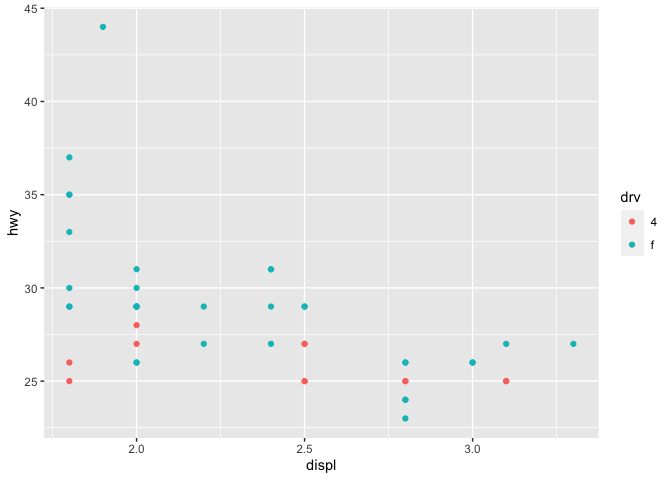

R-For-Data-Science-§21:§29
================
Evan-Woods
2023-11-10

## Libraries

``` r
if (!require(dplyr)) install.packages("dplyr")
```

    ## Loading required package: dplyr

    ## 
    ## Attaching package: 'dplyr'

    ## The following objects are masked from 'package:stats':
    ## 
    ##     filter, lag

    ## The following objects are masked from 'package:base':
    ## 
    ##     intersect, setdiff, setequal, union

``` r
# if (!require(stargazer)) install.packages("stargazer")
if (!require(tidyverse)) install.packages("tidyverse")
```

    ## Loading required package: tidyverse

    ## ── Attaching core tidyverse packages ──────────────────────── tidyverse 2.0.0 ──
    ## ✔ forcats   1.0.0     ✔ readr     2.1.4
    ## ✔ ggplot2   3.4.4     ✔ stringr   1.5.1
    ## ✔ lubridate 1.9.3     ✔ tibble    3.2.1
    ## ✔ purrr     1.0.2     ✔ tidyr     1.3.0
    ## ── Conflicts ────────────────────────────────────────── tidyverse_conflicts() ──
    ## ✖ dplyr::filter() masks stats::filter()
    ## ✖ dplyr::lag()    masks stats::lag()
    ## ℹ Use the conflicted package (<http://conflicted.r-lib.org/>) to force all conflicts to become errors

``` r
if(!require(nycflights13)) install.packages("nycflights13")
```

    ## Loading required package: nycflights13

``` r
# if (!require(shiny)) install.packages("shiny")
# if(!require(Lahman)) install.packages("Lahman")
if(!require(ggplot2)) install.packages("ggplot2")
# if(!require(EnvStats)) install.packages("EnvStats")
# library(EnvStats)
library(tidyverse)
```

# Section 21: Iteration

#### Section 21.2.1: Exercises

``` r
#  1.1
# Compute the mean of every column in mtcars
for (col in seq_along(mtcars)) {
  print(mean(mtcars[[col]]))
}
```

    ## [1] 20.09062
    ## [1] 6.1875
    ## [1] 230.7219
    ## [1] 146.6875
    ## [1] 3.596563
    ## [1] 3.21725
    ## [1] 17.84875
    ## [1] 0.4375
    ## [1] 0.40625
    ## [1] 3.6875
    ## [1] 2.8125

``` r
#  1.2
# Determine the type of each column in nycflights13::flights
for(col in seq_along(nycflights13::flights)){
  print(typeof(nycflights13::flights[[col]]))
}
```

    ## [1] "integer"
    ## [1] "integer"
    ## [1] "integer"
    ## [1] "integer"
    ## [1] "integer"
    ## [1] "double"
    ## [1] "integer"
    ## [1] "integer"
    ## [1] "double"
    ## [1] "character"
    ## [1] "integer"
    ## [1] "character"
    ## [1] "character"
    ## [1] "character"
    ## [1] "double"
    ## [1] "double"
    ## [1] "double"
    ## [1] "double"
    ## [1] "double"

``` r
# Question 1.3
# Compute the number of unique values in each column of iris
for (col in seq_along(iris)){
  print(length(unique(iris[[col]])))
}
```

    ## [1] 35
    ## [1] 23
    ## [1] 43
    ## [1] 22
    ## [1] 3

``` r
# Question 1.4
# Generate 10 random normals from distributions with means of -10, 0, 10, 100
n = 10
means_vector <- c(-10, 0, 10, 100)
for(i in seq(1,10)){
  dist <- rnorm(n, means_vector[[((i %% length(means_vector)) + 1)]])
  print(dist)
  print(mean(dist))
}
```

    ##  [1]  0.727769072 -0.958176348  0.694764415 -1.425778611  0.536085482
    ##  [6] -0.537075572  0.591220485  0.719535304 -0.009717107  1.728299283
    ## [1] 0.2066926
    ##  [1] 11.647615  9.540287  9.103523 12.225374  9.353873 10.466529  9.598883
    ##  [8] 10.202876 11.108723 10.627767
    ## [1] 10.38755
    ##  [1]  98.69113  99.27657  99.27890  98.73602  99.43352  99.79774 100.48797
    ##  [8]  99.31341 100.27848 101.12578
    ## [1] 99.64195
    ##  [1]  -9.778537 -11.080363  -8.260249  -9.944893  -9.718910 -12.605269
    ##  [7]  -9.532987  -9.334327 -10.008952  -9.468150
    ## [1] -9.973264
    ##  [1]  0.77454210 -1.35434382  0.02236615 -0.76421284 -0.74543411  0.23191739
    ##  [7]  0.20092947  1.37157356 -0.67287407  0.44538748
    ## [1] -0.04901487
    ##  [1]  7.961064 10.209033  8.705503  8.949191 10.593160  9.341414  9.292384
    ##  [8] 10.492157 11.093794  9.958100
    ## [1] 9.65958
    ##  [1]  99.38272  99.23564 101.28528  98.58452  98.23045 101.27124  99.88641
    ##  [8]  98.95314 101.24119 102.40885
    ## [1] 100.0479
    ##  [1] -10.562888 -10.750693 -11.617869 -10.286228 -10.029110 -11.384307
    ##  [7]  -8.849476 -10.178076  -9.638678 -10.634536
    ## [1] -10.39319
    ##  [1] -0.4748859  1.2055381 -1.9694655 -0.4322678  0.2654292 -1.4336248
    ##  [7]  0.6869898  0.5875174 -0.6499147 -0.4977127
    ## [1] -0.2712397
    ##  [1]  8.389879 11.130974  8.276249  9.126191  9.385689  9.661827 12.416434
    ##  [8]  9.750882 10.484507  8.696991
    ## [1] 9.731962

``` r
# Quesion 2
# out <- ""
# for(x in letters) {
#   out <- stringr::str_c(out, x)
# }

out <- str_c(letters, collapse = "")
```

``` r
# Quesion 2.1
x <- sample(100)
# sd <- 0
# for (i in seq_along(x)) {
#   sd <- sd + (x[i] - mean(x)) ^2
# }
# sd <- sqrt(sd / (length(x) - 1))
# (sd)
sd(x)
```

    ## [1] 29.01149

``` r
#  2.2
# x <- runif(100)
# out <- vector("numeric", length(x))
# out[1] <- x[1]
# for (i in 2:length(x)) {
#   out[i] <- out[i - 1] + x[i]
# }
# (out)
# cat("\n")

cumsum(x)
```

    ##   [1]   98  164  207  242  302  383  425  433  447  497  530  619  651  722  786
    ##  [16]  806  871  927  932  951 1046 1116 1127 1174 1262 1319 1372 1408 1486 1554
    ##  [31] 1654 1658 1710 1782 1783 1805 1902 1984 2021 2097 2152 2206 2265 2282 2320
    ##  [46] 2345 2422 2483 2552 2591 2675 2771 2857 2878 2951 3009 3040 3107 3156 3218
    ##  [61] 3269 3299 3362 3391 3415 3438 3513 3531 3565 3572 3588 3687 3731 3822 3916
    ##  [76] 4009 4054 4095 4108 4136 4219 4304 4330 4333 4335 4345 4435 4514 4526 4606
    ##  [91] 4693 4741 4815 4855 4901 4928 4934 5026 5035 5050

``` r
# Question 3.1
# Alice the camel has five humps
# Alice the camel has five humps
# Alice the camel has five humps
# So go Alice go, boom, boom, boom!
# Alice the camel has four humps
# Alice the camel has four humps
# Alice the camel has four humps
# So go Alice go, boom, boom, boom!
# Alice the camel has three humps
# Alice the camel has three humps
# Alice the camel has three humps
# So go Alice go, boom, boom, boom!
# Alice the camel has two humps
# Alice the camel has two humps
# Alice the camel has two humps
# So go Alice go, boom, boom, boom!
# Alice the camel has one hump
# Alice the camel has one hump
# Alice the camel has one hump
# So go Alice go, boom, boom, boom!
# Alice the camel has no humps
# Alice the camel has no humps
# Alice the camel has no humps
# Because Alice is a horse of course!
```

``` r
# Question 3.1
# Alice the camel variables

# n_repetitions_counting_lyric <- 3
# pre_counting_lyric_string_concatonation_plural <- "Alice the camel has "
# numeric_counts_vector <- c("five", "four", "three", "two", "one", "no")
# post_counting_lyric_string_concatonation_plural <- " humps\n"
# 
# counting_lyric_singular_conditional_string <- "one"
# pre_counting_lyric_string_concatonation_singular <- "Alice the camel has "
# post_counting_lyric_string_concatonation_singular <- " hump\n"
# 
# print_static_string <- "So go Alice go, boom, boom, boom!\n"
# 
# final_count_condition_string <- "no"
# final_result_static_string <- "Because Alice is a horse of course!\n"

print_child_song <- function(
    n_repetitions_counting_lyric = 3,
    
    pre_counting_lyric_string_concatonation_plural = "Alice the camel has ",
    numeric_counts_vector = c("five", "four", "three", "two", "one", "no"),
    post_counting_lyric_string_concatonation_plural = " humps\n",
    
    unique_additional_verse = FALSE,
    unique_additional_verse_pre_counting_lyric_string_concatonation_plural = "Alice the camel has ",
    unique_additional_verse_post_counting_lyric_string_concatonation_plural = " humps\n",
    
    counting_lyric_singular_conditional_string = "one",
    pre_counting_lyric_string_concatonation_singular = "Alice the camel has ",
    post_counting_lyric_string_concatonation_singular = " hump\n",
    
    print_static_string = "So go Alice go, boom, boom, boom!\n",
    
    final_count_condition_string = "no",
    final_result_static_string = "Because Alice is a horse of course!\n"
    
    ){
    for (i in seq_along(numeric_counts_vector)){
      if(!(unique_additional_verse)){
        
      }
      if (!(identical(numeric_counts_vector[[i]], counting_lyric_singular_conditional_string))){
        print_count_lyric <- str_c(pre_counting_lyric_string_concatonation_plural, numeric_counts_vector[[i]], post_counting_lyric_string_concatonation_plural)
      } else {
        print_count_lyric <- str_c(pre_counting_lyric_string_concatonation_singular, numeric_counts_vector[[i]], post_counting_lyric_string_concatonation_singular)
      }
    
      if (identical(numeric_counts_vector[[i]], final_count_condition_string)){
        print_static_string <- final_result_static_string
      } 

      for (j in seq(1,n_repetitions_counting_lyric)){
        cat(print_count_lyric)
      }
      cat(print_static_string)
    }
}
```

``` r
# Question 3.1
# n_repetitions_counting_lyric <- 3
# pre_counting_lyric_string_concatonation_plural <- "Alice the camel has "
# numeric_counts_vector <- c("five", "four", "three", "two", "one", "no")
# post_counting_lyric_string_concatonation_plural <- " humps\n"
# 
# counting_lyric_singular_conditional_string <- "one"
# pre_counting_lyric_string_concatonation_singular <- "Alice the camel has "
# post_counting_lyric_string_concatonation_singular <- " hump\n"
# 
# print_static_string <- "So go Alice go, boom, boom, boom!\n"
# 
# final_count_condition_string <- "no"
# final_result_static_string <- "Because Alice is a horse of course!\n"

print_child_song()
```

    ## Alice the camel has five humps
    ## Alice the camel has five humps
    ## Alice the camel has five humps
    ## So go Alice go, boom, boom, boom!
    ## Alice the camel has four humps
    ## Alice the camel has four humps
    ## Alice the camel has four humps
    ## So go Alice go, boom, boom, boom!
    ## Alice the camel has three humps
    ## Alice the camel has three humps
    ## Alice the camel has three humps
    ## So go Alice go, boom, boom, boom!
    ## Alice the camel has two humps
    ## Alice the camel has two humps
    ## Alice the camel has two humps
    ## So go Alice go, boom, boom, boom!
    ## Alice the camel has one hump
    ## Alice the camel has one hump
    ## Alice the camel has one hump
    ## So go Alice go, boom, boom, boom!
    ## Alice the camel has no humps
    ## Alice the camel has no humps
    ## Alice the camel has no humps
    ## Because Alice is a horse of course!

``` r
# Question 3.2
# There were ten in the bed
# And the little one said, "Roll over, roll over"
# So they all rolled over and one fell out
# There were nine in the bed
# And the little one said, "Roll over, roll over"
# So they all rolled over and one fell out
# There were eight in the bed
# And the little one said, "Roll over, roll over"
# So they all rolled over and one fell out
# There were seven in the bed
# And the little one said, "Roll over, roll over"
# So they all rolled over and one fell out
# There were six in the bed
# And the little one said, "Roll over, roll over"
# So they all rolled over and one fell out
# There were five in the bed
# And the little one said, "Roll over, roll over"
# So they all rolled over and one fell out
# There were four in the bed
# And the little one said, "Roll over, roll over"
# So they all rolled over and one fell out
# There were three in the bed
# And the little one said, "Roll over, roll over"
# So they all rolled over and one fell out
# There were two in the bed
# And the little one said, "Roll over, roll over"
# So they all rolled over and one fell out
# There was one in the bed
# And the little one said, "Goodnight"
# Bravo
```

``` r
# Question 3.2
n_repetitions_counting_lyric <- 1
pre_counting_lyric_string_concatonation_plural <- "There were "
numeric_counts_vector <- c('ten', 'nine', 'eight', 'seven', 'six', 'five', 'four', 'three', 'two', 'one')
post_counting_lyric_string_concatonation_plural <- " in the bed\n"

counting_lyric_singular_conditional_string <- "one"
pre_counting_lyric_string_concatonation_singular <- "There was "
post_counting_lyric_string_concatonation_singular <- " in the bed\n"

print_static_string <- 'And the little one said, "Roll over, roll over"\nSo they all rolled over and one fell out\n\n'

final_count_condition_string <- "one"
final_result_static_string <- 'And the little one said, "Goodnight"\n\nBravo'

print_child_song(n_repetitions_counting_lyric = n_repetitions_counting_lyric,
                 pre_counting_lyric_string_concatonation_plural = pre_counting_lyric_string_concatonation_plural,
                 numeric_counts_vector = numeric_counts_vector,
                 post_counting_lyric_string_concatonation_plural = post_counting_lyric_string_concatonation_plural,
                 counting_lyric_singular_conditional_string = counting_lyric_singular_conditional_string,
                 pre_counting_lyric_string_concatonation_singular = pre_counting_lyric_string_concatonation_singular,
                 post_counting_lyric_string_concatonation_singular = post_counting_lyric_string_concatonation_singular,
                 print_static_string = print_static_string,
                 final_count_condition_string = final_count_condition_string, 
                 final_result_static_string = final_result_static_string)
```

    ## There were ten in the bed
    ## And the little one said, "Roll over, roll over"
    ## So they all rolled over and one fell out
    ## 
    ## There were nine in the bed
    ## And the little one said, "Roll over, roll over"
    ## So they all rolled over and one fell out
    ## 
    ## There were eight in the bed
    ## And the little one said, "Roll over, roll over"
    ## So they all rolled over and one fell out
    ## 
    ## There were seven in the bed
    ## And the little one said, "Roll over, roll over"
    ## So they all rolled over and one fell out
    ## 
    ## There were six in the bed
    ## And the little one said, "Roll over, roll over"
    ## So they all rolled over and one fell out
    ## 
    ## There were five in the bed
    ## And the little one said, "Roll over, roll over"
    ## So they all rolled over and one fell out
    ## 
    ## There were four in the bed
    ## And the little one said, "Roll over, roll over"
    ## So they all rolled over and one fell out
    ## 
    ## There were three in the bed
    ## And the little one said, "Roll over, roll over"
    ## So they all rolled over and one fell out
    ## 
    ## There were two in the bed
    ## And the little one said, "Roll over, roll over"
    ## So they all rolled over and one fell out
    ## 
    ## There was one in the bed
    ## And the little one said, "Goodnight"
    ## 
    ## Bravo

``` r
print_child_song()
```

    ## Alice the camel has five humps
    ## Alice the camel has five humps
    ## Alice the camel has five humps
    ## So go Alice go, boom, boom, boom!
    ## Alice the camel has four humps
    ## Alice the camel has four humps
    ## Alice the camel has four humps
    ## So go Alice go, boom, boom, boom!
    ## Alice the camel has three humps
    ## Alice the camel has three humps
    ## Alice the camel has three humps
    ## So go Alice go, boom, boom, boom!
    ## Alice the camel has two humps
    ## Alice the camel has two humps
    ## Alice the camel has two humps
    ## So go Alice go, boom, boom, boom!
    ## Alice the camel has one hump
    ## Alice the camel has one hump
    ## Alice the camel has one hump
    ## So go Alice go, boom, boom, boom!
    ## Alice the camel has no humps
    ## Alice the camel has no humps
    ## Alice the camel has no humps
    ## Because Alice is a horse of course!

``` r
create_str_vector_from_int <- function(
        least_significant_integer_to_convert = -1,
        most_significant_integer_to_convert = 100,
        reverse_sequence = TRUE,
        zero_synonym = "zero"
    ){
        
        int_to_string_vector_one_to_nine = c('one', 'two', 'three', 'four', 'five','six', 'seven', 'eight', 'nine')
        int_to_string_vector_unique_under_twenty = c('eleven', 'twelve', 'thirteen', 'fourteen', 'fifteen', 'sixteen', 'seventeen', 'eighteen', 'nineteen')
        int_to_string_vector_unique_tens = c('ten','twenty', 'thirty', 'fourty', 'fifty', 'sixty', 'seventy', 'eighty', 'ninety')

        integer_vector_of_numbers_to_convert = seq(least_significant_integer_to_convert, most_significant_integer_to_convert)

        if(reverse_sequence) {
          integer_vector_of_numbers_to_convert <- rev(integer_vector_of_numbers_to_convert)
        }

        return_char_vector <- character()

        for (i in integer_vector_of_numbers_to_convert){
          if (i > 99 || i < 0) {
            next
          }
          if (near(i, 0)){
            return_char_vector <- c(return_char_vector, zero_synonym)
            # cat(zero_synonym)
            # cat('\n')
          } else if (i < 10){
            return_char_vector <- c(return_char_vector, int_to_string_vector_one_to_nine[[i]])
            # cat(int_to_string_vector_one_to_nine[[i]])
            # cat('\n')
          } else if (i > 10 && i < 20) {
            return_char_vector <- c(return_char_vector, int_to_string_vector_unique_under_twenty[[(i %% 10)]])
            # cat(int_to_string_vector_unique_under_twenty[[(i %% 10)]])
            # cat('\n')
          } else if (near((i %% 10), 0)){
            return_char_vector <- c(return_char_vector, int_to_string_vector_unique_tens[[(i %/% 10)]])
            # cat(int_to_string_vector_unique_tens[[(i %/% 10)]])
            # cat('\n')
          } else {
            combined_int_to_str_greater_than_ten <- str_c(int_to_string_vector_unique_tens[[((i %/% 10))]], int_to_string_vector_one_to_nine[[(i %% 10)]], sep = "-")
            return_char_vector <- c(return_char_vector, combined_int_to_str_greater_than_ten)
            # cat(combined_int_to_str_greater_than_ten)
            # cat('\n')
          }
        }
        return(return_char_vector)
}
```

``` r
vect <- create_str_vector_from_int(        
  least_significant_integer_to_convert = 0,
  most_significant_integer_to_convert = 5,
  reverse_sequence = TRUE,
  zero_synonym = "no"
)
(vect)
```

    ## [1] "five"  "four"  "three" "two"   "one"   "no"

``` r
print_child_song(numeric_counts_vector = create_str_vector_from_int(        
  least_significant_integer_to_convert = 0,
  most_significant_integer_to_convert = 5,
  reverse_sequence = TRUE,
  zero_synonym = "no"
))
```

    ## Alice the camel has five humps
    ## Alice the camel has five humps
    ## Alice the camel has five humps
    ## So go Alice go, boom, boom, boom!
    ## Alice the camel has four humps
    ## Alice the camel has four humps
    ## Alice the camel has four humps
    ## So go Alice go, boom, boom, boom!
    ## Alice the camel has three humps
    ## Alice the camel has three humps
    ## Alice the camel has three humps
    ## So go Alice go, boom, boom, boom!
    ## Alice the camel has two humps
    ## Alice the camel has two humps
    ## Alice the camel has two humps
    ## So go Alice go, boom, boom, boom!
    ## Alice the camel has one hump
    ## Alice the camel has one hump
    ## Alice the camel has one hump
    ## So go Alice go, boom, boom, boom!
    ## Alice the camel has no humps
    ## Alice the camel has no humps
    ## Alice the camel has no humps
    ## Because Alice is a horse of course!

``` r
n_repetitions_counting_lyric <- 1
pre_counting_lyric_string_concatonation_plural <- "There were "

numeric_counts_vector <- create_str_vector_from_int(        
  least_significant_integer_to_convert = 1,
  most_significant_integer_to_convert = 10,
  reverse_sequence = TRUE,
  zero_synonym = "no"
)

post_counting_lyric_string_concatonation_plural <- " in the bed\n"

counting_lyric_singular_conditional_string <- "one"
pre_counting_lyric_string_concatonation_singular <- "There was "
post_counting_lyric_string_concatonation_singular <- " in the bed\n"

print_static_string <- 'And the little one said, "Roll over, roll over"\nSo they all rolled over and one fell out\n\n'

final_count_condition_string <- "one"
final_result_static_string <- 'And the little one said, "Goodnight"\n\nBravo'

print_child_song(n_repetitions_counting_lyric = n_repetitions_counting_lyric,
                 pre_counting_lyric_string_concatonation_plural = pre_counting_lyric_string_concatonation_plural,
                 numeric_counts_vector = numeric_counts_vector,
                 post_counting_lyric_string_concatonation_plural = post_counting_lyric_string_concatonation_plural,
                 counting_lyric_singular_conditional_string = counting_lyric_singular_conditional_string,
                 pre_counting_lyric_string_concatonation_singular = pre_counting_lyric_string_concatonation_singular,
                 post_counting_lyric_string_concatonation_singular = post_counting_lyric_string_concatonation_singular,
                 print_static_string = print_static_string,
                 final_count_condition_string = final_count_condition_string, 
                 final_result_static_string = final_result_static_string)
```

    ## There were ten in the bed
    ## And the little one said, "Roll over, roll over"
    ## So they all rolled over and one fell out
    ## 
    ## There were nine in the bed
    ## And the little one said, "Roll over, roll over"
    ## So they all rolled over and one fell out
    ## 
    ## There were eight in the bed
    ## And the little one said, "Roll over, roll over"
    ## So they all rolled over and one fell out
    ## 
    ## There were seven in the bed
    ## And the little one said, "Roll over, roll over"
    ## So they all rolled over and one fell out
    ## 
    ## There were six in the bed
    ## And the little one said, "Roll over, roll over"
    ## So they all rolled over and one fell out
    ## 
    ## There were five in the bed
    ## And the little one said, "Roll over, roll over"
    ## So they all rolled over and one fell out
    ## 
    ## There were four in the bed
    ## And the little one said, "Roll over, roll over"
    ## So they all rolled over and one fell out
    ## 
    ## There were three in the bed
    ## And the little one said, "Roll over, roll over"
    ## So they all rolled over and one fell out
    ## 
    ## There were two in the bed
    ## And the little one said, "Roll over, roll over"
    ## So they all rolled over and one fell out
    ## 
    ## There was one in the bed
    ## And the little one said, "Goodnight"
    ## 
    ## Bravo

``` r
n_repetitions_counting_lyric <- 1
pre_counting_lyric_string_concatonation_plural <- "There were "

numeric_counts_vector <- create_str_vector_from_int(        
  least_significant_integer_to_convert = 0,
  most_significant_integer_to_convert = 99,
  reverse_sequence = TRUE,
  zero_synonym = "no"
)

post_counting_lyric_string_concatonation_plural <- " in the bed\n"

counting_lyric_singular_conditional_string <- "one"
pre_counting_lyric_string_concatonation_singular <- "There was "
post_counting_lyric_string_concatonation_singular <- " in the bed\n"

print_static_string <- 'And the little one said, "Roll over, roll over"\nSo they all rolled over and one fell out\n\n'

final_count_condition_string <- "one"
final_result_static_string <- 'And the little one said, "Goodnight"\n\nBravo'

print_child_song(n_repetitions_counting_lyric = n_repetitions_counting_lyric,
                 pre_counting_lyric_string_concatonation_plural = pre_counting_lyric_string_concatonation_plural,
                 numeric_counts_vector = numeric_counts_vector,
                 post_counting_lyric_string_concatonation_plural = post_counting_lyric_string_concatonation_plural,
                 counting_lyric_singular_conditional_string = counting_lyric_singular_conditional_string,
                 pre_counting_lyric_string_concatonation_singular = pre_counting_lyric_string_concatonation_singular,
                 post_counting_lyric_string_concatonation_singular = post_counting_lyric_string_concatonation_singular,
                 print_static_string = print_static_string,
                 final_count_condition_string = final_count_condition_string, 
                 final_result_static_string = final_result_static_string)
```

    ## There were ninety-nine in the bed
    ## And the little one said, "Roll over, roll over"
    ## So they all rolled over and one fell out
    ## 
    ## There were ninety-eight in the bed
    ## And the little one said, "Roll over, roll over"
    ## So they all rolled over and one fell out
    ## 
    ## There were ninety-seven in the bed
    ## And the little one said, "Roll over, roll over"
    ## So they all rolled over and one fell out
    ## 
    ## There were ninety-six in the bed
    ## And the little one said, "Roll over, roll over"
    ## So they all rolled over and one fell out
    ## 
    ## There were ninety-five in the bed
    ## And the little one said, "Roll over, roll over"
    ## So they all rolled over and one fell out
    ## 
    ## There were ninety-four in the bed
    ## And the little one said, "Roll over, roll over"
    ## So they all rolled over and one fell out
    ## 
    ## There were ninety-three in the bed
    ## And the little one said, "Roll over, roll over"
    ## So they all rolled over and one fell out
    ## 
    ## There were ninety-two in the bed
    ## And the little one said, "Roll over, roll over"
    ## So they all rolled over and one fell out
    ## 
    ## There were ninety-one in the bed
    ## And the little one said, "Roll over, roll over"
    ## So they all rolled over and one fell out
    ## 
    ## There were ninety in the bed
    ## And the little one said, "Roll over, roll over"
    ## So they all rolled over and one fell out
    ## 
    ## There were eighty-nine in the bed
    ## And the little one said, "Roll over, roll over"
    ## So they all rolled over and one fell out
    ## 
    ## There were eighty-eight in the bed
    ## And the little one said, "Roll over, roll over"
    ## So they all rolled over and one fell out
    ## 
    ## There were eighty-seven in the bed
    ## And the little one said, "Roll over, roll over"
    ## So they all rolled over and one fell out
    ## 
    ## There were eighty-six in the bed
    ## And the little one said, "Roll over, roll over"
    ## So they all rolled over and one fell out
    ## 
    ## There were eighty-five in the bed
    ## And the little one said, "Roll over, roll over"
    ## So they all rolled over and one fell out
    ## 
    ## There were eighty-four in the bed
    ## And the little one said, "Roll over, roll over"
    ## So they all rolled over and one fell out
    ## 
    ## There were eighty-three in the bed
    ## And the little one said, "Roll over, roll over"
    ## So they all rolled over and one fell out
    ## 
    ## There were eighty-two in the bed
    ## And the little one said, "Roll over, roll over"
    ## So they all rolled over and one fell out
    ## 
    ## There were eighty-one in the bed
    ## And the little one said, "Roll over, roll over"
    ## So they all rolled over and one fell out
    ## 
    ## There were eighty in the bed
    ## And the little one said, "Roll over, roll over"
    ## So they all rolled over and one fell out
    ## 
    ## There were seventy-nine in the bed
    ## And the little one said, "Roll over, roll over"
    ## So they all rolled over and one fell out
    ## 
    ## There were seventy-eight in the bed
    ## And the little one said, "Roll over, roll over"
    ## So they all rolled over and one fell out
    ## 
    ## There were seventy-seven in the bed
    ## And the little one said, "Roll over, roll over"
    ## So they all rolled over and one fell out
    ## 
    ## There were seventy-six in the bed
    ## And the little one said, "Roll over, roll over"
    ## So they all rolled over and one fell out
    ## 
    ## There were seventy-five in the bed
    ## And the little one said, "Roll over, roll over"
    ## So they all rolled over and one fell out
    ## 
    ## There were seventy-four in the bed
    ## And the little one said, "Roll over, roll over"
    ## So they all rolled over and one fell out
    ## 
    ## There were seventy-three in the bed
    ## And the little one said, "Roll over, roll over"
    ## So they all rolled over and one fell out
    ## 
    ## There were seventy-two in the bed
    ## And the little one said, "Roll over, roll over"
    ## So they all rolled over and one fell out
    ## 
    ## There were seventy-one in the bed
    ## And the little one said, "Roll over, roll over"
    ## So they all rolled over and one fell out
    ## 
    ## There were seventy in the bed
    ## And the little one said, "Roll over, roll over"
    ## So they all rolled over and one fell out
    ## 
    ## There were sixty-nine in the bed
    ## And the little one said, "Roll over, roll over"
    ## So they all rolled over and one fell out
    ## 
    ## There were sixty-eight in the bed
    ## And the little one said, "Roll over, roll over"
    ## So they all rolled over and one fell out
    ## 
    ## There were sixty-seven in the bed
    ## And the little one said, "Roll over, roll over"
    ## So they all rolled over and one fell out
    ## 
    ## There were sixty-six in the bed
    ## And the little one said, "Roll over, roll over"
    ## So they all rolled over and one fell out
    ## 
    ## There were sixty-five in the bed
    ## And the little one said, "Roll over, roll over"
    ## So they all rolled over and one fell out
    ## 
    ## There were sixty-four in the bed
    ## And the little one said, "Roll over, roll over"
    ## So they all rolled over and one fell out
    ## 
    ## There were sixty-three in the bed
    ## And the little one said, "Roll over, roll over"
    ## So they all rolled over and one fell out
    ## 
    ## There were sixty-two in the bed
    ## And the little one said, "Roll over, roll over"
    ## So they all rolled over and one fell out
    ## 
    ## There were sixty-one in the bed
    ## And the little one said, "Roll over, roll over"
    ## So they all rolled over and one fell out
    ## 
    ## There were sixty in the bed
    ## And the little one said, "Roll over, roll over"
    ## So they all rolled over and one fell out
    ## 
    ## There were fifty-nine in the bed
    ## And the little one said, "Roll over, roll over"
    ## So they all rolled over and one fell out
    ## 
    ## There were fifty-eight in the bed
    ## And the little one said, "Roll over, roll over"
    ## So they all rolled over and one fell out
    ## 
    ## There were fifty-seven in the bed
    ## And the little one said, "Roll over, roll over"
    ## So they all rolled over and one fell out
    ## 
    ## There were fifty-six in the bed
    ## And the little one said, "Roll over, roll over"
    ## So they all rolled over and one fell out
    ## 
    ## There were fifty-five in the bed
    ## And the little one said, "Roll over, roll over"
    ## So they all rolled over and one fell out
    ## 
    ## There were fifty-four in the bed
    ## And the little one said, "Roll over, roll over"
    ## So they all rolled over and one fell out
    ## 
    ## There were fifty-three in the bed
    ## And the little one said, "Roll over, roll over"
    ## So they all rolled over and one fell out
    ## 
    ## There were fifty-two in the bed
    ## And the little one said, "Roll over, roll over"
    ## So they all rolled over and one fell out
    ## 
    ## There were fifty-one in the bed
    ## And the little one said, "Roll over, roll over"
    ## So they all rolled over and one fell out
    ## 
    ## There were fifty in the bed
    ## And the little one said, "Roll over, roll over"
    ## So they all rolled over and one fell out
    ## 
    ## There were fourty-nine in the bed
    ## And the little one said, "Roll over, roll over"
    ## So they all rolled over and one fell out
    ## 
    ## There were fourty-eight in the bed
    ## And the little one said, "Roll over, roll over"
    ## So they all rolled over and one fell out
    ## 
    ## There were fourty-seven in the bed
    ## And the little one said, "Roll over, roll over"
    ## So they all rolled over and one fell out
    ## 
    ## There were fourty-six in the bed
    ## And the little one said, "Roll over, roll over"
    ## So they all rolled over and one fell out
    ## 
    ## There were fourty-five in the bed
    ## And the little one said, "Roll over, roll over"
    ## So they all rolled over and one fell out
    ## 
    ## There were fourty-four in the bed
    ## And the little one said, "Roll over, roll over"
    ## So they all rolled over and one fell out
    ## 
    ## There were fourty-three in the bed
    ## And the little one said, "Roll over, roll over"
    ## So they all rolled over and one fell out
    ## 
    ## There were fourty-two in the bed
    ## And the little one said, "Roll over, roll over"
    ## So they all rolled over and one fell out
    ## 
    ## There were fourty-one in the bed
    ## And the little one said, "Roll over, roll over"
    ## So they all rolled over and one fell out
    ## 
    ## There were fourty in the bed
    ## And the little one said, "Roll over, roll over"
    ## So they all rolled over and one fell out
    ## 
    ## There were thirty-nine in the bed
    ## And the little one said, "Roll over, roll over"
    ## So they all rolled over and one fell out
    ## 
    ## There were thirty-eight in the bed
    ## And the little one said, "Roll over, roll over"
    ## So they all rolled over and one fell out
    ## 
    ## There were thirty-seven in the bed
    ## And the little one said, "Roll over, roll over"
    ## So they all rolled over and one fell out
    ## 
    ## There were thirty-six in the bed
    ## And the little one said, "Roll over, roll over"
    ## So they all rolled over and one fell out
    ## 
    ## There were thirty-five in the bed
    ## And the little one said, "Roll over, roll over"
    ## So they all rolled over and one fell out
    ## 
    ## There were thirty-four in the bed
    ## And the little one said, "Roll over, roll over"
    ## So they all rolled over and one fell out
    ## 
    ## There were thirty-three in the bed
    ## And the little one said, "Roll over, roll over"
    ## So they all rolled over and one fell out
    ## 
    ## There were thirty-two in the bed
    ## And the little one said, "Roll over, roll over"
    ## So they all rolled over and one fell out
    ## 
    ## There were thirty-one in the bed
    ## And the little one said, "Roll over, roll over"
    ## So they all rolled over and one fell out
    ## 
    ## There were thirty in the bed
    ## And the little one said, "Roll over, roll over"
    ## So they all rolled over and one fell out
    ## 
    ## There were twenty-nine in the bed
    ## And the little one said, "Roll over, roll over"
    ## So they all rolled over and one fell out
    ## 
    ## There were twenty-eight in the bed
    ## And the little one said, "Roll over, roll over"
    ## So they all rolled over and one fell out
    ## 
    ## There were twenty-seven in the bed
    ## And the little one said, "Roll over, roll over"
    ## So they all rolled over and one fell out
    ## 
    ## There were twenty-six in the bed
    ## And the little one said, "Roll over, roll over"
    ## So they all rolled over and one fell out
    ## 
    ## There were twenty-five in the bed
    ## And the little one said, "Roll over, roll over"
    ## So they all rolled over and one fell out
    ## 
    ## There were twenty-four in the bed
    ## And the little one said, "Roll over, roll over"
    ## So they all rolled over and one fell out
    ## 
    ## There were twenty-three in the bed
    ## And the little one said, "Roll over, roll over"
    ## So they all rolled over and one fell out
    ## 
    ## There were twenty-two in the bed
    ## And the little one said, "Roll over, roll over"
    ## So they all rolled over and one fell out
    ## 
    ## There were twenty-one in the bed
    ## And the little one said, "Roll over, roll over"
    ## So they all rolled over and one fell out
    ## 
    ## There were twenty in the bed
    ## And the little one said, "Roll over, roll over"
    ## So they all rolled over and one fell out
    ## 
    ## There were nineteen in the bed
    ## And the little one said, "Roll over, roll over"
    ## So they all rolled over and one fell out
    ## 
    ## There were eighteen in the bed
    ## And the little one said, "Roll over, roll over"
    ## So they all rolled over and one fell out
    ## 
    ## There were seventeen in the bed
    ## And the little one said, "Roll over, roll over"
    ## So they all rolled over and one fell out
    ## 
    ## There were sixteen in the bed
    ## And the little one said, "Roll over, roll over"
    ## So they all rolled over and one fell out
    ## 
    ## There were fifteen in the bed
    ## And the little one said, "Roll over, roll over"
    ## So they all rolled over and one fell out
    ## 
    ## There were fourteen in the bed
    ## And the little one said, "Roll over, roll over"
    ## So they all rolled over and one fell out
    ## 
    ## There were thirteen in the bed
    ## And the little one said, "Roll over, roll over"
    ## So they all rolled over and one fell out
    ## 
    ## There were twelve in the bed
    ## And the little one said, "Roll over, roll over"
    ## So they all rolled over and one fell out
    ## 
    ## There were eleven in the bed
    ## And the little one said, "Roll over, roll over"
    ## So they all rolled over and one fell out
    ## 
    ## There were ten in the bed
    ## And the little one said, "Roll over, roll over"
    ## So they all rolled over and one fell out
    ## 
    ## There were nine in the bed
    ## And the little one said, "Roll over, roll over"
    ## So they all rolled over and one fell out
    ## 
    ## There were eight in the bed
    ## And the little one said, "Roll over, roll over"
    ## So they all rolled over and one fell out
    ## 
    ## There were seven in the bed
    ## And the little one said, "Roll over, roll over"
    ## So they all rolled over and one fell out
    ## 
    ## There were six in the bed
    ## And the little one said, "Roll over, roll over"
    ## So they all rolled over and one fell out
    ## 
    ## There were five in the bed
    ## And the little one said, "Roll over, roll over"
    ## So they all rolled over and one fell out
    ## 
    ## There were four in the bed
    ## And the little one said, "Roll over, roll over"
    ## So they all rolled over and one fell out
    ## 
    ## There were three in the bed
    ## And the little one said, "Roll over, roll over"
    ## So they all rolled over and one fell out
    ## 
    ## There were two in the bed
    ## And the little one said, "Roll over, roll over"
    ## So they all rolled over and one fell out
    ## 
    ## There was one in the bed
    ## And the little one said, "Goodnight"
    ## 
    ## BravoThere were no in the bed
    ## And the little one said, "Goodnight"
    ## 
    ## Bravo

``` r
capitalize_first_letter_in_string <- function(initial_string){
  characters <- str_split_1(initial_string, pattern = "")
  characters[1] <- str_to_upper(characters[1])
  capitalized_string <- str_flatten(characters)
  return(capitalized_string)
}
capitalize_first_letter_in_string("string")
```

    ## [1] "String"

``` r
# Question 3.3

capitalize_first_letter_in_string <- function(initial_string){
  characters <- str_split_1(initial_string, pattern = "")
  characters[1] <- str_to_upper(characters[1])
  capitalized_string <- str_flatten(characters)
  return(capitalized_string)
}

modify_punctuation_in_string <- function(initial_string, replacement_punctuation){
  characters <- str_split_1(initial_string, pattern = "")
  if(identical(characters[length(characters)], "\n")) {
    characters[length(characters) - 1] <- replacement_punctuation  
  } else {
    characters[length(characters)] <- replacement_punctuation
  }
  modified_string <- str_flatten(characters)
  return(modified_string)
}

print_child_song <- function(
 n_repetitions_counting_lyric = 1,
        
    pre_counting_lyric_string_concatonation_plural = "Alice the camel has",
    numeric_counts_vector =  create_str_vector_from_int(
        least_significant_integer_to_convert = 0,
        most_significant_integer_to_convert = 5,
        reverse_sequence = TRUE,
        zero_synonym = "no"
    ),
    post_counting_lyric_string_concatonation_plural = " humps\n",
    
    counting_lyric_singular_conditional_string = "one",
    pre_counting_lyric_string_concatonation_singular = "Alice the camel has ",
    post_counting_lyric_string_concatonation_singular = " hump\n",
    
    print_static_string = "So go Alice go, boom, boom, boom!\n",
    
    final_count_condition_string = "no",
    final_result_static_string = "Because Alice is a horse of course!\n",

    unique_additional_verse = FALSE,
    unique_additional_verse_pre_counting_lyric_string_concatonation_plural = "",
    unique_additional_verse_post_counting_lyric_string_concatonation_plural = "",
    unique_additional_verse_pre_counting_lyric_string_concatonation_singular = "",
    unique_additional_verse_post_counting_lyric_string_concatonation_singular = "",
    
    song = "custom"
    
    ){
    if (str_like(song, "Alice the camel", ignore_case = TRUE)){
        # Parameters for Alice the camel.
        n_repetitions_counting_lyric = 3
        
        pre_counting_lyric_string_concatonation_plural = "Alice the camel has"
        numeric_counts_vector =  create_str_vector_from_int(
            least_significant_integer_to_convert = 0,
            most_significant_integer_to_convert = 5,
            reverse_sequence = TRUE,
            zero_synonym = "no"
        )
        post_counting_lyric_string_concatonation_plural = " humps\n"
        
        counting_lyric_singular_conditional_string = "one"
        pre_counting_lyric_string_concatonation_singular = "Alice the camel has "
        post_counting_lyric_string_concatonation_singular = " hump\n"
        
        print_static_string = "So go Alice go, boom, boom, boom!\n"
        
        final_count_condition_string = "no"
        final_result_static_string = "Because Alice is a horse of course!\n"
    
        unique_additional_verse = FALSE
        unique_additional_verse_pre_counting_lyric_string_concatonation_plural = ""
        unique_additional_verse_post_counting_lyric_string_concatonation_plural = ""
        unique_additional_verse_pre_counting_lyric_string_concatonation_singular = ""
        unique_additional_verse_post_counting_lyric_string_concatonation_singular = ""

    } else if(str_like(song, "Ten in the bed", ignore_case = TRUE)) {
        # Parameters for Ten in the bed.
        n_repetitions_counting_lyric <- 1
        pre_counting_lyric_string_concatonation_plural <- "There were "
        numeric_counts_vector <- create_str_vector_from_int(
                    least_significant_integer_to_convert = 1,
                    most_significant_integer_to_convert = 10,
                    reverse_sequence = TRUE,
                    zero_synonym = "no"
                )
        post_counting_lyric_string_concatonation_plural <- " in the bed\n"

        counting_lyric_singular_conditional_string <- "one"
        pre_counting_lyric_string_concatonation_singular <- "There was "
        post_counting_lyric_string_concatonation_singular <- " in the bed\n"

        print_static_string <- 'And the little one said, "Roll over, roll over"\nSo they all rolled over and one fell out\n\n'

        final_count_condition_string <- "one"
        final_result_static_string <- 'And the little one said, "Goodnight"\n\nBravo'

        unique_additional_verse = FALSE
        unique_additional_verse_pre_counting_lyric_string_concatonation_plural = ""
        unique_additional_verse_post_counting_lyric_string_concatonation_plural = ""
        unique_additional_verse_pre_counting_lyric_string_concatonation_singular = ""
        unique_additional_verse_post_counting_lyric_string_concatonation_singular = ""
      
    } else if(str_like(song, "99 bottles of beer", ignore_case = TRUE)) {
        # Parameters for 99 bottles of beer
        n_repetitions_counting_lyric = 1
    
        pre_counting_lyric_string_concatonation_plural = ""
        numeric_counts_vector =  create_str_vector_from_int(
            least_significant_integer_to_convert = 1,
            most_significant_integer_to_convert = 100,
            reverse_sequence = TRUE,
            zero_synonym = "no"
        )
        post_counting_lyric_string_concatonation_plural = " bottles of beer on the wall,\n"
    
        counting_lyric_singular_conditional_string = "one"
        pre_counting_lyric_string_concatonation_singular = ""
        post_counting_lyric_string_concatonation_singular = " bottle of beer on the wall,\n"
    
        print_static_string = "Take one down,\nPass it around,\n"
    
        final_count_condition_string = "one"
        final_result_static_string = "Take it down,\nPass it around,\nNo more bottles of beer on the wall!\n"

        unique_additional_verse = TRUE
        unique_additional_verse_pre_counting_lyric_string_concatonation_plural = ""
        unique_additional_verse_post_counting_lyric_string_concatonation_plural = " bottles of beer!\n"
        unique_additional_verse_pre_counting_lyric_string_concatonation_singular = ""
        unique_additional_verse_post_counting_lyric_string_concatonation_singular = " bottle of beer!\n"
    } else {
      # custom song; Alice the horse if not set;
      # cat(song)
    }
  
    for (i in seq_along(numeric_counts_vector)){
      if(!(unique_additional_verse)){
          if (!(identical(numeric_counts_vector[[i]], counting_lyric_singular_conditional_string))){
            print_count_lyric <- str_c(pre_counting_lyric_string_concatonation_plural, numeric_counts_vector[[i]], post_counting_lyric_string_concatonation_plural)
          } else {
            print_count_lyric <- str_c(pre_counting_lyric_string_concatonation_singular, numeric_counts_vector[[i]], post_counting_lyric_string_concatonation_singular)
          }

          if (identical(numeric_counts_vector[[i]], final_count_condition_string)){
            print_static_string <- final_result_static_string
          } 

          for (j in seq(1,n_repetitions_counting_lyric)){
            cat(print_count_lyric)
          }
          cat(print_static_string)
        } else {
        if (!(identical(numeric_counts_vector[[i]], counting_lyric_singular_conditional_string))){
            capitalized_numeric_counts_vector <- capitalize_first_letter_in_string(numeric_counts_vector[[i]])
            print_count_lyric <- str_c(pre_counting_lyric_string_concatonation_plural, capitalized_numeric_counts_vector, post_counting_lyric_string_concatonation_plural)
            unique_print_count_lyric <- str_c(unique_additional_verse_pre_counting_lyric_string_concatonation_plural, capitalized_numeric_counts_vector, unique_additional_verse_post_counting_lyric_string_concatonation_plural)
          } else {
            capitalized_numeric_counts_vector <- capitalize_first_letter_in_string(numeric_counts_vector[[i]])
            print_count_lyric <- str_c(pre_counting_lyric_string_concatonation_singular, capitalized_numeric_counts_vector, post_counting_lyric_string_concatonation_singular)
            unique_print_count_lyric <- str_c(unique_additional_verse_pre_counting_lyric_string_concatonation_singular, capitalized_numeric_counts_vector, unique_additional_verse_post_counting_lyric_string_concatonation_singular)
          }

          if (identical(numeric_counts_vector[[i]], final_count_condition_string)){
            print_static_string <- final_result_static_string
          } 

          for (j in seq(1,n_repetitions_counting_lyric)){
           if(unique_additional_verse && !near(i, 1)) {
              print_count_lyrics_modified_punctuation <- modify_punctuation_in_string(print_count_lyric, "!")
              cat(print_count_lyrics_modified_punctuation)
              cat('\n')
              cat(print_count_lyric)
           } else {
              cat(print_count_lyric)  
            }
          }
          cat(unique_print_count_lyric)

          cat(print_static_string)
        }
    }
}

songs <- c("Alice the camel", "99 bottles of beer", "Ten in the bed")

attr(print_child_song, which = "songs") <- songs

attributes(print_child_song)
```

    ## $srcref
    ## function(
    ##  n_repetitions_counting_lyric = 1,
    ##         
    ##     pre_counting_lyric_string_concatonation_plural = "Alice the camel has",
    ##     numeric_counts_vector =  create_str_vector_from_int(
    ##         least_significant_integer_to_convert = 0,
    ##         most_significant_integer_to_convert = 5,
    ##         reverse_sequence = TRUE,
    ##         zero_synonym = "no"
    ##     ),
    ##     post_counting_lyric_string_concatonation_plural = " humps\n",
    ##     
    ##     counting_lyric_singular_conditional_string = "one",
    ##     pre_counting_lyric_string_concatonation_singular = "Alice the camel has ",
    ##     post_counting_lyric_string_concatonation_singular = " hump\n",
    ##     
    ##     print_static_string = "So go Alice go, boom, boom, boom!\n",
    ##     
    ##     final_count_condition_string = "no",
    ##     final_result_static_string = "Because Alice is a horse of course!\n",
    ## 
    ##     unique_additional_verse = FALSE,
    ##     unique_additional_verse_pre_counting_lyric_string_concatonation_plural = "",
    ##     unique_additional_verse_post_counting_lyric_string_concatonation_plural = "",
    ##     unique_additional_verse_pre_counting_lyric_string_concatonation_singular = "",
    ##     unique_additional_verse_post_counting_lyric_string_concatonation_singular = "",
    ##     
    ##     song = "custom"
    ##     
    ##     ){
    ##     if (str_like(song, "Alice the camel", ignore_case = TRUE)){
    ##         # Parameters for Alice the camel.
    ##         n_repetitions_counting_lyric = 3
    ##         
    ##         pre_counting_lyric_string_concatonation_plural = "Alice the camel has"
    ##         numeric_counts_vector =  create_str_vector_from_int(
    ##             least_significant_integer_to_convert = 0,
    ##             most_significant_integer_to_convert = 5,
    ##             reverse_sequence = TRUE,
    ##             zero_synonym = "no"
    ##         )
    ##         post_counting_lyric_string_concatonation_plural = " humps\n"
    ##         
    ##         counting_lyric_singular_conditional_string = "one"
    ##         pre_counting_lyric_string_concatonation_singular = "Alice the camel has "
    ##         post_counting_lyric_string_concatonation_singular = " hump\n"
    ##         
    ##         print_static_string = "So go Alice go, boom, boom, boom!\n"
    ##         
    ##         final_count_condition_string = "no"
    ##         final_result_static_string = "Because Alice is a horse of course!\n"
    ##     
    ##         unique_additional_verse = FALSE
    ##         unique_additional_verse_pre_counting_lyric_string_concatonation_plural = ""
    ##         unique_additional_verse_post_counting_lyric_string_concatonation_plural = ""
    ##         unique_additional_verse_pre_counting_lyric_string_concatonation_singular = ""
    ##         unique_additional_verse_post_counting_lyric_string_concatonation_singular = ""
    ## 
    ##     } else if(str_like(song, "Ten in the bed", ignore_case = TRUE)) {
    ##         # Parameters for Ten in the bed.
    ##         n_repetitions_counting_lyric <- 1
    ##         pre_counting_lyric_string_concatonation_plural <- "There were "
    ##         numeric_counts_vector <- create_str_vector_from_int(
    ##                     least_significant_integer_to_convert = 1,
    ##                     most_significant_integer_to_convert = 10,
    ##                     reverse_sequence = TRUE,
    ##                     zero_synonym = "no"
    ##                 )
    ##         post_counting_lyric_string_concatonation_plural <- " in the bed\n"
    ## 
    ##         counting_lyric_singular_conditional_string <- "one"
    ##         pre_counting_lyric_string_concatonation_singular <- "There was "
    ##         post_counting_lyric_string_concatonation_singular <- " in the bed\n"
    ## 
    ##         print_static_string <- 'And the little one said, "Roll over, roll over"\nSo they all rolled over and one fell out\n\n'
    ## 
    ##         final_count_condition_string <- "one"
    ##         final_result_static_string <- 'And the little one said, "Goodnight"\n\nBravo'
    ## 
    ##         unique_additional_verse = FALSE
    ##         unique_additional_verse_pre_counting_lyric_string_concatonation_plural = ""
    ##         unique_additional_verse_post_counting_lyric_string_concatonation_plural = ""
    ##         unique_additional_verse_pre_counting_lyric_string_concatonation_singular = ""
    ##         unique_additional_verse_post_counting_lyric_string_concatonation_singular = ""
    ##       
    ##     } else if(str_like(song, "99 bottles of beer", ignore_case = TRUE)) {
    ##         # Parameters for 99 bottles of beer
    ##         n_repetitions_counting_lyric = 1
    ##     
    ##         pre_counting_lyric_string_concatonation_plural = ""
    ##         numeric_counts_vector =  create_str_vector_from_int(
    ##             least_significant_integer_to_convert = 1,
    ##             most_significant_integer_to_convert = 100,
    ##             reverse_sequence = TRUE,
    ##             zero_synonym = "no"
    ##         )
    ##         post_counting_lyric_string_concatonation_plural = " bottles of beer on the wall,\n"
    ##     
    ##         counting_lyric_singular_conditional_string = "one"
    ##         pre_counting_lyric_string_concatonation_singular = ""
    ##         post_counting_lyric_string_concatonation_singular = " bottle of beer on the wall,\n"
    ##     
    ##         print_static_string = "Take one down,\nPass it around,\n"
    ##     
    ##         final_count_condition_string = "one"
    ##         final_result_static_string = "Take it down,\nPass it around,\nNo more bottles of beer on the wall!\n"
    ## 
    ##         unique_additional_verse = TRUE
    ##         unique_additional_verse_pre_counting_lyric_string_concatonation_plural = ""
    ##         unique_additional_verse_post_counting_lyric_string_concatonation_plural = " bottles of beer!\n"
    ##         unique_additional_verse_pre_counting_lyric_string_concatonation_singular = ""
    ##         unique_additional_verse_post_counting_lyric_string_concatonation_singular = " bottle of beer!\n"
    ##     } else {
    ##       # custom song; Alice the horse if not set;
    ##       # cat(song)
    ##     }
    ##   
    ##     for (i in seq_along(numeric_counts_vector)){
    ##       if(!(unique_additional_verse)){
    ##           if (!(identical(numeric_counts_vector[[i]], counting_lyric_singular_conditional_string))){
    ##             print_count_lyric <- str_c(pre_counting_lyric_string_concatonation_plural, numeric_counts_vector[[i]], post_counting_lyric_string_concatonation_plural)
    ##           } else {
    ##             print_count_lyric <- str_c(pre_counting_lyric_string_concatonation_singular, numeric_counts_vector[[i]], post_counting_lyric_string_concatonation_singular)
    ##           }
    ## 
    ##           if (identical(numeric_counts_vector[[i]], final_count_condition_string)){
    ##             print_static_string <- final_result_static_string
    ##           } 
    ## 
    ##           for (j in seq(1,n_repetitions_counting_lyric)){
    ##             cat(print_count_lyric)
    ##           }
    ##           cat(print_static_string)
    ##         } else {
    ##         if (!(identical(numeric_counts_vector[[i]], counting_lyric_singular_conditional_string))){
    ##             capitalized_numeric_counts_vector <- capitalize_first_letter_in_string(numeric_counts_vector[[i]])
    ##             print_count_lyric <- str_c(pre_counting_lyric_string_concatonation_plural, capitalized_numeric_counts_vector, post_counting_lyric_string_concatonation_plural)
    ##             unique_print_count_lyric <- str_c(unique_additional_verse_pre_counting_lyric_string_concatonation_plural, capitalized_numeric_counts_vector, unique_additional_verse_post_counting_lyric_string_concatonation_plural)
    ##           } else {
    ##             capitalized_numeric_counts_vector <- capitalize_first_letter_in_string(numeric_counts_vector[[i]])
    ##             print_count_lyric <- str_c(pre_counting_lyric_string_concatonation_singular, capitalized_numeric_counts_vector, post_counting_lyric_string_concatonation_singular)
    ##             unique_print_count_lyric <- str_c(unique_additional_verse_pre_counting_lyric_string_concatonation_singular, capitalized_numeric_counts_vector, unique_additional_verse_post_counting_lyric_string_concatonation_singular)
    ##           }
    ## 
    ##           if (identical(numeric_counts_vector[[i]], final_count_condition_string)){
    ##             print_static_string <- final_result_static_string
    ##           } 
    ## 
    ## 
    ##           for (j in seq(1,n_repetitions_counting_lyric)){
    ##            if(unique_additional_verse && !near(i, 1)) {
    ##               print_count_lyrics_modified_punctuation <- modify_punctuation_in_string(print_count_lyric, "!")
    ##               cat(print_count_lyrics_modified_punctuation)
    ##               cat('\n')
    ##               cat(print_count_lyric)
    ##            } else {
    ##               cat(print_count_lyric)  
    ##             }
    ##           }
    ##           cat(unique_print_count_lyric)
    ## 
    ##           cat(print_static_string)
    ##         }
    ##     }
    ## }
    ## 
    ## $songs
    ## [1] "Alice the camel"    "99 bottles of beer" "Ten in the bed"

``` r
print_child_song(song = "ten in the bed")
```

    ## There were ten in the bed
    ## And the little one said, "Roll over, roll over"
    ## So they all rolled over and one fell out
    ## 
    ## There were nine in the bed
    ## And the little one said, "Roll over, roll over"
    ## So they all rolled over and one fell out
    ## 
    ## There were eight in the bed
    ## And the little one said, "Roll over, roll over"
    ## So they all rolled over and one fell out
    ## 
    ## There were seven in the bed
    ## And the little one said, "Roll over, roll over"
    ## So they all rolled over and one fell out
    ## 
    ## There were six in the bed
    ## And the little one said, "Roll over, roll over"
    ## So they all rolled over and one fell out
    ## 
    ## There were five in the bed
    ## And the little one said, "Roll over, roll over"
    ## So they all rolled over and one fell out
    ## 
    ## There were four in the bed
    ## And the little one said, "Roll over, roll over"
    ## So they all rolled over and one fell out
    ## 
    ## There were three in the bed
    ## And the little one said, "Roll over, roll over"
    ## So they all rolled over and one fell out
    ## 
    ## There were two in the bed
    ## And the little one said, "Roll over, roll over"
    ## So they all rolled over and one fell out
    ## 
    ## There was one in the bed
    ## And the little one said, "Goodnight"
    ## 
    ## Bravo

``` r
capitalize_first_letter_in_string <- function(initial_string){
  characters <- str_split_1(initial_string, pattern = "")
  characters[1] <- str_to_upper(characters[1])
  capitalized_string <- str_flatten(characters)
  return(capitalized_string)
}

modify_punctuation_in_string <- function(initial_string, replacement_punctuation){
  characters <- str_split_1(initial_string, pattern = "")
  if(identical(characters[length(characters)], "\n")) {
    characters[length(characters) - 1] <- replacement_punctuation  
  } else {
    characters[length(characters)] <- replacement_punctuation
  }
  modified_string <- str_flatten(characters)
  return(modified_string)
}

print_child_song <- function(
 n_repetitions_counting_lyric = 1,
        
    pre_counting_lyric_string_concatonation_plural = "Alice the camel has",
    numeric_counts_vector =  create_str_vector_from_int(
        least_significant_integer_to_convert = 0,
        most_significant_integer_to_convert = 5,
        reverse_sequence = TRUE,
        zero_synonym = "no"
    ),
    post_counting_lyric_string_concatonation_plural = " humps\n",
    
    counting_lyric_singular_conditional_string = "one",
    pre_counting_lyric_string_concatonation_singular = "Alice the camel has ",
    post_counting_lyric_string_concatonation_singular = " hump\n",
    
    print_static_string = "So go Alice go, boom, boom, boom!\n",
    
    final_count_condition_string = "no",
    final_result_static_string = "Because Alice is a horse of course!\n",

    unique_additional_verse = FALSE,
    unique_additional_verse_pre_counting_lyric_string_concatonation_plural = "",
    unique_additional_verse_post_counting_lyric_string_concatonation_plural = "",
    unique_additional_verse_pre_counting_lyric_string_concatonation_singular = "",
    unique_additional_verse_post_counting_lyric_string_concatonation_singular = "",
    
    vessel = "",
    vessel_plural = "",
    liquid = "",

    song = "custom"
    
    ){
    if (str_like(song, "Alice the camel", ignore_case = TRUE)){
        # Parameters for Alice the camel.
        n_repetitions_counting_lyric = 3
        
        pre_counting_lyric_string_concatonation_plural = "Alice the camel has"
        numeric_counts_vector =  create_str_vector_from_int(
            least_significant_integer_to_convert = 0,
            most_significant_integer_to_convert = 5,
            reverse_sequence = TRUE,
            zero_synonym = "no"
        )
        post_counting_lyric_string_concatonation_plural = " humps\n"
        
        counting_lyric_singular_conditional_string = "one"
        pre_counting_lyric_string_concatonation_singular = "Alice the camel has "
        post_counting_lyric_string_concatonation_singular = " hump\n"
        
        print_static_string = "So go Alice go, boom, boom, boom!\n"
        
        final_count_condition_string = "no"
        final_result_static_string = "Because Alice is a horse of course!\n"
    
        unique_additional_verse = FALSE
        unique_additional_verse_pre_counting_lyric_string_concatonation_plural = ""
        unique_additional_verse_post_counting_lyric_string_concatonation_plural = ""
        unique_additional_verse_pre_counting_lyric_string_concatonation_singular = ""
        unique_additional_verse_post_counting_lyric_string_concatonation_singular = ""

    } else if(str_like(song, "Ten in the bed", ignore_case = TRUE)) {
        # Parameters for Ten in the bed.
        n_repetitions_counting_lyric <- 1
        pre_counting_lyric_string_concatonation_plural <- "There were "
        numeric_counts_vector <- create_str_vector_from_int(
                    least_significant_integer_to_convert = 1,
                    most_significant_integer_to_convert = 10,
                    reverse_sequence = TRUE,
                    zero_synonym = "no"
                )
        post_counting_lyric_string_concatonation_plural <- " in the bed\n"

        counting_lyric_singular_conditional_string <- "one"
        pre_counting_lyric_string_concatonation_singular <- "There was "
        post_counting_lyric_string_concatonation_singular <- " in the bed\n"

        print_static_string <- 'And the little one said, "Roll over, roll over"\nSo they all rolled over and one fell out\n\n'

        final_count_condition_string <- "one"
        final_result_static_string <- 'And the little one said, "Goodnight"\n\nBravo'

        unique_additional_verse = FALSE
        unique_additional_verse_pre_counting_lyric_string_concatonation_plural = ""
        unique_additional_verse_post_counting_lyric_string_concatonation_plural = ""
        unique_additional_verse_pre_counting_lyric_string_concatonation_singular = ""
        unique_additional_verse_post_counting_lyric_string_concatonation_singular = ""
      
    } else if(str_like(song, "99 bottles of beer", ignore_case = TRUE)) {
        # Parameters for 99 bottles of beer
        n_repetitions_counting_lyric = 1
    
        pre_counting_lyric_string_concatonation_plural = ""
        numeric_counts_vector =  create_str_vector_from_int(
            least_significant_integer_to_convert = 1,
            most_significant_integer_to_convert = 100,
            reverse_sequence = TRUE,
            zero_synonym = "no"
        )
        post_counting_lyric_string_concatonation_plural = " bottles of beer on the wall,\n"
    
        counting_lyric_singular_conditional_string = "one"
        pre_counting_lyric_string_concatonation_singular = ""
        post_counting_lyric_string_concatonation_singular = " bottle of beer on the wall,\n"
    
        print_static_string = "Take one down,\nPass it around,\n"
    
        final_count_condition_string = "one"
        final_result_static_string = "Take it down,\nPass it around,\nNo more bottles of beer on the wall!\n"

        unique_additional_verse = TRUE
        unique_additional_verse_pre_counting_lyric_string_concatonation_plural = ""
        unique_additional_verse_post_counting_lyric_string_concatonation_plural = " bottles of beer!\n"
        unique_additional_verse_pre_counting_lyric_string_concatonation_singular = ""
        unique_additional_verse_post_counting_lyric_string_concatonation_singular = " bottle of beer!\n"

        vessel = ""
        vessel_plural = ""
        liquid = ""

    } else {
      # custom song; Alice the horse if not set;
      # cat(song)
    }
  
    for (i in seq_along(numeric_counts_vector)){
      if(!(unique_additional_verse)){
          if (!(identical(numeric_counts_vector[[i]], counting_lyric_singular_conditional_string))){
            print_count_lyric <- str_c(pre_counting_lyric_string_concatonation_plural, numeric_counts_vector[[i]], post_counting_lyric_string_concatonation_plural)
          } else {
            print_count_lyric <- str_c(pre_counting_lyric_string_concatonation_singular, numeric_counts_vector[[i]], post_counting_lyric_string_concatonation_singular)
          }

          if (identical(numeric_counts_vector[[i]], final_count_condition_string)){
            print_static_string <- final_result_static_string
          } 

          for (j in seq(1,n_repetitions_counting_lyric)){
            cat(print_count_lyric)
          }
          cat(print_static_string)
        } else {
        if (!(identical(numeric_counts_vector[[i]], counting_lyric_singular_conditional_string))){
            capitalized_numeric_counts_vector <- capitalize_first_letter_in_string(numeric_counts_vector[[i]])
            print_count_lyric <- str_c(pre_counting_lyric_string_concatonation_plural, capitalized_numeric_counts_vector, post_counting_lyric_string_concatonation_plural)
            unique_print_count_lyric <- str_c(unique_additional_verse_pre_counting_lyric_string_concatonation_plural, capitalized_numeric_counts_vector, unique_additional_verse_post_counting_lyric_string_concatonation_plural)
            
            if (!(identical(vessel, "")) && !(identical(vessel_plural, ""))){
                # alter vessel
                print_count_lyric <- str_replace_all(print_count_lyric, "bottles", vessel_plural)
                unique_print_count_lyric <- str_replace_all(unique_print_count_lyric, "bottles", vessel_plural)
            } 

            if (!(identical(liquid, ""))){
                # alter bottle
                print_count_lyric <- str_replace_all(print_count_lyric, "beer", liquid)
                unique_print_count_lyric <- str_replace_all(unique_print_count_lyric, "beer", liquid)
            } 
            
          } else {
            capitalized_numeric_counts_vector <- capitalize_first_letter_in_string(numeric_counts_vector[[i]])
            print_count_lyric <- str_c(pre_counting_lyric_string_concatonation_singular, capitalized_numeric_counts_vector, post_counting_lyric_string_concatonation_singular)
            unique_print_count_lyric <- str_c(unique_additional_verse_pre_counting_lyric_string_concatonation_singular, capitalized_numeric_counts_vector, unique_additional_verse_post_counting_lyric_string_concatonation_singular)
            
            if (!(identical(vessel, "")) && !(identical(vessel_plural, ""))){
                # alter vessel
                print_count_lyric <- str_replace_all(print_count_lyric, "bottles", vessel_plural)
                unique_print_count_lyric <- str_replace_all(unique_print_count_lyric, "bottles", vessel_plural)
            } 
            
            if (!(identical(liquid, ""))){
                # alter bottle
                print_count_lyric <- str_replace_all(print_count_lyric, "beer", liquid)
                unique_print_count_lyric <- str_replace_all(unique_print_count_lyric, "beer", liquid)
            } 
          }

          # One bottle of beer lyric
          if (identical(numeric_counts_vector[[i]], final_count_condition_string)){
            if (!(identical(vessel, "")) && !(identical(vessel_plural, ""))){
                  # alter vessel
                  final_result_static_string <- str_replace_all(final_result_static_string, "bottles", vessel_plural)
                  
                  print_count_lyric <- str_replace_all(print_count_lyric, "bottles", vessel_plural)
                  unique_print_count_lyric <- str_replace_all(unique_print_count_lyric, "bottles", vessel_plural)
             } 
                
             if (!(identical(liquid, ""))){
                # alter bottle
                final_result_static_string <- str_replace_all(final_result_static_string, "beer", liquid)
                
                print_count_lyric <- str_replace_all(print_count_lyric, "beer", liquid)
                unique_print_count_lyric <- str_replace_all(unique_print_count_lyric, "beer", liquid)
             } 
            
            print_static_string <- final_result_static_string
          }
          

          for (j in seq(1,n_repetitions_counting_lyric)){
           if(unique_additional_verse && !near(i, 1)) {
              print_count_lyrics_modified_punctuation <- modify_punctuation_in_string(print_count_lyric, "!")
              
              cat(print_count_lyrics_modified_punctuation)
              
              cat('\n')
              cat(print_count_lyric)
           } else {
              cat(print_count_lyric)  
            }
          }
          cat(unique_print_count_lyric)

          cat(print_static_string)
        }
    }
}

songs <- c("Alice the camel", "99 bottles of beer", "Ten in the bed")

attr(print_child_song, which = "songs") <- songs

# attributes(print_child_song)

# print_child_song(song = "ten in the bed")
```

``` r
print_child_song(
        n_repetitions_counting_lyric = 1,
    
        pre_counting_lyric_string_concatonation_plural = "",
        numeric_counts_vector =  create_str_vector_from_int(
            least_significant_integer_to_convert = 1,
            most_significant_integer_to_convert = 100,
            reverse_sequence = TRUE,
            zero_synonym = "no"
        ),
        post_counting_lyric_string_concatonation_plural = " bottles of beer on the wall,\n",
    
        counting_lyric_singular_conditional_string = "one",
        pre_counting_lyric_string_concatonation_singular = "",
        post_counting_lyric_string_concatonation_singular = " bottle of beer on the wall,\n",
    
        print_static_string = "Take one down,\nPass it around,\n",
    
        final_count_condition_string = "one",
        final_result_static_string = "Take it down,\nPass it around,\nNo more bottles of beer on the wall!\n",

        unique_additional_verse = TRUE,
        unique_additional_verse_pre_counting_lyric_string_concatonation_plural = "",
        unique_additional_verse_post_counting_lyric_string_concatonation_plural = " bottles of beer!\n",
        unique_additional_verse_pre_counting_lyric_string_concatonation_singular = "",
        unique_additional_verse_post_counting_lyric_string_concatonation_singular = " bottle of beer!\n",

        vessel = "jug",
        vessel_plural = "jugs",
        liquid = "water"
)
```

    ## Ninety-nine jugs of water on the wall,
    ## Ninety-nine jugs of water!
    ## Take one down,
    ## Pass it around,
    ## Ninety-eight jugs of water on the wall!
    ## 
    ## Ninety-eight jugs of water on the wall,
    ## Ninety-eight jugs of water!
    ## Take one down,
    ## Pass it around,
    ## Ninety-seven jugs of water on the wall!
    ## 
    ## Ninety-seven jugs of water on the wall,
    ## Ninety-seven jugs of water!
    ## Take one down,
    ## Pass it around,
    ## Ninety-six jugs of water on the wall!
    ## 
    ## Ninety-six jugs of water on the wall,
    ## Ninety-six jugs of water!
    ## Take one down,
    ## Pass it around,
    ## Ninety-five jugs of water on the wall!
    ## 
    ## Ninety-five jugs of water on the wall,
    ## Ninety-five jugs of water!
    ## Take one down,
    ## Pass it around,
    ## Ninety-four jugs of water on the wall!
    ## 
    ## Ninety-four jugs of water on the wall,
    ## Ninety-four jugs of water!
    ## Take one down,
    ## Pass it around,
    ## Ninety-three jugs of water on the wall!
    ## 
    ## Ninety-three jugs of water on the wall,
    ## Ninety-three jugs of water!
    ## Take one down,
    ## Pass it around,
    ## Ninety-two jugs of water on the wall!
    ## 
    ## Ninety-two jugs of water on the wall,
    ## Ninety-two jugs of water!
    ## Take one down,
    ## Pass it around,
    ## Ninety-one jugs of water on the wall!
    ## 
    ## Ninety-one jugs of water on the wall,
    ## Ninety-one jugs of water!
    ## Take one down,
    ## Pass it around,
    ## Ninety jugs of water on the wall!
    ## 
    ## Ninety jugs of water on the wall,
    ## Ninety jugs of water!
    ## Take one down,
    ## Pass it around,
    ## Eighty-nine jugs of water on the wall!
    ## 
    ## Eighty-nine jugs of water on the wall,
    ## Eighty-nine jugs of water!
    ## Take one down,
    ## Pass it around,
    ## Eighty-eight jugs of water on the wall!
    ## 
    ## Eighty-eight jugs of water on the wall,
    ## Eighty-eight jugs of water!
    ## Take one down,
    ## Pass it around,
    ## Eighty-seven jugs of water on the wall!
    ## 
    ## Eighty-seven jugs of water on the wall,
    ## Eighty-seven jugs of water!
    ## Take one down,
    ## Pass it around,
    ## Eighty-six jugs of water on the wall!
    ## 
    ## Eighty-six jugs of water on the wall,
    ## Eighty-six jugs of water!
    ## Take one down,
    ## Pass it around,
    ## Eighty-five jugs of water on the wall!
    ## 
    ## Eighty-five jugs of water on the wall,
    ## Eighty-five jugs of water!
    ## Take one down,
    ## Pass it around,
    ## Eighty-four jugs of water on the wall!
    ## 
    ## Eighty-four jugs of water on the wall,
    ## Eighty-four jugs of water!
    ## Take one down,
    ## Pass it around,
    ## Eighty-three jugs of water on the wall!
    ## 
    ## Eighty-three jugs of water on the wall,
    ## Eighty-three jugs of water!
    ## Take one down,
    ## Pass it around,
    ## Eighty-two jugs of water on the wall!
    ## 
    ## Eighty-two jugs of water on the wall,
    ## Eighty-two jugs of water!
    ## Take one down,
    ## Pass it around,
    ## Eighty-one jugs of water on the wall!
    ## 
    ## Eighty-one jugs of water on the wall,
    ## Eighty-one jugs of water!
    ## Take one down,
    ## Pass it around,
    ## Eighty jugs of water on the wall!
    ## 
    ## Eighty jugs of water on the wall,
    ## Eighty jugs of water!
    ## Take one down,
    ## Pass it around,
    ## Seventy-nine jugs of water on the wall!
    ## 
    ## Seventy-nine jugs of water on the wall,
    ## Seventy-nine jugs of water!
    ## Take one down,
    ## Pass it around,
    ## Seventy-eight jugs of water on the wall!
    ## 
    ## Seventy-eight jugs of water on the wall,
    ## Seventy-eight jugs of water!
    ## Take one down,
    ## Pass it around,
    ## Seventy-seven jugs of water on the wall!
    ## 
    ## Seventy-seven jugs of water on the wall,
    ## Seventy-seven jugs of water!
    ## Take one down,
    ## Pass it around,
    ## Seventy-six jugs of water on the wall!
    ## 
    ## Seventy-six jugs of water on the wall,
    ## Seventy-six jugs of water!
    ## Take one down,
    ## Pass it around,
    ## Seventy-five jugs of water on the wall!
    ## 
    ## Seventy-five jugs of water on the wall,
    ## Seventy-five jugs of water!
    ## Take one down,
    ## Pass it around,
    ## Seventy-four jugs of water on the wall!
    ## 
    ## Seventy-four jugs of water on the wall,
    ## Seventy-four jugs of water!
    ## Take one down,
    ## Pass it around,
    ## Seventy-three jugs of water on the wall!
    ## 
    ## Seventy-three jugs of water on the wall,
    ## Seventy-three jugs of water!
    ## Take one down,
    ## Pass it around,
    ## Seventy-two jugs of water on the wall!
    ## 
    ## Seventy-two jugs of water on the wall,
    ## Seventy-two jugs of water!
    ## Take one down,
    ## Pass it around,
    ## Seventy-one jugs of water on the wall!
    ## 
    ## Seventy-one jugs of water on the wall,
    ## Seventy-one jugs of water!
    ## Take one down,
    ## Pass it around,
    ## Seventy jugs of water on the wall!
    ## 
    ## Seventy jugs of water on the wall,
    ## Seventy jugs of water!
    ## Take one down,
    ## Pass it around,
    ## Sixty-nine jugs of water on the wall!
    ## 
    ## Sixty-nine jugs of water on the wall,
    ## Sixty-nine jugs of water!
    ## Take one down,
    ## Pass it around,
    ## Sixty-eight jugs of water on the wall!
    ## 
    ## Sixty-eight jugs of water on the wall,
    ## Sixty-eight jugs of water!
    ## Take one down,
    ## Pass it around,
    ## Sixty-seven jugs of water on the wall!
    ## 
    ## Sixty-seven jugs of water on the wall,
    ## Sixty-seven jugs of water!
    ## Take one down,
    ## Pass it around,
    ## Sixty-six jugs of water on the wall!
    ## 
    ## Sixty-six jugs of water on the wall,
    ## Sixty-six jugs of water!
    ## Take one down,
    ## Pass it around,
    ## Sixty-five jugs of water on the wall!
    ## 
    ## Sixty-five jugs of water on the wall,
    ## Sixty-five jugs of water!
    ## Take one down,
    ## Pass it around,
    ## Sixty-four jugs of water on the wall!
    ## 
    ## Sixty-four jugs of water on the wall,
    ## Sixty-four jugs of water!
    ## Take one down,
    ## Pass it around,
    ## Sixty-three jugs of water on the wall!
    ## 
    ## Sixty-three jugs of water on the wall,
    ## Sixty-three jugs of water!
    ## Take one down,
    ## Pass it around,
    ## Sixty-two jugs of water on the wall!
    ## 
    ## Sixty-two jugs of water on the wall,
    ## Sixty-two jugs of water!
    ## Take one down,
    ## Pass it around,
    ## Sixty-one jugs of water on the wall!
    ## 
    ## Sixty-one jugs of water on the wall,
    ## Sixty-one jugs of water!
    ## Take one down,
    ## Pass it around,
    ## Sixty jugs of water on the wall!
    ## 
    ## Sixty jugs of water on the wall,
    ## Sixty jugs of water!
    ## Take one down,
    ## Pass it around,
    ## Fifty-nine jugs of water on the wall!
    ## 
    ## Fifty-nine jugs of water on the wall,
    ## Fifty-nine jugs of water!
    ## Take one down,
    ## Pass it around,
    ## Fifty-eight jugs of water on the wall!
    ## 
    ## Fifty-eight jugs of water on the wall,
    ## Fifty-eight jugs of water!
    ## Take one down,
    ## Pass it around,
    ## Fifty-seven jugs of water on the wall!
    ## 
    ## Fifty-seven jugs of water on the wall,
    ## Fifty-seven jugs of water!
    ## Take one down,
    ## Pass it around,
    ## Fifty-six jugs of water on the wall!
    ## 
    ## Fifty-six jugs of water on the wall,
    ## Fifty-six jugs of water!
    ## Take one down,
    ## Pass it around,
    ## Fifty-five jugs of water on the wall!
    ## 
    ## Fifty-five jugs of water on the wall,
    ## Fifty-five jugs of water!
    ## Take one down,
    ## Pass it around,
    ## Fifty-four jugs of water on the wall!
    ## 
    ## Fifty-four jugs of water on the wall,
    ## Fifty-four jugs of water!
    ## Take one down,
    ## Pass it around,
    ## Fifty-three jugs of water on the wall!
    ## 
    ## Fifty-three jugs of water on the wall,
    ## Fifty-three jugs of water!
    ## Take one down,
    ## Pass it around,
    ## Fifty-two jugs of water on the wall!
    ## 
    ## Fifty-two jugs of water on the wall,
    ## Fifty-two jugs of water!
    ## Take one down,
    ## Pass it around,
    ## Fifty-one jugs of water on the wall!
    ## 
    ## Fifty-one jugs of water on the wall,
    ## Fifty-one jugs of water!
    ## Take one down,
    ## Pass it around,
    ## Fifty jugs of water on the wall!
    ## 
    ## Fifty jugs of water on the wall,
    ## Fifty jugs of water!
    ## Take one down,
    ## Pass it around,
    ## Fourty-nine jugs of water on the wall!
    ## 
    ## Fourty-nine jugs of water on the wall,
    ## Fourty-nine jugs of water!
    ## Take one down,
    ## Pass it around,
    ## Fourty-eight jugs of water on the wall!
    ## 
    ## Fourty-eight jugs of water on the wall,
    ## Fourty-eight jugs of water!
    ## Take one down,
    ## Pass it around,
    ## Fourty-seven jugs of water on the wall!
    ## 
    ## Fourty-seven jugs of water on the wall,
    ## Fourty-seven jugs of water!
    ## Take one down,
    ## Pass it around,
    ## Fourty-six jugs of water on the wall!
    ## 
    ## Fourty-six jugs of water on the wall,
    ## Fourty-six jugs of water!
    ## Take one down,
    ## Pass it around,
    ## Fourty-five jugs of water on the wall!
    ## 
    ## Fourty-five jugs of water on the wall,
    ## Fourty-five jugs of water!
    ## Take one down,
    ## Pass it around,
    ## Fourty-four jugs of water on the wall!
    ## 
    ## Fourty-four jugs of water on the wall,
    ## Fourty-four jugs of water!
    ## Take one down,
    ## Pass it around,
    ## Fourty-three jugs of water on the wall!
    ## 
    ## Fourty-three jugs of water on the wall,
    ## Fourty-three jugs of water!
    ## Take one down,
    ## Pass it around,
    ## Fourty-two jugs of water on the wall!
    ## 
    ## Fourty-two jugs of water on the wall,
    ## Fourty-two jugs of water!
    ## Take one down,
    ## Pass it around,
    ## Fourty-one jugs of water on the wall!
    ## 
    ## Fourty-one jugs of water on the wall,
    ## Fourty-one jugs of water!
    ## Take one down,
    ## Pass it around,
    ## Fourty jugs of water on the wall!
    ## 
    ## Fourty jugs of water on the wall,
    ## Fourty jugs of water!
    ## Take one down,
    ## Pass it around,
    ## Thirty-nine jugs of water on the wall!
    ## 
    ## Thirty-nine jugs of water on the wall,
    ## Thirty-nine jugs of water!
    ## Take one down,
    ## Pass it around,
    ## Thirty-eight jugs of water on the wall!
    ## 
    ## Thirty-eight jugs of water on the wall,
    ## Thirty-eight jugs of water!
    ## Take one down,
    ## Pass it around,
    ## Thirty-seven jugs of water on the wall!
    ## 
    ## Thirty-seven jugs of water on the wall,
    ## Thirty-seven jugs of water!
    ## Take one down,
    ## Pass it around,
    ## Thirty-six jugs of water on the wall!
    ## 
    ## Thirty-six jugs of water on the wall,
    ## Thirty-six jugs of water!
    ## Take one down,
    ## Pass it around,
    ## Thirty-five jugs of water on the wall!
    ## 
    ## Thirty-five jugs of water on the wall,
    ## Thirty-five jugs of water!
    ## Take one down,
    ## Pass it around,
    ## Thirty-four jugs of water on the wall!
    ## 
    ## Thirty-four jugs of water on the wall,
    ## Thirty-four jugs of water!
    ## Take one down,
    ## Pass it around,
    ## Thirty-three jugs of water on the wall!
    ## 
    ## Thirty-three jugs of water on the wall,
    ## Thirty-three jugs of water!
    ## Take one down,
    ## Pass it around,
    ## Thirty-two jugs of water on the wall!
    ## 
    ## Thirty-two jugs of water on the wall,
    ## Thirty-two jugs of water!
    ## Take one down,
    ## Pass it around,
    ## Thirty-one jugs of water on the wall!
    ## 
    ## Thirty-one jugs of water on the wall,
    ## Thirty-one jugs of water!
    ## Take one down,
    ## Pass it around,
    ## Thirty jugs of water on the wall!
    ## 
    ## Thirty jugs of water on the wall,
    ## Thirty jugs of water!
    ## Take one down,
    ## Pass it around,
    ## Twenty-nine jugs of water on the wall!
    ## 
    ## Twenty-nine jugs of water on the wall,
    ## Twenty-nine jugs of water!
    ## Take one down,
    ## Pass it around,
    ## Twenty-eight jugs of water on the wall!
    ## 
    ## Twenty-eight jugs of water on the wall,
    ## Twenty-eight jugs of water!
    ## Take one down,
    ## Pass it around,
    ## Twenty-seven jugs of water on the wall!
    ## 
    ## Twenty-seven jugs of water on the wall,
    ## Twenty-seven jugs of water!
    ## Take one down,
    ## Pass it around,
    ## Twenty-six jugs of water on the wall!
    ## 
    ## Twenty-six jugs of water on the wall,
    ## Twenty-six jugs of water!
    ## Take one down,
    ## Pass it around,
    ## Twenty-five jugs of water on the wall!
    ## 
    ## Twenty-five jugs of water on the wall,
    ## Twenty-five jugs of water!
    ## Take one down,
    ## Pass it around,
    ## Twenty-four jugs of water on the wall!
    ## 
    ## Twenty-four jugs of water on the wall,
    ## Twenty-four jugs of water!
    ## Take one down,
    ## Pass it around,
    ## Twenty-three jugs of water on the wall!
    ## 
    ## Twenty-three jugs of water on the wall,
    ## Twenty-three jugs of water!
    ## Take one down,
    ## Pass it around,
    ## Twenty-two jugs of water on the wall!
    ## 
    ## Twenty-two jugs of water on the wall,
    ## Twenty-two jugs of water!
    ## Take one down,
    ## Pass it around,
    ## Twenty-one jugs of water on the wall!
    ## 
    ## Twenty-one jugs of water on the wall,
    ## Twenty-one jugs of water!
    ## Take one down,
    ## Pass it around,
    ## Twenty jugs of water on the wall!
    ## 
    ## Twenty jugs of water on the wall,
    ## Twenty jugs of water!
    ## Take one down,
    ## Pass it around,
    ## Nineteen jugs of water on the wall!
    ## 
    ## Nineteen jugs of water on the wall,
    ## Nineteen jugs of water!
    ## Take one down,
    ## Pass it around,
    ## Eighteen jugs of water on the wall!
    ## 
    ## Eighteen jugs of water on the wall,
    ## Eighteen jugs of water!
    ## Take one down,
    ## Pass it around,
    ## Seventeen jugs of water on the wall!
    ## 
    ## Seventeen jugs of water on the wall,
    ## Seventeen jugs of water!
    ## Take one down,
    ## Pass it around,
    ## Sixteen jugs of water on the wall!
    ## 
    ## Sixteen jugs of water on the wall,
    ## Sixteen jugs of water!
    ## Take one down,
    ## Pass it around,
    ## Fifteen jugs of water on the wall!
    ## 
    ## Fifteen jugs of water on the wall,
    ## Fifteen jugs of water!
    ## Take one down,
    ## Pass it around,
    ## Fourteen jugs of water on the wall!
    ## 
    ## Fourteen jugs of water on the wall,
    ## Fourteen jugs of water!
    ## Take one down,
    ## Pass it around,
    ## Thirteen jugs of water on the wall!
    ## 
    ## Thirteen jugs of water on the wall,
    ## Thirteen jugs of water!
    ## Take one down,
    ## Pass it around,
    ## Twelve jugs of water on the wall!
    ## 
    ## Twelve jugs of water on the wall,
    ## Twelve jugs of water!
    ## Take one down,
    ## Pass it around,
    ## Eleven jugs of water on the wall!
    ## 
    ## Eleven jugs of water on the wall,
    ## Eleven jugs of water!
    ## Take one down,
    ## Pass it around,
    ## Ten jugs of water on the wall!
    ## 
    ## Ten jugs of water on the wall,
    ## Ten jugs of water!
    ## Take one down,
    ## Pass it around,
    ## Nine jugs of water on the wall!
    ## 
    ## Nine jugs of water on the wall,
    ## Nine jugs of water!
    ## Take one down,
    ## Pass it around,
    ## Eight jugs of water on the wall!
    ## 
    ## Eight jugs of water on the wall,
    ## Eight jugs of water!
    ## Take one down,
    ## Pass it around,
    ## Seven jugs of water on the wall!
    ## 
    ## Seven jugs of water on the wall,
    ## Seven jugs of water!
    ## Take one down,
    ## Pass it around,
    ## Six jugs of water on the wall!
    ## 
    ## Six jugs of water on the wall,
    ## Six jugs of water!
    ## Take one down,
    ## Pass it around,
    ## Five jugs of water on the wall!
    ## 
    ## Five jugs of water on the wall,
    ## Five jugs of water!
    ## Take one down,
    ## Pass it around,
    ## Four jugs of water on the wall!
    ## 
    ## Four jugs of water on the wall,
    ## Four jugs of water!
    ## Take one down,
    ## Pass it around,
    ## Three jugs of water on the wall!
    ## 
    ## Three jugs of water on the wall,
    ## Three jugs of water!
    ## Take one down,
    ## Pass it around,
    ## Two jugs of water on the wall!
    ## 
    ## Two jugs of water on the wall,
    ## Two jugs of water!
    ## Take one down,
    ## Pass it around,
    ## One bottle of water on the wall!
    ## 
    ## One bottle of water on the wall,
    ## One bottle of water!
    ## Take it down,
    ## Pass it around,
    ## No more jugs of water on the wall!

``` r
# Quesion 4
x <- seq(1, 100)
growing_vector <- function(x){
  output <- vector("integer", 0)
  for (i in seq_along(x)) {
    output <- c(output, lengths(x[[i]]))
  }
  # print(length(output))
  output
}
growing_vector(x)
```

    ##   [1] 1 1 1 1 1 1 1 1 1 1 1 1 1 1 1 1 1 1 1 1 1 1 1 1 1 1 1 1 1 1 1 1 1 1 1 1 1
    ##  [38] 1 1 1 1 1 1 1 1 1 1 1 1 1 1 1 1 1 1 1 1 1 1 1 1 1 1 1 1 1 1 1 1 1 1 1 1 1
    ##  [75] 1 1 1 1 1 1 1 1 1 1 1 1 1 1 1 1 1 1 1 1 1 1 1 1 1 1

``` r
preallocate_vector <- function(x){
  output <- vector("integer", length(x))
  for (i in seq_along(x)) {
    output[i] <- lengths(x[[i]])
  }
  # print(length(output))
  output
}
preallocate_vector(x)
```

    ##   [1] 1 1 1 1 1 1 1 1 1 1 1 1 1 1 1 1 1 1 1 1 1 1 1 1 1 1 1 1 1 1 1 1 1 1 1 1 1
    ##  [38] 1 1 1 1 1 1 1 1 1 1 1 1 1 1 1 1 1 1 1 1 1 1 1 1 1 1 1 1 1 1 1 1 1 1 1 1 1
    ##  [75] 1 1 1 1 1 1 1 1 1 1 1 1 1 1 1 1 1 1 1 1 1 1 1 1 1 1

``` r
if(!require("microbenchmark")) install.packages("microbenchmark")
```

    ## Loading required package: microbenchmark

``` r
library(microbenchmark)
```

``` r
# Growing Vector Times Vs. Preallocated Vector Times:

# Growing Vector Vs. Preallocated is Faster on Average under these conditions
# set.seed(42)
# set_unit = "nanoseconds"
# trials  = 1000
# microbenchmark(growing_vector(100), unit = set_unit, times = trials )
# microbenchmark(preallocate_vector(100), unit = set_unit, times = trials )

# set.seed(42)
# set_unit = "nanoseconds"
# trials  = 100000
# microbenchmark(growing_vector(1), unit = set_unit, times = trials )
# microbenchmark(preallocate_vector(1), unit = set_unit, times = trials )


set.seed(42)
set_unit = "nanoseconds"
trials  = 100000

microbenchmark(growing_vector(1), unit = set_unit, times = trials )
```

    ## Warning in microbenchmark(growing_vector(1), unit = set_unit, times = trials):
    ## less accurate nanosecond times to avoid potential integer overflows

    ## Unit: nanoseconds
    ##               expr min  lq     mean median  uq     max neval
    ##  growing_vector(1) 574 656 1026.038    697 820 2580499 1e+05

``` r
microbenchmark(preallocate_vector(1), unit = set_unit, times = trials )
```

    ## Unit: nanoseconds
    ##                   expr min  lq     mean median  uq     max neval
    ##  preallocate_vector(1) 574 656 912.9794    697 820 1915110 1e+05

``` r
microbenchmark(growing_vector(100), unit = set_unit, times = trials )
```

    ## Unit: nanoseconds
    ##                 expr min  lq     mean median  uq     max neval
    ##  growing_vector(100) 574 656 903.6679    697 820 1721180 1e+05

``` r
microbenchmark(preallocate_vector(100), unit = set_unit, times = trials )
```

    ## Unit: nanoseconds
    ##                     expr min  lq     mean median  uq     max neval
    ##  preallocate_vector(100) 574 656 843.0957    697 820 1721508 1e+05

``` r
microbenchmark(growing_vector(10000), unit = set_unit, times = trials )
```

    ## Unit: nanoseconds
    ##                   expr min  lq     mean median  uq     max neval
    ##  growing_vector(10000) 574 656 903.5625    697 820 1674481 1e+05

``` r
microbenchmark(preallocate_vector(10000), unit = set_unit, times = trials )
```

    ## Unit: nanoseconds
    ##                       expr min  lq    mean median  uq     max neval
    ##  preallocate_vector(10000) 574 656 872.457    697 820 2024047 1e+05

``` r
microbenchmark(growing_vector(1000000), unit = set_unit, times = trials )
```

    ## Unit: nanoseconds
    ##                   expr min  lq     mean median  uq     max neval
    ##  growing_vector(1e+06) 574 656 905.3472    697 820 1679647 1e+05

``` r
microbenchmark(preallocate_vector(1000000), unit = set_unit, times = trials )
```

    ## Unit: nanoseconds
    ##                       expr min  lq    mean median  uq     max neval
    ##  preallocate_vector(1e+06) 574 656 925.541    697 820 1666486 1e+05

``` r
# Comparing a vector that grows versus a vector that preallocates results in average microbenchmark times in which the function which preallocated a vector was faster on average than the function which grew a vector during operation. There were two instances in which this was found to be untrue. In the case that both functions are run 1000 times and the final sizes of the vectors are of length 100, the mean time to complete the function to grow a vector versus preallocate a vector was faster. Likewise, in the case that both functions are run 100000 times and the final sizes of the vectors are of length 1, the mean time to complete the function to grow a vector versus preallocate a vector was faster as well. The mechanics of this behaviour are unexplained, as varying the length of the times a function was computed while holding the final length to 1 persisted the pattern of faster execution times for preallocated vectors versus growing vectors. Furthermore, preallocated vectors versus growing vectors continued the trend of faster execution times when the length of the final vector increased from 1 or varied from 100000 while keeping the numer of times the functions were executed constant. 
```

## Section 21.3 For Loop Variations

``` r
flip <- function() sample(c("T", "H"), 1)
```

#### Section 21.3.5: Exercises

``` r
# Question 1
file_path <- str_c(getwd(), "/data/")
files <- dir(file_path, pattern = "\\.csv$", full.names = TRUE)
index <- 1

tbs <- vector(mode = "list", length = length(files))
while (index <= length(files)){
  tbs[index] <- read_csv(files[index])
  index <- index + 1
}
```

``` r
# Question 2
# When 'for (nm in names(y))' is used and y is an unnamed vector, nothing is returned by the for loop and there are no errors or warnings. 
# When there is an inconsistency in the number of named items in a vector, the names of the named items are accessible to be printed whereas the names of the unnamed items print "". If the unnamed name is used to address inside y, then NA is returned. If the names are not unique, the first instance of the name will be used as the index.

for (nm in names(y)) {
  print(y[nm])
}
```

``` r
if(!require("DescTools")) install.packages("DescTools")
```

    ## Loading required package: DescTools

``` r
library(DescTools)
```

``` r
# Quesion 3
x
```

    ##   [1]   1   2   3   4   5   6   7   8   9  10  11  12  13  14  15  16  17  18
    ##  [19]  19  20  21  22  23  24  25  26  27  28  29  30  31  32  33  34  35  36
    ##  [37]  37  38  39  40  41  42  43  44  45  46  47  48  49  50  51  52  53  54
    ##  [55]  55  56  57  58  59  60  61  62  63  64  65  66  67  68  69  70  71  72
    ##  [73]  73  74  75  76  77  78  79  80  81  82  83  84  85  86  87  88  89  90
    ##  [91]  91  92  93  94  95  96  97  98  99 100

``` r
show_mean <- function(data) {
  y <- character()
  for (nm in names(data)) {
    if(is.numeric(data[[nm]])){
      
      y <- c(y, sprintf("%s: %f", nm, mean(data[[nm]])))
      # print(typeof(y))
      # str(y)
      
      # y <- str_pad(y, 20, "right")
      # print(y)
      # formatC('print')
      # print(mean(iris[[nm]]))
    }
  }
  cbind(StrAlign(y, sep = "\\r"))
}
show_mean(iris)
```

    ##      [,1]                    
    ## [1,] "Sepal.Length: 5.843333"
    ## [2,] " Sepal.Width: 3.057333"
    ## [3,] "Petal.Length: 3.758000"
    ## [4,] " Petal.Width: 1.199333"

``` r
# Quesion 4
# This function will create a list that: 
# 1. scales an input value "x"
# 2. creates a factor of "x" with labels of "auto" and "manual"
# For each name in trans, "disp" & "am", the same name will be used to assign mtcars at the location of each name the value of mtcars at the specified index once transformed by each respective function "disp" & "am" in trans. "am" transforms from values of 0 and 1 into factored levels of "auto" and "manual". This is a list of functions where each function in the list is indexed and the indexes match to the column in mtcars that is desired to be transformed. This function transforms the columns of mtcars with operations that are unique to each column defined in the transformation list names "trans".
trans <- list( 
  disp = function(x) x * 0.0163871,
  am = function(x) {
    factor(x, labels = c("auto", "manual"))
  }
)
for (var in names(trans)) {
  print(var)
  print(trans[[var]])
  mtcars[[var]] <- trans[[var]](mtcars[[var]])
}
```

    ## [1] "disp"
    ## function(x) x * 0.0163871
    ## [1] "am"
    ## function(x) {
    ##     factor(x, labels = c("auto", "manual"))
    ##   }

``` r
mtcars <- datasets::mtcars
```

## Section 21.4 For loops vs. functionals

``` r
# It is possible to pass functions into functions.
```

#### Section 21.4.1: Exercises

``` r
# Question 1
# lappy will return an array of dimension c(n, dim(X) [MARGIN]) if n > 1.
```

``` r
df <- tibble(0.585731553977938, "string")
```

``` r
# Quesion 2
# Adapt col_summary() so that it only applies to numeric columns

# col_summary <- function(df, fun) {
#   out <- vector("double", length(df))
#   for (i in seq_along(df)) {
#     out[i] <- fun(df[[i]])
#   }
#   out
# }
# 
# col_summary(mtcars, summary)

col_summary <- function(df, fun) {
  out <- vector("double", length(df))

  for (i in seq_along(df)) {
    if(is.numeric(df[[i]])) {
      out[i] <- fun(df[[i]])
    }
  }
  out
}
col_summary(mtcars, median)
#> [1] -0.51850298  0.02779864  0.17295591 -0.61163819
col_summary(mtcars, mean)
#> [1] -0.3260369  0.1356639  0.4291403 -0.2498034
```

## Section 21.5: The map functions

``` r
# purrr functions
# map() makes a list
# map_lgl() makes a logical vector.
# map_int() makes an integer vector.
# map_dbl() makes a double vector.
# map_chr() makes a character vector.
```

``` r
x<-list(list(1,2,3), list(4,5,6), list(7,8,9))
x %>% map_dbl(2)
```

    ## [1] 2 5 8

``` r
models <- mtcars %>%
  split(.$cyl) %>% # splits mtcars into groups by cylinders; 
  map(~lm(mpg ~ wt, data = .)) 
# After creating groups, the observations in each group will be used to create
# linear models of mpg with respect to weight.
```

``` r
models %>%
  map(summary) %>% # This will create a list of summaries of each model that is created.
  map_dbl("r.squared")
```

    ##         4         6         8 
    ## 0.5086326 0.4645102 0.4229655

#### Section 21.5.3: Exercises

``` r
#  1.1
mtcars %>% map_dbl(mean)
```

    ##        mpg        cyl       disp         hp       drat         wt       qsec 
    ##  20.090625   6.187500 230.721875 146.687500   3.596563   3.217250  17.848750 
    ##         vs         am       gear       carb 
    ##   0.437500   0.406250   3.687500   2.812500

``` r
#  1.2
# Determine the type of each column in nycflights13::flights
flights <- nycflights13::flights
flights %>% map(typeof)
```

    ## $year
    ## [1] "integer"
    ## 
    ## $month
    ## [1] "integer"
    ## 
    ## $day
    ## [1] "integer"
    ## 
    ## $dep_time
    ## [1] "integer"
    ## 
    ## $sched_dep_time
    ## [1] "integer"
    ## 
    ## $dep_delay
    ## [1] "double"
    ## 
    ## $arr_time
    ## [1] "integer"
    ## 
    ## $sched_arr_time
    ## [1] "integer"
    ## 
    ## $arr_delay
    ## [1] "double"
    ## 
    ## $carrier
    ## [1] "character"
    ## 
    ## $flight
    ## [1] "integer"
    ## 
    ## $tailnum
    ## [1] "character"
    ## 
    ## $origin
    ## [1] "character"
    ## 
    ## $dest
    ## [1] "character"
    ## 
    ## $air_time
    ## [1] "double"
    ## 
    ## $distance
    ## [1] "double"
    ## 
    ## $hour
    ## [1] "double"
    ## 
    ## $minute
    ## [1] "double"
    ## 
    ## $time_hour
    ## [1] "double"

``` r
# Question 1.3
# Compute the number of unique values in each column of iris
iris %>% map(unique) %>% map(length)
```

    ## $Sepal.Length
    ## [1] 35
    ## 
    ## $Sepal.Width
    ## [1] 23
    ## 
    ## $Petal.Length
    ## [1] 43
    ## 
    ## $Petal.Width
    ## [1] 22
    ## 
    ## $Species
    ## [1] 3

``` r
# Question 1.4 
# Generate 10 random normals from distributions with means of -10, 0, 10, and 100
mu <- list(-10, 0, 10, 100)
mu %>% map(rnorm, n = 10) %>% str()
```

    ## List of 4
    ##  $ : num [1:10] -11.81 -11.69 -10.01 -8.87 -11.03 ...
    ##  $ : num [1:10] 0.205 -0.508 1.35 0.435 -1.01 ...
    ##  $ : num [1:10] 8.24 7.58 10.06 12.24 10.61 ...
    ##  $ : num [1:10] 100.7 99.6 99.3 98.8 100.9 ...

``` r
# Quesion 2
# This will determine if each column in a dataframe is a factor.

tb <- tibble(c(1,2,3,4))
tb %>% map(is.factor)
```

    ## $`c(1, 2, 3, 4)`
    ## [1] FALSE

``` r
# Quesion 3
# What happens when you use the map functions on vectors that aren't lists?
# What does map(1:5, runif) do? Why?
# When functions are mapped to vectors that are not lists, the values are passed to the function as if the function was called using the values directly. This is becuase the values are being mapped to the function where map uses an ellipses as a catch all to pass values to the function. 
```

``` r
# Quesion 4

# map(-2:2, rnorm, n = 5) in the previous mapping, n is the number of observations that are created and -2:2 are used to calculate the mean from within that range of values and the number of times the function rnorm is run.

# map_dbl(-2:2, rnorm, n = 5) Will throw an error that the result length must be 1 not 5. This is because will create 5 rnorm distributions with means from -2:2

map_dbl(-1:1, rnorm, n = 1) # This function will create a number of random samples equal to the max of the spread of integers provided minus the min of the spread of the integers provided plus one. R in this case is the number of times a distrubution is created. "Map_dbl" uses -1:1 as the double argument, rnorm as the function, and n as the side effect. In this case, the resultant length is determined by "n" in the mapped double where the resultant length must be 1 rather than 5.
```

    ## [1] -0.262941199 -0.004716825  0.452968599

``` r
# Quesion 5
# Rewrite map(x, function(df) lm(mpg ~ wt, data = df))
# df %>% map(~lm(mpg ~ wt, data = df))
```

## Section 21.6 Dealing with failure

``` r
# possibly always succeeds; uses a default value to return when there is an error.
# safely works with map; safely will return only mappings that are successful.
# quietly works with errors, printed output, messages, and warnings.
```

## Section 21.7 Mapping over multiple arguments

``` r
# mapping random normals with different means
mu <- list(5, 10, -3)
mu %>% map(rnorm, n = 5) %>% str()
```

    ## List of 3
    ##  $ : num [1:5] 3.26 5.8 2.52 6.21 5.95
    ##  $ : num [1:5] 9.31 10.46 8.82 9.3 9.38
    ##  $ : num [1:5] -2.83 -2.97 -2.74 -3.21 -2.22

``` r
# creating multiple functions with different paramters using a tribble
sim <- tribble (
  ~f,   ~params,
  "runif", list(min = -1, max = 1),
  "rnorm", list(sd = 5),
  "rpois", list(lambda = 10)
)

sim %>% mutate(sim = invoke_map(f, params, n = 10))
```

    ## Warning: There was 1 warning in `mutate()`.
    ## ℹ In argument: `sim = invoke_map(f, params, n = 10)`.
    ## Caused by warning:
    ## ! `invoke_map()` was deprecated in purrr 1.0.0.
    ## ℹ Please use map() + exec() instead.

    ## # A tibble: 3 × 3
    ##   f     params           sim       
    ##   <chr> <list>           <list>    
    ## 1 runif <named list [2]> <dbl [10]>
    ## 2 rnorm <named list [1]> <dbl [10]>
    ## 3 rpois <named list [1]> <int [10]>

## Section 21.8: Walk

``` r
# Walk is a side effect of print that is used to call a function for its side-effects rather than for its return value.
x <- list(1, "a", 3)
x %>% walk(print)
```

    ## [1] 1
    ## [1] "a"
    ## [1] 3

``` r
# There are also walk2 & pwalk functions used to walk multiple arguments.
```

#### Section 21.9.2: Predicate Functions

``` r
# keep() & discard() keep elements of the input where the predicate is TRUE and FALSE respectively.
# Example: keep only the elements in iris that are factors
iris %>%
  keep(is.factor) %>%
  str() 
```

    ## 'data.frame':    150 obs. of  1 variable:
    ##  $ Species: Factor w/ 3 levels "setosa","versicolor",..: 1 1 1 1 1 1 1 1 1 1 ...

``` r
# Example: discard elements of iris that are not factors.
iris %>%
  discard(is.factor) %>%
  str()
```

    ## 'data.frame':    150 obs. of  4 variables:
    ##  $ Sepal.Length: num  5.1 4.9 4.7 4.6 5 5.4 4.6 5 4.4 4.9 ...
    ##  $ Sepal.Width : num  3.5 3 3.2 3.1 3.6 3.9 3.4 3.4 2.9 3.1 ...
    ##  $ Petal.Length: num  1.4 1.4 1.3 1.5 1.4 1.7 1.4 1.5 1.4 1.5 ...
    ##  $ Petal.Width : num  0.2 0.2 0.2 0.2 0.2 0.4 0.3 0.2 0.2 0.1 ...

``` r
iris %>% map(is.factor)
```

    ## $Sepal.Length
    ## [1] FALSE
    ## 
    ## $Sepal.Width
    ## [1] FALSE
    ## 
    ## $Petal.Length
    ## [1] FALSE
    ## 
    ## $Petal.Width
    ## [1] FALSE
    ## 
    ## $Species
    ## [1] TRUE

``` r
# some() & every() determine if the predicate is true for some or all of the elements. For example:
x <- list(1:5, letters, list(10))

x %>% some(is_character)
```

    ## [1] TRUE

``` r
x %>% every(is_vector)
```

    ## [1] TRUE

``` r
x <- sample(10)
x
```

    ##  [1]  2 10  3  9  6  1  8  7  4  5

``` r
# detect finds the first element where the predicate is true
x %>% detect(~ . > 5)
```

    ## [1] 10

``` r
# detect_index returns the position of the first element where the predicate is true
x %>% detect_index(~ . > 5)
```

    ## [1] 2

``` r
# head_while takes elements from the start or end of a vector while a predicate is true. 
x %>% head_while(~ . > 5)
```

    ## integer(0)

``` r
x %>% tail_while(~ . > 5)
```

    ## integer(0)

#### Section 21.9.2: Reduce and accumulate

``` r
# Reduce will reduce a complex list to a simple list by reducing a pair to a singleton.
# Example:

dfs <- list(
  age = tibble(name = "John", age = 30),
  sex = tibble(name = c("John", "Mary"), sex = c("M", "F")),
  trt = tibble(name = "Mary", treatment = "A")
)

dfs %>% reduce(full_join)
```

    ## Joining with `by = join_by(name)`
    ## Joining with `by = join_by(name)`

    ## # A tibble: 2 × 4
    ##   name    age sex   treatment
    ##   <chr> <dbl> <chr> <chr>    
    ## 1 John     30 M     <NA>     
    ## 2 Mary     NA F     A

``` r
# finding the intersection among a list of vectors
vect <- list(
  c(1,3,5,6,10),
  c(1,2,3,7,8,10),
  c(1,2,3,4,8,9,10)
)

vect %>% reduce(intersect)
```

    ## [1]  1  3 10

``` r
# Reduce takes a binary function (a function with two primary inputs) and repeatedly applies it until there is only a single element left.
```

``` r
# Accumulate takes a binary function and repeatedly applies it until there is only a single element left while keeping the intermediate results.
# For Example:
x <- sample(10)
(x)
```

    ##  [1] 10  2  3  6  5  9  7  8  1  4

``` r
x %>% accumulate(`+`)
```

    ##  [1] 10 12 15 21 26 35 42 50 51 55

``` r
x %>% accumulate(`-`)
```

    ##  [1]  10   8   5  -1  -6 -15 -22 -30 -31 -35

#### Section 21.9.3: Exercises

``` r
# Question 1
# Implementing every(): This version of every will map an input to a function, and verify that "FALSE" is not in the list of returned values from the mappings. Like every, custom_every will accept both lists and vectors.
x <- seq(1:10)
custom_every <- function(x, func) {
  map_vector <- map(x, func)
  if (FALSE %in% map_vector){
    return(FALSE)
  } else {
    return(TRUE)
  }
} 
custom_every(x, is.factor)
```

    ## [1] FALSE

``` r
# Quesion 2
# Create an advanced col_summary that applies a summary function to every column in a data frame.
col_summary <- function(df, fun) {
  out <- vector("double", length(df))
  for (i in seq_along(df)) {
    out[i] <- fun(df[[i]])
  }
  out
}

col_summary(mtcars, summary)
```

    ## Warning in out[i] <- fun(df[[i]]): number of items to replace is not a multiple
    ## of replacement length

    ## Warning in out[i] <- fun(df[[i]]): number of items to replace is not a multiple
    ## of replacement length

    ## Warning in out[i] <- fun(df[[i]]): number of items to replace is not a multiple
    ## of replacement length

    ## Warning in out[i] <- fun(df[[i]]): number of items to replace is not a multiple
    ## of replacement length

    ## Warning in out[i] <- fun(df[[i]]): number of items to replace is not a multiple
    ## of replacement length

    ## Warning in out[i] <- fun(df[[i]]): number of items to replace is not a multiple
    ## of replacement length

    ## Warning in out[i] <- fun(df[[i]]): number of items to replace is not a multiple
    ## of replacement length

    ## Warning in out[i] <- fun(df[[i]]): number of items to replace is not a multiple
    ## of replacement length

    ## Warning in out[i] <- fun(df[[i]]): number of items to replace is not a multiple
    ## of replacement length

    ## Warning in out[i] <- fun(df[[i]]): number of items to replace is not a multiple
    ## of replacement length

    ## Warning in out[i] <- fun(df[[i]]): number of items to replace is not a multiple
    ## of replacement length

    ##  [1] 10.400  4.000 71.100 52.000  2.760  1.513 14.500  0.000  0.000  3.000
    ## [11]  1.000

``` r
# Quesion 2
adv_col_summary <- function(df, fun) {
  out <- vector("double", length(df))
  for (i in seq_along(df)) {
    out[i] <- map(df[i], fun)
  }
  out
}
adv_col_summary(mtcars, summary)
```

    ## [[1]]
    ##    Min. 1st Qu.  Median    Mean 3rd Qu.    Max. 
    ##   10.40   15.43   19.20   20.09   22.80   33.90 
    ## 
    ## [[2]]
    ##    Min. 1st Qu.  Median    Mean 3rd Qu.    Max. 
    ##   4.000   4.000   6.000   6.188   8.000   8.000 
    ## 
    ## [[3]]
    ##    Min. 1st Qu.  Median    Mean 3rd Qu.    Max. 
    ##    71.1   120.8   196.3   230.7   326.0   472.0 
    ## 
    ## [[4]]
    ##    Min. 1st Qu.  Median    Mean 3rd Qu.    Max. 
    ##    52.0    96.5   123.0   146.7   180.0   335.0 
    ## 
    ## [[5]]
    ##    Min. 1st Qu.  Median    Mean 3rd Qu.    Max. 
    ##   2.760   3.080   3.695   3.597   3.920   4.930 
    ## 
    ## [[6]]
    ##    Min. 1st Qu.  Median    Mean 3rd Qu.    Max. 
    ##   1.513   2.581   3.325   3.217   3.610   5.424 
    ## 
    ## [[7]]
    ##    Min. 1st Qu.  Median    Mean 3rd Qu.    Max. 
    ##   14.50   16.89   17.71   17.85   18.90   22.90 
    ## 
    ## [[8]]
    ##    Min. 1st Qu.  Median    Mean 3rd Qu.    Max. 
    ##  0.0000  0.0000  0.0000  0.4375  1.0000  1.0000 
    ## 
    ## [[9]]
    ##    Min. 1st Qu.  Median    Mean 3rd Qu.    Max. 
    ##  0.0000  0.0000  0.0000  0.4062  1.0000  1.0000 
    ## 
    ## [[10]]
    ##    Min. 1st Qu.  Median    Mean 3rd Qu.    Max. 
    ##   3.000   3.000   4.000   3.688   4.000   5.000 
    ## 
    ## [[11]]
    ##    Min. 1st Qu.  Median    Mean 3rd Qu.    Max. 
    ##   1.000   2.000   2.000   2.812   4.000   8.000

``` r
# Quesion 3
col_sum3 <- function(df, f) {
  is_num <- sapply(df, is.numeric)
  df_num <- df[, is_num]

  sapply(df_num, f)
}
```

``` r
# Quesion 3
df <- tibble(
  x = 1:3, 
  y = 3:1,
  z = c("a", "b", "c")
)
# OK
col_sum3(df, mean)
# Has problems: don't always return numeric vector
col_sum3(df[1:2], mean)
col_sum3(df[1], mean)
# col_sum3(df[0], mean)
```

``` r
# Quesion 3
df[0]
```

    ## # A tibble: 1 × 0

``` r
is_num_error <- sapply(df[0], is.numeric) # df[0] is an empty tibble containing 3 rows and zero columns. Sapply returns a named list when this tibble is computed using the function "is.numeric" (rather than returning the expected values of either TRUE or FALSE. The "named list()" is next used to index all rows where the columns match "named list()" which results in an error because the subset must be subset with a logical, numeric, or character rather than an empty list. 
is_num_1 <- sapply(df[1], is.numeric)

is_num_error
```

    ## named list()

``` r
is_num_1
```

    ## 0.585731553977938 
    ##              TRUE

## Section 23: Model Basics

#### Section 23.2 A Simple Model

``` r
library(tidyverse)
library(modelr)
options(na.action = na.warn)
```

``` r
# modelr::sim1
```

``` r
ggplot(sim1, aes(x, y)) +
  geom_point()
```

<!-- -->

``` r
# Creating random intercepst and slopes
models <- tibble(
  a1 = runif(250, -20, 40),
  a2 = runif(250, -5, 5)
)
```

``` r
ggplot(sim1, aes(x, y)) + 
  geom_abline(aes(intercept = a1, slope = a2), data = models, alpha = 1/4) + 
  geom_point()
```

<!-- -->

``` r
# R function of a model family (predicted values)
model1 <- function(a, data) {
  a[1] + data$x * a[2]
}
model1(c(7, 1.5), sim1)
```

    ##  [1]  8.5  8.5  8.5 10.0 10.0 10.0 11.5 11.5 11.5 13.0 13.0 13.0 14.5 14.5 14.5
    ## [16] 16.0 16.0 16.0 17.5 17.5 17.5 19.0 19.0 19.0 20.5 20.5 20.5 22.0 22.0 22.0

``` r
# Compute the difference between actual and predicted values
measure_distance <- function(mod, data) {
  diff <- data$y - model1(mod, data)
  sqrt(mean(diff ^ 2))
}
measure_distance(c(7, 1.5), sim1)
```

    ## [1] 2.665212

``` r
# Compute the distance for all models defined above. 
# Create a helper function to map BOTH a1 intercept and a2 slope into the measure distance function with map2_dbl; passing c(a1, a2) into measure_distance will not map both variables into the measure_distance function.

sim1_dist <- function(a1, a2) {
  measure_distance(c(a1, a2), sim1)
}

# This will map both a1 & a2 into sim1_dist which will then create a vector of both a1 and a2 pairs to calculate a predicted y value before taking the difference from the actual y value in sim1 and returning the square root of the mean of the square of the difference as the distance "dist".
models <- models %>%
  mutate(dist = purrr::map2_dbl(a1, a2, sim1_dist))
models
```

    ## # A tibble: 250 × 3
    ##        a1     a2  dist
    ##     <dbl>  <dbl> <dbl>
    ##  1 -15.9  -4.24  57.7 
    ##  2  10.5   1.97   6.16
    ##  3   8.21  4.40  18.3 
    ##  4 -15.2  -1.56  40.7 
    ##  5  16.7   0.771  6.87
    ##  6  23.6  -2.73  15.5 
    ##  7 -11.7   1.64  18.3 
    ##  8   7.68 -3.35  30.6 
    ##  9   2.06 -1.21  22.3 
    ## 10  26.9   0.527 15.1 
    ## # ℹ 240 more rows

``` r
# Overlaying the best 10 models on the data
ggplot(sim1, aes(x, y)) +
  geom_point(size = 2, color = "grey30") +
  geom_abline(aes(intercept = a1, slope = a2, color = -dist), data = filter(models, rank(dist) <= 10))
```

<!-- -->

``` r
# Plotting the random intercept and slopes a1 & a2 (which represent models) as points
ggplot(models, aes(a1, a2)) +
  geom_point(data = filter(models, rank(dist) <= 10), size = 4, color = "red") +
  geom_point(aes(color = -dist))
```

<!-- -->

``` r
# Grid Search: Generating evenly spaced points rather than random models based on the 10 best randomly generated points in the plot above.
grid <- expand.grid(
  a1 = seq(-5, 20, length = 25),
  a2 = seq(1, 3, length = 25)
) %>% 
  mutate(dist = purrr::map2_dbl(a1, a2, sim1_dist))

grid %>%
  ggplot(aes(a1, a2)) +
  geom_point(data = filter(grid, rank(dist) <= 10), size = 4, color = "red") + 
  geom_point(aes(color =))
```

<!-- -->

``` r
# Overlaying the 10 best models back on the original data using evenly spaced points.
ggplot(sim1, aes(x, y)) +
  geom_point(size = 2, color = "grey30") +
  geom_abline(
    aes(intercept = a1, slope = a2, color = -dist),
    data = filter(grid, rank(dist) <= 10)
  )
```

<!-- -->

``` r
# Iteratively making the grid finer
# Grid Search: Generating evenly spaced points rather than random models based on the 10 best randomly generated points in the plot above.
grid <- expand.grid(
  a1 = seq(0, 10, length = 25),
  a2 = seq(1.5, 2.5, length = 25)
) %>% 
  mutate(dist = purrr::map2_dbl(a1, a2, sim1_dist))

grid %>%
  ggplot(aes(a1, a2)) +
  geom_point(data = filter(grid, rank(dist) <= 10), size = 4, color = "red") + 
  geom_point(aes(color = -dist))
```

<!-- -->

``` r
ggplot(sim1, aes(x, y)) +
  geom_point(size = 2, color = "grey30") +
  geom_abline(
    aes(intercept = a1, slope = a2, color = -dist),
    data = filter(grid, rank(dist) <= 10)
  )
```

<!-- -->

``` r
# Newton-Raphson search
# Select a point, find the steepest slope (tangent to a curve). Search for another point and repeat this process.
# optim() represents this mathematical minimization search
best <- optim(c(0,0), measure_distance, data = sim1)
best$par
```

    ## [1] 4.222248 2.051204

``` r
ggplot(sim1, aes(x, y)) + 
  geom_point(size = 2, color = "grey30") +
  geom_abline(intercept = best$par[1], slope= best$par[2])
```

<!-- -->

#### Section 23.2.1: Exercises

``` r
# Question 1
# Fit a linear model to the simulated data below, and visualise the results. Rerun a few times to generate different simulated datasets. What do you notice about the model?

sim1a <- tibble(
  x = rep(1:10, each = 3),
  y = x * 1.5 + 6 + rt(length(x), df = 2)
)

# model1 <- lm(y ~ x, data = sim1a)
ggplot(sim1a, aes(x, y)) + 
  geom_point()
```

<!-- -->

``` r
# Process to fit a linear model
# Generate random points
# Compute models from random points

# Generating random points
models <- tibble(
  a1 = runif(250, -20, 40),
  a2 = runif(250, -5, 5)
)

# Compute the difference between actual and predicted values
measure_distance <- function(mod, data) {
  diff <- data$y - model1(mod, data)
  sqrt(mean(diff ^ 2))
}

# Overlaying the best 10 models on the data
sim1a_dist <- function(a1, a2) {
  measure_distance(c(a1, a2), sim1a)
}
# This will map both a1 & a2 into sim1a_dist which will then create a vector of both a1 and a2 pairs to calculate a predicted y value before taking the difference from the actual y value in sim1a and returning the square root of the mean of the square of the difference as the distance "dist".
models <- models %>%
  mutate(dist = purrr::map2_dbl(a1, a2, sim1a_dist))
models
```

    ## # A tibble: 250 × 3
    ##        a1     a2  dist
    ##     <dbl>  <dbl> <dbl>
    ##  1  13.2  -2.24  19.9 
    ##  2  17.5  -1.21  11.8 
    ##  3  -2.41  2.43   8.46
    ##  4   4.11 -0.247 15.7 
    ##  5 -10.7   4.04  10.4 
    ##  6  24.4  -0.356 10.9 
    ##  7  33.7   0.608 22.3 
    ##  8  -7.83 -4.98  55.0 
    ##  9   2.45 -4.88  45.0 
    ## 10  18.9  -1.73  13.5 
    ## # ℹ 240 more rows

``` r
ggplot(sim1a, aes(x, y)) +
  geom_point(size = 2, color = "grey30") +
  geom_abline(aes(intercept = a1, slope = a2, color = -dist), data = filter(models, rank(dist) <= 10))
```

<!-- -->

``` r
# Process to fit a linear model
# Generate random points
# Compute models from random points

# Generating new random points
models <- tibble(
  a1 = runif(250, -20, 40),
  a2 = runif(250, -5, 5)
)

# Compute the difference between actual and predicted values
measure_distance <- function(mod, data) {
  diff <- data$y - model1(mod, data)
  sqrt(mean(diff ^ 2))
}

# Overlaying the best 10 models on the data
sim1a_dist <- function(a1, a2) {
  measure_distance(c(a1, a2), sim1a)
}
# This will map both a1 & a2 into sim1a_dist which will then create a vector of both a1 and a2 pairs to calculate a predicted y value before taking the difference from the actual y value in sim1a and returning the square root of the mean of the square of the difference as the distance "dist".
models <- models %>%
  mutate(dist = purrr::map2_dbl(a1, a2, sim1a_dist))
models
```

    ## # A tibble: 250 × 3
    ##          a1     a2  dist
    ##       <dbl>  <dbl> <dbl>
    ##  1  -1.22    4.53  13.0 
    ##  2  13.0    -3.92  30.0 
    ##  3  11.1    -1.99  20.1 
    ##  4 -18.7     0.366 33.5 
    ##  5   5.58   -3.65  34.7 
    ##  6   5.07    2.97   9.24
    ##  7 -11.5    -3.48  49.3 
    ##  8 -19.9    -1.24  44.0 
    ##  9   0.0610  2.46   7.26
    ## 10  26.0    -3.36  18.0 
    ## # ℹ 240 more rows

``` r
ggplot(sim1a, aes(x, y)) +
  geom_point(size = 2, color = "grey30") +
  geom_abline(aes(intercept = a1, slope = a2, color = -dist), data = filter(models, rank(dist) <= 10))
```

<!-- -->

``` r
# Process to fit a linear model
# Generate random points
# Compute models from random points

# Generating a third set of random points
models <- tibble(
  a1 = runif(250, -20, 40),
  a2 = runif(250, -5, 5)
)

# Compute the difference between actual and predicted values
measure_distance <- function(mod, data) {
  diff <- data$y - model1(mod, data)
  sqrt(mean(diff ^ 2))
}

# Overlaying the best 10 models on the data
sim1a_dist <- function(a1, a2) {
  measure_distance(c(a1, a2), sim1a)
}
# This will map both a1 & a2 into sim1a_dist which will then create a vector of both a1 and a2 pairs to calculate a predicted y value before taking the difference from the actual y value in sim1a and returning the square root of the mean of the square of the difference as the distance "dist".
models <- models %>%
  mutate(dist = purrr::map2_dbl(a1, a2, sim1a_dist))
models
```

    ## # A tibble: 250 × 3
    ##       a1    a2  dist
    ##    <dbl> <dbl> <dbl>
    ##  1  5.02 -1.05 19.6 
    ##  2  7.56  4.48 19.2 
    ##  3 32.9  -1.62 14.0 
    ##  4 24.3   1.10 15.9 
    ##  5  5.19 -2.31 26.9 
    ##  6 24.1  -2.02 12.8 
    ##  7  6.56  2.49  8.12
    ##  8 25.6  -1.57 11.4 
    ##  9  8.95 -2.93 27.4 
    ## 10 34.7   2.33 32.2 
    ## # ℹ 240 more rows

``` r
ggplot(sim1a, aes(x, y)) +
  geom_point(size = 2, color = "grey30") +
  geom_abline(aes(intercept = a1, slope = a2, color = -dist), data = filter(models, rank(dist) <= 10))
```

<!-- -->

``` r
# Question 1
# The models will map linearly to outliers. There is not a general trend between the three sets of lines that are visualized with respect to slope. 
```

``` r
# Quesion 2
# Newton-Raphson search
# Select a point, find the steepest slope (tangent to a curve). Search for another point and repeat this process.
# optim() represents this mathematical minimization search

measure_distance_mean_absolute <- function(mod, data) {
  diff <- data$y - model1(mod, data)
  mean(abs(diff))
}

# Root-Mean-Squared-Distance
best <- optim(c(0,0), measure_distance, data = sim1)
best$par
```

    ## [1] 4.222248 2.051204

``` r
ggplot(sim1, aes(x, y)) + 
  geom_point(size = 2, color = "grey30") +
  geom_abline(intercept = best$par[1], slope= best$par[2]) +
  labs(title = "Root-Mean-Squared-Distance")
```

<!-- -->

``` r
# Mean-Absolute Distance 
best <- optim(c(0,0), measure_distance_mean_absolute, data = sim1)
best$par
```

    ## [1] 4.364852 2.048918

``` r
ggplot(sim1, aes(x, y)) + 
  geom_point(size = 2, color = "grey30") +
  geom_abline(intercept = best$par[1], slope= best$par[2]) +
  labs(title = "Mean-Absolute-Distance")
```

<!-- -->

``` r
# The mean-absolute-distance is a slightly better fit to the sample data than the root-mean-squared-distance. The mean-absolute-distance travels directly through points in the sample that are indirectly traversed by the line fit by the root-mean-squared-distance.
```

``` r
# Quesion 3

# The problem with optimising a three parameter model is that the global optimal value may never be found. A local optimal value may be identified as the maximum or minimum optimal value, but the true global maximum or minimum is established elsewhere. 
model1 <- function(a, data) {
  a[1] + data$x * a[2] + a[3]
}
```

## Section 23.3: Visualising Models

``` r
# https://r4ds.had.co.nz/model-basics.html
```

#### Section 23.3.1: Predictions

``` r
# Data grid: an evenly spaced grid of values that covers the region where the data lies.
sim1
```

    ## # A tibble: 30 × 2
    ##        x     y
    ##    <int> <dbl>
    ##  1     1  4.20
    ##  2     1  7.51
    ##  3     1  2.13
    ##  4     2  8.99
    ##  5     2 10.2 
    ##  6     2 11.3 
    ##  7     3  7.36
    ##  8     3 10.5 
    ##  9     3 10.5 
    ## 10     4 12.4 
    ## # ℹ 20 more rows

``` r
grid <- sim1 %>% data_grid(x)
grid
```

    ## # A tibble: 10 × 1
    ##        x
    ##    <int>
    ##  1     1
    ##  2     2
    ##  3     3
    ##  4     4
    ##  5     5
    ##  6     6
    ##  7     7
    ##  8     8
    ##  9     9
    ## 10    10

``` r
sim1_mod <- lm(y ~ x, data = sim1) 
grid <- grid %>% add_predictions(sim1_mod)
grid
```

    ## # A tibble: 10 × 2
    ##        x  pred
    ##    <int> <dbl>
    ##  1     1  6.27
    ##  2     2  8.32
    ##  3     3 10.4 
    ##  4     4 12.4 
    ##  5     5 14.5 
    ##  6     6 16.5 
    ##  7     7 18.6 
    ##  8     8 20.6 
    ##  9     9 22.7 
    ## 10    10 24.7

``` r
ggplot(sim1, aes(x)) +
  geom_point(aes(y = y)) +
  geom_line(aes(y = pred), data = grid, color = "red", size = 1)
```

    ## Warning: Using `size` aesthetic for lines was deprecated in ggplot2 3.4.0.
    ## ℹ Please use `linewidth` instead.
    ## This warning is displayed once every 8 hours.
    ## Call `lifecycle::last_lifecycle_warnings()` to see where this warning was
    ## generated.

<!-- -->

#### Section 23.3.2: Residuals

``` r
# Predictions indicate the pattern captured by the model, residuals indicate what the model failed to capture.
# Residuals are the differences between the observed and predicted values shown above.
sim1 <- sim1 %>% add_residuals(sim1_mod)
sim1
```

    ## # A tibble: 30 × 3
    ##        x     y    resid
    ##    <int> <dbl>    <dbl>
    ##  1     1  4.20 -2.07   
    ##  2     1  7.51  1.24   
    ##  3     1  2.13 -4.15   
    ##  4     2  8.99  0.665  
    ##  5     2 10.2   1.92   
    ##  6     2 11.3   2.97   
    ##  7     3  7.36 -3.02   
    ##  8     3 10.5   0.130  
    ##  9     3 10.5   0.136  
    ## 10     4 12.4   0.00763
    ## # ℹ 20 more rows

``` r
# Understanding the spread of the residuals
ggplot(sim1, aes(resid)) +
  geom_freqpoly(binwidth = 0.5)
```

<!-- -->

``` r
# The residuals appear to be random noise. This inidcates that the model appropriately captured the patterns in the dataset.
ggplot(sim1, aes(x, resid)) +
  geom_ref_line(h = 0) + 
  geom_point()
```

<!-- -->

#### Section 23.3.3: Exercises

``` r
# Question 1
# Repeat the process of model fitting, grid generation, predictions, and visualisation on sim1 using loess() instead of lm(). How does the result compare to geom_smooth()?
# Create an evenly spaced grid of values
# fit a model to data using loess

# Create an evenly spaced grid of values (grid generation)
grid_loess <- sim1 %>% data_grid(x)
grid_loess
```

    ## # A tibble: 10 × 1
    ##        x
    ##    <int>
    ##  1     1
    ##  2     2
    ##  3     3
    ##  4     4
    ##  5     5
    ##  6     6
    ##  7     7
    ##  8     8
    ##  9     9
    ## 10    10

``` r
# Create a model that captures the patterns of the data (model fitting)
sim_loess_mod <- loess(y ~ x , data = sim1)
sim_loess_mod
```

    ## Call:
    ## loess(formula = y ~ x, data = sim1)
    ## 
    ## Number of Observations: 30 
    ## Equivalent Number of Parameters: 4.19 
    ## Residual Standard Error: 2.262

``` r
# Add the predictions of the model (create predictions)
grid_loess <- grid_loess %>% add_predictions(sim_loess_mod)
grid_loess
```

    ## # A tibble: 10 × 2
    ##        x  pred
    ##    <int> <dbl>
    ##  1     1  5.34
    ##  2     2  8.27
    ##  3     3 10.8 
    ##  4     4 12.8 
    ##  5     5 14.6 
    ##  6     6 16.6 
    ##  7     7 18.7 
    ##  8     8 20.8 
    ##  9     9 22.6 
    ## 10    10 24.0

``` r
# Add the residuals of the model 
sim1_loess_residuals <- sim1 %>% add_residuals(sim_loess_mod)
sim1_loess_residuals
```

    ## # A tibble: 30 × 3
    ##        x     y  resid
    ##    <int> <dbl>  <dbl>
    ##  1     1  4.20 -1.14 
    ##  2     1  7.51  2.17 
    ##  3     1  2.13 -3.21 
    ##  4     2  8.99  0.714
    ##  5     2 10.2   1.97 
    ##  6     2 11.3   3.02 
    ##  7     3  7.36 -3.45 
    ##  8     3 10.5  -0.304
    ##  9     3 10.5  -0.298
    ## 10     4 12.4  -0.345
    ## # ℹ 20 more rows

``` r
# Question 1
ggplot(sim1, aes(x)) +
  geom_point(aes(y = y)) + 
  geom_line(aes(y = pred), size = 2, color = "red", data = grid_loess)
```

<!-- -->

``` r
# Question 1
ggplot(sim1_loess_residuals) +
  geom_freqpoly(aes(resid))
```

    ## `stat_bin()` using `bins = 30`. Pick better value with `binwidth`.

<!-- -->

``` r
# Question 1
# The residuals from the loess model are similar but not identical to the random noise that was shown in the plot of the residuals stemming from the linear model.
ggplot(sim1_loess_residuals, aes(x)) + 
  geom_ref_line(h = 0) + 
  geom_point(aes(y = resid))
```

<!-- -->

``` r
# Question 1
# How do the results compare to geom_smooth?
ggplot(sim1, aes(x)) +
  geom_point(aes(y = y)) + 
  geom_line(aes(y = pred), size = 2, color = "red", data = grid_loess) +
  geom_smooth(aes(y = pred), data = grid_loess, se = FALSE) + 
  labs(title = "Smooth vs. Line Plot of Residuals of Loess model")
```

    ## `geom_smooth()` using method = 'loess' and formula = 'y ~ x'

<!-- -->

``` r
# These two lines look nearly identical. The "smoothed" line does not have as sharp a change in slope as the geom_line does.
```

``` r
# Quesion 2
# add_predictions: adds a new single column to the dataframe (default name "pred") to the data.
# gather_predictions: gather_predictions adds two columns (model and pred); repeats the input rows for each model. Adds each prediction as a row.
# spread_predictions: spread predictions adds one column for each model.
```

``` r
# Quesion 3
# What does geom_ref_line() do? What package does it come from? Why is displaying a reference line in plots showing residuals useful and important?

# geom_ref_line creates a horizontal reference line. This is a space by default. This comes from the "modelr" package. Displaying a reference line in plots showing residuals is usefule because it allows one to identify a common difference between all points with respect to the reference. It is important because with out a reference line, there is no common means with which to compare points at a glance. 
```

``` r
# Quesion 4
# Why might you want to look at a frequency polygon of absolute residuals? What are the pros and cons compared to looking at the raw residuals?

# A frequency polygon of absolute residuals indicates the number of times the absolute value of a residual occurs. The line of best fit will have the greatest count of residuals at zero. By examining the absolute value of the residuals, the frequency of their occurences are comparable with respect to zero regardless of sign.
```

## Section 23.4: Formulas and model families

#### Section 23.4.4: Transformations

``` r
sim5 <- tibble(
  x = seq(0, 3.5 * pi, length = 50),
  y = 4 * sin(x) + rnorm(length(x))
)
sim5
```

    ## # A tibble: 50 × 2
    ##        x       y
    ##    <dbl>   <dbl>
    ##  1 0     -0.289 
    ##  2 0.224  0.0508
    ##  3 0.449 -0.373 
    ##  4 0.673  2.56  
    ##  5 0.898  3.11  
    ##  6 1.12   3.29  
    ##  7 1.35   2.39  
    ##  8 1.57   3.31  
    ##  9 1.80   3.55  
    ## 10 2.02   3.28  
    ## # ℹ 40 more rows

``` r
rnorm(50) # 50 random numbers with a mean of zero, a standard deviation of 1 and a normal distribution
```

    ##  [1]  0.70457770  1.79246508 -0.44863518  0.45488652  0.05954006  2.15144075
    ##  [7] -0.57591259  1.24933534  0.78219328 -0.35255916  0.03038408 -0.08126827
    ## [13] -1.26311836 -0.23396821 -0.09788061 -1.14299858 -1.34207919 -0.40179782
    ## [19]  1.10398442 -0.77866218  0.34971171 -1.03756288 -0.93501964 -0.41223349
    ## [25]  0.26857293 -0.93809145 -1.23093235 -1.27583926  0.81051298 -1.27247691
    ## [31]  0.63535229 -1.87743153 -0.04642288 -0.15243810  1.05758607 -0.70498321
    ## [37] -0.01824810  0.73717099  2.26333649 -1.77128036  0.28832556  0.30176287
    ## [43]  0.28768376 -0.35797931  1.01476562  0.33836321 -0.46734642 -0.09088760
    ## [49]  0.22402391 -1.52760770

``` r
ggplot(sim5, aes(x, y)) +
  geom_point()
```

<!-- -->

``` r
# Approximating a non-linear function:
df <- tribble(
  ~x, ~y,
  1, 1, 
  2, 2, 
  3, 3
)

library(splines)
model_matrix(df, y ~ ns(x, 2)) # polynomial to x^2
```

    ## # A tibble: 3 × 3
    ##   `(Intercept)` `ns(x, 2)1` `ns(x, 2)2`
    ##           <dbl>       <dbl>       <dbl>
    ## 1             1       0           0    
    ## 2             1       0.566      -0.211
    ## 3             1       0.344       0.771

``` r
sim5 <- tibble(
  x = seq(0, 3.5 * pi, length = 50),
  y = 4 * sin(x) + rnorm(length(x))
)

# Random normal distribution of 50 points with values from zero to 3.5 * pi added to 4 times the sine of the same values.
ggplot(sim5, aes(x, y))+
  geom_point() 
```

<!-- -->

``` r
# Fitting 5 models to this data
mod1 <- lm(y ~ ns(x, 1), data = sim5)
mod2 <- lm(y ~ ns(x, 2), data = sim5)
mod3 <- lm(y ~ ns(x, 3), data = sim5)
mod4 <- lm(y ~ ns(x, 4), data = sim5)
mod5 <- lm(y ~ ns(x, 5), data = sim5)

grid <- sim5 %>%
  data_grid(x = seq_range(x, n = 50, expand = 0.1)) %>%
  gather_predictions(mod1, mod2, mod3, mod4, mod5, .pred = "y")
```

``` r
grid
```

    ## # A tibble: 250 × 3
    ##    model       x     y
    ##    <chr>   <dbl> <dbl>
    ##  1 mod1  -0.550   1.84
    ##  2 mod1  -0.303   1.78
    ##  3 mod1  -0.0561  1.72
    ##  4 mod1   0.191   1.66
    ##  5 mod1   0.438   1.60
    ##  6 mod1   0.684   1.54
    ##  7 mod1   0.931   1.47
    ##  8 mod1   1.18    1.41
    ##  9 mod1   1.42    1.35
    ## 10 mod1   1.67    1.29
    ## # ℹ 240 more rows

``` r
ggplot(sim5, aes(x, y)) +
  geom_point() +
  geom_line(data = grid, color = "red") +
  facet_wrap(~model)
```

<!-- -->

``` r
seq2 <- tibble(
  x = seq(0, 5 * pi, length = 50),
  y = 4*cos(x) + rnorm(length(x))
)

ggplot(seq2, aes(x, y)) + 
  geom_point()
```

<!-- -->

``` r
mod1 <- lm(y ~ ns(x, 1), data = seq2)
mod2 <- lm(y ~ ns(x, 2), data = seq2)
mod3 <- lm(y ~ ns(x, 3), data = seq2)
mod4 <- lm(y ~ ns(x, 4), data = seq2)
mod5 <- lm(y ~ ns(x, 5), data = seq2)

# grid <- sim5 %>% data_grid(x, range(x, n = 50, expand(0.1))
                           
                           
# grid <- sim5 %>% data_grid(x = seq_range(x, n = 50, expand = 0.1))
# grid <- sim3 %>% data_grid(x = seq_range(x, n = 50, expand = 0.1))
# grid <- sim4 %>% data_grid(x = seq_range(x, n = 50, expand = 0.1)) 
# a sequence of 50 points using sim2 as input. expanded by 0.1 to emphasize the effect of a Taylor polynomial beyond the bounds of the data.

# grid <- sim1 %>% data_grid(x = seq_range(x, n = 50, expand = 0.1)) %>% gather_predictions(mod1, mod2, mod3, mod4, mod5, .pred = "y")

grid <- seq2 %>% data_grid(x = seq_range(x, n = 50, expand = 0.1)) %>% gather_predictions(mod1, mod2, mod3, mod4, mod5, .pred = "y")
(grid)
```

    ## # A tibble: 250 × 3
    ##    model       x     y
    ##    <chr>   <dbl> <dbl>
    ##  1 mod1  -0.785  0.542
    ##  2 mod1  -0.433  0.521
    ##  3 mod1  -0.0801 0.500
    ##  4 mod1   0.272  0.478
    ##  5 mod1   0.625  0.457
    ##  6 mod1   0.978  0.435
    ##  7 mod1   1.33   0.414
    ##  8 mod1   1.68   0.393
    ##  9 mod1   2.04   0.371
    ## 10 mod1   2.39   0.350
    ## # ℹ 240 more rows

``` r
ggplot(seq2, aes(x,y)) +
  geom_point() +
  geom_line(data = grid, color = "red") +
  facet_wrap(~model)
```

<!-- -->

#### Section 23.4.5: Exercises

``` r
# Question 1
# What happens if you repeat the analysis of sim2 using a model without an intercept. 

# What happens to the model equation? What happens to the predictions?

# Removing the intercept will force the model to add a variable. All variables in the new model will be considered significant. The estimates of each model differ. However, the residuals between both models remain identical. The Adjusted R-squared value increases when the Intercept is removed. However, this is a superficial means of inflating the adjusted r-squared.
# The model equation changes to for variables: xa, xb, xc, and xd. The predictions remain unchanged. 

# Plot of sim2
ggplot(sim2) + 
  geom_point(aes(x, y))
```

<!-- -->

``` r
# Model & plot of sim2
mod2 <- lm(y ~ x, data = sim2)

summary(mod2)
```

    ## 
    ## Call:
    ## lm(formula = y ~ x, data = sim2)
    ## 
    ## Residuals:
    ##      Min       1Q   Median       3Q      Max 
    ## -2.40131 -0.43996 -0.05776  0.49066  2.63938 
    ## 
    ## Coefficients:
    ##             Estimate Std. Error t value Pr(>|t|)    
    ## (Intercept)   1.1522     0.3475   3.316  0.00209 ** 
    ## xb            6.9639     0.4914  14.171 2.68e-16 ***
    ## xc            4.9750     0.4914  10.124 4.47e-12 ***
    ## xd            0.7588     0.4914   1.544  0.13131    
    ## ---
    ## Signif. codes:  0 '***' 0.001 '**' 0.01 '*' 0.05 '.' 0.1 ' ' 1
    ## 
    ## Residual standard error: 1.099 on 36 degrees of freedom
    ## Multiple R-squared:  0.8852, Adjusted R-squared:  0.8756 
    ## F-statistic: 92.52 on 3 and 36 DF,  p-value: < 2.2e-16

``` r
model_matrix(sim2, y~x)
```

    ## # A tibble: 40 × 4
    ##    `(Intercept)`    xb    xc    xd
    ##            <dbl> <dbl> <dbl> <dbl>
    ##  1             1     0     0     0
    ##  2             1     0     0     0
    ##  3             1     0     0     0
    ##  4             1     0     0     0
    ##  5             1     0     0     0
    ##  6             1     0     0     0
    ##  7             1     0     0     0
    ##  8             1     0     0     0
    ##  9             1     0     0     0
    ## 10             1     0     0     0
    ## # ℹ 30 more rows

``` r
grid <- sim2 %>% 
  data_grid(x) %>% 
  add_predictions(mod2)
grid
```

    ## # A tibble: 4 × 2
    ##   x      pred
    ##   <chr> <dbl>
    ## 1 a      1.15
    ## 2 b      8.12
    ## 3 c      6.13
    ## 4 d      1.91

``` r
ggplot(sim2, aes(x)) + 
  geom_point(aes(y = y)) +
  geom_point(data = grid, aes(y = pred), colour = "red", size = 4)
```

<!-- -->

``` r
# Question 1
# Model & Plot of sim2 without Intercept
mod2_no_intercept <- lm(y ~ x - 1, data = sim2)
summary(mod2_no_intercept)
```

    ## 
    ## Call:
    ## lm(formula = y ~ x - 1, data = sim2)
    ## 
    ## Residuals:
    ##      Min       1Q   Median       3Q      Max 
    ## -2.40131 -0.43996 -0.05776  0.49066  2.63938 
    ## 
    ## Coefficients:
    ##    Estimate Std. Error t value Pr(>|t|)    
    ## xa   1.1522     0.3475   3.316  0.00209 ** 
    ## xb   8.1160     0.3475  23.356  < 2e-16 ***
    ## xc   6.1272     0.3475  17.633  < 2e-16 ***
    ## xd   1.9110     0.3475   5.499 3.25e-06 ***
    ## ---
    ## Signif. codes:  0 '***' 0.001 '**' 0.01 '*' 0.05 '.' 0.1 ' ' 1
    ## 
    ## Residual standard error: 1.099 on 36 degrees of freedom
    ## Multiple R-squared:  0.9614, Adjusted R-squared:  0.9572 
    ## F-statistic: 224.4 on 4 and 36 DF,  p-value: < 2.2e-16

``` r
model_matrix(sim2, y~x-1)
```

    ## # A tibble: 40 × 4
    ##       xa    xb    xc    xd
    ##    <dbl> <dbl> <dbl> <dbl>
    ##  1     1     0     0     0
    ##  2     1     0     0     0
    ##  3     1     0     0     0
    ##  4     1     0     0     0
    ##  5     1     0     0     0
    ##  6     1     0     0     0
    ##  7     1     0     0     0
    ##  8     1     0     0     0
    ##  9     1     0     0     0
    ## 10     1     0     0     0
    ## # ℹ 30 more rows

``` r
grid_no_intercept <- sim2 %>% data_grid(x) %>% add_predictions(mod2_no_intercept)

ggplot(sim2, aes(x)) + 
  geom_point(aes(y = y)) +
  geom_point(data = grid_no_intercept, aes(y = pred), color = "red", size = 4)
```

<!-- -->

``` r
# Question 1
# Predictions: Intercept vs. No intercept.
grid_no_intercept$pred
```

    ##        1        2        3        4 
    ## 1.152166 8.116039 6.127191 1.910981

``` r
grid$pred
```

    ##        1        2        3        4 
    ## 1.152166 8.116039 6.127191 1.910981

``` r
# Quesion 2
# Use model_matrix() to explore the equations generated for the models I fit to sim3 and sim4. Why is * a good shorthand for interaction?
# * is a good shorthand for interaction because + indicates the inclusion of another variable in a given equation. * indicates the interaction between the two variables.


# Sim3 models
# sim3_mod1 <- lm(y ~ x1 + x2, data = sim3)
# sim3_mod2 <- lm(y ~ x1 * x2, data = sim3)

model_matrix(sim3, y ~ x1 + x2)
```

    ## # A tibble: 120 × 5
    ##    `(Intercept)`    x1   x2b   x2c   x2d
    ##            <dbl> <dbl> <dbl> <dbl> <dbl>
    ##  1             1     1     0     0     0
    ##  2             1     1     0     0     0
    ##  3             1     1     0     0     0
    ##  4             1     1     1     0     0
    ##  5             1     1     1     0     0
    ##  6             1     1     1     0     0
    ##  7             1     1     0     1     0
    ##  8             1     1     0     1     0
    ##  9             1     1     0     1     0
    ## 10             1     1     0     0     1
    ## # ℹ 110 more rows

``` r
model_matrix(sim3, y ~ x1 * x2)
```

    ## # A tibble: 120 × 8
    ##    `(Intercept)`    x1   x2b   x2c   x2d `x1:x2b` `x1:x2c` `x1:x2d`
    ##            <dbl> <dbl> <dbl> <dbl> <dbl>    <dbl>    <dbl>    <dbl>
    ##  1             1     1     0     0     0        0        0        0
    ##  2             1     1     0     0     0        0        0        0
    ##  3             1     1     0     0     0        0        0        0
    ##  4             1     1     1     0     0        1        0        0
    ##  5             1     1     1     0     0        1        0        0
    ##  6             1     1     1     0     0        1        0        0
    ##  7             1     1     0     1     0        0        1        0
    ##  8             1     1     0     1     0        0        1        0
    ##  9             1     1     0     1     0        0        1        0
    ## 10             1     1     0     0     1        0        0        1
    ## # ℹ 110 more rows

``` r
# Sim4 models
# sim4_mod1 <- lm(y ~ x1 + x2, data = sim4)
# sim4_mod2 <- lm(y ~ x1 * x2, data = sim4)

model_matrix(sim4, y ~ x1 + x2)
```

    ## # A tibble: 300 × 3
    ##    `(Intercept)`    x1     x2
    ##            <dbl> <dbl>  <dbl>
    ##  1             1    -1 -1    
    ##  2             1    -1 -1    
    ##  3             1    -1 -1    
    ##  4             1    -1 -0.778
    ##  5             1    -1 -0.778
    ##  6             1    -1 -0.778
    ##  7             1    -1 -0.556
    ##  8             1    -1 -0.556
    ##  9             1    -1 -0.556
    ## 10             1    -1 -0.333
    ## # ℹ 290 more rows

``` r
model_matrix(sim4, y ~ x1 * x2)
```

    ## # A tibble: 300 × 4
    ##    `(Intercept)`    x1     x2 `x1:x2`
    ##            <dbl> <dbl>  <dbl>   <dbl>
    ##  1             1    -1 -1       1    
    ##  2             1    -1 -1       1    
    ##  3             1    -1 -1       1    
    ##  4             1    -1 -0.778   0.778
    ##  5             1    -1 -0.778   0.778
    ##  6             1    -1 -0.778   0.778
    ##  7             1    -1 -0.556   0.556
    ##  8             1    -1 -0.556   0.556
    ##  9             1    -1 -0.556   0.556
    ## 10             1    -1 -0.333   0.333
    ## # ℹ 290 more rows

``` r
# Using basic principles, convert the formulas in the following two functions into models. (Hint: start by converting the categorical variables into 0-1 variables)
sim3 %>% mutate(x2 = as.numeric(x2)) %>% count(x2)
```

    ## # A tibble: 4 × 2
    ##      x2     n
    ##   <dbl> <int>
    ## 1     1    30
    ## 2     2    30
    ## 3     3    30
    ## 4     4    30

``` r
mod1 <- lm(y ~ x1 + x2, data = sim3)

model_matrix(sim3, y ~ x1 + x2)
```

    ## # A tibble: 120 × 5
    ##    `(Intercept)`    x1   x2b   x2c   x2d
    ##            <dbl> <dbl> <dbl> <dbl> <dbl>
    ##  1             1     1     0     0     0
    ##  2             1     1     0     0     0
    ##  3             1     1     0     0     0
    ##  4             1     1     1     0     0
    ##  5             1     1     1     0     0
    ##  6             1     1     1     0     0
    ##  7             1     1     0     1     0
    ##  8             1     1     0     1     0
    ##  9             1     1     0     1     0
    ## 10             1     1     0     0     1
    ## # ℹ 110 more rows

``` r
# mod1 is expressed as y = a_0 + a_1 * x1 + a_2 * x2b + a_3 * x2c + a_4 * x2d
```

``` r
# Quesion 3
mod2 <- lm(y ~ x1 * x2, data = sim3)
model_matrix(sim3, y ~ x1 * x2)
```

    ## # A tibble: 120 × 8
    ##    `(Intercept)`    x1   x2b   x2c   x2d `x1:x2b` `x1:x2c` `x1:x2d`
    ##            <dbl> <dbl> <dbl> <dbl> <dbl>    <dbl>    <dbl>    <dbl>
    ##  1             1     1     0     0     0        0        0        0
    ##  2             1     1     0     0     0        0        0        0
    ##  3             1     1     0     0     0        0        0        0
    ##  4             1     1     1     0     0        1        0        0
    ##  5             1     1     1     0     0        1        0        0
    ##  6             1     1     1     0     0        1        0        0
    ##  7             1     1     0     1     0        0        1        0
    ##  8             1     1     0     1     0        0        1        0
    ##  9             1     1     0     1     0        0        1        0
    ## 10             1     1     0     0     1        0        0        1
    ## # ℹ 110 more rows

``` r
sim3 %>% mutate(x2 = as.numeric(x2)) %>% count(x2)
```

    ## # A tibble: 4 × 2
    ##      x2     n
    ##   <dbl> <int>
    ## 1     1    30
    ## 2     2    30
    ## 3     3    30
    ## 4     4    30

``` r
# y = a_0 + a_1 * x1 + a_2 * x2b + a_3 * x2c + a_4 * x2d + a_5 * x1 * x2b + a_6 * x1 * x2c + a_7 * x1 * x2d
```

``` r
# Quesion 4
# For sim4, which of mod1 and mod2 is better? I think mod2 does a slightly better job at removing patterns, but it’s pretty subtle. Can you come up with a plot to support my claim?

# Gathering predictions:
mod1 <- lm(y ~ x1 + x2, data = sim4)
mod2 <- lm(y ~ x1 * x2, data = sim4)

grid <- sim4 %>% 
  data_grid(
    x1 = seq_range(x1, 5), 
    x2 = seq_range(x2, 5) 
  ) %>% 
  gather_predictions(mod1, mod2)
grid
```

    ## # A tibble: 50 × 4
    ##    model    x1    x2   pred
    ##    <chr> <dbl> <dbl>  <dbl>
    ##  1 mod1   -1    -1    0.996
    ##  2 mod1   -1    -0.5 -0.395
    ##  3 mod1   -1     0   -1.79 
    ##  4 mod1   -1     0.5 -3.18 
    ##  5 mod1   -1     1   -4.57 
    ##  6 mod1   -0.5  -1    1.91 
    ##  7 mod1   -0.5  -0.5  0.516
    ##  8 mod1   -0.5   0   -0.875
    ##  9 mod1   -0.5   0.5 -2.27 
    ## 10 mod1   -0.5   1   -3.66 
    ## # ℹ 40 more rows

``` r
# Gathering Residuals
sim3
```

    ## # A tibble: 120 × 5
    ##       x1 x2      rep      y    sd
    ##    <int> <fct> <int>  <dbl> <dbl>
    ##  1     1 a         1 -0.571     2
    ##  2     1 a         2  1.18      2
    ##  3     1 a         3  2.24      2
    ##  4     1 b         1  7.44      2
    ##  5     1 b         2  8.52      2
    ##  6     1 b         3  7.72      2
    ##  7     1 c         1  6.51      2
    ##  8     1 c         2  5.79      2
    ##  9     1 c         3  6.07      2
    ## 10     1 d         1  2.11      2
    ## # ℹ 110 more rows

``` r
sim4
```

    ## # A tibble: 300 × 4
    ##       x1     x2   rep       y
    ##    <dbl>  <dbl> <int>   <dbl>
    ##  1    -1 -1         1  4.25  
    ##  2    -1 -1         2  1.21  
    ##  3    -1 -1         3  0.353 
    ##  4    -1 -0.778     1 -0.0467
    ##  5    -1 -0.778     2  4.64  
    ##  6    -1 -0.778     3  1.38  
    ##  7    -1 -0.556     1  0.975 
    ##  8    -1 -0.556     2  2.50  
    ##  9    -1 -0.556     3  2.70  
    ## 10    -1 -0.333     1  0.558 
    ## # ℹ 290 more rows

``` r
grid_residuals <- sim4 %>% gather_residuals(mod1, mod2)
grid_residuals
```

    ## # A tibble: 600 × 6
    ##    model    x1     x2   rep       y  resid
    ##    <chr> <dbl>  <dbl> <int>   <dbl>  <dbl>
    ##  1 mod1     -1 -1         1  4.25    3.25 
    ##  2 mod1     -1 -1         2  1.21    0.210
    ##  3 mod1     -1 -1         3  0.353  -0.643
    ##  4 mod1     -1 -0.778     1 -0.0467 -0.425
    ##  5 mod1     -1 -0.778     2  4.64    4.26 
    ##  6 mod1     -1 -0.778     3  1.38    0.999
    ##  7 mod1     -1 -0.556     1  0.975   1.22 
    ##  8 mod1     -1 -0.556     2  2.50    2.74 
    ##  9 mod1     -1 -0.556     3  2.70    2.95 
    ## 10 mod1     -1 -0.333     1  0.558   1.42 
    ## # ℹ 590 more rows

``` r
# Plot residuals
# The residuals are dependent upon two continuous variables (x1, x2). Each observation is coordinated with a third variable "rep" and each observation contains a unique value for y. Semi-joining the rows to reduce the number of x1 and x2 variables to a finite grid of 25 combinations would force either a selection or combination of the values of y. To prevent loss of data, the observations were retained. This, however, creates a plot with a facet-wrap that is not clear with respect to the pattern of residuals when comparing model1 and model2. 

# Mathematically, how does one precisely tell which of two models are better based on their residuals?
ggplot(grid_residuals, aes(x1, resid, color = x2)) +
  geom_point() +
  facet_grid(model ~ x2) +
  coord_flip()
```

<!-- -->

``` r
# grid_residuals_model1
grid_residuals_mod1 <- grid_residuals %>% filter(model == 'mod1')
grid_residuals_mod2 <- grid_residuals %>% filter(model == 'mod2')

ggplot(grid_residuals_mod1) +
  geom_freqpoly(aes(resid)) +
  labs(title = "Freqpoly of Model 1 Residuals")
```

    ## `stat_bin()` using `bins = 30`. Pick better value with `binwidth`.

<!-- -->

``` r
ggplot(grid_residuals_mod2) +
  geom_freqpoly(aes(resid)) +
  labs(title = "Freqpoly of Model 2 Residuals")
```

    ## `stat_bin()` using `bins = 30`. Pick better value with `binwidth`.

<!-- -->

``` r
# Sum of the squares of the residuals (RSS)
grid_residuals_mod1_rss <- sum((grid_residuals_mod1$resid ^ 2))
grid_residuals_mod2_rss <- sum((grid_residuals_mod2$resid ^ 2))

# The smaller the residual sum of squares, the better the model fits the data.
cat("RSS Model 1: ")
```

    ## RSS Model 1:

``` r
(grid_residuals_mod1_rss)
```

    ## [1] 1322.714

``` r
cat("\nRSS Model 2: ")
```

    ## 
    ## RSS Model 2:

``` r
(grid_residuals_mod2_rss)
```

    ## [1] 1277.559

``` r
# The frequency poly of the residuals of model 2 holds the greatest maximum count about 0 when compared to the frequency poly of the model 1 residuals. Furthermore, model 2 has a lower residual-sum-of-squares which indicates less variance and a better fit of the model to the data. Therefore, between the two models, model 2 is the model that best fits the data.
```

## Section 23.5: Missing Values

``` r
df <- tribble(
  ~x, ~y,
  1, 2.2,
  2, NA,
  3, 3.5,
  4, 8.3,
  NA, 10
)

mod <- lm(y ~ x, data = df)
```

    ## Warning: Dropping 2 rows with missing values

``` r
# Exclude warning of dropping missing values
mod <- lm(y ~ x, data = df, na.action = na.exclude)
```

``` r
# nobs(): How many observations were used in the model.
nobs(mod)
```

    ## [1] 3

## Section 23.6: Other model families

``` r
# Generalised linear models: stats::glm()
# Generalised additive models: mgcv::gam()
# Penalised linear models: glmnet::glmnet()
# Robust linear models: MASS::rlm()
# Trees: rpart::rpart()
# Random forests: randomForest::randomForest()
# Gradient Boosting Machines: xgboost::xgboost()
```

# Section 24: Model Building

## Section 24.1: Introduction

#### Section 24.1.1: Prerequisites

``` r
if(!require("tidyverse")) install.packages("tidyverse")
if(!require("modelr")) install.packages("modelr")
if(!require("nycflights13")) install.packages("nycflights13")
if(!require("lubridate")) install.packages("lubridate")

library(tidyverse)
library(modelr)
options(na.action = na.warn)

library(nycflights13)
library(lubridate)
```

## Section 24.2: Why are low quality diamonds more expensive?

``` r
# By looking at the prediction (price with respect to the weight) the residual reflects the differrence in price solely. Plotting against the color presents the adjusted price removing the bias of the price vs the weight.

ggplot(diamonds, aes(cut, price)) +
         geom_boxplot()
```

<!-- -->

``` r
ggplot(diamonds, aes(color, price)) +
         geom_boxplot()
```

<!-- -->

``` r
ggplot(diamonds, aes(clarity, price)) + 
         geom_boxplot()
```

<!-- -->

``` r
ggplot(diamonds, aes(carat, price)) +
  geom_hex(bins = 50)
```

<!-- -->

``` r
diamonds2 <- diamonds %>% filter(carat <= 2.5) %>% mutate(lprice = log2(price), lcarat = log2(carat))
diamonds2
```

    ## # A tibble: 53,814 × 12
    ##    carat cut     color clarity depth table price     x     y     z lprice lcarat
    ##    <dbl> <ord>   <ord> <ord>   <dbl> <dbl> <int> <dbl> <dbl> <dbl>  <dbl>  <dbl>
    ##  1  0.23 Ideal   E     SI2      61.5    55   326  3.95  3.98  2.43   8.35  -2.12
    ##  2  0.21 Premium E     SI1      59.8    61   326  3.89  3.84  2.31   8.35  -2.25
    ##  3  0.23 Good    E     VS1      56.9    65   327  4.05  4.07  2.31   8.35  -2.12
    ##  4  0.29 Premium I     VS2      62.4    58   334  4.2   4.23  2.63   8.38  -1.79
    ##  5  0.31 Good    J     SI2      63.3    58   335  4.34  4.35  2.75   8.39  -1.69
    ##  6  0.24 Very G… J     VVS2     62.8    57   336  3.94  3.96  2.48   8.39  -2.06
    ##  7  0.24 Very G… I     VVS1     62.3    57   336  3.95  3.98  2.47   8.39  -2.06
    ##  8  0.26 Very G… H     SI1      61.9    55   337  4.07  4.11  2.53   8.40  -1.94
    ##  9  0.22 Fair    E     VS2      65.1    61   337  3.87  3.78  2.49   8.40  -2.18
    ## 10  0.23 Very G… H     VS1      59.4    61   338  4     4.05  2.39   8.40  -2.12
    ## # ℹ 53,804 more rows

``` r
ggplot(diamonds2, aes(lcarat, lprice)) + 
  geom_hex(bins = 50)
```

<!-- -->

``` r
# create a linear model of the data. 
mod_diamond <- lm(lprice ~ lcarat, data = diamonds2)
```

``` r
grid <- diamonds2 %>% 
  data_grid(carat = seq_range(carat,20)) %>%
  mutate(lcarat = log2(carat)) %>%
  add_predictions(mod_diamond, "lprice") %>%
  mutate(price = 2 ^ lprice)
ggplot(diamonds2, aes(carat, price)) + 
  geom_hex(bins = 50) + 
  geom_line(data = grid, aes(carat, price), color = "red")
```

<!-- -->

``` r
ggplot(diamonds2, aes(carat, price)) + 
  geom_hex(bins = 50) + 
  geom_line(data = grid, aes(carat, price), color = "red")
```

<!-- -->

``` r
# The pattern of the price with respect to the weight has been removed 
diamonds2 <- diamonds2 %>%
  add_residuals(mod_diamond, "lresid")

ggplot(diamonds2, aes(lcarat, lresid)) +
  geom_hex(bins = 50)
```

<!-- -->

``` r
# What are the residuals of the carat and price alone? This requires a model to create residuals. The model would not be linear based on the data. 
mod_diamond_no_log <- lm(price ~ carat, data = diamonds2)
diamonds2 <- diamonds2 %>% add_residuals(mod_diamond_no_log, "resid")

ggplot(diamonds2, aes(carat, resid)) +
  geom_hex(bins = 50)
```

<!-- -->

``` r
# Notice that the residuals are heteroscedastic. The model is a poor fit to the data. Take the transformation of the data. 
```

``` r
library(EnvStats)
```

    ## 
    ## Attaching package: 'EnvStats'

    ## The following objects are masked from 'package:stats':
    ## 
    ##     predict, predict.lm

``` r
# This is the boxcox analysis of the model created without log transformations. The optimal value of lambda is 1.127617 which indicates the data should be squared.
boxcox.list <- boxcox(mod_diamond_no_log, optimize = TRUE)
boxcox.list
```

    ## 
    ## Results of Box-Cox Transformation
    ## ---------------------------------
    ## 
    ## Objective Name:                  PPCC
    ## 
    ## Linear Model:                    mod_diamond_no_log
    ## 
    ## Sample Size:                     53814
    ## 
    ## Bounds for Optimization:         lower = -2
    ##                                  upper =  2
    ## 
    ## Optimal Value:                   lambda = 1.127617
    ## 
    ## Value of Objective:              PPCC = 0.9445479

``` r
plot(boxcox.list, plot.type = "Q-Q Plot", same.window = FALSE)
```

``` r
mod_diamond_transformed <- lm(((price) ^2 ~ ((carat) ^2)), data = diamonds2)
boxcox.list <- boxcox(mod_diamond_transformed, optimize = TRUE) # Lambda is much closer to zero. 
boxcox.list
```

    ## 
    ## Results of Box-Cox Transformation
    ## ---------------------------------
    ## 
    ## Objective Name:                  PPCC
    ## 
    ## Linear Model:                    mod_diamond_transformed
    ## 
    ## Sample Size:                     53814
    ## 
    ## Bounds for Optimization:         lower = -2
    ##                                  upper =  2
    ## 
    ## Optimal Value:                   lambda = 0.01954819
    ## 
    ## Value of Objective:              PPCC = 0.9955009

``` r
plot(boxcox.list, plot.type = "Q-Q Plot", same.window = FALSE) # The residuals show a better fit of the model to the data.
```

``` r
mod_diamonds_log_transformation <- lm(log2(price) ~ log2(carat), data = diamonds)
(mod_diamonds_log_transformation)
```

    ## 
    ## Call:
    ## lm(formula = log2(price) ~ log2(carat), data = diamonds)
    ## 
    ## Coefficients:
    ## (Intercept)  log2(carat)  
    ##      12.189        1.676

``` r
# This is the boxcox plot of the ideal transformation.
# boxcox.list <- boxcox(mod_diamond, optimize = TRUE)
boxcox.list <- boxcox(mod_diamonds_log_transformation, optimize = TRUE)
boxcox.list
```

    ## 
    ## Results of Box-Cox Transformation
    ## ---------------------------------
    ## 
    ## Objective Name:                  PPCC
    ## 
    ## Linear Model:                    mod_diamonds_log_transformation
    ## 
    ## Sample Size:                     53940
    ## 
    ## Bounds for Optimization:         lower = -2
    ##                                  upper =  2
    ## 
    ## Optimal Value:                   lambda = 0.2194798
    ## 
    ## Value of Objective:              PPCC = 0.998265

``` r
plot(boxcox.list, plot.type = "Q-Q Plot", same.window = FALSE)
```

``` r
# Transformation with an optimal value of lambda. This is not the ideal transformation in reality. 
lambda <- 1.127617
diamonds_optimal <- diamonds %>% filter(carat == 2.5) %>% mutate(pprice = (price ^ lambda), pcarat = (price ^ lambda))
```

``` r
mod_diamond_optimal_lamda_transformation <- lm(pprice ~ pcarat, data = diamonds_optimal)
boxcox.list <- boxcox(mod_diamond_optimal_lamda_transformation, optimize = TRUE)
boxcox.list
```

    ## 
    ## Results of Box-Cox Transformation
    ## ---------------------------------
    ## 
    ## Objective Name:                  PPCC
    ## 
    ## Linear Model:                    mod_diamond_optimal_lamda_transformation
    ## 
    ## Sample Size:                     17
    ## 
    ## Bounds for Optimization:         lower = -2
    ##                                  upper =  2
    ## 
    ## Optimal Value:                   lambda = 1.000122
    ## 
    ## Value of Objective:              PPCC = 0.9567933

``` r
plot(boxcox.list, plot.type = "Q-Q Plot", same.window = FALSE)
```

``` r
# After creating four different models and examining the plot of the residuals with a critical eye, the model with the plot of the best residuals is the model comprising the log transformed price with respect to the log transformed carat. 
```

``` r
ggplot(diamonds2, aes(lcarat, lprice)) + 
  geom_hex(bins = 50)
```

<!-- -->

``` r
# After transforming the carat and price variables in alignment with the suggested transformation, This is clearly the incorrect graph. The distribution is still exponential, not linear. 
# names(diamonds3)
# ggplot(diamonds3, aes((carat^2), (price^2))) +
#   geom_hex(bins = 50)
```

``` r
# This is the ideal transformation of the variables "carat" & "price. The relationship is linear. This linear relationship is now suitable for use with a linear model. As shown above. 
names(diamonds2)
```

    ##  [1] "carat"   "cut"     "color"   "clarity" "depth"   "table"   "price"  
    ##  [8] "x"       "y"       "z"       "lprice"  "lcarat"  "lresid"  "resid"

``` r
ggplot(diamonds2, aes(log2(carat), log(price))) +
  geom_hex(bins = 50)
```

<!-- -->

``` r
# Returning lresid back to its original log transformation.
diamonds2 <- diamonds2 %>%
  add_residuals(mod_diamond, "lresid")
```

``` r
# Recreating the motivating plots of the cut, color, and clarity with respect to the residual of the price with respect to the predicted price with respect to the carat

ggplot(diamonds2, aes(cut, lresid))+
  geom_boxplot()
```

<!-- -->

``` r
ggplot(diamonds2, aes(color, lresid)) + 
  geom_boxplot()
```

<!-- -->

``` r
ggplot(diamonds2, aes(clarity, lresid)) + 
  geom_boxplot()
```

<!-- -->

``` r
# The confounding variable of carat has been removed. The plots below allow the diamonds to be compared by price without considering the factor of the weight of the diamond. Ideal cuts have the highest price. "G" color diamonds have the highest price. "IF" clarity have the highest price. 
```

``` r
mod_diamond2 <- lm(lprice ~ lcarat + color + cut + clarity, data = diamonds2)
summary(mod_diamond2)
```

    ## 
    ## Call:
    ## lm(formula = lprice ~ lcarat + color + cut + clarity, data = diamonds2)
    ## 
    ## Residuals:
    ##      Min       1Q   Median       3Q      Max 
    ## -1.17388 -0.12437 -0.00094  0.11920  2.78322 
    ## 
    ## Coefficients:
    ##              Estimate Std. Error  t value Pr(>|t|)    
    ## (Intercept) 12.206978   0.001693 7211.806  < 2e-16 ***
    ## lcarat       1.886239   0.001124 1677.809  < 2e-16 ***
    ## color.L     -0.633998   0.002910 -217.872  < 2e-16 ***
    ## color.Q     -0.137580   0.002676  -51.409  < 2e-16 ***
    ## color.C     -0.022072   0.002503   -8.819  < 2e-16 ***
    ## color^4      0.016570   0.002297    7.213 5.54e-13 ***
    ## color^5     -0.002828   0.002169   -1.304    0.192    
    ## color^6      0.003533   0.001971    1.793    0.073 .  
    ## cut.L        0.173866   0.003386   51.349  < 2e-16 ***
    ## cut.Q       -0.050346   0.002980  -16.897  < 2e-16 ***
    ## cut.C        0.019129   0.002583    7.407 1.31e-13 ***
    ## cut^4       -0.002410   0.002066   -1.166    0.243    
    ## clarity.L    1.308155   0.005179  252.598  < 2e-16 ***
    ## clarity.Q   -0.334090   0.004839  -69.047  < 2e-16 ***
    ## clarity.C    0.178423   0.004140   43.093  < 2e-16 ***
    ## clarity^4   -0.088059   0.003298  -26.697  < 2e-16 ***
    ## clarity^5    0.035885   0.002680   13.389  < 2e-16 ***
    ## clarity^6   -0.001371   0.002327   -0.589    0.556    
    ## clarity^7    0.048221   0.002051   23.512  < 2e-16 ***
    ## ---
    ## Signif. codes:  0 '***' 0.001 '**' 0.01 '*' 0.05 '.' 0.1 ' ' 1
    ## 
    ## Residual standard error: 0.1916 on 53795 degrees of freedom
    ## Multiple R-squared:  0.9828, Adjusted R-squared:  0.9828 
    ## F-statistic: 1.706e+05 on 18 and 53795 DF,  p-value: < 2.2e-16

``` r
diamonds2
```

    ## # A tibble: 53,814 × 14
    ##    carat cut     color clarity depth table price     x     y     z lprice lcarat
    ##    <dbl> <ord>   <ord> <ord>   <dbl> <dbl> <int> <dbl> <dbl> <dbl>  <dbl>  <dbl>
    ##  1  0.23 Ideal   E     SI2      61.5    55   326  3.95  3.98  2.43   8.35  -2.12
    ##  2  0.21 Premium E     SI1      59.8    61   326  3.89  3.84  2.31   8.35  -2.25
    ##  3  0.23 Good    E     VS1      56.9    65   327  4.05  4.07  2.31   8.35  -2.12
    ##  4  0.29 Premium I     VS2      62.4    58   334  4.2   4.23  2.63   8.38  -1.79
    ##  5  0.31 Good    J     SI2      63.3    58   335  4.34  4.35  2.75   8.39  -1.69
    ##  6  0.24 Very G… J     VVS2     62.8    57   336  3.94  3.96  2.48   8.39  -2.06
    ##  7  0.24 Very G… I     VVS1     62.3    57   336  3.95  3.98  2.47   8.39  -2.06
    ##  8  0.26 Very G… H     SI1      61.9    55   337  4.07  4.11  2.53   8.40  -1.94
    ##  9  0.22 Fair    E     VS2      65.1    61   337  3.87  3.78  2.49   8.40  -2.18
    ## 10  0.23 Very G… H     VS1      59.4    61   338  4     4.05  2.39   8.40  -2.12
    ## # ℹ 53,804 more rows
    ## # ℹ 2 more variables: lresid <dbl>, resid <dbl>

``` r
# Data grid includes variables from .model such that predictions can be created implementing all variables of the model. The most common values are chosen if the variables are categorical and the median is chosen if the variables are continuous.
grid <- diamonds2 %>%
  data_grid(cut, .model = mod_diamond2) %>%
  add_predictions(mod_diamond2)
```

``` r
grid
```

    ## # A tibble: 5 × 5
    ##   cut       lcarat color clarity  pred
    ##   <ord>      <dbl> <chr> <chr>   <dbl>
    ## 1 Fair      -0.515 G     VS2      11.2
    ## 2 Good      -0.515 G     VS2      11.3
    ## 3 Very Good -0.515 G     VS2      11.4
    ## 4 Premium   -0.515 G     VS2      11.4
    ## 5 Ideal     -0.515 G     VS2      11.4

``` r
grid <- diamonds2 %>%
  data_grid(cut, .model = mod_diamond2) %>%
  add_predictions(mod_diamond2)

ggplot(grid, aes(cut, pred)) + 
  geom_point()
```

<!-- -->

``` r
diamonds2 <- diamonds2 %>% add_residuals(mod_diamond2, "lresid2")

ggplot(diamonds2, aes(lcarat, lresid2)) + 
  geom_hex(bins = 50)
```

<!-- -->

``` r
# Examining unique values
diamonds2 %>% filter(abs(lresid2) > 1) %>%
  add_predictions(mod_diamond2) %>%
  mutate(pred = round(2 ^ pred)) %>%
  select(price, pred, carat:table, x:z) %>%
  arrange(price)
```

    ## # A tibble: 16 × 11
    ##    price  pred carat cut       color clarity depth table     x     y     z
    ##    <int> <dbl> <dbl> <ord>     <ord> <ord>   <dbl> <dbl> <dbl> <dbl> <dbl>
    ##  1  1013   264  0.25 Fair      F     SI2      54.4    64  4.3   4.23  2.32
    ##  2  1186   284  0.25 Premium   G     SI2      59      60  5.33  5.28  3.12
    ##  3  1186   284  0.25 Premium   G     SI2      58.8    60  5.33  5.28  3.12
    ##  4  1262  2644  1.03 Fair      E     I1       78.2    54  5.72  5.59  4.42
    ##  5  1415   639  0.35 Fair      G     VS2      65.9    54  5.57  5.53  3.66
    ##  6  1415   639  0.35 Fair      G     VS2      65.9    54  5.57  5.53  3.66
    ##  7  1715   576  0.32 Fair      F     VS2      59.6    60  4.42  4.34  2.61
    ##  8  1776   412  0.29 Fair      F     SI1      55.8    60  4.48  4.41  2.48
    ##  9  2160   314  0.34 Fair      F     I1       55.8    62  4.72  4.6   2.6 
    ## 10  2366   774  0.3  Very Good D     VVS2     60.6    58  4.33  4.35  2.63
    ## 11  3360  1373  0.51 Premium   F     SI1      62.7    62  5.09  4.96  3.15
    ## 12  3807  1540  0.61 Good      F     SI2      62.5    65  5.36  5.29  3.33
    ## 13  3920  1705  0.51 Fair      F     VVS2     65.4    60  4.98  4.9   3.23
    ## 14  4368  1705  0.51 Fair      F     VVS2     60.7    66  5.21  5.11  3.13
    ## 15 10011  4048  1.01 Fair      D     SI2      64.6    58  6.25  6.2   4.02
    ## 16 10470 23622  2.46 Premium   E     SI2      59.7    59  8.82  8.76  5.25

#### Section 24.2.3: Exercises

``` r
# Question 1
# In plot of lcarat vs. lprice, the bright vertical strips represent a greater number of diamonds present at that combination of lcarat and lprice.
```

``` r
# Quesion 2
# log(price) = a_0 + a_1 * log(carat) is a linear relationship.
```

``` r
filtered_diamonds2 <- diamonds2 %>% filter((lresid2 > 1) | (lresid2 < -1)) %>% select(lresid2, everything())
(filtered_diamonds2)
```

    ## # A tibble: 16 × 15
    ##    lresid2 carat cut    color clarity depth table price     x     y     z lprice
    ##      <dbl> <dbl> <ord>  <ord> <ord>   <dbl> <dbl> <int> <dbl> <dbl> <dbl>  <dbl>
    ##  1    1.29  0.51 Premi… F     SI1      62.7    62  3360  5.09  4.96  3.15  11.7 
    ##  2    1.31  0.61 Good   F     SI2      62.5    65  3807  5.36  5.29  3.33  11.9 
    ##  3    1.20  0.51 Fair   F     VVS2     65.4    60  3920  4.98  4.9   3.23  11.9 
    ##  4    1.36  0.51 Fair   F     VVS2     60.7    66  4368  5.21  5.11  3.13  12.1 
    ##  5    1.31  1.01 Fair   D     SI2      64.6    58 10011  6.25  6.2   4.02  13.3 
    ##  6   -1.17  2.46 Premi… E     SI2      59.7    59 10470  8.82  8.76  5.25  13.4 
    ##  7    1.94  0.25 Fair   F     SI2      54.4    64  1013  4.3   4.23  2.32   9.98
    ##  8    2.06  0.25 Premi… G     SI2      59      60  1186  5.33  5.28  3.12  10.2 
    ##  9    2.06  0.25 Premi… G     SI2      58.8    60  1186  5.33  5.28  3.12  10.2 
    ## 10   -1.07  1.03 Fair   E     I1       78.2    54  1262  5.72  5.59  4.42  10.3 
    ## 11    1.15  0.35 Fair   G     VS2      65.9    54  1415  5.57  5.53  3.66  10.5 
    ## 12    1.15  0.35 Fair   G     VS2      65.9    54  1415  5.57  5.53  3.66  10.5 
    ## 13    1.57  0.32 Fair   F     VS2      59.6    60  1715  4.42  4.34  2.61  10.7 
    ## 14    2.11  0.29 Fair   F     SI1      55.8    60  1776  4.48  4.41  2.48  10.8 
    ## 15    2.78  0.34 Fair   F     I1       55.8    62  2160  4.72  4.6   2.6   11.1 
    ## 16    1.61  0.3  Very … D     VVS2     60.6    58  2366  4.33  4.35  2.63  11.2 
    ## # ℹ 3 more variables: lcarat <dbl>, lresid <dbl>, resid <dbl>

``` r
# Comparison of Cuts
count_filtered_diamonds2 <- filtered_diamonds2 %>% count(cut)
grouped_filtered_diamonds2 <- filtered_diamonds2 %>% group_by(cut) %>% summarise(median(price))

# diamonds2

diamonds2_without_extreme_lresid2 <- anti_join(diamonds2, filtered_diamonds2, by = "lresid2")
# (diamonds2_without_extreme_lresid2)

grouped_diamonds2_without_extreme_lresid2 <- diamonds2_without_extreme_lresid2 %>% group_by(cut) %>% summarise(median(price))
grouped_diamonds2_without_extreme_lresid2 <- semi_join(grouped_diamonds2_without_extreme_lresid2, filtered_diamonds2)
```

    ## Joining with `by = join_by(cut)`

``` r
count_filtered_diamonds2 <- count_filtered_diamonds2 %>% rename(count_n = 'n')
grouped_filtered_diamonds2 <- grouped_filtered_diamonds2 %>% rename(outlier_median_price = `median(price)`)
grouped_diamonds2_without_extreme_lresid2 <- grouped_diamonds2_without_extreme_lresid2 %>% rename(original_median_price = `median(price)`)

cut_comparison <- left_join(count_filtered_diamonds2, grouped_filtered_diamonds2, by = 'cut')
cut_comparison <- left_join(cut_comparison, grouped_diamonds2_without_extreme_lresid2, by = 'cut')
(cut_comparison)
```

    ## # A tibble: 4 × 4
    ##   cut       count_n outlier_median_price original_median_price
    ##   <ord>       <int>                <dbl>                 <dbl>
    ## 1 Fair           10                1746.                 3258 
    ## 2 Good            1                3807                  3026.
    ## 3 Very Good       1                2366                  2637 
    ## 4 Premium         4                2273                  3145

``` r
# (count_filtered_diamonds2)
# (grouped_filtered_diamonds2)
# (grouped_diamonds2_without_extreme_lresid2)

# The price with respect to the cut has a median price that is half the median price of normal diamonds of the same cut. There are 10 diamonds with this cut with low prices.
```

``` r
# Examine price with respect to color 
count_filtered_diamonds2 <- filtered_diamonds2 %>% count(color)
grouped_color_filtered_diamonds2 <- filtered_diamonds2 %>% group_by(color) %>% summarise(median(price))
grouped_color_diamonds2_without_extreme_lresid2 <- diamonds2_without_extreme_lresid2 %>% group_by(color) %>% summarise(median(price))

grouped_color_diamonds2_without_extreme_lresid2 <- semi_join(grouped_color_diamonds2_without_extreme_lresid2, filtered_diamonds2)
```

    ## Joining with `by = join_by(color)`

``` r
# (count_filtered_diamonds2)
# (grouped_color_filtered_diamonds2)
# (grouped_color_diamonds2_without_extreme_lresid2)

count_filtered_diamonds2 <- count_filtered_diamonds2 %>% rename(count_n = 'n')
grouped_color_filtered_diamonds2 <- grouped_color_filtered_diamonds2 %>% rename(outlier_median_price = `median(price)`)
grouped_color_diamonds2_without_extreme_lresid2 <- grouped_color_diamonds2_without_extreme_lresid2 %>% rename(original_median_price = `median(price)`)

color_comparison <- left_join(count_filtered_diamonds2, grouped_color_filtered_diamonds2, by = 'color')
color_comparison <- left_join(color_comparison, grouped_color_diamonds2_without_extreme_lresid2, by = 'color')
(color_comparison)
```

    ## # A tibble: 4 × 4
    ##   color count_n outlier_median_price original_median_price
    ##   <ord>   <int>                <dbl>                 <dbl>
    ## 1 D           2                6188.                 1835 
    ## 2 E           2                5866                  1738.
    ## 3 F           8                2760                  2343 
    ## 4 G           4                1300.                 2240

``` r
# Summary
# There are two D color diamonds, two E color diamonds, eight F color diamonds, and four G color diamonds with incorrect prices. There is approximately a three times markup in price when compared to typical D color diamonds. 

# There is a markup in the median price by a factor of two for E color diamonds.

# There is a markup in the median price of F color diamonds by approximately a quarter. 

# There is a markdown in price for G color diamonds by approximately two-thirds the price.  
```

``` r
# Examine price with respect to clarity 
count_filtered_diamonds2 <- filtered_diamonds2 %>% count(clarity)
summary_filtered_diamonds2 <- filtered_diamonds2 %>% group_by(clarity) %>% summarise(median(price))
grouped_diamonds2_without_extreme_lresid2 <- diamonds2_without_extreme_lresid2 %>% group_by(clarity) %>% summarise(median(price))
grouped_diamonds2_without_extreme_lresid2 <- semi_join(grouped_diamonds2_without_extreme_lresid2, filtered_diamonds2)
```

    ## Joining with `by = join_by(clarity)`

``` r
# (count_filtered_diamonds2)
# (summary_filtered_diamonds2)
# (grouped_diamonds2_without_extreme_lresid2)

count_filtered_diamonds2 <- count_filtered_diamonds2 %>% rename(count_n = 'n')
summary_filtered_diamonds2 <- summary_filtered_diamonds2 %>% rename(outlier_median_price = `median(price)`)
grouped_diamonds2_without_extreme_lresid2 <- grouped_diamonds2_without_extreme_lresid2 %>% rename(original_median_price = `median(price)`)

clarity_comparison <- left_join(count_filtered_diamonds2, summary_filtered_diamonds2, by = 'clarity')
clarity_comparison <- left_join(clarity_comparison, grouped_diamonds2_without_extreme_lresid2, by = 'clarity')
(clarity_comparison)
```

    ## # A tibble: 5 × 4
    ##   clarity count_n outlier_median_price original_median_price
    ##   <ord>     <int>                <dbl>                 <dbl>
    ## 1 I1            2                1711                   3203
    ## 2 SI2           6                2496.                  4051
    ## 3 SI1           2                2568                   2822
    ## 4 VS2           3                1415                   2054
    ## 5 VVS2          3                3920                   1306

``` r
# All clarities I1, SI2, SI1, & VS2 are significantly marked down. 
# Clarity VVS2 has a markup median price of over double. 
```

``` r
# Clarity, color, & cut comparison
(clarity_comparison)
```

    ## # A tibble: 5 × 4
    ##   clarity count_n outlier_median_price original_median_price
    ##   <ord>     <int>                <dbl>                 <dbl>
    ## 1 I1            2                1711                   3203
    ## 2 SI2           6                2496.                  4051
    ## 3 SI1           2                2568                   2822
    ## 4 VS2           3                1415                   2054
    ## 5 VVS2          3                3920                   1306

``` r
(color_comparison)
```

    ## # A tibble: 4 × 4
    ##   color count_n outlier_median_price original_median_price
    ##   <ord>   <int>                <dbl>                 <dbl>
    ## 1 D           2                6188.                 1835 
    ## 2 E           2                5866                  1738.
    ## 3 F           8                2760                  2343 
    ## 4 G           4                1300.                 2240

``` r
(cut_comparison)
```

    ## # A tibble: 4 × 4
    ##   cut       count_n outlier_median_price original_median_price
    ##   <ord>       <int>                <dbl>                 <dbl>
    ## 1 Fair           10                1746.                 3258 
    ## 2 Good            1                3807                  3026.
    ## 3 Very Good       1                2366                  2637 
    ## 4 Premium         4                2273                  3145

``` r
# Summary: Overpriced
# Fair F VVS2
(filtered_diamonds2)
```

    ## # A tibble: 16 × 15
    ##    lresid2 carat cut    color clarity depth table price     x     y     z lprice
    ##      <dbl> <dbl> <ord>  <ord> <ord>   <dbl> <dbl> <int> <dbl> <dbl> <dbl>  <dbl>
    ##  1    1.29  0.51 Premi… F     SI1      62.7    62  3360  5.09  4.96  3.15  11.7 
    ##  2    1.31  0.61 Good   F     SI2      62.5    65  3807  5.36  5.29  3.33  11.9 
    ##  3    1.20  0.51 Fair   F     VVS2     65.4    60  3920  4.98  4.9   3.23  11.9 
    ##  4    1.36  0.51 Fair   F     VVS2     60.7    66  4368  5.21  5.11  3.13  12.1 
    ##  5    1.31  1.01 Fair   D     SI2      64.6    58 10011  6.25  6.2   4.02  13.3 
    ##  6   -1.17  2.46 Premi… E     SI2      59.7    59 10470  8.82  8.76  5.25  13.4 
    ##  7    1.94  0.25 Fair   F     SI2      54.4    64  1013  4.3   4.23  2.32   9.98
    ##  8    2.06  0.25 Premi… G     SI2      59      60  1186  5.33  5.28  3.12  10.2 
    ##  9    2.06  0.25 Premi… G     SI2      58.8    60  1186  5.33  5.28  3.12  10.2 
    ## 10   -1.07  1.03 Fair   E     I1       78.2    54  1262  5.72  5.59  4.42  10.3 
    ## 11    1.15  0.35 Fair   G     VS2      65.9    54  1415  5.57  5.53  3.66  10.5 
    ## 12    1.15  0.35 Fair   G     VS2      65.9    54  1415  5.57  5.53  3.66  10.5 
    ## 13    1.57  0.32 Fair   F     VS2      59.6    60  1715  4.42  4.34  2.61  10.7 
    ## 14    2.11  0.29 Fair   F     SI1      55.8    60  1776  4.48  4.41  2.48  10.8 
    ## 15    2.78  0.34 Fair   F     I1       55.8    62  2160  4.72  4.6   2.6   11.1 
    ## 16    1.61  0.3  Very … D     VVS2     60.6    58  2366  4.33  4.35  2.63  11.2 
    ## # ℹ 3 more variables: lcarat <dbl>, lresid <dbl>, resid <dbl>

``` r
# filtered_diamonds2 %>% filter(cut == "Fair", color == "F") %>% select(everything()) %>% arrange(color, clarity) 

fair_f_vvs2 <- filtered_diamonds2 %>% filter(cut == "Fair", color == "F", clarity == 'VVS2') %>% select(everything()) %>% arrange(color, clarity) # These diamonds are high clarity and good color but poor cuts (VVS2, F, Fair) There is a markup on the clarity; There is a markup on diamonds with color F, cut of Fair, and clarity of VVS2. The median price is much higher than the price of diamonds with fair cuts, and the median prices for diamonds with the same clarity and color are typically much lower.  Furthermore, the same type of diamond at a similar carat is significantly cheaper. 

(fair_f_vvs2 %>% select(price, everything()))
```

    ## # A tibble: 2 × 15
    ##   price lresid2 carat cut   color clarity depth table     x     y     z lprice
    ##   <int>   <dbl> <dbl> <ord> <ord> <ord>   <dbl> <dbl> <dbl> <dbl> <dbl>  <dbl>
    ## 1  3920    1.20  0.51 Fair  F     VVS2     65.4    60  4.98  4.9   3.23   11.9
    ## 2  4368    1.36  0.51 Fair  F     VVS2     60.7    66  5.21  5.11  3.13   12.1
    ## # ℹ 3 more variables: lcarat <dbl>, lresid <dbl>, resid <dbl>

``` r
diamonds2 %>% filter(cut == "Fair", color == "F", clarity == "VVS2") %>% group_by(carat) %>% arrange(price) %>% select(price, carat, everything())
```

    ## # A tibble: 10 × 15
    ## # Groups:   carat [9]
    ##    price carat cut   color clarity depth table     x     y     z lprice  lcarat
    ##    <int> <dbl> <ord> <ord> <ord>   <dbl> <dbl> <dbl> <dbl> <dbl>  <dbl>   <dbl>
    ##  1   693  0.33 Fair  F     VVS2     65.7  54    4.37  4.3   2.85   9.44 -1.60  
    ##  2   743  0.3  Fair  F     VVS2     65.5  61    4.19  4.15  2.73   9.54 -1.74  
    ##  3   757  0.31 Fair  F     VVS2     56.9  59    4.45  4.48  2.54   9.56 -1.69  
    ##  4  1902  0.57 Fair  F     VVS2     65.2  56.2  5.19  5.23  3.4   10.9  -0.811 
    ##  5  2088  0.62 Fair  F     VVS2     57.1  60    5.65  5.7   3.24  11.0  -0.690 
    ##  6  2484  0.6  Fair  F     VVS2     60.1  66    5.48  5.44  3.28  11.3  -0.737 
    ##  7  3920  0.51 Fair  F     VVS2     65.4  60    4.98  4.9   3.23  11.9  -0.971 
    ##  8  4368  0.51 Fair  F     VVS2     60.7  66    5.21  5.11  3.13  12.1  -0.971 
    ##  9  6863  1.02 Fair  F     VVS2     64.8  58    6.22  6.28  4.05  12.7   0.0286
    ## 10 16364  1.5  Fair  F     VVS2     64.7  53    7.22  7.15  4.65  14.0   0.585 
    ## # ℹ 3 more variables: lresid <dbl>, resid <dbl>, lresid2 <dbl>

``` r
reduced_filtered_diamonds2 <- anti_join(filtered_diamonds2, fair_f_vvs2)
```

    ## Joining with `by = join_by(lresid2, carat, cut, color, clarity, depth, table,
    ## price, x, y, z, lprice, lcarat, lresid, resid)`

``` r
(reduced_filtered_diamonds2)
```

    ## # A tibble: 14 × 15
    ##    lresid2 carat cut    color clarity depth table price     x     y     z lprice
    ##      <dbl> <dbl> <ord>  <ord> <ord>   <dbl> <dbl> <int> <dbl> <dbl> <dbl>  <dbl>
    ##  1    1.29  0.51 Premi… F     SI1      62.7    62  3360  5.09  4.96  3.15  11.7 
    ##  2    1.31  0.61 Good   F     SI2      62.5    65  3807  5.36  5.29  3.33  11.9 
    ##  3    1.31  1.01 Fair   D     SI2      64.6    58 10011  6.25  6.2   4.02  13.3 
    ##  4   -1.17  2.46 Premi… E     SI2      59.7    59 10470  8.82  8.76  5.25  13.4 
    ##  5    1.94  0.25 Fair   F     SI2      54.4    64  1013  4.3   4.23  2.32   9.98
    ##  6    2.06  0.25 Premi… G     SI2      59      60  1186  5.33  5.28  3.12  10.2 
    ##  7    2.06  0.25 Premi… G     SI2      58.8    60  1186  5.33  5.28  3.12  10.2 
    ##  8   -1.07  1.03 Fair   E     I1       78.2    54  1262  5.72  5.59  4.42  10.3 
    ##  9    1.15  0.35 Fair   G     VS2      65.9    54  1415  5.57  5.53  3.66  10.5 
    ## 10    1.15  0.35 Fair   G     VS2      65.9    54  1415  5.57  5.53  3.66  10.5 
    ## 11    1.57  0.32 Fair   F     VS2      59.6    60  1715  4.42  4.34  2.61  10.7 
    ## 12    2.11  0.29 Fair   F     SI1      55.8    60  1776  4.48  4.41  2.48  10.8 
    ## 13    2.78  0.34 Fair   F     I1       55.8    62  2160  4.72  4.6   2.6   11.1 
    ## 14    1.61  0.3  Very … D     VVS2     60.6    58  2366  4.33  4.35  2.63  11.2 
    ## # ℹ 3 more variables: lcarat <dbl>, lresid <dbl>, resid <dbl>

``` r
# Summary: Overpriced
premium_g_si2 <- reduced_filtered_diamonds2 %>% filter(cut == "Premium", color == "G", clarity == "SI2") %>% select(price, everything()) %>% arrange(color, clarity)
diamonds2 %>% filter(cut == "Premium", color == "G", clarity == "SI2") %>% group_by(carat) %>% arrange(price) %>% select(price, carat, everything())
```

    ## # A tibble: 490 × 15
    ## # Groups:   carat [126]
    ##    price carat cut     color clarity depth table     x     y     z lprice lcarat
    ##    <int> <dbl> <ord>   <ord> <ord>   <dbl> <dbl> <dbl> <dbl> <dbl>  <dbl>  <dbl>
    ##  1   394  0.3  Premium G     SI2      62.5    59  4.27  4.31  2.68   8.62  -1.74
    ##  2   394  0.3  Premium G     SI2      62.3    59  4.25  4.29  2.66   8.62  -1.74
    ##  3   408  0.31 Premium G     SI2      60.3    59  4.35  4.37  2.63   8.67  -1.69
    ##  4   408  0.31 Premium G     SI2      61.3    58  4.37  4.4   2.69   8.67  -1.69
    ##  5   421  0.32 Premium G     SI2      61.6    59  4.35  4.38  2.69   8.72  -1.64
    ##  6   421  0.32 Premium G     SI2      61      59  4.36  4.42  2.68   8.72  -1.64
    ##  7   421  0.32 Premium G     SI2      62.7    58  4.35  4.39  2.74   8.72  -1.64
    ##  8   434  0.33 Premium G     SI2      62.6    58  4.4   4.42  2.76   8.76  -1.60
    ##  9   452  0.3  Premium G     SI2      62.7    55  4.29  4.26  2.68   8.82  -1.74
    ## 10   473  0.36 Premium G     SI2      60.8    58  4.57  4.61  2.79   8.89  -1.47
    ## # ℹ 480 more rows
    ## # ℹ 3 more variables: lresid <dbl>, resid <dbl>, lresid2 <dbl>

``` r
# There is a markdown in price of diamonds with cuts of Premium, color of G, and clarity of SI2 with respect to the median price. However, there is a significant markup in price for diamonds of a similar carat and same cut, color, and clarity. These diamonds are overpriced. 
```

``` r
reduced_filtered_diamonds2 <- anti_join(reduced_filtered_diamonds2, premium_g_si2)
```

    ## Joining with `by = join_by(lresid2, carat, cut, color, clarity, depth, table,
    ## price, x, y, z, lprice, lcarat, lresid, resid)`

``` r
(reduced_filtered_diamonds2)
```

    ## # A tibble: 12 × 15
    ##    lresid2 carat cut    color clarity depth table price     x     y     z lprice
    ##      <dbl> <dbl> <ord>  <ord> <ord>   <dbl> <dbl> <int> <dbl> <dbl> <dbl>  <dbl>
    ##  1    1.29  0.51 Premi… F     SI1      62.7    62  3360  5.09  4.96  3.15  11.7 
    ##  2    1.31  0.61 Good   F     SI2      62.5    65  3807  5.36  5.29  3.33  11.9 
    ##  3    1.31  1.01 Fair   D     SI2      64.6    58 10011  6.25  6.2   4.02  13.3 
    ##  4   -1.17  2.46 Premi… E     SI2      59.7    59 10470  8.82  8.76  5.25  13.4 
    ##  5    1.94  0.25 Fair   F     SI2      54.4    64  1013  4.3   4.23  2.32   9.98
    ##  6   -1.07  1.03 Fair   E     I1       78.2    54  1262  5.72  5.59  4.42  10.3 
    ##  7    1.15  0.35 Fair   G     VS2      65.9    54  1415  5.57  5.53  3.66  10.5 
    ##  8    1.15  0.35 Fair   G     VS2      65.9    54  1415  5.57  5.53  3.66  10.5 
    ##  9    1.57  0.32 Fair   F     VS2      59.6    60  1715  4.42  4.34  2.61  10.7 
    ## 10    2.11  0.29 Fair   F     SI1      55.8    60  1776  4.48  4.41  2.48  10.8 
    ## 11    2.78  0.34 Fair   F     I1       55.8    62  2160  4.72  4.6   2.6   11.1 
    ## 12    1.61  0.3  Very … D     VVS2     60.6    58  2366  4.33  4.35  2.63  11.2 
    ## # ℹ 3 more variables: lcarat <dbl>, lresid <dbl>, resid <dbl>

``` r
reduced_filtered_diamonds2 %>% filter(cut == "Premium")
```

    ## # A tibble: 2 × 15
    ##   lresid2 carat cut     color clarity depth table price     x     y     z lprice
    ##     <dbl> <dbl> <ord>   <ord> <ord>   <dbl> <dbl> <int> <dbl> <dbl> <dbl>  <dbl>
    ## 1    1.29  0.51 Premium F     SI1      62.7    62  3360  5.09  4.96  3.15   11.7
    ## 2   -1.17  2.46 Premium E     SI2      59.7    59 10470  8.82  8.76  5.25   13.4
    ## # ℹ 3 more variables: lcarat <dbl>, lresid <dbl>, resid <dbl>

``` r
# Summary: Overpriced
# Premium F SI1
premium_f_si1 <- reduced_filtered_diamonds2 %>% filter(cut == "Premium", color == "F", clarity == "SI1") %>% select(price, everything()) %>% arrange(color, clarity)
(premium_f_si1)
```

    ## # A tibble: 1 × 15
    ##   price lresid2 carat cut     color clarity depth table     x     y     z lprice
    ##   <int>   <dbl> <dbl> <ord>   <ord> <ord>   <dbl> <dbl> <dbl> <dbl> <dbl>  <dbl>
    ## 1  3360    1.29  0.51 Premium F     SI1      62.7    62  5.09  4.96  3.15   11.7
    ## # ℹ 3 more variables: lcarat <dbl>, lresid <dbl>, resid <dbl>

``` r
diamonds2 %>% filter(cut == "Premium", color == "F", clarity == "SI1") %>% filter(carat >= 0.50) %>% group_by(carat) %>% arrange(price) %>% select(price, carat, everything())
```

    ## # A tibble: 483 × 15
    ## # Groups:   carat [96]
    ##    price carat cut     color clarity depth table     x     y     z lprice lcarat
    ##    <int> <dbl> <ord>   <ord> <ord>   <dbl> <dbl> <dbl> <dbl> <dbl>  <dbl>  <dbl>
    ##  1  1063  0.5  Premium F     SI1      61.2    59  5.13  5.1   3.13   10.1 -1    
    ##  2  1112  0.52 Premium F     SI1      62      59  5.18  5.15  3.2    10.1 -0.943
    ##  3  1125  0.5  Premium F     SI1      59.6    61  5.15  5.12  3.06   10.1 -1    
    ##  4  1191  0.52 Premium F     SI1      61.5    60  5.15  5.16  3.17   10.2 -0.943
    ##  5  1231  0.5  Premium F     SI1      61.7    57  5.09  5.06  3.13   10.3 -1    
    ##  6  1237  0.54 Premium F     SI1      61.8    60  5.2   5.22  3.22   10.3 -0.889
    ##  7  1238  0.55 Premium F     SI1      62.1    62  5.22  5.18  3.23   10.3 -0.862
    ##  8  1244  0.52 Premium F     SI1      59.5    59  5.24  5.31  3.14   10.3 -0.943
    ##  9  1250  0.5  Premium F     SI1      62.2    59  5.07  5.03  3.14   10.3 -1    
    ## 10  1257  0.57 Premium F     SI1      61.1    60  5.44  5.33  3.24   10.3 -0.811
    ## # ℹ 473 more rows
    ## # ℹ 3 more variables: lresid <dbl>, resid <dbl>, lresid2 <dbl>

``` r
# The markup for this diamond is significantly higher than a diamond of the comparable carat, cut, color, and clarity.  The diamonds will start at prices of $1063 for the same carat, cut, color, and clarity and increase in price along with the carat. At the same price, there are diamonds available that are 0.31 carat greater in value. 
```

``` r
reduced_filtered_diamonds2 <- anti_join(reduced_filtered_diamonds2, premium_f_si1)
```

    ## Joining with `by = join_by(lresid2, carat, cut, color, clarity, depth, table,
    ## price, x, y, z, lprice, lcarat, lresid, resid)`

``` r
(reduced_filtered_diamonds2) 
```

    ## # A tibble: 11 × 15
    ##    lresid2 carat cut    color clarity depth table price     x     y     z lprice
    ##      <dbl> <dbl> <ord>  <ord> <ord>   <dbl> <dbl> <int> <dbl> <dbl> <dbl>  <dbl>
    ##  1    1.31  0.61 Good   F     SI2      62.5    65  3807  5.36  5.29  3.33  11.9 
    ##  2    1.31  1.01 Fair   D     SI2      64.6    58 10011  6.25  6.2   4.02  13.3 
    ##  3   -1.17  2.46 Premi… E     SI2      59.7    59 10470  8.82  8.76  5.25  13.4 
    ##  4    1.94  0.25 Fair   F     SI2      54.4    64  1013  4.3   4.23  2.32   9.98
    ##  5   -1.07  1.03 Fair   E     I1       78.2    54  1262  5.72  5.59  4.42  10.3 
    ##  6    1.15  0.35 Fair   G     VS2      65.9    54  1415  5.57  5.53  3.66  10.5 
    ##  7    1.15  0.35 Fair   G     VS2      65.9    54  1415  5.57  5.53  3.66  10.5 
    ##  8    1.57  0.32 Fair   F     VS2      59.6    60  1715  4.42  4.34  2.61  10.7 
    ##  9    2.11  0.29 Fair   F     SI1      55.8    60  1776  4.48  4.41  2.48  10.8 
    ## 10    2.78  0.34 Fair   F     I1       55.8    62  2160  4.72  4.6   2.6   11.1 
    ## 11    1.61  0.3  Very … D     VVS2     60.6    58  2366  4.33  4.35  2.63  11.2 
    ## # ℹ 3 more variables: lcarat <dbl>, lresid <dbl>, resid <dbl>

``` r
# Summary: Underpriced
# Premium E SI2

premium_E_si2 <- reduced_filtered_diamonds2 %>% filter(cut == "Premium", color == "E", clarity == "SI2") %>% select(price, everything()) %>% arrange(color, clarity)
(premium_E_si2)
```

    ## # A tibble: 1 × 15
    ##   price lresid2 carat cut     color clarity depth table     x     y     z lprice
    ##   <int>   <dbl> <dbl> <ord>   <ord> <ord>   <dbl> <dbl> <dbl> <dbl> <dbl>  <dbl>
    ## 1 10470   -1.17  2.46 Premium E     SI2      59.7    59  8.82  8.76  5.25   13.4
    ## # ℹ 3 more variables: lcarat <dbl>, lresid <dbl>, resid <dbl>

``` r
diamonds2 %>% filter(cut == "Premium", color == "E", clarity == "SI2") %>% filter(carat >= 0) %>% group_by(carat) %>% arrange(price) %>% select(price, carat, everything())
```

    ## # A tibble: 517 × 15
    ## # Groups:   carat [121]
    ##    price carat cut     color clarity depth table     x     y     z lprice lcarat
    ##    <int> <dbl> <ord>   <ord> <ord>   <dbl> <dbl> <dbl> <dbl> <dbl>  <dbl>  <dbl>
    ##  1   345  0.2  Premium E     SI2      60.2    62  3.79  3.75  2.27   8.43  -2.32
    ##  2   394  0.21 Premium E     SI2      61.9    56  3.84  3.82  2.37   8.62  -2.25
    ##  3   435  0.31 Premium E     SI2      60.9    60  4.35  4.38  2.66   8.76  -1.69
    ##  4   449  0.32 Premium E     SI2      61.2    58  4.39  4.44  2.7    8.81  -1.64
    ##  5   449  0.32 Premium E     SI2      61.7    60  4.38  4.41  2.71   8.81  -1.64
    ##  6   449  0.32 Premium E     SI2      59.7    60  4.43  4.45  2.65   8.81  -1.64
    ##  7   463  0.33 Premium E     SI2      59.7    58  4.48  4.53  2.69   8.85  -1.60
    ##  8   468  0.3  Premium E     SI2      61.5    62  4.31  4.28  2.64   8.87  -1.74
    ##  9   475  0.36 Premium E     SI2      58.5    59  4.67  4.63  2.72   8.89  -1.47
    ## 10   477  0.34 Premium E     SI2      61.5    58  4.49  4.52  2.77   8.90  -1.56
    ## # ℹ 507 more rows
    ## # ℹ 3 more variables: lresid <dbl>, resid <dbl>, lresid2 <dbl>

``` r
# This diamond is underpriced. Diamonds of the same color, clarity, and cut increase in price from 12,987 to 18,477 from carats that have an approximate weight of 2.0. This diamond is priced with diamonds that are approximately 1.5 carats, but is greater by nearly a carat. This is a great deal. 
```

``` r
reduced_filtered_diamonds2 <- anti_join(reduced_filtered_diamonds2, premium_E_si2)
```

    ## Joining with `by = join_by(lresid2, carat, cut, color, clarity, depth, table,
    ## price, x, y, z, lprice, lcarat, lresid, resid)`

``` r
reduced_filtered_diamonds2
```

    ## # A tibble: 10 × 15
    ##    lresid2 carat cut    color clarity depth table price     x     y     z lprice
    ##      <dbl> <dbl> <ord>  <ord> <ord>   <dbl> <dbl> <int> <dbl> <dbl> <dbl>  <dbl>
    ##  1    1.31  0.61 Good   F     SI2      62.5    65  3807  5.36  5.29  3.33  11.9 
    ##  2    1.31  1.01 Fair   D     SI2      64.6    58 10011  6.25  6.2   4.02  13.3 
    ##  3    1.94  0.25 Fair   F     SI2      54.4    64  1013  4.3   4.23  2.32   9.98
    ##  4   -1.07  1.03 Fair   E     I1       78.2    54  1262  5.72  5.59  4.42  10.3 
    ##  5    1.15  0.35 Fair   G     VS2      65.9    54  1415  5.57  5.53  3.66  10.5 
    ##  6    1.15  0.35 Fair   G     VS2      65.9    54  1415  5.57  5.53  3.66  10.5 
    ##  7    1.57  0.32 Fair   F     VS2      59.6    60  1715  4.42  4.34  2.61  10.7 
    ##  8    2.11  0.29 Fair   F     SI1      55.8    60  1776  4.48  4.41  2.48  10.8 
    ##  9    2.78  0.34 Fair   F     I1       55.8    62  2160  4.72  4.6   2.6   11.1 
    ## 10    1.61  0.3  Very … D     VVS2     60.6    58  2366  4.33  4.35  2.63  11.2 
    ## # ℹ 3 more variables: lcarat <dbl>, lresid <dbl>, resid <dbl>

``` r
# Clarity, color, & cut comparison
(clarity_comparison)
```

    ## # A tibble: 5 × 4
    ##   clarity count_n outlier_median_price original_median_price
    ##   <ord>     <int>                <dbl>                 <dbl>
    ## 1 I1            2                1711                   3203
    ## 2 SI2           6                2496.                  4051
    ## 3 SI1           2                2568                   2822
    ## 4 VS2           3                1415                   2054
    ## 5 VVS2          3                3920                   1306

``` r
(color_comparison)
```

    ## # A tibble: 4 × 4
    ##   color count_n outlier_median_price original_median_price
    ##   <ord>   <int>                <dbl>                 <dbl>
    ## 1 D           2                6188.                 1835 
    ## 2 E           2                5866                  1738.
    ## 3 F           8                2760                  2343 
    ## 4 G           4                1300.                 2240

``` r
(cut_comparison)
```

    ## # A tibble: 4 × 4
    ##   cut       count_n outlier_median_price original_median_price
    ##   <ord>       <int>                <dbl>                 <dbl>
    ## 1 Fair           10                1746.                 3258 
    ## 2 Good            1                3807                  3026.
    ## 3 Very Good       1                2366                  2637 
    ## 4 Premium         4                2273                  3145

``` r
# Quesion 3
# Answer

# These diamonds vary by price. Diamonds in this set of diamonds are incorrectly priced. There exists at least one diamond in this set that is underpiced and more than a few diamonds that are overpriced in this set of outliers. I believe these are pricing errors. 
```

``` r
# mod_diamond2
# create a linear model of the data. 
# mod_diamond <- lm(lprice ~ lcarat, data = diamonds2)

# diamonds2 <- diamonds2 %>% add_residuals(mod_diamond2, "lresid2")

diamonds2
```

    ## # A tibble: 53,814 × 15
    ##    carat cut     color clarity depth table price     x     y     z lprice lcarat
    ##    <dbl> <ord>   <ord> <ord>   <dbl> <dbl> <int> <dbl> <dbl> <dbl>  <dbl>  <dbl>
    ##  1  0.23 Ideal   E     SI2      61.5    55   326  3.95  3.98  2.43   8.35  -2.12
    ##  2  0.21 Premium E     SI1      59.8    61   326  3.89  3.84  2.31   8.35  -2.25
    ##  3  0.23 Good    E     VS1      56.9    65   327  4.05  4.07  2.31   8.35  -2.12
    ##  4  0.29 Premium I     VS2      62.4    58   334  4.2   4.23  2.63   8.38  -1.79
    ##  5  0.31 Good    J     SI2      63.3    58   335  4.34  4.35  2.75   8.39  -1.69
    ##  6  0.24 Very G… J     VVS2     62.8    57   336  3.94  3.96  2.48   8.39  -2.06
    ##  7  0.24 Very G… I     VVS1     62.3    57   336  3.95  3.98  2.47   8.39  -2.06
    ##  8  0.26 Very G… H     SI1      61.9    55   337  4.07  4.11  2.53   8.40  -1.94
    ##  9  0.22 Fair    E     VS2      65.1    61   337  3.87  3.78  2.49   8.40  -2.18
    ## 10  0.23 Very G… H     VS1      59.4    61   338  4     4.05  2.39   8.40  -2.12
    ## # ℹ 53,804 more rows
    ## # ℹ 3 more variables: lresid <dbl>, resid <dbl>, lresid2 <dbl>

``` r
mod_diamond2
```

    ## 
    ## Call:
    ## lm(formula = lprice ~ lcarat + color + cut + clarity, data = diamonds2)
    ## 
    ## Coefficients:
    ## (Intercept)       lcarat      color.L      color.Q      color.C      color^4  
    ##   12.206978     1.886239    -0.633998    -0.137580    -0.022072     0.016570  
    ##     color^5      color^6        cut.L        cut.Q        cut.C        cut^4  
    ##   -0.002828     0.003533     0.173866    -0.050346     0.019129    -0.002410  
    ##   clarity.L    clarity.Q    clarity.C    clarity^4    clarity^5    clarity^6  
    ##    1.308155    -0.334090     0.178423    -0.088059     0.035885    -0.001371  
    ##   clarity^7  
    ##    0.048221

``` r
diamonds2 %>% select("lresid2", everything())
```

    ## # A tibble: 53,814 × 15
    ##    lresid2 carat cut    color clarity depth table price     x     y     z lprice
    ##      <dbl> <dbl> <ord>  <ord> <ord>   <dbl> <dbl> <int> <dbl> <dbl> <dbl>  <dbl>
    ##  1  0.239   0.23 Ideal  E     SI2      61.5    55   326  3.95  3.98  2.43   8.35
    ##  2  0.281   0.21 Premi… E     SI1      59.8    61   326  3.89  3.84  2.31   8.35
    ##  3 -0.194   0.23 Good   E     VS1      56.9    65   327  4.05  4.07  2.31   8.35
    ##  4 -0.319   0.29 Premi… I     VS2      62.4    58   334  4.2   4.23  2.63   8.38
    ##  5  0.242   0.31 Good   J     SI2      63.3    58   335  4.34  4.35  2.75   8.39
    ##  6  0.140   0.24 Very … J     VVS2     62.8    57   336  3.94  3.96  2.48   8.39
    ##  7 -0.164   0.24 Very … I     VVS1     62.3    57   336  3.95  3.98  2.47   8.39
    ##  8  0.0635  0.26 Very … H     SI1      61.9    55   337  4.07  4.11  2.53   8.40
    ##  9  0.187   0.22 Fair   E     VS2      65.1    61   337  3.87  3.78  2.49   8.40
    ## 10  0.0843  0.23 Very … H     VS1      59.4    61   338  4     4.05  2.39   8.40
    ## # ℹ 53,804 more rows
    ## # ℹ 3 more variables: lcarat <dbl>, lresid <dbl>, resid <dbl>

``` r
mod_diamond2
```

    ## 
    ## Call:
    ## lm(formula = lprice ~ lcarat + color + cut + clarity, data = diamonds2)
    ## 
    ## Coefficients:
    ## (Intercept)       lcarat      color.L      color.Q      color.C      color^4  
    ##   12.206978     1.886239    -0.633998    -0.137580    -0.022072     0.016570  
    ##     color^5      color^6        cut.L        cut.Q        cut.C        cut^4  
    ##   -0.002828     0.003533     0.173866    -0.050346     0.019129    -0.002410  
    ##   clarity.L    clarity.Q    clarity.C    clarity^4    clarity^5    clarity^6  
    ##    1.308155    -0.334090     0.178423    -0.088059     0.035885    -0.001371  
    ##   clarity^7  
    ##    0.048221

``` r
# # diamonds2$lcarat
# # plot_diamonds2
# diamonds2 <- diamonds2 %>% add_predictions(mod_diamond2, "lprice2")
# diamonds2 %>% select(lprice, lprice2, lcarat, everything())
# plot_diamonds2 <- diamonds2 %>% select(lprice2, carat)
# plot_diamonds2
```

``` r
# # plot_diamonds2$lprice2
# 
# diamonds2
```

``` r
# (plot_diamonds2)
```

``` r
# grid2 <- diamonds2 %>% 
#   data_grid(carat = seq_range(carat,20)) %>%
#   mutate(lcarat = log2(carat)) %>%
#   add_predictions(mod_diamond2, "lprice2")
# # %>%
#   # mutate(price = 2 ^ lprice2)
```

``` r
# ggplot(diamonds2, aes(carat, price)) + 
#   geom_hex(bins = 50) 
#   geom_line(data = grid, aes(carat, price), color = "red")
```

``` r
# Quesion 4
# Does the final model do a good job of predicting diamond prices? 
# Would you trust it to tell you how much to spend if you were buying a diamond?

# Comparison of AIC
cat("Model 2 AIC:")
```

    ## Model 2 AIC:

``` r
AIC(mod_diamond2)
```

    ## [1] -25123.83

``` r
cat("Model 1 AIC:")
```

    ## Model 1 AIC:

``` r
AIC(mod_diamond)
```

    ## [1] 47654.47

``` r
# Model 2
grid <- diamonds2 %>%
  data_grid(cut, .model = mod_diamond2) %>%
  add_predictions(mod_diamond2)

ggplot(grid, aes(cut, pred)) + 
  geom_point()
```

<!-- -->

``` r
grid <- diamonds2 %>%
  data_grid(color, .model = mod_diamond2) %>%
  add_predictions(mod_diamond2)

ggplot(grid, aes(color, pred)) + 
  geom_point()
```

<!-- -->

``` r
grid <- diamonds2 %>%
  data_grid(clarity, .model = mod_diamond2) %>%
  add_predictions(mod_diamond2)

ggplot(grid, aes(clarity, pred)) + 
  geom_point()
```

<!-- -->

``` r
diamonds2 <- diamonds2 %>% add_residuals(mod_diamond2, "lresid2")

ggplot(diamonds2, aes(lcarat, lresid2)) + 
  geom_hex(bins = 50)
```

<!-- -->

``` r
# The residuals of model 2 are a better fit to the data. The residuals of model 2 have less variance from zero. The AIC score of model 2 is lower than that of model 1. There is no heteroscedasticity in model 2. The predictions are in alignment with the expectations of the price with respect to the order of the variables within cut, color, and clarity when compared to the ordering of the same variables with respect to residuals in model 1. Because of this alignment, it is safe to infer that the predictions explain the variables contained within cut, color, and clarity appropriately with respect to real-world expectations. After comparing Model 1 and Model 2 (given that model 1 makes accurate predictions based on the data) I trust model 2 to make accurate predictions knowing that model 2 is a better fit to the data, incorporates more variables, and makes representations of those variables that are in alignment with real world expectations.
```

``` r
# Model 1
diamonds2 <- diamonds2 %>%
  add_residuals(mod_diamond, "lresid")

ggplot(diamonds2, aes(lcarat, lresid)) +
  geom_hex(bins = 50)
```

<!-- -->

``` r
ggplot(diamonds2, aes(cut, lresid))+
  geom_boxplot()
```

<!-- -->

``` r
ggplot(diamonds2, aes(color, lresid)) + 
  geom_boxplot()
```

<!-- -->

``` r
ggplot(diamonds2, aes(clarity, lresid)) + 
  geom_boxplot()
```

<!-- -->

``` r
grid <- diamonds2 %>% 
  data_grid(carat = seq_range(carat,20)) %>%
  mutate(lcarat = log2(carat)) %>%
  add_predictions(mod_diamond, "lprice") %>%
  mutate(price = 2 ^ lprice)
ggplot(diamonds2, aes(carat, price)) + 
  geom_hex(bins = 50) + 
  geom_line(data = grid, aes(carat, price), color = "red")
```

<!-- -->

## Section 24.3: What affects the number of daily flights?

``` r
daily <- flights %>%
  mutate(date = make_date(year, month, day)) %>%
  group_by(date) %>%
  summarise(n = n())
```

``` r
ggplot(daily, aes(date, n)) + 
  geom_line()
```

<!-- -->

#### Section 24.3.1: Day of the week

``` r
daily <- daily %>%
  mutate(wday = wday(date, label = TRUE))
ggplot(daily, aes(wday, n)) + 
  geom_boxplot()
```

<!-- -->

``` r
mod <- lm(n ~ wday, data = daily)

grid <- daily %>%
  data_grid(wday) %>%
  add_predictions(mod, "n")

ggplot(daily, aes(wday, n)) + 
  geom_boxplot() +
  geom_point(data = grid, color = "red", size = 4)
```

<!-- -->

``` r
daily <- daily %>%
  add_residuals(mod)
daily %>%
  ggplot(aes(date, resid)) + 
  geom_ref_line(h = 0) + 
  geom_line()
```

<!-- -->

``` r
ggplot(daily, aes(date, resid, color = fct_reorder2(wday,date, resid))) + 
  geom_ref_line(h = 0) + 
  geom_line() +
  labs(color = "Weekday")
```

<!-- -->

``` r
daily %>% filter(resid < -100)
```

    ## # A tibble: 11 × 4
    ##    date           n wday  resid
    ##    <date>     <int> <ord> <dbl>
    ##  1 2013-01-01   842 Tue   -109.
    ##  2 2013-01-20   786 Sun   -105.
    ##  3 2013-05-26   729 Sun   -162.
    ##  4 2013-07-04   737 Thu   -229.
    ##  5 2013-07-05   822 Fri   -145.
    ##  6 2013-09-01   718 Sun   -173.
    ##  7 2013-11-28   634 Thu   -332.
    ##  8 2013-11-29   661 Fri   -306.
    ##  9 2013-12-24   761 Tue   -190.
    ## 10 2013-12-25   719 Wed   -244.
    ## 11 2013-12-31   776 Tue   -175.

``` r
daily %>% ggplot(aes(date, resid)) + 
  geom_ref_line(h = 0) + 
  geom_line(color = "grey50") + 
  geom_smooth(se = FALSE, span = 0.20)
```

    ## `geom_smooth()` using method = 'loess' and formula = 'y ~ x'

<!-- -->

``` r
daily %>%
  filter(wday == "Sat") %>%
  ggplot(aes(date, n)) + 
  geom_point() + 
  geom_line() + 
  scale_x_date(NULL, date_breaks = "1 month", date_labels = "%b")
```

<!-- -->

``` r
daily %>% select(date)
```

    ## # A tibble: 365 × 1
    ##    date      
    ##    <date>    
    ##  1 2013-01-01
    ##  2 2013-01-02
    ##  3 2013-01-03
    ##  4 2013-01-04
    ##  5 2013-01-05
    ##  6 2013-01-06
    ##  7 2013-01-07
    ##  8 2013-01-08
    ##  9 2013-01-09
    ## 10 2013-01-10
    ## # ℹ 355 more rows

``` r
term <- function(date) {
  cut(date,
      breaks = ymd(20130101, 20130605,20130825, 20140101), 
      labels = c("spring", "summer", "fall"))
}

daily <- daily %>%
  mutate(term = term(date))

daily %>%
  filter(wday == "Sat") %>%
  ggplot(aes(date, n, color = term)) +
  geom_point(alpha = 1/3) +
  geom_line() +
  scale_x_date(NULL, date_breaks = "1 month", date_labels = "%b")
```

<!-- -->

``` r
daily %>% 
  ggplot(aes(wday, n, color = term)) +
  geom_boxplot()
```

<!-- -->

``` r
mod1 <- lm(n ~ wday, data = daily) 
mod2 <- lm(n ~ wday * term, data = daily)

daily %>%
  gather_residuals(without_term = mod1, with_term = mod2) %>%
  ggplot(aes(date, resid, color = model)) + 
  geom_line(alpha = 0.75)
```

<!-- -->

``` r
grid
```

    ## # A tibble: 7 × 2
    ##   wday      n
    ##   <ord> <dbl>
    ## 1 Sun    891.
    ## 2 Mon    975.
    ## 3 Tue    951.
    ## 4 Wed    963.
    ## 5 Thu    966.
    ## 6 Fri    967.
    ## 7 Sat    745.

``` r
grid <- daily %>%
  data_grid(wday, term) %>%
  add_predictions(mod2, "n")

ggplot(daily, aes(wday, n)) +
  geom_boxplot() + 
  geom_point(data = grid, color = "red") + 
  facet_wrap(~ term)
```

<!-- -->

``` r
# rlm reduces the impact of outliers on the predictions
mod3 <- MASS::rlm(n ~ wday * term, data = daily)

daily %>%
  add_residuals(mod3, "resid") %>%
  ggplot(aes(date, resid)) + 
  geom_hline(yintercept = 0, size = 2, color = "white") +
  geom_line()
```

<!-- -->

#### Section 24.3.3: Computed Variables

``` r
compute_vars <- function(data) {
  data %>%
    mutate(
      term = term(date),
      wday = wday(date, label = TRUE)
    )
}

wday2 <- function(x) wday(x, label = TRUE)
mod3 <- lm(n ~ wday2(date) * term(date), data = daily)
```

``` r
# Using a non-linear model to fit to the data
library(splines)
mod <- MASS::rlm(n ~ wday * ns(date, 5), data = daily)

daily %>%
  data_grid(wday, date = seq_range(date, n = 13)) %>%
  add_predictions(mod) %>%
  ggplot(aes(date, pred, color = fct_reorder2(wday, date, pred))) + 
  geom_line() + 
  geom_point() + 
  labs(color = "Weekday", title = "Predicted flights from NYC by day of week over the course of the year")
```

<!-- -->

``` r
(daily)
```

    ## # A tibble: 365 × 5
    ##    date           n wday   resid term  
    ##    <date>     <int> <ord>  <dbl> <fct> 
    ##  1 2013-01-01   842 Tue   -109.  spring
    ##  2 2013-01-02   943 Wed    -19.7 spring
    ##  3 2013-01-03   914 Thu    -51.7 spring
    ##  4 2013-01-04   915 Fri    -52.5 spring
    ##  5 2013-01-05   720 Sat    -24.6 spring
    ##  6 2013-01-06   832 Sun    -59.5 spring
    ##  7 2013-01-07   933 Mon    -41.8 spring
    ##  8 2013-01-08   899 Tue    -52.4 spring
    ##  9 2013-01-09   902 Wed    -60.7 spring
    ## 10 2013-01-10   932 Thu    -33.7 spring
    ## # ℹ 355 more rows

#### Section 24.3.5: Exercises

``` r
# Question 1
# jan 20, may 26, sept 1st

# On the days of January 20th 2013, May 26th 2013, and September 1st 2013 There were windspeeds that peaked at 39mph, 30mph, and 16 mph at the hottest times of the days which include 54, 66, and 84 degrees respectively. According to the National Weather Service, these wind speeds are categorized as moderate, low, and very low threat to life and property from High Wind. According to skyscanner.com, crosswinds at about 34 - 40 mph are generally prohibitive of take-off and landing. Tropical Storms are categorized by the Saffir-Simpson scale to hvae 39-73 mph winds and form in warm weather. I believe the evidence suggests that on these days preventative measures were taken to prevent takeoffs and landings during strong crosswinds and possible tropical storms. These conditions can generalize to another year by categorizing the wind speeds and temperature and factoring these variables into further models. 
```

``` r
# Quesion 2
# What do the three days with high positive residuals represent? How would these days generalise to another year?

# These are days when the actual number of flights were much greater than the predicted number of flights. These flights appear to be seasonal given that they are during the same Thanksgiving and Christmas season. I believe these flights are return trips from Thanksgiving and Christmas. These could be generalised by creating a term that includes the period after Thanksgiving and the period after Christmas in order to break the dates into terms that include spring, summer, fall, Thanksgiving, and Christmas before fitting a model.

daily %>%
  slice_max(n = 3, resid)
```

    ## # A tibble: 3 × 5
    ##   date           n wday  resid term 
    ##   <date>     <int> <ord> <dbl> <fct>
    ## 1 2013-11-30   857 Sat   112.  fall 
    ## 2 2013-12-01   987 Sun    95.5 fall 
    ## 3 2013-12-28   814 Sat    69.4 fall

``` r
# Quesion 3
# Split the wday variable into terms but only for Saturdays. Include Thurs, Fri, Sat-summer, Sat-spring, Sat-fall.
# How does this model compare with the model with every combination of wday and term?
# 
# Term for Sun, Mon, Tues, Wed, Thurs, Friday, Saturday

# term <- function(date) {
#   cut(date,
#       breaks = ymd(20130101, 20130605,20130825, 20140101), 
#       labels = c("spring", "summer", "fall"))
# }
# 
# daily <- daily %>%
#   mutate(term = term(date))
# 
# daily %>%
#   filter(wday == "Sat") %>%
#   ggplot(aes(date, n, color = term)) +
#   geom_point(alpha = 1/3) +
#   geom_line() +
#   scale_x_date(NULL, date_breaks = "1 month", date_labels = "%b")
```

``` r
# Question 3.1
# ymd(20130101, 20130605,20130825, 20140101)

# Sun: 1
# Mon: 2
# Tue: 3
# Wed: 4
# Thur:5
# Fri: 6
# Sat: 7

daily
```

    ## # A tibble: 365 × 5
    ##    date           n wday   resid term  
    ##    <date>     <int> <ord>  <dbl> <fct> 
    ##  1 2013-01-01   842 Tue   -109.  spring
    ##  2 2013-01-02   943 Wed    -19.7 spring
    ##  3 2013-01-03   914 Thu    -51.7 spring
    ##  4 2013-01-04   915 Fri    -52.5 spring
    ##  5 2013-01-05   720 Sat    -24.6 spring
    ##  6 2013-01-06   832 Sun    -59.5 spring
    ##  7 2013-01-07   933 Mon    -41.8 spring
    ##  8 2013-01-08   899 Tue    -52.4 spring
    ##  9 2013-01-09   902 Wed    -60.7 spring
    ## 10 2013-01-10   932 Thu    -33.7 spring
    ## # ℹ 355 more rows

``` r
offset_week_number = 0
day_of_week_number = 1
daily[["date"]][[offset_week_number + day_of_week_number]]
```

    ## [1] "2013-01-01"

``` r
daily[["wday"]][[offset_week_number + day_of_week_number]]
```

    ## [1] Tue
    ## Levels: Sun < Mon < Tue < Wed < Thu < Fri < Sat

``` r
wday(daily[["date"]][[offset_week_number + day_of_week_number]])
```

    ## [1] 3

``` r
# breaks = ymd(20130101, 20130605,20130825, 20140101), 
# wday(daily[["date"]])
 
wterm <- function(date) {
  cut(wday(date),
      breaks = c(0,1,2,3,4,5,6,7),
      labels = c("Sun", "Mon", "Tues", "Wed", "Thurs", "Fri", "Sat")
  )
}

daily_wterm <- daily %>% mutate(wterm = wterm(date))
```

``` r
# Question 3.1


daily_wterm_Sat_spring <- daily_wterm %>% filter(wterm == "Sat") %>% filter(term == "spring") %>% mutate(wterm = "Sat-spring")
daily_wterm_Sat_summer <- daily_wterm %>% filter(wterm == "Sat") %>% filter(term == "summer") %>% mutate(wterm = "Sat-summer")
daily_wterm_Sat_fall <- daily_wterm %>% filter(wterm == "Sat") %>% filter(term == "fall") %>% mutate(wterm = "Sat-fall")
daily_wterm_not_Sat <- daily_wterm %>% filter(wterm != "Sat")

# (daily_wterm_not_Sat)
# (daily_wterm_Sat_spring)
# (daily_wterm_Sat_summer)
# (daily_wterm_Sat_fall)

daily_wterm_final <- add_row(daily_wterm_not_Sat, daily_wterm_Sat_spring)
daily_wterm_final <- daily_wterm_final %>% arrange(date)

daily_wterm_final <- add_row(daily_wterm_final, daily_wterm_Sat_summer)
daily_wterm_final <- daily_wterm_final %>% arrange(date)

daily_wterm_final <- add_row(daily_wterm_final, daily_wterm_Sat_fall)
daily_wterm_final <- daily_wterm_final %>% arrange(date)

(daily_wterm_final)
```

    ## # A tibble: 365 × 6
    ##    date           n wday   resid term   wterm     
    ##    <date>     <int> <ord>  <dbl> <fct>  <chr>     
    ##  1 2013-01-01   842 Tue   -109.  spring Tues      
    ##  2 2013-01-02   943 Wed    -19.7 spring Wed       
    ##  3 2013-01-03   914 Thu    -51.7 spring Thurs     
    ##  4 2013-01-04   915 Fri    -52.5 spring Fri       
    ##  5 2013-01-05   720 Sat    -24.6 spring Sat-spring
    ##  6 2013-01-06   832 Sun    -59.5 spring Sun       
    ##  7 2013-01-07   933 Mon    -41.8 spring Mon       
    ##  8 2013-01-08   899 Tue    -52.4 spring Tues      
    ##  9 2013-01-09   902 Wed    -60.7 spring Wed       
    ## 10 2013-01-10   932 Thu    -33.7 spring Thurs     
    ## # ℹ 355 more rows

``` r
# daily_wterm_final %>% mutate(wterm_numeric = as.numeric(as.factor(wterm))) %>% group_by(wterm_numeric) %>% summarise()
daily_wterm_final %>% mutate(wterm_numeric = as.numeric(as.factor(wterm)))
```

    ## # A tibble: 365 × 7
    ##    date           n wday   resid term   wterm      wterm_numeric
    ##    <date>     <int> <ord>  <dbl> <fct>  <chr>              <dbl>
    ##  1 2013-01-01   842 Tue   -109.  spring Tues                   8
    ##  2 2013-01-02   943 Wed    -19.7 spring Wed                    9
    ##  3 2013-01-03   914 Thu    -51.7 spring Thurs                  7
    ##  4 2013-01-04   915 Fri    -52.5 spring Fri                    1
    ##  5 2013-01-05   720 Sat    -24.6 spring Sat-spring             4
    ##  6 2013-01-06   832 Sun    -59.5 spring Sun                    6
    ##  7 2013-01-07   933 Mon    -41.8 spring Mon                    2
    ##  8 2013-01-08   899 Tue    -52.4 spring Tues                   8
    ##  9 2013-01-09   902 Wed    -60.7 spring Wed                    9
    ## 10 2013-01-10   932 Thu    -33.7 spring Thurs                  7
    ## # ℹ 355 more rows

``` r
# daily_wterm_final %>% add_residuals(mod4) %>%
#   ggplot(aes(date, resid)) + 
#   geom_line(alpha = 0.75)
```

``` r
# These are not residuals are not correct. The predictions are the default predictions that are are added from daily_wterm_final based upon a change in date and a constant in wterm. Hence they are all the same. 


# # Comparing model 2: mod2 <- lm(n ~ wday * term, data = daily)
# Comparing model 4: mod4 <- lm(n ~ as.numeric(as.factor(wterm)), data = daily_wterm_final)

# daily_wterm_final 
# 
# daily_wterm_final %>%
#   data_grid(wterm, date = seq_range(date, n = 13)) %>%
#   add_predictions(mod4)
# 
# daily_wterm_final %>%
#   data_grid(wterm, date = seq_range(date, n = 13)) %>%
#   add_predictions(mod4) %>%
#   ggplot(aes(date, pred, color = fct_reorder2(wterm, date, pred))) +
#   geom_line() +
#   geom_point()
```

``` r
# daily %>%
#   gather_residuals(without_term = mod1, with_term = mod2, with_new_term = mod4) %>%
#   ggplot(aes(date, resid, color = model)) + 
#   geom_line(alpha = 0.75)

# daily %>%
#   data_grid(term, date = seq_range(date, n = 13)) %>%
#   add_predictions(mod3) %>%
#   ggplot(aes(date, pred, color = fct_reorder2(term, date, pred))) +
#   geom_line() +
#   geom_point()

# mod4 <- lm(n ~ wday2(date) * as.numeric(as.factor(wterm)), data = daily_wterm_final)
```

``` r
daily_wterm_final
```

    ## # A tibble: 365 × 6
    ##    date           n wday   resid term   wterm     
    ##    <date>     <int> <ord>  <dbl> <fct>  <chr>     
    ##  1 2013-01-01   842 Tue   -109.  spring Tues      
    ##  2 2013-01-02   943 Wed    -19.7 spring Wed       
    ##  3 2013-01-03   914 Thu    -51.7 spring Thurs     
    ##  4 2013-01-04   915 Fri    -52.5 spring Fri       
    ##  5 2013-01-05   720 Sat    -24.6 spring Sat-spring
    ##  6 2013-01-06   832 Sun    -59.5 spring Sun       
    ##  7 2013-01-07   933 Mon    -41.8 spring Mon       
    ##  8 2013-01-08   899 Tue    -52.4 spring Tues      
    ##  9 2013-01-09   902 Wed    -60.7 spring Wed       
    ## 10 2013-01-10   932 Thu    -33.7 spring Thurs     
    ## # ℹ 355 more rows

``` r
mod1 <- lm(n ~ wday, data = daily) 
mod2 <- lm(n ~ wday * term, data = daily)
# mod4 <- lm(n ~ wday * as.numeric(as.factor(wterm)), data = daily_wterm_final)
mod4 <- lm(n ~ wterm, data = daily_wterm_final)

daily %>%
  gather_residuals(without_term = mod1, with_term = mod2) %>%
  ggplot(aes(date, resid, color = model)) + 
  geom_line(alpha = 0.75)
```

<!-- -->

``` r
daily_gather_residuals <- daily %>%
  gather_residuals(without_term = mod1, with_term = mod2) %>% filter(model == "with_term")
(daily_gather_residuals)
```

    ## # A tibble: 365 × 6
    ##    model     date           n wday   resid term  
    ##    <chr>     <date>     <int> <ord>  <dbl> <fct> 
    ##  1 with_term 2013-01-01   842 Tue   -98.3  spring
    ##  2 with_term 2013-01-02   943 Wed    -8.64 spring
    ##  3 with_term 2013-01-03   914 Thu   -51.4  spring
    ##  4 with_term 2013-01-04   915 Fri   -47.0  spring
    ##  5 with_term 2013-01-05   720 Sat   -17.3  spring
    ##  6 with_term 2013-01-06   832 Sun   -40.2  spring
    ##  7 with_term 2013-01-07   933 Mon   -28.3  spring
    ##  8 with_term 2013-01-08   899 Tue   -41.3  spring
    ##  9 with_term 2013-01-09   902 Wed   -49.6  spring
    ## 10 with_term 2013-01-10   932 Thu   -33.4  spring
    ## # ℹ 355 more rows

``` r
daily_wterm_final_mod4_pred_resid <- daily_wterm_final %>% add_predictions(mod4, "n_pred") %>% add_residuals(mod4) %>% select(date, n, n_pred, resid, everything())
(daily_wterm_final_mod4_pred_resid)
```

    ## # A tibble: 365 × 7
    ##    date           n n_pred  resid wday  term   wterm     
    ##    <date>     <int>  <dbl>  <dbl> <ord> <fct>  <chr>     
    ##  1 2013-01-01   842   951. -109.  Tue   spring Tues      
    ##  2 2013-01-02   943   963.  -19.7 Wed   spring Wed       
    ##  3 2013-01-03   914   966.  -51.8 Thu   spring Thurs     
    ##  4 2013-01-04   915   967.  -52.5 Fri   spring Fri       
    ##  5 2013-01-05   720   737.  -17.3 Sat   spring Sat-spring
    ##  6 2013-01-06   832   891.  -59.5 Sun   spring Sun       
    ##  7 2013-01-07   933   975.  -41.8 Mon   spring Mon       
    ##  8 2013-01-08   899   951.  -52.4 Tue   spring Tues      
    ##  9 2013-01-09   902   963.  -60.7 Wed   spring Wed       
    ## 10 2013-01-10   932   966.  -33.8 Thu   spring Thurs     
    ## # ℹ 355 more rows

``` r
ggplot() + 
  geom_jitter(aes(daily_wterm_final_mod4_pred_resid$date, daily_wterm_final_mod4_pred_resid$resid), color = "darkblue") + 
  geom_line(aes(daily_wterm_final_mod4_pred_resid$date, daily_wterm_final_mod4_pred_resid$resid), color = "darkblue") +
  geom_jitter(aes(daily_gather_residuals$date, daily_gather_residuals$resid), color = "red") + 
  geom_line(aes(daily_gather_residuals$date, daily_gather_residuals$resid), color = "red") 
```

<!-- -->

``` r
ggplot() +
  geom_jitter(aes(daily_gather_residuals$date, daily_gather_residuals$resid), color = "red") +
  geom_line(aes(daily_gather_residuals$date, daily_gather_residuals$resid), color = "red")
```

<!-- -->

``` r
ggplot() + 
  geom_jitter(aes(daily_wterm_final_mod4_pred_resid$date, daily_wterm_final_mod4_pred_resid$resid), color = "darkblue") + 
  geom_line(aes(daily_wterm_final_mod4_pred_resid$date, daily_wterm_final_mod4_pred_resid$resid), color = "darkblue") 
```

<!-- -->

``` r
# Summary: I had anticipated that creating a model where the Saturdays where separated into Sat-spring, Sat-summer, & Sat-fall would have grouped the residuals tighter about zero based upon the trend of the residuals varying less in model 2 when a term was added to the weekday versus the lone model predicting the count based upon the weekday alone. However, after successfully creating an appropriate naming scheme where each date corresponds to a day of the week and each Saturday corresponds to every combination of Saturday and term (spring, summer, & fall), the residuals are greater in amplitude from zero than that in model 2 about the periods following July and January. However, there is a tighter grouping of residuals that cluster closer in amplitude to zero from the periods prior to April to approximately June and from approximately September to the end of the 2013 year. Significant outliers still remain in the residuals of both model 2 and model 4, however.
```

``` r
# Question 4.1
public_holidays_labels <- c("New Year's Day", "Martin Luther King Jr. Day", "President's Day", "Memorial Day", "Independence Day", "Labor Day", "Columbus Day", "Veterans Day", "Thanksgiving Day", "Christmas Day")
public_holidays <- c("2013-01-01", "2013-01-21", "2013-02-18", "2013-05-27", "2013-07-04", "2013-09-02", "2013-10-14", "2013-11-11", "2013-11-28", "2013-12-25")
daily_wterm_final[1,]
```

    ## # A tibble: 1 × 6
    ##   date           n wday  resid term   wterm
    ##   <date>     <int> <ord> <dbl> <fct>  <chr>
    ## 1 2013-01-01   842 Tue   -109. spring Tues

``` r
mutate_public_holidays <- function(data, public_holidays, public_holidays_labels) {
  
  return_data = tibble(data[1,])
  for (holiday in seq_along(public_holidays)) {
    
    # cat(public_holidays[[holiday]])
    # cat("\n")
    # cat(public_holidays_labels[[holiday]])
    # cat("\n")
    
    # print( data %>% filter(date %in% public_holidays) %>% filter(date == public_holidays[[holiday]]) %>% mutate(wterm = public_holidays_labels[[holiday]]))
    
    return_data <- add_row(return_data, data %>% filter(date %in% public_holidays) %>% filter(date == public_holidays[[holiday]]) %>% mutate(wterm = public_holidays_labels[[holiday]]))
    if (near(holiday, 1)){
      return_data <- anti_join(return_data, data[1,])  
    }
    # print(return_data[holiday,])
    data <- anti_join(data, return_data[holiday, ], by = "date")
    data <- add_row(data, return_data[holiday,])
    data <- data %>% arrange(date)
    
    # print(return_data)
    
    
    # data <- data %>% filter(date %in% public_holidays) %>% filter(date == public_holidays[[holiday]] %>% mutate(wterm = public_holidays_labels[[holiday]]))
  }
  # print(anti_join(daily_wterm_final, return_data, by = "date"))
  
  # daily_wterm_final_drop_public_holidays <- anti_join(daily_wterm_final, return_data, by = "date")
    
    # print(semi_join(daily_wterm_final_drop_public_holidays, return_data))
  print(return_data)
  return(data)
}

# daily_wterm_final %>% filter( date %in% public_holidays) %>% filter(date == public_holidays[[1]]) %>% mutate(wterm = public_holidays_labels[[1]])

daily_wterm_public_holidays_final <- mutate_public_holidays(daily_wterm_final, public_holidays, public_holidays_labels)
```

    ## Joining with `by = join_by(date, n, wday, resid, term, wterm)`

    ## # A tibble: 10 × 6
    ##    date           n wday    resid term   wterm                     
    ##    <date>     <int> <ord>   <dbl> <fct>  <chr>                     
    ##  1 2013-01-01   842 Tue   -109.   spring New Year's Day            
    ##  2 2013-01-21   912 Mon    -62.8  spring Martin Luther King Jr. Day
    ##  3 2013-02-18   948 Mon    -26.8  spring President's Day           
    ##  4 2013-05-27   928 Mon    -46.8  spring Memorial Day              
    ##  5 2013-07-04   737 Thu   -229.   summer Independence Day          
    ##  6 2013-09-02   929 Mon    -45.8  fall   Labor Day                 
    ##  7 2013-10-14   987 Mon     12.2  fall   Columbus Day              
    ##  8 2013-11-11   983 Mon      8.19 fall   Veterans Day              
    ##  9 2013-11-28   634 Thu   -332.   fall   Thanksgiving Day          
    ## 10 2013-12-25   719 Wed   -244.   fall   Christmas Day

``` r
daily_wterm_public_holidays_final %>% filter( date %in% public_holidays)
```

    ## # A tibble: 10 × 6
    ##    date           n wday    resid term   wterm                     
    ##    <date>     <int> <ord>   <dbl> <fct>  <chr>                     
    ##  1 2013-01-01   842 Tue   -109.   spring New Year's Day            
    ##  2 2013-01-21   912 Mon    -62.8  spring Martin Luther King Jr. Day
    ##  3 2013-02-18   948 Mon    -26.8  spring President's Day           
    ##  4 2013-05-27   928 Mon    -46.8  spring Memorial Day              
    ##  5 2013-07-04   737 Thu   -229.   summer Independence Day          
    ##  6 2013-09-02   929 Mon    -45.8  fall   Labor Day                 
    ##  7 2013-10-14   987 Mon     12.2  fall   Columbus Day              
    ##  8 2013-11-11   983 Mon      8.19 fall   Veterans Day              
    ##  9 2013-11-28   634 Thu   -332.   fall   Thanksgiving Day          
    ## 10 2013-12-25   719 Wed   -244.   fall   Christmas Day

``` r
(daily_wterm_public_holidays_final)
```

    ## # A tibble: 365 × 6
    ##    date           n wday   resid term   wterm         
    ##    <date>     <int> <ord>  <dbl> <fct>  <chr>         
    ##  1 2013-01-01   842 Tue   -109.  spring New Year's Day
    ##  2 2013-01-02   943 Wed    -19.7 spring Wed           
    ##  3 2013-01-03   914 Thu    -51.7 spring Thurs         
    ##  4 2013-01-04   915 Fri    -52.5 spring Fri           
    ##  5 2013-01-05   720 Sat    -24.6 spring Sat-spring    
    ##  6 2013-01-06   832 Sun    -59.5 spring Sun           
    ##  7 2013-01-07   933 Mon    -41.8 spring Mon           
    ##  8 2013-01-08   899 Tue    -52.4 spring Tues          
    ##  9 2013-01-09   902 Wed    -60.7 spring Wed           
    ## 10 2013-01-10   932 Thu    -33.7 spring Thurs         
    ## # ℹ 355 more rows

``` r
# Question 4.2
mod1 <- lm(n ~ wday, data = daily) 
mod2 <- lm(n ~ wday * term, data = daily)
# mod4 <- lm(n ~ wday * as.numeric(as.factor(wterm)), data = daily_wterm_final)
mod4 <- lm(n ~ wterm, data = daily_wterm_final)
mod5 <- lm(n ~ wterm, data = daily_wterm_public_holidays_final)

# daily %>%
#   gather_residuals(without_term = mod1, with_term = mod2) %>%
#   ggplot(aes(date, resid, color = model)) + 
#   geom_line(alpha = 0.75)

daily_gather_residuals <- daily %>%
  gather_residuals(without_term = mod1, with_term = mod2) %>% filter(model == "with_term")
(daily_gather_residuals)
```

    ## # A tibble: 365 × 6
    ##    model     date           n wday   resid term  
    ##    <chr>     <date>     <int> <ord>  <dbl> <fct> 
    ##  1 with_term 2013-01-01   842 Tue   -98.3  spring
    ##  2 with_term 2013-01-02   943 Wed    -8.64 spring
    ##  3 with_term 2013-01-03   914 Thu   -51.4  spring
    ##  4 with_term 2013-01-04   915 Fri   -47.0  spring
    ##  5 with_term 2013-01-05   720 Sat   -17.3  spring
    ##  6 with_term 2013-01-06   832 Sun   -40.2  spring
    ##  7 with_term 2013-01-07   933 Mon   -28.3  spring
    ##  8 with_term 2013-01-08   899 Tue   -41.3  spring
    ##  9 with_term 2013-01-09   902 Wed   -49.6  spring
    ## 10 with_term 2013-01-10   932 Thu   -33.4  spring
    ## # ℹ 355 more rows

``` r
daily_wterm_final_mod4_pred_resid <- daily_wterm_final %>% add_predictions(mod4, "n_pred") %>% add_residuals(mod4) %>% select(date, n, n_pred, resid, everything())
(daily_wterm_final_mod4_pred_resid)
```

    ## # A tibble: 365 × 7
    ##    date           n n_pred  resid wday  term   wterm     
    ##    <date>     <int>  <dbl>  <dbl> <ord> <fct>  <chr>     
    ##  1 2013-01-01   842   951. -109.  Tue   spring Tues      
    ##  2 2013-01-02   943   963.  -19.7 Wed   spring Wed       
    ##  3 2013-01-03   914   966.  -51.8 Thu   spring Thurs     
    ##  4 2013-01-04   915   967.  -52.5 Fri   spring Fri       
    ##  5 2013-01-05   720   737.  -17.3 Sat   spring Sat-spring
    ##  6 2013-01-06   832   891.  -59.5 Sun   spring Sun       
    ##  7 2013-01-07   933   975.  -41.8 Mon   spring Mon       
    ##  8 2013-01-08   899   951.  -52.4 Tue   spring Tues      
    ##  9 2013-01-09   902   963.  -60.7 Wed   spring Wed       
    ## 10 2013-01-10   932   966.  -33.8 Thu   spring Thurs     
    ## # ℹ 355 more rows

``` r
daily_wterm_public_holidays_final_mod5_pred_resid <- daily_wterm_public_holidays_final %>% add_predictions(mod5, "n_pred") %>% add_residuals(mod5) %>% select(date, n, n_pred, resid, everything())

alpha_level = 1
jitter_level = 2

ggplot() + 
  geom_jitter(aes(daily_wterm_final_mod4_pred_resid$date, daily_wterm_final_mod4_pred_resid$resid, alpha = alpha_level), color = "darkblue", width = jitter_level, show.legend = FALSE) + 
  geom_line(aes(daily_wterm_final_mod4_pred_resid$date, daily_wterm_final_mod4_pred_resid$resid, alpha = alpha_level), color = "darkblue", show.legend = FALSE) +
  geom_jitter(aes(daily_gather_residuals$date, daily_gather_residuals$resid), color = "red", alpha = alpha_level,  width = jitter_level, show.legend = FALSE) + 
  geom_line(aes(daily_gather_residuals$date, daily_gather_residuals$resid), color = "red", alpha = alpha_level, show.legend = FALSE) +
  geom_jitter(aes(daily_wterm_public_holidays_final_mod5_pred_resid$date, daily_wterm_public_holidays_final_mod5_pred_resid$resid, alpha = alpha_level), color = "darkgreen",  width = jitter_level, show.legend = FALSE) +
  geom_line(aes(daily_wterm_public_holidays_final_mod5_pred_resid$date, daily_wterm_public_holidays_final_mod5_pred_resid$resid, alpha = alpha_level), color = "darkgreen", show.legend = FALSE) +
  labs(title = "A Collection of Model Residuals From Count of Daily NYC Flight Predictions", subtitle = "Models: 2, 4, & 5\nRespective Colors: Blue, Red, Green", x = "Date", y = "Residual", show.legend = FALSE)
```

<!-- -->

``` r
ggplot() +
  geom_jitter(aes(daily_gather_residuals$date, daily_gather_residuals$resid), color = "red") +
  geom_line(aes(daily_gather_residuals$date, daily_gather_residuals$resid), color = "red") +
  labs(title = "Model 2 Residuals From Count of Daily NYC Flight Predictions", x = "Date", y = "Residual")
```

<!-- -->

``` r
ggplot() + 
  geom_jitter(aes(daily_wterm_final_mod4_pred_resid$date, daily_wterm_final_mod4_pred_resid$resid), color = "darkblue") + 
  geom_line(aes(daily_wterm_final_mod4_pred_resid$date, daily_wterm_final_mod4_pred_resid$resid), color = "darkblue") +
  labs(title = "Model 4 Residuals From Count of Daily NYC Flight Predictions", x = "Date", y = "Residual")
```

<!-- -->

``` r
ggplot() +
  geom_jitter(aes(daily_wterm_public_holidays_final_mod5_pred_resid$date, daily_wterm_public_holidays_final_mod5_pred_resid$resid), color = "darkgreen") +
  geom_line(aes(daily_wterm_public_holidays_final_mod5_pred_resid$date, daily_wterm_public_holidays_final_mod5_pred_resid$resid), color = "darkgreen") +
  labs(title = "Model 5 Residuals From Count of Daily NYC Flight Predictions", x = "Date", y = "Residual")
```

<!-- -->

``` r
# Question 4.3
# Summary: The addition of public holidays reduced the residuals to zero during those public holidays in comparison to models 4 & 2 which don't include holidays or seasonal Saturdays respectively. The clustering of residuals, the amplitude of residuals, & the presence of significant outliers remains otherwise unchanged between models 4 & 5. Model 5 appears to be the strongest predictor of the number of daily nyc flights.
```

``` r
# Quesion 5

daily
```

    ## # A tibble: 365 × 5
    ##    date           n wday   resid term  
    ##    <date>     <int> <ord>  <dbl> <fct> 
    ##  1 2013-01-01   842 Tue   -109.  spring
    ##  2 2013-01-02   943 Wed    -19.7 spring
    ##  3 2013-01-03   914 Thu    -51.7 spring
    ##  4 2013-01-04   915 Fri    -52.5 spring
    ##  5 2013-01-05   720 Sat    -24.6 spring
    ##  6 2013-01-06   832 Sun    -59.5 spring
    ##  7 2013-01-07   933 Mon    -41.8 spring
    ##  8 2013-01-08   899 Tue    -52.4 spring
    ##  9 2013-01-09   902 Wed    -60.7 spring
    ## 10 2013-01-10   932 Thu    -33.7 spring
    ## # ℹ 355 more rows

``` r
offset_week_number = 0
day_of_week_number = 200

daily[["date"]][[offset_week_number + day_of_week_number]]
```

    ## [1] "2013-07-19"

``` r
# daily[["wday"]][[offset_week_number + day_of_week_number]]

month(daily[["date"]][[offset_week_number + day_of_week_number]])
```

    ## [1] 7

``` r
wterm <- function(date) {
  cut(month(date),
      breaks = c(0,1,2,3,4,5,6,7,8,9,10,11,12),
      labels = c("Jan", "Feb", "Mar", "Apr", "May", "Jun", "Jul", "Aug", "Sep", "Oct", "Nov", "Dec")
  )
}

daily_wterm_month <- daily %>% mutate(wterm = wterm(date))
(daily_wterm_month)
```

    ## # A tibble: 365 × 6
    ##    date           n wday   resid term   wterm
    ##    <date>     <int> <ord>  <dbl> <fct>  <fct>
    ##  1 2013-01-01   842 Tue   -109.  spring Jan  
    ##  2 2013-01-02   943 Wed    -19.7 spring Jan  
    ##  3 2013-01-03   914 Thu    -51.7 spring Jan  
    ##  4 2013-01-04   915 Fri    -52.5 spring Jan  
    ##  5 2013-01-05   720 Sat    -24.6 spring Jan  
    ##  6 2013-01-06   832 Sun    -59.5 spring Jan  
    ##  7 2013-01-07   933 Mon    -41.8 spring Jan  
    ##  8 2013-01-08   899 Tue    -52.4 spring Jan  
    ##  9 2013-01-09   902 Wed    -60.7 spring Jan  
    ## 10 2013-01-10   932 Thu    -33.7 spring Jan  
    ## # ℹ 355 more rows

``` r
mod6 <- lm(n ~ wday * wterm, data = daily_wterm_month)

daily_wterm_month_mod6_pred_resid <- daily_wterm_month %>% add_predictions(mod6, "n_pred") %>% add_residuals(mod6) %>% select(date, n, n_pred, resid, everything())
(daily_wterm_month_mod6_pred_resid)
```

    ## # A tibble: 365 × 7
    ##    date           n n_pred  resid wday  term   wterm
    ##    <date>     <int>  <dbl>  <dbl> <ord> <fct>  <fct>
    ##  1 2013-01-01   842   883  -41.0  Tue   spring Jan  
    ##  2 2013-01-02   943   909.  34.4  Wed   spring Jan  
    ##  3 2013-01-03   914   925. -11.2  Thu   spring Jan  
    ##  4 2013-01-04   915   923.  -7.75 Fri   spring Jan  
    ##  5 2013-01-05   720   691.  29.0  Sat   spring Jan  
    ##  6 2013-01-06   832   817.  14.8  Sun   spring Jan  
    ##  7 2013-01-07   933   924    9.00 Mon   spring Jan  
    ##  8 2013-01-08   899   883   16.0  Tue   spring Jan  
    ##  9 2013-01-09   902   909.  -6.60 Wed   spring Jan  
    ## 10 2013-01-10   932   925.   6.80 Thu   spring Jan  
    ## # ℹ 355 more rows

``` r
alpha_level = 1
jitter_level = 2

ggplot() +
  geom_jitter(aes(daily_wterm_month_mod6_pred_resid$date, daily_wterm_month_mod6_pred_resid$resid), color = "gold") +
  geom_line(aes(daily_wterm_month_mod6_pred_resid$date, daily_wterm_month_mod6_pred_resid$resid), color = "gold") +
  labs(title = "Model 6 Residuals From Count of Daily NYC Flight Predictions", x = "Date", y = "Residual")
```

<!-- -->

``` r
ggplot() + 
  geom_jitter(aes(daily_wterm_final_mod4_pred_resid$date, daily_wterm_final_mod4_pred_resid$resid, alpha = alpha_level), color = "darkblue", width = jitter_level, show.legend = FALSE) + 
  geom_line(aes(daily_wterm_final_mod4_pred_resid$date, daily_wterm_final_mod4_pred_resid$resid, alpha = alpha_level), color = "darkblue", alpha = alpha_level, show.legend = FALSE) +
  geom_jitter(aes(daily_gather_residuals$date, daily_gather_residuals$resid, alpha = alpha_level), color = "red", width = jitter_level, show.legend = FALSE) + 
  geom_line(aes(daily_gather_residuals$date, daily_gather_residuals$resid, alpha = alpha_level), color = "red", show.legend = FALSE) +
  geom_jitter(aes(daily_wterm_public_holidays_final_mod5_pred_resid$date, daily_wterm_public_holidays_final_mod5_pred_resid$resid, alpha = alpha_level), color = "darkgreen",  width = jitter_level, show.legend = FALSE) +
  geom_line(aes(daily_wterm_public_holidays_final_mod5_pred_resid$date, daily_wterm_public_holidays_final_mod5_pred_resid$resid, alpha = alpha_level), color = "darkgreen", show.legend = FALSE) +
  geom_jitter(aes(daily_wterm_month_mod6_pred_resid$date, daily_wterm_month_mod6_pred_resid$resid, alpha = alpha_level), color = "gold", width = jitter_level, show.legend = FALSE) +
  geom_line(aes(daily_wterm_month_mod6_pred_resid$date, daily_wterm_month_mod6_pred_resid$resid, alpha = alpha_level), color = "gold", show.legend = FALSE) +
  labs(title = "Collection of Model Residuals From Count of Daily NYC Flight Predictions", subtitle = "Models: 2, 4, & 5\nRespective Colors: Blue, Red, Green", x = "Date", y = "Residual", show.legend = FALSE)
```

<!-- -->

``` r
ggplot() +
  geom_jitter(aes(daily_gather_residuals$date, daily_gather_residuals$resid), color = "red") +
  geom_line(aes(daily_gather_residuals$date, daily_gather_residuals$resid), color = "red") +
  labs(title = "Model 2 Residuals From Count of Daily NYC Flight Predictions", x = "Date", y = "Residual")
```

<!-- -->

``` r
ggplot() + 
  geom_jitter(aes(daily_wterm_final_mod4_pred_resid$date, daily_wterm_final_mod4_pred_resid$resid), color = "darkblue") + 
  geom_line(aes(daily_wterm_final_mod4_pred_resid$date, daily_wterm_final_mod4_pred_resid$resid), color = "darkblue") +
  labs(title = "Model 4 Residuals From Count of Daily NYC Flight Predictions", x = "Date", y = "Residual")
```

<!-- -->

``` r
ggplot() +
  geom_jitter(aes(daily_wterm_public_holidays_final_mod5_pred_resid$date, daily_wterm_public_holidays_final_mod5_pred_resid$resid), color = "darkgreen") +
  geom_line(aes(daily_wterm_public_holidays_final_mod5_pred_resid$date, daily_wterm_public_holidays_final_mod5_pred_resid$resid), color = "darkgreen") +
  labs(title = "Model 5 Residuals From Count of Daily NYC Flight Predictions", x = "Date", y = "Residual")
```

<!-- -->

``` r
ggplot() +
  geom_jitter(aes(daily_wterm_month_mod6_pred_resid$date, daily_wterm_month_mod6_pred_resid$resid), color = "gold") +
  geom_line(aes(daily_wterm_month_mod6_pred_resid$date, daily_wterm_month_mod6_pred_resid$resid), color = "gold") +
  labs(title = "Model 6 Residuals From Count of Daily NYC Flight Predictions", x = "Date", y = "Residual")
```

<!-- -->

``` r
# It is not very helpful to fit a day of week effect that varies by month (i.e. n ~ wday * month) because the effect of the number of flights per month is already captured within the predictions based on the number of flights per weekday. This model has the tightest groupings with respect to the residuals. However, this indicates that the model is overfit to the data and will not generalize well to days beyond those that do not appear in the current dataset. 
```

``` r
# Quesion 6
# What would you expect the model n ~ wday + ns(date, 5) to look like? Knowing what you know about the data, why would you expect it to be not particularly effective?
# I expect the model n ~ wday + ns(date, 5) to look like smooth polynomial lines separated by weekday with a 5th degree polynomial. I expect it not to be particularly effective because outside the bounds of the data, a Taylor Series polynomial will spread towards the limits of negative and positive infinity. This dillutes accurate predictions. Furthermore, this model does not take into account the effects of seasonality within the data nor trends that are present due to pubilc holidays which require prior domain knowledge to incorporate into the model.

mod7 <- lm(n ~ wday * ns(date, 5), data = daily)

daily %>%
  data_grid(wday, date = seq_range(date, n = 13)) %>%
  add_predictions(mod7) %>%
  ggplot(aes(date, pred, color = fct_reorder2(wday, date, pred))) + 
  geom_line() + 
  geom_point() + 
  labs(color = "Weekday", title = "Predicted flights from NYC by day of week over the course of the year")
```

<!-- -->

``` r
# Quesion 7
# We hypothesised that people leaving on Sundays are more likely to be business travellers who need to be somewhere on Monday. Explore that hypothesis by seeing how it breaks down based on distance and time: if it’s true, you’d expect to see more Sunday evening flights to places that are far away.

nycflights13::flights
```

    ## # A tibble: 336,776 × 19
    ##     year month   day dep_time sched_dep_time dep_delay arr_time sched_arr_time
    ##    <int> <int> <int>    <int>          <int>     <dbl>    <int>          <int>
    ##  1  2013     1     1      517            515         2      830            819
    ##  2  2013     1     1      533            529         4      850            830
    ##  3  2013     1     1      542            540         2      923            850
    ##  4  2013     1     1      544            545        -1     1004           1022
    ##  5  2013     1     1      554            600        -6      812            837
    ##  6  2013     1     1      554            558        -4      740            728
    ##  7  2013     1     1      555            600        -5      913            854
    ##  8  2013     1     1      557            600        -3      709            723
    ##  9  2013     1     1      557            600        -3      838            846
    ## 10  2013     1     1      558            600        -2      753            745
    ## # ℹ 336,766 more rows
    ## # ℹ 11 more variables: arr_delay <dbl>, carrier <chr>, flight <int>,
    ## #   tailnum <chr>, origin <chr>, dest <chr>, air_time <dbl>, distance <dbl>,
    ## #   hour <dbl>, minute <dbl>, time_hour <dttm>

``` r
wday2 <- function(x) wday(x, label = TRUE)

daily_business <- nycflights13::flights
daily_business <- daily_business %>% mutate(date = make_date(year, month, day)) %>% select(date, everything())
# (daily_business)

daily_business <- daily_business %>% mutate(wday = wday2(date)) %>% select(date, wday, everything())

# daily_business <- daily_business %>% filter(wday == "Sun") %>% mutate(flight_id = row_number()) %>% select(flight_id, date, wday, flight, tailnum, distance, everything())

daily_business <- daily_business %>% select(date, wday, flight, tailnum, distance, everything())
daily_business %>% count(wday)
```

    ## # A tibble: 7 × 2
    ##   wday      n
    ##   <ord> <int>
    ## 1 Sun   46357
    ## 2 Mon   50690
    ## 3 Tue   50422
    ## 4 Wed   50060
    ## 5 Thu   50219
    ## 6 Fri   50308
    ## 7 Sat   38720

``` r
daily_business[1,]
```

    ## # A tibble: 1 × 21
    ##   date       wday  flight tailnum distance  year month   day dep_time
    ##   <date>     <ord>  <int> <chr>      <dbl> <int> <int> <int>    <int>
    ## 1 2013-01-01 Tue     1545 N14228      1400  2013     1     1      517
    ## # ℹ 12 more variables: sched_dep_time <int>, dep_delay <dbl>, arr_time <int>,
    ## #   sched_arr_time <int>, arr_delay <dbl>, carrier <chr>, origin <chr>,
    ## #   dest <chr>, air_time <dbl>, hour <dbl>, minute <dbl>, time_hour <dttm>

``` r
daily_business_sun <- daily_business %>% filter(wday == "Sun")
daily_business_sun <- daily_business_sun %>% mutate(flight_id = row_number()) %>% select(flight_id, everything())
(daily_business_sun)
```

    ## # A tibble: 46,357 × 22
    ##    flight_id date       wday  flight tailnum distance  year month   day dep_time
    ##        <int> <date>     <ord>  <int> <chr>      <dbl> <int> <int> <int>    <int>
    ##  1         1 2013-01-06 Sun      707 N606JB      1598  2013     1     6       16
    ##  2         2 2013-01-06 Sun     1030 N539UW       529  2013     1     6      458
    ##  3         3 2013-01-06 Sun      799 N802UA      1400  2013     1     6      526
    ##  4         4 2013-01-06 Sun     1141 N612AA      1089  2013     1     6      534
    ##  5         5 2013-01-06 Sun      691 N512UA      2586  2013     1     6      555
    ##  6         6 2013-01-06 Sun      461 N543US       762  2013     1     6      557
    ##  7         7 2013-01-06 Sun       49 N633JB      1028  2013     1     6      557
    ##  8         8 2013-01-06 Sun      707 N3GUAA      1389  2013     1     6      558
    ##  9         9 2013-01-06 Sun      343 N629JB      1023  2013     1     6      558
    ## 10        10 2013-01-06 Sun      125 N587JB      1069  2013     1     6      558
    ## # ℹ 46,347 more rows
    ## # ℹ 12 more variables: sched_dep_time <int>, dep_delay <dbl>, arr_time <int>,
    ## #   sched_arr_time <int>, arr_delay <dbl>, carrier <chr>, origin <chr>,
    ## #   dest <chr>, air_time <dbl>, hour <dbl>, minute <dbl>, time_hour <dttm>

``` r
# daily_business_mon
# daily_business_tues
# daily_business_wed
# daily_business_thurs
# daily_business_fri
# daily_business_sat


# ggplot(daily_business) +
#   geom_point(aes(date, distance)) + 
  # facet_wrap(~wday)

daily_business_flight_id <- daily_business %>% mutate(flight_id = row_number()) %>% select(flight_id, everything())
daily_business_thousand <- daily_business_flight_id %>% filter(flight_id <= 1000)

# (daily_business)
(daily_business_thousand)
```

    ## # A tibble: 1,000 × 22
    ##    flight_id date       wday  flight tailnum distance  year month   day dep_time
    ##        <int> <date>     <ord>  <int> <chr>      <dbl> <int> <int> <int>    <int>
    ##  1         1 2013-01-01 Tue     1545 N14228      1400  2013     1     1      517
    ##  2         2 2013-01-01 Tue     1714 N24211      1416  2013     1     1      533
    ##  3         3 2013-01-01 Tue     1141 N619AA      1089  2013     1     1      542
    ##  4         4 2013-01-01 Tue      725 N804JB      1576  2013     1     1      544
    ##  5         5 2013-01-01 Tue      461 N668DN       762  2013     1     1      554
    ##  6         6 2013-01-01 Tue     1696 N39463       719  2013     1     1      554
    ##  7         7 2013-01-01 Tue      507 N516JB      1065  2013     1     1      555
    ##  8         8 2013-01-01 Tue     5708 N829AS       229  2013     1     1      557
    ##  9         9 2013-01-01 Tue       79 N593JB       944  2013     1     1      557
    ## 10        10 2013-01-01 Tue      301 N3ALAA       733  2013     1     1      558
    ## # ℹ 990 more rows
    ## # ℹ 12 more variables: sched_dep_time <int>, dep_delay <dbl>, arr_time <int>,
    ## #   sched_arr_time <int>, arr_delay <dbl>, carrier <chr>, origin <chr>,
    ## #   dest <chr>, air_time <dbl>, hour <dbl>, minute <dbl>, time_hour <dttm>

``` r
ggplot(daily_business_thousand) +
  geom_point(aes(flight_id, distance)) + 
  facet_wrap(~wday)
```

<!-- -->

``` r
weekday <- c("Sun", "Mon", "Tue", "Wed", "Thu", "Fri", "Sat")
weekday[[1]]
```

    ## [1] "Sun"

``` r
separate_wday_and_mutate_row_number <- function(flight_data, day) {
    current_day <- day
    return_flight_data <- flight_data %>% filter(wday == current_day) %>% mutate(flight_id = row_number()) %>% select(flight_id, everything())
    return(return_flight_data)
}
daily_business_sun <- separate_wday_and_mutate_row_number(daily_business, "Sun")
daily_business_mon <- separate_wday_and_mutate_row_number(daily_business, "Mon")
daily_business_tue <- separate_wday_and_mutate_row_number(daily_business, "Tue")
daily_business_wed <- separate_wday_and_mutate_row_number(daily_business, "Wed")
daily_business_thu <- separate_wday_and_mutate_row_number(daily_business, "Thu")
daily_business_fri <- separate_wday_and_mutate_row_number(daily_business, "Fri")
daily_business_sat <- separate_wday_and_mutate_row_number(daily_business, "Sat")

number_of_flights <- 100

daily_business_sun <- daily_business_sun %>% filter(flight_id < number_of_flights)
daily_business_mon <- daily_business_mon %>% filter(flight_id < number_of_flights)
daily_business_tue <- daily_business_tue %>% filter(flight_id < number_of_flights)
daily_business_wed <- daily_business_wed %>% filter(flight_id < number_of_flights)
daily_business_thu <- daily_business_thu %>% filter(flight_id < number_of_flights)
daily_business_fri <- daily_business_fri %>% filter(flight_id < number_of_flights)
daily_business_sat <- daily_business_sat %>% filter(flight_id < number_of_flights)

alpha_level = 0.6

ggplot() +
  geom_jitter(aes(daily_business_sun$flight_id, daily_business_sun$distance), color = "red") 
```

<!-- -->

``` r
daily_business %>% group_by(wday) %>% summarise(mean(distance), count = n())
```

    ## # A tibble: 7 × 3
    ##   wday  `mean(distance)` count
    ##   <ord>            <dbl> <int>
    ## 1 Sun              1055. 46357
    ## 2 Mon              1032. 50690
    ## 3 Tue              1027. 50422
    ## 4 Wed              1028. 50060
    ## 5 Thu              1033. 50219
    ## 6 Fri              1033. 50308
    ## 7 Sat              1081. 38720

``` r
# The mean distance of flights on Sundays is 1056.966 miles with a count of 46,357 flights. Except for Saturday, the mean distance is greater with fewer flights than any other day of the week. This means that the flights on Sunday were traveling farther on average per flight. 
```

``` r
# Examine the distance of Sunday Evening flights. 
daily_business_sun_hour <- daily_business %>% filter(wday == "Sun") %>% select(distance, hour, everything()) %>% arrange(hour)
daily_business_sun_hour_id <- daily_business_sun_hour %>% mutate(flight_id = row_number()) %>% select(flight_id, distance, hour, everything())
(daily_business_sun_hour)
```

    ## # A tibble: 46,357 × 21
    ##    distance  hour date       wday  flight tailnum  year month   day dep_time
    ##       <dbl> <dbl> <date>     <ord>  <int> <chr>   <int> <int> <int>    <int>
    ##  1      529     5 2013-01-06 Sun     1030 N539UW   2013     1     6      458
    ##  2     1400     5 2013-01-06 Sun      799 N802UA   2013     1     6      526
    ##  3     1089     5 2013-01-06 Sun     1141 N612AA   2013     1     6      534
    ##  4     2586     5 2013-01-06 Sun      691 N512UA   2013     1     6      555
    ##  5     1576     5 2013-01-06 Sun      725 N661JB   2013     1     6      629
    ##  6     1400     5 2013-01-13 Sun     1545 N14704   2013     1    13      523
    ##  7     1576     5 2013-01-13 Sun      725 N606JB   2013     1    13      539
    ##  8     1089     5 2013-01-13 Sun     1141 N5DNAA   2013     1    13      724
    ##  9     2586     5 2013-01-13 Sun      691 N505UA   2013     1    13      732
    ## 10     1400     5 2013-01-20 Sun     1545 N78285   2013     1    20      525
    ## # ℹ 46,347 more rows
    ## # ℹ 11 more variables: sched_dep_time <int>, dep_delay <dbl>, arr_time <int>,
    ## #   sched_arr_time <int>, arr_delay <dbl>, carrier <chr>, origin <chr>,
    ## #   dest <chr>, air_time <dbl>, minute <dbl>, time_hour <dttm>

``` r
ggplot(daily_business_sun_hour_id) +
  geom_freqpoly(aes(distance))
```

    ## `stat_bin()` using `bins = 30`. Pick better value with `binwidth`.

<!-- -->

``` r
daily_business_sun_hour_distance_greater_than_1000 <- daily_business_sun_hour %>% filter(distance > 1000)
```

``` r
# daily_business_sun_hour$flight_id
ggplot(daily_business_sun_hour_id) + 
  geom_point(aes(flight_id, distance)) + 
  facet_wrap(~hour)
```

<!-- -->

``` r
ggplot(daily_business_sun_hour_id) +
  geom_freqpoly(aes(distance))
```

    ## `stat_bin()` using `bins = 30`. Pick better value with `binwidth`.

<!-- -->

``` r
ggplot(daily_business_sun_hour_distance_greater_than_1000) + 
  geom_freqpoly(aes(hour), bins = 12)
```

<!-- -->

``` r
# From the facet-wrapped graph above, it is clear that there are high-distance flights during the hours of 9, 10, & 13 on Sundays during the year of 2013 from NYC.
# After closer inspection, their is a significant impulse in the number of flights for distances that are greater than 1000 miles. Considering flights that are greater than 1000 miles are long-distance flights, and upon examining the frequency of long-distance flights with respect to hour of the day, it is clear that there is a bi-modal distribution of flights with peaks before and after evening. I cannot suggest that the distribution is right-skewed, which would indicate that the majority of long-distance flights are evening flights. Although the presence of a significant portion of long-distance flights during evening hours does exist, this portion is not greater than the number of flights during other hours on the same day. 
```

``` r
# Quesion 8
# It’s a little frustrating that Sunday and Saturday are on separate ends of the plot. Write a small function to set the levels of the factor so that the week starts on Monday.
reorder_wday <- function(data) {
  new_order <- c("Mon", "Tue", "Wed", "Thu", "Fri", "Sat", "Sun")
  data$wday <- ordered(data$wday, levels = new_order)
  return(data)
}
daily <- reorder_wday(daily)
```

``` r
# Ordering factors
# ---------------- #
# x1 <- c("Dec", "Apr", "Jan", "Mar")
# 
# month_levels <- c(
#   "Jan", "Feb", "Mar", "Apr", "May", "Jun", 
#   "Jul", "Aug", "Sep", "Oct", "Nov", "Dec"
# )
# y1 <- factor(x1, levels = month_levels)
# y1
# factor(x1) %>% fct_inorder()
# wdays_reordered <- ordered(daily$wday, levels = new_order)
# wdays_reordered
```

## Section 24.5: Learning more about models

``` r
library(modelr)
library(tidyverse)
if(!require("gapminder")) install.packages("gapminder")
```

    ## Loading required package: gapminder

``` r
library(gapminder)
```

## Section 25.2: gapminder

``` r
gapminder
```

    ## # A tibble: 1,704 × 6
    ##    country     continent  year lifeExp      pop gdpPercap
    ##    <fct>       <fct>     <int>   <dbl>    <int>     <dbl>
    ##  1 Afghanistan Asia       1952    28.8  8425333      779.
    ##  2 Afghanistan Asia       1957    30.3  9240934      821.
    ##  3 Afghanistan Asia       1962    32.0 10267083      853.
    ##  4 Afghanistan Asia       1967    34.0 11537966      836.
    ##  5 Afghanistan Asia       1972    36.1 13079460      740.
    ##  6 Afghanistan Asia       1977    38.4 14880372      786.
    ##  7 Afghanistan Asia       1982    39.9 12881816      978.
    ##  8 Afghanistan Asia       1987    40.8 13867957      852.
    ##  9 Afghanistan Asia       1992    41.7 16317921      649.
    ## 10 Afghanistan Asia       1997    41.8 22227415      635.
    ## # ℹ 1,694 more rows

``` r
# How does life expectancy change over time for each country?
gapminder %>%
  ggplot(aes(year, lifeExp, group = country)) + 
  geom_line(alpha = 1/3)
```

<!-- -->

``` r
nz <- filter(gapminder, country == "New Zealand")
nz %>%
  ggplot(aes(year, lifeExp)) +
  geom_line() + 
  ggtitle("Full data = ")
```

<!-- -->

``` r
nz_mod <- lm(lifeExp ~ year, data = nz)
nz %>%
  add_predictions(nz_mod) %>%
  ggplot(aes(year, pred)) + 
  geom_line() + 
  ggtitle("Linear trend + ")
```

<!-- -->

``` r
nz %>%
  add_residuals(nz_mod) %>%
  ggplot(aes(year, resid)) +
  geom_hline(yintercept = 0, color = "white", size = 3) + 
  geom_line() + 
  ggtitle("Remaining pattern")
```

<!-- -->

#### Section 25.2.1: Nested Data

``` r
gapminder
```

    ## # A tibble: 1,704 × 6
    ##    country     continent  year lifeExp      pop gdpPercap
    ##    <fct>       <fct>     <int>   <dbl>    <int>     <dbl>
    ##  1 Afghanistan Asia       1952    28.8  8425333      779.
    ##  2 Afghanistan Asia       1957    30.3  9240934      821.
    ##  3 Afghanistan Asia       1962    32.0 10267083      853.
    ##  4 Afghanistan Asia       1967    34.0 11537966      836.
    ##  5 Afghanistan Asia       1972    36.1 13079460      740.
    ##  6 Afghanistan Asia       1977    38.4 14880372      786.
    ##  7 Afghanistan Asia       1982    39.9 12881816      978.
    ##  8 Afghanistan Asia       1987    40.8 13867957      852.
    ##  9 Afghanistan Asia       1992    41.7 16317921      649.
    ## 10 Afghanistan Asia       1997    41.8 22227415      635.
    ## # ℹ 1,694 more rows

``` r
by_country <- gapminder %>%
  group_by(country, continent) %>%
  nest()
```

``` r
by_country
```

    ## # A tibble: 142 × 3
    ## # Groups:   country, continent [142]
    ##    country     continent data             
    ##    <fct>       <fct>     <list>           
    ##  1 Afghanistan Asia      <tibble [12 × 4]>
    ##  2 Albania     Europe    <tibble [12 × 4]>
    ##  3 Algeria     Africa    <tibble [12 × 4]>
    ##  4 Angola      Africa    <tibble [12 × 4]>
    ##  5 Argentina   Americas  <tibble [12 × 4]>
    ##  6 Australia   Oceania   <tibble [12 × 4]>
    ##  7 Austria     Europe    <tibble [12 × 4]>
    ##  8 Bahrain     Asia      <tibble [12 × 4]>
    ##  9 Bangladesh  Asia      <tibble [12 × 4]>
    ## 10 Belgium     Europe    <tibble [12 × 4]>
    ## # ℹ 132 more rows

``` r
by_country$data[[1]]
```

    ## # A tibble: 12 × 4
    ##     year lifeExp      pop gdpPercap
    ##    <int>   <dbl>    <int>     <dbl>
    ##  1  1952    28.8  8425333      779.
    ##  2  1957    30.3  9240934      821.
    ##  3  1962    32.0 10267083      853.
    ##  4  1967    34.0 11537966      836.
    ##  5  1972    36.1 13079460      740.
    ##  6  1977    38.4 14880372      786.
    ##  7  1982    39.9 12881816      978.
    ##  8  1987    40.8 13867957      852.
    ##  9  1992    41.7 16317921      649.
    ## 10  1997    41.8 22227415      635.
    ## 11  2002    42.1 25268405      727.
    ## 12  2007    43.8 31889923      975.

#### Section 25.2.2: List-columns

``` r
country_model <- function(df) {
  lm(lifeExp ~ year, data = df)
}
```

``` r
models <- map(by_country$data, country_model)
```

``` r
by_country <- by_country %>%
  mutate(model = map(data, country_model))
by_country
```

    ## # A tibble: 142 × 4
    ## # Groups:   country, continent [142]
    ##    country     continent data              model 
    ##    <fct>       <fct>     <list>            <list>
    ##  1 Afghanistan Asia      <tibble [12 × 4]> <lm>  
    ##  2 Albania     Europe    <tibble [12 × 4]> <lm>  
    ##  3 Algeria     Africa    <tibble [12 × 4]> <lm>  
    ##  4 Angola      Africa    <tibble [12 × 4]> <lm>  
    ##  5 Argentina   Americas  <tibble [12 × 4]> <lm>  
    ##  6 Australia   Oceania   <tibble [12 × 4]> <lm>  
    ##  7 Austria     Europe    <tibble [12 × 4]> <lm>  
    ##  8 Bahrain     Asia      <tibble [12 × 4]> <lm>  
    ##  9 Bangladesh  Asia      <tibble [12 × 4]> <lm>  
    ## 10 Belgium     Europe    <tibble [12 × 4]> <lm>  
    ## # ℹ 132 more rows

``` r
by_country %>%
 filter(continent == "Europe")
```

    ## # A tibble: 30 × 4
    ## # Groups:   country, continent [30]
    ##    country                continent data              model 
    ##    <fct>                  <fct>     <list>            <list>
    ##  1 Albania                Europe    <tibble [12 × 4]> <lm>  
    ##  2 Austria                Europe    <tibble [12 × 4]> <lm>  
    ##  3 Belgium                Europe    <tibble [12 × 4]> <lm>  
    ##  4 Bosnia and Herzegovina Europe    <tibble [12 × 4]> <lm>  
    ##  5 Bulgaria               Europe    <tibble [12 × 4]> <lm>  
    ##  6 Croatia                Europe    <tibble [12 × 4]> <lm>  
    ##  7 Czech Republic         Europe    <tibble [12 × 4]> <lm>  
    ##  8 Denmark                Europe    <tibble [12 × 4]> <lm>  
    ##  9 Finland                Europe    <tibble [12 × 4]> <lm>  
    ## 10 France                 Europe    <tibble [12 × 4]> <lm>  
    ## # ℹ 20 more rows

``` r
by_country %>%
  arrange(continent, country)
```

    ## # A tibble: 142 × 4
    ## # Groups:   country, continent [142]
    ##    country                  continent data              model 
    ##    <fct>                    <fct>     <list>            <list>
    ##  1 Algeria                  Africa    <tibble [12 × 4]> <lm>  
    ##  2 Angola                   Africa    <tibble [12 × 4]> <lm>  
    ##  3 Benin                    Africa    <tibble [12 × 4]> <lm>  
    ##  4 Botswana                 Africa    <tibble [12 × 4]> <lm>  
    ##  5 Burkina Faso             Africa    <tibble [12 × 4]> <lm>  
    ##  6 Burundi                  Africa    <tibble [12 × 4]> <lm>  
    ##  7 Cameroon                 Africa    <tibble [12 × 4]> <lm>  
    ##  8 Central African Republic Africa    <tibble [12 × 4]> <lm>  
    ##  9 Chad                     Africa    <tibble [12 × 4]> <lm>  
    ## 10 Comoros                  Africa    <tibble [12 × 4]> <lm>  
    ## # ℹ 132 more rows

#### Section 25.2.3: Unnesting

``` r
by_country <- by_country %>%
  mutate(
    resids = map2(data, model, add_residuals)
  )
```

``` r
resids <- unnest(by_country, resids)
resids
```

    ## # A tibble: 1,704 × 9
    ## # Groups:   country, continent [142]
    ##    country     continent data     model   year lifeExp     pop gdpPercap   resid
    ##    <fct>       <fct>     <list>   <list> <int>   <dbl>   <int>     <dbl>   <dbl>
    ##  1 Afghanistan Asia      <tibble> <lm>    1952    28.8  8.43e6      779. -1.11  
    ##  2 Afghanistan Asia      <tibble> <lm>    1957    30.3  9.24e6      821. -0.952 
    ##  3 Afghanistan Asia      <tibble> <lm>    1962    32.0  1.03e7      853. -0.664 
    ##  4 Afghanistan Asia      <tibble> <lm>    1967    34.0  1.15e7      836. -0.0172
    ##  5 Afghanistan Asia      <tibble> <lm>    1972    36.1  1.31e7      740.  0.674 
    ##  6 Afghanistan Asia      <tibble> <lm>    1977    38.4  1.49e7      786.  1.65  
    ##  7 Afghanistan Asia      <tibble> <lm>    1982    39.9  1.29e7      978.  1.69  
    ##  8 Afghanistan Asia      <tibble> <lm>    1987    40.8  1.39e7      852.  1.28  
    ##  9 Afghanistan Asia      <tibble> <lm>    1992    41.7  1.63e7      649.  0.754 
    ## 10 Afghanistan Asia      <tibble> <lm>    1997    41.8  2.22e7      635. -0.534 
    ## # ℹ 1,694 more rows

``` r
resids %>%
  ggplot(aes(year, resid)) +
  geom_line(aes(group = country ),alpha = 1/3) +
  geom_smooth(se = FALSE) + 
  facet_wrap(~continent)
```

    ## `geom_smooth()` using method = 'loess' and formula = 'y ~ x'

<!-- -->

#### Section 25.2.4: Model Quality

``` r
broom::glance(nz_mod)
```

    ## # A tibble: 1 × 12
    ##   r.squared adj.r.squared sigma statistic      p.value    df logLik   AIC   BIC
    ##       <dbl>         <dbl> <dbl>     <dbl>        <dbl> <dbl>  <dbl> <dbl> <dbl>
    ## 1     0.954         0.949 0.804      205. 0.0000000541     1  -13.3  32.6  34.1
    ## # ℹ 3 more variables: deviance <dbl>, df.residual <int>, nobs <int>

``` r
test_tb <- by_country %>% mutate(glance = map(model, broom::glance)) 
test_tb
```

    ## # A tibble: 142 × 6
    ## # Groups:   country, continent [142]
    ##    country     continent data              model  resids            glance  
    ##    <fct>       <fct>     <list>            <list> <list>            <list>  
    ##  1 Afghanistan Asia      <tibble [12 × 4]> <lm>   <tibble [12 × 5]> <tibble>
    ##  2 Albania     Europe    <tibble [12 × 4]> <lm>   <tibble [12 × 5]> <tibble>
    ##  3 Algeria     Africa    <tibble [12 × 4]> <lm>   <tibble [12 × 5]> <tibble>
    ##  4 Angola      Africa    <tibble [12 × 4]> <lm>   <tibble [12 × 5]> <tibble>
    ##  5 Argentina   Americas  <tibble [12 × 4]> <lm>   <tibble [12 × 5]> <tibble>
    ##  6 Australia   Oceania   <tibble [12 × 4]> <lm>   <tibble [12 × 5]> <tibble>
    ##  7 Austria     Europe    <tibble [12 × 4]> <lm>   <tibble [12 × 5]> <tibble>
    ##  8 Bahrain     Asia      <tibble [12 × 4]> <lm>   <tibble [12 × 5]> <tibble>
    ##  9 Bangladesh  Asia      <tibble [12 × 4]> <lm>   <tibble [12 × 5]> <tibble>
    ## 10 Belgium     Europe    <tibble [12 × 4]> <lm>   <tibble [12 × 5]> <tibble>
    ## # ℹ 132 more rows

``` r
# %>% unnest(glance)
```

``` r
broom::glance(nz_mod)
```

    ## # A tibble: 1 × 12
    ##   r.squared adj.r.squared sigma statistic      p.value    df logLik   AIC   BIC
    ##       <dbl>         <dbl> <dbl>     <dbl>        <dbl> <dbl>  <dbl> <dbl> <dbl>
    ## 1     0.954         0.949 0.804      205. 0.0000000541     1  -13.3  32.6  34.1
    ## # ℹ 3 more variables: deviance <dbl>, df.residual <int>, nobs <int>

``` r
by_country
```

    ## # A tibble: 142 × 5
    ## # Groups:   country, continent [142]
    ##    country     continent data              model  resids           
    ##    <fct>       <fct>     <list>            <list> <list>           
    ##  1 Afghanistan Asia      <tibble [12 × 4]> <lm>   <tibble [12 × 5]>
    ##  2 Albania     Europe    <tibble [12 × 4]> <lm>   <tibble [12 × 5]>
    ##  3 Algeria     Africa    <tibble [12 × 4]> <lm>   <tibble [12 × 5]>
    ##  4 Angola      Africa    <tibble [12 × 4]> <lm>   <tibble [12 × 5]>
    ##  5 Argentina   Americas  <tibble [12 × 4]> <lm>   <tibble [12 × 5]>
    ##  6 Australia   Oceania   <tibble [12 × 4]> <lm>   <tibble [12 × 5]>
    ##  7 Austria     Europe    <tibble [12 × 4]> <lm>   <tibble [12 × 5]>
    ##  8 Bahrain     Asia      <tibble [12 × 4]> <lm>   <tibble [12 × 5]>
    ##  9 Bangladesh  Asia      <tibble [12 × 4]> <lm>   <tibble [12 × 5]>
    ## 10 Belgium     Europe    <tibble [12 × 4]> <lm>   <tibble [12 × 5]>
    ## # ℹ 132 more rows

``` r
by_country %>%
  mutate(glance = map(model, broom::glance)) %>%
  unnest(glance)
```

    ## # A tibble: 142 × 17
    ## # Groups:   country, continent [142]
    ##    country     continent data     model  resids   r.squared adj.r.squared sigma
    ##    <fct>       <fct>     <list>   <list> <list>       <dbl>         <dbl> <dbl>
    ##  1 Afghanistan Asia      <tibble> <lm>   <tibble>     0.948         0.942 1.22 
    ##  2 Albania     Europe    <tibble> <lm>   <tibble>     0.911         0.902 1.98 
    ##  3 Algeria     Africa    <tibble> <lm>   <tibble>     0.985         0.984 1.32 
    ##  4 Angola      Africa    <tibble> <lm>   <tibble>     0.888         0.877 1.41 
    ##  5 Argentina   Americas  <tibble> <lm>   <tibble>     0.996         0.995 0.292
    ##  6 Australia   Oceania   <tibble> <lm>   <tibble>     0.980         0.978 0.621
    ##  7 Austria     Europe    <tibble> <lm>   <tibble>     0.992         0.991 0.407
    ##  8 Bahrain     Asia      <tibble> <lm>   <tibble>     0.967         0.963 1.64 
    ##  9 Bangladesh  Asia      <tibble> <lm>   <tibble>     0.989         0.988 0.977
    ## 10 Belgium     Europe    <tibble> <lm>   <tibble>     0.995         0.994 0.293
    ## # ℹ 132 more rows
    ## # ℹ 9 more variables: statistic <dbl>, p.value <dbl>, df <dbl>, logLik <dbl>,
    ## #   AIC <dbl>, BIC <dbl>, deviance <dbl>, df.residual <int>, nobs <int>

``` r
glance <- by_country %>%
  mutate(glance = map(model, broom::glance)) %>%
  unnest(glance, .drop = TRUE)
```

    ## Warning: The `.drop` argument of `unnest()` is deprecated as of tidyr 1.0.0.
    ## ℹ All list-columns are now preserved.
    ## Call `lifecycle::last_lifecycle_warnings()` to see where this warning was
    ## generated.

``` r
(glance)
```

    ## # A tibble: 142 × 17
    ## # Groups:   country, continent [142]
    ##    country     continent data     model  resids   r.squared adj.r.squared sigma
    ##    <fct>       <fct>     <list>   <list> <list>       <dbl>         <dbl> <dbl>
    ##  1 Afghanistan Asia      <tibble> <lm>   <tibble>     0.948         0.942 1.22 
    ##  2 Albania     Europe    <tibble> <lm>   <tibble>     0.911         0.902 1.98 
    ##  3 Algeria     Africa    <tibble> <lm>   <tibble>     0.985         0.984 1.32 
    ##  4 Angola      Africa    <tibble> <lm>   <tibble>     0.888         0.877 1.41 
    ##  5 Argentina   Americas  <tibble> <lm>   <tibble>     0.996         0.995 0.292
    ##  6 Australia   Oceania   <tibble> <lm>   <tibble>     0.980         0.978 0.621
    ##  7 Austria     Europe    <tibble> <lm>   <tibble>     0.992         0.991 0.407
    ##  8 Bahrain     Asia      <tibble> <lm>   <tibble>     0.967         0.963 1.64 
    ##  9 Bangladesh  Asia      <tibble> <lm>   <tibble>     0.989         0.988 0.977
    ## 10 Belgium     Europe    <tibble> <lm>   <tibble>     0.995         0.994 0.293
    ## # ℹ 132 more rows
    ## # ℹ 9 more variables: statistic <dbl>, p.value <dbl>, df <dbl>, logLik <dbl>,
    ## #   AIC <dbl>, BIC <dbl>, deviance <dbl>, df.residual <int>, nobs <int>

``` r
glance %>%
  arrange(r.squared)
```

    ## # A tibble: 142 × 17
    ## # Groups:   country, continent [142]
    ##    country       continent data     model resids   r.squared adj.r.squared sigma
    ##    <fct>         <fct>     <list>   <lis> <list>       <dbl>         <dbl> <dbl>
    ##  1 Rwanda        Africa    <tibble> <lm>  <tibble>    0.0172      -0.0811   6.56
    ##  2 Botswana      Africa    <tibble> <lm>  <tibble>    0.0340      -0.0626   6.11
    ##  3 Zimbabwe      Africa    <tibble> <lm>  <tibble>    0.0562      -0.0381   7.21
    ##  4 Zambia        Africa    <tibble> <lm>  <tibble>    0.0598      -0.0342   4.53
    ##  5 Swaziland     Africa    <tibble> <lm>  <tibble>    0.0682      -0.0250   6.64
    ##  6 Lesotho       Africa    <tibble> <lm>  <tibble>    0.0849      -0.00666  5.93
    ##  7 Cote d'Ivoire Africa    <tibble> <lm>  <tibble>    0.283        0.212    3.93
    ##  8 South Africa  Africa    <tibble> <lm>  <tibble>    0.312        0.244    4.74
    ##  9 Uganda        Africa    <tibble> <lm>  <tibble>    0.342        0.276    3.19
    ## 10 Congo, Dem. … Africa    <tibble> <lm>  <tibble>    0.348        0.283    2.43
    ## # ℹ 132 more rows
    ## # ℹ 9 more variables: statistic <dbl>, p.value <dbl>, df <dbl>, logLik <dbl>,
    ## #   AIC <dbl>, BIC <dbl>, deviance <dbl>, df.residual <int>, nobs <int>

``` r
glance %>%
  ggplot(aes(continent, r.squared)) +
  geom_jitter(width = 0.5)
```

<!-- -->

``` r
bad_fit <- filter(glance, r.squared < 0.25)

gapminder %>%
  semi_join(bad_fit, by = "country") %>%
  ggplot(aes(year, lifeExp, color = fct_reorder2(country, year, lifeExp))) +
  geom_line() + 
  labs(color = "Country")
```

<!-- -->

#### Section 25.2.5: Exercises

``` r
# A linear trend seems to be slightly too simple for the overall trend. Can you do better with a quadratic polynomial? How can you interpret the coefficients of the quadratic? (Hint you might want to transform year so that it has mean zero.)

# zero out the year

# Add a "zeroed-year" column to each data tibble: This is a hinted suggestion. I do not yet see the purpose.
by_country_unnested <- by_country %>% unnest(data)
```

``` r
by_country_unnested %>% group_by(country, continent) %>% mutate(mean_zero_year = mean((year - mean(year - min(year))) - min(year))) # Proof that mean of the year is zero
```

    ## # A tibble: 1,704 × 9
    ## # Groups:   country, continent [142]
    ##    country     continent  year lifeExp      pop gdpPercap model  resids  
    ##    <fct>       <fct>     <int>   <dbl>    <int>     <dbl> <list> <list>  
    ##  1 Afghanistan Asia       1952    28.8  8425333      779. <lm>   <tibble>
    ##  2 Afghanistan Asia       1957    30.3  9240934      821. <lm>   <tibble>
    ##  3 Afghanistan Asia       1962    32.0 10267083      853. <lm>   <tibble>
    ##  4 Afghanistan Asia       1967    34.0 11537966      836. <lm>   <tibble>
    ##  5 Afghanistan Asia       1972    36.1 13079460      740. <lm>   <tibble>
    ##  6 Afghanistan Asia       1977    38.4 14880372      786. <lm>   <tibble>
    ##  7 Afghanistan Asia       1982    39.9 12881816      978. <lm>   <tibble>
    ##  8 Afghanistan Asia       1987    40.8 13867957      852. <lm>   <tibble>
    ##  9 Afghanistan Asia       1992    41.7 16317921      649. <lm>   <tibble>
    ## 10 Afghanistan Asia       1997    41.8 22227415      635. <lm>   <tibble>
    ## # ℹ 1,694 more rows
    ## # ℹ 1 more variable: mean_zero_year <dbl>

``` r
by_country_mean_zero_year_nest <- by_country_unnested %>% group_by(country, continent) %>% mutate(mean_zero_year = (year - mean(year - min(year))) - min(year)) %>% nest()
(by_country_mean_zero_year_nest$data[[1]])
```

    ## # A tibble: 12 × 7
    ##     year lifeExp      pop gdpPercap model  resids            mean_zero_year
    ##    <int>   <dbl>    <int>     <dbl> <list> <list>                     <dbl>
    ##  1  1952    28.8  8425333      779. <lm>   <tibble [12 × 5]>          -27.5
    ##  2  1957    30.3  9240934      821. <lm>   <tibble [12 × 5]>          -22.5
    ##  3  1962    32.0 10267083      853. <lm>   <tibble [12 × 5]>          -17.5
    ##  4  1967    34.0 11537966      836. <lm>   <tibble [12 × 5]>          -12.5
    ##  5  1972    36.1 13079460      740. <lm>   <tibble [12 × 5]>           -7.5
    ##  6  1977    38.4 14880372      786. <lm>   <tibble [12 × 5]>           -2.5
    ##  7  1982    39.9 12881816      978. <lm>   <tibble [12 × 5]>            2.5
    ##  8  1987    40.8 13867957      852. <lm>   <tibble [12 × 5]>            7.5
    ##  9  1992    41.7 16317921      649. <lm>   <tibble [12 × 5]>           12.5
    ## 10  1997    41.8 22227415      635. <lm>   <tibble [12 × 5]>           17.5
    ## 11  2002    42.1 25268405      727. <lm>   <tibble [12 × 5]>           22.5
    ## 12  2007    43.8 31889923      975. <lm>   <tibble [12 × 5]>           27.5

``` r
# %>% mutate(mean_zero_year = mean(year))
```

``` r
library(splines)

power = 3

qmod <- MASS::rlm(lifeExp ~ ns(mean_zero_year, power), by_country_mean_zero_year_nest$data[[1]])

by_country_mean_zero_year_nest
```

    ## # A tibble: 142 × 3
    ## # Groups:   country, continent [142]
    ##    country     continent data             
    ##    <fct>       <fct>     <list>           
    ##  1 Afghanistan Asia      <tibble [12 × 7]>
    ##  2 Albania     Europe    <tibble [12 × 7]>
    ##  3 Algeria     Africa    <tibble [12 × 7]>
    ##  4 Angola      Africa    <tibble [12 × 7]>
    ##  5 Argentina   Americas  <tibble [12 × 7]>
    ##  6 Australia   Oceania   <tibble [12 × 7]>
    ##  7 Austria     Europe    <tibble [12 × 7]>
    ##  8 Bahrain     Asia      <tibble [12 × 7]>
    ##  9 Bangladesh  Asia      <tibble [12 × 7]>
    ## 10 Belgium     Europe    <tibble [12 × 7]>
    ## # ℹ 132 more rows

``` r
# create a function for MASS::rlm
quadratic_model <- function(df) {
  MASS::rlm(lifeExp ~ ns(mean_zero_year, power), df)  
}

by_country_mean_zero_year_nest_qmod <- by_country_mean_zero_year_nest %>% mutate(qmod = map(data, quadratic_model))
```

    ## Warning: There were 21 warnings in `mutate()`.
    ## The first warning was:
    ## ℹ In argument: `qmod = map(data, quadratic_model)`.
    ## ℹ In group 6: `country = "Australia"`, `continent = Oceania`.
    ## Caused by warning in `rlm.default()`:
    ## ! 'rlm' failed to converge in 20 steps
    ## ℹ Run `dplyr::last_dplyr_warnings()` to see the 20 remaining warnings.

``` r
by_country_mean_zero_year_nest_qmod_qresids <- by_country_mean_zero_year_nest_qmod %>% mutate(qresids = map2(data, qmod, add_residuals))
(by_country_mean_zero_year_nest_qmod_qresids)
```

    ## # A tibble: 142 × 5
    ## # Groups:   country, continent [142]
    ##    country     continent data              qmod   qresids          
    ##    <fct>       <fct>     <list>            <list> <list>           
    ##  1 Afghanistan Asia      <tibble [12 × 7]> <rlm>  <tibble [12 × 8]>
    ##  2 Albania     Europe    <tibble [12 × 7]> <rlm>  <tibble [12 × 8]>
    ##  3 Algeria     Africa    <tibble [12 × 7]> <rlm>  <tibble [12 × 8]>
    ##  4 Angola      Africa    <tibble [12 × 7]> <rlm>  <tibble [12 × 8]>
    ##  5 Argentina   Americas  <tibble [12 × 7]> <rlm>  <tibble [12 × 8]>
    ##  6 Australia   Oceania   <tibble [12 × 7]> <rlm>  <tibble [12 × 8]>
    ##  7 Austria     Europe    <tibble [12 × 7]> <rlm>  <tibble [12 × 8]>
    ##  8 Bahrain     Asia      <tibble [12 × 7]> <rlm>  <tibble [12 × 8]>
    ##  9 Bangladesh  Asia      <tibble [12 × 7]> <rlm>  <tibble [12 × 8]>
    ## 10 Belgium     Europe    <tibble [12 × 7]> <rlm>  <tibble [12 × 8]>
    ## # ℹ 132 more rows

``` r
# Question 1
qresids <- by_country_mean_zero_year_nest_qmod_qresids %>% unnest(country, qresids)
```

    ## Warning: `unnest()` has a new interface. See `?unnest` for details.
    ## ℹ Try `df %>% unnest(c(country, qresids))`, with `mutate()` if needed.

``` r
qresids$qmod[[1]]
```

    ## Call:
    ## rlm(formula = lifeExp ~ ns(mean_zero_year, power), data = df)
    ## Converged in 1 iterations
    ## 
    ## Coefficients:
    ##                (Intercept) ns(mean_zero_year, power)1 
    ##                   28.46122                   11.39592 
    ## ns(mean_zero_year, power)2 ns(mean_zero_year, power)3 
    ##                   20.40786                   10.55697 
    ## 
    ## Degrees of freedom: 12 total; 8 residual
    ## Scale estimate: 0.552

``` r
# The coefficients are providing a weight to the Taylor Series polynomial for each degree of the variable mean_zero_year.
```

``` r
# Question 1
ggplot(qresids) +
  geom_line(aes(year, resid)) + 
  geom_smooth(aes(year, resid), se = FALSE)
```

    ## `geom_smooth()` using method = 'gam' and formula = 'y ~ s(x, bs = "cs")'

<!-- -->

``` r
# Quesion 2
# if(!require("ggbeeswarm")) install.packages("ggbeeswarm")
# library(ggbeeswarm)
```

``` r
# Quesion 3
```

## Section 25.3: List-columns

``` r
# stringr::str_split() takes an atomic vector and returns a list
df <- tribble(
  ~x1,
  "a,b,c",
  "d,e,f,g"
)

df_new <- df %>% mutate(x2 = stringr::str_split(x1, ","))
(df_new)
```

    ## # A tibble: 2 × 2
    ##   x1      x2       
    ##   <chr>   <list>   
    ## 1 a,b,c   <chr [3]>
    ## 2 d,e,f,g <chr [4]>

``` r
df_new$x2
```

    ## [[1]]
    ## [1] "a" "b" "c"
    ## 
    ## [[2]]
    ## [1] "d" "e" "f" "g"

``` r
# Unnest
df_new %>% unnest(x2)
```

    ## # A tibble: 7 × 2
    ##   x1      x2   
    ##   <chr>   <chr>
    ## 1 a,b,c   a    
    ## 2 a,b,c   b    
    ## 3 a,b,c   c    
    ## 4 d,e,f,g d    
    ## 5 d,e,f,g e    
    ## 6 d,e,f,g f    
    ## 7 d,e,f,g g

``` r
sim <- tribble(
  ~f, ~params,
  "runif", list(min = -1, max = 1),
  "rnorm", list(sd = 5),
  "rpois", list(lambda = 10)
)

sim %>%
  mutate(sims = invoke_map(f, params, n = 10))
```

    ## # A tibble: 3 × 3
    ##   f     params           sims      
    ##   <chr> <list>           <list>    
    ## 1 runif <named list [2]> <dbl [10]>
    ## 2 rnorm <named list [1]> <dbl [10]>
    ## 3 rpois <named list [1]> <int [10]>

``` r
mtcars %>%
  group_by(cyl) 
```

    ## # A tibble: 32 × 11
    ## # Groups:   cyl [3]
    ##      mpg   cyl  disp    hp  drat    wt  qsec    vs    am  gear  carb
    ##    <dbl> <dbl> <dbl> <dbl> <dbl> <dbl> <dbl> <dbl> <dbl> <dbl> <dbl>
    ##  1  21       6  160    110  3.9   2.62  16.5     0     1     4     4
    ##  2  21       6  160    110  3.9   2.88  17.0     0     1     4     4
    ##  3  22.8     4  108     93  3.85  2.32  18.6     1     1     4     1
    ##  4  21.4     6  258    110  3.08  3.22  19.4     1     0     3     1
    ##  5  18.7     8  360    175  3.15  3.44  17.0     0     0     3     2
    ##  6  18.1     6  225    105  2.76  3.46  20.2     1     0     3     1
    ##  7  14.3     8  360    245  3.21  3.57  15.8     0     0     3     4
    ##  8  24.4     4  147.    62  3.69  3.19  20       1     0     4     2
    ##  9  22.8     4  141.    95  3.92  3.15  22.9     1     0     4     2
    ## 10  19.2     6  168.   123  3.92  3.44  18.3     1     0     4     4
    ## # ℹ 22 more rows

#### Section 25.4.5: Exercises

``` r
# Question 1
# Invokemap will take a tribble and return a list;
# stringr::split will take an atomic vector and return a list;
# list() will take an atomic vector and return a list.
```

``` r
# Quesion 2
# quantile will return multiple values
# glance will return multiple values
```

``` r
# Quesion 3
# What's missing from the following dataframe? How does quantile() return that missing piece? Why isn't that helpful here?
# The probabilities are missing from this dataframe. This is not helpful because the probability of the mpg given the cylinder is a fixed listed quantity. 

mtcars %>%
  group_by(cyl) %>%
  summarise(q = list(quantile(mpg))) %>%
  unnest(q)
```

    ## # A tibble: 15 × 2
    ##      cyl     q
    ##    <dbl> <dbl>
    ##  1     4  21.4
    ##  2     4  22.8
    ##  3     4  26  
    ##  4     4  30.4
    ##  5     4  33.9
    ##  6     6  17.8
    ##  7     6  18.6
    ##  8     6  19.7
    ##  9     6  21  
    ## 10     6  21.4
    ## 11     8  10.4
    ## 12     8  14.4
    ## 13     8  15.2
    ## 14     8  16.2
    ## 15     8  19.2

``` r
# Quesion 4
# Grouping on a column then summarising all into a list of list will create an series of rows where each observation contains one unique element from the group and every column on the same row contains a list of all elements that relate to the unique variable in the group on the same row. This is a helpful way to view individual column values that are grouped in reference to another column (i.e. all values of horsepower that relate to 4 or six cylinders)

summarise_all_cylinders <- mtcars %>%
  group_by(cyl) %>%
  summarise_all(list(list))


(summarise_all_cylinders)
```

    ## # A tibble: 3 × 11
    ##     cyl mpg        disp       hp     drat   wt     qsec  vs    am    gear  carb 
    ##   <dbl> <list>     <list>     <list> <list> <list> <lis> <lis> <lis> <lis> <lis>
    ## 1     4 <dbl [11]> <dbl [11]> <dbl>  <dbl>  <dbl>  <dbl> <dbl> <dbl> <dbl> <dbl>
    ## 2     6 <dbl [7]>  <dbl [7]>  <dbl>  <dbl>  <dbl>  <dbl> <dbl> <dbl> <dbl> <dbl>
    ## 3     8 <dbl [14]> <dbl [14]> <dbl>  <dbl>  <dbl>  <dbl> <dbl> <dbl> <dbl> <dbl>

``` r
summarise_all_cylinders$mpg
```

    ## [[1]]
    ##  [1] 22.8 24.4 22.8 32.4 30.4 33.9 21.5 27.3 26.0 30.4 21.4
    ## 
    ## [[2]]
    ## [1] 21.0 21.0 21.4 18.1 19.2 17.8 19.7
    ## 
    ## [[3]]
    ##  [1] 18.7 14.3 16.4 17.3 15.2 10.4 10.4 14.7 15.5 15.2 13.3 19.2 15.8 15.0

``` r
mtcars %>% group_by(cyl) %>% filter( cyl == 6)
```

    ## # A tibble: 7 × 11
    ## # Groups:   cyl [1]
    ##     mpg   cyl  disp    hp  drat    wt  qsec    vs    am  gear  carb
    ##   <dbl> <dbl> <dbl> <dbl> <dbl> <dbl> <dbl> <dbl> <dbl> <dbl> <dbl>
    ## 1  21       6  160    110  3.9   2.62  16.5     0     1     4     4
    ## 2  21       6  160    110  3.9   2.88  17.0     0     1     4     4
    ## 3  21.4     6  258    110  3.08  3.22  19.4     1     0     3     1
    ## 4  18.1     6  225    105  2.76  3.46  20.2     1     0     3     1
    ## 5  19.2     6  168.   123  3.92  3.44  18.3     1     0     4     4
    ## 6  17.8     6  168.   123  3.92  3.44  18.9     1     0     4     4
    ## 7  19.7     6  145    175  3.62  2.77  15.5     0     1     5     6

## Section 25.5: Simplifying list-columns

#### Section 25.5.1: List to vector

``` r
df <- tribble(
  ~x,
  letters[1:5],
  1:3,
  runif(5)
)

df %>% mutate(
  type = typeof(x),
  length = length(x)
)
```

    ## # A tibble: 3 × 3
    ##   x         type  length
    ##   <list>    <chr>  <int>
    ## 1 <chr [5]> list       3
    ## 2 <int [3]> list       3
    ## 3 <dbl [5]> list       3

``` r
# Extract individual elements from a list:
# mutate(variable = func); where "func" implements an atomic vector: map_dbl(), map_chr(), map_lgl(), or map_int()


df <- tribble(
  ~x, 
  list(a = 1, b = 2),
  list(a = 2, c = 4)
)

df %>% mutate(
  a = map_dbl(x , "a"),
  b = map_dbl(x, "b", .null = NA_real_),
  c = map_dbl(x, "c", .null = NA_real_)
)
```

    ## # A tibble: 2 × 4
    ##   x                    a     b     c
    ##   <list>           <dbl> <dbl> <dbl>
    ## 1 <named list [2]>     1     2    NA
    ## 2 <named list [2]>     2    NA     4

#### Section 25.5.2: Unnesting

``` r
tibble(x = 1:2, y = list(1:4, 1)) %>% unnest(y)
```

    ## # A tibble: 5 × 2
    ##       x     y
    ##   <int> <dbl>
    ## 1     1     1
    ## 2     1     2
    ## 3     1     3
    ## 4     1     4
    ## 5     2     1

``` r
df1 <- tribble(
  ~x, ~y, ~z,
  1, c("a", "b"), 1:2,
  2, "c", 3
)
df1
```

    ## # A tibble: 2 × 3
    ##       x y         z        
    ##   <dbl> <list>    <list>   
    ## 1     1 <chr [2]> <int [2]>
    ## 2     2 <chr [1]> <dbl [1]>

``` r
df1 %>% unnest(c(y,z))
```

    ## # A tibble: 3 × 3
    ##       x y         z
    ##   <dbl> <chr> <dbl>
    ## 1     1 a         1
    ## 2     1 b         2
    ## 3     2 c         3

``` r
df2 <- tribble(
  ~x, ~y, ~z,
  1, "a", 1:2,
  2, c("b", "c"), 3
)
df2
```

    ## # A tibble: 2 × 3
    ##       x y         z        
    ##   <dbl> <list>    <list>   
    ## 1     1 <chr [1]> <int [2]>
    ## 2     2 <chr [2]> <dbl [1]>

``` r
# y & z do not have the same number of rows. This unnest will not display properly. 
df2 %>% unnest(c(y, z))
```

    ## # A tibble: 4 × 3
    ##       x y         z
    ##   <dbl> <chr> <dbl>
    ## 1     1 a         1
    ## 2     1 a         2
    ## 3     2 b         3
    ## 4     2 c         3

#### Section 25.5.3: Exercises

``` r
# Question 1
# Why might the lengths() function be useful for creating atomic vector columns from list-columns?
# The ".f" function must return a lengths - 1 vector of the appropriate type when creating atomic vector columns from list-columns. lengths() can be used to verify the correct return length. 
```

``` r
# Quesion 2
# List the most common types of vector found in a data frame. What makes lists different?
# character vectors
# double vectors
# logical vectors
# integer vectors

# Lists are different because they can be comprised of many different types of atomic vectors. Not all elements within a list need to be homogeneous. 
```

## Section 25.6: Making tidy data with broom

``` r
# Returns a row for each model where each column gives a summary
broom::glance(nz_mod)
```

    ## # A tibble: 1 × 12
    ##   r.squared adj.r.squared sigma statistic      p.value    df logLik   AIC   BIC
    ##       <dbl>         <dbl> <dbl>     <dbl>        <dbl> <dbl>  <dbl> <dbl> <dbl>
    ## 1     0.954         0.949 0.804      205. 0.0000000541     1  -13.3  32.6  34.1
    ## # ℹ 3 more variables: deviance <dbl>, df.residual <int>, nobs <int>

``` r
# Returns a row for each coefficient in the model. 
broom::tidy(nz_mod)
```

    ## # A tibble: 2 × 5
    ##   term        estimate std.error statistic      p.value
    ##   <chr>          <dbl>     <dbl>     <dbl>        <dbl>
    ## 1 (Intercept) -308.      26.6        -11.6 0.000000417 
    ## 2 year           0.193    0.0135      14.3 0.0000000541

``` r
# broom::augment will add columns that describe summary statistics to each row in the data.
broom::augment(nz_mod, nz)
```

    ## # A tibble: 12 × 12
    ##    country     continent  year lifeExp     pop gdpPercap .fitted  .resid   .hat
    ##    <fct>       <fct>     <int>   <dbl>   <int>     <dbl>   <dbl>   <dbl>  <dbl>
    ##  1 New Zealand Oceania    1952    69.4 1994794    10557.    68.7  0.703  0.295 
    ##  2 New Zealand Oceania    1957    70.3 2229407    12247.    69.7  0.609  0.225 
    ##  3 New Zealand Oceania    1962    71.2 2488550    13176.    70.6  0.625  0.169 
    ##  4 New Zealand Oceania    1967    71.5 2728150    14464.    71.6 -0.0592 0.127 
    ##  5 New Zealand Oceania    1972    71.9 2929100    16046.    72.5 -0.653  0.0991
    ##  6 New Zealand Oceania    1977    72.2 3164900    16234.    73.5 -1.29   0.0851
    ##  7 New Zealand Oceania    1982    73.8 3210650    17632.    74.5 -0.632  0.0851
    ##  8 New Zealand Oceania    1987    74.3 3317166    19007.    75.4 -1.12   0.0991
    ##  9 New Zealand Oceania    1992    76.3 3437674    18363.    76.4 -0.0698 0.127 
    ## 10 New Zealand Oceania    1997    77.6 3676187    21050.    77.4  0.186  0.169 
    ## 11 New Zealand Oceania    2002    79.1 3908037    23190.    78.3  0.782  0.225 
    ## 12 New Zealand Oceania    2007    80.2 4115771    25185.    79.3  0.912  0.295 
    ## # ℹ 3 more variables: .sigma <dbl>, .cooksd <dbl>, .std.resid <dbl>

# Section 26: Introduction

#### Section 27.2.1: Exercises

``` r
# Quesion 3
# The R notebook contains a header file. The output of the cells in the R Notebook and the R Markdown file are both the same. Copying the output from the R Notebook to the R Markdown file allows the R Markdown file to behave as an R Notebook. 
```

## Section 27.3 Text formatting with Markdown

``` r
# See "text-formatting-with-r-markdown.rmd"
```

#### Section 27.4.2: Chunk options

``` r
# options include: 
# eval = FALSE: prevents code from being evaluated
# include = FALSE: runs the code, doesn't show the code or the results in the final document
# echo = FALSE: prevents the code but not the results from appearing in the final file. 
# message = FALSE or warnings = FALSE: prevents messages or warnings from appearing in the finished file.
# results = 'hide': hides printed output;
# fig.show = 'hide': hides plots;
# error = TRUE: causes knitting to fail if there is a single error in the document. 
```

#### Section 27.4.3: Table

``` r
mtcars[1:5,]
```

    ##                    mpg cyl disp  hp drat    wt  qsec vs am gear carb
    ## Mazda RX4         21.0   6  160 110 3.90 2.620 16.46  0  1    4    4
    ## Mazda RX4 Wag     21.0   6  160 110 3.90 2.875 17.02  0  1    4    4
    ## Datsun 710        22.8   4  108  93 3.85 2.320 18.61  1  1    4    1
    ## Hornet 4 Drive    21.4   6  258 110 3.08 3.215 19.44  1  0    3    1
    ## Hornet Sportabout 18.7   8  360 175 3.15 3.440 17.02  0  0    3    2

``` r
# Creating tables:
knitr::kable(
  mtcars[1:5, ],
  caption = "A knitr kable"
)
```

|                   |  mpg | cyl | disp |  hp | drat |    wt |  qsec |  vs |  am | gear | carb |
|:------------------|-----:|----:|-----:|----:|-----:|------:|------:|----:|----:|-----:|-----:|
| Mazda RX4         | 21.0 |   6 |  160 | 110 | 3.90 | 2.620 | 16.46 |   0 |   1 |    4 |    4 |
| Mazda RX4 Wag     | 21.0 |   6 |  160 | 110 | 3.90 | 2.875 | 17.02 |   0 |   1 |    4 |    4 |
| Datsun 710        | 22.8 |   4 |  108 |  93 | 3.85 | 2.320 | 18.61 |   1 |   1 |    4 |    1 |
| Hornet 4 Drive    | 21.4 |   6 |  258 | 110 | 3.08 | 3.215 | 19.44 |   1 |   0 |    3 |    1 |
| Hornet Sportabout | 18.7 |   8 |  360 | 175 | 3.15 | 3.440 | 17.02 |   0 |   0 |    3 |    2 |

A knitr kable

``` r
# Other options for tables:
# Xtable
# stargazer
# pander
# tables
# ascii
if(!require("xtable")) install.packages("xtable")
```

    ## Loading required package: xtable

``` r
library(xtable)
xtable(mtcars[1:5, ])
```

    ## % latex table generated in R 4.3.2 by xtable 1.8-4 package
    ## % Mon Dec  4 21:37:29 2023
    ## \begin{table}[ht]
    ## \centering
    ## \begin{tabular}{rrrrrrrrrrrr}
    ##   \hline
    ##  & mpg & cyl & disp & hp & drat & wt & qsec & vs & am & gear & carb \\ 
    ##   \hline
    ## Mazda RX4 & 21.00 & 6.00 & 160.00 & 110.00 & 3.90 & 2.62 & 16.46 & 0.00 & 1.00 & 4.00 & 4.00 \\ 
    ##   Mazda RX4 Wag & 21.00 & 6.00 & 160.00 & 110.00 & 3.90 & 2.88 & 17.02 & 0.00 & 1.00 & 4.00 & 4.00 \\ 
    ##   Datsun 710 & 22.80 & 4.00 & 108.00 & 93.00 & 3.85 & 2.32 & 18.61 & 1.00 & 1.00 & 4.00 & 1.00 \\ 
    ##   Hornet 4 Drive & 21.40 & 6.00 & 258.00 & 110.00 & 3.08 & 3.21 & 19.44 & 1.00 & 0.00 & 3.00 & 1.00 \\ 
    ##   Hornet Sportabout & 18.70 & 8.00 & 360.00 & 175.00 & 3.15 & 3.44 & 17.02 & 0.00 & 0.00 & 3.00 & 2.00 \\ 
    ##    \hline
    ## \end{tabular}
    ## \end{table}

``` r
# Xtable
if(!require("xtable")) install.packages("xtable")
library(xtable)
xtable(mtcars[1:5, ], type = 'html')
```

    ## % latex table generated in R 4.3.2 by xtable 1.8-4 package
    ## % Mon Dec  4 21:37:29 2023
    ## \begin{table}[ht]
    ## \centering
    ## \begin{tabular}{rrrrrrrrrrrr}
    ##   \hline
    ##  & mpg & cyl & disp & hp & drat & wt & qsec & vs & am & gear & carb \\ 
    ##   \hline
    ## Mazda RX4 & 21.00 & 6.00 & 160.00 & 110.00 & 3.90 & 2.62 & 16.46 & 0.00 & 1.00 & 4.00 & 4.00 \\ 
    ##   Mazda RX4 Wag & 21.00 & 6.00 & 160.00 & 110.00 & 3.90 & 2.88 & 17.02 & 0.00 & 1.00 & 4.00 & 4.00 \\ 
    ##   Datsun 710 & 22.80 & 4.00 & 108.00 & 93.00 & 3.85 & 2.32 & 18.61 & 1.00 & 1.00 & 4.00 & 1.00 \\ 
    ##   Hornet 4 Drive & 21.40 & 6.00 & 258.00 & 110.00 & 3.08 & 3.21 & 19.44 & 1.00 & 0.00 & 3.00 & 1.00 \\ 
    ##   Hornet Sportabout & 18.70 & 8.00 & 360.00 & 175.00 & 3.15 & 3.44 & 17.02 & 0.00 & 0.00 & 3.00 & 2.00 \\ 
    ##    \hline
    ## \end{tabular}
    ## \end{table}

``` r
# stargazer
if(!require("stargazer")) install.packages("stargazer")
```

    ## Loading required package: stargazer

    ## 
    ## Please cite as:

    ##  Hlavac, Marek (2022). stargazer: Well-Formatted Regression and Summary Statistics Tables.

    ##  R package version 5.2.3. https://CRAN.R-project.org/package=stargazer

``` r
library(stargazer)
stargazer(mtcars, type = 'text')
```

    ## 
    ## ============================================
    ## Statistic N   Mean   St. Dev.  Min     Max  
    ## --------------------------------------------
    ## mpg       32 20.091   6.027   10.400 33.900 
    ## cyl       32  6.188   1.786     4       8   
    ## disp      32 230.722 123.939  71.100 472.000
    ## hp        32 146.688  68.563    52     335  
    ## drat      32  3.597   0.535   2.760   4.930 
    ## wt        32  3.217   0.978   1.513   5.424 
    ## qsec      32 17.849   1.787   14.500 22.900 
    ## vs        32  0.438   0.504     0       1   
    ## am        32  0.406   0.499     0       1   
    ## gear      32  3.688   0.738     3       5   
    ## carb      32  2.812   1.615     1       8   
    ## --------------------------------------------

``` r
# pander
if(!require("pander")) install.packages("pander")
```

    ## Loading required package: pander

``` r
library(pander)
pander(mtcars)
```

|                         | mpg  | cyl | disp  | hp  | drat |  wt   | qsec  | vs  |
|:-----------------------:|:----:|:---:|:-----:|:---:|:----:|:-----:|:-----:|:---:|
|      **Mazda RX4**      |  21  |  6  |  160  | 110 | 3.9  | 2.62  | 16.46 |  0  |
|    **Mazda RX4 Wag**    |  21  |  6  |  160  | 110 | 3.9  | 2.875 | 17.02 |  0  |
|     **Datsun 710**      | 22.8 |  4  |  108  | 93  | 3.85 | 2.32  | 18.61 |  1  |
|   **Hornet 4 Drive**    | 21.4 |  6  |  258  | 110 | 3.08 | 3.215 | 19.44 |  1  |
|  **Hornet Sportabout**  | 18.7 |  8  |  360  | 175 | 3.15 | 3.44  | 17.02 |  0  |
|       **Valiant**       | 18.1 |  6  |  225  | 105 | 2.76 | 3.46  | 20.22 |  1  |
|     **Duster 360**      | 14.3 |  8  |  360  | 245 | 3.21 | 3.57  | 15.84 |  0  |
|      **Merc 240D**      | 24.4 |  4  | 146.7 | 62  | 3.69 | 3.19  |  20   |  1  |
|      **Merc 230**       | 22.8 |  4  | 140.8 | 95  | 3.92 | 3.15  | 22.9  |  1  |
|      **Merc 280**       | 19.2 |  6  | 167.6 | 123 | 3.92 | 3.44  | 18.3  |  1  |
|      **Merc 280C**      | 17.8 |  6  | 167.6 | 123 | 3.92 | 3.44  | 18.9  |  1  |
|     **Merc 450SE**      | 16.4 |  8  | 275.8 | 180 | 3.07 | 4.07  | 17.4  |  0  |
|     **Merc 450SL**      | 17.3 |  8  | 275.8 | 180 | 3.07 | 3.73  | 17.6  |  0  |
|     **Merc 450SLC**     | 15.2 |  8  | 275.8 | 180 | 3.07 | 3.78  |  18   |  0  |
| **Cadillac Fleetwood**  | 10.4 |  8  |  472  | 205 | 2.93 | 5.25  | 17.98 |  0  |
| **Lincoln Continental** | 10.4 |  8  |  460  | 215 |  3   | 5.424 | 17.82 |  0  |
|  **Chrysler Imperial**  | 14.7 |  8  |  440  | 230 | 3.23 | 5.345 | 17.42 |  0  |
|      **Fiat 128**       | 32.4 |  4  | 78.7  | 66  | 4.08 |  2.2  | 19.47 |  1  |
|     **Honda Civic**     | 30.4 |  4  | 75.7  | 52  | 4.93 | 1.615 | 18.52 |  1  |
|   **Toyota Corolla**    | 33.9 |  4  | 71.1  | 65  | 4.22 | 1.835 | 19.9  |  1  |
|    **Toyota Corona**    | 21.5 |  4  | 120.1 | 97  | 3.7  | 2.465 | 20.01 |  1  |
|  **Dodge Challenger**   | 15.5 |  8  |  318  | 150 | 2.76 | 3.52  | 16.87 |  0  |
|     **AMC Javelin**     | 15.2 |  8  |  304  | 150 | 3.15 | 3.435 | 17.3  |  0  |
|     **Camaro Z28**      | 13.3 |  8  |  350  | 245 | 3.73 | 3.84  | 15.41 |  0  |
|  **Pontiac Firebird**   | 19.2 |  8  |  400  | 175 | 3.08 | 3.845 | 17.05 |  0  |
|      **Fiat X1-9**      | 27.3 |  4  |  79   | 66  | 4.08 | 1.935 | 18.9  |  1  |
|    **Porsche 914-2**    |  26  |  4  | 120.3 | 91  | 4.43 | 2.14  | 16.7  |  0  |
|    **Lotus Europa**     | 30.4 |  4  | 95.1  | 113 | 3.77 | 1.513 | 16.9  |  1  |
|   **Ford Pantera L**    | 15.8 |  8  |  351  | 264 | 4.22 | 3.17  | 14.5  |  0  |
|    **Ferrari Dino**     | 19.7 |  6  |  145  | 175 | 3.62 | 2.77  | 15.5  |  0  |
|    **Maserati Bora**    |  15  |  8  |  301  | 335 | 3.54 | 3.57  | 14.6  |  0  |
|     **Volvo 142E**      | 21.4 |  4  |  121  | 109 | 4.11 | 2.78  | 18.6  |  1  |

Table continues below

|                         | am  | gear | carb |
|:-----------------------:|:---:|:----:|:----:|
|      **Mazda RX4**      |  1  |  4   |  4   |
|    **Mazda RX4 Wag**    |  1  |  4   |  4   |
|     **Datsun 710**      |  1  |  4   |  1   |
|   **Hornet 4 Drive**    |  0  |  3   |  1   |
|  **Hornet Sportabout**  |  0  |  3   |  2   |
|       **Valiant**       |  0  |  3   |  1   |
|     **Duster 360**      |  0  |  3   |  4   |
|      **Merc 240D**      |  0  |  4   |  2   |
|      **Merc 230**       |  0  |  4   |  2   |
|      **Merc 280**       |  0  |  4   |  4   |
|      **Merc 280C**      |  0  |  4   |  4   |
|     **Merc 450SE**      |  0  |  3   |  3   |
|     **Merc 450SL**      |  0  |  3   |  3   |
|     **Merc 450SLC**     |  0  |  3   |  3   |
| **Cadillac Fleetwood**  |  0  |  3   |  4   |
| **Lincoln Continental** |  0  |  3   |  4   |
|  **Chrysler Imperial**  |  0  |  3   |  4   |
|      **Fiat 128**       |  1  |  4   |  1   |
|     **Honda Civic**     |  1  |  4   |  2   |
|   **Toyota Corolla**    |  1  |  4   |  1   |
|    **Toyota Corona**    |  0  |  3   |  1   |
|  **Dodge Challenger**   |  0  |  3   |  2   |
|     **AMC Javelin**     |  0  |  3   |  2   |
|     **Camaro Z28**      |  0  |  3   |  4   |
|  **Pontiac Firebird**   |  0  |  3   |  2   |
|      **Fiat X1-9**      |  1  |  4   |  1   |
|    **Porsche 914-2**    |  1  |  5   |  2   |
|    **Lotus Europa**     |  1  |  5   |  2   |
|   **Ford Pantera L**    |  1  |  5   |  4   |
|    **Ferrari Dino**     |  1  |  5   |  6   |
|    **Maserati Bora**    |  1  |  5   |  8   |
|     **Volvo 142E**      |  1  |  4   |  2   |

``` r
# ascii
if(!require("ascii")) install.packages("ascii")
```

    ## Loading required package: ascii

    ## 
    ## Attaching package: 'ascii'

    ## The following object is masked from 'package:pander':
    ## 
    ##     Pandoc

    ## The following object is masked from 'package:tidyr':
    ## 
    ##     expand

``` r
library(ascii)
ascii(mtcars)
```

    ## |========================================================================================================= 
    ## 1.1+| h| mpg   h| cyl  h| disp   h| hp     h| drat h| wt   h| qsec  h| vs   h| am   h| gear h| carb 
    ## | Mazda RX4           | 21.00 | 6.00 | 160.00 | 110.00 | 3.90 | 2.62 | 16.46 | 0.00 | 1.00 | 4.00 | 4.00 
    ## | Mazda RX4 Wag       | 21.00 | 6.00 | 160.00 | 110.00 | 3.90 | 2.88 | 17.02 | 0.00 | 1.00 | 4.00 | 4.00 
    ## | Datsun 710          | 22.80 | 4.00 | 108.00 | 93.00  | 3.85 | 2.32 | 18.61 | 1.00 | 1.00 | 4.00 | 1.00 
    ## | Hornet 4 Drive      | 21.40 | 6.00 | 258.00 | 110.00 | 3.08 | 3.21 | 19.44 | 1.00 | 0.00 | 3.00 | 1.00 
    ## | Hornet Sportabout   | 18.70 | 8.00 | 360.00 | 175.00 | 3.15 | 3.44 | 17.02 | 0.00 | 0.00 | 3.00 | 2.00 
    ## | Valiant             | 18.10 | 6.00 | 225.00 | 105.00 | 2.76 | 3.46 | 20.22 | 1.00 | 0.00 | 3.00 | 1.00 
    ## | Duster 360          | 14.30 | 8.00 | 360.00 | 245.00 | 3.21 | 3.57 | 15.84 | 0.00 | 0.00 | 3.00 | 4.00 
    ## | Merc 240D           | 24.40 | 4.00 | 146.70 | 62.00  | 3.69 | 3.19 | 20.00 | 1.00 | 0.00 | 4.00 | 2.00 
    ## | Merc 230            | 22.80 | 4.00 | 140.80 | 95.00  | 3.92 | 3.15 | 22.90 | 1.00 | 0.00 | 4.00 | 2.00 
    ## | Merc 280            | 19.20 | 6.00 | 167.60 | 123.00 | 3.92 | 3.44 | 18.30 | 1.00 | 0.00 | 4.00 | 4.00 
    ## | Merc 280C           | 17.80 | 6.00 | 167.60 | 123.00 | 3.92 | 3.44 | 18.90 | 1.00 | 0.00 | 4.00 | 4.00 
    ## | Merc 450SE          | 16.40 | 8.00 | 275.80 | 180.00 | 3.07 | 4.07 | 17.40 | 0.00 | 0.00 | 3.00 | 3.00 
    ## | Merc 450SL          | 17.30 | 8.00 | 275.80 | 180.00 | 3.07 | 3.73 | 17.60 | 0.00 | 0.00 | 3.00 | 3.00 
    ## | Merc 450SLC         | 15.20 | 8.00 | 275.80 | 180.00 | 3.07 | 3.78 | 18.00 | 0.00 | 0.00 | 3.00 | 3.00 
    ## | Cadillac Fleetwood  | 10.40 | 8.00 | 472.00 | 205.00 | 2.93 | 5.25 | 17.98 | 0.00 | 0.00 | 3.00 | 4.00 
    ## | Lincoln Continental | 10.40 | 8.00 | 460.00 | 215.00 | 3.00 | 5.42 | 17.82 | 0.00 | 0.00 | 3.00 | 4.00 
    ## | Chrysler Imperial   | 14.70 | 8.00 | 440.00 | 230.00 | 3.23 | 5.34 | 17.42 | 0.00 | 0.00 | 3.00 | 4.00 
    ## | Fiat 128            | 32.40 | 4.00 | 78.70  | 66.00  | 4.08 | 2.20 | 19.47 | 1.00 | 1.00 | 4.00 | 1.00 
    ## | Honda Civic         | 30.40 | 4.00 | 75.70  | 52.00  | 4.93 | 1.61 | 18.52 | 1.00 | 1.00 | 4.00 | 2.00 
    ## | Toyota Corolla      | 33.90 | 4.00 | 71.10  | 65.00  | 4.22 | 1.83 | 19.90 | 1.00 | 1.00 | 4.00 | 1.00 
    ## | Toyota Corona       | 21.50 | 4.00 | 120.10 | 97.00  | 3.70 | 2.46 | 20.01 | 1.00 | 0.00 | 3.00 | 1.00 
    ## | Dodge Challenger    | 15.50 | 8.00 | 318.00 | 150.00 | 2.76 | 3.52 | 16.87 | 0.00 | 0.00 | 3.00 | 2.00 
    ## | AMC Javelin         | 15.20 | 8.00 | 304.00 | 150.00 | 3.15 | 3.44 | 17.30 | 0.00 | 0.00 | 3.00 | 2.00 
    ## | Camaro Z28          | 13.30 | 8.00 | 350.00 | 245.00 | 3.73 | 3.84 | 15.41 | 0.00 | 0.00 | 3.00 | 4.00 
    ## | Pontiac Firebird    | 19.20 | 8.00 | 400.00 | 175.00 | 3.08 | 3.85 | 17.05 | 0.00 | 0.00 | 3.00 | 2.00 
    ## | Fiat X1-9           | 27.30 | 4.00 | 79.00  | 66.00  | 4.08 | 1.94 | 18.90 | 1.00 | 1.00 | 4.00 | 1.00 
    ## | Porsche 914-2       | 26.00 | 4.00 | 120.30 | 91.00  | 4.43 | 2.14 | 16.70 | 0.00 | 1.00 | 5.00 | 2.00 
    ## | Lotus Europa        | 30.40 | 4.00 | 95.10  | 113.00 | 3.77 | 1.51 | 16.90 | 1.00 | 1.00 | 5.00 | 2.00 
    ## | Ford Pantera L      | 15.80 | 8.00 | 351.00 | 264.00 | 4.22 | 3.17 | 14.50 | 0.00 | 1.00 | 5.00 | 4.00 
    ## | Ferrari Dino        | 19.70 | 6.00 | 145.00 | 175.00 | 3.62 | 2.77 | 15.50 | 0.00 | 1.00 | 5.00 | 6.00 
    ## | Maserati Bora       | 15.00 | 8.00 | 301.00 | 335.00 | 3.54 | 3.57 | 14.60 | 0.00 | 1.00 | 5.00 | 8.00 
    ## | Volvo 142E          | 21.40 | 4.00 | 121.00 | 109.00 | 4.11 | 2.78 | 18.60 | 1.00 | 1.00 | 4.00 | 2.00 
    ## |=========================================================================================================

#### 27.4.4: Caching

``` r
getwd()
```

    ## [1] "/Volumes/T7/Github/r-for-data-science"

``` r
rawdata <- readr::read_csv("/Users/evanwoods/Github/lpa/r-for-data-science/data/EEG_Eye_State_Classification.csv")
```

    ## Rows: 14980 Columns: 15
    ## ── Column specification ────────────────────────────────────────────────────────
    ## Delimiter: ","
    ## dbl (15): AF3, F7, F3, FC5, T7, P7, O1, O2, P8, T8, FC6, F4, F8, AF4, eyeDet...
    ## 
    ## ℹ Use `spec()` to retrieve the full column specification for this data.
    ## ℹ Specify the column types or set `show_col_types = FALSE` to quiet this message.

``` r
# Example processing data based on "rawdata" which is cached. 
# processed_data <- rawdata %>%
#   filter(!is.na(import_var)) %>%
#   mutate(new_variable = complicated_transformation(x,y,z))
```

``` r
# Track changes to the file: use "cache.extra" option
```

#### Section 27.4.5: Global Options

``` r
# Set the global options for chunks
knitr::opts_chunk$set(
  comment = "#>",
  collapse = TRUE
)
```

``` r
# Preparing a report
knitr::opts_chunk$set(
  echo = FALSE
)
```

#### Section 27.4.6: Inline code

    #> [1] "3,452,345"
    #> [1] "0.12"

#### Section 27.4.7: Exercises

<!-- -->

## Section 27.5 Troubleshooting

# Section 28: Graphics for communication

## Section 28.4: Scales

<!-- -->

<!-- -->

<!-- -->

<!-- -->

<!-- -->

#### Section 28.4.2: Legend Layout

<!-- --><!-- --><!-- --><!-- --><!-- -->

    #> `geom_smooth()` using method = 'loess' and formula = 'y ~ x'

<!-- -->

#### Section 28.4.3: Replacing a scale

<!-- --><!-- -->

<!-- --><!-- -->

<!-- -->

    #> Loading required package: viridis
    #> Loading required package: viridisLite

<!-- --><!-- -->
\#### Section 28.4.4: Exercises

<!-- -->

<!-- -->

## Section 28.5: Zooming

    #> `geom_smooth()` using method = 'loess' and formula = 'y ~ x'

<!-- -->

    #> `geom_smooth()` using method = 'loess' and formula = 'y ~ x'

<!-- -->

<!-- --><!-- -->

<!-- --><!-- -->
\## Section 28.6: Themes

    #> `geom_smooth()` using method = 'loess' and formula = 'y ~ x'

<!-- -->

    #> `geom_smooth()` using method = 'loess' and formula = 'y ~ x'

<!-- -->

    #> `geom_smooth()` using method = 'loess' and formula = 'y ~ x'

<!-- -->

    #> `geom_smooth()` using method = 'loess' and formula = 'y ~ x'

<!-- -->

    #> `geom_smooth()` using method = 'loess' and formula = 'y ~ x'

<!-- -->

    #> `geom_smooth()` using method = 'loess' and formula = 'y ~ x'

<!-- -->

    #> `geom_smooth()` using method = 'loess' and formula = 'y ~ x'

<!-- -->

    #> `geom_smooth()` using method = 'loess' and formula = 'y ~ x'

<!-- -->

    #> `geom_smooth()` using method = 'loess' and formula = 'y ~ x'

<!-- -->

## Seciton 28.7: Saving your plots

<!-- -->

    #> Saving 7 x 5 in image

### Section 28.7.1: Figure Sizing

# Section 29: R Markdown Formats

## Section 29.7: Interactivity

### Section 29.7.1 htmlwidgets

    #> Loading required package: leaflet

<div class="leaflet html-widget html-fill-item" id="htmlwidget-4e61e941f93e888810e3" style="width:672px;height:480px;"></div>
<script type="application/json" data-for="htmlwidget-4e61e941f93e888810e3">{"x":{"options":{"crs":{"crsClass":"L.CRS.EPSG3857","code":null,"proj4def":null,"projectedBounds":null,"options":{}}},"setView":[[-36.877,174.764],16,[]],"calls":[{"method":"addTiles","args":["https://{s}.tile.openstreetmap.org/{z}/{x}/{y}.png",null,null,{"minZoom":0,"maxZoom":18,"tileSize":256,"subdomains":"abc","errorTileUrl":"","tms":false,"noWrap":false,"zoomOffset":0,"zoomReverse":false,"opacity":1,"zIndex":1,"detectRetina":false,"attribution":"&copy; <a href=\"https://openstreetmap.org/copyright/\">OpenStreetMap<\/a>,  <a href=\"https://opendatacommons.org/licenses/odbl/\">ODbL<\/a>"}]},{"method":"addMarkers","args":[-36.877,174.764,null,null,null,{"interactive":true,"draggable":false,"keyboard":true,"title":"","alt":"","zIndexOffset":0,"opacity":1,"riseOnHover":false,"riseOffset":250},"Maungawhau",null,null,null,null,{"interactive":false,"permanent":false,"direction":"auto","opacity":1,"offset":[0,0],"textsize":"10px","textOnly":false,"className":"","sticky":true},null]}],"limits":{"lat":[-36.877,-36.877],"lng":[174.764,174.764]}},"evals":[],"jsHooks":[]}</script>
